cola Report for Consensus Partitioning
==================

**Date**: 2019-12-07 07:07:11 CET, **cola version**: 1.3.2

----------------------------------------------------------------

<style type='text/css'>

body, td, th {
   font-family: Arial,Helvetica,sans-serif;
   background-color: white;
   font-size: 13px;
  max-width: 800px;
  margin: auto;
  margin-left:210px;
  padding: 0px 10px 0px 10px;
  border-left: 1px solid #EEEEEE;
  line-height: 150%;
}

tt, code, pre {
   font-family: 'DejaVu Sans Mono', 'Droid Sans Mono', 'Lucida Console', Consolas, Monaco, 

monospace;
}

h1 {
   font-size:2.2em;
}

h2 {
   font-size:1.8em;
}

h3 {
   font-size:1.4em;
}

h4 {
   font-size:1.0em;
}

h5 {
   font-size:0.9em;
}

h6 {
   font-size:0.8em;
}

a {
  text-decoration: none;
  color: #0366d6;
}

a:hover {
  text-decoration: underline;
}

a:visited {
   color: #0366d6;
}

pre, img {
  max-width: 100%;
}
pre {
  overflow-x: auto;
}
pre code {
   display: block; padding: 0.5em;
}

code {
  font-size: 92%;
  border: 1px solid #ccc;
}

code[class] {
  background-color: #F8F8F8;
}

table, td, th {
  border: 1px solid #ccc;
}

blockquote {
   color:#666666;
   margin:0;
   padding-left: 1em;
   border-left: 0.5em #EEE solid;
}

hr {
   height: 0px;
   border-bottom: none;
   border-top-width: thin;
   border-top-style: dotted;
   border-top-color: #999999;
}

@media print {
   * {
      background: transparent !important;
      color: black !important;
      filter:none !important;
      -ms-filter: none !important;
   }

   body {
      font-size:12pt;
      max-width:100%;
   }

   a, a:visited {
      text-decoration: underline;
   }

   hr {
      visibility: hidden;
      page-break-before: always;
   }

   pre, blockquote {
      padding-right: 1em;
      page-break-inside: avoid;
   }

   tr, img {
      page-break-inside: avoid;
   }

   img {
      max-width: 100% !important;
   }

   @page :left {
      margin: 15mm 20mm 15mm 10mm;
   }

   @page :right {
      margin: 15mm 10mm 15mm 20mm;
   }

   p, h2, h3 {
      orphans: 3; widows: 3;
   }

   h2, h3 {
      page-break-after: avoid;
   }
}
</style>


## Summary


All available functions which can be applied to this `res_list` object:


```r
res_list
```

```
#> A 'ConsensusPartitionList' object with 24 methods.
#>   On a matrix with 14373 rows and 400 columns.
#>   Top rows are extracted by 'SD, CV, MAD, ATC' methods.
#>   Subgroups are detected by 'hclust, kmeans, skmeans, pam, mclust, NMF' method.
#>   Number of partitions are tried for k = 2, 3, 4, 5, 6.
#>   Performed in total 30000 partitions by row resampling.
#> 
#> Following methods can be applied to this 'ConsensusPartitionList' object:
#>  [1] "cola_report"           "collect_classes"       "collect_plots"         "collect_stats"        
#>  [5] "colnames"              "functional_enrichment" "get_anno_col"          "get_anno"             
#>  [9] "get_classes"           "get_matrix"            "get_membership"        "get_stats"            
#> [13] "is_best_k"             "is_stable_k"           "ncol"                  "nrow"                 
#> [17] "rownames"              "show"                  "suggest_best_k"        "test_to_known_factors"
#> [21] "top_rows_heatmap"      "top_rows_overlap"     
#> 
#> You can get result for a single method by, e.g. object["SD", "hclust"] or object["SD:hclust"]
#> or a subset of methods by object[c("SD", "CV")], c("hclust", "kmeans")]
```

The call of `run_all_consensus_partition_methods()` was:


```
#> run_all_consensus_partition_methods(data = mat, mc.cores = 4)
```

Dimension of the input matrix:


```r
mat = get_matrix(res_list)
dim(mat)
```

```
#> [1] 14373   400
```

### Density distribution

The density distribution for each sample is visualized as in one column in the
following heatmap. The clustering is based on the distance which is the
Kolmogorov-Smirnov statistic between two distributions.


```r
library(ComplexHeatmap)
densityHeatmap(mat, ylab = "value", cluster_columns = TRUE, show_column_names = FALSE,
    mc.cores = 4)
```

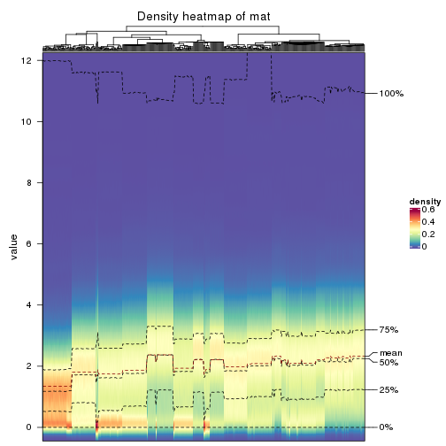


### Suggest the best k


Folowing table shows the best `k` (number of partitions) for each combination
of top-value methods and partition methods. Clicking on the method name in
the table goes to the section for a single combination of methods.

[The cola vignette](http://bioconductor.org/packages/devel/bioc/vignettes/cola/inst/doc/cola.html#toc_13)
explains the definition of the metrics used for determining the best
number of partitions.


```r
suggest_best_k(res_list)
```


|                            | The best k| 1-PAC| Mean silhouette| Concordance|   |Optional k |
|:---------------------------|----------:|-----:|---------------:|-----------:|:--|:----------|
|[MAD:NMF](#MAD-NMF)         |          6| 1.000|           0.994|       0.994|** |2,3,4,5    |
|[ATC:hclust](#ATC-hclust)   |          2| 1.000|           1.000|       1.000|** |           |
|[ATC:skmeans](#ATC-skmeans) |          2| 1.000|           0.999|       1.000|** |           |
|[SD:NMF](#SD-NMF)           |          6| 0.993|           0.975|       0.975|** |3,4        |
|[MAD:hclust](#MAD-hclust)   |          6| 0.988|           0.952|       0.971|** |5          |
|[CV:pam](#CV-pam)           |          6| 0.982|           0.941|       0.972|** |           |
|[MAD:pam](#MAD-pam)         |          6| 0.982|           0.967|       0.983|** |5          |
|[CV:NMF](#CV-NMF)           |          6| 0.962|           0.972|       0.973|** |2,5        |
|[ATC:pam](#ATC-pam)         |          4| 0.948|           0.910|       0.957|*  |2,3        |
|[SD:mclust](#SD-mclust)     |          6| 0.932|           0.961|       0.944|*  |5          |
|[SD:pam](#SD-pam)           |          6| 0.925|           0.915|       0.956|*  |2          |
|[MAD:mclust](#MAD-mclust)   |          6| 0.895|           0.915|       0.935|   |           |
|[CV:skmeans](#CV-skmeans)   |          6| 0.850|           0.899|       0.884|   |           |
|[SD:hclust](#SD-hclust)     |          6| 0.822|           0.915|       0.941|   |           |
|[CV:mclust](#CV-mclust)     |          5| 0.766|           0.813|       0.866|   |           |
|[CV:hclust](#CV-hclust)     |          5| 0.751|           0.905|       0.918|   |           |
|[MAD:skmeans](#MAD-skmeans) |          2| 0.734|           0.927|       0.959|   |           |
|[ATC:mclust](#ATC-mclust)   |          5| 0.731|           0.856|       0.836|   |           |
|[SD:skmeans](#SD-skmeans)   |          3| 0.720|           0.850|       0.913|   |           |
|[ATC:NMF](#ATC-NMF)         |          2| 0.649|           0.905|       0.945|   |           |
|[MAD:kmeans](#MAD-kmeans)   |          6| 0.627|           0.766|       0.740|   |           |
|[ATC:kmeans](#ATC-kmeans)   |          2| 0.466|           0.914|       0.898|   |           |
|[SD:kmeans](#SD-kmeans)     |          5| 0.436|           0.717|       0.671|   |           |
|[CV:kmeans](#CV-kmeans)     |          5| 0.413|           0.627|       0.661|   |           |

\*\*: 1-PAC > 0.95, \*: 1-PAC > 0.9


### CDF of consensus matrices

Cumulative distribution function curves of consensus matrix for all methods.


```r
collect_plots(res_list, fun = plot_ecdf)
```

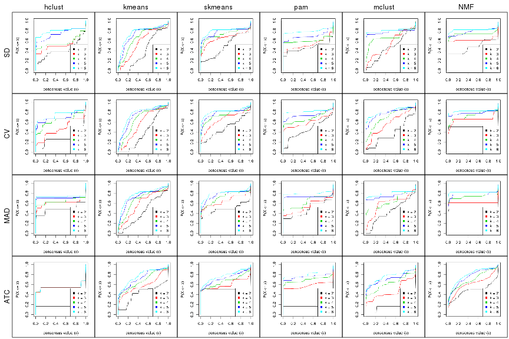


### Consensus heatmap

Consensus heatmaps for all methods. ([What is a consensus heatmap?](http://bioconductor.org/packages/devel/bioc/vignettes/cola/inst/doc/cola.html#toc_9))


<style type='text/css'>


.ui-helper-hidden {
	display: none;
}
.ui-helper-hidden-accessible {
	border: 0;
	clip: rect(0 0 0 0);
	height: 1px;
	margin: -1px;
	overflow: hidden;
	padding: 0;
	position: absolute;
	width: 1px;
}
.ui-helper-reset {
	margin: 0;
	padding: 0;
	border: 0;
	outline: 0;
	line-height: 1.3;
	text-decoration: none;
	font-size: 100%;
	list-style: none;
}
.ui-helper-clearfix:before,
.ui-helper-clearfix:after {
	content: "";
	display: table;
	border-collapse: collapse;
}
.ui-helper-clearfix:after {
	clear: both;
}
.ui-helper-zfix {
	width: 100%;
	height: 100%;
	top: 0;
	left: 0;
	position: absolute;
	opacity: 0;
	filter:Alpha(Opacity=0); 
}

.ui-front {
	z-index: 100;
}


.ui-state-disabled {
	cursor: default !important;
	pointer-events: none;
}


.ui-icon {
	display: inline-block;
	vertical-align: middle;
	margin-top: -.25em;
	position: relative;
	text-indent: -99999px;
	overflow: hidden;
	background-repeat: no-repeat;
}

.ui-widget-icon-block {
	left: 50%;
	margin-left: -8px;
	display: block;
}


.ui-widget-overlay {
	position: fixed;
	top: 0;
	left: 0;
	width: 100%;
	height: 100%;
}
.ui-accordion .ui-accordion-header {
	display: block;
	cursor: pointer;
	position: relative;
	margin: 2px 0 0 0;
	padding: .5em .5em .5em .7em;
	font-size: 100%;
}
.ui-accordion .ui-accordion-content {
	padding: 1em 2.2em;
	border-top: 0;
	overflow: auto;
}
.ui-autocomplete {
	position: absolute;
	top: 0;
	left: 0;
	cursor: default;
}
.ui-menu {
	list-style: none;
	padding: 0;
	margin: 0;
	display: block;
	outline: 0;
}
.ui-menu .ui-menu {
	position: absolute;
}
.ui-menu .ui-menu-item {
	margin: 0;
	cursor: pointer;
	
	list-style-image: url("data:image/gif;base64,R0lGODlhAQABAIAAAAAAAP///yH5BAEAAAAALAAAAAABAAEAAAIBRAA7");
}
.ui-menu .ui-menu-item-wrapper {
	position: relative;
	padding: 3px 1em 3px .4em;
}
.ui-menu .ui-menu-divider {
	margin: 5px 0;
	height: 0;
	font-size: 0;
	line-height: 0;
	border-width: 1px 0 0 0;
}
.ui-menu .ui-state-focus,
.ui-menu .ui-state-active {
	margin: -1px;
}


.ui-menu-icons {
	position: relative;
}
.ui-menu-icons .ui-menu-item-wrapper {
	padding-left: 2em;
}


.ui-menu .ui-icon {
	position: absolute;
	top: 0;
	bottom: 0;
	left: .2em;
	margin: auto 0;
}


.ui-menu .ui-menu-icon {
	left: auto;
	right: 0;
}
.ui-button {
	padding: .4em 1em;
	display: inline-block;
	position: relative;
	line-height: normal;
	margin-right: .1em;
	cursor: pointer;
	vertical-align: middle;
	text-align: center;
	-webkit-user-select: none;
	-moz-user-select: none;
	-ms-user-select: none;
	user-select: none;

	
	overflow: visible;
}

.ui-button,
.ui-button:link,
.ui-button:visited,
.ui-button:hover,
.ui-button:active {
	text-decoration: none;
}


.ui-button-icon-only {
	width: 2em;
	box-sizing: border-box;
	text-indent: -9999px;
	white-space: nowrap;
}


input.ui-button.ui-button-icon-only {
	text-indent: 0;
}


.ui-button-icon-only .ui-icon {
	position: absolute;
	top: 50%;
	left: 50%;
	margin-top: -8px;
	margin-left: -8px;
}

.ui-button.ui-icon-notext .ui-icon {
	padding: 0;
	width: 2.1em;
	height: 2.1em;
	text-indent: -9999px;
	white-space: nowrap;

}

input.ui-button.ui-icon-notext .ui-icon {
	width: auto;
	height: auto;
	text-indent: 0;
	white-space: normal;
	padding: .4em 1em;
}


input.ui-button::-moz-focus-inner,
button.ui-button::-moz-focus-inner {
	border: 0;
	padding: 0;
}
.ui-controlgroup {
	vertical-align: middle;
	display: inline-block;
}
.ui-controlgroup > .ui-controlgroup-item {
	float: left;
	margin-left: 0;
	margin-right: 0;
}
.ui-controlgroup > .ui-controlgroup-item:focus,
.ui-controlgroup > .ui-controlgroup-item.ui-visual-focus {
	z-index: 9999;
}
.ui-controlgroup-vertical > .ui-controlgroup-item {
	display: block;
	float: none;
	width: 100%;
	margin-top: 0;
	margin-bottom: 0;
	text-align: left;
}
.ui-controlgroup-vertical .ui-controlgroup-item {
	box-sizing: border-box;
}
.ui-controlgroup .ui-controlgroup-label {
	padding: .4em 1em;
}
.ui-controlgroup .ui-controlgroup-label span {
	font-size: 80%;
}
.ui-controlgroup-horizontal .ui-controlgroup-label + .ui-controlgroup-item {
	border-left: none;
}
.ui-controlgroup-vertical .ui-controlgroup-label + .ui-controlgroup-item {
	border-top: none;
}
.ui-controlgroup-horizontal .ui-controlgroup-label.ui-widget-content {
	border-right: none;
}
.ui-controlgroup-vertical .ui-controlgroup-label.ui-widget-content {
	border-bottom: none;
}


.ui-controlgroup-vertical .ui-spinner-input {

	
	width: 75%;
	width: calc( 100% - 2.4em );
}
.ui-controlgroup-vertical .ui-spinner .ui-spinner-up {
	border-top-style: solid;
}

.ui-checkboxradio-label .ui-icon-background {
	box-shadow: inset 1px 1px 1px #ccc;
	border-radius: .12em;
	border: none;
}
.ui-checkboxradio-radio-label .ui-icon-background {
	width: 16px;
	height: 16px;
	border-radius: 1em;
	overflow: visible;
	border: none;
}
.ui-checkboxradio-radio-label.ui-checkboxradio-checked .ui-icon,
.ui-checkboxradio-radio-label.ui-checkboxradio-checked:hover .ui-icon {
	background-image: none;
	width: 8px;
	height: 8px;
	border-width: 4px;
	border-style: solid;
}
.ui-checkboxradio-disabled {
	pointer-events: none;
}
.ui-datepicker {
	width: 17em;
	padding: .2em .2em 0;
	display: none;
}
.ui-datepicker .ui-datepicker-header {
	position: relative;
	padding: .2em 0;
}
.ui-datepicker .ui-datepicker-prev,
.ui-datepicker .ui-datepicker-next {
	position: absolute;
	top: 2px;
	width: 1.8em;
	height: 1.8em;
}
.ui-datepicker .ui-datepicker-prev-hover,
.ui-datepicker .ui-datepicker-next-hover {
	top: 1px;
}
.ui-datepicker .ui-datepicker-prev {
	left: 2px;
}
.ui-datepicker .ui-datepicker-next {
	right: 2px;
}
.ui-datepicker .ui-datepicker-prev-hover {
	left: 1px;
}
.ui-datepicker .ui-datepicker-next-hover {
	right: 1px;
}
.ui-datepicker .ui-datepicker-prev span,
.ui-datepicker .ui-datepicker-next span {
	display: block;
	position: absolute;
	left: 50%;
	margin-left: -8px;
	top: 50%;
	margin-top: -8px;
}
.ui-datepicker .ui-datepicker-title {
	margin: 0 2.3em;
	line-height: 1.8em;
	text-align: center;
}
.ui-datepicker .ui-datepicker-title select {
	font-size: 1em;
	margin: 1px 0;
}
.ui-datepicker select.ui-datepicker-month,
.ui-datepicker select.ui-datepicker-year {
	width: 45%;
}
.ui-datepicker table {
	width: 100%;
	font-size: .9em;
	border-collapse: collapse;
	margin: 0 0 .4em;
}
.ui-datepicker th {
	padding: .7em .3em;
	text-align: center;
	font-weight: bold;
	border: 0;
}
.ui-datepicker td {
	border: 0;
	padding: 1px;
}
.ui-datepicker td span,
.ui-datepicker td a {
	display: block;
	padding: .2em;
	text-align: right;
	text-decoration: none;
}
.ui-datepicker .ui-datepicker-buttonpane {
	background-image: none;
	margin: .7em 0 0 0;
	padding: 0 .2em;
	border-left: 0;
	border-right: 0;
	border-bottom: 0;
}
.ui-datepicker .ui-datepicker-buttonpane button {
	float: right;
	margin: .5em .2em .4em;
	cursor: pointer;
	padding: .2em .6em .3em .6em;
	width: auto;
	overflow: visible;
}
.ui-datepicker .ui-datepicker-buttonpane button.ui-datepicker-current {
	float: left;
}


.ui-datepicker.ui-datepicker-multi {
	width: auto;
}
.ui-datepicker-multi .ui-datepicker-group {
	float: left;
}
.ui-datepicker-multi .ui-datepicker-group table {
	width: 95%;
	margin: 0 auto .4em;
}
.ui-datepicker-multi-2 .ui-datepicker-group {
	width: 50%;
}
.ui-datepicker-multi-3 .ui-datepicker-group {
	width: 33.3%;
}
.ui-datepicker-multi-4 .ui-datepicker-group {
	width: 25%;
}
.ui-datepicker-multi .ui-datepicker-group-last .ui-datepicker-header,
.ui-datepicker-multi .ui-datepicker-group-middle .ui-datepicker-header {
	border-left-width: 0;
}
.ui-datepicker-multi .ui-datepicker-buttonpane {
	clear: left;
}
.ui-datepicker-row-break {
	clear: both;
	width: 100%;
	font-size: 0;
}


.ui-datepicker-rtl {
	direction: rtl;
}
.ui-datepicker-rtl .ui-datepicker-prev {
	right: 2px;
	left: auto;
}
.ui-datepicker-rtl .ui-datepicker-next {
	left: 2px;
	right: auto;
}
.ui-datepicker-rtl .ui-datepicker-prev:hover {
	right: 1px;
	left: auto;
}
.ui-datepicker-rtl .ui-datepicker-next:hover {
	left: 1px;
	right: auto;
}
.ui-datepicker-rtl .ui-datepicker-buttonpane {
	clear: right;
}
.ui-datepicker-rtl .ui-datepicker-buttonpane button {
	float: left;
}
.ui-datepicker-rtl .ui-datepicker-buttonpane button.ui-datepicker-current,
.ui-datepicker-rtl .ui-datepicker-group {
	float: right;
}
.ui-datepicker-rtl .ui-datepicker-group-last .ui-datepicker-header,
.ui-datepicker-rtl .ui-datepicker-group-middle .ui-datepicker-header {
	border-right-width: 0;
	border-left-width: 1px;
}


.ui-datepicker .ui-icon {
	display: block;
	text-indent: -99999px;
	overflow: hidden;
	background-repeat: no-repeat;
	left: .5em;
	top: .3em;
}
.ui-dialog {
	position: absolute;
	top: 0;
	left: 0;
	padding: .2em;
	outline: 0;
}
.ui-dialog .ui-dialog-titlebar {
	padding: .4em 1em;
	position: relative;
}
.ui-dialog .ui-dialog-title {
	float: left;
	margin: .1em 0;
	white-space: nowrap;
	width: 90%;
	overflow: hidden;
	text-overflow: ellipsis;
}
.ui-dialog .ui-dialog-titlebar-close {
	position: absolute;
	right: .3em;
	top: 50%;
	width: 20px;
	margin: -10px 0 0 0;
	padding: 1px;
	height: 20px;
}
.ui-dialog .ui-dialog-content {
	position: relative;
	border: 0;
	padding: .5em 1em;
	background: none;
	overflow: auto;
}
.ui-dialog .ui-dialog-buttonpane {
	text-align: left;
	border-width: 1px 0 0 0;
	background-image: none;
	margin-top: .5em;
	padding: .3em 1em .5em .4em;
}
.ui-dialog .ui-dialog-buttonpane .ui-dialog-buttonset {
	float: right;
}
.ui-dialog .ui-dialog-buttonpane button {
	margin: .5em .4em .5em 0;
	cursor: pointer;
}
.ui-dialog .ui-resizable-n {
	height: 2px;
	top: 0;
}
.ui-dialog .ui-resizable-e {
	width: 2px;
	right: 0;
}
.ui-dialog .ui-resizable-s {
	height: 2px;
	bottom: 0;
}
.ui-dialog .ui-resizable-w {
	width: 2px;
	left: 0;
}
.ui-dialog .ui-resizable-se,
.ui-dialog .ui-resizable-sw,
.ui-dialog .ui-resizable-ne,
.ui-dialog .ui-resizable-nw {
	width: 7px;
	height: 7px;
}
.ui-dialog .ui-resizable-se {
	right: 0;
	bottom: 0;
}
.ui-dialog .ui-resizable-sw {
	left: 0;
	bottom: 0;
}
.ui-dialog .ui-resizable-ne {
	right: 0;
	top: 0;
}
.ui-dialog .ui-resizable-nw {
	left: 0;
	top: 0;
}
.ui-draggable .ui-dialog-titlebar {
	cursor: move;
}
.ui-draggable-handle {
	-ms-touch-action: none;
	touch-action: none;
}
.ui-resizable {
	position: relative;
}
.ui-resizable-handle {
	position: absolute;
	font-size: 0.1px;
	display: block;
	-ms-touch-action: none;
	touch-action: none;
}
.ui-resizable-disabled .ui-resizable-handle,
.ui-resizable-autohide .ui-resizable-handle {
	display: none;
}
.ui-resizable-n {
	cursor: n-resize;
	height: 7px;
	width: 100%;
	top: -5px;
	left: 0;
}
.ui-resizable-s {
	cursor: s-resize;
	height: 7px;
	width: 100%;
	bottom: -5px;
	left: 0;
}
.ui-resizable-e {
	cursor: e-resize;
	width: 7px;
	right: -5px;
	top: 0;
	height: 100%;
}
.ui-resizable-w {
	cursor: w-resize;
	width: 7px;
	left: -5px;
	top: 0;
	height: 100%;
}
.ui-resizable-se {
	cursor: se-resize;
	width: 12px;
	height: 12px;
	right: 1px;
	bottom: 1px;
}
.ui-resizable-sw {
	cursor: sw-resize;
	width: 9px;
	height: 9px;
	left: -5px;
	bottom: -5px;
}
.ui-resizable-nw {
	cursor: nw-resize;
	width: 9px;
	height: 9px;
	left: -5px;
	top: -5px;
}
.ui-resizable-ne {
	cursor: ne-resize;
	width: 9px;
	height: 9px;
	right: -5px;
	top: -5px;
}
.ui-progressbar {
	height: 2em;
	text-align: left;
	overflow: hidden;
}
.ui-progressbar .ui-progressbar-value {
	margin: -1px;
	height: 100%;
}
.ui-progressbar .ui-progressbar-overlay {
	background: url("");
	height: 100%;
	filter: alpha(opacity=25); 
	opacity: 0.25;
}
.ui-progressbar-indeterminate .ui-progressbar-value {
	background-image: none;
}
.ui-selectable {
	-ms-touch-action: none;
	touch-action: none;
}
.ui-selectable-helper {
	position: absolute;
	z-index: 100;
	border: 1px dotted black;
}
.ui-selectmenu-menu {
	padding: 0;
	margin: 0;
	position: absolute;
	top: 0;
	left: 0;
	display: none;
}
.ui-selectmenu-menu .ui-menu {
	overflow: auto;
	overflow-x: hidden;
	padding-bottom: 1px;
}
.ui-selectmenu-menu .ui-menu .ui-selectmenu-optgroup {
	font-size: 1em;
	font-weight: bold;
	line-height: 1.5;
	padding: 2px 0.4em;
	margin: 0.5em 0 0 0;
	height: auto;
	border: 0;
}
.ui-selectmenu-open {
	display: block;
}
.ui-selectmenu-text {
	display: block;
	margin-right: 20px;
	overflow: hidden;
	text-overflow: ellipsis;
}
.ui-selectmenu-button.ui-button {
	text-align: left;
	white-space: nowrap;
	width: 14em;
}
.ui-selectmenu-icon.ui-icon {
	float: right;
	margin-top: 0;
}
.ui-slider {
	position: relative;
	text-align: left;
}
.ui-slider .ui-slider-handle {
	position: absolute;
	z-index: 2;
	width: 1.2em;
	height: 1.2em;
	cursor: default;
	-ms-touch-action: none;
	touch-action: none;
}
.ui-slider .ui-slider-range {
	position: absolute;
	z-index: 1;
	font-size: .7em;
	display: block;
	border: 0;
	background-position: 0 0;
}


.ui-slider.ui-state-disabled .ui-slider-handle,
.ui-slider.ui-state-disabled .ui-slider-range {
	filter: inherit;
}

.ui-slider-horizontal {
	height: .8em;
}
.ui-slider-horizontal .ui-slider-handle {
	top: -.3em;
	margin-left: -.6em;
}
.ui-slider-horizontal .ui-slider-range {
	top: 0;
	height: 100%;
}
.ui-slider-horizontal .ui-slider-range-min {
	left: 0;
}
.ui-slider-horizontal .ui-slider-range-max {
	right: 0;
}

.ui-slider-vertical {
	width: .8em;
	height: 100px;
}
.ui-slider-vertical .ui-slider-handle {
	left: -.3em;
	margin-left: 0;
	margin-bottom: -.6em;
}
.ui-slider-vertical .ui-slider-range {
	left: 0;
	width: 100%;
}
.ui-slider-vertical .ui-slider-range-min {
	bottom: 0;
}
.ui-slider-vertical .ui-slider-range-max {
	top: 0;
}
.ui-sortable-handle {
	-ms-touch-action: none;
	touch-action: none;
}
.ui-spinner {
	position: relative;
	display: inline-block;
	overflow: hidden;
	padding: 0;
	vertical-align: middle;
}
.ui-spinner-input {
	border: none;
	background: none;
	color: inherit;
	padding: .222em 0;
	margin: .2em 0;
	vertical-align: middle;
	margin-left: .4em;
	margin-right: 2em;
}
.ui-spinner-button {
	width: 1.6em;
	height: 50%;
	font-size: .5em;
	padding: 0;
	margin: 0;
	text-align: center;
	position: absolute;
	cursor: default;
	display: block;
	overflow: hidden;
	right: 0;
}

.ui-spinner a.ui-spinner-button {
	border-top-style: none;
	border-bottom-style: none;
	border-right-style: none;
}
.ui-spinner-up {
	top: 0;
}
.ui-spinner-down {
	bottom: 0;
}
.ui-tabs {
	position: relative;
	padding: .2em;
}
.ui-tabs .ui-tabs-nav {
	margin: 0;
	padding: .2em .2em 0;
}
.ui-tabs .ui-tabs-nav li {
	list-style: none;
	float: left;
	position: relative;
	top: 0;
	margin: 1px .2em 0 0;
	border-bottom-width: 0;
	padding: 0;
	white-space: nowrap;
}
.ui-tabs .ui-tabs-nav .ui-tabs-anchor {
	float: left;
	padding: .5em 1em;
	text-decoration: none;
}
.ui-tabs .ui-tabs-nav li.ui-tabs-active {
	margin-bottom: -1px;
	padding-bottom: 1px;
}
.ui-tabs .ui-tabs-nav li.ui-tabs-active .ui-tabs-anchor,
.ui-tabs .ui-tabs-nav li.ui-state-disabled .ui-tabs-anchor,
.ui-tabs .ui-tabs-nav li.ui-tabs-loading .ui-tabs-anchor {
	cursor: text;
}
.ui-tabs-collapsible .ui-tabs-nav li.ui-tabs-active .ui-tabs-anchor {
	cursor: pointer;
}
.ui-tabs .ui-tabs-panel {
	display: block;
	border-width: 0;
	padding: 1em 1.4em;
	background: none;
}
.ui-tooltip {
	padding: 8px;
	position: absolute;
	z-index: 9999;
	max-width: 300px;
}
body .ui-tooltip {
	border-width: 2px;
}

.ui-widget {
	font-family: Arial,Helvetica,sans-serif;
	font-size: 1em;
}
.ui-widget .ui-widget {
	font-size: 1em;
}
.ui-widget input,
.ui-widget select,
.ui-widget textarea,
.ui-widget button {
	font-family: Arial,Helvetica,sans-serif;
	font-size: 1em;
}
.ui-widget.ui-widget-content {
	border: 1px solid #c5c5c5;
}
.ui-widget-content {
	border: 1px solid #dddddd;
	background: #ffffff;
	color: #333333;
}
.ui-widget-content a {
	color: #333333;
}
.ui-widget-header {
	border: 1px solid #dddddd;
	background: #e9e9e9;
	color: #333333;
	font-weight: bold;
}
.ui-widget-header a {
	color: #333333;
}


.ui-state-default,
.ui-widget-content .ui-state-default,
.ui-widget-header .ui-state-default,
.ui-button,


html .ui-button.ui-state-disabled:hover,
html .ui-button.ui-state-disabled:active {
	border: 1px solid #c5c5c5;
	background: #f6f6f6;
	font-weight: normal;
	color: #454545;
}
.ui-state-default a,
.ui-state-default a:link,
.ui-state-default a:visited,
a.ui-button,
a:link.ui-button,
a:visited.ui-button,
.ui-button {
	color: #454545;
	text-decoration: none;
}
.ui-state-hover,
.ui-widget-content .ui-state-hover,
.ui-widget-header .ui-state-hover,
.ui-state-focus,
.ui-widget-content .ui-state-focus,
.ui-widget-header .ui-state-focus,
.ui-button:hover,
.ui-button:focus {
	border: 1px solid #cccccc;
	background: #ededed;
	font-weight: normal;
	color: #2b2b2b;
}
.ui-state-hover a,
.ui-state-hover a:hover,
.ui-state-hover a:link,
.ui-state-hover a:visited,
.ui-state-focus a,
.ui-state-focus a:hover,
.ui-state-focus a:link,
.ui-state-focus a:visited,
a.ui-button:hover,
a.ui-button:focus {
	color: #2b2b2b;
	text-decoration: none;
}

.ui-visual-focus {
	box-shadow: 0 0 3px 1px rgb(94, 158, 214);
}
.ui-state-active,
.ui-widget-content .ui-state-active,
.ui-widget-header .ui-state-active,
a.ui-button:active,
.ui-button:active,
.ui-button.ui-state-active:hover {
	border: 1px solid #003eff;
	background: #007fff;
	font-weight: normal;
	color: #ffffff;
}
.ui-icon-background,
.ui-state-active .ui-icon-background {
	border: #003eff;
	background-color: #ffffff;
}
.ui-state-active a,
.ui-state-active a:link,
.ui-state-active a:visited {
	color: #ffffff;
	text-decoration: none;
}


.ui-state-highlight,
.ui-widget-content .ui-state-highlight,
.ui-widget-header .ui-state-highlight {
	border: 1px solid #dad55e;
	background: #fffa90;
	color: #777620;
}
.ui-state-checked {
	border: 1px solid #dad55e;
	background: #fffa90;
}
.ui-state-highlight a,
.ui-widget-content .ui-state-highlight a,
.ui-widget-header .ui-state-highlight a {
	color: #777620;
}
.ui-state-error,
.ui-widget-content .ui-state-error,
.ui-widget-header .ui-state-error {
	border: 1px solid #f1a899;
	background: #fddfdf;
	color: #5f3f3f;
}
.ui-state-error a,
.ui-widget-content .ui-state-error a,
.ui-widget-header .ui-state-error a {
	color: #5f3f3f;
}
.ui-state-error-text,
.ui-widget-content .ui-state-error-text,
.ui-widget-header .ui-state-error-text {
	color: #5f3f3f;
}
.ui-priority-primary,
.ui-widget-content .ui-priority-primary,
.ui-widget-header .ui-priority-primary {
	font-weight: bold;
}
.ui-priority-secondary,
.ui-widget-content .ui-priority-secondary,
.ui-widget-header .ui-priority-secondary {
	opacity: .7;
	filter:Alpha(Opacity=70); 
	font-weight: normal;
}
.ui-state-disabled,
.ui-widget-content .ui-state-disabled,
.ui-widget-header .ui-state-disabled {
	opacity: .35;
	filter:Alpha(Opacity=35); 
	background-image: none;
}
.ui-state-disabled .ui-icon {
	filter:Alpha(Opacity=35); 
}


.ui-icon {
	width: 16px;
	height: 16px;
}
.ui-icon,
.ui-widget-content .ui-icon {
	background-image: url("images/ui-icons_444444_256x240.png");
}
.ui-widget-header .ui-icon {
	background-image: url("images/ui-icons_444444_256x240.png");
}
.ui-state-hover .ui-icon,
.ui-state-focus .ui-icon,
.ui-button:hover .ui-icon,
.ui-button:focus .ui-icon {
	background-image: url("images/ui-icons_555555_256x240.png");
}
.ui-state-active .ui-icon,
.ui-button:active .ui-icon {
	background-image: url("images/ui-icons_ffffff_256x240.png");
}
.ui-state-highlight .ui-icon,
.ui-button .ui-state-highlight.ui-icon {
	background-image: url("images/ui-icons_777620_256x240.png");
}
.ui-state-error .ui-icon,
.ui-state-error-text .ui-icon {
	background-image: url("images/ui-icons_cc0000_256x240.png");
}
.ui-button .ui-icon {
	background-image: url("images/ui-icons_777777_256x240.png");
}


.ui-icon-blank { background-position: 16px 16px; }
.ui-icon-caret-1-n { background-position: 0 0; }
.ui-icon-caret-1-ne { background-position: -16px 0; }
.ui-icon-caret-1-e { background-position: -32px 0; }
.ui-icon-caret-1-se { background-position: -48px 0; }
.ui-icon-caret-1-s { background-position: -65px 0; }
.ui-icon-caret-1-sw { background-position: -80px 0; }
.ui-icon-caret-1-w { background-position: -96px 0; }
.ui-icon-caret-1-nw { background-position: -112px 0; }
.ui-icon-caret-2-n-s { background-position: -128px 0; }
.ui-icon-caret-2-e-w { background-position: -144px 0; }
.ui-icon-triangle-1-n { background-position: 0 -16px; }
.ui-icon-triangle-1-ne { background-position: -16px -16px; }
.ui-icon-triangle-1-e { background-position: -32px -16px; }
.ui-icon-triangle-1-se { background-position: -48px -16px; }
.ui-icon-triangle-1-s { background-position: -65px -16px; }
.ui-icon-triangle-1-sw { background-position: -80px -16px; }
.ui-icon-triangle-1-w { background-position: -96px -16px; }
.ui-icon-triangle-1-nw { background-position: -112px -16px; }
.ui-icon-triangle-2-n-s { background-position: -128px -16px; }
.ui-icon-triangle-2-e-w { background-position: -144px -16px; }
.ui-icon-arrow-1-n { background-position: 0 -32px; }
.ui-icon-arrow-1-ne { background-position: -16px -32px; }
.ui-icon-arrow-1-e { background-position: -32px -32px; }
.ui-icon-arrow-1-se { background-position: -48px -32px; }
.ui-icon-arrow-1-s { background-position: -65px -32px; }
.ui-icon-arrow-1-sw { background-position: -80px -32px; }
.ui-icon-arrow-1-w { background-position: -96px -32px; }
.ui-icon-arrow-1-nw { background-position: -112px -32px; }
.ui-icon-arrow-2-n-s { background-position: -128px -32px; }
.ui-icon-arrow-2-ne-sw { background-position: -144px -32px; }
.ui-icon-arrow-2-e-w { background-position: -160px -32px; }
.ui-icon-arrow-2-se-nw { background-position: -176px -32px; }
.ui-icon-arrowstop-1-n { background-position: -192px -32px; }
.ui-icon-arrowstop-1-e { background-position: -208px -32px; }
.ui-icon-arrowstop-1-s { background-position: -224px -32px; }
.ui-icon-arrowstop-1-w { background-position: -240px -32px; }
.ui-icon-arrowthick-1-n { background-position: 1px -48px; }
.ui-icon-arrowthick-1-ne { background-position: -16px -48px; }
.ui-icon-arrowthick-1-e { background-position: -32px -48px; }
.ui-icon-arrowthick-1-se { background-position: -48px -48px; }
.ui-icon-arrowthick-1-s { background-position: -64px -48px; }
.ui-icon-arrowthick-1-sw { background-position: -80px -48px; }
.ui-icon-arrowthick-1-w { background-position: -96px -48px; }
.ui-icon-arrowthick-1-nw { background-position: -112px -48px; }
.ui-icon-arrowthick-2-n-s { background-position: -128px -48px; }
.ui-icon-arrowthick-2-ne-sw { background-position: -144px -48px; }
.ui-icon-arrowthick-2-e-w { background-position: -160px -48px; }
.ui-icon-arrowthick-2-se-nw { background-position: -176px -48px; }
.ui-icon-arrowthickstop-1-n { background-position: -192px -48px; }
.ui-icon-arrowthickstop-1-e { background-position: -208px -48px; }
.ui-icon-arrowthickstop-1-s { background-position: -224px -48px; }
.ui-icon-arrowthickstop-1-w { background-position: -240px -48px; }
.ui-icon-arrowreturnthick-1-w { background-position: 0 -64px; }
.ui-icon-arrowreturnthick-1-n { background-position: -16px -64px; }
.ui-icon-arrowreturnthick-1-e { background-position: -32px -64px; }
.ui-icon-arrowreturnthick-1-s { background-position: -48px -64px; }
.ui-icon-arrowreturn-1-w { background-position: -64px -64px; }
.ui-icon-arrowreturn-1-n { background-position: -80px -64px; }
.ui-icon-arrowreturn-1-e { background-position: -96px -64px; }
.ui-icon-arrowreturn-1-s { background-position: -112px -64px; }
.ui-icon-arrowrefresh-1-w { background-position: -128px -64px; }
.ui-icon-arrowrefresh-1-n { background-position: -144px -64px; }
.ui-icon-arrowrefresh-1-e { background-position: -160px -64px; }
.ui-icon-arrowrefresh-1-s { background-position: -176px -64px; }
.ui-icon-arrow-4 { background-position: 0 -80px; }
.ui-icon-arrow-4-diag { background-position: -16px -80px; }
.ui-icon-extlink { background-position: -32px -80px; }
.ui-icon-newwin { background-position: -48px -80px; }
.ui-icon-refresh { background-position: -64px -80px; }
.ui-icon-shuffle { background-position: -80px -80px; }
.ui-icon-transfer-e-w { background-position: -96px -80px; }
.ui-icon-transferthick-e-w { background-position: -112px -80px; }
.ui-icon-folder-collapsed { background-position: 0 -96px; }
.ui-icon-folder-open { background-position: -16px -96px; }
.ui-icon-document { background-position: -32px -96px; }
.ui-icon-document-b { background-position: -48px -96px; }
.ui-icon-note { background-position: -64px -96px; }
.ui-icon-mail-closed { background-position: -80px -96px; }
.ui-icon-mail-open { background-position: -96px -96px; }
.ui-icon-suitcase { background-position: -112px -96px; }
.ui-icon-comment { background-position: -128px -96px; }
.ui-icon-person { background-position: -144px -96px; }
.ui-icon-print { background-position: -160px -96px; }
.ui-icon-trash { background-position: -176px -96px; }
.ui-icon-locked { background-position: -192px -96px; }
.ui-icon-unlocked { background-position: -208px -96px; }
.ui-icon-bookmark { background-position: -224px -96px; }
.ui-icon-tag { background-position: -240px -96px; }
.ui-icon-home { background-position: 0 -112px; }
.ui-icon-flag { background-position: -16px -112px; }
.ui-icon-calendar { background-position: -32px -112px; }
.ui-icon-cart { background-position: -48px -112px; }
.ui-icon-pencil { background-position: -64px -112px; }
.ui-icon-clock { background-position: -80px -112px; }
.ui-icon-disk { background-position: -96px -112px; }
.ui-icon-calculator { background-position: -112px -112px; }
.ui-icon-zoomin { background-position: -128px -112px; }
.ui-icon-zoomout { background-position: -144px -112px; }
.ui-icon-search { background-position: -160px -112px; }
.ui-icon-wrench { background-position: -176px -112px; }
.ui-icon-gear { background-position: -192px -112px; }
.ui-icon-heart { background-position: -208px -112px; }
.ui-icon-star { background-position: -224px -112px; }
.ui-icon-link { background-position: -240px -112px; }
.ui-icon-cancel { background-position: 0 -128px; }
.ui-icon-plus { background-position: -16px -128px; }
.ui-icon-plusthick { background-position: -32px -128px; }
.ui-icon-minus { background-position: -48px -128px; }
.ui-icon-minusthick { background-position: -64px -128px; }
.ui-icon-close { background-position: -80px -128px; }
.ui-icon-closethick { background-position: -96px -128px; }
.ui-icon-key { background-position: -112px -128px; }
.ui-icon-lightbulb { background-position: -128px -128px; }
.ui-icon-scissors { background-position: -144px -128px; }
.ui-icon-clipboard { background-position: -160px -128px; }
.ui-icon-copy { background-position: -176px -128px; }
.ui-icon-contact { background-position: -192px -128px; }
.ui-icon-image { background-position: -208px -128px; }
.ui-icon-video { background-position: -224px -128px; }
.ui-icon-script { background-position: -240px -128px; }
.ui-icon-alert { background-position: 0 -144px; }
.ui-icon-info { background-position: -16px -144px; }
.ui-icon-notice { background-position: -32px -144px; }
.ui-icon-help { background-position: -48px -144px; }
.ui-icon-check { background-position: -64px -144px; }
.ui-icon-bullet { background-position: -80px -144px; }
.ui-icon-radio-on { background-position: -96px -144px; }
.ui-icon-radio-off { background-position: -112px -144px; }
.ui-icon-pin-w { background-position: -128px -144px; }
.ui-icon-pin-s { background-position: -144px -144px; }
.ui-icon-play { background-position: 0 -160px; }
.ui-icon-pause { background-position: -16px -160px; }
.ui-icon-seek-next { background-position: -32px -160px; }
.ui-icon-seek-prev { background-position: -48px -160px; }
.ui-icon-seek-end { background-position: -64px -160px; }
.ui-icon-seek-start { background-position: -80px -160px; }

.ui-icon-seek-first { background-position: -80px -160px; }
.ui-icon-stop { background-position: -96px -160px; }
.ui-icon-eject { background-position: -112px -160px; }
.ui-icon-volume-off { background-position: -128px -160px; }
.ui-icon-volume-on { background-position: -144px -160px; }
.ui-icon-power { background-position: 0 -176px; }
.ui-icon-signal-diag { background-position: -16px -176px; }
.ui-icon-signal { background-position: -32px -176px; }
.ui-icon-battery-0 { background-position: -48px -176px; }
.ui-icon-battery-1 { background-position: -64px -176px; }
.ui-icon-battery-2 { background-position: -80px -176px; }
.ui-icon-battery-3 { background-position: -96px -176px; }
.ui-icon-circle-plus { background-position: 0 -192px; }
.ui-icon-circle-minus { background-position: -16px -192px; }
.ui-icon-circle-close { background-position: -32px -192px; }
.ui-icon-circle-triangle-e { background-position: -48px -192px; }
.ui-icon-circle-triangle-s { background-position: -64px -192px; }
.ui-icon-circle-triangle-w { background-position: -80px -192px; }
.ui-icon-circle-triangle-n { background-position: -96px -192px; }
.ui-icon-circle-arrow-e { background-position: -112px -192px; }
.ui-icon-circle-arrow-s { background-position: -128px -192px; }
.ui-icon-circle-arrow-w { background-position: -144px -192px; }
.ui-icon-circle-arrow-n { background-position: -160px -192px; }
.ui-icon-circle-zoomin { background-position: -176px -192px; }
.ui-icon-circle-zoomout { background-position: -192px -192px; }
.ui-icon-circle-check { background-position: -208px -192px; }
.ui-icon-circlesmall-plus { background-position: 0 -208px; }
.ui-icon-circlesmall-minus { background-position: -16px -208px; }
.ui-icon-circlesmall-close { background-position: -32px -208px; }
.ui-icon-squaresmall-plus { background-position: -48px -208px; }
.ui-icon-squaresmall-minus { background-position: -64px -208px; }
.ui-icon-squaresmall-close { background-position: -80px -208px; }
.ui-icon-grip-dotted-vertical { background-position: 0 -224px; }
.ui-icon-grip-dotted-horizontal { background-position: -16px -224px; }
.ui-icon-grip-solid-vertical { background-position: -32px -224px; }
.ui-icon-grip-solid-horizontal { background-position: -48px -224px; }
.ui-icon-gripsmall-diagonal-se { background-position: -64px -224px; }
.ui-icon-grip-diagonal-se { background-position: -80px -224px; }


.ui-corner-all,
.ui-corner-top,
.ui-corner-left,
.ui-corner-tl {
	border-top-left-radius: 3px;
}
.ui-corner-all,
.ui-corner-top,
.ui-corner-right,
.ui-corner-tr {
	border-top-right-radius: 3px;
}
.ui-corner-all,
.ui-corner-bottom,
.ui-corner-left,
.ui-corner-bl {
	border-bottom-left-radius: 3px;
}
.ui-corner-all,
.ui-corner-bottom,
.ui-corner-right,
.ui-corner-br {
	border-bottom-right-radius: 3px;
}


.ui-widget-overlay {
	background: #aaaaaa;
	opacity: .3;
	filter: Alpha(Opacity=30); 
}
.ui-widget-shadow {
	-webkit-box-shadow: 0px 0px 5px #666666;
	box-shadow: 0px 0px 5px #666666;
} 
</style>
<script src='js/jquery-1.12.4.js'></script>
<script src='js/jquery-ui.js'></script>

<script>
$( function() {
	$( '#tabs-collect-consensus-heatmap' ).tabs();
} );
</script>
<div id='tabs-collect-consensus-heatmap'>
<ul>
<li><a href='#tab-collect-consensus-heatmap-1'>k = 2</a></li>
<li><a href='#tab-collect-consensus-heatmap-2'>k = 3</a></li>
<li><a href='#tab-collect-consensus-heatmap-3'>k = 4</a></li>
<li><a href='#tab-collect-consensus-heatmap-4'>k = 5</a></li>
<li><a href='#tab-collect-consensus-heatmap-5'>k = 6</a></li>
</ul>
<div id='tab-collect-consensus-heatmap-1'>
<pre><code class="r">collect_plots(res_list, k = 2, fun = consensus_heatmap, mc.cores = 4)
</code></pre>

<p>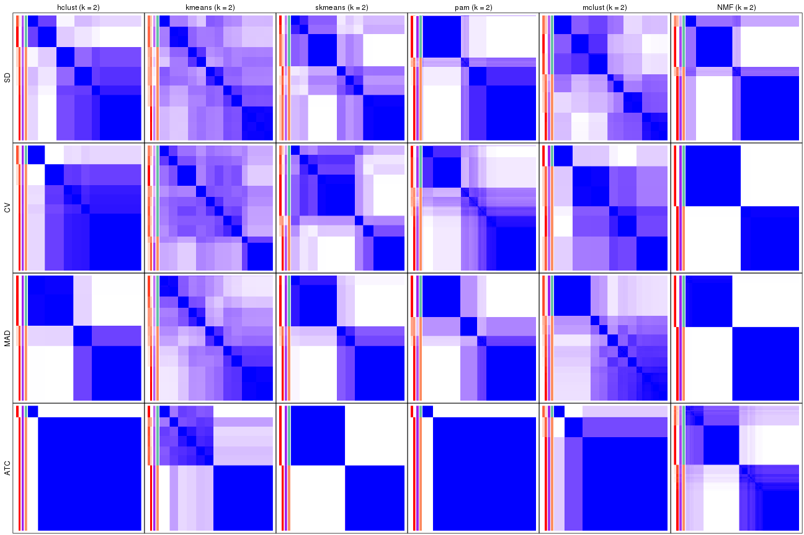</p>

</div>
<div id='tab-collect-consensus-heatmap-2'>
<pre><code class="r">collect_plots(res_list, k = 3, fun = consensus_heatmap, mc.cores = 4)
</code></pre>

<p>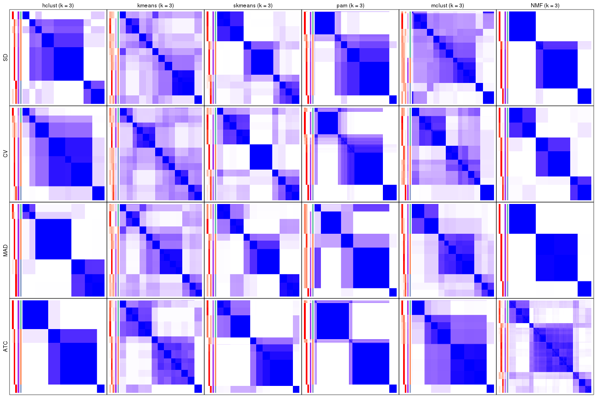</p>

</div>
<div id='tab-collect-consensus-heatmap-3'>
<pre><code class="r">collect_plots(res_list, k = 4, fun = consensus_heatmap, mc.cores = 4)
</code></pre>

<p>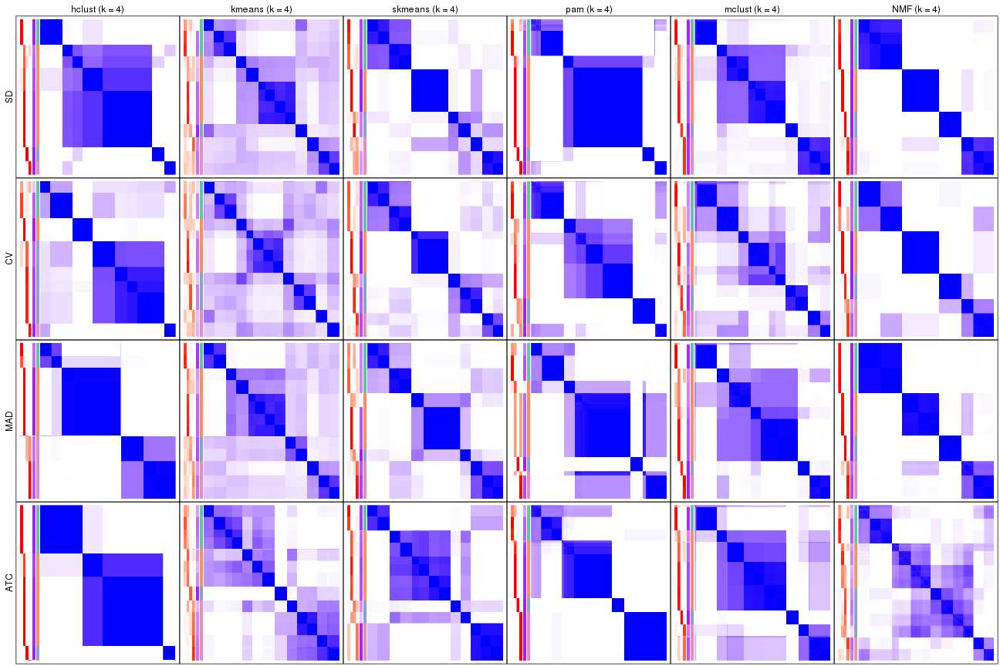</p>

</div>
<div id='tab-collect-consensus-heatmap-4'>
<pre><code class="r">collect_plots(res_list, k = 5, fun = consensus_heatmap, mc.cores = 4)
</code></pre>

<p>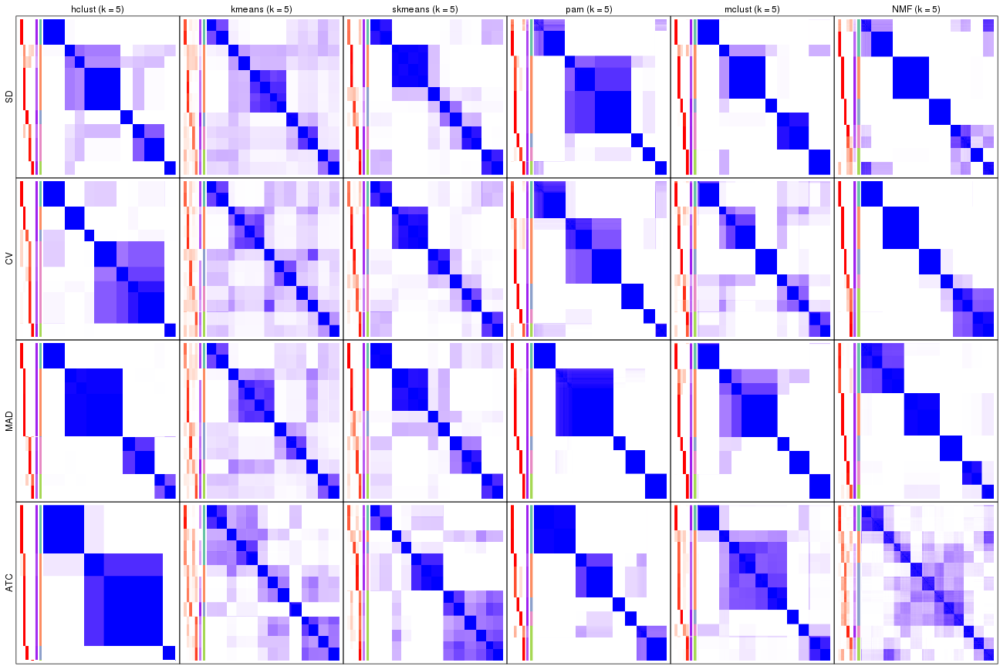</p>

</div>
<div id='tab-collect-consensus-heatmap-5'>
<pre><code class="r">collect_plots(res_list, k = 6, fun = consensus_heatmap, mc.cores = 4)
</code></pre>

<p>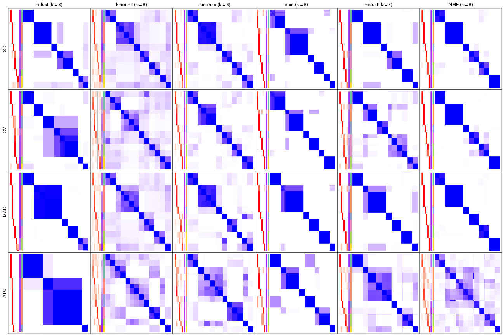</p>

</div>
</div>


### Membership heatmap

Membership heatmaps for all methods. ([What is a membership heatmap?](http://bioconductor.org/packages/devel/bioc/vignettes/cola/inst/doc/cola.html#toc_12))


<script>
$( function() {
	$( '#tabs-collect-membership-heatmap' ).tabs();
} );
</script>
<div id='tabs-collect-membership-heatmap'>
<ul>
<li><a href='#tab-collect-membership-heatmap-1'>k = 2</a></li>
<li><a href='#tab-collect-membership-heatmap-2'>k = 3</a></li>
<li><a href='#tab-collect-membership-heatmap-3'>k = 4</a></li>
<li><a href='#tab-collect-membership-heatmap-4'>k = 5</a></li>
<li><a href='#tab-collect-membership-heatmap-5'>k = 6</a></li>
</ul>
<div id='tab-collect-membership-heatmap-1'>
<pre><code class="r">collect_plots(res_list, k = 2, fun = membership_heatmap, mc.cores = 4)
</code></pre>

<p>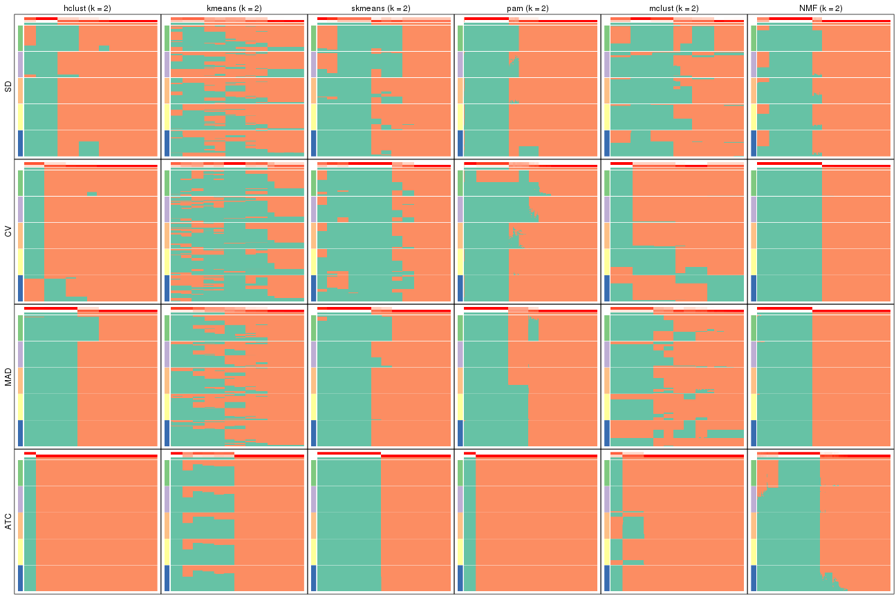</p>

</div>
<div id='tab-collect-membership-heatmap-2'>
<pre><code class="r">collect_plots(res_list, k = 3, fun = membership_heatmap, mc.cores = 4)
</code></pre>

<p>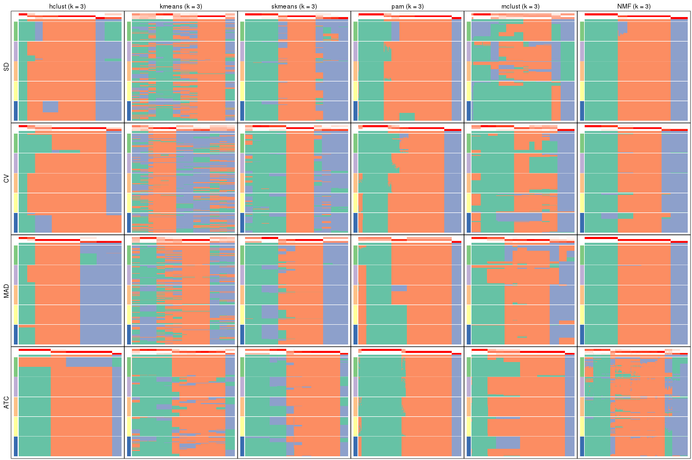</p>

</div>
<div id='tab-collect-membership-heatmap-3'>
<pre><code class="r">collect_plots(res_list, k = 4, fun = membership_heatmap, mc.cores = 4)
</code></pre>

<p>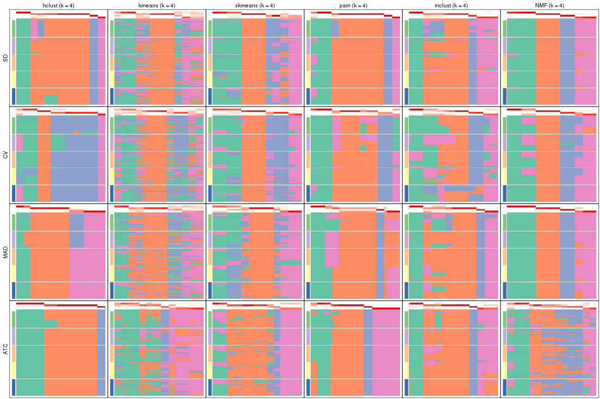</p>

</div>
<div id='tab-collect-membership-heatmap-4'>
<pre><code class="r">collect_plots(res_list, k = 5, fun = membership_heatmap, mc.cores = 4)
</code></pre>

<p>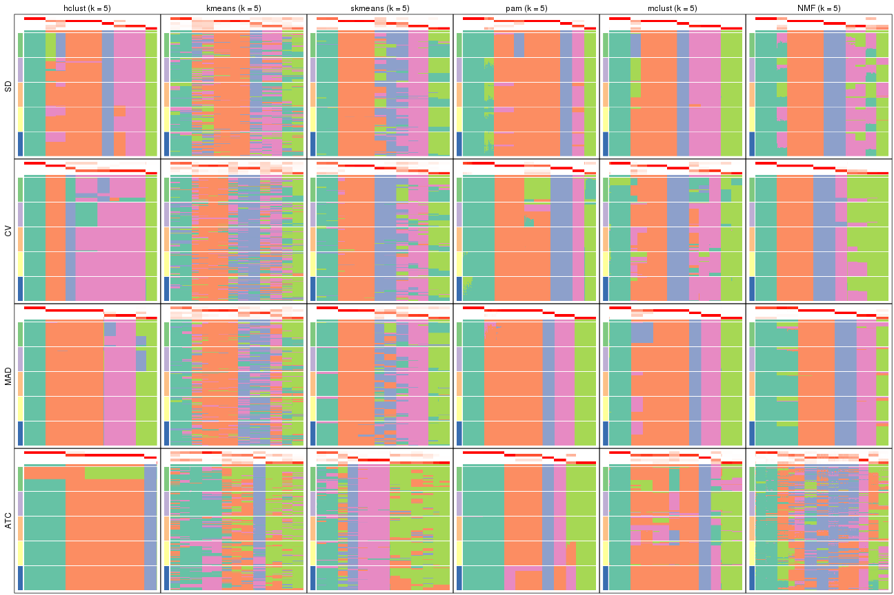</p>

</div>
<div id='tab-collect-membership-heatmap-5'>
<pre><code class="r">collect_plots(res_list, k = 6, fun = membership_heatmap, mc.cores = 4)
</code></pre>

<p>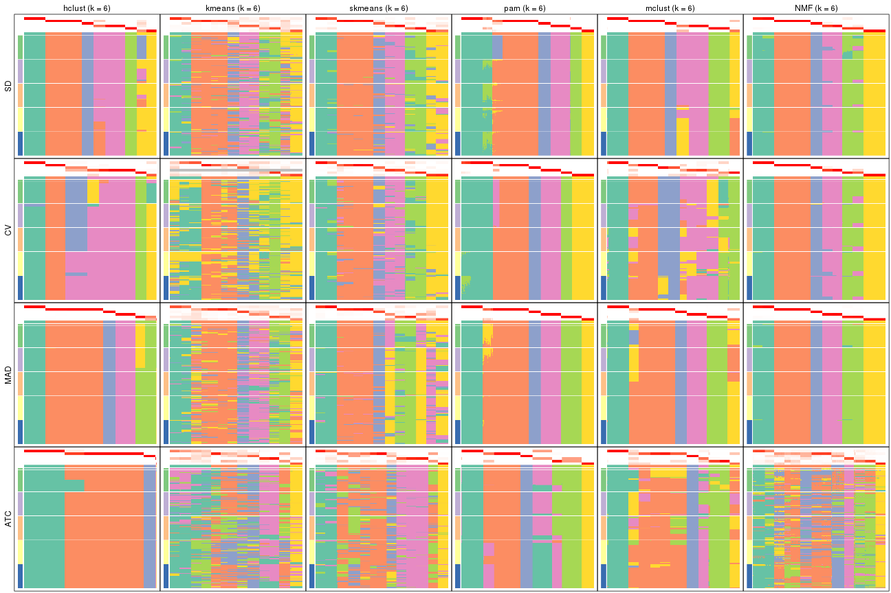</p>

</div>
</div>


### Signature heatmap

Signature heatmaps for all methods. ([What is a signature heatmap?](http://bioconductor.org/packages/devel/bioc/vignettes/cola/inst/doc/cola.html#toc_22))


Note in following heatmaps, rows are scaled.


<script>
$( function() {
	$( '#tabs-collect-get-signatures' ).tabs();
} );
</script>
<div id='tabs-collect-get-signatures'>
<ul>
<li><a href='#tab-collect-get-signatures-1'>k = 2</a></li>
<li><a href='#tab-collect-get-signatures-2'>k = 3</a></li>
<li><a href='#tab-collect-get-signatures-3'>k = 4</a></li>
<li><a href='#tab-collect-get-signatures-4'>k = 5</a></li>
<li><a href='#tab-collect-get-signatures-5'>k = 6</a></li>
</ul>
<div id='tab-collect-get-signatures-1'>
<pre><code class="r">collect_plots(res_list, k = 2, fun = get_signatures, mc.cores = 4)
</code></pre>

<p>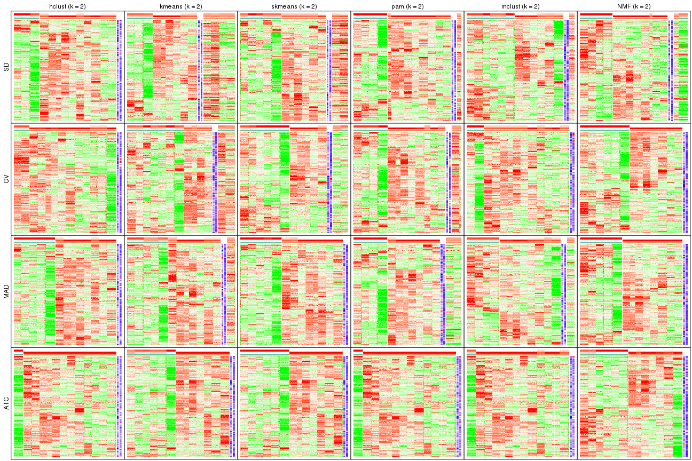</p>

</div>
<div id='tab-collect-get-signatures-2'>
<pre><code class="r">collect_plots(res_list, k = 3, fun = get_signatures, mc.cores = 4)
</code></pre>

<p>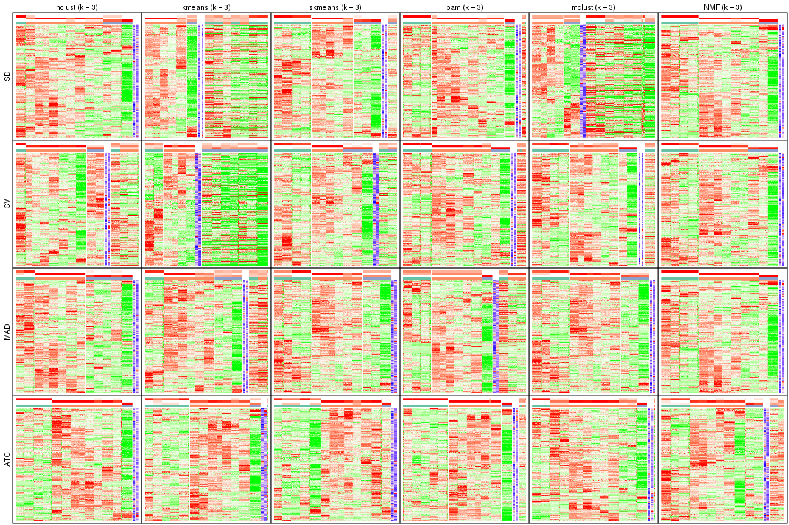</p>

</div>
<div id='tab-collect-get-signatures-3'>
<pre><code class="r">collect_plots(res_list, k = 4, fun = get_signatures, mc.cores = 4)
</code></pre>

<p>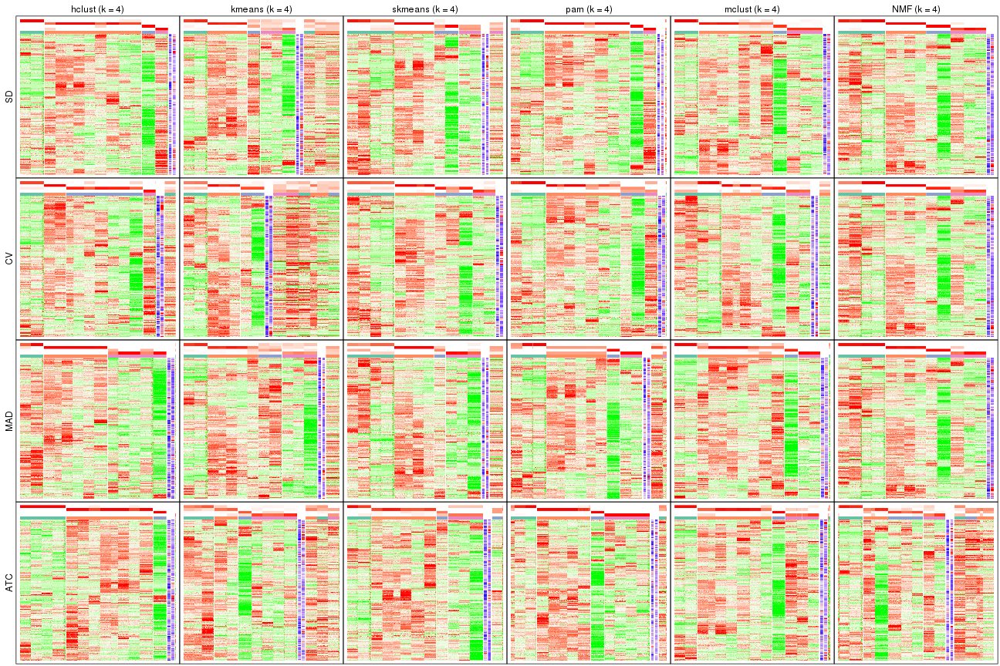</p>

</div>
<div id='tab-collect-get-signatures-4'>
<pre><code class="r">collect_plots(res_list, k = 5, fun = get_signatures, mc.cores = 4)
</code></pre>

<p>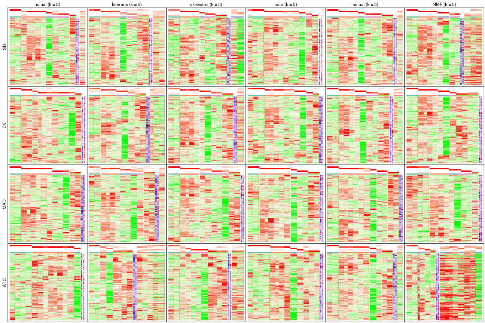</p>

</div>
<div id='tab-collect-get-signatures-5'>
<pre><code class="r">collect_plots(res_list, k = 6, fun = get_signatures, mc.cores = 4)
</code></pre>

<p>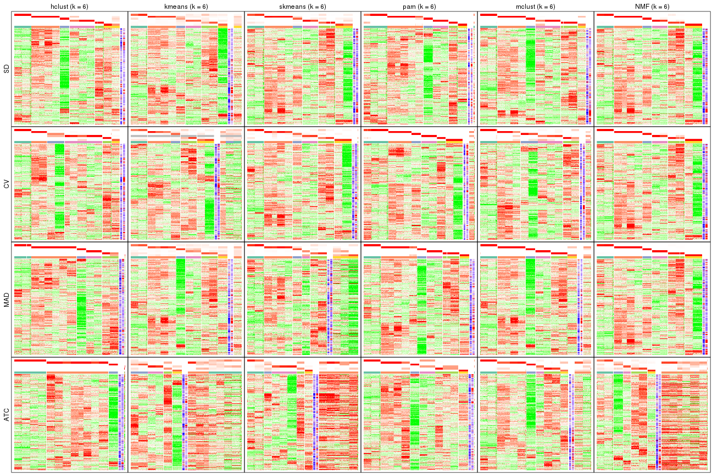</p>

</div>
</div>


### Statistics table

The statistics used for measuring the stability of consensus partitioning.
([How are they
defined?](http://bioconductor.org/packages/devel/bioc/vignettes/cola/inst/doc/cola.html#toc_13))


<script>
$( function() {
	$( '#tabs-get-stats-from-consensus-partition-list' ).tabs();
} );
</script>
<div id='tabs-get-stats-from-consensus-partition-list'>
<ul>
<li><a href='#tab-get-stats-from-consensus-partition-list-1'>k = 2</a></li>
<li><a href='#tab-get-stats-from-consensus-partition-list-2'>k = 3</a></li>
<li><a href='#tab-get-stats-from-consensus-partition-list-3'>k = 4</a></li>
<li><a href='#tab-get-stats-from-consensus-partition-list-4'>k = 5</a></li>
<li><a href='#tab-get-stats-from-consensus-partition-list-5'>k = 6</a></li>
</ul>
<div id='tab-get-stats-from-consensus-partition-list-1'>
<pre><code class="r">get_stats(res_list, k = 2)
</code></pre>

<pre><code>#&gt;             k 1-PAC mean_silhouette concordance area_increased  Rand Jaccard
#&gt; SD:NMF      2 0.761           0.859       0.941          0.473 0.514   0.514
#&gt; CV:NMF      2 1.000           0.999       1.000          0.501 0.499   0.499
#&gt; MAD:NMF     2 1.000           0.999       1.000          0.486 0.514   0.514
#&gt; ATC:NMF     2 0.649           0.905       0.945          0.483 0.500   0.500
#&gt; SD:skmeans  2 0.457           0.688       0.843          0.494 0.517   0.517
#&gt; CV:skmeans  2 0.421           0.773       0.897          0.483 0.507   0.507
#&gt; MAD:skmeans 2 0.734           0.927       0.959          0.487 0.517   0.517
#&gt; ATC:skmeans 2 1.000           0.999       1.000          0.501 0.500   0.500
#&gt; SD:mclust   2 0.257           0.746       0.848          0.465 0.500   0.500
#&gt; CV:mclust   2 0.341           0.792       0.822          0.372 0.724   0.724
#&gt; MAD:mclust  2 0.243           0.823       0.823          0.437 0.562   0.562
#&gt; ATC:mclust  2 0.623           0.924       0.946          0.187 0.836   0.836
#&gt; SD:kmeans   2 0.156           0.492       0.713          0.395 0.622   0.622
#&gt; CV:kmeans   2 0.136           0.684       0.767          0.384 0.603   0.603
#&gt; MAD:kmeans  2 0.183           0.675       0.807          0.430 0.517   0.517
#&gt; ATC:kmeans  2 0.466           0.914       0.898          0.426 0.500   0.500
#&gt; SD:pam      2 0.939           0.914       0.960          0.465 0.552   0.552
#&gt; CV:pam      2 0.622           0.823       0.897          0.452 0.552   0.552
#&gt; MAD:pam     2 0.623           0.812       0.916          0.479 0.555   0.555
#&gt; ATC:pam     2 1.000           1.000       1.000          0.165 0.836   0.836
#&gt; SD:hclust   2 0.444           0.874       0.927          0.407 0.622   0.622
#&gt; CV:hclust   2 0.567           0.934       0.936          0.270 0.744   0.744
#&gt; MAD:hclust  2 0.731           0.949       0.969          0.485 0.518   0.518
#&gt; ATC:hclust  2 1.000           1.000       1.000          0.165 0.836   0.836
</code></pre>

</div>
<div id='tab-get-stats-from-consensus-partition-list-2'>
<pre><code class="r">get_stats(res_list, k = 3)
</code></pre>

<pre><code>#&gt;             k 1-PAC mean_silhouette concordance area_increased  Rand Jaccard
#&gt; SD:NMF      3 0.945           0.980       0.989          0.297 0.851   0.718
#&gt; CV:NMF      3 0.835           0.950       0.959          0.307 0.787   0.598
#&gt; MAD:NMF     3 1.000           0.999       0.999          0.251 0.851   0.718
#&gt; ATC:NMF     3 0.539           0.774       0.854          0.274 0.888   0.777
#&gt; SD:skmeans  3 0.720           0.850       0.913          0.329 0.640   0.405
#&gt; CV:skmeans  3 0.537           0.766       0.871          0.344 0.649   0.414
#&gt; MAD:skmeans 3 0.706           0.837       0.892          0.329 0.730   0.526
#&gt; ATC:skmeans 3 0.806           0.830       0.880          0.200 0.939   0.879
#&gt; SD:mclust   3 0.336           0.419       0.568          0.152 0.604   0.377
#&gt; CV:mclust   3 0.307           0.713       0.806          0.542 0.651   0.517
#&gt; MAD:mclust  3 0.453           0.861       0.865          0.366 0.789   0.625
#&gt; ATC:mclust  3 0.547           0.842       0.889          1.509 0.765   0.719
#&gt; SD:kmeans   3 0.233           0.496       0.698          0.438 0.653   0.502
#&gt; CV:kmeans   3 0.195           0.532       0.667          0.458 0.818   0.698
#&gt; MAD:kmeans  3 0.340           0.592       0.706          0.365 0.818   0.663
#&gt; ATC:kmeans  3 0.508           0.787       0.837          0.379 0.926   0.852
#&gt; SD:pam      3 0.844           0.886       0.944          0.138 0.955   0.919
#&gt; CV:pam      3 0.827           0.840       0.937          0.317 0.790   0.641
#&gt; MAD:pam     3 0.712           0.629       0.865          0.129 0.823   0.702
#&gt; ATC:pam     3 0.958           0.916       0.971          2.491 0.587   0.506
#&gt; SD:hclust   3 0.542           0.868       0.911          0.298 0.887   0.818
#&gt; CV:hclust   3 0.525           0.779       0.872          0.722 0.779   0.703
#&gt; MAD:hclust  3 0.791           0.957       0.963          0.264 0.860   0.729
#&gt; ATC:hclust  3 0.774           0.973       0.915          2.290 0.626   0.552
</code></pre>

</div>
<div id='tab-get-stats-from-consensus-partition-list-3'>
<pre><code class="r">get_stats(res_list, k = 4)
</code></pre>

<pre><code>#&gt;             k 1-PAC mean_silhouette concordance area_increased  Rand Jaccard
#&gt; SD:NMF      4 0.924           0.976       0.980        0.20005 0.869   0.666
#&gt; CV:NMF      4 0.843           0.850       0.889        0.12067 0.861   0.628
#&gt; MAD:NMF     4 0.962           0.954       0.969        0.20472 0.869   0.666
#&gt; ATC:NMF     4 0.576           0.584       0.735        0.14100 0.803   0.536
#&gt; SD:skmeans  4 0.778           0.746       0.822        0.11137 0.874   0.650
#&gt; CV:skmeans  4 0.751           0.807       0.854        0.13520 0.902   0.720
#&gt; MAD:skmeans 4 0.688           0.685       0.767        0.10843 0.945   0.845
#&gt; ATC:skmeans 4 0.667           0.818       0.833        0.10946 0.845   0.657
#&gt; SD:mclust   4 0.749           0.879       0.894        0.26095 0.701   0.415
#&gt; CV:mclust   4 0.490           0.673       0.769        0.21492 0.876   0.680
#&gt; MAD:mclust  4 0.658           0.809       0.882        0.07556 0.780   0.554
#&gt; ATC:mclust  4 0.608           0.827       0.892        0.33161 0.746   0.580
#&gt; SD:kmeans   4 0.314           0.603       0.692        0.16225 0.807   0.585
#&gt; CV:kmeans   4 0.314           0.474       0.608        0.17767 0.681   0.364
#&gt; MAD:kmeans  4 0.367           0.730       0.718        0.14123 0.890   0.722
#&gt; ATC:kmeans  4 0.549           0.618       0.665        0.15443 0.862   0.680
#&gt; SD:pam      4 0.886           0.919       0.960        0.13784 0.904   0.811
#&gt; CV:pam      4 0.755           0.875       0.873        0.13247 0.938   0.849
#&gt; MAD:pam     4 0.734           0.703       0.817        0.16239 0.750   0.522
#&gt; ATC:pam     4 0.948           0.910       0.957        0.20632 0.820   0.598
#&gt; SD:hclust   4 0.650           0.911       0.948        0.07051 0.971   0.942
#&gt; CV:hclust   4 0.620           0.838       0.897        0.36832 0.791   0.618
#&gt; MAD:hclust  4 0.843           0.862       0.919        0.05296 0.999   0.998
#&gt; ATC:hclust  4 0.775           0.968       0.985        0.00533 0.997   0.994
</code></pre>

</div>
<div id='tab-get-stats-from-consensus-partition-list-4'>
<pre><code class="r">get_stats(res_list, k = 5)
</code></pre>

<pre><code>#&gt;             k 1-PAC mean_silhouette concordance area_increased  Rand Jaccard
#&gt; SD:NMF      5 0.871           0.740       0.846         0.0566 0.918   0.704
#&gt; CV:NMF      5 0.925           0.946       0.951         0.0576 0.873   0.588
#&gt; MAD:NMF     5 0.957           0.966       0.951         0.0490 0.973   0.896
#&gt; ATC:NMF     5 0.560           0.534       0.666         0.0807 0.797   0.442
#&gt; SD:skmeans  5 0.817           0.850       0.835         0.0619 0.891   0.626
#&gt; CV:skmeans  5 0.793           0.858       0.840         0.0581 0.891   0.626
#&gt; MAD:skmeans 5 0.793           0.866       0.851         0.0703 0.885   0.630
#&gt; ATC:skmeans 5 0.647           0.789       0.798         0.0930 0.989   0.964
#&gt; SD:mclust   5 0.921           0.911       0.957         0.1454 0.889   0.680
#&gt; CV:mclust   5 0.766           0.813       0.866         0.1142 0.882   0.610
#&gt; MAD:mclust  5 0.838           0.907       0.947         0.1653 0.858   0.657
#&gt; ATC:mclust  5 0.731           0.856       0.836         0.1463 0.973   0.923
#&gt; SD:kmeans   5 0.436           0.717       0.671         0.1077 0.936   0.801
#&gt; CV:kmeans   5 0.413           0.627       0.661         0.1038 0.893   0.630
#&gt; MAD:kmeans  5 0.493           0.714       0.715         0.0942 0.937   0.790
#&gt; ATC:kmeans  5 0.548           0.449       0.681         0.0769 0.999   0.996
#&gt; SD:pam      5 0.740           0.895       0.933         0.1529 0.910   0.784
#&gt; CV:pam      5 0.872           0.913       0.918         0.0989 0.922   0.780
#&gt; MAD:pam     5 1.000           0.993       0.996         0.1621 0.867   0.642
#&gt; ATC:pam     5 0.899           0.927       0.928         0.0858 0.949   0.826
#&gt; SD:hclust   5 0.732           0.833       0.902         0.3025 0.797   0.576
#&gt; CV:hclust   5 0.751           0.905       0.918         0.0834 0.976   0.933
#&gt; MAD:hclust  5 0.960           0.950       0.968         0.0973 0.922   0.792
#&gt; ATC:hclust  5 0.774           0.966       0.924         0.0030 0.998   0.997
</code></pre>

</div>
<div id='tab-get-stats-from-consensus-partition-list-5'>
<pre><code class="r">get_stats(res_list, k = 6)
</code></pre>

<pre><code>#&gt;             k 1-PAC mean_silhouette concordance area_increased  Rand Jaccard
#&gt; SD:NMF      6 0.993           0.975       0.975        0.04948 0.947   0.762
#&gt; CV:NMF      6 0.962           0.972       0.973        0.05128 0.952   0.791
#&gt; MAD:NMF     6 1.000           0.994       0.994        0.06415 0.948   0.777
#&gt; ATC:NMF     6 0.616           0.588       0.629        0.04001 0.820   0.482
#&gt; SD:skmeans  6 0.809           0.919       0.889        0.03938 0.970   0.859
#&gt; CV:skmeans  6 0.850           0.899       0.884        0.04284 0.973   0.871
#&gt; MAD:skmeans 6 0.819           0.710       0.773        0.04294 0.937   0.730
#&gt; ATC:skmeans 6 0.695           0.670       0.769        0.06343 0.944   0.809
#&gt; SD:mclust   6 0.932           0.961       0.944        0.03349 0.959   0.827
#&gt; CV:mclust   6 0.817           0.779       0.831        0.04142 0.954   0.801
#&gt; MAD:mclust  6 0.895           0.915       0.935        0.06029 0.937   0.770
#&gt; ATC:mclust  6 0.706           0.777       0.817        0.05894 0.934   0.799
#&gt; SD:kmeans   6 0.600           0.781       0.727        0.04972 0.883   0.590
#&gt; CV:kmeans   6 0.486           0.598       0.628        0.05409 0.951   0.789
#&gt; MAD:kmeans  6 0.627           0.766       0.740        0.05251 0.973   0.886
#&gt; ATC:kmeans  6 0.567           0.592       0.567        0.05771 0.835   0.499
#&gt; SD:pam      6 0.925           0.915       0.956        0.13884 0.895   0.678
#&gt; CV:pam      6 0.982           0.941       0.972        0.09480 0.918   0.703
#&gt; MAD:pam     6 0.982           0.967       0.983        0.09222 0.937   0.770
#&gt; ATC:pam     6 0.884           0.896       0.862        0.06009 0.951   0.799
#&gt; SD:hclust   6 0.822           0.915       0.941        0.07666 0.918   0.703
#&gt; CV:hclust   6 0.805           0.950       0.896        0.07780 0.880   0.646
#&gt; MAD:hclust  6 0.988           0.952       0.971        0.03580 0.973   0.909
#&gt; ATC:hclust  6 0.773           0.964       0.985        0.00295 0.998   0.997
</code></pre>

</div>
</div>

Following heatmap plots the partition for each combination of methods and the
lightness correspond to the silhouette scores for samples in each method. On
top the consensus subgroup is inferred from all methods by taking the mean
silhouette scores as weight.


<script>
$( function() {
	$( '#tabs-collect-stats-from-consensus-partition-list' ).tabs();
} );
</script>
<div id='tabs-collect-stats-from-consensus-partition-list'>
<ul>
<li><a href='#tab-collect-stats-from-consensus-partition-list-1'>k = 2</a></li>
<li><a href='#tab-collect-stats-from-consensus-partition-list-2'>k = 3</a></li>
<li><a href='#tab-collect-stats-from-consensus-partition-list-3'>k = 4</a></li>
<li><a href='#tab-collect-stats-from-consensus-partition-list-4'>k = 5</a></li>
<li><a href='#tab-collect-stats-from-consensus-partition-list-5'>k = 6</a></li>
</ul>
<div id='tab-collect-stats-from-consensus-partition-list-1'>
<pre><code class="r">collect_stats(res_list, k = 2)
</code></pre>

<p>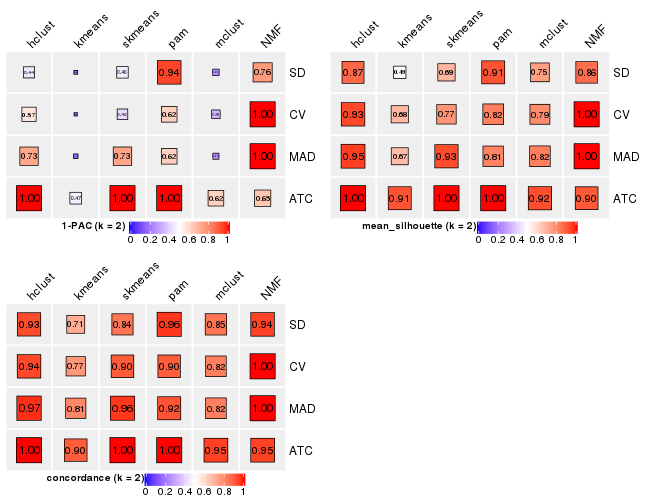</p>

</div>
<div id='tab-collect-stats-from-consensus-partition-list-2'>
<pre><code class="r">collect_stats(res_list, k = 3)
</code></pre>

<p>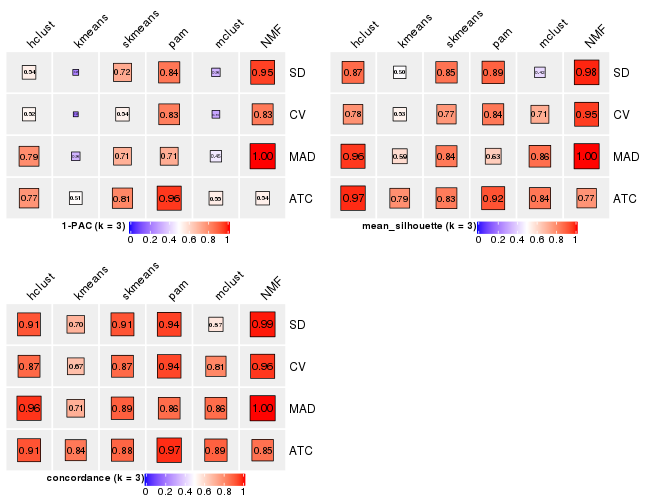</p>

</div>
<div id='tab-collect-stats-from-consensus-partition-list-3'>
<pre><code class="r">collect_stats(res_list, k = 4)
</code></pre>

<p>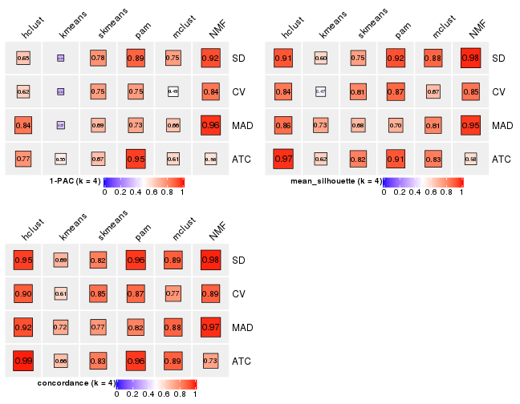</p>

</div>
<div id='tab-collect-stats-from-consensus-partition-list-4'>
<pre><code class="r">collect_stats(res_list, k = 5)
</code></pre>

<p>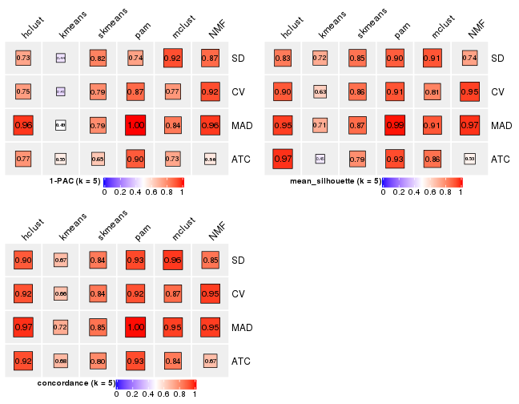</p>

</div>
<div id='tab-collect-stats-from-consensus-partition-list-5'>
<pre><code class="r">collect_stats(res_list, k = 6)
</code></pre>

<p>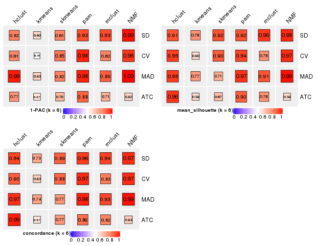</p>

</div>
</div>

### Partition from all methods


Collect partitions from all methods:


<script>
$( function() {
	$( '#tabs-collect-classes-from-consensus-partition-list' ).tabs();
} );
</script>
<div id='tabs-collect-classes-from-consensus-partition-list'>
<ul>
<li><a href='#tab-collect-classes-from-consensus-partition-list-1'>k = 2</a></li>
<li><a href='#tab-collect-classes-from-consensus-partition-list-2'>k = 3</a></li>
<li><a href='#tab-collect-classes-from-consensus-partition-list-3'>k = 4</a></li>
<li><a href='#tab-collect-classes-from-consensus-partition-list-4'>k = 5</a></li>
<li><a href='#tab-collect-classes-from-consensus-partition-list-5'>k = 6</a></li>
</ul>
<div id='tab-collect-classes-from-consensus-partition-list-1'>
<pre><code class="r">collect_classes(res_list, k = 2)
</code></pre>

<p>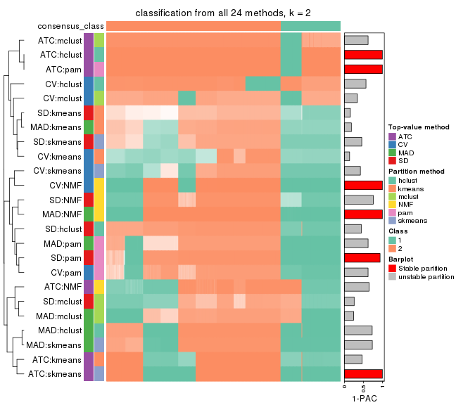</p>

</div>
<div id='tab-collect-classes-from-consensus-partition-list-2'>
<pre><code class="r">collect_classes(res_list, k = 3)
</code></pre>

<p>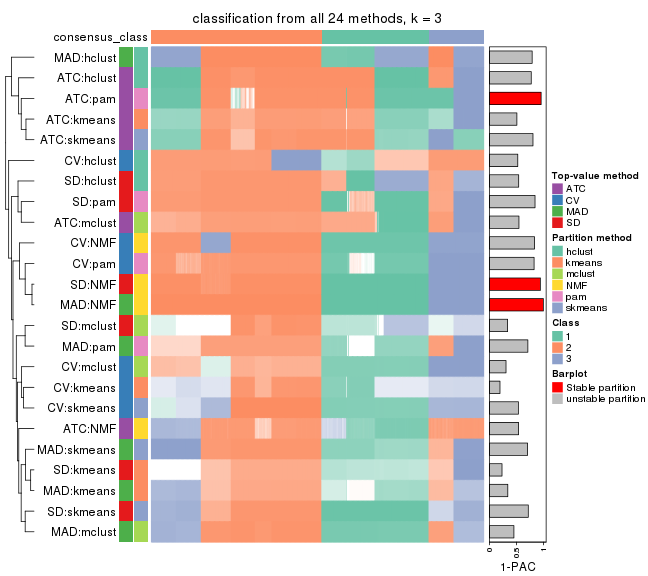</p>

</div>
<div id='tab-collect-classes-from-consensus-partition-list-3'>
<pre><code class="r">collect_classes(res_list, k = 4)
</code></pre>

<p>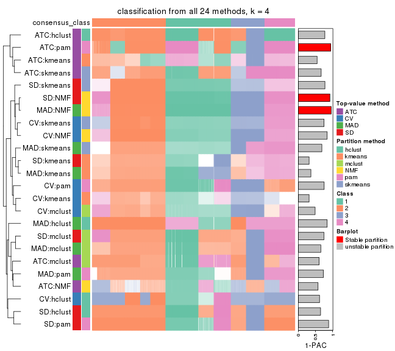</p>

</div>
<div id='tab-collect-classes-from-consensus-partition-list-4'>
<pre><code class="r">collect_classes(res_list, k = 5)
</code></pre>

<p>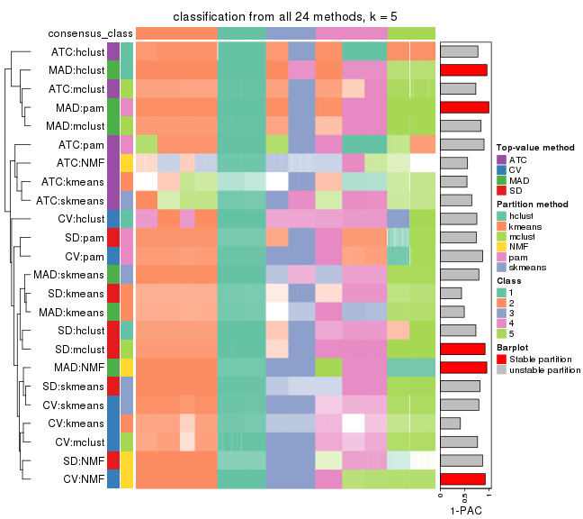</p>

</div>
<div id='tab-collect-classes-from-consensus-partition-list-5'>
<pre><code class="r">collect_classes(res_list, k = 6)
</code></pre>

<p>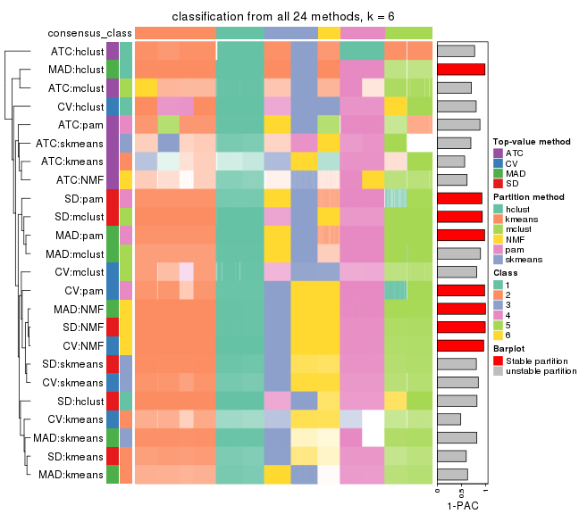</p>

</div>
</div>


### Top rows overlap


Overlap of top rows from different top-row methods:


<script>
$( function() {
	$( '#tabs-top-rows-overlap-by-euler' ).tabs();
} );
</script>
<div id='tabs-top-rows-overlap-by-euler'>
<ul>
<li><a href='#tab-top-rows-overlap-by-euler-1'>top_n = 1000</a></li>
<li><a href='#tab-top-rows-overlap-by-euler-2'>top_n = 2000</a></li>
<li><a href='#tab-top-rows-overlap-by-euler-3'>top_n = 3000</a></li>
<li><a href='#tab-top-rows-overlap-by-euler-4'>top_n = 4000</a></li>
<li><a href='#tab-top-rows-overlap-by-euler-5'>top_n = 5000</a></li>
</ul>
<div id='tab-top-rows-overlap-by-euler-1'>
<pre><code class="r">top_rows_overlap(res_list, top_n = 1000, method = &quot;euler&quot;)
</code></pre>

<p>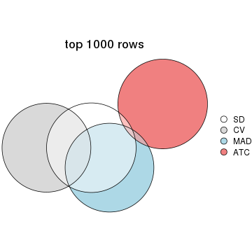</p>

</div>
<div id='tab-top-rows-overlap-by-euler-2'>
<pre><code class="r">top_rows_overlap(res_list, top_n = 2000, method = &quot;euler&quot;)
</code></pre>

<p>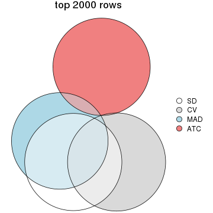</p>

</div>
<div id='tab-top-rows-overlap-by-euler-3'>
<pre><code class="r">top_rows_overlap(res_list, top_n = 3000, method = &quot;euler&quot;)
</code></pre>

<p>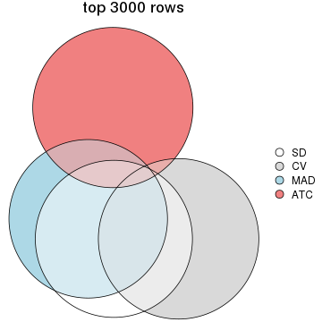</p>

</div>
<div id='tab-top-rows-overlap-by-euler-4'>
<pre><code class="r">top_rows_overlap(res_list, top_n = 4000, method = &quot;euler&quot;)
</code></pre>

<p>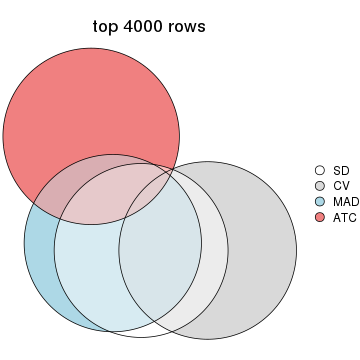</p>

</div>
<div id='tab-top-rows-overlap-by-euler-5'>
<pre><code class="r">top_rows_overlap(res_list, top_n = 5000, method = &quot;euler&quot;)
</code></pre>

<p>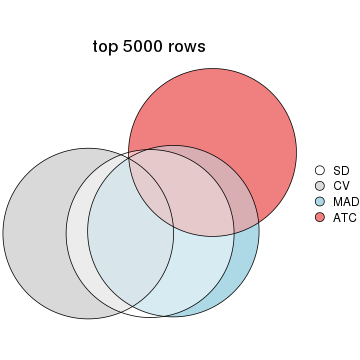</p>

</div>
</div>

Also visualize the correspondance of rankings between different top-row methods:


<script>
$( function() {
	$( '#tabs-top-rows-overlap-by-correspondance' ).tabs();
} );
</script>
<div id='tabs-top-rows-overlap-by-correspondance'>
<ul>
<li><a href='#tab-top-rows-overlap-by-correspondance-1'>top_n = 1000</a></li>
<li><a href='#tab-top-rows-overlap-by-correspondance-2'>top_n = 2000</a></li>
<li><a href='#tab-top-rows-overlap-by-correspondance-3'>top_n = 3000</a></li>
<li><a href='#tab-top-rows-overlap-by-correspondance-4'>top_n = 4000</a></li>
<li><a href='#tab-top-rows-overlap-by-correspondance-5'>top_n = 5000</a></li>
</ul>
<div id='tab-top-rows-overlap-by-correspondance-1'>
<pre><code class="r">top_rows_overlap(res_list, top_n = 1000, method = &quot;correspondance&quot;)
</code></pre>

<p>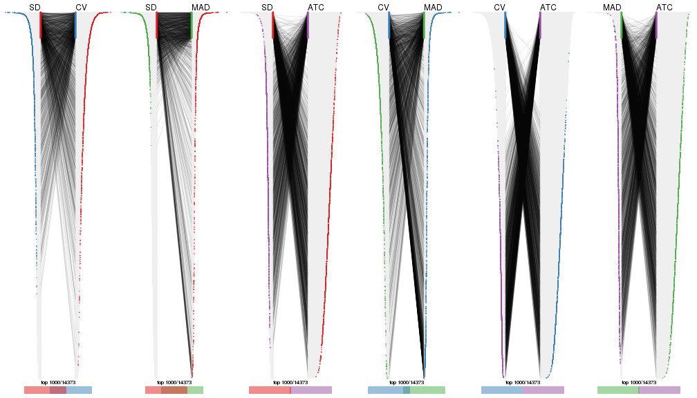</p>

</div>
<div id='tab-top-rows-overlap-by-correspondance-2'>
<pre><code class="r">top_rows_overlap(res_list, top_n = 2000, method = &quot;correspondance&quot;)
</code></pre>

<p>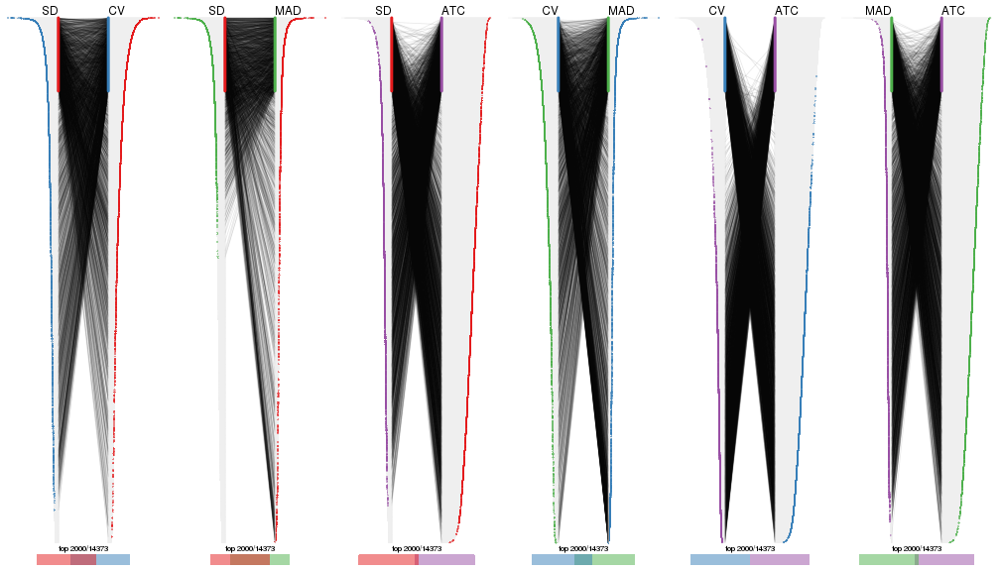</p>

</div>
<div id='tab-top-rows-overlap-by-correspondance-3'>
<pre><code class="r">top_rows_overlap(res_list, top_n = 3000, method = &quot;correspondance&quot;)
</code></pre>

<p>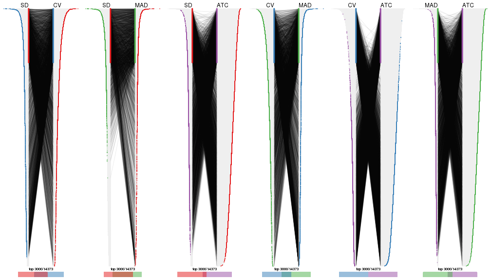</p>

</div>
<div id='tab-top-rows-overlap-by-correspondance-4'>
<pre><code class="r">top_rows_overlap(res_list, top_n = 4000, method = &quot;correspondance&quot;)
</code></pre>

<p>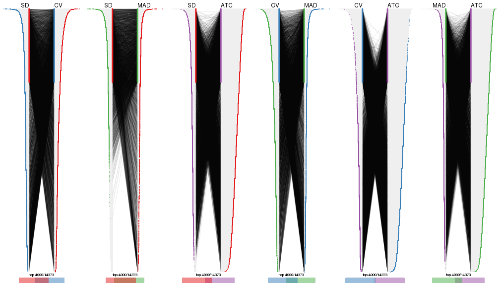</p>

</div>
<div id='tab-top-rows-overlap-by-correspondance-5'>
<pre><code class="r">top_rows_overlap(res_list, top_n = 5000, method = &quot;correspondance&quot;)
</code></pre>

<p>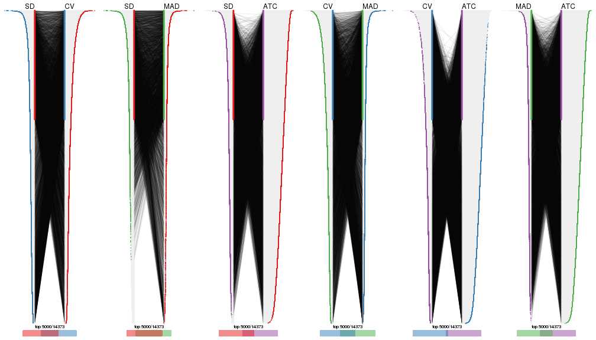</p>

</div>
</div>


Heatmaps of the top rows:


<script>
$( function() {
	$( '#tabs-top-rows-heatmap' ).tabs();
} );
</script>
<div id='tabs-top-rows-heatmap'>
<ul>
<li><a href='#tab-top-rows-heatmap-1'>top_n = 1000</a></li>
<li><a href='#tab-top-rows-heatmap-2'>top_n = 2000</a></li>
<li><a href='#tab-top-rows-heatmap-3'>top_n = 3000</a></li>
<li><a href='#tab-top-rows-heatmap-4'>top_n = 4000</a></li>
<li><a href='#tab-top-rows-heatmap-5'>top_n = 5000</a></li>
</ul>
<div id='tab-top-rows-heatmap-1'>
<pre><code class="r">top_rows_heatmap(res_list, top_n = 1000)
</code></pre>

<p>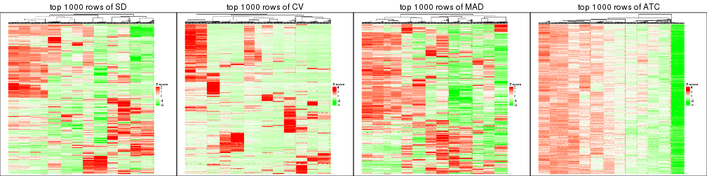</p>

</div>
<div id='tab-top-rows-heatmap-2'>
<pre><code class="r">top_rows_heatmap(res_list, top_n = 2000)
</code></pre>

<p>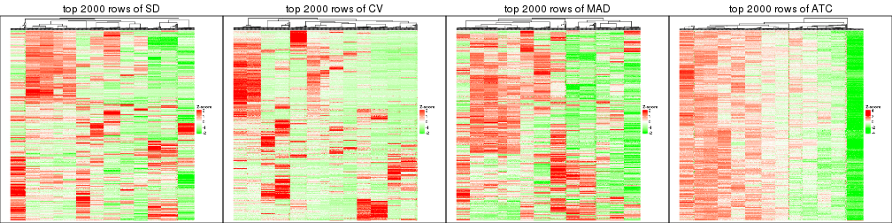</p>

</div>
<div id='tab-top-rows-heatmap-3'>
<pre><code class="r">top_rows_heatmap(res_list, top_n = 3000)
</code></pre>

<p>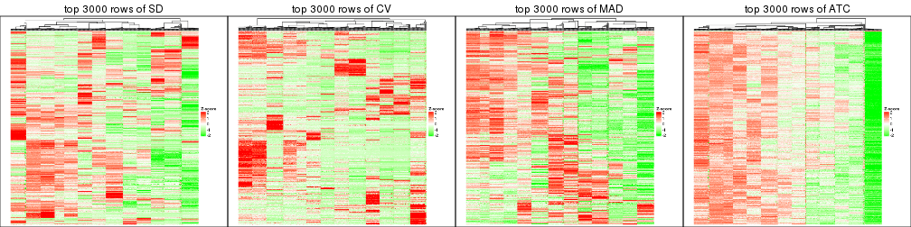</p>

</div>
<div id='tab-top-rows-heatmap-4'>
<pre><code class="r">top_rows_heatmap(res_list, top_n = 4000)
</code></pre>

<p>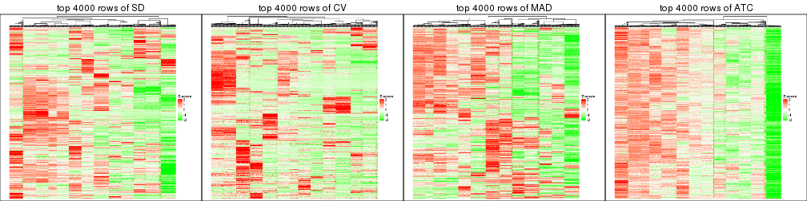</p>

</div>
<div id='tab-top-rows-heatmap-5'>
<pre><code class="r">top_rows_heatmap(res_list, top_n = 5000)
</code></pre>

<p>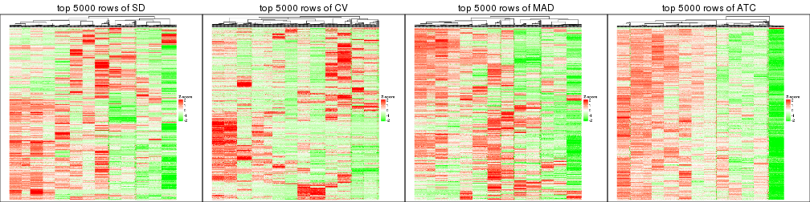</p>

</div>
</div>


 
## Results for each method


---------------------------------------------------


### SD:hclust


The object with results only for a single top-value method and a single partition method 
can be extracted as:

```r
res = res_list["SD", "hclust"]
# you can also extract it by
# res = res_list["SD:hclust"]
```

A summary of `res` and all the functions that can be applied to it:

```r
res
```

```
#> A 'ConsensusPartition' object with k = 2, 3, 4, 5, 6.
#>   On a matrix with 14373 rows and 400 columns.
#>   Top rows (1000, 2000, 3000, 4000, 5000) are extracted by 'SD' method.
#>   Subgroups are detected by 'hclust' method.
#>   Performed in total 1250 partitions by row resampling.
#>   Best k for subgroups seems to be 6.
#> 
#> Following methods can be applied to this 'ConsensusPartition' object:
#>  [1] "cola_report"             "collect_classes"         "collect_plots"          
#>  [4] "collect_stats"           "colnames"                "compare_signatures"     
#>  [7] "consensus_heatmap"       "dimension_reduction"     "functional_enrichment"  
#> [10] "get_anno_col"            "get_anno"                "get_classes"            
#> [13] "get_consensus"           "get_matrix"              "get_membership"         
#> [16] "get_param"               "get_signatures"          "get_stats"              
#> [19] "is_best_k"               "is_stable_k"             "membership_heatmap"     
#> [22] "ncol"                    "nrow"                    "plot_ecdf"              
#> [25] "rownames"                "select_partition_number" "show"                   
#> [28] "suggest_best_k"          "test_to_known_factors"
```

`collect_plots()` function collects all the plots made from `res` for all `k` (number of partitions)
into one single page to provide an easy and fast comparison between different `k`.

```r
collect_plots(res)
```

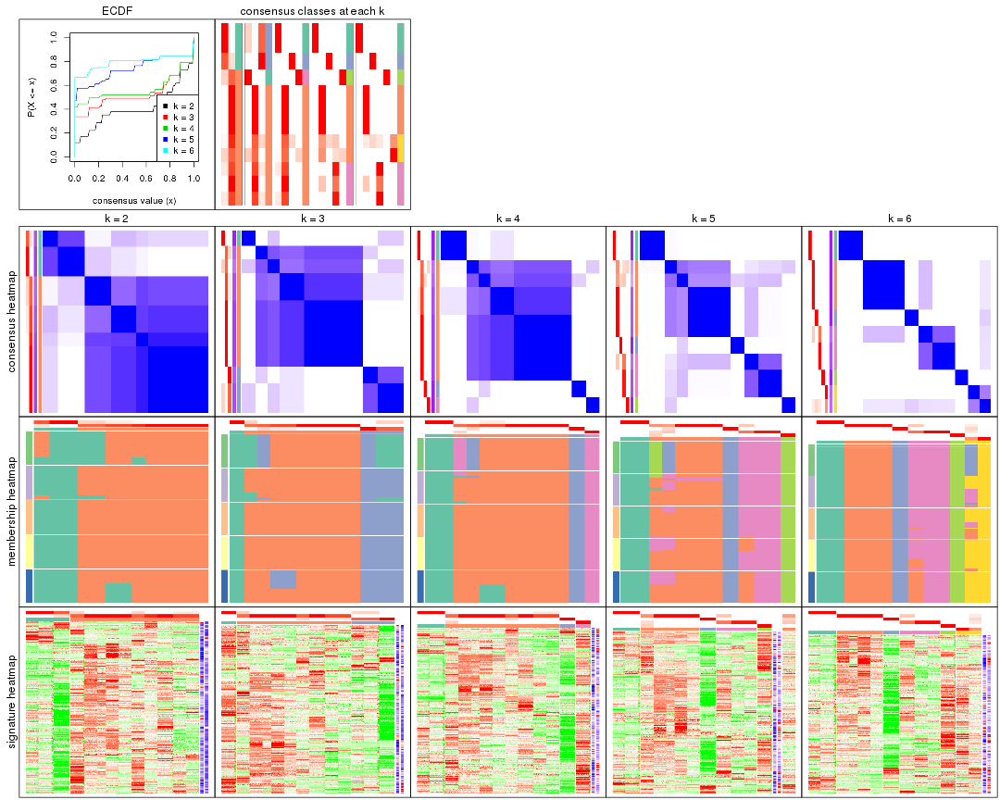

The plots are:

- The first row: a plot of the ECDF (Empirical cumulative distribution
  function) curves of the consensus matrix for each `k` and the heatmap of
  predicted classes for each `k`.
- The second row: heatmaps of the consensus matrix for each `k`.
- The third row: heatmaps of the membership matrix for each `k`.
- The fouth row: heatmaps of the signatures for each `k`.

All the plots in panels can be made by individual functions and they are
plotted later in this section.

`select_partition_number()` produces several plots showing different
statistics for choosing "optimized" `k`. There are following statistics:

- ECDF curves of the consensus matrix for each `k`;
- 1-PAC. [The PAC
  score](https://en.wikipedia.org/wiki/Consensus_clustering#Over-interpretation_potential_of_consensus_clustering)
  measures the proportion of the ambiguous subgrouping.
- Mean silhouette score.
- Concordance. The mean probability of fiting the consensus class ids in all
  partitions.
- Area increased. Denote $A_k$ as the area under the ECDF curve for current
  `k`, the area increased is defined as $A_k - A_{k-1}$.
- Rand index. The percent of pairs of samples that are both in a same cluster
  or both are not in a same cluster in the partition of k and k-1.
- Jaccard index. The ratio of pairs of samples are both in a same cluster in
  the partition of k and k-1 and the pairs of samples are both in a same
  cluster in the partition k or k-1.

The detailed explanations of these statistics can be found in [the cola
vignette](http://bioconductor.org/packages/devel/bioc/vignettes/cola/inst/doc/cola.html#toc_13).

Generally speaking, lower PAC score, higher mean silhouette score or higher
concordance corresponds to better partition. Rand index and Jaccard index
measure how similar the current partition is compared to partition with `k-1`.
If they are too similar, we won't accept `k` is better than `k-1`.

```r
select_partition_number(res)
```

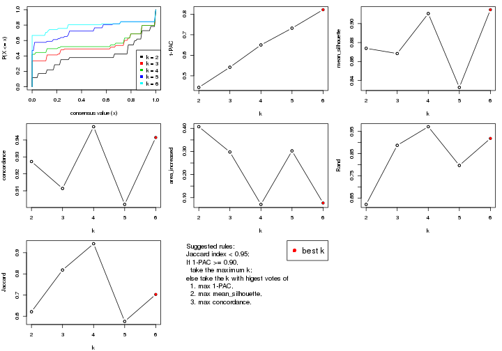

The numeric values for all these statistics can be obtained by `get_stats()`.

```r
get_stats(res)
```

```
#>   k 1-PAC mean_silhouette concordance area_increased  Rand Jaccard
#> 2 2 0.444           0.874       0.927         0.4071 0.622   0.622
#> 3 3 0.542           0.868       0.911         0.2976 0.887   0.818
#> 4 4 0.650           0.911       0.948         0.0705 0.971   0.942
#> 5 5 0.732           0.833       0.902         0.3025 0.797   0.576
#> 6 6 0.822           0.915       0.941         0.0767 0.918   0.703
```

`suggest_best_k()` suggests the best $k$ based on these statistics. The rules are as follows:

- All $k$ with Jaccard index larger than 0.95 are removed because the increase of
  the partition number does not provides enough extra information. If all $k$ are removed,
  the best $k$ is assigned by `NA`.
- For $k$ with 1-PAC larger than 0.9, the maximal $k$ is taken as the "best k". Other $k$ is called "optional k".
- If it does not fit the second rule. The $k$ with the highest vote of highest
  1-PAC, mean silhouette and concordance is taken as the "best k".

```r
suggest_best_k(res)
```

```
#> [1] 6
```


Following shows the table of the partitions (You need to click the **show/hide
code output** link to see it). The membership matrix (columns with name `p*`)
is inferred by
[`clue::cl_consensus()`](https://www.rdocumentation.org/link/cl_consensus?package=clue)
function with the `SE` method. Basically the value in the membership matrix
represents the probability to belong to a certain group. The finall class
label for an item is determined with the group with highest probability it
belongs to.

In `get_classes()` function, the entropy is calculated from the membership
matrix and the silhouette score is calculated from the consensus matrix.


<script>
$( function() {
	$( '#tabs-SD-hclust-get-classes' ).tabs();
} );
</script>
<div id='tabs-SD-hclust-get-classes'>
<ul>
<li><a href='#tab-SD-hclust-get-classes-1'>k = 2</a></li>
<li><a href='#tab-SD-hclust-get-classes-2'>k = 3</a></li>
<li><a href='#tab-SD-hclust-get-classes-3'>k = 4</a></li>
<li><a href='#tab-SD-hclust-get-classes-4'>k = 5</a></li>
<li><a href='#tab-SD-hclust-get-classes-5'>k = 6</a></li>
</ul>

<div id='tab-SD-hclust-get-classes-1'>
<p><a id='tab-SD-hclust-get-classes-1-a' style='color:#0366d6' href='#'>show/hide code output</a></p>
<pre><code class="r">cbind(get_classes(res, k = 2), get_membership(res, k = 2))
</code></pre>

<pre><code>#&gt;            class entropy silhouette    p1    p2
#&gt; SRR1661716     2   0.000      0.912 0.000 1.000
#&gt; SRR1661717     2   0.000      0.912 0.000 1.000
#&gt; SRR1661718     2   0.000      0.912 0.000 1.000
#&gt; SRR1661719     2   0.000      0.912 0.000 1.000
#&gt; SRR1661720     2   0.000      0.912 0.000 1.000
#&gt; SRR1661721     2   0.000      0.912 0.000 1.000
#&gt; SRR1661722     2   0.000      0.912 0.000 1.000
#&gt; SRR1661723     2   0.000      0.912 0.000 1.000
#&gt; SRR1661724     2   0.000      0.912 0.000 1.000
#&gt; SRR1661725     2   0.000      0.912 0.000 1.000
#&gt; SRR1661726     2   0.000      0.912 0.000 1.000
#&gt; SRR1661727     2   0.000      0.912 0.000 1.000
#&gt; SRR1661728     2   0.000      0.912 0.000 1.000
#&gt; SRR1661729     2   0.000      0.912 0.000 1.000
#&gt; SRR1661730     2   0.000      0.912 0.000 1.000
#&gt; SRR1661731     2   0.000      0.912 0.000 1.000
#&gt; SRR1661732     2   0.000      0.912 0.000 1.000
#&gt; SRR1661733     2   0.000      0.912 0.000 1.000
#&gt; SRR1661734     2   0.000      0.912 0.000 1.000
#&gt; SRR1661735     2   0.000      0.912 0.000 1.000
#&gt; SRR1661736     2   0.000      0.912 0.000 1.000
#&gt; SRR1661737     2   0.000      0.912 0.000 1.000
#&gt; SRR1661738     2   0.000      0.912 0.000 1.000
#&gt; SRR1661739     2   0.000      0.912 0.000 1.000
#&gt; SRR1661740     2   0.000      0.912 0.000 1.000
#&gt; SRR1661741     2   0.000      0.912 0.000 1.000
#&gt; SRR1661742     2   0.000      0.912 0.000 1.000
#&gt; SRR1661743     2   0.000      0.912 0.000 1.000
#&gt; SRR1661744     2   0.000      0.912 0.000 1.000
#&gt; SRR1661745     2   0.000      0.912 0.000 1.000
#&gt; SRR1661746     2   0.000      0.912 0.000 1.000
#&gt; SRR1661747     2   0.000      0.912 0.000 1.000
#&gt; SRR1661748     2   0.000      0.912 0.000 1.000
#&gt; SRR1661749     2   0.000      0.912 0.000 1.000
#&gt; SRR1661750     2   0.000      0.912 0.000 1.000
#&gt; SRR1661751     2   0.000      0.912 0.000 1.000
#&gt; SRR1661752     2   0.000      0.912 0.000 1.000
#&gt; SRR1661753     2   0.000      0.912 0.000 1.000
#&gt; SRR1661754     2   0.000      0.912 0.000 1.000
#&gt; SRR1661755     2   0.000      0.912 0.000 1.000
#&gt; SRR1661756     2   0.000      0.912 0.000 1.000
#&gt; SRR1661757     2   0.000      0.912 0.000 1.000
#&gt; SRR1661758     2   0.000      0.912 0.000 1.000
#&gt; SRR1661759     2   0.000      0.912 0.000 1.000
#&gt; SRR1661760     2   0.000      0.912 0.000 1.000
#&gt; SRR1661761     2   0.000      0.912 0.000 1.000
#&gt; SRR1661762     2   0.000      0.912 0.000 1.000
#&gt; SRR1661763     2   0.000      0.912 0.000 1.000
#&gt; SRR1661764     2   0.000      0.912 0.000 1.000
#&gt; SRR1661766     2   0.000      0.912 0.000 1.000
#&gt; SRR1661767     2   0.000      0.912 0.000 1.000
#&gt; SRR1661768     2   0.000      0.912 0.000 1.000
#&gt; SRR1661769     2   0.000      0.912 0.000 1.000
#&gt; SRR1661770     2   0.000      0.912 0.000 1.000
#&gt; SRR1661771     2   0.000      0.912 0.000 1.000
#&gt; SRR1661772     2   0.000      0.912 0.000 1.000
#&gt; SRR1661773     2   0.000      0.912 0.000 1.000
#&gt; SRR1661774     2   0.000      0.912 0.000 1.000
#&gt; SRR1661775     2   0.000      0.912 0.000 1.000
#&gt; SRR1661776     2   0.000      0.912 0.000 1.000
#&gt; SRR1661777     2   0.000      0.912 0.000 1.000
#&gt; SRR1661778     2   0.000      0.912 0.000 1.000
#&gt; SRR1661779     2   0.000      0.912 0.000 1.000
#&gt; SRR1661780     2   0.000      0.912 0.000 1.000
#&gt; SRR1661781     2   0.000      0.912 0.000 1.000
#&gt; SRR1661782     2   0.000      0.912 0.000 1.000
#&gt; SRR1661783     2   0.000      0.912 0.000 1.000
#&gt; SRR1661784     2   0.000      0.912 0.000 1.000
#&gt; SRR1661785     2   0.000      0.912 0.000 1.000
#&gt; SRR1661786     2   0.000      0.912 0.000 1.000
#&gt; SRR1661787     2   0.000      0.912 0.000 1.000
#&gt; SRR1661788     2   0.000      0.912 0.000 1.000
#&gt; SRR1661789     2   0.000      0.912 0.000 1.000
#&gt; SRR1661790     2   0.000      0.912 0.000 1.000
#&gt; SRR1661791     2   0.000      0.912 0.000 1.000
#&gt; SRR1661792     2   0.000      0.912 0.000 1.000
#&gt; SRR1661793     2   0.000      0.912 0.000 1.000
#&gt; SRR1661794     2   0.000      0.912 0.000 1.000
#&gt; SRR1661795     2   0.000      0.912 0.000 1.000
#&gt; SRR1661796     2   0.000      0.912 0.000 1.000
#&gt; SRR1661797     2   0.000      0.912 0.000 1.000
#&gt; SRR1661798     2   0.000      0.912 0.000 1.000
#&gt; SRR1661799     2   0.000      0.912 0.000 1.000
#&gt; SRR1661800     2   0.000      0.912 0.000 1.000
#&gt; SRR1661801     2   0.000      0.912 0.000 1.000
#&gt; SRR1661802     2   0.000      0.912 0.000 1.000
#&gt; SRR1661803     2   0.000      0.912 0.000 1.000
#&gt; SRR1661804     2   0.000      0.912 0.000 1.000
#&gt; SRR1661805     2   0.000      0.912 0.000 1.000
#&gt; SRR1661806     2   0.000      0.912 0.000 1.000
#&gt; SRR1661807     2   0.000      0.912 0.000 1.000
#&gt; SRR1661808     2   0.000      0.912 0.000 1.000
#&gt; SRR1661809     2   0.000      0.912 0.000 1.000
#&gt; SRR1661810     2   0.000      0.912 0.000 1.000
#&gt; SRR1661811     2   0.000      0.912 0.000 1.000
#&gt; SRR1661812     2   0.000      0.912 0.000 1.000
#&gt; SRR1661813     2   0.000      0.912 0.000 1.000
#&gt; SRR1661814     2   0.000      0.912 0.000 1.000
#&gt; SRR1661815     2   0.000      0.912 0.000 1.000
#&gt; SRR1661816     2   0.000      0.912 0.000 1.000
#&gt; SRR1661817     2   0.000      0.912 0.000 1.000
#&gt; SRR1661818     2   0.000      0.912 0.000 1.000
#&gt; SRR1661819     2   0.000      0.912 0.000 1.000
#&gt; SRR1661820     2   0.000      0.912 0.000 1.000
#&gt; SRR1661821     2   0.000      0.912 0.000 1.000
#&gt; SRR1661822     2   0.000      0.912 0.000 1.000
#&gt; SRR1661823     2   0.000      0.912 0.000 1.000
#&gt; SRR1661824     2   0.000      0.912 0.000 1.000
#&gt; SRR1661825     2   0.000      0.912 0.000 1.000
#&gt; SRR1661826     1   0.000      0.922 1.000 0.000
#&gt; SRR1661827     1   0.000      0.922 1.000 0.000
#&gt; SRR1661828     1   0.000      0.922 1.000 0.000
#&gt; SRR1661829     1   0.000      0.922 1.000 0.000
#&gt; SRR1661830     1   0.000      0.922 1.000 0.000
#&gt; SRR1661831     1   0.000      0.922 1.000 0.000
#&gt; SRR1661832     1   0.000      0.922 1.000 0.000
#&gt; SRR1661833     1   0.000      0.922 1.000 0.000
#&gt; SRR1661834     1   0.000      0.922 1.000 0.000
#&gt; SRR1661835     1   0.000      0.922 1.000 0.000
#&gt; SRR1661836     1   0.000      0.922 1.000 0.000
#&gt; SRR1661837     1   0.000      0.922 1.000 0.000
#&gt; SRR1661838     1   0.000      0.922 1.000 0.000
#&gt; SRR1661839     1   0.000      0.922 1.000 0.000
#&gt; SRR1661840     1   0.000      0.922 1.000 0.000
#&gt; SRR1661841     1   0.000      0.922 1.000 0.000
#&gt; SRR1661843     1   0.000      0.922 1.000 0.000
#&gt; SRR1661844     1   0.000      0.922 1.000 0.000
#&gt; SRR1661845     1   0.000      0.922 1.000 0.000
#&gt; SRR1661846     1   0.000      0.922 1.000 0.000
#&gt; SRR1661847     1   0.000      0.922 1.000 0.000
#&gt; SRR1661848     1   0.000      0.922 1.000 0.000
#&gt; SRR1661849     1   0.000      0.922 1.000 0.000
#&gt; SRR1661850     1   0.000      0.922 1.000 0.000
#&gt; SRR1661851     1   0.000      0.922 1.000 0.000
#&gt; SRR1661852     1   0.000      0.922 1.000 0.000
#&gt; SRR1661853     1   0.000      0.922 1.000 0.000
#&gt; SRR1661854     1   0.000      0.922 1.000 0.000
#&gt; SRR1661855     1   0.000      0.922 1.000 0.000
#&gt; SRR1661856     1   0.680      0.840 0.820 0.180
#&gt; SRR1661857     1   0.680      0.840 0.820 0.180
#&gt; SRR1661858     1   0.680      0.840 0.820 0.180
#&gt; SRR1661859     1   0.680      0.840 0.820 0.180
#&gt; SRR1661860     1   0.680      0.840 0.820 0.180
#&gt; SRR1661861     1   0.680      0.840 0.820 0.180
#&gt; SRR1661862     1   0.680      0.840 0.820 0.180
#&gt; SRR1661863     1   0.680      0.840 0.820 0.180
#&gt; SRR1661864     1   0.680      0.840 0.820 0.180
#&gt; SRR1661865     1   0.680      0.840 0.820 0.180
#&gt; SRR1661866     1   0.680      0.840 0.820 0.180
#&gt; SRR1661867     1   0.680      0.840 0.820 0.180
#&gt; SRR1661868     1   0.680      0.840 0.820 0.180
#&gt; SRR1661869     1   0.680      0.840 0.820 0.180
#&gt; SRR1661870     1   0.680      0.840 0.820 0.180
#&gt; SRR1661871     1   0.680      0.840 0.820 0.180
#&gt; SRR1661872     1   0.680      0.840 0.820 0.180
#&gt; SRR1661873     1   0.680      0.840 0.820 0.180
#&gt; SRR1661874     1   0.680      0.840 0.820 0.180
#&gt; SRR1661875     1   0.680      0.840 0.820 0.180
#&gt; SRR1661876     1   0.680      0.840 0.820 0.180
#&gt; SRR1661877     1   0.680      0.840 0.820 0.180
#&gt; SRR1661878     1   0.680      0.840 0.820 0.180
#&gt; SRR1661879     1   0.680      0.840 0.820 0.180
#&gt; SRR1661880     1   0.680      0.840 0.820 0.180
#&gt; SRR1661881     1   0.680      0.840 0.820 0.180
#&gt; SRR1661882     1   0.680      0.840 0.820 0.180
#&gt; SRR1661883     1   0.680      0.840 0.820 0.180
#&gt; SRR1661884     1   0.680      0.840 0.820 0.180
#&gt; SRR1661885     1   0.680      0.840 0.820 0.180
#&gt; SRR1661886     1   0.680      0.840 0.820 0.180
#&gt; SRR1661887     1   0.680      0.840 0.820 0.180
#&gt; SRR1661888     1   0.680      0.840 0.820 0.180
#&gt; SRR1661889     1   0.680      0.840 0.820 0.180
#&gt; SRR1661890     1   0.680      0.840 0.820 0.180
#&gt; SRR1661891     1   0.680      0.840 0.820 0.180
#&gt; SRR1661892     1   0.000      0.922 1.000 0.000
#&gt; SRR1661893     1   0.000      0.922 1.000 0.000
#&gt; SRR1661894     1   0.000      0.922 1.000 0.000
#&gt; SRR1661895     1   0.000      0.922 1.000 0.000
#&gt; SRR1661896     1   0.000      0.922 1.000 0.000
#&gt; SRR1661897     1   0.000      0.922 1.000 0.000
#&gt; SRR1661898     1   0.000      0.922 1.000 0.000
#&gt; SRR1661899     1   0.000      0.922 1.000 0.000
#&gt; SRR1661900     1   0.000      0.922 1.000 0.000
#&gt; SRR1661901     1   0.000      0.922 1.000 0.000
#&gt; SRR1661902     1   0.000      0.922 1.000 0.000
#&gt; SRR1661903     1   0.000      0.922 1.000 0.000
#&gt; SRR1661904     1   0.000      0.922 1.000 0.000
#&gt; SRR1661905     1   0.000      0.922 1.000 0.000
#&gt; SRR1661906     1   0.000      0.922 1.000 0.000
#&gt; SRR1661907     1   0.000      0.922 1.000 0.000
#&gt; SRR1661908     1   0.000      0.922 1.000 0.000
#&gt; SRR1661909     1   0.000      0.922 1.000 0.000
#&gt; SRR1661910     1   0.000      0.922 1.000 0.000
#&gt; SRR1661911     1   0.000      0.922 1.000 0.000
#&gt; SRR1661912     1   0.000      0.922 1.000 0.000
#&gt; SRR1661913     1   0.000      0.922 1.000 0.000
#&gt; SRR1661914     1   0.000      0.922 1.000 0.000
#&gt; SRR1661915     1   0.000      0.922 1.000 0.000
#&gt; SRR1661916     1   0.000      0.922 1.000 0.000
#&gt; SRR1661917     1   0.000      0.922 1.000 0.000
#&gt; SRR1661918     1   0.000      0.922 1.000 0.000
#&gt; SRR1661919     1   0.000      0.922 1.000 0.000
#&gt; SRR1661920     1   0.000      0.922 1.000 0.000
#&gt; SRR1661921     1   0.000      0.922 1.000 0.000
#&gt; SRR1661922     1   0.000      0.922 1.000 0.000
#&gt; SRR1661923     1   0.000      0.922 1.000 0.000
#&gt; SRR1661924     1   0.000      0.922 1.000 0.000
#&gt; SRR1661925     1   0.000      0.922 1.000 0.000
#&gt; SRR1661926     1   0.000      0.922 1.000 0.000
#&gt; SRR1661927     1   0.000      0.922 1.000 0.000
#&gt; SRR1661928     2   0.260      0.897 0.044 0.956
#&gt; SRR1661929     2   0.260      0.897 0.044 0.956
#&gt; SRR1661930     2   0.260      0.897 0.044 0.956
#&gt; SRR1661931     2   0.260      0.897 0.044 0.956
#&gt; SRR1661932     2   0.260      0.897 0.044 0.956
#&gt; SRR1661933     2   0.260      0.897 0.044 0.956
#&gt; SRR1661934     2   0.260      0.897 0.044 0.956
#&gt; SRR1661935     2   0.260      0.897 0.044 0.956
#&gt; SRR1661936     2   0.260      0.897 0.044 0.956
#&gt; SRR1661937     2   0.260      0.897 0.044 0.956
#&gt; SRR1661938     2   0.260      0.897 0.044 0.956
#&gt; SRR1661939     2   0.260      0.897 0.044 0.956
#&gt; SRR1661940     2   0.260      0.897 0.044 0.956
#&gt; SRR1661941     2   0.260      0.897 0.044 0.956
#&gt; SRR1661942     2   0.260      0.897 0.044 0.956
#&gt; SRR1661943     2   0.260      0.897 0.044 0.956
#&gt; SRR1661944     2   0.260      0.897 0.044 0.956
#&gt; SRR1661945     2   0.260      0.897 0.044 0.956
#&gt; SRR1661946     2   0.260      0.897 0.044 0.956
#&gt; SRR1661947     2   0.260      0.897 0.044 0.956
#&gt; SRR1661948     2   0.260      0.897 0.044 0.956
#&gt; SRR1661949     2   0.260      0.897 0.044 0.956
#&gt; SRR1661950     2   0.260      0.897 0.044 0.956
#&gt; SRR1661951     2   0.260      0.897 0.044 0.956
#&gt; SRR1661952     2   0.260      0.897 0.044 0.956
#&gt; SRR1661953     2   0.260      0.897 0.044 0.956
#&gt; SRR1661954     2   0.260      0.897 0.044 0.956
#&gt; SRR1661955     2   0.260      0.897 0.044 0.956
#&gt; SRR1661956     2   0.260      0.897 0.044 0.956
#&gt; SRR1661957     2   0.260      0.897 0.044 0.956
#&gt; SRR1661958     2   0.518      0.848 0.116 0.884
#&gt; SRR1661959     2   0.518      0.848 0.116 0.884
#&gt; SRR1661960     2   0.518      0.848 0.116 0.884
#&gt; SRR1661961     2   0.518      0.848 0.116 0.884
#&gt; SRR1661962     2   0.518      0.848 0.116 0.884
#&gt; SRR1661963     2   0.518      0.848 0.116 0.884
#&gt; SRR1661964     2   0.518      0.848 0.116 0.884
#&gt; SRR1661965     2   0.518      0.848 0.116 0.884
#&gt; SRR1661966     2   0.518      0.848 0.116 0.884
#&gt; SRR1661967     2   0.518      0.848 0.116 0.884
#&gt; SRR1661968     2   0.518      0.848 0.116 0.884
#&gt; SRR1661969     2   0.518      0.848 0.116 0.884
#&gt; SRR1661970     2   0.518      0.848 0.116 0.884
#&gt; SRR1661971     2   0.518      0.848 0.116 0.884
#&gt; SRR1661972     2   0.518      0.848 0.116 0.884
#&gt; SRR1661973     2   0.518      0.848 0.116 0.884
#&gt; SRR1661974     2   0.518      0.848 0.116 0.884
#&gt; SRR1661975     2   0.518      0.848 0.116 0.884
#&gt; SRR1661976     2   0.518      0.848 0.116 0.884
#&gt; SRR1661977     2   0.518      0.848 0.116 0.884
#&gt; SRR1661978     2   0.518      0.848 0.116 0.884
#&gt; SRR1661979     2   0.518      0.848 0.116 0.884
#&gt; SRR1661980     2   0.518      0.848 0.116 0.884
#&gt; SRR1661981     2   0.518      0.848 0.116 0.884
#&gt; SRR1661982     2   0.518      0.848 0.116 0.884
#&gt; SRR1661983     2   0.518      0.848 0.116 0.884
#&gt; SRR1661984     2   0.518      0.848 0.116 0.884
#&gt; SRR1661985     2   0.518      0.848 0.116 0.884
#&gt; SRR1661986     2   0.518      0.848 0.116 0.884
#&gt; SRR1661987     2   0.518      0.848 0.116 0.884
#&gt; SRR1661988     2   0.767      0.771 0.224 0.776
#&gt; SRR1661989     2   0.767      0.771 0.224 0.776
#&gt; SRR1661990     2   0.767      0.771 0.224 0.776
#&gt; SRR1661991     2   0.767      0.771 0.224 0.776
#&gt; SRR1661992     2   0.767      0.771 0.224 0.776
#&gt; SRR1661993     2   0.767      0.771 0.224 0.776
#&gt; SRR1661994     2   0.767      0.771 0.224 0.776
#&gt; SRR1661995     2   0.767      0.771 0.224 0.776
#&gt; SRR1661996     2   0.767      0.771 0.224 0.776
#&gt; SRR1661997     2   0.767      0.771 0.224 0.776
#&gt; SRR1661998     2   0.767      0.771 0.224 0.776
#&gt; SRR1661999     2   0.767      0.771 0.224 0.776
#&gt; SRR1662000     2   0.767      0.771 0.224 0.776
#&gt; SRR1662001     2   0.767      0.771 0.224 0.776
#&gt; SRR1662002     2   0.767      0.771 0.224 0.776
#&gt; SRR1662003     2   0.767      0.771 0.224 0.776
#&gt; SRR1662004     2   0.767      0.771 0.224 0.776
#&gt; SRR1662005     2   0.767      0.771 0.224 0.776
#&gt; SRR1662006     2   0.767      0.771 0.224 0.776
#&gt; SRR1662007     2   0.767      0.771 0.224 0.776
#&gt; SRR1662008     2   0.767      0.771 0.224 0.776
#&gt; SRR1662009     2   0.767      0.771 0.224 0.776
#&gt; SRR1662010     2   0.767      0.771 0.224 0.776
#&gt; SRR1662011     2   0.767      0.771 0.224 0.776
#&gt; SRR1662012     2   0.767      0.771 0.224 0.776
#&gt; SRR1662013     2   0.767      0.771 0.224 0.776
#&gt; SRR1662014     2   0.767      0.771 0.224 0.776
#&gt; SRR1662015     2   0.767      0.771 0.224 0.776
#&gt; SRR1662016     2   0.767      0.771 0.224 0.776
#&gt; SRR1662017     2   0.767      0.771 0.224 0.776
#&gt; SRR1662018     2   0.000      0.912 0.000 1.000
#&gt; SRR1662019     2   0.000      0.912 0.000 1.000
#&gt; SRR1662020     2   0.000      0.912 0.000 1.000
#&gt; SRR1662021     2   0.000      0.912 0.000 1.000
#&gt; SRR1662022     2   0.000      0.912 0.000 1.000
#&gt; SRR1662023     2   0.000      0.912 0.000 1.000
#&gt; SRR1662024     2   0.000      0.912 0.000 1.000
#&gt; SRR1662025     2   0.000      0.912 0.000 1.000
#&gt; SRR1662026     2   0.000      0.912 0.000 1.000
#&gt; SRR1662027     2   0.000      0.912 0.000 1.000
#&gt; SRR1662028     2   0.000      0.912 0.000 1.000
#&gt; SRR1662029     2   0.000      0.912 0.000 1.000
#&gt; SRR1662030     2   0.000      0.912 0.000 1.000
#&gt; SRR1662031     2   0.000      0.912 0.000 1.000
#&gt; SRR1662032     2   0.000      0.912 0.000 1.000
#&gt; SRR1662033     2   0.000      0.912 0.000 1.000
#&gt; SRR1662034     2   0.000      0.912 0.000 1.000
#&gt; SRR1662035     2   0.000      0.912 0.000 1.000
#&gt; SRR1662036     2   0.000      0.912 0.000 1.000
#&gt; SRR1662037     2   0.000      0.912 0.000 1.000
#&gt; SRR1662038     2   0.000      0.912 0.000 1.000
#&gt; SRR1662039     2   0.000      0.912 0.000 1.000
#&gt; SRR1662040     2   0.000      0.912 0.000 1.000
#&gt; SRR1662041     2   0.000      0.912 0.000 1.000
#&gt; SRR1662042     2   0.000      0.912 0.000 1.000
#&gt; SRR1662043     2   0.000      0.912 0.000 1.000
#&gt; SRR1662044     2   0.000      0.912 0.000 1.000
#&gt; SRR1662045     2   0.000      0.912 0.000 1.000
#&gt; SRR1662046     2   0.000      0.912 0.000 1.000
#&gt; SRR1662047     2   0.000      0.912 0.000 1.000
#&gt; SRR1662048     2   0.000      0.912 0.000 1.000
#&gt; SRR1662049     2   0.000      0.912 0.000 1.000
#&gt; SRR1662050     2   0.000      0.912 0.000 1.000
#&gt; SRR1662051     2   0.000      0.912 0.000 1.000
#&gt; SRR1662052     2   0.000      0.912 0.000 1.000
#&gt; SRR1662053     2   0.000      0.912 0.000 1.000
#&gt; SRR1662054     2   0.518      0.848 0.116 0.884
#&gt; SRR1662055     2   0.518      0.848 0.116 0.884
#&gt; SRR1662056     2   0.518      0.848 0.116 0.884
#&gt; SRR1662057     2   0.518      0.848 0.116 0.884
#&gt; SRR1662058     2   0.518      0.848 0.116 0.884
#&gt; SRR1662059     2   0.518      0.848 0.116 0.884
#&gt; SRR1662060     2   0.518      0.848 0.116 0.884
#&gt; SRR1662061     2   0.518      0.848 0.116 0.884
#&gt; SRR1662062     2   0.518      0.848 0.116 0.884
#&gt; SRR1662063     2   0.518      0.848 0.116 0.884
#&gt; SRR1662064     2   0.518      0.848 0.116 0.884
#&gt; SRR1662065     2   0.518      0.848 0.116 0.884
#&gt; SRR1662066     2   0.518      0.848 0.116 0.884
#&gt; SRR1662067     2   0.518      0.848 0.116 0.884
#&gt; SRR1662068     2   0.518      0.848 0.116 0.884
#&gt; SRR1662069     2   0.518      0.848 0.116 0.884
#&gt; SRR1662070     2   0.518      0.848 0.116 0.884
#&gt; SRR1662071     2   0.518      0.848 0.116 0.884
#&gt; SRR1662072     2   0.518      0.848 0.116 0.884
#&gt; SRR1662073     2   0.518      0.848 0.116 0.884
#&gt; SRR1662074     2   0.518      0.848 0.116 0.884
#&gt; SRR1662075     2   0.518      0.848 0.116 0.884
#&gt; SRR1662076     2   0.518      0.848 0.116 0.884
#&gt; SRR1662077     2   0.518      0.848 0.116 0.884
#&gt; SRR1662078     2   0.518      0.848 0.116 0.884
#&gt; SRR1662079     2   0.518      0.848 0.116 0.884
#&gt; SRR1662080     2   0.518      0.848 0.116 0.884
#&gt; SRR1662081     2   0.518      0.848 0.116 0.884
#&gt; SRR1662082     2   0.518      0.848 0.116 0.884
#&gt; SRR1662083     2   0.518      0.848 0.116 0.884
#&gt; SRR1662084     2   0.767      0.771 0.224 0.776
#&gt; SRR1662085     2   0.767      0.771 0.224 0.776
#&gt; SRR1662086     2   0.767      0.771 0.224 0.776
#&gt; SRR1662087     2   0.767      0.771 0.224 0.776
#&gt; SRR1662088     2   0.767      0.771 0.224 0.776
#&gt; SRR1662089     2   0.767      0.771 0.224 0.776
#&gt; SRR1662090     2   0.767      0.771 0.224 0.776
#&gt; SRR1662091     2   0.767      0.771 0.224 0.776
#&gt; SRR1662092     2   0.767      0.771 0.224 0.776
#&gt; SRR1662093     2   0.767      0.771 0.224 0.776
#&gt; SRR1662094     2   0.767      0.771 0.224 0.776
#&gt; SRR1662095     2   0.767      0.771 0.224 0.776
#&gt; SRR1662096     2   0.767      0.771 0.224 0.776
#&gt; SRR1662097     2   0.767      0.771 0.224 0.776
#&gt; SRR1662098     2   0.767      0.771 0.224 0.776
#&gt; SRR1662099     2   0.767      0.771 0.224 0.776
#&gt; SRR1662100     2   0.767      0.771 0.224 0.776
#&gt; SRR1662101     2   0.767      0.771 0.224 0.776
#&gt; SRR1662102     2   0.767      0.771 0.224 0.776
#&gt; SRR1662103     2   0.767      0.771 0.224 0.776
#&gt; SRR1662104     2   0.767      0.771 0.224 0.776
#&gt; SRR1662105     2   0.767      0.771 0.224 0.776
#&gt; SRR1662106     2   0.767      0.771 0.224 0.776
#&gt; SRR1662107     2   0.767      0.771 0.224 0.776
#&gt; SRR1662108     2   0.767      0.771 0.224 0.776
#&gt; SRR1662109     2   0.767      0.771 0.224 0.776
#&gt; SRR1662110     2   0.767      0.771 0.224 0.776
#&gt; SRR1662111     2   0.767      0.771 0.224 0.776
#&gt; SRR1662112     2   0.767      0.771 0.224 0.776
#&gt; SRR1662113     2   0.767      0.771 0.224 0.776
#&gt; SRR1662114     2   0.767      0.771 0.224 0.776
#&gt; SRR1662115     2   0.767      0.771 0.224 0.776
#&gt; SRR1662116     2   0.767      0.771 0.224 0.776
#&gt; SRR1662117     2   0.767      0.771 0.224 0.776
</code></pre>

<script>
$('#tab-SD-hclust-get-classes-1-a').parent().next().next().hide();
$('#tab-SD-hclust-get-classes-1-a').click(function(){
  $('#tab-SD-hclust-get-classes-1-a').parent().next().next().toggle();
  return(false);
});
</script>
</div>

<div id='tab-SD-hclust-get-classes-2'>
<p><a id='tab-SD-hclust-get-classes-2-a' style='color:#0366d6' href='#'>show/hide code output</a></p>
<pre><code class="r">cbind(get_classes(res, k = 3), get_membership(res, k = 3))
</code></pre>

<pre><code>#&gt;            class entropy silhouette    p1    p2    p3
#&gt; SRR1661716     2   0.000      0.911 0.000 1.000 0.000
#&gt; SRR1661717     2   0.000      0.911 0.000 1.000 0.000
#&gt; SRR1661718     2   0.000      0.911 0.000 1.000 0.000
#&gt; SRR1661719     2   0.000      0.911 0.000 1.000 0.000
#&gt; SRR1661720     2   0.000      0.911 0.000 1.000 0.000
#&gt; SRR1661721     2   0.000      0.911 0.000 1.000 0.000
#&gt; SRR1661722     2   0.000      0.911 0.000 1.000 0.000
#&gt; SRR1661723     2   0.000      0.911 0.000 1.000 0.000
#&gt; SRR1661724     2   0.000      0.911 0.000 1.000 0.000
#&gt; SRR1661725     2   0.000      0.911 0.000 1.000 0.000
#&gt; SRR1661726     2   0.000      0.911 0.000 1.000 0.000
#&gt; SRR1661727     2   0.000      0.911 0.000 1.000 0.000
#&gt; SRR1661728     2   0.000      0.911 0.000 1.000 0.000
#&gt; SRR1661729     2   0.000      0.911 0.000 1.000 0.000
#&gt; SRR1661730     2   0.000      0.911 0.000 1.000 0.000
#&gt; SRR1661731     2   0.000      0.911 0.000 1.000 0.000
#&gt; SRR1661732     2   0.000      0.911 0.000 1.000 0.000
#&gt; SRR1661733     2   0.000      0.911 0.000 1.000 0.000
#&gt; SRR1661734     2   0.000      0.911 0.000 1.000 0.000
#&gt; SRR1661735     2   0.000      0.911 0.000 1.000 0.000
#&gt; SRR1661736     2   0.000      0.911 0.000 1.000 0.000
#&gt; SRR1661737     2   0.000      0.911 0.000 1.000 0.000
#&gt; SRR1661738     2   0.000      0.911 0.000 1.000 0.000
#&gt; SRR1661739     2   0.000      0.911 0.000 1.000 0.000
#&gt; SRR1661740     2   0.000      0.911 0.000 1.000 0.000
#&gt; SRR1661741     2   0.000      0.911 0.000 1.000 0.000
#&gt; SRR1661742     2   0.000      0.911 0.000 1.000 0.000
#&gt; SRR1661743     2   0.000      0.911 0.000 1.000 0.000
#&gt; SRR1661744     2   0.000      0.911 0.000 1.000 0.000
#&gt; SRR1661745     2   0.000      0.911 0.000 1.000 0.000
#&gt; SRR1661746     2   0.000      0.911 0.000 1.000 0.000
#&gt; SRR1661747     2   0.000      0.911 0.000 1.000 0.000
#&gt; SRR1661748     2   0.000      0.911 0.000 1.000 0.000
#&gt; SRR1661749     2   0.000      0.911 0.000 1.000 0.000
#&gt; SRR1661750     2   0.000      0.911 0.000 1.000 0.000
#&gt; SRR1661751     2   0.000      0.911 0.000 1.000 0.000
#&gt; SRR1661752     2   0.000      0.911 0.000 1.000 0.000
#&gt; SRR1661753     2   0.000      0.911 0.000 1.000 0.000
#&gt; SRR1661754     2   0.000      0.911 0.000 1.000 0.000
#&gt; SRR1661755     2   0.000      0.911 0.000 1.000 0.000
#&gt; SRR1661756     2   0.000      0.911 0.000 1.000 0.000
#&gt; SRR1661757     2   0.000      0.911 0.000 1.000 0.000
#&gt; SRR1661758     2   0.000      0.911 0.000 1.000 0.000
#&gt; SRR1661759     2   0.000      0.911 0.000 1.000 0.000
#&gt; SRR1661760     2   0.000      0.911 0.000 1.000 0.000
#&gt; SRR1661761     2   0.000      0.911 0.000 1.000 0.000
#&gt; SRR1661762     2   0.000      0.911 0.000 1.000 0.000
#&gt; SRR1661763     2   0.000      0.911 0.000 1.000 0.000
#&gt; SRR1661764     2   0.000      0.911 0.000 1.000 0.000
#&gt; SRR1661766     2   0.000      0.911 0.000 1.000 0.000
#&gt; SRR1661767     2   0.000      0.911 0.000 1.000 0.000
#&gt; SRR1661768     2   0.000      0.911 0.000 1.000 0.000
#&gt; SRR1661769     2   0.000      0.911 0.000 1.000 0.000
#&gt; SRR1661770     2   0.000      0.911 0.000 1.000 0.000
#&gt; SRR1661771     2   0.000      0.911 0.000 1.000 0.000
#&gt; SRR1661772     2   0.000      0.911 0.000 1.000 0.000
#&gt; SRR1661773     2   0.000      0.911 0.000 1.000 0.000
#&gt; SRR1661774     2   0.000      0.911 0.000 1.000 0.000
#&gt; SRR1661775     2   0.000      0.911 0.000 1.000 0.000
#&gt; SRR1661776     2   0.000      0.911 0.000 1.000 0.000
#&gt; SRR1661777     2   0.000      0.911 0.000 1.000 0.000
#&gt; SRR1661778     2   0.000      0.911 0.000 1.000 0.000
#&gt; SRR1661779     2   0.000      0.911 0.000 1.000 0.000
#&gt; SRR1661780     2   0.000      0.911 0.000 1.000 0.000
#&gt; SRR1661781     2   0.000      0.911 0.000 1.000 0.000
#&gt; SRR1661782     2   0.000      0.911 0.000 1.000 0.000
#&gt; SRR1661783     2   0.000      0.911 0.000 1.000 0.000
#&gt; SRR1661784     2   0.000      0.911 0.000 1.000 0.000
#&gt; SRR1661785     2   0.000      0.911 0.000 1.000 0.000
#&gt; SRR1661786     2   0.000      0.911 0.000 1.000 0.000
#&gt; SRR1661787     2   0.000      0.911 0.000 1.000 0.000
#&gt; SRR1661788     2   0.000      0.911 0.000 1.000 0.000
#&gt; SRR1661789     2   0.000      0.911 0.000 1.000 0.000
#&gt; SRR1661790     2   0.000      0.911 0.000 1.000 0.000
#&gt; SRR1661791     2   0.000      0.911 0.000 1.000 0.000
#&gt; SRR1661792     2   0.000      0.911 0.000 1.000 0.000
#&gt; SRR1661793     2   0.000      0.911 0.000 1.000 0.000
#&gt; SRR1661794     2   0.000      0.911 0.000 1.000 0.000
#&gt; SRR1661795     2   0.000      0.911 0.000 1.000 0.000
#&gt; SRR1661796     2   0.000      0.911 0.000 1.000 0.000
#&gt; SRR1661797     2   0.000      0.911 0.000 1.000 0.000
#&gt; SRR1661798     2   0.000      0.911 0.000 1.000 0.000
#&gt; SRR1661799     2   0.000      0.911 0.000 1.000 0.000
#&gt; SRR1661800     2   0.000      0.911 0.000 1.000 0.000
#&gt; SRR1661801     2   0.000      0.911 0.000 1.000 0.000
#&gt; SRR1661802     2   0.000      0.911 0.000 1.000 0.000
#&gt; SRR1661803     2   0.000      0.911 0.000 1.000 0.000
#&gt; SRR1661804     2   0.000      0.911 0.000 1.000 0.000
#&gt; SRR1661805     2   0.000      0.911 0.000 1.000 0.000
#&gt; SRR1661806     2   0.000      0.911 0.000 1.000 0.000
#&gt; SRR1661807     2   0.000      0.911 0.000 1.000 0.000
#&gt; SRR1661808     2   0.000      0.911 0.000 1.000 0.000
#&gt; SRR1661809     2   0.000      0.911 0.000 1.000 0.000
#&gt; SRR1661810     2   0.000      0.911 0.000 1.000 0.000
#&gt; SRR1661811     2   0.000      0.911 0.000 1.000 0.000
#&gt; SRR1661812     2   0.000      0.911 0.000 1.000 0.000
#&gt; SRR1661813     2   0.000      0.911 0.000 1.000 0.000
#&gt; SRR1661814     2   0.000      0.911 0.000 1.000 0.000
#&gt; SRR1661815     2   0.000      0.911 0.000 1.000 0.000
#&gt; SRR1661816     2   0.000      0.911 0.000 1.000 0.000
#&gt; SRR1661817     2   0.000      0.911 0.000 1.000 0.000
#&gt; SRR1661818     2   0.000      0.911 0.000 1.000 0.000
#&gt; SRR1661819     2   0.000      0.911 0.000 1.000 0.000
#&gt; SRR1661820     2   0.000      0.911 0.000 1.000 0.000
#&gt; SRR1661821     2   0.000      0.911 0.000 1.000 0.000
#&gt; SRR1661822     2   0.000      0.911 0.000 1.000 0.000
#&gt; SRR1661823     2   0.000      0.911 0.000 1.000 0.000
#&gt; SRR1661824     2   0.000      0.911 0.000 1.000 0.000
#&gt; SRR1661825     2   0.000      0.911 0.000 1.000 0.000
#&gt; SRR1661826     3   0.484      0.877 0.224 0.000 0.776
#&gt; SRR1661827     3   0.484      0.877 0.224 0.000 0.776
#&gt; SRR1661828     3   0.484      0.877 0.224 0.000 0.776
#&gt; SRR1661829     3   0.484      0.877 0.224 0.000 0.776
#&gt; SRR1661830     3   0.484      0.877 0.224 0.000 0.776
#&gt; SRR1661831     3   0.484      0.877 0.224 0.000 0.776
#&gt; SRR1661832     3   0.484      0.877 0.224 0.000 0.776
#&gt; SRR1661833     3   0.484      0.877 0.224 0.000 0.776
#&gt; SRR1661834     3   0.484      0.877 0.224 0.000 0.776
#&gt; SRR1661835     3   0.484      0.877 0.224 0.000 0.776
#&gt; SRR1661836     3   0.484      0.877 0.224 0.000 0.776
#&gt; SRR1661837     3   0.484      0.877 0.224 0.000 0.776
#&gt; SRR1661838     3   0.484      0.877 0.224 0.000 0.776
#&gt; SRR1661839     3   0.484      0.877 0.224 0.000 0.776
#&gt; SRR1661840     3   0.484      0.877 0.224 0.000 0.776
#&gt; SRR1661841     3   0.484      0.877 0.224 0.000 0.776
#&gt; SRR1661843     3   0.484      0.877 0.224 0.000 0.776
#&gt; SRR1661844     3   0.484      0.877 0.224 0.000 0.776
#&gt; SRR1661845     3   0.484      0.877 0.224 0.000 0.776
#&gt; SRR1661846     3   0.484      0.877 0.224 0.000 0.776
#&gt; SRR1661847     3   0.484      0.877 0.224 0.000 0.776
#&gt; SRR1661848     3   0.484      0.877 0.224 0.000 0.776
#&gt; SRR1661849     3   0.484      0.877 0.224 0.000 0.776
#&gt; SRR1661850     3   0.484      0.877 0.224 0.000 0.776
#&gt; SRR1661851     3   0.484      0.877 0.224 0.000 0.776
#&gt; SRR1661852     3   0.484      0.877 0.224 0.000 0.776
#&gt; SRR1661853     3   0.484      0.877 0.224 0.000 0.776
#&gt; SRR1661854     3   0.484      0.877 0.224 0.000 0.776
#&gt; SRR1661855     3   0.484      0.877 0.224 0.000 0.776
#&gt; SRR1661856     3   0.000      0.792 0.000 0.000 1.000
#&gt; SRR1661857     3   0.000      0.792 0.000 0.000 1.000
#&gt; SRR1661858     3   0.000      0.792 0.000 0.000 1.000
#&gt; SRR1661859     3   0.000      0.792 0.000 0.000 1.000
#&gt; SRR1661860     3   0.000      0.792 0.000 0.000 1.000
#&gt; SRR1661861     3   0.000      0.792 0.000 0.000 1.000
#&gt; SRR1661862     3   0.000      0.792 0.000 0.000 1.000
#&gt; SRR1661863     3   0.000      0.792 0.000 0.000 1.000
#&gt; SRR1661864     3   0.000      0.792 0.000 0.000 1.000
#&gt; SRR1661865     3   0.000      0.792 0.000 0.000 1.000
#&gt; SRR1661866     3   0.000      0.792 0.000 0.000 1.000
#&gt; SRR1661867     3   0.000      0.792 0.000 0.000 1.000
#&gt; SRR1661868     3   0.000      0.792 0.000 0.000 1.000
#&gt; SRR1661869     3   0.000      0.792 0.000 0.000 1.000
#&gt; SRR1661870     3   0.000      0.792 0.000 0.000 1.000
#&gt; SRR1661871     3   0.000      0.792 0.000 0.000 1.000
#&gt; SRR1661872     3   0.000      0.792 0.000 0.000 1.000
#&gt; SRR1661873     3   0.000      0.792 0.000 0.000 1.000
#&gt; SRR1661874     3   0.000      0.792 0.000 0.000 1.000
#&gt; SRR1661875     3   0.000      0.792 0.000 0.000 1.000
#&gt; SRR1661876     3   0.000      0.792 0.000 0.000 1.000
#&gt; SRR1661877     3   0.000      0.792 0.000 0.000 1.000
#&gt; SRR1661878     3   0.000      0.792 0.000 0.000 1.000
#&gt; SRR1661879     3   0.000      0.792 0.000 0.000 1.000
#&gt; SRR1661880     3   0.000      0.792 0.000 0.000 1.000
#&gt; SRR1661881     3   0.000      0.792 0.000 0.000 1.000
#&gt; SRR1661882     3   0.000      0.792 0.000 0.000 1.000
#&gt; SRR1661883     3   0.000      0.792 0.000 0.000 1.000
#&gt; SRR1661884     3   0.000      0.792 0.000 0.000 1.000
#&gt; SRR1661885     3   0.000      0.792 0.000 0.000 1.000
#&gt; SRR1661886     3   0.000      0.792 0.000 0.000 1.000
#&gt; SRR1661887     3   0.000      0.792 0.000 0.000 1.000
#&gt; SRR1661888     3   0.000      0.792 0.000 0.000 1.000
#&gt; SRR1661889     3   0.000      0.792 0.000 0.000 1.000
#&gt; SRR1661890     3   0.000      0.792 0.000 0.000 1.000
#&gt; SRR1661891     3   0.000      0.792 0.000 0.000 1.000
#&gt; SRR1661892     3   0.484      0.877 0.224 0.000 0.776
#&gt; SRR1661893     3   0.484      0.877 0.224 0.000 0.776
#&gt; SRR1661894     3   0.484      0.877 0.224 0.000 0.776
#&gt; SRR1661895     3   0.484      0.877 0.224 0.000 0.776
#&gt; SRR1661896     3   0.484      0.877 0.224 0.000 0.776
#&gt; SRR1661897     3   0.484      0.877 0.224 0.000 0.776
#&gt; SRR1661898     3   0.484      0.877 0.224 0.000 0.776
#&gt; SRR1661899     3   0.484      0.877 0.224 0.000 0.776
#&gt; SRR1661900     3   0.484      0.877 0.224 0.000 0.776
#&gt; SRR1661901     3   0.484      0.877 0.224 0.000 0.776
#&gt; SRR1661902     3   0.484      0.877 0.224 0.000 0.776
#&gt; SRR1661903     3   0.484      0.877 0.224 0.000 0.776
#&gt; SRR1661904     3   0.484      0.877 0.224 0.000 0.776
#&gt; SRR1661905     3   0.484      0.877 0.224 0.000 0.776
#&gt; SRR1661906     3   0.484      0.877 0.224 0.000 0.776
#&gt; SRR1661907     3   0.484      0.877 0.224 0.000 0.776
#&gt; SRR1661908     3   0.484      0.877 0.224 0.000 0.776
#&gt; SRR1661909     3   0.484      0.877 0.224 0.000 0.776
#&gt; SRR1661910     3   0.484      0.877 0.224 0.000 0.776
#&gt; SRR1661911     3   0.484      0.877 0.224 0.000 0.776
#&gt; SRR1661912     3   0.484      0.877 0.224 0.000 0.776
#&gt; SRR1661913     3   0.484      0.877 0.224 0.000 0.776
#&gt; SRR1661914     3   0.484      0.877 0.224 0.000 0.776
#&gt; SRR1661915     3   0.484      0.877 0.224 0.000 0.776
#&gt; SRR1661916     3   0.484      0.877 0.224 0.000 0.776
#&gt; SRR1661917     3   0.484      0.877 0.224 0.000 0.776
#&gt; SRR1661918     3   0.484      0.877 0.224 0.000 0.776
#&gt; SRR1661919     3   0.484      0.877 0.224 0.000 0.776
#&gt; SRR1661920     3   0.484      0.877 0.224 0.000 0.776
#&gt; SRR1661921     3   0.484      0.877 0.224 0.000 0.776
#&gt; SRR1661922     3   0.484      0.877 0.224 0.000 0.776
#&gt; SRR1661923     3   0.484      0.877 0.224 0.000 0.776
#&gt; SRR1661924     3   0.484      0.877 0.224 0.000 0.776
#&gt; SRR1661925     3   0.484      0.877 0.224 0.000 0.776
#&gt; SRR1661926     3   0.484      0.877 0.224 0.000 0.776
#&gt; SRR1661927     3   0.484      0.877 0.224 0.000 0.776
#&gt; SRR1661928     2   0.465      0.780 0.000 0.792 0.208
#&gt; SRR1661929     2   0.465      0.780 0.000 0.792 0.208
#&gt; SRR1661930     2   0.465      0.780 0.000 0.792 0.208
#&gt; SRR1661931     2   0.465      0.780 0.000 0.792 0.208
#&gt; SRR1661932     2   0.465      0.780 0.000 0.792 0.208
#&gt; SRR1661933     2   0.465      0.780 0.000 0.792 0.208
#&gt; SRR1661934     2   0.465      0.780 0.000 0.792 0.208
#&gt; SRR1661935     2   0.465      0.780 0.000 0.792 0.208
#&gt; SRR1661936     2   0.465      0.780 0.000 0.792 0.208
#&gt; SRR1661937     2   0.465      0.780 0.000 0.792 0.208
#&gt; SRR1661938     2   0.465      0.780 0.000 0.792 0.208
#&gt; SRR1661939     2   0.465      0.780 0.000 0.792 0.208
#&gt; SRR1661940     2   0.465      0.780 0.000 0.792 0.208
#&gt; SRR1661941     2   0.465      0.780 0.000 0.792 0.208
#&gt; SRR1661942     2   0.465      0.780 0.000 0.792 0.208
#&gt; SRR1661943     2   0.465      0.780 0.000 0.792 0.208
#&gt; SRR1661944     2   0.465      0.780 0.000 0.792 0.208
#&gt; SRR1661945     2   0.465      0.780 0.000 0.792 0.208
#&gt; SRR1661946     2   0.465      0.780 0.000 0.792 0.208
#&gt; SRR1661947     2   0.465      0.780 0.000 0.792 0.208
#&gt; SRR1661948     2   0.465      0.780 0.000 0.792 0.208
#&gt; SRR1661949     2   0.465      0.780 0.000 0.792 0.208
#&gt; SRR1661950     2   0.465      0.780 0.000 0.792 0.208
#&gt; SRR1661951     2   0.465      0.780 0.000 0.792 0.208
#&gt; SRR1661952     2   0.465      0.780 0.000 0.792 0.208
#&gt; SRR1661953     2   0.465      0.780 0.000 0.792 0.208
#&gt; SRR1661954     2   0.465      0.780 0.000 0.792 0.208
#&gt; SRR1661955     2   0.465      0.780 0.000 0.792 0.208
#&gt; SRR1661956     2   0.465      0.780 0.000 0.792 0.208
#&gt; SRR1661957     2   0.465      0.780 0.000 0.792 0.208
#&gt; SRR1661958     2   0.327      0.860 0.000 0.884 0.116
#&gt; SRR1661959     2   0.327      0.860 0.000 0.884 0.116
#&gt; SRR1661960     2   0.327      0.860 0.000 0.884 0.116
#&gt; SRR1661961     2   0.327      0.860 0.000 0.884 0.116
#&gt; SRR1661962     2   0.327      0.860 0.000 0.884 0.116
#&gt; SRR1661963     2   0.327      0.860 0.000 0.884 0.116
#&gt; SRR1661964     2   0.327      0.860 0.000 0.884 0.116
#&gt; SRR1661965     2   0.327      0.860 0.000 0.884 0.116
#&gt; SRR1661966     2   0.327      0.860 0.000 0.884 0.116
#&gt; SRR1661967     2   0.327      0.860 0.000 0.884 0.116
#&gt; SRR1661968     2   0.327      0.860 0.000 0.884 0.116
#&gt; SRR1661969     2   0.327      0.860 0.000 0.884 0.116
#&gt; SRR1661970     2   0.327      0.860 0.000 0.884 0.116
#&gt; SRR1661971     2   0.327      0.860 0.000 0.884 0.116
#&gt; SRR1661972     2   0.327      0.860 0.000 0.884 0.116
#&gt; SRR1661973     2   0.327      0.860 0.000 0.884 0.116
#&gt; SRR1661974     2   0.327      0.860 0.000 0.884 0.116
#&gt; SRR1661975     2   0.327      0.860 0.000 0.884 0.116
#&gt; SRR1661976     2   0.327      0.860 0.000 0.884 0.116
#&gt; SRR1661977     2   0.327      0.860 0.000 0.884 0.116
#&gt; SRR1661978     2   0.327      0.860 0.000 0.884 0.116
#&gt; SRR1661979     2   0.327      0.860 0.000 0.884 0.116
#&gt; SRR1661980     2   0.327      0.860 0.000 0.884 0.116
#&gt; SRR1661981     2   0.327      0.860 0.000 0.884 0.116
#&gt; SRR1661982     2   0.327      0.860 0.000 0.884 0.116
#&gt; SRR1661983     2   0.327      0.860 0.000 0.884 0.116
#&gt; SRR1661984     2   0.327      0.860 0.000 0.884 0.116
#&gt; SRR1661985     2   0.327      0.860 0.000 0.884 0.116
#&gt; SRR1661986     2   0.327      0.860 0.000 0.884 0.116
#&gt; SRR1661987     2   0.327      0.860 0.000 0.884 0.116
#&gt; SRR1661988     2   0.518      0.689 0.256 0.744 0.000
#&gt; SRR1661989     2   0.518      0.689 0.256 0.744 0.000
#&gt; SRR1661990     2   0.518      0.689 0.256 0.744 0.000
#&gt; SRR1661991     2   0.518      0.689 0.256 0.744 0.000
#&gt; SRR1661992     2   0.518      0.689 0.256 0.744 0.000
#&gt; SRR1661993     2   0.518      0.689 0.256 0.744 0.000
#&gt; SRR1661994     2   0.518      0.689 0.256 0.744 0.000
#&gt; SRR1661995     2   0.518      0.689 0.256 0.744 0.000
#&gt; SRR1661996     2   0.518      0.689 0.256 0.744 0.000
#&gt; SRR1661997     2   0.518      0.689 0.256 0.744 0.000
#&gt; SRR1661998     2   0.518      0.689 0.256 0.744 0.000
#&gt; SRR1661999     2   0.518      0.689 0.256 0.744 0.000
#&gt; SRR1662000     2   0.518      0.689 0.256 0.744 0.000
#&gt; SRR1662001     2   0.518      0.689 0.256 0.744 0.000
#&gt; SRR1662002     2   0.518      0.689 0.256 0.744 0.000
#&gt; SRR1662003     2   0.518      0.689 0.256 0.744 0.000
#&gt; SRR1662004     2   0.518      0.689 0.256 0.744 0.000
#&gt; SRR1662005     2   0.518      0.689 0.256 0.744 0.000
#&gt; SRR1662006     2   0.518      0.689 0.256 0.744 0.000
#&gt; SRR1662007     2   0.518      0.689 0.256 0.744 0.000
#&gt; SRR1662008     2   0.518      0.689 0.256 0.744 0.000
#&gt; SRR1662009     2   0.518      0.689 0.256 0.744 0.000
#&gt; SRR1662010     2   0.518      0.689 0.256 0.744 0.000
#&gt; SRR1662011     2   0.518      0.689 0.256 0.744 0.000
#&gt; SRR1662012     2   0.518      0.689 0.256 0.744 0.000
#&gt; SRR1662013     2   0.518      0.689 0.256 0.744 0.000
#&gt; SRR1662014     2   0.518      0.689 0.256 0.744 0.000
#&gt; SRR1662015     2   0.518      0.689 0.256 0.744 0.000
#&gt; SRR1662016     2   0.518      0.689 0.256 0.744 0.000
#&gt; SRR1662017     2   0.518      0.689 0.256 0.744 0.000
#&gt; SRR1662018     2   0.000      0.911 0.000 1.000 0.000
#&gt; SRR1662019     2   0.000      0.911 0.000 1.000 0.000
#&gt; SRR1662020     2   0.000      0.911 0.000 1.000 0.000
#&gt; SRR1662021     2   0.000      0.911 0.000 1.000 0.000
#&gt; SRR1662022     2   0.000      0.911 0.000 1.000 0.000
#&gt; SRR1662023     2   0.000      0.911 0.000 1.000 0.000
#&gt; SRR1662024     2   0.000      0.911 0.000 1.000 0.000
#&gt; SRR1662025     2   0.000      0.911 0.000 1.000 0.000
#&gt; SRR1662026     2   0.000      0.911 0.000 1.000 0.000
#&gt; SRR1662027     2   0.000      0.911 0.000 1.000 0.000
#&gt; SRR1662028     2   0.000      0.911 0.000 1.000 0.000
#&gt; SRR1662029     2   0.000      0.911 0.000 1.000 0.000
#&gt; SRR1662030     2   0.000      0.911 0.000 1.000 0.000
#&gt; SRR1662031     2   0.000      0.911 0.000 1.000 0.000
#&gt; SRR1662032     2   0.000      0.911 0.000 1.000 0.000
#&gt; SRR1662033     2   0.000      0.911 0.000 1.000 0.000
#&gt; SRR1662034     2   0.000      0.911 0.000 1.000 0.000
#&gt; SRR1662035     2   0.000      0.911 0.000 1.000 0.000
#&gt; SRR1662036     2   0.000      0.911 0.000 1.000 0.000
#&gt; SRR1662037     2   0.000      0.911 0.000 1.000 0.000
#&gt; SRR1662038     2   0.000      0.911 0.000 1.000 0.000
#&gt; SRR1662039     2   0.000      0.911 0.000 1.000 0.000
#&gt; SRR1662040     2   0.000      0.911 0.000 1.000 0.000
#&gt; SRR1662041     2   0.000      0.911 0.000 1.000 0.000
#&gt; SRR1662042     2   0.000      0.911 0.000 1.000 0.000
#&gt; SRR1662043     2   0.000      0.911 0.000 1.000 0.000
#&gt; SRR1662044     2   0.000      0.911 0.000 1.000 0.000
#&gt; SRR1662045     2   0.000      0.911 0.000 1.000 0.000
#&gt; SRR1662046     2   0.000      0.911 0.000 1.000 0.000
#&gt; SRR1662047     2   0.000      0.911 0.000 1.000 0.000
#&gt; SRR1662048     2   0.000      0.911 0.000 1.000 0.000
#&gt; SRR1662049     2   0.000      0.911 0.000 1.000 0.000
#&gt; SRR1662050     2   0.000      0.911 0.000 1.000 0.000
#&gt; SRR1662051     2   0.000      0.911 0.000 1.000 0.000
#&gt; SRR1662052     2   0.000      0.911 0.000 1.000 0.000
#&gt; SRR1662053     2   0.000      0.911 0.000 1.000 0.000
#&gt; SRR1662054     2   0.327      0.860 0.000 0.884 0.116
#&gt; SRR1662055     2   0.327      0.860 0.000 0.884 0.116
#&gt; SRR1662056     2   0.327      0.860 0.000 0.884 0.116
#&gt; SRR1662057     2   0.327      0.860 0.000 0.884 0.116
#&gt; SRR1662058     2   0.327      0.860 0.000 0.884 0.116
#&gt; SRR1662059     2   0.327      0.860 0.000 0.884 0.116
#&gt; SRR1662060     2   0.327      0.860 0.000 0.884 0.116
#&gt; SRR1662061     2   0.327      0.860 0.000 0.884 0.116
#&gt; SRR1662062     2   0.327      0.860 0.000 0.884 0.116
#&gt; SRR1662063     2   0.327      0.860 0.000 0.884 0.116
#&gt; SRR1662064     2   0.327      0.860 0.000 0.884 0.116
#&gt; SRR1662065     2   0.327      0.860 0.000 0.884 0.116
#&gt; SRR1662066     2   0.327      0.860 0.000 0.884 0.116
#&gt; SRR1662067     2   0.327      0.860 0.000 0.884 0.116
#&gt; SRR1662068     2   0.327      0.860 0.000 0.884 0.116
#&gt; SRR1662069     2   0.327      0.860 0.000 0.884 0.116
#&gt; SRR1662070     2   0.327      0.860 0.000 0.884 0.116
#&gt; SRR1662071     2   0.327      0.860 0.000 0.884 0.116
#&gt; SRR1662072     2   0.327      0.860 0.000 0.884 0.116
#&gt; SRR1662073     2   0.327      0.860 0.000 0.884 0.116
#&gt; SRR1662074     2   0.327      0.860 0.000 0.884 0.116
#&gt; SRR1662075     2   0.327      0.860 0.000 0.884 0.116
#&gt; SRR1662076     2   0.327      0.860 0.000 0.884 0.116
#&gt; SRR1662077     2   0.327      0.860 0.000 0.884 0.116
#&gt; SRR1662078     2   0.327      0.860 0.000 0.884 0.116
#&gt; SRR1662079     2   0.327      0.860 0.000 0.884 0.116
#&gt; SRR1662080     2   0.327      0.860 0.000 0.884 0.116
#&gt; SRR1662081     2   0.327      0.860 0.000 0.884 0.116
#&gt; SRR1662082     2   0.327      0.860 0.000 0.884 0.116
#&gt; SRR1662083     2   0.327      0.860 0.000 0.884 0.116
#&gt; SRR1662084     1   0.000      1.000 1.000 0.000 0.000
#&gt; SRR1662085     1   0.000      1.000 1.000 0.000 0.000
#&gt; SRR1662086     1   0.000      1.000 1.000 0.000 0.000
#&gt; SRR1662087     1   0.000      1.000 1.000 0.000 0.000
#&gt; SRR1662088     1   0.000      1.000 1.000 0.000 0.000
#&gt; SRR1662089     1   0.000      1.000 1.000 0.000 0.000
#&gt; SRR1662090     1   0.000      1.000 1.000 0.000 0.000
#&gt; SRR1662091     1   0.000      1.000 1.000 0.000 0.000
#&gt; SRR1662092     1   0.000      1.000 1.000 0.000 0.000
#&gt; SRR1662093     1   0.000      1.000 1.000 0.000 0.000
#&gt; SRR1662094     1   0.000      1.000 1.000 0.000 0.000
#&gt; SRR1662095     1   0.000      1.000 1.000 0.000 0.000
#&gt; SRR1662096     1   0.000      1.000 1.000 0.000 0.000
#&gt; SRR1662097     1   0.000      1.000 1.000 0.000 0.000
#&gt; SRR1662098     1   0.000      1.000 1.000 0.000 0.000
#&gt; SRR1662099     1   0.000      1.000 1.000 0.000 0.000
#&gt; SRR1662100     1   0.000      1.000 1.000 0.000 0.000
#&gt; SRR1662101     1   0.000      1.000 1.000 0.000 0.000
#&gt; SRR1662102     1   0.000      1.000 1.000 0.000 0.000
#&gt; SRR1662103     1   0.000      1.000 1.000 0.000 0.000
#&gt; SRR1662104     1   0.000      1.000 1.000 0.000 0.000
#&gt; SRR1662105     1   0.000      1.000 1.000 0.000 0.000
#&gt; SRR1662106     1   0.000      1.000 1.000 0.000 0.000
#&gt; SRR1662107     1   0.000      1.000 1.000 0.000 0.000
#&gt; SRR1662108     1   0.000      1.000 1.000 0.000 0.000
#&gt; SRR1662109     1   0.000      1.000 1.000 0.000 0.000
#&gt; SRR1662110     1   0.000      1.000 1.000 0.000 0.000
#&gt; SRR1662111     1   0.000      1.000 1.000 0.000 0.000
#&gt; SRR1662112     1   0.000      1.000 1.000 0.000 0.000
#&gt; SRR1662113     1   0.000      1.000 1.000 0.000 0.000
#&gt; SRR1662114     1   0.000      1.000 1.000 0.000 0.000
#&gt; SRR1662115     1   0.000      1.000 1.000 0.000 0.000
#&gt; SRR1662116     1   0.000      1.000 1.000 0.000 0.000
#&gt; SRR1662117     1   0.000      1.000 1.000 0.000 0.000
</code></pre>

<script>
$('#tab-SD-hclust-get-classes-2-a').parent().next().next().hide();
$('#tab-SD-hclust-get-classes-2-a').click(function(){
  $('#tab-SD-hclust-get-classes-2-a').parent().next().next().toggle();
  return(false);
});
</script>
</div>

<div id='tab-SD-hclust-get-classes-3'>
<p><a id='tab-SD-hclust-get-classes-3-a' style='color:#0366d6' href='#'>show/hide code output</a></p>
<pre><code class="r">cbind(get_classes(res, k = 4), get_membership(res, k = 4))
</code></pre>

<pre><code>#&gt;            class entropy silhouette    p1    p2    p3    p4
#&gt; SRR1661716     2   0.000      0.916 0.000 1.000 0.000 0.000
#&gt; SRR1661717     2   0.000      0.916 0.000 1.000 0.000 0.000
#&gt; SRR1661718     2   0.000      0.916 0.000 1.000 0.000 0.000
#&gt; SRR1661719     2   0.000      0.916 0.000 1.000 0.000 0.000
#&gt; SRR1661720     2   0.000      0.916 0.000 1.000 0.000 0.000
#&gt; SRR1661721     2   0.000      0.916 0.000 1.000 0.000 0.000
#&gt; SRR1661722     2   0.000      0.916 0.000 1.000 0.000 0.000
#&gt; SRR1661723     2   0.000      0.916 0.000 1.000 0.000 0.000
#&gt; SRR1661724     2   0.000      0.916 0.000 1.000 0.000 0.000
#&gt; SRR1661725     2   0.000      0.916 0.000 1.000 0.000 0.000
#&gt; SRR1661726     2   0.000      0.916 0.000 1.000 0.000 0.000
#&gt; SRR1661727     2   0.000      0.916 0.000 1.000 0.000 0.000
#&gt; SRR1661728     2   0.000      0.916 0.000 1.000 0.000 0.000
#&gt; SRR1661729     2   0.000      0.916 0.000 1.000 0.000 0.000
#&gt; SRR1661730     2   0.000      0.916 0.000 1.000 0.000 0.000
#&gt; SRR1661731     2   0.000      0.916 0.000 1.000 0.000 0.000
#&gt; SRR1661732     2   0.000      0.916 0.000 1.000 0.000 0.000
#&gt; SRR1661733     2   0.000      0.916 0.000 1.000 0.000 0.000
#&gt; SRR1661734     2   0.000      0.916 0.000 1.000 0.000 0.000
#&gt; SRR1661735     2   0.000      0.916 0.000 1.000 0.000 0.000
#&gt; SRR1661736     2   0.000      0.916 0.000 1.000 0.000 0.000
#&gt; SRR1661737     2   0.000      0.916 0.000 1.000 0.000 0.000
#&gt; SRR1661738     2   0.000      0.916 0.000 1.000 0.000 0.000
#&gt; SRR1661739     2   0.000      0.916 0.000 1.000 0.000 0.000
#&gt; SRR1661740     2   0.000      0.916 0.000 1.000 0.000 0.000
#&gt; SRR1661741     2   0.000      0.916 0.000 1.000 0.000 0.000
#&gt; SRR1661742     2   0.000      0.916 0.000 1.000 0.000 0.000
#&gt; SRR1661743     2   0.000      0.916 0.000 1.000 0.000 0.000
#&gt; SRR1661744     2   0.000      0.916 0.000 1.000 0.000 0.000
#&gt; SRR1661745     2   0.000      0.916 0.000 1.000 0.000 0.000
#&gt; SRR1661746     2   0.000      0.916 0.000 1.000 0.000 0.000
#&gt; SRR1661747     2   0.000      0.916 0.000 1.000 0.000 0.000
#&gt; SRR1661748     2   0.000      0.916 0.000 1.000 0.000 0.000
#&gt; SRR1661749     2   0.000      0.916 0.000 1.000 0.000 0.000
#&gt; SRR1661750     2   0.000      0.916 0.000 1.000 0.000 0.000
#&gt; SRR1661751     2   0.000      0.916 0.000 1.000 0.000 0.000
#&gt; SRR1661752     2   0.000      0.916 0.000 1.000 0.000 0.000
#&gt; SRR1661753     2   0.000      0.916 0.000 1.000 0.000 0.000
#&gt; SRR1661754     2   0.000      0.916 0.000 1.000 0.000 0.000
#&gt; SRR1661755     2   0.000      0.916 0.000 1.000 0.000 0.000
#&gt; SRR1661756     2   0.000      0.916 0.000 1.000 0.000 0.000
#&gt; SRR1661757     2   0.000      0.916 0.000 1.000 0.000 0.000
#&gt; SRR1661758     2   0.000      0.916 0.000 1.000 0.000 0.000
#&gt; SRR1661759     2   0.000      0.916 0.000 1.000 0.000 0.000
#&gt; SRR1661760     2   0.000      0.916 0.000 1.000 0.000 0.000
#&gt; SRR1661761     2   0.000      0.916 0.000 1.000 0.000 0.000
#&gt; SRR1661762     2   0.000      0.916 0.000 1.000 0.000 0.000
#&gt; SRR1661763     2   0.000      0.916 0.000 1.000 0.000 0.000
#&gt; SRR1661764     2   0.000      0.916 0.000 1.000 0.000 0.000
#&gt; SRR1661766     2   0.000      0.916 0.000 1.000 0.000 0.000
#&gt; SRR1661767     2   0.000      0.916 0.000 1.000 0.000 0.000
#&gt; SRR1661768     2   0.000      0.916 0.000 1.000 0.000 0.000
#&gt; SRR1661769     2   0.000      0.916 0.000 1.000 0.000 0.000
#&gt; SRR1661770     2   0.000      0.916 0.000 1.000 0.000 0.000
#&gt; SRR1661771     2   0.000      0.916 0.000 1.000 0.000 0.000
#&gt; SRR1661772     2   0.000      0.916 0.000 1.000 0.000 0.000
#&gt; SRR1661773     2   0.000      0.916 0.000 1.000 0.000 0.000
#&gt; SRR1661774     2   0.000      0.916 0.000 1.000 0.000 0.000
#&gt; SRR1661775     2   0.000      0.916 0.000 1.000 0.000 0.000
#&gt; SRR1661776     2   0.000      0.916 0.000 1.000 0.000 0.000
#&gt; SRR1661777     2   0.000      0.916 0.000 1.000 0.000 0.000
#&gt; SRR1661778     2   0.000      0.916 0.000 1.000 0.000 0.000
#&gt; SRR1661779     2   0.000      0.916 0.000 1.000 0.000 0.000
#&gt; SRR1661780     2   0.000      0.916 0.000 1.000 0.000 0.000
#&gt; SRR1661781     2   0.000      0.916 0.000 1.000 0.000 0.000
#&gt; SRR1661782     2   0.000      0.916 0.000 1.000 0.000 0.000
#&gt; SRR1661783     2   0.000      0.916 0.000 1.000 0.000 0.000
#&gt; SRR1661784     2   0.000      0.916 0.000 1.000 0.000 0.000
#&gt; SRR1661785     2   0.000      0.916 0.000 1.000 0.000 0.000
#&gt; SRR1661786     2   0.000      0.916 0.000 1.000 0.000 0.000
#&gt; SRR1661787     2   0.000      0.916 0.000 1.000 0.000 0.000
#&gt; SRR1661788     2   0.000      0.916 0.000 1.000 0.000 0.000
#&gt; SRR1661789     2   0.000      0.916 0.000 1.000 0.000 0.000
#&gt; SRR1661790     2   0.000      0.916 0.000 1.000 0.000 0.000
#&gt; SRR1661791     2   0.000      0.916 0.000 1.000 0.000 0.000
#&gt; SRR1661792     2   0.000      0.916 0.000 1.000 0.000 0.000
#&gt; SRR1661793     2   0.000      0.916 0.000 1.000 0.000 0.000
#&gt; SRR1661794     2   0.000      0.916 0.000 1.000 0.000 0.000
#&gt; SRR1661795     2   0.000      0.916 0.000 1.000 0.000 0.000
#&gt; SRR1661796     2   0.000      0.916 0.000 1.000 0.000 0.000
#&gt; SRR1661797     2   0.000      0.916 0.000 1.000 0.000 0.000
#&gt; SRR1661798     2   0.000      0.916 0.000 1.000 0.000 0.000
#&gt; SRR1661799     2   0.000      0.916 0.000 1.000 0.000 0.000
#&gt; SRR1661800     2   0.000      0.916 0.000 1.000 0.000 0.000
#&gt; SRR1661801     2   0.000      0.916 0.000 1.000 0.000 0.000
#&gt; SRR1661802     2   0.000      0.916 0.000 1.000 0.000 0.000
#&gt; SRR1661803     2   0.000      0.916 0.000 1.000 0.000 0.000
#&gt; SRR1661804     2   0.000      0.916 0.000 1.000 0.000 0.000
#&gt; SRR1661805     2   0.000      0.916 0.000 1.000 0.000 0.000
#&gt; SRR1661806     2   0.000      0.916 0.000 1.000 0.000 0.000
#&gt; SRR1661807     2   0.000      0.916 0.000 1.000 0.000 0.000
#&gt; SRR1661808     2   0.000      0.916 0.000 1.000 0.000 0.000
#&gt; SRR1661809     2   0.000      0.916 0.000 1.000 0.000 0.000
#&gt; SRR1661810     2   0.000      0.916 0.000 1.000 0.000 0.000
#&gt; SRR1661811     2   0.000      0.916 0.000 1.000 0.000 0.000
#&gt; SRR1661812     2   0.000      0.916 0.000 1.000 0.000 0.000
#&gt; SRR1661813     2   0.000      0.916 0.000 1.000 0.000 0.000
#&gt; SRR1661814     2   0.000      0.916 0.000 1.000 0.000 0.000
#&gt; SRR1661815     2   0.000      0.916 0.000 1.000 0.000 0.000
#&gt; SRR1661816     2   0.000      0.916 0.000 1.000 0.000 0.000
#&gt; SRR1661817     2   0.000      0.916 0.000 1.000 0.000 0.000
#&gt; SRR1661818     2   0.000      0.916 0.000 1.000 0.000 0.000
#&gt; SRR1661819     2   0.000      0.916 0.000 1.000 0.000 0.000
#&gt; SRR1661820     2   0.000      0.916 0.000 1.000 0.000 0.000
#&gt; SRR1661821     2   0.000      0.916 0.000 1.000 0.000 0.000
#&gt; SRR1661822     2   0.000      0.916 0.000 1.000 0.000 0.000
#&gt; SRR1661823     2   0.000      0.916 0.000 1.000 0.000 0.000
#&gt; SRR1661824     2   0.000      0.916 0.000 1.000 0.000 0.000
#&gt; SRR1661825     2   0.000      0.916 0.000 1.000 0.000 0.000
#&gt; SRR1661826     1   0.000      1.000 1.000 0.000 0.000 0.000
#&gt; SRR1661827     1   0.000      1.000 1.000 0.000 0.000 0.000
#&gt; SRR1661828     1   0.000      1.000 1.000 0.000 0.000 0.000
#&gt; SRR1661829     1   0.000      1.000 1.000 0.000 0.000 0.000
#&gt; SRR1661830     1   0.000      1.000 1.000 0.000 0.000 0.000
#&gt; SRR1661831     1   0.000      1.000 1.000 0.000 0.000 0.000
#&gt; SRR1661832     1   0.000      1.000 1.000 0.000 0.000 0.000
#&gt; SRR1661833     1   0.000      1.000 1.000 0.000 0.000 0.000
#&gt; SRR1661834     1   0.000      1.000 1.000 0.000 0.000 0.000
#&gt; SRR1661835     1   0.000      1.000 1.000 0.000 0.000 0.000
#&gt; SRR1661836     1   0.000      1.000 1.000 0.000 0.000 0.000
#&gt; SRR1661837     1   0.000      1.000 1.000 0.000 0.000 0.000
#&gt; SRR1661838     1   0.000      1.000 1.000 0.000 0.000 0.000
#&gt; SRR1661839     1   0.000      1.000 1.000 0.000 0.000 0.000
#&gt; SRR1661840     1   0.000      1.000 1.000 0.000 0.000 0.000
#&gt; SRR1661841     1   0.000      1.000 1.000 0.000 0.000 0.000
#&gt; SRR1661843     1   0.000      1.000 1.000 0.000 0.000 0.000
#&gt; SRR1661844     1   0.000      1.000 1.000 0.000 0.000 0.000
#&gt; SRR1661845     1   0.000      1.000 1.000 0.000 0.000 0.000
#&gt; SRR1661846     1   0.000      1.000 1.000 0.000 0.000 0.000
#&gt; SRR1661847     1   0.000      1.000 1.000 0.000 0.000 0.000
#&gt; SRR1661848     1   0.000      1.000 1.000 0.000 0.000 0.000
#&gt; SRR1661849     1   0.000      1.000 1.000 0.000 0.000 0.000
#&gt; SRR1661850     1   0.000      1.000 1.000 0.000 0.000 0.000
#&gt; SRR1661851     1   0.000      1.000 1.000 0.000 0.000 0.000
#&gt; SRR1661852     1   0.000      1.000 1.000 0.000 0.000 0.000
#&gt; SRR1661853     1   0.000      1.000 1.000 0.000 0.000 0.000
#&gt; SRR1661854     1   0.000      1.000 1.000 0.000 0.000 0.000
#&gt; SRR1661855     1   0.000      1.000 1.000 0.000 0.000 0.000
#&gt; SRR1661856     3   0.000      1.000 0.000 0.000 1.000 0.000
#&gt; SRR1661857     3   0.000      1.000 0.000 0.000 1.000 0.000
#&gt; SRR1661858     3   0.000      1.000 0.000 0.000 1.000 0.000
#&gt; SRR1661859     3   0.000      1.000 0.000 0.000 1.000 0.000
#&gt; SRR1661860     3   0.000      1.000 0.000 0.000 1.000 0.000
#&gt; SRR1661861     3   0.000      1.000 0.000 0.000 1.000 0.000
#&gt; SRR1661862     3   0.000      1.000 0.000 0.000 1.000 0.000
#&gt; SRR1661863     3   0.000      1.000 0.000 0.000 1.000 0.000
#&gt; SRR1661864     3   0.000      1.000 0.000 0.000 1.000 0.000
#&gt; SRR1661865     3   0.000      1.000 0.000 0.000 1.000 0.000
#&gt; SRR1661866     3   0.000      1.000 0.000 0.000 1.000 0.000
#&gt; SRR1661867     3   0.000      1.000 0.000 0.000 1.000 0.000
#&gt; SRR1661868     3   0.000      1.000 0.000 0.000 1.000 0.000
#&gt; SRR1661869     3   0.000      1.000 0.000 0.000 1.000 0.000
#&gt; SRR1661870     3   0.000      1.000 0.000 0.000 1.000 0.000
#&gt; SRR1661871     3   0.000      1.000 0.000 0.000 1.000 0.000
#&gt; SRR1661872     3   0.000      1.000 0.000 0.000 1.000 0.000
#&gt; SRR1661873     3   0.000      1.000 0.000 0.000 1.000 0.000
#&gt; SRR1661874     3   0.000      1.000 0.000 0.000 1.000 0.000
#&gt; SRR1661875     3   0.000      1.000 0.000 0.000 1.000 0.000
#&gt; SRR1661876     3   0.000      1.000 0.000 0.000 1.000 0.000
#&gt; SRR1661877     3   0.000      1.000 0.000 0.000 1.000 0.000
#&gt; SRR1661878     3   0.000      1.000 0.000 0.000 1.000 0.000
#&gt; SRR1661879     3   0.000      1.000 0.000 0.000 1.000 0.000
#&gt; SRR1661880     3   0.000      1.000 0.000 0.000 1.000 0.000
#&gt; SRR1661881     3   0.000      1.000 0.000 0.000 1.000 0.000
#&gt; SRR1661882     3   0.000      1.000 0.000 0.000 1.000 0.000
#&gt; SRR1661883     3   0.000      1.000 0.000 0.000 1.000 0.000
#&gt; SRR1661884     3   0.000      1.000 0.000 0.000 1.000 0.000
#&gt; SRR1661885     3   0.000      1.000 0.000 0.000 1.000 0.000
#&gt; SRR1661886     3   0.000      1.000 0.000 0.000 1.000 0.000
#&gt; SRR1661887     3   0.000      1.000 0.000 0.000 1.000 0.000
#&gt; SRR1661888     3   0.000      1.000 0.000 0.000 1.000 0.000
#&gt; SRR1661889     3   0.000      1.000 0.000 0.000 1.000 0.000
#&gt; SRR1661890     3   0.000      1.000 0.000 0.000 1.000 0.000
#&gt; SRR1661891     3   0.000      1.000 0.000 0.000 1.000 0.000
#&gt; SRR1661892     1   0.000      1.000 1.000 0.000 0.000 0.000
#&gt; SRR1661893     1   0.000      1.000 1.000 0.000 0.000 0.000
#&gt; SRR1661894     1   0.000      1.000 1.000 0.000 0.000 0.000
#&gt; SRR1661895     1   0.000      1.000 1.000 0.000 0.000 0.000
#&gt; SRR1661896     1   0.000      1.000 1.000 0.000 0.000 0.000
#&gt; SRR1661897     1   0.000      1.000 1.000 0.000 0.000 0.000
#&gt; SRR1661898     1   0.000      1.000 1.000 0.000 0.000 0.000
#&gt; SRR1661899     1   0.000      1.000 1.000 0.000 0.000 0.000
#&gt; SRR1661900     1   0.000      1.000 1.000 0.000 0.000 0.000
#&gt; SRR1661901     1   0.000      1.000 1.000 0.000 0.000 0.000
#&gt; SRR1661902     1   0.000      1.000 1.000 0.000 0.000 0.000
#&gt; SRR1661903     1   0.000      1.000 1.000 0.000 0.000 0.000
#&gt; SRR1661904     1   0.000      1.000 1.000 0.000 0.000 0.000
#&gt; SRR1661905     1   0.000      1.000 1.000 0.000 0.000 0.000
#&gt; SRR1661906     1   0.000      1.000 1.000 0.000 0.000 0.000
#&gt; SRR1661907     1   0.000      1.000 1.000 0.000 0.000 0.000
#&gt; SRR1661908     1   0.000      1.000 1.000 0.000 0.000 0.000
#&gt; SRR1661909     1   0.000      1.000 1.000 0.000 0.000 0.000
#&gt; SRR1661910     1   0.000      1.000 1.000 0.000 0.000 0.000
#&gt; SRR1661911     1   0.000      1.000 1.000 0.000 0.000 0.000
#&gt; SRR1661912     1   0.000      1.000 1.000 0.000 0.000 0.000
#&gt; SRR1661913     1   0.000      1.000 1.000 0.000 0.000 0.000
#&gt; SRR1661914     1   0.000      1.000 1.000 0.000 0.000 0.000
#&gt; SRR1661915     1   0.000      1.000 1.000 0.000 0.000 0.000
#&gt; SRR1661916     1   0.000      1.000 1.000 0.000 0.000 0.000
#&gt; SRR1661917     1   0.000      1.000 1.000 0.000 0.000 0.000
#&gt; SRR1661918     1   0.000      1.000 1.000 0.000 0.000 0.000
#&gt; SRR1661919     1   0.000      1.000 1.000 0.000 0.000 0.000
#&gt; SRR1661920     1   0.000      1.000 1.000 0.000 0.000 0.000
#&gt; SRR1661921     1   0.000      1.000 1.000 0.000 0.000 0.000
#&gt; SRR1661922     1   0.000      1.000 1.000 0.000 0.000 0.000
#&gt; SRR1661923     1   0.000      1.000 1.000 0.000 0.000 0.000
#&gt; SRR1661924     1   0.000      1.000 1.000 0.000 0.000 0.000
#&gt; SRR1661925     1   0.000      1.000 1.000 0.000 0.000 0.000
#&gt; SRR1661926     1   0.000      1.000 1.000 0.000 0.000 0.000
#&gt; SRR1661927     1   0.000      1.000 1.000 0.000 0.000 0.000
#&gt; SRR1661928     2   0.369      0.772 0.000 0.792 0.208 0.000
#&gt; SRR1661929     2   0.369      0.772 0.000 0.792 0.208 0.000
#&gt; SRR1661930     2   0.369      0.772 0.000 0.792 0.208 0.000
#&gt; SRR1661931     2   0.369      0.772 0.000 0.792 0.208 0.000
#&gt; SRR1661932     2   0.369      0.772 0.000 0.792 0.208 0.000
#&gt; SRR1661933     2   0.369      0.772 0.000 0.792 0.208 0.000
#&gt; SRR1661934     2   0.369      0.772 0.000 0.792 0.208 0.000
#&gt; SRR1661935     2   0.369      0.772 0.000 0.792 0.208 0.000
#&gt; SRR1661936     2   0.369      0.772 0.000 0.792 0.208 0.000
#&gt; SRR1661937     2   0.369      0.772 0.000 0.792 0.208 0.000
#&gt; SRR1661938     2   0.369      0.772 0.000 0.792 0.208 0.000
#&gt; SRR1661939     2   0.369      0.772 0.000 0.792 0.208 0.000
#&gt; SRR1661940     2   0.369      0.772 0.000 0.792 0.208 0.000
#&gt; SRR1661941     2   0.369      0.772 0.000 0.792 0.208 0.000
#&gt; SRR1661942     2   0.369      0.772 0.000 0.792 0.208 0.000
#&gt; SRR1661943     2   0.369      0.772 0.000 0.792 0.208 0.000
#&gt; SRR1661944     2   0.369      0.772 0.000 0.792 0.208 0.000
#&gt; SRR1661945     2   0.369      0.772 0.000 0.792 0.208 0.000
#&gt; SRR1661946     2   0.369      0.772 0.000 0.792 0.208 0.000
#&gt; SRR1661947     2   0.369      0.772 0.000 0.792 0.208 0.000
#&gt; SRR1661948     2   0.369      0.772 0.000 0.792 0.208 0.000
#&gt; SRR1661949     2   0.369      0.772 0.000 0.792 0.208 0.000
#&gt; SRR1661950     2   0.369      0.772 0.000 0.792 0.208 0.000
#&gt; SRR1661951     2   0.369      0.772 0.000 0.792 0.208 0.000
#&gt; SRR1661952     2   0.369      0.772 0.000 0.792 0.208 0.000
#&gt; SRR1661953     2   0.369      0.772 0.000 0.792 0.208 0.000
#&gt; SRR1661954     2   0.369      0.772 0.000 0.792 0.208 0.000
#&gt; SRR1661955     2   0.369      0.772 0.000 0.792 0.208 0.000
#&gt; SRR1661956     2   0.369      0.772 0.000 0.792 0.208 0.000
#&gt; SRR1661957     2   0.369      0.772 0.000 0.792 0.208 0.000
#&gt; SRR1661958     2   0.259      0.864 0.116 0.884 0.000 0.000
#&gt; SRR1661959     2   0.259      0.864 0.116 0.884 0.000 0.000
#&gt; SRR1661960     2   0.259      0.864 0.116 0.884 0.000 0.000
#&gt; SRR1661961     2   0.259      0.864 0.116 0.884 0.000 0.000
#&gt; SRR1661962     2   0.259      0.864 0.116 0.884 0.000 0.000
#&gt; SRR1661963     2   0.259      0.864 0.116 0.884 0.000 0.000
#&gt; SRR1661964     2   0.259      0.864 0.116 0.884 0.000 0.000
#&gt; SRR1661965     2   0.259      0.864 0.116 0.884 0.000 0.000
#&gt; SRR1661966     2   0.259      0.864 0.116 0.884 0.000 0.000
#&gt; SRR1661967     2   0.259      0.864 0.116 0.884 0.000 0.000
#&gt; SRR1661968     2   0.259      0.864 0.116 0.884 0.000 0.000
#&gt; SRR1661969     2   0.259      0.864 0.116 0.884 0.000 0.000
#&gt; SRR1661970     2   0.259      0.864 0.116 0.884 0.000 0.000
#&gt; SRR1661971     2   0.259      0.864 0.116 0.884 0.000 0.000
#&gt; SRR1661972     2   0.259      0.864 0.116 0.884 0.000 0.000
#&gt; SRR1661973     2   0.259      0.864 0.116 0.884 0.000 0.000
#&gt; SRR1661974     2   0.259      0.864 0.116 0.884 0.000 0.000
#&gt; SRR1661975     2   0.259      0.864 0.116 0.884 0.000 0.000
#&gt; SRR1661976     2   0.259      0.864 0.116 0.884 0.000 0.000
#&gt; SRR1661977     2   0.259      0.864 0.116 0.884 0.000 0.000
#&gt; SRR1661978     2   0.259      0.864 0.116 0.884 0.000 0.000
#&gt; SRR1661979     2   0.259      0.864 0.116 0.884 0.000 0.000
#&gt; SRR1661980     2   0.259      0.864 0.116 0.884 0.000 0.000
#&gt; SRR1661981     2   0.259      0.864 0.116 0.884 0.000 0.000
#&gt; SRR1661982     2   0.259      0.864 0.116 0.884 0.000 0.000
#&gt; SRR1661983     2   0.259      0.864 0.116 0.884 0.000 0.000
#&gt; SRR1661984     2   0.259      0.864 0.116 0.884 0.000 0.000
#&gt; SRR1661985     2   0.259      0.864 0.116 0.884 0.000 0.000
#&gt; SRR1661986     2   0.259      0.864 0.116 0.884 0.000 0.000
#&gt; SRR1661987     2   0.259      0.864 0.116 0.884 0.000 0.000
#&gt; SRR1661988     2   0.468      0.717 0.024 0.744 0.000 0.232
#&gt; SRR1661989     2   0.468      0.717 0.024 0.744 0.000 0.232
#&gt; SRR1661990     2   0.468      0.717 0.024 0.744 0.000 0.232
#&gt; SRR1661991     2   0.468      0.717 0.024 0.744 0.000 0.232
#&gt; SRR1661992     2   0.468      0.717 0.024 0.744 0.000 0.232
#&gt; SRR1661993     2   0.468      0.717 0.024 0.744 0.000 0.232
#&gt; SRR1661994     2   0.468      0.717 0.024 0.744 0.000 0.232
#&gt; SRR1661995     2   0.468      0.717 0.024 0.744 0.000 0.232
#&gt; SRR1661996     2   0.468      0.717 0.024 0.744 0.000 0.232
#&gt; SRR1661997     2   0.468      0.717 0.024 0.744 0.000 0.232
#&gt; SRR1661998     2   0.468      0.717 0.024 0.744 0.000 0.232
#&gt; SRR1661999     2   0.468      0.717 0.024 0.744 0.000 0.232
#&gt; SRR1662000     2   0.468      0.717 0.024 0.744 0.000 0.232
#&gt; SRR1662001     2   0.468      0.717 0.024 0.744 0.000 0.232
#&gt; SRR1662002     2   0.468      0.717 0.024 0.744 0.000 0.232
#&gt; SRR1662003     2   0.468      0.717 0.024 0.744 0.000 0.232
#&gt; SRR1662004     2   0.468      0.717 0.024 0.744 0.000 0.232
#&gt; SRR1662005     2   0.468      0.717 0.024 0.744 0.000 0.232
#&gt; SRR1662006     2   0.468      0.717 0.024 0.744 0.000 0.232
#&gt; SRR1662007     2   0.468      0.717 0.024 0.744 0.000 0.232
#&gt; SRR1662008     2   0.468      0.717 0.024 0.744 0.000 0.232
#&gt; SRR1662009     2   0.468      0.717 0.024 0.744 0.000 0.232
#&gt; SRR1662010     2   0.468      0.717 0.024 0.744 0.000 0.232
#&gt; SRR1662011     2   0.468      0.717 0.024 0.744 0.000 0.232
#&gt; SRR1662012     2   0.468      0.717 0.024 0.744 0.000 0.232
#&gt; SRR1662013     2   0.468      0.717 0.024 0.744 0.000 0.232
#&gt; SRR1662014     2   0.468      0.717 0.024 0.744 0.000 0.232
#&gt; SRR1662015     2   0.468      0.717 0.024 0.744 0.000 0.232
#&gt; SRR1662016     2   0.468      0.717 0.024 0.744 0.000 0.232
#&gt; SRR1662017     2   0.468      0.717 0.024 0.744 0.000 0.232
#&gt; SRR1662018     2   0.000      0.916 0.000 1.000 0.000 0.000
#&gt; SRR1662019     2   0.000      0.916 0.000 1.000 0.000 0.000
#&gt; SRR1662020     2   0.000      0.916 0.000 1.000 0.000 0.000
#&gt; SRR1662021     2   0.000      0.916 0.000 1.000 0.000 0.000
#&gt; SRR1662022     2   0.000      0.916 0.000 1.000 0.000 0.000
#&gt; SRR1662023     2   0.000      0.916 0.000 1.000 0.000 0.000
#&gt; SRR1662024     2   0.000      0.916 0.000 1.000 0.000 0.000
#&gt; SRR1662025     2   0.000      0.916 0.000 1.000 0.000 0.000
#&gt; SRR1662026     2   0.000      0.916 0.000 1.000 0.000 0.000
#&gt; SRR1662027     2   0.000      0.916 0.000 1.000 0.000 0.000
#&gt; SRR1662028     2   0.000      0.916 0.000 1.000 0.000 0.000
#&gt; SRR1662029     2   0.000      0.916 0.000 1.000 0.000 0.000
#&gt; SRR1662030     2   0.000      0.916 0.000 1.000 0.000 0.000
#&gt; SRR1662031     2   0.000      0.916 0.000 1.000 0.000 0.000
#&gt; SRR1662032     2   0.000      0.916 0.000 1.000 0.000 0.000
#&gt; SRR1662033     2   0.000      0.916 0.000 1.000 0.000 0.000
#&gt; SRR1662034     2   0.000      0.916 0.000 1.000 0.000 0.000
#&gt; SRR1662035     2   0.000      0.916 0.000 1.000 0.000 0.000
#&gt; SRR1662036     2   0.000      0.916 0.000 1.000 0.000 0.000
#&gt; SRR1662037     2   0.000      0.916 0.000 1.000 0.000 0.000
#&gt; SRR1662038     2   0.000      0.916 0.000 1.000 0.000 0.000
#&gt; SRR1662039     2   0.000      0.916 0.000 1.000 0.000 0.000
#&gt; SRR1662040     2   0.000      0.916 0.000 1.000 0.000 0.000
#&gt; SRR1662041     2   0.000      0.916 0.000 1.000 0.000 0.000
#&gt; SRR1662042     2   0.000      0.916 0.000 1.000 0.000 0.000
#&gt; SRR1662043     2   0.000      0.916 0.000 1.000 0.000 0.000
#&gt; SRR1662044     2   0.000      0.916 0.000 1.000 0.000 0.000
#&gt; SRR1662045     2   0.000      0.916 0.000 1.000 0.000 0.000
#&gt; SRR1662046     2   0.000      0.916 0.000 1.000 0.000 0.000
#&gt; SRR1662047     2   0.000      0.916 0.000 1.000 0.000 0.000
#&gt; SRR1662048     2   0.000      0.916 0.000 1.000 0.000 0.000
#&gt; SRR1662049     2   0.000      0.916 0.000 1.000 0.000 0.000
#&gt; SRR1662050     2   0.000      0.916 0.000 1.000 0.000 0.000
#&gt; SRR1662051     2   0.000      0.916 0.000 1.000 0.000 0.000
#&gt; SRR1662052     2   0.000      0.916 0.000 1.000 0.000 0.000
#&gt; SRR1662053     2   0.000      0.916 0.000 1.000 0.000 0.000
#&gt; SRR1662054     2   0.259      0.864 0.116 0.884 0.000 0.000
#&gt; SRR1662055     2   0.259      0.864 0.116 0.884 0.000 0.000
#&gt; SRR1662056     2   0.259      0.864 0.116 0.884 0.000 0.000
#&gt; SRR1662057     2   0.259      0.864 0.116 0.884 0.000 0.000
#&gt; SRR1662058     2   0.259      0.864 0.116 0.884 0.000 0.000
#&gt; SRR1662059     2   0.259      0.864 0.116 0.884 0.000 0.000
#&gt; SRR1662060     2   0.259      0.864 0.116 0.884 0.000 0.000
#&gt; SRR1662061     2   0.259      0.864 0.116 0.884 0.000 0.000
#&gt; SRR1662062     2   0.259      0.864 0.116 0.884 0.000 0.000
#&gt; SRR1662063     2   0.259      0.864 0.116 0.884 0.000 0.000
#&gt; SRR1662064     2   0.259      0.864 0.116 0.884 0.000 0.000
#&gt; SRR1662065     2   0.259      0.864 0.116 0.884 0.000 0.000
#&gt; SRR1662066     2   0.259      0.864 0.116 0.884 0.000 0.000
#&gt; SRR1662067     2   0.259      0.864 0.116 0.884 0.000 0.000
#&gt; SRR1662068     2   0.259      0.864 0.116 0.884 0.000 0.000
#&gt; SRR1662069     2   0.259      0.864 0.116 0.884 0.000 0.000
#&gt; SRR1662070     2   0.259      0.864 0.116 0.884 0.000 0.000
#&gt; SRR1662071     2   0.259      0.864 0.116 0.884 0.000 0.000
#&gt; SRR1662072     2   0.259      0.864 0.116 0.884 0.000 0.000
#&gt; SRR1662073     2   0.259      0.864 0.116 0.884 0.000 0.000
#&gt; SRR1662074     2   0.259      0.864 0.116 0.884 0.000 0.000
#&gt; SRR1662075     2   0.259      0.864 0.116 0.884 0.000 0.000
#&gt; SRR1662076     2   0.259      0.864 0.116 0.884 0.000 0.000
#&gt; SRR1662077     2   0.259      0.864 0.116 0.884 0.000 0.000
#&gt; SRR1662078     2   0.259      0.864 0.116 0.884 0.000 0.000
#&gt; SRR1662079     2   0.259      0.864 0.116 0.884 0.000 0.000
#&gt; SRR1662080     2   0.259      0.864 0.116 0.884 0.000 0.000
#&gt; SRR1662081     2   0.259      0.864 0.116 0.884 0.000 0.000
#&gt; SRR1662082     2   0.259      0.864 0.116 0.884 0.000 0.000
#&gt; SRR1662083     2   0.259      0.864 0.116 0.884 0.000 0.000
#&gt; SRR1662084     4   0.000      1.000 0.000 0.000 0.000 1.000
#&gt; SRR1662085     4   0.000      1.000 0.000 0.000 0.000 1.000
#&gt; SRR1662086     4   0.000      1.000 0.000 0.000 0.000 1.000
#&gt; SRR1662087     4   0.000      1.000 0.000 0.000 0.000 1.000
#&gt; SRR1662088     4   0.000      1.000 0.000 0.000 0.000 1.000
#&gt; SRR1662089     4   0.000      1.000 0.000 0.000 0.000 1.000
#&gt; SRR1662090     4   0.000      1.000 0.000 0.000 0.000 1.000
#&gt; SRR1662091     4   0.000      1.000 0.000 0.000 0.000 1.000
#&gt; SRR1662092     4   0.000      1.000 0.000 0.000 0.000 1.000
#&gt; SRR1662093     4   0.000      1.000 0.000 0.000 0.000 1.000
#&gt; SRR1662094     4   0.000      1.000 0.000 0.000 0.000 1.000
#&gt; SRR1662095     4   0.000      1.000 0.000 0.000 0.000 1.000
#&gt; SRR1662096     4   0.000      1.000 0.000 0.000 0.000 1.000
#&gt; SRR1662097     4   0.000      1.000 0.000 0.000 0.000 1.000
#&gt; SRR1662098     4   0.000      1.000 0.000 0.000 0.000 1.000
#&gt; SRR1662099     4   0.000      1.000 0.000 0.000 0.000 1.000
#&gt; SRR1662100     4   0.000      1.000 0.000 0.000 0.000 1.000
#&gt; SRR1662101     4   0.000      1.000 0.000 0.000 0.000 1.000
#&gt; SRR1662102     4   0.000      1.000 0.000 0.000 0.000 1.000
#&gt; SRR1662103     4   0.000      1.000 0.000 0.000 0.000 1.000
#&gt; SRR1662104     4   0.000      1.000 0.000 0.000 0.000 1.000
#&gt; SRR1662105     4   0.000      1.000 0.000 0.000 0.000 1.000
#&gt; SRR1662106     4   0.000      1.000 0.000 0.000 0.000 1.000
#&gt; SRR1662107     4   0.000      1.000 0.000 0.000 0.000 1.000
#&gt; SRR1662108     4   0.000      1.000 0.000 0.000 0.000 1.000
#&gt; SRR1662109     4   0.000      1.000 0.000 0.000 0.000 1.000
#&gt; SRR1662110     4   0.000      1.000 0.000 0.000 0.000 1.000
#&gt; SRR1662111     4   0.000      1.000 0.000 0.000 0.000 1.000
#&gt; SRR1662112     4   0.000      1.000 0.000 0.000 0.000 1.000
#&gt; SRR1662113     4   0.000      1.000 0.000 0.000 0.000 1.000
#&gt; SRR1662114     4   0.000      1.000 0.000 0.000 0.000 1.000
#&gt; SRR1662115     4   0.000      1.000 0.000 0.000 0.000 1.000
#&gt; SRR1662116     4   0.000      1.000 0.000 0.000 0.000 1.000
#&gt; SRR1662117     4   0.000      1.000 0.000 0.000 0.000 1.000
</code></pre>

<script>
$('#tab-SD-hclust-get-classes-3-a').parent().next().next().hide();
$('#tab-SD-hclust-get-classes-3-a').click(function(){
  $('#tab-SD-hclust-get-classes-3-a').parent().next().next().toggle();
  return(false);
});
</script>
</div>

<div id='tab-SD-hclust-get-classes-4'>
<p><a id='tab-SD-hclust-get-classes-4-a' style='color:#0366d6' href='#'>show/hide code output</a></p>
<pre><code class="r">cbind(get_classes(res, k = 5), get_membership(res, k = 5))
</code></pre>

<pre><code>#&gt;            class entropy silhouette   p1    p2    p3    p4    p5
#&gt; SRR1661716     2   0.000      0.826 0.00 1.000 0.000 0.000 0.000
#&gt; SRR1661717     2   0.000      0.826 0.00 1.000 0.000 0.000 0.000
#&gt; SRR1661718     2   0.000      0.826 0.00 1.000 0.000 0.000 0.000
#&gt; SRR1661719     2   0.000      0.826 0.00 1.000 0.000 0.000 0.000
#&gt; SRR1661720     2   0.000      0.826 0.00 1.000 0.000 0.000 0.000
#&gt; SRR1661721     2   0.000      0.826 0.00 1.000 0.000 0.000 0.000
#&gt; SRR1661722     2   0.000      0.826 0.00 1.000 0.000 0.000 0.000
#&gt; SRR1661723     2   0.000      0.826 0.00 1.000 0.000 0.000 0.000
#&gt; SRR1661724     2   0.000      0.826 0.00 1.000 0.000 0.000 0.000
#&gt; SRR1661725     2   0.000      0.826 0.00 1.000 0.000 0.000 0.000
#&gt; SRR1661726     2   0.000      0.826 0.00 1.000 0.000 0.000 0.000
#&gt; SRR1661727     2   0.000      0.826 0.00 1.000 0.000 0.000 0.000
#&gt; SRR1661728     2   0.000      0.826 0.00 1.000 0.000 0.000 0.000
#&gt; SRR1661729     2   0.000      0.826 0.00 1.000 0.000 0.000 0.000
#&gt; SRR1661730     2   0.000      0.826 0.00 1.000 0.000 0.000 0.000
#&gt; SRR1661731     2   0.000      0.826 0.00 1.000 0.000 0.000 0.000
#&gt; SRR1661732     2   0.000      0.826 0.00 1.000 0.000 0.000 0.000
#&gt; SRR1661733     2   0.000      0.826 0.00 1.000 0.000 0.000 0.000
#&gt; SRR1661734     2   0.000      0.826 0.00 1.000 0.000 0.000 0.000
#&gt; SRR1661735     2   0.000      0.826 0.00 1.000 0.000 0.000 0.000
#&gt; SRR1661736     2   0.000      0.826 0.00 1.000 0.000 0.000 0.000
#&gt; SRR1661737     2   0.000      0.826 0.00 1.000 0.000 0.000 0.000
#&gt; SRR1661738     2   0.000      0.826 0.00 1.000 0.000 0.000 0.000
#&gt; SRR1661739     2   0.000      0.826 0.00 1.000 0.000 0.000 0.000
#&gt; SRR1661740     2   0.000      0.826 0.00 1.000 0.000 0.000 0.000
#&gt; SRR1661741     2   0.000      0.826 0.00 1.000 0.000 0.000 0.000
#&gt; SRR1661742     2   0.000      0.826 0.00 1.000 0.000 0.000 0.000
#&gt; SRR1661743     2   0.000      0.826 0.00 1.000 0.000 0.000 0.000
#&gt; SRR1661744     2   0.000      0.826 0.00 1.000 0.000 0.000 0.000
#&gt; SRR1661745     2   0.000      0.826 0.00 1.000 0.000 0.000 0.000
#&gt; SRR1661746     2   0.000      0.826 0.00 1.000 0.000 0.000 0.000
#&gt; SRR1661747     2   0.000      0.826 0.00 1.000 0.000 0.000 0.000
#&gt; SRR1661748     2   0.000      0.826 0.00 1.000 0.000 0.000 0.000
#&gt; SRR1661749     2   0.000      0.826 0.00 1.000 0.000 0.000 0.000
#&gt; SRR1661750     2   0.000      0.826 0.00 1.000 0.000 0.000 0.000
#&gt; SRR1661751     2   0.000      0.826 0.00 1.000 0.000 0.000 0.000
#&gt; SRR1661752     2   0.000      0.826 0.00 1.000 0.000 0.000 0.000
#&gt; SRR1661753     2   0.000      0.826 0.00 1.000 0.000 0.000 0.000
#&gt; SRR1661754     2   0.000      0.826 0.00 1.000 0.000 0.000 0.000
#&gt; SRR1661755     2   0.000      0.826 0.00 1.000 0.000 0.000 0.000
#&gt; SRR1661756     2   0.000      0.826 0.00 1.000 0.000 0.000 0.000
#&gt; SRR1661757     2   0.000      0.826 0.00 1.000 0.000 0.000 0.000
#&gt; SRR1661758     2   0.000      0.826 0.00 1.000 0.000 0.000 0.000
#&gt; SRR1661759     2   0.000      0.826 0.00 1.000 0.000 0.000 0.000
#&gt; SRR1661760     2   0.000      0.826 0.00 1.000 0.000 0.000 0.000
#&gt; SRR1661761     2   0.000      0.826 0.00 1.000 0.000 0.000 0.000
#&gt; SRR1661762     2   0.000      0.826 0.00 1.000 0.000 0.000 0.000
#&gt; SRR1661763     2   0.000      0.826 0.00 1.000 0.000 0.000 0.000
#&gt; SRR1661764     2   0.000      0.826 0.00 1.000 0.000 0.000 0.000
#&gt; SRR1661766     2   0.000      0.826 0.00 1.000 0.000 0.000 0.000
#&gt; SRR1661767     2   0.000      0.826 0.00 1.000 0.000 0.000 0.000
#&gt; SRR1661768     2   0.000      0.826 0.00 1.000 0.000 0.000 0.000
#&gt; SRR1661769     2   0.000      0.826 0.00 1.000 0.000 0.000 0.000
#&gt; SRR1661770     2   0.000      0.826 0.00 1.000 0.000 0.000 0.000
#&gt; SRR1661771     2   0.000      0.826 0.00 1.000 0.000 0.000 0.000
#&gt; SRR1661772     2   0.000      0.826 0.00 1.000 0.000 0.000 0.000
#&gt; SRR1661773     2   0.000      0.826 0.00 1.000 0.000 0.000 0.000
#&gt; SRR1661774     2   0.000      0.826 0.00 1.000 0.000 0.000 0.000
#&gt; SRR1661775     2   0.000      0.826 0.00 1.000 0.000 0.000 0.000
#&gt; SRR1661776     2   0.000      0.826 0.00 1.000 0.000 0.000 0.000
#&gt; SRR1661777     2   0.000      0.826 0.00 1.000 0.000 0.000 0.000
#&gt; SRR1661778     2   0.000      0.826 0.00 1.000 0.000 0.000 0.000
#&gt; SRR1661779     2   0.000      0.826 0.00 1.000 0.000 0.000 0.000
#&gt; SRR1661780     2   0.000      0.826 0.00 1.000 0.000 0.000 0.000
#&gt; SRR1661781     2   0.000      0.826 0.00 1.000 0.000 0.000 0.000
#&gt; SRR1661782     2   0.000      0.826 0.00 1.000 0.000 0.000 0.000
#&gt; SRR1661783     2   0.000      0.826 0.00 1.000 0.000 0.000 0.000
#&gt; SRR1661784     2   0.000      0.826 0.00 1.000 0.000 0.000 0.000
#&gt; SRR1661785     2   0.000      0.826 0.00 1.000 0.000 0.000 0.000
#&gt; SRR1661786     2   0.000      0.826 0.00 1.000 0.000 0.000 0.000
#&gt; SRR1661787     2   0.000      0.826 0.00 1.000 0.000 0.000 0.000
#&gt; SRR1661788     2   0.000      0.826 0.00 1.000 0.000 0.000 0.000
#&gt; SRR1661789     2   0.000      0.826 0.00 1.000 0.000 0.000 0.000
#&gt; SRR1661790     2   0.000      0.826 0.00 1.000 0.000 0.000 0.000
#&gt; SRR1661791     2   0.000      0.826 0.00 1.000 0.000 0.000 0.000
#&gt; SRR1661792     2   0.000      0.826 0.00 1.000 0.000 0.000 0.000
#&gt; SRR1661793     2   0.000      0.826 0.00 1.000 0.000 0.000 0.000
#&gt; SRR1661794     2   0.000      0.826 0.00 1.000 0.000 0.000 0.000
#&gt; SRR1661795     2   0.000      0.826 0.00 1.000 0.000 0.000 0.000
#&gt; SRR1661796     2   0.000      0.826 0.00 1.000 0.000 0.000 0.000
#&gt; SRR1661797     2   0.000      0.826 0.00 1.000 0.000 0.000 0.000
#&gt; SRR1661798     2   0.000      0.826 0.00 1.000 0.000 0.000 0.000
#&gt; SRR1661799     2   0.000      0.826 0.00 1.000 0.000 0.000 0.000
#&gt; SRR1661800     2   0.000      0.826 0.00 1.000 0.000 0.000 0.000
#&gt; SRR1661801     2   0.000      0.826 0.00 1.000 0.000 0.000 0.000
#&gt; SRR1661802     2   0.000      0.826 0.00 1.000 0.000 0.000 0.000
#&gt; SRR1661803     2   0.000      0.826 0.00 1.000 0.000 0.000 0.000
#&gt; SRR1661804     2   0.000      0.826 0.00 1.000 0.000 0.000 0.000
#&gt; SRR1661805     2   0.000      0.826 0.00 1.000 0.000 0.000 0.000
#&gt; SRR1661806     2   0.000      0.826 0.00 1.000 0.000 0.000 0.000
#&gt; SRR1661807     2   0.000      0.826 0.00 1.000 0.000 0.000 0.000
#&gt; SRR1661808     2   0.000      0.826 0.00 1.000 0.000 0.000 0.000
#&gt; SRR1661809     2   0.000      0.826 0.00 1.000 0.000 0.000 0.000
#&gt; SRR1661810     2   0.000      0.826 0.00 1.000 0.000 0.000 0.000
#&gt; SRR1661811     2   0.000      0.826 0.00 1.000 0.000 0.000 0.000
#&gt; SRR1661812     2   0.000      0.826 0.00 1.000 0.000 0.000 0.000
#&gt; SRR1661813     2   0.000      0.826 0.00 1.000 0.000 0.000 0.000
#&gt; SRR1661814     2   0.000      0.826 0.00 1.000 0.000 0.000 0.000
#&gt; SRR1661815     2   0.000      0.826 0.00 1.000 0.000 0.000 0.000
#&gt; SRR1661816     2   0.000      0.826 0.00 1.000 0.000 0.000 0.000
#&gt; SRR1661817     2   0.000      0.826 0.00 1.000 0.000 0.000 0.000
#&gt; SRR1661818     2   0.000      0.826 0.00 1.000 0.000 0.000 0.000
#&gt; SRR1661819     2   0.000      0.826 0.00 1.000 0.000 0.000 0.000
#&gt; SRR1661820     2   0.000      0.826 0.00 1.000 0.000 0.000 0.000
#&gt; SRR1661821     2   0.000      0.826 0.00 1.000 0.000 0.000 0.000
#&gt; SRR1661822     2   0.000      0.826 0.00 1.000 0.000 0.000 0.000
#&gt; SRR1661823     2   0.000      0.826 0.00 1.000 0.000 0.000 0.000
#&gt; SRR1661824     2   0.000      0.826 0.00 1.000 0.000 0.000 0.000
#&gt; SRR1661825     2   0.000      0.826 0.00 1.000 0.000 0.000 0.000
#&gt; SRR1661826     1   0.000      1.000 1.00 0.000 0.000 0.000 0.000
#&gt; SRR1661827     1   0.000      1.000 1.00 0.000 0.000 0.000 0.000
#&gt; SRR1661828     1   0.000      1.000 1.00 0.000 0.000 0.000 0.000
#&gt; SRR1661829     1   0.000      1.000 1.00 0.000 0.000 0.000 0.000
#&gt; SRR1661830     1   0.000      1.000 1.00 0.000 0.000 0.000 0.000
#&gt; SRR1661831     1   0.000      1.000 1.00 0.000 0.000 0.000 0.000
#&gt; SRR1661832     1   0.000      1.000 1.00 0.000 0.000 0.000 0.000
#&gt; SRR1661833     1   0.000      1.000 1.00 0.000 0.000 0.000 0.000
#&gt; SRR1661834     1   0.000      1.000 1.00 0.000 0.000 0.000 0.000
#&gt; SRR1661835     1   0.000      1.000 1.00 0.000 0.000 0.000 0.000
#&gt; SRR1661836     1   0.000      1.000 1.00 0.000 0.000 0.000 0.000
#&gt; SRR1661837     1   0.000      1.000 1.00 0.000 0.000 0.000 0.000
#&gt; SRR1661838     1   0.000      1.000 1.00 0.000 0.000 0.000 0.000
#&gt; SRR1661839     1   0.000      1.000 1.00 0.000 0.000 0.000 0.000
#&gt; SRR1661840     1   0.000      1.000 1.00 0.000 0.000 0.000 0.000
#&gt; SRR1661841     1   0.000      1.000 1.00 0.000 0.000 0.000 0.000
#&gt; SRR1661843     1   0.000      1.000 1.00 0.000 0.000 0.000 0.000
#&gt; SRR1661844     1   0.000      1.000 1.00 0.000 0.000 0.000 0.000
#&gt; SRR1661845     1   0.000      1.000 1.00 0.000 0.000 0.000 0.000
#&gt; SRR1661846     1   0.000      1.000 1.00 0.000 0.000 0.000 0.000
#&gt; SRR1661847     1   0.000      1.000 1.00 0.000 0.000 0.000 0.000
#&gt; SRR1661848     1   0.000      1.000 1.00 0.000 0.000 0.000 0.000
#&gt; SRR1661849     1   0.000      1.000 1.00 0.000 0.000 0.000 0.000
#&gt; SRR1661850     1   0.000      1.000 1.00 0.000 0.000 0.000 0.000
#&gt; SRR1661851     1   0.000      1.000 1.00 0.000 0.000 0.000 0.000
#&gt; SRR1661852     1   0.000      1.000 1.00 0.000 0.000 0.000 0.000
#&gt; SRR1661853     1   0.000      1.000 1.00 0.000 0.000 0.000 0.000
#&gt; SRR1661854     1   0.000      1.000 1.00 0.000 0.000 0.000 0.000
#&gt; SRR1661855     1   0.000      1.000 1.00 0.000 0.000 0.000 0.000
#&gt; SRR1661856     3   0.000      1.000 0.00 0.000 1.000 0.000 0.000
#&gt; SRR1661857     3   0.000      1.000 0.00 0.000 1.000 0.000 0.000
#&gt; SRR1661858     3   0.000      1.000 0.00 0.000 1.000 0.000 0.000
#&gt; SRR1661859     3   0.000      1.000 0.00 0.000 1.000 0.000 0.000
#&gt; SRR1661860     3   0.000      1.000 0.00 0.000 1.000 0.000 0.000
#&gt; SRR1661861     3   0.000      1.000 0.00 0.000 1.000 0.000 0.000
#&gt; SRR1661862     3   0.000      1.000 0.00 0.000 1.000 0.000 0.000
#&gt; SRR1661863     3   0.000      1.000 0.00 0.000 1.000 0.000 0.000
#&gt; SRR1661864     3   0.000      1.000 0.00 0.000 1.000 0.000 0.000
#&gt; SRR1661865     3   0.000      1.000 0.00 0.000 1.000 0.000 0.000
#&gt; SRR1661866     3   0.000      1.000 0.00 0.000 1.000 0.000 0.000
#&gt; SRR1661867     3   0.000      1.000 0.00 0.000 1.000 0.000 0.000
#&gt; SRR1661868     3   0.000      1.000 0.00 0.000 1.000 0.000 0.000
#&gt; SRR1661869     3   0.000      1.000 0.00 0.000 1.000 0.000 0.000
#&gt; SRR1661870     3   0.000      1.000 0.00 0.000 1.000 0.000 0.000
#&gt; SRR1661871     3   0.000      1.000 0.00 0.000 1.000 0.000 0.000
#&gt; SRR1661872     3   0.000      1.000 0.00 0.000 1.000 0.000 0.000
#&gt; SRR1661873     3   0.000      1.000 0.00 0.000 1.000 0.000 0.000
#&gt; SRR1661874     3   0.000      1.000 0.00 0.000 1.000 0.000 0.000
#&gt; SRR1661875     3   0.000      1.000 0.00 0.000 1.000 0.000 0.000
#&gt; SRR1661876     3   0.000      1.000 0.00 0.000 1.000 0.000 0.000
#&gt; SRR1661877     3   0.000      1.000 0.00 0.000 1.000 0.000 0.000
#&gt; SRR1661878     3   0.000      1.000 0.00 0.000 1.000 0.000 0.000
#&gt; SRR1661879     3   0.000      1.000 0.00 0.000 1.000 0.000 0.000
#&gt; SRR1661880     3   0.000      1.000 0.00 0.000 1.000 0.000 0.000
#&gt; SRR1661881     3   0.000      1.000 0.00 0.000 1.000 0.000 0.000
#&gt; SRR1661882     3   0.000      1.000 0.00 0.000 1.000 0.000 0.000
#&gt; SRR1661883     3   0.000      1.000 0.00 0.000 1.000 0.000 0.000
#&gt; SRR1661884     3   0.000      1.000 0.00 0.000 1.000 0.000 0.000
#&gt; SRR1661885     3   0.000      1.000 0.00 0.000 1.000 0.000 0.000
#&gt; SRR1661886     3   0.000      1.000 0.00 0.000 1.000 0.000 0.000
#&gt; SRR1661887     3   0.000      1.000 0.00 0.000 1.000 0.000 0.000
#&gt; SRR1661888     3   0.000      1.000 0.00 0.000 1.000 0.000 0.000
#&gt; SRR1661889     3   0.000      1.000 0.00 0.000 1.000 0.000 0.000
#&gt; SRR1661890     3   0.000      1.000 0.00 0.000 1.000 0.000 0.000
#&gt; SRR1661891     3   0.000      1.000 0.00 0.000 1.000 0.000 0.000
#&gt; SRR1661892     1   0.000      1.000 1.00 0.000 0.000 0.000 0.000
#&gt; SRR1661893     1   0.000      1.000 1.00 0.000 0.000 0.000 0.000
#&gt; SRR1661894     1   0.000      1.000 1.00 0.000 0.000 0.000 0.000
#&gt; SRR1661895     1   0.000      1.000 1.00 0.000 0.000 0.000 0.000
#&gt; SRR1661896     1   0.000      1.000 1.00 0.000 0.000 0.000 0.000
#&gt; SRR1661897     1   0.000      1.000 1.00 0.000 0.000 0.000 0.000
#&gt; SRR1661898     1   0.000      1.000 1.00 0.000 0.000 0.000 0.000
#&gt; SRR1661899     1   0.000      1.000 1.00 0.000 0.000 0.000 0.000
#&gt; SRR1661900     1   0.000      1.000 1.00 0.000 0.000 0.000 0.000
#&gt; SRR1661901     1   0.000      1.000 1.00 0.000 0.000 0.000 0.000
#&gt; SRR1661902     1   0.000      1.000 1.00 0.000 0.000 0.000 0.000
#&gt; SRR1661903     1   0.000      1.000 1.00 0.000 0.000 0.000 0.000
#&gt; SRR1661904     1   0.000      1.000 1.00 0.000 0.000 0.000 0.000
#&gt; SRR1661905     1   0.000      1.000 1.00 0.000 0.000 0.000 0.000
#&gt; SRR1661906     1   0.000      1.000 1.00 0.000 0.000 0.000 0.000
#&gt; SRR1661907     1   0.000      1.000 1.00 0.000 0.000 0.000 0.000
#&gt; SRR1661908     1   0.000      1.000 1.00 0.000 0.000 0.000 0.000
#&gt; SRR1661909     1   0.000      1.000 1.00 0.000 0.000 0.000 0.000
#&gt; SRR1661910     1   0.000      1.000 1.00 0.000 0.000 0.000 0.000
#&gt; SRR1661911     1   0.000      1.000 1.00 0.000 0.000 0.000 0.000
#&gt; SRR1661912     1   0.000      1.000 1.00 0.000 0.000 0.000 0.000
#&gt; SRR1661913     1   0.000      1.000 1.00 0.000 0.000 0.000 0.000
#&gt; SRR1661914     1   0.000      1.000 1.00 0.000 0.000 0.000 0.000
#&gt; SRR1661915     1   0.000      1.000 1.00 0.000 0.000 0.000 0.000
#&gt; SRR1661916     1   0.000      1.000 1.00 0.000 0.000 0.000 0.000
#&gt; SRR1661917     1   0.000      1.000 1.00 0.000 0.000 0.000 0.000
#&gt; SRR1661918     1   0.000      1.000 1.00 0.000 0.000 0.000 0.000
#&gt; SRR1661919     1   0.000      1.000 1.00 0.000 0.000 0.000 0.000
#&gt; SRR1661920     1   0.000      1.000 1.00 0.000 0.000 0.000 0.000
#&gt; SRR1661921     1   0.000      1.000 1.00 0.000 0.000 0.000 0.000
#&gt; SRR1661922     1   0.000      1.000 1.00 0.000 0.000 0.000 0.000
#&gt; SRR1661923     1   0.000      1.000 1.00 0.000 0.000 0.000 0.000
#&gt; SRR1661924     1   0.000      1.000 1.00 0.000 0.000 0.000 0.000
#&gt; SRR1661925     1   0.000      1.000 1.00 0.000 0.000 0.000 0.000
#&gt; SRR1661926     1   0.000      1.000 1.00 0.000 0.000 0.000 0.000
#&gt; SRR1661927     1   0.000      1.000 1.00 0.000 0.000 0.000 0.000
#&gt; SRR1661928     2   0.640      0.461 0.00 0.504 0.208 0.288 0.000
#&gt; SRR1661929     2   0.640      0.461 0.00 0.504 0.208 0.288 0.000
#&gt; SRR1661930     2   0.640      0.461 0.00 0.504 0.208 0.288 0.000
#&gt; SRR1661931     2   0.640      0.461 0.00 0.504 0.208 0.288 0.000
#&gt; SRR1661932     2   0.640      0.461 0.00 0.504 0.208 0.288 0.000
#&gt; SRR1661933     2   0.640      0.461 0.00 0.504 0.208 0.288 0.000
#&gt; SRR1661934     2   0.640      0.461 0.00 0.504 0.208 0.288 0.000
#&gt; SRR1661935     2   0.640      0.461 0.00 0.504 0.208 0.288 0.000
#&gt; SRR1661936     2   0.640      0.461 0.00 0.504 0.208 0.288 0.000
#&gt; SRR1661937     2   0.640      0.461 0.00 0.504 0.208 0.288 0.000
#&gt; SRR1661938     2   0.640      0.461 0.00 0.504 0.208 0.288 0.000
#&gt; SRR1661939     2   0.640      0.461 0.00 0.504 0.208 0.288 0.000
#&gt; SRR1661940     2   0.640      0.461 0.00 0.504 0.208 0.288 0.000
#&gt; SRR1661941     2   0.640      0.461 0.00 0.504 0.208 0.288 0.000
#&gt; SRR1661942     2   0.640      0.461 0.00 0.504 0.208 0.288 0.000
#&gt; SRR1661943     2   0.640      0.461 0.00 0.504 0.208 0.288 0.000
#&gt; SRR1661944     2   0.640      0.461 0.00 0.504 0.208 0.288 0.000
#&gt; SRR1661945     2   0.640      0.461 0.00 0.504 0.208 0.288 0.000
#&gt; SRR1661946     2   0.640      0.461 0.00 0.504 0.208 0.288 0.000
#&gt; SRR1661947     2   0.640      0.461 0.00 0.504 0.208 0.288 0.000
#&gt; SRR1661948     2   0.640      0.461 0.00 0.504 0.208 0.288 0.000
#&gt; SRR1661949     2   0.640      0.461 0.00 0.504 0.208 0.288 0.000
#&gt; SRR1661950     2   0.640      0.461 0.00 0.504 0.208 0.288 0.000
#&gt; SRR1661951     2   0.640      0.461 0.00 0.504 0.208 0.288 0.000
#&gt; SRR1661952     2   0.640      0.461 0.00 0.504 0.208 0.288 0.000
#&gt; SRR1661953     2   0.640      0.461 0.00 0.504 0.208 0.288 0.000
#&gt; SRR1661954     2   0.640      0.461 0.00 0.504 0.208 0.288 0.000
#&gt; SRR1661955     2   0.640      0.461 0.00 0.504 0.208 0.288 0.000
#&gt; SRR1661956     2   0.640      0.461 0.00 0.504 0.208 0.288 0.000
#&gt; SRR1661957     2   0.640      0.461 0.00 0.504 0.208 0.288 0.000
#&gt; SRR1661958     4   0.051      0.856 0.00 0.016 0.000 0.984 0.000
#&gt; SRR1661959     4   0.051      0.856 0.00 0.016 0.000 0.984 0.000
#&gt; SRR1661960     4   0.051      0.856 0.00 0.016 0.000 0.984 0.000
#&gt; SRR1661961     4   0.051      0.856 0.00 0.016 0.000 0.984 0.000
#&gt; SRR1661962     4   0.051      0.856 0.00 0.016 0.000 0.984 0.000
#&gt; SRR1661963     4   0.051      0.856 0.00 0.016 0.000 0.984 0.000
#&gt; SRR1661964     4   0.051      0.856 0.00 0.016 0.000 0.984 0.000
#&gt; SRR1661965     4   0.051      0.856 0.00 0.016 0.000 0.984 0.000
#&gt; SRR1661966     4   0.051      0.856 0.00 0.016 0.000 0.984 0.000
#&gt; SRR1661967     4   0.051      0.856 0.00 0.016 0.000 0.984 0.000
#&gt; SRR1661968     4   0.051      0.856 0.00 0.016 0.000 0.984 0.000
#&gt; SRR1661969     4   0.051      0.856 0.00 0.016 0.000 0.984 0.000
#&gt; SRR1661970     4   0.051      0.856 0.00 0.016 0.000 0.984 0.000
#&gt; SRR1661971     4   0.051      0.856 0.00 0.016 0.000 0.984 0.000
#&gt; SRR1661972     4   0.051      0.856 0.00 0.016 0.000 0.984 0.000
#&gt; SRR1661973     4   0.051      0.856 0.00 0.016 0.000 0.984 0.000
#&gt; SRR1661974     4   0.051      0.856 0.00 0.016 0.000 0.984 0.000
#&gt; SRR1661975     4   0.051      0.856 0.00 0.016 0.000 0.984 0.000
#&gt; SRR1661976     4   0.051      0.856 0.00 0.016 0.000 0.984 0.000
#&gt; SRR1661977     4   0.051      0.856 0.00 0.016 0.000 0.984 0.000
#&gt; SRR1661978     4   0.051      0.856 0.00 0.016 0.000 0.984 0.000
#&gt; SRR1661979     4   0.051      0.856 0.00 0.016 0.000 0.984 0.000
#&gt; SRR1661980     4   0.051      0.856 0.00 0.016 0.000 0.984 0.000
#&gt; SRR1661981     4   0.051      0.856 0.00 0.016 0.000 0.984 0.000
#&gt; SRR1661982     4   0.051      0.856 0.00 0.016 0.000 0.984 0.000
#&gt; SRR1661983     4   0.051      0.856 0.00 0.016 0.000 0.984 0.000
#&gt; SRR1661984     4   0.051      0.856 0.00 0.016 0.000 0.984 0.000
#&gt; SRR1661985     4   0.051      0.856 0.00 0.016 0.000 0.984 0.000
#&gt; SRR1661986     4   0.051      0.856 0.00 0.016 0.000 0.984 0.000
#&gt; SRR1661987     4   0.051      0.856 0.00 0.016 0.000 0.984 0.000
#&gt; SRR1661988     2   0.651      0.547 0.02 0.568 0.000 0.184 0.228
#&gt; SRR1661989     2   0.651      0.547 0.02 0.568 0.000 0.184 0.228
#&gt; SRR1661990     2   0.651      0.547 0.02 0.568 0.000 0.184 0.228
#&gt; SRR1661991     2   0.651      0.547 0.02 0.568 0.000 0.184 0.228
#&gt; SRR1661992     2   0.651      0.547 0.02 0.568 0.000 0.184 0.228
#&gt; SRR1661993     2   0.651      0.547 0.02 0.568 0.000 0.184 0.228
#&gt; SRR1661994     2   0.651      0.547 0.02 0.568 0.000 0.184 0.228
#&gt; SRR1661995     2   0.651      0.547 0.02 0.568 0.000 0.184 0.228
#&gt; SRR1661996     2   0.651      0.547 0.02 0.568 0.000 0.184 0.228
#&gt; SRR1661997     2   0.651      0.547 0.02 0.568 0.000 0.184 0.228
#&gt; SRR1661998     2   0.651      0.547 0.02 0.568 0.000 0.184 0.228
#&gt; SRR1661999     2   0.651      0.547 0.02 0.568 0.000 0.184 0.228
#&gt; SRR1662000     2   0.651      0.547 0.02 0.568 0.000 0.184 0.228
#&gt; SRR1662001     2   0.651      0.547 0.02 0.568 0.000 0.184 0.228
#&gt; SRR1662002     2   0.651      0.547 0.02 0.568 0.000 0.184 0.228
#&gt; SRR1662003     2   0.651      0.547 0.02 0.568 0.000 0.184 0.228
#&gt; SRR1662004     2   0.651      0.547 0.02 0.568 0.000 0.184 0.228
#&gt; SRR1662005     2   0.651      0.547 0.02 0.568 0.000 0.184 0.228
#&gt; SRR1662006     2   0.651      0.547 0.02 0.568 0.000 0.184 0.228
#&gt; SRR1662007     2   0.651      0.547 0.02 0.568 0.000 0.184 0.228
#&gt; SRR1662008     2   0.651      0.547 0.02 0.568 0.000 0.184 0.228
#&gt; SRR1662009     2   0.651      0.547 0.02 0.568 0.000 0.184 0.228
#&gt; SRR1662010     2   0.651      0.547 0.02 0.568 0.000 0.184 0.228
#&gt; SRR1662011     2   0.651      0.547 0.02 0.568 0.000 0.184 0.228
#&gt; SRR1662012     2   0.651      0.547 0.02 0.568 0.000 0.184 0.228
#&gt; SRR1662013     2   0.651      0.547 0.02 0.568 0.000 0.184 0.228
#&gt; SRR1662014     2   0.651      0.547 0.02 0.568 0.000 0.184 0.228
#&gt; SRR1662015     2   0.651      0.547 0.02 0.568 0.000 0.184 0.228
#&gt; SRR1662016     2   0.651      0.547 0.02 0.568 0.000 0.184 0.228
#&gt; SRR1662017     2   0.651      0.547 0.02 0.568 0.000 0.184 0.228
#&gt; SRR1662018     4   0.380      0.736 0.00 0.300 0.000 0.700 0.000
#&gt; SRR1662019     4   0.380      0.736 0.00 0.300 0.000 0.700 0.000
#&gt; SRR1662020     4   0.380      0.736 0.00 0.300 0.000 0.700 0.000
#&gt; SRR1662021     4   0.380      0.736 0.00 0.300 0.000 0.700 0.000
#&gt; SRR1662022     4   0.380      0.736 0.00 0.300 0.000 0.700 0.000
#&gt; SRR1662023     4   0.380      0.736 0.00 0.300 0.000 0.700 0.000
#&gt; SRR1662024     4   0.380      0.736 0.00 0.300 0.000 0.700 0.000
#&gt; SRR1662025     4   0.380      0.736 0.00 0.300 0.000 0.700 0.000
#&gt; SRR1662026     4   0.380      0.736 0.00 0.300 0.000 0.700 0.000
#&gt; SRR1662027     4   0.380      0.736 0.00 0.300 0.000 0.700 0.000
#&gt; SRR1662028     4   0.380      0.736 0.00 0.300 0.000 0.700 0.000
#&gt; SRR1662029     4   0.380      0.736 0.00 0.300 0.000 0.700 0.000
#&gt; SRR1662030     4   0.380      0.736 0.00 0.300 0.000 0.700 0.000
#&gt; SRR1662031     4   0.380      0.736 0.00 0.300 0.000 0.700 0.000
#&gt; SRR1662032     4   0.380      0.736 0.00 0.300 0.000 0.700 0.000
#&gt; SRR1662033     4   0.380      0.736 0.00 0.300 0.000 0.700 0.000
#&gt; SRR1662034     4   0.380      0.736 0.00 0.300 0.000 0.700 0.000
#&gt; SRR1662035     4   0.380      0.736 0.00 0.300 0.000 0.700 0.000
#&gt; SRR1662036     4   0.380      0.736 0.00 0.300 0.000 0.700 0.000
#&gt; SRR1662037     4   0.380      0.736 0.00 0.300 0.000 0.700 0.000
#&gt; SRR1662038     4   0.380      0.736 0.00 0.300 0.000 0.700 0.000
#&gt; SRR1662039     4   0.380      0.736 0.00 0.300 0.000 0.700 0.000
#&gt; SRR1662040     4   0.380      0.736 0.00 0.300 0.000 0.700 0.000
#&gt; SRR1662041     4   0.380      0.736 0.00 0.300 0.000 0.700 0.000
#&gt; SRR1662042     4   0.380      0.736 0.00 0.300 0.000 0.700 0.000
#&gt; SRR1662043     4   0.380      0.736 0.00 0.300 0.000 0.700 0.000
#&gt; SRR1662044     4   0.380      0.736 0.00 0.300 0.000 0.700 0.000
#&gt; SRR1662045     4   0.380      0.736 0.00 0.300 0.000 0.700 0.000
#&gt; SRR1662046     4   0.380      0.736 0.00 0.300 0.000 0.700 0.000
#&gt; SRR1662047     4   0.380      0.736 0.00 0.300 0.000 0.700 0.000
#&gt; SRR1662048     4   0.380      0.736 0.00 0.300 0.000 0.700 0.000
#&gt; SRR1662049     4   0.380      0.736 0.00 0.300 0.000 0.700 0.000
#&gt; SRR1662050     4   0.380      0.736 0.00 0.300 0.000 0.700 0.000
#&gt; SRR1662051     4   0.380      0.736 0.00 0.300 0.000 0.700 0.000
#&gt; SRR1662052     4   0.380      0.736 0.00 0.300 0.000 0.700 0.000
#&gt; SRR1662053     4   0.380      0.736 0.00 0.300 0.000 0.700 0.000
#&gt; SRR1662054     4   0.051      0.856 0.00 0.016 0.000 0.984 0.000
#&gt; SRR1662055     4   0.051      0.856 0.00 0.016 0.000 0.984 0.000
#&gt; SRR1662056     4   0.051      0.856 0.00 0.016 0.000 0.984 0.000
#&gt; SRR1662057     4   0.051      0.856 0.00 0.016 0.000 0.984 0.000
#&gt; SRR1662058     4   0.051      0.856 0.00 0.016 0.000 0.984 0.000
#&gt; SRR1662059     4   0.051      0.856 0.00 0.016 0.000 0.984 0.000
#&gt; SRR1662060     4   0.051      0.856 0.00 0.016 0.000 0.984 0.000
#&gt; SRR1662061     4   0.051      0.856 0.00 0.016 0.000 0.984 0.000
#&gt; SRR1662062     4   0.051      0.856 0.00 0.016 0.000 0.984 0.000
#&gt; SRR1662063     4   0.051      0.856 0.00 0.016 0.000 0.984 0.000
#&gt; SRR1662064     4   0.051      0.856 0.00 0.016 0.000 0.984 0.000
#&gt; SRR1662065     4   0.051      0.856 0.00 0.016 0.000 0.984 0.000
#&gt; SRR1662066     4   0.051      0.856 0.00 0.016 0.000 0.984 0.000
#&gt; SRR1662067     4   0.051      0.856 0.00 0.016 0.000 0.984 0.000
#&gt; SRR1662068     4   0.051      0.856 0.00 0.016 0.000 0.984 0.000
#&gt; SRR1662069     4   0.051      0.856 0.00 0.016 0.000 0.984 0.000
#&gt; SRR1662070     4   0.051      0.856 0.00 0.016 0.000 0.984 0.000
#&gt; SRR1662071     4   0.051      0.856 0.00 0.016 0.000 0.984 0.000
#&gt; SRR1662072     4   0.051      0.856 0.00 0.016 0.000 0.984 0.000
#&gt; SRR1662073     4   0.051      0.856 0.00 0.016 0.000 0.984 0.000
#&gt; SRR1662074     4   0.051      0.856 0.00 0.016 0.000 0.984 0.000
#&gt; SRR1662075     4   0.051      0.856 0.00 0.016 0.000 0.984 0.000
#&gt; SRR1662076     4   0.051      0.856 0.00 0.016 0.000 0.984 0.000
#&gt; SRR1662077     4   0.051      0.856 0.00 0.016 0.000 0.984 0.000
#&gt; SRR1662078     4   0.051      0.856 0.00 0.016 0.000 0.984 0.000
#&gt; SRR1662079     4   0.051      0.856 0.00 0.016 0.000 0.984 0.000
#&gt; SRR1662080     4   0.051      0.856 0.00 0.016 0.000 0.984 0.000
#&gt; SRR1662081     4   0.051      0.856 0.00 0.016 0.000 0.984 0.000
#&gt; SRR1662082     4   0.051      0.856 0.00 0.016 0.000 0.984 0.000
#&gt; SRR1662083     4   0.051      0.856 0.00 0.016 0.000 0.984 0.000
#&gt; SRR1662084     5   0.000      1.000 0.00 0.000 0.000 0.000 1.000
#&gt; SRR1662085     5   0.000      1.000 0.00 0.000 0.000 0.000 1.000
#&gt; SRR1662086     5   0.000      1.000 0.00 0.000 0.000 0.000 1.000
#&gt; SRR1662087     5   0.000      1.000 0.00 0.000 0.000 0.000 1.000
#&gt; SRR1662088     5   0.000      1.000 0.00 0.000 0.000 0.000 1.000
#&gt; SRR1662089     5   0.000      1.000 0.00 0.000 0.000 0.000 1.000
#&gt; SRR1662090     5   0.000      1.000 0.00 0.000 0.000 0.000 1.000
#&gt; SRR1662091     5   0.000      1.000 0.00 0.000 0.000 0.000 1.000
#&gt; SRR1662092     5   0.000      1.000 0.00 0.000 0.000 0.000 1.000
#&gt; SRR1662093     5   0.000      1.000 0.00 0.000 0.000 0.000 1.000
#&gt; SRR1662094     5   0.000      1.000 0.00 0.000 0.000 0.000 1.000
#&gt; SRR1662095     5   0.000      1.000 0.00 0.000 0.000 0.000 1.000
#&gt; SRR1662096     5   0.000      1.000 0.00 0.000 0.000 0.000 1.000
#&gt; SRR1662097     5   0.000      1.000 0.00 0.000 0.000 0.000 1.000
#&gt; SRR1662098     5   0.000      1.000 0.00 0.000 0.000 0.000 1.000
#&gt; SRR1662099     5   0.000      1.000 0.00 0.000 0.000 0.000 1.000
#&gt; SRR1662100     5   0.000      1.000 0.00 0.000 0.000 0.000 1.000
#&gt; SRR1662101     5   0.000      1.000 0.00 0.000 0.000 0.000 1.000
#&gt; SRR1662102     5   0.000      1.000 0.00 0.000 0.000 0.000 1.000
#&gt; SRR1662103     5   0.000      1.000 0.00 0.000 0.000 0.000 1.000
#&gt; SRR1662104     5   0.000      1.000 0.00 0.000 0.000 0.000 1.000
#&gt; SRR1662105     5   0.000      1.000 0.00 0.000 0.000 0.000 1.000
#&gt; SRR1662106     5   0.000      1.000 0.00 0.000 0.000 0.000 1.000
#&gt; SRR1662107     5   0.000      1.000 0.00 0.000 0.000 0.000 1.000
#&gt; SRR1662108     5   0.000      1.000 0.00 0.000 0.000 0.000 1.000
#&gt; SRR1662109     5   0.000      1.000 0.00 0.000 0.000 0.000 1.000
#&gt; SRR1662110     5   0.000      1.000 0.00 0.000 0.000 0.000 1.000
#&gt; SRR1662111     5   0.000      1.000 0.00 0.000 0.000 0.000 1.000
#&gt; SRR1662112     5   0.000      1.000 0.00 0.000 0.000 0.000 1.000
#&gt; SRR1662113     5   0.000      1.000 0.00 0.000 0.000 0.000 1.000
#&gt; SRR1662114     5   0.000      1.000 0.00 0.000 0.000 0.000 1.000
#&gt; SRR1662115     5   0.000      1.000 0.00 0.000 0.000 0.000 1.000
#&gt; SRR1662116     5   0.000      1.000 0.00 0.000 0.000 0.000 1.000
#&gt; SRR1662117     5   0.000      1.000 0.00 0.000 0.000 0.000 1.000
</code></pre>

<script>
$('#tab-SD-hclust-get-classes-4-a').parent().next().next().hide();
$('#tab-SD-hclust-get-classes-4-a').click(function(){
  $('#tab-SD-hclust-get-classes-4-a').parent().next().next().toggle();
  return(false);
});
</script>
</div>

<div id='tab-SD-hclust-get-classes-5'>
<p><a id='tab-SD-hclust-get-classes-5-a' style='color:#0366d6' href='#'>show/hide code output</a></p>
<pre><code class="r">cbind(get_classes(res, k = 6), get_membership(res, k = 6))
</code></pre>

<pre><code>#&gt;            class entropy silhouette p1    p2    p3    p4 p5   p6
#&gt; SRR1661716     2   0.000      1.000  0 1.000 0.000 0.000  0 0.00
#&gt; SRR1661717     2   0.000      1.000  0 1.000 0.000 0.000  0 0.00
#&gt; SRR1661718     2   0.000      1.000  0 1.000 0.000 0.000  0 0.00
#&gt; SRR1661719     2   0.000      1.000  0 1.000 0.000 0.000  0 0.00
#&gt; SRR1661720     2   0.000      1.000  0 1.000 0.000 0.000  0 0.00
#&gt; SRR1661721     2   0.000      1.000  0 1.000 0.000 0.000  0 0.00
#&gt; SRR1661722     2   0.000      1.000  0 1.000 0.000 0.000  0 0.00
#&gt; SRR1661723     2   0.000      1.000  0 1.000 0.000 0.000  0 0.00
#&gt; SRR1661724     2   0.000      1.000  0 1.000 0.000 0.000  0 0.00
#&gt; SRR1661725     2   0.000      1.000  0 1.000 0.000 0.000  0 0.00
#&gt; SRR1661726     2   0.000      1.000  0 1.000 0.000 0.000  0 0.00
#&gt; SRR1661727     2   0.000      1.000  0 1.000 0.000 0.000  0 0.00
#&gt; SRR1661728     2   0.000      1.000  0 1.000 0.000 0.000  0 0.00
#&gt; SRR1661729     2   0.000      1.000  0 1.000 0.000 0.000  0 0.00
#&gt; SRR1661730     2   0.000      1.000  0 1.000 0.000 0.000  0 0.00
#&gt; SRR1661731     2   0.000      1.000  0 1.000 0.000 0.000  0 0.00
#&gt; SRR1661732     2   0.000      1.000  0 1.000 0.000 0.000  0 0.00
#&gt; SRR1661733     2   0.000      1.000  0 1.000 0.000 0.000  0 0.00
#&gt; SRR1661734     2   0.000      1.000  0 1.000 0.000 0.000  0 0.00
#&gt; SRR1661735     2   0.000      1.000  0 1.000 0.000 0.000  0 0.00
#&gt; SRR1661736     2   0.000      1.000  0 1.000 0.000 0.000  0 0.00
#&gt; SRR1661737     2   0.000      1.000  0 1.000 0.000 0.000  0 0.00
#&gt; SRR1661738     2   0.000      1.000  0 1.000 0.000 0.000  0 0.00
#&gt; SRR1661739     2   0.000      1.000  0 1.000 0.000 0.000  0 0.00
#&gt; SRR1661740     2   0.000      1.000  0 1.000 0.000 0.000  0 0.00
#&gt; SRR1661741     2   0.000      1.000  0 1.000 0.000 0.000  0 0.00
#&gt; SRR1661742     2   0.000      1.000  0 1.000 0.000 0.000  0 0.00
#&gt; SRR1661743     2   0.000      1.000  0 1.000 0.000 0.000  0 0.00
#&gt; SRR1661744     2   0.000      1.000  0 1.000 0.000 0.000  0 0.00
#&gt; SRR1661745     2   0.000      1.000  0 1.000 0.000 0.000  0 0.00
#&gt; SRR1661746     2   0.000      1.000  0 1.000 0.000 0.000  0 0.00
#&gt; SRR1661747     2   0.000      1.000  0 1.000 0.000 0.000  0 0.00
#&gt; SRR1661748     2   0.000      1.000  0 1.000 0.000 0.000  0 0.00
#&gt; SRR1661749     2   0.000      1.000  0 1.000 0.000 0.000  0 0.00
#&gt; SRR1661750     2   0.000      1.000  0 1.000 0.000 0.000  0 0.00
#&gt; SRR1661751     2   0.000      1.000  0 1.000 0.000 0.000  0 0.00
#&gt; SRR1661752     2   0.000      1.000  0 1.000 0.000 0.000  0 0.00
#&gt; SRR1661753     2   0.000      1.000  0 1.000 0.000 0.000  0 0.00
#&gt; SRR1661754     2   0.000      1.000  0 1.000 0.000 0.000  0 0.00
#&gt; SRR1661755     2   0.000      1.000  0 1.000 0.000 0.000  0 0.00
#&gt; SRR1661756     2   0.000      1.000  0 1.000 0.000 0.000  0 0.00
#&gt; SRR1661757     2   0.000      1.000  0 1.000 0.000 0.000  0 0.00
#&gt; SRR1661758     2   0.000      1.000  0 1.000 0.000 0.000  0 0.00
#&gt; SRR1661759     2   0.000      1.000  0 1.000 0.000 0.000  0 0.00
#&gt; SRR1661760     2   0.000      1.000  0 1.000 0.000 0.000  0 0.00
#&gt; SRR1661761     2   0.000      1.000  0 1.000 0.000 0.000  0 0.00
#&gt; SRR1661762     2   0.000      1.000  0 1.000 0.000 0.000  0 0.00
#&gt; SRR1661763     2   0.000      1.000  0 1.000 0.000 0.000  0 0.00
#&gt; SRR1661764     2   0.000      1.000  0 1.000 0.000 0.000  0 0.00
#&gt; SRR1661766     2   0.000      1.000  0 1.000 0.000 0.000  0 0.00
#&gt; SRR1661767     2   0.000      1.000  0 1.000 0.000 0.000  0 0.00
#&gt; SRR1661768     2   0.000      1.000  0 1.000 0.000 0.000  0 0.00
#&gt; SRR1661769     2   0.000      1.000  0 1.000 0.000 0.000  0 0.00
#&gt; SRR1661770     2   0.000      1.000  0 1.000 0.000 0.000  0 0.00
#&gt; SRR1661771     2   0.000      1.000  0 1.000 0.000 0.000  0 0.00
#&gt; SRR1661772     2   0.000      1.000  0 1.000 0.000 0.000  0 0.00
#&gt; SRR1661773     2   0.000      1.000  0 1.000 0.000 0.000  0 0.00
#&gt; SRR1661774     2   0.000      1.000  0 1.000 0.000 0.000  0 0.00
#&gt; SRR1661775     2   0.000      1.000  0 1.000 0.000 0.000  0 0.00
#&gt; SRR1661776     2   0.000      1.000  0 1.000 0.000 0.000  0 0.00
#&gt; SRR1661777     2   0.000      1.000  0 1.000 0.000 0.000  0 0.00
#&gt; SRR1661778     2   0.000      1.000  0 1.000 0.000 0.000  0 0.00
#&gt; SRR1661779     2   0.000      1.000  0 1.000 0.000 0.000  0 0.00
#&gt; SRR1661780     2   0.000      1.000  0 1.000 0.000 0.000  0 0.00
#&gt; SRR1661781     2   0.000      1.000  0 1.000 0.000 0.000  0 0.00
#&gt; SRR1661782     2   0.000      1.000  0 1.000 0.000 0.000  0 0.00
#&gt; SRR1661783     2   0.000      1.000  0 1.000 0.000 0.000  0 0.00
#&gt; SRR1661784     2   0.000      1.000  0 1.000 0.000 0.000  0 0.00
#&gt; SRR1661785     2   0.000      1.000  0 1.000 0.000 0.000  0 0.00
#&gt; SRR1661786     2   0.000      1.000  0 1.000 0.000 0.000  0 0.00
#&gt; SRR1661787     2   0.000      1.000  0 1.000 0.000 0.000  0 0.00
#&gt; SRR1661788     2   0.000      1.000  0 1.000 0.000 0.000  0 0.00
#&gt; SRR1661789     2   0.000      1.000  0 1.000 0.000 0.000  0 0.00
#&gt; SRR1661790     2   0.000      1.000  0 1.000 0.000 0.000  0 0.00
#&gt; SRR1661791     2   0.000      1.000  0 1.000 0.000 0.000  0 0.00
#&gt; SRR1661792     2   0.000      1.000  0 1.000 0.000 0.000  0 0.00
#&gt; SRR1661793     2   0.000      1.000  0 1.000 0.000 0.000  0 0.00
#&gt; SRR1661794     2   0.000      1.000  0 1.000 0.000 0.000  0 0.00
#&gt; SRR1661795     2   0.000      1.000  0 1.000 0.000 0.000  0 0.00
#&gt; SRR1661796     2   0.000      1.000  0 1.000 0.000 0.000  0 0.00
#&gt; SRR1661797     2   0.000      1.000  0 1.000 0.000 0.000  0 0.00
#&gt; SRR1661798     2   0.000      1.000  0 1.000 0.000 0.000  0 0.00
#&gt; SRR1661799     2   0.000      1.000  0 1.000 0.000 0.000  0 0.00
#&gt; SRR1661800     2   0.000      1.000  0 1.000 0.000 0.000  0 0.00
#&gt; SRR1661801     2   0.000      1.000  0 1.000 0.000 0.000  0 0.00
#&gt; SRR1661802     2   0.000      1.000  0 1.000 0.000 0.000  0 0.00
#&gt; SRR1661803     2   0.000      1.000  0 1.000 0.000 0.000  0 0.00
#&gt; SRR1661804     2   0.000      1.000  0 1.000 0.000 0.000  0 0.00
#&gt; SRR1661805     2   0.000      1.000  0 1.000 0.000 0.000  0 0.00
#&gt; SRR1661806     2   0.000      1.000  0 1.000 0.000 0.000  0 0.00
#&gt; SRR1661807     2   0.000      1.000  0 1.000 0.000 0.000  0 0.00
#&gt; SRR1661808     2   0.000      1.000  0 1.000 0.000 0.000  0 0.00
#&gt; SRR1661809     2   0.000      1.000  0 1.000 0.000 0.000  0 0.00
#&gt; SRR1661810     2   0.000      1.000  0 1.000 0.000 0.000  0 0.00
#&gt; SRR1661811     2   0.000      1.000  0 1.000 0.000 0.000  0 0.00
#&gt; SRR1661812     2   0.000      1.000  0 1.000 0.000 0.000  0 0.00
#&gt; SRR1661813     2   0.000      1.000  0 1.000 0.000 0.000  0 0.00
#&gt; SRR1661814     2   0.000      1.000  0 1.000 0.000 0.000  0 0.00
#&gt; SRR1661815     2   0.000      1.000  0 1.000 0.000 0.000  0 0.00
#&gt; SRR1661816     2   0.000      1.000  0 1.000 0.000 0.000  0 0.00
#&gt; SRR1661817     2   0.000      1.000  0 1.000 0.000 0.000  0 0.00
#&gt; SRR1661818     2   0.000      1.000  0 1.000 0.000 0.000  0 0.00
#&gt; SRR1661819     2   0.000      1.000  0 1.000 0.000 0.000  0 0.00
#&gt; SRR1661820     2   0.000      1.000  0 1.000 0.000 0.000  0 0.00
#&gt; SRR1661821     2   0.000      1.000  0 1.000 0.000 0.000  0 0.00
#&gt; SRR1661822     2   0.000      1.000  0 1.000 0.000 0.000  0 0.00
#&gt; SRR1661823     2   0.000      1.000  0 1.000 0.000 0.000  0 0.00
#&gt; SRR1661824     2   0.000      1.000  0 1.000 0.000 0.000  0 0.00
#&gt; SRR1661825     2   0.000      1.000  0 1.000 0.000 0.000  0 0.00
#&gt; SRR1661826     1   0.000      1.000  1 0.000 0.000 0.000  0 0.00
#&gt; SRR1661827     1   0.000      1.000  1 0.000 0.000 0.000  0 0.00
#&gt; SRR1661828     1   0.000      1.000  1 0.000 0.000 0.000  0 0.00
#&gt; SRR1661829     1   0.000      1.000  1 0.000 0.000 0.000  0 0.00
#&gt; SRR1661830     1   0.000      1.000  1 0.000 0.000 0.000  0 0.00
#&gt; SRR1661831     1   0.000      1.000  1 0.000 0.000 0.000  0 0.00
#&gt; SRR1661832     1   0.000      1.000  1 0.000 0.000 0.000  0 0.00
#&gt; SRR1661833     1   0.000      1.000  1 0.000 0.000 0.000  0 0.00
#&gt; SRR1661834     1   0.000      1.000  1 0.000 0.000 0.000  0 0.00
#&gt; SRR1661835     1   0.000      1.000  1 0.000 0.000 0.000  0 0.00
#&gt; SRR1661836     1   0.000      1.000  1 0.000 0.000 0.000  0 0.00
#&gt; SRR1661837     1   0.000      1.000  1 0.000 0.000 0.000  0 0.00
#&gt; SRR1661838     1   0.000      1.000  1 0.000 0.000 0.000  0 0.00
#&gt; SRR1661839     1   0.000      1.000  1 0.000 0.000 0.000  0 0.00
#&gt; SRR1661840     1   0.000      1.000  1 0.000 0.000 0.000  0 0.00
#&gt; SRR1661841     1   0.000      1.000  1 0.000 0.000 0.000  0 0.00
#&gt; SRR1661843     1   0.000      1.000  1 0.000 0.000 0.000  0 0.00
#&gt; SRR1661844     1   0.000      1.000  1 0.000 0.000 0.000  0 0.00
#&gt; SRR1661845     1   0.000      1.000  1 0.000 0.000 0.000  0 0.00
#&gt; SRR1661846     1   0.000      1.000  1 0.000 0.000 0.000  0 0.00
#&gt; SRR1661847     1   0.000      1.000  1 0.000 0.000 0.000  0 0.00
#&gt; SRR1661848     1   0.000      1.000  1 0.000 0.000 0.000  0 0.00
#&gt; SRR1661849     1   0.000      1.000  1 0.000 0.000 0.000  0 0.00
#&gt; SRR1661850     1   0.000      1.000  1 0.000 0.000 0.000  0 0.00
#&gt; SRR1661851     1   0.000      1.000  1 0.000 0.000 0.000  0 0.00
#&gt; SRR1661852     1   0.000      1.000  1 0.000 0.000 0.000  0 0.00
#&gt; SRR1661853     1   0.000      1.000  1 0.000 0.000 0.000  0 0.00
#&gt; SRR1661854     1   0.000      1.000  1 0.000 0.000 0.000  0 0.00
#&gt; SRR1661855     1   0.000      1.000  1 0.000 0.000 0.000  0 0.00
#&gt; SRR1661856     3   0.000      1.000  0 0.000 1.000 0.000  0 0.00
#&gt; SRR1661857     3   0.000      1.000  0 0.000 1.000 0.000  0 0.00
#&gt; SRR1661858     3   0.000      1.000  0 0.000 1.000 0.000  0 0.00
#&gt; SRR1661859     3   0.000      1.000  0 0.000 1.000 0.000  0 0.00
#&gt; SRR1661860     3   0.000      1.000  0 0.000 1.000 0.000  0 0.00
#&gt; SRR1661861     3   0.000      1.000  0 0.000 1.000 0.000  0 0.00
#&gt; SRR1661862     3   0.000      1.000  0 0.000 1.000 0.000  0 0.00
#&gt; SRR1661863     3   0.000      1.000  0 0.000 1.000 0.000  0 0.00
#&gt; SRR1661864     3   0.000      1.000  0 0.000 1.000 0.000  0 0.00
#&gt; SRR1661865     3   0.000      1.000  0 0.000 1.000 0.000  0 0.00
#&gt; SRR1661866     3   0.000      1.000  0 0.000 1.000 0.000  0 0.00
#&gt; SRR1661867     3   0.000      1.000  0 0.000 1.000 0.000  0 0.00
#&gt; SRR1661868     3   0.000      1.000  0 0.000 1.000 0.000  0 0.00
#&gt; SRR1661869     3   0.000      1.000  0 0.000 1.000 0.000  0 0.00
#&gt; SRR1661870     3   0.000      1.000  0 0.000 1.000 0.000  0 0.00
#&gt; SRR1661871     3   0.000      1.000  0 0.000 1.000 0.000  0 0.00
#&gt; SRR1661872     3   0.000      1.000  0 0.000 1.000 0.000  0 0.00
#&gt; SRR1661873     3   0.000      1.000  0 0.000 1.000 0.000  0 0.00
#&gt; SRR1661874     3   0.000      1.000  0 0.000 1.000 0.000  0 0.00
#&gt; SRR1661875     3   0.000      1.000  0 0.000 1.000 0.000  0 0.00
#&gt; SRR1661876     3   0.000      1.000  0 0.000 1.000 0.000  0 0.00
#&gt; SRR1661877     3   0.000      1.000  0 0.000 1.000 0.000  0 0.00
#&gt; SRR1661878     3   0.000      1.000  0 0.000 1.000 0.000  0 0.00
#&gt; SRR1661879     3   0.000      1.000  0 0.000 1.000 0.000  0 0.00
#&gt; SRR1661880     3   0.000      1.000  0 0.000 1.000 0.000  0 0.00
#&gt; SRR1661881     3   0.000      1.000  0 0.000 1.000 0.000  0 0.00
#&gt; SRR1661882     3   0.000      1.000  0 0.000 1.000 0.000  0 0.00
#&gt; SRR1661883     3   0.000      1.000  0 0.000 1.000 0.000  0 0.00
#&gt; SRR1661884     3   0.000      1.000  0 0.000 1.000 0.000  0 0.00
#&gt; SRR1661885     3   0.000      1.000  0 0.000 1.000 0.000  0 0.00
#&gt; SRR1661886     3   0.000      1.000  0 0.000 1.000 0.000  0 0.00
#&gt; SRR1661887     3   0.000      1.000  0 0.000 1.000 0.000  0 0.00
#&gt; SRR1661888     3   0.000      1.000  0 0.000 1.000 0.000  0 0.00
#&gt; SRR1661889     3   0.000      1.000  0 0.000 1.000 0.000  0 0.00
#&gt; SRR1661890     3   0.000      1.000  0 0.000 1.000 0.000  0 0.00
#&gt; SRR1661891     3   0.000      1.000  0 0.000 1.000 0.000  0 0.00
#&gt; SRR1661892     1   0.000      1.000  1 0.000 0.000 0.000  0 0.00
#&gt; SRR1661893     1   0.000      1.000  1 0.000 0.000 0.000  0 0.00
#&gt; SRR1661894     1   0.000      1.000  1 0.000 0.000 0.000  0 0.00
#&gt; SRR1661895     1   0.000      1.000  1 0.000 0.000 0.000  0 0.00
#&gt; SRR1661896     1   0.000      1.000  1 0.000 0.000 0.000  0 0.00
#&gt; SRR1661897     1   0.000      1.000  1 0.000 0.000 0.000  0 0.00
#&gt; SRR1661898     1   0.000      1.000  1 0.000 0.000 0.000  0 0.00
#&gt; SRR1661899     1   0.000      1.000  1 0.000 0.000 0.000  0 0.00
#&gt; SRR1661900     1   0.000      1.000  1 0.000 0.000 0.000  0 0.00
#&gt; SRR1661901     1   0.000      1.000  1 0.000 0.000 0.000  0 0.00
#&gt; SRR1661902     1   0.000      1.000  1 0.000 0.000 0.000  0 0.00
#&gt; SRR1661903     1   0.000      1.000  1 0.000 0.000 0.000  0 0.00
#&gt; SRR1661904     1   0.000      1.000  1 0.000 0.000 0.000  0 0.00
#&gt; SRR1661905     1   0.000      1.000  1 0.000 0.000 0.000  0 0.00
#&gt; SRR1661906     1   0.000      1.000  1 0.000 0.000 0.000  0 0.00
#&gt; SRR1661907     1   0.000      1.000  1 0.000 0.000 0.000  0 0.00
#&gt; SRR1661908     1   0.000      1.000  1 0.000 0.000 0.000  0 0.00
#&gt; SRR1661909     1   0.000      1.000  1 0.000 0.000 0.000  0 0.00
#&gt; SRR1661910     1   0.000      1.000  1 0.000 0.000 0.000  0 0.00
#&gt; SRR1661911     1   0.000      1.000  1 0.000 0.000 0.000  0 0.00
#&gt; SRR1661912     1   0.000      1.000  1 0.000 0.000 0.000  0 0.00
#&gt; SRR1661913     1   0.000      1.000  1 0.000 0.000 0.000  0 0.00
#&gt; SRR1661914     1   0.000      1.000  1 0.000 0.000 0.000  0 0.00
#&gt; SRR1661915     1   0.000      1.000  1 0.000 0.000 0.000  0 0.00
#&gt; SRR1661916     1   0.000      1.000  1 0.000 0.000 0.000  0 0.00
#&gt; SRR1661917     1   0.000      1.000  1 0.000 0.000 0.000  0 0.00
#&gt; SRR1661918     1   0.000      1.000  1 0.000 0.000 0.000  0 0.00
#&gt; SRR1661919     1   0.000      1.000  1 0.000 0.000 0.000  0 0.00
#&gt; SRR1661920     1   0.000      1.000  1 0.000 0.000 0.000  0 0.00
#&gt; SRR1661921     1   0.000      1.000  1 0.000 0.000 0.000  0 0.00
#&gt; SRR1661922     1   0.000      1.000  1 0.000 0.000 0.000  0 0.00
#&gt; SRR1661923     1   0.000      1.000  1 0.000 0.000 0.000  0 0.00
#&gt; SRR1661924     1   0.000      1.000  1 0.000 0.000 0.000  0 0.00
#&gt; SRR1661925     1   0.000      1.000  1 0.000 0.000 0.000  0 0.00
#&gt; SRR1661926     1   0.000      1.000  1 0.000 0.000 0.000  0 0.00
#&gt; SRR1661927     1   0.000      1.000  1 0.000 0.000 0.000  0 0.00
#&gt; SRR1661928     6   0.642      0.722  0 0.104 0.208 0.128  0 0.56
#&gt; SRR1661929     6   0.642      0.722  0 0.104 0.208 0.128  0 0.56
#&gt; SRR1661930     6   0.642      0.722  0 0.104 0.208 0.128  0 0.56
#&gt; SRR1661931     6   0.642      0.722  0 0.104 0.208 0.128  0 0.56
#&gt; SRR1661932     6   0.642      0.722  0 0.104 0.208 0.128  0 0.56
#&gt; SRR1661933     6   0.642      0.722  0 0.104 0.208 0.128  0 0.56
#&gt; SRR1661934     6   0.642      0.722  0 0.104 0.208 0.128  0 0.56
#&gt; SRR1661935     6   0.642      0.722  0 0.104 0.208 0.128  0 0.56
#&gt; SRR1661936     6   0.642      0.722  0 0.104 0.208 0.128  0 0.56
#&gt; SRR1661937     6   0.642      0.722  0 0.104 0.208 0.128  0 0.56
#&gt; SRR1661938     6   0.642      0.722  0 0.104 0.208 0.128  0 0.56
#&gt; SRR1661939     6   0.642      0.722  0 0.104 0.208 0.128  0 0.56
#&gt; SRR1661940     6   0.642      0.722  0 0.104 0.208 0.128  0 0.56
#&gt; SRR1661941     6   0.642      0.722  0 0.104 0.208 0.128  0 0.56
#&gt; SRR1661942     6   0.642      0.722  0 0.104 0.208 0.128  0 0.56
#&gt; SRR1661943     6   0.642      0.722  0 0.104 0.208 0.128  0 0.56
#&gt; SRR1661944     6   0.642      0.722  0 0.104 0.208 0.128  0 0.56
#&gt; SRR1661945     6   0.642      0.722  0 0.104 0.208 0.128  0 0.56
#&gt; SRR1661946     6   0.642      0.722  0 0.104 0.208 0.128  0 0.56
#&gt; SRR1661947     6   0.642      0.722  0 0.104 0.208 0.128  0 0.56
#&gt; SRR1661948     6   0.642      0.722  0 0.104 0.208 0.128  0 0.56
#&gt; SRR1661949     6   0.642      0.722  0 0.104 0.208 0.128  0 0.56
#&gt; SRR1661950     6   0.642      0.722  0 0.104 0.208 0.128  0 0.56
#&gt; SRR1661951     6   0.642      0.722  0 0.104 0.208 0.128  0 0.56
#&gt; SRR1661952     6   0.642      0.722  0 0.104 0.208 0.128  0 0.56
#&gt; SRR1661953     6   0.642      0.722  0 0.104 0.208 0.128  0 0.56
#&gt; SRR1661954     6   0.642      0.722  0 0.104 0.208 0.128  0 0.56
#&gt; SRR1661955     6   0.642      0.722  0 0.104 0.208 0.128  0 0.56
#&gt; SRR1661956     6   0.642      0.722  0 0.104 0.208 0.128  0 0.56
#&gt; SRR1661957     6   0.642      0.722  0 0.104 0.208 0.128  0 0.56
#&gt; SRR1661958     4   0.000      0.848  0 0.000 0.000 1.000  0 0.00
#&gt; SRR1661959     4   0.000      0.848  0 0.000 0.000 1.000  0 0.00
#&gt; SRR1661960     4   0.000      0.848  0 0.000 0.000 1.000  0 0.00
#&gt; SRR1661961     4   0.000      0.848  0 0.000 0.000 1.000  0 0.00
#&gt; SRR1661962     4   0.000      0.848  0 0.000 0.000 1.000  0 0.00
#&gt; SRR1661963     4   0.000      0.848  0 0.000 0.000 1.000  0 0.00
#&gt; SRR1661964     4   0.000      0.848  0 0.000 0.000 1.000  0 0.00
#&gt; SRR1661965     4   0.000      0.848  0 0.000 0.000 1.000  0 0.00
#&gt; SRR1661966     4   0.000      0.848  0 0.000 0.000 1.000  0 0.00
#&gt; SRR1661967     4   0.000      0.848  0 0.000 0.000 1.000  0 0.00
#&gt; SRR1661968     4   0.000      0.848  0 0.000 0.000 1.000  0 0.00
#&gt; SRR1661969     4   0.000      0.848  0 0.000 0.000 1.000  0 0.00
#&gt; SRR1661970     4   0.000      0.848  0 0.000 0.000 1.000  0 0.00
#&gt; SRR1661971     4   0.000      0.848  0 0.000 0.000 1.000  0 0.00
#&gt; SRR1661972     4   0.000      0.848  0 0.000 0.000 1.000  0 0.00
#&gt; SRR1661973     4   0.000      0.848  0 0.000 0.000 1.000  0 0.00
#&gt; SRR1661974     4   0.000      0.848  0 0.000 0.000 1.000  0 0.00
#&gt; SRR1661975     4   0.000      0.848  0 0.000 0.000 1.000  0 0.00
#&gt; SRR1661976     4   0.000      0.848  0 0.000 0.000 1.000  0 0.00
#&gt; SRR1661977     4   0.000      0.848  0 0.000 0.000 1.000  0 0.00
#&gt; SRR1661978     4   0.000      0.848  0 0.000 0.000 1.000  0 0.00
#&gt; SRR1661979     4   0.000      0.848  0 0.000 0.000 1.000  0 0.00
#&gt; SRR1661980     4   0.000      0.848  0 0.000 0.000 1.000  0 0.00
#&gt; SRR1661981     4   0.000      0.848  0 0.000 0.000 1.000  0 0.00
#&gt; SRR1661982     4   0.000      0.848  0 0.000 0.000 1.000  0 0.00
#&gt; SRR1661983     4   0.000      0.848  0 0.000 0.000 1.000  0 0.00
#&gt; SRR1661984     4   0.000      0.848  0 0.000 0.000 1.000  0 0.00
#&gt; SRR1661985     4   0.000      0.848  0 0.000 0.000 1.000  0 0.00
#&gt; SRR1661986     4   0.000      0.848  0 0.000 0.000 1.000  0 0.00
#&gt; SRR1661987     4   0.000      0.848  0 0.000 0.000 1.000  0 0.00
#&gt; SRR1661988     6   0.000      0.756  0 0.000 0.000 0.000  0 1.00
#&gt; SRR1661989     6   0.000      0.756  0 0.000 0.000 0.000  0 1.00
#&gt; SRR1661990     6   0.000      0.756  0 0.000 0.000 0.000  0 1.00
#&gt; SRR1661991     6   0.000      0.756  0 0.000 0.000 0.000  0 1.00
#&gt; SRR1661992     6   0.000      0.756  0 0.000 0.000 0.000  0 1.00
#&gt; SRR1661993     6   0.000      0.756  0 0.000 0.000 0.000  0 1.00
#&gt; SRR1661994     6   0.000      0.756  0 0.000 0.000 0.000  0 1.00
#&gt; SRR1661995     6   0.000      0.756  0 0.000 0.000 0.000  0 1.00
#&gt; SRR1661996     6   0.000      0.756  0 0.000 0.000 0.000  0 1.00
#&gt; SRR1661997     6   0.000      0.756  0 0.000 0.000 0.000  0 1.00
#&gt; SRR1661998     6   0.000      0.756  0 0.000 0.000 0.000  0 1.00
#&gt; SRR1661999     6   0.000      0.756  0 0.000 0.000 0.000  0 1.00
#&gt; SRR1662000     6   0.000      0.756  0 0.000 0.000 0.000  0 1.00
#&gt; SRR1662001     6   0.000      0.756  0 0.000 0.000 0.000  0 1.00
#&gt; SRR1662002     6   0.000      0.756  0 0.000 0.000 0.000  0 1.00
#&gt; SRR1662003     6   0.000      0.756  0 0.000 0.000 0.000  0 1.00
#&gt; SRR1662004     6   0.000      0.756  0 0.000 0.000 0.000  0 1.00
#&gt; SRR1662005     6   0.000      0.756  0 0.000 0.000 0.000  0 1.00
#&gt; SRR1662006     6   0.000      0.756  0 0.000 0.000 0.000  0 1.00
#&gt; SRR1662007     6   0.000      0.756  0 0.000 0.000 0.000  0 1.00
#&gt; SRR1662008     6   0.000      0.756  0 0.000 0.000 0.000  0 1.00
#&gt; SRR1662009     6   0.000      0.756  0 0.000 0.000 0.000  0 1.00
#&gt; SRR1662010     6   0.000      0.756  0 0.000 0.000 0.000  0 1.00
#&gt; SRR1662011     6   0.000      0.756  0 0.000 0.000 0.000  0 1.00
#&gt; SRR1662012     6   0.000      0.756  0 0.000 0.000 0.000  0 1.00
#&gt; SRR1662013     6   0.000      0.756  0 0.000 0.000 0.000  0 1.00
#&gt; SRR1662014     6   0.000      0.756  0 0.000 0.000 0.000  0 1.00
#&gt; SRR1662015     6   0.000      0.756  0 0.000 0.000 0.000  0 1.00
#&gt; SRR1662016     6   0.000      0.756  0 0.000 0.000 0.000  0 1.00
#&gt; SRR1662017     6   0.000      0.756  0 0.000 0.000 0.000  0 1.00
#&gt; SRR1662018     4   0.333      0.739  0 0.284 0.000 0.716  0 0.00
#&gt; SRR1662019     4   0.333      0.739  0 0.284 0.000 0.716  0 0.00
#&gt; SRR1662020     4   0.333      0.739  0 0.284 0.000 0.716  0 0.00
#&gt; SRR1662021     4   0.333      0.739  0 0.284 0.000 0.716  0 0.00
#&gt; SRR1662022     4   0.333      0.739  0 0.284 0.000 0.716  0 0.00
#&gt; SRR1662023     4   0.333      0.739  0 0.284 0.000 0.716  0 0.00
#&gt; SRR1662024     4   0.333      0.739  0 0.284 0.000 0.716  0 0.00
#&gt; SRR1662025     4   0.333      0.739  0 0.284 0.000 0.716  0 0.00
#&gt; SRR1662026     4   0.333      0.739  0 0.284 0.000 0.716  0 0.00
#&gt; SRR1662027     4   0.333      0.739  0 0.284 0.000 0.716  0 0.00
#&gt; SRR1662028     4   0.333      0.739  0 0.284 0.000 0.716  0 0.00
#&gt; SRR1662029     4   0.333      0.739  0 0.284 0.000 0.716  0 0.00
#&gt; SRR1662030     4   0.333      0.739  0 0.284 0.000 0.716  0 0.00
#&gt; SRR1662031     4   0.333      0.739  0 0.284 0.000 0.716  0 0.00
#&gt; SRR1662032     4   0.333      0.739  0 0.284 0.000 0.716  0 0.00
#&gt; SRR1662033     4   0.333      0.739  0 0.284 0.000 0.716  0 0.00
#&gt; SRR1662034     4   0.333      0.739  0 0.284 0.000 0.716  0 0.00
#&gt; SRR1662035     4   0.333      0.739  0 0.284 0.000 0.716  0 0.00
#&gt; SRR1662036     4   0.333      0.739  0 0.284 0.000 0.716  0 0.00
#&gt; SRR1662037     4   0.333      0.739  0 0.284 0.000 0.716  0 0.00
#&gt; SRR1662038     4   0.333      0.739  0 0.284 0.000 0.716  0 0.00
#&gt; SRR1662039     4   0.333      0.739  0 0.284 0.000 0.716  0 0.00
#&gt; SRR1662040     4   0.333      0.739  0 0.284 0.000 0.716  0 0.00
#&gt; SRR1662041     4   0.333      0.739  0 0.284 0.000 0.716  0 0.00
#&gt; SRR1662042     4   0.333      0.739  0 0.284 0.000 0.716  0 0.00
#&gt; SRR1662043     4   0.333      0.739  0 0.284 0.000 0.716  0 0.00
#&gt; SRR1662044     4   0.333      0.739  0 0.284 0.000 0.716  0 0.00
#&gt; SRR1662045     4   0.333      0.739  0 0.284 0.000 0.716  0 0.00
#&gt; SRR1662046     4   0.333      0.739  0 0.284 0.000 0.716  0 0.00
#&gt; SRR1662047     4   0.333      0.739  0 0.284 0.000 0.716  0 0.00
#&gt; SRR1662048     4   0.333      0.739  0 0.284 0.000 0.716  0 0.00
#&gt; SRR1662049     4   0.333      0.739  0 0.284 0.000 0.716  0 0.00
#&gt; SRR1662050     4   0.333      0.739  0 0.284 0.000 0.716  0 0.00
#&gt; SRR1662051     4   0.333      0.739  0 0.284 0.000 0.716  0 0.00
#&gt; SRR1662052     4   0.333      0.739  0 0.284 0.000 0.716  0 0.00
#&gt; SRR1662053     4   0.333      0.739  0 0.284 0.000 0.716  0 0.00
#&gt; SRR1662054     4   0.000      0.848  0 0.000 0.000 1.000  0 0.00
#&gt; SRR1662055     4   0.000      0.848  0 0.000 0.000 1.000  0 0.00
#&gt; SRR1662056     4   0.000      0.848  0 0.000 0.000 1.000  0 0.00
#&gt; SRR1662057     4   0.000      0.848  0 0.000 0.000 1.000  0 0.00
#&gt; SRR1662058     4   0.000      0.848  0 0.000 0.000 1.000  0 0.00
#&gt; SRR1662059     4   0.000      0.848  0 0.000 0.000 1.000  0 0.00
#&gt; SRR1662060     4   0.000      0.848  0 0.000 0.000 1.000  0 0.00
#&gt; SRR1662061     4   0.000      0.848  0 0.000 0.000 1.000  0 0.00
#&gt; SRR1662062     4   0.000      0.848  0 0.000 0.000 1.000  0 0.00
#&gt; SRR1662063     4   0.000      0.848  0 0.000 0.000 1.000  0 0.00
#&gt; SRR1662064     4   0.000      0.848  0 0.000 0.000 1.000  0 0.00
#&gt; SRR1662065     4   0.000      0.848  0 0.000 0.000 1.000  0 0.00
#&gt; SRR1662066     4   0.000      0.848  0 0.000 0.000 1.000  0 0.00
#&gt; SRR1662067     4   0.000      0.848  0 0.000 0.000 1.000  0 0.00
#&gt; SRR1662068     4   0.000      0.848  0 0.000 0.000 1.000  0 0.00
#&gt; SRR1662069     4   0.000      0.848  0 0.000 0.000 1.000  0 0.00
#&gt; SRR1662070     4   0.000      0.848  0 0.000 0.000 1.000  0 0.00
#&gt; SRR1662071     4   0.000      0.848  0 0.000 0.000 1.000  0 0.00
#&gt; SRR1662072     4   0.000      0.848  0 0.000 0.000 1.000  0 0.00
#&gt; SRR1662073     4   0.000      0.848  0 0.000 0.000 1.000  0 0.00
#&gt; SRR1662074     4   0.000      0.848  0 0.000 0.000 1.000  0 0.00
#&gt; SRR1662075     4   0.000      0.848  0 0.000 0.000 1.000  0 0.00
#&gt; SRR1662076     4   0.000      0.848  0 0.000 0.000 1.000  0 0.00
#&gt; SRR1662077     4   0.000      0.848  0 0.000 0.000 1.000  0 0.00
#&gt; SRR1662078     4   0.000      0.848  0 0.000 0.000 1.000  0 0.00
#&gt; SRR1662079     4   0.000      0.848  0 0.000 0.000 1.000  0 0.00
#&gt; SRR1662080     4   0.000      0.848  0 0.000 0.000 1.000  0 0.00
#&gt; SRR1662081     4   0.000      0.848  0 0.000 0.000 1.000  0 0.00
#&gt; SRR1662082     4   0.000      0.848  0 0.000 0.000 1.000  0 0.00
#&gt; SRR1662083     4   0.000      0.848  0 0.000 0.000 1.000  0 0.00
#&gt; SRR1662084     5   0.000      1.000  0 0.000 0.000 0.000  1 0.00
#&gt; SRR1662085     5   0.000      1.000  0 0.000 0.000 0.000  1 0.00
#&gt; SRR1662086     5   0.000      1.000  0 0.000 0.000 0.000  1 0.00
#&gt; SRR1662087     5   0.000      1.000  0 0.000 0.000 0.000  1 0.00
#&gt; SRR1662088     5   0.000      1.000  0 0.000 0.000 0.000  1 0.00
#&gt; SRR1662089     5   0.000      1.000  0 0.000 0.000 0.000  1 0.00
#&gt; SRR1662090     5   0.000      1.000  0 0.000 0.000 0.000  1 0.00
#&gt; SRR1662091     5   0.000      1.000  0 0.000 0.000 0.000  1 0.00
#&gt; SRR1662092     5   0.000      1.000  0 0.000 0.000 0.000  1 0.00
#&gt; SRR1662093     5   0.000      1.000  0 0.000 0.000 0.000  1 0.00
#&gt; SRR1662094     5   0.000      1.000  0 0.000 0.000 0.000  1 0.00
#&gt; SRR1662095     5   0.000      1.000  0 0.000 0.000 0.000  1 0.00
#&gt; SRR1662096     5   0.000      1.000  0 0.000 0.000 0.000  1 0.00
#&gt; SRR1662097     5   0.000      1.000  0 0.000 0.000 0.000  1 0.00
#&gt; SRR1662098     5   0.000      1.000  0 0.000 0.000 0.000  1 0.00
#&gt; SRR1662099     5   0.000      1.000  0 0.000 0.000 0.000  1 0.00
#&gt; SRR1662100     5   0.000      1.000  0 0.000 0.000 0.000  1 0.00
#&gt; SRR1662101     5   0.000      1.000  0 0.000 0.000 0.000  1 0.00
#&gt; SRR1662102     5   0.000      1.000  0 0.000 0.000 0.000  1 0.00
#&gt; SRR1662103     5   0.000      1.000  0 0.000 0.000 0.000  1 0.00
#&gt; SRR1662104     5   0.000      1.000  0 0.000 0.000 0.000  1 0.00
#&gt; SRR1662105     5   0.000      1.000  0 0.000 0.000 0.000  1 0.00
#&gt; SRR1662106     5   0.000      1.000  0 0.000 0.000 0.000  1 0.00
#&gt; SRR1662107     5   0.000      1.000  0 0.000 0.000 0.000  1 0.00
#&gt; SRR1662108     5   0.000      1.000  0 0.000 0.000 0.000  1 0.00
#&gt; SRR1662109     5   0.000      1.000  0 0.000 0.000 0.000  1 0.00
#&gt; SRR1662110     5   0.000      1.000  0 0.000 0.000 0.000  1 0.00
#&gt; SRR1662111     5   0.000      1.000  0 0.000 0.000 0.000  1 0.00
#&gt; SRR1662112     5   0.000      1.000  0 0.000 0.000 0.000  1 0.00
#&gt; SRR1662113     5   0.000      1.000  0 0.000 0.000 0.000  1 0.00
#&gt; SRR1662114     5   0.000      1.000  0 0.000 0.000 0.000  1 0.00
#&gt; SRR1662115     5   0.000      1.000  0 0.000 0.000 0.000  1 0.00
#&gt; SRR1662116     5   0.000      1.000  0 0.000 0.000 0.000  1 0.00
#&gt; SRR1662117     5   0.000      1.000  0 0.000 0.000 0.000  1 0.00
</code></pre>

<script>
$('#tab-SD-hclust-get-classes-5-a').parent().next().next().hide();
$('#tab-SD-hclust-get-classes-5-a').click(function(){
  $('#tab-SD-hclust-get-classes-5-a').parent().next().next().toggle();
  return(false);
});
</script>
</div>
</div>

Heatmaps for the consensus matrix. It visualizes the probability of two
samples to be in a same group.


<script>
$( function() {
	$( '#tabs-SD-hclust-consensus-heatmap' ).tabs();
} );
</script>
<div id='tabs-SD-hclust-consensus-heatmap'>
<ul>
<li><a href='#tab-SD-hclust-consensus-heatmap-1'>k = 2</a></li>
<li><a href='#tab-SD-hclust-consensus-heatmap-2'>k = 3</a></li>
<li><a href='#tab-SD-hclust-consensus-heatmap-3'>k = 4</a></li>
<li><a href='#tab-SD-hclust-consensus-heatmap-4'>k = 5</a></li>
<li><a href='#tab-SD-hclust-consensus-heatmap-5'>k = 6</a></li>
</ul>
<div id='tab-SD-hclust-consensus-heatmap-1'>
<pre><code class="r">consensus_heatmap(res, k = 2)
</code></pre>

<p>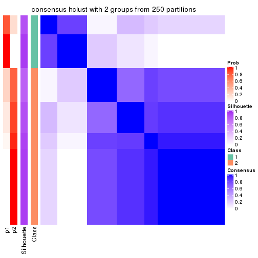</p>

</div>
<div id='tab-SD-hclust-consensus-heatmap-2'>
<pre><code class="r">consensus_heatmap(res, k = 3)
</code></pre>

<p>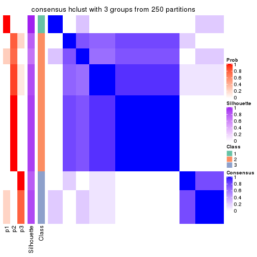</p>

</div>
<div id='tab-SD-hclust-consensus-heatmap-3'>
<pre><code class="r">consensus_heatmap(res, k = 4)
</code></pre>

<p>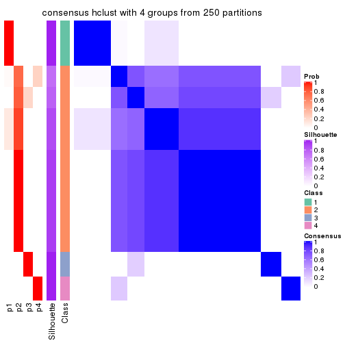</p>

</div>
<div id='tab-SD-hclust-consensus-heatmap-4'>
<pre><code class="r">consensus_heatmap(res, k = 5)
</code></pre>

<p>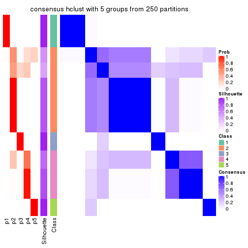</p>

</div>
<div id='tab-SD-hclust-consensus-heatmap-5'>
<pre><code class="r">consensus_heatmap(res, k = 6)
</code></pre>

<p>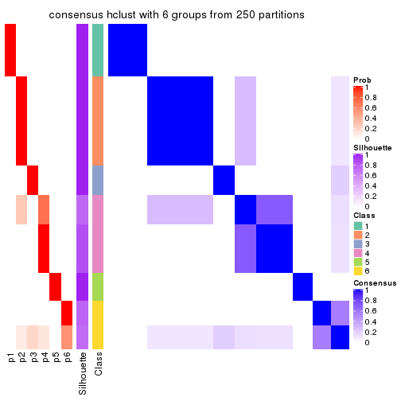</p>

</div>
</div>

Heatmaps for the membership of samples in all partitions to see how consistent they are:


<script>
$( function() {
	$( '#tabs-SD-hclust-membership-heatmap' ).tabs();
} );
</script>
<div id='tabs-SD-hclust-membership-heatmap'>
<ul>
<li><a href='#tab-SD-hclust-membership-heatmap-1'>k = 2</a></li>
<li><a href='#tab-SD-hclust-membership-heatmap-2'>k = 3</a></li>
<li><a href='#tab-SD-hclust-membership-heatmap-3'>k = 4</a></li>
<li><a href='#tab-SD-hclust-membership-heatmap-4'>k = 5</a></li>
<li><a href='#tab-SD-hclust-membership-heatmap-5'>k = 6</a></li>
</ul>
<div id='tab-SD-hclust-membership-heatmap-1'>
<pre><code class="r">membership_heatmap(res, k = 2)
</code></pre>

<p>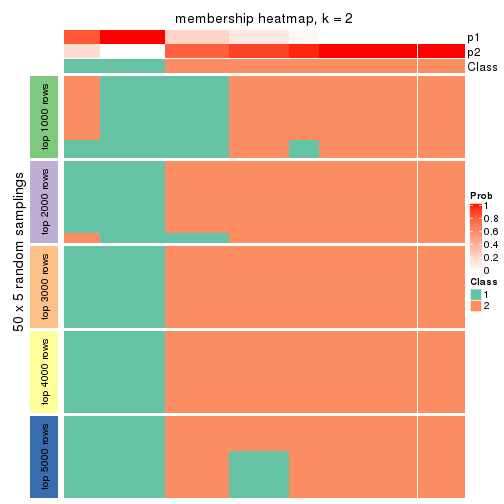</p>

</div>
<div id='tab-SD-hclust-membership-heatmap-2'>
<pre><code class="r">membership_heatmap(res, k = 3)
</code></pre>

<p>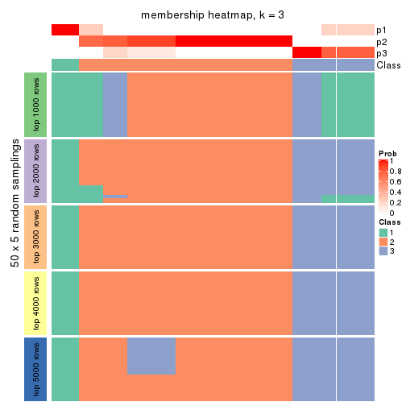</p>

</div>
<div id='tab-SD-hclust-membership-heatmap-3'>
<pre><code class="r">membership_heatmap(res, k = 4)
</code></pre>

<p>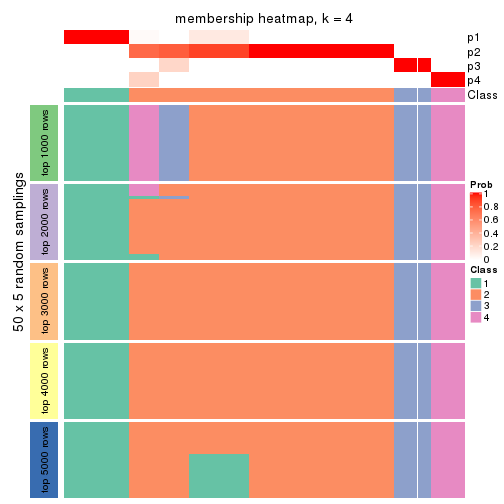</p>

</div>
<div id='tab-SD-hclust-membership-heatmap-4'>
<pre><code class="r">membership_heatmap(res, k = 5)
</code></pre>

<p>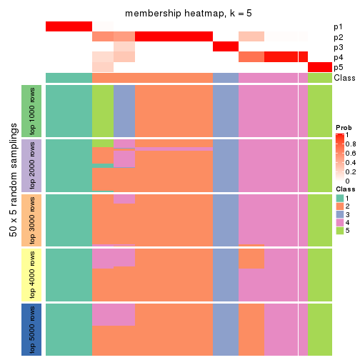</p>

</div>
<div id='tab-SD-hclust-membership-heatmap-5'>
<pre><code class="r">membership_heatmap(res, k = 6)
</code></pre>

<p>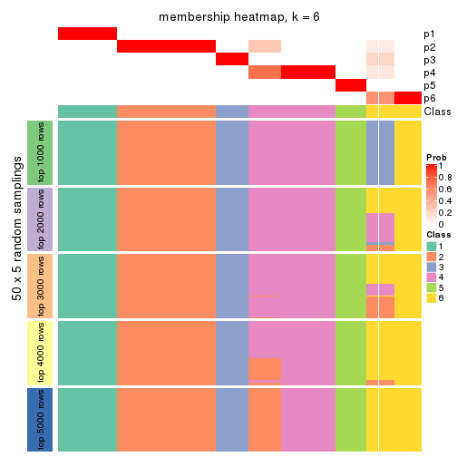</p>

</div>
</div>

As soon as we have had the classes for columns, we can look for signatures
which are significantly different between classes which can be candidate marks
for certain classes. Following are the heatmaps for signatures.


Signature heatmaps where rows are scaled:


<script>
$( function() {
	$( '#tabs-SD-hclust-get-signatures' ).tabs();
} );
</script>
<div id='tabs-SD-hclust-get-signatures'>
<ul>
<li><a href='#tab-SD-hclust-get-signatures-1'>k = 2</a></li>
<li><a href='#tab-SD-hclust-get-signatures-2'>k = 3</a></li>
<li><a href='#tab-SD-hclust-get-signatures-3'>k = 4</a></li>
<li><a href='#tab-SD-hclust-get-signatures-4'>k = 5</a></li>
<li><a href='#tab-SD-hclust-get-signatures-5'>k = 6</a></li>
</ul>
<div id='tab-SD-hclust-get-signatures-1'>
<pre><code class="r">get_signatures(res, k = 2)
</code></pre>

<p>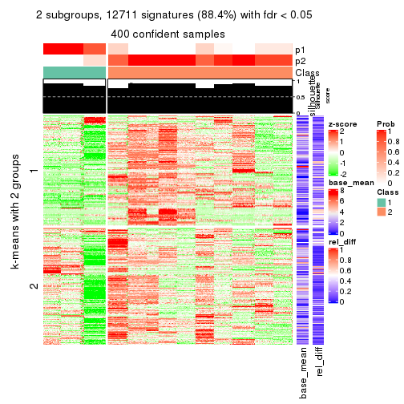</p>

</div>
<div id='tab-SD-hclust-get-signatures-2'>
<pre><code class="r">get_signatures(res, k = 3)
</code></pre>

<p>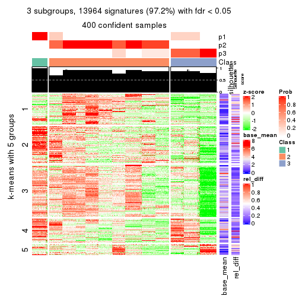</p>

</div>
<div id='tab-SD-hclust-get-signatures-3'>
<pre><code class="r">get_signatures(res, k = 4)
</code></pre>

<p>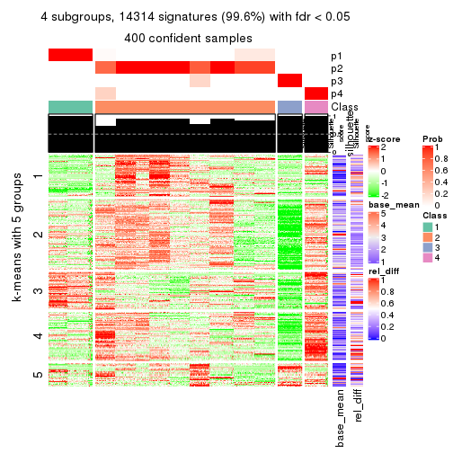</p>

</div>
<div id='tab-SD-hclust-get-signatures-4'>
<pre><code class="r">get_signatures(res, k = 5)
</code></pre>

<p>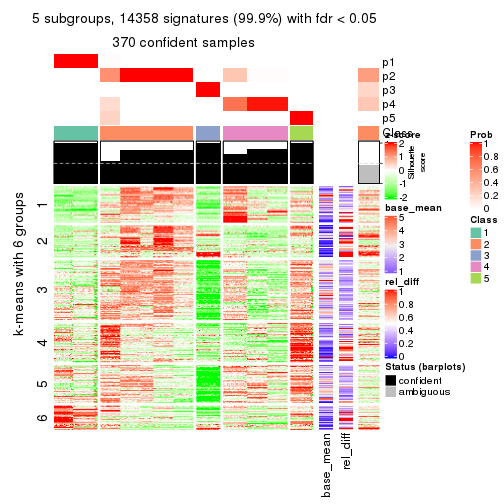</p>

</div>
<div id='tab-SD-hclust-get-signatures-5'>
<pre><code class="r">get_signatures(res, k = 6)
</code></pre>

<p>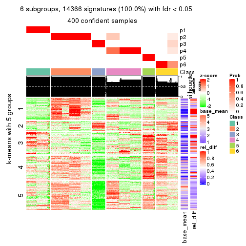</p>

</div>
</div>


Signature heatmaps where rows are not scaled:


<script>
$( function() {
	$( '#tabs-SD-hclust-get-signatures-no-scale' ).tabs();
} );
</script>
<div id='tabs-SD-hclust-get-signatures-no-scale'>
<ul>
<li><a href='#tab-SD-hclust-get-signatures-no-scale-1'>k = 2</a></li>
<li><a href='#tab-SD-hclust-get-signatures-no-scale-2'>k = 3</a></li>
<li><a href='#tab-SD-hclust-get-signatures-no-scale-3'>k = 4</a></li>
<li><a href='#tab-SD-hclust-get-signatures-no-scale-4'>k = 5</a></li>
<li><a href='#tab-SD-hclust-get-signatures-no-scale-5'>k = 6</a></li>
</ul>
<div id='tab-SD-hclust-get-signatures-no-scale-1'>
<pre><code class="r">get_signatures(res, k = 2, scale_rows = FALSE)
</code></pre>

<p>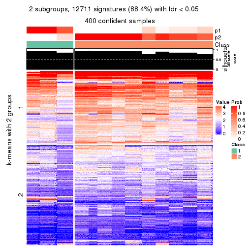</p>

</div>
<div id='tab-SD-hclust-get-signatures-no-scale-2'>
<pre><code class="r">get_signatures(res, k = 3, scale_rows = FALSE)
</code></pre>

<p>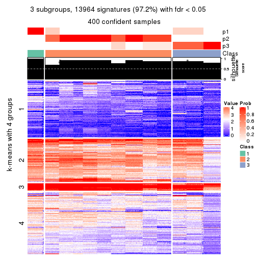</p>

</div>
<div id='tab-SD-hclust-get-signatures-no-scale-3'>
<pre><code class="r">get_signatures(res, k = 4, scale_rows = FALSE)
</code></pre>

<p>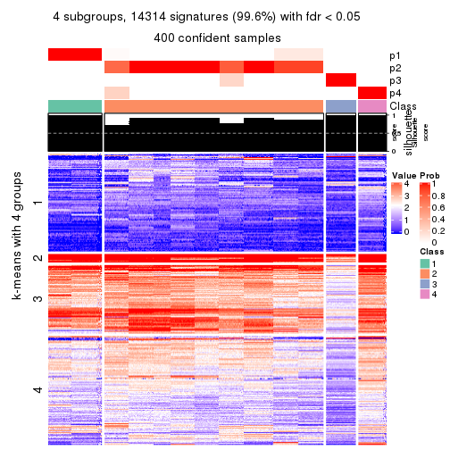</p>

</div>
<div id='tab-SD-hclust-get-signatures-no-scale-4'>
<pre><code class="r">get_signatures(res, k = 5, scale_rows = FALSE)
</code></pre>

<p>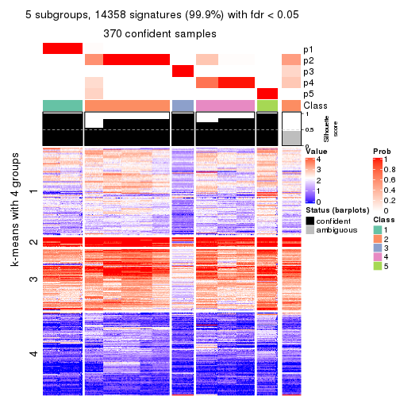</p>

</div>
<div id='tab-SD-hclust-get-signatures-no-scale-5'>
<pre><code class="r">get_signatures(res, k = 6, scale_rows = FALSE)
</code></pre>

<p>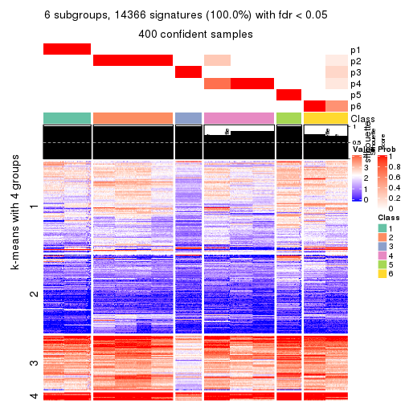</p>

</div>
</div>


Compare the overlap of signatures from different k:

```r
compare_signatures(res)
```

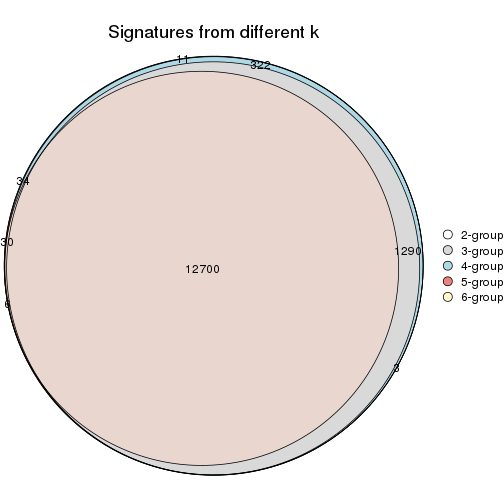

`get_signature()` returns a data frame invisibly. TO get the list of signatures, the function
call should be assigned to a variable explicitly. In following code, if `plot` argument is set
to `FALSE`, no heatmap is plotted while only the differential analysis is performed.

```r
# code only for demonstration
tb = get_signature(res, k = ..., plot = FALSE)
```

An example of the output of `tb` is:

```
#>   which_row         fdr    mean_1    mean_2 scaled_mean_1 scaled_mean_2 km
#> 1        38 0.042760348  8.373488  9.131774    -0.5533452     0.5164555  1
#> 2        40 0.018707592  7.106213  8.469186    -0.6173731     0.5762149  1
#> 3        55 0.019134737 10.221463 11.207825    -0.6159697     0.5749050  1
#> 4        59 0.006059896  5.921854  7.869574    -0.6899429     0.6439467  1
#> 5        60 0.018055526  8.928898 10.211722    -0.6204761     0.5791110  1
#> 6        98 0.009384629 15.714769 14.887706     0.6635654    -0.6193277  2
...
```

The columns in `tb` are:

1. `which_row`: row indices corresponding to the input matrix.
2. `fdr`: FDR for the differential test. 
3. `mean_x`: The mean value in group x.
4. `scaled_mean_x`: The mean value in group x after rows are scaled.
5. `km`: Row groups if k-means clustering is applied to rows.


UMAP plot which shows how samples are separated.


<script>
$( function() {
	$( '#tabs-SD-hclust-dimension-reduction' ).tabs();
} );
</script>
<div id='tabs-SD-hclust-dimension-reduction'>
<ul>
<li><a href='#tab-SD-hclust-dimension-reduction-1'>k = 2</a></li>
<li><a href='#tab-SD-hclust-dimension-reduction-2'>k = 3</a></li>
<li><a href='#tab-SD-hclust-dimension-reduction-3'>k = 4</a></li>
<li><a href='#tab-SD-hclust-dimension-reduction-4'>k = 5</a></li>
<li><a href='#tab-SD-hclust-dimension-reduction-5'>k = 6</a></li>
</ul>
<div id='tab-SD-hclust-dimension-reduction-1'>
<pre><code class="r">dimension_reduction(res, k = 2, method = &quot;UMAP&quot;)
</code></pre>

<p>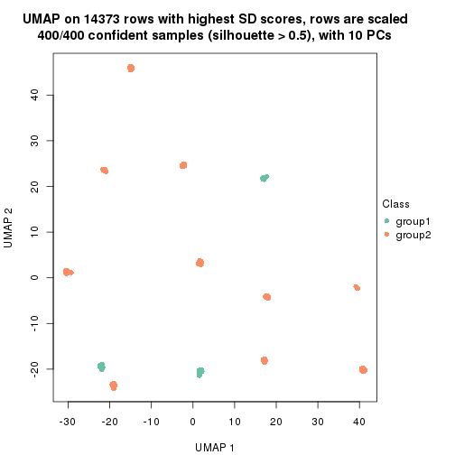</p>

</div>
<div id='tab-SD-hclust-dimension-reduction-2'>
<pre><code class="r">dimension_reduction(res, k = 3, method = &quot;UMAP&quot;)
</code></pre>

<p>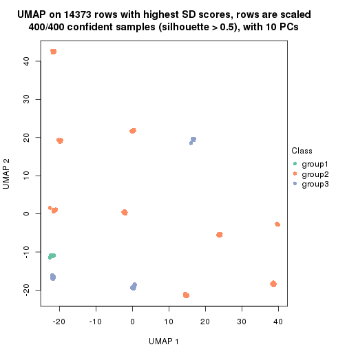</p>

</div>
<div id='tab-SD-hclust-dimension-reduction-3'>
<pre><code class="r">dimension_reduction(res, k = 4, method = &quot;UMAP&quot;)
</code></pre>

<p>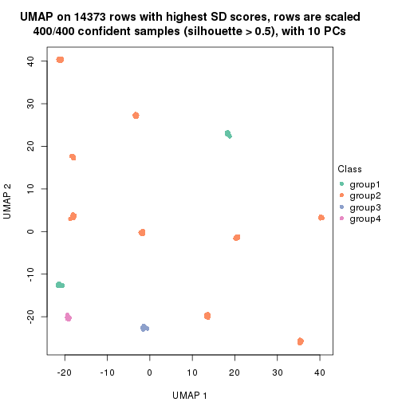</p>

</div>
<div id='tab-SD-hclust-dimension-reduction-4'>
<pre><code class="r">dimension_reduction(res, k = 5, method = &quot;UMAP&quot;)
</code></pre>

<p>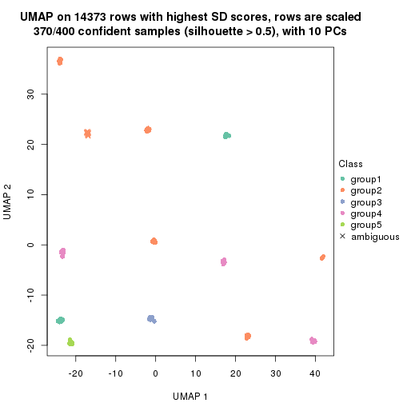</p>

</div>
<div id='tab-SD-hclust-dimension-reduction-5'>
<pre><code class="r">dimension_reduction(res, k = 6, method = &quot;UMAP&quot;)
</code></pre>

<p>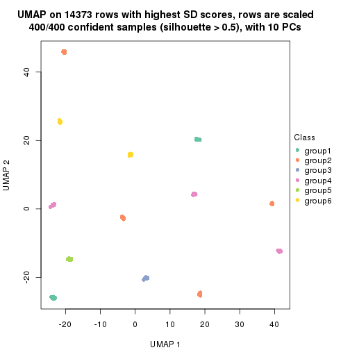</p>

</div>
</div>


Following heatmap shows how subgroups are split when increasing `k`:

```r
collect_classes(res)
```

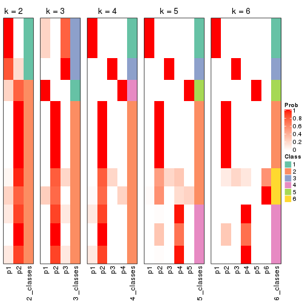


If matrix rows can be associated to genes, consider to use `GO_Enrichment(res,
...)` to perform function enrichment for the signature genes.


 

---------------------------------------------------


### SD:kmeans


The object with results only for a single top-value method and a single partition method 
can be extracted as:

```r
res = res_list["SD", "kmeans"]
# you can also extract it by
# res = res_list["SD:kmeans"]
```

A summary of `res` and all the functions that can be applied to it:

```r
res
```

```
#> A 'ConsensusPartition' object with k = 2, 3, 4, 5, 6.
#>   On a matrix with 14373 rows and 400 columns.
#>   Top rows (1000, 2000, 3000, 4000, 5000) are extracted by 'SD' method.
#>   Subgroups are detected by 'kmeans' method.
#>   Performed in total 1250 partitions by row resampling.
#>   Best k for subgroups seems to be 5.
#> 
#> Following methods can be applied to this 'ConsensusPartition' object:
#>  [1] "cola_report"             "collect_classes"         "collect_plots"          
#>  [4] "collect_stats"           "colnames"                "compare_signatures"     
#>  [7] "consensus_heatmap"       "dimension_reduction"     "functional_enrichment"  
#> [10] "get_anno_col"            "get_anno"                "get_classes"            
#> [13] "get_consensus"           "get_matrix"              "get_membership"         
#> [16] "get_param"               "get_signatures"          "get_stats"              
#> [19] "is_best_k"               "is_stable_k"             "membership_heatmap"     
#> [22] "ncol"                    "nrow"                    "plot_ecdf"              
#> [25] "rownames"                "select_partition_number" "show"                   
#> [28] "suggest_best_k"          "test_to_known_factors"
```

`collect_plots()` function collects all the plots made from `res` for all `k` (number of partitions)
into one single page to provide an easy and fast comparison between different `k`.

```r
collect_plots(res)
```

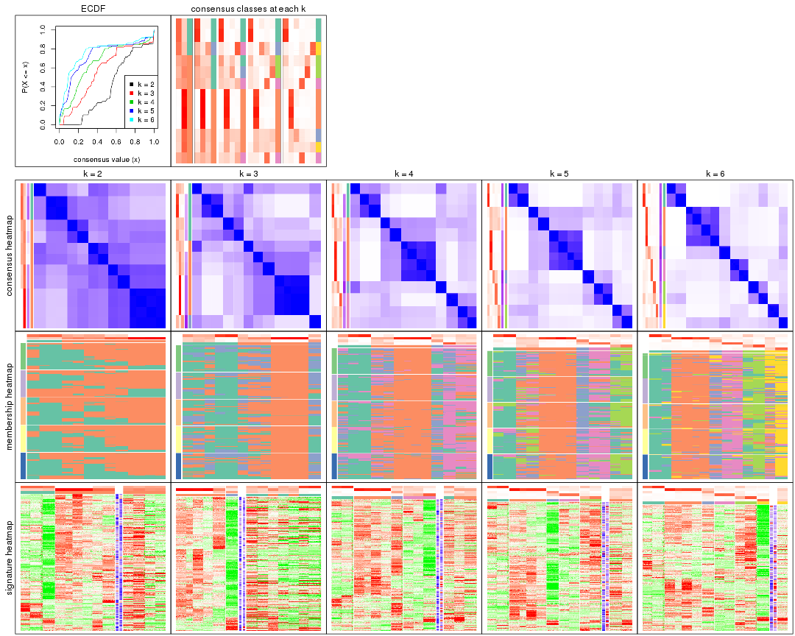

The plots are:

- The first row: a plot of the ECDF (Empirical cumulative distribution
  function) curves of the consensus matrix for each `k` and the heatmap of
  predicted classes for each `k`.
- The second row: heatmaps of the consensus matrix for each `k`.
- The third row: heatmaps of the membership matrix for each `k`.
- The fouth row: heatmaps of the signatures for each `k`.

All the plots in panels can be made by individual functions and they are
plotted later in this section.

`select_partition_number()` produces several plots showing different
statistics for choosing "optimized" `k`. There are following statistics:

- ECDF curves of the consensus matrix for each `k`;
- 1-PAC. [The PAC
  score](https://en.wikipedia.org/wiki/Consensus_clustering#Over-interpretation_potential_of_consensus_clustering)
  measures the proportion of the ambiguous subgrouping.
- Mean silhouette score.
- Concordance. The mean probability of fiting the consensus class ids in all
  partitions.
- Area increased. Denote $A_k$ as the area under the ECDF curve for current
  `k`, the area increased is defined as $A_k - A_{k-1}$.
- Rand index. The percent of pairs of samples that are both in a same cluster
  or both are not in a same cluster in the partition of k and k-1.
- Jaccard index. The ratio of pairs of samples are both in a same cluster in
  the partition of k and k-1 and the pairs of samples are both in a same
  cluster in the partition k or k-1.

The detailed explanations of these statistics can be found in [the cola
vignette](http://bioconductor.org/packages/devel/bioc/vignettes/cola/inst/doc/cola.html#toc_13).

Generally speaking, lower PAC score, higher mean silhouette score or higher
concordance corresponds to better partition. Rand index and Jaccard index
measure how similar the current partition is compared to partition with `k-1`.
If they are too similar, we won't accept `k` is better than `k-1`.

```r
select_partition_number(res)
```

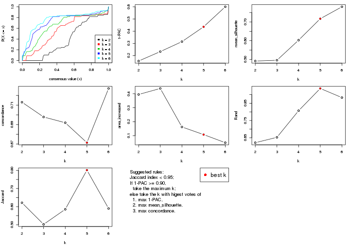

The numeric values for all these statistics can be obtained by `get_stats()`.

```r
get_stats(res)
```

```
#>   k 1-PAC mean_silhouette concordance area_increased  Rand Jaccard
#> 2 2 0.156           0.492       0.713         0.3947 0.622   0.622
#> 3 3 0.233           0.496       0.698         0.4378 0.653   0.502
#> 4 4 0.314           0.603       0.692         0.1622 0.807   0.585
#> 5 5 0.436           0.717       0.671         0.1077 0.936   0.801
#> 6 6 0.600           0.781       0.727         0.0497 0.883   0.590
```

`suggest_best_k()` suggests the best $k$ based on these statistics. The rules are as follows:

- All $k$ with Jaccard index larger than 0.95 are removed because the increase of
  the partition number does not provides enough extra information. If all $k$ are removed,
  the best $k$ is assigned by `NA`.
- For $k$ with 1-PAC larger than 0.9, the maximal $k$ is taken as the "best k". Other $k$ is called "optional k".
- If it does not fit the second rule. The $k$ with the highest vote of highest
  1-PAC, mean silhouette and concordance is taken as the "best k".

```r
suggest_best_k(res)
```

```
#> [1] 5
```


Following shows the table of the partitions (You need to click the **show/hide
code output** link to see it). The membership matrix (columns with name `p*`)
is inferred by
[`clue::cl_consensus()`](https://www.rdocumentation.org/link/cl_consensus?package=clue)
function with the `SE` method. Basically the value in the membership matrix
represents the probability to belong to a certain group. The finall class
label for an item is determined with the group with highest probability it
belongs to.

In `get_classes()` function, the entropy is calculated from the membership
matrix and the silhouette score is calculated from the consensus matrix.


<script>
$( function() {
	$( '#tabs-SD-kmeans-get-classes' ).tabs();
} );
</script>
<div id='tabs-SD-kmeans-get-classes'>
<ul>
<li><a href='#tab-SD-kmeans-get-classes-1'>k = 2</a></li>
<li><a href='#tab-SD-kmeans-get-classes-2'>k = 3</a></li>
<li><a href='#tab-SD-kmeans-get-classes-3'>k = 4</a></li>
<li><a href='#tab-SD-kmeans-get-classes-4'>k = 5</a></li>
<li><a href='#tab-SD-kmeans-get-classes-5'>k = 6</a></li>
</ul>

<div id='tab-SD-kmeans-get-classes-1'>
<p><a id='tab-SD-kmeans-get-classes-1-a' style='color:#0366d6' href='#'>show/hide code output</a></p>
<pre><code class="r">cbind(get_classes(res, k = 2), get_membership(res, k = 2))
</code></pre>

<pre><code>#&gt;            class entropy silhouette    p1    p2
#&gt; SRR1661716     2  0.0376     0.6496 0.004 0.996
#&gt; SRR1661717     2  0.0376     0.6496 0.004 0.996
#&gt; SRR1661718     2  0.0376     0.6496 0.004 0.996
#&gt; SRR1661719     2  0.0376     0.6496 0.004 0.996
#&gt; SRR1661720     2  0.0376     0.6496 0.004 0.996
#&gt; SRR1661721     2  0.0376     0.6496 0.004 0.996
#&gt; SRR1661722     2  0.0376     0.6496 0.004 0.996
#&gt; SRR1661723     2  0.0376     0.6496 0.004 0.996
#&gt; SRR1661724     2  0.0376     0.6496 0.004 0.996
#&gt; SRR1661725     2  0.0376     0.6496 0.004 0.996
#&gt; SRR1661726     2  0.0376     0.6496 0.004 0.996
#&gt; SRR1661727     2  0.0376     0.6496 0.004 0.996
#&gt; SRR1661728     2  0.0376     0.6496 0.004 0.996
#&gt; SRR1661729     2  0.0376     0.6496 0.004 0.996
#&gt; SRR1661730     2  0.0376     0.6496 0.004 0.996
#&gt; SRR1661731     2  0.0376     0.6496 0.004 0.996
#&gt; SRR1661732     2  0.0376     0.6496 0.004 0.996
#&gt; SRR1661733     2  0.0376     0.6496 0.004 0.996
#&gt; SRR1661734     2  0.0376     0.6496 0.004 0.996
#&gt; SRR1661735     2  0.0376     0.6496 0.004 0.996
#&gt; SRR1661736     2  0.0672     0.6485 0.008 0.992
#&gt; SRR1661737     2  0.0672     0.6485 0.008 0.992
#&gt; SRR1661738     2  0.0672     0.6485 0.008 0.992
#&gt; SRR1661739     2  0.0672     0.6485 0.008 0.992
#&gt; SRR1661740     2  0.0672     0.6485 0.008 0.992
#&gt; SRR1661741     2  0.0672     0.6485 0.008 0.992
#&gt; SRR1661742     2  0.0672     0.6485 0.008 0.992
#&gt; SRR1661743     2  0.0672     0.6485 0.008 0.992
#&gt; SRR1661744     2  0.0672     0.6485 0.008 0.992
#&gt; SRR1661745     2  0.0672     0.6485 0.008 0.992
#&gt; SRR1661746     2  0.0672     0.6485 0.008 0.992
#&gt; SRR1661747     2  0.0672     0.6485 0.008 0.992
#&gt; SRR1661748     2  0.0672     0.6485 0.008 0.992
#&gt; SRR1661749     2  0.0672     0.6485 0.008 0.992
#&gt; SRR1661750     2  0.0672     0.6485 0.008 0.992
#&gt; SRR1661751     2  0.0672     0.6485 0.008 0.992
#&gt; SRR1661752     2  0.0672     0.6485 0.008 0.992
#&gt; SRR1661753     2  0.0672     0.6485 0.008 0.992
#&gt; SRR1661754     2  0.0672     0.6485 0.008 0.992
#&gt; SRR1661755     2  0.0672     0.6485 0.008 0.992
#&gt; SRR1661756     2  0.0672     0.6485 0.008 0.992
#&gt; SRR1661757     2  0.0672     0.6485 0.008 0.992
#&gt; SRR1661758     2  0.0672     0.6485 0.008 0.992
#&gt; SRR1661759     2  0.0672     0.6485 0.008 0.992
#&gt; SRR1661760     2  0.0672     0.6485 0.008 0.992
#&gt; SRR1661761     2  0.0672     0.6485 0.008 0.992
#&gt; SRR1661762     2  0.0672     0.6485 0.008 0.992
#&gt; SRR1661763     2  0.0672     0.6485 0.008 0.992
#&gt; SRR1661764     2  0.0672     0.6485 0.008 0.992
#&gt; SRR1661766     2  0.0000     0.6501 0.000 1.000
#&gt; SRR1661767     2  0.0000     0.6501 0.000 1.000
#&gt; SRR1661768     2  0.0000     0.6501 0.000 1.000
#&gt; SRR1661769     2  0.0000     0.6501 0.000 1.000
#&gt; SRR1661770     2  0.0000     0.6501 0.000 1.000
#&gt; SRR1661771     2  0.0000     0.6501 0.000 1.000
#&gt; SRR1661772     2  0.0000     0.6501 0.000 1.000
#&gt; SRR1661773     2  0.0000     0.6501 0.000 1.000
#&gt; SRR1661774     2  0.0000     0.6501 0.000 1.000
#&gt; SRR1661775     2  0.0000     0.6501 0.000 1.000
#&gt; SRR1661776     2  0.0000     0.6501 0.000 1.000
#&gt; SRR1661777     2  0.0000     0.6501 0.000 1.000
#&gt; SRR1661778     2  0.0000     0.6501 0.000 1.000
#&gt; SRR1661779     2  0.0000     0.6501 0.000 1.000
#&gt; SRR1661780     2  0.0000     0.6501 0.000 1.000
#&gt; SRR1661781     2  0.0000     0.6501 0.000 1.000
#&gt; SRR1661782     2  0.0000     0.6501 0.000 1.000
#&gt; SRR1661783     2  0.0000     0.6501 0.000 1.000
#&gt; SRR1661784     2  0.0000     0.6501 0.000 1.000
#&gt; SRR1661785     2  0.0000     0.6501 0.000 1.000
#&gt; SRR1661786     2  0.0000     0.6501 0.000 1.000
#&gt; SRR1661787     2  0.0000     0.6501 0.000 1.000
#&gt; SRR1661788     2  0.0000     0.6501 0.000 1.000
#&gt; SRR1661789     2  0.0000     0.6501 0.000 1.000
#&gt; SRR1661790     2  0.0000     0.6501 0.000 1.000
#&gt; SRR1661791     2  0.0000     0.6501 0.000 1.000
#&gt; SRR1661792     2  0.0000     0.6501 0.000 1.000
#&gt; SRR1661793     2  0.0000     0.6501 0.000 1.000
#&gt; SRR1661794     2  0.0000     0.6501 0.000 1.000
#&gt; SRR1661795     2  0.0000     0.6501 0.000 1.000
#&gt; SRR1661796     2  0.0376     0.6491 0.004 0.996
#&gt; SRR1661797     2  0.0376     0.6491 0.004 0.996
#&gt; SRR1661798     2  0.0376     0.6491 0.004 0.996
#&gt; SRR1661799     2  0.0376     0.6491 0.004 0.996
#&gt; SRR1661800     2  0.0376     0.6491 0.004 0.996
#&gt; SRR1661801     2  0.0376     0.6491 0.004 0.996
#&gt; SRR1661802     2  0.0376     0.6491 0.004 0.996
#&gt; SRR1661803     2  0.0376     0.6491 0.004 0.996
#&gt; SRR1661804     2  0.0376     0.6491 0.004 0.996
#&gt; SRR1661805     2  0.0376     0.6491 0.004 0.996
#&gt; SRR1661806     2  0.0376     0.6491 0.004 0.996
#&gt; SRR1661807     2  0.0376     0.6491 0.004 0.996
#&gt; SRR1661808     2  0.0376     0.6491 0.004 0.996
#&gt; SRR1661809     2  0.0376     0.6491 0.004 0.996
#&gt; SRR1661810     2  0.0376     0.6491 0.004 0.996
#&gt; SRR1661811     2  0.0376     0.6491 0.004 0.996
#&gt; SRR1661812     2  0.0376     0.6491 0.004 0.996
#&gt; SRR1661813     2  0.0376     0.6491 0.004 0.996
#&gt; SRR1661814     2  0.0376     0.6491 0.004 0.996
#&gt; SRR1661815     2  0.0376     0.6491 0.004 0.996
#&gt; SRR1661816     2  0.0376     0.6491 0.004 0.996
#&gt; SRR1661817     2  0.0376     0.6491 0.004 0.996
#&gt; SRR1661818     2  0.0376     0.6491 0.004 0.996
#&gt; SRR1661819     2  0.0376     0.6491 0.004 0.996
#&gt; SRR1661820     2  0.0376     0.6491 0.004 0.996
#&gt; SRR1661821     2  0.0376     0.6491 0.004 0.996
#&gt; SRR1661822     2  0.0376     0.6491 0.004 0.996
#&gt; SRR1661823     2  0.0376     0.6491 0.004 0.996
#&gt; SRR1661824     2  0.0376     0.6491 0.004 0.996
#&gt; SRR1661825     2  0.0376     0.6491 0.004 0.996
#&gt; SRR1661826     1  0.7950     0.7657 0.760 0.240
#&gt; SRR1661827     1  0.7950     0.7657 0.760 0.240
#&gt; SRR1661828     1  0.7950     0.7657 0.760 0.240
#&gt; SRR1661829     1  0.7950     0.7657 0.760 0.240
#&gt; SRR1661830     1  0.7950     0.7657 0.760 0.240
#&gt; SRR1661831     1  0.7950     0.7657 0.760 0.240
#&gt; SRR1661832     1  0.7950     0.7657 0.760 0.240
#&gt; SRR1661833     1  0.7950     0.7657 0.760 0.240
#&gt; SRR1661834     1  0.7950     0.7657 0.760 0.240
#&gt; SRR1661835     1  0.7950     0.7657 0.760 0.240
#&gt; SRR1661836     1  0.7950     0.7657 0.760 0.240
#&gt; SRR1661837     1  0.7950     0.7657 0.760 0.240
#&gt; SRR1661838     1  0.7950     0.7657 0.760 0.240
#&gt; SRR1661839     1  0.7950     0.7657 0.760 0.240
#&gt; SRR1661840     1  0.7950     0.7657 0.760 0.240
#&gt; SRR1661841     1  0.7950     0.7657 0.760 0.240
#&gt; SRR1661843     1  0.7950     0.7657 0.760 0.240
#&gt; SRR1661844     1  0.7950     0.7657 0.760 0.240
#&gt; SRR1661845     1  0.7950     0.7657 0.760 0.240
#&gt; SRR1661846     1  0.7950     0.7657 0.760 0.240
#&gt; SRR1661847     1  0.7950     0.7657 0.760 0.240
#&gt; SRR1661848     1  0.7950     0.7657 0.760 0.240
#&gt; SRR1661849     1  0.7950     0.7657 0.760 0.240
#&gt; SRR1661850     1  0.7950     0.7657 0.760 0.240
#&gt; SRR1661851     1  0.7950     0.7657 0.760 0.240
#&gt; SRR1661852     1  0.7950     0.7657 0.760 0.240
#&gt; SRR1661853     1  0.7950     0.7657 0.760 0.240
#&gt; SRR1661854     1  0.7950     0.7657 0.760 0.240
#&gt; SRR1661855     1  0.7950     0.7657 0.760 0.240
#&gt; SRR1661856     1  0.8909     0.5335 0.692 0.308
#&gt; SRR1661857     1  0.8909     0.5335 0.692 0.308
#&gt; SRR1661858     1  0.8909     0.5335 0.692 0.308
#&gt; SRR1661859     1  0.8909     0.5335 0.692 0.308
#&gt; SRR1661860     1  0.8909     0.5335 0.692 0.308
#&gt; SRR1661861     1  0.8909     0.5335 0.692 0.308
#&gt; SRR1661862     1  0.8909     0.5335 0.692 0.308
#&gt; SRR1661863     1  0.8909     0.5335 0.692 0.308
#&gt; SRR1661864     1  0.8909     0.5335 0.692 0.308
#&gt; SRR1661865     1  0.8909     0.5335 0.692 0.308
#&gt; SRR1661866     1  0.8909     0.5335 0.692 0.308
#&gt; SRR1661867     1  0.8909     0.5335 0.692 0.308
#&gt; SRR1661868     1  0.8909     0.5335 0.692 0.308
#&gt; SRR1661869     1  0.8909     0.5335 0.692 0.308
#&gt; SRR1661870     1  0.8909     0.5335 0.692 0.308
#&gt; SRR1661871     1  0.8909     0.5335 0.692 0.308
#&gt; SRR1661872     1  0.8909     0.5335 0.692 0.308
#&gt; SRR1661873     1  0.8909     0.5335 0.692 0.308
#&gt; SRR1661874     1  0.8909     0.5335 0.692 0.308
#&gt; SRR1661875     1  0.8909     0.5335 0.692 0.308
#&gt; SRR1661876     1  0.8909     0.5335 0.692 0.308
#&gt; SRR1661877     1  0.8909     0.5335 0.692 0.308
#&gt; SRR1661878     1  0.8909     0.5335 0.692 0.308
#&gt; SRR1661879     1  0.8909     0.5335 0.692 0.308
#&gt; SRR1661880     1  0.8909     0.5335 0.692 0.308
#&gt; SRR1661881     1  0.8909     0.5335 0.692 0.308
#&gt; SRR1661882     1  0.8909     0.5335 0.692 0.308
#&gt; SRR1661883     1  0.8909     0.5335 0.692 0.308
#&gt; SRR1661884     1  0.8909     0.5335 0.692 0.308
#&gt; SRR1661885     1  0.8909     0.5335 0.692 0.308
#&gt; SRR1661886     1  0.8909     0.5335 0.692 0.308
#&gt; SRR1661887     1  0.8909     0.5335 0.692 0.308
#&gt; SRR1661888     1  0.8909     0.5335 0.692 0.308
#&gt; SRR1661889     1  0.8909     0.5335 0.692 0.308
#&gt; SRR1661890     1  0.8909     0.5335 0.692 0.308
#&gt; SRR1661891     1  0.8909     0.5335 0.692 0.308
#&gt; SRR1661892     1  0.8016     0.7658 0.756 0.244
#&gt; SRR1661893     1  0.8016     0.7658 0.756 0.244
#&gt; SRR1661894     1  0.8016     0.7658 0.756 0.244
#&gt; SRR1661895     1  0.8016     0.7658 0.756 0.244
#&gt; SRR1661896     1  0.8016     0.7658 0.756 0.244
#&gt; SRR1661897     1  0.8016     0.7658 0.756 0.244
#&gt; SRR1661898     1  0.8016     0.7658 0.756 0.244
#&gt; SRR1661899     1  0.8016     0.7658 0.756 0.244
#&gt; SRR1661900     1  0.8016     0.7658 0.756 0.244
#&gt; SRR1661901     1  0.8016     0.7658 0.756 0.244
#&gt; SRR1661902     1  0.8016     0.7658 0.756 0.244
#&gt; SRR1661903     1  0.8016     0.7658 0.756 0.244
#&gt; SRR1661904     1  0.8016     0.7658 0.756 0.244
#&gt; SRR1661905     1  0.8016     0.7658 0.756 0.244
#&gt; SRR1661906     1  0.8016     0.7658 0.756 0.244
#&gt; SRR1661907     1  0.8016     0.7658 0.756 0.244
#&gt; SRR1661908     1  0.8016     0.7658 0.756 0.244
#&gt; SRR1661909     1  0.8016     0.7658 0.756 0.244
#&gt; SRR1661910     1  0.8016     0.7658 0.756 0.244
#&gt; SRR1661911     1  0.8016     0.7658 0.756 0.244
#&gt; SRR1661912     1  0.8016     0.7658 0.756 0.244
#&gt; SRR1661913     1  0.8016     0.7658 0.756 0.244
#&gt; SRR1661914     1  0.8016     0.7658 0.756 0.244
#&gt; SRR1661915     1  0.7602     0.7473 0.780 0.220
#&gt; SRR1661916     1  0.8016     0.7658 0.756 0.244
#&gt; SRR1661917     1  0.8016     0.7658 0.756 0.244
#&gt; SRR1661918     1  0.8016     0.7658 0.756 0.244
#&gt; SRR1661919     1  0.8016     0.7658 0.756 0.244
#&gt; SRR1661920     1  0.8016     0.7658 0.756 0.244
#&gt; SRR1661921     1  0.8016     0.7658 0.756 0.244
#&gt; SRR1661922     1  0.8016     0.7658 0.756 0.244
#&gt; SRR1661923     1  0.8016     0.7658 0.756 0.244
#&gt; SRR1661924     1  0.8016     0.7658 0.756 0.244
#&gt; SRR1661925     1  0.8016     0.7658 0.756 0.244
#&gt; SRR1661926     1  0.8016     0.7658 0.756 0.244
#&gt; SRR1661927     1  0.8016     0.7658 0.756 0.244
#&gt; SRR1661928     2  0.7674     0.5745 0.224 0.776
#&gt; SRR1661929     2  0.7674     0.5745 0.224 0.776
#&gt; SRR1661930     2  0.7674     0.5745 0.224 0.776
#&gt; SRR1661931     2  0.7674     0.5745 0.224 0.776
#&gt; SRR1661932     2  0.7674     0.5745 0.224 0.776
#&gt; SRR1661933     2  0.7674     0.5745 0.224 0.776
#&gt; SRR1661934     2  0.7674     0.5745 0.224 0.776
#&gt; SRR1661935     2  0.7674     0.5745 0.224 0.776
#&gt; SRR1661936     2  0.7674     0.5745 0.224 0.776
#&gt; SRR1661937     2  0.7674     0.5745 0.224 0.776
#&gt; SRR1661938     2  0.7674     0.5745 0.224 0.776
#&gt; SRR1661939     2  0.7674     0.5745 0.224 0.776
#&gt; SRR1661940     2  0.7674     0.5745 0.224 0.776
#&gt; SRR1661941     2  0.7674     0.5745 0.224 0.776
#&gt; SRR1661942     2  0.7674     0.5745 0.224 0.776
#&gt; SRR1661943     2  0.7674     0.5745 0.224 0.776
#&gt; SRR1661944     2  0.7674     0.5745 0.224 0.776
#&gt; SRR1661945     2  0.7674     0.5745 0.224 0.776
#&gt; SRR1661946     2  0.7674     0.5745 0.224 0.776
#&gt; SRR1661947     2  0.7674     0.5745 0.224 0.776
#&gt; SRR1661948     2  0.7674     0.5745 0.224 0.776
#&gt; SRR1661949     2  0.7674     0.5745 0.224 0.776
#&gt; SRR1661950     2  0.7674     0.5745 0.224 0.776
#&gt; SRR1661951     2  0.7674     0.5745 0.224 0.776
#&gt; SRR1661952     2  0.7674     0.5745 0.224 0.776
#&gt; SRR1661953     2  0.7674     0.5745 0.224 0.776
#&gt; SRR1661954     2  0.7674     0.5745 0.224 0.776
#&gt; SRR1661955     2  0.7674     0.5745 0.224 0.776
#&gt; SRR1661956     2  0.7674     0.5745 0.224 0.776
#&gt; SRR1661957     2  0.7674     0.5745 0.224 0.776
#&gt; SRR1661958     2  0.9954     0.0494 0.460 0.540
#&gt; SRR1661959     2  0.9954     0.0494 0.460 0.540
#&gt; SRR1661960     2  0.9954     0.0494 0.460 0.540
#&gt; SRR1661961     2  0.9954     0.0494 0.460 0.540
#&gt; SRR1661962     2  0.9954     0.0494 0.460 0.540
#&gt; SRR1661963     2  0.9954     0.0494 0.460 0.540
#&gt; SRR1661964     2  0.9954     0.0494 0.460 0.540
#&gt; SRR1661965     2  0.9954     0.0494 0.460 0.540
#&gt; SRR1661966     2  0.9954     0.0494 0.460 0.540
#&gt; SRR1661967     2  0.9954     0.0494 0.460 0.540
#&gt; SRR1661968     2  0.9954     0.0494 0.460 0.540
#&gt; SRR1661969     2  0.9954     0.0494 0.460 0.540
#&gt; SRR1661970     2  0.9954     0.0494 0.460 0.540
#&gt; SRR1661971     2  0.9954     0.0494 0.460 0.540
#&gt; SRR1661972     2  0.9954     0.0494 0.460 0.540
#&gt; SRR1661973     2  0.9954     0.0494 0.460 0.540
#&gt; SRR1661974     2  0.9954     0.0494 0.460 0.540
#&gt; SRR1661975     2  0.9954     0.0494 0.460 0.540
#&gt; SRR1661976     2  0.9954     0.0494 0.460 0.540
#&gt; SRR1661977     2  0.9954     0.0494 0.460 0.540
#&gt; SRR1661978     2  0.9954     0.0494 0.460 0.540
#&gt; SRR1661979     2  0.9954     0.0494 0.460 0.540
#&gt; SRR1661980     2  0.9954     0.0494 0.460 0.540
#&gt; SRR1661981     2  0.9954     0.0494 0.460 0.540
#&gt; SRR1661982     2  0.9954     0.0494 0.460 0.540
#&gt; SRR1661983     2  0.9954     0.0494 0.460 0.540
#&gt; SRR1661984     2  0.9954     0.0494 0.460 0.540
#&gt; SRR1661985     2  0.9954     0.0494 0.460 0.540
#&gt; SRR1661986     2  0.9954     0.0494 0.460 0.540
#&gt; SRR1661987     2  0.9954     0.0494 0.460 0.540
#&gt; SRR1661988     2  0.9922     0.1412 0.448 0.552
#&gt; SRR1661989     2  0.9922     0.1412 0.448 0.552
#&gt; SRR1661990     2  0.9922     0.1412 0.448 0.552
#&gt; SRR1661991     2  0.9922     0.1412 0.448 0.552
#&gt; SRR1661992     2  0.9922     0.1412 0.448 0.552
#&gt; SRR1661993     2  0.9922     0.1412 0.448 0.552
#&gt; SRR1661994     2  0.9922     0.1412 0.448 0.552
#&gt; SRR1661995     2  0.9922     0.1412 0.448 0.552
#&gt; SRR1661996     2  0.9922     0.1412 0.448 0.552
#&gt; SRR1661997     2  0.9922     0.1412 0.448 0.552
#&gt; SRR1661998     2  0.9922     0.1412 0.448 0.552
#&gt; SRR1661999     2  0.9922     0.1412 0.448 0.552
#&gt; SRR1662000     2  0.9922     0.1412 0.448 0.552
#&gt; SRR1662001     2  0.9922     0.1412 0.448 0.552
#&gt; SRR1662002     2  0.9922     0.1412 0.448 0.552
#&gt; SRR1662003     2  0.9922     0.1412 0.448 0.552
#&gt; SRR1662004     2  0.9922     0.1412 0.448 0.552
#&gt; SRR1662005     2  0.9922     0.1412 0.448 0.552
#&gt; SRR1662006     2  0.9922     0.1412 0.448 0.552
#&gt; SRR1662007     2  0.9922     0.1412 0.448 0.552
#&gt; SRR1662008     2  0.9922     0.1412 0.448 0.552
#&gt; SRR1662009     2  0.9922     0.1412 0.448 0.552
#&gt; SRR1662010     2  0.9922     0.1412 0.448 0.552
#&gt; SRR1662011     2  0.9922     0.1412 0.448 0.552
#&gt; SRR1662012     2  0.9922     0.1412 0.448 0.552
#&gt; SRR1662013     2  0.9922     0.1412 0.448 0.552
#&gt; SRR1662014     2  0.9922     0.1412 0.448 0.552
#&gt; SRR1662015     2  0.9922     0.1412 0.448 0.552
#&gt; SRR1662016     2  0.9922     0.1412 0.448 0.552
#&gt; SRR1662017     2  0.9922     0.1412 0.448 0.552
#&gt; SRR1662018     2  0.8081     0.5644 0.248 0.752
#&gt; SRR1662019     2  0.8081     0.5644 0.248 0.752
#&gt; SRR1662020     2  0.8081     0.5644 0.248 0.752
#&gt; SRR1662021     2  0.8081     0.5644 0.248 0.752
#&gt; SRR1662022     2  0.8081     0.5644 0.248 0.752
#&gt; SRR1662023     2  0.8081     0.5644 0.248 0.752
#&gt; SRR1662024     2  0.8081     0.5644 0.248 0.752
#&gt; SRR1662025     2  0.8081     0.5644 0.248 0.752
#&gt; SRR1662026     2  0.8081     0.5644 0.248 0.752
#&gt; SRR1662027     2  0.8081     0.5644 0.248 0.752
#&gt; SRR1662028     2  0.8081     0.5644 0.248 0.752
#&gt; SRR1662029     2  0.8081     0.5644 0.248 0.752
#&gt; SRR1662030     2  0.8081     0.5644 0.248 0.752
#&gt; SRR1662031     2  0.8081     0.5644 0.248 0.752
#&gt; SRR1662032     2  0.8081     0.5644 0.248 0.752
#&gt; SRR1662033     2  0.8081     0.5644 0.248 0.752
#&gt; SRR1662034     2  0.8081     0.5644 0.248 0.752
#&gt; SRR1662035     2  0.8081     0.5644 0.248 0.752
#&gt; SRR1662036     2  0.8081     0.5644 0.248 0.752
#&gt; SRR1662037     2  0.8081     0.5644 0.248 0.752
#&gt; SRR1662038     2  0.8081     0.5644 0.248 0.752
#&gt; SRR1662039     2  0.8081     0.5644 0.248 0.752
#&gt; SRR1662040     2  0.8081     0.5644 0.248 0.752
#&gt; SRR1662041     2  0.8081     0.5644 0.248 0.752
#&gt; SRR1662042     2  0.8081     0.5644 0.248 0.752
#&gt; SRR1662043     2  0.8081     0.5644 0.248 0.752
#&gt; SRR1662044     2  0.8081     0.5644 0.248 0.752
#&gt; SRR1662045     2  0.8081     0.5644 0.248 0.752
#&gt; SRR1662046     2  0.8081     0.5644 0.248 0.752
#&gt; SRR1662047     2  0.8081     0.5644 0.248 0.752
#&gt; SRR1662048     2  0.8081     0.5644 0.248 0.752
#&gt; SRR1662049     2  0.8081     0.5644 0.248 0.752
#&gt; SRR1662050     2  0.8081     0.5644 0.248 0.752
#&gt; SRR1662051     2  0.8081     0.5644 0.248 0.752
#&gt; SRR1662052     2  0.8081     0.5644 0.248 0.752
#&gt; SRR1662053     2  0.8081     0.5644 0.248 0.752
#&gt; SRR1662054     2  0.9909     0.1134 0.444 0.556
#&gt; SRR1662055     2  0.9909     0.1134 0.444 0.556
#&gt; SRR1662056     2  0.9909     0.1134 0.444 0.556
#&gt; SRR1662057     2  0.9909     0.1134 0.444 0.556
#&gt; SRR1662058     2  0.9909     0.1134 0.444 0.556
#&gt; SRR1662059     2  0.9909     0.1134 0.444 0.556
#&gt; SRR1662060     2  0.9909     0.1134 0.444 0.556
#&gt; SRR1662061     2  0.9909     0.1134 0.444 0.556
#&gt; SRR1662062     2  0.9909     0.1134 0.444 0.556
#&gt; SRR1662063     2  0.9909     0.1134 0.444 0.556
#&gt; SRR1662064     2  0.9909     0.1134 0.444 0.556
#&gt; SRR1662065     2  0.9909     0.1134 0.444 0.556
#&gt; SRR1662066     2  0.9909     0.1134 0.444 0.556
#&gt; SRR1662067     2  0.9909     0.1134 0.444 0.556
#&gt; SRR1662068     2  0.9909     0.1134 0.444 0.556
#&gt; SRR1662069     2  0.9909     0.1134 0.444 0.556
#&gt; SRR1662070     2  0.9909     0.1134 0.444 0.556
#&gt; SRR1662071     2  0.9909     0.1134 0.444 0.556
#&gt; SRR1662072     2  0.9909     0.1134 0.444 0.556
#&gt; SRR1662073     2  0.9909     0.1134 0.444 0.556
#&gt; SRR1662074     2  0.9909     0.1134 0.444 0.556
#&gt; SRR1662075     2  0.9909     0.1134 0.444 0.556
#&gt; SRR1662076     2  0.9909     0.1134 0.444 0.556
#&gt; SRR1662077     2  0.9909     0.1134 0.444 0.556
#&gt; SRR1662078     2  0.9909     0.1134 0.444 0.556
#&gt; SRR1662079     2  0.9909     0.1134 0.444 0.556
#&gt; SRR1662080     2  0.9909     0.1134 0.444 0.556
#&gt; SRR1662081     2  0.9909     0.1134 0.444 0.556
#&gt; SRR1662082     2  0.9909     0.1134 0.444 0.556
#&gt; SRR1662083     2  0.9909     0.1134 0.444 0.556
#&gt; SRR1662084     2  0.9580     0.3091 0.380 0.620
#&gt; SRR1662085     2  0.9580     0.3091 0.380 0.620
#&gt; SRR1662086     2  0.9580     0.3091 0.380 0.620
#&gt; SRR1662087     2  0.9608     0.3046 0.384 0.616
#&gt; SRR1662088     2  0.9580     0.3091 0.380 0.620
#&gt; SRR1662089     2  0.9580     0.3091 0.380 0.620
#&gt; SRR1662090     2  0.9580     0.3091 0.380 0.620
#&gt; SRR1662091     2  0.9580     0.3091 0.380 0.620
#&gt; SRR1662092     2  0.9580     0.3091 0.380 0.620
#&gt; SRR1662093     2  0.9580     0.3091 0.380 0.620
#&gt; SRR1662094     2  0.9580     0.3091 0.380 0.620
#&gt; SRR1662095     2  0.9580     0.3091 0.380 0.620
#&gt; SRR1662096     2  0.9580     0.3091 0.380 0.620
#&gt; SRR1662097     2  0.9580     0.3091 0.380 0.620
#&gt; SRR1662098     2  0.9580     0.3091 0.380 0.620
#&gt; SRR1662099     2  0.9580     0.3091 0.380 0.620
#&gt; SRR1662100     2  0.9580     0.3091 0.380 0.620
#&gt; SRR1662101     2  0.9580     0.3091 0.380 0.620
#&gt; SRR1662102     2  0.9580     0.3091 0.380 0.620
#&gt; SRR1662103     2  0.9580     0.3091 0.380 0.620
#&gt; SRR1662104     2  0.9580     0.3091 0.380 0.620
#&gt; SRR1662105     2  0.9580     0.3091 0.380 0.620
#&gt; SRR1662106     2  0.9580     0.3091 0.380 0.620
#&gt; SRR1662107     2  0.9580     0.3091 0.380 0.620
#&gt; SRR1662108     2  0.9580     0.3091 0.380 0.620
#&gt; SRR1662109     2  0.9580     0.3091 0.380 0.620
#&gt; SRR1662110     2  0.9580     0.3091 0.380 0.620
#&gt; SRR1662111     2  0.9993     0.0690 0.484 0.516
#&gt; SRR1662112     2  0.9580     0.3091 0.380 0.620
#&gt; SRR1662113     2  0.9580     0.3091 0.380 0.620
#&gt; SRR1662114     2  0.9580     0.3091 0.380 0.620
#&gt; SRR1662115     2  0.9580     0.3091 0.380 0.620
#&gt; SRR1662116     2  0.9580     0.3091 0.380 0.620
#&gt; SRR1662117     2  0.9580     0.3091 0.380 0.620
</code></pre>

<script>
$('#tab-SD-kmeans-get-classes-1-a').parent().next().next().hide();
$('#tab-SD-kmeans-get-classes-1-a').click(function(){
  $('#tab-SD-kmeans-get-classes-1-a').parent().next().next().toggle();
  return(false);
});
</script>
</div>

<div id='tab-SD-kmeans-get-classes-2'>
<p><a id='tab-SD-kmeans-get-classes-2-a' style='color:#0366d6' href='#'>show/hide code output</a></p>
<pre><code class="r">cbind(get_classes(res, k = 3), get_membership(res, k = 3))
</code></pre>

<pre><code>#&gt;            class entropy silhouette    p1    p2    p3
#&gt; SRR1661716     2  0.0237      0.738 0.000 0.996 0.004
#&gt; SRR1661717     2  0.0237      0.738 0.000 0.996 0.004
#&gt; SRR1661718     2  0.0237      0.738 0.000 0.996 0.004
#&gt; SRR1661719     2  0.0237      0.738 0.000 0.996 0.004
#&gt; SRR1661720     2  0.0237      0.738 0.000 0.996 0.004
#&gt; SRR1661721     2  0.0237      0.738 0.000 0.996 0.004
#&gt; SRR1661722     2  0.0237      0.738 0.000 0.996 0.004
#&gt; SRR1661723     2  0.0237      0.738 0.000 0.996 0.004
#&gt; SRR1661724     2  0.0237      0.738 0.000 0.996 0.004
#&gt; SRR1661725     2  0.0237      0.738 0.000 0.996 0.004
#&gt; SRR1661726     2  0.0237      0.738 0.000 0.996 0.004
#&gt; SRR1661727     2  0.0237      0.738 0.000 0.996 0.004
#&gt; SRR1661728     2  0.0237      0.738 0.000 0.996 0.004
#&gt; SRR1661729     2  0.0237      0.738 0.000 0.996 0.004
#&gt; SRR1661730     2  0.0237      0.738 0.000 0.996 0.004
#&gt; SRR1661731     2  0.0237      0.738 0.000 0.996 0.004
#&gt; SRR1661732     2  0.0237      0.738 0.000 0.996 0.004
#&gt; SRR1661733     2  0.0237      0.738 0.000 0.996 0.004
#&gt; SRR1661734     2  0.0237      0.738 0.000 0.996 0.004
#&gt; SRR1661735     2  0.0237      0.738 0.000 0.996 0.004
#&gt; SRR1661736     2  0.0000      0.739 0.000 1.000 0.000
#&gt; SRR1661737     2  0.0000      0.739 0.000 1.000 0.000
#&gt; SRR1661738     2  0.0000      0.739 0.000 1.000 0.000
#&gt; SRR1661739     2  0.0000      0.739 0.000 1.000 0.000
#&gt; SRR1661740     2  0.0000      0.739 0.000 1.000 0.000
#&gt; SRR1661741     2  0.0000      0.739 0.000 1.000 0.000
#&gt; SRR1661742     2  0.0000      0.739 0.000 1.000 0.000
#&gt; SRR1661743     2  0.0000      0.739 0.000 1.000 0.000
#&gt; SRR1661744     2  0.0000      0.739 0.000 1.000 0.000
#&gt; SRR1661745     2  0.0000      0.739 0.000 1.000 0.000
#&gt; SRR1661746     2  0.0000      0.739 0.000 1.000 0.000
#&gt; SRR1661747     2  0.0000      0.739 0.000 1.000 0.000
#&gt; SRR1661748     2  0.0000      0.739 0.000 1.000 0.000
#&gt; SRR1661749     2  0.0000      0.739 0.000 1.000 0.000
#&gt; SRR1661750     2  0.0000      0.739 0.000 1.000 0.000
#&gt; SRR1661751     2  0.0000      0.739 0.000 1.000 0.000
#&gt; SRR1661752     2  0.0000      0.739 0.000 1.000 0.000
#&gt; SRR1661753     2  0.0000      0.739 0.000 1.000 0.000
#&gt; SRR1661754     2  0.0000      0.739 0.000 1.000 0.000
#&gt; SRR1661755     2  0.0000      0.739 0.000 1.000 0.000
#&gt; SRR1661756     2  0.0000      0.739 0.000 1.000 0.000
#&gt; SRR1661757     2  0.0000      0.739 0.000 1.000 0.000
#&gt; SRR1661758     2  0.0000      0.739 0.000 1.000 0.000
#&gt; SRR1661759     2  0.0000      0.739 0.000 1.000 0.000
#&gt; SRR1661760     2  0.0000      0.739 0.000 1.000 0.000
#&gt; SRR1661761     2  0.0000      0.739 0.000 1.000 0.000
#&gt; SRR1661762     2  0.0000      0.739 0.000 1.000 0.000
#&gt; SRR1661763     2  0.0000      0.739 0.000 1.000 0.000
#&gt; SRR1661764     2  0.0000      0.739 0.000 1.000 0.000
#&gt; SRR1661766     2  0.0000      0.739 0.000 1.000 0.000
#&gt; SRR1661767     2  0.0000      0.739 0.000 1.000 0.000
#&gt; SRR1661768     2  0.0000      0.739 0.000 1.000 0.000
#&gt; SRR1661769     2  0.0000      0.739 0.000 1.000 0.000
#&gt; SRR1661770     2  0.0000      0.739 0.000 1.000 0.000
#&gt; SRR1661771     2  0.0000      0.739 0.000 1.000 0.000
#&gt; SRR1661772     2  0.0000      0.739 0.000 1.000 0.000
#&gt; SRR1661773     2  0.0000      0.739 0.000 1.000 0.000
#&gt; SRR1661774     2  0.0000      0.739 0.000 1.000 0.000
#&gt; SRR1661775     2  0.0000      0.739 0.000 1.000 0.000
#&gt; SRR1661776     2  0.0000      0.739 0.000 1.000 0.000
#&gt; SRR1661777     2  0.0000      0.739 0.000 1.000 0.000
#&gt; SRR1661778     2  0.0000      0.739 0.000 1.000 0.000
#&gt; SRR1661779     2  0.0000      0.739 0.000 1.000 0.000
#&gt; SRR1661780     2  0.0000      0.739 0.000 1.000 0.000
#&gt; SRR1661781     2  0.0000      0.739 0.000 1.000 0.000
#&gt; SRR1661782     2  0.0000      0.739 0.000 1.000 0.000
#&gt; SRR1661783     2  0.0000      0.739 0.000 1.000 0.000
#&gt; SRR1661784     2  0.0000      0.739 0.000 1.000 0.000
#&gt; SRR1661785     2  0.0000      0.739 0.000 1.000 0.000
#&gt; SRR1661786     2  0.0000      0.739 0.000 1.000 0.000
#&gt; SRR1661787     2  0.0000      0.739 0.000 1.000 0.000
#&gt; SRR1661788     2  0.0000      0.739 0.000 1.000 0.000
#&gt; SRR1661789     2  0.0000      0.739 0.000 1.000 0.000
#&gt; SRR1661790     2  0.0000      0.739 0.000 1.000 0.000
#&gt; SRR1661791     2  0.0000      0.739 0.000 1.000 0.000
#&gt; SRR1661792     2  0.0000      0.739 0.000 1.000 0.000
#&gt; SRR1661793     2  0.0000      0.739 0.000 1.000 0.000
#&gt; SRR1661794     2  0.0000      0.739 0.000 1.000 0.000
#&gt; SRR1661795     2  0.0000      0.739 0.000 1.000 0.000
#&gt; SRR1661796     2  0.0424      0.737 0.000 0.992 0.008
#&gt; SRR1661797     2  0.0424      0.737 0.000 0.992 0.008
#&gt; SRR1661798     2  0.0424      0.737 0.000 0.992 0.008
#&gt; SRR1661799     2  0.0424      0.737 0.000 0.992 0.008
#&gt; SRR1661800     2  0.0424      0.737 0.000 0.992 0.008
#&gt; SRR1661801     2  0.0424      0.737 0.000 0.992 0.008
#&gt; SRR1661802     2  0.0424      0.737 0.000 0.992 0.008
#&gt; SRR1661803     2  0.0424      0.737 0.000 0.992 0.008
#&gt; SRR1661804     2  0.0424      0.737 0.000 0.992 0.008
#&gt; SRR1661805     2  0.0424      0.737 0.000 0.992 0.008
#&gt; SRR1661806     2  0.0424      0.737 0.000 0.992 0.008
#&gt; SRR1661807     2  0.0424      0.737 0.000 0.992 0.008
#&gt; SRR1661808     2  0.0424      0.737 0.000 0.992 0.008
#&gt; SRR1661809     2  0.0424      0.737 0.000 0.992 0.008
#&gt; SRR1661810     2  0.0424      0.737 0.000 0.992 0.008
#&gt; SRR1661811     2  0.0424      0.737 0.000 0.992 0.008
#&gt; SRR1661812     2  0.0424      0.737 0.000 0.992 0.008
#&gt; SRR1661813     2  0.0424      0.737 0.000 0.992 0.008
#&gt; SRR1661814     2  0.0424      0.737 0.000 0.992 0.008
#&gt; SRR1661815     2  0.0424      0.737 0.000 0.992 0.008
#&gt; SRR1661816     2  0.0424      0.737 0.000 0.992 0.008
#&gt; SRR1661817     2  0.0424      0.737 0.000 0.992 0.008
#&gt; SRR1661818     2  0.0424      0.737 0.000 0.992 0.008
#&gt; SRR1661819     2  0.0424      0.737 0.000 0.992 0.008
#&gt; SRR1661820     2  0.0424      0.737 0.000 0.992 0.008
#&gt; SRR1661821     2  0.0424      0.737 0.000 0.992 0.008
#&gt; SRR1661822     2  0.0424      0.737 0.000 0.992 0.008
#&gt; SRR1661823     2  0.0424      0.737 0.000 0.992 0.008
#&gt; SRR1661824     2  0.0424      0.737 0.000 0.992 0.008
#&gt; SRR1661825     2  0.0424      0.737 0.000 0.992 0.008
#&gt; SRR1661826     1  0.3589      0.413 0.900 0.048 0.052
#&gt; SRR1661827     1  0.3589      0.413 0.900 0.048 0.052
#&gt; SRR1661828     1  0.3589      0.413 0.900 0.048 0.052
#&gt; SRR1661829     1  0.3589      0.413 0.900 0.048 0.052
#&gt; SRR1661830     1  0.3589      0.413 0.900 0.048 0.052
#&gt; SRR1661831     1  0.3589      0.413 0.900 0.048 0.052
#&gt; SRR1661832     1  0.3589      0.413 0.900 0.048 0.052
#&gt; SRR1661833     1  0.3589      0.413 0.900 0.048 0.052
#&gt; SRR1661834     1  0.3589      0.413 0.900 0.048 0.052
#&gt; SRR1661835     1  0.3589      0.413 0.900 0.048 0.052
#&gt; SRR1661836     1  0.3589      0.413 0.900 0.048 0.052
#&gt; SRR1661837     1  0.3589      0.413 0.900 0.048 0.052
#&gt; SRR1661838     1  0.3589      0.413 0.900 0.048 0.052
#&gt; SRR1661839     1  0.3589      0.413 0.900 0.048 0.052
#&gt; SRR1661840     1  0.3589      0.413 0.900 0.048 0.052
#&gt; SRR1661841     1  0.3589      0.413 0.900 0.048 0.052
#&gt; SRR1661843     1  0.3589      0.413 0.900 0.048 0.052
#&gt; SRR1661844     1  0.3589      0.413 0.900 0.048 0.052
#&gt; SRR1661845     1  0.3589      0.413 0.900 0.048 0.052
#&gt; SRR1661846     1  0.3589      0.413 0.900 0.048 0.052
#&gt; SRR1661847     1  0.3589      0.413 0.900 0.048 0.052
#&gt; SRR1661848     1  0.3589      0.413 0.900 0.048 0.052
#&gt; SRR1661849     1  0.3589      0.413 0.900 0.048 0.052
#&gt; SRR1661850     1  0.3589      0.413 0.900 0.048 0.052
#&gt; SRR1661851     1  0.3589      0.413 0.900 0.048 0.052
#&gt; SRR1661852     1  0.3589      0.413 0.900 0.048 0.052
#&gt; SRR1661853     1  0.3589      0.413 0.900 0.048 0.052
#&gt; SRR1661854     1  0.3589      0.413 0.900 0.048 0.052
#&gt; SRR1661855     1  0.3589      0.413 0.900 0.048 0.052
#&gt; SRR1661856     3  0.8947      1.000 0.372 0.132 0.496
#&gt; SRR1661857     3  0.8947      1.000 0.372 0.132 0.496
#&gt; SRR1661858     3  0.8947      1.000 0.372 0.132 0.496
#&gt; SRR1661859     3  0.8957      0.997 0.376 0.132 0.492
#&gt; SRR1661860     3  0.8947      1.000 0.372 0.132 0.496
#&gt; SRR1661861     3  0.8947      1.000 0.372 0.132 0.496
#&gt; SRR1661862     3  0.8947      1.000 0.372 0.132 0.496
#&gt; SRR1661863     3  0.8947      1.000 0.372 0.132 0.496
#&gt; SRR1661864     3  0.8947      1.000 0.372 0.132 0.496
#&gt; SRR1661865     3  0.8947      1.000 0.372 0.132 0.496
#&gt; SRR1661866     3  0.8947      1.000 0.372 0.132 0.496
#&gt; SRR1661867     3  0.8947      1.000 0.372 0.132 0.496
#&gt; SRR1661868     3  0.8947      1.000 0.372 0.132 0.496
#&gt; SRR1661869     3  0.8947      1.000 0.372 0.132 0.496
#&gt; SRR1661870     3  0.8947      1.000 0.372 0.132 0.496
#&gt; SRR1661871     3  0.8947      1.000 0.372 0.132 0.496
#&gt; SRR1661872     3  0.8957      0.997 0.376 0.132 0.492
#&gt; SRR1661873     3  0.8947      1.000 0.372 0.132 0.496
#&gt; SRR1661874     3  0.8947      1.000 0.372 0.132 0.496
#&gt; SRR1661875     3  0.8947      1.000 0.372 0.132 0.496
#&gt; SRR1661876     3  0.8947      1.000 0.372 0.132 0.496
#&gt; SRR1661877     3  0.8947      1.000 0.372 0.132 0.496
#&gt; SRR1661878     3  0.8947      1.000 0.372 0.132 0.496
#&gt; SRR1661879     3  0.8957      0.997 0.376 0.132 0.492
#&gt; SRR1661880     3  0.8947      1.000 0.372 0.132 0.496
#&gt; SRR1661881     3  0.8947      1.000 0.372 0.132 0.496
#&gt; SRR1661882     3  0.8947      1.000 0.372 0.132 0.496
#&gt; SRR1661883     3  0.8947      1.000 0.372 0.132 0.496
#&gt; SRR1661884     3  0.8947      1.000 0.372 0.132 0.496
#&gt; SRR1661885     3  0.8947      1.000 0.372 0.132 0.496
#&gt; SRR1661886     3  0.8947      1.000 0.372 0.132 0.496
#&gt; SRR1661887     3  0.8947      1.000 0.372 0.132 0.496
#&gt; SRR1661888     3  0.8947      1.000 0.372 0.132 0.496
#&gt; SRR1661889     3  0.8947      1.000 0.372 0.132 0.496
#&gt; SRR1661890     3  0.8947      1.000 0.372 0.132 0.496
#&gt; SRR1661891     3  0.8947      1.000 0.372 0.132 0.496
#&gt; SRR1661892     1  0.2173      0.431 0.944 0.048 0.008
#&gt; SRR1661893     1  0.2173      0.431 0.944 0.048 0.008
#&gt; SRR1661894     1  0.2173      0.431 0.944 0.048 0.008
#&gt; SRR1661895     1  0.2173      0.431 0.944 0.048 0.008
#&gt; SRR1661896     1  0.2173      0.431 0.944 0.048 0.008
#&gt; SRR1661897     1  0.2173      0.431 0.944 0.048 0.008
#&gt; SRR1661898     1  0.2173      0.431 0.944 0.048 0.008
#&gt; SRR1661899     1  0.2173      0.431 0.944 0.048 0.008
#&gt; SRR1661900     1  0.2173      0.431 0.944 0.048 0.008
#&gt; SRR1661901     1  0.2173      0.431 0.944 0.048 0.008
#&gt; SRR1661902     1  0.2173      0.431 0.944 0.048 0.008
#&gt; SRR1661903     1  0.2173      0.431 0.944 0.048 0.008
#&gt; SRR1661904     1  0.2173      0.431 0.944 0.048 0.008
#&gt; SRR1661905     1  0.2173      0.431 0.944 0.048 0.008
#&gt; SRR1661906     1  0.2173      0.431 0.944 0.048 0.008
#&gt; SRR1661907     1  0.2173      0.431 0.944 0.048 0.008
#&gt; SRR1661908     1  0.2173      0.431 0.944 0.048 0.008
#&gt; SRR1661909     1  0.2173      0.431 0.944 0.048 0.008
#&gt; SRR1661910     1  0.2173      0.431 0.944 0.048 0.008
#&gt; SRR1661911     1  0.2173      0.431 0.944 0.048 0.008
#&gt; SRR1661912     1  0.2173      0.431 0.944 0.048 0.008
#&gt; SRR1661913     1  0.2173      0.431 0.944 0.048 0.008
#&gt; SRR1661914     1  0.2173      0.431 0.944 0.048 0.008
#&gt; SRR1661915     1  0.1999      0.413 0.952 0.036 0.012
#&gt; SRR1661916     1  0.2173      0.431 0.944 0.048 0.008
#&gt; SRR1661917     1  0.2173      0.431 0.944 0.048 0.008
#&gt; SRR1661918     1  0.2173      0.431 0.944 0.048 0.008
#&gt; SRR1661919     1  0.2173      0.431 0.944 0.048 0.008
#&gt; SRR1661920     1  0.2173      0.431 0.944 0.048 0.008
#&gt; SRR1661921     1  0.2173      0.431 0.944 0.048 0.008
#&gt; SRR1661922     1  0.2173      0.431 0.944 0.048 0.008
#&gt; SRR1661923     1  0.2173      0.431 0.944 0.048 0.008
#&gt; SRR1661924     1  0.2173      0.431 0.944 0.048 0.008
#&gt; SRR1661925     1  0.2173      0.431 0.944 0.048 0.008
#&gt; SRR1661926     1  0.2173      0.431 0.944 0.048 0.008
#&gt; SRR1661927     1  0.2173      0.431 0.944 0.048 0.008
#&gt; SRR1661928     2  0.8505      0.481 0.144 0.600 0.256
#&gt; SRR1661929     2  0.8505      0.481 0.144 0.600 0.256
#&gt; SRR1661930     2  0.8505      0.481 0.144 0.600 0.256
#&gt; SRR1661931     2  0.8505      0.481 0.144 0.600 0.256
#&gt; SRR1661932     2  0.8505      0.481 0.144 0.600 0.256
#&gt; SRR1661933     2  0.8505      0.481 0.144 0.600 0.256
#&gt; SRR1661934     2  0.8505      0.481 0.144 0.600 0.256
#&gt; SRR1661935     2  0.8505      0.481 0.144 0.600 0.256
#&gt; SRR1661936     2  0.8505      0.481 0.144 0.600 0.256
#&gt; SRR1661937     2  0.8505      0.481 0.144 0.600 0.256
#&gt; SRR1661938     2  0.8505      0.481 0.144 0.600 0.256
#&gt; SRR1661939     2  0.8505      0.481 0.144 0.600 0.256
#&gt; SRR1661940     2  0.8505      0.481 0.144 0.600 0.256
#&gt; SRR1661941     2  0.8505      0.481 0.144 0.600 0.256
#&gt; SRR1661942     2  0.8505      0.481 0.144 0.600 0.256
#&gt; SRR1661943     2  0.8505      0.481 0.144 0.600 0.256
#&gt; SRR1661944     2  0.8505      0.481 0.144 0.600 0.256
#&gt; SRR1661945     2  0.8505      0.481 0.144 0.600 0.256
#&gt; SRR1661946     2  0.8505      0.481 0.144 0.600 0.256
#&gt; SRR1661947     2  0.8505      0.481 0.144 0.600 0.256
#&gt; SRR1661948     2  0.8505      0.481 0.144 0.600 0.256
#&gt; SRR1661949     2  0.8505      0.481 0.144 0.600 0.256
#&gt; SRR1661950     2  0.8505      0.481 0.144 0.600 0.256
#&gt; SRR1661951     2  0.8505      0.481 0.144 0.600 0.256
#&gt; SRR1661952     2  0.8505      0.481 0.144 0.600 0.256
#&gt; SRR1661953     2  0.8505      0.481 0.144 0.600 0.256
#&gt; SRR1661954     2  0.8505      0.481 0.144 0.600 0.256
#&gt; SRR1661955     2  0.8505      0.481 0.144 0.600 0.256
#&gt; SRR1661956     2  0.8505      0.481 0.144 0.600 0.256
#&gt; SRR1661957     2  0.8505      0.481 0.144 0.600 0.256
#&gt; SRR1661958     1  0.9812     -0.141 0.412 0.340 0.248
#&gt; SRR1661959     1  0.9812     -0.141 0.412 0.340 0.248
#&gt; SRR1661960     1  0.9812     -0.141 0.412 0.340 0.248
#&gt; SRR1661961     1  0.9812     -0.141 0.412 0.340 0.248
#&gt; SRR1661962     1  0.9812     -0.141 0.412 0.340 0.248
#&gt; SRR1661963     1  0.9812     -0.141 0.412 0.340 0.248
#&gt; SRR1661964     1  0.9812     -0.141 0.412 0.340 0.248
#&gt; SRR1661965     1  0.9812     -0.141 0.412 0.340 0.248
#&gt; SRR1661966     1  0.9812     -0.141 0.412 0.340 0.248
#&gt; SRR1661967     1  0.9812     -0.141 0.412 0.340 0.248
#&gt; SRR1661968     1  0.9812     -0.141 0.412 0.340 0.248
#&gt; SRR1661969     1  0.9812     -0.141 0.412 0.340 0.248
#&gt; SRR1661970     1  0.9812     -0.141 0.412 0.340 0.248
#&gt; SRR1661971     1  0.9812     -0.141 0.412 0.340 0.248
#&gt; SRR1661972     1  0.9812     -0.141 0.412 0.340 0.248
#&gt; SRR1661973     1  0.9812     -0.141 0.412 0.340 0.248
#&gt; SRR1661974     1  0.9812     -0.141 0.412 0.340 0.248
#&gt; SRR1661975     1  0.9812     -0.141 0.412 0.340 0.248
#&gt; SRR1661976     1  0.9812     -0.141 0.412 0.340 0.248
#&gt; SRR1661977     1  0.9812     -0.141 0.412 0.340 0.248
#&gt; SRR1661978     1  0.9812     -0.141 0.412 0.340 0.248
#&gt; SRR1661979     1  0.9812     -0.141 0.412 0.340 0.248
#&gt; SRR1661980     1  0.9812     -0.141 0.412 0.340 0.248
#&gt; SRR1661981     1  0.9812     -0.141 0.412 0.340 0.248
#&gt; SRR1661982     1  0.9812     -0.141 0.412 0.340 0.248
#&gt; SRR1661983     1  0.9812     -0.141 0.412 0.340 0.248
#&gt; SRR1661984     1  0.9812     -0.141 0.412 0.340 0.248
#&gt; SRR1661985     1  0.9812     -0.141 0.412 0.340 0.248
#&gt; SRR1661986     1  0.9812     -0.141 0.412 0.340 0.248
#&gt; SRR1661987     1  0.9812     -0.141 0.412 0.340 0.248
#&gt; SRR1661988     1  0.9150      0.481 0.544 0.232 0.224
#&gt; SRR1661989     1  0.9150      0.481 0.544 0.232 0.224
#&gt; SRR1661990     1  0.9150      0.481 0.544 0.232 0.224
#&gt; SRR1661991     1  0.9150      0.481 0.544 0.232 0.224
#&gt; SRR1661992     1  0.9150      0.481 0.544 0.232 0.224
#&gt; SRR1661993     1  0.9150      0.481 0.544 0.232 0.224
#&gt; SRR1661994     1  0.9150      0.481 0.544 0.232 0.224
#&gt; SRR1661995     1  0.9150      0.481 0.544 0.232 0.224
#&gt; SRR1661996     1  0.9150      0.481 0.544 0.232 0.224
#&gt; SRR1661997     1  0.9150      0.481 0.544 0.232 0.224
#&gt; SRR1661998     1  0.9150      0.481 0.544 0.232 0.224
#&gt; SRR1661999     1  0.9150      0.481 0.544 0.232 0.224
#&gt; SRR1662000     1  0.9150      0.481 0.544 0.232 0.224
#&gt; SRR1662001     1  0.9150      0.481 0.544 0.232 0.224
#&gt; SRR1662002     1  0.9150      0.481 0.544 0.232 0.224
#&gt; SRR1662003     1  0.9150      0.481 0.544 0.232 0.224
#&gt; SRR1662004     1  0.9150      0.481 0.544 0.232 0.224
#&gt; SRR1662005     1  0.9150      0.481 0.544 0.232 0.224
#&gt; SRR1662006     1  0.9150      0.481 0.544 0.232 0.224
#&gt; SRR1662007     1  0.9150      0.481 0.544 0.232 0.224
#&gt; SRR1662008     1  0.9150      0.481 0.544 0.232 0.224
#&gt; SRR1662009     1  0.9150      0.481 0.544 0.232 0.224
#&gt; SRR1662010     1  0.9150      0.481 0.544 0.232 0.224
#&gt; SRR1662011     1  0.9150      0.481 0.544 0.232 0.224
#&gt; SRR1662012     1  0.9150      0.481 0.544 0.232 0.224
#&gt; SRR1662013     1  0.9150      0.481 0.544 0.232 0.224
#&gt; SRR1662014     1  0.9150      0.481 0.544 0.232 0.224
#&gt; SRR1662015     1  0.9150      0.481 0.544 0.232 0.224
#&gt; SRR1662016     1  0.9150      0.481 0.544 0.232 0.224
#&gt; SRR1662017     1  0.9150      0.481 0.544 0.232 0.224
#&gt; SRR1662018     2  0.8173      0.529 0.100 0.600 0.300
#&gt; SRR1662019     2  0.8173      0.529 0.100 0.600 0.300
#&gt; SRR1662020     2  0.8173      0.529 0.100 0.600 0.300
#&gt; SRR1662021     2  0.8173      0.529 0.100 0.600 0.300
#&gt; SRR1662022     2  0.8173      0.529 0.100 0.600 0.300
#&gt; SRR1662023     2  0.8173      0.529 0.100 0.600 0.300
#&gt; SRR1662024     2  0.8173      0.529 0.100 0.600 0.300
#&gt; SRR1662025     2  0.8173      0.529 0.100 0.600 0.300
#&gt; SRR1662026     2  0.8173      0.529 0.100 0.600 0.300
#&gt; SRR1662027     2  0.8173      0.529 0.100 0.600 0.300
#&gt; SRR1662028     2  0.8173      0.529 0.100 0.600 0.300
#&gt; SRR1662029     2  0.8173      0.529 0.100 0.600 0.300
#&gt; SRR1662030     2  0.8173      0.529 0.100 0.600 0.300
#&gt; SRR1662031     2  0.8173      0.529 0.100 0.600 0.300
#&gt; SRR1662032     2  0.8173      0.529 0.100 0.600 0.300
#&gt; SRR1662033     2  0.8173      0.529 0.100 0.600 0.300
#&gt; SRR1662034     2  0.8173      0.529 0.100 0.600 0.300
#&gt; SRR1662035     2  0.8173      0.529 0.100 0.600 0.300
#&gt; SRR1662036     2  0.8173      0.529 0.100 0.600 0.300
#&gt; SRR1662037     2  0.8173      0.529 0.100 0.600 0.300
#&gt; SRR1662038     2  0.8173      0.529 0.100 0.600 0.300
#&gt; SRR1662039     2  0.8173      0.529 0.100 0.600 0.300
#&gt; SRR1662040     2  0.8173      0.529 0.100 0.600 0.300
#&gt; SRR1662041     2  0.8173      0.529 0.100 0.600 0.300
#&gt; SRR1662042     2  0.8173      0.529 0.100 0.600 0.300
#&gt; SRR1662043     2  0.8173      0.529 0.100 0.600 0.300
#&gt; SRR1662044     2  0.8173      0.529 0.100 0.600 0.300
#&gt; SRR1662045     2  0.8173      0.529 0.100 0.600 0.300
#&gt; SRR1662046     2  0.8173      0.529 0.100 0.600 0.300
#&gt; SRR1662047     2  0.8173      0.529 0.100 0.600 0.300
#&gt; SRR1662048     2  0.8173      0.529 0.100 0.600 0.300
#&gt; SRR1662049     2  0.8173      0.529 0.100 0.600 0.300
#&gt; SRR1662050     2  0.8173      0.529 0.100 0.600 0.300
#&gt; SRR1662051     2  0.8173      0.529 0.100 0.600 0.300
#&gt; SRR1662052     2  0.8173      0.529 0.100 0.600 0.300
#&gt; SRR1662053     2  0.8173      0.529 0.100 0.600 0.300
#&gt; SRR1662054     2  0.9911     -0.139 0.304 0.400 0.296
#&gt; SRR1662055     2  0.9911     -0.139 0.304 0.400 0.296
#&gt; SRR1662056     2  0.9911     -0.139 0.304 0.400 0.296
#&gt; SRR1662057     2  0.9911     -0.139 0.304 0.400 0.296
#&gt; SRR1662058     2  0.9911     -0.139 0.304 0.400 0.296
#&gt; SRR1662059     2  0.9911     -0.139 0.304 0.400 0.296
#&gt; SRR1662060     2  0.9911     -0.139 0.304 0.400 0.296
#&gt; SRR1662061     2  0.9911     -0.139 0.304 0.400 0.296
#&gt; SRR1662062     2  0.9911     -0.139 0.304 0.400 0.296
#&gt; SRR1662063     2  0.9911     -0.139 0.304 0.400 0.296
#&gt; SRR1662064     2  0.9911     -0.139 0.304 0.400 0.296
#&gt; SRR1662065     2  0.9911     -0.139 0.304 0.400 0.296
#&gt; SRR1662066     2  0.9911     -0.139 0.304 0.400 0.296
#&gt; SRR1662067     2  0.9911     -0.139 0.304 0.400 0.296
#&gt; SRR1662068     2  0.9911     -0.139 0.304 0.400 0.296
#&gt; SRR1662069     2  0.9911     -0.139 0.304 0.400 0.296
#&gt; SRR1662070     2  0.9911     -0.139 0.304 0.400 0.296
#&gt; SRR1662071     2  0.9911     -0.139 0.304 0.400 0.296
#&gt; SRR1662072     2  0.9911     -0.139 0.304 0.400 0.296
#&gt; SRR1662073     2  0.9911     -0.139 0.304 0.400 0.296
#&gt; SRR1662074     2  0.9911     -0.139 0.304 0.400 0.296
#&gt; SRR1662075     2  0.9911     -0.139 0.304 0.400 0.296
#&gt; SRR1662076     2  0.9911     -0.139 0.304 0.400 0.296
#&gt; SRR1662077     2  0.9911     -0.139 0.304 0.400 0.296
#&gt; SRR1662078     2  0.9911     -0.139 0.304 0.400 0.296
#&gt; SRR1662079     2  0.9911     -0.139 0.304 0.400 0.296
#&gt; SRR1662080     2  0.9911     -0.139 0.304 0.400 0.296
#&gt; SRR1662081     2  0.9911     -0.139 0.304 0.400 0.296
#&gt; SRR1662082     2  0.9911     -0.139 0.304 0.400 0.296
#&gt; SRR1662083     2  0.9911     -0.139 0.304 0.400 0.296
#&gt; SRR1662084     1  0.9919      0.439 0.396 0.292 0.312
#&gt; SRR1662085     1  0.9919      0.439 0.396 0.292 0.312
#&gt; SRR1662086     1  0.9919      0.439 0.396 0.292 0.312
#&gt; SRR1662087     1  0.9882      0.442 0.408 0.280 0.312
#&gt; SRR1662088     1  0.9919      0.439 0.396 0.292 0.312
#&gt; SRR1662089     1  0.9919      0.439 0.396 0.292 0.312
#&gt; SRR1662090     1  0.9919      0.439 0.396 0.292 0.312
#&gt; SRR1662091     1  0.9919      0.439 0.396 0.292 0.312
#&gt; SRR1662092     1  0.9919      0.439 0.396 0.292 0.312
#&gt; SRR1662093     1  0.9919      0.439 0.396 0.292 0.312
#&gt; SRR1662094     1  0.9919      0.439 0.396 0.292 0.312
#&gt; SRR1662095     1  0.9919      0.439 0.396 0.292 0.312
#&gt; SRR1662096     1  0.9919      0.439 0.396 0.292 0.312
#&gt; SRR1662097     1  0.9919      0.439 0.396 0.292 0.312
#&gt; SRR1662098     1  0.9919      0.439 0.396 0.292 0.312
#&gt; SRR1662099     1  0.9919      0.439 0.396 0.292 0.312
#&gt; SRR1662100     1  0.9919      0.439 0.396 0.292 0.312
#&gt; SRR1662101     1  0.9919      0.439 0.396 0.292 0.312
#&gt; SRR1662102     1  0.9919      0.439 0.396 0.292 0.312
#&gt; SRR1662103     1  0.9919      0.439 0.396 0.292 0.312
#&gt; SRR1662104     1  0.9919      0.439 0.396 0.292 0.312
#&gt; SRR1662105     1  0.9919      0.439 0.396 0.292 0.312
#&gt; SRR1662106     1  0.9919      0.439 0.396 0.292 0.312
#&gt; SRR1662107     1  0.9919      0.439 0.396 0.292 0.312
#&gt; SRR1662108     1  0.9919      0.439 0.396 0.292 0.312
#&gt; SRR1662109     1  0.9919      0.439 0.396 0.292 0.312
#&gt; SRR1662110     1  0.9919      0.439 0.396 0.292 0.312
#&gt; SRR1662111     1  0.9303      0.457 0.500 0.184 0.316
#&gt; SRR1662112     1  0.9919      0.439 0.396 0.292 0.312
#&gt; SRR1662113     1  0.9919      0.439 0.396 0.292 0.312
#&gt; SRR1662114     1  0.9919      0.439 0.396 0.292 0.312
#&gt; SRR1662115     1  0.9919      0.439 0.396 0.292 0.312
#&gt; SRR1662116     1  0.9919      0.439 0.396 0.292 0.312
#&gt; SRR1662117     1  0.9919      0.439 0.396 0.292 0.312
</code></pre>

<script>
$('#tab-SD-kmeans-get-classes-2-a').parent().next().next().hide();
$('#tab-SD-kmeans-get-classes-2-a').click(function(){
  $('#tab-SD-kmeans-get-classes-2-a').parent().next().next().toggle();
  return(false);
});
</script>
</div>

<div id='tab-SD-kmeans-get-classes-3'>
<p><a id='tab-SD-kmeans-get-classes-3-a' style='color:#0366d6' href='#'>show/hide code output</a></p>
<pre><code class="r">cbind(get_classes(res, k = 4), get_membership(res, k = 4))
</code></pre>

<pre><code>#&gt;            class entropy silhouette    p1    p2    p3    p4
#&gt; SRR1661716     2  0.1406      0.741 0.000 0.960 0.024 0.016
#&gt; SRR1661717     2  0.1406      0.741 0.000 0.960 0.024 0.016
#&gt; SRR1661718     2  0.1406      0.741 0.000 0.960 0.024 0.016
#&gt; SRR1661719     2  0.1406      0.741 0.000 0.960 0.024 0.016
#&gt; SRR1661720     2  0.1406      0.741 0.000 0.960 0.024 0.016
#&gt; SRR1661721     2  0.1406      0.741 0.000 0.960 0.024 0.016
#&gt; SRR1661722     2  0.1406      0.741 0.000 0.960 0.024 0.016
#&gt; SRR1661723     2  0.1406      0.741 0.000 0.960 0.024 0.016
#&gt; SRR1661724     2  0.1406      0.741 0.000 0.960 0.024 0.016
#&gt; SRR1661725     2  0.1406      0.741 0.000 0.960 0.024 0.016
#&gt; SRR1661726     2  0.1406      0.741 0.000 0.960 0.024 0.016
#&gt; SRR1661727     2  0.1406      0.741 0.000 0.960 0.024 0.016
#&gt; SRR1661728     2  0.1406      0.741 0.000 0.960 0.024 0.016
#&gt; SRR1661729     2  0.1406      0.741 0.000 0.960 0.024 0.016
#&gt; SRR1661730     2  0.1406      0.741 0.000 0.960 0.024 0.016
#&gt; SRR1661731     2  0.1406      0.741 0.000 0.960 0.024 0.016
#&gt; SRR1661732     2  0.1406      0.741 0.000 0.960 0.024 0.016
#&gt; SRR1661733     2  0.1406      0.741 0.000 0.960 0.024 0.016
#&gt; SRR1661734     2  0.1406      0.741 0.000 0.960 0.024 0.016
#&gt; SRR1661735     2  0.1406      0.741 0.000 0.960 0.024 0.016
#&gt; SRR1661736     2  0.1042      0.744 0.000 0.972 0.008 0.020
#&gt; SRR1661737     2  0.1042      0.744 0.000 0.972 0.008 0.020
#&gt; SRR1661738     2  0.1042      0.744 0.000 0.972 0.008 0.020
#&gt; SRR1661739     2  0.1042      0.744 0.000 0.972 0.008 0.020
#&gt; SRR1661740     2  0.1042      0.744 0.000 0.972 0.008 0.020
#&gt; SRR1661741     2  0.1042      0.744 0.000 0.972 0.008 0.020
#&gt; SRR1661742     2  0.1042      0.744 0.000 0.972 0.008 0.020
#&gt; SRR1661743     2  0.1042      0.744 0.000 0.972 0.008 0.020
#&gt; SRR1661744     2  0.1042      0.744 0.000 0.972 0.008 0.020
#&gt; SRR1661745     2  0.1042      0.744 0.000 0.972 0.008 0.020
#&gt; SRR1661746     2  0.1042      0.744 0.000 0.972 0.008 0.020
#&gt; SRR1661747     2  0.1042      0.744 0.000 0.972 0.008 0.020
#&gt; SRR1661748     2  0.1042      0.744 0.000 0.972 0.008 0.020
#&gt; SRR1661749     2  0.1042      0.744 0.000 0.972 0.008 0.020
#&gt; SRR1661750     2  0.1042      0.744 0.000 0.972 0.008 0.020
#&gt; SRR1661751     2  0.1042      0.744 0.000 0.972 0.008 0.020
#&gt; SRR1661752     2  0.1042      0.744 0.000 0.972 0.008 0.020
#&gt; SRR1661753     2  0.1042      0.744 0.000 0.972 0.008 0.020
#&gt; SRR1661754     2  0.1042      0.744 0.000 0.972 0.008 0.020
#&gt; SRR1661755     2  0.1042      0.744 0.000 0.972 0.008 0.020
#&gt; SRR1661756     2  0.1042      0.744 0.000 0.972 0.008 0.020
#&gt; SRR1661757     2  0.1042      0.744 0.000 0.972 0.008 0.020
#&gt; SRR1661758     2  0.1042      0.744 0.000 0.972 0.008 0.020
#&gt; SRR1661759     2  0.1042      0.744 0.000 0.972 0.008 0.020
#&gt; SRR1661760     2  0.1042      0.744 0.000 0.972 0.008 0.020
#&gt; SRR1661761     2  0.1042      0.744 0.000 0.972 0.008 0.020
#&gt; SRR1661762     2  0.1042      0.744 0.000 0.972 0.008 0.020
#&gt; SRR1661763     2  0.1042      0.744 0.000 0.972 0.008 0.020
#&gt; SRR1661764     2  0.1042      0.744 0.000 0.972 0.008 0.020
#&gt; SRR1661766     2  0.0804      0.741 0.000 0.980 0.012 0.008
#&gt; SRR1661767     2  0.0804      0.741 0.000 0.980 0.012 0.008
#&gt; SRR1661768     2  0.0804      0.741 0.000 0.980 0.012 0.008
#&gt; SRR1661769     2  0.0804      0.741 0.000 0.980 0.012 0.008
#&gt; SRR1661770     2  0.0804      0.741 0.000 0.980 0.012 0.008
#&gt; SRR1661771     2  0.0804      0.741 0.000 0.980 0.012 0.008
#&gt; SRR1661772     2  0.0804      0.741 0.000 0.980 0.012 0.008
#&gt; SRR1661773     2  0.0804      0.741 0.000 0.980 0.012 0.008
#&gt; SRR1661774     2  0.0804      0.741 0.000 0.980 0.012 0.008
#&gt; SRR1661775     2  0.0804      0.741 0.000 0.980 0.012 0.008
#&gt; SRR1661776     2  0.0804      0.741 0.000 0.980 0.012 0.008
#&gt; SRR1661777     2  0.0804      0.741 0.000 0.980 0.012 0.008
#&gt; SRR1661778     2  0.0804      0.741 0.000 0.980 0.012 0.008
#&gt; SRR1661779     2  0.0804      0.741 0.000 0.980 0.012 0.008
#&gt; SRR1661780     2  0.0804      0.741 0.000 0.980 0.012 0.008
#&gt; SRR1661781     2  0.0804      0.741 0.000 0.980 0.012 0.008
#&gt; SRR1661782     2  0.0804      0.741 0.000 0.980 0.012 0.008
#&gt; SRR1661783     2  0.0804      0.741 0.000 0.980 0.012 0.008
#&gt; SRR1661784     2  0.0804      0.741 0.000 0.980 0.012 0.008
#&gt; SRR1661785     2  0.0804      0.741 0.000 0.980 0.012 0.008
#&gt; SRR1661786     2  0.0804      0.741 0.000 0.980 0.012 0.008
#&gt; SRR1661787     2  0.0804      0.741 0.000 0.980 0.012 0.008
#&gt; SRR1661788     2  0.0804      0.741 0.000 0.980 0.012 0.008
#&gt; SRR1661789     2  0.0804      0.741 0.000 0.980 0.012 0.008
#&gt; SRR1661790     2  0.0804      0.741 0.000 0.980 0.012 0.008
#&gt; SRR1661791     2  0.0804      0.741 0.000 0.980 0.012 0.008
#&gt; SRR1661792     2  0.0804      0.741 0.000 0.980 0.012 0.008
#&gt; SRR1661793     2  0.0804      0.741 0.000 0.980 0.012 0.008
#&gt; SRR1661794     2  0.0804      0.741 0.000 0.980 0.012 0.008
#&gt; SRR1661795     2  0.0804      0.741 0.000 0.980 0.012 0.008
#&gt; SRR1661796     2  0.1545      0.738 0.000 0.952 0.040 0.008
#&gt; SRR1661797     2  0.1545      0.738 0.000 0.952 0.040 0.008
#&gt; SRR1661798     2  0.1545      0.738 0.000 0.952 0.040 0.008
#&gt; SRR1661799     2  0.1489      0.738 0.000 0.952 0.044 0.004
#&gt; SRR1661800     2  0.1489      0.738 0.000 0.952 0.044 0.004
#&gt; SRR1661801     2  0.1489      0.738 0.000 0.952 0.044 0.004
#&gt; SRR1661802     2  0.1489      0.738 0.000 0.952 0.044 0.004
#&gt; SRR1661803     2  0.1489      0.738 0.000 0.952 0.044 0.004
#&gt; SRR1661804     2  0.1489      0.738 0.000 0.952 0.044 0.004
#&gt; SRR1661805     2  0.1489      0.738 0.000 0.952 0.044 0.004
#&gt; SRR1661806     2  0.1489      0.738 0.000 0.952 0.044 0.004
#&gt; SRR1661807     2  0.1489      0.738 0.000 0.952 0.044 0.004
#&gt; SRR1661808     2  0.1489      0.738 0.000 0.952 0.044 0.004
#&gt; SRR1661809     2  0.1489      0.738 0.000 0.952 0.044 0.004
#&gt; SRR1661810     2  0.1489      0.738 0.000 0.952 0.044 0.004
#&gt; SRR1661811     2  0.1545      0.738 0.000 0.952 0.040 0.008
#&gt; SRR1661812     2  0.1489      0.738 0.000 0.952 0.044 0.004
#&gt; SRR1661813     2  0.1545      0.738 0.000 0.952 0.040 0.008
#&gt; SRR1661814     2  0.1545      0.738 0.000 0.952 0.040 0.008
#&gt; SRR1661815     2  0.1545      0.738 0.000 0.952 0.040 0.008
#&gt; SRR1661816     2  0.1489      0.738 0.000 0.952 0.044 0.004
#&gt; SRR1661817     2  0.1489      0.738 0.000 0.952 0.044 0.004
#&gt; SRR1661818     2  0.1545      0.738 0.000 0.952 0.040 0.008
#&gt; SRR1661819     2  0.1489      0.738 0.000 0.952 0.044 0.004
#&gt; SRR1661820     2  0.1489      0.738 0.000 0.952 0.044 0.004
#&gt; SRR1661821     2  0.1489      0.738 0.000 0.952 0.044 0.004
#&gt; SRR1661822     2  0.1489      0.738 0.000 0.952 0.044 0.004
#&gt; SRR1661823     2  0.1489      0.738 0.000 0.952 0.044 0.004
#&gt; SRR1661824     2  0.1489      0.738 0.000 0.952 0.044 0.004
#&gt; SRR1661825     2  0.1489      0.738 0.000 0.952 0.044 0.004
#&gt; SRR1661826     1  0.2602      0.697 0.908 0.008 0.076 0.008
#&gt; SRR1661827     1  0.2602      0.697 0.908 0.008 0.076 0.008
#&gt; SRR1661828     1  0.2602      0.697 0.908 0.008 0.076 0.008
#&gt; SRR1661829     1  0.2602      0.697 0.908 0.008 0.076 0.008
#&gt; SRR1661830     1  0.2602      0.697 0.908 0.008 0.076 0.008
#&gt; SRR1661831     1  0.2602      0.697 0.908 0.008 0.076 0.008
#&gt; SRR1661832     1  0.2602      0.697 0.908 0.008 0.076 0.008
#&gt; SRR1661833     1  0.2602      0.697 0.908 0.008 0.076 0.008
#&gt; SRR1661834     1  0.2602      0.697 0.908 0.008 0.076 0.008
#&gt; SRR1661835     1  0.2602      0.697 0.908 0.008 0.076 0.008
#&gt; SRR1661836     1  0.2602      0.697 0.908 0.008 0.076 0.008
#&gt; SRR1661837     1  0.2602      0.697 0.908 0.008 0.076 0.008
#&gt; SRR1661838     1  0.2602      0.697 0.908 0.008 0.076 0.008
#&gt; SRR1661839     1  0.2602      0.697 0.908 0.008 0.076 0.008
#&gt; SRR1661840     1  0.2602      0.697 0.908 0.008 0.076 0.008
#&gt; SRR1661841     1  0.2602      0.697 0.908 0.008 0.076 0.008
#&gt; SRR1661843     1  0.2602      0.697 0.908 0.008 0.076 0.008
#&gt; SRR1661844     1  0.2602      0.697 0.908 0.008 0.076 0.008
#&gt; SRR1661845     1  0.2602      0.697 0.908 0.008 0.076 0.008
#&gt; SRR1661846     1  0.2602      0.697 0.908 0.008 0.076 0.008
#&gt; SRR1661847     1  0.2602      0.697 0.908 0.008 0.076 0.008
#&gt; SRR1661848     1  0.2602      0.697 0.908 0.008 0.076 0.008
#&gt; SRR1661849     1  0.2602      0.697 0.908 0.008 0.076 0.008
#&gt; SRR1661850     1  0.2602      0.697 0.908 0.008 0.076 0.008
#&gt; SRR1661851     1  0.2602      0.697 0.908 0.008 0.076 0.008
#&gt; SRR1661852     1  0.2602      0.697 0.908 0.008 0.076 0.008
#&gt; SRR1661853     1  0.2602      0.697 0.908 0.008 0.076 0.008
#&gt; SRR1661854     1  0.2602      0.697 0.908 0.008 0.076 0.008
#&gt; SRR1661855     1  0.2602      0.697 0.908 0.008 0.076 0.008
#&gt; SRR1661856     4  0.4466      0.589 0.156 0.040 0.004 0.800
#&gt; SRR1661857     4  0.4466      0.589 0.156 0.040 0.004 0.800
#&gt; SRR1661858     4  0.4608      0.589 0.156 0.040 0.008 0.796
#&gt; SRR1661859     4  0.5109      0.587 0.160 0.040 0.024 0.776
#&gt; SRR1661860     4  0.4466      0.589 0.156 0.040 0.004 0.800
#&gt; SRR1661861     4  0.4466      0.589 0.156 0.040 0.004 0.800
#&gt; SRR1661862     4  0.4466      0.589 0.156 0.040 0.004 0.800
#&gt; SRR1661863     4  0.4466      0.589 0.156 0.040 0.004 0.800
#&gt; SRR1661864     4  0.4466      0.589 0.156 0.040 0.004 0.800
#&gt; SRR1661865     4  0.4608      0.589 0.156 0.040 0.008 0.796
#&gt; SRR1661866     4  0.4466      0.589 0.156 0.040 0.004 0.800
#&gt; SRR1661867     4  0.4466      0.589 0.156 0.040 0.004 0.800
#&gt; SRR1661868     4  0.4466      0.589 0.156 0.040 0.004 0.800
#&gt; SRR1661869     4  0.4466      0.589 0.156 0.040 0.004 0.800
#&gt; SRR1661870     4  0.4608      0.589 0.156 0.040 0.008 0.796
#&gt; SRR1661871     4  0.4608      0.589 0.156 0.040 0.008 0.796
#&gt; SRR1661872     4  0.5109      0.587 0.160 0.040 0.024 0.776
#&gt; SRR1661873     4  0.4466      0.589 0.156 0.040 0.004 0.800
#&gt; SRR1661874     4  0.4608      0.589 0.156 0.040 0.008 0.796
#&gt; SRR1661875     4  0.4466      0.589 0.156 0.040 0.004 0.800
#&gt; SRR1661876     4  0.4466      0.589 0.156 0.040 0.004 0.800
#&gt; SRR1661877     4  0.4466      0.589 0.156 0.040 0.004 0.800
#&gt; SRR1661878     4  0.4466      0.589 0.156 0.040 0.004 0.800
#&gt; SRR1661879     4  0.5207      0.586 0.160 0.040 0.028 0.772
#&gt; SRR1661880     4  0.4466      0.589 0.156 0.040 0.004 0.800
#&gt; SRR1661881     4  0.4608      0.589 0.156 0.040 0.008 0.796
#&gt; SRR1661882     4  0.4466      0.589 0.156 0.040 0.004 0.800
#&gt; SRR1661883     4  0.4608      0.589 0.156 0.040 0.008 0.796
#&gt; SRR1661884     4  0.4466      0.589 0.156 0.040 0.004 0.800
#&gt; SRR1661885     4  0.4735      0.589 0.156 0.040 0.012 0.792
#&gt; SRR1661886     4  0.4466      0.589 0.156 0.040 0.004 0.800
#&gt; SRR1661887     4  0.4466      0.589 0.156 0.040 0.004 0.800
#&gt; SRR1661888     4  0.4608      0.589 0.156 0.040 0.008 0.796
#&gt; SRR1661889     4  0.4608      0.589 0.156 0.040 0.008 0.796
#&gt; SRR1661890     4  0.4608      0.589 0.156 0.040 0.008 0.796
#&gt; SRR1661891     4  0.4608      0.589 0.156 0.040 0.008 0.796
#&gt; SRR1661892     1  0.1452      0.713 0.956 0.008 0.000 0.036
#&gt; SRR1661893     1  0.1452      0.713 0.956 0.008 0.000 0.036
#&gt; SRR1661894     1  0.1452      0.713 0.956 0.008 0.000 0.036
#&gt; SRR1661895     1  0.1452      0.713 0.956 0.008 0.000 0.036
#&gt; SRR1661896     1  0.1452      0.713 0.956 0.008 0.000 0.036
#&gt; SRR1661897     1  0.1452      0.713 0.956 0.008 0.000 0.036
#&gt; SRR1661898     1  0.1452      0.713 0.956 0.008 0.000 0.036
#&gt; SRR1661899     1  0.1452      0.713 0.956 0.008 0.000 0.036
#&gt; SRR1661900     1  0.1452      0.713 0.956 0.008 0.000 0.036
#&gt; SRR1661901     1  0.1452      0.713 0.956 0.008 0.000 0.036
#&gt; SRR1661902     1  0.1452      0.713 0.956 0.008 0.000 0.036
#&gt; SRR1661903     1  0.1452      0.713 0.956 0.008 0.000 0.036
#&gt; SRR1661904     1  0.1452      0.713 0.956 0.008 0.000 0.036
#&gt; SRR1661905     1  0.1452      0.713 0.956 0.008 0.000 0.036
#&gt; SRR1661906     1  0.1452      0.713 0.956 0.008 0.000 0.036
#&gt; SRR1661907     1  0.1452      0.713 0.956 0.008 0.000 0.036
#&gt; SRR1661908     1  0.1452      0.713 0.956 0.008 0.000 0.036
#&gt; SRR1661909     1  0.1452      0.713 0.956 0.008 0.000 0.036
#&gt; SRR1661910     1  0.1452      0.713 0.956 0.008 0.000 0.036
#&gt; SRR1661911     1  0.1452      0.713 0.956 0.008 0.000 0.036
#&gt; SRR1661912     1  0.1452      0.713 0.956 0.008 0.000 0.036
#&gt; SRR1661913     1  0.1452      0.713 0.956 0.008 0.000 0.036
#&gt; SRR1661914     1  0.1452      0.713 0.956 0.008 0.000 0.036
#&gt; SRR1661915     1  0.1452      0.713 0.956 0.008 0.000 0.036
#&gt; SRR1661916     1  0.1452      0.713 0.956 0.008 0.000 0.036
#&gt; SRR1661917     1  0.1452      0.713 0.956 0.008 0.000 0.036
#&gt; SRR1661918     1  0.1452      0.713 0.956 0.008 0.000 0.036
#&gt; SRR1661919     1  0.1452      0.713 0.956 0.008 0.000 0.036
#&gt; SRR1661920     1  0.1452      0.713 0.956 0.008 0.000 0.036
#&gt; SRR1661921     1  0.1452      0.713 0.956 0.008 0.000 0.036
#&gt; SRR1661922     1  0.1452      0.713 0.956 0.008 0.000 0.036
#&gt; SRR1661923     1  0.1452      0.713 0.956 0.008 0.000 0.036
#&gt; SRR1661924     1  0.1452      0.713 0.956 0.008 0.000 0.036
#&gt; SRR1661925     1  0.1452      0.713 0.956 0.008 0.000 0.036
#&gt; SRR1661926     1  0.1452      0.713 0.956 0.008 0.000 0.036
#&gt; SRR1661927     1  0.1452      0.713 0.956 0.008 0.000 0.036
#&gt; SRR1661928     2  0.8879      0.297 0.120 0.460 0.124 0.296
#&gt; SRR1661929     2  0.8879      0.297 0.120 0.460 0.124 0.296
#&gt; SRR1661930     2  0.8879      0.297 0.120 0.460 0.124 0.296
#&gt; SRR1661931     2  0.8879      0.297 0.120 0.460 0.124 0.296
#&gt; SRR1661932     2  0.8879      0.297 0.120 0.460 0.124 0.296
#&gt; SRR1661933     2  0.8879      0.297 0.120 0.460 0.124 0.296
#&gt; SRR1661934     2  0.8879      0.297 0.120 0.460 0.124 0.296
#&gt; SRR1661935     2  0.8879      0.297 0.120 0.460 0.124 0.296
#&gt; SRR1661936     2  0.8879      0.297 0.120 0.460 0.124 0.296
#&gt; SRR1661937     2  0.8879      0.297 0.120 0.460 0.124 0.296
#&gt; SRR1661938     2  0.8879      0.297 0.120 0.460 0.124 0.296
#&gt; SRR1661939     2  0.8879      0.297 0.120 0.460 0.124 0.296
#&gt; SRR1661940     2  0.8879      0.297 0.120 0.460 0.124 0.296
#&gt; SRR1661941     2  0.8879      0.297 0.120 0.460 0.124 0.296
#&gt; SRR1661942     2  0.8879      0.297 0.120 0.460 0.124 0.296
#&gt; SRR1661943     2  0.8879      0.297 0.120 0.460 0.124 0.296
#&gt; SRR1661944     2  0.8879      0.297 0.120 0.460 0.124 0.296
#&gt; SRR1661945     2  0.8879      0.297 0.120 0.460 0.124 0.296
#&gt; SRR1661946     2  0.8879      0.297 0.120 0.460 0.124 0.296
#&gt; SRR1661947     2  0.8879      0.297 0.120 0.460 0.124 0.296
#&gt; SRR1661948     2  0.8879      0.297 0.120 0.460 0.124 0.296
#&gt; SRR1661949     2  0.8879      0.297 0.120 0.460 0.124 0.296
#&gt; SRR1661950     2  0.8879      0.297 0.120 0.460 0.124 0.296
#&gt; SRR1661951     2  0.8879      0.297 0.120 0.460 0.124 0.296
#&gt; SRR1661952     2  0.8879      0.297 0.120 0.460 0.124 0.296
#&gt; SRR1661953     2  0.8879      0.297 0.120 0.460 0.124 0.296
#&gt; SRR1661954     2  0.8879      0.297 0.120 0.460 0.124 0.296
#&gt; SRR1661955     2  0.8879      0.297 0.120 0.460 0.124 0.296
#&gt; SRR1661956     2  0.8879      0.297 0.120 0.460 0.124 0.296
#&gt; SRR1661957     2  0.8879      0.297 0.120 0.460 0.124 0.296
#&gt; SRR1661958     4  0.9709      0.686 0.272 0.216 0.160 0.352
#&gt; SRR1661959     4  0.9709      0.686 0.272 0.216 0.160 0.352
#&gt; SRR1661960     4  0.9709      0.686 0.272 0.216 0.160 0.352
#&gt; SRR1661961     4  0.9709      0.686 0.272 0.216 0.160 0.352
#&gt; SRR1661962     4  0.9709      0.686 0.272 0.216 0.160 0.352
#&gt; SRR1661963     4  0.9709      0.686 0.272 0.216 0.160 0.352
#&gt; SRR1661964     4  0.9709      0.686 0.272 0.216 0.160 0.352
#&gt; SRR1661965     4  0.9709      0.686 0.272 0.216 0.160 0.352
#&gt; SRR1661966     4  0.9709      0.686 0.272 0.216 0.160 0.352
#&gt; SRR1661967     4  0.9709      0.686 0.272 0.216 0.160 0.352
#&gt; SRR1661968     4  0.9709      0.686 0.272 0.216 0.160 0.352
#&gt; SRR1661969     4  0.9709      0.686 0.272 0.216 0.160 0.352
#&gt; SRR1661970     4  0.9709      0.686 0.272 0.216 0.160 0.352
#&gt; SRR1661971     4  0.9709      0.686 0.272 0.216 0.160 0.352
#&gt; SRR1661972     4  0.9709      0.686 0.272 0.216 0.160 0.352
#&gt; SRR1661973     4  0.9709      0.686 0.272 0.216 0.160 0.352
#&gt; SRR1661974     4  0.9709      0.686 0.272 0.216 0.160 0.352
#&gt; SRR1661975     4  0.9709      0.686 0.272 0.216 0.160 0.352
#&gt; SRR1661976     4  0.9709      0.686 0.272 0.216 0.160 0.352
#&gt; SRR1661977     4  0.9709      0.686 0.272 0.216 0.160 0.352
#&gt; SRR1661978     4  0.9709      0.686 0.272 0.216 0.160 0.352
#&gt; SRR1661979     4  0.9709      0.686 0.272 0.216 0.160 0.352
#&gt; SRR1661980     4  0.9709      0.686 0.272 0.216 0.160 0.352
#&gt; SRR1661981     4  0.9709      0.686 0.272 0.216 0.160 0.352
#&gt; SRR1661982     4  0.9709      0.686 0.272 0.216 0.160 0.352
#&gt; SRR1661983     4  0.9709      0.686 0.272 0.216 0.160 0.352
#&gt; SRR1661984     4  0.9709      0.686 0.272 0.216 0.160 0.352
#&gt; SRR1661985     4  0.9709      0.686 0.272 0.216 0.160 0.352
#&gt; SRR1661986     4  0.9709      0.686 0.272 0.216 0.160 0.352
#&gt; SRR1661987     4  0.9709      0.686 0.272 0.216 0.160 0.352
#&gt; SRR1661988     1  0.8313     -0.156 0.512 0.120 0.292 0.076
#&gt; SRR1661989     1  0.8313     -0.156 0.512 0.120 0.292 0.076
#&gt; SRR1661990     1  0.8313     -0.156 0.512 0.120 0.292 0.076
#&gt; SRR1661991     1  0.8313     -0.156 0.512 0.120 0.292 0.076
#&gt; SRR1661992     1  0.8313     -0.156 0.512 0.120 0.292 0.076
#&gt; SRR1661993     1  0.8313     -0.156 0.512 0.120 0.292 0.076
#&gt; SRR1661994     1  0.8313     -0.156 0.512 0.120 0.292 0.076
#&gt; SRR1661995     1  0.8313     -0.156 0.512 0.120 0.292 0.076
#&gt; SRR1661996     1  0.8313     -0.156 0.512 0.120 0.292 0.076
#&gt; SRR1661997     1  0.8313     -0.156 0.512 0.120 0.292 0.076
#&gt; SRR1661998     1  0.8313     -0.156 0.512 0.120 0.292 0.076
#&gt; SRR1661999     1  0.8313     -0.156 0.512 0.120 0.292 0.076
#&gt; SRR1662000     1  0.8313     -0.156 0.512 0.120 0.292 0.076
#&gt; SRR1662001     1  0.8313     -0.156 0.512 0.120 0.292 0.076
#&gt; SRR1662002     1  0.8313     -0.156 0.512 0.120 0.292 0.076
#&gt; SRR1662003     1  0.8313     -0.156 0.512 0.120 0.292 0.076
#&gt; SRR1662004     1  0.8313     -0.156 0.512 0.120 0.292 0.076
#&gt; SRR1662005     1  0.8313     -0.156 0.512 0.120 0.292 0.076
#&gt; SRR1662006     1  0.8313     -0.156 0.512 0.120 0.292 0.076
#&gt; SRR1662007     1  0.8313     -0.156 0.512 0.120 0.292 0.076
#&gt; SRR1662008     1  0.8313     -0.156 0.512 0.120 0.292 0.076
#&gt; SRR1662009     1  0.8313     -0.156 0.512 0.120 0.292 0.076
#&gt; SRR1662010     1  0.8313     -0.156 0.512 0.120 0.292 0.076
#&gt; SRR1662011     1  0.8313     -0.156 0.512 0.120 0.292 0.076
#&gt; SRR1662012     1  0.8313     -0.156 0.512 0.120 0.292 0.076
#&gt; SRR1662013     1  0.8313     -0.156 0.512 0.120 0.292 0.076
#&gt; SRR1662014     1  0.8313     -0.156 0.512 0.120 0.292 0.076
#&gt; SRR1662015     1  0.8313     -0.156 0.512 0.120 0.292 0.076
#&gt; SRR1662016     1  0.8313     -0.156 0.512 0.120 0.292 0.076
#&gt; SRR1662017     1  0.8313     -0.156 0.512 0.120 0.292 0.076
#&gt; SRR1662018     2  0.8556      0.380 0.040 0.448 0.260 0.252
#&gt; SRR1662019     2  0.8556      0.380 0.040 0.448 0.260 0.252
#&gt; SRR1662020     2  0.8556      0.380 0.040 0.448 0.260 0.252
#&gt; SRR1662021     2  0.8556      0.380 0.040 0.448 0.260 0.252
#&gt; SRR1662022     2  0.8556      0.380 0.040 0.448 0.260 0.252
#&gt; SRR1662023     2  0.8556      0.380 0.040 0.448 0.260 0.252
#&gt; SRR1662024     2  0.8556      0.380 0.040 0.448 0.260 0.252
#&gt; SRR1662025     2  0.8556      0.380 0.040 0.448 0.260 0.252
#&gt; SRR1662026     2  0.8556      0.380 0.040 0.448 0.260 0.252
#&gt; SRR1662027     2  0.8556      0.380 0.040 0.448 0.260 0.252
#&gt; SRR1662028     2  0.8556      0.380 0.040 0.448 0.260 0.252
#&gt; SRR1662029     2  0.8556      0.380 0.040 0.448 0.260 0.252
#&gt; SRR1662030     2  0.8556      0.380 0.040 0.448 0.260 0.252
#&gt; SRR1662031     2  0.8556      0.380 0.040 0.448 0.260 0.252
#&gt; SRR1662032     2  0.8556      0.380 0.040 0.448 0.260 0.252
#&gt; SRR1662033     2  0.8556      0.380 0.040 0.448 0.260 0.252
#&gt; SRR1662034     2  0.8556      0.380 0.040 0.448 0.256 0.256
#&gt; SRR1662035     2  0.8556      0.380 0.040 0.448 0.260 0.252
#&gt; SRR1662036     2  0.8556      0.380 0.040 0.448 0.260 0.252
#&gt; SRR1662037     2  0.8556      0.380 0.040 0.448 0.260 0.252
#&gt; SRR1662038     2  0.8556      0.380 0.040 0.448 0.260 0.252
#&gt; SRR1662039     2  0.8556      0.380 0.040 0.448 0.260 0.252
#&gt; SRR1662040     2  0.8556      0.380 0.040 0.448 0.260 0.252
#&gt; SRR1662041     2  0.8556      0.380 0.040 0.448 0.256 0.256
#&gt; SRR1662042     2  0.8556      0.380 0.040 0.448 0.260 0.252
#&gt; SRR1662043     2  0.8556      0.380 0.040 0.448 0.260 0.252
#&gt; SRR1662044     2  0.8556      0.380 0.040 0.448 0.260 0.252
#&gt; SRR1662045     2  0.8556      0.380 0.040 0.448 0.260 0.252
#&gt; SRR1662046     2  0.8556      0.380 0.040 0.448 0.260 0.252
#&gt; SRR1662047     2  0.8556      0.380 0.040 0.448 0.256 0.256
#&gt; SRR1662048     2  0.8556      0.380 0.040 0.448 0.260 0.252
#&gt; SRR1662049     2  0.8556      0.380 0.040 0.448 0.260 0.252
#&gt; SRR1662050     2  0.8556      0.380 0.040 0.448 0.260 0.252
#&gt; SRR1662051     2  0.8556      0.380 0.040 0.448 0.260 0.252
#&gt; SRR1662052     2  0.8556      0.380 0.040 0.448 0.260 0.252
#&gt; SRR1662053     2  0.8556      0.380 0.040 0.448 0.260 0.252
#&gt; SRR1662054     4  0.9438      0.712 0.200 0.240 0.144 0.416
#&gt; SRR1662055     4  0.9438      0.712 0.200 0.240 0.144 0.416
#&gt; SRR1662056     4  0.9438      0.712 0.200 0.240 0.144 0.416
#&gt; SRR1662057     4  0.9438      0.712 0.200 0.240 0.144 0.416
#&gt; SRR1662058     4  0.9438      0.712 0.200 0.240 0.144 0.416
#&gt; SRR1662059     4  0.9438      0.712 0.200 0.240 0.144 0.416
#&gt; SRR1662060     4  0.9438      0.712 0.200 0.240 0.144 0.416
#&gt; SRR1662061     4  0.9438      0.712 0.200 0.240 0.144 0.416
#&gt; SRR1662062     4  0.9438      0.712 0.200 0.240 0.144 0.416
#&gt; SRR1662063     4  0.9438      0.712 0.200 0.240 0.144 0.416
#&gt; SRR1662064     4  0.9438      0.712 0.200 0.240 0.144 0.416
#&gt; SRR1662065     4  0.9438      0.712 0.200 0.240 0.144 0.416
#&gt; SRR1662066     4  0.9438      0.712 0.200 0.240 0.144 0.416
#&gt; SRR1662067     4  0.9438      0.712 0.200 0.240 0.144 0.416
#&gt; SRR1662068     4  0.9438      0.712 0.200 0.240 0.144 0.416
#&gt; SRR1662069     4  0.9438      0.712 0.200 0.240 0.144 0.416
#&gt; SRR1662070     4  0.9438      0.712 0.200 0.240 0.144 0.416
#&gt; SRR1662071     4  0.9438      0.712 0.200 0.240 0.144 0.416
#&gt; SRR1662072     4  0.9438      0.712 0.200 0.240 0.144 0.416
#&gt; SRR1662073     4  0.9438      0.712 0.200 0.240 0.144 0.416
#&gt; SRR1662074     4  0.9438      0.712 0.200 0.240 0.144 0.416
#&gt; SRR1662075     4  0.9438      0.712 0.200 0.240 0.144 0.416
#&gt; SRR1662076     4  0.9438      0.712 0.200 0.240 0.144 0.416
#&gt; SRR1662077     4  0.9438      0.712 0.200 0.240 0.144 0.416
#&gt; SRR1662078     4  0.9438      0.712 0.200 0.240 0.144 0.416
#&gt; SRR1662079     4  0.9438      0.712 0.200 0.240 0.144 0.416
#&gt; SRR1662080     4  0.9438      0.712 0.200 0.240 0.144 0.416
#&gt; SRR1662081     4  0.9438      0.712 0.200 0.240 0.144 0.416
#&gt; SRR1662082     4  0.9438      0.712 0.200 0.240 0.144 0.416
#&gt; SRR1662083     4  0.9438      0.712 0.200 0.240 0.144 0.416
#&gt; SRR1662084     3  0.8323      0.992 0.312 0.168 0.476 0.044
#&gt; SRR1662085     3  0.8323      0.992 0.312 0.168 0.476 0.044
#&gt; SRR1662086     3  0.8323      0.992 0.312 0.168 0.476 0.044
#&gt; SRR1662087     3  0.8305      0.980 0.316 0.164 0.476 0.044
#&gt; SRR1662088     3  0.8323      0.992 0.312 0.168 0.476 0.044
#&gt; SRR1662089     3  0.8323      0.992 0.312 0.168 0.476 0.044
#&gt; SRR1662090     3  0.8323      0.992 0.312 0.168 0.476 0.044
#&gt; SRR1662091     3  0.8323      0.992 0.312 0.168 0.476 0.044
#&gt; SRR1662092     3  0.8323      0.992 0.312 0.168 0.476 0.044
#&gt; SRR1662093     3  0.8323      0.992 0.312 0.168 0.476 0.044
#&gt; SRR1662094     3  0.8323      0.992 0.312 0.168 0.476 0.044
#&gt; SRR1662095     3  0.8323      0.992 0.312 0.168 0.476 0.044
#&gt; SRR1662096     3  0.8323      0.992 0.312 0.168 0.476 0.044
#&gt; SRR1662097     3  0.8323      0.992 0.312 0.168 0.476 0.044
#&gt; SRR1662098     3  0.8323      0.992 0.312 0.168 0.476 0.044
#&gt; SRR1662099     3  0.8323      0.992 0.312 0.168 0.476 0.044
#&gt; SRR1662100     3  0.8323      0.992 0.312 0.168 0.476 0.044
#&gt; SRR1662101     3  0.8323      0.992 0.312 0.168 0.476 0.044
#&gt; SRR1662102     3  0.8323      0.992 0.312 0.168 0.476 0.044
#&gt; SRR1662103     3  0.8323      0.992 0.312 0.168 0.476 0.044
#&gt; SRR1662104     3  0.8323      0.992 0.312 0.168 0.476 0.044
#&gt; SRR1662105     3  0.8323      0.992 0.312 0.168 0.476 0.044
#&gt; SRR1662106     3  0.8323      0.992 0.312 0.168 0.476 0.044
#&gt; SRR1662107     3  0.8323      0.992 0.312 0.168 0.476 0.044
#&gt; SRR1662108     3  0.8323      0.992 0.312 0.168 0.476 0.044
#&gt; SRR1662109     3  0.8323      0.992 0.312 0.168 0.476 0.044
#&gt; SRR1662110     3  0.8323      0.992 0.312 0.168 0.476 0.044
#&gt; SRR1662111     3  0.7840      0.690 0.396 0.076 0.468 0.060
#&gt; SRR1662112     3  0.8323      0.992 0.312 0.168 0.476 0.044
#&gt; SRR1662113     3  0.8323      0.992 0.312 0.168 0.476 0.044
#&gt; SRR1662114     3  0.8323      0.992 0.312 0.168 0.476 0.044
#&gt; SRR1662115     3  0.8323      0.992 0.312 0.168 0.476 0.044
#&gt; SRR1662116     3  0.8323      0.992 0.312 0.168 0.476 0.044
#&gt; SRR1662117     3  0.8323      0.992 0.312 0.168 0.476 0.044
</code></pre>

<script>
$('#tab-SD-kmeans-get-classes-3-a').parent().next().next().hide();
$('#tab-SD-kmeans-get-classes-3-a').click(function(){
  $('#tab-SD-kmeans-get-classes-3-a').parent().next().next().toggle();
  return(false);
});
</script>
</div>

<div id='tab-SD-kmeans-get-classes-4'>
<p><a id='tab-SD-kmeans-get-classes-4-a' style='color:#0366d6' href='#'>show/hide code output</a></p>
<pre><code class="r">cbind(get_classes(res, k = 5), get_membership(res, k = 5))
</code></pre>

<pre><code>#&gt;            class entropy silhouette    p1    p2    p3    p4    p5
#&gt; SRR1661716     2  0.2833      0.687 0.000 0.888 0.068 0.020 0.024
#&gt; SRR1661717     2  0.2833      0.687 0.000 0.888 0.068 0.020 0.024
#&gt; SRR1661718     2  0.2833      0.687 0.000 0.888 0.068 0.020 0.024
#&gt; SRR1661719     2  0.2833      0.687 0.000 0.888 0.068 0.020 0.024
#&gt; SRR1661720     2  0.2833      0.687 0.000 0.888 0.068 0.020 0.024
#&gt; SRR1661721     2  0.2833      0.687 0.000 0.888 0.068 0.020 0.024
#&gt; SRR1661722     2  0.2833      0.687 0.000 0.888 0.068 0.020 0.024
#&gt; SRR1661723     2  0.2833      0.687 0.000 0.888 0.068 0.020 0.024
#&gt; SRR1661724     2  0.2833      0.687 0.000 0.888 0.068 0.020 0.024
#&gt; SRR1661725     2  0.2833      0.687 0.000 0.888 0.068 0.020 0.024
#&gt; SRR1661726     2  0.2833      0.687 0.000 0.888 0.068 0.020 0.024
#&gt; SRR1661727     2  0.2833      0.687 0.000 0.888 0.068 0.020 0.024
#&gt; SRR1661728     2  0.2833      0.687 0.000 0.888 0.068 0.020 0.024
#&gt; SRR1661729     2  0.2833      0.687 0.000 0.888 0.068 0.020 0.024
#&gt; SRR1661730     2  0.2833      0.687 0.000 0.888 0.068 0.020 0.024
#&gt; SRR1661731     2  0.2833      0.687 0.000 0.888 0.068 0.020 0.024
#&gt; SRR1661732     2  0.2833      0.687 0.000 0.888 0.068 0.020 0.024
#&gt; SRR1661733     2  0.2833      0.687 0.000 0.888 0.068 0.020 0.024
#&gt; SRR1661734     2  0.2833      0.687 0.000 0.888 0.068 0.020 0.024
#&gt; SRR1661735     2  0.2833      0.687 0.000 0.888 0.068 0.020 0.024
#&gt; SRR1661736     2  0.2244      0.693 0.000 0.920 0.040 0.024 0.016
#&gt; SRR1661737     2  0.2244      0.693 0.000 0.920 0.040 0.024 0.016
#&gt; SRR1661738     2  0.2244      0.693 0.000 0.920 0.040 0.024 0.016
#&gt; SRR1661739     2  0.2244      0.693 0.000 0.920 0.040 0.024 0.016
#&gt; SRR1661740     2  0.2244      0.693 0.000 0.920 0.040 0.024 0.016
#&gt; SRR1661741     2  0.2244      0.693 0.000 0.920 0.040 0.024 0.016
#&gt; SRR1661742     2  0.2244      0.693 0.000 0.920 0.040 0.024 0.016
#&gt; SRR1661743     2  0.2244      0.693 0.000 0.920 0.040 0.024 0.016
#&gt; SRR1661744     2  0.2244      0.693 0.000 0.920 0.040 0.024 0.016
#&gt; SRR1661745     2  0.2244      0.693 0.000 0.920 0.040 0.024 0.016
#&gt; SRR1661746     2  0.2244      0.693 0.000 0.920 0.040 0.024 0.016
#&gt; SRR1661747     2  0.2244      0.693 0.000 0.920 0.040 0.024 0.016
#&gt; SRR1661748     2  0.2244      0.693 0.000 0.920 0.040 0.024 0.016
#&gt; SRR1661749     2  0.2244      0.693 0.000 0.920 0.040 0.024 0.016
#&gt; SRR1661750     2  0.2244      0.693 0.000 0.920 0.040 0.024 0.016
#&gt; SRR1661751     2  0.2244      0.693 0.000 0.920 0.040 0.024 0.016
#&gt; SRR1661752     2  0.2244      0.693 0.000 0.920 0.040 0.024 0.016
#&gt; SRR1661753     2  0.2244      0.693 0.000 0.920 0.040 0.024 0.016
#&gt; SRR1661754     2  0.2244      0.693 0.000 0.920 0.040 0.024 0.016
#&gt; SRR1661755     2  0.2244      0.693 0.000 0.920 0.040 0.024 0.016
#&gt; SRR1661756     2  0.2244      0.693 0.000 0.920 0.040 0.024 0.016
#&gt; SRR1661757     2  0.2244      0.693 0.000 0.920 0.040 0.024 0.016
#&gt; SRR1661758     2  0.2244      0.693 0.000 0.920 0.040 0.024 0.016
#&gt; SRR1661759     2  0.2244      0.693 0.000 0.920 0.040 0.024 0.016
#&gt; SRR1661760     2  0.2244      0.693 0.000 0.920 0.040 0.024 0.016
#&gt; SRR1661761     2  0.2244      0.693 0.000 0.920 0.040 0.024 0.016
#&gt; SRR1661762     2  0.2244      0.693 0.000 0.920 0.040 0.024 0.016
#&gt; SRR1661763     2  0.2244      0.693 0.000 0.920 0.040 0.024 0.016
#&gt; SRR1661764     2  0.2244      0.693 0.000 0.920 0.040 0.024 0.016
#&gt; SRR1661766     2  0.0613      0.695 0.000 0.984 0.008 0.004 0.004
#&gt; SRR1661767     2  0.0613      0.695 0.000 0.984 0.008 0.004 0.004
#&gt; SRR1661768     2  0.0613      0.695 0.000 0.984 0.008 0.004 0.004
#&gt; SRR1661769     2  0.0613      0.695 0.000 0.984 0.008 0.004 0.004
#&gt; SRR1661770     2  0.0613      0.695 0.000 0.984 0.008 0.004 0.004
#&gt; SRR1661771     2  0.0613      0.695 0.000 0.984 0.008 0.004 0.004
#&gt; SRR1661772     2  0.0613      0.695 0.000 0.984 0.008 0.004 0.004
#&gt; SRR1661773     2  0.0613      0.695 0.000 0.984 0.008 0.004 0.004
#&gt; SRR1661774     2  0.0613      0.695 0.000 0.984 0.008 0.004 0.004
#&gt; SRR1661775     2  0.0613      0.695 0.000 0.984 0.008 0.004 0.004
#&gt; SRR1661776     2  0.0613      0.695 0.000 0.984 0.008 0.004 0.004
#&gt; SRR1661777     2  0.0613      0.695 0.000 0.984 0.008 0.004 0.004
#&gt; SRR1661778     2  0.0613      0.695 0.000 0.984 0.008 0.004 0.004
#&gt; SRR1661779     2  0.0613      0.695 0.000 0.984 0.008 0.004 0.004
#&gt; SRR1661780     2  0.0613      0.695 0.000 0.984 0.008 0.004 0.004
#&gt; SRR1661781     2  0.0613      0.695 0.000 0.984 0.008 0.004 0.004
#&gt; SRR1661782     2  0.0613      0.695 0.000 0.984 0.008 0.004 0.004
#&gt; SRR1661783     2  0.0613      0.695 0.000 0.984 0.008 0.004 0.004
#&gt; SRR1661784     2  0.0613      0.695 0.000 0.984 0.008 0.004 0.004
#&gt; SRR1661785     2  0.0613      0.695 0.000 0.984 0.008 0.004 0.004
#&gt; SRR1661786     2  0.0613      0.695 0.000 0.984 0.008 0.004 0.004
#&gt; SRR1661787     2  0.0613      0.695 0.000 0.984 0.008 0.004 0.004
#&gt; SRR1661788     2  0.0613      0.695 0.000 0.984 0.008 0.004 0.004
#&gt; SRR1661789     2  0.0613      0.695 0.000 0.984 0.008 0.004 0.004
#&gt; SRR1661790     2  0.0613      0.695 0.000 0.984 0.008 0.004 0.004
#&gt; SRR1661791     2  0.0613      0.695 0.000 0.984 0.008 0.004 0.004
#&gt; SRR1661792     2  0.0613      0.695 0.000 0.984 0.008 0.004 0.004
#&gt; SRR1661793     2  0.0613      0.695 0.000 0.984 0.008 0.004 0.004
#&gt; SRR1661794     2  0.0613      0.695 0.000 0.984 0.008 0.004 0.004
#&gt; SRR1661795     2  0.0613      0.695 0.000 0.984 0.008 0.004 0.004
#&gt; SRR1661796     2  0.2178      0.681 0.000 0.920 0.048 0.008 0.024
#&gt; SRR1661797     2  0.2178      0.681 0.000 0.920 0.048 0.008 0.024
#&gt; SRR1661798     2  0.2178      0.681 0.000 0.920 0.048 0.008 0.024
#&gt; SRR1661799     2  0.2178      0.681 0.000 0.920 0.048 0.008 0.024
#&gt; SRR1661800     2  0.2178      0.681 0.000 0.920 0.048 0.008 0.024
#&gt; SRR1661801     2  0.2178      0.681 0.000 0.920 0.048 0.008 0.024
#&gt; SRR1661802     2  0.2178      0.681 0.000 0.920 0.048 0.008 0.024
#&gt; SRR1661803     2  0.2178      0.681 0.000 0.920 0.048 0.008 0.024
#&gt; SRR1661804     2  0.2178      0.681 0.000 0.920 0.048 0.008 0.024
#&gt; SRR1661805     2  0.2178      0.681 0.000 0.920 0.048 0.008 0.024
#&gt; SRR1661806     2  0.2178      0.681 0.000 0.920 0.048 0.008 0.024
#&gt; SRR1661807     2  0.2178      0.681 0.000 0.920 0.048 0.008 0.024
#&gt; SRR1661808     2  0.2178      0.681 0.000 0.920 0.048 0.008 0.024
#&gt; SRR1661809     2  0.2178      0.681 0.000 0.920 0.048 0.008 0.024
#&gt; SRR1661810     2  0.2178      0.681 0.000 0.920 0.048 0.008 0.024
#&gt; SRR1661811     2  0.2178      0.681 0.000 0.920 0.048 0.008 0.024
#&gt; SRR1661812     2  0.2178      0.681 0.000 0.920 0.048 0.008 0.024
#&gt; SRR1661813     2  0.2178      0.681 0.000 0.920 0.048 0.008 0.024
#&gt; SRR1661814     2  0.2178      0.681 0.000 0.920 0.048 0.008 0.024
#&gt; SRR1661815     2  0.2178      0.681 0.000 0.920 0.048 0.008 0.024
#&gt; SRR1661816     2  0.2178      0.681 0.000 0.920 0.048 0.008 0.024
#&gt; SRR1661817     2  0.2178      0.681 0.000 0.920 0.048 0.008 0.024
#&gt; SRR1661818     2  0.2178      0.681 0.000 0.920 0.048 0.008 0.024
#&gt; SRR1661819     2  0.2178      0.681 0.000 0.920 0.048 0.008 0.024
#&gt; SRR1661820     2  0.2178      0.681 0.000 0.920 0.048 0.008 0.024
#&gt; SRR1661821     2  0.2178      0.681 0.000 0.920 0.048 0.008 0.024
#&gt; SRR1661822     2  0.2178      0.681 0.000 0.920 0.048 0.008 0.024
#&gt; SRR1661823     2  0.2178      0.681 0.000 0.920 0.048 0.008 0.024
#&gt; SRR1661824     2  0.2178      0.681 0.000 0.920 0.048 0.008 0.024
#&gt; SRR1661825     2  0.2178      0.681 0.000 0.920 0.048 0.008 0.024
#&gt; SRR1661826     1  0.3907      0.861 0.828 0.000 0.096 0.032 0.044
#&gt; SRR1661827     1  0.3925      0.860 0.828 0.000 0.092 0.032 0.048
#&gt; SRR1661828     1  0.3907      0.861 0.828 0.000 0.096 0.032 0.044
#&gt; SRR1661829     1  0.3907      0.861 0.828 0.000 0.096 0.032 0.044
#&gt; SRR1661830     1  0.3907      0.861 0.828 0.000 0.096 0.032 0.044
#&gt; SRR1661831     1  0.3907      0.861 0.828 0.000 0.096 0.032 0.044
#&gt; SRR1661832     1  0.3907      0.861 0.828 0.000 0.096 0.032 0.044
#&gt; SRR1661833     1  0.3907      0.861 0.828 0.000 0.096 0.032 0.044
#&gt; SRR1661834     1  0.3907      0.861 0.828 0.000 0.096 0.032 0.044
#&gt; SRR1661835     1  0.3907      0.861 0.828 0.000 0.096 0.032 0.044
#&gt; SRR1661836     1  0.3907      0.861 0.828 0.000 0.096 0.032 0.044
#&gt; SRR1661837     1  0.3907      0.861 0.828 0.000 0.096 0.032 0.044
#&gt; SRR1661838     1  0.3907      0.861 0.828 0.000 0.096 0.032 0.044
#&gt; SRR1661839     1  0.3907      0.861 0.828 0.000 0.096 0.032 0.044
#&gt; SRR1661840     1  0.3907      0.861 0.828 0.000 0.096 0.032 0.044
#&gt; SRR1661841     1  0.3907      0.861 0.828 0.000 0.096 0.032 0.044
#&gt; SRR1661843     1  0.3907      0.861 0.828 0.000 0.096 0.032 0.044
#&gt; SRR1661844     1  0.3907      0.861 0.828 0.000 0.096 0.032 0.044
#&gt; SRR1661845     1  0.3907      0.861 0.828 0.000 0.096 0.032 0.044
#&gt; SRR1661846     1  0.3907      0.861 0.828 0.000 0.096 0.032 0.044
#&gt; SRR1661847     1  0.3907      0.861 0.828 0.000 0.096 0.032 0.044
#&gt; SRR1661848     1  0.3907      0.861 0.828 0.000 0.096 0.032 0.044
#&gt; SRR1661849     1  0.3925      0.860 0.828 0.000 0.092 0.032 0.048
#&gt; SRR1661850     1  0.3907      0.861 0.828 0.000 0.096 0.032 0.044
#&gt; SRR1661851     1  0.3925      0.860 0.828 0.000 0.092 0.032 0.048
#&gt; SRR1661852     1  0.3907      0.861 0.828 0.000 0.096 0.032 0.044
#&gt; SRR1661853     1  0.3907      0.861 0.828 0.000 0.096 0.032 0.044
#&gt; SRR1661854     1  0.3907      0.861 0.828 0.000 0.096 0.032 0.044
#&gt; SRR1661855     1  0.3907      0.861 0.828 0.000 0.096 0.032 0.044
#&gt; SRR1661856     3  0.6640      0.996 0.104 0.016 0.584 0.268 0.028
#&gt; SRR1661857     3  0.6620      0.997 0.104 0.016 0.588 0.264 0.028
#&gt; SRR1661858     3  0.6620      0.997 0.104 0.016 0.588 0.264 0.028
#&gt; SRR1661859     3  0.6856      0.977 0.104 0.016 0.560 0.284 0.036
#&gt; SRR1661860     3  0.6620      0.997 0.104 0.016 0.588 0.264 0.028
#&gt; SRR1661861     3  0.6620      0.997 0.104 0.016 0.588 0.264 0.028
#&gt; SRR1661862     3  0.6620      0.997 0.104 0.016 0.588 0.264 0.028
#&gt; SRR1661863     3  0.6640      0.996 0.104 0.016 0.584 0.268 0.028
#&gt; SRR1661864     3  0.6620      0.997 0.104 0.016 0.588 0.264 0.028
#&gt; SRR1661865     3  0.6694      0.995 0.104 0.016 0.584 0.264 0.032
#&gt; SRR1661866     3  0.6620      0.997 0.104 0.016 0.588 0.264 0.028
#&gt; SRR1661867     3  0.6620      0.997 0.104 0.016 0.588 0.264 0.028
#&gt; SRR1661868     3  0.6640      0.996 0.104 0.016 0.584 0.268 0.028
#&gt; SRR1661869     3  0.6640      0.996 0.104 0.016 0.584 0.268 0.028
#&gt; SRR1661870     3  0.6640      0.996 0.104 0.016 0.584 0.268 0.028
#&gt; SRR1661871     3  0.6620      0.997 0.104 0.016 0.588 0.264 0.028
#&gt; SRR1661872     3  0.6769      0.984 0.104 0.016 0.568 0.280 0.032
#&gt; SRR1661873     3  0.6640      0.996 0.104 0.016 0.584 0.268 0.028
#&gt; SRR1661874     3  0.6620      0.997 0.104 0.016 0.588 0.264 0.028
#&gt; SRR1661875     3  0.6640      0.996 0.104 0.016 0.584 0.268 0.028
#&gt; SRR1661876     3  0.6620      0.997 0.104 0.016 0.588 0.264 0.028
#&gt; SRR1661877     3  0.6620      0.997 0.104 0.016 0.588 0.264 0.028
#&gt; SRR1661878     3  0.6640      0.996 0.104 0.016 0.584 0.268 0.028
#&gt; SRR1661879     3  0.6987      0.971 0.104 0.016 0.552 0.284 0.044
#&gt; SRR1661880     3  0.6620      0.997 0.104 0.016 0.588 0.264 0.028
#&gt; SRR1661881     3  0.6620      0.997 0.104 0.016 0.588 0.264 0.028
#&gt; SRR1661882     3  0.6620      0.997 0.104 0.016 0.588 0.264 0.028
#&gt; SRR1661883     3  0.6620      0.997 0.104 0.016 0.588 0.264 0.028
#&gt; SRR1661884     3  0.6620      0.997 0.104 0.016 0.588 0.264 0.028
#&gt; SRR1661885     3  0.6694      0.995 0.104 0.016 0.584 0.264 0.032
#&gt; SRR1661886     3  0.6640      0.996 0.104 0.016 0.584 0.268 0.028
#&gt; SRR1661887     3  0.6620      0.997 0.104 0.016 0.588 0.264 0.028
#&gt; SRR1661888     3  0.6620      0.997 0.104 0.016 0.588 0.264 0.028
#&gt; SRR1661889     3  0.6620      0.997 0.104 0.016 0.588 0.264 0.028
#&gt; SRR1661890     3  0.6640      0.996 0.104 0.016 0.584 0.268 0.028
#&gt; SRR1661891     3  0.6620      0.997 0.104 0.016 0.588 0.264 0.028
#&gt; SRR1661892     1  0.1412      0.889 0.952 0.000 0.008 0.036 0.004
#&gt; SRR1661893     1  0.1412      0.889 0.952 0.000 0.008 0.036 0.004
#&gt; SRR1661894     1  0.1412      0.889 0.952 0.000 0.008 0.036 0.004
#&gt; SRR1661895     1  0.1412      0.889 0.952 0.000 0.008 0.036 0.004
#&gt; SRR1661896     1  0.1412      0.889 0.952 0.000 0.008 0.036 0.004
#&gt; SRR1661897     1  0.1412      0.889 0.952 0.000 0.008 0.036 0.004
#&gt; SRR1661898     1  0.1412      0.889 0.952 0.000 0.008 0.036 0.004
#&gt; SRR1661899     1  0.1412      0.889 0.952 0.000 0.008 0.036 0.004
#&gt; SRR1661900     1  0.1412      0.889 0.952 0.000 0.008 0.036 0.004
#&gt; SRR1661901     1  0.1412      0.889 0.952 0.000 0.008 0.036 0.004
#&gt; SRR1661902     1  0.1412      0.889 0.952 0.000 0.008 0.036 0.004
#&gt; SRR1661903     1  0.1412      0.889 0.952 0.000 0.008 0.036 0.004
#&gt; SRR1661904     1  0.1412      0.889 0.952 0.000 0.008 0.036 0.004
#&gt; SRR1661905     1  0.1412      0.889 0.952 0.000 0.008 0.036 0.004
#&gt; SRR1661906     1  0.1412      0.889 0.952 0.000 0.008 0.036 0.004
#&gt; SRR1661907     1  0.1412      0.889 0.952 0.000 0.008 0.036 0.004
#&gt; SRR1661908     1  0.1412      0.889 0.952 0.000 0.008 0.036 0.004
#&gt; SRR1661909     1  0.1412      0.889 0.952 0.000 0.008 0.036 0.004
#&gt; SRR1661910     1  0.1412      0.889 0.952 0.000 0.008 0.036 0.004
#&gt; SRR1661911     1  0.1412      0.889 0.952 0.000 0.008 0.036 0.004
#&gt; SRR1661912     1  0.1412      0.889 0.952 0.000 0.008 0.036 0.004
#&gt; SRR1661913     1  0.1412      0.889 0.952 0.000 0.008 0.036 0.004
#&gt; SRR1661914     1  0.1412      0.889 0.952 0.000 0.008 0.036 0.004
#&gt; SRR1661915     1  0.1412      0.889 0.952 0.000 0.008 0.036 0.004
#&gt; SRR1661916     1  0.1412      0.889 0.952 0.000 0.008 0.036 0.004
#&gt; SRR1661917     1  0.1412      0.889 0.952 0.000 0.008 0.036 0.004
#&gt; SRR1661918     1  0.1412      0.889 0.952 0.000 0.008 0.036 0.004
#&gt; SRR1661919     1  0.1412      0.889 0.952 0.000 0.008 0.036 0.004
#&gt; SRR1661920     1  0.1412      0.889 0.952 0.000 0.008 0.036 0.004
#&gt; SRR1661921     1  0.1412      0.889 0.952 0.000 0.008 0.036 0.004
#&gt; SRR1661922     1  0.1412      0.889 0.952 0.000 0.008 0.036 0.004
#&gt; SRR1661923     1  0.1412      0.889 0.952 0.000 0.008 0.036 0.004
#&gt; SRR1661924     1  0.1412      0.889 0.952 0.000 0.008 0.036 0.004
#&gt; SRR1661925     1  0.1412      0.889 0.952 0.000 0.008 0.036 0.004
#&gt; SRR1661926     1  0.1412      0.889 0.952 0.000 0.008 0.036 0.004
#&gt; SRR1661927     1  0.1412      0.889 0.952 0.000 0.008 0.036 0.004
#&gt; SRR1661928     2  0.9398      0.180 0.068 0.328 0.204 0.228 0.172
#&gt; SRR1661929     2  0.9398      0.180 0.068 0.328 0.204 0.228 0.172
#&gt; SRR1661930     2  0.9398      0.180 0.068 0.328 0.204 0.228 0.172
#&gt; SRR1661931     2  0.9398      0.180 0.068 0.328 0.204 0.228 0.172
#&gt; SRR1661932     2  0.9398      0.180 0.068 0.328 0.204 0.228 0.172
#&gt; SRR1661933     2  0.9398      0.180 0.068 0.328 0.204 0.228 0.172
#&gt; SRR1661934     2  0.9398      0.180 0.068 0.328 0.204 0.228 0.172
#&gt; SRR1661935     2  0.9398      0.180 0.068 0.328 0.204 0.228 0.172
#&gt; SRR1661936     2  0.9398      0.180 0.068 0.328 0.204 0.228 0.172
#&gt; SRR1661937     2  0.9398      0.180 0.068 0.328 0.204 0.228 0.172
#&gt; SRR1661938     2  0.9398      0.180 0.068 0.328 0.204 0.228 0.172
#&gt; SRR1661939     2  0.9398      0.180 0.068 0.328 0.204 0.228 0.172
#&gt; SRR1661940     2  0.9398      0.180 0.068 0.328 0.204 0.228 0.172
#&gt; SRR1661941     2  0.9398      0.180 0.068 0.328 0.204 0.228 0.172
#&gt; SRR1661942     2  0.9398      0.180 0.068 0.328 0.204 0.228 0.172
#&gt; SRR1661943     2  0.9398      0.180 0.068 0.328 0.204 0.228 0.172
#&gt; SRR1661944     2  0.9398      0.180 0.068 0.328 0.204 0.228 0.172
#&gt; SRR1661945     2  0.9398      0.180 0.068 0.328 0.204 0.228 0.172
#&gt; SRR1661946     2  0.9398      0.180 0.068 0.328 0.204 0.228 0.172
#&gt; SRR1661947     2  0.9398      0.180 0.068 0.328 0.204 0.228 0.172
#&gt; SRR1661948     2  0.9398      0.180 0.068 0.328 0.204 0.228 0.172
#&gt; SRR1661949     2  0.9398      0.180 0.068 0.328 0.204 0.228 0.172
#&gt; SRR1661950     2  0.9398      0.180 0.068 0.328 0.204 0.228 0.172
#&gt; SRR1661951     2  0.9398      0.180 0.068 0.328 0.204 0.228 0.172
#&gt; SRR1661952     2  0.9398      0.180 0.068 0.328 0.204 0.228 0.172
#&gt; SRR1661953     2  0.9398      0.180 0.068 0.328 0.204 0.228 0.172
#&gt; SRR1661954     2  0.9398      0.180 0.068 0.328 0.204 0.228 0.172
#&gt; SRR1661955     2  0.9398      0.180 0.068 0.328 0.204 0.228 0.172
#&gt; SRR1661956     2  0.9398      0.180 0.068 0.328 0.204 0.228 0.172
#&gt; SRR1661957     2  0.9398      0.180 0.068 0.328 0.204 0.228 0.172
#&gt; SRR1661958     4  0.4986      0.908 0.168 0.100 0.000 0.724 0.008
#&gt; SRR1661959     4  0.4986      0.908 0.168 0.100 0.000 0.724 0.008
#&gt; SRR1661960     4  0.4986      0.908 0.168 0.100 0.000 0.724 0.008
#&gt; SRR1661961     4  0.4986      0.908 0.168 0.100 0.000 0.724 0.008
#&gt; SRR1661962     4  0.4986      0.908 0.168 0.100 0.000 0.724 0.008
#&gt; SRR1661963     4  0.4986      0.908 0.168 0.100 0.000 0.724 0.008
#&gt; SRR1661964     4  0.4986      0.908 0.168 0.100 0.000 0.724 0.008
#&gt; SRR1661965     4  0.4986      0.908 0.168 0.100 0.000 0.724 0.008
#&gt; SRR1661966     4  0.4986      0.908 0.168 0.100 0.000 0.724 0.008
#&gt; SRR1661967     4  0.4986      0.908 0.168 0.100 0.000 0.724 0.008
#&gt; SRR1661968     4  0.4986      0.908 0.168 0.100 0.000 0.724 0.008
#&gt; SRR1661969     4  0.4986      0.908 0.168 0.100 0.000 0.724 0.008
#&gt; SRR1661970     4  0.4986      0.908 0.168 0.100 0.000 0.724 0.008
#&gt; SRR1661971     4  0.4986      0.908 0.168 0.100 0.000 0.724 0.008
#&gt; SRR1661972     4  0.4986      0.908 0.168 0.100 0.000 0.724 0.008
#&gt; SRR1661973     4  0.4986      0.908 0.168 0.100 0.000 0.724 0.008
#&gt; SRR1661974     4  0.4986      0.908 0.168 0.100 0.000 0.724 0.008
#&gt; SRR1661975     4  0.4986      0.908 0.168 0.100 0.000 0.724 0.008
#&gt; SRR1661976     4  0.4986      0.908 0.168 0.100 0.000 0.724 0.008
#&gt; SRR1661977     4  0.4986      0.908 0.168 0.100 0.000 0.724 0.008
#&gt; SRR1661978     4  0.4986      0.908 0.168 0.100 0.000 0.724 0.008
#&gt; SRR1661979     4  0.4986      0.908 0.168 0.100 0.000 0.724 0.008
#&gt; SRR1661980     4  0.4986      0.908 0.168 0.100 0.000 0.724 0.008
#&gt; SRR1661981     4  0.4986      0.908 0.168 0.100 0.000 0.724 0.008
#&gt; SRR1661982     4  0.4986      0.908 0.168 0.100 0.000 0.724 0.008
#&gt; SRR1661983     4  0.4986      0.908 0.168 0.100 0.000 0.724 0.008
#&gt; SRR1661984     4  0.4986      0.908 0.168 0.100 0.000 0.724 0.008
#&gt; SRR1661985     4  0.4986      0.908 0.168 0.100 0.000 0.724 0.008
#&gt; SRR1661986     4  0.4986      0.908 0.168 0.100 0.000 0.724 0.008
#&gt; SRR1661987     4  0.4986      0.908 0.168 0.100 0.000 0.724 0.008
#&gt; SRR1661988     5  0.8039      0.728 0.336 0.036 0.076 0.116 0.436
#&gt; SRR1661989     5  0.8039      0.728 0.336 0.036 0.076 0.116 0.436
#&gt; SRR1661990     5  0.8039      0.728 0.336 0.036 0.076 0.116 0.436
#&gt; SRR1661991     5  0.8039      0.728 0.336 0.036 0.076 0.116 0.436
#&gt; SRR1661992     5  0.8039      0.728 0.336 0.036 0.076 0.116 0.436
#&gt; SRR1661993     5  0.8039      0.728 0.336 0.036 0.076 0.116 0.436
#&gt; SRR1661994     5  0.8039      0.728 0.336 0.036 0.076 0.116 0.436
#&gt; SRR1661995     5  0.8039      0.728 0.336 0.036 0.076 0.116 0.436
#&gt; SRR1661996     5  0.8039      0.728 0.336 0.036 0.076 0.116 0.436
#&gt; SRR1661997     5  0.8039      0.728 0.336 0.036 0.076 0.116 0.436
#&gt; SRR1661998     5  0.8039      0.728 0.336 0.036 0.076 0.116 0.436
#&gt; SRR1661999     5  0.8039      0.728 0.336 0.036 0.076 0.116 0.436
#&gt; SRR1662000     5  0.8039      0.728 0.336 0.036 0.076 0.116 0.436
#&gt; SRR1662001     5  0.8039      0.728 0.336 0.036 0.076 0.116 0.436
#&gt; SRR1662002     5  0.8039      0.728 0.336 0.036 0.076 0.116 0.436
#&gt; SRR1662003     5  0.8039      0.728 0.336 0.036 0.076 0.116 0.436
#&gt; SRR1662004     5  0.8039      0.728 0.336 0.036 0.076 0.116 0.436
#&gt; SRR1662005     5  0.8039      0.728 0.336 0.036 0.076 0.116 0.436
#&gt; SRR1662006     5  0.8039      0.728 0.336 0.036 0.076 0.116 0.436
#&gt; SRR1662007     5  0.8039      0.728 0.336 0.036 0.076 0.116 0.436
#&gt; SRR1662008     5  0.8039      0.728 0.336 0.036 0.076 0.116 0.436
#&gt; SRR1662009     5  0.8039      0.728 0.336 0.036 0.076 0.116 0.436
#&gt; SRR1662010     5  0.8039      0.728 0.336 0.036 0.076 0.116 0.436
#&gt; SRR1662011     5  0.8039      0.728 0.336 0.036 0.076 0.116 0.436
#&gt; SRR1662012     5  0.8039      0.728 0.336 0.036 0.076 0.116 0.436
#&gt; SRR1662013     5  0.8039      0.728 0.336 0.036 0.076 0.116 0.436
#&gt; SRR1662014     5  0.8039      0.728 0.336 0.036 0.076 0.116 0.436
#&gt; SRR1662015     5  0.8039      0.728 0.336 0.036 0.076 0.116 0.436
#&gt; SRR1662016     5  0.8039      0.728 0.336 0.036 0.076 0.116 0.436
#&gt; SRR1662017     5  0.8039      0.728 0.336 0.036 0.076 0.116 0.436
#&gt; SRR1662018     2  0.8813      0.288 0.012 0.308 0.200 0.208 0.272
#&gt; SRR1662019     2  0.8813      0.288 0.012 0.308 0.200 0.208 0.272
#&gt; SRR1662020     2  0.8813      0.288 0.012 0.308 0.200 0.208 0.272
#&gt; SRR1662021     2  0.8813      0.288 0.012 0.308 0.200 0.208 0.272
#&gt; SRR1662022     2  0.8813      0.288 0.012 0.308 0.200 0.208 0.272
#&gt; SRR1662023     2  0.8813      0.288 0.012 0.308 0.200 0.208 0.272
#&gt; SRR1662024     2  0.8813      0.288 0.012 0.308 0.200 0.208 0.272
#&gt; SRR1662025     2  0.8813      0.288 0.012 0.308 0.200 0.208 0.272
#&gt; SRR1662026     2  0.8813      0.288 0.012 0.308 0.200 0.208 0.272
#&gt; SRR1662027     2  0.8813      0.288 0.012 0.308 0.200 0.208 0.272
#&gt; SRR1662028     2  0.8813      0.288 0.012 0.308 0.200 0.208 0.272
#&gt; SRR1662029     2  0.8813      0.288 0.012 0.308 0.200 0.208 0.272
#&gt; SRR1662030     2  0.8813      0.288 0.012 0.308 0.200 0.208 0.272
#&gt; SRR1662031     2  0.8813      0.288 0.012 0.308 0.200 0.208 0.272
#&gt; SRR1662032     2  0.8813      0.288 0.012 0.308 0.200 0.208 0.272
#&gt; SRR1662033     2  0.8813      0.288 0.012 0.308 0.200 0.208 0.272
#&gt; SRR1662034     2  0.8813      0.288 0.012 0.308 0.200 0.208 0.272
#&gt; SRR1662035     2  0.8813      0.288 0.012 0.308 0.200 0.208 0.272
#&gt; SRR1662036     2  0.8813      0.288 0.012 0.308 0.200 0.208 0.272
#&gt; SRR1662037     2  0.8813      0.288 0.012 0.308 0.200 0.208 0.272
#&gt; SRR1662038     2  0.8813      0.288 0.012 0.308 0.200 0.208 0.272
#&gt; SRR1662039     2  0.8813      0.288 0.012 0.308 0.200 0.208 0.272
#&gt; SRR1662040     2  0.8813      0.288 0.012 0.308 0.200 0.208 0.272
#&gt; SRR1662041     2  0.8820      0.288 0.012 0.308 0.204 0.208 0.268
#&gt; SRR1662042     2  0.8813      0.288 0.012 0.308 0.200 0.208 0.272
#&gt; SRR1662043     2  0.8813      0.288 0.012 0.308 0.200 0.208 0.272
#&gt; SRR1662044     2  0.8813      0.288 0.012 0.308 0.200 0.208 0.272
#&gt; SRR1662045     2  0.8813      0.288 0.012 0.308 0.200 0.208 0.272
#&gt; SRR1662046     2  0.8813      0.288 0.012 0.308 0.200 0.208 0.272
#&gt; SRR1662047     2  0.8813      0.288 0.012 0.308 0.200 0.208 0.272
#&gt; SRR1662048     2  0.8813      0.288 0.012 0.308 0.200 0.208 0.272
#&gt; SRR1662049     2  0.8813      0.288 0.012 0.308 0.200 0.208 0.272
#&gt; SRR1662050     2  0.8813      0.288 0.012 0.308 0.200 0.208 0.272
#&gt; SRR1662051     2  0.8813      0.288 0.012 0.308 0.200 0.208 0.272
#&gt; SRR1662052     2  0.8813      0.288 0.012 0.308 0.200 0.208 0.272
#&gt; SRR1662053     2  0.8813      0.288 0.012 0.308 0.200 0.208 0.272
#&gt; SRR1662054     4  0.5879      0.904 0.116 0.112 0.036 0.712 0.024
#&gt; SRR1662055     4  0.5879      0.904 0.116 0.112 0.036 0.712 0.024
#&gt; SRR1662056     4  0.5879      0.904 0.116 0.112 0.036 0.712 0.024
#&gt; SRR1662057     4  0.5879      0.904 0.116 0.112 0.036 0.712 0.024
#&gt; SRR1662058     4  0.5879      0.904 0.116 0.112 0.036 0.712 0.024
#&gt; SRR1662059     4  0.5879      0.904 0.116 0.112 0.036 0.712 0.024
#&gt; SRR1662060     4  0.5879      0.904 0.116 0.112 0.036 0.712 0.024
#&gt; SRR1662061     4  0.5879      0.904 0.116 0.112 0.036 0.712 0.024
#&gt; SRR1662062     4  0.5879      0.904 0.116 0.112 0.036 0.712 0.024
#&gt; SRR1662063     4  0.5879      0.904 0.116 0.112 0.036 0.712 0.024
#&gt; SRR1662064     4  0.5879      0.904 0.116 0.112 0.036 0.712 0.024
#&gt; SRR1662065     4  0.5879      0.904 0.116 0.112 0.036 0.712 0.024
#&gt; SRR1662066     4  0.5879      0.904 0.116 0.112 0.036 0.712 0.024
#&gt; SRR1662067     4  0.5879      0.904 0.116 0.112 0.036 0.712 0.024
#&gt; SRR1662068     4  0.5879      0.904 0.116 0.112 0.036 0.712 0.024
#&gt; SRR1662069     4  0.5879      0.904 0.116 0.112 0.036 0.712 0.024
#&gt; SRR1662070     4  0.5879      0.904 0.116 0.112 0.036 0.712 0.024
#&gt; SRR1662071     4  0.5879      0.904 0.116 0.112 0.036 0.712 0.024
#&gt; SRR1662072     4  0.5879      0.904 0.116 0.112 0.036 0.712 0.024
#&gt; SRR1662073     4  0.5879      0.904 0.116 0.112 0.036 0.712 0.024
#&gt; SRR1662074     4  0.5879      0.904 0.116 0.112 0.036 0.712 0.024
#&gt; SRR1662075     4  0.5879      0.904 0.116 0.112 0.036 0.712 0.024
#&gt; SRR1662076     4  0.5879      0.904 0.116 0.112 0.036 0.712 0.024
#&gt; SRR1662077     4  0.5879      0.904 0.116 0.112 0.036 0.712 0.024
#&gt; SRR1662078     4  0.5879      0.904 0.116 0.112 0.036 0.712 0.024
#&gt; SRR1662079     4  0.5879      0.904 0.116 0.112 0.036 0.712 0.024
#&gt; SRR1662080     4  0.5879      0.904 0.116 0.112 0.036 0.712 0.024
#&gt; SRR1662081     4  0.5879      0.904 0.116 0.112 0.036 0.712 0.024
#&gt; SRR1662082     4  0.5879      0.904 0.116 0.112 0.036 0.712 0.024
#&gt; SRR1662083     4  0.5879      0.904 0.116 0.112 0.036 0.712 0.024
#&gt; SRR1662084     5  0.6081      0.795 0.164 0.092 0.004 0.064 0.676
#&gt; SRR1662085     5  0.6081      0.795 0.164 0.092 0.004 0.064 0.676
#&gt; SRR1662086     5  0.6081      0.795 0.164 0.092 0.004 0.064 0.676
#&gt; SRR1662087     5  0.6081      0.795 0.164 0.092 0.004 0.064 0.676
#&gt; SRR1662088     5  0.6081      0.795 0.164 0.092 0.004 0.064 0.676
#&gt; SRR1662089     5  0.6081      0.795 0.164 0.092 0.004 0.064 0.676
#&gt; SRR1662090     5  0.6081      0.795 0.164 0.092 0.004 0.064 0.676
#&gt; SRR1662091     5  0.6081      0.795 0.164 0.092 0.004 0.064 0.676
#&gt; SRR1662092     5  0.6081      0.795 0.164 0.092 0.004 0.064 0.676
#&gt; SRR1662093     5  0.6081      0.795 0.164 0.092 0.004 0.064 0.676
#&gt; SRR1662094     5  0.6081      0.795 0.164 0.092 0.004 0.064 0.676
#&gt; SRR1662095     5  0.6081      0.795 0.164 0.092 0.004 0.064 0.676
#&gt; SRR1662096     5  0.6081      0.795 0.164 0.092 0.004 0.064 0.676
#&gt; SRR1662097     5  0.6081      0.795 0.164 0.092 0.004 0.064 0.676
#&gt; SRR1662098     5  0.6081      0.795 0.164 0.092 0.004 0.064 0.676
#&gt; SRR1662099     5  0.6081      0.795 0.164 0.092 0.004 0.064 0.676
#&gt; SRR1662100     5  0.6081      0.795 0.164 0.092 0.004 0.064 0.676
#&gt; SRR1662101     5  0.6081      0.795 0.164 0.092 0.004 0.064 0.676
#&gt; SRR1662102     5  0.6081      0.795 0.164 0.092 0.004 0.064 0.676
#&gt; SRR1662103     5  0.6081      0.795 0.164 0.092 0.004 0.064 0.676
#&gt; SRR1662104     5  0.6081      0.795 0.164 0.092 0.004 0.064 0.676
#&gt; SRR1662105     5  0.6081      0.795 0.164 0.092 0.004 0.064 0.676
#&gt; SRR1662106     5  0.6081      0.795 0.164 0.092 0.004 0.064 0.676
#&gt; SRR1662107     5  0.6081      0.795 0.164 0.092 0.004 0.064 0.676
#&gt; SRR1662108     5  0.6081      0.795 0.164 0.092 0.004 0.064 0.676
#&gt; SRR1662109     5  0.6081      0.795 0.164 0.092 0.004 0.064 0.676
#&gt; SRR1662110     5  0.6081      0.795 0.164 0.092 0.004 0.064 0.676
#&gt; SRR1662111     5  0.6258      0.764 0.200 0.040 0.016 0.088 0.656
#&gt; SRR1662112     5  0.6081      0.795 0.164 0.092 0.004 0.064 0.676
#&gt; SRR1662113     5  0.6081      0.795 0.164 0.092 0.004 0.064 0.676
#&gt; SRR1662114     5  0.6081      0.795 0.164 0.092 0.004 0.064 0.676
#&gt; SRR1662115     5  0.6081      0.795 0.164 0.092 0.004 0.064 0.676
#&gt; SRR1662116     5  0.6081      0.795 0.164 0.092 0.004 0.064 0.676
#&gt; SRR1662117     5  0.6081      0.795 0.164 0.092 0.004 0.064 0.676
</code></pre>

<script>
$('#tab-SD-kmeans-get-classes-4-a').parent().next().next().hide();
$('#tab-SD-kmeans-get-classes-4-a').click(function(){
  $('#tab-SD-kmeans-get-classes-4-a').parent().next().next().toggle();
  return(false);
});
</script>
</div>

<div id='tab-SD-kmeans-get-classes-5'>
<p><a id='tab-SD-kmeans-get-classes-5-a' style='color:#0366d6' href='#'>show/hide code output</a></p>
<pre><code class="r">cbind(get_classes(res, k = 6), get_membership(res, k = 6))
</code></pre>

<pre><code>#&gt;            class entropy silhouette    p1    p2    p3    p4    p5    p6
#&gt; SRR1661716     2   0.353      0.850 0.004 0.844 0.080 0.024 0.032 0.016
#&gt; SRR1661717     2   0.353      0.850 0.004 0.844 0.080 0.024 0.032 0.016
#&gt; SRR1661718     2   0.353      0.850 0.004 0.844 0.080 0.024 0.032 0.016
#&gt; SRR1661719     2   0.353      0.850 0.004 0.844 0.080 0.024 0.032 0.016
#&gt; SRR1661720     2   0.353      0.850 0.004 0.844 0.080 0.024 0.032 0.016
#&gt; SRR1661721     2   0.353      0.850 0.004 0.844 0.080 0.024 0.032 0.016
#&gt; SRR1661722     2   0.353      0.850 0.004 0.844 0.080 0.024 0.032 0.016
#&gt; SRR1661723     2   0.353      0.850 0.004 0.844 0.080 0.024 0.032 0.016
#&gt; SRR1661724     2   0.353      0.850 0.004 0.844 0.080 0.024 0.032 0.016
#&gt; SRR1661725     2   0.353      0.850 0.004 0.844 0.080 0.024 0.032 0.016
#&gt; SRR1661726     2   0.353      0.850 0.004 0.844 0.080 0.024 0.032 0.016
#&gt; SRR1661727     2   0.353      0.850 0.004 0.844 0.080 0.024 0.032 0.016
#&gt; SRR1661728     2   0.353      0.850 0.004 0.844 0.080 0.024 0.032 0.016
#&gt; SRR1661729     2   0.353      0.850 0.004 0.844 0.080 0.024 0.032 0.016
#&gt; SRR1661730     2   0.353      0.850 0.004 0.844 0.080 0.024 0.032 0.016
#&gt; SRR1661731     2   0.353      0.850 0.004 0.844 0.080 0.024 0.032 0.016
#&gt; SRR1661732     2   0.353      0.850 0.004 0.844 0.080 0.024 0.032 0.016
#&gt; SRR1661733     2   0.353      0.850 0.004 0.844 0.080 0.024 0.032 0.016
#&gt; SRR1661734     2   0.353      0.850 0.004 0.844 0.080 0.024 0.032 0.016
#&gt; SRR1661735     2   0.353      0.850 0.004 0.844 0.080 0.024 0.032 0.016
#&gt; SRR1661736     2   0.290      0.870 0.004 0.880 0.064 0.012 0.020 0.020
#&gt; SRR1661737     2   0.290      0.870 0.004 0.880 0.064 0.012 0.020 0.020
#&gt; SRR1661738     2   0.290      0.870 0.004 0.880 0.064 0.012 0.020 0.020
#&gt; SRR1661739     2   0.290      0.870 0.004 0.880 0.064 0.012 0.020 0.020
#&gt; SRR1661740     2   0.290      0.870 0.004 0.880 0.064 0.012 0.020 0.020
#&gt; SRR1661741     2   0.290      0.870 0.004 0.880 0.064 0.012 0.020 0.020
#&gt; SRR1661742     2   0.290      0.870 0.004 0.880 0.064 0.012 0.020 0.020
#&gt; SRR1661743     2   0.290      0.870 0.004 0.880 0.064 0.012 0.020 0.020
#&gt; SRR1661744     2   0.290      0.870 0.004 0.880 0.064 0.012 0.020 0.020
#&gt; SRR1661745     2   0.290      0.870 0.004 0.880 0.064 0.012 0.020 0.020
#&gt; SRR1661746     2   0.290      0.870 0.004 0.880 0.064 0.012 0.020 0.020
#&gt; SRR1661747     2   0.290      0.870 0.004 0.880 0.064 0.012 0.020 0.020
#&gt; SRR1661748     2   0.290      0.870 0.004 0.880 0.064 0.012 0.020 0.020
#&gt; SRR1661749     2   0.290      0.870 0.004 0.880 0.064 0.012 0.020 0.020
#&gt; SRR1661750     2   0.290      0.870 0.004 0.880 0.064 0.012 0.020 0.020
#&gt; SRR1661751     2   0.290      0.870 0.004 0.880 0.064 0.012 0.020 0.020
#&gt; SRR1661752     2   0.290      0.870 0.004 0.880 0.064 0.012 0.020 0.020
#&gt; SRR1661753     2   0.290      0.870 0.004 0.880 0.064 0.012 0.020 0.020
#&gt; SRR1661754     2   0.290      0.870 0.004 0.880 0.064 0.012 0.020 0.020
#&gt; SRR1661755     2   0.290      0.870 0.004 0.880 0.064 0.012 0.020 0.020
#&gt; SRR1661756     2   0.290      0.870 0.004 0.880 0.064 0.012 0.020 0.020
#&gt; SRR1661757     2   0.290      0.870 0.004 0.880 0.064 0.012 0.020 0.020
#&gt; SRR1661758     2   0.290      0.870 0.004 0.880 0.064 0.012 0.020 0.020
#&gt; SRR1661759     2   0.290      0.870 0.004 0.880 0.064 0.012 0.020 0.020
#&gt; SRR1661760     2   0.290      0.870 0.004 0.880 0.064 0.012 0.020 0.020
#&gt; SRR1661761     2   0.290      0.870 0.004 0.880 0.064 0.012 0.020 0.020
#&gt; SRR1661762     2   0.290      0.870 0.004 0.880 0.064 0.012 0.020 0.020
#&gt; SRR1661763     2   0.290      0.870 0.004 0.880 0.064 0.012 0.020 0.020
#&gt; SRR1661764     2   0.290      0.870 0.004 0.880 0.064 0.012 0.020 0.020
#&gt; SRR1661766     2   0.115      0.878 0.000 0.960 0.004 0.004 0.004 0.028
#&gt; SRR1661767     2   0.115      0.878 0.000 0.960 0.004 0.004 0.004 0.028
#&gt; SRR1661768     2   0.115      0.878 0.000 0.960 0.004 0.004 0.004 0.028
#&gt; SRR1661769     2   0.115      0.878 0.000 0.960 0.004 0.004 0.004 0.028
#&gt; SRR1661770     2   0.115      0.878 0.000 0.960 0.004 0.004 0.004 0.028
#&gt; SRR1661771     2   0.115      0.878 0.000 0.960 0.004 0.004 0.004 0.028
#&gt; SRR1661772     2   0.115      0.878 0.000 0.960 0.004 0.004 0.004 0.028
#&gt; SRR1661773     2   0.115      0.878 0.000 0.960 0.004 0.004 0.004 0.028
#&gt; SRR1661774     2   0.115      0.878 0.000 0.960 0.004 0.004 0.004 0.028
#&gt; SRR1661775     2   0.115      0.878 0.000 0.960 0.004 0.004 0.004 0.028
#&gt; SRR1661776     2   0.115      0.878 0.000 0.960 0.004 0.004 0.004 0.028
#&gt; SRR1661777     2   0.115      0.878 0.000 0.960 0.004 0.004 0.004 0.028
#&gt; SRR1661778     2   0.115      0.878 0.000 0.960 0.004 0.004 0.004 0.028
#&gt; SRR1661779     2   0.115      0.878 0.000 0.960 0.004 0.004 0.004 0.028
#&gt; SRR1661780     2   0.115      0.878 0.000 0.960 0.004 0.004 0.004 0.028
#&gt; SRR1661781     2   0.115      0.878 0.000 0.960 0.004 0.004 0.004 0.028
#&gt; SRR1661782     2   0.115      0.878 0.000 0.960 0.004 0.004 0.004 0.028
#&gt; SRR1661783     2   0.115      0.878 0.000 0.960 0.004 0.004 0.004 0.028
#&gt; SRR1661784     2   0.115      0.878 0.000 0.960 0.004 0.004 0.004 0.028
#&gt; SRR1661785     2   0.115      0.878 0.000 0.960 0.004 0.004 0.004 0.028
#&gt; SRR1661786     2   0.115      0.878 0.000 0.960 0.004 0.004 0.004 0.028
#&gt; SRR1661787     2   0.115      0.878 0.000 0.960 0.004 0.004 0.004 0.028
#&gt; SRR1661788     2   0.115      0.878 0.000 0.960 0.004 0.004 0.004 0.028
#&gt; SRR1661789     2   0.115      0.878 0.000 0.960 0.004 0.004 0.004 0.028
#&gt; SRR1661790     2   0.115      0.878 0.000 0.960 0.004 0.004 0.004 0.028
#&gt; SRR1661791     2   0.115      0.878 0.000 0.960 0.004 0.004 0.004 0.028
#&gt; SRR1661792     2   0.115      0.878 0.000 0.960 0.004 0.004 0.004 0.028
#&gt; SRR1661793     2   0.115      0.878 0.000 0.960 0.004 0.004 0.004 0.028
#&gt; SRR1661794     2   0.115      0.878 0.000 0.960 0.004 0.004 0.004 0.028
#&gt; SRR1661795     2   0.115      0.878 0.000 0.960 0.004 0.004 0.004 0.028
#&gt; SRR1661796     2   0.294      0.842 0.000 0.880 0.048 0.020 0.028 0.024
#&gt; SRR1661797     2   0.294      0.842 0.000 0.880 0.048 0.020 0.028 0.024
#&gt; SRR1661798     2   0.294      0.842 0.000 0.880 0.048 0.020 0.028 0.024
#&gt; SRR1661799     2   0.294      0.842 0.000 0.880 0.048 0.020 0.028 0.024
#&gt; SRR1661800     2   0.294      0.842 0.000 0.880 0.048 0.020 0.028 0.024
#&gt; SRR1661801     2   0.294      0.842 0.000 0.880 0.048 0.020 0.028 0.024
#&gt; SRR1661802     2   0.294      0.842 0.000 0.880 0.048 0.020 0.028 0.024
#&gt; SRR1661803     2   0.294      0.842 0.000 0.880 0.048 0.020 0.028 0.024
#&gt; SRR1661804     2   0.294      0.842 0.000 0.880 0.048 0.020 0.028 0.024
#&gt; SRR1661805     2   0.294      0.842 0.000 0.880 0.048 0.020 0.028 0.024
#&gt; SRR1661806     2   0.294      0.842 0.000 0.880 0.048 0.020 0.028 0.024
#&gt; SRR1661807     2   0.294      0.842 0.000 0.880 0.048 0.020 0.028 0.024
#&gt; SRR1661808     2   0.294      0.842 0.000 0.880 0.048 0.020 0.028 0.024
#&gt; SRR1661809     2   0.294      0.842 0.000 0.880 0.048 0.020 0.028 0.024
#&gt; SRR1661810     2   0.294      0.842 0.000 0.880 0.048 0.020 0.028 0.024
#&gt; SRR1661811     2   0.294      0.842 0.000 0.880 0.048 0.020 0.028 0.024
#&gt; SRR1661812     2   0.294      0.842 0.000 0.880 0.048 0.020 0.028 0.024
#&gt; SRR1661813     2   0.300      0.842 0.004 0.880 0.048 0.020 0.028 0.020
#&gt; SRR1661814     2   0.294      0.842 0.000 0.880 0.048 0.020 0.028 0.024
#&gt; SRR1661815     2   0.294      0.842 0.000 0.880 0.048 0.020 0.028 0.024
#&gt; SRR1661816     2   0.294      0.842 0.000 0.880 0.048 0.020 0.028 0.024
#&gt; SRR1661817     2   0.294      0.842 0.000 0.880 0.048 0.020 0.028 0.024
#&gt; SRR1661818     2   0.294      0.842 0.000 0.880 0.048 0.020 0.028 0.024
#&gt; SRR1661819     2   0.294      0.842 0.000 0.880 0.048 0.020 0.028 0.024
#&gt; SRR1661820     2   0.294      0.842 0.000 0.880 0.048 0.020 0.028 0.024
#&gt; SRR1661821     2   0.294      0.842 0.000 0.880 0.048 0.020 0.028 0.024
#&gt; SRR1661822     2   0.294      0.842 0.000 0.880 0.048 0.020 0.028 0.024
#&gt; SRR1661823     2   0.294      0.842 0.000 0.880 0.048 0.020 0.028 0.024
#&gt; SRR1661824     2   0.294      0.842 0.000 0.880 0.048 0.020 0.028 0.024
#&gt; SRR1661825     2   0.294      0.842 0.000 0.880 0.048 0.020 0.028 0.024
#&gt; SRR1661826     1   0.426      0.814 0.748 0.000 0.188 0.004 0.028 0.032
#&gt; SRR1661827     1   0.441      0.813 0.748 0.000 0.176 0.008 0.028 0.040
#&gt; SRR1661828     1   0.426      0.814 0.748 0.000 0.188 0.004 0.028 0.032
#&gt; SRR1661829     1   0.426      0.814 0.748 0.000 0.188 0.004 0.028 0.032
#&gt; SRR1661830     1   0.426      0.814 0.748 0.000 0.188 0.004 0.028 0.032
#&gt; SRR1661831     1   0.426      0.814 0.748 0.000 0.188 0.004 0.028 0.032
#&gt; SRR1661832     1   0.426      0.814 0.748 0.000 0.188 0.004 0.028 0.032
#&gt; SRR1661833     1   0.426      0.814 0.748 0.000 0.188 0.004 0.028 0.032
#&gt; SRR1661834     1   0.426      0.814 0.748 0.000 0.188 0.004 0.028 0.032
#&gt; SRR1661835     1   0.426      0.814 0.748 0.000 0.188 0.004 0.028 0.032
#&gt; SRR1661836     1   0.426      0.814 0.748 0.000 0.188 0.004 0.028 0.032
#&gt; SRR1661837     1   0.426      0.814 0.748 0.000 0.188 0.004 0.028 0.032
#&gt; SRR1661838     1   0.448      0.813 0.748 0.000 0.172 0.012 0.028 0.040
#&gt; SRR1661839     1   0.426      0.814 0.748 0.000 0.188 0.004 0.028 0.032
#&gt; SRR1661840     1   0.426      0.814 0.748 0.000 0.188 0.004 0.028 0.032
#&gt; SRR1661841     1   0.426      0.814 0.748 0.000 0.188 0.004 0.028 0.032
#&gt; SRR1661843     1   0.438      0.814 0.748 0.000 0.180 0.008 0.028 0.036
#&gt; SRR1661844     1   0.426      0.814 0.748 0.000 0.188 0.004 0.028 0.032
#&gt; SRR1661845     1   0.426      0.814 0.748 0.000 0.188 0.004 0.028 0.032
#&gt; SRR1661846     1   0.426      0.814 0.748 0.000 0.188 0.004 0.028 0.032
#&gt; SRR1661847     1   0.426      0.814 0.748 0.000 0.188 0.004 0.028 0.032
#&gt; SRR1661848     1   0.426      0.814 0.748 0.000 0.188 0.004 0.028 0.032
#&gt; SRR1661849     1   0.441      0.813 0.748 0.000 0.176 0.008 0.028 0.040
#&gt; SRR1661850     1   0.426      0.814 0.748 0.000 0.188 0.004 0.028 0.032
#&gt; SRR1661851     1   0.434      0.814 0.748 0.000 0.180 0.004 0.028 0.040
#&gt; SRR1661852     1   0.426      0.814 0.748 0.000 0.188 0.004 0.028 0.032
#&gt; SRR1661853     1   0.426      0.814 0.748 0.000 0.188 0.004 0.028 0.032
#&gt; SRR1661854     1   0.426      0.814 0.748 0.000 0.188 0.004 0.028 0.032
#&gt; SRR1661855     1   0.426      0.814 0.748 0.000 0.188 0.004 0.028 0.032
#&gt; SRR1661856     6   0.458      0.595 0.084 0.024 0.000 0.100 0.024 0.768
#&gt; SRR1661857     6   0.458      0.595 0.084 0.024 0.000 0.100 0.024 0.768
#&gt; SRR1661858     6   0.462      0.595 0.084 0.024 0.000 0.104 0.024 0.764
#&gt; SRR1661859     6   0.562      0.579 0.084 0.024 0.032 0.108 0.036 0.716
#&gt; SRR1661860     6   0.458      0.595 0.084 0.024 0.000 0.100 0.024 0.768
#&gt; SRR1661861     6   0.458      0.595 0.084 0.024 0.000 0.100 0.024 0.768
#&gt; SRR1661862     6   0.465      0.595 0.084 0.024 0.000 0.100 0.028 0.764
#&gt; SRR1661863     6   0.458      0.595 0.084 0.024 0.000 0.100 0.024 0.768
#&gt; SRR1661864     6   0.465      0.595 0.084 0.024 0.000 0.100 0.028 0.764
#&gt; SRR1661865     6   0.479      0.595 0.084 0.024 0.004 0.100 0.028 0.760
#&gt; SRR1661866     6   0.465      0.595 0.084 0.024 0.000 0.100 0.028 0.764
#&gt; SRR1661867     6   0.465      0.595 0.084 0.024 0.000 0.100 0.028 0.764
#&gt; SRR1661868     6   0.458      0.595 0.084 0.024 0.000 0.100 0.024 0.768
#&gt; SRR1661869     6   0.458      0.595 0.084 0.024 0.000 0.100 0.024 0.768
#&gt; SRR1661870     6   0.462      0.595 0.084 0.024 0.000 0.104 0.024 0.764
#&gt; SRR1661871     6   0.470      0.595 0.084 0.024 0.000 0.104 0.028 0.760
#&gt; SRR1661872     6   0.513      0.588 0.084 0.024 0.008 0.108 0.036 0.740
#&gt; SRR1661873     6   0.458      0.595 0.084 0.024 0.000 0.100 0.024 0.768
#&gt; SRR1661874     6   0.465      0.595 0.084 0.024 0.000 0.100 0.028 0.764
#&gt; SRR1661875     6   0.458      0.595 0.084 0.024 0.000 0.100 0.024 0.768
#&gt; SRR1661876     6   0.465      0.595 0.084 0.024 0.000 0.100 0.028 0.764
#&gt; SRR1661877     6   0.465      0.595 0.084 0.024 0.000 0.100 0.028 0.764
#&gt; SRR1661878     6   0.458      0.595 0.084 0.024 0.000 0.100 0.024 0.768
#&gt; SRR1661879     6   0.586      0.574 0.084 0.024 0.040 0.112 0.040 0.700
#&gt; SRR1661880     6   0.465      0.595 0.084 0.024 0.000 0.100 0.028 0.764
#&gt; SRR1661881     6   0.470      0.595 0.084 0.024 0.000 0.104 0.028 0.760
#&gt; SRR1661882     6   0.458      0.595 0.084 0.024 0.000 0.100 0.024 0.768
#&gt; SRR1661883     6   0.458      0.595 0.084 0.024 0.000 0.100 0.024 0.768
#&gt; SRR1661884     6   0.458      0.595 0.084 0.024 0.000 0.100 0.024 0.768
#&gt; SRR1661885     6   0.516      0.590 0.084 0.024 0.012 0.108 0.032 0.740
#&gt; SRR1661886     6   0.458      0.595 0.084 0.024 0.000 0.100 0.024 0.768
#&gt; SRR1661887     6   0.465      0.595 0.084 0.024 0.000 0.100 0.028 0.764
#&gt; SRR1661888     6   0.484      0.594 0.084 0.024 0.004 0.104 0.028 0.756
#&gt; SRR1661889     6   0.470      0.595 0.084 0.024 0.000 0.104 0.028 0.760
#&gt; SRR1661890     6   0.458      0.595 0.084 0.024 0.000 0.100 0.024 0.768
#&gt; SRR1661891     6   0.470      0.595 0.084 0.024 0.000 0.104 0.028 0.760
#&gt; SRR1661892     1   0.162      0.852 0.940 0.000 0.000 0.028 0.020 0.012
#&gt; SRR1661893     1   0.162      0.852 0.940 0.000 0.000 0.028 0.020 0.012
#&gt; SRR1661894     1   0.162      0.852 0.940 0.000 0.000 0.028 0.020 0.012
#&gt; SRR1661895     1   0.162      0.852 0.940 0.000 0.000 0.028 0.020 0.012
#&gt; SRR1661896     1   0.162      0.852 0.940 0.000 0.000 0.028 0.020 0.012
#&gt; SRR1661897     1   0.162      0.852 0.940 0.000 0.000 0.028 0.020 0.012
#&gt; SRR1661898     1   0.162      0.852 0.940 0.000 0.000 0.028 0.020 0.012
#&gt; SRR1661899     1   0.162      0.852 0.940 0.000 0.000 0.028 0.020 0.012
#&gt; SRR1661900     1   0.162      0.852 0.940 0.000 0.000 0.028 0.020 0.012
#&gt; SRR1661901     1   0.162      0.852 0.940 0.000 0.000 0.028 0.020 0.012
#&gt; SRR1661902     1   0.162      0.852 0.940 0.000 0.000 0.028 0.020 0.012
#&gt; SRR1661903     1   0.162      0.852 0.940 0.000 0.000 0.028 0.020 0.012
#&gt; SRR1661904     1   0.162      0.852 0.940 0.000 0.000 0.028 0.020 0.012
#&gt; SRR1661905     1   0.162      0.852 0.940 0.000 0.000 0.028 0.020 0.012
#&gt; SRR1661906     1   0.162      0.852 0.940 0.000 0.000 0.028 0.020 0.012
#&gt; SRR1661907     1   0.162      0.852 0.940 0.000 0.000 0.028 0.020 0.012
#&gt; SRR1661908     1   0.162      0.852 0.940 0.000 0.000 0.028 0.020 0.012
#&gt; SRR1661909     1   0.162      0.852 0.940 0.000 0.000 0.028 0.020 0.012
#&gt; SRR1661910     1   0.162      0.852 0.940 0.000 0.000 0.028 0.020 0.012
#&gt; SRR1661911     1   0.162      0.852 0.940 0.000 0.000 0.028 0.020 0.012
#&gt; SRR1661912     1   0.162      0.852 0.940 0.000 0.000 0.028 0.020 0.012
#&gt; SRR1661913     1   0.162      0.852 0.940 0.000 0.000 0.028 0.020 0.012
#&gt; SRR1661914     1   0.162      0.852 0.940 0.000 0.000 0.028 0.020 0.012
#&gt; SRR1661915     1   0.169      0.851 0.936 0.000 0.000 0.032 0.020 0.012
#&gt; SRR1661916     1   0.162      0.852 0.940 0.000 0.000 0.028 0.020 0.012
#&gt; SRR1661917     1   0.162      0.852 0.940 0.000 0.000 0.028 0.020 0.012
#&gt; SRR1661918     1   0.162      0.852 0.940 0.000 0.000 0.028 0.020 0.012
#&gt; SRR1661919     1   0.162      0.852 0.940 0.000 0.000 0.028 0.020 0.012
#&gt; SRR1661920     1   0.162      0.852 0.940 0.000 0.000 0.028 0.020 0.012
#&gt; SRR1661921     1   0.162      0.852 0.940 0.000 0.000 0.028 0.020 0.012
#&gt; SRR1661922     1   0.162      0.852 0.940 0.000 0.000 0.028 0.020 0.012
#&gt; SRR1661923     1   0.162      0.852 0.940 0.000 0.000 0.028 0.020 0.012
#&gt; SRR1661924     1   0.162      0.852 0.940 0.000 0.000 0.028 0.020 0.012
#&gt; SRR1661925     1   0.162      0.852 0.940 0.000 0.000 0.028 0.020 0.012
#&gt; SRR1661926     1   0.162      0.852 0.940 0.000 0.000 0.028 0.020 0.012
#&gt; SRR1661927     1   0.162      0.852 0.940 0.000 0.000 0.028 0.020 0.012
#&gt; SRR1661928     6   0.940      0.263 0.044 0.252 0.152 0.160 0.136 0.256
#&gt; SRR1661929     6   0.940      0.263 0.044 0.252 0.152 0.160 0.136 0.256
#&gt; SRR1661930     6   0.940      0.263 0.044 0.252 0.152 0.160 0.136 0.256
#&gt; SRR1661931     6   0.940      0.263 0.044 0.252 0.152 0.160 0.136 0.256
#&gt; SRR1661932     6   0.940      0.263 0.044 0.252 0.152 0.160 0.136 0.256
#&gt; SRR1661933     6   0.940      0.263 0.044 0.252 0.152 0.160 0.136 0.256
#&gt; SRR1661934     6   0.940      0.263 0.044 0.252 0.152 0.160 0.136 0.256
#&gt; SRR1661935     6   0.940      0.263 0.044 0.252 0.152 0.160 0.136 0.256
#&gt; SRR1661936     6   0.940      0.263 0.044 0.252 0.152 0.160 0.136 0.256
#&gt; SRR1661937     6   0.940      0.263 0.044 0.252 0.152 0.160 0.136 0.256
#&gt; SRR1661938     6   0.940      0.263 0.044 0.252 0.152 0.160 0.136 0.256
#&gt; SRR1661939     6   0.940      0.263 0.044 0.252 0.152 0.160 0.136 0.256
#&gt; SRR1661940     6   0.940      0.263 0.044 0.252 0.152 0.160 0.136 0.256
#&gt; SRR1661941     6   0.940      0.263 0.044 0.252 0.152 0.160 0.136 0.256
#&gt; SRR1661942     6   0.940      0.263 0.044 0.252 0.152 0.160 0.136 0.256
#&gt; SRR1661943     6   0.940      0.263 0.044 0.252 0.152 0.160 0.136 0.256
#&gt; SRR1661944     6   0.940      0.263 0.044 0.252 0.152 0.160 0.136 0.256
#&gt; SRR1661945     6   0.940      0.263 0.044 0.252 0.152 0.160 0.136 0.256
#&gt; SRR1661946     6   0.940      0.263 0.044 0.252 0.152 0.160 0.136 0.256
#&gt; SRR1661947     6   0.940      0.263 0.044 0.252 0.152 0.160 0.136 0.256
#&gt; SRR1661948     6   0.940      0.263 0.044 0.252 0.152 0.160 0.136 0.256
#&gt; SRR1661949     6   0.940      0.263 0.044 0.252 0.152 0.160 0.136 0.256
#&gt; SRR1661950     6   0.940      0.263 0.044 0.252 0.152 0.160 0.136 0.256
#&gt; SRR1661951     6   0.940      0.263 0.044 0.252 0.152 0.160 0.136 0.256
#&gt; SRR1661952     6   0.940      0.263 0.044 0.252 0.152 0.160 0.136 0.256
#&gt; SRR1661953     6   0.940      0.263 0.044 0.252 0.152 0.160 0.136 0.256
#&gt; SRR1661954     6   0.940      0.263 0.044 0.252 0.152 0.160 0.136 0.256
#&gt; SRR1661955     6   0.940      0.263 0.044 0.252 0.152 0.160 0.136 0.256
#&gt; SRR1661956     6   0.940      0.263 0.044 0.252 0.152 0.160 0.136 0.256
#&gt; SRR1661957     6   0.940      0.263 0.044 0.252 0.152 0.160 0.136 0.256
#&gt; SRR1661958     4   0.458      0.896 0.104 0.080 0.020 0.772 0.008 0.016
#&gt; SRR1661959     4   0.458      0.896 0.104 0.080 0.020 0.772 0.008 0.016
#&gt; SRR1661960     4   0.459      0.896 0.104 0.080 0.016 0.772 0.012 0.016
#&gt; SRR1661961     4   0.459      0.896 0.104 0.080 0.016 0.772 0.012 0.016
#&gt; SRR1661962     4   0.458      0.896 0.104 0.080 0.020 0.772 0.008 0.016
#&gt; SRR1661963     4   0.458      0.896 0.104 0.080 0.020 0.772 0.008 0.016
#&gt; SRR1661964     4   0.459      0.896 0.104 0.080 0.016 0.772 0.012 0.016
#&gt; SRR1661965     4   0.459      0.896 0.104 0.080 0.016 0.772 0.012 0.016
#&gt; SRR1661966     4   0.459      0.896 0.104 0.080 0.016 0.772 0.012 0.016
#&gt; SRR1661967     4   0.459      0.896 0.104 0.080 0.016 0.772 0.012 0.016
#&gt; SRR1661968     4   0.458      0.896 0.104 0.080 0.020 0.772 0.008 0.016
#&gt; SRR1661969     4   0.458      0.896 0.104 0.080 0.020 0.772 0.008 0.016
#&gt; SRR1661970     4   0.459      0.896 0.104 0.080 0.016 0.772 0.012 0.016
#&gt; SRR1661971     4   0.459      0.896 0.104 0.080 0.016 0.772 0.012 0.016
#&gt; SRR1661972     4   0.458      0.896 0.104 0.080 0.020 0.772 0.008 0.016
#&gt; SRR1661973     4   0.459      0.896 0.104 0.080 0.016 0.772 0.012 0.016
#&gt; SRR1661974     4   0.458      0.896 0.104 0.080 0.020 0.772 0.008 0.016
#&gt; SRR1661975     4   0.459      0.896 0.104 0.080 0.016 0.772 0.012 0.016
#&gt; SRR1661976     4   0.459      0.896 0.104 0.080 0.016 0.772 0.012 0.016
#&gt; SRR1661977     4   0.458      0.896 0.104 0.080 0.020 0.772 0.008 0.016
#&gt; SRR1661978     4   0.459      0.896 0.104 0.080 0.016 0.772 0.012 0.016
#&gt; SRR1661979     4   0.458      0.896 0.104 0.080 0.020 0.772 0.008 0.016
#&gt; SRR1661980     4   0.458      0.896 0.104 0.080 0.020 0.772 0.008 0.016
#&gt; SRR1661981     4   0.459      0.896 0.104 0.080 0.016 0.772 0.012 0.016
#&gt; SRR1661982     4   0.458      0.896 0.104 0.080 0.020 0.772 0.008 0.016
#&gt; SRR1661983     4   0.459      0.896 0.104 0.080 0.016 0.772 0.012 0.016
#&gt; SRR1661984     4   0.458      0.896 0.104 0.080 0.020 0.772 0.008 0.016
#&gt; SRR1661985     4   0.458      0.896 0.104 0.080 0.020 0.772 0.008 0.016
#&gt; SRR1661986     4   0.458      0.896 0.104 0.080 0.020 0.772 0.008 0.016
#&gt; SRR1661987     4   0.458      0.896 0.104 0.080 0.020 0.772 0.008 0.016
#&gt; SRR1661988     5   0.824      0.659 0.280 0.036 0.092 0.108 0.420 0.064
#&gt; SRR1661989     5   0.823      0.659 0.280 0.036 0.096 0.108 0.420 0.060
#&gt; SRR1661990     5   0.823      0.659 0.280 0.036 0.088 0.112 0.420 0.064
#&gt; SRR1661991     5   0.823      0.659 0.280 0.036 0.096 0.108 0.420 0.060
#&gt; SRR1661992     5   0.823      0.659 0.280 0.036 0.088 0.112 0.420 0.064
#&gt; SRR1661993     5   0.823      0.659 0.280 0.036 0.096 0.108 0.420 0.060
#&gt; SRR1661994     5   0.823      0.659 0.280 0.036 0.088 0.112 0.420 0.064
#&gt; SRR1661995     5   0.823      0.659 0.280 0.036 0.088 0.112 0.420 0.064
#&gt; SRR1661996     5   0.823      0.659 0.280 0.036 0.088 0.112 0.420 0.064
#&gt; SRR1661997     5   0.823      0.659 0.280 0.036 0.088 0.112 0.420 0.064
#&gt; SRR1661998     5   0.823      0.659 0.280 0.036 0.096 0.108 0.420 0.060
#&gt; SRR1661999     5   0.823      0.659 0.280 0.036 0.096 0.108 0.420 0.060
#&gt; SRR1662000     5   0.824      0.659 0.280 0.036 0.092 0.108 0.420 0.064
#&gt; SRR1662001     5   0.823      0.659 0.280 0.036 0.096 0.108 0.420 0.060
#&gt; SRR1662002     5   0.823      0.659 0.280 0.036 0.096 0.108 0.420 0.060
#&gt; SRR1662003     5   0.824      0.659 0.280 0.036 0.092 0.108 0.420 0.064
#&gt; SRR1662004     5   0.823      0.659 0.280 0.036 0.096 0.108 0.420 0.060
#&gt; SRR1662005     5   0.823      0.659 0.280 0.036 0.096 0.108 0.420 0.060
#&gt; SRR1662006     5   0.823      0.659 0.280 0.036 0.096 0.108 0.420 0.060
#&gt; SRR1662007     5   0.823      0.659 0.280 0.036 0.088 0.112 0.420 0.064
#&gt; SRR1662008     5   0.823      0.659 0.280 0.036 0.092 0.112 0.420 0.060
#&gt; SRR1662009     5   0.823      0.659 0.280 0.036 0.088 0.112 0.420 0.064
#&gt; SRR1662010     5   0.823      0.659 0.280 0.036 0.096 0.108 0.420 0.060
#&gt; SRR1662011     5   0.823      0.659 0.280 0.036 0.096 0.108 0.420 0.060
#&gt; SRR1662012     5   0.823      0.659 0.280 0.036 0.096 0.108 0.420 0.060
#&gt; SRR1662013     5   0.823      0.659 0.280 0.036 0.088 0.112 0.420 0.064
#&gt; SRR1662014     5   0.823      0.659 0.280 0.036 0.092 0.112 0.420 0.060
#&gt; SRR1662015     5   0.824      0.659 0.280 0.036 0.092 0.108 0.420 0.064
#&gt; SRR1662016     5   0.824      0.659 0.280 0.036 0.092 0.108 0.420 0.064
#&gt; SRR1662017     5   0.823      0.659 0.280 0.036 0.096 0.108 0.420 0.060
#&gt; SRR1662018     3   0.743      0.997 0.004 0.268 0.480 0.120 0.076 0.052
#&gt; SRR1662019     3   0.743      0.997 0.004 0.268 0.480 0.120 0.076 0.052
#&gt; SRR1662020     3   0.743      0.997 0.004 0.268 0.480 0.120 0.076 0.052
#&gt; SRR1662021     3   0.747      0.995 0.004 0.268 0.476 0.120 0.080 0.052
#&gt; SRR1662022     3   0.743      0.997 0.004 0.268 0.480 0.120 0.076 0.052
#&gt; SRR1662023     3   0.743      0.997 0.004 0.268 0.480 0.120 0.076 0.052
#&gt; SRR1662024     3   0.743      0.997 0.004 0.268 0.480 0.120 0.076 0.052
#&gt; SRR1662025     3   0.743      0.997 0.004 0.268 0.480 0.120 0.076 0.052
#&gt; SRR1662026     3   0.743      0.997 0.004 0.268 0.480 0.120 0.076 0.052
#&gt; SRR1662027     3   0.751      0.992 0.004 0.268 0.472 0.124 0.076 0.056
#&gt; SRR1662028     3   0.743      0.997 0.004 0.268 0.480 0.120 0.076 0.052
#&gt; SRR1662029     3   0.743      0.997 0.004 0.268 0.480 0.120 0.076 0.052
#&gt; SRR1662030     3   0.743      0.997 0.004 0.268 0.480 0.120 0.076 0.052
#&gt; SRR1662031     3   0.743      0.997 0.004 0.268 0.480 0.120 0.076 0.052
#&gt; SRR1662032     3   0.743      0.997 0.004 0.268 0.480 0.120 0.076 0.052
#&gt; SRR1662033     3   0.743      0.997 0.004 0.268 0.480 0.120 0.076 0.052
#&gt; SRR1662034     3   0.772      0.974 0.004 0.268 0.448 0.136 0.084 0.060
#&gt; SRR1662035     3   0.743      0.997 0.004 0.268 0.480 0.120 0.076 0.052
#&gt; SRR1662036     3   0.743      0.997 0.004 0.268 0.480 0.120 0.076 0.052
#&gt; SRR1662037     3   0.743      0.997 0.004 0.268 0.480 0.120 0.076 0.052
#&gt; SRR1662038     3   0.743      0.997 0.004 0.268 0.480 0.120 0.076 0.052
#&gt; SRR1662039     3   0.743      0.997 0.004 0.268 0.480 0.120 0.076 0.052
#&gt; SRR1662040     3   0.743      0.997 0.004 0.268 0.480 0.120 0.076 0.052
#&gt; SRR1662041     3   0.776      0.970 0.004 0.268 0.444 0.136 0.084 0.064
#&gt; SRR1662042     3   0.743      0.997 0.004 0.268 0.480 0.120 0.076 0.052
#&gt; SRR1662043     3   0.743      0.997 0.004 0.268 0.480 0.120 0.076 0.052
#&gt; SRR1662044     3   0.743      0.997 0.004 0.268 0.480 0.120 0.076 0.052
#&gt; SRR1662045     3   0.743      0.997 0.004 0.268 0.480 0.120 0.076 0.052
#&gt; SRR1662046     3   0.743      0.997 0.004 0.268 0.480 0.120 0.076 0.052
#&gt; SRR1662047     3   0.762      0.983 0.004 0.268 0.460 0.128 0.084 0.056
#&gt; SRR1662048     3   0.743      0.997 0.004 0.268 0.480 0.120 0.076 0.052
#&gt; SRR1662049     3   0.743      0.997 0.004 0.268 0.480 0.120 0.076 0.052
#&gt; SRR1662050     3   0.746      0.995 0.004 0.268 0.476 0.124 0.076 0.052
#&gt; SRR1662051     3   0.743      0.997 0.004 0.268 0.480 0.120 0.076 0.052
#&gt; SRR1662052     3   0.743      0.997 0.004 0.268 0.480 0.120 0.076 0.052
#&gt; SRR1662053     3   0.743      0.997 0.004 0.268 0.480 0.120 0.076 0.052
#&gt; SRR1662054     4   0.520      0.894 0.052 0.084 0.024 0.752 0.024 0.064
#&gt; SRR1662055     4   0.519      0.894 0.052 0.084 0.020 0.752 0.028 0.064
#&gt; SRR1662056     4   0.514      0.894 0.052 0.084 0.024 0.756 0.024 0.060
#&gt; SRR1662057     4   0.514      0.894 0.052 0.084 0.024 0.756 0.024 0.060
#&gt; SRR1662058     4   0.519      0.894 0.052 0.084 0.020 0.752 0.028 0.064
#&gt; SRR1662059     4   0.519      0.894 0.052 0.084 0.020 0.752 0.028 0.064
#&gt; SRR1662060     4   0.520      0.894 0.052 0.084 0.024 0.752 0.024 0.064
#&gt; SRR1662061     4   0.520      0.894 0.052 0.084 0.024 0.752 0.024 0.064
#&gt; SRR1662062     4   0.514      0.894 0.052 0.084 0.024 0.756 0.024 0.060
#&gt; SRR1662063     4   0.514      0.894 0.052 0.084 0.020 0.756 0.028 0.060
#&gt; SRR1662064     4   0.514      0.894 0.052 0.084 0.024 0.756 0.024 0.060
#&gt; SRR1662065     4   0.514      0.894 0.052 0.084 0.024 0.756 0.024 0.060
#&gt; SRR1662066     4   0.514      0.894 0.052 0.084 0.024 0.756 0.024 0.060
#&gt; SRR1662067     4   0.514      0.894 0.052 0.084 0.020 0.756 0.028 0.060
#&gt; SRR1662068     4   0.514      0.894 0.052 0.084 0.024 0.756 0.024 0.060
#&gt; SRR1662069     4   0.514      0.894 0.052 0.084 0.020 0.756 0.028 0.060
#&gt; SRR1662070     4   0.514      0.894 0.052 0.084 0.024 0.756 0.024 0.060
#&gt; SRR1662071     4   0.514      0.894 0.052 0.084 0.024 0.756 0.024 0.060
#&gt; SRR1662072     4   0.519      0.894 0.052 0.084 0.020 0.752 0.028 0.064
#&gt; SRR1662073     4   0.520      0.894 0.052 0.084 0.024 0.752 0.024 0.064
#&gt; SRR1662074     4   0.514      0.894 0.052 0.084 0.024 0.756 0.024 0.060
#&gt; SRR1662075     4   0.514      0.894 0.052 0.084 0.024 0.756 0.024 0.060
#&gt; SRR1662076     4   0.514      0.894 0.052 0.084 0.020 0.756 0.028 0.060
#&gt; SRR1662077     4   0.514      0.894 0.052 0.084 0.020 0.756 0.028 0.060
#&gt; SRR1662078     4   0.514      0.894 0.052 0.084 0.024 0.756 0.024 0.060
#&gt; SRR1662079     4   0.514      0.894 0.052 0.084 0.024 0.756 0.024 0.060
#&gt; SRR1662080     4   0.514      0.894 0.052 0.084 0.020 0.756 0.028 0.060
#&gt; SRR1662081     4   0.519      0.894 0.052 0.084 0.020 0.752 0.028 0.064
#&gt; SRR1662082     4   0.514      0.894 0.052 0.084 0.024 0.756 0.024 0.060
#&gt; SRR1662083     4   0.520      0.894 0.052 0.084 0.024 0.752 0.024 0.064
#&gt; SRR1662084     5   0.367      0.753 0.092 0.044 0.000 0.036 0.824 0.004
#&gt; SRR1662085     5   0.367      0.753 0.092 0.044 0.000 0.036 0.824 0.004
#&gt; SRR1662086     5   0.367      0.753 0.092 0.044 0.000 0.036 0.824 0.004
#&gt; SRR1662087     5   0.367      0.753 0.092 0.044 0.000 0.036 0.824 0.004
#&gt; SRR1662088     5   0.367      0.753 0.092 0.044 0.000 0.036 0.824 0.004
#&gt; SRR1662089     5   0.367      0.753 0.092 0.044 0.000 0.036 0.824 0.004
#&gt; SRR1662090     5   0.367      0.753 0.092 0.044 0.000 0.036 0.824 0.004
#&gt; SRR1662091     5   0.367      0.753 0.092 0.044 0.000 0.036 0.824 0.004
#&gt; SRR1662092     5   0.367      0.753 0.092 0.044 0.000 0.036 0.824 0.004
#&gt; SRR1662093     5   0.367      0.753 0.092 0.044 0.000 0.036 0.824 0.004
#&gt; SRR1662094     5   0.367      0.753 0.092 0.044 0.000 0.036 0.824 0.004
#&gt; SRR1662095     5   0.367      0.753 0.092 0.044 0.000 0.036 0.824 0.004
#&gt; SRR1662096     5   0.367      0.753 0.092 0.044 0.000 0.036 0.824 0.004
#&gt; SRR1662097     5   0.367      0.753 0.092 0.044 0.000 0.036 0.824 0.004
#&gt; SRR1662098     5   0.367      0.753 0.092 0.044 0.000 0.036 0.824 0.004
#&gt; SRR1662099     5   0.367      0.753 0.092 0.044 0.000 0.036 0.824 0.004
#&gt; SRR1662100     5   0.367      0.753 0.092 0.044 0.000 0.036 0.824 0.004
#&gt; SRR1662101     5   0.367      0.753 0.092 0.044 0.000 0.036 0.824 0.004
#&gt; SRR1662102     5   0.367      0.753 0.092 0.044 0.000 0.036 0.824 0.004
#&gt; SRR1662103     5   0.367      0.753 0.092 0.044 0.000 0.036 0.824 0.004
#&gt; SRR1662104     5   0.367      0.753 0.092 0.044 0.000 0.036 0.824 0.004
#&gt; SRR1662105     5   0.367      0.753 0.092 0.044 0.000 0.036 0.824 0.004
#&gt; SRR1662106     5   0.367      0.753 0.092 0.044 0.000 0.036 0.824 0.004
#&gt; SRR1662107     5   0.367      0.753 0.092 0.044 0.000 0.036 0.824 0.004
#&gt; SRR1662108     5   0.367      0.753 0.092 0.044 0.000 0.036 0.824 0.004
#&gt; SRR1662109     5   0.367      0.753 0.092 0.044 0.000 0.036 0.824 0.004
#&gt; SRR1662110     5   0.367      0.753 0.092 0.044 0.000 0.036 0.824 0.004
#&gt; SRR1662111     5   0.482      0.735 0.104 0.028 0.032 0.040 0.772 0.024
#&gt; SRR1662112     5   0.367      0.753 0.092 0.044 0.000 0.036 0.824 0.004
#&gt; SRR1662113     5   0.367      0.753 0.092 0.044 0.000 0.036 0.824 0.004
#&gt; SRR1662114     5   0.367      0.753 0.092 0.044 0.000 0.036 0.824 0.004
#&gt; SRR1662115     5   0.367      0.753 0.092 0.044 0.000 0.036 0.824 0.004
#&gt; SRR1662116     5   0.367      0.753 0.092 0.044 0.000 0.036 0.824 0.004
#&gt; SRR1662117     5   0.367      0.753 0.092 0.044 0.000 0.036 0.824 0.004
</code></pre>

<script>
$('#tab-SD-kmeans-get-classes-5-a').parent().next().next().hide();
$('#tab-SD-kmeans-get-classes-5-a').click(function(){
  $('#tab-SD-kmeans-get-classes-5-a').parent().next().next().toggle();
  return(false);
});
</script>
</div>
</div>

Heatmaps for the consensus matrix. It visualizes the probability of two
samples to be in a same group.


<script>
$( function() {
	$( '#tabs-SD-kmeans-consensus-heatmap' ).tabs();
} );
</script>
<div id='tabs-SD-kmeans-consensus-heatmap'>
<ul>
<li><a href='#tab-SD-kmeans-consensus-heatmap-1'>k = 2</a></li>
<li><a href='#tab-SD-kmeans-consensus-heatmap-2'>k = 3</a></li>
<li><a href='#tab-SD-kmeans-consensus-heatmap-3'>k = 4</a></li>
<li><a href='#tab-SD-kmeans-consensus-heatmap-4'>k = 5</a></li>
<li><a href='#tab-SD-kmeans-consensus-heatmap-5'>k = 6</a></li>
</ul>
<div id='tab-SD-kmeans-consensus-heatmap-1'>
<pre><code class="r">consensus_heatmap(res, k = 2)
</code></pre>

<p>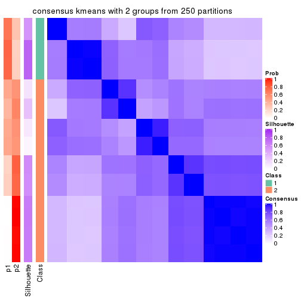</p>

</div>
<div id='tab-SD-kmeans-consensus-heatmap-2'>
<pre><code class="r">consensus_heatmap(res, k = 3)
</code></pre>

<p>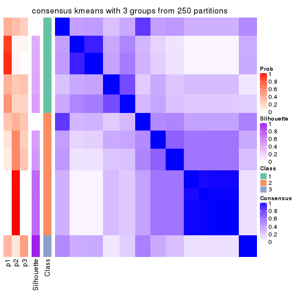</p>

</div>
<div id='tab-SD-kmeans-consensus-heatmap-3'>
<pre><code class="r">consensus_heatmap(res, k = 4)
</code></pre>

<p>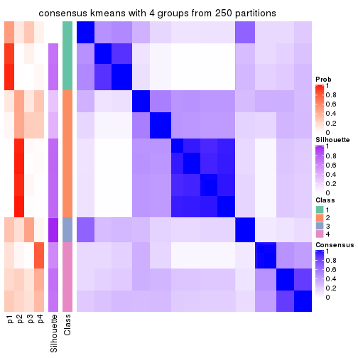</p>

</div>
<div id='tab-SD-kmeans-consensus-heatmap-4'>
<pre><code class="r">consensus_heatmap(res, k = 5)
</code></pre>

<p>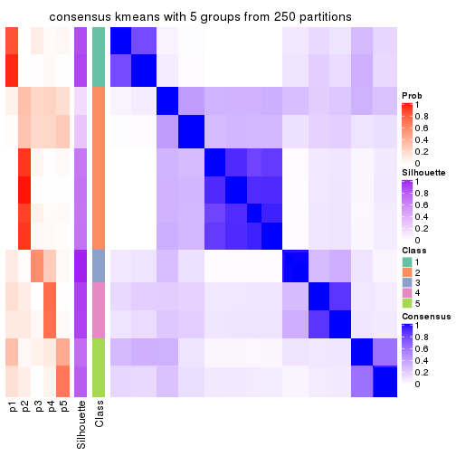</p>

</div>
<div id='tab-SD-kmeans-consensus-heatmap-5'>
<pre><code class="r">consensus_heatmap(res, k = 6)
</code></pre>

<p>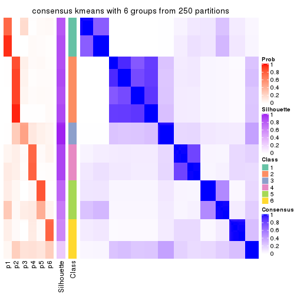</p>

</div>
</div>

Heatmaps for the membership of samples in all partitions to see how consistent they are:


<script>
$( function() {
	$( '#tabs-SD-kmeans-membership-heatmap' ).tabs();
} );
</script>
<div id='tabs-SD-kmeans-membership-heatmap'>
<ul>
<li><a href='#tab-SD-kmeans-membership-heatmap-1'>k = 2</a></li>
<li><a href='#tab-SD-kmeans-membership-heatmap-2'>k = 3</a></li>
<li><a href='#tab-SD-kmeans-membership-heatmap-3'>k = 4</a></li>
<li><a href='#tab-SD-kmeans-membership-heatmap-4'>k = 5</a></li>
<li><a href='#tab-SD-kmeans-membership-heatmap-5'>k = 6</a></li>
</ul>
<div id='tab-SD-kmeans-membership-heatmap-1'>
<pre><code class="r">membership_heatmap(res, k = 2)
</code></pre>

<p>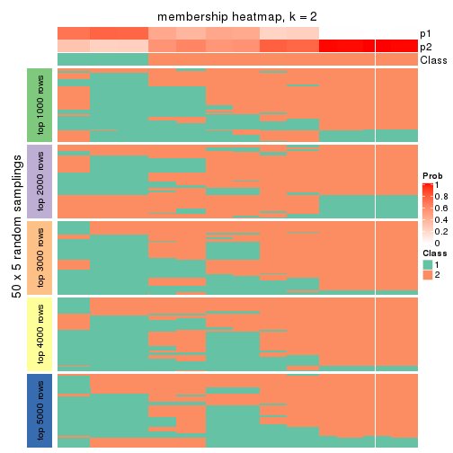</p>

</div>
<div id='tab-SD-kmeans-membership-heatmap-2'>
<pre><code class="r">membership_heatmap(res, k = 3)
</code></pre>

<p>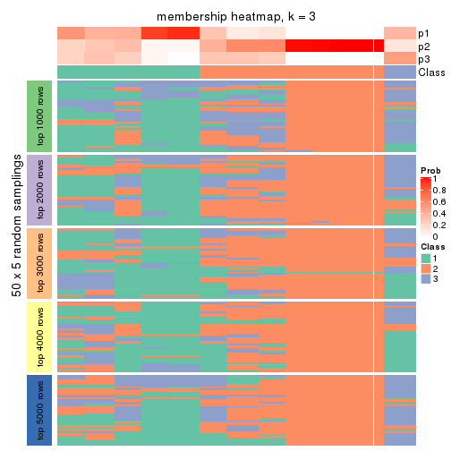</p>

</div>
<div id='tab-SD-kmeans-membership-heatmap-3'>
<pre><code class="r">membership_heatmap(res, k = 4)
</code></pre>

<p>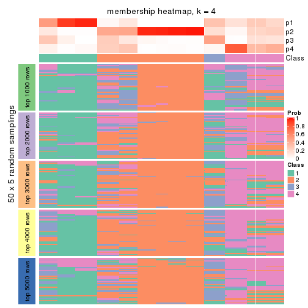</p>

</div>
<div id='tab-SD-kmeans-membership-heatmap-4'>
<pre><code class="r">membership_heatmap(res, k = 5)
</code></pre>

<p>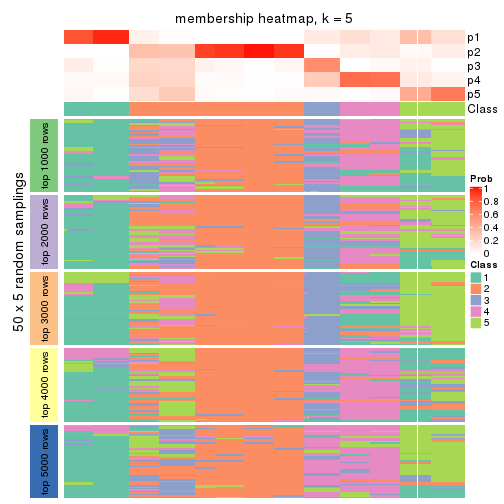</p>

</div>
<div id='tab-SD-kmeans-membership-heatmap-5'>
<pre><code class="r">membership_heatmap(res, k = 6)
</code></pre>

<p>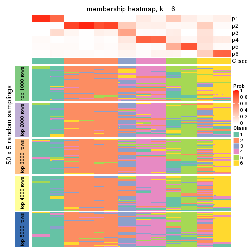</p>

</div>
</div>

As soon as we have had the classes for columns, we can look for signatures
which are significantly different between classes which can be candidate marks
for certain classes. Following are the heatmaps for signatures.


Signature heatmaps where rows are scaled:


<script>
$( function() {
	$( '#tabs-SD-kmeans-get-signatures' ).tabs();
} );
</script>
<div id='tabs-SD-kmeans-get-signatures'>
<ul>
<li><a href='#tab-SD-kmeans-get-signatures-1'>k = 2</a></li>
<li><a href='#tab-SD-kmeans-get-signatures-2'>k = 3</a></li>
<li><a href='#tab-SD-kmeans-get-signatures-3'>k = 4</a></li>
<li><a href='#tab-SD-kmeans-get-signatures-4'>k = 5</a></li>
<li><a href='#tab-SD-kmeans-get-signatures-5'>k = 6</a></li>
</ul>
<div id='tab-SD-kmeans-get-signatures-1'>
<pre><code class="r">get_signatures(res, k = 2)
</code></pre>

<p>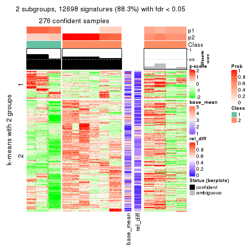</p>

</div>
<div id='tab-SD-kmeans-get-signatures-2'>
<pre><code class="r">get_signatures(res, k = 3)
</code></pre>

<p>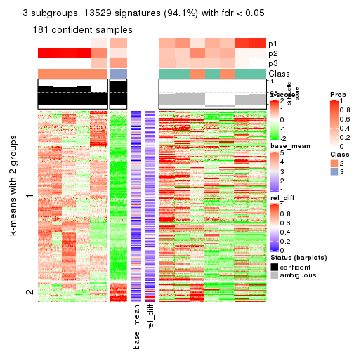</p>

</div>
<div id='tab-SD-kmeans-get-signatures-3'>
<pre><code class="r">get_signatures(res, k = 4)
</code></pre>

<p>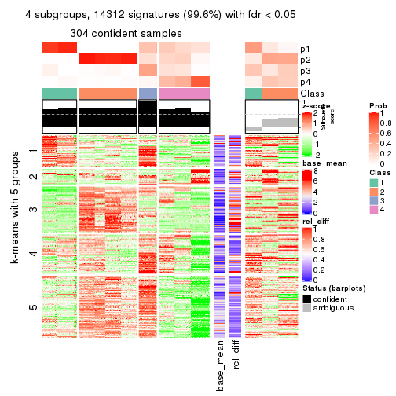</p>

</div>
<div id='tab-SD-kmeans-get-signatures-4'>
<pre><code class="r">get_signatures(res, k = 5)
</code></pre>

<p>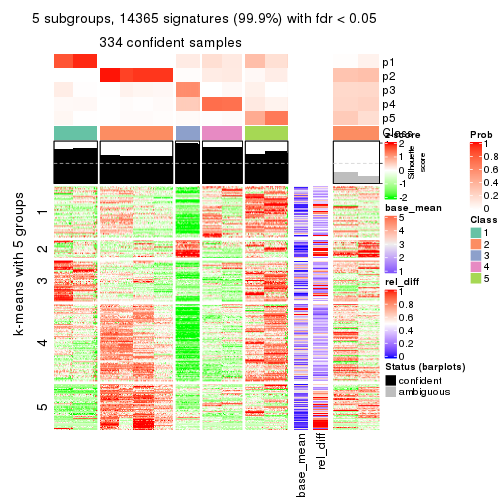</p>

</div>
<div id='tab-SD-kmeans-get-signatures-5'>
<pre><code class="r">get_signatures(res, k = 6)
</code></pre>

<p>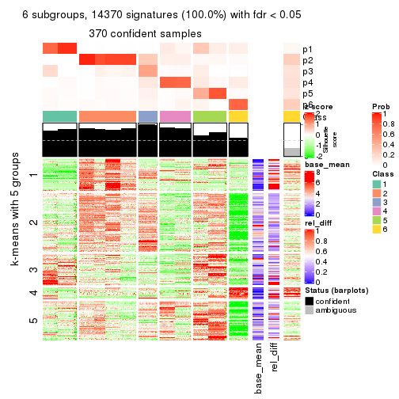</p>

</div>
</div>


Signature heatmaps where rows are not scaled:


<script>
$( function() {
	$( '#tabs-SD-kmeans-get-signatures-no-scale' ).tabs();
} );
</script>
<div id='tabs-SD-kmeans-get-signatures-no-scale'>
<ul>
<li><a href='#tab-SD-kmeans-get-signatures-no-scale-1'>k = 2</a></li>
<li><a href='#tab-SD-kmeans-get-signatures-no-scale-2'>k = 3</a></li>
<li><a href='#tab-SD-kmeans-get-signatures-no-scale-3'>k = 4</a></li>
<li><a href='#tab-SD-kmeans-get-signatures-no-scale-4'>k = 5</a></li>
<li><a href='#tab-SD-kmeans-get-signatures-no-scale-5'>k = 6</a></li>
</ul>
<div id='tab-SD-kmeans-get-signatures-no-scale-1'>
<pre><code class="r">get_signatures(res, k = 2, scale_rows = FALSE)
</code></pre>

<p>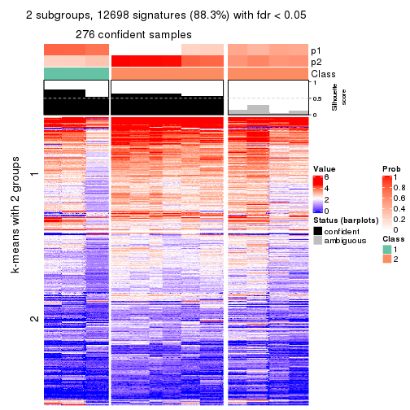</p>

</div>
<div id='tab-SD-kmeans-get-signatures-no-scale-2'>
<pre><code class="r">get_signatures(res, k = 3, scale_rows = FALSE)
</code></pre>

<p>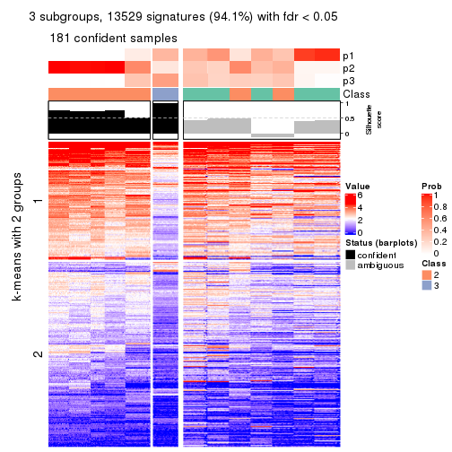</p>

</div>
<div id='tab-SD-kmeans-get-signatures-no-scale-3'>
<pre><code class="r">get_signatures(res, k = 4, scale_rows = FALSE)
</code></pre>

<p>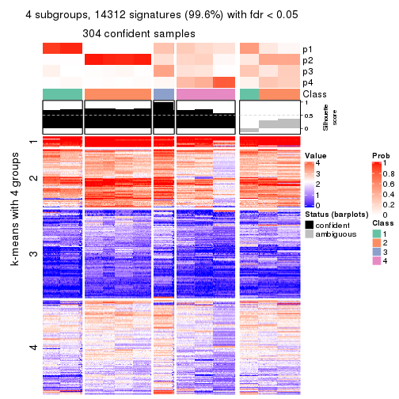</p>

</div>
<div id='tab-SD-kmeans-get-signatures-no-scale-4'>
<pre><code class="r">get_signatures(res, k = 5, scale_rows = FALSE)
</code></pre>

<p>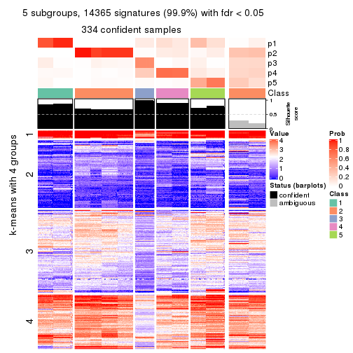</p>

</div>
<div id='tab-SD-kmeans-get-signatures-no-scale-5'>
<pre><code class="r">get_signatures(res, k = 6, scale_rows = FALSE)
</code></pre>

<p>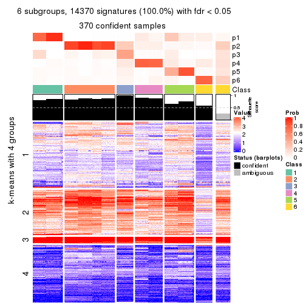</p>

</div>
</div>


Compare the overlap of signatures from different k:

```r
compare_signatures(res)
```

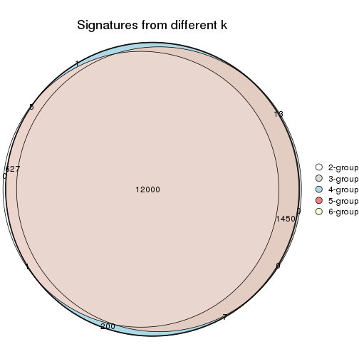

`get_signature()` returns a data frame invisibly. TO get the list of signatures, the function
call should be assigned to a variable explicitly. In following code, if `plot` argument is set
to `FALSE`, no heatmap is plotted while only the differential analysis is performed.

```r
# code only for demonstration
tb = get_signature(res, k = ..., plot = FALSE)
```

An example of the output of `tb` is:

```
#>   which_row         fdr    mean_1    mean_2 scaled_mean_1 scaled_mean_2 km
#> 1        38 0.042760348  8.373488  9.131774    -0.5533452     0.5164555  1
#> 2        40 0.018707592  7.106213  8.469186    -0.6173731     0.5762149  1
#> 3        55 0.019134737 10.221463 11.207825    -0.6159697     0.5749050  1
#> 4        59 0.006059896  5.921854  7.869574    -0.6899429     0.6439467  1
#> 5        60 0.018055526  8.928898 10.211722    -0.6204761     0.5791110  1
#> 6        98 0.009384629 15.714769 14.887706     0.6635654    -0.6193277  2
...
```

The columns in `tb` are:

1. `which_row`: row indices corresponding to the input matrix.
2. `fdr`: FDR for the differential test. 
3. `mean_x`: The mean value in group x.
4. `scaled_mean_x`: The mean value in group x after rows are scaled.
5. `km`: Row groups if k-means clustering is applied to rows.


UMAP plot which shows how samples are separated.


<script>
$( function() {
	$( '#tabs-SD-kmeans-dimension-reduction' ).tabs();
} );
</script>
<div id='tabs-SD-kmeans-dimension-reduction'>
<ul>
<li><a href='#tab-SD-kmeans-dimension-reduction-1'>k = 2</a></li>
<li><a href='#tab-SD-kmeans-dimension-reduction-2'>k = 3</a></li>
<li><a href='#tab-SD-kmeans-dimension-reduction-3'>k = 4</a></li>
<li><a href='#tab-SD-kmeans-dimension-reduction-4'>k = 5</a></li>
<li><a href='#tab-SD-kmeans-dimension-reduction-5'>k = 6</a></li>
</ul>
<div id='tab-SD-kmeans-dimension-reduction-1'>
<pre><code class="r">dimension_reduction(res, k = 2, method = &quot;UMAP&quot;)
</code></pre>

<p>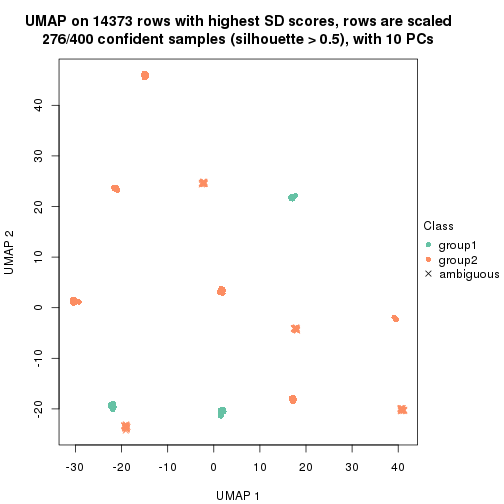</p>

</div>
<div id='tab-SD-kmeans-dimension-reduction-2'>
<pre><code class="r">dimension_reduction(res, k = 3, method = &quot;UMAP&quot;)
</code></pre>

<p>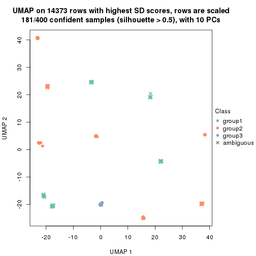</p>

</div>
<div id='tab-SD-kmeans-dimension-reduction-3'>
<pre><code class="r">dimension_reduction(res, k = 4, method = &quot;UMAP&quot;)
</code></pre>

<p>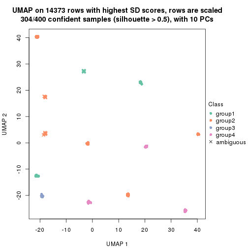</p>

</div>
<div id='tab-SD-kmeans-dimension-reduction-4'>
<pre><code class="r">dimension_reduction(res, k = 5, method = &quot;UMAP&quot;)
</code></pre>

<p>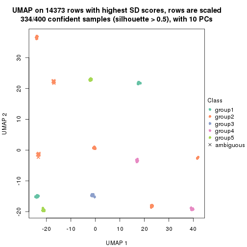</p>

</div>
<div id='tab-SD-kmeans-dimension-reduction-5'>
<pre><code class="r">dimension_reduction(res, k = 6, method = &quot;UMAP&quot;)
</code></pre>

<p>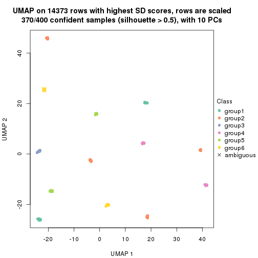</p>

</div>
</div>


Following heatmap shows how subgroups are split when increasing `k`:

```r
collect_classes(res)
```

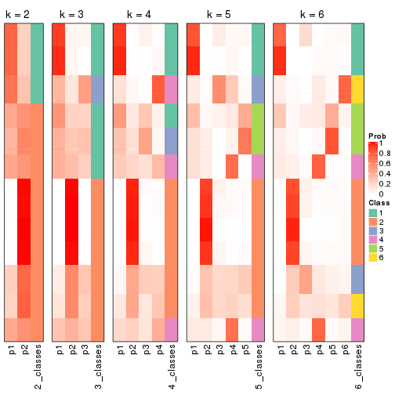


If matrix rows can be associated to genes, consider to use `GO_Enrichment(res,
...)` to perform function enrichment for the signature genes.


 

---------------------------------------------------


### SD:skmeans


The object with results only for a single top-value method and a single partition method 
can be extracted as:

```r
res = res_list["SD", "skmeans"]
# you can also extract it by
# res = res_list["SD:skmeans"]
```

A summary of `res` and all the functions that can be applied to it:

```r
res
```

```
#> A 'ConsensusPartition' object with k = 2, 3, 4, 5, 6.
#>   On a matrix with 14373 rows and 400 columns.
#>   Top rows (1000, 2000, 3000, 4000, 5000) are extracted by 'SD' method.
#>   Subgroups are detected by 'skmeans' method.
#>   Performed in total 1250 partitions by row resampling.
#>   Best k for subgroups seems to be 3.
#> 
#> Following methods can be applied to this 'ConsensusPartition' object:
#>  [1] "cola_report"             "collect_classes"         "collect_plots"          
#>  [4] "collect_stats"           "colnames"                "compare_signatures"     
#>  [7] "consensus_heatmap"       "dimension_reduction"     "functional_enrichment"  
#> [10] "get_anno_col"            "get_anno"                "get_classes"            
#> [13] "get_consensus"           "get_matrix"              "get_membership"         
#> [16] "get_param"               "get_signatures"          "get_stats"              
#> [19] "is_best_k"               "is_stable_k"             "membership_heatmap"     
#> [22] "ncol"                    "nrow"                    "plot_ecdf"              
#> [25] "rownames"                "select_partition_number" "show"                   
#> [28] "suggest_best_k"          "test_to_known_factors"
```

`collect_plots()` function collects all the plots made from `res` for all `k` (number of partitions)
into one single page to provide an easy and fast comparison between different `k`.

```r
collect_plots(res)
```

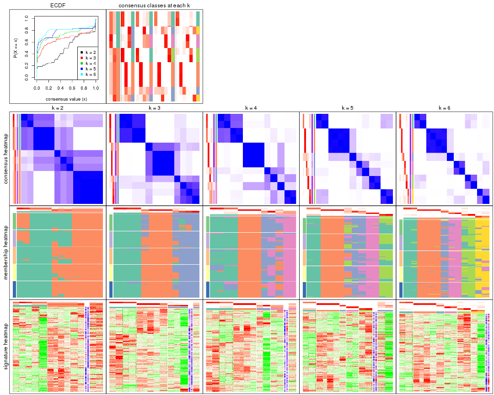

The plots are:

- The first row: a plot of the ECDF (Empirical cumulative distribution
  function) curves of the consensus matrix for each `k` and the heatmap of
  predicted classes for each `k`.
- The second row: heatmaps of the consensus matrix for each `k`.
- The third row: heatmaps of the membership matrix for each `k`.
- The fouth row: heatmaps of the signatures for each `k`.

All the plots in panels can be made by individual functions and they are
plotted later in this section.

`select_partition_number()` produces several plots showing different
statistics for choosing "optimized" `k`. There are following statistics:

- ECDF curves of the consensus matrix for each `k`;
- 1-PAC. [The PAC
  score](https://en.wikipedia.org/wiki/Consensus_clustering#Over-interpretation_potential_of_consensus_clustering)
  measures the proportion of the ambiguous subgrouping.
- Mean silhouette score.
- Concordance. The mean probability of fiting the consensus class ids in all
  partitions.
- Area increased. Denote $A_k$ as the area under the ECDF curve for current
  `k`, the area increased is defined as $A_k - A_{k-1}$.
- Rand index. The percent of pairs of samples that are both in a same cluster
  or both are not in a same cluster in the partition of k and k-1.
- Jaccard index. The ratio of pairs of samples are both in a same cluster in
  the partition of k and k-1 and the pairs of samples are both in a same
  cluster in the partition k or k-1.

The detailed explanations of these statistics can be found in [the cola
vignette](http://bioconductor.org/packages/devel/bioc/vignettes/cola/inst/doc/cola.html#toc_13).

Generally speaking, lower PAC score, higher mean silhouette score or higher
concordance corresponds to better partition. Rand index and Jaccard index
measure how similar the current partition is compared to partition with `k-1`.
If they are too similar, we won't accept `k` is better than `k-1`.

```r
select_partition_number(res)
```

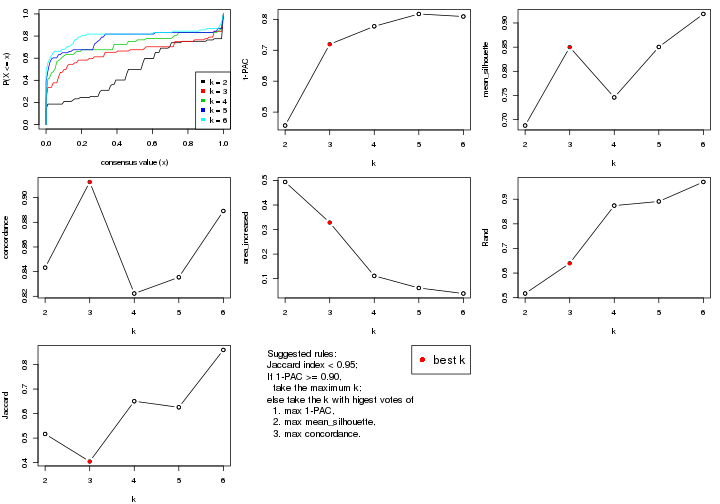

The numeric values for all these statistics can be obtained by `get_stats()`.

```r
get_stats(res)
```

```
#>   k 1-PAC mean_silhouette concordance area_increased  Rand Jaccard
#> 2 2 0.457           0.688       0.843         0.4939 0.517   0.517
#> 3 3 0.720           0.850       0.913         0.3286 0.640   0.405
#> 4 4 0.778           0.746       0.822         0.1114 0.874   0.650
#> 5 5 0.817           0.850       0.835         0.0619 0.891   0.626
#> 6 6 0.809           0.919       0.889         0.0394 0.970   0.859
```

`suggest_best_k()` suggests the best $k$ based on these statistics. The rules are as follows:

- All $k$ with Jaccard index larger than 0.95 are removed because the increase of
  the partition number does not provides enough extra information. If all $k$ are removed,
  the best $k$ is assigned by `NA`.
- For $k$ with 1-PAC larger than 0.9, the maximal $k$ is taken as the "best k". Other $k$ is called "optional k".
- If it does not fit the second rule. The $k$ with the highest vote of highest
  1-PAC, mean silhouette and concordance is taken as the "best k".

```r
suggest_best_k(res)
```

```
#> [1] 3
```


Following shows the table of the partitions (You need to click the **show/hide
code output** link to see it). The membership matrix (columns with name `p*`)
is inferred by
[`clue::cl_consensus()`](https://www.rdocumentation.org/link/cl_consensus?package=clue)
function with the `SE` method. Basically the value in the membership matrix
represents the probability to belong to a certain group. The finall class
label for an item is determined with the group with highest probability it
belongs to.

In `get_classes()` function, the entropy is calculated from the membership
matrix and the silhouette score is calculated from the consensus matrix.


<script>
$( function() {
	$( '#tabs-SD-skmeans-get-classes' ).tabs();
} );
</script>
<div id='tabs-SD-skmeans-get-classes'>
<ul>
<li><a href='#tab-SD-skmeans-get-classes-1'>k = 2</a></li>
<li><a href='#tab-SD-skmeans-get-classes-2'>k = 3</a></li>
<li><a href='#tab-SD-skmeans-get-classes-3'>k = 4</a></li>
<li><a href='#tab-SD-skmeans-get-classes-4'>k = 5</a></li>
<li><a href='#tab-SD-skmeans-get-classes-5'>k = 6</a></li>
</ul>

<div id='tab-SD-skmeans-get-classes-1'>
<p><a id='tab-SD-skmeans-get-classes-1-a' style='color:#0366d6' href='#'>show/hide code output</a></p>
<pre><code class="r">cbind(get_classes(res, k = 2), get_membership(res, k = 2))
</code></pre>

<pre><code>#&gt;            class entropy silhouette    p1    p2
#&gt; SRR1661716     2  0.8763      0.781 0.296 0.704
#&gt; SRR1661717     2  0.8763      0.781 0.296 0.704
#&gt; SRR1661718     2  0.8763      0.781 0.296 0.704
#&gt; SRR1661719     2  0.8763      0.781 0.296 0.704
#&gt; SRR1661720     2  0.8763      0.781 0.296 0.704
#&gt; SRR1661721     2  0.8763      0.781 0.296 0.704
#&gt; SRR1661722     2  0.8763      0.781 0.296 0.704
#&gt; SRR1661723     2  0.8763      0.781 0.296 0.704
#&gt; SRR1661724     2  0.8763      0.781 0.296 0.704
#&gt; SRR1661725     2  0.8763      0.781 0.296 0.704
#&gt; SRR1661726     2  0.8763      0.781 0.296 0.704
#&gt; SRR1661727     2  0.8763      0.781 0.296 0.704
#&gt; SRR1661728     2  0.8763      0.781 0.296 0.704
#&gt; SRR1661729     2  0.8763      0.781 0.296 0.704
#&gt; SRR1661730     2  0.8763      0.781 0.296 0.704
#&gt; SRR1661731     2  0.8763      0.781 0.296 0.704
#&gt; SRR1661732     2  0.8763      0.781 0.296 0.704
#&gt; SRR1661733     2  0.8763      0.781 0.296 0.704
#&gt; SRR1661734     2  0.8763      0.781 0.296 0.704
#&gt; SRR1661735     2  0.8763      0.781 0.296 0.704
#&gt; SRR1661736     2  0.8763      0.781 0.296 0.704
#&gt; SRR1661737     2  0.8763      0.781 0.296 0.704
#&gt; SRR1661738     2  0.8763      0.781 0.296 0.704
#&gt; SRR1661739     2  0.8763      0.781 0.296 0.704
#&gt; SRR1661740     2  0.8763      0.781 0.296 0.704
#&gt; SRR1661741     2  0.8763      0.781 0.296 0.704
#&gt; SRR1661742     2  0.8763      0.781 0.296 0.704
#&gt; SRR1661743     2  0.8763      0.781 0.296 0.704
#&gt; SRR1661744     2  0.8763      0.781 0.296 0.704
#&gt; SRR1661745     2  0.8763      0.781 0.296 0.704
#&gt; SRR1661746     2  0.8763      0.781 0.296 0.704
#&gt; SRR1661747     2  0.8763      0.781 0.296 0.704
#&gt; SRR1661748     2  0.8763      0.781 0.296 0.704
#&gt; SRR1661749     2  0.8763      0.781 0.296 0.704
#&gt; SRR1661750     2  0.8763      0.781 0.296 0.704
#&gt; SRR1661751     2  0.8763      0.781 0.296 0.704
#&gt; SRR1661752     2  0.8763      0.781 0.296 0.704
#&gt; SRR1661753     2  0.8763      0.781 0.296 0.704
#&gt; SRR1661754     2  0.8763      0.781 0.296 0.704
#&gt; SRR1661755     2  0.8763      0.781 0.296 0.704
#&gt; SRR1661756     2  0.8763      0.781 0.296 0.704
#&gt; SRR1661757     2  0.8763      0.781 0.296 0.704
#&gt; SRR1661758     2  0.8763      0.781 0.296 0.704
#&gt; SRR1661759     2  0.8763      0.781 0.296 0.704
#&gt; SRR1661760     2  0.8763      0.781 0.296 0.704
#&gt; SRR1661761     2  0.8763      0.781 0.296 0.704
#&gt; SRR1661762     2  0.8763      0.781 0.296 0.704
#&gt; SRR1661763     2  0.8763      0.781 0.296 0.704
#&gt; SRR1661764     2  0.8763      0.781 0.296 0.704
#&gt; SRR1661766     2  0.8763      0.781 0.296 0.704
#&gt; SRR1661767     2  0.8763      0.781 0.296 0.704
#&gt; SRR1661768     2  0.8763      0.781 0.296 0.704
#&gt; SRR1661769     2  0.8763      0.781 0.296 0.704
#&gt; SRR1661770     2  0.8763      0.781 0.296 0.704
#&gt; SRR1661771     2  0.8763      0.781 0.296 0.704
#&gt; SRR1661772     2  0.8763      0.781 0.296 0.704
#&gt; SRR1661773     2  0.8763      0.781 0.296 0.704
#&gt; SRR1661774     2  0.8763      0.781 0.296 0.704
#&gt; SRR1661775     2  0.8763      0.781 0.296 0.704
#&gt; SRR1661776     2  0.8763      0.781 0.296 0.704
#&gt; SRR1661777     2  0.8763      0.781 0.296 0.704
#&gt; SRR1661778     2  0.8763      0.781 0.296 0.704
#&gt; SRR1661779     2  0.8763      0.781 0.296 0.704
#&gt; SRR1661780     2  0.8763      0.781 0.296 0.704
#&gt; SRR1661781     2  0.8763      0.781 0.296 0.704
#&gt; SRR1661782     2  0.8763      0.781 0.296 0.704
#&gt; SRR1661783     2  0.8763      0.781 0.296 0.704
#&gt; SRR1661784     2  0.8763      0.781 0.296 0.704
#&gt; SRR1661785     2  0.8763      0.781 0.296 0.704
#&gt; SRR1661786     2  0.8763      0.781 0.296 0.704
#&gt; SRR1661787     2  0.8763      0.781 0.296 0.704
#&gt; SRR1661788     2  0.8763      0.781 0.296 0.704
#&gt; SRR1661789     2  0.8763      0.781 0.296 0.704
#&gt; SRR1661790     2  0.8763      0.781 0.296 0.704
#&gt; SRR1661791     2  0.8763      0.781 0.296 0.704
#&gt; SRR1661792     2  0.8763      0.781 0.296 0.704
#&gt; SRR1661793     2  0.8763      0.781 0.296 0.704
#&gt; SRR1661794     2  0.8763      0.781 0.296 0.704
#&gt; SRR1661795     2  0.8763      0.781 0.296 0.704
#&gt; SRR1661796     2  0.8763      0.781 0.296 0.704
#&gt; SRR1661797     2  0.8763      0.781 0.296 0.704
#&gt; SRR1661798     2  0.8763      0.781 0.296 0.704
#&gt; SRR1661799     2  0.8763      0.781 0.296 0.704
#&gt; SRR1661800     2  0.8763      0.781 0.296 0.704
#&gt; SRR1661801     2  0.8763      0.781 0.296 0.704
#&gt; SRR1661802     2  0.8763      0.781 0.296 0.704
#&gt; SRR1661803     2  0.8763      0.781 0.296 0.704
#&gt; SRR1661804     2  0.8763      0.781 0.296 0.704
#&gt; SRR1661805     2  0.8763      0.781 0.296 0.704
#&gt; SRR1661806     2  0.8763      0.781 0.296 0.704
#&gt; SRR1661807     2  0.8763      0.781 0.296 0.704
#&gt; SRR1661808     2  0.8763      0.781 0.296 0.704
#&gt; SRR1661809     2  0.8763      0.781 0.296 0.704
#&gt; SRR1661810     2  0.8763      0.781 0.296 0.704
#&gt; SRR1661811     2  0.8763      0.781 0.296 0.704
#&gt; SRR1661812     2  0.8763      0.781 0.296 0.704
#&gt; SRR1661813     2  0.8763      0.781 0.296 0.704
#&gt; SRR1661814     2  0.8763      0.781 0.296 0.704
#&gt; SRR1661815     2  0.8763      0.781 0.296 0.704
#&gt; SRR1661816     2  0.8763      0.781 0.296 0.704
#&gt; SRR1661817     2  0.8763      0.781 0.296 0.704
#&gt; SRR1661818     2  0.8763      0.781 0.296 0.704
#&gt; SRR1661819     2  0.8763      0.781 0.296 0.704
#&gt; SRR1661820     2  0.8763      0.781 0.296 0.704
#&gt; SRR1661821     2  0.8763      0.781 0.296 0.704
#&gt; SRR1661822     2  0.8763      0.781 0.296 0.704
#&gt; SRR1661823     2  0.8763      0.781 0.296 0.704
#&gt; SRR1661824     2  0.8763      0.781 0.296 0.704
#&gt; SRR1661825     2  0.8763      0.781 0.296 0.704
#&gt; SRR1661826     1  0.8763      0.825 0.704 0.296
#&gt; SRR1661827     1  0.8763      0.825 0.704 0.296
#&gt; SRR1661828     1  0.8763      0.825 0.704 0.296
#&gt; SRR1661829     1  0.8763      0.825 0.704 0.296
#&gt; SRR1661830     1  0.8763      0.825 0.704 0.296
#&gt; SRR1661831     1  0.8763      0.825 0.704 0.296
#&gt; SRR1661832     1  0.8763      0.825 0.704 0.296
#&gt; SRR1661833     1  0.8763      0.825 0.704 0.296
#&gt; SRR1661834     1  0.8763      0.825 0.704 0.296
#&gt; SRR1661835     1  0.8763      0.825 0.704 0.296
#&gt; SRR1661836     1  0.8763      0.825 0.704 0.296
#&gt; SRR1661837     1  0.8763      0.825 0.704 0.296
#&gt; SRR1661838     1  0.8763      0.825 0.704 0.296
#&gt; SRR1661839     1  0.8763      0.825 0.704 0.296
#&gt; SRR1661840     1  0.8763      0.825 0.704 0.296
#&gt; SRR1661841     1  0.8763      0.825 0.704 0.296
#&gt; SRR1661843     1  0.8763      0.825 0.704 0.296
#&gt; SRR1661844     1  0.8763      0.825 0.704 0.296
#&gt; SRR1661845     1  0.8763      0.825 0.704 0.296
#&gt; SRR1661846     1  0.8763      0.825 0.704 0.296
#&gt; SRR1661847     1  0.8763      0.825 0.704 0.296
#&gt; SRR1661848     1  0.8763      0.825 0.704 0.296
#&gt; SRR1661849     1  0.8763      0.825 0.704 0.296
#&gt; SRR1661850     1  0.8763      0.825 0.704 0.296
#&gt; SRR1661851     1  0.8763      0.825 0.704 0.296
#&gt; SRR1661852     1  0.8763      0.825 0.704 0.296
#&gt; SRR1661853     1  0.8763      0.825 0.704 0.296
#&gt; SRR1661854     1  0.8763      0.825 0.704 0.296
#&gt; SRR1661855     1  0.8763      0.825 0.704 0.296
#&gt; SRR1661856     1  0.8763      0.825 0.704 0.296
#&gt; SRR1661857     1  0.8763      0.825 0.704 0.296
#&gt; SRR1661858     1  0.8763      0.825 0.704 0.296
#&gt; SRR1661859     1  0.8763      0.825 0.704 0.296
#&gt; SRR1661860     1  0.8763      0.825 0.704 0.296
#&gt; SRR1661861     1  0.8763      0.825 0.704 0.296
#&gt; SRR1661862     1  0.8763      0.825 0.704 0.296
#&gt; SRR1661863     1  0.8763      0.825 0.704 0.296
#&gt; SRR1661864     1  0.8763      0.825 0.704 0.296
#&gt; SRR1661865     1  0.8763      0.825 0.704 0.296
#&gt; SRR1661866     1  0.8763      0.825 0.704 0.296
#&gt; SRR1661867     1  0.8763      0.825 0.704 0.296
#&gt; SRR1661868     1  0.8763      0.825 0.704 0.296
#&gt; SRR1661869     1  0.8763      0.825 0.704 0.296
#&gt; SRR1661870     1  0.8763      0.825 0.704 0.296
#&gt; SRR1661871     1  0.8763      0.825 0.704 0.296
#&gt; SRR1661872     1  0.8763      0.825 0.704 0.296
#&gt; SRR1661873     1  0.8763      0.825 0.704 0.296
#&gt; SRR1661874     1  0.8763      0.825 0.704 0.296
#&gt; SRR1661875     1  0.8763      0.825 0.704 0.296
#&gt; SRR1661876     1  0.8763      0.825 0.704 0.296
#&gt; SRR1661877     1  0.8763      0.825 0.704 0.296
#&gt; SRR1661878     1  0.8763      0.825 0.704 0.296
#&gt; SRR1661879     1  0.8763      0.825 0.704 0.296
#&gt; SRR1661880     1  0.8763      0.825 0.704 0.296
#&gt; SRR1661881     1  0.8763      0.825 0.704 0.296
#&gt; SRR1661882     1  0.8763      0.825 0.704 0.296
#&gt; SRR1661883     1  0.8763      0.825 0.704 0.296
#&gt; SRR1661884     1  0.8763      0.825 0.704 0.296
#&gt; SRR1661885     1  0.8763      0.825 0.704 0.296
#&gt; SRR1661886     1  0.8763      0.825 0.704 0.296
#&gt; SRR1661887     1  0.8763      0.825 0.704 0.296
#&gt; SRR1661888     1  0.8763      0.825 0.704 0.296
#&gt; SRR1661889     1  0.8763      0.825 0.704 0.296
#&gt; SRR1661890     1  0.8763      0.825 0.704 0.296
#&gt; SRR1661891     1  0.8763      0.825 0.704 0.296
#&gt; SRR1661892     1  0.8763      0.825 0.704 0.296
#&gt; SRR1661893     1  0.8763      0.825 0.704 0.296
#&gt; SRR1661894     1  0.8763      0.825 0.704 0.296
#&gt; SRR1661895     1  0.8763      0.825 0.704 0.296
#&gt; SRR1661896     1  0.8763      0.825 0.704 0.296
#&gt; SRR1661897     1  0.8763      0.825 0.704 0.296
#&gt; SRR1661898     1  0.8763      0.825 0.704 0.296
#&gt; SRR1661899     1  0.8763      0.825 0.704 0.296
#&gt; SRR1661900     1  0.8763      0.825 0.704 0.296
#&gt; SRR1661901     1  0.8763      0.825 0.704 0.296
#&gt; SRR1661902     1  0.8763      0.825 0.704 0.296
#&gt; SRR1661903     1  0.8763      0.825 0.704 0.296
#&gt; SRR1661904     1  0.8763      0.825 0.704 0.296
#&gt; SRR1661905     1  0.8763      0.825 0.704 0.296
#&gt; SRR1661906     1  0.8763      0.825 0.704 0.296
#&gt; SRR1661907     1  0.8763      0.825 0.704 0.296
#&gt; SRR1661908     1  0.8763      0.825 0.704 0.296
#&gt; SRR1661909     1  0.8763      0.825 0.704 0.296
#&gt; SRR1661910     1  0.8763      0.825 0.704 0.296
#&gt; SRR1661911     1  0.8763      0.825 0.704 0.296
#&gt; SRR1661912     1  0.8763      0.825 0.704 0.296
#&gt; SRR1661913     1  0.8763      0.825 0.704 0.296
#&gt; SRR1661914     1  0.8763      0.825 0.704 0.296
#&gt; SRR1661915     1  0.8763      0.825 0.704 0.296
#&gt; SRR1661916     1  0.8763      0.825 0.704 0.296
#&gt; SRR1661917     1  0.8763      0.825 0.704 0.296
#&gt; SRR1661918     1  0.8763      0.825 0.704 0.296
#&gt; SRR1661919     1  0.8763      0.825 0.704 0.296
#&gt; SRR1661920     1  0.8763      0.825 0.704 0.296
#&gt; SRR1661921     1  0.8763      0.825 0.704 0.296
#&gt; SRR1661922     1  0.8763      0.825 0.704 0.296
#&gt; SRR1661923     1  0.8763      0.825 0.704 0.296
#&gt; SRR1661924     1  0.8763      0.825 0.704 0.296
#&gt; SRR1661925     1  0.8763      0.825 0.704 0.296
#&gt; SRR1661926     1  0.8763      0.825 0.704 0.296
#&gt; SRR1661927     1  0.8763      0.825 0.704 0.296
#&gt; SRR1661928     2  0.4298      0.543 0.088 0.912
#&gt; SRR1661929     2  0.4298      0.543 0.088 0.912
#&gt; SRR1661930     2  0.4298      0.543 0.088 0.912
#&gt; SRR1661931     2  0.4298      0.543 0.088 0.912
#&gt; SRR1661932     2  0.4298      0.543 0.088 0.912
#&gt; SRR1661933     2  0.4298      0.543 0.088 0.912
#&gt; SRR1661934     2  0.4298      0.543 0.088 0.912
#&gt; SRR1661935     2  0.4298      0.543 0.088 0.912
#&gt; SRR1661936     2  0.4298      0.543 0.088 0.912
#&gt; SRR1661937     2  0.4298      0.543 0.088 0.912
#&gt; SRR1661938     2  0.4298      0.543 0.088 0.912
#&gt; SRR1661939     2  0.4298      0.543 0.088 0.912
#&gt; SRR1661940     2  0.4298      0.543 0.088 0.912
#&gt; SRR1661941     2  0.4298      0.543 0.088 0.912
#&gt; SRR1661942     2  0.4298      0.543 0.088 0.912
#&gt; SRR1661943     2  0.4298      0.543 0.088 0.912
#&gt; SRR1661944     2  0.4298      0.543 0.088 0.912
#&gt; SRR1661945     2  0.4298      0.543 0.088 0.912
#&gt; SRR1661946     2  0.4298      0.543 0.088 0.912
#&gt; SRR1661947     2  0.4298      0.543 0.088 0.912
#&gt; SRR1661948     2  0.4298      0.543 0.088 0.912
#&gt; SRR1661949     2  0.4298      0.543 0.088 0.912
#&gt; SRR1661950     2  0.4298      0.543 0.088 0.912
#&gt; SRR1661951     2  0.4298      0.543 0.088 0.912
#&gt; SRR1661952     2  0.4298      0.543 0.088 0.912
#&gt; SRR1661953     2  0.4298      0.543 0.088 0.912
#&gt; SRR1661954     2  0.4298      0.543 0.088 0.912
#&gt; SRR1661955     2  0.4298      0.543 0.088 0.912
#&gt; SRR1661956     2  0.4298      0.543 0.088 0.912
#&gt; SRR1661957     2  0.4298      0.543 0.088 0.912
#&gt; SRR1661958     1  0.0376      0.655 0.996 0.004
#&gt; SRR1661959     1  0.0376      0.655 0.996 0.004
#&gt; SRR1661960     1  0.0376      0.655 0.996 0.004
#&gt; SRR1661961     1  0.0376      0.655 0.996 0.004
#&gt; SRR1661962     1  0.0376      0.655 0.996 0.004
#&gt; SRR1661963     1  0.0376      0.655 0.996 0.004
#&gt; SRR1661964     1  0.0376      0.655 0.996 0.004
#&gt; SRR1661965     1  0.0376      0.655 0.996 0.004
#&gt; SRR1661966     1  0.0376      0.655 0.996 0.004
#&gt; SRR1661967     1  0.0376      0.655 0.996 0.004
#&gt; SRR1661968     1  0.0376      0.655 0.996 0.004
#&gt; SRR1661969     1  0.0376      0.655 0.996 0.004
#&gt; SRR1661970     1  0.0376      0.655 0.996 0.004
#&gt; SRR1661971     1  0.0376      0.655 0.996 0.004
#&gt; SRR1661972     1  0.0376      0.655 0.996 0.004
#&gt; SRR1661973     1  0.0376      0.655 0.996 0.004
#&gt; SRR1661974     1  0.0376      0.655 0.996 0.004
#&gt; SRR1661975     1  0.0376      0.655 0.996 0.004
#&gt; SRR1661976     1  0.0376      0.655 0.996 0.004
#&gt; SRR1661977     1  0.0376      0.655 0.996 0.004
#&gt; SRR1661978     1  0.0376      0.655 0.996 0.004
#&gt; SRR1661979     1  0.0376      0.655 0.996 0.004
#&gt; SRR1661980     1  0.0376      0.655 0.996 0.004
#&gt; SRR1661981     1  0.0376      0.655 0.996 0.004
#&gt; SRR1661982     1  0.0376      0.655 0.996 0.004
#&gt; SRR1661983     1  0.0376      0.655 0.996 0.004
#&gt; SRR1661984     1  0.0376      0.655 0.996 0.004
#&gt; SRR1661985     1  0.0376      0.655 0.996 0.004
#&gt; SRR1661986     1  0.0376      0.655 0.996 0.004
#&gt; SRR1661987     1  0.0376      0.655 0.996 0.004
#&gt; SRR1661988     2  0.8081      0.290 0.248 0.752
#&gt; SRR1661989     2  0.8081      0.290 0.248 0.752
#&gt; SRR1661990     2  0.8081      0.290 0.248 0.752
#&gt; SRR1661991     2  0.8081      0.290 0.248 0.752
#&gt; SRR1661992     2  0.8081      0.290 0.248 0.752
#&gt; SRR1661993     2  0.8081      0.290 0.248 0.752
#&gt; SRR1661994     2  0.8081      0.290 0.248 0.752
#&gt; SRR1661995     2  0.8081      0.290 0.248 0.752
#&gt; SRR1661996     2  0.8081      0.290 0.248 0.752
#&gt; SRR1661997     2  0.8081      0.290 0.248 0.752
#&gt; SRR1661998     2  0.8081      0.290 0.248 0.752
#&gt; SRR1661999     2  0.8081      0.290 0.248 0.752
#&gt; SRR1662000     2  0.8081      0.290 0.248 0.752
#&gt; SRR1662001     2  0.8081      0.290 0.248 0.752
#&gt; SRR1662002     2  0.8081      0.290 0.248 0.752
#&gt; SRR1662003     2  0.8081      0.290 0.248 0.752
#&gt; SRR1662004     2  0.8081      0.290 0.248 0.752
#&gt; SRR1662005     2  0.8081      0.290 0.248 0.752
#&gt; SRR1662006     2  0.8081      0.290 0.248 0.752
#&gt; SRR1662007     2  0.8081      0.290 0.248 0.752
#&gt; SRR1662008     2  0.8081      0.290 0.248 0.752
#&gt; SRR1662009     2  0.8081      0.290 0.248 0.752
#&gt; SRR1662010     2  0.8081      0.290 0.248 0.752
#&gt; SRR1662011     2  0.8081      0.290 0.248 0.752
#&gt; SRR1662012     2  0.8081      0.290 0.248 0.752
#&gt; SRR1662013     2  0.8081      0.290 0.248 0.752
#&gt; SRR1662014     2  0.8081      0.290 0.248 0.752
#&gt; SRR1662015     2  0.8081      0.290 0.248 0.752
#&gt; SRR1662016     2  0.8081      0.290 0.248 0.752
#&gt; SRR1662017     2  0.8081      0.290 0.248 0.752
#&gt; SRR1662018     2  0.8813      0.779 0.300 0.700
#&gt; SRR1662019     2  0.8813      0.779 0.300 0.700
#&gt; SRR1662020     2  0.8813      0.779 0.300 0.700
#&gt; SRR1662021     2  0.8813      0.779 0.300 0.700
#&gt; SRR1662022     2  0.8813      0.779 0.300 0.700
#&gt; SRR1662023     2  0.8813      0.779 0.300 0.700
#&gt; SRR1662024     2  0.8813      0.779 0.300 0.700
#&gt; SRR1662025     2  0.8813      0.779 0.300 0.700
#&gt; SRR1662026     2  0.8813      0.779 0.300 0.700
#&gt; SRR1662027     2  0.8813      0.779 0.300 0.700
#&gt; SRR1662028     2  0.8813      0.779 0.300 0.700
#&gt; SRR1662029     2  0.8813      0.779 0.300 0.700
#&gt; SRR1662030     2  0.8813      0.779 0.300 0.700
#&gt; SRR1662031     2  0.8813      0.779 0.300 0.700
#&gt; SRR1662032     2  0.8813      0.779 0.300 0.700
#&gt; SRR1662033     2  0.8813      0.779 0.300 0.700
#&gt; SRR1662034     2  0.8813      0.779 0.300 0.700
#&gt; SRR1662035     2  0.8813      0.779 0.300 0.700
#&gt; SRR1662036     2  0.8813      0.779 0.300 0.700
#&gt; SRR1662037     2  0.8813      0.779 0.300 0.700
#&gt; SRR1662038     2  0.8813      0.779 0.300 0.700
#&gt; SRR1662039     2  0.8813      0.779 0.300 0.700
#&gt; SRR1662040     2  0.8813      0.779 0.300 0.700
#&gt; SRR1662041     2  0.8813      0.779 0.300 0.700
#&gt; SRR1662042     2  0.8813      0.779 0.300 0.700
#&gt; SRR1662043     2  0.8813      0.779 0.300 0.700
#&gt; SRR1662044     2  0.8813      0.779 0.300 0.700
#&gt; SRR1662045     2  0.8813      0.779 0.300 0.700
#&gt; SRR1662046     2  0.8813      0.779 0.300 0.700
#&gt; SRR1662047     2  0.8813      0.779 0.300 0.700
#&gt; SRR1662048     2  0.8813      0.779 0.300 0.700
#&gt; SRR1662049     2  0.8813      0.779 0.300 0.700
#&gt; SRR1662050     2  0.8813      0.779 0.300 0.700
#&gt; SRR1662051     2  0.8813      0.779 0.300 0.700
#&gt; SRR1662052     2  0.8813      0.779 0.300 0.700
#&gt; SRR1662053     2  0.8813      0.779 0.300 0.700
#&gt; SRR1662054     1  0.3431      0.587 0.936 0.064
#&gt; SRR1662055     1  0.3431      0.587 0.936 0.064
#&gt; SRR1662056     1  0.3431      0.587 0.936 0.064
#&gt; SRR1662057     1  0.3431      0.587 0.936 0.064
#&gt; SRR1662058     1  0.3431      0.587 0.936 0.064
#&gt; SRR1662059     1  0.3431      0.587 0.936 0.064
#&gt; SRR1662060     1  0.3431      0.587 0.936 0.064
#&gt; SRR1662061     1  0.3431      0.587 0.936 0.064
#&gt; SRR1662062     1  0.3431      0.587 0.936 0.064
#&gt; SRR1662063     1  0.3431      0.587 0.936 0.064
#&gt; SRR1662064     1  0.3431      0.587 0.936 0.064
#&gt; SRR1662065     1  0.3431      0.587 0.936 0.064
#&gt; SRR1662066     1  0.3431      0.587 0.936 0.064
#&gt; SRR1662067     1  0.3431      0.587 0.936 0.064
#&gt; SRR1662068     1  0.3431      0.587 0.936 0.064
#&gt; SRR1662069     1  0.3431      0.587 0.936 0.064
#&gt; SRR1662070     1  0.3431      0.587 0.936 0.064
#&gt; SRR1662071     1  0.3431      0.587 0.936 0.064
#&gt; SRR1662072     1  0.3431      0.587 0.936 0.064
#&gt; SRR1662073     1  0.3431      0.587 0.936 0.064
#&gt; SRR1662074     1  0.3431      0.587 0.936 0.064
#&gt; SRR1662075     1  0.3431      0.587 0.936 0.064
#&gt; SRR1662076     1  0.3431      0.587 0.936 0.064
#&gt; SRR1662077     1  0.3431      0.587 0.936 0.064
#&gt; SRR1662078     1  0.3431      0.587 0.936 0.064
#&gt; SRR1662079     1  0.3431      0.587 0.936 0.064
#&gt; SRR1662080     1  0.3431      0.587 0.936 0.064
#&gt; SRR1662081     1  0.3431      0.587 0.936 0.064
#&gt; SRR1662082     1  0.3431      0.587 0.936 0.064
#&gt; SRR1662083     1  0.3431      0.587 0.936 0.064
#&gt; SRR1662084     2  0.6247      0.469 0.156 0.844
#&gt; SRR1662085     2  0.6247      0.469 0.156 0.844
#&gt; SRR1662086     2  0.6247      0.469 0.156 0.844
#&gt; SRR1662087     2  0.6343      0.463 0.160 0.840
#&gt; SRR1662088     2  0.6247      0.469 0.156 0.844
#&gt; SRR1662089     2  0.6247      0.469 0.156 0.844
#&gt; SRR1662090     2  0.6247      0.469 0.156 0.844
#&gt; SRR1662091     2  0.6247      0.469 0.156 0.844
#&gt; SRR1662092     2  0.6247      0.469 0.156 0.844
#&gt; SRR1662093     2  0.6247      0.469 0.156 0.844
#&gt; SRR1662094     2  0.6247      0.469 0.156 0.844
#&gt; SRR1662095     2  0.6247      0.469 0.156 0.844
#&gt; SRR1662096     2  0.6247      0.469 0.156 0.844
#&gt; SRR1662097     2  0.6247      0.469 0.156 0.844
#&gt; SRR1662098     2  0.6247      0.469 0.156 0.844
#&gt; SRR1662099     2  0.6247      0.469 0.156 0.844
#&gt; SRR1662100     2  0.6247      0.469 0.156 0.844
#&gt; SRR1662101     2  0.6247      0.469 0.156 0.844
#&gt; SRR1662102     2  0.6247      0.469 0.156 0.844
#&gt; SRR1662103     2  0.6247      0.469 0.156 0.844
#&gt; SRR1662104     2  0.6247      0.469 0.156 0.844
#&gt; SRR1662105     2  0.6247      0.469 0.156 0.844
#&gt; SRR1662106     2  0.6247      0.469 0.156 0.844
#&gt; SRR1662107     2  0.6247      0.469 0.156 0.844
#&gt; SRR1662108     2  0.6247      0.469 0.156 0.844
#&gt; SRR1662109     2  0.6247      0.469 0.156 0.844
#&gt; SRR1662110     2  0.6247      0.469 0.156 0.844
#&gt; SRR1662111     1  0.8763      0.825 0.704 0.296
#&gt; SRR1662112     2  0.6247      0.469 0.156 0.844
#&gt; SRR1662113     2  0.6247      0.469 0.156 0.844
#&gt; SRR1662114     2  0.6247      0.469 0.156 0.844
#&gt; SRR1662115     2  0.6247      0.469 0.156 0.844
#&gt; SRR1662116     2  0.6247      0.469 0.156 0.844
#&gt; SRR1662117     2  0.6247      0.469 0.156 0.844
</code></pre>

<script>
$('#tab-SD-skmeans-get-classes-1-a').parent().next().next().hide();
$('#tab-SD-skmeans-get-classes-1-a').click(function(){
  $('#tab-SD-skmeans-get-classes-1-a').parent().next().next().toggle();
  return(false);
});
</script>
</div>

<div id='tab-SD-skmeans-get-classes-2'>
<p><a id='tab-SD-skmeans-get-classes-2-a' style='color:#0366d6' href='#'>show/hide code output</a></p>
<pre><code class="r">cbind(get_classes(res, k = 3), get_membership(res, k = 3))
</code></pre>

<pre><code>#&gt;            class entropy silhouette    p1    p2    p3
#&gt; SRR1661716     2  0.0000      0.919 0.000 1.000 0.000
#&gt; SRR1661717     2  0.0000      0.919 0.000 1.000 0.000
#&gt; SRR1661718     2  0.0000      0.919 0.000 1.000 0.000
#&gt; SRR1661719     2  0.0000      0.919 0.000 1.000 0.000
#&gt; SRR1661720     2  0.0000      0.919 0.000 1.000 0.000
#&gt; SRR1661721     2  0.0000      0.919 0.000 1.000 0.000
#&gt; SRR1661722     2  0.0000      0.919 0.000 1.000 0.000
#&gt; SRR1661723     2  0.0000      0.919 0.000 1.000 0.000
#&gt; SRR1661724     2  0.0000      0.919 0.000 1.000 0.000
#&gt; SRR1661725     2  0.0000      0.919 0.000 1.000 0.000
#&gt; SRR1661726     2  0.0000      0.919 0.000 1.000 0.000
#&gt; SRR1661727     2  0.0000      0.919 0.000 1.000 0.000
#&gt; SRR1661728     2  0.0000      0.919 0.000 1.000 0.000
#&gt; SRR1661729     2  0.0000      0.919 0.000 1.000 0.000
#&gt; SRR1661730     2  0.0000      0.919 0.000 1.000 0.000
#&gt; SRR1661731     2  0.0000      0.919 0.000 1.000 0.000
#&gt; SRR1661732     2  0.0000      0.919 0.000 1.000 0.000
#&gt; SRR1661733     2  0.0000      0.919 0.000 1.000 0.000
#&gt; SRR1661734     2  0.0000      0.919 0.000 1.000 0.000
#&gt; SRR1661735     2  0.0000      0.919 0.000 1.000 0.000
#&gt; SRR1661736     2  0.0000      0.919 0.000 1.000 0.000
#&gt; SRR1661737     2  0.0000      0.919 0.000 1.000 0.000
#&gt; SRR1661738     2  0.0000      0.919 0.000 1.000 0.000
#&gt; SRR1661739     2  0.0000      0.919 0.000 1.000 0.000
#&gt; SRR1661740     2  0.0000      0.919 0.000 1.000 0.000
#&gt; SRR1661741     2  0.0000      0.919 0.000 1.000 0.000
#&gt; SRR1661742     2  0.0000      0.919 0.000 1.000 0.000
#&gt; SRR1661743     2  0.0000      0.919 0.000 1.000 0.000
#&gt; SRR1661744     2  0.0000      0.919 0.000 1.000 0.000
#&gt; SRR1661745     2  0.0000      0.919 0.000 1.000 0.000
#&gt; SRR1661746     2  0.0000      0.919 0.000 1.000 0.000
#&gt; SRR1661747     2  0.0000      0.919 0.000 1.000 0.000
#&gt; SRR1661748     2  0.0000      0.919 0.000 1.000 0.000
#&gt; SRR1661749     2  0.0000      0.919 0.000 1.000 0.000
#&gt; SRR1661750     2  0.0000      0.919 0.000 1.000 0.000
#&gt; SRR1661751     2  0.0000      0.919 0.000 1.000 0.000
#&gt; SRR1661752     2  0.0000      0.919 0.000 1.000 0.000
#&gt; SRR1661753     2  0.0000      0.919 0.000 1.000 0.000
#&gt; SRR1661754     2  0.0000      0.919 0.000 1.000 0.000
#&gt; SRR1661755     2  0.0000      0.919 0.000 1.000 0.000
#&gt; SRR1661756     2  0.0000      0.919 0.000 1.000 0.000
#&gt; SRR1661757     2  0.0000      0.919 0.000 1.000 0.000
#&gt; SRR1661758     2  0.0000      0.919 0.000 1.000 0.000
#&gt; SRR1661759     2  0.0000      0.919 0.000 1.000 0.000
#&gt; SRR1661760     2  0.0000      0.919 0.000 1.000 0.000
#&gt; SRR1661761     2  0.0000      0.919 0.000 1.000 0.000
#&gt; SRR1661762     2  0.0000      0.919 0.000 1.000 0.000
#&gt; SRR1661763     2  0.0000      0.919 0.000 1.000 0.000
#&gt; SRR1661764     2  0.0000      0.919 0.000 1.000 0.000
#&gt; SRR1661766     2  0.0000      0.919 0.000 1.000 0.000
#&gt; SRR1661767     2  0.0000      0.919 0.000 1.000 0.000
#&gt; SRR1661768     2  0.0000      0.919 0.000 1.000 0.000
#&gt; SRR1661769     2  0.0000      0.919 0.000 1.000 0.000
#&gt; SRR1661770     2  0.0000      0.919 0.000 1.000 0.000
#&gt; SRR1661771     2  0.0000      0.919 0.000 1.000 0.000
#&gt; SRR1661772     2  0.0000      0.919 0.000 1.000 0.000
#&gt; SRR1661773     2  0.0000      0.919 0.000 1.000 0.000
#&gt; SRR1661774     2  0.0000      0.919 0.000 1.000 0.000
#&gt; SRR1661775     2  0.0000      0.919 0.000 1.000 0.000
#&gt; SRR1661776     2  0.0000      0.919 0.000 1.000 0.000
#&gt; SRR1661777     2  0.0000      0.919 0.000 1.000 0.000
#&gt; SRR1661778     2  0.0000      0.919 0.000 1.000 0.000
#&gt; SRR1661779     2  0.0000      0.919 0.000 1.000 0.000
#&gt; SRR1661780     2  0.0000      0.919 0.000 1.000 0.000
#&gt; SRR1661781     2  0.0000      0.919 0.000 1.000 0.000
#&gt; SRR1661782     2  0.0000      0.919 0.000 1.000 0.000
#&gt; SRR1661783     2  0.0000      0.919 0.000 1.000 0.000
#&gt; SRR1661784     2  0.0000      0.919 0.000 1.000 0.000
#&gt; SRR1661785     2  0.0000      0.919 0.000 1.000 0.000
#&gt; SRR1661786     2  0.0000      0.919 0.000 1.000 0.000
#&gt; SRR1661787     2  0.0000      0.919 0.000 1.000 0.000
#&gt; SRR1661788     2  0.0000      0.919 0.000 1.000 0.000
#&gt; SRR1661789     2  0.0000      0.919 0.000 1.000 0.000
#&gt; SRR1661790     2  0.0000      0.919 0.000 1.000 0.000
#&gt; SRR1661791     2  0.0000      0.919 0.000 1.000 0.000
#&gt; SRR1661792     2  0.0000      0.919 0.000 1.000 0.000
#&gt; SRR1661793     2  0.0000      0.919 0.000 1.000 0.000
#&gt; SRR1661794     2  0.0000      0.919 0.000 1.000 0.000
#&gt; SRR1661795     2  0.0000      0.919 0.000 1.000 0.000
#&gt; SRR1661796     2  0.0000      0.919 0.000 1.000 0.000
#&gt; SRR1661797     2  0.0000      0.919 0.000 1.000 0.000
#&gt; SRR1661798     2  0.0000      0.919 0.000 1.000 0.000
#&gt; SRR1661799     2  0.0000      0.919 0.000 1.000 0.000
#&gt; SRR1661800     2  0.0000      0.919 0.000 1.000 0.000
#&gt; SRR1661801     2  0.0000      0.919 0.000 1.000 0.000
#&gt; SRR1661802     2  0.0000      0.919 0.000 1.000 0.000
#&gt; SRR1661803     2  0.0000      0.919 0.000 1.000 0.000
#&gt; SRR1661804     2  0.0000      0.919 0.000 1.000 0.000
#&gt; SRR1661805     2  0.0000      0.919 0.000 1.000 0.000
#&gt; SRR1661806     2  0.0000      0.919 0.000 1.000 0.000
#&gt; SRR1661807     2  0.0000      0.919 0.000 1.000 0.000
#&gt; SRR1661808     2  0.0000      0.919 0.000 1.000 0.000
#&gt; SRR1661809     2  0.0000      0.919 0.000 1.000 0.000
#&gt; SRR1661810     2  0.0000      0.919 0.000 1.000 0.000
#&gt; SRR1661811     2  0.0000      0.919 0.000 1.000 0.000
#&gt; SRR1661812     2  0.0000      0.919 0.000 1.000 0.000
#&gt; SRR1661813     2  0.0000      0.919 0.000 1.000 0.000
#&gt; SRR1661814     2  0.0000      0.919 0.000 1.000 0.000
#&gt; SRR1661815     2  0.0000      0.919 0.000 1.000 0.000
#&gt; SRR1661816     2  0.0000      0.919 0.000 1.000 0.000
#&gt; SRR1661817     2  0.0000      0.919 0.000 1.000 0.000
#&gt; SRR1661818     2  0.0000      0.919 0.000 1.000 0.000
#&gt; SRR1661819     2  0.0000      0.919 0.000 1.000 0.000
#&gt; SRR1661820     2  0.0000      0.919 0.000 1.000 0.000
#&gt; SRR1661821     2  0.0000      0.919 0.000 1.000 0.000
#&gt; SRR1661822     2  0.0000      0.919 0.000 1.000 0.000
#&gt; SRR1661823     2  0.0000      0.919 0.000 1.000 0.000
#&gt; SRR1661824     2  0.0000      0.919 0.000 1.000 0.000
#&gt; SRR1661825     2  0.0000      0.919 0.000 1.000 0.000
#&gt; SRR1661826     1  0.2066      0.966 0.940 0.000 0.060
#&gt; SRR1661827     1  0.2066      0.966 0.940 0.000 0.060
#&gt; SRR1661828     1  0.2066      0.966 0.940 0.000 0.060
#&gt; SRR1661829     1  0.2066      0.966 0.940 0.000 0.060
#&gt; SRR1661830     1  0.2066      0.966 0.940 0.000 0.060
#&gt; SRR1661831     1  0.2066      0.966 0.940 0.000 0.060
#&gt; SRR1661832     1  0.2066      0.966 0.940 0.000 0.060
#&gt; SRR1661833     1  0.2066      0.966 0.940 0.000 0.060
#&gt; SRR1661834     1  0.2066      0.966 0.940 0.000 0.060
#&gt; SRR1661835     1  0.2066      0.966 0.940 0.000 0.060
#&gt; SRR1661836     1  0.2066      0.966 0.940 0.000 0.060
#&gt; SRR1661837     1  0.2066      0.966 0.940 0.000 0.060
#&gt; SRR1661838     1  0.2066      0.966 0.940 0.000 0.060
#&gt; SRR1661839     1  0.2066      0.966 0.940 0.000 0.060
#&gt; SRR1661840     1  0.2066      0.966 0.940 0.000 0.060
#&gt; SRR1661841     1  0.2066      0.966 0.940 0.000 0.060
#&gt; SRR1661843     1  0.2066      0.966 0.940 0.000 0.060
#&gt; SRR1661844     1  0.2066      0.966 0.940 0.000 0.060
#&gt; SRR1661845     1  0.2066      0.966 0.940 0.000 0.060
#&gt; SRR1661846     1  0.2066      0.966 0.940 0.000 0.060
#&gt; SRR1661847     1  0.2066      0.966 0.940 0.000 0.060
#&gt; SRR1661848     1  0.2066      0.966 0.940 0.000 0.060
#&gt; SRR1661849     1  0.2066      0.966 0.940 0.000 0.060
#&gt; SRR1661850     1  0.2066      0.966 0.940 0.000 0.060
#&gt; SRR1661851     1  0.2066      0.966 0.940 0.000 0.060
#&gt; SRR1661852     1  0.2066      0.966 0.940 0.000 0.060
#&gt; SRR1661853     1  0.2066      0.966 0.940 0.000 0.060
#&gt; SRR1661854     1  0.2066      0.966 0.940 0.000 0.060
#&gt; SRR1661855     1  0.2066      0.966 0.940 0.000 0.060
#&gt; SRR1661856     3  0.0424      0.825 0.008 0.000 0.992
#&gt; SRR1661857     3  0.0424      0.825 0.008 0.000 0.992
#&gt; SRR1661858     3  0.0424      0.825 0.008 0.000 0.992
#&gt; SRR1661859     3  0.0424      0.825 0.008 0.000 0.992
#&gt; SRR1661860     3  0.0424      0.825 0.008 0.000 0.992
#&gt; SRR1661861     3  0.0424      0.825 0.008 0.000 0.992
#&gt; SRR1661862     3  0.0424      0.825 0.008 0.000 0.992
#&gt; SRR1661863     3  0.0424      0.825 0.008 0.000 0.992
#&gt; SRR1661864     3  0.0424      0.825 0.008 0.000 0.992
#&gt; SRR1661865     3  0.0424      0.825 0.008 0.000 0.992
#&gt; SRR1661866     3  0.0424      0.825 0.008 0.000 0.992
#&gt; SRR1661867     3  0.0424      0.825 0.008 0.000 0.992
#&gt; SRR1661868     3  0.0424      0.825 0.008 0.000 0.992
#&gt; SRR1661869     3  0.0424      0.825 0.008 0.000 0.992
#&gt; SRR1661870     3  0.0424      0.825 0.008 0.000 0.992
#&gt; SRR1661871     3  0.0424      0.825 0.008 0.000 0.992
#&gt; SRR1661872     3  0.0424      0.825 0.008 0.000 0.992
#&gt; SRR1661873     3  0.0424      0.825 0.008 0.000 0.992
#&gt; SRR1661874     3  0.0424      0.825 0.008 0.000 0.992
#&gt; SRR1661875     3  0.0424      0.825 0.008 0.000 0.992
#&gt; SRR1661876     3  0.0424      0.825 0.008 0.000 0.992
#&gt; SRR1661877     3  0.0424      0.825 0.008 0.000 0.992
#&gt; SRR1661878     3  0.0424      0.825 0.008 0.000 0.992
#&gt; SRR1661879     3  0.0424      0.825 0.008 0.000 0.992
#&gt; SRR1661880     3  0.0424      0.825 0.008 0.000 0.992
#&gt; SRR1661881     3  0.0424      0.825 0.008 0.000 0.992
#&gt; SRR1661882     3  0.0424      0.825 0.008 0.000 0.992
#&gt; SRR1661883     3  0.0424      0.825 0.008 0.000 0.992
#&gt; SRR1661884     3  0.0424      0.825 0.008 0.000 0.992
#&gt; SRR1661885     3  0.0424      0.825 0.008 0.000 0.992
#&gt; SRR1661886     3  0.0424      0.825 0.008 0.000 0.992
#&gt; SRR1661887     3  0.0424      0.825 0.008 0.000 0.992
#&gt; SRR1661888     3  0.0424      0.825 0.008 0.000 0.992
#&gt; SRR1661889     3  0.0424      0.825 0.008 0.000 0.992
#&gt; SRR1661890     3  0.0424      0.825 0.008 0.000 0.992
#&gt; SRR1661891     3  0.0424      0.825 0.008 0.000 0.992
#&gt; SRR1661892     1  0.2066      0.966 0.940 0.000 0.060
#&gt; SRR1661893     1  0.2066      0.966 0.940 0.000 0.060
#&gt; SRR1661894     1  0.2066      0.966 0.940 0.000 0.060
#&gt; SRR1661895     1  0.2066      0.966 0.940 0.000 0.060
#&gt; SRR1661896     1  0.2066      0.966 0.940 0.000 0.060
#&gt; SRR1661897     1  0.2066      0.966 0.940 0.000 0.060
#&gt; SRR1661898     1  0.2066      0.966 0.940 0.000 0.060
#&gt; SRR1661899     1  0.2066      0.966 0.940 0.000 0.060
#&gt; SRR1661900     1  0.2066      0.966 0.940 0.000 0.060
#&gt; SRR1661901     1  0.2066      0.966 0.940 0.000 0.060
#&gt; SRR1661902     1  0.2066      0.966 0.940 0.000 0.060
#&gt; SRR1661903     1  0.2066      0.966 0.940 0.000 0.060
#&gt; SRR1661904     1  0.2066      0.966 0.940 0.000 0.060
#&gt; SRR1661905     1  0.2066      0.966 0.940 0.000 0.060
#&gt; SRR1661906     1  0.2066      0.966 0.940 0.000 0.060
#&gt; SRR1661907     1  0.2066      0.966 0.940 0.000 0.060
#&gt; SRR1661908     1  0.2066      0.966 0.940 0.000 0.060
#&gt; SRR1661909     1  0.2066      0.966 0.940 0.000 0.060
#&gt; SRR1661910     1  0.2066      0.966 0.940 0.000 0.060
#&gt; SRR1661911     1  0.2066      0.966 0.940 0.000 0.060
#&gt; SRR1661912     1  0.2066      0.966 0.940 0.000 0.060
#&gt; SRR1661913     1  0.2066      0.966 0.940 0.000 0.060
#&gt; SRR1661914     1  0.2066      0.966 0.940 0.000 0.060
#&gt; SRR1661915     1  0.2066      0.966 0.940 0.000 0.060
#&gt; SRR1661916     1  0.2066      0.966 0.940 0.000 0.060
#&gt; SRR1661917     1  0.2066      0.966 0.940 0.000 0.060
#&gt; SRR1661918     1  0.2066      0.966 0.940 0.000 0.060
#&gt; SRR1661919     1  0.2066      0.966 0.940 0.000 0.060
#&gt; SRR1661920     1  0.2066      0.966 0.940 0.000 0.060
#&gt; SRR1661921     1  0.2066      0.966 0.940 0.000 0.060
#&gt; SRR1661922     1  0.2066      0.966 0.940 0.000 0.060
#&gt; SRR1661923     1  0.2066      0.966 0.940 0.000 0.060
#&gt; SRR1661924     1  0.2066      0.966 0.940 0.000 0.060
#&gt; SRR1661925     1  0.2066      0.966 0.940 0.000 0.060
#&gt; SRR1661926     1  0.2066      0.966 0.940 0.000 0.060
#&gt; SRR1661927     1  0.2066      0.966 0.940 0.000 0.060
#&gt; SRR1661928     3  0.8665      0.420 0.124 0.324 0.552
#&gt; SRR1661929     3  0.8665      0.420 0.124 0.324 0.552
#&gt; SRR1661930     3  0.8665      0.420 0.124 0.324 0.552
#&gt; SRR1661931     3  0.8665      0.420 0.124 0.324 0.552
#&gt; SRR1661932     3  0.8665      0.420 0.124 0.324 0.552
#&gt; SRR1661933     3  0.8665      0.420 0.124 0.324 0.552
#&gt; SRR1661934     3  0.8665      0.420 0.124 0.324 0.552
#&gt; SRR1661935     3  0.8665      0.420 0.124 0.324 0.552
#&gt; SRR1661936     3  0.8665      0.420 0.124 0.324 0.552
#&gt; SRR1661937     3  0.8665      0.420 0.124 0.324 0.552
#&gt; SRR1661938     3  0.8665      0.420 0.124 0.324 0.552
#&gt; SRR1661939     3  0.8665      0.420 0.124 0.324 0.552
#&gt; SRR1661940     3  0.8665      0.420 0.124 0.324 0.552
#&gt; SRR1661941     3  0.8665      0.420 0.124 0.324 0.552
#&gt; SRR1661942     3  0.8665      0.420 0.124 0.324 0.552
#&gt; SRR1661943     3  0.8665      0.420 0.124 0.324 0.552
#&gt; SRR1661944     3  0.8665      0.420 0.124 0.324 0.552
#&gt; SRR1661945     3  0.8665      0.420 0.124 0.324 0.552
#&gt; SRR1661946     3  0.8665      0.420 0.124 0.324 0.552
#&gt; SRR1661947     3  0.8665      0.420 0.124 0.324 0.552
#&gt; SRR1661948     3  0.8665      0.420 0.124 0.324 0.552
#&gt; SRR1661949     3  0.8665      0.420 0.124 0.324 0.552
#&gt; SRR1661950     3  0.8665      0.420 0.124 0.324 0.552
#&gt; SRR1661951     3  0.8665      0.420 0.124 0.324 0.552
#&gt; SRR1661952     3  0.8665      0.420 0.124 0.324 0.552
#&gt; SRR1661953     3  0.8665      0.420 0.124 0.324 0.552
#&gt; SRR1661954     3  0.8665      0.420 0.124 0.324 0.552
#&gt; SRR1661955     3  0.8665      0.420 0.124 0.324 0.552
#&gt; SRR1661956     3  0.8665      0.420 0.124 0.324 0.552
#&gt; SRR1661957     3  0.8665      0.420 0.124 0.324 0.552
#&gt; SRR1661958     3  0.4749      0.790 0.116 0.040 0.844
#&gt; SRR1661959     3  0.4749      0.790 0.116 0.040 0.844
#&gt; SRR1661960     3  0.4749      0.790 0.116 0.040 0.844
#&gt; SRR1661961     3  0.4749      0.790 0.116 0.040 0.844
#&gt; SRR1661962     3  0.4749      0.790 0.116 0.040 0.844
#&gt; SRR1661963     3  0.4749      0.790 0.116 0.040 0.844
#&gt; SRR1661964     3  0.4749      0.790 0.116 0.040 0.844
#&gt; SRR1661965     3  0.4749      0.790 0.116 0.040 0.844
#&gt; SRR1661966     3  0.4749      0.790 0.116 0.040 0.844
#&gt; SRR1661967     3  0.4749      0.790 0.116 0.040 0.844
#&gt; SRR1661968     3  0.4749      0.790 0.116 0.040 0.844
#&gt; SRR1661969     3  0.4749      0.790 0.116 0.040 0.844
#&gt; SRR1661970     3  0.4749      0.790 0.116 0.040 0.844
#&gt; SRR1661971     3  0.4749      0.790 0.116 0.040 0.844
#&gt; SRR1661972     3  0.4749      0.790 0.116 0.040 0.844
#&gt; SRR1661973     3  0.4749      0.790 0.116 0.040 0.844
#&gt; SRR1661974     3  0.4749      0.790 0.116 0.040 0.844
#&gt; SRR1661975     3  0.4749      0.790 0.116 0.040 0.844
#&gt; SRR1661976     3  0.4749      0.790 0.116 0.040 0.844
#&gt; SRR1661977     3  0.4749      0.790 0.116 0.040 0.844
#&gt; SRR1661978     3  0.4749      0.790 0.116 0.040 0.844
#&gt; SRR1661979     3  0.4749      0.790 0.116 0.040 0.844
#&gt; SRR1661980     3  0.4749      0.790 0.116 0.040 0.844
#&gt; SRR1661981     3  0.4749      0.790 0.116 0.040 0.844
#&gt; SRR1661982     3  0.4749      0.790 0.116 0.040 0.844
#&gt; SRR1661983     3  0.4749      0.790 0.116 0.040 0.844
#&gt; SRR1661984     3  0.4749      0.790 0.116 0.040 0.844
#&gt; SRR1661985     3  0.4749      0.790 0.116 0.040 0.844
#&gt; SRR1661986     3  0.4749      0.790 0.116 0.040 0.844
#&gt; SRR1661987     3  0.4749      0.790 0.116 0.040 0.844
#&gt; SRR1661988     1  0.0000      0.964 1.000 0.000 0.000
#&gt; SRR1661989     1  0.0000      0.964 1.000 0.000 0.000
#&gt; SRR1661990     1  0.0000      0.964 1.000 0.000 0.000
#&gt; SRR1661991     1  0.0000      0.964 1.000 0.000 0.000
#&gt; SRR1661992     1  0.0000      0.964 1.000 0.000 0.000
#&gt; SRR1661993     1  0.0000      0.964 1.000 0.000 0.000
#&gt; SRR1661994     1  0.0000      0.964 1.000 0.000 0.000
#&gt; SRR1661995     1  0.0000      0.964 1.000 0.000 0.000
#&gt; SRR1661996     1  0.0000      0.964 1.000 0.000 0.000
#&gt; SRR1661997     1  0.0000      0.964 1.000 0.000 0.000
#&gt; SRR1661998     1  0.0000      0.964 1.000 0.000 0.000
#&gt; SRR1661999     1  0.0000      0.964 1.000 0.000 0.000
#&gt; SRR1662000     1  0.0000      0.964 1.000 0.000 0.000
#&gt; SRR1662001     1  0.0000      0.964 1.000 0.000 0.000
#&gt; SRR1662002     1  0.0000      0.964 1.000 0.000 0.000
#&gt; SRR1662003     1  0.0000      0.964 1.000 0.000 0.000
#&gt; SRR1662004     1  0.0000      0.964 1.000 0.000 0.000
#&gt; SRR1662005     1  0.0000      0.964 1.000 0.000 0.000
#&gt; SRR1662006     1  0.0000      0.964 1.000 0.000 0.000
#&gt; SRR1662007     1  0.0000      0.964 1.000 0.000 0.000
#&gt; SRR1662008     1  0.0000      0.964 1.000 0.000 0.000
#&gt; SRR1662009     1  0.0000      0.964 1.000 0.000 0.000
#&gt; SRR1662010     1  0.0000      0.964 1.000 0.000 0.000
#&gt; SRR1662011     1  0.0000      0.964 1.000 0.000 0.000
#&gt; SRR1662012     1  0.0000      0.964 1.000 0.000 0.000
#&gt; SRR1662013     1  0.0000      0.964 1.000 0.000 0.000
#&gt; SRR1662014     1  0.0000      0.964 1.000 0.000 0.000
#&gt; SRR1662015     1  0.0000      0.964 1.000 0.000 0.000
#&gt; SRR1662016     1  0.0000      0.964 1.000 0.000 0.000
#&gt; SRR1662017     1  0.0000      0.964 1.000 0.000 0.000
#&gt; SRR1662018     2  0.5588      0.686 0.004 0.720 0.276
#&gt; SRR1662019     2  0.5588      0.686 0.004 0.720 0.276
#&gt; SRR1662020     2  0.5588      0.686 0.004 0.720 0.276
#&gt; SRR1662021     2  0.5588      0.686 0.004 0.720 0.276
#&gt; SRR1662022     2  0.5588      0.686 0.004 0.720 0.276
#&gt; SRR1662023     2  0.5588      0.686 0.004 0.720 0.276
#&gt; SRR1662024     2  0.5588      0.686 0.004 0.720 0.276
#&gt; SRR1662025     2  0.5588      0.686 0.004 0.720 0.276
#&gt; SRR1662026     2  0.5588      0.686 0.004 0.720 0.276
#&gt; SRR1662027     2  0.5588      0.686 0.004 0.720 0.276
#&gt; SRR1662028     2  0.5588      0.686 0.004 0.720 0.276
#&gt; SRR1662029     2  0.5588      0.686 0.004 0.720 0.276
#&gt; SRR1662030     2  0.5588      0.686 0.004 0.720 0.276
#&gt; SRR1662031     2  0.5588      0.686 0.004 0.720 0.276
#&gt; SRR1662032     2  0.5588      0.686 0.004 0.720 0.276
#&gt; SRR1662033     2  0.5588      0.686 0.004 0.720 0.276
#&gt; SRR1662034     2  0.5588      0.686 0.004 0.720 0.276
#&gt; SRR1662035     2  0.5588      0.686 0.004 0.720 0.276
#&gt; SRR1662036     2  0.5588      0.686 0.004 0.720 0.276
#&gt; SRR1662037     2  0.5588      0.686 0.004 0.720 0.276
#&gt; SRR1662038     2  0.5588      0.686 0.004 0.720 0.276
#&gt; SRR1662039     2  0.5588      0.686 0.004 0.720 0.276
#&gt; SRR1662040     2  0.5588      0.686 0.004 0.720 0.276
#&gt; SRR1662041     2  0.5588      0.686 0.004 0.720 0.276
#&gt; SRR1662042     2  0.5588      0.686 0.004 0.720 0.276
#&gt; SRR1662043     2  0.5588      0.686 0.004 0.720 0.276
#&gt; SRR1662044     2  0.5588      0.686 0.004 0.720 0.276
#&gt; SRR1662045     2  0.5588      0.686 0.004 0.720 0.276
#&gt; SRR1662046     2  0.5588      0.686 0.004 0.720 0.276
#&gt; SRR1662047     2  0.5588      0.686 0.004 0.720 0.276
#&gt; SRR1662048     2  0.5588      0.686 0.004 0.720 0.276
#&gt; SRR1662049     2  0.5588      0.686 0.004 0.720 0.276
#&gt; SRR1662050     2  0.5588      0.686 0.004 0.720 0.276
#&gt; SRR1662051     2  0.5588      0.686 0.004 0.720 0.276
#&gt; SRR1662052     2  0.5588      0.686 0.004 0.720 0.276
#&gt; SRR1662053     2  0.5588      0.686 0.004 0.720 0.276
#&gt; SRR1662054     3  0.2774      0.822 0.008 0.072 0.920
#&gt; SRR1662055     3  0.2774      0.822 0.008 0.072 0.920
#&gt; SRR1662056     3  0.2774      0.822 0.008 0.072 0.920
#&gt; SRR1662057     3  0.2774      0.822 0.008 0.072 0.920
#&gt; SRR1662058     3  0.2774      0.822 0.008 0.072 0.920
#&gt; SRR1662059     3  0.2774      0.822 0.008 0.072 0.920
#&gt; SRR1662060     3  0.2774      0.822 0.008 0.072 0.920
#&gt; SRR1662061     3  0.2774      0.822 0.008 0.072 0.920
#&gt; SRR1662062     3  0.2774      0.822 0.008 0.072 0.920
#&gt; SRR1662063     3  0.2774      0.822 0.008 0.072 0.920
#&gt; SRR1662064     3  0.2774      0.822 0.008 0.072 0.920
#&gt; SRR1662065     3  0.2774      0.822 0.008 0.072 0.920
#&gt; SRR1662066     3  0.2774      0.822 0.008 0.072 0.920
#&gt; SRR1662067     3  0.2774      0.822 0.008 0.072 0.920
#&gt; SRR1662068     3  0.2774      0.822 0.008 0.072 0.920
#&gt; SRR1662069     3  0.2774      0.822 0.008 0.072 0.920
#&gt; SRR1662070     3  0.2774      0.822 0.008 0.072 0.920
#&gt; SRR1662071     3  0.2774      0.822 0.008 0.072 0.920
#&gt; SRR1662072     3  0.2774      0.822 0.008 0.072 0.920
#&gt; SRR1662073     3  0.2774      0.822 0.008 0.072 0.920
#&gt; SRR1662074     3  0.2774      0.822 0.008 0.072 0.920
#&gt; SRR1662075     3  0.2774      0.822 0.008 0.072 0.920
#&gt; SRR1662076     3  0.2774      0.822 0.008 0.072 0.920
#&gt; SRR1662077     3  0.2774      0.822 0.008 0.072 0.920
#&gt; SRR1662078     3  0.2774      0.822 0.008 0.072 0.920
#&gt; SRR1662079     3  0.2774      0.822 0.008 0.072 0.920
#&gt; SRR1662080     3  0.2774      0.822 0.008 0.072 0.920
#&gt; SRR1662081     3  0.2774      0.822 0.008 0.072 0.920
#&gt; SRR1662082     3  0.2774      0.822 0.008 0.072 0.920
#&gt; SRR1662083     3  0.2774      0.822 0.008 0.072 0.920
#&gt; SRR1662084     1  0.0237      0.965 0.996 0.004 0.000
#&gt; SRR1662085     1  0.0237      0.965 0.996 0.004 0.000
#&gt; SRR1662086     1  0.0237      0.965 0.996 0.004 0.000
#&gt; SRR1662087     1  0.0237      0.965 0.996 0.004 0.000
#&gt; SRR1662088     1  0.0237      0.965 0.996 0.004 0.000
#&gt; SRR1662089     1  0.0237      0.965 0.996 0.004 0.000
#&gt; SRR1662090     1  0.0237      0.965 0.996 0.004 0.000
#&gt; SRR1662091     1  0.0237      0.965 0.996 0.004 0.000
#&gt; SRR1662092     1  0.0237      0.965 0.996 0.004 0.000
#&gt; SRR1662093     1  0.0237      0.965 0.996 0.004 0.000
#&gt; SRR1662094     1  0.0237      0.965 0.996 0.004 0.000
#&gt; SRR1662095     1  0.0237      0.965 0.996 0.004 0.000
#&gt; SRR1662096     1  0.0237      0.965 0.996 0.004 0.000
#&gt; SRR1662097     1  0.0237      0.965 0.996 0.004 0.000
#&gt; SRR1662098     1  0.0237      0.965 0.996 0.004 0.000
#&gt; SRR1662099     1  0.0237      0.965 0.996 0.004 0.000
#&gt; SRR1662100     1  0.0237      0.965 0.996 0.004 0.000
#&gt; SRR1662101     1  0.0237      0.965 0.996 0.004 0.000
#&gt; SRR1662102     1  0.0237      0.965 0.996 0.004 0.000
#&gt; SRR1662103     1  0.0237      0.965 0.996 0.004 0.000
#&gt; SRR1662104     1  0.0237      0.965 0.996 0.004 0.000
#&gt; SRR1662105     1  0.0237      0.965 0.996 0.004 0.000
#&gt; SRR1662106     1  0.0237      0.965 0.996 0.004 0.000
#&gt; SRR1662107     1  0.0237      0.965 0.996 0.004 0.000
#&gt; SRR1662108     1  0.0237      0.965 0.996 0.004 0.000
#&gt; SRR1662109     1  0.0237      0.965 0.996 0.004 0.000
#&gt; SRR1662110     1  0.0237      0.965 0.996 0.004 0.000
#&gt; SRR1662111     1  0.0237      0.965 0.996 0.000 0.004
#&gt; SRR1662112     1  0.0237      0.965 0.996 0.004 0.000
#&gt; SRR1662113     1  0.0237      0.965 0.996 0.004 0.000
#&gt; SRR1662114     1  0.0237      0.965 0.996 0.004 0.000
#&gt; SRR1662115     1  0.0237      0.965 0.996 0.004 0.000
#&gt; SRR1662116     1  0.0237      0.965 0.996 0.004 0.000
#&gt; SRR1662117     1  0.0237      0.965 0.996 0.004 0.000
</code></pre>

<script>
$('#tab-SD-skmeans-get-classes-2-a').parent().next().next().hide();
$('#tab-SD-skmeans-get-classes-2-a').click(function(){
  $('#tab-SD-skmeans-get-classes-2-a').parent().next().next().toggle();
  return(false);
});
</script>
</div>

<div id='tab-SD-skmeans-get-classes-3'>
<p><a id='tab-SD-skmeans-get-classes-3-a' style='color:#0366d6' href='#'>show/hide code output</a></p>
<pre><code class="r">cbind(get_classes(res, k = 4), get_membership(res, k = 4))
</code></pre>

<pre><code>#&gt;            class entropy silhouette    p1    p2    p3    p4
#&gt; SRR1661716     2  0.0000      1.000 0.000 1.000 0.000 0.000
#&gt; SRR1661717     2  0.0000      1.000 0.000 1.000 0.000 0.000
#&gt; SRR1661718     2  0.0000      1.000 0.000 1.000 0.000 0.000
#&gt; SRR1661719     2  0.0000      1.000 0.000 1.000 0.000 0.000
#&gt; SRR1661720     2  0.0000      1.000 0.000 1.000 0.000 0.000
#&gt; SRR1661721     2  0.0000      1.000 0.000 1.000 0.000 0.000
#&gt; SRR1661722     2  0.0000      1.000 0.000 1.000 0.000 0.000
#&gt; SRR1661723     2  0.0000      1.000 0.000 1.000 0.000 0.000
#&gt; SRR1661724     2  0.0000      1.000 0.000 1.000 0.000 0.000
#&gt; SRR1661725     2  0.0000      1.000 0.000 1.000 0.000 0.000
#&gt; SRR1661726     2  0.0000      1.000 0.000 1.000 0.000 0.000
#&gt; SRR1661727     2  0.0000      1.000 0.000 1.000 0.000 0.000
#&gt; SRR1661728     2  0.0000      1.000 0.000 1.000 0.000 0.000
#&gt; SRR1661729     2  0.0000      1.000 0.000 1.000 0.000 0.000
#&gt; SRR1661730     2  0.0000      1.000 0.000 1.000 0.000 0.000
#&gt; SRR1661731     2  0.0000      1.000 0.000 1.000 0.000 0.000
#&gt; SRR1661732     2  0.0000      1.000 0.000 1.000 0.000 0.000
#&gt; SRR1661733     2  0.0000      1.000 0.000 1.000 0.000 0.000
#&gt; SRR1661734     2  0.0000      1.000 0.000 1.000 0.000 0.000
#&gt; SRR1661735     2  0.0000      1.000 0.000 1.000 0.000 0.000
#&gt; SRR1661736     2  0.0000      1.000 0.000 1.000 0.000 0.000
#&gt; SRR1661737     2  0.0000      1.000 0.000 1.000 0.000 0.000
#&gt; SRR1661738     2  0.0000      1.000 0.000 1.000 0.000 0.000
#&gt; SRR1661739     2  0.0000      1.000 0.000 1.000 0.000 0.000
#&gt; SRR1661740     2  0.0000      1.000 0.000 1.000 0.000 0.000
#&gt; SRR1661741     2  0.0000      1.000 0.000 1.000 0.000 0.000
#&gt; SRR1661742     2  0.0000      1.000 0.000 1.000 0.000 0.000
#&gt; SRR1661743     2  0.0000      1.000 0.000 1.000 0.000 0.000
#&gt; SRR1661744     2  0.0000      1.000 0.000 1.000 0.000 0.000
#&gt; SRR1661745     2  0.0000      1.000 0.000 1.000 0.000 0.000
#&gt; SRR1661746     2  0.0000      1.000 0.000 1.000 0.000 0.000
#&gt; SRR1661747     2  0.0000      1.000 0.000 1.000 0.000 0.000
#&gt; SRR1661748     2  0.0000      1.000 0.000 1.000 0.000 0.000
#&gt; SRR1661749     2  0.0000      1.000 0.000 1.000 0.000 0.000
#&gt; SRR1661750     2  0.0000      1.000 0.000 1.000 0.000 0.000
#&gt; SRR1661751     2  0.0000      1.000 0.000 1.000 0.000 0.000
#&gt; SRR1661752     2  0.0000      1.000 0.000 1.000 0.000 0.000
#&gt; SRR1661753     2  0.0000      1.000 0.000 1.000 0.000 0.000
#&gt; SRR1661754     2  0.0000      1.000 0.000 1.000 0.000 0.000
#&gt; SRR1661755     2  0.0000      1.000 0.000 1.000 0.000 0.000
#&gt; SRR1661756     2  0.0000      1.000 0.000 1.000 0.000 0.000
#&gt; SRR1661757     2  0.0000      1.000 0.000 1.000 0.000 0.000
#&gt; SRR1661758     2  0.0000      1.000 0.000 1.000 0.000 0.000
#&gt; SRR1661759     2  0.0000      1.000 0.000 1.000 0.000 0.000
#&gt; SRR1661760     2  0.0000      1.000 0.000 1.000 0.000 0.000
#&gt; SRR1661761     2  0.0000      1.000 0.000 1.000 0.000 0.000
#&gt; SRR1661762     2  0.0000      1.000 0.000 1.000 0.000 0.000
#&gt; SRR1661763     2  0.0000      1.000 0.000 1.000 0.000 0.000
#&gt; SRR1661764     2  0.0000      1.000 0.000 1.000 0.000 0.000
#&gt; SRR1661766     2  0.0000      1.000 0.000 1.000 0.000 0.000
#&gt; SRR1661767     2  0.0000      1.000 0.000 1.000 0.000 0.000
#&gt; SRR1661768     2  0.0000      1.000 0.000 1.000 0.000 0.000
#&gt; SRR1661769     2  0.0000      1.000 0.000 1.000 0.000 0.000
#&gt; SRR1661770     2  0.0000      1.000 0.000 1.000 0.000 0.000
#&gt; SRR1661771     2  0.0000      1.000 0.000 1.000 0.000 0.000
#&gt; SRR1661772     2  0.0000      1.000 0.000 1.000 0.000 0.000
#&gt; SRR1661773     2  0.0000      1.000 0.000 1.000 0.000 0.000
#&gt; SRR1661774     2  0.0000      1.000 0.000 1.000 0.000 0.000
#&gt; SRR1661775     2  0.0000      1.000 0.000 1.000 0.000 0.000
#&gt; SRR1661776     2  0.0000      1.000 0.000 1.000 0.000 0.000
#&gt; SRR1661777     2  0.0000      1.000 0.000 1.000 0.000 0.000
#&gt; SRR1661778     2  0.0000      1.000 0.000 1.000 0.000 0.000
#&gt; SRR1661779     2  0.0000      1.000 0.000 1.000 0.000 0.000
#&gt; SRR1661780     2  0.0000      1.000 0.000 1.000 0.000 0.000
#&gt; SRR1661781     2  0.0000      1.000 0.000 1.000 0.000 0.000
#&gt; SRR1661782     2  0.0000      1.000 0.000 1.000 0.000 0.000
#&gt; SRR1661783     2  0.0000      1.000 0.000 1.000 0.000 0.000
#&gt; SRR1661784     2  0.0000      1.000 0.000 1.000 0.000 0.000
#&gt; SRR1661785     2  0.0000      1.000 0.000 1.000 0.000 0.000
#&gt; SRR1661786     2  0.0000      1.000 0.000 1.000 0.000 0.000
#&gt; SRR1661787     2  0.0000      1.000 0.000 1.000 0.000 0.000
#&gt; SRR1661788     2  0.0000      1.000 0.000 1.000 0.000 0.000
#&gt; SRR1661789     2  0.0000      1.000 0.000 1.000 0.000 0.000
#&gt; SRR1661790     2  0.0000      1.000 0.000 1.000 0.000 0.000
#&gt; SRR1661791     2  0.0000      1.000 0.000 1.000 0.000 0.000
#&gt; SRR1661792     2  0.0000      1.000 0.000 1.000 0.000 0.000
#&gt; SRR1661793     2  0.0000      1.000 0.000 1.000 0.000 0.000
#&gt; SRR1661794     2  0.0000      1.000 0.000 1.000 0.000 0.000
#&gt; SRR1661795     2  0.0000      1.000 0.000 1.000 0.000 0.000
#&gt; SRR1661796     2  0.0000      1.000 0.000 1.000 0.000 0.000
#&gt; SRR1661797     2  0.0000      1.000 0.000 1.000 0.000 0.000
#&gt; SRR1661798     2  0.0000      1.000 0.000 1.000 0.000 0.000
#&gt; SRR1661799     2  0.0000      1.000 0.000 1.000 0.000 0.000
#&gt; SRR1661800     2  0.0000      1.000 0.000 1.000 0.000 0.000
#&gt; SRR1661801     2  0.0000      1.000 0.000 1.000 0.000 0.000
#&gt; SRR1661802     2  0.0000      1.000 0.000 1.000 0.000 0.000
#&gt; SRR1661803     2  0.0000      1.000 0.000 1.000 0.000 0.000
#&gt; SRR1661804     2  0.0000      1.000 0.000 1.000 0.000 0.000
#&gt; SRR1661805     2  0.0000      1.000 0.000 1.000 0.000 0.000
#&gt; SRR1661806     2  0.0000      1.000 0.000 1.000 0.000 0.000
#&gt; SRR1661807     2  0.0000      1.000 0.000 1.000 0.000 0.000
#&gt; SRR1661808     2  0.0000      1.000 0.000 1.000 0.000 0.000
#&gt; SRR1661809     2  0.0000      1.000 0.000 1.000 0.000 0.000
#&gt; SRR1661810     2  0.0000      1.000 0.000 1.000 0.000 0.000
#&gt; SRR1661811     2  0.0000      1.000 0.000 1.000 0.000 0.000
#&gt; SRR1661812     2  0.0000      1.000 0.000 1.000 0.000 0.000
#&gt; SRR1661813     2  0.0000      1.000 0.000 1.000 0.000 0.000
#&gt; SRR1661814     2  0.0000      1.000 0.000 1.000 0.000 0.000
#&gt; SRR1661815     2  0.0000      1.000 0.000 1.000 0.000 0.000
#&gt; SRR1661816     2  0.0000      1.000 0.000 1.000 0.000 0.000
#&gt; SRR1661817     2  0.0000      1.000 0.000 1.000 0.000 0.000
#&gt; SRR1661818     2  0.0000      1.000 0.000 1.000 0.000 0.000
#&gt; SRR1661819     2  0.0000      1.000 0.000 1.000 0.000 0.000
#&gt; SRR1661820     2  0.0000      1.000 0.000 1.000 0.000 0.000
#&gt; SRR1661821     2  0.0000      1.000 0.000 1.000 0.000 0.000
#&gt; SRR1661822     2  0.0000      1.000 0.000 1.000 0.000 0.000
#&gt; SRR1661823     2  0.0000      1.000 0.000 1.000 0.000 0.000
#&gt; SRR1661824     2  0.0000      1.000 0.000 1.000 0.000 0.000
#&gt; SRR1661825     2  0.0000      1.000 0.000 1.000 0.000 0.000
#&gt; SRR1661826     1  0.5100      0.868 0.756 0.000 0.076 0.168
#&gt; SRR1661827     1  0.5100      0.868 0.756 0.000 0.076 0.168
#&gt; SRR1661828     1  0.5100      0.868 0.756 0.000 0.076 0.168
#&gt; SRR1661829     1  0.5100      0.868 0.756 0.000 0.076 0.168
#&gt; SRR1661830     1  0.5100      0.868 0.756 0.000 0.076 0.168
#&gt; SRR1661831     1  0.5100      0.868 0.756 0.000 0.076 0.168
#&gt; SRR1661832     1  0.5100      0.868 0.756 0.000 0.076 0.168
#&gt; SRR1661833     1  0.5100      0.868 0.756 0.000 0.076 0.168
#&gt; SRR1661834     1  0.5100      0.868 0.756 0.000 0.076 0.168
#&gt; SRR1661835     1  0.5100      0.868 0.756 0.000 0.076 0.168
#&gt; SRR1661836     1  0.5100      0.868 0.756 0.000 0.076 0.168
#&gt; SRR1661837     1  0.5100      0.868 0.756 0.000 0.076 0.168
#&gt; SRR1661838     1  0.5100      0.868 0.756 0.000 0.076 0.168
#&gt; SRR1661839     1  0.5100      0.868 0.756 0.000 0.076 0.168
#&gt; SRR1661840     1  0.5100      0.868 0.756 0.000 0.076 0.168
#&gt; SRR1661841     1  0.5100      0.868 0.756 0.000 0.076 0.168
#&gt; SRR1661843     1  0.5100      0.868 0.756 0.000 0.076 0.168
#&gt; SRR1661844     1  0.5100      0.868 0.756 0.000 0.076 0.168
#&gt; SRR1661845     1  0.5100      0.868 0.756 0.000 0.076 0.168
#&gt; SRR1661846     1  0.5100      0.868 0.756 0.000 0.076 0.168
#&gt; SRR1661847     1  0.5100      0.868 0.756 0.000 0.076 0.168
#&gt; SRR1661848     1  0.5100      0.868 0.756 0.000 0.076 0.168
#&gt; SRR1661849     1  0.5100      0.868 0.756 0.000 0.076 0.168
#&gt; SRR1661850     1  0.5100      0.868 0.756 0.000 0.076 0.168
#&gt; SRR1661851     1  0.5100      0.868 0.756 0.000 0.076 0.168
#&gt; SRR1661852     1  0.5100      0.868 0.756 0.000 0.076 0.168
#&gt; SRR1661853     1  0.5100      0.868 0.756 0.000 0.076 0.168
#&gt; SRR1661854     1  0.5100      0.868 0.756 0.000 0.076 0.168
#&gt; SRR1661855     1  0.5100      0.868 0.756 0.000 0.076 0.168
#&gt; SRR1661856     3  0.0000      0.647 0.000 0.000 1.000 0.000
#&gt; SRR1661857     3  0.0000      0.647 0.000 0.000 1.000 0.000
#&gt; SRR1661858     3  0.0000      0.647 0.000 0.000 1.000 0.000
#&gt; SRR1661859     3  0.0000      0.647 0.000 0.000 1.000 0.000
#&gt; SRR1661860     3  0.0000      0.647 0.000 0.000 1.000 0.000
#&gt; SRR1661861     3  0.0000      0.647 0.000 0.000 1.000 0.000
#&gt; SRR1661862     3  0.0000      0.647 0.000 0.000 1.000 0.000
#&gt; SRR1661863     3  0.0000      0.647 0.000 0.000 1.000 0.000
#&gt; SRR1661864     3  0.0000      0.647 0.000 0.000 1.000 0.000
#&gt; SRR1661865     3  0.0000      0.647 0.000 0.000 1.000 0.000
#&gt; SRR1661866     3  0.0000      0.647 0.000 0.000 1.000 0.000
#&gt; SRR1661867     3  0.0000      0.647 0.000 0.000 1.000 0.000
#&gt; SRR1661868     3  0.0000      0.647 0.000 0.000 1.000 0.000
#&gt; SRR1661869     3  0.0000      0.647 0.000 0.000 1.000 0.000
#&gt; SRR1661870     3  0.0000      0.647 0.000 0.000 1.000 0.000
#&gt; SRR1661871     3  0.0000      0.647 0.000 0.000 1.000 0.000
#&gt; SRR1661872     3  0.0000      0.647 0.000 0.000 1.000 0.000
#&gt; SRR1661873     3  0.0000      0.647 0.000 0.000 1.000 0.000
#&gt; SRR1661874     3  0.0000      0.647 0.000 0.000 1.000 0.000
#&gt; SRR1661875     3  0.0000      0.647 0.000 0.000 1.000 0.000
#&gt; SRR1661876     3  0.0000      0.647 0.000 0.000 1.000 0.000
#&gt; SRR1661877     3  0.0000      0.647 0.000 0.000 1.000 0.000
#&gt; SRR1661878     3  0.0000      0.647 0.000 0.000 1.000 0.000
#&gt; SRR1661879     3  0.0000      0.647 0.000 0.000 1.000 0.000
#&gt; SRR1661880     3  0.0000      0.647 0.000 0.000 1.000 0.000
#&gt; SRR1661881     3  0.0000      0.647 0.000 0.000 1.000 0.000
#&gt; SRR1661882     3  0.0000      0.647 0.000 0.000 1.000 0.000
#&gt; SRR1661883     3  0.0000      0.647 0.000 0.000 1.000 0.000
#&gt; SRR1661884     3  0.0000      0.647 0.000 0.000 1.000 0.000
#&gt; SRR1661885     3  0.0000      0.647 0.000 0.000 1.000 0.000
#&gt; SRR1661886     3  0.0000      0.647 0.000 0.000 1.000 0.000
#&gt; SRR1661887     3  0.0000      0.647 0.000 0.000 1.000 0.000
#&gt; SRR1661888     3  0.0000      0.647 0.000 0.000 1.000 0.000
#&gt; SRR1661889     3  0.0000      0.647 0.000 0.000 1.000 0.000
#&gt; SRR1661890     3  0.0000      0.647 0.000 0.000 1.000 0.000
#&gt; SRR1661891     3  0.0000      0.647 0.000 0.000 1.000 0.000
#&gt; SRR1661892     1  0.5272      0.866 0.744 0.000 0.084 0.172
#&gt; SRR1661893     1  0.5272      0.866 0.744 0.000 0.084 0.172
#&gt; SRR1661894     1  0.5272      0.866 0.744 0.000 0.084 0.172
#&gt; SRR1661895     1  0.5272      0.866 0.744 0.000 0.084 0.172
#&gt; SRR1661896     1  0.5272      0.866 0.744 0.000 0.084 0.172
#&gt; SRR1661897     1  0.5272      0.866 0.744 0.000 0.084 0.172
#&gt; SRR1661898     1  0.5272      0.866 0.744 0.000 0.084 0.172
#&gt; SRR1661899     1  0.5272      0.866 0.744 0.000 0.084 0.172
#&gt; SRR1661900     1  0.5272      0.866 0.744 0.000 0.084 0.172
#&gt; SRR1661901     1  0.5272      0.866 0.744 0.000 0.084 0.172
#&gt; SRR1661902     1  0.5272      0.866 0.744 0.000 0.084 0.172
#&gt; SRR1661903     1  0.5272      0.866 0.744 0.000 0.084 0.172
#&gt; SRR1661904     1  0.5272      0.866 0.744 0.000 0.084 0.172
#&gt; SRR1661905     1  0.5272      0.866 0.744 0.000 0.084 0.172
#&gt; SRR1661906     1  0.5272      0.866 0.744 0.000 0.084 0.172
#&gt; SRR1661907     1  0.5272      0.866 0.744 0.000 0.084 0.172
#&gt; SRR1661908     1  0.5272      0.866 0.744 0.000 0.084 0.172
#&gt; SRR1661909     1  0.5272      0.866 0.744 0.000 0.084 0.172
#&gt; SRR1661910     1  0.5272      0.866 0.744 0.000 0.084 0.172
#&gt; SRR1661911     1  0.5272      0.866 0.744 0.000 0.084 0.172
#&gt; SRR1661912     1  0.5272      0.866 0.744 0.000 0.084 0.172
#&gt; SRR1661913     1  0.5272      0.866 0.744 0.000 0.084 0.172
#&gt; SRR1661914     1  0.5272      0.866 0.744 0.000 0.084 0.172
#&gt; SRR1661915     1  0.5272      0.866 0.744 0.000 0.084 0.172
#&gt; SRR1661916     1  0.5272      0.866 0.744 0.000 0.084 0.172
#&gt; SRR1661917     1  0.5272      0.866 0.744 0.000 0.084 0.172
#&gt; SRR1661918     1  0.5272      0.866 0.744 0.000 0.084 0.172
#&gt; SRR1661919     1  0.5272      0.866 0.744 0.000 0.084 0.172
#&gt; SRR1661920     1  0.5272      0.866 0.744 0.000 0.084 0.172
#&gt; SRR1661921     1  0.5272      0.866 0.744 0.000 0.084 0.172
#&gt; SRR1661922     1  0.5272      0.866 0.744 0.000 0.084 0.172
#&gt; SRR1661923     1  0.5272      0.866 0.744 0.000 0.084 0.172
#&gt; SRR1661924     1  0.5272      0.866 0.744 0.000 0.084 0.172
#&gt; SRR1661925     1  0.5272      0.866 0.744 0.000 0.084 0.172
#&gt; SRR1661926     1  0.5272      0.866 0.744 0.000 0.084 0.172
#&gt; SRR1661927     1  0.5272      0.866 0.744 0.000 0.084 0.172
#&gt; SRR1661928     3  0.7648      0.637 0.096 0.052 0.564 0.288
#&gt; SRR1661929     3  0.7648      0.637 0.096 0.052 0.564 0.288
#&gt; SRR1661930     3  0.7648      0.637 0.096 0.052 0.564 0.288
#&gt; SRR1661931     3  0.7648      0.637 0.096 0.052 0.564 0.288
#&gt; SRR1661932     3  0.7648      0.637 0.096 0.052 0.564 0.288
#&gt; SRR1661933     3  0.7648      0.637 0.096 0.052 0.564 0.288
#&gt; SRR1661934     3  0.7648      0.637 0.096 0.052 0.564 0.288
#&gt; SRR1661935     3  0.7648      0.637 0.096 0.052 0.564 0.288
#&gt; SRR1661936     3  0.7648      0.637 0.096 0.052 0.564 0.288
#&gt; SRR1661937     3  0.7648      0.637 0.096 0.052 0.564 0.288
#&gt; SRR1661938     3  0.7648      0.637 0.096 0.052 0.564 0.288
#&gt; SRR1661939     3  0.7648      0.637 0.096 0.052 0.564 0.288
#&gt; SRR1661940     3  0.7648      0.637 0.096 0.052 0.564 0.288
#&gt; SRR1661941     3  0.7648      0.637 0.096 0.052 0.564 0.288
#&gt; SRR1661942     3  0.7648      0.637 0.096 0.052 0.564 0.288
#&gt; SRR1661943     3  0.7648      0.637 0.096 0.052 0.564 0.288
#&gt; SRR1661944     3  0.7648      0.637 0.096 0.052 0.564 0.288
#&gt; SRR1661945     3  0.7648      0.637 0.096 0.052 0.564 0.288
#&gt; SRR1661946     3  0.7648      0.637 0.096 0.052 0.564 0.288
#&gt; SRR1661947     3  0.7648      0.637 0.096 0.052 0.564 0.288
#&gt; SRR1661948     3  0.7648      0.637 0.096 0.052 0.564 0.288
#&gt; SRR1661949     3  0.7648      0.637 0.096 0.052 0.564 0.288
#&gt; SRR1661950     3  0.7648      0.637 0.096 0.052 0.564 0.288
#&gt; SRR1661951     3  0.7648      0.637 0.096 0.052 0.564 0.288
#&gt; SRR1661952     3  0.7648      0.637 0.096 0.052 0.564 0.288
#&gt; SRR1661953     3  0.7648      0.637 0.096 0.052 0.564 0.288
#&gt; SRR1661954     3  0.7648      0.637 0.096 0.052 0.564 0.288
#&gt; SRR1661955     3  0.7648      0.637 0.096 0.052 0.564 0.288
#&gt; SRR1661956     3  0.7648      0.637 0.096 0.052 0.564 0.288
#&gt; SRR1661957     3  0.7648      0.637 0.096 0.052 0.564 0.288
#&gt; SRR1661958     4  0.5143      0.504 0.004 0.000 0.456 0.540
#&gt; SRR1661959     4  0.5143      0.504 0.004 0.000 0.456 0.540
#&gt; SRR1661960     4  0.5143      0.504 0.004 0.000 0.456 0.540
#&gt; SRR1661961     4  0.5143      0.504 0.004 0.000 0.456 0.540
#&gt; SRR1661962     4  0.5143      0.504 0.004 0.000 0.456 0.540
#&gt; SRR1661963     4  0.5143      0.504 0.004 0.000 0.456 0.540
#&gt; SRR1661964     4  0.5143      0.504 0.004 0.000 0.456 0.540
#&gt; SRR1661965     4  0.5143      0.504 0.004 0.000 0.456 0.540
#&gt; SRR1661966     4  0.5143      0.504 0.004 0.000 0.456 0.540
#&gt; SRR1661967     4  0.5143      0.504 0.004 0.000 0.456 0.540
#&gt; SRR1661968     4  0.5143      0.504 0.004 0.000 0.456 0.540
#&gt; SRR1661969     4  0.5143      0.504 0.004 0.000 0.456 0.540
#&gt; SRR1661970     4  0.5143      0.504 0.004 0.000 0.456 0.540
#&gt; SRR1661971     4  0.5143      0.504 0.004 0.000 0.456 0.540
#&gt; SRR1661972     4  0.5143      0.504 0.004 0.000 0.456 0.540
#&gt; SRR1661973     4  0.5143      0.504 0.004 0.000 0.456 0.540
#&gt; SRR1661974     4  0.5143      0.504 0.004 0.000 0.456 0.540
#&gt; SRR1661975     4  0.5143      0.504 0.004 0.000 0.456 0.540
#&gt; SRR1661976     4  0.5143      0.504 0.004 0.000 0.456 0.540
#&gt; SRR1661977     4  0.5143      0.504 0.004 0.000 0.456 0.540
#&gt; SRR1661978     4  0.5143      0.504 0.004 0.000 0.456 0.540
#&gt; SRR1661979     4  0.5143      0.504 0.004 0.000 0.456 0.540
#&gt; SRR1661980     4  0.5143      0.504 0.004 0.000 0.456 0.540
#&gt; SRR1661981     4  0.5143      0.504 0.004 0.000 0.456 0.540
#&gt; SRR1661982     4  0.5143      0.504 0.004 0.000 0.456 0.540
#&gt; SRR1661983     4  0.5143      0.504 0.004 0.000 0.456 0.540
#&gt; SRR1661984     4  0.5143      0.504 0.004 0.000 0.456 0.540
#&gt; SRR1661985     4  0.5143      0.504 0.004 0.000 0.456 0.540
#&gt; SRR1661986     4  0.5143      0.504 0.004 0.000 0.456 0.540
#&gt; SRR1661987     4  0.5143      0.504 0.004 0.000 0.456 0.540
#&gt; SRR1661988     1  0.0524      0.862 0.988 0.004 0.000 0.008
#&gt; SRR1661989     1  0.0524      0.862 0.988 0.004 0.000 0.008
#&gt; SRR1661990     1  0.0524      0.862 0.988 0.004 0.000 0.008
#&gt; SRR1661991     1  0.0524      0.862 0.988 0.004 0.000 0.008
#&gt; SRR1661992     1  0.0524      0.862 0.988 0.004 0.000 0.008
#&gt; SRR1661993     1  0.0524      0.862 0.988 0.004 0.000 0.008
#&gt; SRR1661994     1  0.0524      0.862 0.988 0.004 0.000 0.008
#&gt; SRR1661995     1  0.0524      0.862 0.988 0.004 0.000 0.008
#&gt; SRR1661996     1  0.0524      0.862 0.988 0.004 0.000 0.008
#&gt; SRR1661997     1  0.0524      0.862 0.988 0.004 0.000 0.008
#&gt; SRR1661998     1  0.0524      0.862 0.988 0.004 0.000 0.008
#&gt; SRR1661999     1  0.0524      0.862 0.988 0.004 0.000 0.008
#&gt; SRR1662000     1  0.0524      0.862 0.988 0.004 0.000 0.008
#&gt; SRR1662001     1  0.0524      0.862 0.988 0.004 0.000 0.008
#&gt; SRR1662002     1  0.0524      0.862 0.988 0.004 0.000 0.008
#&gt; SRR1662003     1  0.0524      0.862 0.988 0.004 0.000 0.008
#&gt; SRR1662004     1  0.0524      0.862 0.988 0.004 0.000 0.008
#&gt; SRR1662005     1  0.0524      0.862 0.988 0.004 0.000 0.008
#&gt; SRR1662006     1  0.0524      0.862 0.988 0.004 0.000 0.008
#&gt; SRR1662007     1  0.0524      0.862 0.988 0.004 0.000 0.008
#&gt; SRR1662008     1  0.0524      0.862 0.988 0.004 0.000 0.008
#&gt; SRR1662009     1  0.0524      0.862 0.988 0.004 0.000 0.008
#&gt; SRR1662010     1  0.0524      0.862 0.988 0.004 0.000 0.008
#&gt; SRR1662011     1  0.0524      0.862 0.988 0.004 0.000 0.008
#&gt; SRR1662012     1  0.0524      0.862 0.988 0.004 0.000 0.008
#&gt; SRR1662013     1  0.0524      0.862 0.988 0.004 0.000 0.008
#&gt; SRR1662014     1  0.0524      0.862 0.988 0.004 0.000 0.008
#&gt; SRR1662015     1  0.0524      0.862 0.988 0.004 0.000 0.008
#&gt; SRR1662016     1  0.0524      0.862 0.988 0.004 0.000 0.008
#&gt; SRR1662017     1  0.0524      0.862 0.988 0.004 0.000 0.008
#&gt; SRR1662018     4  0.7599      0.156 0.000 0.376 0.200 0.424
#&gt; SRR1662019     4  0.7599      0.156 0.000 0.376 0.200 0.424
#&gt; SRR1662020     4  0.7599      0.156 0.000 0.376 0.200 0.424
#&gt; SRR1662021     4  0.7599      0.156 0.000 0.376 0.200 0.424
#&gt; SRR1662022     4  0.7599      0.156 0.000 0.376 0.200 0.424
#&gt; SRR1662023     4  0.7599      0.156 0.000 0.376 0.200 0.424
#&gt; SRR1662024     4  0.7599      0.156 0.000 0.376 0.200 0.424
#&gt; SRR1662025     4  0.7599      0.156 0.000 0.376 0.200 0.424
#&gt; SRR1662026     4  0.7599      0.156 0.000 0.376 0.200 0.424
#&gt; SRR1662027     4  0.7599      0.156 0.000 0.376 0.200 0.424
#&gt; SRR1662028     4  0.7599      0.156 0.000 0.376 0.200 0.424
#&gt; SRR1662029     4  0.7599      0.156 0.000 0.376 0.200 0.424
#&gt; SRR1662030     4  0.7599      0.156 0.000 0.376 0.200 0.424
#&gt; SRR1662031     4  0.7599      0.156 0.000 0.376 0.200 0.424
#&gt; SRR1662032     4  0.7599      0.156 0.000 0.376 0.200 0.424
#&gt; SRR1662033     4  0.7599      0.156 0.000 0.376 0.200 0.424
#&gt; SRR1662034     4  0.7599      0.156 0.000 0.376 0.200 0.424
#&gt; SRR1662035     4  0.7599      0.156 0.000 0.376 0.200 0.424
#&gt; SRR1662036     4  0.7599      0.156 0.000 0.376 0.200 0.424
#&gt; SRR1662037     4  0.7599      0.156 0.000 0.376 0.200 0.424
#&gt; SRR1662038     4  0.7599      0.156 0.000 0.376 0.200 0.424
#&gt; SRR1662039     4  0.7599      0.156 0.000 0.376 0.200 0.424
#&gt; SRR1662040     4  0.7599      0.156 0.000 0.376 0.200 0.424
#&gt; SRR1662041     4  0.7599      0.156 0.000 0.376 0.200 0.424
#&gt; SRR1662042     4  0.7599      0.156 0.000 0.376 0.200 0.424
#&gt; SRR1662043     4  0.7599      0.156 0.000 0.376 0.200 0.424
#&gt; SRR1662044     4  0.7599      0.156 0.000 0.376 0.200 0.424
#&gt; SRR1662045     4  0.7599      0.156 0.000 0.376 0.200 0.424
#&gt; SRR1662046     4  0.7599      0.156 0.000 0.376 0.200 0.424
#&gt; SRR1662047     4  0.7599      0.156 0.000 0.376 0.200 0.424
#&gt; SRR1662048     4  0.7599      0.156 0.000 0.376 0.200 0.424
#&gt; SRR1662049     4  0.7599      0.156 0.000 0.376 0.200 0.424
#&gt; SRR1662050     4  0.7599      0.156 0.000 0.376 0.200 0.424
#&gt; SRR1662051     4  0.7599      0.156 0.000 0.376 0.200 0.424
#&gt; SRR1662052     4  0.7599      0.156 0.000 0.376 0.200 0.424
#&gt; SRR1662053     4  0.7599      0.156 0.000 0.376 0.200 0.424
#&gt; SRR1662054     4  0.5151      0.502 0.000 0.004 0.464 0.532
#&gt; SRR1662055     4  0.5151      0.502 0.000 0.004 0.464 0.532
#&gt; SRR1662056     4  0.5151      0.502 0.000 0.004 0.464 0.532
#&gt; SRR1662057     4  0.5151      0.502 0.000 0.004 0.464 0.532
#&gt; SRR1662058     4  0.5151      0.502 0.000 0.004 0.464 0.532
#&gt; SRR1662059     4  0.5151      0.502 0.000 0.004 0.464 0.532
#&gt; SRR1662060     4  0.5151      0.502 0.000 0.004 0.464 0.532
#&gt; SRR1662061     4  0.5151      0.502 0.000 0.004 0.464 0.532
#&gt; SRR1662062     4  0.5151      0.502 0.000 0.004 0.464 0.532
#&gt; SRR1662063     4  0.5151      0.502 0.000 0.004 0.464 0.532
#&gt; SRR1662064     4  0.5151      0.502 0.000 0.004 0.464 0.532
#&gt; SRR1662065     4  0.5151      0.502 0.000 0.004 0.464 0.532
#&gt; SRR1662066     4  0.5151      0.502 0.000 0.004 0.464 0.532
#&gt; SRR1662067     4  0.5151      0.502 0.000 0.004 0.464 0.532
#&gt; SRR1662068     4  0.5151      0.502 0.000 0.004 0.464 0.532
#&gt; SRR1662069     4  0.5151      0.502 0.000 0.004 0.464 0.532
#&gt; SRR1662070     4  0.5151      0.502 0.000 0.004 0.464 0.532
#&gt; SRR1662071     4  0.5151      0.502 0.000 0.004 0.464 0.532
#&gt; SRR1662072     4  0.5151      0.502 0.000 0.004 0.464 0.532
#&gt; SRR1662073     4  0.5151      0.502 0.000 0.004 0.464 0.532
#&gt; SRR1662074     4  0.5151      0.502 0.000 0.004 0.464 0.532
#&gt; SRR1662075     4  0.5151      0.502 0.000 0.004 0.464 0.532
#&gt; SRR1662076     4  0.5151      0.502 0.000 0.004 0.464 0.532
#&gt; SRR1662077     4  0.5151      0.502 0.000 0.004 0.464 0.532
#&gt; SRR1662078     4  0.5151      0.502 0.000 0.004 0.464 0.532
#&gt; SRR1662079     4  0.5151      0.502 0.000 0.004 0.464 0.532
#&gt; SRR1662080     4  0.5151      0.502 0.000 0.004 0.464 0.532
#&gt; SRR1662081     4  0.5151      0.502 0.000 0.004 0.464 0.532
#&gt; SRR1662082     4  0.5151      0.502 0.000 0.004 0.464 0.532
#&gt; SRR1662083     4  0.5151      0.502 0.000 0.004 0.464 0.532
#&gt; SRR1662084     1  0.1256      0.853 0.964 0.028 0.000 0.008
#&gt; SRR1662085     1  0.1256      0.853 0.964 0.028 0.000 0.008
#&gt; SRR1662086     1  0.1256      0.853 0.964 0.028 0.000 0.008
#&gt; SRR1662087     1  0.0672      0.859 0.984 0.008 0.000 0.008
#&gt; SRR1662088     1  0.1256      0.853 0.964 0.028 0.000 0.008
#&gt; SRR1662089     1  0.1256      0.853 0.964 0.028 0.000 0.008
#&gt; SRR1662090     1  0.1256      0.853 0.964 0.028 0.000 0.008
#&gt; SRR1662091     1  0.1256      0.853 0.964 0.028 0.000 0.008
#&gt; SRR1662092     1  0.1256      0.853 0.964 0.028 0.000 0.008
#&gt; SRR1662093     1  0.1256      0.853 0.964 0.028 0.000 0.008
#&gt; SRR1662094     1  0.1256      0.853 0.964 0.028 0.000 0.008
#&gt; SRR1662095     1  0.1256      0.853 0.964 0.028 0.000 0.008
#&gt; SRR1662096     1  0.1256      0.853 0.964 0.028 0.000 0.008
#&gt; SRR1662097     1  0.1256      0.853 0.964 0.028 0.000 0.008
#&gt; SRR1662098     1  0.1256      0.853 0.964 0.028 0.000 0.008
#&gt; SRR1662099     1  0.1256      0.853 0.964 0.028 0.000 0.008
#&gt; SRR1662100     1  0.1256      0.853 0.964 0.028 0.000 0.008
#&gt; SRR1662101     1  0.1256      0.853 0.964 0.028 0.000 0.008
#&gt; SRR1662102     1  0.1256      0.853 0.964 0.028 0.000 0.008
#&gt; SRR1662103     1  0.1256      0.853 0.964 0.028 0.000 0.008
#&gt; SRR1662104     1  0.1256      0.853 0.964 0.028 0.000 0.008
#&gt; SRR1662105     1  0.1256      0.853 0.964 0.028 0.000 0.008
#&gt; SRR1662106     1  0.1256      0.853 0.964 0.028 0.000 0.008
#&gt; SRR1662107     1  0.1256      0.853 0.964 0.028 0.000 0.008
#&gt; SRR1662108     1  0.1256      0.853 0.964 0.028 0.000 0.008
#&gt; SRR1662109     1  0.1256      0.853 0.964 0.028 0.000 0.008
#&gt; SRR1662110     1  0.1256      0.853 0.964 0.028 0.000 0.008
#&gt; SRR1662111     1  0.0188      0.862 0.996 0.000 0.000 0.004
#&gt; SRR1662112     1  0.1256      0.853 0.964 0.028 0.000 0.008
#&gt; SRR1662113     1  0.1256      0.853 0.964 0.028 0.000 0.008
#&gt; SRR1662114     1  0.1256      0.853 0.964 0.028 0.000 0.008
#&gt; SRR1662115     1  0.1256      0.853 0.964 0.028 0.000 0.008
#&gt; SRR1662116     1  0.1256      0.853 0.964 0.028 0.000 0.008
#&gt; SRR1662117     1  0.1256      0.853 0.964 0.028 0.000 0.008
</code></pre>

<script>
$('#tab-SD-skmeans-get-classes-3-a').parent().next().next().hide();
$('#tab-SD-skmeans-get-classes-3-a').click(function(){
  $('#tab-SD-skmeans-get-classes-3-a').parent().next().next().toggle();
  return(false);
});
</script>
</div>

<div id='tab-SD-skmeans-get-classes-4'>
<p><a id='tab-SD-skmeans-get-classes-4-a' style='color:#0366d6' href='#'>show/hide code output</a></p>
<pre><code class="r">cbind(get_classes(res, k = 5), get_membership(res, k = 5))
</code></pre>

<pre><code>#&gt;            class entropy silhouette    p1    p2    p3    p4    p5
#&gt; SRR1661716     2  0.0162      0.996 0.004 0.996 0.000 0.000 0.000
#&gt; SRR1661717     2  0.0162      0.996 0.004 0.996 0.000 0.000 0.000
#&gt; SRR1661718     2  0.0162      0.996 0.004 0.996 0.000 0.000 0.000
#&gt; SRR1661719     2  0.0162      0.996 0.004 0.996 0.000 0.000 0.000
#&gt; SRR1661720     2  0.0162      0.996 0.004 0.996 0.000 0.000 0.000
#&gt; SRR1661721     2  0.0162      0.996 0.004 0.996 0.000 0.000 0.000
#&gt; SRR1661722     2  0.0162      0.996 0.004 0.996 0.000 0.000 0.000
#&gt; SRR1661723     2  0.0162      0.996 0.004 0.996 0.000 0.000 0.000
#&gt; SRR1661724     2  0.0162      0.996 0.004 0.996 0.000 0.000 0.000
#&gt; SRR1661725     2  0.0162      0.996 0.004 0.996 0.000 0.000 0.000
#&gt; SRR1661726     2  0.0162      0.996 0.004 0.996 0.000 0.000 0.000
#&gt; SRR1661727     2  0.0162      0.996 0.004 0.996 0.000 0.000 0.000
#&gt; SRR1661728     2  0.0162      0.996 0.004 0.996 0.000 0.000 0.000
#&gt; SRR1661729     2  0.0162      0.996 0.004 0.996 0.000 0.000 0.000
#&gt; SRR1661730     2  0.0162      0.996 0.004 0.996 0.000 0.000 0.000
#&gt; SRR1661731     2  0.0162      0.996 0.004 0.996 0.000 0.000 0.000
#&gt; SRR1661732     2  0.0162      0.996 0.004 0.996 0.000 0.000 0.000
#&gt; SRR1661733     2  0.0162      0.996 0.004 0.996 0.000 0.000 0.000
#&gt; SRR1661734     2  0.0162      0.996 0.004 0.996 0.000 0.000 0.000
#&gt; SRR1661735     2  0.0162      0.996 0.004 0.996 0.000 0.000 0.000
#&gt; SRR1661736     2  0.0324      0.996 0.004 0.992 0.004 0.000 0.000
#&gt; SRR1661737     2  0.0324      0.996 0.004 0.992 0.004 0.000 0.000
#&gt; SRR1661738     2  0.0324      0.996 0.004 0.992 0.004 0.000 0.000
#&gt; SRR1661739     2  0.0324      0.996 0.004 0.992 0.004 0.000 0.000
#&gt; SRR1661740     2  0.0324      0.996 0.004 0.992 0.004 0.000 0.000
#&gt; SRR1661741     2  0.0324      0.996 0.004 0.992 0.004 0.000 0.000
#&gt; SRR1661742     2  0.0324      0.996 0.004 0.992 0.004 0.000 0.000
#&gt; SRR1661743     2  0.0324      0.996 0.004 0.992 0.004 0.000 0.000
#&gt; SRR1661744     2  0.0324      0.996 0.004 0.992 0.004 0.000 0.000
#&gt; SRR1661745     2  0.0324      0.996 0.004 0.992 0.004 0.000 0.000
#&gt; SRR1661746     2  0.0324      0.996 0.004 0.992 0.004 0.000 0.000
#&gt; SRR1661747     2  0.0324      0.996 0.004 0.992 0.004 0.000 0.000
#&gt; SRR1661748     2  0.0324      0.996 0.004 0.992 0.004 0.000 0.000
#&gt; SRR1661749     2  0.0324      0.996 0.004 0.992 0.004 0.000 0.000
#&gt; SRR1661750     2  0.0324      0.996 0.004 0.992 0.004 0.000 0.000
#&gt; SRR1661751     2  0.0324      0.996 0.004 0.992 0.004 0.000 0.000
#&gt; SRR1661752     2  0.0324      0.996 0.004 0.992 0.004 0.000 0.000
#&gt; SRR1661753     2  0.0324      0.996 0.004 0.992 0.004 0.000 0.000
#&gt; SRR1661754     2  0.0324      0.996 0.004 0.992 0.004 0.000 0.000
#&gt; SRR1661755     2  0.0324      0.996 0.004 0.992 0.004 0.000 0.000
#&gt; SRR1661756     2  0.0324      0.996 0.004 0.992 0.004 0.000 0.000
#&gt; SRR1661757     2  0.0324      0.996 0.004 0.992 0.004 0.000 0.000
#&gt; SRR1661758     2  0.0324      0.996 0.004 0.992 0.004 0.000 0.000
#&gt; SRR1661759     2  0.0324      0.996 0.004 0.992 0.004 0.000 0.000
#&gt; SRR1661760     2  0.0324      0.996 0.004 0.992 0.004 0.000 0.000
#&gt; SRR1661761     2  0.0324      0.996 0.004 0.992 0.004 0.000 0.000
#&gt; SRR1661762     2  0.0324      0.996 0.004 0.992 0.004 0.000 0.000
#&gt; SRR1661763     2  0.0324      0.996 0.004 0.992 0.004 0.000 0.000
#&gt; SRR1661764     2  0.0324      0.996 0.004 0.992 0.004 0.000 0.000
#&gt; SRR1661766     2  0.0000      0.996 0.000 1.000 0.000 0.000 0.000
#&gt; SRR1661767     2  0.0000      0.996 0.000 1.000 0.000 0.000 0.000
#&gt; SRR1661768     2  0.0000      0.996 0.000 1.000 0.000 0.000 0.000
#&gt; SRR1661769     2  0.0000      0.996 0.000 1.000 0.000 0.000 0.000
#&gt; SRR1661770     2  0.0000      0.996 0.000 1.000 0.000 0.000 0.000
#&gt; SRR1661771     2  0.0000      0.996 0.000 1.000 0.000 0.000 0.000
#&gt; SRR1661772     2  0.0000      0.996 0.000 1.000 0.000 0.000 0.000
#&gt; SRR1661773     2  0.0000      0.996 0.000 1.000 0.000 0.000 0.000
#&gt; SRR1661774     2  0.0000      0.996 0.000 1.000 0.000 0.000 0.000
#&gt; SRR1661775     2  0.0000      0.996 0.000 1.000 0.000 0.000 0.000
#&gt; SRR1661776     2  0.0000      0.996 0.000 1.000 0.000 0.000 0.000
#&gt; SRR1661777     2  0.0000      0.996 0.000 1.000 0.000 0.000 0.000
#&gt; SRR1661778     2  0.0000      0.996 0.000 1.000 0.000 0.000 0.000
#&gt; SRR1661779     2  0.0000      0.996 0.000 1.000 0.000 0.000 0.000
#&gt; SRR1661780     2  0.0000      0.996 0.000 1.000 0.000 0.000 0.000
#&gt; SRR1661781     2  0.0000      0.996 0.000 1.000 0.000 0.000 0.000
#&gt; SRR1661782     2  0.0000      0.996 0.000 1.000 0.000 0.000 0.000
#&gt; SRR1661783     2  0.0000      0.996 0.000 1.000 0.000 0.000 0.000
#&gt; SRR1661784     2  0.0000      0.996 0.000 1.000 0.000 0.000 0.000
#&gt; SRR1661785     2  0.0000      0.996 0.000 1.000 0.000 0.000 0.000
#&gt; SRR1661786     2  0.0000      0.996 0.000 1.000 0.000 0.000 0.000
#&gt; SRR1661787     2  0.0000      0.996 0.000 1.000 0.000 0.000 0.000
#&gt; SRR1661788     2  0.0000      0.996 0.000 1.000 0.000 0.000 0.000
#&gt; SRR1661789     2  0.0000      0.996 0.000 1.000 0.000 0.000 0.000
#&gt; SRR1661790     2  0.0000      0.996 0.000 1.000 0.000 0.000 0.000
#&gt; SRR1661791     2  0.0000      0.996 0.000 1.000 0.000 0.000 0.000
#&gt; SRR1661792     2  0.0000      0.996 0.000 1.000 0.000 0.000 0.000
#&gt; SRR1661793     2  0.0000      0.996 0.000 1.000 0.000 0.000 0.000
#&gt; SRR1661794     2  0.0000      0.996 0.000 1.000 0.000 0.000 0.000
#&gt; SRR1661795     2  0.0000      0.996 0.000 1.000 0.000 0.000 0.000
#&gt; SRR1661796     2  0.0162      0.997 0.000 0.996 0.004 0.000 0.000
#&gt; SRR1661797     2  0.0162      0.997 0.000 0.996 0.004 0.000 0.000
#&gt; SRR1661798     2  0.0162      0.997 0.000 0.996 0.004 0.000 0.000
#&gt; SRR1661799     2  0.0162      0.997 0.000 0.996 0.004 0.000 0.000
#&gt; SRR1661800     2  0.0162      0.997 0.000 0.996 0.004 0.000 0.000
#&gt; SRR1661801     2  0.0162      0.997 0.000 0.996 0.004 0.000 0.000
#&gt; SRR1661802     2  0.0162      0.997 0.000 0.996 0.004 0.000 0.000
#&gt; SRR1661803     2  0.0162      0.997 0.000 0.996 0.004 0.000 0.000
#&gt; SRR1661804     2  0.0162      0.997 0.000 0.996 0.004 0.000 0.000
#&gt; SRR1661805     2  0.0162      0.997 0.000 0.996 0.004 0.000 0.000
#&gt; SRR1661806     2  0.0162      0.997 0.000 0.996 0.004 0.000 0.000
#&gt; SRR1661807     2  0.0162      0.997 0.000 0.996 0.004 0.000 0.000
#&gt; SRR1661808     2  0.0162      0.997 0.000 0.996 0.004 0.000 0.000
#&gt; SRR1661809     2  0.0162      0.997 0.000 0.996 0.004 0.000 0.000
#&gt; SRR1661810     2  0.0162      0.997 0.000 0.996 0.004 0.000 0.000
#&gt; SRR1661811     2  0.0162      0.997 0.000 0.996 0.004 0.000 0.000
#&gt; SRR1661812     2  0.0162      0.997 0.000 0.996 0.004 0.000 0.000
#&gt; SRR1661813     2  0.0162      0.997 0.000 0.996 0.004 0.000 0.000
#&gt; SRR1661814     2  0.0162      0.997 0.000 0.996 0.004 0.000 0.000
#&gt; SRR1661815     2  0.0162      0.997 0.000 0.996 0.004 0.000 0.000
#&gt; SRR1661816     2  0.0162      0.997 0.000 0.996 0.004 0.000 0.000
#&gt; SRR1661817     2  0.0162      0.997 0.000 0.996 0.004 0.000 0.000
#&gt; SRR1661818     2  0.0162      0.997 0.000 0.996 0.004 0.000 0.000
#&gt; SRR1661819     2  0.0162      0.997 0.000 0.996 0.004 0.000 0.000
#&gt; SRR1661820     2  0.0162      0.997 0.000 0.996 0.004 0.000 0.000
#&gt; SRR1661821     2  0.0162      0.997 0.000 0.996 0.004 0.000 0.000
#&gt; SRR1661822     2  0.0162      0.997 0.000 0.996 0.004 0.000 0.000
#&gt; SRR1661823     2  0.0162      0.997 0.000 0.996 0.004 0.000 0.000
#&gt; SRR1661824     2  0.0162      0.997 0.000 0.996 0.004 0.000 0.000
#&gt; SRR1661825     2  0.0162      0.997 0.000 0.996 0.004 0.000 0.000
#&gt; SRR1661826     1  0.3969      0.977 0.692 0.000 0.000 0.004 0.304
#&gt; SRR1661827     1  0.3969      0.977 0.692 0.000 0.000 0.004 0.304
#&gt; SRR1661828     1  0.3969      0.977 0.692 0.000 0.000 0.004 0.304
#&gt; SRR1661829     1  0.3969      0.977 0.692 0.000 0.000 0.004 0.304
#&gt; SRR1661830     1  0.3969      0.977 0.692 0.000 0.000 0.004 0.304
#&gt; SRR1661831     1  0.3969      0.977 0.692 0.000 0.000 0.004 0.304
#&gt; SRR1661832     1  0.3969      0.977 0.692 0.000 0.000 0.004 0.304
#&gt; SRR1661833     1  0.3969      0.977 0.692 0.000 0.000 0.004 0.304
#&gt; SRR1661834     1  0.3969      0.977 0.692 0.000 0.000 0.004 0.304
#&gt; SRR1661835     1  0.3969      0.977 0.692 0.000 0.000 0.004 0.304
#&gt; SRR1661836     1  0.3969      0.977 0.692 0.000 0.000 0.004 0.304
#&gt; SRR1661837     1  0.3969      0.977 0.692 0.000 0.000 0.004 0.304
#&gt; SRR1661838     1  0.3969      0.977 0.692 0.000 0.000 0.004 0.304
#&gt; SRR1661839     1  0.3969      0.977 0.692 0.000 0.000 0.004 0.304
#&gt; SRR1661840     1  0.3969      0.977 0.692 0.000 0.000 0.004 0.304
#&gt; SRR1661841     1  0.3969      0.977 0.692 0.000 0.000 0.004 0.304
#&gt; SRR1661843     1  0.3969      0.977 0.692 0.000 0.000 0.004 0.304
#&gt; SRR1661844     1  0.3969      0.977 0.692 0.000 0.000 0.004 0.304
#&gt; SRR1661845     1  0.3969      0.977 0.692 0.000 0.000 0.004 0.304
#&gt; SRR1661846     1  0.3969      0.977 0.692 0.000 0.000 0.004 0.304
#&gt; SRR1661847     1  0.3969      0.977 0.692 0.000 0.000 0.004 0.304
#&gt; SRR1661848     1  0.3969      0.977 0.692 0.000 0.000 0.004 0.304
#&gt; SRR1661849     1  0.3969      0.977 0.692 0.000 0.000 0.004 0.304
#&gt; SRR1661850     1  0.3969      0.977 0.692 0.000 0.000 0.004 0.304
#&gt; SRR1661851     1  0.3969      0.977 0.692 0.000 0.000 0.004 0.304
#&gt; SRR1661852     1  0.3969      0.977 0.692 0.000 0.000 0.004 0.304
#&gt; SRR1661853     1  0.3969      0.977 0.692 0.000 0.000 0.004 0.304
#&gt; SRR1661854     1  0.3969      0.977 0.692 0.000 0.000 0.004 0.304
#&gt; SRR1661855     1  0.3969      0.977 0.692 0.000 0.000 0.004 0.304
#&gt; SRR1661856     3  0.5600      0.416 0.096 0.000 0.588 0.316 0.000
#&gt; SRR1661857     3  0.5600      0.416 0.096 0.000 0.588 0.316 0.000
#&gt; SRR1661858     3  0.5600      0.416 0.096 0.000 0.588 0.316 0.000
#&gt; SRR1661859     3  0.5600      0.416 0.096 0.000 0.588 0.316 0.000
#&gt; SRR1661860     3  0.5600      0.416 0.096 0.000 0.588 0.316 0.000
#&gt; SRR1661861     3  0.5600      0.416 0.096 0.000 0.588 0.316 0.000
#&gt; SRR1661862     3  0.5600      0.416 0.096 0.000 0.588 0.316 0.000
#&gt; SRR1661863     3  0.5600      0.416 0.096 0.000 0.588 0.316 0.000
#&gt; SRR1661864     3  0.5600      0.416 0.096 0.000 0.588 0.316 0.000
#&gt; SRR1661865     3  0.5600      0.416 0.096 0.000 0.588 0.316 0.000
#&gt; SRR1661866     3  0.5600      0.416 0.096 0.000 0.588 0.316 0.000
#&gt; SRR1661867     3  0.5600      0.416 0.096 0.000 0.588 0.316 0.000
#&gt; SRR1661868     3  0.5600      0.416 0.096 0.000 0.588 0.316 0.000
#&gt; SRR1661869     3  0.5600      0.416 0.096 0.000 0.588 0.316 0.000
#&gt; SRR1661870     3  0.5600      0.416 0.096 0.000 0.588 0.316 0.000
#&gt; SRR1661871     3  0.5600      0.416 0.096 0.000 0.588 0.316 0.000
#&gt; SRR1661872     3  0.5600      0.416 0.096 0.000 0.588 0.316 0.000
#&gt; SRR1661873     3  0.5600      0.416 0.096 0.000 0.588 0.316 0.000
#&gt; SRR1661874     3  0.5600      0.416 0.096 0.000 0.588 0.316 0.000
#&gt; SRR1661875     3  0.5600      0.416 0.096 0.000 0.588 0.316 0.000
#&gt; SRR1661876     3  0.5600      0.416 0.096 0.000 0.588 0.316 0.000
#&gt; SRR1661877     3  0.5600      0.416 0.096 0.000 0.588 0.316 0.000
#&gt; SRR1661878     3  0.5600      0.416 0.096 0.000 0.588 0.316 0.000
#&gt; SRR1661879     3  0.5600      0.416 0.096 0.000 0.588 0.316 0.000
#&gt; SRR1661880     3  0.5600      0.416 0.096 0.000 0.588 0.316 0.000
#&gt; SRR1661881     3  0.5600      0.416 0.096 0.000 0.588 0.316 0.000
#&gt; SRR1661882     3  0.5600      0.416 0.096 0.000 0.588 0.316 0.000
#&gt; SRR1661883     3  0.5600      0.416 0.096 0.000 0.588 0.316 0.000
#&gt; SRR1661884     3  0.5600      0.416 0.096 0.000 0.588 0.316 0.000
#&gt; SRR1661885     3  0.5600      0.416 0.096 0.000 0.588 0.316 0.000
#&gt; SRR1661886     3  0.5600      0.416 0.096 0.000 0.588 0.316 0.000
#&gt; SRR1661887     3  0.5600      0.416 0.096 0.000 0.588 0.316 0.000
#&gt; SRR1661888     3  0.5600      0.416 0.096 0.000 0.588 0.316 0.000
#&gt; SRR1661889     3  0.5600      0.416 0.096 0.000 0.588 0.316 0.000
#&gt; SRR1661890     3  0.5600      0.416 0.096 0.000 0.588 0.316 0.000
#&gt; SRR1661891     3  0.5600      0.416 0.096 0.000 0.588 0.316 0.000
#&gt; SRR1661892     1  0.3992      0.981 0.712 0.000 0.004 0.004 0.280
#&gt; SRR1661893     1  0.3992      0.981 0.712 0.000 0.004 0.004 0.280
#&gt; SRR1661894     1  0.3992      0.981 0.712 0.000 0.004 0.004 0.280
#&gt; SRR1661895     1  0.3968      0.979 0.716 0.000 0.004 0.004 0.276
#&gt; SRR1661896     1  0.3992      0.981 0.712 0.000 0.004 0.004 0.280
#&gt; SRR1661897     1  0.3992      0.981 0.712 0.000 0.004 0.004 0.280
#&gt; SRR1661898     1  0.3992      0.981 0.712 0.000 0.004 0.004 0.280
#&gt; SRR1661899     1  0.3992      0.981 0.712 0.000 0.004 0.004 0.280
#&gt; SRR1661900     1  0.3992      0.981 0.712 0.000 0.004 0.004 0.280
#&gt; SRR1661901     1  0.3992      0.981 0.712 0.000 0.004 0.004 0.280
#&gt; SRR1661902     1  0.3992      0.981 0.712 0.000 0.004 0.004 0.280
#&gt; SRR1661903     1  0.3992      0.981 0.712 0.000 0.004 0.004 0.280
#&gt; SRR1661904     1  0.3992      0.981 0.712 0.000 0.004 0.004 0.280
#&gt; SRR1661905     1  0.3992      0.981 0.712 0.000 0.004 0.004 0.280
#&gt; SRR1661906     1  0.3992      0.981 0.712 0.000 0.004 0.004 0.280
#&gt; SRR1661907     1  0.3992      0.981 0.712 0.000 0.004 0.004 0.280
#&gt; SRR1661908     1  0.3968      0.979 0.716 0.000 0.004 0.004 0.276
#&gt; SRR1661909     1  0.3992      0.981 0.712 0.000 0.004 0.004 0.280
#&gt; SRR1661910     1  0.3992      0.981 0.712 0.000 0.004 0.004 0.280
#&gt; SRR1661911     1  0.3992      0.981 0.712 0.000 0.004 0.004 0.280
#&gt; SRR1661912     1  0.3992      0.981 0.712 0.000 0.004 0.004 0.280
#&gt; SRR1661913     1  0.3992      0.981 0.712 0.000 0.004 0.004 0.280
#&gt; SRR1661914     1  0.3992      0.981 0.712 0.000 0.004 0.004 0.280
#&gt; SRR1661915     1  0.3968      0.979 0.716 0.000 0.004 0.004 0.276
#&gt; SRR1661916     1  0.3992      0.981 0.712 0.000 0.004 0.004 0.280
#&gt; SRR1661917     1  0.3992      0.981 0.712 0.000 0.004 0.004 0.280
#&gt; SRR1661918     1  0.3992      0.981 0.712 0.000 0.004 0.004 0.280
#&gt; SRR1661919     1  0.3992      0.981 0.712 0.000 0.004 0.004 0.280
#&gt; SRR1661920     1  0.3992      0.981 0.712 0.000 0.004 0.004 0.280
#&gt; SRR1661921     1  0.3968      0.979 0.716 0.000 0.004 0.004 0.276
#&gt; SRR1661922     1  0.3992      0.981 0.712 0.000 0.004 0.004 0.280
#&gt; SRR1661923     1  0.3992      0.981 0.712 0.000 0.004 0.004 0.280
#&gt; SRR1661924     1  0.3992      0.981 0.712 0.000 0.004 0.004 0.280
#&gt; SRR1661925     1  0.3992      0.981 0.712 0.000 0.004 0.004 0.280
#&gt; SRR1661926     1  0.3992      0.981 0.712 0.000 0.004 0.004 0.280
#&gt; SRR1661927     1  0.3992      0.981 0.712 0.000 0.004 0.004 0.280
#&gt; SRR1661928     3  0.2029      0.568 0.004 0.008 0.932 0.028 0.028
#&gt; SRR1661929     3  0.2029      0.568 0.004 0.008 0.932 0.028 0.028
#&gt; SRR1661930     3  0.2029      0.568 0.004 0.008 0.932 0.028 0.028
#&gt; SRR1661931     3  0.2029      0.568 0.004 0.008 0.932 0.028 0.028
#&gt; SRR1661932     3  0.2029      0.568 0.004 0.008 0.932 0.028 0.028
#&gt; SRR1661933     3  0.2029      0.568 0.004 0.008 0.932 0.028 0.028
#&gt; SRR1661934     3  0.2029      0.568 0.004 0.008 0.932 0.028 0.028
#&gt; SRR1661935     3  0.2029      0.568 0.004 0.008 0.932 0.028 0.028
#&gt; SRR1661936     3  0.2029      0.568 0.004 0.008 0.932 0.028 0.028
#&gt; SRR1661937     3  0.2029      0.568 0.004 0.008 0.932 0.028 0.028
#&gt; SRR1661938     3  0.2029      0.568 0.004 0.008 0.932 0.028 0.028
#&gt; SRR1661939     3  0.2029      0.568 0.004 0.008 0.932 0.028 0.028
#&gt; SRR1661940     3  0.2029      0.568 0.004 0.008 0.932 0.028 0.028
#&gt; SRR1661941     3  0.2029      0.568 0.004 0.008 0.932 0.028 0.028
#&gt; SRR1661942     3  0.2029      0.568 0.004 0.008 0.932 0.028 0.028
#&gt; SRR1661943     3  0.2029      0.568 0.004 0.008 0.932 0.028 0.028
#&gt; SRR1661944     3  0.2029      0.568 0.004 0.008 0.932 0.028 0.028
#&gt; SRR1661945     3  0.2029      0.568 0.004 0.008 0.932 0.028 0.028
#&gt; SRR1661946     3  0.2029      0.568 0.004 0.008 0.932 0.028 0.028
#&gt; SRR1661947     3  0.2029      0.568 0.004 0.008 0.932 0.028 0.028
#&gt; SRR1661948     3  0.2029      0.568 0.004 0.008 0.932 0.028 0.028
#&gt; SRR1661949     3  0.2029      0.568 0.004 0.008 0.932 0.028 0.028
#&gt; SRR1661950     3  0.2029      0.568 0.004 0.008 0.932 0.028 0.028
#&gt; SRR1661951     3  0.2029      0.568 0.004 0.008 0.932 0.028 0.028
#&gt; SRR1661952     3  0.2029      0.568 0.004 0.008 0.932 0.028 0.028
#&gt; SRR1661953     3  0.2029      0.568 0.004 0.008 0.932 0.028 0.028
#&gt; SRR1661954     3  0.2029      0.568 0.004 0.008 0.932 0.028 0.028
#&gt; SRR1661955     3  0.2029      0.568 0.004 0.008 0.932 0.028 0.028
#&gt; SRR1661956     3  0.2029      0.568 0.004 0.008 0.932 0.028 0.028
#&gt; SRR1661957     3  0.2029      0.568 0.004 0.008 0.932 0.028 0.028
#&gt; SRR1661958     4  0.0566      0.982 0.012 0.000 0.000 0.984 0.004
#&gt; SRR1661959     4  0.0566      0.982 0.012 0.000 0.000 0.984 0.004
#&gt; SRR1661960     4  0.0566      0.982 0.012 0.000 0.000 0.984 0.004
#&gt; SRR1661961     4  0.0566      0.982 0.012 0.000 0.000 0.984 0.004
#&gt; SRR1661962     4  0.0566      0.982 0.012 0.000 0.000 0.984 0.004
#&gt; SRR1661963     4  0.0566      0.982 0.012 0.000 0.000 0.984 0.004
#&gt; SRR1661964     4  0.0566      0.982 0.012 0.000 0.000 0.984 0.004
#&gt; SRR1661965     4  0.0566      0.982 0.012 0.000 0.000 0.984 0.004
#&gt; SRR1661966     4  0.0566      0.982 0.012 0.000 0.000 0.984 0.004
#&gt; SRR1661967     4  0.0566      0.982 0.012 0.000 0.000 0.984 0.004
#&gt; SRR1661968     4  0.0566      0.982 0.012 0.000 0.000 0.984 0.004
#&gt; SRR1661969     4  0.0566      0.982 0.012 0.000 0.000 0.984 0.004
#&gt; SRR1661970     4  0.0566      0.982 0.012 0.000 0.000 0.984 0.004
#&gt; SRR1661971     4  0.0566      0.982 0.012 0.000 0.000 0.984 0.004
#&gt; SRR1661972     4  0.0566      0.982 0.012 0.000 0.000 0.984 0.004
#&gt; SRR1661973     4  0.0566      0.982 0.012 0.000 0.000 0.984 0.004
#&gt; SRR1661974     4  0.0566      0.982 0.012 0.000 0.000 0.984 0.004
#&gt; SRR1661975     4  0.0566      0.982 0.012 0.000 0.000 0.984 0.004
#&gt; SRR1661976     4  0.0566      0.982 0.012 0.000 0.000 0.984 0.004
#&gt; SRR1661977     4  0.0566      0.982 0.012 0.000 0.000 0.984 0.004
#&gt; SRR1661978     4  0.0566      0.982 0.012 0.000 0.000 0.984 0.004
#&gt; SRR1661979     4  0.0566      0.982 0.012 0.000 0.000 0.984 0.004
#&gt; SRR1661980     4  0.0566      0.982 0.012 0.000 0.000 0.984 0.004
#&gt; SRR1661981     4  0.0566      0.982 0.012 0.000 0.000 0.984 0.004
#&gt; SRR1661982     4  0.0566      0.982 0.012 0.000 0.000 0.984 0.004
#&gt; SRR1661983     4  0.0566      0.982 0.012 0.000 0.000 0.984 0.004
#&gt; SRR1661984     4  0.0566      0.982 0.012 0.000 0.000 0.984 0.004
#&gt; SRR1661985     4  0.0566      0.982 0.012 0.000 0.000 0.984 0.004
#&gt; SRR1661986     4  0.0566      0.982 0.012 0.000 0.000 0.984 0.004
#&gt; SRR1661987     4  0.0566      0.982 0.012 0.000 0.000 0.984 0.004
#&gt; SRR1661988     5  0.1357      0.961 0.048 0.000 0.004 0.000 0.948
#&gt; SRR1661989     5  0.1357      0.961 0.048 0.000 0.004 0.000 0.948
#&gt; SRR1661990     5  0.1357      0.961 0.048 0.000 0.004 0.000 0.948
#&gt; SRR1661991     5  0.1357      0.961 0.048 0.000 0.004 0.000 0.948
#&gt; SRR1661992     5  0.1357      0.961 0.048 0.000 0.004 0.000 0.948
#&gt; SRR1661993     5  0.1357      0.961 0.048 0.000 0.004 0.000 0.948
#&gt; SRR1661994     5  0.1357      0.961 0.048 0.000 0.004 0.000 0.948
#&gt; SRR1661995     5  0.1357      0.961 0.048 0.000 0.004 0.000 0.948
#&gt; SRR1661996     5  0.1357      0.961 0.048 0.000 0.004 0.000 0.948
#&gt; SRR1661997     5  0.1357      0.961 0.048 0.000 0.004 0.000 0.948
#&gt; SRR1661998     5  0.1357      0.961 0.048 0.000 0.004 0.000 0.948
#&gt; SRR1661999     5  0.1357      0.961 0.048 0.000 0.004 0.000 0.948
#&gt; SRR1662000     5  0.1357      0.961 0.048 0.000 0.004 0.000 0.948
#&gt; SRR1662001     5  0.1357      0.961 0.048 0.000 0.004 0.000 0.948
#&gt; SRR1662002     5  0.1357      0.961 0.048 0.000 0.004 0.000 0.948
#&gt; SRR1662003     5  0.1357      0.961 0.048 0.000 0.004 0.000 0.948
#&gt; SRR1662004     5  0.1357      0.961 0.048 0.000 0.004 0.000 0.948
#&gt; SRR1662005     5  0.1357      0.961 0.048 0.000 0.004 0.000 0.948
#&gt; SRR1662006     5  0.1357      0.961 0.048 0.000 0.004 0.000 0.948
#&gt; SRR1662007     5  0.1357      0.961 0.048 0.000 0.004 0.000 0.948
#&gt; SRR1662008     5  0.1357      0.961 0.048 0.000 0.004 0.000 0.948
#&gt; SRR1662009     5  0.1357      0.961 0.048 0.000 0.004 0.000 0.948
#&gt; SRR1662010     5  0.1357      0.961 0.048 0.000 0.004 0.000 0.948
#&gt; SRR1662011     5  0.1357      0.961 0.048 0.000 0.004 0.000 0.948
#&gt; SRR1662012     5  0.1357      0.961 0.048 0.000 0.004 0.000 0.948
#&gt; SRR1662013     5  0.1357      0.961 0.048 0.000 0.004 0.000 0.948
#&gt; SRR1662014     5  0.1357      0.961 0.048 0.000 0.004 0.000 0.948
#&gt; SRR1662015     5  0.1357      0.961 0.048 0.000 0.004 0.000 0.948
#&gt; SRR1662016     5  0.1357      0.961 0.048 0.000 0.004 0.000 0.948
#&gt; SRR1662017     5  0.1357      0.961 0.048 0.000 0.004 0.000 0.948
#&gt; SRR1662018     3  0.8640      0.423 0.240 0.268 0.340 0.140 0.012
#&gt; SRR1662019     3  0.8640      0.423 0.240 0.268 0.340 0.140 0.012
#&gt; SRR1662020     3  0.8640      0.423 0.240 0.268 0.340 0.140 0.012
#&gt; SRR1662021     3  0.8640      0.423 0.240 0.268 0.340 0.140 0.012
#&gt; SRR1662022     3  0.8640      0.423 0.240 0.268 0.340 0.140 0.012
#&gt; SRR1662023     3  0.8640      0.423 0.240 0.268 0.340 0.140 0.012
#&gt; SRR1662024     3  0.8640      0.423 0.240 0.268 0.340 0.140 0.012
#&gt; SRR1662025     3  0.8640      0.423 0.240 0.268 0.340 0.140 0.012
#&gt; SRR1662026     3  0.8640      0.423 0.240 0.268 0.340 0.140 0.012
#&gt; SRR1662027     3  0.8640      0.423 0.240 0.268 0.340 0.140 0.012
#&gt; SRR1662028     3  0.8640      0.423 0.240 0.268 0.340 0.140 0.012
#&gt; SRR1662029     3  0.8640      0.423 0.240 0.268 0.340 0.140 0.012
#&gt; SRR1662030     3  0.8640      0.423 0.240 0.268 0.340 0.140 0.012
#&gt; SRR1662031     3  0.8640      0.423 0.240 0.268 0.340 0.140 0.012
#&gt; SRR1662032     3  0.8640      0.423 0.240 0.268 0.340 0.140 0.012
#&gt; SRR1662033     3  0.8640      0.423 0.240 0.268 0.340 0.140 0.012
#&gt; SRR1662034     3  0.8640      0.423 0.240 0.268 0.340 0.140 0.012
#&gt; SRR1662035     3  0.8640      0.423 0.240 0.268 0.340 0.140 0.012
#&gt; SRR1662036     3  0.8640      0.423 0.240 0.268 0.340 0.140 0.012
#&gt; SRR1662037     3  0.8640      0.423 0.240 0.268 0.340 0.140 0.012
#&gt; SRR1662038     3  0.8640      0.423 0.240 0.268 0.340 0.140 0.012
#&gt; SRR1662039     3  0.8640      0.423 0.240 0.268 0.340 0.140 0.012
#&gt; SRR1662040     3  0.8640      0.423 0.240 0.268 0.340 0.140 0.012
#&gt; SRR1662041     3  0.8640      0.423 0.240 0.268 0.340 0.140 0.012
#&gt; SRR1662042     3  0.8640      0.423 0.240 0.268 0.340 0.140 0.012
#&gt; SRR1662043     3  0.8640      0.423 0.240 0.268 0.340 0.140 0.012
#&gt; SRR1662044     3  0.8640      0.423 0.240 0.268 0.340 0.140 0.012
#&gt; SRR1662045     3  0.8640      0.423 0.240 0.268 0.340 0.140 0.012
#&gt; SRR1662046     3  0.8640      0.423 0.240 0.268 0.340 0.140 0.012
#&gt; SRR1662047     3  0.8640      0.423 0.240 0.268 0.340 0.140 0.012
#&gt; SRR1662048     3  0.8640      0.423 0.240 0.268 0.340 0.140 0.012
#&gt; SRR1662049     3  0.8640      0.423 0.240 0.268 0.340 0.140 0.012
#&gt; SRR1662050     3  0.8640      0.423 0.240 0.268 0.340 0.140 0.012
#&gt; SRR1662051     3  0.8640      0.423 0.240 0.268 0.340 0.140 0.012
#&gt; SRR1662052     3  0.8640      0.423 0.240 0.268 0.340 0.140 0.012
#&gt; SRR1662053     3  0.8640      0.423 0.240 0.268 0.340 0.140 0.012
#&gt; SRR1662054     4  0.0693      0.982 0.008 0.000 0.012 0.980 0.000
#&gt; SRR1662055     4  0.0693      0.982 0.008 0.000 0.012 0.980 0.000
#&gt; SRR1662056     4  0.0693      0.982 0.008 0.000 0.012 0.980 0.000
#&gt; SRR1662057     4  0.0693      0.982 0.008 0.000 0.012 0.980 0.000
#&gt; SRR1662058     4  0.0693      0.982 0.008 0.000 0.012 0.980 0.000
#&gt; SRR1662059     4  0.0693      0.982 0.008 0.000 0.012 0.980 0.000
#&gt; SRR1662060     4  0.0693      0.982 0.008 0.000 0.012 0.980 0.000
#&gt; SRR1662061     4  0.0693      0.982 0.008 0.000 0.012 0.980 0.000
#&gt; SRR1662062     4  0.0693      0.982 0.008 0.000 0.012 0.980 0.000
#&gt; SRR1662063     4  0.0693      0.982 0.008 0.000 0.012 0.980 0.000
#&gt; SRR1662064     4  0.0693      0.982 0.008 0.000 0.012 0.980 0.000
#&gt; SRR1662065     4  0.0693      0.982 0.008 0.000 0.012 0.980 0.000
#&gt; SRR1662066     4  0.0693      0.982 0.008 0.000 0.012 0.980 0.000
#&gt; SRR1662067     4  0.0693      0.982 0.008 0.000 0.012 0.980 0.000
#&gt; SRR1662068     4  0.0693      0.982 0.008 0.000 0.012 0.980 0.000
#&gt; SRR1662069     4  0.0693      0.982 0.008 0.000 0.012 0.980 0.000
#&gt; SRR1662070     4  0.0693      0.982 0.008 0.000 0.012 0.980 0.000
#&gt; SRR1662071     4  0.0693      0.982 0.008 0.000 0.012 0.980 0.000
#&gt; SRR1662072     4  0.0693      0.982 0.008 0.000 0.012 0.980 0.000
#&gt; SRR1662073     4  0.0693      0.982 0.008 0.000 0.012 0.980 0.000
#&gt; SRR1662074     4  0.0693      0.982 0.008 0.000 0.012 0.980 0.000
#&gt; SRR1662075     4  0.0693      0.982 0.008 0.000 0.012 0.980 0.000
#&gt; SRR1662076     4  0.0693      0.982 0.008 0.000 0.012 0.980 0.000
#&gt; SRR1662077     4  0.0693      0.982 0.008 0.000 0.012 0.980 0.000
#&gt; SRR1662078     4  0.0693      0.982 0.008 0.000 0.012 0.980 0.000
#&gt; SRR1662079     4  0.0693      0.982 0.008 0.000 0.012 0.980 0.000
#&gt; SRR1662080     4  0.0693      0.982 0.008 0.000 0.012 0.980 0.000
#&gt; SRR1662081     4  0.0693      0.982 0.008 0.000 0.012 0.980 0.000
#&gt; SRR1662082     4  0.0693      0.982 0.008 0.000 0.012 0.980 0.000
#&gt; SRR1662083     4  0.0693      0.982 0.008 0.000 0.012 0.980 0.000
#&gt; SRR1662084     5  0.0162      0.967 0.000 0.000 0.000 0.004 0.996
#&gt; SRR1662085     5  0.0162      0.967 0.000 0.000 0.000 0.004 0.996
#&gt; SRR1662086     5  0.0162      0.967 0.000 0.000 0.000 0.004 0.996
#&gt; SRR1662087     5  0.0162      0.967 0.000 0.000 0.000 0.004 0.996
#&gt; SRR1662088     5  0.0162      0.967 0.000 0.000 0.000 0.004 0.996
#&gt; SRR1662089     5  0.0162      0.967 0.000 0.000 0.000 0.004 0.996
#&gt; SRR1662090     5  0.0162      0.967 0.000 0.000 0.000 0.004 0.996
#&gt; SRR1662091     5  0.0162      0.967 0.000 0.000 0.000 0.004 0.996
#&gt; SRR1662092     5  0.0162      0.967 0.000 0.000 0.000 0.004 0.996
#&gt; SRR1662093     5  0.0162      0.967 0.000 0.000 0.000 0.004 0.996
#&gt; SRR1662094     5  0.0162      0.967 0.000 0.000 0.000 0.004 0.996
#&gt; SRR1662095     5  0.0162      0.967 0.000 0.000 0.000 0.004 0.996
#&gt; SRR1662096     5  0.0162      0.967 0.000 0.000 0.000 0.004 0.996
#&gt; SRR1662097     5  0.0162      0.967 0.000 0.000 0.000 0.004 0.996
#&gt; SRR1662098     5  0.0162      0.967 0.000 0.000 0.000 0.004 0.996
#&gt; SRR1662099     5  0.0162      0.967 0.000 0.000 0.000 0.004 0.996
#&gt; SRR1662100     5  0.0162      0.967 0.000 0.000 0.000 0.004 0.996
#&gt; SRR1662101     5  0.0162      0.967 0.000 0.000 0.000 0.004 0.996
#&gt; SRR1662102     5  0.0162      0.967 0.000 0.000 0.000 0.004 0.996
#&gt; SRR1662103     5  0.0162      0.967 0.000 0.000 0.000 0.004 0.996
#&gt; SRR1662104     5  0.0162      0.967 0.000 0.000 0.000 0.004 0.996
#&gt; SRR1662105     5  0.0162      0.967 0.000 0.000 0.000 0.004 0.996
#&gt; SRR1662106     5  0.0162      0.967 0.000 0.000 0.000 0.004 0.996
#&gt; SRR1662107     5  0.0162      0.967 0.000 0.000 0.000 0.004 0.996
#&gt; SRR1662108     5  0.0162      0.967 0.000 0.000 0.000 0.004 0.996
#&gt; SRR1662109     5  0.0162      0.967 0.000 0.000 0.000 0.004 0.996
#&gt; SRR1662110     5  0.0162      0.967 0.000 0.000 0.000 0.004 0.996
#&gt; SRR1662111     5  0.0162      0.967 0.000 0.000 0.000 0.004 0.996
#&gt; SRR1662112     5  0.0162      0.967 0.000 0.000 0.000 0.004 0.996
#&gt; SRR1662113     5  0.0162      0.967 0.000 0.000 0.000 0.004 0.996
#&gt; SRR1662114     5  0.0162      0.967 0.000 0.000 0.000 0.004 0.996
#&gt; SRR1662115     5  0.0162      0.967 0.000 0.000 0.000 0.004 0.996
#&gt; SRR1662116     5  0.0162      0.967 0.000 0.000 0.000 0.004 0.996
#&gt; SRR1662117     5  0.0162      0.967 0.000 0.000 0.000 0.004 0.996
</code></pre>

<script>
$('#tab-SD-skmeans-get-classes-4-a').parent().next().next().hide();
$('#tab-SD-skmeans-get-classes-4-a').click(function(){
  $('#tab-SD-skmeans-get-classes-4-a').parent().next().next().toggle();
  return(false);
});
</script>
</div>

<div id='tab-SD-skmeans-get-classes-5'>
<p><a id='tab-SD-skmeans-get-classes-5-a' style='color:#0366d6' href='#'>show/hide code output</a></p>
<pre><code class="r">cbind(get_classes(res, k = 6), get_membership(res, k = 6))
</code></pre>

<pre><code>#&gt;            class entropy silhouette    p1    p2    p3    p4    p5    p6
#&gt; SRR1661716     2  0.0551      0.985 0.004 0.984 0.008 0.000 0.000 0.004
#&gt; SRR1661717     2  0.0551      0.985 0.004 0.984 0.008 0.000 0.000 0.004
#&gt; SRR1661718     2  0.0551      0.985 0.004 0.984 0.008 0.000 0.000 0.004
#&gt; SRR1661719     2  0.0551      0.985 0.004 0.984 0.008 0.000 0.000 0.004
#&gt; SRR1661720     2  0.0551      0.985 0.004 0.984 0.008 0.000 0.000 0.004
#&gt; SRR1661721     2  0.0551      0.985 0.004 0.984 0.008 0.000 0.000 0.004
#&gt; SRR1661722     2  0.0551      0.985 0.004 0.984 0.008 0.000 0.000 0.004
#&gt; SRR1661723     2  0.0551      0.985 0.004 0.984 0.008 0.000 0.000 0.004
#&gt; SRR1661724     2  0.0551      0.985 0.004 0.984 0.008 0.000 0.000 0.004
#&gt; SRR1661725     2  0.0551      0.985 0.004 0.984 0.008 0.000 0.000 0.004
#&gt; SRR1661726     2  0.0551      0.985 0.004 0.984 0.008 0.000 0.000 0.004
#&gt; SRR1661727     2  0.0551      0.985 0.004 0.984 0.008 0.000 0.000 0.004
#&gt; SRR1661728     2  0.0551      0.985 0.004 0.984 0.008 0.000 0.000 0.004
#&gt; SRR1661729     2  0.0551      0.985 0.004 0.984 0.008 0.000 0.000 0.004
#&gt; SRR1661730     2  0.0551      0.985 0.004 0.984 0.008 0.000 0.000 0.004
#&gt; SRR1661731     2  0.0551      0.985 0.004 0.984 0.008 0.000 0.000 0.004
#&gt; SRR1661732     2  0.0551      0.985 0.004 0.984 0.008 0.000 0.000 0.004
#&gt; SRR1661733     2  0.0551      0.985 0.004 0.984 0.008 0.000 0.000 0.004
#&gt; SRR1661734     2  0.0551      0.985 0.004 0.984 0.008 0.000 0.000 0.004
#&gt; SRR1661735     2  0.0551      0.985 0.004 0.984 0.008 0.000 0.000 0.004
#&gt; SRR1661736     2  0.0551      0.986 0.004 0.984 0.008 0.000 0.000 0.004
#&gt; SRR1661737     2  0.0551      0.986 0.004 0.984 0.008 0.000 0.000 0.004
#&gt; SRR1661738     2  0.0551      0.986 0.004 0.984 0.008 0.000 0.000 0.004
#&gt; SRR1661739     2  0.0551      0.986 0.004 0.984 0.008 0.000 0.000 0.004
#&gt; SRR1661740     2  0.0551      0.986 0.004 0.984 0.008 0.000 0.000 0.004
#&gt; SRR1661741     2  0.0551      0.986 0.004 0.984 0.008 0.000 0.000 0.004
#&gt; SRR1661742     2  0.0551      0.986 0.004 0.984 0.008 0.000 0.000 0.004
#&gt; SRR1661743     2  0.0551      0.986 0.004 0.984 0.008 0.000 0.000 0.004
#&gt; SRR1661744     2  0.0551      0.986 0.004 0.984 0.008 0.000 0.000 0.004
#&gt; SRR1661745     2  0.0551      0.986 0.004 0.984 0.008 0.000 0.000 0.004
#&gt; SRR1661746     2  0.0551      0.986 0.004 0.984 0.008 0.000 0.000 0.004
#&gt; SRR1661747     2  0.0551      0.986 0.004 0.984 0.008 0.000 0.000 0.004
#&gt; SRR1661748     2  0.0551      0.986 0.004 0.984 0.008 0.000 0.000 0.004
#&gt; SRR1661749     2  0.0551      0.986 0.004 0.984 0.008 0.000 0.000 0.004
#&gt; SRR1661750     2  0.0551      0.986 0.004 0.984 0.008 0.000 0.000 0.004
#&gt; SRR1661751     2  0.0551      0.986 0.004 0.984 0.008 0.000 0.000 0.004
#&gt; SRR1661752     2  0.0551      0.986 0.004 0.984 0.008 0.000 0.000 0.004
#&gt; SRR1661753     2  0.0551      0.986 0.004 0.984 0.008 0.000 0.000 0.004
#&gt; SRR1661754     2  0.0551      0.986 0.004 0.984 0.008 0.000 0.000 0.004
#&gt; SRR1661755     2  0.0551      0.986 0.004 0.984 0.008 0.000 0.000 0.004
#&gt; SRR1661756     2  0.0551      0.986 0.004 0.984 0.008 0.000 0.000 0.004
#&gt; SRR1661757     2  0.0551      0.986 0.004 0.984 0.008 0.000 0.000 0.004
#&gt; SRR1661758     2  0.0551      0.986 0.004 0.984 0.008 0.000 0.000 0.004
#&gt; SRR1661759     2  0.0551      0.986 0.004 0.984 0.008 0.000 0.000 0.004
#&gt; SRR1661760     2  0.0551      0.986 0.004 0.984 0.008 0.000 0.000 0.004
#&gt; SRR1661761     2  0.0551      0.986 0.004 0.984 0.008 0.000 0.000 0.004
#&gt; SRR1661762     2  0.0551      0.986 0.004 0.984 0.008 0.000 0.000 0.004
#&gt; SRR1661763     2  0.0551      0.986 0.004 0.984 0.008 0.000 0.000 0.004
#&gt; SRR1661764     2  0.0551      0.986 0.004 0.984 0.008 0.000 0.000 0.004
#&gt; SRR1661766     2  0.0260      0.988 0.000 0.992 0.008 0.000 0.000 0.000
#&gt; SRR1661767     2  0.0260      0.988 0.000 0.992 0.008 0.000 0.000 0.000
#&gt; SRR1661768     2  0.0260      0.988 0.000 0.992 0.008 0.000 0.000 0.000
#&gt; SRR1661769     2  0.0260      0.988 0.000 0.992 0.008 0.000 0.000 0.000
#&gt; SRR1661770     2  0.0260      0.988 0.000 0.992 0.008 0.000 0.000 0.000
#&gt; SRR1661771     2  0.0260      0.988 0.000 0.992 0.008 0.000 0.000 0.000
#&gt; SRR1661772     2  0.0260      0.988 0.000 0.992 0.008 0.000 0.000 0.000
#&gt; SRR1661773     2  0.0260      0.988 0.000 0.992 0.008 0.000 0.000 0.000
#&gt; SRR1661774     2  0.0260      0.988 0.000 0.992 0.008 0.000 0.000 0.000
#&gt; SRR1661775     2  0.0260      0.988 0.000 0.992 0.008 0.000 0.000 0.000
#&gt; SRR1661776     2  0.0260      0.988 0.000 0.992 0.008 0.000 0.000 0.000
#&gt; SRR1661777     2  0.0260      0.988 0.000 0.992 0.008 0.000 0.000 0.000
#&gt; SRR1661778     2  0.0260      0.988 0.000 0.992 0.008 0.000 0.000 0.000
#&gt; SRR1661779     2  0.0260      0.988 0.000 0.992 0.008 0.000 0.000 0.000
#&gt; SRR1661780     2  0.0260      0.988 0.000 0.992 0.008 0.000 0.000 0.000
#&gt; SRR1661781     2  0.0260      0.988 0.000 0.992 0.008 0.000 0.000 0.000
#&gt; SRR1661782     2  0.0260      0.988 0.000 0.992 0.008 0.000 0.000 0.000
#&gt; SRR1661783     2  0.0260      0.988 0.000 0.992 0.008 0.000 0.000 0.000
#&gt; SRR1661784     2  0.0260      0.988 0.000 0.992 0.008 0.000 0.000 0.000
#&gt; SRR1661785     2  0.0260      0.988 0.000 0.992 0.008 0.000 0.000 0.000
#&gt; SRR1661786     2  0.0260      0.988 0.000 0.992 0.008 0.000 0.000 0.000
#&gt; SRR1661787     2  0.0260      0.988 0.000 0.992 0.008 0.000 0.000 0.000
#&gt; SRR1661788     2  0.0260      0.988 0.000 0.992 0.008 0.000 0.000 0.000
#&gt; SRR1661789     2  0.0260      0.988 0.000 0.992 0.008 0.000 0.000 0.000
#&gt; SRR1661790     2  0.0260      0.988 0.000 0.992 0.008 0.000 0.000 0.000
#&gt; SRR1661791     2  0.0260      0.988 0.000 0.992 0.008 0.000 0.000 0.000
#&gt; SRR1661792     2  0.0260      0.988 0.000 0.992 0.008 0.000 0.000 0.000
#&gt; SRR1661793     2  0.0260      0.988 0.000 0.992 0.008 0.000 0.000 0.000
#&gt; SRR1661794     2  0.0260      0.988 0.000 0.992 0.008 0.000 0.000 0.000
#&gt; SRR1661795     2  0.0260      0.988 0.000 0.992 0.008 0.000 0.000 0.000
#&gt; SRR1661796     2  0.0436      0.988 0.004 0.988 0.004 0.000 0.000 0.004
#&gt; SRR1661797     2  0.0436      0.988 0.004 0.988 0.004 0.000 0.000 0.004
#&gt; SRR1661798     2  0.0436      0.988 0.004 0.988 0.004 0.000 0.000 0.004
#&gt; SRR1661799     2  0.0436      0.988 0.004 0.988 0.004 0.000 0.000 0.004
#&gt; SRR1661800     2  0.0436      0.988 0.004 0.988 0.004 0.000 0.000 0.004
#&gt; SRR1661801     2  0.0436      0.988 0.004 0.988 0.004 0.000 0.000 0.004
#&gt; SRR1661802     2  0.0436      0.988 0.004 0.988 0.004 0.000 0.000 0.004
#&gt; SRR1661803     2  0.0436      0.988 0.004 0.988 0.004 0.000 0.000 0.004
#&gt; SRR1661804     2  0.0436      0.988 0.004 0.988 0.004 0.000 0.000 0.004
#&gt; SRR1661805     2  0.0436      0.988 0.004 0.988 0.004 0.000 0.000 0.004
#&gt; SRR1661806     2  0.0436      0.988 0.004 0.988 0.004 0.000 0.000 0.004
#&gt; SRR1661807     2  0.0436      0.988 0.004 0.988 0.004 0.000 0.000 0.004
#&gt; SRR1661808     2  0.0436      0.988 0.004 0.988 0.004 0.000 0.000 0.004
#&gt; SRR1661809     2  0.0436      0.988 0.004 0.988 0.004 0.000 0.000 0.004
#&gt; SRR1661810     2  0.0436      0.988 0.004 0.988 0.004 0.000 0.000 0.004
#&gt; SRR1661811     2  0.0436      0.988 0.004 0.988 0.004 0.000 0.000 0.004
#&gt; SRR1661812     2  0.0436      0.988 0.004 0.988 0.004 0.000 0.000 0.004
#&gt; SRR1661813     2  0.0436      0.988 0.004 0.988 0.004 0.000 0.000 0.004
#&gt; SRR1661814     2  0.0436      0.988 0.004 0.988 0.004 0.000 0.000 0.004
#&gt; SRR1661815     2  0.0436      0.988 0.004 0.988 0.004 0.000 0.000 0.004
#&gt; SRR1661816     2  0.0436      0.988 0.004 0.988 0.004 0.000 0.000 0.004
#&gt; SRR1661817     2  0.0436      0.988 0.004 0.988 0.004 0.000 0.000 0.004
#&gt; SRR1661818     2  0.0436      0.988 0.004 0.988 0.004 0.000 0.000 0.004
#&gt; SRR1661819     2  0.0436      0.988 0.004 0.988 0.004 0.000 0.000 0.004
#&gt; SRR1661820     2  0.0436      0.988 0.004 0.988 0.004 0.000 0.000 0.004
#&gt; SRR1661821     2  0.0436      0.988 0.004 0.988 0.004 0.000 0.000 0.004
#&gt; SRR1661822     2  0.0436      0.988 0.004 0.988 0.004 0.000 0.000 0.004
#&gt; SRR1661823     2  0.0436      0.988 0.004 0.988 0.004 0.000 0.000 0.004
#&gt; SRR1661824     2  0.0436      0.988 0.004 0.988 0.004 0.000 0.000 0.004
#&gt; SRR1661825     2  0.0436      0.988 0.004 0.988 0.004 0.000 0.000 0.004
#&gt; SRR1661826     1  0.3164      0.939 0.824 0.000 0.032 0.000 0.140 0.004
#&gt; SRR1661827     1  0.3164      0.939 0.824 0.000 0.032 0.000 0.140 0.004
#&gt; SRR1661828     1  0.3164      0.939 0.824 0.000 0.032 0.000 0.140 0.004
#&gt; SRR1661829     1  0.3164      0.939 0.824 0.000 0.032 0.000 0.140 0.004
#&gt; SRR1661830     1  0.3164      0.939 0.824 0.000 0.032 0.000 0.140 0.004
#&gt; SRR1661831     1  0.3164      0.939 0.824 0.000 0.032 0.000 0.140 0.004
#&gt; SRR1661832     1  0.3164      0.939 0.824 0.000 0.032 0.000 0.140 0.004
#&gt; SRR1661833     1  0.3164      0.939 0.824 0.000 0.032 0.000 0.140 0.004
#&gt; SRR1661834     1  0.3164      0.939 0.824 0.000 0.032 0.000 0.140 0.004
#&gt; SRR1661835     1  0.3164      0.939 0.824 0.000 0.032 0.000 0.140 0.004
#&gt; SRR1661836     1  0.3164      0.939 0.824 0.000 0.032 0.000 0.140 0.004
#&gt; SRR1661837     1  0.3164      0.939 0.824 0.000 0.032 0.000 0.140 0.004
#&gt; SRR1661838     1  0.3164      0.939 0.824 0.000 0.032 0.000 0.140 0.004
#&gt; SRR1661839     1  0.3164      0.939 0.824 0.000 0.032 0.000 0.140 0.004
#&gt; SRR1661840     1  0.3164      0.939 0.824 0.000 0.032 0.000 0.140 0.004
#&gt; SRR1661841     1  0.3164      0.939 0.824 0.000 0.032 0.000 0.140 0.004
#&gt; SRR1661843     1  0.3164      0.939 0.824 0.000 0.032 0.000 0.140 0.004
#&gt; SRR1661844     1  0.3164      0.939 0.824 0.000 0.032 0.000 0.140 0.004
#&gt; SRR1661845     1  0.3164      0.939 0.824 0.000 0.032 0.000 0.140 0.004
#&gt; SRR1661846     1  0.3164      0.939 0.824 0.000 0.032 0.000 0.140 0.004
#&gt; SRR1661847     1  0.3164      0.939 0.824 0.000 0.032 0.000 0.140 0.004
#&gt; SRR1661848     1  0.3164      0.939 0.824 0.000 0.032 0.000 0.140 0.004
#&gt; SRR1661849     1  0.3164      0.939 0.824 0.000 0.032 0.000 0.140 0.004
#&gt; SRR1661850     1  0.3164      0.939 0.824 0.000 0.032 0.000 0.140 0.004
#&gt; SRR1661851     1  0.3164      0.939 0.824 0.000 0.032 0.000 0.140 0.004
#&gt; SRR1661852     1  0.3164      0.939 0.824 0.000 0.032 0.000 0.140 0.004
#&gt; SRR1661853     1  0.3164      0.939 0.824 0.000 0.032 0.000 0.140 0.004
#&gt; SRR1661854     1  0.3164      0.939 0.824 0.000 0.032 0.000 0.140 0.004
#&gt; SRR1661855     1  0.3164      0.939 0.824 0.000 0.032 0.000 0.140 0.004
#&gt; SRR1661856     6  0.5461      0.799 0.076 0.000 0.080 0.180 0.000 0.664
#&gt; SRR1661857     6  0.5461      0.799 0.076 0.000 0.080 0.180 0.000 0.664
#&gt; SRR1661858     6  0.5461      0.799 0.076 0.000 0.080 0.180 0.000 0.664
#&gt; SRR1661859     6  0.5461      0.799 0.076 0.000 0.080 0.180 0.000 0.664
#&gt; SRR1661860     6  0.5461      0.799 0.076 0.000 0.080 0.180 0.000 0.664
#&gt; SRR1661861     6  0.5461      0.799 0.076 0.000 0.080 0.180 0.000 0.664
#&gt; SRR1661862     6  0.5461      0.799 0.076 0.000 0.080 0.180 0.000 0.664
#&gt; SRR1661863     6  0.5461      0.799 0.076 0.000 0.080 0.180 0.000 0.664
#&gt; SRR1661864     6  0.5461      0.799 0.076 0.000 0.080 0.180 0.000 0.664
#&gt; SRR1661865     6  0.5461      0.799 0.076 0.000 0.080 0.180 0.000 0.664
#&gt; SRR1661866     6  0.5461      0.799 0.076 0.000 0.080 0.180 0.000 0.664
#&gt; SRR1661867     6  0.5461      0.799 0.076 0.000 0.080 0.180 0.000 0.664
#&gt; SRR1661868     6  0.5461      0.799 0.076 0.000 0.080 0.180 0.000 0.664
#&gt; SRR1661869     6  0.5461      0.799 0.076 0.000 0.080 0.180 0.000 0.664
#&gt; SRR1661870     6  0.5461      0.799 0.076 0.000 0.080 0.180 0.000 0.664
#&gt; SRR1661871     6  0.5461      0.799 0.076 0.000 0.080 0.180 0.000 0.664
#&gt; SRR1661872     6  0.5461      0.799 0.076 0.000 0.080 0.180 0.000 0.664
#&gt; SRR1661873     6  0.5461      0.799 0.076 0.000 0.080 0.180 0.000 0.664
#&gt; SRR1661874     6  0.5461      0.799 0.076 0.000 0.080 0.180 0.000 0.664
#&gt; SRR1661875     6  0.5461      0.799 0.076 0.000 0.080 0.180 0.000 0.664
#&gt; SRR1661876     6  0.5461      0.799 0.076 0.000 0.080 0.180 0.000 0.664
#&gt; SRR1661877     6  0.5461      0.799 0.076 0.000 0.080 0.180 0.000 0.664
#&gt; SRR1661878     6  0.5461      0.799 0.076 0.000 0.080 0.180 0.000 0.664
#&gt; SRR1661879     6  0.5461      0.799 0.076 0.000 0.080 0.180 0.000 0.664
#&gt; SRR1661880     6  0.5461      0.799 0.076 0.000 0.080 0.180 0.000 0.664
#&gt; SRR1661881     6  0.5461      0.799 0.076 0.000 0.080 0.180 0.000 0.664
#&gt; SRR1661882     6  0.5461      0.799 0.076 0.000 0.080 0.180 0.000 0.664
#&gt; SRR1661883     6  0.5461      0.799 0.076 0.000 0.080 0.180 0.000 0.664
#&gt; SRR1661884     6  0.5461      0.799 0.076 0.000 0.080 0.180 0.000 0.664
#&gt; SRR1661885     6  0.5461      0.799 0.076 0.000 0.080 0.180 0.000 0.664
#&gt; SRR1661886     6  0.5461      0.799 0.076 0.000 0.080 0.180 0.000 0.664
#&gt; SRR1661887     6  0.5461      0.799 0.076 0.000 0.080 0.180 0.000 0.664
#&gt; SRR1661888     6  0.5461      0.799 0.076 0.000 0.080 0.180 0.000 0.664
#&gt; SRR1661889     6  0.5461      0.799 0.076 0.000 0.080 0.180 0.000 0.664
#&gt; SRR1661890     6  0.5461      0.799 0.076 0.000 0.080 0.180 0.000 0.664
#&gt; SRR1661891     6  0.5461      0.799 0.076 0.000 0.080 0.180 0.000 0.664
#&gt; SRR1661892     1  0.1501      0.952 0.924 0.000 0.000 0.000 0.076 0.000
#&gt; SRR1661893     1  0.1501      0.952 0.924 0.000 0.000 0.000 0.076 0.000
#&gt; SRR1661894     1  0.1501      0.952 0.924 0.000 0.000 0.000 0.076 0.000
#&gt; SRR1661895     1  0.1501      0.952 0.924 0.000 0.000 0.000 0.076 0.000
#&gt; SRR1661896     1  0.1501      0.952 0.924 0.000 0.000 0.000 0.076 0.000
#&gt; SRR1661897     1  0.1501      0.952 0.924 0.000 0.000 0.000 0.076 0.000
#&gt; SRR1661898     1  0.1501      0.952 0.924 0.000 0.000 0.000 0.076 0.000
#&gt; SRR1661899     1  0.1501      0.952 0.924 0.000 0.000 0.000 0.076 0.000
#&gt; SRR1661900     1  0.1501      0.952 0.924 0.000 0.000 0.000 0.076 0.000
#&gt; SRR1661901     1  0.1501      0.952 0.924 0.000 0.000 0.000 0.076 0.000
#&gt; SRR1661902     1  0.1501      0.952 0.924 0.000 0.000 0.000 0.076 0.000
#&gt; SRR1661903     1  0.1501      0.952 0.924 0.000 0.000 0.000 0.076 0.000
#&gt; SRR1661904     1  0.1501      0.952 0.924 0.000 0.000 0.000 0.076 0.000
#&gt; SRR1661905     1  0.1501      0.952 0.924 0.000 0.000 0.000 0.076 0.000
#&gt; SRR1661906     1  0.1501      0.952 0.924 0.000 0.000 0.000 0.076 0.000
#&gt; SRR1661907     1  0.1501      0.952 0.924 0.000 0.000 0.000 0.076 0.000
#&gt; SRR1661908     1  0.1501      0.952 0.924 0.000 0.000 0.000 0.076 0.000
#&gt; SRR1661909     1  0.1501      0.952 0.924 0.000 0.000 0.000 0.076 0.000
#&gt; SRR1661910     1  0.1501      0.952 0.924 0.000 0.000 0.000 0.076 0.000
#&gt; SRR1661911     1  0.1501      0.952 0.924 0.000 0.000 0.000 0.076 0.000
#&gt; SRR1661912     1  0.1501      0.952 0.924 0.000 0.000 0.000 0.076 0.000
#&gt; SRR1661913     1  0.1501      0.952 0.924 0.000 0.000 0.000 0.076 0.000
#&gt; SRR1661914     1  0.1501      0.952 0.924 0.000 0.000 0.000 0.076 0.000
#&gt; SRR1661915     1  0.1501      0.952 0.924 0.000 0.000 0.000 0.076 0.000
#&gt; SRR1661916     1  0.1501      0.952 0.924 0.000 0.000 0.000 0.076 0.000
#&gt; SRR1661917     1  0.1501      0.952 0.924 0.000 0.000 0.000 0.076 0.000
#&gt; SRR1661918     1  0.1501      0.952 0.924 0.000 0.000 0.000 0.076 0.000
#&gt; SRR1661919     1  0.1501      0.952 0.924 0.000 0.000 0.000 0.076 0.000
#&gt; SRR1661920     1  0.1501      0.952 0.924 0.000 0.000 0.000 0.076 0.000
#&gt; SRR1661921     1  0.1501      0.952 0.924 0.000 0.000 0.000 0.076 0.000
#&gt; SRR1661922     1  0.1501      0.952 0.924 0.000 0.000 0.000 0.076 0.000
#&gt; SRR1661923     1  0.1501      0.952 0.924 0.000 0.000 0.000 0.076 0.000
#&gt; SRR1661924     1  0.1501      0.952 0.924 0.000 0.000 0.000 0.076 0.000
#&gt; SRR1661925     1  0.1501      0.952 0.924 0.000 0.000 0.000 0.076 0.000
#&gt; SRR1661926     1  0.1501      0.952 0.924 0.000 0.000 0.000 0.076 0.000
#&gt; SRR1661927     1  0.1501      0.952 0.924 0.000 0.000 0.000 0.076 0.000
#&gt; SRR1661928     6  0.2220      0.758 0.004 0.000 0.060 0.012 0.016 0.908
#&gt; SRR1661929     6  0.2220      0.758 0.004 0.000 0.060 0.012 0.016 0.908
#&gt; SRR1661930     6  0.2220      0.758 0.004 0.000 0.060 0.012 0.016 0.908
#&gt; SRR1661931     6  0.2220      0.758 0.004 0.000 0.060 0.012 0.016 0.908
#&gt; SRR1661932     6  0.2220      0.758 0.004 0.000 0.060 0.012 0.016 0.908
#&gt; SRR1661933     6  0.2220      0.758 0.004 0.000 0.060 0.012 0.016 0.908
#&gt; SRR1661934     6  0.2220      0.758 0.004 0.000 0.060 0.012 0.016 0.908
#&gt; SRR1661935     6  0.2220      0.758 0.004 0.000 0.060 0.012 0.016 0.908
#&gt; SRR1661936     6  0.2220      0.758 0.004 0.000 0.060 0.012 0.016 0.908
#&gt; SRR1661937     6  0.2220      0.758 0.004 0.000 0.060 0.012 0.016 0.908
#&gt; SRR1661938     6  0.2220      0.758 0.004 0.000 0.060 0.012 0.016 0.908
#&gt; SRR1661939     6  0.2220      0.758 0.004 0.000 0.060 0.012 0.016 0.908
#&gt; SRR1661940     6  0.2220      0.758 0.004 0.000 0.060 0.012 0.016 0.908
#&gt; SRR1661941     6  0.2220      0.758 0.004 0.000 0.060 0.012 0.016 0.908
#&gt; SRR1661942     6  0.2220      0.758 0.004 0.000 0.060 0.012 0.016 0.908
#&gt; SRR1661943     6  0.2220      0.758 0.004 0.000 0.060 0.012 0.016 0.908
#&gt; SRR1661944     6  0.2220      0.758 0.004 0.000 0.060 0.012 0.016 0.908
#&gt; SRR1661945     6  0.2220      0.758 0.004 0.000 0.060 0.012 0.016 0.908
#&gt; SRR1661946     6  0.2220      0.758 0.004 0.000 0.060 0.012 0.016 0.908
#&gt; SRR1661947     6  0.2220      0.758 0.004 0.000 0.060 0.012 0.016 0.908
#&gt; SRR1661948     6  0.2220      0.758 0.004 0.000 0.060 0.012 0.016 0.908
#&gt; SRR1661949     6  0.2220      0.758 0.004 0.000 0.060 0.012 0.016 0.908
#&gt; SRR1661950     6  0.2220      0.758 0.004 0.000 0.060 0.012 0.016 0.908
#&gt; SRR1661951     6  0.2220      0.758 0.004 0.000 0.060 0.012 0.016 0.908
#&gt; SRR1661952     6  0.2220      0.758 0.004 0.000 0.060 0.012 0.016 0.908
#&gt; SRR1661953     6  0.2220      0.758 0.004 0.000 0.060 0.012 0.016 0.908
#&gt; SRR1661954     6  0.2220      0.758 0.004 0.000 0.060 0.012 0.016 0.908
#&gt; SRR1661955     6  0.2220      0.758 0.004 0.000 0.060 0.012 0.016 0.908
#&gt; SRR1661956     6  0.2220      0.758 0.004 0.000 0.060 0.012 0.016 0.908
#&gt; SRR1661957     6  0.2220      0.758 0.004 0.000 0.060 0.012 0.016 0.908
#&gt; SRR1661958     4  0.0146      0.934 0.000 0.000 0.000 0.996 0.004 0.000
#&gt; SRR1661959     4  0.0146      0.934 0.000 0.000 0.000 0.996 0.004 0.000
#&gt; SRR1661960     4  0.0146      0.934 0.000 0.000 0.000 0.996 0.004 0.000
#&gt; SRR1661961     4  0.0146      0.934 0.000 0.000 0.000 0.996 0.004 0.000
#&gt; SRR1661962     4  0.0146      0.934 0.000 0.000 0.000 0.996 0.004 0.000
#&gt; SRR1661963     4  0.0146      0.934 0.000 0.000 0.000 0.996 0.004 0.000
#&gt; SRR1661964     4  0.0146      0.934 0.000 0.000 0.000 0.996 0.004 0.000
#&gt; SRR1661965     4  0.0146      0.934 0.000 0.000 0.000 0.996 0.004 0.000
#&gt; SRR1661966     4  0.0146      0.934 0.000 0.000 0.000 0.996 0.004 0.000
#&gt; SRR1661967     4  0.0146      0.934 0.000 0.000 0.000 0.996 0.004 0.000
#&gt; SRR1661968     4  0.0146      0.934 0.000 0.000 0.000 0.996 0.004 0.000
#&gt; SRR1661969     4  0.0146      0.934 0.000 0.000 0.000 0.996 0.004 0.000
#&gt; SRR1661970     4  0.0146      0.934 0.000 0.000 0.000 0.996 0.004 0.000
#&gt; SRR1661971     4  0.0146      0.934 0.000 0.000 0.000 0.996 0.004 0.000
#&gt; SRR1661972     4  0.0146      0.934 0.000 0.000 0.000 0.996 0.004 0.000
#&gt; SRR1661973     4  0.0146      0.934 0.000 0.000 0.000 0.996 0.004 0.000
#&gt; SRR1661974     4  0.0146      0.934 0.000 0.000 0.000 0.996 0.004 0.000
#&gt; SRR1661975     4  0.0146      0.934 0.000 0.000 0.000 0.996 0.004 0.000
#&gt; SRR1661976     4  0.0146      0.934 0.000 0.000 0.000 0.996 0.004 0.000
#&gt; SRR1661977     4  0.0146      0.934 0.000 0.000 0.000 0.996 0.004 0.000
#&gt; SRR1661978     4  0.0146      0.934 0.000 0.000 0.000 0.996 0.004 0.000
#&gt; SRR1661979     4  0.0146      0.934 0.000 0.000 0.000 0.996 0.004 0.000
#&gt; SRR1661980     4  0.0146      0.934 0.000 0.000 0.000 0.996 0.004 0.000
#&gt; SRR1661981     4  0.0146      0.934 0.000 0.000 0.000 0.996 0.004 0.000
#&gt; SRR1661982     4  0.0146      0.934 0.000 0.000 0.000 0.996 0.004 0.000
#&gt; SRR1661983     4  0.0146      0.934 0.000 0.000 0.000 0.996 0.004 0.000
#&gt; SRR1661984     4  0.0146      0.934 0.000 0.000 0.000 0.996 0.004 0.000
#&gt; SRR1661985     4  0.0146      0.934 0.000 0.000 0.000 0.996 0.004 0.000
#&gt; SRR1661986     4  0.0146      0.934 0.000 0.000 0.000 0.996 0.004 0.000
#&gt; SRR1661987     4  0.0146      0.934 0.000 0.000 0.000 0.996 0.004 0.000
#&gt; SRR1661988     5  0.4727      0.841 0.148 0.000 0.100 0.000 0.724 0.028
#&gt; SRR1661989     5  0.4727      0.841 0.148 0.000 0.100 0.000 0.724 0.028
#&gt; SRR1661990     5  0.4727      0.841 0.148 0.000 0.100 0.000 0.724 0.028
#&gt; SRR1661991     5  0.4727      0.841 0.148 0.000 0.100 0.000 0.724 0.028
#&gt; SRR1661992     5  0.4727      0.841 0.148 0.000 0.100 0.000 0.724 0.028
#&gt; SRR1661993     5  0.4727      0.841 0.148 0.000 0.100 0.000 0.724 0.028
#&gt; SRR1661994     5  0.4727      0.841 0.148 0.000 0.100 0.000 0.724 0.028
#&gt; SRR1661995     5  0.4727      0.841 0.148 0.000 0.100 0.000 0.724 0.028
#&gt; SRR1661996     5  0.4727      0.841 0.148 0.000 0.100 0.000 0.724 0.028
#&gt; SRR1661997     5  0.4727      0.841 0.148 0.000 0.100 0.000 0.724 0.028
#&gt; SRR1661998     5  0.4727      0.841 0.148 0.000 0.100 0.000 0.724 0.028
#&gt; SRR1661999     5  0.4727      0.841 0.148 0.000 0.100 0.000 0.724 0.028
#&gt; SRR1662000     5  0.4727      0.841 0.148 0.000 0.100 0.000 0.724 0.028
#&gt; SRR1662001     5  0.4727      0.841 0.148 0.000 0.100 0.000 0.724 0.028
#&gt; SRR1662002     5  0.4727      0.841 0.148 0.000 0.100 0.000 0.724 0.028
#&gt; SRR1662003     5  0.4727      0.841 0.148 0.000 0.100 0.000 0.724 0.028
#&gt; SRR1662004     5  0.4727      0.841 0.148 0.000 0.100 0.000 0.724 0.028
#&gt; SRR1662005     5  0.4727      0.841 0.148 0.000 0.100 0.000 0.724 0.028
#&gt; SRR1662006     5  0.4727      0.841 0.148 0.000 0.100 0.000 0.724 0.028
#&gt; SRR1662007     5  0.4727      0.841 0.148 0.000 0.100 0.000 0.724 0.028
#&gt; SRR1662008     5  0.4727      0.841 0.148 0.000 0.100 0.000 0.724 0.028
#&gt; SRR1662009     5  0.4727      0.841 0.148 0.000 0.100 0.000 0.724 0.028
#&gt; SRR1662010     5  0.4727      0.841 0.148 0.000 0.100 0.000 0.724 0.028
#&gt; SRR1662011     5  0.4727      0.841 0.148 0.000 0.100 0.000 0.724 0.028
#&gt; SRR1662012     5  0.4727      0.841 0.148 0.000 0.100 0.000 0.724 0.028
#&gt; SRR1662013     5  0.4727      0.841 0.148 0.000 0.100 0.000 0.724 0.028
#&gt; SRR1662014     5  0.4727      0.841 0.148 0.000 0.100 0.000 0.724 0.028
#&gt; SRR1662015     5  0.4727      0.841 0.148 0.000 0.100 0.000 0.724 0.028
#&gt; SRR1662016     5  0.4727      0.841 0.148 0.000 0.100 0.000 0.724 0.028
#&gt; SRR1662017     5  0.4727      0.841 0.148 0.000 0.100 0.000 0.724 0.028
#&gt; SRR1662018     3  0.4400      1.000 0.000 0.148 0.760 0.044 0.004 0.044
#&gt; SRR1662019     3  0.4400      1.000 0.000 0.148 0.760 0.044 0.004 0.044
#&gt; SRR1662020     3  0.4400      1.000 0.000 0.148 0.760 0.044 0.004 0.044
#&gt; SRR1662021     3  0.4400      1.000 0.000 0.148 0.760 0.044 0.004 0.044
#&gt; SRR1662022     3  0.4400      1.000 0.000 0.148 0.760 0.044 0.004 0.044
#&gt; SRR1662023     3  0.4400      1.000 0.000 0.148 0.760 0.044 0.004 0.044
#&gt; SRR1662024     3  0.4400      1.000 0.000 0.148 0.760 0.044 0.004 0.044
#&gt; SRR1662025     3  0.4400      1.000 0.000 0.148 0.760 0.044 0.004 0.044
#&gt; SRR1662026     3  0.4400      1.000 0.000 0.148 0.760 0.044 0.004 0.044
#&gt; SRR1662027     3  0.4400      1.000 0.000 0.148 0.760 0.044 0.004 0.044
#&gt; SRR1662028     3  0.4400      1.000 0.000 0.148 0.760 0.044 0.004 0.044
#&gt; SRR1662029     3  0.4400      1.000 0.000 0.148 0.760 0.044 0.004 0.044
#&gt; SRR1662030     3  0.4400      1.000 0.000 0.148 0.760 0.044 0.004 0.044
#&gt; SRR1662031     3  0.4400      1.000 0.000 0.148 0.760 0.044 0.004 0.044
#&gt; SRR1662032     3  0.4400      1.000 0.000 0.148 0.760 0.044 0.004 0.044
#&gt; SRR1662033     3  0.4400      1.000 0.000 0.148 0.760 0.044 0.004 0.044
#&gt; SRR1662034     3  0.4400      1.000 0.000 0.148 0.760 0.044 0.004 0.044
#&gt; SRR1662035     3  0.4400      1.000 0.000 0.148 0.760 0.044 0.004 0.044
#&gt; SRR1662036     3  0.4400      1.000 0.000 0.148 0.760 0.044 0.004 0.044
#&gt; SRR1662037     3  0.4400      1.000 0.000 0.148 0.760 0.044 0.004 0.044
#&gt; SRR1662038     3  0.4400      1.000 0.000 0.148 0.760 0.044 0.004 0.044
#&gt; SRR1662039     3  0.4400      1.000 0.000 0.148 0.760 0.044 0.004 0.044
#&gt; SRR1662040     3  0.4400      1.000 0.000 0.148 0.760 0.044 0.004 0.044
#&gt; SRR1662041     3  0.4400      1.000 0.000 0.148 0.760 0.044 0.004 0.044
#&gt; SRR1662042     3  0.4400      1.000 0.000 0.148 0.760 0.044 0.004 0.044
#&gt; SRR1662043     3  0.4400      1.000 0.000 0.148 0.760 0.044 0.004 0.044
#&gt; SRR1662044     3  0.4400      1.000 0.000 0.148 0.760 0.044 0.004 0.044
#&gt; SRR1662045     3  0.4400      1.000 0.000 0.148 0.760 0.044 0.004 0.044
#&gt; SRR1662046     3  0.4400      1.000 0.000 0.148 0.760 0.044 0.004 0.044
#&gt; SRR1662047     3  0.4400      1.000 0.000 0.148 0.760 0.044 0.004 0.044
#&gt; SRR1662048     3  0.4400      1.000 0.000 0.148 0.760 0.044 0.004 0.044
#&gt; SRR1662049     3  0.4400      1.000 0.000 0.148 0.760 0.044 0.004 0.044
#&gt; SRR1662050     3  0.4400      1.000 0.000 0.148 0.760 0.044 0.004 0.044
#&gt; SRR1662051     3  0.4400      1.000 0.000 0.148 0.760 0.044 0.004 0.044
#&gt; SRR1662052     3  0.4400      1.000 0.000 0.148 0.760 0.044 0.004 0.044
#&gt; SRR1662053     3  0.4400      1.000 0.000 0.148 0.760 0.044 0.004 0.044
#&gt; SRR1662054     4  0.2737      0.934 0.024 0.000 0.096 0.868 0.000 0.012
#&gt; SRR1662055     4  0.2737      0.934 0.024 0.000 0.096 0.868 0.000 0.012
#&gt; SRR1662056     4  0.2737      0.934 0.024 0.000 0.096 0.868 0.000 0.012
#&gt; SRR1662057     4  0.2737      0.934 0.024 0.000 0.096 0.868 0.000 0.012
#&gt; SRR1662058     4  0.2737      0.934 0.024 0.000 0.096 0.868 0.000 0.012
#&gt; SRR1662059     4  0.2737      0.934 0.024 0.000 0.096 0.868 0.000 0.012
#&gt; SRR1662060     4  0.2737      0.934 0.024 0.000 0.096 0.868 0.000 0.012
#&gt; SRR1662061     4  0.2737      0.934 0.024 0.000 0.096 0.868 0.000 0.012
#&gt; SRR1662062     4  0.2737      0.934 0.024 0.000 0.096 0.868 0.000 0.012
#&gt; SRR1662063     4  0.2737      0.934 0.024 0.000 0.096 0.868 0.000 0.012
#&gt; SRR1662064     4  0.2737      0.934 0.024 0.000 0.096 0.868 0.000 0.012
#&gt; SRR1662065     4  0.2737      0.934 0.024 0.000 0.096 0.868 0.000 0.012
#&gt; SRR1662066     4  0.2737      0.934 0.024 0.000 0.096 0.868 0.000 0.012
#&gt; SRR1662067     4  0.2737      0.934 0.024 0.000 0.096 0.868 0.000 0.012
#&gt; SRR1662068     4  0.2737      0.934 0.024 0.000 0.096 0.868 0.000 0.012
#&gt; SRR1662069     4  0.2737      0.934 0.024 0.000 0.096 0.868 0.000 0.012
#&gt; SRR1662070     4  0.2737      0.934 0.024 0.000 0.096 0.868 0.000 0.012
#&gt; SRR1662071     4  0.2737      0.934 0.024 0.000 0.096 0.868 0.000 0.012
#&gt; SRR1662072     4  0.2737      0.934 0.024 0.000 0.096 0.868 0.000 0.012
#&gt; SRR1662073     4  0.2737      0.934 0.024 0.000 0.096 0.868 0.000 0.012
#&gt; SRR1662074     4  0.2737      0.934 0.024 0.000 0.096 0.868 0.000 0.012
#&gt; SRR1662075     4  0.2737      0.934 0.024 0.000 0.096 0.868 0.000 0.012
#&gt; SRR1662076     4  0.2737      0.934 0.024 0.000 0.096 0.868 0.000 0.012
#&gt; SRR1662077     4  0.2737      0.934 0.024 0.000 0.096 0.868 0.000 0.012
#&gt; SRR1662078     4  0.2737      0.934 0.024 0.000 0.096 0.868 0.000 0.012
#&gt; SRR1662079     4  0.2737      0.934 0.024 0.000 0.096 0.868 0.000 0.012
#&gt; SRR1662080     4  0.2737      0.934 0.024 0.000 0.096 0.868 0.000 0.012
#&gt; SRR1662081     4  0.2737      0.934 0.024 0.000 0.096 0.868 0.000 0.012
#&gt; SRR1662082     4  0.2737      0.934 0.024 0.000 0.096 0.868 0.000 0.012
#&gt; SRR1662083     4  0.2737      0.934 0.024 0.000 0.096 0.868 0.000 0.012
#&gt; SRR1662084     5  0.0260      0.871 0.008 0.000 0.000 0.000 0.992 0.000
#&gt; SRR1662085     5  0.0260      0.871 0.008 0.000 0.000 0.000 0.992 0.000
#&gt; SRR1662086     5  0.0260      0.871 0.008 0.000 0.000 0.000 0.992 0.000
#&gt; SRR1662087     5  0.0260      0.871 0.008 0.000 0.000 0.000 0.992 0.000
#&gt; SRR1662088     5  0.0260      0.871 0.008 0.000 0.000 0.000 0.992 0.000
#&gt; SRR1662089     5  0.0260      0.871 0.008 0.000 0.000 0.000 0.992 0.000
#&gt; SRR1662090     5  0.0260      0.871 0.008 0.000 0.000 0.000 0.992 0.000
#&gt; SRR1662091     5  0.0260      0.871 0.008 0.000 0.000 0.000 0.992 0.000
#&gt; SRR1662092     5  0.0260      0.871 0.008 0.000 0.000 0.000 0.992 0.000
#&gt; SRR1662093     5  0.0260      0.871 0.008 0.000 0.000 0.000 0.992 0.000
#&gt; SRR1662094     5  0.0260      0.871 0.008 0.000 0.000 0.000 0.992 0.000
#&gt; SRR1662095     5  0.0260      0.871 0.008 0.000 0.000 0.000 0.992 0.000
#&gt; SRR1662096     5  0.0260      0.871 0.008 0.000 0.000 0.000 0.992 0.000
#&gt; SRR1662097     5  0.0260      0.871 0.008 0.000 0.000 0.000 0.992 0.000
#&gt; SRR1662098     5  0.0260      0.871 0.008 0.000 0.000 0.000 0.992 0.000
#&gt; SRR1662099     5  0.0260      0.871 0.008 0.000 0.000 0.000 0.992 0.000
#&gt; SRR1662100     5  0.0260      0.871 0.008 0.000 0.000 0.000 0.992 0.000
#&gt; SRR1662101     5  0.0260      0.871 0.008 0.000 0.000 0.000 0.992 0.000
#&gt; SRR1662102     5  0.0260      0.871 0.008 0.000 0.000 0.000 0.992 0.000
#&gt; SRR1662103     5  0.0260      0.871 0.008 0.000 0.000 0.000 0.992 0.000
#&gt; SRR1662104     5  0.0260      0.871 0.008 0.000 0.000 0.000 0.992 0.000
#&gt; SRR1662105     5  0.0260      0.871 0.008 0.000 0.000 0.000 0.992 0.000
#&gt; SRR1662106     5  0.0260      0.871 0.008 0.000 0.000 0.000 0.992 0.000
#&gt; SRR1662107     5  0.0260      0.871 0.008 0.000 0.000 0.000 0.992 0.000
#&gt; SRR1662108     5  0.0260      0.871 0.008 0.000 0.000 0.000 0.992 0.000
#&gt; SRR1662109     5  0.0260      0.871 0.008 0.000 0.000 0.000 0.992 0.000
#&gt; SRR1662110     5  0.0260      0.871 0.008 0.000 0.000 0.000 0.992 0.000
#&gt; SRR1662111     5  0.0260      0.871 0.008 0.000 0.000 0.000 0.992 0.000
#&gt; SRR1662112     5  0.0260      0.871 0.008 0.000 0.000 0.000 0.992 0.000
#&gt; SRR1662113     5  0.0260      0.871 0.008 0.000 0.000 0.000 0.992 0.000
#&gt; SRR1662114     5  0.0260      0.871 0.008 0.000 0.000 0.000 0.992 0.000
#&gt; SRR1662115     5  0.0260      0.871 0.008 0.000 0.000 0.000 0.992 0.000
#&gt; SRR1662116     5  0.0260      0.871 0.008 0.000 0.000 0.000 0.992 0.000
#&gt; SRR1662117     5  0.0260      0.871 0.008 0.000 0.000 0.000 0.992 0.000
</code></pre>

<script>
$('#tab-SD-skmeans-get-classes-5-a').parent().next().next().hide();
$('#tab-SD-skmeans-get-classes-5-a').click(function(){
  $('#tab-SD-skmeans-get-classes-5-a').parent().next().next().toggle();
  return(false);
});
</script>
</div>
</div>

Heatmaps for the consensus matrix. It visualizes the probability of two
samples to be in a same group.


<script>
$( function() {
	$( '#tabs-SD-skmeans-consensus-heatmap' ).tabs();
} );
</script>
<div id='tabs-SD-skmeans-consensus-heatmap'>
<ul>
<li><a href='#tab-SD-skmeans-consensus-heatmap-1'>k = 2</a></li>
<li><a href='#tab-SD-skmeans-consensus-heatmap-2'>k = 3</a></li>
<li><a href='#tab-SD-skmeans-consensus-heatmap-3'>k = 4</a></li>
<li><a href='#tab-SD-skmeans-consensus-heatmap-4'>k = 5</a></li>
<li><a href='#tab-SD-skmeans-consensus-heatmap-5'>k = 6</a></li>
</ul>
<div id='tab-SD-skmeans-consensus-heatmap-1'>
<pre><code class="r">consensus_heatmap(res, k = 2)
</code></pre>

<p>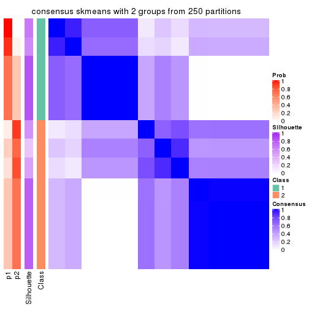</p>

</div>
<div id='tab-SD-skmeans-consensus-heatmap-2'>
<pre><code class="r">consensus_heatmap(res, k = 3)
</code></pre>

<p>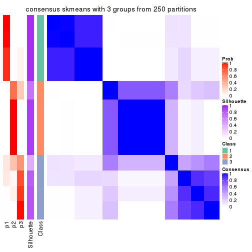</p>

</div>
<div id='tab-SD-skmeans-consensus-heatmap-3'>
<pre><code class="r">consensus_heatmap(res, k = 4)
</code></pre>

<p>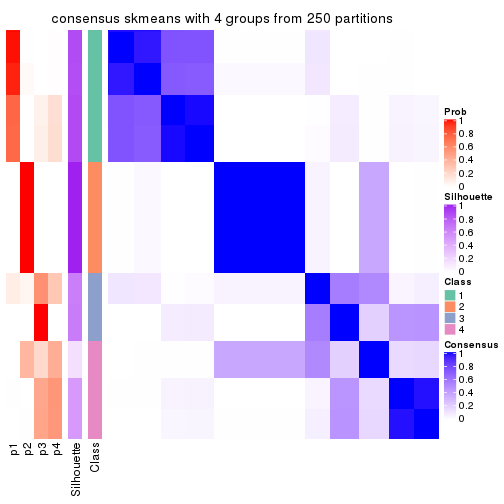</p>

</div>
<div id='tab-SD-skmeans-consensus-heatmap-4'>
<pre><code class="r">consensus_heatmap(res, k = 5)
</code></pre>

<p>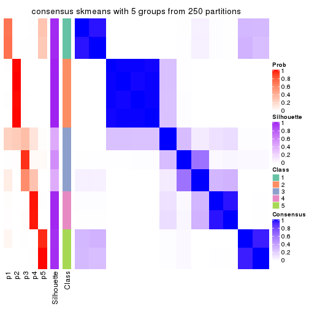</p>

</div>
<div id='tab-SD-skmeans-consensus-heatmap-5'>
<pre><code class="r">consensus_heatmap(res, k = 6)
</code></pre>

<p>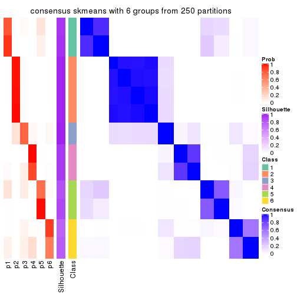</p>

</div>
</div>

Heatmaps for the membership of samples in all partitions to see how consistent they are:


<script>
$( function() {
	$( '#tabs-SD-skmeans-membership-heatmap' ).tabs();
} );
</script>
<div id='tabs-SD-skmeans-membership-heatmap'>
<ul>
<li><a href='#tab-SD-skmeans-membership-heatmap-1'>k = 2</a></li>
<li><a href='#tab-SD-skmeans-membership-heatmap-2'>k = 3</a></li>
<li><a href='#tab-SD-skmeans-membership-heatmap-3'>k = 4</a></li>
<li><a href='#tab-SD-skmeans-membership-heatmap-4'>k = 5</a></li>
<li><a href='#tab-SD-skmeans-membership-heatmap-5'>k = 6</a></li>
</ul>
<div id='tab-SD-skmeans-membership-heatmap-1'>
<pre><code class="r">membership_heatmap(res, k = 2)
</code></pre>

<p>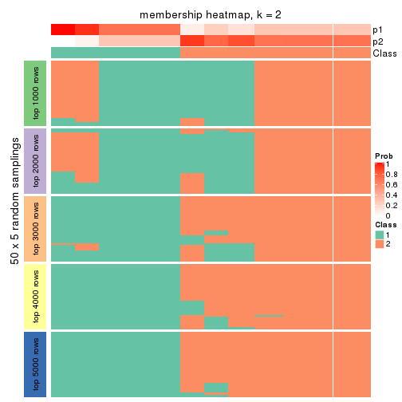</p>

</div>
<div id='tab-SD-skmeans-membership-heatmap-2'>
<pre><code class="r">membership_heatmap(res, k = 3)
</code></pre>

<p>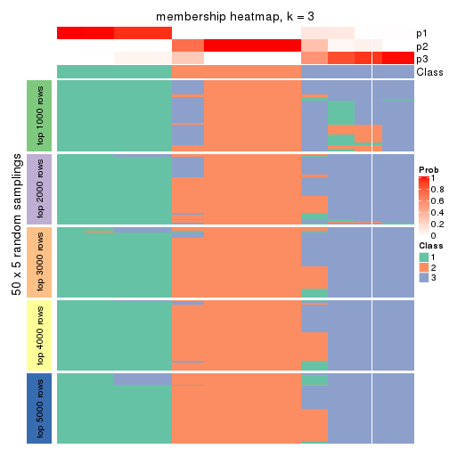</p>

</div>
<div id='tab-SD-skmeans-membership-heatmap-3'>
<pre><code class="r">membership_heatmap(res, k = 4)
</code></pre>

<p>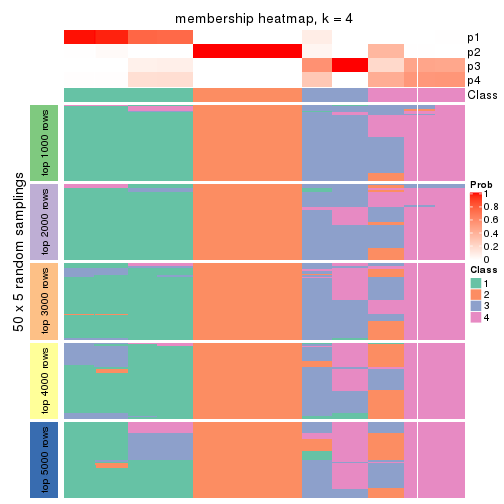</p>

</div>
<div id='tab-SD-skmeans-membership-heatmap-4'>
<pre><code class="r">membership_heatmap(res, k = 5)
</code></pre>

<p>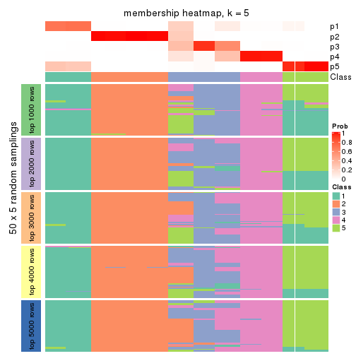</p>

</div>
<div id='tab-SD-skmeans-membership-heatmap-5'>
<pre><code class="r">membership_heatmap(res, k = 6)
</code></pre>

<p>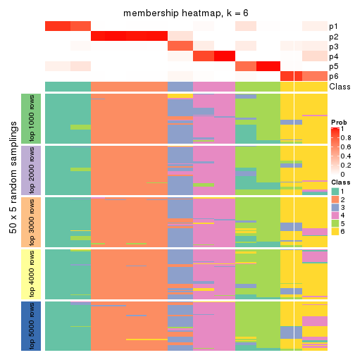</p>

</div>
</div>

As soon as we have had the classes for columns, we can look for signatures
which are significantly different between classes which can be candidate marks
for certain classes. Following are the heatmaps for signatures.


Signature heatmaps where rows are scaled:


<script>
$( function() {
	$( '#tabs-SD-skmeans-get-signatures' ).tabs();
} );
</script>
<div id='tabs-SD-skmeans-get-signatures'>
<ul>
<li><a href='#tab-SD-skmeans-get-signatures-1'>k = 2</a></li>
<li><a href='#tab-SD-skmeans-get-signatures-2'>k = 3</a></li>
<li><a href='#tab-SD-skmeans-get-signatures-3'>k = 4</a></li>
<li><a href='#tab-SD-skmeans-get-signatures-4'>k = 5</a></li>
<li><a href='#tab-SD-skmeans-get-signatures-5'>k = 6</a></li>
</ul>
<div id='tab-SD-skmeans-get-signatures-1'>
<pre><code class="r">get_signatures(res, k = 2)
</code></pre>

<p>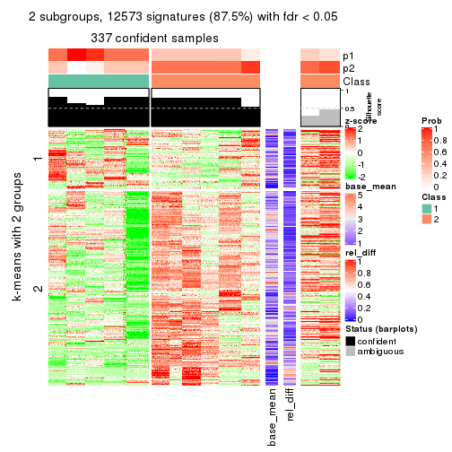</p>

</div>
<div id='tab-SD-skmeans-get-signatures-2'>
<pre><code class="r">get_signatures(res, k = 3)
</code></pre>

<p>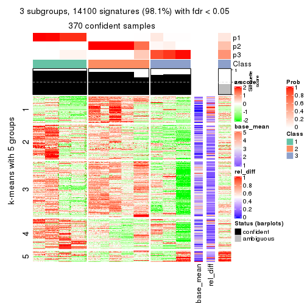</p>

</div>
<div id='tab-SD-skmeans-get-signatures-3'>
<pre><code class="r">get_signatures(res, k = 4)
</code></pre>

<p>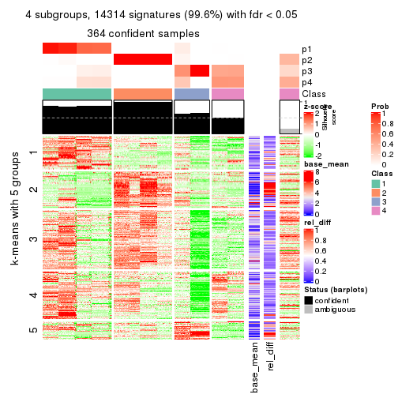</p>

</div>
<div id='tab-SD-skmeans-get-signatures-4'>
<pre><code class="r">get_signatures(res, k = 5)
</code></pre>

<p>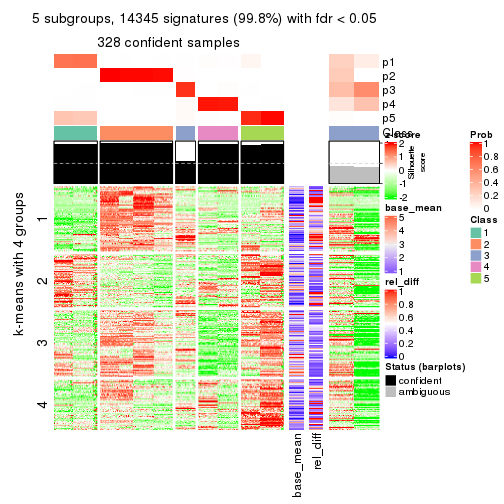</p>

</div>
<div id='tab-SD-skmeans-get-signatures-5'>
<pre><code class="r">get_signatures(res, k = 6)
</code></pre>

<p>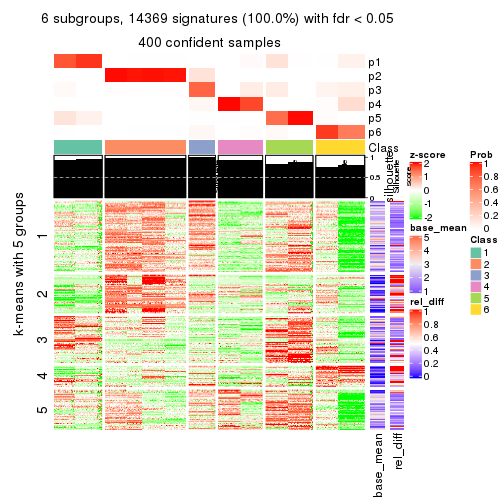</p>

</div>
</div>


Signature heatmaps where rows are not scaled:


<script>
$( function() {
	$( '#tabs-SD-skmeans-get-signatures-no-scale' ).tabs();
} );
</script>
<div id='tabs-SD-skmeans-get-signatures-no-scale'>
<ul>
<li><a href='#tab-SD-skmeans-get-signatures-no-scale-1'>k = 2</a></li>
<li><a href='#tab-SD-skmeans-get-signatures-no-scale-2'>k = 3</a></li>
<li><a href='#tab-SD-skmeans-get-signatures-no-scale-3'>k = 4</a></li>
<li><a href='#tab-SD-skmeans-get-signatures-no-scale-4'>k = 5</a></li>
<li><a href='#tab-SD-skmeans-get-signatures-no-scale-5'>k = 6</a></li>
</ul>
<div id='tab-SD-skmeans-get-signatures-no-scale-1'>
<pre><code class="r">get_signatures(res, k = 2, scale_rows = FALSE)
</code></pre>

<p>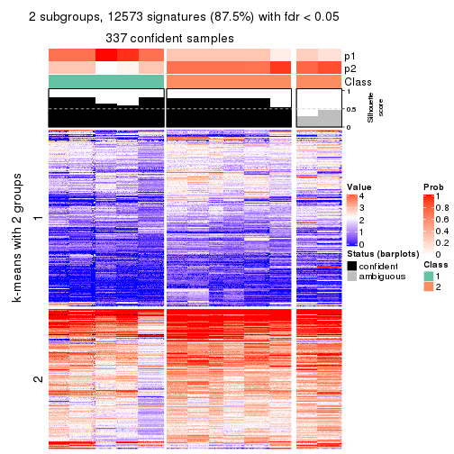</p>

</div>
<div id='tab-SD-skmeans-get-signatures-no-scale-2'>
<pre><code class="r">get_signatures(res, k = 3, scale_rows = FALSE)
</code></pre>

<p>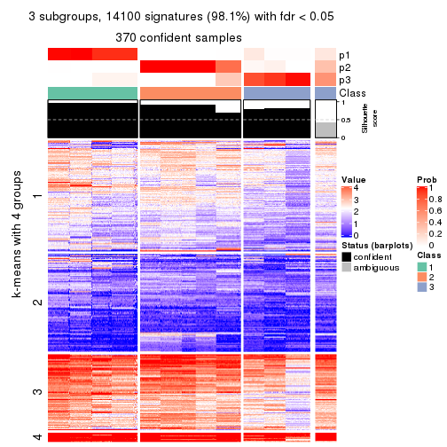</p>

</div>
<div id='tab-SD-skmeans-get-signatures-no-scale-3'>
<pre><code class="r">get_signatures(res, k = 4, scale_rows = FALSE)
</code></pre>

<p>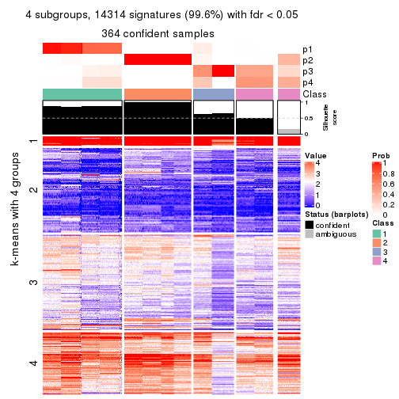</p>

</div>
<div id='tab-SD-skmeans-get-signatures-no-scale-4'>
<pre><code class="r">get_signatures(res, k = 5, scale_rows = FALSE)
</code></pre>

<p>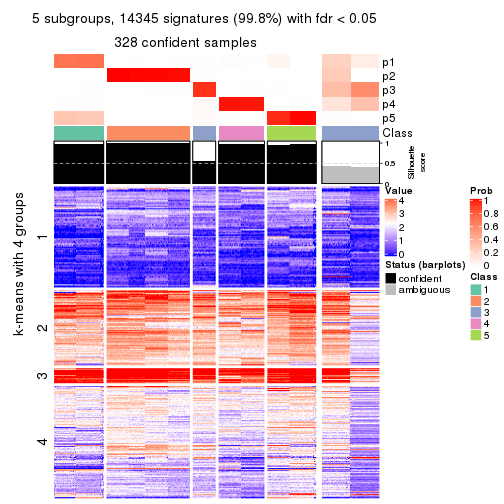</p>

</div>
<div id='tab-SD-skmeans-get-signatures-no-scale-5'>
<pre><code class="r">get_signatures(res, k = 6, scale_rows = FALSE)
</code></pre>

<p>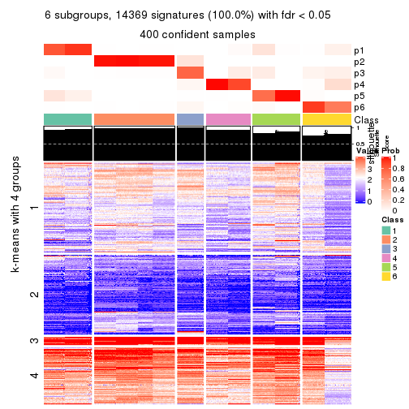</p>

</div>
</div>


Compare the overlap of signatures from different k:

```r
compare_signatures(res)
```

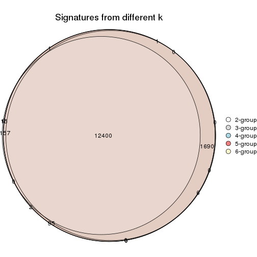

`get_signature()` returns a data frame invisibly. TO get the list of signatures, the function
call should be assigned to a variable explicitly. In following code, if `plot` argument is set
to `FALSE`, no heatmap is plotted while only the differential analysis is performed.

```r
# code only for demonstration
tb = get_signature(res, k = ..., plot = FALSE)
```

An example of the output of `tb` is:

```
#>   which_row         fdr    mean_1    mean_2 scaled_mean_1 scaled_mean_2 km
#> 1        38 0.042760348  8.373488  9.131774    -0.5533452     0.5164555  1
#> 2        40 0.018707592  7.106213  8.469186    -0.6173731     0.5762149  1
#> 3        55 0.019134737 10.221463 11.207825    -0.6159697     0.5749050  1
#> 4        59 0.006059896  5.921854  7.869574    -0.6899429     0.6439467  1
#> 5        60 0.018055526  8.928898 10.211722    -0.6204761     0.5791110  1
#> 6        98 0.009384629 15.714769 14.887706     0.6635654    -0.6193277  2
...
```

The columns in `tb` are:

1. `which_row`: row indices corresponding to the input matrix.
2. `fdr`: FDR for the differential test. 
3. `mean_x`: The mean value in group x.
4. `scaled_mean_x`: The mean value in group x after rows are scaled.
5. `km`: Row groups if k-means clustering is applied to rows.


UMAP plot which shows how samples are separated.


<script>
$( function() {
	$( '#tabs-SD-skmeans-dimension-reduction' ).tabs();
} );
</script>
<div id='tabs-SD-skmeans-dimension-reduction'>
<ul>
<li><a href='#tab-SD-skmeans-dimension-reduction-1'>k = 2</a></li>
<li><a href='#tab-SD-skmeans-dimension-reduction-2'>k = 3</a></li>
<li><a href='#tab-SD-skmeans-dimension-reduction-3'>k = 4</a></li>
<li><a href='#tab-SD-skmeans-dimension-reduction-4'>k = 5</a></li>
<li><a href='#tab-SD-skmeans-dimension-reduction-5'>k = 6</a></li>
</ul>
<div id='tab-SD-skmeans-dimension-reduction-1'>
<pre><code class="r">dimension_reduction(res, k = 2, method = &quot;UMAP&quot;)
</code></pre>

<p>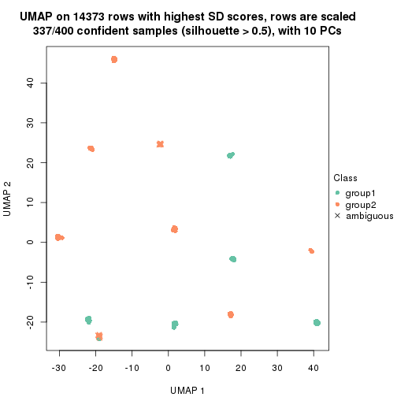</p>

</div>
<div id='tab-SD-skmeans-dimension-reduction-2'>
<pre><code class="r">dimension_reduction(res, k = 3, method = &quot;UMAP&quot;)
</code></pre>

<p>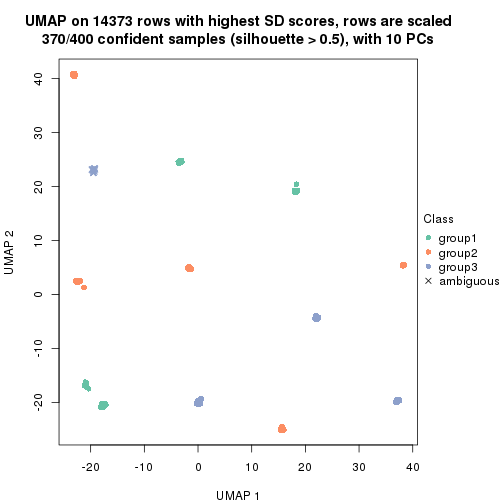</p>

</div>
<div id='tab-SD-skmeans-dimension-reduction-3'>
<pre><code class="r">dimension_reduction(res, k = 4, method = &quot;UMAP&quot;)
</code></pre>

<p>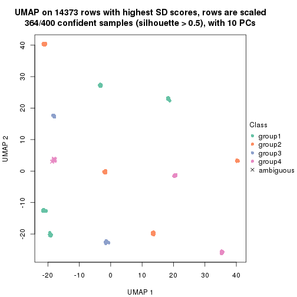</p>

</div>
<div id='tab-SD-skmeans-dimension-reduction-4'>
<pre><code class="r">dimension_reduction(res, k = 5, method = &quot;UMAP&quot;)
</code></pre>

<p>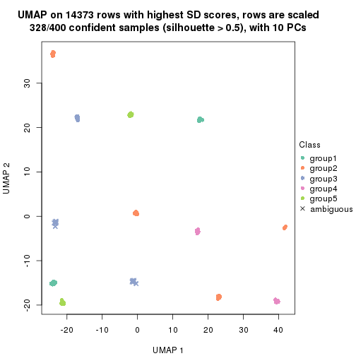</p>

</div>
<div id='tab-SD-skmeans-dimension-reduction-5'>
<pre><code class="r">dimension_reduction(res, k = 6, method = &quot;UMAP&quot;)
</code></pre>

<p>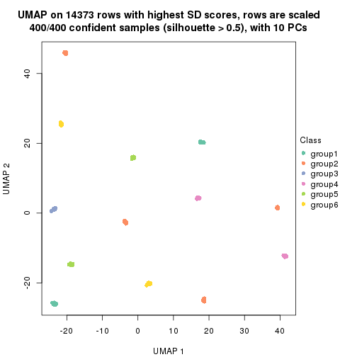</p>

</div>
</div>


Following heatmap shows how subgroups are split when increasing `k`:

```r
collect_classes(res)
```

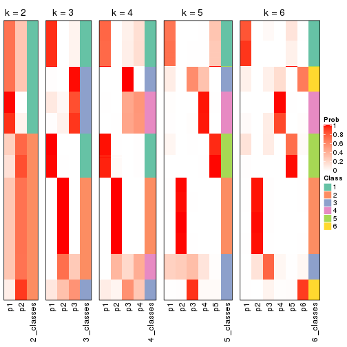


If matrix rows can be associated to genes, consider to use `GO_Enrichment(res,
...)` to perform function enrichment for the signature genes.


 

---------------------------------------------------


### SD:pam*


The object with results only for a single top-value method and a single partition method 
can be extracted as:

```r
res = res_list["SD", "pam"]
# you can also extract it by
# res = res_list["SD:pam"]
```

A summary of `res` and all the functions that can be applied to it:

```r
res
```

```
#> A 'ConsensusPartition' object with k = 2, 3, 4, 5, 6.
#>   On a matrix with 14373 rows and 400 columns.
#>   Top rows (1000, 2000, 3000, 4000, 5000) are extracted by 'SD' method.
#>   Subgroups are detected by 'pam' method.
#>   Performed in total 1250 partitions by row resampling.
#>   Best k for subgroups seems to be 6.
#> 
#> Following methods can be applied to this 'ConsensusPartition' object:
#>  [1] "cola_report"             "collect_classes"         "collect_plots"          
#>  [4] "collect_stats"           "colnames"                "compare_signatures"     
#>  [7] "consensus_heatmap"       "dimension_reduction"     "functional_enrichment"  
#> [10] "get_anno_col"            "get_anno"                "get_classes"            
#> [13] "get_consensus"           "get_matrix"              "get_membership"         
#> [16] "get_param"               "get_signatures"          "get_stats"              
#> [19] "is_best_k"               "is_stable_k"             "membership_heatmap"     
#> [22] "ncol"                    "nrow"                    "plot_ecdf"              
#> [25] "rownames"                "select_partition_number" "show"                   
#> [28] "suggest_best_k"          "test_to_known_factors"
```

`collect_plots()` function collects all the plots made from `res` for all `k` (number of partitions)
into one single page to provide an easy and fast comparison between different `k`.

```r
collect_plots(res)
```


The plots are:

- The first row: a plot of the ECDF (Empirical cumulative distribution
  function) curves of the consensus matrix for each `k` and the heatmap of
  predicted classes for each `k`.
- The second row: heatmaps of the consensus matrix for each `k`.
- The third row: heatmaps of the membership matrix for each `k`.
- The fouth row: heatmaps of the signatures for each `k`.

All the plots in panels can be made by individual functions and they are
plotted later in this section.

`select_partition_number()` produces several plots showing different
statistics for choosing "optimized" `k`. There are following statistics:

- ECDF curves of the consensus matrix for each `k`;
- 1-PAC. [The PAC
  score](https://en.wikipedia.org/wiki/Consensus_clustering#Over-interpretation_potential_of_consensus_clustering)
  measures the proportion of the ambiguous subgrouping.
- Mean silhouette score.
- Concordance. The mean probability of fiting the consensus class ids in all
  partitions.
- Area increased. Denote $A_k$ as the area under the ECDF curve for current
  `k`, the area increased is defined as $A_k - A_{k-1}$.
- Rand index. The percent of pairs of samples that are both in a same cluster
  or both are not in a same cluster in the partition of k and k-1.
- Jaccard index. The ratio of pairs of samples are both in a same cluster in
  the partition of k and k-1 and the pairs of samples are both in a same
  cluster in the partition k or k-1.

The detailed explanations of these statistics can be found in [the cola
vignette](http://bioconductor.org/packages/devel/bioc/vignettes/cola/inst/doc/cola.html#toc_13).

Generally speaking, lower PAC score, higher mean silhouette score or higher
concordance corresponds to better partition. Rand index and Jaccard index
measure how similar the current partition is compared to partition with `k-1`.
If they are too similar, we won't accept `k` is better than `k-1`.

```r
select_partition_number(res)
```

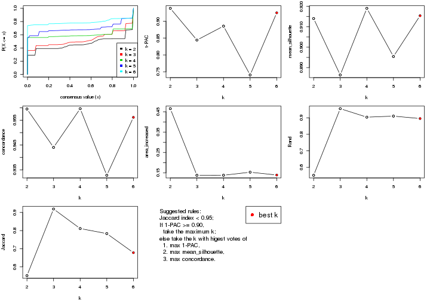

The numeric values for all these statistics can be obtained by `get_stats()`.

```r
get_stats(res)
```

```
#>   k 1-PAC mean_silhouette concordance area_increased  Rand Jaccard
#> 2 2 0.939           0.914       0.960          0.465 0.552   0.552
#> 3 3 0.844           0.886       0.944          0.138 0.955   0.919
#> 4 4 0.886           0.919       0.960          0.138 0.904   0.811
#> 5 5 0.740           0.895       0.933          0.153 0.910   0.784
#> 6 6 0.925           0.915       0.956          0.139 0.895   0.678
```

`suggest_best_k()` suggests the best $k$ based on these statistics. The rules are as follows:

- All $k$ with Jaccard index larger than 0.95 are removed because the increase of
  the partition number does not provides enough extra information. If all $k$ are removed,
  the best $k$ is assigned by `NA`.
- For $k$ with 1-PAC larger than 0.9, the maximal $k$ is taken as the "best k". Other $k$ is called "optional k".
- If it does not fit the second rule. The $k$ with the highest vote of highest
  1-PAC, mean silhouette and concordance is taken as the "best k".

```r
suggest_best_k(res)
```

```
#> [1] 6
#> attr(,"optional")
#> [1] 2
```

There is also optional best $k$ = 2 that is worth to check.

Following shows the table of the partitions (You need to click the **show/hide
code output** link to see it). The membership matrix (columns with name `p*`)
is inferred by
[`clue::cl_consensus()`](https://www.rdocumentation.org/link/cl_consensus?package=clue)
function with the `SE` method. Basically the value in the membership matrix
represents the probability to belong to a certain group. The finall class
label for an item is determined with the group with highest probability it
belongs to.

In `get_classes()` function, the entropy is calculated from the membership
matrix and the silhouette score is calculated from the consensus matrix.


<script>
$( function() {
	$( '#tabs-SD-pam-get-classes' ).tabs();
} );
</script>
<div id='tabs-SD-pam-get-classes'>
<ul>
<li><a href='#tab-SD-pam-get-classes-1'>k = 2</a></li>
<li><a href='#tab-SD-pam-get-classes-2'>k = 3</a></li>
<li><a href='#tab-SD-pam-get-classes-3'>k = 4</a></li>
<li><a href='#tab-SD-pam-get-classes-4'>k = 5</a></li>
<li><a href='#tab-SD-pam-get-classes-5'>k = 6</a></li>
</ul>

<div id='tab-SD-pam-get-classes-1'>
<p><a id='tab-SD-pam-get-classes-1-a' style='color:#0366d6' href='#'>show/hide code output</a></p>
<pre><code class="r">cbind(get_classes(res, k = 2), get_membership(res, k = 2))
</code></pre>

<pre><code>#&gt;            class entropy silhouette    p1    p2
#&gt; SRR1661716     2   0.000      0.938 0.000 1.000
#&gt; SRR1661717     2   0.000      0.938 0.000 1.000
#&gt; SRR1661718     2   0.000      0.938 0.000 1.000
#&gt; SRR1661719     2   0.000      0.938 0.000 1.000
#&gt; SRR1661720     2   0.000      0.938 0.000 1.000
#&gt; SRR1661721     2   0.000      0.938 0.000 1.000
#&gt; SRR1661722     2   0.000      0.938 0.000 1.000
#&gt; SRR1661723     2   0.000      0.938 0.000 1.000
#&gt; SRR1661724     2   0.000      0.938 0.000 1.000
#&gt; SRR1661725     2   0.000      0.938 0.000 1.000
#&gt; SRR1661726     2   0.000      0.938 0.000 1.000
#&gt; SRR1661727     2   0.000      0.938 0.000 1.000
#&gt; SRR1661728     2   0.000      0.938 0.000 1.000
#&gt; SRR1661729     2   0.000      0.938 0.000 1.000
#&gt; SRR1661730     2   0.000      0.938 0.000 1.000
#&gt; SRR1661731     2   0.000      0.938 0.000 1.000
#&gt; SRR1661732     2   0.000      0.938 0.000 1.000
#&gt; SRR1661733     2   0.000      0.938 0.000 1.000
#&gt; SRR1661734     2   0.000      0.938 0.000 1.000
#&gt; SRR1661735     2   0.000      0.938 0.000 1.000
#&gt; SRR1661736     2   0.000      0.938 0.000 1.000
#&gt; SRR1661737     2   0.000      0.938 0.000 1.000
#&gt; SRR1661738     2   0.000      0.938 0.000 1.000
#&gt; SRR1661739     2   0.000      0.938 0.000 1.000
#&gt; SRR1661740     2   0.000      0.938 0.000 1.000
#&gt; SRR1661741     2   0.000      0.938 0.000 1.000
#&gt; SRR1661742     2   0.000      0.938 0.000 1.000
#&gt; SRR1661743     2   0.000      0.938 0.000 1.000
#&gt; SRR1661744     2   0.000      0.938 0.000 1.000
#&gt; SRR1661745     2   0.000      0.938 0.000 1.000
#&gt; SRR1661746     2   0.000      0.938 0.000 1.000
#&gt; SRR1661747     2   0.000      0.938 0.000 1.000
#&gt; SRR1661748     2   0.000      0.938 0.000 1.000
#&gt; SRR1661749     2   0.000      0.938 0.000 1.000
#&gt; SRR1661750     2   0.000      0.938 0.000 1.000
#&gt; SRR1661751     2   0.000      0.938 0.000 1.000
#&gt; SRR1661752     2   0.000      0.938 0.000 1.000
#&gt; SRR1661753     2   0.000      0.938 0.000 1.000
#&gt; SRR1661754     2   0.000      0.938 0.000 1.000
#&gt; SRR1661755     2   0.000      0.938 0.000 1.000
#&gt; SRR1661756     2   0.000      0.938 0.000 1.000
#&gt; SRR1661757     2   0.000      0.938 0.000 1.000
#&gt; SRR1661758     2   0.000      0.938 0.000 1.000
#&gt; SRR1661759     2   0.000      0.938 0.000 1.000
#&gt; SRR1661760     2   0.000      0.938 0.000 1.000
#&gt; SRR1661761     2   0.000      0.938 0.000 1.000
#&gt; SRR1661762     2   0.000      0.938 0.000 1.000
#&gt; SRR1661763     2   0.000      0.938 0.000 1.000
#&gt; SRR1661764     2   0.000      0.938 0.000 1.000
#&gt; SRR1661766     2   0.000      0.938 0.000 1.000
#&gt; SRR1661767     2   0.000      0.938 0.000 1.000
#&gt; SRR1661768     2   0.000      0.938 0.000 1.000
#&gt; SRR1661769     2   0.000      0.938 0.000 1.000
#&gt; SRR1661770     2   0.000      0.938 0.000 1.000
#&gt; SRR1661771     2   0.000      0.938 0.000 1.000
#&gt; SRR1661772     2   0.000      0.938 0.000 1.000
#&gt; SRR1661773     2   0.000      0.938 0.000 1.000
#&gt; SRR1661774     2   0.000      0.938 0.000 1.000
#&gt; SRR1661775     2   0.000      0.938 0.000 1.000
#&gt; SRR1661776     2   0.000      0.938 0.000 1.000
#&gt; SRR1661777     2   0.000      0.938 0.000 1.000
#&gt; SRR1661778     2   0.000      0.938 0.000 1.000
#&gt; SRR1661779     2   0.000      0.938 0.000 1.000
#&gt; SRR1661780     2   0.000      0.938 0.000 1.000
#&gt; SRR1661781     2   0.000      0.938 0.000 1.000
#&gt; SRR1661782     2   0.000      0.938 0.000 1.000
#&gt; SRR1661783     2   0.000      0.938 0.000 1.000
#&gt; SRR1661784     2   0.000      0.938 0.000 1.000
#&gt; SRR1661785     2   0.000      0.938 0.000 1.000
#&gt; SRR1661786     2   0.000      0.938 0.000 1.000
#&gt; SRR1661787     2   0.000      0.938 0.000 1.000
#&gt; SRR1661788     2   0.000      0.938 0.000 1.000
#&gt; SRR1661789     2   0.000      0.938 0.000 1.000
#&gt; SRR1661790     2   0.000      0.938 0.000 1.000
#&gt; SRR1661791     2   0.000      0.938 0.000 1.000
#&gt; SRR1661792     2   0.000      0.938 0.000 1.000
#&gt; SRR1661793     2   0.000      0.938 0.000 1.000
#&gt; SRR1661794     2   0.000      0.938 0.000 1.000
#&gt; SRR1661795     2   0.000      0.938 0.000 1.000
#&gt; SRR1661796     2   0.000      0.938 0.000 1.000
#&gt; SRR1661797     2   0.000      0.938 0.000 1.000
#&gt; SRR1661798     2   0.000      0.938 0.000 1.000
#&gt; SRR1661799     2   0.000      0.938 0.000 1.000
#&gt; SRR1661800     2   0.000      0.938 0.000 1.000
#&gt; SRR1661801     2   0.000      0.938 0.000 1.000
#&gt; SRR1661802     2   0.000      0.938 0.000 1.000
#&gt; SRR1661803     2   0.000      0.938 0.000 1.000
#&gt; SRR1661804     2   0.000      0.938 0.000 1.000
#&gt; SRR1661805     2   0.000      0.938 0.000 1.000
#&gt; SRR1661806     2   0.000      0.938 0.000 1.000
#&gt; SRR1661807     2   0.000      0.938 0.000 1.000
#&gt; SRR1661808     2   0.000      0.938 0.000 1.000
#&gt; SRR1661809     2   0.000      0.938 0.000 1.000
#&gt; SRR1661810     2   0.000      0.938 0.000 1.000
#&gt; SRR1661811     2   0.000      0.938 0.000 1.000
#&gt; SRR1661812     2   0.000      0.938 0.000 1.000
#&gt; SRR1661813     2   0.000      0.938 0.000 1.000
#&gt; SRR1661814     2   0.000      0.938 0.000 1.000
#&gt; SRR1661815     2   0.000      0.938 0.000 1.000
#&gt; SRR1661816     2   0.000      0.938 0.000 1.000
#&gt; SRR1661817     2   0.000      0.938 0.000 1.000
#&gt; SRR1661818     2   0.000      0.938 0.000 1.000
#&gt; SRR1661819     2   0.000      0.938 0.000 1.000
#&gt; SRR1661820     2   0.000      0.938 0.000 1.000
#&gt; SRR1661821     2   0.000      0.938 0.000 1.000
#&gt; SRR1661822     2   0.000      0.938 0.000 1.000
#&gt; SRR1661823     2   0.000      0.938 0.000 1.000
#&gt; SRR1661824     2   0.000      0.938 0.000 1.000
#&gt; SRR1661825     2   0.000      0.938 0.000 1.000
#&gt; SRR1661826     1   0.000      0.993 1.000 0.000
#&gt; SRR1661827     1   0.000      0.993 1.000 0.000
#&gt; SRR1661828     1   0.000      0.993 1.000 0.000
#&gt; SRR1661829     1   0.000      0.993 1.000 0.000
#&gt; SRR1661830     1   0.000      0.993 1.000 0.000
#&gt; SRR1661831     1   0.000      0.993 1.000 0.000
#&gt; SRR1661832     1   0.000      0.993 1.000 0.000
#&gt; SRR1661833     1   0.000      0.993 1.000 0.000
#&gt; SRR1661834     1   0.000      0.993 1.000 0.000
#&gt; SRR1661835     1   0.000      0.993 1.000 0.000
#&gt; SRR1661836     1   0.000      0.993 1.000 0.000
#&gt; SRR1661837     1   0.000      0.993 1.000 0.000
#&gt; SRR1661838     1   0.000      0.993 1.000 0.000
#&gt; SRR1661839     1   0.000      0.993 1.000 0.000
#&gt; SRR1661840     1   0.000      0.993 1.000 0.000
#&gt; SRR1661841     1   0.000      0.993 1.000 0.000
#&gt; SRR1661843     1   0.000      0.993 1.000 0.000
#&gt; SRR1661844     1   0.000      0.993 1.000 0.000
#&gt; SRR1661845     1   0.000      0.993 1.000 0.000
#&gt; SRR1661846     1   0.000      0.993 1.000 0.000
#&gt; SRR1661847     1   0.000      0.993 1.000 0.000
#&gt; SRR1661848     1   0.000      0.993 1.000 0.000
#&gt; SRR1661849     1   0.000      0.993 1.000 0.000
#&gt; SRR1661850     1   0.000      0.993 1.000 0.000
#&gt; SRR1661851     1   0.000      0.993 1.000 0.000
#&gt; SRR1661852     1   0.000      0.993 1.000 0.000
#&gt; SRR1661853     1   0.000      0.993 1.000 0.000
#&gt; SRR1661854     1   0.000      0.993 1.000 0.000
#&gt; SRR1661855     1   0.000      0.993 1.000 0.000
#&gt; SRR1661856     1   0.000      0.993 1.000 0.000
#&gt; SRR1661857     1   0.000      0.993 1.000 0.000
#&gt; SRR1661858     1   0.000      0.993 1.000 0.000
#&gt; SRR1661859     1   0.000      0.993 1.000 0.000
#&gt; SRR1661860     1   0.000      0.993 1.000 0.000
#&gt; SRR1661861     1   0.000      0.993 1.000 0.000
#&gt; SRR1661862     1   0.000      0.993 1.000 0.000
#&gt; SRR1661863     1   0.000      0.993 1.000 0.000
#&gt; SRR1661864     1   0.000      0.993 1.000 0.000
#&gt; SRR1661865     1   0.000      0.993 1.000 0.000
#&gt; SRR1661866     1   0.000      0.993 1.000 0.000
#&gt; SRR1661867     1   0.000      0.993 1.000 0.000
#&gt; SRR1661868     1   0.000      0.993 1.000 0.000
#&gt; SRR1661869     1   0.000      0.993 1.000 0.000
#&gt; SRR1661870     1   0.000      0.993 1.000 0.000
#&gt; SRR1661871     1   0.000      0.993 1.000 0.000
#&gt; SRR1661872     1   0.000      0.993 1.000 0.000
#&gt; SRR1661873     1   0.000      0.993 1.000 0.000
#&gt; SRR1661874     1   0.000      0.993 1.000 0.000
#&gt; SRR1661875     1   0.000      0.993 1.000 0.000
#&gt; SRR1661876     1   0.000      0.993 1.000 0.000
#&gt; SRR1661877     1   0.000      0.993 1.000 0.000
#&gt; SRR1661878     1   0.000      0.993 1.000 0.000
#&gt; SRR1661879     1   0.000      0.993 1.000 0.000
#&gt; SRR1661880     1   0.000      0.993 1.000 0.000
#&gt; SRR1661881     1   0.000      0.993 1.000 0.000
#&gt; SRR1661882     1   0.000      0.993 1.000 0.000
#&gt; SRR1661883     1   0.000      0.993 1.000 0.000
#&gt; SRR1661884     1   0.000      0.993 1.000 0.000
#&gt; SRR1661885     1   0.000      0.993 1.000 0.000
#&gt; SRR1661886     1   0.000      0.993 1.000 0.000
#&gt; SRR1661887     1   0.000      0.993 1.000 0.000
#&gt; SRR1661888     1   0.000      0.993 1.000 0.000
#&gt; SRR1661889     1   0.000      0.993 1.000 0.000
#&gt; SRR1661890     1   0.000      0.993 1.000 0.000
#&gt; SRR1661891     1   0.000      0.993 1.000 0.000
#&gt; SRR1661892     1   0.000      0.993 1.000 0.000
#&gt; SRR1661893     1   0.000      0.993 1.000 0.000
#&gt; SRR1661894     1   0.000      0.993 1.000 0.000
#&gt; SRR1661895     1   0.000      0.993 1.000 0.000
#&gt; SRR1661896     1   0.000      0.993 1.000 0.000
#&gt; SRR1661897     1   0.000      0.993 1.000 0.000
#&gt; SRR1661898     1   0.000      0.993 1.000 0.000
#&gt; SRR1661899     1   0.000      0.993 1.000 0.000
#&gt; SRR1661900     1   0.000      0.993 1.000 0.000
#&gt; SRR1661901     1   0.000      0.993 1.000 0.000
#&gt; SRR1661902     1   0.000      0.993 1.000 0.000
#&gt; SRR1661903     1   0.000      0.993 1.000 0.000
#&gt; SRR1661904     1   0.000      0.993 1.000 0.000
#&gt; SRR1661905     1   0.000      0.993 1.000 0.000
#&gt; SRR1661906     1   0.000      0.993 1.000 0.000
#&gt; SRR1661907     1   0.000      0.993 1.000 0.000
#&gt; SRR1661908     1   0.000      0.993 1.000 0.000
#&gt; SRR1661909     1   0.000      0.993 1.000 0.000
#&gt; SRR1661910     1   0.000      0.993 1.000 0.000
#&gt; SRR1661911     1   0.000      0.993 1.000 0.000
#&gt; SRR1661912     1   0.000      0.993 1.000 0.000
#&gt; SRR1661913     1   0.000      0.993 1.000 0.000
#&gt; SRR1661914     1   0.000      0.993 1.000 0.000
#&gt; SRR1661915     1   0.000      0.993 1.000 0.000
#&gt; SRR1661916     1   0.000      0.993 1.000 0.000
#&gt; SRR1661917     1   0.000      0.993 1.000 0.000
#&gt; SRR1661918     1   0.000      0.993 1.000 0.000
#&gt; SRR1661919     1   0.000      0.993 1.000 0.000
#&gt; SRR1661920     1   0.000      0.993 1.000 0.000
#&gt; SRR1661921     1   0.000      0.993 1.000 0.000
#&gt; SRR1661922     1   0.000      0.993 1.000 0.000
#&gt; SRR1661923     1   0.000      0.993 1.000 0.000
#&gt; SRR1661924     1   0.000      0.993 1.000 0.000
#&gt; SRR1661925     1   0.000      0.993 1.000 0.000
#&gt; SRR1661926     1   0.000      0.993 1.000 0.000
#&gt; SRR1661927     1   0.000      0.993 1.000 0.000
#&gt; SRR1661928     2   0.000      0.938 0.000 1.000
#&gt; SRR1661929     2   0.000      0.938 0.000 1.000
#&gt; SRR1661930     2   0.000      0.938 0.000 1.000
#&gt; SRR1661931     2   0.000      0.938 0.000 1.000
#&gt; SRR1661932     2   0.000      0.938 0.000 1.000
#&gt; SRR1661933     2   0.000      0.938 0.000 1.000
#&gt; SRR1661934     2   0.000      0.938 0.000 1.000
#&gt; SRR1661935     2   0.000      0.938 0.000 1.000
#&gt; SRR1661936     2   0.000      0.938 0.000 1.000
#&gt; SRR1661937     2   0.000      0.938 0.000 1.000
#&gt; SRR1661938     2   0.000      0.938 0.000 1.000
#&gt; SRR1661939     2   0.000      0.938 0.000 1.000
#&gt; SRR1661940     2   0.000      0.938 0.000 1.000
#&gt; SRR1661941     2   0.000      0.938 0.000 1.000
#&gt; SRR1661942     2   0.000      0.938 0.000 1.000
#&gt; SRR1661943     2   0.000      0.938 0.000 1.000
#&gt; SRR1661944     2   0.000      0.938 0.000 1.000
#&gt; SRR1661945     2   0.000      0.938 0.000 1.000
#&gt; SRR1661946     2   0.000      0.938 0.000 1.000
#&gt; SRR1661947     2   0.000      0.938 0.000 1.000
#&gt; SRR1661948     2   0.000      0.938 0.000 1.000
#&gt; SRR1661949     2   0.000      0.938 0.000 1.000
#&gt; SRR1661950     2   0.000      0.938 0.000 1.000
#&gt; SRR1661951     2   0.000      0.938 0.000 1.000
#&gt; SRR1661952     2   0.000      0.938 0.000 1.000
#&gt; SRR1661953     2   0.000      0.938 0.000 1.000
#&gt; SRR1661954     2   0.000      0.938 0.000 1.000
#&gt; SRR1661955     2   0.000      0.938 0.000 1.000
#&gt; SRR1661956     2   0.000      0.938 0.000 1.000
#&gt; SRR1661957     2   0.000      0.938 0.000 1.000
#&gt; SRR1661958     2   0.402      0.900 0.080 0.920
#&gt; SRR1661959     2   0.402      0.900 0.080 0.920
#&gt; SRR1661960     2   0.402      0.900 0.080 0.920
#&gt; SRR1661961     2   0.402      0.900 0.080 0.920
#&gt; SRR1661962     2   0.402      0.900 0.080 0.920
#&gt; SRR1661963     2   0.402      0.900 0.080 0.920
#&gt; SRR1661964     2   0.402      0.900 0.080 0.920
#&gt; SRR1661965     2   0.402      0.900 0.080 0.920
#&gt; SRR1661966     2   0.402      0.900 0.080 0.920
#&gt; SRR1661967     2   0.402      0.900 0.080 0.920
#&gt; SRR1661968     2   0.402      0.900 0.080 0.920
#&gt; SRR1661969     2   0.402      0.900 0.080 0.920
#&gt; SRR1661970     2   0.402      0.900 0.080 0.920
#&gt; SRR1661971     2   0.402      0.900 0.080 0.920
#&gt; SRR1661972     2   0.402      0.900 0.080 0.920
#&gt; SRR1661973     2   0.402      0.900 0.080 0.920
#&gt; SRR1661974     2   0.402      0.900 0.080 0.920
#&gt; SRR1661975     2   0.402      0.900 0.080 0.920
#&gt; SRR1661976     2   0.402      0.900 0.080 0.920
#&gt; SRR1661977     2   0.402      0.900 0.080 0.920
#&gt; SRR1661978     2   0.402      0.900 0.080 0.920
#&gt; SRR1661979     2   0.402      0.900 0.080 0.920
#&gt; SRR1661980     2   0.402      0.900 0.080 0.920
#&gt; SRR1661981     2   0.402      0.900 0.080 0.920
#&gt; SRR1661982     2   0.402      0.900 0.080 0.920
#&gt; SRR1661983     2   0.402      0.900 0.080 0.920
#&gt; SRR1661984     2   0.402      0.900 0.080 0.920
#&gt; SRR1661985     2   0.402      0.900 0.080 0.920
#&gt; SRR1661986     2   0.402      0.900 0.080 0.920
#&gt; SRR1661987     2   0.402      0.900 0.080 0.920
#&gt; SRR1661988     1   0.000      0.993 1.000 0.000
#&gt; SRR1661989     1   0.000      0.993 1.000 0.000
#&gt; SRR1661990     1   0.000      0.993 1.000 0.000
#&gt; SRR1661991     1   0.000      0.993 1.000 0.000
#&gt; SRR1661992     1   0.000      0.993 1.000 0.000
#&gt; SRR1661993     1   0.000      0.993 1.000 0.000
#&gt; SRR1661994     1   0.000      0.993 1.000 0.000
#&gt; SRR1661995     1   0.000      0.993 1.000 0.000
#&gt; SRR1661996     1   0.000      0.993 1.000 0.000
#&gt; SRR1661997     1   0.000      0.993 1.000 0.000
#&gt; SRR1661998     1   0.000      0.993 1.000 0.000
#&gt; SRR1661999     1   0.000      0.993 1.000 0.000
#&gt; SRR1662000     1   0.000      0.993 1.000 0.000
#&gt; SRR1662001     1   0.000      0.993 1.000 0.000
#&gt; SRR1662002     1   0.000      0.993 1.000 0.000
#&gt; SRR1662003     1   0.000      0.993 1.000 0.000
#&gt; SRR1662004     1   0.000      0.993 1.000 0.000
#&gt; SRR1662005     1   0.000      0.993 1.000 0.000
#&gt; SRR1662006     1   0.000      0.993 1.000 0.000
#&gt; SRR1662007     1   0.000      0.993 1.000 0.000
#&gt; SRR1662008     1   0.000      0.993 1.000 0.000
#&gt; SRR1662009     1   0.000      0.993 1.000 0.000
#&gt; SRR1662010     1   0.000      0.993 1.000 0.000
#&gt; SRR1662011     1   0.000      0.993 1.000 0.000
#&gt; SRR1662012     1   0.000      0.993 1.000 0.000
#&gt; SRR1662013     1   0.000      0.993 1.000 0.000
#&gt; SRR1662014     1   0.000      0.993 1.000 0.000
#&gt; SRR1662015     1   0.000      0.993 1.000 0.000
#&gt; SRR1662016     1   0.000      0.993 1.000 0.000
#&gt; SRR1662017     1   0.000      0.993 1.000 0.000
#&gt; SRR1662018     2   0.000      0.938 0.000 1.000
#&gt; SRR1662019     2   0.000      0.938 0.000 1.000
#&gt; SRR1662020     2   0.000      0.938 0.000 1.000
#&gt; SRR1662021     2   0.000      0.938 0.000 1.000
#&gt; SRR1662022     2   0.000      0.938 0.000 1.000
#&gt; SRR1662023     2   0.000      0.938 0.000 1.000
#&gt; SRR1662024     2   0.000      0.938 0.000 1.000
#&gt; SRR1662025     2   0.000      0.938 0.000 1.000
#&gt; SRR1662026     2   0.000      0.938 0.000 1.000
#&gt; SRR1662027     2   0.000      0.938 0.000 1.000
#&gt; SRR1662028     2   0.000      0.938 0.000 1.000
#&gt; SRR1662029     2   0.000      0.938 0.000 1.000
#&gt; SRR1662030     2   0.000      0.938 0.000 1.000
#&gt; SRR1662031     2   0.000      0.938 0.000 1.000
#&gt; SRR1662032     2   0.000      0.938 0.000 1.000
#&gt; SRR1662033     2   0.000      0.938 0.000 1.000
#&gt; SRR1662034     2   0.000      0.938 0.000 1.000
#&gt; SRR1662035     2   0.000      0.938 0.000 1.000
#&gt; SRR1662036     2   0.000      0.938 0.000 1.000
#&gt; SRR1662037     2   0.000      0.938 0.000 1.000
#&gt; SRR1662038     2   0.000      0.938 0.000 1.000
#&gt; SRR1662039     2   0.000      0.938 0.000 1.000
#&gt; SRR1662040     2   0.000      0.938 0.000 1.000
#&gt; SRR1662041     2   0.000      0.938 0.000 1.000
#&gt; SRR1662042     2   0.000      0.938 0.000 1.000
#&gt; SRR1662043     2   0.000      0.938 0.000 1.000
#&gt; SRR1662044     2   0.000      0.938 0.000 1.000
#&gt; SRR1662045     2   0.000      0.938 0.000 1.000
#&gt; SRR1662046     2   0.000      0.938 0.000 1.000
#&gt; SRR1662047     2   0.000      0.938 0.000 1.000
#&gt; SRR1662048     2   0.000      0.938 0.000 1.000
#&gt; SRR1662049     2   0.000      0.938 0.000 1.000
#&gt; SRR1662050     2   0.000      0.938 0.000 1.000
#&gt; SRR1662051     2   0.000      0.938 0.000 1.000
#&gt; SRR1662052     2   0.000      0.938 0.000 1.000
#&gt; SRR1662053     2   0.000      0.938 0.000 1.000
#&gt; SRR1662054     2   0.402      0.900 0.080 0.920
#&gt; SRR1662055     2   0.402      0.900 0.080 0.920
#&gt; SRR1662056     2   0.402      0.900 0.080 0.920
#&gt; SRR1662057     2   0.402      0.900 0.080 0.920
#&gt; SRR1662058     2   0.402      0.900 0.080 0.920
#&gt; SRR1662059     2   0.402      0.900 0.080 0.920
#&gt; SRR1662060     2   0.402      0.900 0.080 0.920
#&gt; SRR1662061     2   0.402      0.900 0.080 0.920
#&gt; SRR1662062     2   0.402      0.900 0.080 0.920
#&gt; SRR1662063     2   0.402      0.900 0.080 0.920
#&gt; SRR1662064     2   0.402      0.900 0.080 0.920
#&gt; SRR1662065     2   0.402      0.900 0.080 0.920
#&gt; SRR1662066     2   0.402      0.900 0.080 0.920
#&gt; SRR1662067     2   0.402      0.900 0.080 0.920
#&gt; SRR1662068     2   0.402      0.900 0.080 0.920
#&gt; SRR1662069     2   0.402      0.900 0.080 0.920
#&gt; SRR1662070     2   0.402      0.900 0.080 0.920
#&gt; SRR1662071     2   0.402      0.900 0.080 0.920
#&gt; SRR1662072     2   0.402      0.900 0.080 0.920
#&gt; SRR1662073     2   0.402      0.900 0.080 0.920
#&gt; SRR1662074     2   0.402      0.900 0.080 0.920
#&gt; SRR1662075     2   0.402      0.900 0.080 0.920
#&gt; SRR1662076     2   0.402      0.900 0.080 0.920
#&gt; SRR1662077     2   0.402      0.900 0.080 0.920
#&gt; SRR1662078     2   0.402      0.900 0.080 0.920
#&gt; SRR1662079     2   0.402      0.900 0.080 0.920
#&gt; SRR1662080     2   0.402      0.900 0.080 0.920
#&gt; SRR1662081     2   0.402      0.900 0.080 0.920
#&gt; SRR1662082     2   0.402      0.900 0.080 0.920
#&gt; SRR1662083     2   0.402      0.900 0.080 0.920
#&gt; SRR1662084     2   0.909      0.559 0.324 0.676
#&gt; SRR1662085     2   0.955      0.452 0.376 0.624
#&gt; SRR1662086     2   0.955      0.452 0.376 0.624
#&gt; SRR1662087     1   0.000      0.993 1.000 0.000
#&gt; SRR1662088     2   0.904      0.566 0.320 0.680
#&gt; SRR1662089     2   0.946      0.479 0.364 0.636
#&gt; SRR1662090     2   0.936      0.504 0.352 0.648
#&gt; SRR1662091     2   0.961      0.433 0.384 0.616
#&gt; SRR1662092     2   0.949      0.470 0.368 0.632
#&gt; SRR1662093     1   0.987      0.162 0.568 0.432
#&gt; SRR1662094     2   0.921      0.536 0.336 0.664
#&gt; SRR1662095     2   0.952      0.461 0.372 0.628
#&gt; SRR1662096     2   0.955      0.452 0.376 0.624
#&gt; SRR1662097     2   0.939      0.496 0.356 0.644
#&gt; SRR1662098     2   0.943      0.487 0.360 0.640
#&gt; SRR1662099     2   0.958      0.443 0.380 0.620
#&gt; SRR1662100     2   0.925      0.529 0.340 0.660
#&gt; SRR1662101     2   0.861      0.627 0.284 0.716
#&gt; SRR1662102     2   0.891      0.587 0.308 0.692
#&gt; SRR1662103     2   0.876      0.607 0.296 0.704
#&gt; SRR1662104     2   0.886      0.594 0.304 0.696
#&gt; SRR1662105     2   0.936      0.505 0.352 0.648
#&gt; SRR1662106     2   0.966      0.413 0.392 0.608
#&gt; SRR1662107     2   0.963      0.423 0.388 0.612
#&gt; SRR1662108     2   0.958      0.443 0.380 0.620
#&gt; SRR1662109     2   0.969      0.403 0.396 0.604
#&gt; SRR1662110     2   0.949      0.470 0.368 0.632
#&gt; SRR1662111     1   0.000      0.993 1.000 0.000
#&gt; SRR1662112     2   0.925      0.529 0.340 0.660
#&gt; SRR1662113     2   0.936      0.504 0.352 0.648
#&gt; SRR1662114     1   0.981      0.178 0.580 0.420
#&gt; SRR1662115     2   0.921      0.536 0.336 0.664
#&gt; SRR1662116     2   0.913      0.551 0.328 0.672
#&gt; SRR1662117     2   0.921      0.537 0.336 0.664
</code></pre>

<script>
$('#tab-SD-pam-get-classes-1-a').parent().next().next().hide();
$('#tab-SD-pam-get-classes-1-a').click(function(){
  $('#tab-SD-pam-get-classes-1-a').parent().next().next().toggle();
  return(false);
});
</script>
</div>

<div id='tab-SD-pam-get-classes-2'>
<p><a id='tab-SD-pam-get-classes-2-a' style='color:#0366d6' href='#'>show/hide code output</a></p>
<pre><code class="r">cbind(get_classes(res, k = 3), get_membership(res, k = 3))
</code></pre>

<pre><code>#&gt;            class entropy silhouette    p1    p2  p3
#&gt; SRR1661716     2   0.000     0.9086 0.000 1.000 0.0
#&gt; SRR1661717     2   0.000     0.9086 0.000 1.000 0.0
#&gt; SRR1661718     2   0.000     0.9086 0.000 1.000 0.0
#&gt; SRR1661719     2   0.000     0.9086 0.000 1.000 0.0
#&gt; SRR1661720     2   0.000     0.9086 0.000 1.000 0.0
#&gt; SRR1661721     2   0.000     0.9086 0.000 1.000 0.0
#&gt; SRR1661722     2   0.000     0.9086 0.000 1.000 0.0
#&gt; SRR1661723     2   0.000     0.9086 0.000 1.000 0.0
#&gt; SRR1661724     2   0.000     0.9086 0.000 1.000 0.0
#&gt; SRR1661725     2   0.000     0.9086 0.000 1.000 0.0
#&gt; SRR1661726     2   0.000     0.9086 0.000 1.000 0.0
#&gt; SRR1661727     2   0.000     0.9086 0.000 1.000 0.0
#&gt; SRR1661728     2   0.000     0.9086 0.000 1.000 0.0
#&gt; SRR1661729     2   0.000     0.9086 0.000 1.000 0.0
#&gt; SRR1661730     2   0.000     0.9086 0.000 1.000 0.0
#&gt; SRR1661731     2   0.000     0.9086 0.000 1.000 0.0
#&gt; SRR1661732     2   0.000     0.9086 0.000 1.000 0.0
#&gt; SRR1661733     2   0.000     0.9086 0.000 1.000 0.0
#&gt; SRR1661734     2   0.000     0.9086 0.000 1.000 0.0
#&gt; SRR1661735     2   0.000     0.9086 0.000 1.000 0.0
#&gt; SRR1661736     2   0.000     0.9086 0.000 1.000 0.0
#&gt; SRR1661737     2   0.000     0.9086 0.000 1.000 0.0
#&gt; SRR1661738     2   0.000     0.9086 0.000 1.000 0.0
#&gt; SRR1661739     2   0.000     0.9086 0.000 1.000 0.0
#&gt; SRR1661740     2   0.000     0.9086 0.000 1.000 0.0
#&gt; SRR1661741     2   0.000     0.9086 0.000 1.000 0.0
#&gt; SRR1661742     2   0.000     0.9086 0.000 1.000 0.0
#&gt; SRR1661743     2   0.000     0.9086 0.000 1.000 0.0
#&gt; SRR1661744     2   0.000     0.9086 0.000 1.000 0.0
#&gt; SRR1661745     2   0.000     0.9086 0.000 1.000 0.0
#&gt; SRR1661746     2   0.000     0.9086 0.000 1.000 0.0
#&gt; SRR1661747     2   0.000     0.9086 0.000 1.000 0.0
#&gt; SRR1661748     2   0.000     0.9086 0.000 1.000 0.0
#&gt; SRR1661749     2   0.000     0.9086 0.000 1.000 0.0
#&gt; SRR1661750     2   0.000     0.9086 0.000 1.000 0.0
#&gt; SRR1661751     2   0.000     0.9086 0.000 1.000 0.0
#&gt; SRR1661752     2   0.000     0.9086 0.000 1.000 0.0
#&gt; SRR1661753     2   0.000     0.9086 0.000 1.000 0.0
#&gt; SRR1661754     2   0.000     0.9086 0.000 1.000 0.0
#&gt; SRR1661755     2   0.000     0.9086 0.000 1.000 0.0
#&gt; SRR1661756     2   0.000     0.9086 0.000 1.000 0.0
#&gt; SRR1661757     2   0.000     0.9086 0.000 1.000 0.0
#&gt; SRR1661758     2   0.000     0.9086 0.000 1.000 0.0
#&gt; SRR1661759     2   0.000     0.9086 0.000 1.000 0.0
#&gt; SRR1661760     2   0.000     0.9086 0.000 1.000 0.0
#&gt; SRR1661761     2   0.000     0.9086 0.000 1.000 0.0
#&gt; SRR1661762     2   0.000     0.9086 0.000 1.000 0.0
#&gt; SRR1661763     2   0.000     0.9086 0.000 1.000 0.0
#&gt; SRR1661764     2   0.000     0.9086 0.000 1.000 0.0
#&gt; SRR1661766     2   0.000     0.9086 0.000 1.000 0.0
#&gt; SRR1661767     2   0.000     0.9086 0.000 1.000 0.0
#&gt; SRR1661768     2   0.000     0.9086 0.000 1.000 0.0
#&gt; SRR1661769     2   0.000     0.9086 0.000 1.000 0.0
#&gt; SRR1661770     2   0.000     0.9086 0.000 1.000 0.0
#&gt; SRR1661771     2   0.000     0.9086 0.000 1.000 0.0
#&gt; SRR1661772     2   0.000     0.9086 0.000 1.000 0.0
#&gt; SRR1661773     2   0.000     0.9086 0.000 1.000 0.0
#&gt; SRR1661774     2   0.000     0.9086 0.000 1.000 0.0
#&gt; SRR1661775     2   0.000     0.9086 0.000 1.000 0.0
#&gt; SRR1661776     2   0.000     0.9086 0.000 1.000 0.0
#&gt; SRR1661777     2   0.000     0.9086 0.000 1.000 0.0
#&gt; SRR1661778     2   0.000     0.9086 0.000 1.000 0.0
#&gt; SRR1661779     2   0.000     0.9086 0.000 1.000 0.0
#&gt; SRR1661780     2   0.000     0.9086 0.000 1.000 0.0
#&gt; SRR1661781     2   0.000     0.9086 0.000 1.000 0.0
#&gt; SRR1661782     2   0.000     0.9086 0.000 1.000 0.0
#&gt; SRR1661783     2   0.000     0.9086 0.000 1.000 0.0
#&gt; SRR1661784     2   0.000     0.9086 0.000 1.000 0.0
#&gt; SRR1661785     2   0.000     0.9086 0.000 1.000 0.0
#&gt; SRR1661786     2   0.000     0.9086 0.000 1.000 0.0
#&gt; SRR1661787     2   0.000     0.9086 0.000 1.000 0.0
#&gt; SRR1661788     2   0.000     0.9086 0.000 1.000 0.0
#&gt; SRR1661789     2   0.000     0.9086 0.000 1.000 0.0
#&gt; SRR1661790     2   0.000     0.9086 0.000 1.000 0.0
#&gt; SRR1661791     2   0.000     0.9086 0.000 1.000 0.0
#&gt; SRR1661792     2   0.000     0.9086 0.000 1.000 0.0
#&gt; SRR1661793     2   0.000     0.9086 0.000 1.000 0.0
#&gt; SRR1661794     2   0.000     0.9086 0.000 1.000 0.0
#&gt; SRR1661795     2   0.000     0.9086 0.000 1.000 0.0
#&gt; SRR1661796     2   0.000     0.9086 0.000 1.000 0.0
#&gt; SRR1661797     2   0.000     0.9086 0.000 1.000 0.0
#&gt; SRR1661798     2   0.000     0.9086 0.000 1.000 0.0
#&gt; SRR1661799     2   0.000     0.9086 0.000 1.000 0.0
#&gt; SRR1661800     2   0.000     0.9086 0.000 1.000 0.0
#&gt; SRR1661801     2   0.000     0.9086 0.000 1.000 0.0
#&gt; SRR1661802     2   0.000     0.9086 0.000 1.000 0.0
#&gt; SRR1661803     2   0.000     0.9086 0.000 1.000 0.0
#&gt; SRR1661804     2   0.000     0.9086 0.000 1.000 0.0
#&gt; SRR1661805     2   0.000     0.9086 0.000 1.000 0.0
#&gt; SRR1661806     2   0.000     0.9086 0.000 1.000 0.0
#&gt; SRR1661807     2   0.000     0.9086 0.000 1.000 0.0
#&gt; SRR1661808     2   0.000     0.9086 0.000 1.000 0.0
#&gt; SRR1661809     2   0.000     0.9086 0.000 1.000 0.0
#&gt; SRR1661810     2   0.000     0.9086 0.000 1.000 0.0
#&gt; SRR1661811     2   0.000     0.9086 0.000 1.000 0.0
#&gt; SRR1661812     2   0.000     0.9086 0.000 1.000 0.0
#&gt; SRR1661813     2   0.000     0.9086 0.000 1.000 0.0
#&gt; SRR1661814     2   0.000     0.9086 0.000 1.000 0.0
#&gt; SRR1661815     2   0.000     0.9086 0.000 1.000 0.0
#&gt; SRR1661816     2   0.000     0.9086 0.000 1.000 0.0
#&gt; SRR1661817     2   0.000     0.9086 0.000 1.000 0.0
#&gt; SRR1661818     2   0.000     0.9086 0.000 1.000 0.0
#&gt; SRR1661819     2   0.000     0.9086 0.000 1.000 0.0
#&gt; SRR1661820     2   0.000     0.9086 0.000 1.000 0.0
#&gt; SRR1661821     2   0.000     0.9086 0.000 1.000 0.0
#&gt; SRR1661822     2   0.000     0.9086 0.000 1.000 0.0
#&gt; SRR1661823     2   0.000     0.9086 0.000 1.000 0.0
#&gt; SRR1661824     2   0.000     0.9086 0.000 1.000 0.0
#&gt; SRR1661825     2   0.000     0.9086 0.000 1.000 0.0
#&gt; SRR1661826     1   0.000     0.9860 1.000 0.000 0.0
#&gt; SRR1661827     1   0.000     0.9860 1.000 0.000 0.0
#&gt; SRR1661828     1   0.000     0.9860 1.000 0.000 0.0
#&gt; SRR1661829     1   0.000     0.9860 1.000 0.000 0.0
#&gt; SRR1661830     1   0.000     0.9860 1.000 0.000 0.0
#&gt; SRR1661831     1   0.000     0.9860 1.000 0.000 0.0
#&gt; SRR1661832     1   0.000     0.9860 1.000 0.000 0.0
#&gt; SRR1661833     1   0.000     0.9860 1.000 0.000 0.0
#&gt; SRR1661834     1   0.000     0.9860 1.000 0.000 0.0
#&gt; SRR1661835     1   0.000     0.9860 1.000 0.000 0.0
#&gt; SRR1661836     1   0.000     0.9860 1.000 0.000 0.0
#&gt; SRR1661837     1   0.000     0.9860 1.000 0.000 0.0
#&gt; SRR1661838     1   0.000     0.9860 1.000 0.000 0.0
#&gt; SRR1661839     1   0.000     0.9860 1.000 0.000 0.0
#&gt; SRR1661840     1   0.000     0.9860 1.000 0.000 0.0
#&gt; SRR1661841     1   0.000     0.9860 1.000 0.000 0.0
#&gt; SRR1661843     1   0.000     0.9860 1.000 0.000 0.0
#&gt; SRR1661844     1   0.000     0.9860 1.000 0.000 0.0
#&gt; SRR1661845     1   0.000     0.9860 1.000 0.000 0.0
#&gt; SRR1661846     1   0.000     0.9860 1.000 0.000 0.0
#&gt; SRR1661847     1   0.000     0.9860 1.000 0.000 0.0
#&gt; SRR1661848     1   0.000     0.9860 1.000 0.000 0.0
#&gt; SRR1661849     1   0.000     0.9860 1.000 0.000 0.0
#&gt; SRR1661850     1   0.000     0.9860 1.000 0.000 0.0
#&gt; SRR1661851     1   0.000     0.9860 1.000 0.000 0.0
#&gt; SRR1661852     1   0.000     0.9860 1.000 0.000 0.0
#&gt; SRR1661853     1   0.000     0.9860 1.000 0.000 0.0
#&gt; SRR1661854     1   0.000     0.9860 1.000 0.000 0.0
#&gt; SRR1661855     1   0.000     0.9860 1.000 0.000 0.0
#&gt; SRR1661856     3   0.000     1.0000 0.000 0.000 1.0
#&gt; SRR1661857     3   0.000     1.0000 0.000 0.000 1.0
#&gt; SRR1661858     3   0.000     1.0000 0.000 0.000 1.0
#&gt; SRR1661859     3   0.000     1.0000 0.000 0.000 1.0
#&gt; SRR1661860     3   0.000     1.0000 0.000 0.000 1.0
#&gt; SRR1661861     3   0.000     1.0000 0.000 0.000 1.0
#&gt; SRR1661862     3   0.000     1.0000 0.000 0.000 1.0
#&gt; SRR1661863     3   0.000     1.0000 0.000 0.000 1.0
#&gt; SRR1661864     3   0.000     1.0000 0.000 0.000 1.0
#&gt; SRR1661865     3   0.000     1.0000 0.000 0.000 1.0
#&gt; SRR1661866     3   0.000     1.0000 0.000 0.000 1.0
#&gt; SRR1661867     3   0.000     1.0000 0.000 0.000 1.0
#&gt; SRR1661868     3   0.000     1.0000 0.000 0.000 1.0
#&gt; SRR1661869     3   0.000     1.0000 0.000 0.000 1.0
#&gt; SRR1661870     3   0.000     1.0000 0.000 0.000 1.0
#&gt; SRR1661871     3   0.000     1.0000 0.000 0.000 1.0
#&gt; SRR1661872     3   0.000     1.0000 0.000 0.000 1.0
#&gt; SRR1661873     3   0.000     1.0000 0.000 0.000 1.0
#&gt; SRR1661874     3   0.000     1.0000 0.000 0.000 1.0
#&gt; SRR1661875     3   0.000     1.0000 0.000 0.000 1.0
#&gt; SRR1661876     3   0.000     1.0000 0.000 0.000 1.0
#&gt; SRR1661877     3   0.000     1.0000 0.000 0.000 1.0
#&gt; SRR1661878     3   0.000     1.0000 0.000 0.000 1.0
#&gt; SRR1661879     3   0.000     1.0000 0.000 0.000 1.0
#&gt; SRR1661880     3   0.000     1.0000 0.000 0.000 1.0
#&gt; SRR1661881     3   0.000     1.0000 0.000 0.000 1.0
#&gt; SRR1661882     3   0.000     1.0000 0.000 0.000 1.0
#&gt; SRR1661883     3   0.000     1.0000 0.000 0.000 1.0
#&gt; SRR1661884     3   0.000     1.0000 0.000 0.000 1.0
#&gt; SRR1661885     3   0.000     1.0000 0.000 0.000 1.0
#&gt; SRR1661886     3   0.000     1.0000 0.000 0.000 1.0
#&gt; SRR1661887     3   0.000     1.0000 0.000 0.000 1.0
#&gt; SRR1661888     3   0.000     1.0000 0.000 0.000 1.0
#&gt; SRR1661889     3   0.000     1.0000 0.000 0.000 1.0
#&gt; SRR1661890     3   0.000     1.0000 0.000 0.000 1.0
#&gt; SRR1661891     3   0.000     1.0000 0.000 0.000 1.0
#&gt; SRR1661892     1   0.000     0.9860 1.000 0.000 0.0
#&gt; SRR1661893     1   0.000     0.9860 1.000 0.000 0.0
#&gt; SRR1661894     1   0.000     0.9860 1.000 0.000 0.0
#&gt; SRR1661895     1   0.000     0.9860 1.000 0.000 0.0
#&gt; SRR1661896     1   0.000     0.9860 1.000 0.000 0.0
#&gt; SRR1661897     1   0.000     0.9860 1.000 0.000 0.0
#&gt; SRR1661898     1   0.000     0.9860 1.000 0.000 0.0
#&gt; SRR1661899     1   0.000     0.9860 1.000 0.000 0.0
#&gt; SRR1661900     1   0.000     0.9860 1.000 0.000 0.0
#&gt; SRR1661901     1   0.000     0.9860 1.000 0.000 0.0
#&gt; SRR1661902     1   0.000     0.9860 1.000 0.000 0.0
#&gt; SRR1661903     1   0.000     0.9860 1.000 0.000 0.0
#&gt; SRR1661904     1   0.000     0.9860 1.000 0.000 0.0
#&gt; SRR1661905     1   0.000     0.9860 1.000 0.000 0.0
#&gt; SRR1661906     1   0.000     0.9860 1.000 0.000 0.0
#&gt; SRR1661907     1   0.000     0.9860 1.000 0.000 0.0
#&gt; SRR1661908     1   0.000     0.9860 1.000 0.000 0.0
#&gt; SRR1661909     1   0.000     0.9860 1.000 0.000 0.0
#&gt; SRR1661910     1   0.000     0.9860 1.000 0.000 0.0
#&gt; SRR1661911     1   0.000     0.9860 1.000 0.000 0.0
#&gt; SRR1661912     1   0.000     0.9860 1.000 0.000 0.0
#&gt; SRR1661913     1   0.000     0.9860 1.000 0.000 0.0
#&gt; SRR1661914     1   0.000     0.9860 1.000 0.000 0.0
#&gt; SRR1661915     1   0.000     0.9860 1.000 0.000 0.0
#&gt; SRR1661916     1   0.000     0.9860 1.000 0.000 0.0
#&gt; SRR1661917     1   0.000     0.9860 1.000 0.000 0.0
#&gt; SRR1661918     1   0.000     0.9860 1.000 0.000 0.0
#&gt; SRR1661919     1   0.000     0.9860 1.000 0.000 0.0
#&gt; SRR1661920     1   0.000     0.9860 1.000 0.000 0.0
#&gt; SRR1661921     1   0.000     0.9860 1.000 0.000 0.0
#&gt; SRR1661922     1   0.000     0.9860 1.000 0.000 0.0
#&gt; SRR1661923     1   0.000     0.9860 1.000 0.000 0.0
#&gt; SRR1661924     1   0.000     0.9860 1.000 0.000 0.0
#&gt; SRR1661925     1   0.000     0.9860 1.000 0.000 0.0
#&gt; SRR1661926     1   0.000     0.9860 1.000 0.000 0.0
#&gt; SRR1661927     1   0.000     0.9860 1.000 0.000 0.0
#&gt; SRR1661928     2   0.455     0.7641 0.000 0.800 0.2
#&gt; SRR1661929     2   0.455     0.7641 0.000 0.800 0.2
#&gt; SRR1661930     2   0.455     0.7641 0.000 0.800 0.2
#&gt; SRR1661931     2   0.455     0.7641 0.000 0.800 0.2
#&gt; SRR1661932     2   0.455     0.7641 0.000 0.800 0.2
#&gt; SRR1661933     2   0.455     0.7641 0.000 0.800 0.2
#&gt; SRR1661934     2   0.455     0.7641 0.000 0.800 0.2
#&gt; SRR1661935     2   0.455     0.7641 0.000 0.800 0.2
#&gt; SRR1661936     2   0.455     0.7641 0.000 0.800 0.2
#&gt; SRR1661937     2   0.455     0.7641 0.000 0.800 0.2
#&gt; SRR1661938     2   0.455     0.7641 0.000 0.800 0.2
#&gt; SRR1661939     2   0.455     0.7641 0.000 0.800 0.2
#&gt; SRR1661940     2   0.455     0.7641 0.000 0.800 0.2
#&gt; SRR1661941     2   0.455     0.7641 0.000 0.800 0.2
#&gt; SRR1661942     2   0.455     0.7641 0.000 0.800 0.2
#&gt; SRR1661943     2   0.455     0.7641 0.000 0.800 0.2
#&gt; SRR1661944     2   0.455     0.7641 0.000 0.800 0.2
#&gt; SRR1661945     2   0.455     0.7641 0.000 0.800 0.2
#&gt; SRR1661946     2   0.455     0.7641 0.000 0.800 0.2
#&gt; SRR1661947     2   0.455     0.7641 0.000 0.800 0.2
#&gt; SRR1661948     2   0.455     0.7641 0.000 0.800 0.2
#&gt; SRR1661949     2   0.455     0.7641 0.000 0.800 0.2
#&gt; SRR1661950     2   0.455     0.7641 0.000 0.800 0.2
#&gt; SRR1661951     2   0.455     0.7641 0.000 0.800 0.2
#&gt; SRR1661952     2   0.455     0.7641 0.000 0.800 0.2
#&gt; SRR1661953     2   0.455     0.7641 0.000 0.800 0.2
#&gt; SRR1661954     2   0.455     0.7641 0.000 0.800 0.2
#&gt; SRR1661955     2   0.455     0.7641 0.000 0.800 0.2
#&gt; SRR1661956     2   0.455     0.7641 0.000 0.800 0.2
#&gt; SRR1661957     2   0.455     0.7641 0.000 0.800 0.2
#&gt; SRR1661958     2   0.254     0.8770 0.080 0.920 0.0
#&gt; SRR1661959     2   0.254     0.8770 0.080 0.920 0.0
#&gt; SRR1661960     2   0.254     0.8770 0.080 0.920 0.0
#&gt; SRR1661961     2   0.254     0.8770 0.080 0.920 0.0
#&gt; SRR1661962     2   0.254     0.8770 0.080 0.920 0.0
#&gt; SRR1661963     2   0.254     0.8770 0.080 0.920 0.0
#&gt; SRR1661964     2   0.254     0.8770 0.080 0.920 0.0
#&gt; SRR1661965     2   0.254     0.8770 0.080 0.920 0.0
#&gt; SRR1661966     2   0.254     0.8770 0.080 0.920 0.0
#&gt; SRR1661967     2   0.254     0.8770 0.080 0.920 0.0
#&gt; SRR1661968     2   0.254     0.8770 0.080 0.920 0.0
#&gt; SRR1661969     2   0.254     0.8770 0.080 0.920 0.0
#&gt; SRR1661970     2   0.254     0.8770 0.080 0.920 0.0
#&gt; SRR1661971     2   0.254     0.8770 0.080 0.920 0.0
#&gt; SRR1661972     2   0.254     0.8770 0.080 0.920 0.0
#&gt; SRR1661973     2   0.254     0.8770 0.080 0.920 0.0
#&gt; SRR1661974     2   0.254     0.8770 0.080 0.920 0.0
#&gt; SRR1661975     2   0.254     0.8770 0.080 0.920 0.0
#&gt; SRR1661976     2   0.254     0.8770 0.080 0.920 0.0
#&gt; SRR1661977     2   0.254     0.8770 0.080 0.920 0.0
#&gt; SRR1661978     2   0.254     0.8770 0.080 0.920 0.0
#&gt; SRR1661979     2   0.254     0.8770 0.080 0.920 0.0
#&gt; SRR1661980     2   0.254     0.8770 0.080 0.920 0.0
#&gt; SRR1661981     2   0.254     0.8770 0.080 0.920 0.0
#&gt; SRR1661982     2   0.254     0.8770 0.080 0.920 0.0
#&gt; SRR1661983     2   0.254     0.8770 0.080 0.920 0.0
#&gt; SRR1661984     2   0.254     0.8770 0.080 0.920 0.0
#&gt; SRR1661985     2   0.254     0.8770 0.080 0.920 0.0
#&gt; SRR1661986     2   0.254     0.8770 0.080 0.920 0.0
#&gt; SRR1661987     2   0.254     0.8770 0.080 0.920 0.0
#&gt; SRR1661988     1   0.000     0.9860 1.000 0.000 0.0
#&gt; SRR1661989     1   0.000     0.9860 1.000 0.000 0.0
#&gt; SRR1661990     1   0.000     0.9860 1.000 0.000 0.0
#&gt; SRR1661991     1   0.000     0.9860 1.000 0.000 0.0
#&gt; SRR1661992     1   0.000     0.9860 1.000 0.000 0.0
#&gt; SRR1661993     1   0.000     0.9860 1.000 0.000 0.0
#&gt; SRR1661994     1   0.000     0.9860 1.000 0.000 0.0
#&gt; SRR1661995     1   0.000     0.9860 1.000 0.000 0.0
#&gt; SRR1661996     1   0.000     0.9860 1.000 0.000 0.0
#&gt; SRR1661997     1   0.000     0.9860 1.000 0.000 0.0
#&gt; SRR1661998     1   0.000     0.9860 1.000 0.000 0.0
#&gt; SRR1661999     1   0.000     0.9860 1.000 0.000 0.0
#&gt; SRR1662000     1   0.000     0.9860 1.000 0.000 0.0
#&gt; SRR1662001     1   0.000     0.9860 1.000 0.000 0.0
#&gt; SRR1662002     1   0.000     0.9860 1.000 0.000 0.0
#&gt; SRR1662003     1   0.000     0.9860 1.000 0.000 0.0
#&gt; SRR1662004     1   0.000     0.9860 1.000 0.000 0.0
#&gt; SRR1662005     1   0.000     0.9860 1.000 0.000 0.0
#&gt; SRR1662006     1   0.000     0.9860 1.000 0.000 0.0
#&gt; SRR1662007     1   0.000     0.9860 1.000 0.000 0.0
#&gt; SRR1662008     1   0.000     0.9860 1.000 0.000 0.0
#&gt; SRR1662009     1   0.000     0.9860 1.000 0.000 0.0
#&gt; SRR1662010     1   0.000     0.9860 1.000 0.000 0.0
#&gt; SRR1662011     1   0.000     0.9860 1.000 0.000 0.0
#&gt; SRR1662012     1   0.000     0.9860 1.000 0.000 0.0
#&gt; SRR1662013     1   0.000     0.9860 1.000 0.000 0.0
#&gt; SRR1662014     1   0.000     0.9860 1.000 0.000 0.0
#&gt; SRR1662015     1   0.000     0.9860 1.000 0.000 0.0
#&gt; SRR1662016     1   0.000     0.9860 1.000 0.000 0.0
#&gt; SRR1662017     1   0.000     0.9860 1.000 0.000 0.0
#&gt; SRR1662018     2   0.000     0.9086 0.000 1.000 0.0
#&gt; SRR1662019     2   0.000     0.9086 0.000 1.000 0.0
#&gt; SRR1662020     2   0.000     0.9086 0.000 1.000 0.0
#&gt; SRR1662021     2   0.000     0.9086 0.000 1.000 0.0
#&gt; SRR1662022     2   0.000     0.9086 0.000 1.000 0.0
#&gt; SRR1662023     2   0.000     0.9086 0.000 1.000 0.0
#&gt; SRR1662024     2   0.000     0.9086 0.000 1.000 0.0
#&gt; SRR1662025     2   0.000     0.9086 0.000 1.000 0.0
#&gt; SRR1662026     2   0.000     0.9086 0.000 1.000 0.0
#&gt; SRR1662027     2   0.000     0.9086 0.000 1.000 0.0
#&gt; SRR1662028     2   0.000     0.9086 0.000 1.000 0.0
#&gt; SRR1662029     2   0.000     0.9086 0.000 1.000 0.0
#&gt; SRR1662030     2   0.000     0.9086 0.000 1.000 0.0
#&gt; SRR1662031     2   0.000     0.9086 0.000 1.000 0.0
#&gt; SRR1662032     2   0.000     0.9086 0.000 1.000 0.0
#&gt; SRR1662033     2   0.000     0.9086 0.000 1.000 0.0
#&gt; SRR1662034     2   0.000     0.9086 0.000 1.000 0.0
#&gt; SRR1662035     2   0.000     0.9086 0.000 1.000 0.0
#&gt; SRR1662036     2   0.000     0.9086 0.000 1.000 0.0
#&gt; SRR1662037     2   0.000     0.9086 0.000 1.000 0.0
#&gt; SRR1662038     2   0.000     0.9086 0.000 1.000 0.0
#&gt; SRR1662039     2   0.000     0.9086 0.000 1.000 0.0
#&gt; SRR1662040     2   0.000     0.9086 0.000 1.000 0.0
#&gt; SRR1662041     2   0.000     0.9086 0.000 1.000 0.0
#&gt; SRR1662042     2   0.000     0.9086 0.000 1.000 0.0
#&gt; SRR1662043     2   0.000     0.9086 0.000 1.000 0.0
#&gt; SRR1662044     2   0.000     0.9086 0.000 1.000 0.0
#&gt; SRR1662045     2   0.000     0.9086 0.000 1.000 0.0
#&gt; SRR1662046     2   0.000     0.9086 0.000 1.000 0.0
#&gt; SRR1662047     2   0.000     0.9086 0.000 1.000 0.0
#&gt; SRR1662048     2   0.000     0.9086 0.000 1.000 0.0
#&gt; SRR1662049     2   0.000     0.9086 0.000 1.000 0.0
#&gt; SRR1662050     2   0.000     0.9086 0.000 1.000 0.0
#&gt; SRR1662051     2   0.000     0.9086 0.000 1.000 0.0
#&gt; SRR1662052     2   0.000     0.9086 0.000 1.000 0.0
#&gt; SRR1662053     2   0.000     0.9086 0.000 1.000 0.0
#&gt; SRR1662054     2   0.254     0.8770 0.080 0.920 0.0
#&gt; SRR1662055     2   0.254     0.8770 0.080 0.920 0.0
#&gt; SRR1662056     2   0.254     0.8770 0.080 0.920 0.0
#&gt; SRR1662057     2   0.254     0.8770 0.080 0.920 0.0
#&gt; SRR1662058     2   0.254     0.8770 0.080 0.920 0.0
#&gt; SRR1662059     2   0.254     0.8770 0.080 0.920 0.0
#&gt; SRR1662060     2   0.254     0.8770 0.080 0.920 0.0
#&gt; SRR1662061     2   0.254     0.8770 0.080 0.920 0.0
#&gt; SRR1662062     2   0.254     0.8770 0.080 0.920 0.0
#&gt; SRR1662063     2   0.254     0.8770 0.080 0.920 0.0
#&gt; SRR1662064     2   0.254     0.8770 0.080 0.920 0.0
#&gt; SRR1662065     2   0.254     0.8770 0.080 0.920 0.0
#&gt; SRR1662066     2   0.254     0.8770 0.080 0.920 0.0
#&gt; SRR1662067     2   0.254     0.8770 0.080 0.920 0.0
#&gt; SRR1662068     2   0.254     0.8770 0.080 0.920 0.0
#&gt; SRR1662069     2   0.254     0.8770 0.080 0.920 0.0
#&gt; SRR1662070     2   0.254     0.8770 0.080 0.920 0.0
#&gt; SRR1662071     2   0.254     0.8770 0.080 0.920 0.0
#&gt; SRR1662072     2   0.254     0.8770 0.080 0.920 0.0
#&gt; SRR1662073     2   0.254     0.8770 0.080 0.920 0.0
#&gt; SRR1662074     2   0.254     0.8770 0.080 0.920 0.0
#&gt; SRR1662075     2   0.254     0.8770 0.080 0.920 0.0
#&gt; SRR1662076     2   0.254     0.8770 0.080 0.920 0.0
#&gt; SRR1662077     2   0.254     0.8770 0.080 0.920 0.0
#&gt; SRR1662078     2   0.254     0.8770 0.080 0.920 0.0
#&gt; SRR1662079     2   0.254     0.8770 0.080 0.920 0.0
#&gt; SRR1662080     2   0.254     0.8770 0.080 0.920 0.0
#&gt; SRR1662081     2   0.254     0.8770 0.080 0.920 0.0
#&gt; SRR1662082     2   0.254     0.8770 0.080 0.920 0.0
#&gt; SRR1662083     2   0.254     0.8770 0.080 0.920 0.0
#&gt; SRR1662084     2   0.576     0.5733 0.328 0.672 0.0
#&gt; SRR1662085     2   0.603     0.4788 0.376 0.624 0.0
#&gt; SRR1662086     2   0.603     0.4784 0.376 0.624 0.0
#&gt; SRR1662087     1   0.000     0.9860 1.000 0.000 0.0
#&gt; SRR1662088     2   0.586     0.5442 0.344 0.656 0.0
#&gt; SRR1662089     2   0.595     0.5127 0.360 0.640 0.0
#&gt; SRR1662090     2   0.593     0.5210 0.356 0.644 0.0
#&gt; SRR1662091     2   0.604     0.4696 0.380 0.620 0.0
#&gt; SRR1662092     2   0.601     0.4874 0.372 0.628 0.0
#&gt; SRR1662093     1   0.627     0.0396 0.548 0.452 0.0
#&gt; SRR1662094     2   0.583     0.5515 0.340 0.660 0.0
#&gt; SRR1662095     2   0.603     0.4784 0.376 0.624 0.0
#&gt; SRR1662096     2   0.608     0.4513 0.388 0.612 0.0
#&gt; SRR1662097     2   0.595     0.5127 0.360 0.640 0.0
#&gt; SRR1662098     2   0.597     0.5042 0.364 0.636 0.0
#&gt; SRR1662099     2   0.606     0.4606 0.384 0.616 0.0
#&gt; SRR1662100     2   0.593     0.5214 0.356 0.644 0.0
#&gt; SRR1662101     2   0.543     0.6454 0.284 0.716 0.0
#&gt; SRR1662102     2   0.568     0.5938 0.316 0.684 0.0
#&gt; SRR1662103     2   0.553     0.6266 0.296 0.704 0.0
#&gt; SRR1662104     2   0.565     0.6007 0.312 0.688 0.0
#&gt; SRR1662105     2   0.588     0.5366 0.348 0.652 0.0
#&gt; SRR1662106     2   0.613     0.4222 0.400 0.600 0.0
#&gt; SRR1662107     2   0.608     0.4512 0.388 0.612 0.0
#&gt; SRR1662108     2   0.604     0.4696 0.380 0.620 0.0
#&gt; SRR1662109     2   0.613     0.4221 0.400 0.600 0.0
#&gt; SRR1662110     2   0.597     0.5048 0.364 0.636 0.0
#&gt; SRR1662111     1   0.000     0.9860 1.000 0.000 0.0
#&gt; SRR1662112     2   0.583     0.5515 0.340 0.660 0.0
#&gt; SRR1662113     2   0.599     0.4960 0.368 0.632 0.0
#&gt; SRR1662114     1   0.620     0.1220 0.576 0.424 0.0
#&gt; SRR1662115     2   0.590     0.5288 0.352 0.648 0.0
#&gt; SRR1662116     2   0.588     0.5364 0.348 0.652 0.0
#&gt; SRR1662117     2   0.588     0.5368 0.348 0.652 0.0
</code></pre>

<script>
$('#tab-SD-pam-get-classes-2-a').parent().next().next().hide();
$('#tab-SD-pam-get-classes-2-a').click(function(){
  $('#tab-SD-pam-get-classes-2-a').parent().next().next().toggle();
  return(false);
});
</script>
</div>

<div id='tab-SD-pam-get-classes-3'>
<p><a id='tab-SD-pam-get-classes-3-a' style='color:#0366d6' href='#'>show/hide code output</a></p>
<pre><code class="r">cbind(get_classes(res, k = 4), get_membership(res, k = 4))
</code></pre>

<pre><code>#&gt;            class entropy silhouette    p1  p2  p3    p4
#&gt; SRR1661716     2   0.000      0.973 0.000 1.0 0.0 0.000
#&gt; SRR1661717     2   0.000      0.973 0.000 1.0 0.0 0.000
#&gt; SRR1661718     2   0.000      0.973 0.000 1.0 0.0 0.000
#&gt; SRR1661719     2   0.000      0.973 0.000 1.0 0.0 0.000
#&gt; SRR1661720     2   0.000      0.973 0.000 1.0 0.0 0.000
#&gt; SRR1661721     2   0.000      0.973 0.000 1.0 0.0 0.000
#&gt; SRR1661722     2   0.000      0.973 0.000 1.0 0.0 0.000
#&gt; SRR1661723     2   0.000      0.973 0.000 1.0 0.0 0.000
#&gt; SRR1661724     2   0.000      0.973 0.000 1.0 0.0 0.000
#&gt; SRR1661725     2   0.000      0.973 0.000 1.0 0.0 0.000
#&gt; SRR1661726     2   0.000      0.973 0.000 1.0 0.0 0.000
#&gt; SRR1661727     2   0.000      0.973 0.000 1.0 0.0 0.000
#&gt; SRR1661728     2   0.000      0.973 0.000 1.0 0.0 0.000
#&gt; SRR1661729     2   0.000      0.973 0.000 1.0 0.0 0.000
#&gt; SRR1661730     2   0.000      0.973 0.000 1.0 0.0 0.000
#&gt; SRR1661731     2   0.000      0.973 0.000 1.0 0.0 0.000
#&gt; SRR1661732     2   0.000      0.973 0.000 1.0 0.0 0.000
#&gt; SRR1661733     2   0.000      0.973 0.000 1.0 0.0 0.000
#&gt; SRR1661734     2   0.000      0.973 0.000 1.0 0.0 0.000
#&gt; SRR1661735     2   0.000      0.973 0.000 1.0 0.0 0.000
#&gt; SRR1661736     2   0.000      0.973 0.000 1.0 0.0 0.000
#&gt; SRR1661737     2   0.000      0.973 0.000 1.0 0.0 0.000
#&gt; SRR1661738     2   0.000      0.973 0.000 1.0 0.0 0.000
#&gt; SRR1661739     2   0.000      0.973 0.000 1.0 0.0 0.000
#&gt; SRR1661740     2   0.000      0.973 0.000 1.0 0.0 0.000
#&gt; SRR1661741     2   0.000      0.973 0.000 1.0 0.0 0.000
#&gt; SRR1661742     2   0.000      0.973 0.000 1.0 0.0 0.000
#&gt; SRR1661743     2   0.000      0.973 0.000 1.0 0.0 0.000
#&gt; SRR1661744     2   0.000      0.973 0.000 1.0 0.0 0.000
#&gt; SRR1661745     2   0.000      0.973 0.000 1.0 0.0 0.000
#&gt; SRR1661746     2   0.000      0.973 0.000 1.0 0.0 0.000
#&gt; SRR1661747     2   0.000      0.973 0.000 1.0 0.0 0.000
#&gt; SRR1661748     2   0.000      0.973 0.000 1.0 0.0 0.000
#&gt; SRR1661749     2   0.000      0.973 0.000 1.0 0.0 0.000
#&gt; SRR1661750     2   0.000      0.973 0.000 1.0 0.0 0.000
#&gt; SRR1661751     2   0.000      0.973 0.000 1.0 0.0 0.000
#&gt; SRR1661752     2   0.000      0.973 0.000 1.0 0.0 0.000
#&gt; SRR1661753     2   0.000      0.973 0.000 1.0 0.0 0.000
#&gt; SRR1661754     2   0.000      0.973 0.000 1.0 0.0 0.000
#&gt; SRR1661755     2   0.000      0.973 0.000 1.0 0.0 0.000
#&gt; SRR1661756     2   0.000      0.973 0.000 1.0 0.0 0.000
#&gt; SRR1661757     2   0.000      0.973 0.000 1.0 0.0 0.000
#&gt; SRR1661758     2   0.000      0.973 0.000 1.0 0.0 0.000
#&gt; SRR1661759     2   0.000      0.973 0.000 1.0 0.0 0.000
#&gt; SRR1661760     2   0.000      0.973 0.000 1.0 0.0 0.000
#&gt; SRR1661761     2   0.000      0.973 0.000 1.0 0.0 0.000
#&gt; SRR1661762     2   0.000      0.973 0.000 1.0 0.0 0.000
#&gt; SRR1661763     2   0.000      0.973 0.000 1.0 0.0 0.000
#&gt; SRR1661764     2   0.000      0.973 0.000 1.0 0.0 0.000
#&gt; SRR1661766     2   0.000      0.973 0.000 1.0 0.0 0.000
#&gt; SRR1661767     2   0.000      0.973 0.000 1.0 0.0 0.000
#&gt; SRR1661768     2   0.000      0.973 0.000 1.0 0.0 0.000
#&gt; SRR1661769     2   0.000      0.973 0.000 1.0 0.0 0.000
#&gt; SRR1661770     2   0.000      0.973 0.000 1.0 0.0 0.000
#&gt; SRR1661771     2   0.000      0.973 0.000 1.0 0.0 0.000
#&gt; SRR1661772     2   0.000      0.973 0.000 1.0 0.0 0.000
#&gt; SRR1661773     2   0.000      0.973 0.000 1.0 0.0 0.000
#&gt; SRR1661774     2   0.000      0.973 0.000 1.0 0.0 0.000
#&gt; SRR1661775     2   0.000      0.973 0.000 1.0 0.0 0.000
#&gt; SRR1661776     2   0.000      0.973 0.000 1.0 0.0 0.000
#&gt; SRR1661777     2   0.000      0.973 0.000 1.0 0.0 0.000
#&gt; SRR1661778     2   0.000      0.973 0.000 1.0 0.0 0.000
#&gt; SRR1661779     2   0.000      0.973 0.000 1.0 0.0 0.000
#&gt; SRR1661780     2   0.000      0.973 0.000 1.0 0.0 0.000
#&gt; SRR1661781     2   0.000      0.973 0.000 1.0 0.0 0.000
#&gt; SRR1661782     2   0.000      0.973 0.000 1.0 0.0 0.000
#&gt; SRR1661783     2   0.000      0.973 0.000 1.0 0.0 0.000
#&gt; SRR1661784     2   0.000      0.973 0.000 1.0 0.0 0.000
#&gt; SRR1661785     2   0.000      0.973 0.000 1.0 0.0 0.000
#&gt; SRR1661786     2   0.000      0.973 0.000 1.0 0.0 0.000
#&gt; SRR1661787     2   0.000      0.973 0.000 1.0 0.0 0.000
#&gt; SRR1661788     2   0.000      0.973 0.000 1.0 0.0 0.000
#&gt; SRR1661789     2   0.000      0.973 0.000 1.0 0.0 0.000
#&gt; SRR1661790     2   0.000      0.973 0.000 1.0 0.0 0.000
#&gt; SRR1661791     2   0.000      0.973 0.000 1.0 0.0 0.000
#&gt; SRR1661792     2   0.000      0.973 0.000 1.0 0.0 0.000
#&gt; SRR1661793     2   0.000      0.973 0.000 1.0 0.0 0.000
#&gt; SRR1661794     2   0.000      0.973 0.000 1.0 0.0 0.000
#&gt; SRR1661795     2   0.000      0.973 0.000 1.0 0.0 0.000
#&gt; SRR1661796     2   0.000      0.973 0.000 1.0 0.0 0.000
#&gt; SRR1661797     2   0.000      0.973 0.000 1.0 0.0 0.000
#&gt; SRR1661798     2   0.000      0.973 0.000 1.0 0.0 0.000
#&gt; SRR1661799     2   0.000      0.973 0.000 1.0 0.0 0.000
#&gt; SRR1661800     2   0.000      0.973 0.000 1.0 0.0 0.000
#&gt; SRR1661801     2   0.000      0.973 0.000 1.0 0.0 0.000
#&gt; SRR1661802     2   0.000      0.973 0.000 1.0 0.0 0.000
#&gt; SRR1661803     2   0.000      0.973 0.000 1.0 0.0 0.000
#&gt; SRR1661804     2   0.000      0.973 0.000 1.0 0.0 0.000
#&gt; SRR1661805     2   0.000      0.973 0.000 1.0 0.0 0.000
#&gt; SRR1661806     2   0.000      0.973 0.000 1.0 0.0 0.000
#&gt; SRR1661807     2   0.000      0.973 0.000 1.0 0.0 0.000
#&gt; SRR1661808     2   0.000      0.973 0.000 1.0 0.0 0.000
#&gt; SRR1661809     2   0.000      0.973 0.000 1.0 0.0 0.000
#&gt; SRR1661810     2   0.000      0.973 0.000 1.0 0.0 0.000
#&gt; SRR1661811     2   0.000      0.973 0.000 1.0 0.0 0.000
#&gt; SRR1661812     2   0.000      0.973 0.000 1.0 0.0 0.000
#&gt; SRR1661813     2   0.000      0.973 0.000 1.0 0.0 0.000
#&gt; SRR1661814     2   0.000      0.973 0.000 1.0 0.0 0.000
#&gt; SRR1661815     2   0.000      0.973 0.000 1.0 0.0 0.000
#&gt; SRR1661816     2   0.000      0.973 0.000 1.0 0.0 0.000
#&gt; SRR1661817     2   0.000      0.973 0.000 1.0 0.0 0.000
#&gt; SRR1661818     2   0.000      0.973 0.000 1.0 0.0 0.000
#&gt; SRR1661819     2   0.000      0.973 0.000 1.0 0.0 0.000
#&gt; SRR1661820     2   0.000      0.973 0.000 1.0 0.0 0.000
#&gt; SRR1661821     2   0.000      0.973 0.000 1.0 0.0 0.000
#&gt; SRR1661822     2   0.000      0.973 0.000 1.0 0.0 0.000
#&gt; SRR1661823     2   0.000      0.973 0.000 1.0 0.0 0.000
#&gt; SRR1661824     2   0.000      0.973 0.000 1.0 0.0 0.000
#&gt; SRR1661825     2   0.000      0.973 0.000 1.0 0.0 0.000
#&gt; SRR1661826     1   0.000      0.887 1.000 0.0 0.0 0.000
#&gt; SRR1661827     1   0.000      0.887 1.000 0.0 0.0 0.000
#&gt; SRR1661828     1   0.000      0.887 1.000 0.0 0.0 0.000
#&gt; SRR1661829     1   0.000      0.887 1.000 0.0 0.0 0.000
#&gt; SRR1661830     1   0.000      0.887 1.000 0.0 0.0 0.000
#&gt; SRR1661831     1   0.000      0.887 1.000 0.0 0.0 0.000
#&gt; SRR1661832     1   0.000      0.887 1.000 0.0 0.0 0.000
#&gt; SRR1661833     1   0.000      0.887 1.000 0.0 0.0 0.000
#&gt; SRR1661834     1   0.000      0.887 1.000 0.0 0.0 0.000
#&gt; SRR1661835     1   0.000      0.887 1.000 0.0 0.0 0.000
#&gt; SRR1661836     1   0.000      0.887 1.000 0.0 0.0 0.000
#&gt; SRR1661837     1   0.000      0.887 1.000 0.0 0.0 0.000
#&gt; SRR1661838     1   0.000      0.887 1.000 0.0 0.0 0.000
#&gt; SRR1661839     1   0.000      0.887 1.000 0.0 0.0 0.000
#&gt; SRR1661840     1   0.000      0.887 1.000 0.0 0.0 0.000
#&gt; SRR1661841     1   0.000      0.887 1.000 0.0 0.0 0.000
#&gt; SRR1661843     1   0.000      0.887 1.000 0.0 0.0 0.000
#&gt; SRR1661844     1   0.000      0.887 1.000 0.0 0.0 0.000
#&gt; SRR1661845     1   0.000      0.887 1.000 0.0 0.0 0.000
#&gt; SRR1661846     1   0.000      0.887 1.000 0.0 0.0 0.000
#&gt; SRR1661847     1   0.000      0.887 1.000 0.0 0.0 0.000
#&gt; SRR1661848     1   0.000      0.887 1.000 0.0 0.0 0.000
#&gt; SRR1661849     1   0.000      0.887 1.000 0.0 0.0 0.000
#&gt; SRR1661850     1   0.000      0.887 1.000 0.0 0.0 0.000
#&gt; SRR1661851     1   0.000      0.887 1.000 0.0 0.0 0.000
#&gt; SRR1661852     1   0.000      0.887 1.000 0.0 0.0 0.000
#&gt; SRR1661853     1   0.000      0.887 1.000 0.0 0.0 0.000
#&gt; SRR1661854     1   0.000      0.887 1.000 0.0 0.0 0.000
#&gt; SRR1661855     1   0.000      0.887 1.000 0.0 0.0 0.000
#&gt; SRR1661856     3   0.000      1.000 0.000 0.0 1.0 0.000
#&gt; SRR1661857     3   0.000      1.000 0.000 0.0 1.0 0.000
#&gt; SRR1661858     3   0.000      1.000 0.000 0.0 1.0 0.000
#&gt; SRR1661859     3   0.000      1.000 0.000 0.0 1.0 0.000
#&gt; SRR1661860     3   0.000      1.000 0.000 0.0 1.0 0.000
#&gt; SRR1661861     3   0.000      1.000 0.000 0.0 1.0 0.000
#&gt; SRR1661862     3   0.000      1.000 0.000 0.0 1.0 0.000
#&gt; SRR1661863     3   0.000      1.000 0.000 0.0 1.0 0.000
#&gt; SRR1661864     3   0.000      1.000 0.000 0.0 1.0 0.000
#&gt; SRR1661865     3   0.000      1.000 0.000 0.0 1.0 0.000
#&gt; SRR1661866     3   0.000      1.000 0.000 0.0 1.0 0.000
#&gt; SRR1661867     3   0.000      1.000 0.000 0.0 1.0 0.000
#&gt; SRR1661868     3   0.000      1.000 0.000 0.0 1.0 0.000
#&gt; SRR1661869     3   0.000      1.000 0.000 0.0 1.0 0.000
#&gt; SRR1661870     3   0.000      1.000 0.000 0.0 1.0 0.000
#&gt; SRR1661871     3   0.000      1.000 0.000 0.0 1.0 0.000
#&gt; SRR1661872     3   0.000      1.000 0.000 0.0 1.0 0.000
#&gt; SRR1661873     3   0.000      1.000 0.000 0.0 1.0 0.000
#&gt; SRR1661874     3   0.000      1.000 0.000 0.0 1.0 0.000
#&gt; SRR1661875     3   0.000      1.000 0.000 0.0 1.0 0.000
#&gt; SRR1661876     3   0.000      1.000 0.000 0.0 1.0 0.000
#&gt; SRR1661877     3   0.000      1.000 0.000 0.0 1.0 0.000
#&gt; SRR1661878     3   0.000      1.000 0.000 0.0 1.0 0.000
#&gt; SRR1661879     3   0.000      1.000 0.000 0.0 1.0 0.000
#&gt; SRR1661880     3   0.000      1.000 0.000 0.0 1.0 0.000
#&gt; SRR1661881     3   0.000      1.000 0.000 0.0 1.0 0.000
#&gt; SRR1661882     3   0.000      1.000 0.000 0.0 1.0 0.000
#&gt; SRR1661883     3   0.000      1.000 0.000 0.0 1.0 0.000
#&gt; SRR1661884     3   0.000      1.000 0.000 0.0 1.0 0.000
#&gt; SRR1661885     3   0.000      1.000 0.000 0.0 1.0 0.000
#&gt; SRR1661886     3   0.000      1.000 0.000 0.0 1.0 0.000
#&gt; SRR1661887     3   0.000      1.000 0.000 0.0 1.0 0.000
#&gt; SRR1661888     3   0.000      1.000 0.000 0.0 1.0 0.000
#&gt; SRR1661889     3   0.000      1.000 0.000 0.0 1.0 0.000
#&gt; SRR1661890     3   0.000      1.000 0.000 0.0 1.0 0.000
#&gt; SRR1661891     3   0.000      1.000 0.000 0.0 1.0 0.000
#&gt; SRR1661892     1   0.000      0.887 1.000 0.0 0.0 0.000
#&gt; SRR1661893     1   0.000      0.887 1.000 0.0 0.0 0.000
#&gt; SRR1661894     1   0.000      0.887 1.000 0.0 0.0 0.000
#&gt; SRR1661895     1   0.000      0.887 1.000 0.0 0.0 0.000
#&gt; SRR1661896     1   0.000      0.887 1.000 0.0 0.0 0.000
#&gt; SRR1661897     1   0.000      0.887 1.000 0.0 0.0 0.000
#&gt; SRR1661898     1   0.000      0.887 1.000 0.0 0.0 0.000
#&gt; SRR1661899     1   0.000      0.887 1.000 0.0 0.0 0.000
#&gt; SRR1661900     1   0.000      0.887 1.000 0.0 0.0 0.000
#&gt; SRR1661901     1   0.000      0.887 1.000 0.0 0.0 0.000
#&gt; SRR1661902     1   0.000      0.887 1.000 0.0 0.0 0.000
#&gt; SRR1661903     1   0.000      0.887 1.000 0.0 0.0 0.000
#&gt; SRR1661904     1   0.000      0.887 1.000 0.0 0.0 0.000
#&gt; SRR1661905     1   0.000      0.887 1.000 0.0 0.0 0.000
#&gt; SRR1661906     1   0.000      0.887 1.000 0.0 0.0 0.000
#&gt; SRR1661907     1   0.000      0.887 1.000 0.0 0.0 0.000
#&gt; SRR1661908     1   0.000      0.887 1.000 0.0 0.0 0.000
#&gt; SRR1661909     1   0.000      0.887 1.000 0.0 0.0 0.000
#&gt; SRR1661910     1   0.000      0.887 1.000 0.0 0.0 0.000
#&gt; SRR1661911     1   0.000      0.887 1.000 0.0 0.0 0.000
#&gt; SRR1661912     1   0.000      0.887 1.000 0.0 0.0 0.000
#&gt; SRR1661913     1   0.000      0.887 1.000 0.0 0.0 0.000
#&gt; SRR1661914     1   0.000      0.887 1.000 0.0 0.0 0.000
#&gt; SRR1661915     1   0.000      0.887 1.000 0.0 0.0 0.000
#&gt; SRR1661916     1   0.000      0.887 1.000 0.0 0.0 0.000
#&gt; SRR1661917     1   0.000      0.887 1.000 0.0 0.0 0.000
#&gt; SRR1661918     1   0.000      0.887 1.000 0.0 0.0 0.000
#&gt; SRR1661919     1   0.000      0.887 1.000 0.0 0.0 0.000
#&gt; SRR1661920     1   0.000      0.887 1.000 0.0 0.0 0.000
#&gt; SRR1661921     1   0.000      0.887 1.000 0.0 0.0 0.000
#&gt; SRR1661922     1   0.000      0.887 1.000 0.0 0.0 0.000
#&gt; SRR1661923     1   0.000      0.887 1.000 0.0 0.0 0.000
#&gt; SRR1661924     1   0.000      0.887 1.000 0.0 0.0 0.000
#&gt; SRR1661925     1   0.000      0.887 1.000 0.0 0.0 0.000
#&gt; SRR1661926     1   0.000      0.887 1.000 0.0 0.0 0.000
#&gt; SRR1661927     1   0.000      0.887 1.000 0.0 0.0 0.000
#&gt; SRR1661928     2   0.361      0.781 0.000 0.8 0.2 0.000
#&gt; SRR1661929     2   0.361      0.781 0.000 0.8 0.2 0.000
#&gt; SRR1661930     2   0.361      0.781 0.000 0.8 0.2 0.000
#&gt; SRR1661931     2   0.361      0.781 0.000 0.8 0.2 0.000
#&gt; SRR1661932     2   0.361      0.781 0.000 0.8 0.2 0.000
#&gt; SRR1661933     2   0.361      0.781 0.000 0.8 0.2 0.000
#&gt; SRR1661934     2   0.361      0.781 0.000 0.8 0.2 0.000
#&gt; SRR1661935     2   0.361      0.781 0.000 0.8 0.2 0.000
#&gt; SRR1661936     2   0.361      0.781 0.000 0.8 0.2 0.000
#&gt; SRR1661937     2   0.361      0.781 0.000 0.8 0.2 0.000
#&gt; SRR1661938     2   0.361      0.781 0.000 0.8 0.2 0.000
#&gt; SRR1661939     2   0.361      0.781 0.000 0.8 0.2 0.000
#&gt; SRR1661940     2   0.361      0.781 0.000 0.8 0.2 0.000
#&gt; SRR1661941     2   0.361      0.781 0.000 0.8 0.2 0.000
#&gt; SRR1661942     2   0.361      0.781 0.000 0.8 0.2 0.000
#&gt; SRR1661943     2   0.361      0.781 0.000 0.8 0.2 0.000
#&gt; SRR1661944     2   0.361      0.781 0.000 0.8 0.2 0.000
#&gt; SRR1661945     2   0.361      0.781 0.000 0.8 0.2 0.000
#&gt; SRR1661946     2   0.361      0.781 0.000 0.8 0.2 0.000
#&gt; SRR1661947     2   0.361      0.781 0.000 0.8 0.2 0.000
#&gt; SRR1661948     2   0.361      0.781 0.000 0.8 0.2 0.000
#&gt; SRR1661949     2   0.361      0.781 0.000 0.8 0.2 0.000
#&gt; SRR1661950     2   0.361      0.781 0.000 0.8 0.2 0.000
#&gt; SRR1661951     2   0.361      0.781 0.000 0.8 0.2 0.000
#&gt; SRR1661952     2   0.361      0.781 0.000 0.8 0.2 0.000
#&gt; SRR1661953     2   0.361      0.781 0.000 0.8 0.2 0.000
#&gt; SRR1661954     2   0.361      0.781 0.000 0.8 0.2 0.000
#&gt; SRR1661955     2   0.361      0.781 0.000 0.8 0.2 0.000
#&gt; SRR1661956     2   0.361      0.781 0.000 0.8 0.2 0.000
#&gt; SRR1661957     2   0.361      0.781 0.000 0.8 0.2 0.000
#&gt; SRR1661958     2   0.000      0.973 0.000 1.0 0.0 0.000
#&gt; SRR1661959     2   0.000      0.973 0.000 1.0 0.0 0.000
#&gt; SRR1661960     2   0.000      0.973 0.000 1.0 0.0 0.000
#&gt; SRR1661961     2   0.000      0.973 0.000 1.0 0.0 0.000
#&gt; SRR1661962     2   0.000      0.973 0.000 1.0 0.0 0.000
#&gt; SRR1661963     2   0.000      0.973 0.000 1.0 0.0 0.000
#&gt; SRR1661964     2   0.000      0.973 0.000 1.0 0.0 0.000
#&gt; SRR1661965     2   0.000      0.973 0.000 1.0 0.0 0.000
#&gt; SRR1661966     2   0.000      0.973 0.000 1.0 0.0 0.000
#&gt; SRR1661967     2   0.000      0.973 0.000 1.0 0.0 0.000
#&gt; SRR1661968     2   0.000      0.973 0.000 1.0 0.0 0.000
#&gt; SRR1661969     2   0.000      0.973 0.000 1.0 0.0 0.000
#&gt; SRR1661970     2   0.000      0.973 0.000 1.0 0.0 0.000
#&gt; SRR1661971     2   0.000      0.973 0.000 1.0 0.0 0.000
#&gt; SRR1661972     2   0.000      0.973 0.000 1.0 0.0 0.000
#&gt; SRR1661973     2   0.000      0.973 0.000 1.0 0.0 0.000
#&gt; SRR1661974     2   0.000      0.973 0.000 1.0 0.0 0.000
#&gt; SRR1661975     2   0.000      0.973 0.000 1.0 0.0 0.000
#&gt; SRR1661976     2   0.000      0.973 0.000 1.0 0.0 0.000
#&gt; SRR1661977     2   0.000      0.973 0.000 1.0 0.0 0.000
#&gt; SRR1661978     2   0.000      0.973 0.000 1.0 0.0 0.000
#&gt; SRR1661979     2   0.000      0.973 0.000 1.0 0.0 0.000
#&gt; SRR1661980     2   0.000      0.973 0.000 1.0 0.0 0.000
#&gt; SRR1661981     2   0.000      0.973 0.000 1.0 0.0 0.000
#&gt; SRR1661982     2   0.000      0.973 0.000 1.0 0.0 0.000
#&gt; SRR1661983     2   0.000      0.973 0.000 1.0 0.0 0.000
#&gt; SRR1661984     2   0.000      0.973 0.000 1.0 0.0 0.000
#&gt; SRR1661985     2   0.000      0.973 0.000 1.0 0.0 0.000
#&gt; SRR1661986     2   0.000      0.973 0.000 1.0 0.0 0.000
#&gt; SRR1661987     2   0.000      0.973 0.000 1.0 0.0 0.000
#&gt; SRR1661988     1   0.485      0.514 0.600 0.0 0.0 0.400
#&gt; SRR1661989     1   0.448      0.655 0.688 0.0 0.0 0.312
#&gt; SRR1661990     1   0.464      0.610 0.656 0.0 0.0 0.344
#&gt; SRR1661991     1   0.475      0.573 0.632 0.0 0.0 0.368
#&gt; SRR1661992     1   0.454      0.639 0.676 0.0 0.0 0.324
#&gt; SRR1661993     1   0.438      0.672 0.704 0.0 0.0 0.296
#&gt; SRR1661994     1   0.433      0.682 0.712 0.0 0.0 0.288
#&gt; SRR1661995     1   0.485      0.514 0.600 0.0 0.0 0.400
#&gt; SRR1661996     1   0.475      0.573 0.632 0.0 0.0 0.368
#&gt; SRR1661997     1   0.484      0.522 0.604 0.0 0.0 0.396
#&gt; SRR1661998     1   0.489      0.489 0.588 0.0 0.0 0.412
#&gt; SRR1661999     1   0.438      0.672 0.704 0.0 0.0 0.296
#&gt; SRR1662000     1   0.445      0.659 0.692 0.0 0.0 0.308
#&gt; SRR1662001     1   0.450      0.649 0.684 0.0 0.0 0.316
#&gt; SRR1662002     1   0.462      0.616 0.660 0.0 0.0 0.340
#&gt; SRR1662003     1   0.448      0.653 0.688 0.0 0.0 0.312
#&gt; SRR1662004     1   0.488      0.498 0.592 0.0 0.0 0.408
#&gt; SRR1662005     1   0.413      0.708 0.740 0.0 0.0 0.260
#&gt; SRR1662006     1   0.485      0.514 0.600 0.0 0.0 0.400
#&gt; SRR1662007     4   0.499     -0.174 0.468 0.0 0.0 0.532
#&gt; SRR1662008     1   0.476      0.566 0.628 0.0 0.0 0.372
#&gt; SRR1662009     1   0.495      0.413 0.556 0.0 0.0 0.444
#&gt; SRR1662010     1   0.466      0.605 0.652 0.0 0.0 0.348
#&gt; SRR1662011     1   0.407      0.715 0.748 0.0 0.0 0.252
#&gt; SRR1662012     1   0.413      0.708 0.740 0.0 0.0 0.260
#&gt; SRR1662013     1   0.456      0.633 0.672 0.0 0.0 0.328
#&gt; SRR1662014     1   0.478      0.559 0.624 0.0 0.0 0.376
#&gt; SRR1662015     1   0.436      0.676 0.708 0.0 0.0 0.292
#&gt; SRR1662016     1   0.344      0.769 0.816 0.0 0.0 0.184
#&gt; SRR1662017     1   0.422      0.696 0.728 0.0 0.0 0.272
#&gt; SRR1662018     2   0.000      0.973 0.000 1.0 0.0 0.000
#&gt; SRR1662019     2   0.000      0.973 0.000 1.0 0.0 0.000
#&gt; SRR1662020     2   0.000      0.973 0.000 1.0 0.0 0.000
#&gt; SRR1662021     2   0.000      0.973 0.000 1.0 0.0 0.000
#&gt; SRR1662022     2   0.000      0.973 0.000 1.0 0.0 0.000
#&gt; SRR1662023     2   0.000      0.973 0.000 1.0 0.0 0.000
#&gt; SRR1662024     2   0.000      0.973 0.000 1.0 0.0 0.000
#&gt; SRR1662025     2   0.000      0.973 0.000 1.0 0.0 0.000
#&gt; SRR1662026     2   0.000      0.973 0.000 1.0 0.0 0.000
#&gt; SRR1662027     2   0.000      0.973 0.000 1.0 0.0 0.000
#&gt; SRR1662028     2   0.000      0.973 0.000 1.0 0.0 0.000
#&gt; SRR1662029     2   0.000      0.973 0.000 1.0 0.0 0.000
#&gt; SRR1662030     2   0.000      0.973 0.000 1.0 0.0 0.000
#&gt; SRR1662031     2   0.000      0.973 0.000 1.0 0.0 0.000
#&gt; SRR1662032     2   0.000      0.973 0.000 1.0 0.0 0.000
#&gt; SRR1662033     2   0.000      0.973 0.000 1.0 0.0 0.000
#&gt; SRR1662034     2   0.000      0.973 0.000 1.0 0.0 0.000
#&gt; SRR1662035     2   0.000      0.973 0.000 1.0 0.0 0.000
#&gt; SRR1662036     2   0.000      0.973 0.000 1.0 0.0 0.000
#&gt; SRR1662037     2   0.000      0.973 0.000 1.0 0.0 0.000
#&gt; SRR1662038     2   0.000      0.973 0.000 1.0 0.0 0.000
#&gt; SRR1662039     2   0.000      0.973 0.000 1.0 0.0 0.000
#&gt; SRR1662040     2   0.000      0.973 0.000 1.0 0.0 0.000
#&gt; SRR1662041     2   0.000      0.973 0.000 1.0 0.0 0.000
#&gt; SRR1662042     2   0.000      0.973 0.000 1.0 0.0 0.000
#&gt; SRR1662043     2   0.000      0.973 0.000 1.0 0.0 0.000
#&gt; SRR1662044     2   0.000      0.973 0.000 1.0 0.0 0.000
#&gt; SRR1662045     2   0.000      0.973 0.000 1.0 0.0 0.000
#&gt; SRR1662046     2   0.000      0.973 0.000 1.0 0.0 0.000
#&gt; SRR1662047     2   0.000      0.973 0.000 1.0 0.0 0.000
#&gt; SRR1662048     2   0.000      0.973 0.000 1.0 0.0 0.000
#&gt; SRR1662049     2   0.000      0.973 0.000 1.0 0.0 0.000
#&gt; SRR1662050     2   0.000      0.973 0.000 1.0 0.0 0.000
#&gt; SRR1662051     2   0.000      0.973 0.000 1.0 0.0 0.000
#&gt; SRR1662052     2   0.000      0.973 0.000 1.0 0.0 0.000
#&gt; SRR1662053     2   0.000      0.973 0.000 1.0 0.0 0.000
#&gt; SRR1662054     2   0.000      0.973 0.000 1.0 0.0 0.000
#&gt; SRR1662055     2   0.000      0.973 0.000 1.0 0.0 0.000
#&gt; SRR1662056     2   0.000      0.973 0.000 1.0 0.0 0.000
#&gt; SRR1662057     2   0.000      0.973 0.000 1.0 0.0 0.000
#&gt; SRR1662058     2   0.000      0.973 0.000 1.0 0.0 0.000
#&gt; SRR1662059     2   0.000      0.973 0.000 1.0 0.0 0.000
#&gt; SRR1662060     2   0.000      0.973 0.000 1.0 0.0 0.000
#&gt; SRR1662061     2   0.000      0.973 0.000 1.0 0.0 0.000
#&gt; SRR1662062     2   0.000      0.973 0.000 1.0 0.0 0.000
#&gt; SRR1662063     2   0.000      0.973 0.000 1.0 0.0 0.000
#&gt; SRR1662064     2   0.000      0.973 0.000 1.0 0.0 0.000
#&gt; SRR1662065     2   0.000      0.973 0.000 1.0 0.0 0.000
#&gt; SRR1662066     2   0.000      0.973 0.000 1.0 0.0 0.000
#&gt; SRR1662067     2   0.000      0.973 0.000 1.0 0.0 0.000
#&gt; SRR1662068     2   0.000      0.973 0.000 1.0 0.0 0.000
#&gt; SRR1662069     2   0.000      0.973 0.000 1.0 0.0 0.000
#&gt; SRR1662070     2   0.000      0.973 0.000 1.0 0.0 0.000
#&gt; SRR1662071     2   0.000      0.973 0.000 1.0 0.0 0.000
#&gt; SRR1662072     2   0.000      0.973 0.000 1.0 0.0 0.000
#&gt; SRR1662073     2   0.000      0.973 0.000 1.0 0.0 0.000
#&gt; SRR1662074     2   0.000      0.973 0.000 1.0 0.0 0.000
#&gt; SRR1662075     2   0.000      0.973 0.000 1.0 0.0 0.000
#&gt; SRR1662076     2   0.000      0.973 0.000 1.0 0.0 0.000
#&gt; SRR1662077     2   0.000      0.973 0.000 1.0 0.0 0.000
#&gt; SRR1662078     2   0.000      0.973 0.000 1.0 0.0 0.000
#&gt; SRR1662079     2   0.000      0.973 0.000 1.0 0.0 0.000
#&gt; SRR1662080     2   0.000      0.973 0.000 1.0 0.0 0.000
#&gt; SRR1662081     2   0.000      0.973 0.000 1.0 0.0 0.000
#&gt; SRR1662082     2   0.000      0.973 0.000 1.0 0.0 0.000
#&gt; SRR1662083     2   0.000      0.973 0.000 1.0 0.0 0.000
#&gt; SRR1662084     4   0.000      0.982 0.000 0.0 0.0 1.000
#&gt; SRR1662085     4   0.000      0.982 0.000 0.0 0.0 1.000
#&gt; SRR1662086     4   0.000      0.982 0.000 0.0 0.0 1.000
#&gt; SRR1662087     4   0.000      0.982 0.000 0.0 0.0 1.000
#&gt; SRR1662088     4   0.000      0.982 0.000 0.0 0.0 1.000
#&gt; SRR1662089     4   0.000      0.982 0.000 0.0 0.0 1.000
#&gt; SRR1662090     4   0.000      0.982 0.000 0.0 0.0 1.000
#&gt; SRR1662091     4   0.000      0.982 0.000 0.0 0.0 1.000
#&gt; SRR1662092     4   0.000      0.982 0.000 0.0 0.0 1.000
#&gt; SRR1662093     4   0.000      0.982 0.000 0.0 0.0 1.000
#&gt; SRR1662094     4   0.000      0.982 0.000 0.0 0.0 1.000
#&gt; SRR1662095     4   0.000      0.982 0.000 0.0 0.0 1.000
#&gt; SRR1662096     4   0.000      0.982 0.000 0.0 0.0 1.000
#&gt; SRR1662097     4   0.000      0.982 0.000 0.0 0.0 1.000
#&gt; SRR1662098     4   0.000      0.982 0.000 0.0 0.0 1.000
#&gt; SRR1662099     4   0.000      0.982 0.000 0.0 0.0 1.000
#&gt; SRR1662100     4   0.000      0.982 0.000 0.0 0.0 1.000
#&gt; SRR1662101     4   0.000      0.982 0.000 0.0 0.0 1.000
#&gt; SRR1662102     4   0.000      0.982 0.000 0.0 0.0 1.000
#&gt; SRR1662103     4   0.000      0.982 0.000 0.0 0.0 1.000
#&gt; SRR1662104     4   0.000      0.982 0.000 0.0 0.0 1.000
#&gt; SRR1662105     4   0.000      0.982 0.000 0.0 0.0 1.000
#&gt; SRR1662106     4   0.000      0.982 0.000 0.0 0.0 1.000
#&gt; SRR1662107     4   0.000      0.982 0.000 0.0 0.0 1.000
#&gt; SRR1662108     4   0.000      0.982 0.000 0.0 0.0 1.000
#&gt; SRR1662109     4   0.000      0.982 0.000 0.0 0.0 1.000
#&gt; SRR1662110     4   0.000      0.982 0.000 0.0 0.0 1.000
#&gt; SRR1662111     4   0.000      0.982 0.000 0.0 0.0 1.000
#&gt; SRR1662112     4   0.000      0.982 0.000 0.0 0.0 1.000
#&gt; SRR1662113     4   0.000      0.982 0.000 0.0 0.0 1.000
#&gt; SRR1662114     4   0.000      0.982 0.000 0.0 0.0 1.000
#&gt; SRR1662115     4   0.000      0.982 0.000 0.0 0.0 1.000
#&gt; SRR1662116     4   0.000      0.982 0.000 0.0 0.0 1.000
#&gt; SRR1662117     4   0.000      0.982 0.000 0.0 0.0 1.000
</code></pre>

<script>
$('#tab-SD-pam-get-classes-3-a').parent().next().next().hide();
$('#tab-SD-pam-get-classes-3-a').click(function(){
  $('#tab-SD-pam-get-classes-3-a').parent().next().next().toggle();
  return(false);
});
</script>
</div>

<div id='tab-SD-pam-get-classes-4'>
<p><a id='tab-SD-pam-get-classes-4-a' style='color:#0366d6' href='#'>show/hide code output</a></p>
<pre><code class="r">cbind(get_classes(res, k = 5), get_membership(res, k = 5))
</code></pre>

<pre><code>#&gt;            class entropy silhouette    p1    p2  p3    p4    p5
#&gt; SRR1661716     2   0.000      0.927 0.000 1.000 0.0 0.000 0.000
#&gt; SRR1661717     2   0.000      0.927 0.000 1.000 0.0 0.000 0.000
#&gt; SRR1661718     2   0.000      0.927 0.000 1.000 0.0 0.000 0.000
#&gt; SRR1661719     2   0.000      0.927 0.000 1.000 0.0 0.000 0.000
#&gt; SRR1661720     2   0.000      0.927 0.000 1.000 0.0 0.000 0.000
#&gt; SRR1661721     2   0.000      0.927 0.000 1.000 0.0 0.000 0.000
#&gt; SRR1661722     2   0.000      0.927 0.000 1.000 0.0 0.000 0.000
#&gt; SRR1661723     2   0.000      0.927 0.000 1.000 0.0 0.000 0.000
#&gt; SRR1661724     2   0.000      0.927 0.000 1.000 0.0 0.000 0.000
#&gt; SRR1661725     2   0.000      0.927 0.000 1.000 0.0 0.000 0.000
#&gt; SRR1661726     2   0.000      0.927 0.000 1.000 0.0 0.000 0.000
#&gt; SRR1661727     2   0.000      0.927 0.000 1.000 0.0 0.000 0.000
#&gt; SRR1661728     2   0.000      0.927 0.000 1.000 0.0 0.000 0.000
#&gt; SRR1661729     2   0.000      0.927 0.000 1.000 0.0 0.000 0.000
#&gt; SRR1661730     2   0.000      0.927 0.000 1.000 0.0 0.000 0.000
#&gt; SRR1661731     2   0.000      0.927 0.000 1.000 0.0 0.000 0.000
#&gt; SRR1661732     2   0.000      0.927 0.000 1.000 0.0 0.000 0.000
#&gt; SRR1661733     2   0.000      0.927 0.000 1.000 0.0 0.000 0.000
#&gt; SRR1661734     2   0.000      0.927 0.000 1.000 0.0 0.000 0.000
#&gt; SRR1661735     2   0.000      0.927 0.000 1.000 0.0 0.000 0.000
#&gt; SRR1661736     2   0.000      0.927 0.000 1.000 0.0 0.000 0.000
#&gt; SRR1661737     2   0.000      0.927 0.000 1.000 0.0 0.000 0.000
#&gt; SRR1661738     2   0.000      0.927 0.000 1.000 0.0 0.000 0.000
#&gt; SRR1661739     2   0.000      0.927 0.000 1.000 0.0 0.000 0.000
#&gt; SRR1661740     2   0.000      0.927 0.000 1.000 0.0 0.000 0.000
#&gt; SRR1661741     2   0.000      0.927 0.000 1.000 0.0 0.000 0.000
#&gt; SRR1661742     2   0.000      0.927 0.000 1.000 0.0 0.000 0.000
#&gt; SRR1661743     2   0.000      0.927 0.000 1.000 0.0 0.000 0.000
#&gt; SRR1661744     2   0.000      0.927 0.000 1.000 0.0 0.000 0.000
#&gt; SRR1661745     2   0.000      0.927 0.000 1.000 0.0 0.000 0.000
#&gt; SRR1661746     2   0.000      0.927 0.000 1.000 0.0 0.000 0.000
#&gt; SRR1661747     2   0.000      0.927 0.000 1.000 0.0 0.000 0.000
#&gt; SRR1661748     2   0.000      0.927 0.000 1.000 0.0 0.000 0.000
#&gt; SRR1661749     2   0.000      0.927 0.000 1.000 0.0 0.000 0.000
#&gt; SRR1661750     2   0.000      0.927 0.000 1.000 0.0 0.000 0.000
#&gt; SRR1661751     2   0.000      0.927 0.000 1.000 0.0 0.000 0.000
#&gt; SRR1661752     2   0.000      0.927 0.000 1.000 0.0 0.000 0.000
#&gt; SRR1661753     2   0.000      0.927 0.000 1.000 0.0 0.000 0.000
#&gt; SRR1661754     2   0.000      0.927 0.000 1.000 0.0 0.000 0.000
#&gt; SRR1661755     2   0.000      0.927 0.000 1.000 0.0 0.000 0.000
#&gt; SRR1661756     2   0.000      0.927 0.000 1.000 0.0 0.000 0.000
#&gt; SRR1661757     2   0.000      0.927 0.000 1.000 0.0 0.000 0.000
#&gt; SRR1661758     2   0.000      0.927 0.000 1.000 0.0 0.000 0.000
#&gt; SRR1661759     2   0.000      0.927 0.000 1.000 0.0 0.000 0.000
#&gt; SRR1661760     2   0.000      0.927 0.000 1.000 0.0 0.000 0.000
#&gt; SRR1661761     2   0.000      0.927 0.000 1.000 0.0 0.000 0.000
#&gt; SRR1661762     2   0.000      0.927 0.000 1.000 0.0 0.000 0.000
#&gt; SRR1661763     2   0.000      0.927 0.000 1.000 0.0 0.000 0.000
#&gt; SRR1661764     2   0.000      0.927 0.000 1.000 0.0 0.000 0.000
#&gt; SRR1661766     2   0.000      0.927 0.000 1.000 0.0 0.000 0.000
#&gt; SRR1661767     2   0.000      0.927 0.000 1.000 0.0 0.000 0.000
#&gt; SRR1661768     2   0.000      0.927 0.000 1.000 0.0 0.000 0.000
#&gt; SRR1661769     2   0.000      0.927 0.000 1.000 0.0 0.000 0.000
#&gt; SRR1661770     2   0.000      0.927 0.000 1.000 0.0 0.000 0.000
#&gt; SRR1661771     2   0.000      0.927 0.000 1.000 0.0 0.000 0.000
#&gt; SRR1661772     2   0.000      0.927 0.000 1.000 0.0 0.000 0.000
#&gt; SRR1661773     2   0.000      0.927 0.000 1.000 0.0 0.000 0.000
#&gt; SRR1661774     2   0.000      0.927 0.000 1.000 0.0 0.000 0.000
#&gt; SRR1661775     2   0.000      0.927 0.000 1.000 0.0 0.000 0.000
#&gt; SRR1661776     2   0.000      0.927 0.000 1.000 0.0 0.000 0.000
#&gt; SRR1661777     2   0.000      0.927 0.000 1.000 0.0 0.000 0.000
#&gt; SRR1661778     2   0.000      0.927 0.000 1.000 0.0 0.000 0.000
#&gt; SRR1661779     2   0.000      0.927 0.000 1.000 0.0 0.000 0.000
#&gt; SRR1661780     2   0.000      0.927 0.000 1.000 0.0 0.000 0.000
#&gt; SRR1661781     2   0.000      0.927 0.000 1.000 0.0 0.000 0.000
#&gt; SRR1661782     2   0.000      0.927 0.000 1.000 0.0 0.000 0.000
#&gt; SRR1661783     2   0.000      0.927 0.000 1.000 0.0 0.000 0.000
#&gt; SRR1661784     2   0.000      0.927 0.000 1.000 0.0 0.000 0.000
#&gt; SRR1661785     2   0.000      0.927 0.000 1.000 0.0 0.000 0.000
#&gt; SRR1661786     2   0.000      0.927 0.000 1.000 0.0 0.000 0.000
#&gt; SRR1661787     2   0.000      0.927 0.000 1.000 0.0 0.000 0.000
#&gt; SRR1661788     2   0.000      0.927 0.000 1.000 0.0 0.000 0.000
#&gt; SRR1661789     2   0.000      0.927 0.000 1.000 0.0 0.000 0.000
#&gt; SRR1661790     2   0.000      0.927 0.000 1.000 0.0 0.000 0.000
#&gt; SRR1661791     2   0.000      0.927 0.000 1.000 0.0 0.000 0.000
#&gt; SRR1661792     2   0.000      0.927 0.000 1.000 0.0 0.000 0.000
#&gt; SRR1661793     2   0.000      0.927 0.000 1.000 0.0 0.000 0.000
#&gt; SRR1661794     2   0.000      0.927 0.000 1.000 0.0 0.000 0.000
#&gt; SRR1661795     2   0.000      0.927 0.000 1.000 0.0 0.000 0.000
#&gt; SRR1661796     2   0.000      0.927 0.000 1.000 0.0 0.000 0.000
#&gt; SRR1661797     2   0.000      0.927 0.000 1.000 0.0 0.000 0.000
#&gt; SRR1661798     2   0.000      0.927 0.000 1.000 0.0 0.000 0.000
#&gt; SRR1661799     2   0.000      0.927 0.000 1.000 0.0 0.000 0.000
#&gt; SRR1661800     2   0.000      0.927 0.000 1.000 0.0 0.000 0.000
#&gt; SRR1661801     2   0.000      0.927 0.000 1.000 0.0 0.000 0.000
#&gt; SRR1661802     2   0.000      0.927 0.000 1.000 0.0 0.000 0.000
#&gt; SRR1661803     2   0.000      0.927 0.000 1.000 0.0 0.000 0.000
#&gt; SRR1661804     2   0.000      0.927 0.000 1.000 0.0 0.000 0.000
#&gt; SRR1661805     2   0.000      0.927 0.000 1.000 0.0 0.000 0.000
#&gt; SRR1661806     2   0.000      0.927 0.000 1.000 0.0 0.000 0.000
#&gt; SRR1661807     2   0.000      0.927 0.000 1.000 0.0 0.000 0.000
#&gt; SRR1661808     2   0.000      0.927 0.000 1.000 0.0 0.000 0.000
#&gt; SRR1661809     2   0.000      0.927 0.000 1.000 0.0 0.000 0.000
#&gt; SRR1661810     2   0.000      0.927 0.000 1.000 0.0 0.000 0.000
#&gt; SRR1661811     2   0.000      0.927 0.000 1.000 0.0 0.000 0.000
#&gt; SRR1661812     2   0.000      0.927 0.000 1.000 0.0 0.000 0.000
#&gt; SRR1661813     2   0.000      0.927 0.000 1.000 0.0 0.000 0.000
#&gt; SRR1661814     2   0.000      0.927 0.000 1.000 0.0 0.000 0.000
#&gt; SRR1661815     2   0.000      0.927 0.000 1.000 0.0 0.000 0.000
#&gt; SRR1661816     2   0.000      0.927 0.000 1.000 0.0 0.000 0.000
#&gt; SRR1661817     2   0.000      0.927 0.000 1.000 0.0 0.000 0.000
#&gt; SRR1661818     2   0.000      0.927 0.000 1.000 0.0 0.000 0.000
#&gt; SRR1661819     2   0.000      0.927 0.000 1.000 0.0 0.000 0.000
#&gt; SRR1661820     2   0.000      0.927 0.000 1.000 0.0 0.000 0.000
#&gt; SRR1661821     2   0.000      0.927 0.000 1.000 0.0 0.000 0.000
#&gt; SRR1661822     2   0.000      0.927 0.000 1.000 0.0 0.000 0.000
#&gt; SRR1661823     2   0.000      0.927 0.000 1.000 0.0 0.000 0.000
#&gt; SRR1661824     2   0.000      0.927 0.000 1.000 0.0 0.000 0.000
#&gt; SRR1661825     2   0.000      0.927 0.000 1.000 0.0 0.000 0.000
#&gt; SRR1661826     1   0.000      0.887 1.000 0.000 0.0 0.000 0.000
#&gt; SRR1661827     1   0.000      0.887 1.000 0.000 0.0 0.000 0.000
#&gt; SRR1661828     1   0.000      0.887 1.000 0.000 0.0 0.000 0.000
#&gt; SRR1661829     1   0.000      0.887 1.000 0.000 0.0 0.000 0.000
#&gt; SRR1661830     1   0.000      0.887 1.000 0.000 0.0 0.000 0.000
#&gt; SRR1661831     1   0.000      0.887 1.000 0.000 0.0 0.000 0.000
#&gt; SRR1661832     1   0.000      0.887 1.000 0.000 0.0 0.000 0.000
#&gt; SRR1661833     1   0.000      0.887 1.000 0.000 0.0 0.000 0.000
#&gt; SRR1661834     1   0.000      0.887 1.000 0.000 0.0 0.000 0.000
#&gt; SRR1661835     1   0.000      0.887 1.000 0.000 0.0 0.000 0.000
#&gt; SRR1661836     1   0.000      0.887 1.000 0.000 0.0 0.000 0.000
#&gt; SRR1661837     1   0.000      0.887 1.000 0.000 0.0 0.000 0.000
#&gt; SRR1661838     1   0.000      0.887 1.000 0.000 0.0 0.000 0.000
#&gt; SRR1661839     1   0.000      0.887 1.000 0.000 0.0 0.000 0.000
#&gt; SRR1661840     1   0.000      0.887 1.000 0.000 0.0 0.000 0.000
#&gt; SRR1661841     1   0.000      0.887 1.000 0.000 0.0 0.000 0.000
#&gt; SRR1661843     1   0.000      0.887 1.000 0.000 0.0 0.000 0.000
#&gt; SRR1661844     1   0.000      0.887 1.000 0.000 0.0 0.000 0.000
#&gt; SRR1661845     1   0.000      0.887 1.000 0.000 0.0 0.000 0.000
#&gt; SRR1661846     1   0.000      0.887 1.000 0.000 0.0 0.000 0.000
#&gt; SRR1661847     1   0.000      0.887 1.000 0.000 0.0 0.000 0.000
#&gt; SRR1661848     1   0.000      0.887 1.000 0.000 0.0 0.000 0.000
#&gt; SRR1661849     1   0.000      0.887 1.000 0.000 0.0 0.000 0.000
#&gt; SRR1661850     1   0.000      0.887 1.000 0.000 0.0 0.000 0.000
#&gt; SRR1661851     1   0.000      0.887 1.000 0.000 0.0 0.000 0.000
#&gt; SRR1661852     1   0.000      0.887 1.000 0.000 0.0 0.000 0.000
#&gt; SRR1661853     1   0.000      0.887 1.000 0.000 0.0 0.000 0.000
#&gt; SRR1661854     1   0.000      0.887 1.000 0.000 0.0 0.000 0.000
#&gt; SRR1661855     1   0.000      0.887 1.000 0.000 0.0 0.000 0.000
#&gt; SRR1661856     3   0.000      1.000 0.000 0.000 1.0 0.000 0.000
#&gt; SRR1661857     3   0.000      1.000 0.000 0.000 1.0 0.000 0.000
#&gt; SRR1661858     3   0.000      1.000 0.000 0.000 1.0 0.000 0.000
#&gt; SRR1661859     3   0.000      1.000 0.000 0.000 1.0 0.000 0.000
#&gt; SRR1661860     3   0.000      1.000 0.000 0.000 1.0 0.000 0.000
#&gt; SRR1661861     3   0.000      1.000 0.000 0.000 1.0 0.000 0.000
#&gt; SRR1661862     3   0.000      1.000 0.000 0.000 1.0 0.000 0.000
#&gt; SRR1661863     3   0.000      1.000 0.000 0.000 1.0 0.000 0.000
#&gt; SRR1661864     3   0.000      1.000 0.000 0.000 1.0 0.000 0.000
#&gt; SRR1661865     3   0.000      1.000 0.000 0.000 1.0 0.000 0.000
#&gt; SRR1661866     3   0.000      1.000 0.000 0.000 1.0 0.000 0.000
#&gt; SRR1661867     3   0.000      1.000 0.000 0.000 1.0 0.000 0.000
#&gt; SRR1661868     3   0.000      1.000 0.000 0.000 1.0 0.000 0.000
#&gt; SRR1661869     3   0.000      1.000 0.000 0.000 1.0 0.000 0.000
#&gt; SRR1661870     3   0.000      1.000 0.000 0.000 1.0 0.000 0.000
#&gt; SRR1661871     3   0.000      1.000 0.000 0.000 1.0 0.000 0.000
#&gt; SRR1661872     3   0.000      1.000 0.000 0.000 1.0 0.000 0.000
#&gt; SRR1661873     3   0.000      1.000 0.000 0.000 1.0 0.000 0.000
#&gt; SRR1661874     3   0.000      1.000 0.000 0.000 1.0 0.000 0.000
#&gt; SRR1661875     3   0.000      1.000 0.000 0.000 1.0 0.000 0.000
#&gt; SRR1661876     3   0.000      1.000 0.000 0.000 1.0 0.000 0.000
#&gt; SRR1661877     3   0.000      1.000 0.000 0.000 1.0 0.000 0.000
#&gt; SRR1661878     3   0.000      1.000 0.000 0.000 1.0 0.000 0.000
#&gt; SRR1661879     3   0.000      1.000 0.000 0.000 1.0 0.000 0.000
#&gt; SRR1661880     3   0.000      1.000 0.000 0.000 1.0 0.000 0.000
#&gt; SRR1661881     3   0.000      1.000 0.000 0.000 1.0 0.000 0.000
#&gt; SRR1661882     3   0.000      1.000 0.000 0.000 1.0 0.000 0.000
#&gt; SRR1661883     3   0.000      1.000 0.000 0.000 1.0 0.000 0.000
#&gt; SRR1661884     3   0.000      1.000 0.000 0.000 1.0 0.000 0.000
#&gt; SRR1661885     3   0.000      1.000 0.000 0.000 1.0 0.000 0.000
#&gt; SRR1661886     3   0.000      1.000 0.000 0.000 1.0 0.000 0.000
#&gt; SRR1661887     3   0.000      1.000 0.000 0.000 1.0 0.000 0.000
#&gt; SRR1661888     3   0.000      1.000 0.000 0.000 1.0 0.000 0.000
#&gt; SRR1661889     3   0.000      1.000 0.000 0.000 1.0 0.000 0.000
#&gt; SRR1661890     3   0.000      1.000 0.000 0.000 1.0 0.000 0.000
#&gt; SRR1661891     3   0.000      1.000 0.000 0.000 1.0 0.000 0.000
#&gt; SRR1661892     1   0.000      0.887 1.000 0.000 0.0 0.000 0.000
#&gt; SRR1661893     1   0.000      0.887 1.000 0.000 0.0 0.000 0.000
#&gt; SRR1661894     1   0.000      0.887 1.000 0.000 0.0 0.000 0.000
#&gt; SRR1661895     1   0.000      0.887 1.000 0.000 0.0 0.000 0.000
#&gt; SRR1661896     1   0.000      0.887 1.000 0.000 0.0 0.000 0.000
#&gt; SRR1661897     1   0.000      0.887 1.000 0.000 0.0 0.000 0.000
#&gt; SRR1661898     1   0.000      0.887 1.000 0.000 0.0 0.000 0.000
#&gt; SRR1661899     1   0.000      0.887 1.000 0.000 0.0 0.000 0.000
#&gt; SRR1661900     1   0.000      0.887 1.000 0.000 0.0 0.000 0.000
#&gt; SRR1661901     1   0.000      0.887 1.000 0.000 0.0 0.000 0.000
#&gt; SRR1661902     1   0.000      0.887 1.000 0.000 0.0 0.000 0.000
#&gt; SRR1661903     1   0.000      0.887 1.000 0.000 0.0 0.000 0.000
#&gt; SRR1661904     1   0.000      0.887 1.000 0.000 0.0 0.000 0.000
#&gt; SRR1661905     1   0.000      0.887 1.000 0.000 0.0 0.000 0.000
#&gt; SRR1661906     1   0.000      0.887 1.000 0.000 0.0 0.000 0.000
#&gt; SRR1661907     1   0.000      0.887 1.000 0.000 0.0 0.000 0.000
#&gt; SRR1661908     1   0.000      0.887 1.000 0.000 0.0 0.000 0.000
#&gt; SRR1661909     1   0.000      0.887 1.000 0.000 0.0 0.000 0.000
#&gt; SRR1661910     1   0.000      0.887 1.000 0.000 0.0 0.000 0.000
#&gt; SRR1661911     1   0.000      0.887 1.000 0.000 0.0 0.000 0.000
#&gt; SRR1661912     1   0.000      0.887 1.000 0.000 0.0 0.000 0.000
#&gt; SRR1661913     1   0.000      0.887 1.000 0.000 0.0 0.000 0.000
#&gt; SRR1661914     1   0.000      0.887 1.000 0.000 0.0 0.000 0.000
#&gt; SRR1661915     1   0.000      0.887 1.000 0.000 0.0 0.000 0.000
#&gt; SRR1661916     1   0.000      0.887 1.000 0.000 0.0 0.000 0.000
#&gt; SRR1661917     1   0.000      0.887 1.000 0.000 0.0 0.000 0.000
#&gt; SRR1661918     1   0.000      0.887 1.000 0.000 0.0 0.000 0.000
#&gt; SRR1661919     1   0.000      0.887 1.000 0.000 0.0 0.000 0.000
#&gt; SRR1661920     1   0.000      0.887 1.000 0.000 0.0 0.000 0.000
#&gt; SRR1661921     1   0.000      0.887 1.000 0.000 0.0 0.000 0.000
#&gt; SRR1661922     1   0.000      0.887 1.000 0.000 0.0 0.000 0.000
#&gt; SRR1661923     1   0.000      0.887 1.000 0.000 0.0 0.000 0.000
#&gt; SRR1661924     1   0.000      0.887 1.000 0.000 0.0 0.000 0.000
#&gt; SRR1661925     1   0.000      0.887 1.000 0.000 0.0 0.000 0.000
#&gt; SRR1661926     1   0.000      0.887 1.000 0.000 0.0 0.000 0.000
#&gt; SRR1661927     1   0.000      0.887 1.000 0.000 0.0 0.000 0.000
#&gt; SRR1661928     2   0.311      0.772 0.000 0.800 0.2 0.000 0.000
#&gt; SRR1661929     2   0.311      0.772 0.000 0.800 0.2 0.000 0.000
#&gt; SRR1661930     2   0.311      0.772 0.000 0.800 0.2 0.000 0.000
#&gt; SRR1661931     2   0.311      0.772 0.000 0.800 0.2 0.000 0.000
#&gt; SRR1661932     2   0.311      0.772 0.000 0.800 0.2 0.000 0.000
#&gt; SRR1661933     2   0.311      0.772 0.000 0.800 0.2 0.000 0.000
#&gt; SRR1661934     2   0.311      0.772 0.000 0.800 0.2 0.000 0.000
#&gt; SRR1661935     2   0.311      0.772 0.000 0.800 0.2 0.000 0.000
#&gt; SRR1661936     2   0.311      0.772 0.000 0.800 0.2 0.000 0.000
#&gt; SRR1661937     2   0.311      0.772 0.000 0.800 0.2 0.000 0.000
#&gt; SRR1661938     2   0.311      0.772 0.000 0.800 0.2 0.000 0.000
#&gt; SRR1661939     2   0.311      0.772 0.000 0.800 0.2 0.000 0.000
#&gt; SRR1661940     2   0.311      0.772 0.000 0.800 0.2 0.000 0.000
#&gt; SRR1661941     2   0.311      0.772 0.000 0.800 0.2 0.000 0.000
#&gt; SRR1661942     2   0.311      0.772 0.000 0.800 0.2 0.000 0.000
#&gt; SRR1661943     2   0.311      0.772 0.000 0.800 0.2 0.000 0.000
#&gt; SRR1661944     2   0.311      0.772 0.000 0.800 0.2 0.000 0.000
#&gt; SRR1661945     2   0.311      0.772 0.000 0.800 0.2 0.000 0.000
#&gt; SRR1661946     2   0.311      0.772 0.000 0.800 0.2 0.000 0.000
#&gt; SRR1661947     2   0.311      0.772 0.000 0.800 0.2 0.000 0.000
#&gt; SRR1661948     2   0.311      0.772 0.000 0.800 0.2 0.000 0.000
#&gt; SRR1661949     2   0.311      0.772 0.000 0.800 0.2 0.000 0.000
#&gt; SRR1661950     2   0.311      0.772 0.000 0.800 0.2 0.000 0.000
#&gt; SRR1661951     2   0.311      0.772 0.000 0.800 0.2 0.000 0.000
#&gt; SRR1661952     2   0.311      0.772 0.000 0.800 0.2 0.000 0.000
#&gt; SRR1661953     2   0.311      0.772 0.000 0.800 0.2 0.000 0.000
#&gt; SRR1661954     2   0.311      0.772 0.000 0.800 0.2 0.000 0.000
#&gt; SRR1661955     2   0.311      0.772 0.000 0.800 0.2 0.000 0.000
#&gt; SRR1661956     2   0.311      0.772 0.000 0.800 0.2 0.000 0.000
#&gt; SRR1661957     2   0.311      0.772 0.000 0.800 0.2 0.000 0.000
#&gt; SRR1661958     2   0.223      0.890 0.000 0.884 0.0 0.116 0.000
#&gt; SRR1661959     2   0.223      0.890 0.000 0.884 0.0 0.116 0.000
#&gt; SRR1661960     2   0.223      0.890 0.000 0.884 0.0 0.116 0.000
#&gt; SRR1661961     2   0.223      0.890 0.000 0.884 0.0 0.116 0.000
#&gt; SRR1661962     2   0.223      0.890 0.000 0.884 0.0 0.116 0.000
#&gt; SRR1661963     2   0.223      0.890 0.000 0.884 0.0 0.116 0.000
#&gt; SRR1661964     2   0.223      0.890 0.000 0.884 0.0 0.116 0.000
#&gt; SRR1661965     2   0.223      0.890 0.000 0.884 0.0 0.116 0.000
#&gt; SRR1661966     2   0.223      0.890 0.000 0.884 0.0 0.116 0.000
#&gt; SRR1661967     2   0.223      0.890 0.000 0.884 0.0 0.116 0.000
#&gt; SRR1661968     2   0.223      0.890 0.000 0.884 0.0 0.116 0.000
#&gt; SRR1661969     2   0.223      0.890 0.000 0.884 0.0 0.116 0.000
#&gt; SRR1661970     2   0.223      0.890 0.000 0.884 0.0 0.116 0.000
#&gt; SRR1661971     2   0.223      0.890 0.000 0.884 0.0 0.116 0.000
#&gt; SRR1661972     2   0.223      0.890 0.000 0.884 0.0 0.116 0.000
#&gt; SRR1661973     2   0.223      0.890 0.000 0.884 0.0 0.116 0.000
#&gt; SRR1661974     2   0.223      0.890 0.000 0.884 0.0 0.116 0.000
#&gt; SRR1661975     2   0.223      0.890 0.000 0.884 0.0 0.116 0.000
#&gt; SRR1661976     2   0.223      0.890 0.000 0.884 0.0 0.116 0.000
#&gt; SRR1661977     2   0.223      0.890 0.000 0.884 0.0 0.116 0.000
#&gt; SRR1661978     2   0.223      0.890 0.000 0.884 0.0 0.116 0.000
#&gt; SRR1661979     2   0.223      0.890 0.000 0.884 0.0 0.116 0.000
#&gt; SRR1661980     2   0.223      0.890 0.000 0.884 0.0 0.116 0.000
#&gt; SRR1661981     2   0.223      0.890 0.000 0.884 0.0 0.116 0.000
#&gt; SRR1661982     2   0.223      0.890 0.000 0.884 0.0 0.116 0.000
#&gt; SRR1661983     2   0.223      0.890 0.000 0.884 0.0 0.116 0.000
#&gt; SRR1661984     2   0.223      0.890 0.000 0.884 0.0 0.116 0.000
#&gt; SRR1661985     2   0.223      0.890 0.000 0.884 0.0 0.116 0.000
#&gt; SRR1661986     2   0.223      0.890 0.000 0.884 0.0 0.116 0.000
#&gt; SRR1661987     2   0.223      0.890 0.000 0.884 0.0 0.116 0.000
#&gt; SRR1661988     1   0.418      0.514 0.600 0.000 0.0 0.000 0.400
#&gt; SRR1661989     1   0.386      0.655 0.688 0.000 0.0 0.000 0.312
#&gt; SRR1661990     1   0.400      0.610 0.656 0.000 0.0 0.000 0.344
#&gt; SRR1661991     1   0.409      0.573 0.632 0.000 0.0 0.000 0.368
#&gt; SRR1661992     1   0.391      0.639 0.676 0.000 0.0 0.000 0.324
#&gt; SRR1661993     1   0.377      0.672 0.704 0.000 0.0 0.000 0.296
#&gt; SRR1661994     1   0.373      0.682 0.712 0.000 0.0 0.000 0.288
#&gt; SRR1661995     1   0.418      0.514 0.600 0.000 0.0 0.000 0.400
#&gt; SRR1661996     1   0.409      0.573 0.632 0.000 0.0 0.000 0.368
#&gt; SRR1661997     1   0.417      0.522 0.604 0.000 0.0 0.000 0.396
#&gt; SRR1661998     1   0.421      0.489 0.588 0.000 0.0 0.000 0.412
#&gt; SRR1661999     1   0.377      0.672 0.704 0.000 0.0 0.000 0.296
#&gt; SRR1662000     1   0.384      0.659 0.692 0.000 0.0 0.000 0.308
#&gt; SRR1662001     1   0.388      0.649 0.684 0.000 0.0 0.000 0.316
#&gt; SRR1662002     1   0.398      0.616 0.660 0.000 0.0 0.000 0.340
#&gt; SRR1662003     1   0.386      0.653 0.688 0.000 0.0 0.000 0.312
#&gt; SRR1662004     1   0.420      0.498 0.592 0.000 0.0 0.000 0.408
#&gt; SRR1662005     1   0.356      0.708 0.740 0.000 0.0 0.000 0.260
#&gt; SRR1662006     1   0.418      0.514 0.600 0.000 0.0 0.000 0.400
#&gt; SRR1662007     5   0.429     -0.174 0.468 0.000 0.0 0.000 0.532
#&gt; SRR1662008     1   0.410      0.566 0.628 0.000 0.0 0.000 0.372
#&gt; SRR1662009     1   0.427      0.413 0.556 0.000 0.0 0.000 0.444
#&gt; SRR1662010     1   0.402      0.605 0.652 0.000 0.0 0.000 0.348
#&gt; SRR1662011     1   0.351      0.715 0.748 0.000 0.0 0.000 0.252
#&gt; SRR1662012     1   0.356      0.708 0.740 0.000 0.0 0.000 0.260
#&gt; SRR1662013     1   0.393      0.633 0.672 0.000 0.0 0.000 0.328
#&gt; SRR1662014     1   0.411      0.559 0.624 0.000 0.0 0.000 0.376
#&gt; SRR1662015     1   0.375      0.676 0.708 0.000 0.0 0.000 0.292
#&gt; SRR1662016     1   0.297      0.769 0.816 0.000 0.0 0.000 0.184
#&gt; SRR1662017     1   0.364      0.696 0.728 0.000 0.0 0.000 0.272
#&gt; SRR1662018     4   0.207      1.000 0.000 0.104 0.0 0.896 0.000
#&gt; SRR1662019     4   0.207      1.000 0.000 0.104 0.0 0.896 0.000
#&gt; SRR1662020     4   0.207      1.000 0.000 0.104 0.0 0.896 0.000
#&gt; SRR1662021     4   0.207      1.000 0.000 0.104 0.0 0.896 0.000
#&gt; SRR1662022     4   0.207      1.000 0.000 0.104 0.0 0.896 0.000
#&gt; SRR1662023     4   0.207      1.000 0.000 0.104 0.0 0.896 0.000
#&gt; SRR1662024     4   0.207      1.000 0.000 0.104 0.0 0.896 0.000
#&gt; SRR1662025     4   0.207      1.000 0.000 0.104 0.0 0.896 0.000
#&gt; SRR1662026     4   0.207      1.000 0.000 0.104 0.0 0.896 0.000
#&gt; SRR1662027     4   0.207      1.000 0.000 0.104 0.0 0.896 0.000
#&gt; SRR1662028     4   0.207      1.000 0.000 0.104 0.0 0.896 0.000
#&gt; SRR1662029     4   0.207      1.000 0.000 0.104 0.0 0.896 0.000
#&gt; SRR1662030     4   0.207      1.000 0.000 0.104 0.0 0.896 0.000
#&gt; SRR1662031     4   0.207      1.000 0.000 0.104 0.0 0.896 0.000
#&gt; SRR1662032     4   0.207      1.000 0.000 0.104 0.0 0.896 0.000
#&gt; SRR1662033     4   0.207      1.000 0.000 0.104 0.0 0.896 0.000
#&gt; SRR1662034     4   0.207      1.000 0.000 0.104 0.0 0.896 0.000
#&gt; SRR1662035     4   0.207      1.000 0.000 0.104 0.0 0.896 0.000
#&gt; SRR1662036     4   0.207      1.000 0.000 0.104 0.0 0.896 0.000
#&gt; SRR1662037     4   0.207      1.000 0.000 0.104 0.0 0.896 0.000
#&gt; SRR1662038     4   0.207      1.000 0.000 0.104 0.0 0.896 0.000
#&gt; SRR1662039     4   0.207      1.000 0.000 0.104 0.0 0.896 0.000
#&gt; SRR1662040     4   0.207      1.000 0.000 0.104 0.0 0.896 0.000
#&gt; SRR1662041     4   0.207      1.000 0.000 0.104 0.0 0.896 0.000
#&gt; SRR1662042     4   0.207      1.000 0.000 0.104 0.0 0.896 0.000
#&gt; SRR1662043     4   0.207      1.000 0.000 0.104 0.0 0.896 0.000
#&gt; SRR1662044     4   0.207      1.000 0.000 0.104 0.0 0.896 0.000
#&gt; SRR1662045     4   0.207      1.000 0.000 0.104 0.0 0.896 0.000
#&gt; SRR1662046     4   0.207      1.000 0.000 0.104 0.0 0.896 0.000
#&gt; SRR1662047     4   0.207      1.000 0.000 0.104 0.0 0.896 0.000
#&gt; SRR1662048     4   0.207      1.000 0.000 0.104 0.0 0.896 0.000
#&gt; SRR1662049     4   0.207      1.000 0.000 0.104 0.0 0.896 0.000
#&gt; SRR1662050     4   0.207      1.000 0.000 0.104 0.0 0.896 0.000
#&gt; SRR1662051     4   0.207      1.000 0.000 0.104 0.0 0.896 0.000
#&gt; SRR1662052     4   0.207      1.000 0.000 0.104 0.0 0.896 0.000
#&gt; SRR1662053     4   0.207      1.000 0.000 0.104 0.0 0.896 0.000
#&gt; SRR1662054     2   0.223      0.890 0.000 0.884 0.0 0.116 0.000
#&gt; SRR1662055     2   0.228      0.888 0.000 0.880 0.0 0.120 0.000
#&gt; SRR1662056     2   0.228      0.888 0.000 0.880 0.0 0.120 0.000
#&gt; SRR1662057     2   0.223      0.890 0.000 0.884 0.0 0.116 0.000
#&gt; SRR1662058     2   0.228      0.888 0.000 0.880 0.0 0.120 0.000
#&gt; SRR1662059     2   0.223      0.890 0.000 0.884 0.0 0.116 0.000
#&gt; SRR1662060     2   0.228      0.888 0.000 0.880 0.0 0.120 0.000
#&gt; SRR1662061     2   0.223      0.890 0.000 0.884 0.0 0.116 0.000
#&gt; SRR1662062     2   0.223      0.890 0.000 0.884 0.0 0.116 0.000
#&gt; SRR1662063     2   0.223      0.890 0.000 0.884 0.0 0.116 0.000
#&gt; SRR1662064     2   0.223      0.890 0.000 0.884 0.0 0.116 0.000
#&gt; SRR1662065     2   0.223      0.890 0.000 0.884 0.0 0.116 0.000
#&gt; SRR1662066     2   0.223      0.890 0.000 0.884 0.0 0.116 0.000
#&gt; SRR1662067     2   0.223      0.890 0.000 0.884 0.0 0.116 0.000
#&gt; SRR1662068     2   0.223      0.890 0.000 0.884 0.0 0.116 0.000
#&gt; SRR1662069     2   0.223      0.890 0.000 0.884 0.0 0.116 0.000
#&gt; SRR1662070     2   0.223      0.890 0.000 0.884 0.0 0.116 0.000
#&gt; SRR1662071     2   0.223      0.890 0.000 0.884 0.0 0.116 0.000
#&gt; SRR1662072     2   0.223      0.890 0.000 0.884 0.0 0.116 0.000
#&gt; SRR1662073     2   0.223      0.890 0.000 0.884 0.0 0.116 0.000
#&gt; SRR1662074     2   0.223      0.890 0.000 0.884 0.0 0.116 0.000
#&gt; SRR1662075     2   0.223      0.890 0.000 0.884 0.0 0.116 0.000
#&gt; SRR1662076     2   0.223      0.890 0.000 0.884 0.0 0.116 0.000
#&gt; SRR1662077     2   0.228      0.888 0.000 0.880 0.0 0.120 0.000
#&gt; SRR1662078     2   0.223      0.890 0.000 0.884 0.0 0.116 0.000
#&gt; SRR1662079     2   0.228      0.888 0.000 0.880 0.0 0.120 0.000
#&gt; SRR1662080     2   0.223      0.890 0.000 0.884 0.0 0.116 0.000
#&gt; SRR1662081     2   0.223      0.890 0.000 0.884 0.0 0.116 0.000
#&gt; SRR1662082     2   0.223      0.890 0.000 0.884 0.0 0.116 0.000
#&gt; SRR1662083     2   0.223      0.890 0.000 0.884 0.0 0.116 0.000
#&gt; SRR1662084     5   0.000      0.982 0.000 0.000 0.0 0.000 1.000
#&gt; SRR1662085     5   0.000      0.982 0.000 0.000 0.0 0.000 1.000
#&gt; SRR1662086     5   0.000      0.982 0.000 0.000 0.0 0.000 1.000
#&gt; SRR1662087     5   0.000      0.982 0.000 0.000 0.0 0.000 1.000
#&gt; SRR1662088     5   0.000      0.982 0.000 0.000 0.0 0.000 1.000
#&gt; SRR1662089     5   0.000      0.982 0.000 0.000 0.0 0.000 1.000
#&gt; SRR1662090     5   0.000      0.982 0.000 0.000 0.0 0.000 1.000
#&gt; SRR1662091     5   0.000      0.982 0.000 0.000 0.0 0.000 1.000
#&gt; SRR1662092     5   0.000      0.982 0.000 0.000 0.0 0.000 1.000
#&gt; SRR1662093     5   0.000      0.982 0.000 0.000 0.0 0.000 1.000
#&gt; SRR1662094     5   0.000      0.982 0.000 0.000 0.0 0.000 1.000
#&gt; SRR1662095     5   0.000      0.982 0.000 0.000 0.0 0.000 1.000
#&gt; SRR1662096     5   0.000      0.982 0.000 0.000 0.0 0.000 1.000
#&gt; SRR1662097     5   0.000      0.982 0.000 0.000 0.0 0.000 1.000
#&gt; SRR1662098     5   0.000      0.982 0.000 0.000 0.0 0.000 1.000
#&gt; SRR1662099     5   0.000      0.982 0.000 0.000 0.0 0.000 1.000
#&gt; SRR1662100     5   0.000      0.982 0.000 0.000 0.0 0.000 1.000
#&gt; SRR1662101     5   0.000      0.982 0.000 0.000 0.0 0.000 1.000
#&gt; SRR1662102     5   0.000      0.982 0.000 0.000 0.0 0.000 1.000
#&gt; SRR1662103     5   0.000      0.982 0.000 0.000 0.0 0.000 1.000
#&gt; SRR1662104     5   0.000      0.982 0.000 0.000 0.0 0.000 1.000
#&gt; SRR1662105     5   0.000      0.982 0.000 0.000 0.0 0.000 1.000
#&gt; SRR1662106     5   0.000      0.982 0.000 0.000 0.0 0.000 1.000
#&gt; SRR1662107     5   0.000      0.982 0.000 0.000 0.0 0.000 1.000
#&gt; SRR1662108     5   0.000      0.982 0.000 0.000 0.0 0.000 1.000
#&gt; SRR1662109     5   0.000      0.982 0.000 0.000 0.0 0.000 1.000
#&gt; SRR1662110     5   0.000      0.982 0.000 0.000 0.0 0.000 1.000
#&gt; SRR1662111     5   0.000      0.982 0.000 0.000 0.0 0.000 1.000
#&gt; SRR1662112     5   0.000      0.982 0.000 0.000 0.0 0.000 1.000
#&gt; SRR1662113     5   0.000      0.982 0.000 0.000 0.0 0.000 1.000
#&gt; SRR1662114     5   0.000      0.982 0.000 0.000 0.0 0.000 1.000
#&gt; SRR1662115     5   0.000      0.982 0.000 0.000 0.0 0.000 1.000
#&gt; SRR1662116     5   0.000      0.982 0.000 0.000 0.0 0.000 1.000
#&gt; SRR1662117     5   0.000      0.982 0.000 0.000 0.0 0.000 1.000
</code></pre>

<script>
$('#tab-SD-pam-get-classes-4-a').parent().next().next().hide();
$('#tab-SD-pam-get-classes-4-a').click(function(){
  $('#tab-SD-pam-get-classes-4-a').parent().next().next().toggle();
  return(false);
});
</script>
</div>

<div id='tab-SD-pam-get-classes-5'>
<p><a id='tab-SD-pam-get-classes-5-a' style='color:#0366d6' href='#'>show/hide code output</a></p>
<pre><code class="r">cbind(get_classes(res, k = 6), get_membership(res, k = 6))
</code></pre>

<pre><code>#&gt;            class entropy silhouette    p1    p2  p3 p4    p5    p6
#&gt; SRR1661716     2   0.000      0.946 0.000 1.000 0.0  0 0.000 0.000
#&gt; SRR1661717     2   0.000      0.946 0.000 1.000 0.0  0 0.000 0.000
#&gt; SRR1661718     2   0.000      0.946 0.000 1.000 0.0  0 0.000 0.000
#&gt; SRR1661719     2   0.000      0.946 0.000 1.000 0.0  0 0.000 0.000
#&gt; SRR1661720     2   0.000      0.946 0.000 1.000 0.0  0 0.000 0.000
#&gt; SRR1661721     2   0.000      0.946 0.000 1.000 0.0  0 0.000 0.000
#&gt; SRR1661722     2   0.000      0.946 0.000 1.000 0.0  0 0.000 0.000
#&gt; SRR1661723     2   0.000      0.946 0.000 1.000 0.0  0 0.000 0.000
#&gt; SRR1661724     2   0.000      0.946 0.000 1.000 0.0  0 0.000 0.000
#&gt; SRR1661725     2   0.000      0.946 0.000 1.000 0.0  0 0.000 0.000
#&gt; SRR1661726     2   0.000      0.946 0.000 1.000 0.0  0 0.000 0.000
#&gt; SRR1661727     2   0.000      0.946 0.000 1.000 0.0  0 0.000 0.000
#&gt; SRR1661728     2   0.000      0.946 0.000 1.000 0.0  0 0.000 0.000
#&gt; SRR1661729     2   0.000      0.946 0.000 1.000 0.0  0 0.000 0.000
#&gt; SRR1661730     2   0.000      0.946 0.000 1.000 0.0  0 0.000 0.000
#&gt; SRR1661731     2   0.000      0.946 0.000 1.000 0.0  0 0.000 0.000
#&gt; SRR1661732     2   0.000      0.946 0.000 1.000 0.0  0 0.000 0.000
#&gt; SRR1661733     2   0.000      0.946 0.000 1.000 0.0  0 0.000 0.000
#&gt; SRR1661734     2   0.000      0.946 0.000 1.000 0.0  0 0.000 0.000
#&gt; SRR1661735     2   0.000      0.946 0.000 1.000 0.0  0 0.000 0.000
#&gt; SRR1661736     2   0.000      0.946 0.000 1.000 0.0  0 0.000 0.000
#&gt; SRR1661737     2   0.000      0.946 0.000 1.000 0.0  0 0.000 0.000
#&gt; SRR1661738     2   0.000      0.946 0.000 1.000 0.0  0 0.000 0.000
#&gt; SRR1661739     2   0.000      0.946 0.000 1.000 0.0  0 0.000 0.000
#&gt; SRR1661740     2   0.000      0.946 0.000 1.000 0.0  0 0.000 0.000
#&gt; SRR1661741     2   0.000      0.946 0.000 1.000 0.0  0 0.000 0.000
#&gt; SRR1661742     2   0.000      0.946 0.000 1.000 0.0  0 0.000 0.000
#&gt; SRR1661743     2   0.000      0.946 0.000 1.000 0.0  0 0.000 0.000
#&gt; SRR1661744     2   0.000      0.946 0.000 1.000 0.0  0 0.000 0.000
#&gt; SRR1661745     2   0.000      0.946 0.000 1.000 0.0  0 0.000 0.000
#&gt; SRR1661746     2   0.000      0.946 0.000 1.000 0.0  0 0.000 0.000
#&gt; SRR1661747     2   0.000      0.946 0.000 1.000 0.0  0 0.000 0.000
#&gt; SRR1661748     2   0.000      0.946 0.000 1.000 0.0  0 0.000 0.000
#&gt; SRR1661749     2   0.000      0.946 0.000 1.000 0.0  0 0.000 0.000
#&gt; SRR1661750     2   0.000      0.946 0.000 1.000 0.0  0 0.000 0.000
#&gt; SRR1661751     2   0.000      0.946 0.000 1.000 0.0  0 0.000 0.000
#&gt; SRR1661752     2   0.000      0.946 0.000 1.000 0.0  0 0.000 0.000
#&gt; SRR1661753     2   0.000      0.946 0.000 1.000 0.0  0 0.000 0.000
#&gt; SRR1661754     2   0.000      0.946 0.000 1.000 0.0  0 0.000 0.000
#&gt; SRR1661755     2   0.000      0.946 0.000 1.000 0.0  0 0.000 0.000
#&gt; SRR1661756     2   0.000      0.946 0.000 1.000 0.0  0 0.000 0.000
#&gt; SRR1661757     2   0.000      0.946 0.000 1.000 0.0  0 0.000 0.000
#&gt; SRR1661758     2   0.000      0.946 0.000 1.000 0.0  0 0.000 0.000
#&gt; SRR1661759     2   0.000      0.946 0.000 1.000 0.0  0 0.000 0.000
#&gt; SRR1661760     2   0.000      0.946 0.000 1.000 0.0  0 0.000 0.000
#&gt; SRR1661761     2   0.000      0.946 0.000 1.000 0.0  0 0.000 0.000
#&gt; SRR1661762     2   0.000      0.946 0.000 1.000 0.0  0 0.000 0.000
#&gt; SRR1661763     2   0.000      0.946 0.000 1.000 0.0  0 0.000 0.000
#&gt; SRR1661764     2   0.000      0.946 0.000 1.000 0.0  0 0.000 0.000
#&gt; SRR1661766     2   0.000      0.946 0.000 1.000 0.0  0 0.000 0.000
#&gt; SRR1661767     2   0.000      0.946 0.000 1.000 0.0  0 0.000 0.000
#&gt; SRR1661768     2   0.000      0.946 0.000 1.000 0.0  0 0.000 0.000
#&gt; SRR1661769     2   0.000      0.946 0.000 1.000 0.0  0 0.000 0.000
#&gt; SRR1661770     2   0.000      0.946 0.000 1.000 0.0  0 0.000 0.000
#&gt; SRR1661771     2   0.000      0.946 0.000 1.000 0.0  0 0.000 0.000
#&gt; SRR1661772     2   0.000      0.946 0.000 1.000 0.0  0 0.000 0.000
#&gt; SRR1661773     2   0.000      0.946 0.000 1.000 0.0  0 0.000 0.000
#&gt; SRR1661774     2   0.000      0.946 0.000 1.000 0.0  0 0.000 0.000
#&gt; SRR1661775     2   0.000      0.946 0.000 1.000 0.0  0 0.000 0.000
#&gt; SRR1661776     2   0.000      0.946 0.000 1.000 0.0  0 0.000 0.000
#&gt; SRR1661777     2   0.000      0.946 0.000 1.000 0.0  0 0.000 0.000
#&gt; SRR1661778     2   0.000      0.946 0.000 1.000 0.0  0 0.000 0.000
#&gt; SRR1661779     2   0.000      0.946 0.000 1.000 0.0  0 0.000 0.000
#&gt; SRR1661780     2   0.000      0.946 0.000 1.000 0.0  0 0.000 0.000
#&gt; SRR1661781     2   0.000      0.946 0.000 1.000 0.0  0 0.000 0.000
#&gt; SRR1661782     2   0.000      0.946 0.000 1.000 0.0  0 0.000 0.000
#&gt; SRR1661783     2   0.000      0.946 0.000 1.000 0.0  0 0.000 0.000
#&gt; SRR1661784     2   0.000      0.946 0.000 1.000 0.0  0 0.000 0.000
#&gt; SRR1661785     2   0.000      0.946 0.000 1.000 0.0  0 0.000 0.000
#&gt; SRR1661786     2   0.000      0.946 0.000 1.000 0.0  0 0.000 0.000
#&gt; SRR1661787     2   0.000      0.946 0.000 1.000 0.0  0 0.000 0.000
#&gt; SRR1661788     2   0.000      0.946 0.000 1.000 0.0  0 0.000 0.000
#&gt; SRR1661789     2   0.000      0.946 0.000 1.000 0.0  0 0.000 0.000
#&gt; SRR1661790     2   0.000      0.946 0.000 1.000 0.0  0 0.000 0.000
#&gt; SRR1661791     2   0.000      0.946 0.000 1.000 0.0  0 0.000 0.000
#&gt; SRR1661792     2   0.000      0.946 0.000 1.000 0.0  0 0.000 0.000
#&gt; SRR1661793     2   0.000      0.946 0.000 1.000 0.0  0 0.000 0.000
#&gt; SRR1661794     2   0.000      0.946 0.000 1.000 0.0  0 0.000 0.000
#&gt; SRR1661795     2   0.000      0.946 0.000 1.000 0.0  0 0.000 0.000
#&gt; SRR1661796     2   0.000      0.946 0.000 1.000 0.0  0 0.000 0.000
#&gt; SRR1661797     2   0.000      0.946 0.000 1.000 0.0  0 0.000 0.000
#&gt; SRR1661798     2   0.000      0.946 0.000 1.000 0.0  0 0.000 0.000
#&gt; SRR1661799     2   0.000      0.946 0.000 1.000 0.0  0 0.000 0.000
#&gt; SRR1661800     2   0.000      0.946 0.000 1.000 0.0  0 0.000 0.000
#&gt; SRR1661801     2   0.000      0.946 0.000 1.000 0.0  0 0.000 0.000
#&gt; SRR1661802     2   0.000      0.946 0.000 1.000 0.0  0 0.000 0.000
#&gt; SRR1661803     2   0.000      0.946 0.000 1.000 0.0  0 0.000 0.000
#&gt; SRR1661804     2   0.000      0.946 0.000 1.000 0.0  0 0.000 0.000
#&gt; SRR1661805     2   0.000      0.946 0.000 1.000 0.0  0 0.000 0.000
#&gt; SRR1661806     2   0.000      0.946 0.000 1.000 0.0  0 0.000 0.000
#&gt; SRR1661807     2   0.000      0.946 0.000 1.000 0.0  0 0.000 0.000
#&gt; SRR1661808     2   0.000      0.946 0.000 1.000 0.0  0 0.000 0.000
#&gt; SRR1661809     2   0.000      0.946 0.000 1.000 0.0  0 0.000 0.000
#&gt; SRR1661810     2   0.000      0.946 0.000 1.000 0.0  0 0.000 0.000
#&gt; SRR1661811     2   0.000      0.946 0.000 1.000 0.0  0 0.000 0.000
#&gt; SRR1661812     2   0.000      0.946 0.000 1.000 0.0  0 0.000 0.000
#&gt; SRR1661813     2   0.000      0.946 0.000 1.000 0.0  0 0.000 0.000
#&gt; SRR1661814     2   0.000      0.946 0.000 1.000 0.0  0 0.000 0.000
#&gt; SRR1661815     2   0.000      0.946 0.000 1.000 0.0  0 0.000 0.000
#&gt; SRR1661816     2   0.000      0.946 0.000 1.000 0.0  0 0.000 0.000
#&gt; SRR1661817     2   0.000      0.946 0.000 1.000 0.0  0 0.000 0.000
#&gt; SRR1661818     2   0.000      0.946 0.000 1.000 0.0  0 0.000 0.000
#&gt; SRR1661819     2   0.000      0.946 0.000 1.000 0.0  0 0.000 0.000
#&gt; SRR1661820     2   0.000      0.946 0.000 1.000 0.0  0 0.000 0.000
#&gt; SRR1661821     2   0.000      0.946 0.000 1.000 0.0  0 0.000 0.000
#&gt; SRR1661822     2   0.000      0.946 0.000 1.000 0.0  0 0.000 0.000
#&gt; SRR1661823     2   0.000      0.946 0.000 1.000 0.0  0 0.000 0.000
#&gt; SRR1661824     2   0.000      0.946 0.000 1.000 0.0  0 0.000 0.000
#&gt; SRR1661825     2   0.000      0.946 0.000 1.000 0.0  0 0.000 0.000
#&gt; SRR1661826     1   0.000      0.887 1.000 0.000 0.0  0 0.000 0.000
#&gt; SRR1661827     1   0.000      0.887 1.000 0.000 0.0  0 0.000 0.000
#&gt; SRR1661828     1   0.000      0.887 1.000 0.000 0.0  0 0.000 0.000
#&gt; SRR1661829     1   0.000      0.887 1.000 0.000 0.0  0 0.000 0.000
#&gt; SRR1661830     1   0.000      0.887 1.000 0.000 0.0  0 0.000 0.000
#&gt; SRR1661831     1   0.000      0.887 1.000 0.000 0.0  0 0.000 0.000
#&gt; SRR1661832     1   0.000      0.887 1.000 0.000 0.0  0 0.000 0.000
#&gt; SRR1661833     1   0.000      0.887 1.000 0.000 0.0  0 0.000 0.000
#&gt; SRR1661834     1   0.000      0.887 1.000 0.000 0.0  0 0.000 0.000
#&gt; SRR1661835     1   0.000      0.887 1.000 0.000 0.0  0 0.000 0.000
#&gt; SRR1661836     1   0.000      0.887 1.000 0.000 0.0  0 0.000 0.000
#&gt; SRR1661837     1   0.000      0.887 1.000 0.000 0.0  0 0.000 0.000
#&gt; SRR1661838     1   0.000      0.887 1.000 0.000 0.0  0 0.000 0.000
#&gt; SRR1661839     1   0.000      0.887 1.000 0.000 0.0  0 0.000 0.000
#&gt; SRR1661840     1   0.000      0.887 1.000 0.000 0.0  0 0.000 0.000
#&gt; SRR1661841     1   0.000      0.887 1.000 0.000 0.0  0 0.000 0.000
#&gt; SRR1661843     1   0.000      0.887 1.000 0.000 0.0  0 0.000 0.000
#&gt; SRR1661844     1   0.000      0.887 1.000 0.000 0.0  0 0.000 0.000
#&gt; SRR1661845     1   0.000      0.887 1.000 0.000 0.0  0 0.000 0.000
#&gt; SRR1661846     1   0.000      0.887 1.000 0.000 0.0  0 0.000 0.000
#&gt; SRR1661847     1   0.000      0.887 1.000 0.000 0.0  0 0.000 0.000
#&gt; SRR1661848     1   0.000      0.887 1.000 0.000 0.0  0 0.000 0.000
#&gt; SRR1661849     1   0.000      0.887 1.000 0.000 0.0  0 0.000 0.000
#&gt; SRR1661850     1   0.000      0.887 1.000 0.000 0.0  0 0.000 0.000
#&gt; SRR1661851     1   0.000      0.887 1.000 0.000 0.0  0 0.000 0.000
#&gt; SRR1661852     1   0.000      0.887 1.000 0.000 0.0  0 0.000 0.000
#&gt; SRR1661853     1   0.000      0.887 1.000 0.000 0.0  0 0.000 0.000
#&gt; SRR1661854     1   0.000      0.887 1.000 0.000 0.0  0 0.000 0.000
#&gt; SRR1661855     1   0.000      0.887 1.000 0.000 0.0  0 0.000 0.000
#&gt; SRR1661856     3   0.000      1.000 0.000 0.000 1.0  0 0.000 0.000
#&gt; SRR1661857     3   0.000      1.000 0.000 0.000 1.0  0 0.000 0.000
#&gt; SRR1661858     3   0.000      1.000 0.000 0.000 1.0  0 0.000 0.000
#&gt; SRR1661859     3   0.000      1.000 0.000 0.000 1.0  0 0.000 0.000
#&gt; SRR1661860     3   0.000      1.000 0.000 0.000 1.0  0 0.000 0.000
#&gt; SRR1661861     3   0.000      1.000 0.000 0.000 1.0  0 0.000 0.000
#&gt; SRR1661862     3   0.000      1.000 0.000 0.000 1.0  0 0.000 0.000
#&gt; SRR1661863     3   0.000      1.000 0.000 0.000 1.0  0 0.000 0.000
#&gt; SRR1661864     3   0.000      1.000 0.000 0.000 1.0  0 0.000 0.000
#&gt; SRR1661865     3   0.000      1.000 0.000 0.000 1.0  0 0.000 0.000
#&gt; SRR1661866     3   0.000      1.000 0.000 0.000 1.0  0 0.000 0.000
#&gt; SRR1661867     3   0.000      1.000 0.000 0.000 1.0  0 0.000 0.000
#&gt; SRR1661868     3   0.000      1.000 0.000 0.000 1.0  0 0.000 0.000
#&gt; SRR1661869     3   0.000      1.000 0.000 0.000 1.0  0 0.000 0.000
#&gt; SRR1661870     3   0.000      1.000 0.000 0.000 1.0  0 0.000 0.000
#&gt; SRR1661871     3   0.000      1.000 0.000 0.000 1.0  0 0.000 0.000
#&gt; SRR1661872     3   0.000      1.000 0.000 0.000 1.0  0 0.000 0.000
#&gt; SRR1661873     3   0.000      1.000 0.000 0.000 1.0  0 0.000 0.000
#&gt; SRR1661874     3   0.000      1.000 0.000 0.000 1.0  0 0.000 0.000
#&gt; SRR1661875     3   0.000      1.000 0.000 0.000 1.0  0 0.000 0.000
#&gt; SRR1661876     3   0.000      1.000 0.000 0.000 1.0  0 0.000 0.000
#&gt; SRR1661877     3   0.000      1.000 0.000 0.000 1.0  0 0.000 0.000
#&gt; SRR1661878     3   0.000      1.000 0.000 0.000 1.0  0 0.000 0.000
#&gt; SRR1661879     3   0.000      1.000 0.000 0.000 1.0  0 0.000 0.000
#&gt; SRR1661880     3   0.000      1.000 0.000 0.000 1.0  0 0.000 0.000
#&gt; SRR1661881     3   0.000      1.000 0.000 0.000 1.0  0 0.000 0.000
#&gt; SRR1661882     3   0.000      1.000 0.000 0.000 1.0  0 0.000 0.000
#&gt; SRR1661883     3   0.000      1.000 0.000 0.000 1.0  0 0.000 0.000
#&gt; SRR1661884     3   0.000      1.000 0.000 0.000 1.0  0 0.000 0.000
#&gt; SRR1661885     3   0.000      1.000 0.000 0.000 1.0  0 0.000 0.000
#&gt; SRR1661886     3   0.000      1.000 0.000 0.000 1.0  0 0.000 0.000
#&gt; SRR1661887     3   0.000      1.000 0.000 0.000 1.0  0 0.000 0.000
#&gt; SRR1661888     3   0.000      1.000 0.000 0.000 1.0  0 0.000 0.000
#&gt; SRR1661889     3   0.000      1.000 0.000 0.000 1.0  0 0.000 0.000
#&gt; SRR1661890     3   0.000      1.000 0.000 0.000 1.0  0 0.000 0.000
#&gt; SRR1661891     3   0.000      1.000 0.000 0.000 1.0  0 0.000 0.000
#&gt; SRR1661892     1   0.000      0.887 1.000 0.000 0.0  0 0.000 0.000
#&gt; SRR1661893     1   0.000      0.887 1.000 0.000 0.0  0 0.000 0.000
#&gt; SRR1661894     1   0.000      0.887 1.000 0.000 0.0  0 0.000 0.000
#&gt; SRR1661895     1   0.000      0.887 1.000 0.000 0.0  0 0.000 0.000
#&gt; SRR1661896     1   0.000      0.887 1.000 0.000 0.0  0 0.000 0.000
#&gt; SRR1661897     1   0.000      0.887 1.000 0.000 0.0  0 0.000 0.000
#&gt; SRR1661898     1   0.000      0.887 1.000 0.000 0.0  0 0.000 0.000
#&gt; SRR1661899     1   0.000      0.887 1.000 0.000 0.0  0 0.000 0.000
#&gt; SRR1661900     1   0.000      0.887 1.000 0.000 0.0  0 0.000 0.000
#&gt; SRR1661901     1   0.000      0.887 1.000 0.000 0.0  0 0.000 0.000
#&gt; SRR1661902     1   0.000      0.887 1.000 0.000 0.0  0 0.000 0.000
#&gt; SRR1661903     1   0.000      0.887 1.000 0.000 0.0  0 0.000 0.000
#&gt; SRR1661904     1   0.000      0.887 1.000 0.000 0.0  0 0.000 0.000
#&gt; SRR1661905     1   0.000      0.887 1.000 0.000 0.0  0 0.000 0.000
#&gt; SRR1661906     1   0.000      0.887 1.000 0.000 0.0  0 0.000 0.000
#&gt; SRR1661907     1   0.000      0.887 1.000 0.000 0.0  0 0.000 0.000
#&gt; SRR1661908     1   0.000      0.887 1.000 0.000 0.0  0 0.000 0.000
#&gt; SRR1661909     1   0.000      0.887 1.000 0.000 0.0  0 0.000 0.000
#&gt; SRR1661910     1   0.000      0.887 1.000 0.000 0.0  0 0.000 0.000
#&gt; SRR1661911     1   0.000      0.887 1.000 0.000 0.0  0 0.000 0.000
#&gt; SRR1661912     1   0.000      0.887 1.000 0.000 0.0  0 0.000 0.000
#&gt; SRR1661913     1   0.000      0.887 1.000 0.000 0.0  0 0.000 0.000
#&gt; SRR1661914     1   0.000      0.887 1.000 0.000 0.0  0 0.000 0.000
#&gt; SRR1661915     1   0.000      0.887 1.000 0.000 0.0  0 0.000 0.000
#&gt; SRR1661916     1   0.000      0.887 1.000 0.000 0.0  0 0.000 0.000
#&gt; SRR1661917     1   0.000      0.887 1.000 0.000 0.0  0 0.000 0.000
#&gt; SRR1661918     1   0.000      0.887 1.000 0.000 0.0  0 0.000 0.000
#&gt; SRR1661919     1   0.000      0.887 1.000 0.000 0.0  0 0.000 0.000
#&gt; SRR1661920     1   0.000      0.887 1.000 0.000 0.0  0 0.000 0.000
#&gt; SRR1661921     1   0.000      0.887 1.000 0.000 0.0  0 0.000 0.000
#&gt; SRR1661922     1   0.000      0.887 1.000 0.000 0.0  0 0.000 0.000
#&gt; SRR1661923     1   0.000      0.887 1.000 0.000 0.0  0 0.000 0.000
#&gt; SRR1661924     1   0.000      0.887 1.000 0.000 0.0  0 0.000 0.000
#&gt; SRR1661925     1   0.000      0.887 1.000 0.000 0.0  0 0.000 0.000
#&gt; SRR1661926     1   0.000      0.887 1.000 0.000 0.0  0 0.000 0.000
#&gt; SRR1661927     1   0.000      0.887 1.000 0.000 0.0  0 0.000 0.000
#&gt; SRR1661928     2   0.448      0.691 0.000 0.700 0.2  0 0.000 0.100
#&gt; SRR1661929     2   0.429      0.711 0.000 0.716 0.2  0 0.000 0.084
#&gt; SRR1661930     2   0.347      0.769 0.000 0.772 0.2  0 0.000 0.028
#&gt; SRR1661931     2   0.323      0.778 0.000 0.784 0.2  0 0.000 0.016
#&gt; SRR1661932     2   0.387      0.747 0.000 0.748 0.2  0 0.000 0.052
#&gt; SRR1661933     2   0.314      0.780 0.000 0.788 0.2  0 0.000 0.012
#&gt; SRR1661934     2   0.456      0.681 0.000 0.692 0.2  0 0.000 0.108
#&gt; SRR1661935     2   0.339      0.771 0.000 0.776 0.2  0 0.000 0.024
#&gt; SRR1661936     2   0.323      0.778 0.000 0.784 0.2  0 0.000 0.016
#&gt; SRR1661937     2   0.398      0.738 0.000 0.740 0.2  0 0.000 0.060
#&gt; SRR1661938     2   0.331      0.775 0.000 0.780 0.2  0 0.000 0.020
#&gt; SRR1661939     2   0.314      0.780 0.000 0.788 0.2  0 0.000 0.012
#&gt; SRR1661940     2   0.520      0.566 0.000 0.616 0.2  0 0.000 0.184
#&gt; SRR1661941     2   0.347      0.768 0.000 0.772 0.2  0 0.000 0.028
#&gt; SRR1661942     2   0.354      0.765 0.000 0.768 0.2  0 0.000 0.032
#&gt; SRR1661943     2   0.398      0.738 0.000 0.740 0.2  0 0.000 0.060
#&gt; SRR1661944     2   0.354      0.765 0.000 0.768 0.2  0 0.000 0.032
#&gt; SRR1661945     2   0.304      0.783 0.000 0.792 0.2  0 0.000 0.008
#&gt; SRR1661946     2   0.368      0.758 0.000 0.760 0.2  0 0.000 0.040
#&gt; SRR1661947     2   0.339      0.772 0.000 0.776 0.2  0 0.000 0.024
#&gt; SRR1661948     2   0.331      0.775 0.000 0.780 0.2  0 0.000 0.020
#&gt; SRR1661949     2   0.381      0.750 0.000 0.752 0.2  0 0.000 0.048
#&gt; SRR1661950     2   0.339      0.772 0.000 0.776 0.2  0 0.000 0.024
#&gt; SRR1661951     2   0.414      0.725 0.000 0.728 0.2  0 0.000 0.072
#&gt; SRR1661952     2   0.439      0.702 0.000 0.708 0.2  0 0.000 0.092
#&gt; SRR1661953     2   0.393      0.743 0.000 0.744 0.2  0 0.000 0.056
#&gt; SRR1661954     2   0.381      0.751 0.000 0.752 0.2  0 0.000 0.048
#&gt; SRR1661955     2   0.387      0.747 0.000 0.748 0.2  0 0.000 0.052
#&gt; SRR1661956     2   0.323      0.778 0.000 0.784 0.2  0 0.000 0.016
#&gt; SRR1661957     2   0.347      0.768 0.000 0.772 0.2  0 0.000 0.028
#&gt; SRR1661958     4   0.000      1.000 0.000 0.000 0.0  1 0.000 0.000
#&gt; SRR1661959     4   0.000      1.000 0.000 0.000 0.0  1 0.000 0.000
#&gt; SRR1661960     4   0.000      1.000 0.000 0.000 0.0  1 0.000 0.000
#&gt; SRR1661961     4   0.000      1.000 0.000 0.000 0.0  1 0.000 0.000
#&gt; SRR1661962     4   0.000      1.000 0.000 0.000 0.0  1 0.000 0.000
#&gt; SRR1661963     4   0.000      1.000 0.000 0.000 0.0  1 0.000 0.000
#&gt; SRR1661964     4   0.000      1.000 0.000 0.000 0.0  1 0.000 0.000
#&gt; SRR1661965     4   0.000      1.000 0.000 0.000 0.0  1 0.000 0.000
#&gt; SRR1661966     4   0.000      1.000 0.000 0.000 0.0  1 0.000 0.000
#&gt; SRR1661967     4   0.000      1.000 0.000 0.000 0.0  1 0.000 0.000
#&gt; SRR1661968     4   0.000      1.000 0.000 0.000 0.0  1 0.000 0.000
#&gt; SRR1661969     4   0.000      1.000 0.000 0.000 0.0  1 0.000 0.000
#&gt; SRR1661970     4   0.000      1.000 0.000 0.000 0.0  1 0.000 0.000
#&gt; SRR1661971     4   0.000      1.000 0.000 0.000 0.0  1 0.000 0.000
#&gt; SRR1661972     4   0.000      1.000 0.000 0.000 0.0  1 0.000 0.000
#&gt; SRR1661973     4   0.000      1.000 0.000 0.000 0.0  1 0.000 0.000
#&gt; SRR1661974     4   0.000      1.000 0.000 0.000 0.0  1 0.000 0.000
#&gt; SRR1661975     4   0.000      1.000 0.000 0.000 0.0  1 0.000 0.000
#&gt; SRR1661976     4   0.000      1.000 0.000 0.000 0.0  1 0.000 0.000
#&gt; SRR1661977     4   0.000      1.000 0.000 0.000 0.0  1 0.000 0.000
#&gt; SRR1661978     4   0.000      1.000 0.000 0.000 0.0  1 0.000 0.000
#&gt; SRR1661979     4   0.000      1.000 0.000 0.000 0.0  1 0.000 0.000
#&gt; SRR1661980     4   0.000      1.000 0.000 0.000 0.0  1 0.000 0.000
#&gt; SRR1661981     4   0.000      1.000 0.000 0.000 0.0  1 0.000 0.000
#&gt; SRR1661982     4   0.000      1.000 0.000 0.000 0.0  1 0.000 0.000
#&gt; SRR1661983     4   0.000      1.000 0.000 0.000 0.0  1 0.000 0.000
#&gt; SRR1661984     4   0.000      1.000 0.000 0.000 0.0  1 0.000 0.000
#&gt; SRR1661985     4   0.000      1.000 0.000 0.000 0.0  1 0.000 0.000
#&gt; SRR1661986     4   0.000      1.000 0.000 0.000 0.0  1 0.000 0.000
#&gt; SRR1661987     4   0.000      1.000 0.000 0.000 0.0  1 0.000 0.000
#&gt; SRR1661988     1   0.376      0.514 0.600 0.000 0.0  0 0.400 0.000
#&gt; SRR1661989     1   0.346      0.655 0.688 0.000 0.0  0 0.312 0.000
#&gt; SRR1661990     1   0.359      0.610 0.656 0.000 0.0  0 0.344 0.000
#&gt; SRR1661991     1   0.367      0.573 0.632 0.000 0.0  0 0.368 0.000
#&gt; SRR1661992     1   0.352      0.639 0.676 0.000 0.0  0 0.324 0.000
#&gt; SRR1661993     1   0.339      0.672 0.704 0.000 0.0  0 0.296 0.000
#&gt; SRR1661994     1   0.335      0.682 0.712 0.000 0.0  0 0.288 0.000
#&gt; SRR1661995     1   0.376      0.514 0.600 0.000 0.0  0 0.400 0.000
#&gt; SRR1661996     1   0.367      0.573 0.632 0.000 0.0  0 0.368 0.000
#&gt; SRR1661997     1   0.375      0.522 0.604 0.000 0.0  0 0.396 0.000
#&gt; SRR1661998     1   0.378      0.489 0.588 0.000 0.0  0 0.412 0.000
#&gt; SRR1661999     1   0.339      0.672 0.704 0.000 0.0  0 0.296 0.000
#&gt; SRR1662000     1   0.345      0.659 0.692 0.000 0.0  0 0.308 0.000
#&gt; SRR1662001     1   0.348      0.649 0.684 0.000 0.0  0 0.316 0.000
#&gt; SRR1662002     1   0.358      0.616 0.660 0.000 0.0  0 0.340 0.000
#&gt; SRR1662003     1   0.346      0.653 0.688 0.000 0.0  0 0.312 0.000
#&gt; SRR1662004     1   0.377      0.498 0.592 0.000 0.0  0 0.408 0.000
#&gt; SRR1662005     1   0.320      0.708 0.740 0.000 0.0  0 0.260 0.000
#&gt; SRR1662006     1   0.376      0.514 0.600 0.000 0.0  0 0.400 0.000
#&gt; SRR1662007     5   0.386     -0.174 0.468 0.000 0.0  0 0.532 0.000
#&gt; SRR1662008     1   0.368      0.566 0.628 0.000 0.0  0 0.372 0.000
#&gt; SRR1662009     1   0.383      0.413 0.556 0.000 0.0  0 0.444 0.000
#&gt; SRR1662010     1   0.361      0.605 0.652 0.000 0.0  0 0.348 0.000
#&gt; SRR1662011     1   0.315      0.715 0.748 0.000 0.0  0 0.252 0.000
#&gt; SRR1662012     1   0.320      0.708 0.740 0.000 0.0  0 0.260 0.000
#&gt; SRR1662013     1   0.353      0.633 0.672 0.000 0.0  0 0.328 0.000
#&gt; SRR1662014     1   0.370      0.559 0.624 0.000 0.0  0 0.376 0.000
#&gt; SRR1662015     1   0.337      0.676 0.708 0.000 0.0  0 0.292 0.000
#&gt; SRR1662016     1   0.266      0.769 0.816 0.000 0.0  0 0.184 0.000
#&gt; SRR1662017     1   0.327      0.696 0.728 0.000 0.0  0 0.272 0.000
#&gt; SRR1662018     6   0.000      1.000 0.000 0.000 0.0  0 0.000 1.000
#&gt; SRR1662019     6   0.000      1.000 0.000 0.000 0.0  0 0.000 1.000
#&gt; SRR1662020     6   0.000      1.000 0.000 0.000 0.0  0 0.000 1.000
#&gt; SRR1662021     6   0.000      1.000 0.000 0.000 0.0  0 0.000 1.000
#&gt; SRR1662022     6   0.000      1.000 0.000 0.000 0.0  0 0.000 1.000
#&gt; SRR1662023     6   0.000      1.000 0.000 0.000 0.0  0 0.000 1.000
#&gt; SRR1662024     6   0.000      1.000 0.000 0.000 0.0  0 0.000 1.000
#&gt; SRR1662025     6   0.000      1.000 0.000 0.000 0.0  0 0.000 1.000
#&gt; SRR1662026     6   0.000      1.000 0.000 0.000 0.0  0 0.000 1.000
#&gt; SRR1662027     6   0.000      1.000 0.000 0.000 0.0  0 0.000 1.000
#&gt; SRR1662028     6   0.000      1.000 0.000 0.000 0.0  0 0.000 1.000
#&gt; SRR1662029     6   0.000      1.000 0.000 0.000 0.0  0 0.000 1.000
#&gt; SRR1662030     6   0.000      1.000 0.000 0.000 0.0  0 0.000 1.000
#&gt; SRR1662031     6   0.000      1.000 0.000 0.000 0.0  0 0.000 1.000
#&gt; SRR1662032     6   0.000      1.000 0.000 0.000 0.0  0 0.000 1.000
#&gt; SRR1662033     6   0.000      1.000 0.000 0.000 0.0  0 0.000 1.000
#&gt; SRR1662034     6   0.000      1.000 0.000 0.000 0.0  0 0.000 1.000
#&gt; SRR1662035     6   0.000      1.000 0.000 0.000 0.0  0 0.000 1.000
#&gt; SRR1662036     6   0.000      1.000 0.000 0.000 0.0  0 0.000 1.000
#&gt; SRR1662037     6   0.000      1.000 0.000 0.000 0.0  0 0.000 1.000
#&gt; SRR1662038     6   0.000      1.000 0.000 0.000 0.0  0 0.000 1.000
#&gt; SRR1662039     6   0.000      1.000 0.000 0.000 0.0  0 0.000 1.000
#&gt; SRR1662040     6   0.000      1.000 0.000 0.000 0.0  0 0.000 1.000
#&gt; SRR1662041     6   0.000      1.000 0.000 0.000 0.0  0 0.000 1.000
#&gt; SRR1662042     6   0.000      1.000 0.000 0.000 0.0  0 0.000 1.000
#&gt; SRR1662043     6   0.000      1.000 0.000 0.000 0.0  0 0.000 1.000
#&gt; SRR1662044     6   0.000      1.000 0.000 0.000 0.0  0 0.000 1.000
#&gt; SRR1662045     6   0.000      1.000 0.000 0.000 0.0  0 0.000 1.000
#&gt; SRR1662046     6   0.000      1.000 0.000 0.000 0.0  0 0.000 1.000
#&gt; SRR1662047     6   0.000      1.000 0.000 0.000 0.0  0 0.000 1.000
#&gt; SRR1662048     6   0.000      1.000 0.000 0.000 0.0  0 0.000 1.000
#&gt; SRR1662049     6   0.000      1.000 0.000 0.000 0.0  0 0.000 1.000
#&gt; SRR1662050     6   0.000      1.000 0.000 0.000 0.0  0 0.000 1.000
#&gt; SRR1662051     6   0.000      1.000 0.000 0.000 0.0  0 0.000 1.000
#&gt; SRR1662052     6   0.000      1.000 0.000 0.000 0.0  0 0.000 1.000
#&gt; SRR1662053     6   0.000      1.000 0.000 0.000 0.0  0 0.000 1.000
#&gt; SRR1662054     4   0.000      1.000 0.000 0.000 0.0  1 0.000 0.000
#&gt; SRR1662055     4   0.000      1.000 0.000 0.000 0.0  1 0.000 0.000
#&gt; SRR1662056     4   0.000      1.000 0.000 0.000 0.0  1 0.000 0.000
#&gt; SRR1662057     4   0.000      1.000 0.000 0.000 0.0  1 0.000 0.000
#&gt; SRR1662058     4   0.000      1.000 0.000 0.000 0.0  1 0.000 0.000
#&gt; SRR1662059     4   0.000      1.000 0.000 0.000 0.0  1 0.000 0.000
#&gt; SRR1662060     4   0.000      1.000 0.000 0.000 0.0  1 0.000 0.000
#&gt; SRR1662061     4   0.000      1.000 0.000 0.000 0.0  1 0.000 0.000
#&gt; SRR1662062     4   0.000      1.000 0.000 0.000 0.0  1 0.000 0.000
#&gt; SRR1662063     4   0.000      1.000 0.000 0.000 0.0  1 0.000 0.000
#&gt; SRR1662064     4   0.000      1.000 0.000 0.000 0.0  1 0.000 0.000
#&gt; SRR1662065     4   0.000      1.000 0.000 0.000 0.0  1 0.000 0.000
#&gt; SRR1662066     4   0.000      1.000 0.000 0.000 0.0  1 0.000 0.000
#&gt; SRR1662067     4   0.000      1.000 0.000 0.000 0.0  1 0.000 0.000
#&gt; SRR1662068     4   0.000      1.000 0.000 0.000 0.0  1 0.000 0.000
#&gt; SRR1662069     4   0.000      1.000 0.000 0.000 0.0  1 0.000 0.000
#&gt; SRR1662070     4   0.000      1.000 0.000 0.000 0.0  1 0.000 0.000
#&gt; SRR1662071     4   0.000      1.000 0.000 0.000 0.0  1 0.000 0.000
#&gt; SRR1662072     4   0.000      1.000 0.000 0.000 0.0  1 0.000 0.000
#&gt; SRR1662073     4   0.000      1.000 0.000 0.000 0.0  1 0.000 0.000
#&gt; SRR1662074     4   0.000      1.000 0.000 0.000 0.0  1 0.000 0.000
#&gt; SRR1662075     4   0.000      1.000 0.000 0.000 0.0  1 0.000 0.000
#&gt; SRR1662076     4   0.000      1.000 0.000 0.000 0.0  1 0.000 0.000
#&gt; SRR1662077     4   0.000      1.000 0.000 0.000 0.0  1 0.000 0.000
#&gt; SRR1662078     4   0.000      1.000 0.000 0.000 0.0  1 0.000 0.000
#&gt; SRR1662079     4   0.000      1.000 0.000 0.000 0.0  1 0.000 0.000
#&gt; SRR1662080     4   0.000      1.000 0.000 0.000 0.0  1 0.000 0.000
#&gt; SRR1662081     4   0.000      1.000 0.000 0.000 0.0  1 0.000 0.000
#&gt; SRR1662082     4   0.000      1.000 0.000 0.000 0.0  1 0.000 0.000
#&gt; SRR1662083     4   0.000      1.000 0.000 0.000 0.0  1 0.000 0.000
#&gt; SRR1662084     5   0.000      0.982 0.000 0.000 0.0  0 1.000 0.000
#&gt; SRR1662085     5   0.000      0.982 0.000 0.000 0.0  0 1.000 0.000
#&gt; SRR1662086     5   0.000      0.982 0.000 0.000 0.0  0 1.000 0.000
#&gt; SRR1662087     5   0.000      0.982 0.000 0.000 0.0  0 1.000 0.000
#&gt; SRR1662088     5   0.000      0.982 0.000 0.000 0.0  0 1.000 0.000
#&gt; SRR1662089     5   0.000      0.982 0.000 0.000 0.0  0 1.000 0.000
#&gt; SRR1662090     5   0.000      0.982 0.000 0.000 0.0  0 1.000 0.000
#&gt; SRR1662091     5   0.000      0.982 0.000 0.000 0.0  0 1.000 0.000
#&gt; SRR1662092     5   0.000      0.982 0.000 0.000 0.0  0 1.000 0.000
#&gt; SRR1662093     5   0.000      0.982 0.000 0.000 0.0  0 1.000 0.000
#&gt; SRR1662094     5   0.000      0.982 0.000 0.000 0.0  0 1.000 0.000
#&gt; SRR1662095     5   0.000      0.982 0.000 0.000 0.0  0 1.000 0.000
#&gt; SRR1662096     5   0.000      0.982 0.000 0.000 0.0  0 1.000 0.000
#&gt; SRR1662097     5   0.000      0.982 0.000 0.000 0.0  0 1.000 0.000
#&gt; SRR1662098     5   0.000      0.982 0.000 0.000 0.0  0 1.000 0.000
#&gt; SRR1662099     5   0.000      0.982 0.000 0.000 0.0  0 1.000 0.000
#&gt; SRR1662100     5   0.000      0.982 0.000 0.000 0.0  0 1.000 0.000
#&gt; SRR1662101     5   0.000      0.982 0.000 0.000 0.0  0 1.000 0.000
#&gt; SRR1662102     5   0.000      0.982 0.000 0.000 0.0  0 1.000 0.000
#&gt; SRR1662103     5   0.000      0.982 0.000 0.000 0.0  0 1.000 0.000
#&gt; SRR1662104     5   0.000      0.982 0.000 0.000 0.0  0 1.000 0.000
#&gt; SRR1662105     5   0.000      0.982 0.000 0.000 0.0  0 1.000 0.000
#&gt; SRR1662106     5   0.000      0.982 0.000 0.000 0.0  0 1.000 0.000
#&gt; SRR1662107     5   0.000      0.982 0.000 0.000 0.0  0 1.000 0.000
#&gt; SRR1662108     5   0.000      0.982 0.000 0.000 0.0  0 1.000 0.000
#&gt; SRR1662109     5   0.000      0.982 0.000 0.000 0.0  0 1.000 0.000
#&gt; SRR1662110     5   0.000      0.982 0.000 0.000 0.0  0 1.000 0.000
#&gt; SRR1662111     5   0.000      0.982 0.000 0.000 0.0  0 1.000 0.000
#&gt; SRR1662112     5   0.000      0.982 0.000 0.000 0.0  0 1.000 0.000
#&gt; SRR1662113     5   0.000      0.982 0.000 0.000 0.0  0 1.000 0.000
#&gt; SRR1662114     5   0.000      0.982 0.000 0.000 0.0  0 1.000 0.000
#&gt; SRR1662115     5   0.000      0.982 0.000 0.000 0.0  0 1.000 0.000
#&gt; SRR1662116     5   0.000      0.982 0.000 0.000 0.0  0 1.000 0.000
#&gt; SRR1662117     5   0.000      0.982 0.000 0.000 0.0  0 1.000 0.000
</code></pre>

<script>
$('#tab-SD-pam-get-classes-5-a').parent().next().next().hide();
$('#tab-SD-pam-get-classes-5-a').click(function(){
  $('#tab-SD-pam-get-classes-5-a').parent().next().next().toggle();
  return(false);
});
</script>
</div>
</div>

Heatmaps for the consensus matrix. It visualizes the probability of two
samples to be in a same group.


<script>
$( function() {
	$( '#tabs-SD-pam-consensus-heatmap' ).tabs();
} );
</script>
<div id='tabs-SD-pam-consensus-heatmap'>
<ul>
<li><a href='#tab-SD-pam-consensus-heatmap-1'>k = 2</a></li>
<li><a href='#tab-SD-pam-consensus-heatmap-2'>k = 3</a></li>
<li><a href='#tab-SD-pam-consensus-heatmap-3'>k = 4</a></li>
<li><a href='#tab-SD-pam-consensus-heatmap-4'>k = 5</a></li>
<li><a href='#tab-SD-pam-consensus-heatmap-5'>k = 6</a></li>
</ul>
<div id='tab-SD-pam-consensus-heatmap-1'>
<pre><code class="r">consensus_heatmap(res, k = 2)
</code></pre>

<p>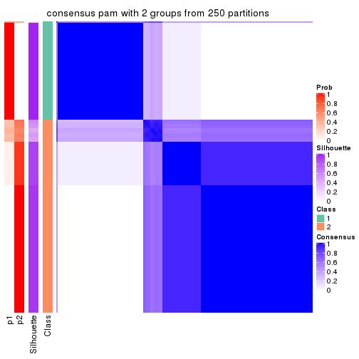</p>

</div>
<div id='tab-SD-pam-consensus-heatmap-2'>
<pre><code class="r">consensus_heatmap(res, k = 3)
</code></pre>

<p>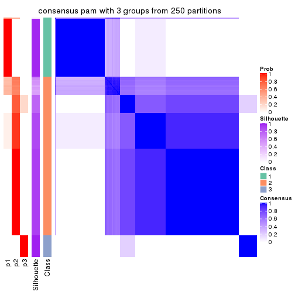</p>

</div>
<div id='tab-SD-pam-consensus-heatmap-3'>
<pre><code class="r">consensus_heatmap(res, k = 4)
</code></pre>

<p>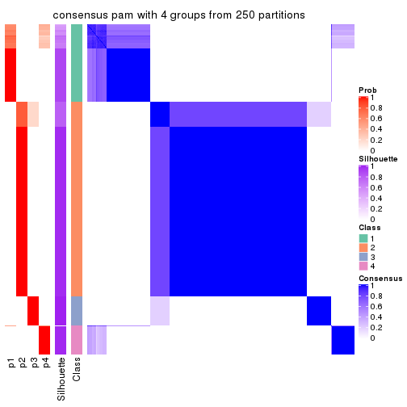</p>

</div>
<div id='tab-SD-pam-consensus-heatmap-4'>
<pre><code class="r">consensus_heatmap(res, k = 5)
</code></pre>

<p>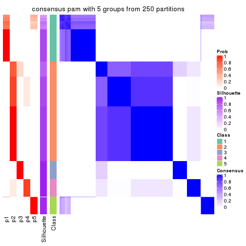</p>

</div>
<div id='tab-SD-pam-consensus-heatmap-5'>
<pre><code class="r">consensus_heatmap(res, k = 6)
</code></pre>

<p>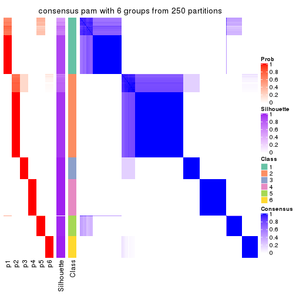</p>

</div>
</div>

Heatmaps for the membership of samples in all partitions to see how consistent they are:


<script>
$( function() {
	$( '#tabs-SD-pam-membership-heatmap' ).tabs();
} );
</script>
<div id='tabs-SD-pam-membership-heatmap'>
<ul>
<li><a href='#tab-SD-pam-membership-heatmap-1'>k = 2</a></li>
<li><a href='#tab-SD-pam-membership-heatmap-2'>k = 3</a></li>
<li><a href='#tab-SD-pam-membership-heatmap-3'>k = 4</a></li>
<li><a href='#tab-SD-pam-membership-heatmap-4'>k = 5</a></li>
<li><a href='#tab-SD-pam-membership-heatmap-5'>k = 6</a></li>
</ul>
<div id='tab-SD-pam-membership-heatmap-1'>
<pre><code class="r">membership_heatmap(res, k = 2)
</code></pre>

<p>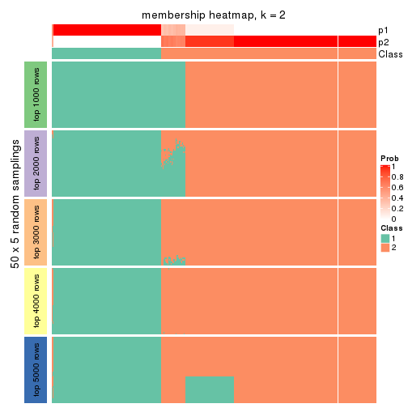</p>

</div>
<div id='tab-SD-pam-membership-heatmap-2'>
<pre><code class="r">membership_heatmap(res, k = 3)
</code></pre>

<p>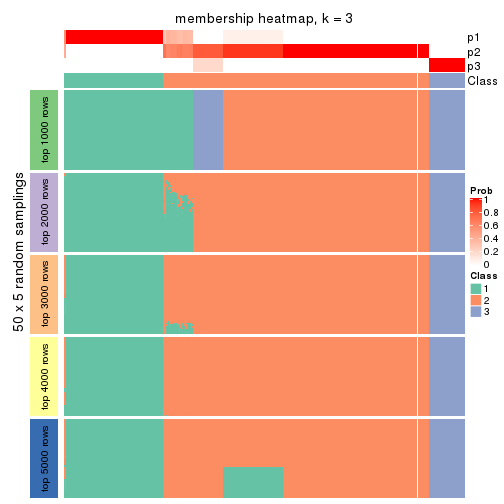</p>

</div>
<div id='tab-SD-pam-membership-heatmap-3'>
<pre><code class="r">membership_heatmap(res, k = 4)
</code></pre>

<p>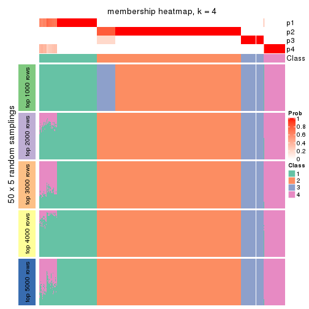</p>

</div>
<div id='tab-SD-pam-membership-heatmap-4'>
<pre><code class="r">membership_heatmap(res, k = 5)
</code></pre>

<p>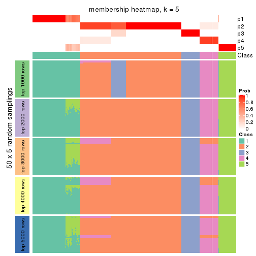</p>

</div>
<div id='tab-SD-pam-membership-heatmap-5'>
<pre><code class="r">membership_heatmap(res, k = 6)
</code></pre>

<p>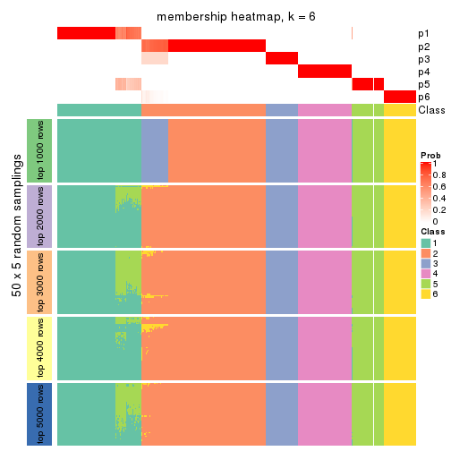</p>

</div>
</div>

As soon as we have had the classes for columns, we can look for signatures
which are significantly different between classes which can be candidate marks
for certain classes. Following are the heatmaps for signatures.


Signature heatmaps where rows are scaled:


<script>
$( function() {
	$( '#tabs-SD-pam-get-signatures' ).tabs();
} );
</script>
<div id='tabs-SD-pam-get-signatures'>
<ul>
<li><a href='#tab-SD-pam-get-signatures-1'>k = 2</a></li>
<li><a href='#tab-SD-pam-get-signatures-2'>k = 3</a></li>
<li><a href='#tab-SD-pam-get-signatures-3'>k = 4</a></li>
<li><a href='#tab-SD-pam-get-signatures-4'>k = 5</a></li>
<li><a href='#tab-SD-pam-get-signatures-5'>k = 6</a></li>
</ul>
<div id='tab-SD-pam-get-signatures-1'>
<pre><code class="r">get_signatures(res, k = 2)
</code></pre>

<p>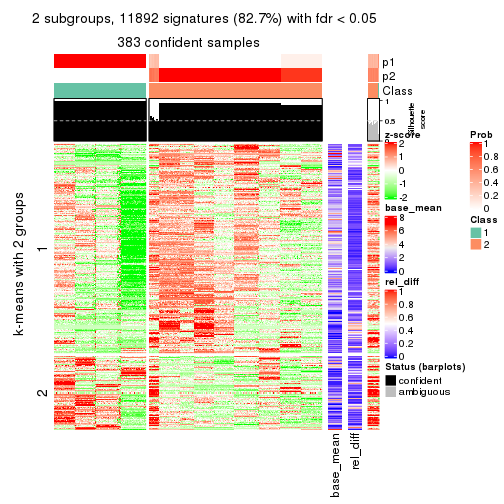</p>

</div>
<div id='tab-SD-pam-get-signatures-2'>
<pre><code class="r">get_signatures(res, k = 3)
</code></pre>

<p>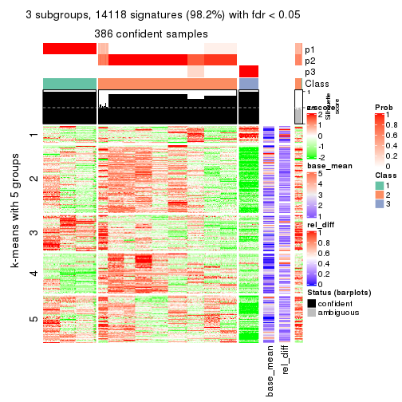</p>

</div>
<div id='tab-SD-pam-get-signatures-3'>
<pre><code class="r">get_signatures(res, k = 4)
</code></pre>

<p>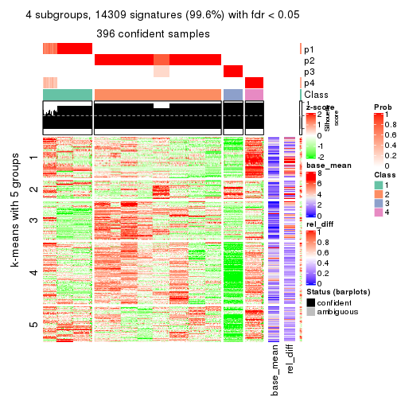</p>

</div>
<div id='tab-SD-pam-get-signatures-4'>
<pre><code class="r">get_signatures(res, k = 5)
</code></pre>

<p>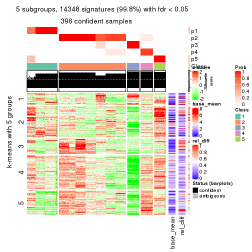</p>

</div>
<div id='tab-SD-pam-get-signatures-5'>
<pre><code class="r">get_signatures(res, k = 6)
</code></pre>

<p>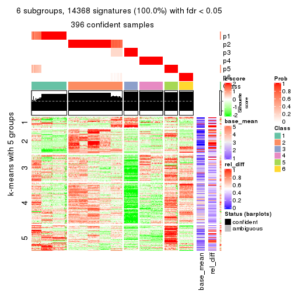</p>

</div>
</div>


Signature heatmaps where rows are not scaled:


<script>
$( function() {
	$( '#tabs-SD-pam-get-signatures-no-scale' ).tabs();
} );
</script>
<div id='tabs-SD-pam-get-signatures-no-scale'>
<ul>
<li><a href='#tab-SD-pam-get-signatures-no-scale-1'>k = 2</a></li>
<li><a href='#tab-SD-pam-get-signatures-no-scale-2'>k = 3</a></li>
<li><a href='#tab-SD-pam-get-signatures-no-scale-3'>k = 4</a></li>
<li><a href='#tab-SD-pam-get-signatures-no-scale-4'>k = 5</a></li>
<li><a href='#tab-SD-pam-get-signatures-no-scale-5'>k = 6</a></li>
</ul>
<div id='tab-SD-pam-get-signatures-no-scale-1'>
<pre><code class="r">get_signatures(res, k = 2, scale_rows = FALSE)
</code></pre>

<p>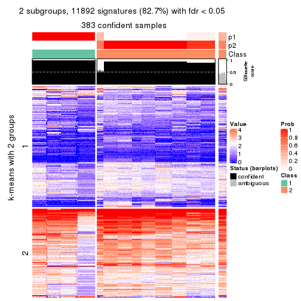</p>

</div>
<div id='tab-SD-pam-get-signatures-no-scale-2'>
<pre><code class="r">get_signatures(res, k = 3, scale_rows = FALSE)
</code></pre>

<p>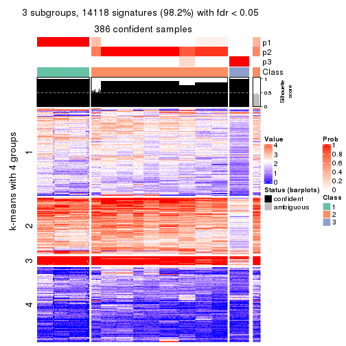</p>

</div>
<div id='tab-SD-pam-get-signatures-no-scale-3'>
<pre><code class="r">get_signatures(res, k = 4, scale_rows = FALSE)
</code></pre>

<p>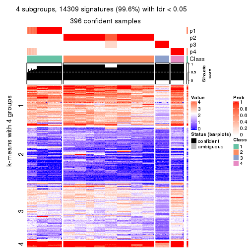</p>

</div>
<div id='tab-SD-pam-get-signatures-no-scale-4'>
<pre><code class="r">get_signatures(res, k = 5, scale_rows = FALSE)
</code></pre>

<p>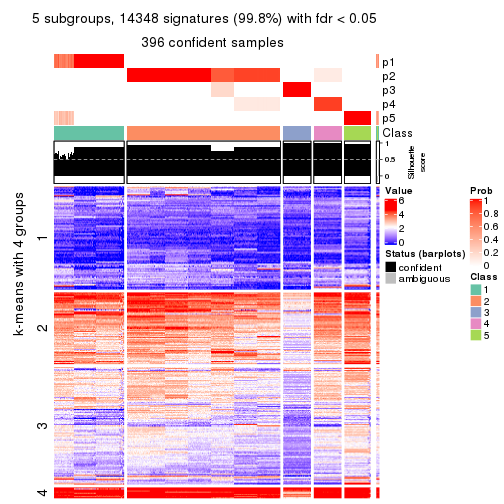</p>

</div>
<div id='tab-SD-pam-get-signatures-no-scale-5'>
<pre><code class="r">get_signatures(res, k = 6, scale_rows = FALSE)
</code></pre>

<p>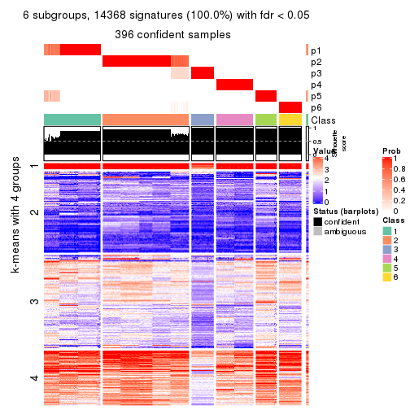</p>

</div>
</div>


Compare the overlap of signatures from different k:

```r
compare_signatures(res)
```


`get_signature()` returns a data frame invisibly. TO get the list of signatures, the function
call should be assigned to a variable explicitly. In following code, if `plot` argument is set
to `FALSE`, no heatmap is plotted while only the differential analysis is performed.

```r
# code only for demonstration
tb = get_signature(res, k = ..., plot = FALSE)
```

An example of the output of `tb` is:

```
#>   which_row         fdr    mean_1    mean_2 scaled_mean_1 scaled_mean_2 km
#> 1        38 0.042760348  8.373488  9.131774    -0.5533452     0.5164555  1
#> 2        40 0.018707592  7.106213  8.469186    -0.6173731     0.5762149  1
#> 3        55 0.019134737 10.221463 11.207825    -0.6159697     0.5749050  1
#> 4        59 0.006059896  5.921854  7.869574    -0.6899429     0.6439467  1
#> 5        60 0.018055526  8.928898 10.211722    -0.6204761     0.5791110  1
#> 6        98 0.009384629 15.714769 14.887706     0.6635654    -0.6193277  2
...
```

The columns in `tb` are:

1. `which_row`: row indices corresponding to the input matrix.
2. `fdr`: FDR for the differential test. 
3. `mean_x`: The mean value in group x.
4. `scaled_mean_x`: The mean value in group x after rows are scaled.
5. `km`: Row groups if k-means clustering is applied to rows.


UMAP plot which shows how samples are separated.


<script>
$( function() {
	$( '#tabs-SD-pam-dimension-reduction' ).tabs();
} );
</script>
<div id='tabs-SD-pam-dimension-reduction'>
<ul>
<li><a href='#tab-SD-pam-dimension-reduction-1'>k = 2</a></li>
<li><a href='#tab-SD-pam-dimension-reduction-2'>k = 3</a></li>
<li><a href='#tab-SD-pam-dimension-reduction-3'>k = 4</a></li>
<li><a href='#tab-SD-pam-dimension-reduction-4'>k = 5</a></li>
<li><a href='#tab-SD-pam-dimension-reduction-5'>k = 6</a></li>
</ul>
<div id='tab-SD-pam-dimension-reduction-1'>
<pre><code class="r">dimension_reduction(res, k = 2, method = &quot;UMAP&quot;)
</code></pre>

<p>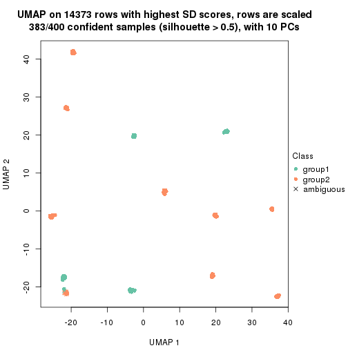</p>

</div>
<div id='tab-SD-pam-dimension-reduction-2'>
<pre><code class="r">dimension_reduction(res, k = 3, method = &quot;UMAP&quot;)
</code></pre>

<p>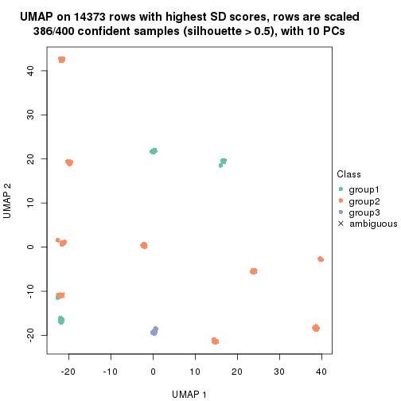</p>

</div>
<div id='tab-SD-pam-dimension-reduction-3'>
<pre><code class="r">dimension_reduction(res, k = 4, method = &quot;UMAP&quot;)
</code></pre>

<p>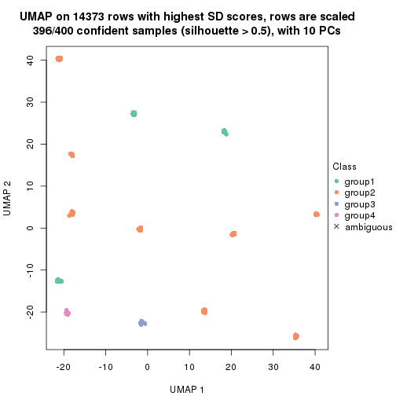</p>

</div>
<div id='tab-SD-pam-dimension-reduction-4'>
<pre><code class="r">dimension_reduction(res, k = 5, method = &quot;UMAP&quot;)
</code></pre>

<p>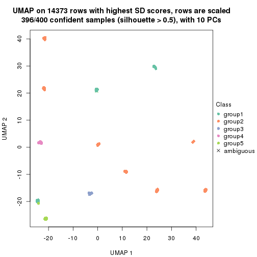</p>

</div>
<div id='tab-SD-pam-dimension-reduction-5'>
<pre><code class="r">dimension_reduction(res, k = 6, method = &quot;UMAP&quot;)
</code></pre>

<p>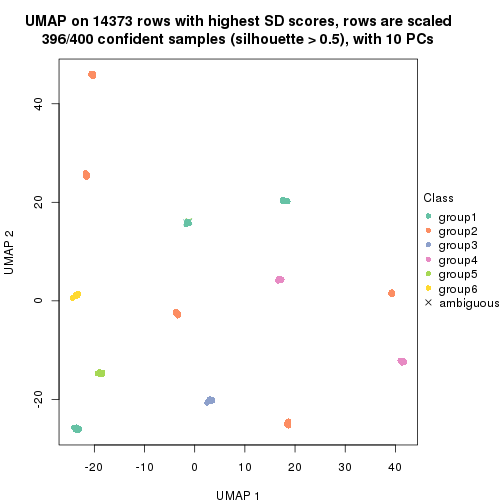</p>

</div>
</div>


Following heatmap shows how subgroups are split when increasing `k`:

```r
collect_classes(res)
```

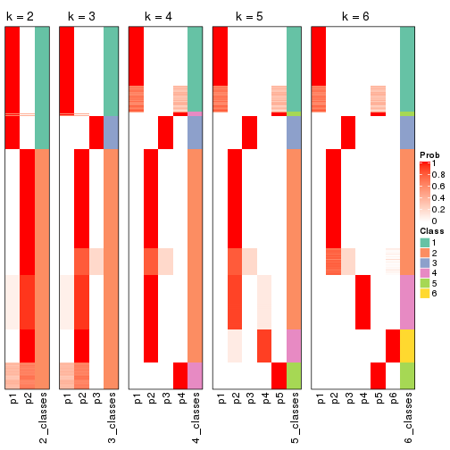


If matrix rows can be associated to genes, consider to use `GO_Enrichment(res,
...)` to perform function enrichment for the signature genes.


 

---------------------------------------------------


### SD:mclust*


The object with results only for a single top-value method and a single partition method 
can be extracted as:

```r
res = res_list["SD", "mclust"]
# you can also extract it by
# res = res_list["SD:mclust"]
```

A summary of `res` and all the functions that can be applied to it:

```r
res
```

```
#> A 'ConsensusPartition' object with k = 2, 3, 4, 5, 6.
#>   On a matrix with 14373 rows and 400 columns.
#>   Top rows (1000, 2000, 3000, 4000, 5000) are extracted by 'SD' method.
#>   Subgroups are detected by 'mclust' method.
#>   Performed in total 1250 partitions by row resampling.
#>   Best k for subgroups seems to be 6.
#> 
#> Following methods can be applied to this 'ConsensusPartition' object:
#>  [1] "cola_report"             "collect_classes"         "collect_plots"          
#>  [4] "collect_stats"           "colnames"                "compare_signatures"     
#>  [7] "consensus_heatmap"       "dimension_reduction"     "functional_enrichment"  
#> [10] "get_anno_col"            "get_anno"                "get_classes"            
#> [13] "get_consensus"           "get_matrix"              "get_membership"         
#> [16] "get_param"               "get_signatures"          "get_stats"              
#> [19] "is_best_k"               "is_stable_k"             "membership_heatmap"     
#> [22] "ncol"                    "nrow"                    "plot_ecdf"              
#> [25] "rownames"                "select_partition_number" "show"                   
#> [28] "suggest_best_k"          "test_to_known_factors"
```

`collect_plots()` function collects all the plots made from `res` for all `k` (number of partitions)
into one single page to provide an easy and fast comparison between different `k`.

```r
collect_plots(res)
```

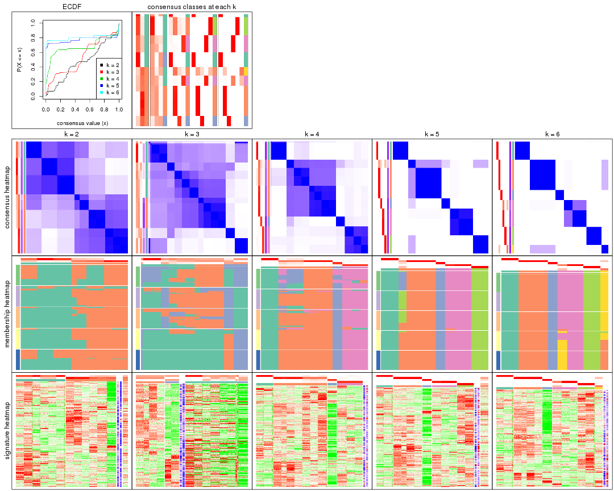

The plots are:

- The first row: a plot of the ECDF (Empirical cumulative distribution
  function) curves of the consensus matrix for each `k` and the heatmap of
  predicted classes for each `k`.
- The second row: heatmaps of the consensus matrix for each `k`.
- The third row: heatmaps of the membership matrix for each `k`.
- The fouth row: heatmaps of the signatures for each `k`.

All the plots in panels can be made by individual functions and they are
plotted later in this section.

`select_partition_number()` produces several plots showing different
statistics for choosing "optimized" `k`. There are following statistics:

- ECDF curves of the consensus matrix for each `k`;
- 1-PAC. [The PAC
  score](https://en.wikipedia.org/wiki/Consensus_clustering#Over-interpretation_potential_of_consensus_clustering)
  measures the proportion of the ambiguous subgrouping.
- Mean silhouette score.
- Concordance. The mean probability of fiting the consensus class ids in all
  partitions.
- Area increased. Denote $A_k$ as the area under the ECDF curve for current
  `k`, the area increased is defined as $A_k - A_{k-1}$.
- Rand index. The percent of pairs of samples that are both in a same cluster
  or both are not in a same cluster in the partition of k and k-1.
- Jaccard index. The ratio of pairs of samples are both in a same cluster in
  the partition of k and k-1 and the pairs of samples are both in a same
  cluster in the partition k or k-1.

The detailed explanations of these statistics can be found in [the cola
vignette](http://bioconductor.org/packages/devel/bioc/vignettes/cola/inst/doc/cola.html#toc_13).

Generally speaking, lower PAC score, higher mean silhouette score or higher
concordance corresponds to better partition. Rand index and Jaccard index
measure how similar the current partition is compared to partition with `k-1`.
If they are too similar, we won't accept `k` is better than `k-1`.

```r
select_partition_number(res)
```

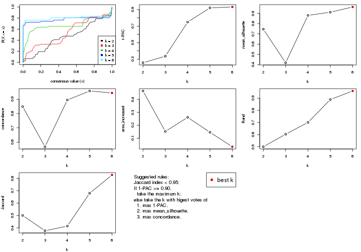

The numeric values for all these statistics can be obtained by `get_stats()`.

```r
get_stats(res)
```

```
#>   k 1-PAC mean_silhouette concordance area_increased  Rand Jaccard
#> 2 2 0.257           0.746       0.848         0.4652 0.500   0.500
#> 3 3 0.336           0.419       0.568         0.1521 0.604   0.377
#> 4 4 0.749           0.879       0.894         0.2610 0.701   0.415
#> 5 5 0.921           0.911       0.957         0.1454 0.889   0.680
#> 6 6 0.932           0.961       0.944         0.0335 0.959   0.827
```

`suggest_best_k()` suggests the best $k$ based on these statistics. The rules are as follows:

- All $k$ with Jaccard index larger than 0.95 are removed because the increase of
  the partition number does not provides enough extra information. If all $k$ are removed,
  the best $k$ is assigned by `NA`.
- For $k$ with 1-PAC larger than 0.9, the maximal $k$ is taken as the "best k". Other $k$ is called "optional k".
- If it does not fit the second rule. The $k$ with the highest vote of highest
  1-PAC, mean silhouette and concordance is taken as the "best k".

```r
suggest_best_k(res)
```

```
#> [1] 6
#> attr(,"optional")
#> [1] 5
```

There is also optional best $k$ = 5 that is worth to check.

Following shows the table of the partitions (You need to click the **show/hide
code output** link to see it). The membership matrix (columns with name `p*`)
is inferred by
[`clue::cl_consensus()`](https://www.rdocumentation.org/link/cl_consensus?package=clue)
function with the `SE` method. Basically the value in the membership matrix
represents the probability to belong to a certain group. The finall class
label for an item is determined with the group with highest probability it
belongs to.

In `get_classes()` function, the entropy is calculated from the membership
matrix and the silhouette score is calculated from the consensus matrix.


<script>
$( function() {
	$( '#tabs-SD-mclust-get-classes' ).tabs();
} );
</script>
<div id='tabs-SD-mclust-get-classes'>
<ul>
<li><a href='#tab-SD-mclust-get-classes-1'>k = 2</a></li>
<li><a href='#tab-SD-mclust-get-classes-2'>k = 3</a></li>
<li><a href='#tab-SD-mclust-get-classes-3'>k = 4</a></li>
<li><a href='#tab-SD-mclust-get-classes-4'>k = 5</a></li>
<li><a href='#tab-SD-mclust-get-classes-5'>k = 6</a></li>
</ul>

<div id='tab-SD-mclust-get-classes-1'>
<p><a id='tab-SD-mclust-get-classes-1-a' style='color:#0366d6' href='#'>show/hide code output</a></p>
<pre><code class="r">cbind(get_classes(res, k = 2), get_membership(res, k = 2))
</code></pre>

<pre><code>#&gt;            class entropy silhouette    p1    p2
#&gt; SRR1661716     2  0.9209      0.396 0.336 0.664
#&gt; SRR1661717     2  0.9170      0.407 0.332 0.668
#&gt; SRR1661718     2  0.9209      0.396 0.336 0.664
#&gt; SRR1661719     2  0.9248      0.385 0.340 0.660
#&gt; SRR1661720     2  0.9170      0.407 0.332 0.668
#&gt; SRR1661721     2  0.9170      0.407 0.332 0.668
#&gt; SRR1661722     2  0.9248      0.385 0.340 0.660
#&gt; SRR1661723     2  0.9248      0.385 0.340 0.660
#&gt; SRR1661724     2  0.9170      0.407 0.332 0.668
#&gt; SRR1661725     2  0.9170      0.407 0.332 0.668
#&gt; SRR1661726     2  0.9170      0.407 0.332 0.668
#&gt; SRR1661727     2  0.9248      0.385 0.340 0.660
#&gt; SRR1661728     2  0.9248      0.385 0.340 0.660
#&gt; SRR1661729     2  0.9209      0.396 0.336 0.664
#&gt; SRR1661730     2  0.9170      0.407 0.332 0.668
#&gt; SRR1661731     2  0.9170      0.407 0.332 0.668
#&gt; SRR1661732     2  0.9209      0.396 0.336 0.664
#&gt; SRR1661733     2  0.9248      0.385 0.340 0.660
#&gt; SRR1661734     2  0.9209      0.396 0.336 0.664
#&gt; SRR1661735     2  0.9170      0.407 0.332 0.668
#&gt; SRR1661736     2  0.1414      0.788 0.020 0.980
#&gt; SRR1661737     2  0.1414      0.788 0.020 0.980
#&gt; SRR1661738     2  0.1414      0.788 0.020 0.980
#&gt; SRR1661739     2  0.1414      0.788 0.020 0.980
#&gt; SRR1661740     2  0.1414      0.788 0.020 0.980
#&gt; SRR1661741     2  0.1414      0.788 0.020 0.980
#&gt; SRR1661742     2  0.1414      0.788 0.020 0.980
#&gt; SRR1661743     2  0.1414      0.788 0.020 0.980
#&gt; SRR1661744     2  0.1414      0.788 0.020 0.980
#&gt; SRR1661745     2  0.1414      0.788 0.020 0.980
#&gt; SRR1661746     2  0.1414      0.788 0.020 0.980
#&gt; SRR1661747     2  0.1414      0.788 0.020 0.980
#&gt; SRR1661748     2  0.1414      0.788 0.020 0.980
#&gt; SRR1661749     2  0.1414      0.788 0.020 0.980
#&gt; SRR1661750     2  0.1414      0.788 0.020 0.980
#&gt; SRR1661751     2  0.1414      0.788 0.020 0.980
#&gt; SRR1661752     2  0.1414      0.788 0.020 0.980
#&gt; SRR1661753     2  0.1414      0.788 0.020 0.980
#&gt; SRR1661754     2  0.1414      0.788 0.020 0.980
#&gt; SRR1661755     2  0.1414      0.788 0.020 0.980
#&gt; SRR1661756     2  0.1414      0.788 0.020 0.980
#&gt; SRR1661757     2  0.1414      0.788 0.020 0.980
#&gt; SRR1661758     2  0.1414      0.788 0.020 0.980
#&gt; SRR1661759     2  0.1414      0.788 0.020 0.980
#&gt; SRR1661760     2  0.1414      0.788 0.020 0.980
#&gt; SRR1661761     2  0.1414      0.788 0.020 0.980
#&gt; SRR1661762     2  0.1414      0.788 0.020 0.980
#&gt; SRR1661763     2  0.1414      0.788 0.020 0.980
#&gt; SRR1661764     2  0.1414      0.788 0.020 0.980
#&gt; SRR1661766     2  0.0376      0.784 0.004 0.996
#&gt; SRR1661767     2  0.0376      0.784 0.004 0.996
#&gt; SRR1661768     2  0.0376      0.784 0.004 0.996
#&gt; SRR1661769     2  0.0376      0.784 0.004 0.996
#&gt; SRR1661770     2  0.0376      0.784 0.004 0.996
#&gt; SRR1661771     2  0.0376      0.784 0.004 0.996
#&gt; SRR1661772     2  0.0376      0.784 0.004 0.996
#&gt; SRR1661773     2  0.0376      0.784 0.004 0.996
#&gt; SRR1661774     2  0.0376      0.784 0.004 0.996
#&gt; SRR1661775     2  0.0376      0.784 0.004 0.996
#&gt; SRR1661776     2  0.0376      0.784 0.004 0.996
#&gt; SRR1661777     2  0.0376      0.784 0.004 0.996
#&gt; SRR1661778     2  0.0376      0.784 0.004 0.996
#&gt; SRR1661779     2  0.0376      0.784 0.004 0.996
#&gt; SRR1661780     2  0.0376      0.784 0.004 0.996
#&gt; SRR1661781     2  0.0376      0.784 0.004 0.996
#&gt; SRR1661782     2  0.0376      0.784 0.004 0.996
#&gt; SRR1661783     2  0.0376      0.784 0.004 0.996
#&gt; SRR1661784     2  0.0376      0.784 0.004 0.996
#&gt; SRR1661785     2  0.0376      0.784 0.004 0.996
#&gt; SRR1661786     2  0.0376      0.784 0.004 0.996
#&gt; SRR1661787     2  0.0376      0.784 0.004 0.996
#&gt; SRR1661788     2  0.0376      0.784 0.004 0.996
#&gt; SRR1661789     2  0.0376      0.784 0.004 0.996
#&gt; SRR1661790     2  0.0376      0.784 0.004 0.996
#&gt; SRR1661791     2  0.0376      0.784 0.004 0.996
#&gt; SRR1661792     2  0.0376      0.784 0.004 0.996
#&gt; SRR1661793     2  0.0376      0.784 0.004 0.996
#&gt; SRR1661794     2  0.0376      0.784 0.004 0.996
#&gt; SRR1661795     2  0.0376      0.784 0.004 0.996
#&gt; SRR1661796     2  0.1633      0.788 0.024 0.976
#&gt; SRR1661797     2  0.1633      0.788 0.024 0.976
#&gt; SRR1661798     2  0.1633      0.788 0.024 0.976
#&gt; SRR1661799     2  0.1633      0.788 0.024 0.976
#&gt; SRR1661800     2  0.1633      0.788 0.024 0.976
#&gt; SRR1661801     2  0.1633      0.788 0.024 0.976
#&gt; SRR1661802     2  0.1633      0.788 0.024 0.976
#&gt; SRR1661803     2  0.1633      0.788 0.024 0.976
#&gt; SRR1661804     2  0.1633      0.788 0.024 0.976
#&gt; SRR1661805     2  0.1633      0.788 0.024 0.976
#&gt; SRR1661806     2  0.1633      0.788 0.024 0.976
#&gt; SRR1661807     2  0.1633      0.788 0.024 0.976
#&gt; SRR1661808     2  0.1633      0.788 0.024 0.976
#&gt; SRR1661809     2  0.1633      0.788 0.024 0.976
#&gt; SRR1661810     2  0.1633      0.788 0.024 0.976
#&gt; SRR1661811     2  0.1633      0.788 0.024 0.976
#&gt; SRR1661812     2  0.1633      0.788 0.024 0.976
#&gt; SRR1661813     2  0.1633      0.788 0.024 0.976
#&gt; SRR1661814     2  0.1633      0.788 0.024 0.976
#&gt; SRR1661815     2  0.1633      0.788 0.024 0.976
#&gt; SRR1661816     2  0.1633      0.788 0.024 0.976
#&gt; SRR1661817     2  0.1633      0.788 0.024 0.976
#&gt; SRR1661818     2  0.1633      0.788 0.024 0.976
#&gt; SRR1661819     2  0.1633      0.788 0.024 0.976
#&gt; SRR1661820     2  0.1633      0.788 0.024 0.976
#&gt; SRR1661821     2  0.1633      0.788 0.024 0.976
#&gt; SRR1661822     2  0.1633      0.788 0.024 0.976
#&gt; SRR1661823     2  0.1633      0.788 0.024 0.976
#&gt; SRR1661824     2  0.1633      0.788 0.024 0.976
#&gt; SRR1661825     2  0.1633      0.788 0.024 0.976
#&gt; SRR1661826     1  0.0376      0.827 0.996 0.004
#&gt; SRR1661827     1  0.0376      0.827 0.996 0.004
#&gt; SRR1661828     1  0.0376      0.827 0.996 0.004
#&gt; SRR1661829     1  0.0376      0.827 0.996 0.004
#&gt; SRR1661830     1  0.0376      0.827 0.996 0.004
#&gt; SRR1661831     1  0.0376      0.827 0.996 0.004
#&gt; SRR1661832     1  0.0376      0.827 0.996 0.004
#&gt; SRR1661833     1  0.0376      0.827 0.996 0.004
#&gt; SRR1661834     1  0.0376      0.827 0.996 0.004
#&gt; SRR1661835     1  0.0376      0.827 0.996 0.004
#&gt; SRR1661836     1  0.0376      0.827 0.996 0.004
#&gt; SRR1661837     1  0.0376      0.827 0.996 0.004
#&gt; SRR1661838     1  0.0376      0.827 0.996 0.004
#&gt; SRR1661839     1  0.0376      0.827 0.996 0.004
#&gt; SRR1661840     1  0.0376      0.827 0.996 0.004
#&gt; SRR1661841     1  0.0376      0.827 0.996 0.004
#&gt; SRR1661843     1  0.0376      0.827 0.996 0.004
#&gt; SRR1661844     1  0.0376      0.827 0.996 0.004
#&gt; SRR1661845     1  0.0376      0.827 0.996 0.004
#&gt; SRR1661846     1  0.0376      0.827 0.996 0.004
#&gt; SRR1661847     1  0.0376      0.827 0.996 0.004
#&gt; SRR1661848     1  0.0376      0.827 0.996 0.004
#&gt; SRR1661849     1  0.0672      0.829 0.992 0.008
#&gt; SRR1661850     1  0.0376      0.827 0.996 0.004
#&gt; SRR1661851     1  0.0376      0.827 0.996 0.004
#&gt; SRR1661852     1  0.0376      0.827 0.996 0.004
#&gt; SRR1661853     1  0.0376      0.827 0.996 0.004
#&gt; SRR1661854     1  0.0376      0.827 0.996 0.004
#&gt; SRR1661855     1  0.0376      0.827 0.996 0.004
#&gt; SRR1661856     2  0.7950      0.720 0.240 0.760
#&gt; SRR1661857     2  0.7950      0.720 0.240 0.760
#&gt; SRR1661858     2  0.7950      0.720 0.240 0.760
#&gt; SRR1661859     2  0.7950      0.720 0.240 0.760
#&gt; SRR1661860     2  0.7950      0.720 0.240 0.760
#&gt; SRR1661861     2  0.7950      0.720 0.240 0.760
#&gt; SRR1661862     2  0.7950      0.720 0.240 0.760
#&gt; SRR1661863     2  0.7950      0.720 0.240 0.760
#&gt; SRR1661864     2  0.7950      0.720 0.240 0.760
#&gt; SRR1661865     2  0.7950      0.720 0.240 0.760
#&gt; SRR1661866     2  0.7950      0.720 0.240 0.760
#&gt; SRR1661867     2  0.7950      0.720 0.240 0.760
#&gt; SRR1661868     2  0.7950      0.720 0.240 0.760
#&gt; SRR1661869     2  0.7950      0.720 0.240 0.760
#&gt; SRR1661870     2  0.7950      0.720 0.240 0.760
#&gt; SRR1661871     2  0.7950      0.720 0.240 0.760
#&gt; SRR1661872     2  0.7950      0.720 0.240 0.760
#&gt; SRR1661873     2  0.7950      0.720 0.240 0.760
#&gt; SRR1661874     2  0.7950      0.720 0.240 0.760
#&gt; SRR1661875     2  0.7950      0.720 0.240 0.760
#&gt; SRR1661876     2  0.7950      0.720 0.240 0.760
#&gt; SRR1661877     2  0.7950      0.720 0.240 0.760
#&gt; SRR1661878     2  0.7950      0.720 0.240 0.760
#&gt; SRR1661879     2  0.7950      0.720 0.240 0.760
#&gt; SRR1661880     2  0.7950      0.720 0.240 0.760
#&gt; SRR1661881     2  0.7950      0.720 0.240 0.760
#&gt; SRR1661882     2  0.7950      0.720 0.240 0.760
#&gt; SRR1661883     2  0.7950      0.720 0.240 0.760
#&gt; SRR1661884     2  0.7950      0.720 0.240 0.760
#&gt; SRR1661885     2  0.7950      0.720 0.240 0.760
#&gt; SRR1661886     2  0.7950      0.720 0.240 0.760
#&gt; SRR1661887     2  0.7950      0.720 0.240 0.760
#&gt; SRR1661888     2  0.7950      0.720 0.240 0.760
#&gt; SRR1661889     2  0.7950      0.720 0.240 0.760
#&gt; SRR1661890     2  0.7950      0.720 0.240 0.760
#&gt; SRR1661891     2  0.7950      0.720 0.240 0.760
#&gt; SRR1661892     1  0.0376      0.827 0.996 0.004
#&gt; SRR1661893     1  0.0376      0.827 0.996 0.004
#&gt; SRR1661894     1  0.0376      0.827 0.996 0.004
#&gt; SRR1661895     1  0.4431      0.846 0.908 0.092
#&gt; SRR1661896     1  0.0376      0.827 0.996 0.004
#&gt; SRR1661897     1  0.0376      0.827 0.996 0.004
#&gt; SRR1661898     1  0.0376      0.827 0.996 0.004
#&gt; SRR1661899     1  0.0376      0.827 0.996 0.004
#&gt; SRR1661900     1  0.0376      0.827 0.996 0.004
#&gt; SRR1661901     1  0.1633      0.833 0.976 0.024
#&gt; SRR1661902     1  0.0376      0.827 0.996 0.004
#&gt; SRR1661903     1  0.0376      0.827 0.996 0.004
#&gt; SRR1661904     1  0.0376      0.827 0.996 0.004
#&gt; SRR1661905     1  0.0376      0.827 0.996 0.004
#&gt; SRR1661906     1  0.0376      0.827 0.996 0.004
#&gt; SRR1661907     1  0.0376      0.827 0.996 0.004
#&gt; SRR1661908     1  0.4431      0.846 0.908 0.092
#&gt; SRR1661909     1  0.0376      0.827 0.996 0.004
#&gt; SRR1661910     1  0.0376      0.827 0.996 0.004
#&gt; SRR1661911     1  0.0376      0.827 0.996 0.004
#&gt; SRR1661912     1  0.0376      0.827 0.996 0.004
#&gt; SRR1661913     1  0.0376      0.827 0.996 0.004
#&gt; SRR1661914     1  0.0376      0.827 0.996 0.004
#&gt; SRR1661915     1  0.4431      0.846 0.908 0.092
#&gt; SRR1661916     1  0.0376      0.827 0.996 0.004
#&gt; SRR1661917     1  0.0376      0.827 0.996 0.004
#&gt; SRR1661918     1  0.0376      0.827 0.996 0.004
#&gt; SRR1661919     1  0.0376      0.827 0.996 0.004
#&gt; SRR1661920     1  0.0376      0.827 0.996 0.004
#&gt; SRR1661921     1  0.4431      0.846 0.908 0.092
#&gt; SRR1661922     1  0.0376      0.827 0.996 0.004
#&gt; SRR1661923     1  0.0376      0.827 0.996 0.004
#&gt; SRR1661924     1  0.1414      0.832 0.980 0.020
#&gt; SRR1661925     1  0.0376      0.827 0.996 0.004
#&gt; SRR1661926     1  0.0376      0.827 0.996 0.004
#&gt; SRR1661927     1  0.0376      0.827 0.996 0.004
#&gt; SRR1661928     2  0.8016      0.717 0.244 0.756
#&gt; SRR1661929     2  0.8016      0.717 0.244 0.756
#&gt; SRR1661930     2  0.8016      0.717 0.244 0.756
#&gt; SRR1661931     2  0.8016      0.717 0.244 0.756
#&gt; SRR1661932     2  0.8016      0.717 0.244 0.756
#&gt; SRR1661933     2  0.8016      0.717 0.244 0.756
#&gt; SRR1661934     2  0.8016      0.717 0.244 0.756
#&gt; SRR1661935     2  0.8016      0.717 0.244 0.756
#&gt; SRR1661936     2  0.8016      0.717 0.244 0.756
#&gt; SRR1661937     2  0.8016      0.717 0.244 0.756
#&gt; SRR1661938     2  0.8016      0.717 0.244 0.756
#&gt; SRR1661939     2  0.8016      0.717 0.244 0.756
#&gt; SRR1661940     2  0.8016      0.717 0.244 0.756
#&gt; SRR1661941     2  0.8016      0.717 0.244 0.756
#&gt; SRR1661942     2  0.8016      0.717 0.244 0.756
#&gt; SRR1661943     2  0.8016      0.717 0.244 0.756
#&gt; SRR1661944     2  0.8016      0.717 0.244 0.756
#&gt; SRR1661945     2  0.8016      0.717 0.244 0.756
#&gt; SRR1661946     2  0.8016      0.717 0.244 0.756
#&gt; SRR1661947     2  0.8016      0.717 0.244 0.756
#&gt; SRR1661948     2  0.8016      0.717 0.244 0.756
#&gt; SRR1661949     2  0.8016      0.717 0.244 0.756
#&gt; SRR1661950     2  0.8016      0.717 0.244 0.756
#&gt; SRR1661951     2  0.8016      0.717 0.244 0.756
#&gt; SRR1661952     2  0.8016      0.717 0.244 0.756
#&gt; SRR1661953     2  0.8016      0.717 0.244 0.756
#&gt; SRR1661954     2  0.8016      0.717 0.244 0.756
#&gt; SRR1661955     2  0.8016      0.717 0.244 0.756
#&gt; SRR1661956     2  0.8016      0.717 0.244 0.756
#&gt; SRR1661957     2  0.8016      0.717 0.244 0.756
#&gt; SRR1661958     1  0.8661      0.748 0.712 0.288
#&gt; SRR1661959     1  0.8661      0.748 0.712 0.288
#&gt; SRR1661960     1  0.8661      0.748 0.712 0.288
#&gt; SRR1661961     1  0.8661      0.748 0.712 0.288
#&gt; SRR1661962     1  0.8661      0.748 0.712 0.288
#&gt; SRR1661963     1  0.8661      0.748 0.712 0.288
#&gt; SRR1661964     1  0.8661      0.748 0.712 0.288
#&gt; SRR1661965     1  0.8661      0.748 0.712 0.288
#&gt; SRR1661966     1  0.8661      0.748 0.712 0.288
#&gt; SRR1661967     1  0.8661      0.748 0.712 0.288
#&gt; SRR1661968     1  0.8661      0.748 0.712 0.288
#&gt; SRR1661969     1  0.8661      0.748 0.712 0.288
#&gt; SRR1661970     1  0.8661      0.748 0.712 0.288
#&gt; SRR1661971     1  0.8661      0.748 0.712 0.288
#&gt; SRR1661972     1  0.8661      0.748 0.712 0.288
#&gt; SRR1661973     1  0.8661      0.748 0.712 0.288
#&gt; SRR1661974     1  0.8661      0.748 0.712 0.288
#&gt; SRR1661975     1  0.8661      0.748 0.712 0.288
#&gt; SRR1661976     1  0.8661      0.748 0.712 0.288
#&gt; SRR1661977     1  0.8661      0.748 0.712 0.288
#&gt; SRR1661978     1  0.8661      0.748 0.712 0.288
#&gt; SRR1661979     1  0.8661      0.748 0.712 0.288
#&gt; SRR1661980     1  0.8661      0.748 0.712 0.288
#&gt; SRR1661981     1  0.8661      0.748 0.712 0.288
#&gt; SRR1661982     1  0.8661      0.748 0.712 0.288
#&gt; SRR1661983     1  0.8661      0.748 0.712 0.288
#&gt; SRR1661984     1  0.8661      0.748 0.712 0.288
#&gt; SRR1661985     1  0.8661      0.748 0.712 0.288
#&gt; SRR1661986     1  0.8661      0.748 0.712 0.288
#&gt; SRR1661987     1  0.8661      0.748 0.712 0.288
#&gt; SRR1661988     1  0.5059      0.856 0.888 0.112
#&gt; SRR1661989     1  0.5059      0.856 0.888 0.112
#&gt; SRR1661990     1  0.5059      0.856 0.888 0.112
#&gt; SRR1661991     1  0.5059      0.856 0.888 0.112
#&gt; SRR1661992     1  0.5059      0.856 0.888 0.112
#&gt; SRR1661993     1  0.5059      0.856 0.888 0.112
#&gt; SRR1661994     1  0.5059      0.856 0.888 0.112
#&gt; SRR1661995     1  0.5059      0.856 0.888 0.112
#&gt; SRR1661996     1  0.5059      0.856 0.888 0.112
#&gt; SRR1661997     1  0.5059      0.856 0.888 0.112
#&gt; SRR1661998     1  0.5059      0.856 0.888 0.112
#&gt; SRR1661999     1  0.5059      0.856 0.888 0.112
#&gt; SRR1662000     1  0.5059      0.856 0.888 0.112
#&gt; SRR1662001     1  0.5059      0.856 0.888 0.112
#&gt; SRR1662002     1  0.5059      0.856 0.888 0.112
#&gt; SRR1662003     1  0.5059      0.856 0.888 0.112
#&gt; SRR1662004     1  0.5059      0.856 0.888 0.112
#&gt; SRR1662005     1  0.5059      0.856 0.888 0.112
#&gt; SRR1662006     1  0.5059      0.856 0.888 0.112
#&gt; SRR1662007     1  0.5059      0.856 0.888 0.112
#&gt; SRR1662008     1  0.5059      0.856 0.888 0.112
#&gt; SRR1662009     1  0.5059      0.856 0.888 0.112
#&gt; SRR1662010     1  0.5059      0.856 0.888 0.112
#&gt; SRR1662011     1  0.5059      0.856 0.888 0.112
#&gt; SRR1662012     1  0.5059      0.856 0.888 0.112
#&gt; SRR1662013     1  0.5059      0.856 0.888 0.112
#&gt; SRR1662014     1  0.5059      0.856 0.888 0.112
#&gt; SRR1662015     1  0.5059      0.856 0.888 0.112
#&gt; SRR1662016     1  0.5059      0.856 0.888 0.112
#&gt; SRR1662017     1  0.5059      0.856 0.888 0.112
#&gt; SRR1662018     2  0.8909      0.538 0.308 0.692
#&gt; SRR1662019     2  0.8909      0.538 0.308 0.692
#&gt; SRR1662020     2  0.8909      0.538 0.308 0.692
#&gt; SRR1662021     2  0.8909      0.538 0.308 0.692
#&gt; SRR1662022     2  0.8909      0.538 0.308 0.692
#&gt; SRR1662023     2  0.8909      0.538 0.308 0.692
#&gt; SRR1662024     2  0.8909      0.538 0.308 0.692
#&gt; SRR1662025     2  0.8909      0.538 0.308 0.692
#&gt; SRR1662026     2  0.8909      0.538 0.308 0.692
#&gt; SRR1662027     2  0.8909      0.538 0.308 0.692
#&gt; SRR1662028     2  0.8909      0.538 0.308 0.692
#&gt; SRR1662029     2  0.8909      0.538 0.308 0.692
#&gt; SRR1662030     2  0.8909      0.538 0.308 0.692
#&gt; SRR1662031     2  0.8909      0.538 0.308 0.692
#&gt; SRR1662032     2  0.8909      0.538 0.308 0.692
#&gt; SRR1662033     2  0.8909      0.538 0.308 0.692
#&gt; SRR1662034     2  0.8909      0.538 0.308 0.692
#&gt; SRR1662035     2  0.8909      0.538 0.308 0.692
#&gt; SRR1662036     2  0.8909      0.538 0.308 0.692
#&gt; SRR1662037     2  0.8909      0.538 0.308 0.692
#&gt; SRR1662038     2  0.8909      0.538 0.308 0.692
#&gt; SRR1662039     2  0.8909      0.538 0.308 0.692
#&gt; SRR1662040     2  0.8909      0.538 0.308 0.692
#&gt; SRR1662041     2  0.8861      0.539 0.304 0.696
#&gt; SRR1662042     2  0.8909      0.538 0.308 0.692
#&gt; SRR1662043     2  0.8909      0.538 0.308 0.692
#&gt; SRR1662044     2  0.8909      0.538 0.308 0.692
#&gt; SRR1662045     2  0.8909      0.538 0.308 0.692
#&gt; SRR1662046     2  0.8909      0.538 0.308 0.692
#&gt; SRR1662047     2  0.8909      0.538 0.308 0.692
#&gt; SRR1662048     2  0.8909      0.538 0.308 0.692
#&gt; SRR1662049     2  0.8909      0.538 0.308 0.692
#&gt; SRR1662050     2  0.8909      0.538 0.308 0.692
#&gt; SRR1662051     2  0.8909      0.538 0.308 0.692
#&gt; SRR1662052     2  0.8909      0.538 0.308 0.692
#&gt; SRR1662053     2  0.8909      0.538 0.308 0.692
#&gt; SRR1662054     1  0.8661      0.748 0.712 0.288
#&gt; SRR1662055     1  0.8661      0.748 0.712 0.288
#&gt; SRR1662056     1  0.8661      0.748 0.712 0.288
#&gt; SRR1662057     1  0.8661      0.748 0.712 0.288
#&gt; SRR1662058     1  0.8661      0.748 0.712 0.288
#&gt; SRR1662059     1  0.8661      0.748 0.712 0.288
#&gt; SRR1662060     1  0.8661      0.748 0.712 0.288
#&gt; SRR1662061     1  0.8661      0.748 0.712 0.288
#&gt; SRR1662062     1  0.8661      0.748 0.712 0.288
#&gt; SRR1662063     1  0.8661      0.748 0.712 0.288
#&gt; SRR1662064     1  0.8661      0.748 0.712 0.288
#&gt; SRR1662065     1  0.8661      0.748 0.712 0.288
#&gt; SRR1662066     1  0.8661      0.748 0.712 0.288
#&gt; SRR1662067     1  0.8661      0.748 0.712 0.288
#&gt; SRR1662068     1  0.8661      0.748 0.712 0.288
#&gt; SRR1662069     1  0.8661      0.748 0.712 0.288
#&gt; SRR1662070     1  0.8661      0.748 0.712 0.288
#&gt; SRR1662071     1  0.8661      0.748 0.712 0.288
#&gt; SRR1662072     1  0.8661      0.748 0.712 0.288
#&gt; SRR1662073     1  0.8661      0.748 0.712 0.288
#&gt; SRR1662074     1  0.8661      0.748 0.712 0.288
#&gt; SRR1662075     1  0.8661      0.748 0.712 0.288
#&gt; SRR1662076     1  0.8661      0.748 0.712 0.288
#&gt; SRR1662077     1  0.8661      0.748 0.712 0.288
#&gt; SRR1662078     1  0.8661      0.748 0.712 0.288
#&gt; SRR1662079     1  0.8661      0.748 0.712 0.288
#&gt; SRR1662080     1  0.8661      0.748 0.712 0.288
#&gt; SRR1662081     1  0.8661      0.748 0.712 0.288
#&gt; SRR1662082     1  0.8661      0.748 0.712 0.288
#&gt; SRR1662083     1  0.8661      0.748 0.712 0.288
#&gt; SRR1662084     1  0.5059      0.856 0.888 0.112
#&gt; SRR1662085     1  0.5059      0.856 0.888 0.112
#&gt; SRR1662086     1  0.5059      0.856 0.888 0.112
#&gt; SRR1662087     1  0.5059      0.856 0.888 0.112
#&gt; SRR1662088     1  0.5059      0.856 0.888 0.112
#&gt; SRR1662089     1  0.5059      0.856 0.888 0.112
#&gt; SRR1662090     1  0.5059      0.856 0.888 0.112
#&gt; SRR1662091     1  0.5059      0.856 0.888 0.112
#&gt; SRR1662092     1  0.5059      0.856 0.888 0.112
#&gt; SRR1662093     1  0.5059      0.856 0.888 0.112
#&gt; SRR1662094     1  0.5059      0.856 0.888 0.112
#&gt; SRR1662095     1  0.5059      0.856 0.888 0.112
#&gt; SRR1662096     1  0.5059      0.856 0.888 0.112
#&gt; SRR1662097     1  0.5059      0.856 0.888 0.112
#&gt; SRR1662098     1  0.5059      0.856 0.888 0.112
#&gt; SRR1662099     1  0.5059      0.856 0.888 0.112
#&gt; SRR1662100     1  0.5059      0.856 0.888 0.112
#&gt; SRR1662101     1  0.5059      0.856 0.888 0.112
#&gt; SRR1662102     1  0.5059      0.856 0.888 0.112
#&gt; SRR1662103     1  0.5059      0.856 0.888 0.112
#&gt; SRR1662104     1  0.5059      0.856 0.888 0.112
#&gt; SRR1662105     1  0.5059      0.856 0.888 0.112
#&gt; SRR1662106     1  0.5059      0.856 0.888 0.112
#&gt; SRR1662107     1  0.5059      0.856 0.888 0.112
#&gt; SRR1662108     1  0.5059      0.856 0.888 0.112
#&gt; SRR1662109     1  0.5059      0.856 0.888 0.112
#&gt; SRR1662110     1  0.5059      0.856 0.888 0.112
#&gt; SRR1662111     1  0.4939      0.854 0.892 0.108
#&gt; SRR1662112     1  0.5059      0.856 0.888 0.112
#&gt; SRR1662113     1  0.5059      0.856 0.888 0.112
#&gt; SRR1662114     1  0.5059      0.856 0.888 0.112
#&gt; SRR1662115     1  0.5059      0.856 0.888 0.112
#&gt; SRR1662116     1  0.5059      0.856 0.888 0.112
#&gt; SRR1662117     1  0.5059      0.856 0.888 0.112
</code></pre>

<script>
$('#tab-SD-mclust-get-classes-1-a').parent().next().next().hide();
$('#tab-SD-mclust-get-classes-1-a').click(function(){
  $('#tab-SD-mclust-get-classes-1-a').parent().next().next().toggle();
  return(false);
});
</script>
</div>

<div id='tab-SD-mclust-get-classes-2'>
<p><a id='tab-SD-mclust-get-classes-2-a' style='color:#0366d6' href='#'>show/hide code output</a></p>
<pre><code class="r">cbind(get_classes(res, k = 3), get_membership(res, k = 3))
</code></pre>

<pre><code>#&gt;            class entropy silhouette    p1    p2    p3
#&gt; SRR1661716     2  0.7476     0.8260 0.452 0.512 0.036
#&gt; SRR1661717     2  0.7476     0.8260 0.452 0.512 0.036
#&gt; SRR1661718     2  0.7476     0.8260 0.452 0.512 0.036
#&gt; SRR1661719     2  0.7476     0.8260 0.452 0.512 0.036
#&gt; SRR1661720     2  0.7476     0.8260 0.452 0.512 0.036
#&gt; SRR1661721     2  0.7476     0.8260 0.452 0.512 0.036
#&gt; SRR1661722     2  0.7476     0.8260 0.452 0.512 0.036
#&gt; SRR1661723     2  0.7476     0.8260 0.452 0.512 0.036
#&gt; SRR1661724     2  0.7476     0.8260 0.452 0.512 0.036
#&gt; SRR1661725     2  0.7476     0.8260 0.452 0.512 0.036
#&gt; SRR1661726     2  0.7476     0.8260 0.452 0.512 0.036
#&gt; SRR1661727     2  0.7476     0.8260 0.452 0.512 0.036
#&gt; SRR1661728     2  0.7476     0.8260 0.452 0.512 0.036
#&gt; SRR1661729     2  0.7476     0.8260 0.452 0.512 0.036
#&gt; SRR1661730     2  0.7476     0.8260 0.452 0.512 0.036
#&gt; SRR1661731     2  0.7476     0.8260 0.452 0.512 0.036
#&gt; SRR1661732     2  0.7476     0.8260 0.452 0.512 0.036
#&gt; SRR1661733     2  0.7476     0.8260 0.452 0.512 0.036
#&gt; SRR1661734     2  0.7476     0.8260 0.452 0.512 0.036
#&gt; SRR1661735     2  0.7476     0.8260 0.452 0.512 0.036
#&gt; SRR1661736     2  0.7353     0.9471 0.436 0.532 0.032
#&gt; SRR1661737     2  0.7353     0.9471 0.436 0.532 0.032
#&gt; SRR1661738     2  0.7353     0.9471 0.436 0.532 0.032
#&gt; SRR1661739     2  0.7353     0.9471 0.436 0.532 0.032
#&gt; SRR1661740     2  0.7353     0.9471 0.436 0.532 0.032
#&gt; SRR1661741     2  0.7353     0.9471 0.436 0.532 0.032
#&gt; SRR1661742     2  0.7353     0.9471 0.436 0.532 0.032
#&gt; SRR1661743     2  0.7353     0.9471 0.436 0.532 0.032
#&gt; SRR1661744     2  0.7353     0.9471 0.436 0.532 0.032
#&gt; SRR1661745     2  0.7353     0.9471 0.436 0.532 0.032
#&gt; SRR1661746     2  0.7353     0.9471 0.436 0.532 0.032
#&gt; SRR1661747     2  0.7353     0.9471 0.436 0.532 0.032
#&gt; SRR1661748     2  0.7353     0.9471 0.436 0.532 0.032
#&gt; SRR1661749     2  0.7353     0.9471 0.436 0.532 0.032
#&gt; SRR1661750     2  0.7353     0.9471 0.436 0.532 0.032
#&gt; SRR1661751     2  0.7353     0.9471 0.436 0.532 0.032
#&gt; SRR1661752     2  0.7353     0.9471 0.436 0.532 0.032
#&gt; SRR1661753     2  0.7353     0.9471 0.436 0.532 0.032
#&gt; SRR1661754     2  0.7353     0.9471 0.436 0.532 0.032
#&gt; SRR1661755     2  0.7353     0.9471 0.436 0.532 0.032
#&gt; SRR1661756     2  0.7353     0.9471 0.436 0.532 0.032
#&gt; SRR1661757     2  0.7353     0.9471 0.436 0.532 0.032
#&gt; SRR1661758     2  0.7353     0.9471 0.436 0.532 0.032
#&gt; SRR1661759     2  0.7353     0.9471 0.436 0.532 0.032
#&gt; SRR1661760     2  0.7353     0.9471 0.436 0.532 0.032
#&gt; SRR1661761     2  0.7353     0.9471 0.436 0.532 0.032
#&gt; SRR1661762     2  0.7353     0.9471 0.436 0.532 0.032
#&gt; SRR1661763     2  0.7353     0.9471 0.436 0.532 0.032
#&gt; SRR1661764     2  0.7353     0.9471 0.436 0.532 0.032
#&gt; SRR1661766     2  0.7526     0.9344 0.424 0.536 0.040
#&gt; SRR1661767     2  0.7526     0.9344 0.424 0.536 0.040
#&gt; SRR1661768     2  0.7526     0.9344 0.424 0.536 0.040
#&gt; SRR1661769     2  0.7526     0.9344 0.424 0.536 0.040
#&gt; SRR1661770     2  0.7526     0.9344 0.424 0.536 0.040
#&gt; SRR1661771     2  0.7526     0.9344 0.424 0.536 0.040
#&gt; SRR1661772     2  0.7526     0.9344 0.424 0.536 0.040
#&gt; SRR1661773     2  0.7526     0.9344 0.424 0.536 0.040
#&gt; SRR1661774     2  0.7526     0.9344 0.424 0.536 0.040
#&gt; SRR1661775     2  0.7526     0.9344 0.424 0.536 0.040
#&gt; SRR1661776     2  0.7526     0.9344 0.424 0.536 0.040
#&gt; SRR1661777     2  0.7526     0.9344 0.424 0.536 0.040
#&gt; SRR1661778     2  0.7526     0.9344 0.424 0.536 0.040
#&gt; SRR1661779     2  0.7526     0.9344 0.424 0.536 0.040
#&gt; SRR1661780     2  0.7526     0.9344 0.424 0.536 0.040
#&gt; SRR1661781     2  0.7526     0.9344 0.424 0.536 0.040
#&gt; SRR1661782     2  0.7526     0.9344 0.424 0.536 0.040
#&gt; SRR1661783     2  0.7526     0.9344 0.424 0.536 0.040
#&gt; SRR1661784     2  0.7526     0.9344 0.424 0.536 0.040
#&gt; SRR1661785     2  0.7526     0.9344 0.424 0.536 0.040
#&gt; SRR1661786     2  0.7526     0.9344 0.424 0.536 0.040
#&gt; SRR1661787     2  0.7526     0.9344 0.424 0.536 0.040
#&gt; SRR1661788     2  0.7526     0.9344 0.424 0.536 0.040
#&gt; SRR1661789     2  0.7526     0.9344 0.424 0.536 0.040
#&gt; SRR1661790     2  0.7526     0.9344 0.424 0.536 0.040
#&gt; SRR1661791     2  0.7526     0.9344 0.424 0.536 0.040
#&gt; SRR1661792     2  0.7526     0.9344 0.424 0.536 0.040
#&gt; SRR1661793     2  0.7526     0.9344 0.424 0.536 0.040
#&gt; SRR1661794     2  0.7526     0.9344 0.424 0.536 0.040
#&gt; SRR1661795     2  0.7526     0.9344 0.424 0.536 0.040
#&gt; SRR1661796     2  0.7353     0.9470 0.436 0.532 0.032
#&gt; SRR1661797     2  0.7353     0.9470 0.436 0.532 0.032
#&gt; SRR1661798     2  0.7353     0.9470 0.436 0.532 0.032
#&gt; SRR1661799     2  0.7353     0.9470 0.436 0.532 0.032
#&gt; SRR1661800     2  0.7353     0.9470 0.436 0.532 0.032
#&gt; SRR1661801     2  0.7353     0.9470 0.436 0.532 0.032
#&gt; SRR1661802     2  0.7353     0.9470 0.436 0.532 0.032
#&gt; SRR1661803     2  0.7353     0.9470 0.436 0.532 0.032
#&gt; SRR1661804     2  0.7353     0.9470 0.436 0.532 0.032
#&gt; SRR1661805     2  0.7353     0.9470 0.436 0.532 0.032
#&gt; SRR1661806     2  0.7353     0.9470 0.436 0.532 0.032
#&gt; SRR1661807     2  0.7353     0.9470 0.436 0.532 0.032
#&gt; SRR1661808     2  0.7353     0.9470 0.436 0.532 0.032
#&gt; SRR1661809     2  0.7353     0.9470 0.436 0.532 0.032
#&gt; SRR1661810     2  0.7353     0.9470 0.436 0.532 0.032
#&gt; SRR1661811     2  0.7353     0.9470 0.436 0.532 0.032
#&gt; SRR1661812     2  0.7353     0.9470 0.436 0.532 0.032
#&gt; SRR1661813     2  0.7353     0.9470 0.436 0.532 0.032
#&gt; SRR1661814     2  0.7353     0.9470 0.436 0.532 0.032
#&gt; SRR1661815     2  0.7353     0.9470 0.436 0.532 0.032
#&gt; SRR1661816     2  0.7353     0.9470 0.436 0.532 0.032
#&gt; SRR1661817     2  0.7353     0.9470 0.436 0.532 0.032
#&gt; SRR1661818     2  0.7353     0.9470 0.436 0.532 0.032
#&gt; SRR1661819     2  0.7353     0.9470 0.436 0.532 0.032
#&gt; SRR1661820     2  0.7353     0.9470 0.436 0.532 0.032
#&gt; SRR1661821     2  0.7353     0.9470 0.436 0.532 0.032
#&gt; SRR1661822     2  0.7353     0.9470 0.436 0.532 0.032
#&gt; SRR1661823     2  0.7353     0.9470 0.436 0.532 0.032
#&gt; SRR1661824     2  0.7353     0.9470 0.436 0.532 0.032
#&gt; SRR1661825     2  0.7353     0.9470 0.436 0.532 0.032
#&gt; SRR1661826     3  0.6308     0.6209 0.492 0.000 0.508
#&gt; SRR1661827     1  0.6307    -0.5984 0.512 0.000 0.488
#&gt; SRR1661828     3  0.6308     0.6209 0.492 0.000 0.508
#&gt; SRR1661829     3  0.6308     0.6209 0.492 0.000 0.508
#&gt; SRR1661830     3  0.6308     0.6209 0.492 0.000 0.508
#&gt; SRR1661831     3  0.6308     0.6209 0.492 0.000 0.508
#&gt; SRR1661832     3  0.6309     0.6095 0.500 0.000 0.500
#&gt; SRR1661833     3  0.6308     0.6209 0.492 0.000 0.508
#&gt; SRR1661834     3  0.6308     0.6209 0.492 0.000 0.508
#&gt; SRR1661835     3  0.6308     0.6209 0.492 0.000 0.508
#&gt; SRR1661836     3  0.6308     0.6209 0.492 0.000 0.508
#&gt; SRR1661837     3  0.6308     0.6209 0.492 0.000 0.508
#&gt; SRR1661838     1  0.6309    -0.6158 0.500 0.000 0.500
#&gt; SRR1661839     3  0.6308     0.6209 0.492 0.000 0.508
#&gt; SRR1661840     3  0.6308     0.6209 0.492 0.000 0.508
#&gt; SRR1661841     3  0.6308     0.6209 0.492 0.000 0.508
#&gt; SRR1661843     1  0.6309    -0.6158 0.500 0.000 0.500
#&gt; SRR1661844     3  0.6308     0.6209 0.492 0.000 0.508
#&gt; SRR1661845     3  0.6308     0.6209 0.492 0.000 0.508
#&gt; SRR1661846     3  0.6308     0.6209 0.492 0.000 0.508
#&gt; SRR1661847     3  0.6308     0.6209 0.492 0.000 0.508
#&gt; SRR1661848     3  0.6308     0.6209 0.492 0.000 0.508
#&gt; SRR1661849     1  0.6295    -0.5742 0.528 0.000 0.472
#&gt; SRR1661850     3  0.6308     0.6209 0.492 0.000 0.508
#&gt; SRR1661851     1  0.6309    -0.6158 0.500 0.000 0.500
#&gt; SRR1661852     3  0.6308     0.6209 0.492 0.000 0.508
#&gt; SRR1661853     3  0.6308     0.6209 0.492 0.000 0.508
#&gt; SRR1661854     3  0.6308     0.6209 0.492 0.000 0.508
#&gt; SRR1661855     3  0.6308     0.6209 0.492 0.000 0.508
#&gt; SRR1661856     3  0.8932     0.4066 0.124 0.420 0.456
#&gt; SRR1661857     3  0.8932     0.4066 0.124 0.420 0.456
#&gt; SRR1661858     3  0.8932     0.4066 0.124 0.420 0.456
#&gt; SRR1661859     3  0.8932     0.4066 0.124 0.420 0.456
#&gt; SRR1661860     3  0.8932     0.4066 0.124 0.420 0.456
#&gt; SRR1661861     3  0.8932     0.4066 0.124 0.420 0.456
#&gt; SRR1661862     3  0.8932     0.4066 0.124 0.420 0.456
#&gt; SRR1661863     3  0.8932     0.4066 0.124 0.420 0.456
#&gt; SRR1661864     3  0.8932     0.4066 0.124 0.420 0.456
#&gt; SRR1661865     3  0.8932     0.4066 0.124 0.420 0.456
#&gt; SRR1661866     3  0.8932     0.4066 0.124 0.420 0.456
#&gt; SRR1661867     3  0.8932     0.4066 0.124 0.420 0.456
#&gt; SRR1661868     3  0.8932     0.4066 0.124 0.420 0.456
#&gt; SRR1661869     3  0.8932     0.4066 0.124 0.420 0.456
#&gt; SRR1661870     3  0.8932     0.4066 0.124 0.420 0.456
#&gt; SRR1661871     3  0.8932     0.4066 0.124 0.420 0.456
#&gt; SRR1661872     3  0.8932     0.4066 0.124 0.420 0.456
#&gt; SRR1661873     3  0.8932     0.4066 0.124 0.420 0.456
#&gt; SRR1661874     3  0.8932     0.4066 0.124 0.420 0.456
#&gt; SRR1661875     3  0.8932     0.4066 0.124 0.420 0.456
#&gt; SRR1661876     3  0.8932     0.4066 0.124 0.420 0.456
#&gt; SRR1661877     3  0.8932     0.4066 0.124 0.420 0.456
#&gt; SRR1661878     3  0.8932     0.4066 0.124 0.420 0.456
#&gt; SRR1661879     3  0.8932     0.4066 0.124 0.420 0.456
#&gt; SRR1661880     3  0.8932     0.4066 0.124 0.420 0.456
#&gt; SRR1661881     3  0.8932     0.4066 0.124 0.420 0.456
#&gt; SRR1661882     3  0.8932     0.4066 0.124 0.420 0.456
#&gt; SRR1661883     3  0.8932     0.4066 0.124 0.420 0.456
#&gt; SRR1661884     3  0.8932     0.4066 0.124 0.420 0.456
#&gt; SRR1661885     3  0.8932     0.4066 0.124 0.420 0.456
#&gt; SRR1661886     3  0.8932     0.4066 0.124 0.420 0.456
#&gt; SRR1661887     3  0.8932     0.4066 0.124 0.420 0.456
#&gt; SRR1661888     3  0.8932     0.4066 0.124 0.420 0.456
#&gt; SRR1661889     3  0.8932     0.4066 0.124 0.420 0.456
#&gt; SRR1661890     3  0.8932     0.4066 0.124 0.420 0.456
#&gt; SRR1661891     3  0.8932     0.4066 0.124 0.420 0.456
#&gt; SRR1661892     3  0.6308     0.6209 0.492 0.000 0.508
#&gt; SRR1661893     3  0.6308     0.6209 0.492 0.000 0.508
#&gt; SRR1661894     3  0.6308     0.6209 0.492 0.000 0.508
#&gt; SRR1661895     1  0.2711     0.4029 0.912 0.000 0.088
#&gt; SRR1661896     3  0.6308     0.6209 0.492 0.000 0.508
#&gt; SRR1661897     3  0.6308     0.6209 0.492 0.000 0.508
#&gt; SRR1661898     3  0.6308     0.6209 0.492 0.000 0.508
#&gt; SRR1661899     3  0.6308     0.6209 0.492 0.000 0.508
#&gt; SRR1661900     3  0.6308     0.6209 0.492 0.000 0.508
#&gt; SRR1661901     1  0.5785    -0.2844 0.668 0.000 0.332
#&gt; SRR1661902     3  0.6308     0.6209 0.492 0.000 0.508
#&gt; SRR1661903     3  0.6308     0.6209 0.492 0.000 0.508
#&gt; SRR1661904     3  0.6308     0.6209 0.492 0.000 0.508
#&gt; SRR1661905     3  0.6308     0.6209 0.492 0.000 0.508
#&gt; SRR1661906     3  0.6308     0.6209 0.492 0.000 0.508
#&gt; SRR1661907     3  0.6308     0.6209 0.492 0.000 0.508
#&gt; SRR1661908     1  0.2625     0.4060 0.916 0.000 0.084
#&gt; SRR1661909     3  0.6308     0.6209 0.492 0.000 0.508
#&gt; SRR1661910     3  0.6308     0.6209 0.492 0.000 0.508
#&gt; SRR1661911     3  0.6308     0.6209 0.492 0.000 0.508
#&gt; SRR1661912     3  0.6308     0.6209 0.492 0.000 0.508
#&gt; SRR1661913     3  0.6308     0.6209 0.492 0.000 0.508
#&gt; SRR1661914     3  0.6308     0.6209 0.492 0.000 0.508
#&gt; SRR1661915     1  0.2625     0.4060 0.916 0.000 0.084
#&gt; SRR1661916     3  0.6308     0.6209 0.492 0.000 0.508
#&gt; SRR1661917     3  0.6308     0.6209 0.492 0.000 0.508
#&gt; SRR1661918     3  0.6308     0.6209 0.492 0.000 0.508
#&gt; SRR1661919     3  0.6308     0.6209 0.492 0.000 0.508
#&gt; SRR1661920     3  0.6308     0.6209 0.492 0.000 0.508
#&gt; SRR1661921     1  0.2711     0.4029 0.912 0.000 0.088
#&gt; SRR1661922     3  0.6308     0.6209 0.492 0.000 0.508
#&gt; SRR1661923     3  0.6308     0.6209 0.492 0.000 0.508
#&gt; SRR1661924     1  0.5138    -0.0667 0.748 0.000 0.252
#&gt; SRR1661925     3  0.6308     0.6209 0.492 0.000 0.508
#&gt; SRR1661926     3  0.6308     0.6209 0.492 0.000 0.508
#&gt; SRR1661927     3  0.6308     0.6209 0.492 0.000 0.508
#&gt; SRR1661928     1  0.8466     0.1446 0.508 0.092 0.400
#&gt; SRR1661929     1  0.8466     0.1446 0.508 0.092 0.400
#&gt; SRR1661930     1  0.8466     0.1446 0.508 0.092 0.400
#&gt; SRR1661931     1  0.8466     0.1446 0.508 0.092 0.400
#&gt; SRR1661932     1  0.8466     0.1446 0.508 0.092 0.400
#&gt; SRR1661933     1  0.8466     0.1446 0.508 0.092 0.400
#&gt; SRR1661934     1  0.8466     0.1446 0.508 0.092 0.400
#&gt; SRR1661935     1  0.8466     0.1446 0.508 0.092 0.400
#&gt; SRR1661936     1  0.8466     0.1446 0.508 0.092 0.400
#&gt; SRR1661937     1  0.8466     0.1446 0.508 0.092 0.400
#&gt; SRR1661938     1  0.8466     0.1446 0.508 0.092 0.400
#&gt; SRR1661939     1  0.8466     0.1446 0.508 0.092 0.400
#&gt; SRR1661940     1  0.8466     0.1446 0.508 0.092 0.400
#&gt; SRR1661941     1  0.8466     0.1446 0.508 0.092 0.400
#&gt; SRR1661942     1  0.8466     0.1446 0.508 0.092 0.400
#&gt; SRR1661943     1  0.8466     0.1446 0.508 0.092 0.400
#&gt; SRR1661944     1  0.8466     0.1446 0.508 0.092 0.400
#&gt; SRR1661945     1  0.8466     0.1446 0.508 0.092 0.400
#&gt; SRR1661946     1  0.8466     0.1446 0.508 0.092 0.400
#&gt; SRR1661947     1  0.8466     0.1446 0.508 0.092 0.400
#&gt; SRR1661948     1  0.8466     0.1446 0.508 0.092 0.400
#&gt; SRR1661949     1  0.8466     0.1446 0.508 0.092 0.400
#&gt; SRR1661950     1  0.8466     0.1446 0.508 0.092 0.400
#&gt; SRR1661951     1  0.8466     0.1446 0.508 0.092 0.400
#&gt; SRR1661952     1  0.8466     0.1446 0.508 0.092 0.400
#&gt; SRR1661953     1  0.8466     0.1446 0.508 0.092 0.400
#&gt; SRR1661954     1  0.8466     0.1446 0.508 0.092 0.400
#&gt; SRR1661955     1  0.8466     0.1446 0.508 0.092 0.400
#&gt; SRR1661956     1  0.8466     0.1446 0.508 0.092 0.400
#&gt; SRR1661957     1  0.8466     0.1446 0.508 0.092 0.400
#&gt; SRR1661958     1  0.8779     0.1976 0.580 0.248 0.172
#&gt; SRR1661959     1  0.8779     0.1976 0.580 0.248 0.172
#&gt; SRR1661960     1  0.8779     0.1976 0.580 0.248 0.172
#&gt; SRR1661961     1  0.8779     0.1976 0.580 0.248 0.172
#&gt; SRR1661962     1  0.8779     0.1976 0.580 0.248 0.172
#&gt; SRR1661963     1  0.8779     0.1976 0.580 0.248 0.172
#&gt; SRR1661964     1  0.8779     0.1976 0.580 0.248 0.172
#&gt; SRR1661965     1  0.8779     0.1976 0.580 0.248 0.172
#&gt; SRR1661966     1  0.8779     0.1976 0.580 0.248 0.172
#&gt; SRR1661967     1  0.8779     0.1976 0.580 0.248 0.172
#&gt; SRR1661968     1  0.8779     0.1976 0.580 0.248 0.172
#&gt; SRR1661969     1  0.8779     0.1976 0.580 0.248 0.172
#&gt; SRR1661970     1  0.8779     0.1976 0.580 0.248 0.172
#&gt; SRR1661971     1  0.8779     0.1976 0.580 0.248 0.172
#&gt; SRR1661972     1  0.8779     0.1976 0.580 0.248 0.172
#&gt; SRR1661973     1  0.8779     0.1976 0.580 0.248 0.172
#&gt; SRR1661974     1  0.8779     0.1976 0.580 0.248 0.172
#&gt; SRR1661975     1  0.8779     0.1976 0.580 0.248 0.172
#&gt; SRR1661976     1  0.8779     0.1976 0.580 0.248 0.172
#&gt; SRR1661977     1  0.8779     0.1976 0.580 0.248 0.172
#&gt; SRR1661978     1  0.8779     0.1976 0.580 0.248 0.172
#&gt; SRR1661979     1  0.8779     0.1976 0.580 0.248 0.172
#&gt; SRR1661980     1  0.8779     0.1976 0.580 0.248 0.172
#&gt; SRR1661981     1  0.8779     0.1976 0.580 0.248 0.172
#&gt; SRR1661982     1  0.8779     0.1976 0.580 0.248 0.172
#&gt; SRR1661983     1  0.8779     0.1976 0.580 0.248 0.172
#&gt; SRR1661984     1  0.8779     0.1976 0.580 0.248 0.172
#&gt; SRR1661985     1  0.8779     0.1976 0.580 0.248 0.172
#&gt; SRR1661986     1  0.8779     0.1976 0.580 0.248 0.172
#&gt; SRR1661987     1  0.8779     0.1976 0.580 0.248 0.172
#&gt; SRR1661988     1  0.0475     0.4450 0.992 0.004 0.004
#&gt; SRR1661989     1  0.0475     0.4450 0.992 0.004 0.004
#&gt; SRR1661990     1  0.0475     0.4450 0.992 0.004 0.004
#&gt; SRR1661991     1  0.0475     0.4450 0.992 0.004 0.004
#&gt; SRR1661992     1  0.0475     0.4450 0.992 0.004 0.004
#&gt; SRR1661993     1  0.0475     0.4450 0.992 0.004 0.004
#&gt; SRR1661994     1  0.0475     0.4450 0.992 0.004 0.004
#&gt; SRR1661995     1  0.0475     0.4450 0.992 0.004 0.004
#&gt; SRR1661996     1  0.0475     0.4450 0.992 0.004 0.004
#&gt; SRR1661997     1  0.0475     0.4450 0.992 0.004 0.004
#&gt; SRR1661998     1  0.0475     0.4450 0.992 0.004 0.004
#&gt; SRR1661999     1  0.0475     0.4450 0.992 0.004 0.004
#&gt; SRR1662000     1  0.0475     0.4450 0.992 0.004 0.004
#&gt; SRR1662001     1  0.0475     0.4450 0.992 0.004 0.004
#&gt; SRR1662002     1  0.0475     0.4450 0.992 0.004 0.004
#&gt; SRR1662003     1  0.0475     0.4450 0.992 0.004 0.004
#&gt; SRR1662004     1  0.0475     0.4450 0.992 0.004 0.004
#&gt; SRR1662005     1  0.0475     0.4450 0.992 0.004 0.004
#&gt; SRR1662006     1  0.0475     0.4450 0.992 0.004 0.004
#&gt; SRR1662007     1  0.0475     0.4450 0.992 0.004 0.004
#&gt; SRR1662008     1  0.0475     0.4450 0.992 0.004 0.004
#&gt; SRR1662009     1  0.0475     0.4450 0.992 0.004 0.004
#&gt; SRR1662010     1  0.0475     0.4450 0.992 0.004 0.004
#&gt; SRR1662011     1  0.0475     0.4450 0.992 0.004 0.004
#&gt; SRR1662012     1  0.0475     0.4450 0.992 0.004 0.004
#&gt; SRR1662013     1  0.0475     0.4450 0.992 0.004 0.004
#&gt; SRR1662014     1  0.0475     0.4450 0.992 0.004 0.004
#&gt; SRR1662015     1  0.0475     0.4450 0.992 0.004 0.004
#&gt; SRR1662016     1  0.0475     0.4450 0.992 0.004 0.004
#&gt; SRR1662017     1  0.0475     0.4450 0.992 0.004 0.004
#&gt; SRR1662018     1  0.8255    -0.3022 0.496 0.428 0.076
#&gt; SRR1662019     1  0.8255    -0.3022 0.496 0.428 0.076
#&gt; SRR1662020     1  0.8255    -0.3022 0.496 0.428 0.076
#&gt; SRR1662021     1  0.8255    -0.3022 0.496 0.428 0.076
#&gt; SRR1662022     1  0.8255    -0.3022 0.496 0.428 0.076
#&gt; SRR1662023     1  0.8255    -0.3022 0.496 0.428 0.076
#&gt; SRR1662024     1  0.8255    -0.3022 0.496 0.428 0.076
#&gt; SRR1662025     1  0.8255    -0.3022 0.496 0.428 0.076
#&gt; SRR1662026     1  0.8255    -0.3022 0.496 0.428 0.076
#&gt; SRR1662027     1  0.8255    -0.3022 0.496 0.428 0.076
#&gt; SRR1662028     1  0.8255    -0.3022 0.496 0.428 0.076
#&gt; SRR1662029     1  0.8255    -0.3022 0.496 0.428 0.076
#&gt; SRR1662030     1  0.8255    -0.3022 0.496 0.428 0.076
#&gt; SRR1662031     1  0.8255    -0.3022 0.496 0.428 0.076
#&gt; SRR1662032     1  0.8255    -0.3022 0.496 0.428 0.076
#&gt; SRR1662033     1  0.8255    -0.3022 0.496 0.428 0.076
#&gt; SRR1662034     1  0.8255    -0.3022 0.496 0.428 0.076
#&gt; SRR1662035     1  0.8255    -0.3022 0.496 0.428 0.076
#&gt; SRR1662036     1  0.8255    -0.3022 0.496 0.428 0.076
#&gt; SRR1662037     1  0.8255    -0.3022 0.496 0.428 0.076
#&gt; SRR1662038     1  0.8255    -0.3022 0.496 0.428 0.076
#&gt; SRR1662039     1  0.8255    -0.3022 0.496 0.428 0.076
#&gt; SRR1662040     1  0.8255    -0.3022 0.496 0.428 0.076
#&gt; SRR1662041     1  0.8255    -0.3022 0.496 0.428 0.076
#&gt; SRR1662042     1  0.8255    -0.3022 0.496 0.428 0.076
#&gt; SRR1662043     1  0.8255    -0.3022 0.496 0.428 0.076
#&gt; SRR1662044     1  0.8255    -0.3022 0.496 0.428 0.076
#&gt; SRR1662045     1  0.8255    -0.3022 0.496 0.428 0.076
#&gt; SRR1662046     1  0.8255    -0.3022 0.496 0.428 0.076
#&gt; SRR1662047     1  0.8255    -0.3022 0.496 0.428 0.076
#&gt; SRR1662048     1  0.8255    -0.3022 0.496 0.428 0.076
#&gt; SRR1662049     1  0.8255    -0.3022 0.496 0.428 0.076
#&gt; SRR1662050     1  0.8255    -0.3022 0.496 0.428 0.076
#&gt; SRR1662051     1  0.8255    -0.3022 0.496 0.428 0.076
#&gt; SRR1662052     1  0.8255    -0.3022 0.496 0.428 0.076
#&gt; SRR1662053     1  0.8255    -0.3022 0.496 0.428 0.076
#&gt; SRR1662054     1  0.8489    -0.2353 0.496 0.412 0.092
#&gt; SRR1662055     1  0.8427    -0.2363 0.500 0.412 0.088
#&gt; SRR1662056     1  0.8489    -0.2353 0.496 0.412 0.092
#&gt; SRR1662057     1  0.8489    -0.2353 0.496 0.412 0.092
#&gt; SRR1662058     1  0.8489    -0.2353 0.496 0.412 0.092
#&gt; SRR1662059     1  0.8489    -0.2353 0.496 0.412 0.092
#&gt; SRR1662060     1  0.8489    -0.2353 0.496 0.412 0.092
#&gt; SRR1662061     1  0.8489    -0.2353 0.496 0.412 0.092
#&gt; SRR1662062     1  0.8489    -0.2353 0.496 0.412 0.092
#&gt; SRR1662063     1  0.8489    -0.2353 0.496 0.412 0.092
#&gt; SRR1662064     1  0.8489    -0.2353 0.496 0.412 0.092
#&gt; SRR1662065     1  0.8489    -0.2353 0.496 0.412 0.092
#&gt; SRR1662066     1  0.8489    -0.2353 0.496 0.412 0.092
#&gt; SRR1662067     1  0.8489    -0.2353 0.496 0.412 0.092
#&gt; SRR1662068     1  0.8489    -0.2353 0.496 0.412 0.092
#&gt; SRR1662069     1  0.8489    -0.2353 0.496 0.412 0.092
#&gt; SRR1662070     1  0.8489    -0.2353 0.496 0.412 0.092
#&gt; SRR1662071     1  0.8489    -0.2353 0.496 0.412 0.092
#&gt; SRR1662072     1  0.8489    -0.2353 0.496 0.412 0.092
#&gt; SRR1662073     1  0.8489    -0.2353 0.496 0.412 0.092
#&gt; SRR1662074     1  0.8489    -0.2353 0.496 0.412 0.092
#&gt; SRR1662075     1  0.8489    -0.2353 0.496 0.412 0.092
#&gt; SRR1662076     1  0.8489    -0.2353 0.496 0.412 0.092
#&gt; SRR1662077     1  0.8489    -0.2353 0.496 0.412 0.092
#&gt; SRR1662078     1  0.8489    -0.2353 0.496 0.412 0.092
#&gt; SRR1662079     1  0.8489    -0.2353 0.496 0.412 0.092
#&gt; SRR1662080     1  0.8489    -0.2353 0.496 0.412 0.092
#&gt; SRR1662081     1  0.8489    -0.2353 0.496 0.412 0.092
#&gt; SRR1662082     1  0.8489    -0.2353 0.496 0.412 0.092
#&gt; SRR1662083     1  0.8489    -0.2353 0.496 0.412 0.092
#&gt; SRR1662084     1  0.0592     0.4457 0.988 0.000 0.012
#&gt; SRR1662085     1  0.0592     0.4457 0.988 0.000 0.012
#&gt; SRR1662086     1  0.0592     0.4457 0.988 0.000 0.012
#&gt; SRR1662087     1  0.1163     0.4316 0.972 0.000 0.028
#&gt; SRR1662088     1  0.0592     0.4457 0.988 0.000 0.012
#&gt; SRR1662089     1  0.0592     0.4457 0.988 0.000 0.012
#&gt; SRR1662090     1  0.0592     0.4457 0.988 0.000 0.012
#&gt; SRR1662091     1  0.0592     0.4457 0.988 0.000 0.012
#&gt; SRR1662092     1  0.0592     0.4457 0.988 0.000 0.012
#&gt; SRR1662093     1  0.0424     0.4455 0.992 0.000 0.008
#&gt; SRR1662094     1  0.0592     0.4457 0.988 0.000 0.012
#&gt; SRR1662095     1  0.0592     0.4457 0.988 0.000 0.012
#&gt; SRR1662096     1  0.0592     0.4457 0.988 0.000 0.012
#&gt; SRR1662097     1  0.0592     0.4457 0.988 0.000 0.012
#&gt; SRR1662098     1  0.0592     0.4457 0.988 0.000 0.012
#&gt; SRR1662099     1  0.0592     0.4457 0.988 0.000 0.012
#&gt; SRR1662100     1  0.0592     0.4457 0.988 0.000 0.012
#&gt; SRR1662101     1  0.0592     0.4457 0.988 0.000 0.012
#&gt; SRR1662102     1  0.0592     0.4457 0.988 0.000 0.012
#&gt; SRR1662103     1  0.0592     0.4457 0.988 0.000 0.012
#&gt; SRR1662104     1  0.0592     0.4457 0.988 0.000 0.012
#&gt; SRR1662105     1  0.0592     0.4457 0.988 0.000 0.012
#&gt; SRR1662106     1  0.0592     0.4457 0.988 0.000 0.012
#&gt; SRR1662107     1  0.0592     0.4457 0.988 0.000 0.012
#&gt; SRR1662108     1  0.0592     0.4457 0.988 0.000 0.012
#&gt; SRR1662109     1  0.0592     0.4457 0.988 0.000 0.012
#&gt; SRR1662110     1  0.0592     0.4457 0.988 0.000 0.012
#&gt; SRR1662111     1  0.1031     0.4313 0.976 0.000 0.024
#&gt; SRR1662112     1  0.0592     0.4457 0.988 0.000 0.012
#&gt; SRR1662113     1  0.0592     0.4457 0.988 0.000 0.012
#&gt; SRR1662114     1  0.0237     0.4452 0.996 0.000 0.004
#&gt; SRR1662115     1  0.0592     0.4457 0.988 0.000 0.012
#&gt; SRR1662116     1  0.0592     0.4457 0.988 0.000 0.012
#&gt; SRR1662117     1  0.0592     0.4457 0.988 0.000 0.012
</code></pre>

<script>
$('#tab-SD-mclust-get-classes-2-a').parent().next().next().hide();
$('#tab-SD-mclust-get-classes-2-a').click(function(){
  $('#tab-SD-mclust-get-classes-2-a').parent().next().next().toggle();
  return(false);
});
</script>
</div>

<div id='tab-SD-mclust-get-classes-3'>
<p><a id='tab-SD-mclust-get-classes-3-a' style='color:#0366d6' href='#'>show/hide code output</a></p>
<pre><code class="r">cbind(get_classes(res, k = 4), get_membership(res, k = 4))
</code></pre>

<pre><code>#&gt;            class entropy silhouette    p1    p2    p3    p4
#&gt; SRR1661716     2  0.1174      0.841 0.012 0.968 0.000 0.020
#&gt; SRR1661717     2  0.1174      0.841 0.012 0.968 0.000 0.020
#&gt; SRR1661718     2  0.1174      0.841 0.012 0.968 0.000 0.020
#&gt; SRR1661719     2  0.1174      0.841 0.012 0.968 0.000 0.020
#&gt; SRR1661720     2  0.1174      0.841 0.012 0.968 0.000 0.020
#&gt; SRR1661721     2  0.1174      0.841 0.012 0.968 0.000 0.020
#&gt; SRR1661722     2  0.1174      0.841 0.012 0.968 0.000 0.020
#&gt; SRR1661723     2  0.1174      0.841 0.012 0.968 0.000 0.020
#&gt; SRR1661724     2  0.1174      0.841 0.012 0.968 0.000 0.020
#&gt; SRR1661725     2  0.1174      0.841 0.012 0.968 0.000 0.020
#&gt; SRR1661726     2  0.1174      0.841 0.012 0.968 0.000 0.020
#&gt; SRR1661727     2  0.1174      0.841 0.012 0.968 0.000 0.020
#&gt; SRR1661728     2  0.1174      0.841 0.012 0.968 0.000 0.020
#&gt; SRR1661729     2  0.1174      0.841 0.012 0.968 0.000 0.020
#&gt; SRR1661730     2  0.1174      0.841 0.012 0.968 0.000 0.020
#&gt; SRR1661731     2  0.1174      0.841 0.012 0.968 0.000 0.020
#&gt; SRR1661732     2  0.1174      0.841 0.012 0.968 0.000 0.020
#&gt; SRR1661733     2  0.1174      0.841 0.012 0.968 0.000 0.020
#&gt; SRR1661734     2  0.1174      0.841 0.012 0.968 0.000 0.020
#&gt; SRR1661735     2  0.1174      0.841 0.012 0.968 0.000 0.020
#&gt; SRR1661736     2  0.0707      0.841 0.000 0.980 0.000 0.020
#&gt; SRR1661737     2  0.0707      0.841 0.000 0.980 0.000 0.020
#&gt; SRR1661738     2  0.0707      0.841 0.000 0.980 0.000 0.020
#&gt; SRR1661739     2  0.0707      0.841 0.000 0.980 0.000 0.020
#&gt; SRR1661740     2  0.0707      0.841 0.000 0.980 0.000 0.020
#&gt; SRR1661741     2  0.0707      0.841 0.000 0.980 0.000 0.020
#&gt; SRR1661742     2  0.0707      0.841 0.000 0.980 0.000 0.020
#&gt; SRR1661743     2  0.0707      0.841 0.000 0.980 0.000 0.020
#&gt; SRR1661744     2  0.0707      0.841 0.000 0.980 0.000 0.020
#&gt; SRR1661745     2  0.0707      0.841 0.000 0.980 0.000 0.020
#&gt; SRR1661746     2  0.0707      0.841 0.000 0.980 0.000 0.020
#&gt; SRR1661747     2  0.0707      0.841 0.000 0.980 0.000 0.020
#&gt; SRR1661748     2  0.0707      0.841 0.000 0.980 0.000 0.020
#&gt; SRR1661749     2  0.0707      0.841 0.000 0.980 0.000 0.020
#&gt; SRR1661750     2  0.0707      0.841 0.000 0.980 0.000 0.020
#&gt; SRR1661751     2  0.0707      0.841 0.000 0.980 0.000 0.020
#&gt; SRR1661752     2  0.0707      0.841 0.000 0.980 0.000 0.020
#&gt; SRR1661753     2  0.0707      0.841 0.000 0.980 0.000 0.020
#&gt; SRR1661754     2  0.0707      0.841 0.000 0.980 0.000 0.020
#&gt; SRR1661755     2  0.0707      0.841 0.000 0.980 0.000 0.020
#&gt; SRR1661756     2  0.0707      0.841 0.000 0.980 0.000 0.020
#&gt; SRR1661757     2  0.0707      0.841 0.000 0.980 0.000 0.020
#&gt; SRR1661758     2  0.0707      0.841 0.000 0.980 0.000 0.020
#&gt; SRR1661759     2  0.0707      0.841 0.000 0.980 0.000 0.020
#&gt; SRR1661760     2  0.0707      0.841 0.000 0.980 0.000 0.020
#&gt; SRR1661761     2  0.0707      0.841 0.000 0.980 0.000 0.020
#&gt; SRR1661762     2  0.0707      0.841 0.000 0.980 0.000 0.020
#&gt; SRR1661763     2  0.0707      0.841 0.000 0.980 0.000 0.020
#&gt; SRR1661764     2  0.0707      0.841 0.000 0.980 0.000 0.020
#&gt; SRR1661766     2  0.0592      0.841 0.000 0.984 0.000 0.016
#&gt; SRR1661767     2  0.0592      0.841 0.000 0.984 0.000 0.016
#&gt; SRR1661768     2  0.0592      0.841 0.000 0.984 0.000 0.016
#&gt; SRR1661769     2  0.0592      0.841 0.000 0.984 0.000 0.016
#&gt; SRR1661770     2  0.0592      0.841 0.000 0.984 0.000 0.016
#&gt; SRR1661771     2  0.0592      0.841 0.000 0.984 0.000 0.016
#&gt; SRR1661772     2  0.0592      0.841 0.000 0.984 0.000 0.016
#&gt; SRR1661773     2  0.0592      0.841 0.000 0.984 0.000 0.016
#&gt; SRR1661774     2  0.0592      0.841 0.000 0.984 0.000 0.016
#&gt; SRR1661775     2  0.0592      0.841 0.000 0.984 0.000 0.016
#&gt; SRR1661776     2  0.0592      0.841 0.000 0.984 0.000 0.016
#&gt; SRR1661777     2  0.0592      0.841 0.000 0.984 0.000 0.016
#&gt; SRR1661778     2  0.0592      0.841 0.000 0.984 0.000 0.016
#&gt; SRR1661779     2  0.0592      0.841 0.000 0.984 0.000 0.016
#&gt; SRR1661780     2  0.0592      0.841 0.000 0.984 0.000 0.016
#&gt; SRR1661781     2  0.0592      0.841 0.000 0.984 0.000 0.016
#&gt; SRR1661782     2  0.0592      0.841 0.000 0.984 0.000 0.016
#&gt; SRR1661783     2  0.0592      0.841 0.000 0.984 0.000 0.016
#&gt; SRR1661784     2  0.0592      0.841 0.000 0.984 0.000 0.016
#&gt; SRR1661785     2  0.0592      0.841 0.000 0.984 0.000 0.016
#&gt; SRR1661786     2  0.0592      0.841 0.000 0.984 0.000 0.016
#&gt; SRR1661787     2  0.0592      0.841 0.000 0.984 0.000 0.016
#&gt; SRR1661788     2  0.0592      0.841 0.000 0.984 0.000 0.016
#&gt; SRR1661789     2  0.0592      0.841 0.000 0.984 0.000 0.016
#&gt; SRR1661790     2  0.0592      0.841 0.000 0.984 0.000 0.016
#&gt; SRR1661791     2  0.0592      0.841 0.000 0.984 0.000 0.016
#&gt; SRR1661792     2  0.0592      0.841 0.000 0.984 0.000 0.016
#&gt; SRR1661793     2  0.0592      0.841 0.000 0.984 0.000 0.016
#&gt; SRR1661794     2  0.0592      0.841 0.000 0.984 0.000 0.016
#&gt; SRR1661795     2  0.0592      0.841 0.000 0.984 0.000 0.016
#&gt; SRR1661796     2  0.0592      0.842 0.000 0.984 0.000 0.016
#&gt; SRR1661797     2  0.0592      0.842 0.000 0.984 0.000 0.016
#&gt; SRR1661798     2  0.0592      0.842 0.000 0.984 0.000 0.016
#&gt; SRR1661799     2  0.0592      0.842 0.000 0.984 0.000 0.016
#&gt; SRR1661800     2  0.0592      0.842 0.000 0.984 0.000 0.016
#&gt; SRR1661801     2  0.0592      0.842 0.000 0.984 0.000 0.016
#&gt; SRR1661802     2  0.0592      0.842 0.000 0.984 0.000 0.016
#&gt; SRR1661803     2  0.0592      0.842 0.000 0.984 0.000 0.016
#&gt; SRR1661804     2  0.0592      0.842 0.000 0.984 0.000 0.016
#&gt; SRR1661805     2  0.0592      0.842 0.000 0.984 0.000 0.016
#&gt; SRR1661806     2  0.0592      0.842 0.000 0.984 0.000 0.016
#&gt; SRR1661807     2  0.0592      0.842 0.000 0.984 0.000 0.016
#&gt; SRR1661808     2  0.0592      0.842 0.000 0.984 0.000 0.016
#&gt; SRR1661809     2  0.0592      0.842 0.000 0.984 0.000 0.016
#&gt; SRR1661810     2  0.0592      0.842 0.000 0.984 0.000 0.016
#&gt; SRR1661811     2  0.0592      0.842 0.000 0.984 0.000 0.016
#&gt; SRR1661812     2  0.0592      0.842 0.000 0.984 0.000 0.016
#&gt; SRR1661813     2  0.0592      0.842 0.000 0.984 0.000 0.016
#&gt; SRR1661814     2  0.0592      0.842 0.000 0.984 0.000 0.016
#&gt; SRR1661815     2  0.0592      0.842 0.000 0.984 0.000 0.016
#&gt; SRR1661816     2  0.0592      0.842 0.000 0.984 0.000 0.016
#&gt; SRR1661817     2  0.0592      0.842 0.000 0.984 0.000 0.016
#&gt; SRR1661818     2  0.0592      0.842 0.000 0.984 0.000 0.016
#&gt; SRR1661819     2  0.0592      0.842 0.000 0.984 0.000 0.016
#&gt; SRR1661820     2  0.0592      0.842 0.000 0.984 0.000 0.016
#&gt; SRR1661821     2  0.0592      0.842 0.000 0.984 0.000 0.016
#&gt; SRR1661822     2  0.0592      0.842 0.000 0.984 0.000 0.016
#&gt; SRR1661823     2  0.0592      0.842 0.000 0.984 0.000 0.016
#&gt; SRR1661824     2  0.0592      0.842 0.000 0.984 0.000 0.016
#&gt; SRR1661825     2  0.0592      0.842 0.000 0.984 0.000 0.016
#&gt; SRR1661826     1  0.0000      0.989 1.000 0.000 0.000 0.000
#&gt; SRR1661827     1  0.0000      0.989 1.000 0.000 0.000 0.000
#&gt; SRR1661828     1  0.0000      0.989 1.000 0.000 0.000 0.000
#&gt; SRR1661829     1  0.0000      0.989 1.000 0.000 0.000 0.000
#&gt; SRR1661830     1  0.0000      0.989 1.000 0.000 0.000 0.000
#&gt; SRR1661831     1  0.0000      0.989 1.000 0.000 0.000 0.000
#&gt; SRR1661832     1  0.0000      0.989 1.000 0.000 0.000 0.000
#&gt; SRR1661833     1  0.0000      0.989 1.000 0.000 0.000 0.000
#&gt; SRR1661834     1  0.0000      0.989 1.000 0.000 0.000 0.000
#&gt; SRR1661835     1  0.0000      0.989 1.000 0.000 0.000 0.000
#&gt; SRR1661836     1  0.0000      0.989 1.000 0.000 0.000 0.000
#&gt; SRR1661837     1  0.0000      0.989 1.000 0.000 0.000 0.000
#&gt; SRR1661838     1  0.0000      0.989 1.000 0.000 0.000 0.000
#&gt; SRR1661839     1  0.0000      0.989 1.000 0.000 0.000 0.000
#&gt; SRR1661840     1  0.0000      0.989 1.000 0.000 0.000 0.000
#&gt; SRR1661841     1  0.0000      0.989 1.000 0.000 0.000 0.000
#&gt; SRR1661843     1  0.0000      0.989 1.000 0.000 0.000 0.000
#&gt; SRR1661844     1  0.0000      0.989 1.000 0.000 0.000 0.000
#&gt; SRR1661845     1  0.0000      0.989 1.000 0.000 0.000 0.000
#&gt; SRR1661846     1  0.0000      0.989 1.000 0.000 0.000 0.000
#&gt; SRR1661847     1  0.0000      0.989 1.000 0.000 0.000 0.000
#&gt; SRR1661848     1  0.0000      0.989 1.000 0.000 0.000 0.000
#&gt; SRR1661849     1  0.0000      0.989 1.000 0.000 0.000 0.000
#&gt; SRR1661850     1  0.0000      0.989 1.000 0.000 0.000 0.000
#&gt; SRR1661851     1  0.0000      0.989 1.000 0.000 0.000 0.000
#&gt; SRR1661852     1  0.0000      0.989 1.000 0.000 0.000 0.000
#&gt; SRR1661853     1  0.0000      0.989 1.000 0.000 0.000 0.000
#&gt; SRR1661854     1  0.0000      0.989 1.000 0.000 0.000 0.000
#&gt; SRR1661855     1  0.0000      0.989 1.000 0.000 0.000 0.000
#&gt; SRR1661856     3  0.1940      1.000 0.000 0.000 0.924 0.076
#&gt; SRR1661857     3  0.1940      1.000 0.000 0.000 0.924 0.076
#&gt; SRR1661858     3  0.1940      1.000 0.000 0.000 0.924 0.076
#&gt; SRR1661859     3  0.1940      1.000 0.000 0.000 0.924 0.076
#&gt; SRR1661860     3  0.1940      1.000 0.000 0.000 0.924 0.076
#&gt; SRR1661861     3  0.1940      1.000 0.000 0.000 0.924 0.076
#&gt; SRR1661862     3  0.1940      1.000 0.000 0.000 0.924 0.076
#&gt; SRR1661863     3  0.1940      1.000 0.000 0.000 0.924 0.076
#&gt; SRR1661864     3  0.1940      1.000 0.000 0.000 0.924 0.076
#&gt; SRR1661865     3  0.1940      1.000 0.000 0.000 0.924 0.076
#&gt; SRR1661866     3  0.1940      1.000 0.000 0.000 0.924 0.076
#&gt; SRR1661867     3  0.1940      1.000 0.000 0.000 0.924 0.076
#&gt; SRR1661868     3  0.1940      1.000 0.000 0.000 0.924 0.076
#&gt; SRR1661869     3  0.1940      1.000 0.000 0.000 0.924 0.076
#&gt; SRR1661870     3  0.1940      1.000 0.000 0.000 0.924 0.076
#&gt; SRR1661871     3  0.1940      1.000 0.000 0.000 0.924 0.076
#&gt; SRR1661872     3  0.1940      1.000 0.000 0.000 0.924 0.076
#&gt; SRR1661873     3  0.1940      1.000 0.000 0.000 0.924 0.076
#&gt; SRR1661874     3  0.1940      1.000 0.000 0.000 0.924 0.076
#&gt; SRR1661875     3  0.1940      1.000 0.000 0.000 0.924 0.076
#&gt; SRR1661876     3  0.1940      1.000 0.000 0.000 0.924 0.076
#&gt; SRR1661877     3  0.1940      1.000 0.000 0.000 0.924 0.076
#&gt; SRR1661878     3  0.1940      1.000 0.000 0.000 0.924 0.076
#&gt; SRR1661879     3  0.1940      1.000 0.000 0.000 0.924 0.076
#&gt; SRR1661880     3  0.1940      1.000 0.000 0.000 0.924 0.076
#&gt; SRR1661881     3  0.1940      1.000 0.000 0.000 0.924 0.076
#&gt; SRR1661882     3  0.1940      1.000 0.000 0.000 0.924 0.076
#&gt; SRR1661883     3  0.1940      1.000 0.000 0.000 0.924 0.076
#&gt; SRR1661884     3  0.1940      1.000 0.000 0.000 0.924 0.076
#&gt; SRR1661885     3  0.1940      1.000 0.000 0.000 0.924 0.076
#&gt; SRR1661886     3  0.1940      1.000 0.000 0.000 0.924 0.076
#&gt; SRR1661887     3  0.1940      1.000 0.000 0.000 0.924 0.076
#&gt; SRR1661888     3  0.1940      1.000 0.000 0.000 0.924 0.076
#&gt; SRR1661889     3  0.1940      1.000 0.000 0.000 0.924 0.076
#&gt; SRR1661890     3  0.1940      1.000 0.000 0.000 0.924 0.076
#&gt; SRR1661891     3  0.1940      1.000 0.000 0.000 0.924 0.076
#&gt; SRR1661892     1  0.0000      0.989 1.000 0.000 0.000 0.000
#&gt; SRR1661893     1  0.0000      0.989 1.000 0.000 0.000 0.000
#&gt; SRR1661894     1  0.0000      0.989 1.000 0.000 0.000 0.000
#&gt; SRR1661895     1  0.1733      0.923 0.948 0.028 0.024 0.000
#&gt; SRR1661896     1  0.0000      0.989 1.000 0.000 0.000 0.000
#&gt; SRR1661897     1  0.0000      0.989 1.000 0.000 0.000 0.000
#&gt; SRR1661898     1  0.0000      0.989 1.000 0.000 0.000 0.000
#&gt; SRR1661899     1  0.0000      0.989 1.000 0.000 0.000 0.000
#&gt; SRR1661900     1  0.0000      0.989 1.000 0.000 0.000 0.000
#&gt; SRR1661901     1  0.0336      0.977 0.992 0.008 0.000 0.000
#&gt; SRR1661902     1  0.0000      0.989 1.000 0.000 0.000 0.000
#&gt; SRR1661903     1  0.0000      0.989 1.000 0.000 0.000 0.000
#&gt; SRR1661904     1  0.0000      0.989 1.000 0.000 0.000 0.000
#&gt; SRR1661905     1  0.0000      0.989 1.000 0.000 0.000 0.000
#&gt; SRR1661906     1  0.0000      0.989 1.000 0.000 0.000 0.000
#&gt; SRR1661907     1  0.0000      0.989 1.000 0.000 0.000 0.000
#&gt; SRR1661908     1  0.3813      0.723 0.828 0.148 0.024 0.000
#&gt; SRR1661909     1  0.0000      0.989 1.000 0.000 0.000 0.000
#&gt; SRR1661910     1  0.0000      0.989 1.000 0.000 0.000 0.000
#&gt; SRR1661911     1  0.0000      0.989 1.000 0.000 0.000 0.000
#&gt; SRR1661912     1  0.0000      0.989 1.000 0.000 0.000 0.000
#&gt; SRR1661913     1  0.0000      0.989 1.000 0.000 0.000 0.000
#&gt; SRR1661914     1  0.0000      0.989 1.000 0.000 0.000 0.000
#&gt; SRR1661915     1  0.3813      0.723 0.828 0.148 0.024 0.000
#&gt; SRR1661916     1  0.0000      0.989 1.000 0.000 0.000 0.000
#&gt; SRR1661917     1  0.0000      0.989 1.000 0.000 0.000 0.000
#&gt; SRR1661918     1  0.0000      0.989 1.000 0.000 0.000 0.000
#&gt; SRR1661919     1  0.0000      0.989 1.000 0.000 0.000 0.000
#&gt; SRR1661920     1  0.0000      0.989 1.000 0.000 0.000 0.000
#&gt; SRR1661921     1  0.1833      0.917 0.944 0.032 0.024 0.000
#&gt; SRR1661922     1  0.0000      0.989 1.000 0.000 0.000 0.000
#&gt; SRR1661923     1  0.0000      0.989 1.000 0.000 0.000 0.000
#&gt; SRR1661924     1  0.1151      0.950 0.968 0.008 0.024 0.000
#&gt; SRR1661925     1  0.0000      0.989 1.000 0.000 0.000 0.000
#&gt; SRR1661926     1  0.0000      0.989 1.000 0.000 0.000 0.000
#&gt; SRR1661927     1  0.0000      0.989 1.000 0.000 0.000 0.000
#&gt; SRR1661928     2  0.5971      0.704 0.008 0.696 0.212 0.084
#&gt; SRR1661929     2  0.5971      0.704 0.008 0.696 0.212 0.084
#&gt; SRR1661930     2  0.5971      0.704 0.008 0.696 0.212 0.084
#&gt; SRR1661931     2  0.5971      0.704 0.008 0.696 0.212 0.084
#&gt; SRR1661932     2  0.5971      0.704 0.008 0.696 0.212 0.084
#&gt; SRR1661933     2  0.5971      0.704 0.008 0.696 0.212 0.084
#&gt; SRR1661934     2  0.5971      0.704 0.008 0.696 0.212 0.084
#&gt; SRR1661935     2  0.5971      0.704 0.008 0.696 0.212 0.084
#&gt; SRR1661936     2  0.5971      0.704 0.008 0.696 0.212 0.084
#&gt; SRR1661937     2  0.5971      0.704 0.008 0.696 0.212 0.084
#&gt; SRR1661938     2  0.5971      0.704 0.008 0.696 0.212 0.084
#&gt; SRR1661939     2  0.5971      0.704 0.008 0.696 0.212 0.084
#&gt; SRR1661940     2  0.5971      0.704 0.008 0.696 0.212 0.084
#&gt; SRR1661941     2  0.5971      0.704 0.008 0.696 0.212 0.084
#&gt; SRR1661942     2  0.5971      0.704 0.008 0.696 0.212 0.084
#&gt; SRR1661943     2  0.5971      0.704 0.008 0.696 0.212 0.084
#&gt; SRR1661944     2  0.5971      0.704 0.008 0.696 0.212 0.084
#&gt; SRR1661945     2  0.5971      0.704 0.008 0.696 0.212 0.084
#&gt; SRR1661946     2  0.5971      0.704 0.008 0.696 0.212 0.084
#&gt; SRR1661947     2  0.5971      0.704 0.008 0.696 0.212 0.084
#&gt; SRR1661948     2  0.5971      0.704 0.008 0.696 0.212 0.084
#&gt; SRR1661949     2  0.5971      0.704 0.008 0.696 0.212 0.084
#&gt; SRR1661950     2  0.5971      0.704 0.008 0.696 0.212 0.084
#&gt; SRR1661951     2  0.5971      0.704 0.008 0.696 0.212 0.084
#&gt; SRR1661952     2  0.5971      0.704 0.008 0.696 0.212 0.084
#&gt; SRR1661953     2  0.5971      0.704 0.008 0.696 0.212 0.084
#&gt; SRR1661954     2  0.5971      0.704 0.008 0.696 0.212 0.084
#&gt; SRR1661955     2  0.5971      0.704 0.008 0.696 0.212 0.084
#&gt; SRR1661956     2  0.5971      0.704 0.008 0.696 0.212 0.084
#&gt; SRR1661957     2  0.5971      0.704 0.008 0.696 0.212 0.084
#&gt; SRR1661958     4  0.1824      0.940 0.060 0.004 0.000 0.936
#&gt; SRR1661959     4  0.1824      0.940 0.060 0.004 0.000 0.936
#&gt; SRR1661960     4  0.1824      0.940 0.060 0.004 0.000 0.936
#&gt; SRR1661961     4  0.1824      0.940 0.060 0.004 0.000 0.936
#&gt; SRR1661962     4  0.1824      0.940 0.060 0.004 0.000 0.936
#&gt; SRR1661963     4  0.1824      0.940 0.060 0.004 0.000 0.936
#&gt; SRR1661964     4  0.1824      0.940 0.060 0.004 0.000 0.936
#&gt; SRR1661965     4  0.1824      0.940 0.060 0.004 0.000 0.936
#&gt; SRR1661966     4  0.1824      0.940 0.060 0.004 0.000 0.936
#&gt; SRR1661967     4  0.1824      0.940 0.060 0.004 0.000 0.936
#&gt; SRR1661968     4  0.1824      0.940 0.060 0.004 0.000 0.936
#&gt; SRR1661969     4  0.1824      0.940 0.060 0.004 0.000 0.936
#&gt; SRR1661970     4  0.1824      0.940 0.060 0.004 0.000 0.936
#&gt; SRR1661971     4  0.1824      0.940 0.060 0.004 0.000 0.936
#&gt; SRR1661972     4  0.1824      0.940 0.060 0.004 0.000 0.936
#&gt; SRR1661973     4  0.1824      0.940 0.060 0.004 0.000 0.936
#&gt; SRR1661974     4  0.1824      0.940 0.060 0.004 0.000 0.936
#&gt; SRR1661975     4  0.1824      0.940 0.060 0.004 0.000 0.936
#&gt; SRR1661976     4  0.1824      0.940 0.060 0.004 0.000 0.936
#&gt; SRR1661977     4  0.1824      0.940 0.060 0.004 0.000 0.936
#&gt; SRR1661978     4  0.1824      0.940 0.060 0.004 0.000 0.936
#&gt; SRR1661979     4  0.1824      0.940 0.060 0.004 0.000 0.936
#&gt; SRR1661980     4  0.1824      0.940 0.060 0.004 0.000 0.936
#&gt; SRR1661981     4  0.1824      0.940 0.060 0.004 0.000 0.936
#&gt; SRR1661982     4  0.1824      0.940 0.060 0.004 0.000 0.936
#&gt; SRR1661983     4  0.1824      0.940 0.060 0.004 0.000 0.936
#&gt; SRR1661984     4  0.1824      0.940 0.060 0.004 0.000 0.936
#&gt; SRR1661985     4  0.1824      0.940 0.060 0.004 0.000 0.936
#&gt; SRR1661986     4  0.1824      0.940 0.060 0.004 0.000 0.936
#&gt; SRR1661987     4  0.1824      0.940 0.060 0.004 0.000 0.936
#&gt; SRR1661988     2  0.7044      0.763 0.144 0.672 0.120 0.064
#&gt; SRR1661989     2  0.7044      0.763 0.144 0.672 0.120 0.064
#&gt; SRR1661990     2  0.7044      0.763 0.144 0.672 0.120 0.064
#&gt; SRR1661991     2  0.7044      0.763 0.144 0.672 0.120 0.064
#&gt; SRR1661992     2  0.7044      0.763 0.144 0.672 0.120 0.064
#&gt; SRR1661993     2  0.7044      0.763 0.144 0.672 0.120 0.064
#&gt; SRR1661994     2  0.7044      0.763 0.144 0.672 0.120 0.064
#&gt; SRR1661995     2  0.7044      0.763 0.144 0.672 0.120 0.064
#&gt; SRR1661996     2  0.7044      0.763 0.144 0.672 0.120 0.064
#&gt; SRR1661997     2  0.7044      0.763 0.144 0.672 0.120 0.064
#&gt; SRR1661998     2  0.7044      0.763 0.144 0.672 0.120 0.064
#&gt; SRR1661999     2  0.7044      0.763 0.144 0.672 0.120 0.064
#&gt; SRR1662000     2  0.7044      0.763 0.144 0.672 0.120 0.064
#&gt; SRR1662001     2  0.7044      0.763 0.144 0.672 0.120 0.064
#&gt; SRR1662002     2  0.7044      0.763 0.144 0.672 0.120 0.064
#&gt; SRR1662003     2  0.7044      0.763 0.144 0.672 0.120 0.064
#&gt; SRR1662004     2  0.7044      0.763 0.144 0.672 0.120 0.064
#&gt; SRR1662005     2  0.7044      0.763 0.144 0.672 0.120 0.064
#&gt; SRR1662006     2  0.7044      0.763 0.144 0.672 0.120 0.064
#&gt; SRR1662007     2  0.7044      0.763 0.144 0.672 0.120 0.064
#&gt; SRR1662008     2  0.7044      0.763 0.144 0.672 0.120 0.064
#&gt; SRR1662009     2  0.7044      0.763 0.144 0.672 0.120 0.064
#&gt; SRR1662010     2  0.7044      0.763 0.144 0.672 0.120 0.064
#&gt; SRR1662011     2  0.7044      0.763 0.144 0.672 0.120 0.064
#&gt; SRR1662012     2  0.7044      0.763 0.144 0.672 0.120 0.064
#&gt; SRR1662013     2  0.7044      0.763 0.144 0.672 0.120 0.064
#&gt; SRR1662014     2  0.7044      0.763 0.144 0.672 0.120 0.064
#&gt; SRR1662015     2  0.7044      0.763 0.144 0.672 0.120 0.064
#&gt; SRR1662016     2  0.7044      0.763 0.144 0.672 0.120 0.064
#&gt; SRR1662017     2  0.7044      0.763 0.144 0.672 0.120 0.064
#&gt; SRR1662018     4  0.1888      0.938 0.000 0.044 0.016 0.940
#&gt; SRR1662019     4  0.1888      0.938 0.000 0.044 0.016 0.940
#&gt; SRR1662020     4  0.1888      0.938 0.000 0.044 0.016 0.940
#&gt; SRR1662021     4  0.1888      0.938 0.000 0.044 0.016 0.940
#&gt; SRR1662022     4  0.1888      0.938 0.000 0.044 0.016 0.940
#&gt; SRR1662023     4  0.1888      0.938 0.000 0.044 0.016 0.940
#&gt; SRR1662024     4  0.1888      0.938 0.000 0.044 0.016 0.940
#&gt; SRR1662025     4  0.1888      0.938 0.000 0.044 0.016 0.940
#&gt; SRR1662026     4  0.1888      0.938 0.000 0.044 0.016 0.940
#&gt; SRR1662027     4  0.1888      0.938 0.000 0.044 0.016 0.940
#&gt; SRR1662028     4  0.1888      0.938 0.000 0.044 0.016 0.940
#&gt; SRR1662029     4  0.1888      0.938 0.000 0.044 0.016 0.940
#&gt; SRR1662030     4  0.1888      0.938 0.000 0.044 0.016 0.940
#&gt; SRR1662031     4  0.1888      0.938 0.000 0.044 0.016 0.940
#&gt; SRR1662032     4  0.1888      0.938 0.000 0.044 0.016 0.940
#&gt; SRR1662033     4  0.1888      0.938 0.000 0.044 0.016 0.940
#&gt; SRR1662034     4  0.1888      0.938 0.000 0.044 0.016 0.940
#&gt; SRR1662035     4  0.1888      0.938 0.000 0.044 0.016 0.940
#&gt; SRR1662036     4  0.1888      0.938 0.000 0.044 0.016 0.940
#&gt; SRR1662037     4  0.1888      0.938 0.000 0.044 0.016 0.940
#&gt; SRR1662038     4  0.1888      0.938 0.000 0.044 0.016 0.940
#&gt; SRR1662039     4  0.1888      0.938 0.000 0.044 0.016 0.940
#&gt; SRR1662040     4  0.1888      0.938 0.000 0.044 0.016 0.940
#&gt; SRR1662041     4  0.2376      0.908 0.000 0.068 0.016 0.916
#&gt; SRR1662042     4  0.1888      0.938 0.000 0.044 0.016 0.940
#&gt; SRR1662043     4  0.1888      0.938 0.000 0.044 0.016 0.940
#&gt; SRR1662044     4  0.1888      0.938 0.000 0.044 0.016 0.940
#&gt; SRR1662045     4  0.1888      0.938 0.000 0.044 0.016 0.940
#&gt; SRR1662046     4  0.1888      0.938 0.000 0.044 0.016 0.940
#&gt; SRR1662047     4  0.1888      0.938 0.000 0.044 0.016 0.940
#&gt; SRR1662048     4  0.1888      0.938 0.000 0.044 0.016 0.940
#&gt; SRR1662049     4  0.1888      0.938 0.000 0.044 0.016 0.940
#&gt; SRR1662050     4  0.1888      0.938 0.000 0.044 0.016 0.940
#&gt; SRR1662051     4  0.1888      0.938 0.000 0.044 0.016 0.940
#&gt; SRR1662052     4  0.1888      0.938 0.000 0.044 0.016 0.940
#&gt; SRR1662053     4  0.1888      0.938 0.000 0.044 0.016 0.940
#&gt; SRR1662054     4  0.2218      0.950 0.028 0.036 0.004 0.932
#&gt; SRR1662055     4  0.2218      0.950 0.028 0.036 0.004 0.932
#&gt; SRR1662056     4  0.2218      0.950 0.028 0.036 0.004 0.932
#&gt; SRR1662057     4  0.2218      0.950 0.028 0.036 0.004 0.932
#&gt; SRR1662058     4  0.2218      0.950 0.028 0.036 0.004 0.932
#&gt; SRR1662059     4  0.2218      0.950 0.028 0.036 0.004 0.932
#&gt; SRR1662060     4  0.2218      0.950 0.028 0.036 0.004 0.932
#&gt; SRR1662061     4  0.2218      0.950 0.028 0.036 0.004 0.932
#&gt; SRR1662062     4  0.2218      0.950 0.028 0.036 0.004 0.932
#&gt; SRR1662063     4  0.2218      0.950 0.028 0.036 0.004 0.932
#&gt; SRR1662064     4  0.2218      0.950 0.028 0.036 0.004 0.932
#&gt; SRR1662065     4  0.2218      0.950 0.028 0.036 0.004 0.932
#&gt; SRR1662066     4  0.2218      0.950 0.028 0.036 0.004 0.932
#&gt; SRR1662067     4  0.2218      0.950 0.028 0.036 0.004 0.932
#&gt; SRR1662068     4  0.2218      0.950 0.028 0.036 0.004 0.932
#&gt; SRR1662069     4  0.2218      0.950 0.028 0.036 0.004 0.932
#&gt; SRR1662070     4  0.2218      0.950 0.028 0.036 0.004 0.932
#&gt; SRR1662071     4  0.2218      0.950 0.028 0.036 0.004 0.932
#&gt; SRR1662072     4  0.2218      0.950 0.028 0.036 0.004 0.932
#&gt; SRR1662073     4  0.2218      0.950 0.028 0.036 0.004 0.932
#&gt; SRR1662074     4  0.2218      0.950 0.028 0.036 0.004 0.932
#&gt; SRR1662075     4  0.2218      0.950 0.028 0.036 0.004 0.932
#&gt; SRR1662076     4  0.2218      0.950 0.028 0.036 0.004 0.932
#&gt; SRR1662077     4  0.2218      0.950 0.028 0.036 0.004 0.932
#&gt; SRR1662078     4  0.2218      0.950 0.028 0.036 0.004 0.932
#&gt; SRR1662079     4  0.2218      0.950 0.028 0.036 0.004 0.932
#&gt; SRR1662080     4  0.2218      0.950 0.028 0.036 0.004 0.932
#&gt; SRR1662081     4  0.2218      0.950 0.028 0.036 0.004 0.932
#&gt; SRR1662082     4  0.2218      0.950 0.028 0.036 0.004 0.932
#&gt; SRR1662083     4  0.2218      0.950 0.028 0.036 0.004 0.932
#&gt; SRR1662084     2  0.7049      0.765 0.124 0.672 0.140 0.064
#&gt; SRR1662085     2  0.7049      0.765 0.124 0.672 0.140 0.064
#&gt; SRR1662086     2  0.7049      0.765 0.124 0.672 0.140 0.064
#&gt; SRR1662087     2  0.7028      0.764 0.140 0.672 0.128 0.060
#&gt; SRR1662088     2  0.7049      0.765 0.124 0.672 0.140 0.064
#&gt; SRR1662089     2  0.7049      0.765 0.124 0.672 0.140 0.064
#&gt; SRR1662090     2  0.7049      0.765 0.124 0.672 0.140 0.064
#&gt; SRR1662091     2  0.7049      0.765 0.124 0.672 0.140 0.064
#&gt; SRR1662092     2  0.7049      0.765 0.124 0.672 0.140 0.064
#&gt; SRR1662093     2  0.7049      0.764 0.140 0.672 0.124 0.064
#&gt; SRR1662094     2  0.7049      0.765 0.124 0.672 0.140 0.064
#&gt; SRR1662095     2  0.7049      0.765 0.124 0.672 0.140 0.064
#&gt; SRR1662096     2  0.7049      0.765 0.124 0.672 0.140 0.064
#&gt; SRR1662097     2  0.7049      0.765 0.124 0.672 0.140 0.064
#&gt; SRR1662098     2  0.7049      0.765 0.124 0.672 0.140 0.064
#&gt; SRR1662099     2  0.7049      0.765 0.124 0.672 0.140 0.064
#&gt; SRR1662100     2  0.7049      0.765 0.124 0.672 0.140 0.064
#&gt; SRR1662101     2  0.7049      0.765 0.124 0.672 0.140 0.064
#&gt; SRR1662102     2  0.7049      0.765 0.124 0.672 0.140 0.064
#&gt; SRR1662103     2  0.7049      0.765 0.124 0.672 0.140 0.064
#&gt; SRR1662104     2  0.7049      0.765 0.124 0.672 0.140 0.064
#&gt; SRR1662105     2  0.7049      0.765 0.124 0.672 0.140 0.064
#&gt; SRR1662106     2  0.7049      0.765 0.124 0.672 0.140 0.064
#&gt; SRR1662107     2  0.7049      0.765 0.124 0.672 0.140 0.064
#&gt; SRR1662108     2  0.7049      0.765 0.124 0.672 0.140 0.064
#&gt; SRR1662109     2  0.7049      0.765 0.124 0.672 0.140 0.064
#&gt; SRR1662110     2  0.7049      0.765 0.124 0.672 0.140 0.064
#&gt; SRR1662111     2  0.7054      0.764 0.148 0.672 0.112 0.068
#&gt; SRR1662112     2  0.7049      0.765 0.124 0.672 0.140 0.064
#&gt; SRR1662113     2  0.7049      0.765 0.124 0.672 0.140 0.064
#&gt; SRR1662114     2  0.7049      0.764 0.140 0.672 0.124 0.064
#&gt; SRR1662115     2  0.7049      0.765 0.124 0.672 0.140 0.064
#&gt; SRR1662116     2  0.7049      0.765 0.124 0.672 0.140 0.064
#&gt; SRR1662117     2  0.7049      0.765 0.124 0.672 0.140 0.064
</code></pre>

<script>
$('#tab-SD-mclust-get-classes-3-a').parent().next().next().hide();
$('#tab-SD-mclust-get-classes-3-a').click(function(){
  $('#tab-SD-mclust-get-classes-3-a').parent().next().next().toggle();
  return(false);
});
</script>
</div>

<div id='tab-SD-mclust-get-classes-4'>
<p><a id='tab-SD-mclust-get-classes-4-a' style='color:#0366d6' href='#'>show/hide code output</a></p>
<pre><code class="r">cbind(get_classes(res, k = 5), get_membership(res, k = 5))
</code></pre>

<pre><code>#&gt;            class entropy silhouette    p1    p2    p3    p4    p5
#&gt; SRR1661716     2  0.0000      0.875 0.000 1.000 0.000 0.000 0.000
#&gt; SRR1661717     2  0.0000      0.875 0.000 1.000 0.000 0.000 0.000
#&gt; SRR1661718     2  0.0000      0.875 0.000 1.000 0.000 0.000 0.000
#&gt; SRR1661719     2  0.0000      0.875 0.000 1.000 0.000 0.000 0.000
#&gt; SRR1661720     2  0.0000      0.875 0.000 1.000 0.000 0.000 0.000
#&gt; SRR1661721     2  0.0000      0.875 0.000 1.000 0.000 0.000 0.000
#&gt; SRR1661722     2  0.0000      0.875 0.000 1.000 0.000 0.000 0.000
#&gt; SRR1661723     2  0.0000      0.875 0.000 1.000 0.000 0.000 0.000
#&gt; SRR1661724     2  0.0000      0.875 0.000 1.000 0.000 0.000 0.000
#&gt; SRR1661725     2  0.0000      0.875 0.000 1.000 0.000 0.000 0.000
#&gt; SRR1661726     2  0.0000      0.875 0.000 1.000 0.000 0.000 0.000
#&gt; SRR1661727     2  0.0000      0.875 0.000 1.000 0.000 0.000 0.000
#&gt; SRR1661728     2  0.0000      0.875 0.000 1.000 0.000 0.000 0.000
#&gt; SRR1661729     2  0.0000      0.875 0.000 1.000 0.000 0.000 0.000
#&gt; SRR1661730     2  0.0000      0.875 0.000 1.000 0.000 0.000 0.000
#&gt; SRR1661731     2  0.0000      0.875 0.000 1.000 0.000 0.000 0.000
#&gt; SRR1661732     2  0.0000      0.875 0.000 1.000 0.000 0.000 0.000
#&gt; SRR1661733     2  0.0000      0.875 0.000 1.000 0.000 0.000 0.000
#&gt; SRR1661734     2  0.0000      0.875 0.000 1.000 0.000 0.000 0.000
#&gt; SRR1661735     2  0.0000      0.875 0.000 1.000 0.000 0.000 0.000
#&gt; SRR1661736     2  0.0000      0.875 0.000 1.000 0.000 0.000 0.000
#&gt; SRR1661737     2  0.0000      0.875 0.000 1.000 0.000 0.000 0.000
#&gt; SRR1661738     2  0.0000      0.875 0.000 1.000 0.000 0.000 0.000
#&gt; SRR1661739     2  0.0000      0.875 0.000 1.000 0.000 0.000 0.000
#&gt; SRR1661740     2  0.0000      0.875 0.000 1.000 0.000 0.000 0.000
#&gt; SRR1661741     2  0.0000      0.875 0.000 1.000 0.000 0.000 0.000
#&gt; SRR1661742     2  0.0000      0.875 0.000 1.000 0.000 0.000 0.000
#&gt; SRR1661743     2  0.0000      0.875 0.000 1.000 0.000 0.000 0.000
#&gt; SRR1661744     2  0.0000      0.875 0.000 1.000 0.000 0.000 0.000
#&gt; SRR1661745     2  0.0000      0.875 0.000 1.000 0.000 0.000 0.000
#&gt; SRR1661746     2  0.0000      0.875 0.000 1.000 0.000 0.000 0.000
#&gt; SRR1661747     2  0.0000      0.875 0.000 1.000 0.000 0.000 0.000
#&gt; SRR1661748     2  0.0000      0.875 0.000 1.000 0.000 0.000 0.000
#&gt; SRR1661749     2  0.0000      0.875 0.000 1.000 0.000 0.000 0.000
#&gt; SRR1661750     2  0.0000      0.875 0.000 1.000 0.000 0.000 0.000
#&gt; SRR1661751     2  0.0000      0.875 0.000 1.000 0.000 0.000 0.000
#&gt; SRR1661752     2  0.0000      0.875 0.000 1.000 0.000 0.000 0.000
#&gt; SRR1661753     2  0.0000      0.875 0.000 1.000 0.000 0.000 0.000
#&gt; SRR1661754     2  0.0000      0.875 0.000 1.000 0.000 0.000 0.000
#&gt; SRR1661755     2  0.0000      0.875 0.000 1.000 0.000 0.000 0.000
#&gt; SRR1661756     2  0.0000      0.875 0.000 1.000 0.000 0.000 0.000
#&gt; SRR1661757     2  0.0000      0.875 0.000 1.000 0.000 0.000 0.000
#&gt; SRR1661758     2  0.0000      0.875 0.000 1.000 0.000 0.000 0.000
#&gt; SRR1661759     2  0.0000      0.875 0.000 1.000 0.000 0.000 0.000
#&gt; SRR1661760     2  0.0000      0.875 0.000 1.000 0.000 0.000 0.000
#&gt; SRR1661761     2  0.0000      0.875 0.000 1.000 0.000 0.000 0.000
#&gt; SRR1661762     2  0.0000      0.875 0.000 1.000 0.000 0.000 0.000
#&gt; SRR1661763     2  0.0000      0.875 0.000 1.000 0.000 0.000 0.000
#&gt; SRR1661764     2  0.0000      0.875 0.000 1.000 0.000 0.000 0.000
#&gt; SRR1661766     2  0.0000      0.875 0.000 1.000 0.000 0.000 0.000
#&gt; SRR1661767     2  0.0000      0.875 0.000 1.000 0.000 0.000 0.000
#&gt; SRR1661768     2  0.0000      0.875 0.000 1.000 0.000 0.000 0.000
#&gt; SRR1661769     2  0.0000      0.875 0.000 1.000 0.000 0.000 0.000
#&gt; SRR1661770     2  0.0000      0.875 0.000 1.000 0.000 0.000 0.000
#&gt; SRR1661771     2  0.0000      0.875 0.000 1.000 0.000 0.000 0.000
#&gt; SRR1661772     2  0.0000      0.875 0.000 1.000 0.000 0.000 0.000
#&gt; SRR1661773     2  0.0000      0.875 0.000 1.000 0.000 0.000 0.000
#&gt; SRR1661774     2  0.0000      0.875 0.000 1.000 0.000 0.000 0.000
#&gt; SRR1661775     2  0.0000      0.875 0.000 1.000 0.000 0.000 0.000
#&gt; SRR1661776     2  0.0000      0.875 0.000 1.000 0.000 0.000 0.000
#&gt; SRR1661777     2  0.0000      0.875 0.000 1.000 0.000 0.000 0.000
#&gt; SRR1661778     2  0.0000      0.875 0.000 1.000 0.000 0.000 0.000
#&gt; SRR1661779     2  0.0000      0.875 0.000 1.000 0.000 0.000 0.000
#&gt; SRR1661780     2  0.0000      0.875 0.000 1.000 0.000 0.000 0.000
#&gt; SRR1661781     2  0.0000      0.875 0.000 1.000 0.000 0.000 0.000
#&gt; SRR1661782     2  0.0000      0.875 0.000 1.000 0.000 0.000 0.000
#&gt; SRR1661783     2  0.0000      0.875 0.000 1.000 0.000 0.000 0.000
#&gt; SRR1661784     2  0.0000      0.875 0.000 1.000 0.000 0.000 0.000
#&gt; SRR1661785     2  0.0000      0.875 0.000 1.000 0.000 0.000 0.000
#&gt; SRR1661786     2  0.0000      0.875 0.000 1.000 0.000 0.000 0.000
#&gt; SRR1661787     2  0.0000      0.875 0.000 1.000 0.000 0.000 0.000
#&gt; SRR1661788     2  0.0000      0.875 0.000 1.000 0.000 0.000 0.000
#&gt; SRR1661789     2  0.0000      0.875 0.000 1.000 0.000 0.000 0.000
#&gt; SRR1661790     2  0.0000      0.875 0.000 1.000 0.000 0.000 0.000
#&gt; SRR1661791     2  0.0000      0.875 0.000 1.000 0.000 0.000 0.000
#&gt; SRR1661792     2  0.0000      0.875 0.000 1.000 0.000 0.000 0.000
#&gt; SRR1661793     2  0.0000      0.875 0.000 1.000 0.000 0.000 0.000
#&gt; SRR1661794     2  0.0000      0.875 0.000 1.000 0.000 0.000 0.000
#&gt; SRR1661795     2  0.0000      0.875 0.000 1.000 0.000 0.000 0.000
#&gt; SRR1661796     2  0.0000      0.875 0.000 1.000 0.000 0.000 0.000
#&gt; SRR1661797     2  0.0000      0.875 0.000 1.000 0.000 0.000 0.000
#&gt; SRR1661798     2  0.0000      0.875 0.000 1.000 0.000 0.000 0.000
#&gt; SRR1661799     2  0.0000      0.875 0.000 1.000 0.000 0.000 0.000
#&gt; SRR1661800     2  0.0000      0.875 0.000 1.000 0.000 0.000 0.000
#&gt; SRR1661801     2  0.0000      0.875 0.000 1.000 0.000 0.000 0.000
#&gt; SRR1661802     2  0.0000      0.875 0.000 1.000 0.000 0.000 0.000
#&gt; SRR1661803     2  0.0000      0.875 0.000 1.000 0.000 0.000 0.000
#&gt; SRR1661804     2  0.0000      0.875 0.000 1.000 0.000 0.000 0.000
#&gt; SRR1661805     2  0.0000      0.875 0.000 1.000 0.000 0.000 0.000
#&gt; SRR1661806     2  0.0000      0.875 0.000 1.000 0.000 0.000 0.000
#&gt; SRR1661807     2  0.0000      0.875 0.000 1.000 0.000 0.000 0.000
#&gt; SRR1661808     2  0.0000      0.875 0.000 1.000 0.000 0.000 0.000
#&gt; SRR1661809     2  0.0000      0.875 0.000 1.000 0.000 0.000 0.000
#&gt; SRR1661810     2  0.0000      0.875 0.000 1.000 0.000 0.000 0.000
#&gt; SRR1661811     2  0.0000      0.875 0.000 1.000 0.000 0.000 0.000
#&gt; SRR1661812     2  0.0000      0.875 0.000 1.000 0.000 0.000 0.000
#&gt; SRR1661813     2  0.0000      0.875 0.000 1.000 0.000 0.000 0.000
#&gt; SRR1661814     2  0.0000      0.875 0.000 1.000 0.000 0.000 0.000
#&gt; SRR1661815     2  0.0000      0.875 0.000 1.000 0.000 0.000 0.000
#&gt; SRR1661816     2  0.0000      0.875 0.000 1.000 0.000 0.000 0.000
#&gt; SRR1661817     2  0.0000      0.875 0.000 1.000 0.000 0.000 0.000
#&gt; SRR1661818     2  0.0000      0.875 0.000 1.000 0.000 0.000 0.000
#&gt; SRR1661819     2  0.0000      0.875 0.000 1.000 0.000 0.000 0.000
#&gt; SRR1661820     2  0.0000      0.875 0.000 1.000 0.000 0.000 0.000
#&gt; SRR1661821     2  0.0000      0.875 0.000 1.000 0.000 0.000 0.000
#&gt; SRR1661822     2  0.0000      0.875 0.000 1.000 0.000 0.000 0.000
#&gt; SRR1661823     2  0.0000      0.875 0.000 1.000 0.000 0.000 0.000
#&gt; SRR1661824     2  0.0000      0.875 0.000 1.000 0.000 0.000 0.000
#&gt; SRR1661825     2  0.0000      0.875 0.000 1.000 0.000 0.000 0.000
#&gt; SRR1661826     1  0.0000      0.998 1.000 0.000 0.000 0.000 0.000
#&gt; SRR1661827     1  0.0000      0.998 1.000 0.000 0.000 0.000 0.000
#&gt; SRR1661828     1  0.0000      0.998 1.000 0.000 0.000 0.000 0.000
#&gt; SRR1661829     1  0.0000      0.998 1.000 0.000 0.000 0.000 0.000
#&gt; SRR1661830     1  0.0000      0.998 1.000 0.000 0.000 0.000 0.000
#&gt; SRR1661831     1  0.0000      0.998 1.000 0.000 0.000 0.000 0.000
#&gt; SRR1661832     1  0.0000      0.998 1.000 0.000 0.000 0.000 0.000
#&gt; SRR1661833     1  0.0000      0.998 1.000 0.000 0.000 0.000 0.000
#&gt; SRR1661834     1  0.0000      0.998 1.000 0.000 0.000 0.000 0.000
#&gt; SRR1661835     1  0.0000      0.998 1.000 0.000 0.000 0.000 0.000
#&gt; SRR1661836     1  0.0000      0.998 1.000 0.000 0.000 0.000 0.000
#&gt; SRR1661837     1  0.0000      0.998 1.000 0.000 0.000 0.000 0.000
#&gt; SRR1661838     1  0.0000      0.998 1.000 0.000 0.000 0.000 0.000
#&gt; SRR1661839     1  0.0000      0.998 1.000 0.000 0.000 0.000 0.000
#&gt; SRR1661840     1  0.0000      0.998 1.000 0.000 0.000 0.000 0.000
#&gt; SRR1661841     1  0.0000      0.998 1.000 0.000 0.000 0.000 0.000
#&gt; SRR1661843     1  0.0000      0.998 1.000 0.000 0.000 0.000 0.000
#&gt; SRR1661844     1  0.0000      0.998 1.000 0.000 0.000 0.000 0.000
#&gt; SRR1661845     1  0.0000      0.998 1.000 0.000 0.000 0.000 0.000
#&gt; SRR1661846     1  0.0000      0.998 1.000 0.000 0.000 0.000 0.000
#&gt; SRR1661847     1  0.0000      0.998 1.000 0.000 0.000 0.000 0.000
#&gt; SRR1661848     1  0.0000      0.998 1.000 0.000 0.000 0.000 0.000
#&gt; SRR1661849     1  0.0000      0.998 1.000 0.000 0.000 0.000 0.000
#&gt; SRR1661850     1  0.0000      0.998 1.000 0.000 0.000 0.000 0.000
#&gt; SRR1661851     1  0.0000      0.998 1.000 0.000 0.000 0.000 0.000
#&gt; SRR1661852     1  0.0000      0.998 1.000 0.000 0.000 0.000 0.000
#&gt; SRR1661853     1  0.0000      0.998 1.000 0.000 0.000 0.000 0.000
#&gt; SRR1661854     1  0.0000      0.998 1.000 0.000 0.000 0.000 0.000
#&gt; SRR1661855     1  0.0000      0.998 1.000 0.000 0.000 0.000 0.000
#&gt; SRR1661856     3  0.0000      1.000 0.000 0.000 1.000 0.000 0.000
#&gt; SRR1661857     3  0.0000      1.000 0.000 0.000 1.000 0.000 0.000
#&gt; SRR1661858     3  0.0000      1.000 0.000 0.000 1.000 0.000 0.000
#&gt; SRR1661859     3  0.0000      1.000 0.000 0.000 1.000 0.000 0.000
#&gt; SRR1661860     3  0.0000      1.000 0.000 0.000 1.000 0.000 0.000
#&gt; SRR1661861     3  0.0000      1.000 0.000 0.000 1.000 0.000 0.000
#&gt; SRR1661862     3  0.0000      1.000 0.000 0.000 1.000 0.000 0.000
#&gt; SRR1661863     3  0.0000      1.000 0.000 0.000 1.000 0.000 0.000
#&gt; SRR1661864     3  0.0000      1.000 0.000 0.000 1.000 0.000 0.000
#&gt; SRR1661865     3  0.0000      1.000 0.000 0.000 1.000 0.000 0.000
#&gt; SRR1661866     3  0.0000      1.000 0.000 0.000 1.000 0.000 0.000
#&gt; SRR1661867     3  0.0000      1.000 0.000 0.000 1.000 0.000 0.000
#&gt; SRR1661868     3  0.0000      1.000 0.000 0.000 1.000 0.000 0.000
#&gt; SRR1661869     3  0.0000      1.000 0.000 0.000 1.000 0.000 0.000
#&gt; SRR1661870     3  0.0000      1.000 0.000 0.000 1.000 0.000 0.000
#&gt; SRR1661871     3  0.0000      1.000 0.000 0.000 1.000 0.000 0.000
#&gt; SRR1661872     3  0.0000      1.000 0.000 0.000 1.000 0.000 0.000
#&gt; SRR1661873     3  0.0000      1.000 0.000 0.000 1.000 0.000 0.000
#&gt; SRR1661874     3  0.0000      1.000 0.000 0.000 1.000 0.000 0.000
#&gt; SRR1661875     3  0.0000      1.000 0.000 0.000 1.000 0.000 0.000
#&gt; SRR1661876     3  0.0000      1.000 0.000 0.000 1.000 0.000 0.000
#&gt; SRR1661877     3  0.0000      1.000 0.000 0.000 1.000 0.000 0.000
#&gt; SRR1661878     3  0.0000      1.000 0.000 0.000 1.000 0.000 0.000
#&gt; SRR1661879     3  0.0000      1.000 0.000 0.000 1.000 0.000 0.000
#&gt; SRR1661880     3  0.0000      1.000 0.000 0.000 1.000 0.000 0.000
#&gt; SRR1661881     3  0.0000      1.000 0.000 0.000 1.000 0.000 0.000
#&gt; SRR1661882     3  0.0000      1.000 0.000 0.000 1.000 0.000 0.000
#&gt; SRR1661883     3  0.0000      1.000 0.000 0.000 1.000 0.000 0.000
#&gt; SRR1661884     3  0.0000      1.000 0.000 0.000 1.000 0.000 0.000
#&gt; SRR1661885     3  0.0000      1.000 0.000 0.000 1.000 0.000 0.000
#&gt; SRR1661886     3  0.0000      1.000 0.000 0.000 1.000 0.000 0.000
#&gt; SRR1661887     3  0.0000      1.000 0.000 0.000 1.000 0.000 0.000
#&gt; SRR1661888     3  0.0000      1.000 0.000 0.000 1.000 0.000 0.000
#&gt; SRR1661889     3  0.0000      1.000 0.000 0.000 1.000 0.000 0.000
#&gt; SRR1661890     3  0.0000      1.000 0.000 0.000 1.000 0.000 0.000
#&gt; SRR1661891     3  0.0000      1.000 0.000 0.000 1.000 0.000 0.000
#&gt; SRR1661892     1  0.0000      0.998 1.000 0.000 0.000 0.000 0.000
#&gt; SRR1661893     1  0.0000      0.998 1.000 0.000 0.000 0.000 0.000
#&gt; SRR1661894     1  0.0000      0.998 1.000 0.000 0.000 0.000 0.000
#&gt; SRR1661895     1  0.0000      0.998 1.000 0.000 0.000 0.000 0.000
#&gt; SRR1661896     1  0.0000      0.998 1.000 0.000 0.000 0.000 0.000
#&gt; SRR1661897     1  0.0000      0.998 1.000 0.000 0.000 0.000 0.000
#&gt; SRR1661898     1  0.0000      0.998 1.000 0.000 0.000 0.000 0.000
#&gt; SRR1661899     1  0.0000      0.998 1.000 0.000 0.000 0.000 0.000
#&gt; SRR1661900     1  0.0000      0.998 1.000 0.000 0.000 0.000 0.000
#&gt; SRR1661901     1  0.0000      0.998 1.000 0.000 0.000 0.000 0.000
#&gt; SRR1661902     1  0.0000      0.998 1.000 0.000 0.000 0.000 0.000
#&gt; SRR1661903     1  0.0000      0.998 1.000 0.000 0.000 0.000 0.000
#&gt; SRR1661904     1  0.0000      0.998 1.000 0.000 0.000 0.000 0.000
#&gt; SRR1661905     1  0.0000      0.998 1.000 0.000 0.000 0.000 0.000
#&gt; SRR1661906     1  0.0000      0.998 1.000 0.000 0.000 0.000 0.000
#&gt; SRR1661907     1  0.0000      0.998 1.000 0.000 0.000 0.000 0.000
#&gt; SRR1661908     1  0.1478      0.924 0.936 0.000 0.000 0.000 0.064
#&gt; SRR1661909     1  0.0000      0.998 1.000 0.000 0.000 0.000 0.000
#&gt; SRR1661910     1  0.0000      0.998 1.000 0.000 0.000 0.000 0.000
#&gt; SRR1661911     1  0.0000      0.998 1.000 0.000 0.000 0.000 0.000
#&gt; SRR1661912     1  0.0000      0.998 1.000 0.000 0.000 0.000 0.000
#&gt; SRR1661913     1  0.0000      0.998 1.000 0.000 0.000 0.000 0.000
#&gt; SRR1661914     1  0.0000      0.998 1.000 0.000 0.000 0.000 0.000
#&gt; SRR1661915     1  0.1478      0.924 0.936 0.000 0.000 0.000 0.064
#&gt; SRR1661916     1  0.0000      0.998 1.000 0.000 0.000 0.000 0.000
#&gt; SRR1661917     1  0.0000      0.998 1.000 0.000 0.000 0.000 0.000
#&gt; SRR1661918     1  0.0000      0.998 1.000 0.000 0.000 0.000 0.000
#&gt; SRR1661919     1  0.0000      0.998 1.000 0.000 0.000 0.000 0.000
#&gt; SRR1661920     1  0.0000      0.998 1.000 0.000 0.000 0.000 0.000
#&gt; SRR1661921     1  0.0000      0.998 1.000 0.000 0.000 0.000 0.000
#&gt; SRR1661922     1  0.0000      0.998 1.000 0.000 0.000 0.000 0.000
#&gt; SRR1661923     1  0.0000      0.998 1.000 0.000 0.000 0.000 0.000
#&gt; SRR1661924     1  0.0000      0.998 1.000 0.000 0.000 0.000 0.000
#&gt; SRR1661925     1  0.0000      0.998 1.000 0.000 0.000 0.000 0.000
#&gt; SRR1661926     1  0.0000      0.998 1.000 0.000 0.000 0.000 0.000
#&gt; SRR1661927     1  0.0000      0.998 1.000 0.000 0.000 0.000 0.000
#&gt; SRR1661928     2  0.6477      0.320 0.000 0.464 0.196 0.000 0.340
#&gt; SRR1661929     2  0.6477      0.320 0.000 0.464 0.196 0.000 0.340
#&gt; SRR1661930     2  0.6477      0.320 0.000 0.464 0.196 0.000 0.340
#&gt; SRR1661931     2  0.6477      0.320 0.000 0.464 0.196 0.000 0.340
#&gt; SRR1661932     2  0.6477      0.320 0.000 0.464 0.196 0.000 0.340
#&gt; SRR1661933     2  0.6477      0.320 0.000 0.464 0.196 0.000 0.340
#&gt; SRR1661934     2  0.6477      0.320 0.000 0.464 0.196 0.000 0.340
#&gt; SRR1661935     2  0.6477      0.320 0.000 0.464 0.196 0.000 0.340
#&gt; SRR1661936     2  0.6477      0.320 0.000 0.464 0.196 0.000 0.340
#&gt; SRR1661937     2  0.6477      0.320 0.000 0.464 0.196 0.000 0.340
#&gt; SRR1661938     2  0.6477      0.320 0.000 0.464 0.196 0.000 0.340
#&gt; SRR1661939     2  0.6477      0.320 0.000 0.464 0.196 0.000 0.340
#&gt; SRR1661940     2  0.6477      0.320 0.000 0.464 0.196 0.000 0.340
#&gt; SRR1661941     2  0.6477      0.320 0.000 0.464 0.196 0.000 0.340
#&gt; SRR1661942     2  0.6477      0.320 0.000 0.464 0.196 0.000 0.340
#&gt; SRR1661943     2  0.6477      0.320 0.000 0.464 0.196 0.000 0.340
#&gt; SRR1661944     2  0.6477      0.320 0.000 0.464 0.196 0.000 0.340
#&gt; SRR1661945     2  0.6477      0.320 0.000 0.464 0.196 0.000 0.340
#&gt; SRR1661946     2  0.6477      0.320 0.000 0.464 0.196 0.000 0.340
#&gt; SRR1661947     2  0.6477      0.320 0.000 0.464 0.196 0.000 0.340
#&gt; SRR1661948     2  0.6477      0.320 0.000 0.464 0.196 0.000 0.340
#&gt; SRR1661949     2  0.6477      0.320 0.000 0.464 0.196 0.000 0.340
#&gt; SRR1661950     2  0.6477      0.320 0.000 0.464 0.196 0.000 0.340
#&gt; SRR1661951     2  0.6477      0.320 0.000 0.464 0.196 0.000 0.340
#&gt; SRR1661952     2  0.6477      0.320 0.000 0.464 0.196 0.000 0.340
#&gt; SRR1661953     2  0.6477      0.320 0.000 0.464 0.196 0.000 0.340
#&gt; SRR1661954     2  0.6477      0.320 0.000 0.464 0.196 0.000 0.340
#&gt; SRR1661955     2  0.6477      0.320 0.000 0.464 0.196 0.000 0.340
#&gt; SRR1661956     2  0.6477      0.320 0.000 0.464 0.196 0.000 0.340
#&gt; SRR1661957     2  0.6477      0.320 0.000 0.464 0.196 0.000 0.340
#&gt; SRR1661958     4  0.0000      0.988 0.000 0.000 0.000 1.000 0.000
#&gt; SRR1661959     4  0.0000      0.988 0.000 0.000 0.000 1.000 0.000
#&gt; SRR1661960     4  0.0000      0.988 0.000 0.000 0.000 1.000 0.000
#&gt; SRR1661961     4  0.0000      0.988 0.000 0.000 0.000 1.000 0.000
#&gt; SRR1661962     4  0.0000      0.988 0.000 0.000 0.000 1.000 0.000
#&gt; SRR1661963     4  0.0000      0.988 0.000 0.000 0.000 1.000 0.000
#&gt; SRR1661964     4  0.0000      0.988 0.000 0.000 0.000 1.000 0.000
#&gt; SRR1661965     4  0.0000      0.988 0.000 0.000 0.000 1.000 0.000
#&gt; SRR1661966     4  0.0000      0.988 0.000 0.000 0.000 1.000 0.000
#&gt; SRR1661967     4  0.0000      0.988 0.000 0.000 0.000 1.000 0.000
#&gt; SRR1661968     4  0.0000      0.988 0.000 0.000 0.000 1.000 0.000
#&gt; SRR1661969     4  0.0000      0.988 0.000 0.000 0.000 1.000 0.000
#&gt; SRR1661970     4  0.0000      0.988 0.000 0.000 0.000 1.000 0.000
#&gt; SRR1661971     4  0.0000      0.988 0.000 0.000 0.000 1.000 0.000
#&gt; SRR1661972     4  0.0000      0.988 0.000 0.000 0.000 1.000 0.000
#&gt; SRR1661973     4  0.0000      0.988 0.000 0.000 0.000 1.000 0.000
#&gt; SRR1661974     4  0.0000      0.988 0.000 0.000 0.000 1.000 0.000
#&gt; SRR1661975     4  0.0000      0.988 0.000 0.000 0.000 1.000 0.000
#&gt; SRR1661976     4  0.0000      0.988 0.000 0.000 0.000 1.000 0.000
#&gt; SRR1661977     4  0.0000      0.988 0.000 0.000 0.000 1.000 0.000
#&gt; SRR1661978     4  0.0000      0.988 0.000 0.000 0.000 1.000 0.000
#&gt; SRR1661979     4  0.0000      0.988 0.000 0.000 0.000 1.000 0.000
#&gt; SRR1661980     4  0.0000      0.988 0.000 0.000 0.000 1.000 0.000
#&gt; SRR1661981     4  0.0000      0.988 0.000 0.000 0.000 1.000 0.000
#&gt; SRR1661982     4  0.0000      0.988 0.000 0.000 0.000 1.000 0.000
#&gt; SRR1661983     4  0.0000      0.988 0.000 0.000 0.000 1.000 0.000
#&gt; SRR1661984     4  0.0000      0.988 0.000 0.000 0.000 1.000 0.000
#&gt; SRR1661985     4  0.0000      0.988 0.000 0.000 0.000 1.000 0.000
#&gt; SRR1661986     4  0.0000      0.988 0.000 0.000 0.000 1.000 0.000
#&gt; SRR1661987     4  0.0000      0.988 0.000 0.000 0.000 1.000 0.000
#&gt; SRR1661988     5  0.0000      1.000 0.000 0.000 0.000 0.000 1.000
#&gt; SRR1661989     5  0.0000      1.000 0.000 0.000 0.000 0.000 1.000
#&gt; SRR1661990     5  0.0000      1.000 0.000 0.000 0.000 0.000 1.000
#&gt; SRR1661991     5  0.0000      1.000 0.000 0.000 0.000 0.000 1.000
#&gt; SRR1661992     5  0.0000      1.000 0.000 0.000 0.000 0.000 1.000
#&gt; SRR1661993     5  0.0000      1.000 0.000 0.000 0.000 0.000 1.000
#&gt; SRR1661994     5  0.0000      1.000 0.000 0.000 0.000 0.000 1.000
#&gt; SRR1661995     5  0.0000      1.000 0.000 0.000 0.000 0.000 1.000
#&gt; SRR1661996     5  0.0000      1.000 0.000 0.000 0.000 0.000 1.000
#&gt; SRR1661997     5  0.0000      1.000 0.000 0.000 0.000 0.000 1.000
#&gt; SRR1661998     5  0.0000      1.000 0.000 0.000 0.000 0.000 1.000
#&gt; SRR1661999     5  0.0000      1.000 0.000 0.000 0.000 0.000 1.000
#&gt; SRR1662000     5  0.0000      1.000 0.000 0.000 0.000 0.000 1.000
#&gt; SRR1662001     5  0.0000      1.000 0.000 0.000 0.000 0.000 1.000
#&gt; SRR1662002     5  0.0000      1.000 0.000 0.000 0.000 0.000 1.000
#&gt; SRR1662003     5  0.0000      1.000 0.000 0.000 0.000 0.000 1.000
#&gt; SRR1662004     5  0.0000      1.000 0.000 0.000 0.000 0.000 1.000
#&gt; SRR1662005     5  0.0000      1.000 0.000 0.000 0.000 0.000 1.000
#&gt; SRR1662006     5  0.0000      1.000 0.000 0.000 0.000 0.000 1.000
#&gt; SRR1662007     5  0.0000      1.000 0.000 0.000 0.000 0.000 1.000
#&gt; SRR1662008     5  0.0000      1.000 0.000 0.000 0.000 0.000 1.000
#&gt; SRR1662009     5  0.0000      1.000 0.000 0.000 0.000 0.000 1.000
#&gt; SRR1662010     5  0.0000      1.000 0.000 0.000 0.000 0.000 1.000
#&gt; SRR1662011     5  0.0000      1.000 0.000 0.000 0.000 0.000 1.000
#&gt; SRR1662012     5  0.0000      1.000 0.000 0.000 0.000 0.000 1.000
#&gt; SRR1662013     5  0.0000      1.000 0.000 0.000 0.000 0.000 1.000
#&gt; SRR1662014     5  0.0000      1.000 0.000 0.000 0.000 0.000 1.000
#&gt; SRR1662015     5  0.0000      1.000 0.000 0.000 0.000 0.000 1.000
#&gt; SRR1662016     5  0.0000      1.000 0.000 0.000 0.000 0.000 1.000
#&gt; SRR1662017     5  0.0000      1.000 0.000 0.000 0.000 0.000 1.000
#&gt; SRR1662018     4  0.0703      0.980 0.000 0.024 0.000 0.976 0.000
#&gt; SRR1662019     4  0.0703      0.980 0.000 0.024 0.000 0.976 0.000
#&gt; SRR1662020     4  0.0703      0.980 0.000 0.024 0.000 0.976 0.000
#&gt; SRR1662021     4  0.0703      0.980 0.000 0.024 0.000 0.976 0.000
#&gt; SRR1662022     4  0.0703      0.980 0.000 0.024 0.000 0.976 0.000
#&gt; SRR1662023     4  0.0703      0.980 0.000 0.024 0.000 0.976 0.000
#&gt; SRR1662024     4  0.0703      0.980 0.000 0.024 0.000 0.976 0.000
#&gt; SRR1662025     4  0.0703      0.980 0.000 0.024 0.000 0.976 0.000
#&gt; SRR1662026     4  0.0703      0.980 0.000 0.024 0.000 0.976 0.000
#&gt; SRR1662027     4  0.0703      0.980 0.000 0.024 0.000 0.976 0.000
#&gt; SRR1662028     4  0.0703      0.980 0.000 0.024 0.000 0.976 0.000
#&gt; SRR1662029     4  0.0703      0.980 0.000 0.024 0.000 0.976 0.000
#&gt; SRR1662030     4  0.0703      0.980 0.000 0.024 0.000 0.976 0.000
#&gt; SRR1662031     4  0.0703      0.980 0.000 0.024 0.000 0.976 0.000
#&gt; SRR1662032     4  0.0703      0.980 0.000 0.024 0.000 0.976 0.000
#&gt; SRR1662033     4  0.0703      0.980 0.000 0.024 0.000 0.976 0.000
#&gt; SRR1662034     4  0.0703      0.980 0.000 0.024 0.000 0.976 0.000
#&gt; SRR1662035     4  0.0703      0.980 0.000 0.024 0.000 0.976 0.000
#&gt; SRR1662036     4  0.0703      0.980 0.000 0.024 0.000 0.976 0.000
#&gt; SRR1662037     4  0.0703      0.980 0.000 0.024 0.000 0.976 0.000
#&gt; SRR1662038     4  0.0703      0.980 0.000 0.024 0.000 0.976 0.000
#&gt; SRR1662039     4  0.0703      0.980 0.000 0.024 0.000 0.976 0.000
#&gt; SRR1662040     4  0.0703      0.980 0.000 0.024 0.000 0.976 0.000
#&gt; SRR1662041     4  0.0703      0.980 0.000 0.024 0.000 0.976 0.000
#&gt; SRR1662042     4  0.0703      0.980 0.000 0.024 0.000 0.976 0.000
#&gt; SRR1662043     4  0.0703      0.980 0.000 0.024 0.000 0.976 0.000
#&gt; SRR1662044     4  0.0703      0.980 0.000 0.024 0.000 0.976 0.000
#&gt; SRR1662045     4  0.0703      0.980 0.000 0.024 0.000 0.976 0.000
#&gt; SRR1662046     4  0.0703      0.980 0.000 0.024 0.000 0.976 0.000
#&gt; SRR1662047     4  0.0703      0.980 0.000 0.024 0.000 0.976 0.000
#&gt; SRR1662048     4  0.0703      0.980 0.000 0.024 0.000 0.976 0.000
#&gt; SRR1662049     4  0.0703      0.980 0.000 0.024 0.000 0.976 0.000
#&gt; SRR1662050     4  0.0703      0.980 0.000 0.024 0.000 0.976 0.000
#&gt; SRR1662051     4  0.0703      0.980 0.000 0.024 0.000 0.976 0.000
#&gt; SRR1662052     4  0.0703      0.980 0.000 0.024 0.000 0.976 0.000
#&gt; SRR1662053     4  0.0703      0.980 0.000 0.024 0.000 0.976 0.000
#&gt; SRR1662054     4  0.0000      0.988 0.000 0.000 0.000 1.000 0.000
#&gt; SRR1662055     4  0.0000      0.988 0.000 0.000 0.000 1.000 0.000
#&gt; SRR1662056     4  0.0000      0.988 0.000 0.000 0.000 1.000 0.000
#&gt; SRR1662057     4  0.0000      0.988 0.000 0.000 0.000 1.000 0.000
#&gt; SRR1662058     4  0.0000      0.988 0.000 0.000 0.000 1.000 0.000
#&gt; SRR1662059     4  0.0000      0.988 0.000 0.000 0.000 1.000 0.000
#&gt; SRR1662060     4  0.0000      0.988 0.000 0.000 0.000 1.000 0.000
#&gt; SRR1662061     4  0.0000      0.988 0.000 0.000 0.000 1.000 0.000
#&gt; SRR1662062     4  0.0000      0.988 0.000 0.000 0.000 1.000 0.000
#&gt; SRR1662063     4  0.0000      0.988 0.000 0.000 0.000 1.000 0.000
#&gt; SRR1662064     4  0.0000      0.988 0.000 0.000 0.000 1.000 0.000
#&gt; SRR1662065     4  0.0000      0.988 0.000 0.000 0.000 1.000 0.000
#&gt; SRR1662066     4  0.0000      0.988 0.000 0.000 0.000 1.000 0.000
#&gt; SRR1662067     4  0.0000      0.988 0.000 0.000 0.000 1.000 0.000
#&gt; SRR1662068     4  0.0000      0.988 0.000 0.000 0.000 1.000 0.000
#&gt; SRR1662069     4  0.0000      0.988 0.000 0.000 0.000 1.000 0.000
#&gt; SRR1662070     4  0.0000      0.988 0.000 0.000 0.000 1.000 0.000
#&gt; SRR1662071     4  0.0000      0.988 0.000 0.000 0.000 1.000 0.000
#&gt; SRR1662072     4  0.0000      0.988 0.000 0.000 0.000 1.000 0.000
#&gt; SRR1662073     4  0.0000      0.988 0.000 0.000 0.000 1.000 0.000
#&gt; SRR1662074     4  0.0000      0.988 0.000 0.000 0.000 1.000 0.000
#&gt; SRR1662075     4  0.0000      0.988 0.000 0.000 0.000 1.000 0.000
#&gt; SRR1662076     4  0.0000      0.988 0.000 0.000 0.000 1.000 0.000
#&gt; SRR1662077     4  0.0000      0.988 0.000 0.000 0.000 1.000 0.000
#&gt; SRR1662078     4  0.0000      0.988 0.000 0.000 0.000 1.000 0.000
#&gt; SRR1662079     4  0.0000      0.988 0.000 0.000 0.000 1.000 0.000
#&gt; SRR1662080     4  0.0000      0.988 0.000 0.000 0.000 1.000 0.000
#&gt; SRR1662081     4  0.0000      0.988 0.000 0.000 0.000 1.000 0.000
#&gt; SRR1662082     4  0.0000      0.988 0.000 0.000 0.000 1.000 0.000
#&gt; SRR1662083     4  0.0000      0.988 0.000 0.000 0.000 1.000 0.000
#&gt; SRR1662084     5  0.0000      1.000 0.000 0.000 0.000 0.000 1.000
#&gt; SRR1662085     5  0.0000      1.000 0.000 0.000 0.000 0.000 1.000
#&gt; SRR1662086     5  0.0000      1.000 0.000 0.000 0.000 0.000 1.000
#&gt; SRR1662087     5  0.0290      0.990 0.008 0.000 0.000 0.000 0.992
#&gt; SRR1662088     5  0.0000      1.000 0.000 0.000 0.000 0.000 1.000
#&gt; SRR1662089     5  0.0000      1.000 0.000 0.000 0.000 0.000 1.000
#&gt; SRR1662090     5  0.0000      1.000 0.000 0.000 0.000 0.000 1.000
#&gt; SRR1662091     5  0.0000      1.000 0.000 0.000 0.000 0.000 1.000
#&gt; SRR1662092     5  0.0000      1.000 0.000 0.000 0.000 0.000 1.000
#&gt; SRR1662093     5  0.0000      1.000 0.000 0.000 0.000 0.000 1.000
#&gt; SRR1662094     5  0.0000      1.000 0.000 0.000 0.000 0.000 1.000
#&gt; SRR1662095     5  0.0000      1.000 0.000 0.000 0.000 0.000 1.000
#&gt; SRR1662096     5  0.0000      1.000 0.000 0.000 0.000 0.000 1.000
#&gt; SRR1662097     5  0.0000      1.000 0.000 0.000 0.000 0.000 1.000
#&gt; SRR1662098     5  0.0000      1.000 0.000 0.000 0.000 0.000 1.000
#&gt; SRR1662099     5  0.0000      1.000 0.000 0.000 0.000 0.000 1.000
#&gt; SRR1662100     5  0.0000      1.000 0.000 0.000 0.000 0.000 1.000
#&gt; SRR1662101     5  0.0000      1.000 0.000 0.000 0.000 0.000 1.000
#&gt; SRR1662102     5  0.0000      1.000 0.000 0.000 0.000 0.000 1.000
#&gt; SRR1662103     5  0.0000      1.000 0.000 0.000 0.000 0.000 1.000
#&gt; SRR1662104     5  0.0000      1.000 0.000 0.000 0.000 0.000 1.000
#&gt; SRR1662105     5  0.0000      1.000 0.000 0.000 0.000 0.000 1.000
#&gt; SRR1662106     5  0.0000      1.000 0.000 0.000 0.000 0.000 1.000
#&gt; SRR1662107     5  0.0000      1.000 0.000 0.000 0.000 0.000 1.000
#&gt; SRR1662108     5  0.0000      1.000 0.000 0.000 0.000 0.000 1.000
#&gt; SRR1662109     5  0.0000      1.000 0.000 0.000 0.000 0.000 1.000
#&gt; SRR1662110     5  0.0000      1.000 0.000 0.000 0.000 0.000 1.000
#&gt; SRR1662111     5  0.0290      0.990 0.008 0.000 0.000 0.000 0.992
#&gt; SRR1662112     5  0.0000      1.000 0.000 0.000 0.000 0.000 1.000
#&gt; SRR1662113     5  0.0000      1.000 0.000 0.000 0.000 0.000 1.000
#&gt; SRR1662114     5  0.0000      1.000 0.000 0.000 0.000 0.000 1.000
#&gt; SRR1662115     5  0.0000      1.000 0.000 0.000 0.000 0.000 1.000
#&gt; SRR1662116     5  0.0000      1.000 0.000 0.000 0.000 0.000 1.000
#&gt; SRR1662117     5  0.0000      1.000 0.000 0.000 0.000 0.000 1.000
</code></pre>

<script>
$('#tab-SD-mclust-get-classes-4-a').parent().next().next().hide();
$('#tab-SD-mclust-get-classes-4-a').click(function(){
  $('#tab-SD-mclust-get-classes-4-a').parent().next().next().toggle();
  return(false);
});
</script>
</div>

<div id='tab-SD-mclust-get-classes-5'>
<p><a id='tab-SD-mclust-get-classes-5-a' style='color:#0366d6' href='#'>show/hide code output</a></p>
<pre><code class="r">cbind(get_classes(res, k = 6), get_membership(res, k = 6))
</code></pre>

<pre><code>#&gt;            class entropy silhouette    p1    p2 p3    p4    p5    p6
#&gt; SRR1661716     2   0.000      1.000 0.000 1.000  0 0.000 0.000 0.000
#&gt; SRR1661717     2   0.000      1.000 0.000 1.000  0 0.000 0.000 0.000
#&gt; SRR1661718     2   0.000      1.000 0.000 1.000  0 0.000 0.000 0.000
#&gt; SRR1661719     2   0.000      1.000 0.000 1.000  0 0.000 0.000 0.000
#&gt; SRR1661720     2   0.000      1.000 0.000 1.000  0 0.000 0.000 0.000
#&gt; SRR1661721     2   0.000      1.000 0.000 1.000  0 0.000 0.000 0.000
#&gt; SRR1661722     2   0.000      1.000 0.000 1.000  0 0.000 0.000 0.000
#&gt; SRR1661723     2   0.000      1.000 0.000 1.000  0 0.000 0.000 0.000
#&gt; SRR1661724     2   0.000      1.000 0.000 1.000  0 0.000 0.000 0.000
#&gt; SRR1661725     2   0.000      1.000 0.000 1.000  0 0.000 0.000 0.000
#&gt; SRR1661726     2   0.000      1.000 0.000 1.000  0 0.000 0.000 0.000
#&gt; SRR1661727     2   0.000      1.000 0.000 1.000  0 0.000 0.000 0.000
#&gt; SRR1661728     2   0.000      1.000 0.000 1.000  0 0.000 0.000 0.000
#&gt; SRR1661729     2   0.000      1.000 0.000 1.000  0 0.000 0.000 0.000
#&gt; SRR1661730     2   0.000      1.000 0.000 1.000  0 0.000 0.000 0.000
#&gt; SRR1661731     2   0.000      1.000 0.000 1.000  0 0.000 0.000 0.000
#&gt; SRR1661732     2   0.000      1.000 0.000 1.000  0 0.000 0.000 0.000
#&gt; SRR1661733     2   0.000      1.000 0.000 1.000  0 0.000 0.000 0.000
#&gt; SRR1661734     2   0.000      1.000 0.000 1.000  0 0.000 0.000 0.000
#&gt; SRR1661735     2   0.000      1.000 0.000 1.000  0 0.000 0.000 0.000
#&gt; SRR1661736     2   0.000      1.000 0.000 1.000  0 0.000 0.000 0.000
#&gt; SRR1661737     2   0.000      1.000 0.000 1.000  0 0.000 0.000 0.000
#&gt; SRR1661738     2   0.000      1.000 0.000 1.000  0 0.000 0.000 0.000
#&gt; SRR1661739     2   0.000      1.000 0.000 1.000  0 0.000 0.000 0.000
#&gt; SRR1661740     2   0.000      1.000 0.000 1.000  0 0.000 0.000 0.000
#&gt; SRR1661741     2   0.000      1.000 0.000 1.000  0 0.000 0.000 0.000
#&gt; SRR1661742     2   0.000      1.000 0.000 1.000  0 0.000 0.000 0.000
#&gt; SRR1661743     2   0.000      1.000 0.000 1.000  0 0.000 0.000 0.000
#&gt; SRR1661744     2   0.000      1.000 0.000 1.000  0 0.000 0.000 0.000
#&gt; SRR1661745     2   0.000      1.000 0.000 1.000  0 0.000 0.000 0.000
#&gt; SRR1661746     2   0.000      1.000 0.000 1.000  0 0.000 0.000 0.000
#&gt; SRR1661747     2   0.000      1.000 0.000 1.000  0 0.000 0.000 0.000
#&gt; SRR1661748     2   0.000      1.000 0.000 1.000  0 0.000 0.000 0.000
#&gt; SRR1661749     2   0.000      1.000 0.000 1.000  0 0.000 0.000 0.000
#&gt; SRR1661750     2   0.000      1.000 0.000 1.000  0 0.000 0.000 0.000
#&gt; SRR1661751     2   0.000      1.000 0.000 1.000  0 0.000 0.000 0.000
#&gt; SRR1661752     2   0.000      1.000 0.000 1.000  0 0.000 0.000 0.000
#&gt; SRR1661753     2   0.000      1.000 0.000 1.000  0 0.000 0.000 0.000
#&gt; SRR1661754     2   0.000      1.000 0.000 1.000  0 0.000 0.000 0.000
#&gt; SRR1661755     2   0.000      1.000 0.000 1.000  0 0.000 0.000 0.000
#&gt; SRR1661756     2   0.000      1.000 0.000 1.000  0 0.000 0.000 0.000
#&gt; SRR1661757     2   0.000      1.000 0.000 1.000  0 0.000 0.000 0.000
#&gt; SRR1661758     2   0.000      1.000 0.000 1.000  0 0.000 0.000 0.000
#&gt; SRR1661759     2   0.000      1.000 0.000 1.000  0 0.000 0.000 0.000
#&gt; SRR1661760     2   0.000      1.000 0.000 1.000  0 0.000 0.000 0.000
#&gt; SRR1661761     2   0.000      1.000 0.000 1.000  0 0.000 0.000 0.000
#&gt; SRR1661762     2   0.000      1.000 0.000 1.000  0 0.000 0.000 0.000
#&gt; SRR1661763     2   0.000      1.000 0.000 1.000  0 0.000 0.000 0.000
#&gt; SRR1661764     2   0.000      1.000 0.000 1.000  0 0.000 0.000 0.000
#&gt; SRR1661766     2   0.000      1.000 0.000 1.000  0 0.000 0.000 0.000
#&gt; SRR1661767     2   0.000      1.000 0.000 1.000  0 0.000 0.000 0.000
#&gt; SRR1661768     2   0.000      1.000 0.000 1.000  0 0.000 0.000 0.000
#&gt; SRR1661769     2   0.000      1.000 0.000 1.000  0 0.000 0.000 0.000
#&gt; SRR1661770     2   0.000      1.000 0.000 1.000  0 0.000 0.000 0.000
#&gt; SRR1661771     2   0.000      1.000 0.000 1.000  0 0.000 0.000 0.000
#&gt; SRR1661772     2   0.000      1.000 0.000 1.000  0 0.000 0.000 0.000
#&gt; SRR1661773     2   0.000      1.000 0.000 1.000  0 0.000 0.000 0.000
#&gt; SRR1661774     2   0.000      1.000 0.000 1.000  0 0.000 0.000 0.000
#&gt; SRR1661775     2   0.000      1.000 0.000 1.000  0 0.000 0.000 0.000
#&gt; SRR1661776     2   0.000      1.000 0.000 1.000  0 0.000 0.000 0.000
#&gt; SRR1661777     2   0.000      1.000 0.000 1.000  0 0.000 0.000 0.000
#&gt; SRR1661778     2   0.000      1.000 0.000 1.000  0 0.000 0.000 0.000
#&gt; SRR1661779     2   0.000      1.000 0.000 1.000  0 0.000 0.000 0.000
#&gt; SRR1661780     2   0.000      1.000 0.000 1.000  0 0.000 0.000 0.000
#&gt; SRR1661781     2   0.000      1.000 0.000 1.000  0 0.000 0.000 0.000
#&gt; SRR1661782     2   0.000      1.000 0.000 1.000  0 0.000 0.000 0.000
#&gt; SRR1661783     2   0.000      1.000 0.000 1.000  0 0.000 0.000 0.000
#&gt; SRR1661784     2   0.000      1.000 0.000 1.000  0 0.000 0.000 0.000
#&gt; SRR1661785     2   0.000      1.000 0.000 1.000  0 0.000 0.000 0.000
#&gt; SRR1661786     2   0.000      1.000 0.000 1.000  0 0.000 0.000 0.000
#&gt; SRR1661787     2   0.000      1.000 0.000 1.000  0 0.000 0.000 0.000
#&gt; SRR1661788     2   0.000      1.000 0.000 1.000  0 0.000 0.000 0.000
#&gt; SRR1661789     2   0.000      1.000 0.000 1.000  0 0.000 0.000 0.000
#&gt; SRR1661790     2   0.000      1.000 0.000 1.000  0 0.000 0.000 0.000
#&gt; SRR1661791     2   0.000      1.000 0.000 1.000  0 0.000 0.000 0.000
#&gt; SRR1661792     2   0.000      1.000 0.000 1.000  0 0.000 0.000 0.000
#&gt; SRR1661793     2   0.000      1.000 0.000 1.000  0 0.000 0.000 0.000
#&gt; SRR1661794     2   0.000      1.000 0.000 1.000  0 0.000 0.000 0.000
#&gt; SRR1661795     2   0.000      1.000 0.000 1.000  0 0.000 0.000 0.000
#&gt; SRR1661796     2   0.000      1.000 0.000 1.000  0 0.000 0.000 0.000
#&gt; SRR1661797     2   0.000      1.000 0.000 1.000  0 0.000 0.000 0.000
#&gt; SRR1661798     2   0.000      1.000 0.000 1.000  0 0.000 0.000 0.000
#&gt; SRR1661799     2   0.000      1.000 0.000 1.000  0 0.000 0.000 0.000
#&gt; SRR1661800     2   0.000      1.000 0.000 1.000  0 0.000 0.000 0.000
#&gt; SRR1661801     2   0.000      1.000 0.000 1.000  0 0.000 0.000 0.000
#&gt; SRR1661802     2   0.000      1.000 0.000 1.000  0 0.000 0.000 0.000
#&gt; SRR1661803     2   0.000      1.000 0.000 1.000  0 0.000 0.000 0.000
#&gt; SRR1661804     2   0.000      1.000 0.000 1.000  0 0.000 0.000 0.000
#&gt; SRR1661805     2   0.000      1.000 0.000 1.000  0 0.000 0.000 0.000
#&gt; SRR1661806     2   0.000      1.000 0.000 1.000  0 0.000 0.000 0.000
#&gt; SRR1661807     2   0.000      1.000 0.000 1.000  0 0.000 0.000 0.000
#&gt; SRR1661808     2   0.000      1.000 0.000 1.000  0 0.000 0.000 0.000
#&gt; SRR1661809     2   0.000      1.000 0.000 1.000  0 0.000 0.000 0.000
#&gt; SRR1661810     2   0.000      1.000 0.000 1.000  0 0.000 0.000 0.000
#&gt; SRR1661811     2   0.000      1.000 0.000 1.000  0 0.000 0.000 0.000
#&gt; SRR1661812     2   0.000      1.000 0.000 1.000  0 0.000 0.000 0.000
#&gt; SRR1661813     2   0.000      1.000 0.000 1.000  0 0.000 0.000 0.000
#&gt; SRR1661814     2   0.000      1.000 0.000 1.000  0 0.000 0.000 0.000
#&gt; SRR1661815     2   0.000      1.000 0.000 1.000  0 0.000 0.000 0.000
#&gt; SRR1661816     2   0.000      1.000 0.000 1.000  0 0.000 0.000 0.000
#&gt; SRR1661817     2   0.000      1.000 0.000 1.000  0 0.000 0.000 0.000
#&gt; SRR1661818     2   0.000      1.000 0.000 1.000  0 0.000 0.000 0.000
#&gt; SRR1661819     2   0.000      1.000 0.000 1.000  0 0.000 0.000 0.000
#&gt; SRR1661820     2   0.000      1.000 0.000 1.000  0 0.000 0.000 0.000
#&gt; SRR1661821     2   0.000      1.000 0.000 1.000  0 0.000 0.000 0.000
#&gt; SRR1661822     2   0.000      1.000 0.000 1.000  0 0.000 0.000 0.000
#&gt; SRR1661823     2   0.000      1.000 0.000 1.000  0 0.000 0.000 0.000
#&gt; SRR1661824     2   0.000      1.000 0.000 1.000  0 0.000 0.000 0.000
#&gt; SRR1661825     2   0.000      1.000 0.000 1.000  0 0.000 0.000 0.000
#&gt; SRR1661826     1   0.000      0.998 1.000 0.000  0 0.000 0.000 0.000
#&gt; SRR1661827     1   0.000      0.998 1.000 0.000  0 0.000 0.000 0.000
#&gt; SRR1661828     1   0.000      0.998 1.000 0.000  0 0.000 0.000 0.000
#&gt; SRR1661829     1   0.000      0.998 1.000 0.000  0 0.000 0.000 0.000
#&gt; SRR1661830     1   0.000      0.998 1.000 0.000  0 0.000 0.000 0.000
#&gt; SRR1661831     1   0.000      0.998 1.000 0.000  0 0.000 0.000 0.000
#&gt; SRR1661832     1   0.000      0.998 1.000 0.000  0 0.000 0.000 0.000
#&gt; SRR1661833     1   0.000      0.998 1.000 0.000  0 0.000 0.000 0.000
#&gt; SRR1661834     1   0.000      0.998 1.000 0.000  0 0.000 0.000 0.000
#&gt; SRR1661835     1   0.000      0.998 1.000 0.000  0 0.000 0.000 0.000
#&gt; SRR1661836     1   0.000      0.998 1.000 0.000  0 0.000 0.000 0.000
#&gt; SRR1661837     1   0.000      0.998 1.000 0.000  0 0.000 0.000 0.000
#&gt; SRR1661838     1   0.000      0.998 1.000 0.000  0 0.000 0.000 0.000
#&gt; SRR1661839     1   0.000      0.998 1.000 0.000  0 0.000 0.000 0.000
#&gt; SRR1661840     1   0.000      0.998 1.000 0.000  0 0.000 0.000 0.000
#&gt; SRR1661841     1   0.000      0.998 1.000 0.000  0 0.000 0.000 0.000
#&gt; SRR1661843     1   0.000      0.998 1.000 0.000  0 0.000 0.000 0.000
#&gt; SRR1661844     1   0.000      0.998 1.000 0.000  0 0.000 0.000 0.000
#&gt; SRR1661845     1   0.000      0.998 1.000 0.000  0 0.000 0.000 0.000
#&gt; SRR1661846     1   0.000      0.998 1.000 0.000  0 0.000 0.000 0.000
#&gt; SRR1661847     1   0.000      0.998 1.000 0.000  0 0.000 0.000 0.000
#&gt; SRR1661848     1   0.000      0.998 1.000 0.000  0 0.000 0.000 0.000
#&gt; SRR1661849     1   0.000      0.998 1.000 0.000  0 0.000 0.000 0.000
#&gt; SRR1661850     1   0.000      0.998 1.000 0.000  0 0.000 0.000 0.000
#&gt; SRR1661851     1   0.000      0.998 1.000 0.000  0 0.000 0.000 0.000
#&gt; SRR1661852     1   0.000      0.998 1.000 0.000  0 0.000 0.000 0.000
#&gt; SRR1661853     1   0.000      0.998 1.000 0.000  0 0.000 0.000 0.000
#&gt; SRR1661854     1   0.000      0.998 1.000 0.000  0 0.000 0.000 0.000
#&gt; SRR1661855     1   0.000      0.998 1.000 0.000  0 0.000 0.000 0.000
#&gt; SRR1661856     3   0.000      1.000 0.000 0.000  1 0.000 0.000 0.000
#&gt; SRR1661857     3   0.000      1.000 0.000 0.000  1 0.000 0.000 0.000
#&gt; SRR1661858     3   0.000      1.000 0.000 0.000  1 0.000 0.000 0.000
#&gt; SRR1661859     3   0.000      1.000 0.000 0.000  1 0.000 0.000 0.000
#&gt; SRR1661860     3   0.000      1.000 0.000 0.000  1 0.000 0.000 0.000
#&gt; SRR1661861     3   0.000      1.000 0.000 0.000  1 0.000 0.000 0.000
#&gt; SRR1661862     3   0.000      1.000 0.000 0.000  1 0.000 0.000 0.000
#&gt; SRR1661863     3   0.000      1.000 0.000 0.000  1 0.000 0.000 0.000
#&gt; SRR1661864     3   0.000      1.000 0.000 0.000  1 0.000 0.000 0.000
#&gt; SRR1661865     3   0.000      1.000 0.000 0.000  1 0.000 0.000 0.000
#&gt; SRR1661866     3   0.000      1.000 0.000 0.000  1 0.000 0.000 0.000
#&gt; SRR1661867     3   0.000      1.000 0.000 0.000  1 0.000 0.000 0.000
#&gt; SRR1661868     3   0.000      1.000 0.000 0.000  1 0.000 0.000 0.000
#&gt; SRR1661869     3   0.000      1.000 0.000 0.000  1 0.000 0.000 0.000
#&gt; SRR1661870     3   0.000      1.000 0.000 0.000  1 0.000 0.000 0.000
#&gt; SRR1661871     3   0.000      1.000 0.000 0.000  1 0.000 0.000 0.000
#&gt; SRR1661872     3   0.000      1.000 0.000 0.000  1 0.000 0.000 0.000
#&gt; SRR1661873     3   0.000      1.000 0.000 0.000  1 0.000 0.000 0.000
#&gt; SRR1661874     3   0.000      1.000 0.000 0.000  1 0.000 0.000 0.000
#&gt; SRR1661875     3   0.000      1.000 0.000 0.000  1 0.000 0.000 0.000
#&gt; SRR1661876     3   0.000      1.000 0.000 0.000  1 0.000 0.000 0.000
#&gt; SRR1661877     3   0.000      1.000 0.000 0.000  1 0.000 0.000 0.000
#&gt; SRR1661878     3   0.000      1.000 0.000 0.000  1 0.000 0.000 0.000
#&gt; SRR1661879     3   0.000      1.000 0.000 0.000  1 0.000 0.000 0.000
#&gt; SRR1661880     3   0.000      1.000 0.000 0.000  1 0.000 0.000 0.000
#&gt; SRR1661881     3   0.000      1.000 0.000 0.000  1 0.000 0.000 0.000
#&gt; SRR1661882     3   0.000      1.000 0.000 0.000  1 0.000 0.000 0.000
#&gt; SRR1661883     3   0.000      1.000 0.000 0.000  1 0.000 0.000 0.000
#&gt; SRR1661884     3   0.000      1.000 0.000 0.000  1 0.000 0.000 0.000
#&gt; SRR1661885     3   0.000      1.000 0.000 0.000  1 0.000 0.000 0.000
#&gt; SRR1661886     3   0.000      1.000 0.000 0.000  1 0.000 0.000 0.000
#&gt; SRR1661887     3   0.000      1.000 0.000 0.000  1 0.000 0.000 0.000
#&gt; SRR1661888     3   0.000      1.000 0.000 0.000  1 0.000 0.000 0.000
#&gt; SRR1661889     3   0.000      1.000 0.000 0.000  1 0.000 0.000 0.000
#&gt; SRR1661890     3   0.000      1.000 0.000 0.000  1 0.000 0.000 0.000
#&gt; SRR1661891     3   0.000      1.000 0.000 0.000  1 0.000 0.000 0.000
#&gt; SRR1661892     1   0.000      0.998 1.000 0.000  0 0.000 0.000 0.000
#&gt; SRR1661893     1   0.000      0.998 1.000 0.000  0 0.000 0.000 0.000
#&gt; SRR1661894     1   0.000      0.998 1.000 0.000  0 0.000 0.000 0.000
#&gt; SRR1661895     1   0.000      0.998 1.000 0.000  0 0.000 0.000 0.000
#&gt; SRR1661896     1   0.000      0.998 1.000 0.000  0 0.000 0.000 0.000
#&gt; SRR1661897     1   0.000      0.998 1.000 0.000  0 0.000 0.000 0.000
#&gt; SRR1661898     1   0.000      0.998 1.000 0.000  0 0.000 0.000 0.000
#&gt; SRR1661899     1   0.000      0.998 1.000 0.000  0 0.000 0.000 0.000
#&gt; SRR1661900     1   0.000      0.998 1.000 0.000  0 0.000 0.000 0.000
#&gt; SRR1661901     1   0.000      0.998 1.000 0.000  0 0.000 0.000 0.000
#&gt; SRR1661902     1   0.000      0.998 1.000 0.000  0 0.000 0.000 0.000
#&gt; SRR1661903     1   0.000      0.998 1.000 0.000  0 0.000 0.000 0.000
#&gt; SRR1661904     1   0.000      0.998 1.000 0.000  0 0.000 0.000 0.000
#&gt; SRR1661905     1   0.000      0.998 1.000 0.000  0 0.000 0.000 0.000
#&gt; SRR1661906     1   0.000      0.998 1.000 0.000  0 0.000 0.000 0.000
#&gt; SRR1661907     1   0.000      0.998 1.000 0.000  0 0.000 0.000 0.000
#&gt; SRR1661908     1   0.139      0.921 0.932 0.000  0 0.000 0.068 0.000
#&gt; SRR1661909     1   0.000      0.998 1.000 0.000  0 0.000 0.000 0.000
#&gt; SRR1661910     1   0.000      0.998 1.000 0.000  0 0.000 0.000 0.000
#&gt; SRR1661911     1   0.000      0.998 1.000 0.000  0 0.000 0.000 0.000
#&gt; SRR1661912     1   0.000      0.998 1.000 0.000  0 0.000 0.000 0.000
#&gt; SRR1661913     1   0.000      0.998 1.000 0.000  0 0.000 0.000 0.000
#&gt; SRR1661914     1   0.000      0.998 1.000 0.000  0 0.000 0.000 0.000
#&gt; SRR1661915     1   0.139      0.921 0.932 0.000  0 0.000 0.068 0.000
#&gt; SRR1661916     1   0.000      0.998 1.000 0.000  0 0.000 0.000 0.000
#&gt; SRR1661917     1   0.000      0.998 1.000 0.000  0 0.000 0.000 0.000
#&gt; SRR1661918     1   0.000      0.998 1.000 0.000  0 0.000 0.000 0.000
#&gt; SRR1661919     1   0.000      0.998 1.000 0.000  0 0.000 0.000 0.000
#&gt; SRR1661920     1   0.000      0.998 1.000 0.000  0 0.000 0.000 0.000
#&gt; SRR1661921     1   0.000      0.998 1.000 0.000  0 0.000 0.000 0.000
#&gt; SRR1661922     1   0.000      0.998 1.000 0.000  0 0.000 0.000 0.000
#&gt; SRR1661923     1   0.000      0.998 1.000 0.000  0 0.000 0.000 0.000
#&gt; SRR1661924     1   0.000      0.998 1.000 0.000  0 0.000 0.000 0.000
#&gt; SRR1661925     1   0.000      0.998 1.000 0.000  0 0.000 0.000 0.000
#&gt; SRR1661926     1   0.000      0.998 1.000 0.000  0 0.000 0.000 0.000
#&gt; SRR1661927     1   0.000      0.998 1.000 0.000  0 0.000 0.000 0.000
#&gt; SRR1661928     6   0.389      1.000 0.000 0.312  0 0.000 0.016 0.672
#&gt; SRR1661929     6   0.389      1.000 0.000 0.312  0 0.000 0.016 0.672
#&gt; SRR1661930     6   0.389      1.000 0.000 0.312  0 0.000 0.016 0.672
#&gt; SRR1661931     6   0.389      1.000 0.000 0.312  0 0.000 0.016 0.672
#&gt; SRR1661932     6   0.389      1.000 0.000 0.312  0 0.000 0.016 0.672
#&gt; SRR1661933     6   0.389      1.000 0.000 0.312  0 0.000 0.016 0.672
#&gt; SRR1661934     6   0.389      1.000 0.000 0.312  0 0.000 0.016 0.672
#&gt; SRR1661935     6   0.389      1.000 0.000 0.312  0 0.000 0.016 0.672
#&gt; SRR1661936     6   0.389      1.000 0.000 0.312  0 0.000 0.016 0.672
#&gt; SRR1661937     6   0.389      1.000 0.000 0.312  0 0.000 0.016 0.672
#&gt; SRR1661938     6   0.389      1.000 0.000 0.312  0 0.000 0.016 0.672
#&gt; SRR1661939     6   0.389      1.000 0.000 0.312  0 0.000 0.016 0.672
#&gt; SRR1661940     6   0.389      1.000 0.000 0.312  0 0.000 0.016 0.672
#&gt; SRR1661941     6   0.389      1.000 0.000 0.312  0 0.000 0.016 0.672
#&gt; SRR1661942     6   0.389      1.000 0.000 0.312  0 0.000 0.016 0.672
#&gt; SRR1661943     6   0.389      1.000 0.000 0.312  0 0.000 0.016 0.672
#&gt; SRR1661944     6   0.389      1.000 0.000 0.312  0 0.000 0.016 0.672
#&gt; SRR1661945     6   0.389      1.000 0.000 0.312  0 0.000 0.016 0.672
#&gt; SRR1661946     6   0.389      1.000 0.000 0.312  0 0.000 0.016 0.672
#&gt; SRR1661947     6   0.389      1.000 0.000 0.312  0 0.000 0.016 0.672
#&gt; SRR1661948     6   0.389      1.000 0.000 0.312  0 0.000 0.016 0.672
#&gt; SRR1661949     6   0.389      1.000 0.000 0.312  0 0.000 0.016 0.672
#&gt; SRR1661950     6   0.389      1.000 0.000 0.312  0 0.000 0.016 0.672
#&gt; SRR1661951     6   0.389      1.000 0.000 0.312  0 0.000 0.016 0.672
#&gt; SRR1661952     6   0.389      1.000 0.000 0.312  0 0.000 0.016 0.672
#&gt; SRR1661953     6   0.389      1.000 0.000 0.312  0 0.000 0.016 0.672
#&gt; SRR1661954     6   0.389      1.000 0.000 0.312  0 0.000 0.016 0.672
#&gt; SRR1661955     6   0.389      1.000 0.000 0.312  0 0.000 0.016 0.672
#&gt; SRR1661956     6   0.389      1.000 0.000 0.312  0 0.000 0.016 0.672
#&gt; SRR1661957     6   0.389      1.000 0.000 0.312  0 0.000 0.016 0.672
#&gt; SRR1661958     4   0.000      0.877 0.000 0.000  0 1.000 0.000 0.000
#&gt; SRR1661959     4   0.000      0.877 0.000 0.000  0 1.000 0.000 0.000
#&gt; SRR1661960     4   0.000      0.877 0.000 0.000  0 1.000 0.000 0.000
#&gt; SRR1661961     4   0.000      0.877 0.000 0.000  0 1.000 0.000 0.000
#&gt; SRR1661962     4   0.000      0.877 0.000 0.000  0 1.000 0.000 0.000
#&gt; SRR1661963     4   0.000      0.877 0.000 0.000  0 1.000 0.000 0.000
#&gt; SRR1661964     4   0.000      0.877 0.000 0.000  0 1.000 0.000 0.000
#&gt; SRR1661965     4   0.000      0.877 0.000 0.000  0 1.000 0.000 0.000
#&gt; SRR1661966     4   0.000      0.877 0.000 0.000  0 1.000 0.000 0.000
#&gt; SRR1661967     4   0.000      0.877 0.000 0.000  0 1.000 0.000 0.000
#&gt; SRR1661968     4   0.000      0.877 0.000 0.000  0 1.000 0.000 0.000
#&gt; SRR1661969     4   0.000      0.877 0.000 0.000  0 1.000 0.000 0.000
#&gt; SRR1661970     4   0.000      0.877 0.000 0.000  0 1.000 0.000 0.000
#&gt; SRR1661971     4   0.000      0.877 0.000 0.000  0 1.000 0.000 0.000
#&gt; SRR1661972     4   0.000      0.877 0.000 0.000  0 1.000 0.000 0.000
#&gt; SRR1661973     4   0.000      0.877 0.000 0.000  0 1.000 0.000 0.000
#&gt; SRR1661974     4   0.000      0.877 0.000 0.000  0 1.000 0.000 0.000
#&gt; SRR1661975     4   0.000      0.877 0.000 0.000  0 1.000 0.000 0.000
#&gt; SRR1661976     4   0.000      0.877 0.000 0.000  0 1.000 0.000 0.000
#&gt; SRR1661977     4   0.000      0.877 0.000 0.000  0 1.000 0.000 0.000
#&gt; SRR1661978     4   0.000      0.877 0.000 0.000  0 1.000 0.000 0.000
#&gt; SRR1661979     4   0.000      0.877 0.000 0.000  0 1.000 0.000 0.000
#&gt; SRR1661980     4   0.000      0.877 0.000 0.000  0 1.000 0.000 0.000
#&gt; SRR1661981     4   0.000      0.877 0.000 0.000  0 1.000 0.000 0.000
#&gt; SRR1661982     4   0.000      0.877 0.000 0.000  0 1.000 0.000 0.000
#&gt; SRR1661983     4   0.000      0.877 0.000 0.000  0 1.000 0.000 0.000
#&gt; SRR1661984     4   0.000      0.877 0.000 0.000  0 1.000 0.000 0.000
#&gt; SRR1661985     4   0.000      0.877 0.000 0.000  0 1.000 0.000 0.000
#&gt; SRR1661986     4   0.000      0.877 0.000 0.000  0 1.000 0.000 0.000
#&gt; SRR1661987     4   0.000      0.877 0.000 0.000  0 1.000 0.000 0.000
#&gt; SRR1661988     5   0.000      1.000 0.000 0.000  0 0.000 1.000 0.000
#&gt; SRR1661989     5   0.000      1.000 0.000 0.000  0 0.000 1.000 0.000
#&gt; SRR1661990     5   0.000      1.000 0.000 0.000  0 0.000 1.000 0.000
#&gt; SRR1661991     5   0.000      1.000 0.000 0.000  0 0.000 1.000 0.000
#&gt; SRR1661992     5   0.000      1.000 0.000 0.000  0 0.000 1.000 0.000
#&gt; SRR1661993     5   0.000      1.000 0.000 0.000  0 0.000 1.000 0.000
#&gt; SRR1661994     5   0.000      1.000 0.000 0.000  0 0.000 1.000 0.000
#&gt; SRR1661995     5   0.000      1.000 0.000 0.000  0 0.000 1.000 0.000
#&gt; SRR1661996     5   0.000      1.000 0.000 0.000  0 0.000 1.000 0.000
#&gt; SRR1661997     5   0.000      1.000 0.000 0.000  0 0.000 1.000 0.000
#&gt; SRR1661998     5   0.000      1.000 0.000 0.000  0 0.000 1.000 0.000
#&gt; SRR1661999     5   0.000      1.000 0.000 0.000  0 0.000 1.000 0.000
#&gt; SRR1662000     5   0.000      1.000 0.000 0.000  0 0.000 1.000 0.000
#&gt; SRR1662001     5   0.000      1.000 0.000 0.000  0 0.000 1.000 0.000
#&gt; SRR1662002     5   0.000      1.000 0.000 0.000  0 0.000 1.000 0.000
#&gt; SRR1662003     5   0.000      1.000 0.000 0.000  0 0.000 1.000 0.000
#&gt; SRR1662004     5   0.000      1.000 0.000 0.000  0 0.000 1.000 0.000
#&gt; SRR1662005     5   0.000      1.000 0.000 0.000  0 0.000 1.000 0.000
#&gt; SRR1662006     5   0.000      1.000 0.000 0.000  0 0.000 1.000 0.000
#&gt; SRR1662007     5   0.000      1.000 0.000 0.000  0 0.000 1.000 0.000
#&gt; SRR1662008     5   0.000      1.000 0.000 0.000  0 0.000 1.000 0.000
#&gt; SRR1662009     5   0.000      1.000 0.000 0.000  0 0.000 1.000 0.000
#&gt; SRR1662010     5   0.000      1.000 0.000 0.000  0 0.000 1.000 0.000
#&gt; SRR1662011     5   0.000      1.000 0.000 0.000  0 0.000 1.000 0.000
#&gt; SRR1662012     5   0.000      1.000 0.000 0.000  0 0.000 1.000 0.000
#&gt; SRR1662013     5   0.000      1.000 0.000 0.000  0 0.000 1.000 0.000
#&gt; SRR1662014     5   0.000      1.000 0.000 0.000  0 0.000 1.000 0.000
#&gt; SRR1662015     5   0.000      1.000 0.000 0.000  0 0.000 1.000 0.000
#&gt; SRR1662016     5   0.000      1.000 0.000 0.000  0 0.000 1.000 0.000
#&gt; SRR1662017     5   0.000      1.000 0.000 0.000  0 0.000 1.000 0.000
#&gt; SRR1662018     4   0.403      0.782 0.000 0.020  0 0.652 0.000 0.328
#&gt; SRR1662019     4   0.403      0.782 0.000 0.020  0 0.652 0.000 0.328
#&gt; SRR1662020     4   0.403      0.782 0.000 0.020  0 0.652 0.000 0.328
#&gt; SRR1662021     4   0.403      0.782 0.000 0.020  0 0.652 0.000 0.328
#&gt; SRR1662022     4   0.403      0.782 0.000 0.020  0 0.652 0.000 0.328
#&gt; SRR1662023     4   0.403      0.782 0.000 0.020  0 0.652 0.000 0.328
#&gt; SRR1662024     4   0.403      0.782 0.000 0.020  0 0.652 0.000 0.328
#&gt; SRR1662025     4   0.403      0.782 0.000 0.020  0 0.652 0.000 0.328
#&gt; SRR1662026     4   0.403      0.782 0.000 0.020  0 0.652 0.000 0.328
#&gt; SRR1662027     4   0.403      0.782 0.000 0.020  0 0.652 0.000 0.328
#&gt; SRR1662028     4   0.403      0.782 0.000 0.020  0 0.652 0.000 0.328
#&gt; SRR1662029     4   0.403      0.782 0.000 0.020  0 0.652 0.000 0.328
#&gt; SRR1662030     4   0.403      0.782 0.000 0.020  0 0.652 0.000 0.328
#&gt; SRR1662031     4   0.403      0.782 0.000 0.020  0 0.652 0.000 0.328
#&gt; SRR1662032     4   0.403      0.782 0.000 0.020  0 0.652 0.000 0.328
#&gt; SRR1662033     4   0.403      0.782 0.000 0.020  0 0.652 0.000 0.328
#&gt; SRR1662034     4   0.403      0.782 0.000 0.020  0 0.652 0.000 0.328
#&gt; SRR1662035     4   0.403      0.782 0.000 0.020  0 0.652 0.000 0.328
#&gt; SRR1662036     4   0.403      0.782 0.000 0.020  0 0.652 0.000 0.328
#&gt; SRR1662037     4   0.403      0.782 0.000 0.020  0 0.652 0.000 0.328
#&gt; SRR1662038     4   0.403      0.782 0.000 0.020  0 0.652 0.000 0.328
#&gt; SRR1662039     4   0.403      0.782 0.000 0.020  0 0.652 0.000 0.328
#&gt; SRR1662040     4   0.403      0.782 0.000 0.020  0 0.652 0.000 0.328
#&gt; SRR1662041     4   0.403      0.782 0.000 0.020  0 0.652 0.000 0.328
#&gt; SRR1662042     4   0.403      0.782 0.000 0.020  0 0.652 0.000 0.328
#&gt; SRR1662043     4   0.403      0.782 0.000 0.020  0 0.652 0.000 0.328
#&gt; SRR1662044     4   0.403      0.782 0.000 0.020  0 0.652 0.000 0.328
#&gt; SRR1662045     4   0.403      0.782 0.000 0.020  0 0.652 0.000 0.328
#&gt; SRR1662046     4   0.403      0.782 0.000 0.020  0 0.652 0.000 0.328
#&gt; SRR1662047     4   0.403      0.782 0.000 0.020  0 0.652 0.000 0.328
#&gt; SRR1662048     4   0.403      0.782 0.000 0.020  0 0.652 0.000 0.328
#&gt; SRR1662049     4   0.403      0.782 0.000 0.020  0 0.652 0.000 0.328
#&gt; SRR1662050     4   0.403      0.782 0.000 0.020  0 0.652 0.000 0.328
#&gt; SRR1662051     4   0.403      0.782 0.000 0.020  0 0.652 0.000 0.328
#&gt; SRR1662052     4   0.403      0.782 0.000 0.020  0 0.652 0.000 0.328
#&gt; SRR1662053     4   0.403      0.782 0.000 0.020  0 0.652 0.000 0.328
#&gt; SRR1662054     4   0.000      0.877 0.000 0.000  0 1.000 0.000 0.000
#&gt; SRR1662055     4   0.000      0.877 0.000 0.000  0 1.000 0.000 0.000
#&gt; SRR1662056     4   0.000      0.877 0.000 0.000  0 1.000 0.000 0.000
#&gt; SRR1662057     4   0.000      0.877 0.000 0.000  0 1.000 0.000 0.000
#&gt; SRR1662058     4   0.000      0.877 0.000 0.000  0 1.000 0.000 0.000
#&gt; SRR1662059     4   0.000      0.877 0.000 0.000  0 1.000 0.000 0.000
#&gt; SRR1662060     4   0.000      0.877 0.000 0.000  0 1.000 0.000 0.000
#&gt; SRR1662061     4   0.000      0.877 0.000 0.000  0 1.000 0.000 0.000
#&gt; SRR1662062     4   0.000      0.877 0.000 0.000  0 1.000 0.000 0.000
#&gt; SRR1662063     4   0.000      0.877 0.000 0.000  0 1.000 0.000 0.000
#&gt; SRR1662064     4   0.000      0.877 0.000 0.000  0 1.000 0.000 0.000
#&gt; SRR1662065     4   0.000      0.877 0.000 0.000  0 1.000 0.000 0.000
#&gt; SRR1662066     4   0.000      0.877 0.000 0.000  0 1.000 0.000 0.000
#&gt; SRR1662067     4   0.000      0.877 0.000 0.000  0 1.000 0.000 0.000
#&gt; SRR1662068     4   0.000      0.877 0.000 0.000  0 1.000 0.000 0.000
#&gt; SRR1662069     4   0.000      0.877 0.000 0.000  0 1.000 0.000 0.000
#&gt; SRR1662070     4   0.000      0.877 0.000 0.000  0 1.000 0.000 0.000
#&gt; SRR1662071     4   0.000      0.877 0.000 0.000  0 1.000 0.000 0.000
#&gt; SRR1662072     4   0.000      0.877 0.000 0.000  0 1.000 0.000 0.000
#&gt; SRR1662073     4   0.000      0.877 0.000 0.000  0 1.000 0.000 0.000
#&gt; SRR1662074     4   0.000      0.877 0.000 0.000  0 1.000 0.000 0.000
#&gt; SRR1662075     4   0.000      0.877 0.000 0.000  0 1.000 0.000 0.000
#&gt; SRR1662076     4   0.000      0.877 0.000 0.000  0 1.000 0.000 0.000
#&gt; SRR1662077     4   0.000      0.877 0.000 0.000  0 1.000 0.000 0.000
#&gt; SRR1662078     4   0.000      0.877 0.000 0.000  0 1.000 0.000 0.000
#&gt; SRR1662079     4   0.000      0.877 0.000 0.000  0 1.000 0.000 0.000
#&gt; SRR1662080     4   0.000      0.877 0.000 0.000  0 1.000 0.000 0.000
#&gt; SRR1662081     4   0.000      0.877 0.000 0.000  0 1.000 0.000 0.000
#&gt; SRR1662082     4   0.000      0.877 0.000 0.000  0 1.000 0.000 0.000
#&gt; SRR1662083     4   0.000      0.877 0.000 0.000  0 1.000 0.000 0.000
#&gt; SRR1662084     5   0.000      1.000 0.000 0.000  0 0.000 1.000 0.000
#&gt; SRR1662085     5   0.000      1.000 0.000 0.000  0 0.000 1.000 0.000
#&gt; SRR1662086     5   0.000      1.000 0.000 0.000  0 0.000 1.000 0.000
#&gt; SRR1662087     5   0.026      0.991 0.008 0.000  0 0.000 0.992 0.000
#&gt; SRR1662088     5   0.000      1.000 0.000 0.000  0 0.000 1.000 0.000
#&gt; SRR1662089     5   0.000      1.000 0.000 0.000  0 0.000 1.000 0.000
#&gt; SRR1662090     5   0.000      1.000 0.000 0.000  0 0.000 1.000 0.000
#&gt; SRR1662091     5   0.000      1.000 0.000 0.000  0 0.000 1.000 0.000
#&gt; SRR1662092     5   0.000      1.000 0.000 0.000  0 0.000 1.000 0.000
#&gt; SRR1662093     5   0.000      1.000 0.000 0.000  0 0.000 1.000 0.000
#&gt; SRR1662094     5   0.000      1.000 0.000 0.000  0 0.000 1.000 0.000
#&gt; SRR1662095     5   0.000      1.000 0.000 0.000  0 0.000 1.000 0.000
#&gt; SRR1662096     5   0.000      1.000 0.000 0.000  0 0.000 1.000 0.000
#&gt; SRR1662097     5   0.000      1.000 0.000 0.000  0 0.000 1.000 0.000
#&gt; SRR1662098     5   0.000      1.000 0.000 0.000  0 0.000 1.000 0.000
#&gt; SRR1662099     5   0.000      1.000 0.000 0.000  0 0.000 1.000 0.000
#&gt; SRR1662100     5   0.000      1.000 0.000 0.000  0 0.000 1.000 0.000
#&gt; SRR1662101     5   0.000      1.000 0.000 0.000  0 0.000 1.000 0.000
#&gt; SRR1662102     5   0.000      1.000 0.000 0.000  0 0.000 1.000 0.000
#&gt; SRR1662103     5   0.000      1.000 0.000 0.000  0 0.000 1.000 0.000
#&gt; SRR1662104     5   0.000      1.000 0.000 0.000  0 0.000 1.000 0.000
#&gt; SRR1662105     5   0.000      1.000 0.000 0.000  0 0.000 1.000 0.000
#&gt; SRR1662106     5   0.000      1.000 0.000 0.000  0 0.000 1.000 0.000
#&gt; SRR1662107     5   0.000      1.000 0.000 0.000  0 0.000 1.000 0.000
#&gt; SRR1662108     5   0.000      1.000 0.000 0.000  0 0.000 1.000 0.000
#&gt; SRR1662109     5   0.000      1.000 0.000 0.000  0 0.000 1.000 0.000
#&gt; SRR1662110     5   0.000      1.000 0.000 0.000  0 0.000 1.000 0.000
#&gt; SRR1662111     5   0.026      0.991 0.008 0.000  0 0.000 0.992 0.000
#&gt; SRR1662112     5   0.000      1.000 0.000 0.000  0 0.000 1.000 0.000
#&gt; SRR1662113     5   0.000      1.000 0.000 0.000  0 0.000 1.000 0.000
#&gt; SRR1662114     5   0.000      1.000 0.000 0.000  0 0.000 1.000 0.000
#&gt; SRR1662115     5   0.000      1.000 0.000 0.000  0 0.000 1.000 0.000
#&gt; SRR1662116     5   0.000      1.000 0.000 0.000  0 0.000 1.000 0.000
#&gt; SRR1662117     5   0.000      1.000 0.000 0.000  0 0.000 1.000 0.000
</code></pre>

<script>
$('#tab-SD-mclust-get-classes-5-a').parent().next().next().hide();
$('#tab-SD-mclust-get-classes-5-a').click(function(){
  $('#tab-SD-mclust-get-classes-5-a').parent().next().next().toggle();
  return(false);
});
</script>
</div>
</div>

Heatmaps for the consensus matrix. It visualizes the probability of two
samples to be in a same group.


<script>
$( function() {
	$( '#tabs-SD-mclust-consensus-heatmap' ).tabs();
} );
</script>
<div id='tabs-SD-mclust-consensus-heatmap'>
<ul>
<li><a href='#tab-SD-mclust-consensus-heatmap-1'>k = 2</a></li>
<li><a href='#tab-SD-mclust-consensus-heatmap-2'>k = 3</a></li>
<li><a href='#tab-SD-mclust-consensus-heatmap-3'>k = 4</a></li>
<li><a href='#tab-SD-mclust-consensus-heatmap-4'>k = 5</a></li>
<li><a href='#tab-SD-mclust-consensus-heatmap-5'>k = 6</a></li>
</ul>
<div id='tab-SD-mclust-consensus-heatmap-1'>
<pre><code class="r">consensus_heatmap(res, k = 2)
</code></pre>

<p>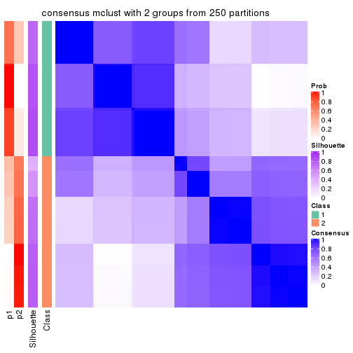</p>

</div>
<div id='tab-SD-mclust-consensus-heatmap-2'>
<pre><code class="r">consensus_heatmap(res, k = 3)
</code></pre>

<p>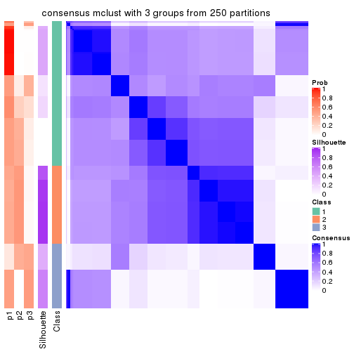</p>

</div>
<div id='tab-SD-mclust-consensus-heatmap-3'>
<pre><code class="r">consensus_heatmap(res, k = 4)
</code></pre>

<p>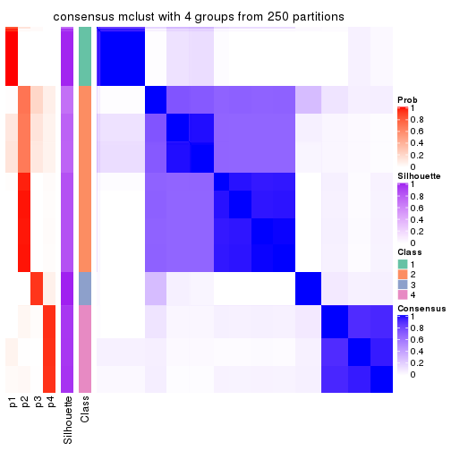</p>

</div>
<div id='tab-SD-mclust-consensus-heatmap-4'>
<pre><code class="r">consensus_heatmap(res, k = 5)
</code></pre>

<p>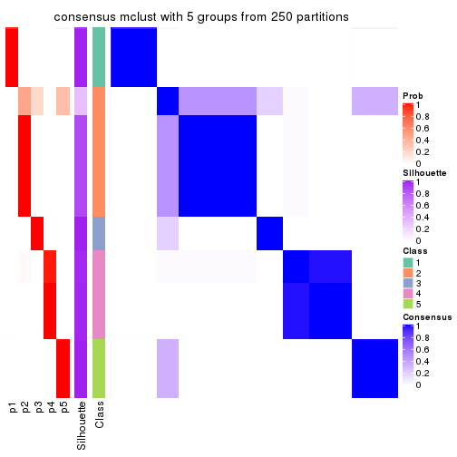</p>

</div>
<div id='tab-SD-mclust-consensus-heatmap-5'>
<pre><code class="r">consensus_heatmap(res, k = 6)
</code></pre>

<p>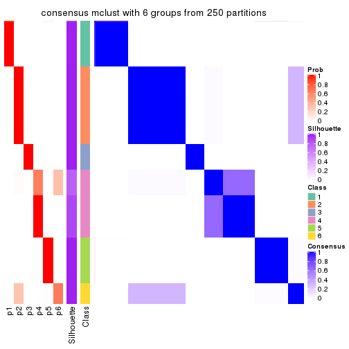</p>

</div>
</div>

Heatmaps for the membership of samples in all partitions to see how consistent they are:


<script>
$( function() {
	$( '#tabs-SD-mclust-membership-heatmap' ).tabs();
} );
</script>
<div id='tabs-SD-mclust-membership-heatmap'>
<ul>
<li><a href='#tab-SD-mclust-membership-heatmap-1'>k = 2</a></li>
<li><a href='#tab-SD-mclust-membership-heatmap-2'>k = 3</a></li>
<li><a href='#tab-SD-mclust-membership-heatmap-3'>k = 4</a></li>
<li><a href='#tab-SD-mclust-membership-heatmap-4'>k = 5</a></li>
<li><a href='#tab-SD-mclust-membership-heatmap-5'>k = 6</a></li>
</ul>
<div id='tab-SD-mclust-membership-heatmap-1'>
<pre><code class="r">membership_heatmap(res, k = 2)
</code></pre>

<p>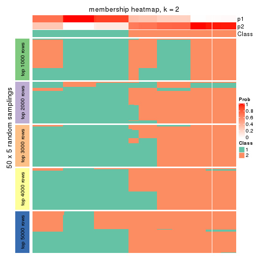</p>

</div>
<div id='tab-SD-mclust-membership-heatmap-2'>
<pre><code class="r">membership_heatmap(res, k = 3)
</code></pre>

<p>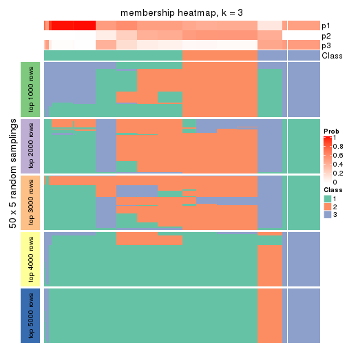</p>

</div>
<div id='tab-SD-mclust-membership-heatmap-3'>
<pre><code class="r">membership_heatmap(res, k = 4)
</code></pre>

<p>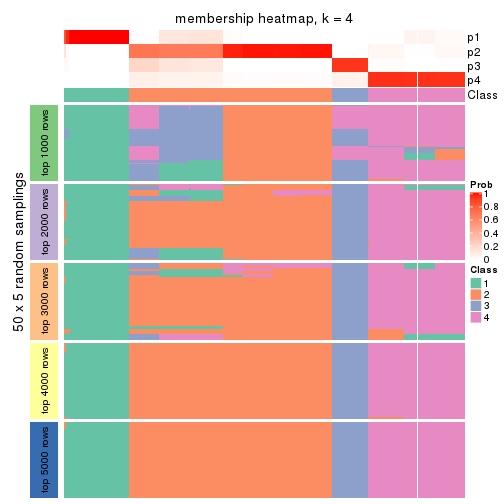</p>

</div>
<div id='tab-SD-mclust-membership-heatmap-4'>
<pre><code class="r">membership_heatmap(res, k = 5)
</code></pre>

<p>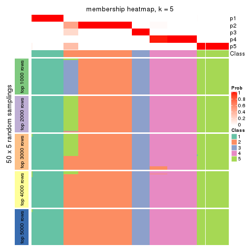</p>

</div>
<div id='tab-SD-mclust-membership-heatmap-5'>
<pre><code class="r">membership_heatmap(res, k = 6)
</code></pre>

<p>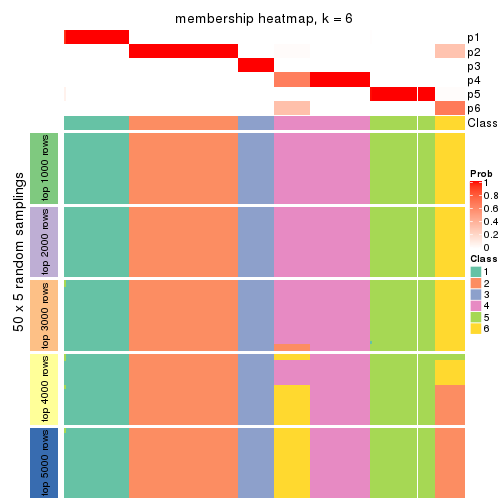</p>

</div>
</div>

As soon as we have had the classes for columns, we can look for signatures
which are significantly different between classes which can be candidate marks
for certain classes. Following are the heatmaps for signatures.


Signature heatmaps where rows are scaled:


<script>
$( function() {
	$( '#tabs-SD-mclust-get-signatures' ).tabs();
} );
</script>
<div id='tabs-SD-mclust-get-signatures'>
<ul>
<li><a href='#tab-SD-mclust-get-signatures-1'>k = 2</a></li>
<li><a href='#tab-SD-mclust-get-signatures-2'>k = 3</a></li>
<li><a href='#tab-SD-mclust-get-signatures-3'>k = 4</a></li>
<li><a href='#tab-SD-mclust-get-signatures-4'>k = 5</a></li>
<li><a href='#tab-SD-mclust-get-signatures-5'>k = 6</a></li>
</ul>
<div id='tab-SD-mclust-get-signatures-1'>
<pre><code class="r">get_signatures(res, k = 2)
</code></pre>

<p>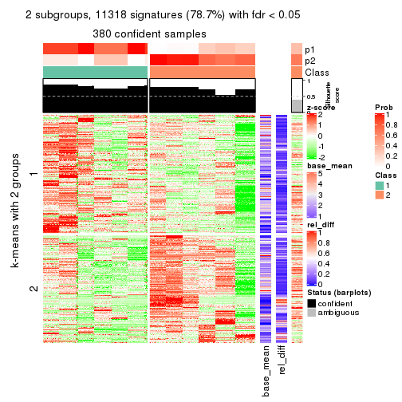</p>

</div>
<div id='tab-SD-mclust-get-signatures-2'>
<pre><code class="r">get_signatures(res, k = 3)
</code></pre>

<p>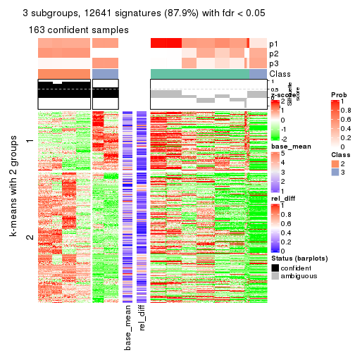</p>

</div>
<div id='tab-SD-mclust-get-signatures-3'>
<pre><code class="r">get_signatures(res, k = 4)
</code></pre>

<p>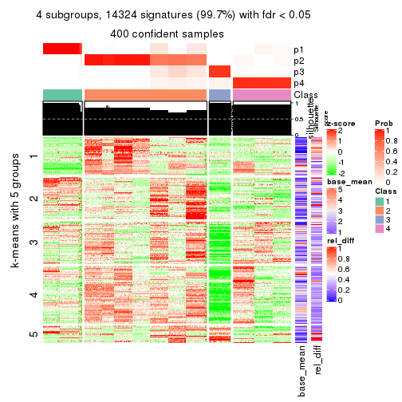</p>

</div>
<div id='tab-SD-mclust-get-signatures-4'>
<pre><code class="r">get_signatures(res, k = 5)
</code></pre>

<p>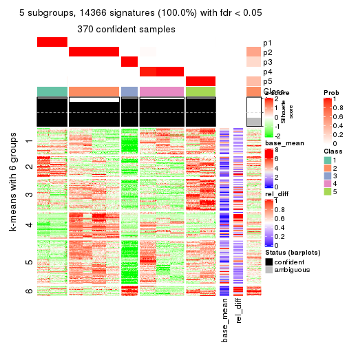</p>

</div>
<div id='tab-SD-mclust-get-signatures-5'>
<pre><code class="r">get_signatures(res, k = 6)
</code></pre>

<p>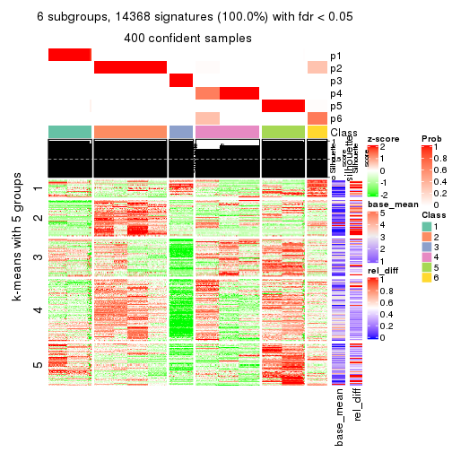</p>

</div>
</div>


Signature heatmaps where rows are not scaled:


<script>
$( function() {
	$( '#tabs-SD-mclust-get-signatures-no-scale' ).tabs();
} );
</script>
<div id='tabs-SD-mclust-get-signatures-no-scale'>
<ul>
<li><a href='#tab-SD-mclust-get-signatures-no-scale-1'>k = 2</a></li>
<li><a href='#tab-SD-mclust-get-signatures-no-scale-2'>k = 3</a></li>
<li><a href='#tab-SD-mclust-get-signatures-no-scale-3'>k = 4</a></li>
<li><a href='#tab-SD-mclust-get-signatures-no-scale-4'>k = 5</a></li>
<li><a href='#tab-SD-mclust-get-signatures-no-scale-5'>k = 6</a></li>
</ul>
<div id='tab-SD-mclust-get-signatures-no-scale-1'>
<pre><code class="r">get_signatures(res, k = 2, scale_rows = FALSE)
</code></pre>

<p>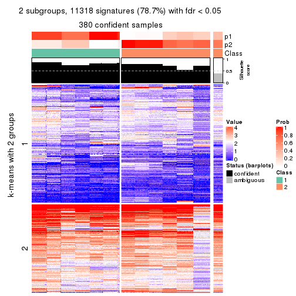</p>

</div>
<div id='tab-SD-mclust-get-signatures-no-scale-2'>
<pre><code class="r">get_signatures(res, k = 3, scale_rows = FALSE)
</code></pre>

<p>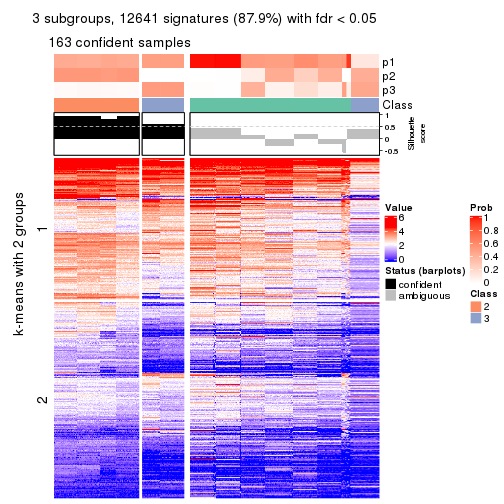</p>

</div>
<div id='tab-SD-mclust-get-signatures-no-scale-3'>
<pre><code class="r">get_signatures(res, k = 4, scale_rows = FALSE)
</code></pre>

<p>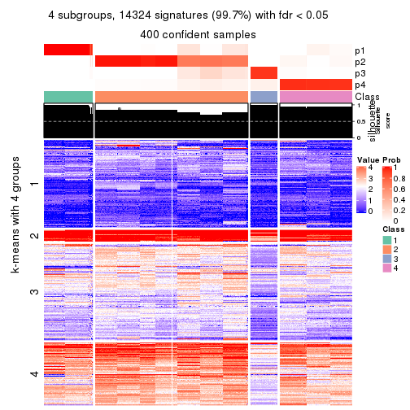</p>

</div>
<div id='tab-SD-mclust-get-signatures-no-scale-4'>
<pre><code class="r">get_signatures(res, k = 5, scale_rows = FALSE)
</code></pre>

<p>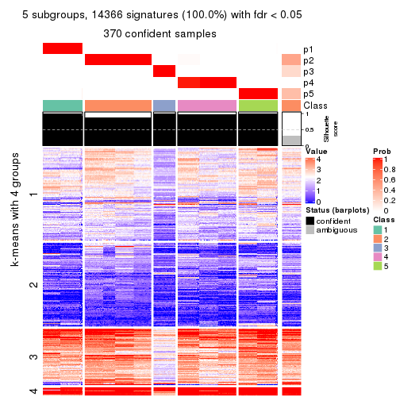</p>

</div>
<div id='tab-SD-mclust-get-signatures-no-scale-5'>
<pre><code class="r">get_signatures(res, k = 6, scale_rows = FALSE)
</code></pre>

<p>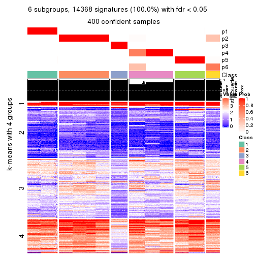</p>

</div>
</div>


Compare the overlap of signatures from different k:

```r
compare_signatures(res)
```

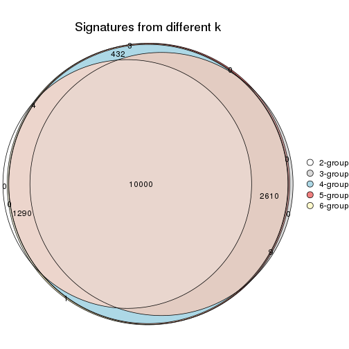

`get_signature()` returns a data frame invisibly. TO get the list of signatures, the function
call should be assigned to a variable explicitly. In following code, if `plot` argument is set
to `FALSE`, no heatmap is plotted while only the differential analysis is performed.

```r
# code only for demonstration
tb = get_signature(res, k = ..., plot = FALSE)
```

An example of the output of `tb` is:

```
#>   which_row         fdr    mean_1    mean_2 scaled_mean_1 scaled_mean_2 km
#> 1        38 0.042760348  8.373488  9.131774    -0.5533452     0.5164555  1
#> 2        40 0.018707592  7.106213  8.469186    -0.6173731     0.5762149  1
#> 3        55 0.019134737 10.221463 11.207825    -0.6159697     0.5749050  1
#> 4        59 0.006059896  5.921854  7.869574    -0.6899429     0.6439467  1
#> 5        60 0.018055526  8.928898 10.211722    -0.6204761     0.5791110  1
#> 6        98 0.009384629 15.714769 14.887706     0.6635654    -0.6193277  2
...
```

The columns in `tb` are:

1. `which_row`: row indices corresponding to the input matrix.
2. `fdr`: FDR for the differential test. 
3. `mean_x`: The mean value in group x.
4. `scaled_mean_x`: The mean value in group x after rows are scaled.
5. `km`: Row groups if k-means clustering is applied to rows.


UMAP plot which shows how samples are separated.


<script>
$( function() {
	$( '#tabs-SD-mclust-dimension-reduction' ).tabs();
} );
</script>
<div id='tabs-SD-mclust-dimension-reduction'>
<ul>
<li><a href='#tab-SD-mclust-dimension-reduction-1'>k = 2</a></li>
<li><a href='#tab-SD-mclust-dimension-reduction-2'>k = 3</a></li>
<li><a href='#tab-SD-mclust-dimension-reduction-3'>k = 4</a></li>
<li><a href='#tab-SD-mclust-dimension-reduction-4'>k = 5</a></li>
<li><a href='#tab-SD-mclust-dimension-reduction-5'>k = 6</a></li>
</ul>
<div id='tab-SD-mclust-dimension-reduction-1'>
<pre><code class="r">dimension_reduction(res, k = 2, method = &quot;UMAP&quot;)
</code></pre>

<p>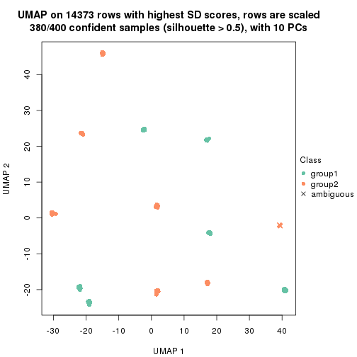</p>

</div>
<div id='tab-SD-mclust-dimension-reduction-2'>
<pre><code class="r">dimension_reduction(res, k = 3, method = &quot;UMAP&quot;)
</code></pre>

<p>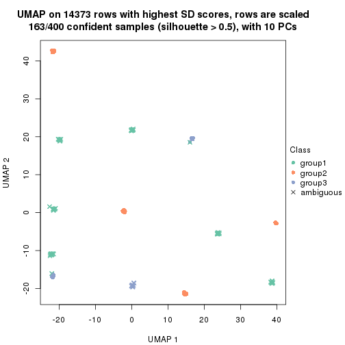</p>

</div>
<div id='tab-SD-mclust-dimension-reduction-3'>
<pre><code class="r">dimension_reduction(res, k = 4, method = &quot;UMAP&quot;)
</code></pre>

<p>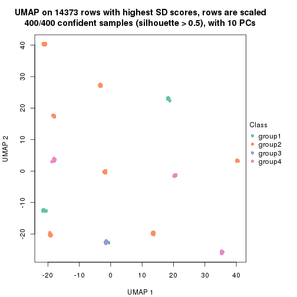</p>

</div>
<div id='tab-SD-mclust-dimension-reduction-4'>
<pre><code class="r">dimension_reduction(res, k = 5, method = &quot;UMAP&quot;)
</code></pre>

<p>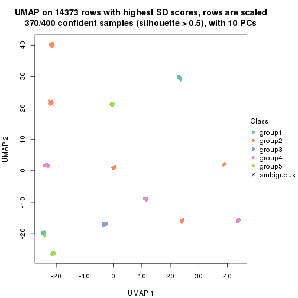</p>

</div>
<div id='tab-SD-mclust-dimension-reduction-5'>
<pre><code class="r">dimension_reduction(res, k = 6, method = &quot;UMAP&quot;)
</code></pre>

<p>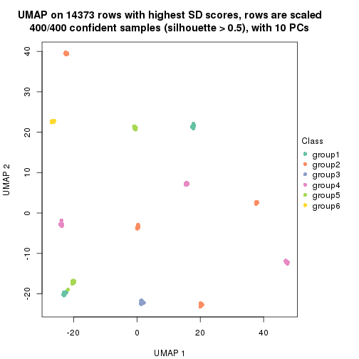</p>

</div>
</div>


Following heatmap shows how subgroups are split when increasing `k`:

```r
collect_classes(res)
```

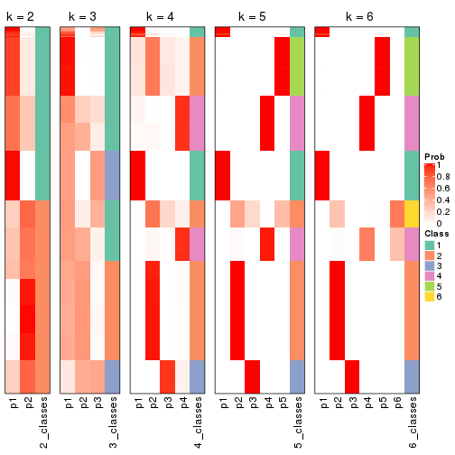


If matrix rows can be associated to genes, consider to use `GO_Enrichment(res,
...)` to perform function enrichment for the signature genes.


 

---------------------------------------------------


### SD:NMF**


The object with results only for a single top-value method and a single partition method 
can be extracted as:

```r
res = res_list["SD", "NMF"]
# you can also extract it by
# res = res_list["SD:NMF"]
```

A summary of `res` and all the functions that can be applied to it:

```r
res
```

```
#> A 'ConsensusPartition' object with k = 2, 3, 4, 5, 6.
#>   On a matrix with 14373 rows and 400 columns.
#>   Top rows (1000, 2000, 3000, 4000, 5000) are extracted by 'SD' method.
#>   Subgroups are detected by 'NMF' method.
#>   Performed in total 1250 partitions by row resampling.
#>   Best k for subgroups seems to be 6.
#> 
#> Following methods can be applied to this 'ConsensusPartition' object:
#>  [1] "cola_report"             "collect_classes"         "collect_plots"          
#>  [4] "collect_stats"           "colnames"                "compare_signatures"     
#>  [7] "consensus_heatmap"       "dimension_reduction"     "functional_enrichment"  
#> [10] "get_anno_col"            "get_anno"                "get_classes"            
#> [13] "get_consensus"           "get_matrix"              "get_membership"         
#> [16] "get_param"               "get_signatures"          "get_stats"              
#> [19] "is_best_k"               "is_stable_k"             "membership_heatmap"     
#> [22] "ncol"                    "nrow"                    "plot_ecdf"              
#> [25] "rownames"                "select_partition_number" "show"                   
#> [28] "suggest_best_k"          "test_to_known_factors"
```

`collect_plots()` function collects all the plots made from `res` for all `k` (number of partitions)
into one single page to provide an easy and fast comparison between different `k`.

```r
collect_plots(res)
```

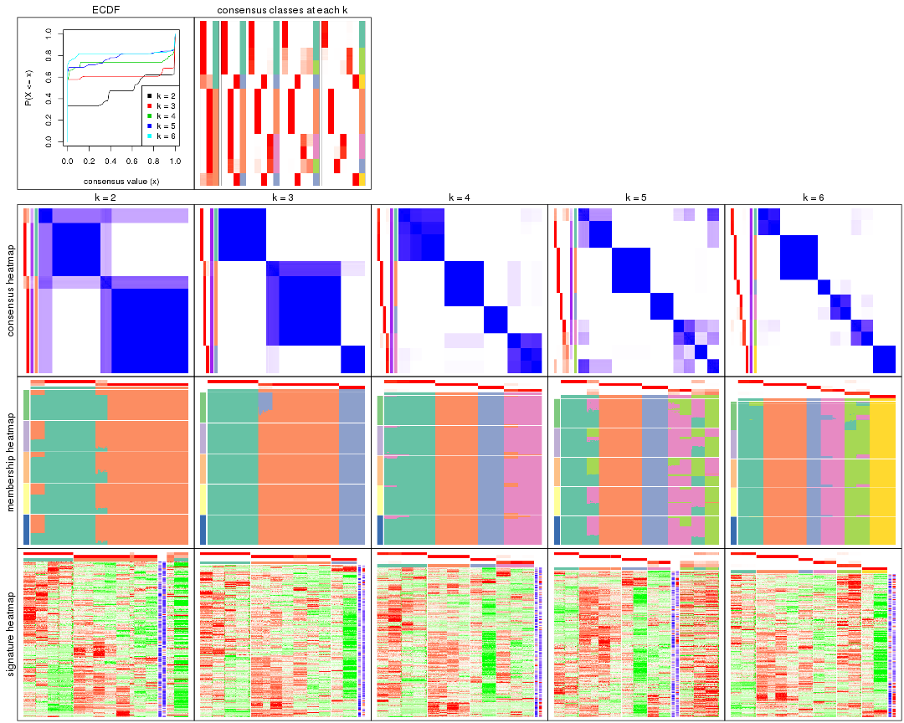

The plots are:

- The first row: a plot of the ECDF (Empirical cumulative distribution
  function) curves of the consensus matrix for each `k` and the heatmap of
  predicted classes for each `k`.
- The second row: heatmaps of the consensus matrix for each `k`.
- The third row: heatmaps of the membership matrix for each `k`.
- The fouth row: heatmaps of the signatures for each `k`.

All the plots in panels can be made by individual functions and they are
plotted later in this section.

`select_partition_number()` produces several plots showing different
statistics for choosing "optimized" `k`. There are following statistics:

- ECDF curves of the consensus matrix for each `k`;
- 1-PAC. [The PAC
  score](https://en.wikipedia.org/wiki/Consensus_clustering#Over-interpretation_potential_of_consensus_clustering)
  measures the proportion of the ambiguous subgrouping.
- Mean silhouette score.
- Concordance. The mean probability of fiting the consensus class ids in all
  partitions.
- Area increased. Denote $A_k$ as the area under the ECDF curve for current
  `k`, the area increased is defined as $A_k - A_{k-1}$.
- Rand index. The percent of pairs of samples that are both in a same cluster
  or both are not in a same cluster in the partition of k and k-1.
- Jaccard index. The ratio of pairs of samples are both in a same cluster in
  the partition of k and k-1 and the pairs of samples are both in a same
  cluster in the partition k or k-1.

The detailed explanations of these statistics can be found in [the cola
vignette](http://bioconductor.org/packages/devel/bioc/vignettes/cola/inst/doc/cola.html#toc_13).

Generally speaking, lower PAC score, higher mean silhouette score or higher
concordance corresponds to better partition. Rand index and Jaccard index
measure how similar the current partition is compared to partition with `k-1`.
If they are too similar, we won't accept `k` is better than `k-1`.

```r
select_partition_number(res)
```

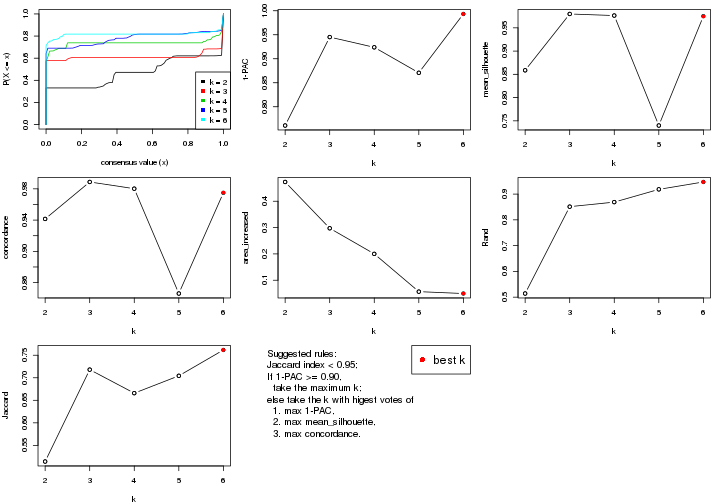

The numeric values for all these statistics can be obtained by `get_stats()`.

```r
get_stats(res)
```

```
#>   k 1-PAC mean_silhouette concordance area_increased  Rand Jaccard
#> 2 2 0.761           0.859       0.941         0.4732 0.514   0.514
#> 3 3 0.945           0.980       0.989         0.2973 0.851   0.718
#> 4 4 0.924           0.976       0.980         0.2001 0.869   0.666
#> 5 5 0.871           0.740       0.846         0.0566 0.918   0.704
#> 6 6 0.993           0.975       0.975         0.0495 0.947   0.762
```

`suggest_best_k()` suggests the best $k$ based on these statistics. The rules are as follows:

- All $k$ with Jaccard index larger than 0.95 are removed because the increase of
  the partition number does not provides enough extra information. If all $k$ are removed,
  the best $k$ is assigned by `NA`.
- For $k$ with 1-PAC larger than 0.9, the maximal $k$ is taken as the "best k". Other $k$ is called "optional k".
- If it does not fit the second rule. The $k$ with the highest vote of highest
  1-PAC, mean silhouette and concordance is taken as the "best k".

```r
suggest_best_k(res)
```

```
#> [1] 6
#> attr(,"optional")
#> [1] 3 4
```

There is also optional best $k$ = 3 4 that is worth to check.

Following shows the table of the partitions (You need to click the **show/hide
code output** link to see it). The membership matrix (columns with name `p*`)
is inferred by
[`clue::cl_consensus()`](https://www.rdocumentation.org/link/cl_consensus?package=clue)
function with the `SE` method. Basically the value in the membership matrix
represents the probability to belong to a certain group. The finall class
label for an item is determined with the group with highest probability it
belongs to.

In `get_classes()` function, the entropy is calculated from the membership
matrix and the silhouette score is calculated from the consensus matrix.


<script>
$( function() {
	$( '#tabs-SD-NMF-get-classes' ).tabs();
} );
</script>
<div id='tabs-SD-NMF-get-classes'>
<ul>
<li><a href='#tab-SD-NMF-get-classes-1'>k = 2</a></li>
<li><a href='#tab-SD-NMF-get-classes-2'>k = 3</a></li>
<li><a href='#tab-SD-NMF-get-classes-3'>k = 4</a></li>
<li><a href='#tab-SD-NMF-get-classes-4'>k = 5</a></li>
<li><a href='#tab-SD-NMF-get-classes-5'>k = 6</a></li>
</ul>

<div id='tab-SD-NMF-get-classes-1'>
<p><a id='tab-SD-NMF-get-classes-1-a' style='color:#0366d6' href='#'>show/hide code output</a></p>
<pre><code class="r">cbind(get_classes(res, k = 2), get_membership(res, k = 2))
</code></pre>

<pre><code>#&gt;            class entropy silhouette    p1    p2
#&gt; SRR1661716     2   0.000      0.952 0.000 1.000
#&gt; SRR1661717     2   0.000      0.952 0.000 1.000
#&gt; SRR1661718     2   0.000      0.952 0.000 1.000
#&gt; SRR1661719     2   0.000      0.952 0.000 1.000
#&gt; SRR1661720     2   0.000      0.952 0.000 1.000
#&gt; SRR1661721     2   0.000      0.952 0.000 1.000
#&gt; SRR1661722     2   0.000      0.952 0.000 1.000
#&gt; SRR1661723     2   0.000      0.952 0.000 1.000
#&gt; SRR1661724     2   0.000      0.952 0.000 1.000
#&gt; SRR1661725     2   0.000      0.952 0.000 1.000
#&gt; SRR1661726     2   0.000      0.952 0.000 1.000
#&gt; SRR1661727     2   0.000      0.952 0.000 1.000
#&gt; SRR1661728     2   0.000      0.952 0.000 1.000
#&gt; SRR1661729     2   0.000      0.952 0.000 1.000
#&gt; SRR1661730     2   0.000      0.952 0.000 1.000
#&gt; SRR1661731     2   0.000      0.952 0.000 1.000
#&gt; SRR1661732     2   0.000      0.952 0.000 1.000
#&gt; SRR1661733     2   0.000      0.952 0.000 1.000
#&gt; SRR1661734     2   0.000      0.952 0.000 1.000
#&gt; SRR1661735     2   0.000      0.952 0.000 1.000
#&gt; SRR1661736     2   0.000      0.952 0.000 1.000
#&gt; SRR1661737     2   0.000      0.952 0.000 1.000
#&gt; SRR1661738     2   0.000      0.952 0.000 1.000
#&gt; SRR1661739     2   0.000      0.952 0.000 1.000
#&gt; SRR1661740     2   0.000      0.952 0.000 1.000
#&gt; SRR1661741     2   0.000      0.952 0.000 1.000
#&gt; SRR1661742     2   0.000      0.952 0.000 1.000
#&gt; SRR1661743     2   0.000      0.952 0.000 1.000
#&gt; SRR1661744     2   0.000      0.952 0.000 1.000
#&gt; SRR1661745     2   0.000      0.952 0.000 1.000
#&gt; SRR1661746     2   0.000      0.952 0.000 1.000
#&gt; SRR1661747     2   0.000      0.952 0.000 1.000
#&gt; SRR1661748     2   0.000      0.952 0.000 1.000
#&gt; SRR1661749     2   0.000      0.952 0.000 1.000
#&gt; SRR1661750     2   0.000      0.952 0.000 1.000
#&gt; SRR1661751     2   0.000      0.952 0.000 1.000
#&gt; SRR1661752     2   0.000      0.952 0.000 1.000
#&gt; SRR1661753     2   0.000      0.952 0.000 1.000
#&gt; SRR1661754     2   0.000      0.952 0.000 1.000
#&gt; SRR1661755     2   0.000      0.952 0.000 1.000
#&gt; SRR1661756     2   0.000      0.952 0.000 1.000
#&gt; SRR1661757     2   0.000      0.952 0.000 1.000
#&gt; SRR1661758     2   0.000      0.952 0.000 1.000
#&gt; SRR1661759     2   0.000      0.952 0.000 1.000
#&gt; SRR1661760     2   0.000      0.952 0.000 1.000
#&gt; SRR1661761     2   0.000      0.952 0.000 1.000
#&gt; SRR1661762     2   0.000      0.952 0.000 1.000
#&gt; SRR1661763     2   0.000      0.952 0.000 1.000
#&gt; SRR1661764     2   0.000      0.952 0.000 1.000
#&gt; SRR1661766     2   0.000      0.952 0.000 1.000
#&gt; SRR1661767     2   0.000      0.952 0.000 1.000
#&gt; SRR1661768     2   0.000      0.952 0.000 1.000
#&gt; SRR1661769     2   0.000      0.952 0.000 1.000
#&gt; SRR1661770     2   0.000      0.952 0.000 1.000
#&gt; SRR1661771     2   0.000      0.952 0.000 1.000
#&gt; SRR1661772     2   0.000      0.952 0.000 1.000
#&gt; SRR1661773     2   0.000      0.952 0.000 1.000
#&gt; SRR1661774     2   0.000      0.952 0.000 1.000
#&gt; SRR1661775     2   0.000      0.952 0.000 1.000
#&gt; SRR1661776     2   0.000      0.952 0.000 1.000
#&gt; SRR1661777     2   0.000      0.952 0.000 1.000
#&gt; SRR1661778     2   0.000      0.952 0.000 1.000
#&gt; SRR1661779     2   0.000      0.952 0.000 1.000
#&gt; SRR1661780     2   0.000      0.952 0.000 1.000
#&gt; SRR1661781     2   0.000      0.952 0.000 1.000
#&gt; SRR1661782     2   0.000      0.952 0.000 1.000
#&gt; SRR1661783     2   0.000      0.952 0.000 1.000
#&gt; SRR1661784     2   0.000      0.952 0.000 1.000
#&gt; SRR1661785     2   0.000      0.952 0.000 1.000
#&gt; SRR1661786     2   0.000      0.952 0.000 1.000
#&gt; SRR1661787     2   0.000      0.952 0.000 1.000
#&gt; SRR1661788     2   0.000      0.952 0.000 1.000
#&gt; SRR1661789     2   0.000      0.952 0.000 1.000
#&gt; SRR1661790     2   0.000      0.952 0.000 1.000
#&gt; SRR1661791     2   0.000      0.952 0.000 1.000
#&gt; SRR1661792     2   0.000      0.952 0.000 1.000
#&gt; SRR1661793     2   0.000      0.952 0.000 1.000
#&gt; SRR1661794     2   0.000      0.952 0.000 1.000
#&gt; SRR1661795     2   0.000      0.952 0.000 1.000
#&gt; SRR1661796     2   0.000      0.952 0.000 1.000
#&gt; SRR1661797     2   0.000      0.952 0.000 1.000
#&gt; SRR1661798     2   0.000      0.952 0.000 1.000
#&gt; SRR1661799     2   0.000      0.952 0.000 1.000
#&gt; SRR1661800     2   0.000      0.952 0.000 1.000
#&gt; SRR1661801     2   0.000      0.952 0.000 1.000
#&gt; SRR1661802     2   0.000      0.952 0.000 1.000
#&gt; SRR1661803     2   0.000      0.952 0.000 1.000
#&gt; SRR1661804     2   0.000      0.952 0.000 1.000
#&gt; SRR1661805     2   0.000      0.952 0.000 1.000
#&gt; SRR1661806     2   0.000      0.952 0.000 1.000
#&gt; SRR1661807     2   0.000      0.952 0.000 1.000
#&gt; SRR1661808     2   0.000      0.952 0.000 1.000
#&gt; SRR1661809     2   0.000      0.952 0.000 1.000
#&gt; SRR1661810     2   0.000      0.952 0.000 1.000
#&gt; SRR1661811     2   0.000      0.952 0.000 1.000
#&gt; SRR1661812     2   0.000      0.952 0.000 1.000
#&gt; SRR1661813     2   0.000      0.952 0.000 1.000
#&gt; SRR1661814     2   0.000      0.952 0.000 1.000
#&gt; SRR1661815     2   0.000      0.952 0.000 1.000
#&gt; SRR1661816     2   0.000      0.952 0.000 1.000
#&gt; SRR1661817     2   0.000      0.952 0.000 1.000
#&gt; SRR1661818     2   0.000      0.952 0.000 1.000
#&gt; SRR1661819     2   0.000      0.952 0.000 1.000
#&gt; SRR1661820     2   0.000      0.952 0.000 1.000
#&gt; SRR1661821     2   0.000      0.952 0.000 1.000
#&gt; SRR1661822     2   0.000      0.952 0.000 1.000
#&gt; SRR1661823     2   0.000      0.952 0.000 1.000
#&gt; SRR1661824     2   0.000      0.952 0.000 1.000
#&gt; SRR1661825     2   0.000      0.952 0.000 1.000
#&gt; SRR1661826     1   0.000      0.906 1.000 0.000
#&gt; SRR1661827     1   0.000      0.906 1.000 0.000
#&gt; SRR1661828     1   0.000      0.906 1.000 0.000
#&gt; SRR1661829     1   0.000      0.906 1.000 0.000
#&gt; SRR1661830     1   0.000      0.906 1.000 0.000
#&gt; SRR1661831     1   0.000      0.906 1.000 0.000
#&gt; SRR1661832     1   0.000      0.906 1.000 0.000
#&gt; SRR1661833     1   0.000      0.906 1.000 0.000
#&gt; SRR1661834     1   0.000      0.906 1.000 0.000
#&gt; SRR1661835     1   0.000      0.906 1.000 0.000
#&gt; SRR1661836     1   0.000      0.906 1.000 0.000
#&gt; SRR1661837     1   0.000      0.906 1.000 0.000
#&gt; SRR1661838     1   0.000      0.906 1.000 0.000
#&gt; SRR1661839     1   0.000      0.906 1.000 0.000
#&gt; SRR1661840     1   0.000      0.906 1.000 0.000
#&gt; SRR1661841     1   0.000      0.906 1.000 0.000
#&gt; SRR1661843     1   0.000      0.906 1.000 0.000
#&gt; SRR1661844     1   0.000      0.906 1.000 0.000
#&gt; SRR1661845     1   0.000      0.906 1.000 0.000
#&gt; SRR1661846     1   0.000      0.906 1.000 0.000
#&gt; SRR1661847     1   0.000      0.906 1.000 0.000
#&gt; SRR1661848     1   0.000      0.906 1.000 0.000
#&gt; SRR1661849     1   0.000      0.906 1.000 0.000
#&gt; SRR1661850     1   0.000      0.906 1.000 0.000
#&gt; SRR1661851     1   0.000      0.906 1.000 0.000
#&gt; SRR1661852     1   0.000      0.906 1.000 0.000
#&gt; SRR1661853     1   0.000      0.906 1.000 0.000
#&gt; SRR1661854     1   0.000      0.906 1.000 0.000
#&gt; SRR1661855     1   0.000      0.906 1.000 0.000
#&gt; SRR1661856     1   0.961      0.454 0.616 0.384
#&gt; SRR1661857     1   0.958      0.464 0.620 0.380
#&gt; SRR1661858     1   0.958      0.464 0.620 0.380
#&gt; SRR1661859     1   0.958      0.464 0.620 0.380
#&gt; SRR1661860     1   0.958      0.464 0.620 0.380
#&gt; SRR1661861     1   0.958      0.464 0.620 0.380
#&gt; SRR1661862     1   0.958      0.464 0.620 0.380
#&gt; SRR1661863     1   0.958      0.464 0.620 0.380
#&gt; SRR1661864     1   0.958      0.464 0.620 0.380
#&gt; SRR1661865     1   0.958      0.464 0.620 0.380
#&gt; SRR1661866     1   0.958      0.464 0.620 0.380
#&gt; SRR1661867     1   0.958      0.464 0.620 0.380
#&gt; SRR1661868     1   0.958      0.464 0.620 0.380
#&gt; SRR1661869     1   0.958      0.464 0.620 0.380
#&gt; SRR1661870     1   0.958      0.464 0.620 0.380
#&gt; SRR1661871     1   0.961      0.454 0.616 0.384
#&gt; SRR1661872     1   0.961      0.454 0.616 0.384
#&gt; SRR1661873     1   0.961      0.454 0.616 0.384
#&gt; SRR1661874     1   0.958      0.464 0.620 0.380
#&gt; SRR1661875     1   0.961      0.454 0.616 0.384
#&gt; SRR1661876     1   0.958      0.464 0.620 0.380
#&gt; SRR1661877     1   0.961      0.454 0.616 0.384
#&gt; SRR1661878     1   0.958      0.464 0.620 0.380
#&gt; SRR1661879     1   0.966      0.434 0.608 0.392
#&gt; SRR1661880     1   0.958      0.464 0.620 0.380
#&gt; SRR1661881     1   0.958      0.464 0.620 0.380
#&gt; SRR1661882     1   0.958      0.464 0.620 0.380
#&gt; SRR1661883     1   0.958      0.464 0.620 0.380
#&gt; SRR1661884     1   0.958      0.464 0.620 0.380
#&gt; SRR1661885     1   0.958      0.464 0.620 0.380
#&gt; SRR1661886     1   0.958      0.464 0.620 0.380
#&gt; SRR1661887     1   0.958      0.464 0.620 0.380
#&gt; SRR1661888     1   0.958      0.464 0.620 0.380
#&gt; SRR1661889     1   0.961      0.454 0.616 0.384
#&gt; SRR1661890     1   0.958      0.464 0.620 0.380
#&gt; SRR1661891     1   0.958      0.464 0.620 0.380
#&gt; SRR1661892     1   0.000      0.906 1.000 0.000
#&gt; SRR1661893     1   0.000      0.906 1.000 0.000
#&gt; SRR1661894     1   0.000      0.906 1.000 0.000
#&gt; SRR1661895     1   0.000      0.906 1.000 0.000
#&gt; SRR1661896     1   0.000      0.906 1.000 0.000
#&gt; SRR1661897     1   0.000      0.906 1.000 0.000
#&gt; SRR1661898     1   0.000      0.906 1.000 0.000
#&gt; SRR1661899     1   0.000      0.906 1.000 0.000
#&gt; SRR1661900     1   0.000      0.906 1.000 0.000
#&gt; SRR1661901     1   0.000      0.906 1.000 0.000
#&gt; SRR1661902     1   0.000      0.906 1.000 0.000
#&gt; SRR1661903     1   0.000      0.906 1.000 0.000
#&gt; SRR1661904     1   0.000      0.906 1.000 0.000
#&gt; SRR1661905     1   0.000      0.906 1.000 0.000
#&gt; SRR1661906     1   0.000      0.906 1.000 0.000
#&gt; SRR1661907     1   0.000      0.906 1.000 0.000
#&gt; SRR1661908     1   0.000      0.906 1.000 0.000
#&gt; SRR1661909     1   0.000      0.906 1.000 0.000
#&gt; SRR1661910     1   0.000      0.906 1.000 0.000
#&gt; SRR1661911     1   0.000      0.906 1.000 0.000
#&gt; SRR1661912     1   0.000      0.906 1.000 0.000
#&gt; SRR1661913     1   0.000      0.906 1.000 0.000
#&gt; SRR1661914     1   0.000      0.906 1.000 0.000
#&gt; SRR1661915     1   0.000      0.906 1.000 0.000
#&gt; SRR1661916     1   0.000      0.906 1.000 0.000
#&gt; SRR1661917     1   0.000      0.906 1.000 0.000
#&gt; SRR1661918     1   0.000      0.906 1.000 0.000
#&gt; SRR1661919     1   0.000      0.906 1.000 0.000
#&gt; SRR1661920     1   0.000      0.906 1.000 0.000
#&gt; SRR1661921     1   0.000      0.906 1.000 0.000
#&gt; SRR1661922     1   0.000      0.906 1.000 0.000
#&gt; SRR1661923     1   0.000      0.906 1.000 0.000
#&gt; SRR1661924     1   0.000      0.906 1.000 0.000
#&gt; SRR1661925     1   0.000      0.906 1.000 0.000
#&gt; SRR1661926     1   0.000      0.906 1.000 0.000
#&gt; SRR1661927     1   0.000      0.906 1.000 0.000
#&gt; SRR1661928     2   0.929      0.451 0.344 0.656
#&gt; SRR1661929     2   0.925      0.461 0.340 0.660
#&gt; SRR1661930     2   0.861      0.578 0.284 0.716
#&gt; SRR1661931     2   0.871      0.563 0.292 0.708
#&gt; SRR1661932     2   0.909      0.499 0.324 0.676
#&gt; SRR1661933     2   0.866      0.571 0.288 0.712
#&gt; SRR1661934     2   0.909      0.499 0.324 0.676
#&gt; SRR1661935     2   0.891      0.532 0.308 0.692
#&gt; SRR1661936     2   0.891      0.532 0.308 0.692
#&gt; SRR1661937     2   0.917      0.481 0.332 0.668
#&gt; SRR1661938     2   0.913      0.490 0.328 0.672
#&gt; SRR1661939     2   0.900      0.516 0.316 0.684
#&gt; SRR1661940     2   0.929      0.451 0.344 0.656
#&gt; SRR1661941     2   0.925      0.461 0.340 0.660
#&gt; SRR1661942     2   0.939      0.420 0.356 0.644
#&gt; SRR1661943     2   0.909      0.499 0.324 0.676
#&gt; SRR1661944     2   0.921      0.471 0.336 0.664
#&gt; SRR1661945     2   0.866      0.571 0.288 0.712
#&gt; SRR1661946     2   0.913      0.490 0.328 0.672
#&gt; SRR1661947     2   0.921      0.471 0.336 0.664
#&gt; SRR1661948     2   0.900      0.516 0.316 0.684
#&gt; SRR1661949     2   0.932      0.441 0.348 0.652
#&gt; SRR1661950     2   0.909      0.499 0.324 0.676
#&gt; SRR1661951     2   0.876      0.556 0.296 0.704
#&gt; SRR1661952     2   0.921      0.471 0.336 0.664
#&gt; SRR1661953     2   0.913      0.490 0.328 0.672
#&gt; SRR1661954     2   0.900      0.516 0.316 0.684
#&gt; SRR1661955     2   0.932      0.441 0.348 0.652
#&gt; SRR1661956     2   0.913      0.490 0.328 0.672
#&gt; SRR1661957     2   0.891      0.532 0.308 0.692
#&gt; SRR1661958     2   0.000      0.952 0.000 1.000
#&gt; SRR1661959     2   0.000      0.952 0.000 1.000
#&gt; SRR1661960     2   0.000      0.952 0.000 1.000
#&gt; SRR1661961     2   0.000      0.952 0.000 1.000
#&gt; SRR1661962     2   0.000      0.952 0.000 1.000
#&gt; SRR1661963     2   0.000      0.952 0.000 1.000
#&gt; SRR1661964     2   0.000      0.952 0.000 1.000
#&gt; SRR1661965     2   0.000      0.952 0.000 1.000
#&gt; SRR1661966     2   0.000      0.952 0.000 1.000
#&gt; SRR1661967     2   0.000      0.952 0.000 1.000
#&gt; SRR1661968     2   0.000      0.952 0.000 1.000
#&gt; SRR1661969     2   0.000      0.952 0.000 1.000
#&gt; SRR1661970     2   0.000      0.952 0.000 1.000
#&gt; SRR1661971     2   0.000      0.952 0.000 1.000
#&gt; SRR1661972     2   0.000      0.952 0.000 1.000
#&gt; SRR1661973     2   0.000      0.952 0.000 1.000
#&gt; SRR1661974     2   0.000      0.952 0.000 1.000
#&gt; SRR1661975     2   0.000      0.952 0.000 1.000
#&gt; SRR1661976     2   0.000      0.952 0.000 1.000
#&gt; SRR1661977     2   0.000      0.952 0.000 1.000
#&gt; SRR1661978     2   0.000      0.952 0.000 1.000
#&gt; SRR1661979     2   0.000      0.952 0.000 1.000
#&gt; SRR1661980     2   0.000      0.952 0.000 1.000
#&gt; SRR1661981     2   0.000      0.952 0.000 1.000
#&gt; SRR1661982     2   0.000      0.952 0.000 1.000
#&gt; SRR1661983     2   0.000      0.952 0.000 1.000
#&gt; SRR1661984     2   0.000      0.952 0.000 1.000
#&gt; SRR1661985     2   0.000      0.952 0.000 1.000
#&gt; SRR1661986     2   0.000      0.952 0.000 1.000
#&gt; SRR1661987     2   0.000      0.952 0.000 1.000
#&gt; SRR1661988     1   0.000      0.906 1.000 0.000
#&gt; SRR1661989     1   0.000      0.906 1.000 0.000
#&gt; SRR1661990     1   0.000      0.906 1.000 0.000
#&gt; SRR1661991     1   0.000      0.906 1.000 0.000
#&gt; SRR1661992     1   0.000      0.906 1.000 0.000
#&gt; SRR1661993     1   0.000      0.906 1.000 0.000
#&gt; SRR1661994     1   0.000      0.906 1.000 0.000
#&gt; SRR1661995     1   0.000      0.906 1.000 0.000
#&gt; SRR1661996     1   0.000      0.906 1.000 0.000
#&gt; SRR1661997     1   0.000      0.906 1.000 0.000
#&gt; SRR1661998     1   0.000      0.906 1.000 0.000
#&gt; SRR1661999     1   0.000      0.906 1.000 0.000
#&gt; SRR1662000     1   0.000      0.906 1.000 0.000
#&gt; SRR1662001     1   0.000      0.906 1.000 0.000
#&gt; SRR1662002     1   0.000      0.906 1.000 0.000
#&gt; SRR1662003     1   0.000      0.906 1.000 0.000
#&gt; SRR1662004     1   0.000      0.906 1.000 0.000
#&gt; SRR1662005     1   0.000      0.906 1.000 0.000
#&gt; SRR1662006     1   0.000      0.906 1.000 0.000
#&gt; SRR1662007     1   0.000      0.906 1.000 0.000
#&gt; SRR1662008     1   0.000      0.906 1.000 0.000
#&gt; SRR1662009     1   0.000      0.906 1.000 0.000
#&gt; SRR1662010     1   0.000      0.906 1.000 0.000
#&gt; SRR1662011     1   0.000      0.906 1.000 0.000
#&gt; SRR1662012     1   0.000      0.906 1.000 0.000
#&gt; SRR1662013     1   0.000      0.906 1.000 0.000
#&gt; SRR1662014     1   0.000      0.906 1.000 0.000
#&gt; SRR1662015     1   0.000      0.906 1.000 0.000
#&gt; SRR1662016     1   0.000      0.906 1.000 0.000
#&gt; SRR1662017     1   0.000      0.906 1.000 0.000
#&gt; SRR1662018     2   0.000      0.952 0.000 1.000
#&gt; SRR1662019     2   0.000      0.952 0.000 1.000
#&gt; SRR1662020     2   0.000      0.952 0.000 1.000
#&gt; SRR1662021     2   0.000      0.952 0.000 1.000
#&gt; SRR1662022     2   0.000      0.952 0.000 1.000
#&gt; SRR1662023     2   0.000      0.952 0.000 1.000
#&gt; SRR1662024     2   0.000      0.952 0.000 1.000
#&gt; SRR1662025     2   0.000      0.952 0.000 1.000
#&gt; SRR1662026     2   0.000      0.952 0.000 1.000
#&gt; SRR1662027     2   0.000      0.952 0.000 1.000
#&gt; SRR1662028     2   0.000      0.952 0.000 1.000
#&gt; SRR1662029     2   0.000      0.952 0.000 1.000
#&gt; SRR1662030     2   0.000      0.952 0.000 1.000
#&gt; SRR1662031     2   0.000      0.952 0.000 1.000
#&gt; SRR1662032     2   0.000      0.952 0.000 1.000
#&gt; SRR1662033     2   0.000      0.952 0.000 1.000
#&gt; SRR1662034     2   0.000      0.952 0.000 1.000
#&gt; SRR1662035     2   0.000      0.952 0.000 1.000
#&gt; SRR1662036     2   0.000      0.952 0.000 1.000
#&gt; SRR1662037     2   0.000      0.952 0.000 1.000
#&gt; SRR1662038     2   0.000      0.952 0.000 1.000
#&gt; SRR1662039     2   0.000      0.952 0.000 1.000
#&gt; SRR1662040     2   0.000      0.952 0.000 1.000
#&gt; SRR1662041     2   0.000      0.952 0.000 1.000
#&gt; SRR1662042     2   0.000      0.952 0.000 1.000
#&gt; SRR1662043     2   0.000      0.952 0.000 1.000
#&gt; SRR1662044     2   0.000      0.952 0.000 1.000
#&gt; SRR1662045     2   0.000      0.952 0.000 1.000
#&gt; SRR1662046     2   0.000      0.952 0.000 1.000
#&gt; SRR1662047     2   0.000      0.952 0.000 1.000
#&gt; SRR1662048     2   0.000      0.952 0.000 1.000
#&gt; SRR1662049     2   0.000      0.952 0.000 1.000
#&gt; SRR1662050     2   0.000      0.952 0.000 1.000
#&gt; SRR1662051     2   0.000      0.952 0.000 1.000
#&gt; SRR1662052     2   0.000      0.952 0.000 1.000
#&gt; SRR1662053     2   0.000      0.952 0.000 1.000
#&gt; SRR1662054     2   0.000      0.952 0.000 1.000
#&gt; SRR1662055     2   0.000      0.952 0.000 1.000
#&gt; SRR1662056     2   0.000      0.952 0.000 1.000
#&gt; SRR1662057     2   0.000      0.952 0.000 1.000
#&gt; SRR1662058     2   0.000      0.952 0.000 1.000
#&gt; SRR1662059     2   0.000      0.952 0.000 1.000
#&gt; SRR1662060     2   0.000      0.952 0.000 1.000
#&gt; SRR1662061     2   0.000      0.952 0.000 1.000
#&gt; SRR1662062     2   0.000      0.952 0.000 1.000
#&gt; SRR1662063     2   0.000      0.952 0.000 1.000
#&gt; SRR1662064     2   0.000      0.952 0.000 1.000
#&gt; SRR1662065     2   0.000      0.952 0.000 1.000
#&gt; SRR1662066     2   0.000      0.952 0.000 1.000
#&gt; SRR1662067     2   0.000      0.952 0.000 1.000
#&gt; SRR1662068     2   0.000      0.952 0.000 1.000
#&gt; SRR1662069     2   0.000      0.952 0.000 1.000
#&gt; SRR1662070     2   0.000      0.952 0.000 1.000
#&gt; SRR1662071     2   0.000      0.952 0.000 1.000
#&gt; SRR1662072     2   0.000      0.952 0.000 1.000
#&gt; SRR1662073     2   0.000      0.952 0.000 1.000
#&gt; SRR1662074     2   0.000      0.952 0.000 1.000
#&gt; SRR1662075     2   0.000      0.952 0.000 1.000
#&gt; SRR1662076     2   0.000      0.952 0.000 1.000
#&gt; SRR1662077     2   0.000      0.952 0.000 1.000
#&gt; SRR1662078     2   0.000      0.952 0.000 1.000
#&gt; SRR1662079     2   0.000      0.952 0.000 1.000
#&gt; SRR1662080     2   0.000      0.952 0.000 1.000
#&gt; SRR1662081     2   0.000      0.952 0.000 1.000
#&gt; SRR1662082     2   0.000      0.952 0.000 1.000
#&gt; SRR1662083     2   0.000      0.952 0.000 1.000
#&gt; SRR1662084     1   0.000      0.906 1.000 0.000
#&gt; SRR1662085     1   0.000      0.906 1.000 0.000
#&gt; SRR1662086     1   0.000      0.906 1.000 0.000
#&gt; SRR1662087     1   0.000      0.906 1.000 0.000
#&gt; SRR1662088     1   0.000      0.906 1.000 0.000
#&gt; SRR1662089     1   0.000      0.906 1.000 0.000
#&gt; SRR1662090     1   0.000      0.906 1.000 0.000
#&gt; SRR1662091     1   0.000      0.906 1.000 0.000
#&gt; SRR1662092     1   0.000      0.906 1.000 0.000
#&gt; SRR1662093     1   0.000      0.906 1.000 0.000
#&gt; SRR1662094     1   0.000      0.906 1.000 0.000
#&gt; SRR1662095     1   0.000      0.906 1.000 0.000
#&gt; SRR1662096     1   0.000      0.906 1.000 0.000
#&gt; SRR1662097     1   0.000      0.906 1.000 0.000
#&gt; SRR1662098     1   0.000      0.906 1.000 0.000
#&gt; SRR1662099     1   0.000      0.906 1.000 0.000
#&gt; SRR1662100     1   0.000      0.906 1.000 0.000
#&gt; SRR1662101     1   0.000      0.906 1.000 0.000
#&gt; SRR1662102     1   0.000      0.906 1.000 0.000
#&gt; SRR1662103     1   0.000      0.906 1.000 0.000
#&gt; SRR1662104     1   0.000      0.906 1.000 0.000
#&gt; SRR1662105     1   0.000      0.906 1.000 0.000
#&gt; SRR1662106     1   0.000      0.906 1.000 0.000
#&gt; SRR1662107     1   0.000      0.906 1.000 0.000
#&gt; SRR1662108     1   0.000      0.906 1.000 0.000
#&gt; SRR1662109     1   0.000      0.906 1.000 0.000
#&gt; SRR1662110     1   0.000      0.906 1.000 0.000
#&gt; SRR1662111     1   0.000      0.906 1.000 0.000
#&gt; SRR1662112     1   0.000      0.906 1.000 0.000
#&gt; SRR1662113     1   0.000      0.906 1.000 0.000
#&gt; SRR1662114     1   0.000      0.906 1.000 0.000
#&gt; SRR1662115     1   0.000      0.906 1.000 0.000
#&gt; SRR1662116     1   0.000      0.906 1.000 0.000
#&gt; SRR1662117     1   0.000      0.906 1.000 0.000
</code></pre>

<script>
$('#tab-SD-NMF-get-classes-1-a').parent().next().next().hide();
$('#tab-SD-NMF-get-classes-1-a').click(function(){
  $('#tab-SD-NMF-get-classes-1-a').parent().next().next().toggle();
  return(false);
});
</script>
</div>

<div id='tab-SD-NMF-get-classes-2'>
<p><a id='tab-SD-NMF-get-classes-2-a' style='color:#0366d6' href='#'>show/hide code output</a></p>
<pre><code class="r">cbind(get_classes(res, k = 3), get_membership(res, k = 3))
</code></pre>

<pre><code>#&gt;            class entropy silhouette p1    p2    p3
#&gt; SRR1661716     2   0.000      0.978  0 1.000 0.000
#&gt; SRR1661717     2   0.000      0.978  0 1.000 0.000
#&gt; SRR1661718     2   0.000      0.978  0 1.000 0.000
#&gt; SRR1661719     2   0.000      0.978  0 1.000 0.000
#&gt; SRR1661720     2   0.000      0.978  0 1.000 0.000
#&gt; SRR1661721     2   0.000      0.978  0 1.000 0.000
#&gt; SRR1661722     2   0.000      0.978  0 1.000 0.000
#&gt; SRR1661723     2   0.000      0.978  0 1.000 0.000
#&gt; SRR1661724     2   0.000      0.978  0 1.000 0.000
#&gt; SRR1661725     2   0.000      0.978  0 1.000 0.000
#&gt; SRR1661726     2   0.000      0.978  0 1.000 0.000
#&gt; SRR1661727     2   0.000      0.978  0 1.000 0.000
#&gt; SRR1661728     2   0.000      0.978  0 1.000 0.000
#&gt; SRR1661729     2   0.000      0.978  0 1.000 0.000
#&gt; SRR1661730     2   0.000      0.978  0 1.000 0.000
#&gt; SRR1661731     2   0.000      0.978  0 1.000 0.000
#&gt; SRR1661732     2   0.000      0.978  0 1.000 0.000
#&gt; SRR1661733     2   0.000      0.978  0 1.000 0.000
#&gt; SRR1661734     2   0.000      0.978  0 1.000 0.000
#&gt; SRR1661735     2   0.000      0.978  0 1.000 0.000
#&gt; SRR1661736     2   0.000      0.978  0 1.000 0.000
#&gt; SRR1661737     2   0.000      0.978  0 1.000 0.000
#&gt; SRR1661738     2   0.000      0.978  0 1.000 0.000
#&gt; SRR1661739     2   0.000      0.978  0 1.000 0.000
#&gt; SRR1661740     2   0.000      0.978  0 1.000 0.000
#&gt; SRR1661741     2   0.000      0.978  0 1.000 0.000
#&gt; SRR1661742     2   0.000      0.978  0 1.000 0.000
#&gt; SRR1661743     2   0.000      0.978  0 1.000 0.000
#&gt; SRR1661744     2   0.000      0.978  0 1.000 0.000
#&gt; SRR1661745     2   0.000      0.978  0 1.000 0.000
#&gt; SRR1661746     2   0.000      0.978  0 1.000 0.000
#&gt; SRR1661747     2   0.000      0.978  0 1.000 0.000
#&gt; SRR1661748     2   0.000      0.978  0 1.000 0.000
#&gt; SRR1661749     2   0.000      0.978  0 1.000 0.000
#&gt; SRR1661750     2   0.000      0.978  0 1.000 0.000
#&gt; SRR1661751     2   0.000      0.978  0 1.000 0.000
#&gt; SRR1661752     2   0.000      0.978  0 1.000 0.000
#&gt; SRR1661753     2   0.000      0.978  0 1.000 0.000
#&gt; SRR1661754     2   0.000      0.978  0 1.000 0.000
#&gt; SRR1661755     2   0.000      0.978  0 1.000 0.000
#&gt; SRR1661756     2   0.000      0.978  0 1.000 0.000
#&gt; SRR1661757     2   0.000      0.978  0 1.000 0.000
#&gt; SRR1661758     2   0.000      0.978  0 1.000 0.000
#&gt; SRR1661759     2   0.000      0.978  0 1.000 0.000
#&gt; SRR1661760     2   0.000      0.978  0 1.000 0.000
#&gt; SRR1661761     2   0.000      0.978  0 1.000 0.000
#&gt; SRR1661762     2   0.000      0.978  0 1.000 0.000
#&gt; SRR1661763     2   0.000      0.978  0 1.000 0.000
#&gt; SRR1661764     2   0.000      0.978  0 1.000 0.000
#&gt; SRR1661766     2   0.000      0.978  0 1.000 0.000
#&gt; SRR1661767     2   0.000      0.978  0 1.000 0.000
#&gt; SRR1661768     2   0.000      0.978  0 1.000 0.000
#&gt; SRR1661769     2   0.000      0.978  0 1.000 0.000
#&gt; SRR1661770     2   0.000      0.978  0 1.000 0.000
#&gt; SRR1661771     2   0.000      0.978  0 1.000 0.000
#&gt; SRR1661772     2   0.000      0.978  0 1.000 0.000
#&gt; SRR1661773     2   0.000      0.978  0 1.000 0.000
#&gt; SRR1661774     2   0.000      0.978  0 1.000 0.000
#&gt; SRR1661775     2   0.000      0.978  0 1.000 0.000
#&gt; SRR1661776     2   0.000      0.978  0 1.000 0.000
#&gt; SRR1661777     2   0.000      0.978  0 1.000 0.000
#&gt; SRR1661778     2   0.000      0.978  0 1.000 0.000
#&gt; SRR1661779     2   0.000      0.978  0 1.000 0.000
#&gt; SRR1661780     2   0.000      0.978  0 1.000 0.000
#&gt; SRR1661781     2   0.000      0.978  0 1.000 0.000
#&gt; SRR1661782     2   0.000      0.978  0 1.000 0.000
#&gt; SRR1661783     2   0.000      0.978  0 1.000 0.000
#&gt; SRR1661784     2   0.000      0.978  0 1.000 0.000
#&gt; SRR1661785     2   0.000      0.978  0 1.000 0.000
#&gt; SRR1661786     2   0.000      0.978  0 1.000 0.000
#&gt; SRR1661787     2   0.000      0.978  0 1.000 0.000
#&gt; SRR1661788     2   0.000      0.978  0 1.000 0.000
#&gt; SRR1661789     2   0.000      0.978  0 1.000 0.000
#&gt; SRR1661790     2   0.000      0.978  0 1.000 0.000
#&gt; SRR1661791     2   0.000      0.978  0 1.000 0.000
#&gt; SRR1661792     2   0.000      0.978  0 1.000 0.000
#&gt; SRR1661793     2   0.000      0.978  0 1.000 0.000
#&gt; SRR1661794     2   0.000      0.978  0 1.000 0.000
#&gt; SRR1661795     2   0.000      0.978  0 1.000 0.000
#&gt; SRR1661796     2   0.000      0.978  0 1.000 0.000
#&gt; SRR1661797     2   0.000      0.978  0 1.000 0.000
#&gt; SRR1661798     2   0.000      0.978  0 1.000 0.000
#&gt; SRR1661799     2   0.000      0.978  0 1.000 0.000
#&gt; SRR1661800     2   0.000      0.978  0 1.000 0.000
#&gt; SRR1661801     2   0.000      0.978  0 1.000 0.000
#&gt; SRR1661802     2   0.000      0.978  0 1.000 0.000
#&gt; SRR1661803     2   0.000      0.978  0 1.000 0.000
#&gt; SRR1661804     2   0.000      0.978  0 1.000 0.000
#&gt; SRR1661805     2   0.000      0.978  0 1.000 0.000
#&gt; SRR1661806     2   0.000      0.978  0 1.000 0.000
#&gt; SRR1661807     2   0.000      0.978  0 1.000 0.000
#&gt; SRR1661808     2   0.000      0.978  0 1.000 0.000
#&gt; SRR1661809     2   0.000      0.978  0 1.000 0.000
#&gt; SRR1661810     2   0.000      0.978  0 1.000 0.000
#&gt; SRR1661811     2   0.000      0.978  0 1.000 0.000
#&gt; SRR1661812     2   0.000      0.978  0 1.000 0.000
#&gt; SRR1661813     2   0.000      0.978  0 1.000 0.000
#&gt; SRR1661814     2   0.000      0.978  0 1.000 0.000
#&gt; SRR1661815     2   0.000      0.978  0 1.000 0.000
#&gt; SRR1661816     2   0.000      0.978  0 1.000 0.000
#&gt; SRR1661817     2   0.000      0.978  0 1.000 0.000
#&gt; SRR1661818     2   0.000      0.978  0 1.000 0.000
#&gt; SRR1661819     2   0.000      0.978  0 1.000 0.000
#&gt; SRR1661820     2   0.000      0.978  0 1.000 0.000
#&gt; SRR1661821     2   0.000      0.978  0 1.000 0.000
#&gt; SRR1661822     2   0.000      0.978  0 1.000 0.000
#&gt; SRR1661823     2   0.000      0.978  0 1.000 0.000
#&gt; SRR1661824     2   0.000      0.978  0 1.000 0.000
#&gt; SRR1661825     2   0.000      0.978  0 1.000 0.000
#&gt; SRR1661826     1   0.000      1.000  1 0.000 0.000
#&gt; SRR1661827     1   0.000      1.000  1 0.000 0.000
#&gt; SRR1661828     1   0.000      1.000  1 0.000 0.000
#&gt; SRR1661829     1   0.000      1.000  1 0.000 0.000
#&gt; SRR1661830     1   0.000      1.000  1 0.000 0.000
#&gt; SRR1661831     1   0.000      1.000  1 0.000 0.000
#&gt; SRR1661832     1   0.000      1.000  1 0.000 0.000
#&gt; SRR1661833     1   0.000      1.000  1 0.000 0.000
#&gt; SRR1661834     1   0.000      1.000  1 0.000 0.000
#&gt; SRR1661835     1   0.000      1.000  1 0.000 0.000
#&gt; SRR1661836     1   0.000      1.000  1 0.000 0.000
#&gt; SRR1661837     1   0.000      1.000  1 0.000 0.000
#&gt; SRR1661838     1   0.000      1.000  1 0.000 0.000
#&gt; SRR1661839     1   0.000      1.000  1 0.000 0.000
#&gt; SRR1661840     1   0.000      1.000  1 0.000 0.000
#&gt; SRR1661841     1   0.000      1.000  1 0.000 0.000
#&gt; SRR1661843     1   0.000      1.000  1 0.000 0.000
#&gt; SRR1661844     1   0.000      1.000  1 0.000 0.000
#&gt; SRR1661845     1   0.000      1.000  1 0.000 0.000
#&gt; SRR1661846     1   0.000      1.000  1 0.000 0.000
#&gt; SRR1661847     1   0.000      1.000  1 0.000 0.000
#&gt; SRR1661848     1   0.000      1.000  1 0.000 0.000
#&gt; SRR1661849     1   0.000      1.000  1 0.000 0.000
#&gt; SRR1661850     1   0.000      1.000  1 0.000 0.000
#&gt; SRR1661851     1   0.000      1.000  1 0.000 0.000
#&gt; SRR1661852     1   0.000      1.000  1 0.000 0.000
#&gt; SRR1661853     1   0.000      1.000  1 0.000 0.000
#&gt; SRR1661854     1   0.000      1.000  1 0.000 0.000
#&gt; SRR1661855     1   0.000      1.000  1 0.000 0.000
#&gt; SRR1661856     3   0.000      1.000  0 0.000 1.000
#&gt; SRR1661857     3   0.000      1.000  0 0.000 1.000
#&gt; SRR1661858     3   0.000      1.000  0 0.000 1.000
#&gt; SRR1661859     3   0.000      1.000  0 0.000 1.000
#&gt; SRR1661860     3   0.000      1.000  0 0.000 1.000
#&gt; SRR1661861     3   0.000      1.000  0 0.000 1.000
#&gt; SRR1661862     3   0.000      1.000  0 0.000 1.000
#&gt; SRR1661863     3   0.000      1.000  0 0.000 1.000
#&gt; SRR1661864     3   0.000      1.000  0 0.000 1.000
#&gt; SRR1661865     3   0.000      1.000  0 0.000 1.000
#&gt; SRR1661866     3   0.000      1.000  0 0.000 1.000
#&gt; SRR1661867     3   0.000      1.000  0 0.000 1.000
#&gt; SRR1661868     3   0.000      1.000  0 0.000 1.000
#&gt; SRR1661869     3   0.000      1.000  0 0.000 1.000
#&gt; SRR1661870     3   0.000      1.000  0 0.000 1.000
#&gt; SRR1661871     3   0.000      1.000  0 0.000 1.000
#&gt; SRR1661872     3   0.000      1.000  0 0.000 1.000
#&gt; SRR1661873     3   0.000      1.000  0 0.000 1.000
#&gt; SRR1661874     3   0.000      1.000  0 0.000 1.000
#&gt; SRR1661875     3   0.000      1.000  0 0.000 1.000
#&gt; SRR1661876     3   0.000      1.000  0 0.000 1.000
#&gt; SRR1661877     3   0.000      1.000  0 0.000 1.000
#&gt; SRR1661878     3   0.000      1.000  0 0.000 1.000
#&gt; SRR1661879     3   0.000      1.000  0 0.000 1.000
#&gt; SRR1661880     3   0.000      1.000  0 0.000 1.000
#&gt; SRR1661881     3   0.000      1.000  0 0.000 1.000
#&gt; SRR1661882     3   0.000      1.000  0 0.000 1.000
#&gt; SRR1661883     3   0.000      1.000  0 0.000 1.000
#&gt; SRR1661884     3   0.000      1.000  0 0.000 1.000
#&gt; SRR1661885     3   0.000      1.000  0 0.000 1.000
#&gt; SRR1661886     3   0.000      1.000  0 0.000 1.000
#&gt; SRR1661887     3   0.000      1.000  0 0.000 1.000
#&gt; SRR1661888     3   0.000      1.000  0 0.000 1.000
#&gt; SRR1661889     3   0.000      1.000  0 0.000 1.000
#&gt; SRR1661890     3   0.000      1.000  0 0.000 1.000
#&gt; SRR1661891     3   0.000      1.000  0 0.000 1.000
#&gt; SRR1661892     1   0.000      1.000  1 0.000 0.000
#&gt; SRR1661893     1   0.000      1.000  1 0.000 0.000
#&gt; SRR1661894     1   0.000      1.000  1 0.000 0.000
#&gt; SRR1661895     1   0.000      1.000  1 0.000 0.000
#&gt; SRR1661896     1   0.000      1.000  1 0.000 0.000
#&gt; SRR1661897     1   0.000      1.000  1 0.000 0.000
#&gt; SRR1661898     1   0.000      1.000  1 0.000 0.000
#&gt; SRR1661899     1   0.000      1.000  1 0.000 0.000
#&gt; SRR1661900     1   0.000      1.000  1 0.000 0.000
#&gt; SRR1661901     1   0.000      1.000  1 0.000 0.000
#&gt; SRR1661902     1   0.000      1.000  1 0.000 0.000
#&gt; SRR1661903     1   0.000      1.000  1 0.000 0.000
#&gt; SRR1661904     1   0.000      1.000  1 0.000 0.000
#&gt; SRR1661905     1   0.000      1.000  1 0.000 0.000
#&gt; SRR1661906     1   0.000      1.000  1 0.000 0.000
#&gt; SRR1661907     1   0.000      1.000  1 0.000 0.000
#&gt; SRR1661908     1   0.000      1.000  1 0.000 0.000
#&gt; SRR1661909     1   0.000      1.000  1 0.000 0.000
#&gt; SRR1661910     1   0.000      1.000  1 0.000 0.000
#&gt; SRR1661911     1   0.000      1.000  1 0.000 0.000
#&gt; SRR1661912     1   0.000      1.000  1 0.000 0.000
#&gt; SRR1661913     1   0.000      1.000  1 0.000 0.000
#&gt; SRR1661914     1   0.000      1.000  1 0.000 0.000
#&gt; SRR1661915     1   0.000      1.000  1 0.000 0.000
#&gt; SRR1661916     1   0.000      1.000  1 0.000 0.000
#&gt; SRR1661917     1   0.000      1.000  1 0.000 0.000
#&gt; SRR1661918     1   0.000      1.000  1 0.000 0.000
#&gt; SRR1661919     1   0.000      1.000  1 0.000 0.000
#&gt; SRR1661920     1   0.000      1.000  1 0.000 0.000
#&gt; SRR1661921     1   0.000      1.000  1 0.000 0.000
#&gt; SRR1661922     1   0.000      1.000  1 0.000 0.000
#&gt; SRR1661923     1   0.000      1.000  1 0.000 0.000
#&gt; SRR1661924     1   0.000      1.000  1 0.000 0.000
#&gt; SRR1661925     1   0.000      1.000  1 0.000 0.000
#&gt; SRR1661926     1   0.000      1.000  1 0.000 0.000
#&gt; SRR1661927     1   0.000      1.000  1 0.000 0.000
#&gt; SRR1661928     3   0.000      1.000  0 0.000 1.000
#&gt; SRR1661929     3   0.000      1.000  0 0.000 1.000
#&gt; SRR1661930     3   0.000      1.000  0 0.000 1.000
#&gt; SRR1661931     3   0.000      1.000  0 0.000 1.000
#&gt; SRR1661932     3   0.000      1.000  0 0.000 1.000
#&gt; SRR1661933     3   0.000      1.000  0 0.000 1.000
#&gt; SRR1661934     3   0.000      1.000  0 0.000 1.000
#&gt; SRR1661935     3   0.000      1.000  0 0.000 1.000
#&gt; SRR1661936     3   0.000      1.000  0 0.000 1.000
#&gt; SRR1661937     3   0.000      1.000  0 0.000 1.000
#&gt; SRR1661938     3   0.000      1.000  0 0.000 1.000
#&gt; SRR1661939     3   0.000      1.000  0 0.000 1.000
#&gt; SRR1661940     3   0.000      1.000  0 0.000 1.000
#&gt; SRR1661941     3   0.000      1.000  0 0.000 1.000
#&gt; SRR1661942     3   0.000      1.000  0 0.000 1.000
#&gt; SRR1661943     3   0.000      1.000  0 0.000 1.000
#&gt; SRR1661944     3   0.000      1.000  0 0.000 1.000
#&gt; SRR1661945     3   0.000      1.000  0 0.000 1.000
#&gt; SRR1661946     3   0.000      1.000  0 0.000 1.000
#&gt; SRR1661947     3   0.000      1.000  0 0.000 1.000
#&gt; SRR1661948     3   0.000      1.000  0 0.000 1.000
#&gt; SRR1661949     3   0.000      1.000  0 0.000 1.000
#&gt; SRR1661950     3   0.000      1.000  0 0.000 1.000
#&gt; SRR1661951     3   0.000      1.000  0 0.000 1.000
#&gt; SRR1661952     3   0.000      1.000  0 0.000 1.000
#&gt; SRR1661953     3   0.000      1.000  0 0.000 1.000
#&gt; SRR1661954     3   0.000      1.000  0 0.000 1.000
#&gt; SRR1661955     3   0.000      1.000  0 0.000 1.000
#&gt; SRR1661956     3   0.000      1.000  0 0.000 1.000
#&gt; SRR1661957     3   0.000      1.000  0 0.000 1.000
#&gt; SRR1661958     2   0.000      0.978  0 1.000 0.000
#&gt; SRR1661959     2   0.000      0.978  0 1.000 0.000
#&gt; SRR1661960     2   0.000      0.978  0 1.000 0.000
#&gt; SRR1661961     2   0.000      0.978  0 1.000 0.000
#&gt; SRR1661962     2   0.000      0.978  0 1.000 0.000
#&gt; SRR1661963     2   0.000      0.978  0 1.000 0.000
#&gt; SRR1661964     2   0.000      0.978  0 1.000 0.000
#&gt; SRR1661965     2   0.000      0.978  0 1.000 0.000
#&gt; SRR1661966     2   0.000      0.978  0 1.000 0.000
#&gt; SRR1661967     2   0.000      0.978  0 1.000 0.000
#&gt; SRR1661968     2   0.000      0.978  0 1.000 0.000
#&gt; SRR1661969     2   0.000      0.978  0 1.000 0.000
#&gt; SRR1661970     2   0.000      0.978  0 1.000 0.000
#&gt; SRR1661971     2   0.000      0.978  0 1.000 0.000
#&gt; SRR1661972     2   0.000      0.978  0 1.000 0.000
#&gt; SRR1661973     2   0.000      0.978  0 1.000 0.000
#&gt; SRR1661974     2   0.000      0.978  0 1.000 0.000
#&gt; SRR1661975     2   0.000      0.978  0 1.000 0.000
#&gt; SRR1661976     2   0.000      0.978  0 1.000 0.000
#&gt; SRR1661977     2   0.000      0.978  0 1.000 0.000
#&gt; SRR1661978     2   0.000      0.978  0 1.000 0.000
#&gt; SRR1661979     2   0.000      0.978  0 1.000 0.000
#&gt; SRR1661980     2   0.000      0.978  0 1.000 0.000
#&gt; SRR1661981     2   0.000      0.978  0 1.000 0.000
#&gt; SRR1661982     2   0.000      0.978  0 1.000 0.000
#&gt; SRR1661983     2   0.000      0.978  0 1.000 0.000
#&gt; SRR1661984     2   0.000      0.978  0 1.000 0.000
#&gt; SRR1661985     2   0.000      0.978  0 1.000 0.000
#&gt; SRR1661986     2   0.000      0.978  0 1.000 0.000
#&gt; SRR1661987     2   0.000      0.978  0 1.000 0.000
#&gt; SRR1661988     1   0.000      1.000  1 0.000 0.000
#&gt; SRR1661989     1   0.000      1.000  1 0.000 0.000
#&gt; SRR1661990     1   0.000      1.000  1 0.000 0.000
#&gt; SRR1661991     1   0.000      1.000  1 0.000 0.000
#&gt; SRR1661992     1   0.000      1.000  1 0.000 0.000
#&gt; SRR1661993     1   0.000      1.000  1 0.000 0.000
#&gt; SRR1661994     1   0.000      1.000  1 0.000 0.000
#&gt; SRR1661995     1   0.000      1.000  1 0.000 0.000
#&gt; SRR1661996     1   0.000      1.000  1 0.000 0.000
#&gt; SRR1661997     1   0.000      1.000  1 0.000 0.000
#&gt; SRR1661998     1   0.000      1.000  1 0.000 0.000
#&gt; SRR1661999     1   0.000      1.000  1 0.000 0.000
#&gt; SRR1662000     1   0.000      1.000  1 0.000 0.000
#&gt; SRR1662001     1   0.000      1.000  1 0.000 0.000
#&gt; SRR1662002     1   0.000      1.000  1 0.000 0.000
#&gt; SRR1662003     1   0.000      1.000  1 0.000 0.000
#&gt; SRR1662004     1   0.000      1.000  1 0.000 0.000
#&gt; SRR1662005     1   0.000      1.000  1 0.000 0.000
#&gt; SRR1662006     1   0.000      1.000  1 0.000 0.000
#&gt; SRR1662007     1   0.000      1.000  1 0.000 0.000
#&gt; SRR1662008     1   0.000      1.000  1 0.000 0.000
#&gt; SRR1662009     1   0.000      1.000  1 0.000 0.000
#&gt; SRR1662010     1   0.000      1.000  1 0.000 0.000
#&gt; SRR1662011     1   0.000      1.000  1 0.000 0.000
#&gt; SRR1662012     1   0.000      1.000  1 0.000 0.000
#&gt; SRR1662013     1   0.000      1.000  1 0.000 0.000
#&gt; SRR1662014     1   0.000      1.000  1 0.000 0.000
#&gt; SRR1662015     1   0.000      1.000  1 0.000 0.000
#&gt; SRR1662016     1   0.000      1.000  1 0.000 0.000
#&gt; SRR1662017     1   0.000      1.000  1 0.000 0.000
#&gt; SRR1662018     2   0.327      0.889  0 0.884 0.116
#&gt; SRR1662019     2   0.319      0.893  0 0.888 0.112
#&gt; SRR1662020     2   0.327      0.889  0 0.884 0.116
#&gt; SRR1662021     2   0.327      0.889  0 0.884 0.116
#&gt; SRR1662022     2   0.334      0.886  0 0.880 0.120
#&gt; SRR1662023     2   0.355      0.874  0 0.868 0.132
#&gt; SRR1662024     2   0.319      0.893  0 0.888 0.112
#&gt; SRR1662025     2   0.355      0.874  0 0.868 0.132
#&gt; SRR1662026     2   0.327      0.889  0 0.884 0.116
#&gt; SRR1662027     2   0.327      0.889  0 0.884 0.116
#&gt; SRR1662028     2   0.355      0.874  0 0.868 0.132
#&gt; SRR1662029     2   0.348      0.878  0 0.872 0.128
#&gt; SRR1662030     2   0.334      0.886  0 0.880 0.120
#&gt; SRR1662031     2   0.388      0.852  0 0.848 0.152
#&gt; SRR1662032     2   0.348      0.878  0 0.872 0.128
#&gt; SRR1662033     2   0.341      0.882  0 0.876 0.124
#&gt; SRR1662034     2   0.348      0.878  0 0.872 0.128
#&gt; SRR1662035     2   0.341      0.882  0 0.876 0.124
#&gt; SRR1662036     2   0.382      0.856  0 0.852 0.148
#&gt; SRR1662037     2   0.334      0.886  0 0.880 0.120
#&gt; SRR1662038     2   0.341      0.882  0 0.876 0.124
#&gt; SRR1662039     2   0.327      0.889  0 0.884 0.116
#&gt; SRR1662040     2   0.327      0.889  0 0.884 0.116
#&gt; SRR1662041     2   0.375      0.861  0 0.856 0.144
#&gt; SRR1662042     2   0.355      0.874  0 0.868 0.132
#&gt; SRR1662043     2   0.348      0.878  0 0.872 0.128
#&gt; SRR1662044     2   0.327      0.889  0 0.884 0.116
#&gt; SRR1662045     2   0.334      0.886  0 0.880 0.120
#&gt; SRR1662046     2   0.327      0.889  0 0.884 0.116
#&gt; SRR1662047     2   0.280      0.909  0 0.908 0.092
#&gt; SRR1662048     2   0.334      0.886  0 0.880 0.120
#&gt; SRR1662049     2   0.369      0.865  0 0.860 0.140
#&gt; SRR1662050     2   0.341      0.882  0 0.876 0.124
#&gt; SRR1662051     2   0.334      0.886  0 0.880 0.120
#&gt; SRR1662052     2   0.382      0.856  0 0.852 0.148
#&gt; SRR1662053     2   0.369      0.865  0 0.860 0.140
#&gt; SRR1662054     2   0.000      0.978  0 1.000 0.000
#&gt; SRR1662055     2   0.000      0.978  0 1.000 0.000
#&gt; SRR1662056     2   0.000      0.978  0 1.000 0.000
#&gt; SRR1662057     2   0.000      0.978  0 1.000 0.000
#&gt; SRR1662058     2   0.000      0.978  0 1.000 0.000
#&gt; SRR1662059     2   0.000      0.978  0 1.000 0.000
#&gt; SRR1662060     2   0.000      0.978  0 1.000 0.000
#&gt; SRR1662061     2   0.000      0.978  0 1.000 0.000
#&gt; SRR1662062     2   0.000      0.978  0 1.000 0.000
#&gt; SRR1662063     2   0.000      0.978  0 1.000 0.000
#&gt; SRR1662064     2   0.000      0.978  0 1.000 0.000
#&gt; SRR1662065     2   0.000      0.978  0 1.000 0.000
#&gt; SRR1662066     2   0.000      0.978  0 1.000 0.000
#&gt; SRR1662067     2   0.000      0.978  0 1.000 0.000
#&gt; SRR1662068     2   0.000      0.978  0 1.000 0.000
#&gt; SRR1662069     2   0.000      0.978  0 1.000 0.000
#&gt; SRR1662070     2   0.000      0.978  0 1.000 0.000
#&gt; SRR1662071     2   0.000      0.978  0 1.000 0.000
#&gt; SRR1662072     2   0.000      0.978  0 1.000 0.000
#&gt; SRR1662073     2   0.000      0.978  0 1.000 0.000
#&gt; SRR1662074     2   0.000      0.978  0 1.000 0.000
#&gt; SRR1662075     2   0.000      0.978  0 1.000 0.000
#&gt; SRR1662076     2   0.000      0.978  0 1.000 0.000
#&gt; SRR1662077     2   0.000      0.978  0 1.000 0.000
#&gt; SRR1662078     2   0.000      0.978  0 1.000 0.000
#&gt; SRR1662079     2   0.000      0.978  0 1.000 0.000
#&gt; SRR1662080     2   0.000      0.978  0 1.000 0.000
#&gt; SRR1662081     2   0.000      0.978  0 1.000 0.000
#&gt; SRR1662082     2   0.000      0.978  0 1.000 0.000
#&gt; SRR1662083     2   0.000      0.978  0 1.000 0.000
#&gt; SRR1662084     1   0.000      1.000  1 0.000 0.000
#&gt; SRR1662085     1   0.000      1.000  1 0.000 0.000
#&gt; SRR1662086     1   0.000      1.000  1 0.000 0.000
#&gt; SRR1662087     1   0.000      1.000  1 0.000 0.000
#&gt; SRR1662088     1   0.000      1.000  1 0.000 0.000
#&gt; SRR1662089     1   0.000      1.000  1 0.000 0.000
#&gt; SRR1662090     1   0.000      1.000  1 0.000 0.000
#&gt; SRR1662091     1   0.000      1.000  1 0.000 0.000
#&gt; SRR1662092     1   0.000      1.000  1 0.000 0.000
#&gt; SRR1662093     1   0.000      1.000  1 0.000 0.000
#&gt; SRR1662094     1   0.000      1.000  1 0.000 0.000
#&gt; SRR1662095     1   0.000      1.000  1 0.000 0.000
#&gt; SRR1662096     1   0.000      1.000  1 0.000 0.000
#&gt; SRR1662097     1   0.000      1.000  1 0.000 0.000
#&gt; SRR1662098     1   0.000      1.000  1 0.000 0.000
#&gt; SRR1662099     1   0.000      1.000  1 0.000 0.000
#&gt; SRR1662100     1   0.000      1.000  1 0.000 0.000
#&gt; SRR1662101     1   0.000      1.000  1 0.000 0.000
#&gt; SRR1662102     1   0.000      1.000  1 0.000 0.000
#&gt; SRR1662103     1   0.000      1.000  1 0.000 0.000
#&gt; SRR1662104     1   0.000      1.000  1 0.000 0.000
#&gt; SRR1662105     1   0.000      1.000  1 0.000 0.000
#&gt; SRR1662106     1   0.000      1.000  1 0.000 0.000
#&gt; SRR1662107     1   0.000      1.000  1 0.000 0.000
#&gt; SRR1662108     1   0.000      1.000  1 0.000 0.000
#&gt; SRR1662109     1   0.000      1.000  1 0.000 0.000
#&gt; SRR1662110     1   0.000      1.000  1 0.000 0.000
#&gt; SRR1662111     1   0.000      1.000  1 0.000 0.000
#&gt; SRR1662112     1   0.000      1.000  1 0.000 0.000
#&gt; SRR1662113     1   0.000      1.000  1 0.000 0.000
#&gt; SRR1662114     1   0.000      1.000  1 0.000 0.000
#&gt; SRR1662115     1   0.000      1.000  1 0.000 0.000
#&gt; SRR1662116     1   0.000      1.000  1 0.000 0.000
#&gt; SRR1662117     1   0.000      1.000  1 0.000 0.000
</code></pre>

<script>
$('#tab-SD-NMF-get-classes-2-a').parent().next().next().hide();
$('#tab-SD-NMF-get-classes-2-a').click(function(){
  $('#tab-SD-NMF-get-classes-2-a').parent().next().next().toggle();
  return(false);
});
</script>
</div>

<div id='tab-SD-NMF-get-classes-3'>
<p><a id='tab-SD-NMF-get-classes-3-a' style='color:#0366d6' href='#'>show/hide code output</a></p>
<pre><code class="r">cbind(get_classes(res, k = 4), get_membership(res, k = 4))
</code></pre>

<pre><code>#&gt;            class entropy silhouette    p1    p2 p3    p4
#&gt; SRR1661716     2  0.0000      1.000 0.000 1.000  0 0.000
#&gt; SRR1661717     2  0.0000      1.000 0.000 1.000  0 0.000
#&gt; SRR1661718     2  0.0000      1.000 0.000 1.000  0 0.000
#&gt; SRR1661719     2  0.0000      1.000 0.000 1.000  0 0.000
#&gt; SRR1661720     2  0.0000      1.000 0.000 1.000  0 0.000
#&gt; SRR1661721     2  0.0000      1.000 0.000 1.000  0 0.000
#&gt; SRR1661722     2  0.0000      1.000 0.000 1.000  0 0.000
#&gt; SRR1661723     2  0.0000      1.000 0.000 1.000  0 0.000
#&gt; SRR1661724     2  0.0000      1.000 0.000 1.000  0 0.000
#&gt; SRR1661725     2  0.0000      1.000 0.000 1.000  0 0.000
#&gt; SRR1661726     2  0.0000      1.000 0.000 1.000  0 0.000
#&gt; SRR1661727     2  0.0000      1.000 0.000 1.000  0 0.000
#&gt; SRR1661728     2  0.0000      1.000 0.000 1.000  0 0.000
#&gt; SRR1661729     2  0.0000      1.000 0.000 1.000  0 0.000
#&gt; SRR1661730     2  0.0000      1.000 0.000 1.000  0 0.000
#&gt; SRR1661731     2  0.0000      1.000 0.000 1.000  0 0.000
#&gt; SRR1661732     2  0.0000      1.000 0.000 1.000  0 0.000
#&gt; SRR1661733     2  0.0000      1.000 0.000 1.000  0 0.000
#&gt; SRR1661734     2  0.0000      1.000 0.000 1.000  0 0.000
#&gt; SRR1661735     2  0.0000      1.000 0.000 1.000  0 0.000
#&gt; SRR1661736     2  0.0000      1.000 0.000 1.000  0 0.000
#&gt; SRR1661737     2  0.0000      1.000 0.000 1.000  0 0.000
#&gt; SRR1661738     2  0.0000      1.000 0.000 1.000  0 0.000
#&gt; SRR1661739     2  0.0000      1.000 0.000 1.000  0 0.000
#&gt; SRR1661740     2  0.0000      1.000 0.000 1.000  0 0.000
#&gt; SRR1661741     2  0.0000      1.000 0.000 1.000  0 0.000
#&gt; SRR1661742     2  0.0000      1.000 0.000 1.000  0 0.000
#&gt; SRR1661743     2  0.0000      1.000 0.000 1.000  0 0.000
#&gt; SRR1661744     2  0.0000      1.000 0.000 1.000  0 0.000
#&gt; SRR1661745     2  0.0000      1.000 0.000 1.000  0 0.000
#&gt; SRR1661746     2  0.0000      1.000 0.000 1.000  0 0.000
#&gt; SRR1661747     2  0.0000      1.000 0.000 1.000  0 0.000
#&gt; SRR1661748     2  0.0000      1.000 0.000 1.000  0 0.000
#&gt; SRR1661749     2  0.0000      1.000 0.000 1.000  0 0.000
#&gt; SRR1661750     2  0.0000      1.000 0.000 1.000  0 0.000
#&gt; SRR1661751     2  0.0000      1.000 0.000 1.000  0 0.000
#&gt; SRR1661752     2  0.0000      1.000 0.000 1.000  0 0.000
#&gt; SRR1661753     2  0.0000      1.000 0.000 1.000  0 0.000
#&gt; SRR1661754     2  0.0000      1.000 0.000 1.000  0 0.000
#&gt; SRR1661755     2  0.0000      1.000 0.000 1.000  0 0.000
#&gt; SRR1661756     2  0.0000      1.000 0.000 1.000  0 0.000
#&gt; SRR1661757     2  0.0000      1.000 0.000 1.000  0 0.000
#&gt; SRR1661758     2  0.0000      1.000 0.000 1.000  0 0.000
#&gt; SRR1661759     2  0.0000      1.000 0.000 1.000  0 0.000
#&gt; SRR1661760     2  0.0000      1.000 0.000 1.000  0 0.000
#&gt; SRR1661761     2  0.0000      1.000 0.000 1.000  0 0.000
#&gt; SRR1661762     2  0.0000      1.000 0.000 1.000  0 0.000
#&gt; SRR1661763     2  0.0000      1.000 0.000 1.000  0 0.000
#&gt; SRR1661764     2  0.0000      1.000 0.000 1.000  0 0.000
#&gt; SRR1661766     2  0.0000      1.000 0.000 1.000  0 0.000
#&gt; SRR1661767     2  0.0000      1.000 0.000 1.000  0 0.000
#&gt; SRR1661768     2  0.0000      1.000 0.000 1.000  0 0.000
#&gt; SRR1661769     2  0.0000      1.000 0.000 1.000  0 0.000
#&gt; SRR1661770     2  0.0000      1.000 0.000 1.000  0 0.000
#&gt; SRR1661771     2  0.0000      1.000 0.000 1.000  0 0.000
#&gt; SRR1661772     2  0.0000      1.000 0.000 1.000  0 0.000
#&gt; SRR1661773     2  0.0000      1.000 0.000 1.000  0 0.000
#&gt; SRR1661774     2  0.0000      1.000 0.000 1.000  0 0.000
#&gt; SRR1661775     2  0.0000      1.000 0.000 1.000  0 0.000
#&gt; SRR1661776     2  0.0000      1.000 0.000 1.000  0 0.000
#&gt; SRR1661777     2  0.0000      1.000 0.000 1.000  0 0.000
#&gt; SRR1661778     2  0.0000      1.000 0.000 1.000  0 0.000
#&gt; SRR1661779     2  0.0000      1.000 0.000 1.000  0 0.000
#&gt; SRR1661780     2  0.0000      1.000 0.000 1.000  0 0.000
#&gt; SRR1661781     2  0.0000      1.000 0.000 1.000  0 0.000
#&gt; SRR1661782     2  0.0000      1.000 0.000 1.000  0 0.000
#&gt; SRR1661783     2  0.0000      1.000 0.000 1.000  0 0.000
#&gt; SRR1661784     2  0.0000      1.000 0.000 1.000  0 0.000
#&gt; SRR1661785     2  0.0000      1.000 0.000 1.000  0 0.000
#&gt; SRR1661786     2  0.0000      1.000 0.000 1.000  0 0.000
#&gt; SRR1661787     2  0.0000      1.000 0.000 1.000  0 0.000
#&gt; SRR1661788     2  0.0000      1.000 0.000 1.000  0 0.000
#&gt; SRR1661789     2  0.0000      1.000 0.000 1.000  0 0.000
#&gt; SRR1661790     2  0.0000      1.000 0.000 1.000  0 0.000
#&gt; SRR1661791     2  0.0000      1.000 0.000 1.000  0 0.000
#&gt; SRR1661792     2  0.0000      1.000 0.000 1.000  0 0.000
#&gt; SRR1661793     2  0.0000      1.000 0.000 1.000  0 0.000
#&gt; SRR1661794     2  0.0000      1.000 0.000 1.000  0 0.000
#&gt; SRR1661795     2  0.0000      1.000 0.000 1.000  0 0.000
#&gt; SRR1661796     2  0.0000      1.000 0.000 1.000  0 0.000
#&gt; SRR1661797     2  0.0000      1.000 0.000 1.000  0 0.000
#&gt; SRR1661798     2  0.0000      1.000 0.000 1.000  0 0.000
#&gt; SRR1661799     2  0.0000      1.000 0.000 1.000  0 0.000
#&gt; SRR1661800     2  0.0000      1.000 0.000 1.000  0 0.000
#&gt; SRR1661801     2  0.0000      1.000 0.000 1.000  0 0.000
#&gt; SRR1661802     2  0.0000      1.000 0.000 1.000  0 0.000
#&gt; SRR1661803     2  0.0000      1.000 0.000 1.000  0 0.000
#&gt; SRR1661804     2  0.0000      1.000 0.000 1.000  0 0.000
#&gt; SRR1661805     2  0.0000      1.000 0.000 1.000  0 0.000
#&gt; SRR1661806     2  0.0000      1.000 0.000 1.000  0 0.000
#&gt; SRR1661807     2  0.0000      1.000 0.000 1.000  0 0.000
#&gt; SRR1661808     2  0.0000      1.000 0.000 1.000  0 0.000
#&gt; SRR1661809     2  0.0000      1.000 0.000 1.000  0 0.000
#&gt; SRR1661810     2  0.0000      1.000 0.000 1.000  0 0.000
#&gt; SRR1661811     2  0.0000      1.000 0.000 1.000  0 0.000
#&gt; SRR1661812     2  0.0000      1.000 0.000 1.000  0 0.000
#&gt; SRR1661813     2  0.0000      1.000 0.000 1.000  0 0.000
#&gt; SRR1661814     2  0.0000      1.000 0.000 1.000  0 0.000
#&gt; SRR1661815     2  0.0000      1.000 0.000 1.000  0 0.000
#&gt; SRR1661816     2  0.0000      1.000 0.000 1.000  0 0.000
#&gt; SRR1661817     2  0.0000      1.000 0.000 1.000  0 0.000
#&gt; SRR1661818     2  0.0000      1.000 0.000 1.000  0 0.000
#&gt; SRR1661819     2  0.0000      1.000 0.000 1.000  0 0.000
#&gt; SRR1661820     2  0.0000      1.000 0.000 1.000  0 0.000
#&gt; SRR1661821     2  0.0000      1.000 0.000 1.000  0 0.000
#&gt; SRR1661822     2  0.0000      1.000 0.000 1.000  0 0.000
#&gt; SRR1661823     2  0.0000      1.000 0.000 1.000  0 0.000
#&gt; SRR1661824     2  0.0000      1.000 0.000 1.000  0 0.000
#&gt; SRR1661825     2  0.0000      1.000 0.000 1.000  0 0.000
#&gt; SRR1661826     1  0.0000      0.981 1.000 0.000  0 0.000
#&gt; SRR1661827     1  0.0000      0.981 1.000 0.000  0 0.000
#&gt; SRR1661828     1  0.0000      0.981 1.000 0.000  0 0.000
#&gt; SRR1661829     1  0.0000      0.981 1.000 0.000  0 0.000
#&gt; SRR1661830     1  0.0000      0.981 1.000 0.000  0 0.000
#&gt; SRR1661831     1  0.0000      0.981 1.000 0.000  0 0.000
#&gt; SRR1661832     1  0.0000      0.981 1.000 0.000  0 0.000
#&gt; SRR1661833     1  0.0000      0.981 1.000 0.000  0 0.000
#&gt; SRR1661834     1  0.0000      0.981 1.000 0.000  0 0.000
#&gt; SRR1661835     1  0.0000      0.981 1.000 0.000  0 0.000
#&gt; SRR1661836     1  0.0000      0.981 1.000 0.000  0 0.000
#&gt; SRR1661837     1  0.0000      0.981 1.000 0.000  0 0.000
#&gt; SRR1661838     1  0.0000      0.981 1.000 0.000  0 0.000
#&gt; SRR1661839     1  0.0000      0.981 1.000 0.000  0 0.000
#&gt; SRR1661840     1  0.0000      0.981 1.000 0.000  0 0.000
#&gt; SRR1661841     1  0.0000      0.981 1.000 0.000  0 0.000
#&gt; SRR1661843     1  0.0000      0.981 1.000 0.000  0 0.000
#&gt; SRR1661844     1  0.0000      0.981 1.000 0.000  0 0.000
#&gt; SRR1661845     1  0.0000      0.981 1.000 0.000  0 0.000
#&gt; SRR1661846     1  0.0000      0.981 1.000 0.000  0 0.000
#&gt; SRR1661847     1  0.0000      0.981 1.000 0.000  0 0.000
#&gt; SRR1661848     1  0.0000      0.981 1.000 0.000  0 0.000
#&gt; SRR1661849     1  0.0000      0.981 1.000 0.000  0 0.000
#&gt; SRR1661850     1  0.0000      0.981 1.000 0.000  0 0.000
#&gt; SRR1661851     1  0.0000      0.981 1.000 0.000  0 0.000
#&gt; SRR1661852     1  0.0000      0.981 1.000 0.000  0 0.000
#&gt; SRR1661853     1  0.0000      0.981 1.000 0.000  0 0.000
#&gt; SRR1661854     1  0.0000      0.981 1.000 0.000  0 0.000
#&gt; SRR1661855     1  0.0000      0.981 1.000 0.000  0 0.000
#&gt; SRR1661856     3  0.0000      1.000 0.000 0.000  1 0.000
#&gt; SRR1661857     3  0.0000      1.000 0.000 0.000  1 0.000
#&gt; SRR1661858     3  0.0000      1.000 0.000 0.000  1 0.000
#&gt; SRR1661859     3  0.0000      1.000 0.000 0.000  1 0.000
#&gt; SRR1661860     3  0.0000      1.000 0.000 0.000  1 0.000
#&gt; SRR1661861     3  0.0000      1.000 0.000 0.000  1 0.000
#&gt; SRR1661862     3  0.0000      1.000 0.000 0.000  1 0.000
#&gt; SRR1661863     3  0.0000      1.000 0.000 0.000  1 0.000
#&gt; SRR1661864     3  0.0000      1.000 0.000 0.000  1 0.000
#&gt; SRR1661865     3  0.0000      1.000 0.000 0.000  1 0.000
#&gt; SRR1661866     3  0.0000      1.000 0.000 0.000  1 0.000
#&gt; SRR1661867     3  0.0000      1.000 0.000 0.000  1 0.000
#&gt; SRR1661868     3  0.0000      1.000 0.000 0.000  1 0.000
#&gt; SRR1661869     3  0.0000      1.000 0.000 0.000  1 0.000
#&gt; SRR1661870     3  0.0000      1.000 0.000 0.000  1 0.000
#&gt; SRR1661871     3  0.0000      1.000 0.000 0.000  1 0.000
#&gt; SRR1661872     3  0.0000      1.000 0.000 0.000  1 0.000
#&gt; SRR1661873     3  0.0000      1.000 0.000 0.000  1 0.000
#&gt; SRR1661874     3  0.0000      1.000 0.000 0.000  1 0.000
#&gt; SRR1661875     3  0.0000      1.000 0.000 0.000  1 0.000
#&gt; SRR1661876     3  0.0000      1.000 0.000 0.000  1 0.000
#&gt; SRR1661877     3  0.0000      1.000 0.000 0.000  1 0.000
#&gt; SRR1661878     3  0.0000      1.000 0.000 0.000  1 0.000
#&gt; SRR1661879     3  0.0000      1.000 0.000 0.000  1 0.000
#&gt; SRR1661880     3  0.0000      1.000 0.000 0.000  1 0.000
#&gt; SRR1661881     3  0.0000      1.000 0.000 0.000  1 0.000
#&gt; SRR1661882     3  0.0000      1.000 0.000 0.000  1 0.000
#&gt; SRR1661883     3  0.0000      1.000 0.000 0.000  1 0.000
#&gt; SRR1661884     3  0.0000      1.000 0.000 0.000  1 0.000
#&gt; SRR1661885     3  0.0000      1.000 0.000 0.000  1 0.000
#&gt; SRR1661886     3  0.0000      1.000 0.000 0.000  1 0.000
#&gt; SRR1661887     3  0.0000      1.000 0.000 0.000  1 0.000
#&gt; SRR1661888     3  0.0000      1.000 0.000 0.000  1 0.000
#&gt; SRR1661889     3  0.0000      1.000 0.000 0.000  1 0.000
#&gt; SRR1661890     3  0.0000      1.000 0.000 0.000  1 0.000
#&gt; SRR1661891     3  0.0000      1.000 0.000 0.000  1 0.000
#&gt; SRR1661892     1  0.0000      0.981 1.000 0.000  0 0.000
#&gt; SRR1661893     1  0.0000      0.981 1.000 0.000  0 0.000
#&gt; SRR1661894     1  0.0000      0.981 1.000 0.000  0 0.000
#&gt; SRR1661895     1  0.0000      0.981 1.000 0.000  0 0.000
#&gt; SRR1661896     1  0.0000      0.981 1.000 0.000  0 0.000
#&gt; SRR1661897     1  0.0000      0.981 1.000 0.000  0 0.000
#&gt; SRR1661898     1  0.0000      0.981 1.000 0.000  0 0.000
#&gt; SRR1661899     1  0.0000      0.981 1.000 0.000  0 0.000
#&gt; SRR1661900     1  0.0000      0.981 1.000 0.000  0 0.000
#&gt; SRR1661901     1  0.0000      0.981 1.000 0.000  0 0.000
#&gt; SRR1661902     1  0.0000      0.981 1.000 0.000  0 0.000
#&gt; SRR1661903     1  0.0000      0.981 1.000 0.000  0 0.000
#&gt; SRR1661904     1  0.0000      0.981 1.000 0.000  0 0.000
#&gt; SRR1661905     1  0.0000      0.981 1.000 0.000  0 0.000
#&gt; SRR1661906     1  0.0000      0.981 1.000 0.000  0 0.000
#&gt; SRR1661907     1  0.0000      0.981 1.000 0.000  0 0.000
#&gt; SRR1661908     1  0.0000      0.981 1.000 0.000  0 0.000
#&gt; SRR1661909     1  0.0000      0.981 1.000 0.000  0 0.000
#&gt; SRR1661910     1  0.0000      0.981 1.000 0.000  0 0.000
#&gt; SRR1661911     1  0.0000      0.981 1.000 0.000  0 0.000
#&gt; SRR1661912     1  0.0000      0.981 1.000 0.000  0 0.000
#&gt; SRR1661913     1  0.0000      0.981 1.000 0.000  0 0.000
#&gt; SRR1661914     1  0.0000      0.981 1.000 0.000  0 0.000
#&gt; SRR1661915     1  0.0000      0.981 1.000 0.000  0 0.000
#&gt; SRR1661916     1  0.0000      0.981 1.000 0.000  0 0.000
#&gt; SRR1661917     1  0.0000      0.981 1.000 0.000  0 0.000
#&gt; SRR1661918     1  0.0000      0.981 1.000 0.000  0 0.000
#&gt; SRR1661919     1  0.0000      0.981 1.000 0.000  0 0.000
#&gt; SRR1661920     1  0.0000      0.981 1.000 0.000  0 0.000
#&gt; SRR1661921     1  0.0000      0.981 1.000 0.000  0 0.000
#&gt; SRR1661922     1  0.0000      0.981 1.000 0.000  0 0.000
#&gt; SRR1661923     1  0.0000      0.981 1.000 0.000  0 0.000
#&gt; SRR1661924     1  0.0000      0.981 1.000 0.000  0 0.000
#&gt; SRR1661925     1  0.0000      0.981 1.000 0.000  0 0.000
#&gt; SRR1661926     1  0.0000      0.981 1.000 0.000  0 0.000
#&gt; SRR1661927     1  0.0000      0.981 1.000 0.000  0 0.000
#&gt; SRR1661928     3  0.0000      1.000 0.000 0.000  1 0.000
#&gt; SRR1661929     3  0.0000      1.000 0.000 0.000  1 0.000
#&gt; SRR1661930     3  0.0000      1.000 0.000 0.000  1 0.000
#&gt; SRR1661931     3  0.0000      1.000 0.000 0.000  1 0.000
#&gt; SRR1661932     3  0.0000      1.000 0.000 0.000  1 0.000
#&gt; SRR1661933     3  0.0000      1.000 0.000 0.000  1 0.000
#&gt; SRR1661934     3  0.0000      1.000 0.000 0.000  1 0.000
#&gt; SRR1661935     3  0.0000      1.000 0.000 0.000  1 0.000
#&gt; SRR1661936     3  0.0000      1.000 0.000 0.000  1 0.000
#&gt; SRR1661937     3  0.0000      1.000 0.000 0.000  1 0.000
#&gt; SRR1661938     3  0.0000      1.000 0.000 0.000  1 0.000
#&gt; SRR1661939     3  0.0000      1.000 0.000 0.000  1 0.000
#&gt; SRR1661940     3  0.0000      1.000 0.000 0.000  1 0.000
#&gt; SRR1661941     3  0.0000      1.000 0.000 0.000  1 0.000
#&gt; SRR1661942     3  0.0000      1.000 0.000 0.000  1 0.000
#&gt; SRR1661943     3  0.0000      1.000 0.000 0.000  1 0.000
#&gt; SRR1661944     3  0.0000      1.000 0.000 0.000  1 0.000
#&gt; SRR1661945     3  0.0000      1.000 0.000 0.000  1 0.000
#&gt; SRR1661946     3  0.0000      1.000 0.000 0.000  1 0.000
#&gt; SRR1661947     3  0.0000      1.000 0.000 0.000  1 0.000
#&gt; SRR1661948     3  0.0000      1.000 0.000 0.000  1 0.000
#&gt; SRR1661949     3  0.0000      1.000 0.000 0.000  1 0.000
#&gt; SRR1661950     3  0.0000      1.000 0.000 0.000  1 0.000
#&gt; SRR1661951     3  0.0000      1.000 0.000 0.000  1 0.000
#&gt; SRR1661952     3  0.0000      1.000 0.000 0.000  1 0.000
#&gt; SRR1661953     3  0.0000      1.000 0.000 0.000  1 0.000
#&gt; SRR1661954     3  0.0000      1.000 0.000 0.000  1 0.000
#&gt; SRR1661955     3  0.0000      1.000 0.000 0.000  1 0.000
#&gt; SRR1661956     3  0.0000      1.000 0.000 0.000  1 0.000
#&gt; SRR1661957     3  0.0000      1.000 0.000 0.000  1 0.000
#&gt; SRR1661958     4  0.0188      0.943 0.000 0.004  0 0.996
#&gt; SRR1661959     4  0.0188      0.943 0.000 0.004  0 0.996
#&gt; SRR1661960     4  0.0188      0.943 0.000 0.004  0 0.996
#&gt; SRR1661961     4  0.0188      0.943 0.000 0.004  0 0.996
#&gt; SRR1661962     4  0.0188      0.943 0.000 0.004  0 0.996
#&gt; SRR1661963     4  0.0188      0.943 0.000 0.004  0 0.996
#&gt; SRR1661964     4  0.0188      0.943 0.000 0.004  0 0.996
#&gt; SRR1661965     4  0.0188      0.943 0.000 0.004  0 0.996
#&gt; SRR1661966     4  0.0188      0.943 0.000 0.004  0 0.996
#&gt; SRR1661967     4  0.0188      0.943 0.000 0.004  0 0.996
#&gt; SRR1661968     4  0.0188      0.943 0.000 0.004  0 0.996
#&gt; SRR1661969     4  0.0188      0.943 0.000 0.004  0 0.996
#&gt; SRR1661970     4  0.0188      0.943 0.000 0.004  0 0.996
#&gt; SRR1661971     4  0.0188      0.943 0.000 0.004  0 0.996
#&gt; SRR1661972     4  0.0188      0.943 0.000 0.004  0 0.996
#&gt; SRR1661973     4  0.0188      0.943 0.000 0.004  0 0.996
#&gt; SRR1661974     4  0.0188      0.943 0.000 0.004  0 0.996
#&gt; SRR1661975     4  0.0188      0.943 0.000 0.004  0 0.996
#&gt; SRR1661976     4  0.0188      0.943 0.000 0.004  0 0.996
#&gt; SRR1661977     4  0.0188      0.943 0.000 0.004  0 0.996
#&gt; SRR1661978     4  0.0188      0.943 0.000 0.004  0 0.996
#&gt; SRR1661979     4  0.0188      0.943 0.000 0.004  0 0.996
#&gt; SRR1661980     4  0.0188      0.943 0.000 0.004  0 0.996
#&gt; SRR1661981     4  0.0188      0.943 0.000 0.004  0 0.996
#&gt; SRR1661982     4  0.0188      0.943 0.000 0.004  0 0.996
#&gt; SRR1661983     4  0.0188      0.943 0.000 0.004  0 0.996
#&gt; SRR1661984     4  0.0188      0.943 0.000 0.004  0 0.996
#&gt; SRR1661985     4  0.0188      0.943 0.000 0.004  0 0.996
#&gt; SRR1661986     4  0.0188      0.943 0.000 0.004  0 0.996
#&gt; SRR1661987     4  0.0188      0.943 0.000 0.004  0 0.996
#&gt; SRR1661988     1  0.0707      0.979 0.980 0.000  0 0.020
#&gt; SRR1661989     1  0.0707      0.979 0.980 0.000  0 0.020
#&gt; SRR1661990     1  0.0707      0.979 0.980 0.000  0 0.020
#&gt; SRR1661991     1  0.0817      0.978 0.976 0.000  0 0.024
#&gt; SRR1661992     1  0.0707      0.979 0.980 0.000  0 0.020
#&gt; SRR1661993     1  0.0707      0.979 0.980 0.000  0 0.020
#&gt; SRR1661994     1  0.0707      0.979 0.980 0.000  0 0.020
#&gt; SRR1661995     1  0.0707      0.979 0.980 0.000  0 0.020
#&gt; SRR1661996     1  0.0707      0.979 0.980 0.000  0 0.020
#&gt; SRR1661997     1  0.0921      0.976 0.972 0.000  0 0.028
#&gt; SRR1661998     1  0.0707      0.979 0.980 0.000  0 0.020
#&gt; SRR1661999     1  0.0707      0.979 0.980 0.000  0 0.020
#&gt; SRR1662000     1  0.0707      0.979 0.980 0.000  0 0.020
#&gt; SRR1662001     1  0.0707      0.979 0.980 0.000  0 0.020
#&gt; SRR1662002     1  0.0817      0.978 0.976 0.000  0 0.024
#&gt; SRR1662003     1  0.0707      0.979 0.980 0.000  0 0.020
#&gt; SRR1662004     1  0.0707      0.979 0.980 0.000  0 0.020
#&gt; SRR1662005     1  0.0707      0.979 0.980 0.000  0 0.020
#&gt; SRR1662006     1  0.0707      0.979 0.980 0.000  0 0.020
#&gt; SRR1662007     1  0.0921      0.976 0.972 0.000  0 0.028
#&gt; SRR1662008     1  0.0707      0.979 0.980 0.000  0 0.020
#&gt; SRR1662009     1  0.0707      0.979 0.980 0.000  0 0.020
#&gt; SRR1662010     1  0.0817      0.978 0.976 0.000  0 0.024
#&gt; SRR1662011     1  0.0707      0.979 0.980 0.000  0 0.020
#&gt; SRR1662012     1  0.0707      0.979 0.980 0.000  0 0.020
#&gt; SRR1662013     1  0.0707      0.979 0.980 0.000  0 0.020
#&gt; SRR1662014     1  0.0707      0.979 0.980 0.000  0 0.020
#&gt; SRR1662015     1  0.0707      0.979 0.980 0.000  0 0.020
#&gt; SRR1662016     1  0.0817      0.978 0.976 0.000  0 0.024
#&gt; SRR1662017     1  0.0707      0.979 0.980 0.000  0 0.020
#&gt; SRR1662018     4  0.2647      0.920 0.000 0.120  0 0.880
#&gt; SRR1662019     4  0.2647      0.920 0.000 0.120  0 0.880
#&gt; SRR1662020     4  0.2647      0.920 0.000 0.120  0 0.880
#&gt; SRR1662021     4  0.2647      0.920 0.000 0.120  0 0.880
#&gt; SRR1662022     4  0.2647      0.920 0.000 0.120  0 0.880
#&gt; SRR1662023     4  0.2647      0.920 0.000 0.120  0 0.880
#&gt; SRR1662024     4  0.2647      0.920 0.000 0.120  0 0.880
#&gt; SRR1662025     4  0.2647      0.920 0.000 0.120  0 0.880
#&gt; SRR1662026     4  0.2647      0.920 0.000 0.120  0 0.880
#&gt; SRR1662027     4  0.2647      0.920 0.000 0.120  0 0.880
#&gt; SRR1662028     4  0.2647      0.920 0.000 0.120  0 0.880
#&gt; SRR1662029     4  0.2647      0.920 0.000 0.120  0 0.880
#&gt; SRR1662030     4  0.2647      0.920 0.000 0.120  0 0.880
#&gt; SRR1662031     4  0.2647      0.920 0.000 0.120  0 0.880
#&gt; SRR1662032     4  0.2647      0.920 0.000 0.120  0 0.880
#&gt; SRR1662033     4  0.2647      0.920 0.000 0.120  0 0.880
#&gt; SRR1662034     4  0.2647      0.920 0.000 0.120  0 0.880
#&gt; SRR1662035     4  0.2647      0.920 0.000 0.120  0 0.880
#&gt; SRR1662036     4  0.2647      0.920 0.000 0.120  0 0.880
#&gt; SRR1662037     4  0.2647      0.920 0.000 0.120  0 0.880
#&gt; SRR1662038     4  0.2647      0.920 0.000 0.120  0 0.880
#&gt; SRR1662039     4  0.2647      0.920 0.000 0.120  0 0.880
#&gt; SRR1662040     4  0.2647      0.920 0.000 0.120  0 0.880
#&gt; SRR1662041     4  0.2647      0.920 0.000 0.120  0 0.880
#&gt; SRR1662042     4  0.2647      0.920 0.000 0.120  0 0.880
#&gt; SRR1662043     4  0.2647      0.920 0.000 0.120  0 0.880
#&gt; SRR1662044     4  0.2647      0.920 0.000 0.120  0 0.880
#&gt; SRR1662045     4  0.2647      0.920 0.000 0.120  0 0.880
#&gt; SRR1662046     4  0.2647      0.920 0.000 0.120  0 0.880
#&gt; SRR1662047     4  0.2647      0.920 0.000 0.120  0 0.880
#&gt; SRR1662048     4  0.2647      0.920 0.000 0.120  0 0.880
#&gt; SRR1662049     4  0.2647      0.920 0.000 0.120  0 0.880
#&gt; SRR1662050     4  0.2647      0.920 0.000 0.120  0 0.880
#&gt; SRR1662051     4  0.2647      0.920 0.000 0.120  0 0.880
#&gt; SRR1662052     4  0.2647      0.920 0.000 0.120  0 0.880
#&gt; SRR1662053     4  0.2647      0.920 0.000 0.120  0 0.880
#&gt; SRR1662054     4  0.0707      0.949 0.000 0.020  0 0.980
#&gt; SRR1662055     4  0.0707      0.949 0.000 0.020  0 0.980
#&gt; SRR1662056     4  0.0707      0.949 0.000 0.020  0 0.980
#&gt; SRR1662057     4  0.0707      0.949 0.000 0.020  0 0.980
#&gt; SRR1662058     4  0.0707      0.949 0.000 0.020  0 0.980
#&gt; SRR1662059     4  0.0707      0.949 0.000 0.020  0 0.980
#&gt; SRR1662060     4  0.0707      0.949 0.000 0.020  0 0.980
#&gt; SRR1662061     4  0.0707      0.949 0.000 0.020  0 0.980
#&gt; SRR1662062     4  0.0707      0.949 0.000 0.020  0 0.980
#&gt; SRR1662063     4  0.0707      0.949 0.000 0.020  0 0.980
#&gt; SRR1662064     4  0.0707      0.949 0.000 0.020  0 0.980
#&gt; SRR1662065     4  0.0707      0.949 0.000 0.020  0 0.980
#&gt; SRR1662066     4  0.0707      0.949 0.000 0.020  0 0.980
#&gt; SRR1662067     4  0.0707      0.949 0.000 0.020  0 0.980
#&gt; SRR1662068     4  0.0707      0.949 0.000 0.020  0 0.980
#&gt; SRR1662069     4  0.0707      0.949 0.000 0.020  0 0.980
#&gt; SRR1662070     4  0.0707      0.949 0.000 0.020  0 0.980
#&gt; SRR1662071     4  0.0707      0.949 0.000 0.020  0 0.980
#&gt; SRR1662072     4  0.0707      0.949 0.000 0.020  0 0.980
#&gt; SRR1662073     4  0.0707      0.949 0.000 0.020  0 0.980
#&gt; SRR1662074     4  0.0707      0.949 0.000 0.020  0 0.980
#&gt; SRR1662075     4  0.0707      0.949 0.000 0.020  0 0.980
#&gt; SRR1662076     4  0.0707      0.949 0.000 0.020  0 0.980
#&gt; SRR1662077     4  0.0707      0.949 0.000 0.020  0 0.980
#&gt; SRR1662078     4  0.0707      0.949 0.000 0.020  0 0.980
#&gt; SRR1662079     4  0.0707      0.949 0.000 0.020  0 0.980
#&gt; SRR1662080     4  0.0707      0.949 0.000 0.020  0 0.980
#&gt; SRR1662081     4  0.0707      0.949 0.000 0.020  0 0.980
#&gt; SRR1662082     4  0.0707      0.949 0.000 0.020  0 0.980
#&gt; SRR1662083     4  0.0707      0.949 0.000 0.020  0 0.980
#&gt; SRR1662084     1  0.1792      0.958 0.932 0.000  0 0.068
#&gt; SRR1662085     1  0.1792      0.958 0.932 0.000  0 0.068
#&gt; SRR1662086     1  0.1792      0.958 0.932 0.000  0 0.068
#&gt; SRR1662087     1  0.1302      0.970 0.956 0.000  0 0.044
#&gt; SRR1662088     1  0.1867      0.955 0.928 0.000  0 0.072
#&gt; SRR1662089     1  0.1716      0.960 0.936 0.000  0 0.064
#&gt; SRR1662090     1  0.1792      0.958 0.932 0.000  0 0.068
#&gt; SRR1662091     1  0.1792      0.958 0.932 0.000  0 0.068
#&gt; SRR1662092     1  0.1792      0.958 0.932 0.000  0 0.068
#&gt; SRR1662093     1  0.1867      0.955 0.928 0.000  0 0.072
#&gt; SRR1662094     1  0.1867      0.955 0.928 0.000  0 0.072
#&gt; SRR1662095     1  0.1792      0.958 0.932 0.000  0 0.068
#&gt; SRR1662096     1  0.1716      0.960 0.936 0.000  0 0.064
#&gt; SRR1662097     1  0.1792      0.958 0.932 0.000  0 0.068
#&gt; SRR1662098     1  0.1792      0.958 0.932 0.000  0 0.068
#&gt; SRR1662099     1  0.1792      0.958 0.932 0.000  0 0.068
#&gt; SRR1662100     1  0.1792      0.958 0.932 0.000  0 0.068
#&gt; SRR1662101     1  0.1867      0.955 0.928 0.000  0 0.072
#&gt; SRR1662102     1  0.1792      0.958 0.932 0.000  0 0.068
#&gt; SRR1662103     1  0.1792      0.958 0.932 0.000  0 0.068
#&gt; SRR1662104     1  0.1867      0.955 0.928 0.000  0 0.072
#&gt; SRR1662105     1  0.1792      0.958 0.932 0.000  0 0.068
#&gt; SRR1662106     1  0.1716      0.960 0.936 0.000  0 0.064
#&gt; SRR1662107     1  0.1792      0.958 0.932 0.000  0 0.068
#&gt; SRR1662108     1  0.1716      0.960 0.936 0.000  0 0.064
#&gt; SRR1662109     1  0.1792      0.958 0.932 0.000  0 0.068
#&gt; SRR1662110     1  0.1716      0.960 0.936 0.000  0 0.064
#&gt; SRR1662111     1  0.0817      0.978 0.976 0.000  0 0.024
#&gt; SRR1662112     1  0.1792      0.958 0.932 0.000  0 0.068
#&gt; SRR1662113     1  0.1867      0.955 0.928 0.000  0 0.072
#&gt; SRR1662114     1  0.1792      0.958 0.932 0.000  0 0.068
#&gt; SRR1662115     1  0.1792      0.958 0.932 0.000  0 0.068
#&gt; SRR1662116     1  0.1792      0.958 0.932 0.000  0 0.068
#&gt; SRR1662117     1  0.1867      0.955 0.928 0.000  0 0.072
</code></pre>

<script>
$('#tab-SD-NMF-get-classes-3-a').parent().next().next().hide();
$('#tab-SD-NMF-get-classes-3-a').click(function(){
  $('#tab-SD-NMF-get-classes-3-a').parent().next().next().toggle();
  return(false);
});
</script>
</div>

<div id='tab-SD-NMF-get-classes-4'>
<p><a id='tab-SD-NMF-get-classes-4-a' style='color:#0366d6' href='#'>show/hide code output</a></p>
<pre><code class="r">cbind(get_classes(res, k = 5), get_membership(res, k = 5))
</code></pre>

<pre><code>#&gt;            class entropy silhouette    p1    p2 p3    p4    p5
#&gt; SRR1661716     2   0.000     1.0000 0.000 1.000  0 0.000 0.000
#&gt; SRR1661717     2   0.000     1.0000 0.000 1.000  0 0.000 0.000
#&gt; SRR1661718     2   0.000     1.0000 0.000 1.000  0 0.000 0.000
#&gt; SRR1661719     2   0.000     1.0000 0.000 1.000  0 0.000 0.000
#&gt; SRR1661720     2   0.000     1.0000 0.000 1.000  0 0.000 0.000
#&gt; SRR1661721     2   0.000     1.0000 0.000 1.000  0 0.000 0.000
#&gt; SRR1661722     2   0.000     1.0000 0.000 1.000  0 0.000 0.000
#&gt; SRR1661723     2   0.000     1.0000 0.000 1.000  0 0.000 0.000
#&gt; SRR1661724     2   0.000     1.0000 0.000 1.000  0 0.000 0.000
#&gt; SRR1661725     2   0.000     1.0000 0.000 1.000  0 0.000 0.000
#&gt; SRR1661726     2   0.000     1.0000 0.000 1.000  0 0.000 0.000
#&gt; SRR1661727     2   0.000     1.0000 0.000 1.000  0 0.000 0.000
#&gt; SRR1661728     2   0.000     1.0000 0.000 1.000  0 0.000 0.000
#&gt; SRR1661729     2   0.000     1.0000 0.000 1.000  0 0.000 0.000
#&gt; SRR1661730     2   0.000     1.0000 0.000 1.000  0 0.000 0.000
#&gt; SRR1661731     2   0.000     1.0000 0.000 1.000  0 0.000 0.000
#&gt; SRR1661732     2   0.000     1.0000 0.000 1.000  0 0.000 0.000
#&gt; SRR1661733     2   0.000     1.0000 0.000 1.000  0 0.000 0.000
#&gt; SRR1661734     2   0.000     1.0000 0.000 1.000  0 0.000 0.000
#&gt; SRR1661735     2   0.000     1.0000 0.000 1.000  0 0.000 0.000
#&gt; SRR1661736     2   0.000     1.0000 0.000 1.000  0 0.000 0.000
#&gt; SRR1661737     2   0.000     1.0000 0.000 1.000  0 0.000 0.000
#&gt; SRR1661738     2   0.000     1.0000 0.000 1.000  0 0.000 0.000
#&gt; SRR1661739     2   0.000     1.0000 0.000 1.000  0 0.000 0.000
#&gt; SRR1661740     2   0.000     1.0000 0.000 1.000  0 0.000 0.000
#&gt; SRR1661741     2   0.000     1.0000 0.000 1.000  0 0.000 0.000
#&gt; SRR1661742     2   0.000     1.0000 0.000 1.000  0 0.000 0.000
#&gt; SRR1661743     2   0.000     1.0000 0.000 1.000  0 0.000 0.000
#&gt; SRR1661744     2   0.000     1.0000 0.000 1.000  0 0.000 0.000
#&gt; SRR1661745     2   0.000     1.0000 0.000 1.000  0 0.000 0.000
#&gt; SRR1661746     2   0.000     1.0000 0.000 1.000  0 0.000 0.000
#&gt; SRR1661747     2   0.000     1.0000 0.000 1.000  0 0.000 0.000
#&gt; SRR1661748     2   0.000     1.0000 0.000 1.000  0 0.000 0.000
#&gt; SRR1661749     2   0.000     1.0000 0.000 1.000  0 0.000 0.000
#&gt; SRR1661750     2   0.000     1.0000 0.000 1.000  0 0.000 0.000
#&gt; SRR1661751     2   0.000     1.0000 0.000 1.000  0 0.000 0.000
#&gt; SRR1661752     2   0.000     1.0000 0.000 1.000  0 0.000 0.000
#&gt; SRR1661753     2   0.000     1.0000 0.000 1.000  0 0.000 0.000
#&gt; SRR1661754     2   0.000     1.0000 0.000 1.000  0 0.000 0.000
#&gt; SRR1661755     2   0.000     1.0000 0.000 1.000  0 0.000 0.000
#&gt; SRR1661756     2   0.000     1.0000 0.000 1.000  0 0.000 0.000
#&gt; SRR1661757     2   0.000     1.0000 0.000 1.000  0 0.000 0.000
#&gt; SRR1661758     2   0.000     1.0000 0.000 1.000  0 0.000 0.000
#&gt; SRR1661759     2   0.000     1.0000 0.000 1.000  0 0.000 0.000
#&gt; SRR1661760     2   0.000     1.0000 0.000 1.000  0 0.000 0.000
#&gt; SRR1661761     2   0.000     1.0000 0.000 1.000  0 0.000 0.000
#&gt; SRR1661762     2   0.000     1.0000 0.000 1.000  0 0.000 0.000
#&gt; SRR1661763     2   0.000     1.0000 0.000 1.000  0 0.000 0.000
#&gt; SRR1661764     2   0.000     1.0000 0.000 1.000  0 0.000 0.000
#&gt; SRR1661766     2   0.000     1.0000 0.000 1.000  0 0.000 0.000
#&gt; SRR1661767     2   0.000     1.0000 0.000 1.000  0 0.000 0.000
#&gt; SRR1661768     2   0.000     1.0000 0.000 1.000  0 0.000 0.000
#&gt; SRR1661769     2   0.000     1.0000 0.000 1.000  0 0.000 0.000
#&gt; SRR1661770     2   0.000     1.0000 0.000 1.000  0 0.000 0.000
#&gt; SRR1661771     2   0.000     1.0000 0.000 1.000  0 0.000 0.000
#&gt; SRR1661772     2   0.000     1.0000 0.000 1.000  0 0.000 0.000
#&gt; SRR1661773     2   0.000     1.0000 0.000 1.000  0 0.000 0.000
#&gt; SRR1661774     2   0.000     1.0000 0.000 1.000  0 0.000 0.000
#&gt; SRR1661775     2   0.000     1.0000 0.000 1.000  0 0.000 0.000
#&gt; SRR1661776     2   0.000     1.0000 0.000 1.000  0 0.000 0.000
#&gt; SRR1661777     2   0.000     1.0000 0.000 1.000  0 0.000 0.000
#&gt; SRR1661778     2   0.000     1.0000 0.000 1.000  0 0.000 0.000
#&gt; SRR1661779     2   0.000     1.0000 0.000 1.000  0 0.000 0.000
#&gt; SRR1661780     2   0.000     1.0000 0.000 1.000  0 0.000 0.000
#&gt; SRR1661781     2   0.000     1.0000 0.000 1.000  0 0.000 0.000
#&gt; SRR1661782     2   0.000     1.0000 0.000 1.000  0 0.000 0.000
#&gt; SRR1661783     2   0.000     1.0000 0.000 1.000  0 0.000 0.000
#&gt; SRR1661784     2   0.000     1.0000 0.000 1.000  0 0.000 0.000
#&gt; SRR1661785     2   0.000     1.0000 0.000 1.000  0 0.000 0.000
#&gt; SRR1661786     2   0.000     1.0000 0.000 1.000  0 0.000 0.000
#&gt; SRR1661787     2   0.000     1.0000 0.000 1.000  0 0.000 0.000
#&gt; SRR1661788     2   0.000     1.0000 0.000 1.000  0 0.000 0.000
#&gt; SRR1661789     2   0.000     1.0000 0.000 1.000  0 0.000 0.000
#&gt; SRR1661790     2   0.000     1.0000 0.000 1.000  0 0.000 0.000
#&gt; SRR1661791     2   0.000     1.0000 0.000 1.000  0 0.000 0.000
#&gt; SRR1661792     2   0.000     1.0000 0.000 1.000  0 0.000 0.000
#&gt; SRR1661793     2   0.000     1.0000 0.000 1.000  0 0.000 0.000
#&gt; SRR1661794     2   0.000     1.0000 0.000 1.000  0 0.000 0.000
#&gt; SRR1661795     2   0.000     1.0000 0.000 1.000  0 0.000 0.000
#&gt; SRR1661796     2   0.000     1.0000 0.000 1.000  0 0.000 0.000
#&gt; SRR1661797     2   0.000     1.0000 0.000 1.000  0 0.000 0.000
#&gt; SRR1661798     2   0.000     1.0000 0.000 1.000  0 0.000 0.000
#&gt; SRR1661799     2   0.000     1.0000 0.000 1.000  0 0.000 0.000
#&gt; SRR1661800     2   0.000     1.0000 0.000 1.000  0 0.000 0.000
#&gt; SRR1661801     2   0.000     1.0000 0.000 1.000  0 0.000 0.000
#&gt; SRR1661802     2   0.000     1.0000 0.000 1.000  0 0.000 0.000
#&gt; SRR1661803     2   0.000     1.0000 0.000 1.000  0 0.000 0.000
#&gt; SRR1661804     2   0.000     1.0000 0.000 1.000  0 0.000 0.000
#&gt; SRR1661805     2   0.000     1.0000 0.000 1.000  0 0.000 0.000
#&gt; SRR1661806     2   0.000     1.0000 0.000 1.000  0 0.000 0.000
#&gt; SRR1661807     2   0.000     1.0000 0.000 1.000  0 0.000 0.000
#&gt; SRR1661808     2   0.000     1.0000 0.000 1.000  0 0.000 0.000
#&gt; SRR1661809     2   0.000     1.0000 0.000 1.000  0 0.000 0.000
#&gt; SRR1661810     2   0.000     1.0000 0.000 1.000  0 0.000 0.000
#&gt; SRR1661811     2   0.000     1.0000 0.000 1.000  0 0.000 0.000
#&gt; SRR1661812     2   0.000     1.0000 0.000 1.000  0 0.000 0.000
#&gt; SRR1661813     2   0.000     1.0000 0.000 1.000  0 0.000 0.000
#&gt; SRR1661814     2   0.000     1.0000 0.000 1.000  0 0.000 0.000
#&gt; SRR1661815     2   0.000     1.0000 0.000 1.000  0 0.000 0.000
#&gt; SRR1661816     2   0.000     1.0000 0.000 1.000  0 0.000 0.000
#&gt; SRR1661817     2   0.000     1.0000 0.000 1.000  0 0.000 0.000
#&gt; SRR1661818     2   0.000     1.0000 0.000 1.000  0 0.000 0.000
#&gt; SRR1661819     2   0.000     1.0000 0.000 1.000  0 0.000 0.000
#&gt; SRR1661820     2   0.000     1.0000 0.000 1.000  0 0.000 0.000
#&gt; SRR1661821     2   0.000     1.0000 0.000 1.000  0 0.000 0.000
#&gt; SRR1661822     2   0.000     1.0000 0.000 1.000  0 0.000 0.000
#&gt; SRR1661823     2   0.000     1.0000 0.000 1.000  0 0.000 0.000
#&gt; SRR1661824     2   0.000     1.0000 0.000 1.000  0 0.000 0.000
#&gt; SRR1661825     2   0.000     1.0000 0.000 1.000  0 0.000 0.000
#&gt; SRR1661826     1   0.000     0.7785 1.000 0.000  0 0.000 0.000
#&gt; SRR1661827     1   0.000     0.7785 1.000 0.000  0 0.000 0.000
#&gt; SRR1661828     1   0.000     0.7785 1.000 0.000  0 0.000 0.000
#&gt; SRR1661829     1   0.000     0.7785 1.000 0.000  0 0.000 0.000
#&gt; SRR1661830     1   0.000     0.7785 1.000 0.000  0 0.000 0.000
#&gt; SRR1661831     1   0.000     0.7785 1.000 0.000  0 0.000 0.000
#&gt; SRR1661832     1   0.000     0.7785 1.000 0.000  0 0.000 0.000
#&gt; SRR1661833     1   0.000     0.7785 1.000 0.000  0 0.000 0.000
#&gt; SRR1661834     1   0.000     0.7785 1.000 0.000  0 0.000 0.000
#&gt; SRR1661835     1   0.000     0.7785 1.000 0.000  0 0.000 0.000
#&gt; SRR1661836     1   0.000     0.7785 1.000 0.000  0 0.000 0.000
#&gt; SRR1661837     1   0.000     0.7785 1.000 0.000  0 0.000 0.000
#&gt; SRR1661838     1   0.000     0.7785 1.000 0.000  0 0.000 0.000
#&gt; SRR1661839     1   0.000     0.7785 1.000 0.000  0 0.000 0.000
#&gt; SRR1661840     1   0.000     0.7785 1.000 0.000  0 0.000 0.000
#&gt; SRR1661841     1   0.000     0.7785 1.000 0.000  0 0.000 0.000
#&gt; SRR1661843     1   0.000     0.7785 1.000 0.000  0 0.000 0.000
#&gt; SRR1661844     1   0.000     0.7785 1.000 0.000  0 0.000 0.000
#&gt; SRR1661845     1   0.000     0.7785 1.000 0.000  0 0.000 0.000
#&gt; SRR1661846     1   0.000     0.7785 1.000 0.000  0 0.000 0.000
#&gt; SRR1661847     1   0.000     0.7785 1.000 0.000  0 0.000 0.000
#&gt; SRR1661848     1   0.000     0.7785 1.000 0.000  0 0.000 0.000
#&gt; SRR1661849     1   0.000     0.7785 1.000 0.000  0 0.000 0.000
#&gt; SRR1661850     1   0.000     0.7785 1.000 0.000  0 0.000 0.000
#&gt; SRR1661851     1   0.000     0.7785 1.000 0.000  0 0.000 0.000
#&gt; SRR1661852     1   0.000     0.7785 1.000 0.000  0 0.000 0.000
#&gt; SRR1661853     1   0.000     0.7785 1.000 0.000  0 0.000 0.000
#&gt; SRR1661854     1   0.000     0.7785 1.000 0.000  0 0.000 0.000
#&gt; SRR1661855     1   0.000     0.7785 1.000 0.000  0 0.000 0.000
#&gt; SRR1661856     3   0.000     1.0000 0.000 0.000  1 0.000 0.000
#&gt; SRR1661857     3   0.000     1.0000 0.000 0.000  1 0.000 0.000
#&gt; SRR1661858     3   0.000     1.0000 0.000 0.000  1 0.000 0.000
#&gt; SRR1661859     3   0.000     1.0000 0.000 0.000  1 0.000 0.000
#&gt; SRR1661860     3   0.000     1.0000 0.000 0.000  1 0.000 0.000
#&gt; SRR1661861     3   0.000     1.0000 0.000 0.000  1 0.000 0.000
#&gt; SRR1661862     3   0.000     1.0000 0.000 0.000  1 0.000 0.000
#&gt; SRR1661863     3   0.000     1.0000 0.000 0.000  1 0.000 0.000
#&gt; SRR1661864     3   0.000     1.0000 0.000 0.000  1 0.000 0.000
#&gt; SRR1661865     3   0.000     1.0000 0.000 0.000  1 0.000 0.000
#&gt; SRR1661866     3   0.000     1.0000 0.000 0.000  1 0.000 0.000
#&gt; SRR1661867     3   0.000     1.0000 0.000 0.000  1 0.000 0.000
#&gt; SRR1661868     3   0.000     1.0000 0.000 0.000  1 0.000 0.000
#&gt; SRR1661869     3   0.000     1.0000 0.000 0.000  1 0.000 0.000
#&gt; SRR1661870     3   0.000     1.0000 0.000 0.000  1 0.000 0.000
#&gt; SRR1661871     3   0.000     1.0000 0.000 0.000  1 0.000 0.000
#&gt; SRR1661872     3   0.000     1.0000 0.000 0.000  1 0.000 0.000
#&gt; SRR1661873     3   0.000     1.0000 0.000 0.000  1 0.000 0.000
#&gt; SRR1661874     3   0.000     1.0000 0.000 0.000  1 0.000 0.000
#&gt; SRR1661875     3   0.000     1.0000 0.000 0.000  1 0.000 0.000
#&gt; SRR1661876     3   0.000     1.0000 0.000 0.000  1 0.000 0.000
#&gt; SRR1661877     3   0.000     1.0000 0.000 0.000  1 0.000 0.000
#&gt; SRR1661878     3   0.000     1.0000 0.000 0.000  1 0.000 0.000
#&gt; SRR1661879     3   0.000     1.0000 0.000 0.000  1 0.000 0.000
#&gt; SRR1661880     3   0.000     1.0000 0.000 0.000  1 0.000 0.000
#&gt; SRR1661881     3   0.000     1.0000 0.000 0.000  1 0.000 0.000
#&gt; SRR1661882     3   0.000     1.0000 0.000 0.000  1 0.000 0.000
#&gt; SRR1661883     3   0.000     1.0000 0.000 0.000  1 0.000 0.000
#&gt; SRR1661884     3   0.000     1.0000 0.000 0.000  1 0.000 0.000
#&gt; SRR1661885     3   0.000     1.0000 0.000 0.000  1 0.000 0.000
#&gt; SRR1661886     3   0.000     1.0000 0.000 0.000  1 0.000 0.000
#&gt; SRR1661887     3   0.000     1.0000 0.000 0.000  1 0.000 0.000
#&gt; SRR1661888     3   0.000     1.0000 0.000 0.000  1 0.000 0.000
#&gt; SRR1661889     3   0.000     1.0000 0.000 0.000  1 0.000 0.000
#&gt; SRR1661890     3   0.000     1.0000 0.000 0.000  1 0.000 0.000
#&gt; SRR1661891     3   0.000     1.0000 0.000 0.000  1 0.000 0.000
#&gt; SRR1661892     1   0.000     0.7785 1.000 0.000  0 0.000 0.000
#&gt; SRR1661893     1   0.000     0.7785 1.000 0.000  0 0.000 0.000
#&gt; SRR1661894     1   0.000     0.7785 1.000 0.000  0 0.000 0.000
#&gt; SRR1661895     1   0.000     0.7785 1.000 0.000  0 0.000 0.000
#&gt; SRR1661896     1   0.000     0.7785 1.000 0.000  0 0.000 0.000
#&gt; SRR1661897     1   0.000     0.7785 1.000 0.000  0 0.000 0.000
#&gt; SRR1661898     1   0.000     0.7785 1.000 0.000  0 0.000 0.000
#&gt; SRR1661899     1   0.000     0.7785 1.000 0.000  0 0.000 0.000
#&gt; SRR1661900     1   0.000     0.7785 1.000 0.000  0 0.000 0.000
#&gt; SRR1661901     1   0.000     0.7785 1.000 0.000  0 0.000 0.000
#&gt; SRR1661902     1   0.000     0.7785 1.000 0.000  0 0.000 0.000
#&gt; SRR1661903     1   0.000     0.7785 1.000 0.000  0 0.000 0.000
#&gt; SRR1661904     1   0.000     0.7785 1.000 0.000  0 0.000 0.000
#&gt; SRR1661905     1   0.000     0.7785 1.000 0.000  0 0.000 0.000
#&gt; SRR1661906     1   0.000     0.7785 1.000 0.000  0 0.000 0.000
#&gt; SRR1661907     1   0.000     0.7785 1.000 0.000  0 0.000 0.000
#&gt; SRR1661908     1   0.000     0.7785 1.000 0.000  0 0.000 0.000
#&gt; SRR1661909     1   0.000     0.7785 1.000 0.000  0 0.000 0.000
#&gt; SRR1661910     1   0.000     0.7785 1.000 0.000  0 0.000 0.000
#&gt; SRR1661911     1   0.000     0.7785 1.000 0.000  0 0.000 0.000
#&gt; SRR1661912     1   0.000     0.7785 1.000 0.000  0 0.000 0.000
#&gt; SRR1661913     1   0.000     0.7785 1.000 0.000  0 0.000 0.000
#&gt; SRR1661914     1   0.000     0.7785 1.000 0.000  0 0.000 0.000
#&gt; SRR1661915     1   0.000     0.7785 1.000 0.000  0 0.000 0.000
#&gt; SRR1661916     1   0.000     0.7785 1.000 0.000  0 0.000 0.000
#&gt; SRR1661917     1   0.000     0.7785 1.000 0.000  0 0.000 0.000
#&gt; SRR1661918     1   0.000     0.7785 1.000 0.000  0 0.000 0.000
#&gt; SRR1661919     1   0.000     0.7785 1.000 0.000  0 0.000 0.000
#&gt; SRR1661920     1   0.000     0.7785 1.000 0.000  0 0.000 0.000
#&gt; SRR1661921     1   0.000     0.7785 1.000 0.000  0 0.000 0.000
#&gt; SRR1661922     1   0.000     0.7785 1.000 0.000  0 0.000 0.000
#&gt; SRR1661923     1   0.000     0.7785 1.000 0.000  0 0.000 0.000
#&gt; SRR1661924     1   0.000     0.7785 1.000 0.000  0 0.000 0.000
#&gt; SRR1661925     1   0.000     0.7785 1.000 0.000  0 0.000 0.000
#&gt; SRR1661926     1   0.000     0.7785 1.000 0.000  0 0.000 0.000
#&gt; SRR1661927     1   0.000     0.7785 1.000 0.000  0 0.000 0.000
#&gt; SRR1661928     3   0.000     1.0000 0.000 0.000  1 0.000 0.000
#&gt; SRR1661929     3   0.000     1.0000 0.000 0.000  1 0.000 0.000
#&gt; SRR1661930     3   0.000     1.0000 0.000 0.000  1 0.000 0.000
#&gt; SRR1661931     3   0.000     1.0000 0.000 0.000  1 0.000 0.000
#&gt; SRR1661932     3   0.000     1.0000 0.000 0.000  1 0.000 0.000
#&gt; SRR1661933     3   0.000     1.0000 0.000 0.000  1 0.000 0.000
#&gt; SRR1661934     3   0.000     1.0000 0.000 0.000  1 0.000 0.000
#&gt; SRR1661935     3   0.000     1.0000 0.000 0.000  1 0.000 0.000
#&gt; SRR1661936     3   0.000     1.0000 0.000 0.000  1 0.000 0.000
#&gt; SRR1661937     3   0.000     1.0000 0.000 0.000  1 0.000 0.000
#&gt; SRR1661938     3   0.000     1.0000 0.000 0.000  1 0.000 0.000
#&gt; SRR1661939     3   0.000     1.0000 0.000 0.000  1 0.000 0.000
#&gt; SRR1661940     3   0.000     1.0000 0.000 0.000  1 0.000 0.000
#&gt; SRR1661941     3   0.000     1.0000 0.000 0.000  1 0.000 0.000
#&gt; SRR1661942     3   0.000     1.0000 0.000 0.000  1 0.000 0.000
#&gt; SRR1661943     3   0.000     1.0000 0.000 0.000  1 0.000 0.000
#&gt; SRR1661944     3   0.000     1.0000 0.000 0.000  1 0.000 0.000
#&gt; SRR1661945     3   0.000     1.0000 0.000 0.000  1 0.000 0.000
#&gt; SRR1661946     3   0.000     1.0000 0.000 0.000  1 0.000 0.000
#&gt; SRR1661947     3   0.000     1.0000 0.000 0.000  1 0.000 0.000
#&gt; SRR1661948     3   0.000     1.0000 0.000 0.000  1 0.000 0.000
#&gt; SRR1661949     3   0.000     1.0000 0.000 0.000  1 0.000 0.000
#&gt; SRR1661950     3   0.000     1.0000 0.000 0.000  1 0.000 0.000
#&gt; SRR1661951     3   0.000     1.0000 0.000 0.000  1 0.000 0.000
#&gt; SRR1661952     3   0.000     1.0000 0.000 0.000  1 0.000 0.000
#&gt; SRR1661953     3   0.000     1.0000 0.000 0.000  1 0.000 0.000
#&gt; SRR1661954     3   0.000     1.0000 0.000 0.000  1 0.000 0.000
#&gt; SRR1661955     3   0.000     1.0000 0.000 0.000  1 0.000 0.000
#&gt; SRR1661956     3   0.000     1.0000 0.000 0.000  1 0.000 0.000
#&gt; SRR1661957     3   0.000     1.0000 0.000 0.000  1 0.000 0.000
#&gt; SRR1661958     4   0.311     0.8126 0.000 0.000  0 0.800 0.200
#&gt; SRR1661959     4   0.337     0.7832 0.000 0.000  0 0.768 0.232
#&gt; SRR1661960     4   0.337     0.7831 0.000 0.000  0 0.768 0.232
#&gt; SRR1661961     4   0.307     0.8136 0.000 0.000  0 0.804 0.196
#&gt; SRR1661962     4   0.311     0.8126 0.000 0.000  0 0.800 0.200
#&gt; SRR1661963     4   0.307     0.8136 0.000 0.000  0 0.804 0.196
#&gt; SRR1661964     4   0.337     0.7832 0.000 0.000  0 0.768 0.232
#&gt; SRR1661965     4   0.311     0.8126 0.000 0.000  0 0.800 0.200
#&gt; SRR1661966     4   0.321     0.8043 0.000 0.000  0 0.788 0.212
#&gt; SRR1661967     4   0.304     0.8140 0.000 0.000  0 0.808 0.192
#&gt; SRR1661968     4   0.324     0.8013 0.000 0.000  0 0.784 0.216
#&gt; SRR1661969     4   0.348     0.7584 0.000 0.000  0 0.752 0.248
#&gt; SRR1661970     4   0.327     0.7972 0.000 0.000  0 0.780 0.220
#&gt; SRR1661971     4   0.307     0.8136 0.000 0.000  0 0.804 0.196
#&gt; SRR1661972     4   0.318     0.8071 0.000 0.000  0 0.792 0.208
#&gt; SRR1661973     4   0.334     0.7882 0.000 0.000  0 0.772 0.228
#&gt; SRR1661974     4   0.321     0.8050 0.000 0.000  0 0.788 0.212
#&gt; SRR1661975     4   0.337     0.7831 0.000 0.000  0 0.768 0.232
#&gt; SRR1661976     4   0.327     0.7972 0.000 0.000  0 0.780 0.220
#&gt; SRR1661977     4   0.311     0.8121 0.000 0.000  0 0.800 0.200
#&gt; SRR1661978     4   0.318     0.8076 0.000 0.000  0 0.792 0.208
#&gt; SRR1661979     4   0.337     0.7831 0.000 0.000  0 0.768 0.232
#&gt; SRR1661980     4   0.307     0.8136 0.000 0.000  0 0.804 0.196
#&gt; SRR1661981     4   0.314     0.8102 0.000 0.000  0 0.796 0.204
#&gt; SRR1661982     4   0.311     0.8121 0.000 0.000  0 0.800 0.200
#&gt; SRR1661983     4   0.337     0.7829 0.000 0.000  0 0.768 0.232
#&gt; SRR1661984     4   0.318     0.8070 0.000 0.000  0 0.792 0.208
#&gt; SRR1661985     4   0.307     0.8136 0.000 0.000  0 0.804 0.196
#&gt; SRR1661986     4   0.324     0.8014 0.000 0.000  0 0.784 0.216
#&gt; SRR1661987     4   0.311     0.8123 0.000 0.000  0 0.800 0.200
#&gt; SRR1661988     1   0.643     0.2798 0.464 0.000  0 0.184 0.352
#&gt; SRR1661989     1   0.629     0.3191 0.484 0.000  0 0.160 0.356
#&gt; SRR1661990     1   0.642     0.2826 0.464 0.000  0 0.180 0.356
#&gt; SRR1661991     1   0.647     0.2474 0.448 0.000  0 0.188 0.364
#&gt; SRR1661992     1   0.629     0.3271 0.492 0.000  0 0.164 0.344
#&gt; SRR1661993     1   0.646     0.2708 0.460 0.000  0 0.188 0.352
#&gt; SRR1661994     1   0.637     0.2987 0.472 0.000  0 0.172 0.356
#&gt; SRR1661995     1   0.630     0.3134 0.480 0.000  0 0.160 0.360
#&gt; SRR1661996     1   0.637     0.2987 0.472 0.000  0 0.172 0.356
#&gt; SRR1661997     1   0.639     0.2909 0.468 0.000  0 0.176 0.356
#&gt; SRR1661998     1   0.642     0.2826 0.464 0.000  0 0.180 0.356
#&gt; SRR1661999     1   0.648     0.2391 0.444 0.000  0 0.188 0.368
#&gt; SRR1662000     1   0.632     0.3129 0.480 0.000  0 0.164 0.356
#&gt; SRR1662001     1   0.637     0.2987 0.472 0.000  0 0.172 0.356
#&gt; SRR1662002     1   0.633     0.3163 0.484 0.000  0 0.168 0.348
#&gt; SRR1662003     1   0.634     0.3153 0.484 0.000  0 0.172 0.344
#&gt; SRR1662004     1   0.646     0.2715 0.460 0.000  0 0.188 0.352
#&gt; SRR1662005     1   0.634     0.3061 0.476 0.000  0 0.168 0.356
#&gt; SRR1662006     1   0.629     0.3191 0.484 0.000  0 0.160 0.356
#&gt; SRR1662007     1   0.649     0.2372 0.444 0.000  0 0.192 0.364
#&gt; SRR1662008     1   0.633     0.3121 0.480 0.000  0 0.168 0.352
#&gt; SRR1662009     1   0.633     0.3000 0.472 0.000  0 0.164 0.364
#&gt; SRR1662010     1   0.646     0.2644 0.456 0.000  0 0.188 0.356
#&gt; SRR1662011     1   0.623     0.3411 0.504 0.000  0 0.156 0.340
#&gt; SRR1662012     1   0.627     0.3282 0.492 0.000  0 0.160 0.348
#&gt; SRR1662013     1   0.642     0.2826 0.464 0.000  0 0.180 0.356
#&gt; SRR1662014     1   0.620     0.3460 0.508 0.000  0 0.152 0.340
#&gt; SRR1662015     1   0.632     0.3129 0.480 0.000  0 0.164 0.356
#&gt; SRR1662016     1   0.625     0.3294 0.492 0.000  0 0.156 0.352
#&gt; SRR1662017     1   0.631     0.3176 0.484 0.000  0 0.164 0.352
#&gt; SRR1662018     5   0.440     0.3071 0.000 0.008  0 0.384 0.608
#&gt; SRR1662019     5   0.440     0.3071 0.000 0.008  0 0.384 0.608
#&gt; SRR1662020     5   0.440     0.3071 0.000 0.008  0 0.384 0.608
#&gt; SRR1662021     5   0.440     0.3071 0.000 0.008  0 0.384 0.608
#&gt; SRR1662022     5   0.440     0.3071 0.000 0.008  0 0.384 0.608
#&gt; SRR1662023     5   0.440     0.3071 0.000 0.008  0 0.384 0.608
#&gt; SRR1662024     5   0.440     0.3071 0.000 0.008  0 0.384 0.608
#&gt; SRR1662025     5   0.440     0.3071 0.000 0.008  0 0.384 0.608
#&gt; SRR1662026     5   0.440     0.3071 0.000 0.008  0 0.384 0.608
#&gt; SRR1662027     5   0.440     0.3071 0.000 0.008  0 0.384 0.608
#&gt; SRR1662028     5   0.440     0.3071 0.000 0.008  0 0.384 0.608
#&gt; SRR1662029     5   0.440     0.3071 0.000 0.008  0 0.384 0.608
#&gt; SRR1662030     5   0.440     0.3071 0.000 0.008  0 0.384 0.608
#&gt; SRR1662031     5   0.440     0.3071 0.000 0.008  0 0.384 0.608
#&gt; SRR1662032     5   0.440     0.3071 0.000 0.008  0 0.384 0.608
#&gt; SRR1662033     5   0.440     0.3071 0.000 0.008  0 0.384 0.608
#&gt; SRR1662034     5   0.440     0.3071 0.000 0.008  0 0.384 0.608
#&gt; SRR1662035     5   0.440     0.3071 0.000 0.008  0 0.384 0.608
#&gt; SRR1662036     5   0.440     0.3071 0.000 0.008  0 0.384 0.608
#&gt; SRR1662037     5   0.440     0.3071 0.000 0.008  0 0.384 0.608
#&gt; SRR1662038     5   0.440     0.3071 0.000 0.008  0 0.384 0.608
#&gt; SRR1662039     5   0.440     0.3071 0.000 0.008  0 0.384 0.608
#&gt; SRR1662040     5   0.440     0.3071 0.000 0.008  0 0.384 0.608
#&gt; SRR1662041     5   0.440     0.3071 0.000 0.008  0 0.384 0.608
#&gt; SRR1662042     5   0.440     0.3071 0.000 0.008  0 0.384 0.608
#&gt; SRR1662043     5   0.440     0.3071 0.000 0.008  0 0.384 0.608
#&gt; SRR1662044     5   0.440     0.3071 0.000 0.008  0 0.384 0.608
#&gt; SRR1662045     5   0.440     0.3071 0.000 0.008  0 0.384 0.608
#&gt; SRR1662046     5   0.440     0.3071 0.000 0.008  0 0.384 0.608
#&gt; SRR1662047     5   0.440     0.3071 0.000 0.008  0 0.384 0.608
#&gt; SRR1662048     5   0.440     0.3071 0.000 0.008  0 0.384 0.608
#&gt; SRR1662049     5   0.440     0.3071 0.000 0.008  0 0.384 0.608
#&gt; SRR1662050     5   0.440     0.3071 0.000 0.008  0 0.384 0.608
#&gt; SRR1662051     5   0.440     0.3071 0.000 0.008  0 0.384 0.608
#&gt; SRR1662052     5   0.440     0.3071 0.000 0.008  0 0.384 0.608
#&gt; SRR1662053     5   0.440     0.3071 0.000 0.008  0 0.384 0.608
#&gt; SRR1662054     4   0.000     0.8151 0.000 0.000  0 1.000 0.000
#&gt; SRR1662055     4   0.000     0.8151 0.000 0.000  0 1.000 0.000
#&gt; SRR1662056     4   0.000     0.8151 0.000 0.000  0 1.000 0.000
#&gt; SRR1662057     4   0.000     0.8151 0.000 0.000  0 1.000 0.000
#&gt; SRR1662058     4   0.000     0.8151 0.000 0.000  0 1.000 0.000
#&gt; SRR1662059     4   0.000     0.8151 0.000 0.000  0 1.000 0.000
#&gt; SRR1662060     4   0.000     0.8151 0.000 0.000  0 1.000 0.000
#&gt; SRR1662061     4   0.000     0.8151 0.000 0.000  0 1.000 0.000
#&gt; SRR1662062     4   0.000     0.8151 0.000 0.000  0 1.000 0.000
#&gt; SRR1662063     4   0.000     0.8151 0.000 0.000  0 1.000 0.000
#&gt; SRR1662064     4   0.000     0.8151 0.000 0.000  0 1.000 0.000
#&gt; SRR1662065     4   0.000     0.8151 0.000 0.000  0 1.000 0.000
#&gt; SRR1662066     4   0.000     0.8151 0.000 0.000  0 1.000 0.000
#&gt; SRR1662067     4   0.000     0.8151 0.000 0.000  0 1.000 0.000
#&gt; SRR1662068     4   0.000     0.8151 0.000 0.000  0 1.000 0.000
#&gt; SRR1662069     4   0.000     0.8151 0.000 0.000  0 1.000 0.000
#&gt; SRR1662070     4   0.000     0.8151 0.000 0.000  0 1.000 0.000
#&gt; SRR1662071     4   0.000     0.8151 0.000 0.000  0 1.000 0.000
#&gt; SRR1662072     4   0.000     0.8151 0.000 0.000  0 1.000 0.000
#&gt; SRR1662073     4   0.000     0.8151 0.000 0.000  0 1.000 0.000
#&gt; SRR1662074     4   0.000     0.8151 0.000 0.000  0 1.000 0.000
#&gt; SRR1662075     4   0.000     0.8151 0.000 0.000  0 1.000 0.000
#&gt; SRR1662076     4   0.000     0.8151 0.000 0.000  0 1.000 0.000
#&gt; SRR1662077     4   0.000     0.8151 0.000 0.000  0 1.000 0.000
#&gt; SRR1662078     4   0.000     0.8151 0.000 0.000  0 1.000 0.000
#&gt; SRR1662079     4   0.000     0.8151 0.000 0.000  0 1.000 0.000
#&gt; SRR1662080     4   0.000     0.8151 0.000 0.000  0 1.000 0.000
#&gt; SRR1662081     4   0.000     0.8151 0.000 0.000  0 1.000 0.000
#&gt; SRR1662082     4   0.000     0.8151 0.000 0.000  0 1.000 0.000
#&gt; SRR1662083     4   0.000     0.8151 0.000 0.000  0 1.000 0.000
#&gt; SRR1662084     5   0.677     0.0646 0.324 0.000  0 0.284 0.392
#&gt; SRR1662085     5   0.676     0.0471 0.336 0.000  0 0.272 0.392
#&gt; SRR1662086     5   0.676     0.0471 0.336 0.000  0 0.272 0.392
#&gt; SRR1662087     5   0.674     0.0162 0.348 0.000  0 0.260 0.392
#&gt; SRR1662088     5   0.677     0.0646 0.324 0.000  0 0.284 0.392
#&gt; SRR1662089     5   0.675     0.0382 0.340 0.000  0 0.268 0.392
#&gt; SRR1662090     5   0.676     0.0471 0.336 0.000  0 0.272 0.392
#&gt; SRR1662091     5   0.675     0.0376 0.340 0.000  0 0.268 0.392
#&gt; SRR1662092     5   0.675     0.0280 0.344 0.000  0 0.264 0.392
#&gt; SRR1662093     5   0.678     0.0746 0.308 0.000  0 0.300 0.392
#&gt; SRR1662094     5   0.676     0.0547 0.332 0.000  0 0.276 0.392
#&gt; SRR1662095     5   0.676     0.0544 0.332 0.000  0 0.276 0.392
#&gt; SRR1662096     5   0.674     0.0164 0.348 0.000  0 0.260 0.392
#&gt; SRR1662097     5   0.677     0.0603 0.328 0.000  0 0.280 0.392
#&gt; SRR1662098     5   0.675     0.0280 0.344 0.000  0 0.264 0.392
#&gt; SRR1662099     5   0.675     0.0382 0.340 0.000  0 0.268 0.392
#&gt; SRR1662100     5   0.676     0.0538 0.332 0.000  0 0.276 0.392
#&gt; SRR1662101     5   0.677     0.0599 0.328 0.000  0 0.280 0.392
#&gt; SRR1662102     5   0.676     0.0547 0.332 0.000  0 0.276 0.392
#&gt; SRR1662103     5   0.677     0.0646 0.324 0.000  0 0.284 0.392
#&gt; SRR1662104     5   0.677     0.0599 0.328 0.000  0 0.280 0.392
#&gt; SRR1662105     5   0.675     0.0382 0.340 0.000  0 0.268 0.392
#&gt; SRR1662106     5   0.675     0.0376 0.340 0.000  0 0.268 0.392
#&gt; SRR1662107     5   0.676     0.0547 0.332 0.000  0 0.276 0.392
#&gt; SRR1662108     5   0.675     0.0280 0.344 0.000  0 0.264 0.392
#&gt; SRR1662109     5   0.676     0.0547 0.332 0.000  0 0.276 0.392
#&gt; SRR1662110     5   0.675     0.0379 0.340 0.000  0 0.268 0.392
#&gt; SRR1662111     1   0.626     0.2672 0.460 0.000  0 0.148 0.392
#&gt; SRR1662112     5   0.676     0.0547 0.332 0.000  0 0.276 0.392
#&gt; SRR1662113     5   0.677     0.0603 0.328 0.000  0 0.280 0.392
#&gt; SRR1662114     5   0.678     0.0858 0.292 0.000  0 0.316 0.392
#&gt; SRR1662115     5   0.674     0.0164 0.348 0.000  0 0.260 0.392
#&gt; SRR1662116     5   0.677     0.0646 0.324 0.000  0 0.284 0.392
#&gt; SRR1662117     5   0.677     0.0599 0.328 0.000  0 0.280 0.392
</code></pre>

<script>
$('#tab-SD-NMF-get-classes-4-a').parent().next().next().hide();
$('#tab-SD-NMF-get-classes-4-a').click(function(){
  $('#tab-SD-NMF-get-classes-4-a').parent().next().next().toggle();
  return(false);
});
</script>
</div>

<div id='tab-SD-NMF-get-classes-5'>
<p><a id='tab-SD-NMF-get-classes-5-a' style='color:#0366d6' href='#'>show/hide code output</a></p>
<pre><code class="r">cbind(get_classes(res, k = 6), get_membership(res, k = 6))
</code></pre>

<pre><code>#&gt;            class entropy silhouette    p1 p2    p3    p4    p5 p6
#&gt; SRR1661716     2  0.0000      1.000 0.000  1 0.000 0.000 0.000  0
#&gt; SRR1661717     2  0.0000      1.000 0.000  1 0.000 0.000 0.000  0
#&gt; SRR1661718     2  0.0000      1.000 0.000  1 0.000 0.000 0.000  0
#&gt; SRR1661719     2  0.0000      1.000 0.000  1 0.000 0.000 0.000  0
#&gt; SRR1661720     2  0.0000      1.000 0.000  1 0.000 0.000 0.000  0
#&gt; SRR1661721     2  0.0000      1.000 0.000  1 0.000 0.000 0.000  0
#&gt; SRR1661722     2  0.0000      1.000 0.000  1 0.000 0.000 0.000  0
#&gt; SRR1661723     2  0.0000      1.000 0.000  1 0.000 0.000 0.000  0
#&gt; SRR1661724     2  0.0000      1.000 0.000  1 0.000 0.000 0.000  0
#&gt; SRR1661725     2  0.0000      1.000 0.000  1 0.000 0.000 0.000  0
#&gt; SRR1661726     2  0.0000      1.000 0.000  1 0.000 0.000 0.000  0
#&gt; SRR1661727     2  0.0000      1.000 0.000  1 0.000 0.000 0.000  0
#&gt; SRR1661728     2  0.0000      1.000 0.000  1 0.000 0.000 0.000  0
#&gt; SRR1661729     2  0.0000      1.000 0.000  1 0.000 0.000 0.000  0
#&gt; SRR1661730     2  0.0000      1.000 0.000  1 0.000 0.000 0.000  0
#&gt; SRR1661731     2  0.0000      1.000 0.000  1 0.000 0.000 0.000  0
#&gt; SRR1661732     2  0.0000      1.000 0.000  1 0.000 0.000 0.000  0
#&gt; SRR1661733     2  0.0000      1.000 0.000  1 0.000 0.000 0.000  0
#&gt; SRR1661734     2  0.0000      1.000 0.000  1 0.000 0.000 0.000  0
#&gt; SRR1661735     2  0.0000      1.000 0.000  1 0.000 0.000 0.000  0
#&gt; SRR1661736     2  0.0000      1.000 0.000  1 0.000 0.000 0.000  0
#&gt; SRR1661737     2  0.0000      1.000 0.000  1 0.000 0.000 0.000  0
#&gt; SRR1661738     2  0.0000      1.000 0.000  1 0.000 0.000 0.000  0
#&gt; SRR1661739     2  0.0000      1.000 0.000  1 0.000 0.000 0.000  0
#&gt; SRR1661740     2  0.0000      1.000 0.000  1 0.000 0.000 0.000  0
#&gt; SRR1661741     2  0.0000      1.000 0.000  1 0.000 0.000 0.000  0
#&gt; SRR1661742     2  0.0000      1.000 0.000  1 0.000 0.000 0.000  0
#&gt; SRR1661743     2  0.0000      1.000 0.000  1 0.000 0.000 0.000  0
#&gt; SRR1661744     2  0.0000      1.000 0.000  1 0.000 0.000 0.000  0
#&gt; SRR1661745     2  0.0000      1.000 0.000  1 0.000 0.000 0.000  0
#&gt; SRR1661746     2  0.0000      1.000 0.000  1 0.000 0.000 0.000  0
#&gt; SRR1661747     2  0.0000      1.000 0.000  1 0.000 0.000 0.000  0
#&gt; SRR1661748     2  0.0000      1.000 0.000  1 0.000 0.000 0.000  0
#&gt; SRR1661749     2  0.0000      1.000 0.000  1 0.000 0.000 0.000  0
#&gt; SRR1661750     2  0.0000      1.000 0.000  1 0.000 0.000 0.000  0
#&gt; SRR1661751     2  0.0000      1.000 0.000  1 0.000 0.000 0.000  0
#&gt; SRR1661752     2  0.0000      1.000 0.000  1 0.000 0.000 0.000  0
#&gt; SRR1661753     2  0.0000      1.000 0.000  1 0.000 0.000 0.000  0
#&gt; SRR1661754     2  0.0000      1.000 0.000  1 0.000 0.000 0.000  0
#&gt; SRR1661755     2  0.0000      1.000 0.000  1 0.000 0.000 0.000  0
#&gt; SRR1661756     2  0.0000      1.000 0.000  1 0.000 0.000 0.000  0
#&gt; SRR1661757     2  0.0000      1.000 0.000  1 0.000 0.000 0.000  0
#&gt; SRR1661758     2  0.0000      1.000 0.000  1 0.000 0.000 0.000  0
#&gt; SRR1661759     2  0.0000      1.000 0.000  1 0.000 0.000 0.000  0
#&gt; SRR1661760     2  0.0000      1.000 0.000  1 0.000 0.000 0.000  0
#&gt; SRR1661761     2  0.0000      1.000 0.000  1 0.000 0.000 0.000  0
#&gt; SRR1661762     2  0.0000      1.000 0.000  1 0.000 0.000 0.000  0
#&gt; SRR1661763     2  0.0000      1.000 0.000  1 0.000 0.000 0.000  0
#&gt; SRR1661764     2  0.0000      1.000 0.000  1 0.000 0.000 0.000  0
#&gt; SRR1661766     2  0.0000      1.000 0.000  1 0.000 0.000 0.000  0
#&gt; SRR1661767     2  0.0000      1.000 0.000  1 0.000 0.000 0.000  0
#&gt; SRR1661768     2  0.0000      1.000 0.000  1 0.000 0.000 0.000  0
#&gt; SRR1661769     2  0.0000      1.000 0.000  1 0.000 0.000 0.000  0
#&gt; SRR1661770     2  0.0000      1.000 0.000  1 0.000 0.000 0.000  0
#&gt; SRR1661771     2  0.0000      1.000 0.000  1 0.000 0.000 0.000  0
#&gt; SRR1661772     2  0.0000      1.000 0.000  1 0.000 0.000 0.000  0
#&gt; SRR1661773     2  0.0000      1.000 0.000  1 0.000 0.000 0.000  0
#&gt; SRR1661774     2  0.0000      1.000 0.000  1 0.000 0.000 0.000  0
#&gt; SRR1661775     2  0.0000      1.000 0.000  1 0.000 0.000 0.000  0
#&gt; SRR1661776     2  0.0000      1.000 0.000  1 0.000 0.000 0.000  0
#&gt; SRR1661777     2  0.0000      1.000 0.000  1 0.000 0.000 0.000  0
#&gt; SRR1661778     2  0.0000      1.000 0.000  1 0.000 0.000 0.000  0
#&gt; SRR1661779     2  0.0000      1.000 0.000  1 0.000 0.000 0.000  0
#&gt; SRR1661780     2  0.0000      1.000 0.000  1 0.000 0.000 0.000  0
#&gt; SRR1661781     2  0.0000      1.000 0.000  1 0.000 0.000 0.000  0
#&gt; SRR1661782     2  0.0000      1.000 0.000  1 0.000 0.000 0.000  0
#&gt; SRR1661783     2  0.0000      1.000 0.000  1 0.000 0.000 0.000  0
#&gt; SRR1661784     2  0.0000      1.000 0.000  1 0.000 0.000 0.000  0
#&gt; SRR1661785     2  0.0000      1.000 0.000  1 0.000 0.000 0.000  0
#&gt; SRR1661786     2  0.0000      1.000 0.000  1 0.000 0.000 0.000  0
#&gt; SRR1661787     2  0.0000      1.000 0.000  1 0.000 0.000 0.000  0
#&gt; SRR1661788     2  0.0000      1.000 0.000  1 0.000 0.000 0.000  0
#&gt; SRR1661789     2  0.0000      1.000 0.000  1 0.000 0.000 0.000  0
#&gt; SRR1661790     2  0.0000      1.000 0.000  1 0.000 0.000 0.000  0
#&gt; SRR1661791     2  0.0000      1.000 0.000  1 0.000 0.000 0.000  0
#&gt; SRR1661792     2  0.0000      1.000 0.000  1 0.000 0.000 0.000  0
#&gt; SRR1661793     2  0.0000      1.000 0.000  1 0.000 0.000 0.000  0
#&gt; SRR1661794     2  0.0000      1.000 0.000  1 0.000 0.000 0.000  0
#&gt; SRR1661795     2  0.0000      1.000 0.000  1 0.000 0.000 0.000  0
#&gt; SRR1661796     2  0.0000      1.000 0.000  1 0.000 0.000 0.000  0
#&gt; SRR1661797     2  0.0000      1.000 0.000  1 0.000 0.000 0.000  0
#&gt; SRR1661798     2  0.0000      1.000 0.000  1 0.000 0.000 0.000  0
#&gt; SRR1661799     2  0.0000      1.000 0.000  1 0.000 0.000 0.000  0
#&gt; SRR1661800     2  0.0000      1.000 0.000  1 0.000 0.000 0.000  0
#&gt; SRR1661801     2  0.0000      1.000 0.000  1 0.000 0.000 0.000  0
#&gt; SRR1661802     2  0.0000      1.000 0.000  1 0.000 0.000 0.000  0
#&gt; SRR1661803     2  0.0000      1.000 0.000  1 0.000 0.000 0.000  0
#&gt; SRR1661804     2  0.0000      1.000 0.000  1 0.000 0.000 0.000  0
#&gt; SRR1661805     2  0.0000      1.000 0.000  1 0.000 0.000 0.000  0
#&gt; SRR1661806     2  0.0000      1.000 0.000  1 0.000 0.000 0.000  0
#&gt; SRR1661807     2  0.0000      1.000 0.000  1 0.000 0.000 0.000  0
#&gt; SRR1661808     2  0.0000      1.000 0.000  1 0.000 0.000 0.000  0
#&gt; SRR1661809     2  0.0000      1.000 0.000  1 0.000 0.000 0.000  0
#&gt; SRR1661810     2  0.0000      1.000 0.000  1 0.000 0.000 0.000  0
#&gt; SRR1661811     2  0.0000      1.000 0.000  1 0.000 0.000 0.000  0
#&gt; SRR1661812     2  0.0000      1.000 0.000  1 0.000 0.000 0.000  0
#&gt; SRR1661813     2  0.0000      1.000 0.000  1 0.000 0.000 0.000  0
#&gt; SRR1661814     2  0.0000      1.000 0.000  1 0.000 0.000 0.000  0
#&gt; SRR1661815     2  0.0000      1.000 0.000  1 0.000 0.000 0.000  0
#&gt; SRR1661816     2  0.0000      1.000 0.000  1 0.000 0.000 0.000  0
#&gt; SRR1661817     2  0.0000      1.000 0.000  1 0.000 0.000 0.000  0
#&gt; SRR1661818     2  0.0000      1.000 0.000  1 0.000 0.000 0.000  0
#&gt; SRR1661819     2  0.0000      1.000 0.000  1 0.000 0.000 0.000  0
#&gt; SRR1661820     2  0.0000      1.000 0.000  1 0.000 0.000 0.000  0
#&gt; SRR1661821     2  0.0000      1.000 0.000  1 0.000 0.000 0.000  0
#&gt; SRR1661822     2  0.0000      1.000 0.000  1 0.000 0.000 0.000  0
#&gt; SRR1661823     2  0.0000      1.000 0.000  1 0.000 0.000 0.000  0
#&gt; SRR1661824     2  0.0000      1.000 0.000  1 0.000 0.000 0.000  0
#&gt; SRR1661825     2  0.0000      1.000 0.000  1 0.000 0.000 0.000  0
#&gt; SRR1661826     1  0.0632      0.980 0.976  0 0.000 0.000 0.024  0
#&gt; SRR1661827     1  0.0632      0.980 0.976  0 0.000 0.000 0.024  0
#&gt; SRR1661828     1  0.0632      0.980 0.976  0 0.000 0.000 0.024  0
#&gt; SRR1661829     1  0.0632      0.980 0.976  0 0.000 0.000 0.024  0
#&gt; SRR1661830     1  0.0632      0.980 0.976  0 0.000 0.000 0.024  0
#&gt; SRR1661831     1  0.0632      0.980 0.976  0 0.000 0.000 0.024  0
#&gt; SRR1661832     1  0.0632      0.980 0.976  0 0.000 0.000 0.024  0
#&gt; SRR1661833     1  0.0632      0.980 0.976  0 0.000 0.000 0.024  0
#&gt; SRR1661834     1  0.0632      0.980 0.976  0 0.000 0.000 0.024  0
#&gt; SRR1661835     1  0.0632      0.980 0.976  0 0.000 0.000 0.024  0
#&gt; SRR1661836     1  0.0632      0.980 0.976  0 0.000 0.000 0.024  0
#&gt; SRR1661837     1  0.0632      0.980 0.976  0 0.000 0.000 0.024  0
#&gt; SRR1661838     1  0.0632      0.980 0.976  0 0.000 0.000 0.024  0
#&gt; SRR1661839     1  0.0632      0.980 0.976  0 0.000 0.000 0.024  0
#&gt; SRR1661840     1  0.0632      0.980 0.976  0 0.000 0.000 0.024  0
#&gt; SRR1661841     1  0.0632      0.980 0.976  0 0.000 0.000 0.024  0
#&gt; SRR1661843     1  0.0632      0.980 0.976  0 0.000 0.000 0.024  0
#&gt; SRR1661844     1  0.0632      0.980 0.976  0 0.000 0.000 0.024  0
#&gt; SRR1661845     1  0.0632      0.980 0.976  0 0.000 0.000 0.024  0
#&gt; SRR1661846     1  0.0632      0.980 0.976  0 0.000 0.000 0.024  0
#&gt; SRR1661847     1  0.0632      0.980 0.976  0 0.000 0.000 0.024  0
#&gt; SRR1661848     1  0.0632      0.980 0.976  0 0.000 0.000 0.024  0
#&gt; SRR1661849     1  0.0632      0.980 0.976  0 0.000 0.000 0.024  0
#&gt; SRR1661850     1  0.0632      0.980 0.976  0 0.000 0.000 0.024  0
#&gt; SRR1661851     1  0.0632      0.980 0.976  0 0.000 0.000 0.024  0
#&gt; SRR1661852     1  0.0632      0.980 0.976  0 0.000 0.000 0.024  0
#&gt; SRR1661853     1  0.0632      0.980 0.976  0 0.000 0.000 0.024  0
#&gt; SRR1661854     1  0.0632      0.980 0.976  0 0.000 0.000 0.024  0
#&gt; SRR1661855     1  0.0632      0.980 0.976  0 0.000 0.000 0.024  0
#&gt; SRR1661856     6  0.0000      1.000 0.000  0 0.000 0.000 0.000  1
#&gt; SRR1661857     6  0.0000      1.000 0.000  0 0.000 0.000 0.000  1
#&gt; SRR1661858     6  0.0000      1.000 0.000  0 0.000 0.000 0.000  1
#&gt; SRR1661859     6  0.0000      1.000 0.000  0 0.000 0.000 0.000  1
#&gt; SRR1661860     6  0.0000      1.000 0.000  0 0.000 0.000 0.000  1
#&gt; SRR1661861     6  0.0000      1.000 0.000  0 0.000 0.000 0.000  1
#&gt; SRR1661862     6  0.0000      1.000 0.000  0 0.000 0.000 0.000  1
#&gt; SRR1661863     6  0.0000      1.000 0.000  0 0.000 0.000 0.000  1
#&gt; SRR1661864     6  0.0000      1.000 0.000  0 0.000 0.000 0.000  1
#&gt; SRR1661865     6  0.0000      1.000 0.000  0 0.000 0.000 0.000  1
#&gt; SRR1661866     6  0.0000      1.000 0.000  0 0.000 0.000 0.000  1
#&gt; SRR1661867     6  0.0000      1.000 0.000  0 0.000 0.000 0.000  1
#&gt; SRR1661868     6  0.0000      1.000 0.000  0 0.000 0.000 0.000  1
#&gt; SRR1661869     6  0.0000      1.000 0.000  0 0.000 0.000 0.000  1
#&gt; SRR1661870     6  0.0000      1.000 0.000  0 0.000 0.000 0.000  1
#&gt; SRR1661871     6  0.0000      1.000 0.000  0 0.000 0.000 0.000  1
#&gt; SRR1661872     6  0.0000      1.000 0.000  0 0.000 0.000 0.000  1
#&gt; SRR1661873     6  0.0000      1.000 0.000  0 0.000 0.000 0.000  1
#&gt; SRR1661874     6  0.0000      1.000 0.000  0 0.000 0.000 0.000  1
#&gt; SRR1661875     6  0.0000      1.000 0.000  0 0.000 0.000 0.000  1
#&gt; SRR1661876     6  0.0000      1.000 0.000  0 0.000 0.000 0.000  1
#&gt; SRR1661877     6  0.0000      1.000 0.000  0 0.000 0.000 0.000  1
#&gt; SRR1661878     6  0.0000      1.000 0.000  0 0.000 0.000 0.000  1
#&gt; SRR1661879     6  0.0000      1.000 0.000  0 0.000 0.000 0.000  1
#&gt; SRR1661880     6  0.0000      1.000 0.000  0 0.000 0.000 0.000  1
#&gt; SRR1661881     6  0.0000      1.000 0.000  0 0.000 0.000 0.000  1
#&gt; SRR1661882     6  0.0000      1.000 0.000  0 0.000 0.000 0.000  1
#&gt; SRR1661883     6  0.0000      1.000 0.000  0 0.000 0.000 0.000  1
#&gt; SRR1661884     6  0.0000      1.000 0.000  0 0.000 0.000 0.000  1
#&gt; SRR1661885     6  0.0000      1.000 0.000  0 0.000 0.000 0.000  1
#&gt; SRR1661886     6  0.0000      1.000 0.000  0 0.000 0.000 0.000  1
#&gt; SRR1661887     6  0.0000      1.000 0.000  0 0.000 0.000 0.000  1
#&gt; SRR1661888     6  0.0000      1.000 0.000  0 0.000 0.000 0.000  1
#&gt; SRR1661889     6  0.0000      1.000 0.000  0 0.000 0.000 0.000  1
#&gt; SRR1661890     6  0.0000      1.000 0.000  0 0.000 0.000 0.000  1
#&gt; SRR1661891     6  0.0000      1.000 0.000  0 0.000 0.000 0.000  1
#&gt; SRR1661892     1  0.0260      0.984 0.992  0 0.000 0.000 0.008  0
#&gt; SRR1661893     1  0.0260      0.984 0.992  0 0.000 0.000 0.008  0
#&gt; SRR1661894     1  0.0260      0.984 0.992  0 0.000 0.000 0.008  0
#&gt; SRR1661895     1  0.0363      0.982 0.988  0 0.000 0.000 0.012  0
#&gt; SRR1661896     1  0.0260      0.984 0.992  0 0.000 0.000 0.008  0
#&gt; SRR1661897     1  0.0260      0.984 0.992  0 0.000 0.000 0.008  0
#&gt; SRR1661898     1  0.0260      0.984 0.992  0 0.000 0.000 0.008  0
#&gt; SRR1661899     1  0.0260      0.984 0.992  0 0.000 0.000 0.008  0
#&gt; SRR1661900     1  0.0260      0.984 0.992  0 0.000 0.000 0.008  0
#&gt; SRR1661901     1  0.0363      0.981 0.988  0 0.000 0.000 0.012  0
#&gt; SRR1661902     1  0.0260      0.984 0.992  0 0.000 0.000 0.008  0
#&gt; SRR1661903     1  0.0260      0.984 0.992  0 0.000 0.000 0.008  0
#&gt; SRR1661904     1  0.0260      0.984 0.992  0 0.000 0.000 0.008  0
#&gt; SRR1661905     1  0.0363      0.982 0.988  0 0.000 0.000 0.012  0
#&gt; SRR1661906     1  0.0260      0.984 0.992  0 0.000 0.000 0.008  0
#&gt; SRR1661907     1  0.0260      0.984 0.992  0 0.000 0.000 0.008  0
#&gt; SRR1661908     1  0.0458      0.979 0.984  0 0.000 0.000 0.016  0
#&gt; SRR1661909     1  0.0260      0.984 0.992  0 0.000 0.000 0.008  0
#&gt; SRR1661910     1  0.0260      0.984 0.992  0 0.000 0.000 0.008  0
#&gt; SRR1661911     1  0.0260      0.984 0.992  0 0.000 0.000 0.008  0
#&gt; SRR1661912     1  0.0260      0.984 0.992  0 0.000 0.000 0.008  0
#&gt; SRR1661913     1  0.0260      0.984 0.992  0 0.000 0.000 0.008  0
#&gt; SRR1661914     1  0.0260      0.984 0.992  0 0.000 0.000 0.008  0
#&gt; SRR1661915     1  0.0260      0.984 0.992  0 0.000 0.000 0.008  0
#&gt; SRR1661916     1  0.0363      0.982 0.988  0 0.000 0.000 0.012  0
#&gt; SRR1661917     1  0.0260      0.984 0.992  0 0.000 0.000 0.008  0
#&gt; SRR1661918     1  0.0260      0.984 0.992  0 0.000 0.000 0.008  0
#&gt; SRR1661919     1  0.0260      0.984 0.992  0 0.000 0.000 0.008  0
#&gt; SRR1661920     1  0.0458      0.979 0.984  0 0.000 0.000 0.016  0
#&gt; SRR1661921     1  0.0363      0.982 0.988  0 0.000 0.000 0.012  0
#&gt; SRR1661922     1  0.0260      0.984 0.992  0 0.000 0.000 0.008  0
#&gt; SRR1661923     1  0.0363      0.982 0.988  0 0.000 0.000 0.012  0
#&gt; SRR1661924     1  0.0363      0.982 0.988  0 0.000 0.000 0.012  0
#&gt; SRR1661925     1  0.0260      0.984 0.992  0 0.000 0.000 0.008  0
#&gt; SRR1661926     1  0.0260      0.984 0.992  0 0.000 0.000 0.008  0
#&gt; SRR1661927     1  0.0260      0.984 0.992  0 0.000 0.000 0.008  0
#&gt; SRR1661928     6  0.0000      1.000 0.000  0 0.000 0.000 0.000  1
#&gt; SRR1661929     6  0.0000      1.000 0.000  0 0.000 0.000 0.000  1
#&gt; SRR1661930     6  0.0000      1.000 0.000  0 0.000 0.000 0.000  1
#&gt; SRR1661931     6  0.0000      1.000 0.000  0 0.000 0.000 0.000  1
#&gt; SRR1661932     6  0.0000      1.000 0.000  0 0.000 0.000 0.000  1
#&gt; SRR1661933     6  0.0000      1.000 0.000  0 0.000 0.000 0.000  1
#&gt; SRR1661934     6  0.0000      1.000 0.000  0 0.000 0.000 0.000  1
#&gt; SRR1661935     6  0.0000      1.000 0.000  0 0.000 0.000 0.000  1
#&gt; SRR1661936     6  0.0000      1.000 0.000  0 0.000 0.000 0.000  1
#&gt; SRR1661937     6  0.0000      1.000 0.000  0 0.000 0.000 0.000  1
#&gt; SRR1661938     6  0.0000      1.000 0.000  0 0.000 0.000 0.000  1
#&gt; SRR1661939     6  0.0000      1.000 0.000  0 0.000 0.000 0.000  1
#&gt; SRR1661940     6  0.0000      1.000 0.000  0 0.000 0.000 0.000  1
#&gt; SRR1661941     6  0.0000      1.000 0.000  0 0.000 0.000 0.000  1
#&gt; SRR1661942     6  0.0000      1.000 0.000  0 0.000 0.000 0.000  1
#&gt; SRR1661943     6  0.0000      1.000 0.000  0 0.000 0.000 0.000  1
#&gt; SRR1661944     6  0.0000      1.000 0.000  0 0.000 0.000 0.000  1
#&gt; SRR1661945     6  0.0000      1.000 0.000  0 0.000 0.000 0.000  1
#&gt; SRR1661946     6  0.0000      1.000 0.000  0 0.000 0.000 0.000  1
#&gt; SRR1661947     6  0.0000      1.000 0.000  0 0.000 0.000 0.000  1
#&gt; SRR1661948     6  0.0000      1.000 0.000  0 0.000 0.000 0.000  1
#&gt; SRR1661949     6  0.0000      1.000 0.000  0 0.000 0.000 0.000  1
#&gt; SRR1661950     6  0.0000      1.000 0.000  0 0.000 0.000 0.000  1
#&gt; SRR1661951     6  0.0000      1.000 0.000  0 0.000 0.000 0.000  1
#&gt; SRR1661952     6  0.0000      1.000 0.000  0 0.000 0.000 0.000  1
#&gt; SRR1661953     6  0.0000      1.000 0.000  0 0.000 0.000 0.000  1
#&gt; SRR1661954     6  0.0000      1.000 0.000  0 0.000 0.000 0.000  1
#&gt; SRR1661955     6  0.0000      1.000 0.000  0 0.000 0.000 0.000  1
#&gt; SRR1661956     6  0.0000      1.000 0.000  0 0.000 0.000 0.000  1
#&gt; SRR1661957     6  0.0000      1.000 0.000  0 0.000 0.000 0.000  1
#&gt; SRR1661958     4  0.0000      0.952 0.000  0 0.000 1.000 0.000  0
#&gt; SRR1661959     4  0.0000      0.952 0.000  0 0.000 1.000 0.000  0
#&gt; SRR1661960     4  0.0000      0.952 0.000  0 0.000 1.000 0.000  0
#&gt; SRR1661961     4  0.0363      0.954 0.000  0 0.012 0.988 0.000  0
#&gt; SRR1661962     4  0.0000      0.952 0.000  0 0.000 1.000 0.000  0
#&gt; SRR1661963     4  0.0000      0.952 0.000  0 0.000 1.000 0.000  0
#&gt; SRR1661964     4  0.0000      0.952 0.000  0 0.000 1.000 0.000  0
#&gt; SRR1661965     4  0.0260      0.954 0.000  0 0.008 0.992 0.000  0
#&gt; SRR1661966     4  0.0000      0.952 0.000  0 0.000 1.000 0.000  0
#&gt; SRR1661967     4  0.0363      0.954 0.000  0 0.012 0.988 0.000  0
#&gt; SRR1661968     4  0.0000      0.952 0.000  0 0.000 1.000 0.000  0
#&gt; SRR1661969     4  0.0000      0.952 0.000  0 0.000 1.000 0.000  0
#&gt; SRR1661970     4  0.0000      0.952 0.000  0 0.000 1.000 0.000  0
#&gt; SRR1661971     4  0.0260      0.954 0.000  0 0.008 0.992 0.000  0
#&gt; SRR1661972     4  0.0000      0.952 0.000  0 0.000 1.000 0.000  0
#&gt; SRR1661973     4  0.0000      0.952 0.000  0 0.000 1.000 0.000  0
#&gt; SRR1661974     4  0.0000      0.952 0.000  0 0.000 1.000 0.000  0
#&gt; SRR1661975     4  0.0000      0.952 0.000  0 0.000 1.000 0.000  0
#&gt; SRR1661976     4  0.0000      0.952 0.000  0 0.000 1.000 0.000  0
#&gt; SRR1661977     4  0.0000      0.952 0.000  0 0.000 1.000 0.000  0
#&gt; SRR1661978     4  0.0000      0.952 0.000  0 0.000 1.000 0.000  0
#&gt; SRR1661979     4  0.0000      0.952 0.000  0 0.000 1.000 0.000  0
#&gt; SRR1661980     4  0.0363      0.954 0.000  0 0.012 0.988 0.000  0
#&gt; SRR1661981     4  0.0000      0.952 0.000  0 0.000 1.000 0.000  0
#&gt; SRR1661982     4  0.0146      0.953 0.000  0 0.004 0.996 0.000  0
#&gt; SRR1661983     4  0.0000      0.952 0.000  0 0.000 1.000 0.000  0
#&gt; SRR1661984     4  0.0146      0.953 0.000  0 0.004 0.996 0.000  0
#&gt; SRR1661985     4  0.0260      0.954 0.000  0 0.008 0.992 0.000  0
#&gt; SRR1661986     4  0.0000      0.952 0.000  0 0.000 1.000 0.000  0
#&gt; SRR1661987     4  0.0260      0.954 0.000  0 0.008 0.992 0.000  0
#&gt; SRR1661988     5  0.1858      0.896 0.092  0 0.004 0.000 0.904  0
#&gt; SRR1661989     5  0.1753      0.900 0.084  0 0.004 0.000 0.912  0
#&gt; SRR1661990     5  0.1700      0.900 0.080  0 0.004 0.000 0.916  0
#&gt; SRR1661991     5  0.1753      0.900 0.084  0 0.004 0.000 0.912  0
#&gt; SRR1661992     5  0.1908      0.893 0.096  0 0.004 0.000 0.900  0
#&gt; SRR1661993     5  0.1908      0.893 0.096  0 0.004 0.000 0.900  0
#&gt; SRR1661994     5  0.1806      0.898 0.088  0 0.004 0.000 0.908  0
#&gt; SRR1661995     5  0.1753      0.900 0.084  0 0.004 0.000 0.912  0
#&gt; SRR1661996     5  0.1806      0.898 0.088  0 0.004 0.000 0.908  0
#&gt; SRR1661997     5  0.1753      0.900 0.084  0 0.004 0.000 0.912  0
#&gt; SRR1661998     5  0.1806      0.898 0.088  0 0.004 0.000 0.908  0
#&gt; SRR1661999     5  0.1588      0.901 0.072  0 0.004 0.000 0.924  0
#&gt; SRR1662000     5  0.1753      0.900 0.084  0 0.004 0.000 0.912  0
#&gt; SRR1662001     5  0.1806      0.898 0.088  0 0.004 0.000 0.908  0
#&gt; SRR1662002     5  0.1858      0.896 0.092  0 0.004 0.000 0.904  0
#&gt; SRR1662003     5  0.1858      0.896 0.092  0 0.004 0.000 0.904  0
#&gt; SRR1662004     5  0.1753      0.900 0.084  0 0.004 0.000 0.912  0
#&gt; SRR1662005     5  0.1806      0.898 0.088  0 0.004 0.000 0.908  0
#&gt; SRR1662006     5  0.1858      0.896 0.092  0 0.004 0.000 0.904  0
#&gt; SRR1662007     5  0.1411      0.900 0.060  0 0.004 0.000 0.936  0
#&gt; SRR1662008     5  0.1753      0.900 0.084  0 0.004 0.000 0.912  0
#&gt; SRR1662009     5  0.1588      0.901 0.072  0 0.004 0.000 0.924  0
#&gt; SRR1662010     5  0.1753      0.900 0.084  0 0.004 0.000 0.912  0
#&gt; SRR1662011     5  0.1908      0.893 0.096  0 0.004 0.000 0.900  0
#&gt; SRR1662012     5  0.1858      0.896 0.092  0 0.004 0.000 0.904  0
#&gt; SRR1662013     5  0.1753      0.900 0.084  0 0.004 0.000 0.912  0
#&gt; SRR1662014     5  0.1908      0.893 0.096  0 0.004 0.000 0.900  0
#&gt; SRR1662015     5  0.1753      0.900 0.084  0 0.004 0.000 0.912  0
#&gt; SRR1662016     5  0.1858      0.896 0.092  0 0.004 0.000 0.904  0
#&gt; SRR1662017     5  0.1806      0.898 0.088  0 0.004 0.000 0.908  0
#&gt; SRR1662018     3  0.0146      1.000 0.000  0 0.996 0.004 0.000  0
#&gt; SRR1662019     3  0.0146      1.000 0.000  0 0.996 0.004 0.000  0
#&gt; SRR1662020     3  0.0146      1.000 0.000  0 0.996 0.004 0.000  0
#&gt; SRR1662021     3  0.0146      1.000 0.000  0 0.996 0.004 0.000  0
#&gt; SRR1662022     3  0.0146      1.000 0.000  0 0.996 0.004 0.000  0
#&gt; SRR1662023     3  0.0146      1.000 0.000  0 0.996 0.004 0.000  0
#&gt; SRR1662024     3  0.0146      1.000 0.000  0 0.996 0.004 0.000  0
#&gt; SRR1662025     3  0.0146      1.000 0.000  0 0.996 0.004 0.000  0
#&gt; SRR1662026     3  0.0146      1.000 0.000  0 0.996 0.004 0.000  0
#&gt; SRR1662027     3  0.0146      1.000 0.000  0 0.996 0.004 0.000  0
#&gt; SRR1662028     3  0.0146      1.000 0.000  0 0.996 0.004 0.000  0
#&gt; SRR1662029     3  0.0146      1.000 0.000  0 0.996 0.004 0.000  0
#&gt; SRR1662030     3  0.0146      1.000 0.000  0 0.996 0.004 0.000  0
#&gt; SRR1662031     3  0.0146      1.000 0.000  0 0.996 0.004 0.000  0
#&gt; SRR1662032     3  0.0146      1.000 0.000  0 0.996 0.004 0.000  0
#&gt; SRR1662033     3  0.0146      1.000 0.000  0 0.996 0.004 0.000  0
#&gt; SRR1662034     3  0.0146      1.000 0.000  0 0.996 0.004 0.000  0
#&gt; SRR1662035     3  0.0146      1.000 0.000  0 0.996 0.004 0.000  0
#&gt; SRR1662036     3  0.0146      1.000 0.000  0 0.996 0.004 0.000  0
#&gt; SRR1662037     3  0.0146      1.000 0.000  0 0.996 0.004 0.000  0
#&gt; SRR1662038     3  0.0146      1.000 0.000  0 0.996 0.004 0.000  0
#&gt; SRR1662039     3  0.0146      1.000 0.000  0 0.996 0.004 0.000  0
#&gt; SRR1662040     3  0.0146      1.000 0.000  0 0.996 0.004 0.000  0
#&gt; SRR1662041     3  0.0146      1.000 0.000  0 0.996 0.004 0.000  0
#&gt; SRR1662042     3  0.0146      1.000 0.000  0 0.996 0.004 0.000  0
#&gt; SRR1662043     3  0.0146      1.000 0.000  0 0.996 0.004 0.000  0
#&gt; SRR1662044     3  0.0146      1.000 0.000  0 0.996 0.004 0.000  0
#&gt; SRR1662045     3  0.0146      1.000 0.000  0 0.996 0.004 0.000  0
#&gt; SRR1662046     3  0.0146      1.000 0.000  0 0.996 0.004 0.000  0
#&gt; SRR1662047     3  0.0146      1.000 0.000  0 0.996 0.004 0.000  0
#&gt; SRR1662048     3  0.0146      1.000 0.000  0 0.996 0.004 0.000  0
#&gt; SRR1662049     3  0.0146      1.000 0.000  0 0.996 0.004 0.000  0
#&gt; SRR1662050     3  0.0146      1.000 0.000  0 0.996 0.004 0.000  0
#&gt; SRR1662051     3  0.0146      1.000 0.000  0 0.996 0.004 0.000  0
#&gt; SRR1662052     3  0.0146      1.000 0.000  0 0.996 0.004 0.000  0
#&gt; SRR1662053     3  0.0146      1.000 0.000  0 0.996 0.004 0.000  0
#&gt; SRR1662054     4  0.1501      0.953 0.000  0 0.076 0.924 0.000  0
#&gt; SRR1662055     4  0.1501      0.953 0.000  0 0.076 0.924 0.000  0
#&gt; SRR1662056     4  0.1501      0.953 0.000  0 0.076 0.924 0.000  0
#&gt; SRR1662057     4  0.1501      0.953 0.000  0 0.076 0.924 0.000  0
#&gt; SRR1662058     4  0.1501      0.953 0.000  0 0.076 0.924 0.000  0
#&gt; SRR1662059     4  0.1501      0.953 0.000  0 0.076 0.924 0.000  0
#&gt; SRR1662060     4  0.1501      0.953 0.000  0 0.076 0.924 0.000  0
#&gt; SRR1662061     4  0.1501      0.953 0.000  0 0.076 0.924 0.000  0
#&gt; SRR1662062     4  0.1501      0.953 0.000  0 0.076 0.924 0.000  0
#&gt; SRR1662063     4  0.1501      0.953 0.000  0 0.076 0.924 0.000  0
#&gt; SRR1662064     4  0.1501      0.953 0.000  0 0.076 0.924 0.000  0
#&gt; SRR1662065     4  0.1501      0.953 0.000  0 0.076 0.924 0.000  0
#&gt; SRR1662066     4  0.1501      0.953 0.000  0 0.076 0.924 0.000  0
#&gt; SRR1662067     4  0.1501      0.953 0.000  0 0.076 0.924 0.000  0
#&gt; SRR1662068     4  0.1501      0.953 0.000  0 0.076 0.924 0.000  0
#&gt; SRR1662069     4  0.1501      0.953 0.000  0 0.076 0.924 0.000  0
#&gt; SRR1662070     4  0.1501      0.953 0.000  0 0.076 0.924 0.000  0
#&gt; SRR1662071     4  0.1501      0.953 0.000  0 0.076 0.924 0.000  0
#&gt; SRR1662072     4  0.1501      0.953 0.000  0 0.076 0.924 0.000  0
#&gt; SRR1662073     4  0.1501      0.953 0.000  0 0.076 0.924 0.000  0
#&gt; SRR1662074     4  0.1501      0.953 0.000  0 0.076 0.924 0.000  0
#&gt; SRR1662075     4  0.1501      0.953 0.000  0 0.076 0.924 0.000  0
#&gt; SRR1662076     4  0.1501      0.953 0.000  0 0.076 0.924 0.000  0
#&gt; SRR1662077     4  0.1501      0.953 0.000  0 0.076 0.924 0.000  0
#&gt; SRR1662078     4  0.1501      0.953 0.000  0 0.076 0.924 0.000  0
#&gt; SRR1662079     4  0.1501      0.953 0.000  0 0.076 0.924 0.000  0
#&gt; SRR1662080     4  0.1501      0.953 0.000  0 0.076 0.924 0.000  0
#&gt; SRR1662081     4  0.1501      0.953 0.000  0 0.076 0.924 0.000  0
#&gt; SRR1662082     4  0.1501      0.953 0.000  0 0.076 0.924 0.000  0
#&gt; SRR1662083     4  0.1501      0.953 0.000  0 0.076 0.924 0.000  0
#&gt; SRR1662084     5  0.2020      0.914 0.008  0 0.000 0.096 0.896  0
#&gt; SRR1662085     5  0.2020      0.914 0.008  0 0.000 0.096 0.896  0
#&gt; SRR1662086     5  0.2020      0.914 0.008  0 0.000 0.096 0.896  0
#&gt; SRR1662087     5  0.2070      0.913 0.012  0 0.000 0.092 0.896  0
#&gt; SRR1662088     5  0.2020      0.914 0.008  0 0.000 0.096 0.896  0
#&gt; SRR1662089     5  0.2020      0.914 0.008  0 0.000 0.096 0.896  0
#&gt; SRR1662090     5  0.2020      0.914 0.008  0 0.000 0.096 0.896  0
#&gt; SRR1662091     5  0.2020      0.914 0.008  0 0.000 0.096 0.896  0
#&gt; SRR1662092     5  0.2020      0.914 0.008  0 0.000 0.096 0.896  0
#&gt; SRR1662093     5  0.2020      0.914 0.008  0 0.000 0.096 0.896  0
#&gt; SRR1662094     5  0.2020      0.914 0.008  0 0.000 0.096 0.896  0
#&gt; SRR1662095     5  0.2020      0.914 0.008  0 0.000 0.096 0.896  0
#&gt; SRR1662096     5  0.2020      0.914 0.008  0 0.000 0.096 0.896  0
#&gt; SRR1662097     5  0.2020      0.914 0.008  0 0.000 0.096 0.896  0
#&gt; SRR1662098     5  0.2020      0.914 0.008  0 0.000 0.096 0.896  0
#&gt; SRR1662099     5  0.2020      0.914 0.008  0 0.000 0.096 0.896  0
#&gt; SRR1662100     5  0.2020      0.914 0.008  0 0.000 0.096 0.896  0
#&gt; SRR1662101     5  0.2020      0.914 0.008  0 0.000 0.096 0.896  0
#&gt; SRR1662102     5  0.2020      0.914 0.008  0 0.000 0.096 0.896  0
#&gt; SRR1662103     5  0.2020      0.914 0.008  0 0.000 0.096 0.896  0
#&gt; SRR1662104     5  0.2020      0.914 0.008  0 0.000 0.096 0.896  0
#&gt; SRR1662105     5  0.2020      0.914 0.008  0 0.000 0.096 0.896  0
#&gt; SRR1662106     5  0.2020      0.914 0.008  0 0.000 0.096 0.896  0
#&gt; SRR1662107     5  0.2020      0.914 0.008  0 0.000 0.096 0.896  0
#&gt; SRR1662108     5  0.2020      0.914 0.008  0 0.000 0.096 0.896  0
#&gt; SRR1662109     5  0.2020      0.914 0.008  0 0.000 0.096 0.896  0
#&gt; SRR1662110     5  0.2020      0.914 0.008  0 0.000 0.096 0.896  0
#&gt; SRR1662111     5  0.2147      0.911 0.020  0 0.000 0.084 0.896  0
#&gt; SRR1662112     5  0.2020      0.914 0.008  0 0.000 0.096 0.896  0
#&gt; SRR1662113     5  0.2020      0.914 0.008  0 0.000 0.096 0.896  0
#&gt; SRR1662114     5  0.2020      0.914 0.008  0 0.000 0.096 0.896  0
#&gt; SRR1662115     5  0.2020      0.914 0.008  0 0.000 0.096 0.896  0
#&gt; SRR1662116     5  0.2020      0.914 0.008  0 0.000 0.096 0.896  0
#&gt; SRR1662117     5  0.2020      0.914 0.008  0 0.000 0.096 0.896  0
</code></pre>

<script>
$('#tab-SD-NMF-get-classes-5-a').parent().next().next().hide();
$('#tab-SD-NMF-get-classes-5-a').click(function(){
  $('#tab-SD-NMF-get-classes-5-a').parent().next().next().toggle();
  return(false);
});
</script>
</div>
</div>

Heatmaps for the consensus matrix. It visualizes the probability of two
samples to be in a same group.


<script>
$( function() {
	$( '#tabs-SD-NMF-consensus-heatmap' ).tabs();
} );
</script>
<div id='tabs-SD-NMF-consensus-heatmap'>
<ul>
<li><a href='#tab-SD-NMF-consensus-heatmap-1'>k = 2</a></li>
<li><a href='#tab-SD-NMF-consensus-heatmap-2'>k = 3</a></li>
<li><a href='#tab-SD-NMF-consensus-heatmap-3'>k = 4</a></li>
<li><a href='#tab-SD-NMF-consensus-heatmap-4'>k = 5</a></li>
<li><a href='#tab-SD-NMF-consensus-heatmap-5'>k = 6</a></li>
</ul>
<div id='tab-SD-NMF-consensus-heatmap-1'>
<pre><code class="r">consensus_heatmap(res, k = 2)
</code></pre>

<p>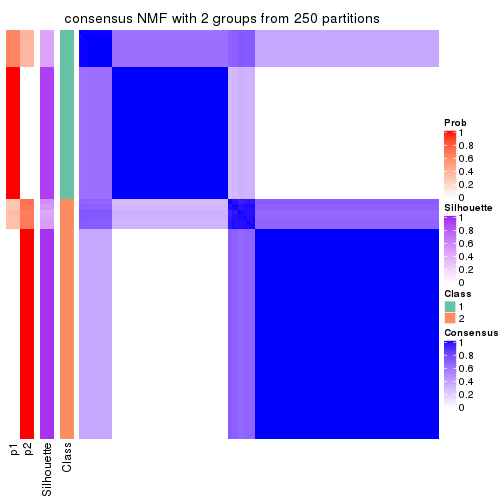</p>

</div>
<div id='tab-SD-NMF-consensus-heatmap-2'>
<pre><code class="r">consensus_heatmap(res, k = 3)
</code></pre>

<p>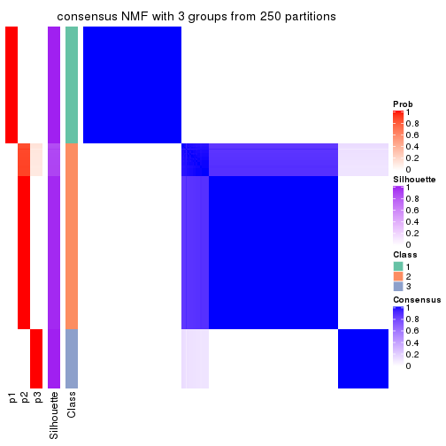</p>

</div>
<div id='tab-SD-NMF-consensus-heatmap-3'>
<pre><code class="r">consensus_heatmap(res, k = 4)
</code></pre>

<p>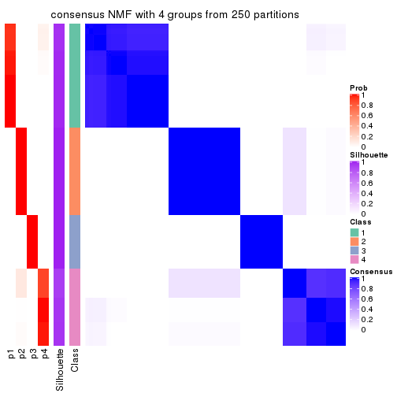</p>

</div>
<div id='tab-SD-NMF-consensus-heatmap-4'>
<pre><code class="r">consensus_heatmap(res, k = 5)
</code></pre>

<p>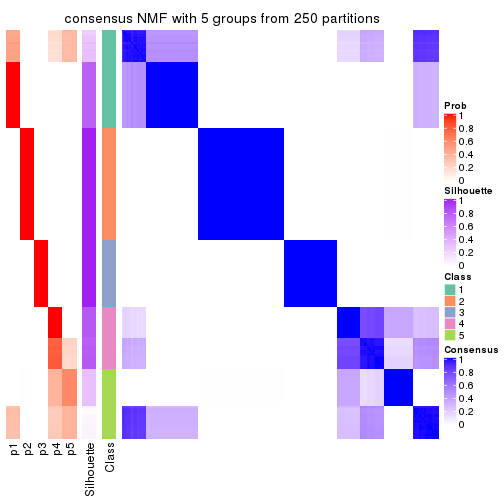</p>

</div>
<div id='tab-SD-NMF-consensus-heatmap-5'>
<pre><code class="r">consensus_heatmap(res, k = 6)
</code></pre>

<p>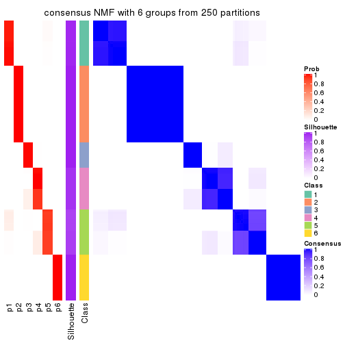</p>

</div>
</div>

Heatmaps for the membership of samples in all partitions to see how consistent they are:


<script>
$( function() {
	$( '#tabs-SD-NMF-membership-heatmap' ).tabs();
} );
</script>
<div id='tabs-SD-NMF-membership-heatmap'>
<ul>
<li><a href='#tab-SD-NMF-membership-heatmap-1'>k = 2</a></li>
<li><a href='#tab-SD-NMF-membership-heatmap-2'>k = 3</a></li>
<li><a href='#tab-SD-NMF-membership-heatmap-3'>k = 4</a></li>
<li><a href='#tab-SD-NMF-membership-heatmap-4'>k = 5</a></li>
<li><a href='#tab-SD-NMF-membership-heatmap-5'>k = 6</a></li>
</ul>
<div id='tab-SD-NMF-membership-heatmap-1'>
<pre><code class="r">membership_heatmap(res, k = 2)
</code></pre>

<p>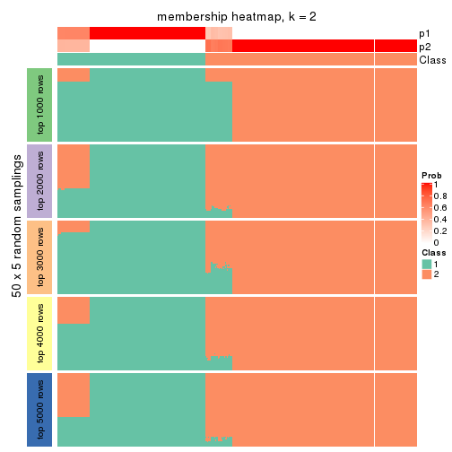</p>

</div>
<div id='tab-SD-NMF-membership-heatmap-2'>
<pre><code class="r">membership_heatmap(res, k = 3)
</code></pre>

<p>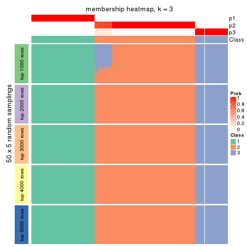</p>

</div>
<div id='tab-SD-NMF-membership-heatmap-3'>
<pre><code class="r">membership_heatmap(res, k = 4)
</code></pre>

<p>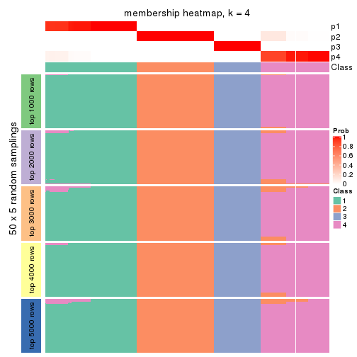</p>

</div>
<div id='tab-SD-NMF-membership-heatmap-4'>
<pre><code class="r">membership_heatmap(res, k = 5)
</code></pre>

<p>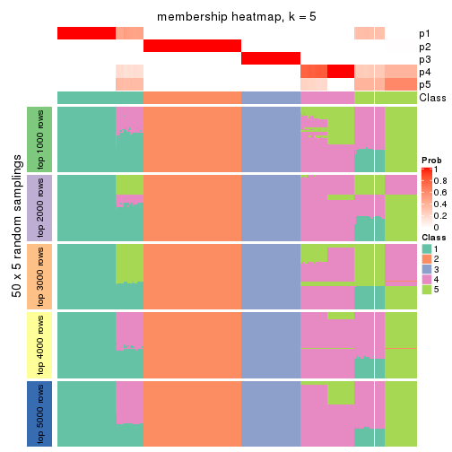</p>

</div>
<div id='tab-SD-NMF-membership-heatmap-5'>
<pre><code class="r">membership_heatmap(res, k = 6)
</code></pre>

<p>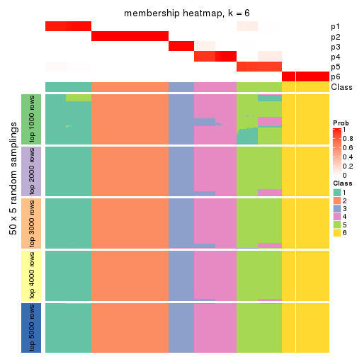</p>

</div>
</div>

As soon as we have had the classes for columns, we can look for signatures
which are significantly different between classes which can be candidate marks
for certain classes. Following are the heatmaps for signatures.


Signature heatmaps where rows are scaled:


<script>
$( function() {
	$( '#tabs-SD-NMF-get-signatures' ).tabs();
} );
</script>
<div id='tabs-SD-NMF-get-signatures'>
<ul>
<li><a href='#tab-SD-NMF-get-signatures-1'>k = 2</a></li>
<li><a href='#tab-SD-NMF-get-signatures-2'>k = 3</a></li>
<li><a href='#tab-SD-NMF-get-signatures-3'>k = 4</a></li>
<li><a href='#tab-SD-NMF-get-signatures-4'>k = 5</a></li>
<li><a href='#tab-SD-NMF-get-signatures-5'>k = 6</a></li>
</ul>
<div id='tab-SD-NMF-get-signatures-1'>
<pre><code class="r">get_signatures(res, k = 2)
</code></pre>

<p>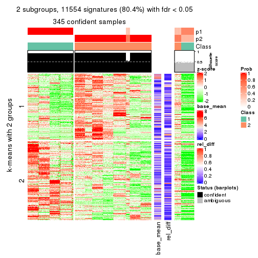</p>

</div>
<div id='tab-SD-NMF-get-signatures-2'>
<pre><code class="r">get_signatures(res, k = 3)
</code></pre>

<p>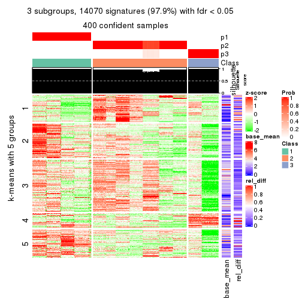</p>

</div>
<div id='tab-SD-NMF-get-signatures-3'>
<pre><code class="r">get_signatures(res, k = 4)
</code></pre>

<p>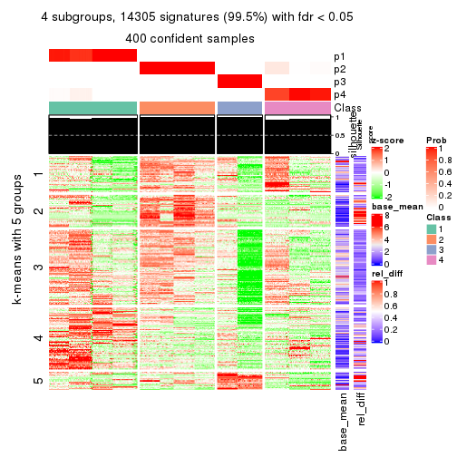</p>

</div>
<div id='tab-SD-NMF-get-signatures-4'>
<pre><code class="r">get_signatures(res, k = 5)
</code></pre>

<p>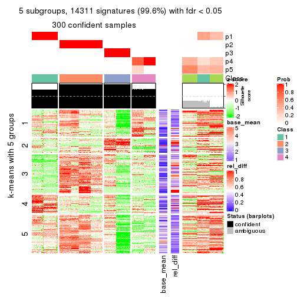</p>

</div>
<div id='tab-SD-NMF-get-signatures-5'>
<pre><code class="r">get_signatures(res, k = 6)
</code></pre>

<p>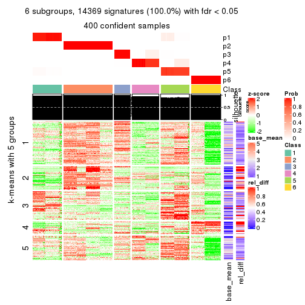</p>

</div>
</div>


Signature heatmaps where rows are not scaled:


<script>
$( function() {
	$( '#tabs-SD-NMF-get-signatures-no-scale' ).tabs();
} );
</script>
<div id='tabs-SD-NMF-get-signatures-no-scale'>
<ul>
<li><a href='#tab-SD-NMF-get-signatures-no-scale-1'>k = 2</a></li>
<li><a href='#tab-SD-NMF-get-signatures-no-scale-2'>k = 3</a></li>
<li><a href='#tab-SD-NMF-get-signatures-no-scale-3'>k = 4</a></li>
<li><a href='#tab-SD-NMF-get-signatures-no-scale-4'>k = 5</a></li>
<li><a href='#tab-SD-NMF-get-signatures-no-scale-5'>k = 6</a></li>
</ul>
<div id='tab-SD-NMF-get-signatures-no-scale-1'>
<pre><code class="r">get_signatures(res, k = 2, scale_rows = FALSE)
</code></pre>

<p>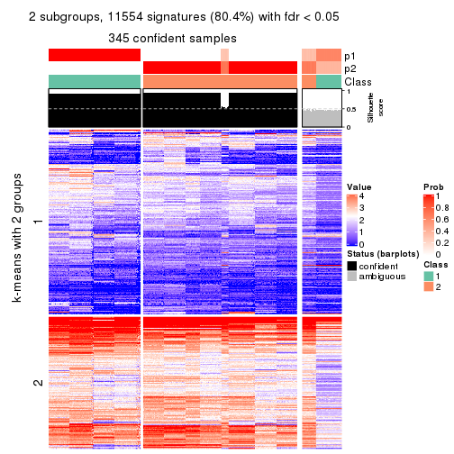</p>

</div>
<div id='tab-SD-NMF-get-signatures-no-scale-2'>
<pre><code class="r">get_signatures(res, k = 3, scale_rows = FALSE)
</code></pre>

<p>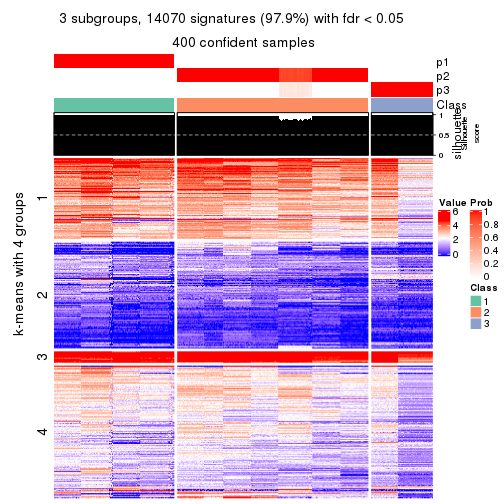</p>

</div>
<div id='tab-SD-NMF-get-signatures-no-scale-3'>
<pre><code class="r">get_signatures(res, k = 4, scale_rows = FALSE)
</code></pre>

<p>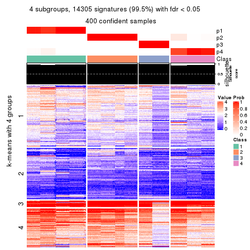</p>

</div>
<div id='tab-SD-NMF-get-signatures-no-scale-4'>
<pre><code class="r">get_signatures(res, k = 5, scale_rows = FALSE)
</code></pre>

<p>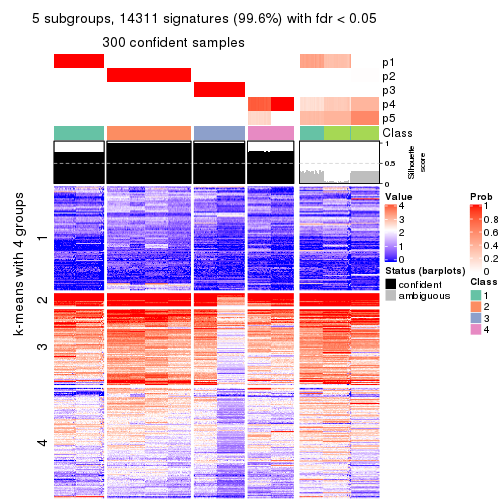</p>

</div>
<div id='tab-SD-NMF-get-signatures-no-scale-5'>
<pre><code class="r">get_signatures(res, k = 6, scale_rows = FALSE)
</code></pre>

<p>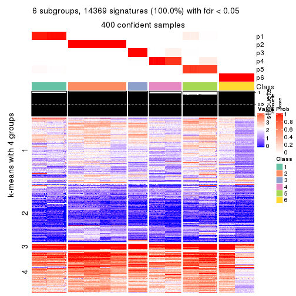</p>

</div>
</div>


Compare the overlap of signatures from different k:

```r
compare_signatures(res)
```

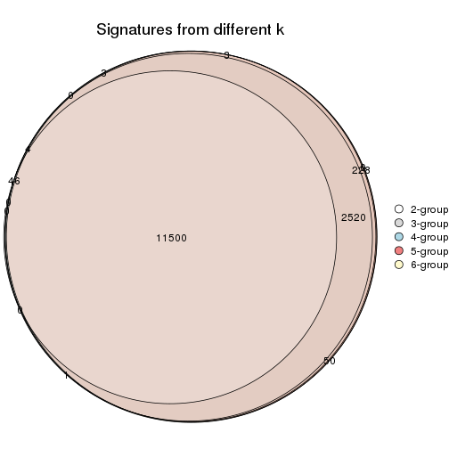

`get_signature()` returns a data frame invisibly. TO get the list of signatures, the function
call should be assigned to a variable explicitly. In following code, if `plot` argument is set
to `FALSE`, no heatmap is plotted while only the differential analysis is performed.

```r
# code only for demonstration
tb = get_signature(res, k = ..., plot = FALSE)
```

An example of the output of `tb` is:

```
#>   which_row         fdr    mean_1    mean_2 scaled_mean_1 scaled_mean_2 km
#> 1        38 0.042760348  8.373488  9.131774    -0.5533452     0.5164555  1
#> 2        40 0.018707592  7.106213  8.469186    -0.6173731     0.5762149  1
#> 3        55 0.019134737 10.221463 11.207825    -0.6159697     0.5749050  1
#> 4        59 0.006059896  5.921854  7.869574    -0.6899429     0.6439467  1
#> 5        60 0.018055526  8.928898 10.211722    -0.6204761     0.5791110  1
#> 6        98 0.009384629 15.714769 14.887706     0.6635654    -0.6193277  2
...
```

The columns in `tb` are:

1. `which_row`: row indices corresponding to the input matrix.
2. `fdr`: FDR for the differential test. 
3. `mean_x`: The mean value in group x.
4. `scaled_mean_x`: The mean value in group x after rows are scaled.
5. `km`: Row groups if k-means clustering is applied to rows.


UMAP plot which shows how samples are separated.


<script>
$( function() {
	$( '#tabs-SD-NMF-dimension-reduction' ).tabs();
} );
</script>
<div id='tabs-SD-NMF-dimension-reduction'>
<ul>
<li><a href='#tab-SD-NMF-dimension-reduction-1'>k = 2</a></li>
<li><a href='#tab-SD-NMF-dimension-reduction-2'>k = 3</a></li>
<li><a href='#tab-SD-NMF-dimension-reduction-3'>k = 4</a></li>
<li><a href='#tab-SD-NMF-dimension-reduction-4'>k = 5</a></li>
<li><a href='#tab-SD-NMF-dimension-reduction-5'>k = 6</a></li>
</ul>
<div id='tab-SD-NMF-dimension-reduction-1'>
<pre><code class="r">dimension_reduction(res, k = 2, method = &quot;UMAP&quot;)
</code></pre>

<p>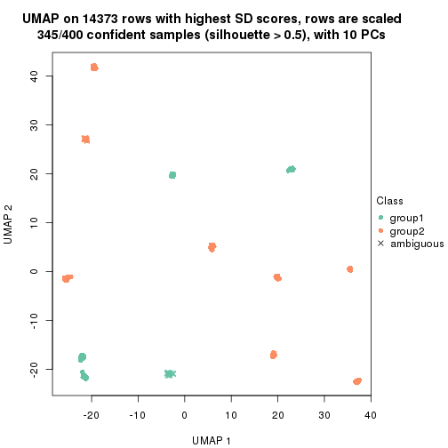</p>

</div>
<div id='tab-SD-NMF-dimension-reduction-2'>
<pre><code class="r">dimension_reduction(res, k = 3, method = &quot;UMAP&quot;)
</code></pre>

<p>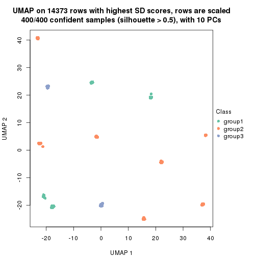</p>

</div>
<div id='tab-SD-NMF-dimension-reduction-3'>
<pre><code class="r">dimension_reduction(res, k = 4, method = &quot;UMAP&quot;)
</code></pre>

<p>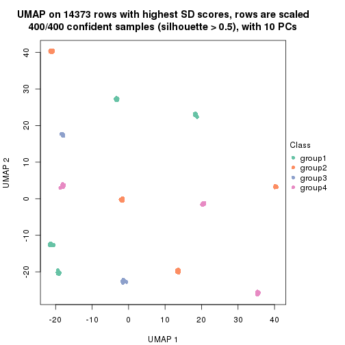</p>

</div>
<div id='tab-SD-NMF-dimension-reduction-4'>
<pre><code class="r">dimension_reduction(res, k = 5, method = &quot;UMAP&quot;)
</code></pre>

<p>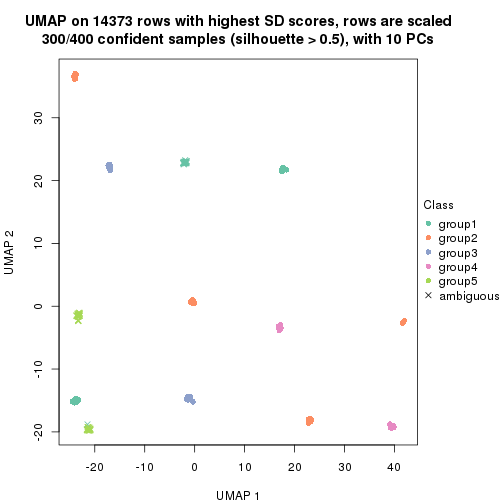</p>

</div>
<div id='tab-SD-NMF-dimension-reduction-5'>
<pre><code class="r">dimension_reduction(res, k = 6, method = &quot;UMAP&quot;)
</code></pre>

<p>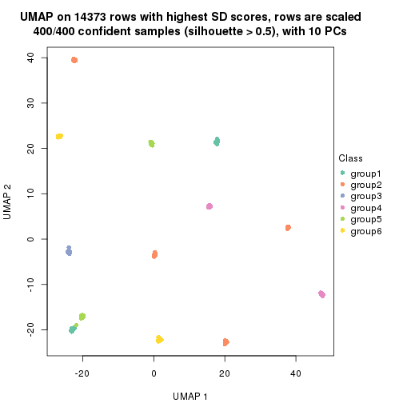</p>

</div>
</div>


Following heatmap shows how subgroups are split when increasing `k`:

```r
collect_classes(res)
```

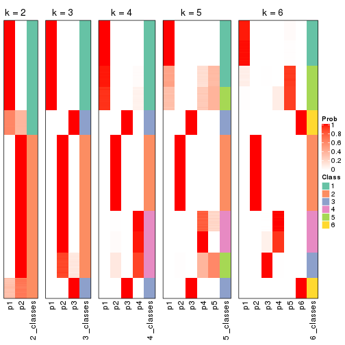


If matrix rows can be associated to genes, consider to use `GO_Enrichment(res,
...)` to perform function enrichment for the signature genes.


 

---------------------------------------------------


### CV:hclust


The object with results only for a single top-value method and a single partition method 
can be extracted as:

```r
res = res_list["CV", "hclust"]
# you can also extract it by
# res = res_list["CV:hclust"]
```

A summary of `res` and all the functions that can be applied to it:

```r
res
```

```
#> A 'ConsensusPartition' object with k = 2, 3, 4, 5, 6.
#>   On a matrix with 14373 rows and 400 columns.
#>   Top rows (1000, 2000, 3000, 4000, 5000) are extracted by 'CV' method.
#>   Subgroups are detected by 'hclust' method.
#>   Performed in total 1250 partitions by row resampling.
#>   Best k for subgroups seems to be 5.
#> 
#> Following methods can be applied to this 'ConsensusPartition' object:
#>  [1] "cola_report"             "collect_classes"         "collect_plots"          
#>  [4] "collect_stats"           "colnames"                "compare_signatures"     
#>  [7] "consensus_heatmap"       "dimension_reduction"     "functional_enrichment"  
#> [10] "get_anno_col"            "get_anno"                "get_classes"            
#> [13] "get_consensus"           "get_matrix"              "get_membership"         
#> [16] "get_param"               "get_signatures"          "get_stats"              
#> [19] "is_best_k"               "is_stable_k"             "membership_heatmap"     
#> [22] "ncol"                    "nrow"                    "plot_ecdf"              
#> [25] "rownames"                "select_partition_number" "show"                   
#> [28] "suggest_best_k"          "test_to_known_factors"
```

`collect_plots()` function collects all the plots made from `res` for all `k` (number of partitions)
into one single page to provide an easy and fast comparison between different `k`.

```r
collect_plots(res)
```

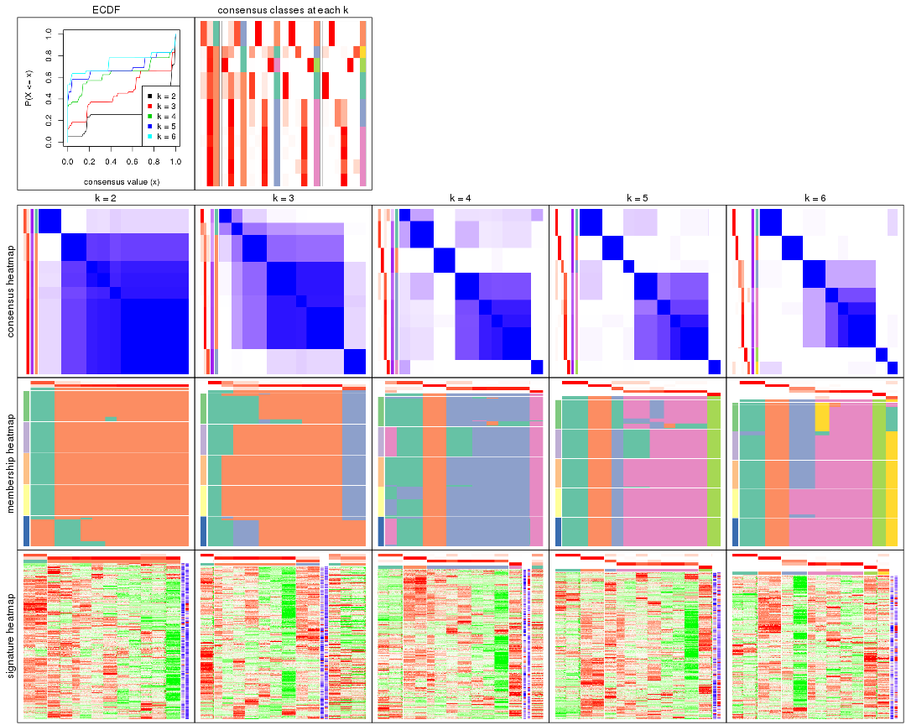

The plots are:

- The first row: a plot of the ECDF (Empirical cumulative distribution
  function) curves of the consensus matrix for each `k` and the heatmap of
  predicted classes for each `k`.
- The second row: heatmaps of the consensus matrix for each `k`.
- The third row: heatmaps of the membership matrix for each `k`.
- The fouth row: heatmaps of the signatures for each `k`.

All the plots in panels can be made by individual functions and they are
plotted later in this section.

`select_partition_number()` produces several plots showing different
statistics for choosing "optimized" `k`. There are following statistics:

- ECDF curves of the consensus matrix for each `k`;
- 1-PAC. [The PAC
  score](https://en.wikipedia.org/wiki/Consensus_clustering#Over-interpretation_potential_of_consensus_clustering)
  measures the proportion of the ambiguous subgrouping.
- Mean silhouette score.
- Concordance. The mean probability of fiting the consensus class ids in all
  partitions.
- Area increased. Denote $A_k$ as the area under the ECDF curve for current
  `k`, the area increased is defined as $A_k - A_{k-1}$.
- Rand index. The percent of pairs of samples that are both in a same cluster
  or both are not in a same cluster in the partition of k and k-1.
- Jaccard index. The ratio of pairs of samples are both in a same cluster in
  the partition of k and k-1 and the pairs of samples are both in a same
  cluster in the partition k or k-1.

The detailed explanations of these statistics can be found in [the cola
vignette](http://bioconductor.org/packages/devel/bioc/vignettes/cola/inst/doc/cola.html#toc_13).

Generally speaking, lower PAC score, higher mean silhouette score or higher
concordance corresponds to better partition. Rand index and Jaccard index
measure how similar the current partition is compared to partition with `k-1`.
If they are too similar, we won't accept `k` is better than `k-1`.

```r
select_partition_number(res)
```

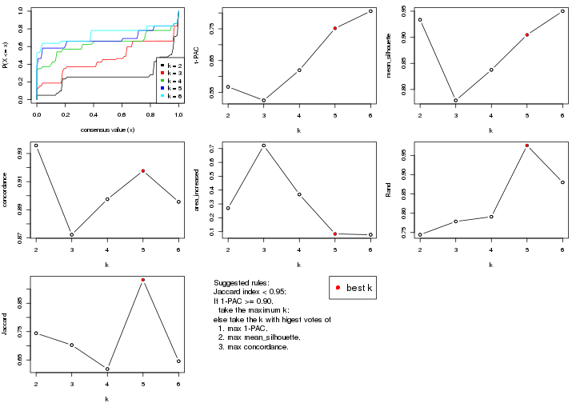

The numeric values for all these statistics can be obtained by `get_stats()`.

```r
get_stats(res)
```

```
#>   k 1-PAC mean_silhouette concordance area_increased  Rand Jaccard
#> 2 2 0.567           0.934       0.936         0.2696 0.744   0.744
#> 3 3 0.525           0.779       0.872         0.7220 0.779   0.703
#> 4 4 0.620           0.838       0.897         0.3683 0.791   0.618
#> 5 5 0.751           0.905       0.918         0.0834 0.976   0.933
#> 6 6 0.805           0.950       0.896         0.0778 0.880   0.646
```

`suggest_best_k()` suggests the best $k$ based on these statistics. The rules are as follows:

- All $k$ with Jaccard index larger than 0.95 are removed because the increase of
  the partition number does not provides enough extra information. If all $k$ are removed,
  the best $k$ is assigned by `NA`.
- For $k$ with 1-PAC larger than 0.9, the maximal $k$ is taken as the "best k". Other $k$ is called "optional k".
- If it does not fit the second rule. The $k$ with the highest vote of highest
  1-PAC, mean silhouette and concordance is taken as the "best k".

```r
suggest_best_k(res)
```

```
#> [1] 5
```


Following shows the table of the partitions (You need to click the **show/hide
code output** link to see it). The membership matrix (columns with name `p*`)
is inferred by
[`clue::cl_consensus()`](https://www.rdocumentation.org/link/cl_consensus?package=clue)
function with the `SE` method. Basically the value in the membership matrix
represents the probability to belong to a certain group. The finall class
label for an item is determined with the group with highest probability it
belongs to.

In `get_classes()` function, the entropy is calculated from the membership
matrix and the silhouette score is calculated from the consensus matrix.


<script>
$( function() {
	$( '#tabs-CV-hclust-get-classes' ).tabs();
} );
</script>
<div id='tabs-CV-hclust-get-classes'>
<ul>
<li><a href='#tab-CV-hclust-get-classes-1'>k = 2</a></li>
<li><a href='#tab-CV-hclust-get-classes-2'>k = 3</a></li>
<li><a href='#tab-CV-hclust-get-classes-3'>k = 4</a></li>
<li><a href='#tab-CV-hclust-get-classes-4'>k = 5</a></li>
<li><a href='#tab-CV-hclust-get-classes-5'>k = 6</a></li>
</ul>

<div id='tab-CV-hclust-get-classes-1'>
<p><a id='tab-CV-hclust-get-classes-1-a' style='color:#0366d6' href='#'>show/hide code output</a></p>
<pre><code class="r">cbind(get_classes(res, k = 2), get_membership(res, k = 2))
</code></pre>

<pre><code>#&gt;            class entropy silhouette    p1    p2
#&gt; SRR1661716     2   0.000      0.948 0.000 1.000
#&gt; SRR1661717     2   0.000      0.948 0.000 1.000
#&gt; SRR1661718     2   0.000      0.948 0.000 1.000
#&gt; SRR1661719     2   0.000      0.948 0.000 1.000
#&gt; SRR1661720     2   0.000      0.948 0.000 1.000
#&gt; SRR1661721     2   0.000      0.948 0.000 1.000
#&gt; SRR1661722     2   0.000      0.948 0.000 1.000
#&gt; SRR1661723     2   0.000      0.948 0.000 1.000
#&gt; SRR1661724     2   0.000      0.948 0.000 1.000
#&gt; SRR1661725     2   0.000      0.948 0.000 1.000
#&gt; SRR1661726     2   0.000      0.948 0.000 1.000
#&gt; SRR1661727     2   0.000      0.948 0.000 1.000
#&gt; SRR1661728     2   0.000      0.948 0.000 1.000
#&gt; SRR1661729     2   0.000      0.948 0.000 1.000
#&gt; SRR1661730     2   0.000      0.948 0.000 1.000
#&gt; SRR1661731     2   0.000      0.948 0.000 1.000
#&gt; SRR1661732     2   0.000      0.948 0.000 1.000
#&gt; SRR1661733     2   0.000      0.948 0.000 1.000
#&gt; SRR1661734     2   0.000      0.948 0.000 1.000
#&gt; SRR1661735     2   0.000      0.948 0.000 1.000
#&gt; SRR1661736     2   0.204      0.926 0.032 0.968
#&gt; SRR1661737     2   0.204      0.926 0.032 0.968
#&gt; SRR1661738     2   0.204      0.926 0.032 0.968
#&gt; SRR1661739     2   0.204      0.926 0.032 0.968
#&gt; SRR1661740     2   0.204      0.926 0.032 0.968
#&gt; SRR1661741     2   0.204      0.926 0.032 0.968
#&gt; SRR1661742     2   0.204      0.926 0.032 0.968
#&gt; SRR1661743     2   0.204      0.926 0.032 0.968
#&gt; SRR1661744     2   0.204      0.926 0.032 0.968
#&gt; SRR1661745     2   0.204      0.926 0.032 0.968
#&gt; SRR1661746     2   0.204      0.926 0.032 0.968
#&gt; SRR1661747     2   0.204      0.926 0.032 0.968
#&gt; SRR1661748     2   0.204      0.926 0.032 0.968
#&gt; SRR1661749     2   0.204      0.926 0.032 0.968
#&gt; SRR1661750     2   0.204      0.926 0.032 0.968
#&gt; SRR1661751     2   0.204      0.926 0.032 0.968
#&gt; SRR1661752     2   0.204      0.926 0.032 0.968
#&gt; SRR1661753     2   0.204      0.926 0.032 0.968
#&gt; SRR1661754     2   0.204      0.926 0.032 0.968
#&gt; SRR1661755     2   0.204      0.926 0.032 0.968
#&gt; SRR1661756     2   0.204      0.926 0.032 0.968
#&gt; SRR1661757     2   0.204      0.926 0.032 0.968
#&gt; SRR1661758     2   0.204      0.926 0.032 0.968
#&gt; SRR1661759     2   0.204      0.926 0.032 0.968
#&gt; SRR1661760     2   0.204      0.926 0.032 0.968
#&gt; SRR1661761     2   0.204      0.926 0.032 0.968
#&gt; SRR1661762     2   0.204      0.926 0.032 0.968
#&gt; SRR1661763     2   0.204      0.926 0.032 0.968
#&gt; SRR1661764     2   0.204      0.926 0.032 0.968
#&gt; SRR1661766     1   0.671      1.000 0.824 0.176
#&gt; SRR1661767     1   0.671      1.000 0.824 0.176
#&gt; SRR1661768     1   0.671      1.000 0.824 0.176
#&gt; SRR1661769     1   0.671      1.000 0.824 0.176
#&gt; SRR1661770     1   0.671      1.000 0.824 0.176
#&gt; SRR1661771     1   0.671      1.000 0.824 0.176
#&gt; SRR1661772     1   0.671      1.000 0.824 0.176
#&gt; SRR1661773     1   0.671      1.000 0.824 0.176
#&gt; SRR1661774     1   0.671      1.000 0.824 0.176
#&gt; SRR1661775     1   0.671      1.000 0.824 0.176
#&gt; SRR1661776     1   0.671      1.000 0.824 0.176
#&gt; SRR1661777     1   0.671      1.000 0.824 0.176
#&gt; SRR1661778     1   0.671      1.000 0.824 0.176
#&gt; SRR1661779     1   0.671      1.000 0.824 0.176
#&gt; SRR1661780     1   0.671      1.000 0.824 0.176
#&gt; SRR1661781     1   0.671      1.000 0.824 0.176
#&gt; SRR1661782     1   0.671      1.000 0.824 0.176
#&gt; SRR1661783     1   0.671      1.000 0.824 0.176
#&gt; SRR1661784     1   0.671      1.000 0.824 0.176
#&gt; SRR1661785     1   0.671      1.000 0.824 0.176
#&gt; SRR1661786     1   0.671      1.000 0.824 0.176
#&gt; SRR1661787     1   0.671      1.000 0.824 0.176
#&gt; SRR1661788     1   0.671      1.000 0.824 0.176
#&gt; SRR1661789     1   0.671      1.000 0.824 0.176
#&gt; SRR1661790     1   0.671      1.000 0.824 0.176
#&gt; SRR1661791     1   0.671      1.000 0.824 0.176
#&gt; SRR1661792     1   0.671      1.000 0.824 0.176
#&gt; SRR1661793     1   0.671      1.000 0.824 0.176
#&gt; SRR1661794     1   0.671      1.000 0.824 0.176
#&gt; SRR1661795     1   0.671      1.000 0.824 0.176
#&gt; SRR1661796     1   0.671      1.000 0.824 0.176
#&gt; SRR1661797     1   0.671      1.000 0.824 0.176
#&gt; SRR1661798     1   0.671      1.000 0.824 0.176
#&gt; SRR1661799     1   0.671      1.000 0.824 0.176
#&gt; SRR1661800     1   0.671      1.000 0.824 0.176
#&gt; SRR1661801     1   0.671      1.000 0.824 0.176
#&gt; SRR1661802     1   0.671      1.000 0.824 0.176
#&gt; SRR1661803     1   0.671      1.000 0.824 0.176
#&gt; SRR1661804     1   0.671      1.000 0.824 0.176
#&gt; SRR1661805     1   0.671      1.000 0.824 0.176
#&gt; SRR1661806     1   0.671      1.000 0.824 0.176
#&gt; SRR1661807     1   0.671      1.000 0.824 0.176
#&gt; SRR1661808     1   0.671      1.000 0.824 0.176
#&gt; SRR1661809     1   0.671      1.000 0.824 0.176
#&gt; SRR1661810     1   0.671      1.000 0.824 0.176
#&gt; SRR1661811     1   0.671      1.000 0.824 0.176
#&gt; SRR1661812     1   0.671      1.000 0.824 0.176
#&gt; SRR1661813     1   0.671      1.000 0.824 0.176
#&gt; SRR1661814     1   0.671      1.000 0.824 0.176
#&gt; SRR1661815     1   0.671      1.000 0.824 0.176
#&gt; SRR1661816     1   0.671      1.000 0.824 0.176
#&gt; SRR1661817     1   0.671      1.000 0.824 0.176
#&gt; SRR1661818     1   0.671      1.000 0.824 0.176
#&gt; SRR1661819     1   0.671      1.000 0.824 0.176
#&gt; SRR1661820     1   0.671      1.000 0.824 0.176
#&gt; SRR1661821     1   0.671      1.000 0.824 0.176
#&gt; SRR1661822     1   0.671      1.000 0.824 0.176
#&gt; SRR1661823     1   0.671      1.000 0.824 0.176
#&gt; SRR1661824     1   0.671      1.000 0.824 0.176
#&gt; SRR1661825     1   0.671      1.000 0.824 0.176
#&gt; SRR1661826     2   0.671      0.834 0.176 0.824
#&gt; SRR1661827     2   0.671      0.834 0.176 0.824
#&gt; SRR1661828     2   0.671      0.834 0.176 0.824
#&gt; SRR1661829     2   0.671      0.834 0.176 0.824
#&gt; SRR1661830     2   0.671      0.834 0.176 0.824
#&gt; SRR1661831     2   0.671      0.834 0.176 0.824
#&gt; SRR1661832     2   0.671      0.834 0.176 0.824
#&gt; SRR1661833     2   0.671      0.834 0.176 0.824
#&gt; SRR1661834     2   0.671      0.834 0.176 0.824
#&gt; SRR1661835     2   0.671      0.834 0.176 0.824
#&gt; SRR1661836     2   0.671      0.834 0.176 0.824
#&gt; SRR1661837     2   0.671      0.834 0.176 0.824
#&gt; SRR1661838     2   0.671      0.834 0.176 0.824
#&gt; SRR1661839     2   0.671      0.834 0.176 0.824
#&gt; SRR1661840     2   0.671      0.834 0.176 0.824
#&gt; SRR1661841     2   0.671      0.834 0.176 0.824
#&gt; SRR1661843     2   0.671      0.834 0.176 0.824
#&gt; SRR1661844     2   0.671      0.834 0.176 0.824
#&gt; SRR1661845     2   0.671      0.834 0.176 0.824
#&gt; SRR1661846     2   0.671      0.834 0.176 0.824
#&gt; SRR1661847     2   0.671      0.834 0.176 0.824
#&gt; SRR1661848     2   0.671      0.834 0.176 0.824
#&gt; SRR1661849     2   0.671      0.834 0.176 0.824
#&gt; SRR1661850     2   0.671      0.834 0.176 0.824
#&gt; SRR1661851     2   0.671      0.834 0.176 0.824
#&gt; SRR1661852     2   0.671      0.834 0.176 0.824
#&gt; SRR1661853     2   0.671      0.834 0.176 0.824
#&gt; SRR1661854     2   0.671      0.834 0.176 0.824
#&gt; SRR1661855     2   0.671      0.834 0.176 0.824
#&gt; SRR1661856     2   0.000      0.948 0.000 1.000
#&gt; SRR1661857     2   0.000      0.948 0.000 1.000
#&gt; SRR1661858     2   0.000      0.948 0.000 1.000
#&gt; SRR1661859     2   0.000      0.948 0.000 1.000
#&gt; SRR1661860     2   0.000      0.948 0.000 1.000
#&gt; SRR1661861     2   0.000      0.948 0.000 1.000
#&gt; SRR1661862     2   0.000      0.948 0.000 1.000
#&gt; SRR1661863     2   0.000      0.948 0.000 1.000
#&gt; SRR1661864     2   0.000      0.948 0.000 1.000
#&gt; SRR1661865     2   0.000      0.948 0.000 1.000
#&gt; SRR1661866     2   0.000      0.948 0.000 1.000
#&gt; SRR1661867     2   0.000      0.948 0.000 1.000
#&gt; SRR1661868     2   0.000      0.948 0.000 1.000
#&gt; SRR1661869     2   0.000      0.948 0.000 1.000
#&gt; SRR1661870     2   0.000      0.948 0.000 1.000
#&gt; SRR1661871     2   0.000      0.948 0.000 1.000
#&gt; SRR1661872     2   0.000      0.948 0.000 1.000
#&gt; SRR1661873     2   0.000      0.948 0.000 1.000
#&gt; SRR1661874     2   0.000      0.948 0.000 1.000
#&gt; SRR1661875     2   0.000      0.948 0.000 1.000
#&gt; SRR1661876     2   0.000      0.948 0.000 1.000
#&gt; SRR1661877     2   0.000      0.948 0.000 1.000
#&gt; SRR1661878     2   0.000      0.948 0.000 1.000
#&gt; SRR1661879     2   0.000      0.948 0.000 1.000
#&gt; SRR1661880     2   0.000      0.948 0.000 1.000
#&gt; SRR1661881     2   0.000      0.948 0.000 1.000
#&gt; SRR1661882     2   0.000      0.948 0.000 1.000
#&gt; SRR1661883     2   0.000      0.948 0.000 1.000
#&gt; SRR1661884     2   0.000      0.948 0.000 1.000
#&gt; SRR1661885     2   0.000      0.948 0.000 1.000
#&gt; SRR1661886     2   0.000      0.948 0.000 1.000
#&gt; SRR1661887     2   0.000      0.948 0.000 1.000
#&gt; SRR1661888     2   0.000      0.948 0.000 1.000
#&gt; SRR1661889     2   0.000      0.948 0.000 1.000
#&gt; SRR1661890     2   0.000      0.948 0.000 1.000
#&gt; SRR1661891     2   0.000      0.948 0.000 1.000
#&gt; SRR1661892     2   0.671      0.834 0.176 0.824
#&gt; SRR1661893     2   0.671      0.834 0.176 0.824
#&gt; SRR1661894     2   0.671      0.834 0.176 0.824
#&gt; SRR1661895     2   0.671      0.834 0.176 0.824
#&gt; SRR1661896     2   0.671      0.834 0.176 0.824
#&gt; SRR1661897     2   0.671      0.834 0.176 0.824
#&gt; SRR1661898     2   0.671      0.834 0.176 0.824
#&gt; SRR1661899     2   0.671      0.834 0.176 0.824
#&gt; SRR1661900     2   0.671      0.834 0.176 0.824
#&gt; SRR1661901     2   0.671      0.834 0.176 0.824
#&gt; SRR1661902     2   0.671      0.834 0.176 0.824
#&gt; SRR1661903     2   0.671      0.834 0.176 0.824
#&gt; SRR1661904     2   0.671      0.834 0.176 0.824
#&gt; SRR1661905     2   0.671      0.834 0.176 0.824
#&gt; SRR1661906     2   0.671      0.834 0.176 0.824
#&gt; SRR1661907     2   0.671      0.834 0.176 0.824
#&gt; SRR1661908     2   0.671      0.834 0.176 0.824
#&gt; SRR1661909     2   0.671      0.834 0.176 0.824
#&gt; SRR1661910     2   0.671      0.834 0.176 0.824
#&gt; SRR1661911     2   0.671      0.834 0.176 0.824
#&gt; SRR1661912     2   0.671      0.834 0.176 0.824
#&gt; SRR1661913     2   0.671      0.834 0.176 0.824
#&gt; SRR1661914     2   0.671      0.834 0.176 0.824
#&gt; SRR1661915     2   0.671      0.834 0.176 0.824
#&gt; SRR1661916     2   0.671      0.834 0.176 0.824
#&gt; SRR1661917     2   0.671      0.834 0.176 0.824
#&gt; SRR1661918     2   0.671      0.834 0.176 0.824
#&gt; SRR1661919     2   0.671      0.834 0.176 0.824
#&gt; SRR1661920     2   0.671      0.834 0.176 0.824
#&gt; SRR1661921     2   0.671      0.834 0.176 0.824
#&gt; SRR1661922     2   0.671      0.834 0.176 0.824
#&gt; SRR1661923     2   0.671      0.834 0.176 0.824
#&gt; SRR1661924     2   0.671      0.834 0.176 0.824
#&gt; SRR1661925     2   0.671      0.834 0.176 0.824
#&gt; SRR1661926     2   0.671      0.834 0.176 0.824
#&gt; SRR1661927     2   0.671      0.834 0.176 0.824
#&gt; SRR1661928     2   0.000      0.948 0.000 1.000
#&gt; SRR1661929     2   0.000      0.948 0.000 1.000
#&gt; SRR1661930     2   0.000      0.948 0.000 1.000
#&gt; SRR1661931     2   0.000      0.948 0.000 1.000
#&gt; SRR1661932     2   0.000      0.948 0.000 1.000
#&gt; SRR1661933     2   0.000      0.948 0.000 1.000
#&gt; SRR1661934     2   0.000      0.948 0.000 1.000
#&gt; SRR1661935     2   0.000      0.948 0.000 1.000
#&gt; SRR1661936     2   0.000      0.948 0.000 1.000
#&gt; SRR1661937     2   0.000      0.948 0.000 1.000
#&gt; SRR1661938     2   0.000      0.948 0.000 1.000
#&gt; SRR1661939     2   0.000      0.948 0.000 1.000
#&gt; SRR1661940     2   0.000      0.948 0.000 1.000
#&gt; SRR1661941     2   0.000      0.948 0.000 1.000
#&gt; SRR1661942     2   0.000      0.948 0.000 1.000
#&gt; SRR1661943     2   0.000      0.948 0.000 1.000
#&gt; SRR1661944     2   0.000      0.948 0.000 1.000
#&gt; SRR1661945     2   0.000      0.948 0.000 1.000
#&gt; SRR1661946     2   0.000      0.948 0.000 1.000
#&gt; SRR1661947     2   0.000      0.948 0.000 1.000
#&gt; SRR1661948     2   0.000      0.948 0.000 1.000
#&gt; SRR1661949     2   0.000      0.948 0.000 1.000
#&gt; SRR1661950     2   0.000      0.948 0.000 1.000
#&gt; SRR1661951     2   0.000      0.948 0.000 1.000
#&gt; SRR1661952     2   0.000      0.948 0.000 1.000
#&gt; SRR1661953     2   0.000      0.948 0.000 1.000
#&gt; SRR1661954     2   0.000      0.948 0.000 1.000
#&gt; SRR1661955     2   0.000      0.948 0.000 1.000
#&gt; SRR1661956     2   0.000      0.948 0.000 1.000
#&gt; SRR1661957     2   0.000      0.948 0.000 1.000
#&gt; SRR1661958     2   0.000      0.948 0.000 1.000
#&gt; SRR1661959     2   0.000      0.948 0.000 1.000
#&gt; SRR1661960     2   0.000      0.948 0.000 1.000
#&gt; SRR1661961     2   0.000      0.948 0.000 1.000
#&gt; SRR1661962     2   0.000      0.948 0.000 1.000
#&gt; SRR1661963     2   0.000      0.948 0.000 1.000
#&gt; SRR1661964     2   0.000      0.948 0.000 1.000
#&gt; SRR1661965     2   0.000      0.948 0.000 1.000
#&gt; SRR1661966     2   0.000      0.948 0.000 1.000
#&gt; SRR1661967     2   0.000      0.948 0.000 1.000
#&gt; SRR1661968     2   0.000      0.948 0.000 1.000
#&gt; SRR1661969     2   0.000      0.948 0.000 1.000
#&gt; SRR1661970     2   0.000      0.948 0.000 1.000
#&gt; SRR1661971     2   0.000      0.948 0.000 1.000
#&gt; SRR1661972     2   0.000      0.948 0.000 1.000
#&gt; SRR1661973     2   0.000      0.948 0.000 1.000
#&gt; SRR1661974     2   0.000      0.948 0.000 1.000
#&gt; SRR1661975     2   0.000      0.948 0.000 1.000
#&gt; SRR1661976     2   0.000      0.948 0.000 1.000
#&gt; SRR1661977     2   0.000      0.948 0.000 1.000
#&gt; SRR1661978     2   0.000      0.948 0.000 1.000
#&gt; SRR1661979     2   0.000      0.948 0.000 1.000
#&gt; SRR1661980     2   0.000      0.948 0.000 1.000
#&gt; SRR1661981     2   0.000      0.948 0.000 1.000
#&gt; SRR1661982     2   0.000      0.948 0.000 1.000
#&gt; SRR1661983     2   0.000      0.948 0.000 1.000
#&gt; SRR1661984     2   0.000      0.948 0.000 1.000
#&gt; SRR1661985     2   0.000      0.948 0.000 1.000
#&gt; SRR1661986     2   0.000      0.948 0.000 1.000
#&gt; SRR1661987     2   0.000      0.948 0.000 1.000
#&gt; SRR1661988     2   0.278      0.933 0.048 0.952
#&gt; SRR1661989     2   0.278      0.933 0.048 0.952
#&gt; SRR1661990     2   0.278      0.933 0.048 0.952
#&gt; SRR1661991     2   0.278      0.933 0.048 0.952
#&gt; SRR1661992     2   0.278      0.933 0.048 0.952
#&gt; SRR1661993     2   0.278      0.933 0.048 0.952
#&gt; SRR1661994     2   0.278      0.933 0.048 0.952
#&gt; SRR1661995     2   0.278      0.933 0.048 0.952
#&gt; SRR1661996     2   0.278      0.933 0.048 0.952
#&gt; SRR1661997     2   0.278      0.933 0.048 0.952
#&gt; SRR1661998     2   0.278      0.933 0.048 0.952
#&gt; SRR1661999     2   0.278      0.933 0.048 0.952
#&gt; SRR1662000     2   0.278      0.933 0.048 0.952
#&gt; SRR1662001     2   0.278      0.933 0.048 0.952
#&gt; SRR1662002     2   0.278      0.933 0.048 0.952
#&gt; SRR1662003     2   0.278      0.933 0.048 0.952
#&gt; SRR1662004     2   0.278      0.933 0.048 0.952
#&gt; SRR1662005     2   0.278      0.933 0.048 0.952
#&gt; SRR1662006     2   0.278      0.933 0.048 0.952
#&gt; SRR1662007     2   0.278      0.933 0.048 0.952
#&gt; SRR1662008     2   0.278      0.933 0.048 0.952
#&gt; SRR1662009     2   0.278      0.933 0.048 0.952
#&gt; SRR1662010     2   0.278      0.933 0.048 0.952
#&gt; SRR1662011     2   0.278      0.933 0.048 0.952
#&gt; SRR1662012     2   0.278      0.933 0.048 0.952
#&gt; SRR1662013     2   0.278      0.933 0.048 0.952
#&gt; SRR1662014     2   0.278      0.933 0.048 0.952
#&gt; SRR1662015     2   0.278      0.933 0.048 0.952
#&gt; SRR1662016     2   0.278      0.933 0.048 0.952
#&gt; SRR1662017     2   0.278      0.933 0.048 0.952
#&gt; SRR1662018     2   0.000      0.948 0.000 1.000
#&gt; SRR1662019     2   0.000      0.948 0.000 1.000
#&gt; SRR1662020     2   0.000      0.948 0.000 1.000
#&gt; SRR1662021     2   0.000      0.948 0.000 1.000
#&gt; SRR1662022     2   0.000      0.948 0.000 1.000
#&gt; SRR1662023     2   0.000      0.948 0.000 1.000
#&gt; SRR1662024     2   0.000      0.948 0.000 1.000
#&gt; SRR1662025     2   0.000      0.948 0.000 1.000
#&gt; SRR1662026     2   0.000      0.948 0.000 1.000
#&gt; SRR1662027     2   0.000      0.948 0.000 1.000
#&gt; SRR1662028     2   0.000      0.948 0.000 1.000
#&gt; SRR1662029     2   0.000      0.948 0.000 1.000
#&gt; SRR1662030     2   0.000      0.948 0.000 1.000
#&gt; SRR1662031     2   0.000      0.948 0.000 1.000
#&gt; SRR1662032     2   0.000      0.948 0.000 1.000
#&gt; SRR1662033     2   0.000      0.948 0.000 1.000
#&gt; SRR1662034     2   0.000      0.948 0.000 1.000
#&gt; SRR1662035     2   0.000      0.948 0.000 1.000
#&gt; SRR1662036     2   0.000      0.948 0.000 1.000
#&gt; SRR1662037     2   0.000      0.948 0.000 1.000
#&gt; SRR1662038     2   0.000      0.948 0.000 1.000
#&gt; SRR1662039     2   0.000      0.948 0.000 1.000
#&gt; SRR1662040     2   0.000      0.948 0.000 1.000
#&gt; SRR1662041     2   0.000      0.948 0.000 1.000
#&gt; SRR1662042     2   0.000      0.948 0.000 1.000
#&gt; SRR1662043     2   0.000      0.948 0.000 1.000
#&gt; SRR1662044     2   0.000      0.948 0.000 1.000
#&gt; SRR1662045     2   0.000      0.948 0.000 1.000
#&gt; SRR1662046     2   0.000      0.948 0.000 1.000
#&gt; SRR1662047     2   0.000      0.948 0.000 1.000
#&gt; SRR1662048     2   0.000      0.948 0.000 1.000
#&gt; SRR1662049     2   0.000      0.948 0.000 1.000
#&gt; SRR1662050     2   0.000      0.948 0.000 1.000
#&gt; SRR1662051     2   0.000      0.948 0.000 1.000
#&gt; SRR1662052     2   0.000      0.948 0.000 1.000
#&gt; SRR1662053     2   0.000      0.948 0.000 1.000
#&gt; SRR1662054     2   0.000      0.948 0.000 1.000
#&gt; SRR1662055     2   0.000      0.948 0.000 1.000
#&gt; SRR1662056     2   0.000      0.948 0.000 1.000
#&gt; SRR1662057     2   0.000      0.948 0.000 1.000
#&gt; SRR1662058     2   0.000      0.948 0.000 1.000
#&gt; SRR1662059     2   0.000      0.948 0.000 1.000
#&gt; SRR1662060     2   0.000      0.948 0.000 1.000
#&gt; SRR1662061     2   0.000      0.948 0.000 1.000
#&gt; SRR1662062     2   0.000      0.948 0.000 1.000
#&gt; SRR1662063     2   0.000      0.948 0.000 1.000
#&gt; SRR1662064     2   0.000      0.948 0.000 1.000
#&gt; SRR1662065     2   0.000      0.948 0.000 1.000
#&gt; SRR1662066     2   0.000      0.948 0.000 1.000
#&gt; SRR1662067     2   0.000      0.948 0.000 1.000
#&gt; SRR1662068     2   0.000      0.948 0.000 1.000
#&gt; SRR1662069     2   0.000      0.948 0.000 1.000
#&gt; SRR1662070     2   0.000      0.948 0.000 1.000
#&gt; SRR1662071     2   0.000      0.948 0.000 1.000
#&gt; SRR1662072     2   0.000      0.948 0.000 1.000
#&gt; SRR1662073     2   0.000      0.948 0.000 1.000
#&gt; SRR1662074     2   0.000      0.948 0.000 1.000
#&gt; SRR1662075     2   0.000      0.948 0.000 1.000
#&gt; SRR1662076     2   0.000      0.948 0.000 1.000
#&gt; SRR1662077     2   0.000      0.948 0.000 1.000
#&gt; SRR1662078     2   0.000      0.948 0.000 1.000
#&gt; SRR1662079     2   0.000      0.948 0.000 1.000
#&gt; SRR1662080     2   0.000      0.948 0.000 1.000
#&gt; SRR1662081     2   0.000      0.948 0.000 1.000
#&gt; SRR1662082     2   0.000      0.948 0.000 1.000
#&gt; SRR1662083     2   0.000      0.948 0.000 1.000
#&gt; SRR1662084     2   0.224      0.936 0.036 0.964
#&gt; SRR1662085     2   0.224      0.936 0.036 0.964
#&gt; SRR1662086     2   0.224      0.936 0.036 0.964
#&gt; SRR1662087     2   0.224      0.936 0.036 0.964
#&gt; SRR1662088     2   0.224      0.936 0.036 0.964
#&gt; SRR1662089     2   0.224      0.936 0.036 0.964
#&gt; SRR1662090     2   0.224      0.936 0.036 0.964
#&gt; SRR1662091     2   0.224      0.936 0.036 0.964
#&gt; SRR1662092     2   0.224      0.936 0.036 0.964
#&gt; SRR1662093     2   0.224      0.936 0.036 0.964
#&gt; SRR1662094     2   0.224      0.936 0.036 0.964
#&gt; SRR1662095     2   0.224      0.936 0.036 0.964
#&gt; SRR1662096     2   0.224      0.936 0.036 0.964
#&gt; SRR1662097     2   0.224      0.936 0.036 0.964
#&gt; SRR1662098     2   0.224      0.936 0.036 0.964
#&gt; SRR1662099     2   0.224      0.936 0.036 0.964
#&gt; SRR1662100     2   0.224      0.936 0.036 0.964
#&gt; SRR1662101     2   0.224      0.936 0.036 0.964
#&gt; SRR1662102     2   0.224      0.936 0.036 0.964
#&gt; SRR1662103     2   0.224      0.936 0.036 0.964
#&gt; SRR1662104     2   0.224      0.936 0.036 0.964
#&gt; SRR1662105     2   0.224      0.936 0.036 0.964
#&gt; SRR1662106     2   0.224      0.936 0.036 0.964
#&gt; SRR1662107     2   0.224      0.936 0.036 0.964
#&gt; SRR1662108     2   0.224      0.936 0.036 0.964
#&gt; SRR1662109     2   0.224      0.936 0.036 0.964
#&gt; SRR1662110     2   0.224      0.936 0.036 0.964
#&gt; SRR1662111     2   0.671      0.834 0.176 0.824
#&gt; SRR1662112     2   0.224      0.936 0.036 0.964
#&gt; SRR1662113     2   0.224      0.936 0.036 0.964
#&gt; SRR1662114     2   0.224      0.936 0.036 0.964
#&gt; SRR1662115     2   0.224      0.936 0.036 0.964
#&gt; SRR1662116     2   0.224      0.936 0.036 0.964
#&gt; SRR1662117     2   0.224      0.936 0.036 0.964
</code></pre>

<script>
$('#tab-CV-hclust-get-classes-1-a').parent().next().next().hide();
$('#tab-CV-hclust-get-classes-1-a').click(function(){
  $('#tab-CV-hclust-get-classes-1-a').parent().next().next().toggle();
  return(false);
});
</script>
</div>

<div id='tab-CV-hclust-get-classes-2'>
<p><a id='tab-CV-hclust-get-classes-2-a' style='color:#0366d6' href='#'>show/hide code output</a></p>
<pre><code class="r">cbind(get_classes(res, k = 3), get_membership(res, k = 3))
</code></pre>

<pre><code>#&gt;            class entropy silhouette    p1    p2    p3
#&gt; SRR1661716     2   0.129      0.869 0.032 0.968 0.000
#&gt; SRR1661717     2   0.129      0.869 0.032 0.968 0.000
#&gt; SRR1661718     2   0.129      0.869 0.032 0.968 0.000
#&gt; SRR1661719     2   0.129      0.869 0.032 0.968 0.000
#&gt; SRR1661720     2   0.129      0.869 0.032 0.968 0.000
#&gt; SRR1661721     2   0.129      0.869 0.032 0.968 0.000
#&gt; SRR1661722     2   0.129      0.869 0.032 0.968 0.000
#&gt; SRR1661723     2   0.129      0.869 0.032 0.968 0.000
#&gt; SRR1661724     2   0.129      0.869 0.032 0.968 0.000
#&gt; SRR1661725     2   0.129      0.869 0.032 0.968 0.000
#&gt; SRR1661726     2   0.129      0.869 0.032 0.968 0.000
#&gt; SRR1661727     2   0.129      0.869 0.032 0.968 0.000
#&gt; SRR1661728     2   0.129      0.869 0.032 0.968 0.000
#&gt; SRR1661729     2   0.129      0.869 0.032 0.968 0.000
#&gt; SRR1661730     2   0.129      0.869 0.032 0.968 0.000
#&gt; SRR1661731     2   0.129      0.869 0.032 0.968 0.000
#&gt; SRR1661732     2   0.129      0.869 0.032 0.968 0.000
#&gt; SRR1661733     2   0.129      0.869 0.032 0.968 0.000
#&gt; SRR1661734     2   0.129      0.869 0.032 0.968 0.000
#&gt; SRR1661735     2   0.129      0.869 0.032 0.968 0.000
#&gt; SRR1661736     2   0.153      0.861 0.004 0.964 0.032
#&gt; SRR1661737     2   0.153      0.861 0.004 0.964 0.032
#&gt; SRR1661738     2   0.153      0.861 0.004 0.964 0.032
#&gt; SRR1661739     2   0.153      0.861 0.004 0.964 0.032
#&gt; SRR1661740     2   0.153      0.861 0.004 0.964 0.032
#&gt; SRR1661741     2   0.153      0.861 0.004 0.964 0.032
#&gt; SRR1661742     2   0.153      0.861 0.004 0.964 0.032
#&gt; SRR1661743     2   0.153      0.861 0.004 0.964 0.032
#&gt; SRR1661744     2   0.153      0.861 0.004 0.964 0.032
#&gt; SRR1661745     2   0.153      0.861 0.004 0.964 0.032
#&gt; SRR1661746     2   0.153      0.861 0.004 0.964 0.032
#&gt; SRR1661747     2   0.153      0.861 0.004 0.964 0.032
#&gt; SRR1661748     2   0.153      0.861 0.004 0.964 0.032
#&gt; SRR1661749     2   0.153      0.861 0.004 0.964 0.032
#&gt; SRR1661750     2   0.153      0.861 0.004 0.964 0.032
#&gt; SRR1661751     2   0.153      0.861 0.004 0.964 0.032
#&gt; SRR1661752     2   0.153      0.861 0.004 0.964 0.032
#&gt; SRR1661753     2   0.153      0.861 0.004 0.964 0.032
#&gt; SRR1661754     2   0.153      0.861 0.004 0.964 0.032
#&gt; SRR1661755     2   0.153      0.861 0.004 0.964 0.032
#&gt; SRR1661756     2   0.153      0.861 0.004 0.964 0.032
#&gt; SRR1661757     2   0.153      0.861 0.004 0.964 0.032
#&gt; SRR1661758     2   0.153      0.861 0.004 0.964 0.032
#&gt; SRR1661759     2   0.153      0.861 0.004 0.964 0.032
#&gt; SRR1661760     2   0.153      0.861 0.004 0.964 0.032
#&gt; SRR1661761     2   0.153      0.861 0.004 0.964 0.032
#&gt; SRR1661762     2   0.153      0.861 0.004 0.964 0.032
#&gt; SRR1661763     2   0.153      0.861 0.004 0.964 0.032
#&gt; SRR1661764     2   0.153      0.861 0.004 0.964 0.032
#&gt; SRR1661766     3   0.424      1.000 0.000 0.176 0.824
#&gt; SRR1661767     3   0.424      1.000 0.000 0.176 0.824
#&gt; SRR1661768     3   0.424      1.000 0.000 0.176 0.824
#&gt; SRR1661769     3   0.424      1.000 0.000 0.176 0.824
#&gt; SRR1661770     3   0.424      1.000 0.000 0.176 0.824
#&gt; SRR1661771     3   0.424      1.000 0.000 0.176 0.824
#&gt; SRR1661772     3   0.424      1.000 0.000 0.176 0.824
#&gt; SRR1661773     3   0.424      1.000 0.000 0.176 0.824
#&gt; SRR1661774     3   0.424      1.000 0.000 0.176 0.824
#&gt; SRR1661775     3   0.424      1.000 0.000 0.176 0.824
#&gt; SRR1661776     3   0.424      1.000 0.000 0.176 0.824
#&gt; SRR1661777     3   0.424      1.000 0.000 0.176 0.824
#&gt; SRR1661778     3   0.424      1.000 0.000 0.176 0.824
#&gt; SRR1661779     3   0.424      1.000 0.000 0.176 0.824
#&gt; SRR1661780     3   0.424      1.000 0.000 0.176 0.824
#&gt; SRR1661781     3   0.424      1.000 0.000 0.176 0.824
#&gt; SRR1661782     3   0.424      1.000 0.000 0.176 0.824
#&gt; SRR1661783     3   0.424      1.000 0.000 0.176 0.824
#&gt; SRR1661784     3   0.424      1.000 0.000 0.176 0.824
#&gt; SRR1661785     3   0.424      1.000 0.000 0.176 0.824
#&gt; SRR1661786     3   0.424      1.000 0.000 0.176 0.824
#&gt; SRR1661787     3   0.424      1.000 0.000 0.176 0.824
#&gt; SRR1661788     3   0.424      1.000 0.000 0.176 0.824
#&gt; SRR1661789     3   0.424      1.000 0.000 0.176 0.824
#&gt; SRR1661790     3   0.424      1.000 0.000 0.176 0.824
#&gt; SRR1661791     3   0.424      1.000 0.000 0.176 0.824
#&gt; SRR1661792     3   0.424      1.000 0.000 0.176 0.824
#&gt; SRR1661793     3   0.424      1.000 0.000 0.176 0.824
#&gt; SRR1661794     3   0.424      1.000 0.000 0.176 0.824
#&gt; SRR1661795     3   0.424      1.000 0.000 0.176 0.824
#&gt; SRR1661796     3   0.424      1.000 0.000 0.176 0.824
#&gt; SRR1661797     3   0.424      1.000 0.000 0.176 0.824
#&gt; SRR1661798     3   0.424      1.000 0.000 0.176 0.824
#&gt; SRR1661799     3   0.424      1.000 0.000 0.176 0.824
#&gt; SRR1661800     3   0.424      1.000 0.000 0.176 0.824
#&gt; SRR1661801     3   0.424      1.000 0.000 0.176 0.824
#&gt; SRR1661802     3   0.424      1.000 0.000 0.176 0.824
#&gt; SRR1661803     3   0.424      1.000 0.000 0.176 0.824
#&gt; SRR1661804     3   0.424      1.000 0.000 0.176 0.824
#&gt; SRR1661805     3   0.424      1.000 0.000 0.176 0.824
#&gt; SRR1661806     3   0.424      1.000 0.000 0.176 0.824
#&gt; SRR1661807     3   0.424      1.000 0.000 0.176 0.824
#&gt; SRR1661808     3   0.424      1.000 0.000 0.176 0.824
#&gt; SRR1661809     3   0.424      1.000 0.000 0.176 0.824
#&gt; SRR1661810     3   0.424      1.000 0.000 0.176 0.824
#&gt; SRR1661811     3   0.424      1.000 0.000 0.176 0.824
#&gt; SRR1661812     3   0.424      1.000 0.000 0.176 0.824
#&gt; SRR1661813     3   0.424      1.000 0.000 0.176 0.824
#&gt; SRR1661814     3   0.424      1.000 0.000 0.176 0.824
#&gt; SRR1661815     3   0.424      1.000 0.000 0.176 0.824
#&gt; SRR1661816     3   0.424      1.000 0.000 0.176 0.824
#&gt; SRR1661817     3   0.424      1.000 0.000 0.176 0.824
#&gt; SRR1661818     3   0.424      1.000 0.000 0.176 0.824
#&gt; SRR1661819     3   0.424      1.000 0.000 0.176 0.824
#&gt; SRR1661820     3   0.424      1.000 0.000 0.176 0.824
#&gt; SRR1661821     3   0.424      1.000 0.000 0.176 0.824
#&gt; SRR1661822     3   0.424      1.000 0.000 0.176 0.824
#&gt; SRR1661823     3   0.424      1.000 0.000 0.176 0.824
#&gt; SRR1661824     3   0.424      1.000 0.000 0.176 0.824
#&gt; SRR1661825     3   0.424      1.000 0.000 0.176 0.824
#&gt; SRR1661826     2   0.826      0.492 0.188 0.636 0.176
#&gt; SRR1661827     2   0.826      0.492 0.188 0.636 0.176
#&gt; SRR1661828     2   0.826      0.492 0.188 0.636 0.176
#&gt; SRR1661829     2   0.826      0.492 0.188 0.636 0.176
#&gt; SRR1661830     2   0.826      0.492 0.188 0.636 0.176
#&gt; SRR1661831     2   0.826      0.492 0.188 0.636 0.176
#&gt; SRR1661832     2   0.826      0.492 0.188 0.636 0.176
#&gt; SRR1661833     2   0.826      0.492 0.188 0.636 0.176
#&gt; SRR1661834     2   0.826      0.492 0.188 0.636 0.176
#&gt; SRR1661835     2   0.826      0.492 0.188 0.636 0.176
#&gt; SRR1661836     2   0.826      0.492 0.188 0.636 0.176
#&gt; SRR1661837     2   0.826      0.492 0.188 0.636 0.176
#&gt; SRR1661838     2   0.826      0.492 0.188 0.636 0.176
#&gt; SRR1661839     2   0.826      0.492 0.188 0.636 0.176
#&gt; SRR1661840     2   0.826      0.492 0.188 0.636 0.176
#&gt; SRR1661841     2   0.826      0.492 0.188 0.636 0.176
#&gt; SRR1661843     2   0.826      0.492 0.188 0.636 0.176
#&gt; SRR1661844     2   0.826      0.492 0.188 0.636 0.176
#&gt; SRR1661845     2   0.826      0.492 0.188 0.636 0.176
#&gt; SRR1661846     2   0.826      0.492 0.188 0.636 0.176
#&gt; SRR1661847     2   0.826      0.492 0.188 0.636 0.176
#&gt; SRR1661848     2   0.826      0.492 0.188 0.636 0.176
#&gt; SRR1661849     2   0.826      0.492 0.188 0.636 0.176
#&gt; SRR1661850     2   0.826      0.492 0.188 0.636 0.176
#&gt; SRR1661851     2   0.826      0.492 0.188 0.636 0.176
#&gt; SRR1661852     2   0.826      0.492 0.188 0.636 0.176
#&gt; SRR1661853     2   0.826      0.492 0.188 0.636 0.176
#&gt; SRR1661854     2   0.826      0.492 0.188 0.636 0.176
#&gt; SRR1661855     2   0.826      0.492 0.188 0.636 0.176
#&gt; SRR1661856     2   0.000      0.870 0.000 1.000 0.000
#&gt; SRR1661857     2   0.000      0.870 0.000 1.000 0.000
#&gt; SRR1661858     2   0.000      0.870 0.000 1.000 0.000
#&gt; SRR1661859     2   0.000      0.870 0.000 1.000 0.000
#&gt; SRR1661860     2   0.000      0.870 0.000 1.000 0.000
#&gt; SRR1661861     2   0.000      0.870 0.000 1.000 0.000
#&gt; SRR1661862     2   0.000      0.870 0.000 1.000 0.000
#&gt; SRR1661863     2   0.000      0.870 0.000 1.000 0.000
#&gt; SRR1661864     2   0.000      0.870 0.000 1.000 0.000
#&gt; SRR1661865     2   0.000      0.870 0.000 1.000 0.000
#&gt; SRR1661866     2   0.000      0.870 0.000 1.000 0.000
#&gt; SRR1661867     2   0.000      0.870 0.000 1.000 0.000
#&gt; SRR1661868     2   0.000      0.870 0.000 1.000 0.000
#&gt; SRR1661869     2   0.000      0.870 0.000 1.000 0.000
#&gt; SRR1661870     2   0.000      0.870 0.000 1.000 0.000
#&gt; SRR1661871     2   0.000      0.870 0.000 1.000 0.000
#&gt; SRR1661872     2   0.000      0.870 0.000 1.000 0.000
#&gt; SRR1661873     2   0.000      0.870 0.000 1.000 0.000
#&gt; SRR1661874     2   0.000      0.870 0.000 1.000 0.000
#&gt; SRR1661875     2   0.000      0.870 0.000 1.000 0.000
#&gt; SRR1661876     2   0.000      0.870 0.000 1.000 0.000
#&gt; SRR1661877     2   0.000      0.870 0.000 1.000 0.000
#&gt; SRR1661878     2   0.000      0.870 0.000 1.000 0.000
#&gt; SRR1661879     2   0.000      0.870 0.000 1.000 0.000
#&gt; SRR1661880     2   0.000      0.870 0.000 1.000 0.000
#&gt; SRR1661881     2   0.000      0.870 0.000 1.000 0.000
#&gt; SRR1661882     2   0.000      0.870 0.000 1.000 0.000
#&gt; SRR1661883     2   0.000      0.870 0.000 1.000 0.000
#&gt; SRR1661884     2   0.000      0.870 0.000 1.000 0.000
#&gt; SRR1661885     2   0.000      0.870 0.000 1.000 0.000
#&gt; SRR1661886     2   0.000      0.870 0.000 1.000 0.000
#&gt; SRR1661887     2   0.000      0.870 0.000 1.000 0.000
#&gt; SRR1661888     2   0.000      0.870 0.000 1.000 0.000
#&gt; SRR1661889     2   0.000      0.870 0.000 1.000 0.000
#&gt; SRR1661890     2   0.000      0.870 0.000 1.000 0.000
#&gt; SRR1661891     2   0.000      0.870 0.000 1.000 0.000
#&gt; SRR1661892     2   0.826      0.492 0.188 0.636 0.176
#&gt; SRR1661893     2   0.826      0.492 0.188 0.636 0.176
#&gt; SRR1661894     2   0.826      0.492 0.188 0.636 0.176
#&gt; SRR1661895     2   0.826      0.492 0.188 0.636 0.176
#&gt; SRR1661896     2   0.826      0.492 0.188 0.636 0.176
#&gt; SRR1661897     2   0.826      0.492 0.188 0.636 0.176
#&gt; SRR1661898     2   0.826      0.492 0.188 0.636 0.176
#&gt; SRR1661899     2   0.826      0.492 0.188 0.636 0.176
#&gt; SRR1661900     2   0.826      0.492 0.188 0.636 0.176
#&gt; SRR1661901     2   0.826      0.492 0.188 0.636 0.176
#&gt; SRR1661902     2   0.826      0.492 0.188 0.636 0.176
#&gt; SRR1661903     2   0.826      0.492 0.188 0.636 0.176
#&gt; SRR1661904     2   0.826      0.492 0.188 0.636 0.176
#&gt; SRR1661905     2   0.826      0.492 0.188 0.636 0.176
#&gt; SRR1661906     2   0.826      0.492 0.188 0.636 0.176
#&gt; SRR1661907     2   0.826      0.492 0.188 0.636 0.176
#&gt; SRR1661908     2   0.826      0.492 0.188 0.636 0.176
#&gt; SRR1661909     2   0.826      0.492 0.188 0.636 0.176
#&gt; SRR1661910     2   0.826      0.492 0.188 0.636 0.176
#&gt; SRR1661911     2   0.826      0.492 0.188 0.636 0.176
#&gt; SRR1661912     2   0.826      0.492 0.188 0.636 0.176
#&gt; SRR1661913     2   0.826      0.492 0.188 0.636 0.176
#&gt; SRR1661914     2   0.826      0.492 0.188 0.636 0.176
#&gt; SRR1661915     2   0.826      0.492 0.188 0.636 0.176
#&gt; SRR1661916     2   0.826      0.492 0.188 0.636 0.176
#&gt; SRR1661917     2   0.826      0.492 0.188 0.636 0.176
#&gt; SRR1661918     2   0.826      0.492 0.188 0.636 0.176
#&gt; SRR1661919     2   0.826      0.492 0.188 0.636 0.176
#&gt; SRR1661920     2   0.826      0.492 0.188 0.636 0.176
#&gt; SRR1661921     2   0.826      0.492 0.188 0.636 0.176
#&gt; SRR1661922     2   0.826      0.492 0.188 0.636 0.176
#&gt; SRR1661923     2   0.826      0.492 0.188 0.636 0.176
#&gt; SRR1661924     2   0.826      0.492 0.188 0.636 0.176
#&gt; SRR1661925     2   0.826      0.492 0.188 0.636 0.176
#&gt; SRR1661926     2   0.826      0.492 0.188 0.636 0.176
#&gt; SRR1661927     2   0.826      0.492 0.188 0.636 0.176
#&gt; SRR1661928     2   0.000      0.870 0.000 1.000 0.000
#&gt; SRR1661929     2   0.000      0.870 0.000 1.000 0.000
#&gt; SRR1661930     2   0.000      0.870 0.000 1.000 0.000
#&gt; SRR1661931     2   0.000      0.870 0.000 1.000 0.000
#&gt; SRR1661932     2   0.000      0.870 0.000 1.000 0.000
#&gt; SRR1661933     2   0.000      0.870 0.000 1.000 0.000
#&gt; SRR1661934     2   0.000      0.870 0.000 1.000 0.000
#&gt; SRR1661935     2   0.000      0.870 0.000 1.000 0.000
#&gt; SRR1661936     2   0.000      0.870 0.000 1.000 0.000
#&gt; SRR1661937     2   0.000      0.870 0.000 1.000 0.000
#&gt; SRR1661938     2   0.000      0.870 0.000 1.000 0.000
#&gt; SRR1661939     2   0.000      0.870 0.000 1.000 0.000
#&gt; SRR1661940     2   0.000      0.870 0.000 1.000 0.000
#&gt; SRR1661941     2   0.000      0.870 0.000 1.000 0.000
#&gt; SRR1661942     2   0.000      0.870 0.000 1.000 0.000
#&gt; SRR1661943     2   0.000      0.870 0.000 1.000 0.000
#&gt; SRR1661944     2   0.000      0.870 0.000 1.000 0.000
#&gt; SRR1661945     2   0.000      0.870 0.000 1.000 0.000
#&gt; SRR1661946     2   0.000      0.870 0.000 1.000 0.000
#&gt; SRR1661947     2   0.000      0.870 0.000 1.000 0.000
#&gt; SRR1661948     2   0.000      0.870 0.000 1.000 0.000
#&gt; SRR1661949     2   0.000      0.870 0.000 1.000 0.000
#&gt; SRR1661950     2   0.000      0.870 0.000 1.000 0.000
#&gt; SRR1661951     2   0.000      0.870 0.000 1.000 0.000
#&gt; SRR1661952     2   0.000      0.870 0.000 1.000 0.000
#&gt; SRR1661953     2   0.000      0.870 0.000 1.000 0.000
#&gt; SRR1661954     2   0.000      0.870 0.000 1.000 0.000
#&gt; SRR1661955     2   0.000      0.870 0.000 1.000 0.000
#&gt; SRR1661956     2   0.000      0.870 0.000 1.000 0.000
#&gt; SRR1661957     2   0.000      0.870 0.000 1.000 0.000
#&gt; SRR1661958     2   0.129      0.869 0.032 0.968 0.000
#&gt; SRR1661959     2   0.129      0.869 0.032 0.968 0.000
#&gt; SRR1661960     2   0.129      0.869 0.032 0.968 0.000
#&gt; SRR1661961     2   0.129      0.869 0.032 0.968 0.000
#&gt; SRR1661962     2   0.129      0.869 0.032 0.968 0.000
#&gt; SRR1661963     2   0.129      0.869 0.032 0.968 0.000
#&gt; SRR1661964     2   0.129      0.869 0.032 0.968 0.000
#&gt; SRR1661965     2   0.129      0.869 0.032 0.968 0.000
#&gt; SRR1661966     2   0.129      0.869 0.032 0.968 0.000
#&gt; SRR1661967     2   0.129      0.869 0.032 0.968 0.000
#&gt; SRR1661968     2   0.129      0.869 0.032 0.968 0.000
#&gt; SRR1661969     2   0.129      0.869 0.032 0.968 0.000
#&gt; SRR1661970     2   0.129      0.869 0.032 0.968 0.000
#&gt; SRR1661971     2   0.129      0.869 0.032 0.968 0.000
#&gt; SRR1661972     2   0.129      0.869 0.032 0.968 0.000
#&gt; SRR1661973     2   0.129      0.869 0.032 0.968 0.000
#&gt; SRR1661974     2   0.129      0.869 0.032 0.968 0.000
#&gt; SRR1661975     2   0.129      0.869 0.032 0.968 0.000
#&gt; SRR1661976     2   0.129      0.869 0.032 0.968 0.000
#&gt; SRR1661977     2   0.129      0.869 0.032 0.968 0.000
#&gt; SRR1661978     2   0.129      0.869 0.032 0.968 0.000
#&gt; SRR1661979     2   0.129      0.869 0.032 0.968 0.000
#&gt; SRR1661980     2   0.129      0.869 0.032 0.968 0.000
#&gt; SRR1661981     2   0.129      0.869 0.032 0.968 0.000
#&gt; SRR1661982     2   0.129      0.869 0.032 0.968 0.000
#&gt; SRR1661983     2   0.129      0.869 0.032 0.968 0.000
#&gt; SRR1661984     2   0.129      0.869 0.032 0.968 0.000
#&gt; SRR1661985     2   0.129      0.869 0.032 0.968 0.000
#&gt; SRR1661986     2   0.129      0.869 0.032 0.968 0.000
#&gt; SRR1661987     2   0.129      0.869 0.032 0.968 0.000
#&gt; SRR1661988     1   0.673      0.488 0.564 0.424 0.012
#&gt; SRR1661989     1   0.673      0.488 0.564 0.424 0.012
#&gt; SRR1661990     1   0.673      0.488 0.564 0.424 0.012
#&gt; SRR1661991     1   0.673      0.488 0.564 0.424 0.012
#&gt; SRR1661992     1   0.673      0.488 0.564 0.424 0.012
#&gt; SRR1661993     1   0.673      0.488 0.564 0.424 0.012
#&gt; SRR1661994     1   0.673      0.488 0.564 0.424 0.012
#&gt; SRR1661995     1   0.673      0.488 0.564 0.424 0.012
#&gt; SRR1661996     1   0.673      0.488 0.564 0.424 0.012
#&gt; SRR1661997     1   0.673      0.488 0.564 0.424 0.012
#&gt; SRR1661998     1   0.673      0.488 0.564 0.424 0.012
#&gt; SRR1661999     1   0.673      0.488 0.564 0.424 0.012
#&gt; SRR1662000     1   0.673      0.488 0.564 0.424 0.012
#&gt; SRR1662001     1   0.673      0.488 0.564 0.424 0.012
#&gt; SRR1662002     1   0.673      0.488 0.564 0.424 0.012
#&gt; SRR1662003     1   0.673      0.488 0.564 0.424 0.012
#&gt; SRR1662004     1   0.673      0.488 0.564 0.424 0.012
#&gt; SRR1662005     1   0.673      0.488 0.564 0.424 0.012
#&gt; SRR1662006     1   0.673      0.488 0.564 0.424 0.012
#&gt; SRR1662007     1   0.673      0.488 0.564 0.424 0.012
#&gt; SRR1662008     1   0.673      0.488 0.564 0.424 0.012
#&gt; SRR1662009     1   0.673      0.488 0.564 0.424 0.012
#&gt; SRR1662010     1   0.673      0.488 0.564 0.424 0.012
#&gt; SRR1662011     1   0.673      0.488 0.564 0.424 0.012
#&gt; SRR1662012     1   0.673      0.488 0.564 0.424 0.012
#&gt; SRR1662013     1   0.673      0.488 0.564 0.424 0.012
#&gt; SRR1662014     1   0.673      0.488 0.564 0.424 0.012
#&gt; SRR1662015     1   0.673      0.488 0.564 0.424 0.012
#&gt; SRR1662016     1   0.673      0.488 0.564 0.424 0.012
#&gt; SRR1662017     1   0.673      0.488 0.564 0.424 0.012
#&gt; SRR1662018     2   0.000      0.870 0.000 1.000 0.000
#&gt; SRR1662019     2   0.000      0.870 0.000 1.000 0.000
#&gt; SRR1662020     2   0.000      0.870 0.000 1.000 0.000
#&gt; SRR1662021     2   0.000      0.870 0.000 1.000 0.000
#&gt; SRR1662022     2   0.000      0.870 0.000 1.000 0.000
#&gt; SRR1662023     2   0.000      0.870 0.000 1.000 0.000
#&gt; SRR1662024     2   0.000      0.870 0.000 1.000 0.000
#&gt; SRR1662025     2   0.000      0.870 0.000 1.000 0.000
#&gt; SRR1662026     2   0.000      0.870 0.000 1.000 0.000
#&gt; SRR1662027     2   0.000      0.870 0.000 1.000 0.000
#&gt; SRR1662028     2   0.000      0.870 0.000 1.000 0.000
#&gt; SRR1662029     2   0.000      0.870 0.000 1.000 0.000
#&gt; SRR1662030     2   0.000      0.870 0.000 1.000 0.000
#&gt; SRR1662031     2   0.000      0.870 0.000 1.000 0.000
#&gt; SRR1662032     2   0.000      0.870 0.000 1.000 0.000
#&gt; SRR1662033     2   0.000      0.870 0.000 1.000 0.000
#&gt; SRR1662034     2   0.000      0.870 0.000 1.000 0.000
#&gt; SRR1662035     2   0.000      0.870 0.000 1.000 0.000
#&gt; SRR1662036     2   0.000      0.870 0.000 1.000 0.000
#&gt; SRR1662037     2   0.000      0.870 0.000 1.000 0.000
#&gt; SRR1662038     2   0.000      0.870 0.000 1.000 0.000
#&gt; SRR1662039     2   0.000      0.870 0.000 1.000 0.000
#&gt; SRR1662040     2   0.000      0.870 0.000 1.000 0.000
#&gt; SRR1662041     2   0.000      0.870 0.000 1.000 0.000
#&gt; SRR1662042     2   0.000      0.870 0.000 1.000 0.000
#&gt; SRR1662043     2   0.000      0.870 0.000 1.000 0.000
#&gt; SRR1662044     2   0.000      0.870 0.000 1.000 0.000
#&gt; SRR1662045     2   0.000      0.870 0.000 1.000 0.000
#&gt; SRR1662046     2   0.000      0.870 0.000 1.000 0.000
#&gt; SRR1662047     2   0.000      0.870 0.000 1.000 0.000
#&gt; SRR1662048     2   0.000      0.870 0.000 1.000 0.000
#&gt; SRR1662049     2   0.000      0.870 0.000 1.000 0.000
#&gt; SRR1662050     2   0.000      0.870 0.000 1.000 0.000
#&gt; SRR1662051     2   0.000      0.870 0.000 1.000 0.000
#&gt; SRR1662052     2   0.000      0.870 0.000 1.000 0.000
#&gt; SRR1662053     2   0.000      0.870 0.000 1.000 0.000
#&gt; SRR1662054     2   0.129      0.869 0.032 0.968 0.000
#&gt; SRR1662055     2   0.129      0.869 0.032 0.968 0.000
#&gt; SRR1662056     2   0.129      0.869 0.032 0.968 0.000
#&gt; SRR1662057     2   0.129      0.869 0.032 0.968 0.000
#&gt; SRR1662058     2   0.129      0.869 0.032 0.968 0.000
#&gt; SRR1662059     2   0.129      0.869 0.032 0.968 0.000
#&gt; SRR1662060     2   0.129      0.869 0.032 0.968 0.000
#&gt; SRR1662061     2   0.129      0.869 0.032 0.968 0.000
#&gt; SRR1662062     2   0.129      0.869 0.032 0.968 0.000
#&gt; SRR1662063     2   0.129      0.869 0.032 0.968 0.000
#&gt; SRR1662064     2   0.129      0.869 0.032 0.968 0.000
#&gt; SRR1662065     2   0.129      0.869 0.032 0.968 0.000
#&gt; SRR1662066     2   0.129      0.869 0.032 0.968 0.000
#&gt; SRR1662067     2   0.129      0.869 0.032 0.968 0.000
#&gt; SRR1662068     2   0.129      0.869 0.032 0.968 0.000
#&gt; SRR1662069     2   0.129      0.869 0.032 0.968 0.000
#&gt; SRR1662070     2   0.129      0.869 0.032 0.968 0.000
#&gt; SRR1662071     2   0.129      0.869 0.032 0.968 0.000
#&gt; SRR1662072     2   0.129      0.869 0.032 0.968 0.000
#&gt; SRR1662073     2   0.129      0.869 0.032 0.968 0.000
#&gt; SRR1662074     2   0.129      0.869 0.032 0.968 0.000
#&gt; SRR1662075     2   0.129      0.869 0.032 0.968 0.000
#&gt; SRR1662076     2   0.129      0.869 0.032 0.968 0.000
#&gt; SRR1662077     2   0.129      0.869 0.032 0.968 0.000
#&gt; SRR1662078     2   0.129      0.869 0.032 0.968 0.000
#&gt; SRR1662079     2   0.129      0.869 0.032 0.968 0.000
#&gt; SRR1662080     2   0.129      0.869 0.032 0.968 0.000
#&gt; SRR1662081     2   0.129      0.869 0.032 0.968 0.000
#&gt; SRR1662082     2   0.129      0.869 0.032 0.968 0.000
#&gt; SRR1662083     2   0.129      0.869 0.032 0.968 0.000
#&gt; SRR1662084     1   0.000      0.642 1.000 0.000 0.000
#&gt; SRR1662085     1   0.000      0.642 1.000 0.000 0.000
#&gt; SRR1662086     1   0.000      0.642 1.000 0.000 0.000
#&gt; SRR1662087     1   0.000      0.642 1.000 0.000 0.000
#&gt; SRR1662088     1   0.000      0.642 1.000 0.000 0.000
#&gt; SRR1662089     1   0.000      0.642 1.000 0.000 0.000
#&gt; SRR1662090     1   0.000      0.642 1.000 0.000 0.000
#&gt; SRR1662091     1   0.000      0.642 1.000 0.000 0.000
#&gt; SRR1662092     1   0.000      0.642 1.000 0.000 0.000
#&gt; SRR1662093     1   0.000      0.642 1.000 0.000 0.000
#&gt; SRR1662094     1   0.000      0.642 1.000 0.000 0.000
#&gt; SRR1662095     1   0.000      0.642 1.000 0.000 0.000
#&gt; SRR1662096     1   0.000      0.642 1.000 0.000 0.000
#&gt; SRR1662097     1   0.000      0.642 1.000 0.000 0.000
#&gt; SRR1662098     1   0.000      0.642 1.000 0.000 0.000
#&gt; SRR1662099     1   0.000      0.642 1.000 0.000 0.000
#&gt; SRR1662100     1   0.000      0.642 1.000 0.000 0.000
#&gt; SRR1662101     1   0.000      0.642 1.000 0.000 0.000
#&gt; SRR1662102     1   0.000      0.642 1.000 0.000 0.000
#&gt; SRR1662103     1   0.000      0.642 1.000 0.000 0.000
#&gt; SRR1662104     1   0.000      0.642 1.000 0.000 0.000
#&gt; SRR1662105     1   0.000      0.642 1.000 0.000 0.000
#&gt; SRR1662106     1   0.000      0.642 1.000 0.000 0.000
#&gt; SRR1662107     1   0.000      0.642 1.000 0.000 0.000
#&gt; SRR1662108     1   0.000      0.642 1.000 0.000 0.000
#&gt; SRR1662109     1   0.000      0.642 1.000 0.000 0.000
#&gt; SRR1662110     1   0.000      0.642 1.000 0.000 0.000
#&gt; SRR1662111     1   0.424      0.545 0.824 0.000 0.176
#&gt; SRR1662112     1   0.000      0.642 1.000 0.000 0.000
#&gt; SRR1662113     1   0.000      0.642 1.000 0.000 0.000
#&gt; SRR1662114     1   0.000      0.642 1.000 0.000 0.000
#&gt; SRR1662115     1   0.000      0.642 1.000 0.000 0.000
#&gt; SRR1662116     1   0.000      0.642 1.000 0.000 0.000
#&gt; SRR1662117     1   0.000      0.642 1.000 0.000 0.000
</code></pre>

<script>
$('#tab-CV-hclust-get-classes-2-a').parent().next().next().hide();
$('#tab-CV-hclust-get-classes-2-a').click(function(){
  $('#tab-CV-hclust-get-classes-2-a').parent().next().next().toggle();
  return(false);
});
</script>
</div>

<div id='tab-CV-hclust-get-classes-3'>
<p><a id='tab-CV-hclust-get-classes-3-a' style='color:#0366d6' href='#'>show/hide code output</a></p>
<pre><code class="r">cbind(get_classes(res, k = 4), get_membership(res, k = 4))
</code></pre>

<pre><code>#&gt;            class entropy silhouette    p1    p2    p3    p4
#&gt; SRR1661716     3  0.1022      0.897 0.032 0.000 0.968 0.000
#&gt; SRR1661717     3  0.1022      0.897 0.032 0.000 0.968 0.000
#&gt; SRR1661718     3  0.1022      0.897 0.032 0.000 0.968 0.000
#&gt; SRR1661719     3  0.1022      0.897 0.032 0.000 0.968 0.000
#&gt; SRR1661720     3  0.1022      0.897 0.032 0.000 0.968 0.000
#&gt; SRR1661721     3  0.1022      0.897 0.032 0.000 0.968 0.000
#&gt; SRR1661722     3  0.1022      0.897 0.032 0.000 0.968 0.000
#&gt; SRR1661723     3  0.1022      0.897 0.032 0.000 0.968 0.000
#&gt; SRR1661724     3  0.1022      0.897 0.032 0.000 0.968 0.000
#&gt; SRR1661725     3  0.1022      0.897 0.032 0.000 0.968 0.000
#&gt; SRR1661726     3  0.1022      0.897 0.032 0.000 0.968 0.000
#&gt; SRR1661727     3  0.1022      0.897 0.032 0.000 0.968 0.000
#&gt; SRR1661728     3  0.1022      0.897 0.032 0.000 0.968 0.000
#&gt; SRR1661729     3  0.1022      0.897 0.032 0.000 0.968 0.000
#&gt; SRR1661730     3  0.1022      0.897 0.032 0.000 0.968 0.000
#&gt; SRR1661731     3  0.1022      0.897 0.032 0.000 0.968 0.000
#&gt; SRR1661732     3  0.1022      0.897 0.032 0.000 0.968 0.000
#&gt; SRR1661733     3  0.1022      0.897 0.032 0.000 0.968 0.000
#&gt; SRR1661734     3  0.1022      0.897 0.032 0.000 0.968 0.000
#&gt; SRR1661735     3  0.1022      0.897 0.032 0.000 0.968 0.000
#&gt; SRR1661736     3  0.1209      0.889 0.004 0.032 0.964 0.000
#&gt; SRR1661737     3  0.1209      0.889 0.004 0.032 0.964 0.000
#&gt; SRR1661738     3  0.1209      0.889 0.004 0.032 0.964 0.000
#&gt; SRR1661739     3  0.1209      0.889 0.004 0.032 0.964 0.000
#&gt; SRR1661740     3  0.1209      0.889 0.004 0.032 0.964 0.000
#&gt; SRR1661741     3  0.1209      0.889 0.004 0.032 0.964 0.000
#&gt; SRR1661742     3  0.1209      0.889 0.004 0.032 0.964 0.000
#&gt; SRR1661743     3  0.1209      0.889 0.004 0.032 0.964 0.000
#&gt; SRR1661744     3  0.1209      0.889 0.004 0.032 0.964 0.000
#&gt; SRR1661745     3  0.1209      0.889 0.004 0.032 0.964 0.000
#&gt; SRR1661746     3  0.1209      0.889 0.004 0.032 0.964 0.000
#&gt; SRR1661747     3  0.1209      0.889 0.004 0.032 0.964 0.000
#&gt; SRR1661748     3  0.1209      0.889 0.004 0.032 0.964 0.000
#&gt; SRR1661749     3  0.1209      0.889 0.004 0.032 0.964 0.000
#&gt; SRR1661750     3  0.1209      0.889 0.004 0.032 0.964 0.000
#&gt; SRR1661751     3  0.1209      0.889 0.004 0.032 0.964 0.000
#&gt; SRR1661752     3  0.1209      0.889 0.004 0.032 0.964 0.000
#&gt; SRR1661753     3  0.1209      0.889 0.004 0.032 0.964 0.000
#&gt; SRR1661754     3  0.1209      0.889 0.004 0.032 0.964 0.000
#&gt; SRR1661755     3  0.1209      0.889 0.004 0.032 0.964 0.000
#&gt; SRR1661756     3  0.1209      0.889 0.004 0.032 0.964 0.000
#&gt; SRR1661757     3  0.1209      0.889 0.004 0.032 0.964 0.000
#&gt; SRR1661758     3  0.1209      0.889 0.004 0.032 0.964 0.000
#&gt; SRR1661759     3  0.1209      0.889 0.004 0.032 0.964 0.000
#&gt; SRR1661760     3  0.1209      0.889 0.004 0.032 0.964 0.000
#&gt; SRR1661761     3  0.1209      0.889 0.004 0.032 0.964 0.000
#&gt; SRR1661762     3  0.1209      0.889 0.004 0.032 0.964 0.000
#&gt; SRR1661763     3  0.1209      0.889 0.004 0.032 0.964 0.000
#&gt; SRR1661764     3  0.1209      0.889 0.004 0.032 0.964 0.000
#&gt; SRR1661766     2  0.0000      1.000 0.000 1.000 0.000 0.000
#&gt; SRR1661767     2  0.0000      1.000 0.000 1.000 0.000 0.000
#&gt; SRR1661768     2  0.0000      1.000 0.000 1.000 0.000 0.000
#&gt; SRR1661769     2  0.0000      1.000 0.000 1.000 0.000 0.000
#&gt; SRR1661770     2  0.0000      1.000 0.000 1.000 0.000 0.000
#&gt; SRR1661771     2  0.0000      1.000 0.000 1.000 0.000 0.000
#&gt; SRR1661772     2  0.0000      1.000 0.000 1.000 0.000 0.000
#&gt; SRR1661773     2  0.0000      1.000 0.000 1.000 0.000 0.000
#&gt; SRR1661774     2  0.0000      1.000 0.000 1.000 0.000 0.000
#&gt; SRR1661775     2  0.0000      1.000 0.000 1.000 0.000 0.000
#&gt; SRR1661776     2  0.0000      1.000 0.000 1.000 0.000 0.000
#&gt; SRR1661777     2  0.0000      1.000 0.000 1.000 0.000 0.000
#&gt; SRR1661778     2  0.0000      1.000 0.000 1.000 0.000 0.000
#&gt; SRR1661779     2  0.0000      1.000 0.000 1.000 0.000 0.000
#&gt; SRR1661780     2  0.0000      1.000 0.000 1.000 0.000 0.000
#&gt; SRR1661781     2  0.0000      1.000 0.000 1.000 0.000 0.000
#&gt; SRR1661782     2  0.0000      1.000 0.000 1.000 0.000 0.000
#&gt; SRR1661783     2  0.0000      1.000 0.000 1.000 0.000 0.000
#&gt; SRR1661784     2  0.0000      1.000 0.000 1.000 0.000 0.000
#&gt; SRR1661785     2  0.0000      1.000 0.000 1.000 0.000 0.000
#&gt; SRR1661786     2  0.0000      1.000 0.000 1.000 0.000 0.000
#&gt; SRR1661787     2  0.0000      1.000 0.000 1.000 0.000 0.000
#&gt; SRR1661788     2  0.0000      1.000 0.000 1.000 0.000 0.000
#&gt; SRR1661789     2  0.0000      1.000 0.000 1.000 0.000 0.000
#&gt; SRR1661790     2  0.0000      1.000 0.000 1.000 0.000 0.000
#&gt; SRR1661791     2  0.0000      1.000 0.000 1.000 0.000 0.000
#&gt; SRR1661792     2  0.0000      1.000 0.000 1.000 0.000 0.000
#&gt; SRR1661793     2  0.0000      1.000 0.000 1.000 0.000 0.000
#&gt; SRR1661794     2  0.0000      1.000 0.000 1.000 0.000 0.000
#&gt; SRR1661795     2  0.0000      1.000 0.000 1.000 0.000 0.000
#&gt; SRR1661796     2  0.0000      1.000 0.000 1.000 0.000 0.000
#&gt; SRR1661797     2  0.0000      1.000 0.000 1.000 0.000 0.000
#&gt; SRR1661798     2  0.0000      1.000 0.000 1.000 0.000 0.000
#&gt; SRR1661799     2  0.0000      1.000 0.000 1.000 0.000 0.000
#&gt; SRR1661800     2  0.0000      1.000 0.000 1.000 0.000 0.000
#&gt; SRR1661801     2  0.0000      1.000 0.000 1.000 0.000 0.000
#&gt; SRR1661802     2  0.0000      1.000 0.000 1.000 0.000 0.000
#&gt; SRR1661803     2  0.0000      1.000 0.000 1.000 0.000 0.000
#&gt; SRR1661804     2  0.0000      1.000 0.000 1.000 0.000 0.000
#&gt; SRR1661805     2  0.0000      1.000 0.000 1.000 0.000 0.000
#&gt; SRR1661806     2  0.0000      1.000 0.000 1.000 0.000 0.000
#&gt; SRR1661807     2  0.0000      1.000 0.000 1.000 0.000 0.000
#&gt; SRR1661808     2  0.0000      1.000 0.000 1.000 0.000 0.000
#&gt; SRR1661809     2  0.0000      1.000 0.000 1.000 0.000 0.000
#&gt; SRR1661810     2  0.0000      1.000 0.000 1.000 0.000 0.000
#&gt; SRR1661811     2  0.0000      1.000 0.000 1.000 0.000 0.000
#&gt; SRR1661812     2  0.0000      1.000 0.000 1.000 0.000 0.000
#&gt; SRR1661813     2  0.0000      1.000 0.000 1.000 0.000 0.000
#&gt; SRR1661814     2  0.0000      1.000 0.000 1.000 0.000 0.000
#&gt; SRR1661815     2  0.0000      1.000 0.000 1.000 0.000 0.000
#&gt; SRR1661816     2  0.0000      1.000 0.000 1.000 0.000 0.000
#&gt; SRR1661817     2  0.0000      1.000 0.000 1.000 0.000 0.000
#&gt; SRR1661818     2  0.0000      1.000 0.000 1.000 0.000 0.000
#&gt; SRR1661819     2  0.0000      1.000 0.000 1.000 0.000 0.000
#&gt; SRR1661820     2  0.0000      1.000 0.000 1.000 0.000 0.000
#&gt; SRR1661821     2  0.0000      1.000 0.000 1.000 0.000 0.000
#&gt; SRR1661822     2  0.0000      1.000 0.000 1.000 0.000 0.000
#&gt; SRR1661823     2  0.0000      1.000 0.000 1.000 0.000 0.000
#&gt; SRR1661824     2  0.0000      1.000 0.000 1.000 0.000 0.000
#&gt; SRR1661825     2  0.0000      1.000 0.000 1.000 0.000 0.000
#&gt; SRR1661826     1  0.2469      0.800 0.892 0.000 0.108 0.000
#&gt; SRR1661827     1  0.2469      0.800 0.892 0.000 0.108 0.000
#&gt; SRR1661828     1  0.2469      0.800 0.892 0.000 0.108 0.000
#&gt; SRR1661829     1  0.2469      0.800 0.892 0.000 0.108 0.000
#&gt; SRR1661830     1  0.2469      0.800 0.892 0.000 0.108 0.000
#&gt; SRR1661831     1  0.2469      0.800 0.892 0.000 0.108 0.000
#&gt; SRR1661832     1  0.2469      0.800 0.892 0.000 0.108 0.000
#&gt; SRR1661833     1  0.2469      0.800 0.892 0.000 0.108 0.000
#&gt; SRR1661834     1  0.2469      0.800 0.892 0.000 0.108 0.000
#&gt; SRR1661835     1  0.2469      0.800 0.892 0.000 0.108 0.000
#&gt; SRR1661836     1  0.2469      0.800 0.892 0.000 0.108 0.000
#&gt; SRR1661837     1  0.2469      0.800 0.892 0.000 0.108 0.000
#&gt; SRR1661838     1  0.2469      0.800 0.892 0.000 0.108 0.000
#&gt; SRR1661839     1  0.2469      0.800 0.892 0.000 0.108 0.000
#&gt; SRR1661840     1  0.2469      0.800 0.892 0.000 0.108 0.000
#&gt; SRR1661841     1  0.2469      0.800 0.892 0.000 0.108 0.000
#&gt; SRR1661843     1  0.2469      0.800 0.892 0.000 0.108 0.000
#&gt; SRR1661844     1  0.2469      0.800 0.892 0.000 0.108 0.000
#&gt; SRR1661845     1  0.2469      0.800 0.892 0.000 0.108 0.000
#&gt; SRR1661846     1  0.2469      0.800 0.892 0.000 0.108 0.000
#&gt; SRR1661847     1  0.2469      0.800 0.892 0.000 0.108 0.000
#&gt; SRR1661848     1  0.2469      0.800 0.892 0.000 0.108 0.000
#&gt; SRR1661849     1  0.2469      0.800 0.892 0.000 0.108 0.000
#&gt; SRR1661850     1  0.2469      0.800 0.892 0.000 0.108 0.000
#&gt; SRR1661851     1  0.2469      0.800 0.892 0.000 0.108 0.000
#&gt; SRR1661852     1  0.2469      0.800 0.892 0.000 0.108 0.000
#&gt; SRR1661853     1  0.2469      0.800 0.892 0.000 0.108 0.000
#&gt; SRR1661854     1  0.2469      0.800 0.892 0.000 0.108 0.000
#&gt; SRR1661855     1  0.2469      0.800 0.892 0.000 0.108 0.000
#&gt; SRR1661856     3  0.3688      0.780 0.208 0.000 0.792 0.000
#&gt; SRR1661857     3  0.3688      0.780 0.208 0.000 0.792 0.000
#&gt; SRR1661858     3  0.3688      0.780 0.208 0.000 0.792 0.000
#&gt; SRR1661859     3  0.3688      0.780 0.208 0.000 0.792 0.000
#&gt; SRR1661860     3  0.3688      0.780 0.208 0.000 0.792 0.000
#&gt; SRR1661861     3  0.3688      0.780 0.208 0.000 0.792 0.000
#&gt; SRR1661862     3  0.3688      0.780 0.208 0.000 0.792 0.000
#&gt; SRR1661863     3  0.3688      0.780 0.208 0.000 0.792 0.000
#&gt; SRR1661864     3  0.3688      0.780 0.208 0.000 0.792 0.000
#&gt; SRR1661865     3  0.3688      0.780 0.208 0.000 0.792 0.000
#&gt; SRR1661866     3  0.3688      0.780 0.208 0.000 0.792 0.000
#&gt; SRR1661867     3  0.3688      0.780 0.208 0.000 0.792 0.000
#&gt; SRR1661868     3  0.3688      0.780 0.208 0.000 0.792 0.000
#&gt; SRR1661869     3  0.3688      0.780 0.208 0.000 0.792 0.000
#&gt; SRR1661870     3  0.3688      0.780 0.208 0.000 0.792 0.000
#&gt; SRR1661871     3  0.3688      0.780 0.208 0.000 0.792 0.000
#&gt; SRR1661872     3  0.3688      0.780 0.208 0.000 0.792 0.000
#&gt; SRR1661873     3  0.3688      0.780 0.208 0.000 0.792 0.000
#&gt; SRR1661874     3  0.3688      0.780 0.208 0.000 0.792 0.000
#&gt; SRR1661875     3  0.3688      0.780 0.208 0.000 0.792 0.000
#&gt; SRR1661876     3  0.3688      0.780 0.208 0.000 0.792 0.000
#&gt; SRR1661877     3  0.3688      0.780 0.208 0.000 0.792 0.000
#&gt; SRR1661878     3  0.3688      0.780 0.208 0.000 0.792 0.000
#&gt; SRR1661879     3  0.3688      0.780 0.208 0.000 0.792 0.000
#&gt; SRR1661880     3  0.3688      0.780 0.208 0.000 0.792 0.000
#&gt; SRR1661881     3  0.3688      0.780 0.208 0.000 0.792 0.000
#&gt; SRR1661882     3  0.3688      0.780 0.208 0.000 0.792 0.000
#&gt; SRR1661883     3  0.3688      0.780 0.208 0.000 0.792 0.000
#&gt; SRR1661884     3  0.3688      0.780 0.208 0.000 0.792 0.000
#&gt; SRR1661885     3  0.3688      0.780 0.208 0.000 0.792 0.000
#&gt; SRR1661886     3  0.3688      0.780 0.208 0.000 0.792 0.000
#&gt; SRR1661887     3  0.3688      0.780 0.208 0.000 0.792 0.000
#&gt; SRR1661888     3  0.3688      0.780 0.208 0.000 0.792 0.000
#&gt; SRR1661889     3  0.3688      0.780 0.208 0.000 0.792 0.000
#&gt; SRR1661890     3  0.3688      0.780 0.208 0.000 0.792 0.000
#&gt; SRR1661891     3  0.3688      0.780 0.208 0.000 0.792 0.000
#&gt; SRR1661892     1  0.2469      0.800 0.892 0.000 0.108 0.000
#&gt; SRR1661893     1  0.2469      0.800 0.892 0.000 0.108 0.000
#&gt; SRR1661894     1  0.2469      0.800 0.892 0.000 0.108 0.000
#&gt; SRR1661895     1  0.2469      0.800 0.892 0.000 0.108 0.000
#&gt; SRR1661896     1  0.2469      0.800 0.892 0.000 0.108 0.000
#&gt; SRR1661897     1  0.2469      0.800 0.892 0.000 0.108 0.000
#&gt; SRR1661898     1  0.2469      0.800 0.892 0.000 0.108 0.000
#&gt; SRR1661899     1  0.2469      0.800 0.892 0.000 0.108 0.000
#&gt; SRR1661900     1  0.2469      0.800 0.892 0.000 0.108 0.000
#&gt; SRR1661901     1  0.2469      0.800 0.892 0.000 0.108 0.000
#&gt; SRR1661902     1  0.2469      0.800 0.892 0.000 0.108 0.000
#&gt; SRR1661903     1  0.2469      0.800 0.892 0.000 0.108 0.000
#&gt; SRR1661904     1  0.2469      0.800 0.892 0.000 0.108 0.000
#&gt; SRR1661905     1  0.2469      0.800 0.892 0.000 0.108 0.000
#&gt; SRR1661906     1  0.2469      0.800 0.892 0.000 0.108 0.000
#&gt; SRR1661907     1  0.2469      0.800 0.892 0.000 0.108 0.000
#&gt; SRR1661908     1  0.2469      0.800 0.892 0.000 0.108 0.000
#&gt; SRR1661909     1  0.2469      0.800 0.892 0.000 0.108 0.000
#&gt; SRR1661910     1  0.2469      0.800 0.892 0.000 0.108 0.000
#&gt; SRR1661911     1  0.2469      0.800 0.892 0.000 0.108 0.000
#&gt; SRR1661912     1  0.2469      0.800 0.892 0.000 0.108 0.000
#&gt; SRR1661913     1  0.2469      0.800 0.892 0.000 0.108 0.000
#&gt; SRR1661914     1  0.2469      0.800 0.892 0.000 0.108 0.000
#&gt; SRR1661915     1  0.2469      0.800 0.892 0.000 0.108 0.000
#&gt; SRR1661916     1  0.2469      0.800 0.892 0.000 0.108 0.000
#&gt; SRR1661917     1  0.2469      0.800 0.892 0.000 0.108 0.000
#&gt; SRR1661918     1  0.2469      0.800 0.892 0.000 0.108 0.000
#&gt; SRR1661919     1  0.2469      0.800 0.892 0.000 0.108 0.000
#&gt; SRR1661920     1  0.2469      0.800 0.892 0.000 0.108 0.000
#&gt; SRR1661921     1  0.2469      0.800 0.892 0.000 0.108 0.000
#&gt; SRR1661922     1  0.2469      0.800 0.892 0.000 0.108 0.000
#&gt; SRR1661923     1  0.2469      0.800 0.892 0.000 0.108 0.000
#&gt; SRR1661924     1  0.2469      0.800 0.892 0.000 0.108 0.000
#&gt; SRR1661925     1  0.2469      0.800 0.892 0.000 0.108 0.000
#&gt; SRR1661926     1  0.2469      0.800 0.892 0.000 0.108 0.000
#&gt; SRR1661927     1  0.2469      0.800 0.892 0.000 0.108 0.000
#&gt; SRR1661928     3  0.3688      0.780 0.208 0.000 0.792 0.000
#&gt; SRR1661929     3  0.3688      0.780 0.208 0.000 0.792 0.000
#&gt; SRR1661930     3  0.3688      0.780 0.208 0.000 0.792 0.000
#&gt; SRR1661931     3  0.3688      0.780 0.208 0.000 0.792 0.000
#&gt; SRR1661932     3  0.3688      0.780 0.208 0.000 0.792 0.000
#&gt; SRR1661933     3  0.3688      0.780 0.208 0.000 0.792 0.000
#&gt; SRR1661934     3  0.3688      0.780 0.208 0.000 0.792 0.000
#&gt; SRR1661935     3  0.3688      0.780 0.208 0.000 0.792 0.000
#&gt; SRR1661936     3  0.3688      0.780 0.208 0.000 0.792 0.000
#&gt; SRR1661937     3  0.3688      0.780 0.208 0.000 0.792 0.000
#&gt; SRR1661938     3  0.3688      0.780 0.208 0.000 0.792 0.000
#&gt; SRR1661939     3  0.3688      0.780 0.208 0.000 0.792 0.000
#&gt; SRR1661940     3  0.3688      0.780 0.208 0.000 0.792 0.000
#&gt; SRR1661941     3  0.3688      0.780 0.208 0.000 0.792 0.000
#&gt; SRR1661942     3  0.3688      0.780 0.208 0.000 0.792 0.000
#&gt; SRR1661943     3  0.3688      0.780 0.208 0.000 0.792 0.000
#&gt; SRR1661944     3  0.3688      0.780 0.208 0.000 0.792 0.000
#&gt; SRR1661945     3  0.3688      0.780 0.208 0.000 0.792 0.000
#&gt; SRR1661946     3  0.3688      0.780 0.208 0.000 0.792 0.000
#&gt; SRR1661947     3  0.3688      0.780 0.208 0.000 0.792 0.000
#&gt; SRR1661948     3  0.3688      0.780 0.208 0.000 0.792 0.000
#&gt; SRR1661949     3  0.3688      0.780 0.208 0.000 0.792 0.000
#&gt; SRR1661950     3  0.3688      0.780 0.208 0.000 0.792 0.000
#&gt; SRR1661951     3  0.3688      0.780 0.208 0.000 0.792 0.000
#&gt; SRR1661952     3  0.3688      0.780 0.208 0.000 0.792 0.000
#&gt; SRR1661953     3  0.3688      0.780 0.208 0.000 0.792 0.000
#&gt; SRR1661954     3  0.3688      0.780 0.208 0.000 0.792 0.000
#&gt; SRR1661955     3  0.3688      0.780 0.208 0.000 0.792 0.000
#&gt; SRR1661956     3  0.3688      0.780 0.208 0.000 0.792 0.000
#&gt; SRR1661957     3  0.3688      0.780 0.208 0.000 0.792 0.000
#&gt; SRR1661958     3  0.1022      0.897 0.032 0.000 0.968 0.000
#&gt; SRR1661959     3  0.1022      0.897 0.032 0.000 0.968 0.000
#&gt; SRR1661960     3  0.1022      0.897 0.032 0.000 0.968 0.000
#&gt; SRR1661961     3  0.1022      0.897 0.032 0.000 0.968 0.000
#&gt; SRR1661962     3  0.1022      0.897 0.032 0.000 0.968 0.000
#&gt; SRR1661963     3  0.1022      0.897 0.032 0.000 0.968 0.000
#&gt; SRR1661964     3  0.1022      0.897 0.032 0.000 0.968 0.000
#&gt; SRR1661965     3  0.1022      0.897 0.032 0.000 0.968 0.000
#&gt; SRR1661966     3  0.1022      0.897 0.032 0.000 0.968 0.000
#&gt; SRR1661967     3  0.1022      0.897 0.032 0.000 0.968 0.000
#&gt; SRR1661968     3  0.1022      0.897 0.032 0.000 0.968 0.000
#&gt; SRR1661969     3  0.1022      0.897 0.032 0.000 0.968 0.000
#&gt; SRR1661970     3  0.1022      0.897 0.032 0.000 0.968 0.000
#&gt; SRR1661971     3  0.1022      0.897 0.032 0.000 0.968 0.000
#&gt; SRR1661972     3  0.1022      0.897 0.032 0.000 0.968 0.000
#&gt; SRR1661973     3  0.1022      0.897 0.032 0.000 0.968 0.000
#&gt; SRR1661974     3  0.1022      0.897 0.032 0.000 0.968 0.000
#&gt; SRR1661975     3  0.1022      0.897 0.032 0.000 0.968 0.000
#&gt; SRR1661976     3  0.1022      0.897 0.032 0.000 0.968 0.000
#&gt; SRR1661977     3  0.1022      0.897 0.032 0.000 0.968 0.000
#&gt; SRR1661978     3  0.1022      0.897 0.032 0.000 0.968 0.000
#&gt; SRR1661979     3  0.1022      0.897 0.032 0.000 0.968 0.000
#&gt; SRR1661980     3  0.1022      0.897 0.032 0.000 0.968 0.000
#&gt; SRR1661981     3  0.1022      0.897 0.032 0.000 0.968 0.000
#&gt; SRR1661982     3  0.1022      0.897 0.032 0.000 0.968 0.000
#&gt; SRR1661983     3  0.1022      0.897 0.032 0.000 0.968 0.000
#&gt; SRR1661984     3  0.1022      0.897 0.032 0.000 0.968 0.000
#&gt; SRR1661985     3  0.1022      0.897 0.032 0.000 0.968 0.000
#&gt; SRR1661986     3  0.1022      0.897 0.032 0.000 0.968 0.000
#&gt; SRR1661987     3  0.1022      0.897 0.032 0.000 0.968 0.000
#&gt; SRR1661988     1  0.7172      0.287 0.484 0.000 0.140 0.376
#&gt; SRR1661989     1  0.7172      0.287 0.484 0.000 0.140 0.376
#&gt; SRR1661990     1  0.7172      0.287 0.484 0.000 0.140 0.376
#&gt; SRR1661991     1  0.7172      0.287 0.484 0.000 0.140 0.376
#&gt; SRR1661992     1  0.7172      0.287 0.484 0.000 0.140 0.376
#&gt; SRR1661993     1  0.7172      0.287 0.484 0.000 0.140 0.376
#&gt; SRR1661994     1  0.7172      0.287 0.484 0.000 0.140 0.376
#&gt; SRR1661995     1  0.7172      0.287 0.484 0.000 0.140 0.376
#&gt; SRR1661996     1  0.7172      0.287 0.484 0.000 0.140 0.376
#&gt; SRR1661997     1  0.7172      0.287 0.484 0.000 0.140 0.376
#&gt; SRR1661998     1  0.7172      0.287 0.484 0.000 0.140 0.376
#&gt; SRR1661999     1  0.7172      0.287 0.484 0.000 0.140 0.376
#&gt; SRR1662000     1  0.7172      0.287 0.484 0.000 0.140 0.376
#&gt; SRR1662001     1  0.7172      0.287 0.484 0.000 0.140 0.376
#&gt; SRR1662002     1  0.7172      0.287 0.484 0.000 0.140 0.376
#&gt; SRR1662003     1  0.7172      0.287 0.484 0.000 0.140 0.376
#&gt; SRR1662004     1  0.7172      0.287 0.484 0.000 0.140 0.376
#&gt; SRR1662005     1  0.7172      0.287 0.484 0.000 0.140 0.376
#&gt; SRR1662006     1  0.7172      0.287 0.484 0.000 0.140 0.376
#&gt; SRR1662007     1  0.7172      0.287 0.484 0.000 0.140 0.376
#&gt; SRR1662008     1  0.7172      0.287 0.484 0.000 0.140 0.376
#&gt; SRR1662009     1  0.7172      0.287 0.484 0.000 0.140 0.376
#&gt; SRR1662010     1  0.7172      0.287 0.484 0.000 0.140 0.376
#&gt; SRR1662011     1  0.7172      0.287 0.484 0.000 0.140 0.376
#&gt; SRR1662012     1  0.7172      0.287 0.484 0.000 0.140 0.376
#&gt; SRR1662013     1  0.7172      0.287 0.484 0.000 0.140 0.376
#&gt; SRR1662014     1  0.7172      0.287 0.484 0.000 0.140 0.376
#&gt; SRR1662015     1  0.7172      0.287 0.484 0.000 0.140 0.376
#&gt; SRR1662016     1  0.7172      0.287 0.484 0.000 0.140 0.376
#&gt; SRR1662017     1  0.7172      0.287 0.484 0.000 0.140 0.376
#&gt; SRR1662018     3  0.0804      0.887 0.012 0.000 0.980 0.008
#&gt; SRR1662019     3  0.0804      0.887 0.012 0.000 0.980 0.008
#&gt; SRR1662020     3  0.0804      0.887 0.012 0.000 0.980 0.008
#&gt; SRR1662021     3  0.0804      0.887 0.012 0.000 0.980 0.008
#&gt; SRR1662022     3  0.0804      0.887 0.012 0.000 0.980 0.008
#&gt; SRR1662023     3  0.0804      0.887 0.012 0.000 0.980 0.008
#&gt; SRR1662024     3  0.0804      0.887 0.012 0.000 0.980 0.008
#&gt; SRR1662025     3  0.0804      0.887 0.012 0.000 0.980 0.008
#&gt; SRR1662026     3  0.0804      0.887 0.012 0.000 0.980 0.008
#&gt; SRR1662027     3  0.0804      0.887 0.012 0.000 0.980 0.008
#&gt; SRR1662028     3  0.0804      0.887 0.012 0.000 0.980 0.008
#&gt; SRR1662029     3  0.0804      0.887 0.012 0.000 0.980 0.008
#&gt; SRR1662030     3  0.0804      0.887 0.012 0.000 0.980 0.008
#&gt; SRR1662031     3  0.0804      0.887 0.012 0.000 0.980 0.008
#&gt; SRR1662032     3  0.0804      0.887 0.012 0.000 0.980 0.008
#&gt; SRR1662033     3  0.0804      0.887 0.012 0.000 0.980 0.008
#&gt; SRR1662034     3  0.0804      0.887 0.012 0.000 0.980 0.008
#&gt; SRR1662035     3  0.0804      0.887 0.012 0.000 0.980 0.008
#&gt; SRR1662036     3  0.0804      0.887 0.012 0.000 0.980 0.008
#&gt; SRR1662037     3  0.0804      0.887 0.012 0.000 0.980 0.008
#&gt; SRR1662038     3  0.0804      0.887 0.012 0.000 0.980 0.008
#&gt; SRR1662039     3  0.0804      0.887 0.012 0.000 0.980 0.008
#&gt; SRR1662040     3  0.0804      0.887 0.012 0.000 0.980 0.008
#&gt; SRR1662041     3  0.0804      0.887 0.012 0.000 0.980 0.008
#&gt; SRR1662042     3  0.0804      0.887 0.012 0.000 0.980 0.008
#&gt; SRR1662043     3  0.0804      0.887 0.012 0.000 0.980 0.008
#&gt; SRR1662044     3  0.0804      0.887 0.012 0.000 0.980 0.008
#&gt; SRR1662045     3  0.0804      0.887 0.012 0.000 0.980 0.008
#&gt; SRR1662046     3  0.0804      0.887 0.012 0.000 0.980 0.008
#&gt; SRR1662047     3  0.0804      0.887 0.012 0.000 0.980 0.008
#&gt; SRR1662048     3  0.0804      0.887 0.012 0.000 0.980 0.008
#&gt; SRR1662049     3  0.0804      0.887 0.012 0.000 0.980 0.008
#&gt; SRR1662050     3  0.0804      0.887 0.012 0.000 0.980 0.008
#&gt; SRR1662051     3  0.0804      0.887 0.012 0.000 0.980 0.008
#&gt; SRR1662052     3  0.0804      0.887 0.012 0.000 0.980 0.008
#&gt; SRR1662053     3  0.0804      0.887 0.012 0.000 0.980 0.008
#&gt; SRR1662054     3  0.1022      0.897 0.032 0.000 0.968 0.000
#&gt; SRR1662055     3  0.1022      0.897 0.032 0.000 0.968 0.000
#&gt; SRR1662056     3  0.1022      0.897 0.032 0.000 0.968 0.000
#&gt; SRR1662057     3  0.1022      0.897 0.032 0.000 0.968 0.000
#&gt; SRR1662058     3  0.1022      0.897 0.032 0.000 0.968 0.000
#&gt; SRR1662059     3  0.1022      0.897 0.032 0.000 0.968 0.000
#&gt; SRR1662060     3  0.1022      0.897 0.032 0.000 0.968 0.000
#&gt; SRR1662061     3  0.1022      0.897 0.032 0.000 0.968 0.000
#&gt; SRR1662062     3  0.1022      0.897 0.032 0.000 0.968 0.000
#&gt; SRR1662063     3  0.1022      0.897 0.032 0.000 0.968 0.000
#&gt; SRR1662064     3  0.1022      0.897 0.032 0.000 0.968 0.000
#&gt; SRR1662065     3  0.1022      0.897 0.032 0.000 0.968 0.000
#&gt; SRR1662066     3  0.1022      0.897 0.032 0.000 0.968 0.000
#&gt; SRR1662067     3  0.1022      0.897 0.032 0.000 0.968 0.000
#&gt; SRR1662068     3  0.1022      0.897 0.032 0.000 0.968 0.000
#&gt; SRR1662069     3  0.1022      0.897 0.032 0.000 0.968 0.000
#&gt; SRR1662070     3  0.1022      0.897 0.032 0.000 0.968 0.000
#&gt; SRR1662071     3  0.1022      0.897 0.032 0.000 0.968 0.000
#&gt; SRR1662072     3  0.1022      0.897 0.032 0.000 0.968 0.000
#&gt; SRR1662073     3  0.1022      0.897 0.032 0.000 0.968 0.000
#&gt; SRR1662074     3  0.1022      0.897 0.032 0.000 0.968 0.000
#&gt; SRR1662075     3  0.1022      0.897 0.032 0.000 0.968 0.000
#&gt; SRR1662076     3  0.1022      0.897 0.032 0.000 0.968 0.000
#&gt; SRR1662077     3  0.1022      0.897 0.032 0.000 0.968 0.000
#&gt; SRR1662078     3  0.1022      0.897 0.032 0.000 0.968 0.000
#&gt; SRR1662079     3  0.1022      0.897 0.032 0.000 0.968 0.000
#&gt; SRR1662080     3  0.1022      0.897 0.032 0.000 0.968 0.000
#&gt; SRR1662081     3  0.1022      0.897 0.032 0.000 0.968 0.000
#&gt; SRR1662082     3  0.1022      0.897 0.032 0.000 0.968 0.000
#&gt; SRR1662083     3  0.1022      0.897 0.032 0.000 0.968 0.000
#&gt; SRR1662084     4  0.0336      0.993 0.008 0.000 0.000 0.992
#&gt; SRR1662085     4  0.0336      0.993 0.008 0.000 0.000 0.992
#&gt; SRR1662086     4  0.0336      0.993 0.008 0.000 0.000 0.992
#&gt; SRR1662087     4  0.0336      0.993 0.008 0.000 0.000 0.992
#&gt; SRR1662088     4  0.0336      0.993 0.008 0.000 0.000 0.992
#&gt; SRR1662089     4  0.0336      0.993 0.008 0.000 0.000 0.992
#&gt; SRR1662090     4  0.0336      0.993 0.008 0.000 0.000 0.992
#&gt; SRR1662091     4  0.0336      0.993 0.008 0.000 0.000 0.992
#&gt; SRR1662092     4  0.0336      0.993 0.008 0.000 0.000 0.992
#&gt; SRR1662093     4  0.0336      0.993 0.008 0.000 0.000 0.992
#&gt; SRR1662094     4  0.0336      0.993 0.008 0.000 0.000 0.992
#&gt; SRR1662095     4  0.0336      0.993 0.008 0.000 0.000 0.992
#&gt; SRR1662096     4  0.0336      0.993 0.008 0.000 0.000 0.992
#&gt; SRR1662097     4  0.0336      0.993 0.008 0.000 0.000 0.992
#&gt; SRR1662098     4  0.0336      0.993 0.008 0.000 0.000 0.992
#&gt; SRR1662099     4  0.0336      0.993 0.008 0.000 0.000 0.992
#&gt; SRR1662100     4  0.0336      0.993 0.008 0.000 0.000 0.992
#&gt; SRR1662101     4  0.0336      0.993 0.008 0.000 0.000 0.992
#&gt; SRR1662102     4  0.0336      0.993 0.008 0.000 0.000 0.992
#&gt; SRR1662103     4  0.0336      0.993 0.008 0.000 0.000 0.992
#&gt; SRR1662104     4  0.0336      0.993 0.008 0.000 0.000 0.992
#&gt; SRR1662105     4  0.0336      0.993 0.008 0.000 0.000 0.992
#&gt; SRR1662106     4  0.0336      0.993 0.008 0.000 0.000 0.992
#&gt; SRR1662107     4  0.0336      0.993 0.008 0.000 0.000 0.992
#&gt; SRR1662108     4  0.0336      0.993 0.008 0.000 0.000 0.992
#&gt; SRR1662109     4  0.0336      0.993 0.008 0.000 0.000 0.992
#&gt; SRR1662110     4  0.0336      0.993 0.008 0.000 0.000 0.992
#&gt; SRR1662111     4  0.3444      0.743 0.184 0.000 0.000 0.816
#&gt; SRR1662112     4  0.0336      0.993 0.008 0.000 0.000 0.992
#&gt; SRR1662113     4  0.0336      0.993 0.008 0.000 0.000 0.992
#&gt; SRR1662114     4  0.0336      0.993 0.008 0.000 0.000 0.992
#&gt; SRR1662115     4  0.0336      0.993 0.008 0.000 0.000 0.992
#&gt; SRR1662116     4  0.0336      0.993 0.008 0.000 0.000 0.992
#&gt; SRR1662117     4  0.0336      0.993 0.008 0.000 0.000 0.992
</code></pre>

<script>
$('#tab-CV-hclust-get-classes-3-a').parent().next().next().hide();
$('#tab-CV-hclust-get-classes-3-a').click(function(){
  $('#tab-CV-hclust-get-classes-3-a').parent().next().next().toggle();
  return(false);
});
</script>
</div>

<div id='tab-CV-hclust-get-classes-4'>
<p><a id='tab-CV-hclust-get-classes-4-a' style='color:#0366d6' href='#'>show/hide code output</a></p>
<pre><code class="r">cbind(get_classes(res, k = 5), get_membership(res, k = 5))
</code></pre>

<pre><code>#&gt;            class entropy silhouette    p1    p2    p3    p4    p5
#&gt; SRR1661716     4  0.0963      0.871 0.036 0.000 0.000 0.964 0.000
#&gt; SRR1661717     4  0.0963      0.871 0.036 0.000 0.000 0.964 0.000
#&gt; SRR1661718     4  0.0963      0.871 0.036 0.000 0.000 0.964 0.000
#&gt; SRR1661719     4  0.0963      0.871 0.036 0.000 0.000 0.964 0.000
#&gt; SRR1661720     4  0.0963      0.871 0.036 0.000 0.000 0.964 0.000
#&gt; SRR1661721     4  0.0963      0.871 0.036 0.000 0.000 0.964 0.000
#&gt; SRR1661722     4  0.0963      0.871 0.036 0.000 0.000 0.964 0.000
#&gt; SRR1661723     4  0.0963      0.871 0.036 0.000 0.000 0.964 0.000
#&gt; SRR1661724     4  0.0963      0.871 0.036 0.000 0.000 0.964 0.000
#&gt; SRR1661725     4  0.0963      0.871 0.036 0.000 0.000 0.964 0.000
#&gt; SRR1661726     4  0.0963      0.871 0.036 0.000 0.000 0.964 0.000
#&gt; SRR1661727     4  0.0963      0.871 0.036 0.000 0.000 0.964 0.000
#&gt; SRR1661728     4  0.0963      0.871 0.036 0.000 0.000 0.964 0.000
#&gt; SRR1661729     4  0.0963      0.871 0.036 0.000 0.000 0.964 0.000
#&gt; SRR1661730     4  0.0963      0.871 0.036 0.000 0.000 0.964 0.000
#&gt; SRR1661731     4  0.0963      0.871 0.036 0.000 0.000 0.964 0.000
#&gt; SRR1661732     4  0.0963      0.871 0.036 0.000 0.000 0.964 0.000
#&gt; SRR1661733     4  0.0963      0.871 0.036 0.000 0.000 0.964 0.000
#&gt; SRR1661734     4  0.0963      0.871 0.036 0.000 0.000 0.964 0.000
#&gt; SRR1661735     4  0.0963      0.871 0.036 0.000 0.000 0.964 0.000
#&gt; SRR1661736     4  0.1041      0.863 0.004 0.032 0.000 0.964 0.000
#&gt; SRR1661737     4  0.1041      0.863 0.004 0.032 0.000 0.964 0.000
#&gt; SRR1661738     4  0.1041      0.863 0.004 0.032 0.000 0.964 0.000
#&gt; SRR1661739     4  0.1041      0.863 0.004 0.032 0.000 0.964 0.000
#&gt; SRR1661740     4  0.1041      0.863 0.004 0.032 0.000 0.964 0.000
#&gt; SRR1661741     4  0.1041      0.863 0.004 0.032 0.000 0.964 0.000
#&gt; SRR1661742     4  0.1041      0.863 0.004 0.032 0.000 0.964 0.000
#&gt; SRR1661743     4  0.1041      0.863 0.004 0.032 0.000 0.964 0.000
#&gt; SRR1661744     4  0.1041      0.863 0.004 0.032 0.000 0.964 0.000
#&gt; SRR1661745     4  0.1041      0.863 0.004 0.032 0.000 0.964 0.000
#&gt; SRR1661746     4  0.1041      0.863 0.004 0.032 0.000 0.964 0.000
#&gt; SRR1661747     4  0.1041      0.863 0.004 0.032 0.000 0.964 0.000
#&gt; SRR1661748     4  0.1041      0.863 0.004 0.032 0.000 0.964 0.000
#&gt; SRR1661749     4  0.1041      0.863 0.004 0.032 0.000 0.964 0.000
#&gt; SRR1661750     4  0.1041      0.863 0.004 0.032 0.000 0.964 0.000
#&gt; SRR1661751     4  0.1041      0.863 0.004 0.032 0.000 0.964 0.000
#&gt; SRR1661752     4  0.1041      0.863 0.004 0.032 0.000 0.964 0.000
#&gt; SRR1661753     4  0.1041      0.863 0.004 0.032 0.000 0.964 0.000
#&gt; SRR1661754     4  0.1041      0.863 0.004 0.032 0.000 0.964 0.000
#&gt; SRR1661755     4  0.1041      0.863 0.004 0.032 0.000 0.964 0.000
#&gt; SRR1661756     4  0.1041      0.863 0.004 0.032 0.000 0.964 0.000
#&gt; SRR1661757     4  0.1041      0.863 0.004 0.032 0.000 0.964 0.000
#&gt; SRR1661758     4  0.1041      0.863 0.004 0.032 0.000 0.964 0.000
#&gt; SRR1661759     4  0.1041      0.863 0.004 0.032 0.000 0.964 0.000
#&gt; SRR1661760     4  0.1041      0.863 0.004 0.032 0.000 0.964 0.000
#&gt; SRR1661761     4  0.1041      0.863 0.004 0.032 0.000 0.964 0.000
#&gt; SRR1661762     4  0.1041      0.863 0.004 0.032 0.000 0.964 0.000
#&gt; SRR1661763     4  0.1041      0.863 0.004 0.032 0.000 0.964 0.000
#&gt; SRR1661764     4  0.1041      0.863 0.004 0.032 0.000 0.964 0.000
#&gt; SRR1661766     2  0.0000      1.000 0.000 1.000 0.000 0.000 0.000
#&gt; SRR1661767     2  0.0000      1.000 0.000 1.000 0.000 0.000 0.000
#&gt; SRR1661768     2  0.0000      1.000 0.000 1.000 0.000 0.000 0.000
#&gt; SRR1661769     2  0.0000      1.000 0.000 1.000 0.000 0.000 0.000
#&gt; SRR1661770     2  0.0000      1.000 0.000 1.000 0.000 0.000 0.000
#&gt; SRR1661771     2  0.0000      1.000 0.000 1.000 0.000 0.000 0.000
#&gt; SRR1661772     2  0.0000      1.000 0.000 1.000 0.000 0.000 0.000
#&gt; SRR1661773     2  0.0000      1.000 0.000 1.000 0.000 0.000 0.000
#&gt; SRR1661774     2  0.0000      1.000 0.000 1.000 0.000 0.000 0.000
#&gt; SRR1661775     2  0.0000      1.000 0.000 1.000 0.000 0.000 0.000
#&gt; SRR1661776     2  0.0000      1.000 0.000 1.000 0.000 0.000 0.000
#&gt; SRR1661777     2  0.0000      1.000 0.000 1.000 0.000 0.000 0.000
#&gt; SRR1661778     2  0.0000      1.000 0.000 1.000 0.000 0.000 0.000
#&gt; SRR1661779     2  0.0000      1.000 0.000 1.000 0.000 0.000 0.000
#&gt; SRR1661780     2  0.0000      1.000 0.000 1.000 0.000 0.000 0.000
#&gt; SRR1661781     2  0.0000      1.000 0.000 1.000 0.000 0.000 0.000
#&gt; SRR1661782     2  0.0000      1.000 0.000 1.000 0.000 0.000 0.000
#&gt; SRR1661783     2  0.0000      1.000 0.000 1.000 0.000 0.000 0.000
#&gt; SRR1661784     2  0.0000      1.000 0.000 1.000 0.000 0.000 0.000
#&gt; SRR1661785     2  0.0000      1.000 0.000 1.000 0.000 0.000 0.000
#&gt; SRR1661786     2  0.0000      1.000 0.000 1.000 0.000 0.000 0.000
#&gt; SRR1661787     2  0.0000      1.000 0.000 1.000 0.000 0.000 0.000
#&gt; SRR1661788     2  0.0000      1.000 0.000 1.000 0.000 0.000 0.000
#&gt; SRR1661789     2  0.0000      1.000 0.000 1.000 0.000 0.000 0.000
#&gt; SRR1661790     2  0.0000      1.000 0.000 1.000 0.000 0.000 0.000
#&gt; SRR1661791     2  0.0000      1.000 0.000 1.000 0.000 0.000 0.000
#&gt; SRR1661792     2  0.0000      1.000 0.000 1.000 0.000 0.000 0.000
#&gt; SRR1661793     2  0.0000      1.000 0.000 1.000 0.000 0.000 0.000
#&gt; SRR1661794     2  0.0000      1.000 0.000 1.000 0.000 0.000 0.000
#&gt; SRR1661795     2  0.0000      1.000 0.000 1.000 0.000 0.000 0.000
#&gt; SRR1661796     2  0.0000      1.000 0.000 1.000 0.000 0.000 0.000
#&gt; SRR1661797     2  0.0000      1.000 0.000 1.000 0.000 0.000 0.000
#&gt; SRR1661798     2  0.0000      1.000 0.000 1.000 0.000 0.000 0.000
#&gt; SRR1661799     2  0.0000      1.000 0.000 1.000 0.000 0.000 0.000
#&gt; SRR1661800     2  0.0000      1.000 0.000 1.000 0.000 0.000 0.000
#&gt; SRR1661801     2  0.0000      1.000 0.000 1.000 0.000 0.000 0.000
#&gt; SRR1661802     2  0.0000      1.000 0.000 1.000 0.000 0.000 0.000
#&gt; SRR1661803     2  0.0000      1.000 0.000 1.000 0.000 0.000 0.000
#&gt; SRR1661804     2  0.0000      1.000 0.000 1.000 0.000 0.000 0.000
#&gt; SRR1661805     2  0.0000      1.000 0.000 1.000 0.000 0.000 0.000
#&gt; SRR1661806     2  0.0000      1.000 0.000 1.000 0.000 0.000 0.000
#&gt; SRR1661807     2  0.0000      1.000 0.000 1.000 0.000 0.000 0.000
#&gt; SRR1661808     2  0.0000      1.000 0.000 1.000 0.000 0.000 0.000
#&gt; SRR1661809     2  0.0000      1.000 0.000 1.000 0.000 0.000 0.000
#&gt; SRR1661810     2  0.0000      1.000 0.000 1.000 0.000 0.000 0.000
#&gt; SRR1661811     2  0.0000      1.000 0.000 1.000 0.000 0.000 0.000
#&gt; SRR1661812     2  0.0000      1.000 0.000 1.000 0.000 0.000 0.000
#&gt; SRR1661813     2  0.0000      1.000 0.000 1.000 0.000 0.000 0.000
#&gt; SRR1661814     2  0.0000      1.000 0.000 1.000 0.000 0.000 0.000
#&gt; SRR1661815     2  0.0000      1.000 0.000 1.000 0.000 0.000 0.000
#&gt; SRR1661816     2  0.0000      1.000 0.000 1.000 0.000 0.000 0.000
#&gt; SRR1661817     2  0.0000      1.000 0.000 1.000 0.000 0.000 0.000
#&gt; SRR1661818     2  0.0000      1.000 0.000 1.000 0.000 0.000 0.000
#&gt; SRR1661819     2  0.0000      1.000 0.000 1.000 0.000 0.000 0.000
#&gt; SRR1661820     2  0.0000      1.000 0.000 1.000 0.000 0.000 0.000
#&gt; SRR1661821     2  0.0000      1.000 0.000 1.000 0.000 0.000 0.000
#&gt; SRR1661822     2  0.0000      1.000 0.000 1.000 0.000 0.000 0.000
#&gt; SRR1661823     2  0.0000      1.000 0.000 1.000 0.000 0.000 0.000
#&gt; SRR1661824     2  0.0000      1.000 0.000 1.000 0.000 0.000 0.000
#&gt; SRR1661825     2  0.0000      1.000 0.000 1.000 0.000 0.000 0.000
#&gt; SRR1661826     1  0.0000      1.000 1.000 0.000 0.000 0.000 0.000
#&gt; SRR1661827     1  0.0000      1.000 1.000 0.000 0.000 0.000 0.000
#&gt; SRR1661828     1  0.0000      1.000 1.000 0.000 0.000 0.000 0.000
#&gt; SRR1661829     1  0.0000      1.000 1.000 0.000 0.000 0.000 0.000
#&gt; SRR1661830     1  0.0000      1.000 1.000 0.000 0.000 0.000 0.000
#&gt; SRR1661831     1  0.0000      1.000 1.000 0.000 0.000 0.000 0.000
#&gt; SRR1661832     1  0.0000      1.000 1.000 0.000 0.000 0.000 0.000
#&gt; SRR1661833     1  0.0000      1.000 1.000 0.000 0.000 0.000 0.000
#&gt; SRR1661834     1  0.0000      1.000 1.000 0.000 0.000 0.000 0.000
#&gt; SRR1661835     1  0.0000      1.000 1.000 0.000 0.000 0.000 0.000
#&gt; SRR1661836     1  0.0000      1.000 1.000 0.000 0.000 0.000 0.000
#&gt; SRR1661837     1  0.0000      1.000 1.000 0.000 0.000 0.000 0.000
#&gt; SRR1661838     1  0.0000      1.000 1.000 0.000 0.000 0.000 0.000
#&gt; SRR1661839     1  0.0000      1.000 1.000 0.000 0.000 0.000 0.000
#&gt; SRR1661840     1  0.0000      1.000 1.000 0.000 0.000 0.000 0.000
#&gt; SRR1661841     1  0.0000      1.000 1.000 0.000 0.000 0.000 0.000
#&gt; SRR1661843     1  0.0000      1.000 1.000 0.000 0.000 0.000 0.000
#&gt; SRR1661844     1  0.0000      1.000 1.000 0.000 0.000 0.000 0.000
#&gt; SRR1661845     1  0.0000      1.000 1.000 0.000 0.000 0.000 0.000
#&gt; SRR1661846     1  0.0000      1.000 1.000 0.000 0.000 0.000 0.000
#&gt; SRR1661847     1  0.0000      1.000 1.000 0.000 0.000 0.000 0.000
#&gt; SRR1661848     1  0.0000      1.000 1.000 0.000 0.000 0.000 0.000
#&gt; SRR1661849     1  0.0000      1.000 1.000 0.000 0.000 0.000 0.000
#&gt; SRR1661850     1  0.0000      1.000 1.000 0.000 0.000 0.000 0.000
#&gt; SRR1661851     1  0.0000      1.000 1.000 0.000 0.000 0.000 0.000
#&gt; SRR1661852     1  0.0000      1.000 1.000 0.000 0.000 0.000 0.000
#&gt; SRR1661853     1  0.0000      1.000 1.000 0.000 0.000 0.000 0.000
#&gt; SRR1661854     1  0.0000      1.000 1.000 0.000 0.000 0.000 0.000
#&gt; SRR1661855     1  0.0000      1.000 1.000 0.000 0.000 0.000 0.000
#&gt; SRR1661856     4  0.4197      0.757 0.212 0.000 0.032 0.752 0.004
#&gt; SRR1661857     4  0.4197      0.757 0.212 0.000 0.032 0.752 0.004
#&gt; SRR1661858     4  0.4197      0.757 0.212 0.000 0.032 0.752 0.004
#&gt; SRR1661859     4  0.4197      0.757 0.212 0.000 0.032 0.752 0.004
#&gt; SRR1661860     4  0.4197      0.757 0.212 0.000 0.032 0.752 0.004
#&gt; SRR1661861     4  0.4197      0.757 0.212 0.000 0.032 0.752 0.004
#&gt; SRR1661862     4  0.4197      0.757 0.212 0.000 0.032 0.752 0.004
#&gt; SRR1661863     4  0.4197      0.757 0.212 0.000 0.032 0.752 0.004
#&gt; SRR1661864     4  0.4197      0.757 0.212 0.000 0.032 0.752 0.004
#&gt; SRR1661865     4  0.4197      0.757 0.212 0.000 0.032 0.752 0.004
#&gt; SRR1661866     4  0.4197      0.757 0.212 0.000 0.032 0.752 0.004
#&gt; SRR1661867     4  0.4197      0.757 0.212 0.000 0.032 0.752 0.004
#&gt; SRR1661868     4  0.4197      0.757 0.212 0.000 0.032 0.752 0.004
#&gt; SRR1661869     4  0.4197      0.757 0.212 0.000 0.032 0.752 0.004
#&gt; SRR1661870     4  0.4197      0.757 0.212 0.000 0.032 0.752 0.004
#&gt; SRR1661871     4  0.4197      0.757 0.212 0.000 0.032 0.752 0.004
#&gt; SRR1661872     4  0.4197      0.757 0.212 0.000 0.032 0.752 0.004
#&gt; SRR1661873     4  0.4197      0.757 0.212 0.000 0.032 0.752 0.004
#&gt; SRR1661874     4  0.4197      0.757 0.212 0.000 0.032 0.752 0.004
#&gt; SRR1661875     4  0.4197      0.757 0.212 0.000 0.032 0.752 0.004
#&gt; SRR1661876     4  0.4197      0.757 0.212 0.000 0.032 0.752 0.004
#&gt; SRR1661877     4  0.4197      0.757 0.212 0.000 0.032 0.752 0.004
#&gt; SRR1661878     4  0.4197      0.757 0.212 0.000 0.032 0.752 0.004
#&gt; SRR1661879     4  0.4197      0.757 0.212 0.000 0.032 0.752 0.004
#&gt; SRR1661880     4  0.4197      0.757 0.212 0.000 0.032 0.752 0.004
#&gt; SRR1661881     4  0.4197      0.757 0.212 0.000 0.032 0.752 0.004
#&gt; SRR1661882     4  0.4197      0.757 0.212 0.000 0.032 0.752 0.004
#&gt; SRR1661883     4  0.4197      0.757 0.212 0.000 0.032 0.752 0.004
#&gt; SRR1661884     4  0.4197      0.757 0.212 0.000 0.032 0.752 0.004
#&gt; SRR1661885     4  0.4197      0.757 0.212 0.000 0.032 0.752 0.004
#&gt; SRR1661886     4  0.4197      0.757 0.212 0.000 0.032 0.752 0.004
#&gt; SRR1661887     4  0.4197      0.757 0.212 0.000 0.032 0.752 0.004
#&gt; SRR1661888     4  0.4197      0.757 0.212 0.000 0.032 0.752 0.004
#&gt; SRR1661889     4  0.4197      0.757 0.212 0.000 0.032 0.752 0.004
#&gt; SRR1661890     4  0.4197      0.757 0.212 0.000 0.032 0.752 0.004
#&gt; SRR1661891     4  0.4197      0.757 0.212 0.000 0.032 0.752 0.004
#&gt; SRR1661892     1  0.0000      1.000 1.000 0.000 0.000 0.000 0.000
#&gt; SRR1661893     1  0.0000      1.000 1.000 0.000 0.000 0.000 0.000
#&gt; SRR1661894     1  0.0000      1.000 1.000 0.000 0.000 0.000 0.000
#&gt; SRR1661895     1  0.0000      1.000 1.000 0.000 0.000 0.000 0.000
#&gt; SRR1661896     1  0.0000      1.000 1.000 0.000 0.000 0.000 0.000
#&gt; SRR1661897     1  0.0000      1.000 1.000 0.000 0.000 0.000 0.000
#&gt; SRR1661898     1  0.0000      1.000 1.000 0.000 0.000 0.000 0.000
#&gt; SRR1661899     1  0.0000      1.000 1.000 0.000 0.000 0.000 0.000
#&gt; SRR1661900     1  0.0000      1.000 1.000 0.000 0.000 0.000 0.000
#&gt; SRR1661901     1  0.0000      1.000 1.000 0.000 0.000 0.000 0.000
#&gt; SRR1661902     1  0.0000      1.000 1.000 0.000 0.000 0.000 0.000
#&gt; SRR1661903     1  0.0000      1.000 1.000 0.000 0.000 0.000 0.000
#&gt; SRR1661904     1  0.0000      1.000 1.000 0.000 0.000 0.000 0.000
#&gt; SRR1661905     1  0.0000      1.000 1.000 0.000 0.000 0.000 0.000
#&gt; SRR1661906     1  0.0000      1.000 1.000 0.000 0.000 0.000 0.000
#&gt; SRR1661907     1  0.0000      1.000 1.000 0.000 0.000 0.000 0.000
#&gt; SRR1661908     1  0.0000      1.000 1.000 0.000 0.000 0.000 0.000
#&gt; SRR1661909     1  0.0000      1.000 1.000 0.000 0.000 0.000 0.000
#&gt; SRR1661910     1  0.0000      1.000 1.000 0.000 0.000 0.000 0.000
#&gt; SRR1661911     1  0.0000      1.000 1.000 0.000 0.000 0.000 0.000
#&gt; SRR1661912     1  0.0000      1.000 1.000 0.000 0.000 0.000 0.000
#&gt; SRR1661913     1  0.0000      1.000 1.000 0.000 0.000 0.000 0.000
#&gt; SRR1661914     1  0.0000      1.000 1.000 0.000 0.000 0.000 0.000
#&gt; SRR1661915     1  0.0000      1.000 1.000 0.000 0.000 0.000 0.000
#&gt; SRR1661916     1  0.0000      1.000 1.000 0.000 0.000 0.000 0.000
#&gt; SRR1661917     1  0.0000      1.000 1.000 0.000 0.000 0.000 0.000
#&gt; SRR1661918     1  0.0000      1.000 1.000 0.000 0.000 0.000 0.000
#&gt; SRR1661919     1  0.0000      1.000 1.000 0.000 0.000 0.000 0.000
#&gt; SRR1661920     1  0.0000      1.000 1.000 0.000 0.000 0.000 0.000
#&gt; SRR1661921     1  0.0000      1.000 1.000 0.000 0.000 0.000 0.000
#&gt; SRR1661922     1  0.0000      1.000 1.000 0.000 0.000 0.000 0.000
#&gt; SRR1661923     1  0.0000      1.000 1.000 0.000 0.000 0.000 0.000
#&gt; SRR1661924     1  0.0000      1.000 1.000 0.000 0.000 0.000 0.000
#&gt; SRR1661925     1  0.0000      1.000 1.000 0.000 0.000 0.000 0.000
#&gt; SRR1661926     1  0.0000      1.000 1.000 0.000 0.000 0.000 0.000
#&gt; SRR1661927     1  0.0000      1.000 1.000 0.000 0.000 0.000 0.000
#&gt; SRR1661928     4  0.4197      0.757 0.212 0.000 0.032 0.752 0.004
#&gt; SRR1661929     4  0.4197      0.757 0.212 0.000 0.032 0.752 0.004
#&gt; SRR1661930     4  0.4197      0.757 0.212 0.000 0.032 0.752 0.004
#&gt; SRR1661931     4  0.4197      0.757 0.212 0.000 0.032 0.752 0.004
#&gt; SRR1661932     4  0.4197      0.757 0.212 0.000 0.032 0.752 0.004
#&gt; SRR1661933     4  0.4197      0.757 0.212 0.000 0.032 0.752 0.004
#&gt; SRR1661934     4  0.4197      0.757 0.212 0.000 0.032 0.752 0.004
#&gt; SRR1661935     4  0.4197      0.757 0.212 0.000 0.032 0.752 0.004
#&gt; SRR1661936     4  0.4197      0.757 0.212 0.000 0.032 0.752 0.004
#&gt; SRR1661937     4  0.4197      0.757 0.212 0.000 0.032 0.752 0.004
#&gt; SRR1661938     4  0.4197      0.757 0.212 0.000 0.032 0.752 0.004
#&gt; SRR1661939     4  0.4197      0.757 0.212 0.000 0.032 0.752 0.004
#&gt; SRR1661940     4  0.4197      0.757 0.212 0.000 0.032 0.752 0.004
#&gt; SRR1661941     4  0.4197      0.757 0.212 0.000 0.032 0.752 0.004
#&gt; SRR1661942     4  0.4197      0.757 0.212 0.000 0.032 0.752 0.004
#&gt; SRR1661943     4  0.4197      0.757 0.212 0.000 0.032 0.752 0.004
#&gt; SRR1661944     4  0.4197      0.757 0.212 0.000 0.032 0.752 0.004
#&gt; SRR1661945     4  0.4197      0.757 0.212 0.000 0.032 0.752 0.004
#&gt; SRR1661946     4  0.4197      0.757 0.212 0.000 0.032 0.752 0.004
#&gt; SRR1661947     4  0.4197      0.757 0.212 0.000 0.032 0.752 0.004
#&gt; SRR1661948     4  0.4197      0.757 0.212 0.000 0.032 0.752 0.004
#&gt; SRR1661949     4  0.4197      0.757 0.212 0.000 0.032 0.752 0.004
#&gt; SRR1661950     4  0.4197      0.757 0.212 0.000 0.032 0.752 0.004
#&gt; SRR1661951     4  0.4197      0.757 0.212 0.000 0.032 0.752 0.004
#&gt; SRR1661952     4  0.4197      0.757 0.212 0.000 0.032 0.752 0.004
#&gt; SRR1661953     4  0.4197      0.757 0.212 0.000 0.032 0.752 0.004
#&gt; SRR1661954     4  0.4197      0.757 0.212 0.000 0.032 0.752 0.004
#&gt; SRR1661955     4  0.4197      0.757 0.212 0.000 0.032 0.752 0.004
#&gt; SRR1661956     4  0.4197      0.757 0.212 0.000 0.032 0.752 0.004
#&gt; SRR1661957     4  0.4197      0.757 0.212 0.000 0.032 0.752 0.004
#&gt; SRR1661958     4  0.0963      0.871 0.036 0.000 0.000 0.964 0.000
#&gt; SRR1661959     4  0.0963      0.871 0.036 0.000 0.000 0.964 0.000
#&gt; SRR1661960     4  0.0963      0.871 0.036 0.000 0.000 0.964 0.000
#&gt; SRR1661961     4  0.0963      0.871 0.036 0.000 0.000 0.964 0.000
#&gt; SRR1661962     4  0.0963      0.871 0.036 0.000 0.000 0.964 0.000
#&gt; SRR1661963     4  0.0963      0.871 0.036 0.000 0.000 0.964 0.000
#&gt; SRR1661964     4  0.0963      0.871 0.036 0.000 0.000 0.964 0.000
#&gt; SRR1661965     4  0.0963      0.871 0.036 0.000 0.000 0.964 0.000
#&gt; SRR1661966     4  0.0963      0.871 0.036 0.000 0.000 0.964 0.000
#&gt; SRR1661967     4  0.0963      0.871 0.036 0.000 0.000 0.964 0.000
#&gt; SRR1661968     4  0.0963      0.871 0.036 0.000 0.000 0.964 0.000
#&gt; SRR1661969     4  0.0963      0.871 0.036 0.000 0.000 0.964 0.000
#&gt; SRR1661970     4  0.0963      0.871 0.036 0.000 0.000 0.964 0.000
#&gt; SRR1661971     4  0.0963      0.871 0.036 0.000 0.000 0.964 0.000
#&gt; SRR1661972     4  0.0963      0.871 0.036 0.000 0.000 0.964 0.000
#&gt; SRR1661973     4  0.0963      0.871 0.036 0.000 0.000 0.964 0.000
#&gt; SRR1661974     4  0.0963      0.871 0.036 0.000 0.000 0.964 0.000
#&gt; SRR1661975     4  0.0963      0.871 0.036 0.000 0.000 0.964 0.000
#&gt; SRR1661976     4  0.0963      0.871 0.036 0.000 0.000 0.964 0.000
#&gt; SRR1661977     4  0.0963      0.871 0.036 0.000 0.000 0.964 0.000
#&gt; SRR1661978     4  0.0963      0.871 0.036 0.000 0.000 0.964 0.000
#&gt; SRR1661979     4  0.0963      0.871 0.036 0.000 0.000 0.964 0.000
#&gt; SRR1661980     4  0.0963      0.871 0.036 0.000 0.000 0.964 0.000
#&gt; SRR1661981     4  0.0963      0.871 0.036 0.000 0.000 0.964 0.000
#&gt; SRR1661982     4  0.0963      0.871 0.036 0.000 0.000 0.964 0.000
#&gt; SRR1661983     4  0.0963      0.871 0.036 0.000 0.000 0.964 0.000
#&gt; SRR1661984     4  0.0963      0.871 0.036 0.000 0.000 0.964 0.000
#&gt; SRR1661985     4  0.0963      0.871 0.036 0.000 0.000 0.964 0.000
#&gt; SRR1661986     4  0.0963      0.871 0.036 0.000 0.000 0.964 0.000
#&gt; SRR1661987     4  0.0963      0.871 0.036 0.000 0.000 0.964 0.000
#&gt; SRR1661988     3  0.3109      1.000 0.200 0.000 0.800 0.000 0.000
#&gt; SRR1661989     3  0.3109      1.000 0.200 0.000 0.800 0.000 0.000
#&gt; SRR1661990     3  0.3109      1.000 0.200 0.000 0.800 0.000 0.000
#&gt; SRR1661991     3  0.3109      1.000 0.200 0.000 0.800 0.000 0.000
#&gt; SRR1661992     3  0.3109      1.000 0.200 0.000 0.800 0.000 0.000
#&gt; SRR1661993     3  0.3109      1.000 0.200 0.000 0.800 0.000 0.000
#&gt; SRR1661994     3  0.3109      1.000 0.200 0.000 0.800 0.000 0.000
#&gt; SRR1661995     3  0.3109      1.000 0.200 0.000 0.800 0.000 0.000
#&gt; SRR1661996     3  0.3109      1.000 0.200 0.000 0.800 0.000 0.000
#&gt; SRR1661997     3  0.3109      1.000 0.200 0.000 0.800 0.000 0.000
#&gt; SRR1661998     3  0.3109      1.000 0.200 0.000 0.800 0.000 0.000
#&gt; SRR1661999     3  0.3109      1.000 0.200 0.000 0.800 0.000 0.000
#&gt; SRR1662000     3  0.3109      1.000 0.200 0.000 0.800 0.000 0.000
#&gt; SRR1662001     3  0.3109      1.000 0.200 0.000 0.800 0.000 0.000
#&gt; SRR1662002     3  0.3109      1.000 0.200 0.000 0.800 0.000 0.000
#&gt; SRR1662003     3  0.3109      1.000 0.200 0.000 0.800 0.000 0.000
#&gt; SRR1662004     3  0.3109      1.000 0.200 0.000 0.800 0.000 0.000
#&gt; SRR1662005     3  0.3109      1.000 0.200 0.000 0.800 0.000 0.000
#&gt; SRR1662006     3  0.3109      1.000 0.200 0.000 0.800 0.000 0.000
#&gt; SRR1662007     3  0.3109      1.000 0.200 0.000 0.800 0.000 0.000
#&gt; SRR1662008     3  0.3109      1.000 0.200 0.000 0.800 0.000 0.000
#&gt; SRR1662009     3  0.3109      1.000 0.200 0.000 0.800 0.000 0.000
#&gt; SRR1662010     3  0.3109      1.000 0.200 0.000 0.800 0.000 0.000
#&gt; SRR1662011     3  0.3109      1.000 0.200 0.000 0.800 0.000 0.000
#&gt; SRR1662012     3  0.3109      1.000 0.200 0.000 0.800 0.000 0.000
#&gt; SRR1662013     3  0.3109      1.000 0.200 0.000 0.800 0.000 0.000
#&gt; SRR1662014     3  0.3109      1.000 0.200 0.000 0.800 0.000 0.000
#&gt; SRR1662015     3  0.3109      1.000 0.200 0.000 0.800 0.000 0.000
#&gt; SRR1662016     3  0.3109      1.000 0.200 0.000 0.800 0.000 0.000
#&gt; SRR1662017     3  0.3109      1.000 0.200 0.000 0.800 0.000 0.000
#&gt; SRR1662018     4  0.2891      0.796 0.000 0.000 0.176 0.824 0.000
#&gt; SRR1662019     4  0.2891      0.796 0.000 0.000 0.176 0.824 0.000
#&gt; SRR1662020     4  0.2891      0.796 0.000 0.000 0.176 0.824 0.000
#&gt; SRR1662021     4  0.2891      0.796 0.000 0.000 0.176 0.824 0.000
#&gt; SRR1662022     4  0.2891      0.796 0.000 0.000 0.176 0.824 0.000
#&gt; SRR1662023     4  0.2891      0.796 0.000 0.000 0.176 0.824 0.000
#&gt; SRR1662024     4  0.2891      0.796 0.000 0.000 0.176 0.824 0.000
#&gt; SRR1662025     4  0.2891      0.796 0.000 0.000 0.176 0.824 0.000
#&gt; SRR1662026     4  0.2891      0.796 0.000 0.000 0.176 0.824 0.000
#&gt; SRR1662027     4  0.2891      0.796 0.000 0.000 0.176 0.824 0.000
#&gt; SRR1662028     4  0.2891      0.796 0.000 0.000 0.176 0.824 0.000
#&gt; SRR1662029     4  0.2891      0.796 0.000 0.000 0.176 0.824 0.000
#&gt; SRR1662030     4  0.2891      0.796 0.000 0.000 0.176 0.824 0.000
#&gt; SRR1662031     4  0.2891      0.796 0.000 0.000 0.176 0.824 0.000
#&gt; SRR1662032     4  0.2891      0.796 0.000 0.000 0.176 0.824 0.000
#&gt; SRR1662033     4  0.2891      0.796 0.000 0.000 0.176 0.824 0.000
#&gt; SRR1662034     4  0.2891      0.796 0.000 0.000 0.176 0.824 0.000
#&gt; SRR1662035     4  0.2891      0.796 0.000 0.000 0.176 0.824 0.000
#&gt; SRR1662036     4  0.2891      0.796 0.000 0.000 0.176 0.824 0.000
#&gt; SRR1662037     4  0.2891      0.796 0.000 0.000 0.176 0.824 0.000
#&gt; SRR1662038     4  0.2891      0.796 0.000 0.000 0.176 0.824 0.000
#&gt; SRR1662039     4  0.2891      0.796 0.000 0.000 0.176 0.824 0.000
#&gt; SRR1662040     4  0.2891      0.796 0.000 0.000 0.176 0.824 0.000
#&gt; SRR1662041     4  0.2891      0.796 0.000 0.000 0.176 0.824 0.000
#&gt; SRR1662042     4  0.2891      0.796 0.000 0.000 0.176 0.824 0.000
#&gt; SRR1662043     4  0.2891      0.796 0.000 0.000 0.176 0.824 0.000
#&gt; SRR1662044     4  0.2891      0.796 0.000 0.000 0.176 0.824 0.000
#&gt; SRR1662045     4  0.2891      0.796 0.000 0.000 0.176 0.824 0.000
#&gt; SRR1662046     4  0.2891      0.796 0.000 0.000 0.176 0.824 0.000
#&gt; SRR1662047     4  0.2891      0.796 0.000 0.000 0.176 0.824 0.000
#&gt; SRR1662048     4  0.2891      0.796 0.000 0.000 0.176 0.824 0.000
#&gt; SRR1662049     4  0.2891      0.796 0.000 0.000 0.176 0.824 0.000
#&gt; SRR1662050     4  0.2891      0.796 0.000 0.000 0.176 0.824 0.000
#&gt; SRR1662051     4  0.2891      0.796 0.000 0.000 0.176 0.824 0.000
#&gt; SRR1662052     4  0.2891      0.796 0.000 0.000 0.176 0.824 0.000
#&gt; SRR1662053     4  0.2891      0.796 0.000 0.000 0.176 0.824 0.000
#&gt; SRR1662054     4  0.0963      0.871 0.036 0.000 0.000 0.964 0.000
#&gt; SRR1662055     4  0.0963      0.871 0.036 0.000 0.000 0.964 0.000
#&gt; SRR1662056     4  0.0963      0.871 0.036 0.000 0.000 0.964 0.000
#&gt; SRR1662057     4  0.0963      0.871 0.036 0.000 0.000 0.964 0.000
#&gt; SRR1662058     4  0.0963      0.871 0.036 0.000 0.000 0.964 0.000
#&gt; SRR1662059     4  0.0963      0.871 0.036 0.000 0.000 0.964 0.000
#&gt; SRR1662060     4  0.0963      0.871 0.036 0.000 0.000 0.964 0.000
#&gt; SRR1662061     4  0.0963      0.871 0.036 0.000 0.000 0.964 0.000
#&gt; SRR1662062     4  0.0963      0.871 0.036 0.000 0.000 0.964 0.000
#&gt; SRR1662063     4  0.0963      0.871 0.036 0.000 0.000 0.964 0.000
#&gt; SRR1662064     4  0.0963      0.871 0.036 0.000 0.000 0.964 0.000
#&gt; SRR1662065     4  0.0963      0.871 0.036 0.000 0.000 0.964 0.000
#&gt; SRR1662066     4  0.0963      0.871 0.036 0.000 0.000 0.964 0.000
#&gt; SRR1662067     4  0.0963      0.871 0.036 0.000 0.000 0.964 0.000
#&gt; SRR1662068     4  0.0963      0.871 0.036 0.000 0.000 0.964 0.000
#&gt; SRR1662069     4  0.0963      0.871 0.036 0.000 0.000 0.964 0.000
#&gt; SRR1662070     4  0.0963      0.871 0.036 0.000 0.000 0.964 0.000
#&gt; SRR1662071     4  0.0963      0.871 0.036 0.000 0.000 0.964 0.000
#&gt; SRR1662072     4  0.0963      0.871 0.036 0.000 0.000 0.964 0.000
#&gt; SRR1662073     4  0.0963      0.871 0.036 0.000 0.000 0.964 0.000
#&gt; SRR1662074     4  0.0963      0.871 0.036 0.000 0.000 0.964 0.000
#&gt; SRR1662075     4  0.0963      0.871 0.036 0.000 0.000 0.964 0.000
#&gt; SRR1662076     4  0.0963      0.871 0.036 0.000 0.000 0.964 0.000
#&gt; SRR1662077     4  0.0963      0.871 0.036 0.000 0.000 0.964 0.000
#&gt; SRR1662078     4  0.0963      0.871 0.036 0.000 0.000 0.964 0.000
#&gt; SRR1662079     4  0.0963      0.871 0.036 0.000 0.000 0.964 0.000
#&gt; SRR1662080     4  0.0963      0.871 0.036 0.000 0.000 0.964 0.000
#&gt; SRR1662081     4  0.0963      0.871 0.036 0.000 0.000 0.964 0.000
#&gt; SRR1662082     4  0.0963      0.871 0.036 0.000 0.000 0.964 0.000
#&gt; SRR1662083     4  0.0963      0.871 0.036 0.000 0.000 0.964 0.000
#&gt; SRR1662084     5  0.0162      0.993 0.004 0.000 0.000 0.000 0.996
#&gt; SRR1662085     5  0.0162      0.993 0.004 0.000 0.000 0.000 0.996
#&gt; SRR1662086     5  0.0162      0.993 0.004 0.000 0.000 0.000 0.996
#&gt; SRR1662087     5  0.0162      0.993 0.004 0.000 0.000 0.000 0.996
#&gt; SRR1662088     5  0.0162      0.993 0.004 0.000 0.000 0.000 0.996
#&gt; SRR1662089     5  0.0162      0.993 0.004 0.000 0.000 0.000 0.996
#&gt; SRR1662090     5  0.0162      0.993 0.004 0.000 0.000 0.000 0.996
#&gt; SRR1662091     5  0.0162      0.993 0.004 0.000 0.000 0.000 0.996
#&gt; SRR1662092     5  0.0162      0.993 0.004 0.000 0.000 0.000 0.996
#&gt; SRR1662093     5  0.0162      0.993 0.004 0.000 0.000 0.000 0.996
#&gt; SRR1662094     5  0.0162      0.993 0.004 0.000 0.000 0.000 0.996
#&gt; SRR1662095     5  0.0162      0.993 0.004 0.000 0.000 0.000 0.996
#&gt; SRR1662096     5  0.0162      0.993 0.004 0.000 0.000 0.000 0.996
#&gt; SRR1662097     5  0.0162      0.993 0.004 0.000 0.000 0.000 0.996
#&gt; SRR1662098     5  0.0162      0.993 0.004 0.000 0.000 0.000 0.996
#&gt; SRR1662099     5  0.0162      0.993 0.004 0.000 0.000 0.000 0.996
#&gt; SRR1662100     5  0.0162      0.993 0.004 0.000 0.000 0.000 0.996
#&gt; SRR1662101     5  0.0162      0.993 0.004 0.000 0.000 0.000 0.996
#&gt; SRR1662102     5  0.0162      0.993 0.004 0.000 0.000 0.000 0.996
#&gt; SRR1662103     5  0.0162      0.993 0.004 0.000 0.000 0.000 0.996
#&gt; SRR1662104     5  0.0162      0.993 0.004 0.000 0.000 0.000 0.996
#&gt; SRR1662105     5  0.0162      0.993 0.004 0.000 0.000 0.000 0.996
#&gt; SRR1662106     5  0.0162      0.993 0.004 0.000 0.000 0.000 0.996
#&gt; SRR1662107     5  0.0162      0.993 0.004 0.000 0.000 0.000 0.996
#&gt; SRR1662108     5  0.0162      0.993 0.004 0.000 0.000 0.000 0.996
#&gt; SRR1662109     5  0.0162      0.993 0.004 0.000 0.000 0.000 0.996
#&gt; SRR1662110     5  0.0162      0.993 0.004 0.000 0.000 0.000 0.996
#&gt; SRR1662111     5  0.2929      0.760 0.180 0.000 0.000 0.000 0.820
#&gt; SRR1662112     5  0.0162      0.993 0.004 0.000 0.000 0.000 0.996
#&gt; SRR1662113     5  0.0162      0.993 0.004 0.000 0.000 0.000 0.996
#&gt; SRR1662114     5  0.0162      0.993 0.004 0.000 0.000 0.000 0.996
#&gt; SRR1662115     5  0.0162      0.993 0.004 0.000 0.000 0.000 0.996
#&gt; SRR1662116     5  0.0162      0.993 0.004 0.000 0.000 0.000 0.996
#&gt; SRR1662117     5  0.0162      0.993 0.004 0.000 0.000 0.000 0.996
</code></pre>

<script>
$('#tab-CV-hclust-get-classes-4-a').parent().next().next().hide();
$('#tab-CV-hclust-get-classes-4-a').click(function(){
  $('#tab-CV-hclust-get-classes-4-a').parent().next().next().toggle();
  return(false);
});
</script>
</div>

<div id='tab-CV-hclust-get-classes-5'>
<p><a id='tab-CV-hclust-get-classes-5-a' style='color:#0366d6' href='#'>show/hide code output</a></p>
<pre><code class="r">cbind(get_classes(res, k = 6), get_membership(res, k = 6))
</code></pre>

<pre><code>#&gt;            class entropy silhouette    p1    p2    p3    p4    p5  p6
#&gt; SRR1661716     4   0.000      0.912 0.000 0.000 0.000 1.000 0.000 0.0
#&gt; SRR1661717     4   0.000      0.912 0.000 0.000 0.000 1.000 0.000 0.0
#&gt; SRR1661718     4   0.000      0.912 0.000 0.000 0.000 1.000 0.000 0.0
#&gt; SRR1661719     4   0.000      0.912 0.000 0.000 0.000 1.000 0.000 0.0
#&gt; SRR1661720     4   0.000      0.912 0.000 0.000 0.000 1.000 0.000 0.0
#&gt; SRR1661721     4   0.000      0.912 0.000 0.000 0.000 1.000 0.000 0.0
#&gt; SRR1661722     4   0.000      0.912 0.000 0.000 0.000 1.000 0.000 0.0
#&gt; SRR1661723     4   0.000      0.912 0.000 0.000 0.000 1.000 0.000 0.0
#&gt; SRR1661724     4   0.000      0.912 0.000 0.000 0.000 1.000 0.000 0.0
#&gt; SRR1661725     4   0.000      0.912 0.000 0.000 0.000 1.000 0.000 0.0
#&gt; SRR1661726     4   0.000      0.912 0.000 0.000 0.000 1.000 0.000 0.0
#&gt; SRR1661727     4   0.000      0.912 0.000 0.000 0.000 1.000 0.000 0.0
#&gt; SRR1661728     4   0.000      0.912 0.000 0.000 0.000 1.000 0.000 0.0
#&gt; SRR1661729     4   0.000      0.912 0.000 0.000 0.000 1.000 0.000 0.0
#&gt; SRR1661730     4   0.000      0.912 0.000 0.000 0.000 1.000 0.000 0.0
#&gt; SRR1661731     4   0.000      0.912 0.000 0.000 0.000 1.000 0.000 0.0
#&gt; SRR1661732     4   0.000      0.912 0.000 0.000 0.000 1.000 0.000 0.0
#&gt; SRR1661733     4   0.000      0.912 0.000 0.000 0.000 1.000 0.000 0.0
#&gt; SRR1661734     4   0.000      0.912 0.000 0.000 0.000 1.000 0.000 0.0
#&gt; SRR1661735     4   0.000      0.912 0.000 0.000 0.000 1.000 0.000 0.0
#&gt; SRR1661736     4   0.079      0.896 0.000 0.032 0.000 0.968 0.000 0.0
#&gt; SRR1661737     4   0.079      0.896 0.000 0.032 0.000 0.968 0.000 0.0
#&gt; SRR1661738     4   0.079      0.896 0.000 0.032 0.000 0.968 0.000 0.0
#&gt; SRR1661739     4   0.079      0.896 0.000 0.032 0.000 0.968 0.000 0.0
#&gt; SRR1661740     4   0.079      0.896 0.000 0.032 0.000 0.968 0.000 0.0
#&gt; SRR1661741     4   0.079      0.896 0.000 0.032 0.000 0.968 0.000 0.0
#&gt; SRR1661742     4   0.079      0.896 0.000 0.032 0.000 0.968 0.000 0.0
#&gt; SRR1661743     4   0.079      0.896 0.000 0.032 0.000 0.968 0.000 0.0
#&gt; SRR1661744     4   0.079      0.896 0.000 0.032 0.000 0.968 0.000 0.0
#&gt; SRR1661745     4   0.079      0.896 0.000 0.032 0.000 0.968 0.000 0.0
#&gt; SRR1661746     4   0.079      0.896 0.000 0.032 0.000 0.968 0.000 0.0
#&gt; SRR1661747     4   0.079      0.896 0.000 0.032 0.000 0.968 0.000 0.0
#&gt; SRR1661748     4   0.079      0.896 0.000 0.032 0.000 0.968 0.000 0.0
#&gt; SRR1661749     4   0.079      0.896 0.000 0.032 0.000 0.968 0.000 0.0
#&gt; SRR1661750     4   0.079      0.896 0.000 0.032 0.000 0.968 0.000 0.0
#&gt; SRR1661751     4   0.079      0.896 0.000 0.032 0.000 0.968 0.000 0.0
#&gt; SRR1661752     4   0.079      0.896 0.000 0.032 0.000 0.968 0.000 0.0
#&gt; SRR1661753     4   0.079      0.896 0.000 0.032 0.000 0.968 0.000 0.0
#&gt; SRR1661754     4   0.079      0.896 0.000 0.032 0.000 0.968 0.000 0.0
#&gt; SRR1661755     4   0.079      0.896 0.000 0.032 0.000 0.968 0.000 0.0
#&gt; SRR1661756     4   0.079      0.896 0.000 0.032 0.000 0.968 0.000 0.0
#&gt; SRR1661757     4   0.079      0.896 0.000 0.032 0.000 0.968 0.000 0.0
#&gt; SRR1661758     4   0.079      0.896 0.000 0.032 0.000 0.968 0.000 0.0
#&gt; SRR1661759     4   0.079      0.896 0.000 0.032 0.000 0.968 0.000 0.0
#&gt; SRR1661760     4   0.079      0.896 0.000 0.032 0.000 0.968 0.000 0.0
#&gt; SRR1661761     4   0.079      0.896 0.000 0.032 0.000 0.968 0.000 0.0
#&gt; SRR1661762     4   0.079      0.896 0.000 0.032 0.000 0.968 0.000 0.0
#&gt; SRR1661763     4   0.079      0.896 0.000 0.032 0.000 0.968 0.000 0.0
#&gt; SRR1661764     4   0.079      0.896 0.000 0.032 0.000 0.968 0.000 0.0
#&gt; SRR1661766     2   0.000      1.000 0.000 1.000 0.000 0.000 0.000 0.0
#&gt; SRR1661767     2   0.000      1.000 0.000 1.000 0.000 0.000 0.000 0.0
#&gt; SRR1661768     2   0.000      1.000 0.000 1.000 0.000 0.000 0.000 0.0
#&gt; SRR1661769     2   0.000      1.000 0.000 1.000 0.000 0.000 0.000 0.0
#&gt; SRR1661770     2   0.000      1.000 0.000 1.000 0.000 0.000 0.000 0.0
#&gt; SRR1661771     2   0.000      1.000 0.000 1.000 0.000 0.000 0.000 0.0
#&gt; SRR1661772     2   0.000      1.000 0.000 1.000 0.000 0.000 0.000 0.0
#&gt; SRR1661773     2   0.000      1.000 0.000 1.000 0.000 0.000 0.000 0.0
#&gt; SRR1661774     2   0.000      1.000 0.000 1.000 0.000 0.000 0.000 0.0
#&gt; SRR1661775     2   0.000      1.000 0.000 1.000 0.000 0.000 0.000 0.0
#&gt; SRR1661776     2   0.000      1.000 0.000 1.000 0.000 0.000 0.000 0.0
#&gt; SRR1661777     2   0.000      1.000 0.000 1.000 0.000 0.000 0.000 0.0
#&gt; SRR1661778     2   0.000      1.000 0.000 1.000 0.000 0.000 0.000 0.0
#&gt; SRR1661779     2   0.000      1.000 0.000 1.000 0.000 0.000 0.000 0.0
#&gt; SRR1661780     2   0.000      1.000 0.000 1.000 0.000 0.000 0.000 0.0
#&gt; SRR1661781     2   0.000      1.000 0.000 1.000 0.000 0.000 0.000 0.0
#&gt; SRR1661782     2   0.000      1.000 0.000 1.000 0.000 0.000 0.000 0.0
#&gt; SRR1661783     2   0.000      1.000 0.000 1.000 0.000 0.000 0.000 0.0
#&gt; SRR1661784     2   0.000      1.000 0.000 1.000 0.000 0.000 0.000 0.0
#&gt; SRR1661785     2   0.000      1.000 0.000 1.000 0.000 0.000 0.000 0.0
#&gt; SRR1661786     2   0.000      1.000 0.000 1.000 0.000 0.000 0.000 0.0
#&gt; SRR1661787     2   0.000      1.000 0.000 1.000 0.000 0.000 0.000 0.0
#&gt; SRR1661788     2   0.000      1.000 0.000 1.000 0.000 0.000 0.000 0.0
#&gt; SRR1661789     2   0.000      1.000 0.000 1.000 0.000 0.000 0.000 0.0
#&gt; SRR1661790     2   0.000      1.000 0.000 1.000 0.000 0.000 0.000 0.0
#&gt; SRR1661791     2   0.000      1.000 0.000 1.000 0.000 0.000 0.000 0.0
#&gt; SRR1661792     2   0.000      1.000 0.000 1.000 0.000 0.000 0.000 0.0
#&gt; SRR1661793     2   0.000      1.000 0.000 1.000 0.000 0.000 0.000 0.0
#&gt; SRR1661794     2   0.000      1.000 0.000 1.000 0.000 0.000 0.000 0.0
#&gt; SRR1661795     2   0.000      1.000 0.000 1.000 0.000 0.000 0.000 0.0
#&gt; SRR1661796     2   0.000      1.000 0.000 1.000 0.000 0.000 0.000 0.0
#&gt; SRR1661797     2   0.000      1.000 0.000 1.000 0.000 0.000 0.000 0.0
#&gt; SRR1661798     2   0.000      1.000 0.000 1.000 0.000 0.000 0.000 0.0
#&gt; SRR1661799     2   0.000      1.000 0.000 1.000 0.000 0.000 0.000 0.0
#&gt; SRR1661800     2   0.000      1.000 0.000 1.000 0.000 0.000 0.000 0.0
#&gt; SRR1661801     2   0.000      1.000 0.000 1.000 0.000 0.000 0.000 0.0
#&gt; SRR1661802     2   0.000      1.000 0.000 1.000 0.000 0.000 0.000 0.0
#&gt; SRR1661803     2   0.000      1.000 0.000 1.000 0.000 0.000 0.000 0.0
#&gt; SRR1661804     2   0.000      1.000 0.000 1.000 0.000 0.000 0.000 0.0
#&gt; SRR1661805     2   0.000      1.000 0.000 1.000 0.000 0.000 0.000 0.0
#&gt; SRR1661806     2   0.000      1.000 0.000 1.000 0.000 0.000 0.000 0.0
#&gt; SRR1661807     2   0.000      1.000 0.000 1.000 0.000 0.000 0.000 0.0
#&gt; SRR1661808     2   0.000      1.000 0.000 1.000 0.000 0.000 0.000 0.0
#&gt; SRR1661809     2   0.000      1.000 0.000 1.000 0.000 0.000 0.000 0.0
#&gt; SRR1661810     2   0.000      1.000 0.000 1.000 0.000 0.000 0.000 0.0
#&gt; SRR1661811     2   0.000      1.000 0.000 1.000 0.000 0.000 0.000 0.0
#&gt; SRR1661812     2   0.000      1.000 0.000 1.000 0.000 0.000 0.000 0.0
#&gt; SRR1661813     2   0.000      1.000 0.000 1.000 0.000 0.000 0.000 0.0
#&gt; SRR1661814     2   0.000      1.000 0.000 1.000 0.000 0.000 0.000 0.0
#&gt; SRR1661815     2   0.000      1.000 0.000 1.000 0.000 0.000 0.000 0.0
#&gt; SRR1661816     2   0.000      1.000 0.000 1.000 0.000 0.000 0.000 0.0
#&gt; SRR1661817     2   0.000      1.000 0.000 1.000 0.000 0.000 0.000 0.0
#&gt; SRR1661818     2   0.000      1.000 0.000 1.000 0.000 0.000 0.000 0.0
#&gt; SRR1661819     2   0.000      1.000 0.000 1.000 0.000 0.000 0.000 0.0
#&gt; SRR1661820     2   0.000      1.000 0.000 1.000 0.000 0.000 0.000 0.0
#&gt; SRR1661821     2   0.000      1.000 0.000 1.000 0.000 0.000 0.000 0.0
#&gt; SRR1661822     2   0.000      1.000 0.000 1.000 0.000 0.000 0.000 0.0
#&gt; SRR1661823     2   0.000      1.000 0.000 1.000 0.000 0.000 0.000 0.0
#&gt; SRR1661824     2   0.000      1.000 0.000 1.000 0.000 0.000 0.000 0.0
#&gt; SRR1661825     2   0.000      1.000 0.000 1.000 0.000 0.000 0.000 0.0
#&gt; SRR1661826     1   0.000      1.000 1.000 0.000 0.000 0.000 0.000 0.0
#&gt; SRR1661827     1   0.000      1.000 1.000 0.000 0.000 0.000 0.000 0.0
#&gt; SRR1661828     1   0.000      1.000 1.000 0.000 0.000 0.000 0.000 0.0
#&gt; SRR1661829     1   0.000      1.000 1.000 0.000 0.000 0.000 0.000 0.0
#&gt; SRR1661830     1   0.000      1.000 1.000 0.000 0.000 0.000 0.000 0.0
#&gt; SRR1661831     1   0.000      1.000 1.000 0.000 0.000 0.000 0.000 0.0
#&gt; SRR1661832     1   0.000      1.000 1.000 0.000 0.000 0.000 0.000 0.0
#&gt; SRR1661833     1   0.000      1.000 1.000 0.000 0.000 0.000 0.000 0.0
#&gt; SRR1661834     1   0.000      1.000 1.000 0.000 0.000 0.000 0.000 0.0
#&gt; SRR1661835     1   0.000      1.000 1.000 0.000 0.000 0.000 0.000 0.0
#&gt; SRR1661836     1   0.000      1.000 1.000 0.000 0.000 0.000 0.000 0.0
#&gt; SRR1661837     1   0.000      1.000 1.000 0.000 0.000 0.000 0.000 0.0
#&gt; SRR1661838     1   0.000      1.000 1.000 0.000 0.000 0.000 0.000 0.0
#&gt; SRR1661839     1   0.000      1.000 1.000 0.000 0.000 0.000 0.000 0.0
#&gt; SRR1661840     1   0.000      1.000 1.000 0.000 0.000 0.000 0.000 0.0
#&gt; SRR1661841     1   0.000      1.000 1.000 0.000 0.000 0.000 0.000 0.0
#&gt; SRR1661843     1   0.000      1.000 1.000 0.000 0.000 0.000 0.000 0.0
#&gt; SRR1661844     1   0.000      1.000 1.000 0.000 0.000 0.000 0.000 0.0
#&gt; SRR1661845     1   0.000      1.000 1.000 0.000 0.000 0.000 0.000 0.0
#&gt; SRR1661846     1   0.000      1.000 1.000 0.000 0.000 0.000 0.000 0.0
#&gt; SRR1661847     1   0.000      1.000 1.000 0.000 0.000 0.000 0.000 0.0
#&gt; SRR1661848     1   0.000      1.000 1.000 0.000 0.000 0.000 0.000 0.0
#&gt; SRR1661849     1   0.000      1.000 1.000 0.000 0.000 0.000 0.000 0.0
#&gt; SRR1661850     1   0.000      1.000 1.000 0.000 0.000 0.000 0.000 0.0
#&gt; SRR1661851     1   0.000      1.000 1.000 0.000 0.000 0.000 0.000 0.0
#&gt; SRR1661852     1   0.000      1.000 1.000 0.000 0.000 0.000 0.000 0.0
#&gt; SRR1661853     1   0.000      1.000 1.000 0.000 0.000 0.000 0.000 0.0
#&gt; SRR1661854     1   0.000      1.000 1.000 0.000 0.000 0.000 0.000 0.0
#&gt; SRR1661855     1   0.000      1.000 1.000 0.000 0.000 0.000 0.000 0.0
#&gt; SRR1661856     3   0.426      1.000 0.024 0.000 0.600 0.376 0.000 0.0
#&gt; SRR1661857     3   0.426      1.000 0.024 0.000 0.600 0.376 0.000 0.0
#&gt; SRR1661858     3   0.426      1.000 0.024 0.000 0.600 0.376 0.000 0.0
#&gt; SRR1661859     3   0.426      1.000 0.024 0.000 0.600 0.376 0.000 0.0
#&gt; SRR1661860     3   0.426      1.000 0.024 0.000 0.600 0.376 0.000 0.0
#&gt; SRR1661861     3   0.426      1.000 0.024 0.000 0.600 0.376 0.000 0.0
#&gt; SRR1661862     3   0.426      1.000 0.024 0.000 0.600 0.376 0.000 0.0
#&gt; SRR1661863     3   0.426      1.000 0.024 0.000 0.600 0.376 0.000 0.0
#&gt; SRR1661864     3   0.426      1.000 0.024 0.000 0.600 0.376 0.000 0.0
#&gt; SRR1661865     3   0.426      1.000 0.024 0.000 0.600 0.376 0.000 0.0
#&gt; SRR1661866     3   0.426      1.000 0.024 0.000 0.600 0.376 0.000 0.0
#&gt; SRR1661867     3   0.426      1.000 0.024 0.000 0.600 0.376 0.000 0.0
#&gt; SRR1661868     3   0.426      1.000 0.024 0.000 0.600 0.376 0.000 0.0
#&gt; SRR1661869     3   0.426      1.000 0.024 0.000 0.600 0.376 0.000 0.0
#&gt; SRR1661870     3   0.426      1.000 0.024 0.000 0.600 0.376 0.000 0.0
#&gt; SRR1661871     3   0.426      1.000 0.024 0.000 0.600 0.376 0.000 0.0
#&gt; SRR1661872     3   0.426      1.000 0.024 0.000 0.600 0.376 0.000 0.0
#&gt; SRR1661873     3   0.426      1.000 0.024 0.000 0.600 0.376 0.000 0.0
#&gt; SRR1661874     3   0.426      1.000 0.024 0.000 0.600 0.376 0.000 0.0
#&gt; SRR1661875     3   0.426      1.000 0.024 0.000 0.600 0.376 0.000 0.0
#&gt; SRR1661876     3   0.426      1.000 0.024 0.000 0.600 0.376 0.000 0.0
#&gt; SRR1661877     3   0.426      1.000 0.024 0.000 0.600 0.376 0.000 0.0
#&gt; SRR1661878     3   0.426      1.000 0.024 0.000 0.600 0.376 0.000 0.0
#&gt; SRR1661879     3   0.426      1.000 0.024 0.000 0.600 0.376 0.000 0.0
#&gt; SRR1661880     3   0.426      1.000 0.024 0.000 0.600 0.376 0.000 0.0
#&gt; SRR1661881     3   0.426      1.000 0.024 0.000 0.600 0.376 0.000 0.0
#&gt; SRR1661882     3   0.426      1.000 0.024 0.000 0.600 0.376 0.000 0.0
#&gt; SRR1661883     3   0.426      1.000 0.024 0.000 0.600 0.376 0.000 0.0
#&gt; SRR1661884     3   0.426      1.000 0.024 0.000 0.600 0.376 0.000 0.0
#&gt; SRR1661885     3   0.426      1.000 0.024 0.000 0.600 0.376 0.000 0.0
#&gt; SRR1661886     3   0.426      1.000 0.024 0.000 0.600 0.376 0.000 0.0
#&gt; SRR1661887     3   0.426      1.000 0.024 0.000 0.600 0.376 0.000 0.0
#&gt; SRR1661888     3   0.426      1.000 0.024 0.000 0.600 0.376 0.000 0.0
#&gt; SRR1661889     3   0.426      1.000 0.024 0.000 0.600 0.376 0.000 0.0
#&gt; SRR1661890     3   0.426      1.000 0.024 0.000 0.600 0.376 0.000 0.0
#&gt; SRR1661891     3   0.426      1.000 0.024 0.000 0.600 0.376 0.000 0.0
#&gt; SRR1661892     1   0.000      1.000 1.000 0.000 0.000 0.000 0.000 0.0
#&gt; SRR1661893     1   0.000      1.000 1.000 0.000 0.000 0.000 0.000 0.0
#&gt; SRR1661894     1   0.000      1.000 1.000 0.000 0.000 0.000 0.000 0.0
#&gt; SRR1661895     1   0.000      1.000 1.000 0.000 0.000 0.000 0.000 0.0
#&gt; SRR1661896     1   0.000      1.000 1.000 0.000 0.000 0.000 0.000 0.0
#&gt; SRR1661897     1   0.000      1.000 1.000 0.000 0.000 0.000 0.000 0.0
#&gt; SRR1661898     1   0.000      1.000 1.000 0.000 0.000 0.000 0.000 0.0
#&gt; SRR1661899     1   0.000      1.000 1.000 0.000 0.000 0.000 0.000 0.0
#&gt; SRR1661900     1   0.000      1.000 1.000 0.000 0.000 0.000 0.000 0.0
#&gt; SRR1661901     1   0.000      1.000 1.000 0.000 0.000 0.000 0.000 0.0
#&gt; SRR1661902     1   0.000      1.000 1.000 0.000 0.000 0.000 0.000 0.0
#&gt; SRR1661903     1   0.000      1.000 1.000 0.000 0.000 0.000 0.000 0.0
#&gt; SRR1661904     1   0.000      1.000 1.000 0.000 0.000 0.000 0.000 0.0
#&gt; SRR1661905     1   0.000      1.000 1.000 0.000 0.000 0.000 0.000 0.0
#&gt; SRR1661906     1   0.000      1.000 1.000 0.000 0.000 0.000 0.000 0.0
#&gt; SRR1661907     1   0.000      1.000 1.000 0.000 0.000 0.000 0.000 0.0
#&gt; SRR1661908     1   0.000      1.000 1.000 0.000 0.000 0.000 0.000 0.0
#&gt; SRR1661909     1   0.000      1.000 1.000 0.000 0.000 0.000 0.000 0.0
#&gt; SRR1661910     1   0.000      1.000 1.000 0.000 0.000 0.000 0.000 0.0
#&gt; SRR1661911     1   0.000      1.000 1.000 0.000 0.000 0.000 0.000 0.0
#&gt; SRR1661912     1   0.000      1.000 1.000 0.000 0.000 0.000 0.000 0.0
#&gt; SRR1661913     1   0.000      1.000 1.000 0.000 0.000 0.000 0.000 0.0
#&gt; SRR1661914     1   0.000      1.000 1.000 0.000 0.000 0.000 0.000 0.0
#&gt; SRR1661915     1   0.000      1.000 1.000 0.000 0.000 0.000 0.000 0.0
#&gt; SRR1661916     1   0.000      1.000 1.000 0.000 0.000 0.000 0.000 0.0
#&gt; SRR1661917     1   0.000      1.000 1.000 0.000 0.000 0.000 0.000 0.0
#&gt; SRR1661918     1   0.000      1.000 1.000 0.000 0.000 0.000 0.000 0.0
#&gt; SRR1661919     1   0.000      1.000 1.000 0.000 0.000 0.000 0.000 0.0
#&gt; SRR1661920     1   0.000      1.000 1.000 0.000 0.000 0.000 0.000 0.0
#&gt; SRR1661921     1   0.000      1.000 1.000 0.000 0.000 0.000 0.000 0.0
#&gt; SRR1661922     1   0.000      1.000 1.000 0.000 0.000 0.000 0.000 0.0
#&gt; SRR1661923     1   0.000      1.000 1.000 0.000 0.000 0.000 0.000 0.0
#&gt; SRR1661924     1   0.000      1.000 1.000 0.000 0.000 0.000 0.000 0.0
#&gt; SRR1661925     1   0.000      1.000 1.000 0.000 0.000 0.000 0.000 0.0
#&gt; SRR1661926     1   0.000      1.000 1.000 0.000 0.000 0.000 0.000 0.0
#&gt; SRR1661927     1   0.000      1.000 1.000 0.000 0.000 0.000 0.000 0.0
#&gt; SRR1661928     3   0.426      1.000 0.024 0.000 0.600 0.376 0.000 0.0
#&gt; SRR1661929     3   0.426      1.000 0.024 0.000 0.600 0.376 0.000 0.0
#&gt; SRR1661930     3   0.426      1.000 0.024 0.000 0.600 0.376 0.000 0.0
#&gt; SRR1661931     3   0.426      1.000 0.024 0.000 0.600 0.376 0.000 0.0
#&gt; SRR1661932     3   0.426      1.000 0.024 0.000 0.600 0.376 0.000 0.0
#&gt; SRR1661933     3   0.426      1.000 0.024 0.000 0.600 0.376 0.000 0.0
#&gt; SRR1661934     3   0.426      1.000 0.024 0.000 0.600 0.376 0.000 0.0
#&gt; SRR1661935     3   0.426      1.000 0.024 0.000 0.600 0.376 0.000 0.0
#&gt; SRR1661936     3   0.426      1.000 0.024 0.000 0.600 0.376 0.000 0.0
#&gt; SRR1661937     3   0.426      1.000 0.024 0.000 0.600 0.376 0.000 0.0
#&gt; SRR1661938     3   0.426      1.000 0.024 0.000 0.600 0.376 0.000 0.0
#&gt; SRR1661939     3   0.426      1.000 0.024 0.000 0.600 0.376 0.000 0.0
#&gt; SRR1661940     3   0.426      1.000 0.024 0.000 0.600 0.376 0.000 0.0
#&gt; SRR1661941     3   0.426      1.000 0.024 0.000 0.600 0.376 0.000 0.0
#&gt; SRR1661942     3   0.426      1.000 0.024 0.000 0.600 0.376 0.000 0.0
#&gt; SRR1661943     3   0.426      1.000 0.024 0.000 0.600 0.376 0.000 0.0
#&gt; SRR1661944     3   0.426      1.000 0.024 0.000 0.600 0.376 0.000 0.0
#&gt; SRR1661945     3   0.426      1.000 0.024 0.000 0.600 0.376 0.000 0.0
#&gt; SRR1661946     3   0.426      1.000 0.024 0.000 0.600 0.376 0.000 0.0
#&gt; SRR1661947     3   0.426      1.000 0.024 0.000 0.600 0.376 0.000 0.0
#&gt; SRR1661948     3   0.426      1.000 0.024 0.000 0.600 0.376 0.000 0.0
#&gt; SRR1661949     3   0.426      1.000 0.024 0.000 0.600 0.376 0.000 0.0
#&gt; SRR1661950     3   0.426      1.000 0.024 0.000 0.600 0.376 0.000 0.0
#&gt; SRR1661951     3   0.426      1.000 0.024 0.000 0.600 0.376 0.000 0.0
#&gt; SRR1661952     3   0.426      1.000 0.024 0.000 0.600 0.376 0.000 0.0
#&gt; SRR1661953     3   0.426      1.000 0.024 0.000 0.600 0.376 0.000 0.0
#&gt; SRR1661954     3   0.426      1.000 0.024 0.000 0.600 0.376 0.000 0.0
#&gt; SRR1661955     3   0.426      1.000 0.024 0.000 0.600 0.376 0.000 0.0
#&gt; SRR1661956     3   0.426      1.000 0.024 0.000 0.600 0.376 0.000 0.0
#&gt; SRR1661957     3   0.426      1.000 0.024 0.000 0.600 0.376 0.000 0.0
#&gt; SRR1661958     4   0.000      0.912 0.000 0.000 0.000 1.000 0.000 0.0
#&gt; SRR1661959     4   0.000      0.912 0.000 0.000 0.000 1.000 0.000 0.0
#&gt; SRR1661960     4   0.000      0.912 0.000 0.000 0.000 1.000 0.000 0.0
#&gt; SRR1661961     4   0.000      0.912 0.000 0.000 0.000 1.000 0.000 0.0
#&gt; SRR1661962     4   0.000      0.912 0.000 0.000 0.000 1.000 0.000 0.0
#&gt; SRR1661963     4   0.000      0.912 0.000 0.000 0.000 1.000 0.000 0.0
#&gt; SRR1661964     4   0.000      0.912 0.000 0.000 0.000 1.000 0.000 0.0
#&gt; SRR1661965     4   0.000      0.912 0.000 0.000 0.000 1.000 0.000 0.0
#&gt; SRR1661966     4   0.000      0.912 0.000 0.000 0.000 1.000 0.000 0.0
#&gt; SRR1661967     4   0.000      0.912 0.000 0.000 0.000 1.000 0.000 0.0
#&gt; SRR1661968     4   0.000      0.912 0.000 0.000 0.000 1.000 0.000 0.0
#&gt; SRR1661969     4   0.000      0.912 0.000 0.000 0.000 1.000 0.000 0.0
#&gt; SRR1661970     4   0.000      0.912 0.000 0.000 0.000 1.000 0.000 0.0
#&gt; SRR1661971     4   0.000      0.912 0.000 0.000 0.000 1.000 0.000 0.0
#&gt; SRR1661972     4   0.000      0.912 0.000 0.000 0.000 1.000 0.000 0.0
#&gt; SRR1661973     4   0.000      0.912 0.000 0.000 0.000 1.000 0.000 0.0
#&gt; SRR1661974     4   0.000      0.912 0.000 0.000 0.000 1.000 0.000 0.0
#&gt; SRR1661975     4   0.000      0.912 0.000 0.000 0.000 1.000 0.000 0.0
#&gt; SRR1661976     4   0.000      0.912 0.000 0.000 0.000 1.000 0.000 0.0
#&gt; SRR1661977     4   0.000      0.912 0.000 0.000 0.000 1.000 0.000 0.0
#&gt; SRR1661978     4   0.000      0.912 0.000 0.000 0.000 1.000 0.000 0.0
#&gt; SRR1661979     4   0.000      0.912 0.000 0.000 0.000 1.000 0.000 0.0
#&gt; SRR1661980     4   0.000      0.912 0.000 0.000 0.000 1.000 0.000 0.0
#&gt; SRR1661981     4   0.000      0.912 0.000 0.000 0.000 1.000 0.000 0.0
#&gt; SRR1661982     4   0.000      0.912 0.000 0.000 0.000 1.000 0.000 0.0
#&gt; SRR1661983     4   0.000      0.912 0.000 0.000 0.000 1.000 0.000 0.0
#&gt; SRR1661984     4   0.000      0.912 0.000 0.000 0.000 1.000 0.000 0.0
#&gt; SRR1661985     4   0.000      0.912 0.000 0.000 0.000 1.000 0.000 0.0
#&gt; SRR1661986     4   0.000      0.912 0.000 0.000 0.000 1.000 0.000 0.0
#&gt; SRR1661987     4   0.000      0.912 0.000 0.000 0.000 1.000 0.000 0.0
#&gt; SRR1661988     6   0.328      1.000 0.168 0.000 0.000 0.032 0.000 0.8
#&gt; SRR1661989     6   0.328      1.000 0.168 0.000 0.000 0.032 0.000 0.8
#&gt; SRR1661990     6   0.328      1.000 0.168 0.000 0.000 0.032 0.000 0.8
#&gt; SRR1661991     6   0.328      1.000 0.168 0.000 0.000 0.032 0.000 0.8
#&gt; SRR1661992     6   0.328      1.000 0.168 0.000 0.000 0.032 0.000 0.8
#&gt; SRR1661993     6   0.328      1.000 0.168 0.000 0.000 0.032 0.000 0.8
#&gt; SRR1661994     6   0.328      1.000 0.168 0.000 0.000 0.032 0.000 0.8
#&gt; SRR1661995     6   0.328      1.000 0.168 0.000 0.000 0.032 0.000 0.8
#&gt; SRR1661996     6   0.328      1.000 0.168 0.000 0.000 0.032 0.000 0.8
#&gt; SRR1661997     6   0.328      1.000 0.168 0.000 0.000 0.032 0.000 0.8
#&gt; SRR1661998     6   0.328      1.000 0.168 0.000 0.000 0.032 0.000 0.8
#&gt; SRR1661999     6   0.328      1.000 0.168 0.000 0.000 0.032 0.000 0.8
#&gt; SRR1662000     6   0.328      1.000 0.168 0.000 0.000 0.032 0.000 0.8
#&gt; SRR1662001     6   0.328      1.000 0.168 0.000 0.000 0.032 0.000 0.8
#&gt; SRR1662002     6   0.328      1.000 0.168 0.000 0.000 0.032 0.000 0.8
#&gt; SRR1662003     6   0.328      1.000 0.168 0.000 0.000 0.032 0.000 0.8
#&gt; SRR1662004     6   0.328      1.000 0.168 0.000 0.000 0.032 0.000 0.8
#&gt; SRR1662005     6   0.328      1.000 0.168 0.000 0.000 0.032 0.000 0.8
#&gt; SRR1662006     6   0.328      1.000 0.168 0.000 0.000 0.032 0.000 0.8
#&gt; SRR1662007     6   0.328      1.000 0.168 0.000 0.000 0.032 0.000 0.8
#&gt; SRR1662008     6   0.328      1.000 0.168 0.000 0.000 0.032 0.000 0.8
#&gt; SRR1662009     6   0.328      1.000 0.168 0.000 0.000 0.032 0.000 0.8
#&gt; SRR1662010     6   0.328      1.000 0.168 0.000 0.000 0.032 0.000 0.8
#&gt; SRR1662011     6   0.328      1.000 0.168 0.000 0.000 0.032 0.000 0.8
#&gt; SRR1662012     6   0.328      1.000 0.168 0.000 0.000 0.032 0.000 0.8
#&gt; SRR1662013     6   0.328      1.000 0.168 0.000 0.000 0.032 0.000 0.8
#&gt; SRR1662014     6   0.328      1.000 0.168 0.000 0.000 0.032 0.000 0.8
#&gt; SRR1662015     6   0.328      1.000 0.168 0.000 0.000 0.032 0.000 0.8
#&gt; SRR1662016     6   0.328      1.000 0.168 0.000 0.000 0.032 0.000 0.8
#&gt; SRR1662017     6   0.328      1.000 0.168 0.000 0.000 0.032 0.000 0.8
#&gt; SRR1662018     4   0.339      0.740 0.000 0.000 0.024 0.776 0.000 0.2
#&gt; SRR1662019     4   0.339      0.740 0.000 0.000 0.024 0.776 0.000 0.2
#&gt; SRR1662020     4   0.339      0.740 0.000 0.000 0.024 0.776 0.000 0.2
#&gt; SRR1662021     4   0.339      0.740 0.000 0.000 0.024 0.776 0.000 0.2
#&gt; SRR1662022     4   0.339      0.740 0.000 0.000 0.024 0.776 0.000 0.2
#&gt; SRR1662023     4   0.339      0.740 0.000 0.000 0.024 0.776 0.000 0.2
#&gt; SRR1662024     4   0.339      0.740 0.000 0.000 0.024 0.776 0.000 0.2
#&gt; SRR1662025     4   0.339      0.740 0.000 0.000 0.024 0.776 0.000 0.2
#&gt; SRR1662026     4   0.339      0.740 0.000 0.000 0.024 0.776 0.000 0.2
#&gt; SRR1662027     4   0.339      0.740 0.000 0.000 0.024 0.776 0.000 0.2
#&gt; SRR1662028     4   0.339      0.740 0.000 0.000 0.024 0.776 0.000 0.2
#&gt; SRR1662029     4   0.339      0.740 0.000 0.000 0.024 0.776 0.000 0.2
#&gt; SRR1662030     4   0.339      0.740 0.000 0.000 0.024 0.776 0.000 0.2
#&gt; SRR1662031     4   0.339      0.740 0.000 0.000 0.024 0.776 0.000 0.2
#&gt; SRR1662032     4   0.339      0.740 0.000 0.000 0.024 0.776 0.000 0.2
#&gt; SRR1662033     4   0.339      0.740 0.000 0.000 0.024 0.776 0.000 0.2
#&gt; SRR1662034     4   0.339      0.740 0.000 0.000 0.024 0.776 0.000 0.2
#&gt; SRR1662035     4   0.339      0.740 0.000 0.000 0.024 0.776 0.000 0.2
#&gt; SRR1662036     4   0.339      0.740 0.000 0.000 0.024 0.776 0.000 0.2
#&gt; SRR1662037     4   0.339      0.740 0.000 0.000 0.024 0.776 0.000 0.2
#&gt; SRR1662038     4   0.339      0.740 0.000 0.000 0.024 0.776 0.000 0.2
#&gt; SRR1662039     4   0.339      0.740 0.000 0.000 0.024 0.776 0.000 0.2
#&gt; SRR1662040     4   0.339      0.740 0.000 0.000 0.024 0.776 0.000 0.2
#&gt; SRR1662041     4   0.339      0.740 0.000 0.000 0.024 0.776 0.000 0.2
#&gt; SRR1662042     4   0.339      0.740 0.000 0.000 0.024 0.776 0.000 0.2
#&gt; SRR1662043     4   0.339      0.740 0.000 0.000 0.024 0.776 0.000 0.2
#&gt; SRR1662044     4   0.339      0.740 0.000 0.000 0.024 0.776 0.000 0.2
#&gt; SRR1662045     4   0.339      0.740 0.000 0.000 0.024 0.776 0.000 0.2
#&gt; SRR1662046     4   0.339      0.740 0.000 0.000 0.024 0.776 0.000 0.2
#&gt; SRR1662047     4   0.339      0.740 0.000 0.000 0.024 0.776 0.000 0.2
#&gt; SRR1662048     4   0.339      0.740 0.000 0.000 0.024 0.776 0.000 0.2
#&gt; SRR1662049     4   0.339      0.740 0.000 0.000 0.024 0.776 0.000 0.2
#&gt; SRR1662050     4   0.339      0.740 0.000 0.000 0.024 0.776 0.000 0.2
#&gt; SRR1662051     4   0.339      0.740 0.000 0.000 0.024 0.776 0.000 0.2
#&gt; SRR1662052     4   0.339      0.740 0.000 0.000 0.024 0.776 0.000 0.2
#&gt; SRR1662053     4   0.339      0.740 0.000 0.000 0.024 0.776 0.000 0.2
#&gt; SRR1662054     4   0.000      0.912 0.000 0.000 0.000 1.000 0.000 0.0
#&gt; SRR1662055     4   0.000      0.912 0.000 0.000 0.000 1.000 0.000 0.0
#&gt; SRR1662056     4   0.000      0.912 0.000 0.000 0.000 1.000 0.000 0.0
#&gt; SRR1662057     4   0.000      0.912 0.000 0.000 0.000 1.000 0.000 0.0
#&gt; SRR1662058     4   0.000      0.912 0.000 0.000 0.000 1.000 0.000 0.0
#&gt; SRR1662059     4   0.000      0.912 0.000 0.000 0.000 1.000 0.000 0.0
#&gt; SRR1662060     4   0.000      0.912 0.000 0.000 0.000 1.000 0.000 0.0
#&gt; SRR1662061     4   0.000      0.912 0.000 0.000 0.000 1.000 0.000 0.0
#&gt; SRR1662062     4   0.000      0.912 0.000 0.000 0.000 1.000 0.000 0.0
#&gt; SRR1662063     4   0.000      0.912 0.000 0.000 0.000 1.000 0.000 0.0
#&gt; SRR1662064     4   0.000      0.912 0.000 0.000 0.000 1.000 0.000 0.0
#&gt; SRR1662065     4   0.000      0.912 0.000 0.000 0.000 1.000 0.000 0.0
#&gt; SRR1662066     4   0.000      0.912 0.000 0.000 0.000 1.000 0.000 0.0
#&gt; SRR1662067     4   0.000      0.912 0.000 0.000 0.000 1.000 0.000 0.0
#&gt; SRR1662068     4   0.000      0.912 0.000 0.000 0.000 1.000 0.000 0.0
#&gt; SRR1662069     4   0.000      0.912 0.000 0.000 0.000 1.000 0.000 0.0
#&gt; SRR1662070     4   0.000      0.912 0.000 0.000 0.000 1.000 0.000 0.0
#&gt; SRR1662071     4   0.000      0.912 0.000 0.000 0.000 1.000 0.000 0.0
#&gt; SRR1662072     4   0.000      0.912 0.000 0.000 0.000 1.000 0.000 0.0
#&gt; SRR1662073     4   0.000      0.912 0.000 0.000 0.000 1.000 0.000 0.0
#&gt; SRR1662074     4   0.000      0.912 0.000 0.000 0.000 1.000 0.000 0.0
#&gt; SRR1662075     4   0.000      0.912 0.000 0.000 0.000 1.000 0.000 0.0
#&gt; SRR1662076     4   0.000      0.912 0.000 0.000 0.000 1.000 0.000 0.0
#&gt; SRR1662077     4   0.000      0.912 0.000 0.000 0.000 1.000 0.000 0.0
#&gt; SRR1662078     4   0.000      0.912 0.000 0.000 0.000 1.000 0.000 0.0
#&gt; SRR1662079     4   0.000      0.912 0.000 0.000 0.000 1.000 0.000 0.0
#&gt; SRR1662080     4   0.000      0.912 0.000 0.000 0.000 1.000 0.000 0.0
#&gt; SRR1662081     4   0.000      0.912 0.000 0.000 0.000 1.000 0.000 0.0
#&gt; SRR1662082     4   0.000      0.912 0.000 0.000 0.000 1.000 0.000 0.0
#&gt; SRR1662083     4   0.000      0.912 0.000 0.000 0.000 1.000 0.000 0.0
#&gt; SRR1662084     5   0.000      0.992 0.000 0.000 0.000 0.000 1.000 0.0
#&gt; SRR1662085     5   0.000      0.992 0.000 0.000 0.000 0.000 1.000 0.0
#&gt; SRR1662086     5   0.000      0.992 0.000 0.000 0.000 0.000 1.000 0.0
#&gt; SRR1662087     5   0.000      0.992 0.000 0.000 0.000 0.000 1.000 0.0
#&gt; SRR1662088     5   0.000      0.992 0.000 0.000 0.000 0.000 1.000 0.0
#&gt; SRR1662089     5   0.000      0.992 0.000 0.000 0.000 0.000 1.000 0.0
#&gt; SRR1662090     5   0.000      0.992 0.000 0.000 0.000 0.000 1.000 0.0
#&gt; SRR1662091     5   0.000      0.992 0.000 0.000 0.000 0.000 1.000 0.0
#&gt; SRR1662092     5   0.000      0.992 0.000 0.000 0.000 0.000 1.000 0.0
#&gt; SRR1662093     5   0.000      0.992 0.000 0.000 0.000 0.000 1.000 0.0
#&gt; SRR1662094     5   0.000      0.992 0.000 0.000 0.000 0.000 1.000 0.0
#&gt; SRR1662095     5   0.000      0.992 0.000 0.000 0.000 0.000 1.000 0.0
#&gt; SRR1662096     5   0.000      0.992 0.000 0.000 0.000 0.000 1.000 0.0
#&gt; SRR1662097     5   0.000      0.992 0.000 0.000 0.000 0.000 1.000 0.0
#&gt; SRR1662098     5   0.000      0.992 0.000 0.000 0.000 0.000 1.000 0.0
#&gt; SRR1662099     5   0.000      0.992 0.000 0.000 0.000 0.000 1.000 0.0
#&gt; SRR1662100     5   0.000      0.992 0.000 0.000 0.000 0.000 1.000 0.0
#&gt; SRR1662101     5   0.000      0.992 0.000 0.000 0.000 0.000 1.000 0.0
#&gt; SRR1662102     5   0.000      0.992 0.000 0.000 0.000 0.000 1.000 0.0
#&gt; SRR1662103     5   0.000      0.992 0.000 0.000 0.000 0.000 1.000 0.0
#&gt; SRR1662104     5   0.000      0.992 0.000 0.000 0.000 0.000 1.000 0.0
#&gt; SRR1662105     5   0.000      0.992 0.000 0.000 0.000 0.000 1.000 0.0
#&gt; SRR1662106     5   0.000      0.992 0.000 0.000 0.000 0.000 1.000 0.0
#&gt; SRR1662107     5   0.000      0.992 0.000 0.000 0.000 0.000 1.000 0.0
#&gt; SRR1662108     5   0.000      0.992 0.000 0.000 0.000 0.000 1.000 0.0
#&gt; SRR1662109     5   0.000      0.992 0.000 0.000 0.000 0.000 1.000 0.0
#&gt; SRR1662110     5   0.000      0.992 0.000 0.000 0.000 0.000 1.000 0.0
#&gt; SRR1662111     5   0.370      0.676 0.000 0.000 0.376 0.000 0.624 0.0
#&gt; SRR1662112     5   0.000      0.992 0.000 0.000 0.000 0.000 1.000 0.0
#&gt; SRR1662113     5   0.000      0.992 0.000 0.000 0.000 0.000 1.000 0.0
#&gt; SRR1662114     5   0.000      0.992 0.000 0.000 0.000 0.000 1.000 0.0
#&gt; SRR1662115     5   0.000      0.992 0.000 0.000 0.000 0.000 1.000 0.0
#&gt; SRR1662116     5   0.000      0.992 0.000 0.000 0.000 0.000 1.000 0.0
#&gt; SRR1662117     5   0.000      0.992 0.000 0.000 0.000 0.000 1.000 0.0
</code></pre>

<script>
$('#tab-CV-hclust-get-classes-5-a').parent().next().next().hide();
$('#tab-CV-hclust-get-classes-5-a').click(function(){
  $('#tab-CV-hclust-get-classes-5-a').parent().next().next().toggle();
  return(false);
});
</script>
</div>
</div>

Heatmaps for the consensus matrix. It visualizes the probability of two
samples to be in a same group.


<script>
$( function() {
	$( '#tabs-CV-hclust-consensus-heatmap' ).tabs();
} );
</script>
<div id='tabs-CV-hclust-consensus-heatmap'>
<ul>
<li><a href='#tab-CV-hclust-consensus-heatmap-1'>k = 2</a></li>
<li><a href='#tab-CV-hclust-consensus-heatmap-2'>k = 3</a></li>
<li><a href='#tab-CV-hclust-consensus-heatmap-3'>k = 4</a></li>
<li><a href='#tab-CV-hclust-consensus-heatmap-4'>k = 5</a></li>
<li><a href='#tab-CV-hclust-consensus-heatmap-5'>k = 6</a></li>
</ul>
<div id='tab-CV-hclust-consensus-heatmap-1'>
<pre><code class="r">consensus_heatmap(res, k = 2)
</code></pre>

<p>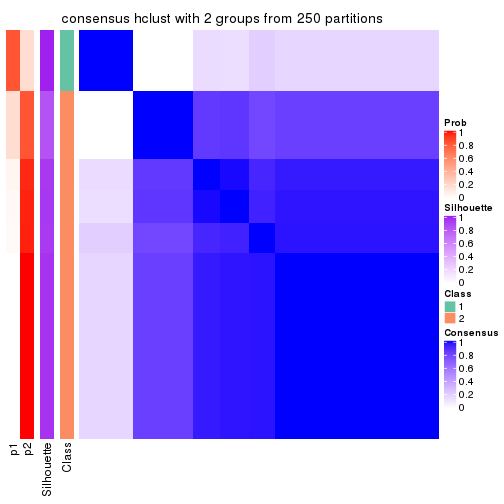</p>

</div>
<div id='tab-CV-hclust-consensus-heatmap-2'>
<pre><code class="r">consensus_heatmap(res, k = 3)
</code></pre>

<p>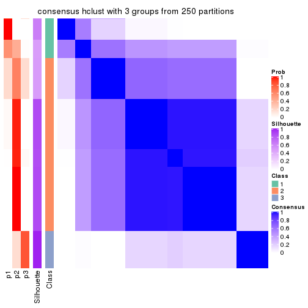</p>

</div>
<div id='tab-CV-hclust-consensus-heatmap-3'>
<pre><code class="r">consensus_heatmap(res, k = 4)
</code></pre>

<p>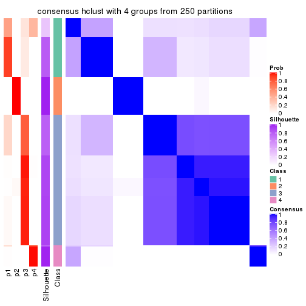</p>

</div>
<div id='tab-CV-hclust-consensus-heatmap-4'>
<pre><code class="r">consensus_heatmap(res, k = 5)
</code></pre>

<p>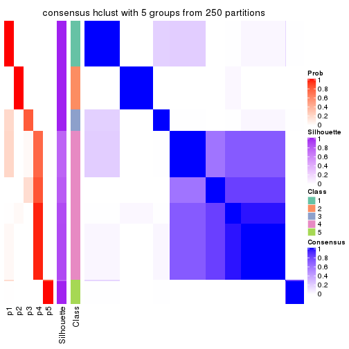</p>

</div>
<div id='tab-CV-hclust-consensus-heatmap-5'>
<pre><code class="r">consensus_heatmap(res, k = 6)
</code></pre>

<p>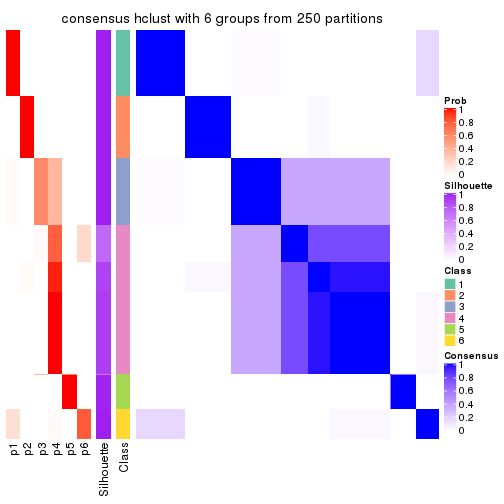</p>

</div>
</div>

Heatmaps for the membership of samples in all partitions to see how consistent they are:


<script>
$( function() {
	$( '#tabs-CV-hclust-membership-heatmap' ).tabs();
} );
</script>
<div id='tabs-CV-hclust-membership-heatmap'>
<ul>
<li><a href='#tab-CV-hclust-membership-heatmap-1'>k = 2</a></li>
<li><a href='#tab-CV-hclust-membership-heatmap-2'>k = 3</a></li>
<li><a href='#tab-CV-hclust-membership-heatmap-3'>k = 4</a></li>
<li><a href='#tab-CV-hclust-membership-heatmap-4'>k = 5</a></li>
<li><a href='#tab-CV-hclust-membership-heatmap-5'>k = 6</a></li>
</ul>
<div id='tab-CV-hclust-membership-heatmap-1'>
<pre><code class="r">membership_heatmap(res, k = 2)
</code></pre>

<p>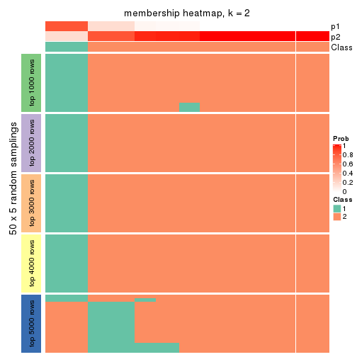</p>

</div>
<div id='tab-CV-hclust-membership-heatmap-2'>
<pre><code class="r">membership_heatmap(res, k = 3)
</code></pre>

<p>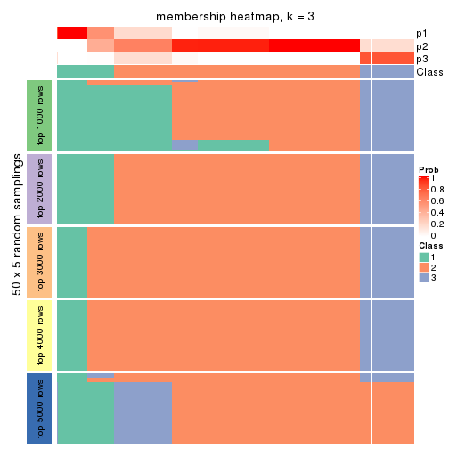</p>

</div>
<div id='tab-CV-hclust-membership-heatmap-3'>
<pre><code class="r">membership_heatmap(res, k = 4)
</code></pre>

<p>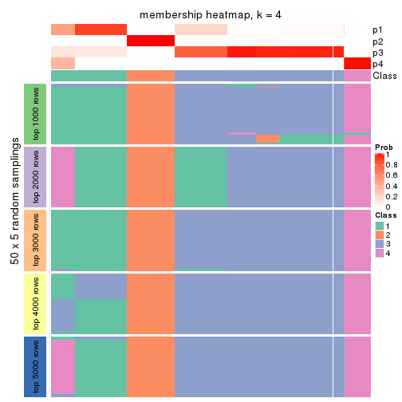</p>

</div>
<div id='tab-CV-hclust-membership-heatmap-4'>
<pre><code class="r">membership_heatmap(res, k = 5)
</code></pre>

<p>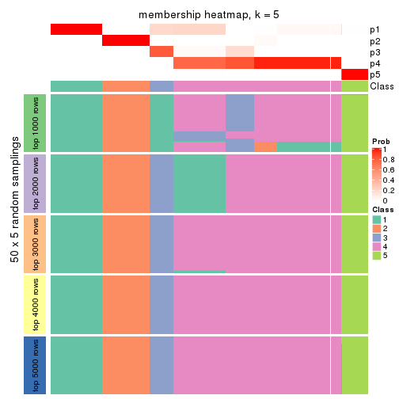</p>

</div>
<div id='tab-CV-hclust-membership-heatmap-5'>
<pre><code class="r">membership_heatmap(res, k = 6)
</code></pre>

<p>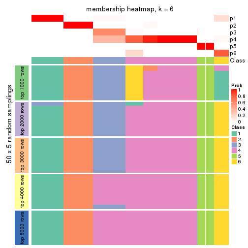</p>

</div>
</div>

As soon as we have had the classes for columns, we can look for signatures
which are significantly different between classes which can be candidate marks
for certain classes. Following are the heatmaps for signatures.


Signature heatmaps where rows are scaled:


<script>
$( function() {
	$( '#tabs-CV-hclust-get-signatures' ).tabs();
} );
</script>
<div id='tabs-CV-hclust-get-signatures'>
<ul>
<li><a href='#tab-CV-hclust-get-signatures-1'>k = 2</a></li>
<li><a href='#tab-CV-hclust-get-signatures-2'>k = 3</a></li>
<li><a href='#tab-CV-hclust-get-signatures-3'>k = 4</a></li>
<li><a href='#tab-CV-hclust-get-signatures-4'>k = 5</a></li>
<li><a href='#tab-CV-hclust-get-signatures-5'>k = 6</a></li>
</ul>
<div id='tab-CV-hclust-get-signatures-1'>
<pre><code class="r">get_signatures(res, k = 2)
</code></pre>

<p>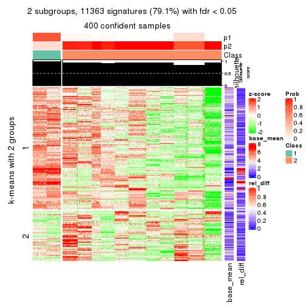</p>

</div>
<div id='tab-CV-hclust-get-signatures-2'>
<pre><code class="r">get_signatures(res, k = 3)
</code></pre>

<p>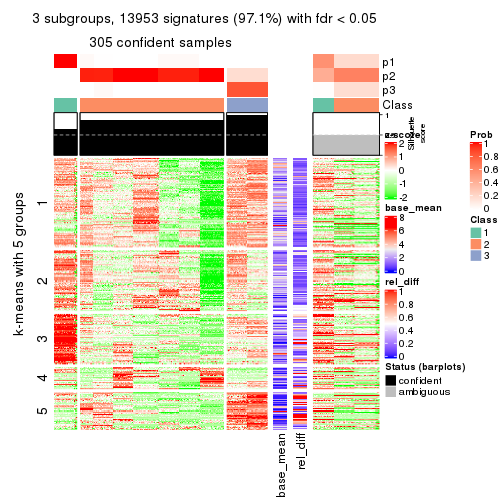</p>

</div>
<div id='tab-CV-hclust-get-signatures-3'>
<pre><code class="r">get_signatures(res, k = 4)
</code></pre>

<p>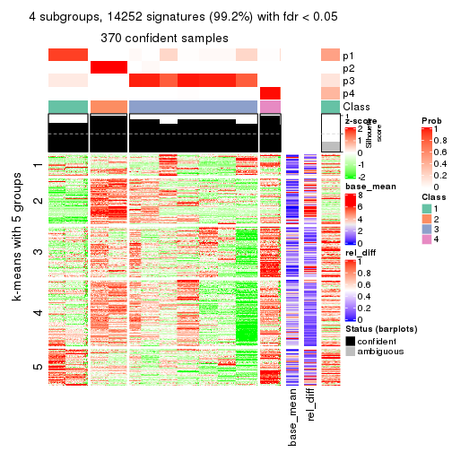</p>

</div>
<div id='tab-CV-hclust-get-signatures-4'>
<pre><code class="r">get_signatures(res, k = 5)
</code></pre>

<p>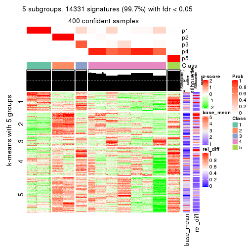</p>

</div>
<div id='tab-CV-hclust-get-signatures-5'>
<pre><code class="r">get_signatures(res, k = 6)
</code></pre>

<p>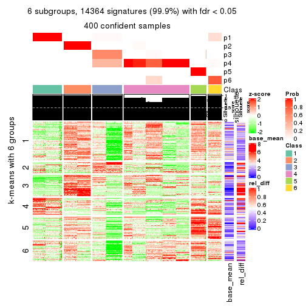</p>

</div>
</div>


Signature heatmaps where rows are not scaled:


<script>
$( function() {
	$( '#tabs-CV-hclust-get-signatures-no-scale' ).tabs();
} );
</script>
<div id='tabs-CV-hclust-get-signatures-no-scale'>
<ul>
<li><a href='#tab-CV-hclust-get-signatures-no-scale-1'>k = 2</a></li>
<li><a href='#tab-CV-hclust-get-signatures-no-scale-2'>k = 3</a></li>
<li><a href='#tab-CV-hclust-get-signatures-no-scale-3'>k = 4</a></li>
<li><a href='#tab-CV-hclust-get-signatures-no-scale-4'>k = 5</a></li>
<li><a href='#tab-CV-hclust-get-signatures-no-scale-5'>k = 6</a></li>
</ul>
<div id='tab-CV-hclust-get-signatures-no-scale-1'>
<pre><code class="r">get_signatures(res, k = 2, scale_rows = FALSE)
</code></pre>

<p>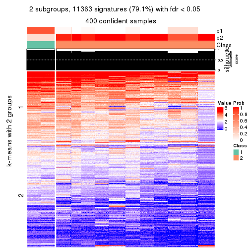</p>

</div>
<div id='tab-CV-hclust-get-signatures-no-scale-2'>
<pre><code class="r">get_signatures(res, k = 3, scale_rows = FALSE)
</code></pre>

<p>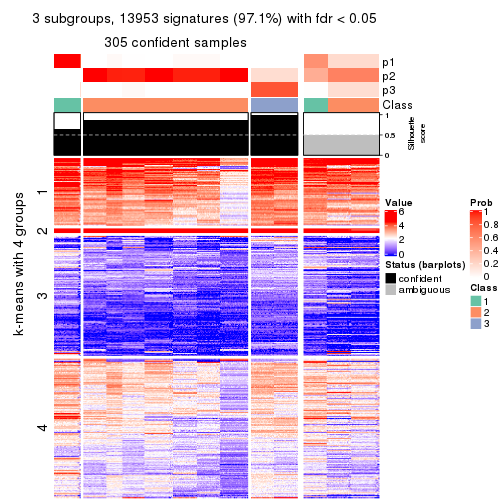</p>

</div>
<div id='tab-CV-hclust-get-signatures-no-scale-3'>
<pre><code class="r">get_signatures(res, k = 4, scale_rows = FALSE)
</code></pre>

<p>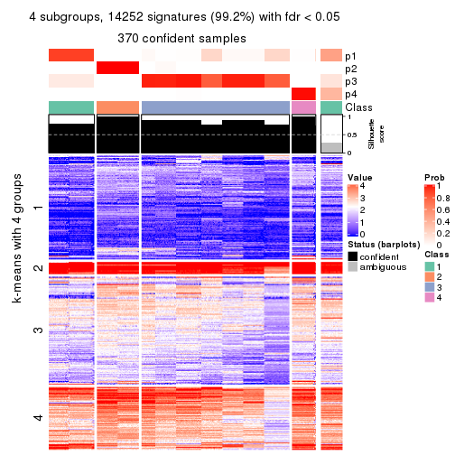</p>

</div>
<div id='tab-CV-hclust-get-signatures-no-scale-4'>
<pre><code class="r">get_signatures(res, k = 5, scale_rows = FALSE)
</code></pre>

<p>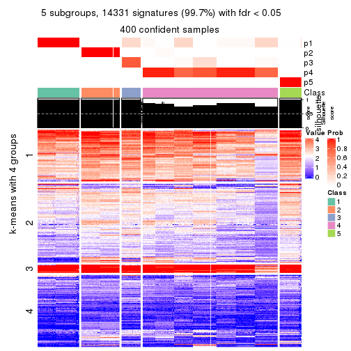</p>

</div>
<div id='tab-CV-hclust-get-signatures-no-scale-5'>
<pre><code class="r">get_signatures(res, k = 6, scale_rows = FALSE)
</code></pre>

<p>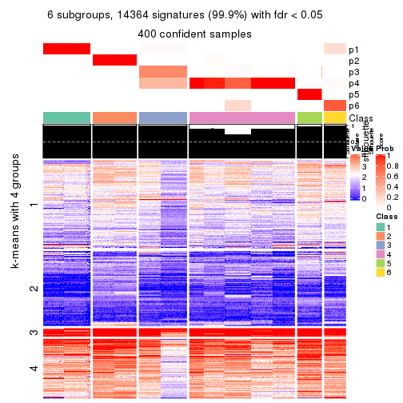</p>

</div>
</div>


Compare the overlap of signatures from different k:

```r
compare_signatures(res)
```

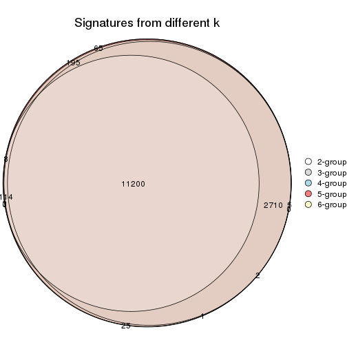

`get_signature()` returns a data frame invisibly. TO get the list of signatures, the function
call should be assigned to a variable explicitly. In following code, if `plot` argument is set
to `FALSE`, no heatmap is plotted while only the differential analysis is performed.

```r
# code only for demonstration
tb = get_signature(res, k = ..., plot = FALSE)
```

An example of the output of `tb` is:

```
#>   which_row         fdr    mean_1    mean_2 scaled_mean_1 scaled_mean_2 km
#> 1        38 0.042760348  8.373488  9.131774    -0.5533452     0.5164555  1
#> 2        40 0.018707592  7.106213  8.469186    -0.6173731     0.5762149  1
#> 3        55 0.019134737 10.221463 11.207825    -0.6159697     0.5749050  1
#> 4        59 0.006059896  5.921854  7.869574    -0.6899429     0.6439467  1
#> 5        60 0.018055526  8.928898 10.211722    -0.6204761     0.5791110  1
#> 6        98 0.009384629 15.714769 14.887706     0.6635654    -0.6193277  2
...
```

The columns in `tb` are:

1. `which_row`: row indices corresponding to the input matrix.
2. `fdr`: FDR for the differential test. 
3. `mean_x`: The mean value in group x.
4. `scaled_mean_x`: The mean value in group x after rows are scaled.
5. `km`: Row groups if k-means clustering is applied to rows.


UMAP plot which shows how samples are separated.


<script>
$( function() {
	$( '#tabs-CV-hclust-dimension-reduction' ).tabs();
} );
</script>
<div id='tabs-CV-hclust-dimension-reduction'>
<ul>
<li><a href='#tab-CV-hclust-dimension-reduction-1'>k = 2</a></li>
<li><a href='#tab-CV-hclust-dimension-reduction-2'>k = 3</a></li>
<li><a href='#tab-CV-hclust-dimension-reduction-3'>k = 4</a></li>
<li><a href='#tab-CV-hclust-dimension-reduction-4'>k = 5</a></li>
<li><a href='#tab-CV-hclust-dimension-reduction-5'>k = 6</a></li>
</ul>
<div id='tab-CV-hclust-dimension-reduction-1'>
<pre><code class="r">dimension_reduction(res, k = 2, method = &quot;UMAP&quot;)
</code></pre>

<p>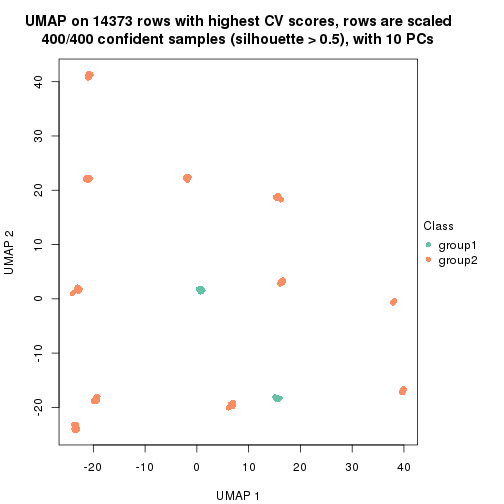</p>

</div>
<div id='tab-CV-hclust-dimension-reduction-2'>
<pre><code class="r">dimension_reduction(res, k = 3, method = &quot;UMAP&quot;)
</code></pre>

<p>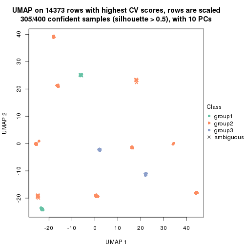</p>

</div>
<div id='tab-CV-hclust-dimension-reduction-3'>
<pre><code class="r">dimension_reduction(res, k = 4, method = &quot;UMAP&quot;)
</code></pre>

<p>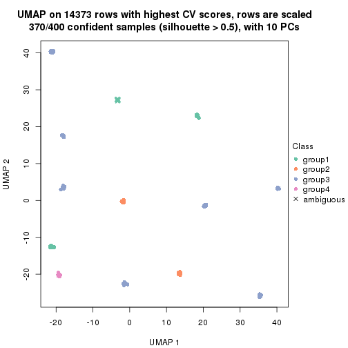</p>

</div>
<div id='tab-CV-hclust-dimension-reduction-4'>
<pre><code class="r">dimension_reduction(res, k = 5, method = &quot;UMAP&quot;)
</code></pre>

<p>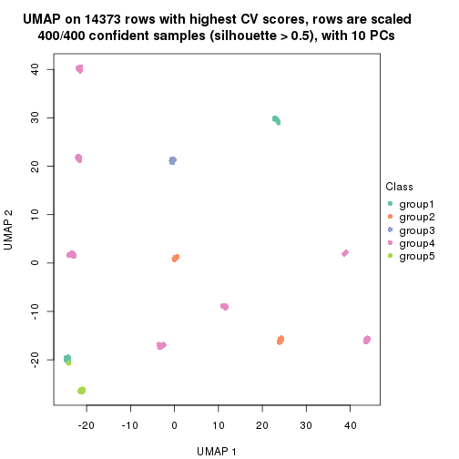</p>

</div>
<div id='tab-CV-hclust-dimension-reduction-5'>
<pre><code class="r">dimension_reduction(res, k = 6, method = &quot;UMAP&quot;)
</code></pre>

<p>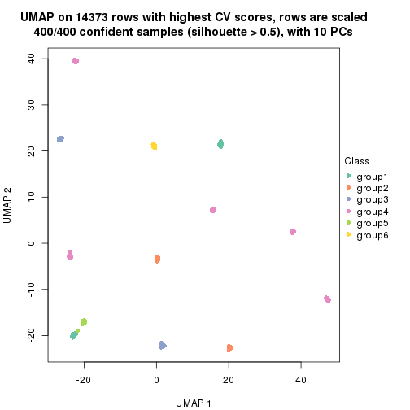</p>

</div>
</div>


Following heatmap shows how subgroups are split when increasing `k`:

```r
collect_classes(res)
```

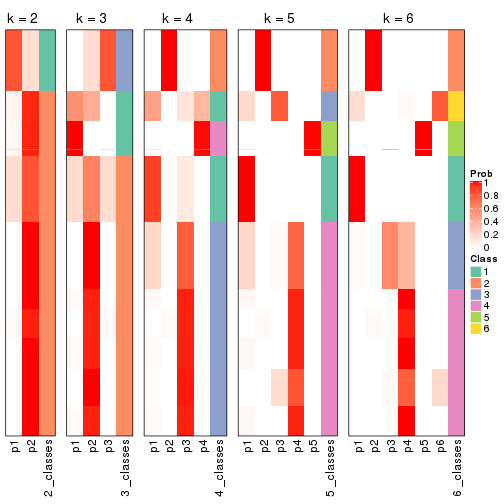


If matrix rows can be associated to genes, consider to use `GO_Enrichment(res,
...)` to perform function enrichment for the signature genes.


 

---------------------------------------------------


### CV:kmeans


The object with results only for a single top-value method and a single partition method 
can be extracted as:

```r
res = res_list["CV", "kmeans"]
# you can also extract it by
# res = res_list["CV:kmeans"]
```

A summary of `res` and all the functions that can be applied to it:

```r
res
```

```
#> A 'ConsensusPartition' object with k = 2, 3, 4, 5, 6.
#>   On a matrix with 14373 rows and 400 columns.
#>   Top rows (1000, 2000, 3000, 4000, 5000) are extracted by 'CV' method.
#>   Subgroups are detected by 'kmeans' method.
#>   Performed in total 1250 partitions by row resampling.
#>   Best k for subgroups seems to be 5.
#> 
#> Following methods can be applied to this 'ConsensusPartition' object:
#>  [1] "cola_report"             "collect_classes"         "collect_plots"          
#>  [4] "collect_stats"           "colnames"                "compare_signatures"     
#>  [7] "consensus_heatmap"       "dimension_reduction"     "functional_enrichment"  
#> [10] "get_anno_col"            "get_anno"                "get_classes"            
#> [13] "get_consensus"           "get_matrix"              "get_membership"         
#> [16] "get_param"               "get_signatures"          "get_stats"              
#> [19] "is_best_k"               "is_stable_k"             "membership_heatmap"     
#> [22] "ncol"                    "nrow"                    "plot_ecdf"              
#> [25] "rownames"                "select_partition_number" "show"                   
#> [28] "suggest_best_k"          "test_to_known_factors"
```

`collect_plots()` function collects all the plots made from `res` for all `k` (number of partitions)
into one single page to provide an easy and fast comparison between different `k`.

```r
collect_plots(res)
```

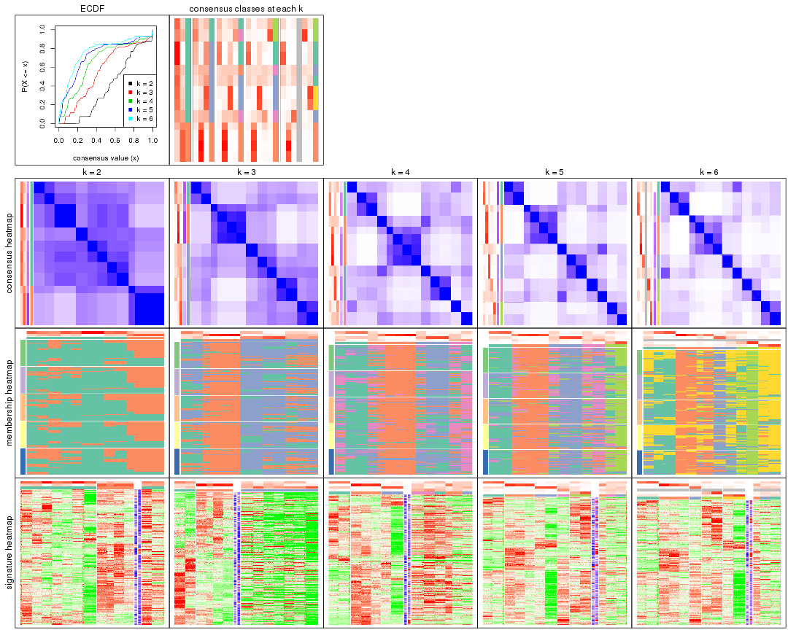

The plots are:

- The first row: a plot of the ECDF (Empirical cumulative distribution
  function) curves of the consensus matrix for each `k` and the heatmap of
  predicted classes for each `k`.
- The second row: heatmaps of the consensus matrix for each `k`.
- The third row: heatmaps of the membership matrix for each `k`.
- The fouth row: heatmaps of the signatures for each `k`.

All the plots in panels can be made by individual functions and they are
plotted later in this section.

`select_partition_number()` produces several plots showing different
statistics for choosing "optimized" `k`. There are following statistics:

- ECDF curves of the consensus matrix for each `k`;
- 1-PAC. [The PAC
  score](https://en.wikipedia.org/wiki/Consensus_clustering#Over-interpretation_potential_of_consensus_clustering)
  measures the proportion of the ambiguous subgrouping.
- Mean silhouette score.
- Concordance. The mean probability of fiting the consensus class ids in all
  partitions.
- Area increased. Denote $A_k$ as the area under the ECDF curve for current
  `k`, the area increased is defined as $A_k - A_{k-1}$.
- Rand index. The percent of pairs of samples that are both in a same cluster
  or both are not in a same cluster in the partition of k and k-1.
- Jaccard index. The ratio of pairs of samples are both in a same cluster in
  the partition of k and k-1 and the pairs of samples are both in a same
  cluster in the partition k or k-1.

The detailed explanations of these statistics can be found in [the cola
vignette](http://bioconductor.org/packages/devel/bioc/vignettes/cola/inst/doc/cola.html#toc_13).

Generally speaking, lower PAC score, higher mean silhouette score or higher
concordance corresponds to better partition. Rand index and Jaccard index
measure how similar the current partition is compared to partition with `k-1`.
If they are too similar, we won't accept `k` is better than `k-1`.

```r
select_partition_number(res)
```

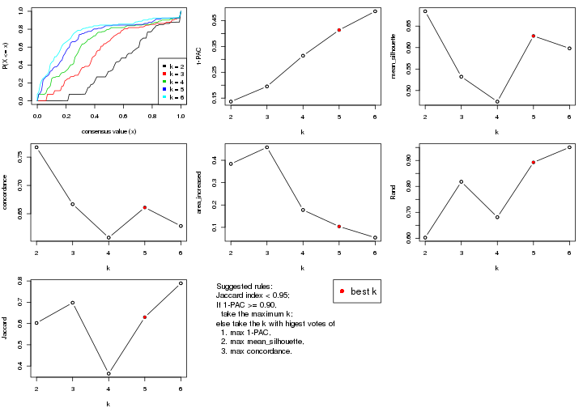

The numeric values for all these statistics can be obtained by `get_stats()`.

```r
get_stats(res)
```

```
#>   k 1-PAC mean_silhouette concordance area_increased  Rand Jaccard
#> 2 2 0.136           0.684       0.767         0.3839 0.603   0.603
#> 3 3 0.195           0.532       0.667         0.4580 0.818   0.698
#> 4 4 0.314           0.474       0.608         0.1777 0.681   0.364
#> 5 5 0.413           0.627       0.661         0.1038 0.893   0.630
#> 6 6 0.486           0.598       0.628         0.0541 0.951   0.789
```

`suggest_best_k()` suggests the best $k$ based on these statistics. The rules are as follows:

- All $k$ with Jaccard index larger than 0.95 are removed because the increase of
  the partition number does not provides enough extra information. If all $k$ are removed,
  the best $k$ is assigned by `NA`.
- For $k$ with 1-PAC larger than 0.9, the maximal $k$ is taken as the "best k". Other $k$ is called "optional k".
- If it does not fit the second rule. The $k$ with the highest vote of highest
  1-PAC, mean silhouette and concordance is taken as the "best k".

```r
suggest_best_k(res)
```

```
#> [1] 5
```


Following shows the table of the partitions (You need to click the **show/hide
code output** link to see it). The membership matrix (columns with name `p*`)
is inferred by
[`clue::cl_consensus()`](https://www.rdocumentation.org/link/cl_consensus?package=clue)
function with the `SE` method. Basically the value in the membership matrix
represents the probability to belong to a certain group. The finall class
label for an item is determined with the group with highest probability it
belongs to.

In `get_classes()` function, the entropy is calculated from the membership
matrix and the silhouette score is calculated from the consensus matrix.


<script>
$( function() {
	$( '#tabs-CV-kmeans-get-classes' ).tabs();
} );
</script>
<div id='tabs-CV-kmeans-get-classes'>
<ul>
<li><a href='#tab-CV-kmeans-get-classes-1'>k = 2</a></li>
<li><a href='#tab-CV-kmeans-get-classes-2'>k = 3</a></li>
<li><a href='#tab-CV-kmeans-get-classes-3'>k = 4</a></li>
<li><a href='#tab-CV-kmeans-get-classes-4'>k = 5</a></li>
<li><a href='#tab-CV-kmeans-get-classes-5'>k = 6</a></li>
</ul>

<div id='tab-CV-kmeans-get-classes-1'>
<p><a id='tab-CV-kmeans-get-classes-1-a' style='color:#0366d6' href='#'>show/hide code output</a></p>
<pre><code class="r">cbind(get_classes(res, k = 2), get_membership(res, k = 2))
</code></pre>

<pre><code>#&gt;            class entropy silhouette    p1    p2
#&gt; SRR1661716     2  0.9608      0.571 0.384 0.616
#&gt; SRR1661717     2  0.9608      0.571 0.384 0.616
#&gt; SRR1661718     2  0.9608      0.571 0.384 0.616
#&gt; SRR1661719     2  0.9608      0.571 0.384 0.616
#&gt; SRR1661720     2  0.9608      0.571 0.384 0.616
#&gt; SRR1661721     2  0.9608      0.571 0.384 0.616
#&gt; SRR1661722     2  0.9608      0.571 0.384 0.616
#&gt; SRR1661723     2  0.9608      0.571 0.384 0.616
#&gt; SRR1661724     2  0.9608      0.571 0.384 0.616
#&gt; SRR1661725     2  0.9608      0.571 0.384 0.616
#&gt; SRR1661726     2  0.9608      0.571 0.384 0.616
#&gt; SRR1661727     2  0.9608      0.571 0.384 0.616
#&gt; SRR1661728     2  0.9608      0.571 0.384 0.616
#&gt; SRR1661729     2  0.9608      0.571 0.384 0.616
#&gt; SRR1661730     2  0.9608      0.571 0.384 0.616
#&gt; SRR1661731     2  0.9608      0.571 0.384 0.616
#&gt; SRR1661732     2  0.9608      0.571 0.384 0.616
#&gt; SRR1661733     2  0.9608      0.571 0.384 0.616
#&gt; SRR1661734     2  0.9608      0.571 0.384 0.616
#&gt; SRR1661735     2  0.9608      0.571 0.384 0.616
#&gt; SRR1661736     2  0.7453      0.931 0.212 0.788
#&gt; SRR1661737     2  0.7453      0.931 0.212 0.788
#&gt; SRR1661738     2  0.7453      0.931 0.212 0.788
#&gt; SRR1661739     2  0.7453      0.931 0.212 0.788
#&gt; SRR1661740     2  0.7453      0.931 0.212 0.788
#&gt; SRR1661741     2  0.7453      0.931 0.212 0.788
#&gt; SRR1661742     2  0.7453      0.931 0.212 0.788
#&gt; SRR1661743     2  0.7453      0.931 0.212 0.788
#&gt; SRR1661744     2  0.7453      0.931 0.212 0.788
#&gt; SRR1661745     2  0.7453      0.931 0.212 0.788
#&gt; SRR1661746     2  0.7453      0.931 0.212 0.788
#&gt; SRR1661747     2  0.7453      0.931 0.212 0.788
#&gt; SRR1661748     2  0.7453      0.931 0.212 0.788
#&gt; SRR1661749     2  0.7453      0.931 0.212 0.788
#&gt; SRR1661750     2  0.7453      0.931 0.212 0.788
#&gt; SRR1661751     2  0.7453      0.931 0.212 0.788
#&gt; SRR1661752     2  0.7453      0.931 0.212 0.788
#&gt; SRR1661753     2  0.7453      0.931 0.212 0.788
#&gt; SRR1661754     2  0.7453      0.931 0.212 0.788
#&gt; SRR1661755     2  0.7453      0.931 0.212 0.788
#&gt; SRR1661756     2  0.7453      0.931 0.212 0.788
#&gt; SRR1661757     2  0.7453      0.931 0.212 0.788
#&gt; SRR1661758     2  0.7453      0.931 0.212 0.788
#&gt; SRR1661759     2  0.7453      0.931 0.212 0.788
#&gt; SRR1661760     2  0.7453      0.931 0.212 0.788
#&gt; SRR1661761     2  0.7453      0.931 0.212 0.788
#&gt; SRR1661762     2  0.7453      0.931 0.212 0.788
#&gt; SRR1661763     2  0.7453      0.931 0.212 0.788
#&gt; SRR1661764     2  0.7453      0.931 0.212 0.788
#&gt; SRR1661766     2  0.7453      0.931 0.212 0.788
#&gt; SRR1661767     2  0.7453      0.931 0.212 0.788
#&gt; SRR1661768     2  0.7453      0.931 0.212 0.788
#&gt; SRR1661769     2  0.7453      0.931 0.212 0.788
#&gt; SRR1661770     2  0.7453      0.931 0.212 0.788
#&gt; SRR1661771     2  0.7453      0.931 0.212 0.788
#&gt; SRR1661772     2  0.7453      0.931 0.212 0.788
#&gt; SRR1661773     2  0.7453      0.931 0.212 0.788
#&gt; SRR1661774     2  0.7453      0.931 0.212 0.788
#&gt; SRR1661775     2  0.7453      0.931 0.212 0.788
#&gt; SRR1661776     2  0.7453      0.931 0.212 0.788
#&gt; SRR1661777     2  0.7453      0.931 0.212 0.788
#&gt; SRR1661778     2  0.7453      0.931 0.212 0.788
#&gt; SRR1661779     2  0.7453      0.931 0.212 0.788
#&gt; SRR1661780     2  0.7453      0.931 0.212 0.788
#&gt; SRR1661781     2  0.7453      0.931 0.212 0.788
#&gt; SRR1661782     2  0.7453      0.931 0.212 0.788
#&gt; SRR1661783     2  0.7453      0.931 0.212 0.788
#&gt; SRR1661784     2  0.7453      0.931 0.212 0.788
#&gt; SRR1661785     2  0.7453      0.931 0.212 0.788
#&gt; SRR1661786     2  0.7453      0.931 0.212 0.788
#&gt; SRR1661787     2  0.7453      0.931 0.212 0.788
#&gt; SRR1661788     2  0.7453      0.931 0.212 0.788
#&gt; SRR1661789     2  0.7453      0.931 0.212 0.788
#&gt; SRR1661790     2  0.7453      0.931 0.212 0.788
#&gt; SRR1661791     2  0.7453      0.931 0.212 0.788
#&gt; SRR1661792     2  0.7453      0.931 0.212 0.788
#&gt; SRR1661793     2  0.7453      0.931 0.212 0.788
#&gt; SRR1661794     2  0.7453      0.931 0.212 0.788
#&gt; SRR1661795     2  0.7453      0.931 0.212 0.788
#&gt; SRR1661796     2  0.7453      0.931 0.212 0.788
#&gt; SRR1661797     2  0.7453      0.931 0.212 0.788
#&gt; SRR1661798     2  0.7453      0.931 0.212 0.788
#&gt; SRR1661799     2  0.7453      0.931 0.212 0.788
#&gt; SRR1661800     2  0.7453      0.931 0.212 0.788
#&gt; SRR1661801     2  0.7453      0.931 0.212 0.788
#&gt; SRR1661802     2  0.7453      0.931 0.212 0.788
#&gt; SRR1661803     2  0.7453      0.931 0.212 0.788
#&gt; SRR1661804     2  0.7453      0.931 0.212 0.788
#&gt; SRR1661805     2  0.7453      0.931 0.212 0.788
#&gt; SRR1661806     2  0.7453      0.931 0.212 0.788
#&gt; SRR1661807     2  0.7453      0.931 0.212 0.788
#&gt; SRR1661808     2  0.7453      0.931 0.212 0.788
#&gt; SRR1661809     2  0.7453      0.931 0.212 0.788
#&gt; SRR1661810     2  0.7453      0.931 0.212 0.788
#&gt; SRR1661811     2  0.7453      0.931 0.212 0.788
#&gt; SRR1661812     2  0.7453      0.931 0.212 0.788
#&gt; SRR1661813     2  0.7453      0.931 0.212 0.788
#&gt; SRR1661814     2  0.7453      0.931 0.212 0.788
#&gt; SRR1661815     2  0.7453      0.931 0.212 0.788
#&gt; SRR1661816     2  0.7453      0.931 0.212 0.788
#&gt; SRR1661817     2  0.7453      0.931 0.212 0.788
#&gt; SRR1661818     2  0.7453      0.931 0.212 0.788
#&gt; SRR1661819     2  0.7453      0.931 0.212 0.788
#&gt; SRR1661820     2  0.7453      0.931 0.212 0.788
#&gt; SRR1661821     2  0.7453      0.931 0.212 0.788
#&gt; SRR1661822     2  0.7453      0.931 0.212 0.788
#&gt; SRR1661823     2  0.7453      0.931 0.212 0.788
#&gt; SRR1661824     2  0.7453      0.931 0.212 0.788
#&gt; SRR1661825     2  0.7453      0.931 0.212 0.788
#&gt; SRR1661826     1  0.0376      0.701 0.996 0.004
#&gt; SRR1661827     1  0.0376      0.701 0.996 0.004
#&gt; SRR1661828     1  0.0376      0.701 0.996 0.004
#&gt; SRR1661829     1  0.0376      0.701 0.996 0.004
#&gt; SRR1661830     1  0.0376      0.701 0.996 0.004
#&gt; SRR1661831     1  0.0376      0.701 0.996 0.004
#&gt; SRR1661832     1  0.0376      0.701 0.996 0.004
#&gt; SRR1661833     1  0.0376      0.701 0.996 0.004
#&gt; SRR1661834     1  0.0376      0.701 0.996 0.004
#&gt; SRR1661835     1  0.0376      0.701 0.996 0.004
#&gt; SRR1661836     1  0.0376      0.701 0.996 0.004
#&gt; SRR1661837     1  0.0376      0.701 0.996 0.004
#&gt; SRR1661838     1  0.0376      0.701 0.996 0.004
#&gt; SRR1661839     1  0.0376      0.701 0.996 0.004
#&gt; SRR1661840     1  0.0376      0.701 0.996 0.004
#&gt; SRR1661841     1  0.0376      0.701 0.996 0.004
#&gt; SRR1661843     1  0.0376      0.701 0.996 0.004
#&gt; SRR1661844     1  0.0376      0.701 0.996 0.004
#&gt; SRR1661845     1  0.0376      0.701 0.996 0.004
#&gt; SRR1661846     1  0.0376      0.701 0.996 0.004
#&gt; SRR1661847     1  0.0376      0.701 0.996 0.004
#&gt; SRR1661848     1  0.0376      0.701 0.996 0.004
#&gt; SRR1661849     1  0.0376      0.701 0.996 0.004
#&gt; SRR1661850     1  0.0376      0.701 0.996 0.004
#&gt; SRR1661851     1  0.0376      0.701 0.996 0.004
#&gt; SRR1661852     1  0.0376      0.701 0.996 0.004
#&gt; SRR1661853     1  0.0376      0.701 0.996 0.004
#&gt; SRR1661854     1  0.0376      0.701 0.996 0.004
#&gt; SRR1661855     1  0.0376      0.701 0.996 0.004
#&gt; SRR1661856     1  0.7883      0.678 0.764 0.236
#&gt; SRR1661857     1  0.7883      0.678 0.764 0.236
#&gt; SRR1661858     1  0.7883      0.678 0.764 0.236
#&gt; SRR1661859     1  0.7883      0.678 0.764 0.236
#&gt; SRR1661860     1  0.7883      0.678 0.764 0.236
#&gt; SRR1661861     1  0.7883      0.678 0.764 0.236
#&gt; SRR1661862     1  0.7883      0.678 0.764 0.236
#&gt; SRR1661863     1  0.7883      0.678 0.764 0.236
#&gt; SRR1661864     1  0.7883      0.678 0.764 0.236
#&gt; SRR1661865     1  0.7883      0.678 0.764 0.236
#&gt; SRR1661866     1  0.7883      0.678 0.764 0.236
#&gt; SRR1661867     1  0.7883      0.678 0.764 0.236
#&gt; SRR1661868     1  0.7883      0.678 0.764 0.236
#&gt; SRR1661869     1  0.7883      0.678 0.764 0.236
#&gt; SRR1661870     1  0.7883      0.678 0.764 0.236
#&gt; SRR1661871     1  0.7883      0.678 0.764 0.236
#&gt; SRR1661872     1  0.7883      0.678 0.764 0.236
#&gt; SRR1661873     1  0.7883      0.678 0.764 0.236
#&gt; SRR1661874     1  0.7883      0.678 0.764 0.236
#&gt; SRR1661875     1  0.7883      0.678 0.764 0.236
#&gt; SRR1661876     1  0.7883      0.678 0.764 0.236
#&gt; SRR1661877     1  0.7883      0.678 0.764 0.236
#&gt; SRR1661878     1  0.7883      0.678 0.764 0.236
#&gt; SRR1661879     1  0.7883      0.678 0.764 0.236
#&gt; SRR1661880     1  0.7883      0.678 0.764 0.236
#&gt; SRR1661881     1  0.7883      0.678 0.764 0.236
#&gt; SRR1661882     1  0.7883      0.678 0.764 0.236
#&gt; SRR1661883     1  0.7883      0.678 0.764 0.236
#&gt; SRR1661884     1  0.7883      0.678 0.764 0.236
#&gt; SRR1661885     1  0.7883      0.678 0.764 0.236
#&gt; SRR1661886     1  0.7883      0.678 0.764 0.236
#&gt; SRR1661887     1  0.7883      0.678 0.764 0.236
#&gt; SRR1661888     1  0.7883      0.678 0.764 0.236
#&gt; SRR1661889     1  0.7883      0.678 0.764 0.236
#&gt; SRR1661890     1  0.7883      0.678 0.764 0.236
#&gt; SRR1661891     1  0.7883      0.678 0.764 0.236
#&gt; SRR1661892     1  0.0376      0.701 0.996 0.004
#&gt; SRR1661893     1  0.0376      0.701 0.996 0.004
#&gt; SRR1661894     1  0.0376      0.701 0.996 0.004
#&gt; SRR1661895     1  0.0376      0.701 0.996 0.004
#&gt; SRR1661896     1  0.0376      0.701 0.996 0.004
#&gt; SRR1661897     1  0.0376      0.701 0.996 0.004
#&gt; SRR1661898     1  0.0376      0.701 0.996 0.004
#&gt; SRR1661899     1  0.0376      0.701 0.996 0.004
#&gt; SRR1661900     1  0.0376      0.701 0.996 0.004
#&gt; SRR1661901     1  0.0376      0.701 0.996 0.004
#&gt; SRR1661902     1  0.0376      0.701 0.996 0.004
#&gt; SRR1661903     1  0.0376      0.701 0.996 0.004
#&gt; SRR1661904     1  0.0376      0.701 0.996 0.004
#&gt; SRR1661905     1  0.0376      0.701 0.996 0.004
#&gt; SRR1661906     1  0.0376      0.701 0.996 0.004
#&gt; SRR1661907     1  0.0376      0.701 0.996 0.004
#&gt; SRR1661908     1  0.0376      0.701 0.996 0.004
#&gt; SRR1661909     1  0.0376      0.701 0.996 0.004
#&gt; SRR1661910     1  0.0376      0.701 0.996 0.004
#&gt; SRR1661911     1  0.0376      0.701 0.996 0.004
#&gt; SRR1661912     1  0.0376      0.701 0.996 0.004
#&gt; SRR1661913     1  0.0376      0.701 0.996 0.004
#&gt; SRR1661914     1  0.0376      0.701 0.996 0.004
#&gt; SRR1661915     1  0.0376      0.701 0.996 0.004
#&gt; SRR1661916     1  0.0376      0.701 0.996 0.004
#&gt; SRR1661917     1  0.0376      0.701 0.996 0.004
#&gt; SRR1661918     1  0.0376      0.701 0.996 0.004
#&gt; SRR1661919     1  0.0376      0.701 0.996 0.004
#&gt; SRR1661920     1  0.0376      0.701 0.996 0.004
#&gt; SRR1661921     1  0.0376      0.701 0.996 0.004
#&gt; SRR1661922     1  0.0376      0.701 0.996 0.004
#&gt; SRR1661923     1  0.0376      0.701 0.996 0.004
#&gt; SRR1661924     1  0.0376      0.701 0.996 0.004
#&gt; SRR1661925     1  0.0376      0.701 0.996 0.004
#&gt; SRR1661926     1  0.0376      0.701 0.996 0.004
#&gt; SRR1661927     1  0.0376      0.701 0.996 0.004
#&gt; SRR1661928     1  0.8661      0.664 0.712 0.288
#&gt; SRR1661929     1  0.8661      0.664 0.712 0.288
#&gt; SRR1661930     1  0.8661      0.664 0.712 0.288
#&gt; SRR1661931     1  0.8661      0.664 0.712 0.288
#&gt; SRR1661932     1  0.8661      0.664 0.712 0.288
#&gt; SRR1661933     1  0.8661      0.664 0.712 0.288
#&gt; SRR1661934     1  0.8661      0.664 0.712 0.288
#&gt; SRR1661935     1  0.8661      0.664 0.712 0.288
#&gt; SRR1661936     1  0.8661      0.664 0.712 0.288
#&gt; SRR1661937     1  0.8661      0.664 0.712 0.288
#&gt; SRR1661938     1  0.8661      0.664 0.712 0.288
#&gt; SRR1661939     1  0.8661      0.664 0.712 0.288
#&gt; SRR1661940     1  0.8661      0.664 0.712 0.288
#&gt; SRR1661941     1  0.8661      0.664 0.712 0.288
#&gt; SRR1661942     1  0.8661      0.664 0.712 0.288
#&gt; SRR1661943     1  0.8661      0.664 0.712 0.288
#&gt; SRR1661944     1  0.8661      0.664 0.712 0.288
#&gt; SRR1661945     1  0.8661      0.664 0.712 0.288
#&gt; SRR1661946     1  0.8661      0.664 0.712 0.288
#&gt; SRR1661947     1  0.8661      0.664 0.712 0.288
#&gt; SRR1661948     1  0.8661      0.664 0.712 0.288
#&gt; SRR1661949     1  0.8661      0.664 0.712 0.288
#&gt; SRR1661950     1  0.8661      0.664 0.712 0.288
#&gt; SRR1661951     1  0.8661      0.664 0.712 0.288
#&gt; SRR1661952     1  0.8661      0.664 0.712 0.288
#&gt; SRR1661953     1  0.8661      0.664 0.712 0.288
#&gt; SRR1661954     1  0.8661      0.664 0.712 0.288
#&gt; SRR1661955     1  0.8661      0.664 0.712 0.288
#&gt; SRR1661956     1  0.8661      0.664 0.712 0.288
#&gt; SRR1661957     1  0.8661      0.664 0.712 0.288
#&gt; SRR1661958     1  0.8713      0.612 0.708 0.292
#&gt; SRR1661959     1  0.8713      0.612 0.708 0.292
#&gt; SRR1661960     1  0.8713      0.612 0.708 0.292
#&gt; SRR1661961     1  0.8713      0.612 0.708 0.292
#&gt; SRR1661962     1  0.8713      0.612 0.708 0.292
#&gt; SRR1661963     1  0.8713      0.612 0.708 0.292
#&gt; SRR1661964     1  0.8713      0.612 0.708 0.292
#&gt; SRR1661965     1  0.8713      0.612 0.708 0.292
#&gt; SRR1661966     1  0.8713      0.612 0.708 0.292
#&gt; SRR1661967     1  0.8713      0.612 0.708 0.292
#&gt; SRR1661968     1  0.8713      0.612 0.708 0.292
#&gt; SRR1661969     1  0.8713      0.612 0.708 0.292
#&gt; SRR1661970     1  0.8713      0.612 0.708 0.292
#&gt; SRR1661971     1  0.8713      0.612 0.708 0.292
#&gt; SRR1661972     1  0.8713      0.612 0.708 0.292
#&gt; SRR1661973     1  0.8713      0.612 0.708 0.292
#&gt; SRR1661974     1  0.8713      0.612 0.708 0.292
#&gt; SRR1661975     1  0.8713      0.612 0.708 0.292
#&gt; SRR1661976     1  0.8713      0.612 0.708 0.292
#&gt; SRR1661977     1  0.8713      0.612 0.708 0.292
#&gt; SRR1661978     1  0.8713      0.612 0.708 0.292
#&gt; SRR1661979     1  0.8713      0.612 0.708 0.292
#&gt; SRR1661980     1  0.8713      0.612 0.708 0.292
#&gt; SRR1661981     1  0.8713      0.612 0.708 0.292
#&gt; SRR1661982     1  0.8713      0.612 0.708 0.292
#&gt; SRR1661983     1  0.8713      0.612 0.708 0.292
#&gt; SRR1661984     1  0.8713      0.612 0.708 0.292
#&gt; SRR1661985     1  0.8713      0.612 0.708 0.292
#&gt; SRR1661986     1  0.8713      0.612 0.708 0.292
#&gt; SRR1661987     1  0.8713      0.612 0.708 0.292
#&gt; SRR1661988     1  0.7815      0.646 0.768 0.232
#&gt; SRR1661989     1  0.7815      0.646 0.768 0.232
#&gt; SRR1661990     1  0.7815      0.646 0.768 0.232
#&gt; SRR1661991     1  0.7815      0.646 0.768 0.232
#&gt; SRR1661992     1  0.7815      0.646 0.768 0.232
#&gt; SRR1661993     1  0.7815      0.646 0.768 0.232
#&gt; SRR1661994     1  0.7815      0.646 0.768 0.232
#&gt; SRR1661995     1  0.7815      0.646 0.768 0.232
#&gt; SRR1661996     1  0.7815      0.646 0.768 0.232
#&gt; SRR1661997     1  0.7815      0.646 0.768 0.232
#&gt; SRR1661998     1  0.7815      0.646 0.768 0.232
#&gt; SRR1661999     1  0.7815      0.646 0.768 0.232
#&gt; SRR1662000     1  0.7815      0.646 0.768 0.232
#&gt; SRR1662001     1  0.7815      0.646 0.768 0.232
#&gt; SRR1662002     1  0.7815      0.646 0.768 0.232
#&gt; SRR1662003     1  0.7815      0.646 0.768 0.232
#&gt; SRR1662004     1  0.7815      0.646 0.768 0.232
#&gt; SRR1662005     1  0.7815      0.646 0.768 0.232
#&gt; SRR1662006     1  0.7815      0.646 0.768 0.232
#&gt; SRR1662007     1  0.7815      0.646 0.768 0.232
#&gt; SRR1662008     1  0.7815      0.646 0.768 0.232
#&gt; SRR1662009     1  0.7815      0.646 0.768 0.232
#&gt; SRR1662010     1  0.7815      0.646 0.768 0.232
#&gt; SRR1662011     1  0.7815      0.646 0.768 0.232
#&gt; SRR1662012     1  0.7815      0.646 0.768 0.232
#&gt; SRR1662013     1  0.7815      0.646 0.768 0.232
#&gt; SRR1662014     1  0.7815      0.646 0.768 0.232
#&gt; SRR1662015     1  0.7815      0.646 0.768 0.232
#&gt; SRR1662016     1  0.7815      0.646 0.768 0.232
#&gt; SRR1662017     1  0.7815      0.646 0.768 0.232
#&gt; SRR1662018     1  0.9933      0.391 0.548 0.452
#&gt; SRR1662019     1  0.9933      0.391 0.548 0.452
#&gt; SRR1662020     1  0.9933      0.391 0.548 0.452
#&gt; SRR1662021     1  0.9933      0.391 0.548 0.452
#&gt; SRR1662022     1  0.9933      0.391 0.548 0.452
#&gt; SRR1662023     1  0.9933      0.391 0.548 0.452
#&gt; SRR1662024     1  0.9933      0.391 0.548 0.452
#&gt; SRR1662025     1  0.9933      0.391 0.548 0.452
#&gt; SRR1662026     1  0.9933      0.391 0.548 0.452
#&gt; SRR1662027     1  0.9933      0.391 0.548 0.452
#&gt; SRR1662028     1  0.9933      0.391 0.548 0.452
#&gt; SRR1662029     1  0.9933      0.391 0.548 0.452
#&gt; SRR1662030     1  0.9933      0.391 0.548 0.452
#&gt; SRR1662031     1  0.9933      0.391 0.548 0.452
#&gt; SRR1662032     1  0.9933      0.391 0.548 0.452
#&gt; SRR1662033     1  0.9933      0.391 0.548 0.452
#&gt; SRR1662034     1  0.9933      0.391 0.548 0.452
#&gt; SRR1662035     1  0.9933      0.391 0.548 0.452
#&gt; SRR1662036     1  0.9933      0.391 0.548 0.452
#&gt; SRR1662037     1  0.9933      0.391 0.548 0.452
#&gt; SRR1662038     1  0.9933      0.391 0.548 0.452
#&gt; SRR1662039     1  0.9933      0.391 0.548 0.452
#&gt; SRR1662040     1  0.9933      0.391 0.548 0.452
#&gt; SRR1662041     1  0.9933      0.391 0.548 0.452
#&gt; SRR1662042     1  0.9933      0.391 0.548 0.452
#&gt; SRR1662043     1  0.9933      0.391 0.548 0.452
#&gt; SRR1662044     1  0.9933      0.391 0.548 0.452
#&gt; SRR1662045     1  0.9933      0.391 0.548 0.452
#&gt; SRR1662046     1  0.9933      0.391 0.548 0.452
#&gt; SRR1662047     1  0.9933      0.391 0.548 0.452
#&gt; SRR1662048     1  0.9933      0.391 0.548 0.452
#&gt; SRR1662049     1  0.9933      0.391 0.548 0.452
#&gt; SRR1662050     1  0.9933      0.391 0.548 0.452
#&gt; SRR1662051     1  0.9933      0.391 0.548 0.452
#&gt; SRR1662052     1  0.9933      0.391 0.548 0.452
#&gt; SRR1662053     1  0.9933      0.391 0.548 0.452
#&gt; SRR1662054     1  0.7139      0.690 0.804 0.196
#&gt; SRR1662055     1  0.7139      0.690 0.804 0.196
#&gt; SRR1662056     1  0.7139      0.690 0.804 0.196
#&gt; SRR1662057     1  0.7139      0.690 0.804 0.196
#&gt; SRR1662058     1  0.7139      0.690 0.804 0.196
#&gt; SRR1662059     1  0.7139      0.690 0.804 0.196
#&gt; SRR1662060     1  0.7139      0.690 0.804 0.196
#&gt; SRR1662061     1  0.7139      0.690 0.804 0.196
#&gt; SRR1662062     1  0.7139      0.690 0.804 0.196
#&gt; SRR1662063     1  0.7139      0.690 0.804 0.196
#&gt; SRR1662064     1  0.7139      0.690 0.804 0.196
#&gt; SRR1662065     1  0.7139      0.690 0.804 0.196
#&gt; SRR1662066     1  0.7139      0.690 0.804 0.196
#&gt; SRR1662067     1  0.7139      0.690 0.804 0.196
#&gt; SRR1662068     1  0.7139      0.690 0.804 0.196
#&gt; SRR1662069     1  0.7139      0.690 0.804 0.196
#&gt; SRR1662070     1  0.7139      0.690 0.804 0.196
#&gt; SRR1662071     1  0.7139      0.690 0.804 0.196
#&gt; SRR1662072     1  0.7139      0.690 0.804 0.196
#&gt; SRR1662073     1  0.7139      0.690 0.804 0.196
#&gt; SRR1662074     1  0.7139      0.690 0.804 0.196
#&gt; SRR1662075     1  0.7139      0.690 0.804 0.196
#&gt; SRR1662076     1  0.7139      0.690 0.804 0.196
#&gt; SRR1662077     1  0.7139      0.690 0.804 0.196
#&gt; SRR1662078     1  0.7139      0.690 0.804 0.196
#&gt; SRR1662079     1  0.7139      0.690 0.804 0.196
#&gt; SRR1662080     1  0.7139      0.690 0.804 0.196
#&gt; SRR1662081     1  0.7139      0.690 0.804 0.196
#&gt; SRR1662082     1  0.7139      0.690 0.804 0.196
#&gt; SRR1662083     1  0.7139      0.690 0.804 0.196
#&gt; SRR1662084     1  0.9552      0.491 0.624 0.376
#&gt; SRR1662085     1  0.9552      0.491 0.624 0.376
#&gt; SRR1662086     1  0.9552      0.491 0.624 0.376
#&gt; SRR1662087     1  0.9000      0.580 0.684 0.316
#&gt; SRR1662088     1  0.9552      0.491 0.624 0.376
#&gt; SRR1662089     1  0.9552      0.491 0.624 0.376
#&gt; SRR1662090     1  0.9552      0.491 0.624 0.376
#&gt; SRR1662091     1  0.9552      0.491 0.624 0.376
#&gt; SRR1662092     1  0.9552      0.491 0.624 0.376
#&gt; SRR1662093     1  0.9491      0.506 0.632 0.368
#&gt; SRR1662094     1  0.9552      0.491 0.624 0.376
#&gt; SRR1662095     1  0.9552      0.491 0.624 0.376
#&gt; SRR1662096     1  0.9552      0.491 0.624 0.376
#&gt; SRR1662097     1  0.9552      0.491 0.624 0.376
#&gt; SRR1662098     1  0.9552      0.491 0.624 0.376
#&gt; SRR1662099     1  0.9552      0.491 0.624 0.376
#&gt; SRR1662100     1  0.9552      0.491 0.624 0.376
#&gt; SRR1662101     1  0.9552      0.491 0.624 0.376
#&gt; SRR1662102     1  0.9552      0.491 0.624 0.376
#&gt; SRR1662103     1  0.9552      0.491 0.624 0.376
#&gt; SRR1662104     1  0.9552      0.491 0.624 0.376
#&gt; SRR1662105     1  0.9552      0.491 0.624 0.376
#&gt; SRR1662106     1  0.9552      0.491 0.624 0.376
#&gt; SRR1662107     1  0.9552      0.491 0.624 0.376
#&gt; SRR1662108     1  0.9552      0.491 0.624 0.376
#&gt; SRR1662109     1  0.9552      0.491 0.624 0.376
#&gt; SRR1662110     1  0.9552      0.491 0.624 0.376
#&gt; SRR1662111     1  0.3584      0.676 0.932 0.068
#&gt; SRR1662112     1  0.9552      0.491 0.624 0.376
#&gt; SRR1662113     1  0.9552      0.491 0.624 0.376
#&gt; SRR1662114     1  0.9286      0.545 0.656 0.344
#&gt; SRR1662115     1  0.9552      0.491 0.624 0.376
#&gt; SRR1662116     1  0.9552      0.491 0.624 0.376
#&gt; SRR1662117     1  0.9552      0.491 0.624 0.376
</code></pre>

<script>
$('#tab-CV-kmeans-get-classes-1-a').parent().next().next().hide();
$('#tab-CV-kmeans-get-classes-1-a').click(function(){
  $('#tab-CV-kmeans-get-classes-1-a').parent().next().next().toggle();
  return(false);
});
</script>
</div>

<div id='tab-CV-kmeans-get-classes-2'>
<p><a id='tab-CV-kmeans-get-classes-2-a' style='color:#0366d6' href='#'>show/hide code output</a></p>
<pre><code class="r">cbind(get_classes(res, k = 3), get_membership(res, k = 3))
</code></pre>

<pre><code>#&gt;            class entropy silhouette    p1    p2    p3
#&gt; SRR1661716     2   0.685      0.653 0.124 0.740 0.136
#&gt; SRR1661717     2   0.685      0.653 0.124 0.740 0.136
#&gt; SRR1661718     2   0.685      0.653 0.124 0.740 0.136
#&gt; SRR1661719     2   0.685      0.653 0.124 0.740 0.136
#&gt; SRR1661720     2   0.685      0.653 0.124 0.740 0.136
#&gt; SRR1661721     2   0.685      0.653 0.124 0.740 0.136
#&gt; SRR1661722     2   0.685      0.653 0.124 0.740 0.136
#&gt; SRR1661723     2   0.685      0.653 0.124 0.740 0.136
#&gt; SRR1661724     2   0.685      0.653 0.124 0.740 0.136
#&gt; SRR1661725     2   0.685      0.653 0.124 0.740 0.136
#&gt; SRR1661726     2   0.685      0.653 0.124 0.740 0.136
#&gt; SRR1661727     2   0.685      0.653 0.124 0.740 0.136
#&gt; SRR1661728     2   0.685      0.653 0.124 0.740 0.136
#&gt; SRR1661729     2   0.685      0.653 0.124 0.740 0.136
#&gt; SRR1661730     2   0.685      0.653 0.124 0.740 0.136
#&gt; SRR1661731     2   0.685      0.653 0.124 0.740 0.136
#&gt; SRR1661732     2   0.685      0.653 0.124 0.740 0.136
#&gt; SRR1661733     2   0.685      0.653 0.124 0.740 0.136
#&gt; SRR1661734     2   0.685      0.653 0.124 0.740 0.136
#&gt; SRR1661735     2   0.685      0.653 0.124 0.740 0.136
#&gt; SRR1661736     2   0.164      0.910 0.044 0.956 0.000
#&gt; SRR1661737     2   0.164      0.910 0.044 0.956 0.000
#&gt; SRR1661738     2   0.164      0.910 0.044 0.956 0.000
#&gt; SRR1661739     2   0.164      0.910 0.044 0.956 0.000
#&gt; SRR1661740     2   0.164      0.910 0.044 0.956 0.000
#&gt; SRR1661741     2   0.164      0.910 0.044 0.956 0.000
#&gt; SRR1661742     2   0.164      0.910 0.044 0.956 0.000
#&gt; SRR1661743     2   0.164      0.910 0.044 0.956 0.000
#&gt; SRR1661744     2   0.164      0.910 0.044 0.956 0.000
#&gt; SRR1661745     2   0.164      0.910 0.044 0.956 0.000
#&gt; SRR1661746     2   0.164      0.910 0.044 0.956 0.000
#&gt; SRR1661747     2   0.164      0.910 0.044 0.956 0.000
#&gt; SRR1661748     2   0.164      0.910 0.044 0.956 0.000
#&gt; SRR1661749     2   0.164      0.910 0.044 0.956 0.000
#&gt; SRR1661750     2   0.164      0.910 0.044 0.956 0.000
#&gt; SRR1661751     2   0.164      0.910 0.044 0.956 0.000
#&gt; SRR1661752     2   0.164      0.910 0.044 0.956 0.000
#&gt; SRR1661753     2   0.164      0.910 0.044 0.956 0.000
#&gt; SRR1661754     2   0.164      0.910 0.044 0.956 0.000
#&gt; SRR1661755     2   0.164      0.910 0.044 0.956 0.000
#&gt; SRR1661756     2   0.164      0.910 0.044 0.956 0.000
#&gt; SRR1661757     2   0.164      0.910 0.044 0.956 0.000
#&gt; SRR1661758     2   0.164      0.910 0.044 0.956 0.000
#&gt; SRR1661759     2   0.164      0.910 0.044 0.956 0.000
#&gt; SRR1661760     2   0.164      0.910 0.044 0.956 0.000
#&gt; SRR1661761     2   0.164      0.910 0.044 0.956 0.000
#&gt; SRR1661762     2   0.164      0.910 0.044 0.956 0.000
#&gt; SRR1661763     2   0.164      0.910 0.044 0.956 0.000
#&gt; SRR1661764     2   0.164      0.910 0.044 0.956 0.000
#&gt; SRR1661766     2   0.000      0.917 0.000 1.000 0.000
#&gt; SRR1661767     2   0.000      0.917 0.000 1.000 0.000
#&gt; SRR1661768     2   0.000      0.917 0.000 1.000 0.000
#&gt; SRR1661769     2   0.000      0.917 0.000 1.000 0.000
#&gt; SRR1661770     2   0.000      0.917 0.000 1.000 0.000
#&gt; SRR1661771     2   0.000      0.917 0.000 1.000 0.000
#&gt; SRR1661772     2   0.000      0.917 0.000 1.000 0.000
#&gt; SRR1661773     2   0.000      0.917 0.000 1.000 0.000
#&gt; SRR1661774     2   0.000      0.917 0.000 1.000 0.000
#&gt; SRR1661775     2   0.000      0.917 0.000 1.000 0.000
#&gt; SRR1661776     2   0.000      0.917 0.000 1.000 0.000
#&gt; SRR1661777     2   0.000      0.917 0.000 1.000 0.000
#&gt; SRR1661778     2   0.000      0.917 0.000 1.000 0.000
#&gt; SRR1661779     2   0.000      0.917 0.000 1.000 0.000
#&gt; SRR1661780     2   0.000      0.917 0.000 1.000 0.000
#&gt; SRR1661781     2   0.000      0.917 0.000 1.000 0.000
#&gt; SRR1661782     2   0.000      0.917 0.000 1.000 0.000
#&gt; SRR1661783     2   0.000      0.917 0.000 1.000 0.000
#&gt; SRR1661784     2   0.000      0.917 0.000 1.000 0.000
#&gt; SRR1661785     2   0.000      0.917 0.000 1.000 0.000
#&gt; SRR1661786     2   0.000      0.917 0.000 1.000 0.000
#&gt; SRR1661787     2   0.000      0.917 0.000 1.000 0.000
#&gt; SRR1661788     2   0.000      0.917 0.000 1.000 0.000
#&gt; SRR1661789     2   0.000      0.917 0.000 1.000 0.000
#&gt; SRR1661790     2   0.000      0.917 0.000 1.000 0.000
#&gt; SRR1661791     2   0.000      0.917 0.000 1.000 0.000
#&gt; SRR1661792     2   0.000      0.917 0.000 1.000 0.000
#&gt; SRR1661793     2   0.000      0.917 0.000 1.000 0.000
#&gt; SRR1661794     2   0.000      0.917 0.000 1.000 0.000
#&gt; SRR1661795     2   0.000      0.917 0.000 1.000 0.000
#&gt; SRR1661796     2   0.103      0.912 0.024 0.976 0.000
#&gt; SRR1661797     2   0.103      0.912 0.024 0.976 0.000
#&gt; SRR1661798     2   0.103      0.912 0.024 0.976 0.000
#&gt; SRR1661799     2   0.103      0.912 0.024 0.976 0.000
#&gt; SRR1661800     2   0.103      0.912 0.024 0.976 0.000
#&gt; SRR1661801     2   0.103      0.912 0.024 0.976 0.000
#&gt; SRR1661802     2   0.103      0.912 0.024 0.976 0.000
#&gt; SRR1661803     2   0.103      0.912 0.024 0.976 0.000
#&gt; SRR1661804     2   0.103      0.912 0.024 0.976 0.000
#&gt; SRR1661805     2   0.103      0.912 0.024 0.976 0.000
#&gt; SRR1661806     2   0.103      0.912 0.024 0.976 0.000
#&gt; SRR1661807     2   0.103      0.912 0.024 0.976 0.000
#&gt; SRR1661808     2   0.103      0.912 0.024 0.976 0.000
#&gt; SRR1661809     2   0.103      0.912 0.024 0.976 0.000
#&gt; SRR1661810     2   0.103      0.912 0.024 0.976 0.000
#&gt; SRR1661811     2   0.103      0.912 0.024 0.976 0.000
#&gt; SRR1661812     2   0.103      0.912 0.024 0.976 0.000
#&gt; SRR1661813     2   0.103      0.912 0.024 0.976 0.000
#&gt; SRR1661814     2   0.103      0.912 0.024 0.976 0.000
#&gt; SRR1661815     2   0.103      0.912 0.024 0.976 0.000
#&gt; SRR1661816     2   0.103      0.912 0.024 0.976 0.000
#&gt; SRR1661817     2   0.103      0.912 0.024 0.976 0.000
#&gt; SRR1661818     2   0.103      0.912 0.024 0.976 0.000
#&gt; SRR1661819     2   0.103      0.912 0.024 0.976 0.000
#&gt; SRR1661820     2   0.103      0.912 0.024 0.976 0.000
#&gt; SRR1661821     2   0.103      0.912 0.024 0.976 0.000
#&gt; SRR1661822     2   0.103      0.912 0.024 0.976 0.000
#&gt; SRR1661823     2   0.103      0.912 0.024 0.976 0.000
#&gt; SRR1661824     2   0.103      0.912 0.024 0.976 0.000
#&gt; SRR1661825     2   0.103      0.912 0.024 0.976 0.000
#&gt; SRR1661826     3   0.789      0.217 0.372 0.064 0.564
#&gt; SRR1661827     3   0.789      0.217 0.372 0.064 0.564
#&gt; SRR1661828     3   0.789      0.217 0.372 0.064 0.564
#&gt; SRR1661829     3   0.789      0.217 0.372 0.064 0.564
#&gt; SRR1661830     3   0.789      0.217 0.372 0.064 0.564
#&gt; SRR1661831     3   0.789      0.217 0.372 0.064 0.564
#&gt; SRR1661832     3   0.789      0.217 0.372 0.064 0.564
#&gt; SRR1661833     3   0.789      0.217 0.372 0.064 0.564
#&gt; SRR1661834     3   0.789      0.217 0.372 0.064 0.564
#&gt; SRR1661835     3   0.789      0.217 0.372 0.064 0.564
#&gt; SRR1661836     3   0.789      0.217 0.372 0.064 0.564
#&gt; SRR1661837     3   0.789      0.217 0.372 0.064 0.564
#&gt; SRR1661838     3   0.789      0.217 0.372 0.064 0.564
#&gt; SRR1661839     3   0.789      0.217 0.372 0.064 0.564
#&gt; SRR1661840     3   0.789      0.217 0.372 0.064 0.564
#&gt; SRR1661841     3   0.789      0.217 0.372 0.064 0.564
#&gt; SRR1661843     3   0.789      0.217 0.372 0.064 0.564
#&gt; SRR1661844     3   0.789      0.217 0.372 0.064 0.564
#&gt; SRR1661845     3   0.789      0.217 0.372 0.064 0.564
#&gt; SRR1661846     3   0.789      0.217 0.372 0.064 0.564
#&gt; SRR1661847     3   0.789      0.217 0.372 0.064 0.564
#&gt; SRR1661848     3   0.789      0.217 0.372 0.064 0.564
#&gt; SRR1661849     3   0.789      0.217 0.372 0.064 0.564
#&gt; SRR1661850     3   0.789      0.217 0.372 0.064 0.564
#&gt; SRR1661851     3   0.789      0.217 0.372 0.064 0.564
#&gt; SRR1661852     3   0.789      0.217 0.372 0.064 0.564
#&gt; SRR1661853     3   0.789      0.217 0.372 0.064 0.564
#&gt; SRR1661854     3   0.789      0.217 0.372 0.064 0.564
#&gt; SRR1661855     3   0.789      0.217 0.372 0.064 0.564
#&gt; SRR1661856     3   0.447      0.412 0.028 0.120 0.852
#&gt; SRR1661857     3   0.447      0.412 0.028 0.120 0.852
#&gt; SRR1661858     3   0.447      0.412 0.028 0.120 0.852
#&gt; SRR1661859     3   0.447      0.412 0.028 0.120 0.852
#&gt; SRR1661860     3   0.447      0.412 0.028 0.120 0.852
#&gt; SRR1661861     3   0.447      0.412 0.028 0.120 0.852
#&gt; SRR1661862     3   0.447      0.412 0.028 0.120 0.852
#&gt; SRR1661863     3   0.447      0.412 0.028 0.120 0.852
#&gt; SRR1661864     3   0.447      0.412 0.028 0.120 0.852
#&gt; SRR1661865     3   0.447      0.412 0.028 0.120 0.852
#&gt; SRR1661866     3   0.447      0.412 0.028 0.120 0.852
#&gt; SRR1661867     3   0.447      0.412 0.028 0.120 0.852
#&gt; SRR1661868     3   0.447      0.412 0.028 0.120 0.852
#&gt; SRR1661869     3   0.447      0.412 0.028 0.120 0.852
#&gt; SRR1661870     3   0.447      0.412 0.028 0.120 0.852
#&gt; SRR1661871     3   0.447      0.412 0.028 0.120 0.852
#&gt; SRR1661872     3   0.447      0.412 0.028 0.120 0.852
#&gt; SRR1661873     3   0.447      0.412 0.028 0.120 0.852
#&gt; SRR1661874     3   0.447      0.412 0.028 0.120 0.852
#&gt; SRR1661875     3   0.447      0.412 0.028 0.120 0.852
#&gt; SRR1661876     3   0.447      0.412 0.028 0.120 0.852
#&gt; SRR1661877     3   0.447      0.412 0.028 0.120 0.852
#&gt; SRR1661878     3   0.447      0.412 0.028 0.120 0.852
#&gt; SRR1661879     3   0.447      0.412 0.028 0.120 0.852
#&gt; SRR1661880     3   0.447      0.412 0.028 0.120 0.852
#&gt; SRR1661881     3   0.447      0.412 0.028 0.120 0.852
#&gt; SRR1661882     3   0.447      0.412 0.028 0.120 0.852
#&gt; SRR1661883     3   0.447      0.412 0.028 0.120 0.852
#&gt; SRR1661884     3   0.447      0.412 0.028 0.120 0.852
#&gt; SRR1661885     3   0.447      0.412 0.028 0.120 0.852
#&gt; SRR1661886     3   0.447      0.412 0.028 0.120 0.852
#&gt; SRR1661887     3   0.447      0.412 0.028 0.120 0.852
#&gt; SRR1661888     3   0.447      0.412 0.028 0.120 0.852
#&gt; SRR1661889     3   0.447      0.412 0.028 0.120 0.852
#&gt; SRR1661890     3   0.447      0.412 0.028 0.120 0.852
#&gt; SRR1661891     3   0.447      0.412 0.028 0.120 0.852
#&gt; SRR1661892     3   0.782      0.220 0.356 0.064 0.580
#&gt; SRR1661893     3   0.782      0.220 0.356 0.064 0.580
#&gt; SRR1661894     3   0.782      0.220 0.356 0.064 0.580
#&gt; SRR1661895     3   0.782      0.220 0.356 0.064 0.580
#&gt; SRR1661896     3   0.782      0.220 0.356 0.064 0.580
#&gt; SRR1661897     3   0.782      0.220 0.356 0.064 0.580
#&gt; SRR1661898     3   0.782      0.220 0.356 0.064 0.580
#&gt; SRR1661899     3   0.782      0.220 0.356 0.064 0.580
#&gt; SRR1661900     3   0.782      0.220 0.356 0.064 0.580
#&gt; SRR1661901     3   0.782      0.220 0.356 0.064 0.580
#&gt; SRR1661902     3   0.782      0.220 0.356 0.064 0.580
#&gt; SRR1661903     3   0.782      0.220 0.356 0.064 0.580
#&gt; SRR1661904     3   0.782      0.220 0.356 0.064 0.580
#&gt; SRR1661905     3   0.782      0.220 0.356 0.064 0.580
#&gt; SRR1661906     3   0.782      0.220 0.356 0.064 0.580
#&gt; SRR1661907     3   0.782      0.220 0.356 0.064 0.580
#&gt; SRR1661908     3   0.782      0.220 0.356 0.064 0.580
#&gt; SRR1661909     3   0.782      0.220 0.356 0.064 0.580
#&gt; SRR1661910     3   0.782      0.220 0.356 0.064 0.580
#&gt; SRR1661911     3   0.782      0.220 0.356 0.064 0.580
#&gt; SRR1661912     3   0.782      0.220 0.356 0.064 0.580
#&gt; SRR1661913     3   0.782      0.220 0.356 0.064 0.580
#&gt; SRR1661914     3   0.782      0.220 0.356 0.064 0.580
#&gt; SRR1661915     3   0.782      0.220 0.356 0.064 0.580
#&gt; SRR1661916     3   0.782      0.220 0.356 0.064 0.580
#&gt; SRR1661917     3   0.782      0.220 0.356 0.064 0.580
#&gt; SRR1661918     3   0.782      0.220 0.356 0.064 0.580
#&gt; SRR1661919     3   0.782      0.220 0.356 0.064 0.580
#&gt; SRR1661920     3   0.782      0.220 0.356 0.064 0.580
#&gt; SRR1661921     3   0.782      0.220 0.356 0.064 0.580
#&gt; SRR1661922     3   0.782      0.220 0.356 0.064 0.580
#&gt; SRR1661923     3   0.782      0.220 0.356 0.064 0.580
#&gt; SRR1661924     3   0.782      0.220 0.356 0.064 0.580
#&gt; SRR1661925     3   0.782      0.220 0.356 0.064 0.580
#&gt; SRR1661926     3   0.782      0.220 0.356 0.064 0.580
#&gt; SRR1661927     3   0.782      0.220 0.356 0.064 0.580
#&gt; SRR1661928     3   0.569      0.398 0.044 0.168 0.788
#&gt; SRR1661929     3   0.569      0.398 0.044 0.168 0.788
#&gt; SRR1661930     3   0.569      0.398 0.044 0.168 0.788
#&gt; SRR1661931     3   0.569      0.398 0.044 0.168 0.788
#&gt; SRR1661932     3   0.569      0.398 0.044 0.168 0.788
#&gt; SRR1661933     3   0.569      0.398 0.044 0.168 0.788
#&gt; SRR1661934     3   0.569      0.398 0.044 0.168 0.788
#&gt; SRR1661935     3   0.569      0.398 0.044 0.168 0.788
#&gt; SRR1661936     3   0.569      0.398 0.044 0.168 0.788
#&gt; SRR1661937     3   0.569      0.398 0.044 0.168 0.788
#&gt; SRR1661938     3   0.569      0.398 0.044 0.168 0.788
#&gt; SRR1661939     3   0.569      0.398 0.044 0.168 0.788
#&gt; SRR1661940     3   0.569      0.398 0.044 0.168 0.788
#&gt; SRR1661941     3   0.569      0.398 0.044 0.168 0.788
#&gt; SRR1661942     3   0.569      0.398 0.044 0.168 0.788
#&gt; SRR1661943     3   0.569      0.398 0.044 0.168 0.788
#&gt; SRR1661944     3   0.569      0.398 0.044 0.168 0.788
#&gt; SRR1661945     3   0.569      0.398 0.044 0.168 0.788
#&gt; SRR1661946     3   0.569      0.398 0.044 0.168 0.788
#&gt; SRR1661947     3   0.569      0.398 0.044 0.168 0.788
#&gt; SRR1661948     3   0.569      0.398 0.044 0.168 0.788
#&gt; SRR1661949     3   0.569      0.398 0.044 0.168 0.788
#&gt; SRR1661950     3   0.569      0.398 0.044 0.168 0.788
#&gt; SRR1661951     3   0.569      0.398 0.044 0.168 0.788
#&gt; SRR1661952     3   0.569      0.398 0.044 0.168 0.788
#&gt; SRR1661953     3   0.569      0.398 0.044 0.168 0.788
#&gt; SRR1661954     3   0.569      0.398 0.044 0.168 0.788
#&gt; SRR1661955     3   0.569      0.398 0.044 0.168 0.788
#&gt; SRR1661956     3   0.569      0.398 0.044 0.168 0.788
#&gt; SRR1661957     3   0.569      0.398 0.044 0.168 0.788
#&gt; SRR1661958     3   0.976      0.228 0.228 0.380 0.392
#&gt; SRR1661959     3   0.976      0.228 0.228 0.380 0.392
#&gt; SRR1661960     3   0.976      0.228 0.228 0.380 0.392
#&gt; SRR1661961     3   0.976      0.228 0.228 0.380 0.392
#&gt; SRR1661962     3   0.976      0.228 0.228 0.380 0.392
#&gt; SRR1661963     3   0.976      0.228 0.228 0.380 0.392
#&gt; SRR1661964     3   0.976      0.228 0.228 0.380 0.392
#&gt; SRR1661965     3   0.976      0.228 0.228 0.380 0.392
#&gt; SRR1661966     3   0.976      0.228 0.228 0.380 0.392
#&gt; SRR1661967     3   0.976      0.228 0.228 0.380 0.392
#&gt; SRR1661968     3   0.976      0.228 0.228 0.380 0.392
#&gt; SRR1661969     3   0.976      0.228 0.228 0.380 0.392
#&gt; SRR1661970     3   0.976      0.228 0.228 0.380 0.392
#&gt; SRR1661971     3   0.976      0.228 0.228 0.380 0.392
#&gt; SRR1661972     3   0.976      0.228 0.228 0.380 0.392
#&gt; SRR1661973     3   0.976      0.228 0.228 0.380 0.392
#&gt; SRR1661974     3   0.976      0.228 0.228 0.380 0.392
#&gt; SRR1661975     3   0.976      0.228 0.228 0.380 0.392
#&gt; SRR1661976     3   0.976      0.228 0.228 0.380 0.392
#&gt; SRR1661977     3   0.976      0.228 0.228 0.380 0.392
#&gt; SRR1661978     3   0.976      0.228 0.228 0.380 0.392
#&gt; SRR1661979     3   0.976      0.228 0.228 0.380 0.392
#&gt; SRR1661980     3   0.976      0.228 0.228 0.380 0.392
#&gt; SRR1661981     3   0.976      0.228 0.228 0.380 0.392
#&gt; SRR1661982     3   0.976      0.228 0.228 0.380 0.392
#&gt; SRR1661983     3   0.976      0.228 0.228 0.380 0.392
#&gt; SRR1661984     3   0.976      0.228 0.228 0.380 0.392
#&gt; SRR1661985     3   0.976      0.228 0.228 0.380 0.392
#&gt; SRR1661986     3   0.976      0.228 0.228 0.380 0.392
#&gt; SRR1661987     3   0.976      0.228 0.228 0.380 0.392
#&gt; SRR1661988     1   0.939      0.762 0.484 0.188 0.328
#&gt; SRR1661989     1   0.939      0.762 0.484 0.188 0.328
#&gt; SRR1661990     1   0.939      0.762 0.484 0.188 0.328
#&gt; SRR1661991     1   0.939      0.762 0.484 0.188 0.328
#&gt; SRR1661992     1   0.939      0.762 0.484 0.188 0.328
#&gt; SRR1661993     1   0.939      0.762 0.484 0.188 0.328
#&gt; SRR1661994     1   0.939      0.762 0.484 0.188 0.328
#&gt; SRR1661995     1   0.939      0.762 0.484 0.188 0.328
#&gt; SRR1661996     1   0.939      0.762 0.484 0.188 0.328
#&gt; SRR1661997     1   0.939      0.762 0.484 0.188 0.328
#&gt; SRR1661998     1   0.939      0.762 0.484 0.188 0.328
#&gt; SRR1661999     1   0.939      0.762 0.484 0.188 0.328
#&gt; SRR1662000     1   0.939      0.762 0.484 0.188 0.328
#&gt; SRR1662001     1   0.939      0.762 0.484 0.188 0.328
#&gt; SRR1662002     1   0.939      0.762 0.484 0.188 0.328
#&gt; SRR1662003     1   0.939      0.762 0.484 0.188 0.328
#&gt; SRR1662004     1   0.939      0.762 0.484 0.188 0.328
#&gt; SRR1662005     1   0.939      0.762 0.484 0.188 0.328
#&gt; SRR1662006     1   0.939      0.762 0.484 0.188 0.328
#&gt; SRR1662007     1   0.939      0.762 0.484 0.188 0.328
#&gt; SRR1662008     1   0.939      0.762 0.484 0.188 0.328
#&gt; SRR1662009     1   0.939      0.762 0.484 0.188 0.328
#&gt; SRR1662010     1   0.939      0.762 0.484 0.188 0.328
#&gt; SRR1662011     1   0.939      0.762 0.484 0.188 0.328
#&gt; SRR1662012     1   0.939      0.762 0.484 0.188 0.328
#&gt; SRR1662013     1   0.939      0.762 0.484 0.188 0.328
#&gt; SRR1662014     1   0.939      0.762 0.484 0.188 0.328
#&gt; SRR1662015     1   0.939      0.762 0.484 0.188 0.328
#&gt; SRR1662016     1   0.939      0.762 0.484 0.188 0.328
#&gt; SRR1662017     1   0.939      0.762 0.484 0.188 0.328
#&gt; SRR1662018     3   0.979      0.273 0.236 0.368 0.396
#&gt; SRR1662019     3   0.979      0.273 0.236 0.368 0.396
#&gt; SRR1662020     3   0.979      0.273 0.236 0.368 0.396
#&gt; SRR1662021     3   0.979      0.273 0.236 0.368 0.396
#&gt; SRR1662022     3   0.979      0.273 0.236 0.368 0.396
#&gt; SRR1662023     3   0.979      0.273 0.236 0.368 0.396
#&gt; SRR1662024     3   0.979      0.273 0.236 0.368 0.396
#&gt; SRR1662025     3   0.979      0.273 0.236 0.368 0.396
#&gt; SRR1662026     3   0.979      0.273 0.236 0.368 0.396
#&gt; SRR1662027     3   0.979      0.273 0.236 0.368 0.396
#&gt; SRR1662028     3   0.979      0.273 0.236 0.368 0.396
#&gt; SRR1662029     3   0.979      0.273 0.236 0.368 0.396
#&gt; SRR1662030     3   0.979      0.273 0.236 0.368 0.396
#&gt; SRR1662031     3   0.979      0.273 0.236 0.368 0.396
#&gt; SRR1662032     3   0.979      0.273 0.236 0.368 0.396
#&gt; SRR1662033     3   0.979      0.273 0.236 0.368 0.396
#&gt; SRR1662034     3   0.979      0.273 0.236 0.368 0.396
#&gt; SRR1662035     3   0.979      0.273 0.236 0.368 0.396
#&gt; SRR1662036     3   0.979      0.273 0.236 0.368 0.396
#&gt; SRR1662037     3   0.979      0.273 0.236 0.368 0.396
#&gt; SRR1662038     3   0.979      0.273 0.236 0.368 0.396
#&gt; SRR1662039     3   0.979      0.273 0.236 0.368 0.396
#&gt; SRR1662040     3   0.979      0.273 0.236 0.368 0.396
#&gt; SRR1662041     3   0.979      0.273 0.236 0.368 0.396
#&gt; SRR1662042     3   0.979      0.273 0.236 0.368 0.396
#&gt; SRR1662043     3   0.979      0.273 0.236 0.368 0.396
#&gt; SRR1662044     3   0.979      0.273 0.236 0.368 0.396
#&gt; SRR1662045     3   0.979      0.273 0.236 0.368 0.396
#&gt; SRR1662046     3   0.979      0.273 0.236 0.368 0.396
#&gt; SRR1662047     3   0.979      0.273 0.236 0.368 0.396
#&gt; SRR1662048     3   0.979      0.273 0.236 0.368 0.396
#&gt; SRR1662049     3   0.979      0.273 0.236 0.368 0.396
#&gt; SRR1662050     3   0.979      0.273 0.236 0.368 0.396
#&gt; SRR1662051     3   0.979      0.273 0.236 0.368 0.396
#&gt; SRR1662052     3   0.979      0.273 0.236 0.368 0.396
#&gt; SRR1662053     3   0.979      0.273 0.236 0.368 0.396
#&gt; SRR1662054     3   0.903      0.369 0.164 0.300 0.536
#&gt; SRR1662055     3   0.903      0.369 0.164 0.300 0.536
#&gt; SRR1662056     3   0.903      0.369 0.164 0.300 0.536
#&gt; SRR1662057     3   0.903      0.369 0.164 0.300 0.536
#&gt; SRR1662058     3   0.903      0.369 0.164 0.300 0.536
#&gt; SRR1662059     3   0.903      0.369 0.164 0.300 0.536
#&gt; SRR1662060     3   0.903      0.369 0.164 0.300 0.536
#&gt; SRR1662061     3   0.903      0.369 0.164 0.300 0.536
#&gt; SRR1662062     3   0.903      0.369 0.164 0.300 0.536
#&gt; SRR1662063     3   0.903      0.369 0.164 0.300 0.536
#&gt; SRR1662064     3   0.903      0.369 0.164 0.300 0.536
#&gt; SRR1662065     3   0.903      0.369 0.164 0.300 0.536
#&gt; SRR1662066     3   0.903      0.369 0.164 0.300 0.536
#&gt; SRR1662067     3   0.903      0.369 0.164 0.300 0.536
#&gt; SRR1662068     3   0.903      0.369 0.164 0.300 0.536
#&gt; SRR1662069     3   0.903      0.369 0.164 0.300 0.536
#&gt; SRR1662070     3   0.903      0.369 0.164 0.300 0.536
#&gt; SRR1662071     3   0.903      0.369 0.164 0.300 0.536
#&gt; SRR1662072     3   0.903      0.369 0.164 0.300 0.536
#&gt; SRR1662073     3   0.903      0.369 0.164 0.300 0.536
#&gt; SRR1662074     3   0.903      0.369 0.164 0.300 0.536
#&gt; SRR1662075     3   0.903      0.369 0.164 0.300 0.536
#&gt; SRR1662076     3   0.903      0.369 0.164 0.300 0.536
#&gt; SRR1662077     3   0.903      0.369 0.164 0.300 0.536
#&gt; SRR1662078     3   0.903      0.369 0.164 0.300 0.536
#&gt; SRR1662079     3   0.903      0.369 0.164 0.300 0.536
#&gt; SRR1662080     3   0.903      0.369 0.164 0.300 0.536
#&gt; SRR1662081     3   0.903      0.369 0.164 0.300 0.536
#&gt; SRR1662082     3   0.903      0.369 0.164 0.300 0.536
#&gt; SRR1662083     3   0.903      0.369 0.164 0.300 0.536
#&gt; SRR1662084     1   0.835      0.812 0.628 0.188 0.184
#&gt; SRR1662085     1   0.835      0.812 0.628 0.188 0.184
#&gt; SRR1662086     1   0.835      0.812 0.628 0.188 0.184
#&gt; SRR1662087     1   0.818      0.790 0.640 0.152 0.208
#&gt; SRR1662088     1   0.835      0.812 0.628 0.188 0.184
#&gt; SRR1662089     1   0.835      0.812 0.628 0.188 0.184
#&gt; SRR1662090     1   0.835      0.812 0.628 0.188 0.184
#&gt; SRR1662091     1   0.835      0.812 0.628 0.188 0.184
#&gt; SRR1662092     1   0.835      0.812 0.628 0.188 0.184
#&gt; SRR1662093     1   0.826      0.806 0.636 0.176 0.188
#&gt; SRR1662094     1   0.835      0.812 0.628 0.188 0.184
#&gt; SRR1662095     1   0.835      0.812 0.628 0.188 0.184
#&gt; SRR1662096     1   0.835      0.812 0.628 0.188 0.184
#&gt; SRR1662097     1   0.835      0.812 0.628 0.188 0.184
#&gt; SRR1662098     1   0.835      0.812 0.628 0.188 0.184
#&gt; SRR1662099     1   0.835      0.812 0.628 0.188 0.184
#&gt; SRR1662100     1   0.835      0.812 0.628 0.188 0.184
#&gt; SRR1662101     1   0.835      0.812 0.628 0.188 0.184
#&gt; SRR1662102     1   0.835      0.812 0.628 0.188 0.184
#&gt; SRR1662103     1   0.835      0.812 0.628 0.188 0.184
#&gt; SRR1662104     1   0.835      0.812 0.628 0.188 0.184
#&gt; SRR1662105     1   0.835      0.812 0.628 0.188 0.184
#&gt; SRR1662106     1   0.835      0.812 0.628 0.188 0.184
#&gt; SRR1662107     1   0.835      0.812 0.628 0.188 0.184
#&gt; SRR1662108     1   0.835      0.812 0.628 0.188 0.184
#&gt; SRR1662109     1   0.835      0.812 0.628 0.188 0.184
#&gt; SRR1662110     1   0.835      0.812 0.628 0.188 0.184
#&gt; SRR1662111     1   0.766      0.208 0.508 0.044 0.448
#&gt; SRR1662112     1   0.835      0.812 0.628 0.188 0.184
#&gt; SRR1662113     1   0.835      0.812 0.628 0.188 0.184
#&gt; SRR1662114     1   0.826      0.803 0.636 0.172 0.192
#&gt; SRR1662115     1   0.835      0.812 0.628 0.188 0.184
#&gt; SRR1662116     1   0.835      0.812 0.628 0.188 0.184
#&gt; SRR1662117     1   0.835      0.812 0.628 0.188 0.184
</code></pre>

<script>
$('#tab-CV-kmeans-get-classes-2-a').parent().next().next().hide();
$('#tab-CV-kmeans-get-classes-2-a').click(function(){
  $('#tab-CV-kmeans-get-classes-2-a').parent().next().next().toggle();
  return(false);
});
</script>
</div>

<div id='tab-CV-kmeans-get-classes-3'>
<p><a id='tab-CV-kmeans-get-classes-3-a' style='color:#0366d6' href='#'>show/hide code output</a></p>
<pre><code class="r">cbind(get_classes(res, k = 4), get_membership(res, k = 4))
</code></pre>

<pre><code>#&gt;            class entropy silhouette    p1    p2    p3    p4
#&gt; SRR1661716     2  0.6787      0.478 0.060 0.688 0.096 0.156
#&gt; SRR1661717     2  0.6787      0.478 0.060 0.688 0.096 0.156
#&gt; SRR1661718     2  0.6787      0.478 0.060 0.688 0.096 0.156
#&gt; SRR1661719     2  0.6787      0.478 0.060 0.688 0.096 0.156
#&gt; SRR1661720     2  0.6787      0.478 0.060 0.688 0.096 0.156
#&gt; SRR1661721     2  0.6787      0.478 0.060 0.688 0.096 0.156
#&gt; SRR1661722     2  0.6787      0.478 0.060 0.688 0.096 0.156
#&gt; SRR1661723     2  0.6787      0.478 0.060 0.688 0.096 0.156
#&gt; SRR1661724     2  0.6787      0.478 0.060 0.688 0.096 0.156
#&gt; SRR1661725     2  0.6787      0.478 0.060 0.688 0.096 0.156
#&gt; SRR1661726     2  0.6787      0.478 0.060 0.688 0.096 0.156
#&gt; SRR1661727     2  0.6787      0.478 0.060 0.688 0.096 0.156
#&gt; SRR1661728     2  0.6787      0.478 0.060 0.688 0.096 0.156
#&gt; SRR1661729     2  0.6787      0.478 0.060 0.688 0.096 0.156
#&gt; SRR1661730     2  0.6787      0.478 0.060 0.688 0.096 0.156
#&gt; SRR1661731     2  0.6787      0.478 0.060 0.688 0.096 0.156
#&gt; SRR1661732     2  0.6787      0.478 0.060 0.688 0.096 0.156
#&gt; SRR1661733     2  0.6787      0.478 0.060 0.688 0.096 0.156
#&gt; SRR1661734     2  0.6787      0.478 0.060 0.688 0.096 0.156
#&gt; SRR1661735     2  0.6787      0.478 0.060 0.688 0.096 0.156
#&gt; SRR1661736     2  0.1697      0.694 0.004 0.952 0.016 0.028
#&gt; SRR1661737     2  0.1697      0.694 0.004 0.952 0.016 0.028
#&gt; SRR1661738     2  0.1697      0.694 0.004 0.952 0.016 0.028
#&gt; SRR1661739     2  0.1697      0.694 0.004 0.952 0.016 0.028
#&gt; SRR1661740     2  0.1697      0.694 0.004 0.952 0.016 0.028
#&gt; SRR1661741     2  0.1697      0.694 0.004 0.952 0.016 0.028
#&gt; SRR1661742     2  0.1697      0.694 0.004 0.952 0.016 0.028
#&gt; SRR1661743     2  0.1697      0.694 0.004 0.952 0.016 0.028
#&gt; SRR1661744     2  0.1697      0.694 0.004 0.952 0.016 0.028
#&gt; SRR1661745     2  0.1697      0.694 0.004 0.952 0.016 0.028
#&gt; SRR1661746     2  0.1697      0.694 0.004 0.952 0.016 0.028
#&gt; SRR1661747     2  0.1697      0.694 0.004 0.952 0.016 0.028
#&gt; SRR1661748     2  0.1697      0.694 0.004 0.952 0.016 0.028
#&gt; SRR1661749     2  0.1697      0.694 0.004 0.952 0.016 0.028
#&gt; SRR1661750     2  0.1697      0.694 0.004 0.952 0.016 0.028
#&gt; SRR1661751     2  0.1697      0.694 0.004 0.952 0.016 0.028
#&gt; SRR1661752     2  0.1697      0.694 0.004 0.952 0.016 0.028
#&gt; SRR1661753     2  0.1697      0.694 0.004 0.952 0.016 0.028
#&gt; SRR1661754     2  0.1697      0.694 0.004 0.952 0.016 0.028
#&gt; SRR1661755     2  0.1697      0.694 0.004 0.952 0.016 0.028
#&gt; SRR1661756     2  0.1697      0.694 0.004 0.952 0.016 0.028
#&gt; SRR1661757     2  0.1697      0.694 0.004 0.952 0.016 0.028
#&gt; SRR1661758     2  0.1697      0.694 0.004 0.952 0.016 0.028
#&gt; SRR1661759     2  0.1697      0.694 0.004 0.952 0.016 0.028
#&gt; SRR1661760     2  0.1697      0.694 0.004 0.952 0.016 0.028
#&gt; SRR1661761     2  0.1697      0.694 0.004 0.952 0.016 0.028
#&gt; SRR1661762     2  0.1697      0.694 0.004 0.952 0.016 0.028
#&gt; SRR1661763     2  0.1697      0.694 0.004 0.952 0.016 0.028
#&gt; SRR1661764     2  0.1697      0.694 0.004 0.952 0.016 0.028
#&gt; SRR1661766     2  0.0376      0.696 0.004 0.992 0.004 0.000
#&gt; SRR1661767     2  0.0376      0.696 0.004 0.992 0.004 0.000
#&gt; SRR1661768     2  0.0376      0.696 0.004 0.992 0.004 0.000
#&gt; SRR1661769     2  0.0376      0.696 0.004 0.992 0.004 0.000
#&gt; SRR1661770     2  0.0376      0.696 0.004 0.992 0.004 0.000
#&gt; SRR1661771     2  0.0376      0.696 0.004 0.992 0.004 0.000
#&gt; SRR1661772     2  0.0376      0.696 0.004 0.992 0.004 0.000
#&gt; SRR1661773     2  0.0376      0.696 0.004 0.992 0.004 0.000
#&gt; SRR1661774     2  0.0376      0.696 0.004 0.992 0.004 0.000
#&gt; SRR1661775     2  0.0376      0.696 0.004 0.992 0.004 0.000
#&gt; SRR1661776     2  0.0376      0.696 0.004 0.992 0.004 0.000
#&gt; SRR1661777     2  0.0376      0.696 0.004 0.992 0.004 0.000
#&gt; SRR1661778     2  0.0376      0.696 0.004 0.992 0.004 0.000
#&gt; SRR1661779     2  0.0376      0.696 0.004 0.992 0.004 0.000
#&gt; SRR1661780     2  0.0376      0.696 0.004 0.992 0.004 0.000
#&gt; SRR1661781     2  0.0376      0.696 0.004 0.992 0.004 0.000
#&gt; SRR1661782     2  0.0376      0.696 0.004 0.992 0.004 0.000
#&gt; SRR1661783     2  0.0376      0.696 0.004 0.992 0.004 0.000
#&gt; SRR1661784     2  0.0376      0.696 0.004 0.992 0.004 0.000
#&gt; SRR1661785     2  0.0376      0.696 0.004 0.992 0.004 0.000
#&gt; SRR1661786     2  0.0376      0.696 0.004 0.992 0.004 0.000
#&gt; SRR1661787     2  0.0376      0.696 0.004 0.992 0.004 0.000
#&gt; SRR1661788     2  0.0376      0.696 0.004 0.992 0.004 0.000
#&gt; SRR1661789     2  0.0376      0.696 0.004 0.992 0.004 0.000
#&gt; SRR1661790     2  0.0376      0.696 0.004 0.992 0.004 0.000
#&gt; SRR1661791     2  0.0376      0.696 0.004 0.992 0.004 0.000
#&gt; SRR1661792     2  0.0376      0.696 0.004 0.992 0.004 0.000
#&gt; SRR1661793     2  0.0376      0.696 0.004 0.992 0.004 0.000
#&gt; SRR1661794     2  0.0376      0.696 0.004 0.992 0.004 0.000
#&gt; SRR1661795     2  0.0376      0.696 0.004 0.992 0.004 0.000
#&gt; SRR1661796     2  0.2597      0.679 0.040 0.916 0.004 0.040
#&gt; SRR1661797     2  0.2597      0.679 0.040 0.916 0.004 0.040
#&gt; SRR1661798     2  0.2597      0.679 0.040 0.916 0.004 0.040
#&gt; SRR1661799     2  0.2597      0.679 0.040 0.916 0.004 0.040
#&gt; SRR1661800     2  0.2597      0.679 0.040 0.916 0.004 0.040
#&gt; SRR1661801     2  0.2597      0.679 0.040 0.916 0.004 0.040
#&gt; SRR1661802     2  0.2597      0.679 0.040 0.916 0.004 0.040
#&gt; SRR1661803     2  0.2597      0.679 0.040 0.916 0.004 0.040
#&gt; SRR1661804     2  0.2597      0.679 0.040 0.916 0.004 0.040
#&gt; SRR1661805     2  0.2597      0.679 0.040 0.916 0.004 0.040
#&gt; SRR1661806     2  0.2597      0.679 0.040 0.916 0.004 0.040
#&gt; SRR1661807     2  0.2597      0.679 0.040 0.916 0.004 0.040
#&gt; SRR1661808     2  0.2597      0.679 0.040 0.916 0.004 0.040
#&gt; SRR1661809     2  0.2597      0.679 0.040 0.916 0.004 0.040
#&gt; SRR1661810     2  0.2597      0.679 0.040 0.916 0.004 0.040
#&gt; SRR1661811     2  0.2597      0.679 0.040 0.916 0.004 0.040
#&gt; SRR1661812     2  0.2597      0.679 0.040 0.916 0.004 0.040
#&gt; SRR1661813     2  0.2597      0.679 0.040 0.916 0.004 0.040
#&gt; SRR1661814     2  0.2597      0.679 0.040 0.916 0.004 0.040
#&gt; SRR1661815     2  0.2597      0.679 0.040 0.916 0.004 0.040
#&gt; SRR1661816     2  0.2597      0.679 0.040 0.916 0.004 0.040
#&gt; SRR1661817     2  0.2597      0.679 0.040 0.916 0.004 0.040
#&gt; SRR1661818     2  0.2597      0.679 0.040 0.916 0.004 0.040
#&gt; SRR1661819     2  0.2597      0.679 0.040 0.916 0.004 0.040
#&gt; SRR1661820     2  0.2597      0.679 0.040 0.916 0.004 0.040
#&gt; SRR1661821     2  0.2597      0.679 0.040 0.916 0.004 0.040
#&gt; SRR1661822     2  0.2597      0.679 0.040 0.916 0.004 0.040
#&gt; SRR1661823     2  0.2597      0.679 0.040 0.916 0.004 0.040
#&gt; SRR1661824     2  0.2597      0.679 0.040 0.916 0.004 0.040
#&gt; SRR1661825     2  0.2597      0.679 0.040 0.916 0.004 0.040
#&gt; SRR1661826     1  0.6079      0.608 0.652 0.008 0.280 0.060
#&gt; SRR1661827     1  0.6079      0.608 0.652 0.008 0.280 0.060
#&gt; SRR1661828     1  0.6079      0.608 0.652 0.008 0.280 0.060
#&gt; SRR1661829     1  0.6079      0.608 0.652 0.008 0.280 0.060
#&gt; SRR1661830     1  0.6079      0.608 0.652 0.008 0.280 0.060
#&gt; SRR1661831     1  0.6079      0.608 0.652 0.008 0.280 0.060
#&gt; SRR1661832     1  0.6079      0.608 0.652 0.008 0.280 0.060
#&gt; SRR1661833     1  0.6079      0.608 0.652 0.008 0.280 0.060
#&gt; SRR1661834     1  0.6079      0.608 0.652 0.008 0.280 0.060
#&gt; SRR1661835     1  0.6079      0.608 0.652 0.008 0.280 0.060
#&gt; SRR1661836     1  0.6079      0.608 0.652 0.008 0.280 0.060
#&gt; SRR1661837     1  0.6079      0.608 0.652 0.008 0.280 0.060
#&gt; SRR1661838     1  0.6079      0.608 0.652 0.008 0.280 0.060
#&gt; SRR1661839     1  0.6079      0.608 0.652 0.008 0.280 0.060
#&gt; SRR1661840     1  0.6079      0.608 0.652 0.008 0.280 0.060
#&gt; SRR1661841     1  0.6079      0.608 0.652 0.008 0.280 0.060
#&gt; SRR1661843     1  0.6079      0.608 0.652 0.008 0.280 0.060
#&gt; SRR1661844     1  0.6079      0.608 0.652 0.008 0.280 0.060
#&gt; SRR1661845     1  0.6079      0.608 0.652 0.008 0.280 0.060
#&gt; SRR1661846     1  0.6079      0.608 0.652 0.008 0.280 0.060
#&gt; SRR1661847     1  0.6079      0.608 0.652 0.008 0.280 0.060
#&gt; SRR1661848     1  0.6079      0.608 0.652 0.008 0.280 0.060
#&gt; SRR1661849     1  0.6079      0.608 0.652 0.008 0.280 0.060
#&gt; SRR1661850     1  0.6079      0.608 0.652 0.008 0.280 0.060
#&gt; SRR1661851     1  0.6079      0.608 0.652 0.008 0.280 0.060
#&gt; SRR1661852     1  0.6079      0.608 0.652 0.008 0.280 0.060
#&gt; SRR1661853     1  0.6079      0.608 0.652 0.008 0.280 0.060
#&gt; SRR1661854     1  0.6079      0.608 0.652 0.008 0.280 0.060
#&gt; SRR1661855     1  0.6079      0.608 0.652 0.008 0.280 0.060
#&gt; SRR1661856     3  0.3617      0.634 0.076 0.064 0.860 0.000
#&gt; SRR1661857     3  0.3617      0.634 0.076 0.064 0.860 0.000
#&gt; SRR1661858     3  0.3617      0.634 0.076 0.064 0.860 0.000
#&gt; SRR1661859     3  0.3617      0.634 0.076 0.064 0.860 0.000
#&gt; SRR1661860     3  0.3617      0.634 0.076 0.064 0.860 0.000
#&gt; SRR1661861     3  0.3617      0.634 0.076 0.064 0.860 0.000
#&gt; SRR1661862     3  0.3617      0.634 0.076 0.064 0.860 0.000
#&gt; SRR1661863     3  0.3617      0.634 0.076 0.064 0.860 0.000
#&gt; SRR1661864     3  0.3617      0.634 0.076 0.064 0.860 0.000
#&gt; SRR1661865     3  0.3617      0.634 0.076 0.064 0.860 0.000
#&gt; SRR1661866     3  0.3617      0.634 0.076 0.064 0.860 0.000
#&gt; SRR1661867     3  0.3617      0.634 0.076 0.064 0.860 0.000
#&gt; SRR1661868     3  0.3617      0.634 0.076 0.064 0.860 0.000
#&gt; SRR1661869     3  0.3617      0.634 0.076 0.064 0.860 0.000
#&gt; SRR1661870     3  0.3617      0.634 0.076 0.064 0.860 0.000
#&gt; SRR1661871     3  0.3617      0.634 0.076 0.064 0.860 0.000
#&gt; SRR1661872     3  0.3617      0.634 0.076 0.064 0.860 0.000
#&gt; SRR1661873     3  0.3617      0.634 0.076 0.064 0.860 0.000
#&gt; SRR1661874     3  0.3617      0.634 0.076 0.064 0.860 0.000
#&gt; SRR1661875     3  0.3617      0.634 0.076 0.064 0.860 0.000
#&gt; SRR1661876     3  0.3617      0.634 0.076 0.064 0.860 0.000
#&gt; SRR1661877     3  0.3617      0.634 0.076 0.064 0.860 0.000
#&gt; SRR1661878     3  0.3617      0.634 0.076 0.064 0.860 0.000
#&gt; SRR1661879     3  0.3617      0.634 0.076 0.064 0.860 0.000
#&gt; SRR1661880     3  0.3617      0.634 0.076 0.064 0.860 0.000
#&gt; SRR1661881     3  0.3617      0.634 0.076 0.064 0.860 0.000
#&gt; SRR1661882     3  0.3617      0.634 0.076 0.064 0.860 0.000
#&gt; SRR1661883     3  0.3617      0.634 0.076 0.064 0.860 0.000
#&gt; SRR1661884     3  0.3617      0.634 0.076 0.064 0.860 0.000
#&gt; SRR1661885     3  0.3617      0.634 0.076 0.064 0.860 0.000
#&gt; SRR1661886     3  0.3617      0.634 0.076 0.064 0.860 0.000
#&gt; SRR1661887     3  0.3617      0.634 0.076 0.064 0.860 0.000
#&gt; SRR1661888     3  0.3617      0.634 0.076 0.064 0.860 0.000
#&gt; SRR1661889     3  0.3617      0.634 0.076 0.064 0.860 0.000
#&gt; SRR1661890     3  0.3617      0.634 0.076 0.064 0.860 0.000
#&gt; SRR1661891     3  0.3617      0.634 0.076 0.064 0.860 0.000
#&gt; SRR1661892     1  0.4969      0.627 0.676 0.008 0.312 0.004
#&gt; SRR1661893     1  0.4969      0.627 0.676 0.008 0.312 0.004
#&gt; SRR1661894     1  0.4969      0.627 0.676 0.008 0.312 0.004
#&gt; SRR1661895     1  0.4836      0.617 0.672 0.008 0.320 0.000
#&gt; SRR1661896     1  0.4969      0.627 0.676 0.008 0.312 0.004
#&gt; SRR1661897     1  0.4969      0.627 0.676 0.008 0.312 0.004
#&gt; SRR1661898     1  0.4969      0.627 0.676 0.008 0.312 0.004
#&gt; SRR1661899     1  0.4969      0.627 0.676 0.008 0.312 0.004
#&gt; SRR1661900     1  0.4969      0.627 0.676 0.008 0.312 0.004
#&gt; SRR1661901     1  0.4991      0.622 0.672 0.008 0.316 0.004
#&gt; SRR1661902     1  0.4969      0.627 0.676 0.008 0.312 0.004
#&gt; SRR1661903     1  0.4969      0.627 0.676 0.008 0.312 0.004
#&gt; SRR1661904     1  0.4969      0.627 0.676 0.008 0.312 0.004
#&gt; SRR1661905     1  0.4969      0.627 0.676 0.008 0.312 0.004
#&gt; SRR1661906     1  0.4969      0.627 0.676 0.008 0.312 0.004
#&gt; SRR1661907     1  0.4969      0.627 0.676 0.008 0.312 0.004
#&gt; SRR1661908     1  0.4857      0.615 0.668 0.008 0.324 0.000
#&gt; SRR1661909     1  0.4969      0.627 0.676 0.008 0.312 0.004
#&gt; SRR1661910     1  0.4969      0.627 0.676 0.008 0.312 0.004
#&gt; SRR1661911     1  0.4969      0.627 0.676 0.008 0.312 0.004
#&gt; SRR1661912     1  0.4969      0.627 0.676 0.008 0.312 0.004
#&gt; SRR1661913     1  0.4969      0.627 0.676 0.008 0.312 0.004
#&gt; SRR1661914     1  0.4969      0.627 0.676 0.008 0.312 0.004
#&gt; SRR1661915     1  0.4857      0.615 0.668 0.008 0.324 0.000
#&gt; SRR1661916     1  0.4969      0.627 0.676 0.008 0.312 0.004
#&gt; SRR1661917     1  0.4969      0.627 0.676 0.008 0.312 0.004
#&gt; SRR1661918     1  0.4969      0.627 0.676 0.008 0.312 0.004
#&gt; SRR1661919     1  0.4969      0.627 0.676 0.008 0.312 0.004
#&gt; SRR1661920     1  0.4969      0.627 0.676 0.008 0.312 0.004
#&gt; SRR1661921     1  0.4857      0.615 0.668 0.008 0.324 0.000
#&gt; SRR1661922     1  0.4969      0.627 0.676 0.008 0.312 0.004
#&gt; SRR1661923     1  0.4969      0.627 0.676 0.008 0.312 0.004
#&gt; SRR1661924     1  0.4991      0.622 0.672 0.008 0.316 0.004
#&gt; SRR1661925     1  0.4969      0.627 0.676 0.008 0.312 0.004
#&gt; SRR1661926     1  0.4969      0.627 0.676 0.008 0.312 0.004
#&gt; SRR1661927     1  0.4969      0.627 0.676 0.008 0.312 0.004
#&gt; SRR1661928     3  0.3977      0.643 0.012 0.084 0.852 0.052
#&gt; SRR1661929     3  0.3977      0.643 0.012 0.084 0.852 0.052
#&gt; SRR1661930     3  0.3977      0.643 0.012 0.084 0.852 0.052
#&gt; SRR1661931     3  0.3977      0.643 0.012 0.084 0.852 0.052
#&gt; SRR1661932     3  0.3977      0.643 0.012 0.084 0.852 0.052
#&gt; SRR1661933     3  0.3977      0.643 0.012 0.084 0.852 0.052
#&gt; SRR1661934     3  0.3977      0.643 0.012 0.084 0.852 0.052
#&gt; SRR1661935     3  0.3977      0.643 0.012 0.084 0.852 0.052
#&gt; SRR1661936     3  0.3977      0.643 0.012 0.084 0.852 0.052
#&gt; SRR1661937     3  0.3977      0.643 0.012 0.084 0.852 0.052
#&gt; SRR1661938     3  0.3977      0.643 0.012 0.084 0.852 0.052
#&gt; SRR1661939     3  0.3977      0.643 0.012 0.084 0.852 0.052
#&gt; SRR1661940     3  0.3977      0.643 0.012 0.084 0.852 0.052
#&gt; SRR1661941     3  0.3977      0.643 0.012 0.084 0.852 0.052
#&gt; SRR1661942     3  0.3977      0.643 0.012 0.084 0.852 0.052
#&gt; SRR1661943     3  0.3977      0.643 0.012 0.084 0.852 0.052
#&gt; SRR1661944     3  0.3977      0.643 0.012 0.084 0.852 0.052
#&gt; SRR1661945     3  0.3977      0.643 0.012 0.084 0.852 0.052
#&gt; SRR1661946     3  0.3977      0.643 0.012 0.084 0.852 0.052
#&gt; SRR1661947     3  0.3977      0.643 0.012 0.084 0.852 0.052
#&gt; SRR1661948     3  0.3977      0.643 0.012 0.084 0.852 0.052
#&gt; SRR1661949     3  0.3977      0.643 0.012 0.084 0.852 0.052
#&gt; SRR1661950     3  0.3977      0.643 0.012 0.084 0.852 0.052
#&gt; SRR1661951     3  0.3977      0.643 0.012 0.084 0.852 0.052
#&gt; SRR1661952     3  0.3977      0.643 0.012 0.084 0.852 0.052
#&gt; SRR1661953     3  0.3977      0.643 0.012 0.084 0.852 0.052
#&gt; SRR1661954     3  0.3977      0.643 0.012 0.084 0.852 0.052
#&gt; SRR1661955     3  0.3977      0.643 0.012 0.084 0.852 0.052
#&gt; SRR1661956     3  0.3977      0.643 0.012 0.084 0.852 0.052
#&gt; SRR1661957     3  0.3977      0.643 0.012 0.084 0.852 0.052
#&gt; SRR1661958     2  0.9973     -0.119 0.216 0.272 0.264 0.248
#&gt; SRR1661959     2  0.9973     -0.119 0.216 0.272 0.264 0.248
#&gt; SRR1661960     2  0.9973     -0.119 0.216 0.272 0.264 0.248
#&gt; SRR1661961     2  0.9973     -0.119 0.216 0.272 0.264 0.248
#&gt; SRR1661962     2  0.9973     -0.119 0.216 0.272 0.264 0.248
#&gt; SRR1661963     2  0.9973     -0.119 0.216 0.272 0.264 0.248
#&gt; SRR1661964     2  0.9973     -0.119 0.216 0.272 0.264 0.248
#&gt; SRR1661965     2  0.9973     -0.119 0.216 0.272 0.264 0.248
#&gt; SRR1661966     2  0.9973     -0.119 0.216 0.272 0.264 0.248
#&gt; SRR1661967     2  0.9973     -0.119 0.216 0.272 0.264 0.248
#&gt; SRR1661968     2  0.9973     -0.119 0.216 0.272 0.264 0.248
#&gt; SRR1661969     2  0.9973     -0.119 0.216 0.272 0.264 0.248
#&gt; SRR1661970     2  0.9973     -0.119 0.216 0.272 0.264 0.248
#&gt; SRR1661971     2  0.9973     -0.119 0.216 0.272 0.264 0.248
#&gt; SRR1661972     2  0.9973     -0.119 0.216 0.272 0.264 0.248
#&gt; SRR1661973     2  0.9973     -0.119 0.216 0.272 0.264 0.248
#&gt; SRR1661974     2  0.9973     -0.119 0.216 0.272 0.264 0.248
#&gt; SRR1661975     2  0.9973     -0.119 0.216 0.272 0.264 0.248
#&gt; SRR1661976     2  0.9973     -0.119 0.216 0.272 0.264 0.248
#&gt; SRR1661977     2  0.9973     -0.119 0.216 0.272 0.264 0.248
#&gt; SRR1661978     2  0.9973     -0.119 0.216 0.272 0.264 0.248
#&gt; SRR1661979     2  0.9973     -0.119 0.216 0.272 0.264 0.248
#&gt; SRR1661980     2  0.9973     -0.119 0.216 0.272 0.264 0.248
#&gt; SRR1661981     2  0.9973     -0.119 0.216 0.272 0.264 0.248
#&gt; SRR1661982     2  0.9973     -0.119 0.216 0.272 0.264 0.248
#&gt; SRR1661983     2  0.9973     -0.119 0.216 0.272 0.264 0.248
#&gt; SRR1661984     2  0.9973     -0.119 0.216 0.272 0.264 0.248
#&gt; SRR1661985     2  0.9973     -0.119 0.216 0.272 0.264 0.248
#&gt; SRR1661986     2  0.9973     -0.119 0.216 0.272 0.264 0.248
#&gt; SRR1661987     2  0.9973     -0.119 0.216 0.272 0.264 0.248
#&gt; SRR1661988     1  0.9298      0.183 0.364 0.096 0.216 0.324
#&gt; SRR1661989     1  0.9298      0.183 0.364 0.096 0.216 0.324
#&gt; SRR1661990     1  0.9298      0.183 0.364 0.096 0.216 0.324
#&gt; SRR1661991     1  0.9298      0.183 0.364 0.096 0.216 0.324
#&gt; SRR1661992     1  0.9298      0.183 0.364 0.096 0.216 0.324
#&gt; SRR1661993     1  0.9298      0.183 0.364 0.096 0.216 0.324
#&gt; SRR1661994     1  0.9298      0.183 0.364 0.096 0.216 0.324
#&gt; SRR1661995     1  0.9298      0.183 0.364 0.096 0.216 0.324
#&gt; SRR1661996     1  0.9298      0.183 0.364 0.096 0.216 0.324
#&gt; SRR1661997     1  0.9298      0.183 0.364 0.096 0.216 0.324
#&gt; SRR1661998     1  0.9298      0.183 0.364 0.096 0.216 0.324
#&gt; SRR1661999     1  0.9298      0.183 0.364 0.096 0.216 0.324
#&gt; SRR1662000     1  0.9298      0.183 0.364 0.096 0.216 0.324
#&gt; SRR1662001     1  0.9298      0.183 0.364 0.096 0.216 0.324
#&gt; SRR1662002     1  0.9298      0.183 0.364 0.096 0.216 0.324
#&gt; SRR1662003     1  0.9298      0.183 0.364 0.096 0.216 0.324
#&gt; SRR1662004     1  0.9298      0.183 0.364 0.096 0.216 0.324
#&gt; SRR1662005     1  0.9298      0.183 0.364 0.096 0.216 0.324
#&gt; SRR1662006     1  0.9298      0.183 0.364 0.096 0.216 0.324
#&gt; SRR1662007     1  0.9298      0.183 0.364 0.096 0.216 0.324
#&gt; SRR1662008     1  0.9298      0.183 0.364 0.096 0.216 0.324
#&gt; SRR1662009     1  0.9298      0.183 0.364 0.096 0.216 0.324
#&gt; SRR1662010     1  0.9298      0.183 0.364 0.096 0.216 0.324
#&gt; SRR1662011     1  0.9298      0.183 0.364 0.096 0.216 0.324
#&gt; SRR1662012     1  0.9298      0.183 0.364 0.096 0.216 0.324
#&gt; SRR1662013     1  0.9298      0.183 0.364 0.096 0.216 0.324
#&gt; SRR1662014     1  0.9298      0.183 0.364 0.096 0.216 0.324
#&gt; SRR1662015     1  0.9298      0.183 0.364 0.096 0.216 0.324
#&gt; SRR1662016     1  0.9298      0.183 0.364 0.096 0.216 0.324
#&gt; SRR1662017     1  0.9298      0.183 0.364 0.096 0.216 0.324
#&gt; SRR1662018     4  0.9046      0.412 0.064 0.280 0.272 0.384
#&gt; SRR1662019     4  0.9046      0.412 0.064 0.280 0.272 0.384
#&gt; SRR1662020     4  0.9046      0.412 0.064 0.280 0.272 0.384
#&gt; SRR1662021     4  0.9046      0.412 0.064 0.280 0.272 0.384
#&gt; SRR1662022     4  0.9046      0.412 0.064 0.280 0.272 0.384
#&gt; SRR1662023     4  0.9046      0.412 0.064 0.280 0.272 0.384
#&gt; SRR1662024     4  0.9046      0.412 0.064 0.280 0.272 0.384
#&gt; SRR1662025     4  0.9046      0.412 0.064 0.280 0.272 0.384
#&gt; SRR1662026     4  0.9046      0.412 0.064 0.280 0.272 0.384
#&gt; SRR1662027     4  0.9046      0.412 0.064 0.280 0.272 0.384
#&gt; SRR1662028     4  0.9046      0.412 0.064 0.280 0.272 0.384
#&gt; SRR1662029     4  0.9046      0.412 0.064 0.280 0.272 0.384
#&gt; SRR1662030     4  0.9046      0.412 0.064 0.280 0.272 0.384
#&gt; SRR1662031     4  0.9046      0.412 0.064 0.280 0.272 0.384
#&gt; SRR1662032     4  0.9046      0.412 0.064 0.280 0.272 0.384
#&gt; SRR1662033     4  0.9046      0.412 0.064 0.280 0.272 0.384
#&gt; SRR1662034     4  0.9288      0.401 0.084 0.280 0.276 0.360
#&gt; SRR1662035     4  0.9046      0.412 0.064 0.280 0.272 0.384
#&gt; SRR1662036     4  0.9046      0.412 0.064 0.280 0.272 0.384
#&gt; SRR1662037     4  0.9046      0.412 0.064 0.280 0.272 0.384
#&gt; SRR1662038     4  0.9046      0.412 0.064 0.280 0.272 0.384
#&gt; SRR1662039     4  0.9046      0.412 0.064 0.280 0.272 0.384
#&gt; SRR1662040     4  0.9046      0.412 0.064 0.280 0.272 0.384
#&gt; SRR1662041     4  0.9288      0.401 0.084 0.280 0.276 0.360
#&gt; SRR1662042     4  0.9046      0.412 0.064 0.280 0.272 0.384
#&gt; SRR1662043     4  0.9046      0.412 0.064 0.280 0.272 0.384
#&gt; SRR1662044     4  0.9046      0.412 0.064 0.280 0.272 0.384
#&gt; SRR1662045     4  0.9046      0.412 0.064 0.280 0.272 0.384
#&gt; SRR1662046     4  0.9046      0.412 0.064 0.280 0.272 0.384
#&gt; SRR1662047     4  0.9097      0.410 0.068 0.280 0.272 0.380
#&gt; SRR1662048     4  0.9046      0.412 0.064 0.280 0.272 0.384
#&gt; SRR1662049     4  0.9046      0.412 0.064 0.280 0.272 0.384
#&gt; SRR1662050     4  0.9046      0.412 0.064 0.280 0.272 0.384
#&gt; SRR1662051     4  0.9046      0.412 0.064 0.280 0.272 0.384
#&gt; SRR1662052     4  0.9046      0.412 0.064 0.280 0.272 0.384
#&gt; SRR1662053     4  0.9046      0.412 0.064 0.280 0.272 0.384
#&gt; SRR1662054     3  0.9579      0.293 0.240 0.240 0.380 0.140
#&gt; SRR1662055     3  0.9579      0.293 0.240 0.240 0.380 0.140
#&gt; SRR1662056     3  0.9579      0.293 0.240 0.240 0.380 0.140
#&gt; SRR1662057     3  0.9579      0.293 0.240 0.240 0.380 0.140
#&gt; SRR1662058     3  0.9579      0.293 0.240 0.240 0.380 0.140
#&gt; SRR1662059     3  0.9579      0.293 0.240 0.240 0.380 0.140
#&gt; SRR1662060     3  0.9579      0.293 0.240 0.240 0.380 0.140
#&gt; SRR1662061     3  0.9579      0.293 0.240 0.240 0.380 0.140
#&gt; SRR1662062     3  0.9579      0.293 0.240 0.240 0.380 0.140
#&gt; SRR1662063     3  0.9579      0.293 0.240 0.240 0.380 0.140
#&gt; SRR1662064     3  0.9579      0.293 0.240 0.240 0.380 0.140
#&gt; SRR1662065     3  0.9579      0.293 0.240 0.240 0.380 0.140
#&gt; SRR1662066     3  0.9579      0.293 0.240 0.240 0.380 0.140
#&gt; SRR1662067     3  0.9579      0.293 0.240 0.240 0.380 0.140
#&gt; SRR1662068     3  0.9579      0.293 0.240 0.240 0.380 0.140
#&gt; SRR1662069     3  0.9579      0.293 0.240 0.240 0.380 0.140
#&gt; SRR1662070     3  0.9579      0.293 0.240 0.240 0.380 0.140
#&gt; SRR1662071     3  0.9579      0.293 0.240 0.240 0.380 0.140
#&gt; SRR1662072     3  0.9579      0.293 0.240 0.240 0.380 0.140
#&gt; SRR1662073     3  0.9579      0.293 0.240 0.240 0.380 0.140
#&gt; SRR1662074     3  0.9579      0.293 0.240 0.240 0.380 0.140
#&gt; SRR1662075     3  0.9579      0.293 0.240 0.240 0.380 0.140
#&gt; SRR1662076     3  0.9579      0.293 0.240 0.240 0.380 0.140
#&gt; SRR1662077     3  0.9579      0.293 0.240 0.240 0.380 0.140
#&gt; SRR1662078     3  0.9579      0.293 0.240 0.240 0.380 0.140
#&gt; SRR1662079     3  0.9579      0.293 0.240 0.240 0.380 0.140
#&gt; SRR1662080     3  0.9579      0.293 0.240 0.240 0.380 0.140
#&gt; SRR1662081     3  0.9579      0.293 0.240 0.240 0.380 0.140
#&gt; SRR1662082     3  0.9579      0.293 0.240 0.240 0.380 0.140
#&gt; SRR1662083     3  0.9579      0.293 0.240 0.240 0.380 0.140
#&gt; SRR1662084     4  0.7923      0.324 0.292 0.096 0.068 0.544
#&gt; SRR1662085     4  0.7923      0.324 0.292 0.096 0.068 0.544
#&gt; SRR1662086     4  0.7923      0.324 0.292 0.096 0.068 0.544
#&gt; SRR1662087     4  0.7887      0.287 0.320 0.080 0.072 0.528
#&gt; SRR1662088     4  0.7923      0.324 0.292 0.096 0.068 0.544
#&gt; SRR1662089     4  0.7923      0.324 0.292 0.096 0.068 0.544
#&gt; SRR1662090     4  0.7923      0.324 0.292 0.096 0.068 0.544
#&gt; SRR1662091     4  0.7923      0.324 0.292 0.096 0.068 0.544
#&gt; SRR1662092     4  0.7923      0.324 0.292 0.096 0.068 0.544
#&gt; SRR1662093     4  0.7967      0.314 0.300 0.092 0.072 0.536
#&gt; SRR1662094     4  0.7923      0.324 0.292 0.096 0.068 0.544
#&gt; SRR1662095     4  0.7923      0.324 0.292 0.096 0.068 0.544
#&gt; SRR1662096     4  0.7923      0.324 0.292 0.096 0.068 0.544
#&gt; SRR1662097     4  0.7923      0.324 0.292 0.096 0.068 0.544
#&gt; SRR1662098     4  0.7923      0.324 0.292 0.096 0.068 0.544
#&gt; SRR1662099     4  0.7923      0.324 0.292 0.096 0.068 0.544
#&gt; SRR1662100     4  0.7923      0.324 0.292 0.096 0.068 0.544
#&gt; SRR1662101     4  0.7923      0.324 0.292 0.096 0.068 0.544
#&gt; SRR1662102     4  0.7923      0.324 0.292 0.096 0.068 0.544
#&gt; SRR1662103     4  0.7923      0.324 0.292 0.096 0.068 0.544
#&gt; SRR1662104     4  0.7923      0.324 0.292 0.096 0.068 0.544
#&gt; SRR1662105     4  0.7923      0.324 0.292 0.096 0.068 0.544
#&gt; SRR1662106     4  0.7923      0.324 0.292 0.096 0.068 0.544
#&gt; SRR1662107     4  0.7923      0.324 0.292 0.096 0.068 0.544
#&gt; SRR1662108     4  0.7923      0.324 0.292 0.096 0.068 0.544
#&gt; SRR1662109     4  0.7923      0.324 0.292 0.096 0.068 0.544
#&gt; SRR1662110     4  0.7923      0.324 0.292 0.096 0.068 0.544
#&gt; SRR1662111     1  0.8135      0.318 0.472 0.024 0.200 0.304
#&gt; SRR1662112     4  0.7923      0.324 0.292 0.096 0.068 0.544
#&gt; SRR1662113     4  0.7923      0.324 0.292 0.096 0.068 0.544
#&gt; SRR1662114     4  0.7887      0.287 0.320 0.080 0.072 0.528
#&gt; SRR1662115     4  0.7923      0.324 0.292 0.096 0.068 0.544
#&gt; SRR1662116     4  0.7923      0.324 0.292 0.096 0.068 0.544
#&gt; SRR1662117     4  0.7923      0.324 0.292 0.096 0.068 0.544
</code></pre>

<script>
$('#tab-CV-kmeans-get-classes-3-a').parent().next().next().hide();
$('#tab-CV-kmeans-get-classes-3-a').click(function(){
  $('#tab-CV-kmeans-get-classes-3-a').parent().next().next().toggle();
  return(false);
});
</script>
</div>

<div id='tab-CV-kmeans-get-classes-4'>
<p><a id='tab-CV-kmeans-get-classes-4-a' style='color:#0366d6' href='#'>show/hide code output</a></p>
<pre><code class="r">cbind(get_classes(res, k = 5), get_membership(res, k = 5))
</code></pre>

<pre><code>#&gt;            class entropy silhouette    p1    p2    p3    p4    p5
#&gt; SRR1661716     2   0.741      0.392 0.076 0.576 0.052 0.224 0.072
#&gt; SRR1661717     2   0.741      0.392 0.076 0.576 0.052 0.224 0.072
#&gt; SRR1661718     2   0.741      0.392 0.076 0.576 0.052 0.224 0.072
#&gt; SRR1661719     2   0.741      0.392 0.076 0.576 0.052 0.224 0.072
#&gt; SRR1661720     2   0.741      0.392 0.076 0.576 0.052 0.224 0.072
#&gt; SRR1661721     2   0.741      0.392 0.076 0.576 0.052 0.224 0.072
#&gt; SRR1661722     2   0.741      0.392 0.076 0.576 0.052 0.224 0.072
#&gt; SRR1661723     2   0.741      0.392 0.076 0.576 0.052 0.224 0.072
#&gt; SRR1661724     2   0.741      0.392 0.076 0.576 0.052 0.224 0.072
#&gt; SRR1661725     2   0.741      0.392 0.076 0.576 0.052 0.224 0.072
#&gt; SRR1661726     2   0.741      0.392 0.076 0.576 0.052 0.224 0.072
#&gt; SRR1661727     2   0.741      0.392 0.076 0.576 0.052 0.224 0.072
#&gt; SRR1661728     2   0.741      0.392 0.076 0.576 0.052 0.224 0.072
#&gt; SRR1661729     2   0.741      0.392 0.076 0.576 0.052 0.224 0.072
#&gt; SRR1661730     2   0.741      0.392 0.076 0.576 0.052 0.224 0.072
#&gt; SRR1661731     2   0.741      0.392 0.076 0.576 0.052 0.224 0.072
#&gt; SRR1661732     2   0.741      0.392 0.076 0.576 0.052 0.224 0.072
#&gt; SRR1661733     2   0.741      0.392 0.076 0.576 0.052 0.224 0.072
#&gt; SRR1661734     2   0.741      0.392 0.076 0.576 0.052 0.224 0.072
#&gt; SRR1661735     2   0.741      0.392 0.076 0.576 0.052 0.224 0.072
#&gt; SRR1661736     2   0.293      0.795 0.016 0.888 0.008 0.068 0.020
#&gt; SRR1661737     2   0.293      0.795 0.016 0.888 0.008 0.068 0.020
#&gt; SRR1661738     2   0.293      0.795 0.016 0.888 0.008 0.068 0.020
#&gt; SRR1661739     2   0.293      0.795 0.016 0.888 0.008 0.068 0.020
#&gt; SRR1661740     2   0.293      0.795 0.016 0.888 0.008 0.068 0.020
#&gt; SRR1661741     2   0.293      0.795 0.016 0.888 0.008 0.068 0.020
#&gt; SRR1661742     2   0.293      0.795 0.016 0.888 0.008 0.068 0.020
#&gt; SRR1661743     2   0.293      0.795 0.016 0.888 0.008 0.068 0.020
#&gt; SRR1661744     2   0.293      0.795 0.016 0.888 0.008 0.068 0.020
#&gt; SRR1661745     2   0.293      0.795 0.016 0.888 0.008 0.068 0.020
#&gt; SRR1661746     2   0.293      0.795 0.016 0.888 0.008 0.068 0.020
#&gt; SRR1661747     2   0.293      0.795 0.016 0.888 0.008 0.068 0.020
#&gt; SRR1661748     2   0.293      0.795 0.016 0.888 0.008 0.068 0.020
#&gt; SRR1661749     2   0.293      0.795 0.016 0.888 0.008 0.068 0.020
#&gt; SRR1661750     2   0.293      0.795 0.016 0.888 0.008 0.068 0.020
#&gt; SRR1661751     2   0.293      0.795 0.016 0.888 0.008 0.068 0.020
#&gt; SRR1661752     2   0.293      0.795 0.016 0.888 0.008 0.068 0.020
#&gt; SRR1661753     2   0.293      0.795 0.016 0.888 0.008 0.068 0.020
#&gt; SRR1661754     2   0.293      0.795 0.016 0.888 0.008 0.068 0.020
#&gt; SRR1661755     2   0.293      0.795 0.016 0.888 0.008 0.068 0.020
#&gt; SRR1661756     2   0.293      0.795 0.016 0.888 0.008 0.068 0.020
#&gt; SRR1661757     2   0.293      0.795 0.016 0.888 0.008 0.068 0.020
#&gt; SRR1661758     2   0.293      0.795 0.016 0.888 0.008 0.068 0.020
#&gt; SRR1661759     2   0.293      0.795 0.016 0.888 0.008 0.068 0.020
#&gt; SRR1661760     2   0.293      0.795 0.016 0.888 0.008 0.068 0.020
#&gt; SRR1661761     2   0.293      0.795 0.016 0.888 0.008 0.068 0.020
#&gt; SRR1661762     2   0.293      0.795 0.016 0.888 0.008 0.068 0.020
#&gt; SRR1661763     2   0.293      0.795 0.016 0.888 0.008 0.068 0.020
#&gt; SRR1661764     2   0.293      0.795 0.016 0.888 0.008 0.068 0.020
#&gt; SRR1661766     2   0.180      0.817 0.000 0.940 0.012 0.028 0.020
#&gt; SRR1661767     2   0.180      0.817 0.000 0.940 0.012 0.028 0.020
#&gt; SRR1661768     2   0.180      0.817 0.000 0.940 0.012 0.028 0.020
#&gt; SRR1661769     2   0.180      0.817 0.000 0.940 0.012 0.028 0.020
#&gt; SRR1661770     2   0.180      0.817 0.000 0.940 0.012 0.028 0.020
#&gt; SRR1661771     2   0.180      0.817 0.000 0.940 0.012 0.028 0.020
#&gt; SRR1661772     2   0.180      0.817 0.000 0.940 0.012 0.028 0.020
#&gt; SRR1661773     2   0.180      0.817 0.000 0.940 0.012 0.028 0.020
#&gt; SRR1661774     2   0.180      0.817 0.000 0.940 0.012 0.028 0.020
#&gt; SRR1661775     2   0.180      0.817 0.000 0.940 0.012 0.028 0.020
#&gt; SRR1661776     2   0.180      0.817 0.000 0.940 0.012 0.028 0.020
#&gt; SRR1661777     2   0.180      0.817 0.000 0.940 0.012 0.028 0.020
#&gt; SRR1661778     2   0.180      0.817 0.000 0.940 0.012 0.028 0.020
#&gt; SRR1661779     2   0.180      0.817 0.000 0.940 0.012 0.028 0.020
#&gt; SRR1661780     2   0.180      0.817 0.000 0.940 0.012 0.028 0.020
#&gt; SRR1661781     2   0.180      0.817 0.000 0.940 0.012 0.028 0.020
#&gt; SRR1661782     2   0.180      0.817 0.000 0.940 0.012 0.028 0.020
#&gt; SRR1661783     2   0.180      0.817 0.000 0.940 0.012 0.028 0.020
#&gt; SRR1661784     2   0.180      0.817 0.000 0.940 0.012 0.028 0.020
#&gt; SRR1661785     2   0.180      0.817 0.000 0.940 0.012 0.028 0.020
#&gt; SRR1661786     2   0.180      0.817 0.000 0.940 0.012 0.028 0.020
#&gt; SRR1661787     2   0.180      0.817 0.000 0.940 0.012 0.028 0.020
#&gt; SRR1661788     2   0.180      0.817 0.000 0.940 0.012 0.028 0.020
#&gt; SRR1661789     2   0.180      0.817 0.000 0.940 0.012 0.028 0.020
#&gt; SRR1661790     2   0.180      0.817 0.000 0.940 0.012 0.028 0.020
#&gt; SRR1661791     2   0.180      0.817 0.000 0.940 0.012 0.028 0.020
#&gt; SRR1661792     2   0.180      0.817 0.000 0.940 0.012 0.028 0.020
#&gt; SRR1661793     2   0.180      0.817 0.000 0.940 0.012 0.028 0.020
#&gt; SRR1661794     2   0.180      0.817 0.000 0.940 0.012 0.028 0.020
#&gt; SRR1661795     2   0.180      0.817 0.000 0.940 0.012 0.028 0.020
#&gt; SRR1661796     2   0.373      0.792 0.048 0.856 0.016 0.048 0.032
#&gt; SRR1661797     2   0.373      0.792 0.048 0.856 0.016 0.048 0.032
#&gt; SRR1661798     2   0.373      0.792 0.052 0.856 0.016 0.044 0.032
#&gt; SRR1661799     2   0.373      0.792 0.052 0.856 0.016 0.044 0.032
#&gt; SRR1661800     2   0.373      0.792 0.052 0.856 0.016 0.044 0.032
#&gt; SRR1661801     2   0.373      0.792 0.052 0.856 0.016 0.044 0.032
#&gt; SRR1661802     2   0.373      0.792 0.048 0.856 0.016 0.048 0.032
#&gt; SRR1661803     2   0.373      0.792 0.048 0.856 0.016 0.048 0.032
#&gt; SRR1661804     2   0.373      0.792 0.052 0.856 0.016 0.044 0.032
#&gt; SRR1661805     2   0.373      0.792 0.048 0.856 0.016 0.048 0.032
#&gt; SRR1661806     2   0.373      0.792 0.048 0.856 0.016 0.048 0.032
#&gt; SRR1661807     2   0.373      0.792 0.052 0.856 0.016 0.044 0.032
#&gt; SRR1661808     2   0.373      0.792 0.052 0.856 0.016 0.044 0.032
#&gt; SRR1661809     2   0.373      0.792 0.052 0.856 0.016 0.044 0.032
#&gt; SRR1661810     2   0.373      0.792 0.048 0.856 0.016 0.048 0.032
#&gt; SRR1661811     2   0.373      0.792 0.048 0.856 0.016 0.048 0.032
#&gt; SRR1661812     2   0.373      0.792 0.048 0.856 0.016 0.048 0.032
#&gt; SRR1661813     2   0.373      0.792 0.052 0.856 0.016 0.044 0.032
#&gt; SRR1661814     2   0.373      0.792 0.048 0.856 0.016 0.048 0.032
#&gt; SRR1661815     2   0.373      0.792 0.048 0.856 0.016 0.048 0.032
#&gt; SRR1661816     2   0.373      0.792 0.052 0.856 0.016 0.044 0.032
#&gt; SRR1661817     2   0.373      0.792 0.052 0.856 0.016 0.044 0.032
#&gt; SRR1661818     2   0.373      0.792 0.048 0.856 0.016 0.048 0.032
#&gt; SRR1661819     2   0.373      0.792 0.052 0.856 0.016 0.044 0.032
#&gt; SRR1661820     2   0.373      0.792 0.052 0.856 0.016 0.044 0.032
#&gt; SRR1661821     2   0.373      0.792 0.052 0.856 0.016 0.044 0.032
#&gt; SRR1661822     2   0.373      0.792 0.052 0.856 0.016 0.044 0.032
#&gt; SRR1661823     2   0.373      0.792 0.052 0.856 0.016 0.044 0.032
#&gt; SRR1661824     2   0.373      0.792 0.052 0.856 0.016 0.044 0.032
#&gt; SRR1661825     2   0.373      0.792 0.052 0.856 0.016 0.044 0.032
#&gt; SRR1661826     1   0.571      0.889 0.680 0.008 0.212 0.072 0.028
#&gt; SRR1661827     1   0.571      0.889 0.680 0.008 0.212 0.072 0.028
#&gt; SRR1661828     1   0.571      0.889 0.680 0.008 0.212 0.072 0.028
#&gt; SRR1661829     1   0.571      0.889 0.680 0.008 0.212 0.072 0.028
#&gt; SRR1661830     1   0.571      0.889 0.680 0.008 0.212 0.072 0.028
#&gt; SRR1661831     1   0.571      0.889 0.680 0.008 0.212 0.072 0.028
#&gt; SRR1661832     1   0.571      0.889 0.680 0.008 0.212 0.072 0.028
#&gt; SRR1661833     1   0.571      0.889 0.680 0.008 0.212 0.072 0.028
#&gt; SRR1661834     1   0.571      0.889 0.680 0.008 0.212 0.072 0.028
#&gt; SRR1661835     1   0.571      0.889 0.680 0.008 0.212 0.072 0.028
#&gt; SRR1661836     1   0.571      0.889 0.680 0.008 0.212 0.072 0.028
#&gt; SRR1661837     1   0.571      0.889 0.680 0.008 0.212 0.072 0.028
#&gt; SRR1661838     1   0.571      0.889 0.680 0.008 0.212 0.072 0.028
#&gt; SRR1661839     1   0.571      0.889 0.680 0.008 0.212 0.072 0.028
#&gt; SRR1661840     1   0.571      0.889 0.680 0.008 0.212 0.072 0.028
#&gt; SRR1661841     1   0.571      0.889 0.680 0.008 0.212 0.072 0.028
#&gt; SRR1661843     1   0.571      0.889 0.680 0.008 0.212 0.072 0.028
#&gt; SRR1661844     1   0.571      0.889 0.680 0.008 0.212 0.072 0.028
#&gt; SRR1661845     1   0.571      0.889 0.680 0.008 0.212 0.072 0.028
#&gt; SRR1661846     1   0.571      0.889 0.680 0.008 0.212 0.072 0.028
#&gt; SRR1661847     1   0.571      0.889 0.680 0.008 0.212 0.072 0.028
#&gt; SRR1661848     1   0.571      0.889 0.680 0.008 0.212 0.072 0.028
#&gt; SRR1661849     1   0.571      0.889 0.680 0.008 0.212 0.072 0.028
#&gt; SRR1661850     1   0.571      0.889 0.680 0.008 0.212 0.072 0.028
#&gt; SRR1661851     1   0.571      0.889 0.680 0.008 0.212 0.072 0.028
#&gt; SRR1661852     1   0.571      0.889 0.680 0.008 0.212 0.072 0.028
#&gt; SRR1661853     1   0.571      0.889 0.680 0.008 0.212 0.072 0.028
#&gt; SRR1661854     1   0.571      0.889 0.680 0.008 0.212 0.072 0.028
#&gt; SRR1661855     1   0.571      0.889 0.680 0.008 0.212 0.072 0.028
#&gt; SRR1661856     3   0.283      0.591 0.080 0.020 0.884 0.016 0.000
#&gt; SRR1661857     3   0.283      0.591 0.080 0.020 0.884 0.016 0.000
#&gt; SRR1661858     3   0.283      0.591 0.080 0.020 0.884 0.016 0.000
#&gt; SRR1661859     3   0.283      0.591 0.080 0.020 0.884 0.016 0.000
#&gt; SRR1661860     3   0.283      0.591 0.080 0.020 0.884 0.016 0.000
#&gt; SRR1661861     3   0.283      0.591 0.080 0.020 0.884 0.016 0.000
#&gt; SRR1661862     3   0.283      0.591 0.080 0.020 0.884 0.016 0.000
#&gt; SRR1661863     3   0.283      0.591 0.080 0.020 0.884 0.016 0.000
#&gt; SRR1661864     3   0.283      0.591 0.080 0.020 0.884 0.016 0.000
#&gt; SRR1661865     3   0.283      0.591 0.080 0.020 0.884 0.016 0.000
#&gt; SRR1661866     3   0.283      0.591 0.080 0.020 0.884 0.016 0.000
#&gt; SRR1661867     3   0.283      0.591 0.080 0.020 0.884 0.016 0.000
#&gt; SRR1661868     3   0.283      0.591 0.080 0.020 0.884 0.016 0.000
#&gt; SRR1661869     3   0.283      0.591 0.080 0.020 0.884 0.016 0.000
#&gt; SRR1661870     3   0.283      0.591 0.080 0.020 0.884 0.016 0.000
#&gt; SRR1661871     3   0.283      0.591 0.080 0.020 0.884 0.016 0.000
#&gt; SRR1661872     3   0.283      0.591 0.080 0.020 0.884 0.016 0.000
#&gt; SRR1661873     3   0.283      0.591 0.080 0.020 0.884 0.016 0.000
#&gt; SRR1661874     3   0.283      0.591 0.080 0.020 0.884 0.016 0.000
#&gt; SRR1661875     3   0.283      0.591 0.080 0.020 0.884 0.016 0.000
#&gt; SRR1661876     3   0.283      0.591 0.080 0.020 0.884 0.016 0.000
#&gt; SRR1661877     3   0.283      0.591 0.080 0.020 0.884 0.016 0.000
#&gt; SRR1661878     3   0.283      0.591 0.080 0.020 0.884 0.016 0.000
#&gt; SRR1661879     3   0.283      0.591 0.080 0.020 0.884 0.016 0.000
#&gt; SRR1661880     3   0.283      0.591 0.080 0.020 0.884 0.016 0.000
#&gt; SRR1661881     3   0.283      0.591 0.080 0.020 0.884 0.016 0.000
#&gt; SRR1661882     3   0.283      0.591 0.080 0.020 0.884 0.016 0.000
#&gt; SRR1661883     3   0.283      0.591 0.080 0.020 0.884 0.016 0.000
#&gt; SRR1661884     3   0.283      0.591 0.080 0.020 0.884 0.016 0.000
#&gt; SRR1661885     3   0.283      0.591 0.080 0.020 0.884 0.016 0.000
#&gt; SRR1661886     3   0.283      0.591 0.080 0.020 0.884 0.016 0.000
#&gt; SRR1661887     3   0.283      0.591 0.080 0.020 0.884 0.016 0.000
#&gt; SRR1661888     3   0.283      0.591 0.080 0.020 0.884 0.016 0.000
#&gt; SRR1661889     3   0.283      0.591 0.080 0.020 0.884 0.016 0.000
#&gt; SRR1661890     3   0.283      0.591 0.080 0.020 0.884 0.016 0.000
#&gt; SRR1661891     3   0.283      0.591 0.080 0.020 0.884 0.016 0.000
#&gt; SRR1661892     1   0.391      0.910 0.772 0.008 0.204 0.000 0.016
#&gt; SRR1661893     1   0.391      0.910 0.772 0.008 0.204 0.000 0.016
#&gt; SRR1661894     1   0.391      0.910 0.772 0.008 0.204 0.000 0.016
#&gt; SRR1661895     1   0.384      0.908 0.772 0.008 0.208 0.000 0.012
#&gt; SRR1661896     1   0.391      0.910 0.772 0.008 0.204 0.000 0.016
#&gt; SRR1661897     1   0.391      0.910 0.772 0.008 0.204 0.000 0.016
#&gt; SRR1661898     1   0.391      0.910 0.772 0.008 0.204 0.000 0.016
#&gt; SRR1661899     1   0.391      0.910 0.772 0.008 0.204 0.000 0.016
#&gt; SRR1661900     1   0.391      0.910 0.772 0.008 0.204 0.000 0.016
#&gt; SRR1661901     1   0.384      0.908 0.772 0.008 0.208 0.000 0.012
#&gt; SRR1661902     1   0.391      0.910 0.772 0.008 0.204 0.000 0.016
#&gt; SRR1661903     1   0.391      0.910 0.772 0.008 0.204 0.000 0.016
#&gt; SRR1661904     1   0.391      0.910 0.772 0.008 0.204 0.000 0.016
#&gt; SRR1661905     1   0.391      0.910 0.772 0.008 0.204 0.000 0.016
#&gt; SRR1661906     1   0.391      0.910 0.772 0.008 0.204 0.000 0.016
#&gt; SRR1661907     1   0.391      0.910 0.772 0.008 0.204 0.000 0.016
#&gt; SRR1661908     1   0.373      0.906 0.776 0.008 0.208 0.000 0.008
#&gt; SRR1661909     1   0.391      0.910 0.772 0.008 0.204 0.000 0.016
#&gt; SRR1661910     1   0.391      0.910 0.772 0.008 0.204 0.000 0.016
#&gt; SRR1661911     1   0.391      0.910 0.772 0.008 0.204 0.000 0.016
#&gt; SRR1661912     1   0.391      0.910 0.772 0.008 0.204 0.000 0.016
#&gt; SRR1661913     1   0.391      0.910 0.772 0.008 0.204 0.000 0.016
#&gt; SRR1661914     1   0.391      0.910 0.772 0.008 0.204 0.000 0.016
#&gt; SRR1661915     1   0.373      0.906 0.776 0.008 0.208 0.000 0.008
#&gt; SRR1661916     1   0.391      0.910 0.772 0.008 0.204 0.000 0.016
#&gt; SRR1661917     1   0.391      0.910 0.772 0.008 0.204 0.000 0.016
#&gt; SRR1661918     1   0.391      0.910 0.772 0.008 0.204 0.000 0.016
#&gt; SRR1661919     1   0.391      0.910 0.772 0.008 0.204 0.000 0.016
#&gt; SRR1661920     1   0.391      0.910 0.772 0.008 0.204 0.000 0.016
#&gt; SRR1661921     1   0.373      0.906 0.776 0.008 0.208 0.000 0.008
#&gt; SRR1661922     1   0.391      0.910 0.772 0.008 0.204 0.000 0.016
#&gt; SRR1661923     1   0.391      0.910 0.772 0.008 0.204 0.000 0.016
#&gt; SRR1661924     1   0.384      0.908 0.772 0.008 0.208 0.000 0.012
#&gt; SRR1661925     1   0.391      0.910 0.772 0.008 0.204 0.000 0.016
#&gt; SRR1661926     1   0.391      0.910 0.772 0.008 0.204 0.000 0.016
#&gt; SRR1661927     1   0.391      0.910 0.772 0.008 0.204 0.000 0.016
#&gt; SRR1661928     3   0.381      0.587 0.016 0.024 0.848 0.072 0.040
#&gt; SRR1661929     3   0.381      0.587 0.016 0.024 0.848 0.072 0.040
#&gt; SRR1661930     3   0.381      0.587 0.016 0.024 0.848 0.072 0.040
#&gt; SRR1661931     3   0.381      0.587 0.016 0.024 0.848 0.072 0.040
#&gt; SRR1661932     3   0.381      0.587 0.016 0.024 0.848 0.072 0.040
#&gt; SRR1661933     3   0.381      0.587 0.016 0.024 0.848 0.072 0.040
#&gt; SRR1661934     3   0.381      0.587 0.016 0.024 0.848 0.072 0.040
#&gt; SRR1661935     3   0.381      0.587 0.016 0.024 0.848 0.072 0.040
#&gt; SRR1661936     3   0.381      0.587 0.016 0.024 0.848 0.072 0.040
#&gt; SRR1661937     3   0.381      0.587 0.016 0.024 0.848 0.072 0.040
#&gt; SRR1661938     3   0.381      0.587 0.016 0.024 0.848 0.072 0.040
#&gt; SRR1661939     3   0.381      0.587 0.016 0.024 0.848 0.072 0.040
#&gt; SRR1661940     3   0.381      0.587 0.016 0.024 0.848 0.072 0.040
#&gt; SRR1661941     3   0.381      0.587 0.016 0.024 0.848 0.072 0.040
#&gt; SRR1661942     3   0.381      0.587 0.016 0.024 0.848 0.072 0.040
#&gt; SRR1661943     3   0.381      0.587 0.016 0.024 0.848 0.072 0.040
#&gt; SRR1661944     3   0.381      0.587 0.016 0.024 0.848 0.072 0.040
#&gt; SRR1661945     3   0.381      0.587 0.016 0.024 0.848 0.072 0.040
#&gt; SRR1661946     3   0.381      0.587 0.016 0.024 0.848 0.072 0.040
#&gt; SRR1661947     3   0.381      0.587 0.016 0.024 0.848 0.072 0.040
#&gt; SRR1661948     3   0.381      0.587 0.016 0.024 0.848 0.072 0.040
#&gt; SRR1661949     3   0.381      0.587 0.016 0.024 0.848 0.072 0.040
#&gt; SRR1661950     3   0.381      0.587 0.016 0.024 0.848 0.072 0.040
#&gt; SRR1661951     3   0.381      0.587 0.016 0.024 0.848 0.072 0.040
#&gt; SRR1661952     3   0.381      0.587 0.016 0.024 0.848 0.072 0.040
#&gt; SRR1661953     3   0.381      0.587 0.016 0.024 0.848 0.072 0.040
#&gt; SRR1661954     3   0.381      0.587 0.016 0.024 0.848 0.072 0.040
#&gt; SRR1661955     3   0.381      0.587 0.016 0.024 0.848 0.072 0.040
#&gt; SRR1661956     3   0.381      0.587 0.016 0.024 0.848 0.072 0.040
#&gt; SRR1661957     3   0.381      0.587 0.016 0.024 0.848 0.072 0.040
#&gt; SRR1661958     4   0.993      0.496 0.208 0.184 0.172 0.256 0.180
#&gt; SRR1661959     4   0.993      0.496 0.208 0.184 0.172 0.256 0.180
#&gt; SRR1661960     4   0.993      0.496 0.208 0.184 0.172 0.256 0.180
#&gt; SRR1661961     4   0.993      0.496 0.208 0.184 0.172 0.256 0.180
#&gt; SRR1661962     4   0.993      0.496 0.208 0.184 0.172 0.256 0.180
#&gt; SRR1661963     4   0.993      0.496 0.208 0.184 0.172 0.256 0.180
#&gt; SRR1661964     4   0.993      0.496 0.208 0.184 0.172 0.256 0.180
#&gt; SRR1661965     4   0.993      0.496 0.208 0.184 0.172 0.256 0.180
#&gt; SRR1661966     4   0.993      0.496 0.208 0.184 0.172 0.256 0.180
#&gt; SRR1661967     4   0.993      0.496 0.208 0.184 0.172 0.256 0.180
#&gt; SRR1661968     4   0.993      0.496 0.208 0.184 0.172 0.256 0.180
#&gt; SRR1661969     4   0.993      0.496 0.208 0.184 0.172 0.256 0.180
#&gt; SRR1661970     4   0.993      0.496 0.208 0.184 0.172 0.256 0.180
#&gt; SRR1661971     4   0.993      0.496 0.208 0.184 0.172 0.256 0.180
#&gt; SRR1661972     4   0.993      0.496 0.208 0.184 0.172 0.256 0.180
#&gt; SRR1661973     4   0.993      0.496 0.208 0.184 0.172 0.256 0.180
#&gt; SRR1661974     4   0.993      0.496 0.208 0.184 0.172 0.256 0.180
#&gt; SRR1661975     4   0.993      0.496 0.208 0.184 0.172 0.256 0.180
#&gt; SRR1661976     4   0.993      0.496 0.208 0.184 0.172 0.256 0.180
#&gt; SRR1661977     4   0.993      0.496 0.208 0.184 0.172 0.256 0.180
#&gt; SRR1661978     4   0.993      0.496 0.208 0.184 0.172 0.256 0.180
#&gt; SRR1661979     4   0.993      0.496 0.208 0.184 0.172 0.256 0.180
#&gt; SRR1661980     4   0.993      0.496 0.208 0.184 0.172 0.256 0.180
#&gt; SRR1661981     4   0.993      0.496 0.208 0.184 0.172 0.256 0.180
#&gt; SRR1661982     4   0.993      0.496 0.208 0.184 0.172 0.256 0.180
#&gt; SRR1661983     4   0.993      0.496 0.208 0.184 0.172 0.256 0.180
#&gt; SRR1661984     4   0.993      0.496 0.208 0.184 0.172 0.256 0.180
#&gt; SRR1661985     4   0.993      0.496 0.208 0.184 0.172 0.256 0.180
#&gt; SRR1661986     4   0.993      0.496 0.208 0.184 0.172 0.256 0.180
#&gt; SRR1661987     4   0.993      0.496 0.208 0.184 0.172 0.256 0.180
#&gt; SRR1661988     5   0.852      0.660 0.248 0.024 0.160 0.144 0.424
#&gt; SRR1661989     5   0.852      0.660 0.248 0.024 0.160 0.144 0.424
#&gt; SRR1661990     5   0.852      0.660 0.248 0.024 0.160 0.144 0.424
#&gt; SRR1661991     5   0.852      0.660 0.248 0.024 0.160 0.144 0.424
#&gt; SRR1661992     5   0.852      0.660 0.248 0.024 0.160 0.144 0.424
#&gt; SRR1661993     5   0.852      0.660 0.248 0.024 0.160 0.144 0.424
#&gt; SRR1661994     5   0.852      0.660 0.248 0.024 0.160 0.144 0.424
#&gt; SRR1661995     5   0.852      0.660 0.248 0.024 0.160 0.144 0.424
#&gt; SRR1661996     5   0.852      0.660 0.248 0.024 0.160 0.144 0.424
#&gt; SRR1661997     5   0.852      0.660 0.248 0.024 0.160 0.144 0.424
#&gt; SRR1661998     5   0.852      0.660 0.248 0.024 0.160 0.144 0.424
#&gt; SRR1661999     5   0.852      0.660 0.248 0.024 0.160 0.144 0.424
#&gt; SRR1662000     5   0.852      0.660 0.248 0.024 0.160 0.144 0.424
#&gt; SRR1662001     5   0.852      0.660 0.248 0.024 0.160 0.144 0.424
#&gt; SRR1662002     5   0.852      0.660 0.248 0.024 0.160 0.144 0.424
#&gt; SRR1662003     5   0.852      0.660 0.248 0.024 0.160 0.144 0.424
#&gt; SRR1662004     5   0.852      0.660 0.248 0.024 0.160 0.144 0.424
#&gt; SRR1662005     5   0.852      0.660 0.248 0.024 0.160 0.144 0.424
#&gt; SRR1662006     5   0.852      0.660 0.248 0.024 0.160 0.144 0.424
#&gt; SRR1662007     5   0.852      0.660 0.248 0.024 0.160 0.144 0.424
#&gt; SRR1662008     5   0.852      0.660 0.248 0.024 0.160 0.144 0.424
#&gt; SRR1662009     5   0.852      0.660 0.248 0.024 0.160 0.144 0.424
#&gt; SRR1662010     5   0.852      0.660 0.248 0.024 0.160 0.144 0.424
#&gt; SRR1662011     5   0.852      0.660 0.248 0.024 0.160 0.144 0.424
#&gt; SRR1662012     5   0.852      0.660 0.248 0.024 0.160 0.144 0.424
#&gt; SRR1662013     5   0.852      0.660 0.248 0.024 0.160 0.144 0.424
#&gt; SRR1662014     5   0.852      0.660 0.248 0.024 0.160 0.144 0.424
#&gt; SRR1662015     5   0.852      0.660 0.248 0.024 0.160 0.144 0.424
#&gt; SRR1662016     5   0.852      0.660 0.248 0.024 0.160 0.144 0.424
#&gt; SRR1662017     5   0.852      0.660 0.248 0.024 0.160 0.144 0.424
#&gt; SRR1662018     4   0.751      0.614 0.036 0.144 0.248 0.532 0.040
#&gt; SRR1662019     4   0.751      0.614 0.036 0.144 0.248 0.532 0.040
#&gt; SRR1662020     4   0.751      0.614 0.036 0.144 0.248 0.532 0.040
#&gt; SRR1662021     4   0.751      0.614 0.036 0.144 0.248 0.532 0.040
#&gt; SRR1662022     4   0.751      0.614 0.036 0.144 0.248 0.532 0.040
#&gt; SRR1662023     4   0.751      0.614 0.036 0.144 0.248 0.532 0.040
#&gt; SRR1662024     4   0.751      0.614 0.036 0.144 0.248 0.532 0.040
#&gt; SRR1662025     4   0.751      0.614 0.036 0.144 0.248 0.532 0.040
#&gt; SRR1662026     4   0.751      0.614 0.036 0.144 0.248 0.532 0.040
#&gt; SRR1662027     4   0.751      0.614 0.036 0.144 0.248 0.532 0.040
#&gt; SRR1662028     4   0.751      0.614 0.036 0.144 0.248 0.532 0.040
#&gt; SRR1662029     4   0.751      0.614 0.036 0.144 0.248 0.532 0.040
#&gt; SRR1662030     4   0.751      0.614 0.036 0.144 0.248 0.532 0.040
#&gt; SRR1662031     4   0.751      0.614 0.036 0.144 0.248 0.532 0.040
#&gt; SRR1662032     4   0.751      0.614 0.036 0.144 0.248 0.532 0.040
#&gt; SRR1662033     4   0.751      0.614 0.036 0.144 0.248 0.532 0.040
#&gt; SRR1662034     4   0.799      0.602 0.060 0.144 0.248 0.500 0.048
#&gt; SRR1662035     4   0.751      0.614 0.036 0.144 0.248 0.532 0.040
#&gt; SRR1662036     4   0.751      0.614 0.036 0.144 0.248 0.532 0.040
#&gt; SRR1662037     4   0.751      0.614 0.036 0.144 0.248 0.532 0.040
#&gt; SRR1662038     4   0.751      0.614 0.036 0.144 0.248 0.532 0.040
#&gt; SRR1662039     4   0.751      0.614 0.036 0.144 0.248 0.532 0.040
#&gt; SRR1662040     4   0.751      0.614 0.036 0.144 0.248 0.532 0.040
#&gt; SRR1662041     4   0.799      0.602 0.060 0.144 0.248 0.500 0.048
#&gt; SRR1662042     4   0.751      0.614 0.036 0.144 0.248 0.532 0.040
#&gt; SRR1662043     4   0.751      0.614 0.036 0.144 0.248 0.532 0.040
#&gt; SRR1662044     4   0.751      0.614 0.036 0.144 0.248 0.532 0.040
#&gt; SRR1662045     4   0.751      0.614 0.036 0.144 0.248 0.532 0.040
#&gt; SRR1662046     4   0.751      0.614 0.036 0.144 0.248 0.532 0.040
#&gt; SRR1662047     4   0.782      0.607 0.052 0.144 0.248 0.512 0.044
#&gt; SRR1662048     4   0.751      0.614 0.036 0.144 0.248 0.532 0.040
#&gt; SRR1662049     4   0.751      0.614 0.036 0.144 0.248 0.532 0.040
#&gt; SRR1662050     4   0.751      0.614 0.036 0.144 0.248 0.532 0.040
#&gt; SRR1662051     4   0.751      0.614 0.036 0.144 0.248 0.532 0.040
#&gt; SRR1662052     4   0.751      0.614 0.036 0.144 0.248 0.532 0.040
#&gt; SRR1662053     4   0.751      0.614 0.036 0.144 0.248 0.532 0.040
#&gt; SRR1662054     3   0.975     -0.220 0.236 0.152 0.268 0.224 0.120
#&gt; SRR1662055     3   0.975     -0.220 0.236 0.152 0.268 0.224 0.120
#&gt; SRR1662056     3   0.975     -0.220 0.236 0.152 0.268 0.224 0.120
#&gt; SRR1662057     3   0.975     -0.220 0.236 0.152 0.268 0.224 0.120
#&gt; SRR1662058     3   0.975     -0.220 0.236 0.152 0.268 0.224 0.120
#&gt; SRR1662059     3   0.975     -0.220 0.236 0.152 0.268 0.224 0.120
#&gt; SRR1662060     3   0.975     -0.220 0.236 0.152 0.268 0.224 0.120
#&gt; SRR1662061     3   0.975     -0.220 0.236 0.152 0.268 0.224 0.120
#&gt; SRR1662062     3   0.975     -0.220 0.236 0.152 0.268 0.224 0.120
#&gt; SRR1662063     3   0.975     -0.220 0.236 0.152 0.268 0.224 0.120
#&gt; SRR1662064     3   0.975     -0.220 0.236 0.152 0.268 0.224 0.120
#&gt; SRR1662065     3   0.975     -0.220 0.236 0.152 0.268 0.224 0.120
#&gt; SRR1662066     3   0.975     -0.220 0.236 0.152 0.268 0.224 0.120
#&gt; SRR1662067     3   0.975     -0.220 0.236 0.152 0.268 0.224 0.120
#&gt; SRR1662068     3   0.975     -0.220 0.236 0.152 0.268 0.224 0.120
#&gt; SRR1662069     3   0.975     -0.220 0.236 0.152 0.268 0.224 0.120
#&gt; SRR1662070     3   0.975     -0.220 0.236 0.152 0.268 0.224 0.120
#&gt; SRR1662071     3   0.975     -0.220 0.236 0.152 0.268 0.224 0.120
#&gt; SRR1662072     3   0.975     -0.220 0.236 0.152 0.268 0.224 0.120
#&gt; SRR1662073     3   0.975     -0.220 0.236 0.152 0.268 0.224 0.120
#&gt; SRR1662074     3   0.975     -0.220 0.236 0.152 0.268 0.224 0.120
#&gt; SRR1662075     3   0.975     -0.220 0.236 0.152 0.268 0.224 0.120
#&gt; SRR1662076     3   0.975     -0.220 0.236 0.152 0.268 0.224 0.120
#&gt; SRR1662077     3   0.975     -0.220 0.236 0.152 0.268 0.224 0.120
#&gt; SRR1662078     3   0.975     -0.220 0.236 0.152 0.268 0.224 0.120
#&gt; SRR1662079     3   0.975     -0.220 0.236 0.152 0.268 0.224 0.120
#&gt; SRR1662080     3   0.975     -0.220 0.236 0.152 0.268 0.224 0.120
#&gt; SRR1662081     3   0.975     -0.220 0.236 0.152 0.268 0.224 0.120
#&gt; SRR1662082     3   0.975     -0.220 0.236 0.152 0.268 0.224 0.120
#&gt; SRR1662083     3   0.975     -0.220 0.236 0.152 0.268 0.224 0.120
#&gt; SRR1662084     5   0.408      0.728 0.084 0.036 0.032 0.016 0.832
#&gt; SRR1662085     5   0.408      0.728 0.084 0.036 0.032 0.016 0.832
#&gt; SRR1662086     5   0.408      0.728 0.084 0.036 0.032 0.016 0.832
#&gt; SRR1662087     5   0.464      0.722 0.088 0.032 0.032 0.044 0.804
#&gt; SRR1662088     5   0.408      0.728 0.084 0.036 0.032 0.016 0.832
#&gt; SRR1662089     5   0.408      0.728 0.084 0.036 0.032 0.016 0.832
#&gt; SRR1662090     5   0.408      0.728 0.084 0.036 0.032 0.016 0.832
#&gt; SRR1662091     5   0.408      0.728 0.084 0.036 0.032 0.016 0.832
#&gt; SRR1662092     5   0.408      0.728 0.084 0.036 0.032 0.016 0.832
#&gt; SRR1662093     5   0.408      0.728 0.084 0.036 0.032 0.016 0.832
#&gt; SRR1662094     5   0.408      0.728 0.084 0.036 0.032 0.016 0.832
#&gt; SRR1662095     5   0.408      0.728 0.084 0.036 0.032 0.016 0.832
#&gt; SRR1662096     5   0.408      0.728 0.084 0.036 0.032 0.016 0.832
#&gt; SRR1662097     5   0.408      0.728 0.084 0.036 0.032 0.016 0.832
#&gt; SRR1662098     5   0.408      0.728 0.084 0.036 0.032 0.016 0.832
#&gt; SRR1662099     5   0.408      0.728 0.084 0.036 0.032 0.016 0.832
#&gt; SRR1662100     5   0.408      0.728 0.084 0.036 0.032 0.016 0.832
#&gt; SRR1662101     5   0.408      0.728 0.084 0.036 0.032 0.016 0.832
#&gt; SRR1662102     5   0.408      0.728 0.084 0.036 0.032 0.016 0.832
#&gt; SRR1662103     5   0.408      0.728 0.084 0.036 0.032 0.016 0.832
#&gt; SRR1662104     5   0.408      0.728 0.084 0.036 0.032 0.016 0.832
#&gt; SRR1662105     5   0.408      0.728 0.084 0.036 0.032 0.016 0.832
#&gt; SRR1662106     5   0.408      0.728 0.084 0.036 0.032 0.016 0.832
#&gt; SRR1662107     5   0.408      0.728 0.084 0.036 0.032 0.016 0.832
#&gt; SRR1662108     5   0.408      0.728 0.084 0.036 0.032 0.016 0.832
#&gt; SRR1662109     5   0.408      0.728 0.084 0.036 0.032 0.016 0.832
#&gt; SRR1662110     5   0.408      0.728 0.084 0.036 0.032 0.016 0.832
#&gt; SRR1662111     5   0.735      0.112 0.380 0.012 0.120 0.048 0.440
#&gt; SRR1662112     5   0.408      0.728 0.084 0.036 0.032 0.016 0.832
#&gt; SRR1662113     5   0.408      0.728 0.084 0.036 0.032 0.016 0.832
#&gt; SRR1662114     5   0.459      0.722 0.084 0.036 0.032 0.040 0.808
#&gt; SRR1662115     5   0.408      0.728 0.084 0.036 0.032 0.016 0.832
#&gt; SRR1662116     5   0.408      0.728 0.084 0.036 0.032 0.016 0.832
#&gt; SRR1662117     5   0.408      0.728 0.084 0.036 0.032 0.016 0.832
</code></pre>

<script>
$('#tab-CV-kmeans-get-classes-4-a').parent().next().next().hide();
$('#tab-CV-kmeans-get-classes-4-a').click(function(){
  $('#tab-CV-kmeans-get-classes-4-a').parent().next().next().toggle();
  return(false);
});
</script>
</div>

<div id='tab-CV-kmeans-get-classes-5'>
<p><a id='tab-CV-kmeans-get-classes-5-a' style='color:#0366d6' href='#'>show/hide code output</a></p>
<pre><code class="r">cbind(get_classes(res, k = 6), get_membership(res, k = 6))
</code></pre>

<pre><code>#&gt;            class entropy silhouette    p1    p2    p3 p4    p5    p6
#&gt; SRR1661716     2  0.7963     0.4047 0.032 0.428 0.156 NA 0.056 0.048
#&gt; SRR1661717     2  0.7963     0.4047 0.032 0.428 0.156 NA 0.056 0.048
#&gt; SRR1661718     2  0.7963     0.4047 0.032 0.428 0.156 NA 0.056 0.048
#&gt; SRR1661719     2  0.7963     0.4047 0.032 0.428 0.156 NA 0.056 0.048
#&gt; SRR1661720     2  0.7963     0.4047 0.032 0.428 0.156 NA 0.056 0.048
#&gt; SRR1661721     2  0.7963     0.4047 0.032 0.428 0.156 NA 0.056 0.048
#&gt; SRR1661722     2  0.7963     0.4047 0.032 0.428 0.156 NA 0.056 0.048
#&gt; SRR1661723     2  0.7963     0.4047 0.032 0.428 0.156 NA 0.056 0.048
#&gt; SRR1661724     2  0.7963     0.4047 0.032 0.428 0.156 NA 0.056 0.048
#&gt; SRR1661725     2  0.7963     0.4047 0.032 0.428 0.156 NA 0.056 0.048
#&gt; SRR1661726     2  0.7963     0.4047 0.032 0.428 0.156 NA 0.056 0.048
#&gt; SRR1661727     2  0.7963     0.4047 0.032 0.428 0.156 NA 0.056 0.048
#&gt; SRR1661728     2  0.7963     0.4047 0.032 0.428 0.156 NA 0.056 0.048
#&gt; SRR1661729     2  0.7963     0.4047 0.032 0.428 0.156 NA 0.056 0.048
#&gt; SRR1661730     2  0.7963     0.4047 0.032 0.428 0.156 NA 0.056 0.048
#&gt; SRR1661731     2  0.7963     0.4047 0.032 0.428 0.156 NA 0.056 0.048
#&gt; SRR1661732     2  0.7963     0.4047 0.032 0.428 0.156 NA 0.056 0.048
#&gt; SRR1661733     2  0.7963     0.4047 0.032 0.428 0.156 NA 0.056 0.048
#&gt; SRR1661734     2  0.7963     0.4047 0.032 0.428 0.156 NA 0.056 0.048
#&gt; SRR1661735     2  0.7963     0.4047 0.032 0.428 0.156 NA 0.056 0.048
#&gt; SRR1661736     2  0.4925     0.6981 0.000 0.684 0.060 NA 0.008 0.020
#&gt; SRR1661737     2  0.4925     0.6981 0.000 0.684 0.060 NA 0.008 0.020
#&gt; SRR1661738     2  0.4925     0.6981 0.000 0.684 0.060 NA 0.008 0.020
#&gt; SRR1661739     2  0.4925     0.6981 0.000 0.684 0.060 NA 0.008 0.020
#&gt; SRR1661740     2  0.4925     0.6981 0.000 0.684 0.060 NA 0.008 0.020
#&gt; SRR1661741     2  0.4925     0.6981 0.000 0.684 0.060 NA 0.008 0.020
#&gt; SRR1661742     2  0.4925     0.6981 0.000 0.684 0.060 NA 0.008 0.020
#&gt; SRR1661743     2  0.4925     0.6981 0.000 0.684 0.060 NA 0.008 0.020
#&gt; SRR1661744     2  0.4925     0.6981 0.000 0.684 0.060 NA 0.008 0.020
#&gt; SRR1661745     2  0.4925     0.6981 0.000 0.684 0.060 NA 0.008 0.020
#&gt; SRR1661746     2  0.4925     0.6981 0.000 0.684 0.060 NA 0.008 0.020
#&gt; SRR1661747     2  0.4925     0.6981 0.000 0.684 0.060 NA 0.008 0.020
#&gt; SRR1661748     2  0.4925     0.6981 0.000 0.684 0.060 NA 0.008 0.020
#&gt; SRR1661749     2  0.4925     0.6981 0.000 0.684 0.060 NA 0.008 0.020
#&gt; SRR1661750     2  0.4925     0.6981 0.000 0.684 0.060 NA 0.008 0.020
#&gt; SRR1661751     2  0.4925     0.6981 0.000 0.684 0.060 NA 0.008 0.020
#&gt; SRR1661752     2  0.4925     0.6981 0.000 0.684 0.060 NA 0.008 0.020
#&gt; SRR1661753     2  0.4925     0.6981 0.000 0.684 0.060 NA 0.008 0.020
#&gt; SRR1661754     2  0.4925     0.6981 0.000 0.684 0.060 NA 0.008 0.020
#&gt; SRR1661755     2  0.4925     0.6981 0.000 0.684 0.060 NA 0.008 0.020
#&gt; SRR1661756     2  0.4925     0.6981 0.000 0.684 0.060 NA 0.008 0.020
#&gt; SRR1661757     2  0.4925     0.6981 0.000 0.684 0.060 NA 0.008 0.020
#&gt; SRR1661758     2  0.4925     0.6981 0.000 0.684 0.060 NA 0.008 0.020
#&gt; SRR1661759     2  0.4925     0.6981 0.000 0.684 0.060 NA 0.008 0.020
#&gt; SRR1661760     2  0.4925     0.6981 0.000 0.684 0.060 NA 0.008 0.020
#&gt; SRR1661761     2  0.4925     0.6981 0.000 0.684 0.060 NA 0.008 0.020
#&gt; SRR1661762     2  0.4925     0.6981 0.000 0.684 0.060 NA 0.008 0.020
#&gt; SRR1661763     2  0.4925     0.6981 0.000 0.684 0.060 NA 0.008 0.020
#&gt; SRR1661764     2  0.4925     0.6981 0.000 0.684 0.060 NA 0.008 0.020
#&gt; SRR1661766     2  0.0260     0.7496 0.000 0.992 0.000 NA 0.008 0.000
#&gt; SRR1661767     2  0.0291     0.7496 0.004 0.992 0.000 NA 0.004 0.000
#&gt; SRR1661768     2  0.0260     0.7496 0.000 0.992 0.000 NA 0.008 0.000
#&gt; SRR1661769     2  0.0260     0.7496 0.000 0.992 0.000 NA 0.008 0.000
#&gt; SRR1661770     2  0.0291     0.7496 0.004 0.992 0.000 NA 0.004 0.000
#&gt; SRR1661771     2  0.0260     0.7496 0.000 0.992 0.000 NA 0.008 0.000
#&gt; SRR1661772     2  0.0291     0.7496 0.004 0.992 0.000 NA 0.004 0.000
#&gt; SRR1661773     2  0.0291     0.7496 0.004 0.992 0.000 NA 0.004 0.000
#&gt; SRR1661774     2  0.0260     0.7496 0.000 0.992 0.000 NA 0.008 0.000
#&gt; SRR1661775     2  0.0260     0.7496 0.000 0.992 0.000 NA 0.008 0.000
#&gt; SRR1661776     2  0.0260     0.7496 0.000 0.992 0.000 NA 0.008 0.000
#&gt; SRR1661777     2  0.0291     0.7496 0.004 0.992 0.000 NA 0.004 0.000
#&gt; SRR1661778     2  0.0291     0.7496 0.004 0.992 0.000 NA 0.004 0.000
#&gt; SRR1661779     2  0.0260     0.7496 0.000 0.992 0.000 NA 0.008 0.000
#&gt; SRR1661780     2  0.0260     0.7496 0.000 0.992 0.000 NA 0.008 0.000
#&gt; SRR1661781     2  0.0291     0.7496 0.004 0.992 0.000 NA 0.004 0.000
#&gt; SRR1661782     2  0.0260     0.7496 0.000 0.992 0.000 NA 0.008 0.000
#&gt; SRR1661783     2  0.0291     0.7496 0.004 0.992 0.000 NA 0.004 0.000
#&gt; SRR1661784     2  0.0260     0.7496 0.000 0.992 0.000 NA 0.008 0.000
#&gt; SRR1661785     2  0.0260     0.7496 0.000 0.992 0.000 NA 0.008 0.000
#&gt; SRR1661786     2  0.0260     0.7496 0.000 0.992 0.000 NA 0.008 0.000
#&gt; SRR1661787     2  0.0260     0.7496 0.000 0.992 0.000 NA 0.008 0.000
#&gt; SRR1661788     2  0.0260     0.7496 0.000 0.992 0.000 NA 0.008 0.000
#&gt; SRR1661789     2  0.0260     0.7496 0.000 0.992 0.000 NA 0.008 0.000
#&gt; SRR1661790     2  0.0260     0.7496 0.000 0.992 0.000 NA 0.008 0.000
#&gt; SRR1661791     2  0.0260     0.7496 0.000 0.992 0.000 NA 0.008 0.000
#&gt; SRR1661792     2  0.0291     0.7496 0.004 0.992 0.000 NA 0.004 0.000
#&gt; SRR1661793     2  0.0260     0.7496 0.000 0.992 0.000 NA 0.008 0.000
#&gt; SRR1661794     2  0.0260     0.7496 0.000 0.992 0.000 NA 0.008 0.000
#&gt; SRR1661795     2  0.0260     0.7496 0.000 0.992 0.000 NA 0.008 0.000
#&gt; SRR1661796     2  0.3593     0.7123 0.012 0.816 0.020 NA 0.012 0.004
#&gt; SRR1661797     2  0.3593     0.7123 0.012 0.816 0.020 NA 0.012 0.004
#&gt; SRR1661798     2  0.3593     0.7123 0.012 0.816 0.020 NA 0.012 0.004
#&gt; SRR1661799     2  0.3593     0.7123 0.012 0.816 0.020 NA 0.012 0.004
#&gt; SRR1661800     2  0.3593     0.7123 0.012 0.816 0.020 NA 0.012 0.004
#&gt; SRR1661801     2  0.3593     0.7123 0.012 0.816 0.020 NA 0.012 0.004
#&gt; SRR1661802     2  0.3593     0.7123 0.012 0.816 0.020 NA 0.012 0.004
#&gt; SRR1661803     2  0.3593     0.7123 0.012 0.816 0.020 NA 0.012 0.004
#&gt; SRR1661804     2  0.3593     0.7123 0.012 0.816 0.020 NA 0.012 0.004
#&gt; SRR1661805     2  0.3593     0.7123 0.012 0.816 0.020 NA 0.012 0.004
#&gt; SRR1661806     2  0.3593     0.7123 0.012 0.816 0.020 NA 0.012 0.004
#&gt; SRR1661807     2  0.3593     0.7123 0.012 0.816 0.020 NA 0.012 0.004
#&gt; SRR1661808     2  0.3683     0.7125 0.012 0.816 0.024 NA 0.016 0.004
#&gt; SRR1661809     2  0.3593     0.7123 0.012 0.816 0.020 NA 0.012 0.004
#&gt; SRR1661810     2  0.3593     0.7123 0.012 0.816 0.020 NA 0.012 0.004
#&gt; SRR1661811     2  0.3593     0.7123 0.012 0.816 0.020 NA 0.012 0.004
#&gt; SRR1661812     2  0.3593     0.7123 0.012 0.816 0.020 NA 0.012 0.004
#&gt; SRR1661813     2  0.3828     0.7126 0.012 0.816 0.028 NA 0.020 0.008
#&gt; SRR1661814     2  0.3593     0.7123 0.012 0.816 0.020 NA 0.012 0.004
#&gt; SRR1661815     2  0.3593     0.7123 0.012 0.816 0.020 NA 0.012 0.004
#&gt; SRR1661816     2  0.3593     0.7123 0.012 0.816 0.020 NA 0.012 0.004
#&gt; SRR1661817     2  0.3593     0.7123 0.012 0.816 0.020 NA 0.012 0.004
#&gt; SRR1661818     2  0.3593     0.7123 0.012 0.816 0.020 NA 0.012 0.004
#&gt; SRR1661819     2  0.3794     0.7125 0.012 0.816 0.024 NA 0.020 0.008
#&gt; SRR1661820     2  0.3593     0.7123 0.012 0.816 0.020 NA 0.012 0.004
#&gt; SRR1661821     2  0.3593     0.7123 0.012 0.816 0.020 NA 0.012 0.004
#&gt; SRR1661822     2  0.3593     0.7123 0.012 0.816 0.020 NA 0.012 0.004
#&gt; SRR1661823     2  0.3593     0.7123 0.012 0.816 0.020 NA 0.012 0.004
#&gt; SRR1661824     2  0.3593     0.7123 0.012 0.816 0.020 NA 0.012 0.004
#&gt; SRR1661825     2  0.3593     0.7123 0.012 0.816 0.020 NA 0.012 0.004
#&gt; SRR1661826     1  0.5183     0.5847 0.676 0.000 0.008 NA 0.012 0.144
#&gt; SRR1661827     1  0.5245     0.5845 0.676 0.000 0.012 NA 0.012 0.144
#&gt; SRR1661828     1  0.5183     0.5847 0.676 0.000 0.008 NA 0.012 0.144
#&gt; SRR1661829     1  0.5183     0.5847 0.676 0.000 0.008 NA 0.012 0.144
#&gt; SRR1661830     1  0.5183     0.5847 0.676 0.000 0.008 NA 0.012 0.144
#&gt; SRR1661831     1  0.5183     0.5847 0.676 0.000 0.008 NA 0.012 0.144
#&gt; SRR1661832     1  0.5245     0.5845 0.676 0.000 0.012 NA 0.012 0.144
#&gt; SRR1661833     1  0.5183     0.5847 0.676 0.000 0.008 NA 0.012 0.144
#&gt; SRR1661834     1  0.5183     0.5847 0.676 0.000 0.008 NA 0.012 0.144
#&gt; SRR1661835     1  0.5183     0.5847 0.676 0.000 0.008 NA 0.012 0.144
#&gt; SRR1661836     1  0.5183     0.5847 0.676 0.000 0.008 NA 0.012 0.144
#&gt; SRR1661837     1  0.5183     0.5847 0.676 0.000 0.008 NA 0.012 0.144
#&gt; SRR1661838     1  0.5245     0.5845 0.676 0.000 0.012 NA 0.012 0.144
#&gt; SRR1661839     1  0.5183     0.5847 0.676 0.000 0.008 NA 0.012 0.144
#&gt; SRR1661840     1  0.5183     0.5847 0.676 0.000 0.008 NA 0.012 0.144
#&gt; SRR1661841     1  0.5183     0.5847 0.676 0.000 0.008 NA 0.012 0.144
#&gt; SRR1661843     1  0.5183     0.5847 0.676 0.000 0.008 NA 0.012 0.144
#&gt; SRR1661844     1  0.5183     0.5847 0.676 0.000 0.008 NA 0.012 0.144
#&gt; SRR1661845     1  0.5183     0.5847 0.676 0.000 0.008 NA 0.012 0.144
#&gt; SRR1661846     1  0.5183     0.5847 0.676 0.000 0.008 NA 0.012 0.144
#&gt; SRR1661847     1  0.5183     0.5847 0.676 0.000 0.008 NA 0.012 0.144
#&gt; SRR1661848     1  0.5183     0.5847 0.676 0.000 0.008 NA 0.012 0.144
#&gt; SRR1661849     1  0.5183     0.5847 0.676 0.000 0.008 NA 0.012 0.144
#&gt; SRR1661850     1  0.5183     0.5847 0.676 0.000 0.008 NA 0.012 0.144
#&gt; SRR1661851     1  0.5245     0.5845 0.676 0.000 0.012 NA 0.012 0.144
#&gt; SRR1661852     1  0.5183     0.5847 0.676 0.000 0.008 NA 0.012 0.144
#&gt; SRR1661853     1  0.5183     0.5847 0.676 0.000 0.008 NA 0.012 0.144
#&gt; SRR1661854     1  0.5183     0.5847 0.676 0.000 0.008 NA 0.012 0.144
#&gt; SRR1661855     1  0.5183     0.5847 0.676 0.000 0.008 NA 0.012 0.144
#&gt; SRR1661856     6  0.2468     0.8248 0.096 0.016 0.008 NA 0.000 0.880
#&gt; SRR1661857     6  0.2468     0.8248 0.096 0.016 0.008 NA 0.000 0.880
#&gt; SRR1661858     6  0.2468     0.8248 0.096 0.016 0.008 NA 0.000 0.880
#&gt; SRR1661859     6  0.2611     0.8239 0.096 0.016 0.008 NA 0.000 0.876
#&gt; SRR1661860     6  0.2468     0.8248 0.096 0.016 0.008 NA 0.000 0.880
#&gt; SRR1661861     6  0.2468     0.8248 0.096 0.016 0.008 NA 0.000 0.880
#&gt; SRR1661862     6  0.2468     0.8248 0.096 0.016 0.008 NA 0.000 0.880
#&gt; SRR1661863     6  0.2468     0.8248 0.096 0.016 0.008 NA 0.000 0.880
#&gt; SRR1661864     6  0.2468     0.8248 0.096 0.016 0.008 NA 0.000 0.880
#&gt; SRR1661865     6  0.2468     0.8248 0.096 0.016 0.008 NA 0.000 0.880
#&gt; SRR1661866     6  0.2468     0.8248 0.096 0.016 0.008 NA 0.000 0.880
#&gt; SRR1661867     6  0.2468     0.8248 0.096 0.016 0.008 NA 0.000 0.880
#&gt; SRR1661868     6  0.2468     0.8248 0.096 0.016 0.008 NA 0.000 0.880
#&gt; SRR1661869     6  0.2468     0.8248 0.096 0.016 0.008 NA 0.000 0.880
#&gt; SRR1661870     6  0.2468     0.8248 0.096 0.016 0.008 NA 0.000 0.880
#&gt; SRR1661871     6  0.2468     0.8248 0.096 0.016 0.008 NA 0.000 0.880
#&gt; SRR1661872     6  0.2711     0.8231 0.096 0.016 0.012 NA 0.000 0.872
#&gt; SRR1661873     6  0.2468     0.8248 0.096 0.016 0.008 NA 0.000 0.880
#&gt; SRR1661874     6  0.2468     0.8248 0.096 0.016 0.008 NA 0.000 0.880
#&gt; SRR1661875     6  0.2468     0.8248 0.096 0.016 0.008 NA 0.000 0.880
#&gt; SRR1661876     6  0.2468     0.8248 0.096 0.016 0.008 NA 0.000 0.880
#&gt; SRR1661877     6  0.2468     0.8248 0.096 0.016 0.008 NA 0.000 0.880
#&gt; SRR1661878     6  0.2468     0.8248 0.096 0.016 0.008 NA 0.000 0.880
#&gt; SRR1661879     6  0.2711     0.8231 0.096 0.016 0.012 NA 0.000 0.872
#&gt; SRR1661880     6  0.2468     0.8248 0.096 0.016 0.008 NA 0.000 0.880
#&gt; SRR1661881     6  0.2468     0.8248 0.096 0.016 0.008 NA 0.000 0.880
#&gt; SRR1661882     6  0.2468     0.8248 0.096 0.016 0.008 NA 0.000 0.880
#&gt; SRR1661883     6  0.2468     0.8248 0.096 0.016 0.008 NA 0.000 0.880
#&gt; SRR1661884     6  0.2468     0.8248 0.096 0.016 0.008 NA 0.000 0.880
#&gt; SRR1661885     6  0.2711     0.8231 0.096 0.016 0.012 NA 0.000 0.872
#&gt; SRR1661886     6  0.2468     0.8248 0.096 0.016 0.008 NA 0.000 0.880
#&gt; SRR1661887     6  0.2468     0.8248 0.096 0.016 0.008 NA 0.000 0.880
#&gt; SRR1661888     6  0.2468     0.8248 0.096 0.016 0.008 NA 0.000 0.880
#&gt; SRR1661889     6  0.2468     0.8248 0.096 0.016 0.008 NA 0.000 0.880
#&gt; SRR1661890     6  0.2468     0.8248 0.096 0.016 0.008 NA 0.000 0.880
#&gt; SRR1661891     6  0.2468     0.8248 0.096 0.016 0.008 NA 0.000 0.880
#&gt; SRR1661892     1  0.3196     0.6194 0.816 0.000 0.008 NA 0.020 0.156
#&gt; SRR1661893     1  0.3196     0.6194 0.816 0.000 0.008 NA 0.020 0.156
#&gt; SRR1661894     1  0.3196     0.6194 0.816 0.000 0.008 NA 0.020 0.156
#&gt; SRR1661895     1  0.3435     0.6177 0.808 0.000 0.012 NA 0.020 0.156
#&gt; SRR1661896     1  0.3196     0.6194 0.816 0.000 0.008 NA 0.020 0.156
#&gt; SRR1661897     1  0.3196     0.6194 0.816 0.000 0.008 NA 0.020 0.156
#&gt; SRR1661898     1  0.3196     0.6194 0.816 0.000 0.008 NA 0.020 0.156
#&gt; SRR1661899     1  0.3196     0.6194 0.816 0.000 0.008 NA 0.020 0.156
#&gt; SRR1661900     1  0.3196     0.6194 0.816 0.000 0.008 NA 0.020 0.156
#&gt; SRR1661901     1  0.3435     0.6177 0.808 0.000 0.012 NA 0.020 0.156
#&gt; SRR1661902     1  0.3196     0.6194 0.816 0.000 0.008 NA 0.020 0.156
#&gt; SRR1661903     1  0.3196     0.6194 0.816 0.000 0.008 NA 0.020 0.156
#&gt; SRR1661904     1  0.3196     0.6194 0.816 0.000 0.008 NA 0.020 0.156
#&gt; SRR1661905     1  0.3196     0.6194 0.816 0.000 0.008 NA 0.020 0.156
#&gt; SRR1661906     1  0.3196     0.6194 0.816 0.000 0.008 NA 0.020 0.156
#&gt; SRR1661907     1  0.3196     0.6194 0.816 0.000 0.008 NA 0.020 0.156
#&gt; SRR1661908     1  0.3435     0.6177 0.808 0.000 0.012 NA 0.020 0.156
#&gt; SRR1661909     1  0.3196     0.6194 0.816 0.000 0.008 NA 0.020 0.156
#&gt; SRR1661910     1  0.3196     0.6194 0.816 0.000 0.008 NA 0.020 0.156
#&gt; SRR1661911     1  0.3196     0.6194 0.816 0.000 0.008 NA 0.020 0.156
#&gt; SRR1661912     1  0.3196     0.6194 0.816 0.000 0.008 NA 0.020 0.156
#&gt; SRR1661913     1  0.3196     0.6194 0.816 0.000 0.008 NA 0.020 0.156
#&gt; SRR1661914     1  0.3196     0.6194 0.816 0.000 0.008 NA 0.020 0.156
#&gt; SRR1661915     1  0.3435     0.6177 0.808 0.000 0.012 NA 0.020 0.156
#&gt; SRR1661916     1  0.3196     0.6194 0.816 0.000 0.008 NA 0.020 0.156
#&gt; SRR1661917     1  0.3196     0.6194 0.816 0.000 0.008 NA 0.020 0.156
#&gt; SRR1661918     1  0.3196     0.6194 0.816 0.000 0.008 NA 0.020 0.156
#&gt; SRR1661919     1  0.3196     0.6194 0.816 0.000 0.008 NA 0.020 0.156
#&gt; SRR1661920     1  0.3196     0.6194 0.816 0.000 0.008 NA 0.020 0.156
#&gt; SRR1661921     1  0.3435     0.6177 0.808 0.000 0.012 NA 0.020 0.156
#&gt; SRR1661922     1  0.3196     0.6194 0.816 0.000 0.008 NA 0.020 0.156
#&gt; SRR1661923     1  0.3196     0.6194 0.816 0.000 0.008 NA 0.020 0.156
#&gt; SRR1661924     1  0.3435     0.6177 0.808 0.000 0.012 NA 0.020 0.156
#&gt; SRR1661925     1  0.3196     0.6194 0.816 0.000 0.008 NA 0.020 0.156
#&gt; SRR1661926     1  0.3196     0.6194 0.816 0.000 0.008 NA 0.020 0.156
#&gt; SRR1661927     1  0.3196     0.6194 0.816 0.000 0.008 NA 0.020 0.156
#&gt; SRR1661928     6  0.5658     0.8011 0.008 0.028 0.116 NA 0.064 0.704
#&gt; SRR1661929     6  0.5658     0.8011 0.008 0.028 0.116 NA 0.064 0.704
#&gt; SRR1661930     6  0.5658     0.8011 0.008 0.028 0.116 NA 0.064 0.704
#&gt; SRR1661931     6  0.5658     0.8011 0.008 0.028 0.116 NA 0.064 0.704
#&gt; SRR1661932     6  0.5658     0.8011 0.008 0.028 0.116 NA 0.064 0.704
#&gt; SRR1661933     6  0.5658     0.8011 0.008 0.028 0.116 NA 0.064 0.704
#&gt; SRR1661934     6  0.5658     0.8011 0.008 0.028 0.116 NA 0.064 0.704
#&gt; SRR1661935     6  0.5658     0.8011 0.008 0.028 0.116 NA 0.064 0.704
#&gt; SRR1661936     6  0.5658     0.8011 0.008 0.028 0.116 NA 0.064 0.704
#&gt; SRR1661937     6  0.5658     0.8011 0.008 0.028 0.116 NA 0.064 0.704
#&gt; SRR1661938     6  0.5658     0.8011 0.008 0.028 0.116 NA 0.064 0.704
#&gt; SRR1661939     6  0.5658     0.8011 0.008 0.028 0.116 NA 0.064 0.704
#&gt; SRR1661940     6  0.5658     0.8011 0.008 0.028 0.116 NA 0.064 0.704
#&gt; SRR1661941     6  0.5658     0.8011 0.008 0.028 0.116 NA 0.064 0.704
#&gt; SRR1661942     6  0.5658     0.8011 0.008 0.028 0.116 NA 0.064 0.704
#&gt; SRR1661943     6  0.5658     0.8011 0.008 0.028 0.116 NA 0.064 0.704
#&gt; SRR1661944     6  0.5658     0.8011 0.008 0.028 0.116 NA 0.064 0.704
#&gt; SRR1661945     6  0.5658     0.8011 0.008 0.028 0.116 NA 0.064 0.704
#&gt; SRR1661946     6  0.5658     0.8011 0.008 0.028 0.116 NA 0.064 0.704
#&gt; SRR1661947     6  0.5658     0.8011 0.008 0.028 0.116 NA 0.064 0.704
#&gt; SRR1661948     6  0.5658     0.8011 0.008 0.028 0.116 NA 0.064 0.704
#&gt; SRR1661949     6  0.5658     0.8011 0.008 0.028 0.116 NA 0.064 0.704
#&gt; SRR1661950     6  0.5658     0.8011 0.008 0.028 0.116 NA 0.064 0.704
#&gt; SRR1661951     6  0.5658     0.8011 0.008 0.028 0.116 NA 0.064 0.704
#&gt; SRR1661952     6  0.5658     0.8011 0.008 0.028 0.116 NA 0.064 0.704
#&gt; SRR1661953     6  0.5658     0.8011 0.008 0.028 0.116 NA 0.064 0.704
#&gt; SRR1661954     6  0.5658     0.8011 0.008 0.028 0.116 NA 0.064 0.704
#&gt; SRR1661955     6  0.5658     0.8011 0.008 0.028 0.116 NA 0.064 0.704
#&gt; SRR1661956     6  0.5658     0.8011 0.008 0.028 0.116 NA 0.064 0.704
#&gt; SRR1661957     6  0.5658     0.8011 0.008 0.028 0.116 NA 0.064 0.704
#&gt; SRR1661958     3  0.9722     0.3995 0.204 0.100 0.260 NA 0.172 0.128
#&gt; SRR1661959     3  0.9722     0.3995 0.204 0.100 0.260 NA 0.172 0.128
#&gt; SRR1661960     3  0.9722     0.3995 0.204 0.100 0.260 NA 0.172 0.128
#&gt; SRR1661961     3  0.9722     0.3995 0.204 0.100 0.260 NA 0.172 0.128
#&gt; SRR1661962     3  0.9722     0.3995 0.204 0.100 0.260 NA 0.172 0.128
#&gt; SRR1661963     3  0.9722     0.3995 0.204 0.100 0.260 NA 0.172 0.128
#&gt; SRR1661964     3  0.9722     0.3995 0.204 0.100 0.260 NA 0.172 0.128
#&gt; SRR1661965     3  0.9722     0.3995 0.204 0.100 0.260 NA 0.172 0.128
#&gt; SRR1661966     3  0.9722     0.3995 0.204 0.100 0.260 NA 0.172 0.128
#&gt; SRR1661967     3  0.9722     0.3995 0.204 0.100 0.260 NA 0.172 0.128
#&gt; SRR1661968     3  0.9722     0.3995 0.204 0.100 0.260 NA 0.172 0.128
#&gt; SRR1661969     3  0.9722     0.3995 0.204 0.100 0.260 NA 0.172 0.128
#&gt; SRR1661970     3  0.9722     0.3995 0.204 0.100 0.260 NA 0.172 0.128
#&gt; SRR1661971     3  0.9722     0.3995 0.204 0.100 0.260 NA 0.172 0.128
#&gt; SRR1661972     3  0.9722     0.3995 0.204 0.100 0.260 NA 0.172 0.128
#&gt; SRR1661973     3  0.9722     0.3995 0.204 0.100 0.260 NA 0.172 0.128
#&gt; SRR1661974     3  0.9722     0.3995 0.204 0.100 0.260 NA 0.172 0.128
#&gt; SRR1661975     3  0.9722     0.3995 0.204 0.100 0.260 NA 0.172 0.128
#&gt; SRR1661976     3  0.9722     0.3995 0.204 0.100 0.260 NA 0.172 0.128
#&gt; SRR1661977     3  0.9722     0.3995 0.204 0.100 0.260 NA 0.172 0.128
#&gt; SRR1661978     3  0.9722     0.3995 0.204 0.100 0.260 NA 0.172 0.128
#&gt; SRR1661979     3  0.9722     0.3995 0.204 0.100 0.260 NA 0.172 0.128
#&gt; SRR1661980     3  0.9722     0.3995 0.204 0.100 0.260 NA 0.172 0.128
#&gt; SRR1661981     3  0.9722     0.3995 0.204 0.100 0.260 NA 0.172 0.128
#&gt; SRR1661982     3  0.9722     0.3995 0.204 0.100 0.260 NA 0.172 0.128
#&gt; SRR1661983     3  0.9722     0.3995 0.204 0.100 0.260 NA 0.172 0.128
#&gt; SRR1661984     3  0.9722     0.3995 0.204 0.100 0.260 NA 0.172 0.128
#&gt; SRR1661985     3  0.9722     0.3995 0.204 0.100 0.260 NA 0.172 0.128
#&gt; SRR1661986     3  0.9722     0.3995 0.204 0.100 0.260 NA 0.172 0.128
#&gt; SRR1661987     3  0.9722     0.3995 0.204 0.100 0.260 NA 0.172 0.128
#&gt; SRR1661988     5  0.8578     0.6275 0.208 0.024 0.056 NA 0.364 0.120
#&gt; SRR1661989     5  0.8648     0.6271 0.204 0.024 0.064 NA 0.364 0.124
#&gt; SRR1661990     5  0.8636     0.6273 0.208 0.024 0.064 NA 0.364 0.120
#&gt; SRR1661991     5  0.8589     0.6273 0.204 0.024 0.056 NA 0.364 0.124
#&gt; SRR1661992     5  0.8636     0.6273 0.208 0.024 0.064 NA 0.364 0.120
#&gt; SRR1661993     5  0.8578     0.6275 0.208 0.024 0.056 NA 0.364 0.120
#&gt; SRR1661994     5  0.8649     0.6269 0.208 0.024 0.064 NA 0.364 0.124
#&gt; SRR1661995     5  0.8649     0.6269 0.208 0.024 0.064 NA 0.364 0.124
#&gt; SRR1661996     5  0.8608     0.6274 0.208 0.024 0.060 NA 0.364 0.120
#&gt; SRR1661997     5  0.8636     0.6273 0.208 0.024 0.064 NA 0.364 0.120
#&gt; SRR1661998     5  0.8575     0.6274 0.204 0.024 0.056 NA 0.364 0.120
#&gt; SRR1661999     5  0.8575     0.6274 0.204 0.024 0.056 NA 0.364 0.120
#&gt; SRR1662000     5  0.8634     0.6272 0.208 0.024 0.060 NA 0.364 0.128
#&gt; SRR1662001     5  0.8608     0.6274 0.208 0.024 0.060 NA 0.364 0.120
#&gt; SRR1662002     5  0.8578     0.6275 0.208 0.024 0.056 NA 0.364 0.120
#&gt; SRR1662003     5  0.8606     0.6275 0.204 0.024 0.060 NA 0.364 0.120
#&gt; SRR1662004     5  0.8608     0.6274 0.208 0.024 0.060 NA 0.364 0.120
#&gt; SRR1662005     5  0.8589     0.6273 0.204 0.024 0.056 NA 0.364 0.124
#&gt; SRR1662006     5  0.8589     0.6273 0.204 0.024 0.056 NA 0.364 0.124
#&gt; SRR1662007     5  0.8575     0.6274 0.204 0.024 0.056 NA 0.364 0.120
#&gt; SRR1662008     5  0.8606     0.6275 0.204 0.024 0.060 NA 0.364 0.120
#&gt; SRR1662009     5  0.8606     0.6275 0.204 0.024 0.060 NA 0.364 0.120
#&gt; SRR1662010     5  0.8591     0.6274 0.208 0.024 0.056 NA 0.364 0.124
#&gt; SRR1662011     5  0.8578     0.6275 0.208 0.024 0.056 NA 0.364 0.120
#&gt; SRR1662012     5  0.8635     0.6274 0.204 0.024 0.064 NA 0.364 0.120
#&gt; SRR1662013     5  0.8620     0.6273 0.204 0.024 0.060 NA 0.364 0.124
#&gt; SRR1662014     5  0.8621     0.6272 0.208 0.024 0.060 NA 0.364 0.124
#&gt; SRR1662015     5  0.8575     0.6274 0.204 0.024 0.056 NA 0.364 0.120
#&gt; SRR1662016     5  0.8575     0.6274 0.204 0.024 0.056 NA 0.364 0.120
#&gt; SRR1662017     5  0.8578     0.6275 0.208 0.024 0.056 NA 0.364 0.120
#&gt; SRR1662018     3  0.4840     0.6149 0.040 0.112 0.752 NA 0.024 0.072
#&gt; SRR1662019     3  0.4840     0.6149 0.040 0.112 0.752 NA 0.024 0.072
#&gt; SRR1662020     3  0.4840     0.6149 0.040 0.112 0.752 NA 0.024 0.072
#&gt; SRR1662021     3  0.4979     0.6126 0.044 0.112 0.744 NA 0.028 0.072
#&gt; SRR1662022     3  0.4840     0.6149 0.040 0.112 0.752 NA 0.024 0.072
#&gt; SRR1662023     3  0.4840     0.6149 0.040 0.112 0.752 NA 0.024 0.072
#&gt; SRR1662024     3  0.4840     0.6149 0.040 0.112 0.752 NA 0.024 0.072
#&gt; SRR1662025     3  0.4840     0.6149 0.040 0.112 0.752 NA 0.024 0.072
#&gt; SRR1662026     3  0.4840     0.6149 0.040 0.112 0.752 NA 0.024 0.072
#&gt; SRR1662027     3  0.4840     0.6149 0.040 0.112 0.752 NA 0.024 0.072
#&gt; SRR1662028     3  0.4840     0.6149 0.040 0.112 0.752 NA 0.024 0.072
#&gt; SRR1662029     3  0.4840     0.6149 0.040 0.112 0.752 NA 0.024 0.072
#&gt; SRR1662030     3  0.4840     0.6149 0.040 0.112 0.752 NA 0.024 0.072
#&gt; SRR1662031     3  0.4840     0.6149 0.040 0.112 0.752 NA 0.024 0.072
#&gt; SRR1662032     3  0.4840     0.6149 0.040 0.112 0.752 NA 0.024 0.072
#&gt; SRR1662033     3  0.4840     0.6149 0.040 0.112 0.752 NA 0.024 0.072
#&gt; SRR1662034     3  0.6220     0.5908 0.052 0.112 0.680 NA 0.040 0.076
#&gt; SRR1662035     3  0.4840     0.6149 0.040 0.112 0.752 NA 0.024 0.072
#&gt; SRR1662036     3  0.4840     0.6149 0.040 0.112 0.752 NA 0.024 0.072
#&gt; SRR1662037     3  0.4840     0.6149 0.040 0.112 0.752 NA 0.024 0.072
#&gt; SRR1662038     3  0.4840     0.6149 0.040 0.112 0.752 NA 0.024 0.072
#&gt; SRR1662039     3  0.4840     0.6149 0.040 0.112 0.752 NA 0.024 0.072
#&gt; SRR1662040     3  0.4840     0.6149 0.040 0.112 0.752 NA 0.024 0.072
#&gt; SRR1662041     3  0.6220     0.5908 0.052 0.112 0.680 NA 0.040 0.076
#&gt; SRR1662042     3  0.4840     0.6149 0.040 0.112 0.752 NA 0.024 0.072
#&gt; SRR1662043     3  0.4840     0.6149 0.040 0.112 0.752 NA 0.024 0.072
#&gt; SRR1662044     3  0.4840     0.6149 0.040 0.112 0.752 NA 0.024 0.072
#&gt; SRR1662045     3  0.4840     0.6149 0.040 0.112 0.752 NA 0.024 0.072
#&gt; SRR1662046     3  0.4840     0.6149 0.040 0.112 0.752 NA 0.024 0.072
#&gt; SRR1662047     3  0.5820     0.5993 0.056 0.112 0.704 NA 0.032 0.072
#&gt; SRR1662048     3  0.4840     0.6149 0.040 0.112 0.752 NA 0.024 0.072
#&gt; SRR1662049     3  0.4840     0.6149 0.040 0.112 0.752 NA 0.024 0.072
#&gt; SRR1662050     3  0.4979     0.6137 0.040 0.112 0.748 NA 0.024 0.072
#&gt; SRR1662051     3  0.4840     0.6149 0.040 0.112 0.752 NA 0.024 0.072
#&gt; SRR1662052     3  0.4840     0.6149 0.040 0.112 0.752 NA 0.024 0.072
#&gt; SRR1662053     3  0.4840     0.6149 0.040 0.112 0.752 NA 0.024 0.072
#&gt; SRR1662054     1  0.9601    -0.0542 0.252 0.088 0.220 NA 0.100 0.204
#&gt; SRR1662055     1  0.9601    -0.0542 0.252 0.088 0.220 NA 0.100 0.204
#&gt; SRR1662056     1  0.9601    -0.0542 0.252 0.088 0.220 NA 0.100 0.204
#&gt; SRR1662057     1  0.9601    -0.0542 0.252 0.088 0.220 NA 0.100 0.204
#&gt; SRR1662058     1  0.9601    -0.0542 0.252 0.088 0.220 NA 0.100 0.204
#&gt; SRR1662059     1  0.9601    -0.0542 0.252 0.088 0.220 NA 0.100 0.204
#&gt; SRR1662060     1  0.9601    -0.0542 0.252 0.088 0.220 NA 0.100 0.204
#&gt; SRR1662061     1  0.9601    -0.0542 0.252 0.088 0.220 NA 0.100 0.204
#&gt; SRR1662062     1  0.9601    -0.0542 0.252 0.088 0.220 NA 0.100 0.204
#&gt; SRR1662063     1  0.9601    -0.0542 0.252 0.088 0.220 NA 0.100 0.204
#&gt; SRR1662064     1  0.9601    -0.0542 0.252 0.088 0.220 NA 0.100 0.204
#&gt; SRR1662065     1  0.9601    -0.0542 0.252 0.088 0.220 NA 0.100 0.204
#&gt; SRR1662066     1  0.9601    -0.0542 0.252 0.088 0.220 NA 0.100 0.204
#&gt; SRR1662067     1  0.9601    -0.0542 0.252 0.088 0.220 NA 0.100 0.204
#&gt; SRR1662068     1  0.9601    -0.0542 0.252 0.088 0.220 NA 0.100 0.204
#&gt; SRR1662069     1  0.9601    -0.0542 0.252 0.088 0.220 NA 0.100 0.204
#&gt; SRR1662070     1  0.9601    -0.0542 0.252 0.088 0.220 NA 0.100 0.204
#&gt; SRR1662071     1  0.9601    -0.0542 0.252 0.088 0.220 NA 0.100 0.204
#&gt; SRR1662072     1  0.9601    -0.0542 0.252 0.088 0.220 NA 0.100 0.204
#&gt; SRR1662073     1  0.9601    -0.0542 0.252 0.088 0.220 NA 0.100 0.204
#&gt; SRR1662074     1  0.9601    -0.0542 0.252 0.088 0.220 NA 0.100 0.204
#&gt; SRR1662075     1  0.9601    -0.0542 0.252 0.088 0.220 NA 0.100 0.204
#&gt; SRR1662076     1  0.9601    -0.0542 0.252 0.088 0.220 NA 0.100 0.204
#&gt; SRR1662077     1  0.9601    -0.0542 0.252 0.088 0.220 NA 0.100 0.204
#&gt; SRR1662078     1  0.9601    -0.0542 0.252 0.088 0.220 NA 0.100 0.204
#&gt; SRR1662079     1  0.9601    -0.0542 0.252 0.088 0.220 NA 0.100 0.204
#&gt; SRR1662080     1  0.9601    -0.0542 0.252 0.088 0.220 NA 0.100 0.204
#&gt; SRR1662081     1  0.9601    -0.0542 0.252 0.088 0.220 NA 0.100 0.204
#&gt; SRR1662082     1  0.9601    -0.0542 0.252 0.088 0.220 NA 0.100 0.204
#&gt; SRR1662083     1  0.9601    -0.0542 0.252 0.088 0.220 NA 0.100 0.204
#&gt; SRR1662084     5  0.2138     0.6891 0.060 0.008 0.008 NA 0.912 0.012
#&gt; SRR1662085     5  0.2138     0.6891 0.060 0.008 0.008 NA 0.912 0.012
#&gt; SRR1662086     5  0.2138     0.6891 0.060 0.008 0.008 NA 0.912 0.012
#&gt; SRR1662087     5  0.3645     0.6684 0.084 0.000 0.040 NA 0.832 0.032
#&gt; SRR1662088     5  0.2138     0.6891 0.060 0.008 0.008 NA 0.912 0.012
#&gt; SRR1662089     5  0.2138     0.6891 0.060 0.008 0.008 NA 0.912 0.012
#&gt; SRR1662090     5  0.2138     0.6891 0.060 0.008 0.008 NA 0.912 0.012
#&gt; SRR1662091     5  0.2138     0.6891 0.060 0.008 0.008 NA 0.912 0.012
#&gt; SRR1662092     5  0.2138     0.6891 0.060 0.008 0.008 NA 0.912 0.012
#&gt; SRR1662093     5  0.2809     0.6817 0.064 0.008 0.016 NA 0.880 0.032
#&gt; SRR1662094     5  0.2138     0.6891 0.060 0.008 0.008 NA 0.912 0.012
#&gt; SRR1662095     5  0.2138     0.6891 0.060 0.008 0.008 NA 0.912 0.012
#&gt; SRR1662096     5  0.2138     0.6891 0.060 0.008 0.008 NA 0.912 0.012
#&gt; SRR1662097     5  0.2138     0.6891 0.060 0.008 0.008 NA 0.912 0.012
#&gt; SRR1662098     5  0.2138     0.6891 0.060 0.008 0.008 NA 0.912 0.012
#&gt; SRR1662099     5  0.2138     0.6891 0.060 0.008 0.008 NA 0.912 0.012
#&gt; SRR1662100     5  0.2138     0.6891 0.060 0.008 0.008 NA 0.912 0.012
#&gt; SRR1662101     5  0.2138     0.6891 0.060 0.008 0.008 NA 0.912 0.012
#&gt; SRR1662102     5  0.2138     0.6891 0.060 0.008 0.008 NA 0.912 0.012
#&gt; SRR1662103     5  0.2138     0.6891 0.060 0.008 0.008 NA 0.912 0.012
#&gt; SRR1662104     5  0.2138     0.6891 0.060 0.008 0.008 NA 0.912 0.012
#&gt; SRR1662105     5  0.2138     0.6891 0.060 0.008 0.008 NA 0.912 0.012
#&gt; SRR1662106     5  0.2138     0.6891 0.060 0.008 0.008 NA 0.912 0.012
#&gt; SRR1662107     5  0.2138     0.6891 0.060 0.008 0.008 NA 0.912 0.012
#&gt; SRR1662108     5  0.2138     0.6891 0.060 0.008 0.008 NA 0.912 0.012
#&gt; SRR1662109     5  0.2138     0.6891 0.060 0.008 0.008 NA 0.912 0.012
#&gt; SRR1662110     5  0.2138     0.6891 0.060 0.008 0.008 NA 0.912 0.012
#&gt; SRR1662111     5  0.6930     0.1639 0.356 0.000 0.056 NA 0.452 0.096
#&gt; SRR1662112     5  0.2138     0.6891 0.060 0.008 0.008 NA 0.912 0.012
#&gt; SRR1662113     5  0.2138     0.6891 0.060 0.008 0.008 NA 0.912 0.012
#&gt; SRR1662114     5  0.3567     0.6704 0.080 0.004 0.036 NA 0.840 0.032
#&gt; SRR1662115     5  0.2138     0.6891 0.060 0.008 0.008 NA 0.912 0.012
#&gt; SRR1662116     5  0.2138     0.6891 0.060 0.008 0.008 NA 0.912 0.012
#&gt; SRR1662117     5  0.2138     0.6891 0.060 0.008 0.008 NA 0.912 0.012
</code></pre>

<script>
$('#tab-CV-kmeans-get-classes-5-a').parent().next().next().hide();
$('#tab-CV-kmeans-get-classes-5-a').click(function(){
  $('#tab-CV-kmeans-get-classes-5-a').parent().next().next().toggle();
  return(false);
});
</script>
</div>
</div>

Heatmaps for the consensus matrix. It visualizes the probability of two
samples to be in a same group.


<script>
$( function() {
	$( '#tabs-CV-kmeans-consensus-heatmap' ).tabs();
} );
</script>
<div id='tabs-CV-kmeans-consensus-heatmap'>
<ul>
<li><a href='#tab-CV-kmeans-consensus-heatmap-1'>k = 2</a></li>
<li><a href='#tab-CV-kmeans-consensus-heatmap-2'>k = 3</a></li>
<li><a href='#tab-CV-kmeans-consensus-heatmap-3'>k = 4</a></li>
<li><a href='#tab-CV-kmeans-consensus-heatmap-4'>k = 5</a></li>
<li><a href='#tab-CV-kmeans-consensus-heatmap-5'>k = 6</a></li>
</ul>
<div id='tab-CV-kmeans-consensus-heatmap-1'>
<pre><code class="r">consensus_heatmap(res, k = 2)
</code></pre>

<p>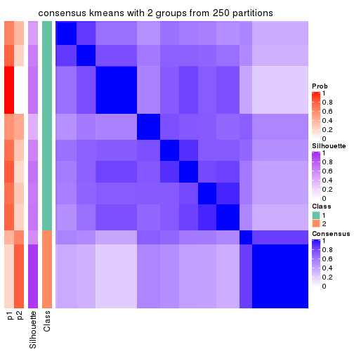</p>

</div>
<div id='tab-CV-kmeans-consensus-heatmap-2'>
<pre><code class="r">consensus_heatmap(res, k = 3)
</code></pre>

<p>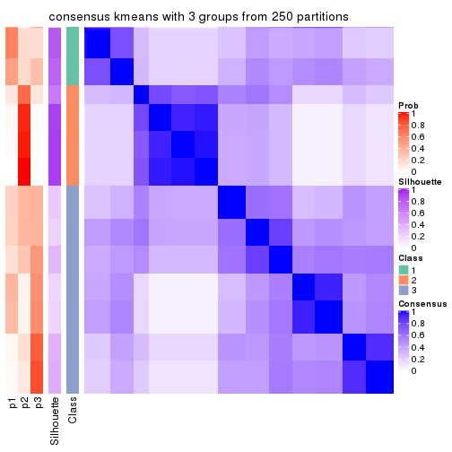</p>

</div>
<div id='tab-CV-kmeans-consensus-heatmap-3'>
<pre><code class="r">consensus_heatmap(res, k = 4)
</code></pre>

<p>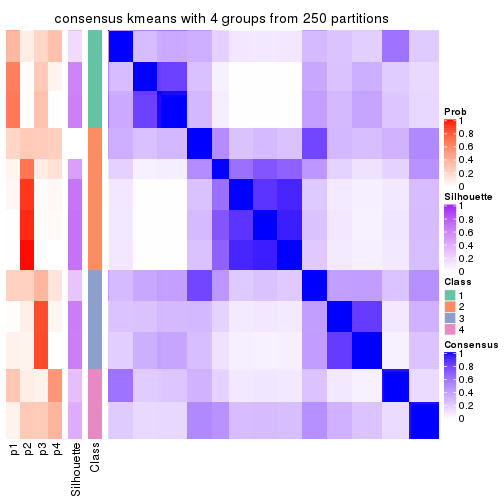</p>

</div>
<div id='tab-CV-kmeans-consensus-heatmap-4'>
<pre><code class="r">consensus_heatmap(res, k = 5)
</code></pre>

<p>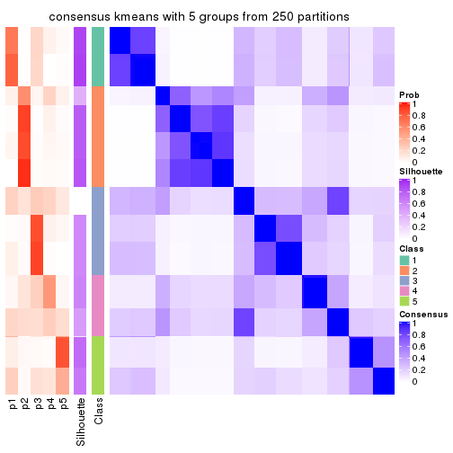</p>

</div>
<div id='tab-CV-kmeans-consensus-heatmap-5'>
<pre><code class="r">consensus_heatmap(res, k = 6)
</code></pre>

<p>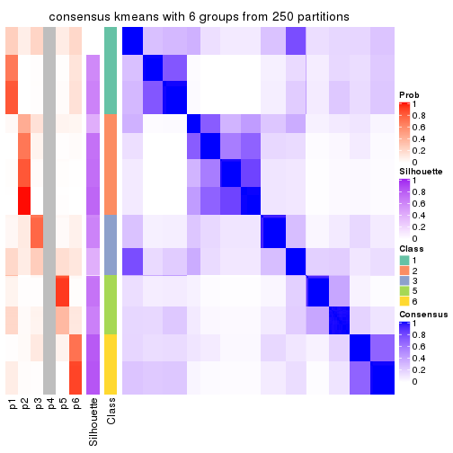</p>

</div>
</div>

Heatmaps for the membership of samples in all partitions to see how consistent they are:


<script>
$( function() {
	$( '#tabs-CV-kmeans-membership-heatmap' ).tabs();
} );
</script>
<div id='tabs-CV-kmeans-membership-heatmap'>
<ul>
<li><a href='#tab-CV-kmeans-membership-heatmap-1'>k = 2</a></li>
<li><a href='#tab-CV-kmeans-membership-heatmap-2'>k = 3</a></li>
<li><a href='#tab-CV-kmeans-membership-heatmap-3'>k = 4</a></li>
<li><a href='#tab-CV-kmeans-membership-heatmap-4'>k = 5</a></li>
<li><a href='#tab-CV-kmeans-membership-heatmap-5'>k = 6</a></li>
</ul>
<div id='tab-CV-kmeans-membership-heatmap-1'>
<pre><code class="r">membership_heatmap(res, k = 2)
</code></pre>

<p>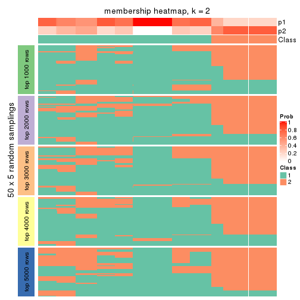</p>

</div>
<div id='tab-CV-kmeans-membership-heatmap-2'>
<pre><code class="r">membership_heatmap(res, k = 3)
</code></pre>

<p>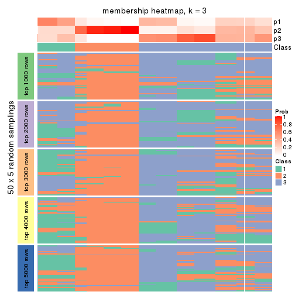</p>

</div>
<div id='tab-CV-kmeans-membership-heatmap-3'>
<pre><code class="r">membership_heatmap(res, k = 4)
</code></pre>

<p>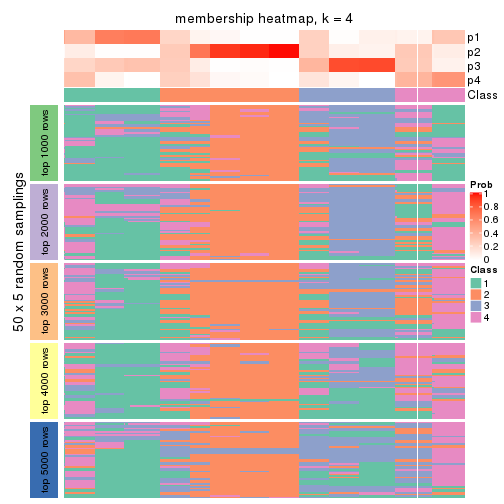</p>

</div>
<div id='tab-CV-kmeans-membership-heatmap-4'>
<pre><code class="r">membership_heatmap(res, k = 5)
</code></pre>

<p>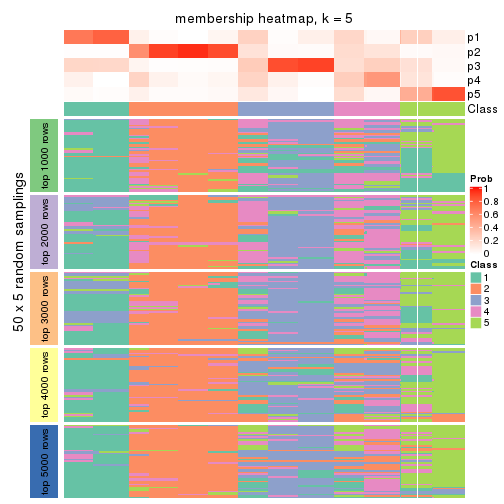</p>

</div>
<div id='tab-CV-kmeans-membership-heatmap-5'>
<pre><code class="r">membership_heatmap(res, k = 6)
</code></pre>

<p>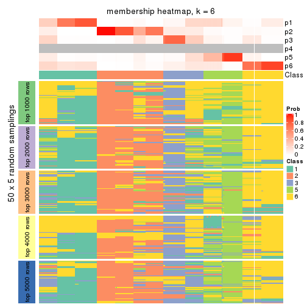</p>

</div>
</div>

As soon as we have had the classes for columns, we can look for signatures
which are significantly different between classes which can be candidate marks
for certain classes. Following are the heatmaps for signatures.


Signature heatmaps where rows are scaled:


<script>
$( function() {
	$( '#tabs-CV-kmeans-get-signatures' ).tabs();
} );
</script>
<div id='tabs-CV-kmeans-get-signatures'>
<ul>
<li><a href='#tab-CV-kmeans-get-signatures-1'>k = 2</a></li>
<li><a href='#tab-CV-kmeans-get-signatures-2'>k = 3</a></li>
<li><a href='#tab-CV-kmeans-get-signatures-3'>k = 4</a></li>
<li><a href='#tab-CV-kmeans-get-signatures-4'>k = 5</a></li>
<li><a href='#tab-CV-kmeans-get-signatures-5'>k = 6</a></li>
</ul>
<div id='tab-CV-kmeans-get-signatures-1'>
<pre><code class="r">get_signatures(res, k = 2)
</code></pre>

<p>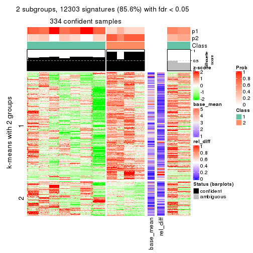</p>

</div>
<div id='tab-CV-kmeans-get-signatures-2'>
<pre><code class="r">get_signatures(res, k = 3)
</code></pre>

<p>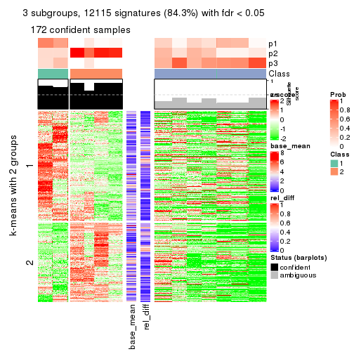</p>

</div>
<div id='tab-CV-kmeans-get-signatures-3'>
<pre><code class="r">get_signatures(res, k = 4)
</code></pre>

<p>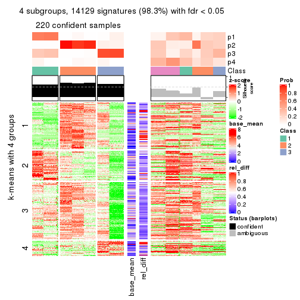</p>

</div>
<div id='tab-CV-kmeans-get-signatures-4'>
<pre><code class="r">get_signatures(res, k = 5)
</code></pre>

<p>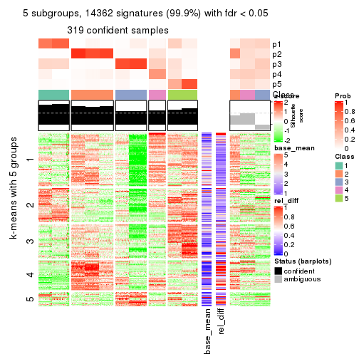</p>

</div>
<div id='tab-CV-kmeans-get-signatures-5'>
<pre><code class="r">get_signatures(res, k = 6)
</code></pre>

<p>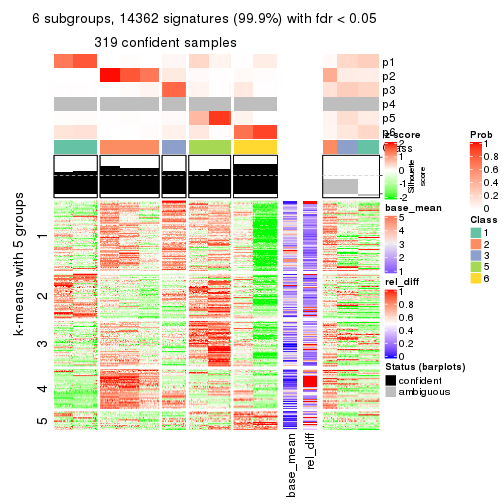</p>

</div>
</div>


Signature heatmaps where rows are not scaled:


<script>
$( function() {
	$( '#tabs-CV-kmeans-get-signatures-no-scale' ).tabs();
} );
</script>
<div id='tabs-CV-kmeans-get-signatures-no-scale'>
<ul>
<li><a href='#tab-CV-kmeans-get-signatures-no-scale-1'>k = 2</a></li>
<li><a href='#tab-CV-kmeans-get-signatures-no-scale-2'>k = 3</a></li>
<li><a href='#tab-CV-kmeans-get-signatures-no-scale-3'>k = 4</a></li>
<li><a href='#tab-CV-kmeans-get-signatures-no-scale-4'>k = 5</a></li>
<li><a href='#tab-CV-kmeans-get-signatures-no-scale-5'>k = 6</a></li>
</ul>
<div id='tab-CV-kmeans-get-signatures-no-scale-1'>
<pre><code class="r">get_signatures(res, k = 2, scale_rows = FALSE)
</code></pre>

<p>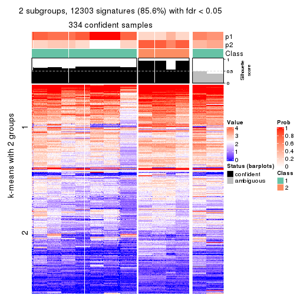</p>

</div>
<div id='tab-CV-kmeans-get-signatures-no-scale-2'>
<pre><code class="r">get_signatures(res, k = 3, scale_rows = FALSE)
</code></pre>

<p>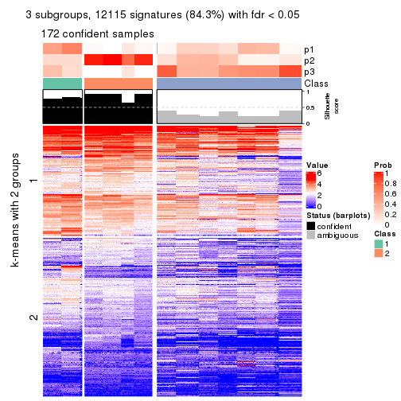</p>

</div>
<div id='tab-CV-kmeans-get-signatures-no-scale-3'>
<pre><code class="r">get_signatures(res, k = 4, scale_rows = FALSE)
</code></pre>

<p>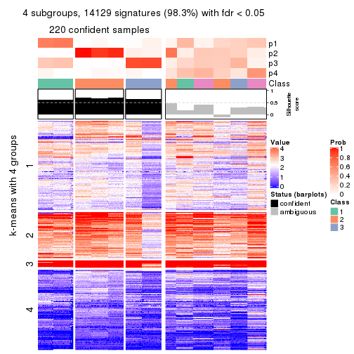</p>

</div>
<div id='tab-CV-kmeans-get-signatures-no-scale-4'>
<pre><code class="r">get_signatures(res, k = 5, scale_rows = FALSE)
</code></pre>

<p>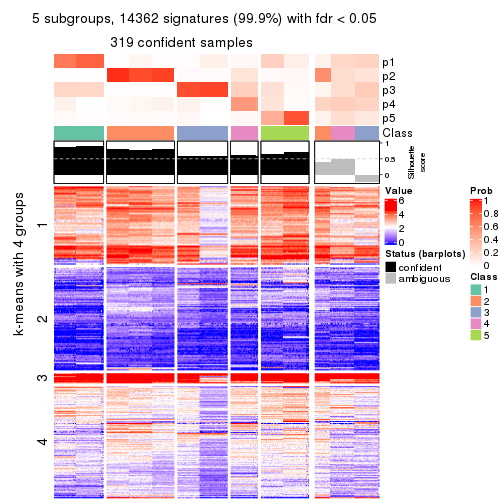</p>

</div>
<div id='tab-CV-kmeans-get-signatures-no-scale-5'>
<pre><code class="r">get_signatures(res, k = 6, scale_rows = FALSE)
</code></pre>

<p>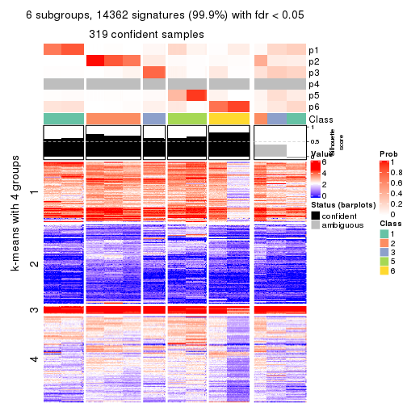</p>

</div>
</div>


Compare the overlap of signatures from different k:

```r
compare_signatures(res)
```

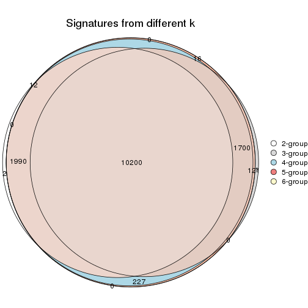

`get_signature()` returns a data frame invisibly. TO get the list of signatures, the function
call should be assigned to a variable explicitly. In following code, if `plot` argument is set
to `FALSE`, no heatmap is plotted while only the differential analysis is performed.

```r
# code only for demonstration
tb = get_signature(res, k = ..., plot = FALSE)
```

An example of the output of `tb` is:

```
#>   which_row         fdr    mean_1    mean_2 scaled_mean_1 scaled_mean_2 km
#> 1        38 0.042760348  8.373488  9.131774    -0.5533452     0.5164555  1
#> 2        40 0.018707592  7.106213  8.469186    -0.6173731     0.5762149  1
#> 3        55 0.019134737 10.221463 11.207825    -0.6159697     0.5749050  1
#> 4        59 0.006059896  5.921854  7.869574    -0.6899429     0.6439467  1
#> 5        60 0.018055526  8.928898 10.211722    -0.6204761     0.5791110  1
#> 6        98 0.009384629 15.714769 14.887706     0.6635654    -0.6193277  2
...
```

The columns in `tb` are:

1. `which_row`: row indices corresponding to the input matrix.
2. `fdr`: FDR for the differential test. 
3. `mean_x`: The mean value in group x.
4. `scaled_mean_x`: The mean value in group x after rows are scaled.
5. `km`: Row groups if k-means clustering is applied to rows.


UMAP plot which shows how samples are separated.


<script>
$( function() {
	$( '#tabs-CV-kmeans-dimension-reduction' ).tabs();
} );
</script>
<div id='tabs-CV-kmeans-dimension-reduction'>
<ul>
<li><a href='#tab-CV-kmeans-dimension-reduction-1'>k = 2</a></li>
<li><a href='#tab-CV-kmeans-dimension-reduction-2'>k = 3</a></li>
<li><a href='#tab-CV-kmeans-dimension-reduction-3'>k = 4</a></li>
<li><a href='#tab-CV-kmeans-dimension-reduction-4'>k = 5</a></li>
<li><a href='#tab-CV-kmeans-dimension-reduction-5'>k = 6</a></li>
</ul>
<div id='tab-CV-kmeans-dimension-reduction-1'>
<pre><code class="r">dimension_reduction(res, k = 2, method = &quot;UMAP&quot;)
</code></pre>

<p>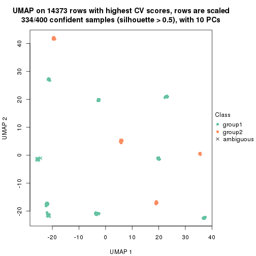</p>

</div>
<div id='tab-CV-kmeans-dimension-reduction-2'>
<pre><code class="r">dimension_reduction(res, k = 3, method = &quot;UMAP&quot;)
</code></pre>

<p>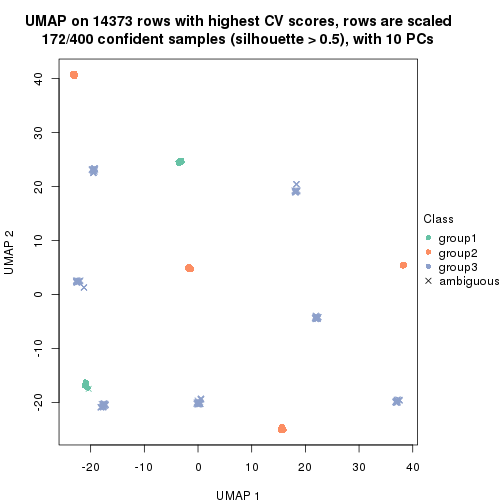</p>

</div>
<div id='tab-CV-kmeans-dimension-reduction-3'>
<pre><code class="r">dimension_reduction(res, k = 4, method = &quot;UMAP&quot;)
</code></pre>

<p>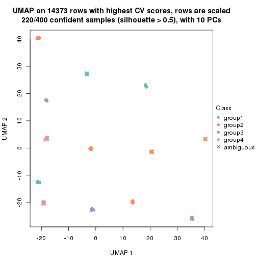</p>

</div>
<div id='tab-CV-kmeans-dimension-reduction-4'>
<pre><code class="r">dimension_reduction(res, k = 5, method = &quot;UMAP&quot;)
</code></pre>

<p>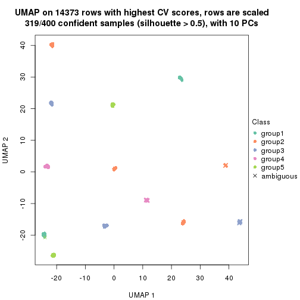</p>

</div>
<div id='tab-CV-kmeans-dimension-reduction-5'>
<pre><code class="r">dimension_reduction(res, k = 6, method = &quot;UMAP&quot;)
</code></pre>

<p>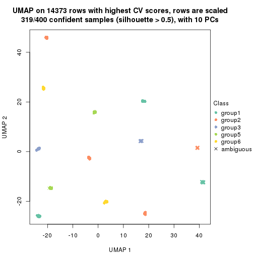</p>

</div>
</div>


Following heatmap shows how subgroups are split when increasing `k`:

```r
collect_classes(res)
```

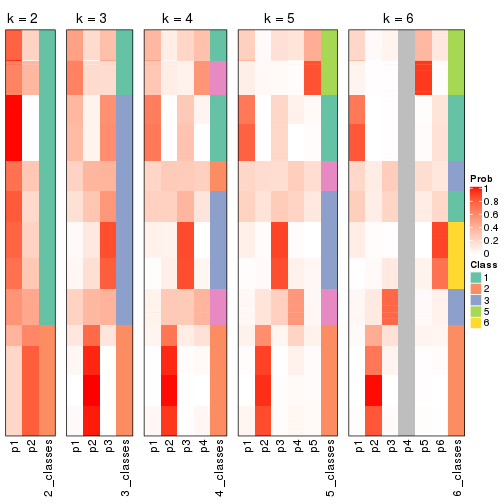


If matrix rows can be associated to genes, consider to use `GO_Enrichment(res,
...)` to perform function enrichment for the signature genes.


 

---------------------------------------------------


### CV:skmeans


The object with results only for a single top-value method and a single partition method 
can be extracted as:

```r
res = res_list["CV", "skmeans"]
# you can also extract it by
# res = res_list["CV:skmeans"]
```

A summary of `res` and all the functions that can be applied to it:

```r
res
```

```
#> A 'ConsensusPartition' object with k = 2, 3, 4, 5, 6.
#>   On a matrix with 14373 rows and 400 columns.
#>   Top rows (1000, 2000, 3000, 4000, 5000) are extracted by 'CV' method.
#>   Subgroups are detected by 'skmeans' method.
#>   Performed in total 1250 partitions by row resampling.
#>   Best k for subgroups seems to be 6.
#> 
#> Following methods can be applied to this 'ConsensusPartition' object:
#>  [1] "cola_report"             "collect_classes"         "collect_plots"          
#>  [4] "collect_stats"           "colnames"                "compare_signatures"     
#>  [7] "consensus_heatmap"       "dimension_reduction"     "functional_enrichment"  
#> [10] "get_anno_col"            "get_anno"                "get_classes"            
#> [13] "get_consensus"           "get_matrix"              "get_membership"         
#> [16] "get_param"               "get_signatures"          "get_stats"              
#> [19] "is_best_k"               "is_stable_k"             "membership_heatmap"     
#> [22] "ncol"                    "nrow"                    "plot_ecdf"              
#> [25] "rownames"                "select_partition_number" "show"                   
#> [28] "suggest_best_k"          "test_to_known_factors"
```

`collect_plots()` function collects all the plots made from `res` for all `k` (number of partitions)
into one single page to provide an easy and fast comparison between different `k`.

```r
collect_plots(res)
```

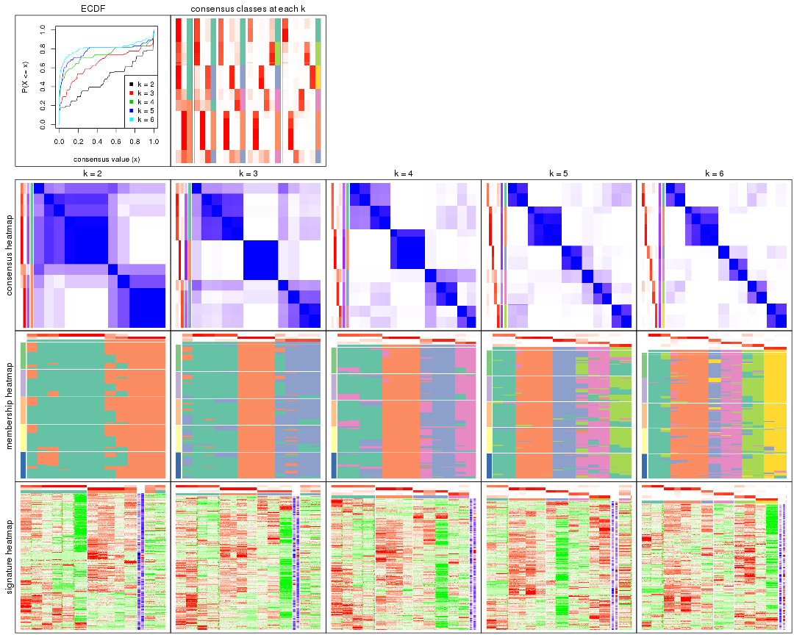

The plots are:

- The first row: a plot of the ECDF (Empirical cumulative distribution
  function) curves of the consensus matrix for each `k` and the heatmap of
  predicted classes for each `k`.
- The second row: heatmaps of the consensus matrix for each `k`.
- The third row: heatmaps of the membership matrix for each `k`.
- The fouth row: heatmaps of the signatures for each `k`.

All the plots in panels can be made by individual functions and they are
plotted later in this section.

`select_partition_number()` produces several plots showing different
statistics for choosing "optimized" `k`. There are following statistics:

- ECDF curves of the consensus matrix for each `k`;
- 1-PAC. [The PAC
  score](https://en.wikipedia.org/wiki/Consensus_clustering#Over-interpretation_potential_of_consensus_clustering)
  measures the proportion of the ambiguous subgrouping.
- Mean silhouette score.
- Concordance. The mean probability of fiting the consensus class ids in all
  partitions.
- Area increased. Denote $A_k$ as the area under the ECDF curve for current
  `k`, the area increased is defined as $A_k - A_{k-1}$.
- Rand index. The percent of pairs of samples that are both in a same cluster
  or both are not in a same cluster in the partition of k and k-1.
- Jaccard index. The ratio of pairs of samples are both in a same cluster in
  the partition of k and k-1 and the pairs of samples are both in a same
  cluster in the partition k or k-1.

The detailed explanations of these statistics can be found in [the cola
vignette](http://bioconductor.org/packages/devel/bioc/vignettes/cola/inst/doc/cola.html#toc_13).

Generally speaking, lower PAC score, higher mean silhouette score or higher
concordance corresponds to better partition. Rand index and Jaccard index
measure how similar the current partition is compared to partition with `k-1`.
If they are too similar, we won't accept `k` is better than `k-1`.

```r
select_partition_number(res)
```

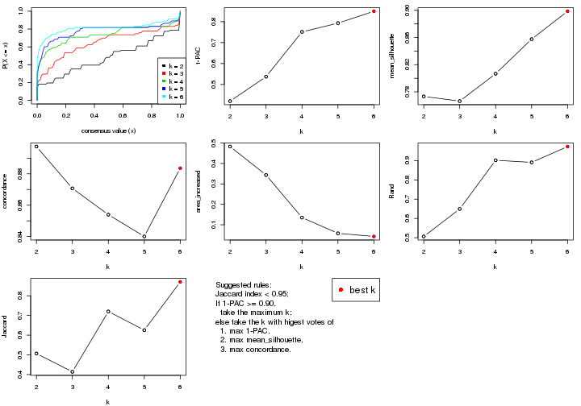

The numeric values for all these statistics can be obtained by `get_stats()`.

```r
get_stats(res)
```

```
#>   k 1-PAC mean_silhouette concordance area_increased  Rand Jaccard
#> 2 2 0.421           0.773       0.897         0.4829 0.507   0.507
#> 3 3 0.537           0.766       0.871         0.3438 0.649   0.414
#> 4 4 0.751           0.807       0.854         0.1352 0.902   0.720
#> 5 5 0.793           0.858       0.840         0.0581 0.891   0.626
#> 6 6 0.850           0.899       0.884         0.0428 0.973   0.871
```

`suggest_best_k()` suggests the best $k$ based on these statistics. The rules are as follows:

- All $k$ with Jaccard index larger than 0.95 are removed because the increase of
  the partition number does not provides enough extra information. If all $k$ are removed,
  the best $k$ is assigned by `NA`.
- For $k$ with 1-PAC larger than 0.9, the maximal $k$ is taken as the "best k". Other $k$ is called "optional k".
- If it does not fit the second rule. The $k$ with the highest vote of highest
  1-PAC, mean silhouette and concordance is taken as the "best k".

```r
suggest_best_k(res)
```

```
#> [1] 6
```


Following shows the table of the partitions (You need to click the **show/hide
code output** link to see it). The membership matrix (columns with name `p*`)
is inferred by
[`clue::cl_consensus()`](https://www.rdocumentation.org/link/cl_consensus?package=clue)
function with the `SE` method. Basically the value in the membership matrix
represents the probability to belong to a certain group. The finall class
label for an item is determined with the group with highest probability it
belongs to.

In `get_classes()` function, the entropy is calculated from the membership
matrix and the silhouette score is calculated from the consensus matrix.


<script>
$( function() {
	$( '#tabs-CV-skmeans-get-classes' ).tabs();
} );
</script>
<div id='tabs-CV-skmeans-get-classes'>
<ul>
<li><a href='#tab-CV-skmeans-get-classes-1'>k = 2</a></li>
<li><a href='#tab-CV-skmeans-get-classes-2'>k = 3</a></li>
<li><a href='#tab-CV-skmeans-get-classes-3'>k = 4</a></li>
<li><a href='#tab-CV-skmeans-get-classes-4'>k = 5</a></li>
<li><a href='#tab-CV-skmeans-get-classes-5'>k = 6</a></li>
</ul>

<div id='tab-CV-skmeans-get-classes-1'>
<p><a id='tab-CV-skmeans-get-classes-1-a' style='color:#0366d6' href='#'>show/hide code output</a></p>
<pre><code class="r">cbind(get_classes(res, k = 2), get_membership(res, k = 2))
</code></pre>

<pre><code>#&gt;            class entropy silhouette    p1    p2
#&gt; SRR1661716     2  0.0000      0.854 0.000 1.000
#&gt; SRR1661717     2  0.0000      0.854 0.000 1.000
#&gt; SRR1661718     2  0.0000      0.854 0.000 1.000
#&gt; SRR1661719     2  0.0000      0.854 0.000 1.000
#&gt; SRR1661720     2  0.0000      0.854 0.000 1.000
#&gt; SRR1661721     2  0.0000      0.854 0.000 1.000
#&gt; SRR1661722     2  0.0000      0.854 0.000 1.000
#&gt; SRR1661723     2  0.0000      0.854 0.000 1.000
#&gt; SRR1661724     2  0.0000      0.854 0.000 1.000
#&gt; SRR1661725     2  0.0000      0.854 0.000 1.000
#&gt; SRR1661726     2  0.0000      0.854 0.000 1.000
#&gt; SRR1661727     2  0.0000      0.854 0.000 1.000
#&gt; SRR1661728     2  0.0000      0.854 0.000 1.000
#&gt; SRR1661729     2  0.0000      0.854 0.000 1.000
#&gt; SRR1661730     2  0.0000      0.854 0.000 1.000
#&gt; SRR1661731     2  0.0000      0.854 0.000 1.000
#&gt; SRR1661732     2  0.0000      0.854 0.000 1.000
#&gt; SRR1661733     2  0.0000      0.854 0.000 1.000
#&gt; SRR1661734     2  0.0000      0.854 0.000 1.000
#&gt; SRR1661735     2  0.0000      0.854 0.000 1.000
#&gt; SRR1661736     2  0.0000      0.854 0.000 1.000
#&gt; SRR1661737     2  0.0000      0.854 0.000 1.000
#&gt; SRR1661738     2  0.0000      0.854 0.000 1.000
#&gt; SRR1661739     2  0.0000      0.854 0.000 1.000
#&gt; SRR1661740     2  0.0000      0.854 0.000 1.000
#&gt; SRR1661741     2  0.0000      0.854 0.000 1.000
#&gt; SRR1661742     2  0.0000      0.854 0.000 1.000
#&gt; SRR1661743     2  0.0000      0.854 0.000 1.000
#&gt; SRR1661744     2  0.0000      0.854 0.000 1.000
#&gt; SRR1661745     2  0.0000      0.854 0.000 1.000
#&gt; SRR1661746     2  0.0000      0.854 0.000 1.000
#&gt; SRR1661747     2  0.0000      0.854 0.000 1.000
#&gt; SRR1661748     2  0.0000      0.854 0.000 1.000
#&gt; SRR1661749     2  0.0000      0.854 0.000 1.000
#&gt; SRR1661750     2  0.0000      0.854 0.000 1.000
#&gt; SRR1661751     2  0.0000      0.854 0.000 1.000
#&gt; SRR1661752     2  0.0000      0.854 0.000 1.000
#&gt; SRR1661753     2  0.0000      0.854 0.000 1.000
#&gt; SRR1661754     2  0.0000      0.854 0.000 1.000
#&gt; SRR1661755     2  0.0000      0.854 0.000 1.000
#&gt; SRR1661756     2  0.0000      0.854 0.000 1.000
#&gt; SRR1661757     2  0.0000      0.854 0.000 1.000
#&gt; SRR1661758     2  0.0000      0.854 0.000 1.000
#&gt; SRR1661759     2  0.0000      0.854 0.000 1.000
#&gt; SRR1661760     2  0.0000      0.854 0.000 1.000
#&gt; SRR1661761     2  0.0000      0.854 0.000 1.000
#&gt; SRR1661762     2  0.0000      0.854 0.000 1.000
#&gt; SRR1661763     2  0.0000      0.854 0.000 1.000
#&gt; SRR1661764     2  0.0000      0.854 0.000 1.000
#&gt; SRR1661766     2  0.0000      0.854 0.000 1.000
#&gt; SRR1661767     2  0.0000      0.854 0.000 1.000
#&gt; SRR1661768     2  0.0000      0.854 0.000 1.000
#&gt; SRR1661769     2  0.0000      0.854 0.000 1.000
#&gt; SRR1661770     2  0.0000      0.854 0.000 1.000
#&gt; SRR1661771     2  0.0000      0.854 0.000 1.000
#&gt; SRR1661772     2  0.0000      0.854 0.000 1.000
#&gt; SRR1661773     2  0.0000      0.854 0.000 1.000
#&gt; SRR1661774     2  0.0000      0.854 0.000 1.000
#&gt; SRR1661775     2  0.0000      0.854 0.000 1.000
#&gt; SRR1661776     2  0.0000      0.854 0.000 1.000
#&gt; SRR1661777     2  0.0000      0.854 0.000 1.000
#&gt; SRR1661778     2  0.0000      0.854 0.000 1.000
#&gt; SRR1661779     2  0.0000      0.854 0.000 1.000
#&gt; SRR1661780     2  0.0000      0.854 0.000 1.000
#&gt; SRR1661781     2  0.0000      0.854 0.000 1.000
#&gt; SRR1661782     2  0.0000      0.854 0.000 1.000
#&gt; SRR1661783     2  0.0000      0.854 0.000 1.000
#&gt; SRR1661784     2  0.0000      0.854 0.000 1.000
#&gt; SRR1661785     2  0.0000      0.854 0.000 1.000
#&gt; SRR1661786     2  0.0000      0.854 0.000 1.000
#&gt; SRR1661787     2  0.0000      0.854 0.000 1.000
#&gt; SRR1661788     2  0.0000      0.854 0.000 1.000
#&gt; SRR1661789     2  0.0000      0.854 0.000 1.000
#&gt; SRR1661790     2  0.0000      0.854 0.000 1.000
#&gt; SRR1661791     2  0.0000      0.854 0.000 1.000
#&gt; SRR1661792     2  0.0000      0.854 0.000 1.000
#&gt; SRR1661793     2  0.0000      0.854 0.000 1.000
#&gt; SRR1661794     2  0.0000      0.854 0.000 1.000
#&gt; SRR1661795     2  0.0000      0.854 0.000 1.000
#&gt; SRR1661796     2  0.0000      0.854 0.000 1.000
#&gt; SRR1661797     2  0.0000      0.854 0.000 1.000
#&gt; SRR1661798     2  0.0000      0.854 0.000 1.000
#&gt; SRR1661799     2  0.0000      0.854 0.000 1.000
#&gt; SRR1661800     2  0.0000      0.854 0.000 1.000
#&gt; SRR1661801     2  0.0000      0.854 0.000 1.000
#&gt; SRR1661802     2  0.0000      0.854 0.000 1.000
#&gt; SRR1661803     2  0.0000      0.854 0.000 1.000
#&gt; SRR1661804     2  0.0000      0.854 0.000 1.000
#&gt; SRR1661805     2  0.0000      0.854 0.000 1.000
#&gt; SRR1661806     2  0.0000      0.854 0.000 1.000
#&gt; SRR1661807     2  0.0000      0.854 0.000 1.000
#&gt; SRR1661808     2  0.0000      0.854 0.000 1.000
#&gt; SRR1661809     2  0.0000      0.854 0.000 1.000
#&gt; SRR1661810     2  0.0000      0.854 0.000 1.000
#&gt; SRR1661811     2  0.0000      0.854 0.000 1.000
#&gt; SRR1661812     2  0.0000      0.854 0.000 1.000
#&gt; SRR1661813     2  0.0000      0.854 0.000 1.000
#&gt; SRR1661814     2  0.0000      0.854 0.000 1.000
#&gt; SRR1661815     2  0.0000      0.854 0.000 1.000
#&gt; SRR1661816     2  0.0000      0.854 0.000 1.000
#&gt; SRR1661817     2  0.0000      0.854 0.000 1.000
#&gt; SRR1661818     2  0.0000      0.854 0.000 1.000
#&gt; SRR1661819     2  0.0000      0.854 0.000 1.000
#&gt; SRR1661820     2  0.0000      0.854 0.000 1.000
#&gt; SRR1661821     2  0.0000      0.854 0.000 1.000
#&gt; SRR1661822     2  0.0000      0.854 0.000 1.000
#&gt; SRR1661823     2  0.0000      0.854 0.000 1.000
#&gt; SRR1661824     2  0.0000      0.854 0.000 1.000
#&gt; SRR1661825     2  0.0000      0.854 0.000 1.000
#&gt; SRR1661826     1  0.0000      0.894 1.000 0.000
#&gt; SRR1661827     1  0.0000      0.894 1.000 0.000
#&gt; SRR1661828     1  0.0000      0.894 1.000 0.000
#&gt; SRR1661829     1  0.0000      0.894 1.000 0.000
#&gt; SRR1661830     1  0.0000      0.894 1.000 0.000
#&gt; SRR1661831     1  0.0000      0.894 1.000 0.000
#&gt; SRR1661832     1  0.0000      0.894 1.000 0.000
#&gt; SRR1661833     1  0.0000      0.894 1.000 0.000
#&gt; SRR1661834     1  0.0000      0.894 1.000 0.000
#&gt; SRR1661835     1  0.0000      0.894 1.000 0.000
#&gt; SRR1661836     1  0.0000      0.894 1.000 0.000
#&gt; SRR1661837     1  0.0000      0.894 1.000 0.000
#&gt; SRR1661838     1  0.0000      0.894 1.000 0.000
#&gt; SRR1661839     1  0.0000      0.894 1.000 0.000
#&gt; SRR1661840     1  0.0000      0.894 1.000 0.000
#&gt; SRR1661841     1  0.0000      0.894 1.000 0.000
#&gt; SRR1661843     1  0.0000      0.894 1.000 0.000
#&gt; SRR1661844     1  0.0000      0.894 1.000 0.000
#&gt; SRR1661845     1  0.0000      0.894 1.000 0.000
#&gt; SRR1661846     1  0.0000      0.894 1.000 0.000
#&gt; SRR1661847     1  0.0000      0.894 1.000 0.000
#&gt; SRR1661848     1  0.0000      0.894 1.000 0.000
#&gt; SRR1661849     1  0.0000      0.894 1.000 0.000
#&gt; SRR1661850     1  0.0000      0.894 1.000 0.000
#&gt; SRR1661851     1  0.0000      0.894 1.000 0.000
#&gt; SRR1661852     1  0.0000      0.894 1.000 0.000
#&gt; SRR1661853     1  0.0000      0.894 1.000 0.000
#&gt; SRR1661854     1  0.0000      0.894 1.000 0.000
#&gt; SRR1661855     1  0.0000      0.894 1.000 0.000
#&gt; SRR1661856     1  0.0000      0.894 1.000 0.000
#&gt; SRR1661857     1  0.0000      0.894 1.000 0.000
#&gt; SRR1661858     1  0.0000      0.894 1.000 0.000
#&gt; SRR1661859     1  0.0000      0.894 1.000 0.000
#&gt; SRR1661860     1  0.0000      0.894 1.000 0.000
#&gt; SRR1661861     1  0.0000      0.894 1.000 0.000
#&gt; SRR1661862     1  0.0000      0.894 1.000 0.000
#&gt; SRR1661863     1  0.0000      0.894 1.000 0.000
#&gt; SRR1661864     1  0.0000      0.894 1.000 0.000
#&gt; SRR1661865     1  0.0000      0.894 1.000 0.000
#&gt; SRR1661866     1  0.0000      0.894 1.000 0.000
#&gt; SRR1661867     1  0.0000      0.894 1.000 0.000
#&gt; SRR1661868     1  0.0000      0.894 1.000 0.000
#&gt; SRR1661869     1  0.0000      0.894 1.000 0.000
#&gt; SRR1661870     1  0.0000      0.894 1.000 0.000
#&gt; SRR1661871     1  0.0000      0.894 1.000 0.000
#&gt; SRR1661872     1  0.0000      0.894 1.000 0.000
#&gt; SRR1661873     1  0.0000      0.894 1.000 0.000
#&gt; SRR1661874     1  0.0000      0.894 1.000 0.000
#&gt; SRR1661875     1  0.0000      0.894 1.000 0.000
#&gt; SRR1661876     1  0.0000      0.894 1.000 0.000
#&gt; SRR1661877     1  0.0000      0.894 1.000 0.000
#&gt; SRR1661878     1  0.0000      0.894 1.000 0.000
#&gt; SRR1661879     1  0.0000      0.894 1.000 0.000
#&gt; SRR1661880     1  0.0000      0.894 1.000 0.000
#&gt; SRR1661881     1  0.0000      0.894 1.000 0.000
#&gt; SRR1661882     1  0.0000      0.894 1.000 0.000
#&gt; SRR1661883     1  0.0000      0.894 1.000 0.000
#&gt; SRR1661884     1  0.0000      0.894 1.000 0.000
#&gt; SRR1661885     1  0.0000      0.894 1.000 0.000
#&gt; SRR1661886     1  0.0000      0.894 1.000 0.000
#&gt; SRR1661887     1  0.0000      0.894 1.000 0.000
#&gt; SRR1661888     1  0.0000      0.894 1.000 0.000
#&gt; SRR1661889     1  0.0000      0.894 1.000 0.000
#&gt; SRR1661890     1  0.0000      0.894 1.000 0.000
#&gt; SRR1661891     1  0.0000      0.894 1.000 0.000
#&gt; SRR1661892     1  0.0000      0.894 1.000 0.000
#&gt; SRR1661893     1  0.0000      0.894 1.000 0.000
#&gt; SRR1661894     1  0.0000      0.894 1.000 0.000
#&gt; SRR1661895     1  0.0000      0.894 1.000 0.000
#&gt; SRR1661896     1  0.0000      0.894 1.000 0.000
#&gt; SRR1661897     1  0.0000      0.894 1.000 0.000
#&gt; SRR1661898     1  0.0000      0.894 1.000 0.000
#&gt; SRR1661899     1  0.0000      0.894 1.000 0.000
#&gt; SRR1661900     1  0.0000      0.894 1.000 0.000
#&gt; SRR1661901     1  0.0000      0.894 1.000 0.000
#&gt; SRR1661902     1  0.0000      0.894 1.000 0.000
#&gt; SRR1661903     1  0.0000      0.894 1.000 0.000
#&gt; SRR1661904     1  0.0000      0.894 1.000 0.000
#&gt; SRR1661905     1  0.0000      0.894 1.000 0.000
#&gt; SRR1661906     1  0.0000      0.894 1.000 0.000
#&gt; SRR1661907     1  0.0000      0.894 1.000 0.000
#&gt; SRR1661908     1  0.0000      0.894 1.000 0.000
#&gt; SRR1661909     1  0.0000      0.894 1.000 0.000
#&gt; SRR1661910     1  0.0000      0.894 1.000 0.000
#&gt; SRR1661911     1  0.0000      0.894 1.000 0.000
#&gt; SRR1661912     1  0.0000      0.894 1.000 0.000
#&gt; SRR1661913     1  0.0000      0.894 1.000 0.000
#&gt; SRR1661914     1  0.0000      0.894 1.000 0.000
#&gt; SRR1661915     1  0.0000      0.894 1.000 0.000
#&gt; SRR1661916     1  0.0000      0.894 1.000 0.000
#&gt; SRR1661917     1  0.0000      0.894 1.000 0.000
#&gt; SRR1661918     1  0.0000      0.894 1.000 0.000
#&gt; SRR1661919     1  0.0000      0.894 1.000 0.000
#&gt; SRR1661920     1  0.0000      0.894 1.000 0.000
#&gt; SRR1661921     1  0.0000      0.894 1.000 0.000
#&gt; SRR1661922     1  0.0000      0.894 1.000 0.000
#&gt; SRR1661923     1  0.0000      0.894 1.000 0.000
#&gt; SRR1661924     1  0.0000      0.894 1.000 0.000
#&gt; SRR1661925     1  0.0000      0.894 1.000 0.000
#&gt; SRR1661926     1  0.0000      0.894 1.000 0.000
#&gt; SRR1661927     1  0.0000      0.894 1.000 0.000
#&gt; SRR1661928     1  0.0376      0.893 0.996 0.004
#&gt; SRR1661929     1  0.0376      0.893 0.996 0.004
#&gt; SRR1661930     1  0.0376      0.893 0.996 0.004
#&gt; SRR1661931     1  0.0376      0.893 0.996 0.004
#&gt; SRR1661932     1  0.0376      0.893 0.996 0.004
#&gt; SRR1661933     1  0.0376      0.893 0.996 0.004
#&gt; SRR1661934     1  0.0376      0.893 0.996 0.004
#&gt; SRR1661935     1  0.0376      0.893 0.996 0.004
#&gt; SRR1661936     1  0.0376      0.893 0.996 0.004
#&gt; SRR1661937     1  0.0376      0.893 0.996 0.004
#&gt; SRR1661938     1  0.0376      0.893 0.996 0.004
#&gt; SRR1661939     1  0.0376      0.893 0.996 0.004
#&gt; SRR1661940     1  0.0376      0.893 0.996 0.004
#&gt; SRR1661941     1  0.0376      0.893 0.996 0.004
#&gt; SRR1661942     1  0.0376      0.893 0.996 0.004
#&gt; SRR1661943     1  0.0376      0.893 0.996 0.004
#&gt; SRR1661944     1  0.0376      0.893 0.996 0.004
#&gt; SRR1661945     1  0.0376      0.893 0.996 0.004
#&gt; SRR1661946     1  0.0376      0.893 0.996 0.004
#&gt; SRR1661947     1  0.0376      0.893 0.996 0.004
#&gt; SRR1661948     1  0.0376      0.893 0.996 0.004
#&gt; SRR1661949     1  0.0376      0.893 0.996 0.004
#&gt; SRR1661950     1  0.0376      0.893 0.996 0.004
#&gt; SRR1661951     1  0.0376      0.893 0.996 0.004
#&gt; SRR1661952     1  0.0376      0.893 0.996 0.004
#&gt; SRR1661953     1  0.0376      0.893 0.996 0.004
#&gt; SRR1661954     1  0.0376      0.893 0.996 0.004
#&gt; SRR1661955     1  0.0376      0.893 0.996 0.004
#&gt; SRR1661956     1  0.0376      0.893 0.996 0.004
#&gt; SRR1661957     1  0.0376      0.893 0.996 0.004
#&gt; SRR1661958     2  0.9970      0.211 0.468 0.532
#&gt; SRR1661959     2  0.9970      0.211 0.468 0.532
#&gt; SRR1661960     2  0.9970      0.211 0.468 0.532
#&gt; SRR1661961     2  0.9970      0.211 0.468 0.532
#&gt; SRR1661962     2  0.9970      0.211 0.468 0.532
#&gt; SRR1661963     2  0.9970      0.211 0.468 0.532
#&gt; SRR1661964     2  0.9970      0.211 0.468 0.532
#&gt; SRR1661965     2  0.9970      0.211 0.468 0.532
#&gt; SRR1661966     2  0.9970      0.211 0.468 0.532
#&gt; SRR1661967     2  0.9970      0.211 0.468 0.532
#&gt; SRR1661968     2  0.9970      0.211 0.468 0.532
#&gt; SRR1661969     2  0.9970      0.211 0.468 0.532
#&gt; SRR1661970     2  0.9970      0.211 0.468 0.532
#&gt; SRR1661971     2  0.9970      0.211 0.468 0.532
#&gt; SRR1661972     2  0.9970      0.211 0.468 0.532
#&gt; SRR1661973     2  0.9970      0.211 0.468 0.532
#&gt; SRR1661974     2  0.9970      0.211 0.468 0.532
#&gt; SRR1661975     2  0.9970      0.211 0.468 0.532
#&gt; SRR1661976     2  0.9970      0.211 0.468 0.532
#&gt; SRR1661977     2  0.9970      0.211 0.468 0.532
#&gt; SRR1661978     2  0.9970      0.211 0.468 0.532
#&gt; SRR1661979     2  0.9970      0.211 0.468 0.532
#&gt; SRR1661980     2  0.9970      0.211 0.468 0.532
#&gt; SRR1661981     2  0.9970      0.211 0.468 0.532
#&gt; SRR1661982     2  0.9970      0.211 0.468 0.532
#&gt; SRR1661983     2  0.9970      0.211 0.468 0.532
#&gt; SRR1661984     2  0.9970      0.211 0.468 0.532
#&gt; SRR1661985     2  0.9970      0.211 0.468 0.532
#&gt; SRR1661986     2  0.9970      0.211 0.468 0.532
#&gt; SRR1661987     2  0.9970      0.211 0.468 0.532
#&gt; SRR1661988     1  0.5059      0.841 0.888 0.112
#&gt; SRR1661989     1  0.5059      0.841 0.888 0.112
#&gt; SRR1661990     1  0.5059      0.841 0.888 0.112
#&gt; SRR1661991     1  0.5059      0.841 0.888 0.112
#&gt; SRR1661992     1  0.5059      0.841 0.888 0.112
#&gt; SRR1661993     1  0.5059      0.841 0.888 0.112
#&gt; SRR1661994     1  0.5059      0.841 0.888 0.112
#&gt; SRR1661995     1  0.5059      0.841 0.888 0.112
#&gt; SRR1661996     1  0.5059      0.841 0.888 0.112
#&gt; SRR1661997     1  0.5059      0.841 0.888 0.112
#&gt; SRR1661998     1  0.5059      0.841 0.888 0.112
#&gt; SRR1661999     1  0.5059      0.841 0.888 0.112
#&gt; SRR1662000     1  0.5059      0.841 0.888 0.112
#&gt; SRR1662001     1  0.5059      0.841 0.888 0.112
#&gt; SRR1662002     1  0.5059      0.841 0.888 0.112
#&gt; SRR1662003     1  0.5059      0.841 0.888 0.112
#&gt; SRR1662004     1  0.5059      0.841 0.888 0.112
#&gt; SRR1662005     1  0.5059      0.841 0.888 0.112
#&gt; SRR1662006     1  0.5059      0.841 0.888 0.112
#&gt; SRR1662007     1  0.5059      0.841 0.888 0.112
#&gt; SRR1662008     1  0.5059      0.841 0.888 0.112
#&gt; SRR1662009     1  0.5059      0.841 0.888 0.112
#&gt; SRR1662010     1  0.5059      0.841 0.888 0.112
#&gt; SRR1662011     1  0.5059      0.841 0.888 0.112
#&gt; SRR1662012     1  0.5059      0.841 0.888 0.112
#&gt; SRR1662013     1  0.5059      0.841 0.888 0.112
#&gt; SRR1662014     1  0.5059      0.841 0.888 0.112
#&gt; SRR1662015     1  0.5059      0.841 0.888 0.112
#&gt; SRR1662016     1  0.5059      0.841 0.888 0.112
#&gt; SRR1662017     1  0.5059      0.841 0.888 0.112
#&gt; SRR1662018     2  0.7815      0.726 0.232 0.768
#&gt; SRR1662019     2  0.7815      0.726 0.232 0.768
#&gt; SRR1662020     2  0.7815      0.726 0.232 0.768
#&gt; SRR1662021     2  0.7815      0.726 0.232 0.768
#&gt; SRR1662022     2  0.7815      0.726 0.232 0.768
#&gt; SRR1662023     2  0.7815      0.726 0.232 0.768
#&gt; SRR1662024     2  0.7815      0.726 0.232 0.768
#&gt; SRR1662025     2  0.7815      0.726 0.232 0.768
#&gt; SRR1662026     2  0.7815      0.726 0.232 0.768
#&gt; SRR1662027     2  0.7815      0.726 0.232 0.768
#&gt; SRR1662028     2  0.7815      0.726 0.232 0.768
#&gt; SRR1662029     2  0.7815      0.726 0.232 0.768
#&gt; SRR1662030     2  0.7815      0.726 0.232 0.768
#&gt; SRR1662031     2  0.7815      0.726 0.232 0.768
#&gt; SRR1662032     2  0.7815      0.726 0.232 0.768
#&gt; SRR1662033     2  0.7815      0.726 0.232 0.768
#&gt; SRR1662034     2  0.7815      0.726 0.232 0.768
#&gt; SRR1662035     2  0.7815      0.726 0.232 0.768
#&gt; SRR1662036     2  0.7815      0.726 0.232 0.768
#&gt; SRR1662037     2  0.7815      0.726 0.232 0.768
#&gt; SRR1662038     2  0.7815      0.726 0.232 0.768
#&gt; SRR1662039     2  0.7815      0.726 0.232 0.768
#&gt; SRR1662040     2  0.7815      0.726 0.232 0.768
#&gt; SRR1662041     2  0.7815      0.726 0.232 0.768
#&gt; SRR1662042     2  0.7815      0.726 0.232 0.768
#&gt; SRR1662043     2  0.7815      0.726 0.232 0.768
#&gt; SRR1662044     2  0.7815      0.726 0.232 0.768
#&gt; SRR1662045     2  0.7815      0.726 0.232 0.768
#&gt; SRR1662046     2  0.7815      0.726 0.232 0.768
#&gt; SRR1662047     2  0.7815      0.726 0.232 0.768
#&gt; SRR1662048     2  0.7815      0.726 0.232 0.768
#&gt; SRR1662049     2  0.7815      0.726 0.232 0.768
#&gt; SRR1662050     2  0.7815      0.726 0.232 0.768
#&gt; SRR1662051     2  0.7815      0.726 0.232 0.768
#&gt; SRR1662052     2  0.7815      0.726 0.232 0.768
#&gt; SRR1662053     2  0.7815      0.726 0.232 0.768
#&gt; SRR1662054     1  0.8861      0.494 0.696 0.304
#&gt; SRR1662055     1  0.8861      0.494 0.696 0.304
#&gt; SRR1662056     1  0.8861      0.494 0.696 0.304
#&gt; SRR1662057     1  0.8861      0.494 0.696 0.304
#&gt; SRR1662058     1  0.8861      0.494 0.696 0.304
#&gt; SRR1662059     1  0.8861      0.494 0.696 0.304
#&gt; SRR1662060     1  0.8861      0.494 0.696 0.304
#&gt; SRR1662061     1  0.8861      0.494 0.696 0.304
#&gt; SRR1662062     1  0.8861      0.494 0.696 0.304
#&gt; SRR1662063     1  0.8861      0.494 0.696 0.304
#&gt; SRR1662064     1  0.8861      0.494 0.696 0.304
#&gt; SRR1662065     1  0.8861      0.494 0.696 0.304
#&gt; SRR1662066     1  0.8861      0.494 0.696 0.304
#&gt; SRR1662067     1  0.8861      0.494 0.696 0.304
#&gt; SRR1662068     1  0.8861      0.494 0.696 0.304
#&gt; SRR1662069     1  0.8861      0.494 0.696 0.304
#&gt; SRR1662070     1  0.8861      0.494 0.696 0.304
#&gt; SRR1662071     1  0.8861      0.494 0.696 0.304
#&gt; SRR1662072     1  0.8861      0.494 0.696 0.304
#&gt; SRR1662073     1  0.8861      0.494 0.696 0.304
#&gt; SRR1662074     1  0.8861      0.494 0.696 0.304
#&gt; SRR1662075     1  0.8861      0.494 0.696 0.304
#&gt; SRR1662076     1  0.8861      0.494 0.696 0.304
#&gt; SRR1662077     1  0.8861      0.494 0.696 0.304
#&gt; SRR1662078     1  0.8861      0.494 0.696 0.304
#&gt; SRR1662079     1  0.8861      0.494 0.696 0.304
#&gt; SRR1662080     1  0.8861      0.494 0.696 0.304
#&gt; SRR1662081     1  0.8861      0.494 0.696 0.304
#&gt; SRR1662082     1  0.8861      0.494 0.696 0.304
#&gt; SRR1662083     1  0.8861      0.494 0.696 0.304
#&gt; SRR1662084     1  0.6887      0.780 0.816 0.184
#&gt; SRR1662085     1  0.6887      0.780 0.816 0.184
#&gt; SRR1662086     1  0.6887      0.780 0.816 0.184
#&gt; SRR1662087     1  0.6801      0.783 0.820 0.180
#&gt; SRR1662088     1  0.6887      0.780 0.816 0.184
#&gt; SRR1662089     1  0.6887      0.780 0.816 0.184
#&gt; SRR1662090     1  0.6887      0.780 0.816 0.184
#&gt; SRR1662091     1  0.6887      0.780 0.816 0.184
#&gt; SRR1662092     1  0.6887      0.780 0.816 0.184
#&gt; SRR1662093     1  0.6887      0.780 0.816 0.184
#&gt; SRR1662094     1  0.6887      0.780 0.816 0.184
#&gt; SRR1662095     1  0.6887      0.780 0.816 0.184
#&gt; SRR1662096     1  0.6887      0.780 0.816 0.184
#&gt; SRR1662097     1  0.6887      0.780 0.816 0.184
#&gt; SRR1662098     1  0.6887      0.780 0.816 0.184
#&gt; SRR1662099     1  0.6887      0.780 0.816 0.184
#&gt; SRR1662100     1  0.6887      0.780 0.816 0.184
#&gt; SRR1662101     1  0.6887      0.780 0.816 0.184
#&gt; SRR1662102     1  0.6887      0.780 0.816 0.184
#&gt; SRR1662103     1  0.6887      0.780 0.816 0.184
#&gt; SRR1662104     1  0.6887      0.780 0.816 0.184
#&gt; SRR1662105     1  0.6887      0.780 0.816 0.184
#&gt; SRR1662106     1  0.6887      0.780 0.816 0.184
#&gt; SRR1662107     1  0.6887      0.780 0.816 0.184
#&gt; SRR1662108     1  0.6887      0.780 0.816 0.184
#&gt; SRR1662109     1  0.6887      0.780 0.816 0.184
#&gt; SRR1662110     1  0.6887      0.780 0.816 0.184
#&gt; SRR1662111     1  0.0000      0.894 1.000 0.000
#&gt; SRR1662112     1  0.6887      0.780 0.816 0.184
#&gt; SRR1662113     1  0.6887      0.780 0.816 0.184
#&gt; SRR1662114     1  0.6887      0.780 0.816 0.184
#&gt; SRR1662115     1  0.6887      0.780 0.816 0.184
#&gt; SRR1662116     1  0.6887      0.780 0.816 0.184
#&gt; SRR1662117     1  0.6887      0.780 0.816 0.184
</code></pre>

<script>
$('#tab-CV-skmeans-get-classes-1-a').parent().next().next().hide();
$('#tab-CV-skmeans-get-classes-1-a').click(function(){
  $('#tab-CV-skmeans-get-classes-1-a').parent().next().next().toggle();
  return(false);
});
</script>
</div>

<div id='tab-CV-skmeans-get-classes-2'>
<p><a id='tab-CV-skmeans-get-classes-2-a' style='color:#0366d6' href='#'>show/hide code output</a></p>
<pre><code class="r">cbind(get_classes(res, k = 3), get_membership(res, k = 3))
</code></pre>

<pre><code>#&gt;            class entropy silhouette    p1    p2    p3
#&gt; SRR1661716     2  0.0000      1.000 0.000 1.000 0.000
#&gt; SRR1661717     2  0.0000      1.000 0.000 1.000 0.000
#&gt; SRR1661718     2  0.0000      1.000 0.000 1.000 0.000
#&gt; SRR1661719     2  0.0000      1.000 0.000 1.000 0.000
#&gt; SRR1661720     2  0.0000      1.000 0.000 1.000 0.000
#&gt; SRR1661721     2  0.0000      1.000 0.000 1.000 0.000
#&gt; SRR1661722     2  0.0000      1.000 0.000 1.000 0.000
#&gt; SRR1661723     2  0.0000      1.000 0.000 1.000 0.000
#&gt; SRR1661724     2  0.0000      1.000 0.000 1.000 0.000
#&gt; SRR1661725     2  0.0000      1.000 0.000 1.000 0.000
#&gt; SRR1661726     2  0.0000      1.000 0.000 1.000 0.000
#&gt; SRR1661727     2  0.0000      1.000 0.000 1.000 0.000
#&gt; SRR1661728     2  0.0000      1.000 0.000 1.000 0.000
#&gt; SRR1661729     2  0.0000      1.000 0.000 1.000 0.000
#&gt; SRR1661730     2  0.0000      1.000 0.000 1.000 0.000
#&gt; SRR1661731     2  0.0000      1.000 0.000 1.000 0.000
#&gt; SRR1661732     2  0.0000      1.000 0.000 1.000 0.000
#&gt; SRR1661733     2  0.0000      1.000 0.000 1.000 0.000
#&gt; SRR1661734     2  0.0000      1.000 0.000 1.000 0.000
#&gt; SRR1661735     2  0.0000      1.000 0.000 1.000 0.000
#&gt; SRR1661736     2  0.0000      1.000 0.000 1.000 0.000
#&gt; SRR1661737     2  0.0000      1.000 0.000 1.000 0.000
#&gt; SRR1661738     2  0.0000      1.000 0.000 1.000 0.000
#&gt; SRR1661739     2  0.0000      1.000 0.000 1.000 0.000
#&gt; SRR1661740     2  0.0000      1.000 0.000 1.000 0.000
#&gt; SRR1661741     2  0.0000      1.000 0.000 1.000 0.000
#&gt; SRR1661742     2  0.0000      1.000 0.000 1.000 0.000
#&gt; SRR1661743     2  0.0000      1.000 0.000 1.000 0.000
#&gt; SRR1661744     2  0.0000      1.000 0.000 1.000 0.000
#&gt; SRR1661745     2  0.0000      1.000 0.000 1.000 0.000
#&gt; SRR1661746     2  0.0000      1.000 0.000 1.000 0.000
#&gt; SRR1661747     2  0.0000      1.000 0.000 1.000 0.000
#&gt; SRR1661748     2  0.0000      1.000 0.000 1.000 0.000
#&gt; SRR1661749     2  0.0000      1.000 0.000 1.000 0.000
#&gt; SRR1661750     2  0.0000      1.000 0.000 1.000 0.000
#&gt; SRR1661751     2  0.0000      1.000 0.000 1.000 0.000
#&gt; SRR1661752     2  0.0000      1.000 0.000 1.000 0.000
#&gt; SRR1661753     2  0.0000      1.000 0.000 1.000 0.000
#&gt; SRR1661754     2  0.0000      1.000 0.000 1.000 0.000
#&gt; SRR1661755     2  0.0000      1.000 0.000 1.000 0.000
#&gt; SRR1661756     2  0.0000      1.000 0.000 1.000 0.000
#&gt; SRR1661757     2  0.0000      1.000 0.000 1.000 0.000
#&gt; SRR1661758     2  0.0000      1.000 0.000 1.000 0.000
#&gt; SRR1661759     2  0.0000      1.000 0.000 1.000 0.000
#&gt; SRR1661760     2  0.0000      1.000 0.000 1.000 0.000
#&gt; SRR1661761     2  0.0000      1.000 0.000 1.000 0.000
#&gt; SRR1661762     2  0.0000      1.000 0.000 1.000 0.000
#&gt; SRR1661763     2  0.0000      1.000 0.000 1.000 0.000
#&gt; SRR1661764     2  0.0000      1.000 0.000 1.000 0.000
#&gt; SRR1661766     2  0.0000      1.000 0.000 1.000 0.000
#&gt; SRR1661767     2  0.0000      1.000 0.000 1.000 0.000
#&gt; SRR1661768     2  0.0000      1.000 0.000 1.000 0.000
#&gt; SRR1661769     2  0.0000      1.000 0.000 1.000 0.000
#&gt; SRR1661770     2  0.0000      1.000 0.000 1.000 0.000
#&gt; SRR1661771     2  0.0000      1.000 0.000 1.000 0.000
#&gt; SRR1661772     2  0.0000      1.000 0.000 1.000 0.000
#&gt; SRR1661773     2  0.0000      1.000 0.000 1.000 0.000
#&gt; SRR1661774     2  0.0000      1.000 0.000 1.000 0.000
#&gt; SRR1661775     2  0.0000      1.000 0.000 1.000 0.000
#&gt; SRR1661776     2  0.0000      1.000 0.000 1.000 0.000
#&gt; SRR1661777     2  0.0000      1.000 0.000 1.000 0.000
#&gt; SRR1661778     2  0.0000      1.000 0.000 1.000 0.000
#&gt; SRR1661779     2  0.0000      1.000 0.000 1.000 0.000
#&gt; SRR1661780     2  0.0000      1.000 0.000 1.000 0.000
#&gt; SRR1661781     2  0.0000      1.000 0.000 1.000 0.000
#&gt; SRR1661782     2  0.0000      1.000 0.000 1.000 0.000
#&gt; SRR1661783     2  0.0000      1.000 0.000 1.000 0.000
#&gt; SRR1661784     2  0.0000      1.000 0.000 1.000 0.000
#&gt; SRR1661785     2  0.0000      1.000 0.000 1.000 0.000
#&gt; SRR1661786     2  0.0000      1.000 0.000 1.000 0.000
#&gt; SRR1661787     2  0.0000      1.000 0.000 1.000 0.000
#&gt; SRR1661788     2  0.0000      1.000 0.000 1.000 0.000
#&gt; SRR1661789     2  0.0000      1.000 0.000 1.000 0.000
#&gt; SRR1661790     2  0.0000      1.000 0.000 1.000 0.000
#&gt; SRR1661791     2  0.0000      1.000 0.000 1.000 0.000
#&gt; SRR1661792     2  0.0000      1.000 0.000 1.000 0.000
#&gt; SRR1661793     2  0.0000      1.000 0.000 1.000 0.000
#&gt; SRR1661794     2  0.0000      1.000 0.000 1.000 0.000
#&gt; SRR1661795     2  0.0000      1.000 0.000 1.000 0.000
#&gt; SRR1661796     2  0.0000      1.000 0.000 1.000 0.000
#&gt; SRR1661797     2  0.0000      1.000 0.000 1.000 0.000
#&gt; SRR1661798     2  0.0000      1.000 0.000 1.000 0.000
#&gt; SRR1661799     2  0.0000      1.000 0.000 1.000 0.000
#&gt; SRR1661800     2  0.0000      1.000 0.000 1.000 0.000
#&gt; SRR1661801     2  0.0000      1.000 0.000 1.000 0.000
#&gt; SRR1661802     2  0.0000      1.000 0.000 1.000 0.000
#&gt; SRR1661803     2  0.0000      1.000 0.000 1.000 0.000
#&gt; SRR1661804     2  0.0000      1.000 0.000 1.000 0.000
#&gt; SRR1661805     2  0.0000      1.000 0.000 1.000 0.000
#&gt; SRR1661806     2  0.0000      1.000 0.000 1.000 0.000
#&gt; SRR1661807     2  0.0000      1.000 0.000 1.000 0.000
#&gt; SRR1661808     2  0.0000      1.000 0.000 1.000 0.000
#&gt; SRR1661809     2  0.0000      1.000 0.000 1.000 0.000
#&gt; SRR1661810     2  0.0000      1.000 0.000 1.000 0.000
#&gt; SRR1661811     2  0.0000      1.000 0.000 1.000 0.000
#&gt; SRR1661812     2  0.0000      1.000 0.000 1.000 0.000
#&gt; SRR1661813     2  0.0000      1.000 0.000 1.000 0.000
#&gt; SRR1661814     2  0.0000      1.000 0.000 1.000 0.000
#&gt; SRR1661815     2  0.0000      1.000 0.000 1.000 0.000
#&gt; SRR1661816     2  0.0000      1.000 0.000 1.000 0.000
#&gt; SRR1661817     2  0.0000      1.000 0.000 1.000 0.000
#&gt; SRR1661818     2  0.0000      1.000 0.000 1.000 0.000
#&gt; SRR1661819     2  0.0000      1.000 0.000 1.000 0.000
#&gt; SRR1661820     2  0.0000      1.000 0.000 1.000 0.000
#&gt; SRR1661821     2  0.0000      1.000 0.000 1.000 0.000
#&gt; SRR1661822     2  0.0000      1.000 0.000 1.000 0.000
#&gt; SRR1661823     2  0.0000      1.000 0.000 1.000 0.000
#&gt; SRR1661824     2  0.0000      1.000 0.000 1.000 0.000
#&gt; SRR1661825     2  0.0000      1.000 0.000 1.000 0.000
#&gt; SRR1661826     1  0.3340      0.799 0.880 0.000 0.120
#&gt; SRR1661827     1  0.3340      0.799 0.880 0.000 0.120
#&gt; SRR1661828     1  0.3340      0.799 0.880 0.000 0.120
#&gt; SRR1661829     1  0.3340      0.799 0.880 0.000 0.120
#&gt; SRR1661830     1  0.3340      0.799 0.880 0.000 0.120
#&gt; SRR1661831     1  0.3340      0.799 0.880 0.000 0.120
#&gt; SRR1661832     1  0.3340      0.799 0.880 0.000 0.120
#&gt; SRR1661833     1  0.3340      0.799 0.880 0.000 0.120
#&gt; SRR1661834     1  0.3340      0.799 0.880 0.000 0.120
#&gt; SRR1661835     1  0.3340      0.799 0.880 0.000 0.120
#&gt; SRR1661836     1  0.3340      0.799 0.880 0.000 0.120
#&gt; SRR1661837     1  0.3340      0.799 0.880 0.000 0.120
#&gt; SRR1661838     1  0.3340      0.799 0.880 0.000 0.120
#&gt; SRR1661839     1  0.3340      0.799 0.880 0.000 0.120
#&gt; SRR1661840     1  0.3340      0.799 0.880 0.000 0.120
#&gt; SRR1661841     1  0.3340      0.799 0.880 0.000 0.120
#&gt; SRR1661843     1  0.3340      0.799 0.880 0.000 0.120
#&gt; SRR1661844     1  0.3340      0.799 0.880 0.000 0.120
#&gt; SRR1661845     1  0.3340      0.799 0.880 0.000 0.120
#&gt; SRR1661846     1  0.3340      0.799 0.880 0.000 0.120
#&gt; SRR1661847     1  0.3340      0.799 0.880 0.000 0.120
#&gt; SRR1661848     1  0.3340      0.799 0.880 0.000 0.120
#&gt; SRR1661849     1  0.3340      0.799 0.880 0.000 0.120
#&gt; SRR1661850     1  0.3340      0.799 0.880 0.000 0.120
#&gt; SRR1661851     1  0.3340      0.799 0.880 0.000 0.120
#&gt; SRR1661852     1  0.3340      0.799 0.880 0.000 0.120
#&gt; SRR1661853     1  0.3340      0.799 0.880 0.000 0.120
#&gt; SRR1661854     1  0.3340      0.799 0.880 0.000 0.120
#&gt; SRR1661855     1  0.3340      0.799 0.880 0.000 0.120
#&gt; SRR1661856     3  0.3551      0.771 0.132 0.000 0.868
#&gt; SRR1661857     3  0.3551      0.771 0.132 0.000 0.868
#&gt; SRR1661858     3  0.3551      0.771 0.132 0.000 0.868
#&gt; SRR1661859     3  0.3551      0.771 0.132 0.000 0.868
#&gt; SRR1661860     3  0.3551      0.771 0.132 0.000 0.868
#&gt; SRR1661861     3  0.3551      0.771 0.132 0.000 0.868
#&gt; SRR1661862     3  0.3551      0.771 0.132 0.000 0.868
#&gt; SRR1661863     3  0.3551      0.771 0.132 0.000 0.868
#&gt; SRR1661864     3  0.3551      0.771 0.132 0.000 0.868
#&gt; SRR1661865     3  0.3551      0.771 0.132 0.000 0.868
#&gt; SRR1661866     3  0.3551      0.771 0.132 0.000 0.868
#&gt; SRR1661867     3  0.3551      0.771 0.132 0.000 0.868
#&gt; SRR1661868     3  0.3551      0.771 0.132 0.000 0.868
#&gt; SRR1661869     3  0.3551      0.771 0.132 0.000 0.868
#&gt; SRR1661870     3  0.3551      0.771 0.132 0.000 0.868
#&gt; SRR1661871     3  0.3551      0.771 0.132 0.000 0.868
#&gt; SRR1661872     3  0.3551      0.771 0.132 0.000 0.868
#&gt; SRR1661873     3  0.3551      0.771 0.132 0.000 0.868
#&gt; SRR1661874     3  0.3551      0.771 0.132 0.000 0.868
#&gt; SRR1661875     3  0.3551      0.771 0.132 0.000 0.868
#&gt; SRR1661876     3  0.3551      0.771 0.132 0.000 0.868
#&gt; SRR1661877     3  0.3551      0.771 0.132 0.000 0.868
#&gt; SRR1661878     3  0.3551      0.771 0.132 0.000 0.868
#&gt; SRR1661879     3  0.3551      0.771 0.132 0.000 0.868
#&gt; SRR1661880     3  0.3551      0.771 0.132 0.000 0.868
#&gt; SRR1661881     3  0.3551      0.771 0.132 0.000 0.868
#&gt; SRR1661882     3  0.3551      0.771 0.132 0.000 0.868
#&gt; SRR1661883     3  0.3551      0.771 0.132 0.000 0.868
#&gt; SRR1661884     3  0.3551      0.771 0.132 0.000 0.868
#&gt; SRR1661885     3  0.3551      0.771 0.132 0.000 0.868
#&gt; SRR1661886     3  0.3551      0.771 0.132 0.000 0.868
#&gt; SRR1661887     3  0.3551      0.771 0.132 0.000 0.868
#&gt; SRR1661888     3  0.3551      0.771 0.132 0.000 0.868
#&gt; SRR1661889     3  0.3551      0.771 0.132 0.000 0.868
#&gt; SRR1661890     3  0.3551      0.771 0.132 0.000 0.868
#&gt; SRR1661891     3  0.3551      0.771 0.132 0.000 0.868
#&gt; SRR1661892     1  0.3482      0.795 0.872 0.000 0.128
#&gt; SRR1661893     1  0.3482      0.795 0.872 0.000 0.128
#&gt; SRR1661894     1  0.3482      0.795 0.872 0.000 0.128
#&gt; SRR1661895     1  0.3482      0.795 0.872 0.000 0.128
#&gt; SRR1661896     1  0.3482      0.795 0.872 0.000 0.128
#&gt; SRR1661897     1  0.3482      0.795 0.872 0.000 0.128
#&gt; SRR1661898     1  0.3482      0.795 0.872 0.000 0.128
#&gt; SRR1661899     1  0.3482      0.795 0.872 0.000 0.128
#&gt; SRR1661900     1  0.3482      0.795 0.872 0.000 0.128
#&gt; SRR1661901     1  0.3482      0.795 0.872 0.000 0.128
#&gt; SRR1661902     1  0.3482      0.795 0.872 0.000 0.128
#&gt; SRR1661903     1  0.3482      0.795 0.872 0.000 0.128
#&gt; SRR1661904     1  0.3482      0.795 0.872 0.000 0.128
#&gt; SRR1661905     1  0.3482      0.795 0.872 0.000 0.128
#&gt; SRR1661906     1  0.3482      0.795 0.872 0.000 0.128
#&gt; SRR1661907     1  0.3482      0.795 0.872 0.000 0.128
#&gt; SRR1661908     1  0.3482      0.795 0.872 0.000 0.128
#&gt; SRR1661909     1  0.3482      0.795 0.872 0.000 0.128
#&gt; SRR1661910     1  0.3482      0.795 0.872 0.000 0.128
#&gt; SRR1661911     1  0.3482      0.795 0.872 0.000 0.128
#&gt; SRR1661912     1  0.3482      0.795 0.872 0.000 0.128
#&gt; SRR1661913     1  0.3482      0.795 0.872 0.000 0.128
#&gt; SRR1661914     1  0.3482      0.795 0.872 0.000 0.128
#&gt; SRR1661915     1  0.3482      0.795 0.872 0.000 0.128
#&gt; SRR1661916     1  0.3482      0.795 0.872 0.000 0.128
#&gt; SRR1661917     1  0.3482      0.795 0.872 0.000 0.128
#&gt; SRR1661918     1  0.3482      0.795 0.872 0.000 0.128
#&gt; SRR1661919     1  0.3482      0.795 0.872 0.000 0.128
#&gt; SRR1661920     1  0.3482      0.795 0.872 0.000 0.128
#&gt; SRR1661921     1  0.3482      0.795 0.872 0.000 0.128
#&gt; SRR1661922     1  0.3482      0.795 0.872 0.000 0.128
#&gt; SRR1661923     1  0.3482      0.795 0.872 0.000 0.128
#&gt; SRR1661924     1  0.3482      0.795 0.872 0.000 0.128
#&gt; SRR1661925     1  0.3482      0.795 0.872 0.000 0.128
#&gt; SRR1661926     1  0.3482      0.795 0.872 0.000 0.128
#&gt; SRR1661927     1  0.3482      0.795 0.872 0.000 0.128
#&gt; SRR1661928     3  0.3879      0.763 0.152 0.000 0.848
#&gt; SRR1661929     3  0.3879      0.763 0.152 0.000 0.848
#&gt; SRR1661930     3  0.3879      0.763 0.152 0.000 0.848
#&gt; SRR1661931     3  0.3879      0.763 0.152 0.000 0.848
#&gt; SRR1661932     3  0.3879      0.763 0.152 0.000 0.848
#&gt; SRR1661933     3  0.3879      0.763 0.152 0.000 0.848
#&gt; SRR1661934     3  0.3879      0.763 0.152 0.000 0.848
#&gt; SRR1661935     3  0.3879      0.763 0.152 0.000 0.848
#&gt; SRR1661936     3  0.3879      0.763 0.152 0.000 0.848
#&gt; SRR1661937     3  0.3879      0.763 0.152 0.000 0.848
#&gt; SRR1661938     3  0.3879      0.763 0.152 0.000 0.848
#&gt; SRR1661939     3  0.3879      0.763 0.152 0.000 0.848
#&gt; SRR1661940     3  0.3879      0.763 0.152 0.000 0.848
#&gt; SRR1661941     3  0.3879      0.763 0.152 0.000 0.848
#&gt; SRR1661942     3  0.3879      0.763 0.152 0.000 0.848
#&gt; SRR1661943     3  0.3879      0.763 0.152 0.000 0.848
#&gt; SRR1661944     3  0.3879      0.763 0.152 0.000 0.848
#&gt; SRR1661945     3  0.3879      0.763 0.152 0.000 0.848
#&gt; SRR1661946     3  0.3879      0.763 0.152 0.000 0.848
#&gt; SRR1661947     3  0.3879      0.763 0.152 0.000 0.848
#&gt; SRR1661948     3  0.3879      0.763 0.152 0.000 0.848
#&gt; SRR1661949     3  0.3879      0.763 0.152 0.000 0.848
#&gt; SRR1661950     3  0.3879      0.763 0.152 0.000 0.848
#&gt; SRR1661951     3  0.3879      0.763 0.152 0.000 0.848
#&gt; SRR1661952     3  0.3879      0.763 0.152 0.000 0.848
#&gt; SRR1661953     3  0.3879      0.763 0.152 0.000 0.848
#&gt; SRR1661954     3  0.3879      0.763 0.152 0.000 0.848
#&gt; SRR1661955     3  0.3879      0.763 0.152 0.000 0.848
#&gt; SRR1661956     3  0.3879      0.763 0.152 0.000 0.848
#&gt; SRR1661957     3  0.3879      0.763 0.152 0.000 0.848
#&gt; SRR1661958     1  0.9355      0.271 0.492 0.188 0.320
#&gt; SRR1661959     1  0.9355      0.271 0.492 0.188 0.320
#&gt; SRR1661960     1  0.9355      0.271 0.492 0.188 0.320
#&gt; SRR1661961     1  0.9355      0.271 0.492 0.188 0.320
#&gt; SRR1661962     1  0.9355      0.271 0.492 0.188 0.320
#&gt; SRR1661963     1  0.9355      0.271 0.492 0.188 0.320
#&gt; SRR1661964     1  0.9355      0.271 0.492 0.188 0.320
#&gt; SRR1661965     1  0.9355      0.271 0.492 0.188 0.320
#&gt; SRR1661966     1  0.9355      0.271 0.492 0.188 0.320
#&gt; SRR1661967     1  0.9355      0.271 0.492 0.188 0.320
#&gt; SRR1661968     1  0.9355      0.271 0.492 0.188 0.320
#&gt; SRR1661969     1  0.9355      0.271 0.492 0.188 0.320
#&gt; SRR1661970     1  0.9355      0.271 0.492 0.188 0.320
#&gt; SRR1661971     1  0.9355      0.271 0.492 0.188 0.320
#&gt; SRR1661972     1  0.9355      0.271 0.492 0.188 0.320
#&gt; SRR1661973     1  0.9355      0.271 0.492 0.188 0.320
#&gt; SRR1661974     1  0.9355      0.271 0.492 0.188 0.320
#&gt; SRR1661975     1  0.9355      0.271 0.492 0.188 0.320
#&gt; SRR1661976     1  0.9355      0.271 0.492 0.188 0.320
#&gt; SRR1661977     1  0.9355      0.271 0.492 0.188 0.320
#&gt; SRR1661978     1  0.9355      0.271 0.492 0.188 0.320
#&gt; SRR1661979     1  0.9355      0.271 0.492 0.188 0.320
#&gt; SRR1661980     1  0.9355      0.271 0.492 0.188 0.320
#&gt; SRR1661981     1  0.9355      0.271 0.492 0.188 0.320
#&gt; SRR1661982     1  0.9355      0.271 0.492 0.188 0.320
#&gt; SRR1661983     1  0.9355      0.271 0.492 0.188 0.320
#&gt; SRR1661984     1  0.9355      0.271 0.492 0.188 0.320
#&gt; SRR1661985     1  0.9355      0.271 0.492 0.188 0.320
#&gt; SRR1661986     1  0.9355      0.271 0.492 0.188 0.320
#&gt; SRR1661987     1  0.9355      0.271 0.492 0.188 0.320
#&gt; SRR1661988     1  0.0661      0.807 0.988 0.004 0.008
#&gt; SRR1661989     1  0.0661      0.807 0.988 0.004 0.008
#&gt; SRR1661990     1  0.0661      0.807 0.988 0.004 0.008
#&gt; SRR1661991     1  0.0661      0.807 0.988 0.004 0.008
#&gt; SRR1661992     1  0.0661      0.807 0.988 0.004 0.008
#&gt; SRR1661993     1  0.0661      0.807 0.988 0.004 0.008
#&gt; SRR1661994     1  0.0661      0.807 0.988 0.004 0.008
#&gt; SRR1661995     1  0.0661      0.807 0.988 0.004 0.008
#&gt; SRR1661996     1  0.0661      0.807 0.988 0.004 0.008
#&gt; SRR1661997     1  0.0661      0.807 0.988 0.004 0.008
#&gt; SRR1661998     1  0.0661      0.807 0.988 0.004 0.008
#&gt; SRR1661999     1  0.0661      0.807 0.988 0.004 0.008
#&gt; SRR1662000     1  0.0661      0.807 0.988 0.004 0.008
#&gt; SRR1662001     1  0.0661      0.807 0.988 0.004 0.008
#&gt; SRR1662002     1  0.0661      0.807 0.988 0.004 0.008
#&gt; SRR1662003     1  0.0661      0.807 0.988 0.004 0.008
#&gt; SRR1662004     1  0.0661      0.807 0.988 0.004 0.008
#&gt; SRR1662005     1  0.0661      0.807 0.988 0.004 0.008
#&gt; SRR1662006     1  0.0661      0.807 0.988 0.004 0.008
#&gt; SRR1662007     1  0.0661      0.807 0.988 0.004 0.008
#&gt; SRR1662008     1  0.0661      0.807 0.988 0.004 0.008
#&gt; SRR1662009     1  0.0661      0.807 0.988 0.004 0.008
#&gt; SRR1662010     1  0.0661      0.807 0.988 0.004 0.008
#&gt; SRR1662011     1  0.0661      0.807 0.988 0.004 0.008
#&gt; SRR1662012     1  0.0661      0.807 0.988 0.004 0.008
#&gt; SRR1662013     1  0.0661      0.807 0.988 0.004 0.008
#&gt; SRR1662014     1  0.0661      0.807 0.988 0.004 0.008
#&gt; SRR1662015     1  0.0661      0.807 0.988 0.004 0.008
#&gt; SRR1662016     1  0.0661      0.807 0.988 0.004 0.008
#&gt; SRR1662017     1  0.0661      0.807 0.988 0.004 0.008
#&gt; SRR1662018     3  0.4324      0.724 0.028 0.112 0.860
#&gt; SRR1662019     3  0.4324      0.724 0.028 0.112 0.860
#&gt; SRR1662020     3  0.4324      0.724 0.028 0.112 0.860
#&gt; SRR1662021     3  0.4324      0.724 0.028 0.112 0.860
#&gt; SRR1662022     3  0.4324      0.724 0.028 0.112 0.860
#&gt; SRR1662023     3  0.4324      0.724 0.028 0.112 0.860
#&gt; SRR1662024     3  0.4324      0.724 0.028 0.112 0.860
#&gt; SRR1662025     3  0.4324      0.724 0.028 0.112 0.860
#&gt; SRR1662026     3  0.4324      0.724 0.028 0.112 0.860
#&gt; SRR1662027     3  0.4324      0.724 0.028 0.112 0.860
#&gt; SRR1662028     3  0.4324      0.724 0.028 0.112 0.860
#&gt; SRR1662029     3  0.4324      0.724 0.028 0.112 0.860
#&gt; SRR1662030     3  0.4324      0.724 0.028 0.112 0.860
#&gt; SRR1662031     3  0.4324      0.724 0.028 0.112 0.860
#&gt; SRR1662032     3  0.4324      0.724 0.028 0.112 0.860
#&gt; SRR1662033     3  0.4324      0.724 0.028 0.112 0.860
#&gt; SRR1662034     3  0.4324      0.724 0.028 0.112 0.860
#&gt; SRR1662035     3  0.4324      0.724 0.028 0.112 0.860
#&gt; SRR1662036     3  0.4324      0.724 0.028 0.112 0.860
#&gt; SRR1662037     3  0.4324      0.724 0.028 0.112 0.860
#&gt; SRR1662038     3  0.4324      0.724 0.028 0.112 0.860
#&gt; SRR1662039     3  0.4324      0.724 0.028 0.112 0.860
#&gt; SRR1662040     3  0.4324      0.724 0.028 0.112 0.860
#&gt; SRR1662041     3  0.4324      0.724 0.028 0.112 0.860
#&gt; SRR1662042     3  0.4324      0.724 0.028 0.112 0.860
#&gt; SRR1662043     3  0.4324      0.724 0.028 0.112 0.860
#&gt; SRR1662044     3  0.4324      0.724 0.028 0.112 0.860
#&gt; SRR1662045     3  0.4324      0.724 0.028 0.112 0.860
#&gt; SRR1662046     3  0.4324      0.724 0.028 0.112 0.860
#&gt; SRR1662047     3  0.4324      0.724 0.028 0.112 0.860
#&gt; SRR1662048     3  0.4324      0.724 0.028 0.112 0.860
#&gt; SRR1662049     3  0.4324      0.724 0.028 0.112 0.860
#&gt; SRR1662050     3  0.4324      0.724 0.028 0.112 0.860
#&gt; SRR1662051     3  0.4324      0.724 0.028 0.112 0.860
#&gt; SRR1662052     3  0.4324      0.724 0.028 0.112 0.860
#&gt; SRR1662053     3  0.4324      0.724 0.028 0.112 0.860
#&gt; SRR1662054     3  0.7925      0.315 0.344 0.072 0.584
#&gt; SRR1662055     3  0.7925      0.315 0.344 0.072 0.584
#&gt; SRR1662056     3  0.7925      0.315 0.344 0.072 0.584
#&gt; SRR1662057     3  0.7925      0.315 0.344 0.072 0.584
#&gt; SRR1662058     3  0.7925      0.315 0.344 0.072 0.584
#&gt; SRR1662059     3  0.7925      0.315 0.344 0.072 0.584
#&gt; SRR1662060     3  0.7925      0.315 0.344 0.072 0.584
#&gt; SRR1662061     3  0.7925      0.315 0.344 0.072 0.584
#&gt; SRR1662062     3  0.7925      0.315 0.344 0.072 0.584
#&gt; SRR1662063     3  0.7925      0.315 0.344 0.072 0.584
#&gt; SRR1662064     3  0.7925      0.315 0.344 0.072 0.584
#&gt; SRR1662065     3  0.7925      0.315 0.344 0.072 0.584
#&gt; SRR1662066     3  0.7925      0.315 0.344 0.072 0.584
#&gt; SRR1662067     3  0.7925      0.315 0.344 0.072 0.584
#&gt; SRR1662068     3  0.7925      0.315 0.344 0.072 0.584
#&gt; SRR1662069     3  0.7925      0.315 0.344 0.072 0.584
#&gt; SRR1662070     3  0.7925      0.315 0.344 0.072 0.584
#&gt; SRR1662071     3  0.7925      0.315 0.344 0.072 0.584
#&gt; SRR1662072     3  0.7925      0.315 0.344 0.072 0.584
#&gt; SRR1662073     3  0.7925      0.315 0.344 0.072 0.584
#&gt; SRR1662074     3  0.7925      0.315 0.344 0.072 0.584
#&gt; SRR1662075     3  0.7925      0.315 0.344 0.072 0.584
#&gt; SRR1662076     3  0.7925      0.315 0.344 0.072 0.584
#&gt; SRR1662077     3  0.7925      0.315 0.344 0.072 0.584
#&gt; SRR1662078     3  0.7925      0.315 0.344 0.072 0.584
#&gt; SRR1662079     3  0.7925      0.315 0.344 0.072 0.584
#&gt; SRR1662080     3  0.7925      0.315 0.344 0.072 0.584
#&gt; SRR1662081     3  0.7925      0.315 0.344 0.072 0.584
#&gt; SRR1662082     3  0.7925      0.315 0.344 0.072 0.584
#&gt; SRR1662083     3  0.7925      0.315 0.344 0.072 0.584
#&gt; SRR1662084     1  0.1453      0.802 0.968 0.024 0.008
#&gt; SRR1662085     1  0.1453      0.802 0.968 0.024 0.008
#&gt; SRR1662086     1  0.1453      0.802 0.968 0.024 0.008
#&gt; SRR1662087     1  0.0829      0.806 0.984 0.004 0.012
#&gt; SRR1662088     1  0.1453      0.802 0.968 0.024 0.008
#&gt; SRR1662089     1  0.1453      0.802 0.968 0.024 0.008
#&gt; SRR1662090     1  0.1453      0.802 0.968 0.024 0.008
#&gt; SRR1662091     1  0.1453      0.802 0.968 0.024 0.008
#&gt; SRR1662092     1  0.1453      0.802 0.968 0.024 0.008
#&gt; SRR1662093     1  0.1315      0.803 0.972 0.020 0.008
#&gt; SRR1662094     1  0.1453      0.802 0.968 0.024 0.008
#&gt; SRR1662095     1  0.1453      0.802 0.968 0.024 0.008
#&gt; SRR1662096     1  0.1453      0.802 0.968 0.024 0.008
#&gt; SRR1662097     1  0.1453      0.802 0.968 0.024 0.008
#&gt; SRR1662098     1  0.1453      0.802 0.968 0.024 0.008
#&gt; SRR1662099     1  0.1453      0.802 0.968 0.024 0.008
#&gt; SRR1662100     1  0.1453      0.802 0.968 0.024 0.008
#&gt; SRR1662101     1  0.1453      0.802 0.968 0.024 0.008
#&gt; SRR1662102     1  0.1453      0.802 0.968 0.024 0.008
#&gt; SRR1662103     1  0.1453      0.802 0.968 0.024 0.008
#&gt; SRR1662104     1  0.1453      0.802 0.968 0.024 0.008
#&gt; SRR1662105     1  0.1453      0.802 0.968 0.024 0.008
#&gt; SRR1662106     1  0.1453      0.802 0.968 0.024 0.008
#&gt; SRR1662107     1  0.1453      0.802 0.968 0.024 0.008
#&gt; SRR1662108     1  0.1453      0.802 0.968 0.024 0.008
#&gt; SRR1662109     1  0.1453      0.802 0.968 0.024 0.008
#&gt; SRR1662110     1  0.1453      0.802 0.968 0.024 0.008
#&gt; SRR1662111     1  0.1753      0.807 0.952 0.000 0.048
#&gt; SRR1662112     1  0.1453      0.802 0.968 0.024 0.008
#&gt; SRR1662113     1  0.1453      0.802 0.968 0.024 0.008
#&gt; SRR1662114     1  0.1315      0.803 0.972 0.020 0.008
#&gt; SRR1662115     1  0.1453      0.802 0.968 0.024 0.008
#&gt; SRR1662116     1  0.1453      0.802 0.968 0.024 0.008
#&gt; SRR1662117     1  0.1453      0.802 0.968 0.024 0.008
</code></pre>

<script>
$('#tab-CV-skmeans-get-classes-2-a').parent().next().next().hide();
$('#tab-CV-skmeans-get-classes-2-a').click(function(){
  $('#tab-CV-skmeans-get-classes-2-a').parent().next().next().toggle();
  return(false);
});
</script>
</div>

<div id='tab-CV-skmeans-get-classes-3'>
<p><a id='tab-CV-skmeans-get-classes-3-a' style='color:#0366d6' href='#'>show/hide code output</a></p>
<pre><code class="r">cbind(get_classes(res, k = 4), get_membership(res, k = 4))
</code></pre>

<pre><code>#&gt;            class entropy silhouette    p1    p2    p3    p4
#&gt; SRR1661716     2   0.194      0.930 0.000 0.924 0.000 0.076
#&gt; SRR1661717     2   0.194      0.930 0.000 0.924 0.000 0.076
#&gt; SRR1661718     2   0.194      0.930 0.000 0.924 0.000 0.076
#&gt; SRR1661719     2   0.194      0.930 0.000 0.924 0.000 0.076
#&gt; SRR1661720     2   0.194      0.930 0.000 0.924 0.000 0.076
#&gt; SRR1661721     2   0.194      0.930 0.000 0.924 0.000 0.076
#&gt; SRR1661722     2   0.194      0.930 0.000 0.924 0.000 0.076
#&gt; SRR1661723     2   0.194      0.930 0.000 0.924 0.000 0.076
#&gt; SRR1661724     2   0.194      0.930 0.000 0.924 0.000 0.076
#&gt; SRR1661725     2   0.194      0.930 0.000 0.924 0.000 0.076
#&gt; SRR1661726     2   0.194      0.930 0.000 0.924 0.000 0.076
#&gt; SRR1661727     2   0.194      0.930 0.000 0.924 0.000 0.076
#&gt; SRR1661728     2   0.194      0.930 0.000 0.924 0.000 0.076
#&gt; SRR1661729     2   0.194      0.930 0.000 0.924 0.000 0.076
#&gt; SRR1661730     2   0.194      0.930 0.000 0.924 0.000 0.076
#&gt; SRR1661731     2   0.194      0.930 0.000 0.924 0.000 0.076
#&gt; SRR1661732     2   0.194      0.930 0.000 0.924 0.000 0.076
#&gt; SRR1661733     2   0.194      0.930 0.000 0.924 0.000 0.076
#&gt; SRR1661734     2   0.194      0.930 0.000 0.924 0.000 0.076
#&gt; SRR1661735     2   0.194      0.930 0.000 0.924 0.000 0.076
#&gt; SRR1661736     2   0.000      0.985 0.000 1.000 0.000 0.000
#&gt; SRR1661737     2   0.000      0.985 0.000 1.000 0.000 0.000
#&gt; SRR1661738     2   0.000      0.985 0.000 1.000 0.000 0.000
#&gt; SRR1661739     2   0.000      0.985 0.000 1.000 0.000 0.000
#&gt; SRR1661740     2   0.000      0.985 0.000 1.000 0.000 0.000
#&gt; SRR1661741     2   0.000      0.985 0.000 1.000 0.000 0.000
#&gt; SRR1661742     2   0.000      0.985 0.000 1.000 0.000 0.000
#&gt; SRR1661743     2   0.000      0.985 0.000 1.000 0.000 0.000
#&gt; SRR1661744     2   0.000      0.985 0.000 1.000 0.000 0.000
#&gt; SRR1661745     2   0.000      0.985 0.000 1.000 0.000 0.000
#&gt; SRR1661746     2   0.000      0.985 0.000 1.000 0.000 0.000
#&gt; SRR1661747     2   0.000      0.985 0.000 1.000 0.000 0.000
#&gt; SRR1661748     2   0.000      0.985 0.000 1.000 0.000 0.000
#&gt; SRR1661749     2   0.000      0.985 0.000 1.000 0.000 0.000
#&gt; SRR1661750     2   0.000      0.985 0.000 1.000 0.000 0.000
#&gt; SRR1661751     2   0.000      0.985 0.000 1.000 0.000 0.000
#&gt; SRR1661752     2   0.000      0.985 0.000 1.000 0.000 0.000
#&gt; SRR1661753     2   0.000      0.985 0.000 1.000 0.000 0.000
#&gt; SRR1661754     2   0.000      0.985 0.000 1.000 0.000 0.000
#&gt; SRR1661755     2   0.000      0.985 0.000 1.000 0.000 0.000
#&gt; SRR1661756     2   0.000      0.985 0.000 1.000 0.000 0.000
#&gt; SRR1661757     2   0.000      0.985 0.000 1.000 0.000 0.000
#&gt; SRR1661758     2   0.000      0.985 0.000 1.000 0.000 0.000
#&gt; SRR1661759     2   0.000      0.985 0.000 1.000 0.000 0.000
#&gt; SRR1661760     2   0.000      0.985 0.000 1.000 0.000 0.000
#&gt; SRR1661761     2   0.000      0.985 0.000 1.000 0.000 0.000
#&gt; SRR1661762     2   0.000      0.985 0.000 1.000 0.000 0.000
#&gt; SRR1661763     2   0.000      0.985 0.000 1.000 0.000 0.000
#&gt; SRR1661764     2   0.000      0.985 0.000 1.000 0.000 0.000
#&gt; SRR1661766     2   0.000      0.985 0.000 1.000 0.000 0.000
#&gt; SRR1661767     2   0.000      0.985 0.000 1.000 0.000 0.000
#&gt; SRR1661768     2   0.000      0.985 0.000 1.000 0.000 0.000
#&gt; SRR1661769     2   0.000      0.985 0.000 1.000 0.000 0.000
#&gt; SRR1661770     2   0.000      0.985 0.000 1.000 0.000 0.000
#&gt; SRR1661771     2   0.000      0.985 0.000 1.000 0.000 0.000
#&gt; SRR1661772     2   0.000      0.985 0.000 1.000 0.000 0.000
#&gt; SRR1661773     2   0.000      0.985 0.000 1.000 0.000 0.000
#&gt; SRR1661774     2   0.000      0.985 0.000 1.000 0.000 0.000
#&gt; SRR1661775     2   0.000      0.985 0.000 1.000 0.000 0.000
#&gt; SRR1661776     2   0.000      0.985 0.000 1.000 0.000 0.000
#&gt; SRR1661777     2   0.000      0.985 0.000 1.000 0.000 0.000
#&gt; SRR1661778     2   0.000      0.985 0.000 1.000 0.000 0.000
#&gt; SRR1661779     2   0.000      0.985 0.000 1.000 0.000 0.000
#&gt; SRR1661780     2   0.000      0.985 0.000 1.000 0.000 0.000
#&gt; SRR1661781     2   0.000      0.985 0.000 1.000 0.000 0.000
#&gt; SRR1661782     2   0.000      0.985 0.000 1.000 0.000 0.000
#&gt; SRR1661783     2   0.000      0.985 0.000 1.000 0.000 0.000
#&gt; SRR1661784     2   0.000      0.985 0.000 1.000 0.000 0.000
#&gt; SRR1661785     2   0.000      0.985 0.000 1.000 0.000 0.000
#&gt; SRR1661786     2   0.000      0.985 0.000 1.000 0.000 0.000
#&gt; SRR1661787     2   0.000      0.985 0.000 1.000 0.000 0.000
#&gt; SRR1661788     2   0.000      0.985 0.000 1.000 0.000 0.000
#&gt; SRR1661789     2   0.000      0.985 0.000 1.000 0.000 0.000
#&gt; SRR1661790     2   0.000      0.985 0.000 1.000 0.000 0.000
#&gt; SRR1661791     2   0.000      0.985 0.000 1.000 0.000 0.000
#&gt; SRR1661792     2   0.000      0.985 0.000 1.000 0.000 0.000
#&gt; SRR1661793     2   0.000      0.985 0.000 1.000 0.000 0.000
#&gt; SRR1661794     2   0.000      0.985 0.000 1.000 0.000 0.000
#&gt; SRR1661795     2   0.000      0.985 0.000 1.000 0.000 0.000
#&gt; SRR1661796     2   0.000      0.985 0.000 1.000 0.000 0.000
#&gt; SRR1661797     2   0.000      0.985 0.000 1.000 0.000 0.000
#&gt; SRR1661798     2   0.000      0.985 0.000 1.000 0.000 0.000
#&gt; SRR1661799     2   0.000      0.985 0.000 1.000 0.000 0.000
#&gt; SRR1661800     2   0.000      0.985 0.000 1.000 0.000 0.000
#&gt; SRR1661801     2   0.000      0.985 0.000 1.000 0.000 0.000
#&gt; SRR1661802     2   0.000      0.985 0.000 1.000 0.000 0.000
#&gt; SRR1661803     2   0.000      0.985 0.000 1.000 0.000 0.000
#&gt; SRR1661804     2   0.000      0.985 0.000 1.000 0.000 0.000
#&gt; SRR1661805     2   0.000      0.985 0.000 1.000 0.000 0.000
#&gt; SRR1661806     2   0.000      0.985 0.000 1.000 0.000 0.000
#&gt; SRR1661807     2   0.000      0.985 0.000 1.000 0.000 0.000
#&gt; SRR1661808     2   0.000      0.985 0.000 1.000 0.000 0.000
#&gt; SRR1661809     2   0.000      0.985 0.000 1.000 0.000 0.000
#&gt; SRR1661810     2   0.000      0.985 0.000 1.000 0.000 0.000
#&gt; SRR1661811     2   0.000      0.985 0.000 1.000 0.000 0.000
#&gt; SRR1661812     2   0.000      0.985 0.000 1.000 0.000 0.000
#&gt; SRR1661813     2   0.000      0.985 0.000 1.000 0.000 0.000
#&gt; SRR1661814     2   0.000      0.985 0.000 1.000 0.000 0.000
#&gt; SRR1661815     2   0.000      0.985 0.000 1.000 0.000 0.000
#&gt; SRR1661816     2   0.000      0.985 0.000 1.000 0.000 0.000
#&gt; SRR1661817     2   0.000      0.985 0.000 1.000 0.000 0.000
#&gt; SRR1661818     2   0.000      0.985 0.000 1.000 0.000 0.000
#&gt; SRR1661819     2   0.000      0.985 0.000 1.000 0.000 0.000
#&gt; SRR1661820     2   0.000      0.985 0.000 1.000 0.000 0.000
#&gt; SRR1661821     2   0.000      0.985 0.000 1.000 0.000 0.000
#&gt; SRR1661822     2   0.000      0.985 0.000 1.000 0.000 0.000
#&gt; SRR1661823     2   0.000      0.985 0.000 1.000 0.000 0.000
#&gt; SRR1661824     2   0.000      0.985 0.000 1.000 0.000 0.000
#&gt; SRR1661825     2   0.000      0.985 0.000 1.000 0.000 0.000
#&gt; SRR1661826     1   0.491      0.749 0.764 0.000 0.176 0.060
#&gt; SRR1661827     1   0.491      0.749 0.764 0.000 0.176 0.060
#&gt; SRR1661828     1   0.491      0.749 0.764 0.000 0.176 0.060
#&gt; SRR1661829     1   0.491      0.749 0.764 0.000 0.176 0.060
#&gt; SRR1661830     1   0.491      0.749 0.764 0.000 0.176 0.060
#&gt; SRR1661831     1   0.491      0.749 0.764 0.000 0.176 0.060
#&gt; SRR1661832     1   0.491      0.749 0.764 0.000 0.176 0.060
#&gt; SRR1661833     1   0.491      0.749 0.764 0.000 0.176 0.060
#&gt; SRR1661834     1   0.491      0.749 0.764 0.000 0.176 0.060
#&gt; SRR1661835     1   0.491      0.749 0.764 0.000 0.176 0.060
#&gt; SRR1661836     1   0.491      0.749 0.764 0.000 0.176 0.060
#&gt; SRR1661837     1   0.491      0.749 0.764 0.000 0.176 0.060
#&gt; SRR1661838     1   0.491      0.749 0.764 0.000 0.176 0.060
#&gt; SRR1661839     1   0.491      0.749 0.764 0.000 0.176 0.060
#&gt; SRR1661840     1   0.491      0.749 0.764 0.000 0.176 0.060
#&gt; SRR1661841     1   0.491      0.749 0.764 0.000 0.176 0.060
#&gt; SRR1661843     1   0.491      0.749 0.764 0.000 0.176 0.060
#&gt; SRR1661844     1   0.491      0.749 0.764 0.000 0.176 0.060
#&gt; SRR1661845     1   0.491      0.749 0.764 0.000 0.176 0.060
#&gt; SRR1661846     1   0.491      0.749 0.764 0.000 0.176 0.060
#&gt; SRR1661847     1   0.491      0.749 0.764 0.000 0.176 0.060
#&gt; SRR1661848     1   0.491      0.749 0.764 0.000 0.176 0.060
#&gt; SRR1661849     1   0.491      0.749 0.764 0.000 0.176 0.060
#&gt; SRR1661850     1   0.491      0.749 0.764 0.000 0.176 0.060
#&gt; SRR1661851     1   0.491      0.749 0.764 0.000 0.176 0.060
#&gt; SRR1661852     1   0.491      0.749 0.764 0.000 0.176 0.060
#&gt; SRR1661853     1   0.491      0.749 0.764 0.000 0.176 0.060
#&gt; SRR1661854     1   0.491      0.749 0.764 0.000 0.176 0.060
#&gt; SRR1661855     1   0.491      0.749 0.764 0.000 0.176 0.060
#&gt; SRR1661856     3   0.121      0.779 0.032 0.000 0.964 0.004
#&gt; SRR1661857     3   0.121      0.779 0.032 0.000 0.964 0.004
#&gt; SRR1661858     3   0.121      0.779 0.032 0.000 0.964 0.004
#&gt; SRR1661859     3   0.121      0.779 0.032 0.000 0.964 0.004
#&gt; SRR1661860     3   0.121      0.779 0.032 0.000 0.964 0.004
#&gt; SRR1661861     3   0.121      0.779 0.032 0.000 0.964 0.004
#&gt; SRR1661862     3   0.121      0.779 0.032 0.000 0.964 0.004
#&gt; SRR1661863     3   0.121      0.779 0.032 0.000 0.964 0.004
#&gt; SRR1661864     3   0.121      0.779 0.032 0.000 0.964 0.004
#&gt; SRR1661865     3   0.121      0.779 0.032 0.000 0.964 0.004
#&gt; SRR1661866     3   0.121      0.779 0.032 0.000 0.964 0.004
#&gt; SRR1661867     3   0.121      0.779 0.032 0.000 0.964 0.004
#&gt; SRR1661868     3   0.121      0.779 0.032 0.000 0.964 0.004
#&gt; SRR1661869     3   0.121      0.779 0.032 0.000 0.964 0.004
#&gt; SRR1661870     3   0.121      0.779 0.032 0.000 0.964 0.004
#&gt; SRR1661871     3   0.121      0.779 0.032 0.000 0.964 0.004
#&gt; SRR1661872     3   0.121      0.779 0.032 0.000 0.964 0.004
#&gt; SRR1661873     3   0.121      0.779 0.032 0.000 0.964 0.004
#&gt; SRR1661874     3   0.121      0.779 0.032 0.000 0.964 0.004
#&gt; SRR1661875     3   0.121      0.779 0.032 0.000 0.964 0.004
#&gt; SRR1661876     3   0.121      0.779 0.032 0.000 0.964 0.004
#&gt; SRR1661877     3   0.121      0.779 0.032 0.000 0.964 0.004
#&gt; SRR1661878     3   0.121      0.779 0.032 0.000 0.964 0.004
#&gt; SRR1661879     3   0.121      0.779 0.032 0.000 0.964 0.004
#&gt; SRR1661880     3   0.121      0.779 0.032 0.000 0.964 0.004
#&gt; SRR1661881     3   0.121      0.779 0.032 0.000 0.964 0.004
#&gt; SRR1661882     3   0.121      0.779 0.032 0.000 0.964 0.004
#&gt; SRR1661883     3   0.121      0.779 0.032 0.000 0.964 0.004
#&gt; SRR1661884     3   0.121      0.779 0.032 0.000 0.964 0.004
#&gt; SRR1661885     3   0.121      0.779 0.032 0.000 0.964 0.004
#&gt; SRR1661886     3   0.121      0.779 0.032 0.000 0.964 0.004
#&gt; SRR1661887     3   0.121      0.779 0.032 0.000 0.964 0.004
#&gt; SRR1661888     3   0.121      0.779 0.032 0.000 0.964 0.004
#&gt; SRR1661889     3   0.121      0.779 0.032 0.000 0.964 0.004
#&gt; SRR1661890     3   0.121      0.779 0.032 0.000 0.964 0.004
#&gt; SRR1661891     3   0.121      0.779 0.032 0.000 0.964 0.004
#&gt; SRR1661892     1   0.514      0.743 0.744 0.000 0.192 0.064
#&gt; SRR1661893     1   0.514      0.743 0.744 0.000 0.192 0.064
#&gt; SRR1661894     1   0.514      0.743 0.744 0.000 0.192 0.064
#&gt; SRR1661895     1   0.514      0.743 0.744 0.000 0.192 0.064
#&gt; SRR1661896     1   0.514      0.743 0.744 0.000 0.192 0.064
#&gt; SRR1661897     1   0.514      0.743 0.744 0.000 0.192 0.064
#&gt; SRR1661898     1   0.514      0.743 0.744 0.000 0.192 0.064
#&gt; SRR1661899     1   0.514      0.743 0.744 0.000 0.192 0.064
#&gt; SRR1661900     1   0.514      0.743 0.744 0.000 0.192 0.064
#&gt; SRR1661901     1   0.514      0.743 0.744 0.000 0.192 0.064
#&gt; SRR1661902     1   0.514      0.743 0.744 0.000 0.192 0.064
#&gt; SRR1661903     1   0.514      0.743 0.744 0.000 0.192 0.064
#&gt; SRR1661904     1   0.514      0.743 0.744 0.000 0.192 0.064
#&gt; SRR1661905     1   0.514      0.743 0.744 0.000 0.192 0.064
#&gt; SRR1661906     1   0.514      0.743 0.744 0.000 0.192 0.064
#&gt; SRR1661907     1   0.514      0.743 0.744 0.000 0.192 0.064
#&gt; SRR1661908     1   0.521      0.740 0.740 0.000 0.192 0.068
#&gt; SRR1661909     1   0.514      0.743 0.744 0.000 0.192 0.064
#&gt; SRR1661910     1   0.514      0.743 0.744 0.000 0.192 0.064
#&gt; SRR1661911     1   0.514      0.743 0.744 0.000 0.192 0.064
#&gt; SRR1661912     1   0.514      0.743 0.744 0.000 0.192 0.064
#&gt; SRR1661913     1   0.514      0.743 0.744 0.000 0.192 0.064
#&gt; SRR1661914     1   0.514      0.743 0.744 0.000 0.192 0.064
#&gt; SRR1661915     1   0.528      0.736 0.736 0.000 0.192 0.072
#&gt; SRR1661916     1   0.514      0.743 0.744 0.000 0.192 0.064
#&gt; SRR1661917     1   0.514      0.743 0.744 0.000 0.192 0.064
#&gt; SRR1661918     1   0.514      0.743 0.744 0.000 0.192 0.064
#&gt; SRR1661919     1   0.514      0.743 0.744 0.000 0.192 0.064
#&gt; SRR1661920     1   0.514      0.743 0.744 0.000 0.192 0.064
#&gt; SRR1661921     1   0.514      0.743 0.744 0.000 0.192 0.064
#&gt; SRR1661922     1   0.514      0.743 0.744 0.000 0.192 0.064
#&gt; SRR1661923     1   0.514      0.743 0.744 0.000 0.192 0.064
#&gt; SRR1661924     1   0.514      0.743 0.744 0.000 0.192 0.064
#&gt; SRR1661925     1   0.514      0.743 0.744 0.000 0.192 0.064
#&gt; SRR1661926     1   0.514      0.743 0.744 0.000 0.192 0.064
#&gt; SRR1661927     1   0.514      0.743 0.744 0.000 0.192 0.064
#&gt; SRR1661928     3   0.126      0.784 0.028 0.000 0.964 0.008
#&gt; SRR1661929     3   0.126      0.784 0.028 0.000 0.964 0.008
#&gt; SRR1661930     3   0.126      0.784 0.028 0.000 0.964 0.008
#&gt; SRR1661931     3   0.126      0.784 0.028 0.000 0.964 0.008
#&gt; SRR1661932     3   0.126      0.784 0.028 0.000 0.964 0.008
#&gt; SRR1661933     3   0.126      0.784 0.028 0.000 0.964 0.008
#&gt; SRR1661934     3   0.126      0.784 0.028 0.000 0.964 0.008
#&gt; SRR1661935     3   0.126      0.784 0.028 0.000 0.964 0.008
#&gt; SRR1661936     3   0.126      0.784 0.028 0.000 0.964 0.008
#&gt; SRR1661937     3   0.126      0.784 0.028 0.000 0.964 0.008
#&gt; SRR1661938     3   0.126      0.784 0.028 0.000 0.964 0.008
#&gt; SRR1661939     3   0.126      0.784 0.028 0.000 0.964 0.008
#&gt; SRR1661940     3   0.126      0.784 0.028 0.000 0.964 0.008
#&gt; SRR1661941     3   0.126      0.784 0.028 0.000 0.964 0.008
#&gt; SRR1661942     3   0.126      0.784 0.028 0.000 0.964 0.008
#&gt; SRR1661943     3   0.126      0.784 0.028 0.000 0.964 0.008
#&gt; SRR1661944     3   0.126      0.784 0.028 0.000 0.964 0.008
#&gt; SRR1661945     3   0.126      0.784 0.028 0.000 0.964 0.008
#&gt; SRR1661946     3   0.126      0.784 0.028 0.000 0.964 0.008
#&gt; SRR1661947     3   0.126      0.784 0.028 0.000 0.964 0.008
#&gt; SRR1661948     3   0.126      0.784 0.028 0.000 0.964 0.008
#&gt; SRR1661949     3   0.126      0.784 0.028 0.000 0.964 0.008
#&gt; SRR1661950     3   0.126      0.784 0.028 0.000 0.964 0.008
#&gt; SRR1661951     3   0.126      0.784 0.028 0.000 0.964 0.008
#&gt; SRR1661952     3   0.126      0.784 0.028 0.000 0.964 0.008
#&gt; SRR1661953     3   0.126      0.784 0.028 0.000 0.964 0.008
#&gt; SRR1661954     3   0.126      0.784 0.028 0.000 0.964 0.008
#&gt; SRR1661955     3   0.126      0.784 0.028 0.000 0.964 0.008
#&gt; SRR1661956     3   0.126      0.784 0.028 0.000 0.964 0.008
#&gt; SRR1661957     3   0.126      0.784 0.028 0.000 0.964 0.008
#&gt; SRR1661958     4   0.207      0.856 0.032 0.016 0.012 0.940
#&gt; SRR1661959     4   0.207      0.856 0.032 0.016 0.012 0.940
#&gt; SRR1661960     4   0.207      0.856 0.032 0.016 0.012 0.940
#&gt; SRR1661961     4   0.207      0.856 0.032 0.016 0.012 0.940
#&gt; SRR1661962     4   0.207      0.856 0.032 0.016 0.012 0.940
#&gt; SRR1661963     4   0.207      0.856 0.032 0.016 0.012 0.940
#&gt; SRR1661964     4   0.207      0.856 0.032 0.016 0.012 0.940
#&gt; SRR1661965     4   0.207      0.856 0.032 0.016 0.012 0.940
#&gt; SRR1661966     4   0.207      0.856 0.032 0.016 0.012 0.940
#&gt; SRR1661967     4   0.207      0.856 0.032 0.016 0.012 0.940
#&gt; SRR1661968     4   0.207      0.856 0.032 0.016 0.012 0.940
#&gt; SRR1661969     4   0.207      0.856 0.032 0.016 0.012 0.940
#&gt; SRR1661970     4   0.207      0.856 0.032 0.016 0.012 0.940
#&gt; SRR1661971     4   0.207      0.856 0.032 0.016 0.012 0.940
#&gt; SRR1661972     4   0.207      0.856 0.032 0.016 0.012 0.940
#&gt; SRR1661973     4   0.207      0.856 0.032 0.016 0.012 0.940
#&gt; SRR1661974     4   0.207      0.856 0.032 0.016 0.012 0.940
#&gt; SRR1661975     4   0.207      0.856 0.032 0.016 0.012 0.940
#&gt; SRR1661976     4   0.207      0.856 0.032 0.016 0.012 0.940
#&gt; SRR1661977     4   0.207      0.856 0.032 0.016 0.012 0.940
#&gt; SRR1661978     4   0.207      0.856 0.032 0.016 0.012 0.940
#&gt; SRR1661979     4   0.207      0.856 0.032 0.016 0.012 0.940
#&gt; SRR1661980     4   0.207      0.856 0.032 0.016 0.012 0.940
#&gt; SRR1661981     4   0.207      0.856 0.032 0.016 0.012 0.940
#&gt; SRR1661982     4   0.207      0.856 0.032 0.016 0.012 0.940
#&gt; SRR1661983     4   0.207      0.856 0.032 0.016 0.012 0.940
#&gt; SRR1661984     4   0.207      0.856 0.032 0.016 0.012 0.940
#&gt; SRR1661985     4   0.207      0.856 0.032 0.016 0.012 0.940
#&gt; SRR1661986     4   0.207      0.856 0.032 0.016 0.012 0.940
#&gt; SRR1661987     4   0.207      0.856 0.032 0.016 0.012 0.940
#&gt; SRR1661988     1   0.386      0.743 0.824 0.000 0.024 0.152
#&gt; SRR1661989     1   0.386      0.743 0.824 0.000 0.024 0.152
#&gt; SRR1661990     1   0.386      0.743 0.824 0.000 0.024 0.152
#&gt; SRR1661991     1   0.386      0.743 0.824 0.000 0.024 0.152
#&gt; SRR1661992     1   0.386      0.743 0.824 0.000 0.024 0.152
#&gt; SRR1661993     1   0.386      0.743 0.824 0.000 0.024 0.152
#&gt; SRR1661994     1   0.386      0.743 0.824 0.000 0.024 0.152
#&gt; SRR1661995     1   0.386      0.743 0.824 0.000 0.024 0.152
#&gt; SRR1661996     1   0.386      0.743 0.824 0.000 0.024 0.152
#&gt; SRR1661997     1   0.386      0.743 0.824 0.000 0.024 0.152
#&gt; SRR1661998     1   0.386      0.743 0.824 0.000 0.024 0.152
#&gt; SRR1661999     1   0.386      0.743 0.824 0.000 0.024 0.152
#&gt; SRR1662000     1   0.386      0.743 0.824 0.000 0.024 0.152
#&gt; SRR1662001     1   0.386      0.743 0.824 0.000 0.024 0.152
#&gt; SRR1662002     1   0.386      0.743 0.824 0.000 0.024 0.152
#&gt; SRR1662003     1   0.386      0.743 0.824 0.000 0.024 0.152
#&gt; SRR1662004     1   0.386      0.743 0.824 0.000 0.024 0.152
#&gt; SRR1662005     1   0.386      0.743 0.824 0.000 0.024 0.152
#&gt; SRR1662006     1   0.386      0.743 0.824 0.000 0.024 0.152
#&gt; SRR1662007     1   0.386      0.743 0.824 0.000 0.024 0.152
#&gt; SRR1662008     1   0.386      0.743 0.824 0.000 0.024 0.152
#&gt; SRR1662009     1   0.386      0.743 0.824 0.000 0.024 0.152
#&gt; SRR1662010     1   0.386      0.743 0.824 0.000 0.024 0.152
#&gt; SRR1662011     1   0.386      0.743 0.824 0.000 0.024 0.152
#&gt; SRR1662012     1   0.386      0.743 0.824 0.000 0.024 0.152
#&gt; SRR1662013     1   0.386      0.743 0.824 0.000 0.024 0.152
#&gt; SRR1662014     1   0.386      0.743 0.824 0.000 0.024 0.152
#&gt; SRR1662015     1   0.386      0.743 0.824 0.000 0.024 0.152
#&gt; SRR1662016     1   0.386      0.743 0.824 0.000 0.024 0.152
#&gt; SRR1662017     1   0.386      0.743 0.824 0.000 0.024 0.152
#&gt; SRR1662018     3   0.617      0.507 0.000 0.056 0.556 0.388
#&gt; SRR1662019     3   0.617      0.507 0.000 0.056 0.556 0.388
#&gt; SRR1662020     3   0.617      0.507 0.000 0.056 0.556 0.388
#&gt; SRR1662021     3   0.617      0.507 0.000 0.056 0.556 0.388
#&gt; SRR1662022     3   0.617      0.507 0.000 0.056 0.556 0.388
#&gt; SRR1662023     3   0.617      0.507 0.000 0.056 0.556 0.388
#&gt; SRR1662024     3   0.617      0.507 0.000 0.056 0.556 0.388
#&gt; SRR1662025     3   0.617      0.507 0.000 0.056 0.556 0.388
#&gt; SRR1662026     3   0.617      0.507 0.000 0.056 0.556 0.388
#&gt; SRR1662027     3   0.617      0.507 0.000 0.056 0.556 0.388
#&gt; SRR1662028     3   0.617      0.507 0.000 0.056 0.556 0.388
#&gt; SRR1662029     3   0.617      0.507 0.000 0.056 0.556 0.388
#&gt; SRR1662030     3   0.617      0.507 0.000 0.056 0.556 0.388
#&gt; SRR1662031     3   0.617      0.507 0.000 0.056 0.556 0.388
#&gt; SRR1662032     3   0.617      0.507 0.000 0.056 0.556 0.388
#&gt; SRR1662033     3   0.617      0.507 0.000 0.056 0.556 0.388
#&gt; SRR1662034     3   0.617      0.507 0.000 0.056 0.556 0.388
#&gt; SRR1662035     3   0.617      0.507 0.000 0.056 0.556 0.388
#&gt; SRR1662036     3   0.617      0.507 0.000 0.056 0.556 0.388
#&gt; SRR1662037     3   0.617      0.507 0.000 0.056 0.556 0.388
#&gt; SRR1662038     3   0.617      0.507 0.000 0.056 0.556 0.388
#&gt; SRR1662039     3   0.617      0.507 0.000 0.056 0.556 0.388
#&gt; SRR1662040     3   0.617      0.507 0.000 0.056 0.556 0.388
#&gt; SRR1662041     3   0.617      0.507 0.000 0.056 0.556 0.388
#&gt; SRR1662042     3   0.617      0.507 0.000 0.056 0.556 0.388
#&gt; SRR1662043     3   0.617      0.507 0.000 0.056 0.556 0.388
#&gt; SRR1662044     3   0.617      0.507 0.000 0.056 0.556 0.388
#&gt; SRR1662045     3   0.617      0.507 0.000 0.056 0.556 0.388
#&gt; SRR1662046     3   0.617      0.507 0.000 0.056 0.556 0.388
#&gt; SRR1662047     3   0.617      0.507 0.000 0.056 0.556 0.388
#&gt; SRR1662048     3   0.617      0.507 0.000 0.056 0.556 0.388
#&gt; SRR1662049     3   0.617      0.507 0.000 0.056 0.556 0.388
#&gt; SRR1662050     3   0.617      0.507 0.000 0.056 0.556 0.388
#&gt; SRR1662051     3   0.617      0.507 0.000 0.056 0.556 0.388
#&gt; SRR1662052     3   0.617      0.507 0.000 0.056 0.556 0.388
#&gt; SRR1662053     3   0.617      0.507 0.000 0.056 0.556 0.388
#&gt; SRR1662054     4   0.544      0.844 0.124 0.008 0.112 0.756
#&gt; SRR1662055     4   0.544      0.844 0.124 0.008 0.112 0.756
#&gt; SRR1662056     4   0.544      0.844 0.124 0.008 0.112 0.756
#&gt; SRR1662057     4   0.544      0.844 0.124 0.008 0.112 0.756
#&gt; SRR1662058     4   0.544      0.844 0.124 0.008 0.112 0.756
#&gt; SRR1662059     4   0.544      0.844 0.124 0.008 0.112 0.756
#&gt; SRR1662060     4   0.544      0.844 0.124 0.008 0.112 0.756
#&gt; SRR1662061     4   0.544      0.844 0.124 0.008 0.112 0.756
#&gt; SRR1662062     4   0.544      0.844 0.124 0.008 0.112 0.756
#&gt; SRR1662063     4   0.544      0.844 0.124 0.008 0.112 0.756
#&gt; SRR1662064     4   0.544      0.844 0.124 0.008 0.112 0.756
#&gt; SRR1662065     4   0.544      0.844 0.124 0.008 0.112 0.756
#&gt; SRR1662066     4   0.544      0.844 0.124 0.008 0.112 0.756
#&gt; SRR1662067     4   0.544      0.844 0.124 0.008 0.112 0.756
#&gt; SRR1662068     4   0.544      0.844 0.124 0.008 0.112 0.756
#&gt; SRR1662069     4   0.544      0.844 0.124 0.008 0.112 0.756
#&gt; SRR1662070     4   0.544      0.844 0.124 0.008 0.112 0.756
#&gt; SRR1662071     4   0.544      0.844 0.124 0.008 0.112 0.756
#&gt; SRR1662072     4   0.544      0.844 0.124 0.008 0.112 0.756
#&gt; SRR1662073     4   0.544      0.844 0.124 0.008 0.112 0.756
#&gt; SRR1662074     4   0.544      0.844 0.124 0.008 0.112 0.756
#&gt; SRR1662075     4   0.544      0.844 0.124 0.008 0.112 0.756
#&gt; SRR1662076     4   0.544      0.844 0.124 0.008 0.112 0.756
#&gt; SRR1662077     4   0.544      0.844 0.124 0.008 0.112 0.756
#&gt; SRR1662078     4   0.544      0.844 0.124 0.008 0.112 0.756
#&gt; SRR1662079     4   0.544      0.844 0.124 0.008 0.112 0.756
#&gt; SRR1662080     4   0.544      0.844 0.124 0.008 0.112 0.756
#&gt; SRR1662081     4   0.544      0.844 0.124 0.008 0.112 0.756
#&gt; SRR1662082     4   0.544      0.844 0.124 0.008 0.112 0.756
#&gt; SRR1662083     4   0.544      0.844 0.124 0.008 0.112 0.756
#&gt; SRR1662084     1   0.353      0.730 0.808 0.000 0.000 0.192
#&gt; SRR1662085     1   0.353      0.730 0.808 0.000 0.000 0.192
#&gt; SRR1662086     1   0.353      0.730 0.808 0.000 0.000 0.192
#&gt; SRR1662087     1   0.353      0.730 0.808 0.000 0.000 0.192
#&gt; SRR1662088     1   0.353      0.730 0.808 0.000 0.000 0.192
#&gt; SRR1662089     1   0.353      0.730 0.808 0.000 0.000 0.192
#&gt; SRR1662090     1   0.353      0.730 0.808 0.000 0.000 0.192
#&gt; SRR1662091     1   0.353      0.730 0.808 0.000 0.000 0.192
#&gt; SRR1662092     1   0.353      0.730 0.808 0.000 0.000 0.192
#&gt; SRR1662093     1   0.353      0.730 0.808 0.000 0.000 0.192
#&gt; SRR1662094     1   0.353      0.730 0.808 0.000 0.000 0.192
#&gt; SRR1662095     1   0.353      0.730 0.808 0.000 0.000 0.192
#&gt; SRR1662096     1   0.353      0.730 0.808 0.000 0.000 0.192
#&gt; SRR1662097     1   0.353      0.730 0.808 0.000 0.000 0.192
#&gt; SRR1662098     1   0.353      0.730 0.808 0.000 0.000 0.192
#&gt; SRR1662099     1   0.353      0.730 0.808 0.000 0.000 0.192
#&gt; SRR1662100     1   0.353      0.730 0.808 0.000 0.000 0.192
#&gt; SRR1662101     1   0.353      0.730 0.808 0.000 0.000 0.192
#&gt; SRR1662102     1   0.353      0.730 0.808 0.000 0.000 0.192
#&gt; SRR1662103     1   0.353      0.730 0.808 0.000 0.000 0.192
#&gt; SRR1662104     1   0.353      0.730 0.808 0.000 0.000 0.192
#&gt; SRR1662105     1   0.353      0.730 0.808 0.000 0.000 0.192
#&gt; SRR1662106     1   0.353      0.730 0.808 0.000 0.000 0.192
#&gt; SRR1662107     1   0.353      0.730 0.808 0.000 0.000 0.192
#&gt; SRR1662108     1   0.353      0.730 0.808 0.000 0.000 0.192
#&gt; SRR1662109     1   0.353      0.730 0.808 0.000 0.000 0.192
#&gt; SRR1662110     1   0.353      0.730 0.808 0.000 0.000 0.192
#&gt; SRR1662111     1   0.494      0.735 0.768 0.000 0.072 0.160
#&gt; SRR1662112     1   0.353      0.730 0.808 0.000 0.000 0.192
#&gt; SRR1662113     1   0.353      0.730 0.808 0.000 0.000 0.192
#&gt; SRR1662114     1   0.353      0.730 0.808 0.000 0.000 0.192
#&gt; SRR1662115     1   0.353      0.730 0.808 0.000 0.000 0.192
#&gt; SRR1662116     1   0.353      0.730 0.808 0.000 0.000 0.192
#&gt; SRR1662117     1   0.353      0.730 0.808 0.000 0.000 0.192
</code></pre>

<script>
$('#tab-CV-skmeans-get-classes-3-a').parent().next().next().hide();
$('#tab-CV-skmeans-get-classes-3-a').click(function(){
  $('#tab-CV-skmeans-get-classes-3-a').parent().next().next().toggle();
  return(false);
});
</script>
</div>

<div id='tab-CV-skmeans-get-classes-4'>
<p><a id='tab-CV-skmeans-get-classes-4-a' style='color:#0366d6' href='#'>show/hide code output</a></p>
<pre><code class="r">cbind(get_classes(res, k = 5), get_membership(res, k = 5))
</code></pre>

<pre><code>#&gt;            class entropy silhouette    p1    p2    p3    p4    p5
#&gt; SRR1661716     2  0.2899      0.894 0.028 0.872 0.004 0.096 0.000
#&gt; SRR1661717     2  0.2899      0.894 0.028 0.872 0.004 0.096 0.000
#&gt; SRR1661718     2  0.2899      0.894 0.028 0.872 0.004 0.096 0.000
#&gt; SRR1661719     2  0.2899      0.894 0.028 0.872 0.004 0.096 0.000
#&gt; SRR1661720     2  0.2899      0.894 0.028 0.872 0.004 0.096 0.000
#&gt; SRR1661721     2  0.2899      0.894 0.028 0.872 0.004 0.096 0.000
#&gt; SRR1661722     2  0.2899      0.894 0.028 0.872 0.004 0.096 0.000
#&gt; SRR1661723     2  0.2899      0.894 0.028 0.872 0.004 0.096 0.000
#&gt; SRR1661724     2  0.2899      0.894 0.028 0.872 0.004 0.096 0.000
#&gt; SRR1661725     2  0.2899      0.894 0.028 0.872 0.004 0.096 0.000
#&gt; SRR1661726     2  0.2899      0.894 0.028 0.872 0.004 0.096 0.000
#&gt; SRR1661727     2  0.2899      0.894 0.028 0.872 0.004 0.096 0.000
#&gt; SRR1661728     2  0.2899      0.894 0.028 0.872 0.004 0.096 0.000
#&gt; SRR1661729     2  0.2899      0.894 0.028 0.872 0.004 0.096 0.000
#&gt; SRR1661730     2  0.2899      0.894 0.028 0.872 0.004 0.096 0.000
#&gt; SRR1661731     2  0.2899      0.894 0.028 0.872 0.004 0.096 0.000
#&gt; SRR1661732     2  0.2899      0.894 0.028 0.872 0.004 0.096 0.000
#&gt; SRR1661733     2  0.2899      0.894 0.028 0.872 0.004 0.096 0.000
#&gt; SRR1661734     2  0.2899      0.894 0.028 0.872 0.004 0.096 0.000
#&gt; SRR1661735     2  0.2899      0.894 0.028 0.872 0.004 0.096 0.000
#&gt; SRR1661736     2  0.0566      0.970 0.012 0.984 0.004 0.000 0.000
#&gt; SRR1661737     2  0.0566      0.970 0.012 0.984 0.004 0.000 0.000
#&gt; SRR1661738     2  0.0566      0.970 0.012 0.984 0.004 0.000 0.000
#&gt; SRR1661739     2  0.0566      0.970 0.012 0.984 0.004 0.000 0.000
#&gt; SRR1661740     2  0.0566      0.970 0.012 0.984 0.004 0.000 0.000
#&gt; SRR1661741     2  0.0566      0.970 0.012 0.984 0.004 0.000 0.000
#&gt; SRR1661742     2  0.0566      0.970 0.012 0.984 0.004 0.000 0.000
#&gt; SRR1661743     2  0.0566      0.970 0.012 0.984 0.004 0.000 0.000
#&gt; SRR1661744     2  0.0566      0.970 0.012 0.984 0.004 0.000 0.000
#&gt; SRR1661745     2  0.0566      0.970 0.012 0.984 0.004 0.000 0.000
#&gt; SRR1661746     2  0.0566      0.970 0.012 0.984 0.004 0.000 0.000
#&gt; SRR1661747     2  0.0566      0.970 0.012 0.984 0.004 0.000 0.000
#&gt; SRR1661748     2  0.0566      0.970 0.012 0.984 0.004 0.000 0.000
#&gt; SRR1661749     2  0.0566      0.970 0.012 0.984 0.004 0.000 0.000
#&gt; SRR1661750     2  0.0566      0.970 0.012 0.984 0.004 0.000 0.000
#&gt; SRR1661751     2  0.0566      0.970 0.012 0.984 0.004 0.000 0.000
#&gt; SRR1661752     2  0.0566      0.970 0.012 0.984 0.004 0.000 0.000
#&gt; SRR1661753     2  0.0566      0.970 0.012 0.984 0.004 0.000 0.000
#&gt; SRR1661754     2  0.0566      0.970 0.012 0.984 0.004 0.000 0.000
#&gt; SRR1661755     2  0.0566      0.970 0.012 0.984 0.004 0.000 0.000
#&gt; SRR1661756     2  0.0566      0.970 0.012 0.984 0.004 0.000 0.000
#&gt; SRR1661757     2  0.0566      0.970 0.012 0.984 0.004 0.000 0.000
#&gt; SRR1661758     2  0.0566      0.970 0.012 0.984 0.004 0.000 0.000
#&gt; SRR1661759     2  0.0566      0.970 0.012 0.984 0.004 0.000 0.000
#&gt; SRR1661760     2  0.0566      0.970 0.012 0.984 0.004 0.000 0.000
#&gt; SRR1661761     2  0.0566      0.970 0.012 0.984 0.004 0.000 0.000
#&gt; SRR1661762     2  0.0566      0.970 0.012 0.984 0.004 0.000 0.000
#&gt; SRR1661763     2  0.0566      0.970 0.012 0.984 0.004 0.000 0.000
#&gt; SRR1661764     2  0.0566      0.970 0.012 0.984 0.004 0.000 0.000
#&gt; SRR1661766     2  0.0000      0.973 0.000 1.000 0.000 0.000 0.000
#&gt; SRR1661767     2  0.0000      0.973 0.000 1.000 0.000 0.000 0.000
#&gt; SRR1661768     2  0.0000      0.973 0.000 1.000 0.000 0.000 0.000
#&gt; SRR1661769     2  0.0000      0.973 0.000 1.000 0.000 0.000 0.000
#&gt; SRR1661770     2  0.0000      0.973 0.000 1.000 0.000 0.000 0.000
#&gt; SRR1661771     2  0.0000      0.973 0.000 1.000 0.000 0.000 0.000
#&gt; SRR1661772     2  0.0000      0.973 0.000 1.000 0.000 0.000 0.000
#&gt; SRR1661773     2  0.0000      0.973 0.000 1.000 0.000 0.000 0.000
#&gt; SRR1661774     2  0.0000      0.973 0.000 1.000 0.000 0.000 0.000
#&gt; SRR1661775     2  0.0000      0.973 0.000 1.000 0.000 0.000 0.000
#&gt; SRR1661776     2  0.0000      0.973 0.000 1.000 0.000 0.000 0.000
#&gt; SRR1661777     2  0.0000      0.973 0.000 1.000 0.000 0.000 0.000
#&gt; SRR1661778     2  0.0000      0.973 0.000 1.000 0.000 0.000 0.000
#&gt; SRR1661779     2  0.0000      0.973 0.000 1.000 0.000 0.000 0.000
#&gt; SRR1661780     2  0.0000      0.973 0.000 1.000 0.000 0.000 0.000
#&gt; SRR1661781     2  0.0000      0.973 0.000 1.000 0.000 0.000 0.000
#&gt; SRR1661782     2  0.0000      0.973 0.000 1.000 0.000 0.000 0.000
#&gt; SRR1661783     2  0.0000      0.973 0.000 1.000 0.000 0.000 0.000
#&gt; SRR1661784     2  0.0000      0.973 0.000 1.000 0.000 0.000 0.000
#&gt; SRR1661785     2  0.0000      0.973 0.000 1.000 0.000 0.000 0.000
#&gt; SRR1661786     2  0.0000      0.973 0.000 1.000 0.000 0.000 0.000
#&gt; SRR1661787     2  0.0000      0.973 0.000 1.000 0.000 0.000 0.000
#&gt; SRR1661788     2  0.0000      0.973 0.000 1.000 0.000 0.000 0.000
#&gt; SRR1661789     2  0.0000      0.973 0.000 1.000 0.000 0.000 0.000
#&gt; SRR1661790     2  0.0000      0.973 0.000 1.000 0.000 0.000 0.000
#&gt; SRR1661791     2  0.0000      0.973 0.000 1.000 0.000 0.000 0.000
#&gt; SRR1661792     2  0.0000      0.973 0.000 1.000 0.000 0.000 0.000
#&gt; SRR1661793     2  0.0000      0.973 0.000 1.000 0.000 0.000 0.000
#&gt; SRR1661794     2  0.0000      0.973 0.000 1.000 0.000 0.000 0.000
#&gt; SRR1661795     2  0.0000      0.973 0.000 1.000 0.000 0.000 0.000
#&gt; SRR1661796     2  0.0162      0.972 0.004 0.996 0.000 0.000 0.000
#&gt; SRR1661797     2  0.0162      0.972 0.004 0.996 0.000 0.000 0.000
#&gt; SRR1661798     2  0.0162      0.972 0.004 0.996 0.000 0.000 0.000
#&gt; SRR1661799     2  0.0162      0.972 0.004 0.996 0.000 0.000 0.000
#&gt; SRR1661800     2  0.0162      0.972 0.004 0.996 0.000 0.000 0.000
#&gt; SRR1661801     2  0.0162      0.972 0.004 0.996 0.000 0.000 0.000
#&gt; SRR1661802     2  0.0162      0.972 0.004 0.996 0.000 0.000 0.000
#&gt; SRR1661803     2  0.0162      0.972 0.004 0.996 0.000 0.000 0.000
#&gt; SRR1661804     2  0.0162      0.972 0.004 0.996 0.000 0.000 0.000
#&gt; SRR1661805     2  0.0162      0.972 0.004 0.996 0.000 0.000 0.000
#&gt; SRR1661806     2  0.0162      0.972 0.004 0.996 0.000 0.000 0.000
#&gt; SRR1661807     2  0.0162      0.972 0.004 0.996 0.000 0.000 0.000
#&gt; SRR1661808     2  0.0162      0.972 0.004 0.996 0.000 0.000 0.000
#&gt; SRR1661809     2  0.0162      0.972 0.004 0.996 0.000 0.000 0.000
#&gt; SRR1661810     2  0.0162      0.972 0.004 0.996 0.000 0.000 0.000
#&gt; SRR1661811     2  0.0162      0.972 0.004 0.996 0.000 0.000 0.000
#&gt; SRR1661812     2  0.0162      0.972 0.004 0.996 0.000 0.000 0.000
#&gt; SRR1661813     2  0.0162      0.972 0.004 0.996 0.000 0.000 0.000
#&gt; SRR1661814     2  0.0162      0.972 0.004 0.996 0.000 0.000 0.000
#&gt; SRR1661815     2  0.0162      0.972 0.004 0.996 0.000 0.000 0.000
#&gt; SRR1661816     2  0.0162      0.972 0.004 0.996 0.000 0.000 0.000
#&gt; SRR1661817     2  0.0162      0.972 0.004 0.996 0.000 0.000 0.000
#&gt; SRR1661818     2  0.0162      0.972 0.004 0.996 0.000 0.000 0.000
#&gt; SRR1661819     2  0.0162      0.972 0.004 0.996 0.000 0.000 0.000
#&gt; SRR1661820     2  0.0162      0.972 0.004 0.996 0.000 0.000 0.000
#&gt; SRR1661821     2  0.0162      0.972 0.004 0.996 0.000 0.000 0.000
#&gt; SRR1661822     2  0.0162      0.972 0.004 0.996 0.000 0.000 0.000
#&gt; SRR1661823     2  0.0162      0.972 0.004 0.996 0.000 0.000 0.000
#&gt; SRR1661824     2  0.0162      0.972 0.004 0.996 0.000 0.000 0.000
#&gt; SRR1661825     2  0.0162      0.972 0.004 0.996 0.000 0.000 0.000
#&gt; SRR1661826     1  0.4914      0.949 0.672 0.000 0.040 0.008 0.280
#&gt; SRR1661827     1  0.4914      0.949 0.672 0.000 0.040 0.008 0.280
#&gt; SRR1661828     1  0.4914      0.949 0.672 0.000 0.040 0.008 0.280
#&gt; SRR1661829     1  0.4914      0.949 0.672 0.000 0.040 0.008 0.280
#&gt; SRR1661830     1  0.4914      0.949 0.672 0.000 0.040 0.008 0.280
#&gt; SRR1661831     1  0.4914      0.949 0.672 0.000 0.040 0.008 0.280
#&gt; SRR1661832     1  0.4914      0.949 0.672 0.000 0.040 0.008 0.280
#&gt; SRR1661833     1  0.4914      0.949 0.672 0.000 0.040 0.008 0.280
#&gt; SRR1661834     1  0.4914      0.949 0.672 0.000 0.040 0.008 0.280
#&gt; SRR1661835     1  0.4914      0.949 0.672 0.000 0.040 0.008 0.280
#&gt; SRR1661836     1  0.4914      0.949 0.672 0.000 0.040 0.008 0.280
#&gt; SRR1661837     1  0.4914      0.949 0.672 0.000 0.040 0.008 0.280
#&gt; SRR1661838     1  0.4914      0.949 0.672 0.000 0.040 0.008 0.280
#&gt; SRR1661839     1  0.4914      0.949 0.672 0.000 0.040 0.008 0.280
#&gt; SRR1661840     1  0.4914      0.949 0.672 0.000 0.040 0.008 0.280
#&gt; SRR1661841     1  0.4914      0.949 0.672 0.000 0.040 0.008 0.280
#&gt; SRR1661843     1  0.4914      0.949 0.672 0.000 0.040 0.008 0.280
#&gt; SRR1661844     1  0.4914      0.949 0.672 0.000 0.040 0.008 0.280
#&gt; SRR1661845     1  0.4914      0.949 0.672 0.000 0.040 0.008 0.280
#&gt; SRR1661846     1  0.4914      0.949 0.672 0.000 0.040 0.008 0.280
#&gt; SRR1661847     1  0.4914      0.949 0.672 0.000 0.040 0.008 0.280
#&gt; SRR1661848     1  0.4914      0.949 0.672 0.000 0.040 0.008 0.280
#&gt; SRR1661849     1  0.4914      0.949 0.672 0.000 0.040 0.008 0.280
#&gt; SRR1661850     1  0.4914      0.949 0.672 0.000 0.040 0.008 0.280
#&gt; SRR1661851     1  0.4914      0.949 0.672 0.000 0.040 0.008 0.280
#&gt; SRR1661852     1  0.4914      0.949 0.672 0.000 0.040 0.008 0.280
#&gt; SRR1661853     1  0.4914      0.949 0.672 0.000 0.040 0.008 0.280
#&gt; SRR1661854     1  0.4914      0.949 0.672 0.000 0.040 0.008 0.280
#&gt; SRR1661855     1  0.4914      0.949 0.672 0.000 0.040 0.008 0.280
#&gt; SRR1661856     3  0.1701      0.965 0.048 0.000 0.936 0.016 0.000
#&gt; SRR1661857     3  0.1701      0.965 0.048 0.000 0.936 0.016 0.000
#&gt; SRR1661858     3  0.1701      0.965 0.048 0.000 0.936 0.016 0.000
#&gt; SRR1661859     3  0.1701      0.965 0.048 0.000 0.936 0.016 0.000
#&gt; SRR1661860     3  0.1701      0.965 0.048 0.000 0.936 0.016 0.000
#&gt; SRR1661861     3  0.1701      0.965 0.048 0.000 0.936 0.016 0.000
#&gt; SRR1661862     3  0.1701      0.965 0.048 0.000 0.936 0.016 0.000
#&gt; SRR1661863     3  0.1701      0.965 0.048 0.000 0.936 0.016 0.000
#&gt; SRR1661864     3  0.1701      0.965 0.048 0.000 0.936 0.016 0.000
#&gt; SRR1661865     3  0.1701      0.965 0.048 0.000 0.936 0.016 0.000
#&gt; SRR1661866     3  0.1701      0.965 0.048 0.000 0.936 0.016 0.000
#&gt; SRR1661867     3  0.1701      0.965 0.048 0.000 0.936 0.016 0.000
#&gt; SRR1661868     3  0.1701      0.965 0.048 0.000 0.936 0.016 0.000
#&gt; SRR1661869     3  0.1701      0.965 0.048 0.000 0.936 0.016 0.000
#&gt; SRR1661870     3  0.1701      0.965 0.048 0.000 0.936 0.016 0.000
#&gt; SRR1661871     3  0.1701      0.965 0.048 0.000 0.936 0.016 0.000
#&gt; SRR1661872     3  0.1701      0.965 0.048 0.000 0.936 0.016 0.000
#&gt; SRR1661873     3  0.1701      0.965 0.048 0.000 0.936 0.016 0.000
#&gt; SRR1661874     3  0.1701      0.965 0.048 0.000 0.936 0.016 0.000
#&gt; SRR1661875     3  0.1701      0.965 0.048 0.000 0.936 0.016 0.000
#&gt; SRR1661876     3  0.1701      0.965 0.048 0.000 0.936 0.016 0.000
#&gt; SRR1661877     3  0.1701      0.965 0.048 0.000 0.936 0.016 0.000
#&gt; SRR1661878     3  0.1701      0.965 0.048 0.000 0.936 0.016 0.000
#&gt; SRR1661879     3  0.1701      0.965 0.048 0.000 0.936 0.016 0.000
#&gt; SRR1661880     3  0.1701      0.965 0.048 0.000 0.936 0.016 0.000
#&gt; SRR1661881     3  0.1701      0.965 0.048 0.000 0.936 0.016 0.000
#&gt; SRR1661882     3  0.1701      0.965 0.048 0.000 0.936 0.016 0.000
#&gt; SRR1661883     3  0.1701      0.965 0.048 0.000 0.936 0.016 0.000
#&gt; SRR1661884     3  0.1701      0.965 0.048 0.000 0.936 0.016 0.000
#&gt; SRR1661885     3  0.1701      0.965 0.048 0.000 0.936 0.016 0.000
#&gt; SRR1661886     3  0.1701      0.965 0.048 0.000 0.936 0.016 0.000
#&gt; SRR1661887     3  0.1701      0.965 0.048 0.000 0.936 0.016 0.000
#&gt; SRR1661888     3  0.1701      0.965 0.048 0.000 0.936 0.016 0.000
#&gt; SRR1661889     3  0.1701      0.965 0.048 0.000 0.936 0.016 0.000
#&gt; SRR1661890     3  0.1701      0.965 0.048 0.000 0.936 0.016 0.000
#&gt; SRR1661891     3  0.1701      0.965 0.048 0.000 0.936 0.016 0.000
#&gt; SRR1661892     1  0.4775      0.959 0.712 0.000 0.036 0.016 0.236
#&gt; SRR1661893     1  0.4775      0.959 0.712 0.000 0.036 0.016 0.236
#&gt; SRR1661894     1  0.4775      0.959 0.712 0.000 0.036 0.016 0.236
#&gt; SRR1661895     1  0.4775      0.959 0.712 0.000 0.036 0.016 0.236
#&gt; SRR1661896     1  0.4775      0.959 0.712 0.000 0.036 0.016 0.236
#&gt; SRR1661897     1  0.4775      0.959 0.712 0.000 0.036 0.016 0.236
#&gt; SRR1661898     1  0.4775      0.959 0.712 0.000 0.036 0.016 0.236
#&gt; SRR1661899     1  0.4775      0.959 0.712 0.000 0.036 0.016 0.236
#&gt; SRR1661900     1  0.4775      0.959 0.712 0.000 0.036 0.016 0.236
#&gt; SRR1661901     1  0.4775      0.959 0.712 0.000 0.036 0.016 0.236
#&gt; SRR1661902     1  0.4775      0.959 0.712 0.000 0.036 0.016 0.236
#&gt; SRR1661903     1  0.4775      0.959 0.712 0.000 0.036 0.016 0.236
#&gt; SRR1661904     1  0.4775      0.959 0.712 0.000 0.036 0.016 0.236
#&gt; SRR1661905     1  0.4775      0.959 0.712 0.000 0.036 0.016 0.236
#&gt; SRR1661906     1  0.4775      0.959 0.712 0.000 0.036 0.016 0.236
#&gt; SRR1661907     1  0.4775      0.959 0.712 0.000 0.036 0.016 0.236
#&gt; SRR1661908     1  0.4838      0.957 0.712 0.000 0.036 0.020 0.232
#&gt; SRR1661909     1  0.4775      0.959 0.712 0.000 0.036 0.016 0.236
#&gt; SRR1661910     1  0.4775      0.959 0.712 0.000 0.036 0.016 0.236
#&gt; SRR1661911     1  0.4775      0.959 0.712 0.000 0.036 0.016 0.236
#&gt; SRR1661912     1  0.4775      0.959 0.712 0.000 0.036 0.016 0.236
#&gt; SRR1661913     1  0.4775      0.959 0.712 0.000 0.036 0.016 0.236
#&gt; SRR1661914     1  0.4775      0.959 0.712 0.000 0.036 0.016 0.236
#&gt; SRR1661915     1  0.4838      0.957 0.712 0.000 0.036 0.020 0.232
#&gt; SRR1661916     1  0.4775      0.959 0.712 0.000 0.036 0.016 0.236
#&gt; SRR1661917     1  0.4775      0.959 0.712 0.000 0.036 0.016 0.236
#&gt; SRR1661918     1  0.4775      0.959 0.712 0.000 0.036 0.016 0.236
#&gt; SRR1661919     1  0.4775      0.959 0.712 0.000 0.036 0.016 0.236
#&gt; SRR1661920     1  0.4775      0.959 0.712 0.000 0.036 0.016 0.236
#&gt; SRR1661921     1  0.4775      0.959 0.712 0.000 0.036 0.016 0.236
#&gt; SRR1661922     1  0.4775      0.959 0.712 0.000 0.036 0.016 0.236
#&gt; SRR1661923     1  0.4775      0.959 0.712 0.000 0.036 0.016 0.236
#&gt; SRR1661924     1  0.4775      0.959 0.712 0.000 0.036 0.016 0.236
#&gt; SRR1661925     1  0.4775      0.959 0.712 0.000 0.036 0.016 0.236
#&gt; SRR1661926     1  0.4775      0.959 0.712 0.000 0.036 0.016 0.236
#&gt; SRR1661927     1  0.4775      0.959 0.712 0.000 0.036 0.016 0.236
#&gt; SRR1661928     3  0.0404      0.958 0.000 0.000 0.988 0.000 0.012
#&gt; SRR1661929     3  0.0404      0.958 0.000 0.000 0.988 0.000 0.012
#&gt; SRR1661930     3  0.0404      0.958 0.000 0.000 0.988 0.000 0.012
#&gt; SRR1661931     3  0.0404      0.958 0.000 0.000 0.988 0.000 0.012
#&gt; SRR1661932     3  0.0404      0.958 0.000 0.000 0.988 0.000 0.012
#&gt; SRR1661933     3  0.0404      0.958 0.000 0.000 0.988 0.000 0.012
#&gt; SRR1661934     3  0.0404      0.958 0.000 0.000 0.988 0.000 0.012
#&gt; SRR1661935     3  0.0404      0.958 0.000 0.000 0.988 0.000 0.012
#&gt; SRR1661936     3  0.0404      0.958 0.000 0.000 0.988 0.000 0.012
#&gt; SRR1661937     3  0.0404      0.958 0.000 0.000 0.988 0.000 0.012
#&gt; SRR1661938     3  0.0404      0.958 0.000 0.000 0.988 0.000 0.012
#&gt; SRR1661939     3  0.0404      0.958 0.000 0.000 0.988 0.000 0.012
#&gt; SRR1661940     3  0.0404      0.958 0.000 0.000 0.988 0.000 0.012
#&gt; SRR1661941     3  0.0404      0.958 0.000 0.000 0.988 0.000 0.012
#&gt; SRR1661942     3  0.0404      0.958 0.000 0.000 0.988 0.000 0.012
#&gt; SRR1661943     3  0.0404      0.958 0.000 0.000 0.988 0.000 0.012
#&gt; SRR1661944     3  0.0404      0.958 0.000 0.000 0.988 0.000 0.012
#&gt; SRR1661945     3  0.0404      0.958 0.000 0.000 0.988 0.000 0.012
#&gt; SRR1661946     3  0.0404      0.958 0.000 0.000 0.988 0.000 0.012
#&gt; SRR1661947     3  0.0404      0.958 0.000 0.000 0.988 0.000 0.012
#&gt; SRR1661948     3  0.0404      0.958 0.000 0.000 0.988 0.000 0.012
#&gt; SRR1661949     3  0.0404      0.958 0.000 0.000 0.988 0.000 0.012
#&gt; SRR1661950     3  0.0404      0.958 0.000 0.000 0.988 0.000 0.012
#&gt; SRR1661951     3  0.0404      0.958 0.000 0.000 0.988 0.000 0.012
#&gt; SRR1661952     3  0.0404      0.958 0.000 0.000 0.988 0.000 0.012
#&gt; SRR1661953     3  0.0404      0.958 0.000 0.000 0.988 0.000 0.012
#&gt; SRR1661954     3  0.0404      0.958 0.000 0.000 0.988 0.000 0.012
#&gt; SRR1661955     3  0.0404      0.958 0.000 0.000 0.988 0.000 0.012
#&gt; SRR1661956     3  0.0404      0.958 0.000 0.000 0.988 0.000 0.012
#&gt; SRR1661957     3  0.0404      0.958 0.000 0.000 0.988 0.000 0.012
#&gt; SRR1661958     4  0.3715      0.666 0.032 0.024 0.000 0.832 0.112
#&gt; SRR1661959     4  0.3715      0.666 0.032 0.024 0.000 0.832 0.112
#&gt; SRR1661960     4  0.3715      0.666 0.032 0.024 0.000 0.832 0.112
#&gt; SRR1661961     4  0.3715      0.666 0.032 0.024 0.000 0.832 0.112
#&gt; SRR1661962     4  0.3715      0.666 0.032 0.024 0.000 0.832 0.112
#&gt; SRR1661963     4  0.3715      0.666 0.032 0.024 0.000 0.832 0.112
#&gt; SRR1661964     4  0.3715      0.666 0.032 0.024 0.000 0.832 0.112
#&gt; SRR1661965     4  0.3715      0.666 0.032 0.024 0.000 0.832 0.112
#&gt; SRR1661966     4  0.3715      0.666 0.032 0.024 0.000 0.832 0.112
#&gt; SRR1661967     4  0.3715      0.666 0.032 0.024 0.000 0.832 0.112
#&gt; SRR1661968     4  0.3715      0.666 0.032 0.024 0.000 0.832 0.112
#&gt; SRR1661969     4  0.3715      0.666 0.032 0.024 0.000 0.832 0.112
#&gt; SRR1661970     4  0.3715      0.666 0.032 0.024 0.000 0.832 0.112
#&gt; SRR1661971     4  0.3715      0.666 0.032 0.024 0.000 0.832 0.112
#&gt; SRR1661972     4  0.3715      0.666 0.032 0.024 0.000 0.832 0.112
#&gt; SRR1661973     4  0.3715      0.666 0.032 0.024 0.000 0.832 0.112
#&gt; SRR1661974     4  0.3715      0.666 0.032 0.024 0.000 0.832 0.112
#&gt; SRR1661975     4  0.3715      0.666 0.032 0.024 0.000 0.832 0.112
#&gt; SRR1661976     4  0.3715      0.666 0.032 0.024 0.000 0.832 0.112
#&gt; SRR1661977     4  0.3715      0.666 0.032 0.024 0.000 0.832 0.112
#&gt; SRR1661978     4  0.3715      0.666 0.032 0.024 0.000 0.832 0.112
#&gt; SRR1661979     4  0.3715      0.666 0.032 0.024 0.000 0.832 0.112
#&gt; SRR1661980     4  0.3715      0.666 0.032 0.024 0.000 0.832 0.112
#&gt; SRR1661981     4  0.3715      0.666 0.032 0.024 0.000 0.832 0.112
#&gt; SRR1661982     4  0.3715      0.666 0.032 0.024 0.000 0.832 0.112
#&gt; SRR1661983     4  0.3715      0.666 0.032 0.024 0.000 0.832 0.112
#&gt; SRR1661984     4  0.3715      0.666 0.032 0.024 0.000 0.832 0.112
#&gt; SRR1661985     4  0.3715      0.666 0.032 0.024 0.000 0.832 0.112
#&gt; SRR1661986     4  0.3715      0.666 0.032 0.024 0.000 0.832 0.112
#&gt; SRR1661987     4  0.3715      0.666 0.032 0.024 0.000 0.832 0.112
#&gt; SRR1661988     5  0.2577      0.909 0.084 0.000 0.016 0.008 0.892
#&gt; SRR1661989     5  0.2577      0.909 0.084 0.000 0.016 0.008 0.892
#&gt; SRR1661990     5  0.2577      0.909 0.084 0.000 0.016 0.008 0.892
#&gt; SRR1661991     5  0.2577      0.909 0.084 0.000 0.016 0.008 0.892
#&gt; SRR1661992     5  0.2577      0.909 0.084 0.000 0.016 0.008 0.892
#&gt; SRR1661993     5  0.2577      0.909 0.084 0.000 0.016 0.008 0.892
#&gt; SRR1661994     5  0.2577      0.909 0.084 0.000 0.016 0.008 0.892
#&gt; SRR1661995     5  0.2577      0.909 0.084 0.000 0.016 0.008 0.892
#&gt; SRR1661996     5  0.2577      0.909 0.084 0.000 0.016 0.008 0.892
#&gt; SRR1661997     5  0.2577      0.909 0.084 0.000 0.016 0.008 0.892
#&gt; SRR1661998     5  0.2577      0.909 0.084 0.000 0.016 0.008 0.892
#&gt; SRR1661999     5  0.2577      0.909 0.084 0.000 0.016 0.008 0.892
#&gt; SRR1662000     5  0.2577      0.909 0.084 0.000 0.016 0.008 0.892
#&gt; SRR1662001     5  0.2577      0.909 0.084 0.000 0.016 0.008 0.892
#&gt; SRR1662002     5  0.2577      0.909 0.084 0.000 0.016 0.008 0.892
#&gt; SRR1662003     5  0.2577      0.909 0.084 0.000 0.016 0.008 0.892
#&gt; SRR1662004     5  0.2577      0.909 0.084 0.000 0.016 0.008 0.892
#&gt; SRR1662005     5  0.2577      0.909 0.084 0.000 0.016 0.008 0.892
#&gt; SRR1662006     5  0.2577      0.909 0.084 0.000 0.016 0.008 0.892
#&gt; SRR1662007     5  0.2577      0.909 0.084 0.000 0.016 0.008 0.892
#&gt; SRR1662008     5  0.2577      0.909 0.084 0.000 0.016 0.008 0.892
#&gt; SRR1662009     5  0.2577      0.909 0.084 0.000 0.016 0.008 0.892
#&gt; SRR1662010     5  0.2577      0.909 0.084 0.000 0.016 0.008 0.892
#&gt; SRR1662011     5  0.2577      0.909 0.084 0.000 0.016 0.008 0.892
#&gt; SRR1662012     5  0.2577      0.909 0.084 0.000 0.016 0.008 0.892
#&gt; SRR1662013     5  0.2577      0.909 0.084 0.000 0.016 0.008 0.892
#&gt; SRR1662014     5  0.2577      0.909 0.084 0.000 0.016 0.008 0.892
#&gt; SRR1662015     5  0.2577      0.909 0.084 0.000 0.016 0.008 0.892
#&gt; SRR1662016     5  0.2577      0.909 0.084 0.000 0.016 0.008 0.892
#&gt; SRR1662017     5  0.2577      0.909 0.084 0.000 0.016 0.008 0.892
#&gt; SRR1662018     4  0.7753      0.438 0.220 0.048 0.276 0.444 0.012
#&gt; SRR1662019     4  0.7753      0.438 0.220 0.048 0.276 0.444 0.012
#&gt; SRR1662020     4  0.7753      0.438 0.220 0.048 0.276 0.444 0.012
#&gt; SRR1662021     4  0.7753      0.438 0.220 0.048 0.276 0.444 0.012
#&gt; SRR1662022     4  0.7753      0.438 0.220 0.048 0.276 0.444 0.012
#&gt; SRR1662023     4  0.7753      0.438 0.220 0.048 0.276 0.444 0.012
#&gt; SRR1662024     4  0.7753      0.438 0.220 0.048 0.276 0.444 0.012
#&gt; SRR1662025     4  0.7753      0.438 0.220 0.048 0.276 0.444 0.012
#&gt; SRR1662026     4  0.7753      0.438 0.220 0.048 0.276 0.444 0.012
#&gt; SRR1662027     4  0.7753      0.438 0.220 0.048 0.276 0.444 0.012
#&gt; SRR1662028     4  0.7753      0.438 0.220 0.048 0.276 0.444 0.012
#&gt; SRR1662029     4  0.7753      0.438 0.220 0.048 0.276 0.444 0.012
#&gt; SRR1662030     4  0.7753      0.438 0.220 0.048 0.276 0.444 0.012
#&gt; SRR1662031     4  0.7753      0.438 0.220 0.048 0.276 0.444 0.012
#&gt; SRR1662032     4  0.7753      0.438 0.220 0.048 0.276 0.444 0.012
#&gt; SRR1662033     4  0.7753      0.438 0.220 0.048 0.276 0.444 0.012
#&gt; SRR1662034     4  0.7753      0.438 0.220 0.048 0.276 0.444 0.012
#&gt; SRR1662035     4  0.7753      0.438 0.220 0.048 0.276 0.444 0.012
#&gt; SRR1662036     4  0.7753      0.438 0.220 0.048 0.276 0.444 0.012
#&gt; SRR1662037     4  0.7753      0.438 0.220 0.048 0.276 0.444 0.012
#&gt; SRR1662038     4  0.7753      0.438 0.220 0.048 0.276 0.444 0.012
#&gt; SRR1662039     4  0.7753      0.438 0.220 0.048 0.276 0.444 0.012
#&gt; SRR1662040     4  0.7753      0.438 0.220 0.048 0.276 0.444 0.012
#&gt; SRR1662041     4  0.7753      0.438 0.220 0.048 0.276 0.444 0.012
#&gt; SRR1662042     4  0.7753      0.438 0.220 0.048 0.276 0.444 0.012
#&gt; SRR1662043     4  0.7753      0.438 0.220 0.048 0.276 0.444 0.012
#&gt; SRR1662044     4  0.7753      0.438 0.220 0.048 0.276 0.444 0.012
#&gt; SRR1662045     4  0.7753      0.438 0.220 0.048 0.276 0.444 0.012
#&gt; SRR1662046     4  0.7753      0.438 0.220 0.048 0.276 0.444 0.012
#&gt; SRR1662047     4  0.7753      0.438 0.220 0.048 0.276 0.444 0.012
#&gt; SRR1662048     4  0.7753      0.438 0.220 0.048 0.276 0.444 0.012
#&gt; SRR1662049     4  0.7753      0.438 0.220 0.048 0.276 0.444 0.012
#&gt; SRR1662050     4  0.7753      0.438 0.220 0.048 0.276 0.444 0.012
#&gt; SRR1662051     4  0.7753      0.438 0.220 0.048 0.276 0.444 0.012
#&gt; SRR1662052     4  0.7753      0.438 0.220 0.048 0.276 0.444 0.012
#&gt; SRR1662053     4  0.7753      0.438 0.220 0.048 0.276 0.444 0.012
#&gt; SRR1662054     4  0.4795      0.654 0.156 0.008 0.044 0.764 0.028
#&gt; SRR1662055     4  0.4795      0.654 0.156 0.008 0.044 0.764 0.028
#&gt; SRR1662056     4  0.4795      0.654 0.156 0.008 0.044 0.764 0.028
#&gt; SRR1662057     4  0.4795      0.654 0.156 0.008 0.044 0.764 0.028
#&gt; SRR1662058     4  0.4795      0.654 0.156 0.008 0.044 0.764 0.028
#&gt; SRR1662059     4  0.4795      0.654 0.156 0.008 0.044 0.764 0.028
#&gt; SRR1662060     4  0.4795      0.654 0.156 0.008 0.044 0.764 0.028
#&gt; SRR1662061     4  0.4795      0.654 0.156 0.008 0.044 0.764 0.028
#&gt; SRR1662062     4  0.4795      0.654 0.156 0.008 0.044 0.764 0.028
#&gt; SRR1662063     4  0.4795      0.654 0.156 0.008 0.044 0.764 0.028
#&gt; SRR1662064     4  0.4795      0.654 0.156 0.008 0.044 0.764 0.028
#&gt; SRR1662065     4  0.4795      0.654 0.156 0.008 0.044 0.764 0.028
#&gt; SRR1662066     4  0.4795      0.654 0.156 0.008 0.044 0.764 0.028
#&gt; SRR1662067     4  0.4795      0.654 0.156 0.008 0.044 0.764 0.028
#&gt; SRR1662068     4  0.4795      0.654 0.156 0.008 0.044 0.764 0.028
#&gt; SRR1662069     4  0.4795      0.654 0.156 0.008 0.044 0.764 0.028
#&gt; SRR1662070     4  0.4795      0.654 0.156 0.008 0.044 0.764 0.028
#&gt; SRR1662071     4  0.4795      0.654 0.156 0.008 0.044 0.764 0.028
#&gt; SRR1662072     4  0.4795      0.654 0.156 0.008 0.044 0.764 0.028
#&gt; SRR1662073     4  0.4795      0.654 0.156 0.008 0.044 0.764 0.028
#&gt; SRR1662074     4  0.4795      0.654 0.156 0.008 0.044 0.764 0.028
#&gt; SRR1662075     4  0.4795      0.654 0.156 0.008 0.044 0.764 0.028
#&gt; SRR1662076     4  0.4795      0.654 0.156 0.008 0.044 0.764 0.028
#&gt; SRR1662077     4  0.4795      0.654 0.156 0.008 0.044 0.764 0.028
#&gt; SRR1662078     4  0.4795      0.654 0.156 0.008 0.044 0.764 0.028
#&gt; SRR1662079     4  0.4795      0.654 0.156 0.008 0.044 0.764 0.028
#&gt; SRR1662080     4  0.4795      0.654 0.156 0.008 0.044 0.764 0.028
#&gt; SRR1662081     4  0.4795      0.654 0.156 0.008 0.044 0.764 0.028
#&gt; SRR1662082     4  0.4795      0.654 0.156 0.008 0.044 0.764 0.028
#&gt; SRR1662083     4  0.4795      0.654 0.156 0.008 0.044 0.764 0.028
#&gt; SRR1662084     5  0.0898      0.919 0.020 0.000 0.000 0.008 0.972
#&gt; SRR1662085     5  0.0898      0.919 0.020 0.000 0.000 0.008 0.972
#&gt; SRR1662086     5  0.0898      0.919 0.020 0.000 0.000 0.008 0.972
#&gt; SRR1662087     5  0.0898      0.919 0.020 0.000 0.000 0.008 0.972
#&gt; SRR1662088     5  0.0898      0.919 0.020 0.000 0.000 0.008 0.972
#&gt; SRR1662089     5  0.0898      0.919 0.020 0.000 0.000 0.008 0.972
#&gt; SRR1662090     5  0.0898      0.919 0.020 0.000 0.000 0.008 0.972
#&gt; SRR1662091     5  0.0898      0.919 0.020 0.000 0.000 0.008 0.972
#&gt; SRR1662092     5  0.0898      0.919 0.020 0.000 0.000 0.008 0.972
#&gt; SRR1662093     5  0.0898      0.919 0.020 0.000 0.000 0.008 0.972
#&gt; SRR1662094     5  0.0898      0.919 0.020 0.000 0.000 0.008 0.972
#&gt; SRR1662095     5  0.0898      0.919 0.020 0.000 0.000 0.008 0.972
#&gt; SRR1662096     5  0.0898      0.919 0.020 0.000 0.000 0.008 0.972
#&gt; SRR1662097     5  0.0898      0.919 0.020 0.000 0.000 0.008 0.972
#&gt; SRR1662098     5  0.0898      0.919 0.020 0.000 0.000 0.008 0.972
#&gt; SRR1662099     5  0.0898      0.919 0.020 0.000 0.000 0.008 0.972
#&gt; SRR1662100     5  0.0898      0.919 0.020 0.000 0.000 0.008 0.972
#&gt; SRR1662101     5  0.0898      0.919 0.020 0.000 0.000 0.008 0.972
#&gt; SRR1662102     5  0.0898      0.919 0.020 0.000 0.000 0.008 0.972
#&gt; SRR1662103     5  0.0898      0.919 0.020 0.000 0.000 0.008 0.972
#&gt; SRR1662104     5  0.0898      0.919 0.020 0.000 0.000 0.008 0.972
#&gt; SRR1662105     5  0.0898      0.919 0.020 0.000 0.000 0.008 0.972
#&gt; SRR1662106     5  0.0898      0.919 0.020 0.000 0.000 0.008 0.972
#&gt; SRR1662107     5  0.0898      0.919 0.020 0.000 0.000 0.008 0.972
#&gt; SRR1662108     5  0.0898      0.919 0.020 0.000 0.000 0.008 0.972
#&gt; SRR1662109     5  0.0898      0.919 0.020 0.000 0.000 0.008 0.972
#&gt; SRR1662110     5  0.0898      0.919 0.020 0.000 0.000 0.008 0.972
#&gt; SRR1662111     5  0.4260      0.223 0.308 0.000 0.008 0.004 0.680
#&gt; SRR1662112     5  0.0898      0.919 0.020 0.000 0.000 0.008 0.972
#&gt; SRR1662113     5  0.0898      0.919 0.020 0.000 0.000 0.008 0.972
#&gt; SRR1662114     5  0.0898      0.919 0.020 0.000 0.000 0.008 0.972
#&gt; SRR1662115     5  0.0898      0.919 0.020 0.000 0.000 0.008 0.972
#&gt; SRR1662116     5  0.0898      0.919 0.020 0.000 0.000 0.008 0.972
#&gt; SRR1662117     5  0.0898      0.919 0.020 0.000 0.000 0.008 0.972
</code></pre>

<script>
$('#tab-CV-skmeans-get-classes-4-a').parent().next().next().hide();
$('#tab-CV-skmeans-get-classes-4-a').click(function(){
  $('#tab-CV-skmeans-get-classes-4-a').parent().next().next().toggle();
  return(false);
});
</script>
</div>

<div id='tab-CV-skmeans-get-classes-5'>
<p><a id='tab-CV-skmeans-get-classes-5-a' style='color:#0366d6' href='#'>show/hide code output</a></p>
<pre><code class="r">cbind(get_classes(res, k = 6), get_membership(res, k = 6))
</code></pre>

<pre><code>#&gt;            class entropy silhouette    p1    p2    p3    p4    p5    p6
#&gt; SRR1661716     2  0.4628      0.817 0.000 0.740 0.132 0.092 0.036 0.000
#&gt; SRR1661717     2  0.4628      0.817 0.000 0.740 0.132 0.092 0.036 0.000
#&gt; SRR1661718     2  0.4628      0.817 0.000 0.740 0.132 0.092 0.036 0.000
#&gt; SRR1661719     2  0.4628      0.817 0.000 0.740 0.132 0.092 0.036 0.000
#&gt; SRR1661720     2  0.4628      0.817 0.000 0.740 0.132 0.092 0.036 0.000
#&gt; SRR1661721     2  0.4628      0.817 0.000 0.740 0.132 0.092 0.036 0.000
#&gt; SRR1661722     2  0.4628      0.817 0.000 0.740 0.132 0.092 0.036 0.000
#&gt; SRR1661723     2  0.4628      0.817 0.000 0.740 0.132 0.092 0.036 0.000
#&gt; SRR1661724     2  0.4628      0.817 0.000 0.740 0.132 0.092 0.036 0.000
#&gt; SRR1661725     2  0.4628      0.817 0.000 0.740 0.132 0.092 0.036 0.000
#&gt; SRR1661726     2  0.4628      0.817 0.000 0.740 0.132 0.092 0.036 0.000
#&gt; SRR1661727     2  0.4628      0.817 0.000 0.740 0.132 0.092 0.036 0.000
#&gt; SRR1661728     2  0.4628      0.817 0.000 0.740 0.132 0.092 0.036 0.000
#&gt; SRR1661729     2  0.4628      0.817 0.000 0.740 0.132 0.092 0.036 0.000
#&gt; SRR1661730     2  0.4628      0.817 0.000 0.740 0.132 0.092 0.036 0.000
#&gt; SRR1661731     2  0.4628      0.817 0.000 0.740 0.132 0.092 0.036 0.000
#&gt; SRR1661732     2  0.4628      0.817 0.000 0.740 0.132 0.092 0.036 0.000
#&gt; SRR1661733     2  0.4628      0.817 0.000 0.740 0.132 0.092 0.036 0.000
#&gt; SRR1661734     2  0.4628      0.817 0.000 0.740 0.132 0.092 0.036 0.000
#&gt; SRR1661735     2  0.4628      0.817 0.000 0.740 0.132 0.092 0.036 0.000
#&gt; SRR1661736     2  0.1889      0.925 0.000 0.920 0.056 0.004 0.020 0.000
#&gt; SRR1661737     2  0.1889      0.925 0.000 0.920 0.056 0.004 0.020 0.000
#&gt; SRR1661738     2  0.1889      0.925 0.000 0.920 0.056 0.004 0.020 0.000
#&gt; SRR1661739     2  0.1889      0.925 0.000 0.920 0.056 0.004 0.020 0.000
#&gt; SRR1661740     2  0.1889      0.925 0.000 0.920 0.056 0.004 0.020 0.000
#&gt; SRR1661741     2  0.1889      0.925 0.000 0.920 0.056 0.004 0.020 0.000
#&gt; SRR1661742     2  0.1889      0.925 0.000 0.920 0.056 0.004 0.020 0.000
#&gt; SRR1661743     2  0.1889      0.925 0.000 0.920 0.056 0.004 0.020 0.000
#&gt; SRR1661744     2  0.1889      0.925 0.000 0.920 0.056 0.004 0.020 0.000
#&gt; SRR1661745     2  0.1889      0.925 0.000 0.920 0.056 0.004 0.020 0.000
#&gt; SRR1661746     2  0.1889      0.925 0.000 0.920 0.056 0.004 0.020 0.000
#&gt; SRR1661747     2  0.1889      0.925 0.000 0.920 0.056 0.004 0.020 0.000
#&gt; SRR1661748     2  0.1889      0.925 0.000 0.920 0.056 0.004 0.020 0.000
#&gt; SRR1661749     2  0.1889      0.925 0.000 0.920 0.056 0.004 0.020 0.000
#&gt; SRR1661750     2  0.1889      0.925 0.000 0.920 0.056 0.004 0.020 0.000
#&gt; SRR1661751     2  0.1889      0.925 0.000 0.920 0.056 0.004 0.020 0.000
#&gt; SRR1661752     2  0.1889      0.925 0.000 0.920 0.056 0.004 0.020 0.000
#&gt; SRR1661753     2  0.1889      0.925 0.000 0.920 0.056 0.004 0.020 0.000
#&gt; SRR1661754     2  0.1889      0.925 0.000 0.920 0.056 0.004 0.020 0.000
#&gt; SRR1661755     2  0.1889      0.925 0.000 0.920 0.056 0.004 0.020 0.000
#&gt; SRR1661756     2  0.1889      0.925 0.000 0.920 0.056 0.004 0.020 0.000
#&gt; SRR1661757     2  0.1889      0.925 0.000 0.920 0.056 0.004 0.020 0.000
#&gt; SRR1661758     2  0.1889      0.925 0.000 0.920 0.056 0.004 0.020 0.000
#&gt; SRR1661759     2  0.1889      0.925 0.000 0.920 0.056 0.004 0.020 0.000
#&gt; SRR1661760     2  0.1889      0.925 0.000 0.920 0.056 0.004 0.020 0.000
#&gt; SRR1661761     2  0.1889      0.925 0.000 0.920 0.056 0.004 0.020 0.000
#&gt; SRR1661762     2  0.1889      0.925 0.000 0.920 0.056 0.004 0.020 0.000
#&gt; SRR1661763     2  0.1889      0.925 0.000 0.920 0.056 0.004 0.020 0.000
#&gt; SRR1661764     2  0.1889      0.925 0.000 0.920 0.056 0.004 0.020 0.000
#&gt; SRR1661766     2  0.0260      0.938 0.000 0.992 0.008 0.000 0.000 0.000
#&gt; SRR1661767     2  0.0260      0.938 0.000 0.992 0.008 0.000 0.000 0.000
#&gt; SRR1661768     2  0.0260      0.938 0.000 0.992 0.008 0.000 0.000 0.000
#&gt; SRR1661769     2  0.0260      0.938 0.000 0.992 0.008 0.000 0.000 0.000
#&gt; SRR1661770     2  0.0260      0.938 0.000 0.992 0.008 0.000 0.000 0.000
#&gt; SRR1661771     2  0.0260      0.938 0.000 0.992 0.008 0.000 0.000 0.000
#&gt; SRR1661772     2  0.0260      0.938 0.000 0.992 0.008 0.000 0.000 0.000
#&gt; SRR1661773     2  0.0260      0.938 0.000 0.992 0.008 0.000 0.000 0.000
#&gt; SRR1661774     2  0.0260      0.938 0.000 0.992 0.008 0.000 0.000 0.000
#&gt; SRR1661775     2  0.0260      0.938 0.000 0.992 0.008 0.000 0.000 0.000
#&gt; SRR1661776     2  0.0260      0.938 0.000 0.992 0.008 0.000 0.000 0.000
#&gt; SRR1661777     2  0.0260      0.938 0.000 0.992 0.008 0.000 0.000 0.000
#&gt; SRR1661778     2  0.0260      0.938 0.000 0.992 0.008 0.000 0.000 0.000
#&gt; SRR1661779     2  0.0260      0.938 0.000 0.992 0.008 0.000 0.000 0.000
#&gt; SRR1661780     2  0.0260      0.938 0.000 0.992 0.008 0.000 0.000 0.000
#&gt; SRR1661781     2  0.0260      0.938 0.000 0.992 0.008 0.000 0.000 0.000
#&gt; SRR1661782     2  0.0260      0.938 0.000 0.992 0.008 0.000 0.000 0.000
#&gt; SRR1661783     2  0.0260      0.938 0.000 0.992 0.008 0.000 0.000 0.000
#&gt; SRR1661784     2  0.0260      0.938 0.000 0.992 0.008 0.000 0.000 0.000
#&gt; SRR1661785     2  0.0260      0.938 0.000 0.992 0.008 0.000 0.000 0.000
#&gt; SRR1661786     2  0.0260      0.938 0.000 0.992 0.008 0.000 0.000 0.000
#&gt; SRR1661787     2  0.0260      0.938 0.000 0.992 0.008 0.000 0.000 0.000
#&gt; SRR1661788     2  0.0260      0.938 0.000 0.992 0.008 0.000 0.000 0.000
#&gt; SRR1661789     2  0.0260      0.938 0.000 0.992 0.008 0.000 0.000 0.000
#&gt; SRR1661790     2  0.0260      0.938 0.000 0.992 0.008 0.000 0.000 0.000
#&gt; SRR1661791     2  0.0260      0.938 0.000 0.992 0.008 0.000 0.000 0.000
#&gt; SRR1661792     2  0.0260      0.938 0.000 0.992 0.008 0.000 0.000 0.000
#&gt; SRR1661793     2  0.0260      0.938 0.000 0.992 0.008 0.000 0.000 0.000
#&gt; SRR1661794     2  0.0260      0.938 0.000 0.992 0.008 0.000 0.000 0.000
#&gt; SRR1661795     2  0.0260      0.938 0.000 0.992 0.008 0.000 0.000 0.000
#&gt; SRR1661796     2  0.0146      0.938 0.000 0.996 0.004 0.000 0.000 0.000
#&gt; SRR1661797     2  0.0146      0.938 0.000 0.996 0.004 0.000 0.000 0.000
#&gt; SRR1661798     2  0.0146      0.938 0.000 0.996 0.004 0.000 0.000 0.000
#&gt; SRR1661799     2  0.0146      0.938 0.000 0.996 0.004 0.000 0.000 0.000
#&gt; SRR1661800     2  0.0146      0.938 0.000 0.996 0.004 0.000 0.000 0.000
#&gt; SRR1661801     2  0.0146      0.938 0.000 0.996 0.004 0.000 0.000 0.000
#&gt; SRR1661802     2  0.0146      0.938 0.000 0.996 0.004 0.000 0.000 0.000
#&gt; SRR1661803     2  0.0146      0.938 0.000 0.996 0.004 0.000 0.000 0.000
#&gt; SRR1661804     2  0.0146      0.938 0.000 0.996 0.004 0.000 0.000 0.000
#&gt; SRR1661805     2  0.0146      0.938 0.000 0.996 0.004 0.000 0.000 0.000
#&gt; SRR1661806     2  0.0146      0.938 0.000 0.996 0.004 0.000 0.000 0.000
#&gt; SRR1661807     2  0.0146      0.938 0.000 0.996 0.004 0.000 0.000 0.000
#&gt; SRR1661808     2  0.0146      0.938 0.000 0.996 0.004 0.000 0.000 0.000
#&gt; SRR1661809     2  0.0146      0.938 0.000 0.996 0.004 0.000 0.000 0.000
#&gt; SRR1661810     2  0.0146      0.938 0.000 0.996 0.004 0.000 0.000 0.000
#&gt; SRR1661811     2  0.0146      0.938 0.000 0.996 0.004 0.000 0.000 0.000
#&gt; SRR1661812     2  0.0146      0.938 0.000 0.996 0.004 0.000 0.000 0.000
#&gt; SRR1661813     2  0.0146      0.938 0.000 0.996 0.004 0.000 0.000 0.000
#&gt; SRR1661814     2  0.0146      0.938 0.000 0.996 0.004 0.000 0.000 0.000
#&gt; SRR1661815     2  0.0146      0.938 0.000 0.996 0.004 0.000 0.000 0.000
#&gt; SRR1661816     2  0.0146      0.938 0.000 0.996 0.004 0.000 0.000 0.000
#&gt; SRR1661817     2  0.0146      0.938 0.000 0.996 0.004 0.000 0.000 0.000
#&gt; SRR1661818     2  0.0146      0.938 0.000 0.996 0.004 0.000 0.000 0.000
#&gt; SRR1661819     2  0.0146      0.938 0.000 0.996 0.004 0.000 0.000 0.000
#&gt; SRR1661820     2  0.0146      0.938 0.000 0.996 0.004 0.000 0.000 0.000
#&gt; SRR1661821     2  0.0146      0.938 0.000 0.996 0.004 0.000 0.000 0.000
#&gt; SRR1661822     2  0.0146      0.938 0.000 0.996 0.004 0.000 0.000 0.000
#&gt; SRR1661823     2  0.0146      0.938 0.000 0.996 0.004 0.000 0.000 0.000
#&gt; SRR1661824     2  0.0146      0.938 0.000 0.996 0.004 0.000 0.000 0.000
#&gt; SRR1661825     2  0.0146      0.938 0.000 0.996 0.004 0.000 0.000 0.000
#&gt; SRR1661826     1  0.3483      0.864 0.808 0.000 0.036 0.000 0.144 0.012
#&gt; SRR1661827     1  0.3483      0.864 0.808 0.000 0.036 0.000 0.144 0.012
#&gt; SRR1661828     1  0.3483      0.864 0.808 0.000 0.036 0.000 0.144 0.012
#&gt; SRR1661829     1  0.3483      0.864 0.808 0.000 0.036 0.000 0.144 0.012
#&gt; SRR1661830     1  0.3483      0.864 0.808 0.000 0.036 0.000 0.144 0.012
#&gt; SRR1661831     1  0.3483      0.864 0.808 0.000 0.036 0.000 0.144 0.012
#&gt; SRR1661832     1  0.3483      0.864 0.808 0.000 0.036 0.000 0.144 0.012
#&gt; SRR1661833     1  0.3483      0.864 0.808 0.000 0.036 0.000 0.144 0.012
#&gt; SRR1661834     1  0.3483      0.864 0.808 0.000 0.036 0.000 0.144 0.012
#&gt; SRR1661835     1  0.3483      0.864 0.808 0.000 0.036 0.000 0.144 0.012
#&gt; SRR1661836     1  0.3483      0.864 0.808 0.000 0.036 0.000 0.144 0.012
#&gt; SRR1661837     1  0.3483      0.864 0.808 0.000 0.036 0.000 0.144 0.012
#&gt; SRR1661838     1  0.3483      0.864 0.808 0.000 0.036 0.000 0.144 0.012
#&gt; SRR1661839     1  0.3483      0.864 0.808 0.000 0.036 0.000 0.144 0.012
#&gt; SRR1661840     1  0.3483      0.864 0.808 0.000 0.036 0.000 0.144 0.012
#&gt; SRR1661841     1  0.3483      0.864 0.808 0.000 0.036 0.000 0.144 0.012
#&gt; SRR1661843     1  0.3483      0.864 0.808 0.000 0.036 0.000 0.144 0.012
#&gt; SRR1661844     1  0.3483      0.864 0.808 0.000 0.036 0.000 0.144 0.012
#&gt; SRR1661845     1  0.3483      0.864 0.808 0.000 0.036 0.000 0.144 0.012
#&gt; SRR1661846     1  0.3483      0.864 0.808 0.000 0.036 0.000 0.144 0.012
#&gt; SRR1661847     1  0.3483      0.864 0.808 0.000 0.036 0.000 0.144 0.012
#&gt; SRR1661848     1  0.3483      0.864 0.808 0.000 0.036 0.000 0.144 0.012
#&gt; SRR1661849     1  0.3483      0.864 0.808 0.000 0.036 0.000 0.144 0.012
#&gt; SRR1661850     1  0.3483      0.864 0.808 0.000 0.036 0.000 0.144 0.012
#&gt; SRR1661851     1  0.3483      0.864 0.808 0.000 0.036 0.000 0.144 0.012
#&gt; SRR1661852     1  0.3483      0.864 0.808 0.000 0.036 0.000 0.144 0.012
#&gt; SRR1661853     1  0.3483      0.864 0.808 0.000 0.036 0.000 0.144 0.012
#&gt; SRR1661854     1  0.3483      0.864 0.808 0.000 0.036 0.000 0.144 0.012
#&gt; SRR1661855     1  0.3483      0.864 0.808 0.000 0.036 0.000 0.144 0.012
#&gt; SRR1661856     6  0.1320      0.942 0.036 0.000 0.000 0.016 0.000 0.948
#&gt; SRR1661857     6  0.1320      0.942 0.036 0.000 0.000 0.016 0.000 0.948
#&gt; SRR1661858     6  0.1320      0.942 0.036 0.000 0.000 0.016 0.000 0.948
#&gt; SRR1661859     6  0.1320      0.942 0.036 0.000 0.000 0.016 0.000 0.948
#&gt; SRR1661860     6  0.1320      0.942 0.036 0.000 0.000 0.016 0.000 0.948
#&gt; SRR1661861     6  0.1320      0.942 0.036 0.000 0.000 0.016 0.000 0.948
#&gt; SRR1661862     6  0.1320      0.942 0.036 0.000 0.000 0.016 0.000 0.948
#&gt; SRR1661863     6  0.1320      0.942 0.036 0.000 0.000 0.016 0.000 0.948
#&gt; SRR1661864     6  0.1320      0.942 0.036 0.000 0.000 0.016 0.000 0.948
#&gt; SRR1661865     6  0.1320      0.942 0.036 0.000 0.000 0.016 0.000 0.948
#&gt; SRR1661866     6  0.1320      0.942 0.036 0.000 0.000 0.016 0.000 0.948
#&gt; SRR1661867     6  0.1320      0.942 0.036 0.000 0.000 0.016 0.000 0.948
#&gt; SRR1661868     6  0.1320      0.942 0.036 0.000 0.000 0.016 0.000 0.948
#&gt; SRR1661869     6  0.1320      0.942 0.036 0.000 0.000 0.016 0.000 0.948
#&gt; SRR1661870     6  0.1320      0.942 0.036 0.000 0.000 0.016 0.000 0.948
#&gt; SRR1661871     6  0.1320      0.942 0.036 0.000 0.000 0.016 0.000 0.948
#&gt; SRR1661872     6  0.1320      0.942 0.036 0.000 0.000 0.016 0.000 0.948
#&gt; SRR1661873     6  0.1320      0.942 0.036 0.000 0.000 0.016 0.000 0.948
#&gt; SRR1661874     6  0.1320      0.942 0.036 0.000 0.000 0.016 0.000 0.948
#&gt; SRR1661875     6  0.1320      0.942 0.036 0.000 0.000 0.016 0.000 0.948
#&gt; SRR1661876     6  0.1320      0.942 0.036 0.000 0.000 0.016 0.000 0.948
#&gt; SRR1661877     6  0.1320      0.942 0.036 0.000 0.000 0.016 0.000 0.948
#&gt; SRR1661878     6  0.1320      0.942 0.036 0.000 0.000 0.016 0.000 0.948
#&gt; SRR1661879     6  0.1320      0.942 0.036 0.000 0.000 0.016 0.000 0.948
#&gt; SRR1661880     6  0.1320      0.942 0.036 0.000 0.000 0.016 0.000 0.948
#&gt; SRR1661881     6  0.1320      0.942 0.036 0.000 0.000 0.016 0.000 0.948
#&gt; SRR1661882     6  0.1320      0.942 0.036 0.000 0.000 0.016 0.000 0.948
#&gt; SRR1661883     6  0.1320      0.942 0.036 0.000 0.000 0.016 0.000 0.948
#&gt; SRR1661884     6  0.1320      0.942 0.036 0.000 0.000 0.016 0.000 0.948
#&gt; SRR1661885     6  0.1320      0.942 0.036 0.000 0.000 0.016 0.000 0.948
#&gt; SRR1661886     6  0.1320      0.942 0.036 0.000 0.000 0.016 0.000 0.948
#&gt; SRR1661887     6  0.1320      0.942 0.036 0.000 0.000 0.016 0.000 0.948
#&gt; SRR1661888     6  0.1320      0.942 0.036 0.000 0.000 0.016 0.000 0.948
#&gt; SRR1661889     6  0.1320      0.942 0.036 0.000 0.000 0.016 0.000 0.948
#&gt; SRR1661890     6  0.1320      0.942 0.036 0.000 0.000 0.016 0.000 0.948
#&gt; SRR1661891     6  0.1320      0.942 0.036 0.000 0.000 0.016 0.000 0.948
#&gt; SRR1661892     1  0.0260      0.894 0.992 0.000 0.000 0.008 0.000 0.000
#&gt; SRR1661893     1  0.0260      0.894 0.992 0.000 0.000 0.008 0.000 0.000
#&gt; SRR1661894     1  0.0260      0.894 0.992 0.000 0.000 0.008 0.000 0.000
#&gt; SRR1661895     1  0.0260      0.894 0.992 0.000 0.000 0.008 0.000 0.000
#&gt; SRR1661896     1  0.0260      0.894 0.992 0.000 0.000 0.008 0.000 0.000
#&gt; SRR1661897     1  0.0260      0.894 0.992 0.000 0.000 0.008 0.000 0.000
#&gt; SRR1661898     1  0.0260      0.894 0.992 0.000 0.000 0.008 0.000 0.000
#&gt; SRR1661899     1  0.0260      0.894 0.992 0.000 0.000 0.008 0.000 0.000
#&gt; SRR1661900     1  0.0260      0.894 0.992 0.000 0.000 0.008 0.000 0.000
#&gt; SRR1661901     1  0.0260      0.894 0.992 0.000 0.000 0.008 0.000 0.000
#&gt; SRR1661902     1  0.0260      0.894 0.992 0.000 0.000 0.008 0.000 0.000
#&gt; SRR1661903     1  0.0260      0.894 0.992 0.000 0.000 0.008 0.000 0.000
#&gt; SRR1661904     1  0.0260      0.894 0.992 0.000 0.000 0.008 0.000 0.000
#&gt; SRR1661905     1  0.0260      0.894 0.992 0.000 0.000 0.008 0.000 0.000
#&gt; SRR1661906     1  0.0260      0.894 0.992 0.000 0.000 0.008 0.000 0.000
#&gt; SRR1661907     1  0.0260      0.894 0.992 0.000 0.000 0.008 0.000 0.000
#&gt; SRR1661908     1  0.0260      0.894 0.992 0.000 0.000 0.008 0.000 0.000
#&gt; SRR1661909     1  0.0260      0.894 0.992 0.000 0.000 0.008 0.000 0.000
#&gt; SRR1661910     1  0.0260      0.894 0.992 0.000 0.000 0.008 0.000 0.000
#&gt; SRR1661911     1  0.0260      0.894 0.992 0.000 0.000 0.008 0.000 0.000
#&gt; SRR1661912     1  0.0260      0.894 0.992 0.000 0.000 0.008 0.000 0.000
#&gt; SRR1661913     1  0.0260      0.894 0.992 0.000 0.000 0.008 0.000 0.000
#&gt; SRR1661914     1  0.0260      0.894 0.992 0.000 0.000 0.008 0.000 0.000
#&gt; SRR1661915     1  0.0260      0.894 0.992 0.000 0.000 0.008 0.000 0.000
#&gt; SRR1661916     1  0.0260      0.894 0.992 0.000 0.000 0.008 0.000 0.000
#&gt; SRR1661917     1  0.0260      0.894 0.992 0.000 0.000 0.008 0.000 0.000
#&gt; SRR1661918     1  0.0260      0.894 0.992 0.000 0.000 0.008 0.000 0.000
#&gt; SRR1661919     1  0.0260      0.894 0.992 0.000 0.000 0.008 0.000 0.000
#&gt; SRR1661920     1  0.0260      0.894 0.992 0.000 0.000 0.008 0.000 0.000
#&gt; SRR1661921     1  0.0260      0.894 0.992 0.000 0.000 0.008 0.000 0.000
#&gt; SRR1661922     1  0.0260      0.894 0.992 0.000 0.000 0.008 0.000 0.000
#&gt; SRR1661923     1  0.0260      0.894 0.992 0.000 0.000 0.008 0.000 0.000
#&gt; SRR1661924     1  0.0260      0.894 0.992 0.000 0.000 0.008 0.000 0.000
#&gt; SRR1661925     1  0.0260      0.894 0.992 0.000 0.000 0.008 0.000 0.000
#&gt; SRR1661926     1  0.0260      0.894 0.992 0.000 0.000 0.008 0.000 0.000
#&gt; SRR1661927     1  0.0260      0.894 0.992 0.000 0.000 0.008 0.000 0.000
#&gt; SRR1661928     6  0.1625      0.929 0.000 0.000 0.060 0.000 0.012 0.928
#&gt; SRR1661929     6  0.1625      0.929 0.000 0.000 0.060 0.000 0.012 0.928
#&gt; SRR1661930     6  0.1625      0.929 0.000 0.000 0.060 0.000 0.012 0.928
#&gt; SRR1661931     6  0.1625      0.929 0.000 0.000 0.060 0.000 0.012 0.928
#&gt; SRR1661932     6  0.1625      0.929 0.000 0.000 0.060 0.000 0.012 0.928
#&gt; SRR1661933     6  0.1625      0.929 0.000 0.000 0.060 0.000 0.012 0.928
#&gt; SRR1661934     6  0.1625      0.929 0.000 0.000 0.060 0.000 0.012 0.928
#&gt; SRR1661935     6  0.1625      0.929 0.000 0.000 0.060 0.000 0.012 0.928
#&gt; SRR1661936     6  0.1625      0.929 0.000 0.000 0.060 0.000 0.012 0.928
#&gt; SRR1661937     6  0.1625      0.929 0.000 0.000 0.060 0.000 0.012 0.928
#&gt; SRR1661938     6  0.1625      0.929 0.000 0.000 0.060 0.000 0.012 0.928
#&gt; SRR1661939     6  0.1625      0.929 0.000 0.000 0.060 0.000 0.012 0.928
#&gt; SRR1661940     6  0.1625      0.929 0.000 0.000 0.060 0.000 0.012 0.928
#&gt; SRR1661941     6  0.1625      0.929 0.000 0.000 0.060 0.000 0.012 0.928
#&gt; SRR1661942     6  0.1625      0.929 0.000 0.000 0.060 0.000 0.012 0.928
#&gt; SRR1661943     6  0.1625      0.929 0.000 0.000 0.060 0.000 0.012 0.928
#&gt; SRR1661944     6  0.1625      0.929 0.000 0.000 0.060 0.000 0.012 0.928
#&gt; SRR1661945     6  0.1625      0.929 0.000 0.000 0.060 0.000 0.012 0.928
#&gt; SRR1661946     6  0.1625      0.929 0.000 0.000 0.060 0.000 0.012 0.928
#&gt; SRR1661947     6  0.1625      0.929 0.000 0.000 0.060 0.000 0.012 0.928
#&gt; SRR1661948     6  0.1625      0.929 0.000 0.000 0.060 0.000 0.012 0.928
#&gt; SRR1661949     6  0.1625      0.929 0.000 0.000 0.060 0.000 0.012 0.928
#&gt; SRR1661950     6  0.1625      0.929 0.000 0.000 0.060 0.000 0.012 0.928
#&gt; SRR1661951     6  0.1625      0.929 0.000 0.000 0.060 0.000 0.012 0.928
#&gt; SRR1661952     6  0.1625      0.929 0.000 0.000 0.060 0.000 0.012 0.928
#&gt; SRR1661953     6  0.1625      0.929 0.000 0.000 0.060 0.000 0.012 0.928
#&gt; SRR1661954     6  0.1625      0.929 0.000 0.000 0.060 0.000 0.012 0.928
#&gt; SRR1661955     6  0.1625      0.929 0.000 0.000 0.060 0.000 0.012 0.928
#&gt; SRR1661956     6  0.1625      0.929 0.000 0.000 0.060 0.000 0.012 0.928
#&gt; SRR1661957     6  0.1625      0.929 0.000 0.000 0.060 0.000 0.012 0.928
#&gt; SRR1661958     4  0.2705      0.886 0.000 0.004 0.052 0.872 0.072 0.000
#&gt; SRR1661959     4  0.2705      0.886 0.000 0.004 0.052 0.872 0.072 0.000
#&gt; SRR1661960     4  0.2705      0.886 0.000 0.004 0.052 0.872 0.072 0.000
#&gt; SRR1661961     4  0.2705      0.886 0.000 0.004 0.052 0.872 0.072 0.000
#&gt; SRR1661962     4  0.2705      0.886 0.000 0.004 0.052 0.872 0.072 0.000
#&gt; SRR1661963     4  0.2705      0.886 0.000 0.004 0.052 0.872 0.072 0.000
#&gt; SRR1661964     4  0.2705      0.886 0.000 0.004 0.052 0.872 0.072 0.000
#&gt; SRR1661965     4  0.2705      0.886 0.000 0.004 0.052 0.872 0.072 0.000
#&gt; SRR1661966     4  0.2705      0.886 0.000 0.004 0.052 0.872 0.072 0.000
#&gt; SRR1661967     4  0.2705      0.886 0.000 0.004 0.052 0.872 0.072 0.000
#&gt; SRR1661968     4  0.2705      0.886 0.000 0.004 0.052 0.872 0.072 0.000
#&gt; SRR1661969     4  0.2705      0.886 0.000 0.004 0.052 0.872 0.072 0.000
#&gt; SRR1661970     4  0.2705      0.886 0.000 0.004 0.052 0.872 0.072 0.000
#&gt; SRR1661971     4  0.2705      0.886 0.000 0.004 0.052 0.872 0.072 0.000
#&gt; SRR1661972     4  0.2705      0.886 0.000 0.004 0.052 0.872 0.072 0.000
#&gt; SRR1661973     4  0.2705      0.886 0.000 0.004 0.052 0.872 0.072 0.000
#&gt; SRR1661974     4  0.2705      0.886 0.000 0.004 0.052 0.872 0.072 0.000
#&gt; SRR1661975     4  0.2705      0.886 0.000 0.004 0.052 0.872 0.072 0.000
#&gt; SRR1661976     4  0.2705      0.886 0.000 0.004 0.052 0.872 0.072 0.000
#&gt; SRR1661977     4  0.2705      0.886 0.000 0.004 0.052 0.872 0.072 0.000
#&gt; SRR1661978     4  0.2705      0.886 0.000 0.004 0.052 0.872 0.072 0.000
#&gt; SRR1661979     4  0.2705      0.886 0.000 0.004 0.052 0.872 0.072 0.000
#&gt; SRR1661980     4  0.2705      0.886 0.000 0.004 0.052 0.872 0.072 0.000
#&gt; SRR1661981     4  0.2705      0.886 0.000 0.004 0.052 0.872 0.072 0.000
#&gt; SRR1661982     4  0.2705      0.886 0.000 0.004 0.052 0.872 0.072 0.000
#&gt; SRR1661983     4  0.2705      0.886 0.000 0.004 0.052 0.872 0.072 0.000
#&gt; SRR1661984     4  0.2705      0.886 0.000 0.004 0.052 0.872 0.072 0.000
#&gt; SRR1661985     4  0.2705      0.886 0.000 0.004 0.052 0.872 0.072 0.000
#&gt; SRR1661986     4  0.2705      0.886 0.000 0.004 0.052 0.872 0.072 0.000
#&gt; SRR1661987     4  0.2705      0.886 0.000 0.004 0.052 0.872 0.072 0.000
#&gt; SRR1661988     5  0.4972      0.800 0.256 0.000 0.064 0.000 0.656 0.024
#&gt; SRR1661989     5  0.4972      0.800 0.256 0.000 0.064 0.000 0.656 0.024
#&gt; SRR1661990     5  0.4972      0.800 0.256 0.000 0.064 0.000 0.656 0.024
#&gt; SRR1661991     5  0.4972      0.800 0.256 0.000 0.064 0.000 0.656 0.024
#&gt; SRR1661992     5  0.4972      0.800 0.256 0.000 0.064 0.000 0.656 0.024
#&gt; SRR1661993     5  0.4972      0.800 0.256 0.000 0.064 0.000 0.656 0.024
#&gt; SRR1661994     5  0.4972      0.800 0.256 0.000 0.064 0.000 0.656 0.024
#&gt; SRR1661995     5  0.4972      0.800 0.256 0.000 0.064 0.000 0.656 0.024
#&gt; SRR1661996     5  0.4972      0.800 0.256 0.000 0.064 0.000 0.656 0.024
#&gt; SRR1661997     5  0.4972      0.800 0.256 0.000 0.064 0.000 0.656 0.024
#&gt; SRR1661998     5  0.4972      0.800 0.256 0.000 0.064 0.000 0.656 0.024
#&gt; SRR1661999     5  0.4972      0.800 0.256 0.000 0.064 0.000 0.656 0.024
#&gt; SRR1662000     5  0.4972      0.800 0.256 0.000 0.064 0.000 0.656 0.024
#&gt; SRR1662001     5  0.4972      0.800 0.256 0.000 0.064 0.000 0.656 0.024
#&gt; SRR1662002     5  0.4972      0.800 0.256 0.000 0.064 0.000 0.656 0.024
#&gt; SRR1662003     5  0.4972      0.800 0.256 0.000 0.064 0.000 0.656 0.024
#&gt; SRR1662004     5  0.4972      0.800 0.256 0.000 0.064 0.000 0.656 0.024
#&gt; SRR1662005     5  0.4972      0.800 0.256 0.000 0.064 0.000 0.656 0.024
#&gt; SRR1662006     5  0.4972      0.800 0.256 0.000 0.064 0.000 0.656 0.024
#&gt; SRR1662007     5  0.4972      0.800 0.256 0.000 0.064 0.000 0.656 0.024
#&gt; SRR1662008     5  0.4972      0.800 0.256 0.000 0.064 0.000 0.656 0.024
#&gt; SRR1662009     5  0.4972      0.800 0.256 0.000 0.064 0.000 0.656 0.024
#&gt; SRR1662010     5  0.4972      0.800 0.256 0.000 0.064 0.000 0.656 0.024
#&gt; SRR1662011     5  0.4972      0.800 0.256 0.000 0.064 0.000 0.656 0.024
#&gt; SRR1662012     5  0.4972      0.800 0.256 0.000 0.064 0.000 0.656 0.024
#&gt; SRR1662013     5  0.4972      0.800 0.256 0.000 0.064 0.000 0.656 0.024
#&gt; SRR1662014     5  0.4972      0.800 0.256 0.000 0.064 0.000 0.656 0.024
#&gt; SRR1662015     5  0.4972      0.800 0.256 0.000 0.064 0.000 0.656 0.024
#&gt; SRR1662016     5  0.4972      0.800 0.256 0.000 0.064 0.000 0.656 0.024
#&gt; SRR1662017     5  0.4972      0.800 0.256 0.000 0.064 0.000 0.656 0.024
#&gt; SRR1662018     3  0.4377      1.000 0.000 0.008 0.736 0.156 0.000 0.100
#&gt; SRR1662019     3  0.4377      1.000 0.000 0.008 0.736 0.156 0.000 0.100
#&gt; SRR1662020     3  0.4377      1.000 0.000 0.008 0.736 0.156 0.000 0.100
#&gt; SRR1662021     3  0.4377      1.000 0.000 0.008 0.736 0.156 0.000 0.100
#&gt; SRR1662022     3  0.4377      1.000 0.000 0.008 0.736 0.156 0.000 0.100
#&gt; SRR1662023     3  0.4377      1.000 0.000 0.008 0.736 0.156 0.000 0.100
#&gt; SRR1662024     3  0.4377      1.000 0.000 0.008 0.736 0.156 0.000 0.100
#&gt; SRR1662025     3  0.4377      1.000 0.000 0.008 0.736 0.156 0.000 0.100
#&gt; SRR1662026     3  0.4377      1.000 0.000 0.008 0.736 0.156 0.000 0.100
#&gt; SRR1662027     3  0.4377      1.000 0.000 0.008 0.736 0.156 0.000 0.100
#&gt; SRR1662028     3  0.4377      1.000 0.000 0.008 0.736 0.156 0.000 0.100
#&gt; SRR1662029     3  0.4377      1.000 0.000 0.008 0.736 0.156 0.000 0.100
#&gt; SRR1662030     3  0.4377      1.000 0.000 0.008 0.736 0.156 0.000 0.100
#&gt; SRR1662031     3  0.4377      1.000 0.000 0.008 0.736 0.156 0.000 0.100
#&gt; SRR1662032     3  0.4377      1.000 0.000 0.008 0.736 0.156 0.000 0.100
#&gt; SRR1662033     3  0.4377      1.000 0.000 0.008 0.736 0.156 0.000 0.100
#&gt; SRR1662034     3  0.4377      1.000 0.000 0.008 0.736 0.156 0.000 0.100
#&gt; SRR1662035     3  0.4377      1.000 0.000 0.008 0.736 0.156 0.000 0.100
#&gt; SRR1662036     3  0.4377      1.000 0.000 0.008 0.736 0.156 0.000 0.100
#&gt; SRR1662037     3  0.4377      1.000 0.000 0.008 0.736 0.156 0.000 0.100
#&gt; SRR1662038     3  0.4377      1.000 0.000 0.008 0.736 0.156 0.000 0.100
#&gt; SRR1662039     3  0.4377      1.000 0.000 0.008 0.736 0.156 0.000 0.100
#&gt; SRR1662040     3  0.4377      1.000 0.000 0.008 0.736 0.156 0.000 0.100
#&gt; SRR1662041     3  0.4377      1.000 0.000 0.008 0.736 0.156 0.000 0.100
#&gt; SRR1662042     3  0.4377      1.000 0.000 0.008 0.736 0.156 0.000 0.100
#&gt; SRR1662043     3  0.4377      1.000 0.000 0.008 0.736 0.156 0.000 0.100
#&gt; SRR1662044     3  0.4377      1.000 0.000 0.008 0.736 0.156 0.000 0.100
#&gt; SRR1662045     3  0.4377      1.000 0.000 0.008 0.736 0.156 0.000 0.100
#&gt; SRR1662046     3  0.4377      1.000 0.000 0.008 0.736 0.156 0.000 0.100
#&gt; SRR1662047     3  0.4377      1.000 0.000 0.008 0.736 0.156 0.000 0.100
#&gt; SRR1662048     3  0.4377      1.000 0.000 0.008 0.736 0.156 0.000 0.100
#&gt; SRR1662049     3  0.4377      1.000 0.000 0.008 0.736 0.156 0.000 0.100
#&gt; SRR1662050     3  0.4377      1.000 0.000 0.008 0.736 0.156 0.000 0.100
#&gt; SRR1662051     3  0.4377      1.000 0.000 0.008 0.736 0.156 0.000 0.100
#&gt; SRR1662052     3  0.4377      1.000 0.000 0.008 0.736 0.156 0.000 0.100
#&gt; SRR1662053     3  0.4377      1.000 0.000 0.008 0.736 0.156 0.000 0.100
#&gt; SRR1662054     4  0.1933      0.886 0.044 0.000 0.032 0.920 0.000 0.004
#&gt; SRR1662055     4  0.1933      0.886 0.044 0.000 0.032 0.920 0.000 0.004
#&gt; SRR1662056     4  0.1933      0.886 0.044 0.000 0.032 0.920 0.000 0.004
#&gt; SRR1662057     4  0.1933      0.886 0.044 0.000 0.032 0.920 0.000 0.004
#&gt; SRR1662058     4  0.1933      0.886 0.044 0.000 0.032 0.920 0.000 0.004
#&gt; SRR1662059     4  0.1933      0.886 0.044 0.000 0.032 0.920 0.000 0.004
#&gt; SRR1662060     4  0.1933      0.886 0.044 0.000 0.032 0.920 0.000 0.004
#&gt; SRR1662061     4  0.1933      0.886 0.044 0.000 0.032 0.920 0.000 0.004
#&gt; SRR1662062     4  0.1933      0.886 0.044 0.000 0.032 0.920 0.000 0.004
#&gt; SRR1662063     4  0.1933      0.886 0.044 0.000 0.032 0.920 0.000 0.004
#&gt; SRR1662064     4  0.1933      0.886 0.044 0.000 0.032 0.920 0.000 0.004
#&gt; SRR1662065     4  0.1933      0.886 0.044 0.000 0.032 0.920 0.000 0.004
#&gt; SRR1662066     4  0.1933      0.886 0.044 0.000 0.032 0.920 0.000 0.004
#&gt; SRR1662067     4  0.1933      0.886 0.044 0.000 0.032 0.920 0.000 0.004
#&gt; SRR1662068     4  0.1933      0.886 0.044 0.000 0.032 0.920 0.000 0.004
#&gt; SRR1662069     4  0.1933      0.886 0.044 0.000 0.032 0.920 0.000 0.004
#&gt; SRR1662070     4  0.1933      0.886 0.044 0.000 0.032 0.920 0.000 0.004
#&gt; SRR1662071     4  0.1933      0.886 0.044 0.000 0.032 0.920 0.000 0.004
#&gt; SRR1662072     4  0.1933      0.886 0.044 0.000 0.032 0.920 0.000 0.004
#&gt; SRR1662073     4  0.1933      0.886 0.044 0.000 0.032 0.920 0.000 0.004
#&gt; SRR1662074     4  0.1933      0.886 0.044 0.000 0.032 0.920 0.000 0.004
#&gt; SRR1662075     4  0.1933      0.886 0.044 0.000 0.032 0.920 0.000 0.004
#&gt; SRR1662076     4  0.1933      0.886 0.044 0.000 0.032 0.920 0.000 0.004
#&gt; SRR1662077     4  0.1933      0.886 0.044 0.000 0.032 0.920 0.000 0.004
#&gt; SRR1662078     4  0.1933      0.886 0.044 0.000 0.032 0.920 0.000 0.004
#&gt; SRR1662079     4  0.1933      0.886 0.044 0.000 0.032 0.920 0.000 0.004
#&gt; SRR1662080     4  0.1933      0.886 0.044 0.000 0.032 0.920 0.000 0.004
#&gt; SRR1662081     4  0.1933      0.886 0.044 0.000 0.032 0.920 0.000 0.004
#&gt; SRR1662082     4  0.1933      0.886 0.044 0.000 0.032 0.920 0.000 0.004
#&gt; SRR1662083     4  0.1933      0.886 0.044 0.000 0.032 0.920 0.000 0.004
#&gt; SRR1662084     5  0.1719      0.833 0.060 0.000 0.000 0.016 0.924 0.000
#&gt; SRR1662085     5  0.1719      0.833 0.060 0.000 0.000 0.016 0.924 0.000
#&gt; SRR1662086     5  0.1719      0.833 0.060 0.000 0.000 0.016 0.924 0.000
#&gt; SRR1662087     5  0.1719      0.833 0.060 0.000 0.000 0.016 0.924 0.000
#&gt; SRR1662088     5  0.1719      0.833 0.060 0.000 0.000 0.016 0.924 0.000
#&gt; SRR1662089     5  0.1719      0.833 0.060 0.000 0.000 0.016 0.924 0.000
#&gt; SRR1662090     5  0.1719      0.833 0.060 0.000 0.000 0.016 0.924 0.000
#&gt; SRR1662091     5  0.1719      0.833 0.060 0.000 0.000 0.016 0.924 0.000
#&gt; SRR1662092     5  0.1719      0.833 0.060 0.000 0.000 0.016 0.924 0.000
#&gt; SRR1662093     5  0.1719      0.833 0.060 0.000 0.000 0.016 0.924 0.000
#&gt; SRR1662094     5  0.1719      0.833 0.060 0.000 0.000 0.016 0.924 0.000
#&gt; SRR1662095     5  0.1719      0.833 0.060 0.000 0.000 0.016 0.924 0.000
#&gt; SRR1662096     5  0.1719      0.833 0.060 0.000 0.000 0.016 0.924 0.000
#&gt; SRR1662097     5  0.1719      0.833 0.060 0.000 0.000 0.016 0.924 0.000
#&gt; SRR1662098     5  0.1719      0.833 0.060 0.000 0.000 0.016 0.924 0.000
#&gt; SRR1662099     5  0.1719      0.833 0.060 0.000 0.000 0.016 0.924 0.000
#&gt; SRR1662100     5  0.1719      0.833 0.060 0.000 0.000 0.016 0.924 0.000
#&gt; SRR1662101     5  0.1719      0.833 0.060 0.000 0.000 0.016 0.924 0.000
#&gt; SRR1662102     5  0.1719      0.833 0.060 0.000 0.000 0.016 0.924 0.000
#&gt; SRR1662103     5  0.1719      0.833 0.060 0.000 0.000 0.016 0.924 0.000
#&gt; SRR1662104     5  0.1719      0.833 0.060 0.000 0.000 0.016 0.924 0.000
#&gt; SRR1662105     5  0.1719      0.833 0.060 0.000 0.000 0.016 0.924 0.000
#&gt; SRR1662106     5  0.1719      0.833 0.060 0.000 0.000 0.016 0.924 0.000
#&gt; SRR1662107     5  0.1719      0.833 0.060 0.000 0.000 0.016 0.924 0.000
#&gt; SRR1662108     5  0.1719      0.833 0.060 0.000 0.000 0.016 0.924 0.000
#&gt; SRR1662109     5  0.1719      0.833 0.060 0.000 0.000 0.016 0.924 0.000
#&gt; SRR1662110     5  0.1719      0.833 0.060 0.000 0.000 0.016 0.924 0.000
#&gt; SRR1662111     5  0.4211      0.294 0.364 0.000 0.004 0.016 0.616 0.000
#&gt; SRR1662112     5  0.1719      0.833 0.060 0.000 0.000 0.016 0.924 0.000
#&gt; SRR1662113     5  0.1719      0.833 0.060 0.000 0.000 0.016 0.924 0.000
#&gt; SRR1662114     5  0.1719      0.833 0.060 0.000 0.000 0.016 0.924 0.000
#&gt; SRR1662115     5  0.1719      0.833 0.060 0.000 0.000 0.016 0.924 0.000
#&gt; SRR1662116     5  0.1719      0.833 0.060 0.000 0.000 0.016 0.924 0.000
#&gt; SRR1662117     5  0.1719      0.833 0.060 0.000 0.000 0.016 0.924 0.000
</code></pre>

<script>
$('#tab-CV-skmeans-get-classes-5-a').parent().next().next().hide();
$('#tab-CV-skmeans-get-classes-5-a').click(function(){
  $('#tab-CV-skmeans-get-classes-5-a').parent().next().next().toggle();
  return(false);
});
</script>
</div>
</div>

Heatmaps for the consensus matrix. It visualizes the probability of two
samples to be in a same group.


<script>
$( function() {
	$( '#tabs-CV-skmeans-consensus-heatmap' ).tabs();
} );
</script>
<div id='tabs-CV-skmeans-consensus-heatmap'>
<ul>
<li><a href='#tab-CV-skmeans-consensus-heatmap-1'>k = 2</a></li>
<li><a href='#tab-CV-skmeans-consensus-heatmap-2'>k = 3</a></li>
<li><a href='#tab-CV-skmeans-consensus-heatmap-3'>k = 4</a></li>
<li><a href='#tab-CV-skmeans-consensus-heatmap-4'>k = 5</a></li>
<li><a href='#tab-CV-skmeans-consensus-heatmap-5'>k = 6</a></li>
</ul>
<div id='tab-CV-skmeans-consensus-heatmap-1'>
<pre><code class="r">consensus_heatmap(res, k = 2)
</code></pre>

<p>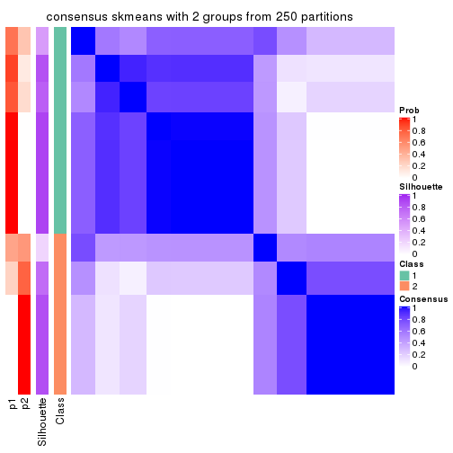</p>

</div>
<div id='tab-CV-skmeans-consensus-heatmap-2'>
<pre><code class="r">consensus_heatmap(res, k = 3)
</code></pre>

<p>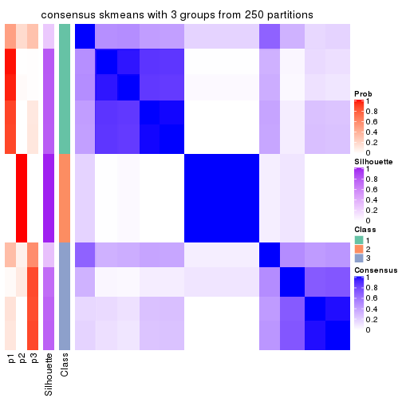</p>

</div>
<div id='tab-CV-skmeans-consensus-heatmap-3'>
<pre><code class="r">consensus_heatmap(res, k = 4)
</code></pre>

<p>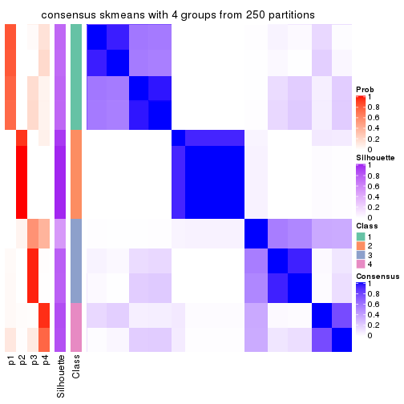</p>

</div>
<div id='tab-CV-skmeans-consensus-heatmap-4'>
<pre><code class="r">consensus_heatmap(res, k = 5)
</code></pre>

<p>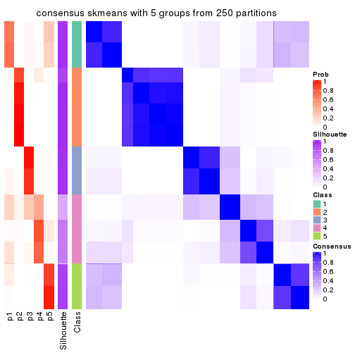</p>

</div>
<div id='tab-CV-skmeans-consensus-heatmap-5'>
<pre><code class="r">consensus_heatmap(res, k = 6)
</code></pre>

<p>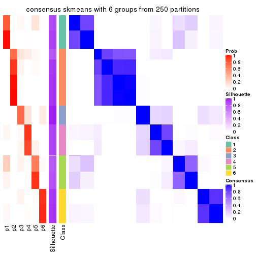</p>

</div>
</div>

Heatmaps for the membership of samples in all partitions to see how consistent they are:


<script>
$( function() {
	$( '#tabs-CV-skmeans-membership-heatmap' ).tabs();
} );
</script>
<div id='tabs-CV-skmeans-membership-heatmap'>
<ul>
<li><a href='#tab-CV-skmeans-membership-heatmap-1'>k = 2</a></li>
<li><a href='#tab-CV-skmeans-membership-heatmap-2'>k = 3</a></li>
<li><a href='#tab-CV-skmeans-membership-heatmap-3'>k = 4</a></li>
<li><a href='#tab-CV-skmeans-membership-heatmap-4'>k = 5</a></li>
<li><a href='#tab-CV-skmeans-membership-heatmap-5'>k = 6</a></li>
</ul>
<div id='tab-CV-skmeans-membership-heatmap-1'>
<pre><code class="r">membership_heatmap(res, k = 2)
</code></pre>

<p>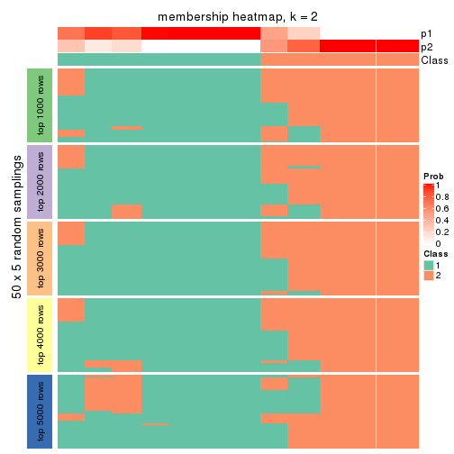</p>

</div>
<div id='tab-CV-skmeans-membership-heatmap-2'>
<pre><code class="r">membership_heatmap(res, k = 3)
</code></pre>

<p>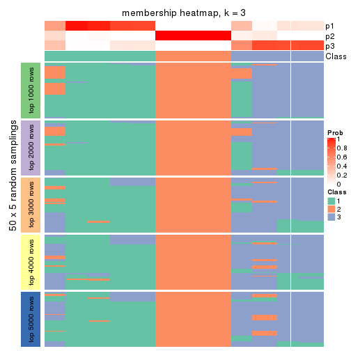</p>

</div>
<div id='tab-CV-skmeans-membership-heatmap-3'>
<pre><code class="r">membership_heatmap(res, k = 4)
</code></pre>

<p>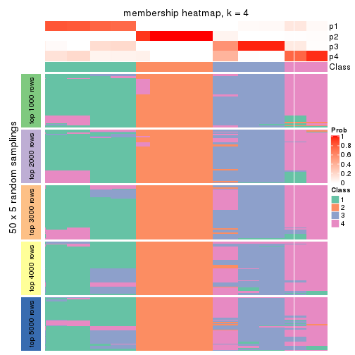</p>

</div>
<div id='tab-CV-skmeans-membership-heatmap-4'>
<pre><code class="r">membership_heatmap(res, k = 5)
</code></pre>

<p>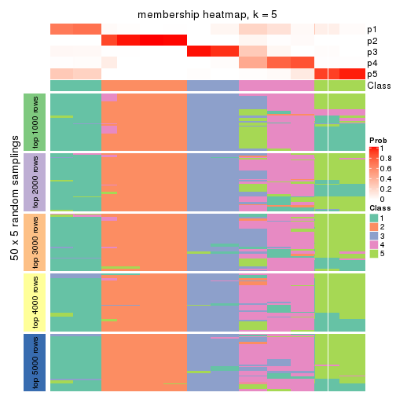</p>

</div>
<div id='tab-CV-skmeans-membership-heatmap-5'>
<pre><code class="r">membership_heatmap(res, k = 6)
</code></pre>

<p>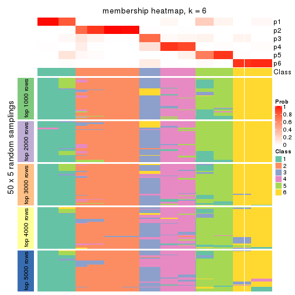</p>

</div>
</div>

As soon as we have had the classes for columns, we can look for signatures
which are significantly different between classes which can be candidate marks
for certain classes. Following are the heatmaps for signatures.


Signature heatmaps where rows are scaled:


<script>
$( function() {
	$( '#tabs-CV-skmeans-get-signatures' ).tabs();
} );
</script>
<div id='tabs-CV-skmeans-get-signatures'>
<ul>
<li><a href='#tab-CV-skmeans-get-signatures-1'>k = 2</a></li>
<li><a href='#tab-CV-skmeans-get-signatures-2'>k = 3</a></li>
<li><a href='#tab-CV-skmeans-get-signatures-3'>k = 4</a></li>
<li><a href='#tab-CV-skmeans-get-signatures-4'>k = 5</a></li>
<li><a href='#tab-CV-skmeans-get-signatures-5'>k = 6</a></li>
</ul>
<div id='tab-CV-skmeans-get-signatures-1'>
<pre><code class="r">get_signatures(res, k = 2)
</code></pre>

<p>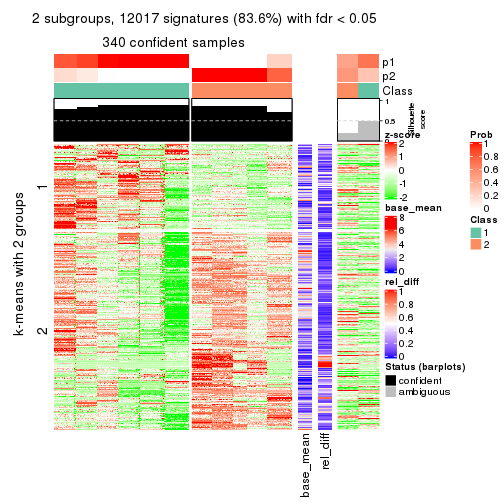</p>

</div>
<div id='tab-CV-skmeans-get-signatures-2'>
<pre><code class="r">get_signatures(res, k = 3)
</code></pre>

<p>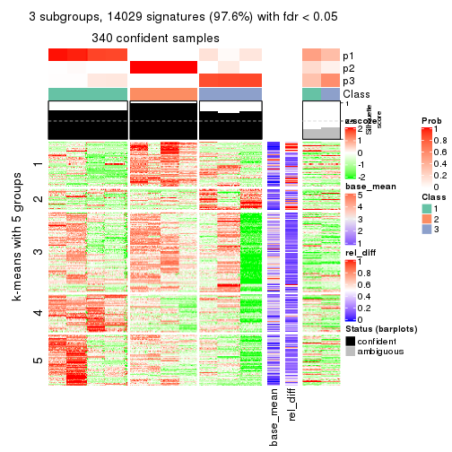</p>

</div>
<div id='tab-CV-skmeans-get-signatures-3'>
<pre><code class="r">get_signatures(res, k = 4)
</code></pre>

<p>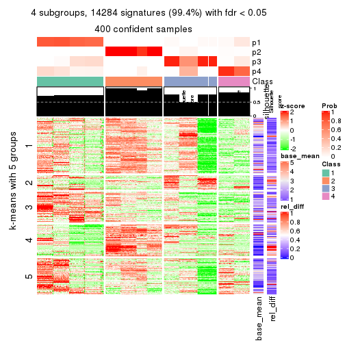</p>

</div>
<div id='tab-CV-skmeans-get-signatures-4'>
<pre><code class="r">get_signatures(res, k = 5)
</code></pre>

<p>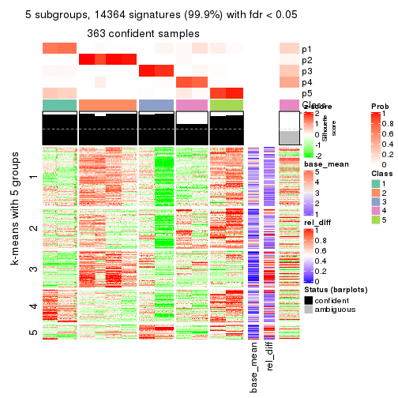</p>

</div>
<div id='tab-CV-skmeans-get-signatures-5'>
<pre><code class="r">get_signatures(res, k = 6)
</code></pre>

<pre><code>#&gt; Error in mat[ceiling(1:nr/h_ratio), ceiling(1:nc/w_ratio), drop = FALSE]: subscript out of bounds
</code></pre>

<p>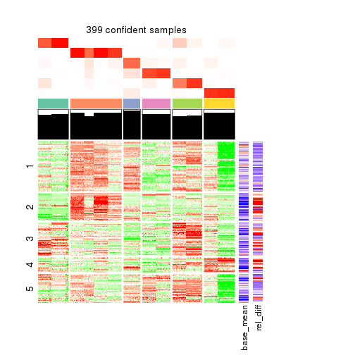</p>

</div>
</div>


Signature heatmaps where rows are not scaled:


<script>
$( function() {
	$( '#tabs-CV-skmeans-get-signatures-no-scale' ).tabs();
} );
</script>
<div id='tabs-CV-skmeans-get-signatures-no-scale'>
<ul>
<li><a href='#tab-CV-skmeans-get-signatures-no-scale-1'>k = 2</a></li>
<li><a href='#tab-CV-skmeans-get-signatures-no-scale-2'>k = 3</a></li>
<li><a href='#tab-CV-skmeans-get-signatures-no-scale-3'>k = 4</a></li>
<li><a href='#tab-CV-skmeans-get-signatures-no-scale-4'>k = 5</a></li>
<li><a href='#tab-CV-skmeans-get-signatures-no-scale-5'>k = 6</a></li>
</ul>
<div id='tab-CV-skmeans-get-signatures-no-scale-1'>
<pre><code class="r">get_signatures(res, k = 2, scale_rows = FALSE)
</code></pre>

<p>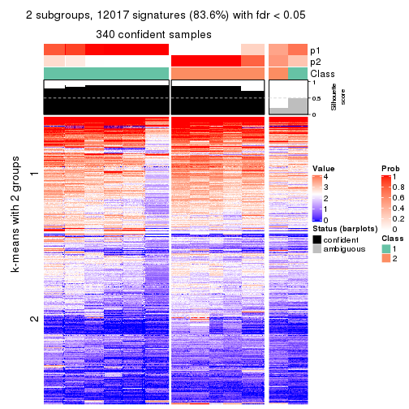</p>

</div>
<div id='tab-CV-skmeans-get-signatures-no-scale-2'>
<pre><code class="r">get_signatures(res, k = 3, scale_rows = FALSE)
</code></pre>

<p>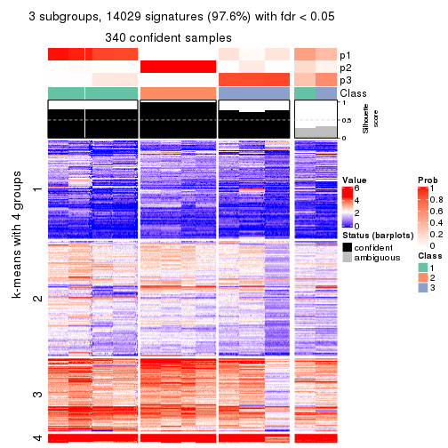</p>

</div>
<div id='tab-CV-skmeans-get-signatures-no-scale-3'>
<pre><code class="r">get_signatures(res, k = 4, scale_rows = FALSE)
</code></pre>

<p>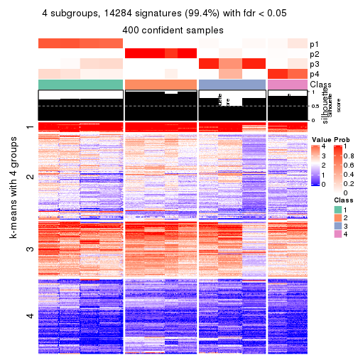</p>

</div>
<div id='tab-CV-skmeans-get-signatures-no-scale-4'>
<pre><code class="r">get_signatures(res, k = 5, scale_rows = FALSE)
</code></pre>

<p>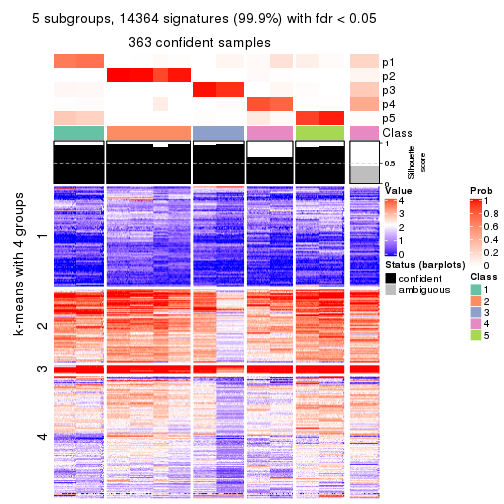</p>

</div>
<div id='tab-CV-skmeans-get-signatures-no-scale-5'>
<pre><code class="r">get_signatures(res, k = 6, scale_rows = FALSE)
</code></pre>

<pre><code>#&gt; Error in mat[ceiling(1:nr/h_ratio), ceiling(1:nc/w_ratio), drop = FALSE]: subscript out of bounds
</code></pre>

<p>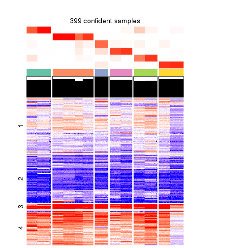</p>

</div>
</div>


Compare the overlap of signatures from different k:

```r
compare_signatures(res)
```

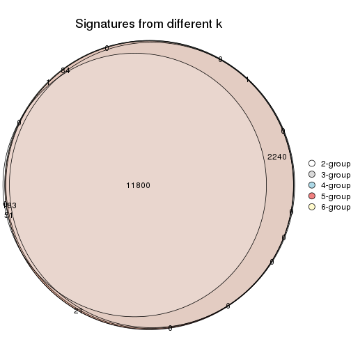

`get_signature()` returns a data frame invisibly. TO get the list of signatures, the function
call should be assigned to a variable explicitly. In following code, if `plot` argument is set
to `FALSE`, no heatmap is plotted while only the differential analysis is performed.

```r
# code only for demonstration
tb = get_signature(res, k = ..., plot = FALSE)
```

An example of the output of `tb` is:

```
#>   which_row         fdr    mean_1    mean_2 scaled_mean_1 scaled_mean_2 km
#> 1        38 0.042760348  8.373488  9.131774    -0.5533452     0.5164555  1
#> 2        40 0.018707592  7.106213  8.469186    -0.6173731     0.5762149  1
#> 3        55 0.019134737 10.221463 11.207825    -0.6159697     0.5749050  1
#> 4        59 0.006059896  5.921854  7.869574    -0.6899429     0.6439467  1
#> 5        60 0.018055526  8.928898 10.211722    -0.6204761     0.5791110  1
#> 6        98 0.009384629 15.714769 14.887706     0.6635654    -0.6193277  2
...
```

The columns in `tb` are:

1. `which_row`: row indices corresponding to the input matrix.
2. `fdr`: FDR for the differential test. 
3. `mean_x`: The mean value in group x.
4. `scaled_mean_x`: The mean value in group x after rows are scaled.
5. `km`: Row groups if k-means clustering is applied to rows.


UMAP plot which shows how samples are separated.


<script>
$( function() {
	$( '#tabs-CV-skmeans-dimension-reduction' ).tabs();
} );
</script>
<div id='tabs-CV-skmeans-dimension-reduction'>
<ul>
<li><a href='#tab-CV-skmeans-dimension-reduction-1'>k = 2</a></li>
<li><a href='#tab-CV-skmeans-dimension-reduction-2'>k = 3</a></li>
<li><a href='#tab-CV-skmeans-dimension-reduction-3'>k = 4</a></li>
<li><a href='#tab-CV-skmeans-dimension-reduction-4'>k = 5</a></li>
<li><a href='#tab-CV-skmeans-dimension-reduction-5'>k = 6</a></li>
</ul>
<div id='tab-CV-skmeans-dimension-reduction-1'>
<pre><code class="r">dimension_reduction(res, k = 2, method = &quot;UMAP&quot;)
</code></pre>

<p>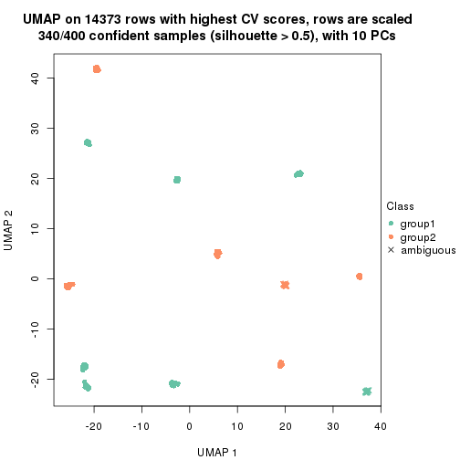</p>

</div>
<div id='tab-CV-skmeans-dimension-reduction-2'>
<pre><code class="r">dimension_reduction(res, k = 3, method = &quot;UMAP&quot;)
</code></pre>

<p>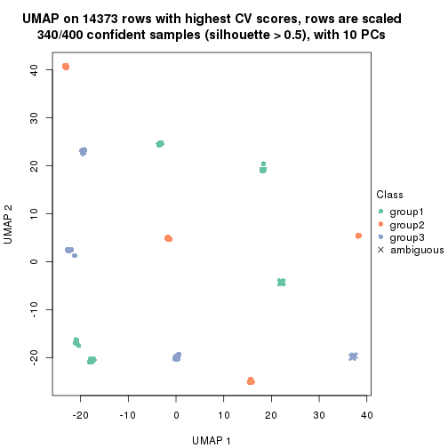</p>

</div>
<div id='tab-CV-skmeans-dimension-reduction-3'>
<pre><code class="r">dimension_reduction(res, k = 4, method = &quot;UMAP&quot;)
</code></pre>

<p>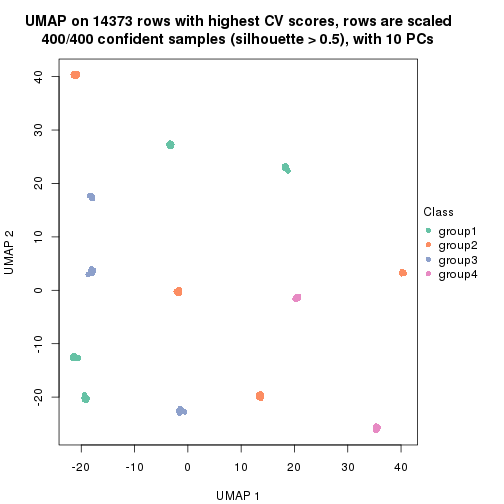</p>

</div>
<div id='tab-CV-skmeans-dimension-reduction-4'>
<pre><code class="r">dimension_reduction(res, k = 5, method = &quot;UMAP&quot;)
</code></pre>

<p>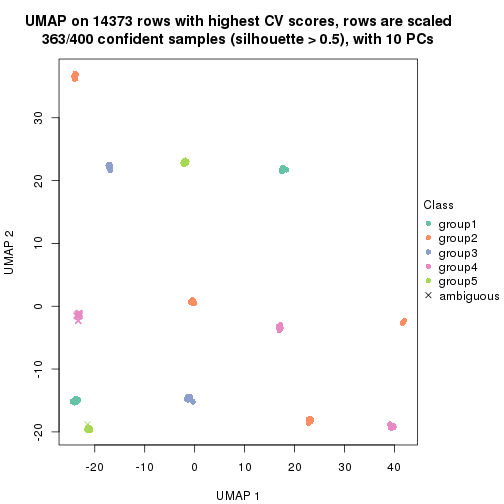</p>

</div>
<div id='tab-CV-skmeans-dimension-reduction-5'>
<pre><code class="r">dimension_reduction(res, k = 6, method = &quot;UMAP&quot;)
</code></pre>

<p>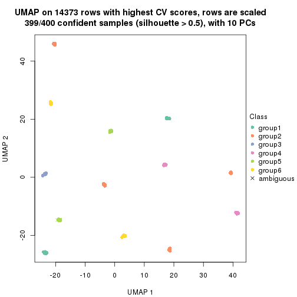</p>

</div>
</div>


Following heatmap shows how subgroups are split when increasing `k`:

```r
collect_classes(res)
```

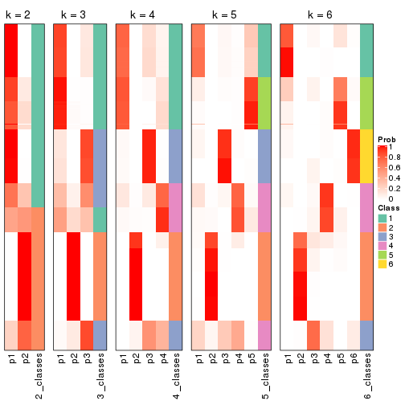


If matrix rows can be associated to genes, consider to use `GO_Enrichment(res,
...)` to perform function enrichment for the signature genes.


 

---------------------------------------------------


### CV:pam**


The object with results only for a single top-value method and a single partition method 
can be extracted as:

```r
res = res_list["CV", "pam"]
# you can also extract it by
# res = res_list["CV:pam"]
```

A summary of `res` and all the functions that can be applied to it:

```r
res
```

```
#> A 'ConsensusPartition' object with k = 2, 3, 4, 5, 6.
#>   On a matrix with 14373 rows and 400 columns.
#>   Top rows (1000, 2000, 3000, 4000, 5000) are extracted by 'CV' method.
#>   Subgroups are detected by 'pam' method.
#>   Performed in total 1250 partitions by row resampling.
#>   Best k for subgroups seems to be 6.
#> 
#> Following methods can be applied to this 'ConsensusPartition' object:
#>  [1] "cola_report"             "collect_classes"         "collect_plots"          
#>  [4] "collect_stats"           "colnames"                "compare_signatures"     
#>  [7] "consensus_heatmap"       "dimension_reduction"     "functional_enrichment"  
#> [10] "get_anno_col"            "get_anno"                "get_classes"            
#> [13] "get_consensus"           "get_matrix"              "get_membership"         
#> [16] "get_param"               "get_signatures"          "get_stats"              
#> [19] "is_best_k"               "is_stable_k"             "membership_heatmap"     
#> [22] "ncol"                    "nrow"                    "plot_ecdf"              
#> [25] "rownames"                "select_partition_number" "show"                   
#> [28] "suggest_best_k"          "test_to_known_factors"
```

`collect_plots()` function collects all the plots made from `res` for all `k` (number of partitions)
into one single page to provide an easy and fast comparison between different `k`.

```r
collect_plots(res)
```

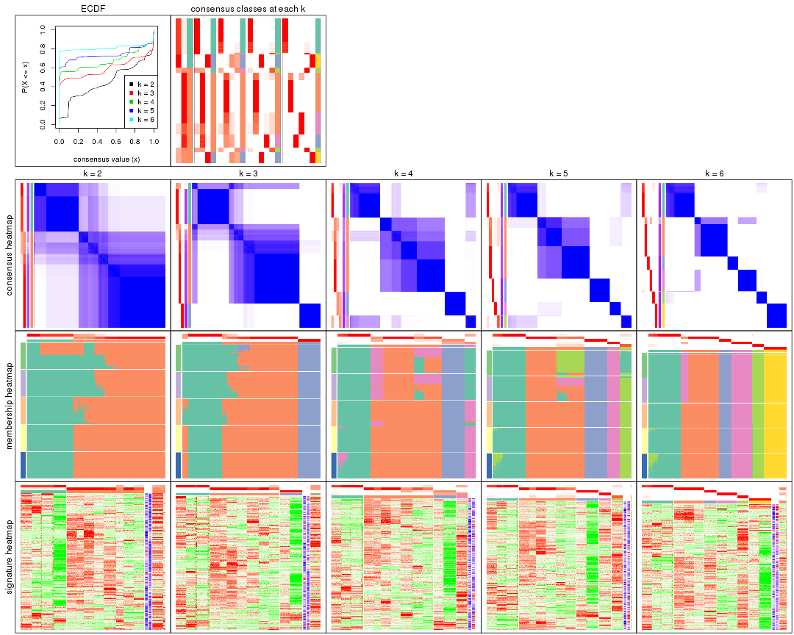

The plots are:

- The first row: a plot of the ECDF (Empirical cumulative distribution
  function) curves of the consensus matrix for each `k` and the heatmap of
  predicted classes for each `k`.
- The second row: heatmaps of the consensus matrix for each `k`.
- The third row: heatmaps of the membership matrix for each `k`.
- The fouth row: heatmaps of the signatures for each `k`.

All the plots in panels can be made by individual functions and they are
plotted later in this section.

`select_partition_number()` produces several plots showing different
statistics for choosing "optimized" `k`. There are following statistics:

- ECDF curves of the consensus matrix for each `k`;
- 1-PAC. [The PAC
  score](https://en.wikipedia.org/wiki/Consensus_clustering#Over-interpretation_potential_of_consensus_clustering)
  measures the proportion of the ambiguous subgrouping.
- Mean silhouette score.
- Concordance. The mean probability of fiting the consensus class ids in all
  partitions.
- Area increased. Denote $A_k$ as the area under the ECDF curve for current
  `k`, the area increased is defined as $A_k - A_{k-1}$.
- Rand index. The percent of pairs of samples that are both in a same cluster
  or both are not in a same cluster in the partition of k and k-1.
- Jaccard index. The ratio of pairs of samples are both in a same cluster in
  the partition of k and k-1 and the pairs of samples are both in a same
  cluster in the partition k or k-1.

The detailed explanations of these statistics can be found in [the cola
vignette](http://bioconductor.org/packages/devel/bioc/vignettes/cola/inst/doc/cola.html#toc_13).

Generally speaking, lower PAC score, higher mean silhouette score or higher
concordance corresponds to better partition. Rand index and Jaccard index
measure how similar the current partition is compared to partition with `k-1`.
If they are too similar, we won't accept `k` is better than `k-1`.

```r
select_partition_number(res)
```

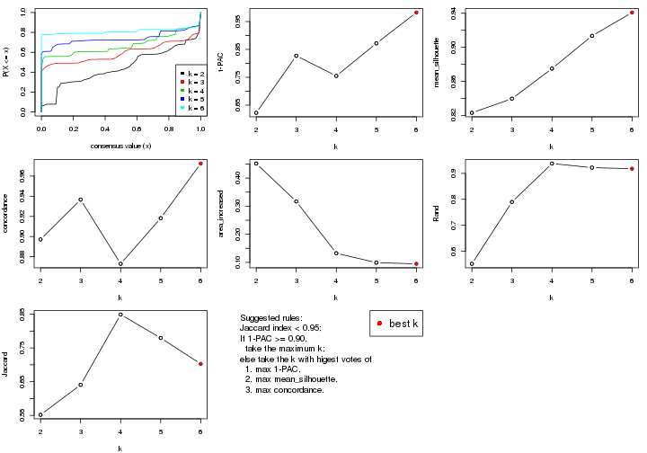

The numeric values for all these statistics can be obtained by `get_stats()`.

```r
get_stats(res)
```

```
#>   k 1-PAC mean_silhouette concordance area_increased  Rand Jaccard
#> 2 2 0.622           0.823       0.897         0.4517 0.552   0.552
#> 3 3 0.827           0.840       0.937         0.3168 0.790   0.641
#> 4 4 0.755           0.875       0.873         0.1325 0.938   0.849
#> 5 5 0.872           0.913       0.918         0.0989 0.922   0.780
#> 6 6 0.982           0.941       0.972         0.0948 0.918   0.703
```

`suggest_best_k()` suggests the best $k$ based on these statistics. The rules are as follows:

- All $k$ with Jaccard index larger than 0.95 are removed because the increase of
  the partition number does not provides enough extra information. If all $k$ are removed,
  the best $k$ is assigned by `NA`.
- For $k$ with 1-PAC larger than 0.9, the maximal $k$ is taken as the "best k". Other $k$ is called "optional k".
- If it does not fit the second rule. The $k$ with the highest vote of highest
  1-PAC, mean silhouette and concordance is taken as the "best k".

```r
suggest_best_k(res)
```

```
#> [1] 6
```


Following shows the table of the partitions (You need to click the **show/hide
code output** link to see it). The membership matrix (columns with name `p*`)
is inferred by
[`clue::cl_consensus()`](https://www.rdocumentation.org/link/cl_consensus?package=clue)
function with the `SE` method. Basically the value in the membership matrix
represents the probability to belong to a certain group. The finall class
label for an item is determined with the group with highest probability it
belongs to.

In `get_classes()` function, the entropy is calculated from the membership
matrix and the silhouette score is calculated from the consensus matrix.


<script>
$( function() {
	$( '#tabs-CV-pam-get-classes' ).tabs();
} );
</script>
<div id='tabs-CV-pam-get-classes'>
<ul>
<li><a href='#tab-CV-pam-get-classes-1'>k = 2</a></li>
<li><a href='#tab-CV-pam-get-classes-2'>k = 3</a></li>
<li><a href='#tab-CV-pam-get-classes-3'>k = 4</a></li>
<li><a href='#tab-CV-pam-get-classes-4'>k = 5</a></li>
<li><a href='#tab-CV-pam-get-classes-5'>k = 6</a></li>
</ul>

<div id='tab-CV-pam-get-classes-1'>
<p><a id='tab-CV-pam-get-classes-1-a' style='color:#0366d6' href='#'>show/hide code output</a></p>
<pre><code class="r">cbind(get_classes(res, k = 2), get_membership(res, k = 2))
</code></pre>

<pre><code>#&gt;            class entropy silhouette    p1    p2
#&gt; SRR1661716     2  0.0000      0.869 0.000 1.000
#&gt; SRR1661717     2  0.0000      0.869 0.000 1.000
#&gt; SRR1661718     2  0.0000      0.869 0.000 1.000
#&gt; SRR1661719     2  0.0000      0.869 0.000 1.000
#&gt; SRR1661720     2  0.0000      0.869 0.000 1.000
#&gt; SRR1661721     2  0.0000      0.869 0.000 1.000
#&gt; SRR1661722     2  0.0000      0.869 0.000 1.000
#&gt; SRR1661723     2  0.0000      0.869 0.000 1.000
#&gt; SRR1661724     2  0.0000      0.869 0.000 1.000
#&gt; SRR1661725     2  0.0000      0.869 0.000 1.000
#&gt; SRR1661726     2  0.0000      0.869 0.000 1.000
#&gt; SRR1661727     2  0.0000      0.869 0.000 1.000
#&gt; SRR1661728     2  0.0000      0.869 0.000 1.000
#&gt; SRR1661729     2  0.0000      0.869 0.000 1.000
#&gt; SRR1661730     2  0.0000      0.869 0.000 1.000
#&gt; SRR1661731     2  0.0000      0.869 0.000 1.000
#&gt; SRR1661732     2  0.0000      0.869 0.000 1.000
#&gt; SRR1661733     2  0.0000      0.869 0.000 1.000
#&gt; SRR1661734     2  0.0000      0.869 0.000 1.000
#&gt; SRR1661735     2  0.0000      0.869 0.000 1.000
#&gt; SRR1661736     2  0.0000      0.869 0.000 1.000
#&gt; SRR1661737     2  0.0000      0.869 0.000 1.000
#&gt; SRR1661738     2  0.0000      0.869 0.000 1.000
#&gt; SRR1661739     2  0.0000      0.869 0.000 1.000
#&gt; SRR1661740     2  0.0000      0.869 0.000 1.000
#&gt; SRR1661741     2  0.0000      0.869 0.000 1.000
#&gt; SRR1661742     2  0.0000      0.869 0.000 1.000
#&gt; SRR1661743     2  0.0000      0.869 0.000 1.000
#&gt; SRR1661744     2  0.0000      0.869 0.000 1.000
#&gt; SRR1661745     2  0.0000      0.869 0.000 1.000
#&gt; SRR1661746     2  0.0000      0.869 0.000 1.000
#&gt; SRR1661747     2  0.0000      0.869 0.000 1.000
#&gt; SRR1661748     2  0.0000      0.869 0.000 1.000
#&gt; SRR1661749     2  0.0000      0.869 0.000 1.000
#&gt; SRR1661750     2  0.0000      0.869 0.000 1.000
#&gt; SRR1661751     2  0.0000      0.869 0.000 1.000
#&gt; SRR1661752     2  0.0000      0.869 0.000 1.000
#&gt; SRR1661753     2  0.0000      0.869 0.000 1.000
#&gt; SRR1661754     2  0.0000      0.869 0.000 1.000
#&gt; SRR1661755     2  0.0000      0.869 0.000 1.000
#&gt; SRR1661756     2  0.0000      0.869 0.000 1.000
#&gt; SRR1661757     2  0.0000      0.869 0.000 1.000
#&gt; SRR1661758     2  0.0000      0.869 0.000 1.000
#&gt; SRR1661759     2  0.0000      0.869 0.000 1.000
#&gt; SRR1661760     2  0.0000      0.869 0.000 1.000
#&gt; SRR1661761     2  0.0000      0.869 0.000 1.000
#&gt; SRR1661762     2  0.0000      0.869 0.000 1.000
#&gt; SRR1661763     2  0.0000      0.869 0.000 1.000
#&gt; SRR1661764     2  0.0000      0.869 0.000 1.000
#&gt; SRR1661766     2  0.0000      0.869 0.000 1.000
#&gt; SRR1661767     2  0.0000      0.869 0.000 1.000
#&gt; SRR1661768     2  0.0000      0.869 0.000 1.000
#&gt; SRR1661769     2  0.0000      0.869 0.000 1.000
#&gt; SRR1661770     2  0.0000      0.869 0.000 1.000
#&gt; SRR1661771     2  0.0000      0.869 0.000 1.000
#&gt; SRR1661772     2  0.0000      0.869 0.000 1.000
#&gt; SRR1661773     2  0.0000      0.869 0.000 1.000
#&gt; SRR1661774     2  0.0000      0.869 0.000 1.000
#&gt; SRR1661775     2  0.0000      0.869 0.000 1.000
#&gt; SRR1661776     2  0.0000      0.869 0.000 1.000
#&gt; SRR1661777     2  0.0000      0.869 0.000 1.000
#&gt; SRR1661778     2  0.0000      0.869 0.000 1.000
#&gt; SRR1661779     2  0.0000      0.869 0.000 1.000
#&gt; SRR1661780     2  0.0000      0.869 0.000 1.000
#&gt; SRR1661781     2  0.0000      0.869 0.000 1.000
#&gt; SRR1661782     2  0.0000      0.869 0.000 1.000
#&gt; SRR1661783     2  0.0000      0.869 0.000 1.000
#&gt; SRR1661784     2  0.0000      0.869 0.000 1.000
#&gt; SRR1661785     2  0.0000      0.869 0.000 1.000
#&gt; SRR1661786     2  0.0000      0.869 0.000 1.000
#&gt; SRR1661787     2  0.0000      0.869 0.000 1.000
#&gt; SRR1661788     2  0.0000      0.869 0.000 1.000
#&gt; SRR1661789     2  0.0000      0.869 0.000 1.000
#&gt; SRR1661790     2  0.0000      0.869 0.000 1.000
#&gt; SRR1661791     2  0.0000      0.869 0.000 1.000
#&gt; SRR1661792     2  0.0000      0.869 0.000 1.000
#&gt; SRR1661793     2  0.0000      0.869 0.000 1.000
#&gt; SRR1661794     2  0.0000      0.869 0.000 1.000
#&gt; SRR1661795     2  0.0000      0.869 0.000 1.000
#&gt; SRR1661796     2  0.0000      0.869 0.000 1.000
#&gt; SRR1661797     2  0.0000      0.869 0.000 1.000
#&gt; SRR1661798     2  0.0000      0.869 0.000 1.000
#&gt; SRR1661799     2  0.0000      0.869 0.000 1.000
#&gt; SRR1661800     2  0.0000      0.869 0.000 1.000
#&gt; SRR1661801     2  0.0000      0.869 0.000 1.000
#&gt; SRR1661802     2  0.0000      0.869 0.000 1.000
#&gt; SRR1661803     2  0.0000      0.869 0.000 1.000
#&gt; SRR1661804     2  0.0000      0.869 0.000 1.000
#&gt; SRR1661805     2  0.0000      0.869 0.000 1.000
#&gt; SRR1661806     2  0.0000      0.869 0.000 1.000
#&gt; SRR1661807     2  0.0000      0.869 0.000 1.000
#&gt; SRR1661808     2  0.0000      0.869 0.000 1.000
#&gt; SRR1661809     2  0.0000      0.869 0.000 1.000
#&gt; SRR1661810     2  0.0000      0.869 0.000 1.000
#&gt; SRR1661811     2  0.0000      0.869 0.000 1.000
#&gt; SRR1661812     2  0.0000      0.869 0.000 1.000
#&gt; SRR1661813     2  0.0000      0.869 0.000 1.000
#&gt; SRR1661814     2  0.0000      0.869 0.000 1.000
#&gt; SRR1661815     2  0.0000      0.869 0.000 1.000
#&gt; SRR1661816     2  0.0000      0.869 0.000 1.000
#&gt; SRR1661817     2  0.0000      0.869 0.000 1.000
#&gt; SRR1661818     2  0.0000      0.869 0.000 1.000
#&gt; SRR1661819     2  0.0000      0.869 0.000 1.000
#&gt; SRR1661820     2  0.0000      0.869 0.000 1.000
#&gt; SRR1661821     2  0.0000      0.869 0.000 1.000
#&gt; SRR1661822     2  0.0000      0.869 0.000 1.000
#&gt; SRR1661823     2  0.0000      0.869 0.000 1.000
#&gt; SRR1661824     2  0.0000      0.869 0.000 1.000
#&gt; SRR1661825     2  0.0000      0.869 0.000 1.000
#&gt; SRR1661826     1  0.4431      0.963 0.908 0.092
#&gt; SRR1661827     1  0.4431      0.963 0.908 0.092
#&gt; SRR1661828     1  0.4431      0.963 0.908 0.092
#&gt; SRR1661829     1  0.4431      0.963 0.908 0.092
#&gt; SRR1661830     1  0.4431      0.963 0.908 0.092
#&gt; SRR1661831     1  0.4431      0.963 0.908 0.092
#&gt; SRR1661832     1  0.4431      0.963 0.908 0.092
#&gt; SRR1661833     1  0.4431      0.963 0.908 0.092
#&gt; SRR1661834     1  0.4431      0.963 0.908 0.092
#&gt; SRR1661835     1  0.4431      0.963 0.908 0.092
#&gt; SRR1661836     1  0.4431      0.963 0.908 0.092
#&gt; SRR1661837     1  0.4431      0.963 0.908 0.092
#&gt; SRR1661838     1  0.4431      0.963 0.908 0.092
#&gt; SRR1661839     1  0.4431      0.963 0.908 0.092
#&gt; SRR1661840     1  0.4431      0.963 0.908 0.092
#&gt; SRR1661841     1  0.4431      0.963 0.908 0.092
#&gt; SRR1661843     1  0.4431      0.963 0.908 0.092
#&gt; SRR1661844     1  0.4431      0.963 0.908 0.092
#&gt; SRR1661845     1  0.4431      0.963 0.908 0.092
#&gt; SRR1661846     1  0.4431      0.963 0.908 0.092
#&gt; SRR1661847     1  0.4431      0.963 0.908 0.092
#&gt; SRR1661848     1  0.4431      0.963 0.908 0.092
#&gt; SRR1661849     1  0.4431      0.963 0.908 0.092
#&gt; SRR1661850     1  0.4431      0.963 0.908 0.092
#&gt; SRR1661851     1  0.4431      0.963 0.908 0.092
#&gt; SRR1661852     1  0.4431      0.963 0.908 0.092
#&gt; SRR1661853     1  0.4431      0.963 0.908 0.092
#&gt; SRR1661854     1  0.4431      0.963 0.908 0.092
#&gt; SRR1661855     1  0.4431      0.963 0.908 0.092
#&gt; SRR1661856     1  0.0000      0.908 1.000 0.000
#&gt; SRR1661857     1  0.0000      0.908 1.000 0.000
#&gt; SRR1661858     1  0.0000      0.908 1.000 0.000
#&gt; SRR1661859     1  0.0000      0.908 1.000 0.000
#&gt; SRR1661860     1  0.0000      0.908 1.000 0.000
#&gt; SRR1661861     1  0.0000      0.908 1.000 0.000
#&gt; SRR1661862     1  0.0000      0.908 1.000 0.000
#&gt; SRR1661863     1  0.0000      0.908 1.000 0.000
#&gt; SRR1661864     1  0.0000      0.908 1.000 0.000
#&gt; SRR1661865     1  0.0000      0.908 1.000 0.000
#&gt; SRR1661866     1  0.0000      0.908 1.000 0.000
#&gt; SRR1661867     1  0.0000      0.908 1.000 0.000
#&gt; SRR1661868     1  0.0000      0.908 1.000 0.000
#&gt; SRR1661869     1  0.0000      0.908 1.000 0.000
#&gt; SRR1661870     1  0.0000      0.908 1.000 0.000
#&gt; SRR1661871     1  0.0000      0.908 1.000 0.000
#&gt; SRR1661872     1  0.0000      0.908 1.000 0.000
#&gt; SRR1661873     1  0.0000      0.908 1.000 0.000
#&gt; SRR1661874     1  0.0000      0.908 1.000 0.000
#&gt; SRR1661875     1  0.0000      0.908 1.000 0.000
#&gt; SRR1661876     1  0.0000      0.908 1.000 0.000
#&gt; SRR1661877     1  0.0000      0.908 1.000 0.000
#&gt; SRR1661878     1  0.0000      0.908 1.000 0.000
#&gt; SRR1661879     1  0.0000      0.908 1.000 0.000
#&gt; SRR1661880     1  0.0000      0.908 1.000 0.000
#&gt; SRR1661881     1  0.0000      0.908 1.000 0.000
#&gt; SRR1661882     1  0.0000      0.908 1.000 0.000
#&gt; SRR1661883     1  0.0000      0.908 1.000 0.000
#&gt; SRR1661884     1  0.0000      0.908 1.000 0.000
#&gt; SRR1661885     1  0.0000      0.908 1.000 0.000
#&gt; SRR1661886     1  0.0000      0.908 1.000 0.000
#&gt; SRR1661887     1  0.0000      0.908 1.000 0.000
#&gt; SRR1661888     1  0.0000      0.908 1.000 0.000
#&gt; SRR1661889     1  0.0000      0.908 1.000 0.000
#&gt; SRR1661890     1  0.0000      0.908 1.000 0.000
#&gt; SRR1661891     1  0.0000      0.908 1.000 0.000
#&gt; SRR1661892     1  0.4431      0.963 0.908 0.092
#&gt; SRR1661893     1  0.4431      0.963 0.908 0.092
#&gt; SRR1661894     1  0.4431      0.963 0.908 0.092
#&gt; SRR1661895     1  0.4431      0.963 0.908 0.092
#&gt; SRR1661896     1  0.4431      0.963 0.908 0.092
#&gt; SRR1661897     1  0.4431      0.963 0.908 0.092
#&gt; SRR1661898     1  0.4431      0.963 0.908 0.092
#&gt; SRR1661899     1  0.4431      0.963 0.908 0.092
#&gt; SRR1661900     1  0.4431      0.963 0.908 0.092
#&gt; SRR1661901     1  0.4431      0.963 0.908 0.092
#&gt; SRR1661902     1  0.4431      0.963 0.908 0.092
#&gt; SRR1661903     1  0.4431      0.963 0.908 0.092
#&gt; SRR1661904     1  0.4431      0.963 0.908 0.092
#&gt; SRR1661905     1  0.4431      0.963 0.908 0.092
#&gt; SRR1661906     1  0.4431      0.963 0.908 0.092
#&gt; SRR1661907     1  0.4431      0.963 0.908 0.092
#&gt; SRR1661908     1  0.4431      0.963 0.908 0.092
#&gt; SRR1661909     1  0.4431      0.963 0.908 0.092
#&gt; SRR1661910     1  0.4431      0.963 0.908 0.092
#&gt; SRR1661911     1  0.4431      0.963 0.908 0.092
#&gt; SRR1661912     1  0.4431      0.963 0.908 0.092
#&gt; SRR1661913     1  0.4431      0.963 0.908 0.092
#&gt; SRR1661914     1  0.4431      0.963 0.908 0.092
#&gt; SRR1661915     1  0.4431      0.963 0.908 0.092
#&gt; SRR1661916     1  0.4431      0.963 0.908 0.092
#&gt; SRR1661917     1  0.4431      0.963 0.908 0.092
#&gt; SRR1661918     1  0.4431      0.963 0.908 0.092
#&gt; SRR1661919     1  0.4431      0.963 0.908 0.092
#&gt; SRR1661920     1  0.4431      0.963 0.908 0.092
#&gt; SRR1661921     1  0.4431      0.963 0.908 0.092
#&gt; SRR1661922     1  0.4431      0.963 0.908 0.092
#&gt; SRR1661923     1  0.4431      0.963 0.908 0.092
#&gt; SRR1661924     1  0.4431      0.963 0.908 0.092
#&gt; SRR1661925     1  0.4431      0.963 0.908 0.092
#&gt; SRR1661926     1  0.4431      0.963 0.908 0.092
#&gt; SRR1661927     1  0.4431      0.963 0.908 0.092
#&gt; SRR1661928     2  0.9732      0.546 0.404 0.596
#&gt; SRR1661929     2  0.9833      0.511 0.424 0.576
#&gt; SRR1661930     2  0.9710      0.552 0.400 0.600
#&gt; SRR1661931     2  0.9710      0.552 0.400 0.600
#&gt; SRR1661932     2  0.9754      0.539 0.408 0.592
#&gt; SRR1661933     2  0.9775      0.532 0.412 0.588
#&gt; SRR1661934     2  0.9896      0.478 0.440 0.560
#&gt; SRR1661935     2  0.9710      0.552 0.400 0.600
#&gt; SRR1661936     2  0.9754      0.539 0.408 0.592
#&gt; SRR1661937     2  0.9815      0.518 0.420 0.580
#&gt; SRR1661938     2  0.9710      0.552 0.400 0.600
#&gt; SRR1661939     2  0.9710      0.552 0.400 0.600
#&gt; SRR1661940     2  0.9933      0.452 0.452 0.548
#&gt; SRR1661941     2  0.9815      0.518 0.420 0.580
#&gt; SRR1661942     2  0.9795      0.525 0.416 0.584
#&gt; SRR1661943     2  0.9710      0.552 0.400 0.600
#&gt; SRR1661944     2  0.9909      0.470 0.444 0.556
#&gt; SRR1661945     2  0.9710      0.552 0.400 0.600
#&gt; SRR1661946     2  0.9833      0.510 0.424 0.576
#&gt; SRR1661947     2  0.9881      0.487 0.436 0.564
#&gt; SRR1661948     2  0.9754      0.539 0.408 0.592
#&gt; SRR1661949     2  0.9754      0.539 0.408 0.592
#&gt; SRR1661950     2  0.9754      0.539 0.408 0.592
#&gt; SRR1661951     2  0.9922      0.461 0.448 0.552
#&gt; SRR1661952     2  0.9881      0.487 0.436 0.564
#&gt; SRR1661953     2  0.9795      0.525 0.416 0.584
#&gt; SRR1661954     2  0.9732      0.546 0.404 0.596
#&gt; SRR1661955     2  0.9896      0.478 0.440 0.560
#&gt; SRR1661956     2  0.9850      0.503 0.428 0.572
#&gt; SRR1661957     2  0.9710      0.552 0.400 0.600
#&gt; SRR1661958     2  0.0000      0.869 0.000 1.000
#&gt; SRR1661959     2  0.0000      0.869 0.000 1.000
#&gt; SRR1661960     2  0.0000      0.869 0.000 1.000
#&gt; SRR1661961     2  0.0000      0.869 0.000 1.000
#&gt; SRR1661962     2  0.0000      0.869 0.000 1.000
#&gt; SRR1661963     2  0.0000      0.869 0.000 1.000
#&gt; SRR1661964     2  0.0000      0.869 0.000 1.000
#&gt; SRR1661965     2  0.0000      0.869 0.000 1.000
#&gt; SRR1661966     2  0.0000      0.869 0.000 1.000
#&gt; SRR1661967     2  0.0000      0.869 0.000 1.000
#&gt; SRR1661968     2  0.0000      0.869 0.000 1.000
#&gt; SRR1661969     2  0.0000      0.869 0.000 1.000
#&gt; SRR1661970     2  0.0000      0.869 0.000 1.000
#&gt; SRR1661971     2  0.0000      0.869 0.000 1.000
#&gt; SRR1661972     2  0.0000      0.869 0.000 1.000
#&gt; SRR1661973     2  0.0000      0.869 0.000 1.000
#&gt; SRR1661974     2  0.0000      0.869 0.000 1.000
#&gt; SRR1661975     2  0.0000      0.869 0.000 1.000
#&gt; SRR1661976     2  0.0000      0.869 0.000 1.000
#&gt; SRR1661977     2  0.0000      0.869 0.000 1.000
#&gt; SRR1661978     2  0.0000      0.869 0.000 1.000
#&gt; SRR1661979     2  0.0000      0.869 0.000 1.000
#&gt; SRR1661980     2  0.0000      0.869 0.000 1.000
#&gt; SRR1661981     2  0.0000      0.869 0.000 1.000
#&gt; SRR1661982     2  0.0000      0.869 0.000 1.000
#&gt; SRR1661983     2  0.0000      0.869 0.000 1.000
#&gt; SRR1661984     2  0.0000      0.869 0.000 1.000
#&gt; SRR1661985     2  0.0000      0.869 0.000 1.000
#&gt; SRR1661986     2  0.0000      0.869 0.000 1.000
#&gt; SRR1661987     2  0.0000      0.869 0.000 1.000
#&gt; SRR1661988     1  0.4431      0.963 0.908 0.092
#&gt; SRR1661989     1  0.4431      0.963 0.908 0.092
#&gt; SRR1661990     1  0.4431      0.963 0.908 0.092
#&gt; SRR1661991     1  0.4431      0.963 0.908 0.092
#&gt; SRR1661992     1  0.4431      0.963 0.908 0.092
#&gt; SRR1661993     1  0.4431      0.963 0.908 0.092
#&gt; SRR1661994     1  0.4431      0.963 0.908 0.092
#&gt; SRR1661995     1  0.4431      0.963 0.908 0.092
#&gt; SRR1661996     1  0.4431      0.963 0.908 0.092
#&gt; SRR1661997     1  0.4431      0.963 0.908 0.092
#&gt; SRR1661998     1  0.4431      0.963 0.908 0.092
#&gt; SRR1661999     1  0.4431      0.963 0.908 0.092
#&gt; SRR1662000     1  0.4431      0.963 0.908 0.092
#&gt; SRR1662001     1  0.4431      0.963 0.908 0.092
#&gt; SRR1662002     1  0.4431      0.963 0.908 0.092
#&gt; SRR1662003     1  0.4431      0.963 0.908 0.092
#&gt; SRR1662004     1  0.4431      0.963 0.908 0.092
#&gt; SRR1662005     1  0.4431      0.963 0.908 0.092
#&gt; SRR1662006     1  0.4431      0.963 0.908 0.092
#&gt; SRR1662007     1  0.4431      0.963 0.908 0.092
#&gt; SRR1662008     1  0.4431      0.963 0.908 0.092
#&gt; SRR1662009     1  0.4431      0.963 0.908 0.092
#&gt; SRR1662010     1  0.4431      0.963 0.908 0.092
#&gt; SRR1662011     1  0.4431      0.963 0.908 0.092
#&gt; SRR1662012     1  0.4431      0.963 0.908 0.092
#&gt; SRR1662013     1  0.4431      0.963 0.908 0.092
#&gt; SRR1662014     1  0.4431      0.963 0.908 0.092
#&gt; SRR1662015     1  0.4431      0.963 0.908 0.092
#&gt; SRR1662016     1  0.4431      0.963 0.908 0.092
#&gt; SRR1662017     1  0.4431      0.963 0.908 0.092
#&gt; SRR1662018     2  0.1414      0.864 0.020 0.980
#&gt; SRR1662019     2  0.1414      0.864 0.020 0.980
#&gt; SRR1662020     2  0.1184      0.865 0.016 0.984
#&gt; SRR1662021     2  0.2603      0.853 0.044 0.956
#&gt; SRR1662022     2  0.1414      0.864 0.020 0.980
#&gt; SRR1662023     2  0.1843      0.861 0.028 0.972
#&gt; SRR1662024     2  0.1633      0.863 0.024 0.976
#&gt; SRR1662025     2  0.1414      0.864 0.020 0.980
#&gt; SRR1662026     2  0.1414      0.864 0.020 0.980
#&gt; SRR1662027     2  0.1414      0.864 0.020 0.980
#&gt; SRR1662028     2  0.1633      0.863 0.024 0.976
#&gt; SRR1662029     2  0.1633      0.863 0.024 0.976
#&gt; SRR1662030     2  0.1414      0.864 0.020 0.980
#&gt; SRR1662031     2  0.3114      0.847 0.056 0.944
#&gt; SRR1662032     2  0.1843      0.861 0.028 0.972
#&gt; SRR1662033     2  0.1414      0.864 0.020 0.980
#&gt; SRR1662034     2  0.0938      0.866 0.012 0.988
#&gt; SRR1662035     2  0.1184      0.865 0.016 0.984
#&gt; SRR1662036     2  0.1414      0.864 0.020 0.980
#&gt; SRR1662037     2  0.1843      0.861 0.028 0.972
#&gt; SRR1662038     2  0.1633      0.863 0.024 0.976
#&gt; SRR1662039     2  0.1414      0.864 0.020 0.980
#&gt; SRR1662040     2  0.1414      0.864 0.020 0.980
#&gt; SRR1662041     2  0.1843      0.861 0.028 0.972
#&gt; SRR1662042     2  0.2043      0.859 0.032 0.968
#&gt; SRR1662043     2  0.1843      0.861 0.028 0.972
#&gt; SRR1662044     2  0.1414      0.864 0.020 0.980
#&gt; SRR1662045     2  0.1843      0.861 0.028 0.972
#&gt; SRR1662046     2  0.1633      0.863 0.024 0.976
#&gt; SRR1662047     2  0.1843      0.861 0.028 0.972
#&gt; SRR1662048     2  0.1843      0.861 0.028 0.972
#&gt; SRR1662049     2  0.1633      0.863 0.024 0.976
#&gt; SRR1662050     2  0.3879      0.835 0.076 0.924
#&gt; SRR1662051     2  0.1414      0.864 0.020 0.980
#&gt; SRR1662052     2  0.1633      0.863 0.024 0.976
#&gt; SRR1662053     2  0.1843      0.861 0.028 0.972
#&gt; SRR1662054     2  0.6531      0.774 0.168 0.832
#&gt; SRR1662055     2  0.7883      0.707 0.236 0.764
#&gt; SRR1662056     2  0.7056      0.752 0.192 0.808
#&gt; SRR1662057     2  0.6712      0.767 0.176 0.824
#&gt; SRR1662058     2  0.7219      0.745 0.200 0.800
#&gt; SRR1662059     2  0.7219      0.745 0.200 0.800
#&gt; SRR1662060     2  0.6623      0.770 0.172 0.828
#&gt; SRR1662061     2  0.6438      0.776 0.164 0.836
#&gt; SRR1662062     2  0.6438      0.776 0.164 0.836
#&gt; SRR1662063     2  0.6343      0.780 0.160 0.840
#&gt; SRR1662064     2  0.6623      0.770 0.172 0.828
#&gt; SRR1662065     2  0.6801      0.763 0.180 0.820
#&gt; SRR1662066     2  0.7376      0.737 0.208 0.792
#&gt; SRR1662067     2  0.6048      0.788 0.148 0.852
#&gt; SRR1662068     2  0.6438      0.777 0.164 0.836
#&gt; SRR1662069     2  0.6247      0.782 0.156 0.844
#&gt; SRR1662070     2  0.6531      0.773 0.168 0.832
#&gt; SRR1662071     2  0.8267      0.680 0.260 0.740
#&gt; SRR1662072     2  0.6438      0.777 0.164 0.836
#&gt; SRR1662073     2  0.6048      0.788 0.148 0.852
#&gt; SRR1662074     2  0.7453      0.733 0.212 0.788
#&gt; SRR1662075     2  0.6887      0.760 0.184 0.816
#&gt; SRR1662076     2  0.7056      0.752 0.192 0.808
#&gt; SRR1662077     2  0.7815      0.712 0.232 0.768
#&gt; SRR1662078     2  0.6712      0.767 0.176 0.824
#&gt; SRR1662079     2  0.7674      0.720 0.224 0.776
#&gt; SRR1662080     2  0.6712      0.767 0.176 0.824
#&gt; SRR1662081     2  0.7056      0.752 0.192 0.808
#&gt; SRR1662082     2  0.7299      0.741 0.204 0.796
#&gt; SRR1662083     2  0.6973      0.756 0.188 0.812
#&gt; SRR1662084     2  0.9580      0.492 0.380 0.620
#&gt; SRR1662085     2  0.9896      0.350 0.440 0.560
#&gt; SRR1662086     2  0.9896      0.350 0.440 0.560
#&gt; SRR1662087     1  0.4431      0.963 0.908 0.092
#&gt; SRR1662088     2  0.9710      0.451 0.400 0.600
#&gt; SRR1662089     2  0.9850      0.383 0.428 0.572
#&gt; SRR1662090     2  0.9710      0.451 0.400 0.600
#&gt; SRR1662091     2  0.9983      0.236 0.476 0.524
#&gt; SRR1662092     2  0.9954      0.289 0.460 0.540
#&gt; SRR1662093     1  0.9427      0.412 0.640 0.360
#&gt; SRR1662094     2  0.9896      0.350 0.440 0.560
#&gt; SRR1662095     2  0.9815      0.403 0.420 0.580
#&gt; SRR1662096     2  0.9944      0.302 0.456 0.544
#&gt; SRR1662097     2  0.9754      0.433 0.408 0.592
#&gt; SRR1662098     2  0.9710      0.451 0.400 0.600
#&gt; SRR1662099     2  0.9881      0.361 0.436 0.564
#&gt; SRR1662100     2  0.9954      0.290 0.460 0.540
#&gt; SRR1662101     2  0.9732      0.442 0.404 0.596
#&gt; SRR1662102     2  0.9977      0.250 0.472 0.528
#&gt; SRR1662103     2  0.9661      0.468 0.392 0.608
#&gt; SRR1662104     2  0.9933      0.315 0.452 0.548
#&gt; SRR1662105     2  0.9775      0.423 0.412 0.588
#&gt; SRR1662106     2  0.9635      0.476 0.388 0.612
#&gt; SRR1662107     2  0.9933      0.315 0.452 0.548
#&gt; SRR1662108     2  0.9795      0.413 0.416 0.584
#&gt; SRR1662109     2  0.9686      0.460 0.396 0.604
#&gt; SRR1662110     2  0.9686      0.460 0.396 0.604
#&gt; SRR1662111     1  0.4431      0.963 0.908 0.092
#&gt; SRR1662112     2  0.9833      0.393 0.424 0.576
#&gt; SRR1662113     2  0.9881      0.361 0.436 0.564
#&gt; SRR1662114     1  0.5519      0.917 0.872 0.128
#&gt; SRR1662115     2  0.9710      0.451 0.400 0.600
#&gt; SRR1662116     2  0.9850      0.383 0.428 0.572
#&gt; SRR1662117     2  0.9732      0.442 0.404 0.596
</code></pre>

<script>
$('#tab-CV-pam-get-classes-1-a').parent().next().next().hide();
$('#tab-CV-pam-get-classes-1-a').click(function(){
  $('#tab-CV-pam-get-classes-1-a').parent().next().next().toggle();
  return(false);
});
</script>
</div>

<div id='tab-CV-pam-get-classes-2'>
<p><a id='tab-CV-pam-get-classes-2-a' style='color:#0366d6' href='#'>show/hide code output</a></p>
<pre><code class="r">cbind(get_classes(res, k = 3), get_membership(res, k = 3))
</code></pre>

<pre><code>#&gt;            class entropy silhouette    p1    p2    p3
#&gt; SRR1661716     2  0.0000    0.91235 0.000 1.000 0.000
#&gt; SRR1661717     2  0.0000    0.91235 0.000 1.000 0.000
#&gt; SRR1661718     2  0.0000    0.91235 0.000 1.000 0.000
#&gt; SRR1661719     2  0.0000    0.91235 0.000 1.000 0.000
#&gt; SRR1661720     2  0.0000    0.91235 0.000 1.000 0.000
#&gt; SRR1661721     2  0.0000    0.91235 0.000 1.000 0.000
#&gt; SRR1661722     2  0.0000    0.91235 0.000 1.000 0.000
#&gt; SRR1661723     2  0.0000    0.91235 0.000 1.000 0.000
#&gt; SRR1661724     2  0.0000    0.91235 0.000 1.000 0.000
#&gt; SRR1661725     2  0.0000    0.91235 0.000 1.000 0.000
#&gt; SRR1661726     2  0.0000    0.91235 0.000 1.000 0.000
#&gt; SRR1661727     2  0.0000    0.91235 0.000 1.000 0.000
#&gt; SRR1661728     2  0.0000    0.91235 0.000 1.000 0.000
#&gt; SRR1661729     2  0.0000    0.91235 0.000 1.000 0.000
#&gt; SRR1661730     2  0.0000    0.91235 0.000 1.000 0.000
#&gt; SRR1661731     2  0.0000    0.91235 0.000 1.000 0.000
#&gt; SRR1661732     2  0.0000    0.91235 0.000 1.000 0.000
#&gt; SRR1661733     2  0.0000    0.91235 0.000 1.000 0.000
#&gt; SRR1661734     2  0.0000    0.91235 0.000 1.000 0.000
#&gt; SRR1661735     2  0.0000    0.91235 0.000 1.000 0.000
#&gt; SRR1661736     2  0.0000    0.91235 0.000 1.000 0.000
#&gt; SRR1661737     2  0.0000    0.91235 0.000 1.000 0.000
#&gt; SRR1661738     2  0.0000    0.91235 0.000 1.000 0.000
#&gt; SRR1661739     2  0.0000    0.91235 0.000 1.000 0.000
#&gt; SRR1661740     2  0.0000    0.91235 0.000 1.000 0.000
#&gt; SRR1661741     2  0.0000    0.91235 0.000 1.000 0.000
#&gt; SRR1661742     2  0.0000    0.91235 0.000 1.000 0.000
#&gt; SRR1661743     2  0.0000    0.91235 0.000 1.000 0.000
#&gt; SRR1661744     2  0.0000    0.91235 0.000 1.000 0.000
#&gt; SRR1661745     2  0.0000    0.91235 0.000 1.000 0.000
#&gt; SRR1661746     2  0.0000    0.91235 0.000 1.000 0.000
#&gt; SRR1661747     2  0.0000    0.91235 0.000 1.000 0.000
#&gt; SRR1661748     2  0.0000    0.91235 0.000 1.000 0.000
#&gt; SRR1661749     2  0.0000    0.91235 0.000 1.000 0.000
#&gt; SRR1661750     2  0.0000    0.91235 0.000 1.000 0.000
#&gt; SRR1661751     2  0.0000    0.91235 0.000 1.000 0.000
#&gt; SRR1661752     2  0.0000    0.91235 0.000 1.000 0.000
#&gt; SRR1661753     2  0.0000    0.91235 0.000 1.000 0.000
#&gt; SRR1661754     2  0.0000    0.91235 0.000 1.000 0.000
#&gt; SRR1661755     2  0.0000    0.91235 0.000 1.000 0.000
#&gt; SRR1661756     2  0.0000    0.91235 0.000 1.000 0.000
#&gt; SRR1661757     2  0.0000    0.91235 0.000 1.000 0.000
#&gt; SRR1661758     2  0.0000    0.91235 0.000 1.000 0.000
#&gt; SRR1661759     2  0.0000    0.91235 0.000 1.000 0.000
#&gt; SRR1661760     2  0.0000    0.91235 0.000 1.000 0.000
#&gt; SRR1661761     2  0.0000    0.91235 0.000 1.000 0.000
#&gt; SRR1661762     2  0.0000    0.91235 0.000 1.000 0.000
#&gt; SRR1661763     2  0.0000    0.91235 0.000 1.000 0.000
#&gt; SRR1661764     2  0.0000    0.91235 0.000 1.000 0.000
#&gt; SRR1661766     2  0.0000    0.91235 0.000 1.000 0.000
#&gt; SRR1661767     2  0.0000    0.91235 0.000 1.000 0.000
#&gt; SRR1661768     2  0.0000    0.91235 0.000 1.000 0.000
#&gt; SRR1661769     2  0.0000    0.91235 0.000 1.000 0.000
#&gt; SRR1661770     2  0.0000    0.91235 0.000 1.000 0.000
#&gt; SRR1661771     2  0.0000    0.91235 0.000 1.000 0.000
#&gt; SRR1661772     2  0.0000    0.91235 0.000 1.000 0.000
#&gt; SRR1661773     2  0.0000    0.91235 0.000 1.000 0.000
#&gt; SRR1661774     2  0.0000    0.91235 0.000 1.000 0.000
#&gt; SRR1661775     2  0.0000    0.91235 0.000 1.000 0.000
#&gt; SRR1661776     2  0.0000    0.91235 0.000 1.000 0.000
#&gt; SRR1661777     2  0.0000    0.91235 0.000 1.000 0.000
#&gt; SRR1661778     2  0.0000    0.91235 0.000 1.000 0.000
#&gt; SRR1661779     2  0.0000    0.91235 0.000 1.000 0.000
#&gt; SRR1661780     2  0.0000    0.91235 0.000 1.000 0.000
#&gt; SRR1661781     2  0.0000    0.91235 0.000 1.000 0.000
#&gt; SRR1661782     2  0.0000    0.91235 0.000 1.000 0.000
#&gt; SRR1661783     2  0.0000    0.91235 0.000 1.000 0.000
#&gt; SRR1661784     2  0.0000    0.91235 0.000 1.000 0.000
#&gt; SRR1661785     2  0.0000    0.91235 0.000 1.000 0.000
#&gt; SRR1661786     2  0.0000    0.91235 0.000 1.000 0.000
#&gt; SRR1661787     2  0.0000    0.91235 0.000 1.000 0.000
#&gt; SRR1661788     2  0.0000    0.91235 0.000 1.000 0.000
#&gt; SRR1661789     2  0.0000    0.91235 0.000 1.000 0.000
#&gt; SRR1661790     2  0.0000    0.91235 0.000 1.000 0.000
#&gt; SRR1661791     2  0.0000    0.91235 0.000 1.000 0.000
#&gt; SRR1661792     2  0.0000    0.91235 0.000 1.000 0.000
#&gt; SRR1661793     2  0.0000    0.91235 0.000 1.000 0.000
#&gt; SRR1661794     2  0.0000    0.91235 0.000 1.000 0.000
#&gt; SRR1661795     2  0.0000    0.91235 0.000 1.000 0.000
#&gt; SRR1661796     2  0.0000    0.91235 0.000 1.000 0.000
#&gt; SRR1661797     2  0.0000    0.91235 0.000 1.000 0.000
#&gt; SRR1661798     2  0.0000    0.91235 0.000 1.000 0.000
#&gt; SRR1661799     2  0.0000    0.91235 0.000 1.000 0.000
#&gt; SRR1661800     2  0.0000    0.91235 0.000 1.000 0.000
#&gt; SRR1661801     2  0.0000    0.91235 0.000 1.000 0.000
#&gt; SRR1661802     2  0.0000    0.91235 0.000 1.000 0.000
#&gt; SRR1661803     2  0.0000    0.91235 0.000 1.000 0.000
#&gt; SRR1661804     2  0.0000    0.91235 0.000 1.000 0.000
#&gt; SRR1661805     2  0.0000    0.91235 0.000 1.000 0.000
#&gt; SRR1661806     2  0.0000    0.91235 0.000 1.000 0.000
#&gt; SRR1661807     2  0.0000    0.91235 0.000 1.000 0.000
#&gt; SRR1661808     2  0.0000    0.91235 0.000 1.000 0.000
#&gt; SRR1661809     2  0.0000    0.91235 0.000 1.000 0.000
#&gt; SRR1661810     2  0.0000    0.91235 0.000 1.000 0.000
#&gt; SRR1661811     2  0.0000    0.91235 0.000 1.000 0.000
#&gt; SRR1661812     2  0.0000    0.91235 0.000 1.000 0.000
#&gt; SRR1661813     2  0.0000    0.91235 0.000 1.000 0.000
#&gt; SRR1661814     2  0.0000    0.91235 0.000 1.000 0.000
#&gt; SRR1661815     2  0.0000    0.91235 0.000 1.000 0.000
#&gt; SRR1661816     2  0.0000    0.91235 0.000 1.000 0.000
#&gt; SRR1661817     2  0.0000    0.91235 0.000 1.000 0.000
#&gt; SRR1661818     2  0.0000    0.91235 0.000 1.000 0.000
#&gt; SRR1661819     2  0.0000    0.91235 0.000 1.000 0.000
#&gt; SRR1661820     2  0.0000    0.91235 0.000 1.000 0.000
#&gt; SRR1661821     2  0.0000    0.91235 0.000 1.000 0.000
#&gt; SRR1661822     2  0.0000    0.91235 0.000 1.000 0.000
#&gt; SRR1661823     2  0.0000    0.91235 0.000 1.000 0.000
#&gt; SRR1661824     2  0.0000    0.91235 0.000 1.000 0.000
#&gt; SRR1661825     2  0.0000    0.91235 0.000 1.000 0.000
#&gt; SRR1661826     1  0.0000    0.90517 1.000 0.000 0.000
#&gt; SRR1661827     1  0.0000    0.90517 1.000 0.000 0.000
#&gt; SRR1661828     1  0.0000    0.90517 1.000 0.000 0.000
#&gt; SRR1661829     1  0.0000    0.90517 1.000 0.000 0.000
#&gt; SRR1661830     1  0.0000    0.90517 1.000 0.000 0.000
#&gt; SRR1661831     1  0.0000    0.90517 1.000 0.000 0.000
#&gt; SRR1661832     1  0.0000    0.90517 1.000 0.000 0.000
#&gt; SRR1661833     1  0.0000    0.90517 1.000 0.000 0.000
#&gt; SRR1661834     1  0.0000    0.90517 1.000 0.000 0.000
#&gt; SRR1661835     1  0.0000    0.90517 1.000 0.000 0.000
#&gt; SRR1661836     1  0.0000    0.90517 1.000 0.000 0.000
#&gt; SRR1661837     1  0.0000    0.90517 1.000 0.000 0.000
#&gt; SRR1661838     1  0.0000    0.90517 1.000 0.000 0.000
#&gt; SRR1661839     1  0.0000    0.90517 1.000 0.000 0.000
#&gt; SRR1661840     1  0.0000    0.90517 1.000 0.000 0.000
#&gt; SRR1661841     1  0.0000    0.90517 1.000 0.000 0.000
#&gt; SRR1661843     1  0.0000    0.90517 1.000 0.000 0.000
#&gt; SRR1661844     1  0.0000    0.90517 1.000 0.000 0.000
#&gt; SRR1661845     1  0.0000    0.90517 1.000 0.000 0.000
#&gt; SRR1661846     1  0.0000    0.90517 1.000 0.000 0.000
#&gt; SRR1661847     1  0.0000    0.90517 1.000 0.000 0.000
#&gt; SRR1661848     1  0.0000    0.90517 1.000 0.000 0.000
#&gt; SRR1661849     1  0.0000    0.90517 1.000 0.000 0.000
#&gt; SRR1661850     1  0.0000    0.90517 1.000 0.000 0.000
#&gt; SRR1661851     1  0.0000    0.90517 1.000 0.000 0.000
#&gt; SRR1661852     1  0.0000    0.90517 1.000 0.000 0.000
#&gt; SRR1661853     1  0.0000    0.90517 1.000 0.000 0.000
#&gt; SRR1661854     1  0.0000    0.90517 1.000 0.000 0.000
#&gt; SRR1661855     1  0.0000    0.90517 1.000 0.000 0.000
#&gt; SRR1661856     3  0.0000    1.00000 0.000 0.000 1.000
#&gt; SRR1661857     3  0.0000    1.00000 0.000 0.000 1.000
#&gt; SRR1661858     3  0.0000    1.00000 0.000 0.000 1.000
#&gt; SRR1661859     3  0.0000    1.00000 0.000 0.000 1.000
#&gt; SRR1661860     3  0.0000    1.00000 0.000 0.000 1.000
#&gt; SRR1661861     3  0.0000    1.00000 0.000 0.000 1.000
#&gt; SRR1661862     3  0.0000    1.00000 0.000 0.000 1.000
#&gt; SRR1661863     3  0.0000    1.00000 0.000 0.000 1.000
#&gt; SRR1661864     3  0.0000    1.00000 0.000 0.000 1.000
#&gt; SRR1661865     3  0.0000    1.00000 0.000 0.000 1.000
#&gt; SRR1661866     3  0.0000    1.00000 0.000 0.000 1.000
#&gt; SRR1661867     3  0.0000    1.00000 0.000 0.000 1.000
#&gt; SRR1661868     3  0.0000    1.00000 0.000 0.000 1.000
#&gt; SRR1661869     3  0.0000    1.00000 0.000 0.000 1.000
#&gt; SRR1661870     3  0.0000    1.00000 0.000 0.000 1.000
#&gt; SRR1661871     3  0.0000    1.00000 0.000 0.000 1.000
#&gt; SRR1661872     3  0.0000    1.00000 0.000 0.000 1.000
#&gt; SRR1661873     3  0.0000    1.00000 0.000 0.000 1.000
#&gt; SRR1661874     3  0.0000    1.00000 0.000 0.000 1.000
#&gt; SRR1661875     3  0.0000    1.00000 0.000 0.000 1.000
#&gt; SRR1661876     3  0.0000    1.00000 0.000 0.000 1.000
#&gt; SRR1661877     3  0.0000    1.00000 0.000 0.000 1.000
#&gt; SRR1661878     3  0.0000    1.00000 0.000 0.000 1.000
#&gt; SRR1661879     3  0.0000    1.00000 0.000 0.000 1.000
#&gt; SRR1661880     3  0.0000    1.00000 0.000 0.000 1.000
#&gt; SRR1661881     3  0.0000    1.00000 0.000 0.000 1.000
#&gt; SRR1661882     3  0.0000    1.00000 0.000 0.000 1.000
#&gt; SRR1661883     3  0.0000    1.00000 0.000 0.000 1.000
#&gt; SRR1661884     3  0.0000    1.00000 0.000 0.000 1.000
#&gt; SRR1661885     3  0.0000    1.00000 0.000 0.000 1.000
#&gt; SRR1661886     3  0.0000    1.00000 0.000 0.000 1.000
#&gt; SRR1661887     3  0.0000    1.00000 0.000 0.000 1.000
#&gt; SRR1661888     3  0.0000    1.00000 0.000 0.000 1.000
#&gt; SRR1661889     3  0.0000    1.00000 0.000 0.000 1.000
#&gt; SRR1661890     3  0.0000    1.00000 0.000 0.000 1.000
#&gt; SRR1661891     3  0.0000    1.00000 0.000 0.000 1.000
#&gt; SRR1661892     1  0.0000    0.90517 1.000 0.000 0.000
#&gt; SRR1661893     1  0.0000    0.90517 1.000 0.000 0.000
#&gt; SRR1661894     1  0.0000    0.90517 1.000 0.000 0.000
#&gt; SRR1661895     1  0.0000    0.90517 1.000 0.000 0.000
#&gt; SRR1661896     1  0.0000    0.90517 1.000 0.000 0.000
#&gt; SRR1661897     1  0.0000    0.90517 1.000 0.000 0.000
#&gt; SRR1661898     1  0.0000    0.90517 1.000 0.000 0.000
#&gt; SRR1661899     1  0.0000    0.90517 1.000 0.000 0.000
#&gt; SRR1661900     1  0.0000    0.90517 1.000 0.000 0.000
#&gt; SRR1661901     1  0.0000    0.90517 1.000 0.000 0.000
#&gt; SRR1661902     1  0.0000    0.90517 1.000 0.000 0.000
#&gt; SRR1661903     1  0.0000    0.90517 1.000 0.000 0.000
#&gt; SRR1661904     1  0.0000    0.90517 1.000 0.000 0.000
#&gt; SRR1661905     1  0.0000    0.90517 1.000 0.000 0.000
#&gt; SRR1661906     1  0.0000    0.90517 1.000 0.000 0.000
#&gt; SRR1661907     1  0.0000    0.90517 1.000 0.000 0.000
#&gt; SRR1661908     1  0.0000    0.90517 1.000 0.000 0.000
#&gt; SRR1661909     1  0.0000    0.90517 1.000 0.000 0.000
#&gt; SRR1661910     1  0.0000    0.90517 1.000 0.000 0.000
#&gt; SRR1661911     1  0.0000    0.90517 1.000 0.000 0.000
#&gt; SRR1661912     1  0.0000    0.90517 1.000 0.000 0.000
#&gt; SRR1661913     1  0.0000    0.90517 1.000 0.000 0.000
#&gt; SRR1661914     1  0.0000    0.90517 1.000 0.000 0.000
#&gt; SRR1661915     1  0.0000    0.90517 1.000 0.000 0.000
#&gt; SRR1661916     1  0.0000    0.90517 1.000 0.000 0.000
#&gt; SRR1661917     1  0.0000    0.90517 1.000 0.000 0.000
#&gt; SRR1661918     1  0.0000    0.90517 1.000 0.000 0.000
#&gt; SRR1661919     1  0.0000    0.90517 1.000 0.000 0.000
#&gt; SRR1661920     1  0.0000    0.90517 1.000 0.000 0.000
#&gt; SRR1661921     1  0.0000    0.90517 1.000 0.000 0.000
#&gt; SRR1661922     1  0.0000    0.90517 1.000 0.000 0.000
#&gt; SRR1661923     1  0.0000    0.90517 1.000 0.000 0.000
#&gt; SRR1661924     1  0.0000    0.90517 1.000 0.000 0.000
#&gt; SRR1661925     1  0.0000    0.90517 1.000 0.000 0.000
#&gt; SRR1661926     1  0.0000    0.90517 1.000 0.000 0.000
#&gt; SRR1661927     1  0.0000    0.90517 1.000 0.000 0.000
#&gt; SRR1661928     3  0.0000    1.00000 0.000 0.000 1.000
#&gt; SRR1661929     3  0.0000    1.00000 0.000 0.000 1.000
#&gt; SRR1661930     3  0.0000    1.00000 0.000 0.000 1.000
#&gt; SRR1661931     3  0.0000    1.00000 0.000 0.000 1.000
#&gt; SRR1661932     3  0.0000    1.00000 0.000 0.000 1.000
#&gt; SRR1661933     3  0.0000    1.00000 0.000 0.000 1.000
#&gt; SRR1661934     3  0.0000    1.00000 0.000 0.000 1.000
#&gt; SRR1661935     3  0.0000    1.00000 0.000 0.000 1.000
#&gt; SRR1661936     3  0.0000    1.00000 0.000 0.000 1.000
#&gt; SRR1661937     3  0.0000    1.00000 0.000 0.000 1.000
#&gt; SRR1661938     3  0.0000    1.00000 0.000 0.000 1.000
#&gt; SRR1661939     3  0.0000    1.00000 0.000 0.000 1.000
#&gt; SRR1661940     3  0.0000    1.00000 0.000 0.000 1.000
#&gt; SRR1661941     3  0.0000    1.00000 0.000 0.000 1.000
#&gt; SRR1661942     3  0.0000    1.00000 0.000 0.000 1.000
#&gt; SRR1661943     3  0.0000    1.00000 0.000 0.000 1.000
#&gt; SRR1661944     3  0.0000    1.00000 0.000 0.000 1.000
#&gt; SRR1661945     3  0.0000    1.00000 0.000 0.000 1.000
#&gt; SRR1661946     3  0.0000    1.00000 0.000 0.000 1.000
#&gt; SRR1661947     3  0.0000    1.00000 0.000 0.000 1.000
#&gt; SRR1661948     3  0.0000    1.00000 0.000 0.000 1.000
#&gt; SRR1661949     3  0.0000    1.00000 0.000 0.000 1.000
#&gt; SRR1661950     3  0.0000    1.00000 0.000 0.000 1.000
#&gt; SRR1661951     3  0.0000    1.00000 0.000 0.000 1.000
#&gt; SRR1661952     3  0.0000    1.00000 0.000 0.000 1.000
#&gt; SRR1661953     3  0.0000    1.00000 0.000 0.000 1.000
#&gt; SRR1661954     3  0.0000    1.00000 0.000 0.000 1.000
#&gt; SRR1661955     3  0.0000    1.00000 0.000 0.000 1.000
#&gt; SRR1661956     3  0.0000    1.00000 0.000 0.000 1.000
#&gt; SRR1661957     3  0.0000    1.00000 0.000 0.000 1.000
#&gt; SRR1661958     2  0.0000    0.91235 0.000 1.000 0.000
#&gt; SRR1661959     2  0.0000    0.91235 0.000 1.000 0.000
#&gt; SRR1661960     2  0.0000    0.91235 0.000 1.000 0.000
#&gt; SRR1661961     2  0.0000    0.91235 0.000 1.000 0.000
#&gt; SRR1661962     2  0.0000    0.91235 0.000 1.000 0.000
#&gt; SRR1661963     2  0.0000    0.91235 0.000 1.000 0.000
#&gt; SRR1661964     2  0.0000    0.91235 0.000 1.000 0.000
#&gt; SRR1661965     2  0.0000    0.91235 0.000 1.000 0.000
#&gt; SRR1661966     2  0.0000    0.91235 0.000 1.000 0.000
#&gt; SRR1661967     2  0.0000    0.91235 0.000 1.000 0.000
#&gt; SRR1661968     2  0.0000    0.91235 0.000 1.000 0.000
#&gt; SRR1661969     2  0.0000    0.91235 0.000 1.000 0.000
#&gt; SRR1661970     2  0.0000    0.91235 0.000 1.000 0.000
#&gt; SRR1661971     2  0.0000    0.91235 0.000 1.000 0.000
#&gt; SRR1661972     2  0.0000    0.91235 0.000 1.000 0.000
#&gt; SRR1661973     2  0.0000    0.91235 0.000 1.000 0.000
#&gt; SRR1661974     2  0.0000    0.91235 0.000 1.000 0.000
#&gt; SRR1661975     2  0.0000    0.91235 0.000 1.000 0.000
#&gt; SRR1661976     2  0.0000    0.91235 0.000 1.000 0.000
#&gt; SRR1661977     2  0.0000    0.91235 0.000 1.000 0.000
#&gt; SRR1661978     2  0.0000    0.91235 0.000 1.000 0.000
#&gt; SRR1661979     2  0.0000    0.91235 0.000 1.000 0.000
#&gt; SRR1661980     2  0.0000    0.91235 0.000 1.000 0.000
#&gt; SRR1661981     2  0.0000    0.91235 0.000 1.000 0.000
#&gt; SRR1661982     2  0.0000    0.91235 0.000 1.000 0.000
#&gt; SRR1661983     2  0.0000    0.91235 0.000 1.000 0.000
#&gt; SRR1661984     2  0.0000    0.91235 0.000 1.000 0.000
#&gt; SRR1661985     2  0.0000    0.91235 0.000 1.000 0.000
#&gt; SRR1661986     2  0.0000    0.91235 0.000 1.000 0.000
#&gt; SRR1661987     2  0.0000    0.91235 0.000 1.000 0.000
#&gt; SRR1661988     1  0.0000    0.90517 1.000 0.000 0.000
#&gt; SRR1661989     1  0.0000    0.90517 1.000 0.000 0.000
#&gt; SRR1661990     1  0.0000    0.90517 1.000 0.000 0.000
#&gt; SRR1661991     1  0.0000    0.90517 1.000 0.000 0.000
#&gt; SRR1661992     1  0.0000    0.90517 1.000 0.000 0.000
#&gt; SRR1661993     1  0.0000    0.90517 1.000 0.000 0.000
#&gt; SRR1661994     1  0.0000    0.90517 1.000 0.000 0.000
#&gt; SRR1661995     1  0.0000    0.90517 1.000 0.000 0.000
#&gt; SRR1661996     1  0.0000    0.90517 1.000 0.000 0.000
#&gt; SRR1661997     1  0.0000    0.90517 1.000 0.000 0.000
#&gt; SRR1661998     1  0.0000    0.90517 1.000 0.000 0.000
#&gt; SRR1661999     1  0.0000    0.90517 1.000 0.000 0.000
#&gt; SRR1662000     1  0.0000    0.90517 1.000 0.000 0.000
#&gt; SRR1662001     1  0.0000    0.90517 1.000 0.000 0.000
#&gt; SRR1662002     1  0.0000    0.90517 1.000 0.000 0.000
#&gt; SRR1662003     1  0.0000    0.90517 1.000 0.000 0.000
#&gt; SRR1662004     1  0.0000    0.90517 1.000 0.000 0.000
#&gt; SRR1662005     1  0.0000    0.90517 1.000 0.000 0.000
#&gt; SRR1662006     1  0.0000    0.90517 1.000 0.000 0.000
#&gt; SRR1662007     1  0.0000    0.90517 1.000 0.000 0.000
#&gt; SRR1662008     1  0.0000    0.90517 1.000 0.000 0.000
#&gt; SRR1662009     1  0.0000    0.90517 1.000 0.000 0.000
#&gt; SRR1662010     1  0.0000    0.90517 1.000 0.000 0.000
#&gt; SRR1662011     1  0.0000    0.90517 1.000 0.000 0.000
#&gt; SRR1662012     1  0.0000    0.90517 1.000 0.000 0.000
#&gt; SRR1662013     1  0.0000    0.90517 1.000 0.000 0.000
#&gt; SRR1662014     1  0.0000    0.90517 1.000 0.000 0.000
#&gt; SRR1662015     1  0.0000    0.90517 1.000 0.000 0.000
#&gt; SRR1662016     1  0.0000    0.90517 1.000 0.000 0.000
#&gt; SRR1662017     1  0.0000    0.90517 1.000 0.000 0.000
#&gt; SRR1662018     2  0.2269    0.88956 0.016 0.944 0.040
#&gt; SRR1662019     2  0.2339    0.88723 0.012 0.940 0.048
#&gt; SRR1662020     2  0.2031    0.89327 0.016 0.952 0.032
#&gt; SRR1662021     2  0.3590    0.86276 0.028 0.896 0.076
#&gt; SRR1662022     2  0.2339    0.88713 0.012 0.940 0.048
#&gt; SRR1662023     2  0.2550    0.88613 0.024 0.936 0.040
#&gt; SRR1662024     2  0.2446    0.88486 0.012 0.936 0.052
#&gt; SRR1662025     2  0.2486    0.88192 0.008 0.932 0.060
#&gt; SRR1662026     2  0.2584    0.87971 0.008 0.928 0.064
#&gt; SRR1662027     2  0.2564    0.88615 0.028 0.936 0.036
#&gt; SRR1662028     2  0.2845    0.87584 0.012 0.920 0.068
#&gt; SRR1662029     2  0.2703    0.88136 0.016 0.928 0.056
#&gt; SRR1662030     2  0.2680    0.87739 0.008 0.924 0.068
#&gt; SRR1662031     2  0.4335    0.83961 0.036 0.864 0.100
#&gt; SRR1662032     2  0.3415    0.86431 0.020 0.900 0.080
#&gt; SRR1662033     2  0.2955    0.86983 0.008 0.912 0.080
#&gt; SRR1662034     2  0.1832    0.89414 0.008 0.956 0.036
#&gt; SRR1662035     2  0.2590    0.87630 0.004 0.924 0.072
#&gt; SRR1662036     2  0.2384    0.88402 0.008 0.936 0.056
#&gt; SRR1662037     2  0.2681    0.88412 0.028 0.932 0.040
#&gt; SRR1662038     2  0.2680    0.87726 0.008 0.924 0.068
#&gt; SRR1662039     2  0.2269    0.88956 0.016 0.944 0.040
#&gt; SRR1662040     2  0.2414    0.88812 0.020 0.940 0.040
#&gt; SRR1662041     2  0.3445    0.86077 0.016 0.896 0.088
#&gt; SRR1662042     2  0.3134    0.87555 0.032 0.916 0.052
#&gt; SRR1662043     2  0.3445    0.86061 0.016 0.896 0.088
#&gt; SRR1662044     2  0.2229    0.88925 0.012 0.944 0.044
#&gt; SRR1662045     2  0.2681    0.88412 0.028 0.932 0.040
#&gt; SRR1662046     2  0.2434    0.88801 0.024 0.940 0.036
#&gt; SRR1662047     2  0.2793    0.88233 0.028 0.928 0.044
#&gt; SRR1662048     2  0.2663    0.88415 0.024 0.932 0.044
#&gt; SRR1662049     2  0.3213    0.87321 0.028 0.912 0.060
#&gt; SRR1662050     2  0.4269    0.84619 0.052 0.872 0.076
#&gt; SRR1662051     2  0.2492    0.88555 0.016 0.936 0.048
#&gt; SRR1662052     2  0.2703    0.88132 0.016 0.928 0.056
#&gt; SRR1662053     2  0.2804    0.87917 0.016 0.924 0.060
#&gt; SRR1662054     2  0.5178    0.67463 0.256 0.744 0.000
#&gt; SRR1662055     2  0.5621    0.58892 0.308 0.692 0.000
#&gt; SRR1662056     2  0.5291    0.65680 0.268 0.732 0.000
#&gt; SRR1662057     2  0.5138    0.68047 0.252 0.748 0.000
#&gt; SRR1662058     2  0.5431    0.63129 0.284 0.716 0.000
#&gt; SRR1662059     2  0.5465    0.62437 0.288 0.712 0.000
#&gt; SRR1662060     2  0.5138    0.68013 0.252 0.748 0.000
#&gt; SRR1662061     2  0.5058    0.69107 0.244 0.756 0.000
#&gt; SRR1662062     2  0.4974    0.70125 0.236 0.764 0.000
#&gt; SRR1662063     2  0.5016    0.69621 0.240 0.760 0.000
#&gt; SRR1662064     2  0.5138    0.68013 0.252 0.748 0.000
#&gt; SRR1662065     2  0.5327    0.65061 0.272 0.728 0.000
#&gt; SRR1662066     2  0.5497    0.61785 0.292 0.708 0.000
#&gt; SRR1662067     2  0.4887    0.71149 0.228 0.772 0.000
#&gt; SRR1662068     2  0.5098    0.68556 0.248 0.752 0.000
#&gt; SRR1662069     2  0.5016    0.69622 0.240 0.760 0.000
#&gt; SRR1662070     2  0.5138    0.68007 0.252 0.748 0.000
#&gt; SRR1662071     2  0.5859    0.51776 0.344 0.656 0.000
#&gt; SRR1662072     2  0.5098    0.68594 0.248 0.752 0.000
#&gt; SRR1662073     2  0.4750    0.72559 0.216 0.784 0.000
#&gt; SRR1662074     2  0.5465    0.62445 0.288 0.712 0.000
#&gt; SRR1662075     2  0.5291    0.65680 0.268 0.732 0.000
#&gt; SRR1662076     2  0.5431    0.63113 0.284 0.716 0.000
#&gt; SRR1662077     2  0.5650    0.58186 0.312 0.688 0.000
#&gt; SRR1662078     2  0.5216    0.66880 0.260 0.740 0.000
#&gt; SRR1662079     2  0.5591    0.59630 0.304 0.696 0.000
#&gt; SRR1662080     2  0.5216    0.66892 0.260 0.740 0.000
#&gt; SRR1662081     2  0.5363    0.64410 0.276 0.724 0.000
#&gt; SRR1662082     2  0.5497    0.61757 0.292 0.708 0.000
#&gt; SRR1662083     2  0.5363    0.64416 0.276 0.724 0.000
#&gt; SRR1662084     2  0.6286    0.19482 0.464 0.536 0.000
#&gt; SRR1662085     1  0.6280    0.08480 0.540 0.460 0.000
#&gt; SRR1662086     1  0.6291    0.05498 0.532 0.468 0.000
#&gt; SRR1662087     1  0.0237    0.90126 0.996 0.004 0.000
#&gt; SRR1662088     2  0.6305    0.12536 0.484 0.516 0.000
#&gt; SRR1662089     1  0.6302    0.00710 0.520 0.480 0.000
#&gt; SRR1662090     2  0.6308    0.09526 0.492 0.508 0.000
#&gt; SRR1662091     1  0.6274    0.09908 0.544 0.456 0.000
#&gt; SRR1662092     1  0.6286    0.07015 0.536 0.464 0.000
#&gt; SRR1662093     1  0.5363    0.55534 0.724 0.276 0.000
#&gt; SRR1662094     1  0.6302    0.00719 0.520 0.480 0.000
#&gt; SRR1662095     2  0.6309    0.07938 0.496 0.504 0.000
#&gt; SRR1662096     1  0.6267    0.11271 0.548 0.452 0.000
#&gt; SRR1662097     2  0.6302    0.13997 0.480 0.520 0.000
#&gt; SRR1662098     2  0.6307    0.11042 0.488 0.512 0.000
#&gt; SRR1662099     1  0.6302    0.00710 0.520 0.480 0.000
#&gt; SRR1662100     1  0.6274    0.09906 0.544 0.456 0.000
#&gt; SRR1662101     2  0.6308    0.09520 0.492 0.508 0.000
#&gt; SRR1662102     1  0.6252    0.13912 0.556 0.444 0.000
#&gt; SRR1662103     2  0.6299    0.15449 0.476 0.524 0.000
#&gt; SRR1662104     1  0.6280    0.08485 0.540 0.460 0.000
#&gt; SRR1662105     2  0.6307    0.11072 0.488 0.512 0.000
#&gt; SRR1662106     2  0.6291    0.18154 0.468 0.532 0.000
#&gt; SRR1662107     1  0.6267    0.11279 0.548 0.452 0.000
#&gt; SRR1662108     1  0.6309   -0.05949 0.504 0.496 0.000
#&gt; SRR1662109     2  0.6305    0.12545 0.484 0.516 0.000
#&gt; SRR1662110     2  0.6299    0.15425 0.476 0.524 0.000
#&gt; SRR1662111     1  0.0000    0.90517 1.000 0.000 0.000
#&gt; SRR1662112     1  0.6307   -0.02678 0.512 0.488 0.000
#&gt; SRR1662113     1  0.6299    0.02349 0.524 0.476 0.000
#&gt; SRR1662114     1  0.2625    0.81940 0.916 0.084 0.000
#&gt; SRR1662115     2  0.6308    0.09530 0.492 0.508 0.000
#&gt; SRR1662116     1  0.6299    0.02354 0.524 0.476 0.000
#&gt; SRR1662117     2  0.6302    0.13988 0.480 0.520 0.000
</code></pre>

<script>
$('#tab-CV-pam-get-classes-2-a').parent().next().next().hide();
$('#tab-CV-pam-get-classes-2-a').click(function(){
  $('#tab-CV-pam-get-classes-2-a').parent().next().next().toggle();
  return(false);
});
</script>
</div>

<div id='tab-CV-pam-get-classes-3'>
<p><a id='tab-CV-pam-get-classes-3-a' style='color:#0366d6' href='#'>show/hide code output</a></p>
<pre><code class="r">cbind(get_classes(res, k = 4), get_membership(res, k = 4))
</code></pre>

<pre><code>#&gt;            class entropy silhouette    p1    p2    p3    p4
#&gt; SRR1661716     2  0.3257      0.848 0.004 0.844 0.152 0.000
#&gt; SRR1661717     2  0.3257      0.848 0.004 0.844 0.152 0.000
#&gt; SRR1661718     2  0.3257      0.848 0.004 0.844 0.152 0.000
#&gt; SRR1661719     2  0.3257      0.848 0.004 0.844 0.152 0.000
#&gt; SRR1661720     2  0.3208      0.848 0.004 0.848 0.148 0.000
#&gt; SRR1661721     2  0.3257      0.848 0.004 0.844 0.152 0.000
#&gt; SRR1661722     2  0.3257      0.848 0.004 0.844 0.152 0.000
#&gt; SRR1661723     2  0.3257      0.848 0.004 0.844 0.152 0.000
#&gt; SRR1661724     2  0.3257      0.848 0.004 0.844 0.152 0.000
#&gt; SRR1661725     2  0.3257      0.848 0.004 0.844 0.152 0.000
#&gt; SRR1661726     2  0.3257      0.848 0.004 0.844 0.152 0.000
#&gt; SRR1661727     2  0.3257      0.848 0.004 0.844 0.152 0.000
#&gt; SRR1661728     2  0.3257      0.848 0.004 0.844 0.152 0.000
#&gt; SRR1661729     2  0.3257      0.848 0.004 0.844 0.152 0.000
#&gt; SRR1661730     2  0.3257      0.848 0.004 0.844 0.152 0.000
#&gt; SRR1661731     2  0.3257      0.848 0.004 0.844 0.152 0.000
#&gt; SRR1661732     2  0.3257      0.848 0.004 0.844 0.152 0.000
#&gt; SRR1661733     2  0.3257      0.848 0.004 0.844 0.152 0.000
#&gt; SRR1661734     2  0.3257      0.848 0.004 0.844 0.152 0.000
#&gt; SRR1661735     2  0.3257      0.848 0.004 0.844 0.152 0.000
#&gt; SRR1661736     2  0.0000      0.850 0.000 1.000 0.000 0.000
#&gt; SRR1661737     2  0.0000      0.850 0.000 1.000 0.000 0.000
#&gt; SRR1661738     2  0.0000      0.850 0.000 1.000 0.000 0.000
#&gt; SRR1661739     2  0.0000      0.850 0.000 1.000 0.000 0.000
#&gt; SRR1661740     2  0.0000      0.850 0.000 1.000 0.000 0.000
#&gt; SRR1661741     2  0.0000      0.850 0.000 1.000 0.000 0.000
#&gt; SRR1661742     2  0.0000      0.850 0.000 1.000 0.000 0.000
#&gt; SRR1661743     2  0.0000      0.850 0.000 1.000 0.000 0.000
#&gt; SRR1661744     2  0.0000      0.850 0.000 1.000 0.000 0.000
#&gt; SRR1661745     2  0.0000      0.850 0.000 1.000 0.000 0.000
#&gt; SRR1661746     2  0.0000      0.850 0.000 1.000 0.000 0.000
#&gt; SRR1661747     2  0.0000      0.850 0.000 1.000 0.000 0.000
#&gt; SRR1661748     2  0.0000      0.850 0.000 1.000 0.000 0.000
#&gt; SRR1661749     2  0.0000      0.850 0.000 1.000 0.000 0.000
#&gt; SRR1661750     2  0.0000      0.850 0.000 1.000 0.000 0.000
#&gt; SRR1661751     2  0.0000      0.850 0.000 1.000 0.000 0.000
#&gt; SRR1661752     2  0.0000      0.850 0.000 1.000 0.000 0.000
#&gt; SRR1661753     2  0.0000      0.850 0.000 1.000 0.000 0.000
#&gt; SRR1661754     2  0.0000      0.850 0.000 1.000 0.000 0.000
#&gt; SRR1661755     2  0.0000      0.850 0.000 1.000 0.000 0.000
#&gt; SRR1661756     2  0.0000      0.850 0.000 1.000 0.000 0.000
#&gt; SRR1661757     2  0.0000      0.850 0.000 1.000 0.000 0.000
#&gt; SRR1661758     2  0.0000      0.850 0.000 1.000 0.000 0.000
#&gt; SRR1661759     2  0.0000      0.850 0.000 1.000 0.000 0.000
#&gt; SRR1661760     2  0.0000      0.850 0.000 1.000 0.000 0.000
#&gt; SRR1661761     2  0.0000      0.850 0.000 1.000 0.000 0.000
#&gt; SRR1661762     2  0.0000      0.850 0.000 1.000 0.000 0.000
#&gt; SRR1661763     2  0.0000      0.850 0.000 1.000 0.000 0.000
#&gt; SRR1661764     2  0.0000      0.850 0.000 1.000 0.000 0.000
#&gt; SRR1661766     2  0.0000      0.850 0.000 1.000 0.000 0.000
#&gt; SRR1661767     2  0.0000      0.850 0.000 1.000 0.000 0.000
#&gt; SRR1661768     2  0.0000      0.850 0.000 1.000 0.000 0.000
#&gt; SRR1661769     2  0.0000      0.850 0.000 1.000 0.000 0.000
#&gt; SRR1661770     2  0.0000      0.850 0.000 1.000 0.000 0.000
#&gt; SRR1661771     2  0.0000      0.850 0.000 1.000 0.000 0.000
#&gt; SRR1661772     2  0.0000      0.850 0.000 1.000 0.000 0.000
#&gt; SRR1661773     2  0.0000      0.850 0.000 1.000 0.000 0.000
#&gt; SRR1661774     2  0.0000      0.850 0.000 1.000 0.000 0.000
#&gt; SRR1661775     2  0.0000      0.850 0.000 1.000 0.000 0.000
#&gt; SRR1661776     2  0.0000      0.850 0.000 1.000 0.000 0.000
#&gt; SRR1661777     2  0.0000      0.850 0.000 1.000 0.000 0.000
#&gt; SRR1661778     2  0.0000      0.850 0.000 1.000 0.000 0.000
#&gt; SRR1661779     2  0.0000      0.850 0.000 1.000 0.000 0.000
#&gt; SRR1661780     2  0.0000      0.850 0.000 1.000 0.000 0.000
#&gt; SRR1661781     2  0.0000      0.850 0.000 1.000 0.000 0.000
#&gt; SRR1661782     2  0.0000      0.850 0.000 1.000 0.000 0.000
#&gt; SRR1661783     2  0.0000      0.850 0.000 1.000 0.000 0.000
#&gt; SRR1661784     2  0.0000      0.850 0.000 1.000 0.000 0.000
#&gt; SRR1661785     2  0.0000      0.850 0.000 1.000 0.000 0.000
#&gt; SRR1661786     2  0.0000      0.850 0.000 1.000 0.000 0.000
#&gt; SRR1661787     2  0.0000      0.850 0.000 1.000 0.000 0.000
#&gt; SRR1661788     2  0.0000      0.850 0.000 1.000 0.000 0.000
#&gt; SRR1661789     2  0.0000      0.850 0.000 1.000 0.000 0.000
#&gt; SRR1661790     2  0.0000      0.850 0.000 1.000 0.000 0.000
#&gt; SRR1661791     2  0.0000      0.850 0.000 1.000 0.000 0.000
#&gt; SRR1661792     2  0.0000      0.850 0.000 1.000 0.000 0.000
#&gt; SRR1661793     2  0.0000      0.850 0.000 1.000 0.000 0.000
#&gt; SRR1661794     2  0.0000      0.850 0.000 1.000 0.000 0.000
#&gt; SRR1661795     2  0.0000      0.850 0.000 1.000 0.000 0.000
#&gt; SRR1661796     2  0.0000      0.850 0.000 1.000 0.000 0.000
#&gt; SRR1661797     2  0.0000      0.850 0.000 1.000 0.000 0.000
#&gt; SRR1661798     2  0.0000      0.850 0.000 1.000 0.000 0.000
#&gt; SRR1661799     2  0.0000      0.850 0.000 1.000 0.000 0.000
#&gt; SRR1661800     2  0.0000      0.850 0.000 1.000 0.000 0.000
#&gt; SRR1661801     2  0.0000      0.850 0.000 1.000 0.000 0.000
#&gt; SRR1661802     2  0.0000      0.850 0.000 1.000 0.000 0.000
#&gt; SRR1661803     2  0.0000      0.850 0.000 1.000 0.000 0.000
#&gt; SRR1661804     2  0.0000      0.850 0.000 1.000 0.000 0.000
#&gt; SRR1661805     2  0.0000      0.850 0.000 1.000 0.000 0.000
#&gt; SRR1661806     2  0.0000      0.850 0.000 1.000 0.000 0.000
#&gt; SRR1661807     2  0.0000      0.850 0.000 1.000 0.000 0.000
#&gt; SRR1661808     2  0.0000      0.850 0.000 1.000 0.000 0.000
#&gt; SRR1661809     2  0.0000      0.850 0.000 1.000 0.000 0.000
#&gt; SRR1661810     2  0.0000      0.850 0.000 1.000 0.000 0.000
#&gt; SRR1661811     2  0.0000      0.850 0.000 1.000 0.000 0.000
#&gt; SRR1661812     2  0.0000      0.850 0.000 1.000 0.000 0.000
#&gt; SRR1661813     2  0.0000      0.850 0.000 1.000 0.000 0.000
#&gt; SRR1661814     2  0.0000      0.850 0.000 1.000 0.000 0.000
#&gt; SRR1661815     2  0.0000      0.850 0.000 1.000 0.000 0.000
#&gt; SRR1661816     2  0.0000      0.850 0.000 1.000 0.000 0.000
#&gt; SRR1661817     2  0.0000      0.850 0.000 1.000 0.000 0.000
#&gt; SRR1661818     2  0.0000      0.850 0.000 1.000 0.000 0.000
#&gt; SRR1661819     2  0.0000      0.850 0.000 1.000 0.000 0.000
#&gt; SRR1661820     2  0.0000      0.850 0.000 1.000 0.000 0.000
#&gt; SRR1661821     2  0.0000      0.850 0.000 1.000 0.000 0.000
#&gt; SRR1661822     2  0.0000      0.850 0.000 1.000 0.000 0.000
#&gt; SRR1661823     2  0.0000      0.850 0.000 1.000 0.000 0.000
#&gt; SRR1661824     2  0.0000      0.850 0.000 1.000 0.000 0.000
#&gt; SRR1661825     2  0.0000      0.850 0.000 1.000 0.000 0.000
#&gt; SRR1661826     1  0.0000      0.945 1.000 0.000 0.000 0.000
#&gt; SRR1661827     1  0.0000      0.945 1.000 0.000 0.000 0.000
#&gt; SRR1661828     1  0.0000      0.945 1.000 0.000 0.000 0.000
#&gt; SRR1661829     1  0.0000      0.945 1.000 0.000 0.000 0.000
#&gt; SRR1661830     1  0.0000      0.945 1.000 0.000 0.000 0.000
#&gt; SRR1661831     1  0.0000      0.945 1.000 0.000 0.000 0.000
#&gt; SRR1661832     1  0.0000      0.945 1.000 0.000 0.000 0.000
#&gt; SRR1661833     1  0.0000      0.945 1.000 0.000 0.000 0.000
#&gt; SRR1661834     1  0.0000      0.945 1.000 0.000 0.000 0.000
#&gt; SRR1661835     1  0.0000      0.945 1.000 0.000 0.000 0.000
#&gt; SRR1661836     1  0.0000      0.945 1.000 0.000 0.000 0.000
#&gt; SRR1661837     1  0.0000      0.945 1.000 0.000 0.000 0.000
#&gt; SRR1661838     1  0.0000      0.945 1.000 0.000 0.000 0.000
#&gt; SRR1661839     1  0.0000      0.945 1.000 0.000 0.000 0.000
#&gt; SRR1661840     1  0.0000      0.945 1.000 0.000 0.000 0.000
#&gt; SRR1661841     1  0.0000      0.945 1.000 0.000 0.000 0.000
#&gt; SRR1661843     1  0.0000      0.945 1.000 0.000 0.000 0.000
#&gt; SRR1661844     1  0.0000      0.945 1.000 0.000 0.000 0.000
#&gt; SRR1661845     1  0.0000      0.945 1.000 0.000 0.000 0.000
#&gt; SRR1661846     1  0.0000      0.945 1.000 0.000 0.000 0.000
#&gt; SRR1661847     1  0.0000      0.945 1.000 0.000 0.000 0.000
#&gt; SRR1661848     1  0.0000      0.945 1.000 0.000 0.000 0.000
#&gt; SRR1661849     1  0.0000      0.945 1.000 0.000 0.000 0.000
#&gt; SRR1661850     1  0.0000      0.945 1.000 0.000 0.000 0.000
#&gt; SRR1661851     1  0.0000      0.945 1.000 0.000 0.000 0.000
#&gt; SRR1661852     1  0.0000      0.945 1.000 0.000 0.000 0.000
#&gt; SRR1661853     1  0.0000      0.945 1.000 0.000 0.000 0.000
#&gt; SRR1661854     1  0.0000      0.945 1.000 0.000 0.000 0.000
#&gt; SRR1661855     1  0.0000      0.945 1.000 0.000 0.000 0.000
#&gt; SRR1661856     3  0.4933      1.000 0.000 0.000 0.568 0.432
#&gt; SRR1661857     3  0.4933      1.000 0.000 0.000 0.568 0.432
#&gt; SRR1661858     3  0.4933      1.000 0.000 0.000 0.568 0.432
#&gt; SRR1661859     3  0.4933      1.000 0.000 0.000 0.568 0.432
#&gt; SRR1661860     3  0.4933      1.000 0.000 0.000 0.568 0.432
#&gt; SRR1661861     3  0.4933      1.000 0.000 0.000 0.568 0.432
#&gt; SRR1661862     3  0.4933      1.000 0.000 0.000 0.568 0.432
#&gt; SRR1661863     3  0.4933      1.000 0.000 0.000 0.568 0.432
#&gt; SRR1661864     3  0.4933      1.000 0.000 0.000 0.568 0.432
#&gt; SRR1661865     3  0.4933      1.000 0.000 0.000 0.568 0.432
#&gt; SRR1661866     3  0.4933      1.000 0.000 0.000 0.568 0.432
#&gt; SRR1661867     3  0.4933      1.000 0.000 0.000 0.568 0.432
#&gt; SRR1661868     3  0.4933      1.000 0.000 0.000 0.568 0.432
#&gt; SRR1661869     3  0.4933      1.000 0.000 0.000 0.568 0.432
#&gt; SRR1661870     3  0.4933      1.000 0.000 0.000 0.568 0.432
#&gt; SRR1661871     3  0.4933      1.000 0.000 0.000 0.568 0.432
#&gt; SRR1661872     3  0.4933      1.000 0.000 0.000 0.568 0.432
#&gt; SRR1661873     3  0.4933      1.000 0.000 0.000 0.568 0.432
#&gt; SRR1661874     3  0.4933      1.000 0.000 0.000 0.568 0.432
#&gt; SRR1661875     3  0.4933      1.000 0.000 0.000 0.568 0.432
#&gt; SRR1661876     3  0.4933      1.000 0.000 0.000 0.568 0.432
#&gt; SRR1661877     3  0.4933      1.000 0.000 0.000 0.568 0.432
#&gt; SRR1661878     3  0.4933      1.000 0.000 0.000 0.568 0.432
#&gt; SRR1661879     3  0.4933      1.000 0.000 0.000 0.568 0.432
#&gt; SRR1661880     3  0.4933      1.000 0.000 0.000 0.568 0.432
#&gt; SRR1661881     3  0.4933      1.000 0.000 0.000 0.568 0.432
#&gt; SRR1661882     3  0.4933      1.000 0.000 0.000 0.568 0.432
#&gt; SRR1661883     3  0.4933      1.000 0.000 0.000 0.568 0.432
#&gt; SRR1661884     3  0.4933      1.000 0.000 0.000 0.568 0.432
#&gt; SRR1661885     3  0.4933      1.000 0.000 0.000 0.568 0.432
#&gt; SRR1661886     3  0.4933      1.000 0.000 0.000 0.568 0.432
#&gt; SRR1661887     3  0.4933      1.000 0.000 0.000 0.568 0.432
#&gt; SRR1661888     3  0.4933      1.000 0.000 0.000 0.568 0.432
#&gt; SRR1661889     3  0.4933      1.000 0.000 0.000 0.568 0.432
#&gt; SRR1661890     3  0.4933      1.000 0.000 0.000 0.568 0.432
#&gt; SRR1661891     3  0.4933      1.000 0.000 0.000 0.568 0.432
#&gt; SRR1661892     1  0.0000      0.945 1.000 0.000 0.000 0.000
#&gt; SRR1661893     1  0.0000      0.945 1.000 0.000 0.000 0.000
#&gt; SRR1661894     1  0.0000      0.945 1.000 0.000 0.000 0.000
#&gt; SRR1661895     1  0.0000      0.945 1.000 0.000 0.000 0.000
#&gt; SRR1661896     1  0.0000      0.945 1.000 0.000 0.000 0.000
#&gt; SRR1661897     1  0.0000      0.945 1.000 0.000 0.000 0.000
#&gt; SRR1661898     1  0.0000      0.945 1.000 0.000 0.000 0.000
#&gt; SRR1661899     1  0.0000      0.945 1.000 0.000 0.000 0.000
#&gt; SRR1661900     1  0.0000      0.945 1.000 0.000 0.000 0.000
#&gt; SRR1661901     1  0.0000      0.945 1.000 0.000 0.000 0.000
#&gt; SRR1661902     1  0.0000      0.945 1.000 0.000 0.000 0.000
#&gt; SRR1661903     1  0.0000      0.945 1.000 0.000 0.000 0.000
#&gt; SRR1661904     1  0.0000      0.945 1.000 0.000 0.000 0.000
#&gt; SRR1661905     1  0.0000      0.945 1.000 0.000 0.000 0.000
#&gt; SRR1661906     1  0.0000      0.945 1.000 0.000 0.000 0.000
#&gt; SRR1661907     1  0.0000      0.945 1.000 0.000 0.000 0.000
#&gt; SRR1661908     1  0.0000      0.945 1.000 0.000 0.000 0.000
#&gt; SRR1661909     1  0.0000      0.945 1.000 0.000 0.000 0.000
#&gt; SRR1661910     1  0.0000      0.945 1.000 0.000 0.000 0.000
#&gt; SRR1661911     1  0.0000      0.945 1.000 0.000 0.000 0.000
#&gt; SRR1661912     1  0.0000      0.945 1.000 0.000 0.000 0.000
#&gt; SRR1661913     1  0.0000      0.945 1.000 0.000 0.000 0.000
#&gt; SRR1661914     1  0.0000      0.945 1.000 0.000 0.000 0.000
#&gt; SRR1661915     1  0.0000      0.945 1.000 0.000 0.000 0.000
#&gt; SRR1661916     1  0.0000      0.945 1.000 0.000 0.000 0.000
#&gt; SRR1661917     1  0.0000      0.945 1.000 0.000 0.000 0.000
#&gt; SRR1661918     1  0.0000      0.945 1.000 0.000 0.000 0.000
#&gt; SRR1661919     1  0.0000      0.945 1.000 0.000 0.000 0.000
#&gt; SRR1661920     1  0.0000      0.945 1.000 0.000 0.000 0.000
#&gt; SRR1661921     1  0.0000      0.945 1.000 0.000 0.000 0.000
#&gt; SRR1661922     1  0.0000      0.945 1.000 0.000 0.000 0.000
#&gt; SRR1661923     1  0.0000      0.945 1.000 0.000 0.000 0.000
#&gt; SRR1661924     1  0.0000      0.945 1.000 0.000 0.000 0.000
#&gt; SRR1661925     1  0.0000      0.945 1.000 0.000 0.000 0.000
#&gt; SRR1661926     1  0.0000      0.945 1.000 0.000 0.000 0.000
#&gt; SRR1661927     1  0.0000      0.945 1.000 0.000 0.000 0.000
#&gt; SRR1661928     3  0.4933      1.000 0.000 0.000 0.568 0.432
#&gt; SRR1661929     3  0.4933      1.000 0.000 0.000 0.568 0.432
#&gt; SRR1661930     3  0.4933      1.000 0.000 0.000 0.568 0.432
#&gt; SRR1661931     3  0.4933      1.000 0.000 0.000 0.568 0.432
#&gt; SRR1661932     3  0.4933      1.000 0.000 0.000 0.568 0.432
#&gt; SRR1661933     3  0.4933      1.000 0.000 0.000 0.568 0.432
#&gt; SRR1661934     3  0.4933      1.000 0.000 0.000 0.568 0.432
#&gt; SRR1661935     3  0.4933      1.000 0.000 0.000 0.568 0.432
#&gt; SRR1661936     3  0.4933      1.000 0.000 0.000 0.568 0.432
#&gt; SRR1661937     3  0.4933      1.000 0.000 0.000 0.568 0.432
#&gt; SRR1661938     3  0.4933      1.000 0.000 0.000 0.568 0.432
#&gt; SRR1661939     3  0.4933      1.000 0.000 0.000 0.568 0.432
#&gt; SRR1661940     3  0.4933      1.000 0.000 0.000 0.568 0.432
#&gt; SRR1661941     3  0.4933      1.000 0.000 0.000 0.568 0.432
#&gt; SRR1661942     3  0.4933      1.000 0.000 0.000 0.568 0.432
#&gt; SRR1661943     3  0.4933      1.000 0.000 0.000 0.568 0.432
#&gt; SRR1661944     3  0.4933      1.000 0.000 0.000 0.568 0.432
#&gt; SRR1661945     3  0.4933      1.000 0.000 0.000 0.568 0.432
#&gt; SRR1661946     3  0.4933      1.000 0.000 0.000 0.568 0.432
#&gt; SRR1661947     3  0.4933      1.000 0.000 0.000 0.568 0.432
#&gt; SRR1661948     3  0.4933      1.000 0.000 0.000 0.568 0.432
#&gt; SRR1661949     3  0.4933      1.000 0.000 0.000 0.568 0.432
#&gt; SRR1661950     3  0.4933      1.000 0.000 0.000 0.568 0.432
#&gt; SRR1661951     3  0.4933      1.000 0.000 0.000 0.568 0.432
#&gt; SRR1661952     3  0.4933      1.000 0.000 0.000 0.568 0.432
#&gt; SRR1661953     3  0.4933      1.000 0.000 0.000 0.568 0.432
#&gt; SRR1661954     3  0.4933      1.000 0.000 0.000 0.568 0.432
#&gt; SRR1661955     3  0.4933      1.000 0.000 0.000 0.568 0.432
#&gt; SRR1661956     3  0.4933      1.000 0.000 0.000 0.568 0.432
#&gt; SRR1661957     3  0.4933      1.000 0.000 0.000 0.568 0.432
#&gt; SRR1661958     2  0.3257      0.848 0.004 0.844 0.152 0.000
#&gt; SRR1661959     2  0.3257      0.848 0.004 0.844 0.152 0.000
#&gt; SRR1661960     2  0.3257      0.848 0.004 0.844 0.152 0.000
#&gt; SRR1661961     2  0.3257      0.848 0.004 0.844 0.152 0.000
#&gt; SRR1661962     2  0.3257      0.848 0.004 0.844 0.152 0.000
#&gt; SRR1661963     2  0.3257      0.848 0.004 0.844 0.152 0.000
#&gt; SRR1661964     2  0.3257      0.848 0.004 0.844 0.152 0.000
#&gt; SRR1661965     2  0.3257      0.848 0.004 0.844 0.152 0.000
#&gt; SRR1661966     2  0.3257      0.848 0.004 0.844 0.152 0.000
#&gt; SRR1661967     2  0.3257      0.848 0.004 0.844 0.152 0.000
#&gt; SRR1661968     2  0.3257      0.848 0.004 0.844 0.152 0.000
#&gt; SRR1661969     2  0.3257      0.848 0.004 0.844 0.152 0.000
#&gt; SRR1661970     2  0.3257      0.848 0.004 0.844 0.152 0.000
#&gt; SRR1661971     2  0.3257      0.848 0.004 0.844 0.152 0.000
#&gt; SRR1661972     2  0.3257      0.848 0.004 0.844 0.152 0.000
#&gt; SRR1661973     2  0.3257      0.848 0.004 0.844 0.152 0.000
#&gt; SRR1661974     2  0.3257      0.848 0.004 0.844 0.152 0.000
#&gt; SRR1661975     2  0.3257      0.848 0.004 0.844 0.152 0.000
#&gt; SRR1661976     2  0.3257      0.848 0.004 0.844 0.152 0.000
#&gt; SRR1661977     2  0.3257      0.848 0.004 0.844 0.152 0.000
#&gt; SRR1661978     2  0.3257      0.848 0.004 0.844 0.152 0.000
#&gt; SRR1661979     2  0.3257      0.848 0.004 0.844 0.152 0.000
#&gt; SRR1661980     2  0.3257      0.848 0.004 0.844 0.152 0.000
#&gt; SRR1661981     2  0.3257      0.848 0.004 0.844 0.152 0.000
#&gt; SRR1661982     2  0.3257      0.848 0.004 0.844 0.152 0.000
#&gt; SRR1661983     2  0.3257      0.848 0.004 0.844 0.152 0.000
#&gt; SRR1661984     2  0.3257      0.848 0.004 0.844 0.152 0.000
#&gt; SRR1661985     2  0.3257      0.848 0.004 0.844 0.152 0.000
#&gt; SRR1661986     2  0.3257      0.848 0.004 0.844 0.152 0.000
#&gt; SRR1661987     2  0.3257      0.848 0.004 0.844 0.152 0.000
#&gt; SRR1661988     1  0.2011      0.866 0.920 0.000 0.000 0.080
#&gt; SRR1661989     1  0.1792      0.882 0.932 0.000 0.000 0.068
#&gt; SRR1661990     1  0.2469      0.822 0.892 0.000 0.000 0.108
#&gt; SRR1661991     1  0.3801      0.505 0.780 0.000 0.000 0.220
#&gt; SRR1661992     1  0.1557      0.895 0.944 0.000 0.000 0.056
#&gt; SRR1661993     1  0.1637      0.891 0.940 0.000 0.000 0.060
#&gt; SRR1661994     1  0.1940      0.873 0.924 0.000 0.000 0.076
#&gt; SRR1661995     1  0.2469      0.823 0.892 0.000 0.000 0.108
#&gt; SRR1661996     1  0.2647      0.799 0.880 0.000 0.000 0.120
#&gt; SRR1661997     1  0.2589      0.807 0.884 0.000 0.000 0.116
#&gt; SRR1661998     1  0.2149      0.855 0.912 0.000 0.000 0.088
#&gt; SRR1661999     1  0.1867      0.878 0.928 0.000 0.000 0.072
#&gt; SRR1662000     1  0.1940      0.873 0.924 0.000 0.000 0.076
#&gt; SRR1662001     1  0.1557      0.896 0.944 0.000 0.000 0.056
#&gt; SRR1662002     1  0.2647      0.798 0.880 0.000 0.000 0.120
#&gt; SRR1662003     1  0.1792      0.882 0.932 0.000 0.000 0.068
#&gt; SRR1662004     1  0.3024      0.734 0.852 0.000 0.000 0.148
#&gt; SRR1662005     1  0.1940      0.874 0.924 0.000 0.000 0.076
#&gt; SRR1662006     1  0.2149      0.855 0.912 0.000 0.000 0.088
#&gt; SRR1662007     1  0.3311      0.669 0.828 0.000 0.000 0.172
#&gt; SRR1662008     1  0.2281      0.843 0.904 0.000 0.000 0.096
#&gt; SRR1662009     1  0.1211      0.911 0.960 0.000 0.000 0.040
#&gt; SRR1662010     1  0.2345      0.836 0.900 0.000 0.000 0.100
#&gt; SRR1662011     1  0.0921      0.922 0.972 0.000 0.000 0.028
#&gt; SRR1662012     1  0.0921      0.922 0.972 0.000 0.000 0.028
#&gt; SRR1662013     1  0.2281      0.842 0.904 0.000 0.000 0.096
#&gt; SRR1662014     1  0.2921      0.754 0.860 0.000 0.000 0.140
#&gt; SRR1662015     1  0.2011      0.867 0.920 0.000 0.000 0.080
#&gt; SRR1662016     1  0.0469      0.936 0.988 0.000 0.000 0.012
#&gt; SRR1662017     1  0.2814      0.773 0.868 0.000 0.000 0.132
#&gt; SRR1662018     2  0.4933      0.709 0.000 0.568 0.432 0.000
#&gt; SRR1662019     2  0.4933      0.709 0.000 0.568 0.432 0.000
#&gt; SRR1662020     2  0.4933      0.709 0.000 0.568 0.432 0.000
#&gt; SRR1662021     2  0.4933      0.709 0.000 0.568 0.432 0.000
#&gt; SRR1662022     2  0.4933      0.709 0.000 0.568 0.432 0.000
#&gt; SRR1662023     2  0.4933      0.709 0.000 0.568 0.432 0.000
#&gt; SRR1662024     2  0.4933      0.709 0.000 0.568 0.432 0.000
#&gt; SRR1662025     2  0.4933      0.709 0.000 0.568 0.432 0.000
#&gt; SRR1662026     2  0.4933      0.709 0.000 0.568 0.432 0.000
#&gt; SRR1662027     2  0.4933      0.709 0.000 0.568 0.432 0.000
#&gt; SRR1662028     2  0.4933      0.709 0.000 0.568 0.432 0.000
#&gt; SRR1662029     2  0.4933      0.709 0.000 0.568 0.432 0.000
#&gt; SRR1662030     2  0.4933      0.709 0.000 0.568 0.432 0.000
#&gt; SRR1662031     2  0.4933      0.709 0.000 0.568 0.432 0.000
#&gt; SRR1662032     2  0.4933      0.709 0.000 0.568 0.432 0.000
#&gt; SRR1662033     2  0.4933      0.709 0.000 0.568 0.432 0.000
#&gt; SRR1662034     2  0.4933      0.709 0.000 0.568 0.432 0.000
#&gt; SRR1662035     2  0.4933      0.709 0.000 0.568 0.432 0.000
#&gt; SRR1662036     2  0.4933      0.709 0.000 0.568 0.432 0.000
#&gt; SRR1662037     2  0.4933      0.709 0.000 0.568 0.432 0.000
#&gt; SRR1662038     2  0.4933      0.709 0.000 0.568 0.432 0.000
#&gt; SRR1662039     2  0.4933      0.709 0.000 0.568 0.432 0.000
#&gt; SRR1662040     2  0.4933      0.709 0.000 0.568 0.432 0.000
#&gt; SRR1662041     2  0.4933      0.709 0.000 0.568 0.432 0.000
#&gt; SRR1662042     2  0.4933      0.709 0.000 0.568 0.432 0.000
#&gt; SRR1662043     2  0.4933      0.709 0.000 0.568 0.432 0.000
#&gt; SRR1662044     2  0.4933      0.709 0.000 0.568 0.432 0.000
#&gt; SRR1662045     2  0.4933      0.709 0.000 0.568 0.432 0.000
#&gt; SRR1662046     2  0.4933      0.709 0.000 0.568 0.432 0.000
#&gt; SRR1662047     2  0.4933      0.709 0.000 0.568 0.432 0.000
#&gt; SRR1662048     2  0.4933      0.709 0.000 0.568 0.432 0.000
#&gt; SRR1662049     2  0.4933      0.709 0.000 0.568 0.432 0.000
#&gt; SRR1662050     2  0.4933      0.709 0.000 0.568 0.432 0.000
#&gt; SRR1662051     2  0.4933      0.709 0.000 0.568 0.432 0.000
#&gt; SRR1662052     2  0.4933      0.709 0.000 0.568 0.432 0.000
#&gt; SRR1662053     2  0.4933      0.709 0.000 0.568 0.432 0.000
#&gt; SRR1662054     2  0.6274      0.720 0.184 0.664 0.152 0.000
#&gt; SRR1662055     2  0.6514      0.686 0.212 0.636 0.152 0.000
#&gt; SRR1662056     2  0.6416      0.701 0.200 0.648 0.152 0.000
#&gt; SRR1662057     2  0.6310      0.716 0.188 0.660 0.152 0.000
#&gt; SRR1662058     2  0.6381      0.706 0.196 0.652 0.152 0.000
#&gt; SRR1662059     2  0.6416      0.701 0.200 0.648 0.152 0.000
#&gt; SRR1662060     2  0.6346      0.711 0.192 0.656 0.152 0.000
#&gt; SRR1662061     2  0.6236      0.724 0.180 0.668 0.152 0.000
#&gt; SRR1662062     2  0.6274      0.720 0.184 0.664 0.152 0.000
#&gt; SRR1662063     2  0.6236      0.724 0.180 0.668 0.152 0.000
#&gt; SRR1662064     2  0.6274      0.720 0.184 0.664 0.152 0.000
#&gt; SRR1662065     2  0.6381      0.706 0.196 0.652 0.152 0.000
#&gt; SRR1662066     2  0.6381      0.707 0.196 0.652 0.152 0.000
#&gt; SRR1662067     2  0.6119      0.737 0.168 0.680 0.152 0.000
#&gt; SRR1662068     2  0.6274      0.720 0.184 0.664 0.152 0.000
#&gt; SRR1662069     2  0.6236      0.725 0.180 0.668 0.152 0.000
#&gt; SRR1662070     2  0.6310      0.715 0.188 0.660 0.152 0.000
#&gt; SRR1662071     2  0.6745      0.639 0.244 0.604 0.152 0.000
#&gt; SRR1662072     2  0.6198      0.729 0.176 0.672 0.152 0.000
#&gt; SRR1662073     2  0.6037      0.745 0.160 0.688 0.152 0.000
#&gt; SRR1662074     2  0.6449      0.696 0.204 0.644 0.152 0.000
#&gt; SRR1662075     2  0.6381      0.706 0.196 0.652 0.152 0.000
#&gt; SRR1662076     2  0.6416      0.701 0.200 0.648 0.152 0.000
#&gt; SRR1662077     2  0.6606      0.668 0.224 0.624 0.152 0.000
#&gt; SRR1662078     2  0.6310      0.716 0.188 0.660 0.152 0.000
#&gt; SRR1662079     2  0.6514      0.685 0.212 0.636 0.152 0.000
#&gt; SRR1662080     2  0.6346      0.711 0.192 0.656 0.152 0.000
#&gt; SRR1662081     2  0.6346      0.711 0.192 0.656 0.152 0.000
#&gt; SRR1662082     2  0.6416      0.701 0.200 0.648 0.152 0.000
#&gt; SRR1662083     2  0.6381      0.706 0.196 0.652 0.152 0.000
#&gt; SRR1662084     4  0.5384      0.987 0.420 0.008 0.004 0.568
#&gt; SRR1662085     4  0.5097      0.978 0.428 0.004 0.000 0.568
#&gt; SRR1662086     4  0.5384      0.987 0.420 0.008 0.004 0.568
#&gt; SRR1662087     4  0.6079      0.886 0.380 0.000 0.052 0.568
#&gt; SRR1662088     4  0.5384      0.987 0.420 0.008 0.004 0.568
#&gt; SRR1662089     4  0.5220      0.986 0.424 0.008 0.000 0.568
#&gt; SRR1662090     4  0.5329      0.983 0.420 0.012 0.000 0.568
#&gt; SRR1662091     4  0.5220      0.986 0.424 0.008 0.000 0.568
#&gt; SRR1662092     4  0.5220      0.986 0.424 0.008 0.000 0.568
#&gt; SRR1662093     4  0.5329      0.973 0.420 0.000 0.012 0.568
#&gt; SRR1662094     4  0.5220      0.986 0.424 0.008 0.000 0.568
#&gt; SRR1662095     4  0.5384      0.987 0.420 0.008 0.004 0.568
#&gt; SRR1662096     4  0.5097      0.978 0.428 0.004 0.000 0.568
#&gt; SRR1662097     4  0.5384      0.987 0.420 0.008 0.004 0.568
#&gt; SRR1662098     4  0.5492      0.980 0.416 0.012 0.004 0.568
#&gt; SRR1662099     4  0.5384      0.987 0.420 0.008 0.004 0.568
#&gt; SRR1662100     4  0.5260      0.983 0.424 0.004 0.004 0.568
#&gt; SRR1662101     4  0.5384      0.987 0.420 0.008 0.004 0.568
#&gt; SRR1662102     4  0.5220      0.986 0.424 0.008 0.000 0.568
#&gt; SRR1662103     4  0.5384      0.987 0.420 0.008 0.004 0.568
#&gt; SRR1662104     4  0.5220      0.986 0.424 0.008 0.000 0.568
#&gt; SRR1662105     4  0.5220      0.986 0.424 0.008 0.000 0.568
#&gt; SRR1662106     4  0.5329      0.983 0.420 0.012 0.000 0.568
#&gt; SRR1662107     4  0.5384      0.987 0.420 0.008 0.004 0.568
#&gt; SRR1662108     4  0.5384      0.987 0.420 0.008 0.004 0.568
#&gt; SRR1662109     4  0.5492      0.980 0.416 0.012 0.004 0.568
#&gt; SRR1662110     4  0.5384      0.987 0.420 0.008 0.004 0.568
#&gt; SRR1662111     1  0.5771      0.281 0.712 0.000 0.144 0.144
#&gt; SRR1662112     4  0.5097      0.978 0.428 0.004 0.000 0.568
#&gt; SRR1662113     4  0.5220      0.986 0.424 0.008 0.000 0.568
#&gt; SRR1662114     4  0.5602      0.952 0.408 0.000 0.024 0.568
#&gt; SRR1662115     4  0.5329      0.983 0.420 0.012 0.000 0.568
#&gt; SRR1662116     4  0.5260      0.983 0.424 0.004 0.004 0.568
#&gt; SRR1662117     4  0.5384      0.987 0.420 0.008 0.004 0.568
</code></pre>

<script>
$('#tab-CV-pam-get-classes-3-a').parent().next().next().hide();
$('#tab-CV-pam-get-classes-3-a').click(function(){
  $('#tab-CV-pam-get-classes-3-a').parent().next().next().toggle();
  return(false);
});
</script>
</div>

<div id='tab-CV-pam-get-classes-4'>
<p><a id='tab-CV-pam-get-classes-4-a' style='color:#0366d6' href='#'>show/hide code output</a></p>
<pre><code class="r">cbind(get_classes(res, k = 5), get_membership(res, k = 5))
</code></pre>

<pre><code>#&gt;            class entropy silhouette    p1    p2 p3    p4    p5
#&gt; SRR1661716     2  0.4455      0.832 0.000 0.744  0 0.068 0.188
#&gt; SRR1661717     2  0.4455      0.832 0.000 0.744  0 0.068 0.188
#&gt; SRR1661718     2  0.4455      0.832 0.000 0.744  0 0.068 0.188
#&gt; SRR1661719     2  0.4455      0.832 0.000 0.744  0 0.068 0.188
#&gt; SRR1661720     2  0.4395      0.833 0.000 0.748  0 0.064 0.188
#&gt; SRR1661721     2  0.4455      0.832 0.000 0.744  0 0.068 0.188
#&gt; SRR1661722     2  0.4455      0.832 0.000 0.744  0 0.068 0.188
#&gt; SRR1661723     2  0.4455      0.832 0.000 0.744  0 0.068 0.188
#&gt; SRR1661724     2  0.4455      0.832 0.000 0.744  0 0.068 0.188
#&gt; SRR1661725     2  0.4455      0.832 0.000 0.744  0 0.068 0.188
#&gt; SRR1661726     2  0.4455      0.832 0.000 0.744  0 0.068 0.188
#&gt; SRR1661727     2  0.4455      0.832 0.000 0.744  0 0.068 0.188
#&gt; SRR1661728     2  0.4455      0.832 0.000 0.744  0 0.068 0.188
#&gt; SRR1661729     2  0.4455      0.832 0.000 0.744  0 0.068 0.188
#&gt; SRR1661730     2  0.4455      0.832 0.000 0.744  0 0.068 0.188
#&gt; SRR1661731     2  0.4455      0.832 0.000 0.744  0 0.068 0.188
#&gt; SRR1661732     2  0.4455      0.832 0.000 0.744  0 0.068 0.188
#&gt; SRR1661733     2  0.4455      0.832 0.000 0.744  0 0.068 0.188
#&gt; SRR1661734     2  0.4455      0.832 0.000 0.744  0 0.068 0.188
#&gt; SRR1661735     2  0.4455      0.832 0.000 0.744  0 0.068 0.188
#&gt; SRR1661736     2  0.0000      0.864 0.000 1.000  0 0.000 0.000
#&gt; SRR1661737     2  0.0000      0.864 0.000 1.000  0 0.000 0.000
#&gt; SRR1661738     2  0.0000      0.864 0.000 1.000  0 0.000 0.000
#&gt; SRR1661739     2  0.0000      0.864 0.000 1.000  0 0.000 0.000
#&gt; SRR1661740     2  0.0000      0.864 0.000 1.000  0 0.000 0.000
#&gt; SRR1661741     2  0.0000      0.864 0.000 1.000  0 0.000 0.000
#&gt; SRR1661742     2  0.0000      0.864 0.000 1.000  0 0.000 0.000
#&gt; SRR1661743     2  0.0000      0.864 0.000 1.000  0 0.000 0.000
#&gt; SRR1661744     2  0.0000      0.864 0.000 1.000  0 0.000 0.000
#&gt; SRR1661745     2  0.0000      0.864 0.000 1.000  0 0.000 0.000
#&gt; SRR1661746     2  0.0000      0.864 0.000 1.000  0 0.000 0.000
#&gt; SRR1661747     2  0.0000      0.864 0.000 1.000  0 0.000 0.000
#&gt; SRR1661748     2  0.0000      0.864 0.000 1.000  0 0.000 0.000
#&gt; SRR1661749     2  0.0000      0.864 0.000 1.000  0 0.000 0.000
#&gt; SRR1661750     2  0.0000      0.864 0.000 1.000  0 0.000 0.000
#&gt; SRR1661751     2  0.0000      0.864 0.000 1.000  0 0.000 0.000
#&gt; SRR1661752     2  0.0000      0.864 0.000 1.000  0 0.000 0.000
#&gt; SRR1661753     2  0.0000      0.864 0.000 1.000  0 0.000 0.000
#&gt; SRR1661754     2  0.0000      0.864 0.000 1.000  0 0.000 0.000
#&gt; SRR1661755     2  0.0000      0.864 0.000 1.000  0 0.000 0.000
#&gt; SRR1661756     2  0.0000      0.864 0.000 1.000  0 0.000 0.000
#&gt; SRR1661757     2  0.0000      0.864 0.000 1.000  0 0.000 0.000
#&gt; SRR1661758     2  0.0000      0.864 0.000 1.000  0 0.000 0.000
#&gt; SRR1661759     2  0.0000      0.864 0.000 1.000  0 0.000 0.000
#&gt; SRR1661760     2  0.0000      0.864 0.000 1.000  0 0.000 0.000
#&gt; SRR1661761     2  0.0000      0.864 0.000 1.000  0 0.000 0.000
#&gt; SRR1661762     2  0.0000      0.864 0.000 1.000  0 0.000 0.000
#&gt; SRR1661763     2  0.0000      0.864 0.000 1.000  0 0.000 0.000
#&gt; SRR1661764     2  0.0000      0.864 0.000 1.000  0 0.000 0.000
#&gt; SRR1661766     2  0.0000      0.864 0.000 1.000  0 0.000 0.000
#&gt; SRR1661767     2  0.0000      0.864 0.000 1.000  0 0.000 0.000
#&gt; SRR1661768     2  0.0000      0.864 0.000 1.000  0 0.000 0.000
#&gt; SRR1661769     2  0.0000      0.864 0.000 1.000  0 0.000 0.000
#&gt; SRR1661770     2  0.0000      0.864 0.000 1.000  0 0.000 0.000
#&gt; SRR1661771     2  0.0000      0.864 0.000 1.000  0 0.000 0.000
#&gt; SRR1661772     2  0.0000      0.864 0.000 1.000  0 0.000 0.000
#&gt; SRR1661773     2  0.0000      0.864 0.000 1.000  0 0.000 0.000
#&gt; SRR1661774     2  0.0000      0.864 0.000 1.000  0 0.000 0.000
#&gt; SRR1661775     2  0.0000      0.864 0.000 1.000  0 0.000 0.000
#&gt; SRR1661776     2  0.0000      0.864 0.000 1.000  0 0.000 0.000
#&gt; SRR1661777     2  0.0000      0.864 0.000 1.000  0 0.000 0.000
#&gt; SRR1661778     2  0.0000      0.864 0.000 1.000  0 0.000 0.000
#&gt; SRR1661779     2  0.0000      0.864 0.000 1.000  0 0.000 0.000
#&gt; SRR1661780     2  0.0000      0.864 0.000 1.000  0 0.000 0.000
#&gt; SRR1661781     2  0.0000      0.864 0.000 1.000  0 0.000 0.000
#&gt; SRR1661782     2  0.0000      0.864 0.000 1.000  0 0.000 0.000
#&gt; SRR1661783     2  0.0000      0.864 0.000 1.000  0 0.000 0.000
#&gt; SRR1661784     2  0.0000      0.864 0.000 1.000  0 0.000 0.000
#&gt; SRR1661785     2  0.0000      0.864 0.000 1.000  0 0.000 0.000
#&gt; SRR1661786     2  0.0000      0.864 0.000 1.000  0 0.000 0.000
#&gt; SRR1661787     2  0.0000      0.864 0.000 1.000  0 0.000 0.000
#&gt; SRR1661788     2  0.0000      0.864 0.000 1.000  0 0.000 0.000
#&gt; SRR1661789     2  0.0000      0.864 0.000 1.000  0 0.000 0.000
#&gt; SRR1661790     2  0.0000      0.864 0.000 1.000  0 0.000 0.000
#&gt; SRR1661791     2  0.0000      0.864 0.000 1.000  0 0.000 0.000
#&gt; SRR1661792     2  0.0000      0.864 0.000 1.000  0 0.000 0.000
#&gt; SRR1661793     2  0.0000      0.864 0.000 1.000  0 0.000 0.000
#&gt; SRR1661794     2  0.0000      0.864 0.000 1.000  0 0.000 0.000
#&gt; SRR1661795     2  0.0000      0.864 0.000 1.000  0 0.000 0.000
#&gt; SRR1661796     2  0.0000      0.864 0.000 1.000  0 0.000 0.000
#&gt; SRR1661797     2  0.0000      0.864 0.000 1.000  0 0.000 0.000
#&gt; SRR1661798     2  0.0000      0.864 0.000 1.000  0 0.000 0.000
#&gt; SRR1661799     2  0.0000      0.864 0.000 1.000  0 0.000 0.000
#&gt; SRR1661800     2  0.0000      0.864 0.000 1.000  0 0.000 0.000
#&gt; SRR1661801     2  0.0000      0.864 0.000 1.000  0 0.000 0.000
#&gt; SRR1661802     2  0.0000      0.864 0.000 1.000  0 0.000 0.000
#&gt; SRR1661803     2  0.0000      0.864 0.000 1.000  0 0.000 0.000
#&gt; SRR1661804     2  0.0000      0.864 0.000 1.000  0 0.000 0.000
#&gt; SRR1661805     2  0.0000      0.864 0.000 1.000  0 0.000 0.000
#&gt; SRR1661806     2  0.0000      0.864 0.000 1.000  0 0.000 0.000
#&gt; SRR1661807     2  0.0000      0.864 0.000 1.000  0 0.000 0.000
#&gt; SRR1661808     2  0.0000      0.864 0.000 1.000  0 0.000 0.000
#&gt; SRR1661809     2  0.0000      0.864 0.000 1.000  0 0.000 0.000
#&gt; SRR1661810     2  0.0000      0.864 0.000 1.000  0 0.000 0.000
#&gt; SRR1661811     2  0.0000      0.864 0.000 1.000  0 0.000 0.000
#&gt; SRR1661812     2  0.0000      0.864 0.000 1.000  0 0.000 0.000
#&gt; SRR1661813     2  0.0000      0.864 0.000 1.000  0 0.000 0.000
#&gt; SRR1661814     2  0.0000      0.864 0.000 1.000  0 0.000 0.000
#&gt; SRR1661815     2  0.0000      0.864 0.000 1.000  0 0.000 0.000
#&gt; SRR1661816     2  0.0000      0.864 0.000 1.000  0 0.000 0.000
#&gt; SRR1661817     2  0.0000      0.864 0.000 1.000  0 0.000 0.000
#&gt; SRR1661818     2  0.0000      0.864 0.000 1.000  0 0.000 0.000
#&gt; SRR1661819     2  0.0000      0.864 0.000 1.000  0 0.000 0.000
#&gt; SRR1661820     2  0.0000      0.864 0.000 1.000  0 0.000 0.000
#&gt; SRR1661821     2  0.0000      0.864 0.000 1.000  0 0.000 0.000
#&gt; SRR1661822     2  0.0000      0.864 0.000 1.000  0 0.000 0.000
#&gt; SRR1661823     2  0.0000      0.864 0.000 1.000  0 0.000 0.000
#&gt; SRR1661824     2  0.0000      0.864 0.000 1.000  0 0.000 0.000
#&gt; SRR1661825     2  0.0000      0.864 0.000 1.000  0 0.000 0.000
#&gt; SRR1661826     1  0.0000      0.965 1.000 0.000  0 0.000 0.000
#&gt; SRR1661827     1  0.0000      0.965 1.000 0.000  0 0.000 0.000
#&gt; SRR1661828     1  0.0000      0.965 1.000 0.000  0 0.000 0.000
#&gt; SRR1661829     1  0.0000      0.965 1.000 0.000  0 0.000 0.000
#&gt; SRR1661830     1  0.0000      0.965 1.000 0.000  0 0.000 0.000
#&gt; SRR1661831     1  0.0000      0.965 1.000 0.000  0 0.000 0.000
#&gt; SRR1661832     1  0.0000      0.965 1.000 0.000  0 0.000 0.000
#&gt; SRR1661833     1  0.0000      0.965 1.000 0.000  0 0.000 0.000
#&gt; SRR1661834     1  0.0000      0.965 1.000 0.000  0 0.000 0.000
#&gt; SRR1661835     1  0.0000      0.965 1.000 0.000  0 0.000 0.000
#&gt; SRR1661836     1  0.0000      0.965 1.000 0.000  0 0.000 0.000
#&gt; SRR1661837     1  0.0000      0.965 1.000 0.000  0 0.000 0.000
#&gt; SRR1661838     1  0.0000      0.965 1.000 0.000  0 0.000 0.000
#&gt; SRR1661839     1  0.0000      0.965 1.000 0.000  0 0.000 0.000
#&gt; SRR1661840     1  0.0000      0.965 1.000 0.000  0 0.000 0.000
#&gt; SRR1661841     1  0.0000      0.965 1.000 0.000  0 0.000 0.000
#&gt; SRR1661843     1  0.0000      0.965 1.000 0.000  0 0.000 0.000
#&gt; SRR1661844     1  0.0000      0.965 1.000 0.000  0 0.000 0.000
#&gt; SRR1661845     1  0.0000      0.965 1.000 0.000  0 0.000 0.000
#&gt; SRR1661846     1  0.0000      0.965 1.000 0.000  0 0.000 0.000
#&gt; SRR1661847     1  0.0000      0.965 1.000 0.000  0 0.000 0.000
#&gt; SRR1661848     1  0.0000      0.965 1.000 0.000  0 0.000 0.000
#&gt; SRR1661849     1  0.0000      0.965 1.000 0.000  0 0.000 0.000
#&gt; SRR1661850     1  0.0000      0.965 1.000 0.000  0 0.000 0.000
#&gt; SRR1661851     1  0.0000      0.965 1.000 0.000  0 0.000 0.000
#&gt; SRR1661852     1  0.0000      0.965 1.000 0.000  0 0.000 0.000
#&gt; SRR1661853     1  0.0000      0.965 1.000 0.000  0 0.000 0.000
#&gt; SRR1661854     1  0.0000      0.965 1.000 0.000  0 0.000 0.000
#&gt; SRR1661855     1  0.0000      0.965 1.000 0.000  0 0.000 0.000
#&gt; SRR1661856     3  0.0000      1.000 0.000 0.000  1 0.000 0.000
#&gt; SRR1661857     3  0.0000      1.000 0.000 0.000  1 0.000 0.000
#&gt; SRR1661858     3  0.0000      1.000 0.000 0.000  1 0.000 0.000
#&gt; SRR1661859     3  0.0000      1.000 0.000 0.000  1 0.000 0.000
#&gt; SRR1661860     3  0.0000      1.000 0.000 0.000  1 0.000 0.000
#&gt; SRR1661861     3  0.0000      1.000 0.000 0.000  1 0.000 0.000
#&gt; SRR1661862     3  0.0000      1.000 0.000 0.000  1 0.000 0.000
#&gt; SRR1661863     3  0.0000      1.000 0.000 0.000  1 0.000 0.000
#&gt; SRR1661864     3  0.0000      1.000 0.000 0.000  1 0.000 0.000
#&gt; SRR1661865     3  0.0000      1.000 0.000 0.000  1 0.000 0.000
#&gt; SRR1661866     3  0.0000      1.000 0.000 0.000  1 0.000 0.000
#&gt; SRR1661867     3  0.0000      1.000 0.000 0.000  1 0.000 0.000
#&gt; SRR1661868     3  0.0000      1.000 0.000 0.000  1 0.000 0.000
#&gt; SRR1661869     3  0.0000      1.000 0.000 0.000  1 0.000 0.000
#&gt; SRR1661870     3  0.0000      1.000 0.000 0.000  1 0.000 0.000
#&gt; SRR1661871     3  0.0000      1.000 0.000 0.000  1 0.000 0.000
#&gt; SRR1661872     3  0.0000      1.000 0.000 0.000  1 0.000 0.000
#&gt; SRR1661873     3  0.0000      1.000 0.000 0.000  1 0.000 0.000
#&gt; SRR1661874     3  0.0000      1.000 0.000 0.000  1 0.000 0.000
#&gt; SRR1661875     3  0.0000      1.000 0.000 0.000  1 0.000 0.000
#&gt; SRR1661876     3  0.0000      1.000 0.000 0.000  1 0.000 0.000
#&gt; SRR1661877     3  0.0000      1.000 0.000 0.000  1 0.000 0.000
#&gt; SRR1661878     3  0.0000      1.000 0.000 0.000  1 0.000 0.000
#&gt; SRR1661879     3  0.0000      1.000 0.000 0.000  1 0.000 0.000
#&gt; SRR1661880     3  0.0000      1.000 0.000 0.000  1 0.000 0.000
#&gt; SRR1661881     3  0.0000      1.000 0.000 0.000  1 0.000 0.000
#&gt; SRR1661882     3  0.0000      1.000 0.000 0.000  1 0.000 0.000
#&gt; SRR1661883     3  0.0000      1.000 0.000 0.000  1 0.000 0.000
#&gt; SRR1661884     3  0.0000      1.000 0.000 0.000  1 0.000 0.000
#&gt; SRR1661885     3  0.0000      1.000 0.000 0.000  1 0.000 0.000
#&gt; SRR1661886     3  0.0000      1.000 0.000 0.000  1 0.000 0.000
#&gt; SRR1661887     3  0.0000      1.000 0.000 0.000  1 0.000 0.000
#&gt; SRR1661888     3  0.0000      1.000 0.000 0.000  1 0.000 0.000
#&gt; SRR1661889     3  0.0000      1.000 0.000 0.000  1 0.000 0.000
#&gt; SRR1661890     3  0.0000      1.000 0.000 0.000  1 0.000 0.000
#&gt; SRR1661891     3  0.0000      1.000 0.000 0.000  1 0.000 0.000
#&gt; SRR1661892     1  0.0000      0.965 1.000 0.000  0 0.000 0.000
#&gt; SRR1661893     1  0.0000      0.965 1.000 0.000  0 0.000 0.000
#&gt; SRR1661894     1  0.0000      0.965 1.000 0.000  0 0.000 0.000
#&gt; SRR1661895     1  0.0000      0.965 1.000 0.000  0 0.000 0.000
#&gt; SRR1661896     1  0.0000      0.965 1.000 0.000  0 0.000 0.000
#&gt; SRR1661897     1  0.0000      0.965 1.000 0.000  0 0.000 0.000
#&gt; SRR1661898     1  0.0000      0.965 1.000 0.000  0 0.000 0.000
#&gt; SRR1661899     1  0.0000      0.965 1.000 0.000  0 0.000 0.000
#&gt; SRR1661900     1  0.0000      0.965 1.000 0.000  0 0.000 0.000
#&gt; SRR1661901     1  0.0000      0.965 1.000 0.000  0 0.000 0.000
#&gt; SRR1661902     1  0.0000      0.965 1.000 0.000  0 0.000 0.000
#&gt; SRR1661903     1  0.0000      0.965 1.000 0.000  0 0.000 0.000
#&gt; SRR1661904     1  0.0000      0.965 1.000 0.000  0 0.000 0.000
#&gt; SRR1661905     1  0.0000      0.965 1.000 0.000  0 0.000 0.000
#&gt; SRR1661906     1  0.0000      0.965 1.000 0.000  0 0.000 0.000
#&gt; SRR1661907     1  0.0000      0.965 1.000 0.000  0 0.000 0.000
#&gt; SRR1661908     1  0.0000      0.965 1.000 0.000  0 0.000 0.000
#&gt; SRR1661909     1  0.0000      0.965 1.000 0.000  0 0.000 0.000
#&gt; SRR1661910     1  0.0000      0.965 1.000 0.000  0 0.000 0.000
#&gt; SRR1661911     1  0.0000      0.965 1.000 0.000  0 0.000 0.000
#&gt; SRR1661912     1  0.0000      0.965 1.000 0.000  0 0.000 0.000
#&gt; SRR1661913     1  0.0000      0.965 1.000 0.000  0 0.000 0.000
#&gt; SRR1661914     1  0.0000      0.965 1.000 0.000  0 0.000 0.000
#&gt; SRR1661915     1  0.0000      0.965 1.000 0.000  0 0.000 0.000
#&gt; SRR1661916     1  0.0000      0.965 1.000 0.000  0 0.000 0.000
#&gt; SRR1661917     1  0.0000      0.965 1.000 0.000  0 0.000 0.000
#&gt; SRR1661918     1  0.0000      0.965 1.000 0.000  0 0.000 0.000
#&gt; SRR1661919     1  0.0000      0.965 1.000 0.000  0 0.000 0.000
#&gt; SRR1661920     1  0.0000      0.965 1.000 0.000  0 0.000 0.000
#&gt; SRR1661921     1  0.0000      0.965 1.000 0.000  0 0.000 0.000
#&gt; SRR1661922     1  0.0000      0.965 1.000 0.000  0 0.000 0.000
#&gt; SRR1661923     1  0.0000      0.965 1.000 0.000  0 0.000 0.000
#&gt; SRR1661924     1  0.0000      0.965 1.000 0.000  0 0.000 0.000
#&gt; SRR1661925     1  0.0000      0.965 1.000 0.000  0 0.000 0.000
#&gt; SRR1661926     1  0.0000      0.965 1.000 0.000  0 0.000 0.000
#&gt; SRR1661927     1  0.0000      0.965 1.000 0.000  0 0.000 0.000
#&gt; SRR1661928     3  0.0000      1.000 0.000 0.000  1 0.000 0.000
#&gt; SRR1661929     3  0.0000      1.000 0.000 0.000  1 0.000 0.000
#&gt; SRR1661930     3  0.0000      1.000 0.000 0.000  1 0.000 0.000
#&gt; SRR1661931     3  0.0000      1.000 0.000 0.000  1 0.000 0.000
#&gt; SRR1661932     3  0.0000      1.000 0.000 0.000  1 0.000 0.000
#&gt; SRR1661933     3  0.0000      1.000 0.000 0.000  1 0.000 0.000
#&gt; SRR1661934     3  0.0000      1.000 0.000 0.000  1 0.000 0.000
#&gt; SRR1661935     3  0.0000      1.000 0.000 0.000  1 0.000 0.000
#&gt; SRR1661936     3  0.0000      1.000 0.000 0.000  1 0.000 0.000
#&gt; SRR1661937     3  0.0000      1.000 0.000 0.000  1 0.000 0.000
#&gt; SRR1661938     3  0.0000      1.000 0.000 0.000  1 0.000 0.000
#&gt; SRR1661939     3  0.0000      1.000 0.000 0.000  1 0.000 0.000
#&gt; SRR1661940     3  0.0000      1.000 0.000 0.000  1 0.000 0.000
#&gt; SRR1661941     3  0.0000      1.000 0.000 0.000  1 0.000 0.000
#&gt; SRR1661942     3  0.0000      1.000 0.000 0.000  1 0.000 0.000
#&gt; SRR1661943     3  0.0000      1.000 0.000 0.000  1 0.000 0.000
#&gt; SRR1661944     3  0.0000      1.000 0.000 0.000  1 0.000 0.000
#&gt; SRR1661945     3  0.0000      1.000 0.000 0.000  1 0.000 0.000
#&gt; SRR1661946     3  0.0000      1.000 0.000 0.000  1 0.000 0.000
#&gt; SRR1661947     3  0.0000      1.000 0.000 0.000  1 0.000 0.000
#&gt; SRR1661948     3  0.0000      1.000 0.000 0.000  1 0.000 0.000
#&gt; SRR1661949     3  0.0000      1.000 0.000 0.000  1 0.000 0.000
#&gt; SRR1661950     3  0.0000      1.000 0.000 0.000  1 0.000 0.000
#&gt; SRR1661951     3  0.0000      1.000 0.000 0.000  1 0.000 0.000
#&gt; SRR1661952     3  0.0000      1.000 0.000 0.000  1 0.000 0.000
#&gt; SRR1661953     3  0.0000      1.000 0.000 0.000  1 0.000 0.000
#&gt; SRR1661954     3  0.0000      1.000 0.000 0.000  1 0.000 0.000
#&gt; SRR1661955     3  0.0000      1.000 0.000 0.000  1 0.000 0.000
#&gt; SRR1661956     3  0.0000      1.000 0.000 0.000  1 0.000 0.000
#&gt; SRR1661957     3  0.0000      1.000 0.000 0.000  1 0.000 0.000
#&gt; SRR1661958     2  0.4455      0.832 0.000 0.744  0 0.068 0.188
#&gt; SRR1661959     2  0.4455      0.832 0.000 0.744  0 0.068 0.188
#&gt; SRR1661960     2  0.4455      0.832 0.000 0.744  0 0.068 0.188
#&gt; SRR1661961     2  0.4455      0.832 0.000 0.744  0 0.068 0.188
#&gt; SRR1661962     2  0.4455      0.832 0.000 0.744  0 0.068 0.188
#&gt; SRR1661963     2  0.4455      0.832 0.000 0.744  0 0.068 0.188
#&gt; SRR1661964     2  0.4455      0.832 0.000 0.744  0 0.068 0.188
#&gt; SRR1661965     2  0.4455      0.832 0.000 0.744  0 0.068 0.188
#&gt; SRR1661966     2  0.4455      0.832 0.000 0.744  0 0.068 0.188
#&gt; SRR1661967     2  0.4455      0.832 0.000 0.744  0 0.068 0.188
#&gt; SRR1661968     2  0.4455      0.832 0.000 0.744  0 0.068 0.188
#&gt; SRR1661969     2  0.4455      0.832 0.000 0.744  0 0.068 0.188
#&gt; SRR1661970     2  0.4455      0.832 0.000 0.744  0 0.068 0.188
#&gt; SRR1661971     2  0.4455      0.832 0.000 0.744  0 0.068 0.188
#&gt; SRR1661972     2  0.4455      0.832 0.000 0.744  0 0.068 0.188
#&gt; SRR1661973     2  0.4455      0.832 0.000 0.744  0 0.068 0.188
#&gt; SRR1661974     2  0.4455      0.832 0.000 0.744  0 0.068 0.188
#&gt; SRR1661975     2  0.4455      0.832 0.000 0.744  0 0.068 0.188
#&gt; SRR1661976     2  0.4455      0.832 0.000 0.744  0 0.068 0.188
#&gt; SRR1661977     2  0.4455      0.832 0.000 0.744  0 0.068 0.188
#&gt; SRR1661978     2  0.4455      0.832 0.000 0.744  0 0.068 0.188
#&gt; SRR1661979     2  0.4455      0.832 0.000 0.744  0 0.068 0.188
#&gt; SRR1661980     2  0.4455      0.832 0.000 0.744  0 0.068 0.188
#&gt; SRR1661981     2  0.4455      0.832 0.000 0.744  0 0.068 0.188
#&gt; SRR1661982     2  0.4455      0.832 0.000 0.744  0 0.068 0.188
#&gt; SRR1661983     2  0.4455      0.832 0.000 0.744  0 0.068 0.188
#&gt; SRR1661984     2  0.4455      0.832 0.000 0.744  0 0.068 0.188
#&gt; SRR1661985     2  0.4455      0.832 0.000 0.744  0 0.068 0.188
#&gt; SRR1661986     2  0.4455      0.832 0.000 0.744  0 0.068 0.188
#&gt; SRR1661987     2  0.4455      0.832 0.000 0.744  0 0.068 0.188
#&gt; SRR1661988     1  0.1732      0.912 0.920 0.000  0 0.000 0.080
#&gt; SRR1661989     1  0.1544      0.923 0.932 0.000  0 0.000 0.068
#&gt; SRR1661990     1  0.2127      0.885 0.892 0.000  0 0.000 0.108
#&gt; SRR1661991     1  0.3274      0.702 0.780 0.000  0 0.000 0.220
#&gt; SRR1661992     1  0.1341      0.931 0.944 0.000  0 0.000 0.056
#&gt; SRR1661993     1  0.1410      0.928 0.940 0.000  0 0.000 0.060
#&gt; SRR1661994     1  0.1671      0.917 0.924 0.000  0 0.000 0.076
#&gt; SRR1661995     1  0.2127      0.885 0.892 0.000  0 0.000 0.108
#&gt; SRR1661996     1  0.2280      0.870 0.880 0.000  0 0.000 0.120
#&gt; SRR1661997     1  0.2230      0.875 0.884 0.000  0 0.000 0.116
#&gt; SRR1661998     1  0.1851      0.905 0.912 0.000  0 0.000 0.088
#&gt; SRR1661999     1  0.1608      0.920 0.928 0.000  0 0.000 0.072
#&gt; SRR1662000     1  0.1671      0.917 0.924 0.000  0 0.000 0.076
#&gt; SRR1662001     1  0.1341      0.932 0.944 0.000  0 0.000 0.056
#&gt; SRR1662002     1  0.2280      0.870 0.880 0.000  0 0.000 0.120
#&gt; SRR1662003     1  0.1544      0.923 0.932 0.000  0 0.000 0.068
#&gt; SRR1662004     1  0.2605      0.831 0.852 0.000  0 0.000 0.148
#&gt; SRR1662005     1  0.1671      0.918 0.924 0.000  0 0.000 0.076
#&gt; SRR1662006     1  0.1851      0.906 0.912 0.000  0 0.000 0.088
#&gt; SRR1662007     1  0.2852      0.792 0.828 0.000  0 0.000 0.172
#&gt; SRR1662008     1  0.1965      0.897 0.904 0.000  0 0.000 0.096
#&gt; SRR1662009     1  0.1043      0.942 0.960 0.000  0 0.000 0.040
#&gt; SRR1662010     1  0.2020      0.893 0.900 0.000  0 0.000 0.100
#&gt; SRR1662011     1  0.0794      0.949 0.972 0.000  0 0.000 0.028
#&gt; SRR1662012     1  0.0794      0.949 0.972 0.000  0 0.000 0.028
#&gt; SRR1662013     1  0.1965      0.897 0.904 0.000  0 0.000 0.096
#&gt; SRR1662014     1  0.2516      0.843 0.860 0.000  0 0.000 0.140
#&gt; SRR1662015     1  0.1732      0.913 0.920 0.000  0 0.000 0.080
#&gt; SRR1662016     1  0.0404      0.959 0.988 0.000  0 0.000 0.012
#&gt; SRR1662017     1  0.2424      0.854 0.868 0.000  0 0.000 0.132
#&gt; SRR1662018     4  0.0000      1.000 0.000 0.000  0 1.000 0.000
#&gt; SRR1662019     4  0.0000      1.000 0.000 0.000  0 1.000 0.000
#&gt; SRR1662020     4  0.0000      1.000 0.000 0.000  0 1.000 0.000
#&gt; SRR1662021     4  0.0000      1.000 0.000 0.000  0 1.000 0.000
#&gt; SRR1662022     4  0.0000      1.000 0.000 0.000  0 1.000 0.000
#&gt; SRR1662023     4  0.0000      1.000 0.000 0.000  0 1.000 0.000
#&gt; SRR1662024     4  0.0000      1.000 0.000 0.000  0 1.000 0.000
#&gt; SRR1662025     4  0.0000      1.000 0.000 0.000  0 1.000 0.000
#&gt; SRR1662026     4  0.0000      1.000 0.000 0.000  0 1.000 0.000
#&gt; SRR1662027     4  0.0000      1.000 0.000 0.000  0 1.000 0.000
#&gt; SRR1662028     4  0.0000      1.000 0.000 0.000  0 1.000 0.000
#&gt; SRR1662029     4  0.0000      1.000 0.000 0.000  0 1.000 0.000
#&gt; SRR1662030     4  0.0000      1.000 0.000 0.000  0 1.000 0.000
#&gt; SRR1662031     4  0.0000      1.000 0.000 0.000  0 1.000 0.000
#&gt; SRR1662032     4  0.0000      1.000 0.000 0.000  0 1.000 0.000
#&gt; SRR1662033     4  0.0000      1.000 0.000 0.000  0 1.000 0.000
#&gt; SRR1662034     4  0.0000      1.000 0.000 0.000  0 1.000 0.000
#&gt; SRR1662035     4  0.0000      1.000 0.000 0.000  0 1.000 0.000
#&gt; SRR1662036     4  0.0000      1.000 0.000 0.000  0 1.000 0.000
#&gt; SRR1662037     4  0.0000      1.000 0.000 0.000  0 1.000 0.000
#&gt; SRR1662038     4  0.0000      1.000 0.000 0.000  0 1.000 0.000
#&gt; SRR1662039     4  0.0000      1.000 0.000 0.000  0 1.000 0.000
#&gt; SRR1662040     4  0.0000      1.000 0.000 0.000  0 1.000 0.000
#&gt; SRR1662041     4  0.0000      1.000 0.000 0.000  0 1.000 0.000
#&gt; SRR1662042     4  0.0000      1.000 0.000 0.000  0 1.000 0.000
#&gt; SRR1662043     4  0.0000      1.000 0.000 0.000  0 1.000 0.000
#&gt; SRR1662044     4  0.0000      1.000 0.000 0.000  0 1.000 0.000
#&gt; SRR1662045     4  0.0000      1.000 0.000 0.000  0 1.000 0.000
#&gt; SRR1662046     4  0.0000      1.000 0.000 0.000  0 1.000 0.000
#&gt; SRR1662047     4  0.0000      1.000 0.000 0.000  0 1.000 0.000
#&gt; SRR1662048     4  0.0000      1.000 0.000 0.000  0 1.000 0.000
#&gt; SRR1662049     4  0.0000      1.000 0.000 0.000  0 1.000 0.000
#&gt; SRR1662050     4  0.0000      1.000 0.000 0.000  0 1.000 0.000
#&gt; SRR1662051     4  0.0000      1.000 0.000 0.000  0 1.000 0.000
#&gt; SRR1662052     4  0.0000      1.000 0.000 0.000  0 1.000 0.000
#&gt; SRR1662053     4  0.0000      1.000 0.000 0.000  0 1.000 0.000
#&gt; SRR1662054     2  0.5980      0.785 0.076 0.668  0 0.068 0.188
#&gt; SRR1662055     2  0.6325      0.759 0.104 0.640  0 0.068 0.188
#&gt; SRR1662056     2  0.6233      0.767 0.096 0.648  0 0.068 0.188
#&gt; SRR1662057     2  0.6033      0.782 0.080 0.664  0 0.068 0.188
#&gt; SRR1662058     2  0.6185      0.771 0.092 0.652  0 0.068 0.188
#&gt; SRR1662059     2  0.6185      0.771 0.092 0.652  0 0.068 0.188
#&gt; SRR1662060     2  0.6085      0.778 0.084 0.660  0 0.068 0.188
#&gt; SRR1662061     2  0.5980      0.785 0.076 0.668  0 0.068 0.188
#&gt; SRR1662062     2  0.6033      0.782 0.080 0.664  0 0.068 0.188
#&gt; SRR1662063     2  0.5980      0.785 0.076 0.668  0 0.068 0.188
#&gt; SRR1662064     2  0.6033      0.782 0.080 0.664  0 0.068 0.188
#&gt; SRR1662065     2  0.6135      0.775 0.088 0.656  0 0.068 0.188
#&gt; SRR1662066     2  0.6135      0.775 0.088 0.656  0 0.068 0.188
#&gt; SRR1662067     2  0.5751      0.797 0.060 0.684  0 0.068 0.188
#&gt; SRR1662068     2  0.6033      0.782 0.080 0.664  0 0.068 0.188
#&gt; SRR1662069     2  0.5980      0.785 0.076 0.668  0 0.068 0.188
#&gt; SRR1662070     2  0.6085      0.778 0.084 0.660  0 0.068 0.188
#&gt; SRR1662071     2  0.6577      0.731 0.128 0.616  0 0.068 0.188
#&gt; SRR1662072     2  0.5925      0.788 0.072 0.672  0 0.068 0.188
#&gt; SRR1662073     2  0.5690      0.799 0.056 0.688  0 0.068 0.188
#&gt; SRR1662074     2  0.6233      0.767 0.096 0.648  0 0.068 0.188
#&gt; SRR1662075     2  0.6135      0.775 0.088 0.656  0 0.068 0.188
#&gt; SRR1662076     2  0.6233      0.767 0.096 0.648  0 0.068 0.188
#&gt; SRR1662077     2  0.6497      0.741 0.120 0.624  0 0.068 0.188
#&gt; SRR1662078     2  0.6033      0.782 0.080 0.664  0 0.068 0.188
#&gt; SRR1662079     2  0.6280      0.763 0.100 0.644  0 0.068 0.188
#&gt; SRR1662080     2  0.6085      0.779 0.084 0.660  0 0.068 0.188
#&gt; SRR1662081     2  0.6135      0.775 0.088 0.656  0 0.068 0.188
#&gt; SRR1662082     2  0.6135      0.775 0.088 0.656  0 0.068 0.188
#&gt; SRR1662083     2  0.6135      0.775 0.088 0.656  0 0.068 0.188
#&gt; SRR1662084     5  0.2929      0.972 0.180 0.000  0 0.000 0.820
#&gt; SRR1662085     5  0.3003      0.970 0.188 0.000  0 0.000 0.812
#&gt; SRR1662086     5  0.2929      0.972 0.180 0.000  0 0.000 0.820
#&gt; SRR1662087     5  0.1965      0.837 0.096 0.000  0 0.000 0.904
#&gt; SRR1662088     5  0.2929      0.972 0.180 0.000  0 0.000 0.820
#&gt; SRR1662089     5  0.3003      0.970 0.188 0.000  0 0.000 0.812
#&gt; SRR1662090     5  0.3003      0.970 0.188 0.000  0 0.000 0.812
#&gt; SRR1662091     5  0.2966      0.973 0.184 0.000  0 0.000 0.816
#&gt; SRR1662092     5  0.3003      0.970 0.188 0.000  0 0.000 0.812
#&gt; SRR1662093     5  0.2852      0.962 0.172 0.000  0 0.000 0.828
#&gt; SRR1662094     5  0.2966      0.973 0.184 0.000  0 0.000 0.816
#&gt; SRR1662095     5  0.2929      0.972 0.180 0.000  0 0.000 0.820
#&gt; SRR1662096     5  0.2966      0.973 0.184 0.000  0 0.000 0.816
#&gt; SRR1662097     5  0.2929      0.972 0.180 0.000  0 0.000 0.820
#&gt; SRR1662098     5  0.2929      0.972 0.180 0.000  0 0.000 0.820
#&gt; SRR1662099     5  0.2966      0.973 0.184 0.000  0 0.000 0.816
#&gt; SRR1662100     5  0.2929      0.972 0.180 0.000  0 0.000 0.820
#&gt; SRR1662101     5  0.2891      0.967 0.176 0.000  0 0.000 0.824
#&gt; SRR1662102     5  0.3003      0.970 0.188 0.000  0 0.000 0.812
#&gt; SRR1662103     5  0.2929      0.972 0.180 0.000  0 0.000 0.820
#&gt; SRR1662104     5  0.2966      0.973 0.184 0.000  0 0.000 0.816
#&gt; SRR1662105     5  0.2966      0.973 0.184 0.000  0 0.000 0.816
#&gt; SRR1662106     5  0.3003      0.970 0.188 0.000  0 0.000 0.812
#&gt; SRR1662107     5  0.2966      0.973 0.184 0.000  0 0.000 0.816
#&gt; SRR1662108     5  0.2929      0.972 0.180 0.000  0 0.000 0.820
#&gt; SRR1662109     5  0.2966      0.973 0.184 0.000  0 0.000 0.816
#&gt; SRR1662110     5  0.2966      0.973 0.184 0.000  0 0.000 0.816
#&gt; SRR1662111     5  0.4256      0.226 0.436 0.000  0 0.000 0.564
#&gt; SRR1662112     5  0.2966      0.973 0.184 0.000  0 0.000 0.816
#&gt; SRR1662113     5  0.3003      0.970 0.188 0.000  0 0.000 0.812
#&gt; SRR1662114     5  0.2516      0.913 0.140 0.000  0 0.000 0.860
#&gt; SRR1662115     5  0.3003      0.970 0.188 0.000  0 0.000 0.812
#&gt; SRR1662116     5  0.2929      0.972 0.180 0.000  0 0.000 0.820
#&gt; SRR1662117     5  0.2966      0.973 0.184 0.000  0 0.000 0.816
</code></pre>

<script>
$('#tab-CV-pam-get-classes-4-a').parent().next().next().hide();
$('#tab-CV-pam-get-classes-4-a').click(function(){
  $('#tab-CV-pam-get-classes-4-a').parent().next().next().toggle();
  return(false);
});
</script>
</div>

<div id='tab-CV-pam-get-classes-5'>
<p><a id='tab-CV-pam-get-classes-5-a' style='color:#0366d6' href='#'>show/hide code output</a></p>
<pre><code class="r">cbind(get_classes(res, k = 6), get_membership(res, k = 6))
</code></pre>

<pre><code>#&gt;            class entropy silhouette    p1    p2 p3    p4    p5 p6
#&gt; SRR1661716     2  0.3737      0.467 0.000 0.608  0 0.392 0.000  0
#&gt; SRR1661717     2  0.3756      0.451 0.000 0.600  0 0.400 0.000  0
#&gt; SRR1661718     2  0.3756      0.451 0.000 0.600  0 0.400 0.000  0
#&gt; SRR1661719     2  0.3737      0.467 0.000 0.608  0 0.392 0.000  0
#&gt; SRR1661720     2  0.3717      0.482 0.000 0.616  0 0.384 0.000  0
#&gt; SRR1661721     2  0.3737      0.467 0.000 0.608  0 0.392 0.000  0
#&gt; SRR1661722     2  0.3727      0.475 0.000 0.612  0 0.388 0.000  0
#&gt; SRR1661723     2  0.3747      0.460 0.000 0.604  0 0.396 0.000  0
#&gt; SRR1661724     2  0.3747      0.460 0.000 0.604  0 0.396 0.000  0
#&gt; SRR1661725     2  0.3727      0.475 0.000 0.612  0 0.388 0.000  0
#&gt; SRR1661726     2  0.3737      0.467 0.000 0.608  0 0.392 0.000  0
#&gt; SRR1661727     2  0.3747      0.460 0.000 0.604  0 0.396 0.000  0
#&gt; SRR1661728     2  0.3747      0.460 0.000 0.604  0 0.396 0.000  0
#&gt; SRR1661729     2  0.3737      0.467 0.000 0.608  0 0.392 0.000  0
#&gt; SRR1661730     2  0.3747      0.460 0.000 0.604  0 0.396 0.000  0
#&gt; SRR1661731     2  0.3727      0.475 0.000 0.612  0 0.388 0.000  0
#&gt; SRR1661732     2  0.3747      0.460 0.000 0.604  0 0.396 0.000  0
#&gt; SRR1661733     2  0.3747      0.460 0.000 0.604  0 0.396 0.000  0
#&gt; SRR1661734     2  0.3747      0.460 0.000 0.604  0 0.396 0.000  0
#&gt; SRR1661735     2  0.3727      0.475 0.000 0.612  0 0.388 0.000  0
#&gt; SRR1661736     2  0.0000      0.917 0.000 1.000  0 0.000 0.000  0
#&gt; SRR1661737     2  0.0000      0.917 0.000 1.000  0 0.000 0.000  0
#&gt; SRR1661738     2  0.0000      0.917 0.000 1.000  0 0.000 0.000  0
#&gt; SRR1661739     2  0.0000      0.917 0.000 1.000  0 0.000 0.000  0
#&gt; SRR1661740     2  0.0000      0.917 0.000 1.000  0 0.000 0.000  0
#&gt; SRR1661741     2  0.0000      0.917 0.000 1.000  0 0.000 0.000  0
#&gt; SRR1661742     2  0.0000      0.917 0.000 1.000  0 0.000 0.000  0
#&gt; SRR1661743     2  0.0000      0.917 0.000 1.000  0 0.000 0.000  0
#&gt; SRR1661744     2  0.0000      0.917 0.000 1.000  0 0.000 0.000  0
#&gt; SRR1661745     2  0.0000      0.917 0.000 1.000  0 0.000 0.000  0
#&gt; SRR1661746     2  0.0000      0.917 0.000 1.000  0 0.000 0.000  0
#&gt; SRR1661747     2  0.0000      0.917 0.000 1.000  0 0.000 0.000  0
#&gt; SRR1661748     2  0.0000      0.917 0.000 1.000  0 0.000 0.000  0
#&gt; SRR1661749     2  0.0000      0.917 0.000 1.000  0 0.000 0.000  0
#&gt; SRR1661750     2  0.0000      0.917 0.000 1.000  0 0.000 0.000  0
#&gt; SRR1661751     2  0.0000      0.917 0.000 1.000  0 0.000 0.000  0
#&gt; SRR1661752     2  0.0000      0.917 0.000 1.000  0 0.000 0.000  0
#&gt; SRR1661753     2  0.0000      0.917 0.000 1.000  0 0.000 0.000  0
#&gt; SRR1661754     2  0.0000      0.917 0.000 1.000  0 0.000 0.000  0
#&gt; SRR1661755     2  0.0000      0.917 0.000 1.000  0 0.000 0.000  0
#&gt; SRR1661756     2  0.0000      0.917 0.000 1.000  0 0.000 0.000  0
#&gt; SRR1661757     2  0.0000      0.917 0.000 1.000  0 0.000 0.000  0
#&gt; SRR1661758     2  0.0000      0.917 0.000 1.000  0 0.000 0.000  0
#&gt; SRR1661759     2  0.0000      0.917 0.000 1.000  0 0.000 0.000  0
#&gt; SRR1661760     2  0.0000      0.917 0.000 1.000  0 0.000 0.000  0
#&gt; SRR1661761     2  0.0000      0.917 0.000 1.000  0 0.000 0.000  0
#&gt; SRR1661762     2  0.0000      0.917 0.000 1.000  0 0.000 0.000  0
#&gt; SRR1661763     2  0.0000      0.917 0.000 1.000  0 0.000 0.000  0
#&gt; SRR1661764     2  0.0000      0.917 0.000 1.000  0 0.000 0.000  0
#&gt; SRR1661766     2  0.0000      0.917 0.000 1.000  0 0.000 0.000  0
#&gt; SRR1661767     2  0.0000      0.917 0.000 1.000  0 0.000 0.000  0
#&gt; SRR1661768     2  0.0000      0.917 0.000 1.000  0 0.000 0.000  0
#&gt; SRR1661769     2  0.0000      0.917 0.000 1.000  0 0.000 0.000  0
#&gt; SRR1661770     2  0.0000      0.917 0.000 1.000  0 0.000 0.000  0
#&gt; SRR1661771     2  0.0000      0.917 0.000 1.000  0 0.000 0.000  0
#&gt; SRR1661772     2  0.0000      0.917 0.000 1.000  0 0.000 0.000  0
#&gt; SRR1661773     2  0.0000      0.917 0.000 1.000  0 0.000 0.000  0
#&gt; SRR1661774     2  0.0000      0.917 0.000 1.000  0 0.000 0.000  0
#&gt; SRR1661775     2  0.0000      0.917 0.000 1.000  0 0.000 0.000  0
#&gt; SRR1661776     2  0.0000      0.917 0.000 1.000  0 0.000 0.000  0
#&gt; SRR1661777     2  0.0000      0.917 0.000 1.000  0 0.000 0.000  0
#&gt; SRR1661778     2  0.0000      0.917 0.000 1.000  0 0.000 0.000  0
#&gt; SRR1661779     2  0.0000      0.917 0.000 1.000  0 0.000 0.000  0
#&gt; SRR1661780     2  0.0000      0.917 0.000 1.000  0 0.000 0.000  0
#&gt; SRR1661781     2  0.0000      0.917 0.000 1.000  0 0.000 0.000  0
#&gt; SRR1661782     2  0.0000      0.917 0.000 1.000  0 0.000 0.000  0
#&gt; SRR1661783     2  0.0000      0.917 0.000 1.000  0 0.000 0.000  0
#&gt; SRR1661784     2  0.0000      0.917 0.000 1.000  0 0.000 0.000  0
#&gt; SRR1661785     2  0.0000      0.917 0.000 1.000  0 0.000 0.000  0
#&gt; SRR1661786     2  0.0000      0.917 0.000 1.000  0 0.000 0.000  0
#&gt; SRR1661787     2  0.0000      0.917 0.000 1.000  0 0.000 0.000  0
#&gt; SRR1661788     2  0.0000      0.917 0.000 1.000  0 0.000 0.000  0
#&gt; SRR1661789     2  0.0000      0.917 0.000 1.000  0 0.000 0.000  0
#&gt; SRR1661790     2  0.0000      0.917 0.000 1.000  0 0.000 0.000  0
#&gt; SRR1661791     2  0.0000      0.917 0.000 1.000  0 0.000 0.000  0
#&gt; SRR1661792     2  0.0000      0.917 0.000 1.000  0 0.000 0.000  0
#&gt; SRR1661793     2  0.0000      0.917 0.000 1.000  0 0.000 0.000  0
#&gt; SRR1661794     2  0.0000      0.917 0.000 1.000  0 0.000 0.000  0
#&gt; SRR1661795     2  0.0000      0.917 0.000 1.000  0 0.000 0.000  0
#&gt; SRR1661796     2  0.0000      0.917 0.000 1.000  0 0.000 0.000  0
#&gt; SRR1661797     2  0.0000      0.917 0.000 1.000  0 0.000 0.000  0
#&gt; SRR1661798     2  0.0000      0.917 0.000 1.000  0 0.000 0.000  0
#&gt; SRR1661799     2  0.0000      0.917 0.000 1.000  0 0.000 0.000  0
#&gt; SRR1661800     2  0.0000      0.917 0.000 1.000  0 0.000 0.000  0
#&gt; SRR1661801     2  0.0000      0.917 0.000 1.000  0 0.000 0.000  0
#&gt; SRR1661802     2  0.0000      0.917 0.000 1.000  0 0.000 0.000  0
#&gt; SRR1661803     2  0.0000      0.917 0.000 1.000  0 0.000 0.000  0
#&gt; SRR1661804     2  0.0000      0.917 0.000 1.000  0 0.000 0.000  0
#&gt; SRR1661805     2  0.0000      0.917 0.000 1.000  0 0.000 0.000  0
#&gt; SRR1661806     2  0.0000      0.917 0.000 1.000  0 0.000 0.000  0
#&gt; SRR1661807     2  0.0000      0.917 0.000 1.000  0 0.000 0.000  0
#&gt; SRR1661808     2  0.0000      0.917 0.000 1.000  0 0.000 0.000  0
#&gt; SRR1661809     2  0.0000      0.917 0.000 1.000  0 0.000 0.000  0
#&gt; SRR1661810     2  0.0000      0.917 0.000 1.000  0 0.000 0.000  0
#&gt; SRR1661811     2  0.0000      0.917 0.000 1.000  0 0.000 0.000  0
#&gt; SRR1661812     2  0.0000      0.917 0.000 1.000  0 0.000 0.000  0
#&gt; SRR1661813     2  0.0000      0.917 0.000 1.000  0 0.000 0.000  0
#&gt; SRR1661814     2  0.0000      0.917 0.000 1.000  0 0.000 0.000  0
#&gt; SRR1661815     2  0.0000      0.917 0.000 1.000  0 0.000 0.000  0
#&gt; SRR1661816     2  0.0000      0.917 0.000 1.000  0 0.000 0.000  0
#&gt; SRR1661817     2  0.0000      0.917 0.000 1.000  0 0.000 0.000  0
#&gt; SRR1661818     2  0.0000      0.917 0.000 1.000  0 0.000 0.000  0
#&gt; SRR1661819     2  0.0000      0.917 0.000 1.000  0 0.000 0.000  0
#&gt; SRR1661820     2  0.0000      0.917 0.000 1.000  0 0.000 0.000  0
#&gt; SRR1661821     2  0.0000      0.917 0.000 1.000  0 0.000 0.000  0
#&gt; SRR1661822     2  0.0000      0.917 0.000 1.000  0 0.000 0.000  0
#&gt; SRR1661823     2  0.0000      0.917 0.000 1.000  0 0.000 0.000  0
#&gt; SRR1661824     2  0.0000      0.917 0.000 1.000  0 0.000 0.000  0
#&gt; SRR1661825     2  0.0000      0.917 0.000 1.000  0 0.000 0.000  0
#&gt; SRR1661826     1  0.0000      0.972 1.000 0.000  0 0.000 0.000  0
#&gt; SRR1661827     1  0.0000      0.972 1.000 0.000  0 0.000 0.000  0
#&gt; SRR1661828     1  0.0000      0.972 1.000 0.000  0 0.000 0.000  0
#&gt; SRR1661829     1  0.0000      0.972 1.000 0.000  0 0.000 0.000  0
#&gt; SRR1661830     1  0.0000      0.972 1.000 0.000  0 0.000 0.000  0
#&gt; SRR1661831     1  0.0000      0.972 1.000 0.000  0 0.000 0.000  0
#&gt; SRR1661832     1  0.0000      0.972 1.000 0.000  0 0.000 0.000  0
#&gt; SRR1661833     1  0.0000      0.972 1.000 0.000  0 0.000 0.000  0
#&gt; SRR1661834     1  0.0000      0.972 1.000 0.000  0 0.000 0.000  0
#&gt; SRR1661835     1  0.0000      0.972 1.000 0.000  0 0.000 0.000  0
#&gt; SRR1661836     1  0.0000      0.972 1.000 0.000  0 0.000 0.000  0
#&gt; SRR1661837     1  0.0000      0.972 1.000 0.000  0 0.000 0.000  0
#&gt; SRR1661838     1  0.0000      0.972 1.000 0.000  0 0.000 0.000  0
#&gt; SRR1661839     1  0.0000      0.972 1.000 0.000  0 0.000 0.000  0
#&gt; SRR1661840     1  0.0000      0.972 1.000 0.000  0 0.000 0.000  0
#&gt; SRR1661841     1  0.0000      0.972 1.000 0.000  0 0.000 0.000  0
#&gt; SRR1661843     1  0.0000      0.972 1.000 0.000  0 0.000 0.000  0
#&gt; SRR1661844     1  0.0000      0.972 1.000 0.000  0 0.000 0.000  0
#&gt; SRR1661845     1  0.0000      0.972 1.000 0.000  0 0.000 0.000  0
#&gt; SRR1661846     1  0.0000      0.972 1.000 0.000  0 0.000 0.000  0
#&gt; SRR1661847     1  0.0000      0.972 1.000 0.000  0 0.000 0.000  0
#&gt; SRR1661848     1  0.0000      0.972 1.000 0.000  0 0.000 0.000  0
#&gt; SRR1661849     1  0.0000      0.972 1.000 0.000  0 0.000 0.000  0
#&gt; SRR1661850     1  0.0000      0.972 1.000 0.000  0 0.000 0.000  0
#&gt; SRR1661851     1  0.0000      0.972 1.000 0.000  0 0.000 0.000  0
#&gt; SRR1661852     1  0.0000      0.972 1.000 0.000  0 0.000 0.000  0
#&gt; SRR1661853     1  0.0000      0.972 1.000 0.000  0 0.000 0.000  0
#&gt; SRR1661854     1  0.0000      0.972 1.000 0.000  0 0.000 0.000  0
#&gt; SRR1661855     1  0.0000      0.972 1.000 0.000  0 0.000 0.000  0
#&gt; SRR1661856     6  0.0000      1.000 0.000 0.000  0 0.000 0.000  1
#&gt; SRR1661857     6  0.0000      1.000 0.000 0.000  0 0.000 0.000  1
#&gt; SRR1661858     6  0.0000      1.000 0.000 0.000  0 0.000 0.000  1
#&gt; SRR1661859     6  0.0000      1.000 0.000 0.000  0 0.000 0.000  1
#&gt; SRR1661860     6  0.0000      1.000 0.000 0.000  0 0.000 0.000  1
#&gt; SRR1661861     6  0.0000      1.000 0.000 0.000  0 0.000 0.000  1
#&gt; SRR1661862     6  0.0000      1.000 0.000 0.000  0 0.000 0.000  1
#&gt; SRR1661863     6  0.0000      1.000 0.000 0.000  0 0.000 0.000  1
#&gt; SRR1661864     6  0.0000      1.000 0.000 0.000  0 0.000 0.000  1
#&gt; SRR1661865     6  0.0000      1.000 0.000 0.000  0 0.000 0.000  1
#&gt; SRR1661866     6  0.0000      1.000 0.000 0.000  0 0.000 0.000  1
#&gt; SRR1661867     6  0.0000      1.000 0.000 0.000  0 0.000 0.000  1
#&gt; SRR1661868     6  0.0000      1.000 0.000 0.000  0 0.000 0.000  1
#&gt; SRR1661869     6  0.0000      1.000 0.000 0.000  0 0.000 0.000  1
#&gt; SRR1661870     6  0.0000      1.000 0.000 0.000  0 0.000 0.000  1
#&gt; SRR1661871     6  0.0000      1.000 0.000 0.000  0 0.000 0.000  1
#&gt; SRR1661872     6  0.0000      1.000 0.000 0.000  0 0.000 0.000  1
#&gt; SRR1661873     6  0.0000      1.000 0.000 0.000  0 0.000 0.000  1
#&gt; SRR1661874     6  0.0000      1.000 0.000 0.000  0 0.000 0.000  1
#&gt; SRR1661875     6  0.0000      1.000 0.000 0.000  0 0.000 0.000  1
#&gt; SRR1661876     6  0.0000      1.000 0.000 0.000  0 0.000 0.000  1
#&gt; SRR1661877     6  0.0000      1.000 0.000 0.000  0 0.000 0.000  1
#&gt; SRR1661878     6  0.0000      1.000 0.000 0.000  0 0.000 0.000  1
#&gt; SRR1661879     6  0.0000      1.000 0.000 0.000  0 0.000 0.000  1
#&gt; SRR1661880     6  0.0000      1.000 0.000 0.000  0 0.000 0.000  1
#&gt; SRR1661881     6  0.0000      1.000 0.000 0.000  0 0.000 0.000  1
#&gt; SRR1661882     6  0.0000      1.000 0.000 0.000  0 0.000 0.000  1
#&gt; SRR1661883     6  0.0000      1.000 0.000 0.000  0 0.000 0.000  1
#&gt; SRR1661884     6  0.0000      1.000 0.000 0.000  0 0.000 0.000  1
#&gt; SRR1661885     6  0.0000      1.000 0.000 0.000  0 0.000 0.000  1
#&gt; SRR1661886     6  0.0000      1.000 0.000 0.000  0 0.000 0.000  1
#&gt; SRR1661887     6  0.0000      1.000 0.000 0.000  0 0.000 0.000  1
#&gt; SRR1661888     6  0.0000      1.000 0.000 0.000  0 0.000 0.000  1
#&gt; SRR1661889     6  0.0000      1.000 0.000 0.000  0 0.000 0.000  1
#&gt; SRR1661890     6  0.0000      1.000 0.000 0.000  0 0.000 0.000  1
#&gt; SRR1661891     6  0.0000      1.000 0.000 0.000  0 0.000 0.000  1
#&gt; SRR1661892     1  0.0000      0.972 1.000 0.000  0 0.000 0.000  0
#&gt; SRR1661893     1  0.0000      0.972 1.000 0.000  0 0.000 0.000  0
#&gt; SRR1661894     1  0.0000      0.972 1.000 0.000  0 0.000 0.000  0
#&gt; SRR1661895     1  0.0000      0.972 1.000 0.000  0 0.000 0.000  0
#&gt; SRR1661896     1  0.0000      0.972 1.000 0.000  0 0.000 0.000  0
#&gt; SRR1661897     1  0.0000      0.972 1.000 0.000  0 0.000 0.000  0
#&gt; SRR1661898     1  0.0000      0.972 1.000 0.000  0 0.000 0.000  0
#&gt; SRR1661899     1  0.0000      0.972 1.000 0.000  0 0.000 0.000  0
#&gt; SRR1661900     1  0.0000      0.972 1.000 0.000  0 0.000 0.000  0
#&gt; SRR1661901     1  0.0000      0.972 1.000 0.000  0 0.000 0.000  0
#&gt; SRR1661902     1  0.0000      0.972 1.000 0.000  0 0.000 0.000  0
#&gt; SRR1661903     1  0.0000      0.972 1.000 0.000  0 0.000 0.000  0
#&gt; SRR1661904     1  0.0000      0.972 1.000 0.000  0 0.000 0.000  0
#&gt; SRR1661905     1  0.0000      0.972 1.000 0.000  0 0.000 0.000  0
#&gt; SRR1661906     1  0.0000      0.972 1.000 0.000  0 0.000 0.000  0
#&gt; SRR1661907     1  0.0000      0.972 1.000 0.000  0 0.000 0.000  0
#&gt; SRR1661908     1  0.0000      0.972 1.000 0.000  0 0.000 0.000  0
#&gt; SRR1661909     1  0.0000      0.972 1.000 0.000  0 0.000 0.000  0
#&gt; SRR1661910     1  0.0000      0.972 1.000 0.000  0 0.000 0.000  0
#&gt; SRR1661911     1  0.0000      0.972 1.000 0.000  0 0.000 0.000  0
#&gt; SRR1661912     1  0.0000      0.972 1.000 0.000  0 0.000 0.000  0
#&gt; SRR1661913     1  0.0000      0.972 1.000 0.000  0 0.000 0.000  0
#&gt; SRR1661914     1  0.0000      0.972 1.000 0.000  0 0.000 0.000  0
#&gt; SRR1661915     1  0.0000      0.972 1.000 0.000  0 0.000 0.000  0
#&gt; SRR1661916     1  0.0000      0.972 1.000 0.000  0 0.000 0.000  0
#&gt; SRR1661917     1  0.0000      0.972 1.000 0.000  0 0.000 0.000  0
#&gt; SRR1661918     1  0.0000      0.972 1.000 0.000  0 0.000 0.000  0
#&gt; SRR1661919     1  0.0000      0.972 1.000 0.000  0 0.000 0.000  0
#&gt; SRR1661920     1  0.0000      0.972 1.000 0.000  0 0.000 0.000  0
#&gt; SRR1661921     1  0.0000      0.972 1.000 0.000  0 0.000 0.000  0
#&gt; SRR1661922     1  0.0000      0.972 1.000 0.000  0 0.000 0.000  0
#&gt; SRR1661923     1  0.0000      0.972 1.000 0.000  0 0.000 0.000  0
#&gt; SRR1661924     1  0.0000      0.972 1.000 0.000  0 0.000 0.000  0
#&gt; SRR1661925     1  0.0000      0.972 1.000 0.000  0 0.000 0.000  0
#&gt; SRR1661926     1  0.0000      0.972 1.000 0.000  0 0.000 0.000  0
#&gt; SRR1661927     1  0.0000      0.972 1.000 0.000  0 0.000 0.000  0
#&gt; SRR1661928     6  0.0000      1.000 0.000 0.000  0 0.000 0.000  1
#&gt; SRR1661929     6  0.0000      1.000 0.000 0.000  0 0.000 0.000  1
#&gt; SRR1661930     6  0.0000      1.000 0.000 0.000  0 0.000 0.000  1
#&gt; SRR1661931     6  0.0000      1.000 0.000 0.000  0 0.000 0.000  1
#&gt; SRR1661932     6  0.0000      1.000 0.000 0.000  0 0.000 0.000  1
#&gt; SRR1661933     6  0.0000      1.000 0.000 0.000  0 0.000 0.000  1
#&gt; SRR1661934     6  0.0000      1.000 0.000 0.000  0 0.000 0.000  1
#&gt; SRR1661935     6  0.0000      1.000 0.000 0.000  0 0.000 0.000  1
#&gt; SRR1661936     6  0.0000      1.000 0.000 0.000  0 0.000 0.000  1
#&gt; SRR1661937     6  0.0000      1.000 0.000 0.000  0 0.000 0.000  1
#&gt; SRR1661938     6  0.0000      1.000 0.000 0.000  0 0.000 0.000  1
#&gt; SRR1661939     6  0.0000      1.000 0.000 0.000  0 0.000 0.000  1
#&gt; SRR1661940     6  0.0000      1.000 0.000 0.000  0 0.000 0.000  1
#&gt; SRR1661941     6  0.0000      1.000 0.000 0.000  0 0.000 0.000  1
#&gt; SRR1661942     6  0.0000      1.000 0.000 0.000  0 0.000 0.000  1
#&gt; SRR1661943     6  0.0000      1.000 0.000 0.000  0 0.000 0.000  1
#&gt; SRR1661944     6  0.0000      1.000 0.000 0.000  0 0.000 0.000  1
#&gt; SRR1661945     6  0.0000      1.000 0.000 0.000  0 0.000 0.000  1
#&gt; SRR1661946     6  0.0000      1.000 0.000 0.000  0 0.000 0.000  1
#&gt; SRR1661947     6  0.0000      1.000 0.000 0.000  0 0.000 0.000  1
#&gt; SRR1661948     6  0.0000      1.000 0.000 0.000  0 0.000 0.000  1
#&gt; SRR1661949     6  0.0000      1.000 0.000 0.000  0 0.000 0.000  1
#&gt; SRR1661950     6  0.0000      1.000 0.000 0.000  0 0.000 0.000  1
#&gt; SRR1661951     6  0.0000      1.000 0.000 0.000  0 0.000 0.000  1
#&gt; SRR1661952     6  0.0000      1.000 0.000 0.000  0 0.000 0.000  1
#&gt; SRR1661953     6  0.0000      1.000 0.000 0.000  0 0.000 0.000  1
#&gt; SRR1661954     6  0.0000      1.000 0.000 0.000  0 0.000 0.000  1
#&gt; SRR1661955     6  0.0000      1.000 0.000 0.000  0 0.000 0.000  1
#&gt; SRR1661956     6  0.0000      1.000 0.000 0.000  0 0.000 0.000  1
#&gt; SRR1661957     6  0.0000      1.000 0.000 0.000  0 0.000 0.000  1
#&gt; SRR1661958     4  0.0000      1.000 0.000 0.000  0 1.000 0.000  0
#&gt; SRR1661959     4  0.0000      1.000 0.000 0.000  0 1.000 0.000  0
#&gt; SRR1661960     4  0.0000      1.000 0.000 0.000  0 1.000 0.000  0
#&gt; SRR1661961     4  0.0000      1.000 0.000 0.000  0 1.000 0.000  0
#&gt; SRR1661962     4  0.0000      1.000 0.000 0.000  0 1.000 0.000  0
#&gt; SRR1661963     4  0.0000      1.000 0.000 0.000  0 1.000 0.000  0
#&gt; SRR1661964     4  0.0000      1.000 0.000 0.000  0 1.000 0.000  0
#&gt; SRR1661965     4  0.0000      1.000 0.000 0.000  0 1.000 0.000  0
#&gt; SRR1661966     4  0.0000      1.000 0.000 0.000  0 1.000 0.000  0
#&gt; SRR1661967     4  0.0000      1.000 0.000 0.000  0 1.000 0.000  0
#&gt; SRR1661968     4  0.0000      1.000 0.000 0.000  0 1.000 0.000  0
#&gt; SRR1661969     4  0.0000      1.000 0.000 0.000  0 1.000 0.000  0
#&gt; SRR1661970     4  0.0000      1.000 0.000 0.000  0 1.000 0.000  0
#&gt; SRR1661971     4  0.0000      1.000 0.000 0.000  0 1.000 0.000  0
#&gt; SRR1661972     4  0.0000      1.000 0.000 0.000  0 1.000 0.000  0
#&gt; SRR1661973     4  0.0000      1.000 0.000 0.000  0 1.000 0.000  0
#&gt; SRR1661974     4  0.0000      1.000 0.000 0.000  0 1.000 0.000  0
#&gt; SRR1661975     4  0.0000      1.000 0.000 0.000  0 1.000 0.000  0
#&gt; SRR1661976     4  0.0000      1.000 0.000 0.000  0 1.000 0.000  0
#&gt; SRR1661977     4  0.0000      1.000 0.000 0.000  0 1.000 0.000  0
#&gt; SRR1661978     4  0.0000      1.000 0.000 0.000  0 1.000 0.000  0
#&gt; SRR1661979     4  0.0000      1.000 0.000 0.000  0 1.000 0.000  0
#&gt; SRR1661980     4  0.0000      1.000 0.000 0.000  0 1.000 0.000  0
#&gt; SRR1661981     4  0.0000      1.000 0.000 0.000  0 1.000 0.000  0
#&gt; SRR1661982     4  0.0000      1.000 0.000 0.000  0 1.000 0.000  0
#&gt; SRR1661983     4  0.0000      1.000 0.000 0.000  0 1.000 0.000  0
#&gt; SRR1661984     4  0.0000      1.000 0.000 0.000  0 1.000 0.000  0
#&gt; SRR1661985     4  0.0000      1.000 0.000 0.000  0 1.000 0.000  0
#&gt; SRR1661986     4  0.0000      1.000 0.000 0.000  0 1.000 0.000  0
#&gt; SRR1661987     4  0.0000      1.000 0.000 0.000  0 1.000 0.000  0
#&gt; SRR1661988     1  0.1556      0.930 0.920 0.000  0 0.000 0.080  0
#&gt; SRR1661989     1  0.1387      0.938 0.932 0.000  0 0.000 0.068  0
#&gt; SRR1661990     1  0.1910      0.908 0.892 0.000  0 0.000 0.108  0
#&gt; SRR1661991     1  0.2941      0.771 0.780 0.000  0 0.000 0.220  0
#&gt; SRR1661992     1  0.1204      0.945 0.944 0.000  0 0.000 0.056  0
#&gt; SRR1661993     1  0.1267      0.942 0.940 0.000  0 0.000 0.060  0
#&gt; SRR1661994     1  0.1501      0.933 0.924 0.000  0 0.000 0.076  0
#&gt; SRR1661995     1  0.1910      0.908 0.892 0.000  0 0.000 0.108  0
#&gt; SRR1661996     1  0.2048      0.897 0.880 0.000  0 0.000 0.120  0
#&gt; SRR1661997     1  0.2003      0.901 0.884 0.000  0 0.000 0.116  0
#&gt; SRR1661998     1  0.1663      0.924 0.912 0.000  0 0.000 0.088  0
#&gt; SRR1661999     1  0.1444      0.936 0.928 0.000  0 0.000 0.072  0
#&gt; SRR1662000     1  0.1501      0.933 0.924 0.000  0 0.000 0.076  0
#&gt; SRR1662001     1  0.1204      0.945 0.944 0.000  0 0.000 0.056  0
#&gt; SRR1662002     1  0.2048      0.896 0.880 0.000  0 0.000 0.120  0
#&gt; SRR1662003     1  0.1387      0.938 0.932 0.000  0 0.000 0.068  0
#&gt; SRR1662004     1  0.2340      0.866 0.852 0.000  0 0.000 0.148  0
#&gt; SRR1662005     1  0.1501      0.934 0.924 0.000  0 0.000 0.076  0
#&gt; SRR1662006     1  0.1663      0.924 0.912 0.000  0 0.000 0.088  0
#&gt; SRR1662007     1  0.2562      0.837 0.828 0.000  0 0.000 0.172  0
#&gt; SRR1662008     1  0.1765      0.918 0.904 0.000  0 0.000 0.096  0
#&gt; SRR1662009     1  0.0937      0.953 0.960 0.000  0 0.000 0.040  0
#&gt; SRR1662010     1  0.1814      0.915 0.900 0.000  0 0.000 0.100  0
#&gt; SRR1662011     1  0.0713      0.959 0.972 0.000  0 0.000 0.028  0
#&gt; SRR1662012     1  0.0713      0.959 0.972 0.000  0 0.000 0.028  0
#&gt; SRR1662013     1  0.1765      0.918 0.904 0.000  0 0.000 0.096  0
#&gt; SRR1662014     1  0.2260      0.876 0.860 0.000  0 0.000 0.140  0
#&gt; SRR1662015     1  0.1556      0.930 0.920 0.000  0 0.000 0.080  0
#&gt; SRR1662016     1  0.0363      0.966 0.988 0.000  0 0.000 0.012  0
#&gt; SRR1662017     1  0.2178      0.884 0.868 0.000  0 0.000 0.132  0
#&gt; SRR1662018     3  0.0000      1.000 0.000 0.000  1 0.000 0.000  0
#&gt; SRR1662019     3  0.0000      1.000 0.000 0.000  1 0.000 0.000  0
#&gt; SRR1662020     3  0.0000      1.000 0.000 0.000  1 0.000 0.000  0
#&gt; SRR1662021     3  0.0000      1.000 0.000 0.000  1 0.000 0.000  0
#&gt; SRR1662022     3  0.0000      1.000 0.000 0.000  1 0.000 0.000  0
#&gt; SRR1662023     3  0.0000      1.000 0.000 0.000  1 0.000 0.000  0
#&gt; SRR1662024     3  0.0000      1.000 0.000 0.000  1 0.000 0.000  0
#&gt; SRR1662025     3  0.0000      1.000 0.000 0.000  1 0.000 0.000  0
#&gt; SRR1662026     3  0.0000      1.000 0.000 0.000  1 0.000 0.000  0
#&gt; SRR1662027     3  0.0000      1.000 0.000 0.000  1 0.000 0.000  0
#&gt; SRR1662028     3  0.0000      1.000 0.000 0.000  1 0.000 0.000  0
#&gt; SRR1662029     3  0.0000      1.000 0.000 0.000  1 0.000 0.000  0
#&gt; SRR1662030     3  0.0000      1.000 0.000 0.000  1 0.000 0.000  0
#&gt; SRR1662031     3  0.0000      1.000 0.000 0.000  1 0.000 0.000  0
#&gt; SRR1662032     3  0.0000      1.000 0.000 0.000  1 0.000 0.000  0
#&gt; SRR1662033     3  0.0000      1.000 0.000 0.000  1 0.000 0.000  0
#&gt; SRR1662034     3  0.0000      1.000 0.000 0.000  1 0.000 0.000  0
#&gt; SRR1662035     3  0.0000      1.000 0.000 0.000  1 0.000 0.000  0
#&gt; SRR1662036     3  0.0000      1.000 0.000 0.000  1 0.000 0.000  0
#&gt; SRR1662037     3  0.0000      1.000 0.000 0.000  1 0.000 0.000  0
#&gt; SRR1662038     3  0.0000      1.000 0.000 0.000  1 0.000 0.000  0
#&gt; SRR1662039     3  0.0000      1.000 0.000 0.000  1 0.000 0.000  0
#&gt; SRR1662040     3  0.0000      1.000 0.000 0.000  1 0.000 0.000  0
#&gt; SRR1662041     3  0.0000      1.000 0.000 0.000  1 0.000 0.000  0
#&gt; SRR1662042     3  0.0000      1.000 0.000 0.000  1 0.000 0.000  0
#&gt; SRR1662043     3  0.0000      1.000 0.000 0.000  1 0.000 0.000  0
#&gt; SRR1662044     3  0.0000      1.000 0.000 0.000  1 0.000 0.000  0
#&gt; SRR1662045     3  0.0000      1.000 0.000 0.000  1 0.000 0.000  0
#&gt; SRR1662046     3  0.0000      1.000 0.000 0.000  1 0.000 0.000  0
#&gt; SRR1662047     3  0.0000      1.000 0.000 0.000  1 0.000 0.000  0
#&gt; SRR1662048     3  0.0000      1.000 0.000 0.000  1 0.000 0.000  0
#&gt; SRR1662049     3  0.0000      1.000 0.000 0.000  1 0.000 0.000  0
#&gt; SRR1662050     3  0.0000      1.000 0.000 0.000  1 0.000 0.000  0
#&gt; SRR1662051     3  0.0000      1.000 0.000 0.000  1 0.000 0.000  0
#&gt; SRR1662052     3  0.0000      1.000 0.000 0.000  1 0.000 0.000  0
#&gt; SRR1662053     3  0.0000      1.000 0.000 0.000  1 0.000 0.000  0
#&gt; SRR1662054     4  0.0000      1.000 0.000 0.000  0 1.000 0.000  0
#&gt; SRR1662055     4  0.0000      1.000 0.000 0.000  0 1.000 0.000  0
#&gt; SRR1662056     4  0.0000      1.000 0.000 0.000  0 1.000 0.000  0
#&gt; SRR1662057     4  0.0000      1.000 0.000 0.000  0 1.000 0.000  0
#&gt; SRR1662058     4  0.0000      1.000 0.000 0.000  0 1.000 0.000  0
#&gt; SRR1662059     4  0.0000      1.000 0.000 0.000  0 1.000 0.000  0
#&gt; SRR1662060     4  0.0000      1.000 0.000 0.000  0 1.000 0.000  0
#&gt; SRR1662061     4  0.0000      1.000 0.000 0.000  0 1.000 0.000  0
#&gt; SRR1662062     4  0.0000      1.000 0.000 0.000  0 1.000 0.000  0
#&gt; SRR1662063     4  0.0000      1.000 0.000 0.000  0 1.000 0.000  0
#&gt; SRR1662064     4  0.0000      1.000 0.000 0.000  0 1.000 0.000  0
#&gt; SRR1662065     4  0.0000      1.000 0.000 0.000  0 1.000 0.000  0
#&gt; SRR1662066     4  0.0000      1.000 0.000 0.000  0 1.000 0.000  0
#&gt; SRR1662067     4  0.0000      1.000 0.000 0.000  0 1.000 0.000  0
#&gt; SRR1662068     4  0.0000      1.000 0.000 0.000  0 1.000 0.000  0
#&gt; SRR1662069     4  0.0000      1.000 0.000 0.000  0 1.000 0.000  0
#&gt; SRR1662070     4  0.0000      1.000 0.000 0.000  0 1.000 0.000  0
#&gt; SRR1662071     4  0.0000      1.000 0.000 0.000  0 1.000 0.000  0
#&gt; SRR1662072     4  0.0000      1.000 0.000 0.000  0 1.000 0.000  0
#&gt; SRR1662073     4  0.0000      1.000 0.000 0.000  0 1.000 0.000  0
#&gt; SRR1662074     4  0.0000      1.000 0.000 0.000  0 1.000 0.000  0
#&gt; SRR1662075     4  0.0000      1.000 0.000 0.000  0 1.000 0.000  0
#&gt; SRR1662076     4  0.0000      1.000 0.000 0.000  0 1.000 0.000  0
#&gt; SRR1662077     4  0.0000      1.000 0.000 0.000  0 1.000 0.000  0
#&gt; SRR1662078     4  0.0000      1.000 0.000 0.000  0 1.000 0.000  0
#&gt; SRR1662079     4  0.0000      1.000 0.000 0.000  0 1.000 0.000  0
#&gt; SRR1662080     4  0.0000      1.000 0.000 0.000  0 1.000 0.000  0
#&gt; SRR1662081     4  0.0000      1.000 0.000 0.000  0 1.000 0.000  0
#&gt; SRR1662082     4  0.0000      1.000 0.000 0.000  0 1.000 0.000  0
#&gt; SRR1662083     4  0.0000      1.000 0.000 0.000  0 1.000 0.000  0
#&gt; SRR1662084     5  0.0000      0.984 0.000 0.000  0 0.000 1.000  0
#&gt; SRR1662085     5  0.0000      0.984 0.000 0.000  0 0.000 1.000  0
#&gt; SRR1662086     5  0.0000      0.984 0.000 0.000  0 0.000 1.000  0
#&gt; SRR1662087     5  0.0000      0.984 0.000 0.000  0 0.000 1.000  0
#&gt; SRR1662088     5  0.0000      0.984 0.000 0.000  0 0.000 1.000  0
#&gt; SRR1662089     5  0.0000      0.984 0.000 0.000  0 0.000 1.000  0
#&gt; SRR1662090     5  0.0000      0.984 0.000 0.000  0 0.000 1.000  0
#&gt; SRR1662091     5  0.0000      0.984 0.000 0.000  0 0.000 1.000  0
#&gt; SRR1662092     5  0.0000      0.984 0.000 0.000  0 0.000 1.000  0
#&gt; SRR1662093     5  0.0000      0.984 0.000 0.000  0 0.000 1.000  0
#&gt; SRR1662094     5  0.0000      0.984 0.000 0.000  0 0.000 1.000  0
#&gt; SRR1662095     5  0.0000      0.984 0.000 0.000  0 0.000 1.000  0
#&gt; SRR1662096     5  0.0000      0.984 0.000 0.000  0 0.000 1.000  0
#&gt; SRR1662097     5  0.0000      0.984 0.000 0.000  0 0.000 1.000  0
#&gt; SRR1662098     5  0.0000      0.984 0.000 0.000  0 0.000 1.000  0
#&gt; SRR1662099     5  0.0000      0.984 0.000 0.000  0 0.000 1.000  0
#&gt; SRR1662100     5  0.0000      0.984 0.000 0.000  0 0.000 1.000  0
#&gt; SRR1662101     5  0.0000      0.984 0.000 0.000  0 0.000 1.000  0
#&gt; SRR1662102     5  0.0000      0.984 0.000 0.000  0 0.000 1.000  0
#&gt; SRR1662103     5  0.0000      0.984 0.000 0.000  0 0.000 1.000  0
#&gt; SRR1662104     5  0.0000      0.984 0.000 0.000  0 0.000 1.000  0
#&gt; SRR1662105     5  0.0000      0.984 0.000 0.000  0 0.000 1.000  0
#&gt; SRR1662106     5  0.0000      0.984 0.000 0.000  0 0.000 1.000  0
#&gt; SRR1662107     5  0.0000      0.984 0.000 0.000  0 0.000 1.000  0
#&gt; SRR1662108     5  0.0000      0.984 0.000 0.000  0 0.000 1.000  0
#&gt; SRR1662109     5  0.0000      0.984 0.000 0.000  0 0.000 1.000  0
#&gt; SRR1662110     5  0.0000      0.984 0.000 0.000  0 0.000 1.000  0
#&gt; SRR1662111     5  0.4410      0.311 0.412 0.000  0 0.028 0.560  0
#&gt; SRR1662112     5  0.0000      0.984 0.000 0.000  0 0.000 1.000  0
#&gt; SRR1662113     5  0.0000      0.984 0.000 0.000  0 0.000 1.000  0
#&gt; SRR1662114     5  0.0000      0.984 0.000 0.000  0 0.000 1.000  0
#&gt; SRR1662115     5  0.0000      0.984 0.000 0.000  0 0.000 1.000  0
#&gt; SRR1662116     5  0.0000      0.984 0.000 0.000  0 0.000 1.000  0
#&gt; SRR1662117     5  0.0000      0.984 0.000 0.000  0 0.000 1.000  0
</code></pre>

<script>
$('#tab-CV-pam-get-classes-5-a').parent().next().next().hide();
$('#tab-CV-pam-get-classes-5-a').click(function(){
  $('#tab-CV-pam-get-classes-5-a').parent().next().next().toggle();
  return(false);
});
</script>
</div>
</div>

Heatmaps for the consensus matrix. It visualizes the probability of two
samples to be in a same group.


<script>
$( function() {
	$( '#tabs-CV-pam-consensus-heatmap' ).tabs();
} );
</script>
<div id='tabs-CV-pam-consensus-heatmap'>
<ul>
<li><a href='#tab-CV-pam-consensus-heatmap-1'>k = 2</a></li>
<li><a href='#tab-CV-pam-consensus-heatmap-2'>k = 3</a></li>
<li><a href='#tab-CV-pam-consensus-heatmap-3'>k = 4</a></li>
<li><a href='#tab-CV-pam-consensus-heatmap-4'>k = 5</a></li>
<li><a href='#tab-CV-pam-consensus-heatmap-5'>k = 6</a></li>
</ul>
<div id='tab-CV-pam-consensus-heatmap-1'>
<pre><code class="r">consensus_heatmap(res, k = 2)
</code></pre>

<p>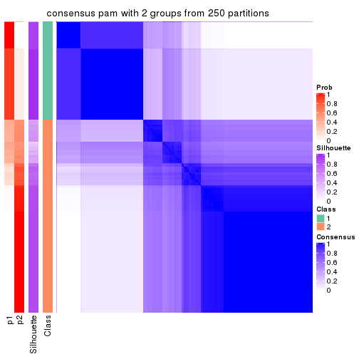</p>

</div>
<div id='tab-CV-pam-consensus-heatmap-2'>
<pre><code class="r">consensus_heatmap(res, k = 3)
</code></pre>

<p>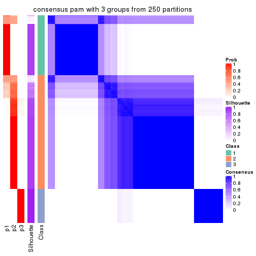</p>

</div>
<div id='tab-CV-pam-consensus-heatmap-3'>
<pre><code class="r">consensus_heatmap(res, k = 4)
</code></pre>

<p>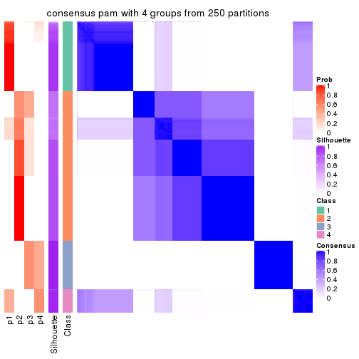</p>

</div>
<div id='tab-CV-pam-consensus-heatmap-4'>
<pre><code class="r">consensus_heatmap(res, k = 5)
</code></pre>

<p>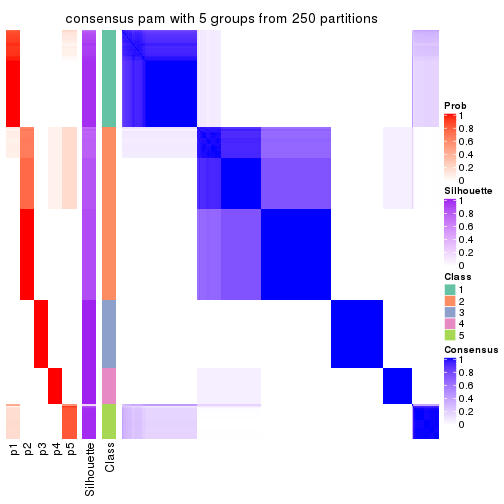</p>

</div>
<div id='tab-CV-pam-consensus-heatmap-5'>
<pre><code class="r">consensus_heatmap(res, k = 6)
</code></pre>

<p>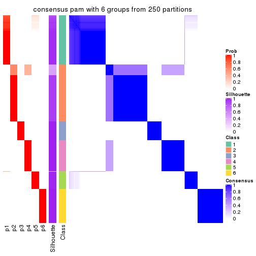</p>

</div>
</div>

Heatmaps for the membership of samples in all partitions to see how consistent they are:


<script>
$( function() {
	$( '#tabs-CV-pam-membership-heatmap' ).tabs();
} );
</script>
<div id='tabs-CV-pam-membership-heatmap'>
<ul>
<li><a href='#tab-CV-pam-membership-heatmap-1'>k = 2</a></li>
<li><a href='#tab-CV-pam-membership-heatmap-2'>k = 3</a></li>
<li><a href='#tab-CV-pam-membership-heatmap-3'>k = 4</a></li>
<li><a href='#tab-CV-pam-membership-heatmap-4'>k = 5</a></li>
<li><a href='#tab-CV-pam-membership-heatmap-5'>k = 6</a></li>
</ul>
<div id='tab-CV-pam-membership-heatmap-1'>
<pre><code class="r">membership_heatmap(res, k = 2)
</code></pre>

<p>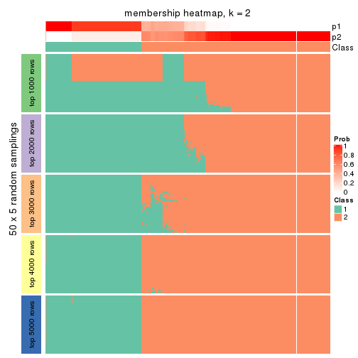</p>

</div>
<div id='tab-CV-pam-membership-heatmap-2'>
<pre><code class="r">membership_heatmap(res, k = 3)
</code></pre>

<p>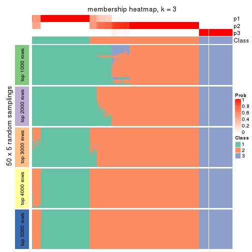</p>

</div>
<div id='tab-CV-pam-membership-heatmap-3'>
<pre><code class="r">membership_heatmap(res, k = 4)
</code></pre>

<p>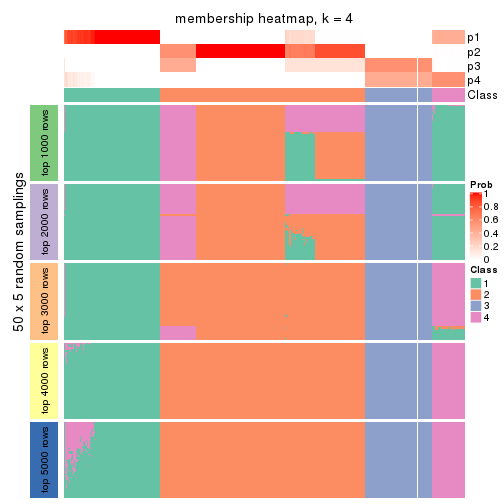</p>

</div>
<div id='tab-CV-pam-membership-heatmap-4'>
<pre><code class="r">membership_heatmap(res, k = 5)
</code></pre>

<p>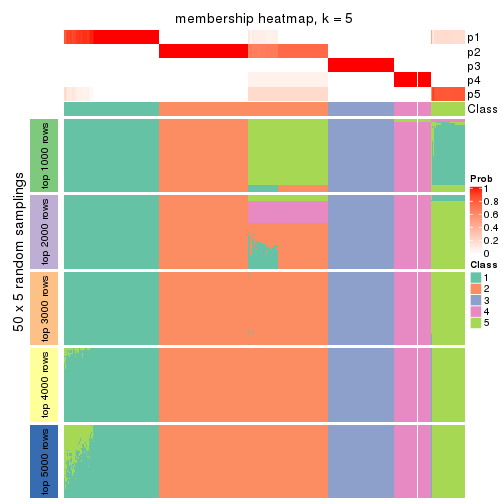</p>

</div>
<div id='tab-CV-pam-membership-heatmap-5'>
<pre><code class="r">membership_heatmap(res, k = 6)
</code></pre>

<p>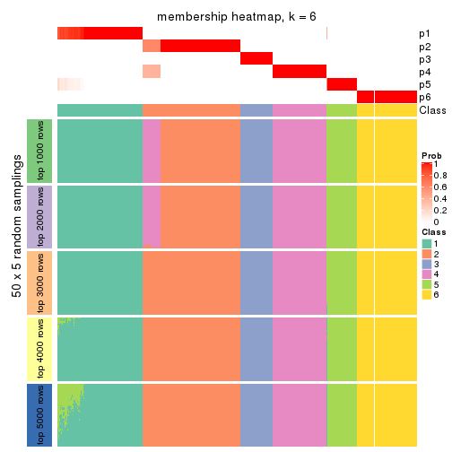</p>

</div>
</div>

As soon as we have had the classes for columns, we can look for signatures
which are significantly different between classes which can be candidate marks
for certain classes. Following are the heatmaps for signatures.


Signature heatmaps where rows are scaled:


<script>
$( function() {
	$( '#tabs-CV-pam-get-signatures' ).tabs();
} );
</script>
<div id='tabs-CV-pam-get-signatures'>
<ul>
<li><a href='#tab-CV-pam-get-signatures-1'>k = 2</a></li>
<li><a href='#tab-CV-pam-get-signatures-2'>k = 3</a></li>
<li><a href='#tab-CV-pam-get-signatures-3'>k = 4</a></li>
<li><a href='#tab-CV-pam-get-signatures-4'>k = 5</a></li>
<li><a href='#tab-CV-pam-get-signatures-5'>k = 6</a></li>
</ul>
<div id='tab-CV-pam-get-signatures-1'>
<pre><code class="r">get_signatures(res, k = 2)
</code></pre>

<p>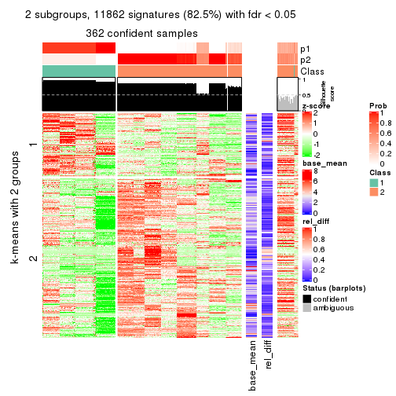</p>

</div>
<div id='tab-CV-pam-get-signatures-2'>
<pre><code class="r">get_signatures(res, k = 3)
</code></pre>

<p>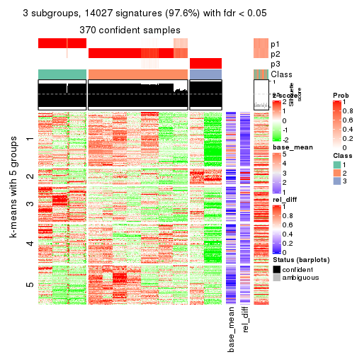</p>

</div>
<div id='tab-CV-pam-get-signatures-3'>
<pre><code class="r">get_signatures(res, k = 4)
</code></pre>

<pre><code>#&gt; Error in mat[ceiling(1:nr/h_ratio), ceiling(1:nc/w_ratio), drop = FALSE]: subscript out of bounds
</code></pre>

<p>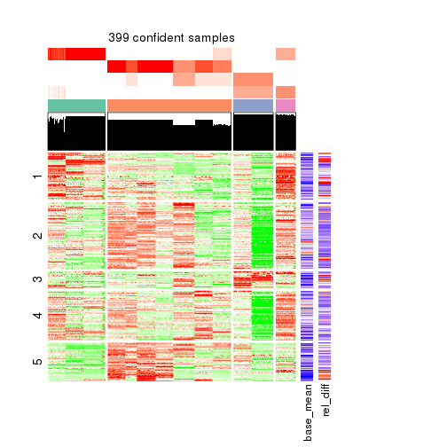</p>

</div>
<div id='tab-CV-pam-get-signatures-4'>
<pre><code class="r">get_signatures(res, k = 5)
</code></pre>

<pre><code>#&gt; Error in mat[ceiling(1:nr/h_ratio), ceiling(1:nc/w_ratio), drop = FALSE]: subscript out of bounds
</code></pre>

<p>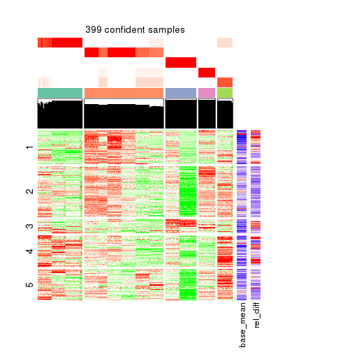</p>

</div>
<div id='tab-CV-pam-get-signatures-5'>
<pre><code class="r">get_signatures(res, k = 6)
</code></pre>

<p>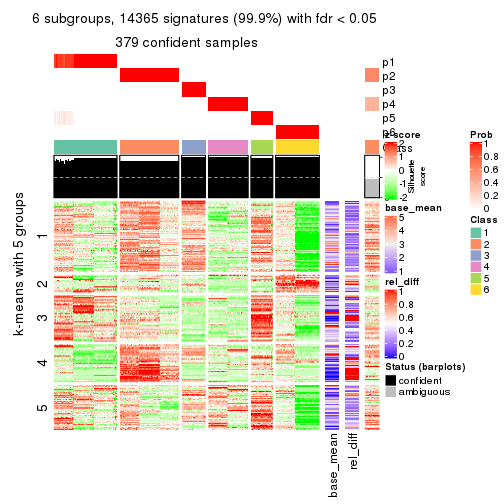</p>

</div>
</div>


Signature heatmaps where rows are not scaled:


<script>
$( function() {
	$( '#tabs-CV-pam-get-signatures-no-scale' ).tabs();
} );
</script>
<div id='tabs-CV-pam-get-signatures-no-scale'>
<ul>
<li><a href='#tab-CV-pam-get-signatures-no-scale-1'>k = 2</a></li>
<li><a href='#tab-CV-pam-get-signatures-no-scale-2'>k = 3</a></li>
<li><a href='#tab-CV-pam-get-signatures-no-scale-3'>k = 4</a></li>
<li><a href='#tab-CV-pam-get-signatures-no-scale-4'>k = 5</a></li>
<li><a href='#tab-CV-pam-get-signatures-no-scale-5'>k = 6</a></li>
</ul>
<div id='tab-CV-pam-get-signatures-no-scale-1'>
<pre><code class="r">get_signatures(res, k = 2, scale_rows = FALSE)
</code></pre>

<p>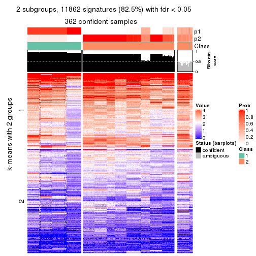</p>

</div>
<div id='tab-CV-pam-get-signatures-no-scale-2'>
<pre><code class="r">get_signatures(res, k = 3, scale_rows = FALSE)
</code></pre>

<p>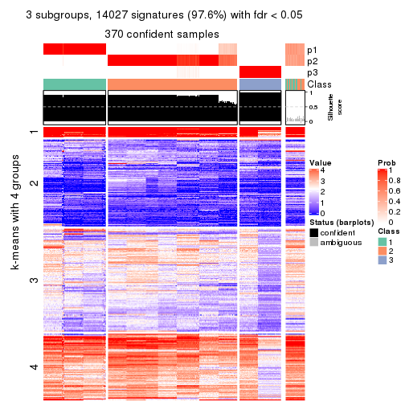</p>

</div>
<div id='tab-CV-pam-get-signatures-no-scale-3'>
<pre><code class="r">get_signatures(res, k = 4, scale_rows = FALSE)
</code></pre>

<pre><code>#&gt; Error in mat[ceiling(1:nr/h_ratio), ceiling(1:nc/w_ratio), drop = FALSE]: subscript out of bounds
</code></pre>

<p>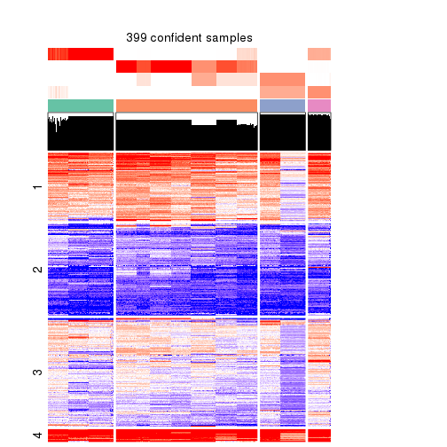</p>

</div>
<div id='tab-CV-pam-get-signatures-no-scale-4'>
<pre><code class="r">get_signatures(res, k = 5, scale_rows = FALSE)
</code></pre>

<pre><code>#&gt; Error in mat[ceiling(1:nr/h_ratio), ceiling(1:nc/w_ratio), drop = FALSE]: subscript out of bounds
</code></pre>

<p>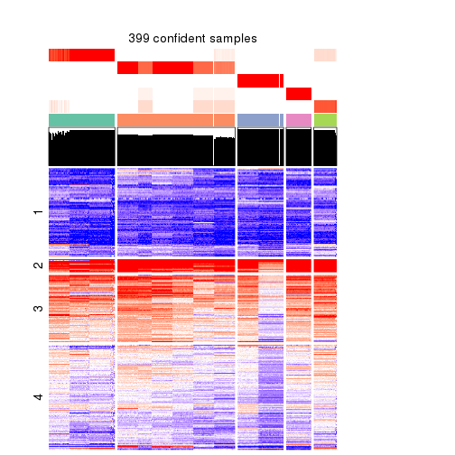</p>

</div>
<div id='tab-CV-pam-get-signatures-no-scale-5'>
<pre><code class="r">get_signatures(res, k = 6, scale_rows = FALSE)
</code></pre>

<p>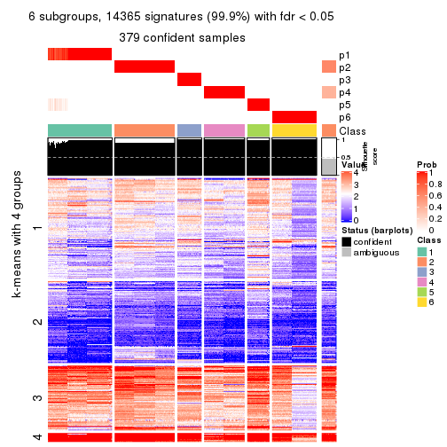</p>

</div>
</div>


Compare the overlap of signatures from different k:

```r
compare_signatures(res)
```

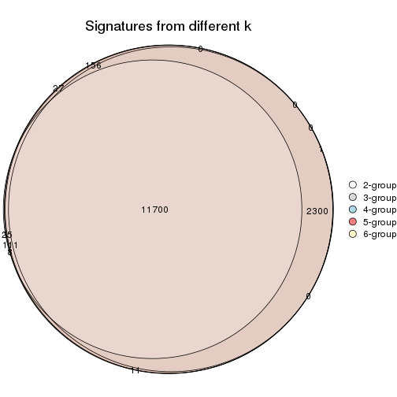

`get_signature()` returns a data frame invisibly. TO get the list of signatures, the function
call should be assigned to a variable explicitly. In following code, if `plot` argument is set
to `FALSE`, no heatmap is plotted while only the differential analysis is performed.

```r
# code only for demonstration
tb = get_signature(res, k = ..., plot = FALSE)
```

An example of the output of `tb` is:

```
#>   which_row         fdr    mean_1    mean_2 scaled_mean_1 scaled_mean_2 km
#> 1        38 0.042760348  8.373488  9.131774    -0.5533452     0.5164555  1
#> 2        40 0.018707592  7.106213  8.469186    -0.6173731     0.5762149  1
#> 3        55 0.019134737 10.221463 11.207825    -0.6159697     0.5749050  1
#> 4        59 0.006059896  5.921854  7.869574    -0.6899429     0.6439467  1
#> 5        60 0.018055526  8.928898 10.211722    -0.6204761     0.5791110  1
#> 6        98 0.009384629 15.714769 14.887706     0.6635654    -0.6193277  2
...
```

The columns in `tb` are:

1. `which_row`: row indices corresponding to the input matrix.
2. `fdr`: FDR for the differential test. 
3. `mean_x`: The mean value in group x.
4. `scaled_mean_x`: The mean value in group x after rows are scaled.
5. `km`: Row groups if k-means clustering is applied to rows.


UMAP plot which shows how samples are separated.


<script>
$( function() {
	$( '#tabs-CV-pam-dimension-reduction' ).tabs();
} );
</script>
<div id='tabs-CV-pam-dimension-reduction'>
<ul>
<li><a href='#tab-CV-pam-dimension-reduction-1'>k = 2</a></li>
<li><a href='#tab-CV-pam-dimension-reduction-2'>k = 3</a></li>
<li><a href='#tab-CV-pam-dimension-reduction-3'>k = 4</a></li>
<li><a href='#tab-CV-pam-dimension-reduction-4'>k = 5</a></li>
<li><a href='#tab-CV-pam-dimension-reduction-5'>k = 6</a></li>
</ul>
<div id='tab-CV-pam-dimension-reduction-1'>
<pre><code class="r">dimension_reduction(res, k = 2, method = &quot;UMAP&quot;)
</code></pre>

<p>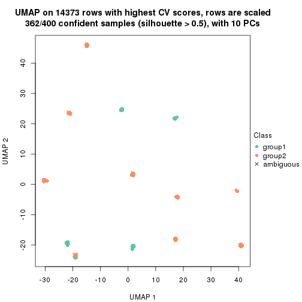</p>

</div>
<div id='tab-CV-pam-dimension-reduction-2'>
<pre><code class="r">dimension_reduction(res, k = 3, method = &quot;UMAP&quot;)
</code></pre>

<p>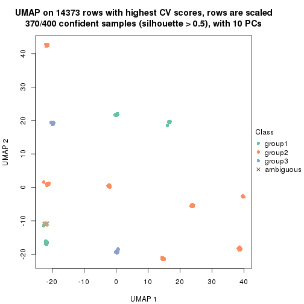</p>

</div>
<div id='tab-CV-pam-dimension-reduction-3'>
<pre><code class="r">dimension_reduction(res, k = 4, method = &quot;UMAP&quot;)
</code></pre>

<p>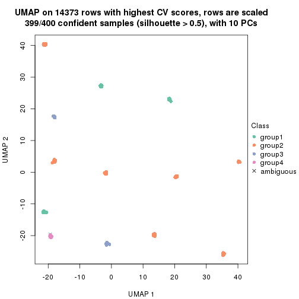</p>

</div>
<div id='tab-CV-pam-dimension-reduction-4'>
<pre><code class="r">dimension_reduction(res, k = 5, method = &quot;UMAP&quot;)
</code></pre>

<p>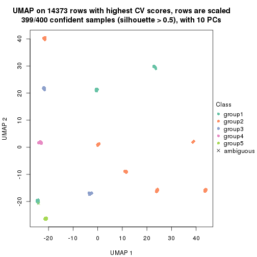</p>

</div>
<div id='tab-CV-pam-dimension-reduction-5'>
<pre><code class="r">dimension_reduction(res, k = 6, method = &quot;UMAP&quot;)
</code></pre>

<p>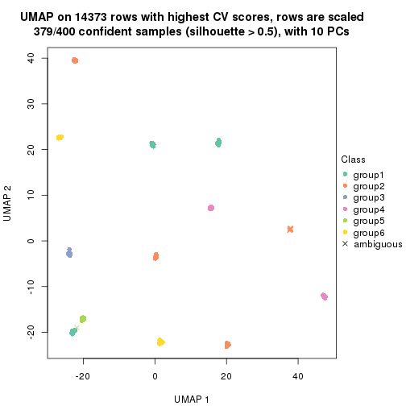</p>

</div>
</div>


Following heatmap shows how subgroups are split when increasing `k`:

```r
collect_classes(res)
```

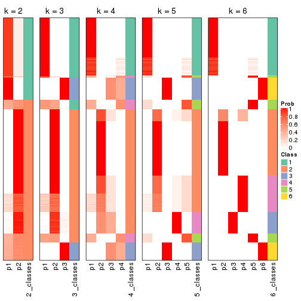


If matrix rows can be associated to genes, consider to use `GO_Enrichment(res,
...)` to perform function enrichment for the signature genes.


 

---------------------------------------------------


### CV:mclust


The object with results only for a single top-value method and a single partition method 
can be extracted as:

```r
res = res_list["CV", "mclust"]
# you can also extract it by
# res = res_list["CV:mclust"]
```

A summary of `res` and all the functions that can be applied to it:

```r
res
```

```
#> A 'ConsensusPartition' object with k = 2, 3, 4, 5, 6.
#>   On a matrix with 14373 rows and 400 columns.
#>   Top rows (1000, 2000, 3000, 4000, 5000) are extracted by 'CV' method.
#>   Subgroups are detected by 'mclust' method.
#>   Performed in total 1250 partitions by row resampling.
#>   Best k for subgroups seems to be 5.
#> 
#> Following methods can be applied to this 'ConsensusPartition' object:
#>  [1] "cola_report"             "collect_classes"         "collect_plots"          
#>  [4] "collect_stats"           "colnames"                "compare_signatures"     
#>  [7] "consensus_heatmap"       "dimension_reduction"     "functional_enrichment"  
#> [10] "get_anno_col"            "get_anno"                "get_classes"            
#> [13] "get_consensus"           "get_matrix"              "get_membership"         
#> [16] "get_param"               "get_signatures"          "get_stats"              
#> [19] "is_best_k"               "is_stable_k"             "membership_heatmap"     
#> [22] "ncol"                    "nrow"                    "plot_ecdf"              
#> [25] "rownames"                "select_partition_number" "show"                   
#> [28] "suggest_best_k"          "test_to_known_factors"
```

`collect_plots()` function collects all the plots made from `res` for all `k` (number of partitions)
into one single page to provide an easy and fast comparison between different `k`.

```r
collect_plots(res)
```

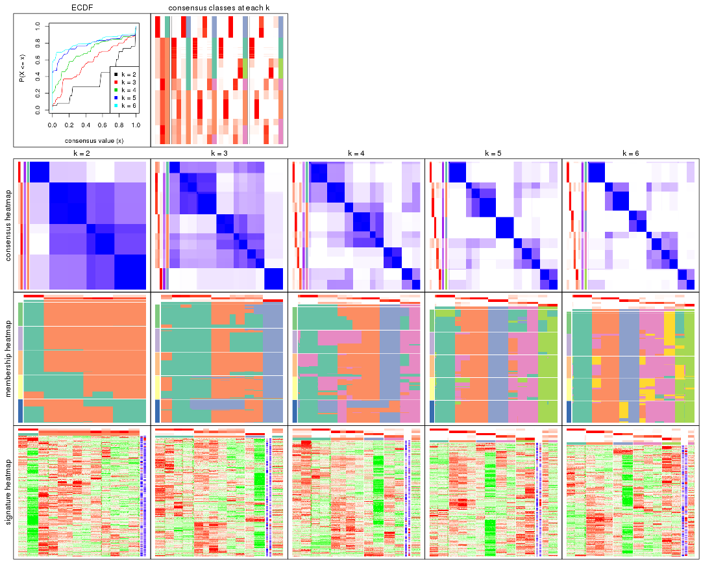

The plots are:

- The first row: a plot of the ECDF (Empirical cumulative distribution
  function) curves of the consensus matrix for each `k` and the heatmap of
  predicted classes for each `k`.
- The second row: heatmaps of the consensus matrix for each `k`.
- The third row: heatmaps of the membership matrix for each `k`.
- The fouth row: heatmaps of the signatures for each `k`.

All the plots in panels can be made by individual functions and they are
plotted later in this section.

`select_partition_number()` produces several plots showing different
statistics for choosing "optimized" `k`. There are following statistics:

- ECDF curves of the consensus matrix for each `k`;
- 1-PAC. [The PAC
  score](https://en.wikipedia.org/wiki/Consensus_clustering#Over-interpretation_potential_of_consensus_clustering)
  measures the proportion of the ambiguous subgrouping.
- Mean silhouette score.
- Concordance. The mean probability of fiting the consensus class ids in all
  partitions.
- Area increased. Denote $A_k$ as the area under the ECDF curve for current
  `k`, the area increased is defined as $A_k - A_{k-1}$.
- Rand index. The percent of pairs of samples that are both in a same cluster
  or both are not in a same cluster in the partition of k and k-1.
- Jaccard index. The ratio of pairs of samples are both in a same cluster in
  the partition of k and k-1 and the pairs of samples are both in a same
  cluster in the partition k or k-1.

The detailed explanations of these statistics can be found in [the cola
vignette](http://bioconductor.org/packages/devel/bioc/vignettes/cola/inst/doc/cola.html#toc_13).

Generally speaking, lower PAC score, higher mean silhouette score or higher
concordance corresponds to better partition. Rand index and Jaccard index
measure how similar the current partition is compared to partition with `k-1`.
If they are too similar, we won't accept `k` is better than `k-1`.

```r
select_partition_number(res)
```

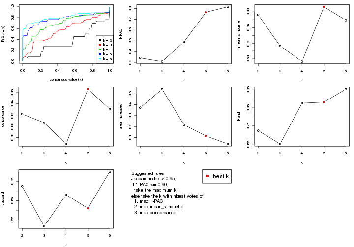

The numeric values for all these statistics can be obtained by `get_stats()`.

```r
get_stats(res)
```

```
#>   k 1-PAC mean_silhouette concordance area_increased  Rand Jaccard
#> 2 2 0.341           0.792       0.822         0.3724 0.724   0.724
#> 3 3 0.307           0.713       0.806         0.5419 0.651   0.517
#> 4 4 0.490           0.673       0.769         0.2149 0.876   0.680
#> 5 5 0.766           0.813       0.866         0.1142 0.882   0.610
#> 6 6 0.817           0.779       0.831         0.0414 0.954   0.801
```

`suggest_best_k()` suggests the best $k$ based on these statistics. The rules are as follows:

- All $k$ with Jaccard index larger than 0.95 are removed because the increase of
  the partition number does not provides enough extra information. If all $k$ are removed,
  the best $k$ is assigned by `NA`.
- For $k$ with 1-PAC larger than 0.9, the maximal $k$ is taken as the "best k". Other $k$ is called "optional k".
- If it does not fit the second rule. The $k$ with the highest vote of highest
  1-PAC, mean silhouette and concordance is taken as the "best k".

```r
suggest_best_k(res)
```

```
#> [1] 5
```


Following shows the table of the partitions (You need to click the **show/hide
code output** link to see it). The membership matrix (columns with name `p*`)
is inferred by
[`clue::cl_consensus()`](https://www.rdocumentation.org/link/cl_consensus?package=clue)
function with the `SE` method. Basically the value in the membership matrix
represents the probability to belong to a certain group. The finall class
label for an item is determined with the group with highest probability it
belongs to.

In `get_classes()` function, the entropy is calculated from the membership
matrix and the silhouette score is calculated from the consensus matrix.


<script>
$( function() {
	$( '#tabs-CV-mclust-get-classes' ).tabs();
} );
</script>
<div id='tabs-CV-mclust-get-classes'>
<ul>
<li><a href='#tab-CV-mclust-get-classes-1'>k = 2</a></li>
<li><a href='#tab-CV-mclust-get-classes-2'>k = 3</a></li>
<li><a href='#tab-CV-mclust-get-classes-3'>k = 4</a></li>
<li><a href='#tab-CV-mclust-get-classes-4'>k = 5</a></li>
<li><a href='#tab-CV-mclust-get-classes-5'>k = 6</a></li>
</ul>

<div id='tab-CV-mclust-get-classes-1'>
<p><a id='tab-CV-mclust-get-classes-1-a' style='color:#0366d6' href='#'>show/hide code output</a></p>
<pre><code class="r">cbind(get_classes(res, k = 2), get_membership(res, k = 2))
</code></pre>

<pre><code>#&gt;            class entropy silhouette    p1    p2
#&gt; SRR1661716     2   0.730      0.736 0.204 0.796
#&gt; SRR1661717     2   0.730      0.736 0.204 0.796
#&gt; SRR1661718     2   0.730      0.736 0.204 0.796
#&gt; SRR1661719     2   0.730      0.736 0.204 0.796
#&gt; SRR1661720     2   0.730      0.736 0.204 0.796
#&gt; SRR1661721     2   0.730      0.736 0.204 0.796
#&gt; SRR1661722     2   0.730      0.736 0.204 0.796
#&gt; SRR1661723     2   0.730      0.736 0.204 0.796
#&gt; SRR1661724     2   0.730      0.736 0.204 0.796
#&gt; SRR1661725     2   0.730      0.736 0.204 0.796
#&gt; SRR1661726     2   0.730      0.736 0.204 0.796
#&gt; SRR1661727     2   0.730      0.736 0.204 0.796
#&gt; SRR1661728     2   0.730      0.736 0.204 0.796
#&gt; SRR1661729     2   0.730      0.736 0.204 0.796
#&gt; SRR1661730     2   0.730      0.736 0.204 0.796
#&gt; SRR1661731     2   0.730      0.736 0.204 0.796
#&gt; SRR1661732     2   0.730      0.736 0.204 0.796
#&gt; SRR1661733     2   0.730      0.736 0.204 0.796
#&gt; SRR1661734     2   0.730      0.736 0.204 0.796
#&gt; SRR1661735     2   0.730      0.736 0.204 0.796
#&gt; SRR1661736     2   0.730      0.736 0.204 0.796
#&gt; SRR1661737     2   0.730      0.736 0.204 0.796
#&gt; SRR1661738     2   0.730      0.736 0.204 0.796
#&gt; SRR1661739     2   0.730      0.736 0.204 0.796
#&gt; SRR1661740     2   0.730      0.736 0.204 0.796
#&gt; SRR1661741     2   0.730      0.736 0.204 0.796
#&gt; SRR1661742     2   0.730      0.736 0.204 0.796
#&gt; SRR1661743     2   0.730      0.736 0.204 0.796
#&gt; SRR1661744     2   0.730      0.736 0.204 0.796
#&gt; SRR1661745     2   0.730      0.736 0.204 0.796
#&gt; SRR1661746     2   0.730      0.736 0.204 0.796
#&gt; SRR1661747     2   0.730      0.736 0.204 0.796
#&gt; SRR1661748     2   0.730      0.736 0.204 0.796
#&gt; SRR1661749     2   0.730      0.736 0.204 0.796
#&gt; SRR1661750     2   0.730      0.736 0.204 0.796
#&gt; SRR1661751     2   0.730      0.736 0.204 0.796
#&gt; SRR1661752     2   0.730      0.736 0.204 0.796
#&gt; SRR1661753     2   0.730      0.736 0.204 0.796
#&gt; SRR1661754     2   0.730      0.736 0.204 0.796
#&gt; SRR1661755     2   0.730      0.736 0.204 0.796
#&gt; SRR1661756     2   0.730      0.736 0.204 0.796
#&gt; SRR1661757     2   0.730      0.736 0.204 0.796
#&gt; SRR1661758     2   0.730      0.736 0.204 0.796
#&gt; SRR1661759     2   0.730      0.736 0.204 0.796
#&gt; SRR1661760     2   0.730      0.736 0.204 0.796
#&gt; SRR1661761     2   0.730      0.736 0.204 0.796
#&gt; SRR1661762     2   0.730      0.736 0.204 0.796
#&gt; SRR1661763     2   0.730      0.736 0.204 0.796
#&gt; SRR1661764     2   0.730      0.736 0.204 0.796
#&gt; SRR1661766     2   0.730      0.736 0.204 0.796
#&gt; SRR1661767     2   0.730      0.736 0.204 0.796
#&gt; SRR1661768     2   0.730      0.736 0.204 0.796
#&gt; SRR1661769     2   0.730      0.736 0.204 0.796
#&gt; SRR1661770     2   0.730      0.736 0.204 0.796
#&gt; SRR1661771     2   0.730      0.736 0.204 0.796
#&gt; SRR1661772     2   0.730      0.736 0.204 0.796
#&gt; SRR1661773     2   0.730      0.736 0.204 0.796
#&gt; SRR1661774     2   0.730      0.736 0.204 0.796
#&gt; SRR1661775     2   0.730      0.736 0.204 0.796
#&gt; SRR1661776     2   0.730      0.736 0.204 0.796
#&gt; SRR1661777     2   0.730      0.736 0.204 0.796
#&gt; SRR1661778     2   0.730      0.736 0.204 0.796
#&gt; SRR1661779     2   0.730      0.736 0.204 0.796
#&gt; SRR1661780     2   0.730      0.736 0.204 0.796
#&gt; SRR1661781     2   0.730      0.736 0.204 0.796
#&gt; SRR1661782     2   0.730      0.736 0.204 0.796
#&gt; SRR1661783     2   0.730      0.736 0.204 0.796
#&gt; SRR1661784     2   0.730      0.736 0.204 0.796
#&gt; SRR1661785     2   0.730      0.736 0.204 0.796
#&gt; SRR1661786     2   0.730      0.736 0.204 0.796
#&gt; SRR1661787     2   0.730      0.736 0.204 0.796
#&gt; SRR1661788     2   0.730      0.736 0.204 0.796
#&gt; SRR1661789     2   0.730      0.736 0.204 0.796
#&gt; SRR1661790     2   0.730      0.736 0.204 0.796
#&gt; SRR1661791     2   0.730      0.736 0.204 0.796
#&gt; SRR1661792     2   0.730      0.736 0.204 0.796
#&gt; SRR1661793     2   0.730      0.736 0.204 0.796
#&gt; SRR1661794     2   0.730      0.736 0.204 0.796
#&gt; SRR1661795     2   0.730      0.736 0.204 0.796
#&gt; SRR1661796     2   0.730      0.736 0.204 0.796
#&gt; SRR1661797     2   0.730      0.736 0.204 0.796
#&gt; SRR1661798     2   0.730      0.736 0.204 0.796
#&gt; SRR1661799     2   0.730      0.736 0.204 0.796
#&gt; SRR1661800     2   0.730      0.736 0.204 0.796
#&gt; SRR1661801     2   0.730      0.736 0.204 0.796
#&gt; SRR1661802     2   0.730      0.736 0.204 0.796
#&gt; SRR1661803     2   0.730      0.736 0.204 0.796
#&gt; SRR1661804     2   0.730      0.736 0.204 0.796
#&gt; SRR1661805     2   0.730      0.736 0.204 0.796
#&gt; SRR1661806     2   0.730      0.736 0.204 0.796
#&gt; SRR1661807     2   0.730      0.736 0.204 0.796
#&gt; SRR1661808     2   0.730      0.736 0.204 0.796
#&gt; SRR1661809     2   0.730      0.736 0.204 0.796
#&gt; SRR1661810     2   0.730      0.736 0.204 0.796
#&gt; SRR1661811     2   0.730      0.736 0.204 0.796
#&gt; SRR1661812     2   0.730      0.736 0.204 0.796
#&gt; SRR1661813     2   0.730      0.736 0.204 0.796
#&gt; SRR1661814     2   0.730      0.736 0.204 0.796
#&gt; SRR1661815     2   0.730      0.736 0.204 0.796
#&gt; SRR1661816     2   0.730      0.736 0.204 0.796
#&gt; SRR1661817     2   0.730      0.736 0.204 0.796
#&gt; SRR1661818     2   0.730      0.736 0.204 0.796
#&gt; SRR1661819     2   0.730      0.736 0.204 0.796
#&gt; SRR1661820     2   0.730      0.736 0.204 0.796
#&gt; SRR1661821     2   0.730      0.736 0.204 0.796
#&gt; SRR1661822     2   0.730      0.736 0.204 0.796
#&gt; SRR1661823     2   0.730      0.736 0.204 0.796
#&gt; SRR1661824     2   0.730      0.736 0.204 0.796
#&gt; SRR1661825     2   0.730      0.736 0.204 0.796
#&gt; SRR1661826     2   0.788      0.736 0.236 0.764
#&gt; SRR1661827     2   0.788      0.736 0.236 0.764
#&gt; SRR1661828     2   0.788      0.736 0.236 0.764
#&gt; SRR1661829     2   0.788      0.736 0.236 0.764
#&gt; SRR1661830     2   0.788      0.736 0.236 0.764
#&gt; SRR1661831     2   0.788      0.736 0.236 0.764
#&gt; SRR1661832     2   0.788      0.736 0.236 0.764
#&gt; SRR1661833     2   0.788      0.736 0.236 0.764
#&gt; SRR1661834     2   0.788      0.736 0.236 0.764
#&gt; SRR1661835     2   0.788      0.736 0.236 0.764
#&gt; SRR1661836     2   0.788      0.736 0.236 0.764
#&gt; SRR1661837     2   0.788      0.736 0.236 0.764
#&gt; SRR1661838     2   0.788      0.736 0.236 0.764
#&gt; SRR1661839     2   0.788      0.736 0.236 0.764
#&gt; SRR1661840     2   0.788      0.736 0.236 0.764
#&gt; SRR1661841     2   0.788      0.736 0.236 0.764
#&gt; SRR1661843     2   0.788      0.736 0.236 0.764
#&gt; SRR1661844     2   0.788      0.736 0.236 0.764
#&gt; SRR1661845     2   0.788      0.736 0.236 0.764
#&gt; SRR1661846     2   0.788      0.736 0.236 0.764
#&gt; SRR1661847     2   0.788      0.736 0.236 0.764
#&gt; SRR1661848     2   0.788      0.736 0.236 0.764
#&gt; SRR1661849     2   0.788      0.736 0.236 0.764
#&gt; SRR1661850     2   0.788      0.736 0.236 0.764
#&gt; SRR1661851     2   0.788      0.736 0.236 0.764
#&gt; SRR1661852     2   0.788      0.736 0.236 0.764
#&gt; SRR1661853     2   0.788      0.736 0.236 0.764
#&gt; SRR1661854     2   0.788      0.736 0.236 0.764
#&gt; SRR1661855     2   0.788      0.736 0.236 0.764
#&gt; SRR1661856     1   0.000      1.000 1.000 0.000
#&gt; SRR1661857     1   0.000      1.000 1.000 0.000
#&gt; SRR1661858     1   0.000      1.000 1.000 0.000
#&gt; SRR1661859     1   0.000      1.000 1.000 0.000
#&gt; SRR1661860     1   0.000      1.000 1.000 0.000
#&gt; SRR1661861     1   0.000      1.000 1.000 0.000
#&gt; SRR1661862     1   0.000      1.000 1.000 0.000
#&gt; SRR1661863     1   0.000      1.000 1.000 0.000
#&gt; SRR1661864     1   0.000      1.000 1.000 0.000
#&gt; SRR1661865     1   0.000      1.000 1.000 0.000
#&gt; SRR1661866     1   0.000      1.000 1.000 0.000
#&gt; SRR1661867     1   0.000      1.000 1.000 0.000
#&gt; SRR1661868     1   0.000      1.000 1.000 0.000
#&gt; SRR1661869     1   0.000      1.000 1.000 0.000
#&gt; SRR1661870     1   0.000      1.000 1.000 0.000
#&gt; SRR1661871     1   0.000      1.000 1.000 0.000
#&gt; SRR1661872     1   0.000      1.000 1.000 0.000
#&gt; SRR1661873     1   0.000      1.000 1.000 0.000
#&gt; SRR1661874     1   0.000      1.000 1.000 0.000
#&gt; SRR1661875     1   0.000      1.000 1.000 0.000
#&gt; SRR1661876     1   0.000      1.000 1.000 0.000
#&gt; SRR1661877     1   0.000      1.000 1.000 0.000
#&gt; SRR1661878     1   0.000      1.000 1.000 0.000
#&gt; SRR1661879     1   0.000      1.000 1.000 0.000
#&gt; SRR1661880     1   0.000      1.000 1.000 0.000
#&gt; SRR1661881     1   0.000      1.000 1.000 0.000
#&gt; SRR1661882     1   0.000      1.000 1.000 0.000
#&gt; SRR1661883     1   0.000      1.000 1.000 0.000
#&gt; SRR1661884     1   0.000      1.000 1.000 0.000
#&gt; SRR1661885     1   0.000      1.000 1.000 0.000
#&gt; SRR1661886     1   0.000      1.000 1.000 0.000
#&gt; SRR1661887     1   0.000      1.000 1.000 0.000
#&gt; SRR1661888     1   0.000      1.000 1.000 0.000
#&gt; SRR1661889     1   0.000      1.000 1.000 0.000
#&gt; SRR1661890     1   0.000      1.000 1.000 0.000
#&gt; SRR1661891     1   0.000      1.000 1.000 0.000
#&gt; SRR1661892     2   0.788      0.736 0.236 0.764
#&gt; SRR1661893     2   0.788      0.736 0.236 0.764
#&gt; SRR1661894     2   0.788      0.736 0.236 0.764
#&gt; SRR1661895     2   0.788      0.736 0.236 0.764
#&gt; SRR1661896     2   0.788      0.736 0.236 0.764
#&gt; SRR1661897     2   0.788      0.736 0.236 0.764
#&gt; SRR1661898     2   0.788      0.736 0.236 0.764
#&gt; SRR1661899     2   0.788      0.736 0.236 0.764
#&gt; SRR1661900     2   0.788      0.736 0.236 0.764
#&gt; SRR1661901     2   0.788      0.736 0.236 0.764
#&gt; SRR1661902     2   0.788      0.736 0.236 0.764
#&gt; SRR1661903     2   0.788      0.736 0.236 0.764
#&gt; SRR1661904     2   0.788      0.736 0.236 0.764
#&gt; SRR1661905     2   0.788      0.736 0.236 0.764
#&gt; SRR1661906     2   0.788      0.736 0.236 0.764
#&gt; SRR1661907     2   0.788      0.736 0.236 0.764
#&gt; SRR1661908     2   0.788      0.736 0.236 0.764
#&gt; SRR1661909     2   0.788      0.736 0.236 0.764
#&gt; SRR1661910     2   0.788      0.736 0.236 0.764
#&gt; SRR1661911     2   0.788      0.736 0.236 0.764
#&gt; SRR1661912     2   0.788      0.736 0.236 0.764
#&gt; SRR1661913     2   0.788      0.736 0.236 0.764
#&gt; SRR1661914     2   0.788      0.736 0.236 0.764
#&gt; SRR1661915     2   0.788      0.736 0.236 0.764
#&gt; SRR1661916     2   0.788      0.736 0.236 0.764
#&gt; SRR1661917     2   0.788      0.736 0.236 0.764
#&gt; SRR1661918     2   0.788      0.736 0.236 0.764
#&gt; SRR1661919     2   0.788      0.736 0.236 0.764
#&gt; SRR1661920     2   0.788      0.736 0.236 0.764
#&gt; SRR1661921     2   0.788      0.736 0.236 0.764
#&gt; SRR1661922     2   0.788      0.736 0.236 0.764
#&gt; SRR1661923     2   0.788      0.736 0.236 0.764
#&gt; SRR1661924     2   0.788      0.736 0.236 0.764
#&gt; SRR1661925     2   0.788      0.736 0.236 0.764
#&gt; SRR1661926     2   0.788      0.736 0.236 0.764
#&gt; SRR1661927     2   0.788      0.736 0.236 0.764
#&gt; SRR1661928     1   0.000      1.000 1.000 0.000
#&gt; SRR1661929     1   0.000      1.000 1.000 0.000
#&gt; SRR1661930     1   0.000      1.000 1.000 0.000
#&gt; SRR1661931     1   0.000      1.000 1.000 0.000
#&gt; SRR1661932     1   0.000      1.000 1.000 0.000
#&gt; SRR1661933     1   0.000      1.000 1.000 0.000
#&gt; SRR1661934     1   0.000      1.000 1.000 0.000
#&gt; SRR1661935     1   0.000      1.000 1.000 0.000
#&gt; SRR1661936     1   0.000      1.000 1.000 0.000
#&gt; SRR1661937     1   0.000      1.000 1.000 0.000
#&gt; SRR1661938     1   0.000      1.000 1.000 0.000
#&gt; SRR1661939     1   0.000      1.000 1.000 0.000
#&gt; SRR1661940     1   0.000      1.000 1.000 0.000
#&gt; SRR1661941     1   0.000      1.000 1.000 0.000
#&gt; SRR1661942     1   0.000      1.000 1.000 0.000
#&gt; SRR1661943     1   0.000      1.000 1.000 0.000
#&gt; SRR1661944     1   0.000      1.000 1.000 0.000
#&gt; SRR1661945     1   0.000      1.000 1.000 0.000
#&gt; SRR1661946     1   0.000      1.000 1.000 0.000
#&gt; SRR1661947     1   0.000      1.000 1.000 0.000
#&gt; SRR1661948     1   0.000      1.000 1.000 0.000
#&gt; SRR1661949     1   0.000      1.000 1.000 0.000
#&gt; SRR1661950     1   0.000      1.000 1.000 0.000
#&gt; SRR1661951     1   0.000      1.000 1.000 0.000
#&gt; SRR1661952     1   0.000      1.000 1.000 0.000
#&gt; SRR1661953     1   0.000      1.000 1.000 0.000
#&gt; SRR1661954     1   0.000      1.000 1.000 0.000
#&gt; SRR1661955     1   0.000      1.000 1.000 0.000
#&gt; SRR1661956     1   0.000      1.000 1.000 0.000
#&gt; SRR1661957     1   0.000      1.000 1.000 0.000
#&gt; SRR1661958     2   0.295      0.789 0.052 0.948
#&gt; SRR1661959     2   0.295      0.789 0.052 0.948
#&gt; SRR1661960     2   0.295      0.789 0.052 0.948
#&gt; SRR1661961     2   0.295      0.789 0.052 0.948
#&gt; SRR1661962     2   0.295      0.789 0.052 0.948
#&gt; SRR1661963     2   0.295      0.789 0.052 0.948
#&gt; SRR1661964     2   0.295      0.789 0.052 0.948
#&gt; SRR1661965     2   0.295      0.789 0.052 0.948
#&gt; SRR1661966     2   0.295      0.789 0.052 0.948
#&gt; SRR1661967     2   0.295      0.789 0.052 0.948
#&gt; SRR1661968     2   0.295      0.789 0.052 0.948
#&gt; SRR1661969     2   0.295      0.789 0.052 0.948
#&gt; SRR1661970     2   0.295      0.789 0.052 0.948
#&gt; SRR1661971     2   0.295      0.789 0.052 0.948
#&gt; SRR1661972     2   0.295      0.789 0.052 0.948
#&gt; SRR1661973     2   0.295      0.789 0.052 0.948
#&gt; SRR1661974     2   0.295      0.789 0.052 0.948
#&gt; SRR1661975     2   0.295      0.789 0.052 0.948
#&gt; SRR1661976     2   0.295      0.789 0.052 0.948
#&gt; SRR1661977     2   0.295      0.789 0.052 0.948
#&gt; SRR1661978     2   0.295      0.789 0.052 0.948
#&gt; SRR1661979     2   0.295      0.789 0.052 0.948
#&gt; SRR1661980     2   0.295      0.789 0.052 0.948
#&gt; SRR1661981     2   0.295      0.789 0.052 0.948
#&gt; SRR1661982     2   0.295      0.789 0.052 0.948
#&gt; SRR1661983     2   0.295      0.789 0.052 0.948
#&gt; SRR1661984     2   0.295      0.789 0.052 0.948
#&gt; SRR1661985     2   0.295      0.789 0.052 0.948
#&gt; SRR1661986     2   0.295      0.789 0.052 0.948
#&gt; SRR1661987     2   0.295      0.789 0.052 0.948
#&gt; SRR1661988     2   0.795      0.734 0.240 0.760
#&gt; SRR1661989     2   0.795      0.734 0.240 0.760
#&gt; SRR1661990     2   0.795      0.734 0.240 0.760
#&gt; SRR1661991     2   0.795      0.734 0.240 0.760
#&gt; SRR1661992     2   0.795      0.734 0.240 0.760
#&gt; SRR1661993     2   0.795      0.734 0.240 0.760
#&gt; SRR1661994     2   0.795      0.734 0.240 0.760
#&gt; SRR1661995     2   0.795      0.734 0.240 0.760
#&gt; SRR1661996     2   0.795      0.734 0.240 0.760
#&gt; SRR1661997     2   0.795      0.734 0.240 0.760
#&gt; SRR1661998     2   0.795      0.734 0.240 0.760
#&gt; SRR1661999     2   0.795      0.734 0.240 0.760
#&gt; SRR1662000     2   0.795      0.734 0.240 0.760
#&gt; SRR1662001     2   0.795      0.734 0.240 0.760
#&gt; SRR1662002     2   0.795      0.734 0.240 0.760
#&gt; SRR1662003     2   0.795      0.734 0.240 0.760
#&gt; SRR1662004     2   0.795      0.734 0.240 0.760
#&gt; SRR1662005     2   0.795      0.734 0.240 0.760
#&gt; SRR1662006     2   0.795      0.734 0.240 0.760
#&gt; SRR1662007     2   0.795      0.734 0.240 0.760
#&gt; SRR1662008     2   0.795      0.734 0.240 0.760
#&gt; SRR1662009     2   0.795      0.734 0.240 0.760
#&gt; SRR1662010     2   0.795      0.734 0.240 0.760
#&gt; SRR1662011     2   0.795      0.734 0.240 0.760
#&gt; SRR1662012     2   0.795      0.734 0.240 0.760
#&gt; SRR1662013     2   0.795      0.734 0.240 0.760
#&gt; SRR1662014     2   0.795      0.734 0.240 0.760
#&gt; SRR1662015     2   0.795      0.734 0.240 0.760
#&gt; SRR1662016     2   0.795      0.734 0.240 0.760
#&gt; SRR1662017     2   0.795      0.734 0.240 0.760
#&gt; SRR1662018     2   0.000      0.792 0.000 1.000
#&gt; SRR1662019     2   0.000      0.792 0.000 1.000
#&gt; SRR1662020     2   0.000      0.792 0.000 1.000
#&gt; SRR1662021     2   0.000      0.792 0.000 1.000
#&gt; SRR1662022     2   0.000      0.792 0.000 1.000
#&gt; SRR1662023     2   0.000      0.792 0.000 1.000
#&gt; SRR1662024     2   0.000      0.792 0.000 1.000
#&gt; SRR1662025     2   0.000      0.792 0.000 1.000
#&gt; SRR1662026     2   0.000      0.792 0.000 1.000
#&gt; SRR1662027     2   0.000      0.792 0.000 1.000
#&gt; SRR1662028     2   0.000      0.792 0.000 1.000
#&gt; SRR1662029     2   0.000      0.792 0.000 1.000
#&gt; SRR1662030     2   0.000      0.792 0.000 1.000
#&gt; SRR1662031     2   0.000      0.792 0.000 1.000
#&gt; SRR1662032     2   0.000      0.792 0.000 1.000
#&gt; SRR1662033     2   0.000      0.792 0.000 1.000
#&gt; SRR1662034     2   0.000      0.792 0.000 1.000
#&gt; SRR1662035     2   0.000      0.792 0.000 1.000
#&gt; SRR1662036     2   0.000      0.792 0.000 1.000
#&gt; SRR1662037     2   0.000      0.792 0.000 1.000
#&gt; SRR1662038     2   0.000      0.792 0.000 1.000
#&gt; SRR1662039     2   0.000      0.792 0.000 1.000
#&gt; SRR1662040     2   0.000      0.792 0.000 1.000
#&gt; SRR1662041     2   0.000      0.792 0.000 1.000
#&gt; SRR1662042     2   0.000      0.792 0.000 1.000
#&gt; SRR1662043     2   0.000      0.792 0.000 1.000
#&gt; SRR1662044     2   0.000      0.792 0.000 1.000
#&gt; SRR1662045     2   0.000      0.792 0.000 1.000
#&gt; SRR1662046     2   0.000      0.792 0.000 1.000
#&gt; SRR1662047     2   0.000      0.792 0.000 1.000
#&gt; SRR1662048     2   0.000      0.792 0.000 1.000
#&gt; SRR1662049     2   0.000      0.792 0.000 1.000
#&gt; SRR1662050     2   0.000      0.792 0.000 1.000
#&gt; SRR1662051     2   0.000      0.792 0.000 1.000
#&gt; SRR1662052     2   0.000      0.792 0.000 1.000
#&gt; SRR1662053     2   0.000      0.792 0.000 1.000
#&gt; SRR1662054     2   0.000      0.792 0.000 1.000
#&gt; SRR1662055     2   0.000      0.792 0.000 1.000
#&gt; SRR1662056     2   0.000      0.792 0.000 1.000
#&gt; SRR1662057     2   0.000      0.792 0.000 1.000
#&gt; SRR1662058     2   0.000      0.792 0.000 1.000
#&gt; SRR1662059     2   0.000      0.792 0.000 1.000
#&gt; SRR1662060     2   0.000      0.792 0.000 1.000
#&gt; SRR1662061     2   0.000      0.792 0.000 1.000
#&gt; SRR1662062     2   0.000      0.792 0.000 1.000
#&gt; SRR1662063     2   0.000      0.792 0.000 1.000
#&gt; SRR1662064     2   0.000      0.792 0.000 1.000
#&gt; SRR1662065     2   0.000      0.792 0.000 1.000
#&gt; SRR1662066     2   0.000      0.792 0.000 1.000
#&gt; SRR1662067     2   0.000      0.792 0.000 1.000
#&gt; SRR1662068     2   0.000      0.792 0.000 1.000
#&gt; SRR1662069     2   0.000      0.792 0.000 1.000
#&gt; SRR1662070     2   0.000      0.792 0.000 1.000
#&gt; SRR1662071     2   0.000      0.792 0.000 1.000
#&gt; SRR1662072     2   0.000      0.792 0.000 1.000
#&gt; SRR1662073     2   0.000      0.792 0.000 1.000
#&gt; SRR1662074     2   0.000      0.792 0.000 1.000
#&gt; SRR1662075     2   0.000      0.792 0.000 1.000
#&gt; SRR1662076     2   0.000      0.792 0.000 1.000
#&gt; SRR1662077     2   0.000      0.792 0.000 1.000
#&gt; SRR1662078     2   0.000      0.792 0.000 1.000
#&gt; SRR1662079     2   0.000      0.792 0.000 1.000
#&gt; SRR1662080     2   0.000      0.792 0.000 1.000
#&gt; SRR1662081     2   0.000      0.792 0.000 1.000
#&gt; SRR1662082     2   0.000      0.792 0.000 1.000
#&gt; SRR1662083     2   0.000      0.792 0.000 1.000
#&gt; SRR1662084     2   0.795      0.734 0.240 0.760
#&gt; SRR1662085     2   0.795      0.734 0.240 0.760
#&gt; SRR1662086     2   0.795      0.734 0.240 0.760
#&gt; SRR1662087     2   0.795      0.734 0.240 0.760
#&gt; SRR1662088     2   0.795      0.734 0.240 0.760
#&gt; SRR1662089     2   0.795      0.734 0.240 0.760
#&gt; SRR1662090     2   0.795      0.734 0.240 0.760
#&gt; SRR1662091     2   0.795      0.734 0.240 0.760
#&gt; SRR1662092     2   0.795      0.734 0.240 0.760
#&gt; SRR1662093     2   0.795      0.734 0.240 0.760
#&gt; SRR1662094     2   0.795      0.734 0.240 0.760
#&gt; SRR1662095     2   0.795      0.734 0.240 0.760
#&gt; SRR1662096     2   0.795      0.734 0.240 0.760
#&gt; SRR1662097     2   0.795      0.734 0.240 0.760
#&gt; SRR1662098     2   0.795      0.734 0.240 0.760
#&gt; SRR1662099     2   0.795      0.734 0.240 0.760
#&gt; SRR1662100     2   0.795      0.734 0.240 0.760
#&gt; SRR1662101     2   0.795      0.734 0.240 0.760
#&gt; SRR1662102     2   0.795      0.734 0.240 0.760
#&gt; SRR1662103     2   0.795      0.734 0.240 0.760
#&gt; SRR1662104     2   0.795      0.734 0.240 0.760
#&gt; SRR1662105     2   0.795      0.734 0.240 0.760
#&gt; SRR1662106     2   0.795      0.734 0.240 0.760
#&gt; SRR1662107     2   0.795      0.734 0.240 0.760
#&gt; SRR1662108     2   0.795      0.734 0.240 0.760
#&gt; SRR1662109     2   0.795      0.734 0.240 0.760
#&gt; SRR1662110     2   0.795      0.734 0.240 0.760
#&gt; SRR1662111     2   0.795      0.734 0.240 0.760
#&gt; SRR1662112     2   0.795      0.734 0.240 0.760
#&gt; SRR1662113     2   0.795      0.734 0.240 0.760
#&gt; SRR1662114     2   0.795      0.734 0.240 0.760
#&gt; SRR1662115     2   0.795      0.734 0.240 0.760
#&gt; SRR1662116     2   0.795      0.734 0.240 0.760
#&gt; SRR1662117     2   0.795      0.734 0.240 0.760
</code></pre>

<script>
$('#tab-CV-mclust-get-classes-1-a').parent().next().next().hide();
$('#tab-CV-mclust-get-classes-1-a').click(function(){
  $('#tab-CV-mclust-get-classes-1-a').parent().next().next().toggle();
  return(false);
});
</script>
</div>

<div id='tab-CV-mclust-get-classes-2'>
<p><a id='tab-CV-mclust-get-classes-2-a' style='color:#0366d6' href='#'>show/hide code output</a></p>
<pre><code class="r">cbind(get_classes(res, k = 3), get_membership(res, k = 3))
</code></pre>

<pre><code>#&gt;            class entropy silhouette    p1    p2    p3
#&gt; SRR1661716     2  0.8181      0.645 0.324 0.584 0.092
#&gt; SRR1661717     2  0.8181      0.645 0.324 0.584 0.092
#&gt; SRR1661718     2  0.8181      0.645 0.324 0.584 0.092
#&gt; SRR1661719     2  0.8181      0.645 0.324 0.584 0.092
#&gt; SRR1661720     2  0.8181      0.645 0.324 0.584 0.092
#&gt; SRR1661721     2  0.8181      0.645 0.324 0.584 0.092
#&gt; SRR1661722     2  0.8181      0.645 0.324 0.584 0.092
#&gt; SRR1661723     2  0.8181      0.645 0.324 0.584 0.092
#&gt; SRR1661724     2  0.8181      0.645 0.324 0.584 0.092
#&gt; SRR1661725     2  0.8181      0.645 0.324 0.584 0.092
#&gt; SRR1661726     2  0.8181      0.645 0.324 0.584 0.092
#&gt; SRR1661727     2  0.8181      0.645 0.324 0.584 0.092
#&gt; SRR1661728     2  0.8181      0.645 0.324 0.584 0.092
#&gt; SRR1661729     2  0.8181      0.645 0.324 0.584 0.092
#&gt; SRR1661730     2  0.8181      0.645 0.324 0.584 0.092
#&gt; SRR1661731     2  0.8181      0.645 0.324 0.584 0.092
#&gt; SRR1661732     2  0.8181      0.645 0.324 0.584 0.092
#&gt; SRR1661733     2  0.8181      0.645 0.324 0.584 0.092
#&gt; SRR1661734     2  0.8181      0.645 0.324 0.584 0.092
#&gt; SRR1661735     2  0.8181      0.645 0.324 0.584 0.092
#&gt; SRR1661736     2  0.7673      0.701 0.236 0.664 0.100
#&gt; SRR1661737     2  0.7673      0.701 0.236 0.664 0.100
#&gt; SRR1661738     2  0.7673      0.701 0.236 0.664 0.100
#&gt; SRR1661739     2  0.7673      0.701 0.236 0.664 0.100
#&gt; SRR1661740     2  0.7673      0.701 0.236 0.664 0.100
#&gt; SRR1661741     2  0.7673      0.701 0.236 0.664 0.100
#&gt; SRR1661742     2  0.7673      0.701 0.236 0.664 0.100
#&gt; SRR1661743     2  0.7673      0.701 0.236 0.664 0.100
#&gt; SRR1661744     2  0.7673      0.701 0.236 0.664 0.100
#&gt; SRR1661745     2  0.7673      0.701 0.236 0.664 0.100
#&gt; SRR1661746     2  0.7673      0.701 0.236 0.664 0.100
#&gt; SRR1661747     2  0.7673      0.701 0.236 0.664 0.100
#&gt; SRR1661748     2  0.7673      0.701 0.236 0.664 0.100
#&gt; SRR1661749     2  0.7673      0.701 0.236 0.664 0.100
#&gt; SRR1661750     2  0.7673      0.701 0.236 0.664 0.100
#&gt; SRR1661751     2  0.7673      0.701 0.236 0.664 0.100
#&gt; SRR1661752     2  0.7673      0.701 0.236 0.664 0.100
#&gt; SRR1661753     2  0.7673      0.701 0.236 0.664 0.100
#&gt; SRR1661754     2  0.7673      0.701 0.236 0.664 0.100
#&gt; SRR1661755     2  0.7673      0.701 0.236 0.664 0.100
#&gt; SRR1661756     2  0.7673      0.701 0.236 0.664 0.100
#&gt; SRR1661757     2  0.7673      0.701 0.236 0.664 0.100
#&gt; SRR1661758     2  0.7673      0.701 0.236 0.664 0.100
#&gt; SRR1661759     2  0.7673      0.701 0.236 0.664 0.100
#&gt; SRR1661760     2  0.7673      0.701 0.236 0.664 0.100
#&gt; SRR1661761     2  0.7673      0.701 0.236 0.664 0.100
#&gt; SRR1661762     2  0.7673      0.701 0.236 0.664 0.100
#&gt; SRR1661763     2  0.7673      0.701 0.236 0.664 0.100
#&gt; SRR1661764     2  0.7673      0.701 0.236 0.664 0.100
#&gt; SRR1661766     2  0.4446      0.685 0.032 0.856 0.112
#&gt; SRR1661767     2  0.4446      0.685 0.032 0.856 0.112
#&gt; SRR1661768     2  0.4446      0.685 0.032 0.856 0.112
#&gt; SRR1661769     2  0.4446      0.685 0.032 0.856 0.112
#&gt; SRR1661770     2  0.4446      0.685 0.032 0.856 0.112
#&gt; SRR1661771     2  0.4446      0.685 0.032 0.856 0.112
#&gt; SRR1661772     2  0.4446      0.685 0.032 0.856 0.112
#&gt; SRR1661773     2  0.4446      0.685 0.032 0.856 0.112
#&gt; SRR1661774     2  0.4446      0.685 0.032 0.856 0.112
#&gt; SRR1661775     2  0.4446      0.685 0.032 0.856 0.112
#&gt; SRR1661776     2  0.4446      0.685 0.032 0.856 0.112
#&gt; SRR1661777     2  0.4446      0.685 0.032 0.856 0.112
#&gt; SRR1661778     2  0.4446      0.685 0.032 0.856 0.112
#&gt; SRR1661779     2  0.4446      0.685 0.032 0.856 0.112
#&gt; SRR1661780     2  0.4446      0.685 0.032 0.856 0.112
#&gt; SRR1661781     2  0.4446      0.685 0.032 0.856 0.112
#&gt; SRR1661782     2  0.4446      0.685 0.032 0.856 0.112
#&gt; SRR1661783     2  0.4446      0.685 0.032 0.856 0.112
#&gt; SRR1661784     2  0.4446      0.685 0.032 0.856 0.112
#&gt; SRR1661785     2  0.4446      0.685 0.032 0.856 0.112
#&gt; SRR1661786     2  0.4446      0.685 0.032 0.856 0.112
#&gt; SRR1661787     2  0.4446      0.685 0.032 0.856 0.112
#&gt; SRR1661788     2  0.4446      0.685 0.032 0.856 0.112
#&gt; SRR1661789     2  0.4446      0.685 0.032 0.856 0.112
#&gt; SRR1661790     2  0.4446      0.685 0.032 0.856 0.112
#&gt; SRR1661791     2  0.4446      0.685 0.032 0.856 0.112
#&gt; SRR1661792     2  0.4446      0.685 0.032 0.856 0.112
#&gt; SRR1661793     2  0.4446      0.685 0.032 0.856 0.112
#&gt; SRR1661794     2  0.4446      0.685 0.032 0.856 0.112
#&gt; SRR1661795     2  0.4446      0.685 0.032 0.856 0.112
#&gt; SRR1661796     2  0.4446      0.685 0.032 0.856 0.112
#&gt; SRR1661797     2  0.4446      0.685 0.032 0.856 0.112
#&gt; SRR1661798     2  0.4446      0.685 0.032 0.856 0.112
#&gt; SRR1661799     2  0.4446      0.685 0.032 0.856 0.112
#&gt; SRR1661800     2  0.4446      0.685 0.032 0.856 0.112
#&gt; SRR1661801     2  0.4446      0.685 0.032 0.856 0.112
#&gt; SRR1661802     2  0.4446      0.685 0.032 0.856 0.112
#&gt; SRR1661803     2  0.4446      0.685 0.032 0.856 0.112
#&gt; SRR1661804     2  0.4446      0.685 0.032 0.856 0.112
#&gt; SRR1661805     2  0.4446      0.685 0.032 0.856 0.112
#&gt; SRR1661806     2  0.4446      0.685 0.032 0.856 0.112
#&gt; SRR1661807     2  0.4446      0.685 0.032 0.856 0.112
#&gt; SRR1661808     2  0.4446      0.685 0.032 0.856 0.112
#&gt; SRR1661809     2  0.4446      0.685 0.032 0.856 0.112
#&gt; SRR1661810     2  0.4446      0.685 0.032 0.856 0.112
#&gt; SRR1661811     2  0.4446      0.685 0.032 0.856 0.112
#&gt; SRR1661812     2  0.4446      0.685 0.032 0.856 0.112
#&gt; SRR1661813     2  0.4446      0.685 0.032 0.856 0.112
#&gt; SRR1661814     2  0.4446      0.685 0.032 0.856 0.112
#&gt; SRR1661815     2  0.4446      0.685 0.032 0.856 0.112
#&gt; SRR1661816     2  0.4446      0.685 0.032 0.856 0.112
#&gt; SRR1661817     2  0.4446      0.685 0.032 0.856 0.112
#&gt; SRR1661818     2  0.4446      0.685 0.032 0.856 0.112
#&gt; SRR1661819     2  0.4446      0.685 0.032 0.856 0.112
#&gt; SRR1661820     2  0.4446      0.685 0.032 0.856 0.112
#&gt; SRR1661821     2  0.4446      0.685 0.032 0.856 0.112
#&gt; SRR1661822     2  0.4446      0.685 0.032 0.856 0.112
#&gt; SRR1661823     2  0.4446      0.685 0.032 0.856 0.112
#&gt; SRR1661824     2  0.4446      0.685 0.032 0.856 0.112
#&gt; SRR1661825     2  0.4446      0.685 0.032 0.856 0.112
#&gt; SRR1661826     1  0.0000      0.796 1.000 0.000 0.000
#&gt; SRR1661827     1  0.0592      0.800 0.988 0.000 0.012
#&gt; SRR1661828     1  0.0000      0.796 1.000 0.000 0.000
#&gt; SRR1661829     1  0.0000      0.796 1.000 0.000 0.000
#&gt; SRR1661830     1  0.0000      0.796 1.000 0.000 0.000
#&gt; SRR1661831     1  0.0000      0.796 1.000 0.000 0.000
#&gt; SRR1661832     1  0.0237      0.798 0.996 0.000 0.004
#&gt; SRR1661833     1  0.0000      0.796 1.000 0.000 0.000
#&gt; SRR1661834     1  0.0000      0.796 1.000 0.000 0.000
#&gt; SRR1661835     1  0.0000      0.796 1.000 0.000 0.000
#&gt; SRR1661836     1  0.0000      0.796 1.000 0.000 0.000
#&gt; SRR1661837     1  0.0000      0.796 1.000 0.000 0.000
#&gt; SRR1661838     1  0.0237      0.798 0.996 0.000 0.004
#&gt; SRR1661839     1  0.0000      0.796 1.000 0.000 0.000
#&gt; SRR1661840     1  0.0000      0.796 1.000 0.000 0.000
#&gt; SRR1661841     1  0.0000      0.796 1.000 0.000 0.000
#&gt; SRR1661843     1  0.0237      0.798 0.996 0.000 0.004
#&gt; SRR1661844     1  0.0000      0.796 1.000 0.000 0.000
#&gt; SRR1661845     1  0.0000      0.796 1.000 0.000 0.000
#&gt; SRR1661846     1  0.0000      0.796 1.000 0.000 0.000
#&gt; SRR1661847     1  0.0000      0.796 1.000 0.000 0.000
#&gt; SRR1661848     1  0.0000      0.796 1.000 0.000 0.000
#&gt; SRR1661849     1  0.0237      0.798 0.996 0.000 0.004
#&gt; SRR1661850     1  0.0000      0.796 1.000 0.000 0.000
#&gt; SRR1661851     1  0.0237      0.798 0.996 0.000 0.004
#&gt; SRR1661852     1  0.0000      0.796 1.000 0.000 0.000
#&gt; SRR1661853     1  0.0000      0.796 1.000 0.000 0.000
#&gt; SRR1661854     1  0.0000      0.796 1.000 0.000 0.000
#&gt; SRR1661855     1  0.0000      0.796 1.000 0.000 0.000
#&gt; SRR1661856     3  0.0424      1.000 0.008 0.000 0.992
#&gt; SRR1661857     3  0.0424      1.000 0.008 0.000 0.992
#&gt; SRR1661858     3  0.0424      1.000 0.008 0.000 0.992
#&gt; SRR1661859     3  0.0424      1.000 0.008 0.000 0.992
#&gt; SRR1661860     3  0.0424      1.000 0.008 0.000 0.992
#&gt; SRR1661861     3  0.0424      1.000 0.008 0.000 0.992
#&gt; SRR1661862     3  0.0424      1.000 0.008 0.000 0.992
#&gt; SRR1661863     3  0.0424      1.000 0.008 0.000 0.992
#&gt; SRR1661864     3  0.0424      1.000 0.008 0.000 0.992
#&gt; SRR1661865     3  0.0424      1.000 0.008 0.000 0.992
#&gt; SRR1661866     3  0.0424      1.000 0.008 0.000 0.992
#&gt; SRR1661867     3  0.0424      1.000 0.008 0.000 0.992
#&gt; SRR1661868     3  0.0424      1.000 0.008 0.000 0.992
#&gt; SRR1661869     3  0.0424      1.000 0.008 0.000 0.992
#&gt; SRR1661870     3  0.0424      1.000 0.008 0.000 0.992
#&gt; SRR1661871     3  0.0424      1.000 0.008 0.000 0.992
#&gt; SRR1661872     3  0.0424      1.000 0.008 0.000 0.992
#&gt; SRR1661873     3  0.0424      1.000 0.008 0.000 0.992
#&gt; SRR1661874     3  0.0424      1.000 0.008 0.000 0.992
#&gt; SRR1661875     3  0.0424      1.000 0.008 0.000 0.992
#&gt; SRR1661876     3  0.0424      1.000 0.008 0.000 0.992
#&gt; SRR1661877     3  0.0424      1.000 0.008 0.000 0.992
#&gt; SRR1661878     3  0.0424      1.000 0.008 0.000 0.992
#&gt; SRR1661879     3  0.0424      1.000 0.008 0.000 0.992
#&gt; SRR1661880     3  0.0424      1.000 0.008 0.000 0.992
#&gt; SRR1661881     3  0.0424      1.000 0.008 0.000 0.992
#&gt; SRR1661882     3  0.0424      1.000 0.008 0.000 0.992
#&gt; SRR1661883     3  0.0424      1.000 0.008 0.000 0.992
#&gt; SRR1661884     3  0.0424      1.000 0.008 0.000 0.992
#&gt; SRR1661885     3  0.0424      1.000 0.008 0.000 0.992
#&gt; SRR1661886     3  0.0424      1.000 0.008 0.000 0.992
#&gt; SRR1661887     3  0.0424      1.000 0.008 0.000 0.992
#&gt; SRR1661888     3  0.0424      1.000 0.008 0.000 0.992
#&gt; SRR1661889     3  0.0424      1.000 0.008 0.000 0.992
#&gt; SRR1661890     3  0.0424      1.000 0.008 0.000 0.992
#&gt; SRR1661891     3  0.0424      1.000 0.008 0.000 0.992
#&gt; SRR1661892     1  0.1031      0.795 0.976 0.024 0.000
#&gt; SRR1661893     1  0.1031      0.795 0.976 0.024 0.000
#&gt; SRR1661894     1  0.1031      0.795 0.976 0.024 0.000
#&gt; SRR1661895     1  0.3637      0.798 0.892 0.024 0.084
#&gt; SRR1661896     1  0.1031      0.795 0.976 0.024 0.000
#&gt; SRR1661897     1  0.1031      0.795 0.976 0.024 0.000
#&gt; SRR1661898     1  0.1031      0.795 0.976 0.024 0.000
#&gt; SRR1661899     1  0.1031      0.795 0.976 0.024 0.000
#&gt; SRR1661900     1  0.1031      0.795 0.976 0.024 0.000
#&gt; SRR1661901     1  0.3765      0.795 0.888 0.028 0.084
#&gt; SRR1661902     1  0.1031      0.795 0.976 0.024 0.000
#&gt; SRR1661903     1  0.1031      0.795 0.976 0.024 0.000
#&gt; SRR1661904     1  0.1031      0.795 0.976 0.024 0.000
#&gt; SRR1661905     1  0.1031      0.795 0.976 0.024 0.000
#&gt; SRR1661906     1  0.1031      0.795 0.976 0.024 0.000
#&gt; SRR1661907     1  0.1031      0.795 0.976 0.024 0.000
#&gt; SRR1661908     1  0.3637      0.798 0.892 0.024 0.084
#&gt; SRR1661909     1  0.1031      0.795 0.976 0.024 0.000
#&gt; SRR1661910     1  0.1031      0.795 0.976 0.024 0.000
#&gt; SRR1661911     1  0.1031      0.795 0.976 0.024 0.000
#&gt; SRR1661912     1  0.1031      0.795 0.976 0.024 0.000
#&gt; SRR1661913     1  0.1031      0.795 0.976 0.024 0.000
#&gt; SRR1661914     1  0.1031      0.795 0.976 0.024 0.000
#&gt; SRR1661915     1  0.3637      0.798 0.892 0.024 0.084
#&gt; SRR1661916     1  0.1031      0.795 0.976 0.024 0.000
#&gt; SRR1661917     1  0.1031      0.795 0.976 0.024 0.000
#&gt; SRR1661918     1  0.1031      0.795 0.976 0.024 0.000
#&gt; SRR1661919     1  0.1031      0.795 0.976 0.024 0.000
#&gt; SRR1661920     1  0.1031      0.795 0.976 0.024 0.000
#&gt; SRR1661921     1  0.3765      0.795 0.888 0.028 0.084
#&gt; SRR1661922     1  0.1031      0.795 0.976 0.024 0.000
#&gt; SRR1661923     1  0.1031      0.795 0.976 0.024 0.000
#&gt; SRR1661924     1  0.3765      0.795 0.888 0.028 0.084
#&gt; SRR1661925     1  0.1031      0.795 0.976 0.024 0.000
#&gt; SRR1661926     1  0.1031      0.795 0.976 0.024 0.000
#&gt; SRR1661927     1  0.1031      0.795 0.976 0.024 0.000
#&gt; SRR1661928     3  0.0424      1.000 0.008 0.000 0.992
#&gt; SRR1661929     3  0.0424      1.000 0.008 0.000 0.992
#&gt; SRR1661930     3  0.0424      1.000 0.008 0.000 0.992
#&gt; SRR1661931     3  0.0424      1.000 0.008 0.000 0.992
#&gt; SRR1661932     3  0.0424      1.000 0.008 0.000 0.992
#&gt; SRR1661933     3  0.0424      1.000 0.008 0.000 0.992
#&gt; SRR1661934     3  0.0424      1.000 0.008 0.000 0.992
#&gt; SRR1661935     3  0.0424      1.000 0.008 0.000 0.992
#&gt; SRR1661936     3  0.0424      1.000 0.008 0.000 0.992
#&gt; SRR1661937     3  0.0424      1.000 0.008 0.000 0.992
#&gt; SRR1661938     3  0.0424      1.000 0.008 0.000 0.992
#&gt; SRR1661939     3  0.0424      1.000 0.008 0.000 0.992
#&gt; SRR1661940     3  0.0424      1.000 0.008 0.000 0.992
#&gt; SRR1661941     3  0.0424      1.000 0.008 0.000 0.992
#&gt; SRR1661942     3  0.0424      1.000 0.008 0.000 0.992
#&gt; SRR1661943     3  0.0424      1.000 0.008 0.000 0.992
#&gt; SRR1661944     3  0.0424      1.000 0.008 0.000 0.992
#&gt; SRR1661945     3  0.0424      1.000 0.008 0.000 0.992
#&gt; SRR1661946     3  0.0424      1.000 0.008 0.000 0.992
#&gt; SRR1661947     3  0.0424      1.000 0.008 0.000 0.992
#&gt; SRR1661948     3  0.0424      1.000 0.008 0.000 0.992
#&gt; SRR1661949     3  0.0424      1.000 0.008 0.000 0.992
#&gt; SRR1661950     3  0.0424      1.000 0.008 0.000 0.992
#&gt; SRR1661951     3  0.0424      1.000 0.008 0.000 0.992
#&gt; SRR1661952     3  0.0424      1.000 0.008 0.000 0.992
#&gt; SRR1661953     3  0.0424      1.000 0.008 0.000 0.992
#&gt; SRR1661954     3  0.0424      1.000 0.008 0.000 0.992
#&gt; SRR1661955     3  0.0424      1.000 0.008 0.000 0.992
#&gt; SRR1661956     3  0.0424      1.000 0.008 0.000 0.992
#&gt; SRR1661957     3  0.0424      1.000 0.008 0.000 0.992
#&gt; SRR1661958     2  0.8553      0.573 0.336 0.552 0.112
#&gt; SRR1661959     2  0.8553      0.573 0.336 0.552 0.112
#&gt; SRR1661960     2  0.8553      0.573 0.336 0.552 0.112
#&gt; SRR1661961     2  0.8553      0.573 0.336 0.552 0.112
#&gt; SRR1661962     2  0.8553      0.573 0.336 0.552 0.112
#&gt; SRR1661963     2  0.8553      0.573 0.336 0.552 0.112
#&gt; SRR1661964     2  0.8553      0.573 0.336 0.552 0.112
#&gt; SRR1661965     2  0.8553      0.573 0.336 0.552 0.112
#&gt; SRR1661966     2  0.8553      0.573 0.336 0.552 0.112
#&gt; SRR1661967     2  0.8553      0.573 0.336 0.552 0.112
#&gt; SRR1661968     2  0.8553      0.573 0.336 0.552 0.112
#&gt; SRR1661969     2  0.8553      0.573 0.336 0.552 0.112
#&gt; SRR1661970     2  0.8553      0.573 0.336 0.552 0.112
#&gt; SRR1661971     2  0.8553      0.573 0.336 0.552 0.112
#&gt; SRR1661972     2  0.8553      0.573 0.336 0.552 0.112
#&gt; SRR1661973     2  0.8553      0.573 0.336 0.552 0.112
#&gt; SRR1661974     2  0.8553      0.573 0.336 0.552 0.112
#&gt; SRR1661975     2  0.8553      0.573 0.336 0.552 0.112
#&gt; SRR1661976     2  0.8553      0.573 0.336 0.552 0.112
#&gt; SRR1661977     2  0.8553      0.573 0.336 0.552 0.112
#&gt; SRR1661978     2  0.8553      0.573 0.336 0.552 0.112
#&gt; SRR1661979     2  0.8553      0.573 0.336 0.552 0.112
#&gt; SRR1661980     2  0.8553      0.573 0.336 0.552 0.112
#&gt; SRR1661981     2  0.8553      0.573 0.336 0.552 0.112
#&gt; SRR1661982     2  0.8553      0.573 0.336 0.552 0.112
#&gt; SRR1661983     2  0.8553      0.573 0.336 0.552 0.112
#&gt; SRR1661984     2  0.8553      0.573 0.336 0.552 0.112
#&gt; SRR1661985     2  0.8553      0.573 0.336 0.552 0.112
#&gt; SRR1661986     2  0.8553      0.573 0.336 0.552 0.112
#&gt; SRR1661987     2  0.8553      0.573 0.336 0.552 0.112
#&gt; SRR1661988     1  0.3272      0.806 0.892 0.004 0.104
#&gt; SRR1661989     1  0.3272      0.806 0.892 0.004 0.104
#&gt; SRR1661990     1  0.3272      0.806 0.892 0.004 0.104
#&gt; SRR1661991     1  0.3272      0.806 0.892 0.004 0.104
#&gt; SRR1661992     1  0.3272      0.806 0.892 0.004 0.104
#&gt; SRR1661993     1  0.3272      0.806 0.892 0.004 0.104
#&gt; SRR1661994     1  0.3272      0.806 0.892 0.004 0.104
#&gt; SRR1661995     1  0.3272      0.806 0.892 0.004 0.104
#&gt; SRR1661996     1  0.3272      0.806 0.892 0.004 0.104
#&gt; SRR1661997     1  0.3272      0.806 0.892 0.004 0.104
#&gt; SRR1661998     1  0.3272      0.806 0.892 0.004 0.104
#&gt; SRR1661999     1  0.3272      0.806 0.892 0.004 0.104
#&gt; SRR1662000     1  0.3272      0.806 0.892 0.004 0.104
#&gt; SRR1662001     1  0.3272      0.806 0.892 0.004 0.104
#&gt; SRR1662002     1  0.3272      0.806 0.892 0.004 0.104
#&gt; SRR1662003     1  0.3272      0.806 0.892 0.004 0.104
#&gt; SRR1662004     1  0.3272      0.806 0.892 0.004 0.104
#&gt; SRR1662005     1  0.3272      0.806 0.892 0.004 0.104
#&gt; SRR1662006     1  0.3272      0.806 0.892 0.004 0.104
#&gt; SRR1662007     1  0.3272      0.806 0.892 0.004 0.104
#&gt; SRR1662008     1  0.3272      0.806 0.892 0.004 0.104
#&gt; SRR1662009     1  0.3272      0.806 0.892 0.004 0.104
#&gt; SRR1662010     1  0.3272      0.806 0.892 0.004 0.104
#&gt; SRR1662011     1  0.3272      0.806 0.892 0.004 0.104
#&gt; SRR1662012     1  0.3272      0.806 0.892 0.004 0.104
#&gt; SRR1662013     1  0.3272      0.806 0.892 0.004 0.104
#&gt; SRR1662014     1  0.3272      0.806 0.892 0.004 0.104
#&gt; SRR1662015     1  0.3272      0.806 0.892 0.004 0.104
#&gt; SRR1662016     1  0.3272      0.806 0.892 0.004 0.104
#&gt; SRR1662017     1  0.3272      0.806 0.892 0.004 0.104
#&gt; SRR1662018     1  0.6608      0.231 0.560 0.432 0.008
#&gt; SRR1662019     1  0.6608      0.231 0.560 0.432 0.008
#&gt; SRR1662020     1  0.6608      0.231 0.560 0.432 0.008
#&gt; SRR1662021     1  0.6608      0.231 0.560 0.432 0.008
#&gt; SRR1662022     1  0.6608      0.231 0.560 0.432 0.008
#&gt; SRR1662023     1  0.6608      0.231 0.560 0.432 0.008
#&gt; SRR1662024     1  0.6608      0.231 0.560 0.432 0.008
#&gt; SRR1662025     1  0.6608      0.231 0.560 0.432 0.008
#&gt; SRR1662026     1  0.6608      0.231 0.560 0.432 0.008
#&gt; SRR1662027     1  0.6608      0.231 0.560 0.432 0.008
#&gt; SRR1662028     1  0.6608      0.231 0.560 0.432 0.008
#&gt; SRR1662029     1  0.6608      0.231 0.560 0.432 0.008
#&gt; SRR1662030     1  0.6608      0.231 0.560 0.432 0.008
#&gt; SRR1662031     1  0.6608      0.231 0.560 0.432 0.008
#&gt; SRR1662032     1  0.6608      0.231 0.560 0.432 0.008
#&gt; SRR1662033     1  0.6608      0.231 0.560 0.432 0.008
#&gt; SRR1662034     1  0.6608      0.231 0.560 0.432 0.008
#&gt; SRR1662035     1  0.6608      0.231 0.560 0.432 0.008
#&gt; SRR1662036     1  0.6608      0.231 0.560 0.432 0.008
#&gt; SRR1662037     1  0.6608      0.231 0.560 0.432 0.008
#&gt; SRR1662038     1  0.6608      0.231 0.560 0.432 0.008
#&gt; SRR1662039     1  0.6608      0.231 0.560 0.432 0.008
#&gt; SRR1662040     1  0.6608      0.231 0.560 0.432 0.008
#&gt; SRR1662041     1  0.6745      0.227 0.560 0.428 0.012
#&gt; SRR1662042     1  0.6608      0.231 0.560 0.432 0.008
#&gt; SRR1662043     1  0.6608      0.231 0.560 0.432 0.008
#&gt; SRR1662044     1  0.6608      0.231 0.560 0.432 0.008
#&gt; SRR1662045     1  0.6608      0.231 0.560 0.432 0.008
#&gt; SRR1662046     1  0.6608      0.231 0.560 0.432 0.008
#&gt; SRR1662047     1  0.6608      0.231 0.560 0.432 0.008
#&gt; SRR1662048     1  0.6608      0.231 0.560 0.432 0.008
#&gt; SRR1662049     1  0.6608      0.231 0.560 0.432 0.008
#&gt; SRR1662050     1  0.6608      0.231 0.560 0.432 0.008
#&gt; SRR1662051     1  0.6608      0.231 0.560 0.432 0.008
#&gt; SRR1662052     1  0.6608      0.231 0.560 0.432 0.008
#&gt; SRR1662053     1  0.6608      0.231 0.560 0.432 0.008
#&gt; SRR1662054     2  0.7597      0.533 0.384 0.568 0.048
#&gt; SRR1662055     2  0.7597      0.533 0.384 0.568 0.048
#&gt; SRR1662056     2  0.7505      0.535 0.384 0.572 0.044
#&gt; SRR1662057     2  0.7505      0.535 0.384 0.572 0.044
#&gt; SRR1662058     2  0.7505      0.535 0.384 0.572 0.044
#&gt; SRR1662059     2  0.7505      0.535 0.384 0.572 0.044
#&gt; SRR1662060     2  0.7597      0.533 0.384 0.568 0.048
#&gt; SRR1662061     2  0.7597      0.533 0.384 0.568 0.048
#&gt; SRR1662062     2  0.7597      0.533 0.384 0.568 0.048
#&gt; SRR1662063     2  0.7505      0.535 0.384 0.572 0.044
#&gt; SRR1662064     2  0.7505      0.535 0.384 0.572 0.044
#&gt; SRR1662065     2  0.7505      0.535 0.384 0.572 0.044
#&gt; SRR1662066     2  0.7505      0.535 0.384 0.572 0.044
#&gt; SRR1662067     2  0.7505      0.535 0.384 0.572 0.044
#&gt; SRR1662068     2  0.7597      0.533 0.384 0.568 0.048
#&gt; SRR1662069     2  0.7597      0.533 0.384 0.568 0.048
#&gt; SRR1662070     2  0.7597      0.533 0.384 0.568 0.048
#&gt; SRR1662071     2  0.7505      0.535 0.384 0.572 0.044
#&gt; SRR1662072     2  0.7505      0.535 0.384 0.572 0.044
#&gt; SRR1662073     2  0.7505      0.535 0.384 0.572 0.044
#&gt; SRR1662074     2  0.7505      0.535 0.384 0.572 0.044
#&gt; SRR1662075     2  0.7505      0.535 0.384 0.572 0.044
#&gt; SRR1662076     2  0.7505      0.535 0.384 0.572 0.044
#&gt; SRR1662077     2  0.7597      0.533 0.384 0.568 0.048
#&gt; SRR1662078     2  0.7505      0.535 0.384 0.572 0.044
#&gt; SRR1662079     2  0.7597      0.533 0.384 0.568 0.048
#&gt; SRR1662080     2  0.7505      0.535 0.384 0.572 0.044
#&gt; SRR1662081     2  0.7505      0.535 0.384 0.572 0.044
#&gt; SRR1662082     2  0.7505      0.535 0.384 0.572 0.044
#&gt; SRR1662083     2  0.7597      0.533 0.384 0.568 0.048
#&gt; SRR1662084     1  0.3272      0.806 0.892 0.004 0.104
#&gt; SRR1662085     1  0.3272      0.806 0.892 0.004 0.104
#&gt; SRR1662086     1  0.3272      0.806 0.892 0.004 0.104
#&gt; SRR1662087     1  0.3272      0.806 0.892 0.004 0.104
#&gt; SRR1662088     1  0.3272      0.806 0.892 0.004 0.104
#&gt; SRR1662089     1  0.3272      0.806 0.892 0.004 0.104
#&gt; SRR1662090     1  0.3272      0.806 0.892 0.004 0.104
#&gt; SRR1662091     1  0.3272      0.806 0.892 0.004 0.104
#&gt; SRR1662092     1  0.3272      0.806 0.892 0.004 0.104
#&gt; SRR1662093     1  0.3272      0.806 0.892 0.004 0.104
#&gt; SRR1662094     1  0.3272      0.806 0.892 0.004 0.104
#&gt; SRR1662095     1  0.3272      0.806 0.892 0.004 0.104
#&gt; SRR1662096     1  0.3272      0.806 0.892 0.004 0.104
#&gt; SRR1662097     1  0.3272      0.806 0.892 0.004 0.104
#&gt; SRR1662098     1  0.3272      0.806 0.892 0.004 0.104
#&gt; SRR1662099     1  0.3272      0.806 0.892 0.004 0.104
#&gt; SRR1662100     1  0.3272      0.806 0.892 0.004 0.104
#&gt; SRR1662101     1  0.3272      0.806 0.892 0.004 0.104
#&gt; SRR1662102     1  0.3272      0.806 0.892 0.004 0.104
#&gt; SRR1662103     1  0.3272      0.806 0.892 0.004 0.104
#&gt; SRR1662104     1  0.3272      0.806 0.892 0.004 0.104
#&gt; SRR1662105     1  0.3272      0.806 0.892 0.004 0.104
#&gt; SRR1662106     1  0.3272      0.806 0.892 0.004 0.104
#&gt; SRR1662107     1  0.3272      0.806 0.892 0.004 0.104
#&gt; SRR1662108     1  0.3272      0.806 0.892 0.004 0.104
#&gt; SRR1662109     1  0.3272      0.806 0.892 0.004 0.104
#&gt; SRR1662110     1  0.3272      0.806 0.892 0.004 0.104
#&gt; SRR1662111     1  0.3112      0.806 0.900 0.004 0.096
#&gt; SRR1662112     1  0.3272      0.806 0.892 0.004 0.104
#&gt; SRR1662113     1  0.3272      0.806 0.892 0.004 0.104
#&gt; SRR1662114     1  0.3272      0.806 0.892 0.004 0.104
#&gt; SRR1662115     1  0.3272      0.806 0.892 0.004 0.104
#&gt; SRR1662116     1  0.3272      0.806 0.892 0.004 0.104
#&gt; SRR1662117     1  0.3272      0.806 0.892 0.004 0.104
</code></pre>

<script>
$('#tab-CV-mclust-get-classes-2-a').parent().next().next().hide();
$('#tab-CV-mclust-get-classes-2-a').click(function(){
  $('#tab-CV-mclust-get-classes-2-a').parent().next().next().toggle();
  return(false);
});
</script>
</div>

<div id='tab-CV-mclust-get-classes-3'>
<p><a id='tab-CV-mclust-get-classes-3-a' style='color:#0366d6' href='#'>show/hide code output</a></p>
<pre><code class="r">cbind(get_classes(res, k = 4), get_membership(res, k = 4))
</code></pre>

<pre><code>#&gt;            class entropy silhouette    p1    p2    p3    p4
#&gt; SRR1661716     2  0.5995      0.607 0.096 0.672 0.000 0.232
#&gt; SRR1661717     2  0.5995      0.607 0.096 0.672 0.000 0.232
#&gt; SRR1661718     2  0.5995      0.607 0.096 0.672 0.000 0.232
#&gt; SRR1661719     2  0.5995      0.607 0.096 0.672 0.000 0.232
#&gt; SRR1661720     2  0.5995      0.607 0.096 0.672 0.000 0.232
#&gt; SRR1661721     2  0.5995      0.607 0.096 0.672 0.000 0.232
#&gt; SRR1661722     2  0.5995      0.607 0.096 0.672 0.000 0.232
#&gt; SRR1661723     2  0.5995      0.607 0.096 0.672 0.000 0.232
#&gt; SRR1661724     2  0.5995      0.607 0.096 0.672 0.000 0.232
#&gt; SRR1661725     2  0.5995      0.607 0.096 0.672 0.000 0.232
#&gt; SRR1661726     2  0.5995      0.607 0.096 0.672 0.000 0.232
#&gt; SRR1661727     2  0.5995      0.607 0.096 0.672 0.000 0.232
#&gt; SRR1661728     2  0.5995      0.607 0.096 0.672 0.000 0.232
#&gt; SRR1661729     2  0.5995      0.607 0.096 0.672 0.000 0.232
#&gt; SRR1661730     2  0.5995      0.607 0.096 0.672 0.000 0.232
#&gt; SRR1661731     2  0.5995      0.607 0.096 0.672 0.000 0.232
#&gt; SRR1661732     2  0.5995      0.607 0.096 0.672 0.000 0.232
#&gt; SRR1661733     2  0.5995      0.607 0.096 0.672 0.000 0.232
#&gt; SRR1661734     2  0.5995      0.607 0.096 0.672 0.000 0.232
#&gt; SRR1661735     2  0.5995      0.607 0.096 0.672 0.000 0.232
#&gt; SRR1661736     2  0.3172      0.730 0.000 0.840 0.000 0.160
#&gt; SRR1661737     2  0.3172      0.730 0.000 0.840 0.000 0.160
#&gt; SRR1661738     2  0.3172      0.730 0.000 0.840 0.000 0.160
#&gt; SRR1661739     2  0.3172      0.730 0.000 0.840 0.000 0.160
#&gt; SRR1661740     2  0.3172      0.730 0.000 0.840 0.000 0.160
#&gt; SRR1661741     2  0.3172      0.730 0.000 0.840 0.000 0.160
#&gt; SRR1661742     2  0.3172      0.730 0.000 0.840 0.000 0.160
#&gt; SRR1661743     2  0.3172      0.730 0.000 0.840 0.000 0.160
#&gt; SRR1661744     2  0.3172      0.730 0.000 0.840 0.000 0.160
#&gt; SRR1661745     2  0.3172      0.730 0.000 0.840 0.000 0.160
#&gt; SRR1661746     2  0.3172      0.730 0.000 0.840 0.000 0.160
#&gt; SRR1661747     2  0.3172      0.730 0.000 0.840 0.000 0.160
#&gt; SRR1661748     2  0.3172      0.730 0.000 0.840 0.000 0.160
#&gt; SRR1661749     2  0.3172      0.730 0.000 0.840 0.000 0.160
#&gt; SRR1661750     2  0.3172      0.730 0.000 0.840 0.000 0.160
#&gt; SRR1661751     2  0.3172      0.730 0.000 0.840 0.000 0.160
#&gt; SRR1661752     2  0.3172      0.730 0.000 0.840 0.000 0.160
#&gt; SRR1661753     2  0.3172      0.730 0.000 0.840 0.000 0.160
#&gt; SRR1661754     2  0.3172      0.730 0.000 0.840 0.000 0.160
#&gt; SRR1661755     2  0.3172      0.730 0.000 0.840 0.000 0.160
#&gt; SRR1661756     2  0.3172      0.730 0.000 0.840 0.000 0.160
#&gt; SRR1661757     2  0.3172      0.730 0.000 0.840 0.000 0.160
#&gt; SRR1661758     2  0.3172      0.730 0.000 0.840 0.000 0.160
#&gt; SRR1661759     2  0.3172      0.730 0.000 0.840 0.000 0.160
#&gt; SRR1661760     2  0.3172      0.730 0.000 0.840 0.000 0.160
#&gt; SRR1661761     2  0.3172      0.730 0.000 0.840 0.000 0.160
#&gt; SRR1661762     2  0.3172      0.730 0.000 0.840 0.000 0.160
#&gt; SRR1661763     2  0.3172      0.730 0.000 0.840 0.000 0.160
#&gt; SRR1661764     2  0.3172      0.730 0.000 0.840 0.000 0.160
#&gt; SRR1661766     2  0.0000      0.751 0.000 1.000 0.000 0.000
#&gt; SRR1661767     2  0.0000      0.751 0.000 1.000 0.000 0.000
#&gt; SRR1661768     2  0.0000      0.751 0.000 1.000 0.000 0.000
#&gt; SRR1661769     2  0.0000      0.751 0.000 1.000 0.000 0.000
#&gt; SRR1661770     2  0.0000      0.751 0.000 1.000 0.000 0.000
#&gt; SRR1661771     2  0.0000      0.751 0.000 1.000 0.000 0.000
#&gt; SRR1661772     2  0.0000      0.751 0.000 1.000 0.000 0.000
#&gt; SRR1661773     2  0.0000      0.751 0.000 1.000 0.000 0.000
#&gt; SRR1661774     2  0.0000      0.751 0.000 1.000 0.000 0.000
#&gt; SRR1661775     2  0.0000      0.751 0.000 1.000 0.000 0.000
#&gt; SRR1661776     2  0.0000      0.751 0.000 1.000 0.000 0.000
#&gt; SRR1661777     2  0.0000      0.751 0.000 1.000 0.000 0.000
#&gt; SRR1661778     2  0.0000      0.751 0.000 1.000 0.000 0.000
#&gt; SRR1661779     2  0.0000      0.751 0.000 1.000 0.000 0.000
#&gt; SRR1661780     2  0.0000      0.751 0.000 1.000 0.000 0.000
#&gt; SRR1661781     2  0.0000      0.751 0.000 1.000 0.000 0.000
#&gt; SRR1661782     2  0.0000      0.751 0.000 1.000 0.000 0.000
#&gt; SRR1661783     2  0.0000      0.751 0.000 1.000 0.000 0.000
#&gt; SRR1661784     2  0.0000      0.751 0.000 1.000 0.000 0.000
#&gt; SRR1661785     2  0.0000      0.751 0.000 1.000 0.000 0.000
#&gt; SRR1661786     2  0.0000      0.751 0.000 1.000 0.000 0.000
#&gt; SRR1661787     2  0.0000      0.751 0.000 1.000 0.000 0.000
#&gt; SRR1661788     2  0.0000      0.751 0.000 1.000 0.000 0.000
#&gt; SRR1661789     2  0.0000      0.751 0.000 1.000 0.000 0.000
#&gt; SRR1661790     2  0.0000      0.751 0.000 1.000 0.000 0.000
#&gt; SRR1661791     2  0.0000      0.751 0.000 1.000 0.000 0.000
#&gt; SRR1661792     2  0.0000      0.751 0.000 1.000 0.000 0.000
#&gt; SRR1661793     2  0.0000      0.751 0.000 1.000 0.000 0.000
#&gt; SRR1661794     2  0.0000      0.751 0.000 1.000 0.000 0.000
#&gt; SRR1661795     2  0.0000      0.751 0.000 1.000 0.000 0.000
#&gt; SRR1661796     2  0.0188      0.751 0.000 0.996 0.000 0.004
#&gt; SRR1661797     2  0.0188      0.751 0.000 0.996 0.000 0.004
#&gt; SRR1661798     2  0.0188      0.751 0.000 0.996 0.000 0.004
#&gt; SRR1661799     2  0.0188      0.751 0.000 0.996 0.000 0.004
#&gt; SRR1661800     2  0.0188      0.751 0.000 0.996 0.000 0.004
#&gt; SRR1661801     2  0.0188      0.751 0.000 0.996 0.000 0.004
#&gt; SRR1661802     2  0.0188      0.751 0.000 0.996 0.000 0.004
#&gt; SRR1661803     2  0.0188      0.751 0.000 0.996 0.000 0.004
#&gt; SRR1661804     2  0.0188      0.751 0.000 0.996 0.000 0.004
#&gt; SRR1661805     2  0.0188      0.751 0.000 0.996 0.000 0.004
#&gt; SRR1661806     2  0.0188      0.751 0.000 0.996 0.000 0.004
#&gt; SRR1661807     2  0.0188      0.751 0.000 0.996 0.000 0.004
#&gt; SRR1661808     2  0.0188      0.751 0.000 0.996 0.000 0.004
#&gt; SRR1661809     2  0.0188      0.751 0.000 0.996 0.000 0.004
#&gt; SRR1661810     2  0.0188      0.751 0.000 0.996 0.000 0.004
#&gt; SRR1661811     2  0.0188      0.751 0.000 0.996 0.000 0.004
#&gt; SRR1661812     2  0.0188      0.751 0.000 0.996 0.000 0.004
#&gt; SRR1661813     2  0.0188      0.751 0.000 0.996 0.000 0.004
#&gt; SRR1661814     2  0.0188      0.751 0.000 0.996 0.000 0.004
#&gt; SRR1661815     2  0.0188      0.751 0.000 0.996 0.000 0.004
#&gt; SRR1661816     2  0.0188      0.751 0.000 0.996 0.000 0.004
#&gt; SRR1661817     2  0.0188      0.751 0.000 0.996 0.000 0.004
#&gt; SRR1661818     2  0.0188      0.751 0.000 0.996 0.000 0.004
#&gt; SRR1661819     2  0.0188      0.751 0.000 0.996 0.000 0.004
#&gt; SRR1661820     2  0.0188      0.751 0.000 0.996 0.000 0.004
#&gt; SRR1661821     2  0.0188      0.751 0.000 0.996 0.000 0.004
#&gt; SRR1661822     2  0.0188      0.751 0.000 0.996 0.000 0.004
#&gt; SRR1661823     2  0.0188      0.751 0.000 0.996 0.000 0.004
#&gt; SRR1661824     2  0.0188      0.751 0.000 0.996 0.000 0.004
#&gt; SRR1661825     2  0.0188      0.751 0.000 0.996 0.000 0.004
#&gt; SRR1661826     1  0.0188      0.601 0.996 0.000 0.000 0.004
#&gt; SRR1661827     1  0.0672      0.600 0.984 0.008 0.000 0.008
#&gt; SRR1661828     1  0.0188      0.601 0.996 0.000 0.000 0.004
#&gt; SRR1661829     1  0.0188      0.601 0.996 0.000 0.000 0.004
#&gt; SRR1661830     1  0.0188      0.601 0.996 0.000 0.000 0.004
#&gt; SRR1661831     1  0.0188      0.601 0.996 0.000 0.000 0.004
#&gt; SRR1661832     1  0.0188      0.601 0.996 0.000 0.000 0.004
#&gt; SRR1661833     1  0.0188      0.601 0.996 0.000 0.000 0.004
#&gt; SRR1661834     1  0.0188      0.601 0.996 0.000 0.000 0.004
#&gt; SRR1661835     1  0.0188      0.601 0.996 0.000 0.000 0.004
#&gt; SRR1661836     1  0.0188      0.601 0.996 0.000 0.000 0.004
#&gt; SRR1661837     1  0.0188      0.601 0.996 0.000 0.000 0.004
#&gt; SRR1661838     1  0.1792      0.574 0.932 0.000 0.000 0.068
#&gt; SRR1661839     1  0.0188      0.601 0.996 0.000 0.000 0.004
#&gt; SRR1661840     1  0.0188      0.601 0.996 0.000 0.000 0.004
#&gt; SRR1661841     1  0.0188      0.601 0.996 0.000 0.000 0.004
#&gt; SRR1661843     1  0.1557      0.580 0.944 0.000 0.000 0.056
#&gt; SRR1661844     1  0.0188      0.601 0.996 0.000 0.000 0.004
#&gt; SRR1661845     1  0.0188      0.601 0.996 0.000 0.000 0.004
#&gt; SRR1661846     1  0.0188      0.601 0.996 0.000 0.000 0.004
#&gt; SRR1661847     1  0.0188      0.601 0.996 0.000 0.000 0.004
#&gt; SRR1661848     1  0.0188      0.601 0.996 0.000 0.000 0.004
#&gt; SRR1661849     1  0.1940      0.570 0.924 0.000 0.000 0.076
#&gt; SRR1661850     1  0.0188      0.601 0.996 0.000 0.000 0.004
#&gt; SRR1661851     1  0.0188      0.601 0.996 0.000 0.000 0.004
#&gt; SRR1661852     1  0.0188      0.601 0.996 0.000 0.000 0.004
#&gt; SRR1661853     1  0.0188      0.601 0.996 0.000 0.000 0.004
#&gt; SRR1661854     1  0.0188      0.601 0.996 0.000 0.000 0.004
#&gt; SRR1661855     1  0.0188      0.601 0.996 0.000 0.000 0.004
#&gt; SRR1661856     3  0.1211      0.957 0.000 0.040 0.960 0.000
#&gt; SRR1661857     3  0.1211      0.957 0.000 0.040 0.960 0.000
#&gt; SRR1661858     3  0.1211      0.957 0.000 0.040 0.960 0.000
#&gt; SRR1661859     3  0.1211      0.957 0.000 0.040 0.960 0.000
#&gt; SRR1661860     3  0.1211      0.957 0.000 0.040 0.960 0.000
#&gt; SRR1661861     3  0.1211      0.957 0.000 0.040 0.960 0.000
#&gt; SRR1661862     3  0.1211      0.957 0.000 0.040 0.960 0.000
#&gt; SRR1661863     3  0.1211      0.957 0.000 0.040 0.960 0.000
#&gt; SRR1661864     3  0.1211      0.957 0.000 0.040 0.960 0.000
#&gt; SRR1661865     3  0.1211      0.957 0.000 0.040 0.960 0.000
#&gt; SRR1661866     3  0.1211      0.957 0.000 0.040 0.960 0.000
#&gt; SRR1661867     3  0.1211      0.957 0.000 0.040 0.960 0.000
#&gt; SRR1661868     3  0.1211      0.957 0.000 0.040 0.960 0.000
#&gt; SRR1661869     3  0.1211      0.957 0.000 0.040 0.960 0.000
#&gt; SRR1661870     3  0.1211      0.957 0.000 0.040 0.960 0.000
#&gt; SRR1661871     3  0.1211      0.957 0.000 0.040 0.960 0.000
#&gt; SRR1661872     3  0.1211      0.957 0.000 0.040 0.960 0.000
#&gt; SRR1661873     3  0.1211      0.957 0.000 0.040 0.960 0.000
#&gt; SRR1661874     3  0.1211      0.957 0.000 0.040 0.960 0.000
#&gt; SRR1661875     3  0.1211      0.957 0.000 0.040 0.960 0.000
#&gt; SRR1661876     3  0.1211      0.957 0.000 0.040 0.960 0.000
#&gt; SRR1661877     3  0.1211      0.957 0.000 0.040 0.960 0.000
#&gt; SRR1661878     3  0.1211      0.957 0.000 0.040 0.960 0.000
#&gt; SRR1661879     3  0.1211      0.957 0.000 0.040 0.960 0.000
#&gt; SRR1661880     3  0.1211      0.957 0.000 0.040 0.960 0.000
#&gt; SRR1661881     3  0.1211      0.957 0.000 0.040 0.960 0.000
#&gt; SRR1661882     3  0.1211      0.957 0.000 0.040 0.960 0.000
#&gt; SRR1661883     3  0.1211      0.957 0.000 0.040 0.960 0.000
#&gt; SRR1661884     3  0.1211      0.957 0.000 0.040 0.960 0.000
#&gt; SRR1661885     3  0.1211      0.957 0.000 0.040 0.960 0.000
#&gt; SRR1661886     3  0.1211      0.957 0.000 0.040 0.960 0.000
#&gt; SRR1661887     3  0.1211      0.957 0.000 0.040 0.960 0.000
#&gt; SRR1661888     3  0.1211      0.957 0.000 0.040 0.960 0.000
#&gt; SRR1661889     3  0.1211      0.957 0.000 0.040 0.960 0.000
#&gt; SRR1661890     3  0.1211      0.957 0.000 0.040 0.960 0.000
#&gt; SRR1661891     3  0.1211      0.957 0.000 0.040 0.960 0.000
#&gt; SRR1661892     1  0.0000      0.603 1.000 0.000 0.000 0.000
#&gt; SRR1661893     1  0.0000      0.603 1.000 0.000 0.000 0.000
#&gt; SRR1661894     1  0.0000      0.603 1.000 0.000 0.000 0.000
#&gt; SRR1661895     1  0.5248      0.522 0.748 0.088 0.000 0.164
#&gt; SRR1661896     1  0.0000      0.603 1.000 0.000 0.000 0.000
#&gt; SRR1661897     1  0.0000      0.603 1.000 0.000 0.000 0.000
#&gt; SRR1661898     1  0.0188      0.601 0.996 0.000 0.000 0.004
#&gt; SRR1661899     1  0.0000      0.603 1.000 0.000 0.000 0.000
#&gt; SRR1661900     1  0.0000      0.603 1.000 0.000 0.000 0.000
#&gt; SRR1661901     1  0.4203      0.552 0.824 0.068 0.000 0.108
#&gt; SRR1661902     1  0.0000      0.603 1.000 0.000 0.000 0.000
#&gt; SRR1661903     1  0.0000      0.603 1.000 0.000 0.000 0.000
#&gt; SRR1661904     1  0.0000      0.603 1.000 0.000 0.000 0.000
#&gt; SRR1661905     1  0.0000      0.603 1.000 0.000 0.000 0.000
#&gt; SRR1661906     1  0.0000      0.603 1.000 0.000 0.000 0.000
#&gt; SRR1661907     1  0.0000      0.603 1.000 0.000 0.000 0.000
#&gt; SRR1661908     1  0.5376      0.512 0.736 0.088 0.000 0.176
#&gt; SRR1661909     1  0.0000      0.603 1.000 0.000 0.000 0.000
#&gt; SRR1661910     1  0.0000      0.603 1.000 0.000 0.000 0.000
#&gt; SRR1661911     1  0.0000      0.603 1.000 0.000 0.000 0.000
#&gt; SRR1661912     1  0.0000      0.603 1.000 0.000 0.000 0.000
#&gt; SRR1661913     1  0.0000      0.603 1.000 0.000 0.000 0.000
#&gt; SRR1661914     1  0.0000      0.603 1.000 0.000 0.000 0.000
#&gt; SRR1661915     1  0.5517      0.500 0.724 0.092 0.000 0.184
#&gt; SRR1661916     1  0.0000      0.603 1.000 0.000 0.000 0.000
#&gt; SRR1661917     1  0.0000      0.603 1.000 0.000 0.000 0.000
#&gt; SRR1661918     1  0.0000      0.603 1.000 0.000 0.000 0.000
#&gt; SRR1661919     1  0.0000      0.603 1.000 0.000 0.000 0.000
#&gt; SRR1661920     1  0.0000      0.603 1.000 0.000 0.000 0.000
#&gt; SRR1661921     1  0.5248      0.522 0.748 0.088 0.000 0.164
#&gt; SRR1661922     1  0.0188      0.601 0.996 0.000 0.000 0.004
#&gt; SRR1661923     1  0.0000      0.603 1.000 0.000 0.000 0.000
#&gt; SRR1661924     1  0.4010      0.557 0.836 0.064 0.000 0.100
#&gt; SRR1661925     1  0.0000      0.603 1.000 0.000 0.000 0.000
#&gt; SRR1661926     1  0.0000      0.603 1.000 0.000 0.000 0.000
#&gt; SRR1661927     1  0.0000      0.603 1.000 0.000 0.000 0.000
#&gt; SRR1661928     3  0.2408      0.948 0.000 0.104 0.896 0.000
#&gt; SRR1661929     3  0.2408      0.948 0.000 0.104 0.896 0.000
#&gt; SRR1661930     3  0.2408      0.948 0.000 0.104 0.896 0.000
#&gt; SRR1661931     3  0.2408      0.948 0.000 0.104 0.896 0.000
#&gt; SRR1661932     3  0.2408      0.948 0.000 0.104 0.896 0.000
#&gt; SRR1661933     3  0.2408      0.948 0.000 0.104 0.896 0.000
#&gt; SRR1661934     3  0.2408      0.948 0.000 0.104 0.896 0.000
#&gt; SRR1661935     3  0.2408      0.948 0.000 0.104 0.896 0.000
#&gt; SRR1661936     3  0.2408      0.948 0.000 0.104 0.896 0.000
#&gt; SRR1661937     3  0.2408      0.948 0.000 0.104 0.896 0.000
#&gt; SRR1661938     3  0.2408      0.948 0.000 0.104 0.896 0.000
#&gt; SRR1661939     3  0.2408      0.948 0.000 0.104 0.896 0.000
#&gt; SRR1661940     3  0.2408      0.948 0.000 0.104 0.896 0.000
#&gt; SRR1661941     3  0.2408      0.948 0.000 0.104 0.896 0.000
#&gt; SRR1661942     3  0.2408      0.948 0.000 0.104 0.896 0.000
#&gt; SRR1661943     3  0.2408      0.948 0.000 0.104 0.896 0.000
#&gt; SRR1661944     3  0.2408      0.948 0.000 0.104 0.896 0.000
#&gt; SRR1661945     3  0.2408      0.948 0.000 0.104 0.896 0.000
#&gt; SRR1661946     3  0.2408      0.948 0.000 0.104 0.896 0.000
#&gt; SRR1661947     3  0.2408      0.948 0.000 0.104 0.896 0.000
#&gt; SRR1661948     3  0.2408      0.948 0.000 0.104 0.896 0.000
#&gt; SRR1661949     3  0.2408      0.948 0.000 0.104 0.896 0.000
#&gt; SRR1661950     3  0.2408      0.948 0.000 0.104 0.896 0.000
#&gt; SRR1661951     3  0.2408      0.948 0.000 0.104 0.896 0.000
#&gt; SRR1661952     3  0.2408      0.948 0.000 0.104 0.896 0.000
#&gt; SRR1661953     3  0.2408      0.948 0.000 0.104 0.896 0.000
#&gt; SRR1661954     3  0.2408      0.948 0.000 0.104 0.896 0.000
#&gt; SRR1661955     3  0.2408      0.948 0.000 0.104 0.896 0.000
#&gt; SRR1661956     3  0.2408      0.948 0.000 0.104 0.896 0.000
#&gt; SRR1661957     3  0.2408      0.948 0.000 0.104 0.896 0.000
#&gt; SRR1661958     4  0.5788      0.661 0.152 0.028 0.076 0.744
#&gt; SRR1661959     4  0.5788      0.661 0.152 0.028 0.076 0.744
#&gt; SRR1661960     4  0.5788      0.661 0.152 0.028 0.076 0.744
#&gt; SRR1661961     4  0.5788      0.661 0.152 0.028 0.076 0.744
#&gt; SRR1661962     4  0.5788      0.661 0.152 0.028 0.076 0.744
#&gt; SRR1661963     4  0.5788      0.661 0.152 0.028 0.076 0.744
#&gt; SRR1661964     4  0.5788      0.661 0.152 0.028 0.076 0.744
#&gt; SRR1661965     4  0.5788      0.661 0.152 0.028 0.076 0.744
#&gt; SRR1661966     4  0.5788      0.661 0.152 0.028 0.076 0.744
#&gt; SRR1661967     4  0.5788      0.661 0.152 0.028 0.076 0.744
#&gt; SRR1661968     4  0.5788      0.661 0.152 0.028 0.076 0.744
#&gt; SRR1661969     4  0.5788      0.661 0.152 0.028 0.076 0.744
#&gt; SRR1661970     4  0.5788      0.661 0.152 0.028 0.076 0.744
#&gt; SRR1661971     4  0.5788      0.661 0.152 0.028 0.076 0.744
#&gt; SRR1661972     4  0.5788      0.661 0.152 0.028 0.076 0.744
#&gt; SRR1661973     4  0.5788      0.661 0.152 0.028 0.076 0.744
#&gt; SRR1661974     4  0.5788      0.661 0.152 0.028 0.076 0.744
#&gt; SRR1661975     4  0.5788      0.661 0.152 0.028 0.076 0.744
#&gt; SRR1661976     4  0.5788      0.661 0.152 0.028 0.076 0.744
#&gt; SRR1661977     4  0.5788      0.661 0.152 0.028 0.076 0.744
#&gt; SRR1661978     4  0.5788      0.661 0.152 0.028 0.076 0.744
#&gt; SRR1661979     4  0.5788      0.661 0.152 0.028 0.076 0.744
#&gt; SRR1661980     4  0.5788      0.661 0.152 0.028 0.076 0.744
#&gt; SRR1661981     4  0.6137      0.630 0.152 0.044 0.076 0.728
#&gt; SRR1661982     4  0.5788      0.661 0.152 0.028 0.076 0.744
#&gt; SRR1661983     4  0.5788      0.661 0.152 0.028 0.076 0.744
#&gt; SRR1661984     4  0.5788      0.661 0.152 0.028 0.076 0.744
#&gt; SRR1661985     4  0.5788      0.661 0.152 0.028 0.076 0.744
#&gt; SRR1661986     4  0.5788      0.661 0.152 0.028 0.076 0.744
#&gt; SRR1661987     4  0.5788      0.661 0.152 0.028 0.076 0.744
#&gt; SRR1661988     1  0.7840      0.571 0.468 0.104 0.040 0.388
#&gt; SRR1661989     1  0.7840      0.571 0.468 0.104 0.040 0.388
#&gt; SRR1661990     1  0.7840      0.571 0.468 0.104 0.040 0.388
#&gt; SRR1661991     1  0.7840      0.571 0.468 0.104 0.040 0.388
#&gt; SRR1661992     1  0.7840      0.571 0.468 0.104 0.040 0.388
#&gt; SRR1661993     1  0.7840      0.571 0.468 0.104 0.040 0.388
#&gt; SRR1661994     1  0.7840      0.571 0.468 0.104 0.040 0.388
#&gt; SRR1661995     1  0.7840      0.571 0.468 0.104 0.040 0.388
#&gt; SRR1661996     1  0.7840      0.571 0.468 0.104 0.040 0.388
#&gt; SRR1661997     1  0.7840      0.571 0.468 0.104 0.040 0.388
#&gt; SRR1661998     1  0.7840      0.571 0.468 0.104 0.040 0.388
#&gt; SRR1661999     1  0.7840      0.571 0.468 0.104 0.040 0.388
#&gt; SRR1662000     1  0.7840      0.571 0.468 0.104 0.040 0.388
#&gt; SRR1662001     1  0.7840      0.571 0.468 0.104 0.040 0.388
#&gt; SRR1662002     1  0.7840      0.571 0.468 0.104 0.040 0.388
#&gt; SRR1662003     1  0.7840      0.571 0.468 0.104 0.040 0.388
#&gt; SRR1662004     1  0.7840      0.571 0.468 0.104 0.040 0.388
#&gt; SRR1662005     1  0.7840      0.571 0.468 0.104 0.040 0.388
#&gt; SRR1662006     1  0.7840      0.571 0.468 0.104 0.040 0.388
#&gt; SRR1662007     1  0.7840      0.571 0.468 0.104 0.040 0.388
#&gt; SRR1662008     1  0.7840      0.571 0.468 0.104 0.040 0.388
#&gt; SRR1662009     1  0.7840      0.571 0.468 0.104 0.040 0.388
#&gt; SRR1662010     1  0.7840      0.571 0.468 0.104 0.040 0.388
#&gt; SRR1662011     1  0.7840      0.571 0.468 0.104 0.040 0.388
#&gt; SRR1662012     1  0.7840      0.571 0.468 0.104 0.040 0.388
#&gt; SRR1662013     1  0.7840      0.571 0.468 0.104 0.040 0.388
#&gt; SRR1662014     1  0.7840      0.571 0.468 0.104 0.040 0.388
#&gt; SRR1662015     1  0.7840      0.571 0.468 0.104 0.040 0.388
#&gt; SRR1662016     1  0.7840      0.571 0.468 0.104 0.040 0.388
#&gt; SRR1662017     1  0.7840      0.571 0.468 0.104 0.040 0.388
#&gt; SRR1662018     4  0.3978      0.759 0.192 0.012 0.000 0.796
#&gt; SRR1662019     4  0.3978      0.759 0.192 0.012 0.000 0.796
#&gt; SRR1662020     4  0.3978      0.759 0.192 0.012 0.000 0.796
#&gt; SRR1662021     4  0.3978      0.759 0.192 0.012 0.000 0.796
#&gt; SRR1662022     4  0.3978      0.759 0.192 0.012 0.000 0.796
#&gt; SRR1662023     4  0.3978      0.759 0.192 0.012 0.000 0.796
#&gt; SRR1662024     4  0.3978      0.759 0.192 0.012 0.000 0.796
#&gt; SRR1662025     4  0.3978      0.759 0.192 0.012 0.000 0.796
#&gt; SRR1662026     4  0.3978      0.759 0.192 0.012 0.000 0.796
#&gt; SRR1662027     4  0.3978      0.759 0.192 0.012 0.000 0.796
#&gt; SRR1662028     4  0.3978      0.759 0.192 0.012 0.000 0.796
#&gt; SRR1662029     4  0.3978      0.759 0.192 0.012 0.000 0.796
#&gt; SRR1662030     4  0.3978      0.759 0.192 0.012 0.000 0.796
#&gt; SRR1662031     4  0.3978      0.759 0.192 0.012 0.000 0.796
#&gt; SRR1662032     4  0.3978      0.759 0.192 0.012 0.000 0.796
#&gt; SRR1662033     4  0.3978      0.759 0.192 0.012 0.000 0.796
#&gt; SRR1662034     4  0.3978      0.759 0.192 0.012 0.000 0.796
#&gt; SRR1662035     4  0.3978      0.759 0.192 0.012 0.000 0.796
#&gt; SRR1662036     4  0.3978      0.759 0.192 0.012 0.000 0.796
#&gt; SRR1662037     4  0.3978      0.759 0.192 0.012 0.000 0.796
#&gt; SRR1662038     4  0.3978      0.759 0.192 0.012 0.000 0.796
#&gt; SRR1662039     4  0.3978      0.759 0.192 0.012 0.000 0.796
#&gt; SRR1662040     4  0.3978      0.759 0.192 0.012 0.000 0.796
#&gt; SRR1662041     4  0.4204      0.754 0.192 0.020 0.000 0.788
#&gt; SRR1662042     4  0.3978      0.759 0.192 0.012 0.000 0.796
#&gt; SRR1662043     4  0.3978      0.759 0.192 0.012 0.000 0.796
#&gt; SRR1662044     4  0.3978      0.759 0.192 0.012 0.000 0.796
#&gt; SRR1662045     4  0.3978      0.759 0.192 0.012 0.000 0.796
#&gt; SRR1662046     4  0.3978      0.759 0.192 0.012 0.000 0.796
#&gt; SRR1662047     4  0.3978      0.759 0.192 0.012 0.000 0.796
#&gt; SRR1662048     4  0.3978      0.759 0.192 0.012 0.000 0.796
#&gt; SRR1662049     4  0.3978      0.759 0.192 0.012 0.000 0.796
#&gt; SRR1662050     4  0.3978      0.759 0.192 0.012 0.000 0.796
#&gt; SRR1662051     4  0.3978      0.759 0.192 0.012 0.000 0.796
#&gt; SRR1662052     4  0.3978      0.759 0.192 0.012 0.000 0.796
#&gt; SRR1662053     4  0.3978      0.759 0.192 0.012 0.000 0.796
#&gt; SRR1662054     2  0.7474      0.194 0.176 0.424 0.000 0.400
#&gt; SRR1662055     2  0.7474      0.194 0.176 0.424 0.000 0.400
#&gt; SRR1662056     2  0.7474      0.194 0.176 0.424 0.000 0.400
#&gt; SRR1662057     2  0.7474      0.194 0.176 0.424 0.000 0.400
#&gt; SRR1662058     2  0.7474      0.194 0.176 0.424 0.000 0.400
#&gt; SRR1662059     2  0.7474      0.194 0.176 0.424 0.000 0.400
#&gt; SRR1662060     2  0.7474      0.194 0.176 0.424 0.000 0.400
#&gt; SRR1662061     2  0.7474      0.194 0.176 0.424 0.000 0.400
#&gt; SRR1662062     2  0.7474      0.194 0.176 0.424 0.000 0.400
#&gt; SRR1662063     2  0.7474      0.194 0.176 0.424 0.000 0.400
#&gt; SRR1662064     2  0.7474      0.194 0.176 0.424 0.000 0.400
#&gt; SRR1662065     2  0.7474      0.194 0.176 0.424 0.000 0.400
#&gt; SRR1662066     2  0.7474      0.194 0.176 0.424 0.000 0.400
#&gt; SRR1662067     2  0.7474      0.194 0.176 0.424 0.000 0.400
#&gt; SRR1662068     2  0.7474      0.194 0.176 0.424 0.000 0.400
#&gt; SRR1662069     2  0.7474      0.194 0.176 0.424 0.000 0.400
#&gt; SRR1662070     2  0.7474      0.194 0.176 0.424 0.000 0.400
#&gt; SRR1662071     2  0.7474      0.194 0.176 0.424 0.000 0.400
#&gt; SRR1662072     2  0.7474      0.194 0.176 0.424 0.000 0.400
#&gt; SRR1662073     2  0.7474      0.194 0.176 0.424 0.000 0.400
#&gt; SRR1662074     2  0.7474      0.194 0.176 0.424 0.000 0.400
#&gt; SRR1662075     2  0.7474      0.194 0.176 0.424 0.000 0.400
#&gt; SRR1662076     2  0.7474      0.194 0.176 0.424 0.000 0.400
#&gt; SRR1662077     2  0.7474      0.194 0.176 0.424 0.000 0.400
#&gt; SRR1662078     2  0.7474      0.194 0.176 0.424 0.000 0.400
#&gt; SRR1662079     2  0.7474      0.194 0.176 0.424 0.000 0.400
#&gt; SRR1662080     2  0.7474      0.194 0.176 0.424 0.000 0.400
#&gt; SRR1662081     2  0.7474      0.194 0.176 0.424 0.000 0.400
#&gt; SRR1662082     2  0.7474      0.194 0.176 0.424 0.000 0.400
#&gt; SRR1662083     2  0.7474      0.194 0.176 0.424 0.000 0.400
#&gt; SRR1662084     1  0.7845      0.568 0.464 0.104 0.040 0.392
#&gt; SRR1662085     1  0.7845      0.568 0.464 0.104 0.040 0.392
#&gt; SRR1662086     1  0.7845      0.568 0.464 0.104 0.040 0.392
#&gt; SRR1662087     1  0.7840      0.571 0.468 0.104 0.040 0.388
#&gt; SRR1662088     1  0.7845      0.568 0.464 0.104 0.040 0.392
#&gt; SRR1662089     1  0.7845      0.568 0.464 0.104 0.040 0.392
#&gt; SRR1662090     1  0.7845      0.568 0.464 0.104 0.040 0.392
#&gt; SRR1662091     1  0.7845      0.568 0.464 0.104 0.040 0.392
#&gt; SRR1662092     1  0.7845      0.568 0.464 0.104 0.040 0.392
#&gt; SRR1662093     1  0.7840      0.571 0.468 0.104 0.040 0.388
#&gt; SRR1662094     1  0.7845      0.568 0.464 0.104 0.040 0.392
#&gt; SRR1662095     1  0.7845      0.568 0.464 0.104 0.040 0.392
#&gt; SRR1662096     1  0.7845      0.568 0.464 0.104 0.040 0.392
#&gt; SRR1662097     1  0.7845      0.568 0.464 0.104 0.040 0.392
#&gt; SRR1662098     1  0.7845      0.568 0.464 0.104 0.040 0.392
#&gt; SRR1662099     1  0.7845      0.568 0.464 0.104 0.040 0.392
#&gt; SRR1662100     1  0.7845      0.568 0.464 0.104 0.040 0.392
#&gt; SRR1662101     1  0.7845      0.568 0.464 0.104 0.040 0.392
#&gt; SRR1662102     1  0.7845      0.568 0.464 0.104 0.040 0.392
#&gt; SRR1662103     1  0.7845      0.568 0.464 0.104 0.040 0.392
#&gt; SRR1662104     1  0.7845      0.568 0.464 0.104 0.040 0.392
#&gt; SRR1662105     1  0.7845      0.568 0.464 0.104 0.040 0.392
#&gt; SRR1662106     1  0.7845      0.568 0.464 0.104 0.040 0.392
#&gt; SRR1662107     1  0.7845      0.568 0.464 0.104 0.040 0.392
#&gt; SRR1662108     1  0.7845      0.568 0.464 0.104 0.040 0.392
#&gt; SRR1662109     1  0.7845      0.568 0.464 0.104 0.040 0.392
#&gt; SRR1662110     1  0.7845      0.568 0.464 0.104 0.040 0.392
#&gt; SRR1662111     1  0.6669      0.543 0.572 0.108 0.000 0.320
#&gt; SRR1662112     1  0.7845      0.568 0.464 0.104 0.040 0.392
#&gt; SRR1662113     1  0.7845      0.568 0.464 0.104 0.040 0.392
#&gt; SRR1662114     1  0.7840      0.571 0.468 0.104 0.040 0.388
#&gt; SRR1662115     1  0.7845      0.568 0.464 0.104 0.040 0.392
#&gt; SRR1662116     1  0.7845      0.568 0.464 0.104 0.040 0.392
#&gt; SRR1662117     1  0.7845      0.568 0.464 0.104 0.040 0.392
</code></pre>

<script>
$('#tab-CV-mclust-get-classes-3-a').parent().next().next().hide();
$('#tab-CV-mclust-get-classes-3-a').click(function(){
  $('#tab-CV-mclust-get-classes-3-a').parent().next().next().toggle();
  return(false);
});
</script>
</div>

<div id='tab-CV-mclust-get-classes-4'>
<p><a id='tab-CV-mclust-get-classes-4-a' style='color:#0366d6' href='#'>show/hide code output</a></p>
<pre><code class="r">cbind(get_classes(res, k = 5), get_membership(res, k = 5))
</code></pre>

<pre><code>#&gt;            class entropy silhouette    p1    p2    p3    p4    p5
#&gt; SRR1661716     2  0.7174      0.265 0.052 0.468 0.000 0.336 0.144
#&gt; SRR1661717     2  0.7174      0.265 0.052 0.468 0.000 0.336 0.144
#&gt; SRR1661718     2  0.7174      0.265 0.052 0.468 0.000 0.336 0.144
#&gt; SRR1661719     2  0.7174      0.265 0.052 0.468 0.000 0.336 0.144
#&gt; SRR1661720     2  0.7174      0.265 0.052 0.468 0.000 0.336 0.144
#&gt; SRR1661721     2  0.7174      0.265 0.052 0.468 0.000 0.336 0.144
#&gt; SRR1661722     2  0.7174      0.265 0.052 0.468 0.000 0.336 0.144
#&gt; SRR1661723     2  0.7174      0.265 0.052 0.468 0.000 0.336 0.144
#&gt; SRR1661724     2  0.7174      0.265 0.052 0.468 0.000 0.336 0.144
#&gt; SRR1661725     2  0.7174      0.265 0.052 0.468 0.000 0.336 0.144
#&gt; SRR1661726     2  0.7174      0.265 0.052 0.468 0.000 0.336 0.144
#&gt; SRR1661727     2  0.7174      0.265 0.052 0.468 0.000 0.336 0.144
#&gt; SRR1661728     2  0.7174      0.265 0.052 0.468 0.000 0.336 0.144
#&gt; SRR1661729     2  0.7174      0.265 0.052 0.468 0.000 0.336 0.144
#&gt; SRR1661730     2  0.7174      0.265 0.052 0.468 0.000 0.336 0.144
#&gt; SRR1661731     2  0.7174      0.265 0.052 0.468 0.000 0.336 0.144
#&gt; SRR1661732     2  0.7174      0.265 0.052 0.468 0.000 0.336 0.144
#&gt; SRR1661733     2  0.7174      0.265 0.052 0.468 0.000 0.336 0.144
#&gt; SRR1661734     2  0.7174      0.265 0.052 0.468 0.000 0.336 0.144
#&gt; SRR1661735     2  0.7174      0.265 0.052 0.468 0.000 0.336 0.144
#&gt; SRR1661736     2  0.3601      0.763 0.000 0.820 0.000 0.128 0.052
#&gt; SRR1661737     2  0.3507      0.767 0.000 0.828 0.000 0.120 0.052
#&gt; SRR1661738     2  0.3507      0.767 0.000 0.828 0.000 0.120 0.052
#&gt; SRR1661739     2  0.3555      0.766 0.000 0.824 0.000 0.124 0.052
#&gt; SRR1661740     2  0.3601      0.763 0.000 0.820 0.000 0.128 0.052
#&gt; SRR1661741     2  0.3555      0.766 0.000 0.824 0.000 0.124 0.052
#&gt; SRR1661742     2  0.3507      0.767 0.000 0.828 0.000 0.120 0.052
#&gt; SRR1661743     2  0.3507      0.767 0.000 0.828 0.000 0.120 0.052
#&gt; SRR1661744     2  0.3555      0.766 0.000 0.824 0.000 0.124 0.052
#&gt; SRR1661745     2  0.3507      0.767 0.000 0.828 0.000 0.120 0.052
#&gt; SRR1661746     2  0.3507      0.767 0.000 0.828 0.000 0.120 0.052
#&gt; SRR1661747     2  0.3555      0.766 0.000 0.824 0.000 0.124 0.052
#&gt; SRR1661748     2  0.3555      0.766 0.000 0.824 0.000 0.124 0.052
#&gt; SRR1661749     2  0.3507      0.767 0.000 0.828 0.000 0.120 0.052
#&gt; SRR1661750     2  0.3507      0.767 0.000 0.828 0.000 0.120 0.052
#&gt; SRR1661751     2  0.3555      0.766 0.000 0.824 0.000 0.124 0.052
#&gt; SRR1661752     2  0.3507      0.767 0.000 0.828 0.000 0.120 0.052
#&gt; SRR1661753     2  0.3555      0.766 0.000 0.824 0.000 0.124 0.052
#&gt; SRR1661754     2  0.3555      0.766 0.000 0.824 0.000 0.124 0.052
#&gt; SRR1661755     2  0.3555      0.766 0.000 0.824 0.000 0.124 0.052
#&gt; SRR1661756     2  0.3555      0.766 0.000 0.824 0.000 0.124 0.052
#&gt; SRR1661757     2  0.3507      0.767 0.000 0.828 0.000 0.120 0.052
#&gt; SRR1661758     2  0.3555      0.766 0.000 0.824 0.000 0.124 0.052
#&gt; SRR1661759     2  0.3507      0.767 0.000 0.828 0.000 0.120 0.052
#&gt; SRR1661760     2  0.3507      0.767 0.000 0.828 0.000 0.120 0.052
#&gt; SRR1661761     2  0.3555      0.766 0.000 0.824 0.000 0.124 0.052
#&gt; SRR1661762     2  0.3601      0.763 0.000 0.820 0.000 0.128 0.052
#&gt; SRR1661763     2  0.3507      0.767 0.000 0.828 0.000 0.120 0.052
#&gt; SRR1661764     2  0.3555      0.766 0.000 0.824 0.000 0.124 0.052
#&gt; SRR1661766     2  0.0000      0.831 0.000 1.000 0.000 0.000 0.000
#&gt; SRR1661767     2  0.0000      0.831 0.000 1.000 0.000 0.000 0.000
#&gt; SRR1661768     2  0.0000      0.831 0.000 1.000 0.000 0.000 0.000
#&gt; SRR1661769     2  0.0000      0.831 0.000 1.000 0.000 0.000 0.000
#&gt; SRR1661770     2  0.0000      0.831 0.000 1.000 0.000 0.000 0.000
#&gt; SRR1661771     2  0.0000      0.831 0.000 1.000 0.000 0.000 0.000
#&gt; SRR1661772     2  0.0000      0.831 0.000 1.000 0.000 0.000 0.000
#&gt; SRR1661773     2  0.0000      0.831 0.000 1.000 0.000 0.000 0.000
#&gt; SRR1661774     2  0.0000      0.831 0.000 1.000 0.000 0.000 0.000
#&gt; SRR1661775     2  0.0000      0.831 0.000 1.000 0.000 0.000 0.000
#&gt; SRR1661776     2  0.0000      0.831 0.000 1.000 0.000 0.000 0.000
#&gt; SRR1661777     2  0.0000      0.831 0.000 1.000 0.000 0.000 0.000
#&gt; SRR1661778     2  0.0000      0.831 0.000 1.000 0.000 0.000 0.000
#&gt; SRR1661779     2  0.0000      0.831 0.000 1.000 0.000 0.000 0.000
#&gt; SRR1661780     2  0.0000      0.831 0.000 1.000 0.000 0.000 0.000
#&gt; SRR1661781     2  0.0000      0.831 0.000 1.000 0.000 0.000 0.000
#&gt; SRR1661782     2  0.0000      0.831 0.000 1.000 0.000 0.000 0.000
#&gt; SRR1661783     2  0.0000      0.831 0.000 1.000 0.000 0.000 0.000
#&gt; SRR1661784     2  0.0000      0.831 0.000 1.000 0.000 0.000 0.000
#&gt; SRR1661785     2  0.0000      0.831 0.000 1.000 0.000 0.000 0.000
#&gt; SRR1661786     2  0.0000      0.831 0.000 1.000 0.000 0.000 0.000
#&gt; SRR1661787     2  0.0000      0.831 0.000 1.000 0.000 0.000 0.000
#&gt; SRR1661788     2  0.0000      0.831 0.000 1.000 0.000 0.000 0.000
#&gt; SRR1661789     2  0.0000      0.831 0.000 1.000 0.000 0.000 0.000
#&gt; SRR1661790     2  0.0000      0.831 0.000 1.000 0.000 0.000 0.000
#&gt; SRR1661791     2  0.0000      0.831 0.000 1.000 0.000 0.000 0.000
#&gt; SRR1661792     2  0.0000      0.831 0.000 1.000 0.000 0.000 0.000
#&gt; SRR1661793     2  0.0000      0.831 0.000 1.000 0.000 0.000 0.000
#&gt; SRR1661794     2  0.0000      0.831 0.000 1.000 0.000 0.000 0.000
#&gt; SRR1661795     2  0.0000      0.831 0.000 1.000 0.000 0.000 0.000
#&gt; SRR1661796     2  0.0000      0.831 0.000 1.000 0.000 0.000 0.000
#&gt; SRR1661797     2  0.0000      0.831 0.000 1.000 0.000 0.000 0.000
#&gt; SRR1661798     2  0.0000      0.831 0.000 1.000 0.000 0.000 0.000
#&gt; SRR1661799     2  0.0000      0.831 0.000 1.000 0.000 0.000 0.000
#&gt; SRR1661800     2  0.0000      0.831 0.000 1.000 0.000 0.000 0.000
#&gt; SRR1661801     2  0.0000      0.831 0.000 1.000 0.000 0.000 0.000
#&gt; SRR1661802     2  0.0000      0.831 0.000 1.000 0.000 0.000 0.000
#&gt; SRR1661803     2  0.0000      0.831 0.000 1.000 0.000 0.000 0.000
#&gt; SRR1661804     2  0.0000      0.831 0.000 1.000 0.000 0.000 0.000
#&gt; SRR1661805     2  0.0000      0.831 0.000 1.000 0.000 0.000 0.000
#&gt; SRR1661806     2  0.0000      0.831 0.000 1.000 0.000 0.000 0.000
#&gt; SRR1661807     2  0.0000      0.831 0.000 1.000 0.000 0.000 0.000
#&gt; SRR1661808     2  0.0000      0.831 0.000 1.000 0.000 0.000 0.000
#&gt; SRR1661809     2  0.0000      0.831 0.000 1.000 0.000 0.000 0.000
#&gt; SRR1661810     2  0.0000      0.831 0.000 1.000 0.000 0.000 0.000
#&gt; SRR1661811     2  0.0000      0.831 0.000 1.000 0.000 0.000 0.000
#&gt; SRR1661812     2  0.0000      0.831 0.000 1.000 0.000 0.000 0.000
#&gt; SRR1661813     2  0.0000      0.831 0.000 1.000 0.000 0.000 0.000
#&gt; SRR1661814     2  0.0000      0.831 0.000 1.000 0.000 0.000 0.000
#&gt; SRR1661815     2  0.0000      0.831 0.000 1.000 0.000 0.000 0.000
#&gt; SRR1661816     2  0.0000      0.831 0.000 1.000 0.000 0.000 0.000
#&gt; SRR1661817     2  0.0000      0.831 0.000 1.000 0.000 0.000 0.000
#&gt; SRR1661818     2  0.0000      0.831 0.000 1.000 0.000 0.000 0.000
#&gt; SRR1661819     2  0.0162      0.829 0.000 0.996 0.000 0.004 0.000
#&gt; SRR1661820     2  0.0000      0.831 0.000 1.000 0.000 0.000 0.000
#&gt; SRR1661821     2  0.0000      0.831 0.000 1.000 0.000 0.000 0.000
#&gt; SRR1661822     2  0.0000      0.831 0.000 1.000 0.000 0.000 0.000
#&gt; SRR1661823     2  0.0000      0.831 0.000 1.000 0.000 0.000 0.000
#&gt; SRR1661824     2  0.0000      0.831 0.000 1.000 0.000 0.000 0.000
#&gt; SRR1661825     2  0.0000      0.831 0.000 1.000 0.000 0.000 0.000
#&gt; SRR1661826     1  0.0000      0.985 1.000 0.000 0.000 0.000 0.000
#&gt; SRR1661827     1  0.0000      0.985 1.000 0.000 0.000 0.000 0.000
#&gt; SRR1661828     1  0.0000      0.985 1.000 0.000 0.000 0.000 0.000
#&gt; SRR1661829     1  0.0000      0.985 1.000 0.000 0.000 0.000 0.000
#&gt; SRR1661830     1  0.0000      0.985 1.000 0.000 0.000 0.000 0.000
#&gt; SRR1661831     1  0.0000      0.985 1.000 0.000 0.000 0.000 0.000
#&gt; SRR1661832     1  0.0000      0.985 1.000 0.000 0.000 0.000 0.000
#&gt; SRR1661833     1  0.0000      0.985 1.000 0.000 0.000 0.000 0.000
#&gt; SRR1661834     1  0.0000      0.985 1.000 0.000 0.000 0.000 0.000
#&gt; SRR1661835     1  0.0000      0.985 1.000 0.000 0.000 0.000 0.000
#&gt; SRR1661836     1  0.0000      0.985 1.000 0.000 0.000 0.000 0.000
#&gt; SRR1661837     1  0.0000      0.985 1.000 0.000 0.000 0.000 0.000
#&gt; SRR1661838     1  0.0000      0.985 1.000 0.000 0.000 0.000 0.000
#&gt; SRR1661839     1  0.0000      0.985 1.000 0.000 0.000 0.000 0.000
#&gt; SRR1661840     1  0.0000      0.985 1.000 0.000 0.000 0.000 0.000
#&gt; SRR1661841     1  0.0000      0.985 1.000 0.000 0.000 0.000 0.000
#&gt; SRR1661843     1  0.0000      0.985 1.000 0.000 0.000 0.000 0.000
#&gt; SRR1661844     1  0.0000      0.985 1.000 0.000 0.000 0.000 0.000
#&gt; SRR1661845     1  0.0000      0.985 1.000 0.000 0.000 0.000 0.000
#&gt; SRR1661846     1  0.0000      0.985 1.000 0.000 0.000 0.000 0.000
#&gt; SRR1661847     1  0.0000      0.985 1.000 0.000 0.000 0.000 0.000
#&gt; SRR1661848     1  0.0000      0.985 1.000 0.000 0.000 0.000 0.000
#&gt; SRR1661849     1  0.0000      0.985 1.000 0.000 0.000 0.000 0.000
#&gt; SRR1661850     1  0.0000      0.985 1.000 0.000 0.000 0.000 0.000
#&gt; SRR1661851     1  0.0000      0.985 1.000 0.000 0.000 0.000 0.000
#&gt; SRR1661852     1  0.0000      0.985 1.000 0.000 0.000 0.000 0.000
#&gt; SRR1661853     1  0.0000      0.985 1.000 0.000 0.000 0.000 0.000
#&gt; SRR1661854     1  0.0000      0.985 1.000 0.000 0.000 0.000 0.000
#&gt; SRR1661855     1  0.0000      0.985 1.000 0.000 0.000 0.000 0.000
#&gt; SRR1661856     3  0.0000      1.000 0.000 0.000 1.000 0.000 0.000
#&gt; SRR1661857     3  0.0000      1.000 0.000 0.000 1.000 0.000 0.000
#&gt; SRR1661858     3  0.0000      1.000 0.000 0.000 1.000 0.000 0.000
#&gt; SRR1661859     3  0.0000      1.000 0.000 0.000 1.000 0.000 0.000
#&gt; SRR1661860     3  0.0000      1.000 0.000 0.000 1.000 0.000 0.000
#&gt; SRR1661861     3  0.0000      1.000 0.000 0.000 1.000 0.000 0.000
#&gt; SRR1661862     3  0.0000      1.000 0.000 0.000 1.000 0.000 0.000
#&gt; SRR1661863     3  0.0000      1.000 0.000 0.000 1.000 0.000 0.000
#&gt; SRR1661864     3  0.0000      1.000 0.000 0.000 1.000 0.000 0.000
#&gt; SRR1661865     3  0.0000      1.000 0.000 0.000 1.000 0.000 0.000
#&gt; SRR1661866     3  0.0000      1.000 0.000 0.000 1.000 0.000 0.000
#&gt; SRR1661867     3  0.0000      1.000 0.000 0.000 1.000 0.000 0.000
#&gt; SRR1661868     3  0.0000      1.000 0.000 0.000 1.000 0.000 0.000
#&gt; SRR1661869     3  0.0000      1.000 0.000 0.000 1.000 0.000 0.000
#&gt; SRR1661870     3  0.0000      1.000 0.000 0.000 1.000 0.000 0.000
#&gt; SRR1661871     3  0.0000      1.000 0.000 0.000 1.000 0.000 0.000
#&gt; SRR1661872     3  0.0000      1.000 0.000 0.000 1.000 0.000 0.000
#&gt; SRR1661873     3  0.0000      1.000 0.000 0.000 1.000 0.000 0.000
#&gt; SRR1661874     3  0.0000      1.000 0.000 0.000 1.000 0.000 0.000
#&gt; SRR1661875     3  0.0000      1.000 0.000 0.000 1.000 0.000 0.000
#&gt; SRR1661876     3  0.0000      1.000 0.000 0.000 1.000 0.000 0.000
#&gt; SRR1661877     3  0.0000      1.000 0.000 0.000 1.000 0.000 0.000
#&gt; SRR1661878     3  0.0000      1.000 0.000 0.000 1.000 0.000 0.000
#&gt; SRR1661879     3  0.0000      1.000 0.000 0.000 1.000 0.000 0.000
#&gt; SRR1661880     3  0.0000      1.000 0.000 0.000 1.000 0.000 0.000
#&gt; SRR1661881     3  0.0000      1.000 0.000 0.000 1.000 0.000 0.000
#&gt; SRR1661882     3  0.0000      1.000 0.000 0.000 1.000 0.000 0.000
#&gt; SRR1661883     3  0.0000      1.000 0.000 0.000 1.000 0.000 0.000
#&gt; SRR1661884     3  0.0000      1.000 0.000 0.000 1.000 0.000 0.000
#&gt; SRR1661885     3  0.0000      1.000 0.000 0.000 1.000 0.000 0.000
#&gt; SRR1661886     3  0.0000      1.000 0.000 0.000 1.000 0.000 0.000
#&gt; SRR1661887     3  0.0000      1.000 0.000 0.000 1.000 0.000 0.000
#&gt; SRR1661888     3  0.0000      1.000 0.000 0.000 1.000 0.000 0.000
#&gt; SRR1661889     3  0.0000      1.000 0.000 0.000 1.000 0.000 0.000
#&gt; SRR1661890     3  0.0000      1.000 0.000 0.000 1.000 0.000 0.000
#&gt; SRR1661891     3  0.0000      1.000 0.000 0.000 1.000 0.000 0.000
#&gt; SRR1661892     1  0.0000      0.985 1.000 0.000 0.000 0.000 0.000
#&gt; SRR1661893     1  0.0000      0.985 1.000 0.000 0.000 0.000 0.000
#&gt; SRR1661894     1  0.0000      0.985 1.000 0.000 0.000 0.000 0.000
#&gt; SRR1661895     1  0.3525      0.773 0.816 0.004 0.000 0.024 0.156
#&gt; SRR1661896     1  0.0000      0.985 1.000 0.000 0.000 0.000 0.000
#&gt; SRR1661897     1  0.0000      0.985 1.000 0.000 0.000 0.000 0.000
#&gt; SRR1661898     1  0.0000      0.985 1.000 0.000 0.000 0.000 0.000
#&gt; SRR1661899     1  0.0000      0.985 1.000 0.000 0.000 0.000 0.000
#&gt; SRR1661900     1  0.0000      0.985 1.000 0.000 0.000 0.000 0.000
#&gt; SRR1661901     1  0.1270      0.934 0.948 0.000 0.000 0.000 0.052
#&gt; SRR1661902     1  0.0000      0.985 1.000 0.000 0.000 0.000 0.000
#&gt; SRR1661903     1  0.0000      0.985 1.000 0.000 0.000 0.000 0.000
#&gt; SRR1661904     1  0.0000      0.985 1.000 0.000 0.000 0.000 0.000
#&gt; SRR1661905     1  0.0000      0.985 1.000 0.000 0.000 0.000 0.000
#&gt; SRR1661906     1  0.0000      0.985 1.000 0.000 0.000 0.000 0.000
#&gt; SRR1661907     1  0.0000      0.985 1.000 0.000 0.000 0.000 0.000
#&gt; SRR1661908     1  0.3484      0.779 0.820 0.004 0.000 0.024 0.152
#&gt; SRR1661909     1  0.0000      0.985 1.000 0.000 0.000 0.000 0.000
#&gt; SRR1661910     1  0.0000      0.985 1.000 0.000 0.000 0.000 0.000
#&gt; SRR1661911     1  0.0000      0.985 1.000 0.000 0.000 0.000 0.000
#&gt; SRR1661912     1  0.0000      0.985 1.000 0.000 0.000 0.000 0.000
#&gt; SRR1661913     1  0.0000      0.985 1.000 0.000 0.000 0.000 0.000
#&gt; SRR1661914     1  0.0000      0.985 1.000 0.000 0.000 0.000 0.000
#&gt; SRR1661915     1  0.4033      0.689 0.760 0.004 0.000 0.024 0.212
#&gt; SRR1661916     1  0.0000      0.985 1.000 0.000 0.000 0.000 0.000
#&gt; SRR1661917     1  0.0000      0.985 1.000 0.000 0.000 0.000 0.000
#&gt; SRR1661918     1  0.0000      0.985 1.000 0.000 0.000 0.000 0.000
#&gt; SRR1661919     1  0.0000      0.985 1.000 0.000 0.000 0.000 0.000
#&gt; SRR1661920     1  0.0000      0.985 1.000 0.000 0.000 0.000 0.000
#&gt; SRR1661921     1  0.3310      0.800 0.836 0.004 0.000 0.024 0.136
#&gt; SRR1661922     1  0.0000      0.985 1.000 0.000 0.000 0.000 0.000
#&gt; SRR1661923     1  0.0000      0.985 1.000 0.000 0.000 0.000 0.000
#&gt; SRR1661924     1  0.1410      0.927 0.940 0.000 0.000 0.000 0.060
#&gt; SRR1661925     1  0.0000      0.985 1.000 0.000 0.000 0.000 0.000
#&gt; SRR1661926     1  0.0000      0.985 1.000 0.000 0.000 0.000 0.000
#&gt; SRR1661927     1  0.0000      0.985 1.000 0.000 0.000 0.000 0.000
#&gt; SRR1661928     3  0.0000      1.000 0.000 0.000 1.000 0.000 0.000
#&gt; SRR1661929     3  0.0000      1.000 0.000 0.000 1.000 0.000 0.000
#&gt; SRR1661930     3  0.0000      1.000 0.000 0.000 1.000 0.000 0.000
#&gt; SRR1661931     3  0.0000      1.000 0.000 0.000 1.000 0.000 0.000
#&gt; SRR1661932     3  0.0000      1.000 0.000 0.000 1.000 0.000 0.000
#&gt; SRR1661933     3  0.0000      1.000 0.000 0.000 1.000 0.000 0.000
#&gt; SRR1661934     3  0.0000      1.000 0.000 0.000 1.000 0.000 0.000
#&gt; SRR1661935     3  0.0000      1.000 0.000 0.000 1.000 0.000 0.000
#&gt; SRR1661936     3  0.0000      1.000 0.000 0.000 1.000 0.000 0.000
#&gt; SRR1661937     3  0.0000      1.000 0.000 0.000 1.000 0.000 0.000
#&gt; SRR1661938     3  0.0000      1.000 0.000 0.000 1.000 0.000 0.000
#&gt; SRR1661939     3  0.0000      1.000 0.000 0.000 1.000 0.000 0.000
#&gt; SRR1661940     3  0.0000      1.000 0.000 0.000 1.000 0.000 0.000
#&gt; SRR1661941     3  0.0000      1.000 0.000 0.000 1.000 0.000 0.000
#&gt; SRR1661942     3  0.0000      1.000 0.000 0.000 1.000 0.000 0.000
#&gt; SRR1661943     3  0.0000      1.000 0.000 0.000 1.000 0.000 0.000
#&gt; SRR1661944     3  0.0000      1.000 0.000 0.000 1.000 0.000 0.000
#&gt; SRR1661945     3  0.0000      1.000 0.000 0.000 1.000 0.000 0.000
#&gt; SRR1661946     3  0.0000      1.000 0.000 0.000 1.000 0.000 0.000
#&gt; SRR1661947     3  0.0000      1.000 0.000 0.000 1.000 0.000 0.000
#&gt; SRR1661948     3  0.0000      1.000 0.000 0.000 1.000 0.000 0.000
#&gt; SRR1661949     3  0.0000      1.000 0.000 0.000 1.000 0.000 0.000
#&gt; SRR1661950     3  0.0000      1.000 0.000 0.000 1.000 0.000 0.000
#&gt; SRR1661951     3  0.0000      1.000 0.000 0.000 1.000 0.000 0.000
#&gt; SRR1661952     3  0.0000      1.000 0.000 0.000 1.000 0.000 0.000
#&gt; SRR1661953     3  0.0000      1.000 0.000 0.000 1.000 0.000 0.000
#&gt; SRR1661954     3  0.0000      1.000 0.000 0.000 1.000 0.000 0.000
#&gt; SRR1661955     3  0.0000      1.000 0.000 0.000 1.000 0.000 0.000
#&gt; SRR1661956     3  0.0000      1.000 0.000 0.000 1.000 0.000 0.000
#&gt; SRR1661957     3  0.0000      1.000 0.000 0.000 1.000 0.000 0.000
#&gt; SRR1661958     4  0.5130      0.716 0.076 0.000 0.052 0.748 0.124
#&gt; SRR1661959     4  0.5130      0.716 0.076 0.000 0.052 0.748 0.124
#&gt; SRR1661960     4  0.5130      0.716 0.076 0.000 0.052 0.748 0.124
#&gt; SRR1661961     4  0.5130      0.716 0.076 0.000 0.052 0.748 0.124
#&gt; SRR1661962     4  0.5130      0.716 0.076 0.000 0.052 0.748 0.124
#&gt; SRR1661963     4  0.5130      0.716 0.076 0.000 0.052 0.748 0.124
#&gt; SRR1661964     4  0.5130      0.716 0.076 0.000 0.052 0.748 0.124
#&gt; SRR1661965     4  0.5130      0.716 0.076 0.000 0.052 0.748 0.124
#&gt; SRR1661966     4  0.5130      0.716 0.076 0.000 0.052 0.748 0.124
#&gt; SRR1661967     4  0.5130      0.716 0.076 0.000 0.052 0.748 0.124
#&gt; SRR1661968     4  0.5130      0.716 0.076 0.000 0.052 0.748 0.124
#&gt; SRR1661969     4  0.5130      0.716 0.076 0.000 0.052 0.748 0.124
#&gt; SRR1661970     4  0.5130      0.716 0.076 0.000 0.052 0.748 0.124
#&gt; SRR1661971     4  0.5130      0.716 0.076 0.000 0.052 0.748 0.124
#&gt; SRR1661972     4  0.5130      0.716 0.076 0.000 0.052 0.748 0.124
#&gt; SRR1661973     4  0.5130      0.716 0.076 0.000 0.052 0.748 0.124
#&gt; SRR1661974     4  0.5130      0.716 0.076 0.000 0.052 0.748 0.124
#&gt; SRR1661975     4  0.5130      0.716 0.076 0.000 0.052 0.748 0.124
#&gt; SRR1661976     4  0.5130      0.716 0.076 0.000 0.052 0.748 0.124
#&gt; SRR1661977     4  0.5130      0.716 0.076 0.000 0.052 0.748 0.124
#&gt; SRR1661978     4  0.5130      0.716 0.076 0.000 0.052 0.748 0.124
#&gt; SRR1661979     4  0.5130      0.716 0.076 0.000 0.052 0.748 0.124
#&gt; SRR1661980     4  0.5130      0.716 0.076 0.000 0.052 0.748 0.124
#&gt; SRR1661981     4  0.6366      0.682 0.076 0.056 0.052 0.692 0.124
#&gt; SRR1661982     4  0.5130      0.716 0.076 0.000 0.052 0.748 0.124
#&gt; SRR1661983     4  0.5130      0.716 0.076 0.000 0.052 0.748 0.124
#&gt; SRR1661984     4  0.5130      0.716 0.076 0.000 0.052 0.748 0.124
#&gt; SRR1661985     4  0.5130      0.716 0.076 0.000 0.052 0.748 0.124
#&gt; SRR1661986     4  0.5130      0.716 0.076 0.000 0.052 0.748 0.124
#&gt; SRR1661987     4  0.5130      0.716 0.076 0.000 0.052 0.748 0.124
#&gt; SRR1661988     5  0.3039      0.876 0.192 0.000 0.000 0.000 0.808
#&gt; SRR1661989     5  0.3039      0.876 0.192 0.000 0.000 0.000 0.808
#&gt; SRR1661990     5  0.3039      0.876 0.192 0.000 0.000 0.000 0.808
#&gt; SRR1661991     5  0.3039      0.876 0.192 0.000 0.000 0.000 0.808
#&gt; SRR1661992     5  0.3039      0.876 0.192 0.000 0.000 0.000 0.808
#&gt; SRR1661993     5  0.3039      0.876 0.192 0.000 0.000 0.000 0.808
#&gt; SRR1661994     5  0.3039      0.876 0.192 0.000 0.000 0.000 0.808
#&gt; SRR1661995     5  0.3039      0.876 0.192 0.000 0.000 0.000 0.808
#&gt; SRR1661996     5  0.3039      0.876 0.192 0.000 0.000 0.000 0.808
#&gt; SRR1661997     5  0.3039      0.876 0.192 0.000 0.000 0.000 0.808
#&gt; SRR1661998     5  0.3039      0.876 0.192 0.000 0.000 0.000 0.808
#&gt; SRR1661999     5  0.3039      0.876 0.192 0.000 0.000 0.000 0.808
#&gt; SRR1662000     5  0.3039      0.876 0.192 0.000 0.000 0.000 0.808
#&gt; SRR1662001     5  0.3039      0.876 0.192 0.000 0.000 0.000 0.808
#&gt; SRR1662002     5  0.3039      0.876 0.192 0.000 0.000 0.000 0.808
#&gt; SRR1662003     5  0.3039      0.876 0.192 0.000 0.000 0.000 0.808
#&gt; SRR1662004     5  0.3039      0.876 0.192 0.000 0.000 0.000 0.808
#&gt; SRR1662005     5  0.3039      0.876 0.192 0.000 0.000 0.000 0.808
#&gt; SRR1662006     5  0.3039      0.876 0.192 0.000 0.000 0.000 0.808
#&gt; SRR1662007     5  0.3039      0.876 0.192 0.000 0.000 0.000 0.808
#&gt; SRR1662008     5  0.3039      0.876 0.192 0.000 0.000 0.000 0.808
#&gt; SRR1662009     5  0.3039      0.876 0.192 0.000 0.000 0.000 0.808
#&gt; SRR1662010     5  0.3039      0.876 0.192 0.000 0.000 0.000 0.808
#&gt; SRR1662011     5  0.3039      0.876 0.192 0.000 0.000 0.000 0.808
#&gt; SRR1662012     5  0.3039      0.876 0.192 0.000 0.000 0.000 0.808
#&gt; SRR1662013     5  0.3039      0.876 0.192 0.000 0.000 0.000 0.808
#&gt; SRR1662014     5  0.3039      0.876 0.192 0.000 0.000 0.000 0.808
#&gt; SRR1662015     5  0.3039      0.876 0.192 0.000 0.000 0.000 0.808
#&gt; SRR1662016     5  0.3039      0.876 0.192 0.000 0.000 0.000 0.808
#&gt; SRR1662017     5  0.3039      0.876 0.192 0.000 0.000 0.000 0.808
#&gt; SRR1662018     4  0.1410      0.729 0.060 0.000 0.000 0.940 0.000
#&gt; SRR1662019     4  0.1410      0.729 0.060 0.000 0.000 0.940 0.000
#&gt; SRR1662020     4  0.1410      0.729 0.060 0.000 0.000 0.940 0.000
#&gt; SRR1662021     4  0.1478      0.727 0.064 0.000 0.000 0.936 0.000
#&gt; SRR1662022     4  0.1410      0.729 0.060 0.000 0.000 0.940 0.000
#&gt; SRR1662023     4  0.1410      0.729 0.060 0.000 0.000 0.940 0.000
#&gt; SRR1662024     4  0.1410      0.729 0.060 0.000 0.000 0.940 0.000
#&gt; SRR1662025     4  0.1410      0.729 0.060 0.000 0.000 0.940 0.000
#&gt; SRR1662026     4  0.1410      0.729 0.060 0.000 0.000 0.940 0.000
#&gt; SRR1662027     4  0.1410      0.729 0.060 0.000 0.000 0.940 0.000
#&gt; SRR1662028     4  0.1410      0.729 0.060 0.000 0.000 0.940 0.000
#&gt; SRR1662029     4  0.1410      0.729 0.060 0.000 0.000 0.940 0.000
#&gt; SRR1662030     4  0.1410      0.729 0.060 0.000 0.000 0.940 0.000
#&gt; SRR1662031     4  0.1410      0.729 0.060 0.000 0.000 0.940 0.000
#&gt; SRR1662032     4  0.1410      0.729 0.060 0.000 0.000 0.940 0.000
#&gt; SRR1662033     4  0.1410      0.729 0.060 0.000 0.000 0.940 0.000
#&gt; SRR1662034     4  0.1410      0.729 0.060 0.000 0.000 0.940 0.000
#&gt; SRR1662035     4  0.1410      0.729 0.060 0.000 0.000 0.940 0.000
#&gt; SRR1662036     4  0.1410      0.729 0.060 0.000 0.000 0.940 0.000
#&gt; SRR1662037     4  0.1410      0.729 0.060 0.000 0.000 0.940 0.000
#&gt; SRR1662038     4  0.1410      0.729 0.060 0.000 0.000 0.940 0.000
#&gt; SRR1662039     4  0.1410      0.729 0.060 0.000 0.000 0.940 0.000
#&gt; SRR1662040     4  0.1410      0.729 0.060 0.000 0.000 0.940 0.000
#&gt; SRR1662041     4  0.2409      0.720 0.068 0.000 0.000 0.900 0.032
#&gt; SRR1662042     4  0.1410      0.729 0.060 0.000 0.000 0.940 0.000
#&gt; SRR1662043     4  0.1410      0.729 0.060 0.000 0.000 0.940 0.000
#&gt; SRR1662044     4  0.1410      0.729 0.060 0.000 0.000 0.940 0.000
#&gt; SRR1662045     4  0.1410      0.729 0.060 0.000 0.000 0.940 0.000
#&gt; SRR1662046     4  0.1410      0.729 0.060 0.000 0.000 0.940 0.000
#&gt; SRR1662047     4  0.1704      0.726 0.068 0.000 0.000 0.928 0.004
#&gt; SRR1662048     4  0.1410      0.729 0.060 0.000 0.000 0.940 0.000
#&gt; SRR1662049     4  0.1410      0.729 0.060 0.000 0.000 0.940 0.000
#&gt; SRR1662050     4  0.1478      0.727 0.064 0.000 0.000 0.936 0.000
#&gt; SRR1662051     4  0.1410      0.729 0.060 0.000 0.000 0.940 0.000
#&gt; SRR1662052     4  0.1410      0.729 0.060 0.000 0.000 0.940 0.000
#&gt; SRR1662053     4  0.1410      0.729 0.060 0.000 0.000 0.940 0.000
#&gt; SRR1662054     4  0.7727      0.494 0.188 0.292 0.000 0.436 0.084
#&gt; SRR1662055     4  0.7727      0.494 0.188 0.292 0.000 0.436 0.084
#&gt; SRR1662056     4  0.7727      0.494 0.188 0.292 0.000 0.436 0.084
#&gt; SRR1662057     4  0.7727      0.494 0.188 0.292 0.000 0.436 0.084
#&gt; SRR1662058     4  0.7727      0.494 0.188 0.292 0.000 0.436 0.084
#&gt; SRR1662059     4  0.7727      0.494 0.188 0.292 0.000 0.436 0.084
#&gt; SRR1662060     4  0.7727      0.494 0.188 0.292 0.000 0.436 0.084
#&gt; SRR1662061     4  0.7727      0.494 0.188 0.292 0.000 0.436 0.084
#&gt; SRR1662062     4  0.7727      0.494 0.188 0.292 0.000 0.436 0.084
#&gt; SRR1662063     4  0.7727      0.494 0.188 0.292 0.000 0.436 0.084
#&gt; SRR1662064     4  0.7727      0.494 0.188 0.292 0.000 0.436 0.084
#&gt; SRR1662065     4  0.7727      0.494 0.188 0.292 0.000 0.436 0.084
#&gt; SRR1662066     4  0.7727      0.494 0.188 0.292 0.000 0.436 0.084
#&gt; SRR1662067     4  0.7727      0.494 0.188 0.292 0.000 0.436 0.084
#&gt; SRR1662068     4  0.7727      0.494 0.188 0.292 0.000 0.436 0.084
#&gt; SRR1662069     4  0.7727      0.494 0.188 0.292 0.000 0.436 0.084
#&gt; SRR1662070     4  0.7727      0.494 0.188 0.292 0.000 0.436 0.084
#&gt; SRR1662071     4  0.7727      0.494 0.188 0.292 0.000 0.436 0.084
#&gt; SRR1662072     4  0.7727      0.494 0.188 0.292 0.000 0.436 0.084
#&gt; SRR1662073     4  0.7727      0.494 0.188 0.292 0.000 0.436 0.084
#&gt; SRR1662074     4  0.7727      0.494 0.188 0.292 0.000 0.436 0.084
#&gt; SRR1662075     4  0.7727      0.494 0.188 0.292 0.000 0.436 0.084
#&gt; SRR1662076     4  0.7727      0.494 0.188 0.292 0.000 0.436 0.084
#&gt; SRR1662077     4  0.7727      0.494 0.188 0.292 0.000 0.436 0.084
#&gt; SRR1662078     4  0.7727      0.494 0.188 0.292 0.000 0.436 0.084
#&gt; SRR1662079     4  0.7727      0.494 0.188 0.292 0.000 0.436 0.084
#&gt; SRR1662080     4  0.7727      0.494 0.188 0.292 0.000 0.436 0.084
#&gt; SRR1662081     4  0.7727      0.494 0.188 0.292 0.000 0.436 0.084
#&gt; SRR1662082     4  0.7727      0.494 0.188 0.292 0.000 0.436 0.084
#&gt; SRR1662083     4  0.7727      0.494 0.188 0.292 0.000 0.436 0.084
#&gt; SRR1662084     5  0.0290      0.893 0.008 0.000 0.000 0.000 0.992
#&gt; SRR1662085     5  0.0290      0.893 0.008 0.000 0.000 0.000 0.992
#&gt; SRR1662086     5  0.0290      0.893 0.008 0.000 0.000 0.000 0.992
#&gt; SRR1662087     5  0.1364      0.877 0.036 0.000 0.000 0.012 0.952
#&gt; SRR1662088     5  0.0290      0.893 0.008 0.000 0.000 0.000 0.992
#&gt; SRR1662089     5  0.0290      0.893 0.008 0.000 0.000 0.000 0.992
#&gt; SRR1662090     5  0.0290      0.893 0.008 0.000 0.000 0.000 0.992
#&gt; SRR1662091     5  0.0290      0.893 0.008 0.000 0.000 0.000 0.992
#&gt; SRR1662092     5  0.0290      0.893 0.008 0.000 0.000 0.000 0.992
#&gt; SRR1662093     5  0.1251      0.879 0.036 0.000 0.000 0.008 0.956
#&gt; SRR1662094     5  0.0290      0.893 0.008 0.000 0.000 0.000 0.992
#&gt; SRR1662095     5  0.0290      0.893 0.008 0.000 0.000 0.000 0.992
#&gt; SRR1662096     5  0.0290      0.893 0.008 0.000 0.000 0.000 0.992
#&gt; SRR1662097     5  0.0290      0.893 0.008 0.000 0.000 0.000 0.992
#&gt; SRR1662098     5  0.0290      0.893 0.008 0.000 0.000 0.000 0.992
#&gt; SRR1662099     5  0.0290      0.893 0.008 0.000 0.000 0.000 0.992
#&gt; SRR1662100     5  0.0290      0.893 0.008 0.000 0.000 0.000 0.992
#&gt; SRR1662101     5  0.0290      0.893 0.008 0.000 0.000 0.000 0.992
#&gt; SRR1662102     5  0.0290      0.893 0.008 0.000 0.000 0.000 0.992
#&gt; SRR1662103     5  0.0290      0.893 0.008 0.000 0.000 0.000 0.992
#&gt; SRR1662104     5  0.0290      0.893 0.008 0.000 0.000 0.000 0.992
#&gt; SRR1662105     5  0.0290      0.893 0.008 0.000 0.000 0.000 0.992
#&gt; SRR1662106     5  0.0290      0.893 0.008 0.000 0.000 0.000 0.992
#&gt; SRR1662107     5  0.0290      0.893 0.008 0.000 0.000 0.000 0.992
#&gt; SRR1662108     5  0.0290      0.893 0.008 0.000 0.000 0.000 0.992
#&gt; SRR1662109     5  0.0290      0.893 0.008 0.000 0.000 0.000 0.992
#&gt; SRR1662110     5  0.0290      0.893 0.008 0.000 0.000 0.000 0.992
#&gt; SRR1662111     5  0.4556      0.611 0.292 0.004 0.000 0.024 0.680
#&gt; SRR1662112     5  0.0290      0.893 0.008 0.000 0.000 0.000 0.992
#&gt; SRR1662113     5  0.0290      0.893 0.008 0.000 0.000 0.000 0.992
#&gt; SRR1662114     5  0.1364      0.877 0.036 0.000 0.000 0.012 0.952
#&gt; SRR1662115     5  0.0290      0.893 0.008 0.000 0.000 0.000 0.992
#&gt; SRR1662116     5  0.0290      0.893 0.008 0.000 0.000 0.000 0.992
#&gt; SRR1662117     5  0.0290      0.893 0.008 0.000 0.000 0.000 0.992
</code></pre>

<script>
$('#tab-CV-mclust-get-classes-4-a').parent().next().next().hide();
$('#tab-CV-mclust-get-classes-4-a').click(function(){
  $('#tab-CV-mclust-get-classes-4-a').parent().next().next().toggle();
  return(false);
});
</script>
</div>

<div id='tab-CV-mclust-get-classes-5'>
<p><a id='tab-CV-mclust-get-classes-5-a' style='color:#0366d6' href='#'>show/hide code output</a></p>
<pre><code class="r">cbind(get_classes(res, k = 6), get_membership(res, k = 6))
</code></pre>

<pre><code>#&gt;            class entropy silhouette    p1    p2    p3    p4    p5    p6
#&gt; SRR1661716     4  0.6359      0.308 0.000 0.236 0.028 0.484 0.000 0.252
#&gt; SRR1661717     4  0.6359      0.308 0.000 0.236 0.028 0.484 0.000 0.252
#&gt; SRR1661718     4  0.6359      0.308 0.000 0.236 0.028 0.484 0.000 0.252
#&gt; SRR1661719     4  0.6359      0.308 0.000 0.236 0.028 0.484 0.000 0.252
#&gt; SRR1661720     4  0.6359      0.308 0.000 0.236 0.028 0.484 0.000 0.252
#&gt; SRR1661721     4  0.6359      0.308 0.000 0.236 0.028 0.484 0.000 0.252
#&gt; SRR1661722     4  0.6359      0.308 0.000 0.236 0.028 0.484 0.000 0.252
#&gt; SRR1661723     4  0.6359      0.308 0.000 0.236 0.028 0.484 0.000 0.252
#&gt; SRR1661724     4  0.6359      0.308 0.000 0.236 0.028 0.484 0.000 0.252
#&gt; SRR1661725     4  0.6359      0.308 0.000 0.236 0.028 0.484 0.000 0.252
#&gt; SRR1661726     4  0.6359      0.308 0.000 0.236 0.028 0.484 0.000 0.252
#&gt; SRR1661727     4  0.6359      0.308 0.000 0.236 0.028 0.484 0.000 0.252
#&gt; SRR1661728     4  0.6359      0.308 0.000 0.236 0.028 0.484 0.000 0.252
#&gt; SRR1661729     4  0.6359      0.308 0.000 0.236 0.028 0.484 0.000 0.252
#&gt; SRR1661730     4  0.6359      0.308 0.000 0.236 0.028 0.484 0.000 0.252
#&gt; SRR1661731     4  0.6359      0.308 0.000 0.236 0.028 0.484 0.000 0.252
#&gt; SRR1661732     4  0.6359      0.308 0.000 0.236 0.028 0.484 0.000 0.252
#&gt; SRR1661733     4  0.6359      0.308 0.000 0.236 0.028 0.484 0.000 0.252
#&gt; SRR1661734     4  0.6359      0.308 0.000 0.236 0.028 0.484 0.000 0.252
#&gt; SRR1661735     4  0.6359      0.308 0.000 0.236 0.028 0.484 0.000 0.252
#&gt; SRR1661736     2  0.5275      0.569 0.000 0.600 0.000 0.232 0.000 0.168
#&gt; SRR1661737     2  0.5253      0.574 0.000 0.604 0.000 0.228 0.000 0.168
#&gt; SRR1661738     2  0.5253      0.574 0.000 0.604 0.000 0.228 0.000 0.168
#&gt; SRR1661739     2  0.5253      0.574 0.000 0.604 0.000 0.228 0.000 0.168
#&gt; SRR1661740     2  0.5275      0.569 0.000 0.600 0.000 0.232 0.000 0.168
#&gt; SRR1661741     2  0.5253      0.574 0.000 0.604 0.000 0.228 0.000 0.168
#&gt; SRR1661742     2  0.5253      0.574 0.000 0.604 0.000 0.228 0.000 0.168
#&gt; SRR1661743     2  0.5253      0.574 0.000 0.604 0.000 0.228 0.000 0.168
#&gt; SRR1661744     2  0.5275      0.569 0.000 0.600 0.000 0.232 0.000 0.168
#&gt; SRR1661745     2  0.5253      0.574 0.000 0.604 0.000 0.228 0.000 0.168
#&gt; SRR1661746     2  0.5253      0.574 0.000 0.604 0.000 0.228 0.000 0.168
#&gt; SRR1661747     2  0.5253      0.574 0.000 0.604 0.000 0.228 0.000 0.168
#&gt; SRR1661748     2  0.5253      0.574 0.000 0.604 0.000 0.228 0.000 0.168
#&gt; SRR1661749     2  0.5253      0.574 0.000 0.604 0.000 0.228 0.000 0.168
#&gt; SRR1661750     2  0.5253      0.574 0.000 0.604 0.000 0.228 0.000 0.168
#&gt; SRR1661751     2  0.5253      0.574 0.000 0.604 0.000 0.228 0.000 0.168
#&gt; SRR1661752     2  0.5253      0.574 0.000 0.604 0.000 0.228 0.000 0.168
#&gt; SRR1661753     2  0.5253      0.574 0.000 0.604 0.000 0.228 0.000 0.168
#&gt; SRR1661754     2  0.5253      0.574 0.000 0.604 0.000 0.228 0.000 0.168
#&gt; SRR1661755     2  0.5253      0.574 0.000 0.604 0.000 0.228 0.000 0.168
#&gt; SRR1661756     2  0.5253      0.574 0.000 0.604 0.000 0.228 0.000 0.168
#&gt; SRR1661757     2  0.5253      0.574 0.000 0.604 0.000 0.228 0.000 0.168
#&gt; SRR1661758     2  0.5253      0.574 0.000 0.604 0.000 0.228 0.000 0.168
#&gt; SRR1661759     2  0.5253      0.574 0.000 0.604 0.000 0.228 0.000 0.168
#&gt; SRR1661760     2  0.5253      0.574 0.000 0.604 0.000 0.228 0.000 0.168
#&gt; SRR1661761     2  0.5253      0.574 0.000 0.604 0.000 0.228 0.000 0.168
#&gt; SRR1661762     2  0.5275      0.569 0.000 0.600 0.000 0.232 0.000 0.168
#&gt; SRR1661763     2  0.5253      0.574 0.000 0.604 0.000 0.228 0.000 0.168
#&gt; SRR1661764     2  0.5253      0.574 0.000 0.604 0.000 0.228 0.000 0.168
#&gt; SRR1661766     2  0.0000      0.849 0.000 1.000 0.000 0.000 0.000 0.000
#&gt; SRR1661767     2  0.0000      0.849 0.000 1.000 0.000 0.000 0.000 0.000
#&gt; SRR1661768     2  0.0000      0.849 0.000 1.000 0.000 0.000 0.000 0.000
#&gt; SRR1661769     2  0.0000      0.849 0.000 1.000 0.000 0.000 0.000 0.000
#&gt; SRR1661770     2  0.0000      0.849 0.000 1.000 0.000 0.000 0.000 0.000
#&gt; SRR1661771     2  0.0000      0.849 0.000 1.000 0.000 0.000 0.000 0.000
#&gt; SRR1661772     2  0.0000      0.849 0.000 1.000 0.000 0.000 0.000 0.000
#&gt; SRR1661773     2  0.0000      0.849 0.000 1.000 0.000 0.000 0.000 0.000
#&gt; SRR1661774     2  0.0000      0.849 0.000 1.000 0.000 0.000 0.000 0.000
#&gt; SRR1661775     2  0.0000      0.849 0.000 1.000 0.000 0.000 0.000 0.000
#&gt; SRR1661776     2  0.0000      0.849 0.000 1.000 0.000 0.000 0.000 0.000
#&gt; SRR1661777     2  0.0000      0.849 0.000 1.000 0.000 0.000 0.000 0.000
#&gt; SRR1661778     2  0.0000      0.849 0.000 1.000 0.000 0.000 0.000 0.000
#&gt; SRR1661779     2  0.0000      0.849 0.000 1.000 0.000 0.000 0.000 0.000
#&gt; SRR1661780     2  0.0000      0.849 0.000 1.000 0.000 0.000 0.000 0.000
#&gt; SRR1661781     2  0.0000      0.849 0.000 1.000 0.000 0.000 0.000 0.000
#&gt; SRR1661782     2  0.0000      0.849 0.000 1.000 0.000 0.000 0.000 0.000
#&gt; SRR1661783     2  0.0000      0.849 0.000 1.000 0.000 0.000 0.000 0.000
#&gt; SRR1661784     2  0.0000      0.849 0.000 1.000 0.000 0.000 0.000 0.000
#&gt; SRR1661785     2  0.0000      0.849 0.000 1.000 0.000 0.000 0.000 0.000
#&gt; SRR1661786     2  0.0000      0.849 0.000 1.000 0.000 0.000 0.000 0.000
#&gt; SRR1661787     2  0.0000      0.849 0.000 1.000 0.000 0.000 0.000 0.000
#&gt; SRR1661788     2  0.0000      0.849 0.000 1.000 0.000 0.000 0.000 0.000
#&gt; SRR1661789     2  0.0000      0.849 0.000 1.000 0.000 0.000 0.000 0.000
#&gt; SRR1661790     2  0.0000      0.849 0.000 1.000 0.000 0.000 0.000 0.000
#&gt; SRR1661791     2  0.0000      0.849 0.000 1.000 0.000 0.000 0.000 0.000
#&gt; SRR1661792     2  0.0000      0.849 0.000 1.000 0.000 0.000 0.000 0.000
#&gt; SRR1661793     2  0.0000      0.849 0.000 1.000 0.000 0.000 0.000 0.000
#&gt; SRR1661794     2  0.0000      0.849 0.000 1.000 0.000 0.000 0.000 0.000
#&gt; SRR1661795     2  0.0000      0.849 0.000 1.000 0.000 0.000 0.000 0.000
#&gt; SRR1661796     2  0.0000      0.849 0.000 1.000 0.000 0.000 0.000 0.000
#&gt; SRR1661797     2  0.0000      0.849 0.000 1.000 0.000 0.000 0.000 0.000
#&gt; SRR1661798     2  0.0000      0.849 0.000 1.000 0.000 0.000 0.000 0.000
#&gt; SRR1661799     2  0.0000      0.849 0.000 1.000 0.000 0.000 0.000 0.000
#&gt; SRR1661800     2  0.0000      0.849 0.000 1.000 0.000 0.000 0.000 0.000
#&gt; SRR1661801     2  0.0000      0.849 0.000 1.000 0.000 0.000 0.000 0.000
#&gt; SRR1661802     2  0.0000      0.849 0.000 1.000 0.000 0.000 0.000 0.000
#&gt; SRR1661803     2  0.0000      0.849 0.000 1.000 0.000 0.000 0.000 0.000
#&gt; SRR1661804     2  0.0000      0.849 0.000 1.000 0.000 0.000 0.000 0.000
#&gt; SRR1661805     2  0.0000      0.849 0.000 1.000 0.000 0.000 0.000 0.000
#&gt; SRR1661806     2  0.0000      0.849 0.000 1.000 0.000 0.000 0.000 0.000
#&gt; SRR1661807     2  0.0000      0.849 0.000 1.000 0.000 0.000 0.000 0.000
#&gt; SRR1661808     2  0.0000      0.849 0.000 1.000 0.000 0.000 0.000 0.000
#&gt; SRR1661809     2  0.0000      0.849 0.000 1.000 0.000 0.000 0.000 0.000
#&gt; SRR1661810     2  0.0000      0.849 0.000 1.000 0.000 0.000 0.000 0.000
#&gt; SRR1661811     2  0.0000      0.849 0.000 1.000 0.000 0.000 0.000 0.000
#&gt; SRR1661812     2  0.0000      0.849 0.000 1.000 0.000 0.000 0.000 0.000
#&gt; SRR1661813     2  0.0000      0.849 0.000 1.000 0.000 0.000 0.000 0.000
#&gt; SRR1661814     2  0.0000      0.849 0.000 1.000 0.000 0.000 0.000 0.000
#&gt; SRR1661815     2  0.0000      0.849 0.000 1.000 0.000 0.000 0.000 0.000
#&gt; SRR1661816     2  0.0000      0.849 0.000 1.000 0.000 0.000 0.000 0.000
#&gt; SRR1661817     2  0.0000      0.849 0.000 1.000 0.000 0.000 0.000 0.000
#&gt; SRR1661818     2  0.0000      0.849 0.000 1.000 0.000 0.000 0.000 0.000
#&gt; SRR1661819     2  0.0000      0.849 0.000 1.000 0.000 0.000 0.000 0.000
#&gt; SRR1661820     2  0.0000      0.849 0.000 1.000 0.000 0.000 0.000 0.000
#&gt; SRR1661821     2  0.0363      0.842 0.000 0.988 0.000 0.012 0.000 0.000
#&gt; SRR1661822     2  0.0000      0.849 0.000 1.000 0.000 0.000 0.000 0.000
#&gt; SRR1661823     2  0.0000      0.849 0.000 1.000 0.000 0.000 0.000 0.000
#&gt; SRR1661824     2  0.0000      0.849 0.000 1.000 0.000 0.000 0.000 0.000
#&gt; SRR1661825     2  0.0000      0.849 0.000 1.000 0.000 0.000 0.000 0.000
#&gt; SRR1661826     1  0.0000      0.978 1.000 0.000 0.000 0.000 0.000 0.000
#&gt; SRR1661827     1  0.0000      0.978 1.000 0.000 0.000 0.000 0.000 0.000
#&gt; SRR1661828     1  0.0000      0.978 1.000 0.000 0.000 0.000 0.000 0.000
#&gt; SRR1661829     1  0.0000      0.978 1.000 0.000 0.000 0.000 0.000 0.000
#&gt; SRR1661830     1  0.0000      0.978 1.000 0.000 0.000 0.000 0.000 0.000
#&gt; SRR1661831     1  0.0000      0.978 1.000 0.000 0.000 0.000 0.000 0.000
#&gt; SRR1661832     1  0.0000      0.978 1.000 0.000 0.000 0.000 0.000 0.000
#&gt; SRR1661833     1  0.0000      0.978 1.000 0.000 0.000 0.000 0.000 0.000
#&gt; SRR1661834     1  0.0000      0.978 1.000 0.000 0.000 0.000 0.000 0.000
#&gt; SRR1661835     1  0.0000      0.978 1.000 0.000 0.000 0.000 0.000 0.000
#&gt; SRR1661836     1  0.0000      0.978 1.000 0.000 0.000 0.000 0.000 0.000
#&gt; SRR1661837     1  0.0000      0.978 1.000 0.000 0.000 0.000 0.000 0.000
#&gt; SRR1661838     1  0.0000      0.978 1.000 0.000 0.000 0.000 0.000 0.000
#&gt; SRR1661839     1  0.0000      0.978 1.000 0.000 0.000 0.000 0.000 0.000
#&gt; SRR1661840     1  0.0000      0.978 1.000 0.000 0.000 0.000 0.000 0.000
#&gt; SRR1661841     1  0.0000      0.978 1.000 0.000 0.000 0.000 0.000 0.000
#&gt; SRR1661843     1  0.0000      0.978 1.000 0.000 0.000 0.000 0.000 0.000
#&gt; SRR1661844     1  0.0000      0.978 1.000 0.000 0.000 0.000 0.000 0.000
#&gt; SRR1661845     1  0.0000      0.978 1.000 0.000 0.000 0.000 0.000 0.000
#&gt; SRR1661846     1  0.0000      0.978 1.000 0.000 0.000 0.000 0.000 0.000
#&gt; SRR1661847     1  0.0000      0.978 1.000 0.000 0.000 0.000 0.000 0.000
#&gt; SRR1661848     1  0.0000      0.978 1.000 0.000 0.000 0.000 0.000 0.000
#&gt; SRR1661849     1  0.0000      0.978 1.000 0.000 0.000 0.000 0.000 0.000
#&gt; SRR1661850     1  0.0000      0.978 1.000 0.000 0.000 0.000 0.000 0.000
#&gt; SRR1661851     1  0.0000      0.978 1.000 0.000 0.000 0.000 0.000 0.000
#&gt; SRR1661852     1  0.0000      0.978 1.000 0.000 0.000 0.000 0.000 0.000
#&gt; SRR1661853     1  0.0000      0.978 1.000 0.000 0.000 0.000 0.000 0.000
#&gt; SRR1661854     1  0.0000      0.978 1.000 0.000 0.000 0.000 0.000 0.000
#&gt; SRR1661855     1  0.0000      0.978 1.000 0.000 0.000 0.000 0.000 0.000
#&gt; SRR1661856     3  0.2454      0.938 0.000 0.000 0.840 0.000 0.000 0.160
#&gt; SRR1661857     3  0.2454      0.938 0.000 0.000 0.840 0.000 0.000 0.160
#&gt; SRR1661858     3  0.2454      0.938 0.000 0.000 0.840 0.000 0.000 0.160
#&gt; SRR1661859     3  0.2454      0.938 0.000 0.000 0.840 0.000 0.000 0.160
#&gt; SRR1661860     3  0.2454      0.938 0.000 0.000 0.840 0.000 0.000 0.160
#&gt; SRR1661861     3  0.2454      0.938 0.000 0.000 0.840 0.000 0.000 0.160
#&gt; SRR1661862     3  0.2454      0.938 0.000 0.000 0.840 0.000 0.000 0.160
#&gt; SRR1661863     3  0.2454      0.938 0.000 0.000 0.840 0.000 0.000 0.160
#&gt; SRR1661864     3  0.2454      0.938 0.000 0.000 0.840 0.000 0.000 0.160
#&gt; SRR1661865     3  0.2454      0.938 0.000 0.000 0.840 0.000 0.000 0.160
#&gt; SRR1661866     3  0.2454      0.938 0.000 0.000 0.840 0.000 0.000 0.160
#&gt; SRR1661867     3  0.2454      0.938 0.000 0.000 0.840 0.000 0.000 0.160
#&gt; SRR1661868     3  0.2454      0.938 0.000 0.000 0.840 0.000 0.000 0.160
#&gt; SRR1661869     3  0.2454      0.938 0.000 0.000 0.840 0.000 0.000 0.160
#&gt; SRR1661870     3  0.2454      0.938 0.000 0.000 0.840 0.000 0.000 0.160
#&gt; SRR1661871     3  0.2454      0.938 0.000 0.000 0.840 0.000 0.000 0.160
#&gt; SRR1661872     3  0.2454      0.938 0.000 0.000 0.840 0.000 0.000 0.160
#&gt; SRR1661873     3  0.2454      0.938 0.000 0.000 0.840 0.000 0.000 0.160
#&gt; SRR1661874     3  0.2454      0.938 0.000 0.000 0.840 0.000 0.000 0.160
#&gt; SRR1661875     3  0.2454      0.938 0.000 0.000 0.840 0.000 0.000 0.160
#&gt; SRR1661876     3  0.2454      0.938 0.000 0.000 0.840 0.000 0.000 0.160
#&gt; SRR1661877     3  0.2454      0.938 0.000 0.000 0.840 0.000 0.000 0.160
#&gt; SRR1661878     3  0.2454      0.938 0.000 0.000 0.840 0.000 0.000 0.160
#&gt; SRR1661879     3  0.2454      0.938 0.000 0.000 0.840 0.000 0.000 0.160
#&gt; SRR1661880     3  0.2454      0.938 0.000 0.000 0.840 0.000 0.000 0.160
#&gt; SRR1661881     3  0.2454      0.938 0.000 0.000 0.840 0.000 0.000 0.160
#&gt; SRR1661882     3  0.2454      0.938 0.000 0.000 0.840 0.000 0.000 0.160
#&gt; SRR1661883     3  0.2454      0.938 0.000 0.000 0.840 0.000 0.000 0.160
#&gt; SRR1661884     3  0.2454      0.938 0.000 0.000 0.840 0.000 0.000 0.160
#&gt; SRR1661885     3  0.2454      0.938 0.000 0.000 0.840 0.000 0.000 0.160
#&gt; SRR1661886     3  0.2454      0.938 0.000 0.000 0.840 0.000 0.000 0.160
#&gt; SRR1661887     3  0.2454      0.938 0.000 0.000 0.840 0.000 0.000 0.160
#&gt; SRR1661888     3  0.2454      0.938 0.000 0.000 0.840 0.000 0.000 0.160
#&gt; SRR1661889     3  0.2454      0.938 0.000 0.000 0.840 0.000 0.000 0.160
#&gt; SRR1661890     3  0.2454      0.938 0.000 0.000 0.840 0.000 0.000 0.160
#&gt; SRR1661891     3  0.2454      0.938 0.000 0.000 0.840 0.000 0.000 0.160
#&gt; SRR1661892     1  0.0000      0.978 1.000 0.000 0.000 0.000 0.000 0.000
#&gt; SRR1661893     1  0.0000      0.978 1.000 0.000 0.000 0.000 0.000 0.000
#&gt; SRR1661894     1  0.0000      0.978 1.000 0.000 0.000 0.000 0.000 0.000
#&gt; SRR1661895     1  0.4718      0.656 0.740 0.004 0.000 0.116 0.108 0.032
#&gt; SRR1661896     1  0.0000      0.978 1.000 0.000 0.000 0.000 0.000 0.000
#&gt; SRR1661897     1  0.0000      0.978 1.000 0.000 0.000 0.000 0.000 0.000
#&gt; SRR1661898     1  0.0000      0.978 1.000 0.000 0.000 0.000 0.000 0.000
#&gt; SRR1661899     1  0.0000      0.978 1.000 0.000 0.000 0.000 0.000 0.000
#&gt; SRR1661900     1  0.0000      0.978 1.000 0.000 0.000 0.000 0.000 0.000
#&gt; SRR1661901     1  0.2318      0.888 0.904 0.000 0.000 0.020 0.048 0.028
#&gt; SRR1661902     1  0.0000      0.978 1.000 0.000 0.000 0.000 0.000 0.000
#&gt; SRR1661903     1  0.0000      0.978 1.000 0.000 0.000 0.000 0.000 0.000
#&gt; SRR1661904     1  0.0000      0.978 1.000 0.000 0.000 0.000 0.000 0.000
#&gt; SRR1661905     1  0.0000      0.978 1.000 0.000 0.000 0.000 0.000 0.000
#&gt; SRR1661906     1  0.0000      0.978 1.000 0.000 0.000 0.000 0.000 0.000
#&gt; SRR1661907     1  0.0000      0.978 1.000 0.000 0.000 0.000 0.000 0.000
#&gt; SRR1661908     1  0.4951      0.630 0.720 0.004 0.000 0.120 0.120 0.036
#&gt; SRR1661909     1  0.0000      0.978 1.000 0.000 0.000 0.000 0.000 0.000
#&gt; SRR1661910     1  0.0000      0.978 1.000 0.000 0.000 0.000 0.000 0.000
#&gt; SRR1661911     1  0.0000      0.978 1.000 0.000 0.000 0.000 0.000 0.000
#&gt; SRR1661912     1  0.0000      0.978 1.000 0.000 0.000 0.000 0.000 0.000
#&gt; SRR1661913     1  0.0000      0.978 1.000 0.000 0.000 0.000 0.000 0.000
#&gt; SRR1661914     1  0.0000      0.978 1.000 0.000 0.000 0.000 0.000 0.000
#&gt; SRR1661915     1  0.5030      0.619 0.712 0.004 0.000 0.128 0.120 0.036
#&gt; SRR1661916     1  0.0000      0.978 1.000 0.000 0.000 0.000 0.000 0.000
#&gt; SRR1661917     1  0.0000      0.978 1.000 0.000 0.000 0.000 0.000 0.000
#&gt; SRR1661918     1  0.0000      0.978 1.000 0.000 0.000 0.000 0.000 0.000
#&gt; SRR1661919     1  0.0000      0.978 1.000 0.000 0.000 0.000 0.000 0.000
#&gt; SRR1661920     1  0.0000      0.978 1.000 0.000 0.000 0.000 0.000 0.000
#&gt; SRR1661921     1  0.4951      0.630 0.720 0.004 0.000 0.120 0.120 0.036
#&gt; SRR1661922     1  0.0000      0.978 1.000 0.000 0.000 0.000 0.000 0.000
#&gt; SRR1661923     1  0.0000      0.978 1.000 0.000 0.000 0.000 0.000 0.000
#&gt; SRR1661924     1  0.1922      0.907 0.924 0.000 0.000 0.012 0.040 0.024
#&gt; SRR1661925     1  0.0000      0.978 1.000 0.000 0.000 0.000 0.000 0.000
#&gt; SRR1661926     1  0.0000      0.978 1.000 0.000 0.000 0.000 0.000 0.000
#&gt; SRR1661927     1  0.0000      0.978 1.000 0.000 0.000 0.000 0.000 0.000
#&gt; SRR1661928     3  0.0146      0.925 0.000 0.000 0.996 0.000 0.000 0.004
#&gt; SRR1661929     3  0.0146      0.925 0.000 0.000 0.996 0.000 0.000 0.004
#&gt; SRR1661930     3  0.0146      0.925 0.000 0.000 0.996 0.000 0.000 0.004
#&gt; SRR1661931     3  0.0146      0.925 0.000 0.000 0.996 0.000 0.000 0.004
#&gt; SRR1661932     3  0.0146      0.925 0.000 0.000 0.996 0.000 0.000 0.004
#&gt; SRR1661933     3  0.0146      0.925 0.000 0.000 0.996 0.000 0.000 0.004
#&gt; SRR1661934     3  0.0146      0.925 0.000 0.000 0.996 0.000 0.000 0.004
#&gt; SRR1661935     3  0.0146      0.925 0.000 0.000 0.996 0.000 0.000 0.004
#&gt; SRR1661936     3  0.0146      0.925 0.000 0.000 0.996 0.000 0.000 0.004
#&gt; SRR1661937     3  0.0146      0.925 0.000 0.000 0.996 0.000 0.000 0.004
#&gt; SRR1661938     3  0.0146      0.925 0.000 0.000 0.996 0.000 0.000 0.004
#&gt; SRR1661939     3  0.0146      0.925 0.000 0.000 0.996 0.000 0.000 0.004
#&gt; SRR1661940     3  0.0146      0.925 0.000 0.000 0.996 0.000 0.000 0.004
#&gt; SRR1661941     3  0.0146      0.925 0.000 0.000 0.996 0.000 0.000 0.004
#&gt; SRR1661942     3  0.0146      0.925 0.000 0.000 0.996 0.000 0.000 0.004
#&gt; SRR1661943     3  0.0146      0.925 0.000 0.000 0.996 0.000 0.000 0.004
#&gt; SRR1661944     3  0.0146      0.925 0.000 0.000 0.996 0.000 0.000 0.004
#&gt; SRR1661945     3  0.0146      0.925 0.000 0.000 0.996 0.000 0.000 0.004
#&gt; SRR1661946     3  0.0146      0.925 0.000 0.000 0.996 0.000 0.000 0.004
#&gt; SRR1661947     3  0.0146      0.925 0.000 0.000 0.996 0.000 0.000 0.004
#&gt; SRR1661948     3  0.0146      0.925 0.000 0.000 0.996 0.000 0.000 0.004
#&gt; SRR1661949     3  0.0146      0.925 0.000 0.000 0.996 0.000 0.000 0.004
#&gt; SRR1661950     3  0.0146      0.925 0.000 0.000 0.996 0.000 0.000 0.004
#&gt; SRR1661951     3  0.0146      0.925 0.000 0.000 0.996 0.000 0.000 0.004
#&gt; SRR1661952     3  0.0146      0.925 0.000 0.000 0.996 0.000 0.000 0.004
#&gt; SRR1661953     3  0.0146      0.925 0.000 0.000 0.996 0.000 0.000 0.004
#&gt; SRR1661954     3  0.0146      0.925 0.000 0.000 0.996 0.000 0.000 0.004
#&gt; SRR1661955     3  0.0260      0.922 0.000 0.000 0.992 0.000 0.000 0.008
#&gt; SRR1661956     3  0.0146      0.925 0.000 0.000 0.996 0.000 0.000 0.004
#&gt; SRR1661957     3  0.0146      0.925 0.000 0.000 0.996 0.000 0.000 0.004
#&gt; SRR1661958     4  0.2340      0.715 0.000 0.000 0.000 0.852 0.000 0.148
#&gt; SRR1661959     4  0.2340      0.715 0.000 0.000 0.000 0.852 0.000 0.148
#&gt; SRR1661960     4  0.2340      0.715 0.000 0.000 0.000 0.852 0.000 0.148
#&gt; SRR1661961     4  0.2340      0.715 0.000 0.000 0.000 0.852 0.000 0.148
#&gt; SRR1661962     4  0.2340      0.715 0.000 0.000 0.000 0.852 0.000 0.148
#&gt; SRR1661963     4  0.2340      0.715 0.000 0.000 0.000 0.852 0.000 0.148
#&gt; SRR1661964     4  0.2340      0.715 0.000 0.000 0.000 0.852 0.000 0.148
#&gt; SRR1661965     4  0.2340      0.715 0.000 0.000 0.000 0.852 0.000 0.148
#&gt; SRR1661966     4  0.2340      0.715 0.000 0.000 0.000 0.852 0.000 0.148
#&gt; SRR1661967     4  0.2340      0.715 0.000 0.000 0.000 0.852 0.000 0.148
#&gt; SRR1661968     4  0.2340      0.715 0.000 0.000 0.000 0.852 0.000 0.148
#&gt; SRR1661969     4  0.2340      0.715 0.000 0.000 0.000 0.852 0.000 0.148
#&gt; SRR1661970     4  0.2340      0.715 0.000 0.000 0.000 0.852 0.000 0.148
#&gt; SRR1661971     4  0.2340      0.715 0.000 0.000 0.000 0.852 0.000 0.148
#&gt; SRR1661972     4  0.2340      0.715 0.000 0.000 0.000 0.852 0.000 0.148
#&gt; SRR1661973     4  0.2340      0.715 0.000 0.000 0.000 0.852 0.000 0.148
#&gt; SRR1661974     4  0.2340      0.715 0.000 0.000 0.000 0.852 0.000 0.148
#&gt; SRR1661975     4  0.2340      0.715 0.000 0.000 0.000 0.852 0.000 0.148
#&gt; SRR1661976     4  0.2340      0.715 0.000 0.000 0.000 0.852 0.000 0.148
#&gt; SRR1661977     4  0.2340      0.715 0.000 0.000 0.000 0.852 0.000 0.148
#&gt; SRR1661978     4  0.2340      0.715 0.000 0.000 0.000 0.852 0.000 0.148
#&gt; SRR1661979     4  0.2340      0.715 0.000 0.000 0.000 0.852 0.000 0.148
#&gt; SRR1661980     4  0.2340      0.715 0.000 0.000 0.000 0.852 0.000 0.148
#&gt; SRR1661981     4  0.3432      0.678 0.000 0.052 0.000 0.800 0.000 0.148
#&gt; SRR1661982     4  0.2340      0.715 0.000 0.000 0.000 0.852 0.000 0.148
#&gt; SRR1661983     4  0.2340      0.715 0.000 0.000 0.000 0.852 0.000 0.148
#&gt; SRR1661984     4  0.2340      0.715 0.000 0.000 0.000 0.852 0.000 0.148
#&gt; SRR1661985     4  0.2340      0.715 0.000 0.000 0.000 0.852 0.000 0.148
#&gt; SRR1661986     4  0.2340      0.715 0.000 0.000 0.000 0.852 0.000 0.148
#&gt; SRR1661987     4  0.2340      0.715 0.000 0.000 0.000 0.852 0.000 0.148
#&gt; SRR1661988     5  0.5590      0.735 0.220 0.000 0.000 0.000 0.548 0.232
#&gt; SRR1661989     5  0.5590      0.735 0.220 0.000 0.000 0.000 0.548 0.232
#&gt; SRR1661990     5  0.5590      0.735 0.220 0.000 0.000 0.000 0.548 0.232
#&gt; SRR1661991     5  0.5590      0.735 0.220 0.000 0.000 0.000 0.548 0.232
#&gt; SRR1661992     5  0.5590      0.735 0.220 0.000 0.000 0.000 0.548 0.232
#&gt; SRR1661993     5  0.5590      0.735 0.220 0.000 0.000 0.000 0.548 0.232
#&gt; SRR1661994     5  0.5590      0.735 0.220 0.000 0.000 0.000 0.548 0.232
#&gt; SRR1661995     5  0.5590      0.735 0.220 0.000 0.000 0.000 0.548 0.232
#&gt; SRR1661996     5  0.5590      0.735 0.220 0.000 0.000 0.000 0.548 0.232
#&gt; SRR1661997     5  0.5590      0.735 0.220 0.000 0.000 0.000 0.548 0.232
#&gt; SRR1661998     5  0.5590      0.735 0.220 0.000 0.000 0.000 0.548 0.232
#&gt; SRR1661999     5  0.5590      0.735 0.220 0.000 0.000 0.000 0.548 0.232
#&gt; SRR1662000     5  0.5590      0.735 0.220 0.000 0.000 0.000 0.548 0.232
#&gt; SRR1662001     5  0.5590      0.735 0.220 0.000 0.000 0.000 0.548 0.232
#&gt; SRR1662002     5  0.5590      0.735 0.220 0.000 0.000 0.000 0.548 0.232
#&gt; SRR1662003     5  0.5590      0.735 0.220 0.000 0.000 0.000 0.548 0.232
#&gt; SRR1662004     5  0.5590      0.735 0.220 0.000 0.000 0.000 0.548 0.232
#&gt; SRR1662005     5  0.5590      0.735 0.220 0.000 0.000 0.000 0.548 0.232
#&gt; SRR1662006     5  0.5590      0.735 0.220 0.000 0.000 0.000 0.548 0.232
#&gt; SRR1662007     5  0.5590      0.735 0.220 0.000 0.000 0.000 0.548 0.232
#&gt; SRR1662008     5  0.5590      0.735 0.220 0.000 0.000 0.000 0.548 0.232
#&gt; SRR1662009     5  0.5590      0.735 0.220 0.000 0.000 0.000 0.548 0.232
#&gt; SRR1662010     5  0.5590      0.735 0.220 0.000 0.000 0.000 0.548 0.232
#&gt; SRR1662011     5  0.5590      0.735 0.220 0.000 0.000 0.000 0.548 0.232
#&gt; SRR1662012     5  0.5590      0.735 0.220 0.000 0.000 0.000 0.548 0.232
#&gt; SRR1662013     5  0.5590      0.735 0.220 0.000 0.000 0.000 0.548 0.232
#&gt; SRR1662014     5  0.5590      0.735 0.220 0.000 0.000 0.000 0.548 0.232
#&gt; SRR1662015     5  0.5590      0.735 0.220 0.000 0.000 0.000 0.548 0.232
#&gt; SRR1662016     5  0.5590      0.735 0.220 0.000 0.000 0.000 0.548 0.232
#&gt; SRR1662017     5  0.5590      0.735 0.220 0.000 0.000 0.000 0.548 0.232
#&gt; SRR1662018     4  0.4384      0.629 0.036 0.000 0.000 0.616 0.000 0.348
#&gt; SRR1662019     4  0.4384      0.629 0.036 0.000 0.000 0.616 0.000 0.348
#&gt; SRR1662020     4  0.4384      0.629 0.036 0.000 0.000 0.616 0.000 0.348
#&gt; SRR1662021     4  0.4384      0.629 0.036 0.000 0.000 0.616 0.000 0.348
#&gt; SRR1662022     4  0.4384      0.629 0.036 0.000 0.000 0.616 0.000 0.348
#&gt; SRR1662023     4  0.4384      0.629 0.036 0.000 0.000 0.616 0.000 0.348
#&gt; SRR1662024     4  0.4384      0.629 0.036 0.000 0.000 0.616 0.000 0.348
#&gt; SRR1662025     4  0.4384      0.629 0.036 0.000 0.000 0.616 0.000 0.348
#&gt; SRR1662026     4  0.4384      0.629 0.036 0.000 0.000 0.616 0.000 0.348
#&gt; SRR1662027     4  0.4384      0.629 0.036 0.000 0.000 0.616 0.000 0.348
#&gt; SRR1662028     4  0.4384      0.629 0.036 0.000 0.000 0.616 0.000 0.348
#&gt; SRR1662029     4  0.4384      0.629 0.036 0.000 0.000 0.616 0.000 0.348
#&gt; SRR1662030     4  0.4384      0.629 0.036 0.000 0.000 0.616 0.000 0.348
#&gt; SRR1662031     4  0.4384      0.629 0.036 0.000 0.000 0.616 0.000 0.348
#&gt; SRR1662032     4  0.4384      0.629 0.036 0.000 0.000 0.616 0.000 0.348
#&gt; SRR1662033     4  0.4384      0.629 0.036 0.000 0.000 0.616 0.000 0.348
#&gt; SRR1662034     4  0.4384      0.629 0.036 0.000 0.000 0.616 0.000 0.348
#&gt; SRR1662035     4  0.4384      0.629 0.036 0.000 0.000 0.616 0.000 0.348
#&gt; SRR1662036     4  0.4384      0.629 0.036 0.000 0.000 0.616 0.000 0.348
#&gt; SRR1662037     4  0.4384      0.629 0.036 0.000 0.000 0.616 0.000 0.348
#&gt; SRR1662038     4  0.4384      0.629 0.036 0.000 0.000 0.616 0.000 0.348
#&gt; SRR1662039     4  0.4384      0.629 0.036 0.000 0.000 0.616 0.000 0.348
#&gt; SRR1662040     4  0.4384      0.629 0.036 0.000 0.000 0.616 0.000 0.348
#&gt; SRR1662041     4  0.4384      0.629 0.036 0.000 0.000 0.616 0.000 0.348
#&gt; SRR1662042     4  0.4384      0.629 0.036 0.000 0.000 0.616 0.000 0.348
#&gt; SRR1662043     4  0.4384      0.629 0.036 0.000 0.000 0.616 0.000 0.348
#&gt; SRR1662044     4  0.4384      0.629 0.036 0.000 0.000 0.616 0.000 0.348
#&gt; SRR1662045     4  0.4384      0.629 0.036 0.000 0.000 0.616 0.000 0.348
#&gt; SRR1662046     4  0.4384      0.629 0.036 0.000 0.000 0.616 0.000 0.348
#&gt; SRR1662047     4  0.4384      0.629 0.036 0.000 0.000 0.616 0.000 0.348
#&gt; SRR1662048     4  0.4384      0.629 0.036 0.000 0.000 0.616 0.000 0.348
#&gt; SRR1662049     4  0.4384      0.629 0.036 0.000 0.000 0.616 0.000 0.348
#&gt; SRR1662050     4  0.4384      0.629 0.036 0.000 0.000 0.616 0.000 0.348
#&gt; SRR1662051     4  0.4384      0.629 0.036 0.000 0.000 0.616 0.000 0.348
#&gt; SRR1662052     4  0.4384      0.629 0.036 0.000 0.000 0.616 0.000 0.348
#&gt; SRR1662053     4  0.4384      0.629 0.036 0.000 0.000 0.616 0.000 0.348
#&gt; SRR1662054     4  0.2070      0.723 0.044 0.048 0.000 0.908 0.000 0.000
#&gt; SRR1662055     4  0.2070      0.723 0.044 0.048 0.000 0.908 0.000 0.000
#&gt; SRR1662056     4  0.2070      0.723 0.044 0.048 0.000 0.908 0.000 0.000
#&gt; SRR1662057     4  0.2070      0.723 0.044 0.048 0.000 0.908 0.000 0.000
#&gt; SRR1662058     4  0.2070      0.723 0.044 0.048 0.000 0.908 0.000 0.000
#&gt; SRR1662059     4  0.2070      0.723 0.044 0.048 0.000 0.908 0.000 0.000
#&gt; SRR1662060     4  0.2070      0.723 0.044 0.048 0.000 0.908 0.000 0.000
#&gt; SRR1662061     4  0.2070      0.723 0.044 0.048 0.000 0.908 0.000 0.000
#&gt; SRR1662062     4  0.2070      0.723 0.044 0.048 0.000 0.908 0.000 0.000
#&gt; SRR1662063     4  0.2070      0.723 0.044 0.048 0.000 0.908 0.000 0.000
#&gt; SRR1662064     4  0.2070      0.723 0.044 0.048 0.000 0.908 0.000 0.000
#&gt; SRR1662065     4  0.2070      0.723 0.044 0.048 0.000 0.908 0.000 0.000
#&gt; SRR1662066     4  0.2070      0.723 0.044 0.048 0.000 0.908 0.000 0.000
#&gt; SRR1662067     4  0.2070      0.723 0.044 0.048 0.000 0.908 0.000 0.000
#&gt; SRR1662068     4  0.2070      0.723 0.044 0.048 0.000 0.908 0.000 0.000
#&gt; SRR1662069     4  0.2070      0.723 0.044 0.048 0.000 0.908 0.000 0.000
#&gt; SRR1662070     4  0.2070      0.723 0.044 0.048 0.000 0.908 0.000 0.000
#&gt; SRR1662071     4  0.2070      0.723 0.044 0.048 0.000 0.908 0.000 0.000
#&gt; SRR1662072     4  0.2070      0.723 0.044 0.048 0.000 0.908 0.000 0.000
#&gt; SRR1662073     4  0.2070      0.723 0.044 0.048 0.000 0.908 0.000 0.000
#&gt; SRR1662074     4  0.2070      0.723 0.044 0.048 0.000 0.908 0.000 0.000
#&gt; SRR1662075     4  0.2070      0.723 0.044 0.048 0.000 0.908 0.000 0.000
#&gt; SRR1662076     4  0.2070      0.723 0.044 0.048 0.000 0.908 0.000 0.000
#&gt; SRR1662077     4  0.2070      0.723 0.044 0.048 0.000 0.908 0.000 0.000
#&gt; SRR1662078     4  0.2070      0.723 0.044 0.048 0.000 0.908 0.000 0.000
#&gt; SRR1662079     4  0.2070      0.723 0.044 0.048 0.000 0.908 0.000 0.000
#&gt; SRR1662080     4  0.2070      0.723 0.044 0.048 0.000 0.908 0.000 0.000
#&gt; SRR1662081     4  0.2070      0.723 0.044 0.048 0.000 0.908 0.000 0.000
#&gt; SRR1662082     4  0.2070      0.723 0.044 0.048 0.000 0.908 0.000 0.000
#&gt; SRR1662083     4  0.2070      0.723 0.044 0.048 0.000 0.908 0.000 0.000
#&gt; SRR1662084     5  0.0000      0.793 0.000 0.000 0.000 0.000 1.000 0.000
#&gt; SRR1662085     5  0.0000      0.793 0.000 0.000 0.000 0.000 1.000 0.000
#&gt; SRR1662086     5  0.0000      0.793 0.000 0.000 0.000 0.000 1.000 0.000
#&gt; SRR1662087     5  0.3347      0.709 0.004 0.000 0.000 0.104 0.824 0.068
#&gt; SRR1662088     5  0.0000      0.793 0.000 0.000 0.000 0.000 1.000 0.000
#&gt; SRR1662089     5  0.0000      0.793 0.000 0.000 0.000 0.000 1.000 0.000
#&gt; SRR1662090     5  0.0000      0.793 0.000 0.000 0.000 0.000 1.000 0.000
#&gt; SRR1662091     5  0.0000      0.793 0.000 0.000 0.000 0.000 1.000 0.000
#&gt; SRR1662092     5  0.0000      0.793 0.000 0.000 0.000 0.000 1.000 0.000
#&gt; SRR1662093     5  0.2651      0.696 0.000 0.000 0.000 0.112 0.860 0.028
#&gt; SRR1662094     5  0.0000      0.793 0.000 0.000 0.000 0.000 1.000 0.000
#&gt; SRR1662095     5  0.0000      0.793 0.000 0.000 0.000 0.000 1.000 0.000
#&gt; SRR1662096     5  0.0000      0.793 0.000 0.000 0.000 0.000 1.000 0.000
#&gt; SRR1662097     5  0.0000      0.793 0.000 0.000 0.000 0.000 1.000 0.000
#&gt; SRR1662098     5  0.0000      0.793 0.000 0.000 0.000 0.000 1.000 0.000
#&gt; SRR1662099     5  0.0000      0.793 0.000 0.000 0.000 0.000 1.000 0.000
#&gt; SRR1662100     5  0.0000      0.793 0.000 0.000 0.000 0.000 1.000 0.000
#&gt; SRR1662101     5  0.0000      0.793 0.000 0.000 0.000 0.000 1.000 0.000
#&gt; SRR1662102     5  0.0000      0.793 0.000 0.000 0.000 0.000 1.000 0.000
#&gt; SRR1662103     5  0.0000      0.793 0.000 0.000 0.000 0.000 1.000 0.000
#&gt; SRR1662104     5  0.0000      0.793 0.000 0.000 0.000 0.000 1.000 0.000
#&gt; SRR1662105     5  0.0000      0.793 0.000 0.000 0.000 0.000 1.000 0.000
#&gt; SRR1662106     5  0.0000      0.793 0.000 0.000 0.000 0.000 1.000 0.000
#&gt; SRR1662107     5  0.0000      0.793 0.000 0.000 0.000 0.000 1.000 0.000
#&gt; SRR1662108     5  0.0000      0.793 0.000 0.000 0.000 0.000 1.000 0.000
#&gt; SRR1662109     5  0.0000      0.793 0.000 0.000 0.000 0.000 1.000 0.000
#&gt; SRR1662110     5  0.0000      0.793 0.000 0.000 0.000 0.000 1.000 0.000
#&gt; SRR1662111     5  0.6365      0.489 0.232 0.004 0.000 0.120 0.564 0.080
#&gt; SRR1662112     5  0.0000      0.793 0.000 0.000 0.000 0.000 1.000 0.000
#&gt; SRR1662113     5  0.0000      0.793 0.000 0.000 0.000 0.000 1.000 0.000
#&gt; SRR1662114     5  0.2940      0.696 0.004 0.000 0.000 0.112 0.848 0.036
#&gt; SRR1662115     5  0.0000      0.793 0.000 0.000 0.000 0.000 1.000 0.000
#&gt; SRR1662116     5  0.0000      0.793 0.000 0.000 0.000 0.000 1.000 0.000
#&gt; SRR1662117     5  0.0000      0.793 0.000 0.000 0.000 0.000 1.000 0.000
</code></pre>

<script>
$('#tab-CV-mclust-get-classes-5-a').parent().next().next().hide();
$('#tab-CV-mclust-get-classes-5-a').click(function(){
  $('#tab-CV-mclust-get-classes-5-a').parent().next().next().toggle();
  return(false);
});
</script>
</div>
</div>

Heatmaps for the consensus matrix. It visualizes the probability of two
samples to be in a same group.


<script>
$( function() {
	$( '#tabs-CV-mclust-consensus-heatmap' ).tabs();
} );
</script>
<div id='tabs-CV-mclust-consensus-heatmap'>
<ul>
<li><a href='#tab-CV-mclust-consensus-heatmap-1'>k = 2</a></li>
<li><a href='#tab-CV-mclust-consensus-heatmap-2'>k = 3</a></li>
<li><a href='#tab-CV-mclust-consensus-heatmap-3'>k = 4</a></li>
<li><a href='#tab-CV-mclust-consensus-heatmap-4'>k = 5</a></li>
<li><a href='#tab-CV-mclust-consensus-heatmap-5'>k = 6</a></li>
</ul>
<div id='tab-CV-mclust-consensus-heatmap-1'>
<pre><code class="r">consensus_heatmap(res, k = 2)
</code></pre>

<p>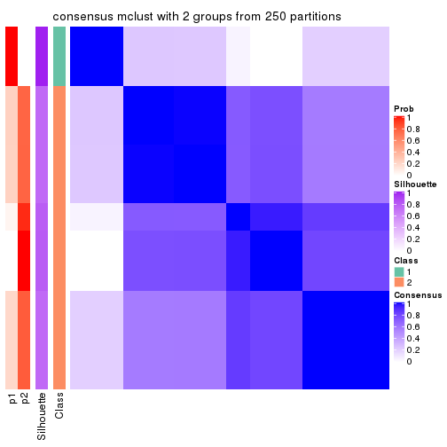</p>

</div>
<div id='tab-CV-mclust-consensus-heatmap-2'>
<pre><code class="r">consensus_heatmap(res, k = 3)
</code></pre>

<p>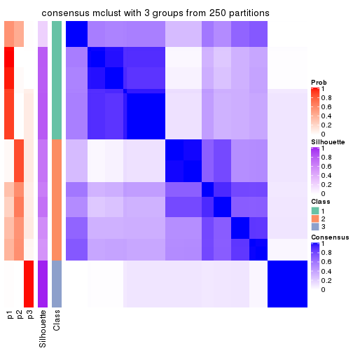</p>

</div>
<div id='tab-CV-mclust-consensus-heatmap-3'>
<pre><code class="r">consensus_heatmap(res, k = 4)
</code></pre>

<p>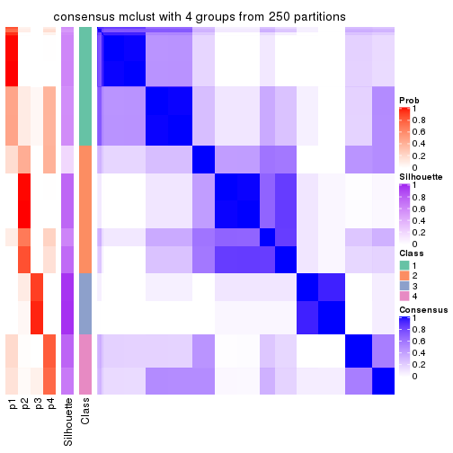</p>

</div>
<div id='tab-CV-mclust-consensus-heatmap-4'>
<pre><code class="r">consensus_heatmap(res, k = 5)
</code></pre>

<p>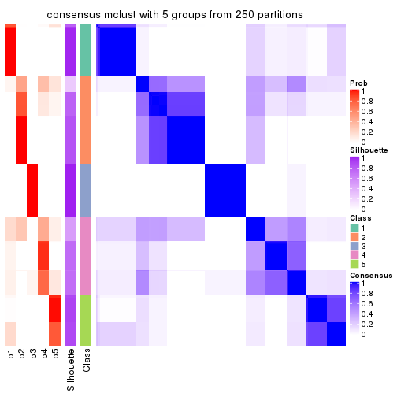</p>

</div>
<div id='tab-CV-mclust-consensus-heatmap-5'>
<pre><code class="r">consensus_heatmap(res, k = 6)
</code></pre>

<p>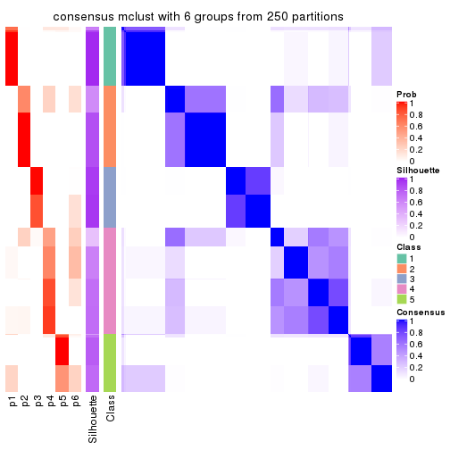</p>

</div>
</div>

Heatmaps for the membership of samples in all partitions to see how consistent they are:


<script>
$( function() {
	$( '#tabs-CV-mclust-membership-heatmap' ).tabs();
} );
</script>
<div id='tabs-CV-mclust-membership-heatmap'>
<ul>
<li><a href='#tab-CV-mclust-membership-heatmap-1'>k = 2</a></li>
<li><a href='#tab-CV-mclust-membership-heatmap-2'>k = 3</a></li>
<li><a href='#tab-CV-mclust-membership-heatmap-3'>k = 4</a></li>
<li><a href='#tab-CV-mclust-membership-heatmap-4'>k = 5</a></li>
<li><a href='#tab-CV-mclust-membership-heatmap-5'>k = 6</a></li>
</ul>
<div id='tab-CV-mclust-membership-heatmap-1'>
<pre><code class="r">membership_heatmap(res, k = 2)
</code></pre>

<p>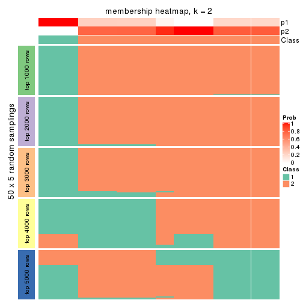</p>

</div>
<div id='tab-CV-mclust-membership-heatmap-2'>
<pre><code class="r">membership_heatmap(res, k = 3)
</code></pre>

<p>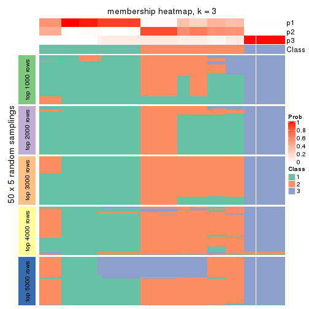</p>

</div>
<div id='tab-CV-mclust-membership-heatmap-3'>
<pre><code class="r">membership_heatmap(res, k = 4)
</code></pre>

<p>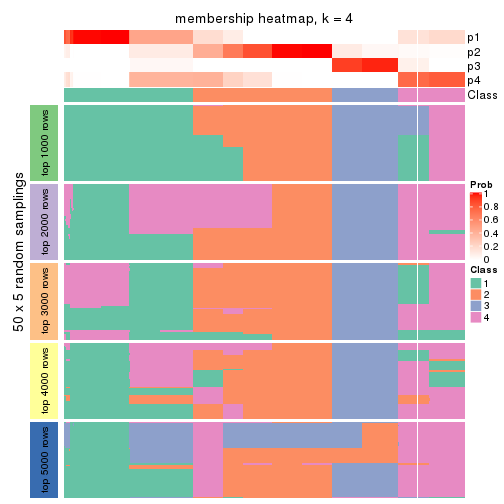</p>

</div>
<div id='tab-CV-mclust-membership-heatmap-4'>
<pre><code class="r">membership_heatmap(res, k = 5)
</code></pre>

<p>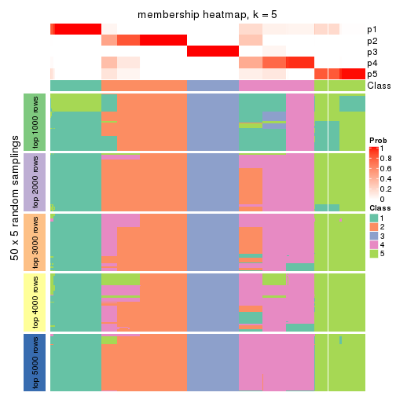</p>

</div>
<div id='tab-CV-mclust-membership-heatmap-5'>
<pre><code class="r">membership_heatmap(res, k = 6)
</code></pre>

<p>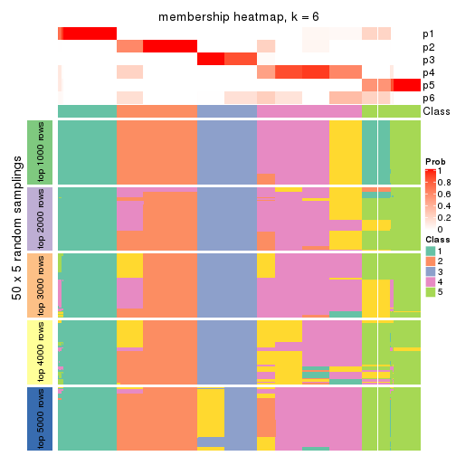</p>

</div>
</div>

As soon as we have had the classes for columns, we can look for signatures
which are significantly different between classes which can be candidate marks
for certain classes. Following are the heatmaps for signatures.


Signature heatmaps where rows are scaled:


<script>
$( function() {
	$( '#tabs-CV-mclust-get-signatures' ).tabs();
} );
</script>
<div id='tabs-CV-mclust-get-signatures'>
<ul>
<li><a href='#tab-CV-mclust-get-signatures-1'>k = 2</a></li>
<li><a href='#tab-CV-mclust-get-signatures-2'>k = 3</a></li>
<li><a href='#tab-CV-mclust-get-signatures-3'>k = 4</a></li>
<li><a href='#tab-CV-mclust-get-signatures-4'>k = 5</a></li>
<li><a href='#tab-CV-mclust-get-signatures-5'>k = 6</a></li>
</ul>
<div id='tab-CV-mclust-get-signatures-1'>
<pre><code class="r">get_signatures(res, k = 2)
</code></pre>

<p>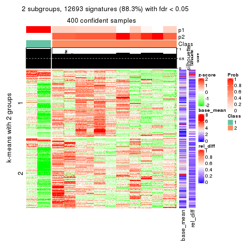</p>

</div>
<div id='tab-CV-mclust-get-signatures-2'>
<pre><code class="r">get_signatures(res, k = 3)
</code></pre>

<p>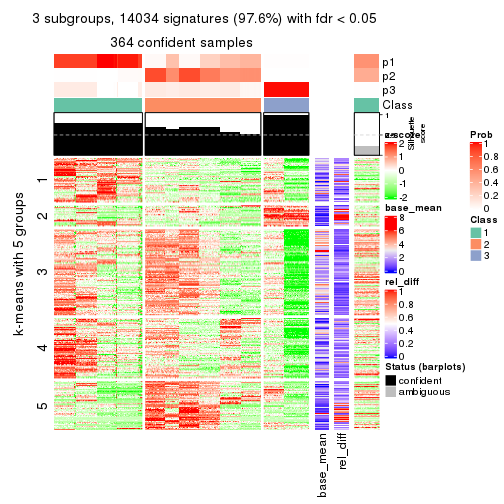</p>

</div>
<div id='tab-CV-mclust-get-signatures-3'>
<pre><code class="r">get_signatures(res, k = 4)
</code></pre>

<p>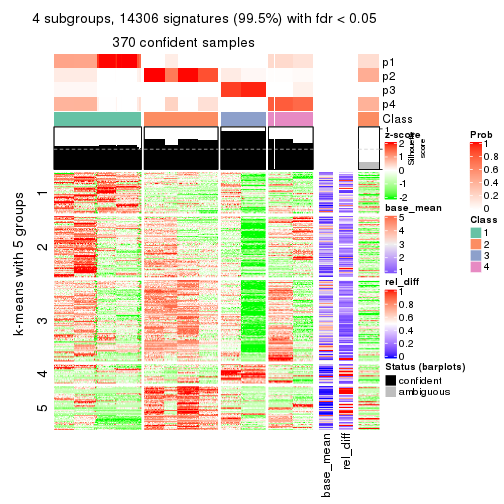</p>

</div>
<div id='tab-CV-mclust-get-signatures-4'>
<pre><code class="r">get_signatures(res, k = 5)
</code></pre>

<p>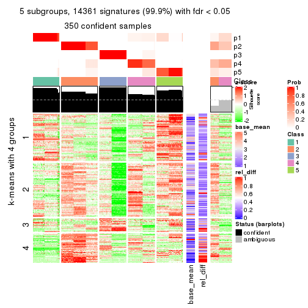</p>

</div>
<div id='tab-CV-mclust-get-signatures-5'>
<pre><code class="r">get_signatures(res, k = 6)
</code></pre>

<p>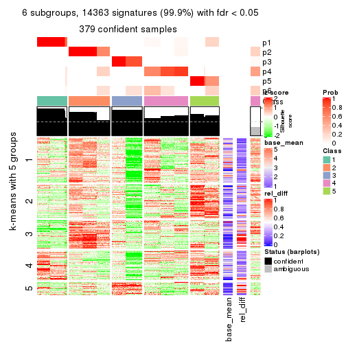</p>

</div>
</div>


Signature heatmaps where rows are not scaled:


<script>
$( function() {
	$( '#tabs-CV-mclust-get-signatures-no-scale' ).tabs();
} );
</script>
<div id='tabs-CV-mclust-get-signatures-no-scale'>
<ul>
<li><a href='#tab-CV-mclust-get-signatures-no-scale-1'>k = 2</a></li>
<li><a href='#tab-CV-mclust-get-signatures-no-scale-2'>k = 3</a></li>
<li><a href='#tab-CV-mclust-get-signatures-no-scale-3'>k = 4</a></li>
<li><a href='#tab-CV-mclust-get-signatures-no-scale-4'>k = 5</a></li>
<li><a href='#tab-CV-mclust-get-signatures-no-scale-5'>k = 6</a></li>
</ul>
<div id='tab-CV-mclust-get-signatures-no-scale-1'>
<pre><code class="r">get_signatures(res, k = 2, scale_rows = FALSE)
</code></pre>

<p>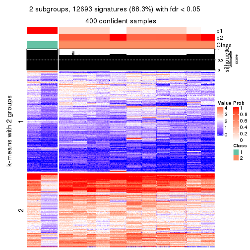</p>

</div>
<div id='tab-CV-mclust-get-signatures-no-scale-2'>
<pre><code class="r">get_signatures(res, k = 3, scale_rows = FALSE)
</code></pre>

<p>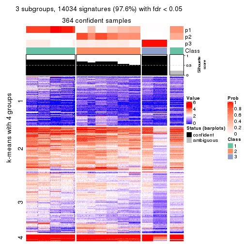</p>

</div>
<div id='tab-CV-mclust-get-signatures-no-scale-3'>
<pre><code class="r">get_signatures(res, k = 4, scale_rows = FALSE)
</code></pre>

<p>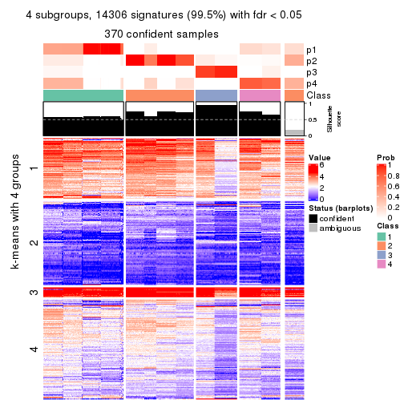</p>

</div>
<div id='tab-CV-mclust-get-signatures-no-scale-4'>
<pre><code class="r">get_signatures(res, k = 5, scale_rows = FALSE)
</code></pre>

<p>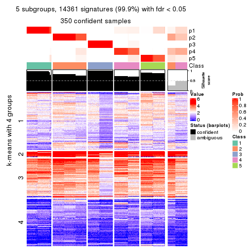</p>

</div>
<div id='tab-CV-mclust-get-signatures-no-scale-5'>
<pre><code class="r">get_signatures(res, k = 6, scale_rows = FALSE)
</code></pre>

<p>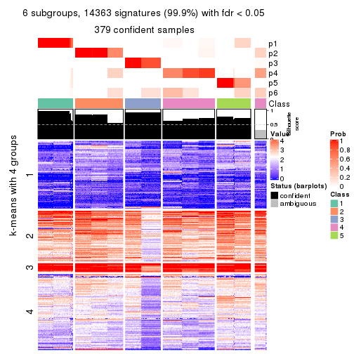</p>

</div>
</div>


Compare the overlap of signatures from different k:

```r
compare_signatures(res)
```

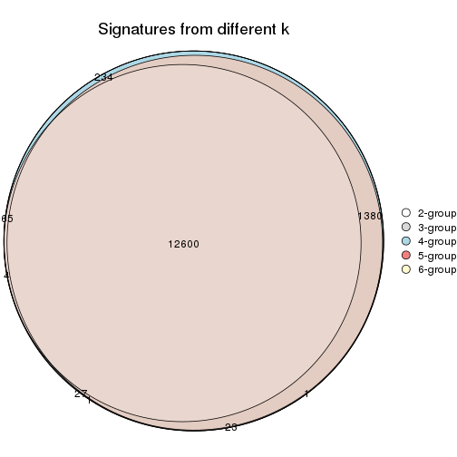

`get_signature()` returns a data frame invisibly. TO get the list of signatures, the function
call should be assigned to a variable explicitly. In following code, if `plot` argument is set
to `FALSE`, no heatmap is plotted while only the differential analysis is performed.

```r
# code only for demonstration
tb = get_signature(res, k = ..., plot = FALSE)
```

An example of the output of `tb` is:

```
#>   which_row         fdr    mean_1    mean_2 scaled_mean_1 scaled_mean_2 km
#> 1        38 0.042760348  8.373488  9.131774    -0.5533452     0.5164555  1
#> 2        40 0.018707592  7.106213  8.469186    -0.6173731     0.5762149  1
#> 3        55 0.019134737 10.221463 11.207825    -0.6159697     0.5749050  1
#> 4        59 0.006059896  5.921854  7.869574    -0.6899429     0.6439467  1
#> 5        60 0.018055526  8.928898 10.211722    -0.6204761     0.5791110  1
#> 6        98 0.009384629 15.714769 14.887706     0.6635654    -0.6193277  2
...
```

The columns in `tb` are:

1. `which_row`: row indices corresponding to the input matrix.
2. `fdr`: FDR for the differential test. 
3. `mean_x`: The mean value in group x.
4. `scaled_mean_x`: The mean value in group x after rows are scaled.
5. `km`: Row groups if k-means clustering is applied to rows.


UMAP plot which shows how samples are separated.


<script>
$( function() {
	$( '#tabs-CV-mclust-dimension-reduction' ).tabs();
} );
</script>
<div id='tabs-CV-mclust-dimension-reduction'>
<ul>
<li><a href='#tab-CV-mclust-dimension-reduction-1'>k = 2</a></li>
<li><a href='#tab-CV-mclust-dimension-reduction-2'>k = 3</a></li>
<li><a href='#tab-CV-mclust-dimension-reduction-3'>k = 4</a></li>
<li><a href='#tab-CV-mclust-dimension-reduction-4'>k = 5</a></li>
<li><a href='#tab-CV-mclust-dimension-reduction-5'>k = 6</a></li>
</ul>
<div id='tab-CV-mclust-dimension-reduction-1'>
<pre><code class="r">dimension_reduction(res, k = 2, method = &quot;UMAP&quot;)
</code></pre>

<p>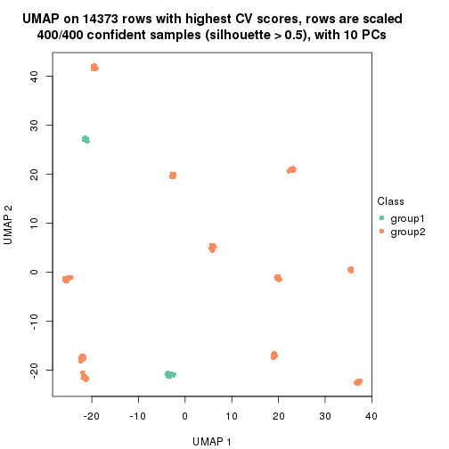</p>

</div>
<div id='tab-CV-mclust-dimension-reduction-2'>
<pre><code class="r">dimension_reduction(res, k = 3, method = &quot;UMAP&quot;)
</code></pre>

<p>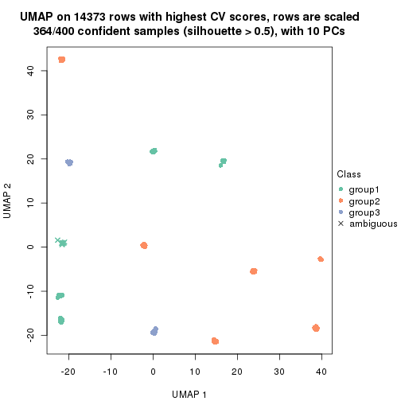</p>

</div>
<div id='tab-CV-mclust-dimension-reduction-3'>
<pre><code class="r">dimension_reduction(res, k = 4, method = &quot;UMAP&quot;)
</code></pre>

<p>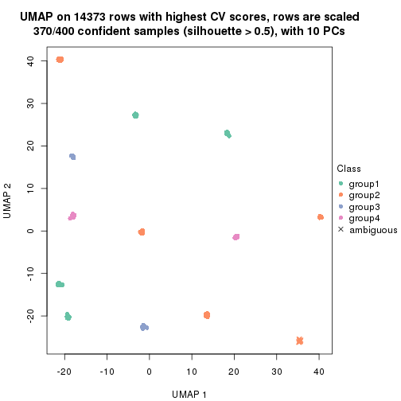</p>

</div>
<div id='tab-CV-mclust-dimension-reduction-4'>
<pre><code class="r">dimension_reduction(res, k = 5, method = &quot;UMAP&quot;)
</code></pre>

<p>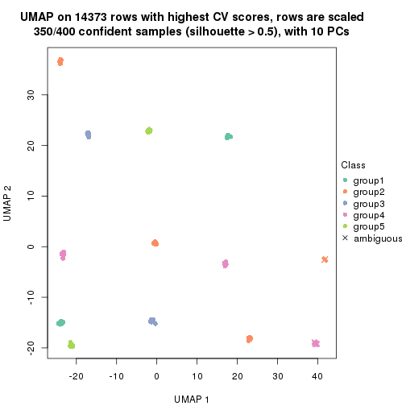</p>

</div>
<div id='tab-CV-mclust-dimension-reduction-5'>
<pre><code class="r">dimension_reduction(res, k = 6, method = &quot;UMAP&quot;)
</code></pre>

<p>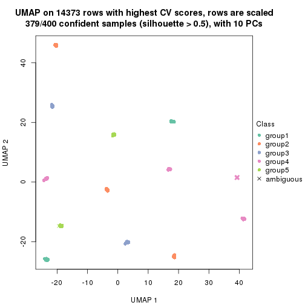</p>

</div>
</div>


Following heatmap shows how subgroups are split when increasing `k`:

```r
collect_classes(res)
```

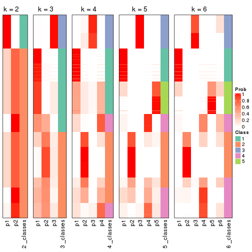


If matrix rows can be associated to genes, consider to use `GO_Enrichment(res,
...)` to perform function enrichment for the signature genes.


 

---------------------------------------------------


### CV:NMF**


The object with results only for a single top-value method and a single partition method 
can be extracted as:

```r
res = res_list["CV", "NMF"]
# you can also extract it by
# res = res_list["CV:NMF"]
```

A summary of `res` and all the functions that can be applied to it:

```r
res
```

```
#> A 'ConsensusPartition' object with k = 2, 3, 4, 5, 6.
#>   On a matrix with 14373 rows and 400 columns.
#>   Top rows (1000, 2000, 3000, 4000, 5000) are extracted by 'CV' method.
#>   Subgroups are detected by 'NMF' method.
#>   Performed in total 1250 partitions by row resampling.
#>   Best k for subgroups seems to be 6.
#> 
#> Following methods can be applied to this 'ConsensusPartition' object:
#>  [1] "cola_report"             "collect_classes"         "collect_plots"          
#>  [4] "collect_stats"           "colnames"                "compare_signatures"     
#>  [7] "consensus_heatmap"       "dimension_reduction"     "functional_enrichment"  
#> [10] "get_anno_col"            "get_anno"                "get_classes"            
#> [13] "get_consensus"           "get_matrix"              "get_membership"         
#> [16] "get_param"               "get_signatures"          "get_stats"              
#> [19] "is_best_k"               "is_stable_k"             "membership_heatmap"     
#> [22] "ncol"                    "nrow"                    "plot_ecdf"              
#> [25] "rownames"                "select_partition_number" "show"                   
#> [28] "suggest_best_k"          "test_to_known_factors"
```

`collect_plots()` function collects all the plots made from `res` for all `k` (number of partitions)
into one single page to provide an easy and fast comparison between different `k`.

```r
collect_plots(res)
```

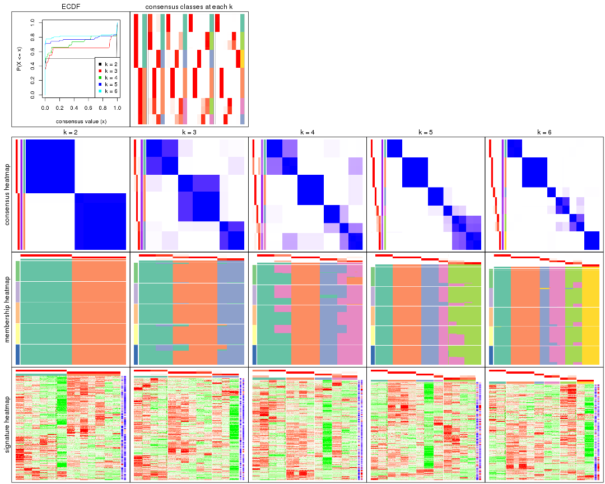

The plots are:

- The first row: a plot of the ECDF (Empirical cumulative distribution
  function) curves of the consensus matrix for each `k` and the heatmap of
  predicted classes for each `k`.
- The second row: heatmaps of the consensus matrix for each `k`.
- The third row: heatmaps of the membership matrix for each `k`.
- The fouth row: heatmaps of the signatures for each `k`.

All the plots in panels can be made by individual functions and they are
plotted later in this section.

`select_partition_number()` produces several plots showing different
statistics for choosing "optimized" `k`. There are following statistics:

- ECDF curves of the consensus matrix for each `k`;
- 1-PAC. [The PAC
  score](https://en.wikipedia.org/wiki/Consensus_clustering#Over-interpretation_potential_of_consensus_clustering)
  measures the proportion of the ambiguous subgrouping.
- Mean silhouette score.
- Concordance. The mean probability of fiting the consensus class ids in all
  partitions.
- Area increased. Denote $A_k$ as the area under the ECDF curve for current
  `k`, the area increased is defined as $A_k - A_{k-1}$.
- Rand index. The percent of pairs of samples that are both in a same cluster
  or both are not in a same cluster in the partition of k and k-1.
- Jaccard index. The ratio of pairs of samples are both in a same cluster in
  the partition of k and k-1 and the pairs of samples are both in a same
  cluster in the partition k or k-1.

The detailed explanations of these statistics can be found in [the cola
vignette](http://bioconductor.org/packages/devel/bioc/vignettes/cola/inst/doc/cola.html#toc_13).

Generally speaking, lower PAC score, higher mean silhouette score or higher
concordance corresponds to better partition. Rand index and Jaccard index
measure how similar the current partition is compared to partition with `k-1`.
If they are too similar, we won't accept `k` is better than `k-1`.

```r
select_partition_number(res)
```

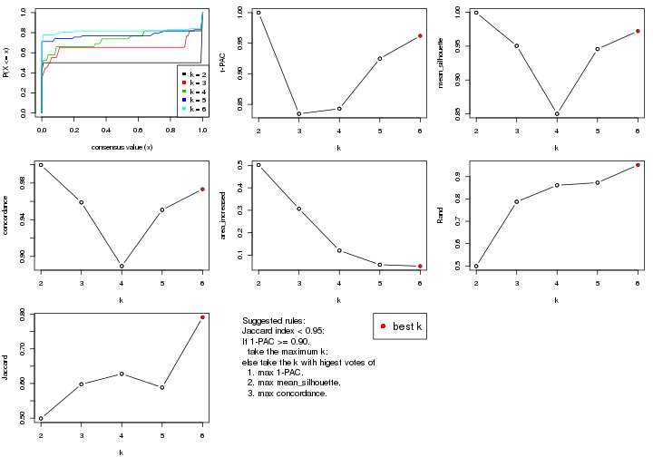

The numeric values for all these statistics can be obtained by `get_stats()`.

```r
get_stats(res)
```

```
#>   k 1-PAC mean_silhouette concordance area_increased  Rand Jaccard
#> 2 2 1.000           0.999       1.000         0.5014 0.499   0.499
#> 3 3 0.835           0.950       0.959         0.3065 0.787   0.598
#> 4 4 0.843           0.850       0.889         0.1207 0.861   0.628
#> 5 5 0.925           0.946       0.951         0.0576 0.873   0.588
#> 6 6 0.962           0.972       0.973         0.0513 0.952   0.791
```

`suggest_best_k()` suggests the best $k$ based on these statistics. The rules are as follows:

- All $k$ with Jaccard index larger than 0.95 are removed because the increase of
  the partition number does not provides enough extra information. If all $k$ are removed,
  the best $k$ is assigned by `NA`.
- For $k$ with 1-PAC larger than 0.9, the maximal $k$ is taken as the "best k". Other $k$ is called "optional k".
- If it does not fit the second rule. The $k$ with the highest vote of highest
  1-PAC, mean silhouette and concordance is taken as the "best k".

```r
suggest_best_k(res)
```

```
#> [1] 6
#> attr(,"optional")
#> [1] 2 5
```

There is also optional best $k$ = 2 5 that is worth to check.

Following shows the table of the partitions (You need to click the **show/hide
code output** link to see it). The membership matrix (columns with name `p*`)
is inferred by
[`clue::cl_consensus()`](https://www.rdocumentation.org/link/cl_consensus?package=clue)
function with the `SE` method. Basically the value in the membership matrix
represents the probability to belong to a certain group. The finall class
label for an item is determined with the group with highest probability it
belongs to.

In `get_classes()` function, the entropy is calculated from the membership
matrix and the silhouette score is calculated from the consensus matrix.


<script>
$( function() {
	$( '#tabs-CV-NMF-get-classes' ).tabs();
} );
</script>
<div id='tabs-CV-NMF-get-classes'>
<ul>
<li><a href='#tab-CV-NMF-get-classes-1'>k = 2</a></li>
<li><a href='#tab-CV-NMF-get-classes-2'>k = 3</a></li>
<li><a href='#tab-CV-NMF-get-classes-3'>k = 4</a></li>
<li><a href='#tab-CV-NMF-get-classes-4'>k = 5</a></li>
<li><a href='#tab-CV-NMF-get-classes-5'>k = 6</a></li>
</ul>

<div id='tab-CV-NMF-get-classes-1'>
<p><a id='tab-CV-NMF-get-classes-1-a' style='color:#0366d6' href='#'>show/hide code output</a></p>
<pre><code class="r">cbind(get_classes(res, k = 2), get_membership(res, k = 2))
</code></pre>

<pre><code>#&gt;            class entropy silhouette    p1    p2
#&gt; SRR1661716     2  0.0000      0.999 0.000 1.000
#&gt; SRR1661717     2  0.0000      0.999 0.000 1.000
#&gt; SRR1661718     2  0.0000      0.999 0.000 1.000
#&gt; SRR1661719     2  0.0000      0.999 0.000 1.000
#&gt; SRR1661720     2  0.0000      0.999 0.000 1.000
#&gt; SRR1661721     2  0.0000      0.999 0.000 1.000
#&gt; SRR1661722     2  0.0000      0.999 0.000 1.000
#&gt; SRR1661723     2  0.0000      0.999 0.000 1.000
#&gt; SRR1661724     2  0.0000      0.999 0.000 1.000
#&gt; SRR1661725     2  0.0000      0.999 0.000 1.000
#&gt; SRR1661726     2  0.0000      0.999 0.000 1.000
#&gt; SRR1661727     2  0.0000      0.999 0.000 1.000
#&gt; SRR1661728     2  0.0000      0.999 0.000 1.000
#&gt; SRR1661729     2  0.0000      0.999 0.000 1.000
#&gt; SRR1661730     2  0.0000      0.999 0.000 1.000
#&gt; SRR1661731     2  0.0000      0.999 0.000 1.000
#&gt; SRR1661732     2  0.0000      0.999 0.000 1.000
#&gt; SRR1661733     2  0.0000      0.999 0.000 1.000
#&gt; SRR1661734     2  0.0000      0.999 0.000 1.000
#&gt; SRR1661735     2  0.0000      0.999 0.000 1.000
#&gt; SRR1661736     2  0.0000      0.999 0.000 1.000
#&gt; SRR1661737     2  0.0000      0.999 0.000 1.000
#&gt; SRR1661738     2  0.0000      0.999 0.000 1.000
#&gt; SRR1661739     2  0.0000      0.999 0.000 1.000
#&gt; SRR1661740     2  0.0000      0.999 0.000 1.000
#&gt; SRR1661741     2  0.0000      0.999 0.000 1.000
#&gt; SRR1661742     2  0.0000      0.999 0.000 1.000
#&gt; SRR1661743     2  0.0000      0.999 0.000 1.000
#&gt; SRR1661744     2  0.0000      0.999 0.000 1.000
#&gt; SRR1661745     2  0.0000      0.999 0.000 1.000
#&gt; SRR1661746     2  0.0000      0.999 0.000 1.000
#&gt; SRR1661747     2  0.0000      0.999 0.000 1.000
#&gt; SRR1661748     2  0.0000      0.999 0.000 1.000
#&gt; SRR1661749     2  0.0000      0.999 0.000 1.000
#&gt; SRR1661750     2  0.0000      0.999 0.000 1.000
#&gt; SRR1661751     2  0.0000      0.999 0.000 1.000
#&gt; SRR1661752     2  0.0000      0.999 0.000 1.000
#&gt; SRR1661753     2  0.0000      0.999 0.000 1.000
#&gt; SRR1661754     2  0.0000      0.999 0.000 1.000
#&gt; SRR1661755     2  0.0000      0.999 0.000 1.000
#&gt; SRR1661756     2  0.0000      0.999 0.000 1.000
#&gt; SRR1661757     2  0.0000      0.999 0.000 1.000
#&gt; SRR1661758     2  0.0000      0.999 0.000 1.000
#&gt; SRR1661759     2  0.0000      0.999 0.000 1.000
#&gt; SRR1661760     2  0.0000      0.999 0.000 1.000
#&gt; SRR1661761     2  0.0000      0.999 0.000 1.000
#&gt; SRR1661762     2  0.0000      0.999 0.000 1.000
#&gt; SRR1661763     2  0.0000      0.999 0.000 1.000
#&gt; SRR1661764     2  0.0000      0.999 0.000 1.000
#&gt; SRR1661766     2  0.0000      0.999 0.000 1.000
#&gt; SRR1661767     2  0.0000      0.999 0.000 1.000
#&gt; SRR1661768     2  0.0000      0.999 0.000 1.000
#&gt; SRR1661769     2  0.0000      0.999 0.000 1.000
#&gt; SRR1661770     2  0.0000      0.999 0.000 1.000
#&gt; SRR1661771     2  0.0000      0.999 0.000 1.000
#&gt; SRR1661772     2  0.0000      0.999 0.000 1.000
#&gt; SRR1661773     2  0.0000      0.999 0.000 1.000
#&gt; SRR1661774     2  0.0000      0.999 0.000 1.000
#&gt; SRR1661775     2  0.0000      0.999 0.000 1.000
#&gt; SRR1661776     2  0.0000      0.999 0.000 1.000
#&gt; SRR1661777     2  0.0000      0.999 0.000 1.000
#&gt; SRR1661778     2  0.0000      0.999 0.000 1.000
#&gt; SRR1661779     2  0.0000      0.999 0.000 1.000
#&gt; SRR1661780     2  0.0000      0.999 0.000 1.000
#&gt; SRR1661781     2  0.0000      0.999 0.000 1.000
#&gt; SRR1661782     2  0.0000      0.999 0.000 1.000
#&gt; SRR1661783     2  0.0000      0.999 0.000 1.000
#&gt; SRR1661784     2  0.0000      0.999 0.000 1.000
#&gt; SRR1661785     2  0.0000      0.999 0.000 1.000
#&gt; SRR1661786     2  0.0000      0.999 0.000 1.000
#&gt; SRR1661787     2  0.0000      0.999 0.000 1.000
#&gt; SRR1661788     2  0.0000      0.999 0.000 1.000
#&gt; SRR1661789     2  0.0000      0.999 0.000 1.000
#&gt; SRR1661790     2  0.0000      0.999 0.000 1.000
#&gt; SRR1661791     2  0.0000      0.999 0.000 1.000
#&gt; SRR1661792     2  0.0000      0.999 0.000 1.000
#&gt; SRR1661793     2  0.0000      0.999 0.000 1.000
#&gt; SRR1661794     2  0.0000      0.999 0.000 1.000
#&gt; SRR1661795     2  0.0000      0.999 0.000 1.000
#&gt; SRR1661796     2  0.0000      0.999 0.000 1.000
#&gt; SRR1661797     2  0.0000      0.999 0.000 1.000
#&gt; SRR1661798     2  0.0000      0.999 0.000 1.000
#&gt; SRR1661799     2  0.0000      0.999 0.000 1.000
#&gt; SRR1661800     2  0.0000      0.999 0.000 1.000
#&gt; SRR1661801     2  0.0000      0.999 0.000 1.000
#&gt; SRR1661802     2  0.0000      0.999 0.000 1.000
#&gt; SRR1661803     2  0.0000      0.999 0.000 1.000
#&gt; SRR1661804     2  0.0000      0.999 0.000 1.000
#&gt; SRR1661805     2  0.0000      0.999 0.000 1.000
#&gt; SRR1661806     2  0.0000      0.999 0.000 1.000
#&gt; SRR1661807     2  0.0000      0.999 0.000 1.000
#&gt; SRR1661808     2  0.0000      0.999 0.000 1.000
#&gt; SRR1661809     2  0.0000      0.999 0.000 1.000
#&gt; SRR1661810     2  0.0000      0.999 0.000 1.000
#&gt; SRR1661811     2  0.0000      0.999 0.000 1.000
#&gt; SRR1661812     2  0.0000      0.999 0.000 1.000
#&gt; SRR1661813     2  0.0000      0.999 0.000 1.000
#&gt; SRR1661814     2  0.0000      0.999 0.000 1.000
#&gt; SRR1661815     2  0.0000      0.999 0.000 1.000
#&gt; SRR1661816     2  0.0000      0.999 0.000 1.000
#&gt; SRR1661817     2  0.0000      0.999 0.000 1.000
#&gt; SRR1661818     2  0.0000      0.999 0.000 1.000
#&gt; SRR1661819     2  0.0000      0.999 0.000 1.000
#&gt; SRR1661820     2  0.0000      0.999 0.000 1.000
#&gt; SRR1661821     2  0.0000      0.999 0.000 1.000
#&gt; SRR1661822     2  0.0000      0.999 0.000 1.000
#&gt; SRR1661823     2  0.0000      0.999 0.000 1.000
#&gt; SRR1661824     2  0.0000      0.999 0.000 1.000
#&gt; SRR1661825     2  0.0000      0.999 0.000 1.000
#&gt; SRR1661826     1  0.0000      1.000 1.000 0.000
#&gt; SRR1661827     1  0.0000      1.000 1.000 0.000
#&gt; SRR1661828     1  0.0000      1.000 1.000 0.000
#&gt; SRR1661829     1  0.0000      1.000 1.000 0.000
#&gt; SRR1661830     1  0.0000      1.000 1.000 0.000
#&gt; SRR1661831     1  0.0000      1.000 1.000 0.000
#&gt; SRR1661832     1  0.0000      1.000 1.000 0.000
#&gt; SRR1661833     1  0.0000      1.000 1.000 0.000
#&gt; SRR1661834     1  0.0000      1.000 1.000 0.000
#&gt; SRR1661835     1  0.0000      1.000 1.000 0.000
#&gt; SRR1661836     1  0.0000      1.000 1.000 0.000
#&gt; SRR1661837     1  0.0000      1.000 1.000 0.000
#&gt; SRR1661838     1  0.0000      1.000 1.000 0.000
#&gt; SRR1661839     1  0.0000      1.000 1.000 0.000
#&gt; SRR1661840     1  0.0000      1.000 1.000 0.000
#&gt; SRR1661841     1  0.0000      1.000 1.000 0.000
#&gt; SRR1661843     1  0.0000      1.000 1.000 0.000
#&gt; SRR1661844     1  0.0000      1.000 1.000 0.000
#&gt; SRR1661845     1  0.0000      1.000 1.000 0.000
#&gt; SRR1661846     1  0.0000      1.000 1.000 0.000
#&gt; SRR1661847     1  0.0000      1.000 1.000 0.000
#&gt; SRR1661848     1  0.0000      1.000 1.000 0.000
#&gt; SRR1661849     1  0.0000      1.000 1.000 0.000
#&gt; SRR1661850     1  0.0000      1.000 1.000 0.000
#&gt; SRR1661851     1  0.0000      1.000 1.000 0.000
#&gt; SRR1661852     1  0.0000      1.000 1.000 0.000
#&gt; SRR1661853     1  0.0000      1.000 1.000 0.000
#&gt; SRR1661854     1  0.0000      1.000 1.000 0.000
#&gt; SRR1661855     1  0.0000      1.000 1.000 0.000
#&gt; SRR1661856     1  0.0000      1.000 1.000 0.000
#&gt; SRR1661857     1  0.0000      1.000 1.000 0.000
#&gt; SRR1661858     1  0.0000      1.000 1.000 0.000
#&gt; SRR1661859     1  0.0000      1.000 1.000 0.000
#&gt; SRR1661860     1  0.0000      1.000 1.000 0.000
#&gt; SRR1661861     1  0.0000      1.000 1.000 0.000
#&gt; SRR1661862     1  0.0000      1.000 1.000 0.000
#&gt; SRR1661863     1  0.0000      1.000 1.000 0.000
#&gt; SRR1661864     1  0.0000      1.000 1.000 0.000
#&gt; SRR1661865     1  0.0000      1.000 1.000 0.000
#&gt; SRR1661866     1  0.0000      1.000 1.000 0.000
#&gt; SRR1661867     1  0.0000      1.000 1.000 0.000
#&gt; SRR1661868     1  0.0000      1.000 1.000 0.000
#&gt; SRR1661869     1  0.0000      1.000 1.000 0.000
#&gt; SRR1661870     1  0.0000      1.000 1.000 0.000
#&gt; SRR1661871     1  0.0000      1.000 1.000 0.000
#&gt; SRR1661872     1  0.0000      1.000 1.000 0.000
#&gt; SRR1661873     1  0.0000      1.000 1.000 0.000
#&gt; SRR1661874     1  0.0000      1.000 1.000 0.000
#&gt; SRR1661875     1  0.0000      1.000 1.000 0.000
#&gt; SRR1661876     1  0.0000      1.000 1.000 0.000
#&gt; SRR1661877     1  0.0000      1.000 1.000 0.000
#&gt; SRR1661878     1  0.0000      1.000 1.000 0.000
#&gt; SRR1661879     1  0.0000      1.000 1.000 0.000
#&gt; SRR1661880     1  0.0000      1.000 1.000 0.000
#&gt; SRR1661881     1  0.0000      1.000 1.000 0.000
#&gt; SRR1661882     1  0.0000      1.000 1.000 0.000
#&gt; SRR1661883     1  0.0000      1.000 1.000 0.000
#&gt; SRR1661884     1  0.0000      1.000 1.000 0.000
#&gt; SRR1661885     1  0.0000      1.000 1.000 0.000
#&gt; SRR1661886     1  0.0000      1.000 1.000 0.000
#&gt; SRR1661887     1  0.0000      1.000 1.000 0.000
#&gt; SRR1661888     1  0.0000      1.000 1.000 0.000
#&gt; SRR1661889     1  0.0000      1.000 1.000 0.000
#&gt; SRR1661890     1  0.0000      1.000 1.000 0.000
#&gt; SRR1661891     1  0.0000      1.000 1.000 0.000
#&gt; SRR1661892     1  0.0000      1.000 1.000 0.000
#&gt; SRR1661893     1  0.0000      1.000 1.000 0.000
#&gt; SRR1661894     1  0.0000      1.000 1.000 0.000
#&gt; SRR1661895     1  0.0000      1.000 1.000 0.000
#&gt; SRR1661896     1  0.0000      1.000 1.000 0.000
#&gt; SRR1661897     1  0.0000      1.000 1.000 0.000
#&gt; SRR1661898     1  0.0000      1.000 1.000 0.000
#&gt; SRR1661899     1  0.0000      1.000 1.000 0.000
#&gt; SRR1661900     1  0.0000      1.000 1.000 0.000
#&gt; SRR1661901     1  0.0000      1.000 1.000 0.000
#&gt; SRR1661902     1  0.0000      1.000 1.000 0.000
#&gt; SRR1661903     1  0.0000      1.000 1.000 0.000
#&gt; SRR1661904     1  0.0000      1.000 1.000 0.000
#&gt; SRR1661905     1  0.0000      1.000 1.000 0.000
#&gt; SRR1661906     1  0.0000      1.000 1.000 0.000
#&gt; SRR1661907     1  0.0000      1.000 1.000 0.000
#&gt; SRR1661908     1  0.0000      1.000 1.000 0.000
#&gt; SRR1661909     1  0.0000      1.000 1.000 0.000
#&gt; SRR1661910     1  0.0000      1.000 1.000 0.000
#&gt; SRR1661911     1  0.0000      1.000 1.000 0.000
#&gt; SRR1661912     1  0.0000      1.000 1.000 0.000
#&gt; SRR1661913     1  0.0000      1.000 1.000 0.000
#&gt; SRR1661914     1  0.0000      1.000 1.000 0.000
#&gt; SRR1661915     1  0.0000      1.000 1.000 0.000
#&gt; SRR1661916     1  0.0000      1.000 1.000 0.000
#&gt; SRR1661917     1  0.0000      1.000 1.000 0.000
#&gt; SRR1661918     1  0.0000      1.000 1.000 0.000
#&gt; SRR1661919     1  0.0000      1.000 1.000 0.000
#&gt; SRR1661920     1  0.0000      1.000 1.000 0.000
#&gt; SRR1661921     1  0.0000      1.000 1.000 0.000
#&gt; SRR1661922     1  0.0000      1.000 1.000 0.000
#&gt; SRR1661923     1  0.0000      1.000 1.000 0.000
#&gt; SRR1661924     1  0.0000      1.000 1.000 0.000
#&gt; SRR1661925     1  0.0000      1.000 1.000 0.000
#&gt; SRR1661926     1  0.0000      1.000 1.000 0.000
#&gt; SRR1661927     1  0.0000      1.000 1.000 0.000
#&gt; SRR1661928     1  0.0000      1.000 1.000 0.000
#&gt; SRR1661929     1  0.0000      1.000 1.000 0.000
#&gt; SRR1661930     1  0.0000      1.000 1.000 0.000
#&gt; SRR1661931     1  0.0000      1.000 1.000 0.000
#&gt; SRR1661932     1  0.0000      1.000 1.000 0.000
#&gt; SRR1661933     1  0.0000      1.000 1.000 0.000
#&gt; SRR1661934     1  0.0000      1.000 1.000 0.000
#&gt; SRR1661935     1  0.0000      1.000 1.000 0.000
#&gt; SRR1661936     1  0.0000      1.000 1.000 0.000
#&gt; SRR1661937     1  0.0000      1.000 1.000 0.000
#&gt; SRR1661938     1  0.0000      1.000 1.000 0.000
#&gt; SRR1661939     1  0.0000      1.000 1.000 0.000
#&gt; SRR1661940     1  0.0000      1.000 1.000 0.000
#&gt; SRR1661941     1  0.0000      1.000 1.000 0.000
#&gt; SRR1661942     1  0.0000      1.000 1.000 0.000
#&gt; SRR1661943     1  0.0000      1.000 1.000 0.000
#&gt; SRR1661944     1  0.0000      1.000 1.000 0.000
#&gt; SRR1661945     1  0.0000      1.000 1.000 0.000
#&gt; SRR1661946     1  0.0000      1.000 1.000 0.000
#&gt; SRR1661947     1  0.0000      1.000 1.000 0.000
#&gt; SRR1661948     1  0.0000      1.000 1.000 0.000
#&gt; SRR1661949     1  0.0000      1.000 1.000 0.000
#&gt; SRR1661950     1  0.0000      1.000 1.000 0.000
#&gt; SRR1661951     1  0.0000      1.000 1.000 0.000
#&gt; SRR1661952     1  0.0000      1.000 1.000 0.000
#&gt; SRR1661953     1  0.0000      1.000 1.000 0.000
#&gt; SRR1661954     1  0.0000      1.000 1.000 0.000
#&gt; SRR1661955     1  0.0000      1.000 1.000 0.000
#&gt; SRR1661956     1  0.0000      1.000 1.000 0.000
#&gt; SRR1661957     1  0.0000      1.000 1.000 0.000
#&gt; SRR1661958     2  0.0000      0.999 0.000 1.000
#&gt; SRR1661959     2  0.0000      0.999 0.000 1.000
#&gt; SRR1661960     2  0.0000      0.999 0.000 1.000
#&gt; SRR1661961     2  0.0000      0.999 0.000 1.000
#&gt; SRR1661962     2  0.0000      0.999 0.000 1.000
#&gt; SRR1661963     2  0.0000      0.999 0.000 1.000
#&gt; SRR1661964     2  0.0000      0.999 0.000 1.000
#&gt; SRR1661965     2  0.0000      0.999 0.000 1.000
#&gt; SRR1661966     2  0.0000      0.999 0.000 1.000
#&gt; SRR1661967     2  0.0000      0.999 0.000 1.000
#&gt; SRR1661968     2  0.0000      0.999 0.000 1.000
#&gt; SRR1661969     2  0.0000      0.999 0.000 1.000
#&gt; SRR1661970     2  0.0000      0.999 0.000 1.000
#&gt; SRR1661971     2  0.0000      0.999 0.000 1.000
#&gt; SRR1661972     2  0.0000      0.999 0.000 1.000
#&gt; SRR1661973     2  0.0000      0.999 0.000 1.000
#&gt; SRR1661974     2  0.0000      0.999 0.000 1.000
#&gt; SRR1661975     2  0.0000      0.999 0.000 1.000
#&gt; SRR1661976     2  0.0000      0.999 0.000 1.000
#&gt; SRR1661977     2  0.0000      0.999 0.000 1.000
#&gt; SRR1661978     2  0.0000      0.999 0.000 1.000
#&gt; SRR1661979     2  0.0000      0.999 0.000 1.000
#&gt; SRR1661980     2  0.0000      0.999 0.000 1.000
#&gt; SRR1661981     2  0.0000      0.999 0.000 1.000
#&gt; SRR1661982     2  0.0000      0.999 0.000 1.000
#&gt; SRR1661983     2  0.0000      0.999 0.000 1.000
#&gt; SRR1661984     2  0.0000      0.999 0.000 1.000
#&gt; SRR1661985     2  0.0000      0.999 0.000 1.000
#&gt; SRR1661986     2  0.0000      0.999 0.000 1.000
#&gt; SRR1661987     2  0.0000      0.999 0.000 1.000
#&gt; SRR1661988     1  0.0000      1.000 1.000 0.000
#&gt; SRR1661989     1  0.0000      1.000 1.000 0.000
#&gt; SRR1661990     1  0.0000      1.000 1.000 0.000
#&gt; SRR1661991     1  0.0000      1.000 1.000 0.000
#&gt; SRR1661992     1  0.0000      1.000 1.000 0.000
#&gt; SRR1661993     1  0.0000      1.000 1.000 0.000
#&gt; SRR1661994     1  0.0000      1.000 1.000 0.000
#&gt; SRR1661995     1  0.0000      1.000 1.000 0.000
#&gt; SRR1661996     1  0.0000      1.000 1.000 0.000
#&gt; SRR1661997     1  0.0000      1.000 1.000 0.000
#&gt; SRR1661998     1  0.0000      1.000 1.000 0.000
#&gt; SRR1661999     1  0.0000      1.000 1.000 0.000
#&gt; SRR1662000     1  0.0000      1.000 1.000 0.000
#&gt; SRR1662001     1  0.0000      1.000 1.000 0.000
#&gt; SRR1662002     1  0.0000      1.000 1.000 0.000
#&gt; SRR1662003     1  0.0000      1.000 1.000 0.000
#&gt; SRR1662004     1  0.0000      1.000 1.000 0.000
#&gt; SRR1662005     1  0.0000      1.000 1.000 0.000
#&gt; SRR1662006     1  0.0000      1.000 1.000 0.000
#&gt; SRR1662007     1  0.0000      1.000 1.000 0.000
#&gt; SRR1662008     1  0.0000      1.000 1.000 0.000
#&gt; SRR1662009     1  0.0000      1.000 1.000 0.000
#&gt; SRR1662010     1  0.0000      1.000 1.000 0.000
#&gt; SRR1662011     1  0.0000      1.000 1.000 0.000
#&gt; SRR1662012     1  0.0000      1.000 1.000 0.000
#&gt; SRR1662013     1  0.0000      1.000 1.000 0.000
#&gt; SRR1662014     1  0.0000      1.000 1.000 0.000
#&gt; SRR1662015     1  0.0000      1.000 1.000 0.000
#&gt; SRR1662016     1  0.0000      1.000 1.000 0.000
#&gt; SRR1662017     1  0.0000      1.000 1.000 0.000
#&gt; SRR1662018     2  0.0376      0.997 0.004 0.996
#&gt; SRR1662019     2  0.0376      0.997 0.004 0.996
#&gt; SRR1662020     2  0.0376      0.997 0.004 0.996
#&gt; SRR1662021     2  0.0376      0.997 0.004 0.996
#&gt; SRR1662022     2  0.0376      0.997 0.004 0.996
#&gt; SRR1662023     2  0.0376      0.997 0.004 0.996
#&gt; SRR1662024     2  0.0376      0.997 0.004 0.996
#&gt; SRR1662025     2  0.0376      0.997 0.004 0.996
#&gt; SRR1662026     2  0.0376      0.997 0.004 0.996
#&gt; SRR1662027     2  0.0376      0.997 0.004 0.996
#&gt; SRR1662028     2  0.0376      0.997 0.004 0.996
#&gt; SRR1662029     2  0.0376      0.997 0.004 0.996
#&gt; SRR1662030     2  0.0376      0.997 0.004 0.996
#&gt; SRR1662031     2  0.0376      0.997 0.004 0.996
#&gt; SRR1662032     2  0.0376      0.997 0.004 0.996
#&gt; SRR1662033     2  0.0376      0.997 0.004 0.996
#&gt; SRR1662034     2  0.0000      0.999 0.000 1.000
#&gt; SRR1662035     2  0.0376      0.997 0.004 0.996
#&gt; SRR1662036     2  0.0376      0.997 0.004 0.996
#&gt; SRR1662037     2  0.0376      0.997 0.004 0.996
#&gt; SRR1662038     2  0.0376      0.997 0.004 0.996
#&gt; SRR1662039     2  0.0376      0.997 0.004 0.996
#&gt; SRR1662040     2  0.0376      0.997 0.004 0.996
#&gt; SRR1662041     2  0.0376      0.997 0.004 0.996
#&gt; SRR1662042     2  0.0376      0.997 0.004 0.996
#&gt; SRR1662043     2  0.0376      0.997 0.004 0.996
#&gt; SRR1662044     2  0.0376      0.997 0.004 0.996
#&gt; SRR1662045     2  0.0376      0.997 0.004 0.996
#&gt; SRR1662046     2  0.0376      0.997 0.004 0.996
#&gt; SRR1662047     2  0.0376      0.997 0.004 0.996
#&gt; SRR1662048     2  0.0376      0.997 0.004 0.996
#&gt; SRR1662049     2  0.0376      0.997 0.004 0.996
#&gt; SRR1662050     2  0.0376      0.997 0.004 0.996
#&gt; SRR1662051     2  0.0376      0.997 0.004 0.996
#&gt; SRR1662052     2  0.0376      0.997 0.004 0.996
#&gt; SRR1662053     2  0.0376      0.997 0.004 0.996
#&gt; SRR1662054     2  0.0000      0.999 0.000 1.000
#&gt; SRR1662055     2  0.0000      0.999 0.000 1.000
#&gt; SRR1662056     2  0.0000      0.999 0.000 1.000
#&gt; SRR1662057     2  0.0000      0.999 0.000 1.000
#&gt; SRR1662058     2  0.0000      0.999 0.000 1.000
#&gt; SRR1662059     2  0.0000      0.999 0.000 1.000
#&gt; SRR1662060     2  0.0000      0.999 0.000 1.000
#&gt; SRR1662061     2  0.0000      0.999 0.000 1.000
#&gt; SRR1662062     2  0.0000      0.999 0.000 1.000
#&gt; SRR1662063     2  0.0000      0.999 0.000 1.000
#&gt; SRR1662064     2  0.0000      0.999 0.000 1.000
#&gt; SRR1662065     2  0.0000      0.999 0.000 1.000
#&gt; SRR1662066     2  0.0000      0.999 0.000 1.000
#&gt; SRR1662067     2  0.0000      0.999 0.000 1.000
#&gt; SRR1662068     2  0.0000      0.999 0.000 1.000
#&gt; SRR1662069     2  0.0000      0.999 0.000 1.000
#&gt; SRR1662070     2  0.0000      0.999 0.000 1.000
#&gt; SRR1662071     2  0.0000      0.999 0.000 1.000
#&gt; SRR1662072     2  0.0000      0.999 0.000 1.000
#&gt; SRR1662073     2  0.0000      0.999 0.000 1.000
#&gt; SRR1662074     2  0.0000      0.999 0.000 1.000
#&gt; SRR1662075     2  0.0000      0.999 0.000 1.000
#&gt; SRR1662076     2  0.0000      0.999 0.000 1.000
#&gt; SRR1662077     2  0.0000      0.999 0.000 1.000
#&gt; SRR1662078     2  0.0000      0.999 0.000 1.000
#&gt; SRR1662079     2  0.0000      0.999 0.000 1.000
#&gt; SRR1662080     2  0.0000      0.999 0.000 1.000
#&gt; SRR1662081     2  0.0000      0.999 0.000 1.000
#&gt; SRR1662082     2  0.0000      0.999 0.000 1.000
#&gt; SRR1662083     2  0.0000      0.999 0.000 1.000
#&gt; SRR1662084     1  0.0000      1.000 1.000 0.000
#&gt; SRR1662085     1  0.0000      1.000 1.000 0.000
#&gt; SRR1662086     1  0.0000      1.000 1.000 0.000
#&gt; SRR1662087     1  0.0000      1.000 1.000 0.000
#&gt; SRR1662088     1  0.0000      1.000 1.000 0.000
#&gt; SRR1662089     1  0.0000      1.000 1.000 0.000
#&gt; SRR1662090     1  0.0000      1.000 1.000 0.000
#&gt; SRR1662091     1  0.0000      1.000 1.000 0.000
#&gt; SRR1662092     1  0.0000      1.000 1.000 0.000
#&gt; SRR1662093     1  0.0000      1.000 1.000 0.000
#&gt; SRR1662094     1  0.0000      1.000 1.000 0.000
#&gt; SRR1662095     1  0.0000      1.000 1.000 0.000
#&gt; SRR1662096     1  0.0000      1.000 1.000 0.000
#&gt; SRR1662097     1  0.0000      1.000 1.000 0.000
#&gt; SRR1662098     1  0.0000      1.000 1.000 0.000
#&gt; SRR1662099     1  0.0000      1.000 1.000 0.000
#&gt; SRR1662100     1  0.0000      1.000 1.000 0.000
#&gt; SRR1662101     1  0.0000      1.000 1.000 0.000
#&gt; SRR1662102     1  0.0000      1.000 1.000 0.000
#&gt; SRR1662103     1  0.0000      1.000 1.000 0.000
#&gt; SRR1662104     1  0.0000      1.000 1.000 0.000
#&gt; SRR1662105     1  0.0000      1.000 1.000 0.000
#&gt; SRR1662106     1  0.0000      1.000 1.000 0.000
#&gt; SRR1662107     1  0.0000      1.000 1.000 0.000
#&gt; SRR1662108     1  0.0000      1.000 1.000 0.000
#&gt; SRR1662109     1  0.0000      1.000 1.000 0.000
#&gt; SRR1662110     1  0.0000      1.000 1.000 0.000
#&gt; SRR1662111     1  0.0000      1.000 1.000 0.000
#&gt; SRR1662112     1  0.0000      1.000 1.000 0.000
#&gt; SRR1662113     1  0.0000      1.000 1.000 0.000
#&gt; SRR1662114     1  0.0000      1.000 1.000 0.000
#&gt; SRR1662115     1  0.0000      1.000 1.000 0.000
#&gt; SRR1662116     1  0.0000      1.000 1.000 0.000
#&gt; SRR1662117     1  0.0000      1.000 1.000 0.000
</code></pre>

<script>
$('#tab-CV-NMF-get-classes-1-a').parent().next().next().hide();
$('#tab-CV-NMF-get-classes-1-a').click(function(){
  $('#tab-CV-NMF-get-classes-1-a').parent().next().next().toggle();
  return(false);
});
</script>
</div>

<div id='tab-CV-NMF-get-classes-2'>
<p><a id='tab-CV-NMF-get-classes-2-a' style='color:#0366d6' href='#'>show/hide code output</a></p>
<pre><code class="r">cbind(get_classes(res, k = 3), get_membership(res, k = 3))
</code></pre>

<pre><code>#&gt;            class entropy silhouette    p1    p2    p3
#&gt; SRR1661716     2  0.0000      0.963 0.000 1.000 0.000
#&gt; SRR1661717     2  0.0000      0.963 0.000 1.000 0.000
#&gt; SRR1661718     2  0.0000      0.963 0.000 1.000 0.000
#&gt; SRR1661719     2  0.0000      0.963 0.000 1.000 0.000
#&gt; SRR1661720     2  0.0000      0.963 0.000 1.000 0.000
#&gt; SRR1661721     2  0.0000      0.963 0.000 1.000 0.000
#&gt; SRR1661722     2  0.0000      0.963 0.000 1.000 0.000
#&gt; SRR1661723     2  0.0000      0.963 0.000 1.000 0.000
#&gt; SRR1661724     2  0.0000      0.963 0.000 1.000 0.000
#&gt; SRR1661725     2  0.0000      0.963 0.000 1.000 0.000
#&gt; SRR1661726     2  0.0000      0.963 0.000 1.000 0.000
#&gt; SRR1661727     2  0.0000      0.963 0.000 1.000 0.000
#&gt; SRR1661728     2  0.0000      0.963 0.000 1.000 0.000
#&gt; SRR1661729     2  0.0000      0.963 0.000 1.000 0.000
#&gt; SRR1661730     2  0.0000      0.963 0.000 1.000 0.000
#&gt; SRR1661731     2  0.0000      0.963 0.000 1.000 0.000
#&gt; SRR1661732     2  0.0000      0.963 0.000 1.000 0.000
#&gt; SRR1661733     2  0.0000      0.963 0.000 1.000 0.000
#&gt; SRR1661734     2  0.0000      0.963 0.000 1.000 0.000
#&gt; SRR1661735     2  0.0000      0.963 0.000 1.000 0.000
#&gt; SRR1661736     2  0.0000      0.963 0.000 1.000 0.000
#&gt; SRR1661737     2  0.0000      0.963 0.000 1.000 0.000
#&gt; SRR1661738     2  0.0000      0.963 0.000 1.000 0.000
#&gt; SRR1661739     2  0.0000      0.963 0.000 1.000 0.000
#&gt; SRR1661740     2  0.0000      0.963 0.000 1.000 0.000
#&gt; SRR1661741     2  0.0000      0.963 0.000 1.000 0.000
#&gt; SRR1661742     2  0.0000      0.963 0.000 1.000 0.000
#&gt; SRR1661743     2  0.0000      0.963 0.000 1.000 0.000
#&gt; SRR1661744     2  0.0000      0.963 0.000 1.000 0.000
#&gt; SRR1661745     2  0.0000      0.963 0.000 1.000 0.000
#&gt; SRR1661746     2  0.0000      0.963 0.000 1.000 0.000
#&gt; SRR1661747     2  0.0000      0.963 0.000 1.000 0.000
#&gt; SRR1661748     2  0.0000      0.963 0.000 1.000 0.000
#&gt; SRR1661749     2  0.0000      0.963 0.000 1.000 0.000
#&gt; SRR1661750     2  0.0000      0.963 0.000 1.000 0.000
#&gt; SRR1661751     2  0.0000      0.963 0.000 1.000 0.000
#&gt; SRR1661752     2  0.0000      0.963 0.000 1.000 0.000
#&gt; SRR1661753     2  0.0000      0.963 0.000 1.000 0.000
#&gt; SRR1661754     2  0.0000      0.963 0.000 1.000 0.000
#&gt; SRR1661755     2  0.0000      0.963 0.000 1.000 0.000
#&gt; SRR1661756     2  0.0000      0.963 0.000 1.000 0.000
#&gt; SRR1661757     2  0.0000      0.963 0.000 1.000 0.000
#&gt; SRR1661758     2  0.0000      0.963 0.000 1.000 0.000
#&gt; SRR1661759     2  0.0000      0.963 0.000 1.000 0.000
#&gt; SRR1661760     2  0.0000      0.963 0.000 1.000 0.000
#&gt; SRR1661761     2  0.0000      0.963 0.000 1.000 0.000
#&gt; SRR1661762     2  0.0000      0.963 0.000 1.000 0.000
#&gt; SRR1661763     2  0.0000      0.963 0.000 1.000 0.000
#&gt; SRR1661764     2  0.0000      0.963 0.000 1.000 0.000
#&gt; SRR1661766     2  0.0000      0.963 0.000 1.000 0.000
#&gt; SRR1661767     2  0.0000      0.963 0.000 1.000 0.000
#&gt; SRR1661768     2  0.0000      0.963 0.000 1.000 0.000
#&gt; SRR1661769     2  0.0000      0.963 0.000 1.000 0.000
#&gt; SRR1661770     2  0.0000      0.963 0.000 1.000 0.000
#&gt; SRR1661771     2  0.0000      0.963 0.000 1.000 0.000
#&gt; SRR1661772     2  0.0000      0.963 0.000 1.000 0.000
#&gt; SRR1661773     2  0.0000      0.963 0.000 1.000 0.000
#&gt; SRR1661774     2  0.0000      0.963 0.000 1.000 0.000
#&gt; SRR1661775     2  0.0000      0.963 0.000 1.000 0.000
#&gt; SRR1661776     2  0.0000      0.963 0.000 1.000 0.000
#&gt; SRR1661777     2  0.0000      0.963 0.000 1.000 0.000
#&gt; SRR1661778     2  0.0000      0.963 0.000 1.000 0.000
#&gt; SRR1661779     2  0.0000      0.963 0.000 1.000 0.000
#&gt; SRR1661780     2  0.0000      0.963 0.000 1.000 0.000
#&gt; SRR1661781     2  0.0000      0.963 0.000 1.000 0.000
#&gt; SRR1661782     2  0.0000      0.963 0.000 1.000 0.000
#&gt; SRR1661783     2  0.0000      0.963 0.000 1.000 0.000
#&gt; SRR1661784     2  0.0000      0.963 0.000 1.000 0.000
#&gt; SRR1661785     2  0.0000      0.963 0.000 1.000 0.000
#&gt; SRR1661786     2  0.0000      0.963 0.000 1.000 0.000
#&gt; SRR1661787     2  0.0000      0.963 0.000 1.000 0.000
#&gt; SRR1661788     2  0.0000      0.963 0.000 1.000 0.000
#&gt; SRR1661789     2  0.0000      0.963 0.000 1.000 0.000
#&gt; SRR1661790     2  0.0000      0.963 0.000 1.000 0.000
#&gt; SRR1661791     2  0.0000      0.963 0.000 1.000 0.000
#&gt; SRR1661792     2  0.0000      0.963 0.000 1.000 0.000
#&gt; SRR1661793     2  0.0000      0.963 0.000 1.000 0.000
#&gt; SRR1661794     2  0.0000      0.963 0.000 1.000 0.000
#&gt; SRR1661795     2  0.0000      0.963 0.000 1.000 0.000
#&gt; SRR1661796     2  0.0000      0.963 0.000 1.000 0.000
#&gt; SRR1661797     2  0.0000      0.963 0.000 1.000 0.000
#&gt; SRR1661798     2  0.0000      0.963 0.000 1.000 0.000
#&gt; SRR1661799     2  0.0000      0.963 0.000 1.000 0.000
#&gt; SRR1661800     2  0.0000      0.963 0.000 1.000 0.000
#&gt; SRR1661801     2  0.0000      0.963 0.000 1.000 0.000
#&gt; SRR1661802     2  0.0000      0.963 0.000 1.000 0.000
#&gt; SRR1661803     2  0.0000      0.963 0.000 1.000 0.000
#&gt; SRR1661804     2  0.0000      0.963 0.000 1.000 0.000
#&gt; SRR1661805     2  0.0000      0.963 0.000 1.000 0.000
#&gt; SRR1661806     2  0.0000      0.963 0.000 1.000 0.000
#&gt; SRR1661807     2  0.0000      0.963 0.000 1.000 0.000
#&gt; SRR1661808     2  0.0000      0.963 0.000 1.000 0.000
#&gt; SRR1661809     2  0.0000      0.963 0.000 1.000 0.000
#&gt; SRR1661810     2  0.0000      0.963 0.000 1.000 0.000
#&gt; SRR1661811     2  0.0000      0.963 0.000 1.000 0.000
#&gt; SRR1661812     2  0.0000      0.963 0.000 1.000 0.000
#&gt; SRR1661813     2  0.0000      0.963 0.000 1.000 0.000
#&gt; SRR1661814     2  0.0000      0.963 0.000 1.000 0.000
#&gt; SRR1661815     2  0.0000      0.963 0.000 1.000 0.000
#&gt; SRR1661816     2  0.0000      0.963 0.000 1.000 0.000
#&gt; SRR1661817     2  0.0000      0.963 0.000 1.000 0.000
#&gt; SRR1661818     2  0.0000      0.963 0.000 1.000 0.000
#&gt; SRR1661819     2  0.0000      0.963 0.000 1.000 0.000
#&gt; SRR1661820     2  0.0000      0.963 0.000 1.000 0.000
#&gt; SRR1661821     2  0.0000      0.963 0.000 1.000 0.000
#&gt; SRR1661822     2  0.0000      0.963 0.000 1.000 0.000
#&gt; SRR1661823     2  0.0000      0.963 0.000 1.000 0.000
#&gt; SRR1661824     2  0.0000      0.963 0.000 1.000 0.000
#&gt; SRR1661825     2  0.0000      0.963 0.000 1.000 0.000
#&gt; SRR1661826     1  0.2711      0.948 0.912 0.000 0.088
#&gt; SRR1661827     1  0.2711      0.948 0.912 0.000 0.088
#&gt; SRR1661828     1  0.2711      0.948 0.912 0.000 0.088
#&gt; SRR1661829     1  0.2711      0.948 0.912 0.000 0.088
#&gt; SRR1661830     1  0.2711      0.948 0.912 0.000 0.088
#&gt; SRR1661831     1  0.2711      0.948 0.912 0.000 0.088
#&gt; SRR1661832     1  0.2711      0.948 0.912 0.000 0.088
#&gt; SRR1661833     1  0.2711      0.948 0.912 0.000 0.088
#&gt; SRR1661834     1  0.2711      0.948 0.912 0.000 0.088
#&gt; SRR1661835     1  0.2711      0.948 0.912 0.000 0.088
#&gt; SRR1661836     1  0.2711      0.948 0.912 0.000 0.088
#&gt; SRR1661837     1  0.2711      0.948 0.912 0.000 0.088
#&gt; SRR1661838     1  0.2711      0.948 0.912 0.000 0.088
#&gt; SRR1661839     1  0.2711      0.948 0.912 0.000 0.088
#&gt; SRR1661840     1  0.2711      0.948 0.912 0.000 0.088
#&gt; SRR1661841     1  0.2711      0.948 0.912 0.000 0.088
#&gt; SRR1661843     1  0.2711      0.948 0.912 0.000 0.088
#&gt; SRR1661844     1  0.2711      0.948 0.912 0.000 0.088
#&gt; SRR1661845     1  0.2711      0.948 0.912 0.000 0.088
#&gt; SRR1661846     1  0.2711      0.948 0.912 0.000 0.088
#&gt; SRR1661847     1  0.2711      0.948 0.912 0.000 0.088
#&gt; SRR1661848     1  0.2711      0.948 0.912 0.000 0.088
#&gt; SRR1661849     1  0.2711      0.948 0.912 0.000 0.088
#&gt; SRR1661850     1  0.2711      0.948 0.912 0.000 0.088
#&gt; SRR1661851     1  0.2711      0.948 0.912 0.000 0.088
#&gt; SRR1661852     1  0.2711      0.948 0.912 0.000 0.088
#&gt; SRR1661853     1  0.2711      0.948 0.912 0.000 0.088
#&gt; SRR1661854     1  0.2711      0.948 0.912 0.000 0.088
#&gt; SRR1661855     1  0.2711      0.948 0.912 0.000 0.088
#&gt; SRR1661856     3  0.0747      0.961 0.016 0.000 0.984
#&gt; SRR1661857     3  0.0747      0.961 0.016 0.000 0.984
#&gt; SRR1661858     3  0.0747      0.961 0.016 0.000 0.984
#&gt; SRR1661859     3  0.0747      0.961 0.016 0.000 0.984
#&gt; SRR1661860     3  0.0747      0.961 0.016 0.000 0.984
#&gt; SRR1661861     3  0.0747      0.961 0.016 0.000 0.984
#&gt; SRR1661862     3  0.0747      0.961 0.016 0.000 0.984
#&gt; SRR1661863     3  0.0747      0.961 0.016 0.000 0.984
#&gt; SRR1661864     3  0.0747      0.961 0.016 0.000 0.984
#&gt; SRR1661865     3  0.0747      0.961 0.016 0.000 0.984
#&gt; SRR1661866     3  0.0747      0.961 0.016 0.000 0.984
#&gt; SRR1661867     3  0.0747      0.961 0.016 0.000 0.984
#&gt; SRR1661868     3  0.0747      0.961 0.016 0.000 0.984
#&gt; SRR1661869     3  0.0747      0.961 0.016 0.000 0.984
#&gt; SRR1661870     3  0.0747      0.961 0.016 0.000 0.984
#&gt; SRR1661871     3  0.0747      0.961 0.016 0.000 0.984
#&gt; SRR1661872     3  0.0747      0.961 0.016 0.000 0.984
#&gt; SRR1661873     3  0.0747      0.961 0.016 0.000 0.984
#&gt; SRR1661874     3  0.0747      0.961 0.016 0.000 0.984
#&gt; SRR1661875     3  0.0747      0.961 0.016 0.000 0.984
#&gt; SRR1661876     3  0.0747      0.961 0.016 0.000 0.984
#&gt; SRR1661877     3  0.0747      0.961 0.016 0.000 0.984
#&gt; SRR1661878     3  0.0747      0.961 0.016 0.000 0.984
#&gt; SRR1661879     3  0.0747      0.961 0.016 0.000 0.984
#&gt; SRR1661880     3  0.0747      0.961 0.016 0.000 0.984
#&gt; SRR1661881     3  0.0747      0.961 0.016 0.000 0.984
#&gt; SRR1661882     3  0.0747      0.961 0.016 0.000 0.984
#&gt; SRR1661883     3  0.0747      0.961 0.016 0.000 0.984
#&gt; SRR1661884     3  0.0747      0.961 0.016 0.000 0.984
#&gt; SRR1661885     3  0.0747      0.961 0.016 0.000 0.984
#&gt; SRR1661886     3  0.0747      0.961 0.016 0.000 0.984
#&gt; SRR1661887     3  0.0747      0.961 0.016 0.000 0.984
#&gt; SRR1661888     3  0.0747      0.961 0.016 0.000 0.984
#&gt; SRR1661889     3  0.0747      0.961 0.016 0.000 0.984
#&gt; SRR1661890     3  0.0747      0.961 0.016 0.000 0.984
#&gt; SRR1661891     3  0.0747      0.961 0.016 0.000 0.984
#&gt; SRR1661892     1  0.2711      0.948 0.912 0.000 0.088
#&gt; SRR1661893     1  0.2711      0.948 0.912 0.000 0.088
#&gt; SRR1661894     1  0.2711      0.948 0.912 0.000 0.088
#&gt; SRR1661895     1  0.2711      0.948 0.912 0.000 0.088
#&gt; SRR1661896     1  0.2711      0.948 0.912 0.000 0.088
#&gt; SRR1661897     1  0.2711      0.948 0.912 0.000 0.088
#&gt; SRR1661898     1  0.2711      0.948 0.912 0.000 0.088
#&gt; SRR1661899     1  0.2711      0.948 0.912 0.000 0.088
#&gt; SRR1661900     1  0.2711      0.948 0.912 0.000 0.088
#&gt; SRR1661901     1  0.2711      0.948 0.912 0.000 0.088
#&gt; SRR1661902     1  0.2711      0.948 0.912 0.000 0.088
#&gt; SRR1661903     1  0.2711      0.948 0.912 0.000 0.088
#&gt; SRR1661904     1  0.2711      0.948 0.912 0.000 0.088
#&gt; SRR1661905     1  0.2711      0.948 0.912 0.000 0.088
#&gt; SRR1661906     1  0.2711      0.948 0.912 0.000 0.088
#&gt; SRR1661907     1  0.2711      0.948 0.912 0.000 0.088
#&gt; SRR1661908     1  0.2711      0.948 0.912 0.000 0.088
#&gt; SRR1661909     1  0.2711      0.948 0.912 0.000 0.088
#&gt; SRR1661910     1  0.2711      0.948 0.912 0.000 0.088
#&gt; SRR1661911     1  0.2711      0.948 0.912 0.000 0.088
#&gt; SRR1661912     1  0.2711      0.948 0.912 0.000 0.088
#&gt; SRR1661913     1  0.2711      0.948 0.912 0.000 0.088
#&gt; SRR1661914     1  0.2711      0.948 0.912 0.000 0.088
#&gt; SRR1661915     1  0.2711      0.948 0.912 0.000 0.088
#&gt; SRR1661916     1  0.2711      0.948 0.912 0.000 0.088
#&gt; SRR1661917     1  0.2711      0.948 0.912 0.000 0.088
#&gt; SRR1661918     1  0.2711      0.948 0.912 0.000 0.088
#&gt; SRR1661919     1  0.2711      0.948 0.912 0.000 0.088
#&gt; SRR1661920     1  0.2711      0.948 0.912 0.000 0.088
#&gt; SRR1661921     1  0.2711      0.948 0.912 0.000 0.088
#&gt; SRR1661922     1  0.2711      0.948 0.912 0.000 0.088
#&gt; SRR1661923     1  0.2711      0.948 0.912 0.000 0.088
#&gt; SRR1661924     1  0.2711      0.948 0.912 0.000 0.088
#&gt; SRR1661925     1  0.2711      0.948 0.912 0.000 0.088
#&gt; SRR1661926     1  0.2711      0.948 0.912 0.000 0.088
#&gt; SRR1661927     1  0.2711      0.948 0.912 0.000 0.088
#&gt; SRR1661928     3  0.0747      0.961 0.016 0.000 0.984
#&gt; SRR1661929     3  0.0747      0.961 0.016 0.000 0.984
#&gt; SRR1661930     3  0.0747      0.961 0.016 0.000 0.984
#&gt; SRR1661931     3  0.0747      0.961 0.016 0.000 0.984
#&gt; SRR1661932     3  0.0747      0.961 0.016 0.000 0.984
#&gt; SRR1661933     3  0.0747      0.961 0.016 0.000 0.984
#&gt; SRR1661934     3  0.0747      0.961 0.016 0.000 0.984
#&gt; SRR1661935     3  0.0747      0.961 0.016 0.000 0.984
#&gt; SRR1661936     3  0.0747      0.961 0.016 0.000 0.984
#&gt; SRR1661937     3  0.0747      0.961 0.016 0.000 0.984
#&gt; SRR1661938     3  0.0747      0.961 0.016 0.000 0.984
#&gt; SRR1661939     3  0.0747      0.961 0.016 0.000 0.984
#&gt; SRR1661940     3  0.0747      0.961 0.016 0.000 0.984
#&gt; SRR1661941     3  0.0747      0.961 0.016 0.000 0.984
#&gt; SRR1661942     3  0.0747      0.961 0.016 0.000 0.984
#&gt; SRR1661943     3  0.0747      0.961 0.016 0.000 0.984
#&gt; SRR1661944     3  0.0747      0.961 0.016 0.000 0.984
#&gt; SRR1661945     3  0.0747      0.961 0.016 0.000 0.984
#&gt; SRR1661946     3  0.0747      0.961 0.016 0.000 0.984
#&gt; SRR1661947     3  0.0747      0.961 0.016 0.000 0.984
#&gt; SRR1661948     3  0.0747      0.961 0.016 0.000 0.984
#&gt; SRR1661949     3  0.0747      0.961 0.016 0.000 0.984
#&gt; SRR1661950     3  0.0747      0.961 0.016 0.000 0.984
#&gt; SRR1661951     3  0.0747      0.961 0.016 0.000 0.984
#&gt; SRR1661952     3  0.0747      0.961 0.016 0.000 0.984
#&gt; SRR1661953     3  0.0747      0.961 0.016 0.000 0.984
#&gt; SRR1661954     3  0.0747      0.961 0.016 0.000 0.984
#&gt; SRR1661955     3  0.0747      0.961 0.016 0.000 0.984
#&gt; SRR1661956     3  0.0747      0.961 0.016 0.000 0.984
#&gt; SRR1661957     3  0.0747      0.961 0.016 0.000 0.984
#&gt; SRR1661958     2  0.3528      0.932 0.092 0.892 0.016
#&gt; SRR1661959     2  0.3528      0.932 0.092 0.892 0.016
#&gt; SRR1661960     2  0.3528      0.932 0.092 0.892 0.016
#&gt; SRR1661961     2  0.3528      0.932 0.092 0.892 0.016
#&gt; SRR1661962     2  0.3528      0.932 0.092 0.892 0.016
#&gt; SRR1661963     2  0.3528      0.932 0.092 0.892 0.016
#&gt; SRR1661964     2  0.3528      0.932 0.092 0.892 0.016
#&gt; SRR1661965     2  0.3528      0.932 0.092 0.892 0.016
#&gt; SRR1661966     2  0.3528      0.932 0.092 0.892 0.016
#&gt; SRR1661967     2  0.3528      0.932 0.092 0.892 0.016
#&gt; SRR1661968     2  0.3528      0.932 0.092 0.892 0.016
#&gt; SRR1661969     2  0.3528      0.932 0.092 0.892 0.016
#&gt; SRR1661970     2  0.3528      0.932 0.092 0.892 0.016
#&gt; SRR1661971     2  0.3610      0.929 0.096 0.888 0.016
#&gt; SRR1661972     2  0.3528      0.932 0.092 0.892 0.016
#&gt; SRR1661973     2  0.3528      0.932 0.092 0.892 0.016
#&gt; SRR1661974     2  0.3528      0.932 0.092 0.892 0.016
#&gt; SRR1661975     2  0.3528      0.932 0.092 0.892 0.016
#&gt; SRR1661976     2  0.3528      0.932 0.092 0.892 0.016
#&gt; SRR1661977     2  0.3528      0.932 0.092 0.892 0.016
#&gt; SRR1661978     2  0.3528      0.932 0.092 0.892 0.016
#&gt; SRR1661979     2  0.3528      0.932 0.092 0.892 0.016
#&gt; SRR1661980     2  0.3610      0.929 0.096 0.888 0.016
#&gt; SRR1661981     2  0.3528      0.932 0.092 0.892 0.016
#&gt; SRR1661982     2  0.3528      0.932 0.092 0.892 0.016
#&gt; SRR1661983     2  0.3528      0.932 0.092 0.892 0.016
#&gt; SRR1661984     2  0.3528      0.932 0.092 0.892 0.016
#&gt; SRR1661985     2  0.3528      0.932 0.092 0.892 0.016
#&gt; SRR1661986     2  0.3528      0.932 0.092 0.892 0.016
#&gt; SRR1661987     2  0.3528      0.932 0.092 0.892 0.016
#&gt; SRR1661988     1  0.0000      0.949 1.000 0.000 0.000
#&gt; SRR1661989     1  0.0000      0.949 1.000 0.000 0.000
#&gt; SRR1661990     1  0.0000      0.949 1.000 0.000 0.000
#&gt; SRR1661991     1  0.0000      0.949 1.000 0.000 0.000
#&gt; SRR1661992     1  0.0000      0.949 1.000 0.000 0.000
#&gt; SRR1661993     1  0.0000      0.949 1.000 0.000 0.000
#&gt; SRR1661994     1  0.0000      0.949 1.000 0.000 0.000
#&gt; SRR1661995     1  0.0000      0.949 1.000 0.000 0.000
#&gt; SRR1661996     1  0.0000      0.949 1.000 0.000 0.000
#&gt; SRR1661997     1  0.0000      0.949 1.000 0.000 0.000
#&gt; SRR1661998     1  0.0000      0.949 1.000 0.000 0.000
#&gt; SRR1661999     1  0.0000      0.949 1.000 0.000 0.000
#&gt; SRR1662000     1  0.0000      0.949 1.000 0.000 0.000
#&gt; SRR1662001     1  0.0000      0.949 1.000 0.000 0.000
#&gt; SRR1662002     1  0.0000      0.949 1.000 0.000 0.000
#&gt; SRR1662003     1  0.0000      0.949 1.000 0.000 0.000
#&gt; SRR1662004     1  0.0000      0.949 1.000 0.000 0.000
#&gt; SRR1662005     1  0.0000      0.949 1.000 0.000 0.000
#&gt; SRR1662006     1  0.0000      0.949 1.000 0.000 0.000
#&gt; SRR1662007     1  0.0000      0.949 1.000 0.000 0.000
#&gt; SRR1662008     1  0.0000      0.949 1.000 0.000 0.000
#&gt; SRR1662009     1  0.0000      0.949 1.000 0.000 0.000
#&gt; SRR1662010     1  0.0000      0.949 1.000 0.000 0.000
#&gt; SRR1662011     1  0.0000      0.949 1.000 0.000 0.000
#&gt; SRR1662012     1  0.0000      0.949 1.000 0.000 0.000
#&gt; SRR1662013     1  0.0000      0.949 1.000 0.000 0.000
#&gt; SRR1662014     1  0.0000      0.949 1.000 0.000 0.000
#&gt; SRR1662015     1  0.0000      0.949 1.000 0.000 0.000
#&gt; SRR1662016     1  0.0000      0.949 1.000 0.000 0.000
#&gt; SRR1662017     1  0.0000      0.949 1.000 0.000 0.000
#&gt; SRR1662018     3  0.3237      0.929 0.032 0.056 0.912
#&gt; SRR1662019     3  0.3237      0.929 0.032 0.056 0.912
#&gt; SRR1662020     3  0.3237      0.929 0.032 0.056 0.912
#&gt; SRR1662021     3  0.3237      0.929 0.032 0.056 0.912
#&gt; SRR1662022     3  0.3237      0.929 0.032 0.056 0.912
#&gt; SRR1662023     3  0.3237      0.929 0.032 0.056 0.912
#&gt; SRR1662024     3  0.3237      0.929 0.032 0.056 0.912
#&gt; SRR1662025     3  0.3237      0.929 0.032 0.056 0.912
#&gt; SRR1662026     3  0.3237      0.929 0.032 0.056 0.912
#&gt; SRR1662027     3  0.3237      0.929 0.032 0.056 0.912
#&gt; SRR1662028     3  0.3237      0.929 0.032 0.056 0.912
#&gt; SRR1662029     3  0.3237      0.929 0.032 0.056 0.912
#&gt; SRR1662030     3  0.3237      0.929 0.032 0.056 0.912
#&gt; SRR1662031     3  0.3237      0.929 0.032 0.056 0.912
#&gt; SRR1662032     3  0.3237      0.929 0.032 0.056 0.912
#&gt; SRR1662033     3  0.3237      0.929 0.032 0.056 0.912
#&gt; SRR1662034     3  0.3237      0.929 0.032 0.056 0.912
#&gt; SRR1662035     3  0.3237      0.929 0.032 0.056 0.912
#&gt; SRR1662036     3  0.3237      0.929 0.032 0.056 0.912
#&gt; SRR1662037     3  0.3237      0.929 0.032 0.056 0.912
#&gt; SRR1662038     3  0.3237      0.929 0.032 0.056 0.912
#&gt; SRR1662039     3  0.3237      0.929 0.032 0.056 0.912
#&gt; SRR1662040     3  0.3237      0.929 0.032 0.056 0.912
#&gt; SRR1662041     3  0.3237      0.929 0.032 0.056 0.912
#&gt; SRR1662042     3  0.3237      0.929 0.032 0.056 0.912
#&gt; SRR1662043     3  0.3237      0.929 0.032 0.056 0.912
#&gt; SRR1662044     3  0.3237      0.929 0.032 0.056 0.912
#&gt; SRR1662045     3  0.3237      0.929 0.032 0.056 0.912
#&gt; SRR1662046     3  0.3237      0.929 0.032 0.056 0.912
#&gt; SRR1662047     3  0.3237      0.929 0.032 0.056 0.912
#&gt; SRR1662048     3  0.3237      0.929 0.032 0.056 0.912
#&gt; SRR1662049     3  0.3237      0.929 0.032 0.056 0.912
#&gt; SRR1662050     3  0.3237      0.929 0.032 0.056 0.912
#&gt; SRR1662051     3  0.3237      0.929 0.032 0.056 0.912
#&gt; SRR1662052     3  0.3237      0.929 0.032 0.056 0.912
#&gt; SRR1662053     3  0.3237      0.929 0.032 0.056 0.912
#&gt; SRR1662054     2  0.3528      0.932 0.092 0.892 0.016
#&gt; SRR1662055     2  0.3528      0.932 0.092 0.892 0.016
#&gt; SRR1662056     2  0.3528      0.932 0.092 0.892 0.016
#&gt; SRR1662057     2  0.3528      0.932 0.092 0.892 0.016
#&gt; SRR1662058     2  0.3528      0.932 0.092 0.892 0.016
#&gt; SRR1662059     2  0.3528      0.932 0.092 0.892 0.016
#&gt; SRR1662060     2  0.3528      0.932 0.092 0.892 0.016
#&gt; SRR1662061     2  0.3528      0.932 0.092 0.892 0.016
#&gt; SRR1662062     2  0.3528      0.932 0.092 0.892 0.016
#&gt; SRR1662063     2  0.3528      0.932 0.092 0.892 0.016
#&gt; SRR1662064     2  0.3528      0.932 0.092 0.892 0.016
#&gt; SRR1662065     2  0.3528      0.932 0.092 0.892 0.016
#&gt; SRR1662066     2  0.3528      0.932 0.092 0.892 0.016
#&gt; SRR1662067     2  0.3528      0.932 0.092 0.892 0.016
#&gt; SRR1662068     2  0.3528      0.932 0.092 0.892 0.016
#&gt; SRR1662069     2  0.3528      0.932 0.092 0.892 0.016
#&gt; SRR1662070     2  0.3528      0.932 0.092 0.892 0.016
#&gt; SRR1662071     2  0.3528      0.932 0.092 0.892 0.016
#&gt; SRR1662072     2  0.3528      0.932 0.092 0.892 0.016
#&gt; SRR1662073     2  0.3528      0.932 0.092 0.892 0.016
#&gt; SRR1662074     2  0.3528      0.932 0.092 0.892 0.016
#&gt; SRR1662075     2  0.3528      0.932 0.092 0.892 0.016
#&gt; SRR1662076     2  0.3528      0.932 0.092 0.892 0.016
#&gt; SRR1662077     2  0.3528      0.932 0.092 0.892 0.016
#&gt; SRR1662078     2  0.3528      0.932 0.092 0.892 0.016
#&gt; SRR1662079     2  0.3528      0.932 0.092 0.892 0.016
#&gt; SRR1662080     2  0.3528      0.932 0.092 0.892 0.016
#&gt; SRR1662081     2  0.3528      0.932 0.092 0.892 0.016
#&gt; SRR1662082     2  0.3528      0.932 0.092 0.892 0.016
#&gt; SRR1662083     2  0.3528      0.932 0.092 0.892 0.016
#&gt; SRR1662084     1  0.0000      0.949 1.000 0.000 0.000
#&gt; SRR1662085     1  0.0000      0.949 1.000 0.000 0.000
#&gt; SRR1662086     1  0.0000      0.949 1.000 0.000 0.000
#&gt; SRR1662087     1  0.0000      0.949 1.000 0.000 0.000
#&gt; SRR1662088     1  0.0000      0.949 1.000 0.000 0.000
#&gt; SRR1662089     1  0.0000      0.949 1.000 0.000 0.000
#&gt; SRR1662090     1  0.0000      0.949 1.000 0.000 0.000
#&gt; SRR1662091     1  0.0000      0.949 1.000 0.000 0.000
#&gt; SRR1662092     1  0.0000      0.949 1.000 0.000 0.000
#&gt; SRR1662093     1  0.0000      0.949 1.000 0.000 0.000
#&gt; SRR1662094     1  0.0000      0.949 1.000 0.000 0.000
#&gt; SRR1662095     1  0.0000      0.949 1.000 0.000 0.000
#&gt; SRR1662096     1  0.0000      0.949 1.000 0.000 0.000
#&gt; SRR1662097     1  0.0000      0.949 1.000 0.000 0.000
#&gt; SRR1662098     1  0.0000      0.949 1.000 0.000 0.000
#&gt; SRR1662099     1  0.0000      0.949 1.000 0.000 0.000
#&gt; SRR1662100     1  0.0000      0.949 1.000 0.000 0.000
#&gt; SRR1662101     1  0.0000      0.949 1.000 0.000 0.000
#&gt; SRR1662102     1  0.0000      0.949 1.000 0.000 0.000
#&gt; SRR1662103     1  0.0000      0.949 1.000 0.000 0.000
#&gt; SRR1662104     1  0.0000      0.949 1.000 0.000 0.000
#&gt; SRR1662105     1  0.0000      0.949 1.000 0.000 0.000
#&gt; SRR1662106     1  0.0000      0.949 1.000 0.000 0.000
#&gt; SRR1662107     1  0.0000      0.949 1.000 0.000 0.000
#&gt; SRR1662108     1  0.0000      0.949 1.000 0.000 0.000
#&gt; SRR1662109     1  0.0000      0.949 1.000 0.000 0.000
#&gt; SRR1662110     1  0.0000      0.949 1.000 0.000 0.000
#&gt; SRR1662111     1  0.0237      0.949 0.996 0.000 0.004
#&gt; SRR1662112     1  0.0000      0.949 1.000 0.000 0.000
#&gt; SRR1662113     1  0.0000      0.949 1.000 0.000 0.000
#&gt; SRR1662114     1  0.0000      0.949 1.000 0.000 0.000
#&gt; SRR1662115     1  0.0000      0.949 1.000 0.000 0.000
#&gt; SRR1662116     1  0.0000      0.949 1.000 0.000 0.000
#&gt; SRR1662117     1  0.0000      0.949 1.000 0.000 0.000
</code></pre>

<script>
$('#tab-CV-NMF-get-classes-2-a').parent().next().next().hide();
$('#tab-CV-NMF-get-classes-2-a').click(function(){
  $('#tab-CV-NMF-get-classes-2-a').parent().next().next().toggle();
  return(false);
});
</script>
</div>

<div id='tab-CV-NMF-get-classes-3'>
<p><a id='tab-CV-NMF-get-classes-3-a' style='color:#0366d6' href='#'>show/hide code output</a></p>
<pre><code class="r">cbind(get_classes(res, k = 4), get_membership(res, k = 4))
</code></pre>

<pre><code>#&gt;            class entropy silhouette    p1    p2    p3    p4
#&gt; SRR1661716     2   0.000      1.000 0.000 1.000 0.000 0.000
#&gt; SRR1661717     2   0.000      1.000 0.000 1.000 0.000 0.000
#&gt; SRR1661718     2   0.000      1.000 0.000 1.000 0.000 0.000
#&gt; SRR1661719     2   0.000      1.000 0.000 1.000 0.000 0.000
#&gt; SRR1661720     2   0.000      1.000 0.000 1.000 0.000 0.000
#&gt; SRR1661721     2   0.000      1.000 0.000 1.000 0.000 0.000
#&gt; SRR1661722     2   0.000      1.000 0.000 1.000 0.000 0.000
#&gt; SRR1661723     2   0.000      1.000 0.000 1.000 0.000 0.000
#&gt; SRR1661724     2   0.000      1.000 0.000 1.000 0.000 0.000
#&gt; SRR1661725     2   0.000      1.000 0.000 1.000 0.000 0.000
#&gt; SRR1661726     2   0.000      1.000 0.000 1.000 0.000 0.000
#&gt; SRR1661727     2   0.000      1.000 0.000 1.000 0.000 0.000
#&gt; SRR1661728     2   0.000      1.000 0.000 1.000 0.000 0.000
#&gt; SRR1661729     2   0.000      1.000 0.000 1.000 0.000 0.000
#&gt; SRR1661730     2   0.000      1.000 0.000 1.000 0.000 0.000
#&gt; SRR1661731     2   0.000      1.000 0.000 1.000 0.000 0.000
#&gt; SRR1661732     2   0.000      1.000 0.000 1.000 0.000 0.000
#&gt; SRR1661733     2   0.000      1.000 0.000 1.000 0.000 0.000
#&gt; SRR1661734     2   0.000      1.000 0.000 1.000 0.000 0.000
#&gt; SRR1661735     2   0.000      1.000 0.000 1.000 0.000 0.000
#&gt; SRR1661736     2   0.000      1.000 0.000 1.000 0.000 0.000
#&gt; SRR1661737     2   0.000      1.000 0.000 1.000 0.000 0.000
#&gt; SRR1661738     2   0.000      1.000 0.000 1.000 0.000 0.000
#&gt; SRR1661739     2   0.000      1.000 0.000 1.000 0.000 0.000
#&gt; SRR1661740     2   0.000      1.000 0.000 1.000 0.000 0.000
#&gt; SRR1661741     2   0.000      1.000 0.000 1.000 0.000 0.000
#&gt; SRR1661742     2   0.000      1.000 0.000 1.000 0.000 0.000
#&gt; SRR1661743     2   0.000      1.000 0.000 1.000 0.000 0.000
#&gt; SRR1661744     2   0.000      1.000 0.000 1.000 0.000 0.000
#&gt; SRR1661745     2   0.000      1.000 0.000 1.000 0.000 0.000
#&gt; SRR1661746     2   0.000      1.000 0.000 1.000 0.000 0.000
#&gt; SRR1661747     2   0.000      1.000 0.000 1.000 0.000 0.000
#&gt; SRR1661748     2   0.000      1.000 0.000 1.000 0.000 0.000
#&gt; SRR1661749     2   0.000      1.000 0.000 1.000 0.000 0.000
#&gt; SRR1661750     2   0.000      1.000 0.000 1.000 0.000 0.000
#&gt; SRR1661751     2   0.000      1.000 0.000 1.000 0.000 0.000
#&gt; SRR1661752     2   0.000      1.000 0.000 1.000 0.000 0.000
#&gt; SRR1661753     2   0.000      1.000 0.000 1.000 0.000 0.000
#&gt; SRR1661754     2   0.000      1.000 0.000 1.000 0.000 0.000
#&gt; SRR1661755     2   0.000      1.000 0.000 1.000 0.000 0.000
#&gt; SRR1661756     2   0.000      1.000 0.000 1.000 0.000 0.000
#&gt; SRR1661757     2   0.000      1.000 0.000 1.000 0.000 0.000
#&gt; SRR1661758     2   0.000      1.000 0.000 1.000 0.000 0.000
#&gt; SRR1661759     2   0.000      1.000 0.000 1.000 0.000 0.000
#&gt; SRR1661760     2   0.000      1.000 0.000 1.000 0.000 0.000
#&gt; SRR1661761     2   0.000      1.000 0.000 1.000 0.000 0.000
#&gt; SRR1661762     2   0.000      1.000 0.000 1.000 0.000 0.000
#&gt; SRR1661763     2   0.000      1.000 0.000 1.000 0.000 0.000
#&gt; SRR1661764     2   0.000      1.000 0.000 1.000 0.000 0.000
#&gt; SRR1661766     2   0.000      1.000 0.000 1.000 0.000 0.000
#&gt; SRR1661767     2   0.000      1.000 0.000 1.000 0.000 0.000
#&gt; SRR1661768     2   0.000      1.000 0.000 1.000 0.000 0.000
#&gt; SRR1661769     2   0.000      1.000 0.000 1.000 0.000 0.000
#&gt; SRR1661770     2   0.000      1.000 0.000 1.000 0.000 0.000
#&gt; SRR1661771     2   0.000      1.000 0.000 1.000 0.000 0.000
#&gt; SRR1661772     2   0.000      1.000 0.000 1.000 0.000 0.000
#&gt; SRR1661773     2   0.000      1.000 0.000 1.000 0.000 0.000
#&gt; SRR1661774     2   0.000      1.000 0.000 1.000 0.000 0.000
#&gt; SRR1661775     2   0.000      1.000 0.000 1.000 0.000 0.000
#&gt; SRR1661776     2   0.000      1.000 0.000 1.000 0.000 0.000
#&gt; SRR1661777     2   0.000      1.000 0.000 1.000 0.000 0.000
#&gt; SRR1661778     2   0.000      1.000 0.000 1.000 0.000 0.000
#&gt; SRR1661779     2   0.000      1.000 0.000 1.000 0.000 0.000
#&gt; SRR1661780     2   0.000      1.000 0.000 1.000 0.000 0.000
#&gt; SRR1661781     2   0.000      1.000 0.000 1.000 0.000 0.000
#&gt; SRR1661782     2   0.000      1.000 0.000 1.000 0.000 0.000
#&gt; SRR1661783     2   0.000      1.000 0.000 1.000 0.000 0.000
#&gt; SRR1661784     2   0.000      1.000 0.000 1.000 0.000 0.000
#&gt; SRR1661785     2   0.000      1.000 0.000 1.000 0.000 0.000
#&gt; SRR1661786     2   0.000      1.000 0.000 1.000 0.000 0.000
#&gt; SRR1661787     2   0.000      1.000 0.000 1.000 0.000 0.000
#&gt; SRR1661788     2   0.000      1.000 0.000 1.000 0.000 0.000
#&gt; SRR1661789     2   0.000      1.000 0.000 1.000 0.000 0.000
#&gt; SRR1661790     2   0.000      1.000 0.000 1.000 0.000 0.000
#&gt; SRR1661791     2   0.000      1.000 0.000 1.000 0.000 0.000
#&gt; SRR1661792     2   0.000      1.000 0.000 1.000 0.000 0.000
#&gt; SRR1661793     2   0.000      1.000 0.000 1.000 0.000 0.000
#&gt; SRR1661794     2   0.000      1.000 0.000 1.000 0.000 0.000
#&gt; SRR1661795     2   0.000      1.000 0.000 1.000 0.000 0.000
#&gt; SRR1661796     2   0.000      1.000 0.000 1.000 0.000 0.000
#&gt; SRR1661797     2   0.000      1.000 0.000 1.000 0.000 0.000
#&gt; SRR1661798     2   0.000      1.000 0.000 1.000 0.000 0.000
#&gt; SRR1661799     2   0.000      1.000 0.000 1.000 0.000 0.000
#&gt; SRR1661800     2   0.000      1.000 0.000 1.000 0.000 0.000
#&gt; SRR1661801     2   0.000      1.000 0.000 1.000 0.000 0.000
#&gt; SRR1661802     2   0.000      1.000 0.000 1.000 0.000 0.000
#&gt; SRR1661803     2   0.000      1.000 0.000 1.000 0.000 0.000
#&gt; SRR1661804     2   0.000      1.000 0.000 1.000 0.000 0.000
#&gt; SRR1661805     2   0.000      1.000 0.000 1.000 0.000 0.000
#&gt; SRR1661806     2   0.000      1.000 0.000 1.000 0.000 0.000
#&gt; SRR1661807     2   0.000      1.000 0.000 1.000 0.000 0.000
#&gt; SRR1661808     2   0.000      1.000 0.000 1.000 0.000 0.000
#&gt; SRR1661809     2   0.000      1.000 0.000 1.000 0.000 0.000
#&gt; SRR1661810     2   0.000      1.000 0.000 1.000 0.000 0.000
#&gt; SRR1661811     2   0.000      1.000 0.000 1.000 0.000 0.000
#&gt; SRR1661812     2   0.000      1.000 0.000 1.000 0.000 0.000
#&gt; SRR1661813     2   0.000      1.000 0.000 1.000 0.000 0.000
#&gt; SRR1661814     2   0.000      1.000 0.000 1.000 0.000 0.000
#&gt; SRR1661815     2   0.000      1.000 0.000 1.000 0.000 0.000
#&gt; SRR1661816     2   0.000      1.000 0.000 1.000 0.000 0.000
#&gt; SRR1661817     2   0.000      1.000 0.000 1.000 0.000 0.000
#&gt; SRR1661818     2   0.000      1.000 0.000 1.000 0.000 0.000
#&gt; SRR1661819     2   0.000      1.000 0.000 1.000 0.000 0.000
#&gt; SRR1661820     2   0.000      1.000 0.000 1.000 0.000 0.000
#&gt; SRR1661821     2   0.000      1.000 0.000 1.000 0.000 0.000
#&gt; SRR1661822     2   0.000      1.000 0.000 1.000 0.000 0.000
#&gt; SRR1661823     2   0.000      1.000 0.000 1.000 0.000 0.000
#&gt; SRR1661824     2   0.000      1.000 0.000 1.000 0.000 0.000
#&gt; SRR1661825     2   0.000      1.000 0.000 1.000 0.000 0.000
#&gt; SRR1661826     1   0.000      0.790 1.000 0.000 0.000 0.000
#&gt; SRR1661827     1   0.000      0.790 1.000 0.000 0.000 0.000
#&gt; SRR1661828     1   0.000      0.790 1.000 0.000 0.000 0.000
#&gt; SRR1661829     1   0.000      0.790 1.000 0.000 0.000 0.000
#&gt; SRR1661830     1   0.000      0.790 1.000 0.000 0.000 0.000
#&gt; SRR1661831     1   0.000      0.790 1.000 0.000 0.000 0.000
#&gt; SRR1661832     1   0.000      0.790 1.000 0.000 0.000 0.000
#&gt; SRR1661833     1   0.000      0.790 1.000 0.000 0.000 0.000
#&gt; SRR1661834     1   0.000      0.790 1.000 0.000 0.000 0.000
#&gt; SRR1661835     1   0.000      0.790 1.000 0.000 0.000 0.000
#&gt; SRR1661836     1   0.000      0.790 1.000 0.000 0.000 0.000
#&gt; SRR1661837     1   0.000      0.790 1.000 0.000 0.000 0.000
#&gt; SRR1661838     1   0.000      0.790 1.000 0.000 0.000 0.000
#&gt; SRR1661839     1   0.000      0.790 1.000 0.000 0.000 0.000
#&gt; SRR1661840     1   0.000      0.790 1.000 0.000 0.000 0.000
#&gt; SRR1661841     1   0.000      0.790 1.000 0.000 0.000 0.000
#&gt; SRR1661843     1   0.000      0.790 1.000 0.000 0.000 0.000
#&gt; SRR1661844     1   0.000      0.790 1.000 0.000 0.000 0.000
#&gt; SRR1661845     1   0.000      0.790 1.000 0.000 0.000 0.000
#&gt; SRR1661846     1   0.000      0.790 1.000 0.000 0.000 0.000
#&gt; SRR1661847     1   0.000      0.790 1.000 0.000 0.000 0.000
#&gt; SRR1661848     1   0.000      0.790 1.000 0.000 0.000 0.000
#&gt; SRR1661849     1   0.000      0.790 1.000 0.000 0.000 0.000
#&gt; SRR1661850     1   0.000      0.790 1.000 0.000 0.000 0.000
#&gt; SRR1661851     1   0.000      0.790 1.000 0.000 0.000 0.000
#&gt; SRR1661852     1   0.000      0.790 1.000 0.000 0.000 0.000
#&gt; SRR1661853     1   0.000      0.790 1.000 0.000 0.000 0.000
#&gt; SRR1661854     1   0.000      0.790 1.000 0.000 0.000 0.000
#&gt; SRR1661855     1   0.000      0.790 1.000 0.000 0.000 0.000
#&gt; SRR1661856     3   0.112      1.000 0.036 0.000 0.964 0.000
#&gt; SRR1661857     3   0.112      1.000 0.036 0.000 0.964 0.000
#&gt; SRR1661858     3   0.112      1.000 0.036 0.000 0.964 0.000
#&gt; SRR1661859     3   0.112      1.000 0.036 0.000 0.964 0.000
#&gt; SRR1661860     3   0.112      1.000 0.036 0.000 0.964 0.000
#&gt; SRR1661861     3   0.112      1.000 0.036 0.000 0.964 0.000
#&gt; SRR1661862     3   0.112      1.000 0.036 0.000 0.964 0.000
#&gt; SRR1661863     3   0.112      1.000 0.036 0.000 0.964 0.000
#&gt; SRR1661864     3   0.112      1.000 0.036 0.000 0.964 0.000
#&gt; SRR1661865     3   0.112      1.000 0.036 0.000 0.964 0.000
#&gt; SRR1661866     3   0.112      1.000 0.036 0.000 0.964 0.000
#&gt; SRR1661867     3   0.112      1.000 0.036 0.000 0.964 0.000
#&gt; SRR1661868     3   0.112      1.000 0.036 0.000 0.964 0.000
#&gt; SRR1661869     3   0.112      1.000 0.036 0.000 0.964 0.000
#&gt; SRR1661870     3   0.112      1.000 0.036 0.000 0.964 0.000
#&gt; SRR1661871     3   0.112      1.000 0.036 0.000 0.964 0.000
#&gt; SRR1661872     3   0.112      1.000 0.036 0.000 0.964 0.000
#&gt; SRR1661873     3   0.112      1.000 0.036 0.000 0.964 0.000
#&gt; SRR1661874     3   0.112      1.000 0.036 0.000 0.964 0.000
#&gt; SRR1661875     3   0.112      1.000 0.036 0.000 0.964 0.000
#&gt; SRR1661876     3   0.112      1.000 0.036 0.000 0.964 0.000
#&gt; SRR1661877     3   0.112      1.000 0.036 0.000 0.964 0.000
#&gt; SRR1661878     3   0.112      1.000 0.036 0.000 0.964 0.000
#&gt; SRR1661879     3   0.112      1.000 0.036 0.000 0.964 0.000
#&gt; SRR1661880     3   0.112      1.000 0.036 0.000 0.964 0.000
#&gt; SRR1661881     3   0.112      1.000 0.036 0.000 0.964 0.000
#&gt; SRR1661882     3   0.112      1.000 0.036 0.000 0.964 0.000
#&gt; SRR1661883     3   0.112      1.000 0.036 0.000 0.964 0.000
#&gt; SRR1661884     3   0.112      1.000 0.036 0.000 0.964 0.000
#&gt; SRR1661885     3   0.112      1.000 0.036 0.000 0.964 0.000
#&gt; SRR1661886     3   0.112      1.000 0.036 0.000 0.964 0.000
#&gt; SRR1661887     3   0.112      1.000 0.036 0.000 0.964 0.000
#&gt; SRR1661888     3   0.112      1.000 0.036 0.000 0.964 0.000
#&gt; SRR1661889     3   0.112      1.000 0.036 0.000 0.964 0.000
#&gt; SRR1661890     3   0.112      1.000 0.036 0.000 0.964 0.000
#&gt; SRR1661891     3   0.112      1.000 0.036 0.000 0.964 0.000
#&gt; SRR1661892     1   0.000      0.790 1.000 0.000 0.000 0.000
#&gt; SRR1661893     1   0.000      0.790 1.000 0.000 0.000 0.000
#&gt; SRR1661894     1   0.000      0.790 1.000 0.000 0.000 0.000
#&gt; SRR1661895     1   0.000      0.790 1.000 0.000 0.000 0.000
#&gt; SRR1661896     1   0.000      0.790 1.000 0.000 0.000 0.000
#&gt; SRR1661897     1   0.000      0.790 1.000 0.000 0.000 0.000
#&gt; SRR1661898     1   0.000      0.790 1.000 0.000 0.000 0.000
#&gt; SRR1661899     1   0.000      0.790 1.000 0.000 0.000 0.000
#&gt; SRR1661900     1   0.000      0.790 1.000 0.000 0.000 0.000
#&gt; SRR1661901     1   0.000      0.790 1.000 0.000 0.000 0.000
#&gt; SRR1661902     1   0.000      0.790 1.000 0.000 0.000 0.000
#&gt; SRR1661903     1   0.000      0.790 1.000 0.000 0.000 0.000
#&gt; SRR1661904     1   0.000      0.790 1.000 0.000 0.000 0.000
#&gt; SRR1661905     1   0.000      0.790 1.000 0.000 0.000 0.000
#&gt; SRR1661906     1   0.000      0.790 1.000 0.000 0.000 0.000
#&gt; SRR1661907     1   0.000      0.790 1.000 0.000 0.000 0.000
#&gt; SRR1661908     1   0.000      0.790 1.000 0.000 0.000 0.000
#&gt; SRR1661909     1   0.000      0.790 1.000 0.000 0.000 0.000
#&gt; SRR1661910     1   0.000      0.790 1.000 0.000 0.000 0.000
#&gt; SRR1661911     1   0.000      0.790 1.000 0.000 0.000 0.000
#&gt; SRR1661912     1   0.000      0.790 1.000 0.000 0.000 0.000
#&gt; SRR1661913     1   0.000      0.790 1.000 0.000 0.000 0.000
#&gt; SRR1661914     1   0.000      0.790 1.000 0.000 0.000 0.000
#&gt; SRR1661915     1   0.000      0.790 1.000 0.000 0.000 0.000
#&gt; SRR1661916     1   0.000      0.790 1.000 0.000 0.000 0.000
#&gt; SRR1661917     1   0.000      0.790 1.000 0.000 0.000 0.000
#&gt; SRR1661918     1   0.000      0.790 1.000 0.000 0.000 0.000
#&gt; SRR1661919     1   0.000      0.790 1.000 0.000 0.000 0.000
#&gt; SRR1661920     1   0.000      0.790 1.000 0.000 0.000 0.000
#&gt; SRR1661921     1   0.000      0.790 1.000 0.000 0.000 0.000
#&gt; SRR1661922     1   0.000      0.790 1.000 0.000 0.000 0.000
#&gt; SRR1661923     1   0.000      0.790 1.000 0.000 0.000 0.000
#&gt; SRR1661924     1   0.000      0.790 1.000 0.000 0.000 0.000
#&gt; SRR1661925     1   0.000      0.790 1.000 0.000 0.000 0.000
#&gt; SRR1661926     1   0.000      0.790 1.000 0.000 0.000 0.000
#&gt; SRR1661927     1   0.000      0.790 1.000 0.000 0.000 0.000
#&gt; SRR1661928     3   0.112      1.000 0.036 0.000 0.964 0.000
#&gt; SRR1661929     3   0.112      1.000 0.036 0.000 0.964 0.000
#&gt; SRR1661930     3   0.112      1.000 0.036 0.000 0.964 0.000
#&gt; SRR1661931     3   0.112      1.000 0.036 0.000 0.964 0.000
#&gt; SRR1661932     3   0.112      1.000 0.036 0.000 0.964 0.000
#&gt; SRR1661933     3   0.112      1.000 0.036 0.000 0.964 0.000
#&gt; SRR1661934     3   0.112      1.000 0.036 0.000 0.964 0.000
#&gt; SRR1661935     3   0.112      1.000 0.036 0.000 0.964 0.000
#&gt; SRR1661936     3   0.112      1.000 0.036 0.000 0.964 0.000
#&gt; SRR1661937     3   0.112      1.000 0.036 0.000 0.964 0.000
#&gt; SRR1661938     3   0.112      1.000 0.036 0.000 0.964 0.000
#&gt; SRR1661939     3   0.112      1.000 0.036 0.000 0.964 0.000
#&gt; SRR1661940     3   0.112      1.000 0.036 0.000 0.964 0.000
#&gt; SRR1661941     3   0.112      1.000 0.036 0.000 0.964 0.000
#&gt; SRR1661942     3   0.112      1.000 0.036 0.000 0.964 0.000
#&gt; SRR1661943     3   0.112      1.000 0.036 0.000 0.964 0.000
#&gt; SRR1661944     3   0.112      1.000 0.036 0.000 0.964 0.000
#&gt; SRR1661945     3   0.112      1.000 0.036 0.000 0.964 0.000
#&gt; SRR1661946     3   0.112      1.000 0.036 0.000 0.964 0.000
#&gt; SRR1661947     3   0.112      1.000 0.036 0.000 0.964 0.000
#&gt; SRR1661948     3   0.112      1.000 0.036 0.000 0.964 0.000
#&gt; SRR1661949     3   0.112      1.000 0.036 0.000 0.964 0.000
#&gt; SRR1661950     3   0.112      1.000 0.036 0.000 0.964 0.000
#&gt; SRR1661951     3   0.112      1.000 0.036 0.000 0.964 0.000
#&gt; SRR1661952     3   0.112      1.000 0.036 0.000 0.964 0.000
#&gt; SRR1661953     3   0.112      1.000 0.036 0.000 0.964 0.000
#&gt; SRR1661954     3   0.112      1.000 0.036 0.000 0.964 0.000
#&gt; SRR1661955     3   0.112      1.000 0.036 0.000 0.964 0.000
#&gt; SRR1661956     3   0.112      1.000 0.036 0.000 0.964 0.000
#&gt; SRR1661957     3   0.112      1.000 0.036 0.000 0.964 0.000
#&gt; SRR1661958     4   0.227      0.782 0.004 0.084 0.000 0.912
#&gt; SRR1661959     4   0.227      0.782 0.004 0.084 0.000 0.912
#&gt; SRR1661960     4   0.227      0.782 0.004 0.084 0.000 0.912
#&gt; SRR1661961     4   0.227      0.782 0.004 0.084 0.000 0.912
#&gt; SRR1661962     4   0.227      0.782 0.004 0.084 0.000 0.912
#&gt; SRR1661963     4   0.227      0.782 0.004 0.084 0.000 0.912
#&gt; SRR1661964     4   0.227      0.782 0.004 0.084 0.000 0.912
#&gt; SRR1661965     4   0.227      0.782 0.004 0.084 0.000 0.912
#&gt; SRR1661966     4   0.227      0.782 0.004 0.084 0.000 0.912
#&gt; SRR1661967     4   0.227      0.782 0.004 0.084 0.000 0.912
#&gt; SRR1661968     4   0.227      0.782 0.004 0.084 0.000 0.912
#&gt; SRR1661969     4   0.227      0.782 0.004 0.084 0.000 0.912
#&gt; SRR1661970     4   0.227      0.782 0.004 0.084 0.000 0.912
#&gt; SRR1661971     4   0.227      0.782 0.004 0.084 0.000 0.912
#&gt; SRR1661972     4   0.227      0.782 0.004 0.084 0.000 0.912
#&gt; SRR1661973     4   0.227      0.782 0.004 0.084 0.000 0.912
#&gt; SRR1661974     4   0.227      0.782 0.004 0.084 0.000 0.912
#&gt; SRR1661975     4   0.227      0.782 0.004 0.084 0.000 0.912
#&gt; SRR1661976     4   0.227      0.782 0.004 0.084 0.000 0.912
#&gt; SRR1661977     4   0.227      0.782 0.004 0.084 0.000 0.912
#&gt; SRR1661978     4   0.227      0.782 0.004 0.084 0.000 0.912
#&gt; SRR1661979     4   0.227      0.782 0.004 0.084 0.000 0.912
#&gt; SRR1661980     4   0.227      0.782 0.004 0.084 0.000 0.912
#&gt; SRR1661981     4   0.227      0.782 0.004 0.084 0.000 0.912
#&gt; SRR1661982     4   0.227      0.782 0.004 0.084 0.000 0.912
#&gt; SRR1661983     4   0.227      0.782 0.004 0.084 0.000 0.912
#&gt; SRR1661984     4   0.227      0.782 0.004 0.084 0.000 0.912
#&gt; SRR1661985     4   0.227      0.782 0.004 0.084 0.000 0.912
#&gt; SRR1661986     4   0.227      0.782 0.004 0.084 0.000 0.912
#&gt; SRR1661987     4   0.227      0.782 0.004 0.084 0.000 0.912
#&gt; SRR1661988     1   0.473      0.749 0.636 0.000 0.000 0.364
#&gt; SRR1661989     1   0.473      0.749 0.636 0.000 0.000 0.364
#&gt; SRR1661990     1   0.473      0.749 0.636 0.000 0.000 0.364
#&gt; SRR1661991     1   0.473      0.749 0.636 0.000 0.000 0.364
#&gt; SRR1661992     1   0.473      0.749 0.636 0.000 0.000 0.364
#&gt; SRR1661993     1   0.473      0.749 0.636 0.000 0.000 0.364
#&gt; SRR1661994     1   0.473      0.749 0.636 0.000 0.000 0.364
#&gt; SRR1661995     1   0.473      0.749 0.636 0.000 0.000 0.364
#&gt; SRR1661996     1   0.473      0.749 0.636 0.000 0.000 0.364
#&gt; SRR1661997     1   0.473      0.749 0.636 0.000 0.000 0.364
#&gt; SRR1661998     1   0.473      0.749 0.636 0.000 0.000 0.364
#&gt; SRR1661999     1   0.473      0.749 0.636 0.000 0.000 0.364
#&gt; SRR1662000     1   0.473      0.749 0.636 0.000 0.000 0.364
#&gt; SRR1662001     1   0.473      0.749 0.636 0.000 0.000 0.364
#&gt; SRR1662002     1   0.473      0.749 0.636 0.000 0.000 0.364
#&gt; SRR1662003     1   0.473      0.749 0.636 0.000 0.000 0.364
#&gt; SRR1662004     1   0.473      0.749 0.636 0.000 0.000 0.364
#&gt; SRR1662005     1   0.473      0.749 0.636 0.000 0.000 0.364
#&gt; SRR1662006     1   0.473      0.749 0.636 0.000 0.000 0.364
#&gt; SRR1662007     1   0.473      0.749 0.636 0.000 0.000 0.364
#&gt; SRR1662008     1   0.473      0.749 0.636 0.000 0.000 0.364
#&gt; SRR1662009     1   0.473      0.749 0.636 0.000 0.000 0.364
#&gt; SRR1662010     1   0.473      0.749 0.636 0.000 0.000 0.364
#&gt; SRR1662011     1   0.473      0.749 0.636 0.000 0.000 0.364
#&gt; SRR1662012     1   0.473      0.749 0.636 0.000 0.000 0.364
#&gt; SRR1662013     1   0.473      0.749 0.636 0.000 0.000 0.364
#&gt; SRR1662014     1   0.473      0.749 0.636 0.000 0.000 0.364
#&gt; SRR1662015     1   0.473      0.749 0.636 0.000 0.000 0.364
#&gt; SRR1662016     1   0.473      0.749 0.636 0.000 0.000 0.364
#&gt; SRR1662017     1   0.473      0.749 0.636 0.000 0.000 0.364
#&gt; SRR1662018     4   0.490      0.525 0.004 0.000 0.364 0.632
#&gt; SRR1662019     4   0.490      0.525 0.004 0.000 0.364 0.632
#&gt; SRR1662020     4   0.490      0.525 0.004 0.000 0.364 0.632
#&gt; SRR1662021     4   0.490      0.525 0.004 0.000 0.364 0.632
#&gt; SRR1662022     4   0.490      0.525 0.004 0.000 0.364 0.632
#&gt; SRR1662023     4   0.490      0.525 0.004 0.000 0.364 0.632
#&gt; SRR1662024     4   0.490      0.525 0.004 0.000 0.364 0.632
#&gt; SRR1662025     4   0.490      0.525 0.004 0.000 0.364 0.632
#&gt; SRR1662026     4   0.490      0.525 0.004 0.000 0.364 0.632
#&gt; SRR1662027     4   0.490      0.525 0.004 0.000 0.364 0.632
#&gt; SRR1662028     4   0.490      0.525 0.004 0.000 0.364 0.632
#&gt; SRR1662029     4   0.490      0.525 0.004 0.000 0.364 0.632
#&gt; SRR1662030     4   0.490      0.525 0.004 0.000 0.364 0.632
#&gt; SRR1662031     4   0.490      0.525 0.004 0.000 0.364 0.632
#&gt; SRR1662032     4   0.490      0.525 0.004 0.000 0.364 0.632
#&gt; SRR1662033     4   0.490      0.525 0.004 0.000 0.364 0.632
#&gt; SRR1662034     4   0.490      0.525 0.004 0.000 0.364 0.632
#&gt; SRR1662035     4   0.490      0.525 0.004 0.000 0.364 0.632
#&gt; SRR1662036     4   0.490      0.525 0.004 0.000 0.364 0.632
#&gt; SRR1662037     4   0.490      0.525 0.004 0.000 0.364 0.632
#&gt; SRR1662038     4   0.490      0.525 0.004 0.000 0.364 0.632
#&gt; SRR1662039     4   0.490      0.525 0.004 0.000 0.364 0.632
#&gt; SRR1662040     4   0.490      0.525 0.004 0.000 0.364 0.632
#&gt; SRR1662041     4   0.490      0.525 0.004 0.000 0.364 0.632
#&gt; SRR1662042     4   0.490      0.525 0.004 0.000 0.364 0.632
#&gt; SRR1662043     4   0.490      0.525 0.004 0.000 0.364 0.632
#&gt; SRR1662044     4   0.490      0.525 0.004 0.000 0.364 0.632
#&gt; SRR1662045     4   0.490      0.525 0.004 0.000 0.364 0.632
#&gt; SRR1662046     4   0.490      0.525 0.004 0.000 0.364 0.632
#&gt; SRR1662047     4   0.490      0.525 0.004 0.000 0.364 0.632
#&gt; SRR1662048     4   0.490      0.525 0.004 0.000 0.364 0.632
#&gt; SRR1662049     4   0.490      0.525 0.004 0.000 0.364 0.632
#&gt; SRR1662050     4   0.490      0.525 0.004 0.000 0.364 0.632
#&gt; SRR1662051     4   0.490      0.525 0.004 0.000 0.364 0.632
#&gt; SRR1662052     4   0.490      0.525 0.004 0.000 0.364 0.632
#&gt; SRR1662053     4   0.490      0.525 0.004 0.000 0.364 0.632
#&gt; SRR1662054     4   0.215      0.782 0.000 0.088 0.000 0.912
#&gt; SRR1662055     4   0.208      0.783 0.000 0.084 0.000 0.916
#&gt; SRR1662056     4   0.215      0.782 0.000 0.088 0.000 0.912
#&gt; SRR1662057     4   0.215      0.782 0.000 0.088 0.000 0.912
#&gt; SRR1662058     4   0.208      0.783 0.000 0.084 0.000 0.916
#&gt; SRR1662059     4   0.208      0.783 0.000 0.084 0.000 0.916
#&gt; SRR1662060     4   0.215      0.782 0.000 0.088 0.000 0.912
#&gt; SRR1662061     4   0.208      0.783 0.000 0.084 0.000 0.916
#&gt; SRR1662062     4   0.208      0.783 0.000 0.084 0.000 0.916
#&gt; SRR1662063     4   0.208      0.783 0.000 0.084 0.000 0.916
#&gt; SRR1662064     4   0.208      0.783 0.000 0.084 0.000 0.916
#&gt; SRR1662065     4   0.208      0.783 0.000 0.084 0.000 0.916
#&gt; SRR1662066     4   0.215      0.782 0.000 0.088 0.000 0.912
#&gt; SRR1662067     4   0.208      0.783 0.000 0.084 0.000 0.916
#&gt; SRR1662068     4   0.215      0.782 0.000 0.088 0.000 0.912
#&gt; SRR1662069     4   0.208      0.783 0.000 0.084 0.000 0.916
#&gt; SRR1662070     4   0.215      0.782 0.000 0.088 0.000 0.912
#&gt; SRR1662071     4   0.215      0.782 0.000 0.088 0.000 0.912
#&gt; SRR1662072     4   0.208      0.783 0.000 0.084 0.000 0.916
#&gt; SRR1662073     4   0.208      0.783 0.000 0.084 0.000 0.916
#&gt; SRR1662074     4   0.208      0.783 0.000 0.084 0.000 0.916
#&gt; SRR1662075     4   0.215      0.782 0.000 0.088 0.000 0.912
#&gt; SRR1662076     4   0.208      0.783 0.000 0.084 0.000 0.916
#&gt; SRR1662077     4   0.208      0.783 0.000 0.084 0.000 0.916
#&gt; SRR1662078     4   0.208      0.783 0.000 0.084 0.000 0.916
#&gt; SRR1662079     4   0.215      0.782 0.000 0.088 0.000 0.912
#&gt; SRR1662080     4   0.208      0.783 0.000 0.084 0.000 0.916
#&gt; SRR1662081     4   0.208      0.783 0.000 0.084 0.000 0.916
#&gt; SRR1662082     4   0.208      0.783 0.000 0.084 0.000 0.916
#&gt; SRR1662083     4   0.208      0.783 0.000 0.084 0.000 0.916
#&gt; SRR1662084     1   0.475      0.746 0.632 0.000 0.000 0.368
#&gt; SRR1662085     1   0.475      0.746 0.632 0.000 0.000 0.368
#&gt; SRR1662086     1   0.475      0.746 0.632 0.000 0.000 0.368
#&gt; SRR1662087     1   0.475      0.746 0.632 0.000 0.000 0.368
#&gt; SRR1662088     1   0.475      0.746 0.632 0.000 0.000 0.368
#&gt; SRR1662089     1   0.475      0.746 0.632 0.000 0.000 0.368
#&gt; SRR1662090     1   0.475      0.746 0.632 0.000 0.000 0.368
#&gt; SRR1662091     1   0.475      0.746 0.632 0.000 0.000 0.368
#&gt; SRR1662092     1   0.475      0.746 0.632 0.000 0.000 0.368
#&gt; SRR1662093     1   0.475      0.746 0.632 0.000 0.000 0.368
#&gt; SRR1662094     1   0.475      0.746 0.632 0.000 0.000 0.368
#&gt; SRR1662095     1   0.475      0.746 0.632 0.000 0.000 0.368
#&gt; SRR1662096     1   0.475      0.746 0.632 0.000 0.000 0.368
#&gt; SRR1662097     1   0.475      0.746 0.632 0.000 0.000 0.368
#&gt; SRR1662098     1   0.475      0.746 0.632 0.000 0.000 0.368
#&gt; SRR1662099     1   0.475      0.746 0.632 0.000 0.000 0.368
#&gt; SRR1662100     1   0.475      0.746 0.632 0.000 0.000 0.368
#&gt; SRR1662101     1   0.475      0.746 0.632 0.000 0.000 0.368
#&gt; SRR1662102     1   0.475      0.746 0.632 0.000 0.000 0.368
#&gt; SRR1662103     1   0.475      0.746 0.632 0.000 0.000 0.368
#&gt; SRR1662104     1   0.475      0.746 0.632 0.000 0.000 0.368
#&gt; SRR1662105     1   0.475      0.746 0.632 0.000 0.000 0.368
#&gt; SRR1662106     1   0.475      0.746 0.632 0.000 0.000 0.368
#&gt; SRR1662107     1   0.475      0.746 0.632 0.000 0.000 0.368
#&gt; SRR1662108     1   0.475      0.746 0.632 0.000 0.000 0.368
#&gt; SRR1662109     1   0.475      0.746 0.632 0.000 0.000 0.368
#&gt; SRR1662110     1   0.475      0.746 0.632 0.000 0.000 0.368
#&gt; SRR1662111     1   0.471      0.749 0.640 0.000 0.000 0.360
#&gt; SRR1662112     1   0.475      0.746 0.632 0.000 0.000 0.368
#&gt; SRR1662113     1   0.475      0.746 0.632 0.000 0.000 0.368
#&gt; SRR1662114     1   0.475      0.746 0.632 0.000 0.000 0.368
#&gt; SRR1662115     1   0.475      0.746 0.632 0.000 0.000 0.368
#&gt; SRR1662116     1   0.475      0.746 0.632 0.000 0.000 0.368
#&gt; SRR1662117     1   0.475      0.746 0.632 0.000 0.000 0.368
</code></pre>

<script>
$('#tab-CV-NMF-get-classes-3-a').parent().next().next().hide();
$('#tab-CV-NMF-get-classes-3-a').click(function(){
  $('#tab-CV-NMF-get-classes-3-a').parent().next().next().toggle();
  return(false);
});
</script>
</div>

<div id='tab-CV-NMF-get-classes-4'>
<p><a id='tab-CV-NMF-get-classes-4-a' style='color:#0366d6' href='#'>show/hide code output</a></p>
<pre><code class="r">cbind(get_classes(res, k = 5), get_membership(res, k = 5))
</code></pre>

<pre><code>#&gt;            class entropy silhouette    p1 p2    p3    p4    p5
#&gt; SRR1661716     2  0.0000      1.000 0.000  1 0.000 0.000 0.000
#&gt; SRR1661717     2  0.0000      1.000 0.000  1 0.000 0.000 0.000
#&gt; SRR1661718     2  0.0000      1.000 0.000  1 0.000 0.000 0.000
#&gt; SRR1661719     2  0.0000      1.000 0.000  1 0.000 0.000 0.000
#&gt; SRR1661720     2  0.0000      1.000 0.000  1 0.000 0.000 0.000
#&gt; SRR1661721     2  0.0000      1.000 0.000  1 0.000 0.000 0.000
#&gt; SRR1661722     2  0.0000      1.000 0.000  1 0.000 0.000 0.000
#&gt; SRR1661723     2  0.0000      1.000 0.000  1 0.000 0.000 0.000
#&gt; SRR1661724     2  0.0000      1.000 0.000  1 0.000 0.000 0.000
#&gt; SRR1661725     2  0.0000      1.000 0.000  1 0.000 0.000 0.000
#&gt; SRR1661726     2  0.0000      1.000 0.000  1 0.000 0.000 0.000
#&gt; SRR1661727     2  0.0000      1.000 0.000  1 0.000 0.000 0.000
#&gt; SRR1661728     2  0.0000      1.000 0.000  1 0.000 0.000 0.000
#&gt; SRR1661729     2  0.0000      1.000 0.000  1 0.000 0.000 0.000
#&gt; SRR1661730     2  0.0000      1.000 0.000  1 0.000 0.000 0.000
#&gt; SRR1661731     2  0.0000      1.000 0.000  1 0.000 0.000 0.000
#&gt; SRR1661732     2  0.0000      1.000 0.000  1 0.000 0.000 0.000
#&gt; SRR1661733     2  0.0000      1.000 0.000  1 0.000 0.000 0.000
#&gt; SRR1661734     2  0.0000      1.000 0.000  1 0.000 0.000 0.000
#&gt; SRR1661735     2  0.0000      1.000 0.000  1 0.000 0.000 0.000
#&gt; SRR1661736     2  0.0000      1.000 0.000  1 0.000 0.000 0.000
#&gt; SRR1661737     2  0.0000      1.000 0.000  1 0.000 0.000 0.000
#&gt; SRR1661738     2  0.0000      1.000 0.000  1 0.000 0.000 0.000
#&gt; SRR1661739     2  0.0000      1.000 0.000  1 0.000 0.000 0.000
#&gt; SRR1661740     2  0.0000      1.000 0.000  1 0.000 0.000 0.000
#&gt; SRR1661741     2  0.0000      1.000 0.000  1 0.000 0.000 0.000
#&gt; SRR1661742     2  0.0000      1.000 0.000  1 0.000 0.000 0.000
#&gt; SRR1661743     2  0.0000      1.000 0.000  1 0.000 0.000 0.000
#&gt; SRR1661744     2  0.0000      1.000 0.000  1 0.000 0.000 0.000
#&gt; SRR1661745     2  0.0000      1.000 0.000  1 0.000 0.000 0.000
#&gt; SRR1661746     2  0.0000      1.000 0.000  1 0.000 0.000 0.000
#&gt; SRR1661747     2  0.0000      1.000 0.000  1 0.000 0.000 0.000
#&gt; SRR1661748     2  0.0000      1.000 0.000  1 0.000 0.000 0.000
#&gt; SRR1661749     2  0.0000      1.000 0.000  1 0.000 0.000 0.000
#&gt; SRR1661750     2  0.0000      1.000 0.000  1 0.000 0.000 0.000
#&gt; SRR1661751     2  0.0000      1.000 0.000  1 0.000 0.000 0.000
#&gt; SRR1661752     2  0.0000      1.000 0.000  1 0.000 0.000 0.000
#&gt; SRR1661753     2  0.0000      1.000 0.000  1 0.000 0.000 0.000
#&gt; SRR1661754     2  0.0000      1.000 0.000  1 0.000 0.000 0.000
#&gt; SRR1661755     2  0.0000      1.000 0.000  1 0.000 0.000 0.000
#&gt; SRR1661756     2  0.0000      1.000 0.000  1 0.000 0.000 0.000
#&gt; SRR1661757     2  0.0000      1.000 0.000  1 0.000 0.000 0.000
#&gt; SRR1661758     2  0.0000      1.000 0.000  1 0.000 0.000 0.000
#&gt; SRR1661759     2  0.0000      1.000 0.000  1 0.000 0.000 0.000
#&gt; SRR1661760     2  0.0000      1.000 0.000  1 0.000 0.000 0.000
#&gt; SRR1661761     2  0.0000      1.000 0.000  1 0.000 0.000 0.000
#&gt; SRR1661762     2  0.0000      1.000 0.000  1 0.000 0.000 0.000
#&gt; SRR1661763     2  0.0000      1.000 0.000  1 0.000 0.000 0.000
#&gt; SRR1661764     2  0.0000      1.000 0.000  1 0.000 0.000 0.000
#&gt; SRR1661766     2  0.0000      1.000 0.000  1 0.000 0.000 0.000
#&gt; SRR1661767     2  0.0000      1.000 0.000  1 0.000 0.000 0.000
#&gt; SRR1661768     2  0.0000      1.000 0.000  1 0.000 0.000 0.000
#&gt; SRR1661769     2  0.0000      1.000 0.000  1 0.000 0.000 0.000
#&gt; SRR1661770     2  0.0000      1.000 0.000  1 0.000 0.000 0.000
#&gt; SRR1661771     2  0.0000      1.000 0.000  1 0.000 0.000 0.000
#&gt; SRR1661772     2  0.0000      1.000 0.000  1 0.000 0.000 0.000
#&gt; SRR1661773     2  0.0000      1.000 0.000  1 0.000 0.000 0.000
#&gt; SRR1661774     2  0.0000      1.000 0.000  1 0.000 0.000 0.000
#&gt; SRR1661775     2  0.0000      1.000 0.000  1 0.000 0.000 0.000
#&gt; SRR1661776     2  0.0000      1.000 0.000  1 0.000 0.000 0.000
#&gt; SRR1661777     2  0.0000      1.000 0.000  1 0.000 0.000 0.000
#&gt; SRR1661778     2  0.0000      1.000 0.000  1 0.000 0.000 0.000
#&gt; SRR1661779     2  0.0000      1.000 0.000  1 0.000 0.000 0.000
#&gt; SRR1661780     2  0.0000      1.000 0.000  1 0.000 0.000 0.000
#&gt; SRR1661781     2  0.0000      1.000 0.000  1 0.000 0.000 0.000
#&gt; SRR1661782     2  0.0000      1.000 0.000  1 0.000 0.000 0.000
#&gt; SRR1661783     2  0.0000      1.000 0.000  1 0.000 0.000 0.000
#&gt; SRR1661784     2  0.0000      1.000 0.000  1 0.000 0.000 0.000
#&gt; SRR1661785     2  0.0000      1.000 0.000  1 0.000 0.000 0.000
#&gt; SRR1661786     2  0.0000      1.000 0.000  1 0.000 0.000 0.000
#&gt; SRR1661787     2  0.0000      1.000 0.000  1 0.000 0.000 0.000
#&gt; SRR1661788     2  0.0000      1.000 0.000  1 0.000 0.000 0.000
#&gt; SRR1661789     2  0.0000      1.000 0.000  1 0.000 0.000 0.000
#&gt; SRR1661790     2  0.0000      1.000 0.000  1 0.000 0.000 0.000
#&gt; SRR1661791     2  0.0000      1.000 0.000  1 0.000 0.000 0.000
#&gt; SRR1661792     2  0.0000      1.000 0.000  1 0.000 0.000 0.000
#&gt; SRR1661793     2  0.0000      1.000 0.000  1 0.000 0.000 0.000
#&gt; SRR1661794     2  0.0000      1.000 0.000  1 0.000 0.000 0.000
#&gt; SRR1661795     2  0.0000      1.000 0.000  1 0.000 0.000 0.000
#&gt; SRR1661796     2  0.0000      1.000 0.000  1 0.000 0.000 0.000
#&gt; SRR1661797     2  0.0000      1.000 0.000  1 0.000 0.000 0.000
#&gt; SRR1661798     2  0.0000      1.000 0.000  1 0.000 0.000 0.000
#&gt; SRR1661799     2  0.0000      1.000 0.000  1 0.000 0.000 0.000
#&gt; SRR1661800     2  0.0000      1.000 0.000  1 0.000 0.000 0.000
#&gt; SRR1661801     2  0.0000      1.000 0.000  1 0.000 0.000 0.000
#&gt; SRR1661802     2  0.0000      1.000 0.000  1 0.000 0.000 0.000
#&gt; SRR1661803     2  0.0000      1.000 0.000  1 0.000 0.000 0.000
#&gt; SRR1661804     2  0.0000      1.000 0.000  1 0.000 0.000 0.000
#&gt; SRR1661805     2  0.0000      1.000 0.000  1 0.000 0.000 0.000
#&gt; SRR1661806     2  0.0000      1.000 0.000  1 0.000 0.000 0.000
#&gt; SRR1661807     2  0.0000      1.000 0.000  1 0.000 0.000 0.000
#&gt; SRR1661808     2  0.0000      1.000 0.000  1 0.000 0.000 0.000
#&gt; SRR1661809     2  0.0000      1.000 0.000  1 0.000 0.000 0.000
#&gt; SRR1661810     2  0.0000      1.000 0.000  1 0.000 0.000 0.000
#&gt; SRR1661811     2  0.0000      1.000 0.000  1 0.000 0.000 0.000
#&gt; SRR1661812     2  0.0000      1.000 0.000  1 0.000 0.000 0.000
#&gt; SRR1661813     2  0.0000      1.000 0.000  1 0.000 0.000 0.000
#&gt; SRR1661814     2  0.0000      1.000 0.000  1 0.000 0.000 0.000
#&gt; SRR1661815     2  0.0000      1.000 0.000  1 0.000 0.000 0.000
#&gt; SRR1661816     2  0.0000      1.000 0.000  1 0.000 0.000 0.000
#&gt; SRR1661817     2  0.0000      1.000 0.000  1 0.000 0.000 0.000
#&gt; SRR1661818     2  0.0000      1.000 0.000  1 0.000 0.000 0.000
#&gt; SRR1661819     2  0.0000      1.000 0.000  1 0.000 0.000 0.000
#&gt; SRR1661820     2  0.0000      1.000 0.000  1 0.000 0.000 0.000
#&gt; SRR1661821     2  0.0000      1.000 0.000  1 0.000 0.000 0.000
#&gt; SRR1661822     2  0.0000      1.000 0.000  1 0.000 0.000 0.000
#&gt; SRR1661823     2  0.0000      1.000 0.000  1 0.000 0.000 0.000
#&gt; SRR1661824     2  0.0000      1.000 0.000  1 0.000 0.000 0.000
#&gt; SRR1661825     2  0.0000      1.000 0.000  1 0.000 0.000 0.000
#&gt; SRR1661826     1  0.0000      1.000 1.000  0 0.000 0.000 0.000
#&gt; SRR1661827     1  0.0000      1.000 1.000  0 0.000 0.000 0.000
#&gt; SRR1661828     1  0.0000      1.000 1.000  0 0.000 0.000 0.000
#&gt; SRR1661829     1  0.0000      1.000 1.000  0 0.000 0.000 0.000
#&gt; SRR1661830     1  0.0000      1.000 1.000  0 0.000 0.000 0.000
#&gt; SRR1661831     1  0.0000      1.000 1.000  0 0.000 0.000 0.000
#&gt; SRR1661832     1  0.0000      1.000 1.000  0 0.000 0.000 0.000
#&gt; SRR1661833     1  0.0000      1.000 1.000  0 0.000 0.000 0.000
#&gt; SRR1661834     1  0.0000      1.000 1.000  0 0.000 0.000 0.000
#&gt; SRR1661835     1  0.0000      1.000 1.000  0 0.000 0.000 0.000
#&gt; SRR1661836     1  0.0000      1.000 1.000  0 0.000 0.000 0.000
#&gt; SRR1661837     1  0.0000      1.000 1.000  0 0.000 0.000 0.000
#&gt; SRR1661838     1  0.0000      1.000 1.000  0 0.000 0.000 0.000
#&gt; SRR1661839     1  0.0000      1.000 1.000  0 0.000 0.000 0.000
#&gt; SRR1661840     1  0.0000      1.000 1.000  0 0.000 0.000 0.000
#&gt; SRR1661841     1  0.0000      1.000 1.000  0 0.000 0.000 0.000
#&gt; SRR1661843     1  0.0000      1.000 1.000  0 0.000 0.000 0.000
#&gt; SRR1661844     1  0.0000      1.000 1.000  0 0.000 0.000 0.000
#&gt; SRR1661845     1  0.0000      1.000 1.000  0 0.000 0.000 0.000
#&gt; SRR1661846     1  0.0000      1.000 1.000  0 0.000 0.000 0.000
#&gt; SRR1661847     1  0.0000      1.000 1.000  0 0.000 0.000 0.000
#&gt; SRR1661848     1  0.0000      1.000 1.000  0 0.000 0.000 0.000
#&gt; SRR1661849     1  0.0000      1.000 1.000  0 0.000 0.000 0.000
#&gt; SRR1661850     1  0.0000      1.000 1.000  0 0.000 0.000 0.000
#&gt; SRR1661851     1  0.0000      1.000 1.000  0 0.000 0.000 0.000
#&gt; SRR1661852     1  0.0000      1.000 1.000  0 0.000 0.000 0.000
#&gt; SRR1661853     1  0.0000      1.000 1.000  0 0.000 0.000 0.000
#&gt; SRR1661854     1  0.0000      1.000 1.000  0 0.000 0.000 0.000
#&gt; SRR1661855     1  0.0000      1.000 1.000  0 0.000 0.000 0.000
#&gt; SRR1661856     3  0.0000      1.000 0.000  0 1.000 0.000 0.000
#&gt; SRR1661857     3  0.0000      1.000 0.000  0 1.000 0.000 0.000
#&gt; SRR1661858     3  0.0000      1.000 0.000  0 1.000 0.000 0.000
#&gt; SRR1661859     3  0.0000      1.000 0.000  0 1.000 0.000 0.000
#&gt; SRR1661860     3  0.0000      1.000 0.000  0 1.000 0.000 0.000
#&gt; SRR1661861     3  0.0000      1.000 0.000  0 1.000 0.000 0.000
#&gt; SRR1661862     3  0.0000      1.000 0.000  0 1.000 0.000 0.000
#&gt; SRR1661863     3  0.0000      1.000 0.000  0 1.000 0.000 0.000
#&gt; SRR1661864     3  0.0000      1.000 0.000  0 1.000 0.000 0.000
#&gt; SRR1661865     3  0.0000      1.000 0.000  0 1.000 0.000 0.000
#&gt; SRR1661866     3  0.0000      1.000 0.000  0 1.000 0.000 0.000
#&gt; SRR1661867     3  0.0000      1.000 0.000  0 1.000 0.000 0.000
#&gt; SRR1661868     3  0.0000      1.000 0.000  0 1.000 0.000 0.000
#&gt; SRR1661869     3  0.0000      1.000 0.000  0 1.000 0.000 0.000
#&gt; SRR1661870     3  0.0000      1.000 0.000  0 1.000 0.000 0.000
#&gt; SRR1661871     3  0.0000      1.000 0.000  0 1.000 0.000 0.000
#&gt; SRR1661872     3  0.0000      1.000 0.000  0 1.000 0.000 0.000
#&gt; SRR1661873     3  0.0000      1.000 0.000  0 1.000 0.000 0.000
#&gt; SRR1661874     3  0.0000      1.000 0.000  0 1.000 0.000 0.000
#&gt; SRR1661875     3  0.0000      1.000 0.000  0 1.000 0.000 0.000
#&gt; SRR1661876     3  0.0000      1.000 0.000  0 1.000 0.000 0.000
#&gt; SRR1661877     3  0.0000      1.000 0.000  0 1.000 0.000 0.000
#&gt; SRR1661878     3  0.0000      1.000 0.000  0 1.000 0.000 0.000
#&gt; SRR1661879     3  0.0000      1.000 0.000  0 1.000 0.000 0.000
#&gt; SRR1661880     3  0.0000      1.000 0.000  0 1.000 0.000 0.000
#&gt; SRR1661881     3  0.0000      1.000 0.000  0 1.000 0.000 0.000
#&gt; SRR1661882     3  0.0000      1.000 0.000  0 1.000 0.000 0.000
#&gt; SRR1661883     3  0.0000      1.000 0.000  0 1.000 0.000 0.000
#&gt; SRR1661884     3  0.0000      1.000 0.000  0 1.000 0.000 0.000
#&gt; SRR1661885     3  0.0000      1.000 0.000  0 1.000 0.000 0.000
#&gt; SRR1661886     3  0.0000      1.000 0.000  0 1.000 0.000 0.000
#&gt; SRR1661887     3  0.0000      1.000 0.000  0 1.000 0.000 0.000
#&gt; SRR1661888     3  0.0000      1.000 0.000  0 1.000 0.000 0.000
#&gt; SRR1661889     3  0.0000      1.000 0.000  0 1.000 0.000 0.000
#&gt; SRR1661890     3  0.0000      1.000 0.000  0 1.000 0.000 0.000
#&gt; SRR1661891     3  0.0000      1.000 0.000  0 1.000 0.000 0.000
#&gt; SRR1661892     1  0.0000      1.000 1.000  0 0.000 0.000 0.000
#&gt; SRR1661893     1  0.0000      1.000 1.000  0 0.000 0.000 0.000
#&gt; SRR1661894     1  0.0000      1.000 1.000  0 0.000 0.000 0.000
#&gt; SRR1661895     1  0.0000      1.000 1.000  0 0.000 0.000 0.000
#&gt; SRR1661896     1  0.0000      1.000 1.000  0 0.000 0.000 0.000
#&gt; SRR1661897     1  0.0000      1.000 1.000  0 0.000 0.000 0.000
#&gt; SRR1661898     1  0.0000      1.000 1.000  0 0.000 0.000 0.000
#&gt; SRR1661899     1  0.0000      1.000 1.000  0 0.000 0.000 0.000
#&gt; SRR1661900     1  0.0000      1.000 1.000  0 0.000 0.000 0.000
#&gt; SRR1661901     1  0.0000      1.000 1.000  0 0.000 0.000 0.000
#&gt; SRR1661902     1  0.0000      1.000 1.000  0 0.000 0.000 0.000
#&gt; SRR1661903     1  0.0000      1.000 1.000  0 0.000 0.000 0.000
#&gt; SRR1661904     1  0.0000      1.000 1.000  0 0.000 0.000 0.000
#&gt; SRR1661905     1  0.0000      1.000 1.000  0 0.000 0.000 0.000
#&gt; SRR1661906     1  0.0000      1.000 1.000  0 0.000 0.000 0.000
#&gt; SRR1661907     1  0.0000      1.000 1.000  0 0.000 0.000 0.000
#&gt; SRR1661908     1  0.0000      1.000 1.000  0 0.000 0.000 0.000
#&gt; SRR1661909     1  0.0000      1.000 1.000  0 0.000 0.000 0.000
#&gt; SRR1661910     1  0.0000      1.000 1.000  0 0.000 0.000 0.000
#&gt; SRR1661911     1  0.0000      1.000 1.000  0 0.000 0.000 0.000
#&gt; SRR1661912     1  0.0000      1.000 1.000  0 0.000 0.000 0.000
#&gt; SRR1661913     1  0.0000      1.000 1.000  0 0.000 0.000 0.000
#&gt; SRR1661914     1  0.0000      1.000 1.000  0 0.000 0.000 0.000
#&gt; SRR1661915     1  0.0000      1.000 1.000  0 0.000 0.000 0.000
#&gt; SRR1661916     1  0.0000      1.000 1.000  0 0.000 0.000 0.000
#&gt; SRR1661917     1  0.0000      1.000 1.000  0 0.000 0.000 0.000
#&gt; SRR1661918     1  0.0000      1.000 1.000  0 0.000 0.000 0.000
#&gt; SRR1661919     1  0.0000      1.000 1.000  0 0.000 0.000 0.000
#&gt; SRR1661920     1  0.0000      1.000 1.000  0 0.000 0.000 0.000
#&gt; SRR1661921     1  0.0000      1.000 1.000  0 0.000 0.000 0.000
#&gt; SRR1661922     1  0.0000      1.000 1.000  0 0.000 0.000 0.000
#&gt; SRR1661923     1  0.0000      1.000 1.000  0 0.000 0.000 0.000
#&gt; SRR1661924     1  0.0000      1.000 1.000  0 0.000 0.000 0.000
#&gt; SRR1661925     1  0.0000      1.000 1.000  0 0.000 0.000 0.000
#&gt; SRR1661926     1  0.0000      1.000 1.000  0 0.000 0.000 0.000
#&gt; SRR1661927     1  0.0000      1.000 1.000  0 0.000 0.000 0.000
#&gt; SRR1661928     3  0.0000      1.000 0.000  0 1.000 0.000 0.000
#&gt; SRR1661929     3  0.0000      1.000 0.000  0 1.000 0.000 0.000
#&gt; SRR1661930     3  0.0000      1.000 0.000  0 1.000 0.000 0.000
#&gt; SRR1661931     3  0.0000      1.000 0.000  0 1.000 0.000 0.000
#&gt; SRR1661932     3  0.0000      1.000 0.000  0 1.000 0.000 0.000
#&gt; SRR1661933     3  0.0000      1.000 0.000  0 1.000 0.000 0.000
#&gt; SRR1661934     3  0.0000      1.000 0.000  0 1.000 0.000 0.000
#&gt; SRR1661935     3  0.0000      1.000 0.000  0 1.000 0.000 0.000
#&gt; SRR1661936     3  0.0000      1.000 0.000  0 1.000 0.000 0.000
#&gt; SRR1661937     3  0.0000      1.000 0.000  0 1.000 0.000 0.000
#&gt; SRR1661938     3  0.0000      1.000 0.000  0 1.000 0.000 0.000
#&gt; SRR1661939     3  0.0000      1.000 0.000  0 1.000 0.000 0.000
#&gt; SRR1661940     3  0.0000      1.000 0.000  0 1.000 0.000 0.000
#&gt; SRR1661941     3  0.0000      1.000 0.000  0 1.000 0.000 0.000
#&gt; SRR1661942     3  0.0000      1.000 0.000  0 1.000 0.000 0.000
#&gt; SRR1661943     3  0.0000      1.000 0.000  0 1.000 0.000 0.000
#&gt; SRR1661944     3  0.0000      1.000 0.000  0 1.000 0.000 0.000
#&gt; SRR1661945     3  0.0000      1.000 0.000  0 1.000 0.000 0.000
#&gt; SRR1661946     3  0.0000      1.000 0.000  0 1.000 0.000 0.000
#&gt; SRR1661947     3  0.0000      1.000 0.000  0 1.000 0.000 0.000
#&gt; SRR1661948     3  0.0000      1.000 0.000  0 1.000 0.000 0.000
#&gt; SRR1661949     3  0.0000      1.000 0.000  0 1.000 0.000 0.000
#&gt; SRR1661950     3  0.0000      1.000 0.000  0 1.000 0.000 0.000
#&gt; SRR1661951     3  0.0000      1.000 0.000  0 1.000 0.000 0.000
#&gt; SRR1661952     3  0.0000      1.000 0.000  0 1.000 0.000 0.000
#&gt; SRR1661953     3  0.0000      1.000 0.000  0 1.000 0.000 0.000
#&gt; SRR1661954     3  0.0000      1.000 0.000  0 1.000 0.000 0.000
#&gt; SRR1661955     3  0.0000      1.000 0.000  0 1.000 0.000 0.000
#&gt; SRR1661956     3  0.0000      1.000 0.000  0 1.000 0.000 0.000
#&gt; SRR1661957     3  0.0000      1.000 0.000  0 1.000 0.000 0.000
#&gt; SRR1661958     5  0.3508      0.819 0.000  0 0.000 0.252 0.748
#&gt; SRR1661959     5  0.3508      0.819 0.000  0 0.000 0.252 0.748
#&gt; SRR1661960     5  0.3508      0.819 0.000  0 0.000 0.252 0.748
#&gt; SRR1661961     5  0.3508      0.819 0.000  0 0.000 0.252 0.748
#&gt; SRR1661962     5  0.3508      0.819 0.000  0 0.000 0.252 0.748
#&gt; SRR1661963     5  0.3508      0.819 0.000  0 0.000 0.252 0.748
#&gt; SRR1661964     5  0.3508      0.819 0.000  0 0.000 0.252 0.748
#&gt; SRR1661965     5  0.3508      0.819 0.000  0 0.000 0.252 0.748
#&gt; SRR1661966     5  0.3508      0.819 0.000  0 0.000 0.252 0.748
#&gt; SRR1661967     5  0.3508      0.819 0.000  0 0.000 0.252 0.748
#&gt; SRR1661968     5  0.3534      0.816 0.000  0 0.000 0.256 0.744
#&gt; SRR1661969     5  0.3508      0.819 0.000  0 0.000 0.252 0.748
#&gt; SRR1661970     5  0.3508      0.819 0.000  0 0.000 0.252 0.748
#&gt; SRR1661971     5  0.3508      0.819 0.000  0 0.000 0.252 0.748
#&gt; SRR1661972     5  0.3508      0.819 0.000  0 0.000 0.252 0.748
#&gt; SRR1661973     5  0.3508      0.819 0.000  0 0.000 0.252 0.748
#&gt; SRR1661974     5  0.3508      0.819 0.000  0 0.000 0.252 0.748
#&gt; SRR1661975     5  0.3508      0.819 0.000  0 0.000 0.252 0.748
#&gt; SRR1661976     5  0.3508      0.819 0.000  0 0.000 0.252 0.748
#&gt; SRR1661977     5  0.3508      0.819 0.000  0 0.000 0.252 0.748
#&gt; SRR1661978     5  0.3508      0.819 0.000  0 0.000 0.252 0.748
#&gt; SRR1661979     5  0.3508      0.819 0.000  0 0.000 0.252 0.748
#&gt; SRR1661980     5  0.3508      0.819 0.000  0 0.000 0.252 0.748
#&gt; SRR1661981     5  0.3534      0.816 0.000  0 0.000 0.256 0.744
#&gt; SRR1661982     5  0.3508      0.819 0.000  0 0.000 0.252 0.748
#&gt; SRR1661983     5  0.3508      0.819 0.000  0 0.000 0.252 0.748
#&gt; SRR1661984     5  0.3508      0.819 0.000  0 0.000 0.252 0.748
#&gt; SRR1661985     5  0.3508      0.819 0.000  0 0.000 0.252 0.748
#&gt; SRR1661986     5  0.3508      0.819 0.000  0 0.000 0.252 0.748
#&gt; SRR1661987     5  0.3508      0.819 0.000  0 0.000 0.252 0.748
#&gt; SRR1661988     5  0.0404      0.845 0.000  0 0.000 0.012 0.988
#&gt; SRR1661989     5  0.0404      0.845 0.000  0 0.000 0.012 0.988
#&gt; SRR1661990     5  0.0404      0.845 0.000  0 0.000 0.012 0.988
#&gt; SRR1661991     5  0.0404      0.845 0.000  0 0.000 0.012 0.988
#&gt; SRR1661992     5  0.0404      0.845 0.000  0 0.000 0.012 0.988
#&gt; SRR1661993     5  0.0404      0.845 0.000  0 0.000 0.012 0.988
#&gt; SRR1661994     5  0.0404      0.845 0.000  0 0.000 0.012 0.988
#&gt; SRR1661995     5  0.0404      0.845 0.000  0 0.000 0.012 0.988
#&gt; SRR1661996     5  0.0404      0.845 0.000  0 0.000 0.012 0.988
#&gt; SRR1661997     5  0.0404      0.845 0.000  0 0.000 0.012 0.988
#&gt; SRR1661998     5  0.0404      0.845 0.000  0 0.000 0.012 0.988
#&gt; SRR1661999     5  0.0404      0.845 0.000  0 0.000 0.012 0.988
#&gt; SRR1662000     5  0.0404      0.845 0.000  0 0.000 0.012 0.988
#&gt; SRR1662001     5  0.0404      0.845 0.000  0 0.000 0.012 0.988
#&gt; SRR1662002     5  0.0404      0.845 0.000  0 0.000 0.012 0.988
#&gt; SRR1662003     5  0.0404      0.845 0.000  0 0.000 0.012 0.988
#&gt; SRR1662004     5  0.0404      0.845 0.000  0 0.000 0.012 0.988
#&gt; SRR1662005     5  0.0404      0.845 0.000  0 0.000 0.012 0.988
#&gt; SRR1662006     5  0.0404      0.845 0.000  0 0.000 0.012 0.988
#&gt; SRR1662007     5  0.0404      0.845 0.000  0 0.000 0.012 0.988
#&gt; SRR1662008     5  0.0404      0.845 0.000  0 0.000 0.012 0.988
#&gt; SRR1662009     5  0.0404      0.845 0.000  0 0.000 0.012 0.988
#&gt; SRR1662010     5  0.0404      0.845 0.000  0 0.000 0.012 0.988
#&gt; SRR1662011     5  0.0404      0.845 0.000  0 0.000 0.012 0.988
#&gt; SRR1662012     5  0.0404      0.845 0.000  0 0.000 0.012 0.988
#&gt; SRR1662013     5  0.0404      0.845 0.000  0 0.000 0.012 0.988
#&gt; SRR1662014     5  0.0404      0.845 0.000  0 0.000 0.012 0.988
#&gt; SRR1662015     5  0.0404      0.845 0.000  0 0.000 0.012 0.988
#&gt; SRR1662016     5  0.0404      0.845 0.000  0 0.000 0.012 0.988
#&gt; SRR1662017     5  0.0404      0.845 0.000  0 0.000 0.012 0.988
#&gt; SRR1662018     4  0.1608      1.000 0.000  0 0.072 0.928 0.000
#&gt; SRR1662019     4  0.1608      1.000 0.000  0 0.072 0.928 0.000
#&gt; SRR1662020     4  0.1608      1.000 0.000  0 0.072 0.928 0.000
#&gt; SRR1662021     4  0.1608      1.000 0.000  0 0.072 0.928 0.000
#&gt; SRR1662022     4  0.1608      1.000 0.000  0 0.072 0.928 0.000
#&gt; SRR1662023     4  0.1608      1.000 0.000  0 0.072 0.928 0.000
#&gt; SRR1662024     4  0.1608      1.000 0.000  0 0.072 0.928 0.000
#&gt; SRR1662025     4  0.1608      1.000 0.000  0 0.072 0.928 0.000
#&gt; SRR1662026     4  0.1608      1.000 0.000  0 0.072 0.928 0.000
#&gt; SRR1662027     4  0.1608      1.000 0.000  0 0.072 0.928 0.000
#&gt; SRR1662028     4  0.1608      1.000 0.000  0 0.072 0.928 0.000
#&gt; SRR1662029     4  0.1608      1.000 0.000  0 0.072 0.928 0.000
#&gt; SRR1662030     4  0.1608      1.000 0.000  0 0.072 0.928 0.000
#&gt; SRR1662031     4  0.1608      1.000 0.000  0 0.072 0.928 0.000
#&gt; SRR1662032     4  0.1608      1.000 0.000  0 0.072 0.928 0.000
#&gt; SRR1662033     4  0.1608      1.000 0.000  0 0.072 0.928 0.000
#&gt; SRR1662034     4  0.1608      1.000 0.000  0 0.072 0.928 0.000
#&gt; SRR1662035     4  0.1608      1.000 0.000  0 0.072 0.928 0.000
#&gt; SRR1662036     4  0.1608      1.000 0.000  0 0.072 0.928 0.000
#&gt; SRR1662037     4  0.1608      1.000 0.000  0 0.072 0.928 0.000
#&gt; SRR1662038     4  0.1608      1.000 0.000  0 0.072 0.928 0.000
#&gt; SRR1662039     4  0.1608      1.000 0.000  0 0.072 0.928 0.000
#&gt; SRR1662040     4  0.1608      1.000 0.000  0 0.072 0.928 0.000
#&gt; SRR1662041     4  0.1608      1.000 0.000  0 0.072 0.928 0.000
#&gt; SRR1662042     4  0.1608      1.000 0.000  0 0.072 0.928 0.000
#&gt; SRR1662043     4  0.1608      1.000 0.000  0 0.072 0.928 0.000
#&gt; SRR1662044     4  0.1608      1.000 0.000  0 0.072 0.928 0.000
#&gt; SRR1662045     4  0.1608      1.000 0.000  0 0.072 0.928 0.000
#&gt; SRR1662046     4  0.1608      1.000 0.000  0 0.072 0.928 0.000
#&gt; SRR1662047     4  0.1608      1.000 0.000  0 0.072 0.928 0.000
#&gt; SRR1662048     4  0.1608      1.000 0.000  0 0.072 0.928 0.000
#&gt; SRR1662049     4  0.1608      1.000 0.000  0 0.072 0.928 0.000
#&gt; SRR1662050     4  0.1608      1.000 0.000  0 0.072 0.928 0.000
#&gt; SRR1662051     4  0.1608      1.000 0.000  0 0.072 0.928 0.000
#&gt; SRR1662052     4  0.1608      1.000 0.000  0 0.072 0.928 0.000
#&gt; SRR1662053     4  0.1608      1.000 0.000  0 0.072 0.928 0.000
#&gt; SRR1662054     5  0.3816      0.786 0.000  0 0.000 0.304 0.696
#&gt; SRR1662055     5  0.3816      0.786 0.000  0 0.000 0.304 0.696
#&gt; SRR1662056     5  0.3816      0.786 0.000  0 0.000 0.304 0.696
#&gt; SRR1662057     5  0.3816      0.786 0.000  0 0.000 0.304 0.696
#&gt; SRR1662058     5  0.3816      0.786 0.000  0 0.000 0.304 0.696
#&gt; SRR1662059     5  0.3816      0.786 0.000  0 0.000 0.304 0.696
#&gt; SRR1662060     5  0.3816      0.786 0.000  0 0.000 0.304 0.696
#&gt; SRR1662061     5  0.3816      0.786 0.000  0 0.000 0.304 0.696
#&gt; SRR1662062     5  0.3816      0.786 0.000  0 0.000 0.304 0.696
#&gt; SRR1662063     5  0.3816      0.786 0.000  0 0.000 0.304 0.696
#&gt; SRR1662064     5  0.3816      0.786 0.000  0 0.000 0.304 0.696
#&gt; SRR1662065     5  0.3816      0.786 0.000  0 0.000 0.304 0.696
#&gt; SRR1662066     5  0.3816      0.786 0.000  0 0.000 0.304 0.696
#&gt; SRR1662067     5  0.3816      0.786 0.000  0 0.000 0.304 0.696
#&gt; SRR1662068     5  0.3816      0.786 0.000  0 0.000 0.304 0.696
#&gt; SRR1662069     5  0.3816      0.786 0.000  0 0.000 0.304 0.696
#&gt; SRR1662070     5  0.3816      0.786 0.000  0 0.000 0.304 0.696
#&gt; SRR1662071     5  0.3816      0.786 0.000  0 0.000 0.304 0.696
#&gt; SRR1662072     5  0.3816      0.786 0.000  0 0.000 0.304 0.696
#&gt; SRR1662073     5  0.3816      0.786 0.000  0 0.000 0.304 0.696
#&gt; SRR1662074     5  0.3816      0.786 0.000  0 0.000 0.304 0.696
#&gt; SRR1662075     5  0.3816      0.786 0.000  0 0.000 0.304 0.696
#&gt; SRR1662076     5  0.3816      0.786 0.000  0 0.000 0.304 0.696
#&gt; SRR1662077     5  0.3816      0.786 0.000  0 0.000 0.304 0.696
#&gt; SRR1662078     5  0.3816      0.786 0.000  0 0.000 0.304 0.696
#&gt; SRR1662079     5  0.3816      0.786 0.000  0 0.000 0.304 0.696
#&gt; SRR1662080     5  0.3816      0.786 0.000  0 0.000 0.304 0.696
#&gt; SRR1662081     5  0.3816      0.786 0.000  0 0.000 0.304 0.696
#&gt; SRR1662082     5  0.3816      0.786 0.000  0 0.000 0.304 0.696
#&gt; SRR1662083     5  0.3816      0.786 0.000  0 0.000 0.304 0.696
#&gt; SRR1662084     5  0.0000      0.848 0.000  0 0.000 0.000 1.000
#&gt; SRR1662085     5  0.0000      0.848 0.000  0 0.000 0.000 1.000
#&gt; SRR1662086     5  0.0000      0.848 0.000  0 0.000 0.000 1.000
#&gt; SRR1662087     5  0.0000      0.848 0.000  0 0.000 0.000 1.000
#&gt; SRR1662088     5  0.0000      0.848 0.000  0 0.000 0.000 1.000
#&gt; SRR1662089     5  0.0000      0.848 0.000  0 0.000 0.000 1.000
#&gt; SRR1662090     5  0.0000      0.848 0.000  0 0.000 0.000 1.000
#&gt; SRR1662091     5  0.0000      0.848 0.000  0 0.000 0.000 1.000
#&gt; SRR1662092     5  0.0000      0.848 0.000  0 0.000 0.000 1.000
#&gt; SRR1662093     5  0.0000      0.848 0.000  0 0.000 0.000 1.000
#&gt; SRR1662094     5  0.0000      0.848 0.000  0 0.000 0.000 1.000
#&gt; SRR1662095     5  0.0000      0.848 0.000  0 0.000 0.000 1.000
#&gt; SRR1662096     5  0.0000      0.848 0.000  0 0.000 0.000 1.000
#&gt; SRR1662097     5  0.0000      0.848 0.000  0 0.000 0.000 1.000
#&gt; SRR1662098     5  0.0000      0.848 0.000  0 0.000 0.000 1.000
#&gt; SRR1662099     5  0.0000      0.848 0.000  0 0.000 0.000 1.000
#&gt; SRR1662100     5  0.0000      0.848 0.000  0 0.000 0.000 1.000
#&gt; SRR1662101     5  0.0000      0.848 0.000  0 0.000 0.000 1.000
#&gt; SRR1662102     5  0.0000      0.848 0.000  0 0.000 0.000 1.000
#&gt; SRR1662103     5  0.0000      0.848 0.000  0 0.000 0.000 1.000
#&gt; SRR1662104     5  0.0000      0.848 0.000  0 0.000 0.000 1.000
#&gt; SRR1662105     5  0.0000      0.848 0.000  0 0.000 0.000 1.000
#&gt; SRR1662106     5  0.0000      0.848 0.000  0 0.000 0.000 1.000
#&gt; SRR1662107     5  0.0000      0.848 0.000  0 0.000 0.000 1.000
#&gt; SRR1662108     5  0.0000      0.848 0.000  0 0.000 0.000 1.000
#&gt; SRR1662109     5  0.0000      0.848 0.000  0 0.000 0.000 1.000
#&gt; SRR1662110     5  0.0000      0.848 0.000  0 0.000 0.000 1.000
#&gt; SRR1662111     5  0.1478      0.797 0.064  0 0.000 0.000 0.936
#&gt; SRR1662112     5  0.0000      0.848 0.000  0 0.000 0.000 1.000
#&gt; SRR1662113     5  0.0000      0.848 0.000  0 0.000 0.000 1.000
#&gt; SRR1662114     5  0.0000      0.848 0.000  0 0.000 0.000 1.000
#&gt; SRR1662115     5  0.0000      0.848 0.000  0 0.000 0.000 1.000
#&gt; SRR1662116     5  0.0000      0.848 0.000  0 0.000 0.000 1.000
#&gt; SRR1662117     5  0.0000      0.848 0.000  0 0.000 0.000 1.000
</code></pre>

<script>
$('#tab-CV-NMF-get-classes-4-a').parent().next().next().hide();
$('#tab-CV-NMF-get-classes-4-a').click(function(){
  $('#tab-CV-NMF-get-classes-4-a').parent().next().next().toggle();
  return(false);
});
</script>
</div>

<div id='tab-CV-NMF-get-classes-5'>
<p><a id='tab-CV-NMF-get-classes-5-a' style='color:#0366d6' href='#'>show/hide code output</a></p>
<pre><code class="r">cbind(get_classes(res, k = 6), get_membership(res, k = 6))
</code></pre>

<pre><code>#&gt;            class entropy silhouette    p1    p2    p3    p4    p5    p6
#&gt; SRR1661716     2  0.0000      1.000 0.000 1.000 0.000 0.000 0.000 0.000
#&gt; SRR1661717     2  0.0000      1.000 0.000 1.000 0.000 0.000 0.000 0.000
#&gt; SRR1661718     2  0.0000      1.000 0.000 1.000 0.000 0.000 0.000 0.000
#&gt; SRR1661719     2  0.0000      1.000 0.000 1.000 0.000 0.000 0.000 0.000
#&gt; SRR1661720     2  0.0000      1.000 0.000 1.000 0.000 0.000 0.000 0.000
#&gt; SRR1661721     2  0.0000      1.000 0.000 1.000 0.000 0.000 0.000 0.000
#&gt; SRR1661722     2  0.0000      1.000 0.000 1.000 0.000 0.000 0.000 0.000
#&gt; SRR1661723     2  0.0000      1.000 0.000 1.000 0.000 0.000 0.000 0.000
#&gt; SRR1661724     2  0.0000      1.000 0.000 1.000 0.000 0.000 0.000 0.000
#&gt; SRR1661725     2  0.0000      1.000 0.000 1.000 0.000 0.000 0.000 0.000
#&gt; SRR1661726     2  0.0000      1.000 0.000 1.000 0.000 0.000 0.000 0.000
#&gt; SRR1661727     2  0.0000      1.000 0.000 1.000 0.000 0.000 0.000 0.000
#&gt; SRR1661728     2  0.0000      1.000 0.000 1.000 0.000 0.000 0.000 0.000
#&gt; SRR1661729     2  0.0000      1.000 0.000 1.000 0.000 0.000 0.000 0.000
#&gt; SRR1661730     2  0.0000      1.000 0.000 1.000 0.000 0.000 0.000 0.000
#&gt; SRR1661731     2  0.0000      1.000 0.000 1.000 0.000 0.000 0.000 0.000
#&gt; SRR1661732     2  0.0000      1.000 0.000 1.000 0.000 0.000 0.000 0.000
#&gt; SRR1661733     2  0.0000      1.000 0.000 1.000 0.000 0.000 0.000 0.000
#&gt; SRR1661734     2  0.0000      1.000 0.000 1.000 0.000 0.000 0.000 0.000
#&gt; SRR1661735     2  0.0000      1.000 0.000 1.000 0.000 0.000 0.000 0.000
#&gt; SRR1661736     2  0.0000      1.000 0.000 1.000 0.000 0.000 0.000 0.000
#&gt; SRR1661737     2  0.0000      1.000 0.000 1.000 0.000 0.000 0.000 0.000
#&gt; SRR1661738     2  0.0000      1.000 0.000 1.000 0.000 0.000 0.000 0.000
#&gt; SRR1661739     2  0.0000      1.000 0.000 1.000 0.000 0.000 0.000 0.000
#&gt; SRR1661740     2  0.0000      1.000 0.000 1.000 0.000 0.000 0.000 0.000
#&gt; SRR1661741     2  0.0000      1.000 0.000 1.000 0.000 0.000 0.000 0.000
#&gt; SRR1661742     2  0.0000      1.000 0.000 1.000 0.000 0.000 0.000 0.000
#&gt; SRR1661743     2  0.0000      1.000 0.000 1.000 0.000 0.000 0.000 0.000
#&gt; SRR1661744     2  0.0000      1.000 0.000 1.000 0.000 0.000 0.000 0.000
#&gt; SRR1661745     2  0.0000      1.000 0.000 1.000 0.000 0.000 0.000 0.000
#&gt; SRR1661746     2  0.0000      1.000 0.000 1.000 0.000 0.000 0.000 0.000
#&gt; SRR1661747     2  0.0000      1.000 0.000 1.000 0.000 0.000 0.000 0.000
#&gt; SRR1661748     2  0.0000      1.000 0.000 1.000 0.000 0.000 0.000 0.000
#&gt; SRR1661749     2  0.0000      1.000 0.000 1.000 0.000 0.000 0.000 0.000
#&gt; SRR1661750     2  0.0000      1.000 0.000 1.000 0.000 0.000 0.000 0.000
#&gt; SRR1661751     2  0.0000      1.000 0.000 1.000 0.000 0.000 0.000 0.000
#&gt; SRR1661752     2  0.0000      1.000 0.000 1.000 0.000 0.000 0.000 0.000
#&gt; SRR1661753     2  0.0000      1.000 0.000 1.000 0.000 0.000 0.000 0.000
#&gt; SRR1661754     2  0.0000      1.000 0.000 1.000 0.000 0.000 0.000 0.000
#&gt; SRR1661755     2  0.0000      1.000 0.000 1.000 0.000 0.000 0.000 0.000
#&gt; SRR1661756     2  0.0000      1.000 0.000 1.000 0.000 0.000 0.000 0.000
#&gt; SRR1661757     2  0.0000      1.000 0.000 1.000 0.000 0.000 0.000 0.000
#&gt; SRR1661758     2  0.0000      1.000 0.000 1.000 0.000 0.000 0.000 0.000
#&gt; SRR1661759     2  0.0000      1.000 0.000 1.000 0.000 0.000 0.000 0.000
#&gt; SRR1661760     2  0.0000      1.000 0.000 1.000 0.000 0.000 0.000 0.000
#&gt; SRR1661761     2  0.0000      1.000 0.000 1.000 0.000 0.000 0.000 0.000
#&gt; SRR1661762     2  0.0000      1.000 0.000 1.000 0.000 0.000 0.000 0.000
#&gt; SRR1661763     2  0.0000      1.000 0.000 1.000 0.000 0.000 0.000 0.000
#&gt; SRR1661764     2  0.0000      1.000 0.000 1.000 0.000 0.000 0.000 0.000
#&gt; SRR1661766     2  0.0000      1.000 0.000 1.000 0.000 0.000 0.000 0.000
#&gt; SRR1661767     2  0.0000      1.000 0.000 1.000 0.000 0.000 0.000 0.000
#&gt; SRR1661768     2  0.0000      1.000 0.000 1.000 0.000 0.000 0.000 0.000
#&gt; SRR1661769     2  0.0000      1.000 0.000 1.000 0.000 0.000 0.000 0.000
#&gt; SRR1661770     2  0.0000      1.000 0.000 1.000 0.000 0.000 0.000 0.000
#&gt; SRR1661771     2  0.0000      1.000 0.000 1.000 0.000 0.000 0.000 0.000
#&gt; SRR1661772     2  0.0000      1.000 0.000 1.000 0.000 0.000 0.000 0.000
#&gt; SRR1661773     2  0.0000      1.000 0.000 1.000 0.000 0.000 0.000 0.000
#&gt; SRR1661774     2  0.0000      1.000 0.000 1.000 0.000 0.000 0.000 0.000
#&gt; SRR1661775     2  0.0000      1.000 0.000 1.000 0.000 0.000 0.000 0.000
#&gt; SRR1661776     2  0.0000      1.000 0.000 1.000 0.000 0.000 0.000 0.000
#&gt; SRR1661777     2  0.0000      1.000 0.000 1.000 0.000 0.000 0.000 0.000
#&gt; SRR1661778     2  0.0000      1.000 0.000 1.000 0.000 0.000 0.000 0.000
#&gt; SRR1661779     2  0.0000      1.000 0.000 1.000 0.000 0.000 0.000 0.000
#&gt; SRR1661780     2  0.0000      1.000 0.000 1.000 0.000 0.000 0.000 0.000
#&gt; SRR1661781     2  0.0000      1.000 0.000 1.000 0.000 0.000 0.000 0.000
#&gt; SRR1661782     2  0.0000      1.000 0.000 1.000 0.000 0.000 0.000 0.000
#&gt; SRR1661783     2  0.0000      1.000 0.000 1.000 0.000 0.000 0.000 0.000
#&gt; SRR1661784     2  0.0000      1.000 0.000 1.000 0.000 0.000 0.000 0.000
#&gt; SRR1661785     2  0.0000      1.000 0.000 1.000 0.000 0.000 0.000 0.000
#&gt; SRR1661786     2  0.0000      1.000 0.000 1.000 0.000 0.000 0.000 0.000
#&gt; SRR1661787     2  0.0000      1.000 0.000 1.000 0.000 0.000 0.000 0.000
#&gt; SRR1661788     2  0.0000      1.000 0.000 1.000 0.000 0.000 0.000 0.000
#&gt; SRR1661789     2  0.0000      1.000 0.000 1.000 0.000 0.000 0.000 0.000
#&gt; SRR1661790     2  0.0000      1.000 0.000 1.000 0.000 0.000 0.000 0.000
#&gt; SRR1661791     2  0.0000      1.000 0.000 1.000 0.000 0.000 0.000 0.000
#&gt; SRR1661792     2  0.0000      1.000 0.000 1.000 0.000 0.000 0.000 0.000
#&gt; SRR1661793     2  0.0000      1.000 0.000 1.000 0.000 0.000 0.000 0.000
#&gt; SRR1661794     2  0.0000      1.000 0.000 1.000 0.000 0.000 0.000 0.000
#&gt; SRR1661795     2  0.0000      1.000 0.000 1.000 0.000 0.000 0.000 0.000
#&gt; SRR1661796     2  0.0000      1.000 0.000 1.000 0.000 0.000 0.000 0.000
#&gt; SRR1661797     2  0.0000      1.000 0.000 1.000 0.000 0.000 0.000 0.000
#&gt; SRR1661798     2  0.0000      1.000 0.000 1.000 0.000 0.000 0.000 0.000
#&gt; SRR1661799     2  0.0000      1.000 0.000 1.000 0.000 0.000 0.000 0.000
#&gt; SRR1661800     2  0.0000      1.000 0.000 1.000 0.000 0.000 0.000 0.000
#&gt; SRR1661801     2  0.0000      1.000 0.000 1.000 0.000 0.000 0.000 0.000
#&gt; SRR1661802     2  0.0000      1.000 0.000 1.000 0.000 0.000 0.000 0.000
#&gt; SRR1661803     2  0.0000      1.000 0.000 1.000 0.000 0.000 0.000 0.000
#&gt; SRR1661804     2  0.0000      1.000 0.000 1.000 0.000 0.000 0.000 0.000
#&gt; SRR1661805     2  0.0000      1.000 0.000 1.000 0.000 0.000 0.000 0.000
#&gt; SRR1661806     2  0.0000      1.000 0.000 1.000 0.000 0.000 0.000 0.000
#&gt; SRR1661807     2  0.0000      1.000 0.000 1.000 0.000 0.000 0.000 0.000
#&gt; SRR1661808     2  0.0000      1.000 0.000 1.000 0.000 0.000 0.000 0.000
#&gt; SRR1661809     2  0.0000      1.000 0.000 1.000 0.000 0.000 0.000 0.000
#&gt; SRR1661810     2  0.0000      1.000 0.000 1.000 0.000 0.000 0.000 0.000
#&gt; SRR1661811     2  0.0000      1.000 0.000 1.000 0.000 0.000 0.000 0.000
#&gt; SRR1661812     2  0.0000      1.000 0.000 1.000 0.000 0.000 0.000 0.000
#&gt; SRR1661813     2  0.0000      1.000 0.000 1.000 0.000 0.000 0.000 0.000
#&gt; SRR1661814     2  0.0000      1.000 0.000 1.000 0.000 0.000 0.000 0.000
#&gt; SRR1661815     2  0.0000      1.000 0.000 1.000 0.000 0.000 0.000 0.000
#&gt; SRR1661816     2  0.0000      1.000 0.000 1.000 0.000 0.000 0.000 0.000
#&gt; SRR1661817     2  0.0000      1.000 0.000 1.000 0.000 0.000 0.000 0.000
#&gt; SRR1661818     2  0.0000      1.000 0.000 1.000 0.000 0.000 0.000 0.000
#&gt; SRR1661819     2  0.0000      1.000 0.000 1.000 0.000 0.000 0.000 0.000
#&gt; SRR1661820     2  0.0000      1.000 0.000 1.000 0.000 0.000 0.000 0.000
#&gt; SRR1661821     2  0.0000      1.000 0.000 1.000 0.000 0.000 0.000 0.000
#&gt; SRR1661822     2  0.0000      1.000 0.000 1.000 0.000 0.000 0.000 0.000
#&gt; SRR1661823     2  0.0000      1.000 0.000 1.000 0.000 0.000 0.000 0.000
#&gt; SRR1661824     2  0.0000      1.000 0.000 1.000 0.000 0.000 0.000 0.000
#&gt; SRR1661825     2  0.0000      1.000 0.000 1.000 0.000 0.000 0.000 0.000
#&gt; SRR1661826     1  0.0146      0.997 0.996 0.000 0.000 0.000 0.004 0.000
#&gt; SRR1661827     1  0.0146      0.997 0.996 0.000 0.000 0.000 0.004 0.000
#&gt; SRR1661828     1  0.0146      0.997 0.996 0.000 0.000 0.000 0.004 0.000
#&gt; SRR1661829     1  0.0146      0.997 0.996 0.000 0.000 0.000 0.004 0.000
#&gt; SRR1661830     1  0.0146      0.997 0.996 0.000 0.000 0.000 0.004 0.000
#&gt; SRR1661831     1  0.0146      0.997 0.996 0.000 0.000 0.000 0.004 0.000
#&gt; SRR1661832     1  0.0146      0.997 0.996 0.000 0.000 0.000 0.004 0.000
#&gt; SRR1661833     1  0.0146      0.997 0.996 0.000 0.000 0.000 0.004 0.000
#&gt; SRR1661834     1  0.0146      0.997 0.996 0.000 0.000 0.000 0.004 0.000
#&gt; SRR1661835     1  0.0146      0.997 0.996 0.000 0.000 0.000 0.004 0.000
#&gt; SRR1661836     1  0.0146      0.997 0.996 0.000 0.000 0.000 0.004 0.000
#&gt; SRR1661837     1  0.0146      0.997 0.996 0.000 0.000 0.000 0.004 0.000
#&gt; SRR1661838     1  0.0146      0.997 0.996 0.000 0.000 0.000 0.004 0.000
#&gt; SRR1661839     1  0.0146      0.997 0.996 0.000 0.000 0.000 0.004 0.000
#&gt; SRR1661840     1  0.0146      0.997 0.996 0.000 0.000 0.000 0.004 0.000
#&gt; SRR1661841     1  0.0146      0.997 0.996 0.000 0.000 0.000 0.004 0.000
#&gt; SRR1661843     1  0.0146      0.997 0.996 0.000 0.000 0.000 0.004 0.000
#&gt; SRR1661844     1  0.0146      0.997 0.996 0.000 0.000 0.000 0.004 0.000
#&gt; SRR1661845     1  0.0146      0.997 0.996 0.000 0.000 0.000 0.004 0.000
#&gt; SRR1661846     1  0.0146      0.997 0.996 0.000 0.000 0.000 0.004 0.000
#&gt; SRR1661847     1  0.0146      0.997 0.996 0.000 0.000 0.000 0.004 0.000
#&gt; SRR1661848     1  0.0146      0.997 0.996 0.000 0.000 0.000 0.004 0.000
#&gt; SRR1661849     1  0.0146      0.997 0.996 0.000 0.000 0.000 0.004 0.000
#&gt; SRR1661850     1  0.0146      0.997 0.996 0.000 0.000 0.000 0.004 0.000
#&gt; SRR1661851     1  0.0146      0.997 0.996 0.000 0.000 0.000 0.004 0.000
#&gt; SRR1661852     1  0.0146      0.997 0.996 0.000 0.000 0.000 0.004 0.000
#&gt; SRR1661853     1  0.0146      0.997 0.996 0.000 0.000 0.000 0.004 0.000
#&gt; SRR1661854     1  0.0146      0.997 0.996 0.000 0.000 0.000 0.004 0.000
#&gt; SRR1661855     1  0.0146      0.997 0.996 0.000 0.000 0.000 0.004 0.000
#&gt; SRR1661856     6  0.0000      1.000 0.000 0.000 0.000 0.000 0.000 1.000
#&gt; SRR1661857     6  0.0000      1.000 0.000 0.000 0.000 0.000 0.000 1.000
#&gt; SRR1661858     6  0.0000      1.000 0.000 0.000 0.000 0.000 0.000 1.000
#&gt; SRR1661859     6  0.0000      1.000 0.000 0.000 0.000 0.000 0.000 1.000
#&gt; SRR1661860     6  0.0000      1.000 0.000 0.000 0.000 0.000 0.000 1.000
#&gt; SRR1661861     6  0.0000      1.000 0.000 0.000 0.000 0.000 0.000 1.000
#&gt; SRR1661862     6  0.0000      1.000 0.000 0.000 0.000 0.000 0.000 1.000
#&gt; SRR1661863     6  0.0000      1.000 0.000 0.000 0.000 0.000 0.000 1.000
#&gt; SRR1661864     6  0.0000      1.000 0.000 0.000 0.000 0.000 0.000 1.000
#&gt; SRR1661865     6  0.0000      1.000 0.000 0.000 0.000 0.000 0.000 1.000
#&gt; SRR1661866     6  0.0000      1.000 0.000 0.000 0.000 0.000 0.000 1.000
#&gt; SRR1661867     6  0.0000      1.000 0.000 0.000 0.000 0.000 0.000 1.000
#&gt; SRR1661868     6  0.0000      1.000 0.000 0.000 0.000 0.000 0.000 1.000
#&gt; SRR1661869     6  0.0000      1.000 0.000 0.000 0.000 0.000 0.000 1.000
#&gt; SRR1661870     6  0.0000      1.000 0.000 0.000 0.000 0.000 0.000 1.000
#&gt; SRR1661871     6  0.0000      1.000 0.000 0.000 0.000 0.000 0.000 1.000
#&gt; SRR1661872     6  0.0000      1.000 0.000 0.000 0.000 0.000 0.000 1.000
#&gt; SRR1661873     6  0.0000      1.000 0.000 0.000 0.000 0.000 0.000 1.000
#&gt; SRR1661874     6  0.0000      1.000 0.000 0.000 0.000 0.000 0.000 1.000
#&gt; SRR1661875     6  0.0000      1.000 0.000 0.000 0.000 0.000 0.000 1.000
#&gt; SRR1661876     6  0.0000      1.000 0.000 0.000 0.000 0.000 0.000 1.000
#&gt; SRR1661877     6  0.0000      1.000 0.000 0.000 0.000 0.000 0.000 1.000
#&gt; SRR1661878     6  0.0000      1.000 0.000 0.000 0.000 0.000 0.000 1.000
#&gt; SRR1661879     6  0.0000      1.000 0.000 0.000 0.000 0.000 0.000 1.000
#&gt; SRR1661880     6  0.0000      1.000 0.000 0.000 0.000 0.000 0.000 1.000
#&gt; SRR1661881     6  0.0000      1.000 0.000 0.000 0.000 0.000 0.000 1.000
#&gt; SRR1661882     6  0.0000      1.000 0.000 0.000 0.000 0.000 0.000 1.000
#&gt; SRR1661883     6  0.0000      1.000 0.000 0.000 0.000 0.000 0.000 1.000
#&gt; SRR1661884     6  0.0000      1.000 0.000 0.000 0.000 0.000 0.000 1.000
#&gt; SRR1661885     6  0.0000      1.000 0.000 0.000 0.000 0.000 0.000 1.000
#&gt; SRR1661886     6  0.0000      1.000 0.000 0.000 0.000 0.000 0.000 1.000
#&gt; SRR1661887     6  0.0000      1.000 0.000 0.000 0.000 0.000 0.000 1.000
#&gt; SRR1661888     6  0.0000      1.000 0.000 0.000 0.000 0.000 0.000 1.000
#&gt; SRR1661889     6  0.0000      1.000 0.000 0.000 0.000 0.000 0.000 1.000
#&gt; SRR1661890     6  0.0000      1.000 0.000 0.000 0.000 0.000 0.000 1.000
#&gt; SRR1661891     6  0.0000      1.000 0.000 0.000 0.000 0.000 0.000 1.000
#&gt; SRR1661892     1  0.0000      0.998 1.000 0.000 0.000 0.000 0.000 0.000
#&gt; SRR1661893     1  0.0000      0.998 1.000 0.000 0.000 0.000 0.000 0.000
#&gt; SRR1661894     1  0.0000      0.998 1.000 0.000 0.000 0.000 0.000 0.000
#&gt; SRR1661895     1  0.0000      0.998 1.000 0.000 0.000 0.000 0.000 0.000
#&gt; SRR1661896     1  0.0000      0.998 1.000 0.000 0.000 0.000 0.000 0.000
#&gt; SRR1661897     1  0.0000      0.998 1.000 0.000 0.000 0.000 0.000 0.000
#&gt; SRR1661898     1  0.0000      0.998 1.000 0.000 0.000 0.000 0.000 0.000
#&gt; SRR1661899     1  0.0000      0.998 1.000 0.000 0.000 0.000 0.000 0.000
#&gt; SRR1661900     1  0.0000      0.998 1.000 0.000 0.000 0.000 0.000 0.000
#&gt; SRR1661901     1  0.0000      0.998 1.000 0.000 0.000 0.000 0.000 0.000
#&gt; SRR1661902     1  0.0000      0.998 1.000 0.000 0.000 0.000 0.000 0.000
#&gt; SRR1661903     1  0.0000      0.998 1.000 0.000 0.000 0.000 0.000 0.000
#&gt; SRR1661904     1  0.0000      0.998 1.000 0.000 0.000 0.000 0.000 0.000
#&gt; SRR1661905     1  0.0000      0.998 1.000 0.000 0.000 0.000 0.000 0.000
#&gt; SRR1661906     1  0.0000      0.998 1.000 0.000 0.000 0.000 0.000 0.000
#&gt; SRR1661907     1  0.0000      0.998 1.000 0.000 0.000 0.000 0.000 0.000
#&gt; SRR1661908     1  0.0000      0.998 1.000 0.000 0.000 0.000 0.000 0.000
#&gt; SRR1661909     1  0.0000      0.998 1.000 0.000 0.000 0.000 0.000 0.000
#&gt; SRR1661910     1  0.0000      0.998 1.000 0.000 0.000 0.000 0.000 0.000
#&gt; SRR1661911     1  0.0000      0.998 1.000 0.000 0.000 0.000 0.000 0.000
#&gt; SRR1661912     1  0.0000      0.998 1.000 0.000 0.000 0.000 0.000 0.000
#&gt; SRR1661913     1  0.0000      0.998 1.000 0.000 0.000 0.000 0.000 0.000
#&gt; SRR1661914     1  0.0000      0.998 1.000 0.000 0.000 0.000 0.000 0.000
#&gt; SRR1661915     1  0.0000      0.998 1.000 0.000 0.000 0.000 0.000 0.000
#&gt; SRR1661916     1  0.0000      0.998 1.000 0.000 0.000 0.000 0.000 0.000
#&gt; SRR1661917     1  0.0000      0.998 1.000 0.000 0.000 0.000 0.000 0.000
#&gt; SRR1661918     1  0.0000      0.998 1.000 0.000 0.000 0.000 0.000 0.000
#&gt; SRR1661919     1  0.0000      0.998 1.000 0.000 0.000 0.000 0.000 0.000
#&gt; SRR1661920     1  0.0000      0.998 1.000 0.000 0.000 0.000 0.000 0.000
#&gt; SRR1661921     1  0.0000      0.998 1.000 0.000 0.000 0.000 0.000 0.000
#&gt; SRR1661922     1  0.0000      0.998 1.000 0.000 0.000 0.000 0.000 0.000
#&gt; SRR1661923     1  0.0000      0.998 1.000 0.000 0.000 0.000 0.000 0.000
#&gt; SRR1661924     1  0.0000      0.998 1.000 0.000 0.000 0.000 0.000 0.000
#&gt; SRR1661925     1  0.0000      0.998 1.000 0.000 0.000 0.000 0.000 0.000
#&gt; SRR1661926     1  0.0000      0.998 1.000 0.000 0.000 0.000 0.000 0.000
#&gt; SRR1661927     1  0.0000      0.998 1.000 0.000 0.000 0.000 0.000 0.000
#&gt; SRR1661928     6  0.0000      1.000 0.000 0.000 0.000 0.000 0.000 1.000
#&gt; SRR1661929     6  0.0000      1.000 0.000 0.000 0.000 0.000 0.000 1.000
#&gt; SRR1661930     6  0.0000      1.000 0.000 0.000 0.000 0.000 0.000 1.000
#&gt; SRR1661931     6  0.0000      1.000 0.000 0.000 0.000 0.000 0.000 1.000
#&gt; SRR1661932     6  0.0000      1.000 0.000 0.000 0.000 0.000 0.000 1.000
#&gt; SRR1661933     6  0.0000      1.000 0.000 0.000 0.000 0.000 0.000 1.000
#&gt; SRR1661934     6  0.0000      1.000 0.000 0.000 0.000 0.000 0.000 1.000
#&gt; SRR1661935     6  0.0000      1.000 0.000 0.000 0.000 0.000 0.000 1.000
#&gt; SRR1661936     6  0.0000      1.000 0.000 0.000 0.000 0.000 0.000 1.000
#&gt; SRR1661937     6  0.0000      1.000 0.000 0.000 0.000 0.000 0.000 1.000
#&gt; SRR1661938     6  0.0000      1.000 0.000 0.000 0.000 0.000 0.000 1.000
#&gt; SRR1661939     6  0.0000      1.000 0.000 0.000 0.000 0.000 0.000 1.000
#&gt; SRR1661940     6  0.0000      1.000 0.000 0.000 0.000 0.000 0.000 1.000
#&gt; SRR1661941     6  0.0000      1.000 0.000 0.000 0.000 0.000 0.000 1.000
#&gt; SRR1661942     6  0.0000      1.000 0.000 0.000 0.000 0.000 0.000 1.000
#&gt; SRR1661943     6  0.0000      1.000 0.000 0.000 0.000 0.000 0.000 1.000
#&gt; SRR1661944     6  0.0000      1.000 0.000 0.000 0.000 0.000 0.000 1.000
#&gt; SRR1661945     6  0.0000      1.000 0.000 0.000 0.000 0.000 0.000 1.000
#&gt; SRR1661946     6  0.0000      1.000 0.000 0.000 0.000 0.000 0.000 1.000
#&gt; SRR1661947     6  0.0000      1.000 0.000 0.000 0.000 0.000 0.000 1.000
#&gt; SRR1661948     6  0.0000      1.000 0.000 0.000 0.000 0.000 0.000 1.000
#&gt; SRR1661949     6  0.0000      1.000 0.000 0.000 0.000 0.000 0.000 1.000
#&gt; SRR1661950     6  0.0000      1.000 0.000 0.000 0.000 0.000 0.000 1.000
#&gt; SRR1661951     6  0.0000      1.000 0.000 0.000 0.000 0.000 0.000 1.000
#&gt; SRR1661952     6  0.0000      1.000 0.000 0.000 0.000 0.000 0.000 1.000
#&gt; SRR1661953     6  0.0000      1.000 0.000 0.000 0.000 0.000 0.000 1.000
#&gt; SRR1661954     6  0.0000      1.000 0.000 0.000 0.000 0.000 0.000 1.000
#&gt; SRR1661955     6  0.0000      1.000 0.000 0.000 0.000 0.000 0.000 1.000
#&gt; SRR1661956     6  0.0000      1.000 0.000 0.000 0.000 0.000 0.000 1.000
#&gt; SRR1661957     6  0.0000      1.000 0.000 0.000 0.000 0.000 0.000 1.000
#&gt; SRR1661958     4  0.0146      0.948 0.000 0.000 0.004 0.996 0.000 0.000
#&gt; SRR1661959     4  0.0000      0.947 0.000 0.000 0.000 1.000 0.000 0.000
#&gt; SRR1661960     4  0.0000      0.947 0.000 0.000 0.000 1.000 0.000 0.000
#&gt; SRR1661961     4  0.0000      0.947 0.000 0.000 0.000 1.000 0.000 0.000
#&gt; SRR1661962     4  0.0000      0.947 0.000 0.000 0.000 1.000 0.000 0.000
#&gt; SRR1661963     4  0.0000      0.947 0.000 0.000 0.000 1.000 0.000 0.000
#&gt; SRR1661964     4  0.0000      0.947 0.000 0.000 0.000 1.000 0.000 0.000
#&gt; SRR1661965     4  0.0146      0.948 0.000 0.000 0.004 0.996 0.000 0.000
#&gt; SRR1661966     4  0.0146      0.948 0.000 0.000 0.004 0.996 0.000 0.000
#&gt; SRR1661967     4  0.0000      0.947 0.000 0.000 0.000 1.000 0.000 0.000
#&gt; SRR1661968     4  0.0146      0.948 0.000 0.000 0.004 0.996 0.000 0.000
#&gt; SRR1661969     4  0.0146      0.948 0.000 0.000 0.004 0.996 0.000 0.000
#&gt; SRR1661970     4  0.0000      0.947 0.000 0.000 0.000 1.000 0.000 0.000
#&gt; SRR1661971     4  0.0000      0.947 0.000 0.000 0.000 1.000 0.000 0.000
#&gt; SRR1661972     4  0.0146      0.948 0.000 0.000 0.004 0.996 0.000 0.000
#&gt; SRR1661973     4  0.0000      0.947 0.000 0.000 0.000 1.000 0.000 0.000
#&gt; SRR1661974     4  0.0146      0.948 0.000 0.000 0.004 0.996 0.000 0.000
#&gt; SRR1661975     4  0.0146      0.948 0.000 0.000 0.004 0.996 0.000 0.000
#&gt; SRR1661976     4  0.0146      0.948 0.000 0.000 0.004 0.996 0.000 0.000
#&gt; SRR1661977     4  0.0000      0.947 0.000 0.000 0.000 1.000 0.000 0.000
#&gt; SRR1661978     4  0.0000      0.947 0.000 0.000 0.000 1.000 0.000 0.000
#&gt; SRR1661979     4  0.0000      0.947 0.000 0.000 0.000 1.000 0.000 0.000
#&gt; SRR1661980     4  0.0000      0.947 0.000 0.000 0.000 1.000 0.000 0.000
#&gt; SRR1661981     4  0.0146      0.948 0.000 0.000 0.004 0.996 0.000 0.000
#&gt; SRR1661982     4  0.0000      0.947 0.000 0.000 0.000 1.000 0.000 0.000
#&gt; SRR1661983     4  0.0146      0.948 0.000 0.000 0.004 0.996 0.000 0.000
#&gt; SRR1661984     4  0.0000      0.947 0.000 0.000 0.000 1.000 0.000 0.000
#&gt; SRR1661985     4  0.0000      0.947 0.000 0.000 0.000 1.000 0.000 0.000
#&gt; SRR1661986     4  0.0000      0.947 0.000 0.000 0.000 1.000 0.000 0.000
#&gt; SRR1661987     4  0.0146      0.948 0.000 0.000 0.004 0.996 0.000 0.000
#&gt; SRR1661988     5  0.0291      0.873 0.004 0.000 0.000 0.004 0.992 0.000
#&gt; SRR1661989     5  0.0291      0.873 0.004 0.000 0.000 0.004 0.992 0.000
#&gt; SRR1661990     5  0.0291      0.873 0.004 0.000 0.000 0.004 0.992 0.000
#&gt; SRR1661991     5  0.0291      0.873 0.004 0.000 0.000 0.004 0.992 0.000
#&gt; SRR1661992     5  0.0291      0.873 0.004 0.000 0.000 0.004 0.992 0.000
#&gt; SRR1661993     5  0.0291      0.873 0.004 0.000 0.000 0.004 0.992 0.000
#&gt; SRR1661994     5  0.0291      0.873 0.004 0.000 0.000 0.004 0.992 0.000
#&gt; SRR1661995     5  0.0291      0.873 0.004 0.000 0.000 0.004 0.992 0.000
#&gt; SRR1661996     5  0.0405      0.871 0.004 0.000 0.000 0.008 0.988 0.000
#&gt; SRR1661997     5  0.0291      0.873 0.004 0.000 0.000 0.004 0.992 0.000
#&gt; SRR1661998     5  0.0291      0.873 0.004 0.000 0.000 0.004 0.992 0.000
#&gt; SRR1661999     5  0.0291      0.873 0.004 0.000 0.000 0.004 0.992 0.000
#&gt; SRR1662000     5  0.0291      0.873 0.004 0.000 0.000 0.004 0.992 0.000
#&gt; SRR1662001     5  0.0291      0.873 0.004 0.000 0.000 0.004 0.992 0.000
#&gt; SRR1662002     5  0.0291      0.873 0.004 0.000 0.000 0.004 0.992 0.000
#&gt; SRR1662003     5  0.0291      0.873 0.004 0.000 0.000 0.004 0.992 0.000
#&gt; SRR1662004     5  0.0291      0.873 0.004 0.000 0.000 0.004 0.992 0.000
#&gt; SRR1662005     5  0.0291      0.873 0.004 0.000 0.000 0.004 0.992 0.000
#&gt; SRR1662006     5  0.0291      0.873 0.004 0.000 0.000 0.004 0.992 0.000
#&gt; SRR1662007     5  0.0291      0.873 0.004 0.000 0.000 0.004 0.992 0.000
#&gt; SRR1662008     5  0.0291      0.873 0.004 0.000 0.000 0.004 0.992 0.000
#&gt; SRR1662009     5  0.0291      0.873 0.004 0.000 0.000 0.004 0.992 0.000
#&gt; SRR1662010     5  0.0291      0.873 0.004 0.000 0.000 0.004 0.992 0.000
#&gt; SRR1662011     5  0.0291      0.873 0.004 0.000 0.000 0.004 0.992 0.000
#&gt; SRR1662012     5  0.0291      0.873 0.004 0.000 0.000 0.004 0.992 0.000
#&gt; SRR1662013     5  0.0291      0.873 0.004 0.000 0.000 0.004 0.992 0.000
#&gt; SRR1662014     5  0.0291      0.873 0.004 0.000 0.000 0.004 0.992 0.000
#&gt; SRR1662015     5  0.0291      0.873 0.004 0.000 0.000 0.004 0.992 0.000
#&gt; SRR1662016     5  0.0405      0.871 0.004 0.000 0.000 0.008 0.988 0.000
#&gt; SRR1662017     5  0.0291      0.873 0.004 0.000 0.000 0.004 0.992 0.000
#&gt; SRR1662018     3  0.0405      1.000 0.000 0.000 0.988 0.004 0.000 0.008
#&gt; SRR1662019     3  0.0405      1.000 0.000 0.000 0.988 0.004 0.000 0.008
#&gt; SRR1662020     3  0.0405      1.000 0.000 0.000 0.988 0.004 0.000 0.008
#&gt; SRR1662021     3  0.0405      1.000 0.000 0.000 0.988 0.004 0.000 0.008
#&gt; SRR1662022     3  0.0405      1.000 0.000 0.000 0.988 0.004 0.000 0.008
#&gt; SRR1662023     3  0.0405      1.000 0.000 0.000 0.988 0.004 0.000 0.008
#&gt; SRR1662024     3  0.0405      1.000 0.000 0.000 0.988 0.004 0.000 0.008
#&gt; SRR1662025     3  0.0405      1.000 0.000 0.000 0.988 0.004 0.000 0.008
#&gt; SRR1662026     3  0.0405      1.000 0.000 0.000 0.988 0.004 0.000 0.008
#&gt; SRR1662027     3  0.0405      1.000 0.000 0.000 0.988 0.004 0.000 0.008
#&gt; SRR1662028     3  0.0405      1.000 0.000 0.000 0.988 0.004 0.000 0.008
#&gt; SRR1662029     3  0.0405      1.000 0.000 0.000 0.988 0.004 0.000 0.008
#&gt; SRR1662030     3  0.0405      1.000 0.000 0.000 0.988 0.004 0.000 0.008
#&gt; SRR1662031     3  0.0405      1.000 0.000 0.000 0.988 0.004 0.000 0.008
#&gt; SRR1662032     3  0.0405      1.000 0.000 0.000 0.988 0.004 0.000 0.008
#&gt; SRR1662033     3  0.0405      1.000 0.000 0.000 0.988 0.004 0.000 0.008
#&gt; SRR1662034     3  0.0405      1.000 0.000 0.000 0.988 0.004 0.000 0.008
#&gt; SRR1662035     3  0.0405      1.000 0.000 0.000 0.988 0.004 0.000 0.008
#&gt; SRR1662036     3  0.0405      1.000 0.000 0.000 0.988 0.004 0.000 0.008
#&gt; SRR1662037     3  0.0405      1.000 0.000 0.000 0.988 0.004 0.000 0.008
#&gt; SRR1662038     3  0.0405      1.000 0.000 0.000 0.988 0.004 0.000 0.008
#&gt; SRR1662039     3  0.0405      1.000 0.000 0.000 0.988 0.004 0.000 0.008
#&gt; SRR1662040     3  0.0405      1.000 0.000 0.000 0.988 0.004 0.000 0.008
#&gt; SRR1662041     3  0.0405      1.000 0.000 0.000 0.988 0.004 0.000 0.008
#&gt; SRR1662042     3  0.0405      1.000 0.000 0.000 0.988 0.004 0.000 0.008
#&gt; SRR1662043     3  0.0405      1.000 0.000 0.000 0.988 0.004 0.000 0.008
#&gt; SRR1662044     3  0.0405      1.000 0.000 0.000 0.988 0.004 0.000 0.008
#&gt; SRR1662045     3  0.0405      1.000 0.000 0.000 0.988 0.004 0.000 0.008
#&gt; SRR1662046     3  0.0405      1.000 0.000 0.000 0.988 0.004 0.000 0.008
#&gt; SRR1662047     3  0.0405      1.000 0.000 0.000 0.988 0.004 0.000 0.008
#&gt; SRR1662048     3  0.0405      1.000 0.000 0.000 0.988 0.004 0.000 0.008
#&gt; SRR1662049     3  0.0405      1.000 0.000 0.000 0.988 0.004 0.000 0.008
#&gt; SRR1662050     3  0.0405      1.000 0.000 0.000 0.988 0.004 0.000 0.008
#&gt; SRR1662051     3  0.0405      1.000 0.000 0.000 0.988 0.004 0.000 0.008
#&gt; SRR1662052     3  0.0405      1.000 0.000 0.000 0.988 0.004 0.000 0.008
#&gt; SRR1662053     3  0.0405      1.000 0.000 0.000 0.988 0.004 0.000 0.008
#&gt; SRR1662054     4  0.1610      0.946 0.000 0.000 0.084 0.916 0.000 0.000
#&gt; SRR1662055     4  0.1610      0.946 0.000 0.000 0.084 0.916 0.000 0.000
#&gt; SRR1662056     4  0.1610      0.946 0.000 0.000 0.084 0.916 0.000 0.000
#&gt; SRR1662057     4  0.1610      0.946 0.000 0.000 0.084 0.916 0.000 0.000
#&gt; SRR1662058     4  0.1610      0.946 0.000 0.000 0.084 0.916 0.000 0.000
#&gt; SRR1662059     4  0.1610      0.946 0.000 0.000 0.084 0.916 0.000 0.000
#&gt; SRR1662060     4  0.1753      0.943 0.000 0.004 0.084 0.912 0.000 0.000
#&gt; SRR1662061     4  0.1610      0.946 0.000 0.000 0.084 0.916 0.000 0.000
#&gt; SRR1662062     4  0.1610      0.946 0.000 0.000 0.084 0.916 0.000 0.000
#&gt; SRR1662063     4  0.1610      0.946 0.000 0.000 0.084 0.916 0.000 0.000
#&gt; SRR1662064     4  0.1610      0.946 0.000 0.000 0.084 0.916 0.000 0.000
#&gt; SRR1662065     4  0.1610      0.946 0.000 0.000 0.084 0.916 0.000 0.000
#&gt; SRR1662066     4  0.1610      0.946 0.000 0.000 0.084 0.916 0.000 0.000
#&gt; SRR1662067     4  0.1610      0.946 0.000 0.000 0.084 0.916 0.000 0.000
#&gt; SRR1662068     4  0.1610      0.946 0.000 0.000 0.084 0.916 0.000 0.000
#&gt; SRR1662069     4  0.1610      0.946 0.000 0.000 0.084 0.916 0.000 0.000
#&gt; SRR1662070     4  0.1753      0.943 0.000 0.004 0.084 0.912 0.000 0.000
#&gt; SRR1662071     4  0.1753      0.943 0.000 0.004 0.084 0.912 0.000 0.000
#&gt; SRR1662072     4  0.1610      0.946 0.000 0.000 0.084 0.916 0.000 0.000
#&gt; SRR1662073     4  0.1610      0.946 0.000 0.000 0.084 0.916 0.000 0.000
#&gt; SRR1662074     4  0.1610      0.946 0.000 0.000 0.084 0.916 0.000 0.000
#&gt; SRR1662075     4  0.1753      0.943 0.000 0.004 0.084 0.912 0.000 0.000
#&gt; SRR1662076     4  0.1610      0.946 0.000 0.000 0.084 0.916 0.000 0.000
#&gt; SRR1662077     4  0.1610      0.946 0.000 0.000 0.084 0.916 0.000 0.000
#&gt; SRR1662078     4  0.1610      0.946 0.000 0.000 0.084 0.916 0.000 0.000
#&gt; SRR1662079     4  0.1753      0.943 0.000 0.004 0.084 0.912 0.000 0.000
#&gt; SRR1662080     4  0.1610      0.946 0.000 0.000 0.084 0.916 0.000 0.000
#&gt; SRR1662081     4  0.1610      0.946 0.000 0.000 0.084 0.916 0.000 0.000
#&gt; SRR1662082     4  0.1610      0.946 0.000 0.000 0.084 0.916 0.000 0.000
#&gt; SRR1662083     4  0.1753      0.943 0.000 0.004 0.084 0.912 0.000 0.000
#&gt; SRR1662084     5  0.3171      0.884 0.000 0.000 0.012 0.204 0.784 0.000
#&gt; SRR1662085     5  0.3171      0.884 0.000 0.000 0.012 0.204 0.784 0.000
#&gt; SRR1662086     5  0.3171      0.884 0.000 0.000 0.012 0.204 0.784 0.000
#&gt; SRR1662087     5  0.3171      0.884 0.000 0.000 0.012 0.204 0.784 0.000
#&gt; SRR1662088     5  0.3171      0.884 0.000 0.000 0.012 0.204 0.784 0.000
#&gt; SRR1662089     5  0.3171      0.884 0.000 0.000 0.012 0.204 0.784 0.000
#&gt; SRR1662090     5  0.3171      0.884 0.000 0.000 0.012 0.204 0.784 0.000
#&gt; SRR1662091     5  0.3171      0.884 0.000 0.000 0.012 0.204 0.784 0.000
#&gt; SRR1662092     5  0.3171      0.884 0.000 0.000 0.012 0.204 0.784 0.000
#&gt; SRR1662093     5  0.3171      0.884 0.000 0.000 0.012 0.204 0.784 0.000
#&gt; SRR1662094     5  0.3171      0.884 0.000 0.000 0.012 0.204 0.784 0.000
#&gt; SRR1662095     5  0.3171      0.884 0.000 0.000 0.012 0.204 0.784 0.000
#&gt; SRR1662096     5  0.3171      0.884 0.000 0.000 0.012 0.204 0.784 0.000
#&gt; SRR1662097     5  0.3171      0.884 0.000 0.000 0.012 0.204 0.784 0.000
#&gt; SRR1662098     5  0.3171      0.884 0.000 0.000 0.012 0.204 0.784 0.000
#&gt; SRR1662099     5  0.3171      0.884 0.000 0.000 0.012 0.204 0.784 0.000
#&gt; SRR1662100     5  0.3171      0.884 0.000 0.000 0.012 0.204 0.784 0.000
#&gt; SRR1662101     5  0.3171      0.884 0.000 0.000 0.012 0.204 0.784 0.000
#&gt; SRR1662102     5  0.3171      0.884 0.000 0.000 0.012 0.204 0.784 0.000
#&gt; SRR1662103     5  0.3171      0.884 0.000 0.000 0.012 0.204 0.784 0.000
#&gt; SRR1662104     5  0.3171      0.884 0.000 0.000 0.012 0.204 0.784 0.000
#&gt; SRR1662105     5  0.3171      0.884 0.000 0.000 0.012 0.204 0.784 0.000
#&gt; SRR1662106     5  0.3171      0.884 0.000 0.000 0.012 0.204 0.784 0.000
#&gt; SRR1662107     5  0.3171      0.884 0.000 0.000 0.012 0.204 0.784 0.000
#&gt; SRR1662108     5  0.3171      0.884 0.000 0.000 0.012 0.204 0.784 0.000
#&gt; SRR1662109     5  0.3171      0.884 0.000 0.000 0.012 0.204 0.784 0.000
#&gt; SRR1662110     5  0.3171      0.884 0.000 0.000 0.012 0.204 0.784 0.000
#&gt; SRR1662111     5  0.3171      0.884 0.000 0.000 0.012 0.204 0.784 0.000
#&gt; SRR1662112     5  0.3171      0.884 0.000 0.000 0.012 0.204 0.784 0.000
#&gt; SRR1662113     5  0.3171      0.884 0.000 0.000 0.012 0.204 0.784 0.000
#&gt; SRR1662114     5  0.3171      0.884 0.000 0.000 0.012 0.204 0.784 0.000
#&gt; SRR1662115     5  0.3171      0.884 0.000 0.000 0.012 0.204 0.784 0.000
#&gt; SRR1662116     5  0.3171      0.884 0.000 0.000 0.012 0.204 0.784 0.000
#&gt; SRR1662117     5  0.3171      0.884 0.000 0.000 0.012 0.204 0.784 0.000
</code></pre>

<script>
$('#tab-CV-NMF-get-classes-5-a').parent().next().next().hide();
$('#tab-CV-NMF-get-classes-5-a').click(function(){
  $('#tab-CV-NMF-get-classes-5-a').parent().next().next().toggle();
  return(false);
});
</script>
</div>
</div>

Heatmaps for the consensus matrix. It visualizes the probability of two
samples to be in a same group.


<script>
$( function() {
	$( '#tabs-CV-NMF-consensus-heatmap' ).tabs();
} );
</script>
<div id='tabs-CV-NMF-consensus-heatmap'>
<ul>
<li><a href='#tab-CV-NMF-consensus-heatmap-1'>k = 2</a></li>
<li><a href='#tab-CV-NMF-consensus-heatmap-2'>k = 3</a></li>
<li><a href='#tab-CV-NMF-consensus-heatmap-3'>k = 4</a></li>
<li><a href='#tab-CV-NMF-consensus-heatmap-4'>k = 5</a></li>
<li><a href='#tab-CV-NMF-consensus-heatmap-5'>k = 6</a></li>
</ul>
<div id='tab-CV-NMF-consensus-heatmap-1'>
<pre><code class="r">consensus_heatmap(res, k = 2)
</code></pre>

<p>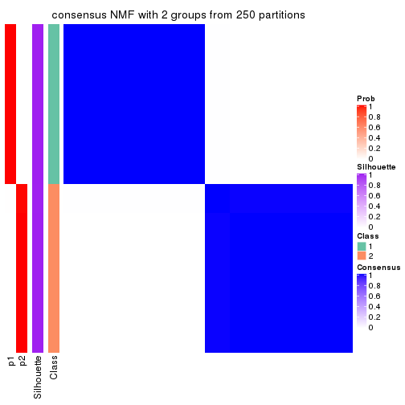</p>

</div>
<div id='tab-CV-NMF-consensus-heatmap-2'>
<pre><code class="r">consensus_heatmap(res, k = 3)
</code></pre>

<p>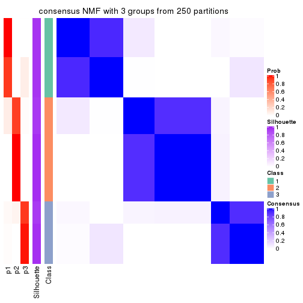</p>

</div>
<div id='tab-CV-NMF-consensus-heatmap-3'>
<pre><code class="r">consensus_heatmap(res, k = 4)
</code></pre>

<p>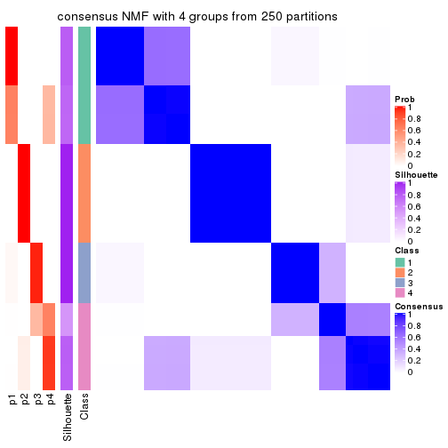</p>

</div>
<div id='tab-CV-NMF-consensus-heatmap-4'>
<pre><code class="r">consensus_heatmap(res, k = 5)
</code></pre>

<p>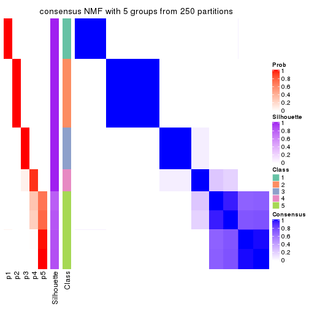</p>

</div>
<div id='tab-CV-NMF-consensus-heatmap-5'>
<pre><code class="r">consensus_heatmap(res, k = 6)
</code></pre>

<p>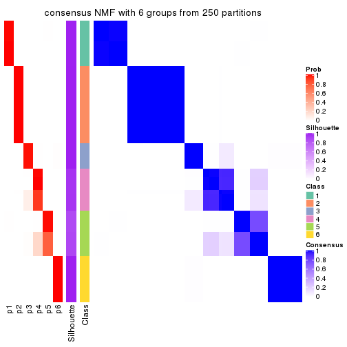</p>

</div>
</div>

Heatmaps for the membership of samples in all partitions to see how consistent they are:


<script>
$( function() {
	$( '#tabs-CV-NMF-membership-heatmap' ).tabs();
} );
</script>
<div id='tabs-CV-NMF-membership-heatmap'>
<ul>
<li><a href='#tab-CV-NMF-membership-heatmap-1'>k = 2</a></li>
<li><a href='#tab-CV-NMF-membership-heatmap-2'>k = 3</a></li>
<li><a href='#tab-CV-NMF-membership-heatmap-3'>k = 4</a></li>
<li><a href='#tab-CV-NMF-membership-heatmap-4'>k = 5</a></li>
<li><a href='#tab-CV-NMF-membership-heatmap-5'>k = 6</a></li>
</ul>
<div id='tab-CV-NMF-membership-heatmap-1'>
<pre><code class="r">membership_heatmap(res, k = 2)
</code></pre>

<p>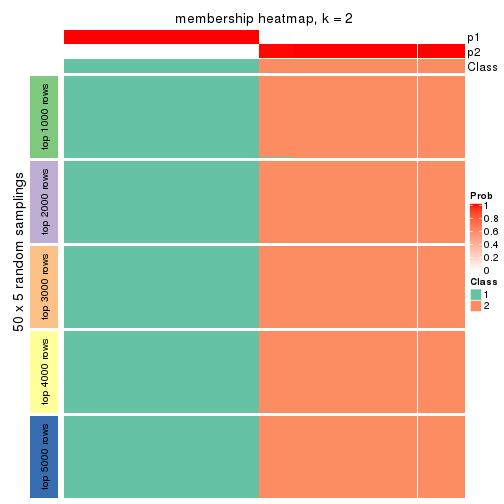</p>

</div>
<div id='tab-CV-NMF-membership-heatmap-2'>
<pre><code class="r">membership_heatmap(res, k = 3)
</code></pre>

<p></p>

</div>
<div id='tab-CV-NMF-membership-heatmap-3'>
<pre><code class="r">membership_heatmap(res, k = 4)
</code></pre>

<p>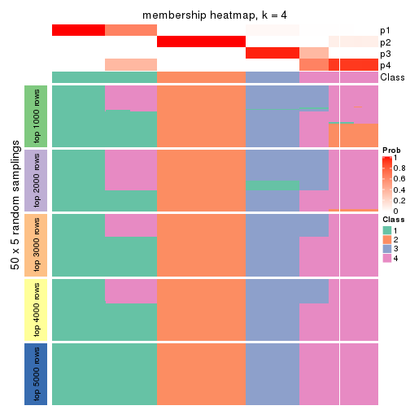</p>

</div>
<div id='tab-CV-NMF-membership-heatmap-4'>
<pre><code class="r">membership_heatmap(res, k = 5)
</code></pre>

<p>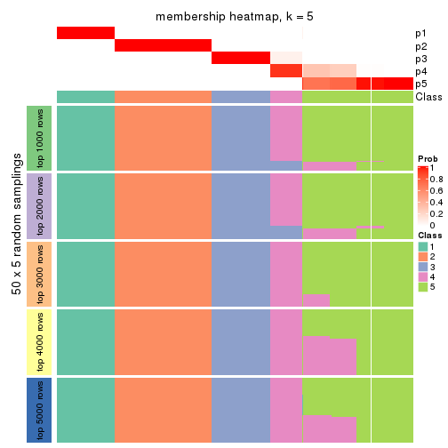</p>

</div>
<div id='tab-CV-NMF-membership-heatmap-5'>
<pre><code class="r">membership_heatmap(res, k = 6)
</code></pre>

<p>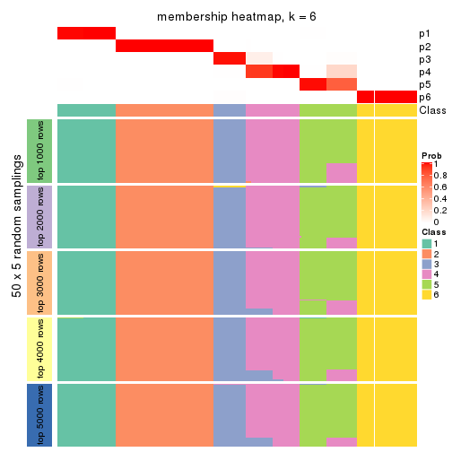</p>

</div>
</div>

As soon as we have had the classes for columns, we can look for signatures
which are significantly different between classes which can be candidate marks
for certain classes. Following are the heatmaps for signatures.


Signature heatmaps where rows are scaled:


<script>
$( function() {
	$( '#tabs-CV-NMF-get-signatures' ).tabs();
} );
</script>
<div id='tabs-CV-NMF-get-signatures'>
<ul>
<li><a href='#tab-CV-NMF-get-signatures-1'>k = 2</a></li>
<li><a href='#tab-CV-NMF-get-signatures-2'>k = 3</a></li>
<li><a href='#tab-CV-NMF-get-signatures-3'>k = 4</a></li>
<li><a href='#tab-CV-NMF-get-signatures-4'>k = 5</a></li>
<li><a href='#tab-CV-NMF-get-signatures-5'>k = 6</a></li>
</ul>
<div id='tab-CV-NMF-get-signatures-1'>
<pre><code class="r">get_signatures(res, k = 2)
</code></pre>

<p>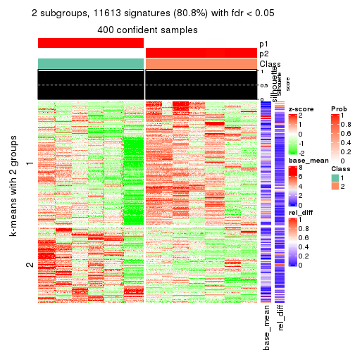</p>

</div>
<div id='tab-CV-NMF-get-signatures-2'>
<pre><code class="r">get_signatures(res, k = 3)
</code></pre>

<p>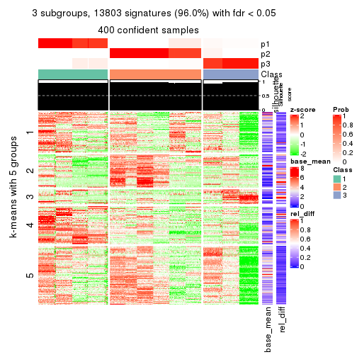</p>

</div>
<div id='tab-CV-NMF-get-signatures-3'>
<pre><code class="r">get_signatures(res, k = 4)
</code></pre>

<p>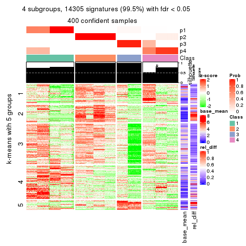</p>

</div>
<div id='tab-CV-NMF-get-signatures-4'>
<pre><code class="r">get_signatures(res, k = 5)
</code></pre>

<p>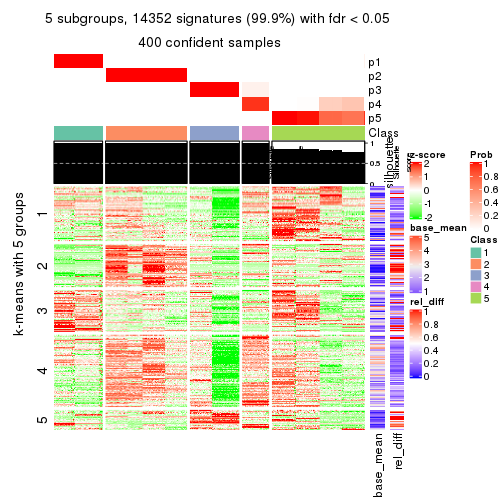</p>

</div>
<div id='tab-CV-NMF-get-signatures-5'>
<pre><code class="r">get_signatures(res, k = 6)
</code></pre>

<p>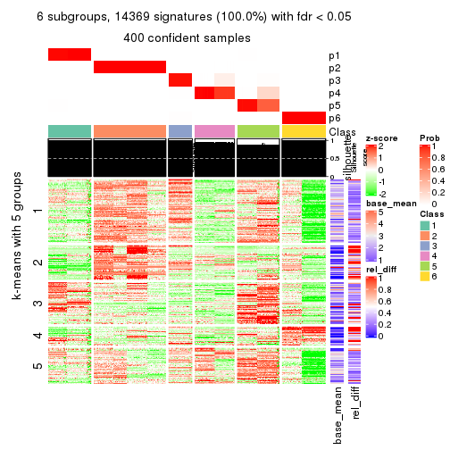</p>

</div>
</div>


Signature heatmaps where rows are not scaled:


<script>
$( function() {
	$( '#tabs-CV-NMF-get-signatures-no-scale' ).tabs();
} );
</script>
<div id='tabs-CV-NMF-get-signatures-no-scale'>
<ul>
<li><a href='#tab-CV-NMF-get-signatures-no-scale-1'>k = 2</a></li>
<li><a href='#tab-CV-NMF-get-signatures-no-scale-2'>k = 3</a></li>
<li><a href='#tab-CV-NMF-get-signatures-no-scale-3'>k = 4</a></li>
<li><a href='#tab-CV-NMF-get-signatures-no-scale-4'>k = 5</a></li>
<li><a href='#tab-CV-NMF-get-signatures-no-scale-5'>k = 6</a></li>
</ul>
<div id='tab-CV-NMF-get-signatures-no-scale-1'>
<pre><code class="r">get_signatures(res, k = 2, scale_rows = FALSE)
</code></pre>

<p>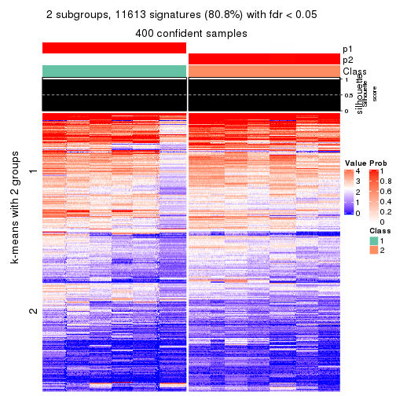</p>

</div>
<div id='tab-CV-NMF-get-signatures-no-scale-2'>
<pre><code class="r">get_signatures(res, k = 3, scale_rows = FALSE)
</code></pre>

<p>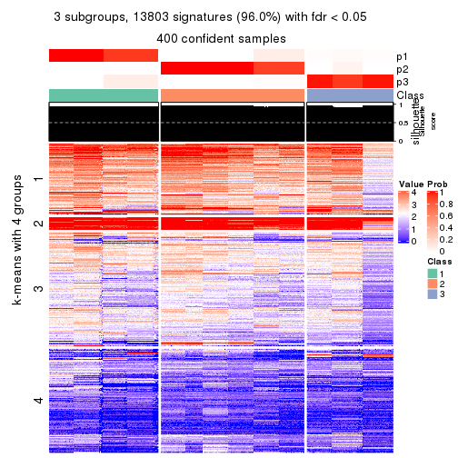</p>

</div>
<div id='tab-CV-NMF-get-signatures-no-scale-3'>
<pre><code class="r">get_signatures(res, k = 4, scale_rows = FALSE)
</code></pre>

<p>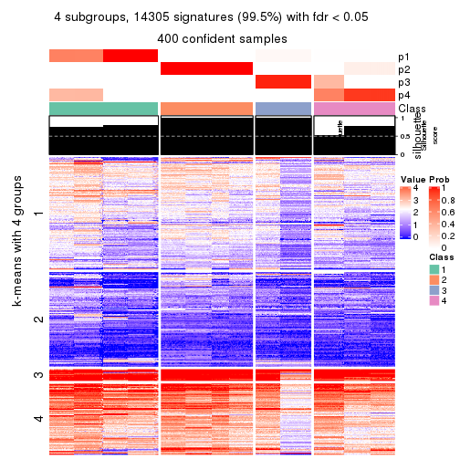</p>

</div>
<div id='tab-CV-NMF-get-signatures-no-scale-4'>
<pre><code class="r">get_signatures(res, k = 5, scale_rows = FALSE)
</code></pre>

<p>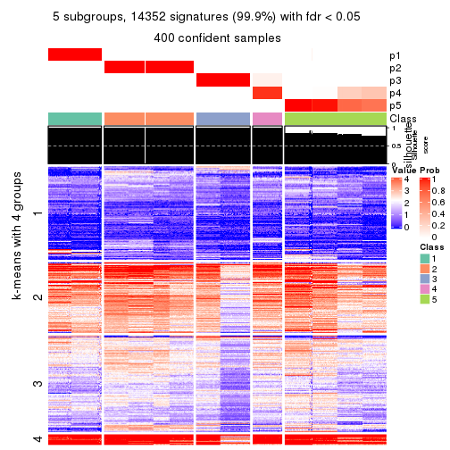</p>

</div>
<div id='tab-CV-NMF-get-signatures-no-scale-5'>
<pre><code class="r">get_signatures(res, k = 6, scale_rows = FALSE)
</code></pre>

<p>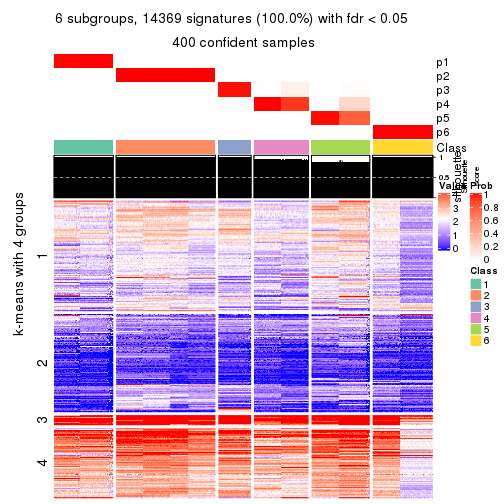</p>

</div>
</div>


Compare the overlap of signatures from different k:

```r
compare_signatures(res)
```

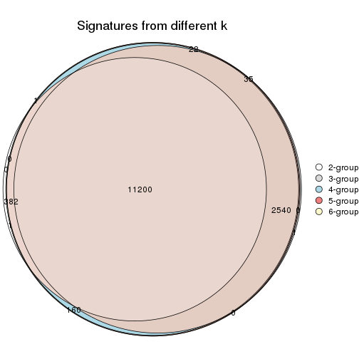

`get_signature()` returns a data frame invisibly. TO get the list of signatures, the function
call should be assigned to a variable explicitly. In following code, if `plot` argument is set
to `FALSE`, no heatmap is plotted while only the differential analysis is performed.

```r
# code only for demonstration
tb = get_signature(res, k = ..., plot = FALSE)
```

An example of the output of `tb` is:

```
#>   which_row         fdr    mean_1    mean_2 scaled_mean_1 scaled_mean_2 km
#> 1        38 0.042760348  8.373488  9.131774    -0.5533452     0.5164555  1
#> 2        40 0.018707592  7.106213  8.469186    -0.6173731     0.5762149  1
#> 3        55 0.019134737 10.221463 11.207825    -0.6159697     0.5749050  1
#> 4        59 0.006059896  5.921854  7.869574    -0.6899429     0.6439467  1
#> 5        60 0.018055526  8.928898 10.211722    -0.6204761     0.5791110  1
#> 6        98 0.009384629 15.714769 14.887706     0.6635654    -0.6193277  2
...
```

The columns in `tb` are:

1. `which_row`: row indices corresponding to the input matrix.
2. `fdr`: FDR for the differential test. 
3. `mean_x`: The mean value in group x.
4. `scaled_mean_x`: The mean value in group x after rows are scaled.
5. `km`: Row groups if k-means clustering is applied to rows.


UMAP plot which shows how samples are separated.


<script>
$( function() {
	$( '#tabs-CV-NMF-dimension-reduction' ).tabs();
} );
</script>
<div id='tabs-CV-NMF-dimension-reduction'>
<ul>
<li><a href='#tab-CV-NMF-dimension-reduction-1'>k = 2</a></li>
<li><a href='#tab-CV-NMF-dimension-reduction-2'>k = 3</a></li>
<li><a href='#tab-CV-NMF-dimension-reduction-3'>k = 4</a></li>
<li><a href='#tab-CV-NMF-dimension-reduction-4'>k = 5</a></li>
<li><a href='#tab-CV-NMF-dimension-reduction-5'>k = 6</a></li>
</ul>
<div id='tab-CV-NMF-dimension-reduction-1'>
<pre><code class="r">dimension_reduction(res, k = 2, method = &quot;UMAP&quot;)
</code></pre>

<p>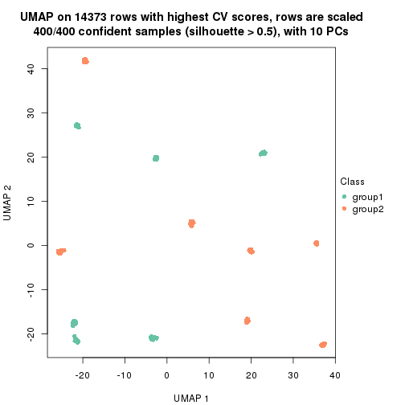</p>

</div>
<div id='tab-CV-NMF-dimension-reduction-2'>
<pre><code class="r">dimension_reduction(res, k = 3, method = &quot;UMAP&quot;)
</code></pre>

<p>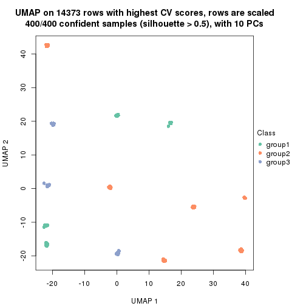</p>

</div>
<div id='tab-CV-NMF-dimension-reduction-3'>
<pre><code class="r">dimension_reduction(res, k = 4, method = &quot;UMAP&quot;)
</code></pre>

<p>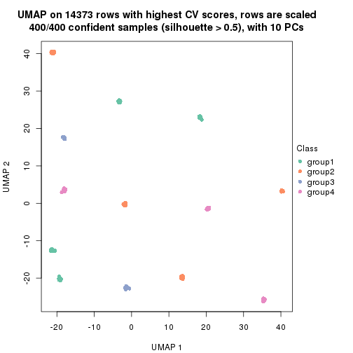</p>

</div>
<div id='tab-CV-NMF-dimension-reduction-4'>
<pre><code class="r">dimension_reduction(res, k = 5, method = &quot;UMAP&quot;)
</code></pre>

<p>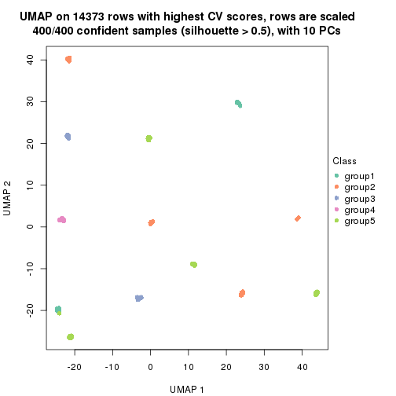</p>

</div>
<div id='tab-CV-NMF-dimension-reduction-5'>
<pre><code class="r">dimension_reduction(res, k = 6, method = &quot;UMAP&quot;)
</code></pre>

<p>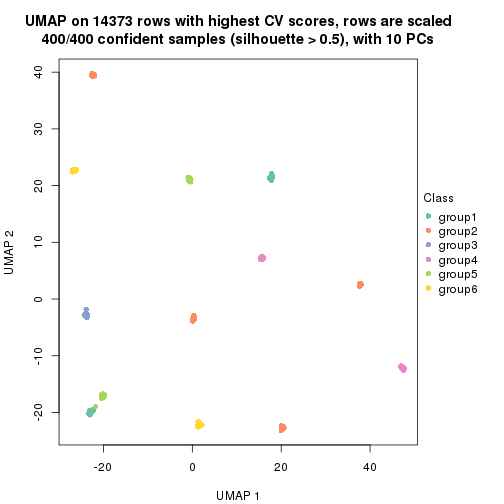</p>

</div>
</div>


Following heatmap shows how subgroups are split when increasing `k`:

```r
collect_classes(res)
```

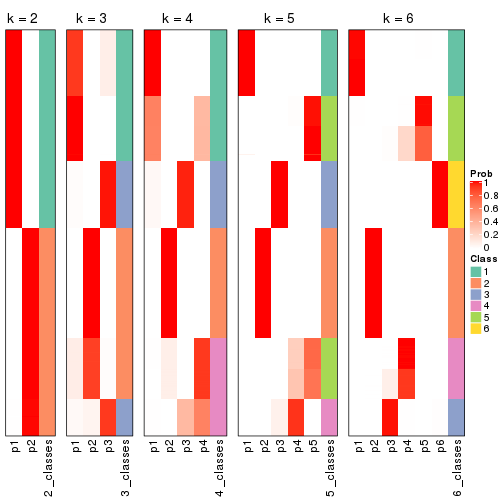


If matrix rows can be associated to genes, consider to use `GO_Enrichment(res,
...)` to perform function enrichment for the signature genes.


 

---------------------------------------------------


### MAD:hclust**


The object with results only for a single top-value method and a single partition method 
can be extracted as:

```r
res = res_list["MAD", "hclust"]
# you can also extract it by
# res = res_list["MAD:hclust"]
```

A summary of `res` and all the functions that can be applied to it:

```r
res
```

```
#> A 'ConsensusPartition' object with k = 2, 3, 4, 5, 6.
#>   On a matrix with 14373 rows and 400 columns.
#>   Top rows (1000, 2000, 3000, 4000, 5000) are extracted by 'MAD' method.
#>   Subgroups are detected by 'hclust' method.
#>   Performed in total 1250 partitions by row resampling.
#>   Best k for subgroups seems to be 6.
#> 
#> Following methods can be applied to this 'ConsensusPartition' object:
#>  [1] "cola_report"             "collect_classes"         "collect_plots"          
#>  [4] "collect_stats"           "colnames"                "compare_signatures"     
#>  [7] "consensus_heatmap"       "dimension_reduction"     "functional_enrichment"  
#> [10] "get_anno_col"            "get_anno"                "get_classes"            
#> [13] "get_consensus"           "get_matrix"              "get_membership"         
#> [16] "get_param"               "get_signatures"          "get_stats"              
#> [19] "is_best_k"               "is_stable_k"             "membership_heatmap"     
#> [22] "ncol"                    "nrow"                    "plot_ecdf"              
#> [25] "rownames"                "select_partition_number" "show"                   
#> [28] "suggest_best_k"          "test_to_known_factors"
```

`collect_plots()` function collects all the plots made from `res` for all `k` (number of partitions)
into one single page to provide an easy and fast comparison between different `k`.

```r
collect_plots(res)
```

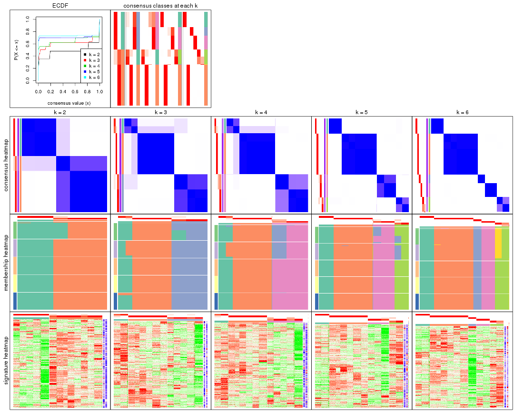

The plots are:

- The first row: a plot of the ECDF (Empirical cumulative distribution
  function) curves of the consensus matrix for each `k` and the heatmap of
  predicted classes for each `k`.
- The second row: heatmaps of the consensus matrix for each `k`.
- The third row: heatmaps of the membership matrix for each `k`.
- The fouth row: heatmaps of the signatures for each `k`.

All the plots in panels can be made by individual functions and they are
plotted later in this section.

`select_partition_number()` produces several plots showing different
statistics for choosing "optimized" `k`. There are following statistics:

- ECDF curves of the consensus matrix for each `k`;
- 1-PAC. [The PAC
  score](https://en.wikipedia.org/wiki/Consensus_clustering#Over-interpretation_potential_of_consensus_clustering)
  measures the proportion of the ambiguous subgrouping.
- Mean silhouette score.
- Concordance. The mean probability of fiting the consensus class ids in all
  partitions.
- Area increased. Denote $A_k$ as the area under the ECDF curve for current
  `k`, the area increased is defined as $A_k - A_{k-1}$.
- Rand index. The percent of pairs of samples that are both in a same cluster
  or both are not in a same cluster in the partition of k and k-1.
- Jaccard index. The ratio of pairs of samples are both in a same cluster in
  the partition of k and k-1 and the pairs of samples are both in a same
  cluster in the partition k or k-1.

The detailed explanations of these statistics can be found in [the cola
vignette](http://bioconductor.org/packages/devel/bioc/vignettes/cola/inst/doc/cola.html#toc_13).

Generally speaking, lower PAC score, higher mean silhouette score or higher
concordance corresponds to better partition. Rand index and Jaccard index
measure how similar the current partition is compared to partition with `k-1`.
If they are too similar, we won't accept `k` is better than `k-1`.

```r
select_partition_number(res)
```

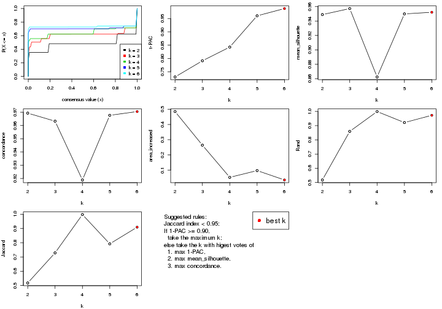

The numeric values for all these statistics can be obtained by `get_stats()`.

```r
get_stats(res)
```

```
#>   k 1-PAC mean_silhouette concordance area_increased  Rand Jaccard
#> 2 2 0.731           0.949       0.969         0.4848 0.518   0.518
#> 3 3 0.791           0.957       0.963         0.2642 0.860   0.729
#> 4 4 0.843           0.862       0.919         0.0530 0.999   0.998
#> 5 5 0.960           0.950       0.968         0.0973 0.922   0.792
#> 6 6 0.988           0.952       0.971         0.0358 0.973   0.909
```

`suggest_best_k()` suggests the best $k$ based on these statistics. The rules are as follows:

- All $k$ with Jaccard index larger than 0.95 are removed because the increase of
  the partition number does not provides enough extra information. If all $k$ are removed,
  the best $k$ is assigned by `NA`.
- For $k$ with 1-PAC larger than 0.9, the maximal $k$ is taken as the "best k". Other $k$ is called "optional k".
- If it does not fit the second rule. The $k$ with the highest vote of highest
  1-PAC, mean silhouette and concordance is taken as the "best k".

```r
suggest_best_k(res)
```

```
#> [1] 6
#> attr(,"optional")
#> [1] 5
```

There is also optional best $k$ = 5 that is worth to check.

Following shows the table of the partitions (You need to click the **show/hide
code output** link to see it). The membership matrix (columns with name `p*`)
is inferred by
[`clue::cl_consensus()`](https://www.rdocumentation.org/link/cl_consensus?package=clue)
function with the `SE` method. Basically the value in the membership matrix
represents the probability to belong to a certain group. The finall class
label for an item is determined with the group with highest probability it
belongs to.

In `get_classes()` function, the entropy is calculated from the membership
matrix and the silhouette score is calculated from the consensus matrix.


<script>
$( function() {
	$( '#tabs-MAD-hclust-get-classes' ).tabs();
} );
</script>
<div id='tabs-MAD-hclust-get-classes'>
<ul>
<li><a href='#tab-MAD-hclust-get-classes-1'>k = 2</a></li>
<li><a href='#tab-MAD-hclust-get-classes-2'>k = 3</a></li>
<li><a href='#tab-MAD-hclust-get-classes-3'>k = 4</a></li>
<li><a href='#tab-MAD-hclust-get-classes-4'>k = 5</a></li>
<li><a href='#tab-MAD-hclust-get-classes-5'>k = 6</a></li>
</ul>

<div id='tab-MAD-hclust-get-classes-1'>
<p><a id='tab-MAD-hclust-get-classes-1-a' style='color:#0366d6' href='#'>show/hide code output</a></p>
<pre><code class="r">cbind(get_classes(res, k = 2), get_membership(res, k = 2))
</code></pre>

<pre><code>#&gt;            class entropy silhouette    p1    p2
#&gt; SRR1661716     2  0.0000      0.947 0.000 1.000
#&gt; SRR1661717     2  0.0000      0.947 0.000 1.000
#&gt; SRR1661718     2  0.0000      0.947 0.000 1.000
#&gt; SRR1661719     2  0.0000      0.947 0.000 1.000
#&gt; SRR1661720     2  0.0000      0.947 0.000 1.000
#&gt; SRR1661721     2  0.0000      0.947 0.000 1.000
#&gt; SRR1661722     2  0.0000      0.947 0.000 1.000
#&gt; SRR1661723     2  0.0000      0.947 0.000 1.000
#&gt; SRR1661724     2  0.0000      0.947 0.000 1.000
#&gt; SRR1661725     2  0.0000      0.947 0.000 1.000
#&gt; SRR1661726     2  0.0000      0.947 0.000 1.000
#&gt; SRR1661727     2  0.0000      0.947 0.000 1.000
#&gt; SRR1661728     2  0.0000      0.947 0.000 1.000
#&gt; SRR1661729     2  0.0000      0.947 0.000 1.000
#&gt; SRR1661730     2  0.0000      0.947 0.000 1.000
#&gt; SRR1661731     2  0.0000      0.947 0.000 1.000
#&gt; SRR1661732     2  0.0000      0.947 0.000 1.000
#&gt; SRR1661733     2  0.0000      0.947 0.000 1.000
#&gt; SRR1661734     2  0.0000      0.947 0.000 1.000
#&gt; SRR1661735     2  0.0000      0.947 0.000 1.000
#&gt; SRR1661736     2  0.0000      0.947 0.000 1.000
#&gt; SRR1661737     2  0.0000      0.947 0.000 1.000
#&gt; SRR1661738     2  0.0000      0.947 0.000 1.000
#&gt; SRR1661739     2  0.0000      0.947 0.000 1.000
#&gt; SRR1661740     2  0.0000      0.947 0.000 1.000
#&gt; SRR1661741     2  0.0000      0.947 0.000 1.000
#&gt; SRR1661742     2  0.0000      0.947 0.000 1.000
#&gt; SRR1661743     2  0.0000      0.947 0.000 1.000
#&gt; SRR1661744     2  0.0000      0.947 0.000 1.000
#&gt; SRR1661745     2  0.0000      0.947 0.000 1.000
#&gt; SRR1661746     2  0.0000      0.947 0.000 1.000
#&gt; SRR1661747     2  0.0000      0.947 0.000 1.000
#&gt; SRR1661748     2  0.0000      0.947 0.000 1.000
#&gt; SRR1661749     2  0.0000      0.947 0.000 1.000
#&gt; SRR1661750     2  0.0000      0.947 0.000 1.000
#&gt; SRR1661751     2  0.0000      0.947 0.000 1.000
#&gt; SRR1661752     2  0.0000      0.947 0.000 1.000
#&gt; SRR1661753     2  0.0000      0.947 0.000 1.000
#&gt; SRR1661754     2  0.0000      0.947 0.000 1.000
#&gt; SRR1661755     2  0.0000      0.947 0.000 1.000
#&gt; SRR1661756     2  0.0000      0.947 0.000 1.000
#&gt; SRR1661757     2  0.0000      0.947 0.000 1.000
#&gt; SRR1661758     2  0.0000      0.947 0.000 1.000
#&gt; SRR1661759     2  0.0000      0.947 0.000 1.000
#&gt; SRR1661760     2  0.0000      0.947 0.000 1.000
#&gt; SRR1661761     2  0.0000      0.947 0.000 1.000
#&gt; SRR1661762     2  0.0000      0.947 0.000 1.000
#&gt; SRR1661763     2  0.0000      0.947 0.000 1.000
#&gt; SRR1661764     2  0.0000      0.947 0.000 1.000
#&gt; SRR1661766     2  0.0000      0.947 0.000 1.000
#&gt; SRR1661767     2  0.0000      0.947 0.000 1.000
#&gt; SRR1661768     2  0.0000      0.947 0.000 1.000
#&gt; SRR1661769     2  0.0000      0.947 0.000 1.000
#&gt; SRR1661770     2  0.0000      0.947 0.000 1.000
#&gt; SRR1661771     2  0.0000      0.947 0.000 1.000
#&gt; SRR1661772     2  0.0000      0.947 0.000 1.000
#&gt; SRR1661773     2  0.0000      0.947 0.000 1.000
#&gt; SRR1661774     2  0.0000      0.947 0.000 1.000
#&gt; SRR1661775     2  0.0000      0.947 0.000 1.000
#&gt; SRR1661776     2  0.0000      0.947 0.000 1.000
#&gt; SRR1661777     2  0.0000      0.947 0.000 1.000
#&gt; SRR1661778     2  0.0000      0.947 0.000 1.000
#&gt; SRR1661779     2  0.0000      0.947 0.000 1.000
#&gt; SRR1661780     2  0.0000      0.947 0.000 1.000
#&gt; SRR1661781     2  0.0000      0.947 0.000 1.000
#&gt; SRR1661782     2  0.0000      0.947 0.000 1.000
#&gt; SRR1661783     2  0.0000      0.947 0.000 1.000
#&gt; SRR1661784     2  0.0000      0.947 0.000 1.000
#&gt; SRR1661785     2  0.0000      0.947 0.000 1.000
#&gt; SRR1661786     2  0.0000      0.947 0.000 1.000
#&gt; SRR1661787     2  0.0000      0.947 0.000 1.000
#&gt; SRR1661788     2  0.0000      0.947 0.000 1.000
#&gt; SRR1661789     2  0.0000      0.947 0.000 1.000
#&gt; SRR1661790     2  0.0000      0.947 0.000 1.000
#&gt; SRR1661791     2  0.0000      0.947 0.000 1.000
#&gt; SRR1661792     2  0.0000      0.947 0.000 1.000
#&gt; SRR1661793     2  0.0000      0.947 0.000 1.000
#&gt; SRR1661794     2  0.0000      0.947 0.000 1.000
#&gt; SRR1661795     2  0.0000      0.947 0.000 1.000
#&gt; SRR1661796     2  0.0000      0.947 0.000 1.000
#&gt; SRR1661797     2  0.0000      0.947 0.000 1.000
#&gt; SRR1661798     2  0.0000      0.947 0.000 1.000
#&gt; SRR1661799     2  0.0000      0.947 0.000 1.000
#&gt; SRR1661800     2  0.0000      0.947 0.000 1.000
#&gt; SRR1661801     2  0.0000      0.947 0.000 1.000
#&gt; SRR1661802     2  0.0000      0.947 0.000 1.000
#&gt; SRR1661803     2  0.0000      0.947 0.000 1.000
#&gt; SRR1661804     2  0.0000      0.947 0.000 1.000
#&gt; SRR1661805     2  0.0000      0.947 0.000 1.000
#&gt; SRR1661806     2  0.0000      0.947 0.000 1.000
#&gt; SRR1661807     2  0.0000      0.947 0.000 1.000
#&gt; SRR1661808     2  0.0000      0.947 0.000 1.000
#&gt; SRR1661809     2  0.0000      0.947 0.000 1.000
#&gt; SRR1661810     2  0.0000      0.947 0.000 1.000
#&gt; SRR1661811     2  0.0000      0.947 0.000 1.000
#&gt; SRR1661812     2  0.0000      0.947 0.000 1.000
#&gt; SRR1661813     2  0.0000      0.947 0.000 1.000
#&gt; SRR1661814     2  0.0000      0.947 0.000 1.000
#&gt; SRR1661815     2  0.0000      0.947 0.000 1.000
#&gt; SRR1661816     2  0.0000      0.947 0.000 1.000
#&gt; SRR1661817     2  0.0000      0.947 0.000 1.000
#&gt; SRR1661818     2  0.0000      0.947 0.000 1.000
#&gt; SRR1661819     2  0.0000      0.947 0.000 1.000
#&gt; SRR1661820     2  0.0000      0.947 0.000 1.000
#&gt; SRR1661821     2  0.0000      0.947 0.000 1.000
#&gt; SRR1661822     2  0.0000      0.947 0.000 1.000
#&gt; SRR1661823     2  0.0000      0.947 0.000 1.000
#&gt; SRR1661824     2  0.0000      0.947 0.000 1.000
#&gt; SRR1661825     2  0.0000      0.947 0.000 1.000
#&gt; SRR1661826     1  0.0000      0.998 1.000 0.000
#&gt; SRR1661827     1  0.0000      0.998 1.000 0.000
#&gt; SRR1661828     1  0.0000      0.998 1.000 0.000
#&gt; SRR1661829     1  0.0000      0.998 1.000 0.000
#&gt; SRR1661830     1  0.0000      0.998 1.000 0.000
#&gt; SRR1661831     1  0.0000      0.998 1.000 0.000
#&gt; SRR1661832     1  0.0000      0.998 1.000 0.000
#&gt; SRR1661833     1  0.0000      0.998 1.000 0.000
#&gt; SRR1661834     1  0.0000      0.998 1.000 0.000
#&gt; SRR1661835     1  0.0000      0.998 1.000 0.000
#&gt; SRR1661836     1  0.0000      0.998 1.000 0.000
#&gt; SRR1661837     1  0.0000      0.998 1.000 0.000
#&gt; SRR1661838     1  0.0000      0.998 1.000 0.000
#&gt; SRR1661839     1  0.0000      0.998 1.000 0.000
#&gt; SRR1661840     1  0.0000      0.998 1.000 0.000
#&gt; SRR1661841     1  0.0000      0.998 1.000 0.000
#&gt; SRR1661843     1  0.0000      0.998 1.000 0.000
#&gt; SRR1661844     1  0.0000      0.998 1.000 0.000
#&gt; SRR1661845     1  0.0000      0.998 1.000 0.000
#&gt; SRR1661846     1  0.0000      0.998 1.000 0.000
#&gt; SRR1661847     1  0.0000      0.998 1.000 0.000
#&gt; SRR1661848     1  0.0000      0.998 1.000 0.000
#&gt; SRR1661849     1  0.0000      0.998 1.000 0.000
#&gt; SRR1661850     1  0.0000      0.998 1.000 0.000
#&gt; SRR1661851     1  0.0000      0.998 1.000 0.000
#&gt; SRR1661852     1  0.0000      0.998 1.000 0.000
#&gt; SRR1661853     1  0.0000      0.998 1.000 0.000
#&gt; SRR1661854     1  0.0000      0.998 1.000 0.000
#&gt; SRR1661855     1  0.0000      0.998 1.000 0.000
#&gt; SRR1661856     1  0.0000      0.998 1.000 0.000
#&gt; SRR1661857     1  0.0000      0.998 1.000 0.000
#&gt; SRR1661858     1  0.0000      0.998 1.000 0.000
#&gt; SRR1661859     1  0.0000      0.998 1.000 0.000
#&gt; SRR1661860     1  0.0000      0.998 1.000 0.000
#&gt; SRR1661861     1  0.0000      0.998 1.000 0.000
#&gt; SRR1661862     1  0.0000      0.998 1.000 0.000
#&gt; SRR1661863     1  0.0000      0.998 1.000 0.000
#&gt; SRR1661864     1  0.0000      0.998 1.000 0.000
#&gt; SRR1661865     1  0.0000      0.998 1.000 0.000
#&gt; SRR1661866     1  0.0000      0.998 1.000 0.000
#&gt; SRR1661867     1  0.0000      0.998 1.000 0.000
#&gt; SRR1661868     1  0.0000      0.998 1.000 0.000
#&gt; SRR1661869     1  0.0000      0.998 1.000 0.000
#&gt; SRR1661870     1  0.0000      0.998 1.000 0.000
#&gt; SRR1661871     1  0.0000      0.998 1.000 0.000
#&gt; SRR1661872     1  0.0000      0.998 1.000 0.000
#&gt; SRR1661873     1  0.0000      0.998 1.000 0.000
#&gt; SRR1661874     1  0.0000      0.998 1.000 0.000
#&gt; SRR1661875     1  0.0000      0.998 1.000 0.000
#&gt; SRR1661876     1  0.0000      0.998 1.000 0.000
#&gt; SRR1661877     1  0.0000      0.998 1.000 0.000
#&gt; SRR1661878     1  0.0000      0.998 1.000 0.000
#&gt; SRR1661879     1  0.0000      0.998 1.000 0.000
#&gt; SRR1661880     1  0.0000      0.998 1.000 0.000
#&gt; SRR1661881     1  0.0000      0.998 1.000 0.000
#&gt; SRR1661882     1  0.0000      0.998 1.000 0.000
#&gt; SRR1661883     1  0.0000      0.998 1.000 0.000
#&gt; SRR1661884     1  0.0000      0.998 1.000 0.000
#&gt; SRR1661885     1  0.0000      0.998 1.000 0.000
#&gt; SRR1661886     1  0.0000      0.998 1.000 0.000
#&gt; SRR1661887     1  0.0000      0.998 1.000 0.000
#&gt; SRR1661888     1  0.0000      0.998 1.000 0.000
#&gt; SRR1661889     1  0.0000      0.998 1.000 0.000
#&gt; SRR1661890     1  0.0000      0.998 1.000 0.000
#&gt; SRR1661891     1  0.0000      0.998 1.000 0.000
#&gt; SRR1661892     1  0.0000      0.998 1.000 0.000
#&gt; SRR1661893     1  0.0000      0.998 1.000 0.000
#&gt; SRR1661894     1  0.0000      0.998 1.000 0.000
#&gt; SRR1661895     1  0.0000      0.998 1.000 0.000
#&gt; SRR1661896     1  0.0000      0.998 1.000 0.000
#&gt; SRR1661897     1  0.0000      0.998 1.000 0.000
#&gt; SRR1661898     1  0.0000      0.998 1.000 0.000
#&gt; SRR1661899     1  0.0000      0.998 1.000 0.000
#&gt; SRR1661900     1  0.0000      0.998 1.000 0.000
#&gt; SRR1661901     1  0.0000      0.998 1.000 0.000
#&gt; SRR1661902     1  0.0000      0.998 1.000 0.000
#&gt; SRR1661903     1  0.0000      0.998 1.000 0.000
#&gt; SRR1661904     1  0.0000      0.998 1.000 0.000
#&gt; SRR1661905     1  0.0000      0.998 1.000 0.000
#&gt; SRR1661906     1  0.0000      0.998 1.000 0.000
#&gt; SRR1661907     1  0.0000      0.998 1.000 0.000
#&gt; SRR1661908     1  0.0000      0.998 1.000 0.000
#&gt; SRR1661909     1  0.0000      0.998 1.000 0.000
#&gt; SRR1661910     1  0.0000      0.998 1.000 0.000
#&gt; SRR1661911     1  0.0000      0.998 1.000 0.000
#&gt; SRR1661912     1  0.0000      0.998 1.000 0.000
#&gt; SRR1661913     1  0.0000      0.998 1.000 0.000
#&gt; SRR1661914     1  0.0000      0.998 1.000 0.000
#&gt; SRR1661915     1  0.0000      0.998 1.000 0.000
#&gt; SRR1661916     1  0.0000      0.998 1.000 0.000
#&gt; SRR1661917     1  0.0000      0.998 1.000 0.000
#&gt; SRR1661918     1  0.0000      0.998 1.000 0.000
#&gt; SRR1661919     1  0.0000      0.998 1.000 0.000
#&gt; SRR1661920     1  0.0000      0.998 1.000 0.000
#&gt; SRR1661921     1  0.0000      0.998 1.000 0.000
#&gt; SRR1661922     1  0.0000      0.998 1.000 0.000
#&gt; SRR1661923     1  0.0000      0.998 1.000 0.000
#&gt; SRR1661924     1  0.0000      0.998 1.000 0.000
#&gt; SRR1661925     1  0.0000      0.998 1.000 0.000
#&gt; SRR1661926     1  0.0000      0.998 1.000 0.000
#&gt; SRR1661927     1  0.0000      0.998 1.000 0.000
#&gt; SRR1661928     2  0.0000      0.947 0.000 1.000
#&gt; SRR1661929     2  0.0000      0.947 0.000 1.000
#&gt; SRR1661930     2  0.0000      0.947 0.000 1.000
#&gt; SRR1661931     2  0.0000      0.947 0.000 1.000
#&gt; SRR1661932     2  0.0000      0.947 0.000 1.000
#&gt; SRR1661933     2  0.0000      0.947 0.000 1.000
#&gt; SRR1661934     2  0.0000      0.947 0.000 1.000
#&gt; SRR1661935     2  0.0000      0.947 0.000 1.000
#&gt; SRR1661936     2  0.0000      0.947 0.000 1.000
#&gt; SRR1661937     2  0.0000      0.947 0.000 1.000
#&gt; SRR1661938     2  0.0000      0.947 0.000 1.000
#&gt; SRR1661939     2  0.0000      0.947 0.000 1.000
#&gt; SRR1661940     2  0.0000      0.947 0.000 1.000
#&gt; SRR1661941     2  0.0000      0.947 0.000 1.000
#&gt; SRR1661942     2  0.0000      0.947 0.000 1.000
#&gt; SRR1661943     2  0.0000      0.947 0.000 1.000
#&gt; SRR1661944     2  0.0000      0.947 0.000 1.000
#&gt; SRR1661945     2  0.0000      0.947 0.000 1.000
#&gt; SRR1661946     2  0.0000      0.947 0.000 1.000
#&gt; SRR1661947     2  0.0000      0.947 0.000 1.000
#&gt; SRR1661948     2  0.0000      0.947 0.000 1.000
#&gt; SRR1661949     2  0.0000      0.947 0.000 1.000
#&gt; SRR1661950     2  0.0000      0.947 0.000 1.000
#&gt; SRR1661951     2  0.0000      0.947 0.000 1.000
#&gt; SRR1661952     2  0.0000      0.947 0.000 1.000
#&gt; SRR1661953     2  0.0000      0.947 0.000 1.000
#&gt; SRR1661954     2  0.0000      0.947 0.000 1.000
#&gt; SRR1661955     2  0.0000      0.947 0.000 1.000
#&gt; SRR1661956     2  0.0000      0.947 0.000 1.000
#&gt; SRR1661957     2  0.0000      0.947 0.000 1.000
#&gt; SRR1661958     1  0.0376      0.997 0.996 0.004
#&gt; SRR1661959     1  0.0376      0.997 0.996 0.004
#&gt; SRR1661960     1  0.0376      0.997 0.996 0.004
#&gt; SRR1661961     1  0.0376      0.997 0.996 0.004
#&gt; SRR1661962     1  0.0376      0.997 0.996 0.004
#&gt; SRR1661963     1  0.0376      0.997 0.996 0.004
#&gt; SRR1661964     1  0.0376      0.997 0.996 0.004
#&gt; SRR1661965     1  0.0376      0.997 0.996 0.004
#&gt; SRR1661966     1  0.0376      0.997 0.996 0.004
#&gt; SRR1661967     1  0.0376      0.997 0.996 0.004
#&gt; SRR1661968     1  0.0376      0.997 0.996 0.004
#&gt; SRR1661969     1  0.0376      0.997 0.996 0.004
#&gt; SRR1661970     1  0.0376      0.997 0.996 0.004
#&gt; SRR1661971     1  0.0376      0.997 0.996 0.004
#&gt; SRR1661972     1  0.0376      0.997 0.996 0.004
#&gt; SRR1661973     1  0.0376      0.997 0.996 0.004
#&gt; SRR1661974     1  0.0376      0.997 0.996 0.004
#&gt; SRR1661975     1  0.0376      0.997 0.996 0.004
#&gt; SRR1661976     1  0.0376      0.997 0.996 0.004
#&gt; SRR1661977     1  0.0376      0.997 0.996 0.004
#&gt; SRR1661978     1  0.0376      0.997 0.996 0.004
#&gt; SRR1661979     1  0.0376      0.997 0.996 0.004
#&gt; SRR1661980     1  0.0376      0.997 0.996 0.004
#&gt; SRR1661981     1  0.0376      0.997 0.996 0.004
#&gt; SRR1661982     1  0.0376      0.997 0.996 0.004
#&gt; SRR1661983     1  0.0376      0.997 0.996 0.004
#&gt; SRR1661984     1  0.0376      0.997 0.996 0.004
#&gt; SRR1661985     1  0.0376      0.997 0.996 0.004
#&gt; SRR1661986     1  0.0376      0.997 0.996 0.004
#&gt; SRR1661987     1  0.0376      0.997 0.996 0.004
#&gt; SRR1661988     2  0.6973      0.831 0.188 0.812
#&gt; SRR1661989     2  0.6973      0.831 0.188 0.812
#&gt; SRR1661990     2  0.6973      0.831 0.188 0.812
#&gt; SRR1661991     2  0.6973      0.831 0.188 0.812
#&gt; SRR1661992     2  0.6973      0.831 0.188 0.812
#&gt; SRR1661993     2  0.6973      0.831 0.188 0.812
#&gt; SRR1661994     2  0.6973      0.831 0.188 0.812
#&gt; SRR1661995     2  0.6973      0.831 0.188 0.812
#&gt; SRR1661996     2  0.6973      0.831 0.188 0.812
#&gt; SRR1661997     2  0.6973      0.831 0.188 0.812
#&gt; SRR1661998     2  0.6973      0.831 0.188 0.812
#&gt; SRR1661999     2  0.6973      0.831 0.188 0.812
#&gt; SRR1662000     2  0.6973      0.831 0.188 0.812
#&gt; SRR1662001     2  0.6973      0.831 0.188 0.812
#&gt; SRR1662002     2  0.6973      0.831 0.188 0.812
#&gt; SRR1662003     2  0.6973      0.831 0.188 0.812
#&gt; SRR1662004     2  0.6973      0.831 0.188 0.812
#&gt; SRR1662005     2  0.6973      0.831 0.188 0.812
#&gt; SRR1662006     2  0.6973      0.831 0.188 0.812
#&gt; SRR1662007     2  0.6973      0.831 0.188 0.812
#&gt; SRR1662008     2  0.6973      0.831 0.188 0.812
#&gt; SRR1662009     2  0.6973      0.831 0.188 0.812
#&gt; SRR1662010     2  0.6973      0.831 0.188 0.812
#&gt; SRR1662011     2  0.6973      0.831 0.188 0.812
#&gt; SRR1662012     2  0.6973      0.831 0.188 0.812
#&gt; SRR1662013     2  0.6973      0.831 0.188 0.812
#&gt; SRR1662014     2  0.6973      0.831 0.188 0.812
#&gt; SRR1662015     2  0.6973      0.831 0.188 0.812
#&gt; SRR1662016     2  0.6973      0.831 0.188 0.812
#&gt; SRR1662017     2  0.6973      0.831 0.188 0.812
#&gt; SRR1662018     2  0.0000      0.947 0.000 1.000
#&gt; SRR1662019     2  0.0000      0.947 0.000 1.000
#&gt; SRR1662020     2  0.0000      0.947 0.000 1.000
#&gt; SRR1662021     2  0.0000      0.947 0.000 1.000
#&gt; SRR1662022     2  0.0000      0.947 0.000 1.000
#&gt; SRR1662023     2  0.0000      0.947 0.000 1.000
#&gt; SRR1662024     2  0.0000      0.947 0.000 1.000
#&gt; SRR1662025     2  0.0000      0.947 0.000 1.000
#&gt; SRR1662026     2  0.0000      0.947 0.000 1.000
#&gt; SRR1662027     2  0.0000      0.947 0.000 1.000
#&gt; SRR1662028     2  0.0000      0.947 0.000 1.000
#&gt; SRR1662029     2  0.0000      0.947 0.000 1.000
#&gt; SRR1662030     2  0.0000      0.947 0.000 1.000
#&gt; SRR1662031     2  0.0000      0.947 0.000 1.000
#&gt; SRR1662032     2  0.0000      0.947 0.000 1.000
#&gt; SRR1662033     2  0.0000      0.947 0.000 1.000
#&gt; SRR1662034     2  0.0000      0.947 0.000 1.000
#&gt; SRR1662035     2  0.0000      0.947 0.000 1.000
#&gt; SRR1662036     2  0.0000      0.947 0.000 1.000
#&gt; SRR1662037     2  0.0000      0.947 0.000 1.000
#&gt; SRR1662038     2  0.0000      0.947 0.000 1.000
#&gt; SRR1662039     2  0.0000      0.947 0.000 1.000
#&gt; SRR1662040     2  0.0000      0.947 0.000 1.000
#&gt; SRR1662041     2  0.0000      0.947 0.000 1.000
#&gt; SRR1662042     2  0.0000      0.947 0.000 1.000
#&gt; SRR1662043     2  0.0000      0.947 0.000 1.000
#&gt; SRR1662044     2  0.0000      0.947 0.000 1.000
#&gt; SRR1662045     2  0.0000      0.947 0.000 1.000
#&gt; SRR1662046     2  0.0000      0.947 0.000 1.000
#&gt; SRR1662047     2  0.0000      0.947 0.000 1.000
#&gt; SRR1662048     2  0.0000      0.947 0.000 1.000
#&gt; SRR1662049     2  0.0000      0.947 0.000 1.000
#&gt; SRR1662050     2  0.0000      0.947 0.000 1.000
#&gt; SRR1662051     2  0.0000      0.947 0.000 1.000
#&gt; SRR1662052     2  0.0000      0.947 0.000 1.000
#&gt; SRR1662053     2  0.0000      0.947 0.000 1.000
#&gt; SRR1662054     1  0.0376      0.997 0.996 0.004
#&gt; SRR1662055     1  0.0376      0.997 0.996 0.004
#&gt; SRR1662056     1  0.0376      0.997 0.996 0.004
#&gt; SRR1662057     1  0.0376      0.997 0.996 0.004
#&gt; SRR1662058     1  0.0376      0.997 0.996 0.004
#&gt; SRR1662059     1  0.0376      0.997 0.996 0.004
#&gt; SRR1662060     1  0.0376      0.997 0.996 0.004
#&gt; SRR1662061     1  0.0376      0.997 0.996 0.004
#&gt; SRR1662062     1  0.0376      0.997 0.996 0.004
#&gt; SRR1662063     1  0.0376      0.997 0.996 0.004
#&gt; SRR1662064     1  0.0376      0.997 0.996 0.004
#&gt; SRR1662065     1  0.0376      0.997 0.996 0.004
#&gt; SRR1662066     1  0.0376      0.997 0.996 0.004
#&gt; SRR1662067     1  0.0376      0.997 0.996 0.004
#&gt; SRR1662068     1  0.0376      0.997 0.996 0.004
#&gt; SRR1662069     1  0.0376      0.997 0.996 0.004
#&gt; SRR1662070     1  0.0376      0.997 0.996 0.004
#&gt; SRR1662071     1  0.0376      0.997 0.996 0.004
#&gt; SRR1662072     1  0.0376      0.997 0.996 0.004
#&gt; SRR1662073     1  0.0376      0.997 0.996 0.004
#&gt; SRR1662074     1  0.0376      0.997 0.996 0.004
#&gt; SRR1662075     1  0.0376      0.997 0.996 0.004
#&gt; SRR1662076     1  0.0376      0.997 0.996 0.004
#&gt; SRR1662077     1  0.0376      0.997 0.996 0.004
#&gt; SRR1662078     1  0.0376      0.997 0.996 0.004
#&gt; SRR1662079     1  0.0376      0.997 0.996 0.004
#&gt; SRR1662080     1  0.0376      0.997 0.996 0.004
#&gt; SRR1662081     1  0.0376      0.997 0.996 0.004
#&gt; SRR1662082     1  0.0376      0.997 0.996 0.004
#&gt; SRR1662083     1  0.0376      0.997 0.996 0.004
#&gt; SRR1662084     2  0.6973      0.831 0.188 0.812
#&gt; SRR1662085     2  0.6973      0.831 0.188 0.812
#&gt; SRR1662086     2  0.6973      0.831 0.188 0.812
#&gt; SRR1662087     2  0.6973      0.831 0.188 0.812
#&gt; SRR1662088     2  0.6973      0.831 0.188 0.812
#&gt; SRR1662089     2  0.6973      0.831 0.188 0.812
#&gt; SRR1662090     2  0.6973      0.831 0.188 0.812
#&gt; SRR1662091     2  0.6973      0.831 0.188 0.812
#&gt; SRR1662092     2  0.6973      0.831 0.188 0.812
#&gt; SRR1662093     2  0.6973      0.831 0.188 0.812
#&gt; SRR1662094     2  0.6973      0.831 0.188 0.812
#&gt; SRR1662095     2  0.6973      0.831 0.188 0.812
#&gt; SRR1662096     2  0.6973      0.831 0.188 0.812
#&gt; SRR1662097     2  0.6973      0.831 0.188 0.812
#&gt; SRR1662098     2  0.6973      0.831 0.188 0.812
#&gt; SRR1662099     2  0.6973      0.831 0.188 0.812
#&gt; SRR1662100     2  0.6973      0.831 0.188 0.812
#&gt; SRR1662101     2  0.6973      0.831 0.188 0.812
#&gt; SRR1662102     2  0.6973      0.831 0.188 0.812
#&gt; SRR1662103     2  0.6973      0.831 0.188 0.812
#&gt; SRR1662104     2  0.6973      0.831 0.188 0.812
#&gt; SRR1662105     2  0.6973      0.831 0.188 0.812
#&gt; SRR1662106     2  0.6973      0.831 0.188 0.812
#&gt; SRR1662107     2  0.6973      0.831 0.188 0.812
#&gt; SRR1662108     2  0.6973      0.831 0.188 0.812
#&gt; SRR1662109     2  0.6973      0.831 0.188 0.812
#&gt; SRR1662110     2  0.6973      0.831 0.188 0.812
#&gt; SRR1662111     2  0.6973      0.831 0.188 0.812
#&gt; SRR1662112     2  0.6973      0.831 0.188 0.812
#&gt; SRR1662113     2  0.6973      0.831 0.188 0.812
#&gt; SRR1662114     2  0.6973      0.831 0.188 0.812
#&gt; SRR1662115     2  0.6973      0.831 0.188 0.812
#&gt; SRR1662116     2  0.6973      0.831 0.188 0.812
#&gt; SRR1662117     2  0.6973      0.831 0.188 0.812
</code></pre>

<script>
$('#tab-MAD-hclust-get-classes-1-a').parent().next().next().hide();
$('#tab-MAD-hclust-get-classes-1-a').click(function(){
  $('#tab-MAD-hclust-get-classes-1-a').parent().next().next().toggle();
  return(false);
});
</script>
</div>

<div id='tab-MAD-hclust-get-classes-2'>
<p><a id='tab-MAD-hclust-get-classes-2-a' style='color:#0366d6' href='#'>show/hide code output</a></p>
<pre><code class="r">cbind(get_classes(res, k = 3), get_membership(res, k = 3))
</code></pre>

<pre><code>#&gt;            class entropy silhouette    p1    p2    p3
#&gt; SRR1661716     2  0.0000      1.000 0.000 1.000 0.000
#&gt; SRR1661717     2  0.0000      1.000 0.000 1.000 0.000
#&gt; SRR1661718     2  0.0000      1.000 0.000 1.000 0.000
#&gt; SRR1661719     2  0.0000      1.000 0.000 1.000 0.000
#&gt; SRR1661720     2  0.0000      1.000 0.000 1.000 0.000
#&gt; SRR1661721     2  0.0000      1.000 0.000 1.000 0.000
#&gt; SRR1661722     2  0.0000      1.000 0.000 1.000 0.000
#&gt; SRR1661723     2  0.0000      1.000 0.000 1.000 0.000
#&gt; SRR1661724     2  0.0000      1.000 0.000 1.000 0.000
#&gt; SRR1661725     2  0.0000      1.000 0.000 1.000 0.000
#&gt; SRR1661726     2  0.0000      1.000 0.000 1.000 0.000
#&gt; SRR1661727     2  0.0000      1.000 0.000 1.000 0.000
#&gt; SRR1661728     2  0.0000      1.000 0.000 1.000 0.000
#&gt; SRR1661729     2  0.0000      1.000 0.000 1.000 0.000
#&gt; SRR1661730     2  0.0000      1.000 0.000 1.000 0.000
#&gt; SRR1661731     2  0.0000      1.000 0.000 1.000 0.000
#&gt; SRR1661732     2  0.0000      1.000 0.000 1.000 0.000
#&gt; SRR1661733     2  0.0000      1.000 0.000 1.000 0.000
#&gt; SRR1661734     2  0.0000      1.000 0.000 1.000 0.000
#&gt; SRR1661735     2  0.0000      1.000 0.000 1.000 0.000
#&gt; SRR1661736     2  0.0000      1.000 0.000 1.000 0.000
#&gt; SRR1661737     2  0.0000      1.000 0.000 1.000 0.000
#&gt; SRR1661738     2  0.0000      1.000 0.000 1.000 0.000
#&gt; SRR1661739     2  0.0000      1.000 0.000 1.000 0.000
#&gt; SRR1661740     2  0.0000      1.000 0.000 1.000 0.000
#&gt; SRR1661741     2  0.0000      1.000 0.000 1.000 0.000
#&gt; SRR1661742     2  0.0000      1.000 0.000 1.000 0.000
#&gt; SRR1661743     2  0.0000      1.000 0.000 1.000 0.000
#&gt; SRR1661744     2  0.0000      1.000 0.000 1.000 0.000
#&gt; SRR1661745     2  0.0000      1.000 0.000 1.000 0.000
#&gt; SRR1661746     2  0.0000      1.000 0.000 1.000 0.000
#&gt; SRR1661747     2  0.0000      1.000 0.000 1.000 0.000
#&gt; SRR1661748     2  0.0000      1.000 0.000 1.000 0.000
#&gt; SRR1661749     2  0.0000      1.000 0.000 1.000 0.000
#&gt; SRR1661750     2  0.0000      1.000 0.000 1.000 0.000
#&gt; SRR1661751     2  0.0000      1.000 0.000 1.000 0.000
#&gt; SRR1661752     2  0.0000      1.000 0.000 1.000 0.000
#&gt; SRR1661753     2  0.0000      1.000 0.000 1.000 0.000
#&gt; SRR1661754     2  0.0000      1.000 0.000 1.000 0.000
#&gt; SRR1661755     2  0.0000      1.000 0.000 1.000 0.000
#&gt; SRR1661756     2  0.0000      1.000 0.000 1.000 0.000
#&gt; SRR1661757     2  0.0000      1.000 0.000 1.000 0.000
#&gt; SRR1661758     2  0.0000      1.000 0.000 1.000 0.000
#&gt; SRR1661759     2  0.0000      1.000 0.000 1.000 0.000
#&gt; SRR1661760     2  0.0000      1.000 0.000 1.000 0.000
#&gt; SRR1661761     2  0.0000      1.000 0.000 1.000 0.000
#&gt; SRR1661762     2  0.0000      1.000 0.000 1.000 0.000
#&gt; SRR1661763     2  0.0000      1.000 0.000 1.000 0.000
#&gt; SRR1661764     2  0.0000      1.000 0.000 1.000 0.000
#&gt; SRR1661766     2  0.0000      1.000 0.000 1.000 0.000
#&gt; SRR1661767     2  0.0000      1.000 0.000 1.000 0.000
#&gt; SRR1661768     2  0.0000      1.000 0.000 1.000 0.000
#&gt; SRR1661769     2  0.0000      1.000 0.000 1.000 0.000
#&gt; SRR1661770     2  0.0000      1.000 0.000 1.000 0.000
#&gt; SRR1661771     2  0.0000      1.000 0.000 1.000 0.000
#&gt; SRR1661772     2  0.0000      1.000 0.000 1.000 0.000
#&gt; SRR1661773     2  0.0000      1.000 0.000 1.000 0.000
#&gt; SRR1661774     2  0.0000      1.000 0.000 1.000 0.000
#&gt; SRR1661775     2  0.0000      1.000 0.000 1.000 0.000
#&gt; SRR1661776     2  0.0000      1.000 0.000 1.000 0.000
#&gt; SRR1661777     2  0.0000      1.000 0.000 1.000 0.000
#&gt; SRR1661778     2  0.0000      1.000 0.000 1.000 0.000
#&gt; SRR1661779     2  0.0000      1.000 0.000 1.000 0.000
#&gt; SRR1661780     2  0.0000      1.000 0.000 1.000 0.000
#&gt; SRR1661781     2  0.0000      1.000 0.000 1.000 0.000
#&gt; SRR1661782     2  0.0000      1.000 0.000 1.000 0.000
#&gt; SRR1661783     2  0.0000      1.000 0.000 1.000 0.000
#&gt; SRR1661784     2  0.0000      1.000 0.000 1.000 0.000
#&gt; SRR1661785     2  0.0000      1.000 0.000 1.000 0.000
#&gt; SRR1661786     2  0.0000      1.000 0.000 1.000 0.000
#&gt; SRR1661787     2  0.0000      1.000 0.000 1.000 0.000
#&gt; SRR1661788     2  0.0000      1.000 0.000 1.000 0.000
#&gt; SRR1661789     2  0.0000      1.000 0.000 1.000 0.000
#&gt; SRR1661790     2  0.0000      1.000 0.000 1.000 0.000
#&gt; SRR1661791     2  0.0000      1.000 0.000 1.000 0.000
#&gt; SRR1661792     2  0.0000      1.000 0.000 1.000 0.000
#&gt; SRR1661793     2  0.0000      1.000 0.000 1.000 0.000
#&gt; SRR1661794     2  0.0000      1.000 0.000 1.000 0.000
#&gt; SRR1661795     2  0.0000      1.000 0.000 1.000 0.000
#&gt; SRR1661796     2  0.0000      1.000 0.000 1.000 0.000
#&gt; SRR1661797     2  0.0000      1.000 0.000 1.000 0.000
#&gt; SRR1661798     2  0.0000      1.000 0.000 1.000 0.000
#&gt; SRR1661799     2  0.0000      1.000 0.000 1.000 0.000
#&gt; SRR1661800     2  0.0000      1.000 0.000 1.000 0.000
#&gt; SRR1661801     2  0.0000      1.000 0.000 1.000 0.000
#&gt; SRR1661802     2  0.0000      1.000 0.000 1.000 0.000
#&gt; SRR1661803     2  0.0000      1.000 0.000 1.000 0.000
#&gt; SRR1661804     2  0.0000      1.000 0.000 1.000 0.000
#&gt; SRR1661805     2  0.0000      1.000 0.000 1.000 0.000
#&gt; SRR1661806     2  0.0000      1.000 0.000 1.000 0.000
#&gt; SRR1661807     2  0.0000      1.000 0.000 1.000 0.000
#&gt; SRR1661808     2  0.0000      1.000 0.000 1.000 0.000
#&gt; SRR1661809     2  0.0000      1.000 0.000 1.000 0.000
#&gt; SRR1661810     2  0.0000      1.000 0.000 1.000 0.000
#&gt; SRR1661811     2  0.0000      1.000 0.000 1.000 0.000
#&gt; SRR1661812     2  0.0000      1.000 0.000 1.000 0.000
#&gt; SRR1661813     2  0.0000      1.000 0.000 1.000 0.000
#&gt; SRR1661814     2  0.0000      1.000 0.000 1.000 0.000
#&gt; SRR1661815     2  0.0000      1.000 0.000 1.000 0.000
#&gt; SRR1661816     2  0.0000      1.000 0.000 1.000 0.000
#&gt; SRR1661817     2  0.0000      1.000 0.000 1.000 0.000
#&gt; SRR1661818     2  0.0000      1.000 0.000 1.000 0.000
#&gt; SRR1661819     2  0.0000      1.000 0.000 1.000 0.000
#&gt; SRR1661820     2  0.0000      1.000 0.000 1.000 0.000
#&gt; SRR1661821     2  0.0000      1.000 0.000 1.000 0.000
#&gt; SRR1661822     2  0.0000      1.000 0.000 1.000 0.000
#&gt; SRR1661823     2  0.0000      1.000 0.000 1.000 0.000
#&gt; SRR1661824     2  0.0000      1.000 0.000 1.000 0.000
#&gt; SRR1661825     2  0.0000      1.000 0.000 1.000 0.000
#&gt; SRR1661826     3  0.3267      0.919 0.116 0.000 0.884
#&gt; SRR1661827     3  0.3267      0.919 0.116 0.000 0.884
#&gt; SRR1661828     3  0.3267      0.919 0.116 0.000 0.884
#&gt; SRR1661829     3  0.3267      0.919 0.116 0.000 0.884
#&gt; SRR1661830     3  0.3267      0.919 0.116 0.000 0.884
#&gt; SRR1661831     3  0.3267      0.919 0.116 0.000 0.884
#&gt; SRR1661832     3  0.3267      0.919 0.116 0.000 0.884
#&gt; SRR1661833     3  0.3267      0.919 0.116 0.000 0.884
#&gt; SRR1661834     3  0.3267      0.919 0.116 0.000 0.884
#&gt; SRR1661835     3  0.3267      0.919 0.116 0.000 0.884
#&gt; SRR1661836     3  0.3267      0.919 0.116 0.000 0.884
#&gt; SRR1661837     3  0.3267      0.919 0.116 0.000 0.884
#&gt; SRR1661838     3  0.3267      0.919 0.116 0.000 0.884
#&gt; SRR1661839     3  0.3267      0.919 0.116 0.000 0.884
#&gt; SRR1661840     3  0.3267      0.919 0.116 0.000 0.884
#&gt; SRR1661841     3  0.3267      0.919 0.116 0.000 0.884
#&gt; SRR1661843     3  0.3267      0.919 0.116 0.000 0.884
#&gt; SRR1661844     3  0.3267      0.919 0.116 0.000 0.884
#&gt; SRR1661845     3  0.3267      0.919 0.116 0.000 0.884
#&gt; SRR1661846     3  0.3267      0.919 0.116 0.000 0.884
#&gt; SRR1661847     3  0.3267      0.919 0.116 0.000 0.884
#&gt; SRR1661848     3  0.3267      0.919 0.116 0.000 0.884
#&gt; SRR1661849     3  0.3267      0.919 0.116 0.000 0.884
#&gt; SRR1661850     3  0.3267      0.919 0.116 0.000 0.884
#&gt; SRR1661851     3  0.3267      0.919 0.116 0.000 0.884
#&gt; SRR1661852     3  0.3267      0.919 0.116 0.000 0.884
#&gt; SRR1661853     3  0.3267      0.919 0.116 0.000 0.884
#&gt; SRR1661854     3  0.3267      0.919 0.116 0.000 0.884
#&gt; SRR1661855     3  0.3267      0.919 0.116 0.000 0.884
#&gt; SRR1661856     3  0.0000      0.947 0.000 0.000 1.000
#&gt; SRR1661857     3  0.0000      0.947 0.000 0.000 1.000
#&gt; SRR1661858     3  0.0000      0.947 0.000 0.000 1.000
#&gt; SRR1661859     3  0.0000      0.947 0.000 0.000 1.000
#&gt; SRR1661860     3  0.0000      0.947 0.000 0.000 1.000
#&gt; SRR1661861     3  0.0000      0.947 0.000 0.000 1.000
#&gt; SRR1661862     3  0.0000      0.947 0.000 0.000 1.000
#&gt; SRR1661863     3  0.0000      0.947 0.000 0.000 1.000
#&gt; SRR1661864     3  0.0000      0.947 0.000 0.000 1.000
#&gt; SRR1661865     3  0.0000      0.947 0.000 0.000 1.000
#&gt; SRR1661866     3  0.0000      0.947 0.000 0.000 1.000
#&gt; SRR1661867     3  0.0000      0.947 0.000 0.000 1.000
#&gt; SRR1661868     3  0.0000      0.947 0.000 0.000 1.000
#&gt; SRR1661869     3  0.0000      0.947 0.000 0.000 1.000
#&gt; SRR1661870     3  0.0000      0.947 0.000 0.000 1.000
#&gt; SRR1661871     3  0.0000      0.947 0.000 0.000 1.000
#&gt; SRR1661872     3  0.0000      0.947 0.000 0.000 1.000
#&gt; SRR1661873     3  0.0000      0.947 0.000 0.000 1.000
#&gt; SRR1661874     3  0.0000      0.947 0.000 0.000 1.000
#&gt; SRR1661875     3  0.0000      0.947 0.000 0.000 1.000
#&gt; SRR1661876     3  0.0000      0.947 0.000 0.000 1.000
#&gt; SRR1661877     3  0.0000      0.947 0.000 0.000 1.000
#&gt; SRR1661878     3  0.0000      0.947 0.000 0.000 1.000
#&gt; SRR1661879     3  0.0000      0.947 0.000 0.000 1.000
#&gt; SRR1661880     3  0.0000      0.947 0.000 0.000 1.000
#&gt; SRR1661881     3  0.0000      0.947 0.000 0.000 1.000
#&gt; SRR1661882     3  0.0000      0.947 0.000 0.000 1.000
#&gt; SRR1661883     3  0.0000      0.947 0.000 0.000 1.000
#&gt; SRR1661884     3  0.0000      0.947 0.000 0.000 1.000
#&gt; SRR1661885     3  0.0000      0.947 0.000 0.000 1.000
#&gt; SRR1661886     3  0.0000      0.947 0.000 0.000 1.000
#&gt; SRR1661887     3  0.0000      0.947 0.000 0.000 1.000
#&gt; SRR1661888     3  0.0000      0.947 0.000 0.000 1.000
#&gt; SRR1661889     3  0.0000      0.947 0.000 0.000 1.000
#&gt; SRR1661890     3  0.0000      0.947 0.000 0.000 1.000
#&gt; SRR1661891     3  0.0000      0.947 0.000 0.000 1.000
#&gt; SRR1661892     3  0.3267      0.919 0.116 0.000 0.884
#&gt; SRR1661893     3  0.3267      0.919 0.116 0.000 0.884
#&gt; SRR1661894     3  0.3267      0.919 0.116 0.000 0.884
#&gt; SRR1661895     3  0.3267      0.919 0.116 0.000 0.884
#&gt; SRR1661896     3  0.3267      0.919 0.116 0.000 0.884
#&gt; SRR1661897     3  0.3267      0.919 0.116 0.000 0.884
#&gt; SRR1661898     3  0.3267      0.919 0.116 0.000 0.884
#&gt; SRR1661899     3  0.3267      0.919 0.116 0.000 0.884
#&gt; SRR1661900     3  0.3267      0.919 0.116 0.000 0.884
#&gt; SRR1661901     3  0.3267      0.919 0.116 0.000 0.884
#&gt; SRR1661902     3  0.3267      0.919 0.116 0.000 0.884
#&gt; SRR1661903     3  0.3267      0.919 0.116 0.000 0.884
#&gt; SRR1661904     3  0.3267      0.919 0.116 0.000 0.884
#&gt; SRR1661905     3  0.3267      0.919 0.116 0.000 0.884
#&gt; SRR1661906     3  0.3267      0.919 0.116 0.000 0.884
#&gt; SRR1661907     3  0.3267      0.919 0.116 0.000 0.884
#&gt; SRR1661908     3  0.3267      0.919 0.116 0.000 0.884
#&gt; SRR1661909     3  0.3267      0.919 0.116 0.000 0.884
#&gt; SRR1661910     3  0.3267      0.919 0.116 0.000 0.884
#&gt; SRR1661911     3  0.3267      0.919 0.116 0.000 0.884
#&gt; SRR1661912     3  0.3267      0.919 0.116 0.000 0.884
#&gt; SRR1661913     3  0.3267      0.919 0.116 0.000 0.884
#&gt; SRR1661914     3  0.3267      0.919 0.116 0.000 0.884
#&gt; SRR1661915     3  0.3267      0.919 0.116 0.000 0.884
#&gt; SRR1661916     3  0.3267      0.919 0.116 0.000 0.884
#&gt; SRR1661917     3  0.3267      0.919 0.116 0.000 0.884
#&gt; SRR1661918     3  0.3267      0.919 0.116 0.000 0.884
#&gt; SRR1661919     3  0.3267      0.919 0.116 0.000 0.884
#&gt; SRR1661920     3  0.3267      0.919 0.116 0.000 0.884
#&gt; SRR1661921     3  0.3267      0.919 0.116 0.000 0.884
#&gt; SRR1661922     3  0.3267      0.919 0.116 0.000 0.884
#&gt; SRR1661923     3  0.3267      0.919 0.116 0.000 0.884
#&gt; SRR1661924     3  0.3267      0.919 0.116 0.000 0.884
#&gt; SRR1661925     3  0.3267      0.919 0.116 0.000 0.884
#&gt; SRR1661926     3  0.3267      0.919 0.116 0.000 0.884
#&gt; SRR1661927     3  0.3267      0.919 0.116 0.000 0.884
#&gt; SRR1661928     2  0.0000      1.000 0.000 1.000 0.000
#&gt; SRR1661929     2  0.0000      1.000 0.000 1.000 0.000
#&gt; SRR1661930     2  0.0000      1.000 0.000 1.000 0.000
#&gt; SRR1661931     2  0.0000      1.000 0.000 1.000 0.000
#&gt; SRR1661932     2  0.0000      1.000 0.000 1.000 0.000
#&gt; SRR1661933     2  0.0000      1.000 0.000 1.000 0.000
#&gt; SRR1661934     2  0.0000      1.000 0.000 1.000 0.000
#&gt; SRR1661935     2  0.0000      1.000 0.000 1.000 0.000
#&gt; SRR1661936     2  0.0000      1.000 0.000 1.000 0.000
#&gt; SRR1661937     2  0.0000      1.000 0.000 1.000 0.000
#&gt; SRR1661938     2  0.0000      1.000 0.000 1.000 0.000
#&gt; SRR1661939     2  0.0000      1.000 0.000 1.000 0.000
#&gt; SRR1661940     2  0.0000      1.000 0.000 1.000 0.000
#&gt; SRR1661941     2  0.0000      1.000 0.000 1.000 0.000
#&gt; SRR1661942     2  0.0000      1.000 0.000 1.000 0.000
#&gt; SRR1661943     2  0.0000      1.000 0.000 1.000 0.000
#&gt; SRR1661944     2  0.0000      1.000 0.000 1.000 0.000
#&gt; SRR1661945     2  0.0000      1.000 0.000 1.000 0.000
#&gt; SRR1661946     2  0.0000      1.000 0.000 1.000 0.000
#&gt; SRR1661947     2  0.0000      1.000 0.000 1.000 0.000
#&gt; SRR1661948     2  0.0000      1.000 0.000 1.000 0.000
#&gt; SRR1661949     2  0.0000      1.000 0.000 1.000 0.000
#&gt; SRR1661950     2  0.0000      1.000 0.000 1.000 0.000
#&gt; SRR1661951     2  0.0000      1.000 0.000 1.000 0.000
#&gt; SRR1661952     2  0.0000      1.000 0.000 1.000 0.000
#&gt; SRR1661953     2  0.0000      1.000 0.000 1.000 0.000
#&gt; SRR1661954     2  0.0000      1.000 0.000 1.000 0.000
#&gt; SRR1661955     2  0.0000      1.000 0.000 1.000 0.000
#&gt; SRR1661956     2  0.0000      1.000 0.000 1.000 0.000
#&gt; SRR1661957     2  0.0000      1.000 0.000 1.000 0.000
#&gt; SRR1661958     3  0.0237      0.947 0.000 0.004 0.996
#&gt; SRR1661959     3  0.0237      0.947 0.000 0.004 0.996
#&gt; SRR1661960     3  0.0237      0.947 0.000 0.004 0.996
#&gt; SRR1661961     3  0.0237      0.947 0.000 0.004 0.996
#&gt; SRR1661962     3  0.0237      0.947 0.000 0.004 0.996
#&gt; SRR1661963     3  0.0237      0.947 0.000 0.004 0.996
#&gt; SRR1661964     3  0.0237      0.947 0.000 0.004 0.996
#&gt; SRR1661965     3  0.0237      0.947 0.000 0.004 0.996
#&gt; SRR1661966     3  0.0237      0.947 0.000 0.004 0.996
#&gt; SRR1661967     3  0.0237      0.947 0.000 0.004 0.996
#&gt; SRR1661968     3  0.0237      0.947 0.000 0.004 0.996
#&gt; SRR1661969     3  0.0237      0.947 0.000 0.004 0.996
#&gt; SRR1661970     3  0.0237      0.947 0.000 0.004 0.996
#&gt; SRR1661971     3  0.0237      0.947 0.000 0.004 0.996
#&gt; SRR1661972     3  0.0237      0.947 0.000 0.004 0.996
#&gt; SRR1661973     3  0.0237      0.947 0.000 0.004 0.996
#&gt; SRR1661974     3  0.0237      0.947 0.000 0.004 0.996
#&gt; SRR1661975     3  0.0237      0.947 0.000 0.004 0.996
#&gt; SRR1661976     3  0.0237      0.947 0.000 0.004 0.996
#&gt; SRR1661977     3  0.0237      0.947 0.000 0.004 0.996
#&gt; SRR1661978     3  0.0237      0.947 0.000 0.004 0.996
#&gt; SRR1661979     3  0.0237      0.947 0.000 0.004 0.996
#&gt; SRR1661980     3  0.0237      0.947 0.000 0.004 0.996
#&gt; SRR1661981     3  0.0237      0.947 0.000 0.004 0.996
#&gt; SRR1661982     3  0.0237      0.947 0.000 0.004 0.996
#&gt; SRR1661983     3  0.0237      0.947 0.000 0.004 0.996
#&gt; SRR1661984     3  0.0237      0.947 0.000 0.004 0.996
#&gt; SRR1661985     3  0.0237      0.947 0.000 0.004 0.996
#&gt; SRR1661986     3  0.0237      0.947 0.000 0.004 0.996
#&gt; SRR1661987     3  0.0237      0.947 0.000 0.004 0.996
#&gt; SRR1661988     1  0.4555      0.884 0.800 0.200 0.000
#&gt; SRR1661989     1  0.4555      0.884 0.800 0.200 0.000
#&gt; SRR1661990     1  0.4555      0.884 0.800 0.200 0.000
#&gt; SRR1661991     1  0.4555      0.884 0.800 0.200 0.000
#&gt; SRR1661992     1  0.4555      0.884 0.800 0.200 0.000
#&gt; SRR1661993     1  0.4555      0.884 0.800 0.200 0.000
#&gt; SRR1661994     1  0.4555      0.884 0.800 0.200 0.000
#&gt; SRR1661995     1  0.4555      0.884 0.800 0.200 0.000
#&gt; SRR1661996     1  0.4555      0.884 0.800 0.200 0.000
#&gt; SRR1661997     1  0.4555      0.884 0.800 0.200 0.000
#&gt; SRR1661998     1  0.4555      0.884 0.800 0.200 0.000
#&gt; SRR1661999     1  0.4555      0.884 0.800 0.200 0.000
#&gt; SRR1662000     1  0.4555      0.884 0.800 0.200 0.000
#&gt; SRR1662001     1  0.4555      0.884 0.800 0.200 0.000
#&gt; SRR1662002     1  0.4555      0.884 0.800 0.200 0.000
#&gt; SRR1662003     1  0.4555      0.884 0.800 0.200 0.000
#&gt; SRR1662004     1  0.4555      0.884 0.800 0.200 0.000
#&gt; SRR1662005     1  0.4555      0.884 0.800 0.200 0.000
#&gt; SRR1662006     1  0.4555      0.884 0.800 0.200 0.000
#&gt; SRR1662007     1  0.4555      0.884 0.800 0.200 0.000
#&gt; SRR1662008     1  0.4555      0.884 0.800 0.200 0.000
#&gt; SRR1662009     1  0.4555      0.884 0.800 0.200 0.000
#&gt; SRR1662010     1  0.4555      0.884 0.800 0.200 0.000
#&gt; SRR1662011     1  0.4555      0.884 0.800 0.200 0.000
#&gt; SRR1662012     1  0.4555      0.884 0.800 0.200 0.000
#&gt; SRR1662013     1  0.4555      0.884 0.800 0.200 0.000
#&gt; SRR1662014     1  0.4555      0.884 0.800 0.200 0.000
#&gt; SRR1662015     1  0.4555      0.884 0.800 0.200 0.000
#&gt; SRR1662016     1  0.4555      0.884 0.800 0.200 0.000
#&gt; SRR1662017     1  0.4555      0.884 0.800 0.200 0.000
#&gt; SRR1662018     2  0.0000      1.000 0.000 1.000 0.000
#&gt; SRR1662019     2  0.0000      1.000 0.000 1.000 0.000
#&gt; SRR1662020     2  0.0000      1.000 0.000 1.000 0.000
#&gt; SRR1662021     2  0.0000      1.000 0.000 1.000 0.000
#&gt; SRR1662022     2  0.0000      1.000 0.000 1.000 0.000
#&gt; SRR1662023     2  0.0000      1.000 0.000 1.000 0.000
#&gt; SRR1662024     2  0.0000      1.000 0.000 1.000 0.000
#&gt; SRR1662025     2  0.0000      1.000 0.000 1.000 0.000
#&gt; SRR1662026     2  0.0000      1.000 0.000 1.000 0.000
#&gt; SRR1662027     2  0.0000      1.000 0.000 1.000 0.000
#&gt; SRR1662028     2  0.0000      1.000 0.000 1.000 0.000
#&gt; SRR1662029     2  0.0000      1.000 0.000 1.000 0.000
#&gt; SRR1662030     2  0.0000      1.000 0.000 1.000 0.000
#&gt; SRR1662031     2  0.0000      1.000 0.000 1.000 0.000
#&gt; SRR1662032     2  0.0000      1.000 0.000 1.000 0.000
#&gt; SRR1662033     2  0.0000      1.000 0.000 1.000 0.000
#&gt; SRR1662034     2  0.0000      1.000 0.000 1.000 0.000
#&gt; SRR1662035     2  0.0000      1.000 0.000 1.000 0.000
#&gt; SRR1662036     2  0.0000      1.000 0.000 1.000 0.000
#&gt; SRR1662037     2  0.0000      1.000 0.000 1.000 0.000
#&gt; SRR1662038     2  0.0000      1.000 0.000 1.000 0.000
#&gt; SRR1662039     2  0.0000      1.000 0.000 1.000 0.000
#&gt; SRR1662040     2  0.0000      1.000 0.000 1.000 0.000
#&gt; SRR1662041     2  0.0000      1.000 0.000 1.000 0.000
#&gt; SRR1662042     2  0.0000      1.000 0.000 1.000 0.000
#&gt; SRR1662043     2  0.0000      1.000 0.000 1.000 0.000
#&gt; SRR1662044     2  0.0000      1.000 0.000 1.000 0.000
#&gt; SRR1662045     2  0.0000      1.000 0.000 1.000 0.000
#&gt; SRR1662046     2  0.0000      1.000 0.000 1.000 0.000
#&gt; SRR1662047     2  0.0000      1.000 0.000 1.000 0.000
#&gt; SRR1662048     2  0.0000      1.000 0.000 1.000 0.000
#&gt; SRR1662049     2  0.0000      1.000 0.000 1.000 0.000
#&gt; SRR1662050     2  0.0000      1.000 0.000 1.000 0.000
#&gt; SRR1662051     2  0.0000      1.000 0.000 1.000 0.000
#&gt; SRR1662052     2  0.0000      1.000 0.000 1.000 0.000
#&gt; SRR1662053     2  0.0000      1.000 0.000 1.000 0.000
#&gt; SRR1662054     3  0.0237      0.947 0.000 0.004 0.996
#&gt; SRR1662055     3  0.0237      0.947 0.000 0.004 0.996
#&gt; SRR1662056     3  0.0237      0.947 0.000 0.004 0.996
#&gt; SRR1662057     3  0.0237      0.947 0.000 0.004 0.996
#&gt; SRR1662058     3  0.0237      0.947 0.000 0.004 0.996
#&gt; SRR1662059     3  0.0237      0.947 0.000 0.004 0.996
#&gt; SRR1662060     3  0.0237      0.947 0.000 0.004 0.996
#&gt; SRR1662061     3  0.0237      0.947 0.000 0.004 0.996
#&gt; SRR1662062     3  0.0237      0.947 0.000 0.004 0.996
#&gt; SRR1662063     3  0.0237      0.947 0.000 0.004 0.996
#&gt; SRR1662064     3  0.0237      0.947 0.000 0.004 0.996
#&gt; SRR1662065     3  0.0237      0.947 0.000 0.004 0.996
#&gt; SRR1662066     3  0.0237      0.947 0.000 0.004 0.996
#&gt; SRR1662067     3  0.0237      0.947 0.000 0.004 0.996
#&gt; SRR1662068     3  0.0237      0.947 0.000 0.004 0.996
#&gt; SRR1662069     3  0.0237      0.947 0.000 0.004 0.996
#&gt; SRR1662070     3  0.0237      0.947 0.000 0.004 0.996
#&gt; SRR1662071     3  0.0237      0.947 0.000 0.004 0.996
#&gt; SRR1662072     3  0.0237      0.947 0.000 0.004 0.996
#&gt; SRR1662073     3  0.0237      0.947 0.000 0.004 0.996
#&gt; SRR1662074     3  0.0237      0.947 0.000 0.004 0.996
#&gt; SRR1662075     3  0.0237      0.947 0.000 0.004 0.996
#&gt; SRR1662076     3  0.0237      0.947 0.000 0.004 0.996
#&gt; SRR1662077     3  0.0237      0.947 0.000 0.004 0.996
#&gt; SRR1662078     3  0.0237      0.947 0.000 0.004 0.996
#&gt; SRR1662079     3  0.0237      0.947 0.000 0.004 0.996
#&gt; SRR1662080     3  0.0237      0.947 0.000 0.004 0.996
#&gt; SRR1662081     3  0.0237      0.947 0.000 0.004 0.996
#&gt; SRR1662082     3  0.0237      0.947 0.000 0.004 0.996
#&gt; SRR1662083     3  0.0237      0.947 0.000 0.004 0.996
#&gt; SRR1662084     1  0.1163      0.905 0.972 0.028 0.000
#&gt; SRR1662085     1  0.1163      0.905 0.972 0.028 0.000
#&gt; SRR1662086     1  0.1163      0.905 0.972 0.028 0.000
#&gt; SRR1662087     1  0.1163      0.905 0.972 0.028 0.000
#&gt; SRR1662088     1  0.1163      0.905 0.972 0.028 0.000
#&gt; SRR1662089     1  0.1163      0.905 0.972 0.028 0.000
#&gt; SRR1662090     1  0.1163      0.905 0.972 0.028 0.000
#&gt; SRR1662091     1  0.1163      0.905 0.972 0.028 0.000
#&gt; SRR1662092     1  0.1163      0.905 0.972 0.028 0.000
#&gt; SRR1662093     1  0.1163      0.905 0.972 0.028 0.000
#&gt; SRR1662094     1  0.1163      0.905 0.972 0.028 0.000
#&gt; SRR1662095     1  0.1163      0.905 0.972 0.028 0.000
#&gt; SRR1662096     1  0.1163      0.905 0.972 0.028 0.000
#&gt; SRR1662097     1  0.1163      0.905 0.972 0.028 0.000
#&gt; SRR1662098     1  0.1163      0.905 0.972 0.028 0.000
#&gt; SRR1662099     1  0.1163      0.905 0.972 0.028 0.000
#&gt; SRR1662100     1  0.1163      0.905 0.972 0.028 0.000
#&gt; SRR1662101     1  0.1163      0.905 0.972 0.028 0.000
#&gt; SRR1662102     1  0.1163      0.905 0.972 0.028 0.000
#&gt; SRR1662103     1  0.1163      0.905 0.972 0.028 0.000
#&gt; SRR1662104     1  0.1163      0.905 0.972 0.028 0.000
#&gt; SRR1662105     1  0.1163      0.905 0.972 0.028 0.000
#&gt; SRR1662106     1  0.1163      0.905 0.972 0.028 0.000
#&gt; SRR1662107     1  0.1163      0.905 0.972 0.028 0.000
#&gt; SRR1662108     1  0.1163      0.905 0.972 0.028 0.000
#&gt; SRR1662109     1  0.1163      0.905 0.972 0.028 0.000
#&gt; SRR1662110     1  0.1163      0.905 0.972 0.028 0.000
#&gt; SRR1662111     1  0.0000      0.876 1.000 0.000 0.000
#&gt; SRR1662112     1  0.1163      0.905 0.972 0.028 0.000
#&gt; SRR1662113     1  0.1163      0.905 0.972 0.028 0.000
#&gt; SRR1662114     1  0.1163      0.905 0.972 0.028 0.000
#&gt; SRR1662115     1  0.1163      0.905 0.972 0.028 0.000
#&gt; SRR1662116     1  0.1163      0.905 0.972 0.028 0.000
#&gt; SRR1662117     1  0.1163      0.905 0.972 0.028 0.000
</code></pre>

<script>
$('#tab-MAD-hclust-get-classes-2-a').parent().next().next().hide();
$('#tab-MAD-hclust-get-classes-2-a').click(function(){
  $('#tab-MAD-hclust-get-classes-2-a').parent().next().next().toggle();
  return(false);
});
</script>
</div>

<div id='tab-MAD-hclust-get-classes-3'>
<p><a id='tab-MAD-hclust-get-classes-3-a' style='color:#0366d6' href='#'>show/hide code output</a></p>
<pre><code class="r">cbind(get_classes(res, k = 4), get_membership(res, k = 4))
</code></pre>

<pre><code>#&gt;            class entropy silhouette    p1    p2    p3    p4
#&gt; SRR1661716     2  0.0000      0.999 0.000 1.000 0.000 0.000
#&gt; SRR1661717     2  0.0000      0.999 0.000 1.000 0.000 0.000
#&gt; SRR1661718     2  0.0000      0.999 0.000 1.000 0.000 0.000
#&gt; SRR1661719     2  0.0000      0.999 0.000 1.000 0.000 0.000
#&gt; SRR1661720     2  0.0000      0.999 0.000 1.000 0.000 0.000
#&gt; SRR1661721     2  0.0000      0.999 0.000 1.000 0.000 0.000
#&gt; SRR1661722     2  0.0000      0.999 0.000 1.000 0.000 0.000
#&gt; SRR1661723     2  0.0000      0.999 0.000 1.000 0.000 0.000
#&gt; SRR1661724     2  0.0000      0.999 0.000 1.000 0.000 0.000
#&gt; SRR1661725     2  0.0000      0.999 0.000 1.000 0.000 0.000
#&gt; SRR1661726     2  0.0000      0.999 0.000 1.000 0.000 0.000
#&gt; SRR1661727     2  0.0000      0.999 0.000 1.000 0.000 0.000
#&gt; SRR1661728     2  0.0000      0.999 0.000 1.000 0.000 0.000
#&gt; SRR1661729     2  0.0000      0.999 0.000 1.000 0.000 0.000
#&gt; SRR1661730     2  0.0000      0.999 0.000 1.000 0.000 0.000
#&gt; SRR1661731     2  0.0000      0.999 0.000 1.000 0.000 0.000
#&gt; SRR1661732     2  0.0000      0.999 0.000 1.000 0.000 0.000
#&gt; SRR1661733     2  0.0000      0.999 0.000 1.000 0.000 0.000
#&gt; SRR1661734     2  0.0000      0.999 0.000 1.000 0.000 0.000
#&gt; SRR1661735     2  0.0000      0.999 0.000 1.000 0.000 0.000
#&gt; SRR1661736     2  0.0000      0.999 0.000 1.000 0.000 0.000
#&gt; SRR1661737     2  0.0000      0.999 0.000 1.000 0.000 0.000
#&gt; SRR1661738     2  0.0000      0.999 0.000 1.000 0.000 0.000
#&gt; SRR1661739     2  0.0000      0.999 0.000 1.000 0.000 0.000
#&gt; SRR1661740     2  0.0000      0.999 0.000 1.000 0.000 0.000
#&gt; SRR1661741     2  0.0000      0.999 0.000 1.000 0.000 0.000
#&gt; SRR1661742     2  0.0000      0.999 0.000 1.000 0.000 0.000
#&gt; SRR1661743     2  0.0000      0.999 0.000 1.000 0.000 0.000
#&gt; SRR1661744     2  0.0000      0.999 0.000 1.000 0.000 0.000
#&gt; SRR1661745     2  0.0000      0.999 0.000 1.000 0.000 0.000
#&gt; SRR1661746     2  0.0000      0.999 0.000 1.000 0.000 0.000
#&gt; SRR1661747     2  0.0000      0.999 0.000 1.000 0.000 0.000
#&gt; SRR1661748     2  0.0000      0.999 0.000 1.000 0.000 0.000
#&gt; SRR1661749     2  0.0000      0.999 0.000 1.000 0.000 0.000
#&gt; SRR1661750     2  0.0000      0.999 0.000 1.000 0.000 0.000
#&gt; SRR1661751     2  0.0000      0.999 0.000 1.000 0.000 0.000
#&gt; SRR1661752     2  0.0000      0.999 0.000 1.000 0.000 0.000
#&gt; SRR1661753     2  0.0000      0.999 0.000 1.000 0.000 0.000
#&gt; SRR1661754     2  0.0000      0.999 0.000 1.000 0.000 0.000
#&gt; SRR1661755     2  0.0000      0.999 0.000 1.000 0.000 0.000
#&gt; SRR1661756     2  0.0000      0.999 0.000 1.000 0.000 0.000
#&gt; SRR1661757     2  0.0000      0.999 0.000 1.000 0.000 0.000
#&gt; SRR1661758     2  0.0000      0.999 0.000 1.000 0.000 0.000
#&gt; SRR1661759     2  0.0000      0.999 0.000 1.000 0.000 0.000
#&gt; SRR1661760     2  0.0000      0.999 0.000 1.000 0.000 0.000
#&gt; SRR1661761     2  0.0000      0.999 0.000 1.000 0.000 0.000
#&gt; SRR1661762     2  0.0000      0.999 0.000 1.000 0.000 0.000
#&gt; SRR1661763     2  0.0000      0.999 0.000 1.000 0.000 0.000
#&gt; SRR1661764     2  0.0000      0.999 0.000 1.000 0.000 0.000
#&gt; SRR1661766     2  0.0000      0.999 0.000 1.000 0.000 0.000
#&gt; SRR1661767     2  0.0000      0.999 0.000 1.000 0.000 0.000
#&gt; SRR1661768     2  0.0000      0.999 0.000 1.000 0.000 0.000
#&gt; SRR1661769     2  0.0000      0.999 0.000 1.000 0.000 0.000
#&gt; SRR1661770     2  0.0000      0.999 0.000 1.000 0.000 0.000
#&gt; SRR1661771     2  0.0000      0.999 0.000 1.000 0.000 0.000
#&gt; SRR1661772     2  0.0000      0.999 0.000 1.000 0.000 0.000
#&gt; SRR1661773     2  0.0000      0.999 0.000 1.000 0.000 0.000
#&gt; SRR1661774     2  0.0000      0.999 0.000 1.000 0.000 0.000
#&gt; SRR1661775     2  0.0000      0.999 0.000 1.000 0.000 0.000
#&gt; SRR1661776     2  0.0000      0.999 0.000 1.000 0.000 0.000
#&gt; SRR1661777     2  0.0000      0.999 0.000 1.000 0.000 0.000
#&gt; SRR1661778     2  0.0000      0.999 0.000 1.000 0.000 0.000
#&gt; SRR1661779     2  0.0000      0.999 0.000 1.000 0.000 0.000
#&gt; SRR1661780     2  0.0000      0.999 0.000 1.000 0.000 0.000
#&gt; SRR1661781     2  0.0000      0.999 0.000 1.000 0.000 0.000
#&gt; SRR1661782     2  0.0000      0.999 0.000 1.000 0.000 0.000
#&gt; SRR1661783     2  0.0000      0.999 0.000 1.000 0.000 0.000
#&gt; SRR1661784     2  0.0000      0.999 0.000 1.000 0.000 0.000
#&gt; SRR1661785     2  0.0000      0.999 0.000 1.000 0.000 0.000
#&gt; SRR1661786     2  0.0000      0.999 0.000 1.000 0.000 0.000
#&gt; SRR1661787     2  0.0000      0.999 0.000 1.000 0.000 0.000
#&gt; SRR1661788     2  0.0000      0.999 0.000 1.000 0.000 0.000
#&gt; SRR1661789     2  0.0000      0.999 0.000 1.000 0.000 0.000
#&gt; SRR1661790     2  0.0000      0.999 0.000 1.000 0.000 0.000
#&gt; SRR1661791     2  0.0000      0.999 0.000 1.000 0.000 0.000
#&gt; SRR1661792     2  0.0000      0.999 0.000 1.000 0.000 0.000
#&gt; SRR1661793     2  0.0000      0.999 0.000 1.000 0.000 0.000
#&gt; SRR1661794     2  0.0000      0.999 0.000 1.000 0.000 0.000
#&gt; SRR1661795     2  0.0000      0.999 0.000 1.000 0.000 0.000
#&gt; SRR1661796     2  0.0000      0.999 0.000 1.000 0.000 0.000
#&gt; SRR1661797     2  0.0000      0.999 0.000 1.000 0.000 0.000
#&gt; SRR1661798     2  0.0000      0.999 0.000 1.000 0.000 0.000
#&gt; SRR1661799     2  0.0000      0.999 0.000 1.000 0.000 0.000
#&gt; SRR1661800     2  0.0000      0.999 0.000 1.000 0.000 0.000
#&gt; SRR1661801     2  0.0000      0.999 0.000 1.000 0.000 0.000
#&gt; SRR1661802     2  0.0000      0.999 0.000 1.000 0.000 0.000
#&gt; SRR1661803     2  0.0000      0.999 0.000 1.000 0.000 0.000
#&gt; SRR1661804     2  0.0000      0.999 0.000 1.000 0.000 0.000
#&gt; SRR1661805     2  0.0000      0.999 0.000 1.000 0.000 0.000
#&gt; SRR1661806     2  0.0000      0.999 0.000 1.000 0.000 0.000
#&gt; SRR1661807     2  0.0000      0.999 0.000 1.000 0.000 0.000
#&gt; SRR1661808     2  0.0000      0.999 0.000 1.000 0.000 0.000
#&gt; SRR1661809     2  0.0000      0.999 0.000 1.000 0.000 0.000
#&gt; SRR1661810     2  0.0000      0.999 0.000 1.000 0.000 0.000
#&gt; SRR1661811     2  0.0000      0.999 0.000 1.000 0.000 0.000
#&gt; SRR1661812     2  0.0000      0.999 0.000 1.000 0.000 0.000
#&gt; SRR1661813     2  0.0000      0.999 0.000 1.000 0.000 0.000
#&gt; SRR1661814     2  0.0000      0.999 0.000 1.000 0.000 0.000
#&gt; SRR1661815     2  0.0000      0.999 0.000 1.000 0.000 0.000
#&gt; SRR1661816     2  0.0000      0.999 0.000 1.000 0.000 0.000
#&gt; SRR1661817     2  0.0000      0.999 0.000 1.000 0.000 0.000
#&gt; SRR1661818     2  0.0000      0.999 0.000 1.000 0.000 0.000
#&gt; SRR1661819     2  0.0000      0.999 0.000 1.000 0.000 0.000
#&gt; SRR1661820     2  0.0000      0.999 0.000 1.000 0.000 0.000
#&gt; SRR1661821     2  0.0000      0.999 0.000 1.000 0.000 0.000
#&gt; SRR1661822     2  0.0000      0.999 0.000 1.000 0.000 0.000
#&gt; SRR1661823     2  0.0000      0.999 0.000 1.000 0.000 0.000
#&gt; SRR1661824     2  0.0000      0.999 0.000 1.000 0.000 0.000
#&gt; SRR1661825     2  0.0000      0.999 0.000 1.000 0.000 0.000
#&gt; SRR1661826     4  0.4855      0.708 0.000 0.000 0.400 0.600
#&gt; SRR1661827     4  0.4855      0.708 0.000 0.000 0.400 0.600
#&gt; SRR1661828     4  0.4855      0.708 0.000 0.000 0.400 0.600
#&gt; SRR1661829     4  0.4855      0.708 0.000 0.000 0.400 0.600
#&gt; SRR1661830     4  0.4855      0.708 0.000 0.000 0.400 0.600
#&gt; SRR1661831     4  0.4855      0.708 0.000 0.000 0.400 0.600
#&gt; SRR1661832     4  0.4855      0.708 0.000 0.000 0.400 0.600
#&gt; SRR1661833     4  0.4855      0.708 0.000 0.000 0.400 0.600
#&gt; SRR1661834     4  0.4855      0.708 0.000 0.000 0.400 0.600
#&gt; SRR1661835     4  0.4855      0.708 0.000 0.000 0.400 0.600
#&gt; SRR1661836     4  0.4855      0.708 0.000 0.000 0.400 0.600
#&gt; SRR1661837     4  0.4855      0.708 0.000 0.000 0.400 0.600
#&gt; SRR1661838     4  0.4855      0.708 0.000 0.000 0.400 0.600
#&gt; SRR1661839     4  0.4855      0.708 0.000 0.000 0.400 0.600
#&gt; SRR1661840     4  0.4855      0.708 0.000 0.000 0.400 0.600
#&gt; SRR1661841     4  0.4855      0.708 0.000 0.000 0.400 0.600
#&gt; SRR1661843     4  0.4855      0.708 0.000 0.000 0.400 0.600
#&gt; SRR1661844     4  0.4855      0.708 0.000 0.000 0.400 0.600
#&gt; SRR1661845     4  0.4855      0.708 0.000 0.000 0.400 0.600
#&gt; SRR1661846     4  0.4855      0.708 0.000 0.000 0.400 0.600
#&gt; SRR1661847     4  0.4855      0.708 0.000 0.000 0.400 0.600
#&gt; SRR1661848     4  0.4855      0.708 0.000 0.000 0.400 0.600
#&gt; SRR1661849     4  0.4855      0.708 0.000 0.000 0.400 0.600
#&gt; SRR1661850     4  0.4855      0.708 0.000 0.000 0.400 0.600
#&gt; SRR1661851     4  0.4855      0.708 0.000 0.000 0.400 0.600
#&gt; SRR1661852     4  0.4855      0.708 0.000 0.000 0.400 0.600
#&gt; SRR1661853     4  0.4855      0.708 0.000 0.000 0.400 0.600
#&gt; SRR1661854     4  0.4855      0.708 0.000 0.000 0.400 0.600
#&gt; SRR1661855     4  0.4855      0.708 0.000 0.000 0.400 0.600
#&gt; SRR1661856     4  0.0188      0.817 0.000 0.000 0.004 0.996
#&gt; SRR1661857     4  0.0188      0.817 0.000 0.000 0.004 0.996
#&gt; SRR1661858     4  0.0188      0.817 0.000 0.000 0.004 0.996
#&gt; SRR1661859     4  0.0188      0.817 0.000 0.000 0.004 0.996
#&gt; SRR1661860     4  0.0188      0.817 0.000 0.000 0.004 0.996
#&gt; SRR1661861     4  0.0188      0.817 0.000 0.000 0.004 0.996
#&gt; SRR1661862     4  0.0188      0.817 0.000 0.000 0.004 0.996
#&gt; SRR1661863     4  0.0188      0.817 0.000 0.000 0.004 0.996
#&gt; SRR1661864     4  0.0188      0.817 0.000 0.000 0.004 0.996
#&gt; SRR1661865     4  0.0188      0.817 0.000 0.000 0.004 0.996
#&gt; SRR1661866     4  0.0188      0.817 0.000 0.000 0.004 0.996
#&gt; SRR1661867     4  0.0188      0.817 0.000 0.000 0.004 0.996
#&gt; SRR1661868     4  0.0188      0.817 0.000 0.000 0.004 0.996
#&gt; SRR1661869     4  0.0188      0.817 0.000 0.000 0.004 0.996
#&gt; SRR1661870     4  0.0188      0.817 0.000 0.000 0.004 0.996
#&gt; SRR1661871     4  0.0188      0.817 0.000 0.000 0.004 0.996
#&gt; SRR1661872     4  0.0188      0.817 0.000 0.000 0.004 0.996
#&gt; SRR1661873     4  0.0188      0.817 0.000 0.000 0.004 0.996
#&gt; SRR1661874     4  0.0188      0.817 0.000 0.000 0.004 0.996
#&gt; SRR1661875     4  0.0188      0.817 0.000 0.000 0.004 0.996
#&gt; SRR1661876     4  0.0188      0.817 0.000 0.000 0.004 0.996
#&gt; SRR1661877     4  0.0188      0.817 0.000 0.000 0.004 0.996
#&gt; SRR1661878     4  0.0188      0.817 0.000 0.000 0.004 0.996
#&gt; SRR1661879     4  0.0188      0.817 0.000 0.000 0.004 0.996
#&gt; SRR1661880     4  0.0188      0.817 0.000 0.000 0.004 0.996
#&gt; SRR1661881     4  0.0188      0.817 0.000 0.000 0.004 0.996
#&gt; SRR1661882     4  0.0188      0.817 0.000 0.000 0.004 0.996
#&gt; SRR1661883     4  0.0188      0.817 0.000 0.000 0.004 0.996
#&gt; SRR1661884     4  0.0188      0.817 0.000 0.000 0.004 0.996
#&gt; SRR1661885     4  0.0188      0.817 0.000 0.000 0.004 0.996
#&gt; SRR1661886     4  0.0188      0.817 0.000 0.000 0.004 0.996
#&gt; SRR1661887     4  0.0188      0.817 0.000 0.000 0.004 0.996
#&gt; SRR1661888     4  0.0188      0.817 0.000 0.000 0.004 0.996
#&gt; SRR1661889     4  0.0188      0.817 0.000 0.000 0.004 0.996
#&gt; SRR1661890     4  0.0188      0.817 0.000 0.000 0.004 0.996
#&gt; SRR1661891     4  0.0188      0.817 0.000 0.000 0.004 0.996
#&gt; SRR1661892     4  0.4855      0.708 0.000 0.000 0.400 0.600
#&gt; SRR1661893     4  0.4855      0.708 0.000 0.000 0.400 0.600
#&gt; SRR1661894     4  0.4855      0.708 0.000 0.000 0.400 0.600
#&gt; SRR1661895     4  0.4855      0.708 0.000 0.000 0.400 0.600
#&gt; SRR1661896     4  0.4855      0.708 0.000 0.000 0.400 0.600
#&gt; SRR1661897     4  0.4855      0.708 0.000 0.000 0.400 0.600
#&gt; SRR1661898     4  0.4855      0.708 0.000 0.000 0.400 0.600
#&gt; SRR1661899     4  0.4855      0.708 0.000 0.000 0.400 0.600
#&gt; SRR1661900     4  0.4855      0.708 0.000 0.000 0.400 0.600
#&gt; SRR1661901     4  0.4855      0.708 0.000 0.000 0.400 0.600
#&gt; SRR1661902     4  0.4855      0.708 0.000 0.000 0.400 0.600
#&gt; SRR1661903     4  0.4855      0.708 0.000 0.000 0.400 0.600
#&gt; SRR1661904     4  0.4855      0.708 0.000 0.000 0.400 0.600
#&gt; SRR1661905     4  0.4855      0.708 0.000 0.000 0.400 0.600
#&gt; SRR1661906     4  0.4855      0.708 0.000 0.000 0.400 0.600
#&gt; SRR1661907     4  0.4855      0.708 0.000 0.000 0.400 0.600
#&gt; SRR1661908     4  0.4855      0.708 0.000 0.000 0.400 0.600
#&gt; SRR1661909     4  0.4855      0.708 0.000 0.000 0.400 0.600
#&gt; SRR1661910     4  0.4855      0.708 0.000 0.000 0.400 0.600
#&gt; SRR1661911     4  0.4855      0.708 0.000 0.000 0.400 0.600
#&gt; SRR1661912     4  0.4855      0.708 0.000 0.000 0.400 0.600
#&gt; SRR1661913     4  0.4855      0.708 0.000 0.000 0.400 0.600
#&gt; SRR1661914     4  0.4855      0.708 0.000 0.000 0.400 0.600
#&gt; SRR1661915     4  0.4855      0.708 0.000 0.000 0.400 0.600
#&gt; SRR1661916     4  0.4855      0.708 0.000 0.000 0.400 0.600
#&gt; SRR1661917     4  0.4855      0.708 0.000 0.000 0.400 0.600
#&gt; SRR1661918     4  0.4855      0.708 0.000 0.000 0.400 0.600
#&gt; SRR1661919     4  0.4855      0.708 0.000 0.000 0.400 0.600
#&gt; SRR1661920     4  0.4855      0.708 0.000 0.000 0.400 0.600
#&gt; SRR1661921     4  0.4855      0.708 0.000 0.000 0.400 0.600
#&gt; SRR1661922     4  0.4855      0.708 0.000 0.000 0.400 0.600
#&gt; SRR1661923     4  0.4855      0.708 0.000 0.000 0.400 0.600
#&gt; SRR1661924     4  0.4855      0.708 0.000 0.000 0.400 0.600
#&gt; SRR1661925     4  0.4855      0.708 0.000 0.000 0.400 0.600
#&gt; SRR1661926     4  0.4855      0.708 0.000 0.000 0.400 0.600
#&gt; SRR1661927     4  0.4855      0.708 0.000 0.000 0.400 0.600
#&gt; SRR1661928     2  0.0000      0.999 0.000 1.000 0.000 0.000
#&gt; SRR1661929     2  0.0000      0.999 0.000 1.000 0.000 0.000
#&gt; SRR1661930     2  0.0000      0.999 0.000 1.000 0.000 0.000
#&gt; SRR1661931     2  0.0000      0.999 0.000 1.000 0.000 0.000
#&gt; SRR1661932     2  0.0000      0.999 0.000 1.000 0.000 0.000
#&gt; SRR1661933     2  0.0000      0.999 0.000 1.000 0.000 0.000
#&gt; SRR1661934     2  0.0000      0.999 0.000 1.000 0.000 0.000
#&gt; SRR1661935     2  0.0000      0.999 0.000 1.000 0.000 0.000
#&gt; SRR1661936     2  0.0000      0.999 0.000 1.000 0.000 0.000
#&gt; SRR1661937     2  0.0000      0.999 0.000 1.000 0.000 0.000
#&gt; SRR1661938     2  0.0000      0.999 0.000 1.000 0.000 0.000
#&gt; SRR1661939     2  0.0000      0.999 0.000 1.000 0.000 0.000
#&gt; SRR1661940     2  0.0000      0.999 0.000 1.000 0.000 0.000
#&gt; SRR1661941     2  0.0000      0.999 0.000 1.000 0.000 0.000
#&gt; SRR1661942     2  0.0000      0.999 0.000 1.000 0.000 0.000
#&gt; SRR1661943     2  0.0000      0.999 0.000 1.000 0.000 0.000
#&gt; SRR1661944     2  0.0000      0.999 0.000 1.000 0.000 0.000
#&gt; SRR1661945     2  0.0000      0.999 0.000 1.000 0.000 0.000
#&gt; SRR1661946     2  0.0000      0.999 0.000 1.000 0.000 0.000
#&gt; SRR1661947     2  0.0000      0.999 0.000 1.000 0.000 0.000
#&gt; SRR1661948     2  0.0000      0.999 0.000 1.000 0.000 0.000
#&gt; SRR1661949     2  0.0000      0.999 0.000 1.000 0.000 0.000
#&gt; SRR1661950     2  0.0000      0.999 0.000 1.000 0.000 0.000
#&gt; SRR1661951     2  0.0000      0.999 0.000 1.000 0.000 0.000
#&gt; SRR1661952     2  0.0000      0.999 0.000 1.000 0.000 0.000
#&gt; SRR1661953     2  0.0000      0.999 0.000 1.000 0.000 0.000
#&gt; SRR1661954     2  0.0000      0.999 0.000 1.000 0.000 0.000
#&gt; SRR1661955     2  0.0000      0.999 0.000 1.000 0.000 0.000
#&gt; SRR1661956     2  0.0000      0.999 0.000 1.000 0.000 0.000
#&gt; SRR1661957     2  0.0000      0.999 0.000 1.000 0.000 0.000
#&gt; SRR1661958     4  0.0000      0.816 0.000 0.000 0.000 1.000
#&gt; SRR1661959     4  0.0000      0.816 0.000 0.000 0.000 1.000
#&gt; SRR1661960     4  0.0000      0.816 0.000 0.000 0.000 1.000
#&gt; SRR1661961     4  0.0000      0.816 0.000 0.000 0.000 1.000
#&gt; SRR1661962     4  0.0000      0.816 0.000 0.000 0.000 1.000
#&gt; SRR1661963     4  0.0000      0.816 0.000 0.000 0.000 1.000
#&gt; SRR1661964     4  0.0000      0.816 0.000 0.000 0.000 1.000
#&gt; SRR1661965     4  0.0000      0.816 0.000 0.000 0.000 1.000
#&gt; SRR1661966     4  0.0000      0.816 0.000 0.000 0.000 1.000
#&gt; SRR1661967     4  0.0000      0.816 0.000 0.000 0.000 1.000
#&gt; SRR1661968     4  0.0000      0.816 0.000 0.000 0.000 1.000
#&gt; SRR1661969     4  0.0000      0.816 0.000 0.000 0.000 1.000
#&gt; SRR1661970     4  0.0000      0.816 0.000 0.000 0.000 1.000
#&gt; SRR1661971     4  0.0000      0.816 0.000 0.000 0.000 1.000
#&gt; SRR1661972     4  0.0000      0.816 0.000 0.000 0.000 1.000
#&gt; SRR1661973     4  0.0000      0.816 0.000 0.000 0.000 1.000
#&gt; SRR1661974     4  0.0000      0.816 0.000 0.000 0.000 1.000
#&gt; SRR1661975     4  0.0000      0.816 0.000 0.000 0.000 1.000
#&gt; SRR1661976     4  0.0000      0.816 0.000 0.000 0.000 1.000
#&gt; SRR1661977     4  0.0000      0.816 0.000 0.000 0.000 1.000
#&gt; SRR1661978     4  0.0000      0.816 0.000 0.000 0.000 1.000
#&gt; SRR1661979     4  0.0000      0.816 0.000 0.000 0.000 1.000
#&gt; SRR1661980     4  0.0000      0.816 0.000 0.000 0.000 1.000
#&gt; SRR1661981     4  0.0000      0.816 0.000 0.000 0.000 1.000
#&gt; SRR1661982     4  0.0000      0.816 0.000 0.000 0.000 1.000
#&gt; SRR1661983     4  0.0000      0.816 0.000 0.000 0.000 1.000
#&gt; SRR1661984     4  0.0000      0.816 0.000 0.000 0.000 1.000
#&gt; SRR1661985     4  0.0000      0.816 0.000 0.000 0.000 1.000
#&gt; SRR1661986     4  0.0000      0.816 0.000 0.000 0.000 1.000
#&gt; SRR1661987     4  0.0000      0.816 0.000 0.000 0.000 1.000
#&gt; SRR1661988     1  0.3991      0.733 0.808 0.172 0.020 0.000
#&gt; SRR1661989     1  0.3991      0.733 0.808 0.172 0.020 0.000
#&gt; SRR1661990     1  0.3991      0.733 0.808 0.172 0.020 0.000
#&gt; SRR1661991     1  0.3991      0.733 0.808 0.172 0.020 0.000
#&gt; SRR1661992     1  0.3991      0.733 0.808 0.172 0.020 0.000
#&gt; SRR1661993     1  0.3991      0.733 0.808 0.172 0.020 0.000
#&gt; SRR1661994     1  0.3991      0.733 0.808 0.172 0.020 0.000
#&gt; SRR1661995     1  0.3991      0.733 0.808 0.172 0.020 0.000
#&gt; SRR1661996     1  0.3991      0.733 0.808 0.172 0.020 0.000
#&gt; SRR1661997     1  0.3991      0.733 0.808 0.172 0.020 0.000
#&gt; SRR1661998     1  0.3991      0.733 0.808 0.172 0.020 0.000
#&gt; SRR1661999     1  0.3991      0.733 0.808 0.172 0.020 0.000
#&gt; SRR1662000     1  0.3991      0.733 0.808 0.172 0.020 0.000
#&gt; SRR1662001     1  0.3991      0.733 0.808 0.172 0.020 0.000
#&gt; SRR1662002     1  0.3991      0.733 0.808 0.172 0.020 0.000
#&gt; SRR1662003     1  0.3991      0.733 0.808 0.172 0.020 0.000
#&gt; SRR1662004     1  0.3991      0.733 0.808 0.172 0.020 0.000
#&gt; SRR1662005     1  0.3991      0.733 0.808 0.172 0.020 0.000
#&gt; SRR1662006     1  0.3991      0.733 0.808 0.172 0.020 0.000
#&gt; SRR1662007     1  0.3991      0.733 0.808 0.172 0.020 0.000
#&gt; SRR1662008     1  0.3991      0.733 0.808 0.172 0.020 0.000
#&gt; SRR1662009     1  0.3991      0.733 0.808 0.172 0.020 0.000
#&gt; SRR1662010     1  0.3991      0.733 0.808 0.172 0.020 0.000
#&gt; SRR1662011     1  0.3991      0.733 0.808 0.172 0.020 0.000
#&gt; SRR1662012     1  0.3991      0.733 0.808 0.172 0.020 0.000
#&gt; SRR1662013     1  0.3991      0.733 0.808 0.172 0.020 0.000
#&gt; SRR1662014     1  0.3991      0.733 0.808 0.172 0.020 0.000
#&gt; SRR1662015     1  0.3991      0.733 0.808 0.172 0.020 0.000
#&gt; SRR1662016     1  0.3991      0.733 0.808 0.172 0.020 0.000
#&gt; SRR1662017     1  0.3991      0.733 0.808 0.172 0.020 0.000
#&gt; SRR1662018     2  0.0188      0.996 0.000 0.996 0.000 0.004
#&gt; SRR1662019     2  0.0188      0.996 0.000 0.996 0.000 0.004
#&gt; SRR1662020     2  0.0188      0.996 0.000 0.996 0.000 0.004
#&gt; SRR1662021     2  0.0188      0.996 0.000 0.996 0.000 0.004
#&gt; SRR1662022     2  0.0188      0.996 0.000 0.996 0.000 0.004
#&gt; SRR1662023     2  0.0188      0.996 0.000 0.996 0.000 0.004
#&gt; SRR1662024     2  0.0188      0.996 0.000 0.996 0.000 0.004
#&gt; SRR1662025     2  0.0188      0.996 0.000 0.996 0.000 0.004
#&gt; SRR1662026     2  0.0188      0.996 0.000 0.996 0.000 0.004
#&gt; SRR1662027     2  0.0188      0.996 0.000 0.996 0.000 0.004
#&gt; SRR1662028     2  0.0188      0.996 0.000 0.996 0.000 0.004
#&gt; SRR1662029     2  0.0188      0.996 0.000 0.996 0.000 0.004
#&gt; SRR1662030     2  0.0188      0.996 0.000 0.996 0.000 0.004
#&gt; SRR1662031     2  0.0188      0.996 0.000 0.996 0.000 0.004
#&gt; SRR1662032     2  0.0188      0.996 0.000 0.996 0.000 0.004
#&gt; SRR1662033     2  0.0188      0.996 0.000 0.996 0.000 0.004
#&gt; SRR1662034     2  0.0188      0.996 0.000 0.996 0.000 0.004
#&gt; SRR1662035     2  0.0188      0.996 0.000 0.996 0.000 0.004
#&gt; SRR1662036     2  0.0188      0.996 0.000 0.996 0.000 0.004
#&gt; SRR1662037     2  0.0188      0.996 0.000 0.996 0.000 0.004
#&gt; SRR1662038     2  0.0188      0.996 0.000 0.996 0.000 0.004
#&gt; SRR1662039     2  0.0188      0.996 0.000 0.996 0.000 0.004
#&gt; SRR1662040     2  0.0188      0.996 0.000 0.996 0.000 0.004
#&gt; SRR1662041     2  0.0188      0.996 0.000 0.996 0.000 0.004
#&gt; SRR1662042     2  0.0188      0.996 0.000 0.996 0.000 0.004
#&gt; SRR1662043     2  0.0188      0.996 0.000 0.996 0.000 0.004
#&gt; SRR1662044     2  0.0188      0.996 0.000 0.996 0.000 0.004
#&gt; SRR1662045     2  0.0188      0.996 0.000 0.996 0.000 0.004
#&gt; SRR1662046     2  0.0188      0.996 0.000 0.996 0.000 0.004
#&gt; SRR1662047     2  0.0188      0.996 0.000 0.996 0.000 0.004
#&gt; SRR1662048     2  0.0188      0.996 0.000 0.996 0.000 0.004
#&gt; SRR1662049     2  0.0188      0.996 0.000 0.996 0.000 0.004
#&gt; SRR1662050     2  0.0188      0.996 0.000 0.996 0.000 0.004
#&gt; SRR1662051     2  0.0188      0.996 0.000 0.996 0.000 0.004
#&gt; SRR1662052     2  0.0188      0.996 0.000 0.996 0.000 0.004
#&gt; SRR1662053     2  0.0188      0.996 0.000 0.996 0.000 0.004
#&gt; SRR1662054     4  0.0000      0.816 0.000 0.000 0.000 1.000
#&gt; SRR1662055     4  0.0000      0.816 0.000 0.000 0.000 1.000
#&gt; SRR1662056     4  0.0000      0.816 0.000 0.000 0.000 1.000
#&gt; SRR1662057     4  0.0000      0.816 0.000 0.000 0.000 1.000
#&gt; SRR1662058     4  0.0000      0.816 0.000 0.000 0.000 1.000
#&gt; SRR1662059     4  0.0000      0.816 0.000 0.000 0.000 1.000
#&gt; SRR1662060     4  0.0000      0.816 0.000 0.000 0.000 1.000
#&gt; SRR1662061     4  0.0000      0.816 0.000 0.000 0.000 1.000
#&gt; SRR1662062     4  0.0000      0.816 0.000 0.000 0.000 1.000
#&gt; SRR1662063     4  0.0000      0.816 0.000 0.000 0.000 1.000
#&gt; SRR1662064     4  0.0000      0.816 0.000 0.000 0.000 1.000
#&gt; SRR1662065     4  0.0000      0.816 0.000 0.000 0.000 1.000
#&gt; SRR1662066     4  0.0000      0.816 0.000 0.000 0.000 1.000
#&gt; SRR1662067     4  0.0000      0.816 0.000 0.000 0.000 1.000
#&gt; SRR1662068     4  0.0000      0.816 0.000 0.000 0.000 1.000
#&gt; SRR1662069     4  0.0000      0.816 0.000 0.000 0.000 1.000
#&gt; SRR1662070     4  0.0000      0.816 0.000 0.000 0.000 1.000
#&gt; SRR1662071     4  0.0000      0.816 0.000 0.000 0.000 1.000
#&gt; SRR1662072     4  0.0000      0.816 0.000 0.000 0.000 1.000
#&gt; SRR1662073     4  0.0000      0.816 0.000 0.000 0.000 1.000
#&gt; SRR1662074     4  0.0000      0.816 0.000 0.000 0.000 1.000
#&gt; SRR1662075     4  0.0000      0.816 0.000 0.000 0.000 1.000
#&gt; SRR1662076     4  0.0000      0.816 0.000 0.000 0.000 1.000
#&gt; SRR1662077     4  0.0000      0.816 0.000 0.000 0.000 1.000
#&gt; SRR1662078     4  0.0000      0.816 0.000 0.000 0.000 1.000
#&gt; SRR1662079     4  0.0000      0.816 0.000 0.000 0.000 1.000
#&gt; SRR1662080     4  0.0000      0.816 0.000 0.000 0.000 1.000
#&gt; SRR1662081     4  0.0000      0.816 0.000 0.000 0.000 1.000
#&gt; SRR1662082     4  0.0000      0.816 0.000 0.000 0.000 1.000
#&gt; SRR1662083     4  0.0000      0.816 0.000 0.000 0.000 1.000
#&gt; SRR1662084     1  0.0000      0.723 1.000 0.000 0.000 0.000
#&gt; SRR1662085     1  0.0000      0.723 1.000 0.000 0.000 0.000
#&gt; SRR1662086     1  0.0000      0.723 1.000 0.000 0.000 0.000
#&gt; SRR1662087     1  0.0000      0.723 1.000 0.000 0.000 0.000
#&gt; SRR1662088     1  0.0000      0.723 1.000 0.000 0.000 0.000
#&gt; SRR1662089     1  0.0000      0.723 1.000 0.000 0.000 0.000
#&gt; SRR1662090     1  0.0000      0.723 1.000 0.000 0.000 0.000
#&gt; SRR1662091     1  0.0000      0.723 1.000 0.000 0.000 0.000
#&gt; SRR1662092     1  0.0000      0.723 1.000 0.000 0.000 0.000
#&gt; SRR1662093     1  0.0000      0.723 1.000 0.000 0.000 0.000
#&gt; SRR1662094     1  0.0000      0.723 1.000 0.000 0.000 0.000
#&gt; SRR1662095     1  0.0000      0.723 1.000 0.000 0.000 0.000
#&gt; SRR1662096     1  0.0000      0.723 1.000 0.000 0.000 0.000
#&gt; SRR1662097     1  0.0000      0.723 1.000 0.000 0.000 0.000
#&gt; SRR1662098     1  0.0000      0.723 1.000 0.000 0.000 0.000
#&gt; SRR1662099     1  0.0000      0.723 1.000 0.000 0.000 0.000
#&gt; SRR1662100     1  0.0000      0.723 1.000 0.000 0.000 0.000
#&gt; SRR1662101     1  0.0000      0.723 1.000 0.000 0.000 0.000
#&gt; SRR1662102     1  0.0000      0.723 1.000 0.000 0.000 0.000
#&gt; SRR1662103     1  0.0000      0.723 1.000 0.000 0.000 0.000
#&gt; SRR1662104     1  0.0000      0.723 1.000 0.000 0.000 0.000
#&gt; SRR1662105     1  0.0000      0.723 1.000 0.000 0.000 0.000
#&gt; SRR1662106     1  0.0000      0.723 1.000 0.000 0.000 0.000
#&gt; SRR1662107     1  0.0000      0.723 1.000 0.000 0.000 0.000
#&gt; SRR1662108     1  0.0000      0.723 1.000 0.000 0.000 0.000
#&gt; SRR1662109     1  0.0000      0.723 1.000 0.000 0.000 0.000
#&gt; SRR1662110     1  0.0000      0.723 1.000 0.000 0.000 0.000
#&gt; SRR1662111     3  0.4855      0.000 0.400 0.000 0.600 0.000
#&gt; SRR1662112     1  0.0000      0.723 1.000 0.000 0.000 0.000
#&gt; SRR1662113     1  0.0000      0.723 1.000 0.000 0.000 0.000
#&gt; SRR1662114     1  0.0000      0.723 1.000 0.000 0.000 0.000
#&gt; SRR1662115     1  0.0000      0.723 1.000 0.000 0.000 0.000
#&gt; SRR1662116     1  0.0000      0.723 1.000 0.000 0.000 0.000
#&gt; SRR1662117     1  0.0000      0.723 1.000 0.000 0.000 0.000
</code></pre>

<script>
$('#tab-MAD-hclust-get-classes-3-a').parent().next().next().hide();
$('#tab-MAD-hclust-get-classes-3-a').click(function(){
  $('#tab-MAD-hclust-get-classes-3-a').parent().next().next().toggle();
  return(false);
});
</script>
</div>

<div id='tab-MAD-hclust-get-classes-4'>
<p><a id='tab-MAD-hclust-get-classes-4-a' style='color:#0366d6' href='#'>show/hide code output</a></p>
<pre><code class="r">cbind(get_classes(res, k = 5), get_membership(res, k = 5))
</code></pre>

<pre><code>#&gt;            class entropy silhouette    p1    p2    p3    p4    p5
#&gt; SRR1661716     2  0.0000      0.998 0.000 1.000 0.000 0.000 0.000
#&gt; SRR1661717     2  0.0000      0.998 0.000 1.000 0.000 0.000 0.000
#&gt; SRR1661718     2  0.0000      0.998 0.000 1.000 0.000 0.000 0.000
#&gt; SRR1661719     2  0.0000      0.998 0.000 1.000 0.000 0.000 0.000
#&gt; SRR1661720     2  0.0000      0.998 0.000 1.000 0.000 0.000 0.000
#&gt; SRR1661721     2  0.0000      0.998 0.000 1.000 0.000 0.000 0.000
#&gt; SRR1661722     2  0.0000      0.998 0.000 1.000 0.000 0.000 0.000
#&gt; SRR1661723     2  0.0000      0.998 0.000 1.000 0.000 0.000 0.000
#&gt; SRR1661724     2  0.0000      0.998 0.000 1.000 0.000 0.000 0.000
#&gt; SRR1661725     2  0.0000      0.998 0.000 1.000 0.000 0.000 0.000
#&gt; SRR1661726     2  0.0000      0.998 0.000 1.000 0.000 0.000 0.000
#&gt; SRR1661727     2  0.0000      0.998 0.000 1.000 0.000 0.000 0.000
#&gt; SRR1661728     2  0.0000      0.998 0.000 1.000 0.000 0.000 0.000
#&gt; SRR1661729     2  0.0000      0.998 0.000 1.000 0.000 0.000 0.000
#&gt; SRR1661730     2  0.0000      0.998 0.000 1.000 0.000 0.000 0.000
#&gt; SRR1661731     2  0.0000      0.998 0.000 1.000 0.000 0.000 0.000
#&gt; SRR1661732     2  0.0000      0.998 0.000 1.000 0.000 0.000 0.000
#&gt; SRR1661733     2  0.0000      0.998 0.000 1.000 0.000 0.000 0.000
#&gt; SRR1661734     2  0.0000      0.998 0.000 1.000 0.000 0.000 0.000
#&gt; SRR1661735     2  0.0000      0.998 0.000 1.000 0.000 0.000 0.000
#&gt; SRR1661736     2  0.0000      0.998 0.000 1.000 0.000 0.000 0.000
#&gt; SRR1661737     2  0.0000      0.998 0.000 1.000 0.000 0.000 0.000
#&gt; SRR1661738     2  0.0000      0.998 0.000 1.000 0.000 0.000 0.000
#&gt; SRR1661739     2  0.0000      0.998 0.000 1.000 0.000 0.000 0.000
#&gt; SRR1661740     2  0.0000      0.998 0.000 1.000 0.000 0.000 0.000
#&gt; SRR1661741     2  0.0000      0.998 0.000 1.000 0.000 0.000 0.000
#&gt; SRR1661742     2  0.0000      0.998 0.000 1.000 0.000 0.000 0.000
#&gt; SRR1661743     2  0.0000      0.998 0.000 1.000 0.000 0.000 0.000
#&gt; SRR1661744     2  0.0000      0.998 0.000 1.000 0.000 0.000 0.000
#&gt; SRR1661745     2  0.0000      0.998 0.000 1.000 0.000 0.000 0.000
#&gt; SRR1661746     2  0.0000      0.998 0.000 1.000 0.000 0.000 0.000
#&gt; SRR1661747     2  0.0000      0.998 0.000 1.000 0.000 0.000 0.000
#&gt; SRR1661748     2  0.0000      0.998 0.000 1.000 0.000 0.000 0.000
#&gt; SRR1661749     2  0.0000      0.998 0.000 1.000 0.000 0.000 0.000
#&gt; SRR1661750     2  0.0000      0.998 0.000 1.000 0.000 0.000 0.000
#&gt; SRR1661751     2  0.0000      0.998 0.000 1.000 0.000 0.000 0.000
#&gt; SRR1661752     2  0.0000      0.998 0.000 1.000 0.000 0.000 0.000
#&gt; SRR1661753     2  0.0000      0.998 0.000 1.000 0.000 0.000 0.000
#&gt; SRR1661754     2  0.0000      0.998 0.000 1.000 0.000 0.000 0.000
#&gt; SRR1661755     2  0.0000      0.998 0.000 1.000 0.000 0.000 0.000
#&gt; SRR1661756     2  0.0000      0.998 0.000 1.000 0.000 0.000 0.000
#&gt; SRR1661757     2  0.0000      0.998 0.000 1.000 0.000 0.000 0.000
#&gt; SRR1661758     2  0.0000      0.998 0.000 1.000 0.000 0.000 0.000
#&gt; SRR1661759     2  0.0000      0.998 0.000 1.000 0.000 0.000 0.000
#&gt; SRR1661760     2  0.0000      0.998 0.000 1.000 0.000 0.000 0.000
#&gt; SRR1661761     2  0.0000      0.998 0.000 1.000 0.000 0.000 0.000
#&gt; SRR1661762     2  0.0000      0.998 0.000 1.000 0.000 0.000 0.000
#&gt; SRR1661763     2  0.0000      0.998 0.000 1.000 0.000 0.000 0.000
#&gt; SRR1661764     2  0.0000      0.998 0.000 1.000 0.000 0.000 0.000
#&gt; SRR1661766     2  0.0000      0.998 0.000 1.000 0.000 0.000 0.000
#&gt; SRR1661767     2  0.0000      0.998 0.000 1.000 0.000 0.000 0.000
#&gt; SRR1661768     2  0.0000      0.998 0.000 1.000 0.000 0.000 0.000
#&gt; SRR1661769     2  0.0000      0.998 0.000 1.000 0.000 0.000 0.000
#&gt; SRR1661770     2  0.0000      0.998 0.000 1.000 0.000 0.000 0.000
#&gt; SRR1661771     2  0.0000      0.998 0.000 1.000 0.000 0.000 0.000
#&gt; SRR1661772     2  0.0000      0.998 0.000 1.000 0.000 0.000 0.000
#&gt; SRR1661773     2  0.0000      0.998 0.000 1.000 0.000 0.000 0.000
#&gt; SRR1661774     2  0.0000      0.998 0.000 1.000 0.000 0.000 0.000
#&gt; SRR1661775     2  0.0000      0.998 0.000 1.000 0.000 0.000 0.000
#&gt; SRR1661776     2  0.0000      0.998 0.000 1.000 0.000 0.000 0.000
#&gt; SRR1661777     2  0.0000      0.998 0.000 1.000 0.000 0.000 0.000
#&gt; SRR1661778     2  0.0000      0.998 0.000 1.000 0.000 0.000 0.000
#&gt; SRR1661779     2  0.0000      0.998 0.000 1.000 0.000 0.000 0.000
#&gt; SRR1661780     2  0.0000      0.998 0.000 1.000 0.000 0.000 0.000
#&gt; SRR1661781     2  0.0000      0.998 0.000 1.000 0.000 0.000 0.000
#&gt; SRR1661782     2  0.0000      0.998 0.000 1.000 0.000 0.000 0.000
#&gt; SRR1661783     2  0.0000      0.998 0.000 1.000 0.000 0.000 0.000
#&gt; SRR1661784     2  0.0000      0.998 0.000 1.000 0.000 0.000 0.000
#&gt; SRR1661785     2  0.0000      0.998 0.000 1.000 0.000 0.000 0.000
#&gt; SRR1661786     2  0.0000      0.998 0.000 1.000 0.000 0.000 0.000
#&gt; SRR1661787     2  0.0000      0.998 0.000 1.000 0.000 0.000 0.000
#&gt; SRR1661788     2  0.0000      0.998 0.000 1.000 0.000 0.000 0.000
#&gt; SRR1661789     2  0.0000      0.998 0.000 1.000 0.000 0.000 0.000
#&gt; SRR1661790     2  0.0000      0.998 0.000 1.000 0.000 0.000 0.000
#&gt; SRR1661791     2  0.0000      0.998 0.000 1.000 0.000 0.000 0.000
#&gt; SRR1661792     2  0.0000      0.998 0.000 1.000 0.000 0.000 0.000
#&gt; SRR1661793     2  0.0000      0.998 0.000 1.000 0.000 0.000 0.000
#&gt; SRR1661794     2  0.0000      0.998 0.000 1.000 0.000 0.000 0.000
#&gt; SRR1661795     2  0.0000      0.998 0.000 1.000 0.000 0.000 0.000
#&gt; SRR1661796     2  0.0000      0.998 0.000 1.000 0.000 0.000 0.000
#&gt; SRR1661797     2  0.0000      0.998 0.000 1.000 0.000 0.000 0.000
#&gt; SRR1661798     2  0.0000      0.998 0.000 1.000 0.000 0.000 0.000
#&gt; SRR1661799     2  0.0000      0.998 0.000 1.000 0.000 0.000 0.000
#&gt; SRR1661800     2  0.0000      0.998 0.000 1.000 0.000 0.000 0.000
#&gt; SRR1661801     2  0.0000      0.998 0.000 1.000 0.000 0.000 0.000
#&gt; SRR1661802     2  0.0000      0.998 0.000 1.000 0.000 0.000 0.000
#&gt; SRR1661803     2  0.0000      0.998 0.000 1.000 0.000 0.000 0.000
#&gt; SRR1661804     2  0.0000      0.998 0.000 1.000 0.000 0.000 0.000
#&gt; SRR1661805     2  0.0000      0.998 0.000 1.000 0.000 0.000 0.000
#&gt; SRR1661806     2  0.0000      0.998 0.000 1.000 0.000 0.000 0.000
#&gt; SRR1661807     2  0.0000      0.998 0.000 1.000 0.000 0.000 0.000
#&gt; SRR1661808     2  0.0000      0.998 0.000 1.000 0.000 0.000 0.000
#&gt; SRR1661809     2  0.0000      0.998 0.000 1.000 0.000 0.000 0.000
#&gt; SRR1661810     2  0.0000      0.998 0.000 1.000 0.000 0.000 0.000
#&gt; SRR1661811     2  0.0000      0.998 0.000 1.000 0.000 0.000 0.000
#&gt; SRR1661812     2  0.0000      0.998 0.000 1.000 0.000 0.000 0.000
#&gt; SRR1661813     2  0.0000      0.998 0.000 1.000 0.000 0.000 0.000
#&gt; SRR1661814     2  0.0000      0.998 0.000 1.000 0.000 0.000 0.000
#&gt; SRR1661815     2  0.0000      0.998 0.000 1.000 0.000 0.000 0.000
#&gt; SRR1661816     2  0.0000      0.998 0.000 1.000 0.000 0.000 0.000
#&gt; SRR1661817     2  0.0000      0.998 0.000 1.000 0.000 0.000 0.000
#&gt; SRR1661818     2  0.0000      0.998 0.000 1.000 0.000 0.000 0.000
#&gt; SRR1661819     2  0.0000      0.998 0.000 1.000 0.000 0.000 0.000
#&gt; SRR1661820     2  0.0000      0.998 0.000 1.000 0.000 0.000 0.000
#&gt; SRR1661821     2  0.0000      0.998 0.000 1.000 0.000 0.000 0.000
#&gt; SRR1661822     2  0.0000      0.998 0.000 1.000 0.000 0.000 0.000
#&gt; SRR1661823     2  0.0000      0.998 0.000 1.000 0.000 0.000 0.000
#&gt; SRR1661824     2  0.0000      0.998 0.000 1.000 0.000 0.000 0.000
#&gt; SRR1661825     2  0.0000      0.998 0.000 1.000 0.000 0.000 0.000
#&gt; SRR1661826     1  0.0000      1.000 1.000 0.000 0.000 0.000 0.000
#&gt; SRR1661827     1  0.0000      1.000 1.000 0.000 0.000 0.000 0.000
#&gt; SRR1661828     1  0.0000      1.000 1.000 0.000 0.000 0.000 0.000
#&gt; SRR1661829     1  0.0000      1.000 1.000 0.000 0.000 0.000 0.000
#&gt; SRR1661830     1  0.0000      1.000 1.000 0.000 0.000 0.000 0.000
#&gt; SRR1661831     1  0.0000      1.000 1.000 0.000 0.000 0.000 0.000
#&gt; SRR1661832     1  0.0000      1.000 1.000 0.000 0.000 0.000 0.000
#&gt; SRR1661833     1  0.0000      1.000 1.000 0.000 0.000 0.000 0.000
#&gt; SRR1661834     1  0.0000      1.000 1.000 0.000 0.000 0.000 0.000
#&gt; SRR1661835     1  0.0000      1.000 1.000 0.000 0.000 0.000 0.000
#&gt; SRR1661836     1  0.0000      1.000 1.000 0.000 0.000 0.000 0.000
#&gt; SRR1661837     1  0.0000      1.000 1.000 0.000 0.000 0.000 0.000
#&gt; SRR1661838     1  0.0000      1.000 1.000 0.000 0.000 0.000 0.000
#&gt; SRR1661839     1  0.0000      1.000 1.000 0.000 0.000 0.000 0.000
#&gt; SRR1661840     1  0.0000      1.000 1.000 0.000 0.000 0.000 0.000
#&gt; SRR1661841     1  0.0000      1.000 1.000 0.000 0.000 0.000 0.000
#&gt; SRR1661843     1  0.0000      1.000 1.000 0.000 0.000 0.000 0.000
#&gt; SRR1661844     1  0.0000      1.000 1.000 0.000 0.000 0.000 0.000
#&gt; SRR1661845     1  0.0000      1.000 1.000 0.000 0.000 0.000 0.000
#&gt; SRR1661846     1  0.0000      1.000 1.000 0.000 0.000 0.000 0.000
#&gt; SRR1661847     1  0.0000      1.000 1.000 0.000 0.000 0.000 0.000
#&gt; SRR1661848     1  0.0000      1.000 1.000 0.000 0.000 0.000 0.000
#&gt; SRR1661849     1  0.0000      1.000 1.000 0.000 0.000 0.000 0.000
#&gt; SRR1661850     1  0.0000      1.000 1.000 0.000 0.000 0.000 0.000
#&gt; SRR1661851     1  0.0000      1.000 1.000 0.000 0.000 0.000 0.000
#&gt; SRR1661852     1  0.0000      1.000 1.000 0.000 0.000 0.000 0.000
#&gt; SRR1661853     1  0.0000      1.000 1.000 0.000 0.000 0.000 0.000
#&gt; SRR1661854     1  0.0000      1.000 1.000 0.000 0.000 0.000 0.000
#&gt; SRR1661855     1  0.0000      1.000 1.000 0.000 0.000 0.000 0.000
#&gt; SRR1661856     4  0.2377      0.915 0.000 0.000 0.128 0.872 0.000
#&gt; SRR1661857     4  0.2377      0.915 0.000 0.000 0.128 0.872 0.000
#&gt; SRR1661858     4  0.2377      0.915 0.000 0.000 0.128 0.872 0.000
#&gt; SRR1661859     4  0.2377      0.915 0.000 0.000 0.128 0.872 0.000
#&gt; SRR1661860     4  0.2377      0.915 0.000 0.000 0.128 0.872 0.000
#&gt; SRR1661861     4  0.2377      0.915 0.000 0.000 0.128 0.872 0.000
#&gt; SRR1661862     4  0.2377      0.915 0.000 0.000 0.128 0.872 0.000
#&gt; SRR1661863     4  0.2377      0.915 0.000 0.000 0.128 0.872 0.000
#&gt; SRR1661864     4  0.2377      0.915 0.000 0.000 0.128 0.872 0.000
#&gt; SRR1661865     4  0.2377      0.915 0.000 0.000 0.128 0.872 0.000
#&gt; SRR1661866     4  0.2377      0.915 0.000 0.000 0.128 0.872 0.000
#&gt; SRR1661867     4  0.2377      0.915 0.000 0.000 0.128 0.872 0.000
#&gt; SRR1661868     4  0.2377      0.915 0.000 0.000 0.128 0.872 0.000
#&gt; SRR1661869     4  0.2377      0.915 0.000 0.000 0.128 0.872 0.000
#&gt; SRR1661870     4  0.2377      0.915 0.000 0.000 0.128 0.872 0.000
#&gt; SRR1661871     4  0.2377      0.915 0.000 0.000 0.128 0.872 0.000
#&gt; SRR1661872     4  0.2377      0.915 0.000 0.000 0.128 0.872 0.000
#&gt; SRR1661873     4  0.2377      0.915 0.000 0.000 0.128 0.872 0.000
#&gt; SRR1661874     4  0.2377      0.915 0.000 0.000 0.128 0.872 0.000
#&gt; SRR1661875     4  0.2377      0.915 0.000 0.000 0.128 0.872 0.000
#&gt; SRR1661876     4  0.2377      0.915 0.000 0.000 0.128 0.872 0.000
#&gt; SRR1661877     4  0.2377      0.915 0.000 0.000 0.128 0.872 0.000
#&gt; SRR1661878     4  0.2377      0.915 0.000 0.000 0.128 0.872 0.000
#&gt; SRR1661879     4  0.2377      0.915 0.000 0.000 0.128 0.872 0.000
#&gt; SRR1661880     4  0.2377      0.915 0.000 0.000 0.128 0.872 0.000
#&gt; SRR1661881     4  0.2377      0.915 0.000 0.000 0.128 0.872 0.000
#&gt; SRR1661882     4  0.2377      0.915 0.000 0.000 0.128 0.872 0.000
#&gt; SRR1661883     4  0.2377      0.915 0.000 0.000 0.128 0.872 0.000
#&gt; SRR1661884     4  0.2377      0.915 0.000 0.000 0.128 0.872 0.000
#&gt; SRR1661885     4  0.2377      0.915 0.000 0.000 0.128 0.872 0.000
#&gt; SRR1661886     4  0.2377      0.915 0.000 0.000 0.128 0.872 0.000
#&gt; SRR1661887     4  0.2377      0.915 0.000 0.000 0.128 0.872 0.000
#&gt; SRR1661888     4  0.2377      0.915 0.000 0.000 0.128 0.872 0.000
#&gt; SRR1661889     4  0.2377      0.915 0.000 0.000 0.128 0.872 0.000
#&gt; SRR1661890     4  0.2377      0.915 0.000 0.000 0.128 0.872 0.000
#&gt; SRR1661891     4  0.2377      0.915 0.000 0.000 0.128 0.872 0.000
#&gt; SRR1661892     1  0.0000      1.000 1.000 0.000 0.000 0.000 0.000
#&gt; SRR1661893     1  0.0000      1.000 1.000 0.000 0.000 0.000 0.000
#&gt; SRR1661894     1  0.0000      1.000 1.000 0.000 0.000 0.000 0.000
#&gt; SRR1661895     1  0.0000      1.000 1.000 0.000 0.000 0.000 0.000
#&gt; SRR1661896     1  0.0000      1.000 1.000 0.000 0.000 0.000 0.000
#&gt; SRR1661897     1  0.0000      1.000 1.000 0.000 0.000 0.000 0.000
#&gt; SRR1661898     1  0.0000      1.000 1.000 0.000 0.000 0.000 0.000
#&gt; SRR1661899     1  0.0000      1.000 1.000 0.000 0.000 0.000 0.000
#&gt; SRR1661900     1  0.0000      1.000 1.000 0.000 0.000 0.000 0.000
#&gt; SRR1661901     1  0.0000      1.000 1.000 0.000 0.000 0.000 0.000
#&gt; SRR1661902     1  0.0000      1.000 1.000 0.000 0.000 0.000 0.000
#&gt; SRR1661903     1  0.0000      1.000 1.000 0.000 0.000 0.000 0.000
#&gt; SRR1661904     1  0.0000      1.000 1.000 0.000 0.000 0.000 0.000
#&gt; SRR1661905     1  0.0000      1.000 1.000 0.000 0.000 0.000 0.000
#&gt; SRR1661906     1  0.0000      1.000 1.000 0.000 0.000 0.000 0.000
#&gt; SRR1661907     1  0.0000      1.000 1.000 0.000 0.000 0.000 0.000
#&gt; SRR1661908     1  0.0000      1.000 1.000 0.000 0.000 0.000 0.000
#&gt; SRR1661909     1  0.0000      1.000 1.000 0.000 0.000 0.000 0.000
#&gt; SRR1661910     1  0.0000      1.000 1.000 0.000 0.000 0.000 0.000
#&gt; SRR1661911     1  0.0000      1.000 1.000 0.000 0.000 0.000 0.000
#&gt; SRR1661912     1  0.0000      1.000 1.000 0.000 0.000 0.000 0.000
#&gt; SRR1661913     1  0.0000      1.000 1.000 0.000 0.000 0.000 0.000
#&gt; SRR1661914     1  0.0000      1.000 1.000 0.000 0.000 0.000 0.000
#&gt; SRR1661915     1  0.0000      1.000 1.000 0.000 0.000 0.000 0.000
#&gt; SRR1661916     1  0.0000      1.000 1.000 0.000 0.000 0.000 0.000
#&gt; SRR1661917     1  0.0000      1.000 1.000 0.000 0.000 0.000 0.000
#&gt; SRR1661918     1  0.0000      1.000 1.000 0.000 0.000 0.000 0.000
#&gt; SRR1661919     1  0.0000      1.000 1.000 0.000 0.000 0.000 0.000
#&gt; SRR1661920     1  0.0000      1.000 1.000 0.000 0.000 0.000 0.000
#&gt; SRR1661921     1  0.0000      1.000 1.000 0.000 0.000 0.000 0.000
#&gt; SRR1661922     1  0.0000      1.000 1.000 0.000 0.000 0.000 0.000
#&gt; SRR1661923     1  0.0000      1.000 1.000 0.000 0.000 0.000 0.000
#&gt; SRR1661924     1  0.0000      1.000 1.000 0.000 0.000 0.000 0.000
#&gt; SRR1661925     1  0.0000      1.000 1.000 0.000 0.000 0.000 0.000
#&gt; SRR1661926     1  0.0000      1.000 1.000 0.000 0.000 0.000 0.000
#&gt; SRR1661927     1  0.0000      1.000 1.000 0.000 0.000 0.000 0.000
#&gt; SRR1661928     2  0.0162      0.996 0.000 0.996 0.004 0.000 0.000
#&gt; SRR1661929     2  0.0162      0.996 0.000 0.996 0.004 0.000 0.000
#&gt; SRR1661930     2  0.0162      0.996 0.000 0.996 0.004 0.000 0.000
#&gt; SRR1661931     2  0.0162      0.996 0.000 0.996 0.004 0.000 0.000
#&gt; SRR1661932     2  0.0162      0.996 0.000 0.996 0.004 0.000 0.000
#&gt; SRR1661933     2  0.0162      0.996 0.000 0.996 0.004 0.000 0.000
#&gt; SRR1661934     2  0.0162      0.996 0.000 0.996 0.004 0.000 0.000
#&gt; SRR1661935     2  0.0162      0.996 0.000 0.996 0.004 0.000 0.000
#&gt; SRR1661936     2  0.0162      0.996 0.000 0.996 0.004 0.000 0.000
#&gt; SRR1661937     2  0.0162      0.996 0.000 0.996 0.004 0.000 0.000
#&gt; SRR1661938     2  0.0162      0.996 0.000 0.996 0.004 0.000 0.000
#&gt; SRR1661939     2  0.0162      0.996 0.000 0.996 0.004 0.000 0.000
#&gt; SRR1661940     2  0.0162      0.996 0.000 0.996 0.004 0.000 0.000
#&gt; SRR1661941     2  0.0162      0.996 0.000 0.996 0.004 0.000 0.000
#&gt; SRR1661942     2  0.0162      0.996 0.000 0.996 0.004 0.000 0.000
#&gt; SRR1661943     2  0.0162      0.996 0.000 0.996 0.004 0.000 0.000
#&gt; SRR1661944     2  0.0162      0.996 0.000 0.996 0.004 0.000 0.000
#&gt; SRR1661945     2  0.0162      0.996 0.000 0.996 0.004 0.000 0.000
#&gt; SRR1661946     2  0.0162      0.996 0.000 0.996 0.004 0.000 0.000
#&gt; SRR1661947     2  0.0162      0.996 0.000 0.996 0.004 0.000 0.000
#&gt; SRR1661948     2  0.0162      0.996 0.000 0.996 0.004 0.000 0.000
#&gt; SRR1661949     2  0.0162      0.996 0.000 0.996 0.004 0.000 0.000
#&gt; SRR1661950     2  0.0162      0.996 0.000 0.996 0.004 0.000 0.000
#&gt; SRR1661951     2  0.0162      0.996 0.000 0.996 0.004 0.000 0.000
#&gt; SRR1661952     2  0.0162      0.996 0.000 0.996 0.004 0.000 0.000
#&gt; SRR1661953     2  0.0162      0.996 0.000 0.996 0.004 0.000 0.000
#&gt; SRR1661954     2  0.0162      0.996 0.000 0.996 0.004 0.000 0.000
#&gt; SRR1661955     2  0.0162      0.996 0.000 0.996 0.004 0.000 0.000
#&gt; SRR1661956     2  0.0162      0.996 0.000 0.996 0.004 0.000 0.000
#&gt; SRR1661957     2  0.0162      0.996 0.000 0.996 0.004 0.000 0.000
#&gt; SRR1661958     4  0.0000      0.951 0.000 0.000 0.000 1.000 0.000
#&gt; SRR1661959     4  0.0000      0.951 0.000 0.000 0.000 1.000 0.000
#&gt; SRR1661960     4  0.0000      0.951 0.000 0.000 0.000 1.000 0.000
#&gt; SRR1661961     4  0.0000      0.951 0.000 0.000 0.000 1.000 0.000
#&gt; SRR1661962     4  0.0000      0.951 0.000 0.000 0.000 1.000 0.000
#&gt; SRR1661963     4  0.0000      0.951 0.000 0.000 0.000 1.000 0.000
#&gt; SRR1661964     4  0.0000      0.951 0.000 0.000 0.000 1.000 0.000
#&gt; SRR1661965     4  0.0000      0.951 0.000 0.000 0.000 1.000 0.000
#&gt; SRR1661966     4  0.0000      0.951 0.000 0.000 0.000 1.000 0.000
#&gt; SRR1661967     4  0.0000      0.951 0.000 0.000 0.000 1.000 0.000
#&gt; SRR1661968     4  0.0000      0.951 0.000 0.000 0.000 1.000 0.000
#&gt; SRR1661969     4  0.0000      0.951 0.000 0.000 0.000 1.000 0.000
#&gt; SRR1661970     4  0.0000      0.951 0.000 0.000 0.000 1.000 0.000
#&gt; SRR1661971     4  0.0000      0.951 0.000 0.000 0.000 1.000 0.000
#&gt; SRR1661972     4  0.0000      0.951 0.000 0.000 0.000 1.000 0.000
#&gt; SRR1661973     4  0.0000      0.951 0.000 0.000 0.000 1.000 0.000
#&gt; SRR1661974     4  0.0000      0.951 0.000 0.000 0.000 1.000 0.000
#&gt; SRR1661975     4  0.0000      0.951 0.000 0.000 0.000 1.000 0.000
#&gt; SRR1661976     4  0.0000      0.951 0.000 0.000 0.000 1.000 0.000
#&gt; SRR1661977     4  0.0000      0.951 0.000 0.000 0.000 1.000 0.000
#&gt; SRR1661978     4  0.0000      0.951 0.000 0.000 0.000 1.000 0.000
#&gt; SRR1661979     4  0.0000      0.951 0.000 0.000 0.000 1.000 0.000
#&gt; SRR1661980     4  0.0000      0.951 0.000 0.000 0.000 1.000 0.000
#&gt; SRR1661981     4  0.0000      0.951 0.000 0.000 0.000 1.000 0.000
#&gt; SRR1661982     4  0.0000      0.951 0.000 0.000 0.000 1.000 0.000
#&gt; SRR1661983     4  0.0000      0.951 0.000 0.000 0.000 1.000 0.000
#&gt; SRR1661984     4  0.0000      0.951 0.000 0.000 0.000 1.000 0.000
#&gt; SRR1661985     4  0.0000      0.951 0.000 0.000 0.000 1.000 0.000
#&gt; SRR1661986     4  0.0000      0.951 0.000 0.000 0.000 1.000 0.000
#&gt; SRR1661987     4  0.0000      0.951 0.000 0.000 0.000 1.000 0.000
#&gt; SRR1661988     5  0.3835      0.797 0.012 0.000 0.244 0.000 0.744
#&gt; SRR1661989     5  0.3835      0.797 0.012 0.000 0.244 0.000 0.744
#&gt; SRR1661990     5  0.3835      0.797 0.012 0.000 0.244 0.000 0.744
#&gt; SRR1661991     5  0.3835      0.797 0.012 0.000 0.244 0.000 0.744
#&gt; SRR1661992     5  0.3835      0.797 0.012 0.000 0.244 0.000 0.744
#&gt; SRR1661993     5  0.3835      0.797 0.012 0.000 0.244 0.000 0.744
#&gt; SRR1661994     5  0.3835      0.797 0.012 0.000 0.244 0.000 0.744
#&gt; SRR1661995     5  0.3835      0.797 0.012 0.000 0.244 0.000 0.744
#&gt; SRR1661996     5  0.3835      0.797 0.012 0.000 0.244 0.000 0.744
#&gt; SRR1661997     5  0.3835      0.797 0.012 0.000 0.244 0.000 0.744
#&gt; SRR1661998     5  0.3835      0.797 0.012 0.000 0.244 0.000 0.744
#&gt; SRR1661999     5  0.3835      0.797 0.012 0.000 0.244 0.000 0.744
#&gt; SRR1662000     5  0.3835      0.797 0.012 0.000 0.244 0.000 0.744
#&gt; SRR1662001     5  0.3835      0.797 0.012 0.000 0.244 0.000 0.744
#&gt; SRR1662002     5  0.3835      0.797 0.012 0.000 0.244 0.000 0.744
#&gt; SRR1662003     5  0.3835      0.797 0.012 0.000 0.244 0.000 0.744
#&gt; SRR1662004     5  0.3835      0.797 0.012 0.000 0.244 0.000 0.744
#&gt; SRR1662005     5  0.3835      0.797 0.012 0.000 0.244 0.000 0.744
#&gt; SRR1662006     5  0.3835      0.797 0.012 0.000 0.244 0.000 0.744
#&gt; SRR1662007     5  0.3835      0.797 0.012 0.000 0.244 0.000 0.744
#&gt; SRR1662008     5  0.3835      0.797 0.012 0.000 0.244 0.000 0.744
#&gt; SRR1662009     5  0.3835      0.797 0.012 0.000 0.244 0.000 0.744
#&gt; SRR1662010     5  0.3835      0.797 0.012 0.000 0.244 0.000 0.744
#&gt; SRR1662011     5  0.3835      0.797 0.012 0.000 0.244 0.000 0.744
#&gt; SRR1662012     5  0.3835      0.797 0.012 0.000 0.244 0.000 0.744
#&gt; SRR1662013     5  0.3835      0.797 0.012 0.000 0.244 0.000 0.744
#&gt; SRR1662014     5  0.3835      0.797 0.012 0.000 0.244 0.000 0.744
#&gt; SRR1662015     5  0.3835      0.797 0.012 0.000 0.244 0.000 0.744
#&gt; SRR1662016     5  0.3835      0.797 0.012 0.000 0.244 0.000 0.744
#&gt; SRR1662017     5  0.3835      0.797 0.012 0.000 0.244 0.000 0.744
#&gt; SRR1662018     2  0.0162      0.996 0.000 0.996 0.000 0.004 0.000
#&gt; SRR1662019     2  0.0162      0.996 0.000 0.996 0.000 0.004 0.000
#&gt; SRR1662020     2  0.0162      0.996 0.000 0.996 0.000 0.004 0.000
#&gt; SRR1662021     2  0.0162      0.996 0.000 0.996 0.000 0.004 0.000
#&gt; SRR1662022     2  0.0162      0.996 0.000 0.996 0.000 0.004 0.000
#&gt; SRR1662023     2  0.0162      0.996 0.000 0.996 0.000 0.004 0.000
#&gt; SRR1662024     2  0.0162      0.996 0.000 0.996 0.000 0.004 0.000
#&gt; SRR1662025     2  0.0162      0.996 0.000 0.996 0.000 0.004 0.000
#&gt; SRR1662026     2  0.0162      0.996 0.000 0.996 0.000 0.004 0.000
#&gt; SRR1662027     2  0.0162      0.996 0.000 0.996 0.000 0.004 0.000
#&gt; SRR1662028     2  0.0162      0.996 0.000 0.996 0.000 0.004 0.000
#&gt; SRR1662029     2  0.0162      0.996 0.000 0.996 0.000 0.004 0.000
#&gt; SRR1662030     2  0.0162      0.996 0.000 0.996 0.000 0.004 0.000
#&gt; SRR1662031     2  0.0162      0.996 0.000 0.996 0.000 0.004 0.000
#&gt; SRR1662032     2  0.0162      0.996 0.000 0.996 0.000 0.004 0.000
#&gt; SRR1662033     2  0.0162      0.996 0.000 0.996 0.000 0.004 0.000
#&gt; SRR1662034     2  0.0162      0.996 0.000 0.996 0.000 0.004 0.000
#&gt; SRR1662035     2  0.0162      0.996 0.000 0.996 0.000 0.004 0.000
#&gt; SRR1662036     2  0.0162      0.996 0.000 0.996 0.000 0.004 0.000
#&gt; SRR1662037     2  0.0162      0.996 0.000 0.996 0.000 0.004 0.000
#&gt; SRR1662038     2  0.0162      0.996 0.000 0.996 0.000 0.004 0.000
#&gt; SRR1662039     2  0.0162      0.996 0.000 0.996 0.000 0.004 0.000
#&gt; SRR1662040     2  0.0162      0.996 0.000 0.996 0.000 0.004 0.000
#&gt; SRR1662041     2  0.0162      0.996 0.000 0.996 0.000 0.004 0.000
#&gt; SRR1662042     2  0.0162      0.996 0.000 0.996 0.000 0.004 0.000
#&gt; SRR1662043     2  0.0162      0.996 0.000 0.996 0.000 0.004 0.000
#&gt; SRR1662044     2  0.0162      0.996 0.000 0.996 0.000 0.004 0.000
#&gt; SRR1662045     2  0.0162      0.996 0.000 0.996 0.000 0.004 0.000
#&gt; SRR1662046     2  0.0162      0.996 0.000 0.996 0.000 0.004 0.000
#&gt; SRR1662047     2  0.0162      0.996 0.000 0.996 0.000 0.004 0.000
#&gt; SRR1662048     2  0.0162      0.996 0.000 0.996 0.000 0.004 0.000
#&gt; SRR1662049     2  0.0162      0.996 0.000 0.996 0.000 0.004 0.000
#&gt; SRR1662050     2  0.0162      0.996 0.000 0.996 0.000 0.004 0.000
#&gt; SRR1662051     2  0.0162      0.996 0.000 0.996 0.000 0.004 0.000
#&gt; SRR1662052     2  0.0162      0.996 0.000 0.996 0.000 0.004 0.000
#&gt; SRR1662053     2  0.0162      0.996 0.000 0.996 0.000 0.004 0.000
#&gt; SRR1662054     4  0.0000      0.951 0.000 0.000 0.000 1.000 0.000
#&gt; SRR1662055     4  0.0000      0.951 0.000 0.000 0.000 1.000 0.000
#&gt; SRR1662056     4  0.0000      0.951 0.000 0.000 0.000 1.000 0.000
#&gt; SRR1662057     4  0.0000      0.951 0.000 0.000 0.000 1.000 0.000
#&gt; SRR1662058     4  0.0000      0.951 0.000 0.000 0.000 1.000 0.000
#&gt; SRR1662059     4  0.0000      0.951 0.000 0.000 0.000 1.000 0.000
#&gt; SRR1662060     4  0.0000      0.951 0.000 0.000 0.000 1.000 0.000
#&gt; SRR1662061     4  0.0000      0.951 0.000 0.000 0.000 1.000 0.000
#&gt; SRR1662062     4  0.0000      0.951 0.000 0.000 0.000 1.000 0.000
#&gt; SRR1662063     4  0.0000      0.951 0.000 0.000 0.000 1.000 0.000
#&gt; SRR1662064     4  0.0000      0.951 0.000 0.000 0.000 1.000 0.000
#&gt; SRR1662065     4  0.0000      0.951 0.000 0.000 0.000 1.000 0.000
#&gt; SRR1662066     4  0.0000      0.951 0.000 0.000 0.000 1.000 0.000
#&gt; SRR1662067     4  0.0000      0.951 0.000 0.000 0.000 1.000 0.000
#&gt; SRR1662068     4  0.0000      0.951 0.000 0.000 0.000 1.000 0.000
#&gt; SRR1662069     4  0.0000      0.951 0.000 0.000 0.000 1.000 0.000
#&gt; SRR1662070     4  0.0000      0.951 0.000 0.000 0.000 1.000 0.000
#&gt; SRR1662071     4  0.0000      0.951 0.000 0.000 0.000 1.000 0.000
#&gt; SRR1662072     4  0.0000      0.951 0.000 0.000 0.000 1.000 0.000
#&gt; SRR1662073     4  0.0000      0.951 0.000 0.000 0.000 1.000 0.000
#&gt; SRR1662074     4  0.0000      0.951 0.000 0.000 0.000 1.000 0.000
#&gt; SRR1662075     4  0.0000      0.951 0.000 0.000 0.000 1.000 0.000
#&gt; SRR1662076     4  0.0000      0.951 0.000 0.000 0.000 1.000 0.000
#&gt; SRR1662077     4  0.0000      0.951 0.000 0.000 0.000 1.000 0.000
#&gt; SRR1662078     4  0.0000      0.951 0.000 0.000 0.000 1.000 0.000
#&gt; SRR1662079     4  0.0000      0.951 0.000 0.000 0.000 1.000 0.000
#&gt; SRR1662080     4  0.0000      0.951 0.000 0.000 0.000 1.000 0.000
#&gt; SRR1662081     4  0.0000      0.951 0.000 0.000 0.000 1.000 0.000
#&gt; SRR1662082     4  0.0000      0.951 0.000 0.000 0.000 1.000 0.000
#&gt; SRR1662083     4  0.0000      0.951 0.000 0.000 0.000 1.000 0.000
#&gt; SRR1662084     5  0.0000      0.803 0.000 0.000 0.000 0.000 1.000
#&gt; SRR1662085     5  0.0000      0.803 0.000 0.000 0.000 0.000 1.000
#&gt; SRR1662086     5  0.0000      0.803 0.000 0.000 0.000 0.000 1.000
#&gt; SRR1662087     5  0.0000      0.803 0.000 0.000 0.000 0.000 1.000
#&gt; SRR1662088     5  0.0000      0.803 0.000 0.000 0.000 0.000 1.000
#&gt; SRR1662089     5  0.0000      0.803 0.000 0.000 0.000 0.000 1.000
#&gt; SRR1662090     5  0.0000      0.803 0.000 0.000 0.000 0.000 1.000
#&gt; SRR1662091     5  0.0000      0.803 0.000 0.000 0.000 0.000 1.000
#&gt; SRR1662092     5  0.0000      0.803 0.000 0.000 0.000 0.000 1.000
#&gt; SRR1662093     5  0.0000      0.803 0.000 0.000 0.000 0.000 1.000
#&gt; SRR1662094     5  0.0000      0.803 0.000 0.000 0.000 0.000 1.000
#&gt; SRR1662095     5  0.0000      0.803 0.000 0.000 0.000 0.000 1.000
#&gt; SRR1662096     5  0.0000      0.803 0.000 0.000 0.000 0.000 1.000
#&gt; SRR1662097     5  0.0000      0.803 0.000 0.000 0.000 0.000 1.000
#&gt; SRR1662098     5  0.0000      0.803 0.000 0.000 0.000 0.000 1.000
#&gt; SRR1662099     5  0.0000      0.803 0.000 0.000 0.000 0.000 1.000
#&gt; SRR1662100     5  0.0000      0.803 0.000 0.000 0.000 0.000 1.000
#&gt; SRR1662101     5  0.0000      0.803 0.000 0.000 0.000 0.000 1.000
#&gt; SRR1662102     5  0.0000      0.803 0.000 0.000 0.000 0.000 1.000
#&gt; SRR1662103     5  0.0000      0.803 0.000 0.000 0.000 0.000 1.000
#&gt; SRR1662104     5  0.0000      0.803 0.000 0.000 0.000 0.000 1.000
#&gt; SRR1662105     5  0.0000      0.803 0.000 0.000 0.000 0.000 1.000
#&gt; SRR1662106     5  0.0000      0.803 0.000 0.000 0.000 0.000 1.000
#&gt; SRR1662107     5  0.0000      0.803 0.000 0.000 0.000 0.000 1.000
#&gt; SRR1662108     5  0.0000      0.803 0.000 0.000 0.000 0.000 1.000
#&gt; SRR1662109     5  0.0000      0.803 0.000 0.000 0.000 0.000 1.000
#&gt; SRR1662110     5  0.0000      0.803 0.000 0.000 0.000 0.000 1.000
#&gt; SRR1662111     3  0.4101      0.000 0.000 0.000 0.628 0.000 0.372
#&gt; SRR1662112     5  0.0000      0.803 0.000 0.000 0.000 0.000 1.000
#&gt; SRR1662113     5  0.0000      0.803 0.000 0.000 0.000 0.000 1.000
#&gt; SRR1662114     5  0.0000      0.803 0.000 0.000 0.000 0.000 1.000
#&gt; SRR1662115     5  0.0000      0.803 0.000 0.000 0.000 0.000 1.000
#&gt; SRR1662116     5  0.0000      0.803 0.000 0.000 0.000 0.000 1.000
#&gt; SRR1662117     5  0.0000      0.803 0.000 0.000 0.000 0.000 1.000
</code></pre>

<script>
$('#tab-MAD-hclust-get-classes-4-a').parent().next().next().hide();
$('#tab-MAD-hclust-get-classes-4-a').click(function(){
  $('#tab-MAD-hclust-get-classes-4-a').parent().next().next().toggle();
  return(false);
});
</script>
</div>

<div id='tab-MAD-hclust-get-classes-5'>
<p><a id='tab-MAD-hclust-get-classes-5-a' style='color:#0366d6' href='#'>show/hide code output</a></p>
<pre><code class="r">cbind(get_classes(res, k = 6), get_membership(res, k = 6))
</code></pre>

<pre><code>#&gt;            class entropy silhouette p1    p2 p3    p4    p5    p6
#&gt; SRR1661716     2  0.0000      0.998  0 1.000  0 0.000 0.000 0.000
#&gt; SRR1661717     2  0.0000      0.998  0 1.000  0 0.000 0.000 0.000
#&gt; SRR1661718     2  0.0000      0.998  0 1.000  0 0.000 0.000 0.000
#&gt; SRR1661719     2  0.0000      0.998  0 1.000  0 0.000 0.000 0.000
#&gt; SRR1661720     2  0.0000      0.998  0 1.000  0 0.000 0.000 0.000
#&gt; SRR1661721     2  0.0000      0.998  0 1.000  0 0.000 0.000 0.000
#&gt; SRR1661722     2  0.0000      0.998  0 1.000  0 0.000 0.000 0.000
#&gt; SRR1661723     2  0.0000      0.998  0 1.000  0 0.000 0.000 0.000
#&gt; SRR1661724     2  0.0000      0.998  0 1.000  0 0.000 0.000 0.000
#&gt; SRR1661725     2  0.0000      0.998  0 1.000  0 0.000 0.000 0.000
#&gt; SRR1661726     2  0.0000      0.998  0 1.000  0 0.000 0.000 0.000
#&gt; SRR1661727     2  0.0000      0.998  0 1.000  0 0.000 0.000 0.000
#&gt; SRR1661728     2  0.0000      0.998  0 1.000  0 0.000 0.000 0.000
#&gt; SRR1661729     2  0.0000      0.998  0 1.000  0 0.000 0.000 0.000
#&gt; SRR1661730     2  0.0000      0.998  0 1.000  0 0.000 0.000 0.000
#&gt; SRR1661731     2  0.0000      0.998  0 1.000  0 0.000 0.000 0.000
#&gt; SRR1661732     2  0.0000      0.998  0 1.000  0 0.000 0.000 0.000
#&gt; SRR1661733     2  0.0000      0.998  0 1.000  0 0.000 0.000 0.000
#&gt; SRR1661734     2  0.0000      0.998  0 1.000  0 0.000 0.000 0.000
#&gt; SRR1661735     2  0.0000      0.998  0 1.000  0 0.000 0.000 0.000
#&gt; SRR1661736     2  0.0000      0.998  0 1.000  0 0.000 0.000 0.000
#&gt; SRR1661737     2  0.0000      0.998  0 1.000  0 0.000 0.000 0.000
#&gt; SRR1661738     2  0.0000      0.998  0 1.000  0 0.000 0.000 0.000
#&gt; SRR1661739     2  0.0000      0.998  0 1.000  0 0.000 0.000 0.000
#&gt; SRR1661740     2  0.0000      0.998  0 1.000  0 0.000 0.000 0.000
#&gt; SRR1661741     2  0.0000      0.998  0 1.000  0 0.000 0.000 0.000
#&gt; SRR1661742     2  0.0000      0.998  0 1.000  0 0.000 0.000 0.000
#&gt; SRR1661743     2  0.0000      0.998  0 1.000  0 0.000 0.000 0.000
#&gt; SRR1661744     2  0.0000      0.998  0 1.000  0 0.000 0.000 0.000
#&gt; SRR1661745     2  0.0000      0.998  0 1.000  0 0.000 0.000 0.000
#&gt; SRR1661746     2  0.0000      0.998  0 1.000  0 0.000 0.000 0.000
#&gt; SRR1661747     2  0.0000      0.998  0 1.000  0 0.000 0.000 0.000
#&gt; SRR1661748     2  0.0000      0.998  0 1.000  0 0.000 0.000 0.000
#&gt; SRR1661749     2  0.0000      0.998  0 1.000  0 0.000 0.000 0.000
#&gt; SRR1661750     2  0.0000      0.998  0 1.000  0 0.000 0.000 0.000
#&gt; SRR1661751     2  0.0000      0.998  0 1.000  0 0.000 0.000 0.000
#&gt; SRR1661752     2  0.0000      0.998  0 1.000  0 0.000 0.000 0.000
#&gt; SRR1661753     2  0.0000      0.998  0 1.000  0 0.000 0.000 0.000
#&gt; SRR1661754     2  0.0000      0.998  0 1.000  0 0.000 0.000 0.000
#&gt; SRR1661755     2  0.0000      0.998  0 1.000  0 0.000 0.000 0.000
#&gt; SRR1661756     2  0.0000      0.998  0 1.000  0 0.000 0.000 0.000
#&gt; SRR1661757     2  0.0000      0.998  0 1.000  0 0.000 0.000 0.000
#&gt; SRR1661758     2  0.0000      0.998  0 1.000  0 0.000 0.000 0.000
#&gt; SRR1661759     2  0.0000      0.998  0 1.000  0 0.000 0.000 0.000
#&gt; SRR1661760     2  0.0000      0.998  0 1.000  0 0.000 0.000 0.000
#&gt; SRR1661761     2  0.0000      0.998  0 1.000  0 0.000 0.000 0.000
#&gt; SRR1661762     2  0.0000      0.998  0 1.000  0 0.000 0.000 0.000
#&gt; SRR1661763     2  0.0000      0.998  0 1.000  0 0.000 0.000 0.000
#&gt; SRR1661764     2  0.0000      0.998  0 1.000  0 0.000 0.000 0.000
#&gt; SRR1661766     2  0.0000      0.998  0 1.000  0 0.000 0.000 0.000
#&gt; SRR1661767     2  0.0000      0.998  0 1.000  0 0.000 0.000 0.000
#&gt; SRR1661768     2  0.0000      0.998  0 1.000  0 0.000 0.000 0.000
#&gt; SRR1661769     2  0.0000      0.998  0 1.000  0 0.000 0.000 0.000
#&gt; SRR1661770     2  0.0000      0.998  0 1.000  0 0.000 0.000 0.000
#&gt; SRR1661771     2  0.0000      0.998  0 1.000  0 0.000 0.000 0.000
#&gt; SRR1661772     2  0.0000      0.998  0 1.000  0 0.000 0.000 0.000
#&gt; SRR1661773     2  0.0000      0.998  0 1.000  0 0.000 0.000 0.000
#&gt; SRR1661774     2  0.0000      0.998  0 1.000  0 0.000 0.000 0.000
#&gt; SRR1661775     2  0.0000      0.998  0 1.000  0 0.000 0.000 0.000
#&gt; SRR1661776     2  0.0000      0.998  0 1.000  0 0.000 0.000 0.000
#&gt; SRR1661777     2  0.0000      0.998  0 1.000  0 0.000 0.000 0.000
#&gt; SRR1661778     2  0.0000      0.998  0 1.000  0 0.000 0.000 0.000
#&gt; SRR1661779     2  0.0000      0.998  0 1.000  0 0.000 0.000 0.000
#&gt; SRR1661780     2  0.0000      0.998  0 1.000  0 0.000 0.000 0.000
#&gt; SRR1661781     2  0.0000      0.998  0 1.000  0 0.000 0.000 0.000
#&gt; SRR1661782     2  0.0000      0.998  0 1.000  0 0.000 0.000 0.000
#&gt; SRR1661783     2  0.0000      0.998  0 1.000  0 0.000 0.000 0.000
#&gt; SRR1661784     2  0.0000      0.998  0 1.000  0 0.000 0.000 0.000
#&gt; SRR1661785     2  0.0000      0.998  0 1.000  0 0.000 0.000 0.000
#&gt; SRR1661786     2  0.0000      0.998  0 1.000  0 0.000 0.000 0.000
#&gt; SRR1661787     2  0.0000      0.998  0 1.000  0 0.000 0.000 0.000
#&gt; SRR1661788     2  0.0000      0.998  0 1.000  0 0.000 0.000 0.000
#&gt; SRR1661789     2  0.0000      0.998  0 1.000  0 0.000 0.000 0.000
#&gt; SRR1661790     2  0.0000      0.998  0 1.000  0 0.000 0.000 0.000
#&gt; SRR1661791     2  0.0000      0.998  0 1.000  0 0.000 0.000 0.000
#&gt; SRR1661792     2  0.0000      0.998  0 1.000  0 0.000 0.000 0.000
#&gt; SRR1661793     2  0.0000      0.998  0 1.000  0 0.000 0.000 0.000
#&gt; SRR1661794     2  0.0000      0.998  0 1.000  0 0.000 0.000 0.000
#&gt; SRR1661795     2  0.0000      0.998  0 1.000  0 0.000 0.000 0.000
#&gt; SRR1661796     2  0.0000      0.998  0 1.000  0 0.000 0.000 0.000
#&gt; SRR1661797     2  0.0000      0.998  0 1.000  0 0.000 0.000 0.000
#&gt; SRR1661798     2  0.0000      0.998  0 1.000  0 0.000 0.000 0.000
#&gt; SRR1661799     2  0.0000      0.998  0 1.000  0 0.000 0.000 0.000
#&gt; SRR1661800     2  0.0000      0.998  0 1.000  0 0.000 0.000 0.000
#&gt; SRR1661801     2  0.0000      0.998  0 1.000  0 0.000 0.000 0.000
#&gt; SRR1661802     2  0.0000      0.998  0 1.000  0 0.000 0.000 0.000
#&gt; SRR1661803     2  0.0000      0.998  0 1.000  0 0.000 0.000 0.000
#&gt; SRR1661804     2  0.0000      0.998  0 1.000  0 0.000 0.000 0.000
#&gt; SRR1661805     2  0.0000      0.998  0 1.000  0 0.000 0.000 0.000
#&gt; SRR1661806     2  0.0000      0.998  0 1.000  0 0.000 0.000 0.000
#&gt; SRR1661807     2  0.0000      0.998  0 1.000  0 0.000 0.000 0.000
#&gt; SRR1661808     2  0.0000      0.998  0 1.000  0 0.000 0.000 0.000
#&gt; SRR1661809     2  0.0000      0.998  0 1.000  0 0.000 0.000 0.000
#&gt; SRR1661810     2  0.0000      0.998  0 1.000  0 0.000 0.000 0.000
#&gt; SRR1661811     2  0.0000      0.998  0 1.000  0 0.000 0.000 0.000
#&gt; SRR1661812     2  0.0000      0.998  0 1.000  0 0.000 0.000 0.000
#&gt; SRR1661813     2  0.0000      0.998  0 1.000  0 0.000 0.000 0.000
#&gt; SRR1661814     2  0.0000      0.998  0 1.000  0 0.000 0.000 0.000
#&gt; SRR1661815     2  0.0000      0.998  0 1.000  0 0.000 0.000 0.000
#&gt; SRR1661816     2  0.0000      0.998  0 1.000  0 0.000 0.000 0.000
#&gt; SRR1661817     2  0.0000      0.998  0 1.000  0 0.000 0.000 0.000
#&gt; SRR1661818     2  0.0000      0.998  0 1.000  0 0.000 0.000 0.000
#&gt; SRR1661819     2  0.0000      0.998  0 1.000  0 0.000 0.000 0.000
#&gt; SRR1661820     2  0.0000      0.998  0 1.000  0 0.000 0.000 0.000
#&gt; SRR1661821     2  0.0000      0.998  0 1.000  0 0.000 0.000 0.000
#&gt; SRR1661822     2  0.0000      0.998  0 1.000  0 0.000 0.000 0.000
#&gt; SRR1661823     2  0.0000      0.998  0 1.000  0 0.000 0.000 0.000
#&gt; SRR1661824     2  0.0000      0.998  0 1.000  0 0.000 0.000 0.000
#&gt; SRR1661825     2  0.0000      0.998  0 1.000  0 0.000 0.000 0.000
#&gt; SRR1661826     1  0.0000      1.000  1 0.000  0 0.000 0.000 0.000
#&gt; SRR1661827     1  0.0000      1.000  1 0.000  0 0.000 0.000 0.000
#&gt; SRR1661828     1  0.0000      1.000  1 0.000  0 0.000 0.000 0.000
#&gt; SRR1661829     1  0.0000      1.000  1 0.000  0 0.000 0.000 0.000
#&gt; SRR1661830     1  0.0000      1.000  1 0.000  0 0.000 0.000 0.000
#&gt; SRR1661831     1  0.0000      1.000  1 0.000  0 0.000 0.000 0.000
#&gt; SRR1661832     1  0.0000      1.000  1 0.000  0 0.000 0.000 0.000
#&gt; SRR1661833     1  0.0000      1.000  1 0.000  0 0.000 0.000 0.000
#&gt; SRR1661834     1  0.0000      1.000  1 0.000  0 0.000 0.000 0.000
#&gt; SRR1661835     1  0.0000      1.000  1 0.000  0 0.000 0.000 0.000
#&gt; SRR1661836     1  0.0000      1.000  1 0.000  0 0.000 0.000 0.000
#&gt; SRR1661837     1  0.0000      1.000  1 0.000  0 0.000 0.000 0.000
#&gt; SRR1661838     1  0.0000      1.000  1 0.000  0 0.000 0.000 0.000
#&gt; SRR1661839     1  0.0000      1.000  1 0.000  0 0.000 0.000 0.000
#&gt; SRR1661840     1  0.0000      1.000  1 0.000  0 0.000 0.000 0.000
#&gt; SRR1661841     1  0.0000      1.000  1 0.000  0 0.000 0.000 0.000
#&gt; SRR1661843     1  0.0000      1.000  1 0.000  0 0.000 0.000 0.000
#&gt; SRR1661844     1  0.0000      1.000  1 0.000  0 0.000 0.000 0.000
#&gt; SRR1661845     1  0.0000      1.000  1 0.000  0 0.000 0.000 0.000
#&gt; SRR1661846     1  0.0000      1.000  1 0.000  0 0.000 0.000 0.000
#&gt; SRR1661847     1  0.0000      1.000  1 0.000  0 0.000 0.000 0.000
#&gt; SRR1661848     1  0.0000      1.000  1 0.000  0 0.000 0.000 0.000
#&gt; SRR1661849     1  0.0000      1.000  1 0.000  0 0.000 0.000 0.000
#&gt; SRR1661850     1  0.0000      1.000  1 0.000  0 0.000 0.000 0.000
#&gt; SRR1661851     1  0.0000      1.000  1 0.000  0 0.000 0.000 0.000
#&gt; SRR1661852     1  0.0000      1.000  1 0.000  0 0.000 0.000 0.000
#&gt; SRR1661853     1  0.0000      1.000  1 0.000  0 0.000 0.000 0.000
#&gt; SRR1661854     1  0.0000      1.000  1 0.000  0 0.000 0.000 0.000
#&gt; SRR1661855     1  0.0000      1.000  1 0.000  0 0.000 0.000 0.000
#&gt; SRR1661856     3  0.0000      1.000  0 0.000  1 0.000 0.000 0.000
#&gt; SRR1661857     3  0.0000      1.000  0 0.000  1 0.000 0.000 0.000
#&gt; SRR1661858     3  0.0000      1.000  0 0.000  1 0.000 0.000 0.000
#&gt; SRR1661859     3  0.0000      1.000  0 0.000  1 0.000 0.000 0.000
#&gt; SRR1661860     3  0.0000      1.000  0 0.000  1 0.000 0.000 0.000
#&gt; SRR1661861     3  0.0000      1.000  0 0.000  1 0.000 0.000 0.000
#&gt; SRR1661862     3  0.0000      1.000  0 0.000  1 0.000 0.000 0.000
#&gt; SRR1661863     3  0.0000      1.000  0 0.000  1 0.000 0.000 0.000
#&gt; SRR1661864     3  0.0000      1.000  0 0.000  1 0.000 0.000 0.000
#&gt; SRR1661865     3  0.0000      1.000  0 0.000  1 0.000 0.000 0.000
#&gt; SRR1661866     3  0.0000      1.000  0 0.000  1 0.000 0.000 0.000
#&gt; SRR1661867     3  0.0000      1.000  0 0.000  1 0.000 0.000 0.000
#&gt; SRR1661868     3  0.0000      1.000  0 0.000  1 0.000 0.000 0.000
#&gt; SRR1661869     3  0.0000      1.000  0 0.000  1 0.000 0.000 0.000
#&gt; SRR1661870     3  0.0000      1.000  0 0.000  1 0.000 0.000 0.000
#&gt; SRR1661871     3  0.0000      1.000  0 0.000  1 0.000 0.000 0.000
#&gt; SRR1661872     3  0.0000      1.000  0 0.000  1 0.000 0.000 0.000
#&gt; SRR1661873     3  0.0000      1.000  0 0.000  1 0.000 0.000 0.000
#&gt; SRR1661874     3  0.0000      1.000  0 0.000  1 0.000 0.000 0.000
#&gt; SRR1661875     3  0.0000      1.000  0 0.000  1 0.000 0.000 0.000
#&gt; SRR1661876     3  0.0000      1.000  0 0.000  1 0.000 0.000 0.000
#&gt; SRR1661877     3  0.0000      1.000  0 0.000  1 0.000 0.000 0.000
#&gt; SRR1661878     3  0.0000      1.000  0 0.000  1 0.000 0.000 0.000
#&gt; SRR1661879     3  0.0000      1.000  0 0.000  1 0.000 0.000 0.000
#&gt; SRR1661880     3  0.0000      1.000  0 0.000  1 0.000 0.000 0.000
#&gt; SRR1661881     3  0.0000      1.000  0 0.000  1 0.000 0.000 0.000
#&gt; SRR1661882     3  0.0000      1.000  0 0.000  1 0.000 0.000 0.000
#&gt; SRR1661883     3  0.0000      1.000  0 0.000  1 0.000 0.000 0.000
#&gt; SRR1661884     3  0.0000      1.000  0 0.000  1 0.000 0.000 0.000
#&gt; SRR1661885     3  0.0000      1.000  0 0.000  1 0.000 0.000 0.000
#&gt; SRR1661886     3  0.0000      1.000  0 0.000  1 0.000 0.000 0.000
#&gt; SRR1661887     3  0.0000      1.000  0 0.000  1 0.000 0.000 0.000
#&gt; SRR1661888     3  0.0000      1.000  0 0.000  1 0.000 0.000 0.000
#&gt; SRR1661889     3  0.0000      1.000  0 0.000  1 0.000 0.000 0.000
#&gt; SRR1661890     3  0.0000      1.000  0 0.000  1 0.000 0.000 0.000
#&gt; SRR1661891     3  0.0000      1.000  0 0.000  1 0.000 0.000 0.000
#&gt; SRR1661892     1  0.0000      1.000  1 0.000  0 0.000 0.000 0.000
#&gt; SRR1661893     1  0.0000      1.000  1 0.000  0 0.000 0.000 0.000
#&gt; SRR1661894     1  0.0000      1.000  1 0.000  0 0.000 0.000 0.000
#&gt; SRR1661895     1  0.0000      1.000  1 0.000  0 0.000 0.000 0.000
#&gt; SRR1661896     1  0.0000      1.000  1 0.000  0 0.000 0.000 0.000
#&gt; SRR1661897     1  0.0000      1.000  1 0.000  0 0.000 0.000 0.000
#&gt; SRR1661898     1  0.0000      1.000  1 0.000  0 0.000 0.000 0.000
#&gt; SRR1661899     1  0.0000      1.000  1 0.000  0 0.000 0.000 0.000
#&gt; SRR1661900     1  0.0000      1.000  1 0.000  0 0.000 0.000 0.000
#&gt; SRR1661901     1  0.0000      1.000  1 0.000  0 0.000 0.000 0.000
#&gt; SRR1661902     1  0.0000      1.000  1 0.000  0 0.000 0.000 0.000
#&gt; SRR1661903     1  0.0000      1.000  1 0.000  0 0.000 0.000 0.000
#&gt; SRR1661904     1  0.0000      1.000  1 0.000  0 0.000 0.000 0.000
#&gt; SRR1661905     1  0.0000      1.000  1 0.000  0 0.000 0.000 0.000
#&gt; SRR1661906     1  0.0000      1.000  1 0.000  0 0.000 0.000 0.000
#&gt; SRR1661907     1  0.0000      1.000  1 0.000  0 0.000 0.000 0.000
#&gt; SRR1661908     1  0.0000      1.000  1 0.000  0 0.000 0.000 0.000
#&gt; SRR1661909     1  0.0000      1.000  1 0.000  0 0.000 0.000 0.000
#&gt; SRR1661910     1  0.0000      1.000  1 0.000  0 0.000 0.000 0.000
#&gt; SRR1661911     1  0.0000      1.000  1 0.000  0 0.000 0.000 0.000
#&gt; SRR1661912     1  0.0000      1.000  1 0.000  0 0.000 0.000 0.000
#&gt; SRR1661913     1  0.0000      1.000  1 0.000  0 0.000 0.000 0.000
#&gt; SRR1661914     1  0.0000      1.000  1 0.000  0 0.000 0.000 0.000
#&gt; SRR1661915     1  0.0000      1.000  1 0.000  0 0.000 0.000 0.000
#&gt; SRR1661916     1  0.0000      1.000  1 0.000  0 0.000 0.000 0.000
#&gt; SRR1661917     1  0.0000      1.000  1 0.000  0 0.000 0.000 0.000
#&gt; SRR1661918     1  0.0000      1.000  1 0.000  0 0.000 0.000 0.000
#&gt; SRR1661919     1  0.0000      1.000  1 0.000  0 0.000 0.000 0.000
#&gt; SRR1661920     1  0.0000      1.000  1 0.000  0 0.000 0.000 0.000
#&gt; SRR1661921     1  0.0000      1.000  1 0.000  0 0.000 0.000 0.000
#&gt; SRR1661922     1  0.0000      1.000  1 0.000  0 0.000 0.000 0.000
#&gt; SRR1661923     1  0.0000      1.000  1 0.000  0 0.000 0.000 0.000
#&gt; SRR1661924     1  0.0000      1.000  1 0.000  0 0.000 0.000 0.000
#&gt; SRR1661925     1  0.0000      1.000  1 0.000  0 0.000 0.000 0.000
#&gt; SRR1661926     1  0.0000      1.000  1 0.000  0 0.000 0.000 0.000
#&gt; SRR1661927     1  0.0000      1.000  1 0.000  0 0.000 0.000 0.000
#&gt; SRR1661928     2  0.0146      0.996  0 0.996  0 0.000 0.004 0.000
#&gt; SRR1661929     2  0.0146      0.996  0 0.996  0 0.000 0.004 0.000
#&gt; SRR1661930     2  0.0146      0.996  0 0.996  0 0.000 0.004 0.000
#&gt; SRR1661931     2  0.0146      0.996  0 0.996  0 0.000 0.004 0.000
#&gt; SRR1661932     2  0.0146      0.996  0 0.996  0 0.000 0.004 0.000
#&gt; SRR1661933     2  0.0146      0.996  0 0.996  0 0.000 0.004 0.000
#&gt; SRR1661934     2  0.0146      0.996  0 0.996  0 0.000 0.004 0.000
#&gt; SRR1661935     2  0.0146      0.996  0 0.996  0 0.000 0.004 0.000
#&gt; SRR1661936     2  0.0146      0.996  0 0.996  0 0.000 0.004 0.000
#&gt; SRR1661937     2  0.0146      0.996  0 0.996  0 0.000 0.004 0.000
#&gt; SRR1661938     2  0.0146      0.996  0 0.996  0 0.000 0.004 0.000
#&gt; SRR1661939     2  0.0146      0.996  0 0.996  0 0.000 0.004 0.000
#&gt; SRR1661940     2  0.0146      0.996  0 0.996  0 0.000 0.004 0.000
#&gt; SRR1661941     2  0.0146      0.996  0 0.996  0 0.000 0.004 0.000
#&gt; SRR1661942     2  0.0146      0.996  0 0.996  0 0.000 0.004 0.000
#&gt; SRR1661943     2  0.0146      0.996  0 0.996  0 0.000 0.004 0.000
#&gt; SRR1661944     2  0.0146      0.996  0 0.996  0 0.000 0.004 0.000
#&gt; SRR1661945     2  0.0146      0.996  0 0.996  0 0.000 0.004 0.000
#&gt; SRR1661946     2  0.0146      0.996  0 0.996  0 0.000 0.004 0.000
#&gt; SRR1661947     2  0.0146      0.996  0 0.996  0 0.000 0.004 0.000
#&gt; SRR1661948     2  0.0146      0.996  0 0.996  0 0.000 0.004 0.000
#&gt; SRR1661949     2  0.0146      0.996  0 0.996  0 0.000 0.004 0.000
#&gt; SRR1661950     2  0.0146      0.996  0 0.996  0 0.000 0.004 0.000
#&gt; SRR1661951     2  0.0146      0.996  0 0.996  0 0.000 0.004 0.000
#&gt; SRR1661952     2  0.0146      0.996  0 0.996  0 0.000 0.004 0.000
#&gt; SRR1661953     2  0.0146      0.996  0 0.996  0 0.000 0.004 0.000
#&gt; SRR1661954     2  0.0146      0.996  0 0.996  0 0.000 0.004 0.000
#&gt; SRR1661955     2  0.0146      0.996  0 0.996  0 0.000 0.004 0.000
#&gt; SRR1661956     2  0.0146      0.996  0 0.996  0 0.000 0.004 0.000
#&gt; SRR1661957     2  0.0146      0.996  0 0.996  0 0.000 0.004 0.000
#&gt; SRR1661958     4  0.0000      1.000  0 0.000  0 1.000 0.000 0.000
#&gt; SRR1661959     4  0.0000      1.000  0 0.000  0 1.000 0.000 0.000
#&gt; SRR1661960     4  0.0000      1.000  0 0.000  0 1.000 0.000 0.000
#&gt; SRR1661961     4  0.0000      1.000  0 0.000  0 1.000 0.000 0.000
#&gt; SRR1661962     4  0.0000      1.000  0 0.000  0 1.000 0.000 0.000
#&gt; SRR1661963     4  0.0000      1.000  0 0.000  0 1.000 0.000 0.000
#&gt; SRR1661964     4  0.0000      1.000  0 0.000  0 1.000 0.000 0.000
#&gt; SRR1661965     4  0.0000      1.000  0 0.000  0 1.000 0.000 0.000
#&gt; SRR1661966     4  0.0000      1.000  0 0.000  0 1.000 0.000 0.000
#&gt; SRR1661967     4  0.0000      1.000  0 0.000  0 1.000 0.000 0.000
#&gt; SRR1661968     4  0.0000      1.000  0 0.000  0 1.000 0.000 0.000
#&gt; SRR1661969     4  0.0000      1.000  0 0.000  0 1.000 0.000 0.000
#&gt; SRR1661970     4  0.0000      1.000  0 0.000  0 1.000 0.000 0.000
#&gt; SRR1661971     4  0.0000      1.000  0 0.000  0 1.000 0.000 0.000
#&gt; SRR1661972     4  0.0000      1.000  0 0.000  0 1.000 0.000 0.000
#&gt; SRR1661973     4  0.0000      1.000  0 0.000  0 1.000 0.000 0.000
#&gt; SRR1661974     4  0.0000      1.000  0 0.000  0 1.000 0.000 0.000
#&gt; SRR1661975     4  0.0000      1.000  0 0.000  0 1.000 0.000 0.000
#&gt; SRR1661976     4  0.0000      1.000  0 0.000  0 1.000 0.000 0.000
#&gt; SRR1661977     4  0.0000      1.000  0 0.000  0 1.000 0.000 0.000
#&gt; SRR1661978     4  0.0000      1.000  0 0.000  0 1.000 0.000 0.000
#&gt; SRR1661979     4  0.0000      1.000  0 0.000  0 1.000 0.000 0.000
#&gt; SRR1661980     4  0.0000      1.000  0 0.000  0 1.000 0.000 0.000
#&gt; SRR1661981     4  0.0000      1.000  0 0.000  0 1.000 0.000 0.000
#&gt; SRR1661982     4  0.0000      1.000  0 0.000  0 1.000 0.000 0.000
#&gt; SRR1661983     4  0.0000      1.000  0 0.000  0 1.000 0.000 0.000
#&gt; SRR1661984     4  0.0000      1.000  0 0.000  0 1.000 0.000 0.000
#&gt; SRR1661985     4  0.0000      1.000  0 0.000  0 1.000 0.000 0.000
#&gt; SRR1661986     4  0.0000      1.000  0 0.000  0 1.000 0.000 0.000
#&gt; SRR1661987     4  0.0000      1.000  0 0.000  0 1.000 0.000 0.000
#&gt; SRR1661988     5  0.0000      0.725  0 0.000  0 0.000 1.000 0.000
#&gt; SRR1661989     5  0.0000      0.725  0 0.000  0 0.000 1.000 0.000
#&gt; SRR1661990     5  0.0000      0.725  0 0.000  0 0.000 1.000 0.000
#&gt; SRR1661991     5  0.0000      0.725  0 0.000  0 0.000 1.000 0.000
#&gt; SRR1661992     5  0.0000      0.725  0 0.000  0 0.000 1.000 0.000
#&gt; SRR1661993     5  0.0000      0.725  0 0.000  0 0.000 1.000 0.000
#&gt; SRR1661994     5  0.0000      0.725  0 0.000  0 0.000 1.000 0.000
#&gt; SRR1661995     5  0.0000      0.725  0 0.000  0 0.000 1.000 0.000
#&gt; SRR1661996     5  0.0000      0.725  0 0.000  0 0.000 1.000 0.000
#&gt; SRR1661997     5  0.0000      0.725  0 0.000  0 0.000 1.000 0.000
#&gt; SRR1661998     5  0.0000      0.725  0 0.000  0 0.000 1.000 0.000
#&gt; SRR1661999     5  0.0000      0.725  0 0.000  0 0.000 1.000 0.000
#&gt; SRR1662000     5  0.0000      0.725  0 0.000  0 0.000 1.000 0.000
#&gt; SRR1662001     5  0.0000      0.725  0 0.000  0 0.000 1.000 0.000
#&gt; SRR1662002     5  0.0000      0.725  0 0.000  0 0.000 1.000 0.000
#&gt; SRR1662003     5  0.0000      0.725  0 0.000  0 0.000 1.000 0.000
#&gt; SRR1662004     5  0.0000      0.725  0 0.000  0 0.000 1.000 0.000
#&gt; SRR1662005     5  0.0000      0.725  0 0.000  0 0.000 1.000 0.000
#&gt; SRR1662006     5  0.0000      0.725  0 0.000  0 0.000 1.000 0.000
#&gt; SRR1662007     5  0.0000      0.725  0 0.000  0 0.000 1.000 0.000
#&gt; SRR1662008     5  0.0000      0.725  0 0.000  0 0.000 1.000 0.000
#&gt; SRR1662009     5  0.0000      0.725  0 0.000  0 0.000 1.000 0.000
#&gt; SRR1662010     5  0.0000      0.725  0 0.000  0 0.000 1.000 0.000
#&gt; SRR1662011     5  0.0000      0.725  0 0.000  0 0.000 1.000 0.000
#&gt; SRR1662012     5  0.0000      0.725  0 0.000  0 0.000 1.000 0.000
#&gt; SRR1662013     5  0.0000      0.725  0 0.000  0 0.000 1.000 0.000
#&gt; SRR1662014     5  0.0000      0.725  0 0.000  0 0.000 1.000 0.000
#&gt; SRR1662015     5  0.0000      0.725  0 0.000  0 0.000 1.000 0.000
#&gt; SRR1662016     5  0.0000      0.725  0 0.000  0 0.000 1.000 0.000
#&gt; SRR1662017     5  0.0000      0.725  0 0.000  0 0.000 1.000 0.000
#&gt; SRR1662018     2  0.0146      0.996  0 0.996  0 0.004 0.000 0.000
#&gt; SRR1662019     2  0.0146      0.996  0 0.996  0 0.004 0.000 0.000
#&gt; SRR1662020     2  0.0146      0.996  0 0.996  0 0.004 0.000 0.000
#&gt; SRR1662021     2  0.0146      0.996  0 0.996  0 0.004 0.000 0.000
#&gt; SRR1662022     2  0.0146      0.996  0 0.996  0 0.004 0.000 0.000
#&gt; SRR1662023     2  0.0146      0.996  0 0.996  0 0.004 0.000 0.000
#&gt; SRR1662024     2  0.0146      0.996  0 0.996  0 0.004 0.000 0.000
#&gt; SRR1662025     2  0.0146      0.996  0 0.996  0 0.004 0.000 0.000
#&gt; SRR1662026     2  0.0146      0.996  0 0.996  0 0.004 0.000 0.000
#&gt; SRR1662027     2  0.0146      0.996  0 0.996  0 0.004 0.000 0.000
#&gt; SRR1662028     2  0.0146      0.996  0 0.996  0 0.004 0.000 0.000
#&gt; SRR1662029     2  0.0146      0.996  0 0.996  0 0.004 0.000 0.000
#&gt; SRR1662030     2  0.0146      0.996  0 0.996  0 0.004 0.000 0.000
#&gt; SRR1662031     2  0.0146      0.996  0 0.996  0 0.004 0.000 0.000
#&gt; SRR1662032     2  0.0146      0.996  0 0.996  0 0.004 0.000 0.000
#&gt; SRR1662033     2  0.0146      0.996  0 0.996  0 0.004 0.000 0.000
#&gt; SRR1662034     2  0.0146      0.996  0 0.996  0 0.004 0.000 0.000
#&gt; SRR1662035     2  0.0146      0.996  0 0.996  0 0.004 0.000 0.000
#&gt; SRR1662036     2  0.0146      0.996  0 0.996  0 0.004 0.000 0.000
#&gt; SRR1662037     2  0.0146      0.996  0 0.996  0 0.004 0.000 0.000
#&gt; SRR1662038     2  0.0146      0.996  0 0.996  0 0.004 0.000 0.000
#&gt; SRR1662039     2  0.0146      0.996  0 0.996  0 0.004 0.000 0.000
#&gt; SRR1662040     2  0.0146      0.996  0 0.996  0 0.004 0.000 0.000
#&gt; SRR1662041     2  0.0146      0.996  0 0.996  0 0.004 0.000 0.000
#&gt; SRR1662042     2  0.0146      0.996  0 0.996  0 0.004 0.000 0.000
#&gt; SRR1662043     2  0.0146      0.996  0 0.996  0 0.004 0.000 0.000
#&gt; SRR1662044     2  0.0146      0.996  0 0.996  0 0.004 0.000 0.000
#&gt; SRR1662045     2  0.0146      0.996  0 0.996  0 0.004 0.000 0.000
#&gt; SRR1662046     2  0.0146      0.996  0 0.996  0 0.004 0.000 0.000
#&gt; SRR1662047     2  0.0146      0.996  0 0.996  0 0.004 0.000 0.000
#&gt; SRR1662048     2  0.0146      0.996  0 0.996  0 0.004 0.000 0.000
#&gt; SRR1662049     2  0.0146      0.996  0 0.996  0 0.004 0.000 0.000
#&gt; SRR1662050     2  0.0146      0.996  0 0.996  0 0.004 0.000 0.000
#&gt; SRR1662051     2  0.0146      0.996  0 0.996  0 0.004 0.000 0.000
#&gt; SRR1662052     2  0.0146      0.996  0 0.996  0 0.004 0.000 0.000
#&gt; SRR1662053     2  0.0146      0.996  0 0.996  0 0.004 0.000 0.000
#&gt; SRR1662054     4  0.0000      1.000  0 0.000  0 1.000 0.000 0.000
#&gt; SRR1662055     4  0.0000      1.000  0 0.000  0 1.000 0.000 0.000
#&gt; SRR1662056     4  0.0000      1.000  0 0.000  0 1.000 0.000 0.000
#&gt; SRR1662057     4  0.0000      1.000  0 0.000  0 1.000 0.000 0.000
#&gt; SRR1662058     4  0.0000      1.000  0 0.000  0 1.000 0.000 0.000
#&gt; SRR1662059     4  0.0000      1.000  0 0.000  0 1.000 0.000 0.000
#&gt; SRR1662060     4  0.0000      1.000  0 0.000  0 1.000 0.000 0.000
#&gt; SRR1662061     4  0.0000      1.000  0 0.000  0 1.000 0.000 0.000
#&gt; SRR1662062     4  0.0000      1.000  0 0.000  0 1.000 0.000 0.000
#&gt; SRR1662063     4  0.0000      1.000  0 0.000  0 1.000 0.000 0.000
#&gt; SRR1662064     4  0.0000      1.000  0 0.000  0 1.000 0.000 0.000
#&gt; SRR1662065     4  0.0000      1.000  0 0.000  0 1.000 0.000 0.000
#&gt; SRR1662066     4  0.0000      1.000  0 0.000  0 1.000 0.000 0.000
#&gt; SRR1662067     4  0.0000      1.000  0 0.000  0 1.000 0.000 0.000
#&gt; SRR1662068     4  0.0000      1.000  0 0.000  0 1.000 0.000 0.000
#&gt; SRR1662069     4  0.0000      1.000  0 0.000  0 1.000 0.000 0.000
#&gt; SRR1662070     4  0.0000      1.000  0 0.000  0 1.000 0.000 0.000
#&gt; SRR1662071     4  0.0000      1.000  0 0.000  0 1.000 0.000 0.000
#&gt; SRR1662072     4  0.0000      1.000  0 0.000  0 1.000 0.000 0.000
#&gt; SRR1662073     4  0.0000      1.000  0 0.000  0 1.000 0.000 0.000
#&gt; SRR1662074     4  0.0000      1.000  0 0.000  0 1.000 0.000 0.000
#&gt; SRR1662075     4  0.0000      1.000  0 0.000  0 1.000 0.000 0.000
#&gt; SRR1662076     4  0.0000      1.000  0 0.000  0 1.000 0.000 0.000
#&gt; SRR1662077     4  0.0000      1.000  0 0.000  0 1.000 0.000 0.000
#&gt; SRR1662078     4  0.0000      1.000  0 0.000  0 1.000 0.000 0.000
#&gt; SRR1662079     4  0.0000      1.000  0 0.000  0 1.000 0.000 0.000
#&gt; SRR1662080     4  0.0000      1.000  0 0.000  0 1.000 0.000 0.000
#&gt; SRR1662081     4  0.0000      1.000  0 0.000  0 1.000 0.000 0.000
#&gt; SRR1662082     4  0.0000      1.000  0 0.000  0 1.000 0.000 0.000
#&gt; SRR1662083     4  0.0000      1.000  0 0.000  0 1.000 0.000 0.000
#&gt; SRR1662084     5  0.3684      0.713  0 0.000  0 0.000 0.628 0.372
#&gt; SRR1662085     5  0.3684      0.713  0 0.000  0 0.000 0.628 0.372
#&gt; SRR1662086     5  0.3684      0.713  0 0.000  0 0.000 0.628 0.372
#&gt; SRR1662087     5  0.3684      0.713  0 0.000  0 0.000 0.628 0.372
#&gt; SRR1662088     5  0.3684      0.713  0 0.000  0 0.000 0.628 0.372
#&gt; SRR1662089     5  0.3684      0.713  0 0.000  0 0.000 0.628 0.372
#&gt; SRR1662090     5  0.3684      0.713  0 0.000  0 0.000 0.628 0.372
#&gt; SRR1662091     5  0.3684      0.713  0 0.000  0 0.000 0.628 0.372
#&gt; SRR1662092     5  0.3684      0.713  0 0.000  0 0.000 0.628 0.372
#&gt; SRR1662093     5  0.3684      0.713  0 0.000  0 0.000 0.628 0.372
#&gt; SRR1662094     5  0.3684      0.713  0 0.000  0 0.000 0.628 0.372
#&gt; SRR1662095     5  0.3684      0.713  0 0.000  0 0.000 0.628 0.372
#&gt; SRR1662096     5  0.3684      0.713  0 0.000  0 0.000 0.628 0.372
#&gt; SRR1662097     5  0.3684      0.713  0 0.000  0 0.000 0.628 0.372
#&gt; SRR1662098     5  0.3684      0.713  0 0.000  0 0.000 0.628 0.372
#&gt; SRR1662099     5  0.3684      0.713  0 0.000  0 0.000 0.628 0.372
#&gt; SRR1662100     5  0.3684      0.713  0 0.000  0 0.000 0.628 0.372
#&gt; SRR1662101     5  0.3684      0.713  0 0.000  0 0.000 0.628 0.372
#&gt; SRR1662102     5  0.3684      0.713  0 0.000  0 0.000 0.628 0.372
#&gt; SRR1662103     5  0.3684      0.713  0 0.000  0 0.000 0.628 0.372
#&gt; SRR1662104     5  0.3684      0.713  0 0.000  0 0.000 0.628 0.372
#&gt; SRR1662105     5  0.3684      0.713  0 0.000  0 0.000 0.628 0.372
#&gt; SRR1662106     5  0.3684      0.713  0 0.000  0 0.000 0.628 0.372
#&gt; SRR1662107     5  0.3684      0.713  0 0.000  0 0.000 0.628 0.372
#&gt; SRR1662108     5  0.3684      0.713  0 0.000  0 0.000 0.628 0.372
#&gt; SRR1662109     5  0.3684      0.713  0 0.000  0 0.000 0.628 0.372
#&gt; SRR1662110     5  0.3684      0.713  0 0.000  0 0.000 0.628 0.372
#&gt; SRR1662111     6  0.0000      0.000  0 0.000  0 0.000 0.000 1.000
#&gt; SRR1662112     5  0.3684      0.713  0 0.000  0 0.000 0.628 0.372
#&gt; SRR1662113     5  0.3684      0.713  0 0.000  0 0.000 0.628 0.372
#&gt; SRR1662114     5  0.3684      0.713  0 0.000  0 0.000 0.628 0.372
#&gt; SRR1662115     5  0.3684      0.713  0 0.000  0 0.000 0.628 0.372
#&gt; SRR1662116     5  0.3684      0.713  0 0.000  0 0.000 0.628 0.372
#&gt; SRR1662117     5  0.3684      0.713  0 0.000  0 0.000 0.628 0.372
</code></pre>

<script>
$('#tab-MAD-hclust-get-classes-5-a').parent().next().next().hide();
$('#tab-MAD-hclust-get-classes-5-a').click(function(){
  $('#tab-MAD-hclust-get-classes-5-a').parent().next().next().toggle();
  return(false);
});
</script>
</div>
</div>

Heatmaps for the consensus matrix. It visualizes the probability of two
samples to be in a same group.


<script>
$( function() {
	$( '#tabs-MAD-hclust-consensus-heatmap' ).tabs();
} );
</script>
<div id='tabs-MAD-hclust-consensus-heatmap'>
<ul>
<li><a href='#tab-MAD-hclust-consensus-heatmap-1'>k = 2</a></li>
<li><a href='#tab-MAD-hclust-consensus-heatmap-2'>k = 3</a></li>
<li><a href='#tab-MAD-hclust-consensus-heatmap-3'>k = 4</a></li>
<li><a href='#tab-MAD-hclust-consensus-heatmap-4'>k = 5</a></li>
<li><a href='#tab-MAD-hclust-consensus-heatmap-5'>k = 6</a></li>
</ul>
<div id='tab-MAD-hclust-consensus-heatmap-1'>
<pre><code class="r">consensus_heatmap(res, k = 2)
</code></pre>

<p>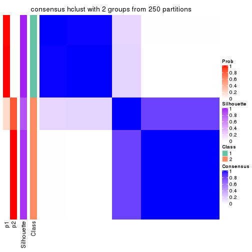</p>

</div>
<div id='tab-MAD-hclust-consensus-heatmap-2'>
<pre><code class="r">consensus_heatmap(res, k = 3)
</code></pre>

<p>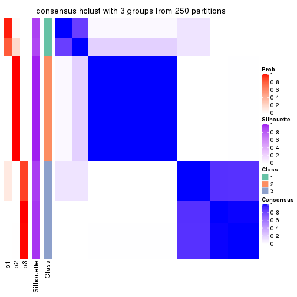</p>

</div>
<div id='tab-MAD-hclust-consensus-heatmap-3'>
<pre><code class="r">consensus_heatmap(res, k = 4)
</code></pre>

<p>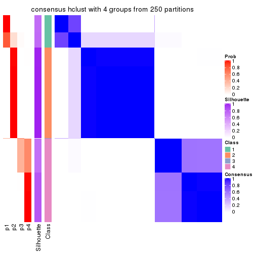</p>

</div>
<div id='tab-MAD-hclust-consensus-heatmap-4'>
<pre><code class="r">consensus_heatmap(res, k = 5)
</code></pre>

<p>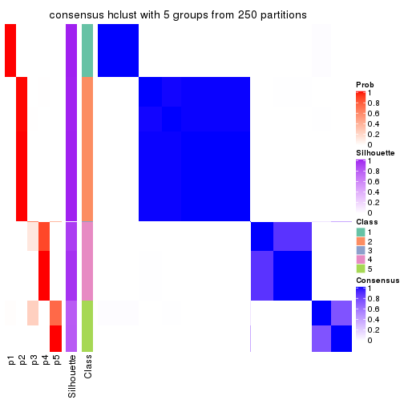</p>

</div>
<div id='tab-MAD-hclust-consensus-heatmap-5'>
<pre><code class="r">consensus_heatmap(res, k = 6)
</code></pre>

<p>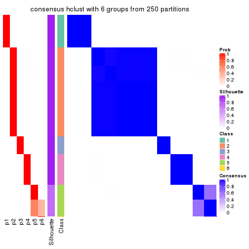</p>

</div>
</div>

Heatmaps for the membership of samples in all partitions to see how consistent they are:


<script>
$( function() {
	$( '#tabs-MAD-hclust-membership-heatmap' ).tabs();
} );
</script>
<div id='tabs-MAD-hclust-membership-heatmap'>
<ul>
<li><a href='#tab-MAD-hclust-membership-heatmap-1'>k = 2</a></li>
<li><a href='#tab-MAD-hclust-membership-heatmap-2'>k = 3</a></li>
<li><a href='#tab-MAD-hclust-membership-heatmap-3'>k = 4</a></li>
<li><a href='#tab-MAD-hclust-membership-heatmap-4'>k = 5</a></li>
<li><a href='#tab-MAD-hclust-membership-heatmap-5'>k = 6</a></li>
</ul>
<div id='tab-MAD-hclust-membership-heatmap-1'>
<pre><code class="r">membership_heatmap(res, k = 2)
</code></pre>

<p>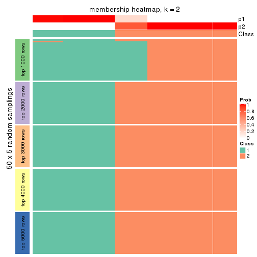</p>

</div>
<div id='tab-MAD-hclust-membership-heatmap-2'>
<pre><code class="r">membership_heatmap(res, k = 3)
</code></pre>

<p>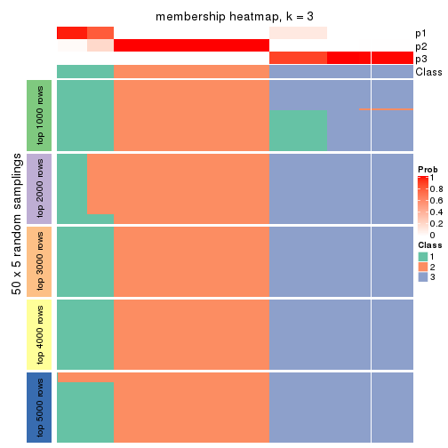</p>

</div>
<div id='tab-MAD-hclust-membership-heatmap-3'>
<pre><code class="r">membership_heatmap(res, k = 4)
</code></pre>

<p>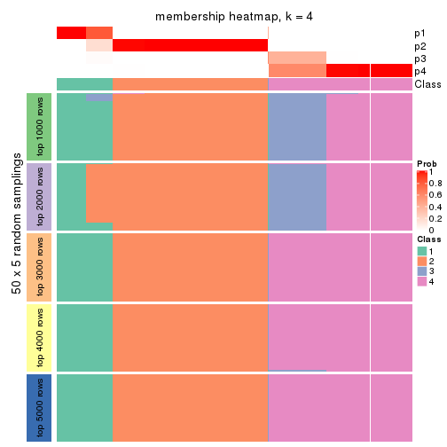</p>

</div>
<div id='tab-MAD-hclust-membership-heatmap-4'>
<pre><code class="r">membership_heatmap(res, k = 5)
</code></pre>

<p>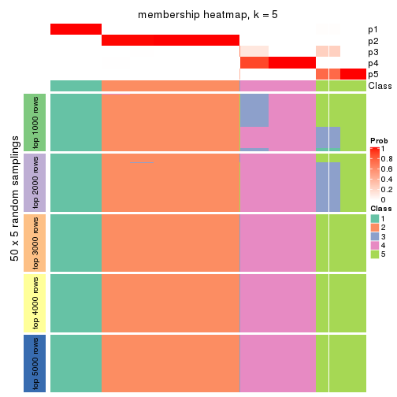</p>

</div>
<div id='tab-MAD-hclust-membership-heatmap-5'>
<pre><code class="r">membership_heatmap(res, k = 6)
</code></pre>

<p>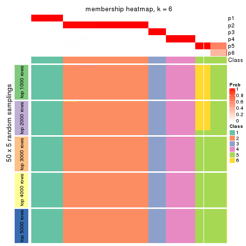</p>

</div>
</div>

As soon as we have had the classes for columns, we can look for signatures
which are significantly different between classes which can be candidate marks
for certain classes. Following are the heatmaps for signatures.


Signature heatmaps where rows are scaled:


<script>
$( function() {
	$( '#tabs-MAD-hclust-get-signatures' ).tabs();
} );
</script>
<div id='tabs-MAD-hclust-get-signatures'>
<ul>
<li><a href='#tab-MAD-hclust-get-signatures-1'>k = 2</a></li>
<li><a href='#tab-MAD-hclust-get-signatures-2'>k = 3</a></li>
<li><a href='#tab-MAD-hclust-get-signatures-3'>k = 4</a></li>
<li><a href='#tab-MAD-hclust-get-signatures-4'>k = 5</a></li>
<li><a href='#tab-MAD-hclust-get-signatures-5'>k = 6</a></li>
</ul>
<div id='tab-MAD-hclust-get-signatures-1'>
<pre><code class="r">get_signatures(res, k = 2)
</code></pre>

<p>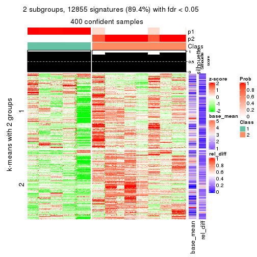</p>

</div>
<div id='tab-MAD-hclust-get-signatures-2'>
<pre><code class="r">get_signatures(res, k = 3)
</code></pre>

<p>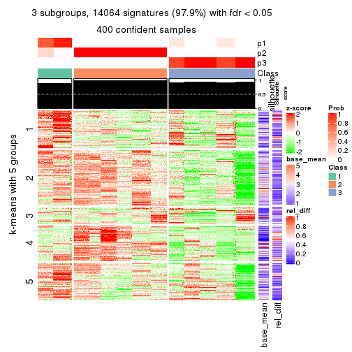</p>

</div>
<div id='tab-MAD-hclust-get-signatures-3'>
<pre><code class="r">get_signatures(res, k = 4)
</code></pre>

<pre><code>#&gt; Error in mat[ceiling(1:nr/h_ratio), ceiling(1:nc/w_ratio), drop = FALSE]: subscript out of bounds
</code></pre>

<p>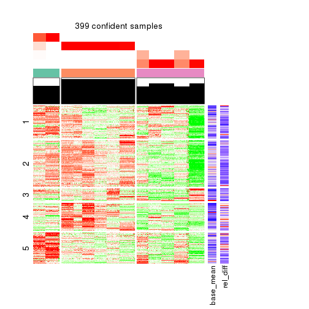</p>

</div>
<div id='tab-MAD-hclust-get-signatures-4'>
<pre><code class="r">get_signatures(res, k = 5)
</code></pre>

<pre><code>#&gt; Error in mat[ceiling(1:nr/h_ratio), ceiling(1:nc/w_ratio), drop = FALSE]: subscript out of bounds
</code></pre>

<p>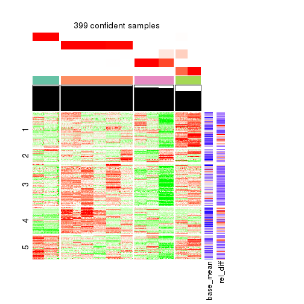</p>

</div>
<div id='tab-MAD-hclust-get-signatures-5'>
<pre><code class="r">get_signatures(res, k = 6)
</code></pre>

<pre><code>#&gt; Error in mat[ceiling(1:nr/h_ratio), ceiling(1:nc/w_ratio), drop = FALSE]: subscript out of bounds
</code></pre>

<p>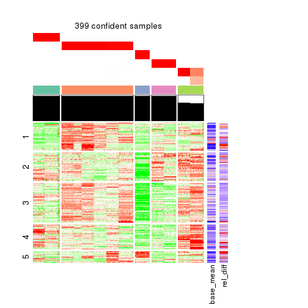</p>

</div>
</div>


Signature heatmaps where rows are not scaled:


<script>
$( function() {
	$( '#tabs-MAD-hclust-get-signatures-no-scale' ).tabs();
} );
</script>
<div id='tabs-MAD-hclust-get-signatures-no-scale'>
<ul>
<li><a href='#tab-MAD-hclust-get-signatures-no-scale-1'>k = 2</a></li>
<li><a href='#tab-MAD-hclust-get-signatures-no-scale-2'>k = 3</a></li>
<li><a href='#tab-MAD-hclust-get-signatures-no-scale-3'>k = 4</a></li>
<li><a href='#tab-MAD-hclust-get-signatures-no-scale-4'>k = 5</a></li>
<li><a href='#tab-MAD-hclust-get-signatures-no-scale-5'>k = 6</a></li>
</ul>
<div id='tab-MAD-hclust-get-signatures-no-scale-1'>
<pre><code class="r">get_signatures(res, k = 2, scale_rows = FALSE)
</code></pre>

<p>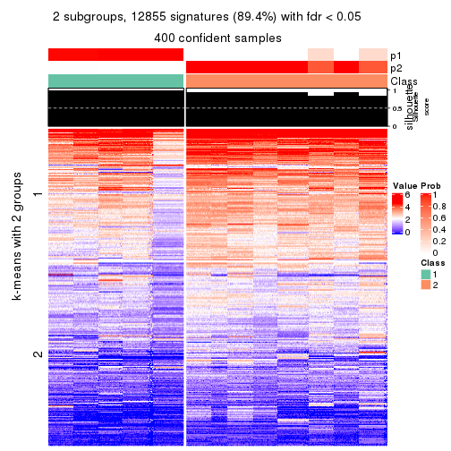</p>

</div>
<div id='tab-MAD-hclust-get-signatures-no-scale-2'>
<pre><code class="r">get_signatures(res, k = 3, scale_rows = FALSE)
</code></pre>

<p>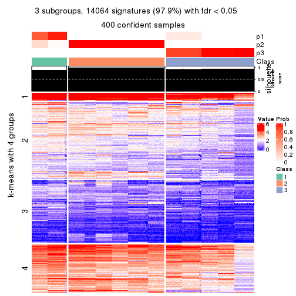</p>

</div>
<div id='tab-MAD-hclust-get-signatures-no-scale-3'>
<pre><code class="r">get_signatures(res, k = 4, scale_rows = FALSE)
</code></pre>

<pre><code>#&gt; Error in mat[ceiling(1:nr/h_ratio), ceiling(1:nc/w_ratio), drop = FALSE]: subscript out of bounds
</code></pre>

<p>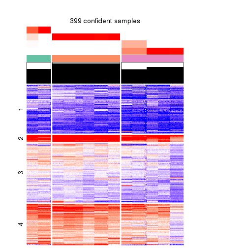</p>

</div>
<div id='tab-MAD-hclust-get-signatures-no-scale-4'>
<pre><code class="r">get_signatures(res, k = 5, scale_rows = FALSE)
</code></pre>

<pre><code>#&gt; Error in mat[ceiling(1:nr/h_ratio), ceiling(1:nc/w_ratio), drop = FALSE]: subscript out of bounds
</code></pre>

<p>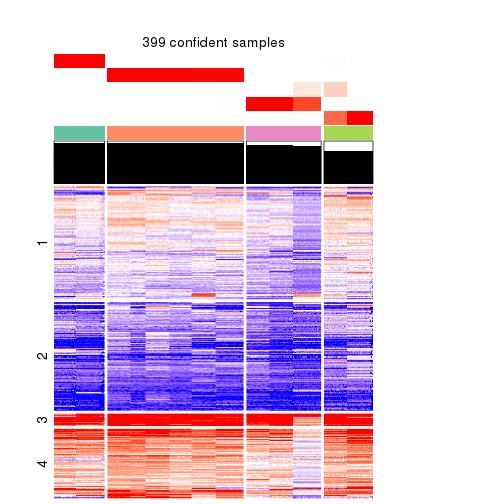</p>

</div>
<div id='tab-MAD-hclust-get-signatures-no-scale-5'>
<pre><code class="r">get_signatures(res, k = 6, scale_rows = FALSE)
</code></pre>

<pre><code>#&gt; Error in mat[ceiling(1:nr/h_ratio), ceiling(1:nc/w_ratio), drop = FALSE]: subscript out of bounds
</code></pre>

<p>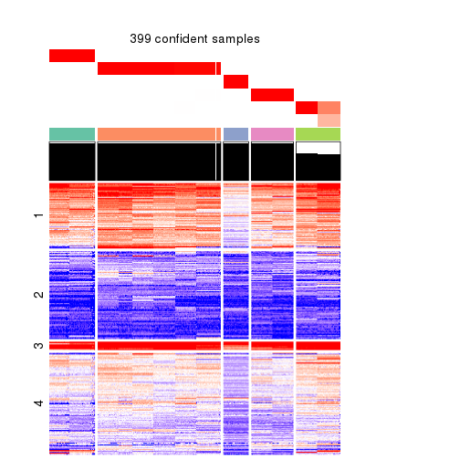</p>

</div>
</div>


Compare the overlap of signatures from different k:

```r
compare_signatures(res)
```

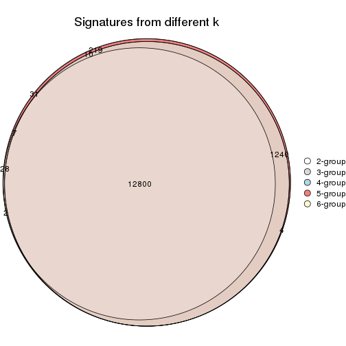

`get_signature()` returns a data frame invisibly. TO get the list of signatures, the function
call should be assigned to a variable explicitly. In following code, if `plot` argument is set
to `FALSE`, no heatmap is plotted while only the differential analysis is performed.

```r
# code only for demonstration
tb = get_signature(res, k = ..., plot = FALSE)
```

An example of the output of `tb` is:

```
#>   which_row         fdr    mean_1    mean_2 scaled_mean_1 scaled_mean_2 km
#> 1        38 0.042760348  8.373488  9.131774    -0.5533452     0.5164555  1
#> 2        40 0.018707592  7.106213  8.469186    -0.6173731     0.5762149  1
#> 3        55 0.019134737 10.221463 11.207825    -0.6159697     0.5749050  1
#> 4        59 0.006059896  5.921854  7.869574    -0.6899429     0.6439467  1
#> 5        60 0.018055526  8.928898 10.211722    -0.6204761     0.5791110  1
#> 6        98 0.009384629 15.714769 14.887706     0.6635654    -0.6193277  2
...
```

The columns in `tb` are:

1. `which_row`: row indices corresponding to the input matrix.
2. `fdr`: FDR for the differential test. 
3. `mean_x`: The mean value in group x.
4. `scaled_mean_x`: The mean value in group x after rows are scaled.
5. `km`: Row groups if k-means clustering is applied to rows.


UMAP plot which shows how samples are separated.


<script>
$( function() {
	$( '#tabs-MAD-hclust-dimension-reduction' ).tabs();
} );
</script>
<div id='tabs-MAD-hclust-dimension-reduction'>
<ul>
<li><a href='#tab-MAD-hclust-dimension-reduction-1'>k = 2</a></li>
<li><a href='#tab-MAD-hclust-dimension-reduction-2'>k = 3</a></li>
<li><a href='#tab-MAD-hclust-dimension-reduction-3'>k = 4</a></li>
<li><a href='#tab-MAD-hclust-dimension-reduction-4'>k = 5</a></li>
<li><a href='#tab-MAD-hclust-dimension-reduction-5'>k = 6</a></li>
</ul>
<div id='tab-MAD-hclust-dimension-reduction-1'>
<pre><code class="r">dimension_reduction(res, k = 2, method = &quot;UMAP&quot;)
</code></pre>

<p>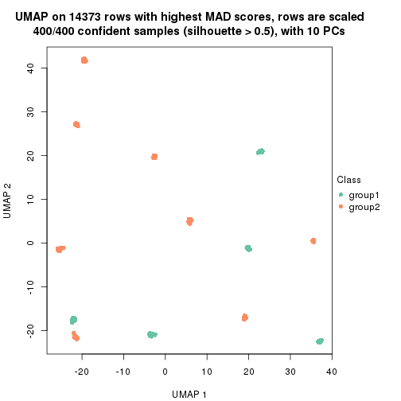</p>

</div>
<div id='tab-MAD-hclust-dimension-reduction-2'>
<pre><code class="r">dimension_reduction(res, k = 3, method = &quot;UMAP&quot;)
</code></pre>

<p>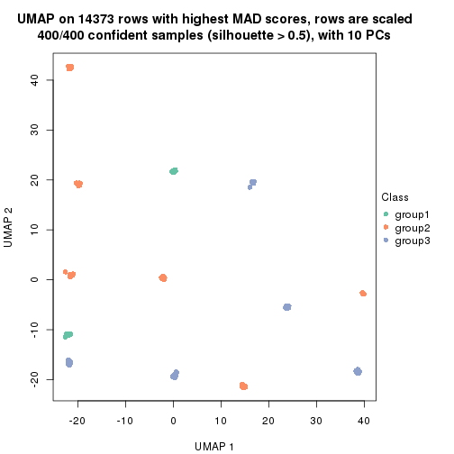</p>

</div>
<div id='tab-MAD-hclust-dimension-reduction-3'>
<pre><code class="r">dimension_reduction(res, k = 4, method = &quot;UMAP&quot;)
</code></pre>

<p>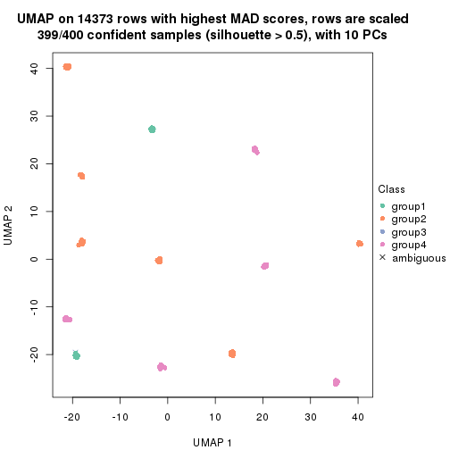</p>

</div>
<div id='tab-MAD-hclust-dimension-reduction-4'>
<pre><code class="r">dimension_reduction(res, k = 5, method = &quot;UMAP&quot;)
</code></pre>

<p>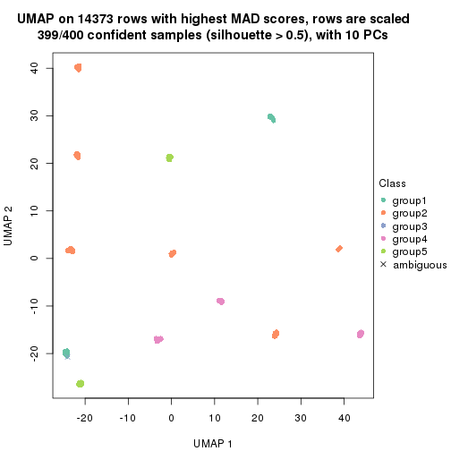</p>

</div>
<div id='tab-MAD-hclust-dimension-reduction-5'>
<pre><code class="r">dimension_reduction(res, k = 6, method = &quot;UMAP&quot;)
</code></pre>

<p>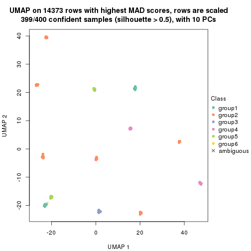</p>

</div>
</div>


Following heatmap shows how subgroups are split when increasing `k`:

```r
collect_classes(res)
```

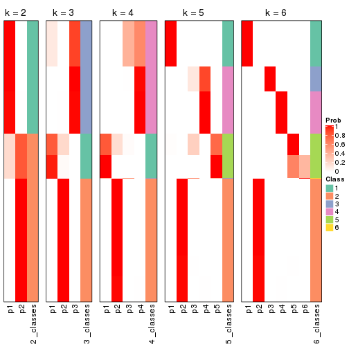


If matrix rows can be associated to genes, consider to use `GO_Enrichment(res,
...)` to perform function enrichment for the signature genes.


 

---------------------------------------------------


### MAD:kmeans


The object with results only for a single top-value method and a single partition method 
can be extracted as:

```r
res = res_list["MAD", "kmeans"]
# you can also extract it by
# res = res_list["MAD:kmeans"]
```

A summary of `res` and all the functions that can be applied to it:

```r
res
```

```
#> A 'ConsensusPartition' object with k = 2, 3, 4, 5, 6.
#>   On a matrix with 14373 rows and 400 columns.
#>   Top rows (1000, 2000, 3000, 4000, 5000) are extracted by 'MAD' method.
#>   Subgroups are detected by 'kmeans' method.
#>   Performed in total 1250 partitions by row resampling.
#>   Best k for subgroups seems to be 6.
#> 
#> Following methods can be applied to this 'ConsensusPartition' object:
#>  [1] "cola_report"             "collect_classes"         "collect_plots"          
#>  [4] "collect_stats"           "colnames"                "compare_signatures"     
#>  [7] "consensus_heatmap"       "dimension_reduction"     "functional_enrichment"  
#> [10] "get_anno_col"            "get_anno"                "get_classes"            
#> [13] "get_consensus"           "get_matrix"              "get_membership"         
#> [16] "get_param"               "get_signatures"          "get_stats"              
#> [19] "is_best_k"               "is_stable_k"             "membership_heatmap"     
#> [22] "ncol"                    "nrow"                    "plot_ecdf"              
#> [25] "rownames"                "select_partition_number" "show"                   
#> [28] "suggest_best_k"          "test_to_known_factors"
```

`collect_plots()` function collects all the plots made from `res` for all `k` (number of partitions)
into one single page to provide an easy and fast comparison between different `k`.

```r
collect_plots(res)
```

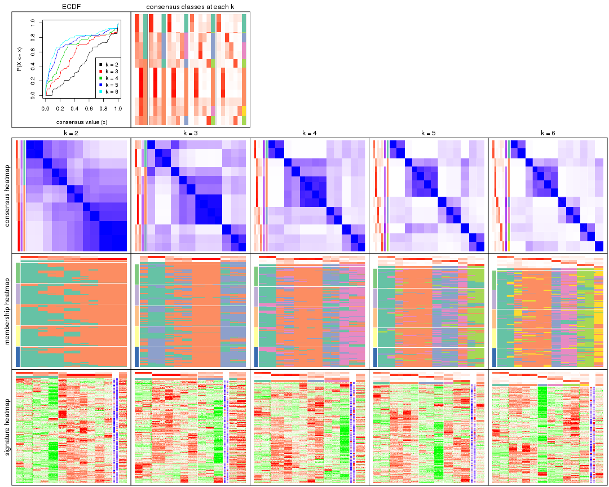

The plots are:

- The first row: a plot of the ECDF (Empirical cumulative distribution
  function) curves of the consensus matrix for each `k` and the heatmap of
  predicted classes for each `k`.
- The second row: heatmaps of the consensus matrix for each `k`.
- The third row: heatmaps of the membership matrix for each `k`.
- The fouth row: heatmaps of the signatures for each `k`.

All the plots in panels can be made by individual functions and they are
plotted later in this section.

`select_partition_number()` produces several plots showing different
statistics for choosing "optimized" `k`. There are following statistics:

- ECDF curves of the consensus matrix for each `k`;
- 1-PAC. [The PAC
  score](https://en.wikipedia.org/wiki/Consensus_clustering#Over-interpretation_potential_of_consensus_clustering)
  measures the proportion of the ambiguous subgrouping.
- Mean silhouette score.
- Concordance. The mean probability of fiting the consensus class ids in all
  partitions.
- Area increased. Denote $A_k$ as the area under the ECDF curve for current
  `k`, the area increased is defined as $A_k - A_{k-1}$.
- Rand index. The percent of pairs of samples that are both in a same cluster
  or both are not in a same cluster in the partition of k and k-1.
- Jaccard index. The ratio of pairs of samples are both in a same cluster in
  the partition of k and k-1 and the pairs of samples are both in a same
  cluster in the partition k or k-1.

The detailed explanations of these statistics can be found in [the cola
vignette](http://bioconductor.org/packages/devel/bioc/vignettes/cola/inst/doc/cola.html#toc_13).

Generally speaking, lower PAC score, higher mean silhouette score or higher
concordance corresponds to better partition. Rand index and Jaccard index
measure how similar the current partition is compared to partition with `k-1`.
If they are too similar, we won't accept `k` is better than `k-1`.

```r
select_partition_number(res)
```

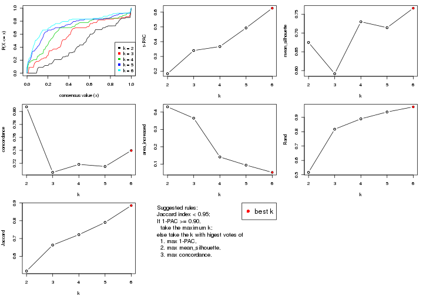

The numeric values for all these statistics can be obtained by `get_stats()`.

```r
get_stats(res)
```

```
#>   k 1-PAC mean_silhouette concordance area_increased  Rand Jaccard
#> 2 2 0.183           0.675       0.807         0.4299 0.517   0.517
#> 3 3 0.340           0.592       0.706         0.3650 0.818   0.663
#> 4 4 0.367           0.730       0.718         0.1412 0.890   0.722
#> 5 5 0.493           0.714       0.715         0.0942 0.937   0.790
#> 6 6 0.627           0.766       0.740         0.0525 0.973   0.886
```

`suggest_best_k()` suggests the best $k$ based on these statistics. The rules are as follows:

- All $k$ with Jaccard index larger than 0.95 are removed because the increase of
  the partition number does not provides enough extra information. If all $k$ are removed,
  the best $k$ is assigned by `NA`.
- For $k$ with 1-PAC larger than 0.9, the maximal $k$ is taken as the "best k". Other $k$ is called "optional k".
- If it does not fit the second rule. The $k$ with the highest vote of highest
  1-PAC, mean silhouette and concordance is taken as the "best k".

```r
suggest_best_k(res)
```

```
#> [1] 6
```


Following shows the table of the partitions (You need to click the **show/hide
code output** link to see it). The membership matrix (columns with name `p*`)
is inferred by
[`clue::cl_consensus()`](https://www.rdocumentation.org/link/cl_consensus?package=clue)
function with the `SE` method. Basically the value in the membership matrix
represents the probability to belong to a certain group. The finall class
label for an item is determined with the group with highest probability it
belongs to.

In `get_classes()` function, the entropy is calculated from the membership
matrix and the silhouette score is calculated from the consensus matrix.


<script>
$( function() {
	$( '#tabs-MAD-kmeans-get-classes' ).tabs();
} );
</script>
<div id='tabs-MAD-kmeans-get-classes'>
<ul>
<li><a href='#tab-MAD-kmeans-get-classes-1'>k = 2</a></li>
<li><a href='#tab-MAD-kmeans-get-classes-2'>k = 3</a></li>
<li><a href='#tab-MAD-kmeans-get-classes-3'>k = 4</a></li>
<li><a href='#tab-MAD-kmeans-get-classes-4'>k = 5</a></li>
<li><a href='#tab-MAD-kmeans-get-classes-5'>k = 6</a></li>
</ul>

<div id='tab-MAD-kmeans-get-classes-1'>
<p><a id='tab-MAD-kmeans-get-classes-1-a' style='color:#0366d6' href='#'>show/hide code output</a></p>
<pre><code class="r">cbind(get_classes(res, k = 2), get_membership(res, k = 2))
</code></pre>

<pre><code>#&gt;            class entropy silhouette    p1    p2
#&gt; SRR1661716     2  0.0376      0.806 0.004 0.996
#&gt; SRR1661717     2  0.0376      0.806 0.004 0.996
#&gt; SRR1661718     2  0.0376      0.806 0.004 0.996
#&gt; SRR1661719     2  0.0376      0.806 0.004 0.996
#&gt; SRR1661720     2  0.0376      0.806 0.004 0.996
#&gt; SRR1661721     2  0.0376      0.806 0.004 0.996
#&gt; SRR1661722     2  0.0376      0.806 0.004 0.996
#&gt; SRR1661723     2  0.0376      0.806 0.004 0.996
#&gt; SRR1661724     2  0.0376      0.806 0.004 0.996
#&gt; SRR1661725     2  0.0376      0.806 0.004 0.996
#&gt; SRR1661726     2  0.0376      0.806 0.004 0.996
#&gt; SRR1661727     2  0.0376      0.806 0.004 0.996
#&gt; SRR1661728     2  0.0376      0.806 0.004 0.996
#&gt; SRR1661729     2  0.0376      0.806 0.004 0.996
#&gt; SRR1661730     2  0.0376      0.806 0.004 0.996
#&gt; SRR1661731     2  0.0376      0.806 0.004 0.996
#&gt; SRR1661732     2  0.0376      0.806 0.004 0.996
#&gt; SRR1661733     2  0.0376      0.806 0.004 0.996
#&gt; SRR1661734     2  0.0376      0.806 0.004 0.996
#&gt; SRR1661735     2  0.0376      0.806 0.004 0.996
#&gt; SRR1661736     2  0.0000      0.806 0.000 1.000
#&gt; SRR1661737     2  0.0000      0.806 0.000 1.000
#&gt; SRR1661738     2  0.0000      0.806 0.000 1.000
#&gt; SRR1661739     2  0.0000      0.806 0.000 1.000
#&gt; SRR1661740     2  0.0000      0.806 0.000 1.000
#&gt; SRR1661741     2  0.0000      0.806 0.000 1.000
#&gt; SRR1661742     2  0.0000      0.806 0.000 1.000
#&gt; SRR1661743     2  0.0000      0.806 0.000 1.000
#&gt; SRR1661744     2  0.0000      0.806 0.000 1.000
#&gt; SRR1661745     2  0.0000      0.806 0.000 1.000
#&gt; SRR1661746     2  0.0000      0.806 0.000 1.000
#&gt; SRR1661747     2  0.0000      0.806 0.000 1.000
#&gt; SRR1661748     2  0.0000      0.806 0.000 1.000
#&gt; SRR1661749     2  0.0000      0.806 0.000 1.000
#&gt; SRR1661750     2  0.0000      0.806 0.000 1.000
#&gt; SRR1661751     2  0.0000      0.806 0.000 1.000
#&gt; SRR1661752     2  0.0000      0.806 0.000 1.000
#&gt; SRR1661753     2  0.0000      0.806 0.000 1.000
#&gt; SRR1661754     2  0.0000      0.806 0.000 1.000
#&gt; SRR1661755     2  0.0000      0.806 0.000 1.000
#&gt; SRR1661756     2  0.0000      0.806 0.000 1.000
#&gt; SRR1661757     2  0.0000      0.806 0.000 1.000
#&gt; SRR1661758     2  0.0000      0.806 0.000 1.000
#&gt; SRR1661759     2  0.0000      0.806 0.000 1.000
#&gt; SRR1661760     2  0.0000      0.806 0.000 1.000
#&gt; SRR1661761     2  0.0000      0.806 0.000 1.000
#&gt; SRR1661762     2  0.0000      0.806 0.000 1.000
#&gt; SRR1661763     2  0.0000      0.806 0.000 1.000
#&gt; SRR1661764     2  0.0000      0.806 0.000 1.000
#&gt; SRR1661766     2  0.0376      0.806 0.004 0.996
#&gt; SRR1661767     2  0.0376      0.806 0.004 0.996
#&gt; SRR1661768     2  0.0376      0.806 0.004 0.996
#&gt; SRR1661769     2  0.0376      0.806 0.004 0.996
#&gt; SRR1661770     2  0.0376      0.806 0.004 0.996
#&gt; SRR1661771     2  0.0376      0.806 0.004 0.996
#&gt; SRR1661772     2  0.0376      0.806 0.004 0.996
#&gt; SRR1661773     2  0.0376      0.806 0.004 0.996
#&gt; SRR1661774     2  0.0376      0.806 0.004 0.996
#&gt; SRR1661775     2  0.0376      0.806 0.004 0.996
#&gt; SRR1661776     2  0.0376      0.806 0.004 0.996
#&gt; SRR1661777     2  0.0376      0.806 0.004 0.996
#&gt; SRR1661778     2  0.0376      0.806 0.004 0.996
#&gt; SRR1661779     2  0.0376      0.806 0.004 0.996
#&gt; SRR1661780     2  0.0376      0.806 0.004 0.996
#&gt; SRR1661781     2  0.0376      0.806 0.004 0.996
#&gt; SRR1661782     2  0.0376      0.806 0.004 0.996
#&gt; SRR1661783     2  0.0376      0.806 0.004 0.996
#&gt; SRR1661784     2  0.0376      0.806 0.004 0.996
#&gt; SRR1661785     2  0.0376      0.806 0.004 0.996
#&gt; SRR1661786     2  0.0376      0.806 0.004 0.996
#&gt; SRR1661787     2  0.0376      0.806 0.004 0.996
#&gt; SRR1661788     2  0.0376      0.806 0.004 0.996
#&gt; SRR1661789     2  0.0376      0.806 0.004 0.996
#&gt; SRR1661790     2  0.0376      0.806 0.004 0.996
#&gt; SRR1661791     2  0.0376      0.806 0.004 0.996
#&gt; SRR1661792     2  0.0376      0.806 0.004 0.996
#&gt; SRR1661793     2  0.0376      0.806 0.004 0.996
#&gt; SRR1661794     2  0.0376      0.806 0.004 0.996
#&gt; SRR1661795     2  0.0376      0.806 0.004 0.996
#&gt; SRR1661796     2  0.0000      0.806 0.000 1.000
#&gt; SRR1661797     2  0.0000      0.806 0.000 1.000
#&gt; SRR1661798     2  0.0000      0.806 0.000 1.000
#&gt; SRR1661799     2  0.0000      0.806 0.000 1.000
#&gt; SRR1661800     2  0.0000      0.806 0.000 1.000
#&gt; SRR1661801     2  0.0000      0.806 0.000 1.000
#&gt; SRR1661802     2  0.0000      0.806 0.000 1.000
#&gt; SRR1661803     2  0.0000      0.806 0.000 1.000
#&gt; SRR1661804     2  0.0000      0.806 0.000 1.000
#&gt; SRR1661805     2  0.0000      0.806 0.000 1.000
#&gt; SRR1661806     2  0.0000      0.806 0.000 1.000
#&gt; SRR1661807     2  0.0000      0.806 0.000 1.000
#&gt; SRR1661808     2  0.0000      0.806 0.000 1.000
#&gt; SRR1661809     2  0.0000      0.806 0.000 1.000
#&gt; SRR1661810     2  0.0000      0.806 0.000 1.000
#&gt; SRR1661811     2  0.0000      0.806 0.000 1.000
#&gt; SRR1661812     2  0.0000      0.806 0.000 1.000
#&gt; SRR1661813     2  0.0000      0.806 0.000 1.000
#&gt; SRR1661814     2  0.0000      0.806 0.000 1.000
#&gt; SRR1661815     2  0.0000      0.806 0.000 1.000
#&gt; SRR1661816     2  0.0000      0.806 0.000 1.000
#&gt; SRR1661817     2  0.0000      0.806 0.000 1.000
#&gt; SRR1661818     2  0.0000      0.806 0.000 1.000
#&gt; SRR1661819     2  0.0000      0.806 0.000 1.000
#&gt; SRR1661820     2  0.0000      0.806 0.000 1.000
#&gt; SRR1661821     2  0.0000      0.806 0.000 1.000
#&gt; SRR1661822     2  0.0000      0.806 0.000 1.000
#&gt; SRR1661823     2  0.0000      0.806 0.000 1.000
#&gt; SRR1661824     2  0.0000      0.806 0.000 1.000
#&gt; SRR1661825     2  0.0000      0.806 0.000 1.000
#&gt; SRR1661826     1  0.4562      0.712 0.904 0.096
#&gt; SRR1661827     1  0.4562      0.712 0.904 0.096
#&gt; SRR1661828     1  0.4562      0.712 0.904 0.096
#&gt; SRR1661829     1  0.4562      0.712 0.904 0.096
#&gt; SRR1661830     1  0.4562      0.712 0.904 0.096
#&gt; SRR1661831     1  0.4562      0.712 0.904 0.096
#&gt; SRR1661832     1  0.4562      0.712 0.904 0.096
#&gt; SRR1661833     1  0.4562      0.712 0.904 0.096
#&gt; SRR1661834     1  0.4562      0.712 0.904 0.096
#&gt; SRR1661835     1  0.4562      0.712 0.904 0.096
#&gt; SRR1661836     1  0.4562      0.712 0.904 0.096
#&gt; SRR1661837     1  0.4562      0.712 0.904 0.096
#&gt; SRR1661838     1  0.4562      0.712 0.904 0.096
#&gt; SRR1661839     1  0.4562      0.712 0.904 0.096
#&gt; SRR1661840     1  0.4562      0.712 0.904 0.096
#&gt; SRR1661841     1  0.4562      0.712 0.904 0.096
#&gt; SRR1661843     1  0.4562      0.712 0.904 0.096
#&gt; SRR1661844     1  0.4562      0.712 0.904 0.096
#&gt; SRR1661845     1  0.4562      0.712 0.904 0.096
#&gt; SRR1661846     1  0.4562      0.712 0.904 0.096
#&gt; SRR1661847     1  0.4562      0.712 0.904 0.096
#&gt; SRR1661848     1  0.4562      0.712 0.904 0.096
#&gt; SRR1661849     1  0.4562      0.712 0.904 0.096
#&gt; SRR1661850     1  0.4562      0.712 0.904 0.096
#&gt; SRR1661851     1  0.4562      0.712 0.904 0.096
#&gt; SRR1661852     1  0.4562      0.712 0.904 0.096
#&gt; SRR1661853     1  0.4562      0.712 0.904 0.096
#&gt; SRR1661854     1  0.4562      0.712 0.904 0.096
#&gt; SRR1661855     1  0.4562      0.712 0.904 0.096
#&gt; SRR1661856     1  0.8207      0.707 0.744 0.256
#&gt; SRR1661857     1  0.8207      0.707 0.744 0.256
#&gt; SRR1661858     1  0.8207      0.707 0.744 0.256
#&gt; SRR1661859     1  0.8207      0.707 0.744 0.256
#&gt; SRR1661860     1  0.8207      0.707 0.744 0.256
#&gt; SRR1661861     1  0.8207      0.707 0.744 0.256
#&gt; SRR1661862     1  0.8207      0.707 0.744 0.256
#&gt; SRR1661863     1  0.8207      0.707 0.744 0.256
#&gt; SRR1661864     1  0.8207      0.707 0.744 0.256
#&gt; SRR1661865     1  0.8207      0.707 0.744 0.256
#&gt; SRR1661866     1  0.8207      0.707 0.744 0.256
#&gt; SRR1661867     1  0.8207      0.707 0.744 0.256
#&gt; SRR1661868     1  0.8207      0.707 0.744 0.256
#&gt; SRR1661869     1  0.8207      0.707 0.744 0.256
#&gt; SRR1661870     1  0.8207      0.707 0.744 0.256
#&gt; SRR1661871     1  0.8207      0.707 0.744 0.256
#&gt; SRR1661872     1  0.8207      0.707 0.744 0.256
#&gt; SRR1661873     1  0.8207      0.707 0.744 0.256
#&gt; SRR1661874     1  0.8207      0.707 0.744 0.256
#&gt; SRR1661875     1  0.8207      0.707 0.744 0.256
#&gt; SRR1661876     1  0.8207      0.707 0.744 0.256
#&gt; SRR1661877     1  0.8207      0.707 0.744 0.256
#&gt; SRR1661878     1  0.8207      0.707 0.744 0.256
#&gt; SRR1661879     1  0.8207      0.707 0.744 0.256
#&gt; SRR1661880     1  0.8207      0.707 0.744 0.256
#&gt; SRR1661881     1  0.8207      0.707 0.744 0.256
#&gt; SRR1661882     1  0.8207      0.707 0.744 0.256
#&gt; SRR1661883     1  0.8207      0.707 0.744 0.256
#&gt; SRR1661884     1  0.8207      0.707 0.744 0.256
#&gt; SRR1661885     1  0.8207      0.707 0.744 0.256
#&gt; SRR1661886     1  0.8207      0.707 0.744 0.256
#&gt; SRR1661887     1  0.8207      0.707 0.744 0.256
#&gt; SRR1661888     1  0.8207      0.707 0.744 0.256
#&gt; SRR1661889     1  0.8207      0.707 0.744 0.256
#&gt; SRR1661890     1  0.8207      0.707 0.744 0.256
#&gt; SRR1661891     1  0.8207      0.707 0.744 0.256
#&gt; SRR1661892     1  0.4690      0.713 0.900 0.100
#&gt; SRR1661893     1  0.4690      0.713 0.900 0.100
#&gt; SRR1661894     1  0.4690      0.713 0.900 0.100
#&gt; SRR1661895     1  0.4562      0.712 0.904 0.096
#&gt; SRR1661896     1  0.4690      0.713 0.900 0.100
#&gt; SRR1661897     1  0.4690      0.713 0.900 0.100
#&gt; SRR1661898     1  0.4690      0.713 0.900 0.100
#&gt; SRR1661899     1  0.4690      0.713 0.900 0.100
#&gt; SRR1661900     1  0.4690      0.713 0.900 0.100
#&gt; SRR1661901     1  0.4562      0.712 0.904 0.096
#&gt; SRR1661902     1  0.4690      0.713 0.900 0.100
#&gt; SRR1661903     1  0.4690      0.713 0.900 0.100
#&gt; SRR1661904     1  0.4690      0.713 0.900 0.100
#&gt; SRR1661905     1  0.4690      0.713 0.900 0.100
#&gt; SRR1661906     1  0.4690      0.713 0.900 0.100
#&gt; SRR1661907     1  0.4690      0.713 0.900 0.100
#&gt; SRR1661908     1  0.4562      0.712 0.904 0.096
#&gt; SRR1661909     1  0.4690      0.713 0.900 0.100
#&gt; SRR1661910     1  0.4690      0.713 0.900 0.100
#&gt; SRR1661911     1  0.4690      0.713 0.900 0.100
#&gt; SRR1661912     1  0.4690      0.713 0.900 0.100
#&gt; SRR1661913     1  0.4690      0.713 0.900 0.100
#&gt; SRR1661914     1  0.4690      0.713 0.900 0.100
#&gt; SRR1661915     1  0.4161      0.707 0.916 0.084
#&gt; SRR1661916     1  0.4690      0.713 0.900 0.100
#&gt; SRR1661917     1  0.4690      0.713 0.900 0.100
#&gt; SRR1661918     1  0.4690      0.713 0.900 0.100
#&gt; SRR1661919     1  0.4690      0.713 0.900 0.100
#&gt; SRR1661920     1  0.4690      0.713 0.900 0.100
#&gt; SRR1661921     1  0.4562      0.712 0.904 0.096
#&gt; SRR1661922     1  0.4690      0.713 0.900 0.100
#&gt; SRR1661923     1  0.4690      0.713 0.900 0.100
#&gt; SRR1661924     1  0.4562      0.712 0.904 0.096
#&gt; SRR1661925     1  0.4690      0.713 0.900 0.100
#&gt; SRR1661926     1  0.4690      0.713 0.900 0.100
#&gt; SRR1661927     1  0.4690      0.713 0.900 0.100
#&gt; SRR1661928     2  0.5946      0.731 0.144 0.856
#&gt; SRR1661929     2  0.5946      0.731 0.144 0.856
#&gt; SRR1661930     2  0.5946      0.731 0.144 0.856
#&gt; SRR1661931     2  0.5946      0.731 0.144 0.856
#&gt; SRR1661932     2  0.5946      0.731 0.144 0.856
#&gt; SRR1661933     2  0.5946      0.731 0.144 0.856
#&gt; SRR1661934     2  0.5946      0.731 0.144 0.856
#&gt; SRR1661935     2  0.5946      0.731 0.144 0.856
#&gt; SRR1661936     2  0.5946      0.731 0.144 0.856
#&gt; SRR1661937     2  0.5946      0.731 0.144 0.856
#&gt; SRR1661938     2  0.5946      0.731 0.144 0.856
#&gt; SRR1661939     2  0.5946      0.731 0.144 0.856
#&gt; SRR1661940     2  0.5946      0.731 0.144 0.856
#&gt; SRR1661941     2  0.5946      0.731 0.144 0.856
#&gt; SRR1661942     2  0.5946      0.731 0.144 0.856
#&gt; SRR1661943     2  0.5946      0.731 0.144 0.856
#&gt; SRR1661944     2  0.5946      0.731 0.144 0.856
#&gt; SRR1661945     2  0.5946      0.731 0.144 0.856
#&gt; SRR1661946     2  0.5946      0.731 0.144 0.856
#&gt; SRR1661947     2  0.5946      0.731 0.144 0.856
#&gt; SRR1661948     2  0.5946      0.731 0.144 0.856
#&gt; SRR1661949     2  0.5946      0.731 0.144 0.856
#&gt; SRR1661950     2  0.5946      0.731 0.144 0.856
#&gt; SRR1661951     2  0.5946      0.731 0.144 0.856
#&gt; SRR1661952     2  0.5946      0.731 0.144 0.856
#&gt; SRR1661953     2  0.5946      0.731 0.144 0.856
#&gt; SRR1661954     2  0.5946      0.731 0.144 0.856
#&gt; SRR1661955     2  0.5946      0.731 0.144 0.856
#&gt; SRR1661956     2  0.5946      0.731 0.144 0.856
#&gt; SRR1661957     2  0.5946      0.731 0.144 0.856
#&gt; SRR1661958     1  0.9954      0.550 0.540 0.460
#&gt; SRR1661959     1  0.9954      0.550 0.540 0.460
#&gt; SRR1661960     1  0.9954      0.550 0.540 0.460
#&gt; SRR1661961     1  0.9954      0.550 0.540 0.460
#&gt; SRR1661962     1  0.9954      0.550 0.540 0.460
#&gt; SRR1661963     1  0.9954      0.550 0.540 0.460
#&gt; SRR1661964     1  0.9954      0.550 0.540 0.460
#&gt; SRR1661965     1  0.9954      0.550 0.540 0.460
#&gt; SRR1661966     1  0.9954      0.550 0.540 0.460
#&gt; SRR1661967     1  0.9954      0.550 0.540 0.460
#&gt; SRR1661968     1  0.9954      0.550 0.540 0.460
#&gt; SRR1661969     1  0.9954      0.550 0.540 0.460
#&gt; SRR1661970     1  0.9954      0.550 0.540 0.460
#&gt; SRR1661971     1  0.9954      0.550 0.540 0.460
#&gt; SRR1661972     1  0.9954      0.550 0.540 0.460
#&gt; SRR1661973     1  0.9954      0.550 0.540 0.460
#&gt; SRR1661974     1  0.9954      0.550 0.540 0.460
#&gt; SRR1661975     1  0.9954      0.550 0.540 0.460
#&gt; SRR1661976     1  0.9954      0.550 0.540 0.460
#&gt; SRR1661977     1  0.9954      0.550 0.540 0.460
#&gt; SRR1661978     1  0.9954      0.550 0.540 0.460
#&gt; SRR1661979     1  0.9954      0.550 0.540 0.460
#&gt; SRR1661980     1  0.9954      0.550 0.540 0.460
#&gt; SRR1661981     1  0.9954      0.550 0.540 0.460
#&gt; SRR1661982     1  0.9954      0.550 0.540 0.460
#&gt; SRR1661983     1  0.9954      0.550 0.540 0.460
#&gt; SRR1661984     1  0.9954      0.550 0.540 0.460
#&gt; SRR1661985     1  0.9954      0.550 0.540 0.460
#&gt; SRR1661986     1  0.9954      0.550 0.540 0.460
#&gt; SRR1661987     1  0.9954      0.550 0.540 0.460
#&gt; SRR1661988     2  0.9850      0.377 0.428 0.572
#&gt; SRR1661989     2  0.9850      0.377 0.428 0.572
#&gt; SRR1661990     2  0.9850      0.377 0.428 0.572
#&gt; SRR1661991     2  0.9850      0.377 0.428 0.572
#&gt; SRR1661992     2  0.9850      0.377 0.428 0.572
#&gt; SRR1661993     2  0.9850      0.377 0.428 0.572
#&gt; SRR1661994     2  0.9850      0.377 0.428 0.572
#&gt; SRR1661995     2  0.9850      0.377 0.428 0.572
#&gt; SRR1661996     2  0.9850      0.377 0.428 0.572
#&gt; SRR1661997     2  0.9850      0.377 0.428 0.572
#&gt; SRR1661998     2  0.9850      0.377 0.428 0.572
#&gt; SRR1661999     2  0.9850      0.377 0.428 0.572
#&gt; SRR1662000     2  0.9850      0.377 0.428 0.572
#&gt; SRR1662001     2  0.9850      0.377 0.428 0.572
#&gt; SRR1662002     2  0.9850      0.377 0.428 0.572
#&gt; SRR1662003     2  0.9850      0.377 0.428 0.572
#&gt; SRR1662004     2  0.9850      0.377 0.428 0.572
#&gt; SRR1662005     2  0.9850      0.377 0.428 0.572
#&gt; SRR1662006     2  0.9850      0.377 0.428 0.572
#&gt; SRR1662007     2  0.9850      0.377 0.428 0.572
#&gt; SRR1662008     2  0.9850      0.377 0.428 0.572
#&gt; SRR1662009     2  0.9850      0.377 0.428 0.572
#&gt; SRR1662010     2  0.9850      0.377 0.428 0.572
#&gt; SRR1662011     2  0.9850      0.377 0.428 0.572
#&gt; SRR1662012     2  0.9850      0.377 0.428 0.572
#&gt; SRR1662013     2  0.9850      0.377 0.428 0.572
#&gt; SRR1662014     2  0.9850      0.377 0.428 0.572
#&gt; SRR1662015     2  0.9850      0.377 0.428 0.572
#&gt; SRR1662016     2  0.9850      0.377 0.428 0.572
#&gt; SRR1662017     2  0.9850      0.377 0.428 0.572
#&gt; SRR1662018     2  0.5408      0.754 0.124 0.876
#&gt; SRR1662019     2  0.5408      0.754 0.124 0.876
#&gt; SRR1662020     2  0.5408      0.754 0.124 0.876
#&gt; SRR1662021     2  0.5408      0.754 0.124 0.876
#&gt; SRR1662022     2  0.5408      0.754 0.124 0.876
#&gt; SRR1662023     2  0.5408      0.754 0.124 0.876
#&gt; SRR1662024     2  0.5408      0.754 0.124 0.876
#&gt; SRR1662025     2  0.5408      0.754 0.124 0.876
#&gt; SRR1662026     2  0.5408      0.754 0.124 0.876
#&gt; SRR1662027     2  0.5408      0.754 0.124 0.876
#&gt; SRR1662028     2  0.5408      0.754 0.124 0.876
#&gt; SRR1662029     2  0.5408      0.754 0.124 0.876
#&gt; SRR1662030     2  0.5408      0.754 0.124 0.876
#&gt; SRR1662031     2  0.5408      0.754 0.124 0.876
#&gt; SRR1662032     2  0.5408      0.754 0.124 0.876
#&gt; SRR1662033     2  0.5408      0.754 0.124 0.876
#&gt; SRR1662034     2  0.5408      0.754 0.124 0.876
#&gt; SRR1662035     2  0.5408      0.754 0.124 0.876
#&gt; SRR1662036     2  0.5408      0.754 0.124 0.876
#&gt; SRR1662037     2  0.5408      0.754 0.124 0.876
#&gt; SRR1662038     2  0.5408      0.754 0.124 0.876
#&gt; SRR1662039     2  0.5408      0.754 0.124 0.876
#&gt; SRR1662040     2  0.5408      0.754 0.124 0.876
#&gt; SRR1662041     2  0.5408      0.754 0.124 0.876
#&gt; SRR1662042     2  0.5408      0.754 0.124 0.876
#&gt; SRR1662043     2  0.5408      0.754 0.124 0.876
#&gt; SRR1662044     2  0.5408      0.754 0.124 0.876
#&gt; SRR1662045     2  0.5408      0.754 0.124 0.876
#&gt; SRR1662046     2  0.5408      0.754 0.124 0.876
#&gt; SRR1662047     2  0.5408      0.754 0.124 0.876
#&gt; SRR1662048     2  0.5408      0.754 0.124 0.876
#&gt; SRR1662049     2  0.5408      0.754 0.124 0.876
#&gt; SRR1662050     2  0.5408      0.754 0.124 0.876
#&gt; SRR1662051     2  0.5408      0.754 0.124 0.876
#&gt; SRR1662052     2  0.5408      0.754 0.124 0.876
#&gt; SRR1662053     2  0.5408      0.754 0.124 0.876
#&gt; SRR1662054     1  0.9977      0.522 0.528 0.472
#&gt; SRR1662055     1  0.9977      0.522 0.528 0.472
#&gt; SRR1662056     1  0.9977      0.522 0.528 0.472
#&gt; SRR1662057     1  0.9977      0.522 0.528 0.472
#&gt; SRR1662058     1  0.9977      0.522 0.528 0.472
#&gt; SRR1662059     1  0.9977      0.522 0.528 0.472
#&gt; SRR1662060     1  0.9977      0.522 0.528 0.472
#&gt; SRR1662061     1  0.9977      0.522 0.528 0.472
#&gt; SRR1662062     1  0.9977      0.522 0.528 0.472
#&gt; SRR1662063     1  0.9977      0.522 0.528 0.472
#&gt; SRR1662064     1  0.9977      0.522 0.528 0.472
#&gt; SRR1662065     1  0.9977      0.522 0.528 0.472
#&gt; SRR1662066     1  0.9977      0.522 0.528 0.472
#&gt; SRR1662067     1  0.9977      0.522 0.528 0.472
#&gt; SRR1662068     1  0.9977      0.522 0.528 0.472
#&gt; SRR1662069     1  0.9977      0.522 0.528 0.472
#&gt; SRR1662070     1  0.9977      0.522 0.528 0.472
#&gt; SRR1662071     1  0.9977      0.522 0.528 0.472
#&gt; SRR1662072     1  0.9977      0.522 0.528 0.472
#&gt; SRR1662073     1  0.9977      0.522 0.528 0.472
#&gt; SRR1662074     1  0.9977      0.522 0.528 0.472
#&gt; SRR1662075     1  0.9977      0.522 0.528 0.472
#&gt; SRR1662076     1  0.9977      0.522 0.528 0.472
#&gt; SRR1662077     1  0.9977      0.522 0.528 0.472
#&gt; SRR1662078     1  0.9977      0.522 0.528 0.472
#&gt; SRR1662079     1  0.9977      0.522 0.528 0.472
#&gt; SRR1662080     1  0.9977      0.522 0.528 0.472
#&gt; SRR1662081     1  0.9977      0.522 0.528 0.472
#&gt; SRR1662082     1  0.9977      0.522 0.528 0.472
#&gt; SRR1662083     1  0.9977      0.522 0.528 0.472
#&gt; SRR1662084     2  0.9358      0.523 0.352 0.648
#&gt; SRR1662085     2  0.9358      0.523 0.352 0.648
#&gt; SRR1662086     2  0.9358      0.523 0.352 0.648
#&gt; SRR1662087     2  0.9522      0.493 0.372 0.628
#&gt; SRR1662088     2  0.9358      0.523 0.352 0.648
#&gt; SRR1662089     2  0.9358      0.523 0.352 0.648
#&gt; SRR1662090     2  0.9358      0.523 0.352 0.648
#&gt; SRR1662091     2  0.9358      0.523 0.352 0.648
#&gt; SRR1662092     2  0.9358      0.523 0.352 0.648
#&gt; SRR1662093     2  0.9393      0.519 0.356 0.644
#&gt; SRR1662094     2  0.9358      0.523 0.352 0.648
#&gt; SRR1662095     2  0.9358      0.523 0.352 0.648
#&gt; SRR1662096     2  0.9358      0.523 0.352 0.648
#&gt; SRR1662097     2  0.9358      0.523 0.352 0.648
#&gt; SRR1662098     2  0.9358      0.523 0.352 0.648
#&gt; SRR1662099     2  0.9358      0.523 0.352 0.648
#&gt; SRR1662100     2  0.9358      0.523 0.352 0.648
#&gt; SRR1662101     2  0.9358      0.523 0.352 0.648
#&gt; SRR1662102     2  0.9358      0.523 0.352 0.648
#&gt; SRR1662103     2  0.9358      0.523 0.352 0.648
#&gt; SRR1662104     2  0.9358      0.523 0.352 0.648
#&gt; SRR1662105     2  0.9358      0.523 0.352 0.648
#&gt; SRR1662106     2  0.9358      0.523 0.352 0.648
#&gt; SRR1662107     2  0.9358      0.523 0.352 0.648
#&gt; SRR1662108     2  0.9358      0.523 0.352 0.648
#&gt; SRR1662109     2  0.9358      0.523 0.352 0.648
#&gt; SRR1662110     2  0.9358      0.523 0.352 0.648
#&gt; SRR1662111     1  0.7883      0.621 0.764 0.236
#&gt; SRR1662112     2  0.9358      0.523 0.352 0.648
#&gt; SRR1662113     2  0.9358      0.523 0.352 0.648
#&gt; SRR1662114     2  0.9427      0.514 0.360 0.640
#&gt; SRR1662115     2  0.9358      0.523 0.352 0.648
#&gt; SRR1662116     2  0.9358      0.523 0.352 0.648
#&gt; SRR1662117     2  0.9358      0.523 0.352 0.648
</code></pre>

<script>
$('#tab-MAD-kmeans-get-classes-1-a').parent().next().next().hide();
$('#tab-MAD-kmeans-get-classes-1-a').click(function(){
  $('#tab-MAD-kmeans-get-classes-1-a').parent().next().next().toggle();
  return(false);
});
</script>
</div>

<div id='tab-MAD-kmeans-get-classes-2'>
<p><a id='tab-MAD-kmeans-get-classes-2-a' style='color:#0366d6' href='#'>show/hide code output</a></p>
<pre><code class="r">cbind(get_classes(res, k = 3), get_membership(res, k = 3))
</code></pre>

<pre><code>#&gt;            class entropy silhouette    p1    p2    p3
#&gt; SRR1661716     2  0.0424     0.7611 0.000 0.992 0.008
#&gt; SRR1661717     2  0.0424     0.7611 0.000 0.992 0.008
#&gt; SRR1661718     2  0.0424     0.7611 0.000 0.992 0.008
#&gt; SRR1661719     2  0.0424     0.7611 0.000 0.992 0.008
#&gt; SRR1661720     2  0.0424     0.7611 0.000 0.992 0.008
#&gt; SRR1661721     2  0.0424     0.7611 0.000 0.992 0.008
#&gt; SRR1661722     2  0.0424     0.7611 0.000 0.992 0.008
#&gt; SRR1661723     2  0.0424     0.7611 0.000 0.992 0.008
#&gt; SRR1661724     2  0.0424     0.7611 0.000 0.992 0.008
#&gt; SRR1661725     2  0.0424     0.7611 0.000 0.992 0.008
#&gt; SRR1661726     2  0.0424     0.7611 0.000 0.992 0.008
#&gt; SRR1661727     2  0.0424     0.7611 0.000 0.992 0.008
#&gt; SRR1661728     2  0.0424     0.7611 0.000 0.992 0.008
#&gt; SRR1661729     2  0.0424     0.7611 0.000 0.992 0.008
#&gt; SRR1661730     2  0.0424     0.7611 0.000 0.992 0.008
#&gt; SRR1661731     2  0.0424     0.7611 0.000 0.992 0.008
#&gt; SRR1661732     2  0.0424     0.7611 0.000 0.992 0.008
#&gt; SRR1661733     2  0.0424     0.7611 0.000 0.992 0.008
#&gt; SRR1661734     2  0.0424     0.7611 0.000 0.992 0.008
#&gt; SRR1661735     2  0.0424     0.7611 0.000 0.992 0.008
#&gt; SRR1661736     2  0.0237     0.7609 0.000 0.996 0.004
#&gt; SRR1661737     2  0.0237     0.7609 0.000 0.996 0.004
#&gt; SRR1661738     2  0.0237     0.7609 0.000 0.996 0.004
#&gt; SRR1661739     2  0.0237     0.7609 0.000 0.996 0.004
#&gt; SRR1661740     2  0.0237     0.7609 0.000 0.996 0.004
#&gt; SRR1661741     2  0.0237     0.7609 0.000 0.996 0.004
#&gt; SRR1661742     2  0.0237     0.7609 0.000 0.996 0.004
#&gt; SRR1661743     2  0.0237     0.7609 0.000 0.996 0.004
#&gt; SRR1661744     2  0.0237     0.7609 0.000 0.996 0.004
#&gt; SRR1661745     2  0.0237     0.7609 0.000 0.996 0.004
#&gt; SRR1661746     2  0.0237     0.7609 0.000 0.996 0.004
#&gt; SRR1661747     2  0.0237     0.7609 0.000 0.996 0.004
#&gt; SRR1661748     2  0.0237     0.7609 0.000 0.996 0.004
#&gt; SRR1661749     2  0.0237     0.7609 0.000 0.996 0.004
#&gt; SRR1661750     2  0.0237     0.7609 0.000 0.996 0.004
#&gt; SRR1661751     2  0.0237     0.7609 0.000 0.996 0.004
#&gt; SRR1661752     2  0.0237     0.7609 0.000 0.996 0.004
#&gt; SRR1661753     2  0.0237     0.7609 0.000 0.996 0.004
#&gt; SRR1661754     2  0.0237     0.7609 0.000 0.996 0.004
#&gt; SRR1661755     2  0.0237     0.7609 0.000 0.996 0.004
#&gt; SRR1661756     2  0.0237     0.7609 0.000 0.996 0.004
#&gt; SRR1661757     2  0.0237     0.7609 0.000 0.996 0.004
#&gt; SRR1661758     2  0.0237     0.7609 0.000 0.996 0.004
#&gt; SRR1661759     2  0.0237     0.7609 0.000 0.996 0.004
#&gt; SRR1661760     2  0.0237     0.7609 0.000 0.996 0.004
#&gt; SRR1661761     2  0.0237     0.7609 0.000 0.996 0.004
#&gt; SRR1661762     2  0.0237     0.7609 0.000 0.996 0.004
#&gt; SRR1661763     2  0.0237     0.7609 0.000 0.996 0.004
#&gt; SRR1661764     2  0.0237     0.7609 0.000 0.996 0.004
#&gt; SRR1661766     2  0.0424     0.7617 0.000 0.992 0.008
#&gt; SRR1661767     2  0.0424     0.7617 0.000 0.992 0.008
#&gt; SRR1661768     2  0.0424     0.7617 0.000 0.992 0.008
#&gt; SRR1661769     2  0.0424     0.7617 0.000 0.992 0.008
#&gt; SRR1661770     2  0.0424     0.7617 0.000 0.992 0.008
#&gt; SRR1661771     2  0.0424     0.7617 0.000 0.992 0.008
#&gt; SRR1661772     2  0.0424     0.7617 0.000 0.992 0.008
#&gt; SRR1661773     2  0.0424     0.7617 0.000 0.992 0.008
#&gt; SRR1661774     2  0.0424     0.7617 0.000 0.992 0.008
#&gt; SRR1661775     2  0.0424     0.7617 0.000 0.992 0.008
#&gt; SRR1661776     2  0.0424     0.7617 0.000 0.992 0.008
#&gt; SRR1661777     2  0.0424     0.7617 0.000 0.992 0.008
#&gt; SRR1661778     2  0.0424     0.7617 0.000 0.992 0.008
#&gt; SRR1661779     2  0.0424     0.7617 0.000 0.992 0.008
#&gt; SRR1661780     2  0.0424     0.7617 0.000 0.992 0.008
#&gt; SRR1661781     2  0.0424     0.7617 0.000 0.992 0.008
#&gt; SRR1661782     2  0.0424     0.7617 0.000 0.992 0.008
#&gt; SRR1661783     2  0.0424     0.7617 0.000 0.992 0.008
#&gt; SRR1661784     2  0.0424     0.7617 0.000 0.992 0.008
#&gt; SRR1661785     2  0.0424     0.7617 0.000 0.992 0.008
#&gt; SRR1661786     2  0.0424     0.7617 0.000 0.992 0.008
#&gt; SRR1661787     2  0.0424     0.7617 0.000 0.992 0.008
#&gt; SRR1661788     2  0.0424     0.7617 0.000 0.992 0.008
#&gt; SRR1661789     2  0.0424     0.7617 0.000 0.992 0.008
#&gt; SRR1661790     2  0.0424     0.7617 0.000 0.992 0.008
#&gt; SRR1661791     2  0.0424     0.7617 0.000 0.992 0.008
#&gt; SRR1661792     2  0.0424     0.7617 0.000 0.992 0.008
#&gt; SRR1661793     2  0.0424     0.7617 0.000 0.992 0.008
#&gt; SRR1661794     2  0.0424     0.7617 0.000 0.992 0.008
#&gt; SRR1661795     2  0.0424     0.7617 0.000 0.992 0.008
#&gt; SRR1661796     2  0.0237     0.7619 0.000 0.996 0.004
#&gt; SRR1661797     2  0.0237     0.7619 0.000 0.996 0.004
#&gt; SRR1661798     2  0.0237     0.7619 0.000 0.996 0.004
#&gt; SRR1661799     2  0.0237     0.7619 0.000 0.996 0.004
#&gt; SRR1661800     2  0.0237     0.7619 0.000 0.996 0.004
#&gt; SRR1661801     2  0.0237     0.7619 0.000 0.996 0.004
#&gt; SRR1661802     2  0.0237     0.7619 0.000 0.996 0.004
#&gt; SRR1661803     2  0.0237     0.7619 0.000 0.996 0.004
#&gt; SRR1661804     2  0.0237     0.7619 0.000 0.996 0.004
#&gt; SRR1661805     2  0.0237     0.7619 0.000 0.996 0.004
#&gt; SRR1661806     2  0.0237     0.7619 0.000 0.996 0.004
#&gt; SRR1661807     2  0.0237     0.7619 0.000 0.996 0.004
#&gt; SRR1661808     2  0.0237     0.7619 0.000 0.996 0.004
#&gt; SRR1661809     2  0.0237     0.7619 0.000 0.996 0.004
#&gt; SRR1661810     2  0.0237     0.7619 0.000 0.996 0.004
#&gt; SRR1661811     2  0.0237     0.7619 0.000 0.996 0.004
#&gt; SRR1661812     2  0.0237     0.7619 0.000 0.996 0.004
#&gt; SRR1661813     2  0.0237     0.7619 0.000 0.996 0.004
#&gt; SRR1661814     2  0.0237     0.7619 0.000 0.996 0.004
#&gt; SRR1661815     2  0.0237     0.7619 0.000 0.996 0.004
#&gt; SRR1661816     2  0.0237     0.7619 0.000 0.996 0.004
#&gt; SRR1661817     2  0.0237     0.7619 0.000 0.996 0.004
#&gt; SRR1661818     2  0.0237     0.7619 0.000 0.996 0.004
#&gt; SRR1661819     2  0.0237     0.7619 0.000 0.996 0.004
#&gt; SRR1661820     2  0.0237     0.7619 0.000 0.996 0.004
#&gt; SRR1661821     2  0.0237     0.7619 0.000 0.996 0.004
#&gt; SRR1661822     2  0.0237     0.7619 0.000 0.996 0.004
#&gt; SRR1661823     2  0.0237     0.7619 0.000 0.996 0.004
#&gt; SRR1661824     2  0.0237     0.7619 0.000 0.996 0.004
#&gt; SRR1661825     2  0.0237     0.7619 0.000 0.996 0.004
#&gt; SRR1661826     1  0.2050     0.6104 0.952 0.020 0.028
#&gt; SRR1661827     1  0.2050     0.6104 0.952 0.020 0.028
#&gt; SRR1661828     1  0.2050     0.6104 0.952 0.020 0.028
#&gt; SRR1661829     1  0.2050     0.6104 0.952 0.020 0.028
#&gt; SRR1661830     1  0.2050     0.6104 0.952 0.020 0.028
#&gt; SRR1661831     1  0.2050     0.6104 0.952 0.020 0.028
#&gt; SRR1661832     1  0.2050     0.6104 0.952 0.020 0.028
#&gt; SRR1661833     1  0.2050     0.6104 0.952 0.020 0.028
#&gt; SRR1661834     1  0.2050     0.6104 0.952 0.020 0.028
#&gt; SRR1661835     1  0.2050     0.6104 0.952 0.020 0.028
#&gt; SRR1661836     1  0.2050     0.6104 0.952 0.020 0.028
#&gt; SRR1661837     1  0.2050     0.6104 0.952 0.020 0.028
#&gt; SRR1661838     1  0.2050     0.6104 0.952 0.020 0.028
#&gt; SRR1661839     1  0.2050     0.6104 0.952 0.020 0.028
#&gt; SRR1661840     1  0.2050     0.6104 0.952 0.020 0.028
#&gt; SRR1661841     1  0.2050     0.6104 0.952 0.020 0.028
#&gt; SRR1661843     1  0.2050     0.6104 0.952 0.020 0.028
#&gt; SRR1661844     1  0.2050     0.6104 0.952 0.020 0.028
#&gt; SRR1661845     1  0.2050     0.6104 0.952 0.020 0.028
#&gt; SRR1661846     1  0.2050     0.6104 0.952 0.020 0.028
#&gt; SRR1661847     1  0.2050     0.6104 0.952 0.020 0.028
#&gt; SRR1661848     1  0.2050     0.6104 0.952 0.020 0.028
#&gt; SRR1661849     1  0.2050     0.6104 0.952 0.020 0.028
#&gt; SRR1661850     1  0.2050     0.6104 0.952 0.020 0.028
#&gt; SRR1661851     1  0.2050     0.6104 0.952 0.020 0.028
#&gt; SRR1661852     1  0.2050     0.6104 0.952 0.020 0.028
#&gt; SRR1661853     1  0.2050     0.6104 0.952 0.020 0.028
#&gt; SRR1661854     1  0.2050     0.6104 0.952 0.020 0.028
#&gt; SRR1661855     1  0.2050     0.6104 0.952 0.020 0.028
#&gt; SRR1661856     3  0.8000     0.6335 0.408 0.064 0.528
#&gt; SRR1661857     3  0.8000     0.6335 0.408 0.064 0.528
#&gt; SRR1661858     3  0.8000     0.6335 0.408 0.064 0.528
#&gt; SRR1661859     3  0.8000     0.6335 0.408 0.064 0.528
#&gt; SRR1661860     3  0.8000     0.6335 0.408 0.064 0.528
#&gt; SRR1661861     3  0.8000     0.6335 0.408 0.064 0.528
#&gt; SRR1661862     3  0.8000     0.6335 0.408 0.064 0.528
#&gt; SRR1661863     3  0.8000     0.6335 0.408 0.064 0.528
#&gt; SRR1661864     3  0.8000     0.6335 0.408 0.064 0.528
#&gt; SRR1661865     3  0.8000     0.6335 0.408 0.064 0.528
#&gt; SRR1661866     3  0.8000     0.6335 0.408 0.064 0.528
#&gt; SRR1661867     3  0.8000     0.6335 0.408 0.064 0.528
#&gt; SRR1661868     3  0.8000     0.6335 0.408 0.064 0.528
#&gt; SRR1661869     3  0.8000     0.6335 0.408 0.064 0.528
#&gt; SRR1661870     3  0.8000     0.6335 0.408 0.064 0.528
#&gt; SRR1661871     3  0.8000     0.6335 0.408 0.064 0.528
#&gt; SRR1661872     3  0.8000     0.6335 0.408 0.064 0.528
#&gt; SRR1661873     3  0.8000     0.6335 0.408 0.064 0.528
#&gt; SRR1661874     3  0.8000     0.6335 0.408 0.064 0.528
#&gt; SRR1661875     3  0.8000     0.6335 0.408 0.064 0.528
#&gt; SRR1661876     3  0.8000     0.6335 0.408 0.064 0.528
#&gt; SRR1661877     3  0.8000     0.6335 0.408 0.064 0.528
#&gt; SRR1661878     3  0.8000     0.6335 0.408 0.064 0.528
#&gt; SRR1661879     3  0.8000     0.6335 0.408 0.064 0.528
#&gt; SRR1661880     3  0.8000     0.6335 0.408 0.064 0.528
#&gt; SRR1661881     3  0.8000     0.6335 0.408 0.064 0.528
#&gt; SRR1661882     3  0.8000     0.6335 0.408 0.064 0.528
#&gt; SRR1661883     3  0.8000     0.6335 0.408 0.064 0.528
#&gt; SRR1661884     3  0.8000     0.6335 0.408 0.064 0.528
#&gt; SRR1661885     3  0.8000     0.6335 0.408 0.064 0.528
#&gt; SRR1661886     3  0.8000     0.6335 0.408 0.064 0.528
#&gt; SRR1661887     3  0.8000     0.6335 0.408 0.064 0.528
#&gt; SRR1661888     3  0.8000     0.6335 0.408 0.064 0.528
#&gt; SRR1661889     3  0.8000     0.6335 0.408 0.064 0.528
#&gt; SRR1661890     3  0.8000     0.6335 0.408 0.064 0.528
#&gt; SRR1661891     3  0.8000     0.6335 0.408 0.064 0.528
#&gt; SRR1661892     1  0.2176     0.5977 0.948 0.020 0.032
#&gt; SRR1661893     1  0.2176     0.5977 0.948 0.020 0.032
#&gt; SRR1661894     1  0.2176     0.5977 0.948 0.020 0.032
#&gt; SRR1661895     1  0.2176     0.5977 0.948 0.020 0.032
#&gt; SRR1661896     1  0.2176     0.5977 0.948 0.020 0.032
#&gt; SRR1661897     1  0.2176     0.5977 0.948 0.020 0.032
#&gt; SRR1661898     1  0.2176     0.5977 0.948 0.020 0.032
#&gt; SRR1661899     1  0.2176     0.5977 0.948 0.020 0.032
#&gt; SRR1661900     1  0.2176     0.5977 0.948 0.020 0.032
#&gt; SRR1661901     1  0.2176     0.5977 0.948 0.020 0.032
#&gt; SRR1661902     1  0.2176     0.5977 0.948 0.020 0.032
#&gt; SRR1661903     1  0.2176     0.5977 0.948 0.020 0.032
#&gt; SRR1661904     1  0.2176     0.5977 0.948 0.020 0.032
#&gt; SRR1661905     1  0.2176     0.5977 0.948 0.020 0.032
#&gt; SRR1661906     1  0.2176     0.5977 0.948 0.020 0.032
#&gt; SRR1661907     1  0.2176     0.5977 0.948 0.020 0.032
#&gt; SRR1661908     1  0.2176     0.5977 0.948 0.020 0.032
#&gt; SRR1661909     1  0.2176     0.5977 0.948 0.020 0.032
#&gt; SRR1661910     1  0.2176     0.5977 0.948 0.020 0.032
#&gt; SRR1661911     1  0.2176     0.5977 0.948 0.020 0.032
#&gt; SRR1661912     1  0.2176     0.5977 0.948 0.020 0.032
#&gt; SRR1661913     1  0.2176     0.5977 0.948 0.020 0.032
#&gt; SRR1661914     1  0.2176     0.5977 0.948 0.020 0.032
#&gt; SRR1661915     1  0.2176     0.5977 0.948 0.020 0.032
#&gt; SRR1661916     1  0.2176     0.5977 0.948 0.020 0.032
#&gt; SRR1661917     1  0.2176     0.5977 0.948 0.020 0.032
#&gt; SRR1661918     1  0.2176     0.5977 0.948 0.020 0.032
#&gt; SRR1661919     1  0.2176     0.5977 0.948 0.020 0.032
#&gt; SRR1661920     1  0.2176     0.5977 0.948 0.020 0.032
#&gt; SRR1661921     1  0.2176     0.5977 0.948 0.020 0.032
#&gt; SRR1661922     1  0.2176     0.5977 0.948 0.020 0.032
#&gt; SRR1661923     1  0.2176     0.5977 0.948 0.020 0.032
#&gt; SRR1661924     1  0.2176     0.5977 0.948 0.020 0.032
#&gt; SRR1661925     1  0.2176     0.5977 0.948 0.020 0.032
#&gt; SRR1661926     1  0.2176     0.5977 0.948 0.020 0.032
#&gt; SRR1661927     1  0.2176     0.5977 0.948 0.020 0.032
#&gt; SRR1661928     2  0.7453     0.6005 0.092 0.680 0.228
#&gt; SRR1661929     2  0.7453     0.6005 0.092 0.680 0.228
#&gt; SRR1661930     2  0.7453     0.6005 0.092 0.680 0.228
#&gt; SRR1661931     2  0.7453     0.6005 0.092 0.680 0.228
#&gt; SRR1661932     2  0.7453     0.6005 0.092 0.680 0.228
#&gt; SRR1661933     2  0.7453     0.6005 0.092 0.680 0.228
#&gt; SRR1661934     2  0.7453     0.6005 0.092 0.680 0.228
#&gt; SRR1661935     2  0.7453     0.6005 0.092 0.680 0.228
#&gt; SRR1661936     2  0.7453     0.6005 0.092 0.680 0.228
#&gt; SRR1661937     2  0.7453     0.6005 0.092 0.680 0.228
#&gt; SRR1661938     2  0.7453     0.6005 0.092 0.680 0.228
#&gt; SRR1661939     2  0.7453     0.6005 0.092 0.680 0.228
#&gt; SRR1661940     2  0.7453     0.6005 0.092 0.680 0.228
#&gt; SRR1661941     2  0.7453     0.6005 0.092 0.680 0.228
#&gt; SRR1661942     2  0.7453     0.6005 0.092 0.680 0.228
#&gt; SRR1661943     2  0.7453     0.6005 0.092 0.680 0.228
#&gt; SRR1661944     2  0.7453     0.6005 0.092 0.680 0.228
#&gt; SRR1661945     2  0.7453     0.6005 0.092 0.680 0.228
#&gt; SRR1661946     2  0.7453     0.6005 0.092 0.680 0.228
#&gt; SRR1661947     2  0.7453     0.6005 0.092 0.680 0.228
#&gt; SRR1661948     2  0.7453     0.6005 0.092 0.680 0.228
#&gt; SRR1661949     2  0.7453     0.6005 0.092 0.680 0.228
#&gt; SRR1661950     2  0.7453     0.6005 0.092 0.680 0.228
#&gt; SRR1661951     2  0.7453     0.6005 0.092 0.680 0.228
#&gt; SRR1661952     2  0.7453     0.6005 0.092 0.680 0.228
#&gt; SRR1661953     2  0.7453     0.6005 0.092 0.680 0.228
#&gt; SRR1661954     2  0.7453     0.6005 0.092 0.680 0.228
#&gt; SRR1661955     2  0.7453     0.6005 0.092 0.680 0.228
#&gt; SRR1661956     2  0.7453     0.6005 0.092 0.680 0.228
#&gt; SRR1661957     2  0.7453     0.6005 0.092 0.680 0.228
#&gt; SRR1661958     3  0.9515     0.7293 0.388 0.188 0.424
#&gt; SRR1661959     3  0.9515     0.7293 0.388 0.188 0.424
#&gt; SRR1661960     3  0.9515     0.7293 0.388 0.188 0.424
#&gt; SRR1661961     3  0.9515     0.7293 0.388 0.188 0.424
#&gt; SRR1661962     3  0.9515     0.7293 0.388 0.188 0.424
#&gt; SRR1661963     3  0.9515     0.7293 0.388 0.188 0.424
#&gt; SRR1661964     3  0.9515     0.7293 0.388 0.188 0.424
#&gt; SRR1661965     3  0.9515     0.7293 0.388 0.188 0.424
#&gt; SRR1661966     3  0.9515     0.7293 0.388 0.188 0.424
#&gt; SRR1661967     3  0.9515     0.7293 0.388 0.188 0.424
#&gt; SRR1661968     3  0.9515     0.7293 0.388 0.188 0.424
#&gt; SRR1661969     3  0.9515     0.7293 0.388 0.188 0.424
#&gt; SRR1661970     3  0.9515     0.7293 0.388 0.188 0.424
#&gt; SRR1661971     3  0.9515     0.7293 0.388 0.188 0.424
#&gt; SRR1661972     3  0.9515     0.7293 0.388 0.188 0.424
#&gt; SRR1661973     3  0.9515     0.7293 0.388 0.188 0.424
#&gt; SRR1661974     3  0.9515     0.7293 0.388 0.188 0.424
#&gt; SRR1661975     3  0.9515     0.7293 0.388 0.188 0.424
#&gt; SRR1661976     3  0.9515     0.7293 0.388 0.188 0.424
#&gt; SRR1661977     3  0.9515     0.7293 0.388 0.188 0.424
#&gt; SRR1661978     3  0.9515     0.7293 0.388 0.188 0.424
#&gt; SRR1661979     3  0.9515     0.7293 0.388 0.188 0.424
#&gt; SRR1661980     3  0.9515     0.7293 0.388 0.188 0.424
#&gt; SRR1661981     3  0.9515     0.7293 0.388 0.188 0.424
#&gt; SRR1661982     3  0.9515     0.7293 0.388 0.188 0.424
#&gt; SRR1661983     3  0.9515     0.7293 0.388 0.188 0.424
#&gt; SRR1661984     3  0.9515     0.7293 0.388 0.188 0.424
#&gt; SRR1661985     3  0.9515     0.7293 0.388 0.188 0.424
#&gt; SRR1661986     3  0.9515     0.7293 0.388 0.188 0.424
#&gt; SRR1661987     3  0.9515     0.7293 0.388 0.188 0.424
#&gt; SRR1661988     1  0.9833     0.2725 0.416 0.324 0.260
#&gt; SRR1661989     1  0.9833     0.2725 0.416 0.324 0.260
#&gt; SRR1661990     1  0.9833     0.2725 0.416 0.324 0.260
#&gt; SRR1661991     1  0.9833     0.2725 0.416 0.324 0.260
#&gt; SRR1661992     1  0.9833     0.2725 0.416 0.324 0.260
#&gt; SRR1661993     1  0.9833     0.2725 0.416 0.324 0.260
#&gt; SRR1661994     1  0.9833     0.2725 0.416 0.324 0.260
#&gt; SRR1661995     1  0.9833     0.2725 0.416 0.324 0.260
#&gt; SRR1661996     1  0.9833     0.2725 0.416 0.324 0.260
#&gt; SRR1661997     1  0.9833     0.2725 0.416 0.324 0.260
#&gt; SRR1661998     1  0.9833     0.2725 0.416 0.324 0.260
#&gt; SRR1661999     1  0.9833     0.2725 0.416 0.324 0.260
#&gt; SRR1662000     1  0.9833     0.2725 0.416 0.324 0.260
#&gt; SRR1662001     1  0.9833     0.2725 0.416 0.324 0.260
#&gt; SRR1662002     1  0.9833     0.2725 0.416 0.324 0.260
#&gt; SRR1662003     1  0.9833     0.2725 0.416 0.324 0.260
#&gt; SRR1662004     1  0.9833     0.2725 0.416 0.324 0.260
#&gt; SRR1662005     1  0.9833     0.2725 0.416 0.324 0.260
#&gt; SRR1662006     1  0.9833     0.2725 0.416 0.324 0.260
#&gt; SRR1662007     1  0.9833     0.2725 0.416 0.324 0.260
#&gt; SRR1662008     1  0.9833     0.2725 0.416 0.324 0.260
#&gt; SRR1662009     1  0.9833     0.2725 0.416 0.324 0.260
#&gt; SRR1662010     1  0.9833     0.2725 0.416 0.324 0.260
#&gt; SRR1662011     1  0.9833     0.2725 0.416 0.324 0.260
#&gt; SRR1662012     1  0.9833     0.2725 0.416 0.324 0.260
#&gt; SRR1662013     1  0.9833     0.2725 0.416 0.324 0.260
#&gt; SRR1662014     1  0.9833     0.2725 0.416 0.324 0.260
#&gt; SRR1662015     1  0.9833     0.2725 0.416 0.324 0.260
#&gt; SRR1662016     1  0.9833     0.2725 0.416 0.324 0.260
#&gt; SRR1662017     1  0.9833     0.2725 0.416 0.324 0.260
#&gt; SRR1662018     2  0.7665     0.5402 0.060 0.600 0.340
#&gt; SRR1662019     2  0.7665     0.5402 0.060 0.600 0.340
#&gt; SRR1662020     2  0.7665     0.5402 0.060 0.600 0.340
#&gt; SRR1662021     2  0.7665     0.5402 0.060 0.600 0.340
#&gt; SRR1662022     2  0.7665     0.5402 0.060 0.600 0.340
#&gt; SRR1662023     2  0.7665     0.5402 0.060 0.600 0.340
#&gt; SRR1662024     2  0.7665     0.5402 0.060 0.600 0.340
#&gt; SRR1662025     2  0.7665     0.5402 0.060 0.600 0.340
#&gt; SRR1662026     2  0.7665     0.5402 0.060 0.600 0.340
#&gt; SRR1662027     2  0.7665     0.5402 0.060 0.600 0.340
#&gt; SRR1662028     2  0.7665     0.5402 0.060 0.600 0.340
#&gt; SRR1662029     2  0.7665     0.5402 0.060 0.600 0.340
#&gt; SRR1662030     2  0.7665     0.5402 0.060 0.600 0.340
#&gt; SRR1662031     2  0.7665     0.5402 0.060 0.600 0.340
#&gt; SRR1662032     2  0.7665     0.5402 0.060 0.600 0.340
#&gt; SRR1662033     2  0.7665     0.5402 0.060 0.600 0.340
#&gt; SRR1662034     2  0.7665     0.5402 0.060 0.600 0.340
#&gt; SRR1662035     2  0.7665     0.5402 0.060 0.600 0.340
#&gt; SRR1662036     2  0.7665     0.5402 0.060 0.600 0.340
#&gt; SRR1662037     2  0.7665     0.5402 0.060 0.600 0.340
#&gt; SRR1662038     2  0.7665     0.5402 0.060 0.600 0.340
#&gt; SRR1662039     2  0.7665     0.5402 0.060 0.600 0.340
#&gt; SRR1662040     2  0.7665     0.5402 0.060 0.600 0.340
#&gt; SRR1662041     2  0.7665     0.5402 0.060 0.600 0.340
#&gt; SRR1662042     2  0.7665     0.5402 0.060 0.600 0.340
#&gt; SRR1662043     2  0.7665     0.5402 0.060 0.600 0.340
#&gt; SRR1662044     2  0.7665     0.5402 0.060 0.600 0.340
#&gt; SRR1662045     2  0.7665     0.5402 0.060 0.600 0.340
#&gt; SRR1662046     2  0.7665     0.5402 0.060 0.600 0.340
#&gt; SRR1662047     2  0.7665     0.5402 0.060 0.600 0.340
#&gt; SRR1662048     2  0.7665     0.5402 0.060 0.600 0.340
#&gt; SRR1662049     2  0.7665     0.5402 0.060 0.600 0.340
#&gt; SRR1662050     2  0.7665     0.5402 0.060 0.600 0.340
#&gt; SRR1662051     2  0.7665     0.5402 0.060 0.600 0.340
#&gt; SRR1662052     2  0.7665     0.5402 0.060 0.600 0.340
#&gt; SRR1662053     2  0.7665     0.5402 0.060 0.600 0.340
#&gt; SRR1662054     3  0.9556     0.7563 0.332 0.208 0.460
#&gt; SRR1662055     3  0.9556     0.7563 0.332 0.208 0.460
#&gt; SRR1662056     3  0.9556     0.7563 0.332 0.208 0.460
#&gt; SRR1662057     3  0.9556     0.7563 0.332 0.208 0.460
#&gt; SRR1662058     3  0.9556     0.7563 0.332 0.208 0.460
#&gt; SRR1662059     3  0.9556     0.7563 0.332 0.208 0.460
#&gt; SRR1662060     3  0.9556     0.7563 0.332 0.208 0.460
#&gt; SRR1662061     3  0.9556     0.7563 0.332 0.208 0.460
#&gt; SRR1662062     3  0.9556     0.7563 0.332 0.208 0.460
#&gt; SRR1662063     3  0.9556     0.7563 0.332 0.208 0.460
#&gt; SRR1662064     3  0.9556     0.7563 0.332 0.208 0.460
#&gt; SRR1662065     3  0.9556     0.7563 0.332 0.208 0.460
#&gt; SRR1662066     3  0.9556     0.7563 0.332 0.208 0.460
#&gt; SRR1662067     3  0.9556     0.7563 0.332 0.208 0.460
#&gt; SRR1662068     3  0.9556     0.7563 0.332 0.208 0.460
#&gt; SRR1662069     3  0.9556     0.7563 0.332 0.208 0.460
#&gt; SRR1662070     3  0.9556     0.7563 0.332 0.208 0.460
#&gt; SRR1662071     3  0.9556     0.7563 0.332 0.208 0.460
#&gt; SRR1662072     3  0.9556     0.7563 0.332 0.208 0.460
#&gt; SRR1662073     3  0.9556     0.7563 0.332 0.208 0.460
#&gt; SRR1662074     3  0.9556     0.7563 0.332 0.208 0.460
#&gt; SRR1662075     3  0.9556     0.7563 0.332 0.208 0.460
#&gt; SRR1662076     3  0.9556     0.7563 0.332 0.208 0.460
#&gt; SRR1662077     3  0.9556     0.7563 0.332 0.208 0.460
#&gt; SRR1662078     3  0.9556     0.7563 0.332 0.208 0.460
#&gt; SRR1662079     3  0.9556     0.7563 0.332 0.208 0.460
#&gt; SRR1662080     3  0.9556     0.7563 0.332 0.208 0.460
#&gt; SRR1662081     3  0.9556     0.7563 0.332 0.208 0.460
#&gt; SRR1662082     3  0.9556     0.7563 0.332 0.208 0.460
#&gt; SRR1662083     3  0.9556     0.7563 0.332 0.208 0.460
#&gt; SRR1662084     2  0.9830     0.0381 0.316 0.420 0.264
#&gt; SRR1662085     2  0.9830     0.0381 0.316 0.420 0.264
#&gt; SRR1662086     2  0.9830     0.0381 0.316 0.420 0.264
#&gt; SRR1662087     2  0.9896    -0.1037 0.360 0.376 0.264
#&gt; SRR1662088     2  0.9830     0.0381 0.316 0.420 0.264
#&gt; SRR1662089     2  0.9830     0.0381 0.316 0.420 0.264
#&gt; SRR1662090     2  0.9830     0.0381 0.316 0.420 0.264
#&gt; SRR1662091     2  0.9830     0.0381 0.316 0.420 0.264
#&gt; SRR1662092     2  0.9830     0.0381 0.316 0.420 0.264
#&gt; SRR1662093     2  0.9865    -0.0130 0.332 0.404 0.264
#&gt; SRR1662094     2  0.9830     0.0381 0.316 0.420 0.264
#&gt; SRR1662095     2  0.9830     0.0381 0.316 0.420 0.264
#&gt; SRR1662096     2  0.9830     0.0381 0.316 0.420 0.264
#&gt; SRR1662097     2  0.9830     0.0381 0.316 0.420 0.264
#&gt; SRR1662098     2  0.9830     0.0381 0.316 0.420 0.264
#&gt; SRR1662099     2  0.9830     0.0381 0.316 0.420 0.264
#&gt; SRR1662100     2  0.9830     0.0381 0.316 0.420 0.264
#&gt; SRR1662101     2  0.9830     0.0381 0.316 0.420 0.264
#&gt; SRR1662102     2  0.9830     0.0381 0.316 0.420 0.264
#&gt; SRR1662103     2  0.9830     0.0381 0.316 0.420 0.264
#&gt; SRR1662104     2  0.9830     0.0381 0.316 0.420 0.264
#&gt; SRR1662105     2  0.9830     0.0381 0.316 0.420 0.264
#&gt; SRR1662106     2  0.9830     0.0381 0.316 0.420 0.264
#&gt; SRR1662107     2  0.9830     0.0381 0.316 0.420 0.264
#&gt; SRR1662108     2  0.9830     0.0381 0.316 0.420 0.264
#&gt; SRR1662109     2  0.9830     0.0381 0.316 0.420 0.264
#&gt; SRR1662110     2  0.9830     0.0381 0.316 0.420 0.264
#&gt; SRR1662111     1  0.8109     0.4065 0.620 0.108 0.272
#&gt; SRR1662112     2  0.9830     0.0381 0.316 0.420 0.264
#&gt; SRR1662113     2  0.9830     0.0381 0.316 0.420 0.264
#&gt; SRR1662114     2  0.9865    -0.0130 0.332 0.404 0.264
#&gt; SRR1662115     2  0.9830     0.0381 0.316 0.420 0.264
#&gt; SRR1662116     2  0.9830     0.0381 0.316 0.420 0.264
#&gt; SRR1662117     2  0.9830     0.0381 0.316 0.420 0.264
</code></pre>

<script>
$('#tab-MAD-kmeans-get-classes-2-a').parent().next().next().hide();
$('#tab-MAD-kmeans-get-classes-2-a').click(function(){
  $('#tab-MAD-kmeans-get-classes-2-a').parent().next().next().toggle();
  return(false);
});
</script>
</div>

<div id='tab-MAD-kmeans-get-classes-3'>
<p><a id='tab-MAD-kmeans-get-classes-3-a' style='color:#0366d6' href='#'>show/hide code output</a></p>
<pre><code class="r">cbind(get_classes(res, k = 4), get_membership(res, k = 4))
</code></pre>

<pre><code>#&gt;            class entropy silhouette    p1    p2    p3    p4
#&gt; SRR1661716     2  0.2227      0.764 0.000 0.928 0.036 0.036
#&gt; SRR1661717     2  0.2227      0.764 0.000 0.928 0.036 0.036
#&gt; SRR1661718     2  0.2227      0.764 0.000 0.928 0.036 0.036
#&gt; SRR1661719     2  0.2227      0.764 0.000 0.928 0.036 0.036
#&gt; SRR1661720     2  0.2227      0.764 0.000 0.928 0.036 0.036
#&gt; SRR1661721     2  0.2227      0.764 0.000 0.928 0.036 0.036
#&gt; SRR1661722     2  0.2227      0.764 0.000 0.928 0.036 0.036
#&gt; SRR1661723     2  0.2227      0.764 0.000 0.928 0.036 0.036
#&gt; SRR1661724     2  0.2227      0.764 0.000 0.928 0.036 0.036
#&gt; SRR1661725     2  0.2227      0.764 0.000 0.928 0.036 0.036
#&gt; SRR1661726     2  0.2227      0.764 0.000 0.928 0.036 0.036
#&gt; SRR1661727     2  0.2227      0.764 0.000 0.928 0.036 0.036
#&gt; SRR1661728     2  0.2227      0.764 0.000 0.928 0.036 0.036
#&gt; SRR1661729     2  0.2227      0.764 0.000 0.928 0.036 0.036
#&gt; SRR1661730     2  0.2227      0.764 0.000 0.928 0.036 0.036
#&gt; SRR1661731     2  0.2227      0.764 0.000 0.928 0.036 0.036
#&gt; SRR1661732     2  0.2227      0.764 0.000 0.928 0.036 0.036
#&gt; SRR1661733     2  0.2227      0.764 0.000 0.928 0.036 0.036
#&gt; SRR1661734     2  0.2227      0.764 0.000 0.928 0.036 0.036
#&gt; SRR1661735     2  0.2227      0.764 0.000 0.928 0.036 0.036
#&gt; SRR1661736     2  0.1284      0.765 0.000 0.964 0.024 0.012
#&gt; SRR1661737     2  0.1284      0.765 0.000 0.964 0.024 0.012
#&gt; SRR1661738     2  0.1284      0.765 0.000 0.964 0.024 0.012
#&gt; SRR1661739     2  0.1284      0.765 0.000 0.964 0.024 0.012
#&gt; SRR1661740     2  0.1284      0.765 0.000 0.964 0.024 0.012
#&gt; SRR1661741     2  0.1284      0.765 0.000 0.964 0.024 0.012
#&gt; SRR1661742     2  0.1284      0.765 0.000 0.964 0.024 0.012
#&gt; SRR1661743     2  0.1284      0.765 0.000 0.964 0.024 0.012
#&gt; SRR1661744     2  0.1284      0.765 0.000 0.964 0.024 0.012
#&gt; SRR1661745     2  0.1284      0.765 0.000 0.964 0.024 0.012
#&gt; SRR1661746     2  0.1284      0.765 0.000 0.964 0.024 0.012
#&gt; SRR1661747     2  0.1284      0.765 0.000 0.964 0.024 0.012
#&gt; SRR1661748     2  0.1284      0.765 0.000 0.964 0.024 0.012
#&gt; SRR1661749     2  0.1284      0.765 0.000 0.964 0.024 0.012
#&gt; SRR1661750     2  0.1284      0.765 0.000 0.964 0.024 0.012
#&gt; SRR1661751     2  0.1284      0.765 0.000 0.964 0.024 0.012
#&gt; SRR1661752     2  0.1284      0.765 0.000 0.964 0.024 0.012
#&gt; SRR1661753     2  0.1284      0.765 0.000 0.964 0.024 0.012
#&gt; SRR1661754     2  0.1284      0.765 0.000 0.964 0.024 0.012
#&gt; SRR1661755     2  0.1284      0.765 0.000 0.964 0.024 0.012
#&gt; SRR1661756     2  0.1284      0.765 0.000 0.964 0.024 0.012
#&gt; SRR1661757     2  0.1284      0.765 0.000 0.964 0.024 0.012
#&gt; SRR1661758     2  0.1284      0.765 0.000 0.964 0.024 0.012
#&gt; SRR1661759     2  0.1284      0.765 0.000 0.964 0.024 0.012
#&gt; SRR1661760     2  0.1284      0.765 0.000 0.964 0.024 0.012
#&gt; SRR1661761     2  0.1284      0.765 0.000 0.964 0.024 0.012
#&gt; SRR1661762     2  0.1284      0.765 0.000 0.964 0.024 0.012
#&gt; SRR1661763     2  0.1284      0.765 0.000 0.964 0.024 0.012
#&gt; SRR1661764     2  0.1284      0.765 0.000 0.964 0.024 0.012
#&gt; SRR1661766     2  0.1624      0.765 0.000 0.952 0.028 0.020
#&gt; SRR1661767     2  0.1624      0.765 0.000 0.952 0.028 0.020
#&gt; SRR1661768     2  0.1624      0.765 0.000 0.952 0.028 0.020
#&gt; SRR1661769     2  0.1624      0.765 0.000 0.952 0.028 0.020
#&gt; SRR1661770     2  0.1624      0.765 0.000 0.952 0.028 0.020
#&gt; SRR1661771     2  0.1624      0.765 0.000 0.952 0.028 0.020
#&gt; SRR1661772     2  0.1624      0.765 0.000 0.952 0.028 0.020
#&gt; SRR1661773     2  0.1624      0.765 0.000 0.952 0.028 0.020
#&gt; SRR1661774     2  0.1624      0.765 0.000 0.952 0.028 0.020
#&gt; SRR1661775     2  0.1624      0.765 0.000 0.952 0.028 0.020
#&gt; SRR1661776     2  0.1624      0.765 0.000 0.952 0.028 0.020
#&gt; SRR1661777     2  0.1624      0.765 0.000 0.952 0.028 0.020
#&gt; SRR1661778     2  0.1624      0.765 0.000 0.952 0.028 0.020
#&gt; SRR1661779     2  0.1624      0.765 0.000 0.952 0.028 0.020
#&gt; SRR1661780     2  0.1624      0.765 0.000 0.952 0.028 0.020
#&gt; SRR1661781     2  0.1624      0.765 0.000 0.952 0.028 0.020
#&gt; SRR1661782     2  0.1624      0.765 0.000 0.952 0.028 0.020
#&gt; SRR1661783     2  0.1624      0.765 0.000 0.952 0.028 0.020
#&gt; SRR1661784     2  0.1624      0.765 0.000 0.952 0.028 0.020
#&gt; SRR1661785     2  0.1624      0.765 0.000 0.952 0.028 0.020
#&gt; SRR1661786     2  0.1624      0.765 0.000 0.952 0.028 0.020
#&gt; SRR1661787     2  0.1624      0.765 0.000 0.952 0.028 0.020
#&gt; SRR1661788     2  0.1624      0.765 0.000 0.952 0.028 0.020
#&gt; SRR1661789     2  0.1624      0.765 0.000 0.952 0.028 0.020
#&gt; SRR1661790     2  0.1624      0.765 0.000 0.952 0.028 0.020
#&gt; SRR1661791     2  0.1624      0.765 0.000 0.952 0.028 0.020
#&gt; SRR1661792     2  0.1624      0.765 0.000 0.952 0.028 0.020
#&gt; SRR1661793     2  0.1624      0.765 0.000 0.952 0.028 0.020
#&gt; SRR1661794     2  0.1624      0.765 0.000 0.952 0.028 0.020
#&gt; SRR1661795     2  0.1624      0.765 0.000 0.952 0.028 0.020
#&gt; SRR1661796     2  0.0592      0.768 0.000 0.984 0.016 0.000
#&gt; SRR1661797     2  0.0592      0.768 0.000 0.984 0.016 0.000
#&gt; SRR1661798     2  0.0592      0.768 0.000 0.984 0.016 0.000
#&gt; SRR1661799     2  0.0592      0.768 0.000 0.984 0.016 0.000
#&gt; SRR1661800     2  0.0592      0.768 0.000 0.984 0.016 0.000
#&gt; SRR1661801     2  0.0592      0.768 0.000 0.984 0.016 0.000
#&gt; SRR1661802     2  0.0592      0.768 0.000 0.984 0.016 0.000
#&gt; SRR1661803     2  0.0592      0.768 0.000 0.984 0.016 0.000
#&gt; SRR1661804     2  0.0592      0.768 0.000 0.984 0.016 0.000
#&gt; SRR1661805     2  0.0592      0.768 0.000 0.984 0.016 0.000
#&gt; SRR1661806     2  0.0592      0.768 0.000 0.984 0.016 0.000
#&gt; SRR1661807     2  0.0592      0.768 0.000 0.984 0.016 0.000
#&gt; SRR1661808     2  0.0592      0.768 0.000 0.984 0.016 0.000
#&gt; SRR1661809     2  0.0592      0.768 0.000 0.984 0.016 0.000
#&gt; SRR1661810     2  0.0592      0.768 0.000 0.984 0.016 0.000
#&gt; SRR1661811     2  0.0592      0.768 0.000 0.984 0.016 0.000
#&gt; SRR1661812     2  0.0592      0.768 0.000 0.984 0.016 0.000
#&gt; SRR1661813     2  0.0592      0.768 0.000 0.984 0.016 0.000
#&gt; SRR1661814     2  0.0592      0.768 0.000 0.984 0.016 0.000
#&gt; SRR1661815     2  0.0592      0.768 0.000 0.984 0.016 0.000
#&gt; SRR1661816     2  0.0592      0.768 0.000 0.984 0.016 0.000
#&gt; SRR1661817     2  0.0592      0.768 0.000 0.984 0.016 0.000
#&gt; SRR1661818     2  0.0592      0.768 0.000 0.984 0.016 0.000
#&gt; SRR1661819     2  0.0592      0.768 0.000 0.984 0.016 0.000
#&gt; SRR1661820     2  0.0592      0.768 0.000 0.984 0.016 0.000
#&gt; SRR1661821     2  0.0592      0.768 0.000 0.984 0.016 0.000
#&gt; SRR1661822     2  0.0592      0.768 0.000 0.984 0.016 0.000
#&gt; SRR1661823     2  0.0592      0.768 0.000 0.984 0.016 0.000
#&gt; SRR1661824     2  0.0592      0.768 0.000 0.984 0.016 0.000
#&gt; SRR1661825     2  0.0592      0.768 0.000 0.984 0.016 0.000
#&gt; SRR1661826     1  0.2599      0.926 0.912 0.004 0.064 0.020
#&gt; SRR1661827     1  0.2599      0.926 0.912 0.004 0.064 0.020
#&gt; SRR1661828     1  0.2599      0.926 0.912 0.004 0.064 0.020
#&gt; SRR1661829     1  0.2599      0.926 0.912 0.004 0.064 0.020
#&gt; SRR1661830     1  0.2599      0.926 0.912 0.004 0.064 0.020
#&gt; SRR1661831     1  0.2599      0.926 0.912 0.004 0.064 0.020
#&gt; SRR1661832     1  0.2599      0.926 0.912 0.004 0.064 0.020
#&gt; SRR1661833     1  0.2599      0.926 0.912 0.004 0.064 0.020
#&gt; SRR1661834     1  0.2599      0.926 0.912 0.004 0.064 0.020
#&gt; SRR1661835     1  0.2599      0.926 0.912 0.004 0.064 0.020
#&gt; SRR1661836     1  0.2599      0.926 0.912 0.004 0.064 0.020
#&gt; SRR1661837     1  0.2599      0.926 0.912 0.004 0.064 0.020
#&gt; SRR1661838     1  0.2599      0.926 0.912 0.004 0.064 0.020
#&gt; SRR1661839     1  0.2599      0.926 0.912 0.004 0.064 0.020
#&gt; SRR1661840     1  0.2599      0.926 0.912 0.004 0.064 0.020
#&gt; SRR1661841     1  0.2599      0.926 0.912 0.004 0.064 0.020
#&gt; SRR1661843     1  0.2599      0.926 0.912 0.004 0.064 0.020
#&gt; SRR1661844     1  0.2599      0.926 0.912 0.004 0.064 0.020
#&gt; SRR1661845     1  0.2599      0.926 0.912 0.004 0.064 0.020
#&gt; SRR1661846     1  0.2599      0.926 0.912 0.004 0.064 0.020
#&gt; SRR1661847     1  0.2599      0.926 0.912 0.004 0.064 0.020
#&gt; SRR1661848     1  0.2599      0.926 0.912 0.004 0.064 0.020
#&gt; SRR1661849     1  0.2599      0.926 0.912 0.004 0.064 0.020
#&gt; SRR1661850     1  0.2599      0.926 0.912 0.004 0.064 0.020
#&gt; SRR1661851     1  0.2599      0.926 0.912 0.004 0.064 0.020
#&gt; SRR1661852     1  0.2599      0.926 0.912 0.004 0.064 0.020
#&gt; SRR1661853     1  0.2599      0.926 0.912 0.004 0.064 0.020
#&gt; SRR1661854     1  0.2599      0.926 0.912 0.004 0.064 0.020
#&gt; SRR1661855     1  0.2599      0.926 0.912 0.004 0.064 0.020
#&gt; SRR1661856     4  0.7699      0.507 0.308 0.020 0.152 0.520
#&gt; SRR1661857     4  0.7699      0.507 0.308 0.020 0.152 0.520
#&gt; SRR1661858     4  0.7663      0.507 0.308 0.020 0.148 0.524
#&gt; SRR1661859     4  0.7663      0.507 0.308 0.020 0.148 0.524
#&gt; SRR1661860     4  0.7663      0.507 0.308 0.020 0.148 0.524
#&gt; SRR1661861     4  0.7663      0.507 0.308 0.020 0.148 0.524
#&gt; SRR1661862     4  0.7699      0.507 0.308 0.020 0.152 0.520
#&gt; SRR1661863     4  0.7663      0.507 0.308 0.020 0.148 0.524
#&gt; SRR1661864     4  0.7663      0.507 0.308 0.020 0.148 0.524
#&gt; SRR1661865     4  0.7663      0.507 0.308 0.020 0.148 0.524
#&gt; SRR1661866     4  0.7699      0.507 0.308 0.020 0.152 0.520
#&gt; SRR1661867     4  0.7699      0.507 0.308 0.020 0.152 0.520
#&gt; SRR1661868     4  0.7663      0.507 0.308 0.020 0.148 0.524
#&gt; SRR1661869     4  0.7663      0.507 0.308 0.020 0.148 0.524
#&gt; SRR1661870     4  0.7699      0.507 0.308 0.020 0.152 0.520
#&gt; SRR1661871     4  0.7663      0.507 0.308 0.020 0.148 0.524
#&gt; SRR1661872     4  0.7734      0.507 0.308 0.020 0.156 0.516
#&gt; SRR1661873     4  0.7663      0.507 0.308 0.020 0.148 0.524
#&gt; SRR1661874     4  0.7663      0.507 0.308 0.020 0.148 0.524
#&gt; SRR1661875     4  0.7699      0.507 0.308 0.020 0.152 0.520
#&gt; SRR1661876     4  0.7663      0.507 0.308 0.020 0.148 0.524
#&gt; SRR1661877     4  0.7699      0.507 0.308 0.020 0.152 0.520
#&gt; SRR1661878     4  0.7699      0.507 0.308 0.020 0.152 0.520
#&gt; SRR1661879     4  0.7699      0.507 0.308 0.020 0.152 0.520
#&gt; SRR1661880     4  0.7663      0.507 0.308 0.020 0.148 0.524
#&gt; SRR1661881     4  0.7663      0.507 0.308 0.020 0.148 0.524
#&gt; SRR1661882     4  0.7663      0.507 0.308 0.020 0.148 0.524
#&gt; SRR1661883     4  0.7663      0.507 0.308 0.020 0.148 0.524
#&gt; SRR1661884     4  0.7699      0.507 0.308 0.020 0.152 0.520
#&gt; SRR1661885     4  0.7734      0.507 0.308 0.020 0.156 0.516
#&gt; SRR1661886     4  0.7699      0.507 0.308 0.020 0.152 0.520
#&gt; SRR1661887     4  0.7663      0.507 0.308 0.020 0.148 0.524
#&gt; SRR1661888     4  0.7699      0.507 0.308 0.020 0.152 0.520
#&gt; SRR1661889     4  0.7699      0.507 0.308 0.020 0.152 0.520
#&gt; SRR1661890     4  0.7699      0.507 0.308 0.020 0.152 0.520
#&gt; SRR1661891     4  0.7663      0.507 0.308 0.020 0.148 0.524
#&gt; SRR1661892     1  0.1471      0.940 0.960 0.004 0.012 0.024
#&gt; SRR1661893     1  0.1471      0.940 0.960 0.004 0.012 0.024
#&gt; SRR1661894     1  0.1471      0.940 0.960 0.004 0.012 0.024
#&gt; SRR1661895     1  0.1471      0.940 0.960 0.004 0.012 0.024
#&gt; SRR1661896     1  0.1471      0.940 0.960 0.004 0.012 0.024
#&gt; SRR1661897     1  0.1471      0.940 0.960 0.004 0.012 0.024
#&gt; SRR1661898     1  0.1471      0.940 0.960 0.004 0.012 0.024
#&gt; SRR1661899     1  0.1471      0.940 0.960 0.004 0.012 0.024
#&gt; SRR1661900     1  0.1471      0.940 0.960 0.004 0.012 0.024
#&gt; SRR1661901     1  0.1471      0.940 0.960 0.004 0.012 0.024
#&gt; SRR1661902     1  0.1471      0.940 0.960 0.004 0.012 0.024
#&gt; SRR1661903     1  0.1471      0.940 0.960 0.004 0.012 0.024
#&gt; SRR1661904     1  0.1471      0.940 0.960 0.004 0.012 0.024
#&gt; SRR1661905     1  0.1471      0.940 0.960 0.004 0.012 0.024
#&gt; SRR1661906     1  0.1471      0.940 0.960 0.004 0.012 0.024
#&gt; SRR1661907     1  0.1471      0.940 0.960 0.004 0.012 0.024
#&gt; SRR1661908     1  0.1471      0.940 0.960 0.004 0.012 0.024
#&gt; SRR1661909     1  0.1471      0.940 0.960 0.004 0.012 0.024
#&gt; SRR1661910     1  0.1471      0.940 0.960 0.004 0.012 0.024
#&gt; SRR1661911     1  0.1471      0.940 0.960 0.004 0.012 0.024
#&gt; SRR1661912     1  0.1471      0.940 0.960 0.004 0.012 0.024
#&gt; SRR1661913     1  0.1471      0.940 0.960 0.004 0.012 0.024
#&gt; SRR1661914     1  0.1471      0.940 0.960 0.004 0.012 0.024
#&gt; SRR1661915     1  0.1471      0.940 0.960 0.004 0.012 0.024
#&gt; SRR1661916     1  0.1471      0.940 0.960 0.004 0.012 0.024
#&gt; SRR1661917     1  0.1471      0.940 0.960 0.004 0.012 0.024
#&gt; SRR1661918     1  0.1471      0.940 0.960 0.004 0.012 0.024
#&gt; SRR1661919     1  0.1471      0.940 0.960 0.004 0.012 0.024
#&gt; SRR1661920     1  0.1471      0.940 0.960 0.004 0.012 0.024
#&gt; SRR1661921     1  0.1471      0.940 0.960 0.004 0.012 0.024
#&gt; SRR1661922     1  0.1471      0.940 0.960 0.004 0.012 0.024
#&gt; SRR1661923     1  0.1471      0.940 0.960 0.004 0.012 0.024
#&gt; SRR1661924     1  0.1471      0.940 0.960 0.004 0.012 0.024
#&gt; SRR1661925     1  0.1471      0.940 0.960 0.004 0.012 0.024
#&gt; SRR1661926     1  0.1471      0.940 0.960 0.004 0.012 0.024
#&gt; SRR1661927     1  0.1471      0.940 0.960 0.004 0.012 0.024
#&gt; SRR1661928     2  0.7088      0.548 0.028 0.636 0.196 0.140
#&gt; SRR1661929     2  0.7088      0.548 0.028 0.636 0.196 0.140
#&gt; SRR1661930     2  0.7088      0.548 0.028 0.636 0.196 0.140
#&gt; SRR1661931     2  0.7088      0.548 0.028 0.636 0.196 0.140
#&gt; SRR1661932     2  0.7088      0.548 0.028 0.636 0.196 0.140
#&gt; SRR1661933     2  0.7088      0.548 0.028 0.636 0.196 0.140
#&gt; SRR1661934     2  0.7088      0.548 0.028 0.636 0.196 0.140
#&gt; SRR1661935     2  0.7088      0.548 0.028 0.636 0.196 0.140
#&gt; SRR1661936     2  0.7088      0.548 0.028 0.636 0.196 0.140
#&gt; SRR1661937     2  0.7088      0.548 0.028 0.636 0.196 0.140
#&gt; SRR1661938     2  0.7088      0.548 0.028 0.636 0.196 0.140
#&gt; SRR1661939     2  0.7088      0.548 0.028 0.636 0.196 0.140
#&gt; SRR1661940     2  0.7088      0.548 0.028 0.636 0.196 0.140
#&gt; SRR1661941     2  0.7088      0.548 0.028 0.636 0.196 0.140
#&gt; SRR1661942     2  0.7088      0.548 0.028 0.636 0.196 0.140
#&gt; SRR1661943     2  0.7088      0.548 0.028 0.636 0.196 0.140
#&gt; SRR1661944     2  0.7088      0.548 0.028 0.636 0.196 0.140
#&gt; SRR1661945     2  0.7088      0.548 0.028 0.636 0.196 0.140
#&gt; SRR1661946     2  0.7088      0.548 0.028 0.636 0.196 0.140
#&gt; SRR1661947     2  0.7088      0.548 0.028 0.636 0.196 0.140
#&gt; SRR1661948     2  0.7088      0.548 0.028 0.636 0.196 0.140
#&gt; SRR1661949     2  0.7088      0.548 0.028 0.636 0.196 0.140
#&gt; SRR1661950     2  0.7088      0.548 0.028 0.636 0.196 0.140
#&gt; SRR1661951     2  0.7088      0.548 0.028 0.636 0.196 0.140
#&gt; SRR1661952     2  0.7088      0.548 0.028 0.636 0.196 0.140
#&gt; SRR1661953     2  0.7088      0.548 0.028 0.636 0.196 0.140
#&gt; SRR1661954     2  0.7088      0.548 0.028 0.636 0.196 0.140
#&gt; SRR1661955     2  0.7088      0.548 0.028 0.636 0.196 0.140
#&gt; SRR1661956     2  0.7088      0.548 0.028 0.636 0.196 0.140
#&gt; SRR1661957     2  0.7088      0.548 0.028 0.636 0.196 0.140
#&gt; SRR1661958     4  0.8080      0.698 0.260 0.156 0.048 0.536
#&gt; SRR1661959     4  0.8080      0.698 0.260 0.156 0.048 0.536
#&gt; SRR1661960     4  0.8080      0.698 0.260 0.156 0.048 0.536
#&gt; SRR1661961     4  0.8080      0.698 0.260 0.156 0.048 0.536
#&gt; SRR1661962     4  0.8080      0.698 0.260 0.156 0.048 0.536
#&gt; SRR1661963     4  0.8080      0.698 0.260 0.156 0.048 0.536
#&gt; SRR1661964     4  0.8080      0.698 0.260 0.156 0.048 0.536
#&gt; SRR1661965     4  0.8080      0.698 0.260 0.156 0.048 0.536
#&gt; SRR1661966     4  0.8080      0.698 0.260 0.156 0.048 0.536
#&gt; SRR1661967     4  0.8080      0.698 0.260 0.156 0.048 0.536
#&gt; SRR1661968     4  0.8080      0.698 0.260 0.156 0.048 0.536
#&gt; SRR1661969     4  0.8080      0.698 0.260 0.156 0.048 0.536
#&gt; SRR1661970     4  0.8080      0.698 0.260 0.156 0.048 0.536
#&gt; SRR1661971     4  0.8080      0.698 0.260 0.156 0.048 0.536
#&gt; SRR1661972     4  0.8080      0.698 0.260 0.156 0.048 0.536
#&gt; SRR1661973     4  0.8080      0.698 0.260 0.156 0.048 0.536
#&gt; SRR1661974     4  0.8080      0.698 0.260 0.156 0.048 0.536
#&gt; SRR1661975     4  0.8080      0.698 0.260 0.156 0.048 0.536
#&gt; SRR1661976     4  0.8080      0.698 0.260 0.156 0.048 0.536
#&gt; SRR1661977     4  0.8080      0.698 0.260 0.156 0.048 0.536
#&gt; SRR1661978     4  0.8080      0.698 0.260 0.156 0.048 0.536
#&gt; SRR1661979     4  0.8080      0.698 0.260 0.156 0.048 0.536
#&gt; SRR1661980     4  0.8080      0.698 0.260 0.156 0.048 0.536
#&gt; SRR1661981     4  0.8080      0.698 0.260 0.156 0.048 0.536
#&gt; SRR1661982     4  0.8080      0.698 0.260 0.156 0.048 0.536
#&gt; SRR1661983     4  0.8080      0.698 0.260 0.156 0.048 0.536
#&gt; SRR1661984     4  0.8080      0.698 0.260 0.156 0.048 0.536
#&gt; SRR1661985     4  0.8080      0.698 0.260 0.156 0.048 0.536
#&gt; SRR1661986     4  0.8080      0.698 0.260 0.156 0.048 0.536
#&gt; SRR1661987     4  0.8080      0.698 0.260 0.156 0.048 0.536
#&gt; SRR1661988     3  0.9157      0.846 0.260 0.200 0.436 0.104
#&gt; SRR1661989     3  0.9157      0.846 0.260 0.200 0.436 0.104
#&gt; SRR1661990     3  0.9157      0.846 0.260 0.200 0.436 0.104
#&gt; SRR1661991     3  0.9157      0.846 0.260 0.200 0.436 0.104
#&gt; SRR1661992     3  0.9157      0.846 0.260 0.200 0.436 0.104
#&gt; SRR1661993     3  0.9157      0.846 0.260 0.200 0.436 0.104
#&gt; SRR1661994     3  0.9157      0.846 0.260 0.200 0.436 0.104
#&gt; SRR1661995     3  0.9157      0.846 0.260 0.200 0.436 0.104
#&gt; SRR1661996     3  0.9157      0.846 0.260 0.200 0.436 0.104
#&gt; SRR1661997     3  0.9157      0.846 0.260 0.200 0.436 0.104
#&gt; SRR1661998     3  0.9157      0.846 0.260 0.200 0.436 0.104
#&gt; SRR1661999     3  0.9157      0.846 0.260 0.200 0.436 0.104
#&gt; SRR1662000     3  0.9157      0.846 0.260 0.200 0.436 0.104
#&gt; SRR1662001     3  0.9157      0.846 0.260 0.200 0.436 0.104
#&gt; SRR1662002     3  0.9157      0.846 0.260 0.200 0.436 0.104
#&gt; SRR1662003     3  0.9157      0.846 0.260 0.200 0.436 0.104
#&gt; SRR1662004     3  0.9157      0.846 0.260 0.200 0.436 0.104
#&gt; SRR1662005     3  0.9157      0.846 0.260 0.200 0.436 0.104
#&gt; SRR1662006     3  0.9157      0.846 0.260 0.200 0.436 0.104
#&gt; SRR1662007     3  0.9157      0.846 0.260 0.200 0.436 0.104
#&gt; SRR1662008     3  0.9157      0.846 0.260 0.200 0.436 0.104
#&gt; SRR1662009     3  0.9157      0.846 0.260 0.200 0.436 0.104
#&gt; SRR1662010     3  0.9157      0.846 0.260 0.200 0.436 0.104
#&gt; SRR1662011     3  0.9157      0.846 0.260 0.200 0.436 0.104
#&gt; SRR1662012     3  0.9157      0.846 0.260 0.200 0.436 0.104
#&gt; SRR1662013     3  0.9157      0.846 0.260 0.200 0.436 0.104
#&gt; SRR1662014     3  0.9157      0.846 0.260 0.200 0.436 0.104
#&gt; SRR1662015     3  0.9157      0.846 0.260 0.200 0.436 0.104
#&gt; SRR1662016     3  0.9157      0.846 0.260 0.200 0.436 0.104
#&gt; SRR1662017     3  0.9157      0.846 0.260 0.200 0.436 0.104
#&gt; SRR1662018     2  0.7861      0.452 0.008 0.476 0.276 0.240
#&gt; SRR1662019     2  0.7861      0.452 0.008 0.476 0.276 0.240
#&gt; SRR1662020     2  0.7861      0.452 0.008 0.476 0.276 0.240
#&gt; SRR1662021     2  0.7861      0.452 0.008 0.476 0.276 0.240
#&gt; SRR1662022     2  0.7861      0.452 0.008 0.476 0.276 0.240
#&gt; SRR1662023     2  0.7861      0.452 0.008 0.476 0.276 0.240
#&gt; SRR1662024     2  0.7861      0.452 0.008 0.476 0.276 0.240
#&gt; SRR1662025     2  0.7861      0.452 0.008 0.476 0.276 0.240
#&gt; SRR1662026     2  0.7861      0.452 0.008 0.476 0.276 0.240
#&gt; SRR1662027     2  0.7861      0.452 0.008 0.476 0.276 0.240
#&gt; SRR1662028     2  0.7861      0.452 0.008 0.476 0.276 0.240
#&gt; SRR1662029     2  0.7861      0.452 0.008 0.476 0.276 0.240
#&gt; SRR1662030     2  0.7861      0.452 0.008 0.476 0.276 0.240
#&gt; SRR1662031     2  0.7861      0.452 0.008 0.476 0.276 0.240
#&gt; SRR1662032     2  0.7861      0.452 0.008 0.476 0.276 0.240
#&gt; SRR1662033     2  0.7861      0.452 0.008 0.476 0.276 0.240
#&gt; SRR1662034     2  0.7869      0.451 0.008 0.476 0.264 0.252
#&gt; SRR1662035     2  0.7861      0.452 0.008 0.476 0.276 0.240
#&gt; SRR1662036     2  0.7861      0.452 0.008 0.476 0.276 0.240
#&gt; SRR1662037     2  0.7861      0.452 0.008 0.476 0.276 0.240
#&gt; SRR1662038     2  0.7861      0.452 0.008 0.476 0.276 0.240
#&gt; SRR1662039     2  0.7861      0.452 0.008 0.476 0.276 0.240
#&gt; SRR1662040     2  0.7861      0.452 0.008 0.476 0.276 0.240
#&gt; SRR1662041     2  0.7869      0.451 0.008 0.476 0.264 0.252
#&gt; SRR1662042     2  0.7861      0.452 0.008 0.476 0.276 0.240
#&gt; SRR1662043     2  0.7861      0.452 0.008 0.476 0.276 0.240
#&gt; SRR1662044     2  0.7861      0.452 0.008 0.476 0.276 0.240
#&gt; SRR1662045     2  0.7861      0.452 0.008 0.476 0.276 0.240
#&gt; SRR1662046     2  0.7861      0.452 0.008 0.476 0.276 0.240
#&gt; SRR1662047     2  0.7867      0.451 0.008 0.476 0.268 0.248
#&gt; SRR1662048     2  0.7861      0.452 0.008 0.476 0.276 0.240
#&gt; SRR1662049     2  0.7861      0.452 0.008 0.476 0.276 0.240
#&gt; SRR1662050     2  0.7861      0.452 0.008 0.476 0.276 0.240
#&gt; SRR1662051     2  0.7861      0.452 0.008 0.476 0.276 0.240
#&gt; SRR1662052     2  0.7861      0.452 0.008 0.476 0.276 0.240
#&gt; SRR1662053     2  0.7861      0.452 0.008 0.476 0.276 0.240
#&gt; SRR1662054     4  0.7051      0.717 0.188 0.172 0.016 0.624
#&gt; SRR1662055     4  0.7051      0.717 0.188 0.172 0.016 0.624
#&gt; SRR1662056     4  0.7051      0.717 0.188 0.172 0.016 0.624
#&gt; SRR1662057     4  0.7051      0.717 0.188 0.172 0.016 0.624
#&gt; SRR1662058     4  0.7051      0.717 0.188 0.172 0.016 0.624
#&gt; SRR1662059     4  0.7051      0.717 0.188 0.172 0.016 0.624
#&gt; SRR1662060     4  0.7051      0.717 0.188 0.172 0.016 0.624
#&gt; SRR1662061     4  0.7051      0.717 0.188 0.172 0.016 0.624
#&gt; SRR1662062     4  0.7051      0.717 0.188 0.172 0.016 0.624
#&gt; SRR1662063     4  0.7051      0.717 0.188 0.172 0.016 0.624
#&gt; SRR1662064     4  0.7051      0.717 0.188 0.172 0.016 0.624
#&gt; SRR1662065     4  0.7051      0.717 0.188 0.172 0.016 0.624
#&gt; SRR1662066     4  0.7051      0.717 0.188 0.172 0.016 0.624
#&gt; SRR1662067     4  0.7051      0.717 0.188 0.172 0.016 0.624
#&gt; SRR1662068     4  0.7051      0.717 0.188 0.172 0.016 0.624
#&gt; SRR1662069     4  0.7051      0.717 0.188 0.172 0.016 0.624
#&gt; SRR1662070     4  0.7051      0.717 0.188 0.172 0.016 0.624
#&gt; SRR1662071     4  0.7051      0.717 0.188 0.172 0.016 0.624
#&gt; SRR1662072     4  0.7051      0.717 0.188 0.172 0.016 0.624
#&gt; SRR1662073     4  0.7051      0.717 0.188 0.172 0.016 0.624
#&gt; SRR1662074     4  0.7051      0.717 0.188 0.172 0.016 0.624
#&gt; SRR1662075     4  0.7051      0.717 0.188 0.172 0.016 0.624
#&gt; SRR1662076     4  0.7051      0.717 0.188 0.172 0.016 0.624
#&gt; SRR1662077     4  0.7051      0.717 0.188 0.172 0.016 0.624
#&gt; SRR1662078     4  0.7051      0.717 0.188 0.172 0.016 0.624
#&gt; SRR1662079     4  0.7051      0.717 0.188 0.172 0.016 0.624
#&gt; SRR1662080     4  0.7051      0.717 0.188 0.172 0.016 0.624
#&gt; SRR1662081     4  0.7051      0.717 0.188 0.172 0.016 0.624
#&gt; SRR1662082     4  0.7051      0.717 0.188 0.172 0.016 0.624
#&gt; SRR1662083     4  0.7051      0.717 0.188 0.172 0.016 0.624
#&gt; SRR1662084     3  0.7839      0.862 0.148 0.256 0.556 0.040
#&gt; SRR1662085     3  0.7839      0.862 0.148 0.256 0.556 0.040
#&gt; SRR1662086     3  0.7839      0.862 0.148 0.256 0.556 0.040
#&gt; SRR1662087     3  0.7798      0.860 0.168 0.220 0.572 0.040
#&gt; SRR1662088     3  0.7839      0.862 0.148 0.256 0.556 0.040
#&gt; SRR1662089     3  0.7839      0.862 0.148 0.256 0.556 0.040
#&gt; SRR1662090     3  0.7839      0.862 0.148 0.256 0.556 0.040
#&gt; SRR1662091     3  0.7839      0.862 0.148 0.256 0.556 0.040
#&gt; SRR1662092     3  0.7839      0.862 0.148 0.256 0.556 0.040
#&gt; SRR1662093     3  0.7839      0.862 0.148 0.256 0.556 0.040
#&gt; SRR1662094     3  0.7839      0.862 0.148 0.256 0.556 0.040
#&gt; SRR1662095     3  0.7839      0.862 0.148 0.256 0.556 0.040
#&gt; SRR1662096     3  0.7839      0.862 0.148 0.256 0.556 0.040
#&gt; SRR1662097     3  0.7839      0.862 0.148 0.256 0.556 0.040
#&gt; SRR1662098     3  0.7839      0.862 0.148 0.256 0.556 0.040
#&gt; SRR1662099     3  0.7839      0.862 0.148 0.256 0.556 0.040
#&gt; SRR1662100     3  0.7839      0.862 0.148 0.256 0.556 0.040
#&gt; SRR1662101     3  0.7839      0.862 0.148 0.256 0.556 0.040
#&gt; SRR1662102     3  0.7839      0.862 0.148 0.256 0.556 0.040
#&gt; SRR1662103     3  0.7839      0.862 0.148 0.256 0.556 0.040
#&gt; SRR1662104     3  0.7839      0.862 0.148 0.256 0.556 0.040
#&gt; SRR1662105     3  0.7839      0.862 0.148 0.256 0.556 0.040
#&gt; SRR1662106     3  0.7839      0.862 0.148 0.256 0.556 0.040
#&gt; SRR1662107     3  0.7839      0.862 0.148 0.256 0.556 0.040
#&gt; SRR1662108     3  0.7839      0.862 0.148 0.256 0.556 0.040
#&gt; SRR1662109     3  0.7839      0.862 0.148 0.256 0.556 0.040
#&gt; SRR1662110     3  0.7839      0.862 0.148 0.256 0.556 0.040
#&gt; SRR1662111     3  0.7676      0.561 0.368 0.072 0.504 0.056
#&gt; SRR1662112     3  0.7839      0.862 0.148 0.256 0.556 0.040
#&gt; SRR1662113     3  0.7839      0.862 0.148 0.256 0.556 0.040
#&gt; SRR1662114     3  0.7881      0.861 0.160 0.244 0.556 0.040
#&gt; SRR1662115     3  0.7839      0.862 0.148 0.256 0.556 0.040
#&gt; SRR1662116     3  0.7839      0.862 0.148 0.256 0.556 0.040
#&gt; SRR1662117     3  0.7839      0.862 0.148 0.256 0.556 0.040
</code></pre>

<script>
$('#tab-MAD-kmeans-get-classes-3-a').parent().next().next().hide();
$('#tab-MAD-kmeans-get-classes-3-a').click(function(){
  $('#tab-MAD-kmeans-get-classes-3-a').parent().next().next().toggle();
  return(false);
});
</script>
</div>

<div id='tab-MAD-kmeans-get-classes-4'>
<p><a id='tab-MAD-kmeans-get-classes-4-a' style='color:#0366d6' href='#'>show/hide code output</a></p>
<pre><code class="r">cbind(get_classes(res, k = 5), get_membership(res, k = 5))
</code></pre>

<pre><code>#&gt;            class entropy silhouette    p1    p2    p3    p4    p5
#&gt; SRR1661716     2   0.323      0.700 0.064 0.852 0.000 0.084 0.000
#&gt; SRR1661717     2   0.323      0.700 0.064 0.852 0.000 0.084 0.000
#&gt; SRR1661718     2   0.323      0.700 0.064 0.852 0.000 0.084 0.000
#&gt; SRR1661719     2   0.323      0.700 0.064 0.852 0.000 0.084 0.000
#&gt; SRR1661720     2   0.323      0.700 0.064 0.852 0.000 0.084 0.000
#&gt; SRR1661721     2   0.323      0.700 0.064 0.852 0.000 0.084 0.000
#&gt; SRR1661722     2   0.323      0.700 0.064 0.852 0.000 0.084 0.000
#&gt; SRR1661723     2   0.323      0.700 0.064 0.852 0.000 0.084 0.000
#&gt; SRR1661724     2   0.323      0.700 0.064 0.852 0.000 0.084 0.000
#&gt; SRR1661725     2   0.323      0.700 0.064 0.852 0.000 0.084 0.000
#&gt; SRR1661726     2   0.323      0.700 0.064 0.852 0.000 0.084 0.000
#&gt; SRR1661727     2   0.323      0.700 0.064 0.852 0.000 0.084 0.000
#&gt; SRR1661728     2   0.323      0.700 0.064 0.852 0.000 0.084 0.000
#&gt; SRR1661729     2   0.323      0.700 0.064 0.852 0.000 0.084 0.000
#&gt; SRR1661730     2   0.323      0.700 0.064 0.852 0.000 0.084 0.000
#&gt; SRR1661731     2   0.323      0.700 0.064 0.852 0.000 0.084 0.000
#&gt; SRR1661732     2   0.323      0.700 0.064 0.852 0.000 0.084 0.000
#&gt; SRR1661733     2   0.323      0.700 0.064 0.852 0.000 0.084 0.000
#&gt; SRR1661734     2   0.323      0.700 0.064 0.852 0.000 0.084 0.000
#&gt; SRR1661735     2   0.323      0.700 0.064 0.852 0.000 0.084 0.000
#&gt; SRR1661736     2   0.255      0.716 0.044 0.908 0.004 0.032 0.012
#&gt; SRR1661737     2   0.255      0.716 0.044 0.908 0.004 0.032 0.012
#&gt; SRR1661738     2   0.255      0.716 0.044 0.908 0.004 0.032 0.012
#&gt; SRR1661739     2   0.255      0.716 0.044 0.908 0.004 0.032 0.012
#&gt; SRR1661740     2   0.255      0.716 0.044 0.908 0.004 0.032 0.012
#&gt; SRR1661741     2   0.255      0.716 0.044 0.908 0.004 0.032 0.012
#&gt; SRR1661742     2   0.255      0.716 0.044 0.908 0.004 0.032 0.012
#&gt; SRR1661743     2   0.255      0.716 0.044 0.908 0.004 0.032 0.012
#&gt; SRR1661744     2   0.255      0.716 0.044 0.908 0.004 0.032 0.012
#&gt; SRR1661745     2   0.255      0.716 0.044 0.908 0.004 0.032 0.012
#&gt; SRR1661746     2   0.255      0.716 0.044 0.908 0.004 0.032 0.012
#&gt; SRR1661747     2   0.255      0.716 0.044 0.908 0.004 0.032 0.012
#&gt; SRR1661748     2   0.255      0.716 0.044 0.908 0.004 0.032 0.012
#&gt; SRR1661749     2   0.255      0.716 0.044 0.908 0.004 0.032 0.012
#&gt; SRR1661750     2   0.255      0.716 0.044 0.908 0.004 0.032 0.012
#&gt; SRR1661751     2   0.255      0.716 0.044 0.908 0.004 0.032 0.012
#&gt; SRR1661752     2   0.255      0.716 0.044 0.908 0.004 0.032 0.012
#&gt; SRR1661753     2   0.255      0.716 0.044 0.908 0.004 0.032 0.012
#&gt; SRR1661754     2   0.255      0.716 0.044 0.908 0.004 0.032 0.012
#&gt; SRR1661755     2   0.255      0.716 0.044 0.908 0.004 0.032 0.012
#&gt; SRR1661756     2   0.255      0.716 0.044 0.908 0.004 0.032 0.012
#&gt; SRR1661757     2   0.255      0.716 0.044 0.908 0.004 0.032 0.012
#&gt; SRR1661758     2   0.255      0.716 0.044 0.908 0.004 0.032 0.012
#&gt; SRR1661759     2   0.255      0.716 0.044 0.908 0.004 0.032 0.012
#&gt; SRR1661760     2   0.255      0.716 0.044 0.908 0.004 0.032 0.012
#&gt; SRR1661761     2   0.255      0.716 0.044 0.908 0.004 0.032 0.012
#&gt; SRR1661762     2   0.255      0.716 0.044 0.908 0.004 0.032 0.012
#&gt; SRR1661763     2   0.255      0.716 0.044 0.908 0.004 0.032 0.012
#&gt; SRR1661764     2   0.255      0.716 0.044 0.908 0.004 0.032 0.012
#&gt; SRR1661766     2   0.197      0.711 0.024 0.924 0.000 0.052 0.000
#&gt; SRR1661767     2   0.197      0.711 0.024 0.924 0.000 0.052 0.000
#&gt; SRR1661768     2   0.197      0.711 0.024 0.924 0.000 0.052 0.000
#&gt; SRR1661769     2   0.197      0.711 0.024 0.924 0.000 0.052 0.000
#&gt; SRR1661770     2   0.197      0.711 0.024 0.924 0.000 0.052 0.000
#&gt; SRR1661771     2   0.197      0.711 0.024 0.924 0.000 0.052 0.000
#&gt; SRR1661772     2   0.197      0.711 0.024 0.924 0.000 0.052 0.000
#&gt; SRR1661773     2   0.197      0.711 0.024 0.924 0.000 0.052 0.000
#&gt; SRR1661774     2   0.197      0.711 0.024 0.924 0.000 0.052 0.000
#&gt; SRR1661775     2   0.197      0.711 0.024 0.924 0.000 0.052 0.000
#&gt; SRR1661776     2   0.197      0.711 0.024 0.924 0.000 0.052 0.000
#&gt; SRR1661777     2   0.197      0.711 0.024 0.924 0.000 0.052 0.000
#&gt; SRR1661778     2   0.197      0.711 0.024 0.924 0.000 0.052 0.000
#&gt; SRR1661779     2   0.197      0.711 0.024 0.924 0.000 0.052 0.000
#&gt; SRR1661780     2   0.197      0.711 0.024 0.924 0.000 0.052 0.000
#&gt; SRR1661781     2   0.197      0.711 0.024 0.924 0.000 0.052 0.000
#&gt; SRR1661782     2   0.197      0.711 0.024 0.924 0.000 0.052 0.000
#&gt; SRR1661783     2   0.197      0.711 0.024 0.924 0.000 0.052 0.000
#&gt; SRR1661784     2   0.197      0.711 0.024 0.924 0.000 0.052 0.000
#&gt; SRR1661785     2   0.197      0.711 0.024 0.924 0.000 0.052 0.000
#&gt; SRR1661786     2   0.197      0.711 0.024 0.924 0.000 0.052 0.000
#&gt; SRR1661787     2   0.197      0.711 0.024 0.924 0.000 0.052 0.000
#&gt; SRR1661788     2   0.197      0.711 0.024 0.924 0.000 0.052 0.000
#&gt; SRR1661789     2   0.197      0.711 0.024 0.924 0.000 0.052 0.000
#&gt; SRR1661790     2   0.197      0.711 0.024 0.924 0.000 0.052 0.000
#&gt; SRR1661791     2   0.197      0.711 0.024 0.924 0.000 0.052 0.000
#&gt; SRR1661792     2   0.197      0.711 0.024 0.924 0.000 0.052 0.000
#&gt; SRR1661793     2   0.197      0.711 0.024 0.924 0.000 0.052 0.000
#&gt; SRR1661794     2   0.197      0.711 0.024 0.924 0.000 0.052 0.000
#&gt; SRR1661795     2   0.197      0.711 0.024 0.924 0.000 0.052 0.000
#&gt; SRR1661796     2   0.117      0.720 0.032 0.960 0.000 0.008 0.000
#&gt; SRR1661797     2   0.117      0.720 0.032 0.960 0.000 0.008 0.000
#&gt; SRR1661798     2   0.117      0.720 0.032 0.960 0.000 0.008 0.000
#&gt; SRR1661799     2   0.117      0.720 0.032 0.960 0.000 0.008 0.000
#&gt; SRR1661800     2   0.117      0.720 0.032 0.960 0.000 0.008 0.000
#&gt; SRR1661801     2   0.117      0.720 0.032 0.960 0.000 0.008 0.000
#&gt; SRR1661802     2   0.117      0.720 0.032 0.960 0.000 0.008 0.000
#&gt; SRR1661803     2   0.117      0.720 0.032 0.960 0.000 0.008 0.000
#&gt; SRR1661804     2   0.117      0.720 0.032 0.960 0.000 0.008 0.000
#&gt; SRR1661805     2   0.117      0.720 0.032 0.960 0.000 0.008 0.000
#&gt; SRR1661806     2   0.117      0.720 0.032 0.960 0.000 0.008 0.000
#&gt; SRR1661807     2   0.117      0.720 0.032 0.960 0.000 0.008 0.000
#&gt; SRR1661808     2   0.117      0.720 0.032 0.960 0.000 0.008 0.000
#&gt; SRR1661809     2   0.117      0.720 0.032 0.960 0.000 0.008 0.000
#&gt; SRR1661810     2   0.117      0.720 0.032 0.960 0.000 0.008 0.000
#&gt; SRR1661811     2   0.117      0.720 0.032 0.960 0.000 0.008 0.000
#&gt; SRR1661812     2   0.117      0.720 0.032 0.960 0.000 0.008 0.000
#&gt; SRR1661813     2   0.117      0.720 0.032 0.960 0.000 0.008 0.000
#&gt; SRR1661814     2   0.117      0.720 0.032 0.960 0.000 0.008 0.000
#&gt; SRR1661815     2   0.117      0.720 0.032 0.960 0.000 0.008 0.000
#&gt; SRR1661816     2   0.117      0.720 0.032 0.960 0.000 0.008 0.000
#&gt; SRR1661817     2   0.117      0.720 0.032 0.960 0.000 0.008 0.000
#&gt; SRR1661818     2   0.117      0.720 0.032 0.960 0.000 0.008 0.000
#&gt; SRR1661819     2   0.117      0.720 0.032 0.960 0.000 0.008 0.000
#&gt; SRR1661820     2   0.117      0.720 0.032 0.960 0.000 0.008 0.000
#&gt; SRR1661821     2   0.117      0.720 0.032 0.960 0.000 0.008 0.000
#&gt; SRR1661822     2   0.117      0.720 0.032 0.960 0.000 0.008 0.000
#&gt; SRR1661823     2   0.117      0.720 0.032 0.960 0.000 0.008 0.000
#&gt; SRR1661824     2   0.117      0.720 0.032 0.960 0.000 0.008 0.000
#&gt; SRR1661825     2   0.117      0.720 0.032 0.960 0.000 0.008 0.000
#&gt; SRR1661826     1   0.492      0.883 0.716 0.000 0.124 0.000 0.160
#&gt; SRR1661827     1   0.492      0.883 0.716 0.000 0.124 0.000 0.160
#&gt; SRR1661828     1   0.492      0.883 0.716 0.000 0.124 0.000 0.160
#&gt; SRR1661829     1   0.492      0.883 0.716 0.000 0.124 0.000 0.160
#&gt; SRR1661830     1   0.492      0.883 0.716 0.000 0.124 0.000 0.160
#&gt; SRR1661831     1   0.492      0.883 0.716 0.000 0.124 0.000 0.160
#&gt; SRR1661832     1   0.492      0.883 0.716 0.000 0.124 0.000 0.160
#&gt; SRR1661833     1   0.492      0.883 0.716 0.000 0.124 0.000 0.160
#&gt; SRR1661834     1   0.492      0.883 0.716 0.000 0.124 0.000 0.160
#&gt; SRR1661835     1   0.492      0.883 0.716 0.000 0.124 0.000 0.160
#&gt; SRR1661836     1   0.492      0.883 0.716 0.000 0.124 0.000 0.160
#&gt; SRR1661837     1   0.492      0.883 0.716 0.000 0.124 0.000 0.160
#&gt; SRR1661838     1   0.492      0.883 0.716 0.000 0.124 0.000 0.160
#&gt; SRR1661839     1   0.492      0.883 0.716 0.000 0.124 0.000 0.160
#&gt; SRR1661840     1   0.492      0.883 0.716 0.000 0.124 0.000 0.160
#&gt; SRR1661841     1   0.492      0.883 0.716 0.000 0.124 0.000 0.160
#&gt; SRR1661843     1   0.492      0.883 0.716 0.000 0.124 0.000 0.160
#&gt; SRR1661844     1   0.492      0.883 0.716 0.000 0.124 0.000 0.160
#&gt; SRR1661845     1   0.492      0.883 0.716 0.000 0.124 0.000 0.160
#&gt; SRR1661846     1   0.492      0.883 0.716 0.000 0.124 0.000 0.160
#&gt; SRR1661847     1   0.492      0.883 0.716 0.000 0.124 0.000 0.160
#&gt; SRR1661848     1   0.492      0.883 0.716 0.000 0.124 0.000 0.160
#&gt; SRR1661849     1   0.492      0.883 0.716 0.000 0.124 0.000 0.160
#&gt; SRR1661850     1   0.492      0.883 0.716 0.000 0.124 0.000 0.160
#&gt; SRR1661851     1   0.492      0.883 0.716 0.000 0.124 0.000 0.160
#&gt; SRR1661852     1   0.492      0.883 0.716 0.000 0.124 0.000 0.160
#&gt; SRR1661853     1   0.492      0.883 0.716 0.000 0.124 0.000 0.160
#&gt; SRR1661854     1   0.492      0.883 0.716 0.000 0.124 0.000 0.160
#&gt; SRR1661855     1   0.492      0.883 0.716 0.000 0.124 0.000 0.160
#&gt; SRR1661856     3   0.738      0.584 0.156 0.008 0.464 0.328 0.044
#&gt; SRR1661857     3   0.738      0.584 0.156 0.008 0.464 0.328 0.044
#&gt; SRR1661858     3   0.738      0.584 0.156 0.008 0.464 0.328 0.044
#&gt; SRR1661859     3   0.748      0.583 0.156 0.008 0.464 0.320 0.052
#&gt; SRR1661860     3   0.738      0.584 0.156 0.008 0.464 0.328 0.044
#&gt; SRR1661861     3   0.738      0.584 0.156 0.008 0.464 0.328 0.044
#&gt; SRR1661862     3   0.738      0.584 0.156 0.008 0.464 0.328 0.044
#&gt; SRR1661863     3   0.738      0.584 0.156 0.008 0.464 0.328 0.044
#&gt; SRR1661864     3   0.738      0.584 0.156 0.008 0.464 0.328 0.044
#&gt; SRR1661865     3   0.738      0.584 0.156 0.008 0.464 0.328 0.044
#&gt; SRR1661866     3   0.738      0.584 0.156 0.008 0.464 0.328 0.044
#&gt; SRR1661867     3   0.738      0.584 0.156 0.008 0.464 0.328 0.044
#&gt; SRR1661868     3   0.738      0.584 0.156 0.008 0.464 0.328 0.044
#&gt; SRR1661869     3   0.738      0.584 0.156 0.008 0.464 0.328 0.044
#&gt; SRR1661870     3   0.738      0.584 0.156 0.008 0.464 0.328 0.044
#&gt; SRR1661871     3   0.738      0.584 0.156 0.008 0.464 0.328 0.044
#&gt; SRR1661872     3   0.743      0.584 0.156 0.008 0.464 0.324 0.048
#&gt; SRR1661873     3   0.738      0.584 0.156 0.008 0.464 0.328 0.044
#&gt; SRR1661874     3   0.738      0.584 0.156 0.008 0.464 0.328 0.044
#&gt; SRR1661875     3   0.738      0.584 0.156 0.008 0.464 0.328 0.044
#&gt; SRR1661876     3   0.738      0.584 0.156 0.008 0.464 0.328 0.044
#&gt; SRR1661877     3   0.738      0.584 0.156 0.008 0.464 0.328 0.044
#&gt; SRR1661878     3   0.738      0.584 0.156 0.008 0.464 0.328 0.044
#&gt; SRR1661879     3   0.748      0.583 0.156 0.008 0.464 0.320 0.052
#&gt; SRR1661880     3   0.738      0.584 0.156 0.008 0.464 0.328 0.044
#&gt; SRR1661881     3   0.738      0.584 0.156 0.008 0.464 0.328 0.044
#&gt; SRR1661882     3   0.738      0.584 0.156 0.008 0.464 0.328 0.044
#&gt; SRR1661883     3   0.738      0.584 0.156 0.008 0.464 0.328 0.044
#&gt; SRR1661884     3   0.738      0.584 0.156 0.008 0.464 0.328 0.044
#&gt; SRR1661885     3   0.738      0.584 0.156 0.008 0.464 0.328 0.044
#&gt; SRR1661886     3   0.738      0.584 0.156 0.008 0.464 0.328 0.044
#&gt; SRR1661887     3   0.738      0.584 0.156 0.008 0.464 0.328 0.044
#&gt; SRR1661888     3   0.738      0.584 0.156 0.008 0.464 0.328 0.044
#&gt; SRR1661889     3   0.738      0.584 0.156 0.008 0.464 0.328 0.044
#&gt; SRR1661890     3   0.738      0.584 0.156 0.008 0.464 0.328 0.044
#&gt; SRR1661891     3   0.738      0.584 0.156 0.008 0.464 0.328 0.044
#&gt; SRR1661892     1   0.740      0.907 0.536 0.000 0.156 0.116 0.192
#&gt; SRR1661893     1   0.740      0.907 0.536 0.000 0.156 0.116 0.192
#&gt; SRR1661894     1   0.740      0.907 0.536 0.000 0.156 0.116 0.192
#&gt; SRR1661895     1   0.740      0.907 0.536 0.000 0.156 0.116 0.192
#&gt; SRR1661896     1   0.740      0.907 0.536 0.000 0.156 0.116 0.192
#&gt; SRR1661897     1   0.740      0.907 0.536 0.000 0.156 0.116 0.192
#&gt; SRR1661898     1   0.740      0.907 0.536 0.000 0.156 0.116 0.192
#&gt; SRR1661899     1   0.740      0.907 0.536 0.000 0.156 0.116 0.192
#&gt; SRR1661900     1   0.740      0.907 0.536 0.000 0.156 0.116 0.192
#&gt; SRR1661901     1   0.740      0.907 0.536 0.000 0.156 0.116 0.192
#&gt; SRR1661902     1   0.740      0.907 0.536 0.000 0.156 0.116 0.192
#&gt; SRR1661903     1   0.740      0.907 0.536 0.000 0.156 0.116 0.192
#&gt; SRR1661904     1   0.740      0.907 0.536 0.000 0.156 0.116 0.192
#&gt; SRR1661905     1   0.740      0.907 0.536 0.000 0.156 0.116 0.192
#&gt; SRR1661906     1   0.740      0.907 0.536 0.000 0.156 0.116 0.192
#&gt; SRR1661907     1   0.740      0.907 0.536 0.000 0.156 0.116 0.192
#&gt; SRR1661908     1   0.740      0.907 0.536 0.000 0.156 0.116 0.192
#&gt; SRR1661909     1   0.740      0.907 0.536 0.000 0.156 0.116 0.192
#&gt; SRR1661910     1   0.740      0.907 0.536 0.000 0.156 0.116 0.192
#&gt; SRR1661911     1   0.740      0.907 0.536 0.000 0.156 0.116 0.192
#&gt; SRR1661912     1   0.740      0.907 0.536 0.000 0.156 0.116 0.192
#&gt; SRR1661913     1   0.740      0.907 0.536 0.000 0.156 0.116 0.192
#&gt; SRR1661914     1   0.740      0.907 0.536 0.000 0.156 0.116 0.192
#&gt; SRR1661915     1   0.737      0.906 0.540 0.000 0.156 0.116 0.188
#&gt; SRR1661916     1   0.740      0.907 0.536 0.000 0.156 0.116 0.192
#&gt; SRR1661917     1   0.740      0.907 0.536 0.000 0.156 0.116 0.192
#&gt; SRR1661918     1   0.740      0.907 0.536 0.000 0.156 0.116 0.192
#&gt; SRR1661919     1   0.740      0.907 0.536 0.000 0.156 0.116 0.192
#&gt; SRR1661920     1   0.740      0.907 0.536 0.000 0.156 0.116 0.192
#&gt; SRR1661921     1   0.740      0.907 0.536 0.000 0.156 0.116 0.192
#&gt; SRR1661922     1   0.740      0.907 0.536 0.000 0.156 0.116 0.192
#&gt; SRR1661923     1   0.740      0.907 0.536 0.000 0.156 0.116 0.192
#&gt; SRR1661924     1   0.740      0.907 0.536 0.000 0.156 0.116 0.192
#&gt; SRR1661925     1   0.740      0.907 0.536 0.000 0.156 0.116 0.192
#&gt; SRR1661926     1   0.740      0.907 0.536 0.000 0.156 0.116 0.192
#&gt; SRR1661927     1   0.740      0.907 0.536 0.000 0.156 0.116 0.192
#&gt; SRR1661928     2   0.857     -0.144 0.056 0.476 0.140 0.188 0.140
#&gt; SRR1661929     2   0.857     -0.144 0.056 0.476 0.140 0.188 0.140
#&gt; SRR1661930     2   0.857     -0.144 0.056 0.476 0.140 0.188 0.140
#&gt; SRR1661931     2   0.857     -0.144 0.056 0.476 0.140 0.188 0.140
#&gt; SRR1661932     2   0.857     -0.144 0.056 0.476 0.140 0.188 0.140
#&gt; SRR1661933     2   0.857     -0.144 0.056 0.476 0.140 0.188 0.140
#&gt; SRR1661934     2   0.857     -0.144 0.056 0.476 0.140 0.188 0.140
#&gt; SRR1661935     2   0.857     -0.144 0.056 0.476 0.140 0.188 0.140
#&gt; SRR1661936     2   0.857     -0.144 0.056 0.476 0.140 0.188 0.140
#&gt; SRR1661937     2   0.857     -0.144 0.056 0.476 0.140 0.188 0.140
#&gt; SRR1661938     2   0.857     -0.144 0.056 0.476 0.140 0.188 0.140
#&gt; SRR1661939     2   0.857     -0.144 0.056 0.476 0.140 0.188 0.140
#&gt; SRR1661940     2   0.857     -0.144 0.056 0.476 0.140 0.188 0.140
#&gt; SRR1661941     2   0.857     -0.144 0.056 0.476 0.140 0.188 0.140
#&gt; SRR1661942     2   0.857     -0.144 0.056 0.476 0.140 0.188 0.140
#&gt; SRR1661943     2   0.857     -0.144 0.056 0.476 0.140 0.188 0.140
#&gt; SRR1661944     2   0.857     -0.144 0.056 0.476 0.140 0.188 0.140
#&gt; SRR1661945     2   0.857     -0.144 0.056 0.476 0.140 0.188 0.140
#&gt; SRR1661946     2   0.857     -0.144 0.056 0.476 0.140 0.188 0.140
#&gt; SRR1661947     2   0.857     -0.144 0.056 0.476 0.140 0.188 0.140
#&gt; SRR1661948     2   0.857     -0.144 0.056 0.476 0.140 0.188 0.140
#&gt; SRR1661949     2   0.857     -0.144 0.056 0.476 0.140 0.188 0.140
#&gt; SRR1661950     2   0.857     -0.144 0.056 0.476 0.140 0.188 0.140
#&gt; SRR1661951     2   0.857     -0.144 0.056 0.476 0.140 0.188 0.140
#&gt; SRR1661952     2   0.857     -0.144 0.056 0.476 0.140 0.188 0.140
#&gt; SRR1661953     2   0.857     -0.144 0.056 0.476 0.140 0.188 0.140
#&gt; SRR1661954     2   0.857     -0.144 0.056 0.476 0.140 0.188 0.140
#&gt; SRR1661955     2   0.857     -0.144 0.056 0.476 0.140 0.188 0.140
#&gt; SRR1661956     2   0.857     -0.144 0.056 0.476 0.140 0.188 0.140
#&gt; SRR1661957     2   0.857     -0.144 0.056 0.476 0.140 0.188 0.140
#&gt; SRR1661958     3   0.503      0.694 0.084 0.044 0.784 0.036 0.052
#&gt; SRR1661959     3   0.503      0.694 0.084 0.044 0.784 0.036 0.052
#&gt; SRR1661960     3   0.503      0.694 0.084 0.044 0.784 0.036 0.052
#&gt; SRR1661961     3   0.503      0.694 0.084 0.044 0.784 0.036 0.052
#&gt; SRR1661962     3   0.503      0.694 0.084 0.044 0.784 0.036 0.052
#&gt; SRR1661963     3   0.503      0.694 0.084 0.044 0.784 0.036 0.052
#&gt; SRR1661964     3   0.503      0.694 0.084 0.044 0.784 0.036 0.052
#&gt; SRR1661965     3   0.503      0.694 0.084 0.044 0.784 0.036 0.052
#&gt; SRR1661966     3   0.503      0.694 0.084 0.044 0.784 0.036 0.052
#&gt; SRR1661967     3   0.503      0.694 0.084 0.044 0.784 0.036 0.052
#&gt; SRR1661968     3   0.503      0.694 0.084 0.044 0.784 0.036 0.052
#&gt; SRR1661969     3   0.503      0.694 0.084 0.044 0.784 0.036 0.052
#&gt; SRR1661970     3   0.503      0.694 0.084 0.044 0.784 0.036 0.052
#&gt; SRR1661971     3   0.503      0.694 0.084 0.044 0.784 0.036 0.052
#&gt; SRR1661972     3   0.503      0.694 0.084 0.044 0.784 0.036 0.052
#&gt; SRR1661973     3   0.503      0.694 0.084 0.044 0.784 0.036 0.052
#&gt; SRR1661974     3   0.503      0.694 0.084 0.044 0.784 0.036 0.052
#&gt; SRR1661975     3   0.503      0.694 0.084 0.044 0.784 0.036 0.052
#&gt; SRR1661976     3   0.503      0.694 0.084 0.044 0.784 0.036 0.052
#&gt; SRR1661977     3   0.503      0.694 0.084 0.044 0.784 0.036 0.052
#&gt; SRR1661978     3   0.503      0.694 0.084 0.044 0.784 0.036 0.052
#&gt; SRR1661979     3   0.503      0.694 0.084 0.044 0.784 0.036 0.052
#&gt; SRR1661980     3   0.503      0.694 0.084 0.044 0.784 0.036 0.052
#&gt; SRR1661981     3   0.503      0.694 0.084 0.044 0.784 0.036 0.052
#&gt; SRR1661982     3   0.503      0.694 0.084 0.044 0.784 0.036 0.052
#&gt; SRR1661983     3   0.503      0.694 0.084 0.044 0.784 0.036 0.052
#&gt; SRR1661984     3   0.503      0.694 0.084 0.044 0.784 0.036 0.052
#&gt; SRR1661985     3   0.503      0.694 0.084 0.044 0.784 0.036 0.052
#&gt; SRR1661986     3   0.503      0.694 0.084 0.044 0.784 0.036 0.052
#&gt; SRR1661987     3   0.503      0.694 0.084 0.044 0.784 0.036 0.052
#&gt; SRR1661988     5   0.598      0.841 0.100 0.088 0.036 0.056 0.720
#&gt; SRR1661989     5   0.598      0.841 0.100 0.088 0.036 0.056 0.720
#&gt; SRR1661990     5   0.598      0.841 0.100 0.088 0.036 0.056 0.720
#&gt; SRR1661991     5   0.598      0.841 0.100 0.088 0.036 0.056 0.720
#&gt; SRR1661992     5   0.598      0.841 0.100 0.088 0.036 0.056 0.720
#&gt; SRR1661993     5   0.598      0.841 0.100 0.088 0.036 0.056 0.720
#&gt; SRR1661994     5   0.598      0.841 0.100 0.088 0.036 0.056 0.720
#&gt; SRR1661995     5   0.598      0.841 0.100 0.088 0.036 0.056 0.720
#&gt; SRR1661996     5   0.598      0.841 0.100 0.088 0.036 0.056 0.720
#&gt; SRR1661997     5   0.598      0.841 0.100 0.088 0.036 0.056 0.720
#&gt; SRR1661998     5   0.598      0.841 0.100 0.088 0.036 0.056 0.720
#&gt; SRR1661999     5   0.598      0.841 0.100 0.088 0.036 0.056 0.720
#&gt; SRR1662000     5   0.598      0.841 0.100 0.088 0.036 0.056 0.720
#&gt; SRR1662001     5   0.598      0.841 0.100 0.088 0.036 0.056 0.720
#&gt; SRR1662002     5   0.598      0.841 0.100 0.088 0.036 0.056 0.720
#&gt; SRR1662003     5   0.598      0.841 0.100 0.088 0.036 0.056 0.720
#&gt; SRR1662004     5   0.598      0.841 0.100 0.088 0.036 0.056 0.720
#&gt; SRR1662005     5   0.598      0.841 0.100 0.088 0.036 0.056 0.720
#&gt; SRR1662006     5   0.598      0.841 0.100 0.088 0.036 0.056 0.720
#&gt; SRR1662007     5   0.598      0.841 0.100 0.088 0.036 0.056 0.720
#&gt; SRR1662008     5   0.598      0.841 0.100 0.088 0.036 0.056 0.720
#&gt; SRR1662009     5   0.598      0.841 0.100 0.088 0.036 0.056 0.720
#&gt; SRR1662010     5   0.598      0.841 0.100 0.088 0.036 0.056 0.720
#&gt; SRR1662011     5   0.598      0.841 0.100 0.088 0.036 0.056 0.720
#&gt; SRR1662012     5   0.598      0.841 0.100 0.088 0.036 0.056 0.720
#&gt; SRR1662013     5   0.598      0.841 0.100 0.088 0.036 0.056 0.720
#&gt; SRR1662014     5   0.598      0.841 0.100 0.088 0.036 0.056 0.720
#&gt; SRR1662015     5   0.598      0.841 0.100 0.088 0.036 0.056 0.720
#&gt; SRR1662016     5   0.598      0.841 0.100 0.088 0.036 0.056 0.720
#&gt; SRR1662017     5   0.598      0.841 0.100 0.088 0.036 0.056 0.720
#&gt; SRR1662018     4   0.725      0.999 0.000 0.376 0.104 0.440 0.080
#&gt; SRR1662019     4   0.725      0.999 0.000 0.376 0.104 0.440 0.080
#&gt; SRR1662020     4   0.725      0.999 0.000 0.376 0.104 0.440 0.080
#&gt; SRR1662021     4   0.725      0.999 0.000 0.376 0.104 0.440 0.080
#&gt; SRR1662022     4   0.725      0.999 0.000 0.376 0.104 0.440 0.080
#&gt; SRR1662023     4   0.725      0.999 0.000 0.376 0.104 0.440 0.080
#&gt; SRR1662024     4   0.725      0.999 0.000 0.376 0.104 0.440 0.080
#&gt; SRR1662025     4   0.725      0.999 0.000 0.376 0.104 0.440 0.080
#&gt; SRR1662026     4   0.725      0.999 0.000 0.376 0.104 0.440 0.080
#&gt; SRR1662027     4   0.725      0.999 0.000 0.376 0.104 0.440 0.080
#&gt; SRR1662028     4   0.725      0.999 0.000 0.376 0.104 0.440 0.080
#&gt; SRR1662029     4   0.725      0.999 0.000 0.376 0.104 0.440 0.080
#&gt; SRR1662030     4   0.725      0.999 0.000 0.376 0.104 0.440 0.080
#&gt; SRR1662031     4   0.725      0.999 0.000 0.376 0.104 0.440 0.080
#&gt; SRR1662032     4   0.725      0.999 0.000 0.376 0.104 0.440 0.080
#&gt; SRR1662033     4   0.725      0.999 0.000 0.376 0.104 0.440 0.080
#&gt; SRR1662034     4   0.747      0.989 0.004 0.376 0.104 0.428 0.088
#&gt; SRR1662035     4   0.725      0.999 0.000 0.376 0.104 0.440 0.080
#&gt; SRR1662036     4   0.725      0.999 0.000 0.376 0.104 0.440 0.080
#&gt; SRR1662037     4   0.725      0.999 0.000 0.376 0.104 0.440 0.080
#&gt; SRR1662038     4   0.725      0.999 0.000 0.376 0.104 0.440 0.080
#&gt; SRR1662039     4   0.725      0.999 0.000 0.376 0.104 0.440 0.080
#&gt; SRR1662040     4   0.725      0.999 0.000 0.376 0.104 0.440 0.080
#&gt; SRR1662041     4   0.747      0.989 0.004 0.376 0.104 0.428 0.088
#&gt; SRR1662042     4   0.725      0.999 0.000 0.376 0.104 0.440 0.080
#&gt; SRR1662043     4   0.725      0.999 0.000 0.376 0.104 0.440 0.080
#&gt; SRR1662044     4   0.725      0.999 0.000 0.376 0.104 0.440 0.080
#&gt; SRR1662045     4   0.725      0.999 0.000 0.376 0.104 0.440 0.080
#&gt; SRR1662046     4   0.725      0.999 0.000 0.376 0.104 0.440 0.080
#&gt; SRR1662047     4   0.739      0.996 0.004 0.376 0.104 0.436 0.080
#&gt; SRR1662048     4   0.725      0.999 0.000 0.376 0.104 0.440 0.080
#&gt; SRR1662049     4   0.725      0.999 0.000 0.376 0.104 0.440 0.080
#&gt; SRR1662050     4   0.725      0.999 0.000 0.376 0.104 0.440 0.080
#&gt; SRR1662051     4   0.725      0.999 0.000 0.376 0.104 0.440 0.080
#&gt; SRR1662052     4   0.725      0.999 0.000 0.376 0.104 0.440 0.080
#&gt; SRR1662053     4   0.725      0.999 0.000 0.376 0.104 0.440 0.080
#&gt; SRR1662054     3   0.213      0.720 0.000 0.044 0.924 0.016 0.016
#&gt; SRR1662055     3   0.203      0.721 0.000 0.044 0.928 0.016 0.012
#&gt; SRR1662056     3   0.203      0.721 0.000 0.044 0.928 0.016 0.012
#&gt; SRR1662057     3   0.203      0.721 0.000 0.044 0.928 0.016 0.012
#&gt; SRR1662058     3   0.203      0.721 0.000 0.044 0.928 0.016 0.012
#&gt; SRR1662059     3   0.213      0.720 0.000 0.044 0.924 0.016 0.016
#&gt; SRR1662060     3   0.213      0.720 0.000 0.044 0.924 0.016 0.016
#&gt; SRR1662061     3   0.203      0.721 0.000 0.044 0.928 0.016 0.012
#&gt; SRR1662062     3   0.203      0.721 0.000 0.044 0.928 0.016 0.012
#&gt; SRR1662063     3   0.203      0.721 0.000 0.044 0.928 0.016 0.012
#&gt; SRR1662064     3   0.213      0.720 0.000 0.044 0.924 0.016 0.016
#&gt; SRR1662065     3   0.203      0.721 0.000 0.044 0.928 0.016 0.012
#&gt; SRR1662066     3   0.213      0.720 0.000 0.044 0.924 0.016 0.016
#&gt; SRR1662067     3   0.213      0.720 0.000 0.044 0.924 0.016 0.016
#&gt; SRR1662068     3   0.203      0.721 0.000 0.044 0.928 0.016 0.012
#&gt; SRR1662069     3   0.213      0.720 0.000 0.044 0.924 0.016 0.016
#&gt; SRR1662070     3   0.213      0.720 0.000 0.044 0.924 0.016 0.016
#&gt; SRR1662071     3   0.203      0.721 0.000 0.044 0.928 0.016 0.012
#&gt; SRR1662072     3   0.203      0.721 0.000 0.044 0.928 0.016 0.012
#&gt; SRR1662073     3   0.203      0.721 0.000 0.044 0.928 0.016 0.012
#&gt; SRR1662074     3   0.213      0.720 0.000 0.044 0.924 0.016 0.016
#&gt; SRR1662075     3   0.203      0.721 0.000 0.044 0.928 0.016 0.012
#&gt; SRR1662076     3   0.203      0.721 0.000 0.044 0.928 0.016 0.012
#&gt; SRR1662077     3   0.203      0.721 0.000 0.044 0.928 0.016 0.012
#&gt; SRR1662078     3   0.203      0.721 0.000 0.044 0.928 0.016 0.012
#&gt; SRR1662079     3   0.213      0.720 0.000 0.044 0.924 0.016 0.016
#&gt; SRR1662080     3   0.213      0.720 0.000 0.044 0.924 0.016 0.016
#&gt; SRR1662081     3   0.203      0.721 0.000 0.044 0.928 0.016 0.012
#&gt; SRR1662082     3   0.203      0.721 0.000 0.044 0.928 0.016 0.012
#&gt; SRR1662083     3   0.203      0.721 0.000 0.044 0.928 0.016 0.012
#&gt; SRR1662084     5   0.280      0.868 0.004 0.124 0.004 0.004 0.864
#&gt; SRR1662085     5   0.280      0.868 0.004 0.124 0.004 0.004 0.864
#&gt; SRR1662086     5   0.280      0.868 0.004 0.124 0.004 0.004 0.864
#&gt; SRR1662087     5   0.289      0.859 0.016 0.104 0.004 0.004 0.872
#&gt; SRR1662088     5   0.280      0.868 0.004 0.124 0.004 0.004 0.864
#&gt; SRR1662089     5   0.280      0.868 0.004 0.124 0.004 0.004 0.864
#&gt; SRR1662090     5   0.280      0.868 0.004 0.124 0.004 0.004 0.864
#&gt; SRR1662091     5   0.280      0.868 0.004 0.124 0.004 0.004 0.864
#&gt; SRR1662092     5   0.280      0.868 0.004 0.124 0.004 0.004 0.864
#&gt; SRR1662093     5   0.280      0.868 0.004 0.124 0.004 0.004 0.864
#&gt; SRR1662094     5   0.280      0.868 0.004 0.124 0.004 0.004 0.864
#&gt; SRR1662095     5   0.280      0.868 0.004 0.124 0.004 0.004 0.864
#&gt; SRR1662096     5   0.280      0.868 0.004 0.124 0.004 0.004 0.864
#&gt; SRR1662097     5   0.280      0.868 0.004 0.124 0.004 0.004 0.864
#&gt; SRR1662098     5   0.280      0.868 0.004 0.124 0.004 0.004 0.864
#&gt; SRR1662099     5   0.280      0.868 0.004 0.124 0.004 0.004 0.864
#&gt; SRR1662100     5   0.280      0.868 0.004 0.124 0.004 0.004 0.864
#&gt; SRR1662101     5   0.280      0.868 0.004 0.124 0.004 0.004 0.864
#&gt; SRR1662102     5   0.280      0.868 0.004 0.124 0.004 0.004 0.864
#&gt; SRR1662103     5   0.280      0.868 0.004 0.124 0.004 0.004 0.864
#&gt; SRR1662104     5   0.280      0.868 0.004 0.124 0.004 0.004 0.864
#&gt; SRR1662105     5   0.280      0.868 0.004 0.124 0.004 0.004 0.864
#&gt; SRR1662106     5   0.280      0.868 0.004 0.124 0.004 0.004 0.864
#&gt; SRR1662107     5   0.280      0.868 0.004 0.124 0.004 0.004 0.864
#&gt; SRR1662108     5   0.280      0.868 0.004 0.124 0.004 0.004 0.864
#&gt; SRR1662109     5   0.280      0.868 0.004 0.124 0.004 0.004 0.864
#&gt; SRR1662110     5   0.280      0.868 0.004 0.124 0.004 0.004 0.864
#&gt; SRR1662111     5   0.360      0.765 0.076 0.020 0.036 0.012 0.856
#&gt; SRR1662112     5   0.280      0.868 0.004 0.124 0.004 0.004 0.864
#&gt; SRR1662113     5   0.280      0.868 0.004 0.124 0.004 0.004 0.864
#&gt; SRR1662114     5   0.280      0.868 0.004 0.124 0.004 0.004 0.864
#&gt; SRR1662115     5   0.280      0.868 0.004 0.124 0.004 0.004 0.864
#&gt; SRR1662116     5   0.280      0.868 0.004 0.124 0.004 0.004 0.864
#&gt; SRR1662117     5   0.280      0.868 0.004 0.124 0.004 0.004 0.864
</code></pre>

<script>
$('#tab-MAD-kmeans-get-classes-4-a').parent().next().next().hide();
$('#tab-MAD-kmeans-get-classes-4-a').click(function(){
  $('#tab-MAD-kmeans-get-classes-4-a').parent().next().next().toggle();
  return(false);
});
</script>
</div>

<div id='tab-MAD-kmeans-get-classes-5'>
<p><a id='tab-MAD-kmeans-get-classes-5-a' style='color:#0366d6' href='#'>show/hide code output</a></p>
<pre><code class="r">cbind(get_classes(res, k = 6), get_membership(res, k = 6))
</code></pre>

<pre><code>#&gt;            class entropy silhouette    p1    p2    p3    p4    p5    p6
#&gt; SRR1661716     2   0.520     0.6622 0.028 0.736 0.036 0.044 0.020 0.136
#&gt; SRR1661717     2   0.520     0.6622 0.028 0.736 0.036 0.044 0.020 0.136
#&gt; SRR1661718     2   0.520     0.6622 0.028 0.736 0.036 0.044 0.020 0.136
#&gt; SRR1661719     2   0.520     0.6622 0.028 0.736 0.036 0.044 0.020 0.136
#&gt; SRR1661720     2   0.520     0.6622 0.028 0.736 0.036 0.044 0.020 0.136
#&gt; SRR1661721     2   0.520     0.6622 0.028 0.736 0.036 0.044 0.020 0.136
#&gt; SRR1661722     2   0.520     0.6622 0.028 0.736 0.036 0.044 0.020 0.136
#&gt; SRR1661723     2   0.520     0.6622 0.028 0.736 0.036 0.044 0.020 0.136
#&gt; SRR1661724     2   0.520     0.6622 0.028 0.736 0.036 0.044 0.020 0.136
#&gt; SRR1661725     2   0.520     0.6622 0.028 0.736 0.036 0.044 0.020 0.136
#&gt; SRR1661726     2   0.520     0.6622 0.028 0.736 0.036 0.044 0.020 0.136
#&gt; SRR1661727     2   0.520     0.6622 0.028 0.736 0.036 0.044 0.020 0.136
#&gt; SRR1661728     2   0.520     0.6622 0.028 0.736 0.036 0.044 0.020 0.136
#&gt; SRR1661729     2   0.520     0.6622 0.028 0.736 0.036 0.044 0.020 0.136
#&gt; SRR1661730     2   0.520     0.6622 0.028 0.736 0.036 0.044 0.020 0.136
#&gt; SRR1661731     2   0.520     0.6622 0.028 0.736 0.036 0.044 0.020 0.136
#&gt; SRR1661732     2   0.520     0.6622 0.028 0.736 0.036 0.044 0.020 0.136
#&gt; SRR1661733     2   0.520     0.6622 0.028 0.736 0.036 0.044 0.020 0.136
#&gt; SRR1661734     2   0.520     0.6622 0.028 0.736 0.036 0.044 0.020 0.136
#&gt; SRR1661735     2   0.520     0.6622 0.028 0.736 0.036 0.044 0.020 0.136
#&gt; SRR1661736     2   0.324     0.6923 0.016 0.864 0.016 0.048 0.004 0.052
#&gt; SRR1661737     2   0.324     0.6923 0.016 0.864 0.016 0.048 0.004 0.052
#&gt; SRR1661738     2   0.324     0.6923 0.016 0.864 0.016 0.048 0.004 0.052
#&gt; SRR1661739     2   0.324     0.6923 0.016 0.864 0.016 0.048 0.004 0.052
#&gt; SRR1661740     2   0.324     0.6923 0.016 0.864 0.016 0.048 0.004 0.052
#&gt; SRR1661741     2   0.324     0.6923 0.016 0.864 0.016 0.048 0.004 0.052
#&gt; SRR1661742     2   0.324     0.6923 0.016 0.864 0.016 0.048 0.004 0.052
#&gt; SRR1661743     2   0.324     0.6923 0.016 0.864 0.016 0.048 0.004 0.052
#&gt; SRR1661744     2   0.324     0.6923 0.016 0.864 0.016 0.048 0.004 0.052
#&gt; SRR1661745     2   0.324     0.6923 0.016 0.864 0.016 0.048 0.004 0.052
#&gt; SRR1661746     2   0.324     0.6923 0.016 0.864 0.016 0.048 0.004 0.052
#&gt; SRR1661747     2   0.324     0.6923 0.016 0.864 0.016 0.048 0.004 0.052
#&gt; SRR1661748     2   0.324     0.6923 0.016 0.864 0.016 0.048 0.004 0.052
#&gt; SRR1661749     2   0.324     0.6923 0.016 0.864 0.016 0.048 0.004 0.052
#&gt; SRR1661750     2   0.324     0.6923 0.016 0.864 0.016 0.048 0.004 0.052
#&gt; SRR1661751     2   0.324     0.6923 0.016 0.864 0.016 0.048 0.004 0.052
#&gt; SRR1661752     2   0.324     0.6923 0.016 0.864 0.016 0.048 0.004 0.052
#&gt; SRR1661753     2   0.324     0.6923 0.016 0.864 0.016 0.048 0.004 0.052
#&gt; SRR1661754     2   0.324     0.6923 0.016 0.864 0.016 0.048 0.004 0.052
#&gt; SRR1661755     2   0.324     0.6923 0.016 0.864 0.016 0.048 0.004 0.052
#&gt; SRR1661756     2   0.324     0.6923 0.016 0.864 0.016 0.048 0.004 0.052
#&gt; SRR1661757     2   0.324     0.6923 0.016 0.864 0.016 0.048 0.004 0.052
#&gt; SRR1661758     2   0.324     0.6923 0.016 0.864 0.016 0.048 0.004 0.052
#&gt; SRR1661759     2   0.324     0.6923 0.016 0.864 0.016 0.048 0.004 0.052
#&gt; SRR1661760     2   0.324     0.6923 0.016 0.864 0.016 0.048 0.004 0.052
#&gt; SRR1661761     2   0.324     0.6923 0.016 0.864 0.016 0.048 0.004 0.052
#&gt; SRR1661762     2   0.324     0.6923 0.016 0.864 0.016 0.048 0.004 0.052
#&gt; SRR1661763     2   0.324     0.6923 0.016 0.864 0.016 0.048 0.004 0.052
#&gt; SRR1661764     2   0.324     0.6923 0.016 0.864 0.016 0.048 0.004 0.052
#&gt; SRR1661766     2   0.335     0.6841 0.012 0.860 0.020 0.024 0.016 0.068
#&gt; SRR1661767     2   0.335     0.6841 0.012 0.860 0.020 0.024 0.016 0.068
#&gt; SRR1661768     2   0.335     0.6841 0.012 0.860 0.020 0.024 0.016 0.068
#&gt; SRR1661769     2   0.335     0.6841 0.012 0.860 0.020 0.024 0.016 0.068
#&gt; SRR1661770     2   0.335     0.6841 0.012 0.860 0.020 0.024 0.016 0.068
#&gt; SRR1661771     2   0.335     0.6841 0.012 0.860 0.020 0.024 0.016 0.068
#&gt; SRR1661772     2   0.335     0.6841 0.012 0.860 0.020 0.024 0.016 0.068
#&gt; SRR1661773     2   0.335     0.6841 0.012 0.860 0.020 0.024 0.016 0.068
#&gt; SRR1661774     2   0.335     0.6841 0.012 0.860 0.020 0.024 0.016 0.068
#&gt; SRR1661775     2   0.335     0.6841 0.012 0.860 0.020 0.024 0.016 0.068
#&gt; SRR1661776     2   0.335     0.6841 0.012 0.860 0.020 0.024 0.016 0.068
#&gt; SRR1661777     2   0.335     0.6841 0.012 0.860 0.020 0.024 0.016 0.068
#&gt; SRR1661778     2   0.335     0.6841 0.012 0.860 0.020 0.024 0.016 0.068
#&gt; SRR1661779     2   0.335     0.6841 0.012 0.860 0.020 0.024 0.016 0.068
#&gt; SRR1661780     2   0.335     0.6841 0.012 0.860 0.020 0.024 0.016 0.068
#&gt; SRR1661781     2   0.335     0.6841 0.012 0.860 0.020 0.024 0.016 0.068
#&gt; SRR1661782     2   0.335     0.6841 0.012 0.860 0.020 0.024 0.016 0.068
#&gt; SRR1661783     2   0.335     0.6841 0.012 0.860 0.020 0.024 0.016 0.068
#&gt; SRR1661784     2   0.335     0.6841 0.012 0.860 0.020 0.024 0.016 0.068
#&gt; SRR1661785     2   0.335     0.6841 0.012 0.860 0.020 0.024 0.016 0.068
#&gt; SRR1661786     2   0.335     0.6841 0.012 0.860 0.020 0.024 0.016 0.068
#&gt; SRR1661787     2   0.335     0.6841 0.012 0.860 0.020 0.024 0.016 0.068
#&gt; SRR1661788     2   0.335     0.6841 0.012 0.860 0.020 0.024 0.016 0.068
#&gt; SRR1661789     2   0.335     0.6841 0.012 0.860 0.020 0.024 0.016 0.068
#&gt; SRR1661790     2   0.335     0.6841 0.012 0.860 0.020 0.024 0.016 0.068
#&gt; SRR1661791     2   0.335     0.6841 0.012 0.860 0.020 0.024 0.016 0.068
#&gt; SRR1661792     2   0.335     0.6841 0.012 0.860 0.020 0.024 0.016 0.068
#&gt; SRR1661793     2   0.335     0.6841 0.012 0.860 0.020 0.024 0.016 0.068
#&gt; SRR1661794     2   0.335     0.6841 0.012 0.860 0.020 0.024 0.016 0.068
#&gt; SRR1661795     2   0.335     0.6841 0.012 0.860 0.020 0.024 0.016 0.068
#&gt; SRR1661796     2   0.150     0.6987 0.004 0.948 0.012 0.012 0.000 0.024
#&gt; SRR1661797     2   0.150     0.6987 0.004 0.948 0.012 0.012 0.000 0.024
#&gt; SRR1661798     2   0.150     0.6987 0.004 0.948 0.012 0.012 0.000 0.024
#&gt; SRR1661799     2   0.150     0.6987 0.004 0.948 0.012 0.012 0.000 0.024
#&gt; SRR1661800     2   0.150     0.6987 0.004 0.948 0.012 0.012 0.000 0.024
#&gt; SRR1661801     2   0.150     0.6987 0.004 0.948 0.012 0.012 0.000 0.024
#&gt; SRR1661802     2   0.150     0.6987 0.004 0.948 0.012 0.012 0.000 0.024
#&gt; SRR1661803     2   0.150     0.6987 0.004 0.948 0.012 0.012 0.000 0.024
#&gt; SRR1661804     2   0.150     0.6987 0.004 0.948 0.012 0.012 0.000 0.024
#&gt; SRR1661805     2   0.150     0.6987 0.004 0.948 0.012 0.012 0.000 0.024
#&gt; SRR1661806     2   0.150     0.6987 0.004 0.948 0.012 0.012 0.000 0.024
#&gt; SRR1661807     2   0.150     0.6987 0.004 0.948 0.012 0.012 0.000 0.024
#&gt; SRR1661808     2   0.150     0.6987 0.004 0.948 0.012 0.012 0.000 0.024
#&gt; SRR1661809     2   0.150     0.6987 0.004 0.948 0.012 0.012 0.000 0.024
#&gt; SRR1661810     2   0.150     0.6987 0.004 0.948 0.012 0.012 0.000 0.024
#&gt; SRR1661811     2   0.150     0.6987 0.004 0.948 0.012 0.012 0.000 0.024
#&gt; SRR1661812     2   0.150     0.6987 0.004 0.948 0.012 0.012 0.000 0.024
#&gt; SRR1661813     2   0.150     0.6987 0.004 0.948 0.012 0.012 0.000 0.024
#&gt; SRR1661814     2   0.150     0.6987 0.004 0.948 0.012 0.012 0.000 0.024
#&gt; SRR1661815     2   0.150     0.6987 0.004 0.948 0.012 0.012 0.000 0.024
#&gt; SRR1661816     2   0.150     0.6987 0.004 0.948 0.012 0.012 0.000 0.024
#&gt; SRR1661817     2   0.150     0.6987 0.004 0.948 0.012 0.012 0.000 0.024
#&gt; SRR1661818     2   0.150     0.6987 0.004 0.948 0.012 0.012 0.000 0.024
#&gt; SRR1661819     2   0.150     0.6987 0.004 0.948 0.012 0.012 0.000 0.024
#&gt; SRR1661820     2   0.150     0.6987 0.004 0.948 0.012 0.012 0.000 0.024
#&gt; SRR1661821     2   0.150     0.6987 0.004 0.948 0.012 0.012 0.000 0.024
#&gt; SRR1661822     2   0.150     0.6987 0.004 0.948 0.012 0.012 0.000 0.024
#&gt; SRR1661823     2   0.150     0.6987 0.004 0.948 0.012 0.012 0.000 0.024
#&gt; SRR1661824     2   0.150     0.6987 0.004 0.948 0.012 0.012 0.000 0.024
#&gt; SRR1661825     2   0.150     0.6987 0.004 0.948 0.012 0.012 0.000 0.024
#&gt; SRR1661826     1   0.537     0.8465 0.696 0.000 0.012 0.048 0.136 0.108
#&gt; SRR1661827     1   0.543     0.8459 0.692 0.000 0.012 0.052 0.136 0.108
#&gt; SRR1661828     1   0.537     0.8465 0.696 0.000 0.012 0.048 0.136 0.108
#&gt; SRR1661829     1   0.537     0.8465 0.696 0.000 0.012 0.048 0.136 0.108
#&gt; SRR1661830     1   0.537     0.8465 0.696 0.000 0.012 0.048 0.136 0.108
#&gt; SRR1661831     1   0.537     0.8465 0.696 0.000 0.012 0.048 0.136 0.108
#&gt; SRR1661832     1   0.537     0.8465 0.696 0.000 0.012 0.048 0.136 0.108
#&gt; SRR1661833     1   0.537     0.8465 0.696 0.000 0.012 0.048 0.136 0.108
#&gt; SRR1661834     1   0.537     0.8465 0.696 0.000 0.012 0.048 0.136 0.108
#&gt; SRR1661835     1   0.537     0.8465 0.696 0.000 0.012 0.048 0.136 0.108
#&gt; SRR1661836     1   0.537     0.8465 0.696 0.000 0.012 0.048 0.136 0.108
#&gt; SRR1661837     1   0.537     0.8465 0.696 0.000 0.012 0.048 0.136 0.108
#&gt; SRR1661838     1   0.543     0.8459 0.692 0.000 0.012 0.052 0.136 0.108
#&gt; SRR1661839     1   0.537     0.8465 0.696 0.000 0.012 0.048 0.136 0.108
#&gt; SRR1661840     1   0.537     0.8465 0.696 0.000 0.012 0.048 0.136 0.108
#&gt; SRR1661841     1   0.537     0.8465 0.696 0.000 0.012 0.048 0.136 0.108
#&gt; SRR1661843     1   0.539     0.8462 0.696 0.000 0.012 0.052 0.136 0.104
#&gt; SRR1661844     1   0.537     0.8465 0.696 0.000 0.012 0.048 0.136 0.108
#&gt; SRR1661845     1   0.537     0.8465 0.696 0.000 0.012 0.048 0.136 0.108
#&gt; SRR1661846     1   0.537     0.8465 0.696 0.000 0.012 0.048 0.136 0.108
#&gt; SRR1661847     1   0.537     0.8465 0.696 0.000 0.012 0.048 0.136 0.108
#&gt; SRR1661848     1   0.537     0.8465 0.696 0.000 0.012 0.048 0.136 0.108
#&gt; SRR1661849     1   0.541     0.8462 0.692 0.000 0.012 0.048 0.136 0.112
#&gt; SRR1661850     1   0.537     0.8465 0.696 0.000 0.012 0.048 0.136 0.108
#&gt; SRR1661851     1   0.543     0.8459 0.692 0.000 0.012 0.052 0.136 0.108
#&gt; SRR1661852     1   0.537     0.8465 0.696 0.000 0.012 0.048 0.136 0.108
#&gt; SRR1661853     1   0.537     0.8465 0.696 0.000 0.012 0.048 0.136 0.108
#&gt; SRR1661854     1   0.537     0.8465 0.696 0.000 0.012 0.048 0.136 0.108
#&gt; SRR1661855     1   0.537     0.8465 0.696 0.000 0.012 0.048 0.136 0.108
#&gt; SRR1661856     3   0.271     0.9924 0.084 0.008 0.876 0.000 0.028 0.004
#&gt; SRR1661857     3   0.282     0.9919 0.084 0.008 0.872 0.000 0.028 0.008
#&gt; SRR1661858     3   0.262     0.9921 0.088 0.008 0.876 0.000 0.028 0.000
#&gt; SRR1661859     3   0.389     0.9535 0.084 0.008 0.824 0.012 0.028 0.044
#&gt; SRR1661860     3   0.262     0.9921 0.088 0.008 0.876 0.000 0.028 0.000
#&gt; SRR1661861     3   0.271     0.9924 0.084 0.008 0.876 0.000 0.028 0.004
#&gt; SRR1661862     3   0.262     0.9921 0.088 0.008 0.876 0.000 0.028 0.000
#&gt; SRR1661863     3   0.262     0.9921 0.088 0.008 0.876 0.000 0.028 0.000
#&gt; SRR1661864     3   0.271     0.9921 0.084 0.008 0.876 0.000 0.028 0.004
#&gt; SRR1661865     3   0.282     0.9908 0.084 0.008 0.872 0.000 0.028 0.008
#&gt; SRR1661866     3   0.276     0.9923 0.088 0.008 0.872 0.000 0.028 0.004
#&gt; SRR1661867     3   0.271     0.9924 0.084 0.008 0.876 0.000 0.028 0.004
#&gt; SRR1661868     3   0.271     0.9924 0.084 0.008 0.876 0.000 0.028 0.004
#&gt; SRR1661869     3   0.282     0.9919 0.084 0.008 0.872 0.000 0.028 0.008
#&gt; SRR1661870     3   0.271     0.9924 0.084 0.008 0.876 0.000 0.028 0.004
#&gt; SRR1661871     3   0.276     0.9919 0.088 0.008 0.872 0.000 0.028 0.004
#&gt; SRR1661872     3   0.353     0.9727 0.084 0.008 0.844 0.012 0.028 0.024
#&gt; SRR1661873     3   0.282     0.9919 0.084 0.008 0.872 0.000 0.028 0.008
#&gt; SRR1661874     3   0.262     0.9921 0.088 0.008 0.876 0.000 0.028 0.000
#&gt; SRR1661875     3   0.276     0.9923 0.088 0.008 0.872 0.000 0.028 0.004
#&gt; SRR1661876     3   0.262     0.9921 0.088 0.008 0.876 0.000 0.028 0.000
#&gt; SRR1661877     3   0.256     0.9926 0.084 0.008 0.880 0.000 0.028 0.000
#&gt; SRR1661878     3   0.276     0.9923 0.088 0.008 0.872 0.000 0.028 0.004
#&gt; SRR1661879     3   0.402     0.9491 0.084 0.008 0.816 0.012 0.028 0.052
#&gt; SRR1661880     3   0.262     0.9921 0.088 0.008 0.876 0.000 0.028 0.000
#&gt; SRR1661881     3   0.271     0.9921 0.084 0.008 0.876 0.000 0.028 0.004
#&gt; SRR1661882     3   0.282     0.9919 0.084 0.008 0.872 0.000 0.028 0.008
#&gt; SRR1661883     3   0.276     0.9923 0.088 0.008 0.872 0.000 0.028 0.004
#&gt; SRR1661884     3   0.276     0.9919 0.088 0.008 0.872 0.000 0.028 0.004
#&gt; SRR1661885     3   0.290     0.9890 0.088 0.008 0.868 0.004 0.028 0.004
#&gt; SRR1661886     3   0.271     0.9924 0.084 0.008 0.876 0.000 0.028 0.004
#&gt; SRR1661887     3   0.276     0.9919 0.088 0.008 0.872 0.000 0.028 0.004
#&gt; SRR1661888     3   0.271     0.9921 0.084 0.008 0.876 0.000 0.028 0.004
#&gt; SRR1661889     3   0.271     0.9921 0.084 0.008 0.876 0.000 0.028 0.004
#&gt; SRR1661890     3   0.271     0.9924 0.084 0.008 0.876 0.000 0.028 0.004
#&gt; SRR1661891     3   0.256     0.9926 0.084 0.008 0.880 0.000 0.028 0.000
#&gt; SRR1661892     1   0.331     0.8780 0.828 0.000 0.040 0.012 0.120 0.000
#&gt; SRR1661893     1   0.331     0.8780 0.828 0.000 0.040 0.012 0.120 0.000
#&gt; SRR1661894     1   0.331     0.8780 0.828 0.000 0.040 0.012 0.120 0.000
#&gt; SRR1661895     1   0.331     0.8780 0.828 0.000 0.040 0.012 0.120 0.000
#&gt; SRR1661896     1   0.331     0.8780 0.828 0.000 0.040 0.012 0.120 0.000
#&gt; SRR1661897     1   0.331     0.8780 0.828 0.000 0.040 0.012 0.120 0.000
#&gt; SRR1661898     1   0.331     0.8780 0.828 0.000 0.040 0.012 0.120 0.000
#&gt; SRR1661899     1   0.331     0.8780 0.828 0.000 0.040 0.012 0.120 0.000
#&gt; SRR1661900     1   0.331     0.8780 0.828 0.000 0.040 0.012 0.120 0.000
#&gt; SRR1661901     1   0.331     0.8780 0.828 0.000 0.040 0.012 0.120 0.000
#&gt; SRR1661902     1   0.331     0.8780 0.828 0.000 0.040 0.012 0.120 0.000
#&gt; SRR1661903     1   0.331     0.8780 0.828 0.000 0.040 0.012 0.120 0.000
#&gt; SRR1661904     1   0.331     0.8780 0.828 0.000 0.040 0.012 0.120 0.000
#&gt; SRR1661905     1   0.331     0.8780 0.828 0.000 0.040 0.012 0.120 0.000
#&gt; SRR1661906     1   0.331     0.8780 0.828 0.000 0.040 0.012 0.120 0.000
#&gt; SRR1661907     1   0.331     0.8780 0.828 0.000 0.040 0.012 0.120 0.000
#&gt; SRR1661908     1   0.354     0.8766 0.820 0.000 0.040 0.016 0.120 0.004
#&gt; SRR1661909     1   0.331     0.8780 0.828 0.000 0.040 0.012 0.120 0.000
#&gt; SRR1661910     1   0.331     0.8780 0.828 0.000 0.040 0.012 0.120 0.000
#&gt; SRR1661911     1   0.331     0.8780 0.828 0.000 0.040 0.012 0.120 0.000
#&gt; SRR1661912     1   0.331     0.8780 0.828 0.000 0.040 0.012 0.120 0.000
#&gt; SRR1661913     1   0.331     0.8780 0.828 0.000 0.040 0.012 0.120 0.000
#&gt; SRR1661914     1   0.331     0.8780 0.828 0.000 0.040 0.012 0.120 0.000
#&gt; SRR1661915     1   0.354     0.8766 0.820 0.000 0.040 0.016 0.120 0.004
#&gt; SRR1661916     1   0.331     0.8780 0.828 0.000 0.040 0.012 0.120 0.000
#&gt; SRR1661917     1   0.331     0.8780 0.828 0.000 0.040 0.012 0.120 0.000
#&gt; SRR1661918     1   0.331     0.8780 0.828 0.000 0.040 0.012 0.120 0.000
#&gt; SRR1661919     1   0.331     0.8780 0.828 0.000 0.040 0.012 0.120 0.000
#&gt; SRR1661920     1   0.331     0.8780 0.828 0.000 0.040 0.012 0.120 0.000
#&gt; SRR1661921     1   0.354     0.8766 0.820 0.000 0.040 0.016 0.120 0.004
#&gt; SRR1661922     1   0.331     0.8780 0.828 0.000 0.040 0.012 0.120 0.000
#&gt; SRR1661923     1   0.331     0.8780 0.828 0.000 0.040 0.012 0.120 0.000
#&gt; SRR1661924     1   0.331     0.8780 0.828 0.000 0.040 0.012 0.120 0.000
#&gt; SRR1661925     1   0.331     0.8780 0.828 0.000 0.040 0.012 0.120 0.000
#&gt; SRR1661926     1   0.331     0.8780 0.828 0.000 0.040 0.012 0.120 0.000
#&gt; SRR1661927     1   0.331     0.8780 0.828 0.000 0.040 0.012 0.120 0.000
#&gt; SRR1661928     2   0.891     0.0380 0.040 0.396 0.112 0.156 0.148 0.148
#&gt; SRR1661929     2   0.891     0.0380 0.040 0.396 0.112 0.156 0.148 0.148
#&gt; SRR1661930     2   0.894     0.0376 0.044 0.396 0.112 0.156 0.148 0.144
#&gt; SRR1661931     2   0.894     0.0376 0.044 0.396 0.112 0.156 0.148 0.144
#&gt; SRR1661932     2   0.894     0.0376 0.044 0.396 0.112 0.156 0.148 0.144
#&gt; SRR1661933     2   0.891     0.0380 0.040 0.396 0.112 0.156 0.148 0.148
#&gt; SRR1661934     2   0.891     0.0380 0.040 0.396 0.112 0.156 0.148 0.148
#&gt; SRR1661935     2   0.894     0.0376 0.044 0.396 0.112 0.156 0.148 0.144
#&gt; SRR1661936     2   0.891     0.0380 0.040 0.396 0.112 0.156 0.148 0.148
#&gt; SRR1661937     2   0.894     0.0376 0.044 0.396 0.112 0.156 0.148 0.144
#&gt; SRR1661938     2   0.891     0.0380 0.040 0.396 0.112 0.156 0.148 0.148
#&gt; SRR1661939     2   0.891     0.0380 0.040 0.396 0.112 0.156 0.148 0.148
#&gt; SRR1661940     2   0.891     0.0380 0.040 0.396 0.112 0.156 0.148 0.148
#&gt; SRR1661941     2   0.891     0.0380 0.040 0.396 0.112 0.156 0.148 0.148
#&gt; SRR1661942     2   0.894     0.0376 0.044 0.396 0.112 0.156 0.148 0.144
#&gt; SRR1661943     2   0.894     0.0376 0.044 0.396 0.112 0.156 0.148 0.144
#&gt; SRR1661944     2   0.891     0.0380 0.040 0.396 0.112 0.156 0.148 0.148
#&gt; SRR1661945     2   0.891     0.0380 0.040 0.396 0.112 0.156 0.148 0.148
#&gt; SRR1661946     2   0.891     0.0380 0.040 0.396 0.112 0.156 0.148 0.148
#&gt; SRR1661947     2   0.894     0.0376 0.044 0.396 0.112 0.156 0.148 0.144
#&gt; SRR1661948     2   0.891     0.0380 0.040 0.396 0.112 0.156 0.148 0.148
#&gt; SRR1661949     2   0.894     0.0376 0.044 0.396 0.112 0.156 0.148 0.144
#&gt; SRR1661950     2   0.894     0.0376 0.044 0.396 0.112 0.156 0.148 0.144
#&gt; SRR1661951     2   0.891     0.0380 0.040 0.396 0.112 0.156 0.148 0.148
#&gt; SRR1661952     2   0.891     0.0380 0.040 0.396 0.112 0.156 0.148 0.148
#&gt; SRR1661953     2   0.894     0.0376 0.044 0.396 0.112 0.156 0.148 0.144
#&gt; SRR1661954     2   0.891     0.0380 0.040 0.396 0.112 0.156 0.148 0.148
#&gt; SRR1661955     2   0.891     0.0380 0.040 0.396 0.112 0.156 0.148 0.148
#&gt; SRR1661956     2   0.894     0.0376 0.044 0.396 0.112 0.156 0.148 0.144
#&gt; SRR1661957     2   0.891     0.0380 0.040 0.396 0.112 0.156 0.148 0.148
#&gt; SRR1661958     4   0.616     0.8576 0.120 0.040 0.228 0.596 0.012 0.004
#&gt; SRR1661959     4   0.616     0.8576 0.120 0.040 0.228 0.596 0.012 0.004
#&gt; SRR1661960     4   0.616     0.8576 0.120 0.040 0.228 0.596 0.012 0.004
#&gt; SRR1661961     4   0.626     0.8572 0.120 0.040 0.228 0.592 0.012 0.008
#&gt; SRR1661962     4   0.616     0.8576 0.120 0.040 0.228 0.596 0.012 0.004
#&gt; SRR1661963     4   0.616     0.8576 0.120 0.040 0.228 0.596 0.012 0.004
#&gt; SRR1661964     4   0.626     0.8572 0.120 0.040 0.228 0.592 0.012 0.008
#&gt; SRR1661965     4   0.616     0.8576 0.120 0.040 0.228 0.596 0.012 0.004
#&gt; SRR1661966     4   0.616     0.8576 0.120 0.040 0.228 0.596 0.012 0.004
#&gt; SRR1661967     4   0.616     0.8576 0.120 0.040 0.228 0.596 0.012 0.004
#&gt; SRR1661968     4   0.616     0.8576 0.120 0.040 0.228 0.596 0.012 0.004
#&gt; SRR1661969     4   0.616     0.8576 0.120 0.040 0.228 0.596 0.012 0.004
#&gt; SRR1661970     4   0.626     0.8572 0.120 0.040 0.228 0.592 0.012 0.008
#&gt; SRR1661971     4   0.616     0.8576 0.120 0.040 0.228 0.596 0.012 0.004
#&gt; SRR1661972     4   0.616     0.8576 0.120 0.040 0.228 0.596 0.012 0.004
#&gt; SRR1661973     4   0.626     0.8572 0.120 0.040 0.228 0.592 0.012 0.008
#&gt; SRR1661974     4   0.616     0.8576 0.120 0.040 0.228 0.596 0.012 0.004
#&gt; SRR1661975     4   0.626     0.8572 0.120 0.040 0.228 0.592 0.012 0.008
#&gt; SRR1661976     4   0.616     0.8576 0.120 0.040 0.228 0.596 0.012 0.004
#&gt; SRR1661977     4   0.616     0.8576 0.120 0.040 0.228 0.596 0.012 0.004
#&gt; SRR1661978     4   0.626     0.8572 0.120 0.040 0.228 0.592 0.012 0.008
#&gt; SRR1661979     4   0.616     0.8576 0.120 0.040 0.228 0.596 0.012 0.004
#&gt; SRR1661980     4   0.616     0.8576 0.120 0.040 0.228 0.596 0.012 0.004
#&gt; SRR1661981     4   0.626     0.8572 0.120 0.040 0.228 0.592 0.012 0.008
#&gt; SRR1661982     4   0.616     0.8576 0.120 0.040 0.228 0.596 0.012 0.004
#&gt; SRR1661983     4   0.626     0.8572 0.120 0.040 0.228 0.592 0.012 0.008
#&gt; SRR1661984     4   0.616     0.8576 0.120 0.040 0.228 0.596 0.012 0.004
#&gt; SRR1661985     4   0.616     0.8576 0.120 0.040 0.228 0.596 0.012 0.004
#&gt; SRR1661986     4   0.616     0.8576 0.120 0.040 0.228 0.596 0.012 0.004
#&gt; SRR1661987     4   0.616     0.8576 0.120 0.040 0.228 0.596 0.012 0.004
#&gt; SRR1661988     5   0.382     0.7865 0.080 0.052 0.016 0.012 0.828 0.012
#&gt; SRR1661989     5   0.381     0.7864 0.080 0.052 0.016 0.008 0.828 0.016
#&gt; SRR1661990     5   0.382     0.7865 0.080 0.052 0.012 0.012 0.828 0.016
#&gt; SRR1661991     5   0.382     0.7865 0.080 0.052 0.016 0.012 0.828 0.012
#&gt; SRR1661992     5   0.382     0.7865 0.080 0.052 0.012 0.012 0.828 0.016
#&gt; SRR1661993     5   0.382     0.7865 0.080 0.052 0.016 0.012 0.828 0.012
#&gt; SRR1661994     5   0.381     0.7864 0.080 0.052 0.016 0.008 0.828 0.016
#&gt; SRR1661995     5   0.382     0.7865 0.080 0.052 0.016 0.012 0.828 0.012
#&gt; SRR1661996     5   0.381     0.7864 0.080 0.052 0.016 0.008 0.828 0.016
#&gt; SRR1661997     5   0.382     0.7865 0.080 0.052 0.016 0.012 0.828 0.012
#&gt; SRR1661998     5   0.382     0.7865 0.080 0.052 0.012 0.012 0.828 0.016
#&gt; SRR1661999     5   0.381     0.7864 0.080 0.052 0.016 0.008 0.828 0.016
#&gt; SRR1662000     5   0.382     0.7865 0.080 0.052 0.016 0.012 0.828 0.012
#&gt; SRR1662001     5   0.381     0.7864 0.080 0.052 0.012 0.008 0.828 0.020
#&gt; SRR1662002     5   0.381     0.7864 0.080 0.052 0.012 0.008 0.828 0.020
#&gt; SRR1662003     5   0.381     0.7864 0.080 0.052 0.012 0.008 0.828 0.020
#&gt; SRR1662004     5   0.382     0.7865 0.080 0.052 0.016 0.012 0.828 0.012
#&gt; SRR1662005     5   0.382     0.7865 0.080 0.052 0.012 0.012 0.828 0.016
#&gt; SRR1662006     5   0.382     0.7865 0.080 0.052 0.012 0.012 0.828 0.016
#&gt; SRR1662007     5   0.382     0.7865 0.080 0.052 0.012 0.012 0.828 0.016
#&gt; SRR1662008     5   0.382     0.7865 0.080 0.052 0.012 0.012 0.828 0.016
#&gt; SRR1662009     5   0.381     0.7864 0.080 0.052 0.016 0.008 0.828 0.016
#&gt; SRR1662010     5   0.382     0.7865 0.080 0.052 0.012 0.012 0.828 0.016
#&gt; SRR1662011     5   0.382     0.7865 0.080 0.052 0.012 0.012 0.828 0.016
#&gt; SRR1662012     5   0.381     0.7864 0.080 0.052 0.016 0.008 0.828 0.016
#&gt; SRR1662013     5   0.381     0.7864 0.080 0.052 0.012 0.008 0.828 0.020
#&gt; SRR1662014     5   0.382     0.7865 0.080 0.052 0.012 0.012 0.828 0.016
#&gt; SRR1662015     5   0.382     0.7865 0.080 0.052 0.016 0.012 0.828 0.012
#&gt; SRR1662016     5   0.382     0.7865 0.080 0.052 0.016 0.012 0.828 0.012
#&gt; SRR1662017     5   0.382     0.7865 0.080 0.052 0.012 0.012 0.828 0.016
#&gt; SRR1662018     6   0.674     0.9976 0.008 0.232 0.044 0.092 0.052 0.572
#&gt; SRR1662019     6   0.674     0.9976 0.008 0.232 0.044 0.092 0.052 0.572
#&gt; SRR1662020     6   0.674     0.9976 0.008 0.232 0.044 0.092 0.052 0.572
#&gt; SRR1662021     6   0.684     0.9929 0.008 0.232 0.048 0.096 0.052 0.564
#&gt; SRR1662022     6   0.674     0.9976 0.008 0.232 0.044 0.092 0.052 0.572
#&gt; SRR1662023     6   0.674     0.9976 0.008 0.232 0.044 0.092 0.052 0.572
#&gt; SRR1662024     6   0.674     0.9976 0.008 0.232 0.044 0.092 0.052 0.572
#&gt; SRR1662025     6   0.674     0.9976 0.008 0.232 0.044 0.092 0.052 0.572
#&gt; SRR1662026     6   0.674     0.9976 0.008 0.232 0.044 0.092 0.052 0.572
#&gt; SRR1662027     6   0.684     0.9929 0.008 0.232 0.048 0.096 0.052 0.564
#&gt; SRR1662028     6   0.674     0.9976 0.008 0.232 0.044 0.092 0.052 0.572
#&gt; SRR1662029     6   0.674     0.9976 0.008 0.232 0.044 0.092 0.052 0.572
#&gt; SRR1662030     6   0.674     0.9976 0.008 0.232 0.044 0.092 0.052 0.572
#&gt; SRR1662031     6   0.674     0.9976 0.008 0.232 0.044 0.092 0.052 0.572
#&gt; SRR1662032     6   0.674     0.9976 0.008 0.232 0.044 0.092 0.052 0.572
#&gt; SRR1662033     6   0.674     0.9976 0.008 0.232 0.044 0.092 0.052 0.572
#&gt; SRR1662034     6   0.722     0.9757 0.020 0.232 0.052 0.104 0.052 0.540
#&gt; SRR1662035     6   0.674     0.9976 0.008 0.232 0.044 0.092 0.052 0.572
#&gt; SRR1662036     6   0.674     0.9976 0.008 0.232 0.044 0.092 0.052 0.572
#&gt; SRR1662037     6   0.674     0.9976 0.008 0.232 0.044 0.092 0.052 0.572
#&gt; SRR1662038     6   0.674     0.9976 0.008 0.232 0.044 0.092 0.052 0.572
#&gt; SRR1662039     6   0.674     0.9976 0.008 0.232 0.044 0.092 0.052 0.572
#&gt; SRR1662040     6   0.674     0.9976 0.008 0.232 0.044 0.092 0.052 0.572
#&gt; SRR1662041     6   0.722     0.9757 0.020 0.232 0.052 0.104 0.052 0.540
#&gt; SRR1662042     6   0.674     0.9976 0.008 0.232 0.044 0.092 0.052 0.572
#&gt; SRR1662043     6   0.674     0.9976 0.008 0.232 0.044 0.092 0.052 0.572
#&gt; SRR1662044     6   0.674     0.9976 0.008 0.232 0.044 0.092 0.052 0.572
#&gt; SRR1662045     6   0.674     0.9976 0.008 0.232 0.044 0.092 0.052 0.572
#&gt; SRR1662046     6   0.674     0.9976 0.008 0.232 0.044 0.092 0.052 0.572
#&gt; SRR1662047     6   0.705     0.9844 0.016 0.232 0.048 0.100 0.052 0.552
#&gt; SRR1662048     6   0.674     0.9976 0.008 0.232 0.044 0.092 0.052 0.572
#&gt; SRR1662049     6   0.674     0.9976 0.008 0.232 0.044 0.092 0.052 0.572
#&gt; SRR1662050     6   0.680     0.9953 0.008 0.232 0.048 0.092 0.052 0.568
#&gt; SRR1662051     6   0.674     0.9976 0.008 0.232 0.044 0.092 0.052 0.572
#&gt; SRR1662052     6   0.674     0.9976 0.008 0.232 0.044 0.092 0.052 0.572
#&gt; SRR1662053     6   0.674     0.9976 0.008 0.232 0.044 0.092 0.052 0.572
#&gt; SRR1662054     4   0.701     0.8508 0.080 0.048 0.300 0.512 0.016 0.044
#&gt; SRR1662055     4   0.701     0.8508 0.080 0.048 0.300 0.512 0.016 0.044
#&gt; SRR1662056     4   0.701     0.8508 0.080 0.048 0.300 0.512 0.016 0.044
#&gt; SRR1662057     4   0.701     0.8508 0.080 0.048 0.300 0.512 0.016 0.044
#&gt; SRR1662058     4   0.701     0.8508 0.080 0.048 0.300 0.512 0.016 0.044
#&gt; SRR1662059     4   0.701     0.8508 0.080 0.048 0.300 0.512 0.016 0.044
#&gt; SRR1662060     4   0.701     0.8508 0.080 0.048 0.300 0.512 0.016 0.044
#&gt; SRR1662061     4   0.701     0.8508 0.080 0.048 0.300 0.512 0.016 0.044
#&gt; SRR1662062     4   0.701     0.8508 0.080 0.048 0.300 0.512 0.016 0.044
#&gt; SRR1662063     4   0.701     0.8508 0.080 0.048 0.300 0.512 0.016 0.044
#&gt; SRR1662064     4   0.701     0.8508 0.080 0.048 0.300 0.512 0.016 0.044
#&gt; SRR1662065     4   0.701     0.8508 0.080 0.048 0.300 0.512 0.016 0.044
#&gt; SRR1662066     4   0.701     0.8508 0.080 0.048 0.300 0.512 0.016 0.044
#&gt; SRR1662067     4   0.701     0.8508 0.080 0.048 0.300 0.512 0.016 0.044
#&gt; SRR1662068     4   0.701     0.8508 0.080 0.048 0.300 0.512 0.016 0.044
#&gt; SRR1662069     4   0.701     0.8508 0.080 0.048 0.300 0.512 0.016 0.044
#&gt; SRR1662070     4   0.701     0.8508 0.080 0.048 0.300 0.512 0.016 0.044
#&gt; SRR1662071     4   0.701     0.8508 0.080 0.048 0.300 0.512 0.016 0.044
#&gt; SRR1662072     4   0.701     0.8508 0.080 0.048 0.300 0.512 0.016 0.044
#&gt; SRR1662073     4   0.701     0.8508 0.080 0.048 0.300 0.512 0.016 0.044
#&gt; SRR1662074     4   0.701     0.8508 0.080 0.048 0.300 0.512 0.016 0.044
#&gt; SRR1662075     4   0.701     0.8508 0.080 0.048 0.300 0.512 0.016 0.044
#&gt; SRR1662076     4   0.701     0.8508 0.080 0.048 0.300 0.512 0.016 0.044
#&gt; SRR1662077     4   0.701     0.8508 0.080 0.048 0.300 0.512 0.016 0.044
#&gt; SRR1662078     4   0.701     0.8508 0.080 0.048 0.300 0.512 0.016 0.044
#&gt; SRR1662079     4   0.701     0.8508 0.080 0.048 0.300 0.512 0.016 0.044
#&gt; SRR1662080     4   0.701     0.8508 0.080 0.048 0.300 0.512 0.016 0.044
#&gt; SRR1662081     4   0.701     0.8508 0.080 0.048 0.300 0.512 0.016 0.044
#&gt; SRR1662082     4   0.701     0.8508 0.080 0.048 0.300 0.512 0.016 0.044
#&gt; SRR1662083     4   0.701     0.8508 0.080 0.048 0.300 0.512 0.016 0.044
#&gt; SRR1662084     5   0.501     0.8259 0.000 0.072 0.024 0.116 0.740 0.048
#&gt; SRR1662085     5   0.501     0.8259 0.000 0.072 0.024 0.116 0.740 0.048
#&gt; SRR1662086     5   0.501     0.8259 0.000 0.072 0.024 0.116 0.740 0.048
#&gt; SRR1662087     5   0.496     0.8242 0.000 0.068 0.024 0.116 0.744 0.048
#&gt; SRR1662088     5   0.501     0.8259 0.000 0.072 0.024 0.116 0.740 0.048
#&gt; SRR1662089     5   0.501     0.8259 0.000 0.072 0.024 0.116 0.740 0.048
#&gt; SRR1662090     5   0.501     0.8259 0.000 0.072 0.024 0.116 0.740 0.048
#&gt; SRR1662091     5   0.501     0.8259 0.000 0.072 0.024 0.116 0.740 0.048
#&gt; SRR1662092     5   0.501     0.8259 0.000 0.072 0.024 0.116 0.740 0.048
#&gt; SRR1662093     5   0.501     0.8259 0.000 0.072 0.024 0.116 0.740 0.048
#&gt; SRR1662094     5   0.501     0.8259 0.000 0.072 0.024 0.116 0.740 0.048
#&gt; SRR1662095     5   0.501     0.8259 0.000 0.072 0.024 0.116 0.740 0.048
#&gt; SRR1662096     5   0.501     0.8259 0.000 0.072 0.024 0.116 0.740 0.048
#&gt; SRR1662097     5   0.501     0.8259 0.000 0.072 0.024 0.116 0.740 0.048
#&gt; SRR1662098     5   0.501     0.8259 0.000 0.072 0.024 0.116 0.740 0.048
#&gt; SRR1662099     5   0.501     0.8259 0.000 0.072 0.024 0.116 0.740 0.048
#&gt; SRR1662100     5   0.501     0.8259 0.000 0.072 0.024 0.116 0.740 0.048
#&gt; SRR1662101     5   0.501     0.8259 0.000 0.072 0.024 0.116 0.740 0.048
#&gt; SRR1662102     5   0.501     0.8259 0.000 0.072 0.024 0.116 0.740 0.048
#&gt; SRR1662103     5   0.501     0.8259 0.000 0.072 0.024 0.116 0.740 0.048
#&gt; SRR1662104     5   0.501     0.8259 0.000 0.072 0.024 0.116 0.740 0.048
#&gt; SRR1662105     5   0.501     0.8259 0.000 0.072 0.024 0.116 0.740 0.048
#&gt; SRR1662106     5   0.501     0.8259 0.000 0.072 0.024 0.116 0.740 0.048
#&gt; SRR1662107     5   0.501     0.8259 0.000 0.072 0.024 0.116 0.740 0.048
#&gt; SRR1662108     5   0.501     0.8259 0.000 0.072 0.024 0.116 0.740 0.048
#&gt; SRR1662109     5   0.501     0.8259 0.000 0.072 0.024 0.116 0.740 0.048
#&gt; SRR1662110     5   0.501     0.8259 0.000 0.072 0.024 0.116 0.740 0.048
#&gt; SRR1662111     5   0.598     0.7649 0.064 0.020 0.028 0.108 0.688 0.092
#&gt; SRR1662112     5   0.501     0.8259 0.000 0.072 0.024 0.116 0.740 0.048
#&gt; SRR1662113     5   0.501     0.8259 0.000 0.072 0.024 0.116 0.740 0.048
#&gt; SRR1662114     5   0.501     0.8259 0.000 0.072 0.024 0.116 0.740 0.048
#&gt; SRR1662115     5   0.501     0.8259 0.000 0.072 0.024 0.116 0.740 0.048
#&gt; SRR1662116     5   0.501     0.8259 0.000 0.072 0.024 0.116 0.740 0.048
#&gt; SRR1662117     5   0.501     0.8259 0.000 0.072 0.024 0.116 0.740 0.048
</code></pre>

<script>
$('#tab-MAD-kmeans-get-classes-5-a').parent().next().next().hide();
$('#tab-MAD-kmeans-get-classes-5-a').click(function(){
  $('#tab-MAD-kmeans-get-classes-5-a').parent().next().next().toggle();
  return(false);
});
</script>
</div>
</div>

Heatmaps for the consensus matrix. It visualizes the probability of two
samples to be in a same group.


<script>
$( function() {
	$( '#tabs-MAD-kmeans-consensus-heatmap' ).tabs();
} );
</script>
<div id='tabs-MAD-kmeans-consensus-heatmap'>
<ul>
<li><a href='#tab-MAD-kmeans-consensus-heatmap-1'>k = 2</a></li>
<li><a href='#tab-MAD-kmeans-consensus-heatmap-2'>k = 3</a></li>
<li><a href='#tab-MAD-kmeans-consensus-heatmap-3'>k = 4</a></li>
<li><a href='#tab-MAD-kmeans-consensus-heatmap-4'>k = 5</a></li>
<li><a href='#tab-MAD-kmeans-consensus-heatmap-5'>k = 6</a></li>
</ul>
<div id='tab-MAD-kmeans-consensus-heatmap-1'>
<pre><code class="r">consensus_heatmap(res, k = 2)
</code></pre>

<p>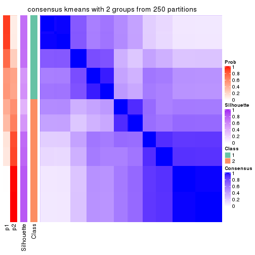</p>

</div>
<div id='tab-MAD-kmeans-consensus-heatmap-2'>
<pre><code class="r">consensus_heatmap(res, k = 3)
</code></pre>

<p>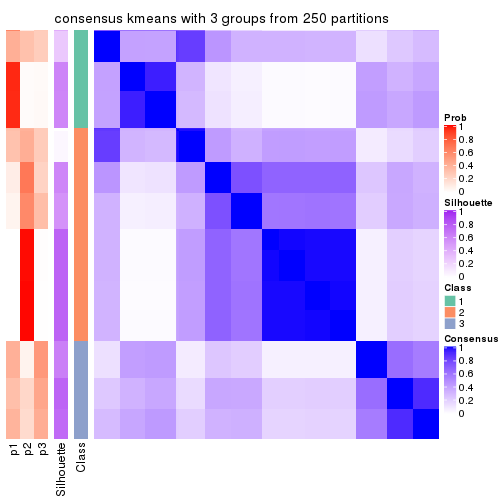</p>

</div>
<div id='tab-MAD-kmeans-consensus-heatmap-3'>
<pre><code class="r">consensus_heatmap(res, k = 4)
</code></pre>

<p>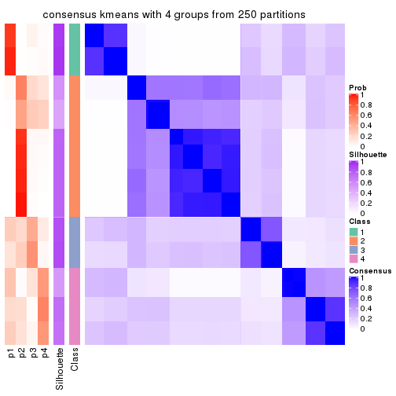</p>

</div>
<div id='tab-MAD-kmeans-consensus-heatmap-4'>
<pre><code class="r">consensus_heatmap(res, k = 5)
</code></pre>

<p>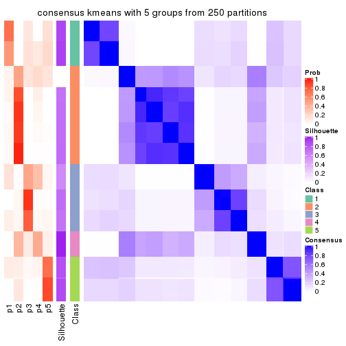</p>

</div>
<div id='tab-MAD-kmeans-consensus-heatmap-5'>
<pre><code class="r">consensus_heatmap(res, k = 6)
</code></pre>

<p>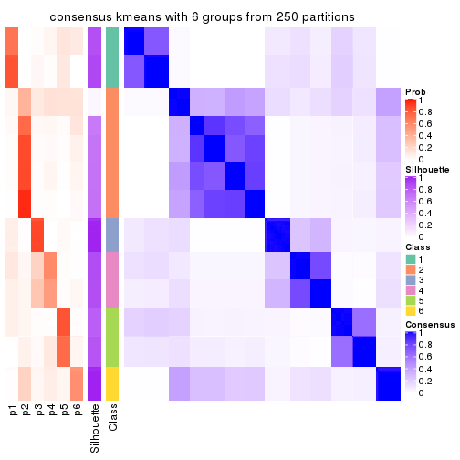</p>

</div>
</div>

Heatmaps for the membership of samples in all partitions to see how consistent they are:


<script>
$( function() {
	$( '#tabs-MAD-kmeans-membership-heatmap' ).tabs();
} );
</script>
<div id='tabs-MAD-kmeans-membership-heatmap'>
<ul>
<li><a href='#tab-MAD-kmeans-membership-heatmap-1'>k = 2</a></li>
<li><a href='#tab-MAD-kmeans-membership-heatmap-2'>k = 3</a></li>
<li><a href='#tab-MAD-kmeans-membership-heatmap-3'>k = 4</a></li>
<li><a href='#tab-MAD-kmeans-membership-heatmap-4'>k = 5</a></li>
<li><a href='#tab-MAD-kmeans-membership-heatmap-5'>k = 6</a></li>
</ul>
<div id='tab-MAD-kmeans-membership-heatmap-1'>
<pre><code class="r">membership_heatmap(res, k = 2)
</code></pre>

<p>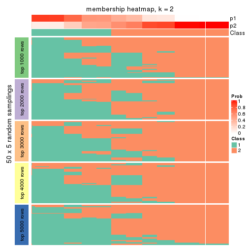</p>

</div>
<div id='tab-MAD-kmeans-membership-heatmap-2'>
<pre><code class="r">membership_heatmap(res, k = 3)
</code></pre>

<p>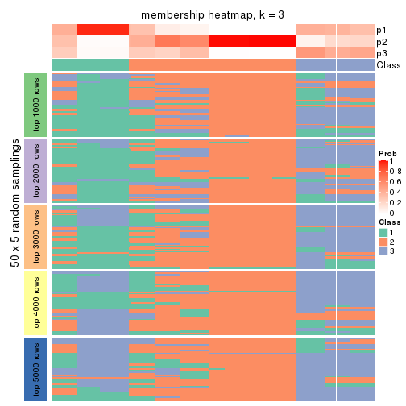</p>

</div>
<div id='tab-MAD-kmeans-membership-heatmap-3'>
<pre><code class="r">membership_heatmap(res, k = 4)
</code></pre>

<p>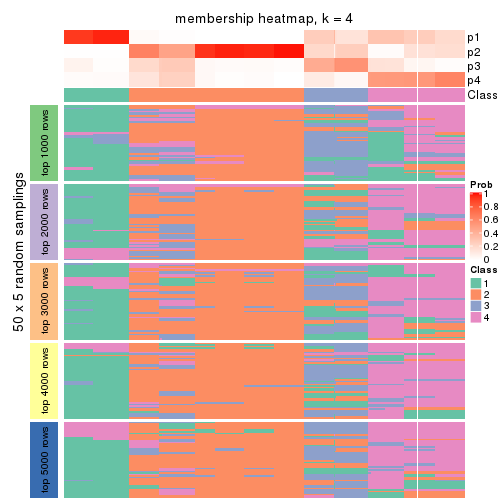</p>

</div>
<div id='tab-MAD-kmeans-membership-heatmap-4'>
<pre><code class="r">membership_heatmap(res, k = 5)
</code></pre>

<p>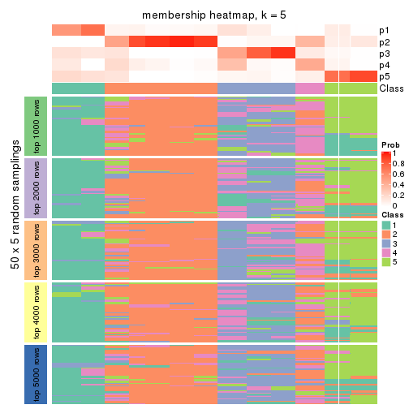</p>

</div>
<div id='tab-MAD-kmeans-membership-heatmap-5'>
<pre><code class="r">membership_heatmap(res, k = 6)
</code></pre>

<p>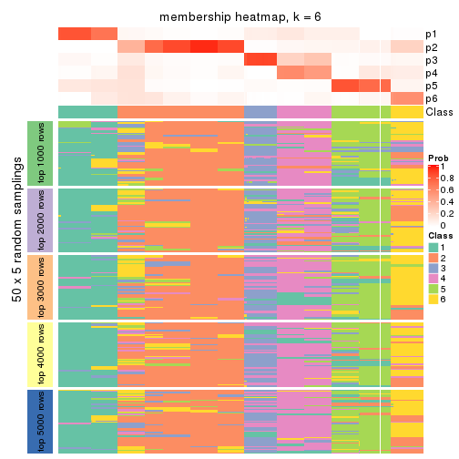</p>

</div>
</div>

As soon as we have had the classes for columns, we can look for signatures
which are significantly different between classes which can be candidate marks
for certain classes. Following are the heatmaps for signatures.


Signature heatmaps where rows are scaled:


<script>
$( function() {
	$( '#tabs-MAD-kmeans-get-signatures' ).tabs();
} );
</script>
<div id='tabs-MAD-kmeans-get-signatures'>
<ul>
<li><a href='#tab-MAD-kmeans-get-signatures-1'>k = 2</a></li>
<li><a href='#tab-MAD-kmeans-get-signatures-2'>k = 3</a></li>
<li><a href='#tab-MAD-kmeans-get-signatures-3'>k = 4</a></li>
<li><a href='#tab-MAD-kmeans-get-signatures-4'>k = 5</a></li>
<li><a href='#tab-MAD-kmeans-get-signatures-5'>k = 6</a></li>
</ul>
<div id='tab-MAD-kmeans-get-signatures-1'>
<pre><code class="r">get_signatures(res, k = 2)
</code></pre>

<p>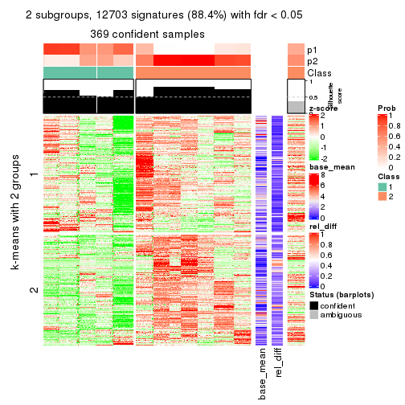</p>

</div>
<div id='tab-MAD-kmeans-get-signatures-2'>
<pre><code class="r">get_signatures(res, k = 3)
</code></pre>

<p>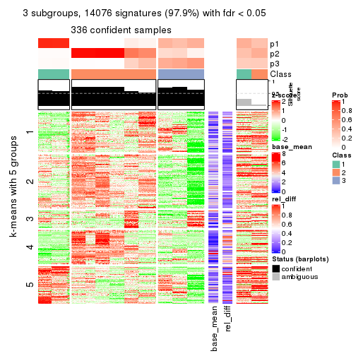</p>

</div>
<div id='tab-MAD-kmeans-get-signatures-3'>
<pre><code class="r">get_signatures(res, k = 4)
</code></pre>

<p>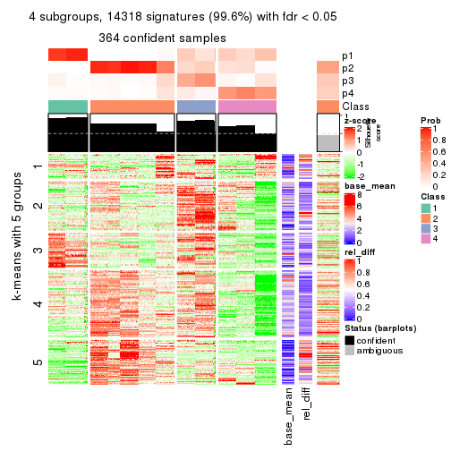</p>

</div>
<div id='tab-MAD-kmeans-get-signatures-4'>
<pre><code class="r">get_signatures(res, k = 5)
</code></pre>

<p>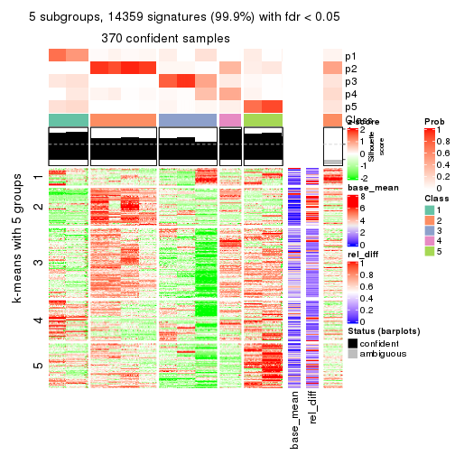</p>

</div>
<div id='tab-MAD-kmeans-get-signatures-5'>
<pre><code class="r">get_signatures(res, k = 6)
</code></pre>

<p>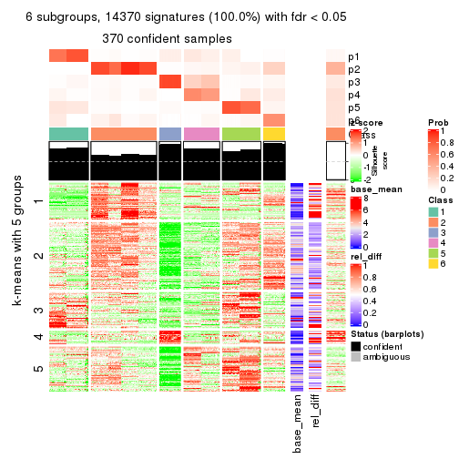</p>

</div>
</div>


Signature heatmaps where rows are not scaled:


<script>
$( function() {
	$( '#tabs-MAD-kmeans-get-signatures-no-scale' ).tabs();
} );
</script>
<div id='tabs-MAD-kmeans-get-signatures-no-scale'>
<ul>
<li><a href='#tab-MAD-kmeans-get-signatures-no-scale-1'>k = 2</a></li>
<li><a href='#tab-MAD-kmeans-get-signatures-no-scale-2'>k = 3</a></li>
<li><a href='#tab-MAD-kmeans-get-signatures-no-scale-3'>k = 4</a></li>
<li><a href='#tab-MAD-kmeans-get-signatures-no-scale-4'>k = 5</a></li>
<li><a href='#tab-MAD-kmeans-get-signatures-no-scale-5'>k = 6</a></li>
</ul>
<div id='tab-MAD-kmeans-get-signatures-no-scale-1'>
<pre><code class="r">get_signatures(res, k = 2, scale_rows = FALSE)
</code></pre>

<p>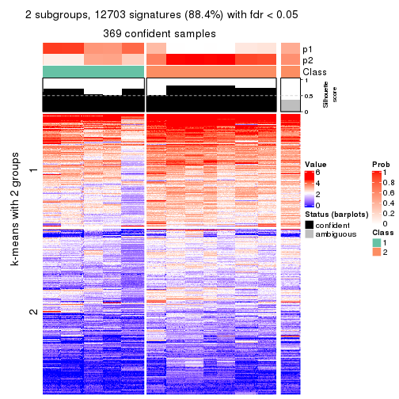</p>

</div>
<div id='tab-MAD-kmeans-get-signatures-no-scale-2'>
<pre><code class="r">get_signatures(res, k = 3, scale_rows = FALSE)
</code></pre>

<p>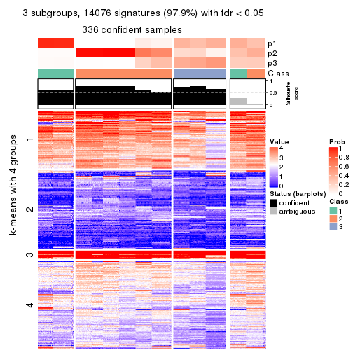</p>

</div>
<div id='tab-MAD-kmeans-get-signatures-no-scale-3'>
<pre><code class="r">get_signatures(res, k = 4, scale_rows = FALSE)
</code></pre>

<p>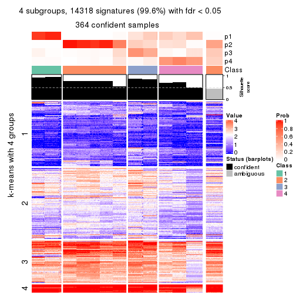</p>

</div>
<div id='tab-MAD-kmeans-get-signatures-no-scale-4'>
<pre><code class="r">get_signatures(res, k = 5, scale_rows = FALSE)
</code></pre>

<p>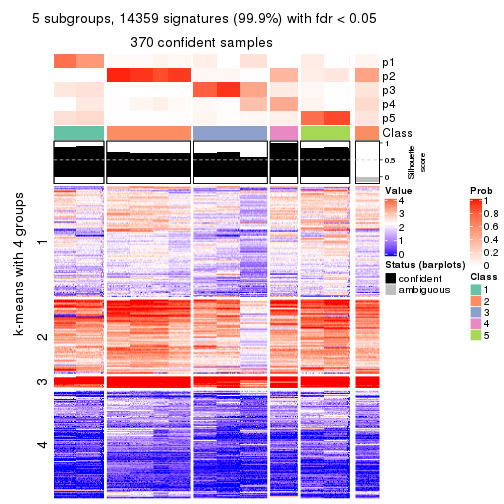</p>

</div>
<div id='tab-MAD-kmeans-get-signatures-no-scale-5'>
<pre><code class="r">get_signatures(res, k = 6, scale_rows = FALSE)
</code></pre>

<p>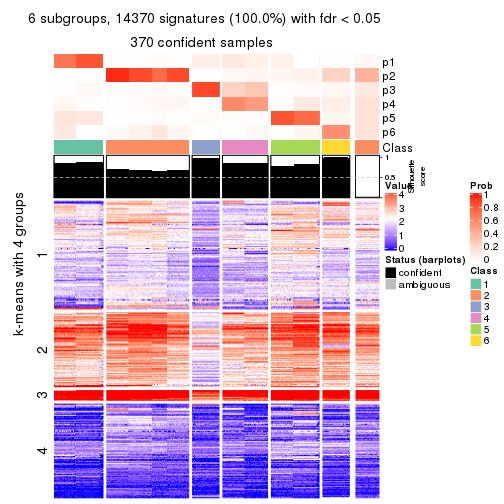</p>

</div>
</div>


Compare the overlap of signatures from different k:

```r
compare_signatures(res)
```

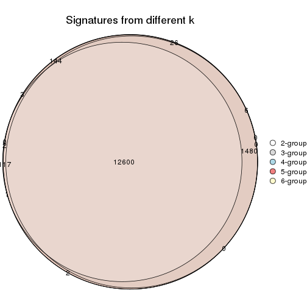

`get_signature()` returns a data frame invisibly. TO get the list of signatures, the function
call should be assigned to a variable explicitly. In following code, if `plot` argument is set
to `FALSE`, no heatmap is plotted while only the differential analysis is performed.

```r
# code only for demonstration
tb = get_signature(res, k = ..., plot = FALSE)
```

An example of the output of `tb` is:

```
#>   which_row         fdr    mean_1    mean_2 scaled_mean_1 scaled_mean_2 km
#> 1        38 0.042760348  8.373488  9.131774    -0.5533452     0.5164555  1
#> 2        40 0.018707592  7.106213  8.469186    -0.6173731     0.5762149  1
#> 3        55 0.019134737 10.221463 11.207825    -0.6159697     0.5749050  1
#> 4        59 0.006059896  5.921854  7.869574    -0.6899429     0.6439467  1
#> 5        60 0.018055526  8.928898 10.211722    -0.6204761     0.5791110  1
#> 6        98 0.009384629 15.714769 14.887706     0.6635654    -0.6193277  2
...
```

The columns in `tb` are:

1. `which_row`: row indices corresponding to the input matrix.
2. `fdr`: FDR for the differential test. 
3. `mean_x`: The mean value in group x.
4. `scaled_mean_x`: The mean value in group x after rows are scaled.
5. `km`: Row groups if k-means clustering is applied to rows.


UMAP plot which shows how samples are separated.


<script>
$( function() {
	$( '#tabs-MAD-kmeans-dimension-reduction' ).tabs();
} );
</script>
<div id='tabs-MAD-kmeans-dimension-reduction'>
<ul>
<li><a href='#tab-MAD-kmeans-dimension-reduction-1'>k = 2</a></li>
<li><a href='#tab-MAD-kmeans-dimension-reduction-2'>k = 3</a></li>
<li><a href='#tab-MAD-kmeans-dimension-reduction-3'>k = 4</a></li>
<li><a href='#tab-MAD-kmeans-dimension-reduction-4'>k = 5</a></li>
<li><a href='#tab-MAD-kmeans-dimension-reduction-5'>k = 6</a></li>
</ul>
<div id='tab-MAD-kmeans-dimension-reduction-1'>
<pre><code class="r">dimension_reduction(res, k = 2, method = &quot;UMAP&quot;)
</code></pre>

<p>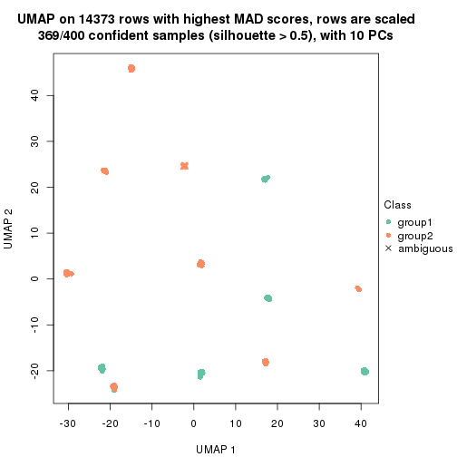</p>

</div>
<div id='tab-MAD-kmeans-dimension-reduction-2'>
<pre><code class="r">dimension_reduction(res, k = 3, method = &quot;UMAP&quot;)
</code></pre>

<p>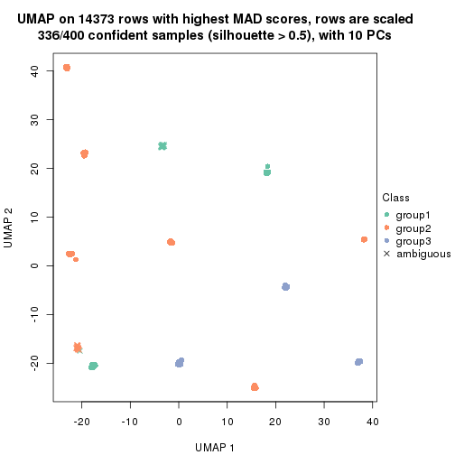</p>

</div>
<div id='tab-MAD-kmeans-dimension-reduction-3'>
<pre><code class="r">dimension_reduction(res, k = 4, method = &quot;UMAP&quot;)
</code></pre>

<p>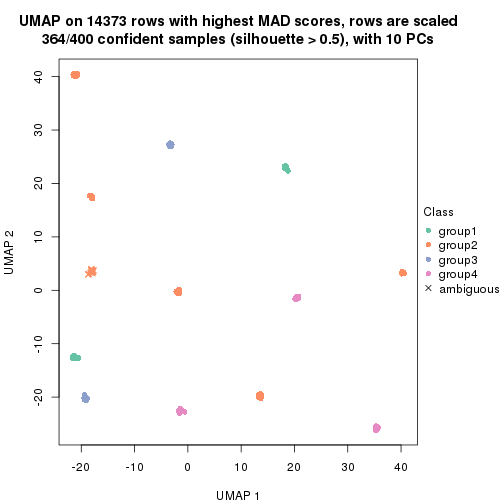</p>

</div>
<div id='tab-MAD-kmeans-dimension-reduction-4'>
<pre><code class="r">dimension_reduction(res, k = 5, method = &quot;UMAP&quot;)
</code></pre>

<p>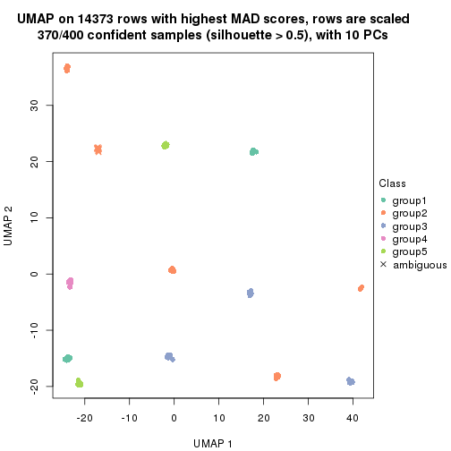</p>

</div>
<div id='tab-MAD-kmeans-dimension-reduction-5'>
<pre><code class="r">dimension_reduction(res, k = 6, method = &quot;UMAP&quot;)
</code></pre>

<p>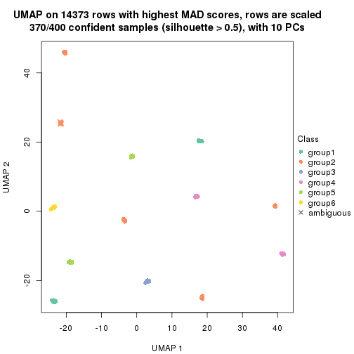</p>

</div>
</div>


Following heatmap shows how subgroups are split when increasing `k`:

```r
collect_classes(res)
```

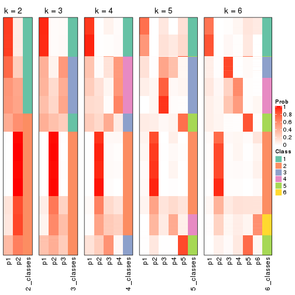


If matrix rows can be associated to genes, consider to use `GO_Enrichment(res,
...)` to perform function enrichment for the signature genes.


 

---------------------------------------------------


### MAD:skmeans


The object with results only for a single top-value method and a single partition method 
can be extracted as:

```r
res = res_list["MAD", "skmeans"]
# you can also extract it by
# res = res_list["MAD:skmeans"]
```

A summary of `res` and all the functions that can be applied to it:

```r
res
```

```
#> A 'ConsensusPartition' object with k = 2, 3, 4, 5, 6.
#>   On a matrix with 14373 rows and 400 columns.
#>   Top rows (1000, 2000, 3000, 4000, 5000) are extracted by 'MAD' method.
#>   Subgroups are detected by 'skmeans' method.
#>   Performed in total 1250 partitions by row resampling.
#>   Best k for subgroups seems to be 2.
#> 
#> Following methods can be applied to this 'ConsensusPartition' object:
#>  [1] "cola_report"             "collect_classes"         "collect_plots"          
#>  [4] "collect_stats"           "colnames"                "compare_signatures"     
#>  [7] "consensus_heatmap"       "dimension_reduction"     "functional_enrichment"  
#> [10] "get_anno_col"            "get_anno"                "get_classes"            
#> [13] "get_consensus"           "get_matrix"              "get_membership"         
#> [16] "get_param"               "get_signatures"          "get_stats"              
#> [19] "is_best_k"               "is_stable_k"             "membership_heatmap"     
#> [22] "ncol"                    "nrow"                    "plot_ecdf"              
#> [25] "rownames"                "select_partition_number" "show"                   
#> [28] "suggest_best_k"          "test_to_known_factors"
```

`collect_plots()` function collects all the plots made from `res` for all `k` (number of partitions)
into one single page to provide an easy and fast comparison between different `k`.

```r
collect_plots(res)
```

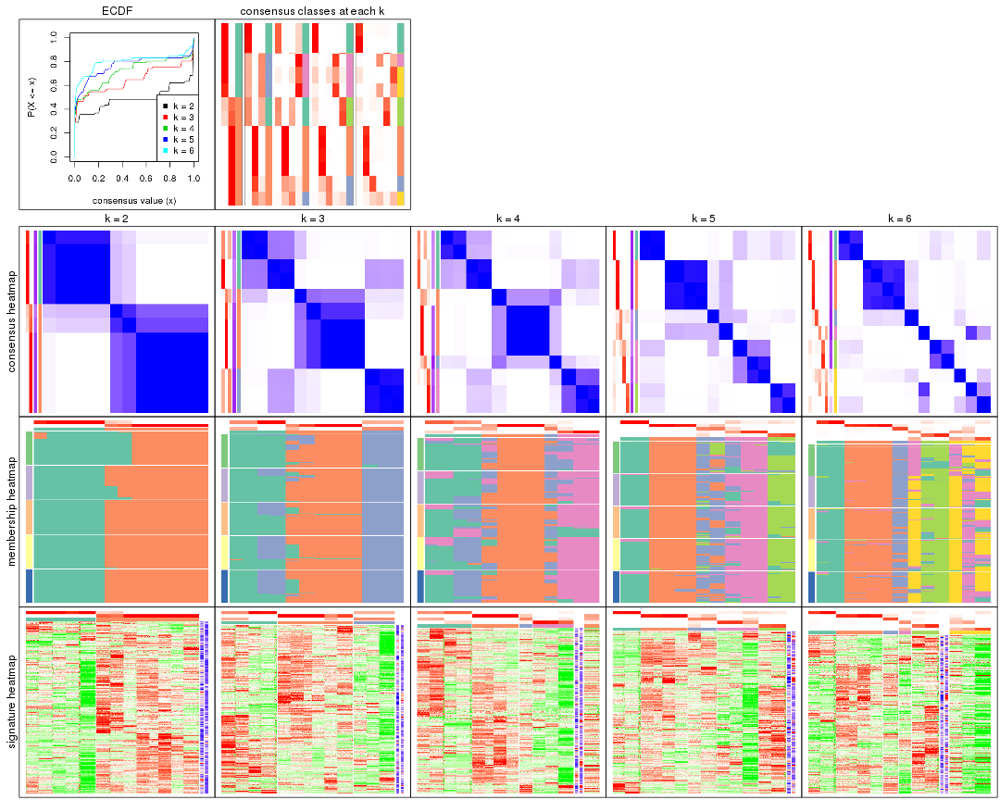

The plots are:

- The first row: a plot of the ECDF (Empirical cumulative distribution
  function) curves of the consensus matrix for each `k` and the heatmap of
  predicted classes for each `k`.
- The second row: heatmaps of the consensus matrix for each `k`.
- The third row: heatmaps of the membership matrix for each `k`.
- The fouth row: heatmaps of the signatures for each `k`.

All the plots in panels can be made by individual functions and they are
plotted later in this section.

`select_partition_number()` produces several plots showing different
statistics for choosing "optimized" `k`. There are following statistics:

- ECDF curves of the consensus matrix for each `k`;
- 1-PAC. [The PAC
  score](https://en.wikipedia.org/wiki/Consensus_clustering#Over-interpretation_potential_of_consensus_clustering)
  measures the proportion of the ambiguous subgrouping.
- Mean silhouette score.
- Concordance. The mean probability of fiting the consensus class ids in all
  partitions.
- Area increased. Denote $A_k$ as the area under the ECDF curve for current
  `k`, the area increased is defined as $A_k - A_{k-1}$.
- Rand index. The percent of pairs of samples that are both in a same cluster
  or both are not in a same cluster in the partition of k and k-1.
- Jaccard index. The ratio of pairs of samples are both in a same cluster in
  the partition of k and k-1 and the pairs of samples are both in a same
  cluster in the partition k or k-1.

The detailed explanations of these statistics can be found in [the cola
vignette](http://bioconductor.org/packages/devel/bioc/vignettes/cola/inst/doc/cola.html#toc_13).

Generally speaking, lower PAC score, higher mean silhouette score or higher
concordance corresponds to better partition. Rand index and Jaccard index
measure how similar the current partition is compared to partition with `k-1`.
If they are too similar, we won't accept `k` is better than `k-1`.

```r
select_partition_number(res)
```

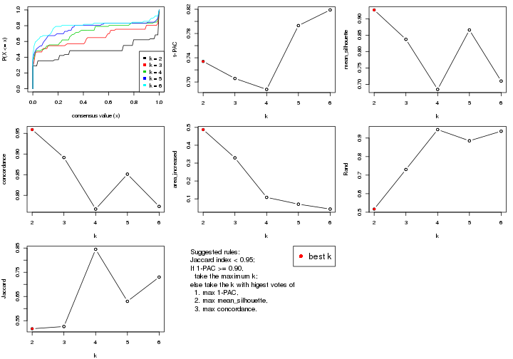

The numeric values for all these statistics can be obtained by `get_stats()`.

```r
get_stats(res)
```

```
#>   k 1-PAC mean_silhouette concordance area_increased  Rand Jaccard
#> 2 2 0.734           0.927       0.959         0.4874 0.517   0.517
#> 3 3 0.706           0.837       0.892         0.3294 0.730   0.526
#> 4 4 0.688           0.685       0.767         0.1084 0.945   0.845
#> 5 5 0.793           0.866       0.851         0.0703 0.885   0.630
#> 6 6 0.819           0.710       0.773         0.0429 0.937   0.730
```

`suggest_best_k()` suggests the best $k$ based on these statistics. The rules are as follows:

- All $k$ with Jaccard index larger than 0.95 are removed because the increase of
  the partition number does not provides enough extra information. If all $k$ are removed,
  the best $k$ is assigned by `NA`.
- For $k$ with 1-PAC larger than 0.9, the maximal $k$ is taken as the "best k". Other $k$ is called "optional k".
- If it does not fit the second rule. The $k$ with the highest vote of highest
  1-PAC, mean silhouette and concordance is taken as the "best k".

```r
suggest_best_k(res)
```

```
#> [1] 2
```


Following shows the table of the partitions (You need to click the **show/hide
code output** link to see it). The membership matrix (columns with name `p*`)
is inferred by
[`clue::cl_consensus()`](https://www.rdocumentation.org/link/cl_consensus?package=clue)
function with the `SE` method. Basically the value in the membership matrix
represents the probability to belong to a certain group. The finall class
label for an item is determined with the group with highest probability it
belongs to.

In `get_classes()` function, the entropy is calculated from the membership
matrix and the silhouette score is calculated from the consensus matrix.


<script>
$( function() {
	$( '#tabs-MAD-skmeans-get-classes' ).tabs();
} );
</script>
<div id='tabs-MAD-skmeans-get-classes'>
<ul>
<li><a href='#tab-MAD-skmeans-get-classes-1'>k = 2</a></li>
<li><a href='#tab-MAD-skmeans-get-classes-2'>k = 3</a></li>
<li><a href='#tab-MAD-skmeans-get-classes-3'>k = 4</a></li>
<li><a href='#tab-MAD-skmeans-get-classes-4'>k = 5</a></li>
<li><a href='#tab-MAD-skmeans-get-classes-5'>k = 6</a></li>
</ul>

<div id='tab-MAD-skmeans-get-classes-1'>
<p><a id='tab-MAD-skmeans-get-classes-1-a' style='color:#0366d6' href='#'>show/hide code output</a></p>
<pre><code class="r">cbind(get_classes(res, k = 2), get_membership(res, k = 2))
</code></pre>

<pre><code>#&gt;            class entropy silhouette    p1    p2
#&gt; SRR1661716     2   0.000      0.933 0.000 1.000
#&gt; SRR1661717     2   0.000      0.933 0.000 1.000
#&gt; SRR1661718     2   0.000      0.933 0.000 1.000
#&gt; SRR1661719     2   0.000      0.933 0.000 1.000
#&gt; SRR1661720     2   0.000      0.933 0.000 1.000
#&gt; SRR1661721     2   0.000      0.933 0.000 1.000
#&gt; SRR1661722     2   0.000      0.933 0.000 1.000
#&gt; SRR1661723     2   0.000      0.933 0.000 1.000
#&gt; SRR1661724     2   0.000      0.933 0.000 1.000
#&gt; SRR1661725     2   0.000      0.933 0.000 1.000
#&gt; SRR1661726     2   0.000      0.933 0.000 1.000
#&gt; SRR1661727     2   0.000      0.933 0.000 1.000
#&gt; SRR1661728     2   0.000      0.933 0.000 1.000
#&gt; SRR1661729     2   0.000      0.933 0.000 1.000
#&gt; SRR1661730     2   0.000      0.933 0.000 1.000
#&gt; SRR1661731     2   0.000      0.933 0.000 1.000
#&gt; SRR1661732     2   0.000      0.933 0.000 1.000
#&gt; SRR1661733     2   0.000      0.933 0.000 1.000
#&gt; SRR1661734     2   0.000      0.933 0.000 1.000
#&gt; SRR1661735     2   0.000      0.933 0.000 1.000
#&gt; SRR1661736     2   0.000      0.933 0.000 1.000
#&gt; SRR1661737     2   0.000      0.933 0.000 1.000
#&gt; SRR1661738     2   0.000      0.933 0.000 1.000
#&gt; SRR1661739     2   0.000      0.933 0.000 1.000
#&gt; SRR1661740     2   0.000      0.933 0.000 1.000
#&gt; SRR1661741     2   0.000      0.933 0.000 1.000
#&gt; SRR1661742     2   0.000      0.933 0.000 1.000
#&gt; SRR1661743     2   0.000      0.933 0.000 1.000
#&gt; SRR1661744     2   0.000      0.933 0.000 1.000
#&gt; SRR1661745     2   0.000      0.933 0.000 1.000
#&gt; SRR1661746     2   0.000      0.933 0.000 1.000
#&gt; SRR1661747     2   0.000      0.933 0.000 1.000
#&gt; SRR1661748     2   0.000      0.933 0.000 1.000
#&gt; SRR1661749     2   0.000      0.933 0.000 1.000
#&gt; SRR1661750     2   0.000      0.933 0.000 1.000
#&gt; SRR1661751     2   0.000      0.933 0.000 1.000
#&gt; SRR1661752     2   0.000      0.933 0.000 1.000
#&gt; SRR1661753     2   0.000      0.933 0.000 1.000
#&gt; SRR1661754     2   0.000      0.933 0.000 1.000
#&gt; SRR1661755     2   0.000      0.933 0.000 1.000
#&gt; SRR1661756     2   0.000      0.933 0.000 1.000
#&gt; SRR1661757     2   0.000      0.933 0.000 1.000
#&gt; SRR1661758     2   0.000      0.933 0.000 1.000
#&gt; SRR1661759     2   0.000      0.933 0.000 1.000
#&gt; SRR1661760     2   0.000      0.933 0.000 1.000
#&gt; SRR1661761     2   0.000      0.933 0.000 1.000
#&gt; SRR1661762     2   0.000      0.933 0.000 1.000
#&gt; SRR1661763     2   0.000      0.933 0.000 1.000
#&gt; SRR1661764     2   0.000      0.933 0.000 1.000
#&gt; SRR1661766     2   0.000      0.933 0.000 1.000
#&gt; SRR1661767     2   0.000      0.933 0.000 1.000
#&gt; SRR1661768     2   0.000      0.933 0.000 1.000
#&gt; SRR1661769     2   0.000      0.933 0.000 1.000
#&gt; SRR1661770     2   0.000      0.933 0.000 1.000
#&gt; SRR1661771     2   0.000      0.933 0.000 1.000
#&gt; SRR1661772     2   0.000      0.933 0.000 1.000
#&gt; SRR1661773     2   0.000      0.933 0.000 1.000
#&gt; SRR1661774     2   0.000      0.933 0.000 1.000
#&gt; SRR1661775     2   0.000      0.933 0.000 1.000
#&gt; SRR1661776     2   0.000      0.933 0.000 1.000
#&gt; SRR1661777     2   0.000      0.933 0.000 1.000
#&gt; SRR1661778     2   0.000      0.933 0.000 1.000
#&gt; SRR1661779     2   0.000      0.933 0.000 1.000
#&gt; SRR1661780     2   0.000      0.933 0.000 1.000
#&gt; SRR1661781     2   0.000      0.933 0.000 1.000
#&gt; SRR1661782     2   0.000      0.933 0.000 1.000
#&gt; SRR1661783     2   0.000      0.933 0.000 1.000
#&gt; SRR1661784     2   0.000      0.933 0.000 1.000
#&gt; SRR1661785     2   0.000      0.933 0.000 1.000
#&gt; SRR1661786     2   0.000      0.933 0.000 1.000
#&gt; SRR1661787     2   0.000      0.933 0.000 1.000
#&gt; SRR1661788     2   0.000      0.933 0.000 1.000
#&gt; SRR1661789     2   0.000      0.933 0.000 1.000
#&gt; SRR1661790     2   0.000      0.933 0.000 1.000
#&gt; SRR1661791     2   0.000      0.933 0.000 1.000
#&gt; SRR1661792     2   0.000      0.933 0.000 1.000
#&gt; SRR1661793     2   0.000      0.933 0.000 1.000
#&gt; SRR1661794     2   0.000      0.933 0.000 1.000
#&gt; SRR1661795     2   0.000      0.933 0.000 1.000
#&gt; SRR1661796     2   0.000      0.933 0.000 1.000
#&gt; SRR1661797     2   0.000      0.933 0.000 1.000
#&gt; SRR1661798     2   0.000      0.933 0.000 1.000
#&gt; SRR1661799     2   0.000      0.933 0.000 1.000
#&gt; SRR1661800     2   0.000      0.933 0.000 1.000
#&gt; SRR1661801     2   0.000      0.933 0.000 1.000
#&gt; SRR1661802     2   0.000      0.933 0.000 1.000
#&gt; SRR1661803     2   0.000      0.933 0.000 1.000
#&gt; SRR1661804     2   0.000      0.933 0.000 1.000
#&gt; SRR1661805     2   0.000      0.933 0.000 1.000
#&gt; SRR1661806     2   0.000      0.933 0.000 1.000
#&gt; SRR1661807     2   0.000      0.933 0.000 1.000
#&gt; SRR1661808     2   0.000      0.933 0.000 1.000
#&gt; SRR1661809     2   0.000      0.933 0.000 1.000
#&gt; SRR1661810     2   0.000      0.933 0.000 1.000
#&gt; SRR1661811     2   0.000      0.933 0.000 1.000
#&gt; SRR1661812     2   0.000      0.933 0.000 1.000
#&gt; SRR1661813     2   0.000      0.933 0.000 1.000
#&gt; SRR1661814     2   0.000      0.933 0.000 1.000
#&gt; SRR1661815     2   0.000      0.933 0.000 1.000
#&gt; SRR1661816     2   0.000      0.933 0.000 1.000
#&gt; SRR1661817     2   0.000      0.933 0.000 1.000
#&gt; SRR1661818     2   0.000      0.933 0.000 1.000
#&gt; SRR1661819     2   0.000      0.933 0.000 1.000
#&gt; SRR1661820     2   0.000      0.933 0.000 1.000
#&gt; SRR1661821     2   0.000      0.933 0.000 1.000
#&gt; SRR1661822     2   0.000      0.933 0.000 1.000
#&gt; SRR1661823     2   0.000      0.933 0.000 1.000
#&gt; SRR1661824     2   0.000      0.933 0.000 1.000
#&gt; SRR1661825     2   0.000      0.933 0.000 1.000
#&gt; SRR1661826     1   0.000      0.992 1.000 0.000
#&gt; SRR1661827     1   0.000      0.992 1.000 0.000
#&gt; SRR1661828     1   0.000      0.992 1.000 0.000
#&gt; SRR1661829     1   0.000      0.992 1.000 0.000
#&gt; SRR1661830     1   0.000      0.992 1.000 0.000
#&gt; SRR1661831     1   0.000      0.992 1.000 0.000
#&gt; SRR1661832     1   0.000      0.992 1.000 0.000
#&gt; SRR1661833     1   0.000      0.992 1.000 0.000
#&gt; SRR1661834     1   0.000      0.992 1.000 0.000
#&gt; SRR1661835     1   0.000      0.992 1.000 0.000
#&gt; SRR1661836     1   0.000      0.992 1.000 0.000
#&gt; SRR1661837     1   0.000      0.992 1.000 0.000
#&gt; SRR1661838     1   0.000      0.992 1.000 0.000
#&gt; SRR1661839     1   0.000      0.992 1.000 0.000
#&gt; SRR1661840     1   0.000      0.992 1.000 0.000
#&gt; SRR1661841     1   0.000      0.992 1.000 0.000
#&gt; SRR1661843     1   0.000      0.992 1.000 0.000
#&gt; SRR1661844     1   0.000      0.992 1.000 0.000
#&gt; SRR1661845     1   0.000      0.992 1.000 0.000
#&gt; SRR1661846     1   0.000      0.992 1.000 0.000
#&gt; SRR1661847     1   0.000      0.992 1.000 0.000
#&gt; SRR1661848     1   0.000      0.992 1.000 0.000
#&gt; SRR1661849     1   0.000      0.992 1.000 0.000
#&gt; SRR1661850     1   0.000      0.992 1.000 0.000
#&gt; SRR1661851     1   0.000      0.992 1.000 0.000
#&gt; SRR1661852     1   0.000      0.992 1.000 0.000
#&gt; SRR1661853     1   0.000      0.992 1.000 0.000
#&gt; SRR1661854     1   0.000      0.992 1.000 0.000
#&gt; SRR1661855     1   0.000      0.992 1.000 0.000
#&gt; SRR1661856     1   0.000      0.992 1.000 0.000
#&gt; SRR1661857     1   0.000      0.992 1.000 0.000
#&gt; SRR1661858     1   0.000      0.992 1.000 0.000
#&gt; SRR1661859     1   0.000      0.992 1.000 0.000
#&gt; SRR1661860     1   0.000      0.992 1.000 0.000
#&gt; SRR1661861     1   0.000      0.992 1.000 0.000
#&gt; SRR1661862     1   0.000      0.992 1.000 0.000
#&gt; SRR1661863     1   0.000      0.992 1.000 0.000
#&gt; SRR1661864     1   0.000      0.992 1.000 0.000
#&gt; SRR1661865     1   0.000      0.992 1.000 0.000
#&gt; SRR1661866     1   0.000      0.992 1.000 0.000
#&gt; SRR1661867     1   0.000      0.992 1.000 0.000
#&gt; SRR1661868     1   0.000      0.992 1.000 0.000
#&gt; SRR1661869     1   0.000      0.992 1.000 0.000
#&gt; SRR1661870     1   0.000      0.992 1.000 0.000
#&gt; SRR1661871     1   0.000      0.992 1.000 0.000
#&gt; SRR1661872     1   0.000      0.992 1.000 0.000
#&gt; SRR1661873     1   0.000      0.992 1.000 0.000
#&gt; SRR1661874     1   0.000      0.992 1.000 0.000
#&gt; SRR1661875     1   0.000      0.992 1.000 0.000
#&gt; SRR1661876     1   0.000      0.992 1.000 0.000
#&gt; SRR1661877     1   0.000      0.992 1.000 0.000
#&gt; SRR1661878     1   0.000      0.992 1.000 0.000
#&gt; SRR1661879     1   0.000      0.992 1.000 0.000
#&gt; SRR1661880     1   0.000      0.992 1.000 0.000
#&gt; SRR1661881     1   0.000      0.992 1.000 0.000
#&gt; SRR1661882     1   0.000      0.992 1.000 0.000
#&gt; SRR1661883     1   0.000      0.992 1.000 0.000
#&gt; SRR1661884     1   0.000      0.992 1.000 0.000
#&gt; SRR1661885     1   0.000      0.992 1.000 0.000
#&gt; SRR1661886     1   0.000      0.992 1.000 0.000
#&gt; SRR1661887     1   0.000      0.992 1.000 0.000
#&gt; SRR1661888     1   0.000      0.992 1.000 0.000
#&gt; SRR1661889     1   0.000      0.992 1.000 0.000
#&gt; SRR1661890     1   0.000      0.992 1.000 0.000
#&gt; SRR1661891     1   0.000      0.992 1.000 0.000
#&gt; SRR1661892     1   0.000      0.992 1.000 0.000
#&gt; SRR1661893     1   0.000      0.992 1.000 0.000
#&gt; SRR1661894     1   0.000      0.992 1.000 0.000
#&gt; SRR1661895     1   0.000      0.992 1.000 0.000
#&gt; SRR1661896     1   0.000      0.992 1.000 0.000
#&gt; SRR1661897     1   0.000      0.992 1.000 0.000
#&gt; SRR1661898     1   0.000      0.992 1.000 0.000
#&gt; SRR1661899     1   0.000      0.992 1.000 0.000
#&gt; SRR1661900     1   0.000      0.992 1.000 0.000
#&gt; SRR1661901     1   0.000      0.992 1.000 0.000
#&gt; SRR1661902     1   0.000      0.992 1.000 0.000
#&gt; SRR1661903     1   0.000      0.992 1.000 0.000
#&gt; SRR1661904     1   0.000      0.992 1.000 0.000
#&gt; SRR1661905     1   0.000      0.992 1.000 0.000
#&gt; SRR1661906     1   0.000      0.992 1.000 0.000
#&gt; SRR1661907     1   0.000      0.992 1.000 0.000
#&gt; SRR1661908     1   0.000      0.992 1.000 0.000
#&gt; SRR1661909     1   0.000      0.992 1.000 0.000
#&gt; SRR1661910     1   0.000      0.992 1.000 0.000
#&gt; SRR1661911     1   0.000      0.992 1.000 0.000
#&gt; SRR1661912     1   0.000      0.992 1.000 0.000
#&gt; SRR1661913     1   0.000      0.992 1.000 0.000
#&gt; SRR1661914     1   0.000      0.992 1.000 0.000
#&gt; SRR1661915     1   0.000      0.992 1.000 0.000
#&gt; SRR1661916     1   0.000      0.992 1.000 0.000
#&gt; SRR1661917     1   0.000      0.992 1.000 0.000
#&gt; SRR1661918     1   0.000      0.992 1.000 0.000
#&gt; SRR1661919     1   0.000      0.992 1.000 0.000
#&gt; SRR1661920     1   0.000      0.992 1.000 0.000
#&gt; SRR1661921     1   0.000      0.992 1.000 0.000
#&gt; SRR1661922     1   0.000      0.992 1.000 0.000
#&gt; SRR1661923     1   0.000      0.992 1.000 0.000
#&gt; SRR1661924     1   0.000      0.992 1.000 0.000
#&gt; SRR1661925     1   0.000      0.992 1.000 0.000
#&gt; SRR1661926     1   0.000      0.992 1.000 0.000
#&gt; SRR1661927     1   0.000      0.992 1.000 0.000
#&gt; SRR1661928     2   0.000      0.933 0.000 1.000
#&gt; SRR1661929     2   0.000      0.933 0.000 1.000
#&gt; SRR1661930     2   0.000      0.933 0.000 1.000
#&gt; SRR1661931     2   0.000      0.933 0.000 1.000
#&gt; SRR1661932     2   0.000      0.933 0.000 1.000
#&gt; SRR1661933     2   0.000      0.933 0.000 1.000
#&gt; SRR1661934     2   0.000      0.933 0.000 1.000
#&gt; SRR1661935     2   0.000      0.933 0.000 1.000
#&gt; SRR1661936     2   0.000      0.933 0.000 1.000
#&gt; SRR1661937     2   0.000      0.933 0.000 1.000
#&gt; SRR1661938     2   0.000      0.933 0.000 1.000
#&gt; SRR1661939     2   0.000      0.933 0.000 1.000
#&gt; SRR1661940     2   0.000      0.933 0.000 1.000
#&gt; SRR1661941     2   0.000      0.933 0.000 1.000
#&gt; SRR1661942     2   0.000      0.933 0.000 1.000
#&gt; SRR1661943     2   0.000      0.933 0.000 1.000
#&gt; SRR1661944     2   0.000      0.933 0.000 1.000
#&gt; SRR1661945     2   0.000      0.933 0.000 1.000
#&gt; SRR1661946     2   0.000      0.933 0.000 1.000
#&gt; SRR1661947     2   0.000      0.933 0.000 1.000
#&gt; SRR1661948     2   0.000      0.933 0.000 1.000
#&gt; SRR1661949     2   0.000      0.933 0.000 1.000
#&gt; SRR1661950     2   0.000      0.933 0.000 1.000
#&gt; SRR1661951     2   0.000      0.933 0.000 1.000
#&gt; SRR1661952     2   0.000      0.933 0.000 1.000
#&gt; SRR1661953     2   0.000      0.933 0.000 1.000
#&gt; SRR1661954     2   0.000      0.933 0.000 1.000
#&gt; SRR1661955     2   0.000      0.933 0.000 1.000
#&gt; SRR1661956     2   0.000      0.933 0.000 1.000
#&gt; SRR1661957     2   0.000      0.933 0.000 1.000
#&gt; SRR1661958     1   0.000      0.992 1.000 0.000
#&gt; SRR1661959     1   0.000      0.992 1.000 0.000
#&gt; SRR1661960     1   0.000      0.992 1.000 0.000
#&gt; SRR1661961     1   0.000      0.992 1.000 0.000
#&gt; SRR1661962     1   0.000      0.992 1.000 0.000
#&gt; SRR1661963     1   0.000      0.992 1.000 0.000
#&gt; SRR1661964     1   0.000      0.992 1.000 0.000
#&gt; SRR1661965     1   0.000      0.992 1.000 0.000
#&gt; SRR1661966     1   0.000      0.992 1.000 0.000
#&gt; SRR1661967     1   0.000      0.992 1.000 0.000
#&gt; SRR1661968     1   0.000      0.992 1.000 0.000
#&gt; SRR1661969     1   0.000      0.992 1.000 0.000
#&gt; SRR1661970     1   0.000      0.992 1.000 0.000
#&gt; SRR1661971     1   0.000      0.992 1.000 0.000
#&gt; SRR1661972     1   0.000      0.992 1.000 0.000
#&gt; SRR1661973     1   0.000      0.992 1.000 0.000
#&gt; SRR1661974     1   0.000      0.992 1.000 0.000
#&gt; SRR1661975     1   0.000      0.992 1.000 0.000
#&gt; SRR1661976     1   0.000      0.992 1.000 0.000
#&gt; SRR1661977     1   0.000      0.992 1.000 0.000
#&gt; SRR1661978     1   0.000      0.992 1.000 0.000
#&gt; SRR1661979     1   0.000      0.992 1.000 0.000
#&gt; SRR1661980     1   0.000      0.992 1.000 0.000
#&gt; SRR1661981     1   0.000      0.992 1.000 0.000
#&gt; SRR1661982     1   0.000      0.992 1.000 0.000
#&gt; SRR1661983     1   0.000      0.992 1.000 0.000
#&gt; SRR1661984     1   0.000      0.992 1.000 0.000
#&gt; SRR1661985     1   0.000      0.992 1.000 0.000
#&gt; SRR1661986     1   0.000      0.992 1.000 0.000
#&gt; SRR1661987     1   0.000      0.992 1.000 0.000
#&gt; SRR1661988     2   0.861      0.705 0.284 0.716
#&gt; SRR1661989     2   0.861      0.705 0.284 0.716
#&gt; SRR1661990     2   0.861      0.705 0.284 0.716
#&gt; SRR1661991     2   0.861      0.705 0.284 0.716
#&gt; SRR1661992     2   0.861      0.705 0.284 0.716
#&gt; SRR1661993     2   0.861      0.705 0.284 0.716
#&gt; SRR1661994     2   0.861      0.705 0.284 0.716
#&gt; SRR1661995     2   0.861      0.705 0.284 0.716
#&gt; SRR1661996     2   0.861      0.705 0.284 0.716
#&gt; SRR1661997     2   0.861      0.705 0.284 0.716
#&gt; SRR1661998     2   0.861      0.705 0.284 0.716
#&gt; SRR1661999     2   0.861      0.705 0.284 0.716
#&gt; SRR1662000     2   0.861      0.705 0.284 0.716
#&gt; SRR1662001     2   0.861      0.705 0.284 0.716
#&gt; SRR1662002     2   0.861      0.705 0.284 0.716
#&gt; SRR1662003     2   0.861      0.705 0.284 0.716
#&gt; SRR1662004     2   0.861      0.705 0.284 0.716
#&gt; SRR1662005     2   0.861      0.705 0.284 0.716
#&gt; SRR1662006     2   0.861      0.705 0.284 0.716
#&gt; SRR1662007     2   0.861      0.705 0.284 0.716
#&gt; SRR1662008     2   0.861      0.705 0.284 0.716
#&gt; SRR1662009     2   0.861      0.705 0.284 0.716
#&gt; SRR1662010     2   0.861      0.705 0.284 0.716
#&gt; SRR1662011     2   0.861      0.705 0.284 0.716
#&gt; SRR1662012     2   0.861      0.705 0.284 0.716
#&gt; SRR1662013     2   0.861      0.705 0.284 0.716
#&gt; SRR1662014     2   0.861      0.705 0.284 0.716
#&gt; SRR1662015     2   0.861      0.705 0.284 0.716
#&gt; SRR1662016     2   0.861      0.705 0.284 0.716
#&gt; SRR1662017     2   0.861      0.705 0.284 0.716
#&gt; SRR1662018     2   0.000      0.933 0.000 1.000
#&gt; SRR1662019     2   0.000      0.933 0.000 1.000
#&gt; SRR1662020     2   0.000      0.933 0.000 1.000
#&gt; SRR1662021     2   0.000      0.933 0.000 1.000
#&gt; SRR1662022     2   0.000      0.933 0.000 1.000
#&gt; SRR1662023     2   0.000      0.933 0.000 1.000
#&gt; SRR1662024     2   0.000      0.933 0.000 1.000
#&gt; SRR1662025     2   0.000      0.933 0.000 1.000
#&gt; SRR1662026     2   0.000      0.933 0.000 1.000
#&gt; SRR1662027     2   0.000      0.933 0.000 1.000
#&gt; SRR1662028     2   0.000      0.933 0.000 1.000
#&gt; SRR1662029     2   0.000      0.933 0.000 1.000
#&gt; SRR1662030     2   0.000      0.933 0.000 1.000
#&gt; SRR1662031     2   0.000      0.933 0.000 1.000
#&gt; SRR1662032     2   0.000      0.933 0.000 1.000
#&gt; SRR1662033     2   0.000      0.933 0.000 1.000
#&gt; SRR1662034     2   0.000      0.933 0.000 1.000
#&gt; SRR1662035     2   0.000      0.933 0.000 1.000
#&gt; SRR1662036     2   0.000      0.933 0.000 1.000
#&gt; SRR1662037     2   0.000      0.933 0.000 1.000
#&gt; SRR1662038     2   0.000      0.933 0.000 1.000
#&gt; SRR1662039     2   0.000      0.933 0.000 1.000
#&gt; SRR1662040     2   0.000      0.933 0.000 1.000
#&gt; SRR1662041     2   0.000      0.933 0.000 1.000
#&gt; SRR1662042     2   0.000      0.933 0.000 1.000
#&gt; SRR1662043     2   0.000      0.933 0.000 1.000
#&gt; SRR1662044     2   0.000      0.933 0.000 1.000
#&gt; SRR1662045     2   0.000      0.933 0.000 1.000
#&gt; SRR1662046     2   0.000      0.933 0.000 1.000
#&gt; SRR1662047     2   0.000      0.933 0.000 1.000
#&gt; SRR1662048     2   0.000      0.933 0.000 1.000
#&gt; SRR1662049     2   0.000      0.933 0.000 1.000
#&gt; SRR1662050     2   0.000      0.933 0.000 1.000
#&gt; SRR1662051     2   0.000      0.933 0.000 1.000
#&gt; SRR1662052     2   0.000      0.933 0.000 1.000
#&gt; SRR1662053     2   0.000      0.933 0.000 1.000
#&gt; SRR1662054     1   0.224      0.966 0.964 0.036
#&gt; SRR1662055     1   0.224      0.966 0.964 0.036
#&gt; SRR1662056     1   0.224      0.966 0.964 0.036
#&gt; SRR1662057     1   0.224      0.966 0.964 0.036
#&gt; SRR1662058     1   0.224      0.966 0.964 0.036
#&gt; SRR1662059     1   0.224      0.966 0.964 0.036
#&gt; SRR1662060     1   0.224      0.966 0.964 0.036
#&gt; SRR1662061     1   0.224      0.966 0.964 0.036
#&gt; SRR1662062     1   0.224      0.966 0.964 0.036
#&gt; SRR1662063     1   0.224      0.966 0.964 0.036
#&gt; SRR1662064     1   0.224      0.966 0.964 0.036
#&gt; SRR1662065     1   0.224      0.966 0.964 0.036
#&gt; SRR1662066     1   0.224      0.966 0.964 0.036
#&gt; SRR1662067     1   0.224      0.966 0.964 0.036
#&gt; SRR1662068     1   0.224      0.966 0.964 0.036
#&gt; SRR1662069     1   0.224      0.966 0.964 0.036
#&gt; SRR1662070     1   0.224      0.966 0.964 0.036
#&gt; SRR1662071     1   0.224      0.966 0.964 0.036
#&gt; SRR1662072     1   0.224      0.966 0.964 0.036
#&gt; SRR1662073     1   0.224      0.966 0.964 0.036
#&gt; SRR1662074     1   0.224      0.966 0.964 0.036
#&gt; SRR1662075     1   0.224      0.966 0.964 0.036
#&gt; SRR1662076     1   0.224      0.966 0.964 0.036
#&gt; SRR1662077     1   0.224      0.966 0.964 0.036
#&gt; SRR1662078     1   0.224      0.966 0.964 0.036
#&gt; SRR1662079     1   0.224      0.966 0.964 0.036
#&gt; SRR1662080     1   0.224      0.966 0.964 0.036
#&gt; SRR1662081     1   0.224      0.966 0.964 0.036
#&gt; SRR1662082     1   0.224      0.966 0.964 0.036
#&gt; SRR1662083     1   0.224      0.966 0.964 0.036
#&gt; SRR1662084     2   0.730      0.798 0.204 0.796
#&gt; SRR1662085     2   0.730      0.798 0.204 0.796
#&gt; SRR1662086     2   0.730      0.798 0.204 0.796
#&gt; SRR1662087     2   0.745      0.790 0.212 0.788
#&gt; SRR1662088     2   0.730      0.798 0.204 0.796
#&gt; SRR1662089     2   0.730      0.798 0.204 0.796
#&gt; SRR1662090     2   0.730      0.798 0.204 0.796
#&gt; SRR1662091     2   0.730      0.798 0.204 0.796
#&gt; SRR1662092     2   0.730      0.798 0.204 0.796
#&gt; SRR1662093     2   0.730      0.798 0.204 0.796
#&gt; SRR1662094     2   0.730      0.798 0.204 0.796
#&gt; SRR1662095     2   0.730      0.798 0.204 0.796
#&gt; SRR1662096     2   0.730      0.798 0.204 0.796
#&gt; SRR1662097     2   0.730      0.798 0.204 0.796
#&gt; SRR1662098     2   0.730      0.798 0.204 0.796
#&gt; SRR1662099     2   0.730      0.798 0.204 0.796
#&gt; SRR1662100     2   0.730      0.798 0.204 0.796
#&gt; SRR1662101     2   0.730      0.798 0.204 0.796
#&gt; SRR1662102     2   0.730      0.798 0.204 0.796
#&gt; SRR1662103     2   0.730      0.798 0.204 0.796
#&gt; SRR1662104     2   0.730      0.798 0.204 0.796
#&gt; SRR1662105     2   0.730      0.798 0.204 0.796
#&gt; SRR1662106     2   0.730      0.798 0.204 0.796
#&gt; SRR1662107     2   0.730      0.798 0.204 0.796
#&gt; SRR1662108     2   0.730      0.798 0.204 0.796
#&gt; SRR1662109     2   0.730      0.798 0.204 0.796
#&gt; SRR1662110     2   0.730      0.798 0.204 0.796
#&gt; SRR1662111     1   0.000      0.992 1.000 0.000
#&gt; SRR1662112     2   0.730      0.798 0.204 0.796
#&gt; SRR1662113     2   0.730      0.798 0.204 0.796
#&gt; SRR1662114     2   0.745      0.790 0.212 0.788
#&gt; SRR1662115     2   0.730      0.798 0.204 0.796
#&gt; SRR1662116     2   0.730      0.798 0.204 0.796
#&gt; SRR1662117     2   0.730      0.798 0.204 0.796
</code></pre>

<script>
$('#tab-MAD-skmeans-get-classes-1-a').parent().next().next().hide();
$('#tab-MAD-skmeans-get-classes-1-a').click(function(){
  $('#tab-MAD-skmeans-get-classes-1-a').parent().next().next().toggle();
  return(false);
});
</script>
</div>

<div id='tab-MAD-skmeans-get-classes-2'>
<p><a id='tab-MAD-skmeans-get-classes-2-a' style='color:#0366d6' href='#'>show/hide code output</a></p>
<pre><code class="r">cbind(get_classes(res, k = 3), get_membership(res, k = 3))
</code></pre>

<pre><code>#&gt;            class entropy silhouette    p1    p2    p3
#&gt; SRR1661716     2  0.0000      0.920 0.000 1.000 0.000
#&gt; SRR1661717     2  0.0000      0.920 0.000 1.000 0.000
#&gt; SRR1661718     2  0.0000      0.920 0.000 1.000 0.000
#&gt; SRR1661719     2  0.0000      0.920 0.000 1.000 0.000
#&gt; SRR1661720     2  0.0000      0.920 0.000 1.000 0.000
#&gt; SRR1661721     2  0.0000      0.920 0.000 1.000 0.000
#&gt; SRR1661722     2  0.0000      0.920 0.000 1.000 0.000
#&gt; SRR1661723     2  0.0000      0.920 0.000 1.000 0.000
#&gt; SRR1661724     2  0.0000      0.920 0.000 1.000 0.000
#&gt; SRR1661725     2  0.0000      0.920 0.000 1.000 0.000
#&gt; SRR1661726     2  0.0000      0.920 0.000 1.000 0.000
#&gt; SRR1661727     2  0.0000      0.920 0.000 1.000 0.000
#&gt; SRR1661728     2  0.0000      0.920 0.000 1.000 0.000
#&gt; SRR1661729     2  0.0000      0.920 0.000 1.000 0.000
#&gt; SRR1661730     2  0.0000      0.920 0.000 1.000 0.000
#&gt; SRR1661731     2  0.0000      0.920 0.000 1.000 0.000
#&gt; SRR1661732     2  0.0000      0.920 0.000 1.000 0.000
#&gt; SRR1661733     2  0.0000      0.920 0.000 1.000 0.000
#&gt; SRR1661734     2  0.0000      0.920 0.000 1.000 0.000
#&gt; SRR1661735     2  0.0000      0.920 0.000 1.000 0.000
#&gt; SRR1661736     2  0.0000      0.920 0.000 1.000 0.000
#&gt; SRR1661737     2  0.0000      0.920 0.000 1.000 0.000
#&gt; SRR1661738     2  0.0000      0.920 0.000 1.000 0.000
#&gt; SRR1661739     2  0.0000      0.920 0.000 1.000 0.000
#&gt; SRR1661740     2  0.0000      0.920 0.000 1.000 0.000
#&gt; SRR1661741     2  0.0000      0.920 0.000 1.000 0.000
#&gt; SRR1661742     2  0.0000      0.920 0.000 1.000 0.000
#&gt; SRR1661743     2  0.0000      0.920 0.000 1.000 0.000
#&gt; SRR1661744     2  0.0000      0.920 0.000 1.000 0.000
#&gt; SRR1661745     2  0.0000      0.920 0.000 1.000 0.000
#&gt; SRR1661746     2  0.0000      0.920 0.000 1.000 0.000
#&gt; SRR1661747     2  0.0000      0.920 0.000 1.000 0.000
#&gt; SRR1661748     2  0.0000      0.920 0.000 1.000 0.000
#&gt; SRR1661749     2  0.0000      0.920 0.000 1.000 0.000
#&gt; SRR1661750     2  0.0000      0.920 0.000 1.000 0.000
#&gt; SRR1661751     2  0.0000      0.920 0.000 1.000 0.000
#&gt; SRR1661752     2  0.0000      0.920 0.000 1.000 0.000
#&gt; SRR1661753     2  0.0000      0.920 0.000 1.000 0.000
#&gt; SRR1661754     2  0.0000      0.920 0.000 1.000 0.000
#&gt; SRR1661755     2  0.0000      0.920 0.000 1.000 0.000
#&gt; SRR1661756     2  0.0000      0.920 0.000 1.000 0.000
#&gt; SRR1661757     2  0.0000      0.920 0.000 1.000 0.000
#&gt; SRR1661758     2  0.0000      0.920 0.000 1.000 0.000
#&gt; SRR1661759     2  0.0000      0.920 0.000 1.000 0.000
#&gt; SRR1661760     2  0.0000      0.920 0.000 1.000 0.000
#&gt; SRR1661761     2  0.0000      0.920 0.000 1.000 0.000
#&gt; SRR1661762     2  0.0000      0.920 0.000 1.000 0.000
#&gt; SRR1661763     2  0.0000      0.920 0.000 1.000 0.000
#&gt; SRR1661764     2  0.0000      0.920 0.000 1.000 0.000
#&gt; SRR1661766     2  0.0000      0.920 0.000 1.000 0.000
#&gt; SRR1661767     2  0.0000      0.920 0.000 1.000 0.000
#&gt; SRR1661768     2  0.0000      0.920 0.000 1.000 0.000
#&gt; SRR1661769     2  0.0000      0.920 0.000 1.000 0.000
#&gt; SRR1661770     2  0.0000      0.920 0.000 1.000 0.000
#&gt; SRR1661771     2  0.0000      0.920 0.000 1.000 0.000
#&gt; SRR1661772     2  0.0000      0.920 0.000 1.000 0.000
#&gt; SRR1661773     2  0.0000      0.920 0.000 1.000 0.000
#&gt; SRR1661774     2  0.0000      0.920 0.000 1.000 0.000
#&gt; SRR1661775     2  0.0000      0.920 0.000 1.000 0.000
#&gt; SRR1661776     2  0.0000      0.920 0.000 1.000 0.000
#&gt; SRR1661777     2  0.0000      0.920 0.000 1.000 0.000
#&gt; SRR1661778     2  0.0000      0.920 0.000 1.000 0.000
#&gt; SRR1661779     2  0.0000      0.920 0.000 1.000 0.000
#&gt; SRR1661780     2  0.0000      0.920 0.000 1.000 0.000
#&gt; SRR1661781     2  0.0000      0.920 0.000 1.000 0.000
#&gt; SRR1661782     2  0.0000      0.920 0.000 1.000 0.000
#&gt; SRR1661783     2  0.0000      0.920 0.000 1.000 0.000
#&gt; SRR1661784     2  0.0000      0.920 0.000 1.000 0.000
#&gt; SRR1661785     2  0.0000      0.920 0.000 1.000 0.000
#&gt; SRR1661786     2  0.0000      0.920 0.000 1.000 0.000
#&gt; SRR1661787     2  0.0000      0.920 0.000 1.000 0.000
#&gt; SRR1661788     2  0.0000      0.920 0.000 1.000 0.000
#&gt; SRR1661789     2  0.0000      0.920 0.000 1.000 0.000
#&gt; SRR1661790     2  0.0000      0.920 0.000 1.000 0.000
#&gt; SRR1661791     2  0.0000      0.920 0.000 1.000 0.000
#&gt; SRR1661792     2  0.0000      0.920 0.000 1.000 0.000
#&gt; SRR1661793     2  0.0000      0.920 0.000 1.000 0.000
#&gt; SRR1661794     2  0.0000      0.920 0.000 1.000 0.000
#&gt; SRR1661795     2  0.0000      0.920 0.000 1.000 0.000
#&gt; SRR1661796     2  0.0000      0.920 0.000 1.000 0.000
#&gt; SRR1661797     2  0.0000      0.920 0.000 1.000 0.000
#&gt; SRR1661798     2  0.0000      0.920 0.000 1.000 0.000
#&gt; SRR1661799     2  0.0000      0.920 0.000 1.000 0.000
#&gt; SRR1661800     2  0.0000      0.920 0.000 1.000 0.000
#&gt; SRR1661801     2  0.0000      0.920 0.000 1.000 0.000
#&gt; SRR1661802     2  0.0000      0.920 0.000 1.000 0.000
#&gt; SRR1661803     2  0.0000      0.920 0.000 1.000 0.000
#&gt; SRR1661804     2  0.0000      0.920 0.000 1.000 0.000
#&gt; SRR1661805     2  0.0000      0.920 0.000 1.000 0.000
#&gt; SRR1661806     2  0.0000      0.920 0.000 1.000 0.000
#&gt; SRR1661807     2  0.0000      0.920 0.000 1.000 0.000
#&gt; SRR1661808     2  0.0000      0.920 0.000 1.000 0.000
#&gt; SRR1661809     2  0.0000      0.920 0.000 1.000 0.000
#&gt; SRR1661810     2  0.0000      0.920 0.000 1.000 0.000
#&gt; SRR1661811     2  0.0000      0.920 0.000 1.000 0.000
#&gt; SRR1661812     2  0.0000      0.920 0.000 1.000 0.000
#&gt; SRR1661813     2  0.0000      0.920 0.000 1.000 0.000
#&gt; SRR1661814     2  0.0000      0.920 0.000 1.000 0.000
#&gt; SRR1661815     2  0.0000      0.920 0.000 1.000 0.000
#&gt; SRR1661816     2  0.0000      0.920 0.000 1.000 0.000
#&gt; SRR1661817     2  0.0000      0.920 0.000 1.000 0.000
#&gt; SRR1661818     2  0.0000      0.920 0.000 1.000 0.000
#&gt; SRR1661819     2  0.0000      0.920 0.000 1.000 0.000
#&gt; SRR1661820     2  0.0000      0.920 0.000 1.000 0.000
#&gt; SRR1661821     2  0.0000      0.920 0.000 1.000 0.000
#&gt; SRR1661822     2  0.0000      0.920 0.000 1.000 0.000
#&gt; SRR1661823     2  0.0000      0.920 0.000 1.000 0.000
#&gt; SRR1661824     2  0.0000      0.920 0.000 1.000 0.000
#&gt; SRR1661825     2  0.0000      0.920 0.000 1.000 0.000
#&gt; SRR1661826     1  0.0000      0.636 1.000 0.000 0.000
#&gt; SRR1661827     1  0.0000      0.636 1.000 0.000 0.000
#&gt; SRR1661828     1  0.0000      0.636 1.000 0.000 0.000
#&gt; SRR1661829     1  0.0000      0.636 1.000 0.000 0.000
#&gt; SRR1661830     1  0.0000      0.636 1.000 0.000 0.000
#&gt; SRR1661831     1  0.0000      0.636 1.000 0.000 0.000
#&gt; SRR1661832     1  0.0000      0.636 1.000 0.000 0.000
#&gt; SRR1661833     1  0.0000      0.636 1.000 0.000 0.000
#&gt; SRR1661834     1  0.0000      0.636 1.000 0.000 0.000
#&gt; SRR1661835     1  0.0000      0.636 1.000 0.000 0.000
#&gt; SRR1661836     1  0.0000      0.636 1.000 0.000 0.000
#&gt; SRR1661837     1  0.0000      0.636 1.000 0.000 0.000
#&gt; SRR1661838     1  0.0000      0.636 1.000 0.000 0.000
#&gt; SRR1661839     1  0.0000      0.636 1.000 0.000 0.000
#&gt; SRR1661840     1  0.0000      0.636 1.000 0.000 0.000
#&gt; SRR1661841     1  0.0000      0.636 1.000 0.000 0.000
#&gt; SRR1661843     1  0.0000      0.636 1.000 0.000 0.000
#&gt; SRR1661844     1  0.0000      0.636 1.000 0.000 0.000
#&gt; SRR1661845     1  0.0000      0.636 1.000 0.000 0.000
#&gt; SRR1661846     1  0.0000      0.636 1.000 0.000 0.000
#&gt; SRR1661847     1  0.0000      0.636 1.000 0.000 0.000
#&gt; SRR1661848     1  0.0000      0.636 1.000 0.000 0.000
#&gt; SRR1661849     1  0.0000      0.636 1.000 0.000 0.000
#&gt; SRR1661850     1  0.0000      0.636 1.000 0.000 0.000
#&gt; SRR1661851     1  0.0000      0.636 1.000 0.000 0.000
#&gt; SRR1661852     1  0.0000      0.636 1.000 0.000 0.000
#&gt; SRR1661853     1  0.0000      0.636 1.000 0.000 0.000
#&gt; SRR1661854     1  0.0000      0.636 1.000 0.000 0.000
#&gt; SRR1661855     1  0.0000      0.636 1.000 0.000 0.000
#&gt; SRR1661856     3  0.6204      0.986 0.424 0.000 0.576
#&gt; SRR1661857     3  0.6204      0.986 0.424 0.000 0.576
#&gt; SRR1661858     3  0.6204      0.986 0.424 0.000 0.576
#&gt; SRR1661859     3  0.6204      0.986 0.424 0.000 0.576
#&gt; SRR1661860     3  0.6204      0.986 0.424 0.000 0.576
#&gt; SRR1661861     3  0.6204      0.986 0.424 0.000 0.576
#&gt; SRR1661862     3  0.6204      0.986 0.424 0.000 0.576
#&gt; SRR1661863     3  0.6204      0.986 0.424 0.000 0.576
#&gt; SRR1661864     3  0.6204      0.986 0.424 0.000 0.576
#&gt; SRR1661865     3  0.6204      0.986 0.424 0.000 0.576
#&gt; SRR1661866     3  0.6204      0.986 0.424 0.000 0.576
#&gt; SRR1661867     3  0.6204      0.986 0.424 0.000 0.576
#&gt; SRR1661868     3  0.6204      0.986 0.424 0.000 0.576
#&gt; SRR1661869     3  0.6204      0.986 0.424 0.000 0.576
#&gt; SRR1661870     3  0.6204      0.986 0.424 0.000 0.576
#&gt; SRR1661871     3  0.6204      0.986 0.424 0.000 0.576
#&gt; SRR1661872     3  0.6204      0.986 0.424 0.000 0.576
#&gt; SRR1661873     3  0.6204      0.986 0.424 0.000 0.576
#&gt; SRR1661874     3  0.6204      0.986 0.424 0.000 0.576
#&gt; SRR1661875     3  0.6204      0.986 0.424 0.000 0.576
#&gt; SRR1661876     3  0.6204      0.986 0.424 0.000 0.576
#&gt; SRR1661877     3  0.6204      0.986 0.424 0.000 0.576
#&gt; SRR1661878     3  0.6204      0.986 0.424 0.000 0.576
#&gt; SRR1661879     3  0.6204      0.986 0.424 0.000 0.576
#&gt; SRR1661880     3  0.6204      0.986 0.424 0.000 0.576
#&gt; SRR1661881     3  0.6204      0.986 0.424 0.000 0.576
#&gt; SRR1661882     3  0.6204      0.986 0.424 0.000 0.576
#&gt; SRR1661883     3  0.6204      0.986 0.424 0.000 0.576
#&gt; SRR1661884     3  0.6204      0.986 0.424 0.000 0.576
#&gt; SRR1661885     3  0.6204      0.986 0.424 0.000 0.576
#&gt; SRR1661886     3  0.6204      0.986 0.424 0.000 0.576
#&gt; SRR1661887     3  0.6204      0.986 0.424 0.000 0.576
#&gt; SRR1661888     3  0.6204      0.986 0.424 0.000 0.576
#&gt; SRR1661889     3  0.6204      0.986 0.424 0.000 0.576
#&gt; SRR1661890     3  0.6204      0.986 0.424 0.000 0.576
#&gt; SRR1661891     3  0.6204      0.986 0.424 0.000 0.576
#&gt; SRR1661892     1  0.0424      0.628 0.992 0.000 0.008
#&gt; SRR1661893     1  0.0424      0.628 0.992 0.000 0.008
#&gt; SRR1661894     1  0.0424      0.628 0.992 0.000 0.008
#&gt; SRR1661895     1  0.0424      0.628 0.992 0.000 0.008
#&gt; SRR1661896     1  0.0424      0.628 0.992 0.000 0.008
#&gt; SRR1661897     1  0.0424      0.628 0.992 0.000 0.008
#&gt; SRR1661898     1  0.0424      0.628 0.992 0.000 0.008
#&gt; SRR1661899     1  0.0424      0.628 0.992 0.000 0.008
#&gt; SRR1661900     1  0.0424      0.628 0.992 0.000 0.008
#&gt; SRR1661901     1  0.0424      0.628 0.992 0.000 0.008
#&gt; SRR1661902     1  0.0424      0.628 0.992 0.000 0.008
#&gt; SRR1661903     1  0.0424      0.628 0.992 0.000 0.008
#&gt; SRR1661904     1  0.0424      0.628 0.992 0.000 0.008
#&gt; SRR1661905     1  0.0424      0.628 0.992 0.000 0.008
#&gt; SRR1661906     1  0.0424      0.628 0.992 0.000 0.008
#&gt; SRR1661907     1  0.0424      0.628 0.992 0.000 0.008
#&gt; SRR1661908     1  0.0424      0.628 0.992 0.000 0.008
#&gt; SRR1661909     1  0.0424      0.628 0.992 0.000 0.008
#&gt; SRR1661910     1  0.0424      0.628 0.992 0.000 0.008
#&gt; SRR1661911     1  0.0424      0.628 0.992 0.000 0.008
#&gt; SRR1661912     1  0.0424      0.628 0.992 0.000 0.008
#&gt; SRR1661913     1  0.0424      0.628 0.992 0.000 0.008
#&gt; SRR1661914     1  0.0424      0.628 0.992 0.000 0.008
#&gt; SRR1661915     1  0.0424      0.628 0.992 0.000 0.008
#&gt; SRR1661916     1  0.0424      0.628 0.992 0.000 0.008
#&gt; SRR1661917     1  0.0424      0.628 0.992 0.000 0.008
#&gt; SRR1661918     1  0.0424      0.628 0.992 0.000 0.008
#&gt; SRR1661919     1  0.0424      0.628 0.992 0.000 0.008
#&gt; SRR1661920     1  0.0424      0.628 0.992 0.000 0.008
#&gt; SRR1661921     1  0.0424      0.628 0.992 0.000 0.008
#&gt; SRR1661922     1  0.0424      0.628 0.992 0.000 0.008
#&gt; SRR1661923     1  0.0424      0.628 0.992 0.000 0.008
#&gt; SRR1661924     1  0.0424      0.628 0.992 0.000 0.008
#&gt; SRR1661925     1  0.0424      0.628 0.992 0.000 0.008
#&gt; SRR1661926     1  0.0424      0.628 0.992 0.000 0.008
#&gt; SRR1661927     1  0.0424      0.628 0.992 0.000 0.008
#&gt; SRR1661928     2  0.6796      0.642 0.020 0.612 0.368
#&gt; SRR1661929     2  0.6796      0.642 0.020 0.612 0.368
#&gt; SRR1661930     2  0.6796      0.642 0.020 0.612 0.368
#&gt; SRR1661931     2  0.6796      0.642 0.020 0.612 0.368
#&gt; SRR1661932     2  0.6796      0.642 0.020 0.612 0.368
#&gt; SRR1661933     2  0.6796      0.642 0.020 0.612 0.368
#&gt; SRR1661934     2  0.6796      0.642 0.020 0.612 0.368
#&gt; SRR1661935     2  0.6796      0.642 0.020 0.612 0.368
#&gt; SRR1661936     2  0.6796      0.642 0.020 0.612 0.368
#&gt; SRR1661937     2  0.6796      0.642 0.020 0.612 0.368
#&gt; SRR1661938     2  0.6796      0.642 0.020 0.612 0.368
#&gt; SRR1661939     2  0.6796      0.642 0.020 0.612 0.368
#&gt; SRR1661940     2  0.6796      0.642 0.020 0.612 0.368
#&gt; SRR1661941     2  0.6796      0.642 0.020 0.612 0.368
#&gt; SRR1661942     2  0.6796      0.642 0.020 0.612 0.368
#&gt; SRR1661943     2  0.6796      0.642 0.020 0.612 0.368
#&gt; SRR1661944     2  0.6796      0.642 0.020 0.612 0.368
#&gt; SRR1661945     2  0.6796      0.642 0.020 0.612 0.368
#&gt; SRR1661946     2  0.6796      0.642 0.020 0.612 0.368
#&gt; SRR1661947     2  0.6796      0.642 0.020 0.612 0.368
#&gt; SRR1661948     2  0.6796      0.642 0.020 0.612 0.368
#&gt; SRR1661949     2  0.6796      0.642 0.020 0.612 0.368
#&gt; SRR1661950     2  0.6796      0.642 0.020 0.612 0.368
#&gt; SRR1661951     2  0.6796      0.642 0.020 0.612 0.368
#&gt; SRR1661952     2  0.6796      0.642 0.020 0.612 0.368
#&gt; SRR1661953     2  0.6796      0.642 0.020 0.612 0.368
#&gt; SRR1661954     2  0.6796      0.642 0.020 0.612 0.368
#&gt; SRR1661955     2  0.6796      0.642 0.020 0.612 0.368
#&gt; SRR1661956     2  0.6796      0.642 0.020 0.612 0.368
#&gt; SRR1661957     2  0.6796      0.642 0.020 0.612 0.368
#&gt; SRR1661958     3  0.6168      0.990 0.412 0.000 0.588
#&gt; SRR1661959     3  0.6168      0.990 0.412 0.000 0.588
#&gt; SRR1661960     3  0.6168      0.990 0.412 0.000 0.588
#&gt; SRR1661961     3  0.6168      0.990 0.412 0.000 0.588
#&gt; SRR1661962     3  0.6168      0.990 0.412 0.000 0.588
#&gt; SRR1661963     3  0.6168      0.990 0.412 0.000 0.588
#&gt; SRR1661964     3  0.6168      0.990 0.412 0.000 0.588
#&gt; SRR1661965     3  0.6168      0.990 0.412 0.000 0.588
#&gt; SRR1661966     3  0.6168      0.990 0.412 0.000 0.588
#&gt; SRR1661967     3  0.6168      0.990 0.412 0.000 0.588
#&gt; SRR1661968     3  0.6168      0.990 0.412 0.000 0.588
#&gt; SRR1661969     3  0.6168      0.990 0.412 0.000 0.588
#&gt; SRR1661970     3  0.6168      0.990 0.412 0.000 0.588
#&gt; SRR1661971     3  0.6168      0.990 0.412 0.000 0.588
#&gt; SRR1661972     3  0.6168      0.990 0.412 0.000 0.588
#&gt; SRR1661973     3  0.6168      0.990 0.412 0.000 0.588
#&gt; SRR1661974     3  0.6168      0.990 0.412 0.000 0.588
#&gt; SRR1661975     3  0.6168      0.990 0.412 0.000 0.588
#&gt; SRR1661976     3  0.6168      0.990 0.412 0.000 0.588
#&gt; SRR1661977     3  0.6168      0.990 0.412 0.000 0.588
#&gt; SRR1661978     3  0.6168      0.990 0.412 0.000 0.588
#&gt; SRR1661979     3  0.6168      0.990 0.412 0.000 0.588
#&gt; SRR1661980     3  0.6168      0.990 0.412 0.000 0.588
#&gt; SRR1661981     3  0.6168      0.990 0.412 0.000 0.588
#&gt; SRR1661982     3  0.6168      0.990 0.412 0.000 0.588
#&gt; SRR1661983     3  0.6168      0.990 0.412 0.000 0.588
#&gt; SRR1661984     3  0.6168      0.990 0.412 0.000 0.588
#&gt; SRR1661985     3  0.6168      0.990 0.412 0.000 0.588
#&gt; SRR1661986     3  0.6168      0.990 0.412 0.000 0.588
#&gt; SRR1661987     3  0.6168      0.990 0.412 0.000 0.588
#&gt; SRR1661988     1  0.6513      0.744 0.592 0.008 0.400
#&gt; SRR1661989     1  0.6513      0.744 0.592 0.008 0.400
#&gt; SRR1661990     1  0.6513      0.744 0.592 0.008 0.400
#&gt; SRR1661991     1  0.6513      0.744 0.592 0.008 0.400
#&gt; SRR1661992     1  0.6513      0.744 0.592 0.008 0.400
#&gt; SRR1661993     1  0.6513      0.744 0.592 0.008 0.400
#&gt; SRR1661994     1  0.6513      0.744 0.592 0.008 0.400
#&gt; SRR1661995     1  0.6513      0.744 0.592 0.008 0.400
#&gt; SRR1661996     1  0.6513      0.744 0.592 0.008 0.400
#&gt; SRR1661997     1  0.6513      0.744 0.592 0.008 0.400
#&gt; SRR1661998     1  0.6513      0.744 0.592 0.008 0.400
#&gt; SRR1661999     1  0.6513      0.744 0.592 0.008 0.400
#&gt; SRR1662000     1  0.6513      0.744 0.592 0.008 0.400
#&gt; SRR1662001     1  0.6513      0.744 0.592 0.008 0.400
#&gt; SRR1662002     1  0.6513      0.744 0.592 0.008 0.400
#&gt; SRR1662003     1  0.6513      0.744 0.592 0.008 0.400
#&gt; SRR1662004     1  0.6513      0.744 0.592 0.008 0.400
#&gt; SRR1662005     1  0.6513      0.744 0.592 0.008 0.400
#&gt; SRR1662006     1  0.6513      0.744 0.592 0.008 0.400
#&gt; SRR1662007     1  0.6513      0.744 0.592 0.008 0.400
#&gt; SRR1662008     1  0.6513      0.744 0.592 0.008 0.400
#&gt; SRR1662009     1  0.6513      0.744 0.592 0.008 0.400
#&gt; SRR1662010     1  0.6513      0.744 0.592 0.008 0.400
#&gt; SRR1662011     1  0.6513      0.744 0.592 0.008 0.400
#&gt; SRR1662012     1  0.6513      0.744 0.592 0.008 0.400
#&gt; SRR1662013     1  0.6513      0.744 0.592 0.008 0.400
#&gt; SRR1662014     1  0.6513      0.744 0.592 0.008 0.400
#&gt; SRR1662015     1  0.6513      0.744 0.592 0.008 0.400
#&gt; SRR1662016     1  0.6513      0.744 0.592 0.008 0.400
#&gt; SRR1662017     1  0.6513      0.744 0.592 0.008 0.400
#&gt; SRR1662018     2  0.3038      0.885 0.000 0.896 0.104
#&gt; SRR1662019     2  0.3038      0.885 0.000 0.896 0.104
#&gt; SRR1662020     2  0.3038      0.885 0.000 0.896 0.104
#&gt; SRR1662021     2  0.3038      0.885 0.000 0.896 0.104
#&gt; SRR1662022     2  0.3038      0.885 0.000 0.896 0.104
#&gt; SRR1662023     2  0.3038      0.885 0.000 0.896 0.104
#&gt; SRR1662024     2  0.3038      0.885 0.000 0.896 0.104
#&gt; SRR1662025     2  0.3038      0.885 0.000 0.896 0.104
#&gt; SRR1662026     2  0.3038      0.885 0.000 0.896 0.104
#&gt; SRR1662027     2  0.3038      0.885 0.000 0.896 0.104
#&gt; SRR1662028     2  0.3038      0.885 0.000 0.896 0.104
#&gt; SRR1662029     2  0.3038      0.885 0.000 0.896 0.104
#&gt; SRR1662030     2  0.3038      0.885 0.000 0.896 0.104
#&gt; SRR1662031     2  0.3038      0.885 0.000 0.896 0.104
#&gt; SRR1662032     2  0.3038      0.885 0.000 0.896 0.104
#&gt; SRR1662033     2  0.3038      0.885 0.000 0.896 0.104
#&gt; SRR1662034     2  0.3038      0.885 0.000 0.896 0.104
#&gt; SRR1662035     2  0.3038      0.885 0.000 0.896 0.104
#&gt; SRR1662036     2  0.3038      0.885 0.000 0.896 0.104
#&gt; SRR1662037     2  0.3038      0.885 0.000 0.896 0.104
#&gt; SRR1662038     2  0.3038      0.885 0.000 0.896 0.104
#&gt; SRR1662039     2  0.3038      0.885 0.000 0.896 0.104
#&gt; SRR1662040     2  0.3038      0.885 0.000 0.896 0.104
#&gt; SRR1662041     2  0.3038      0.885 0.000 0.896 0.104
#&gt; SRR1662042     2  0.3038      0.885 0.000 0.896 0.104
#&gt; SRR1662043     2  0.3038      0.885 0.000 0.896 0.104
#&gt; SRR1662044     2  0.3038      0.885 0.000 0.896 0.104
#&gt; SRR1662045     2  0.3038      0.885 0.000 0.896 0.104
#&gt; SRR1662046     2  0.3038      0.885 0.000 0.896 0.104
#&gt; SRR1662047     2  0.3038      0.885 0.000 0.896 0.104
#&gt; SRR1662048     2  0.3038      0.885 0.000 0.896 0.104
#&gt; SRR1662049     2  0.3038      0.885 0.000 0.896 0.104
#&gt; SRR1662050     2  0.3038      0.885 0.000 0.896 0.104
#&gt; SRR1662051     2  0.3038      0.885 0.000 0.896 0.104
#&gt; SRR1662052     2  0.3038      0.885 0.000 0.896 0.104
#&gt; SRR1662053     2  0.3038      0.885 0.000 0.896 0.104
#&gt; SRR1662054     3  0.6154      0.990 0.408 0.000 0.592
#&gt; SRR1662055     3  0.6154      0.990 0.408 0.000 0.592
#&gt; SRR1662056     3  0.6154      0.990 0.408 0.000 0.592
#&gt; SRR1662057     3  0.6154      0.990 0.408 0.000 0.592
#&gt; SRR1662058     3  0.6154      0.990 0.408 0.000 0.592
#&gt; SRR1662059     3  0.6154      0.990 0.408 0.000 0.592
#&gt; SRR1662060     3  0.6154      0.990 0.408 0.000 0.592
#&gt; SRR1662061     3  0.6154      0.990 0.408 0.000 0.592
#&gt; SRR1662062     3  0.6154      0.990 0.408 0.000 0.592
#&gt; SRR1662063     3  0.6154      0.990 0.408 0.000 0.592
#&gt; SRR1662064     3  0.6154      0.990 0.408 0.000 0.592
#&gt; SRR1662065     3  0.6154      0.990 0.408 0.000 0.592
#&gt; SRR1662066     3  0.6154      0.990 0.408 0.000 0.592
#&gt; SRR1662067     3  0.6154      0.990 0.408 0.000 0.592
#&gt; SRR1662068     3  0.6154      0.990 0.408 0.000 0.592
#&gt; SRR1662069     3  0.6154      0.990 0.408 0.000 0.592
#&gt; SRR1662070     3  0.6154      0.990 0.408 0.000 0.592
#&gt; SRR1662071     3  0.6154      0.990 0.408 0.000 0.592
#&gt; SRR1662072     3  0.6154      0.990 0.408 0.000 0.592
#&gt; SRR1662073     3  0.6154      0.990 0.408 0.000 0.592
#&gt; SRR1662074     3  0.6154      0.990 0.408 0.000 0.592
#&gt; SRR1662075     3  0.6154      0.990 0.408 0.000 0.592
#&gt; SRR1662076     3  0.6154      0.990 0.408 0.000 0.592
#&gt; SRR1662077     3  0.6154      0.990 0.408 0.000 0.592
#&gt; SRR1662078     3  0.6154      0.990 0.408 0.000 0.592
#&gt; SRR1662079     3  0.6154      0.990 0.408 0.000 0.592
#&gt; SRR1662080     3  0.6154      0.990 0.408 0.000 0.592
#&gt; SRR1662081     3  0.6154      0.990 0.408 0.000 0.592
#&gt; SRR1662082     3  0.6154      0.990 0.408 0.000 0.592
#&gt; SRR1662083     3  0.6154      0.990 0.408 0.000 0.592
#&gt; SRR1662084     1  0.6661      0.743 0.588 0.012 0.400
#&gt; SRR1662085     1  0.6661      0.743 0.588 0.012 0.400
#&gt; SRR1662086     1  0.6661      0.743 0.588 0.012 0.400
#&gt; SRR1662087     1  0.6513      0.744 0.592 0.008 0.400
#&gt; SRR1662088     1  0.6661      0.743 0.588 0.012 0.400
#&gt; SRR1662089     1  0.6661      0.743 0.588 0.012 0.400
#&gt; SRR1662090     1  0.6661      0.743 0.588 0.012 0.400
#&gt; SRR1662091     1  0.6661      0.743 0.588 0.012 0.400
#&gt; SRR1662092     1  0.6661      0.743 0.588 0.012 0.400
#&gt; SRR1662093     1  0.6513      0.744 0.592 0.008 0.400
#&gt; SRR1662094     1  0.6661      0.743 0.588 0.012 0.400
#&gt; SRR1662095     1  0.6661      0.743 0.588 0.012 0.400
#&gt; SRR1662096     1  0.6661      0.743 0.588 0.012 0.400
#&gt; SRR1662097     1  0.6661      0.743 0.588 0.012 0.400
#&gt; SRR1662098     1  0.6661      0.743 0.588 0.012 0.400
#&gt; SRR1662099     1  0.6661      0.743 0.588 0.012 0.400
#&gt; SRR1662100     1  0.6661      0.743 0.588 0.012 0.400
#&gt; SRR1662101     1  0.6661      0.743 0.588 0.012 0.400
#&gt; SRR1662102     1  0.6661      0.743 0.588 0.012 0.400
#&gt; SRR1662103     1  0.6661      0.743 0.588 0.012 0.400
#&gt; SRR1662104     1  0.6661      0.743 0.588 0.012 0.400
#&gt; SRR1662105     1  0.6661      0.743 0.588 0.012 0.400
#&gt; SRR1662106     1  0.6661      0.743 0.588 0.012 0.400
#&gt; SRR1662107     1  0.6661      0.743 0.588 0.012 0.400
#&gt; SRR1662108     1  0.6661      0.743 0.588 0.012 0.400
#&gt; SRR1662109     1  0.6661      0.743 0.588 0.012 0.400
#&gt; SRR1662110     1  0.6661      0.743 0.588 0.012 0.400
#&gt; SRR1662111     1  0.6045      0.737 0.620 0.000 0.380
#&gt; SRR1662112     1  0.6661      0.743 0.588 0.012 0.400
#&gt; SRR1662113     1  0.6661      0.743 0.588 0.012 0.400
#&gt; SRR1662114     1  0.6513      0.744 0.592 0.008 0.400
#&gt; SRR1662115     1  0.6661      0.743 0.588 0.012 0.400
#&gt; SRR1662116     1  0.6661      0.743 0.588 0.012 0.400
#&gt; SRR1662117     1  0.6661      0.743 0.588 0.012 0.400
</code></pre>

<script>
$('#tab-MAD-skmeans-get-classes-2-a').parent().next().next().hide();
$('#tab-MAD-skmeans-get-classes-2-a').click(function(){
  $('#tab-MAD-skmeans-get-classes-2-a').parent().next().next().toggle();
  return(false);
});
</script>
</div>

<div id='tab-MAD-skmeans-get-classes-3'>
<p><a id='tab-MAD-skmeans-get-classes-3-a' style='color:#0366d6' href='#'>show/hide code output</a></p>
<pre><code class="r">cbind(get_classes(res, k = 4), get_membership(res, k = 4))
</code></pre>

<pre><code>#&gt;            class entropy silhouette    p1    p2    p3    p4
#&gt; SRR1661716     2  0.0000      0.813 0.000 1.000 0.000 0.000
#&gt; SRR1661717     2  0.0000      0.813 0.000 1.000 0.000 0.000
#&gt; SRR1661718     2  0.0000      0.813 0.000 1.000 0.000 0.000
#&gt; SRR1661719     2  0.0000      0.813 0.000 1.000 0.000 0.000
#&gt; SRR1661720     2  0.0000      0.813 0.000 1.000 0.000 0.000
#&gt; SRR1661721     2  0.0000      0.813 0.000 1.000 0.000 0.000
#&gt; SRR1661722     2  0.0000      0.813 0.000 1.000 0.000 0.000
#&gt; SRR1661723     2  0.0000      0.813 0.000 1.000 0.000 0.000
#&gt; SRR1661724     2  0.0000      0.813 0.000 1.000 0.000 0.000
#&gt; SRR1661725     2  0.0000      0.813 0.000 1.000 0.000 0.000
#&gt; SRR1661726     2  0.0000      0.813 0.000 1.000 0.000 0.000
#&gt; SRR1661727     2  0.0000      0.813 0.000 1.000 0.000 0.000
#&gt; SRR1661728     2  0.0000      0.813 0.000 1.000 0.000 0.000
#&gt; SRR1661729     2  0.0000      0.813 0.000 1.000 0.000 0.000
#&gt; SRR1661730     2  0.0000      0.813 0.000 1.000 0.000 0.000
#&gt; SRR1661731     2  0.0000      0.813 0.000 1.000 0.000 0.000
#&gt; SRR1661732     2  0.0000      0.813 0.000 1.000 0.000 0.000
#&gt; SRR1661733     2  0.0000      0.813 0.000 1.000 0.000 0.000
#&gt; SRR1661734     2  0.0000      0.813 0.000 1.000 0.000 0.000
#&gt; SRR1661735     2  0.0000      0.813 0.000 1.000 0.000 0.000
#&gt; SRR1661736     2  0.0000      0.813 0.000 1.000 0.000 0.000
#&gt; SRR1661737     2  0.0000      0.813 0.000 1.000 0.000 0.000
#&gt; SRR1661738     2  0.0000      0.813 0.000 1.000 0.000 0.000
#&gt; SRR1661739     2  0.0000      0.813 0.000 1.000 0.000 0.000
#&gt; SRR1661740     2  0.0000      0.813 0.000 1.000 0.000 0.000
#&gt; SRR1661741     2  0.0000      0.813 0.000 1.000 0.000 0.000
#&gt; SRR1661742     2  0.0000      0.813 0.000 1.000 0.000 0.000
#&gt; SRR1661743     2  0.0000      0.813 0.000 1.000 0.000 0.000
#&gt; SRR1661744     2  0.0000      0.813 0.000 1.000 0.000 0.000
#&gt; SRR1661745     2  0.0000      0.813 0.000 1.000 0.000 0.000
#&gt; SRR1661746     2  0.0000      0.813 0.000 1.000 0.000 0.000
#&gt; SRR1661747     2  0.0000      0.813 0.000 1.000 0.000 0.000
#&gt; SRR1661748     2  0.0000      0.813 0.000 1.000 0.000 0.000
#&gt; SRR1661749     2  0.0000      0.813 0.000 1.000 0.000 0.000
#&gt; SRR1661750     2  0.0000      0.813 0.000 1.000 0.000 0.000
#&gt; SRR1661751     2  0.0000      0.813 0.000 1.000 0.000 0.000
#&gt; SRR1661752     2  0.0000      0.813 0.000 1.000 0.000 0.000
#&gt; SRR1661753     2  0.0000      0.813 0.000 1.000 0.000 0.000
#&gt; SRR1661754     2  0.0000      0.813 0.000 1.000 0.000 0.000
#&gt; SRR1661755     2  0.0000      0.813 0.000 1.000 0.000 0.000
#&gt; SRR1661756     2  0.0000      0.813 0.000 1.000 0.000 0.000
#&gt; SRR1661757     2  0.0000      0.813 0.000 1.000 0.000 0.000
#&gt; SRR1661758     2  0.0000      0.813 0.000 1.000 0.000 0.000
#&gt; SRR1661759     2  0.0000      0.813 0.000 1.000 0.000 0.000
#&gt; SRR1661760     2  0.0000      0.813 0.000 1.000 0.000 0.000
#&gt; SRR1661761     2  0.0000      0.813 0.000 1.000 0.000 0.000
#&gt; SRR1661762     2  0.0000      0.813 0.000 1.000 0.000 0.000
#&gt; SRR1661763     2  0.0000      0.813 0.000 1.000 0.000 0.000
#&gt; SRR1661764     2  0.0000      0.813 0.000 1.000 0.000 0.000
#&gt; SRR1661766     2  0.0000      0.813 0.000 1.000 0.000 0.000
#&gt; SRR1661767     2  0.0000      0.813 0.000 1.000 0.000 0.000
#&gt; SRR1661768     2  0.0000      0.813 0.000 1.000 0.000 0.000
#&gt; SRR1661769     2  0.0000      0.813 0.000 1.000 0.000 0.000
#&gt; SRR1661770     2  0.0000      0.813 0.000 1.000 0.000 0.000
#&gt; SRR1661771     2  0.0000      0.813 0.000 1.000 0.000 0.000
#&gt; SRR1661772     2  0.0000      0.813 0.000 1.000 0.000 0.000
#&gt; SRR1661773     2  0.0000      0.813 0.000 1.000 0.000 0.000
#&gt; SRR1661774     2  0.0000      0.813 0.000 1.000 0.000 0.000
#&gt; SRR1661775     2  0.0000      0.813 0.000 1.000 0.000 0.000
#&gt; SRR1661776     2  0.0000      0.813 0.000 1.000 0.000 0.000
#&gt; SRR1661777     2  0.0000      0.813 0.000 1.000 0.000 0.000
#&gt; SRR1661778     2  0.0000      0.813 0.000 1.000 0.000 0.000
#&gt; SRR1661779     2  0.0000      0.813 0.000 1.000 0.000 0.000
#&gt; SRR1661780     2  0.0000      0.813 0.000 1.000 0.000 0.000
#&gt; SRR1661781     2  0.0000      0.813 0.000 1.000 0.000 0.000
#&gt; SRR1661782     2  0.0000      0.813 0.000 1.000 0.000 0.000
#&gt; SRR1661783     2  0.0000      0.813 0.000 1.000 0.000 0.000
#&gt; SRR1661784     2  0.0000      0.813 0.000 1.000 0.000 0.000
#&gt; SRR1661785     2  0.0000      0.813 0.000 1.000 0.000 0.000
#&gt; SRR1661786     2  0.0000      0.813 0.000 1.000 0.000 0.000
#&gt; SRR1661787     2  0.0000      0.813 0.000 1.000 0.000 0.000
#&gt; SRR1661788     2  0.0000      0.813 0.000 1.000 0.000 0.000
#&gt; SRR1661789     2  0.0000      0.813 0.000 1.000 0.000 0.000
#&gt; SRR1661790     2  0.0000      0.813 0.000 1.000 0.000 0.000
#&gt; SRR1661791     2  0.0000      0.813 0.000 1.000 0.000 0.000
#&gt; SRR1661792     2  0.0000      0.813 0.000 1.000 0.000 0.000
#&gt; SRR1661793     2  0.0000      0.813 0.000 1.000 0.000 0.000
#&gt; SRR1661794     2  0.0000      0.813 0.000 1.000 0.000 0.000
#&gt; SRR1661795     2  0.0000      0.813 0.000 1.000 0.000 0.000
#&gt; SRR1661796     2  0.0000      0.813 0.000 1.000 0.000 0.000
#&gt; SRR1661797     2  0.0000      0.813 0.000 1.000 0.000 0.000
#&gt; SRR1661798     2  0.0000      0.813 0.000 1.000 0.000 0.000
#&gt; SRR1661799     2  0.0000      0.813 0.000 1.000 0.000 0.000
#&gt; SRR1661800     2  0.0000      0.813 0.000 1.000 0.000 0.000
#&gt; SRR1661801     2  0.0000      0.813 0.000 1.000 0.000 0.000
#&gt; SRR1661802     2  0.0000      0.813 0.000 1.000 0.000 0.000
#&gt; SRR1661803     2  0.0000      0.813 0.000 1.000 0.000 0.000
#&gt; SRR1661804     2  0.0000      0.813 0.000 1.000 0.000 0.000
#&gt; SRR1661805     2  0.0000      0.813 0.000 1.000 0.000 0.000
#&gt; SRR1661806     2  0.0000      0.813 0.000 1.000 0.000 0.000
#&gt; SRR1661807     2  0.0000      0.813 0.000 1.000 0.000 0.000
#&gt; SRR1661808     2  0.0000      0.813 0.000 1.000 0.000 0.000
#&gt; SRR1661809     2  0.0000      0.813 0.000 1.000 0.000 0.000
#&gt; SRR1661810     2  0.0000      0.813 0.000 1.000 0.000 0.000
#&gt; SRR1661811     2  0.0000      0.813 0.000 1.000 0.000 0.000
#&gt; SRR1661812     2  0.0000      0.813 0.000 1.000 0.000 0.000
#&gt; SRR1661813     2  0.0000      0.813 0.000 1.000 0.000 0.000
#&gt; SRR1661814     2  0.0000      0.813 0.000 1.000 0.000 0.000
#&gt; SRR1661815     2  0.0000      0.813 0.000 1.000 0.000 0.000
#&gt; SRR1661816     2  0.0000      0.813 0.000 1.000 0.000 0.000
#&gt; SRR1661817     2  0.0000      0.813 0.000 1.000 0.000 0.000
#&gt; SRR1661818     2  0.0000      0.813 0.000 1.000 0.000 0.000
#&gt; SRR1661819     2  0.0000      0.813 0.000 1.000 0.000 0.000
#&gt; SRR1661820     2  0.0000      0.813 0.000 1.000 0.000 0.000
#&gt; SRR1661821     2  0.0000      0.813 0.000 1.000 0.000 0.000
#&gt; SRR1661822     2  0.0000      0.813 0.000 1.000 0.000 0.000
#&gt; SRR1661823     2  0.0000      0.813 0.000 1.000 0.000 0.000
#&gt; SRR1661824     2  0.0000      0.813 0.000 1.000 0.000 0.000
#&gt; SRR1661825     2  0.0000      0.813 0.000 1.000 0.000 0.000
#&gt; SRR1661826     1  0.3945      0.589 0.780 0.000 0.004 0.216
#&gt; SRR1661827     1  0.3945      0.589 0.780 0.000 0.004 0.216
#&gt; SRR1661828     1  0.3945      0.589 0.780 0.000 0.004 0.216
#&gt; SRR1661829     1  0.3945      0.589 0.780 0.000 0.004 0.216
#&gt; SRR1661830     1  0.3945      0.589 0.780 0.000 0.004 0.216
#&gt; SRR1661831     1  0.3945      0.589 0.780 0.000 0.004 0.216
#&gt; SRR1661832     1  0.3945      0.589 0.780 0.000 0.004 0.216
#&gt; SRR1661833     1  0.3945      0.589 0.780 0.000 0.004 0.216
#&gt; SRR1661834     1  0.3945      0.589 0.780 0.000 0.004 0.216
#&gt; SRR1661835     1  0.3945      0.589 0.780 0.000 0.004 0.216
#&gt; SRR1661836     1  0.3945      0.589 0.780 0.000 0.004 0.216
#&gt; SRR1661837     1  0.3945      0.589 0.780 0.000 0.004 0.216
#&gt; SRR1661838     1  0.3945      0.589 0.780 0.000 0.004 0.216
#&gt; SRR1661839     1  0.3945      0.589 0.780 0.000 0.004 0.216
#&gt; SRR1661840     1  0.3945      0.589 0.780 0.000 0.004 0.216
#&gt; SRR1661841     1  0.3945      0.589 0.780 0.000 0.004 0.216
#&gt; SRR1661843     1  0.3945      0.589 0.780 0.000 0.004 0.216
#&gt; SRR1661844     1  0.3945      0.589 0.780 0.000 0.004 0.216
#&gt; SRR1661845     1  0.3945      0.589 0.780 0.000 0.004 0.216
#&gt; SRR1661846     1  0.3945      0.589 0.780 0.000 0.004 0.216
#&gt; SRR1661847     1  0.3945      0.589 0.780 0.000 0.004 0.216
#&gt; SRR1661848     1  0.3945      0.589 0.780 0.000 0.004 0.216
#&gt; SRR1661849     1  0.3945      0.589 0.780 0.000 0.004 0.216
#&gt; SRR1661850     1  0.3945      0.589 0.780 0.000 0.004 0.216
#&gt; SRR1661851     1  0.3945      0.589 0.780 0.000 0.004 0.216
#&gt; SRR1661852     1  0.3945      0.589 0.780 0.000 0.004 0.216
#&gt; SRR1661853     1  0.3945      0.589 0.780 0.000 0.004 0.216
#&gt; SRR1661854     1  0.3945      0.589 0.780 0.000 0.004 0.216
#&gt; SRR1661855     1  0.3945      0.589 0.780 0.000 0.004 0.216
#&gt; SRR1661856     4  0.4955      0.833 0.084 0.000 0.144 0.772
#&gt; SRR1661857     4  0.4955      0.833 0.084 0.000 0.144 0.772
#&gt; SRR1661858     4  0.4955      0.833 0.084 0.000 0.144 0.772
#&gt; SRR1661859     4  0.4955      0.833 0.084 0.000 0.144 0.772
#&gt; SRR1661860     4  0.4955      0.833 0.084 0.000 0.144 0.772
#&gt; SRR1661861     4  0.4955      0.833 0.084 0.000 0.144 0.772
#&gt; SRR1661862     4  0.4955      0.833 0.084 0.000 0.144 0.772
#&gt; SRR1661863     4  0.4955      0.833 0.084 0.000 0.144 0.772
#&gt; SRR1661864     4  0.4955      0.833 0.084 0.000 0.144 0.772
#&gt; SRR1661865     4  0.4955      0.833 0.084 0.000 0.144 0.772
#&gt; SRR1661866     4  0.4955      0.833 0.084 0.000 0.144 0.772
#&gt; SRR1661867     4  0.4955      0.833 0.084 0.000 0.144 0.772
#&gt; SRR1661868     4  0.4955      0.833 0.084 0.000 0.144 0.772
#&gt; SRR1661869     4  0.4955      0.833 0.084 0.000 0.144 0.772
#&gt; SRR1661870     4  0.4955      0.833 0.084 0.000 0.144 0.772
#&gt; SRR1661871     4  0.4955      0.833 0.084 0.000 0.144 0.772
#&gt; SRR1661872     4  0.4955      0.833 0.084 0.000 0.144 0.772
#&gt; SRR1661873     4  0.4955      0.833 0.084 0.000 0.144 0.772
#&gt; SRR1661874     4  0.4955      0.833 0.084 0.000 0.144 0.772
#&gt; SRR1661875     4  0.4955      0.833 0.084 0.000 0.144 0.772
#&gt; SRR1661876     4  0.4955      0.833 0.084 0.000 0.144 0.772
#&gt; SRR1661877     4  0.4955      0.833 0.084 0.000 0.144 0.772
#&gt; SRR1661878     4  0.4955      0.833 0.084 0.000 0.144 0.772
#&gt; SRR1661879     4  0.4955      0.833 0.084 0.000 0.144 0.772
#&gt; SRR1661880     4  0.4955      0.833 0.084 0.000 0.144 0.772
#&gt; SRR1661881     4  0.4955      0.833 0.084 0.000 0.144 0.772
#&gt; SRR1661882     4  0.4955      0.833 0.084 0.000 0.144 0.772
#&gt; SRR1661883     4  0.4955      0.833 0.084 0.000 0.144 0.772
#&gt; SRR1661884     4  0.4955      0.833 0.084 0.000 0.144 0.772
#&gt; SRR1661885     4  0.4955      0.833 0.084 0.000 0.144 0.772
#&gt; SRR1661886     4  0.4955      0.833 0.084 0.000 0.144 0.772
#&gt; SRR1661887     4  0.4955      0.833 0.084 0.000 0.144 0.772
#&gt; SRR1661888     4  0.4955      0.833 0.084 0.000 0.144 0.772
#&gt; SRR1661889     4  0.4955      0.833 0.084 0.000 0.144 0.772
#&gt; SRR1661890     4  0.4955      0.833 0.084 0.000 0.144 0.772
#&gt; SRR1661891     4  0.4955      0.833 0.084 0.000 0.144 0.772
#&gt; SRR1661892     1  0.3837      0.583 0.776 0.000 0.000 0.224
#&gt; SRR1661893     1  0.3837      0.583 0.776 0.000 0.000 0.224
#&gt; SRR1661894     1  0.3837      0.583 0.776 0.000 0.000 0.224
#&gt; SRR1661895     1  0.3837      0.583 0.776 0.000 0.000 0.224
#&gt; SRR1661896     1  0.3837      0.583 0.776 0.000 0.000 0.224
#&gt; SRR1661897     1  0.3837      0.583 0.776 0.000 0.000 0.224
#&gt; SRR1661898     1  0.3837      0.583 0.776 0.000 0.000 0.224
#&gt; SRR1661899     1  0.3837      0.583 0.776 0.000 0.000 0.224
#&gt; SRR1661900     1  0.3837      0.583 0.776 0.000 0.000 0.224
#&gt; SRR1661901     1  0.3837      0.583 0.776 0.000 0.000 0.224
#&gt; SRR1661902     1  0.3837      0.583 0.776 0.000 0.000 0.224
#&gt; SRR1661903     1  0.3837      0.583 0.776 0.000 0.000 0.224
#&gt; SRR1661904     1  0.3837      0.583 0.776 0.000 0.000 0.224
#&gt; SRR1661905     1  0.3837      0.583 0.776 0.000 0.000 0.224
#&gt; SRR1661906     1  0.3837      0.583 0.776 0.000 0.000 0.224
#&gt; SRR1661907     1  0.3837      0.583 0.776 0.000 0.000 0.224
#&gt; SRR1661908     1  0.3837      0.583 0.776 0.000 0.000 0.224
#&gt; SRR1661909     1  0.3837      0.583 0.776 0.000 0.000 0.224
#&gt; SRR1661910     1  0.3837      0.583 0.776 0.000 0.000 0.224
#&gt; SRR1661911     1  0.3837      0.583 0.776 0.000 0.000 0.224
#&gt; SRR1661912     1  0.3837      0.583 0.776 0.000 0.000 0.224
#&gt; SRR1661913     1  0.3837      0.583 0.776 0.000 0.000 0.224
#&gt; SRR1661914     1  0.3837      0.583 0.776 0.000 0.000 0.224
#&gt; SRR1661915     1  0.3837      0.583 0.776 0.000 0.000 0.224
#&gt; SRR1661916     1  0.3837      0.583 0.776 0.000 0.000 0.224
#&gt; SRR1661917     1  0.3837      0.583 0.776 0.000 0.000 0.224
#&gt; SRR1661918     1  0.3837      0.583 0.776 0.000 0.000 0.224
#&gt; SRR1661919     1  0.3837      0.583 0.776 0.000 0.000 0.224
#&gt; SRR1661920     1  0.3837      0.583 0.776 0.000 0.000 0.224
#&gt; SRR1661921     1  0.3837      0.583 0.776 0.000 0.000 0.224
#&gt; SRR1661922     1  0.3837      0.583 0.776 0.000 0.000 0.224
#&gt; SRR1661923     1  0.3837      0.583 0.776 0.000 0.000 0.224
#&gt; SRR1661924     1  0.3837      0.583 0.776 0.000 0.000 0.224
#&gt; SRR1661925     1  0.3837      0.583 0.776 0.000 0.000 0.224
#&gt; SRR1661926     1  0.3837      0.583 0.776 0.000 0.000 0.224
#&gt; SRR1661927     1  0.3837      0.583 0.776 0.000 0.000 0.224
#&gt; SRR1661928     3  0.6820      1.000 0.028 0.284 0.616 0.072
#&gt; SRR1661929     3  0.6820      1.000 0.028 0.284 0.616 0.072
#&gt; SRR1661930     3  0.6820      1.000 0.028 0.284 0.616 0.072
#&gt; SRR1661931     3  0.6820      1.000 0.028 0.284 0.616 0.072
#&gt; SRR1661932     3  0.6820      1.000 0.028 0.284 0.616 0.072
#&gt; SRR1661933     3  0.6820      1.000 0.028 0.284 0.616 0.072
#&gt; SRR1661934     3  0.6820      1.000 0.028 0.284 0.616 0.072
#&gt; SRR1661935     3  0.6820      1.000 0.028 0.284 0.616 0.072
#&gt; SRR1661936     3  0.6820      1.000 0.028 0.284 0.616 0.072
#&gt; SRR1661937     3  0.6820      1.000 0.028 0.284 0.616 0.072
#&gt; SRR1661938     3  0.6820      1.000 0.028 0.284 0.616 0.072
#&gt; SRR1661939     3  0.6820      1.000 0.028 0.284 0.616 0.072
#&gt; SRR1661940     3  0.6820      1.000 0.028 0.284 0.616 0.072
#&gt; SRR1661941     3  0.6820      1.000 0.028 0.284 0.616 0.072
#&gt; SRR1661942     3  0.6820      1.000 0.028 0.284 0.616 0.072
#&gt; SRR1661943     3  0.6820      1.000 0.028 0.284 0.616 0.072
#&gt; SRR1661944     3  0.6820      1.000 0.028 0.284 0.616 0.072
#&gt; SRR1661945     3  0.6820      1.000 0.028 0.284 0.616 0.072
#&gt; SRR1661946     3  0.6820      1.000 0.028 0.284 0.616 0.072
#&gt; SRR1661947     3  0.6820      1.000 0.028 0.284 0.616 0.072
#&gt; SRR1661948     3  0.6820      1.000 0.028 0.284 0.616 0.072
#&gt; SRR1661949     3  0.6820      1.000 0.028 0.284 0.616 0.072
#&gt; SRR1661950     3  0.6820      1.000 0.028 0.284 0.616 0.072
#&gt; SRR1661951     3  0.6820      1.000 0.028 0.284 0.616 0.072
#&gt; SRR1661952     3  0.6820      1.000 0.028 0.284 0.616 0.072
#&gt; SRR1661953     3  0.6820      1.000 0.028 0.284 0.616 0.072
#&gt; SRR1661954     3  0.6820      1.000 0.028 0.284 0.616 0.072
#&gt; SRR1661955     3  0.6820      1.000 0.028 0.284 0.616 0.072
#&gt; SRR1661956     3  0.6820      1.000 0.028 0.284 0.616 0.072
#&gt; SRR1661957     3  0.6820      1.000 0.028 0.284 0.616 0.072
#&gt; SRR1661958     4  0.0188      0.901 0.004 0.000 0.000 0.996
#&gt; SRR1661959     4  0.0188      0.901 0.004 0.000 0.000 0.996
#&gt; SRR1661960     4  0.0188      0.901 0.004 0.000 0.000 0.996
#&gt; SRR1661961     4  0.0188      0.901 0.004 0.000 0.000 0.996
#&gt; SRR1661962     4  0.0188      0.901 0.004 0.000 0.000 0.996
#&gt; SRR1661963     4  0.0188      0.901 0.004 0.000 0.000 0.996
#&gt; SRR1661964     4  0.0188      0.901 0.004 0.000 0.000 0.996
#&gt; SRR1661965     4  0.0188      0.901 0.004 0.000 0.000 0.996
#&gt; SRR1661966     4  0.0188      0.901 0.004 0.000 0.000 0.996
#&gt; SRR1661967     4  0.0188      0.901 0.004 0.000 0.000 0.996
#&gt; SRR1661968     4  0.0188      0.901 0.004 0.000 0.000 0.996
#&gt; SRR1661969     4  0.0188      0.901 0.004 0.000 0.000 0.996
#&gt; SRR1661970     4  0.0188      0.901 0.004 0.000 0.000 0.996
#&gt; SRR1661971     4  0.0188      0.901 0.004 0.000 0.000 0.996
#&gt; SRR1661972     4  0.0188      0.901 0.004 0.000 0.000 0.996
#&gt; SRR1661973     4  0.0188      0.901 0.004 0.000 0.000 0.996
#&gt; SRR1661974     4  0.0188      0.901 0.004 0.000 0.000 0.996
#&gt; SRR1661975     4  0.0188      0.901 0.004 0.000 0.000 0.996
#&gt; SRR1661976     4  0.0188      0.901 0.004 0.000 0.000 0.996
#&gt; SRR1661977     4  0.0188      0.901 0.004 0.000 0.000 0.996
#&gt; SRR1661978     4  0.0188      0.901 0.004 0.000 0.000 0.996
#&gt; SRR1661979     4  0.0188      0.901 0.004 0.000 0.000 0.996
#&gt; SRR1661980     4  0.0188      0.901 0.004 0.000 0.000 0.996
#&gt; SRR1661981     4  0.0188      0.901 0.004 0.000 0.000 0.996
#&gt; SRR1661982     4  0.0188      0.901 0.004 0.000 0.000 0.996
#&gt; SRR1661983     4  0.0188      0.901 0.004 0.000 0.000 0.996
#&gt; SRR1661984     4  0.0188      0.901 0.004 0.000 0.000 0.996
#&gt; SRR1661985     4  0.0188      0.901 0.004 0.000 0.000 0.996
#&gt; SRR1661986     4  0.0188      0.901 0.004 0.000 0.000 0.996
#&gt; SRR1661987     4  0.0188      0.901 0.004 0.000 0.000 0.996
#&gt; SRR1661988     1  0.4866      0.613 0.596 0.000 0.404 0.000
#&gt; SRR1661989     1  0.4866      0.613 0.596 0.000 0.404 0.000
#&gt; SRR1661990     1  0.4866      0.613 0.596 0.000 0.404 0.000
#&gt; SRR1661991     1  0.4866      0.613 0.596 0.000 0.404 0.000
#&gt; SRR1661992     1  0.4866      0.613 0.596 0.000 0.404 0.000
#&gt; SRR1661993     1  0.4866      0.613 0.596 0.000 0.404 0.000
#&gt; SRR1661994     1  0.4866      0.613 0.596 0.000 0.404 0.000
#&gt; SRR1661995     1  0.4866      0.613 0.596 0.000 0.404 0.000
#&gt; SRR1661996     1  0.4866      0.613 0.596 0.000 0.404 0.000
#&gt; SRR1661997     1  0.4866      0.613 0.596 0.000 0.404 0.000
#&gt; SRR1661998     1  0.4866      0.613 0.596 0.000 0.404 0.000
#&gt; SRR1661999     1  0.4866      0.613 0.596 0.000 0.404 0.000
#&gt; SRR1662000     1  0.4866      0.613 0.596 0.000 0.404 0.000
#&gt; SRR1662001     1  0.4866      0.613 0.596 0.000 0.404 0.000
#&gt; SRR1662002     1  0.4866      0.613 0.596 0.000 0.404 0.000
#&gt; SRR1662003     1  0.4866      0.613 0.596 0.000 0.404 0.000
#&gt; SRR1662004     1  0.4866      0.613 0.596 0.000 0.404 0.000
#&gt; SRR1662005     1  0.4866      0.613 0.596 0.000 0.404 0.000
#&gt; SRR1662006     1  0.4866      0.613 0.596 0.000 0.404 0.000
#&gt; SRR1662007     1  0.4866      0.613 0.596 0.000 0.404 0.000
#&gt; SRR1662008     1  0.4866      0.613 0.596 0.000 0.404 0.000
#&gt; SRR1662009     1  0.4866      0.613 0.596 0.000 0.404 0.000
#&gt; SRR1662010     1  0.4866      0.613 0.596 0.000 0.404 0.000
#&gt; SRR1662011     1  0.4866      0.613 0.596 0.000 0.404 0.000
#&gt; SRR1662012     1  0.4866      0.613 0.596 0.000 0.404 0.000
#&gt; SRR1662013     1  0.4866      0.613 0.596 0.000 0.404 0.000
#&gt; SRR1662014     1  0.4866      0.613 0.596 0.000 0.404 0.000
#&gt; SRR1662015     1  0.4866      0.613 0.596 0.000 0.404 0.000
#&gt; SRR1662016     1  0.4866      0.613 0.596 0.000 0.404 0.000
#&gt; SRR1662017     1  0.4866      0.613 0.596 0.000 0.404 0.000
#&gt; SRR1662018     2  0.6780     -0.152 0.000 0.488 0.416 0.096
#&gt; SRR1662019     2  0.6780     -0.152 0.000 0.488 0.416 0.096
#&gt; SRR1662020     2  0.6780     -0.152 0.000 0.488 0.416 0.096
#&gt; SRR1662021     2  0.6780     -0.152 0.000 0.488 0.416 0.096
#&gt; SRR1662022     2  0.6780     -0.152 0.000 0.488 0.416 0.096
#&gt; SRR1662023     2  0.6780     -0.152 0.000 0.488 0.416 0.096
#&gt; SRR1662024     2  0.6780     -0.152 0.000 0.488 0.416 0.096
#&gt; SRR1662025     2  0.6780     -0.152 0.000 0.488 0.416 0.096
#&gt; SRR1662026     2  0.6780     -0.152 0.000 0.488 0.416 0.096
#&gt; SRR1662027     2  0.6780     -0.152 0.000 0.488 0.416 0.096
#&gt; SRR1662028     2  0.6780     -0.152 0.000 0.488 0.416 0.096
#&gt; SRR1662029     2  0.6780     -0.152 0.000 0.488 0.416 0.096
#&gt; SRR1662030     2  0.6780     -0.152 0.000 0.488 0.416 0.096
#&gt; SRR1662031     2  0.6780     -0.152 0.000 0.488 0.416 0.096
#&gt; SRR1662032     2  0.6780     -0.152 0.000 0.488 0.416 0.096
#&gt; SRR1662033     2  0.6780     -0.152 0.000 0.488 0.416 0.096
#&gt; SRR1662034     2  0.6780     -0.152 0.000 0.488 0.416 0.096
#&gt; SRR1662035     2  0.6780     -0.152 0.000 0.488 0.416 0.096
#&gt; SRR1662036     2  0.6780     -0.152 0.000 0.488 0.416 0.096
#&gt; SRR1662037     2  0.6780     -0.152 0.000 0.488 0.416 0.096
#&gt; SRR1662038     2  0.6780     -0.152 0.000 0.488 0.416 0.096
#&gt; SRR1662039     2  0.6780     -0.152 0.000 0.488 0.416 0.096
#&gt; SRR1662040     2  0.6780     -0.152 0.000 0.488 0.416 0.096
#&gt; SRR1662041     2  0.6780     -0.152 0.000 0.488 0.416 0.096
#&gt; SRR1662042     2  0.6780     -0.152 0.000 0.488 0.416 0.096
#&gt; SRR1662043     2  0.6780     -0.152 0.000 0.488 0.416 0.096
#&gt; SRR1662044     2  0.6780     -0.152 0.000 0.488 0.416 0.096
#&gt; SRR1662045     2  0.6780     -0.152 0.000 0.488 0.416 0.096
#&gt; SRR1662046     2  0.6780     -0.152 0.000 0.488 0.416 0.096
#&gt; SRR1662047     2  0.6780     -0.152 0.000 0.488 0.416 0.096
#&gt; SRR1662048     2  0.6780     -0.152 0.000 0.488 0.416 0.096
#&gt; SRR1662049     2  0.6780     -0.152 0.000 0.488 0.416 0.096
#&gt; SRR1662050     2  0.6780     -0.152 0.000 0.488 0.416 0.096
#&gt; SRR1662051     2  0.6780     -0.152 0.000 0.488 0.416 0.096
#&gt; SRR1662052     2  0.6780     -0.152 0.000 0.488 0.416 0.096
#&gt; SRR1662053     2  0.6780     -0.152 0.000 0.488 0.416 0.096
#&gt; SRR1662054     4  0.0469      0.898 0.000 0.000 0.012 0.988
#&gt; SRR1662055     4  0.0469      0.898 0.000 0.000 0.012 0.988
#&gt; SRR1662056     4  0.0469      0.898 0.000 0.000 0.012 0.988
#&gt; SRR1662057     4  0.0469      0.898 0.000 0.000 0.012 0.988
#&gt; SRR1662058     4  0.0469      0.898 0.000 0.000 0.012 0.988
#&gt; SRR1662059     4  0.0469      0.898 0.000 0.000 0.012 0.988
#&gt; SRR1662060     4  0.0469      0.898 0.000 0.000 0.012 0.988
#&gt; SRR1662061     4  0.0469      0.898 0.000 0.000 0.012 0.988
#&gt; SRR1662062     4  0.0469      0.898 0.000 0.000 0.012 0.988
#&gt; SRR1662063     4  0.0469      0.898 0.000 0.000 0.012 0.988
#&gt; SRR1662064     4  0.0469      0.898 0.000 0.000 0.012 0.988
#&gt; SRR1662065     4  0.0469      0.898 0.000 0.000 0.012 0.988
#&gt; SRR1662066     4  0.0469      0.898 0.000 0.000 0.012 0.988
#&gt; SRR1662067     4  0.0469      0.898 0.000 0.000 0.012 0.988
#&gt; SRR1662068     4  0.0469      0.898 0.000 0.000 0.012 0.988
#&gt; SRR1662069     4  0.0469      0.898 0.000 0.000 0.012 0.988
#&gt; SRR1662070     4  0.0469      0.898 0.000 0.000 0.012 0.988
#&gt; SRR1662071     4  0.0469      0.898 0.000 0.000 0.012 0.988
#&gt; SRR1662072     4  0.0469      0.898 0.000 0.000 0.012 0.988
#&gt; SRR1662073     4  0.0469      0.898 0.000 0.000 0.012 0.988
#&gt; SRR1662074     4  0.0469      0.898 0.000 0.000 0.012 0.988
#&gt; SRR1662075     4  0.0469      0.898 0.000 0.000 0.012 0.988
#&gt; SRR1662076     4  0.0469      0.898 0.000 0.000 0.012 0.988
#&gt; SRR1662077     4  0.0469      0.898 0.000 0.000 0.012 0.988
#&gt; SRR1662078     4  0.0469      0.898 0.000 0.000 0.012 0.988
#&gt; SRR1662079     4  0.0469      0.898 0.000 0.000 0.012 0.988
#&gt; SRR1662080     4  0.0469      0.898 0.000 0.000 0.012 0.988
#&gt; SRR1662081     4  0.0469      0.898 0.000 0.000 0.012 0.988
#&gt; SRR1662082     4  0.0469      0.898 0.000 0.000 0.012 0.988
#&gt; SRR1662083     4  0.0469      0.898 0.000 0.000 0.012 0.988
#&gt; SRR1662084     1  0.5466      0.594 0.548 0.016 0.436 0.000
#&gt; SRR1662085     1  0.5466      0.594 0.548 0.016 0.436 0.000
#&gt; SRR1662086     1  0.5466      0.594 0.548 0.016 0.436 0.000
#&gt; SRR1662087     1  0.4941      0.601 0.564 0.000 0.436 0.000
#&gt; SRR1662088     1  0.5466      0.594 0.548 0.016 0.436 0.000
#&gt; SRR1662089     1  0.5466      0.594 0.548 0.016 0.436 0.000
#&gt; SRR1662090     1  0.5466      0.594 0.548 0.016 0.436 0.000
#&gt; SRR1662091     1  0.5466      0.594 0.548 0.016 0.436 0.000
#&gt; SRR1662092     1  0.5466      0.594 0.548 0.016 0.436 0.000
#&gt; SRR1662093     1  0.5466      0.594 0.548 0.016 0.436 0.000
#&gt; SRR1662094     1  0.5466      0.594 0.548 0.016 0.436 0.000
#&gt; SRR1662095     1  0.5466      0.594 0.548 0.016 0.436 0.000
#&gt; SRR1662096     1  0.5466      0.594 0.548 0.016 0.436 0.000
#&gt; SRR1662097     1  0.5466      0.594 0.548 0.016 0.436 0.000
#&gt; SRR1662098     1  0.5466      0.594 0.548 0.016 0.436 0.000
#&gt; SRR1662099     1  0.5466      0.594 0.548 0.016 0.436 0.000
#&gt; SRR1662100     1  0.5466      0.594 0.548 0.016 0.436 0.000
#&gt; SRR1662101     1  0.5466      0.594 0.548 0.016 0.436 0.000
#&gt; SRR1662102     1  0.5466      0.594 0.548 0.016 0.436 0.000
#&gt; SRR1662103     1  0.5466      0.594 0.548 0.016 0.436 0.000
#&gt; SRR1662104     1  0.5466      0.594 0.548 0.016 0.436 0.000
#&gt; SRR1662105     1  0.5466      0.594 0.548 0.016 0.436 0.000
#&gt; SRR1662106     1  0.5466      0.594 0.548 0.016 0.436 0.000
#&gt; SRR1662107     1  0.5466      0.594 0.548 0.016 0.436 0.000
#&gt; SRR1662108     1  0.5466      0.594 0.548 0.016 0.436 0.000
#&gt; SRR1662109     1  0.5466      0.594 0.548 0.016 0.436 0.000
#&gt; SRR1662110     1  0.5466      0.594 0.548 0.016 0.436 0.000
#&gt; SRR1662111     1  0.4661      0.614 0.652 0.000 0.348 0.000
#&gt; SRR1662112     1  0.5466      0.594 0.548 0.016 0.436 0.000
#&gt; SRR1662113     1  0.5466      0.594 0.548 0.016 0.436 0.000
#&gt; SRR1662114     1  0.5466      0.594 0.548 0.016 0.436 0.000
#&gt; SRR1662115     1  0.5466      0.594 0.548 0.016 0.436 0.000
#&gt; SRR1662116     1  0.5466      0.594 0.548 0.016 0.436 0.000
#&gt; SRR1662117     1  0.5466      0.594 0.548 0.016 0.436 0.000
</code></pre>

<script>
$('#tab-MAD-skmeans-get-classes-3-a').parent().next().next().hide();
$('#tab-MAD-skmeans-get-classes-3-a').click(function(){
  $('#tab-MAD-skmeans-get-classes-3-a').parent().next().next().toggle();
  return(false);
});
</script>
</div>

<div id='tab-MAD-skmeans-get-classes-4'>
<p><a id='tab-MAD-skmeans-get-classes-4-a' style='color:#0366d6' href='#'>show/hide code output</a></p>
<pre><code class="r">cbind(get_classes(res, k = 5), get_membership(res, k = 5))
</code></pre>

<pre><code>#&gt;            class entropy silhouette    p1    p2    p3    p4    p5
#&gt; SRR1661716     2  0.0609      0.984 0.000 0.980 0.020 0.000 0.000
#&gt; SRR1661717     2  0.0609      0.984 0.000 0.980 0.020 0.000 0.000
#&gt; SRR1661718     2  0.0609      0.984 0.000 0.980 0.020 0.000 0.000
#&gt; SRR1661719     2  0.0609      0.984 0.000 0.980 0.020 0.000 0.000
#&gt; SRR1661720     2  0.0609      0.984 0.000 0.980 0.020 0.000 0.000
#&gt; SRR1661721     2  0.0609      0.984 0.000 0.980 0.020 0.000 0.000
#&gt; SRR1661722     2  0.0609      0.984 0.000 0.980 0.020 0.000 0.000
#&gt; SRR1661723     2  0.0609      0.984 0.000 0.980 0.020 0.000 0.000
#&gt; SRR1661724     2  0.0609      0.984 0.000 0.980 0.020 0.000 0.000
#&gt; SRR1661725     2  0.0609      0.984 0.000 0.980 0.020 0.000 0.000
#&gt; SRR1661726     2  0.0609      0.984 0.000 0.980 0.020 0.000 0.000
#&gt; SRR1661727     2  0.0609      0.984 0.000 0.980 0.020 0.000 0.000
#&gt; SRR1661728     2  0.0609      0.984 0.000 0.980 0.020 0.000 0.000
#&gt; SRR1661729     2  0.0609      0.984 0.000 0.980 0.020 0.000 0.000
#&gt; SRR1661730     2  0.0609      0.984 0.000 0.980 0.020 0.000 0.000
#&gt; SRR1661731     2  0.0609      0.984 0.000 0.980 0.020 0.000 0.000
#&gt; SRR1661732     2  0.0609      0.984 0.000 0.980 0.020 0.000 0.000
#&gt; SRR1661733     2  0.0609      0.984 0.000 0.980 0.020 0.000 0.000
#&gt; SRR1661734     2  0.0609      0.984 0.000 0.980 0.020 0.000 0.000
#&gt; SRR1661735     2  0.0609      0.984 0.000 0.980 0.020 0.000 0.000
#&gt; SRR1661736     2  0.0162      0.985 0.000 0.996 0.000 0.000 0.004
#&gt; SRR1661737     2  0.0162      0.985 0.000 0.996 0.000 0.000 0.004
#&gt; SRR1661738     2  0.0162      0.985 0.000 0.996 0.000 0.000 0.004
#&gt; SRR1661739     2  0.0162      0.985 0.000 0.996 0.000 0.000 0.004
#&gt; SRR1661740     2  0.0162      0.985 0.000 0.996 0.000 0.000 0.004
#&gt; SRR1661741     2  0.0162      0.985 0.000 0.996 0.000 0.000 0.004
#&gt; SRR1661742     2  0.0162      0.985 0.000 0.996 0.000 0.000 0.004
#&gt; SRR1661743     2  0.0162      0.985 0.000 0.996 0.000 0.000 0.004
#&gt; SRR1661744     2  0.0162      0.985 0.000 0.996 0.000 0.000 0.004
#&gt; SRR1661745     2  0.0162      0.985 0.000 0.996 0.000 0.000 0.004
#&gt; SRR1661746     2  0.0162      0.985 0.000 0.996 0.000 0.000 0.004
#&gt; SRR1661747     2  0.0162      0.985 0.000 0.996 0.000 0.000 0.004
#&gt; SRR1661748     2  0.0162      0.985 0.000 0.996 0.000 0.000 0.004
#&gt; SRR1661749     2  0.0162      0.985 0.000 0.996 0.000 0.000 0.004
#&gt; SRR1661750     2  0.0162      0.985 0.000 0.996 0.000 0.000 0.004
#&gt; SRR1661751     2  0.0162      0.985 0.000 0.996 0.000 0.000 0.004
#&gt; SRR1661752     2  0.0162      0.985 0.000 0.996 0.000 0.000 0.004
#&gt; SRR1661753     2  0.0162      0.985 0.000 0.996 0.000 0.000 0.004
#&gt; SRR1661754     2  0.0162      0.985 0.000 0.996 0.000 0.000 0.004
#&gt; SRR1661755     2  0.0162      0.985 0.000 0.996 0.000 0.000 0.004
#&gt; SRR1661756     2  0.0162      0.985 0.000 0.996 0.000 0.000 0.004
#&gt; SRR1661757     2  0.0162      0.985 0.000 0.996 0.000 0.000 0.004
#&gt; SRR1661758     2  0.0162      0.985 0.000 0.996 0.000 0.000 0.004
#&gt; SRR1661759     2  0.0162      0.985 0.000 0.996 0.000 0.000 0.004
#&gt; SRR1661760     2  0.0162      0.985 0.000 0.996 0.000 0.000 0.004
#&gt; SRR1661761     2  0.0162      0.985 0.000 0.996 0.000 0.000 0.004
#&gt; SRR1661762     2  0.0162      0.985 0.000 0.996 0.000 0.000 0.004
#&gt; SRR1661763     2  0.0162      0.985 0.000 0.996 0.000 0.000 0.004
#&gt; SRR1661764     2  0.0162      0.985 0.000 0.996 0.000 0.000 0.004
#&gt; SRR1661766     2  0.0609      0.984 0.000 0.980 0.020 0.000 0.000
#&gt; SRR1661767     2  0.0609      0.984 0.000 0.980 0.020 0.000 0.000
#&gt; SRR1661768     2  0.0609      0.984 0.000 0.980 0.020 0.000 0.000
#&gt; SRR1661769     2  0.0609      0.984 0.000 0.980 0.020 0.000 0.000
#&gt; SRR1661770     2  0.0609      0.984 0.000 0.980 0.020 0.000 0.000
#&gt; SRR1661771     2  0.0609      0.984 0.000 0.980 0.020 0.000 0.000
#&gt; SRR1661772     2  0.0609      0.984 0.000 0.980 0.020 0.000 0.000
#&gt; SRR1661773     2  0.0609      0.984 0.000 0.980 0.020 0.000 0.000
#&gt; SRR1661774     2  0.0609      0.984 0.000 0.980 0.020 0.000 0.000
#&gt; SRR1661775     2  0.0609      0.984 0.000 0.980 0.020 0.000 0.000
#&gt; SRR1661776     2  0.0609      0.984 0.000 0.980 0.020 0.000 0.000
#&gt; SRR1661777     2  0.0609      0.984 0.000 0.980 0.020 0.000 0.000
#&gt; SRR1661778     2  0.0609      0.984 0.000 0.980 0.020 0.000 0.000
#&gt; SRR1661779     2  0.0609      0.984 0.000 0.980 0.020 0.000 0.000
#&gt; SRR1661780     2  0.0609      0.984 0.000 0.980 0.020 0.000 0.000
#&gt; SRR1661781     2  0.0609      0.984 0.000 0.980 0.020 0.000 0.000
#&gt; SRR1661782     2  0.0609      0.984 0.000 0.980 0.020 0.000 0.000
#&gt; SRR1661783     2  0.0609      0.984 0.000 0.980 0.020 0.000 0.000
#&gt; SRR1661784     2  0.0609      0.984 0.000 0.980 0.020 0.000 0.000
#&gt; SRR1661785     2  0.0609      0.984 0.000 0.980 0.020 0.000 0.000
#&gt; SRR1661786     2  0.0609      0.984 0.000 0.980 0.020 0.000 0.000
#&gt; SRR1661787     2  0.0609      0.984 0.000 0.980 0.020 0.000 0.000
#&gt; SRR1661788     2  0.0609      0.984 0.000 0.980 0.020 0.000 0.000
#&gt; SRR1661789     2  0.0609      0.984 0.000 0.980 0.020 0.000 0.000
#&gt; SRR1661790     2  0.0609      0.984 0.000 0.980 0.020 0.000 0.000
#&gt; SRR1661791     2  0.0609      0.984 0.000 0.980 0.020 0.000 0.000
#&gt; SRR1661792     2  0.0609      0.984 0.000 0.980 0.020 0.000 0.000
#&gt; SRR1661793     2  0.0609      0.984 0.000 0.980 0.020 0.000 0.000
#&gt; SRR1661794     2  0.0609      0.984 0.000 0.980 0.020 0.000 0.000
#&gt; SRR1661795     2  0.0609      0.984 0.000 0.980 0.020 0.000 0.000
#&gt; SRR1661796     2  0.0000      0.986 0.000 1.000 0.000 0.000 0.000
#&gt; SRR1661797     2  0.0000      0.986 0.000 1.000 0.000 0.000 0.000
#&gt; SRR1661798     2  0.0000      0.986 0.000 1.000 0.000 0.000 0.000
#&gt; SRR1661799     2  0.0000      0.986 0.000 1.000 0.000 0.000 0.000
#&gt; SRR1661800     2  0.0000      0.986 0.000 1.000 0.000 0.000 0.000
#&gt; SRR1661801     2  0.0000      0.986 0.000 1.000 0.000 0.000 0.000
#&gt; SRR1661802     2  0.0000      0.986 0.000 1.000 0.000 0.000 0.000
#&gt; SRR1661803     2  0.0000      0.986 0.000 1.000 0.000 0.000 0.000
#&gt; SRR1661804     2  0.0000      0.986 0.000 1.000 0.000 0.000 0.000
#&gt; SRR1661805     2  0.0000      0.986 0.000 1.000 0.000 0.000 0.000
#&gt; SRR1661806     2  0.0000      0.986 0.000 1.000 0.000 0.000 0.000
#&gt; SRR1661807     2  0.0000      0.986 0.000 1.000 0.000 0.000 0.000
#&gt; SRR1661808     2  0.0000      0.986 0.000 1.000 0.000 0.000 0.000
#&gt; SRR1661809     2  0.0000      0.986 0.000 1.000 0.000 0.000 0.000
#&gt; SRR1661810     2  0.0000      0.986 0.000 1.000 0.000 0.000 0.000
#&gt; SRR1661811     2  0.0000      0.986 0.000 1.000 0.000 0.000 0.000
#&gt; SRR1661812     2  0.0000      0.986 0.000 1.000 0.000 0.000 0.000
#&gt; SRR1661813     2  0.0000      0.986 0.000 1.000 0.000 0.000 0.000
#&gt; SRR1661814     2  0.0000      0.986 0.000 1.000 0.000 0.000 0.000
#&gt; SRR1661815     2  0.0000      0.986 0.000 1.000 0.000 0.000 0.000
#&gt; SRR1661816     2  0.0000      0.986 0.000 1.000 0.000 0.000 0.000
#&gt; SRR1661817     2  0.0000      0.986 0.000 1.000 0.000 0.000 0.000
#&gt; SRR1661818     2  0.0000      0.986 0.000 1.000 0.000 0.000 0.000
#&gt; SRR1661819     2  0.0000      0.986 0.000 1.000 0.000 0.000 0.000
#&gt; SRR1661820     2  0.0000      0.986 0.000 1.000 0.000 0.000 0.000
#&gt; SRR1661821     2  0.0000      0.986 0.000 1.000 0.000 0.000 0.000
#&gt; SRR1661822     2  0.0000      0.986 0.000 1.000 0.000 0.000 0.000
#&gt; SRR1661823     2  0.0000      0.986 0.000 1.000 0.000 0.000 0.000
#&gt; SRR1661824     2  0.0000      0.986 0.000 1.000 0.000 0.000 0.000
#&gt; SRR1661825     2  0.0000      0.986 0.000 1.000 0.000 0.000 0.000
#&gt; SRR1661826     1  0.0162      0.997 0.996 0.000 0.000 0.000 0.004
#&gt; SRR1661827     1  0.0162      0.997 0.996 0.000 0.000 0.000 0.004
#&gt; SRR1661828     1  0.0162      0.997 0.996 0.000 0.000 0.000 0.004
#&gt; SRR1661829     1  0.0162      0.997 0.996 0.000 0.000 0.000 0.004
#&gt; SRR1661830     1  0.0162      0.997 0.996 0.000 0.000 0.000 0.004
#&gt; SRR1661831     1  0.0162      0.997 0.996 0.000 0.000 0.000 0.004
#&gt; SRR1661832     1  0.0162      0.997 0.996 0.000 0.000 0.000 0.004
#&gt; SRR1661833     1  0.0162      0.997 0.996 0.000 0.000 0.000 0.004
#&gt; SRR1661834     1  0.0162      0.997 0.996 0.000 0.000 0.000 0.004
#&gt; SRR1661835     1  0.0162      0.997 0.996 0.000 0.000 0.000 0.004
#&gt; SRR1661836     1  0.0162      0.997 0.996 0.000 0.000 0.000 0.004
#&gt; SRR1661837     1  0.0162      0.997 0.996 0.000 0.000 0.000 0.004
#&gt; SRR1661838     1  0.0162      0.997 0.996 0.000 0.000 0.000 0.004
#&gt; SRR1661839     1  0.0162      0.997 0.996 0.000 0.000 0.000 0.004
#&gt; SRR1661840     1  0.0162      0.997 0.996 0.000 0.000 0.000 0.004
#&gt; SRR1661841     1  0.0162      0.997 0.996 0.000 0.000 0.000 0.004
#&gt; SRR1661843     1  0.0162      0.997 0.996 0.000 0.000 0.000 0.004
#&gt; SRR1661844     1  0.0162      0.997 0.996 0.000 0.000 0.000 0.004
#&gt; SRR1661845     1  0.0162      0.997 0.996 0.000 0.000 0.000 0.004
#&gt; SRR1661846     1  0.0162      0.997 0.996 0.000 0.000 0.000 0.004
#&gt; SRR1661847     1  0.0162      0.997 0.996 0.000 0.000 0.000 0.004
#&gt; SRR1661848     1  0.0162      0.997 0.996 0.000 0.000 0.000 0.004
#&gt; SRR1661849     1  0.0162      0.997 0.996 0.000 0.000 0.000 0.004
#&gt; SRR1661850     1  0.0162      0.997 0.996 0.000 0.000 0.000 0.004
#&gt; SRR1661851     1  0.0162      0.997 0.996 0.000 0.000 0.000 0.004
#&gt; SRR1661852     1  0.0162      0.997 0.996 0.000 0.000 0.000 0.004
#&gt; SRR1661853     1  0.0162      0.997 0.996 0.000 0.000 0.000 0.004
#&gt; SRR1661854     1  0.0162      0.997 0.996 0.000 0.000 0.000 0.004
#&gt; SRR1661855     1  0.0162      0.997 0.996 0.000 0.000 0.000 0.004
#&gt; SRR1661856     4  0.7559      0.652 0.248 0.000 0.184 0.484 0.084
#&gt; SRR1661857     4  0.7559      0.652 0.248 0.000 0.184 0.484 0.084
#&gt; SRR1661858     4  0.7559      0.652 0.248 0.000 0.184 0.484 0.084
#&gt; SRR1661859     4  0.7559      0.652 0.248 0.000 0.184 0.484 0.084
#&gt; SRR1661860     4  0.7559      0.652 0.248 0.000 0.184 0.484 0.084
#&gt; SRR1661861     4  0.7559      0.652 0.248 0.000 0.184 0.484 0.084
#&gt; SRR1661862     4  0.7559      0.652 0.248 0.000 0.184 0.484 0.084
#&gt; SRR1661863     4  0.7559      0.652 0.248 0.000 0.184 0.484 0.084
#&gt; SRR1661864     4  0.7559      0.652 0.248 0.000 0.184 0.484 0.084
#&gt; SRR1661865     4  0.7559      0.652 0.248 0.000 0.184 0.484 0.084
#&gt; SRR1661866     4  0.7559      0.652 0.248 0.000 0.184 0.484 0.084
#&gt; SRR1661867     4  0.7559      0.652 0.248 0.000 0.184 0.484 0.084
#&gt; SRR1661868     4  0.7559      0.652 0.248 0.000 0.184 0.484 0.084
#&gt; SRR1661869     4  0.7559      0.652 0.248 0.000 0.184 0.484 0.084
#&gt; SRR1661870     4  0.7559      0.652 0.248 0.000 0.184 0.484 0.084
#&gt; SRR1661871     4  0.7559      0.652 0.248 0.000 0.184 0.484 0.084
#&gt; SRR1661872     4  0.7559      0.652 0.248 0.000 0.184 0.484 0.084
#&gt; SRR1661873     4  0.7559      0.652 0.248 0.000 0.184 0.484 0.084
#&gt; SRR1661874     4  0.7559      0.652 0.248 0.000 0.184 0.484 0.084
#&gt; SRR1661875     4  0.7559      0.652 0.248 0.000 0.184 0.484 0.084
#&gt; SRR1661876     4  0.7559      0.652 0.248 0.000 0.184 0.484 0.084
#&gt; SRR1661877     4  0.7559      0.652 0.248 0.000 0.184 0.484 0.084
#&gt; SRR1661878     4  0.7559      0.652 0.248 0.000 0.184 0.484 0.084
#&gt; SRR1661879     4  0.7559      0.652 0.248 0.000 0.184 0.484 0.084
#&gt; SRR1661880     4  0.7559      0.652 0.248 0.000 0.184 0.484 0.084
#&gt; SRR1661881     4  0.7559      0.652 0.248 0.000 0.184 0.484 0.084
#&gt; SRR1661882     4  0.7559      0.652 0.248 0.000 0.184 0.484 0.084
#&gt; SRR1661883     4  0.7559      0.652 0.248 0.000 0.184 0.484 0.084
#&gt; SRR1661884     4  0.7559      0.652 0.248 0.000 0.184 0.484 0.084
#&gt; SRR1661885     4  0.7559      0.652 0.248 0.000 0.184 0.484 0.084
#&gt; SRR1661886     4  0.7559      0.652 0.248 0.000 0.184 0.484 0.084
#&gt; SRR1661887     4  0.7559      0.652 0.248 0.000 0.184 0.484 0.084
#&gt; SRR1661888     4  0.7559      0.652 0.248 0.000 0.184 0.484 0.084
#&gt; SRR1661889     4  0.7559      0.652 0.248 0.000 0.184 0.484 0.084
#&gt; SRR1661890     4  0.7559      0.652 0.248 0.000 0.184 0.484 0.084
#&gt; SRR1661891     4  0.7559      0.652 0.248 0.000 0.184 0.484 0.084
#&gt; SRR1661892     1  0.0000      0.998 1.000 0.000 0.000 0.000 0.000
#&gt; SRR1661893     1  0.0000      0.998 1.000 0.000 0.000 0.000 0.000
#&gt; SRR1661894     1  0.0000      0.998 1.000 0.000 0.000 0.000 0.000
#&gt; SRR1661895     1  0.0000      0.998 1.000 0.000 0.000 0.000 0.000
#&gt; SRR1661896     1  0.0000      0.998 1.000 0.000 0.000 0.000 0.000
#&gt; SRR1661897     1  0.0000      0.998 1.000 0.000 0.000 0.000 0.000
#&gt; SRR1661898     1  0.0000      0.998 1.000 0.000 0.000 0.000 0.000
#&gt; SRR1661899     1  0.0000      0.998 1.000 0.000 0.000 0.000 0.000
#&gt; SRR1661900     1  0.0000      0.998 1.000 0.000 0.000 0.000 0.000
#&gt; SRR1661901     1  0.0000      0.998 1.000 0.000 0.000 0.000 0.000
#&gt; SRR1661902     1  0.0000      0.998 1.000 0.000 0.000 0.000 0.000
#&gt; SRR1661903     1  0.0000      0.998 1.000 0.000 0.000 0.000 0.000
#&gt; SRR1661904     1  0.0000      0.998 1.000 0.000 0.000 0.000 0.000
#&gt; SRR1661905     1  0.0000      0.998 1.000 0.000 0.000 0.000 0.000
#&gt; SRR1661906     1  0.0000      0.998 1.000 0.000 0.000 0.000 0.000
#&gt; SRR1661907     1  0.0000      0.998 1.000 0.000 0.000 0.000 0.000
#&gt; SRR1661908     1  0.0000      0.998 1.000 0.000 0.000 0.000 0.000
#&gt; SRR1661909     1  0.0000      0.998 1.000 0.000 0.000 0.000 0.000
#&gt; SRR1661910     1  0.0000      0.998 1.000 0.000 0.000 0.000 0.000
#&gt; SRR1661911     1  0.0000      0.998 1.000 0.000 0.000 0.000 0.000
#&gt; SRR1661912     1  0.0000      0.998 1.000 0.000 0.000 0.000 0.000
#&gt; SRR1661913     1  0.0000      0.998 1.000 0.000 0.000 0.000 0.000
#&gt; SRR1661914     1  0.0000      0.998 1.000 0.000 0.000 0.000 0.000
#&gt; SRR1661915     1  0.0000      0.998 1.000 0.000 0.000 0.000 0.000
#&gt; SRR1661916     1  0.0000      0.998 1.000 0.000 0.000 0.000 0.000
#&gt; SRR1661917     1  0.0000      0.998 1.000 0.000 0.000 0.000 0.000
#&gt; SRR1661918     1  0.0000      0.998 1.000 0.000 0.000 0.000 0.000
#&gt; SRR1661919     1  0.0000      0.998 1.000 0.000 0.000 0.000 0.000
#&gt; SRR1661920     1  0.0000      0.998 1.000 0.000 0.000 0.000 0.000
#&gt; SRR1661921     1  0.0000      0.998 1.000 0.000 0.000 0.000 0.000
#&gt; SRR1661922     1  0.0000      0.998 1.000 0.000 0.000 0.000 0.000
#&gt; SRR1661923     1  0.0000      0.998 1.000 0.000 0.000 0.000 0.000
#&gt; SRR1661924     1  0.0000      0.998 1.000 0.000 0.000 0.000 0.000
#&gt; SRR1661925     1  0.0000      0.998 1.000 0.000 0.000 0.000 0.000
#&gt; SRR1661926     1  0.0000      0.998 1.000 0.000 0.000 0.000 0.000
#&gt; SRR1661927     1  0.0000      0.998 1.000 0.000 0.000 0.000 0.000
#&gt; SRR1661928     3  0.7139      0.604 0.024 0.108 0.608 0.088 0.172
#&gt; SRR1661929     3  0.7139      0.604 0.024 0.108 0.608 0.088 0.172
#&gt; SRR1661930     3  0.7139      0.604 0.024 0.108 0.608 0.088 0.172
#&gt; SRR1661931     3  0.7139      0.604 0.024 0.108 0.608 0.088 0.172
#&gt; SRR1661932     3  0.7139      0.604 0.024 0.108 0.608 0.088 0.172
#&gt; SRR1661933     3  0.7139      0.604 0.024 0.108 0.608 0.088 0.172
#&gt; SRR1661934     3  0.7139      0.604 0.024 0.108 0.608 0.088 0.172
#&gt; SRR1661935     3  0.7139      0.604 0.024 0.108 0.608 0.088 0.172
#&gt; SRR1661936     3  0.7139      0.604 0.024 0.108 0.608 0.088 0.172
#&gt; SRR1661937     3  0.7139      0.604 0.024 0.108 0.608 0.088 0.172
#&gt; SRR1661938     3  0.7139      0.604 0.024 0.108 0.608 0.088 0.172
#&gt; SRR1661939     3  0.7139      0.604 0.024 0.108 0.608 0.088 0.172
#&gt; SRR1661940     3  0.7139      0.604 0.024 0.108 0.608 0.088 0.172
#&gt; SRR1661941     3  0.7139      0.604 0.024 0.108 0.608 0.088 0.172
#&gt; SRR1661942     3  0.7139      0.604 0.024 0.108 0.608 0.088 0.172
#&gt; SRR1661943     3  0.7139      0.604 0.024 0.108 0.608 0.088 0.172
#&gt; SRR1661944     3  0.7139      0.604 0.024 0.108 0.608 0.088 0.172
#&gt; SRR1661945     3  0.7139      0.604 0.024 0.108 0.608 0.088 0.172
#&gt; SRR1661946     3  0.7139      0.604 0.024 0.108 0.608 0.088 0.172
#&gt; SRR1661947     3  0.7139      0.604 0.024 0.108 0.608 0.088 0.172
#&gt; SRR1661948     3  0.7139      0.604 0.024 0.108 0.608 0.088 0.172
#&gt; SRR1661949     3  0.7139      0.604 0.024 0.108 0.608 0.088 0.172
#&gt; SRR1661950     3  0.7139      0.604 0.024 0.108 0.608 0.088 0.172
#&gt; SRR1661951     3  0.7139      0.604 0.024 0.108 0.608 0.088 0.172
#&gt; SRR1661952     3  0.7139      0.604 0.024 0.108 0.608 0.088 0.172
#&gt; SRR1661953     3  0.7139      0.604 0.024 0.108 0.608 0.088 0.172
#&gt; SRR1661954     3  0.7139      0.604 0.024 0.108 0.608 0.088 0.172
#&gt; SRR1661955     3  0.7139      0.604 0.024 0.108 0.608 0.088 0.172
#&gt; SRR1661956     3  0.7139      0.604 0.024 0.108 0.608 0.088 0.172
#&gt; SRR1661957     3  0.7139      0.604 0.024 0.108 0.608 0.088 0.172
#&gt; SRR1661958     4  0.2189      0.812 0.084 0.000 0.012 0.904 0.000
#&gt; SRR1661959     4  0.2189      0.812 0.084 0.000 0.012 0.904 0.000
#&gt; SRR1661960     4  0.2189      0.812 0.084 0.000 0.012 0.904 0.000
#&gt; SRR1661961     4  0.2189      0.812 0.084 0.000 0.012 0.904 0.000
#&gt; SRR1661962     4  0.2189      0.812 0.084 0.000 0.012 0.904 0.000
#&gt; SRR1661963     4  0.2189      0.812 0.084 0.000 0.012 0.904 0.000
#&gt; SRR1661964     4  0.2189      0.812 0.084 0.000 0.012 0.904 0.000
#&gt; SRR1661965     4  0.2189      0.812 0.084 0.000 0.012 0.904 0.000
#&gt; SRR1661966     4  0.2189      0.812 0.084 0.000 0.012 0.904 0.000
#&gt; SRR1661967     4  0.2189      0.812 0.084 0.000 0.012 0.904 0.000
#&gt; SRR1661968     4  0.2189      0.812 0.084 0.000 0.012 0.904 0.000
#&gt; SRR1661969     4  0.2189      0.812 0.084 0.000 0.012 0.904 0.000
#&gt; SRR1661970     4  0.2189      0.812 0.084 0.000 0.012 0.904 0.000
#&gt; SRR1661971     4  0.2189      0.812 0.084 0.000 0.012 0.904 0.000
#&gt; SRR1661972     4  0.2189      0.812 0.084 0.000 0.012 0.904 0.000
#&gt; SRR1661973     4  0.2189      0.812 0.084 0.000 0.012 0.904 0.000
#&gt; SRR1661974     4  0.2189      0.812 0.084 0.000 0.012 0.904 0.000
#&gt; SRR1661975     4  0.2189      0.812 0.084 0.000 0.012 0.904 0.000
#&gt; SRR1661976     4  0.2189      0.812 0.084 0.000 0.012 0.904 0.000
#&gt; SRR1661977     4  0.2189      0.812 0.084 0.000 0.012 0.904 0.000
#&gt; SRR1661978     4  0.2189      0.812 0.084 0.000 0.012 0.904 0.000
#&gt; SRR1661979     4  0.2189      0.812 0.084 0.000 0.012 0.904 0.000
#&gt; SRR1661980     4  0.2189      0.812 0.084 0.000 0.012 0.904 0.000
#&gt; SRR1661981     4  0.2189      0.812 0.084 0.000 0.012 0.904 0.000
#&gt; SRR1661982     4  0.2189      0.812 0.084 0.000 0.012 0.904 0.000
#&gt; SRR1661983     4  0.2189      0.812 0.084 0.000 0.012 0.904 0.000
#&gt; SRR1661984     4  0.2189      0.812 0.084 0.000 0.012 0.904 0.000
#&gt; SRR1661985     4  0.2189      0.812 0.084 0.000 0.012 0.904 0.000
#&gt; SRR1661986     4  0.2189      0.812 0.084 0.000 0.012 0.904 0.000
#&gt; SRR1661987     4  0.2189      0.812 0.084 0.000 0.012 0.904 0.000
#&gt; SRR1661988     5  0.3525      0.946 0.184 0.000 0.008 0.008 0.800
#&gt; SRR1661989     5  0.3525      0.946 0.184 0.000 0.008 0.008 0.800
#&gt; SRR1661990     5  0.3525      0.946 0.184 0.000 0.008 0.008 0.800
#&gt; SRR1661991     5  0.3525      0.946 0.184 0.000 0.008 0.008 0.800
#&gt; SRR1661992     5  0.3525      0.946 0.184 0.000 0.008 0.008 0.800
#&gt; SRR1661993     5  0.3525      0.946 0.184 0.000 0.008 0.008 0.800
#&gt; SRR1661994     5  0.3525      0.946 0.184 0.000 0.008 0.008 0.800
#&gt; SRR1661995     5  0.3525      0.946 0.184 0.000 0.008 0.008 0.800
#&gt; SRR1661996     5  0.3525      0.946 0.184 0.000 0.008 0.008 0.800
#&gt; SRR1661997     5  0.3525      0.946 0.184 0.000 0.008 0.008 0.800
#&gt; SRR1661998     5  0.3525      0.946 0.184 0.000 0.008 0.008 0.800
#&gt; SRR1661999     5  0.3525      0.946 0.184 0.000 0.008 0.008 0.800
#&gt; SRR1662000     5  0.3525      0.946 0.184 0.000 0.008 0.008 0.800
#&gt; SRR1662001     5  0.3525      0.946 0.184 0.000 0.008 0.008 0.800
#&gt; SRR1662002     5  0.3525      0.946 0.184 0.000 0.008 0.008 0.800
#&gt; SRR1662003     5  0.3525      0.946 0.184 0.000 0.008 0.008 0.800
#&gt; SRR1662004     5  0.3525      0.946 0.184 0.000 0.008 0.008 0.800
#&gt; SRR1662005     5  0.3525      0.946 0.184 0.000 0.008 0.008 0.800
#&gt; SRR1662006     5  0.3525      0.946 0.184 0.000 0.008 0.008 0.800
#&gt; SRR1662007     5  0.3525      0.946 0.184 0.000 0.008 0.008 0.800
#&gt; SRR1662008     5  0.3525      0.946 0.184 0.000 0.008 0.008 0.800
#&gt; SRR1662009     5  0.3525      0.946 0.184 0.000 0.008 0.008 0.800
#&gt; SRR1662010     5  0.3525      0.946 0.184 0.000 0.008 0.008 0.800
#&gt; SRR1662011     5  0.3525      0.946 0.184 0.000 0.008 0.008 0.800
#&gt; SRR1662012     5  0.3525      0.946 0.184 0.000 0.008 0.008 0.800
#&gt; SRR1662013     5  0.3525      0.946 0.184 0.000 0.008 0.008 0.800
#&gt; SRR1662014     5  0.3525      0.946 0.184 0.000 0.008 0.008 0.800
#&gt; SRR1662015     5  0.3525      0.946 0.184 0.000 0.008 0.008 0.800
#&gt; SRR1662016     5  0.3525      0.946 0.184 0.000 0.008 0.008 0.800
#&gt; SRR1662017     5  0.3525      0.946 0.184 0.000 0.008 0.008 0.800
#&gt; SRR1662018     3  0.4929      0.642 0.000 0.312 0.648 0.032 0.008
#&gt; SRR1662019     3  0.4929      0.642 0.000 0.312 0.648 0.032 0.008
#&gt; SRR1662020     3  0.4929      0.642 0.000 0.312 0.648 0.032 0.008
#&gt; SRR1662021     3  0.4929      0.642 0.000 0.312 0.648 0.032 0.008
#&gt; SRR1662022     3  0.4929      0.642 0.000 0.312 0.648 0.032 0.008
#&gt; SRR1662023     3  0.4929      0.642 0.000 0.312 0.648 0.032 0.008
#&gt; SRR1662024     3  0.4929      0.642 0.000 0.312 0.648 0.032 0.008
#&gt; SRR1662025     3  0.4929      0.642 0.000 0.312 0.648 0.032 0.008
#&gt; SRR1662026     3  0.4929      0.642 0.000 0.312 0.648 0.032 0.008
#&gt; SRR1662027     3  0.4929      0.642 0.000 0.312 0.648 0.032 0.008
#&gt; SRR1662028     3  0.4929      0.642 0.000 0.312 0.648 0.032 0.008
#&gt; SRR1662029     3  0.4929      0.642 0.000 0.312 0.648 0.032 0.008
#&gt; SRR1662030     3  0.4929      0.642 0.000 0.312 0.648 0.032 0.008
#&gt; SRR1662031     3  0.4929      0.642 0.000 0.312 0.648 0.032 0.008
#&gt; SRR1662032     3  0.4929      0.642 0.000 0.312 0.648 0.032 0.008
#&gt; SRR1662033     3  0.4929      0.642 0.000 0.312 0.648 0.032 0.008
#&gt; SRR1662034     3  0.4929      0.642 0.000 0.312 0.648 0.032 0.008
#&gt; SRR1662035     3  0.4929      0.642 0.000 0.312 0.648 0.032 0.008
#&gt; SRR1662036     3  0.4929      0.642 0.000 0.312 0.648 0.032 0.008
#&gt; SRR1662037     3  0.4929      0.642 0.000 0.312 0.648 0.032 0.008
#&gt; SRR1662038     3  0.4929      0.642 0.000 0.312 0.648 0.032 0.008
#&gt; SRR1662039     3  0.4929      0.642 0.000 0.312 0.648 0.032 0.008
#&gt; SRR1662040     3  0.4929      0.642 0.000 0.312 0.648 0.032 0.008
#&gt; SRR1662041     3  0.4929      0.642 0.000 0.312 0.648 0.032 0.008
#&gt; SRR1662042     3  0.4929      0.642 0.000 0.312 0.648 0.032 0.008
#&gt; SRR1662043     3  0.4929      0.642 0.000 0.312 0.648 0.032 0.008
#&gt; SRR1662044     3  0.4929      0.642 0.000 0.312 0.648 0.032 0.008
#&gt; SRR1662045     3  0.4929      0.642 0.000 0.312 0.648 0.032 0.008
#&gt; SRR1662046     3  0.4929      0.642 0.000 0.312 0.648 0.032 0.008
#&gt; SRR1662047     3  0.4929      0.642 0.000 0.312 0.648 0.032 0.008
#&gt; SRR1662048     3  0.4929      0.642 0.000 0.312 0.648 0.032 0.008
#&gt; SRR1662049     3  0.4929      0.642 0.000 0.312 0.648 0.032 0.008
#&gt; SRR1662050     3  0.4929      0.642 0.000 0.312 0.648 0.032 0.008
#&gt; SRR1662051     3  0.4929      0.642 0.000 0.312 0.648 0.032 0.008
#&gt; SRR1662052     3  0.4929      0.642 0.000 0.312 0.648 0.032 0.008
#&gt; SRR1662053     3  0.4929      0.642 0.000 0.312 0.648 0.032 0.008
#&gt; SRR1662054     4  0.2006      0.813 0.072 0.000 0.012 0.916 0.000
#&gt; SRR1662055     4  0.2006      0.813 0.072 0.000 0.012 0.916 0.000
#&gt; SRR1662056     4  0.2006      0.813 0.072 0.000 0.012 0.916 0.000
#&gt; SRR1662057     4  0.2006      0.813 0.072 0.000 0.012 0.916 0.000
#&gt; SRR1662058     4  0.2006      0.813 0.072 0.000 0.012 0.916 0.000
#&gt; SRR1662059     4  0.2006      0.813 0.072 0.000 0.012 0.916 0.000
#&gt; SRR1662060     4  0.2006      0.813 0.072 0.000 0.012 0.916 0.000
#&gt; SRR1662061     4  0.2006      0.813 0.072 0.000 0.012 0.916 0.000
#&gt; SRR1662062     4  0.2006      0.813 0.072 0.000 0.012 0.916 0.000
#&gt; SRR1662063     4  0.2006      0.813 0.072 0.000 0.012 0.916 0.000
#&gt; SRR1662064     4  0.2006      0.813 0.072 0.000 0.012 0.916 0.000
#&gt; SRR1662065     4  0.2006      0.813 0.072 0.000 0.012 0.916 0.000
#&gt; SRR1662066     4  0.2006      0.813 0.072 0.000 0.012 0.916 0.000
#&gt; SRR1662067     4  0.2006      0.813 0.072 0.000 0.012 0.916 0.000
#&gt; SRR1662068     4  0.2006      0.813 0.072 0.000 0.012 0.916 0.000
#&gt; SRR1662069     4  0.2006      0.813 0.072 0.000 0.012 0.916 0.000
#&gt; SRR1662070     4  0.2006      0.813 0.072 0.000 0.012 0.916 0.000
#&gt; SRR1662071     4  0.2006      0.813 0.072 0.000 0.012 0.916 0.000
#&gt; SRR1662072     4  0.2006      0.813 0.072 0.000 0.012 0.916 0.000
#&gt; SRR1662073     4  0.2006      0.813 0.072 0.000 0.012 0.916 0.000
#&gt; SRR1662074     4  0.2006      0.813 0.072 0.000 0.012 0.916 0.000
#&gt; SRR1662075     4  0.2006      0.813 0.072 0.000 0.012 0.916 0.000
#&gt; SRR1662076     4  0.2006      0.813 0.072 0.000 0.012 0.916 0.000
#&gt; SRR1662077     4  0.2006      0.813 0.072 0.000 0.012 0.916 0.000
#&gt; SRR1662078     4  0.2006      0.813 0.072 0.000 0.012 0.916 0.000
#&gt; SRR1662079     4  0.2006      0.813 0.072 0.000 0.012 0.916 0.000
#&gt; SRR1662080     4  0.2006      0.813 0.072 0.000 0.012 0.916 0.000
#&gt; SRR1662081     4  0.2006      0.813 0.072 0.000 0.012 0.916 0.000
#&gt; SRR1662082     4  0.2006      0.813 0.072 0.000 0.012 0.916 0.000
#&gt; SRR1662083     4  0.2006      0.813 0.072 0.000 0.012 0.916 0.000
#&gt; SRR1662084     5  0.2746      0.952 0.112 0.008 0.008 0.000 0.872
#&gt; SRR1662085     5  0.2746      0.952 0.112 0.008 0.008 0.000 0.872
#&gt; SRR1662086     5  0.2746      0.952 0.112 0.008 0.008 0.000 0.872
#&gt; SRR1662087     5  0.2563      0.950 0.120 0.000 0.008 0.000 0.872
#&gt; SRR1662088     5  0.2746      0.952 0.112 0.008 0.008 0.000 0.872
#&gt; SRR1662089     5  0.2746      0.952 0.112 0.008 0.008 0.000 0.872
#&gt; SRR1662090     5  0.2746      0.952 0.112 0.008 0.008 0.000 0.872
#&gt; SRR1662091     5  0.2746      0.952 0.112 0.008 0.008 0.000 0.872
#&gt; SRR1662092     5  0.2746      0.952 0.112 0.008 0.008 0.000 0.872
#&gt; SRR1662093     5  0.2746      0.952 0.112 0.008 0.008 0.000 0.872
#&gt; SRR1662094     5  0.2746      0.952 0.112 0.008 0.008 0.000 0.872
#&gt; SRR1662095     5  0.2746      0.952 0.112 0.008 0.008 0.000 0.872
#&gt; SRR1662096     5  0.2746      0.952 0.112 0.008 0.008 0.000 0.872
#&gt; SRR1662097     5  0.2746      0.952 0.112 0.008 0.008 0.000 0.872
#&gt; SRR1662098     5  0.2746      0.952 0.112 0.008 0.008 0.000 0.872
#&gt; SRR1662099     5  0.2746      0.952 0.112 0.008 0.008 0.000 0.872
#&gt; SRR1662100     5  0.2746      0.952 0.112 0.008 0.008 0.000 0.872
#&gt; SRR1662101     5  0.2746      0.952 0.112 0.008 0.008 0.000 0.872
#&gt; SRR1662102     5  0.2746      0.952 0.112 0.008 0.008 0.000 0.872
#&gt; SRR1662103     5  0.2746      0.952 0.112 0.008 0.008 0.000 0.872
#&gt; SRR1662104     5  0.2746      0.952 0.112 0.008 0.008 0.000 0.872
#&gt; SRR1662105     5  0.2746      0.952 0.112 0.008 0.008 0.000 0.872
#&gt; SRR1662106     5  0.2746      0.952 0.112 0.008 0.008 0.000 0.872
#&gt; SRR1662107     5  0.2746      0.952 0.112 0.008 0.008 0.000 0.872
#&gt; SRR1662108     5  0.2746      0.952 0.112 0.008 0.008 0.000 0.872
#&gt; SRR1662109     5  0.2746      0.952 0.112 0.008 0.008 0.000 0.872
#&gt; SRR1662110     5  0.2746      0.952 0.112 0.008 0.008 0.000 0.872
#&gt; SRR1662111     5  0.2966      0.927 0.184 0.000 0.000 0.000 0.816
#&gt; SRR1662112     5  0.2746      0.952 0.112 0.008 0.008 0.000 0.872
#&gt; SRR1662113     5  0.2746      0.952 0.112 0.008 0.008 0.000 0.872
#&gt; SRR1662114     5  0.2746      0.952 0.112 0.008 0.008 0.000 0.872
#&gt; SRR1662115     5  0.2746      0.952 0.112 0.008 0.008 0.000 0.872
#&gt; SRR1662116     5  0.2746      0.952 0.112 0.008 0.008 0.000 0.872
#&gt; SRR1662117     5  0.2746      0.952 0.112 0.008 0.008 0.000 0.872
</code></pre>

<script>
$('#tab-MAD-skmeans-get-classes-4-a').parent().next().next().hide();
$('#tab-MAD-skmeans-get-classes-4-a').click(function(){
  $('#tab-MAD-skmeans-get-classes-4-a').parent().next().next().toggle();
  return(false);
});
</script>
</div>

<div id='tab-MAD-skmeans-get-classes-5'>
<p><a id='tab-MAD-skmeans-get-classes-5-a' style='color:#0366d6' href='#'>show/hide code output</a></p>
<pre><code class="r">cbind(get_classes(res, k = 6), get_membership(res, k = 6))
</code></pre>

<pre><code>#&gt;            class entropy silhouette    p1    p2    p3    p4    p5    p6
#&gt; SRR1661716     2  0.1835      0.956 0.000 0.932 0.016 0.036 0.008 0.008
#&gt; SRR1661717     2  0.1835      0.956 0.000 0.932 0.016 0.036 0.008 0.008
#&gt; SRR1661718     2  0.1835      0.956 0.000 0.932 0.016 0.036 0.008 0.008
#&gt; SRR1661719     2  0.1835      0.956 0.000 0.932 0.016 0.036 0.008 0.008
#&gt; SRR1661720     2  0.1835      0.956 0.000 0.932 0.016 0.036 0.008 0.008
#&gt; SRR1661721     2  0.1835      0.956 0.000 0.932 0.016 0.036 0.008 0.008
#&gt; SRR1661722     2  0.1835      0.956 0.000 0.932 0.016 0.036 0.008 0.008
#&gt; SRR1661723     2  0.1835      0.956 0.000 0.932 0.016 0.036 0.008 0.008
#&gt; SRR1661724     2  0.1835      0.956 0.000 0.932 0.016 0.036 0.008 0.008
#&gt; SRR1661725     2  0.1835      0.956 0.000 0.932 0.016 0.036 0.008 0.008
#&gt; SRR1661726     2  0.1835      0.956 0.000 0.932 0.016 0.036 0.008 0.008
#&gt; SRR1661727     2  0.1835      0.956 0.000 0.932 0.016 0.036 0.008 0.008
#&gt; SRR1661728     2  0.1835      0.956 0.000 0.932 0.016 0.036 0.008 0.008
#&gt; SRR1661729     2  0.1835      0.956 0.000 0.932 0.016 0.036 0.008 0.008
#&gt; SRR1661730     2  0.1835      0.956 0.000 0.932 0.016 0.036 0.008 0.008
#&gt; SRR1661731     2  0.1835      0.956 0.000 0.932 0.016 0.036 0.008 0.008
#&gt; SRR1661732     2  0.1835      0.956 0.000 0.932 0.016 0.036 0.008 0.008
#&gt; SRR1661733     2  0.1835      0.956 0.000 0.932 0.016 0.036 0.008 0.008
#&gt; SRR1661734     2  0.1835      0.956 0.000 0.932 0.016 0.036 0.008 0.008
#&gt; SRR1661735     2  0.1835      0.956 0.000 0.932 0.016 0.036 0.008 0.008
#&gt; SRR1661736     2  0.0748      0.961 0.000 0.976 0.004 0.016 0.000 0.004
#&gt; SRR1661737     2  0.0748      0.961 0.000 0.976 0.004 0.016 0.000 0.004
#&gt; SRR1661738     2  0.0748      0.961 0.000 0.976 0.004 0.016 0.000 0.004
#&gt; SRR1661739     2  0.0748      0.961 0.000 0.976 0.004 0.016 0.000 0.004
#&gt; SRR1661740     2  0.0748      0.961 0.000 0.976 0.004 0.016 0.000 0.004
#&gt; SRR1661741     2  0.0748      0.961 0.000 0.976 0.004 0.016 0.000 0.004
#&gt; SRR1661742     2  0.0748      0.961 0.000 0.976 0.004 0.016 0.000 0.004
#&gt; SRR1661743     2  0.0748      0.961 0.000 0.976 0.004 0.016 0.000 0.004
#&gt; SRR1661744     2  0.0748      0.961 0.000 0.976 0.004 0.016 0.000 0.004
#&gt; SRR1661745     2  0.0748      0.961 0.000 0.976 0.004 0.016 0.000 0.004
#&gt; SRR1661746     2  0.0748      0.961 0.000 0.976 0.004 0.016 0.000 0.004
#&gt; SRR1661747     2  0.0748      0.961 0.000 0.976 0.004 0.016 0.000 0.004
#&gt; SRR1661748     2  0.0748      0.961 0.000 0.976 0.004 0.016 0.000 0.004
#&gt; SRR1661749     2  0.0748      0.961 0.000 0.976 0.004 0.016 0.000 0.004
#&gt; SRR1661750     2  0.0748      0.961 0.000 0.976 0.004 0.016 0.000 0.004
#&gt; SRR1661751     2  0.0748      0.961 0.000 0.976 0.004 0.016 0.000 0.004
#&gt; SRR1661752     2  0.0748      0.961 0.000 0.976 0.004 0.016 0.000 0.004
#&gt; SRR1661753     2  0.0748      0.961 0.000 0.976 0.004 0.016 0.000 0.004
#&gt; SRR1661754     2  0.0748      0.961 0.000 0.976 0.004 0.016 0.000 0.004
#&gt; SRR1661755     2  0.0748      0.961 0.000 0.976 0.004 0.016 0.000 0.004
#&gt; SRR1661756     2  0.0748      0.961 0.000 0.976 0.004 0.016 0.000 0.004
#&gt; SRR1661757     2  0.0748      0.961 0.000 0.976 0.004 0.016 0.000 0.004
#&gt; SRR1661758     2  0.0748      0.961 0.000 0.976 0.004 0.016 0.000 0.004
#&gt; SRR1661759     2  0.0748      0.961 0.000 0.976 0.004 0.016 0.000 0.004
#&gt; SRR1661760     2  0.0748      0.961 0.000 0.976 0.004 0.016 0.000 0.004
#&gt; SRR1661761     2  0.0748      0.961 0.000 0.976 0.004 0.016 0.000 0.004
#&gt; SRR1661762     2  0.0748      0.961 0.000 0.976 0.004 0.016 0.000 0.004
#&gt; SRR1661763     2  0.0748      0.961 0.000 0.976 0.004 0.016 0.000 0.004
#&gt; SRR1661764     2  0.0748      0.961 0.000 0.976 0.004 0.016 0.000 0.004
#&gt; SRR1661766     2  0.1405      0.963 0.000 0.948 0.024 0.024 0.004 0.000
#&gt; SRR1661767     2  0.1405      0.963 0.000 0.948 0.024 0.024 0.004 0.000
#&gt; SRR1661768     2  0.1405      0.963 0.000 0.948 0.024 0.024 0.004 0.000
#&gt; SRR1661769     2  0.1405      0.963 0.000 0.948 0.024 0.024 0.004 0.000
#&gt; SRR1661770     2  0.1405      0.963 0.000 0.948 0.024 0.024 0.004 0.000
#&gt; SRR1661771     2  0.1405      0.963 0.000 0.948 0.024 0.024 0.004 0.000
#&gt; SRR1661772     2  0.1405      0.963 0.000 0.948 0.024 0.024 0.004 0.000
#&gt; SRR1661773     2  0.1405      0.963 0.000 0.948 0.024 0.024 0.004 0.000
#&gt; SRR1661774     2  0.1405      0.963 0.000 0.948 0.024 0.024 0.004 0.000
#&gt; SRR1661775     2  0.1405      0.963 0.000 0.948 0.024 0.024 0.004 0.000
#&gt; SRR1661776     2  0.1405      0.963 0.000 0.948 0.024 0.024 0.004 0.000
#&gt; SRR1661777     2  0.1405      0.963 0.000 0.948 0.024 0.024 0.004 0.000
#&gt; SRR1661778     2  0.1405      0.963 0.000 0.948 0.024 0.024 0.004 0.000
#&gt; SRR1661779     2  0.1405      0.963 0.000 0.948 0.024 0.024 0.004 0.000
#&gt; SRR1661780     2  0.1405      0.963 0.000 0.948 0.024 0.024 0.004 0.000
#&gt; SRR1661781     2  0.1405      0.963 0.000 0.948 0.024 0.024 0.004 0.000
#&gt; SRR1661782     2  0.1405      0.963 0.000 0.948 0.024 0.024 0.004 0.000
#&gt; SRR1661783     2  0.1405      0.963 0.000 0.948 0.024 0.024 0.004 0.000
#&gt; SRR1661784     2  0.1405      0.963 0.000 0.948 0.024 0.024 0.004 0.000
#&gt; SRR1661785     2  0.1405      0.963 0.000 0.948 0.024 0.024 0.004 0.000
#&gt; SRR1661786     2  0.1405      0.963 0.000 0.948 0.024 0.024 0.004 0.000
#&gt; SRR1661787     2  0.1405      0.963 0.000 0.948 0.024 0.024 0.004 0.000
#&gt; SRR1661788     2  0.1405      0.963 0.000 0.948 0.024 0.024 0.004 0.000
#&gt; SRR1661789     2  0.1405      0.963 0.000 0.948 0.024 0.024 0.004 0.000
#&gt; SRR1661790     2  0.1405      0.963 0.000 0.948 0.024 0.024 0.004 0.000
#&gt; SRR1661791     2  0.1405      0.963 0.000 0.948 0.024 0.024 0.004 0.000
#&gt; SRR1661792     2  0.1405      0.963 0.000 0.948 0.024 0.024 0.004 0.000
#&gt; SRR1661793     2  0.1405      0.963 0.000 0.948 0.024 0.024 0.004 0.000
#&gt; SRR1661794     2  0.1405      0.963 0.000 0.948 0.024 0.024 0.004 0.000
#&gt; SRR1661795     2  0.1405      0.963 0.000 0.948 0.024 0.024 0.004 0.000
#&gt; SRR1661796     2  0.0260      0.967 0.000 0.992 0.008 0.000 0.000 0.000
#&gt; SRR1661797     2  0.0260      0.967 0.000 0.992 0.008 0.000 0.000 0.000
#&gt; SRR1661798     2  0.0260      0.967 0.000 0.992 0.008 0.000 0.000 0.000
#&gt; SRR1661799     2  0.0260      0.967 0.000 0.992 0.008 0.000 0.000 0.000
#&gt; SRR1661800     2  0.0260      0.967 0.000 0.992 0.008 0.000 0.000 0.000
#&gt; SRR1661801     2  0.0260      0.967 0.000 0.992 0.008 0.000 0.000 0.000
#&gt; SRR1661802     2  0.0260      0.967 0.000 0.992 0.008 0.000 0.000 0.000
#&gt; SRR1661803     2  0.0260      0.967 0.000 0.992 0.008 0.000 0.000 0.000
#&gt; SRR1661804     2  0.0260      0.967 0.000 0.992 0.008 0.000 0.000 0.000
#&gt; SRR1661805     2  0.0260      0.967 0.000 0.992 0.008 0.000 0.000 0.000
#&gt; SRR1661806     2  0.0260      0.967 0.000 0.992 0.008 0.000 0.000 0.000
#&gt; SRR1661807     2  0.0260      0.967 0.000 0.992 0.008 0.000 0.000 0.000
#&gt; SRR1661808     2  0.0260      0.967 0.000 0.992 0.008 0.000 0.000 0.000
#&gt; SRR1661809     2  0.0260      0.967 0.000 0.992 0.008 0.000 0.000 0.000
#&gt; SRR1661810     2  0.0260      0.967 0.000 0.992 0.008 0.000 0.000 0.000
#&gt; SRR1661811     2  0.0260      0.967 0.000 0.992 0.008 0.000 0.000 0.000
#&gt; SRR1661812     2  0.0260      0.967 0.000 0.992 0.008 0.000 0.000 0.000
#&gt; SRR1661813     2  0.0260      0.967 0.000 0.992 0.008 0.000 0.000 0.000
#&gt; SRR1661814     2  0.0260      0.967 0.000 0.992 0.008 0.000 0.000 0.000
#&gt; SRR1661815     2  0.0260      0.967 0.000 0.992 0.008 0.000 0.000 0.000
#&gt; SRR1661816     2  0.0260      0.967 0.000 0.992 0.008 0.000 0.000 0.000
#&gt; SRR1661817     2  0.0260      0.967 0.000 0.992 0.008 0.000 0.000 0.000
#&gt; SRR1661818     2  0.0260      0.967 0.000 0.992 0.008 0.000 0.000 0.000
#&gt; SRR1661819     2  0.0260      0.967 0.000 0.992 0.008 0.000 0.000 0.000
#&gt; SRR1661820     2  0.0260      0.967 0.000 0.992 0.008 0.000 0.000 0.000
#&gt; SRR1661821     2  0.0260      0.967 0.000 0.992 0.008 0.000 0.000 0.000
#&gt; SRR1661822     2  0.0260      0.967 0.000 0.992 0.008 0.000 0.000 0.000
#&gt; SRR1661823     2  0.0260      0.967 0.000 0.992 0.008 0.000 0.000 0.000
#&gt; SRR1661824     2  0.0260      0.967 0.000 0.992 0.008 0.000 0.000 0.000
#&gt; SRR1661825     2  0.0260      0.967 0.000 0.992 0.008 0.000 0.000 0.000
#&gt; SRR1661826     1  0.1700      0.967 0.936 0.000 0.012 0.028 0.024 0.000
#&gt; SRR1661827     1  0.1700      0.967 0.936 0.000 0.012 0.028 0.024 0.000
#&gt; SRR1661828     1  0.1700      0.967 0.936 0.000 0.012 0.028 0.024 0.000
#&gt; SRR1661829     1  0.1700      0.967 0.936 0.000 0.012 0.028 0.024 0.000
#&gt; SRR1661830     1  0.1700      0.967 0.936 0.000 0.012 0.028 0.024 0.000
#&gt; SRR1661831     1  0.1700      0.967 0.936 0.000 0.012 0.028 0.024 0.000
#&gt; SRR1661832     1  0.1700      0.967 0.936 0.000 0.012 0.028 0.024 0.000
#&gt; SRR1661833     1  0.1700      0.967 0.936 0.000 0.012 0.028 0.024 0.000
#&gt; SRR1661834     1  0.1700      0.967 0.936 0.000 0.012 0.028 0.024 0.000
#&gt; SRR1661835     1  0.1700      0.967 0.936 0.000 0.012 0.028 0.024 0.000
#&gt; SRR1661836     1  0.1700      0.967 0.936 0.000 0.012 0.028 0.024 0.000
#&gt; SRR1661837     1  0.1700      0.967 0.936 0.000 0.012 0.028 0.024 0.000
#&gt; SRR1661838     1  0.1700      0.967 0.936 0.000 0.012 0.028 0.024 0.000
#&gt; SRR1661839     1  0.1700      0.967 0.936 0.000 0.012 0.028 0.024 0.000
#&gt; SRR1661840     1  0.1700      0.967 0.936 0.000 0.012 0.028 0.024 0.000
#&gt; SRR1661841     1  0.1700      0.967 0.936 0.000 0.012 0.028 0.024 0.000
#&gt; SRR1661843     1  0.1700      0.967 0.936 0.000 0.012 0.028 0.024 0.000
#&gt; SRR1661844     1  0.1700      0.967 0.936 0.000 0.012 0.028 0.024 0.000
#&gt; SRR1661845     1  0.1700      0.967 0.936 0.000 0.012 0.028 0.024 0.000
#&gt; SRR1661846     1  0.1700      0.967 0.936 0.000 0.012 0.028 0.024 0.000
#&gt; SRR1661847     1  0.1700      0.967 0.936 0.000 0.012 0.028 0.024 0.000
#&gt; SRR1661848     1  0.1700      0.967 0.936 0.000 0.012 0.028 0.024 0.000
#&gt; SRR1661849     1  0.1700      0.967 0.936 0.000 0.012 0.028 0.024 0.000
#&gt; SRR1661850     1  0.1700      0.967 0.936 0.000 0.012 0.028 0.024 0.000
#&gt; SRR1661851     1  0.1700      0.967 0.936 0.000 0.012 0.028 0.024 0.000
#&gt; SRR1661852     1  0.1700      0.967 0.936 0.000 0.012 0.028 0.024 0.000
#&gt; SRR1661853     1  0.1700      0.967 0.936 0.000 0.012 0.028 0.024 0.000
#&gt; SRR1661854     1  0.1700      0.967 0.936 0.000 0.012 0.028 0.024 0.000
#&gt; SRR1661855     1  0.1700      0.967 0.936 0.000 0.012 0.028 0.024 0.000
#&gt; SRR1661856     6  0.2482      0.286 0.148 0.000 0.004 0.000 0.000 0.848
#&gt; SRR1661857     6  0.2482      0.286 0.148 0.000 0.004 0.000 0.000 0.848
#&gt; SRR1661858     6  0.2482      0.286 0.148 0.000 0.004 0.000 0.000 0.848
#&gt; SRR1661859     6  0.2482      0.286 0.148 0.000 0.004 0.000 0.000 0.848
#&gt; SRR1661860     6  0.2482      0.286 0.148 0.000 0.004 0.000 0.000 0.848
#&gt; SRR1661861     6  0.2482      0.286 0.148 0.000 0.004 0.000 0.000 0.848
#&gt; SRR1661862     6  0.2482      0.286 0.148 0.000 0.004 0.000 0.000 0.848
#&gt; SRR1661863     6  0.2482      0.286 0.148 0.000 0.004 0.000 0.000 0.848
#&gt; SRR1661864     6  0.2482      0.286 0.148 0.000 0.004 0.000 0.000 0.848
#&gt; SRR1661865     6  0.2482      0.286 0.148 0.000 0.004 0.000 0.000 0.848
#&gt; SRR1661866     6  0.2482      0.286 0.148 0.000 0.004 0.000 0.000 0.848
#&gt; SRR1661867     6  0.2482      0.286 0.148 0.000 0.004 0.000 0.000 0.848
#&gt; SRR1661868     6  0.2482      0.286 0.148 0.000 0.004 0.000 0.000 0.848
#&gt; SRR1661869     6  0.2482      0.286 0.148 0.000 0.004 0.000 0.000 0.848
#&gt; SRR1661870     6  0.2482      0.286 0.148 0.000 0.004 0.000 0.000 0.848
#&gt; SRR1661871     6  0.2482      0.286 0.148 0.000 0.004 0.000 0.000 0.848
#&gt; SRR1661872     6  0.2482      0.286 0.148 0.000 0.004 0.000 0.000 0.848
#&gt; SRR1661873     6  0.2482      0.286 0.148 0.000 0.004 0.000 0.000 0.848
#&gt; SRR1661874     6  0.2482      0.286 0.148 0.000 0.004 0.000 0.000 0.848
#&gt; SRR1661875     6  0.2482      0.286 0.148 0.000 0.004 0.000 0.000 0.848
#&gt; SRR1661876     6  0.2482      0.286 0.148 0.000 0.004 0.000 0.000 0.848
#&gt; SRR1661877     6  0.2482      0.286 0.148 0.000 0.004 0.000 0.000 0.848
#&gt; SRR1661878     6  0.2482      0.286 0.148 0.000 0.004 0.000 0.000 0.848
#&gt; SRR1661879     6  0.2482      0.286 0.148 0.000 0.004 0.000 0.000 0.848
#&gt; SRR1661880     6  0.2482      0.286 0.148 0.000 0.004 0.000 0.000 0.848
#&gt; SRR1661881     6  0.2482      0.286 0.148 0.000 0.004 0.000 0.000 0.848
#&gt; SRR1661882     6  0.2482      0.286 0.148 0.000 0.004 0.000 0.000 0.848
#&gt; SRR1661883     6  0.2482      0.286 0.148 0.000 0.004 0.000 0.000 0.848
#&gt; SRR1661884     6  0.2482      0.286 0.148 0.000 0.004 0.000 0.000 0.848
#&gt; SRR1661885     6  0.2482      0.286 0.148 0.000 0.004 0.000 0.000 0.848
#&gt; SRR1661886     6  0.2482      0.286 0.148 0.000 0.004 0.000 0.000 0.848
#&gt; SRR1661887     6  0.2482      0.286 0.148 0.000 0.004 0.000 0.000 0.848
#&gt; SRR1661888     6  0.2482      0.286 0.148 0.000 0.004 0.000 0.000 0.848
#&gt; SRR1661889     6  0.2482      0.286 0.148 0.000 0.004 0.000 0.000 0.848
#&gt; SRR1661890     6  0.2482      0.286 0.148 0.000 0.004 0.000 0.000 0.848
#&gt; SRR1661891     6  0.2482      0.286 0.148 0.000 0.004 0.000 0.000 0.848
#&gt; SRR1661892     1  0.0000      0.974 1.000 0.000 0.000 0.000 0.000 0.000
#&gt; SRR1661893     1  0.0000      0.974 1.000 0.000 0.000 0.000 0.000 0.000
#&gt; SRR1661894     1  0.0000      0.974 1.000 0.000 0.000 0.000 0.000 0.000
#&gt; SRR1661895     1  0.0000      0.974 1.000 0.000 0.000 0.000 0.000 0.000
#&gt; SRR1661896     1  0.0000      0.974 1.000 0.000 0.000 0.000 0.000 0.000
#&gt; SRR1661897     1  0.0000      0.974 1.000 0.000 0.000 0.000 0.000 0.000
#&gt; SRR1661898     1  0.0000      0.974 1.000 0.000 0.000 0.000 0.000 0.000
#&gt; SRR1661899     1  0.0000      0.974 1.000 0.000 0.000 0.000 0.000 0.000
#&gt; SRR1661900     1  0.0000      0.974 1.000 0.000 0.000 0.000 0.000 0.000
#&gt; SRR1661901     1  0.0000      0.974 1.000 0.000 0.000 0.000 0.000 0.000
#&gt; SRR1661902     1  0.0000      0.974 1.000 0.000 0.000 0.000 0.000 0.000
#&gt; SRR1661903     1  0.0000      0.974 1.000 0.000 0.000 0.000 0.000 0.000
#&gt; SRR1661904     1  0.0000      0.974 1.000 0.000 0.000 0.000 0.000 0.000
#&gt; SRR1661905     1  0.0000      0.974 1.000 0.000 0.000 0.000 0.000 0.000
#&gt; SRR1661906     1  0.0000      0.974 1.000 0.000 0.000 0.000 0.000 0.000
#&gt; SRR1661907     1  0.0000      0.974 1.000 0.000 0.000 0.000 0.000 0.000
#&gt; SRR1661908     1  0.0000      0.974 1.000 0.000 0.000 0.000 0.000 0.000
#&gt; SRR1661909     1  0.0000      0.974 1.000 0.000 0.000 0.000 0.000 0.000
#&gt; SRR1661910     1  0.0000      0.974 1.000 0.000 0.000 0.000 0.000 0.000
#&gt; SRR1661911     1  0.0000      0.974 1.000 0.000 0.000 0.000 0.000 0.000
#&gt; SRR1661912     1  0.0000      0.974 1.000 0.000 0.000 0.000 0.000 0.000
#&gt; SRR1661913     1  0.0000      0.974 1.000 0.000 0.000 0.000 0.000 0.000
#&gt; SRR1661914     1  0.0000      0.974 1.000 0.000 0.000 0.000 0.000 0.000
#&gt; SRR1661915     1  0.0000      0.974 1.000 0.000 0.000 0.000 0.000 0.000
#&gt; SRR1661916     1  0.0000      0.974 1.000 0.000 0.000 0.000 0.000 0.000
#&gt; SRR1661917     1  0.0000      0.974 1.000 0.000 0.000 0.000 0.000 0.000
#&gt; SRR1661918     1  0.0000      0.974 1.000 0.000 0.000 0.000 0.000 0.000
#&gt; SRR1661919     1  0.0000      0.974 1.000 0.000 0.000 0.000 0.000 0.000
#&gt; SRR1661920     1  0.0000      0.974 1.000 0.000 0.000 0.000 0.000 0.000
#&gt; SRR1661921     1  0.0000      0.974 1.000 0.000 0.000 0.000 0.000 0.000
#&gt; SRR1661922     1  0.0000      0.974 1.000 0.000 0.000 0.000 0.000 0.000
#&gt; SRR1661923     1  0.0000      0.974 1.000 0.000 0.000 0.000 0.000 0.000
#&gt; SRR1661924     1  0.0000      0.974 1.000 0.000 0.000 0.000 0.000 0.000
#&gt; SRR1661925     1  0.0000      0.974 1.000 0.000 0.000 0.000 0.000 0.000
#&gt; SRR1661926     1  0.0000      0.974 1.000 0.000 0.000 0.000 0.000 0.000
#&gt; SRR1661927     1  0.0000      0.974 1.000 0.000 0.000 0.000 0.000 0.000
#&gt; SRR1661928     6  0.7812      0.184 0.000 0.056 0.232 0.316 0.060 0.336
#&gt; SRR1661929     6  0.7812      0.184 0.000 0.056 0.232 0.316 0.060 0.336
#&gt; SRR1661930     6  0.7812      0.184 0.000 0.056 0.232 0.316 0.060 0.336
#&gt; SRR1661931     6  0.7812      0.184 0.000 0.056 0.232 0.316 0.060 0.336
#&gt; SRR1661932     6  0.7812      0.184 0.000 0.056 0.232 0.316 0.060 0.336
#&gt; SRR1661933     6  0.7812      0.184 0.000 0.056 0.232 0.316 0.060 0.336
#&gt; SRR1661934     6  0.7812      0.184 0.000 0.056 0.232 0.316 0.060 0.336
#&gt; SRR1661935     6  0.7812      0.184 0.000 0.056 0.232 0.316 0.060 0.336
#&gt; SRR1661936     6  0.7812      0.184 0.000 0.056 0.232 0.316 0.060 0.336
#&gt; SRR1661937     6  0.7812      0.184 0.000 0.056 0.232 0.316 0.060 0.336
#&gt; SRR1661938     6  0.7812      0.184 0.000 0.056 0.232 0.316 0.060 0.336
#&gt; SRR1661939     6  0.7812      0.184 0.000 0.056 0.232 0.316 0.060 0.336
#&gt; SRR1661940     6  0.7812      0.184 0.000 0.056 0.232 0.316 0.060 0.336
#&gt; SRR1661941     6  0.7812      0.184 0.000 0.056 0.232 0.316 0.060 0.336
#&gt; SRR1661942     6  0.7812      0.184 0.000 0.056 0.232 0.316 0.060 0.336
#&gt; SRR1661943     6  0.7812      0.184 0.000 0.056 0.232 0.316 0.060 0.336
#&gt; SRR1661944     6  0.7812      0.184 0.000 0.056 0.232 0.316 0.060 0.336
#&gt; SRR1661945     6  0.7812      0.184 0.000 0.056 0.232 0.316 0.060 0.336
#&gt; SRR1661946     6  0.7812      0.184 0.000 0.056 0.232 0.316 0.060 0.336
#&gt; SRR1661947     6  0.7812      0.184 0.000 0.056 0.232 0.316 0.060 0.336
#&gt; SRR1661948     6  0.7812      0.184 0.000 0.056 0.232 0.316 0.060 0.336
#&gt; SRR1661949     6  0.7812      0.184 0.000 0.056 0.232 0.316 0.060 0.336
#&gt; SRR1661950     6  0.7812      0.184 0.000 0.056 0.232 0.316 0.060 0.336
#&gt; SRR1661951     6  0.7812      0.184 0.000 0.056 0.232 0.316 0.060 0.336
#&gt; SRR1661952     6  0.7812      0.184 0.000 0.056 0.232 0.316 0.060 0.336
#&gt; SRR1661953     6  0.7812      0.184 0.000 0.056 0.232 0.316 0.060 0.336
#&gt; SRR1661954     6  0.7812      0.184 0.000 0.056 0.232 0.316 0.060 0.336
#&gt; SRR1661955     6  0.7812      0.184 0.000 0.056 0.232 0.316 0.060 0.336
#&gt; SRR1661956     6  0.7812      0.184 0.000 0.056 0.232 0.316 0.060 0.336
#&gt; SRR1661957     6  0.7812      0.184 0.000 0.056 0.232 0.316 0.060 0.336
#&gt; SRR1661958     4  0.4481      1.000 0.020 0.000 0.008 0.572 0.000 0.400
#&gt; SRR1661959     4  0.4481      1.000 0.020 0.000 0.008 0.572 0.000 0.400
#&gt; SRR1661960     4  0.4481      1.000 0.020 0.000 0.008 0.572 0.000 0.400
#&gt; SRR1661961     4  0.4481      1.000 0.020 0.000 0.008 0.572 0.000 0.400
#&gt; SRR1661962     4  0.4481      1.000 0.020 0.000 0.008 0.572 0.000 0.400
#&gt; SRR1661963     4  0.4481      1.000 0.020 0.000 0.008 0.572 0.000 0.400
#&gt; SRR1661964     4  0.4481      1.000 0.020 0.000 0.008 0.572 0.000 0.400
#&gt; SRR1661965     4  0.4481      1.000 0.020 0.000 0.008 0.572 0.000 0.400
#&gt; SRR1661966     4  0.4481      1.000 0.020 0.000 0.008 0.572 0.000 0.400
#&gt; SRR1661967     4  0.4481      1.000 0.020 0.000 0.008 0.572 0.000 0.400
#&gt; SRR1661968     4  0.4481      1.000 0.020 0.000 0.008 0.572 0.000 0.400
#&gt; SRR1661969     4  0.4481      1.000 0.020 0.000 0.008 0.572 0.000 0.400
#&gt; SRR1661970     4  0.4481      1.000 0.020 0.000 0.008 0.572 0.000 0.400
#&gt; SRR1661971     4  0.4481      1.000 0.020 0.000 0.008 0.572 0.000 0.400
#&gt; SRR1661972     4  0.4481      1.000 0.020 0.000 0.008 0.572 0.000 0.400
#&gt; SRR1661973     4  0.4481      1.000 0.020 0.000 0.008 0.572 0.000 0.400
#&gt; SRR1661974     4  0.4481      1.000 0.020 0.000 0.008 0.572 0.000 0.400
#&gt; SRR1661975     4  0.4481      1.000 0.020 0.000 0.008 0.572 0.000 0.400
#&gt; SRR1661976     4  0.4481      1.000 0.020 0.000 0.008 0.572 0.000 0.400
#&gt; SRR1661977     4  0.4481      1.000 0.020 0.000 0.008 0.572 0.000 0.400
#&gt; SRR1661978     4  0.4481      1.000 0.020 0.000 0.008 0.572 0.000 0.400
#&gt; SRR1661979     4  0.4481      1.000 0.020 0.000 0.008 0.572 0.000 0.400
#&gt; SRR1661980     4  0.4481      1.000 0.020 0.000 0.008 0.572 0.000 0.400
#&gt; SRR1661981     4  0.4481      1.000 0.020 0.000 0.008 0.572 0.000 0.400
#&gt; SRR1661982     4  0.4481      1.000 0.020 0.000 0.008 0.572 0.000 0.400
#&gt; SRR1661983     4  0.4481      1.000 0.020 0.000 0.008 0.572 0.000 0.400
#&gt; SRR1661984     4  0.4481      1.000 0.020 0.000 0.008 0.572 0.000 0.400
#&gt; SRR1661985     4  0.4481      1.000 0.020 0.000 0.008 0.572 0.000 0.400
#&gt; SRR1661986     4  0.4481      1.000 0.020 0.000 0.008 0.572 0.000 0.400
#&gt; SRR1661987     4  0.4481      1.000 0.020 0.000 0.008 0.572 0.000 0.400
#&gt; SRR1661988     5  0.4876      0.890 0.152 0.000 0.056 0.028 0.736 0.028
#&gt; SRR1661989     5  0.4876      0.890 0.152 0.000 0.056 0.028 0.736 0.028
#&gt; SRR1661990     5  0.4876      0.890 0.152 0.000 0.056 0.028 0.736 0.028
#&gt; SRR1661991     5  0.4876      0.890 0.152 0.000 0.056 0.028 0.736 0.028
#&gt; SRR1661992     5  0.4876      0.890 0.152 0.000 0.056 0.028 0.736 0.028
#&gt; SRR1661993     5  0.4876      0.890 0.152 0.000 0.056 0.028 0.736 0.028
#&gt; SRR1661994     5  0.4876      0.890 0.152 0.000 0.056 0.028 0.736 0.028
#&gt; SRR1661995     5  0.4876      0.890 0.152 0.000 0.056 0.028 0.736 0.028
#&gt; SRR1661996     5  0.4876      0.890 0.152 0.000 0.056 0.028 0.736 0.028
#&gt; SRR1661997     5  0.4876      0.890 0.152 0.000 0.056 0.028 0.736 0.028
#&gt; SRR1661998     5  0.4876      0.890 0.152 0.000 0.056 0.028 0.736 0.028
#&gt; SRR1661999     5  0.4876      0.890 0.152 0.000 0.056 0.028 0.736 0.028
#&gt; SRR1662000     5  0.4876      0.890 0.152 0.000 0.056 0.028 0.736 0.028
#&gt; SRR1662001     5  0.4876      0.890 0.152 0.000 0.056 0.028 0.736 0.028
#&gt; SRR1662002     5  0.4876      0.890 0.152 0.000 0.056 0.028 0.736 0.028
#&gt; SRR1662003     5  0.4876      0.890 0.152 0.000 0.056 0.028 0.736 0.028
#&gt; SRR1662004     5  0.4876      0.890 0.152 0.000 0.056 0.028 0.736 0.028
#&gt; SRR1662005     5  0.4876      0.890 0.152 0.000 0.056 0.028 0.736 0.028
#&gt; SRR1662006     5  0.4876      0.890 0.152 0.000 0.056 0.028 0.736 0.028
#&gt; SRR1662007     5  0.4876      0.890 0.152 0.000 0.056 0.028 0.736 0.028
#&gt; SRR1662008     5  0.4876      0.890 0.152 0.000 0.056 0.028 0.736 0.028
#&gt; SRR1662009     5  0.4876      0.890 0.152 0.000 0.056 0.028 0.736 0.028
#&gt; SRR1662010     5  0.4876      0.890 0.152 0.000 0.056 0.028 0.736 0.028
#&gt; SRR1662011     5  0.4876      0.890 0.152 0.000 0.056 0.028 0.736 0.028
#&gt; SRR1662012     5  0.4876      0.890 0.152 0.000 0.056 0.028 0.736 0.028
#&gt; SRR1662013     5  0.4876      0.890 0.152 0.000 0.056 0.028 0.736 0.028
#&gt; SRR1662014     5  0.4876      0.890 0.152 0.000 0.056 0.028 0.736 0.028
#&gt; SRR1662015     5  0.4876      0.890 0.152 0.000 0.056 0.028 0.736 0.028
#&gt; SRR1662016     5  0.4876      0.890 0.152 0.000 0.056 0.028 0.736 0.028
#&gt; SRR1662017     5  0.4876      0.890 0.152 0.000 0.056 0.028 0.736 0.028
#&gt; SRR1662018     3  0.2300      1.000 0.000 0.144 0.856 0.000 0.000 0.000
#&gt; SRR1662019     3  0.2300      1.000 0.000 0.144 0.856 0.000 0.000 0.000
#&gt; SRR1662020     3  0.2300      1.000 0.000 0.144 0.856 0.000 0.000 0.000
#&gt; SRR1662021     3  0.2300      1.000 0.000 0.144 0.856 0.000 0.000 0.000
#&gt; SRR1662022     3  0.2300      1.000 0.000 0.144 0.856 0.000 0.000 0.000
#&gt; SRR1662023     3  0.2300      1.000 0.000 0.144 0.856 0.000 0.000 0.000
#&gt; SRR1662024     3  0.2300      1.000 0.000 0.144 0.856 0.000 0.000 0.000
#&gt; SRR1662025     3  0.2300      1.000 0.000 0.144 0.856 0.000 0.000 0.000
#&gt; SRR1662026     3  0.2300      1.000 0.000 0.144 0.856 0.000 0.000 0.000
#&gt; SRR1662027     3  0.2300      1.000 0.000 0.144 0.856 0.000 0.000 0.000
#&gt; SRR1662028     3  0.2300      1.000 0.000 0.144 0.856 0.000 0.000 0.000
#&gt; SRR1662029     3  0.2300      1.000 0.000 0.144 0.856 0.000 0.000 0.000
#&gt; SRR1662030     3  0.2300      1.000 0.000 0.144 0.856 0.000 0.000 0.000
#&gt; SRR1662031     3  0.2300      1.000 0.000 0.144 0.856 0.000 0.000 0.000
#&gt; SRR1662032     3  0.2300      1.000 0.000 0.144 0.856 0.000 0.000 0.000
#&gt; SRR1662033     3  0.2300      1.000 0.000 0.144 0.856 0.000 0.000 0.000
#&gt; SRR1662034     3  0.2300      1.000 0.000 0.144 0.856 0.000 0.000 0.000
#&gt; SRR1662035     3  0.2300      1.000 0.000 0.144 0.856 0.000 0.000 0.000
#&gt; SRR1662036     3  0.2300      1.000 0.000 0.144 0.856 0.000 0.000 0.000
#&gt; SRR1662037     3  0.2300      1.000 0.000 0.144 0.856 0.000 0.000 0.000
#&gt; SRR1662038     3  0.2300      1.000 0.000 0.144 0.856 0.000 0.000 0.000
#&gt; SRR1662039     3  0.2300      1.000 0.000 0.144 0.856 0.000 0.000 0.000
#&gt; SRR1662040     3  0.2300      1.000 0.000 0.144 0.856 0.000 0.000 0.000
#&gt; SRR1662041     3  0.2300      1.000 0.000 0.144 0.856 0.000 0.000 0.000
#&gt; SRR1662042     3  0.2300      1.000 0.000 0.144 0.856 0.000 0.000 0.000
#&gt; SRR1662043     3  0.2300      1.000 0.000 0.144 0.856 0.000 0.000 0.000
#&gt; SRR1662044     3  0.2300      1.000 0.000 0.144 0.856 0.000 0.000 0.000
#&gt; SRR1662045     3  0.2300      1.000 0.000 0.144 0.856 0.000 0.000 0.000
#&gt; SRR1662046     3  0.2300      1.000 0.000 0.144 0.856 0.000 0.000 0.000
#&gt; SRR1662047     3  0.2300      1.000 0.000 0.144 0.856 0.000 0.000 0.000
#&gt; SRR1662048     3  0.2300      1.000 0.000 0.144 0.856 0.000 0.000 0.000
#&gt; SRR1662049     3  0.2300      1.000 0.000 0.144 0.856 0.000 0.000 0.000
#&gt; SRR1662050     3  0.2300      1.000 0.000 0.144 0.856 0.000 0.000 0.000
#&gt; SRR1662051     3  0.2300      1.000 0.000 0.144 0.856 0.000 0.000 0.000
#&gt; SRR1662052     3  0.2300      1.000 0.000 0.144 0.856 0.000 0.000 0.000
#&gt; SRR1662053     3  0.2300      1.000 0.000 0.144 0.856 0.000 0.000 0.000
#&gt; SRR1662054     6  0.4862     -0.778 0.008 0.000 0.024 0.472 0.008 0.488
#&gt; SRR1662055     6  0.4862     -0.778 0.008 0.000 0.024 0.472 0.008 0.488
#&gt; SRR1662056     6  0.4862     -0.778 0.008 0.000 0.024 0.472 0.008 0.488
#&gt; SRR1662057     6  0.4862     -0.778 0.008 0.000 0.024 0.472 0.008 0.488
#&gt; SRR1662058     6  0.4862     -0.778 0.008 0.000 0.024 0.472 0.008 0.488
#&gt; SRR1662059     6  0.4862     -0.778 0.008 0.000 0.024 0.472 0.008 0.488
#&gt; SRR1662060     6  0.4862     -0.778 0.008 0.000 0.024 0.472 0.008 0.488
#&gt; SRR1662061     6  0.4862     -0.778 0.008 0.000 0.024 0.472 0.008 0.488
#&gt; SRR1662062     6  0.4862     -0.778 0.008 0.000 0.024 0.472 0.008 0.488
#&gt; SRR1662063     6  0.4862     -0.778 0.008 0.000 0.024 0.472 0.008 0.488
#&gt; SRR1662064     6  0.4862     -0.778 0.008 0.000 0.024 0.472 0.008 0.488
#&gt; SRR1662065     6  0.4862     -0.778 0.008 0.000 0.024 0.472 0.008 0.488
#&gt; SRR1662066     6  0.4862     -0.778 0.008 0.000 0.024 0.472 0.008 0.488
#&gt; SRR1662067     6  0.4862     -0.778 0.008 0.000 0.024 0.472 0.008 0.488
#&gt; SRR1662068     6  0.4862     -0.778 0.008 0.000 0.024 0.472 0.008 0.488
#&gt; SRR1662069     6  0.4862     -0.778 0.008 0.000 0.024 0.472 0.008 0.488
#&gt; SRR1662070     6  0.4862     -0.778 0.008 0.000 0.024 0.472 0.008 0.488
#&gt; SRR1662071     6  0.4862     -0.778 0.008 0.000 0.024 0.472 0.008 0.488
#&gt; SRR1662072     6  0.4862     -0.778 0.008 0.000 0.024 0.472 0.008 0.488
#&gt; SRR1662073     6  0.4862     -0.778 0.008 0.000 0.024 0.472 0.008 0.488
#&gt; SRR1662074     6  0.4862     -0.778 0.008 0.000 0.024 0.472 0.008 0.488
#&gt; SRR1662075     6  0.4862     -0.778 0.008 0.000 0.024 0.472 0.008 0.488
#&gt; SRR1662076     6  0.4862     -0.778 0.008 0.000 0.024 0.472 0.008 0.488
#&gt; SRR1662077     6  0.4862     -0.778 0.008 0.000 0.024 0.472 0.008 0.488
#&gt; SRR1662078     6  0.4862     -0.778 0.008 0.000 0.024 0.472 0.008 0.488
#&gt; SRR1662079     6  0.4862     -0.778 0.008 0.000 0.024 0.472 0.008 0.488
#&gt; SRR1662080     6  0.4862     -0.778 0.008 0.000 0.024 0.472 0.008 0.488
#&gt; SRR1662081     6  0.4862     -0.778 0.008 0.000 0.024 0.472 0.008 0.488
#&gt; SRR1662082     6  0.4862     -0.778 0.008 0.000 0.024 0.472 0.008 0.488
#&gt; SRR1662083     6  0.4862     -0.778 0.008 0.000 0.024 0.472 0.008 0.488
#&gt; SRR1662084     5  0.1285      0.906 0.052 0.004 0.000 0.000 0.944 0.000
#&gt; SRR1662085     5  0.1285      0.906 0.052 0.004 0.000 0.000 0.944 0.000
#&gt; SRR1662086     5  0.1285      0.906 0.052 0.004 0.000 0.000 0.944 0.000
#&gt; SRR1662087     5  0.1204      0.905 0.056 0.000 0.000 0.000 0.944 0.000
#&gt; SRR1662088     5  0.1285      0.906 0.052 0.004 0.000 0.000 0.944 0.000
#&gt; SRR1662089     5  0.1285      0.906 0.052 0.004 0.000 0.000 0.944 0.000
#&gt; SRR1662090     5  0.1285      0.906 0.052 0.004 0.000 0.000 0.944 0.000
#&gt; SRR1662091     5  0.1285      0.906 0.052 0.004 0.000 0.000 0.944 0.000
#&gt; SRR1662092     5  0.1285      0.906 0.052 0.004 0.000 0.000 0.944 0.000
#&gt; SRR1662093     5  0.1285      0.906 0.052 0.004 0.000 0.000 0.944 0.000
#&gt; SRR1662094     5  0.1285      0.906 0.052 0.004 0.000 0.000 0.944 0.000
#&gt; SRR1662095     5  0.1285      0.906 0.052 0.004 0.000 0.000 0.944 0.000
#&gt; SRR1662096     5  0.1285      0.906 0.052 0.004 0.000 0.000 0.944 0.000
#&gt; SRR1662097     5  0.1285      0.906 0.052 0.004 0.000 0.000 0.944 0.000
#&gt; SRR1662098     5  0.1285      0.906 0.052 0.004 0.000 0.000 0.944 0.000
#&gt; SRR1662099     5  0.1285      0.906 0.052 0.004 0.000 0.000 0.944 0.000
#&gt; SRR1662100     5  0.1285      0.906 0.052 0.004 0.000 0.000 0.944 0.000
#&gt; SRR1662101     5  0.1285      0.906 0.052 0.004 0.000 0.000 0.944 0.000
#&gt; SRR1662102     5  0.1285      0.906 0.052 0.004 0.000 0.000 0.944 0.000
#&gt; SRR1662103     5  0.1285      0.906 0.052 0.004 0.000 0.000 0.944 0.000
#&gt; SRR1662104     5  0.1285      0.906 0.052 0.004 0.000 0.000 0.944 0.000
#&gt; SRR1662105     5  0.1285      0.906 0.052 0.004 0.000 0.000 0.944 0.000
#&gt; SRR1662106     5  0.1285      0.906 0.052 0.004 0.000 0.000 0.944 0.000
#&gt; SRR1662107     5  0.1285      0.906 0.052 0.004 0.000 0.000 0.944 0.000
#&gt; SRR1662108     5  0.1285      0.906 0.052 0.004 0.000 0.000 0.944 0.000
#&gt; SRR1662109     5  0.1285      0.906 0.052 0.004 0.000 0.000 0.944 0.000
#&gt; SRR1662110     5  0.1285      0.906 0.052 0.004 0.000 0.000 0.944 0.000
#&gt; SRR1662111     5  0.1471      0.901 0.064 0.000 0.000 0.004 0.932 0.000
#&gt; SRR1662112     5  0.1285      0.906 0.052 0.004 0.000 0.000 0.944 0.000
#&gt; SRR1662113     5  0.1285      0.906 0.052 0.004 0.000 0.000 0.944 0.000
#&gt; SRR1662114     5  0.1285      0.906 0.052 0.004 0.000 0.000 0.944 0.000
#&gt; SRR1662115     5  0.1285      0.906 0.052 0.004 0.000 0.000 0.944 0.000
#&gt; SRR1662116     5  0.1285      0.906 0.052 0.004 0.000 0.000 0.944 0.000
#&gt; SRR1662117     5  0.1285      0.906 0.052 0.004 0.000 0.000 0.944 0.000
</code></pre>

<script>
$('#tab-MAD-skmeans-get-classes-5-a').parent().next().next().hide();
$('#tab-MAD-skmeans-get-classes-5-a').click(function(){
  $('#tab-MAD-skmeans-get-classes-5-a').parent().next().next().toggle();
  return(false);
});
</script>
</div>
</div>

Heatmaps for the consensus matrix. It visualizes the probability of two
samples to be in a same group.


<script>
$( function() {
	$( '#tabs-MAD-skmeans-consensus-heatmap' ).tabs();
} );
</script>
<div id='tabs-MAD-skmeans-consensus-heatmap'>
<ul>
<li><a href='#tab-MAD-skmeans-consensus-heatmap-1'>k = 2</a></li>
<li><a href='#tab-MAD-skmeans-consensus-heatmap-2'>k = 3</a></li>
<li><a href='#tab-MAD-skmeans-consensus-heatmap-3'>k = 4</a></li>
<li><a href='#tab-MAD-skmeans-consensus-heatmap-4'>k = 5</a></li>
<li><a href='#tab-MAD-skmeans-consensus-heatmap-5'>k = 6</a></li>
</ul>
<div id='tab-MAD-skmeans-consensus-heatmap-1'>
<pre><code class="r">consensus_heatmap(res, k = 2)
</code></pre>

<p>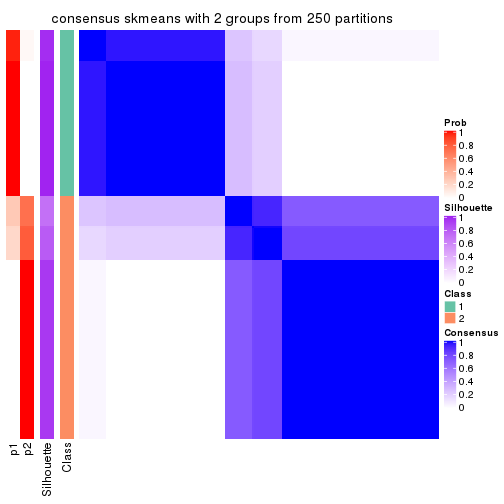</p>

</div>
<div id='tab-MAD-skmeans-consensus-heatmap-2'>
<pre><code class="r">consensus_heatmap(res, k = 3)
</code></pre>

<p>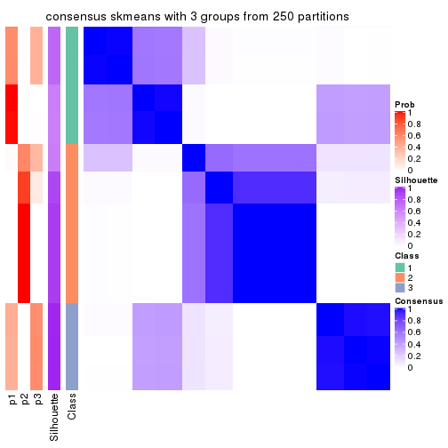</p>

</div>
<div id='tab-MAD-skmeans-consensus-heatmap-3'>
<pre><code class="r">consensus_heatmap(res, k = 4)
</code></pre>

<p>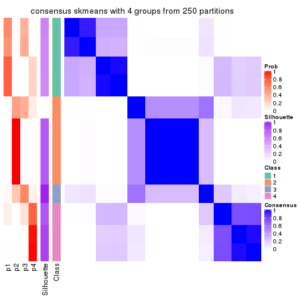</p>

</div>
<div id='tab-MAD-skmeans-consensus-heatmap-4'>
<pre><code class="r">consensus_heatmap(res, k = 5)
</code></pre>

<p>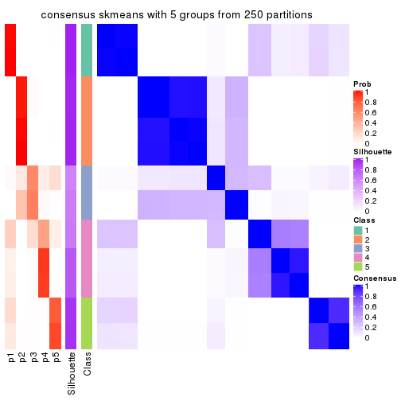</p>

</div>
<div id='tab-MAD-skmeans-consensus-heatmap-5'>
<pre><code class="r">consensus_heatmap(res, k = 6)
</code></pre>

<p>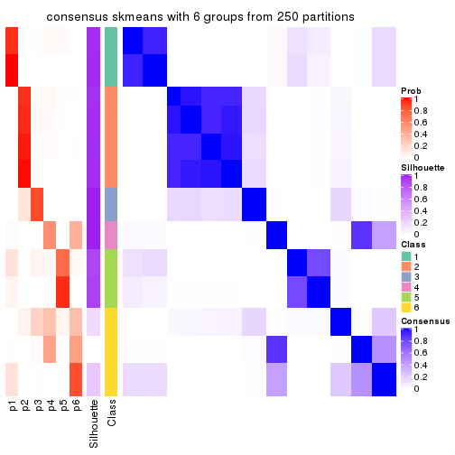</p>

</div>
</div>

Heatmaps for the membership of samples in all partitions to see how consistent they are:


<script>
$( function() {
	$( '#tabs-MAD-skmeans-membership-heatmap' ).tabs();
} );
</script>
<div id='tabs-MAD-skmeans-membership-heatmap'>
<ul>
<li><a href='#tab-MAD-skmeans-membership-heatmap-1'>k = 2</a></li>
<li><a href='#tab-MAD-skmeans-membership-heatmap-2'>k = 3</a></li>
<li><a href='#tab-MAD-skmeans-membership-heatmap-3'>k = 4</a></li>
<li><a href='#tab-MAD-skmeans-membership-heatmap-4'>k = 5</a></li>
<li><a href='#tab-MAD-skmeans-membership-heatmap-5'>k = 6</a></li>
</ul>
<div id='tab-MAD-skmeans-membership-heatmap-1'>
<pre><code class="r">membership_heatmap(res, k = 2)
</code></pre>

<p>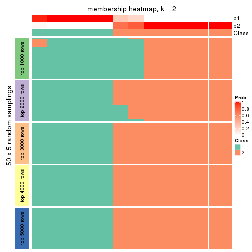</p>

</div>
<div id='tab-MAD-skmeans-membership-heatmap-2'>
<pre><code class="r">membership_heatmap(res, k = 3)
</code></pre>

<p>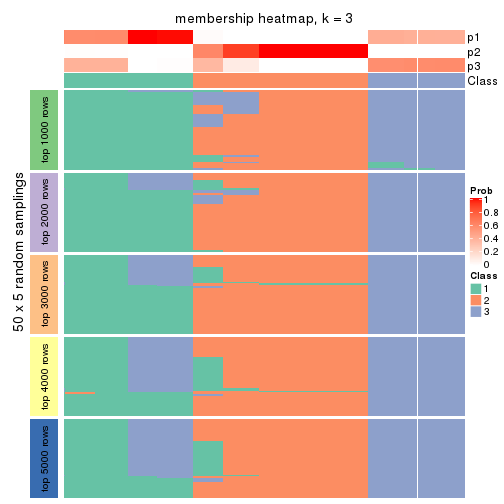</p>

</div>
<div id='tab-MAD-skmeans-membership-heatmap-3'>
<pre><code class="r">membership_heatmap(res, k = 4)
</code></pre>

<p>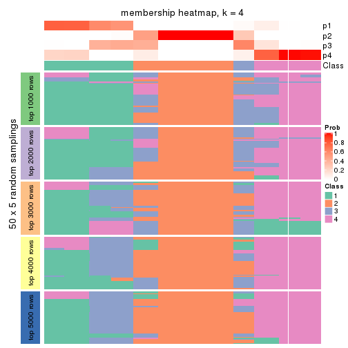</p>

</div>
<div id='tab-MAD-skmeans-membership-heatmap-4'>
<pre><code class="r">membership_heatmap(res, k = 5)
</code></pre>

<p>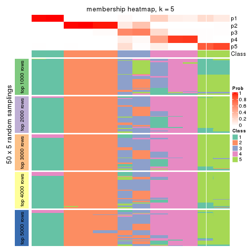</p>

</div>
<div id='tab-MAD-skmeans-membership-heatmap-5'>
<pre><code class="r">membership_heatmap(res, k = 6)
</code></pre>

<p>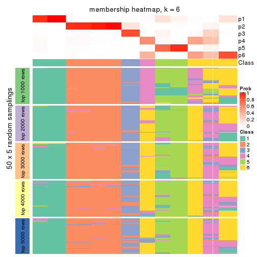</p>

</div>
</div>

As soon as we have had the classes for columns, we can look for signatures
which are significantly different between classes which can be candidate marks
for certain classes. Following are the heatmaps for signatures.


Signature heatmaps where rows are scaled:


<script>
$( function() {
	$( '#tabs-MAD-skmeans-get-signatures' ).tabs();
} );
</script>
<div id='tabs-MAD-skmeans-get-signatures'>
<ul>
<li><a href='#tab-MAD-skmeans-get-signatures-1'>k = 2</a></li>
<li><a href='#tab-MAD-skmeans-get-signatures-2'>k = 3</a></li>
<li><a href='#tab-MAD-skmeans-get-signatures-3'>k = 4</a></li>
<li><a href='#tab-MAD-skmeans-get-signatures-4'>k = 5</a></li>
<li><a href='#tab-MAD-skmeans-get-signatures-5'>k = 6</a></li>
</ul>
<div id='tab-MAD-skmeans-get-signatures-1'>
<pre><code class="r">get_signatures(res, k = 2)
</code></pre>

<p>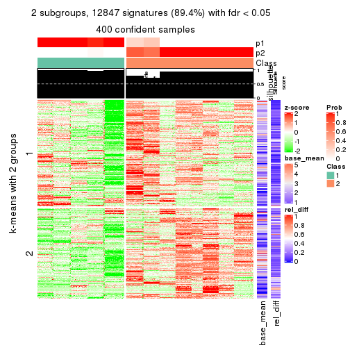</p>

</div>
<div id='tab-MAD-skmeans-get-signatures-2'>
<pre><code class="r">get_signatures(res, k = 3)
</code></pre>

<p>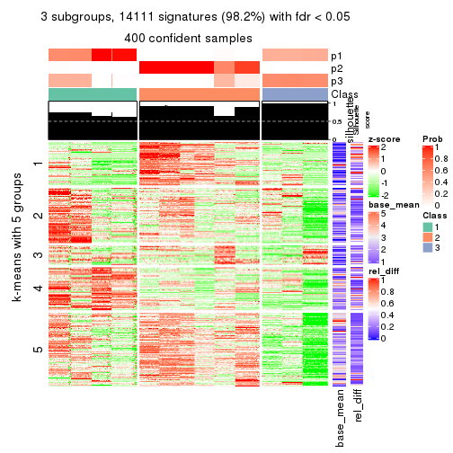</p>

</div>
<div id='tab-MAD-skmeans-get-signatures-3'>
<pre><code class="r">get_signatures(res, k = 4)
</code></pre>

<p>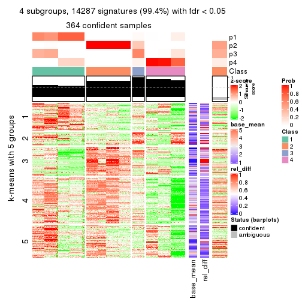</p>

</div>
<div id='tab-MAD-skmeans-get-signatures-4'>
<pre><code class="r">get_signatures(res, k = 5)
</code></pre>

<p>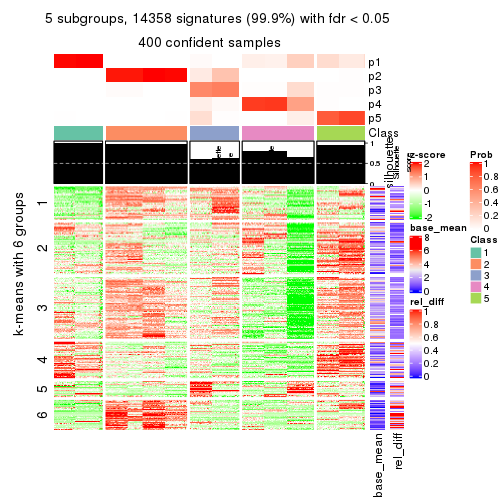</p>

</div>
<div id='tab-MAD-skmeans-get-signatures-5'>
<pre><code class="r">get_signatures(res, k = 6)
</code></pre>

<p>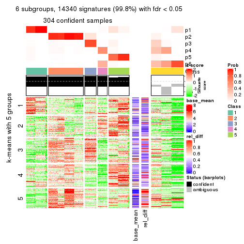</p>

</div>
</div>


Signature heatmaps where rows are not scaled:


<script>
$( function() {
	$( '#tabs-MAD-skmeans-get-signatures-no-scale' ).tabs();
} );
</script>
<div id='tabs-MAD-skmeans-get-signatures-no-scale'>
<ul>
<li><a href='#tab-MAD-skmeans-get-signatures-no-scale-1'>k = 2</a></li>
<li><a href='#tab-MAD-skmeans-get-signatures-no-scale-2'>k = 3</a></li>
<li><a href='#tab-MAD-skmeans-get-signatures-no-scale-3'>k = 4</a></li>
<li><a href='#tab-MAD-skmeans-get-signatures-no-scale-4'>k = 5</a></li>
<li><a href='#tab-MAD-skmeans-get-signatures-no-scale-5'>k = 6</a></li>
</ul>
<div id='tab-MAD-skmeans-get-signatures-no-scale-1'>
<pre><code class="r">get_signatures(res, k = 2, scale_rows = FALSE)
</code></pre>

<p>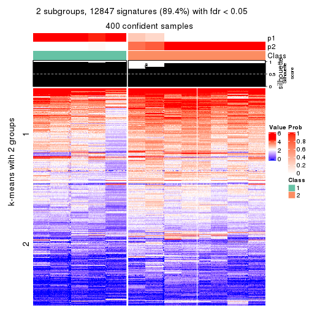</p>

</div>
<div id='tab-MAD-skmeans-get-signatures-no-scale-2'>
<pre><code class="r">get_signatures(res, k = 3, scale_rows = FALSE)
</code></pre>

<p>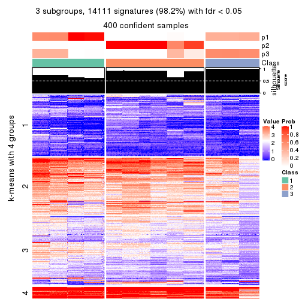</p>

</div>
<div id='tab-MAD-skmeans-get-signatures-no-scale-3'>
<pre><code class="r">get_signatures(res, k = 4, scale_rows = FALSE)
</code></pre>

<p>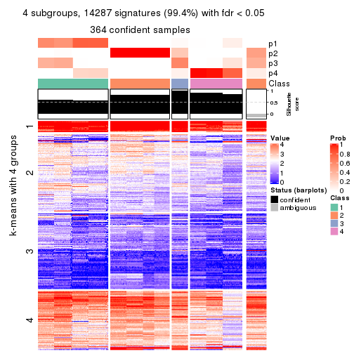</p>

</div>
<div id='tab-MAD-skmeans-get-signatures-no-scale-4'>
<pre><code class="r">get_signatures(res, k = 5, scale_rows = FALSE)
</code></pre>

<p>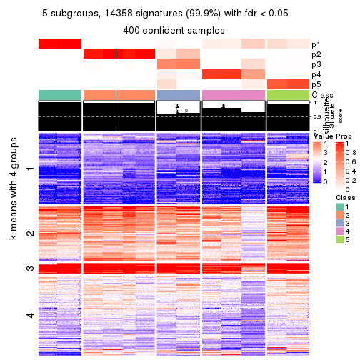</p>

</div>
<div id='tab-MAD-skmeans-get-signatures-no-scale-5'>
<pre><code class="r">get_signatures(res, k = 6, scale_rows = FALSE)
</code></pre>

<p>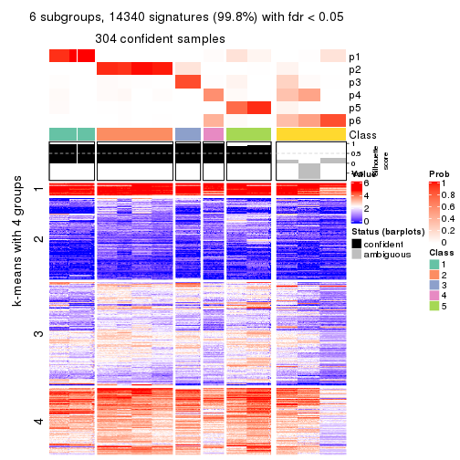</p>

</div>
</div>


Compare the overlap of signatures from different k:

```r
compare_signatures(res)
```

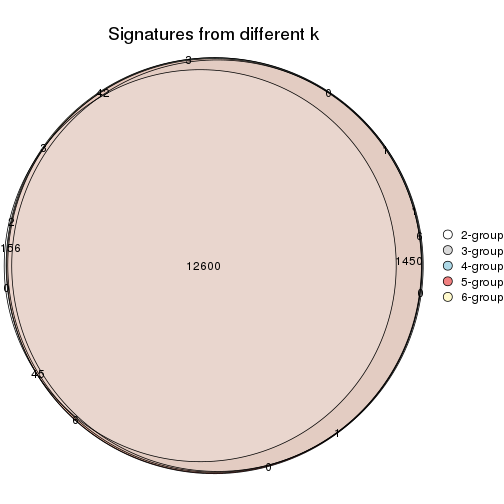

`get_signature()` returns a data frame invisibly. TO get the list of signatures, the function
call should be assigned to a variable explicitly. In following code, if `plot` argument is set
to `FALSE`, no heatmap is plotted while only the differential analysis is performed.

```r
# code only for demonstration
tb = get_signature(res, k = ..., plot = FALSE)
```

An example of the output of `tb` is:

```
#>   which_row         fdr    mean_1    mean_2 scaled_mean_1 scaled_mean_2 km
#> 1        38 0.042760348  8.373488  9.131774    -0.5533452     0.5164555  1
#> 2        40 0.018707592  7.106213  8.469186    -0.6173731     0.5762149  1
#> 3        55 0.019134737 10.221463 11.207825    -0.6159697     0.5749050  1
#> 4        59 0.006059896  5.921854  7.869574    -0.6899429     0.6439467  1
#> 5        60 0.018055526  8.928898 10.211722    -0.6204761     0.5791110  1
#> 6        98 0.009384629 15.714769 14.887706     0.6635654    -0.6193277  2
...
```

The columns in `tb` are:

1. `which_row`: row indices corresponding to the input matrix.
2. `fdr`: FDR for the differential test. 
3. `mean_x`: The mean value in group x.
4. `scaled_mean_x`: The mean value in group x after rows are scaled.
5. `km`: Row groups if k-means clustering is applied to rows.


UMAP plot which shows how samples are separated.


<script>
$( function() {
	$( '#tabs-MAD-skmeans-dimension-reduction' ).tabs();
} );
</script>
<div id='tabs-MAD-skmeans-dimension-reduction'>
<ul>
<li><a href='#tab-MAD-skmeans-dimension-reduction-1'>k = 2</a></li>
<li><a href='#tab-MAD-skmeans-dimension-reduction-2'>k = 3</a></li>
<li><a href='#tab-MAD-skmeans-dimension-reduction-3'>k = 4</a></li>
<li><a href='#tab-MAD-skmeans-dimension-reduction-4'>k = 5</a></li>
<li><a href='#tab-MAD-skmeans-dimension-reduction-5'>k = 6</a></li>
</ul>
<div id='tab-MAD-skmeans-dimension-reduction-1'>
<pre><code class="r">dimension_reduction(res, k = 2, method = &quot;UMAP&quot;)
</code></pre>

<p>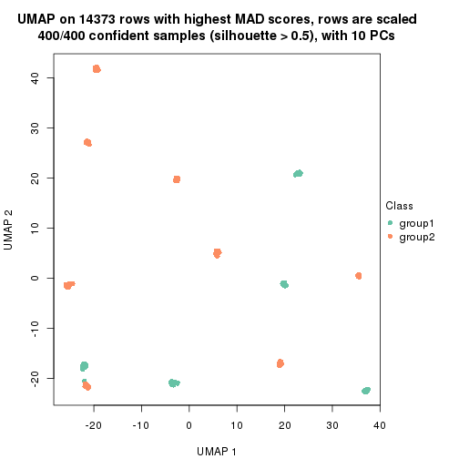</p>

</div>
<div id='tab-MAD-skmeans-dimension-reduction-2'>
<pre><code class="r">dimension_reduction(res, k = 3, method = &quot;UMAP&quot;)
</code></pre>

<p>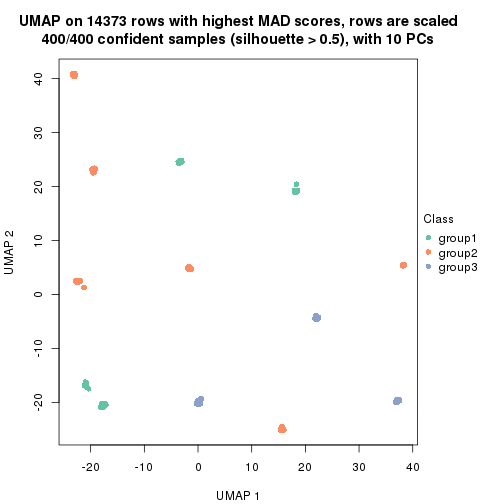</p>

</div>
<div id='tab-MAD-skmeans-dimension-reduction-3'>
<pre><code class="r">dimension_reduction(res, k = 4, method = &quot;UMAP&quot;)
</code></pre>

<p>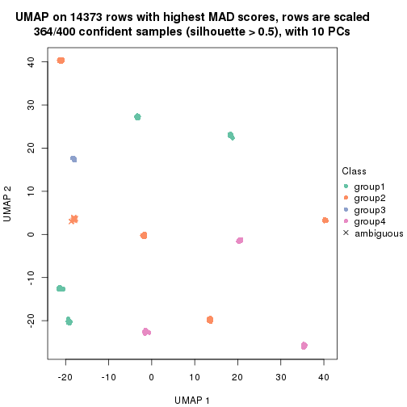</p>

</div>
<div id='tab-MAD-skmeans-dimension-reduction-4'>
<pre><code class="r">dimension_reduction(res, k = 5, method = &quot;UMAP&quot;)
</code></pre>

<p>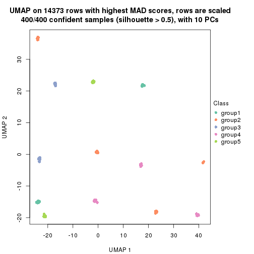</p>

</div>
<div id='tab-MAD-skmeans-dimension-reduction-5'>
<pre><code class="r">dimension_reduction(res, k = 6, method = &quot;UMAP&quot;)
</code></pre>

<p>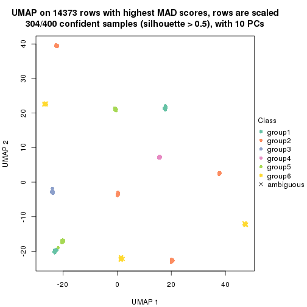</p>

</div>
</div>


Following heatmap shows how subgroups are split when increasing `k`:

```r
collect_classes(res)
```

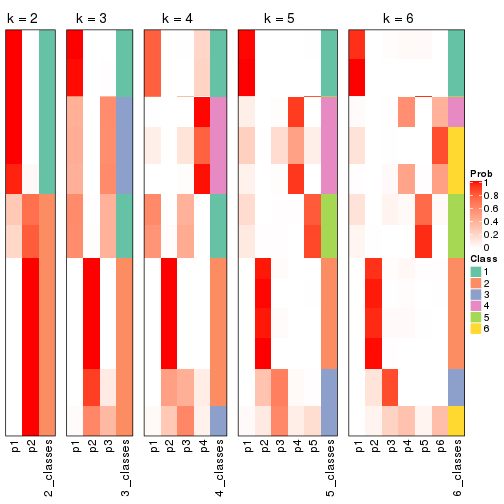


If matrix rows can be associated to genes, consider to use `GO_Enrichment(res,
...)` to perform function enrichment for the signature genes.


 

---------------------------------------------------


### MAD:pam**


The object with results only for a single top-value method and a single partition method 
can be extracted as:

```r
res = res_list["MAD", "pam"]
# you can also extract it by
# res = res_list["MAD:pam"]
```

A summary of `res` and all the functions that can be applied to it:

```r
res
```

```
#> A 'ConsensusPartition' object with k = 2, 3, 4, 5, 6.
#>   On a matrix with 14373 rows and 400 columns.
#>   Top rows (1000, 2000, 3000, 4000, 5000) are extracted by 'MAD' method.
#>   Subgroups are detected by 'pam' method.
#>   Performed in total 1250 partitions by row resampling.
#>   Best k for subgroups seems to be 6.
#> 
#> Following methods can be applied to this 'ConsensusPartition' object:
#>  [1] "cola_report"             "collect_classes"         "collect_plots"          
#>  [4] "collect_stats"           "colnames"                "compare_signatures"     
#>  [7] "consensus_heatmap"       "dimension_reduction"     "functional_enrichment"  
#> [10] "get_anno_col"            "get_anno"                "get_classes"            
#> [13] "get_consensus"           "get_matrix"              "get_membership"         
#> [16] "get_param"               "get_signatures"          "get_stats"              
#> [19] "is_best_k"               "is_stable_k"             "membership_heatmap"     
#> [22] "ncol"                    "nrow"                    "plot_ecdf"              
#> [25] "rownames"                "select_partition_number" "show"                   
#> [28] "suggest_best_k"          "test_to_known_factors"
```

`collect_plots()` function collects all the plots made from `res` for all `k` (number of partitions)
into one single page to provide an easy and fast comparison between different `k`.

```r
collect_plots(res)
```

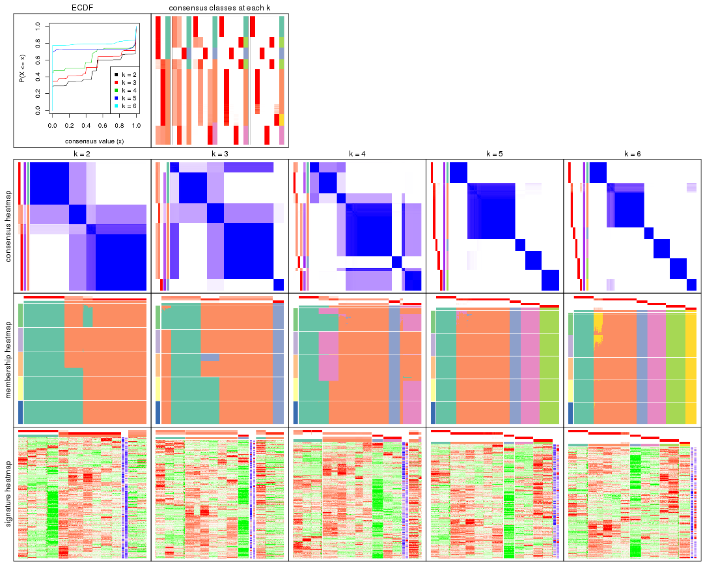

The plots are:

- The first row: a plot of the ECDF (Empirical cumulative distribution
  function) curves of the consensus matrix for each `k` and the heatmap of
  predicted classes for each `k`.
- The second row: heatmaps of the consensus matrix for each `k`.
- The third row: heatmaps of the membership matrix for each `k`.
- The fouth row: heatmaps of the signatures for each `k`.

All the plots in panels can be made by individual functions and they are
plotted later in this section.

`select_partition_number()` produces several plots showing different
statistics for choosing "optimized" `k`. There are following statistics:

- ECDF curves of the consensus matrix for each `k`;
- 1-PAC. [The PAC
  score](https://en.wikipedia.org/wiki/Consensus_clustering#Over-interpretation_potential_of_consensus_clustering)
  measures the proportion of the ambiguous subgrouping.
- Mean silhouette score.
- Concordance. The mean probability of fiting the consensus class ids in all
  partitions.
- Area increased. Denote $A_k$ as the area under the ECDF curve for current
  `k`, the area increased is defined as $A_k - A_{k-1}$.
- Rand index. The percent of pairs of samples that are both in a same cluster
  or both are not in a same cluster in the partition of k and k-1.
- Jaccard index. The ratio of pairs of samples are both in a same cluster in
  the partition of k and k-1 and the pairs of samples are both in a same
  cluster in the partition k or k-1.

The detailed explanations of these statistics can be found in [the cola
vignette](http://bioconductor.org/packages/devel/bioc/vignettes/cola/inst/doc/cola.html#toc_13).

Generally speaking, lower PAC score, higher mean silhouette score or higher
concordance corresponds to better partition. Rand index and Jaccard index
measure how similar the current partition is compared to partition with `k-1`.
If they are too similar, we won't accept `k` is better than `k-1`.

```r
select_partition_number(res)
```

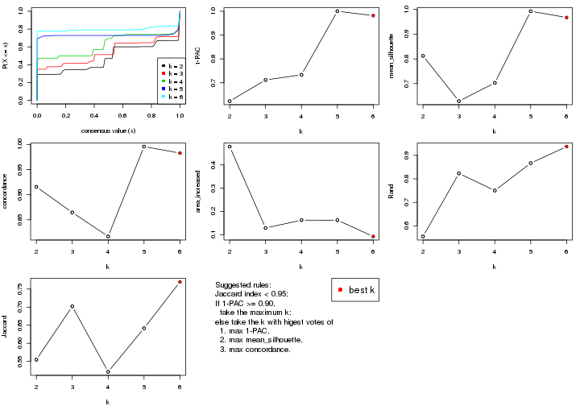

The numeric values for all these statistics can be obtained by `get_stats()`.

```r
get_stats(res)
```

```
#>   k 1-PAC mean_silhouette concordance area_increased  Rand Jaccard
#> 2 2 0.623           0.812       0.916         0.4788 0.555   0.555
#> 3 3 0.712           0.629       0.865         0.1287 0.823   0.702
#> 4 4 0.734           0.703       0.817         0.1624 0.750   0.522
#> 5 5 1.000           0.993       0.996         0.1621 0.867   0.642
#> 6 6 0.982           0.967       0.983         0.0922 0.937   0.770
```

`suggest_best_k()` suggests the best $k$ based on these statistics. The rules are as follows:

- All $k$ with Jaccard index larger than 0.95 are removed because the increase of
  the partition number does not provides enough extra information. If all $k$ are removed,
  the best $k$ is assigned by `NA`.
- For $k$ with 1-PAC larger than 0.9, the maximal $k$ is taken as the "best k". Other $k$ is called "optional k".
- If it does not fit the second rule. The $k$ with the highest vote of highest
  1-PAC, mean silhouette and concordance is taken as the "best k".

```r
suggest_best_k(res)
```

```
#> [1] 6
#> attr(,"optional")
#> [1] 5
```

There is also optional best $k$ = 5 that is worth to check.

Following shows the table of the partitions (You need to click the **show/hide
code output** link to see it). The membership matrix (columns with name `p*`)
is inferred by
[`clue::cl_consensus()`](https://www.rdocumentation.org/link/cl_consensus?package=clue)
function with the `SE` method. Basically the value in the membership matrix
represents the probability to belong to a certain group. The finall class
label for an item is determined with the group with highest probability it
belongs to.

In `get_classes()` function, the entropy is calculated from the membership
matrix and the silhouette score is calculated from the consensus matrix.


<script>
$( function() {
	$( '#tabs-MAD-pam-get-classes' ).tabs();
} );
</script>
<div id='tabs-MAD-pam-get-classes'>
<ul>
<li><a href='#tab-MAD-pam-get-classes-1'>k = 2</a></li>
<li><a href='#tab-MAD-pam-get-classes-2'>k = 3</a></li>
<li><a href='#tab-MAD-pam-get-classes-3'>k = 4</a></li>
<li><a href='#tab-MAD-pam-get-classes-4'>k = 5</a></li>
<li><a href='#tab-MAD-pam-get-classes-5'>k = 6</a></li>
</ul>

<div id='tab-MAD-pam-get-classes-1'>
<p><a id='tab-MAD-pam-get-classes-1-a' style='color:#0366d6' href='#'>show/hide code output</a></p>
<pre><code class="r">cbind(get_classes(res, k = 2), get_membership(res, k = 2))
</code></pre>

<pre><code>#&gt;            class entropy silhouette    p1    p2
#&gt; SRR1661716     2  0.0000      0.859 0.000 1.000
#&gt; SRR1661717     2  0.0000      0.859 0.000 1.000
#&gt; SRR1661718     2  0.0000      0.859 0.000 1.000
#&gt; SRR1661719     2  0.0000      0.859 0.000 1.000
#&gt; SRR1661720     2  0.0000      0.859 0.000 1.000
#&gt; SRR1661721     2  0.0000      0.859 0.000 1.000
#&gt; SRR1661722     2  0.0000      0.859 0.000 1.000
#&gt; SRR1661723     2  0.0000      0.859 0.000 1.000
#&gt; SRR1661724     2  0.0000      0.859 0.000 1.000
#&gt; SRR1661725     2  0.0000      0.859 0.000 1.000
#&gt; SRR1661726     2  0.0000      0.859 0.000 1.000
#&gt; SRR1661727     2  0.0000      0.859 0.000 1.000
#&gt; SRR1661728     2  0.0000      0.859 0.000 1.000
#&gt; SRR1661729     2  0.0000      0.859 0.000 1.000
#&gt; SRR1661730     2  0.0000      0.859 0.000 1.000
#&gt; SRR1661731     2  0.0000      0.859 0.000 1.000
#&gt; SRR1661732     2  0.0000      0.859 0.000 1.000
#&gt; SRR1661733     2  0.0000      0.859 0.000 1.000
#&gt; SRR1661734     2  0.0000      0.859 0.000 1.000
#&gt; SRR1661735     2  0.0000      0.859 0.000 1.000
#&gt; SRR1661736     2  0.0000      0.859 0.000 1.000
#&gt; SRR1661737     2  0.0000      0.859 0.000 1.000
#&gt; SRR1661738     2  0.0000      0.859 0.000 1.000
#&gt; SRR1661739     2  0.0000      0.859 0.000 1.000
#&gt; SRR1661740     2  0.0000      0.859 0.000 1.000
#&gt; SRR1661741     2  0.0000      0.859 0.000 1.000
#&gt; SRR1661742     2  0.0000      0.859 0.000 1.000
#&gt; SRR1661743     2  0.0000      0.859 0.000 1.000
#&gt; SRR1661744     2  0.0000      0.859 0.000 1.000
#&gt; SRR1661745     2  0.0000      0.859 0.000 1.000
#&gt; SRR1661746     2  0.0000      0.859 0.000 1.000
#&gt; SRR1661747     2  0.0000      0.859 0.000 1.000
#&gt; SRR1661748     2  0.0000      0.859 0.000 1.000
#&gt; SRR1661749     2  0.0000      0.859 0.000 1.000
#&gt; SRR1661750     2  0.0000      0.859 0.000 1.000
#&gt; SRR1661751     2  0.0000      0.859 0.000 1.000
#&gt; SRR1661752     2  0.0000      0.859 0.000 1.000
#&gt; SRR1661753     2  0.0000      0.859 0.000 1.000
#&gt; SRR1661754     2  0.0000      0.859 0.000 1.000
#&gt; SRR1661755     2  0.0000      0.859 0.000 1.000
#&gt; SRR1661756     2  0.0000      0.859 0.000 1.000
#&gt; SRR1661757     2  0.0000      0.859 0.000 1.000
#&gt; SRR1661758     2  0.0000      0.859 0.000 1.000
#&gt; SRR1661759     2  0.0000      0.859 0.000 1.000
#&gt; SRR1661760     2  0.0000      0.859 0.000 1.000
#&gt; SRR1661761     2  0.0000      0.859 0.000 1.000
#&gt; SRR1661762     2  0.0000      0.859 0.000 1.000
#&gt; SRR1661763     2  0.0000      0.859 0.000 1.000
#&gt; SRR1661764     2  0.0000      0.859 0.000 1.000
#&gt; SRR1661766     2  0.0000      0.859 0.000 1.000
#&gt; SRR1661767     2  0.0000      0.859 0.000 1.000
#&gt; SRR1661768     2  0.0000      0.859 0.000 1.000
#&gt; SRR1661769     2  0.0000      0.859 0.000 1.000
#&gt; SRR1661770     2  0.0000      0.859 0.000 1.000
#&gt; SRR1661771     2  0.0000      0.859 0.000 1.000
#&gt; SRR1661772     2  0.0000      0.859 0.000 1.000
#&gt; SRR1661773     2  0.0000      0.859 0.000 1.000
#&gt; SRR1661774     2  0.0000      0.859 0.000 1.000
#&gt; SRR1661775     2  0.0000      0.859 0.000 1.000
#&gt; SRR1661776     2  0.0000      0.859 0.000 1.000
#&gt; SRR1661777     2  0.0000      0.859 0.000 1.000
#&gt; SRR1661778     2  0.0000      0.859 0.000 1.000
#&gt; SRR1661779     2  0.0000      0.859 0.000 1.000
#&gt; SRR1661780     2  0.0000      0.859 0.000 1.000
#&gt; SRR1661781     2  0.0000      0.859 0.000 1.000
#&gt; SRR1661782     2  0.0000      0.859 0.000 1.000
#&gt; SRR1661783     2  0.0000      0.859 0.000 1.000
#&gt; SRR1661784     2  0.0000      0.859 0.000 1.000
#&gt; SRR1661785     2  0.0000      0.859 0.000 1.000
#&gt; SRR1661786     2  0.0000      0.859 0.000 1.000
#&gt; SRR1661787     2  0.0000      0.859 0.000 1.000
#&gt; SRR1661788     2  0.0000      0.859 0.000 1.000
#&gt; SRR1661789     2  0.0000      0.859 0.000 1.000
#&gt; SRR1661790     2  0.0000      0.859 0.000 1.000
#&gt; SRR1661791     2  0.0000      0.859 0.000 1.000
#&gt; SRR1661792     2  0.0000      0.859 0.000 1.000
#&gt; SRR1661793     2  0.0000      0.859 0.000 1.000
#&gt; SRR1661794     2  0.0000      0.859 0.000 1.000
#&gt; SRR1661795     2  0.0000      0.859 0.000 1.000
#&gt; SRR1661796     2  0.0000      0.859 0.000 1.000
#&gt; SRR1661797     2  0.0000      0.859 0.000 1.000
#&gt; SRR1661798     2  0.0000      0.859 0.000 1.000
#&gt; SRR1661799     2  0.0000      0.859 0.000 1.000
#&gt; SRR1661800     2  0.0000      0.859 0.000 1.000
#&gt; SRR1661801     2  0.0000      0.859 0.000 1.000
#&gt; SRR1661802     2  0.0000      0.859 0.000 1.000
#&gt; SRR1661803     2  0.0000      0.859 0.000 1.000
#&gt; SRR1661804     2  0.0000      0.859 0.000 1.000
#&gt; SRR1661805     2  0.0000      0.859 0.000 1.000
#&gt; SRR1661806     2  0.0000      0.859 0.000 1.000
#&gt; SRR1661807     2  0.0000      0.859 0.000 1.000
#&gt; SRR1661808     2  0.0000      0.859 0.000 1.000
#&gt; SRR1661809     2  0.0000      0.859 0.000 1.000
#&gt; SRR1661810     2  0.0000      0.859 0.000 1.000
#&gt; SRR1661811     2  0.0000      0.859 0.000 1.000
#&gt; SRR1661812     2  0.0000      0.859 0.000 1.000
#&gt; SRR1661813     2  0.0000      0.859 0.000 1.000
#&gt; SRR1661814     2  0.0000      0.859 0.000 1.000
#&gt; SRR1661815     2  0.0000      0.859 0.000 1.000
#&gt; SRR1661816     2  0.0000      0.859 0.000 1.000
#&gt; SRR1661817     2  0.0000      0.859 0.000 1.000
#&gt; SRR1661818     2  0.0000      0.859 0.000 1.000
#&gt; SRR1661819     2  0.0000      0.859 0.000 1.000
#&gt; SRR1661820     2  0.0000      0.859 0.000 1.000
#&gt; SRR1661821     2  0.0000      0.859 0.000 1.000
#&gt; SRR1661822     2  0.0000      0.859 0.000 1.000
#&gt; SRR1661823     2  0.0000      0.859 0.000 1.000
#&gt; SRR1661824     2  0.0000      0.859 0.000 1.000
#&gt; SRR1661825     2  0.0000      0.859 0.000 1.000
#&gt; SRR1661826     1  0.0000      1.000 1.000 0.000
#&gt; SRR1661827     1  0.0000      1.000 1.000 0.000
#&gt; SRR1661828     1  0.0000      1.000 1.000 0.000
#&gt; SRR1661829     1  0.0000      1.000 1.000 0.000
#&gt; SRR1661830     1  0.0000      1.000 1.000 0.000
#&gt; SRR1661831     1  0.0000      1.000 1.000 0.000
#&gt; SRR1661832     1  0.0000      1.000 1.000 0.000
#&gt; SRR1661833     1  0.0000      1.000 1.000 0.000
#&gt; SRR1661834     1  0.0000      1.000 1.000 0.000
#&gt; SRR1661835     1  0.0000      1.000 1.000 0.000
#&gt; SRR1661836     1  0.0000      1.000 1.000 0.000
#&gt; SRR1661837     1  0.0000      1.000 1.000 0.000
#&gt; SRR1661838     1  0.0000      1.000 1.000 0.000
#&gt; SRR1661839     1  0.0000      1.000 1.000 0.000
#&gt; SRR1661840     1  0.0000      1.000 1.000 0.000
#&gt; SRR1661841     1  0.0000      1.000 1.000 0.000
#&gt; SRR1661843     1  0.0000      1.000 1.000 0.000
#&gt; SRR1661844     1  0.0000      1.000 1.000 0.000
#&gt; SRR1661845     1  0.0000      1.000 1.000 0.000
#&gt; SRR1661846     1  0.0000      1.000 1.000 0.000
#&gt; SRR1661847     1  0.0000      1.000 1.000 0.000
#&gt; SRR1661848     1  0.0000      1.000 1.000 0.000
#&gt; SRR1661849     1  0.0000      1.000 1.000 0.000
#&gt; SRR1661850     1  0.0000      1.000 1.000 0.000
#&gt; SRR1661851     1  0.0000      1.000 1.000 0.000
#&gt; SRR1661852     1  0.0000      1.000 1.000 0.000
#&gt; SRR1661853     1  0.0000      1.000 1.000 0.000
#&gt; SRR1661854     1  0.0000      1.000 1.000 0.000
#&gt; SRR1661855     1  0.0000      1.000 1.000 0.000
#&gt; SRR1661856     1  0.0000      1.000 1.000 0.000
#&gt; SRR1661857     1  0.0000      1.000 1.000 0.000
#&gt; SRR1661858     1  0.0000      1.000 1.000 0.000
#&gt; SRR1661859     1  0.0000      1.000 1.000 0.000
#&gt; SRR1661860     1  0.0000      1.000 1.000 0.000
#&gt; SRR1661861     1  0.0000      1.000 1.000 0.000
#&gt; SRR1661862     1  0.0000      1.000 1.000 0.000
#&gt; SRR1661863     1  0.0000      1.000 1.000 0.000
#&gt; SRR1661864     1  0.0000      1.000 1.000 0.000
#&gt; SRR1661865     1  0.0000      1.000 1.000 0.000
#&gt; SRR1661866     1  0.0000      1.000 1.000 0.000
#&gt; SRR1661867     1  0.0000      1.000 1.000 0.000
#&gt; SRR1661868     1  0.0000      1.000 1.000 0.000
#&gt; SRR1661869     1  0.0000      1.000 1.000 0.000
#&gt; SRR1661870     1  0.0000      1.000 1.000 0.000
#&gt; SRR1661871     1  0.0000      1.000 1.000 0.000
#&gt; SRR1661872     1  0.0000      1.000 1.000 0.000
#&gt; SRR1661873     1  0.0000      1.000 1.000 0.000
#&gt; SRR1661874     1  0.0000      1.000 1.000 0.000
#&gt; SRR1661875     1  0.0000      1.000 1.000 0.000
#&gt; SRR1661876     1  0.0000      1.000 1.000 0.000
#&gt; SRR1661877     1  0.0000      1.000 1.000 0.000
#&gt; SRR1661878     1  0.0000      1.000 1.000 0.000
#&gt; SRR1661879     1  0.0000      1.000 1.000 0.000
#&gt; SRR1661880     1  0.0000      1.000 1.000 0.000
#&gt; SRR1661881     1  0.0000      1.000 1.000 0.000
#&gt; SRR1661882     1  0.0000      1.000 1.000 0.000
#&gt; SRR1661883     1  0.0000      1.000 1.000 0.000
#&gt; SRR1661884     1  0.0000      1.000 1.000 0.000
#&gt; SRR1661885     1  0.0000      1.000 1.000 0.000
#&gt; SRR1661886     1  0.0000      1.000 1.000 0.000
#&gt; SRR1661887     1  0.0000      1.000 1.000 0.000
#&gt; SRR1661888     1  0.0000      1.000 1.000 0.000
#&gt; SRR1661889     1  0.0000      1.000 1.000 0.000
#&gt; SRR1661890     1  0.0000      1.000 1.000 0.000
#&gt; SRR1661891     1  0.0000      1.000 1.000 0.000
#&gt; SRR1661892     1  0.0000      1.000 1.000 0.000
#&gt; SRR1661893     1  0.0000      1.000 1.000 0.000
#&gt; SRR1661894     1  0.0000      1.000 1.000 0.000
#&gt; SRR1661895     1  0.0000      1.000 1.000 0.000
#&gt; SRR1661896     1  0.0000      1.000 1.000 0.000
#&gt; SRR1661897     1  0.0000      1.000 1.000 0.000
#&gt; SRR1661898     1  0.0000      1.000 1.000 0.000
#&gt; SRR1661899     1  0.0000      1.000 1.000 0.000
#&gt; SRR1661900     1  0.0000      1.000 1.000 0.000
#&gt; SRR1661901     1  0.0000      1.000 1.000 0.000
#&gt; SRR1661902     1  0.0000      1.000 1.000 0.000
#&gt; SRR1661903     1  0.0000      1.000 1.000 0.000
#&gt; SRR1661904     1  0.0000      1.000 1.000 0.000
#&gt; SRR1661905     1  0.0000      1.000 1.000 0.000
#&gt; SRR1661906     1  0.0000      1.000 1.000 0.000
#&gt; SRR1661907     1  0.0000      1.000 1.000 0.000
#&gt; SRR1661908     1  0.0000      1.000 1.000 0.000
#&gt; SRR1661909     1  0.0000      1.000 1.000 0.000
#&gt; SRR1661910     1  0.0000      1.000 1.000 0.000
#&gt; SRR1661911     1  0.0000      1.000 1.000 0.000
#&gt; SRR1661912     1  0.0000      1.000 1.000 0.000
#&gt; SRR1661913     1  0.0000      1.000 1.000 0.000
#&gt; SRR1661914     1  0.0000      1.000 1.000 0.000
#&gt; SRR1661915     1  0.0000      1.000 1.000 0.000
#&gt; SRR1661916     1  0.0000      1.000 1.000 0.000
#&gt; SRR1661917     1  0.0000      1.000 1.000 0.000
#&gt; SRR1661918     1  0.0000      1.000 1.000 0.000
#&gt; SRR1661919     1  0.0000      1.000 1.000 0.000
#&gt; SRR1661920     1  0.0000      1.000 1.000 0.000
#&gt; SRR1661921     1  0.0000      1.000 1.000 0.000
#&gt; SRR1661922     1  0.0000      1.000 1.000 0.000
#&gt; SRR1661923     1  0.0000      1.000 1.000 0.000
#&gt; SRR1661924     1  0.0000      1.000 1.000 0.000
#&gt; SRR1661925     1  0.0000      1.000 1.000 0.000
#&gt; SRR1661926     1  0.0000      1.000 1.000 0.000
#&gt; SRR1661927     1  0.0000      1.000 1.000 0.000
#&gt; SRR1661928     2  0.0000      0.859 0.000 1.000
#&gt; SRR1661929     2  0.0000      0.859 0.000 1.000
#&gt; SRR1661930     2  0.0000      0.859 0.000 1.000
#&gt; SRR1661931     2  0.0000      0.859 0.000 1.000
#&gt; SRR1661932     2  0.0000      0.859 0.000 1.000
#&gt; SRR1661933     2  0.0000      0.859 0.000 1.000
#&gt; SRR1661934     2  0.0000      0.859 0.000 1.000
#&gt; SRR1661935     2  0.0000      0.859 0.000 1.000
#&gt; SRR1661936     2  0.0000      0.859 0.000 1.000
#&gt; SRR1661937     2  0.0000      0.859 0.000 1.000
#&gt; SRR1661938     2  0.0000      0.859 0.000 1.000
#&gt; SRR1661939     2  0.0000      0.859 0.000 1.000
#&gt; SRR1661940     2  0.0000      0.859 0.000 1.000
#&gt; SRR1661941     2  0.0000      0.859 0.000 1.000
#&gt; SRR1661942     2  0.0000      0.859 0.000 1.000
#&gt; SRR1661943     2  0.0000      0.859 0.000 1.000
#&gt; SRR1661944     2  0.0000      0.859 0.000 1.000
#&gt; SRR1661945     2  0.0000      0.859 0.000 1.000
#&gt; SRR1661946     2  0.0000      0.859 0.000 1.000
#&gt; SRR1661947     2  0.0000      0.859 0.000 1.000
#&gt; SRR1661948     2  0.0000      0.859 0.000 1.000
#&gt; SRR1661949     2  0.0000      0.859 0.000 1.000
#&gt; SRR1661950     2  0.0000      0.859 0.000 1.000
#&gt; SRR1661951     2  0.0000      0.859 0.000 1.000
#&gt; SRR1661952     2  0.0000      0.859 0.000 1.000
#&gt; SRR1661953     2  0.0000      0.859 0.000 1.000
#&gt; SRR1661954     2  0.0000      0.859 0.000 1.000
#&gt; SRR1661955     2  0.0000      0.859 0.000 1.000
#&gt; SRR1661956     2  0.0000      0.859 0.000 1.000
#&gt; SRR1661957     2  0.0000      0.859 0.000 1.000
#&gt; SRR1661958     2  0.9970      0.307 0.468 0.532
#&gt; SRR1661959     2  0.9970      0.307 0.468 0.532
#&gt; SRR1661960     2  0.9970      0.307 0.468 0.532
#&gt; SRR1661961     2  0.9970      0.307 0.468 0.532
#&gt; SRR1661962     2  0.9970      0.307 0.468 0.532
#&gt; SRR1661963     2  0.9970      0.307 0.468 0.532
#&gt; SRR1661964     2  0.9983      0.284 0.476 0.524
#&gt; SRR1661965     2  0.9970      0.307 0.468 0.532
#&gt; SRR1661966     2  0.9970      0.307 0.468 0.532
#&gt; SRR1661967     2  0.9970      0.307 0.468 0.532
#&gt; SRR1661968     2  0.9970      0.307 0.468 0.532
#&gt; SRR1661969     2  0.9970      0.307 0.468 0.532
#&gt; SRR1661970     2  0.9970      0.307 0.468 0.532
#&gt; SRR1661971     2  0.9970      0.307 0.468 0.532
#&gt; SRR1661972     2  0.9970      0.307 0.468 0.532
#&gt; SRR1661973     2  0.9970      0.307 0.468 0.532
#&gt; SRR1661974     2  0.9970      0.307 0.468 0.532
#&gt; SRR1661975     2  0.9970      0.307 0.468 0.532
#&gt; SRR1661976     2  0.9970      0.307 0.468 0.532
#&gt; SRR1661977     2  0.9970      0.307 0.468 0.532
#&gt; SRR1661978     2  0.9970      0.307 0.468 0.532
#&gt; SRR1661979     2  0.9970      0.307 0.468 0.532
#&gt; SRR1661980     2  0.9970      0.307 0.468 0.532
#&gt; SRR1661981     2  0.9970      0.307 0.468 0.532
#&gt; SRR1661982     2  0.9970      0.307 0.468 0.532
#&gt; SRR1661983     2  0.9970      0.307 0.468 0.532
#&gt; SRR1661984     2  0.9970      0.307 0.468 0.532
#&gt; SRR1661985     2  0.9970      0.307 0.468 0.532
#&gt; SRR1661986     2  0.9970      0.307 0.468 0.532
#&gt; SRR1661987     2  0.9970      0.307 0.468 0.532
#&gt; SRR1661988     1  0.0000      1.000 1.000 0.000
#&gt; SRR1661989     1  0.0000      1.000 1.000 0.000
#&gt; SRR1661990     1  0.0000      1.000 1.000 0.000
#&gt; SRR1661991     1  0.0000      1.000 1.000 0.000
#&gt; SRR1661992     1  0.0376      0.995 0.996 0.004
#&gt; SRR1661993     1  0.0000      1.000 1.000 0.000
#&gt; SRR1661994     1  0.0000      1.000 1.000 0.000
#&gt; SRR1661995     1  0.0000      1.000 1.000 0.000
#&gt; SRR1661996     1  0.0000      1.000 1.000 0.000
#&gt; SRR1661997     1  0.0672      0.990 0.992 0.008
#&gt; SRR1661998     1  0.0376      0.995 0.996 0.004
#&gt; SRR1661999     1  0.0000      1.000 1.000 0.000
#&gt; SRR1662000     1  0.0000      1.000 1.000 0.000
#&gt; SRR1662001     1  0.0000      1.000 1.000 0.000
#&gt; SRR1662002     1  0.0000      1.000 1.000 0.000
#&gt; SRR1662003     1  0.0000      1.000 1.000 0.000
#&gt; SRR1662004     1  0.0000      1.000 1.000 0.000
#&gt; SRR1662005     1  0.0000      1.000 1.000 0.000
#&gt; SRR1662006     1  0.0000      1.000 1.000 0.000
#&gt; SRR1662007     1  0.0376      0.995 0.996 0.004
#&gt; SRR1662008     1  0.0000      1.000 1.000 0.000
#&gt; SRR1662009     1  0.0000      1.000 1.000 0.000
#&gt; SRR1662010     1  0.0000      1.000 1.000 0.000
#&gt; SRR1662011     1  0.0000      1.000 1.000 0.000
#&gt; SRR1662012     1  0.0000      1.000 1.000 0.000
#&gt; SRR1662013     1  0.0000      1.000 1.000 0.000
#&gt; SRR1662014     1  0.0000      1.000 1.000 0.000
#&gt; SRR1662015     1  0.0000      1.000 1.000 0.000
#&gt; SRR1662016     1  0.0000      1.000 1.000 0.000
#&gt; SRR1662017     1  0.0000      1.000 1.000 0.000
#&gt; SRR1662018     2  0.0000      0.859 0.000 1.000
#&gt; SRR1662019     2  0.0000      0.859 0.000 1.000
#&gt; SRR1662020     2  0.0000      0.859 0.000 1.000
#&gt; SRR1662021     2  0.0000      0.859 0.000 1.000
#&gt; SRR1662022     2  0.0000      0.859 0.000 1.000
#&gt; SRR1662023     2  0.0000      0.859 0.000 1.000
#&gt; SRR1662024     2  0.0000      0.859 0.000 1.000
#&gt; SRR1662025     2  0.0000      0.859 0.000 1.000
#&gt; SRR1662026     2  0.0000      0.859 0.000 1.000
#&gt; SRR1662027     2  0.0000      0.859 0.000 1.000
#&gt; SRR1662028     2  0.0000      0.859 0.000 1.000
#&gt; SRR1662029     2  0.0000      0.859 0.000 1.000
#&gt; SRR1662030     2  0.0000      0.859 0.000 1.000
#&gt; SRR1662031     2  0.0000      0.859 0.000 1.000
#&gt; SRR1662032     2  0.0000      0.859 0.000 1.000
#&gt; SRR1662033     2  0.0000      0.859 0.000 1.000
#&gt; SRR1662034     2  0.0000      0.859 0.000 1.000
#&gt; SRR1662035     2  0.0000      0.859 0.000 1.000
#&gt; SRR1662036     2  0.0000      0.859 0.000 1.000
#&gt; SRR1662037     2  0.0000      0.859 0.000 1.000
#&gt; SRR1662038     2  0.0000      0.859 0.000 1.000
#&gt; SRR1662039     2  0.0000      0.859 0.000 1.000
#&gt; SRR1662040     2  0.0000      0.859 0.000 1.000
#&gt; SRR1662041     2  0.0000      0.859 0.000 1.000
#&gt; SRR1662042     2  0.0000      0.859 0.000 1.000
#&gt; SRR1662043     2  0.0000      0.859 0.000 1.000
#&gt; SRR1662044     2  0.0000      0.859 0.000 1.000
#&gt; SRR1662045     2  0.0000      0.859 0.000 1.000
#&gt; SRR1662046     2  0.0000      0.859 0.000 1.000
#&gt; SRR1662047     2  0.0000      0.859 0.000 1.000
#&gt; SRR1662048     2  0.0000      0.859 0.000 1.000
#&gt; SRR1662049     2  0.0000      0.859 0.000 1.000
#&gt; SRR1662050     2  0.0000      0.859 0.000 1.000
#&gt; SRR1662051     2  0.0000      0.859 0.000 1.000
#&gt; SRR1662052     2  0.0000      0.859 0.000 1.000
#&gt; SRR1662053     2  0.0000      0.859 0.000 1.000
#&gt; SRR1662054     2  0.9970      0.307 0.468 0.532
#&gt; SRR1662055     2  0.9970      0.307 0.468 0.532
#&gt; SRR1662056     2  0.9970      0.307 0.468 0.532
#&gt; SRR1662057     2  0.9970      0.307 0.468 0.532
#&gt; SRR1662058     2  0.9970      0.307 0.468 0.532
#&gt; SRR1662059     2  0.9970      0.307 0.468 0.532
#&gt; SRR1662060     2  0.9970      0.307 0.468 0.532
#&gt; SRR1662061     2  0.9970      0.307 0.468 0.532
#&gt; SRR1662062     2  0.9970      0.307 0.468 0.532
#&gt; SRR1662063     2  0.9970      0.307 0.468 0.532
#&gt; SRR1662064     2  0.9970      0.307 0.468 0.532
#&gt; SRR1662065     2  0.9970      0.307 0.468 0.532
#&gt; SRR1662066     2  0.9970      0.307 0.468 0.532
#&gt; SRR1662067     2  0.9970      0.307 0.468 0.532
#&gt; SRR1662068     2  0.9970      0.307 0.468 0.532
#&gt; SRR1662069     2  0.9970      0.307 0.468 0.532
#&gt; SRR1662070     2  0.9970      0.307 0.468 0.532
#&gt; SRR1662071     2  0.9970      0.307 0.468 0.532
#&gt; SRR1662072     2  0.9970      0.307 0.468 0.532
#&gt; SRR1662073     2  0.9970      0.307 0.468 0.532
#&gt; SRR1662074     2  0.9970      0.307 0.468 0.532
#&gt; SRR1662075     2  0.9970      0.307 0.468 0.532
#&gt; SRR1662076     2  0.9970      0.307 0.468 0.532
#&gt; SRR1662077     2  0.9970      0.307 0.468 0.532
#&gt; SRR1662078     2  0.9970      0.307 0.468 0.532
#&gt; SRR1662079     2  0.9970      0.307 0.468 0.532
#&gt; SRR1662080     2  0.9970      0.307 0.468 0.532
#&gt; SRR1662081     2  0.9970      0.307 0.468 0.532
#&gt; SRR1662082     2  0.9970      0.307 0.468 0.532
#&gt; SRR1662083     2  0.9970      0.307 0.468 0.532
#&gt; SRR1662084     2  0.6438      0.740 0.164 0.836
#&gt; SRR1662085     2  0.6973      0.715 0.188 0.812
#&gt; SRR1662086     2  0.6712      0.728 0.176 0.824
#&gt; SRR1662087     1  0.0000      1.000 1.000 0.000
#&gt; SRR1662088     2  0.6531      0.736 0.168 0.832
#&gt; SRR1662089     2  0.6801      0.724 0.180 0.820
#&gt; SRR1662090     2  0.6531      0.736 0.168 0.832
#&gt; SRR1662091     2  0.6973      0.715 0.188 0.812
#&gt; SRR1662092     2  0.6623      0.732 0.172 0.828
#&gt; SRR1662093     2  0.6973      0.716 0.188 0.812
#&gt; SRR1662094     2  0.6623      0.732 0.172 0.828
#&gt; SRR1662095     2  0.6438      0.740 0.164 0.836
#&gt; SRR1662096     2  0.6623      0.732 0.172 0.828
#&gt; SRR1662097     2  0.6438      0.740 0.164 0.836
#&gt; SRR1662098     2  0.6531      0.736 0.168 0.832
#&gt; SRR1662099     2  0.6801      0.724 0.180 0.820
#&gt; SRR1662100     2  0.6712      0.728 0.176 0.824
#&gt; SRR1662101     2  0.5629      0.767 0.132 0.868
#&gt; SRR1662102     2  0.6438      0.740 0.164 0.836
#&gt; SRR1662103     2  0.6531      0.736 0.168 0.832
#&gt; SRR1662104     2  0.6712      0.728 0.176 0.824
#&gt; SRR1662105     2  0.6438      0.740 0.164 0.836
#&gt; SRR1662106     2  0.6712      0.728 0.176 0.824
#&gt; SRR1662107     2  0.6887      0.720 0.184 0.816
#&gt; SRR1662108     2  0.6801      0.724 0.180 0.820
#&gt; SRR1662109     2  0.6973      0.715 0.188 0.812
#&gt; SRR1662110     2  0.6623      0.732 0.172 0.828
#&gt; SRR1662111     1  0.0000      1.000 1.000 0.000
#&gt; SRR1662112     2  0.6712      0.728 0.176 0.824
#&gt; SRR1662113     2  0.6531      0.736 0.168 0.832
#&gt; SRR1662114     2  0.8499      0.622 0.276 0.724
#&gt; SRR1662115     2  0.6531      0.736 0.168 0.832
#&gt; SRR1662116     2  0.6887      0.720 0.184 0.816
#&gt; SRR1662117     2  0.6712      0.728 0.176 0.824
</code></pre>

<script>
$('#tab-MAD-pam-get-classes-1-a').parent().next().next().hide();
$('#tab-MAD-pam-get-classes-1-a').click(function(){
  $('#tab-MAD-pam-get-classes-1-a').parent().next().next().toggle();
  return(false);
});
</script>
</div>

<div id='tab-MAD-pam-get-classes-2'>
<p><a id='tab-MAD-pam-get-classes-2-a' style='color:#0366d6' href='#'>show/hide code output</a></p>
<pre><code class="r">cbind(get_classes(res, k = 3), get_membership(res, k = 3))
</code></pre>

<pre><code>#&gt;            class entropy silhouette    p1    p2    p3
#&gt; SRR1661716     2   0.613      0.838 0.400 0.600 0.000
#&gt; SRR1661717     2   0.613      0.838 0.400 0.600 0.000
#&gt; SRR1661718     2   0.613      0.838 0.400 0.600 0.000
#&gt; SRR1661719     2   0.613      0.838 0.400 0.600 0.000
#&gt; SRR1661720     2   0.613      0.838 0.400 0.600 0.000
#&gt; SRR1661721     2   0.613      0.838 0.400 0.600 0.000
#&gt; SRR1661722     2   0.613      0.838 0.400 0.600 0.000
#&gt; SRR1661723     2   0.613      0.838 0.400 0.600 0.000
#&gt; SRR1661724     2   0.613      0.838 0.400 0.600 0.000
#&gt; SRR1661725     2   0.613      0.838 0.400 0.600 0.000
#&gt; SRR1661726     2   0.613      0.838 0.400 0.600 0.000
#&gt; SRR1661727     2   0.613      0.838 0.400 0.600 0.000
#&gt; SRR1661728     2   0.613      0.838 0.400 0.600 0.000
#&gt; SRR1661729     2   0.613      0.838 0.400 0.600 0.000
#&gt; SRR1661730     2   0.613      0.838 0.400 0.600 0.000
#&gt; SRR1661731     2   0.613      0.838 0.400 0.600 0.000
#&gt; SRR1661732     2   0.613      0.838 0.400 0.600 0.000
#&gt; SRR1661733     2   0.613      0.838 0.400 0.600 0.000
#&gt; SRR1661734     2   0.613      0.838 0.400 0.600 0.000
#&gt; SRR1661735     2   0.613      0.838 0.400 0.600 0.000
#&gt; SRR1661736     2   0.613      0.838 0.400 0.600 0.000
#&gt; SRR1661737     2   0.613      0.838 0.400 0.600 0.000
#&gt; SRR1661738     2   0.613      0.838 0.400 0.600 0.000
#&gt; SRR1661739     2   0.613      0.838 0.400 0.600 0.000
#&gt; SRR1661740     2   0.613      0.838 0.400 0.600 0.000
#&gt; SRR1661741     2   0.613      0.838 0.400 0.600 0.000
#&gt; SRR1661742     2   0.613      0.838 0.400 0.600 0.000
#&gt; SRR1661743     2   0.613      0.838 0.400 0.600 0.000
#&gt; SRR1661744     2   0.613      0.838 0.400 0.600 0.000
#&gt; SRR1661745     2   0.613      0.838 0.400 0.600 0.000
#&gt; SRR1661746     2   0.613      0.838 0.400 0.600 0.000
#&gt; SRR1661747     2   0.613      0.838 0.400 0.600 0.000
#&gt; SRR1661748     2   0.613      0.838 0.400 0.600 0.000
#&gt; SRR1661749     2   0.613      0.838 0.400 0.600 0.000
#&gt; SRR1661750     2   0.613      0.838 0.400 0.600 0.000
#&gt; SRR1661751     2   0.613      0.838 0.400 0.600 0.000
#&gt; SRR1661752     2   0.613      0.838 0.400 0.600 0.000
#&gt; SRR1661753     2   0.613      0.838 0.400 0.600 0.000
#&gt; SRR1661754     2   0.613      0.838 0.400 0.600 0.000
#&gt; SRR1661755     2   0.613      0.838 0.400 0.600 0.000
#&gt; SRR1661756     2   0.613      0.838 0.400 0.600 0.000
#&gt; SRR1661757     2   0.613      0.838 0.400 0.600 0.000
#&gt; SRR1661758     2   0.613      0.838 0.400 0.600 0.000
#&gt; SRR1661759     2   0.613      0.838 0.400 0.600 0.000
#&gt; SRR1661760     2   0.613      0.838 0.400 0.600 0.000
#&gt; SRR1661761     2   0.613      0.838 0.400 0.600 0.000
#&gt; SRR1661762     2   0.613      0.838 0.400 0.600 0.000
#&gt; SRR1661763     2   0.613      0.838 0.400 0.600 0.000
#&gt; SRR1661764     2   0.613      0.838 0.400 0.600 0.000
#&gt; SRR1661766     2   0.613      0.838 0.400 0.600 0.000
#&gt; SRR1661767     2   0.613      0.838 0.400 0.600 0.000
#&gt; SRR1661768     2   0.613      0.838 0.400 0.600 0.000
#&gt; SRR1661769     2   0.613      0.838 0.400 0.600 0.000
#&gt; SRR1661770     2   0.613      0.838 0.400 0.600 0.000
#&gt; SRR1661771     2   0.613      0.838 0.400 0.600 0.000
#&gt; SRR1661772     2   0.613      0.838 0.400 0.600 0.000
#&gt; SRR1661773     2   0.613      0.838 0.400 0.600 0.000
#&gt; SRR1661774     2   0.613      0.838 0.400 0.600 0.000
#&gt; SRR1661775     2   0.613      0.838 0.400 0.600 0.000
#&gt; SRR1661776     2   0.613      0.838 0.400 0.600 0.000
#&gt; SRR1661777     2   0.613      0.838 0.400 0.600 0.000
#&gt; SRR1661778     2   0.613      0.838 0.400 0.600 0.000
#&gt; SRR1661779     2   0.613      0.838 0.400 0.600 0.000
#&gt; SRR1661780     2   0.613      0.838 0.400 0.600 0.000
#&gt; SRR1661781     2   0.613      0.838 0.400 0.600 0.000
#&gt; SRR1661782     2   0.613      0.838 0.400 0.600 0.000
#&gt; SRR1661783     2   0.613      0.838 0.400 0.600 0.000
#&gt; SRR1661784     2   0.613      0.838 0.400 0.600 0.000
#&gt; SRR1661785     2   0.613      0.838 0.400 0.600 0.000
#&gt; SRR1661786     2   0.613      0.838 0.400 0.600 0.000
#&gt; SRR1661787     2   0.613      0.838 0.400 0.600 0.000
#&gt; SRR1661788     2   0.613      0.838 0.400 0.600 0.000
#&gt; SRR1661789     2   0.613      0.838 0.400 0.600 0.000
#&gt; SRR1661790     2   0.613      0.838 0.400 0.600 0.000
#&gt; SRR1661791     2   0.613      0.838 0.400 0.600 0.000
#&gt; SRR1661792     2   0.613      0.838 0.400 0.600 0.000
#&gt; SRR1661793     2   0.613      0.838 0.400 0.600 0.000
#&gt; SRR1661794     2   0.613      0.838 0.400 0.600 0.000
#&gt; SRR1661795     2   0.613      0.838 0.400 0.600 0.000
#&gt; SRR1661796     2   0.613      0.838 0.400 0.600 0.000
#&gt; SRR1661797     2   0.613      0.838 0.400 0.600 0.000
#&gt; SRR1661798     2   0.613      0.838 0.400 0.600 0.000
#&gt; SRR1661799     2   0.613      0.838 0.400 0.600 0.000
#&gt; SRR1661800     2   0.613      0.838 0.400 0.600 0.000
#&gt; SRR1661801     2   0.613      0.838 0.400 0.600 0.000
#&gt; SRR1661802     2   0.613      0.838 0.400 0.600 0.000
#&gt; SRR1661803     2   0.613      0.838 0.400 0.600 0.000
#&gt; SRR1661804     2   0.613      0.838 0.400 0.600 0.000
#&gt; SRR1661805     2   0.613      0.838 0.400 0.600 0.000
#&gt; SRR1661806     2   0.613      0.838 0.400 0.600 0.000
#&gt; SRR1661807     2   0.613      0.838 0.400 0.600 0.000
#&gt; SRR1661808     2   0.613      0.838 0.400 0.600 0.000
#&gt; SRR1661809     2   0.613      0.838 0.400 0.600 0.000
#&gt; SRR1661810     2   0.613      0.838 0.400 0.600 0.000
#&gt; SRR1661811     2   0.613      0.838 0.400 0.600 0.000
#&gt; SRR1661812     2   0.613      0.838 0.400 0.600 0.000
#&gt; SRR1661813     2   0.613      0.838 0.400 0.600 0.000
#&gt; SRR1661814     2   0.613      0.838 0.400 0.600 0.000
#&gt; SRR1661815     2   0.613      0.838 0.400 0.600 0.000
#&gt; SRR1661816     2   0.613      0.838 0.400 0.600 0.000
#&gt; SRR1661817     2   0.613      0.838 0.400 0.600 0.000
#&gt; SRR1661818     2   0.613      0.838 0.400 0.600 0.000
#&gt; SRR1661819     2   0.613      0.838 0.400 0.600 0.000
#&gt; SRR1661820     2   0.613      0.838 0.400 0.600 0.000
#&gt; SRR1661821     2   0.613      0.838 0.400 0.600 0.000
#&gt; SRR1661822     2   0.613      0.838 0.400 0.600 0.000
#&gt; SRR1661823     2   0.613      0.838 0.400 0.600 0.000
#&gt; SRR1661824     2   0.613      0.838 0.400 0.600 0.000
#&gt; SRR1661825     2   0.613      0.838 0.400 0.600 0.000
#&gt; SRR1661826     1   0.613      0.698 0.600 0.400 0.000
#&gt; SRR1661827     1   0.613      0.698 0.600 0.400 0.000
#&gt; SRR1661828     1   0.613      0.698 0.600 0.400 0.000
#&gt; SRR1661829     1   0.613      0.698 0.600 0.400 0.000
#&gt; SRR1661830     1   0.613      0.698 0.600 0.400 0.000
#&gt; SRR1661831     1   0.613      0.698 0.600 0.400 0.000
#&gt; SRR1661832     1   0.613      0.698 0.600 0.400 0.000
#&gt; SRR1661833     1   0.613      0.698 0.600 0.400 0.000
#&gt; SRR1661834     1   0.613      0.698 0.600 0.400 0.000
#&gt; SRR1661835     1   0.613      0.698 0.600 0.400 0.000
#&gt; SRR1661836     1   0.613      0.698 0.600 0.400 0.000
#&gt; SRR1661837     1   0.613      0.698 0.600 0.400 0.000
#&gt; SRR1661838     1   0.613      0.698 0.600 0.400 0.000
#&gt; SRR1661839     1   0.613      0.698 0.600 0.400 0.000
#&gt; SRR1661840     1   0.613      0.698 0.600 0.400 0.000
#&gt; SRR1661841     1   0.613      0.698 0.600 0.400 0.000
#&gt; SRR1661843     1   0.613      0.698 0.600 0.400 0.000
#&gt; SRR1661844     1   0.613      0.698 0.600 0.400 0.000
#&gt; SRR1661845     1   0.613      0.698 0.600 0.400 0.000
#&gt; SRR1661846     1   0.613      0.698 0.600 0.400 0.000
#&gt; SRR1661847     1   0.613      0.698 0.600 0.400 0.000
#&gt; SRR1661848     1   0.613      0.698 0.600 0.400 0.000
#&gt; SRR1661849     1   0.613      0.698 0.600 0.400 0.000
#&gt; SRR1661850     1   0.613      0.698 0.600 0.400 0.000
#&gt; SRR1661851     1   0.613      0.698 0.600 0.400 0.000
#&gt; SRR1661852     1   0.613      0.698 0.600 0.400 0.000
#&gt; SRR1661853     1   0.613      0.698 0.600 0.400 0.000
#&gt; SRR1661854     1   0.613      0.698 0.600 0.400 0.000
#&gt; SRR1661855     1   0.613      0.698 0.600 0.400 0.000
#&gt; SRR1661856     3   0.000      1.000 0.000 0.000 1.000
#&gt; SRR1661857     3   0.000      1.000 0.000 0.000 1.000
#&gt; SRR1661858     3   0.000      1.000 0.000 0.000 1.000
#&gt; SRR1661859     3   0.000      1.000 0.000 0.000 1.000
#&gt; SRR1661860     3   0.000      1.000 0.000 0.000 1.000
#&gt; SRR1661861     3   0.000      1.000 0.000 0.000 1.000
#&gt; SRR1661862     3   0.000      1.000 0.000 0.000 1.000
#&gt; SRR1661863     3   0.000      1.000 0.000 0.000 1.000
#&gt; SRR1661864     3   0.000      1.000 0.000 0.000 1.000
#&gt; SRR1661865     3   0.000      1.000 0.000 0.000 1.000
#&gt; SRR1661866     3   0.000      1.000 0.000 0.000 1.000
#&gt; SRR1661867     3   0.000      1.000 0.000 0.000 1.000
#&gt; SRR1661868     3   0.000      1.000 0.000 0.000 1.000
#&gt; SRR1661869     3   0.000      1.000 0.000 0.000 1.000
#&gt; SRR1661870     3   0.000      1.000 0.000 0.000 1.000
#&gt; SRR1661871     3   0.000      1.000 0.000 0.000 1.000
#&gt; SRR1661872     3   0.000      1.000 0.000 0.000 1.000
#&gt; SRR1661873     3   0.000      1.000 0.000 0.000 1.000
#&gt; SRR1661874     3   0.000      1.000 0.000 0.000 1.000
#&gt; SRR1661875     3   0.000      1.000 0.000 0.000 1.000
#&gt; SRR1661876     3   0.000      1.000 0.000 0.000 1.000
#&gt; SRR1661877     3   0.000      1.000 0.000 0.000 1.000
#&gt; SRR1661878     3   0.000      1.000 0.000 0.000 1.000
#&gt; SRR1661879     3   0.000      1.000 0.000 0.000 1.000
#&gt; SRR1661880     3   0.000      1.000 0.000 0.000 1.000
#&gt; SRR1661881     3   0.000      1.000 0.000 0.000 1.000
#&gt; SRR1661882     3   0.000      1.000 0.000 0.000 1.000
#&gt; SRR1661883     3   0.000      1.000 0.000 0.000 1.000
#&gt; SRR1661884     3   0.000      1.000 0.000 0.000 1.000
#&gt; SRR1661885     3   0.000      1.000 0.000 0.000 1.000
#&gt; SRR1661886     3   0.000      1.000 0.000 0.000 1.000
#&gt; SRR1661887     3   0.000      1.000 0.000 0.000 1.000
#&gt; SRR1661888     3   0.000      1.000 0.000 0.000 1.000
#&gt; SRR1661889     3   0.000      1.000 0.000 0.000 1.000
#&gt; SRR1661890     3   0.000      1.000 0.000 0.000 1.000
#&gt; SRR1661891     3   0.000      1.000 0.000 0.000 1.000
#&gt; SRR1661892     1   0.613      0.698 0.600 0.400 0.000
#&gt; SRR1661893     1   0.613      0.698 0.600 0.400 0.000
#&gt; SRR1661894     1   0.613      0.698 0.600 0.400 0.000
#&gt; SRR1661895     1   0.613      0.698 0.600 0.400 0.000
#&gt; SRR1661896     1   0.613      0.698 0.600 0.400 0.000
#&gt; SRR1661897     1   0.613      0.698 0.600 0.400 0.000
#&gt; SRR1661898     1   0.613      0.698 0.600 0.400 0.000
#&gt; SRR1661899     1   0.613      0.698 0.600 0.400 0.000
#&gt; SRR1661900     1   0.613      0.698 0.600 0.400 0.000
#&gt; SRR1661901     1   0.613      0.698 0.600 0.400 0.000
#&gt; SRR1661902     1   0.613      0.698 0.600 0.400 0.000
#&gt; SRR1661903     1   0.613      0.698 0.600 0.400 0.000
#&gt; SRR1661904     1   0.613      0.698 0.600 0.400 0.000
#&gt; SRR1661905     1   0.613      0.698 0.600 0.400 0.000
#&gt; SRR1661906     1   0.613      0.698 0.600 0.400 0.000
#&gt; SRR1661907     1   0.613      0.698 0.600 0.400 0.000
#&gt; SRR1661908     1   0.613      0.698 0.600 0.400 0.000
#&gt; SRR1661909     1   0.613      0.698 0.600 0.400 0.000
#&gt; SRR1661910     1   0.613      0.698 0.600 0.400 0.000
#&gt; SRR1661911     1   0.613      0.698 0.600 0.400 0.000
#&gt; SRR1661912     1   0.613      0.698 0.600 0.400 0.000
#&gt; SRR1661913     1   0.613      0.698 0.600 0.400 0.000
#&gt; SRR1661914     1   0.613      0.698 0.600 0.400 0.000
#&gt; SRR1661915     1   0.613      0.698 0.600 0.400 0.000
#&gt; SRR1661916     1   0.613      0.698 0.600 0.400 0.000
#&gt; SRR1661917     1   0.613      0.698 0.600 0.400 0.000
#&gt; SRR1661918     1   0.613      0.698 0.600 0.400 0.000
#&gt; SRR1661919     1   0.613      0.698 0.600 0.400 0.000
#&gt; SRR1661920     1   0.613      0.698 0.600 0.400 0.000
#&gt; SRR1661921     1   0.613      0.698 0.600 0.400 0.000
#&gt; SRR1661922     1   0.613      0.698 0.600 0.400 0.000
#&gt; SRR1661923     1   0.613      0.698 0.600 0.400 0.000
#&gt; SRR1661924     1   0.613      0.698 0.600 0.400 0.000
#&gt; SRR1661925     1   0.613      0.698 0.600 0.400 0.000
#&gt; SRR1661926     1   0.613      0.698 0.600 0.400 0.000
#&gt; SRR1661927     1   0.613      0.698 0.600 0.400 0.000
#&gt; SRR1661928     2   0.613      0.838 0.400 0.600 0.000
#&gt; SRR1661929     2   0.634      0.835 0.400 0.596 0.004
#&gt; SRR1661930     2   0.613      0.838 0.400 0.600 0.000
#&gt; SRR1661931     2   0.613      0.838 0.400 0.600 0.000
#&gt; SRR1661932     2   0.613      0.838 0.400 0.600 0.000
#&gt; SRR1661933     2   0.613      0.838 0.400 0.600 0.000
#&gt; SRR1661934     2   0.613      0.838 0.400 0.600 0.000
#&gt; SRR1661935     2   0.613      0.838 0.400 0.600 0.000
#&gt; SRR1661936     2   0.613      0.838 0.400 0.600 0.000
#&gt; SRR1661937     2   0.613      0.838 0.400 0.600 0.000
#&gt; SRR1661938     2   0.613      0.838 0.400 0.600 0.000
#&gt; SRR1661939     2   0.613      0.838 0.400 0.600 0.000
#&gt; SRR1661940     2   0.613      0.838 0.400 0.600 0.000
#&gt; SRR1661941     2   0.613      0.838 0.400 0.600 0.000
#&gt; SRR1661942     2   0.613      0.838 0.400 0.600 0.000
#&gt; SRR1661943     2   0.613      0.838 0.400 0.600 0.000
#&gt; SRR1661944     2   0.613      0.838 0.400 0.600 0.000
#&gt; SRR1661945     2   0.613      0.838 0.400 0.600 0.000
#&gt; SRR1661946     2   0.613      0.838 0.400 0.600 0.000
#&gt; SRR1661947     2   0.613      0.838 0.400 0.600 0.000
#&gt; SRR1661948     2   0.613      0.838 0.400 0.600 0.000
#&gt; SRR1661949     2   0.613      0.838 0.400 0.600 0.000
#&gt; SRR1661950     2   0.613      0.838 0.400 0.600 0.000
#&gt; SRR1661951     2   0.613      0.838 0.400 0.600 0.000
#&gt; SRR1661952     2   0.613      0.838 0.400 0.600 0.000
#&gt; SRR1661953     2   0.613      0.838 0.400 0.600 0.000
#&gt; SRR1661954     2   0.613      0.838 0.400 0.600 0.000
#&gt; SRR1661955     2   0.613      0.838 0.400 0.600 0.000
#&gt; SRR1661956     2   0.613      0.838 0.400 0.600 0.000
#&gt; SRR1661957     2   0.613      0.838 0.400 0.600 0.000
#&gt; SRR1661958     2   0.216      0.339 0.000 0.936 0.064
#&gt; SRR1661959     2   0.216      0.339 0.000 0.936 0.064
#&gt; SRR1661960     2   0.216      0.339 0.000 0.936 0.064
#&gt; SRR1661961     2   0.216      0.339 0.000 0.936 0.064
#&gt; SRR1661962     2   0.216      0.339 0.000 0.936 0.064
#&gt; SRR1661963     2   0.216      0.339 0.000 0.936 0.064
#&gt; SRR1661964     2   0.216      0.339 0.000 0.936 0.064
#&gt; SRR1661965     2   0.216      0.339 0.000 0.936 0.064
#&gt; SRR1661966     2   0.216      0.339 0.000 0.936 0.064
#&gt; SRR1661967     2   0.216      0.339 0.000 0.936 0.064
#&gt; SRR1661968     2   0.216      0.339 0.000 0.936 0.064
#&gt; SRR1661969     2   0.216      0.339 0.000 0.936 0.064
#&gt; SRR1661970     2   0.216      0.339 0.000 0.936 0.064
#&gt; SRR1661971     2   0.216      0.339 0.000 0.936 0.064
#&gt; SRR1661972     2   0.216      0.339 0.000 0.936 0.064
#&gt; SRR1661973     2   0.216      0.339 0.000 0.936 0.064
#&gt; SRR1661974     2   0.216      0.339 0.000 0.936 0.064
#&gt; SRR1661975     2   0.216      0.339 0.000 0.936 0.064
#&gt; SRR1661976     2   0.216      0.339 0.000 0.936 0.064
#&gt; SRR1661977     2   0.216      0.339 0.000 0.936 0.064
#&gt; SRR1661978     2   0.216      0.339 0.000 0.936 0.064
#&gt; SRR1661979     2   0.216      0.339 0.000 0.936 0.064
#&gt; SRR1661980     2   0.216      0.339 0.000 0.936 0.064
#&gt; SRR1661981     2   0.216      0.339 0.000 0.936 0.064
#&gt; SRR1661982     2   0.216      0.339 0.000 0.936 0.064
#&gt; SRR1661983     2   0.216      0.339 0.000 0.936 0.064
#&gt; SRR1661984     2   0.216      0.339 0.000 0.936 0.064
#&gt; SRR1661985     2   0.216      0.339 0.000 0.936 0.064
#&gt; SRR1661986     2   0.216      0.339 0.000 0.936 0.064
#&gt; SRR1661987     2   0.216      0.339 0.000 0.936 0.064
#&gt; SRR1661988     1   0.613      0.698 0.600 0.400 0.000
#&gt; SRR1661989     1   0.613      0.698 0.600 0.400 0.000
#&gt; SRR1661990     1   0.613      0.698 0.600 0.400 0.000
#&gt; SRR1661991     1   0.613      0.698 0.600 0.400 0.000
#&gt; SRR1661992     1   0.611      0.694 0.604 0.396 0.000
#&gt; SRR1661993     1   0.613      0.698 0.600 0.400 0.000
#&gt; SRR1661994     1   0.613      0.698 0.600 0.400 0.000
#&gt; SRR1661995     1   0.613      0.698 0.600 0.400 0.000
#&gt; SRR1661996     1   0.613      0.698 0.600 0.400 0.000
#&gt; SRR1661997     1   0.610      0.690 0.608 0.392 0.000
#&gt; SRR1661998     1   0.611      0.694 0.604 0.396 0.000
#&gt; SRR1661999     1   0.613      0.698 0.600 0.400 0.000
#&gt; SRR1662000     1   0.613      0.698 0.600 0.400 0.000
#&gt; SRR1662001     1   0.613      0.698 0.600 0.400 0.000
#&gt; SRR1662002     1   0.613      0.698 0.600 0.400 0.000
#&gt; SRR1662003     1   0.613      0.698 0.600 0.400 0.000
#&gt; SRR1662004     1   0.613      0.698 0.600 0.400 0.000
#&gt; SRR1662005     1   0.613      0.698 0.600 0.400 0.000
#&gt; SRR1662006     1   0.613      0.698 0.600 0.400 0.000
#&gt; SRR1662007     1   0.611      0.694 0.604 0.396 0.000
#&gt; SRR1662008     1   0.613      0.698 0.600 0.400 0.000
#&gt; SRR1662009     1   0.613      0.698 0.600 0.400 0.000
#&gt; SRR1662010     1   0.613      0.698 0.600 0.400 0.000
#&gt; SRR1662011     1   0.613      0.698 0.600 0.400 0.000
#&gt; SRR1662012     1   0.613      0.698 0.600 0.400 0.000
#&gt; SRR1662013     1   0.613      0.698 0.600 0.400 0.000
#&gt; SRR1662014     1   0.613      0.698 0.600 0.400 0.000
#&gt; SRR1662015     1   0.613      0.698 0.600 0.400 0.000
#&gt; SRR1662016     1   0.613      0.698 0.600 0.400 0.000
#&gt; SRR1662017     1   0.613      0.698 0.600 0.400 0.000
#&gt; SRR1662018     2   0.613      0.838 0.400 0.600 0.000
#&gt; SRR1662019     2   0.613      0.838 0.400 0.600 0.000
#&gt; SRR1662020     2   0.613      0.838 0.400 0.600 0.000
#&gt; SRR1662021     2   0.613      0.838 0.400 0.600 0.000
#&gt; SRR1662022     2   0.613      0.838 0.400 0.600 0.000
#&gt; SRR1662023     2   0.613      0.838 0.400 0.600 0.000
#&gt; SRR1662024     2   0.613      0.838 0.400 0.600 0.000
#&gt; SRR1662025     2   0.613      0.838 0.400 0.600 0.000
#&gt; SRR1662026     2   0.613      0.838 0.400 0.600 0.000
#&gt; SRR1662027     2   0.613      0.838 0.400 0.600 0.000
#&gt; SRR1662028     2   0.613      0.838 0.400 0.600 0.000
#&gt; SRR1662029     2   0.613      0.838 0.400 0.600 0.000
#&gt; SRR1662030     2   0.613      0.838 0.400 0.600 0.000
#&gt; SRR1662031     2   0.613      0.838 0.400 0.600 0.000
#&gt; SRR1662032     2   0.613      0.838 0.400 0.600 0.000
#&gt; SRR1662033     2   0.613      0.838 0.400 0.600 0.000
#&gt; SRR1662034     2   0.613      0.838 0.400 0.600 0.000
#&gt; SRR1662035     2   0.613      0.838 0.400 0.600 0.000
#&gt; SRR1662036     2   0.613      0.838 0.400 0.600 0.000
#&gt; SRR1662037     2   0.613      0.838 0.400 0.600 0.000
#&gt; SRR1662038     2   0.613      0.838 0.400 0.600 0.000
#&gt; SRR1662039     2   0.613      0.838 0.400 0.600 0.000
#&gt; SRR1662040     2   0.613      0.838 0.400 0.600 0.000
#&gt; SRR1662041     2   0.613      0.838 0.400 0.600 0.000
#&gt; SRR1662042     2   0.613      0.838 0.400 0.600 0.000
#&gt; SRR1662043     2   0.613      0.838 0.400 0.600 0.000
#&gt; SRR1662044     2   0.613      0.838 0.400 0.600 0.000
#&gt; SRR1662045     2   0.613      0.838 0.400 0.600 0.000
#&gt; SRR1662046     2   0.613      0.838 0.400 0.600 0.000
#&gt; SRR1662047     2   0.613      0.838 0.400 0.600 0.000
#&gt; SRR1662048     2   0.613      0.838 0.400 0.600 0.000
#&gt; SRR1662049     2   0.613      0.838 0.400 0.600 0.000
#&gt; SRR1662050     2   0.613      0.838 0.400 0.600 0.000
#&gt; SRR1662051     2   0.613      0.838 0.400 0.600 0.000
#&gt; SRR1662052     2   0.613      0.838 0.400 0.600 0.000
#&gt; SRR1662053     2   0.613      0.838 0.400 0.600 0.000
#&gt; SRR1662054     2   0.216      0.339 0.000 0.936 0.064
#&gt; SRR1662055     2   0.216      0.339 0.000 0.936 0.064
#&gt; SRR1662056     2   0.216      0.339 0.000 0.936 0.064
#&gt; SRR1662057     2   0.216      0.339 0.000 0.936 0.064
#&gt; SRR1662058     2   0.216      0.339 0.000 0.936 0.064
#&gt; SRR1662059     2   0.216      0.339 0.000 0.936 0.064
#&gt; SRR1662060     2   0.216      0.339 0.000 0.936 0.064
#&gt; SRR1662061     2   0.216      0.339 0.000 0.936 0.064
#&gt; SRR1662062     2   0.216      0.339 0.000 0.936 0.064
#&gt; SRR1662063     2   0.216      0.339 0.000 0.936 0.064
#&gt; SRR1662064     2   0.216      0.339 0.000 0.936 0.064
#&gt; SRR1662065     2   0.216      0.339 0.000 0.936 0.064
#&gt; SRR1662066     2   0.216      0.339 0.000 0.936 0.064
#&gt; SRR1662067     2   0.216      0.339 0.000 0.936 0.064
#&gt; SRR1662068     2   0.216      0.339 0.000 0.936 0.064
#&gt; SRR1662069     2   0.216      0.339 0.000 0.936 0.064
#&gt; SRR1662070     2   0.216      0.339 0.000 0.936 0.064
#&gt; SRR1662071     2   0.216      0.339 0.000 0.936 0.064
#&gt; SRR1662072     2   0.216      0.339 0.000 0.936 0.064
#&gt; SRR1662073     2   0.216      0.339 0.000 0.936 0.064
#&gt; SRR1662074     2   0.216      0.339 0.000 0.936 0.064
#&gt; SRR1662075     2   0.216      0.339 0.000 0.936 0.064
#&gt; SRR1662076     2   0.216      0.339 0.000 0.936 0.064
#&gt; SRR1662077     2   0.216      0.339 0.000 0.936 0.064
#&gt; SRR1662078     2   0.216      0.339 0.000 0.936 0.064
#&gt; SRR1662079     2   0.216      0.339 0.000 0.936 0.064
#&gt; SRR1662080     2   0.216      0.339 0.000 0.936 0.064
#&gt; SRR1662081     2   0.216      0.339 0.000 0.936 0.064
#&gt; SRR1662082     2   0.216      0.339 0.000 0.936 0.064
#&gt; SRR1662083     2   0.216      0.339 0.000 0.936 0.064
#&gt; SRR1662084     1   0.624     -0.622 0.560 0.440 0.000
#&gt; SRR1662085     1   0.619     -0.589 0.580 0.420 0.000
#&gt; SRR1662086     1   0.619     -0.589 0.580 0.420 0.000
#&gt; SRR1662087     1   0.613      0.698 0.600 0.400 0.000
#&gt; SRR1662088     1   0.621     -0.602 0.572 0.428 0.000
#&gt; SRR1662089     1   0.619     -0.589 0.580 0.420 0.000
#&gt; SRR1662090     1   0.622     -0.608 0.568 0.432 0.000
#&gt; SRR1662091     1   0.619     -0.589 0.580 0.420 0.000
#&gt; SRR1662092     1   0.620     -0.595 0.576 0.424 0.000
#&gt; SRR1662093     1   0.615     -0.573 0.592 0.408 0.000
#&gt; SRR1662094     1   0.622     -0.608 0.568 0.432 0.000
#&gt; SRR1662095     1   0.624     -0.622 0.560 0.440 0.000
#&gt; SRR1662096     1   0.621     -0.602 0.572 0.428 0.000
#&gt; SRR1662097     1   0.622     -0.608 0.568 0.432 0.000
#&gt; SRR1662098     1   0.620     -0.595 0.576 0.424 0.000
#&gt; SRR1662099     1   0.620     -0.596 0.576 0.424 0.000
#&gt; SRR1662100     1   0.618     -0.584 0.584 0.416 0.000
#&gt; SRR1662101     1   0.627     -0.642 0.548 0.452 0.000
#&gt; SRR1662102     1   0.622     -0.608 0.568 0.432 0.000
#&gt; SRR1662103     1   0.620     -0.595 0.576 0.424 0.000
#&gt; SRR1662104     1   0.619     -0.589 0.580 0.420 0.000
#&gt; SRR1662105     1   0.621     -0.602 0.572 0.428 0.000
#&gt; SRR1662106     1   0.620     -0.595 0.576 0.424 0.000
#&gt; SRR1662107     1   0.619     -0.589 0.580 0.420 0.000
#&gt; SRR1662108     1   0.619     -0.589 0.580 0.420 0.000
#&gt; SRR1662109     1   0.619     -0.589 0.580 0.420 0.000
#&gt; SRR1662110     1   0.620     -0.595 0.576 0.424 0.000
#&gt; SRR1662111     1   0.613      0.698 0.600 0.400 0.000
#&gt; SRR1662112     1   0.619     -0.589 0.580 0.420 0.000
#&gt; SRR1662113     1   0.621     -0.602 0.572 0.428 0.000
#&gt; SRR1662114     1   0.581     -0.462 0.664 0.336 0.000
#&gt; SRR1662115     1   0.621     -0.602 0.572 0.428 0.000
#&gt; SRR1662116     1   0.619     -0.589 0.580 0.420 0.000
#&gt; SRR1662117     1   0.619     -0.589 0.580 0.420 0.000
</code></pre>

<script>
$('#tab-MAD-pam-get-classes-2-a').parent().next().next().hide();
$('#tab-MAD-pam-get-classes-2-a').click(function(){
  $('#tab-MAD-pam-get-classes-2-a').parent().next().next().toggle();
  return(false);
});
</script>
</div>

<div id='tab-MAD-pam-get-classes-3'>
<p><a id='tab-MAD-pam-get-classes-3-a' style='color:#0366d6' href='#'>show/hide code output</a></p>
<pre><code class="r">cbind(get_classes(res, k = 4), get_membership(res, k = 4))
</code></pre>

<pre><code>#&gt;            class entropy silhouette    p1    p2    p3    p4
#&gt; SRR1661716     2  0.4989     0.7622 0.000 0.528 0.000 0.472
#&gt; SRR1661717     2  0.4989     0.7622 0.000 0.528 0.000 0.472
#&gt; SRR1661718     2  0.4989     0.7622 0.000 0.528 0.000 0.472
#&gt; SRR1661719     2  0.4989     0.7622 0.000 0.528 0.000 0.472
#&gt; SRR1661720     2  0.4989     0.7622 0.000 0.528 0.000 0.472
#&gt; SRR1661721     2  0.4989     0.7622 0.000 0.528 0.000 0.472
#&gt; SRR1661722     2  0.4989     0.7622 0.000 0.528 0.000 0.472
#&gt; SRR1661723     2  0.4989     0.7622 0.000 0.528 0.000 0.472
#&gt; SRR1661724     2  0.4989     0.7622 0.000 0.528 0.000 0.472
#&gt; SRR1661725     2  0.4989     0.7622 0.000 0.528 0.000 0.472
#&gt; SRR1661726     2  0.4989     0.7622 0.000 0.528 0.000 0.472
#&gt; SRR1661727     2  0.4989     0.7622 0.000 0.528 0.000 0.472
#&gt; SRR1661728     2  0.4989     0.7622 0.000 0.528 0.000 0.472
#&gt; SRR1661729     2  0.4989     0.7622 0.000 0.528 0.000 0.472
#&gt; SRR1661730     2  0.4989     0.7622 0.000 0.528 0.000 0.472
#&gt; SRR1661731     2  0.4989     0.7622 0.000 0.528 0.000 0.472
#&gt; SRR1661732     2  0.4989     0.7622 0.000 0.528 0.000 0.472
#&gt; SRR1661733     2  0.4989     0.7622 0.000 0.528 0.000 0.472
#&gt; SRR1661734     2  0.4989     0.7622 0.000 0.528 0.000 0.472
#&gt; SRR1661735     2  0.4989     0.7622 0.000 0.528 0.000 0.472
#&gt; SRR1661736     2  0.4989     0.7622 0.000 0.528 0.000 0.472
#&gt; SRR1661737     2  0.4989     0.7622 0.000 0.528 0.000 0.472
#&gt; SRR1661738     2  0.4989     0.7622 0.000 0.528 0.000 0.472
#&gt; SRR1661739     2  0.4989     0.7622 0.000 0.528 0.000 0.472
#&gt; SRR1661740     2  0.4989     0.7622 0.000 0.528 0.000 0.472
#&gt; SRR1661741     2  0.4989     0.7622 0.000 0.528 0.000 0.472
#&gt; SRR1661742     2  0.4989     0.7622 0.000 0.528 0.000 0.472
#&gt; SRR1661743     2  0.4989     0.7622 0.000 0.528 0.000 0.472
#&gt; SRR1661744     2  0.4989     0.7622 0.000 0.528 0.000 0.472
#&gt; SRR1661745     2  0.4989     0.7622 0.000 0.528 0.000 0.472
#&gt; SRR1661746     2  0.4989     0.7622 0.000 0.528 0.000 0.472
#&gt; SRR1661747     2  0.4989     0.7622 0.000 0.528 0.000 0.472
#&gt; SRR1661748     2  0.4989     0.7622 0.000 0.528 0.000 0.472
#&gt; SRR1661749     2  0.4989     0.7622 0.000 0.528 0.000 0.472
#&gt; SRR1661750     2  0.4989     0.7622 0.000 0.528 0.000 0.472
#&gt; SRR1661751     2  0.4989     0.7622 0.000 0.528 0.000 0.472
#&gt; SRR1661752     2  0.4989     0.7622 0.000 0.528 0.000 0.472
#&gt; SRR1661753     2  0.4989     0.7622 0.000 0.528 0.000 0.472
#&gt; SRR1661754     2  0.4989     0.7622 0.000 0.528 0.000 0.472
#&gt; SRR1661755     2  0.4989     0.7622 0.000 0.528 0.000 0.472
#&gt; SRR1661756     2  0.4989     0.7622 0.000 0.528 0.000 0.472
#&gt; SRR1661757     2  0.4989     0.7622 0.000 0.528 0.000 0.472
#&gt; SRR1661758     2  0.4989     0.7622 0.000 0.528 0.000 0.472
#&gt; SRR1661759     2  0.4989     0.7622 0.000 0.528 0.000 0.472
#&gt; SRR1661760     2  0.4989     0.7622 0.000 0.528 0.000 0.472
#&gt; SRR1661761     2  0.4989     0.7622 0.000 0.528 0.000 0.472
#&gt; SRR1661762     2  0.4989     0.7622 0.000 0.528 0.000 0.472
#&gt; SRR1661763     2  0.4989     0.7622 0.000 0.528 0.000 0.472
#&gt; SRR1661764     2  0.4989     0.7622 0.000 0.528 0.000 0.472
#&gt; SRR1661766     2  0.4989     0.7622 0.000 0.528 0.000 0.472
#&gt; SRR1661767     2  0.4989     0.7622 0.000 0.528 0.000 0.472
#&gt; SRR1661768     2  0.4989     0.7622 0.000 0.528 0.000 0.472
#&gt; SRR1661769     2  0.4989     0.7622 0.000 0.528 0.000 0.472
#&gt; SRR1661770     2  0.4989     0.7622 0.000 0.528 0.000 0.472
#&gt; SRR1661771     2  0.4989     0.7622 0.000 0.528 0.000 0.472
#&gt; SRR1661772     2  0.4989     0.7622 0.000 0.528 0.000 0.472
#&gt; SRR1661773     2  0.4989     0.7622 0.000 0.528 0.000 0.472
#&gt; SRR1661774     2  0.4989     0.7622 0.000 0.528 0.000 0.472
#&gt; SRR1661775     2  0.4989     0.7622 0.000 0.528 0.000 0.472
#&gt; SRR1661776     2  0.4989     0.7622 0.000 0.528 0.000 0.472
#&gt; SRR1661777     2  0.4989     0.7622 0.000 0.528 0.000 0.472
#&gt; SRR1661778     2  0.4989     0.7622 0.000 0.528 0.000 0.472
#&gt; SRR1661779     2  0.4989     0.7622 0.000 0.528 0.000 0.472
#&gt; SRR1661780     2  0.4989     0.7622 0.000 0.528 0.000 0.472
#&gt; SRR1661781     2  0.4989     0.7622 0.000 0.528 0.000 0.472
#&gt; SRR1661782     2  0.4989     0.7622 0.000 0.528 0.000 0.472
#&gt; SRR1661783     2  0.4989     0.7622 0.000 0.528 0.000 0.472
#&gt; SRR1661784     2  0.4989     0.7622 0.000 0.528 0.000 0.472
#&gt; SRR1661785     2  0.4989     0.7622 0.000 0.528 0.000 0.472
#&gt; SRR1661786     2  0.4989     0.7622 0.000 0.528 0.000 0.472
#&gt; SRR1661787     2  0.4989     0.7622 0.000 0.528 0.000 0.472
#&gt; SRR1661788     2  0.4989     0.7622 0.000 0.528 0.000 0.472
#&gt; SRR1661789     2  0.4989     0.7622 0.000 0.528 0.000 0.472
#&gt; SRR1661790     2  0.4989     0.7622 0.000 0.528 0.000 0.472
#&gt; SRR1661791     2  0.4989     0.7622 0.000 0.528 0.000 0.472
#&gt; SRR1661792     2  0.4989     0.7622 0.000 0.528 0.000 0.472
#&gt; SRR1661793     2  0.4989     0.7622 0.000 0.528 0.000 0.472
#&gt; SRR1661794     2  0.4989     0.7622 0.000 0.528 0.000 0.472
#&gt; SRR1661795     2  0.4989     0.7622 0.000 0.528 0.000 0.472
#&gt; SRR1661796     2  0.4989     0.7622 0.000 0.528 0.000 0.472
#&gt; SRR1661797     2  0.4989     0.7622 0.000 0.528 0.000 0.472
#&gt; SRR1661798     2  0.4989     0.7622 0.000 0.528 0.000 0.472
#&gt; SRR1661799     2  0.4989     0.7622 0.000 0.528 0.000 0.472
#&gt; SRR1661800     2  0.4989     0.7622 0.000 0.528 0.000 0.472
#&gt; SRR1661801     2  0.4989     0.7622 0.000 0.528 0.000 0.472
#&gt; SRR1661802     2  0.4989     0.7622 0.000 0.528 0.000 0.472
#&gt; SRR1661803     2  0.4989     0.7622 0.000 0.528 0.000 0.472
#&gt; SRR1661804     2  0.4989     0.7622 0.000 0.528 0.000 0.472
#&gt; SRR1661805     2  0.4989     0.7622 0.000 0.528 0.000 0.472
#&gt; SRR1661806     2  0.4989     0.7622 0.000 0.528 0.000 0.472
#&gt; SRR1661807     2  0.4989     0.7622 0.000 0.528 0.000 0.472
#&gt; SRR1661808     2  0.4989     0.7622 0.000 0.528 0.000 0.472
#&gt; SRR1661809     2  0.4989     0.7622 0.000 0.528 0.000 0.472
#&gt; SRR1661810     2  0.4989     0.7622 0.000 0.528 0.000 0.472
#&gt; SRR1661811     2  0.4989     0.7622 0.000 0.528 0.000 0.472
#&gt; SRR1661812     2  0.4989     0.7622 0.000 0.528 0.000 0.472
#&gt; SRR1661813     2  0.4989     0.7622 0.000 0.528 0.000 0.472
#&gt; SRR1661814     2  0.4989     0.7622 0.000 0.528 0.000 0.472
#&gt; SRR1661815     2  0.4989     0.7622 0.000 0.528 0.000 0.472
#&gt; SRR1661816     2  0.4989     0.7622 0.000 0.528 0.000 0.472
#&gt; SRR1661817     2  0.4989     0.7622 0.000 0.528 0.000 0.472
#&gt; SRR1661818     2  0.4989     0.7622 0.000 0.528 0.000 0.472
#&gt; SRR1661819     2  0.4989     0.7622 0.000 0.528 0.000 0.472
#&gt; SRR1661820     2  0.4989     0.7622 0.000 0.528 0.000 0.472
#&gt; SRR1661821     2  0.4989     0.7622 0.000 0.528 0.000 0.472
#&gt; SRR1661822     2  0.4989     0.7622 0.000 0.528 0.000 0.472
#&gt; SRR1661823     2  0.4989     0.7622 0.000 0.528 0.000 0.472
#&gt; SRR1661824     2  0.4989     0.7622 0.000 0.528 0.000 0.472
#&gt; SRR1661825     2  0.4989     0.7622 0.000 0.528 0.000 0.472
#&gt; SRR1661826     1  0.0000     0.8300 1.000 0.000 0.000 0.000
#&gt; SRR1661827     1  0.0000     0.8300 1.000 0.000 0.000 0.000
#&gt; SRR1661828     1  0.0000     0.8300 1.000 0.000 0.000 0.000
#&gt; SRR1661829     1  0.0000     0.8300 1.000 0.000 0.000 0.000
#&gt; SRR1661830     1  0.0000     0.8300 1.000 0.000 0.000 0.000
#&gt; SRR1661831     1  0.0000     0.8300 1.000 0.000 0.000 0.000
#&gt; SRR1661832     1  0.0000     0.8300 1.000 0.000 0.000 0.000
#&gt; SRR1661833     1  0.0000     0.8300 1.000 0.000 0.000 0.000
#&gt; SRR1661834     1  0.0000     0.8300 1.000 0.000 0.000 0.000
#&gt; SRR1661835     1  0.0000     0.8300 1.000 0.000 0.000 0.000
#&gt; SRR1661836     1  0.0000     0.8300 1.000 0.000 0.000 0.000
#&gt; SRR1661837     1  0.0000     0.8300 1.000 0.000 0.000 0.000
#&gt; SRR1661838     1  0.0000     0.8300 1.000 0.000 0.000 0.000
#&gt; SRR1661839     1  0.0000     0.8300 1.000 0.000 0.000 0.000
#&gt; SRR1661840     1  0.0000     0.8300 1.000 0.000 0.000 0.000
#&gt; SRR1661841     1  0.0000     0.8300 1.000 0.000 0.000 0.000
#&gt; SRR1661843     1  0.0000     0.8300 1.000 0.000 0.000 0.000
#&gt; SRR1661844     1  0.0000     0.8300 1.000 0.000 0.000 0.000
#&gt; SRR1661845     1  0.0000     0.8300 1.000 0.000 0.000 0.000
#&gt; SRR1661846     1  0.0000     0.8300 1.000 0.000 0.000 0.000
#&gt; SRR1661847     1  0.0000     0.8300 1.000 0.000 0.000 0.000
#&gt; SRR1661848     1  0.0000     0.8300 1.000 0.000 0.000 0.000
#&gt; SRR1661849     1  0.0000     0.8300 1.000 0.000 0.000 0.000
#&gt; SRR1661850     1  0.0000     0.8300 1.000 0.000 0.000 0.000
#&gt; SRR1661851     1  0.0000     0.8300 1.000 0.000 0.000 0.000
#&gt; SRR1661852     1  0.0000     0.8300 1.000 0.000 0.000 0.000
#&gt; SRR1661853     1  0.0000     0.8300 1.000 0.000 0.000 0.000
#&gt; SRR1661854     1  0.0000     0.8300 1.000 0.000 0.000 0.000
#&gt; SRR1661855     1  0.0000     0.8300 1.000 0.000 0.000 0.000
#&gt; SRR1661856     3  0.0000     1.0000 0.000 0.000 1.000 0.000
#&gt; SRR1661857     3  0.0000     1.0000 0.000 0.000 1.000 0.000
#&gt; SRR1661858     3  0.0000     1.0000 0.000 0.000 1.000 0.000
#&gt; SRR1661859     3  0.0000     1.0000 0.000 0.000 1.000 0.000
#&gt; SRR1661860     3  0.0000     1.0000 0.000 0.000 1.000 0.000
#&gt; SRR1661861     3  0.0000     1.0000 0.000 0.000 1.000 0.000
#&gt; SRR1661862     3  0.0000     1.0000 0.000 0.000 1.000 0.000
#&gt; SRR1661863     3  0.0000     1.0000 0.000 0.000 1.000 0.000
#&gt; SRR1661864     3  0.0000     1.0000 0.000 0.000 1.000 0.000
#&gt; SRR1661865     3  0.0000     1.0000 0.000 0.000 1.000 0.000
#&gt; SRR1661866     3  0.0000     1.0000 0.000 0.000 1.000 0.000
#&gt; SRR1661867     3  0.0000     1.0000 0.000 0.000 1.000 0.000
#&gt; SRR1661868     3  0.0000     1.0000 0.000 0.000 1.000 0.000
#&gt; SRR1661869     3  0.0000     1.0000 0.000 0.000 1.000 0.000
#&gt; SRR1661870     3  0.0000     1.0000 0.000 0.000 1.000 0.000
#&gt; SRR1661871     3  0.0000     1.0000 0.000 0.000 1.000 0.000
#&gt; SRR1661872     3  0.0000     1.0000 0.000 0.000 1.000 0.000
#&gt; SRR1661873     3  0.0000     1.0000 0.000 0.000 1.000 0.000
#&gt; SRR1661874     3  0.0000     1.0000 0.000 0.000 1.000 0.000
#&gt; SRR1661875     3  0.0000     1.0000 0.000 0.000 1.000 0.000
#&gt; SRR1661876     3  0.0000     1.0000 0.000 0.000 1.000 0.000
#&gt; SRR1661877     3  0.0000     1.0000 0.000 0.000 1.000 0.000
#&gt; SRR1661878     3  0.0000     1.0000 0.000 0.000 1.000 0.000
#&gt; SRR1661879     3  0.0000     1.0000 0.000 0.000 1.000 0.000
#&gt; SRR1661880     3  0.0000     1.0000 0.000 0.000 1.000 0.000
#&gt; SRR1661881     3  0.0000     1.0000 0.000 0.000 1.000 0.000
#&gt; SRR1661882     3  0.0000     1.0000 0.000 0.000 1.000 0.000
#&gt; SRR1661883     3  0.0000     1.0000 0.000 0.000 1.000 0.000
#&gt; SRR1661884     3  0.0000     1.0000 0.000 0.000 1.000 0.000
#&gt; SRR1661885     3  0.0000     1.0000 0.000 0.000 1.000 0.000
#&gt; SRR1661886     3  0.0000     1.0000 0.000 0.000 1.000 0.000
#&gt; SRR1661887     3  0.0000     1.0000 0.000 0.000 1.000 0.000
#&gt; SRR1661888     3  0.0000     1.0000 0.000 0.000 1.000 0.000
#&gt; SRR1661889     3  0.0000     1.0000 0.000 0.000 1.000 0.000
#&gt; SRR1661890     3  0.0000     1.0000 0.000 0.000 1.000 0.000
#&gt; SRR1661891     3  0.0000     1.0000 0.000 0.000 1.000 0.000
#&gt; SRR1661892     1  0.0000     0.8300 1.000 0.000 0.000 0.000
#&gt; SRR1661893     1  0.0000     0.8300 1.000 0.000 0.000 0.000
#&gt; SRR1661894     1  0.0000     0.8300 1.000 0.000 0.000 0.000
#&gt; SRR1661895     1  0.0000     0.8300 1.000 0.000 0.000 0.000
#&gt; SRR1661896     1  0.0000     0.8300 1.000 0.000 0.000 0.000
#&gt; SRR1661897     1  0.0000     0.8300 1.000 0.000 0.000 0.000
#&gt; SRR1661898     1  0.0000     0.8300 1.000 0.000 0.000 0.000
#&gt; SRR1661899     1  0.0000     0.8300 1.000 0.000 0.000 0.000
#&gt; SRR1661900     1  0.0000     0.8300 1.000 0.000 0.000 0.000
#&gt; SRR1661901     1  0.0000     0.8300 1.000 0.000 0.000 0.000
#&gt; SRR1661902     1  0.0000     0.8300 1.000 0.000 0.000 0.000
#&gt; SRR1661903     1  0.0000     0.8300 1.000 0.000 0.000 0.000
#&gt; SRR1661904     1  0.0000     0.8300 1.000 0.000 0.000 0.000
#&gt; SRR1661905     1  0.0000     0.8300 1.000 0.000 0.000 0.000
#&gt; SRR1661906     1  0.0000     0.8300 1.000 0.000 0.000 0.000
#&gt; SRR1661907     1  0.0000     0.8300 1.000 0.000 0.000 0.000
#&gt; SRR1661908     1  0.0000     0.8300 1.000 0.000 0.000 0.000
#&gt; SRR1661909     1  0.0000     0.8300 1.000 0.000 0.000 0.000
#&gt; SRR1661910     1  0.0000     0.8300 1.000 0.000 0.000 0.000
#&gt; SRR1661911     1  0.0000     0.8300 1.000 0.000 0.000 0.000
#&gt; SRR1661912     1  0.0000     0.8300 1.000 0.000 0.000 0.000
#&gt; SRR1661913     1  0.0000     0.8300 1.000 0.000 0.000 0.000
#&gt; SRR1661914     1  0.0000     0.8300 1.000 0.000 0.000 0.000
#&gt; SRR1661915     1  0.0000     0.8300 1.000 0.000 0.000 0.000
#&gt; SRR1661916     1  0.0000     0.8300 1.000 0.000 0.000 0.000
#&gt; SRR1661917     1  0.0000     0.8300 1.000 0.000 0.000 0.000
#&gt; SRR1661918     1  0.0000     0.8300 1.000 0.000 0.000 0.000
#&gt; SRR1661919     1  0.0000     0.8300 1.000 0.000 0.000 0.000
#&gt; SRR1661920     1  0.0000     0.8300 1.000 0.000 0.000 0.000
#&gt; SRR1661921     1  0.0000     0.8300 1.000 0.000 0.000 0.000
#&gt; SRR1661922     1  0.0000     0.8300 1.000 0.000 0.000 0.000
#&gt; SRR1661923     1  0.0000     0.8300 1.000 0.000 0.000 0.000
#&gt; SRR1661924     1  0.0000     0.8300 1.000 0.000 0.000 0.000
#&gt; SRR1661925     1  0.0000     0.8300 1.000 0.000 0.000 0.000
#&gt; SRR1661926     1  0.0000     0.8300 1.000 0.000 0.000 0.000
#&gt; SRR1661927     1  0.0000     0.8300 1.000 0.000 0.000 0.000
#&gt; SRR1661928     2  0.5402     0.7476 0.000 0.516 0.012 0.472
#&gt; SRR1661929     2  0.5937     0.7078 0.000 0.492 0.036 0.472
#&gt; SRR1661930     2  0.5158     0.7578 0.000 0.524 0.004 0.472
#&gt; SRR1661931     2  0.4989     0.7622 0.000 0.528 0.000 0.472
#&gt; SRR1661932     2  0.4989     0.7622 0.000 0.528 0.000 0.472
#&gt; SRR1661933     2  0.4989     0.7622 0.000 0.528 0.000 0.472
#&gt; SRR1661934     2  0.5602     0.7355 0.000 0.508 0.020 0.472
#&gt; SRR1661935     2  0.4989     0.7622 0.000 0.528 0.000 0.472
#&gt; SRR1661936     2  0.5288     0.7530 0.000 0.520 0.008 0.472
#&gt; SRR1661937     2  0.4989     0.7622 0.000 0.528 0.000 0.472
#&gt; SRR1661938     2  0.4989     0.7622 0.000 0.528 0.000 0.472
#&gt; SRR1661939     2  0.4989     0.7622 0.000 0.528 0.000 0.472
#&gt; SRR1661940     2  0.5288     0.7530 0.000 0.520 0.008 0.472
#&gt; SRR1661941     2  0.5506     0.7418 0.000 0.512 0.016 0.472
#&gt; SRR1661942     2  0.5402     0.7476 0.000 0.516 0.012 0.472
#&gt; SRR1661943     2  0.4989     0.7622 0.000 0.528 0.000 0.472
#&gt; SRR1661944     2  0.5288     0.7531 0.000 0.520 0.008 0.472
#&gt; SRR1661945     2  0.5288     0.7530 0.000 0.520 0.008 0.472
#&gt; SRR1661946     2  0.5288     0.7531 0.000 0.520 0.008 0.472
#&gt; SRR1661947     2  0.4989     0.7622 0.000 0.528 0.000 0.472
#&gt; SRR1661948     2  0.4989     0.7622 0.000 0.528 0.000 0.472
#&gt; SRR1661949     2  0.5288     0.7531 0.000 0.520 0.008 0.472
#&gt; SRR1661950     2  0.4989     0.7622 0.000 0.528 0.000 0.472
#&gt; SRR1661951     2  0.5602     0.7355 0.000 0.508 0.020 0.472
#&gt; SRR1661952     2  0.5402     0.7476 0.000 0.516 0.012 0.472
#&gt; SRR1661953     2  0.4989     0.7622 0.000 0.528 0.000 0.472
#&gt; SRR1661954     2  0.4989     0.7622 0.000 0.528 0.000 0.472
#&gt; SRR1661955     2  0.5602     0.7355 0.000 0.508 0.020 0.472
#&gt; SRR1661956     2  0.5288     0.7530 0.000 0.520 0.008 0.472
#&gt; SRR1661957     2  0.4989     0.7622 0.000 0.528 0.000 0.472
#&gt; SRR1661958     4  0.0188     0.8671 0.004 0.000 0.000 0.996
#&gt; SRR1661959     4  0.0188     0.8671 0.004 0.000 0.000 0.996
#&gt; SRR1661960     4  0.0188     0.8671 0.004 0.000 0.000 0.996
#&gt; SRR1661961     4  0.0188     0.8671 0.004 0.000 0.000 0.996
#&gt; SRR1661962     4  0.0188     0.8671 0.004 0.000 0.000 0.996
#&gt; SRR1661963     4  0.0188     0.8671 0.004 0.000 0.000 0.996
#&gt; SRR1661964     4  0.0592     0.8473 0.016 0.000 0.000 0.984
#&gt; SRR1661965     4  0.0188     0.8671 0.004 0.000 0.000 0.996
#&gt; SRR1661966     4  0.0188     0.8671 0.004 0.000 0.000 0.996
#&gt; SRR1661967     4  0.0188     0.8671 0.004 0.000 0.000 0.996
#&gt; SRR1661968     4  0.0188     0.8671 0.004 0.000 0.000 0.996
#&gt; SRR1661969     4  0.0336     0.8609 0.008 0.000 0.000 0.992
#&gt; SRR1661970     4  0.0188     0.8671 0.004 0.000 0.000 0.996
#&gt; SRR1661971     4  0.0188     0.8671 0.004 0.000 0.000 0.996
#&gt; SRR1661972     4  0.0336     0.8609 0.008 0.000 0.000 0.992
#&gt; SRR1661973     4  0.0188     0.8671 0.004 0.000 0.000 0.996
#&gt; SRR1661974     4  0.0188     0.8671 0.004 0.000 0.000 0.996
#&gt; SRR1661975     4  0.0188     0.8671 0.004 0.000 0.000 0.996
#&gt; SRR1661976     4  0.0188     0.8671 0.004 0.000 0.000 0.996
#&gt; SRR1661977     4  0.0188     0.8671 0.004 0.000 0.000 0.996
#&gt; SRR1661978     4  0.0188     0.8671 0.004 0.000 0.000 0.996
#&gt; SRR1661979     4  0.0188     0.8671 0.004 0.000 0.000 0.996
#&gt; SRR1661980     4  0.0188     0.8671 0.004 0.000 0.000 0.996
#&gt; SRR1661981     4  0.0188     0.8671 0.004 0.000 0.000 0.996
#&gt; SRR1661982     4  0.0188     0.8671 0.004 0.000 0.000 0.996
#&gt; SRR1661983     4  0.0188     0.8671 0.004 0.000 0.000 0.996
#&gt; SRR1661984     4  0.0000     0.8678 0.000 0.000 0.000 1.000
#&gt; SRR1661985     4  0.0000     0.8678 0.000 0.000 0.000 1.000
#&gt; SRR1661986     4  0.0188     0.8671 0.004 0.000 0.000 0.996
#&gt; SRR1661987     4  0.0188     0.8671 0.004 0.000 0.000 0.996
#&gt; SRR1661988     1  0.4989     0.6336 0.528 0.472 0.000 0.000
#&gt; SRR1661989     1  0.4989     0.6336 0.528 0.472 0.000 0.000
#&gt; SRR1661990     1  0.4989     0.6336 0.528 0.472 0.000 0.000
#&gt; SRR1661991     1  0.4989     0.6336 0.528 0.472 0.000 0.000
#&gt; SRR1661992     1  0.4989     0.6336 0.528 0.472 0.000 0.000
#&gt; SRR1661993     1  0.4989     0.6336 0.528 0.472 0.000 0.000
#&gt; SRR1661994     1  0.4989     0.6336 0.528 0.472 0.000 0.000
#&gt; SRR1661995     1  0.4989     0.6336 0.528 0.472 0.000 0.000
#&gt; SRR1661996     1  0.4989     0.6336 0.528 0.472 0.000 0.000
#&gt; SRR1661997     1  0.4994     0.6247 0.520 0.480 0.000 0.000
#&gt; SRR1661998     1  0.4992     0.6292 0.524 0.476 0.000 0.000
#&gt; SRR1661999     1  0.4989     0.6336 0.528 0.472 0.000 0.000
#&gt; SRR1662000     1  0.4989     0.6336 0.528 0.472 0.000 0.000
#&gt; SRR1662001     1  0.4989     0.6336 0.528 0.472 0.000 0.000
#&gt; SRR1662002     1  0.4989     0.6336 0.528 0.472 0.000 0.000
#&gt; SRR1662003     1  0.4989     0.6336 0.528 0.472 0.000 0.000
#&gt; SRR1662004     1  0.4989     0.6336 0.528 0.472 0.000 0.000
#&gt; SRR1662005     1  0.4989     0.6336 0.528 0.472 0.000 0.000
#&gt; SRR1662006     1  0.4989     0.6336 0.528 0.472 0.000 0.000
#&gt; SRR1662007     1  0.4989     0.6336 0.528 0.472 0.000 0.000
#&gt; SRR1662008     1  0.4989     0.6336 0.528 0.472 0.000 0.000
#&gt; SRR1662009     1  0.4989     0.6336 0.528 0.472 0.000 0.000
#&gt; SRR1662010     1  0.4989     0.6336 0.528 0.472 0.000 0.000
#&gt; SRR1662011     1  0.4989     0.6336 0.528 0.472 0.000 0.000
#&gt; SRR1662012     1  0.4989     0.6336 0.528 0.472 0.000 0.000
#&gt; SRR1662013     1  0.4989     0.6336 0.528 0.472 0.000 0.000
#&gt; SRR1662014     1  0.4989     0.6336 0.528 0.472 0.000 0.000
#&gt; SRR1662015     1  0.4989     0.6336 0.528 0.472 0.000 0.000
#&gt; SRR1662016     1  0.4989     0.6336 0.528 0.472 0.000 0.000
#&gt; SRR1662017     1  0.4989     0.6336 0.528 0.472 0.000 0.000
#&gt; SRR1662018     2  0.4999     0.7314 0.000 0.508 0.000 0.492
#&gt; SRR1662019     2  0.4999     0.7314 0.000 0.508 0.000 0.492
#&gt; SRR1662020     2  0.4999     0.7314 0.000 0.508 0.000 0.492
#&gt; SRR1662021     4  0.4955    -0.5941 0.000 0.444 0.000 0.556
#&gt; SRR1662022     2  0.5000     0.7160 0.000 0.500 0.000 0.500
#&gt; SRR1662023     2  0.4999     0.7316 0.000 0.508 0.000 0.492
#&gt; SRR1662024     4  0.4998    -0.6964 0.000 0.488 0.000 0.512
#&gt; SRR1662025     4  0.5000    -0.7209 0.000 0.500 0.000 0.500
#&gt; SRR1662026     2  0.4999     0.7314 0.000 0.508 0.000 0.492
#&gt; SRR1662027     4  0.4992    -0.6702 0.000 0.476 0.000 0.524
#&gt; SRR1662028     2  0.5000     0.7154 0.000 0.500 0.000 0.500
#&gt; SRR1662029     2  0.4999     0.7314 0.000 0.508 0.000 0.492
#&gt; SRR1662030     2  0.4996     0.7451 0.000 0.516 0.000 0.484
#&gt; SRR1662031     4  0.4989    -0.6611 0.000 0.472 0.000 0.528
#&gt; SRR1662032     2  0.4996     0.7451 0.000 0.516 0.000 0.484
#&gt; SRR1662033     2  0.4998     0.7384 0.000 0.512 0.000 0.488
#&gt; SRR1662034     4  0.4977    -0.6331 0.000 0.460 0.000 0.540
#&gt; SRR1662035     2  0.4994     0.7512 0.000 0.520 0.000 0.480
#&gt; SRR1662036     2  0.4996     0.7451 0.000 0.516 0.000 0.484
#&gt; SRR1662037     2  0.5000     0.7236 0.000 0.504 0.000 0.496
#&gt; SRR1662038     4  0.4998    -0.6960 0.000 0.488 0.000 0.512
#&gt; SRR1662039     2  0.4996     0.7451 0.000 0.516 0.000 0.484
#&gt; SRR1662040     2  0.4996     0.7451 0.000 0.516 0.000 0.484
#&gt; SRR1662041     4  0.4961    -0.6042 0.000 0.448 0.000 0.552
#&gt; SRR1662042     2  0.4996     0.7451 0.000 0.516 0.000 0.484
#&gt; SRR1662043     2  0.5000     0.7236 0.000 0.504 0.000 0.496
#&gt; SRR1662044     2  0.4999     0.7314 0.000 0.508 0.000 0.492
#&gt; SRR1662045     4  0.5000    -0.7131 0.000 0.496 0.000 0.504
#&gt; SRR1662046     2  0.4998     0.7384 0.000 0.512 0.000 0.488
#&gt; SRR1662047     4  0.4992    -0.6697 0.000 0.476 0.000 0.524
#&gt; SRR1662048     2  0.4999     0.7314 0.000 0.508 0.000 0.492
#&gt; SRR1662049     2  0.4998     0.7384 0.000 0.512 0.000 0.488
#&gt; SRR1662050     2  0.4994     0.7512 0.000 0.520 0.000 0.480
#&gt; SRR1662051     2  0.4989     0.7622 0.000 0.528 0.000 0.472
#&gt; SRR1662052     2  0.4998     0.7384 0.000 0.512 0.000 0.488
#&gt; SRR1662053     2  0.4999     0.7314 0.000 0.508 0.000 0.492
#&gt; SRR1662054     4  0.0000     0.8678 0.000 0.000 0.000 1.000
#&gt; SRR1662055     4  0.0000     0.8678 0.000 0.000 0.000 1.000
#&gt; SRR1662056     4  0.0000     0.8678 0.000 0.000 0.000 1.000
#&gt; SRR1662057     4  0.0000     0.8678 0.000 0.000 0.000 1.000
#&gt; SRR1662058     4  0.0000     0.8678 0.000 0.000 0.000 1.000
#&gt; SRR1662059     4  0.0000     0.8678 0.000 0.000 0.000 1.000
#&gt; SRR1662060     4  0.0000     0.8678 0.000 0.000 0.000 1.000
#&gt; SRR1662061     4  0.0000     0.8678 0.000 0.000 0.000 1.000
#&gt; SRR1662062     4  0.0000     0.8678 0.000 0.000 0.000 1.000
#&gt; SRR1662063     4  0.0000     0.8678 0.000 0.000 0.000 1.000
#&gt; SRR1662064     4  0.0000     0.8678 0.000 0.000 0.000 1.000
#&gt; SRR1662065     4  0.0000     0.8678 0.000 0.000 0.000 1.000
#&gt; SRR1662066     4  0.0000     0.8678 0.000 0.000 0.000 1.000
#&gt; SRR1662067     4  0.0000     0.8678 0.000 0.000 0.000 1.000
#&gt; SRR1662068     4  0.0000     0.8678 0.000 0.000 0.000 1.000
#&gt; SRR1662069     4  0.0000     0.8678 0.000 0.000 0.000 1.000
#&gt; SRR1662070     4  0.0000     0.8678 0.000 0.000 0.000 1.000
#&gt; SRR1662071     4  0.0000     0.8678 0.000 0.000 0.000 1.000
#&gt; SRR1662072     4  0.0000     0.8678 0.000 0.000 0.000 1.000
#&gt; SRR1662073     4  0.0000     0.8678 0.000 0.000 0.000 1.000
#&gt; SRR1662074     4  0.0000     0.8678 0.000 0.000 0.000 1.000
#&gt; SRR1662075     4  0.0000     0.8678 0.000 0.000 0.000 1.000
#&gt; SRR1662076     4  0.0000     0.8678 0.000 0.000 0.000 1.000
#&gt; SRR1662077     4  0.0000     0.8678 0.000 0.000 0.000 1.000
#&gt; SRR1662078     4  0.0000     0.8678 0.000 0.000 0.000 1.000
#&gt; SRR1662079     4  0.0000     0.8678 0.000 0.000 0.000 1.000
#&gt; SRR1662080     4  0.0000     0.8678 0.000 0.000 0.000 1.000
#&gt; SRR1662081     4  0.0000     0.8678 0.000 0.000 0.000 1.000
#&gt; SRR1662082     4  0.0000     0.8678 0.000 0.000 0.000 1.000
#&gt; SRR1662083     4  0.0000     0.8678 0.000 0.000 0.000 1.000
#&gt; SRR1662084     2  0.2973     0.0279 0.144 0.856 0.000 0.000
#&gt; SRR1662085     2  0.2973     0.0279 0.144 0.856 0.000 0.000
#&gt; SRR1662086     2  0.2973     0.0279 0.144 0.856 0.000 0.000
#&gt; SRR1662087     1  0.4989     0.6336 0.528 0.472 0.000 0.000
#&gt; SRR1662088     2  0.2973     0.0279 0.144 0.856 0.000 0.000
#&gt; SRR1662089     2  0.2973     0.0279 0.144 0.856 0.000 0.000
#&gt; SRR1662090     2  0.2973     0.0279 0.144 0.856 0.000 0.000
#&gt; SRR1662091     2  0.2973     0.0279 0.144 0.856 0.000 0.000
#&gt; SRR1662092     2  0.2973     0.0279 0.144 0.856 0.000 0.000
#&gt; SRR1662093     2  0.2973     0.0279 0.144 0.856 0.000 0.000
#&gt; SRR1662094     2  0.2973     0.0279 0.144 0.856 0.000 0.000
#&gt; SRR1662095     2  0.2973     0.0279 0.144 0.856 0.000 0.000
#&gt; SRR1662096     2  0.2973     0.0279 0.144 0.856 0.000 0.000
#&gt; SRR1662097     2  0.2973     0.0279 0.144 0.856 0.000 0.000
#&gt; SRR1662098     2  0.2973     0.0279 0.144 0.856 0.000 0.000
#&gt; SRR1662099     2  0.2973     0.0279 0.144 0.856 0.000 0.000
#&gt; SRR1662100     2  0.2973     0.0279 0.144 0.856 0.000 0.000
#&gt; SRR1662101     2  0.2973     0.0279 0.144 0.856 0.000 0.000
#&gt; SRR1662102     2  0.2973     0.0279 0.144 0.856 0.000 0.000
#&gt; SRR1662103     2  0.2973     0.0279 0.144 0.856 0.000 0.000
#&gt; SRR1662104     2  0.2973     0.0279 0.144 0.856 0.000 0.000
#&gt; SRR1662105     2  0.2973     0.0279 0.144 0.856 0.000 0.000
#&gt; SRR1662106     2  0.2973     0.0279 0.144 0.856 0.000 0.000
#&gt; SRR1662107     2  0.2973     0.0279 0.144 0.856 0.000 0.000
#&gt; SRR1662108     2  0.2973     0.0279 0.144 0.856 0.000 0.000
#&gt; SRR1662109     2  0.2973     0.0279 0.144 0.856 0.000 0.000
#&gt; SRR1662110     2  0.2973     0.0279 0.144 0.856 0.000 0.000
#&gt; SRR1662111     1  0.4989     0.6336 0.528 0.472 0.000 0.000
#&gt; SRR1662112     2  0.2973     0.0279 0.144 0.856 0.000 0.000
#&gt; SRR1662113     2  0.2973     0.0279 0.144 0.856 0.000 0.000
#&gt; SRR1662114     2  0.3123    -0.0104 0.156 0.844 0.000 0.000
#&gt; SRR1662115     2  0.2973     0.0279 0.144 0.856 0.000 0.000
#&gt; SRR1662116     2  0.2973     0.0279 0.144 0.856 0.000 0.000
#&gt; SRR1662117     2  0.2973     0.0279 0.144 0.856 0.000 0.000
</code></pre>

<script>
$('#tab-MAD-pam-get-classes-3-a').parent().next().next().hide();
$('#tab-MAD-pam-get-classes-3-a').click(function(){
  $('#tab-MAD-pam-get-classes-3-a').parent().next().next().toggle();
  return(false);
});
</script>
</div>

<div id='tab-MAD-pam-get-classes-4'>
<p><a id='tab-MAD-pam-get-classes-4-a' style='color:#0366d6' href='#'>show/hide code output</a></p>
<pre><code class="r">cbind(get_classes(res, k = 5), get_membership(res, k = 5))
</code></pre>

<pre><code>#&gt;            class entropy silhouette p1    p2    p3    p4 p5
#&gt; SRR1661716     2  0.0000      0.990  0 1.000 0.000 0.000  0
#&gt; SRR1661717     2  0.0000      0.990  0 1.000 0.000 0.000  0
#&gt; SRR1661718     2  0.0000      0.990  0 1.000 0.000 0.000  0
#&gt; SRR1661719     2  0.0000      0.990  0 1.000 0.000 0.000  0
#&gt; SRR1661720     2  0.0000      0.990  0 1.000 0.000 0.000  0
#&gt; SRR1661721     2  0.0000      0.990  0 1.000 0.000 0.000  0
#&gt; SRR1661722     2  0.0000      0.990  0 1.000 0.000 0.000  0
#&gt; SRR1661723     2  0.0000      0.990  0 1.000 0.000 0.000  0
#&gt; SRR1661724     2  0.0000      0.990  0 1.000 0.000 0.000  0
#&gt; SRR1661725     2  0.0000      0.990  0 1.000 0.000 0.000  0
#&gt; SRR1661726     2  0.0000      0.990  0 1.000 0.000 0.000  0
#&gt; SRR1661727     2  0.0000      0.990  0 1.000 0.000 0.000  0
#&gt; SRR1661728     2  0.0000      0.990  0 1.000 0.000 0.000  0
#&gt; SRR1661729     2  0.0000      0.990  0 1.000 0.000 0.000  0
#&gt; SRR1661730     2  0.0000      0.990  0 1.000 0.000 0.000  0
#&gt; SRR1661731     2  0.0000      0.990  0 1.000 0.000 0.000  0
#&gt; SRR1661732     2  0.0000      0.990  0 1.000 0.000 0.000  0
#&gt; SRR1661733     2  0.0000      0.990  0 1.000 0.000 0.000  0
#&gt; SRR1661734     2  0.0000      0.990  0 1.000 0.000 0.000  0
#&gt; SRR1661735     2  0.0000      0.990  0 1.000 0.000 0.000  0
#&gt; SRR1661736     2  0.0000      0.990  0 1.000 0.000 0.000  0
#&gt; SRR1661737     2  0.0000      0.990  0 1.000 0.000 0.000  0
#&gt; SRR1661738     2  0.0000      0.990  0 1.000 0.000 0.000  0
#&gt; SRR1661739     2  0.0000      0.990  0 1.000 0.000 0.000  0
#&gt; SRR1661740     2  0.0000      0.990  0 1.000 0.000 0.000  0
#&gt; SRR1661741     2  0.0000      0.990  0 1.000 0.000 0.000  0
#&gt; SRR1661742     2  0.0000      0.990  0 1.000 0.000 0.000  0
#&gt; SRR1661743     2  0.0000      0.990  0 1.000 0.000 0.000  0
#&gt; SRR1661744     2  0.0000      0.990  0 1.000 0.000 0.000  0
#&gt; SRR1661745     2  0.0000      0.990  0 1.000 0.000 0.000  0
#&gt; SRR1661746     2  0.0000      0.990  0 1.000 0.000 0.000  0
#&gt; SRR1661747     2  0.0000      0.990  0 1.000 0.000 0.000  0
#&gt; SRR1661748     2  0.0000      0.990  0 1.000 0.000 0.000  0
#&gt; SRR1661749     2  0.0000      0.990  0 1.000 0.000 0.000  0
#&gt; SRR1661750     2  0.0000      0.990  0 1.000 0.000 0.000  0
#&gt; SRR1661751     2  0.0000      0.990  0 1.000 0.000 0.000  0
#&gt; SRR1661752     2  0.0000      0.990  0 1.000 0.000 0.000  0
#&gt; SRR1661753     2  0.0000      0.990  0 1.000 0.000 0.000  0
#&gt; SRR1661754     2  0.0000      0.990  0 1.000 0.000 0.000  0
#&gt; SRR1661755     2  0.0000      0.990  0 1.000 0.000 0.000  0
#&gt; SRR1661756     2  0.0000      0.990  0 1.000 0.000 0.000  0
#&gt; SRR1661757     2  0.0000      0.990  0 1.000 0.000 0.000  0
#&gt; SRR1661758     2  0.0000      0.990  0 1.000 0.000 0.000  0
#&gt; SRR1661759     2  0.0000      0.990  0 1.000 0.000 0.000  0
#&gt; SRR1661760     2  0.0000      0.990  0 1.000 0.000 0.000  0
#&gt; SRR1661761     2  0.0000      0.990  0 1.000 0.000 0.000  0
#&gt; SRR1661762     2  0.0000      0.990  0 1.000 0.000 0.000  0
#&gt; SRR1661763     2  0.0000      0.990  0 1.000 0.000 0.000  0
#&gt; SRR1661764     2  0.0000      0.990  0 1.000 0.000 0.000  0
#&gt; SRR1661766     2  0.0000      0.990  0 1.000 0.000 0.000  0
#&gt; SRR1661767     2  0.0000      0.990  0 1.000 0.000 0.000  0
#&gt; SRR1661768     2  0.0000      0.990  0 1.000 0.000 0.000  0
#&gt; SRR1661769     2  0.0000      0.990  0 1.000 0.000 0.000  0
#&gt; SRR1661770     2  0.0000      0.990  0 1.000 0.000 0.000  0
#&gt; SRR1661771     2  0.0000      0.990  0 1.000 0.000 0.000  0
#&gt; SRR1661772     2  0.0000      0.990  0 1.000 0.000 0.000  0
#&gt; SRR1661773     2  0.0000      0.990  0 1.000 0.000 0.000  0
#&gt; SRR1661774     2  0.0000      0.990  0 1.000 0.000 0.000  0
#&gt; SRR1661775     2  0.0000      0.990  0 1.000 0.000 0.000  0
#&gt; SRR1661776     2  0.0000      0.990  0 1.000 0.000 0.000  0
#&gt; SRR1661777     2  0.0000      0.990  0 1.000 0.000 0.000  0
#&gt; SRR1661778     2  0.0000      0.990  0 1.000 0.000 0.000  0
#&gt; SRR1661779     2  0.0000      0.990  0 1.000 0.000 0.000  0
#&gt; SRR1661780     2  0.0000      0.990  0 1.000 0.000 0.000  0
#&gt; SRR1661781     2  0.0000      0.990  0 1.000 0.000 0.000  0
#&gt; SRR1661782     2  0.0000      0.990  0 1.000 0.000 0.000  0
#&gt; SRR1661783     2  0.0000      0.990  0 1.000 0.000 0.000  0
#&gt; SRR1661784     2  0.0000      0.990  0 1.000 0.000 0.000  0
#&gt; SRR1661785     2  0.0000      0.990  0 1.000 0.000 0.000  0
#&gt; SRR1661786     2  0.0000      0.990  0 1.000 0.000 0.000  0
#&gt; SRR1661787     2  0.0000      0.990  0 1.000 0.000 0.000  0
#&gt; SRR1661788     2  0.0000      0.990  0 1.000 0.000 0.000  0
#&gt; SRR1661789     2  0.0000      0.990  0 1.000 0.000 0.000  0
#&gt; SRR1661790     2  0.0000      0.990  0 1.000 0.000 0.000  0
#&gt; SRR1661791     2  0.0000      0.990  0 1.000 0.000 0.000  0
#&gt; SRR1661792     2  0.0000      0.990  0 1.000 0.000 0.000  0
#&gt; SRR1661793     2  0.0000      0.990  0 1.000 0.000 0.000  0
#&gt; SRR1661794     2  0.0000      0.990  0 1.000 0.000 0.000  0
#&gt; SRR1661795     2  0.0000      0.990  0 1.000 0.000 0.000  0
#&gt; SRR1661796     2  0.0000      0.990  0 1.000 0.000 0.000  0
#&gt; SRR1661797     2  0.0000      0.990  0 1.000 0.000 0.000  0
#&gt; SRR1661798     2  0.0000      0.990  0 1.000 0.000 0.000  0
#&gt; SRR1661799     2  0.0000      0.990  0 1.000 0.000 0.000  0
#&gt; SRR1661800     2  0.0000      0.990  0 1.000 0.000 0.000  0
#&gt; SRR1661801     2  0.0000      0.990  0 1.000 0.000 0.000  0
#&gt; SRR1661802     2  0.0000      0.990  0 1.000 0.000 0.000  0
#&gt; SRR1661803     2  0.0000      0.990  0 1.000 0.000 0.000  0
#&gt; SRR1661804     2  0.0000      0.990  0 1.000 0.000 0.000  0
#&gt; SRR1661805     2  0.0000      0.990  0 1.000 0.000 0.000  0
#&gt; SRR1661806     2  0.0000      0.990  0 1.000 0.000 0.000  0
#&gt; SRR1661807     2  0.0000      0.990  0 1.000 0.000 0.000  0
#&gt; SRR1661808     2  0.0000      0.990  0 1.000 0.000 0.000  0
#&gt; SRR1661809     2  0.0000      0.990  0 1.000 0.000 0.000  0
#&gt; SRR1661810     2  0.0000      0.990  0 1.000 0.000 0.000  0
#&gt; SRR1661811     2  0.0000      0.990  0 1.000 0.000 0.000  0
#&gt; SRR1661812     2  0.0000      0.990  0 1.000 0.000 0.000  0
#&gt; SRR1661813     2  0.0000      0.990  0 1.000 0.000 0.000  0
#&gt; SRR1661814     2  0.0000      0.990  0 1.000 0.000 0.000  0
#&gt; SRR1661815     2  0.0000      0.990  0 1.000 0.000 0.000  0
#&gt; SRR1661816     2  0.0000      0.990  0 1.000 0.000 0.000  0
#&gt; SRR1661817     2  0.0000      0.990  0 1.000 0.000 0.000  0
#&gt; SRR1661818     2  0.0000      0.990  0 1.000 0.000 0.000  0
#&gt; SRR1661819     2  0.0000      0.990  0 1.000 0.000 0.000  0
#&gt; SRR1661820     2  0.0000      0.990  0 1.000 0.000 0.000  0
#&gt; SRR1661821     2  0.0000      0.990  0 1.000 0.000 0.000  0
#&gt; SRR1661822     2  0.0000      0.990  0 1.000 0.000 0.000  0
#&gt; SRR1661823     2  0.0000      0.990  0 1.000 0.000 0.000  0
#&gt; SRR1661824     2  0.0000      0.990  0 1.000 0.000 0.000  0
#&gt; SRR1661825     2  0.0000      0.990  0 1.000 0.000 0.000  0
#&gt; SRR1661826     1  0.0000      1.000  1 0.000 0.000 0.000  0
#&gt; SRR1661827     1  0.0000      1.000  1 0.000 0.000 0.000  0
#&gt; SRR1661828     1  0.0000      1.000  1 0.000 0.000 0.000  0
#&gt; SRR1661829     1  0.0000      1.000  1 0.000 0.000 0.000  0
#&gt; SRR1661830     1  0.0000      1.000  1 0.000 0.000 0.000  0
#&gt; SRR1661831     1  0.0000      1.000  1 0.000 0.000 0.000  0
#&gt; SRR1661832     1  0.0000      1.000  1 0.000 0.000 0.000  0
#&gt; SRR1661833     1  0.0000      1.000  1 0.000 0.000 0.000  0
#&gt; SRR1661834     1  0.0000      1.000  1 0.000 0.000 0.000  0
#&gt; SRR1661835     1  0.0000      1.000  1 0.000 0.000 0.000  0
#&gt; SRR1661836     1  0.0000      1.000  1 0.000 0.000 0.000  0
#&gt; SRR1661837     1  0.0000      1.000  1 0.000 0.000 0.000  0
#&gt; SRR1661838     1  0.0000      1.000  1 0.000 0.000 0.000  0
#&gt; SRR1661839     1  0.0000      1.000  1 0.000 0.000 0.000  0
#&gt; SRR1661840     1  0.0000      1.000  1 0.000 0.000 0.000  0
#&gt; SRR1661841     1  0.0000      1.000  1 0.000 0.000 0.000  0
#&gt; SRR1661843     1  0.0000      1.000  1 0.000 0.000 0.000  0
#&gt; SRR1661844     1  0.0000      1.000  1 0.000 0.000 0.000  0
#&gt; SRR1661845     1  0.0000      1.000  1 0.000 0.000 0.000  0
#&gt; SRR1661846     1  0.0000      1.000  1 0.000 0.000 0.000  0
#&gt; SRR1661847     1  0.0000      1.000  1 0.000 0.000 0.000  0
#&gt; SRR1661848     1  0.0000      1.000  1 0.000 0.000 0.000  0
#&gt; SRR1661849     1  0.0000      1.000  1 0.000 0.000 0.000  0
#&gt; SRR1661850     1  0.0000      1.000  1 0.000 0.000 0.000  0
#&gt; SRR1661851     1  0.0000      1.000  1 0.000 0.000 0.000  0
#&gt; SRR1661852     1  0.0000      1.000  1 0.000 0.000 0.000  0
#&gt; SRR1661853     1  0.0000      1.000  1 0.000 0.000 0.000  0
#&gt; SRR1661854     1  0.0000      1.000  1 0.000 0.000 0.000  0
#&gt; SRR1661855     1  0.0000      1.000  1 0.000 0.000 0.000  0
#&gt; SRR1661856     3  0.0000      1.000  0 0.000 1.000 0.000  0
#&gt; SRR1661857     3  0.0000      1.000  0 0.000 1.000 0.000  0
#&gt; SRR1661858     3  0.0000      1.000  0 0.000 1.000 0.000  0
#&gt; SRR1661859     3  0.0000      1.000  0 0.000 1.000 0.000  0
#&gt; SRR1661860     3  0.0000      1.000  0 0.000 1.000 0.000  0
#&gt; SRR1661861     3  0.0000      1.000  0 0.000 1.000 0.000  0
#&gt; SRR1661862     3  0.0000      1.000  0 0.000 1.000 0.000  0
#&gt; SRR1661863     3  0.0000      1.000  0 0.000 1.000 0.000  0
#&gt; SRR1661864     3  0.0000      1.000  0 0.000 1.000 0.000  0
#&gt; SRR1661865     3  0.0000      1.000  0 0.000 1.000 0.000  0
#&gt; SRR1661866     3  0.0000      1.000  0 0.000 1.000 0.000  0
#&gt; SRR1661867     3  0.0000      1.000  0 0.000 1.000 0.000  0
#&gt; SRR1661868     3  0.0000      1.000  0 0.000 1.000 0.000  0
#&gt; SRR1661869     3  0.0000      1.000  0 0.000 1.000 0.000  0
#&gt; SRR1661870     3  0.0000      1.000  0 0.000 1.000 0.000  0
#&gt; SRR1661871     3  0.0000      1.000  0 0.000 1.000 0.000  0
#&gt; SRR1661872     3  0.0000      1.000  0 0.000 1.000 0.000  0
#&gt; SRR1661873     3  0.0000      1.000  0 0.000 1.000 0.000  0
#&gt; SRR1661874     3  0.0000      1.000  0 0.000 1.000 0.000  0
#&gt; SRR1661875     3  0.0000      1.000  0 0.000 1.000 0.000  0
#&gt; SRR1661876     3  0.0000      1.000  0 0.000 1.000 0.000  0
#&gt; SRR1661877     3  0.0000      1.000  0 0.000 1.000 0.000  0
#&gt; SRR1661878     3  0.0000      1.000  0 0.000 1.000 0.000  0
#&gt; SRR1661879     3  0.0000      1.000  0 0.000 1.000 0.000  0
#&gt; SRR1661880     3  0.0000      1.000  0 0.000 1.000 0.000  0
#&gt; SRR1661881     3  0.0000      1.000  0 0.000 1.000 0.000  0
#&gt; SRR1661882     3  0.0000      1.000  0 0.000 1.000 0.000  0
#&gt; SRR1661883     3  0.0000      1.000  0 0.000 1.000 0.000  0
#&gt; SRR1661884     3  0.0000      1.000  0 0.000 1.000 0.000  0
#&gt; SRR1661885     3  0.0000      1.000  0 0.000 1.000 0.000  0
#&gt; SRR1661886     3  0.0000      1.000  0 0.000 1.000 0.000  0
#&gt; SRR1661887     3  0.0000      1.000  0 0.000 1.000 0.000  0
#&gt; SRR1661888     3  0.0000      1.000  0 0.000 1.000 0.000  0
#&gt; SRR1661889     3  0.0000      1.000  0 0.000 1.000 0.000  0
#&gt; SRR1661890     3  0.0000      1.000  0 0.000 1.000 0.000  0
#&gt; SRR1661891     3  0.0000      1.000  0 0.000 1.000 0.000  0
#&gt; SRR1661892     1  0.0000      1.000  1 0.000 0.000 0.000  0
#&gt; SRR1661893     1  0.0000      1.000  1 0.000 0.000 0.000  0
#&gt; SRR1661894     1  0.0000      1.000  1 0.000 0.000 0.000  0
#&gt; SRR1661895     1  0.0000      1.000  1 0.000 0.000 0.000  0
#&gt; SRR1661896     1  0.0000      1.000  1 0.000 0.000 0.000  0
#&gt; SRR1661897     1  0.0000      1.000  1 0.000 0.000 0.000  0
#&gt; SRR1661898     1  0.0000      1.000  1 0.000 0.000 0.000  0
#&gt; SRR1661899     1  0.0000      1.000  1 0.000 0.000 0.000  0
#&gt; SRR1661900     1  0.0000      1.000  1 0.000 0.000 0.000  0
#&gt; SRR1661901     1  0.0000      1.000  1 0.000 0.000 0.000  0
#&gt; SRR1661902     1  0.0000      1.000  1 0.000 0.000 0.000  0
#&gt; SRR1661903     1  0.0000      1.000  1 0.000 0.000 0.000  0
#&gt; SRR1661904     1  0.0000      1.000  1 0.000 0.000 0.000  0
#&gt; SRR1661905     1  0.0000      1.000  1 0.000 0.000 0.000  0
#&gt; SRR1661906     1  0.0000      1.000  1 0.000 0.000 0.000  0
#&gt; SRR1661907     1  0.0000      1.000  1 0.000 0.000 0.000  0
#&gt; SRR1661908     1  0.0000      1.000  1 0.000 0.000 0.000  0
#&gt; SRR1661909     1  0.0000      1.000  1 0.000 0.000 0.000  0
#&gt; SRR1661910     1  0.0000      1.000  1 0.000 0.000 0.000  0
#&gt; SRR1661911     1  0.0000      1.000  1 0.000 0.000 0.000  0
#&gt; SRR1661912     1  0.0000      1.000  1 0.000 0.000 0.000  0
#&gt; SRR1661913     1  0.0000      1.000  1 0.000 0.000 0.000  0
#&gt; SRR1661914     1  0.0000      1.000  1 0.000 0.000 0.000  0
#&gt; SRR1661915     1  0.0000      1.000  1 0.000 0.000 0.000  0
#&gt; SRR1661916     1  0.0000      1.000  1 0.000 0.000 0.000  0
#&gt; SRR1661917     1  0.0000      1.000  1 0.000 0.000 0.000  0
#&gt; SRR1661918     1  0.0000      1.000  1 0.000 0.000 0.000  0
#&gt; SRR1661919     1  0.0000      1.000  1 0.000 0.000 0.000  0
#&gt; SRR1661920     1  0.0000      1.000  1 0.000 0.000 0.000  0
#&gt; SRR1661921     1  0.0000      1.000  1 0.000 0.000 0.000  0
#&gt; SRR1661922     1  0.0000      1.000  1 0.000 0.000 0.000  0
#&gt; SRR1661923     1  0.0000      1.000  1 0.000 0.000 0.000  0
#&gt; SRR1661924     1  0.0000      1.000  1 0.000 0.000 0.000  0
#&gt; SRR1661925     1  0.0000      1.000  1 0.000 0.000 0.000  0
#&gt; SRR1661926     1  0.0000      1.000  1 0.000 0.000 0.000  0
#&gt; SRR1661927     1  0.0000      1.000  1 0.000 0.000 0.000  0
#&gt; SRR1661928     2  0.0404      0.983  0 0.988 0.012 0.000  0
#&gt; SRR1661929     2  0.1197      0.953  0 0.952 0.048 0.000  0
#&gt; SRR1661930     2  0.0162      0.988  0 0.996 0.004 0.000  0
#&gt; SRR1661931     2  0.0000      0.990  0 1.000 0.000 0.000  0
#&gt; SRR1661932     2  0.0000      0.990  0 1.000 0.000 0.000  0
#&gt; SRR1661933     2  0.0000      0.990  0 1.000 0.000 0.000  0
#&gt; SRR1661934     2  0.0609      0.977  0 0.980 0.020 0.000  0
#&gt; SRR1661935     2  0.0000      0.990  0 1.000 0.000 0.000  0
#&gt; SRR1661936     2  0.0290      0.986  0 0.992 0.008 0.000  0
#&gt; SRR1661937     2  0.0000      0.990  0 1.000 0.000 0.000  0
#&gt; SRR1661938     2  0.0000      0.990  0 1.000 0.000 0.000  0
#&gt; SRR1661939     2  0.0000      0.990  0 1.000 0.000 0.000  0
#&gt; SRR1661940     2  0.0290      0.986  0 0.992 0.008 0.000  0
#&gt; SRR1661941     2  0.0510      0.981  0 0.984 0.016 0.000  0
#&gt; SRR1661942     2  0.0404      0.983  0 0.988 0.012 0.000  0
#&gt; SRR1661943     2  0.0000      0.990  0 1.000 0.000 0.000  0
#&gt; SRR1661944     2  0.0290      0.986  0 0.992 0.008 0.000  0
#&gt; SRR1661945     2  0.0290      0.986  0 0.992 0.008 0.000  0
#&gt; SRR1661946     2  0.0290      0.986  0 0.992 0.008 0.000  0
#&gt; SRR1661947     2  0.0000      0.990  0 1.000 0.000 0.000  0
#&gt; SRR1661948     2  0.0000      0.990  0 1.000 0.000 0.000  0
#&gt; SRR1661949     2  0.0290      0.986  0 0.992 0.008 0.000  0
#&gt; SRR1661950     2  0.0000      0.990  0 1.000 0.000 0.000  0
#&gt; SRR1661951     2  0.0609      0.977  0 0.980 0.020 0.000  0
#&gt; SRR1661952     2  0.0404      0.983  0 0.988 0.012 0.000  0
#&gt; SRR1661953     2  0.0000      0.990  0 1.000 0.000 0.000  0
#&gt; SRR1661954     2  0.0000      0.990  0 1.000 0.000 0.000  0
#&gt; SRR1661955     2  0.0703      0.974  0 0.976 0.024 0.000  0
#&gt; SRR1661956     2  0.0290      0.986  0 0.992 0.008 0.000  0
#&gt; SRR1661957     2  0.0000      0.990  0 1.000 0.000 0.000  0
#&gt; SRR1661958     4  0.0000      1.000  0 0.000 0.000 1.000  0
#&gt; SRR1661959     4  0.0000      1.000  0 0.000 0.000 1.000  0
#&gt; SRR1661960     4  0.0000      1.000  0 0.000 0.000 1.000  0
#&gt; SRR1661961     4  0.0000      1.000  0 0.000 0.000 1.000  0
#&gt; SRR1661962     4  0.0000      1.000  0 0.000 0.000 1.000  0
#&gt; SRR1661963     4  0.0000      1.000  0 0.000 0.000 1.000  0
#&gt; SRR1661964     4  0.0000      1.000  0 0.000 0.000 1.000  0
#&gt; SRR1661965     4  0.0000      1.000  0 0.000 0.000 1.000  0
#&gt; SRR1661966     4  0.0000      1.000  0 0.000 0.000 1.000  0
#&gt; SRR1661967     4  0.0000      1.000  0 0.000 0.000 1.000  0
#&gt; SRR1661968     4  0.0000      1.000  0 0.000 0.000 1.000  0
#&gt; SRR1661969     4  0.0000      1.000  0 0.000 0.000 1.000  0
#&gt; SRR1661970     4  0.0000      1.000  0 0.000 0.000 1.000  0
#&gt; SRR1661971     4  0.0000      1.000  0 0.000 0.000 1.000  0
#&gt; SRR1661972     4  0.0000      1.000  0 0.000 0.000 1.000  0
#&gt; SRR1661973     4  0.0000      1.000  0 0.000 0.000 1.000  0
#&gt; SRR1661974     4  0.0000      1.000  0 0.000 0.000 1.000  0
#&gt; SRR1661975     4  0.0000      1.000  0 0.000 0.000 1.000  0
#&gt; SRR1661976     4  0.0000      1.000  0 0.000 0.000 1.000  0
#&gt; SRR1661977     4  0.0000      1.000  0 0.000 0.000 1.000  0
#&gt; SRR1661978     4  0.0000      1.000  0 0.000 0.000 1.000  0
#&gt; SRR1661979     4  0.0000      1.000  0 0.000 0.000 1.000  0
#&gt; SRR1661980     4  0.0000      1.000  0 0.000 0.000 1.000  0
#&gt; SRR1661981     4  0.0000      1.000  0 0.000 0.000 1.000  0
#&gt; SRR1661982     4  0.0000      1.000  0 0.000 0.000 1.000  0
#&gt; SRR1661983     4  0.0000      1.000  0 0.000 0.000 1.000  0
#&gt; SRR1661984     4  0.0000      1.000  0 0.000 0.000 1.000  0
#&gt; SRR1661985     4  0.0000      1.000  0 0.000 0.000 1.000  0
#&gt; SRR1661986     4  0.0000      1.000  0 0.000 0.000 1.000  0
#&gt; SRR1661987     4  0.0000      1.000  0 0.000 0.000 1.000  0
#&gt; SRR1661988     5  0.0000      1.000  0 0.000 0.000 0.000  1
#&gt; SRR1661989     5  0.0000      1.000  0 0.000 0.000 0.000  1
#&gt; SRR1661990     5  0.0000      1.000  0 0.000 0.000 0.000  1
#&gt; SRR1661991     5  0.0000      1.000  0 0.000 0.000 0.000  1
#&gt; SRR1661992     5  0.0000      1.000  0 0.000 0.000 0.000  1
#&gt; SRR1661993     5  0.0000      1.000  0 0.000 0.000 0.000  1
#&gt; SRR1661994     5  0.0000      1.000  0 0.000 0.000 0.000  1
#&gt; SRR1661995     5  0.0000      1.000  0 0.000 0.000 0.000  1
#&gt; SRR1661996     5  0.0000      1.000  0 0.000 0.000 0.000  1
#&gt; SRR1661997     5  0.0000      1.000  0 0.000 0.000 0.000  1
#&gt; SRR1661998     5  0.0000      1.000  0 0.000 0.000 0.000  1
#&gt; SRR1661999     5  0.0000      1.000  0 0.000 0.000 0.000  1
#&gt; SRR1662000     5  0.0000      1.000  0 0.000 0.000 0.000  1
#&gt; SRR1662001     5  0.0000      1.000  0 0.000 0.000 0.000  1
#&gt; SRR1662002     5  0.0000      1.000  0 0.000 0.000 0.000  1
#&gt; SRR1662003     5  0.0000      1.000  0 0.000 0.000 0.000  1
#&gt; SRR1662004     5  0.0000      1.000  0 0.000 0.000 0.000  1
#&gt; SRR1662005     5  0.0000      1.000  0 0.000 0.000 0.000  1
#&gt; SRR1662006     5  0.0000      1.000  0 0.000 0.000 0.000  1
#&gt; SRR1662007     5  0.0000      1.000  0 0.000 0.000 0.000  1
#&gt; SRR1662008     5  0.0000      1.000  0 0.000 0.000 0.000  1
#&gt; SRR1662009     5  0.0000      1.000  0 0.000 0.000 0.000  1
#&gt; SRR1662010     5  0.0000      1.000  0 0.000 0.000 0.000  1
#&gt; SRR1662011     5  0.0000      1.000  0 0.000 0.000 0.000  1
#&gt; SRR1662012     5  0.0000      1.000  0 0.000 0.000 0.000  1
#&gt; SRR1662013     5  0.0000      1.000  0 0.000 0.000 0.000  1
#&gt; SRR1662014     5  0.0000      1.000  0 0.000 0.000 0.000  1
#&gt; SRR1662015     5  0.0000      1.000  0 0.000 0.000 0.000  1
#&gt; SRR1662016     5  0.0000      1.000  0 0.000 0.000 0.000  1
#&gt; SRR1662017     5  0.0000      1.000  0 0.000 0.000 0.000  1
#&gt; SRR1662018     2  0.0880      0.969  0 0.968 0.000 0.032  0
#&gt; SRR1662019     2  0.0880      0.969  0 0.968 0.000 0.032  0
#&gt; SRR1662020     2  0.0794      0.972  0 0.972 0.000 0.028  0
#&gt; SRR1662021     2  0.2280      0.878  0 0.880 0.000 0.120  0
#&gt; SRR1662022     2  0.1043      0.963  0 0.960 0.000 0.040  0
#&gt; SRR1662023     2  0.0880      0.969  0 0.968 0.000 0.032  0
#&gt; SRR1662024     2  0.1410      0.944  0 0.940 0.000 0.060  0
#&gt; SRR1662025     2  0.1043      0.962  0 0.960 0.000 0.040  0
#&gt; SRR1662026     2  0.0880      0.969  0 0.968 0.000 0.032  0
#&gt; SRR1662027     2  0.1608      0.932  0 0.928 0.000 0.072  0
#&gt; SRR1662028     2  0.1043      0.962  0 0.960 0.000 0.040  0
#&gt; SRR1662029     2  0.0880      0.969  0 0.968 0.000 0.032  0
#&gt; SRR1662030     2  0.0609      0.978  0 0.980 0.000 0.020  0
#&gt; SRR1662031     2  0.1732      0.923  0 0.920 0.000 0.080  0
#&gt; SRR1662032     2  0.0510      0.981  0 0.984 0.000 0.016  0
#&gt; SRR1662033     2  0.0609      0.978  0 0.980 0.000 0.020  0
#&gt; SRR1662034     2  0.2074      0.897  0 0.896 0.000 0.104  0
#&gt; SRR1662035     2  0.0404      0.984  0 0.988 0.000 0.012  0
#&gt; SRR1662036     2  0.0609      0.978  0 0.980 0.000 0.020  0
#&gt; SRR1662037     2  0.0963      0.966  0 0.964 0.000 0.036  0
#&gt; SRR1662038     2  0.1410      0.944  0 0.940 0.000 0.060  0
#&gt; SRR1662039     2  0.0703      0.976  0 0.976 0.000 0.024  0
#&gt; SRR1662040     2  0.0510      0.981  0 0.984 0.000 0.016  0
#&gt; SRR1662041     2  0.2230      0.883  0 0.884 0.000 0.116  0
#&gt; SRR1662042     2  0.0510      0.981  0 0.984 0.000 0.016  0
#&gt; SRR1662043     2  0.0963      0.966  0 0.964 0.000 0.036  0
#&gt; SRR1662044     2  0.0880      0.969  0 0.968 0.000 0.032  0
#&gt; SRR1662045     2  0.1197      0.955  0 0.952 0.000 0.048  0
#&gt; SRR1662046     2  0.0609      0.978  0 0.980 0.000 0.020  0
#&gt; SRR1662047     2  0.1671      0.928  0 0.924 0.000 0.076  0
#&gt; SRR1662048     2  0.0794      0.972  0 0.972 0.000 0.028  0
#&gt; SRR1662049     2  0.0609      0.978  0 0.980 0.000 0.020  0
#&gt; SRR1662050     2  0.0510      0.981  0 0.984 0.000 0.016  0
#&gt; SRR1662051     2  0.0162      0.988  0 0.996 0.000 0.004  0
#&gt; SRR1662052     2  0.0703      0.975  0 0.976 0.000 0.024  0
#&gt; SRR1662053     2  0.0880      0.969  0 0.968 0.000 0.032  0
#&gt; SRR1662054     4  0.0000      1.000  0 0.000 0.000 1.000  0
#&gt; SRR1662055     4  0.0000      1.000  0 0.000 0.000 1.000  0
#&gt; SRR1662056     4  0.0000      1.000  0 0.000 0.000 1.000  0
#&gt; SRR1662057     4  0.0000      1.000  0 0.000 0.000 1.000  0
#&gt; SRR1662058     4  0.0000      1.000  0 0.000 0.000 1.000  0
#&gt; SRR1662059     4  0.0000      1.000  0 0.000 0.000 1.000  0
#&gt; SRR1662060     4  0.0000      1.000  0 0.000 0.000 1.000  0
#&gt; SRR1662061     4  0.0000      1.000  0 0.000 0.000 1.000  0
#&gt; SRR1662062     4  0.0000      1.000  0 0.000 0.000 1.000  0
#&gt; SRR1662063     4  0.0000      1.000  0 0.000 0.000 1.000  0
#&gt; SRR1662064     4  0.0000      1.000  0 0.000 0.000 1.000  0
#&gt; SRR1662065     4  0.0000      1.000  0 0.000 0.000 1.000  0
#&gt; SRR1662066     4  0.0000      1.000  0 0.000 0.000 1.000  0
#&gt; SRR1662067     4  0.0000      1.000  0 0.000 0.000 1.000  0
#&gt; SRR1662068     4  0.0000      1.000  0 0.000 0.000 1.000  0
#&gt; SRR1662069     4  0.0000      1.000  0 0.000 0.000 1.000  0
#&gt; SRR1662070     4  0.0000      1.000  0 0.000 0.000 1.000  0
#&gt; SRR1662071     4  0.0000      1.000  0 0.000 0.000 1.000  0
#&gt; SRR1662072     4  0.0000      1.000  0 0.000 0.000 1.000  0
#&gt; SRR1662073     4  0.0000      1.000  0 0.000 0.000 1.000  0
#&gt; SRR1662074     4  0.0000      1.000  0 0.000 0.000 1.000  0
#&gt; SRR1662075     4  0.0000      1.000  0 0.000 0.000 1.000  0
#&gt; SRR1662076     4  0.0000      1.000  0 0.000 0.000 1.000  0
#&gt; SRR1662077     4  0.0000      1.000  0 0.000 0.000 1.000  0
#&gt; SRR1662078     4  0.0000      1.000  0 0.000 0.000 1.000  0
#&gt; SRR1662079     4  0.0000      1.000  0 0.000 0.000 1.000  0
#&gt; SRR1662080     4  0.0000      1.000  0 0.000 0.000 1.000  0
#&gt; SRR1662081     4  0.0000      1.000  0 0.000 0.000 1.000  0
#&gt; SRR1662082     4  0.0000      1.000  0 0.000 0.000 1.000  0
#&gt; SRR1662083     4  0.0000      1.000  0 0.000 0.000 1.000  0
#&gt; SRR1662084     5  0.0000      1.000  0 0.000 0.000 0.000  1
#&gt; SRR1662085     5  0.0000      1.000  0 0.000 0.000 0.000  1
#&gt; SRR1662086     5  0.0000      1.000  0 0.000 0.000 0.000  1
#&gt; SRR1662087     5  0.0000      1.000  0 0.000 0.000 0.000  1
#&gt; SRR1662088     5  0.0000      1.000  0 0.000 0.000 0.000  1
#&gt; SRR1662089     5  0.0000      1.000  0 0.000 0.000 0.000  1
#&gt; SRR1662090     5  0.0000      1.000  0 0.000 0.000 0.000  1
#&gt; SRR1662091     5  0.0000      1.000  0 0.000 0.000 0.000  1
#&gt; SRR1662092     5  0.0000      1.000  0 0.000 0.000 0.000  1
#&gt; SRR1662093     5  0.0000      1.000  0 0.000 0.000 0.000  1
#&gt; SRR1662094     5  0.0000      1.000  0 0.000 0.000 0.000  1
#&gt; SRR1662095     5  0.0000      1.000  0 0.000 0.000 0.000  1
#&gt; SRR1662096     5  0.0000      1.000  0 0.000 0.000 0.000  1
#&gt; SRR1662097     5  0.0000      1.000  0 0.000 0.000 0.000  1
#&gt; SRR1662098     5  0.0000      1.000  0 0.000 0.000 0.000  1
#&gt; SRR1662099     5  0.0000      1.000  0 0.000 0.000 0.000  1
#&gt; SRR1662100     5  0.0000      1.000  0 0.000 0.000 0.000  1
#&gt; SRR1662101     5  0.0000      1.000  0 0.000 0.000 0.000  1
#&gt; SRR1662102     5  0.0000      1.000  0 0.000 0.000 0.000  1
#&gt; SRR1662103     5  0.0000      1.000  0 0.000 0.000 0.000  1
#&gt; SRR1662104     5  0.0000      1.000  0 0.000 0.000 0.000  1
#&gt; SRR1662105     5  0.0000      1.000  0 0.000 0.000 0.000  1
#&gt; SRR1662106     5  0.0000      1.000  0 0.000 0.000 0.000  1
#&gt; SRR1662107     5  0.0000      1.000  0 0.000 0.000 0.000  1
#&gt; SRR1662108     5  0.0000      1.000  0 0.000 0.000 0.000  1
#&gt; SRR1662109     5  0.0000      1.000  0 0.000 0.000 0.000  1
#&gt; SRR1662110     5  0.0000      1.000  0 0.000 0.000 0.000  1
#&gt; SRR1662111     5  0.0000      1.000  0 0.000 0.000 0.000  1
#&gt; SRR1662112     5  0.0000      1.000  0 0.000 0.000 0.000  1
#&gt; SRR1662113     5  0.0000      1.000  0 0.000 0.000 0.000  1
#&gt; SRR1662114     5  0.0000      1.000  0 0.000 0.000 0.000  1
#&gt; SRR1662115     5  0.0000      1.000  0 0.000 0.000 0.000  1
#&gt; SRR1662116     5  0.0000      1.000  0 0.000 0.000 0.000  1
#&gt; SRR1662117     5  0.0000      1.000  0 0.000 0.000 0.000  1
</code></pre>

<script>
$('#tab-MAD-pam-get-classes-4-a').parent().next().next().hide();
$('#tab-MAD-pam-get-classes-4-a').click(function(){
  $('#tab-MAD-pam-get-classes-4-a').parent().next().next().toggle();
  return(false);
});
</script>
</div>

<div id='tab-MAD-pam-get-classes-5'>
<p><a id='tab-MAD-pam-get-classes-5-a' style='color:#0366d6' href='#'>show/hide code output</a></p>
<pre><code class="r">cbind(get_classes(res, k = 6), get_membership(res, k = 6))
</code></pre>

<pre><code>#&gt;            class entropy silhouette p1    p2    p3 p4 p5    p6
#&gt; SRR1661716     2   0.000      0.949  0 1.000 0.000  0  0 0.000
#&gt; SRR1661717     2   0.000      0.949  0 1.000 0.000  0  0 0.000
#&gt; SRR1661718     2   0.000      0.949  0 1.000 0.000  0  0 0.000
#&gt; SRR1661719     2   0.000      0.949  0 1.000 0.000  0  0 0.000
#&gt; SRR1661720     2   0.000      0.949  0 1.000 0.000  0  0 0.000
#&gt; SRR1661721     2   0.000      0.949  0 1.000 0.000  0  0 0.000
#&gt; SRR1661722     2   0.000      0.949  0 1.000 0.000  0  0 0.000
#&gt; SRR1661723     2   0.000      0.949  0 1.000 0.000  0  0 0.000
#&gt; SRR1661724     2   0.000      0.949  0 1.000 0.000  0  0 0.000
#&gt; SRR1661725     2   0.000      0.949  0 1.000 0.000  0  0 0.000
#&gt; SRR1661726     2   0.000      0.949  0 1.000 0.000  0  0 0.000
#&gt; SRR1661727     2   0.000      0.949  0 1.000 0.000  0  0 0.000
#&gt; SRR1661728     2   0.000      0.949  0 1.000 0.000  0  0 0.000
#&gt; SRR1661729     2   0.000      0.949  0 1.000 0.000  0  0 0.000
#&gt; SRR1661730     2   0.000      0.949  0 1.000 0.000  0  0 0.000
#&gt; SRR1661731     2   0.000      0.949  0 1.000 0.000  0  0 0.000
#&gt; SRR1661732     2   0.000      0.949  0 1.000 0.000  0  0 0.000
#&gt; SRR1661733     2   0.000      0.949  0 1.000 0.000  0  0 0.000
#&gt; SRR1661734     2   0.000      0.949  0 1.000 0.000  0  0 0.000
#&gt; SRR1661735     2   0.000      0.949  0 1.000 0.000  0  0 0.000
#&gt; SRR1661736     2   0.000      0.949  0 1.000 0.000  0  0 0.000
#&gt; SRR1661737     2   0.000      0.949  0 1.000 0.000  0  0 0.000
#&gt; SRR1661738     2   0.000      0.949  0 1.000 0.000  0  0 0.000
#&gt; SRR1661739     2   0.000      0.949  0 1.000 0.000  0  0 0.000
#&gt; SRR1661740     2   0.000      0.949  0 1.000 0.000  0  0 0.000
#&gt; SRR1661741     2   0.000      0.949  0 1.000 0.000  0  0 0.000
#&gt; SRR1661742     2   0.000      0.949  0 1.000 0.000  0  0 0.000
#&gt; SRR1661743     2   0.000      0.949  0 1.000 0.000  0  0 0.000
#&gt; SRR1661744     2   0.000      0.949  0 1.000 0.000  0  0 0.000
#&gt; SRR1661745     2   0.000      0.949  0 1.000 0.000  0  0 0.000
#&gt; SRR1661746     2   0.000      0.949  0 1.000 0.000  0  0 0.000
#&gt; SRR1661747     2   0.000      0.949  0 1.000 0.000  0  0 0.000
#&gt; SRR1661748     2   0.000      0.949  0 1.000 0.000  0  0 0.000
#&gt; SRR1661749     2   0.000      0.949  0 1.000 0.000  0  0 0.000
#&gt; SRR1661750     2   0.000      0.949  0 1.000 0.000  0  0 0.000
#&gt; SRR1661751     2   0.000      0.949  0 1.000 0.000  0  0 0.000
#&gt; SRR1661752     2   0.000      0.949  0 1.000 0.000  0  0 0.000
#&gt; SRR1661753     2   0.000      0.949  0 1.000 0.000  0  0 0.000
#&gt; SRR1661754     2   0.000      0.949  0 1.000 0.000  0  0 0.000
#&gt; SRR1661755     2   0.000      0.949  0 1.000 0.000  0  0 0.000
#&gt; SRR1661756     2   0.000      0.949  0 1.000 0.000  0  0 0.000
#&gt; SRR1661757     2   0.000      0.949  0 1.000 0.000  0  0 0.000
#&gt; SRR1661758     2   0.000      0.949  0 1.000 0.000  0  0 0.000
#&gt; SRR1661759     2   0.000      0.949  0 1.000 0.000  0  0 0.000
#&gt; SRR1661760     2   0.000      0.949  0 1.000 0.000  0  0 0.000
#&gt; SRR1661761     2   0.000      0.949  0 1.000 0.000  0  0 0.000
#&gt; SRR1661762     2   0.000      0.949  0 1.000 0.000  0  0 0.000
#&gt; SRR1661763     2   0.000      0.949  0 1.000 0.000  0  0 0.000
#&gt; SRR1661764     2   0.000      0.949  0 1.000 0.000  0  0 0.000
#&gt; SRR1661766     2   0.000      0.949  0 1.000 0.000  0  0 0.000
#&gt; SRR1661767     2   0.000      0.949  0 1.000 0.000  0  0 0.000
#&gt; SRR1661768     2   0.000      0.949  0 1.000 0.000  0  0 0.000
#&gt; SRR1661769     2   0.000      0.949  0 1.000 0.000  0  0 0.000
#&gt; SRR1661770     2   0.000      0.949  0 1.000 0.000  0  0 0.000
#&gt; SRR1661771     2   0.000      0.949  0 1.000 0.000  0  0 0.000
#&gt; SRR1661772     2   0.000      0.949  0 1.000 0.000  0  0 0.000
#&gt; SRR1661773     2   0.000      0.949  0 1.000 0.000  0  0 0.000
#&gt; SRR1661774     2   0.000      0.949  0 1.000 0.000  0  0 0.000
#&gt; SRR1661775     2   0.000      0.949  0 1.000 0.000  0  0 0.000
#&gt; SRR1661776     2   0.000      0.949  0 1.000 0.000  0  0 0.000
#&gt; SRR1661777     2   0.000      0.949  0 1.000 0.000  0  0 0.000
#&gt; SRR1661778     2   0.000      0.949  0 1.000 0.000  0  0 0.000
#&gt; SRR1661779     2   0.000      0.949  0 1.000 0.000  0  0 0.000
#&gt; SRR1661780     2   0.000      0.949  0 1.000 0.000  0  0 0.000
#&gt; SRR1661781     2   0.000      0.949  0 1.000 0.000  0  0 0.000
#&gt; SRR1661782     2   0.000      0.949  0 1.000 0.000  0  0 0.000
#&gt; SRR1661783     2   0.000      0.949  0 1.000 0.000  0  0 0.000
#&gt; SRR1661784     2   0.000      0.949  0 1.000 0.000  0  0 0.000
#&gt; SRR1661785     2   0.000      0.949  0 1.000 0.000  0  0 0.000
#&gt; SRR1661786     2   0.000      0.949  0 1.000 0.000  0  0 0.000
#&gt; SRR1661787     2   0.000      0.949  0 1.000 0.000  0  0 0.000
#&gt; SRR1661788     2   0.000      0.949  0 1.000 0.000  0  0 0.000
#&gt; SRR1661789     2   0.000      0.949  0 1.000 0.000  0  0 0.000
#&gt; SRR1661790     2   0.000      0.949  0 1.000 0.000  0  0 0.000
#&gt; SRR1661791     2   0.000      0.949  0 1.000 0.000  0  0 0.000
#&gt; SRR1661792     2   0.000      0.949  0 1.000 0.000  0  0 0.000
#&gt; SRR1661793     2   0.000      0.949  0 1.000 0.000  0  0 0.000
#&gt; SRR1661794     2   0.000      0.949  0 1.000 0.000  0  0 0.000
#&gt; SRR1661795     2   0.000      0.949  0 1.000 0.000  0  0 0.000
#&gt; SRR1661796     2   0.000      0.949  0 1.000 0.000  0  0 0.000
#&gt; SRR1661797     2   0.000      0.949  0 1.000 0.000  0  0 0.000
#&gt; SRR1661798     2   0.000      0.949  0 1.000 0.000  0  0 0.000
#&gt; SRR1661799     2   0.000      0.949  0 1.000 0.000  0  0 0.000
#&gt; SRR1661800     2   0.000      0.949  0 1.000 0.000  0  0 0.000
#&gt; SRR1661801     2   0.000      0.949  0 1.000 0.000  0  0 0.000
#&gt; SRR1661802     2   0.000      0.949  0 1.000 0.000  0  0 0.000
#&gt; SRR1661803     2   0.000      0.949  0 1.000 0.000  0  0 0.000
#&gt; SRR1661804     2   0.000      0.949  0 1.000 0.000  0  0 0.000
#&gt; SRR1661805     2   0.000      0.949  0 1.000 0.000  0  0 0.000
#&gt; SRR1661806     2   0.000      0.949  0 1.000 0.000  0  0 0.000
#&gt; SRR1661807     2   0.000      0.949  0 1.000 0.000  0  0 0.000
#&gt; SRR1661808     2   0.000      0.949  0 1.000 0.000  0  0 0.000
#&gt; SRR1661809     2   0.000      0.949  0 1.000 0.000  0  0 0.000
#&gt; SRR1661810     2   0.000      0.949  0 1.000 0.000  0  0 0.000
#&gt; SRR1661811     2   0.000      0.949  0 1.000 0.000  0  0 0.000
#&gt; SRR1661812     2   0.000      0.949  0 1.000 0.000  0  0 0.000
#&gt; SRR1661813     2   0.000      0.949  0 1.000 0.000  0  0 0.000
#&gt; SRR1661814     2   0.000      0.949  0 1.000 0.000  0  0 0.000
#&gt; SRR1661815     2   0.000      0.949  0 1.000 0.000  0  0 0.000
#&gt; SRR1661816     2   0.000      0.949  0 1.000 0.000  0  0 0.000
#&gt; SRR1661817     2   0.000      0.949  0 1.000 0.000  0  0 0.000
#&gt; SRR1661818     2   0.000      0.949  0 1.000 0.000  0  0 0.000
#&gt; SRR1661819     2   0.000      0.949  0 1.000 0.000  0  0 0.000
#&gt; SRR1661820     2   0.000      0.949  0 1.000 0.000  0  0 0.000
#&gt; SRR1661821     2   0.000      0.949  0 1.000 0.000  0  0 0.000
#&gt; SRR1661822     2   0.000      0.949  0 1.000 0.000  0  0 0.000
#&gt; SRR1661823     2   0.000      0.949  0 1.000 0.000  0  0 0.000
#&gt; SRR1661824     2   0.000      0.949  0 1.000 0.000  0  0 0.000
#&gt; SRR1661825     2   0.000      0.949  0 1.000 0.000  0  0 0.000
#&gt; SRR1661826     1   0.000      1.000  1 0.000 0.000  0  0 0.000
#&gt; SRR1661827     1   0.000      1.000  1 0.000 0.000  0  0 0.000
#&gt; SRR1661828     1   0.000      1.000  1 0.000 0.000  0  0 0.000
#&gt; SRR1661829     1   0.000      1.000  1 0.000 0.000  0  0 0.000
#&gt; SRR1661830     1   0.000      1.000  1 0.000 0.000  0  0 0.000
#&gt; SRR1661831     1   0.000      1.000  1 0.000 0.000  0  0 0.000
#&gt; SRR1661832     1   0.000      1.000  1 0.000 0.000  0  0 0.000
#&gt; SRR1661833     1   0.000      1.000  1 0.000 0.000  0  0 0.000
#&gt; SRR1661834     1   0.000      1.000  1 0.000 0.000  0  0 0.000
#&gt; SRR1661835     1   0.000      1.000  1 0.000 0.000  0  0 0.000
#&gt; SRR1661836     1   0.000      1.000  1 0.000 0.000  0  0 0.000
#&gt; SRR1661837     1   0.000      1.000  1 0.000 0.000  0  0 0.000
#&gt; SRR1661838     1   0.000      1.000  1 0.000 0.000  0  0 0.000
#&gt; SRR1661839     1   0.000      1.000  1 0.000 0.000  0  0 0.000
#&gt; SRR1661840     1   0.000      1.000  1 0.000 0.000  0  0 0.000
#&gt; SRR1661841     1   0.000      1.000  1 0.000 0.000  0  0 0.000
#&gt; SRR1661843     1   0.000      1.000  1 0.000 0.000  0  0 0.000
#&gt; SRR1661844     1   0.000      1.000  1 0.000 0.000  0  0 0.000
#&gt; SRR1661845     1   0.000      1.000  1 0.000 0.000  0  0 0.000
#&gt; SRR1661846     1   0.000      1.000  1 0.000 0.000  0  0 0.000
#&gt; SRR1661847     1   0.000      1.000  1 0.000 0.000  0  0 0.000
#&gt; SRR1661848     1   0.000      1.000  1 0.000 0.000  0  0 0.000
#&gt; SRR1661849     1   0.000      1.000  1 0.000 0.000  0  0 0.000
#&gt; SRR1661850     1   0.000      1.000  1 0.000 0.000  0  0 0.000
#&gt; SRR1661851     1   0.000      1.000  1 0.000 0.000  0  0 0.000
#&gt; SRR1661852     1   0.000      1.000  1 0.000 0.000  0  0 0.000
#&gt; SRR1661853     1   0.000      1.000  1 0.000 0.000  0  0 0.000
#&gt; SRR1661854     1   0.000      1.000  1 0.000 0.000  0  0 0.000
#&gt; SRR1661855     1   0.000      1.000  1 0.000 0.000  0  0 0.000
#&gt; SRR1661856     3   0.000      1.000  0 0.000 1.000  0  0 0.000
#&gt; SRR1661857     3   0.000      1.000  0 0.000 1.000  0  0 0.000
#&gt; SRR1661858     3   0.000      1.000  0 0.000 1.000  0  0 0.000
#&gt; SRR1661859     3   0.000      1.000  0 0.000 1.000  0  0 0.000
#&gt; SRR1661860     3   0.000      1.000  0 0.000 1.000  0  0 0.000
#&gt; SRR1661861     3   0.000      1.000  0 0.000 1.000  0  0 0.000
#&gt; SRR1661862     3   0.000      1.000  0 0.000 1.000  0  0 0.000
#&gt; SRR1661863     3   0.000      1.000  0 0.000 1.000  0  0 0.000
#&gt; SRR1661864     3   0.000      1.000  0 0.000 1.000  0  0 0.000
#&gt; SRR1661865     3   0.000      1.000  0 0.000 1.000  0  0 0.000
#&gt; SRR1661866     3   0.000      1.000  0 0.000 1.000  0  0 0.000
#&gt; SRR1661867     3   0.000      1.000  0 0.000 1.000  0  0 0.000
#&gt; SRR1661868     3   0.000      1.000  0 0.000 1.000  0  0 0.000
#&gt; SRR1661869     3   0.000      1.000  0 0.000 1.000  0  0 0.000
#&gt; SRR1661870     3   0.000      1.000  0 0.000 1.000  0  0 0.000
#&gt; SRR1661871     3   0.000      1.000  0 0.000 1.000  0  0 0.000
#&gt; SRR1661872     3   0.000      1.000  0 0.000 1.000  0  0 0.000
#&gt; SRR1661873     3   0.000      1.000  0 0.000 1.000  0  0 0.000
#&gt; SRR1661874     3   0.000      1.000  0 0.000 1.000  0  0 0.000
#&gt; SRR1661875     3   0.000      1.000  0 0.000 1.000  0  0 0.000
#&gt; SRR1661876     3   0.000      1.000  0 0.000 1.000  0  0 0.000
#&gt; SRR1661877     3   0.000      1.000  0 0.000 1.000  0  0 0.000
#&gt; SRR1661878     3   0.000      1.000  0 0.000 1.000  0  0 0.000
#&gt; SRR1661879     3   0.000      1.000  0 0.000 1.000  0  0 0.000
#&gt; SRR1661880     3   0.000      1.000  0 0.000 1.000  0  0 0.000
#&gt; SRR1661881     3   0.000      1.000  0 0.000 1.000  0  0 0.000
#&gt; SRR1661882     3   0.000      1.000  0 0.000 1.000  0  0 0.000
#&gt; SRR1661883     3   0.000      1.000  0 0.000 1.000  0  0 0.000
#&gt; SRR1661884     3   0.000      1.000  0 0.000 1.000  0  0 0.000
#&gt; SRR1661885     3   0.000      1.000  0 0.000 1.000  0  0 0.000
#&gt; SRR1661886     3   0.000      1.000  0 0.000 1.000  0  0 0.000
#&gt; SRR1661887     3   0.000      1.000  0 0.000 1.000  0  0 0.000
#&gt; SRR1661888     3   0.000      1.000  0 0.000 1.000  0  0 0.000
#&gt; SRR1661889     3   0.000      1.000  0 0.000 1.000  0  0 0.000
#&gt; SRR1661890     3   0.000      1.000  0 0.000 1.000  0  0 0.000
#&gt; SRR1661891     3   0.000      1.000  0 0.000 1.000  0  0 0.000
#&gt; SRR1661892     1   0.000      1.000  1 0.000 0.000  0  0 0.000
#&gt; SRR1661893     1   0.000      1.000  1 0.000 0.000  0  0 0.000
#&gt; SRR1661894     1   0.000      1.000  1 0.000 0.000  0  0 0.000
#&gt; SRR1661895     1   0.000      1.000  1 0.000 0.000  0  0 0.000
#&gt; SRR1661896     1   0.000      1.000  1 0.000 0.000  0  0 0.000
#&gt; SRR1661897     1   0.000      1.000  1 0.000 0.000  0  0 0.000
#&gt; SRR1661898     1   0.000      1.000  1 0.000 0.000  0  0 0.000
#&gt; SRR1661899     1   0.000      1.000  1 0.000 0.000  0  0 0.000
#&gt; SRR1661900     1   0.000      1.000  1 0.000 0.000  0  0 0.000
#&gt; SRR1661901     1   0.000      1.000  1 0.000 0.000  0  0 0.000
#&gt; SRR1661902     1   0.000      1.000  1 0.000 0.000  0  0 0.000
#&gt; SRR1661903     1   0.000      1.000  1 0.000 0.000  0  0 0.000
#&gt; SRR1661904     1   0.000      1.000  1 0.000 0.000  0  0 0.000
#&gt; SRR1661905     1   0.000      1.000  1 0.000 0.000  0  0 0.000
#&gt; SRR1661906     1   0.000      1.000  1 0.000 0.000  0  0 0.000
#&gt; SRR1661907     1   0.000      1.000  1 0.000 0.000  0  0 0.000
#&gt; SRR1661908     1   0.000      1.000  1 0.000 0.000  0  0 0.000
#&gt; SRR1661909     1   0.000      1.000  1 0.000 0.000  0  0 0.000
#&gt; SRR1661910     1   0.000      1.000  1 0.000 0.000  0  0 0.000
#&gt; SRR1661911     1   0.000      1.000  1 0.000 0.000  0  0 0.000
#&gt; SRR1661912     1   0.000      1.000  1 0.000 0.000  0  0 0.000
#&gt; SRR1661913     1   0.000      1.000  1 0.000 0.000  0  0 0.000
#&gt; SRR1661914     1   0.000      1.000  1 0.000 0.000  0  0 0.000
#&gt; SRR1661915     1   0.000      1.000  1 0.000 0.000  0  0 0.000
#&gt; SRR1661916     1   0.000      1.000  1 0.000 0.000  0  0 0.000
#&gt; SRR1661917     1   0.000      1.000  1 0.000 0.000  0  0 0.000
#&gt; SRR1661918     1   0.000      1.000  1 0.000 0.000  0  0 0.000
#&gt; SRR1661919     1   0.000      1.000  1 0.000 0.000  0  0 0.000
#&gt; SRR1661920     1   0.000      1.000  1 0.000 0.000  0  0 0.000
#&gt; SRR1661921     1   0.000      1.000  1 0.000 0.000  0  0 0.000
#&gt; SRR1661922     1   0.000      1.000  1 0.000 0.000  0  0 0.000
#&gt; SRR1661923     1   0.000      1.000  1 0.000 0.000  0  0 0.000
#&gt; SRR1661924     1   0.000      1.000  1 0.000 0.000  0  0 0.000
#&gt; SRR1661925     1   0.000      1.000  1 0.000 0.000  0  0 0.000
#&gt; SRR1661926     1   0.000      1.000  1 0.000 0.000  0  0 0.000
#&gt; SRR1661927     1   0.000      1.000  1 0.000 0.000  0  0 0.000
#&gt; SRR1661928     2   0.310      0.741  0 0.756 0.000  0  0 0.244
#&gt; SRR1661929     2   0.365      0.611  0 0.672 0.004  0  0 0.324
#&gt; SRR1661930     2   0.279      0.790  0 0.800 0.000  0  0 0.200
#&gt; SRR1661931     2   0.297      0.764  0 0.776 0.000  0  0 0.224
#&gt; SRR1661932     2   0.294      0.769  0 0.780 0.000  0  0 0.220
#&gt; SRR1661933     2   0.253      0.820  0 0.832 0.000  0  0 0.168
#&gt; SRR1661934     2   0.349      0.673  0 0.708 0.004  0  0 0.288
#&gt; SRR1661935     2   0.305      0.750  0 0.764 0.000  0  0 0.236
#&gt; SRR1661936     2   0.294      0.769  0 0.780 0.000  0  0 0.220
#&gt; SRR1661937     2   0.291      0.773  0 0.784 0.000  0  0 0.216
#&gt; SRR1661938     2   0.242      0.831  0 0.844 0.000  0  0 0.156
#&gt; SRR1661939     2   0.230      0.842  0 0.856 0.000  0  0 0.144
#&gt; SRR1661940     2   0.363      0.555  0 0.644 0.000  0  0 0.356
#&gt; SRR1661941     2   0.317      0.725  0 0.744 0.000  0  0 0.256
#&gt; SRR1661942     2   0.320      0.719  0 0.740 0.000  0  0 0.260
#&gt; SRR1661943     2   0.310      0.740  0 0.756 0.000  0  0 0.244
#&gt; SRR1661944     2   0.297      0.764  0 0.776 0.000  0  0 0.224
#&gt; SRR1661945     2   0.176      0.881  0 0.904 0.000  0  0 0.096
#&gt; SRR1661946     2   0.310      0.740  0 0.756 0.000  0  0 0.244
#&gt; SRR1661947     2   0.282      0.786  0 0.796 0.000  0  0 0.204
#&gt; SRR1661948     2   0.238      0.835  0 0.848 0.000  0  0 0.152
#&gt; SRR1661949     2   0.310      0.741  0 0.756 0.000  0  0 0.244
#&gt; SRR1661950     2   0.285      0.782  0 0.792 0.000  0  0 0.208
#&gt; SRR1661951     2   0.327      0.732  0 0.748 0.004  0  0 0.248
#&gt; SRR1661952     2   0.333      0.684  0 0.716 0.000  0  0 0.284
#&gt; SRR1661953     2   0.322      0.714  0 0.736 0.000  0  0 0.264
#&gt; SRR1661954     2   0.305      0.751  0 0.764 0.000  0  0 0.236
#&gt; SRR1661955     2   0.327      0.702  0 0.728 0.000  0  0 0.272
#&gt; SRR1661956     2   0.288      0.778  0 0.788 0.000  0  0 0.212
#&gt; SRR1661957     2   0.282      0.786  0 0.796 0.000  0  0 0.204
#&gt; SRR1661958     4   0.000      1.000  0 0.000 0.000  1  0 0.000
#&gt; SRR1661959     4   0.000      1.000  0 0.000 0.000  1  0 0.000
#&gt; SRR1661960     4   0.000      1.000  0 0.000 0.000  1  0 0.000
#&gt; SRR1661961     4   0.000      1.000  0 0.000 0.000  1  0 0.000
#&gt; SRR1661962     4   0.000      1.000  0 0.000 0.000  1  0 0.000
#&gt; SRR1661963     4   0.000      1.000  0 0.000 0.000  1  0 0.000
#&gt; SRR1661964     4   0.000      1.000  0 0.000 0.000  1  0 0.000
#&gt; SRR1661965     4   0.000      1.000  0 0.000 0.000  1  0 0.000
#&gt; SRR1661966     4   0.000      1.000  0 0.000 0.000  1  0 0.000
#&gt; SRR1661967     4   0.000      1.000  0 0.000 0.000  1  0 0.000
#&gt; SRR1661968     4   0.000      1.000  0 0.000 0.000  1  0 0.000
#&gt; SRR1661969     4   0.000      1.000  0 0.000 0.000  1  0 0.000
#&gt; SRR1661970     4   0.000      1.000  0 0.000 0.000  1  0 0.000
#&gt; SRR1661971     4   0.000      1.000  0 0.000 0.000  1  0 0.000
#&gt; SRR1661972     4   0.000      1.000  0 0.000 0.000  1  0 0.000
#&gt; SRR1661973     4   0.000      1.000  0 0.000 0.000  1  0 0.000
#&gt; SRR1661974     4   0.000      1.000  0 0.000 0.000  1  0 0.000
#&gt; SRR1661975     4   0.000      1.000  0 0.000 0.000  1  0 0.000
#&gt; SRR1661976     4   0.000      1.000  0 0.000 0.000  1  0 0.000
#&gt; SRR1661977     4   0.000      1.000  0 0.000 0.000  1  0 0.000
#&gt; SRR1661978     4   0.000      1.000  0 0.000 0.000  1  0 0.000
#&gt; SRR1661979     4   0.000      1.000  0 0.000 0.000  1  0 0.000
#&gt; SRR1661980     4   0.000      1.000  0 0.000 0.000  1  0 0.000
#&gt; SRR1661981     4   0.000      1.000  0 0.000 0.000  1  0 0.000
#&gt; SRR1661982     4   0.000      1.000  0 0.000 0.000  1  0 0.000
#&gt; SRR1661983     4   0.000      1.000  0 0.000 0.000  1  0 0.000
#&gt; SRR1661984     4   0.000      1.000  0 0.000 0.000  1  0 0.000
#&gt; SRR1661985     4   0.000      1.000  0 0.000 0.000  1  0 0.000
#&gt; SRR1661986     4   0.000      1.000  0 0.000 0.000  1  0 0.000
#&gt; SRR1661987     4   0.000      1.000  0 0.000 0.000  1  0 0.000
#&gt; SRR1661988     5   0.000      1.000  0 0.000 0.000  0  1 0.000
#&gt; SRR1661989     5   0.000      1.000  0 0.000 0.000  0  1 0.000
#&gt; SRR1661990     5   0.000      1.000  0 0.000 0.000  0  1 0.000
#&gt; SRR1661991     5   0.000      1.000  0 0.000 0.000  0  1 0.000
#&gt; SRR1661992     5   0.000      1.000  0 0.000 0.000  0  1 0.000
#&gt; SRR1661993     5   0.000      1.000  0 0.000 0.000  0  1 0.000
#&gt; SRR1661994     5   0.000      1.000  0 0.000 0.000  0  1 0.000
#&gt; SRR1661995     5   0.000      1.000  0 0.000 0.000  0  1 0.000
#&gt; SRR1661996     5   0.000      1.000  0 0.000 0.000  0  1 0.000
#&gt; SRR1661997     5   0.000      1.000  0 0.000 0.000  0  1 0.000
#&gt; SRR1661998     5   0.000      1.000  0 0.000 0.000  0  1 0.000
#&gt; SRR1661999     5   0.000      1.000  0 0.000 0.000  0  1 0.000
#&gt; SRR1662000     5   0.000      1.000  0 0.000 0.000  0  1 0.000
#&gt; SRR1662001     5   0.000      1.000  0 0.000 0.000  0  1 0.000
#&gt; SRR1662002     5   0.000      1.000  0 0.000 0.000  0  1 0.000
#&gt; SRR1662003     5   0.000      1.000  0 0.000 0.000  0  1 0.000
#&gt; SRR1662004     5   0.000      1.000  0 0.000 0.000  0  1 0.000
#&gt; SRR1662005     5   0.000      1.000  0 0.000 0.000  0  1 0.000
#&gt; SRR1662006     5   0.000      1.000  0 0.000 0.000  0  1 0.000
#&gt; SRR1662007     5   0.000      1.000  0 0.000 0.000  0  1 0.000
#&gt; SRR1662008     5   0.000      1.000  0 0.000 0.000  0  1 0.000
#&gt; SRR1662009     5   0.000      1.000  0 0.000 0.000  0  1 0.000
#&gt; SRR1662010     5   0.000      1.000  0 0.000 0.000  0  1 0.000
#&gt; SRR1662011     5   0.000      1.000  0 0.000 0.000  0  1 0.000
#&gt; SRR1662012     5   0.000      1.000  0 0.000 0.000  0  1 0.000
#&gt; SRR1662013     5   0.000      1.000  0 0.000 0.000  0  1 0.000
#&gt; SRR1662014     5   0.000      1.000  0 0.000 0.000  0  1 0.000
#&gt; SRR1662015     5   0.000      1.000  0 0.000 0.000  0  1 0.000
#&gt; SRR1662016     5   0.000      1.000  0 0.000 0.000  0  1 0.000
#&gt; SRR1662017     5   0.000      1.000  0 0.000 0.000  0  1 0.000
#&gt; SRR1662018     6   0.000      1.000  0 0.000 0.000  0  0 1.000
#&gt; SRR1662019     6   0.000      1.000  0 0.000 0.000  0  0 1.000
#&gt; SRR1662020     6   0.000      1.000  0 0.000 0.000  0  0 1.000
#&gt; SRR1662021     6   0.000      1.000  0 0.000 0.000  0  0 1.000
#&gt; SRR1662022     6   0.000      1.000  0 0.000 0.000  0  0 1.000
#&gt; SRR1662023     6   0.000      1.000  0 0.000 0.000  0  0 1.000
#&gt; SRR1662024     6   0.000      1.000  0 0.000 0.000  0  0 1.000
#&gt; SRR1662025     6   0.000      1.000  0 0.000 0.000  0  0 1.000
#&gt; SRR1662026     6   0.000      1.000  0 0.000 0.000  0  0 1.000
#&gt; SRR1662027     6   0.000      1.000  0 0.000 0.000  0  0 1.000
#&gt; SRR1662028     6   0.000      1.000  0 0.000 0.000  0  0 1.000
#&gt; SRR1662029     6   0.000      1.000  0 0.000 0.000  0  0 1.000
#&gt; SRR1662030     6   0.000      1.000  0 0.000 0.000  0  0 1.000
#&gt; SRR1662031     6   0.000      1.000  0 0.000 0.000  0  0 1.000
#&gt; SRR1662032     6   0.000      1.000  0 0.000 0.000  0  0 1.000
#&gt; SRR1662033     6   0.000      1.000  0 0.000 0.000  0  0 1.000
#&gt; SRR1662034     6   0.000      1.000  0 0.000 0.000  0  0 1.000
#&gt; SRR1662035     6   0.000      1.000  0 0.000 0.000  0  0 1.000
#&gt; SRR1662036     6   0.000      1.000  0 0.000 0.000  0  0 1.000
#&gt; SRR1662037     6   0.000      1.000  0 0.000 0.000  0  0 1.000
#&gt; SRR1662038     6   0.000      1.000  0 0.000 0.000  0  0 1.000
#&gt; SRR1662039     6   0.000      1.000  0 0.000 0.000  0  0 1.000
#&gt; SRR1662040     6   0.000      1.000  0 0.000 0.000  0  0 1.000
#&gt; SRR1662041     6   0.000      1.000  0 0.000 0.000  0  0 1.000
#&gt; SRR1662042     6   0.000      1.000  0 0.000 0.000  0  0 1.000
#&gt; SRR1662043     6   0.000      1.000  0 0.000 0.000  0  0 1.000
#&gt; SRR1662044     6   0.000      1.000  0 0.000 0.000  0  0 1.000
#&gt; SRR1662045     6   0.000      1.000  0 0.000 0.000  0  0 1.000
#&gt; SRR1662046     6   0.000      1.000  0 0.000 0.000  0  0 1.000
#&gt; SRR1662047     6   0.000      1.000  0 0.000 0.000  0  0 1.000
#&gt; SRR1662048     6   0.000      1.000  0 0.000 0.000  0  0 1.000
#&gt; SRR1662049     6   0.000      1.000  0 0.000 0.000  0  0 1.000
#&gt; SRR1662050     6   0.000      1.000  0 0.000 0.000  0  0 1.000
#&gt; SRR1662051     6   0.000      1.000  0 0.000 0.000  0  0 1.000
#&gt; SRR1662052     6   0.000      1.000  0 0.000 0.000  0  0 1.000
#&gt; SRR1662053     6   0.000      1.000  0 0.000 0.000  0  0 1.000
#&gt; SRR1662054     4   0.000      1.000  0 0.000 0.000  1  0 0.000
#&gt; SRR1662055     4   0.000      1.000  0 0.000 0.000  1  0 0.000
#&gt; SRR1662056     4   0.000      1.000  0 0.000 0.000  1  0 0.000
#&gt; SRR1662057     4   0.000      1.000  0 0.000 0.000  1  0 0.000
#&gt; SRR1662058     4   0.000      1.000  0 0.000 0.000  1  0 0.000
#&gt; SRR1662059     4   0.000      1.000  0 0.000 0.000  1  0 0.000
#&gt; SRR1662060     4   0.000      1.000  0 0.000 0.000  1  0 0.000
#&gt; SRR1662061     4   0.000      1.000  0 0.000 0.000  1  0 0.000
#&gt; SRR1662062     4   0.000      1.000  0 0.000 0.000  1  0 0.000
#&gt; SRR1662063     4   0.000      1.000  0 0.000 0.000  1  0 0.000
#&gt; SRR1662064     4   0.000      1.000  0 0.000 0.000  1  0 0.000
#&gt; SRR1662065     4   0.000      1.000  0 0.000 0.000  1  0 0.000
#&gt; SRR1662066     4   0.000      1.000  0 0.000 0.000  1  0 0.000
#&gt; SRR1662067     4   0.000      1.000  0 0.000 0.000  1  0 0.000
#&gt; SRR1662068     4   0.000      1.000  0 0.000 0.000  1  0 0.000
#&gt; SRR1662069     4   0.000      1.000  0 0.000 0.000  1  0 0.000
#&gt; SRR1662070     4   0.000      1.000  0 0.000 0.000  1  0 0.000
#&gt; SRR1662071     4   0.000      1.000  0 0.000 0.000  1  0 0.000
#&gt; SRR1662072     4   0.000      1.000  0 0.000 0.000  1  0 0.000
#&gt; SRR1662073     4   0.000      1.000  0 0.000 0.000  1  0 0.000
#&gt; SRR1662074     4   0.000      1.000  0 0.000 0.000  1  0 0.000
#&gt; SRR1662075     4   0.000      1.000  0 0.000 0.000  1  0 0.000
#&gt; SRR1662076     4   0.000      1.000  0 0.000 0.000  1  0 0.000
#&gt; SRR1662077     4   0.000      1.000  0 0.000 0.000  1  0 0.000
#&gt; SRR1662078     4   0.000      1.000  0 0.000 0.000  1  0 0.000
#&gt; SRR1662079     4   0.000      1.000  0 0.000 0.000  1  0 0.000
#&gt; SRR1662080     4   0.000      1.000  0 0.000 0.000  1  0 0.000
#&gt; SRR1662081     4   0.000      1.000  0 0.000 0.000  1  0 0.000
#&gt; SRR1662082     4   0.000      1.000  0 0.000 0.000  1  0 0.000
#&gt; SRR1662083     4   0.000      1.000  0 0.000 0.000  1  0 0.000
#&gt; SRR1662084     5   0.000      1.000  0 0.000 0.000  0  1 0.000
#&gt; SRR1662085     5   0.000      1.000  0 0.000 0.000  0  1 0.000
#&gt; SRR1662086     5   0.000      1.000  0 0.000 0.000  0  1 0.000
#&gt; SRR1662087     5   0.000      1.000  0 0.000 0.000  0  1 0.000
#&gt; SRR1662088     5   0.000      1.000  0 0.000 0.000  0  1 0.000
#&gt; SRR1662089     5   0.000      1.000  0 0.000 0.000  0  1 0.000
#&gt; SRR1662090     5   0.000      1.000  0 0.000 0.000  0  1 0.000
#&gt; SRR1662091     5   0.000      1.000  0 0.000 0.000  0  1 0.000
#&gt; SRR1662092     5   0.000      1.000  0 0.000 0.000  0  1 0.000
#&gt; SRR1662093     5   0.000      1.000  0 0.000 0.000  0  1 0.000
#&gt; SRR1662094     5   0.000      1.000  0 0.000 0.000  0  1 0.000
#&gt; SRR1662095     5   0.000      1.000  0 0.000 0.000  0  1 0.000
#&gt; SRR1662096     5   0.000      1.000  0 0.000 0.000  0  1 0.000
#&gt; SRR1662097     5   0.000      1.000  0 0.000 0.000  0  1 0.000
#&gt; SRR1662098     5   0.000      1.000  0 0.000 0.000  0  1 0.000
#&gt; SRR1662099     5   0.000      1.000  0 0.000 0.000  0  1 0.000
#&gt; SRR1662100     5   0.000      1.000  0 0.000 0.000  0  1 0.000
#&gt; SRR1662101     5   0.000      1.000  0 0.000 0.000  0  1 0.000
#&gt; SRR1662102     5   0.000      1.000  0 0.000 0.000  0  1 0.000
#&gt; SRR1662103     5   0.000      1.000  0 0.000 0.000  0  1 0.000
#&gt; SRR1662104     5   0.000      1.000  0 0.000 0.000  0  1 0.000
#&gt; SRR1662105     5   0.000      1.000  0 0.000 0.000  0  1 0.000
#&gt; SRR1662106     5   0.000      1.000  0 0.000 0.000  0  1 0.000
#&gt; SRR1662107     5   0.000      1.000  0 0.000 0.000  0  1 0.000
#&gt; SRR1662108     5   0.000      1.000  0 0.000 0.000  0  1 0.000
#&gt; SRR1662109     5   0.000      1.000  0 0.000 0.000  0  1 0.000
#&gt; SRR1662110     5   0.000      1.000  0 0.000 0.000  0  1 0.000
#&gt; SRR1662111     5   0.000      1.000  0 0.000 0.000  0  1 0.000
#&gt; SRR1662112     5   0.000      1.000  0 0.000 0.000  0  1 0.000
#&gt; SRR1662113     5   0.000      1.000  0 0.000 0.000  0  1 0.000
#&gt; SRR1662114     5   0.000      1.000  0 0.000 0.000  0  1 0.000
#&gt; SRR1662115     5   0.000      1.000  0 0.000 0.000  0  1 0.000
#&gt; SRR1662116     5   0.000      1.000  0 0.000 0.000  0  1 0.000
#&gt; SRR1662117     5   0.000      1.000  0 0.000 0.000  0  1 0.000
</code></pre>

<script>
$('#tab-MAD-pam-get-classes-5-a').parent().next().next().hide();
$('#tab-MAD-pam-get-classes-5-a').click(function(){
  $('#tab-MAD-pam-get-classes-5-a').parent().next().next().toggle();
  return(false);
});
</script>
</div>
</div>

Heatmaps for the consensus matrix. It visualizes the probability of two
samples to be in a same group.


<script>
$( function() {
	$( '#tabs-MAD-pam-consensus-heatmap' ).tabs();
} );
</script>
<div id='tabs-MAD-pam-consensus-heatmap'>
<ul>
<li><a href='#tab-MAD-pam-consensus-heatmap-1'>k = 2</a></li>
<li><a href='#tab-MAD-pam-consensus-heatmap-2'>k = 3</a></li>
<li><a href='#tab-MAD-pam-consensus-heatmap-3'>k = 4</a></li>
<li><a href='#tab-MAD-pam-consensus-heatmap-4'>k = 5</a></li>
<li><a href='#tab-MAD-pam-consensus-heatmap-5'>k = 6</a></li>
</ul>
<div id='tab-MAD-pam-consensus-heatmap-1'>
<pre><code class="r">consensus_heatmap(res, k = 2)
</code></pre>

<p>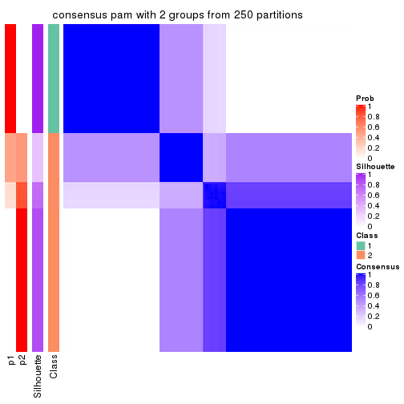</p>

</div>
<div id='tab-MAD-pam-consensus-heatmap-2'>
<pre><code class="r">consensus_heatmap(res, k = 3)
</code></pre>

<p>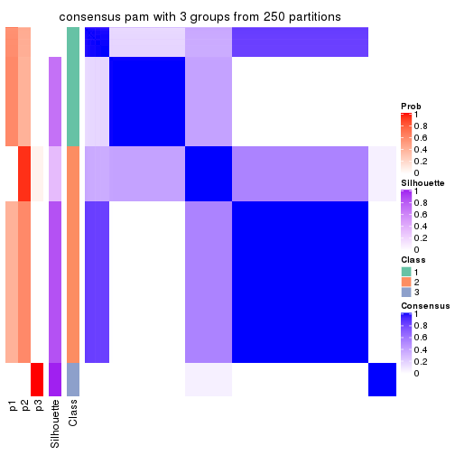</p>

</div>
<div id='tab-MAD-pam-consensus-heatmap-3'>
<pre><code class="r">consensus_heatmap(res, k = 4)
</code></pre>

<p>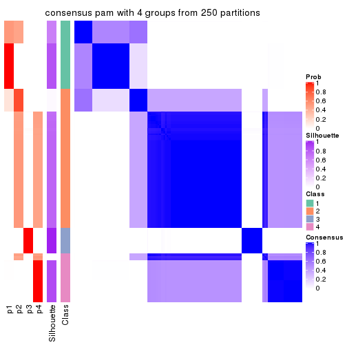</p>

</div>
<div id='tab-MAD-pam-consensus-heatmap-4'>
<pre><code class="r">consensus_heatmap(res, k = 5)
</code></pre>

<p>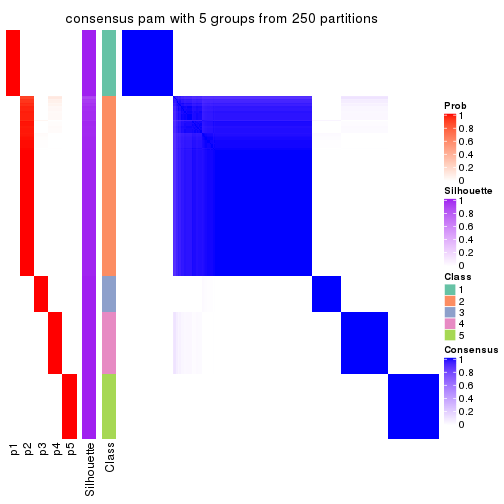</p>

</div>
<div id='tab-MAD-pam-consensus-heatmap-5'>
<pre><code class="r">consensus_heatmap(res, k = 6)
</code></pre>

<p>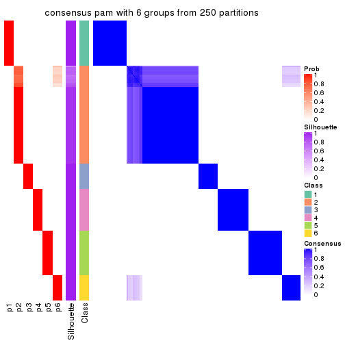</p>

</div>
</div>

Heatmaps for the membership of samples in all partitions to see how consistent they are:


<script>
$( function() {
	$( '#tabs-MAD-pam-membership-heatmap' ).tabs();
} );
</script>
<div id='tabs-MAD-pam-membership-heatmap'>
<ul>
<li><a href='#tab-MAD-pam-membership-heatmap-1'>k = 2</a></li>
<li><a href='#tab-MAD-pam-membership-heatmap-2'>k = 3</a></li>
<li><a href='#tab-MAD-pam-membership-heatmap-3'>k = 4</a></li>
<li><a href='#tab-MAD-pam-membership-heatmap-4'>k = 5</a></li>
<li><a href='#tab-MAD-pam-membership-heatmap-5'>k = 6</a></li>
</ul>
<div id='tab-MAD-pam-membership-heatmap-1'>
<pre><code class="r">membership_heatmap(res, k = 2)
</code></pre>

<p>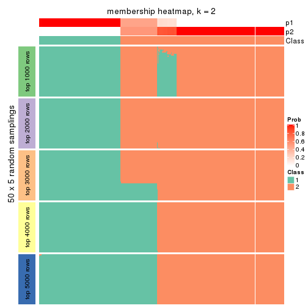</p>

</div>
<div id='tab-MAD-pam-membership-heatmap-2'>
<pre><code class="r">membership_heatmap(res, k = 3)
</code></pre>

<p>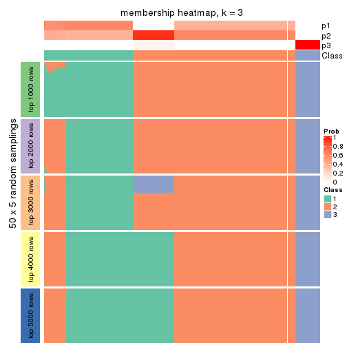</p>

</div>
<div id='tab-MAD-pam-membership-heatmap-3'>
<pre><code class="r">membership_heatmap(res, k = 4)
</code></pre>

<p>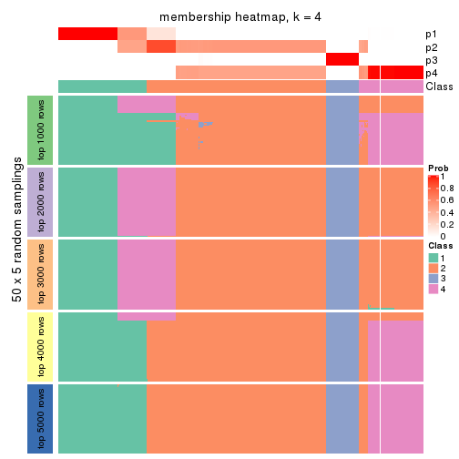</p>

</div>
<div id='tab-MAD-pam-membership-heatmap-4'>
<pre><code class="r">membership_heatmap(res, k = 5)
</code></pre>

<p>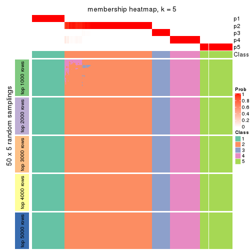</p>

</div>
<div id='tab-MAD-pam-membership-heatmap-5'>
<pre><code class="r">membership_heatmap(res, k = 6)
</code></pre>

<p>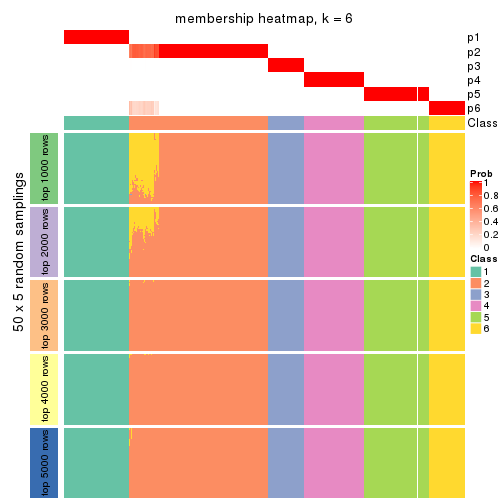</p>

</div>
</div>

As soon as we have had the classes for columns, we can look for signatures
which are significantly different between classes which can be candidate marks
for certain classes. Following are the heatmaps for signatures.


Signature heatmaps where rows are scaled:


<script>
$( function() {
	$( '#tabs-MAD-pam-get-signatures' ).tabs();
} );
</script>
<div id='tabs-MAD-pam-get-signatures'>
<ul>
<li><a href='#tab-MAD-pam-get-signatures-1'>k = 2</a></li>
<li><a href='#tab-MAD-pam-get-signatures-2'>k = 3</a></li>
<li><a href='#tab-MAD-pam-get-signatures-3'>k = 4</a></li>
<li><a href='#tab-MAD-pam-get-signatures-4'>k = 5</a></li>
<li><a href='#tab-MAD-pam-get-signatures-5'>k = 6</a></li>
</ul>
<div id='tab-MAD-pam-get-signatures-1'>
<pre><code class="r">get_signatures(res, k = 2)
</code></pre>

<p>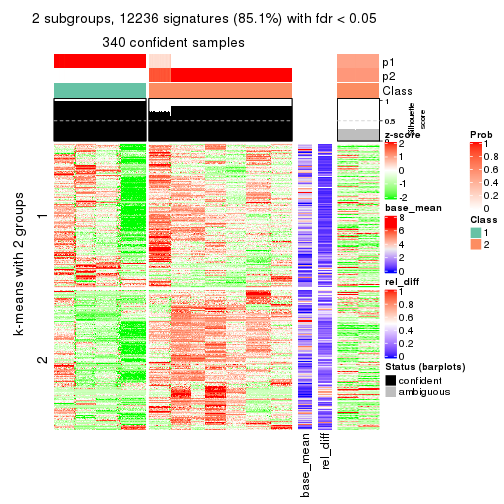</p>

</div>
<div id='tab-MAD-pam-get-signatures-2'>
<pre><code class="r">get_signatures(res, k = 3)
</code></pre>

<p>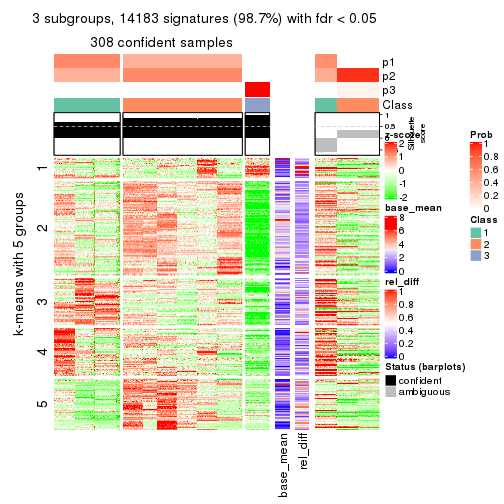</p>

</div>
<div id='tab-MAD-pam-get-signatures-3'>
<pre><code class="r">get_signatures(res, k = 4)
</code></pre>

<p>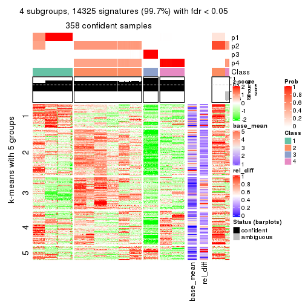</p>

</div>
<div id='tab-MAD-pam-get-signatures-4'>
<pre><code class="r">get_signatures(res, k = 5)
</code></pre>

<p>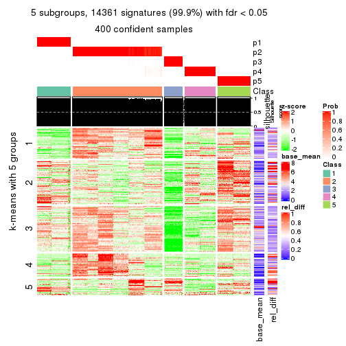</p>

</div>
<div id='tab-MAD-pam-get-signatures-5'>
<pre><code class="r">get_signatures(res, k = 6)
</code></pre>

<p>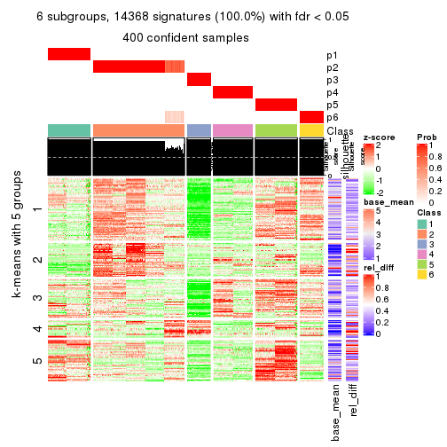</p>

</div>
</div>


Signature heatmaps where rows are not scaled:


<script>
$( function() {
	$( '#tabs-MAD-pam-get-signatures-no-scale' ).tabs();
} );
</script>
<div id='tabs-MAD-pam-get-signatures-no-scale'>
<ul>
<li><a href='#tab-MAD-pam-get-signatures-no-scale-1'>k = 2</a></li>
<li><a href='#tab-MAD-pam-get-signatures-no-scale-2'>k = 3</a></li>
<li><a href='#tab-MAD-pam-get-signatures-no-scale-3'>k = 4</a></li>
<li><a href='#tab-MAD-pam-get-signatures-no-scale-4'>k = 5</a></li>
<li><a href='#tab-MAD-pam-get-signatures-no-scale-5'>k = 6</a></li>
</ul>
<div id='tab-MAD-pam-get-signatures-no-scale-1'>
<pre><code class="r">get_signatures(res, k = 2, scale_rows = FALSE)
</code></pre>

<p>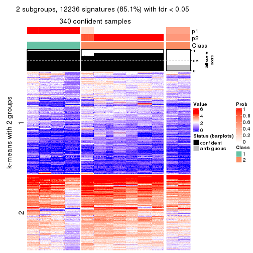</p>

</div>
<div id='tab-MAD-pam-get-signatures-no-scale-2'>
<pre><code class="r">get_signatures(res, k = 3, scale_rows = FALSE)
</code></pre>

<p>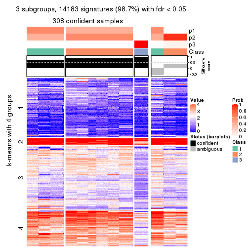</p>

</div>
<div id='tab-MAD-pam-get-signatures-no-scale-3'>
<pre><code class="r">get_signatures(res, k = 4, scale_rows = FALSE)
</code></pre>

<p>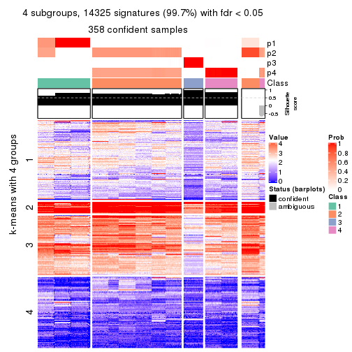</p>

</div>
<div id='tab-MAD-pam-get-signatures-no-scale-4'>
<pre><code class="r">get_signatures(res, k = 5, scale_rows = FALSE)
</code></pre>

<p>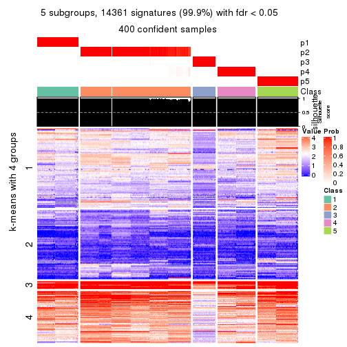</p>

</div>
<div id='tab-MAD-pam-get-signatures-no-scale-5'>
<pre><code class="r">get_signatures(res, k = 6, scale_rows = FALSE)
</code></pre>

<p>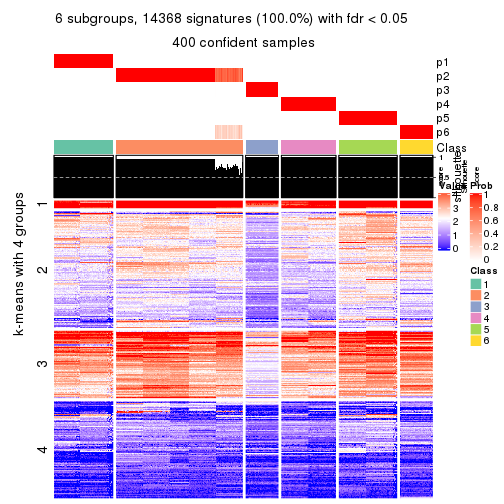</p>

</div>
</div>


Compare the overlap of signatures from different k:

```r
compare_signatures(res)
```

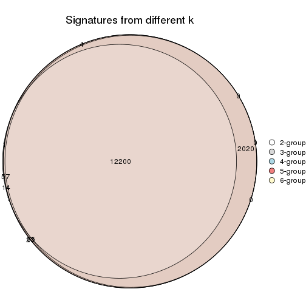

`get_signature()` returns a data frame invisibly. TO get the list of signatures, the function
call should be assigned to a variable explicitly. In following code, if `plot` argument is set
to `FALSE`, no heatmap is plotted while only the differential analysis is performed.

```r
# code only for demonstration
tb = get_signature(res, k = ..., plot = FALSE)
```

An example of the output of `tb` is:

```
#>   which_row         fdr    mean_1    mean_2 scaled_mean_1 scaled_mean_2 km
#> 1        38 0.042760348  8.373488  9.131774    -0.5533452     0.5164555  1
#> 2        40 0.018707592  7.106213  8.469186    -0.6173731     0.5762149  1
#> 3        55 0.019134737 10.221463 11.207825    -0.6159697     0.5749050  1
#> 4        59 0.006059896  5.921854  7.869574    -0.6899429     0.6439467  1
#> 5        60 0.018055526  8.928898 10.211722    -0.6204761     0.5791110  1
#> 6        98 0.009384629 15.714769 14.887706     0.6635654    -0.6193277  2
...
```

The columns in `tb` are:

1. `which_row`: row indices corresponding to the input matrix.
2. `fdr`: FDR for the differential test. 
3. `mean_x`: The mean value in group x.
4. `scaled_mean_x`: The mean value in group x after rows are scaled.
5. `km`: Row groups if k-means clustering is applied to rows.


UMAP plot which shows how samples are separated.


<script>
$( function() {
	$( '#tabs-MAD-pam-dimension-reduction' ).tabs();
} );
</script>
<div id='tabs-MAD-pam-dimension-reduction'>
<ul>
<li><a href='#tab-MAD-pam-dimension-reduction-1'>k = 2</a></li>
<li><a href='#tab-MAD-pam-dimension-reduction-2'>k = 3</a></li>
<li><a href='#tab-MAD-pam-dimension-reduction-3'>k = 4</a></li>
<li><a href='#tab-MAD-pam-dimension-reduction-4'>k = 5</a></li>
<li><a href='#tab-MAD-pam-dimension-reduction-5'>k = 6</a></li>
</ul>
<div id='tab-MAD-pam-dimension-reduction-1'>
<pre><code class="r">dimension_reduction(res, k = 2, method = &quot;UMAP&quot;)
</code></pre>

<p>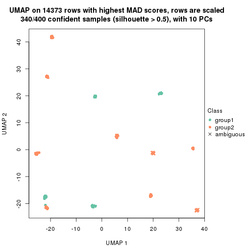</p>

</div>
<div id='tab-MAD-pam-dimension-reduction-2'>
<pre><code class="r">dimension_reduction(res, k = 3, method = &quot;UMAP&quot;)
</code></pre>

<p>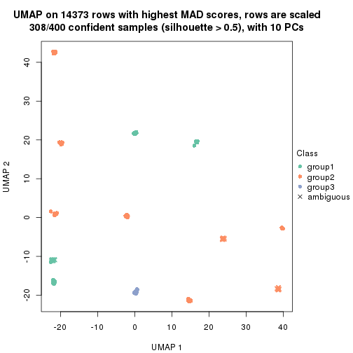</p>

</div>
<div id='tab-MAD-pam-dimension-reduction-3'>
<pre><code class="r">dimension_reduction(res, k = 4, method = &quot;UMAP&quot;)
</code></pre>

<p>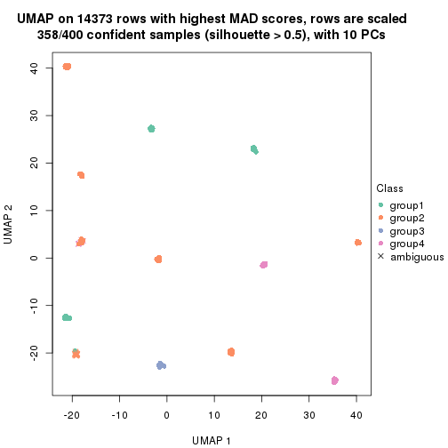</p>

</div>
<div id='tab-MAD-pam-dimension-reduction-4'>
<pre><code class="r">dimension_reduction(res, k = 5, method = &quot;UMAP&quot;)
</code></pre>

<p>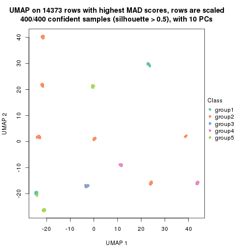</p>

</div>
<div id='tab-MAD-pam-dimension-reduction-5'>
<pre><code class="r">dimension_reduction(res, k = 6, method = &quot;UMAP&quot;)
</code></pre>

<p>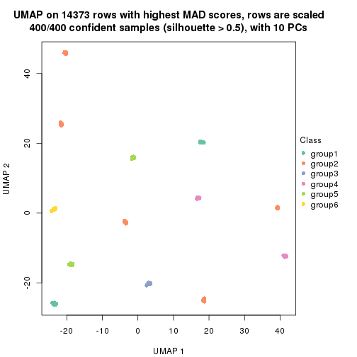</p>

</div>
</div>


Following heatmap shows how subgroups are split when increasing `k`:

```r
collect_classes(res)
```

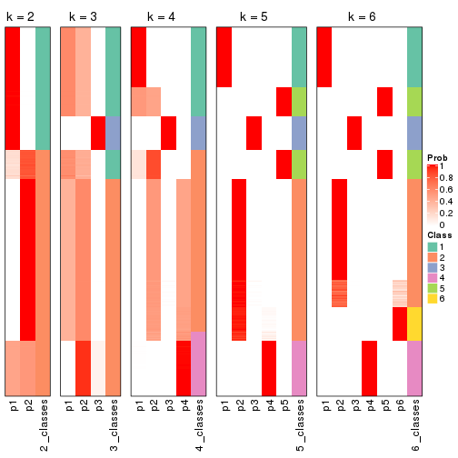


If matrix rows can be associated to genes, consider to use `GO_Enrichment(res,
...)` to perform function enrichment for the signature genes.


 

---------------------------------------------------


### MAD:mclust


The object with results only for a single top-value method and a single partition method 
can be extracted as:

```r
res = res_list["MAD", "mclust"]
# you can also extract it by
# res = res_list["MAD:mclust"]
```

A summary of `res` and all the functions that can be applied to it:

```r
res
```

```
#> A 'ConsensusPartition' object with k = 2, 3, 4, 5, 6.
#>   On a matrix with 14373 rows and 400 columns.
#>   Top rows (1000, 2000, 3000, 4000, 5000) are extracted by 'MAD' method.
#>   Subgroups are detected by 'mclust' method.
#>   Performed in total 1250 partitions by row resampling.
#>   Best k for subgroups seems to be 6.
#> 
#> Following methods can be applied to this 'ConsensusPartition' object:
#>  [1] "cola_report"             "collect_classes"         "collect_plots"          
#>  [4] "collect_stats"           "colnames"                "compare_signatures"     
#>  [7] "consensus_heatmap"       "dimension_reduction"     "functional_enrichment"  
#> [10] "get_anno_col"            "get_anno"                "get_classes"            
#> [13] "get_consensus"           "get_matrix"              "get_membership"         
#> [16] "get_param"               "get_signatures"          "get_stats"              
#> [19] "is_best_k"               "is_stable_k"             "membership_heatmap"     
#> [22] "ncol"                    "nrow"                    "plot_ecdf"              
#> [25] "rownames"                "select_partition_number" "show"                   
#> [28] "suggest_best_k"          "test_to_known_factors"
```

`collect_plots()` function collects all the plots made from `res` for all `k` (number of partitions)
into one single page to provide an easy and fast comparison between different `k`.

```r
collect_plots(res)
```

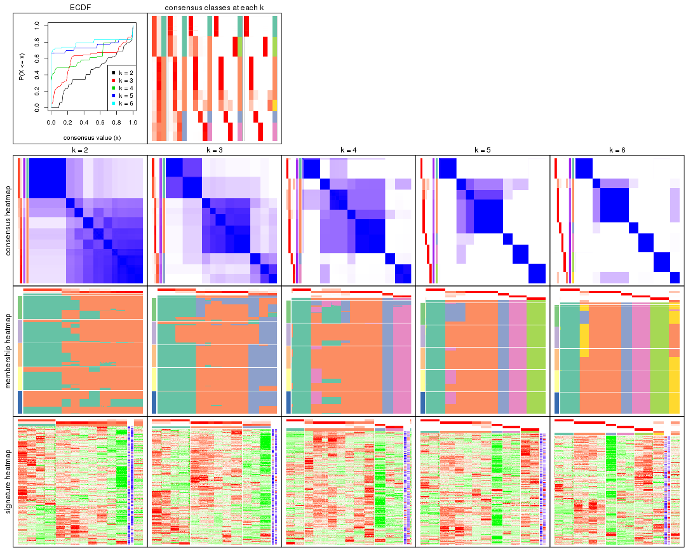

The plots are:

- The first row: a plot of the ECDF (Empirical cumulative distribution
  function) curves of the consensus matrix for each `k` and the heatmap of
  predicted classes for each `k`.
- The second row: heatmaps of the consensus matrix for each `k`.
- The third row: heatmaps of the membership matrix for each `k`.
- The fouth row: heatmaps of the signatures for each `k`.

All the plots in panels can be made by individual functions and they are
plotted later in this section.

`select_partition_number()` produces several plots showing different
statistics for choosing "optimized" `k`. There are following statistics:

- ECDF curves of the consensus matrix for each `k`;
- 1-PAC. [The PAC
  score](https://en.wikipedia.org/wiki/Consensus_clustering#Over-interpretation_potential_of_consensus_clustering)
  measures the proportion of the ambiguous subgrouping.
- Mean silhouette score.
- Concordance. The mean probability of fiting the consensus class ids in all
  partitions.
- Area increased. Denote $A_k$ as the area under the ECDF curve for current
  `k`, the area increased is defined as $A_k - A_{k-1}$.
- Rand index. The percent of pairs of samples that are both in a same cluster
  or both are not in a same cluster in the partition of k and k-1.
- Jaccard index. The ratio of pairs of samples are both in a same cluster in
  the partition of k and k-1 and the pairs of samples are both in a same
  cluster in the partition k or k-1.

The detailed explanations of these statistics can be found in [the cola
vignette](http://bioconductor.org/packages/devel/bioc/vignettes/cola/inst/doc/cola.html#toc_13).

Generally speaking, lower PAC score, higher mean silhouette score or higher
concordance corresponds to better partition. Rand index and Jaccard index
measure how similar the current partition is compared to partition with `k-1`.
If they are too similar, we won't accept `k` is better than `k-1`.

```r
select_partition_number(res)
```

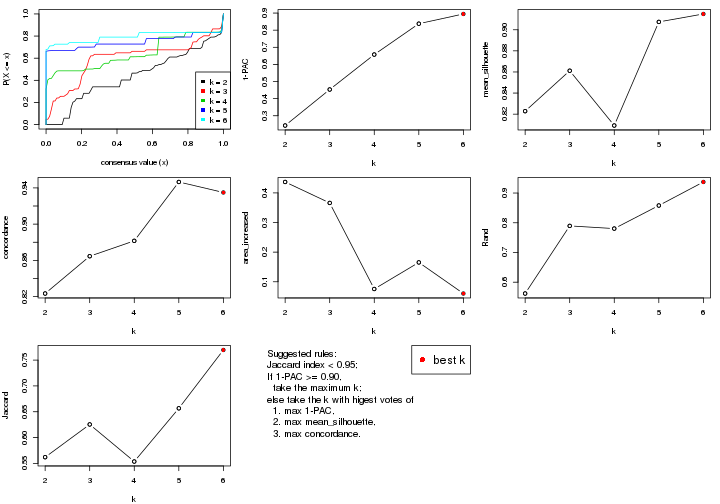

The numeric values for all these statistics can be obtained by `get_stats()`.

```r
get_stats(res)
```

```
#>   k 1-PAC mean_silhouette concordance area_increased  Rand Jaccard
#> 2 2 0.243           0.823       0.823         0.4369 0.562   0.562
#> 3 3 0.453           0.861       0.865         0.3661 0.789   0.625
#> 4 4 0.658           0.809       0.882         0.0756 0.780   0.554
#> 5 5 0.838           0.907       0.947         0.1653 0.858   0.657
#> 6 6 0.895           0.915       0.935         0.0603 0.937   0.770
```

`suggest_best_k()` suggests the best $k$ based on these statistics. The rules are as follows:

- All $k$ with Jaccard index larger than 0.95 are removed because the increase of
  the partition number does not provides enough extra information. If all $k$ are removed,
  the best $k$ is assigned by `NA`.
- For $k$ with 1-PAC larger than 0.9, the maximal $k$ is taken as the "best k". Other $k$ is called "optional k".
- If it does not fit the second rule. The $k$ with the highest vote of highest
  1-PAC, mean silhouette and concordance is taken as the "best k".

```r
suggest_best_k(res)
```

```
#> [1] 6
```


Following shows the table of the partitions (You need to click the **show/hide
code output** link to see it). The membership matrix (columns with name `p*`)
is inferred by
[`clue::cl_consensus()`](https://www.rdocumentation.org/link/cl_consensus?package=clue)
function with the `SE` method. Basically the value in the membership matrix
represents the probability to belong to a certain group. The finall class
label for an item is determined with the group with highest probability it
belongs to.

In `get_classes()` function, the entropy is calculated from the membership
matrix and the silhouette score is calculated from the consensus matrix.


<script>
$( function() {
	$( '#tabs-MAD-mclust-get-classes' ).tabs();
} );
</script>
<div id='tabs-MAD-mclust-get-classes'>
<ul>
<li><a href='#tab-MAD-mclust-get-classes-1'>k = 2</a></li>
<li><a href='#tab-MAD-mclust-get-classes-2'>k = 3</a></li>
<li><a href='#tab-MAD-mclust-get-classes-3'>k = 4</a></li>
<li><a href='#tab-MAD-mclust-get-classes-4'>k = 5</a></li>
<li><a href='#tab-MAD-mclust-get-classes-5'>k = 6</a></li>
</ul>

<div id='tab-MAD-mclust-get-classes-1'>
<p><a id='tab-MAD-mclust-get-classes-1-a' style='color:#0366d6' href='#'>show/hide code output</a></p>
<pre><code class="r">cbind(get_classes(res, k = 2), get_membership(res, k = 2))
</code></pre>

<pre><code>#&gt;            class entropy silhouette    p1    p2
#&gt; SRR1661716     2  0.1843      0.840 0.028 0.972
#&gt; SRR1661717     2  0.2236      0.840 0.036 0.964
#&gt; SRR1661718     2  0.1843      0.840 0.028 0.972
#&gt; SRR1661719     2  0.2043      0.840 0.032 0.968
#&gt; SRR1661720     2  0.2043      0.840 0.032 0.968
#&gt; SRR1661721     2  0.2043      0.840 0.032 0.968
#&gt; SRR1661722     2  0.2043      0.841 0.032 0.968
#&gt; SRR1661723     2  0.1843      0.840 0.028 0.972
#&gt; SRR1661724     2  0.2236      0.840 0.036 0.964
#&gt; SRR1661725     2  0.2043      0.840 0.032 0.968
#&gt; SRR1661726     2  0.1843      0.840 0.028 0.972
#&gt; SRR1661727     2  0.2043      0.840 0.032 0.968
#&gt; SRR1661728     2  0.2236      0.840 0.036 0.964
#&gt; SRR1661729     2  0.2043      0.840 0.032 0.968
#&gt; SRR1661730     2  0.1843      0.840 0.028 0.972
#&gt; SRR1661731     2  0.1843      0.840 0.028 0.972
#&gt; SRR1661732     2  0.2043      0.840 0.032 0.968
#&gt; SRR1661733     2  0.2043      0.841 0.032 0.968
#&gt; SRR1661734     2  0.2236      0.840 0.036 0.964
#&gt; SRR1661735     2  0.2043      0.840 0.032 0.968
#&gt; SRR1661736     2  0.0376      0.842 0.004 0.996
#&gt; SRR1661737     2  0.0376      0.842 0.004 0.996
#&gt; SRR1661738     2  0.0376      0.842 0.004 0.996
#&gt; SRR1661739     2  0.0376      0.842 0.004 0.996
#&gt; SRR1661740     2  0.0376      0.842 0.004 0.996
#&gt; SRR1661741     2  0.0672      0.843 0.008 0.992
#&gt; SRR1661742     2  0.0376      0.842 0.004 0.996
#&gt; SRR1661743     2  0.0672      0.843 0.008 0.992
#&gt; SRR1661744     2  0.0376      0.842 0.004 0.996
#&gt; SRR1661745     2  0.0672      0.843 0.008 0.992
#&gt; SRR1661746     2  0.0376      0.842 0.004 0.996
#&gt; SRR1661747     2  0.0672      0.843 0.008 0.992
#&gt; SRR1661748     2  0.0672      0.843 0.008 0.992
#&gt; SRR1661749     2  0.0376      0.842 0.004 0.996
#&gt; SRR1661750     2  0.0672      0.843 0.008 0.992
#&gt; SRR1661751     2  0.0672      0.843 0.008 0.992
#&gt; SRR1661752     2  0.0376      0.842 0.004 0.996
#&gt; SRR1661753     2  0.0376      0.842 0.004 0.996
#&gt; SRR1661754     2  0.0376      0.842 0.004 0.996
#&gt; SRR1661755     2  0.0376      0.842 0.004 0.996
#&gt; SRR1661756     2  0.0376      0.842 0.004 0.996
#&gt; SRR1661757     2  0.0376      0.842 0.004 0.996
#&gt; SRR1661758     2  0.0672      0.843 0.008 0.992
#&gt; SRR1661759     2  0.0376      0.842 0.004 0.996
#&gt; SRR1661760     2  0.0376      0.842 0.004 0.996
#&gt; SRR1661761     2  0.0376      0.842 0.004 0.996
#&gt; SRR1661762     2  0.0376      0.842 0.004 0.996
#&gt; SRR1661763     2  0.0376      0.842 0.004 0.996
#&gt; SRR1661764     2  0.0376      0.842 0.004 0.996
#&gt; SRR1661766     2  0.1184      0.843 0.016 0.984
#&gt; SRR1661767     2  0.1184      0.843 0.016 0.984
#&gt; SRR1661768     2  0.1184      0.843 0.016 0.984
#&gt; SRR1661769     2  0.1184      0.843 0.016 0.984
#&gt; SRR1661770     2  0.1184      0.843 0.016 0.984
#&gt; SRR1661771     2  0.1184      0.843 0.016 0.984
#&gt; SRR1661772     2  0.1184      0.843 0.016 0.984
#&gt; SRR1661773     2  0.1184      0.843 0.016 0.984
#&gt; SRR1661774     2  0.1184      0.843 0.016 0.984
#&gt; SRR1661775     2  0.1184      0.843 0.016 0.984
#&gt; SRR1661776     2  0.0938      0.843 0.012 0.988
#&gt; SRR1661777     2  0.1184      0.843 0.016 0.984
#&gt; SRR1661778     2  0.0938      0.843 0.012 0.988
#&gt; SRR1661779     2  0.1184      0.843 0.016 0.984
#&gt; SRR1661780     2  0.0938      0.843 0.012 0.988
#&gt; SRR1661781     2  0.1184      0.843 0.016 0.984
#&gt; SRR1661782     2  0.1184      0.843 0.016 0.984
#&gt; SRR1661783     2  0.0938      0.843 0.012 0.988
#&gt; SRR1661784     2  0.1184      0.843 0.016 0.984
#&gt; SRR1661785     2  0.1184      0.843 0.016 0.984
#&gt; SRR1661786     2  0.0938      0.843 0.012 0.988
#&gt; SRR1661787     2  0.0938      0.843 0.012 0.988
#&gt; SRR1661788     2  0.0938      0.843 0.012 0.988
#&gt; SRR1661789     2  0.1184      0.843 0.016 0.984
#&gt; SRR1661790     2  0.1184      0.843 0.016 0.984
#&gt; SRR1661791     2  0.1184      0.843 0.016 0.984
#&gt; SRR1661792     2  0.1184      0.843 0.016 0.984
#&gt; SRR1661793     2  0.1184      0.843 0.016 0.984
#&gt; SRR1661794     2  0.0938      0.843 0.012 0.988
#&gt; SRR1661795     2  0.1184      0.843 0.016 0.984
#&gt; SRR1661796     2  0.0000      0.841 0.000 1.000
#&gt; SRR1661797     2  0.0000      0.841 0.000 1.000
#&gt; SRR1661798     2  0.0000      0.841 0.000 1.000
#&gt; SRR1661799     2  0.0000      0.841 0.000 1.000
#&gt; SRR1661800     2  0.0000      0.841 0.000 1.000
#&gt; SRR1661801     2  0.0000      0.841 0.000 1.000
#&gt; SRR1661802     2  0.0000      0.841 0.000 1.000
#&gt; SRR1661803     2  0.0000      0.841 0.000 1.000
#&gt; SRR1661804     2  0.0000      0.841 0.000 1.000
#&gt; SRR1661805     2  0.0000      0.841 0.000 1.000
#&gt; SRR1661806     2  0.0000      0.841 0.000 1.000
#&gt; SRR1661807     2  0.0000      0.841 0.000 1.000
#&gt; SRR1661808     2  0.0000      0.841 0.000 1.000
#&gt; SRR1661809     2  0.0000      0.841 0.000 1.000
#&gt; SRR1661810     2  0.0000      0.841 0.000 1.000
#&gt; SRR1661811     2  0.0000      0.841 0.000 1.000
#&gt; SRR1661812     2  0.0000      0.841 0.000 1.000
#&gt; SRR1661813     2  0.0000      0.841 0.000 1.000
#&gt; SRR1661814     2  0.0000      0.841 0.000 1.000
#&gt; SRR1661815     2  0.0000      0.841 0.000 1.000
#&gt; SRR1661816     2  0.0000      0.841 0.000 1.000
#&gt; SRR1661817     2  0.0000      0.841 0.000 1.000
#&gt; SRR1661818     2  0.0000      0.841 0.000 1.000
#&gt; SRR1661819     2  0.0000      0.841 0.000 1.000
#&gt; SRR1661820     2  0.0000      0.841 0.000 1.000
#&gt; SRR1661821     2  0.0000      0.841 0.000 1.000
#&gt; SRR1661822     2  0.0000      0.841 0.000 1.000
#&gt; SRR1661823     2  0.0000      0.841 0.000 1.000
#&gt; SRR1661824     2  0.0000      0.841 0.000 1.000
#&gt; SRR1661825     2  0.0000      0.841 0.000 1.000
#&gt; SRR1661826     1  0.5629      1.000 0.868 0.132
#&gt; SRR1661827     1  0.5629      1.000 0.868 0.132
#&gt; SRR1661828     1  0.5629      1.000 0.868 0.132
#&gt; SRR1661829     1  0.5629      1.000 0.868 0.132
#&gt; SRR1661830     1  0.5629      1.000 0.868 0.132
#&gt; SRR1661831     1  0.5629      1.000 0.868 0.132
#&gt; SRR1661832     1  0.5629      1.000 0.868 0.132
#&gt; SRR1661833     1  0.5629      1.000 0.868 0.132
#&gt; SRR1661834     1  0.5629      1.000 0.868 0.132
#&gt; SRR1661835     1  0.5629      1.000 0.868 0.132
#&gt; SRR1661836     1  0.5629      1.000 0.868 0.132
#&gt; SRR1661837     1  0.5629      1.000 0.868 0.132
#&gt; SRR1661838     1  0.5629      1.000 0.868 0.132
#&gt; SRR1661839     1  0.5629      1.000 0.868 0.132
#&gt; SRR1661840     1  0.5629      1.000 0.868 0.132
#&gt; SRR1661841     1  0.5629      1.000 0.868 0.132
#&gt; SRR1661843     1  0.5629      1.000 0.868 0.132
#&gt; SRR1661844     1  0.5629      1.000 0.868 0.132
#&gt; SRR1661845     1  0.5629      1.000 0.868 0.132
#&gt; SRR1661846     1  0.5629      1.000 0.868 0.132
#&gt; SRR1661847     1  0.5629      1.000 0.868 0.132
#&gt; SRR1661848     1  0.5629      1.000 0.868 0.132
#&gt; SRR1661849     1  0.5629      1.000 0.868 0.132
#&gt; SRR1661850     1  0.5629      1.000 0.868 0.132
#&gt; SRR1661851     1  0.5629      1.000 0.868 0.132
#&gt; SRR1661852     1  0.5629      1.000 0.868 0.132
#&gt; SRR1661853     1  0.5629      1.000 0.868 0.132
#&gt; SRR1661854     1  0.5629      1.000 0.868 0.132
#&gt; SRR1661855     1  0.5629      1.000 0.868 0.132
#&gt; SRR1661856     2  0.7056      0.758 0.192 0.808
#&gt; SRR1661857     2  0.7056      0.758 0.192 0.808
#&gt; SRR1661858     2  0.7056      0.758 0.192 0.808
#&gt; SRR1661859     2  0.7056      0.758 0.192 0.808
#&gt; SRR1661860     2  0.7056      0.758 0.192 0.808
#&gt; SRR1661861     2  0.7056      0.758 0.192 0.808
#&gt; SRR1661862     2  0.7056      0.758 0.192 0.808
#&gt; SRR1661863     2  0.7056      0.758 0.192 0.808
#&gt; SRR1661864     2  0.7056      0.758 0.192 0.808
#&gt; SRR1661865     2  0.7056      0.758 0.192 0.808
#&gt; SRR1661866     2  0.7056      0.758 0.192 0.808
#&gt; SRR1661867     2  0.7056      0.758 0.192 0.808
#&gt; SRR1661868     2  0.7056      0.758 0.192 0.808
#&gt; SRR1661869     2  0.7056      0.758 0.192 0.808
#&gt; SRR1661870     2  0.7056      0.758 0.192 0.808
#&gt; SRR1661871     2  0.7056      0.758 0.192 0.808
#&gt; SRR1661872     2  0.7056      0.758 0.192 0.808
#&gt; SRR1661873     2  0.7056      0.758 0.192 0.808
#&gt; SRR1661874     2  0.7056      0.758 0.192 0.808
#&gt; SRR1661875     2  0.7056      0.758 0.192 0.808
#&gt; SRR1661876     2  0.7056      0.758 0.192 0.808
#&gt; SRR1661877     2  0.7056      0.758 0.192 0.808
#&gt; SRR1661878     2  0.7056      0.758 0.192 0.808
#&gt; SRR1661879     2  0.7056      0.758 0.192 0.808
#&gt; SRR1661880     2  0.7056      0.758 0.192 0.808
#&gt; SRR1661881     2  0.7056      0.758 0.192 0.808
#&gt; SRR1661882     2  0.7056      0.758 0.192 0.808
#&gt; SRR1661883     2  0.7056      0.758 0.192 0.808
#&gt; SRR1661884     2  0.7056      0.758 0.192 0.808
#&gt; SRR1661885     2  0.7056      0.758 0.192 0.808
#&gt; SRR1661886     2  0.7056      0.758 0.192 0.808
#&gt; SRR1661887     2  0.7056      0.758 0.192 0.808
#&gt; SRR1661888     2  0.7056      0.758 0.192 0.808
#&gt; SRR1661889     2  0.7056      0.758 0.192 0.808
#&gt; SRR1661890     2  0.7056      0.758 0.192 0.808
#&gt; SRR1661891     2  0.7056      0.758 0.192 0.808
#&gt; SRR1661892     1  0.5629      1.000 0.868 0.132
#&gt; SRR1661893     1  0.5629      1.000 0.868 0.132
#&gt; SRR1661894     1  0.5629      1.000 0.868 0.132
#&gt; SRR1661895     1  0.5629      1.000 0.868 0.132
#&gt; SRR1661896     1  0.5629      1.000 0.868 0.132
#&gt; SRR1661897     1  0.5629      1.000 0.868 0.132
#&gt; SRR1661898     1  0.5629      1.000 0.868 0.132
#&gt; SRR1661899     1  0.5629      1.000 0.868 0.132
#&gt; SRR1661900     1  0.5629      1.000 0.868 0.132
#&gt; SRR1661901     1  0.5629      1.000 0.868 0.132
#&gt; SRR1661902     1  0.5629      1.000 0.868 0.132
#&gt; SRR1661903     1  0.5629      1.000 0.868 0.132
#&gt; SRR1661904     1  0.5629      1.000 0.868 0.132
#&gt; SRR1661905     1  0.5629      1.000 0.868 0.132
#&gt; SRR1661906     1  0.5629      1.000 0.868 0.132
#&gt; SRR1661907     1  0.5629      1.000 0.868 0.132
#&gt; SRR1661908     1  0.5629      1.000 0.868 0.132
#&gt; SRR1661909     1  0.5629      1.000 0.868 0.132
#&gt; SRR1661910     1  0.5629      1.000 0.868 0.132
#&gt; SRR1661911     1  0.5629      1.000 0.868 0.132
#&gt; SRR1661912     1  0.5629      1.000 0.868 0.132
#&gt; SRR1661913     1  0.5629      1.000 0.868 0.132
#&gt; SRR1661914     1  0.5629      1.000 0.868 0.132
#&gt; SRR1661915     1  0.5629      1.000 0.868 0.132
#&gt; SRR1661916     1  0.5629      1.000 0.868 0.132
#&gt; SRR1661917     1  0.5629      1.000 0.868 0.132
#&gt; SRR1661918     1  0.5629      1.000 0.868 0.132
#&gt; SRR1661919     1  0.5629      1.000 0.868 0.132
#&gt; SRR1661920     1  0.5629      1.000 0.868 0.132
#&gt; SRR1661921     1  0.5629      1.000 0.868 0.132
#&gt; SRR1661922     1  0.5629      1.000 0.868 0.132
#&gt; SRR1661923     1  0.5629      1.000 0.868 0.132
#&gt; SRR1661924     1  0.5629      1.000 0.868 0.132
#&gt; SRR1661925     1  0.5629      1.000 0.868 0.132
#&gt; SRR1661926     1  0.5629      1.000 0.868 0.132
#&gt; SRR1661927     1  0.5629      1.000 0.868 0.132
#&gt; SRR1661928     2  0.4022      0.818 0.080 0.920
#&gt; SRR1661929     2  0.4022      0.818 0.080 0.920
#&gt; SRR1661930     2  0.4022      0.818 0.080 0.920
#&gt; SRR1661931     2  0.4022      0.818 0.080 0.920
#&gt; SRR1661932     2  0.4022      0.818 0.080 0.920
#&gt; SRR1661933     2  0.4022      0.818 0.080 0.920
#&gt; SRR1661934     2  0.4022      0.818 0.080 0.920
#&gt; SRR1661935     2  0.4022      0.818 0.080 0.920
#&gt; SRR1661936     2  0.4022      0.818 0.080 0.920
#&gt; SRR1661937     2  0.4022      0.818 0.080 0.920
#&gt; SRR1661938     2  0.4022      0.818 0.080 0.920
#&gt; SRR1661939     2  0.4022      0.818 0.080 0.920
#&gt; SRR1661940     2  0.4022      0.818 0.080 0.920
#&gt; SRR1661941     2  0.4022      0.818 0.080 0.920
#&gt; SRR1661942     2  0.4022      0.818 0.080 0.920
#&gt; SRR1661943     2  0.4022      0.818 0.080 0.920
#&gt; SRR1661944     2  0.4022      0.818 0.080 0.920
#&gt; SRR1661945     2  0.4022      0.818 0.080 0.920
#&gt; SRR1661946     2  0.4022      0.818 0.080 0.920
#&gt; SRR1661947     2  0.4022      0.818 0.080 0.920
#&gt; SRR1661948     2  0.4022      0.818 0.080 0.920
#&gt; SRR1661949     2  0.4022      0.818 0.080 0.920
#&gt; SRR1661950     2  0.4022      0.818 0.080 0.920
#&gt; SRR1661951     2  0.4022      0.818 0.080 0.920
#&gt; SRR1661952     2  0.4022      0.818 0.080 0.920
#&gt; SRR1661953     2  0.4022      0.818 0.080 0.920
#&gt; SRR1661954     2  0.4022      0.818 0.080 0.920
#&gt; SRR1661955     2  0.4022      0.818 0.080 0.920
#&gt; SRR1661956     2  0.4022      0.818 0.080 0.920
#&gt; SRR1661957     2  0.4022      0.818 0.080 0.920
#&gt; SRR1661958     2  0.9608      0.375 0.384 0.616
#&gt; SRR1661959     2  0.9608      0.375 0.384 0.616
#&gt; SRR1661960     2  0.9608      0.375 0.384 0.616
#&gt; SRR1661961     2  0.9608      0.375 0.384 0.616
#&gt; SRR1661962     2  0.9608      0.375 0.384 0.616
#&gt; SRR1661963     2  0.9608      0.375 0.384 0.616
#&gt; SRR1661964     2  0.9608      0.375 0.384 0.616
#&gt; SRR1661965     2  0.9608      0.375 0.384 0.616
#&gt; SRR1661966     2  0.9608      0.375 0.384 0.616
#&gt; SRR1661967     2  0.9608      0.375 0.384 0.616
#&gt; SRR1661968     2  0.9608      0.375 0.384 0.616
#&gt; SRR1661969     2  0.9608      0.375 0.384 0.616
#&gt; SRR1661970     2  0.9608      0.375 0.384 0.616
#&gt; SRR1661971     2  0.9608      0.375 0.384 0.616
#&gt; SRR1661972     2  0.9608      0.375 0.384 0.616
#&gt; SRR1661973     2  0.9608      0.375 0.384 0.616
#&gt; SRR1661974     2  0.9608      0.375 0.384 0.616
#&gt; SRR1661975     2  0.9608      0.375 0.384 0.616
#&gt; SRR1661976     2  0.9608      0.375 0.384 0.616
#&gt; SRR1661977     2  0.9608      0.375 0.384 0.616
#&gt; SRR1661978     2  0.9608      0.375 0.384 0.616
#&gt; SRR1661979     2  0.9608      0.375 0.384 0.616
#&gt; SRR1661980     2  0.9608      0.375 0.384 0.616
#&gt; SRR1661981     2  0.9608      0.375 0.384 0.616
#&gt; SRR1661982     2  0.9608      0.375 0.384 0.616
#&gt; SRR1661983     2  0.9608      0.375 0.384 0.616
#&gt; SRR1661984     2  0.9608      0.375 0.384 0.616
#&gt; SRR1661985     2  0.9608      0.375 0.384 0.616
#&gt; SRR1661986     2  0.9608      0.375 0.384 0.616
#&gt; SRR1661987     2  0.9608      0.375 0.384 0.616
#&gt; SRR1661988     1  0.5629      1.000 0.868 0.132
#&gt; SRR1661989     1  0.5629      1.000 0.868 0.132
#&gt; SRR1661990     1  0.5629      1.000 0.868 0.132
#&gt; SRR1661991     1  0.5629      1.000 0.868 0.132
#&gt; SRR1661992     1  0.5629      1.000 0.868 0.132
#&gt; SRR1661993     1  0.5629      1.000 0.868 0.132
#&gt; SRR1661994     1  0.5629      1.000 0.868 0.132
#&gt; SRR1661995     1  0.5629      1.000 0.868 0.132
#&gt; SRR1661996     1  0.5629      1.000 0.868 0.132
#&gt; SRR1661997     1  0.5629      1.000 0.868 0.132
#&gt; SRR1661998     1  0.5629      1.000 0.868 0.132
#&gt; SRR1661999     1  0.5629      1.000 0.868 0.132
#&gt; SRR1662000     1  0.5629      1.000 0.868 0.132
#&gt; SRR1662001     1  0.5629      1.000 0.868 0.132
#&gt; SRR1662002     1  0.5629      1.000 0.868 0.132
#&gt; SRR1662003     1  0.5629      1.000 0.868 0.132
#&gt; SRR1662004     1  0.5629      1.000 0.868 0.132
#&gt; SRR1662005     1  0.5629      1.000 0.868 0.132
#&gt; SRR1662006     1  0.5629      1.000 0.868 0.132
#&gt; SRR1662007     1  0.5629      1.000 0.868 0.132
#&gt; SRR1662008     1  0.5629      1.000 0.868 0.132
#&gt; SRR1662009     1  0.5629      1.000 0.868 0.132
#&gt; SRR1662010     1  0.5629      1.000 0.868 0.132
#&gt; SRR1662011     1  0.5629      1.000 0.868 0.132
#&gt; SRR1662012     1  0.5629      1.000 0.868 0.132
#&gt; SRR1662013     1  0.5629      1.000 0.868 0.132
#&gt; SRR1662014     1  0.5629      1.000 0.868 0.132
#&gt; SRR1662015     1  0.5629      1.000 0.868 0.132
#&gt; SRR1662016     1  0.5629      1.000 0.868 0.132
#&gt; SRR1662017     1  0.5629      1.000 0.868 0.132
#&gt; SRR1662018     2  0.5408      0.795 0.124 0.876
#&gt; SRR1662019     2  0.5294      0.799 0.120 0.880
#&gt; SRR1662020     2  0.5178      0.801 0.116 0.884
#&gt; SRR1662021     2  0.5408      0.796 0.124 0.876
#&gt; SRR1662022     2  0.5519      0.793 0.128 0.872
#&gt; SRR1662023     2  0.5408      0.796 0.124 0.876
#&gt; SRR1662024     2  0.5408      0.796 0.124 0.876
#&gt; SRR1662025     2  0.5519      0.793 0.128 0.872
#&gt; SRR1662026     2  0.5408      0.796 0.124 0.876
#&gt; SRR1662027     2  0.5408      0.795 0.124 0.876
#&gt; SRR1662028     2  0.5178      0.801 0.116 0.884
#&gt; SRR1662029     2  0.5519      0.793 0.128 0.872
#&gt; SRR1662030     2  0.5408      0.796 0.124 0.876
#&gt; SRR1662031     2  0.5519      0.793 0.128 0.872
#&gt; SRR1662032     2  0.5294      0.798 0.120 0.880
#&gt; SRR1662033     2  0.5294      0.798 0.120 0.880
#&gt; SRR1662034     2  0.5294      0.798 0.120 0.880
#&gt; SRR1662035     2  0.5408      0.796 0.124 0.876
#&gt; SRR1662036     2  0.5408      0.796 0.124 0.876
#&gt; SRR1662037     2  0.5178      0.801 0.116 0.884
#&gt; SRR1662038     2  0.5408      0.796 0.124 0.876
#&gt; SRR1662039     2  0.5408      0.796 0.124 0.876
#&gt; SRR1662040     2  0.5408      0.795 0.124 0.876
#&gt; SRR1662041     2  0.5294      0.799 0.120 0.880
#&gt; SRR1662042     2  0.5294      0.798 0.120 0.880
#&gt; SRR1662043     2  0.5294      0.798 0.120 0.880
#&gt; SRR1662044     2  0.5408      0.796 0.124 0.876
#&gt; SRR1662045     2  0.5294      0.798 0.120 0.880
#&gt; SRR1662046     2  0.5519      0.793 0.128 0.872
#&gt; SRR1662047     2  0.5059      0.802 0.112 0.888
#&gt; SRR1662048     2  0.5294      0.798 0.120 0.880
#&gt; SRR1662049     2  0.5294      0.798 0.120 0.880
#&gt; SRR1662050     2  0.5294      0.798 0.120 0.880
#&gt; SRR1662051     2  0.5519      0.793 0.128 0.872
#&gt; SRR1662052     2  0.5178      0.801 0.116 0.884
#&gt; SRR1662053     2  0.5294      0.798 0.120 0.880
#&gt; SRR1662054     2  0.9129      0.553 0.328 0.672
#&gt; SRR1662055     2  0.9129      0.553 0.328 0.672
#&gt; SRR1662056     2  0.9129      0.553 0.328 0.672
#&gt; SRR1662057     2  0.9129      0.553 0.328 0.672
#&gt; SRR1662058     2  0.9129      0.553 0.328 0.672
#&gt; SRR1662059     2  0.9129      0.553 0.328 0.672
#&gt; SRR1662060     2  0.9129      0.553 0.328 0.672
#&gt; SRR1662061     2  0.9129      0.553 0.328 0.672
#&gt; SRR1662062     2  0.9129      0.553 0.328 0.672
#&gt; SRR1662063     2  0.9129      0.553 0.328 0.672
#&gt; SRR1662064     2  0.9129      0.553 0.328 0.672
#&gt; SRR1662065     2  0.9129      0.553 0.328 0.672
#&gt; SRR1662066     2  0.9129      0.553 0.328 0.672
#&gt; SRR1662067     2  0.9129      0.553 0.328 0.672
#&gt; SRR1662068     2  0.9129      0.553 0.328 0.672
#&gt; SRR1662069     2  0.9129      0.553 0.328 0.672
#&gt; SRR1662070     2  0.9129      0.553 0.328 0.672
#&gt; SRR1662071     2  0.9129      0.553 0.328 0.672
#&gt; SRR1662072     2  0.9129      0.553 0.328 0.672
#&gt; SRR1662073     2  0.9129      0.553 0.328 0.672
#&gt; SRR1662074     2  0.9129      0.553 0.328 0.672
#&gt; SRR1662075     2  0.9129      0.553 0.328 0.672
#&gt; SRR1662076     2  0.9129      0.553 0.328 0.672
#&gt; SRR1662077     2  0.9129      0.553 0.328 0.672
#&gt; SRR1662078     2  0.9129      0.553 0.328 0.672
#&gt; SRR1662079     2  0.9129      0.553 0.328 0.672
#&gt; SRR1662080     2  0.9129      0.553 0.328 0.672
#&gt; SRR1662081     2  0.9129      0.553 0.328 0.672
#&gt; SRR1662082     2  0.9129      0.553 0.328 0.672
#&gt; SRR1662083     2  0.9129      0.553 0.328 0.672
#&gt; SRR1662084     1  0.5629      1.000 0.868 0.132
#&gt; SRR1662085     1  0.5629      1.000 0.868 0.132
#&gt; SRR1662086     1  0.5629      1.000 0.868 0.132
#&gt; SRR1662087     1  0.5629      1.000 0.868 0.132
#&gt; SRR1662088     1  0.5629      1.000 0.868 0.132
#&gt; SRR1662089     1  0.5629      1.000 0.868 0.132
#&gt; SRR1662090     1  0.5629      1.000 0.868 0.132
#&gt; SRR1662091     1  0.5629      1.000 0.868 0.132
#&gt; SRR1662092     1  0.5629      1.000 0.868 0.132
#&gt; SRR1662093     1  0.5629      1.000 0.868 0.132
#&gt; SRR1662094     1  0.5629      1.000 0.868 0.132
#&gt; SRR1662095     1  0.5629      1.000 0.868 0.132
#&gt; SRR1662096     1  0.5629      1.000 0.868 0.132
#&gt; SRR1662097     1  0.5629      1.000 0.868 0.132
#&gt; SRR1662098     1  0.5629      1.000 0.868 0.132
#&gt; SRR1662099     1  0.5629      1.000 0.868 0.132
#&gt; SRR1662100     1  0.5629      1.000 0.868 0.132
#&gt; SRR1662101     1  0.5629      1.000 0.868 0.132
#&gt; SRR1662102     1  0.5629      1.000 0.868 0.132
#&gt; SRR1662103     1  0.5629      1.000 0.868 0.132
#&gt; SRR1662104     1  0.5629      1.000 0.868 0.132
#&gt; SRR1662105     1  0.5629      1.000 0.868 0.132
#&gt; SRR1662106     1  0.5629      1.000 0.868 0.132
#&gt; SRR1662107     1  0.5629      1.000 0.868 0.132
#&gt; SRR1662108     1  0.5629      1.000 0.868 0.132
#&gt; SRR1662109     1  0.5629      1.000 0.868 0.132
#&gt; SRR1662110     1  0.5629      1.000 0.868 0.132
#&gt; SRR1662111     1  0.5629      1.000 0.868 0.132
#&gt; SRR1662112     1  0.5629      1.000 0.868 0.132
#&gt; SRR1662113     1  0.5629      1.000 0.868 0.132
#&gt; SRR1662114     1  0.5629      1.000 0.868 0.132
#&gt; SRR1662115     1  0.5629      1.000 0.868 0.132
#&gt; SRR1662116     1  0.5629      1.000 0.868 0.132
#&gt; SRR1662117     1  0.5629      1.000 0.868 0.132
</code></pre>

<script>
$('#tab-MAD-mclust-get-classes-1-a').parent().next().next().hide();
$('#tab-MAD-mclust-get-classes-1-a').click(function(){
  $('#tab-MAD-mclust-get-classes-1-a').parent().next().next().toggle();
  return(false);
});
</script>
</div>

<div id='tab-MAD-mclust-get-classes-2'>
<p><a id='tab-MAD-mclust-get-classes-2-a' style='color:#0366d6' href='#'>show/hide code output</a></p>
<pre><code class="r">cbind(get_classes(res, k = 3), get_membership(res, k = 3))
</code></pre>

<pre><code>#&gt;            class entropy silhouette    p1    p2    p3
#&gt; SRR1661716     2  0.2599      0.899 0.052 0.932 0.016
#&gt; SRR1661717     2  0.2599      0.899 0.052 0.932 0.016
#&gt; SRR1661718     2  0.2599      0.899 0.052 0.932 0.016
#&gt; SRR1661719     2  0.2599      0.899 0.052 0.932 0.016
#&gt; SRR1661720     2  0.2599      0.899 0.052 0.932 0.016
#&gt; SRR1661721     2  0.2599      0.899 0.052 0.932 0.016
#&gt; SRR1661722     2  0.2599      0.899 0.052 0.932 0.016
#&gt; SRR1661723     2  0.2599      0.899 0.052 0.932 0.016
#&gt; SRR1661724     2  0.2599      0.899 0.052 0.932 0.016
#&gt; SRR1661725     2  0.2599      0.899 0.052 0.932 0.016
#&gt; SRR1661726     2  0.2599      0.899 0.052 0.932 0.016
#&gt; SRR1661727     2  0.2599      0.899 0.052 0.932 0.016
#&gt; SRR1661728     2  0.2599      0.899 0.052 0.932 0.016
#&gt; SRR1661729     2  0.2599      0.899 0.052 0.932 0.016
#&gt; SRR1661730     2  0.2599      0.899 0.052 0.932 0.016
#&gt; SRR1661731     2  0.2599      0.899 0.052 0.932 0.016
#&gt; SRR1661732     2  0.2599      0.899 0.052 0.932 0.016
#&gt; SRR1661733     2  0.2599      0.899 0.052 0.932 0.016
#&gt; SRR1661734     2  0.2599      0.899 0.052 0.932 0.016
#&gt; SRR1661735     2  0.2599      0.899 0.052 0.932 0.016
#&gt; SRR1661736     2  0.0592      0.938 0.000 0.988 0.012
#&gt; SRR1661737     2  0.0592      0.938 0.000 0.988 0.012
#&gt; SRR1661738     2  0.0592      0.938 0.000 0.988 0.012
#&gt; SRR1661739     2  0.0592      0.938 0.000 0.988 0.012
#&gt; SRR1661740     2  0.0592      0.938 0.000 0.988 0.012
#&gt; SRR1661741     2  0.0592      0.938 0.000 0.988 0.012
#&gt; SRR1661742     2  0.0592      0.938 0.000 0.988 0.012
#&gt; SRR1661743     2  0.0592      0.938 0.000 0.988 0.012
#&gt; SRR1661744     2  0.0592      0.938 0.000 0.988 0.012
#&gt; SRR1661745     2  0.0592      0.938 0.000 0.988 0.012
#&gt; SRR1661746     2  0.0592      0.938 0.000 0.988 0.012
#&gt; SRR1661747     2  0.0592      0.938 0.000 0.988 0.012
#&gt; SRR1661748     2  0.0592      0.938 0.000 0.988 0.012
#&gt; SRR1661749     2  0.0592      0.938 0.000 0.988 0.012
#&gt; SRR1661750     2  0.0592      0.938 0.000 0.988 0.012
#&gt; SRR1661751     2  0.0592      0.938 0.000 0.988 0.012
#&gt; SRR1661752     2  0.0592      0.938 0.000 0.988 0.012
#&gt; SRR1661753     2  0.0592      0.938 0.000 0.988 0.012
#&gt; SRR1661754     2  0.0592      0.938 0.000 0.988 0.012
#&gt; SRR1661755     2  0.0592      0.938 0.000 0.988 0.012
#&gt; SRR1661756     2  0.0592      0.938 0.000 0.988 0.012
#&gt; SRR1661757     2  0.0592      0.938 0.000 0.988 0.012
#&gt; SRR1661758     2  0.0592      0.938 0.000 0.988 0.012
#&gt; SRR1661759     2  0.0592      0.938 0.000 0.988 0.012
#&gt; SRR1661760     2  0.0592      0.938 0.000 0.988 0.012
#&gt; SRR1661761     2  0.0592      0.938 0.000 0.988 0.012
#&gt; SRR1661762     2  0.0592      0.938 0.000 0.988 0.012
#&gt; SRR1661763     2  0.0592      0.938 0.000 0.988 0.012
#&gt; SRR1661764     2  0.0592      0.938 0.000 0.988 0.012
#&gt; SRR1661766     2  0.0000      0.936 0.000 1.000 0.000
#&gt; SRR1661767     2  0.0000      0.936 0.000 1.000 0.000
#&gt; SRR1661768     2  0.0000      0.936 0.000 1.000 0.000
#&gt; SRR1661769     2  0.0000      0.936 0.000 1.000 0.000
#&gt; SRR1661770     2  0.0000      0.936 0.000 1.000 0.000
#&gt; SRR1661771     2  0.0000      0.936 0.000 1.000 0.000
#&gt; SRR1661772     2  0.0000      0.936 0.000 1.000 0.000
#&gt; SRR1661773     2  0.0000      0.936 0.000 1.000 0.000
#&gt; SRR1661774     2  0.0000      0.936 0.000 1.000 0.000
#&gt; SRR1661775     2  0.0000      0.936 0.000 1.000 0.000
#&gt; SRR1661776     2  0.0000      0.936 0.000 1.000 0.000
#&gt; SRR1661777     2  0.0000      0.936 0.000 1.000 0.000
#&gt; SRR1661778     2  0.0000      0.936 0.000 1.000 0.000
#&gt; SRR1661779     2  0.0000      0.936 0.000 1.000 0.000
#&gt; SRR1661780     2  0.0000      0.936 0.000 1.000 0.000
#&gt; SRR1661781     2  0.0000      0.936 0.000 1.000 0.000
#&gt; SRR1661782     2  0.0000      0.936 0.000 1.000 0.000
#&gt; SRR1661783     2  0.0000      0.936 0.000 1.000 0.000
#&gt; SRR1661784     2  0.0000      0.936 0.000 1.000 0.000
#&gt; SRR1661785     2  0.0000      0.936 0.000 1.000 0.000
#&gt; SRR1661786     2  0.0000      0.936 0.000 1.000 0.000
#&gt; SRR1661787     2  0.0000      0.936 0.000 1.000 0.000
#&gt; SRR1661788     2  0.0000      0.936 0.000 1.000 0.000
#&gt; SRR1661789     2  0.0000      0.936 0.000 1.000 0.000
#&gt; SRR1661790     2  0.0000      0.936 0.000 1.000 0.000
#&gt; SRR1661791     2  0.0000      0.936 0.000 1.000 0.000
#&gt; SRR1661792     2  0.0000      0.936 0.000 1.000 0.000
#&gt; SRR1661793     2  0.0000      0.936 0.000 1.000 0.000
#&gt; SRR1661794     2  0.0000      0.936 0.000 1.000 0.000
#&gt; SRR1661795     2  0.0000      0.936 0.000 1.000 0.000
#&gt; SRR1661796     2  0.0592      0.938 0.000 0.988 0.012
#&gt; SRR1661797     2  0.0592      0.938 0.000 0.988 0.012
#&gt; SRR1661798     2  0.0592      0.938 0.000 0.988 0.012
#&gt; SRR1661799     2  0.0592      0.938 0.000 0.988 0.012
#&gt; SRR1661800     2  0.0592      0.938 0.000 0.988 0.012
#&gt; SRR1661801     2  0.0592      0.938 0.000 0.988 0.012
#&gt; SRR1661802     2  0.0592      0.938 0.000 0.988 0.012
#&gt; SRR1661803     2  0.0592      0.938 0.000 0.988 0.012
#&gt; SRR1661804     2  0.0592      0.938 0.000 0.988 0.012
#&gt; SRR1661805     2  0.0592      0.938 0.000 0.988 0.012
#&gt; SRR1661806     2  0.0592      0.938 0.000 0.988 0.012
#&gt; SRR1661807     2  0.0592      0.938 0.000 0.988 0.012
#&gt; SRR1661808     2  0.0592      0.938 0.000 0.988 0.012
#&gt; SRR1661809     2  0.0592      0.938 0.000 0.988 0.012
#&gt; SRR1661810     2  0.0592      0.938 0.000 0.988 0.012
#&gt; SRR1661811     2  0.0592      0.938 0.000 0.988 0.012
#&gt; SRR1661812     2  0.0592      0.938 0.000 0.988 0.012
#&gt; SRR1661813     2  0.0592      0.938 0.000 0.988 0.012
#&gt; SRR1661814     2  0.0592      0.938 0.000 0.988 0.012
#&gt; SRR1661815     2  0.0592      0.938 0.000 0.988 0.012
#&gt; SRR1661816     2  0.0592      0.938 0.000 0.988 0.012
#&gt; SRR1661817     2  0.0592      0.938 0.000 0.988 0.012
#&gt; SRR1661818     2  0.0592      0.938 0.000 0.988 0.012
#&gt; SRR1661819     2  0.0592      0.938 0.000 0.988 0.012
#&gt; SRR1661820     2  0.0592      0.938 0.000 0.988 0.012
#&gt; SRR1661821     2  0.0592      0.938 0.000 0.988 0.012
#&gt; SRR1661822     2  0.0592      0.938 0.000 0.988 0.012
#&gt; SRR1661823     2  0.0592      0.938 0.000 0.988 0.012
#&gt; SRR1661824     2  0.0592      0.938 0.000 0.988 0.012
#&gt; SRR1661825     2  0.0592      0.938 0.000 0.988 0.012
#&gt; SRR1661826     1  0.1163      0.865 0.972 0.028 0.000
#&gt; SRR1661827     1  0.1163      0.865 0.972 0.028 0.000
#&gt; SRR1661828     1  0.1163      0.865 0.972 0.028 0.000
#&gt; SRR1661829     1  0.1163      0.865 0.972 0.028 0.000
#&gt; SRR1661830     1  0.1163      0.865 0.972 0.028 0.000
#&gt; SRR1661831     1  0.1163      0.865 0.972 0.028 0.000
#&gt; SRR1661832     1  0.1163      0.865 0.972 0.028 0.000
#&gt; SRR1661833     1  0.1163      0.865 0.972 0.028 0.000
#&gt; SRR1661834     1  0.1163      0.865 0.972 0.028 0.000
#&gt; SRR1661835     1  0.1163      0.865 0.972 0.028 0.000
#&gt; SRR1661836     1  0.1163      0.865 0.972 0.028 0.000
#&gt; SRR1661837     1  0.1163      0.865 0.972 0.028 0.000
#&gt; SRR1661838     1  0.1289      0.865 0.968 0.032 0.000
#&gt; SRR1661839     1  0.1163      0.865 0.972 0.028 0.000
#&gt; SRR1661840     1  0.1163      0.865 0.972 0.028 0.000
#&gt; SRR1661841     1  0.1163      0.865 0.972 0.028 0.000
#&gt; SRR1661843     1  0.1163      0.865 0.972 0.028 0.000
#&gt; SRR1661844     1  0.1163      0.865 0.972 0.028 0.000
#&gt; SRR1661845     1  0.1163      0.865 0.972 0.028 0.000
#&gt; SRR1661846     1  0.1163      0.865 0.972 0.028 0.000
#&gt; SRR1661847     1  0.1163      0.865 0.972 0.028 0.000
#&gt; SRR1661848     1  0.1163      0.865 0.972 0.028 0.000
#&gt; SRR1661849     1  0.1163      0.865 0.972 0.028 0.000
#&gt; SRR1661850     1  0.1163      0.865 0.972 0.028 0.000
#&gt; SRR1661851     1  0.1163      0.865 0.972 0.028 0.000
#&gt; SRR1661852     1  0.1163      0.865 0.972 0.028 0.000
#&gt; SRR1661853     1  0.1163      0.865 0.972 0.028 0.000
#&gt; SRR1661854     1  0.1163      0.865 0.972 0.028 0.000
#&gt; SRR1661855     1  0.1163      0.865 0.972 0.028 0.000
#&gt; SRR1661856     3  0.6559      0.700 0.040 0.252 0.708
#&gt; SRR1661857     3  0.6559      0.700 0.040 0.252 0.708
#&gt; SRR1661858     3  0.6559      0.700 0.040 0.252 0.708
#&gt; SRR1661859     3  0.6559      0.700 0.040 0.252 0.708
#&gt; SRR1661860     3  0.6559      0.700 0.040 0.252 0.708
#&gt; SRR1661861     3  0.6559      0.700 0.040 0.252 0.708
#&gt; SRR1661862     3  0.6559      0.700 0.040 0.252 0.708
#&gt; SRR1661863     3  0.6559      0.700 0.040 0.252 0.708
#&gt; SRR1661864     3  0.6559      0.700 0.040 0.252 0.708
#&gt; SRR1661865     3  0.6559      0.700 0.040 0.252 0.708
#&gt; SRR1661866     3  0.6559      0.700 0.040 0.252 0.708
#&gt; SRR1661867     3  0.6559      0.700 0.040 0.252 0.708
#&gt; SRR1661868     3  0.6559      0.700 0.040 0.252 0.708
#&gt; SRR1661869     3  0.6559      0.700 0.040 0.252 0.708
#&gt; SRR1661870     3  0.6559      0.700 0.040 0.252 0.708
#&gt; SRR1661871     3  0.6559      0.700 0.040 0.252 0.708
#&gt; SRR1661872     3  0.6559      0.700 0.040 0.252 0.708
#&gt; SRR1661873     3  0.6559      0.700 0.040 0.252 0.708
#&gt; SRR1661874     3  0.6559      0.700 0.040 0.252 0.708
#&gt; SRR1661875     3  0.6559      0.700 0.040 0.252 0.708
#&gt; SRR1661876     3  0.6559      0.700 0.040 0.252 0.708
#&gt; SRR1661877     3  0.6559      0.700 0.040 0.252 0.708
#&gt; SRR1661878     3  0.6559      0.700 0.040 0.252 0.708
#&gt; SRR1661879     3  0.6559      0.700 0.040 0.252 0.708
#&gt; SRR1661880     3  0.6559      0.700 0.040 0.252 0.708
#&gt; SRR1661881     3  0.6559      0.700 0.040 0.252 0.708
#&gt; SRR1661882     3  0.6559      0.700 0.040 0.252 0.708
#&gt; SRR1661883     3  0.6559      0.700 0.040 0.252 0.708
#&gt; SRR1661884     3  0.6559      0.700 0.040 0.252 0.708
#&gt; SRR1661885     3  0.6559      0.700 0.040 0.252 0.708
#&gt; SRR1661886     3  0.6559      0.700 0.040 0.252 0.708
#&gt; SRR1661887     3  0.6559      0.700 0.040 0.252 0.708
#&gt; SRR1661888     3  0.6559      0.700 0.040 0.252 0.708
#&gt; SRR1661889     3  0.6559      0.700 0.040 0.252 0.708
#&gt; SRR1661890     3  0.6559      0.700 0.040 0.252 0.708
#&gt; SRR1661891     3  0.6559      0.700 0.040 0.252 0.708
#&gt; SRR1661892     1  0.1163      0.865 0.972 0.028 0.000
#&gt; SRR1661893     1  0.1163      0.865 0.972 0.028 0.000
#&gt; SRR1661894     1  0.1163      0.865 0.972 0.028 0.000
#&gt; SRR1661895     1  0.4504      0.877 0.804 0.196 0.000
#&gt; SRR1661896     1  0.1163      0.865 0.972 0.028 0.000
#&gt; SRR1661897     1  0.1163      0.865 0.972 0.028 0.000
#&gt; SRR1661898     1  0.1163      0.865 0.972 0.028 0.000
#&gt; SRR1661899     1  0.1163      0.865 0.972 0.028 0.000
#&gt; SRR1661900     1  0.1163      0.865 0.972 0.028 0.000
#&gt; SRR1661901     1  0.1163      0.865 0.972 0.028 0.000
#&gt; SRR1661902     1  0.1163      0.865 0.972 0.028 0.000
#&gt; SRR1661903     1  0.1163      0.865 0.972 0.028 0.000
#&gt; SRR1661904     1  0.1163      0.865 0.972 0.028 0.000
#&gt; SRR1661905     1  0.1163      0.865 0.972 0.028 0.000
#&gt; SRR1661906     1  0.1163      0.865 0.972 0.028 0.000
#&gt; SRR1661907     1  0.1163      0.865 0.972 0.028 0.000
#&gt; SRR1661908     1  0.4555      0.877 0.800 0.200 0.000
#&gt; SRR1661909     1  0.1163      0.865 0.972 0.028 0.000
#&gt; SRR1661910     1  0.1163      0.865 0.972 0.028 0.000
#&gt; SRR1661911     1  0.1163      0.865 0.972 0.028 0.000
#&gt; SRR1661912     1  0.1163      0.865 0.972 0.028 0.000
#&gt; SRR1661913     1  0.1163      0.865 0.972 0.028 0.000
#&gt; SRR1661914     1  0.1163      0.865 0.972 0.028 0.000
#&gt; SRR1661915     1  0.4555      0.877 0.800 0.200 0.000
#&gt; SRR1661916     1  0.1163      0.865 0.972 0.028 0.000
#&gt; SRR1661917     1  0.1163      0.865 0.972 0.028 0.000
#&gt; SRR1661918     1  0.1163      0.865 0.972 0.028 0.000
#&gt; SRR1661919     1  0.1163      0.865 0.972 0.028 0.000
#&gt; SRR1661920     1  0.1163      0.865 0.972 0.028 0.000
#&gt; SRR1661921     1  0.4452      0.877 0.808 0.192 0.000
#&gt; SRR1661922     1  0.1163      0.865 0.972 0.028 0.000
#&gt; SRR1661923     1  0.1163      0.865 0.972 0.028 0.000
#&gt; SRR1661924     1  0.4178      0.876 0.828 0.172 0.000
#&gt; SRR1661925     1  0.1163      0.865 0.972 0.028 0.000
#&gt; SRR1661926     1  0.1163      0.865 0.972 0.028 0.000
#&gt; SRR1661927     1  0.1163      0.865 0.972 0.028 0.000
#&gt; SRR1661928     2  0.3918      0.834 0.012 0.868 0.120
#&gt; SRR1661929     2  0.3918      0.834 0.012 0.868 0.120
#&gt; SRR1661930     2  0.3918      0.834 0.012 0.868 0.120
#&gt; SRR1661931     2  0.3918      0.834 0.012 0.868 0.120
#&gt; SRR1661932     2  0.3918      0.834 0.012 0.868 0.120
#&gt; SRR1661933     2  0.3918      0.834 0.012 0.868 0.120
#&gt; SRR1661934     2  0.3918      0.834 0.012 0.868 0.120
#&gt; SRR1661935     2  0.3918      0.834 0.012 0.868 0.120
#&gt; SRR1661936     2  0.3918      0.834 0.012 0.868 0.120
#&gt; SRR1661937     2  0.3918      0.834 0.012 0.868 0.120
#&gt; SRR1661938     2  0.3918      0.834 0.012 0.868 0.120
#&gt; SRR1661939     2  0.3918      0.834 0.012 0.868 0.120
#&gt; SRR1661940     2  0.3918      0.834 0.012 0.868 0.120
#&gt; SRR1661941     2  0.3918      0.834 0.012 0.868 0.120
#&gt; SRR1661942     2  0.3918      0.834 0.012 0.868 0.120
#&gt; SRR1661943     2  0.3918      0.834 0.012 0.868 0.120
#&gt; SRR1661944     2  0.3918      0.834 0.012 0.868 0.120
#&gt; SRR1661945     2  0.3918      0.834 0.012 0.868 0.120
#&gt; SRR1661946     2  0.3918      0.834 0.012 0.868 0.120
#&gt; SRR1661947     2  0.3918      0.834 0.012 0.868 0.120
#&gt; SRR1661948     2  0.3918      0.834 0.012 0.868 0.120
#&gt; SRR1661949     2  0.3918      0.834 0.012 0.868 0.120
#&gt; SRR1661950     2  0.3918      0.834 0.012 0.868 0.120
#&gt; SRR1661951     2  0.3918      0.834 0.012 0.868 0.120
#&gt; SRR1661952     2  0.3918      0.834 0.012 0.868 0.120
#&gt; SRR1661953     2  0.3918      0.834 0.012 0.868 0.120
#&gt; SRR1661954     2  0.3918      0.834 0.012 0.868 0.120
#&gt; SRR1661955     2  0.3918      0.834 0.012 0.868 0.120
#&gt; SRR1661956     2  0.3918      0.834 0.012 0.868 0.120
#&gt; SRR1661957     2  0.3918      0.834 0.012 0.868 0.120
#&gt; SRR1661958     3  0.4676      0.807 0.040 0.112 0.848
#&gt; SRR1661959     3  0.4676      0.807 0.040 0.112 0.848
#&gt; SRR1661960     3  0.4676      0.807 0.040 0.112 0.848
#&gt; SRR1661961     3  0.4676      0.807 0.040 0.112 0.848
#&gt; SRR1661962     3  0.4676      0.807 0.040 0.112 0.848
#&gt; SRR1661963     3  0.4676      0.807 0.040 0.112 0.848
#&gt; SRR1661964     3  0.4676      0.807 0.040 0.112 0.848
#&gt; SRR1661965     3  0.4676      0.807 0.040 0.112 0.848
#&gt; SRR1661966     3  0.4676      0.807 0.040 0.112 0.848
#&gt; SRR1661967     3  0.4676      0.807 0.040 0.112 0.848
#&gt; SRR1661968     3  0.4676      0.807 0.040 0.112 0.848
#&gt; SRR1661969     3  0.4676      0.807 0.040 0.112 0.848
#&gt; SRR1661970     3  0.4676      0.807 0.040 0.112 0.848
#&gt; SRR1661971     3  0.4676      0.807 0.040 0.112 0.848
#&gt; SRR1661972     3  0.4676      0.807 0.040 0.112 0.848
#&gt; SRR1661973     3  0.4676      0.807 0.040 0.112 0.848
#&gt; SRR1661974     3  0.4676      0.807 0.040 0.112 0.848
#&gt; SRR1661975     3  0.4676      0.807 0.040 0.112 0.848
#&gt; SRR1661976     3  0.4676      0.807 0.040 0.112 0.848
#&gt; SRR1661977     3  0.4676      0.807 0.040 0.112 0.848
#&gt; SRR1661978     3  0.4676      0.807 0.040 0.112 0.848
#&gt; SRR1661979     3  0.4676      0.807 0.040 0.112 0.848
#&gt; SRR1661980     3  0.4676      0.807 0.040 0.112 0.848
#&gt; SRR1661981     3  0.4676      0.807 0.040 0.112 0.848
#&gt; SRR1661982     3  0.4676      0.807 0.040 0.112 0.848
#&gt; SRR1661983     3  0.4676      0.807 0.040 0.112 0.848
#&gt; SRR1661984     3  0.4676      0.807 0.040 0.112 0.848
#&gt; SRR1661985     3  0.4676      0.807 0.040 0.112 0.848
#&gt; SRR1661986     3  0.4676      0.807 0.040 0.112 0.848
#&gt; SRR1661987     3  0.4676      0.807 0.040 0.112 0.848
#&gt; SRR1661988     1  0.4555      0.877 0.800 0.200 0.000
#&gt; SRR1661989     1  0.4555      0.877 0.800 0.200 0.000
#&gt; SRR1661990     1  0.4555      0.877 0.800 0.200 0.000
#&gt; SRR1661991     1  0.4555      0.877 0.800 0.200 0.000
#&gt; SRR1661992     1  0.4555      0.877 0.800 0.200 0.000
#&gt; SRR1661993     1  0.4555      0.877 0.800 0.200 0.000
#&gt; SRR1661994     1  0.4555      0.877 0.800 0.200 0.000
#&gt; SRR1661995     1  0.4555      0.877 0.800 0.200 0.000
#&gt; SRR1661996     1  0.4555      0.877 0.800 0.200 0.000
#&gt; SRR1661997     1  0.4555      0.877 0.800 0.200 0.000
#&gt; SRR1661998     1  0.4555      0.877 0.800 0.200 0.000
#&gt; SRR1661999     1  0.4555      0.877 0.800 0.200 0.000
#&gt; SRR1662000     1  0.4555      0.877 0.800 0.200 0.000
#&gt; SRR1662001     1  0.4555      0.877 0.800 0.200 0.000
#&gt; SRR1662002     1  0.4555      0.877 0.800 0.200 0.000
#&gt; SRR1662003     1  0.4555      0.877 0.800 0.200 0.000
#&gt; SRR1662004     1  0.4555      0.877 0.800 0.200 0.000
#&gt; SRR1662005     1  0.4555      0.877 0.800 0.200 0.000
#&gt; SRR1662006     1  0.4555      0.877 0.800 0.200 0.000
#&gt; SRR1662007     1  0.4555      0.877 0.800 0.200 0.000
#&gt; SRR1662008     1  0.4555      0.877 0.800 0.200 0.000
#&gt; SRR1662009     1  0.4555      0.877 0.800 0.200 0.000
#&gt; SRR1662010     1  0.4555      0.877 0.800 0.200 0.000
#&gt; SRR1662011     1  0.4555      0.877 0.800 0.200 0.000
#&gt; SRR1662012     1  0.4555      0.877 0.800 0.200 0.000
#&gt; SRR1662013     1  0.4555      0.877 0.800 0.200 0.000
#&gt; SRR1662014     1  0.4555      0.877 0.800 0.200 0.000
#&gt; SRR1662015     1  0.4555      0.877 0.800 0.200 0.000
#&gt; SRR1662016     1  0.4555      0.877 0.800 0.200 0.000
#&gt; SRR1662017     1  0.4555      0.877 0.800 0.200 0.000
#&gt; SRR1662018     2  0.2918      0.913 0.032 0.924 0.044
#&gt; SRR1662019     2  0.2918      0.913 0.032 0.924 0.044
#&gt; SRR1662020     2  0.2918      0.913 0.032 0.924 0.044
#&gt; SRR1662021     2  0.2918      0.913 0.032 0.924 0.044
#&gt; SRR1662022     2  0.2918      0.913 0.032 0.924 0.044
#&gt; SRR1662023     2  0.2918      0.913 0.032 0.924 0.044
#&gt; SRR1662024     2  0.2918      0.913 0.032 0.924 0.044
#&gt; SRR1662025     2  0.2918      0.913 0.032 0.924 0.044
#&gt; SRR1662026     2  0.2918      0.913 0.032 0.924 0.044
#&gt; SRR1662027     2  0.2918      0.913 0.032 0.924 0.044
#&gt; SRR1662028     2  0.2918      0.913 0.032 0.924 0.044
#&gt; SRR1662029     2  0.2918      0.913 0.032 0.924 0.044
#&gt; SRR1662030     2  0.2918      0.913 0.032 0.924 0.044
#&gt; SRR1662031     2  0.2918      0.913 0.032 0.924 0.044
#&gt; SRR1662032     2  0.2918      0.913 0.032 0.924 0.044
#&gt; SRR1662033     2  0.2918      0.913 0.032 0.924 0.044
#&gt; SRR1662034     2  0.2918      0.913 0.032 0.924 0.044
#&gt; SRR1662035     2  0.2918      0.913 0.032 0.924 0.044
#&gt; SRR1662036     2  0.2918      0.913 0.032 0.924 0.044
#&gt; SRR1662037     2  0.2918      0.913 0.032 0.924 0.044
#&gt; SRR1662038     2  0.2918      0.913 0.032 0.924 0.044
#&gt; SRR1662039     2  0.2918      0.913 0.032 0.924 0.044
#&gt; SRR1662040     2  0.2918      0.913 0.032 0.924 0.044
#&gt; SRR1662041     2  0.2918      0.913 0.032 0.924 0.044
#&gt; SRR1662042     2  0.2918      0.913 0.032 0.924 0.044
#&gt; SRR1662043     2  0.2918      0.913 0.032 0.924 0.044
#&gt; SRR1662044     2  0.2918      0.913 0.032 0.924 0.044
#&gt; SRR1662045     2  0.2918      0.913 0.032 0.924 0.044
#&gt; SRR1662046     2  0.2918      0.913 0.032 0.924 0.044
#&gt; SRR1662047     2  0.2918      0.913 0.032 0.924 0.044
#&gt; SRR1662048     2  0.2918      0.913 0.032 0.924 0.044
#&gt; SRR1662049     2  0.2918      0.913 0.032 0.924 0.044
#&gt; SRR1662050     2  0.2918      0.913 0.032 0.924 0.044
#&gt; SRR1662051     2  0.2918      0.913 0.032 0.924 0.044
#&gt; SRR1662052     2  0.2918      0.913 0.032 0.924 0.044
#&gt; SRR1662053     2  0.2918      0.913 0.032 0.924 0.044
#&gt; SRR1662054     3  0.4887      0.778 0.000 0.228 0.772
#&gt; SRR1662055     3  0.4887      0.778 0.000 0.228 0.772
#&gt; SRR1662056     3  0.4887      0.778 0.000 0.228 0.772
#&gt; SRR1662057     3  0.4887      0.778 0.000 0.228 0.772
#&gt; SRR1662058     3  0.4887      0.778 0.000 0.228 0.772
#&gt; SRR1662059     3  0.4887      0.778 0.000 0.228 0.772
#&gt; SRR1662060     3  0.4887      0.778 0.000 0.228 0.772
#&gt; SRR1662061     3  0.4887      0.778 0.000 0.228 0.772
#&gt; SRR1662062     3  0.4887      0.778 0.000 0.228 0.772
#&gt; SRR1662063     3  0.4887      0.778 0.000 0.228 0.772
#&gt; SRR1662064     3  0.4887      0.778 0.000 0.228 0.772
#&gt; SRR1662065     3  0.4887      0.778 0.000 0.228 0.772
#&gt; SRR1662066     3  0.4887      0.778 0.000 0.228 0.772
#&gt; SRR1662067     3  0.4887      0.778 0.000 0.228 0.772
#&gt; SRR1662068     3  0.4887      0.778 0.000 0.228 0.772
#&gt; SRR1662069     3  0.4887      0.778 0.000 0.228 0.772
#&gt; SRR1662070     3  0.4887      0.778 0.000 0.228 0.772
#&gt; SRR1662071     3  0.4887      0.778 0.000 0.228 0.772
#&gt; SRR1662072     3  0.4887      0.778 0.000 0.228 0.772
#&gt; SRR1662073     3  0.4887      0.778 0.000 0.228 0.772
#&gt; SRR1662074     3  0.4887      0.778 0.000 0.228 0.772
#&gt; SRR1662075     3  0.4887      0.778 0.000 0.228 0.772
#&gt; SRR1662076     3  0.4887      0.778 0.000 0.228 0.772
#&gt; SRR1662077     3  0.4887      0.778 0.000 0.228 0.772
#&gt; SRR1662078     3  0.4887      0.778 0.000 0.228 0.772
#&gt; SRR1662079     3  0.4887      0.778 0.000 0.228 0.772
#&gt; SRR1662080     3  0.4887      0.778 0.000 0.228 0.772
#&gt; SRR1662081     3  0.4887      0.778 0.000 0.228 0.772
#&gt; SRR1662082     3  0.4887      0.778 0.000 0.228 0.772
#&gt; SRR1662083     3  0.4887      0.778 0.000 0.228 0.772
#&gt; SRR1662084     1  0.4555      0.877 0.800 0.200 0.000
#&gt; SRR1662085     1  0.4555      0.877 0.800 0.200 0.000
#&gt; SRR1662086     1  0.4555      0.877 0.800 0.200 0.000
#&gt; SRR1662087     1  0.4555      0.877 0.800 0.200 0.000
#&gt; SRR1662088     1  0.4555      0.877 0.800 0.200 0.000
#&gt; SRR1662089     1  0.4555      0.877 0.800 0.200 0.000
#&gt; SRR1662090     1  0.4555      0.877 0.800 0.200 0.000
#&gt; SRR1662091     1  0.4555      0.877 0.800 0.200 0.000
#&gt; SRR1662092     1  0.4555      0.877 0.800 0.200 0.000
#&gt; SRR1662093     1  0.4555      0.877 0.800 0.200 0.000
#&gt; SRR1662094     1  0.4555      0.877 0.800 0.200 0.000
#&gt; SRR1662095     1  0.4555      0.877 0.800 0.200 0.000
#&gt; SRR1662096     1  0.4555      0.877 0.800 0.200 0.000
#&gt; SRR1662097     1  0.4555      0.877 0.800 0.200 0.000
#&gt; SRR1662098     1  0.4555      0.877 0.800 0.200 0.000
#&gt; SRR1662099     1  0.4555      0.877 0.800 0.200 0.000
#&gt; SRR1662100     1  0.4555      0.877 0.800 0.200 0.000
#&gt; SRR1662101     1  0.4555      0.877 0.800 0.200 0.000
#&gt; SRR1662102     1  0.4555      0.877 0.800 0.200 0.000
#&gt; SRR1662103     1  0.4555      0.877 0.800 0.200 0.000
#&gt; SRR1662104     1  0.4555      0.877 0.800 0.200 0.000
#&gt; SRR1662105     1  0.4555      0.877 0.800 0.200 0.000
#&gt; SRR1662106     1  0.4555      0.877 0.800 0.200 0.000
#&gt; SRR1662107     1  0.4555      0.877 0.800 0.200 0.000
#&gt; SRR1662108     1  0.4555      0.877 0.800 0.200 0.000
#&gt; SRR1662109     1  0.4555      0.877 0.800 0.200 0.000
#&gt; SRR1662110     1  0.4555      0.877 0.800 0.200 0.000
#&gt; SRR1662111     1  0.4555      0.877 0.800 0.200 0.000
#&gt; SRR1662112     1  0.4555      0.877 0.800 0.200 0.000
#&gt; SRR1662113     1  0.4555      0.877 0.800 0.200 0.000
#&gt; SRR1662114     1  0.4555      0.877 0.800 0.200 0.000
#&gt; SRR1662115     1  0.4555      0.877 0.800 0.200 0.000
#&gt; SRR1662116     1  0.4555      0.877 0.800 0.200 0.000
#&gt; SRR1662117     1  0.4555      0.877 0.800 0.200 0.000
</code></pre>

<script>
$('#tab-MAD-mclust-get-classes-2-a').parent().next().next().hide();
$('#tab-MAD-mclust-get-classes-2-a').click(function(){
  $('#tab-MAD-mclust-get-classes-2-a').parent().next().next().toggle();
  return(false);
});
</script>
</div>

<div id='tab-MAD-mclust-get-classes-3'>
<p><a id='tab-MAD-mclust-get-classes-3-a' style='color:#0366d6' href='#'>show/hide code output</a></p>
<pre><code class="r">cbind(get_classes(res, k = 4), get_membership(res, k = 4))
</code></pre>

<pre><code>#&gt;            class entropy silhouette    p1    p2    p3    p4
#&gt; SRR1661716     2  0.0000     0.8052 0.000 1.000 0.000 0.000
#&gt; SRR1661717     2  0.0000     0.8052 0.000 1.000 0.000 0.000
#&gt; SRR1661718     2  0.0000     0.8052 0.000 1.000 0.000 0.000
#&gt; SRR1661719     2  0.0000     0.8052 0.000 1.000 0.000 0.000
#&gt; SRR1661720     2  0.0000     0.8052 0.000 1.000 0.000 0.000
#&gt; SRR1661721     2  0.0000     0.8052 0.000 1.000 0.000 0.000
#&gt; SRR1661722     2  0.0000     0.8052 0.000 1.000 0.000 0.000
#&gt; SRR1661723     2  0.0000     0.8052 0.000 1.000 0.000 0.000
#&gt; SRR1661724     2  0.0000     0.8052 0.000 1.000 0.000 0.000
#&gt; SRR1661725     2  0.0000     0.8052 0.000 1.000 0.000 0.000
#&gt; SRR1661726     2  0.0000     0.8052 0.000 1.000 0.000 0.000
#&gt; SRR1661727     2  0.0000     0.8052 0.000 1.000 0.000 0.000
#&gt; SRR1661728     2  0.0000     0.8052 0.000 1.000 0.000 0.000
#&gt; SRR1661729     2  0.0000     0.8052 0.000 1.000 0.000 0.000
#&gt; SRR1661730     2  0.0000     0.8052 0.000 1.000 0.000 0.000
#&gt; SRR1661731     2  0.0000     0.8052 0.000 1.000 0.000 0.000
#&gt; SRR1661732     2  0.0000     0.8052 0.000 1.000 0.000 0.000
#&gt; SRR1661733     2  0.0000     0.8052 0.000 1.000 0.000 0.000
#&gt; SRR1661734     2  0.0000     0.8052 0.000 1.000 0.000 0.000
#&gt; SRR1661735     2  0.0000     0.8052 0.000 1.000 0.000 0.000
#&gt; SRR1661736     2  0.0188     0.8055 0.000 0.996 0.000 0.004
#&gt; SRR1661737     2  0.0188     0.8055 0.000 0.996 0.000 0.004
#&gt; SRR1661738     2  0.0188     0.8055 0.000 0.996 0.000 0.004
#&gt; SRR1661739     2  0.0188     0.8055 0.000 0.996 0.000 0.004
#&gt; SRR1661740     2  0.0188     0.8055 0.000 0.996 0.000 0.004
#&gt; SRR1661741     2  0.0188     0.8055 0.000 0.996 0.000 0.004
#&gt; SRR1661742     2  0.0188     0.8055 0.000 0.996 0.000 0.004
#&gt; SRR1661743     2  0.0188     0.8055 0.000 0.996 0.000 0.004
#&gt; SRR1661744     2  0.0188     0.8055 0.000 0.996 0.000 0.004
#&gt; SRR1661745     2  0.0188     0.8055 0.000 0.996 0.000 0.004
#&gt; SRR1661746     2  0.0188     0.8055 0.000 0.996 0.000 0.004
#&gt; SRR1661747     2  0.0188     0.8055 0.000 0.996 0.000 0.004
#&gt; SRR1661748     2  0.0188     0.8055 0.000 0.996 0.000 0.004
#&gt; SRR1661749     2  0.0188     0.8055 0.000 0.996 0.000 0.004
#&gt; SRR1661750     2  0.0188     0.8055 0.000 0.996 0.000 0.004
#&gt; SRR1661751     2  0.0188     0.8055 0.000 0.996 0.000 0.004
#&gt; SRR1661752     2  0.0188     0.8055 0.000 0.996 0.000 0.004
#&gt; SRR1661753     2  0.0188     0.8055 0.000 0.996 0.000 0.004
#&gt; SRR1661754     2  0.0188     0.8055 0.000 0.996 0.000 0.004
#&gt; SRR1661755     2  0.0188     0.8055 0.000 0.996 0.000 0.004
#&gt; SRR1661756     2  0.0188     0.8055 0.000 0.996 0.000 0.004
#&gt; SRR1661757     2  0.0188     0.8055 0.000 0.996 0.000 0.004
#&gt; SRR1661758     2  0.0188     0.8055 0.000 0.996 0.000 0.004
#&gt; SRR1661759     2  0.0188     0.8055 0.000 0.996 0.000 0.004
#&gt; SRR1661760     2  0.0188     0.8055 0.000 0.996 0.000 0.004
#&gt; SRR1661761     2  0.0188     0.8055 0.000 0.996 0.000 0.004
#&gt; SRR1661762     2  0.0188     0.8055 0.000 0.996 0.000 0.004
#&gt; SRR1661763     2  0.0188     0.8055 0.000 0.996 0.000 0.004
#&gt; SRR1661764     2  0.0188     0.8055 0.000 0.996 0.000 0.004
#&gt; SRR1661766     2  0.0000     0.8052 0.000 1.000 0.000 0.000
#&gt; SRR1661767     2  0.0000     0.8052 0.000 1.000 0.000 0.000
#&gt; SRR1661768     2  0.0000     0.8052 0.000 1.000 0.000 0.000
#&gt; SRR1661769     2  0.0000     0.8052 0.000 1.000 0.000 0.000
#&gt; SRR1661770     2  0.0000     0.8052 0.000 1.000 0.000 0.000
#&gt; SRR1661771     2  0.0000     0.8052 0.000 1.000 0.000 0.000
#&gt; SRR1661772     2  0.0000     0.8052 0.000 1.000 0.000 0.000
#&gt; SRR1661773     2  0.0000     0.8052 0.000 1.000 0.000 0.000
#&gt; SRR1661774     2  0.0000     0.8052 0.000 1.000 0.000 0.000
#&gt; SRR1661775     2  0.0000     0.8052 0.000 1.000 0.000 0.000
#&gt; SRR1661776     2  0.0000     0.8052 0.000 1.000 0.000 0.000
#&gt; SRR1661777     2  0.0000     0.8052 0.000 1.000 0.000 0.000
#&gt; SRR1661778     2  0.0000     0.8052 0.000 1.000 0.000 0.000
#&gt; SRR1661779     2  0.0000     0.8052 0.000 1.000 0.000 0.000
#&gt; SRR1661780     2  0.0000     0.8052 0.000 1.000 0.000 0.000
#&gt; SRR1661781     2  0.0000     0.8052 0.000 1.000 0.000 0.000
#&gt; SRR1661782     2  0.0000     0.8052 0.000 1.000 0.000 0.000
#&gt; SRR1661783     2  0.0000     0.8052 0.000 1.000 0.000 0.000
#&gt; SRR1661784     2  0.0000     0.8052 0.000 1.000 0.000 0.000
#&gt; SRR1661785     2  0.0000     0.8052 0.000 1.000 0.000 0.000
#&gt; SRR1661786     2  0.0000     0.8052 0.000 1.000 0.000 0.000
#&gt; SRR1661787     2  0.0000     0.8052 0.000 1.000 0.000 0.000
#&gt; SRR1661788     2  0.0000     0.8052 0.000 1.000 0.000 0.000
#&gt; SRR1661789     2  0.0000     0.8052 0.000 1.000 0.000 0.000
#&gt; SRR1661790     2  0.0000     0.8052 0.000 1.000 0.000 0.000
#&gt; SRR1661791     2  0.0000     0.8052 0.000 1.000 0.000 0.000
#&gt; SRR1661792     2  0.0000     0.8052 0.000 1.000 0.000 0.000
#&gt; SRR1661793     2  0.0000     0.8052 0.000 1.000 0.000 0.000
#&gt; SRR1661794     2  0.0000     0.8052 0.000 1.000 0.000 0.000
#&gt; SRR1661795     2  0.0000     0.8052 0.000 1.000 0.000 0.000
#&gt; SRR1661796     2  0.0188     0.8055 0.000 0.996 0.000 0.004
#&gt; SRR1661797     2  0.0188     0.8055 0.000 0.996 0.000 0.004
#&gt; SRR1661798     2  0.0188     0.8055 0.000 0.996 0.000 0.004
#&gt; SRR1661799     2  0.0188     0.8055 0.000 0.996 0.000 0.004
#&gt; SRR1661800     2  0.0188     0.8055 0.000 0.996 0.000 0.004
#&gt; SRR1661801     2  0.0188     0.8055 0.000 0.996 0.000 0.004
#&gt; SRR1661802     2  0.0188     0.8055 0.000 0.996 0.000 0.004
#&gt; SRR1661803     2  0.0188     0.8055 0.000 0.996 0.000 0.004
#&gt; SRR1661804     2  0.0188     0.8055 0.000 0.996 0.000 0.004
#&gt; SRR1661805     2  0.0188     0.8055 0.000 0.996 0.000 0.004
#&gt; SRR1661806     2  0.0188     0.8055 0.000 0.996 0.000 0.004
#&gt; SRR1661807     2  0.0188     0.8055 0.000 0.996 0.000 0.004
#&gt; SRR1661808     2  0.0188     0.8055 0.000 0.996 0.000 0.004
#&gt; SRR1661809     2  0.0188     0.8055 0.000 0.996 0.000 0.004
#&gt; SRR1661810     2  0.0188     0.8055 0.000 0.996 0.000 0.004
#&gt; SRR1661811     2  0.0188     0.8055 0.000 0.996 0.000 0.004
#&gt; SRR1661812     2  0.0188     0.8055 0.000 0.996 0.000 0.004
#&gt; SRR1661813     2  0.0188     0.8055 0.000 0.996 0.000 0.004
#&gt; SRR1661814     2  0.0188     0.8055 0.000 0.996 0.000 0.004
#&gt; SRR1661815     2  0.0188     0.8055 0.000 0.996 0.000 0.004
#&gt; SRR1661816     2  0.0188     0.8055 0.000 0.996 0.000 0.004
#&gt; SRR1661817     2  0.0188     0.8055 0.000 0.996 0.000 0.004
#&gt; SRR1661818     2  0.0188     0.8055 0.000 0.996 0.000 0.004
#&gt; SRR1661819     2  0.0188     0.8055 0.000 0.996 0.000 0.004
#&gt; SRR1661820     2  0.0188     0.8055 0.000 0.996 0.000 0.004
#&gt; SRR1661821     2  0.0188     0.8055 0.000 0.996 0.000 0.004
#&gt; SRR1661822     2  0.0188     0.8055 0.000 0.996 0.000 0.004
#&gt; SRR1661823     2  0.0188     0.8055 0.000 0.996 0.000 0.004
#&gt; SRR1661824     2  0.0188     0.8055 0.000 0.996 0.000 0.004
#&gt; SRR1661825     2  0.0188     0.8055 0.000 0.996 0.000 0.004
#&gt; SRR1661826     1  0.0000     0.9684 1.000 0.000 0.000 0.000
#&gt; SRR1661827     1  0.0000     0.9684 1.000 0.000 0.000 0.000
#&gt; SRR1661828     1  0.0000     0.9684 1.000 0.000 0.000 0.000
#&gt; SRR1661829     1  0.0000     0.9684 1.000 0.000 0.000 0.000
#&gt; SRR1661830     1  0.0000     0.9684 1.000 0.000 0.000 0.000
#&gt; SRR1661831     1  0.0000     0.9684 1.000 0.000 0.000 0.000
#&gt; SRR1661832     1  0.0000     0.9684 1.000 0.000 0.000 0.000
#&gt; SRR1661833     1  0.0000     0.9684 1.000 0.000 0.000 0.000
#&gt; SRR1661834     1  0.0000     0.9684 1.000 0.000 0.000 0.000
#&gt; SRR1661835     1  0.0000     0.9684 1.000 0.000 0.000 0.000
#&gt; SRR1661836     1  0.0000     0.9684 1.000 0.000 0.000 0.000
#&gt; SRR1661837     1  0.0000     0.9684 1.000 0.000 0.000 0.000
#&gt; SRR1661838     1  0.0000     0.9684 1.000 0.000 0.000 0.000
#&gt; SRR1661839     1  0.0000     0.9684 1.000 0.000 0.000 0.000
#&gt; SRR1661840     1  0.0000     0.9684 1.000 0.000 0.000 0.000
#&gt; SRR1661841     1  0.0000     0.9684 1.000 0.000 0.000 0.000
#&gt; SRR1661843     1  0.0000     0.9684 1.000 0.000 0.000 0.000
#&gt; SRR1661844     1  0.0000     0.9684 1.000 0.000 0.000 0.000
#&gt; SRR1661845     1  0.0000     0.9684 1.000 0.000 0.000 0.000
#&gt; SRR1661846     1  0.0000     0.9684 1.000 0.000 0.000 0.000
#&gt; SRR1661847     1  0.0000     0.9684 1.000 0.000 0.000 0.000
#&gt; SRR1661848     1  0.0000     0.9684 1.000 0.000 0.000 0.000
#&gt; SRR1661849     1  0.0000     0.9684 1.000 0.000 0.000 0.000
#&gt; SRR1661850     1  0.0000     0.9684 1.000 0.000 0.000 0.000
#&gt; SRR1661851     1  0.0000     0.9684 1.000 0.000 0.000 0.000
#&gt; SRR1661852     1  0.0000     0.9684 1.000 0.000 0.000 0.000
#&gt; SRR1661853     1  0.0000     0.9684 1.000 0.000 0.000 0.000
#&gt; SRR1661854     1  0.0000     0.9684 1.000 0.000 0.000 0.000
#&gt; SRR1661855     1  0.0000     0.9684 1.000 0.000 0.000 0.000
#&gt; SRR1661856     3  0.1211     1.0000 0.000 0.000 0.960 0.040
#&gt; SRR1661857     3  0.1211     1.0000 0.000 0.000 0.960 0.040
#&gt; SRR1661858     3  0.1211     1.0000 0.000 0.000 0.960 0.040
#&gt; SRR1661859     3  0.1211     1.0000 0.000 0.000 0.960 0.040
#&gt; SRR1661860     3  0.1211     1.0000 0.000 0.000 0.960 0.040
#&gt; SRR1661861     3  0.1211     1.0000 0.000 0.000 0.960 0.040
#&gt; SRR1661862     3  0.1211     1.0000 0.000 0.000 0.960 0.040
#&gt; SRR1661863     3  0.1211     1.0000 0.000 0.000 0.960 0.040
#&gt; SRR1661864     3  0.1211     1.0000 0.000 0.000 0.960 0.040
#&gt; SRR1661865     3  0.1211     1.0000 0.000 0.000 0.960 0.040
#&gt; SRR1661866     3  0.1211     1.0000 0.000 0.000 0.960 0.040
#&gt; SRR1661867     3  0.1211     1.0000 0.000 0.000 0.960 0.040
#&gt; SRR1661868     3  0.1211     1.0000 0.000 0.000 0.960 0.040
#&gt; SRR1661869     3  0.1211     1.0000 0.000 0.000 0.960 0.040
#&gt; SRR1661870     3  0.1211     1.0000 0.000 0.000 0.960 0.040
#&gt; SRR1661871     3  0.1211     1.0000 0.000 0.000 0.960 0.040
#&gt; SRR1661872     3  0.1211     1.0000 0.000 0.000 0.960 0.040
#&gt; SRR1661873     3  0.1211     1.0000 0.000 0.000 0.960 0.040
#&gt; SRR1661874     3  0.1211     1.0000 0.000 0.000 0.960 0.040
#&gt; SRR1661875     3  0.1211     1.0000 0.000 0.000 0.960 0.040
#&gt; SRR1661876     3  0.1211     1.0000 0.000 0.000 0.960 0.040
#&gt; SRR1661877     3  0.1211     1.0000 0.000 0.000 0.960 0.040
#&gt; SRR1661878     3  0.1211     1.0000 0.000 0.000 0.960 0.040
#&gt; SRR1661879     3  0.1211     1.0000 0.000 0.000 0.960 0.040
#&gt; SRR1661880     3  0.1211     1.0000 0.000 0.000 0.960 0.040
#&gt; SRR1661881     3  0.1211     1.0000 0.000 0.000 0.960 0.040
#&gt; SRR1661882     3  0.1211     1.0000 0.000 0.000 0.960 0.040
#&gt; SRR1661883     3  0.1211     1.0000 0.000 0.000 0.960 0.040
#&gt; SRR1661884     3  0.1211     1.0000 0.000 0.000 0.960 0.040
#&gt; SRR1661885     3  0.1211     1.0000 0.000 0.000 0.960 0.040
#&gt; SRR1661886     3  0.1211     1.0000 0.000 0.000 0.960 0.040
#&gt; SRR1661887     3  0.1211     1.0000 0.000 0.000 0.960 0.040
#&gt; SRR1661888     3  0.1211     1.0000 0.000 0.000 0.960 0.040
#&gt; SRR1661889     3  0.1211     1.0000 0.000 0.000 0.960 0.040
#&gt; SRR1661890     3  0.1211     1.0000 0.000 0.000 0.960 0.040
#&gt; SRR1661891     3  0.1211     1.0000 0.000 0.000 0.960 0.040
#&gt; SRR1661892     1  0.0000     0.9684 1.000 0.000 0.000 0.000
#&gt; SRR1661893     1  0.0000     0.9684 1.000 0.000 0.000 0.000
#&gt; SRR1661894     1  0.0000     0.9684 1.000 0.000 0.000 0.000
#&gt; SRR1661895     1  0.3649     0.6512 0.796 0.204 0.000 0.000
#&gt; SRR1661896     1  0.0000     0.9684 1.000 0.000 0.000 0.000
#&gt; SRR1661897     1  0.0000     0.9684 1.000 0.000 0.000 0.000
#&gt; SRR1661898     1  0.0000     0.9684 1.000 0.000 0.000 0.000
#&gt; SRR1661899     1  0.0000     0.9684 1.000 0.000 0.000 0.000
#&gt; SRR1661900     1  0.0000     0.9684 1.000 0.000 0.000 0.000
#&gt; SRR1661901     1  0.0000     0.9684 1.000 0.000 0.000 0.000
#&gt; SRR1661902     1  0.0000     0.9684 1.000 0.000 0.000 0.000
#&gt; SRR1661903     1  0.0000     0.9684 1.000 0.000 0.000 0.000
#&gt; SRR1661904     1  0.0000     0.9684 1.000 0.000 0.000 0.000
#&gt; SRR1661905     1  0.0000     0.9684 1.000 0.000 0.000 0.000
#&gt; SRR1661906     1  0.0000     0.9684 1.000 0.000 0.000 0.000
#&gt; SRR1661907     1  0.0000     0.9684 1.000 0.000 0.000 0.000
#&gt; SRR1661908     1  0.4193     0.4978 0.732 0.268 0.000 0.000
#&gt; SRR1661909     1  0.0000     0.9684 1.000 0.000 0.000 0.000
#&gt; SRR1661910     1  0.0000     0.9684 1.000 0.000 0.000 0.000
#&gt; SRR1661911     1  0.0000     0.9684 1.000 0.000 0.000 0.000
#&gt; SRR1661912     1  0.0000     0.9684 1.000 0.000 0.000 0.000
#&gt; SRR1661913     1  0.0000     0.9684 1.000 0.000 0.000 0.000
#&gt; SRR1661914     1  0.0000     0.9684 1.000 0.000 0.000 0.000
#&gt; SRR1661915     1  0.4843     0.0541 0.604 0.396 0.000 0.000
#&gt; SRR1661916     1  0.0000     0.9684 1.000 0.000 0.000 0.000
#&gt; SRR1661917     1  0.0000     0.9684 1.000 0.000 0.000 0.000
#&gt; SRR1661918     1  0.0000     0.9684 1.000 0.000 0.000 0.000
#&gt; SRR1661919     1  0.0000     0.9684 1.000 0.000 0.000 0.000
#&gt; SRR1661920     1  0.0000     0.9684 1.000 0.000 0.000 0.000
#&gt; SRR1661921     1  0.4222     0.4943 0.728 0.272 0.000 0.000
#&gt; SRR1661922     1  0.0000     0.9684 1.000 0.000 0.000 0.000
#&gt; SRR1661923     1  0.0000     0.9684 1.000 0.000 0.000 0.000
#&gt; SRR1661924     1  0.1792     0.8668 0.932 0.068 0.000 0.000
#&gt; SRR1661925     1  0.0000     0.9684 1.000 0.000 0.000 0.000
#&gt; SRR1661926     1  0.0000     0.9684 1.000 0.000 0.000 0.000
#&gt; SRR1661927     1  0.0000     0.9684 1.000 0.000 0.000 0.000
#&gt; SRR1661928     2  0.4511     0.7183 0.000 0.784 0.176 0.040
#&gt; SRR1661929     2  0.4511     0.7183 0.000 0.784 0.176 0.040
#&gt; SRR1661930     2  0.4511     0.7183 0.000 0.784 0.176 0.040
#&gt; SRR1661931     2  0.4511     0.7183 0.000 0.784 0.176 0.040
#&gt; SRR1661932     2  0.4511     0.7183 0.000 0.784 0.176 0.040
#&gt; SRR1661933     2  0.4511     0.7183 0.000 0.784 0.176 0.040
#&gt; SRR1661934     2  0.4511     0.7183 0.000 0.784 0.176 0.040
#&gt; SRR1661935     2  0.4511     0.7183 0.000 0.784 0.176 0.040
#&gt; SRR1661936     2  0.4511     0.7183 0.000 0.784 0.176 0.040
#&gt; SRR1661937     2  0.4511     0.7183 0.000 0.784 0.176 0.040
#&gt; SRR1661938     2  0.4511     0.7183 0.000 0.784 0.176 0.040
#&gt; SRR1661939     2  0.4511     0.7183 0.000 0.784 0.176 0.040
#&gt; SRR1661940     2  0.4511     0.7183 0.000 0.784 0.176 0.040
#&gt; SRR1661941     2  0.4511     0.7183 0.000 0.784 0.176 0.040
#&gt; SRR1661942     2  0.4511     0.7183 0.000 0.784 0.176 0.040
#&gt; SRR1661943     2  0.4511     0.7183 0.000 0.784 0.176 0.040
#&gt; SRR1661944     2  0.4511     0.7183 0.000 0.784 0.176 0.040
#&gt; SRR1661945     2  0.4511     0.7183 0.000 0.784 0.176 0.040
#&gt; SRR1661946     2  0.4511     0.7183 0.000 0.784 0.176 0.040
#&gt; SRR1661947     2  0.4511     0.7183 0.000 0.784 0.176 0.040
#&gt; SRR1661948     2  0.4511     0.7183 0.000 0.784 0.176 0.040
#&gt; SRR1661949     2  0.4511     0.7183 0.000 0.784 0.176 0.040
#&gt; SRR1661950     2  0.4511     0.7183 0.000 0.784 0.176 0.040
#&gt; SRR1661951     2  0.4511     0.7183 0.000 0.784 0.176 0.040
#&gt; SRR1661952     2  0.4511     0.7183 0.000 0.784 0.176 0.040
#&gt; SRR1661953     2  0.4511     0.7183 0.000 0.784 0.176 0.040
#&gt; SRR1661954     2  0.4511     0.7183 0.000 0.784 0.176 0.040
#&gt; SRR1661955     2  0.4511     0.7183 0.000 0.784 0.176 0.040
#&gt; SRR1661956     2  0.4511     0.7183 0.000 0.784 0.176 0.040
#&gt; SRR1661957     2  0.4511     0.7183 0.000 0.784 0.176 0.040
#&gt; SRR1661958     4  0.0000     0.9925 0.000 0.000 0.000 1.000
#&gt; SRR1661959     4  0.0000     0.9925 0.000 0.000 0.000 1.000
#&gt; SRR1661960     4  0.0000     0.9925 0.000 0.000 0.000 1.000
#&gt; SRR1661961     4  0.0000     0.9925 0.000 0.000 0.000 1.000
#&gt; SRR1661962     4  0.0000     0.9925 0.000 0.000 0.000 1.000
#&gt; SRR1661963     4  0.0000     0.9925 0.000 0.000 0.000 1.000
#&gt; SRR1661964     4  0.0000     0.9925 0.000 0.000 0.000 1.000
#&gt; SRR1661965     4  0.0000     0.9925 0.000 0.000 0.000 1.000
#&gt; SRR1661966     4  0.0000     0.9925 0.000 0.000 0.000 1.000
#&gt; SRR1661967     4  0.0000     0.9925 0.000 0.000 0.000 1.000
#&gt; SRR1661968     4  0.0000     0.9925 0.000 0.000 0.000 1.000
#&gt; SRR1661969     4  0.0000     0.9925 0.000 0.000 0.000 1.000
#&gt; SRR1661970     4  0.0000     0.9925 0.000 0.000 0.000 1.000
#&gt; SRR1661971     4  0.0000     0.9925 0.000 0.000 0.000 1.000
#&gt; SRR1661972     4  0.0000     0.9925 0.000 0.000 0.000 1.000
#&gt; SRR1661973     4  0.0000     0.9925 0.000 0.000 0.000 1.000
#&gt; SRR1661974     4  0.0000     0.9925 0.000 0.000 0.000 1.000
#&gt; SRR1661975     4  0.0000     0.9925 0.000 0.000 0.000 1.000
#&gt; SRR1661976     4  0.0000     0.9925 0.000 0.000 0.000 1.000
#&gt; SRR1661977     4  0.0000     0.9925 0.000 0.000 0.000 1.000
#&gt; SRR1661978     4  0.0000     0.9925 0.000 0.000 0.000 1.000
#&gt; SRR1661979     4  0.0000     0.9925 0.000 0.000 0.000 1.000
#&gt; SRR1661980     4  0.0000     0.9925 0.000 0.000 0.000 1.000
#&gt; SRR1661981     4  0.0000     0.9925 0.000 0.000 0.000 1.000
#&gt; SRR1661982     4  0.0000     0.9925 0.000 0.000 0.000 1.000
#&gt; SRR1661983     4  0.0000     0.9925 0.000 0.000 0.000 1.000
#&gt; SRR1661984     4  0.0000     0.9925 0.000 0.000 0.000 1.000
#&gt; SRR1661985     4  0.0000     0.9925 0.000 0.000 0.000 1.000
#&gt; SRR1661986     4  0.0000     0.9925 0.000 0.000 0.000 1.000
#&gt; SRR1661987     4  0.0000     0.9925 0.000 0.000 0.000 1.000
#&gt; SRR1661988     2  0.5639     0.6114 0.324 0.636 0.040 0.000
#&gt; SRR1661989     2  0.5794     0.6134 0.320 0.636 0.040 0.004
#&gt; SRR1661990     2  0.5794     0.6134 0.320 0.636 0.040 0.004
#&gt; SRR1661991     2  0.5639     0.6114 0.324 0.636 0.040 0.000
#&gt; SRR1661992     2  0.5794     0.6134 0.320 0.636 0.040 0.004
#&gt; SRR1661993     2  0.5639     0.6114 0.324 0.636 0.040 0.000
#&gt; SRR1661994     2  0.5910     0.6153 0.316 0.636 0.040 0.008
#&gt; SRR1661995     2  0.5910     0.6153 0.316 0.636 0.040 0.008
#&gt; SRR1661996     2  0.5794     0.6134 0.320 0.636 0.040 0.004
#&gt; SRR1661997     2  0.5910     0.6153 0.316 0.636 0.040 0.008
#&gt; SRR1661998     2  0.5910     0.6153 0.316 0.636 0.040 0.008
#&gt; SRR1661999     2  0.5910     0.6153 0.316 0.636 0.040 0.008
#&gt; SRR1662000     2  0.5639     0.6114 0.324 0.636 0.040 0.000
#&gt; SRR1662001     2  0.5910     0.6153 0.316 0.636 0.040 0.008
#&gt; SRR1662002     2  0.5794     0.6134 0.320 0.636 0.040 0.004
#&gt; SRR1662003     2  0.5639     0.6114 0.324 0.636 0.040 0.000
#&gt; SRR1662004     2  0.5910     0.6153 0.316 0.636 0.040 0.008
#&gt; SRR1662005     2  0.5639     0.6114 0.324 0.636 0.040 0.000
#&gt; SRR1662006     2  0.5910     0.6153 0.316 0.636 0.040 0.008
#&gt; SRR1662007     2  0.5910     0.6153 0.316 0.636 0.040 0.008
#&gt; SRR1662008     2  0.5794     0.6134 0.320 0.636 0.040 0.004
#&gt; SRR1662009     2  0.5794     0.6134 0.320 0.636 0.040 0.004
#&gt; SRR1662010     2  0.5910     0.6153 0.316 0.636 0.040 0.008
#&gt; SRR1662011     2  0.5639     0.6114 0.324 0.636 0.040 0.000
#&gt; SRR1662012     2  0.5794     0.6134 0.320 0.636 0.040 0.004
#&gt; SRR1662013     2  0.5910     0.6153 0.316 0.636 0.040 0.008
#&gt; SRR1662014     2  0.5794     0.6134 0.320 0.636 0.040 0.004
#&gt; SRR1662015     2  0.5910     0.6153 0.316 0.636 0.040 0.008
#&gt; SRR1662016     2  0.5794     0.6134 0.320 0.636 0.040 0.004
#&gt; SRR1662017     2  0.5639     0.6114 0.324 0.636 0.040 0.000
#&gt; SRR1662018     2  0.5143     0.5200 0.000 0.628 0.012 0.360
#&gt; SRR1662019     2  0.5143     0.5200 0.000 0.628 0.012 0.360
#&gt; SRR1662020     2  0.5143     0.5200 0.000 0.628 0.012 0.360
#&gt; SRR1662021     2  0.5143     0.5200 0.000 0.628 0.012 0.360
#&gt; SRR1662022     2  0.5143     0.5200 0.000 0.628 0.012 0.360
#&gt; SRR1662023     2  0.5143     0.5200 0.000 0.628 0.012 0.360
#&gt; SRR1662024     2  0.5143     0.5200 0.000 0.628 0.012 0.360
#&gt; SRR1662025     2  0.5143     0.5200 0.000 0.628 0.012 0.360
#&gt; SRR1662026     2  0.5143     0.5200 0.000 0.628 0.012 0.360
#&gt; SRR1662027     2  0.5143     0.5200 0.000 0.628 0.012 0.360
#&gt; SRR1662028     2  0.5143     0.5200 0.000 0.628 0.012 0.360
#&gt; SRR1662029     2  0.5143     0.5200 0.000 0.628 0.012 0.360
#&gt; SRR1662030     2  0.5143     0.5200 0.000 0.628 0.012 0.360
#&gt; SRR1662031     2  0.5143     0.5200 0.000 0.628 0.012 0.360
#&gt; SRR1662032     2  0.5143     0.5200 0.000 0.628 0.012 0.360
#&gt; SRR1662033     2  0.5143     0.5200 0.000 0.628 0.012 0.360
#&gt; SRR1662034     2  0.5143     0.5200 0.000 0.628 0.012 0.360
#&gt; SRR1662035     2  0.5143     0.5200 0.000 0.628 0.012 0.360
#&gt; SRR1662036     2  0.5143     0.5200 0.000 0.628 0.012 0.360
#&gt; SRR1662037     2  0.5143     0.5200 0.000 0.628 0.012 0.360
#&gt; SRR1662038     2  0.5143     0.5200 0.000 0.628 0.012 0.360
#&gt; SRR1662039     2  0.5143     0.5200 0.000 0.628 0.012 0.360
#&gt; SRR1662040     2  0.5143     0.5200 0.000 0.628 0.012 0.360
#&gt; SRR1662041     2  0.5143     0.5200 0.000 0.628 0.012 0.360
#&gt; SRR1662042     2  0.5143     0.5200 0.000 0.628 0.012 0.360
#&gt; SRR1662043     2  0.5143     0.5200 0.000 0.628 0.012 0.360
#&gt; SRR1662044     2  0.5143     0.5200 0.000 0.628 0.012 0.360
#&gt; SRR1662045     2  0.5143     0.5200 0.000 0.628 0.012 0.360
#&gt; SRR1662046     2  0.5143     0.5200 0.000 0.628 0.012 0.360
#&gt; SRR1662047     2  0.5143     0.5200 0.000 0.628 0.012 0.360
#&gt; SRR1662048     2  0.5143     0.5200 0.000 0.628 0.012 0.360
#&gt; SRR1662049     2  0.5143     0.5200 0.000 0.628 0.012 0.360
#&gt; SRR1662050     2  0.5143     0.5200 0.000 0.628 0.012 0.360
#&gt; SRR1662051     2  0.5143     0.5200 0.000 0.628 0.012 0.360
#&gt; SRR1662052     2  0.5143     0.5200 0.000 0.628 0.012 0.360
#&gt; SRR1662053     2  0.5143     0.5200 0.000 0.628 0.012 0.360
#&gt; SRR1662054     4  0.0524     0.9924 0.000 0.004 0.008 0.988
#&gt; SRR1662055     4  0.0524     0.9924 0.000 0.004 0.008 0.988
#&gt; SRR1662056     4  0.0524     0.9924 0.000 0.004 0.008 0.988
#&gt; SRR1662057     4  0.0524     0.9924 0.000 0.004 0.008 0.988
#&gt; SRR1662058     4  0.0524     0.9924 0.000 0.004 0.008 0.988
#&gt; SRR1662059     4  0.0524     0.9924 0.000 0.004 0.008 0.988
#&gt; SRR1662060     4  0.0524     0.9924 0.000 0.004 0.008 0.988
#&gt; SRR1662061     4  0.0524     0.9924 0.000 0.004 0.008 0.988
#&gt; SRR1662062     4  0.0524     0.9924 0.000 0.004 0.008 0.988
#&gt; SRR1662063     4  0.0524     0.9924 0.000 0.004 0.008 0.988
#&gt; SRR1662064     4  0.0524     0.9924 0.000 0.004 0.008 0.988
#&gt; SRR1662065     4  0.0524     0.9924 0.000 0.004 0.008 0.988
#&gt; SRR1662066     4  0.0524     0.9924 0.000 0.004 0.008 0.988
#&gt; SRR1662067     4  0.0524     0.9924 0.000 0.004 0.008 0.988
#&gt; SRR1662068     4  0.0524     0.9924 0.000 0.004 0.008 0.988
#&gt; SRR1662069     4  0.0524     0.9924 0.000 0.004 0.008 0.988
#&gt; SRR1662070     4  0.0524     0.9924 0.000 0.004 0.008 0.988
#&gt; SRR1662071     4  0.0524     0.9924 0.000 0.004 0.008 0.988
#&gt; SRR1662072     4  0.0524     0.9924 0.000 0.004 0.008 0.988
#&gt; SRR1662073     4  0.0524     0.9924 0.000 0.004 0.008 0.988
#&gt; SRR1662074     4  0.0524     0.9924 0.000 0.004 0.008 0.988
#&gt; SRR1662075     4  0.0524     0.9924 0.000 0.004 0.008 0.988
#&gt; SRR1662076     4  0.0524     0.9924 0.000 0.004 0.008 0.988
#&gt; SRR1662077     4  0.0524     0.9924 0.000 0.004 0.008 0.988
#&gt; SRR1662078     4  0.0524     0.9924 0.000 0.004 0.008 0.988
#&gt; SRR1662079     4  0.0524     0.9924 0.000 0.004 0.008 0.988
#&gt; SRR1662080     4  0.0524     0.9924 0.000 0.004 0.008 0.988
#&gt; SRR1662081     4  0.0524     0.9924 0.000 0.004 0.008 0.988
#&gt; SRR1662082     4  0.0524     0.9924 0.000 0.004 0.008 0.988
#&gt; SRR1662083     4  0.0524     0.9924 0.000 0.004 0.008 0.988
#&gt; SRR1662084     2  0.6099     0.6187 0.308 0.636 0.040 0.016
#&gt; SRR1662085     2  0.6099     0.6187 0.308 0.636 0.040 0.016
#&gt; SRR1662086     2  0.6099     0.6187 0.308 0.636 0.040 0.016
#&gt; SRR1662087     2  0.5794     0.6134 0.320 0.636 0.040 0.004
#&gt; SRR1662088     2  0.6099     0.6187 0.308 0.636 0.040 0.016
#&gt; SRR1662089     2  0.6099     0.6187 0.308 0.636 0.040 0.016
#&gt; SRR1662090     2  0.6099     0.6187 0.308 0.636 0.040 0.016
#&gt; SRR1662091     2  0.6099     0.6187 0.308 0.636 0.040 0.016
#&gt; SRR1662092     2  0.6099     0.6187 0.308 0.636 0.040 0.016
#&gt; SRR1662093     2  0.6009     0.6170 0.312 0.636 0.040 0.012
#&gt; SRR1662094     2  0.6099     0.6187 0.308 0.636 0.040 0.016
#&gt; SRR1662095     2  0.6099     0.6187 0.308 0.636 0.040 0.016
#&gt; SRR1662096     2  0.6099     0.6187 0.308 0.636 0.040 0.016
#&gt; SRR1662097     2  0.6099     0.6187 0.308 0.636 0.040 0.016
#&gt; SRR1662098     2  0.6099     0.6187 0.308 0.636 0.040 0.016
#&gt; SRR1662099     2  0.6099     0.6187 0.308 0.636 0.040 0.016
#&gt; SRR1662100     2  0.6099     0.6187 0.308 0.636 0.040 0.016
#&gt; SRR1662101     2  0.6099     0.6187 0.308 0.636 0.040 0.016
#&gt; SRR1662102     2  0.6099     0.6187 0.308 0.636 0.040 0.016
#&gt; SRR1662103     2  0.6099     0.6187 0.308 0.636 0.040 0.016
#&gt; SRR1662104     2  0.6099     0.6187 0.308 0.636 0.040 0.016
#&gt; SRR1662105     2  0.6099     0.6187 0.308 0.636 0.040 0.016
#&gt; SRR1662106     2  0.6099     0.6187 0.308 0.636 0.040 0.016
#&gt; SRR1662107     2  0.6099     0.6187 0.308 0.636 0.040 0.016
#&gt; SRR1662108     2  0.6099     0.6187 0.308 0.636 0.040 0.016
#&gt; SRR1662109     2  0.6099     0.6187 0.308 0.636 0.040 0.016
#&gt; SRR1662110     2  0.6099     0.6187 0.308 0.636 0.040 0.016
#&gt; SRR1662111     2  0.5833     0.6168 0.324 0.636 0.016 0.024
#&gt; SRR1662112     2  0.6099     0.6187 0.308 0.636 0.040 0.016
#&gt; SRR1662113     2  0.6099     0.6187 0.308 0.636 0.040 0.016
#&gt; SRR1662114     2  0.5910     0.6155 0.316 0.636 0.040 0.008
#&gt; SRR1662115     2  0.6099     0.6187 0.308 0.636 0.040 0.016
#&gt; SRR1662116     2  0.6099     0.6187 0.308 0.636 0.040 0.016
#&gt; SRR1662117     2  0.6099     0.6187 0.308 0.636 0.040 0.016
</code></pre>

<script>
$('#tab-MAD-mclust-get-classes-3-a').parent().next().next().hide();
$('#tab-MAD-mclust-get-classes-3-a').click(function(){
  $('#tab-MAD-mclust-get-classes-3-a').parent().next().next().toggle();
  return(false);
});
</script>
</div>

<div id='tab-MAD-mclust-get-classes-4'>
<p><a id='tab-MAD-mclust-get-classes-4-a' style='color:#0366d6' href='#'>show/hide code output</a></p>
<pre><code class="r">cbind(get_classes(res, k = 5), get_membership(res, k = 5))
</code></pre>

<pre><code>#&gt;            class entropy silhouette    p1    p2    p3    p4    p5
#&gt; SRR1661716     2  0.0000      0.872 0.000 1.000 0.000 0.000 0.000
#&gt; SRR1661717     2  0.0000      0.872 0.000 1.000 0.000 0.000 0.000
#&gt; SRR1661718     2  0.0000      0.872 0.000 1.000 0.000 0.000 0.000
#&gt; SRR1661719     2  0.0000      0.872 0.000 1.000 0.000 0.000 0.000
#&gt; SRR1661720     2  0.0000      0.872 0.000 1.000 0.000 0.000 0.000
#&gt; SRR1661721     2  0.0000      0.872 0.000 1.000 0.000 0.000 0.000
#&gt; SRR1661722     2  0.0000      0.872 0.000 1.000 0.000 0.000 0.000
#&gt; SRR1661723     2  0.0000      0.872 0.000 1.000 0.000 0.000 0.000
#&gt; SRR1661724     2  0.0000      0.872 0.000 1.000 0.000 0.000 0.000
#&gt; SRR1661725     2  0.0000      0.872 0.000 1.000 0.000 0.000 0.000
#&gt; SRR1661726     2  0.0000      0.872 0.000 1.000 0.000 0.000 0.000
#&gt; SRR1661727     2  0.0000      0.872 0.000 1.000 0.000 0.000 0.000
#&gt; SRR1661728     2  0.0000      0.872 0.000 1.000 0.000 0.000 0.000
#&gt; SRR1661729     2  0.0000      0.872 0.000 1.000 0.000 0.000 0.000
#&gt; SRR1661730     2  0.0000      0.872 0.000 1.000 0.000 0.000 0.000
#&gt; SRR1661731     2  0.0000      0.872 0.000 1.000 0.000 0.000 0.000
#&gt; SRR1661732     2  0.0000      0.872 0.000 1.000 0.000 0.000 0.000
#&gt; SRR1661733     2  0.0000      0.872 0.000 1.000 0.000 0.000 0.000
#&gt; SRR1661734     2  0.0000      0.872 0.000 1.000 0.000 0.000 0.000
#&gt; SRR1661735     2  0.0000      0.872 0.000 1.000 0.000 0.000 0.000
#&gt; SRR1661736     2  0.0000      0.872 0.000 1.000 0.000 0.000 0.000
#&gt; SRR1661737     2  0.0000      0.872 0.000 1.000 0.000 0.000 0.000
#&gt; SRR1661738     2  0.0000      0.872 0.000 1.000 0.000 0.000 0.000
#&gt; SRR1661739     2  0.0000      0.872 0.000 1.000 0.000 0.000 0.000
#&gt; SRR1661740     2  0.0000      0.872 0.000 1.000 0.000 0.000 0.000
#&gt; SRR1661741     2  0.0000      0.872 0.000 1.000 0.000 0.000 0.000
#&gt; SRR1661742     2  0.0000      0.872 0.000 1.000 0.000 0.000 0.000
#&gt; SRR1661743     2  0.0000      0.872 0.000 1.000 0.000 0.000 0.000
#&gt; SRR1661744     2  0.0000      0.872 0.000 1.000 0.000 0.000 0.000
#&gt; SRR1661745     2  0.0000      0.872 0.000 1.000 0.000 0.000 0.000
#&gt; SRR1661746     2  0.0000      0.872 0.000 1.000 0.000 0.000 0.000
#&gt; SRR1661747     2  0.0000      0.872 0.000 1.000 0.000 0.000 0.000
#&gt; SRR1661748     2  0.0000      0.872 0.000 1.000 0.000 0.000 0.000
#&gt; SRR1661749     2  0.0000      0.872 0.000 1.000 0.000 0.000 0.000
#&gt; SRR1661750     2  0.0000      0.872 0.000 1.000 0.000 0.000 0.000
#&gt; SRR1661751     2  0.0000      0.872 0.000 1.000 0.000 0.000 0.000
#&gt; SRR1661752     2  0.0000      0.872 0.000 1.000 0.000 0.000 0.000
#&gt; SRR1661753     2  0.0000      0.872 0.000 1.000 0.000 0.000 0.000
#&gt; SRR1661754     2  0.0000      0.872 0.000 1.000 0.000 0.000 0.000
#&gt; SRR1661755     2  0.0000      0.872 0.000 1.000 0.000 0.000 0.000
#&gt; SRR1661756     2  0.0000      0.872 0.000 1.000 0.000 0.000 0.000
#&gt; SRR1661757     2  0.0000      0.872 0.000 1.000 0.000 0.000 0.000
#&gt; SRR1661758     2  0.0000      0.872 0.000 1.000 0.000 0.000 0.000
#&gt; SRR1661759     2  0.0000      0.872 0.000 1.000 0.000 0.000 0.000
#&gt; SRR1661760     2  0.0000      0.872 0.000 1.000 0.000 0.000 0.000
#&gt; SRR1661761     2  0.0000      0.872 0.000 1.000 0.000 0.000 0.000
#&gt; SRR1661762     2  0.0000      0.872 0.000 1.000 0.000 0.000 0.000
#&gt; SRR1661763     2  0.0000      0.872 0.000 1.000 0.000 0.000 0.000
#&gt; SRR1661764     2  0.0000      0.872 0.000 1.000 0.000 0.000 0.000
#&gt; SRR1661766     2  0.0000      0.872 0.000 1.000 0.000 0.000 0.000
#&gt; SRR1661767     2  0.0000      0.872 0.000 1.000 0.000 0.000 0.000
#&gt; SRR1661768     2  0.0000      0.872 0.000 1.000 0.000 0.000 0.000
#&gt; SRR1661769     2  0.0000      0.872 0.000 1.000 0.000 0.000 0.000
#&gt; SRR1661770     2  0.0000      0.872 0.000 1.000 0.000 0.000 0.000
#&gt; SRR1661771     2  0.0000      0.872 0.000 1.000 0.000 0.000 0.000
#&gt; SRR1661772     2  0.0000      0.872 0.000 1.000 0.000 0.000 0.000
#&gt; SRR1661773     2  0.0000      0.872 0.000 1.000 0.000 0.000 0.000
#&gt; SRR1661774     2  0.0000      0.872 0.000 1.000 0.000 0.000 0.000
#&gt; SRR1661775     2  0.0000      0.872 0.000 1.000 0.000 0.000 0.000
#&gt; SRR1661776     2  0.0000      0.872 0.000 1.000 0.000 0.000 0.000
#&gt; SRR1661777     2  0.0000      0.872 0.000 1.000 0.000 0.000 0.000
#&gt; SRR1661778     2  0.0000      0.872 0.000 1.000 0.000 0.000 0.000
#&gt; SRR1661779     2  0.0000      0.872 0.000 1.000 0.000 0.000 0.000
#&gt; SRR1661780     2  0.0000      0.872 0.000 1.000 0.000 0.000 0.000
#&gt; SRR1661781     2  0.0000      0.872 0.000 1.000 0.000 0.000 0.000
#&gt; SRR1661782     2  0.0000      0.872 0.000 1.000 0.000 0.000 0.000
#&gt; SRR1661783     2  0.0000      0.872 0.000 1.000 0.000 0.000 0.000
#&gt; SRR1661784     2  0.0000      0.872 0.000 1.000 0.000 0.000 0.000
#&gt; SRR1661785     2  0.0000      0.872 0.000 1.000 0.000 0.000 0.000
#&gt; SRR1661786     2  0.0000      0.872 0.000 1.000 0.000 0.000 0.000
#&gt; SRR1661787     2  0.0000      0.872 0.000 1.000 0.000 0.000 0.000
#&gt; SRR1661788     2  0.0000      0.872 0.000 1.000 0.000 0.000 0.000
#&gt; SRR1661789     2  0.0000      0.872 0.000 1.000 0.000 0.000 0.000
#&gt; SRR1661790     2  0.0000      0.872 0.000 1.000 0.000 0.000 0.000
#&gt; SRR1661791     2  0.0000      0.872 0.000 1.000 0.000 0.000 0.000
#&gt; SRR1661792     2  0.0000      0.872 0.000 1.000 0.000 0.000 0.000
#&gt; SRR1661793     2  0.0000      0.872 0.000 1.000 0.000 0.000 0.000
#&gt; SRR1661794     2  0.0000      0.872 0.000 1.000 0.000 0.000 0.000
#&gt; SRR1661795     2  0.0000      0.872 0.000 1.000 0.000 0.000 0.000
#&gt; SRR1661796     2  0.0000      0.872 0.000 1.000 0.000 0.000 0.000
#&gt; SRR1661797     2  0.0000      0.872 0.000 1.000 0.000 0.000 0.000
#&gt; SRR1661798     2  0.0000      0.872 0.000 1.000 0.000 0.000 0.000
#&gt; SRR1661799     2  0.0000      0.872 0.000 1.000 0.000 0.000 0.000
#&gt; SRR1661800     2  0.0000      0.872 0.000 1.000 0.000 0.000 0.000
#&gt; SRR1661801     2  0.0000      0.872 0.000 1.000 0.000 0.000 0.000
#&gt; SRR1661802     2  0.0000      0.872 0.000 1.000 0.000 0.000 0.000
#&gt; SRR1661803     2  0.0000      0.872 0.000 1.000 0.000 0.000 0.000
#&gt; SRR1661804     2  0.0000      0.872 0.000 1.000 0.000 0.000 0.000
#&gt; SRR1661805     2  0.0000      0.872 0.000 1.000 0.000 0.000 0.000
#&gt; SRR1661806     2  0.0000      0.872 0.000 1.000 0.000 0.000 0.000
#&gt; SRR1661807     2  0.0000      0.872 0.000 1.000 0.000 0.000 0.000
#&gt; SRR1661808     2  0.0000      0.872 0.000 1.000 0.000 0.000 0.000
#&gt; SRR1661809     2  0.0000      0.872 0.000 1.000 0.000 0.000 0.000
#&gt; SRR1661810     2  0.0000      0.872 0.000 1.000 0.000 0.000 0.000
#&gt; SRR1661811     2  0.0000      0.872 0.000 1.000 0.000 0.000 0.000
#&gt; SRR1661812     2  0.0000      0.872 0.000 1.000 0.000 0.000 0.000
#&gt; SRR1661813     2  0.0000      0.872 0.000 1.000 0.000 0.000 0.000
#&gt; SRR1661814     2  0.0000      0.872 0.000 1.000 0.000 0.000 0.000
#&gt; SRR1661815     2  0.0000      0.872 0.000 1.000 0.000 0.000 0.000
#&gt; SRR1661816     2  0.0000      0.872 0.000 1.000 0.000 0.000 0.000
#&gt; SRR1661817     2  0.0000      0.872 0.000 1.000 0.000 0.000 0.000
#&gt; SRR1661818     2  0.0000      0.872 0.000 1.000 0.000 0.000 0.000
#&gt; SRR1661819     2  0.0000      0.872 0.000 1.000 0.000 0.000 0.000
#&gt; SRR1661820     2  0.0000      0.872 0.000 1.000 0.000 0.000 0.000
#&gt; SRR1661821     2  0.0000      0.872 0.000 1.000 0.000 0.000 0.000
#&gt; SRR1661822     2  0.0000      0.872 0.000 1.000 0.000 0.000 0.000
#&gt; SRR1661823     2  0.0000      0.872 0.000 1.000 0.000 0.000 0.000
#&gt; SRR1661824     2  0.0000      0.872 0.000 1.000 0.000 0.000 0.000
#&gt; SRR1661825     2  0.0000      0.872 0.000 1.000 0.000 0.000 0.000
#&gt; SRR1661826     1  0.0000      0.994 1.000 0.000 0.000 0.000 0.000
#&gt; SRR1661827     1  0.0000      0.994 1.000 0.000 0.000 0.000 0.000
#&gt; SRR1661828     1  0.0000      0.994 1.000 0.000 0.000 0.000 0.000
#&gt; SRR1661829     1  0.0000      0.994 1.000 0.000 0.000 0.000 0.000
#&gt; SRR1661830     1  0.0000      0.994 1.000 0.000 0.000 0.000 0.000
#&gt; SRR1661831     1  0.0000      0.994 1.000 0.000 0.000 0.000 0.000
#&gt; SRR1661832     1  0.0000      0.994 1.000 0.000 0.000 0.000 0.000
#&gt; SRR1661833     1  0.0000      0.994 1.000 0.000 0.000 0.000 0.000
#&gt; SRR1661834     1  0.0000      0.994 1.000 0.000 0.000 0.000 0.000
#&gt; SRR1661835     1  0.0000      0.994 1.000 0.000 0.000 0.000 0.000
#&gt; SRR1661836     1  0.0000      0.994 1.000 0.000 0.000 0.000 0.000
#&gt; SRR1661837     1  0.0000      0.994 1.000 0.000 0.000 0.000 0.000
#&gt; SRR1661838     1  0.0000      0.994 1.000 0.000 0.000 0.000 0.000
#&gt; SRR1661839     1  0.0000      0.994 1.000 0.000 0.000 0.000 0.000
#&gt; SRR1661840     1  0.0000      0.994 1.000 0.000 0.000 0.000 0.000
#&gt; SRR1661841     1  0.0000      0.994 1.000 0.000 0.000 0.000 0.000
#&gt; SRR1661843     1  0.0000      0.994 1.000 0.000 0.000 0.000 0.000
#&gt; SRR1661844     1  0.0000      0.994 1.000 0.000 0.000 0.000 0.000
#&gt; SRR1661845     1  0.0000      0.994 1.000 0.000 0.000 0.000 0.000
#&gt; SRR1661846     1  0.0000      0.994 1.000 0.000 0.000 0.000 0.000
#&gt; SRR1661847     1  0.0000      0.994 1.000 0.000 0.000 0.000 0.000
#&gt; SRR1661848     1  0.0000      0.994 1.000 0.000 0.000 0.000 0.000
#&gt; SRR1661849     1  0.0000      0.994 1.000 0.000 0.000 0.000 0.000
#&gt; SRR1661850     1  0.0000      0.994 1.000 0.000 0.000 0.000 0.000
#&gt; SRR1661851     1  0.0000      0.994 1.000 0.000 0.000 0.000 0.000
#&gt; SRR1661852     1  0.0000      0.994 1.000 0.000 0.000 0.000 0.000
#&gt; SRR1661853     1  0.0000      0.994 1.000 0.000 0.000 0.000 0.000
#&gt; SRR1661854     1  0.0000      0.994 1.000 0.000 0.000 0.000 0.000
#&gt; SRR1661855     1  0.0000      0.994 1.000 0.000 0.000 0.000 0.000
#&gt; SRR1661856     3  0.0000      1.000 0.000 0.000 1.000 0.000 0.000
#&gt; SRR1661857     3  0.0000      1.000 0.000 0.000 1.000 0.000 0.000
#&gt; SRR1661858     3  0.0000      1.000 0.000 0.000 1.000 0.000 0.000
#&gt; SRR1661859     3  0.0000      1.000 0.000 0.000 1.000 0.000 0.000
#&gt; SRR1661860     3  0.0000      1.000 0.000 0.000 1.000 0.000 0.000
#&gt; SRR1661861     3  0.0000      1.000 0.000 0.000 1.000 0.000 0.000
#&gt; SRR1661862     3  0.0000      1.000 0.000 0.000 1.000 0.000 0.000
#&gt; SRR1661863     3  0.0000      1.000 0.000 0.000 1.000 0.000 0.000
#&gt; SRR1661864     3  0.0000      1.000 0.000 0.000 1.000 0.000 0.000
#&gt; SRR1661865     3  0.0000      1.000 0.000 0.000 1.000 0.000 0.000
#&gt; SRR1661866     3  0.0000      1.000 0.000 0.000 1.000 0.000 0.000
#&gt; SRR1661867     3  0.0000      1.000 0.000 0.000 1.000 0.000 0.000
#&gt; SRR1661868     3  0.0000      1.000 0.000 0.000 1.000 0.000 0.000
#&gt; SRR1661869     3  0.0000      1.000 0.000 0.000 1.000 0.000 0.000
#&gt; SRR1661870     3  0.0000      1.000 0.000 0.000 1.000 0.000 0.000
#&gt; SRR1661871     3  0.0000      1.000 0.000 0.000 1.000 0.000 0.000
#&gt; SRR1661872     3  0.0000      1.000 0.000 0.000 1.000 0.000 0.000
#&gt; SRR1661873     3  0.0000      1.000 0.000 0.000 1.000 0.000 0.000
#&gt; SRR1661874     3  0.0000      1.000 0.000 0.000 1.000 0.000 0.000
#&gt; SRR1661875     3  0.0000      1.000 0.000 0.000 1.000 0.000 0.000
#&gt; SRR1661876     3  0.0000      1.000 0.000 0.000 1.000 0.000 0.000
#&gt; SRR1661877     3  0.0000      1.000 0.000 0.000 1.000 0.000 0.000
#&gt; SRR1661878     3  0.0000      1.000 0.000 0.000 1.000 0.000 0.000
#&gt; SRR1661879     3  0.0000      1.000 0.000 0.000 1.000 0.000 0.000
#&gt; SRR1661880     3  0.0000      1.000 0.000 0.000 1.000 0.000 0.000
#&gt; SRR1661881     3  0.0000      1.000 0.000 0.000 1.000 0.000 0.000
#&gt; SRR1661882     3  0.0000      1.000 0.000 0.000 1.000 0.000 0.000
#&gt; SRR1661883     3  0.0000      1.000 0.000 0.000 1.000 0.000 0.000
#&gt; SRR1661884     3  0.0000      1.000 0.000 0.000 1.000 0.000 0.000
#&gt; SRR1661885     3  0.0000      1.000 0.000 0.000 1.000 0.000 0.000
#&gt; SRR1661886     3  0.0000      1.000 0.000 0.000 1.000 0.000 0.000
#&gt; SRR1661887     3  0.0000      1.000 0.000 0.000 1.000 0.000 0.000
#&gt; SRR1661888     3  0.0000      1.000 0.000 0.000 1.000 0.000 0.000
#&gt; SRR1661889     3  0.0000      1.000 0.000 0.000 1.000 0.000 0.000
#&gt; SRR1661890     3  0.0000      1.000 0.000 0.000 1.000 0.000 0.000
#&gt; SRR1661891     3  0.0000      1.000 0.000 0.000 1.000 0.000 0.000
#&gt; SRR1661892     1  0.0000      0.994 1.000 0.000 0.000 0.000 0.000
#&gt; SRR1661893     1  0.0000      0.994 1.000 0.000 0.000 0.000 0.000
#&gt; SRR1661894     1  0.0000      0.994 1.000 0.000 0.000 0.000 0.000
#&gt; SRR1661895     1  0.0162      0.990 0.996 0.000 0.000 0.000 0.004
#&gt; SRR1661896     1  0.0000      0.994 1.000 0.000 0.000 0.000 0.000
#&gt; SRR1661897     1  0.0000      0.994 1.000 0.000 0.000 0.000 0.000
#&gt; SRR1661898     1  0.0000      0.994 1.000 0.000 0.000 0.000 0.000
#&gt; SRR1661899     1  0.0000      0.994 1.000 0.000 0.000 0.000 0.000
#&gt; SRR1661900     1  0.0000      0.994 1.000 0.000 0.000 0.000 0.000
#&gt; SRR1661901     1  0.0162      0.990 0.996 0.000 0.000 0.000 0.004
#&gt; SRR1661902     1  0.0000      0.994 1.000 0.000 0.000 0.000 0.000
#&gt; SRR1661903     1  0.0000      0.994 1.000 0.000 0.000 0.000 0.000
#&gt; SRR1661904     1  0.0000      0.994 1.000 0.000 0.000 0.000 0.000
#&gt; SRR1661905     1  0.0000      0.994 1.000 0.000 0.000 0.000 0.000
#&gt; SRR1661906     1  0.0000      0.994 1.000 0.000 0.000 0.000 0.000
#&gt; SRR1661907     1  0.0000      0.994 1.000 0.000 0.000 0.000 0.000
#&gt; SRR1661908     1  0.0880      0.961 0.968 0.000 0.000 0.000 0.032
#&gt; SRR1661909     1  0.0000      0.994 1.000 0.000 0.000 0.000 0.000
#&gt; SRR1661910     1  0.0000      0.994 1.000 0.000 0.000 0.000 0.000
#&gt; SRR1661911     1  0.0000      0.994 1.000 0.000 0.000 0.000 0.000
#&gt; SRR1661912     1  0.0000      0.994 1.000 0.000 0.000 0.000 0.000
#&gt; SRR1661913     1  0.0000      0.994 1.000 0.000 0.000 0.000 0.000
#&gt; SRR1661914     1  0.0000      0.994 1.000 0.000 0.000 0.000 0.000
#&gt; SRR1661915     1  0.0963      0.957 0.964 0.000 0.000 0.000 0.036
#&gt; SRR1661916     1  0.0000      0.994 1.000 0.000 0.000 0.000 0.000
#&gt; SRR1661917     1  0.0000      0.994 1.000 0.000 0.000 0.000 0.000
#&gt; SRR1661918     1  0.0000      0.994 1.000 0.000 0.000 0.000 0.000
#&gt; SRR1661919     1  0.0000      0.994 1.000 0.000 0.000 0.000 0.000
#&gt; SRR1661920     1  0.0000      0.994 1.000 0.000 0.000 0.000 0.000
#&gt; SRR1661921     1  0.0290      0.986 0.992 0.000 0.000 0.000 0.008
#&gt; SRR1661922     1  0.0000      0.994 1.000 0.000 0.000 0.000 0.000
#&gt; SRR1661923     1  0.0000      0.994 1.000 0.000 0.000 0.000 0.000
#&gt; SRR1661924     1  0.0162      0.990 0.996 0.000 0.000 0.000 0.004
#&gt; SRR1661925     1  0.0000      0.994 1.000 0.000 0.000 0.000 0.000
#&gt; SRR1661926     1  0.0000      0.994 1.000 0.000 0.000 0.000 0.000
#&gt; SRR1661927     1  0.0000      0.994 1.000 0.000 0.000 0.000 0.000
#&gt; SRR1661928     2  0.2852      0.789 0.000 0.828 0.172 0.000 0.000
#&gt; SRR1661929     2  0.2852      0.789 0.000 0.828 0.172 0.000 0.000
#&gt; SRR1661930     2  0.2852      0.789 0.000 0.828 0.172 0.000 0.000
#&gt; SRR1661931     2  0.2852      0.789 0.000 0.828 0.172 0.000 0.000
#&gt; SRR1661932     2  0.2852      0.789 0.000 0.828 0.172 0.000 0.000
#&gt; SRR1661933     2  0.2852      0.789 0.000 0.828 0.172 0.000 0.000
#&gt; SRR1661934     2  0.2852      0.789 0.000 0.828 0.172 0.000 0.000
#&gt; SRR1661935     2  0.2852      0.789 0.000 0.828 0.172 0.000 0.000
#&gt; SRR1661936     2  0.2852      0.789 0.000 0.828 0.172 0.000 0.000
#&gt; SRR1661937     2  0.2852      0.789 0.000 0.828 0.172 0.000 0.000
#&gt; SRR1661938     2  0.2852      0.789 0.000 0.828 0.172 0.000 0.000
#&gt; SRR1661939     2  0.2852      0.789 0.000 0.828 0.172 0.000 0.000
#&gt; SRR1661940     2  0.2852      0.789 0.000 0.828 0.172 0.000 0.000
#&gt; SRR1661941     2  0.2852      0.789 0.000 0.828 0.172 0.000 0.000
#&gt; SRR1661942     2  0.2852      0.789 0.000 0.828 0.172 0.000 0.000
#&gt; SRR1661943     2  0.2852      0.789 0.000 0.828 0.172 0.000 0.000
#&gt; SRR1661944     2  0.2852      0.789 0.000 0.828 0.172 0.000 0.000
#&gt; SRR1661945     2  0.2852      0.789 0.000 0.828 0.172 0.000 0.000
#&gt; SRR1661946     2  0.2852      0.789 0.000 0.828 0.172 0.000 0.000
#&gt; SRR1661947     2  0.2852      0.789 0.000 0.828 0.172 0.000 0.000
#&gt; SRR1661948     2  0.2852      0.789 0.000 0.828 0.172 0.000 0.000
#&gt; SRR1661949     2  0.2852      0.789 0.000 0.828 0.172 0.000 0.000
#&gt; SRR1661950     2  0.2852      0.789 0.000 0.828 0.172 0.000 0.000
#&gt; SRR1661951     2  0.2852      0.789 0.000 0.828 0.172 0.000 0.000
#&gt; SRR1661952     2  0.2852      0.789 0.000 0.828 0.172 0.000 0.000
#&gt; SRR1661953     2  0.2852      0.789 0.000 0.828 0.172 0.000 0.000
#&gt; SRR1661954     2  0.2852      0.789 0.000 0.828 0.172 0.000 0.000
#&gt; SRR1661955     2  0.2852      0.789 0.000 0.828 0.172 0.000 0.000
#&gt; SRR1661956     2  0.2852      0.789 0.000 0.828 0.172 0.000 0.000
#&gt; SRR1661957     2  0.2852      0.789 0.000 0.828 0.172 0.000 0.000
#&gt; SRR1661958     4  0.0000      1.000 0.000 0.000 0.000 1.000 0.000
#&gt; SRR1661959     4  0.0000      1.000 0.000 0.000 0.000 1.000 0.000
#&gt; SRR1661960     4  0.0000      1.000 0.000 0.000 0.000 1.000 0.000
#&gt; SRR1661961     4  0.0000      1.000 0.000 0.000 0.000 1.000 0.000
#&gt; SRR1661962     4  0.0000      1.000 0.000 0.000 0.000 1.000 0.000
#&gt; SRR1661963     4  0.0000      1.000 0.000 0.000 0.000 1.000 0.000
#&gt; SRR1661964     4  0.0000      1.000 0.000 0.000 0.000 1.000 0.000
#&gt; SRR1661965     4  0.0000      1.000 0.000 0.000 0.000 1.000 0.000
#&gt; SRR1661966     4  0.0000      1.000 0.000 0.000 0.000 1.000 0.000
#&gt; SRR1661967     4  0.0000      1.000 0.000 0.000 0.000 1.000 0.000
#&gt; SRR1661968     4  0.0000      1.000 0.000 0.000 0.000 1.000 0.000
#&gt; SRR1661969     4  0.0000      1.000 0.000 0.000 0.000 1.000 0.000
#&gt; SRR1661970     4  0.0000      1.000 0.000 0.000 0.000 1.000 0.000
#&gt; SRR1661971     4  0.0000      1.000 0.000 0.000 0.000 1.000 0.000
#&gt; SRR1661972     4  0.0000      1.000 0.000 0.000 0.000 1.000 0.000
#&gt; SRR1661973     4  0.0000      1.000 0.000 0.000 0.000 1.000 0.000
#&gt; SRR1661974     4  0.0000      1.000 0.000 0.000 0.000 1.000 0.000
#&gt; SRR1661975     4  0.0000      1.000 0.000 0.000 0.000 1.000 0.000
#&gt; SRR1661976     4  0.0000      1.000 0.000 0.000 0.000 1.000 0.000
#&gt; SRR1661977     4  0.0000      1.000 0.000 0.000 0.000 1.000 0.000
#&gt; SRR1661978     4  0.0000      1.000 0.000 0.000 0.000 1.000 0.000
#&gt; SRR1661979     4  0.0000      1.000 0.000 0.000 0.000 1.000 0.000
#&gt; SRR1661980     4  0.0000      1.000 0.000 0.000 0.000 1.000 0.000
#&gt; SRR1661981     4  0.0000      1.000 0.000 0.000 0.000 1.000 0.000
#&gt; SRR1661982     4  0.0000      1.000 0.000 0.000 0.000 1.000 0.000
#&gt; SRR1661983     4  0.0000      1.000 0.000 0.000 0.000 1.000 0.000
#&gt; SRR1661984     4  0.0000      1.000 0.000 0.000 0.000 1.000 0.000
#&gt; SRR1661985     4  0.0000      1.000 0.000 0.000 0.000 1.000 0.000
#&gt; SRR1661986     4  0.0000      1.000 0.000 0.000 0.000 1.000 0.000
#&gt; SRR1661987     4  0.0000      1.000 0.000 0.000 0.000 1.000 0.000
#&gt; SRR1661988     5  0.0000      0.999 0.000 0.000 0.000 0.000 1.000
#&gt; SRR1661989     5  0.0000      0.999 0.000 0.000 0.000 0.000 1.000
#&gt; SRR1661990     5  0.0000      0.999 0.000 0.000 0.000 0.000 1.000
#&gt; SRR1661991     5  0.0000      0.999 0.000 0.000 0.000 0.000 1.000
#&gt; SRR1661992     5  0.0000      0.999 0.000 0.000 0.000 0.000 1.000
#&gt; SRR1661993     5  0.0000      0.999 0.000 0.000 0.000 0.000 1.000
#&gt; SRR1661994     5  0.0000      0.999 0.000 0.000 0.000 0.000 1.000
#&gt; SRR1661995     5  0.0000      0.999 0.000 0.000 0.000 0.000 1.000
#&gt; SRR1661996     5  0.0000      0.999 0.000 0.000 0.000 0.000 1.000
#&gt; SRR1661997     5  0.0000      0.999 0.000 0.000 0.000 0.000 1.000
#&gt; SRR1661998     5  0.0000      0.999 0.000 0.000 0.000 0.000 1.000
#&gt; SRR1661999     5  0.0000      0.999 0.000 0.000 0.000 0.000 1.000
#&gt; SRR1662000     5  0.0000      0.999 0.000 0.000 0.000 0.000 1.000
#&gt; SRR1662001     5  0.0000      0.999 0.000 0.000 0.000 0.000 1.000
#&gt; SRR1662002     5  0.0000      0.999 0.000 0.000 0.000 0.000 1.000
#&gt; SRR1662003     5  0.0000      0.999 0.000 0.000 0.000 0.000 1.000
#&gt; SRR1662004     5  0.0000      0.999 0.000 0.000 0.000 0.000 1.000
#&gt; SRR1662005     5  0.0000      0.999 0.000 0.000 0.000 0.000 1.000
#&gt; SRR1662006     5  0.0000      0.999 0.000 0.000 0.000 0.000 1.000
#&gt; SRR1662007     5  0.0000      0.999 0.000 0.000 0.000 0.000 1.000
#&gt; SRR1662008     5  0.0000      0.999 0.000 0.000 0.000 0.000 1.000
#&gt; SRR1662009     5  0.0000      0.999 0.000 0.000 0.000 0.000 1.000
#&gt; SRR1662010     5  0.0000      0.999 0.000 0.000 0.000 0.000 1.000
#&gt; SRR1662011     5  0.0000      0.999 0.000 0.000 0.000 0.000 1.000
#&gt; SRR1662012     5  0.0000      0.999 0.000 0.000 0.000 0.000 1.000
#&gt; SRR1662013     5  0.0000      0.999 0.000 0.000 0.000 0.000 1.000
#&gt; SRR1662014     5  0.0000      0.999 0.000 0.000 0.000 0.000 1.000
#&gt; SRR1662015     5  0.0000      0.999 0.000 0.000 0.000 0.000 1.000
#&gt; SRR1662016     5  0.0000      0.999 0.000 0.000 0.000 0.000 1.000
#&gt; SRR1662017     5  0.0000      0.999 0.000 0.000 0.000 0.000 1.000
#&gt; SRR1662018     2  0.6067      0.559 0.000 0.560 0.164 0.276 0.000
#&gt; SRR1662019     2  0.6067      0.559 0.000 0.560 0.164 0.276 0.000
#&gt; SRR1662020     2  0.6067      0.559 0.000 0.560 0.164 0.276 0.000
#&gt; SRR1662021     2  0.6067      0.559 0.000 0.560 0.164 0.276 0.000
#&gt; SRR1662022     2  0.6067      0.559 0.000 0.560 0.164 0.276 0.000
#&gt; SRR1662023     2  0.6067      0.559 0.000 0.560 0.164 0.276 0.000
#&gt; SRR1662024     2  0.6067      0.559 0.000 0.560 0.164 0.276 0.000
#&gt; SRR1662025     2  0.6067      0.559 0.000 0.560 0.164 0.276 0.000
#&gt; SRR1662026     2  0.6067      0.559 0.000 0.560 0.164 0.276 0.000
#&gt; SRR1662027     2  0.6067      0.559 0.000 0.560 0.164 0.276 0.000
#&gt; SRR1662028     2  0.6067      0.559 0.000 0.560 0.164 0.276 0.000
#&gt; SRR1662029     2  0.6067      0.559 0.000 0.560 0.164 0.276 0.000
#&gt; SRR1662030     2  0.6067      0.559 0.000 0.560 0.164 0.276 0.000
#&gt; SRR1662031     2  0.6067      0.559 0.000 0.560 0.164 0.276 0.000
#&gt; SRR1662032     2  0.6067      0.559 0.000 0.560 0.164 0.276 0.000
#&gt; SRR1662033     2  0.6067      0.559 0.000 0.560 0.164 0.276 0.000
#&gt; SRR1662034     2  0.6067      0.559 0.000 0.560 0.164 0.276 0.000
#&gt; SRR1662035     2  0.6067      0.559 0.000 0.560 0.164 0.276 0.000
#&gt; SRR1662036     2  0.6067      0.559 0.000 0.560 0.164 0.276 0.000
#&gt; SRR1662037     2  0.6067      0.559 0.000 0.560 0.164 0.276 0.000
#&gt; SRR1662038     2  0.6067      0.559 0.000 0.560 0.164 0.276 0.000
#&gt; SRR1662039     2  0.6067      0.559 0.000 0.560 0.164 0.276 0.000
#&gt; SRR1662040     2  0.6067      0.559 0.000 0.560 0.164 0.276 0.000
#&gt; SRR1662041     2  0.6067      0.559 0.000 0.560 0.164 0.276 0.000
#&gt; SRR1662042     2  0.6067      0.559 0.000 0.560 0.164 0.276 0.000
#&gt; SRR1662043     2  0.6067      0.559 0.000 0.560 0.164 0.276 0.000
#&gt; SRR1662044     2  0.6067      0.559 0.000 0.560 0.164 0.276 0.000
#&gt; SRR1662045     2  0.6067      0.559 0.000 0.560 0.164 0.276 0.000
#&gt; SRR1662046     2  0.6067      0.559 0.000 0.560 0.164 0.276 0.000
#&gt; SRR1662047     2  0.6067      0.559 0.000 0.560 0.164 0.276 0.000
#&gt; SRR1662048     2  0.6067      0.559 0.000 0.560 0.164 0.276 0.000
#&gt; SRR1662049     2  0.6067      0.559 0.000 0.560 0.164 0.276 0.000
#&gt; SRR1662050     2  0.6067      0.559 0.000 0.560 0.164 0.276 0.000
#&gt; SRR1662051     2  0.6067      0.559 0.000 0.560 0.164 0.276 0.000
#&gt; SRR1662052     2  0.6067      0.559 0.000 0.560 0.164 0.276 0.000
#&gt; SRR1662053     2  0.6067      0.559 0.000 0.560 0.164 0.276 0.000
#&gt; SRR1662054     4  0.0000      1.000 0.000 0.000 0.000 1.000 0.000
#&gt; SRR1662055     4  0.0000      1.000 0.000 0.000 0.000 1.000 0.000
#&gt; SRR1662056     4  0.0000      1.000 0.000 0.000 0.000 1.000 0.000
#&gt; SRR1662057     4  0.0000      1.000 0.000 0.000 0.000 1.000 0.000
#&gt; SRR1662058     4  0.0000      1.000 0.000 0.000 0.000 1.000 0.000
#&gt; SRR1662059     4  0.0000      1.000 0.000 0.000 0.000 1.000 0.000
#&gt; SRR1662060     4  0.0000      1.000 0.000 0.000 0.000 1.000 0.000
#&gt; SRR1662061     4  0.0000      1.000 0.000 0.000 0.000 1.000 0.000
#&gt; SRR1662062     4  0.0000      1.000 0.000 0.000 0.000 1.000 0.000
#&gt; SRR1662063     4  0.0000      1.000 0.000 0.000 0.000 1.000 0.000
#&gt; SRR1662064     4  0.0000      1.000 0.000 0.000 0.000 1.000 0.000
#&gt; SRR1662065     4  0.0000      1.000 0.000 0.000 0.000 1.000 0.000
#&gt; SRR1662066     4  0.0000      1.000 0.000 0.000 0.000 1.000 0.000
#&gt; SRR1662067     4  0.0000      1.000 0.000 0.000 0.000 1.000 0.000
#&gt; SRR1662068     4  0.0000      1.000 0.000 0.000 0.000 1.000 0.000
#&gt; SRR1662069     4  0.0000      1.000 0.000 0.000 0.000 1.000 0.000
#&gt; SRR1662070     4  0.0000      1.000 0.000 0.000 0.000 1.000 0.000
#&gt; SRR1662071     4  0.0000      1.000 0.000 0.000 0.000 1.000 0.000
#&gt; SRR1662072     4  0.0000      1.000 0.000 0.000 0.000 1.000 0.000
#&gt; SRR1662073     4  0.0000      1.000 0.000 0.000 0.000 1.000 0.000
#&gt; SRR1662074     4  0.0000      1.000 0.000 0.000 0.000 1.000 0.000
#&gt; SRR1662075     4  0.0000      1.000 0.000 0.000 0.000 1.000 0.000
#&gt; SRR1662076     4  0.0000      1.000 0.000 0.000 0.000 1.000 0.000
#&gt; SRR1662077     4  0.0000      1.000 0.000 0.000 0.000 1.000 0.000
#&gt; SRR1662078     4  0.0000      1.000 0.000 0.000 0.000 1.000 0.000
#&gt; SRR1662079     4  0.0000      1.000 0.000 0.000 0.000 1.000 0.000
#&gt; SRR1662080     4  0.0000      1.000 0.000 0.000 0.000 1.000 0.000
#&gt; SRR1662081     4  0.0000      1.000 0.000 0.000 0.000 1.000 0.000
#&gt; SRR1662082     4  0.0000      1.000 0.000 0.000 0.000 1.000 0.000
#&gt; SRR1662083     4  0.0000      1.000 0.000 0.000 0.000 1.000 0.000
#&gt; SRR1662084     5  0.0000      0.999 0.000 0.000 0.000 0.000 1.000
#&gt; SRR1662085     5  0.0000      0.999 0.000 0.000 0.000 0.000 1.000
#&gt; SRR1662086     5  0.0000      0.999 0.000 0.000 0.000 0.000 1.000
#&gt; SRR1662087     5  0.0290      0.991 0.008 0.000 0.000 0.000 0.992
#&gt; SRR1662088     5  0.0000      0.999 0.000 0.000 0.000 0.000 1.000
#&gt; SRR1662089     5  0.0000      0.999 0.000 0.000 0.000 0.000 1.000
#&gt; SRR1662090     5  0.0000      0.999 0.000 0.000 0.000 0.000 1.000
#&gt; SRR1662091     5  0.0000      0.999 0.000 0.000 0.000 0.000 1.000
#&gt; SRR1662092     5  0.0000      0.999 0.000 0.000 0.000 0.000 1.000
#&gt; SRR1662093     5  0.0000      0.999 0.000 0.000 0.000 0.000 1.000
#&gt; SRR1662094     5  0.0000      0.999 0.000 0.000 0.000 0.000 1.000
#&gt; SRR1662095     5  0.0000      0.999 0.000 0.000 0.000 0.000 1.000
#&gt; SRR1662096     5  0.0000      0.999 0.000 0.000 0.000 0.000 1.000
#&gt; SRR1662097     5  0.0000      0.999 0.000 0.000 0.000 0.000 1.000
#&gt; SRR1662098     5  0.0000      0.999 0.000 0.000 0.000 0.000 1.000
#&gt; SRR1662099     5  0.0000      0.999 0.000 0.000 0.000 0.000 1.000
#&gt; SRR1662100     5  0.0000      0.999 0.000 0.000 0.000 0.000 1.000
#&gt; SRR1662101     5  0.0000      0.999 0.000 0.000 0.000 0.000 1.000
#&gt; SRR1662102     5  0.0000      0.999 0.000 0.000 0.000 0.000 1.000
#&gt; SRR1662103     5  0.0000      0.999 0.000 0.000 0.000 0.000 1.000
#&gt; SRR1662104     5  0.0000      0.999 0.000 0.000 0.000 0.000 1.000
#&gt; SRR1662105     5  0.0000      0.999 0.000 0.000 0.000 0.000 1.000
#&gt; SRR1662106     5  0.0000      0.999 0.000 0.000 0.000 0.000 1.000
#&gt; SRR1662107     5  0.0000      0.999 0.000 0.000 0.000 0.000 1.000
#&gt; SRR1662108     5  0.0000      0.999 0.000 0.000 0.000 0.000 1.000
#&gt; SRR1662109     5  0.0000      0.999 0.000 0.000 0.000 0.000 1.000
#&gt; SRR1662110     5  0.0000      0.999 0.000 0.000 0.000 0.000 1.000
#&gt; SRR1662111     1  0.3942      0.640 0.728 0.012 0.000 0.000 0.260
#&gt; SRR1662112     5  0.0000      0.999 0.000 0.000 0.000 0.000 1.000
#&gt; SRR1662113     5  0.0000      0.999 0.000 0.000 0.000 0.000 1.000
#&gt; SRR1662114     5  0.0703      0.973 0.024 0.000 0.000 0.000 0.976
#&gt; SRR1662115     5  0.0000      0.999 0.000 0.000 0.000 0.000 1.000
#&gt; SRR1662116     5  0.0000      0.999 0.000 0.000 0.000 0.000 1.000
#&gt; SRR1662117     5  0.0000      0.999 0.000 0.000 0.000 0.000 1.000
</code></pre>

<script>
$('#tab-MAD-mclust-get-classes-4-a').parent().next().next().hide();
$('#tab-MAD-mclust-get-classes-4-a').click(function(){
  $('#tab-MAD-mclust-get-classes-4-a').parent().next().next().toggle();
  return(false);
});
</script>
</div>

<div id='tab-MAD-mclust-get-classes-5'>
<p><a id='tab-MAD-mclust-get-classes-5-a' style='color:#0366d6' href='#'>show/hide code output</a></p>
<pre><code class="r">cbind(get_classes(res, k = 6), get_membership(res, k = 6))
</code></pre>

<pre><code>#&gt;            class entropy silhouette    p1    p2    p3    p4    p5    p6
#&gt; SRR1661716     2  0.0000      0.854 0.000 1.000 0.000 0.000 0.000 0.000
#&gt; SRR1661717     2  0.0000      0.854 0.000 1.000 0.000 0.000 0.000 0.000
#&gt; SRR1661718     2  0.0000      0.854 0.000 1.000 0.000 0.000 0.000 0.000
#&gt; SRR1661719     2  0.0000      0.854 0.000 1.000 0.000 0.000 0.000 0.000
#&gt; SRR1661720     2  0.0000      0.854 0.000 1.000 0.000 0.000 0.000 0.000
#&gt; SRR1661721     2  0.0000      0.854 0.000 1.000 0.000 0.000 0.000 0.000
#&gt; SRR1661722     2  0.0000      0.854 0.000 1.000 0.000 0.000 0.000 0.000
#&gt; SRR1661723     2  0.0000      0.854 0.000 1.000 0.000 0.000 0.000 0.000
#&gt; SRR1661724     2  0.0000      0.854 0.000 1.000 0.000 0.000 0.000 0.000
#&gt; SRR1661725     2  0.0000      0.854 0.000 1.000 0.000 0.000 0.000 0.000
#&gt; SRR1661726     2  0.0000      0.854 0.000 1.000 0.000 0.000 0.000 0.000
#&gt; SRR1661727     2  0.0000      0.854 0.000 1.000 0.000 0.000 0.000 0.000
#&gt; SRR1661728     2  0.0000      0.854 0.000 1.000 0.000 0.000 0.000 0.000
#&gt; SRR1661729     2  0.0000      0.854 0.000 1.000 0.000 0.000 0.000 0.000
#&gt; SRR1661730     2  0.0000      0.854 0.000 1.000 0.000 0.000 0.000 0.000
#&gt; SRR1661731     2  0.0000      0.854 0.000 1.000 0.000 0.000 0.000 0.000
#&gt; SRR1661732     2  0.0000      0.854 0.000 1.000 0.000 0.000 0.000 0.000
#&gt; SRR1661733     2  0.0000      0.854 0.000 1.000 0.000 0.000 0.000 0.000
#&gt; SRR1661734     2  0.0000      0.854 0.000 1.000 0.000 0.000 0.000 0.000
#&gt; SRR1661735     2  0.0000      0.854 0.000 1.000 0.000 0.000 0.000 0.000
#&gt; SRR1661736     2  0.0000      0.854 0.000 1.000 0.000 0.000 0.000 0.000
#&gt; SRR1661737     2  0.0000      0.854 0.000 1.000 0.000 0.000 0.000 0.000
#&gt; SRR1661738     2  0.0000      0.854 0.000 1.000 0.000 0.000 0.000 0.000
#&gt; SRR1661739     2  0.0000      0.854 0.000 1.000 0.000 0.000 0.000 0.000
#&gt; SRR1661740     2  0.0000      0.854 0.000 1.000 0.000 0.000 0.000 0.000
#&gt; SRR1661741     2  0.0000      0.854 0.000 1.000 0.000 0.000 0.000 0.000
#&gt; SRR1661742     2  0.0000      0.854 0.000 1.000 0.000 0.000 0.000 0.000
#&gt; SRR1661743     2  0.0000      0.854 0.000 1.000 0.000 0.000 0.000 0.000
#&gt; SRR1661744     2  0.0000      0.854 0.000 1.000 0.000 0.000 0.000 0.000
#&gt; SRR1661745     2  0.0000      0.854 0.000 1.000 0.000 0.000 0.000 0.000
#&gt; SRR1661746     2  0.0000      0.854 0.000 1.000 0.000 0.000 0.000 0.000
#&gt; SRR1661747     2  0.0000      0.854 0.000 1.000 0.000 0.000 0.000 0.000
#&gt; SRR1661748     2  0.0000      0.854 0.000 1.000 0.000 0.000 0.000 0.000
#&gt; SRR1661749     2  0.0000      0.854 0.000 1.000 0.000 0.000 0.000 0.000
#&gt; SRR1661750     2  0.0000      0.854 0.000 1.000 0.000 0.000 0.000 0.000
#&gt; SRR1661751     2  0.0000      0.854 0.000 1.000 0.000 0.000 0.000 0.000
#&gt; SRR1661752     2  0.0000      0.854 0.000 1.000 0.000 0.000 0.000 0.000
#&gt; SRR1661753     2  0.0000      0.854 0.000 1.000 0.000 0.000 0.000 0.000
#&gt; SRR1661754     2  0.0000      0.854 0.000 1.000 0.000 0.000 0.000 0.000
#&gt; SRR1661755     2  0.0000      0.854 0.000 1.000 0.000 0.000 0.000 0.000
#&gt; SRR1661756     2  0.0000      0.854 0.000 1.000 0.000 0.000 0.000 0.000
#&gt; SRR1661757     2  0.0000      0.854 0.000 1.000 0.000 0.000 0.000 0.000
#&gt; SRR1661758     2  0.0000      0.854 0.000 1.000 0.000 0.000 0.000 0.000
#&gt; SRR1661759     2  0.0000      0.854 0.000 1.000 0.000 0.000 0.000 0.000
#&gt; SRR1661760     2  0.0000      0.854 0.000 1.000 0.000 0.000 0.000 0.000
#&gt; SRR1661761     2  0.0000      0.854 0.000 1.000 0.000 0.000 0.000 0.000
#&gt; SRR1661762     2  0.0000      0.854 0.000 1.000 0.000 0.000 0.000 0.000
#&gt; SRR1661763     2  0.0000      0.854 0.000 1.000 0.000 0.000 0.000 0.000
#&gt; SRR1661764     2  0.0000      0.854 0.000 1.000 0.000 0.000 0.000 0.000
#&gt; SRR1661766     2  0.0000      0.854 0.000 1.000 0.000 0.000 0.000 0.000
#&gt; SRR1661767     2  0.0000      0.854 0.000 1.000 0.000 0.000 0.000 0.000
#&gt; SRR1661768     2  0.0000      0.854 0.000 1.000 0.000 0.000 0.000 0.000
#&gt; SRR1661769     2  0.0000      0.854 0.000 1.000 0.000 0.000 0.000 0.000
#&gt; SRR1661770     2  0.0000      0.854 0.000 1.000 0.000 0.000 0.000 0.000
#&gt; SRR1661771     2  0.0000      0.854 0.000 1.000 0.000 0.000 0.000 0.000
#&gt; SRR1661772     2  0.0000      0.854 0.000 1.000 0.000 0.000 0.000 0.000
#&gt; SRR1661773     2  0.0000      0.854 0.000 1.000 0.000 0.000 0.000 0.000
#&gt; SRR1661774     2  0.0000      0.854 0.000 1.000 0.000 0.000 0.000 0.000
#&gt; SRR1661775     2  0.0000      0.854 0.000 1.000 0.000 0.000 0.000 0.000
#&gt; SRR1661776     2  0.0000      0.854 0.000 1.000 0.000 0.000 0.000 0.000
#&gt; SRR1661777     2  0.0000      0.854 0.000 1.000 0.000 0.000 0.000 0.000
#&gt; SRR1661778     2  0.0000      0.854 0.000 1.000 0.000 0.000 0.000 0.000
#&gt; SRR1661779     2  0.0000      0.854 0.000 1.000 0.000 0.000 0.000 0.000
#&gt; SRR1661780     2  0.0000      0.854 0.000 1.000 0.000 0.000 0.000 0.000
#&gt; SRR1661781     2  0.0000      0.854 0.000 1.000 0.000 0.000 0.000 0.000
#&gt; SRR1661782     2  0.0000      0.854 0.000 1.000 0.000 0.000 0.000 0.000
#&gt; SRR1661783     2  0.0000      0.854 0.000 1.000 0.000 0.000 0.000 0.000
#&gt; SRR1661784     2  0.0000      0.854 0.000 1.000 0.000 0.000 0.000 0.000
#&gt; SRR1661785     2  0.0000      0.854 0.000 1.000 0.000 0.000 0.000 0.000
#&gt; SRR1661786     2  0.0000      0.854 0.000 1.000 0.000 0.000 0.000 0.000
#&gt; SRR1661787     2  0.0000      0.854 0.000 1.000 0.000 0.000 0.000 0.000
#&gt; SRR1661788     2  0.0000      0.854 0.000 1.000 0.000 0.000 0.000 0.000
#&gt; SRR1661789     2  0.0000      0.854 0.000 1.000 0.000 0.000 0.000 0.000
#&gt; SRR1661790     2  0.0000      0.854 0.000 1.000 0.000 0.000 0.000 0.000
#&gt; SRR1661791     2  0.0000      0.854 0.000 1.000 0.000 0.000 0.000 0.000
#&gt; SRR1661792     2  0.0000      0.854 0.000 1.000 0.000 0.000 0.000 0.000
#&gt; SRR1661793     2  0.0000      0.854 0.000 1.000 0.000 0.000 0.000 0.000
#&gt; SRR1661794     2  0.0000      0.854 0.000 1.000 0.000 0.000 0.000 0.000
#&gt; SRR1661795     2  0.0000      0.854 0.000 1.000 0.000 0.000 0.000 0.000
#&gt; SRR1661796     2  0.0000      0.854 0.000 1.000 0.000 0.000 0.000 0.000
#&gt; SRR1661797     2  0.0000      0.854 0.000 1.000 0.000 0.000 0.000 0.000
#&gt; SRR1661798     2  0.0000      0.854 0.000 1.000 0.000 0.000 0.000 0.000
#&gt; SRR1661799     2  0.0000      0.854 0.000 1.000 0.000 0.000 0.000 0.000
#&gt; SRR1661800     2  0.0000      0.854 0.000 1.000 0.000 0.000 0.000 0.000
#&gt; SRR1661801     2  0.0000      0.854 0.000 1.000 0.000 0.000 0.000 0.000
#&gt; SRR1661802     2  0.0000      0.854 0.000 1.000 0.000 0.000 0.000 0.000
#&gt; SRR1661803     2  0.0000      0.854 0.000 1.000 0.000 0.000 0.000 0.000
#&gt; SRR1661804     2  0.0000      0.854 0.000 1.000 0.000 0.000 0.000 0.000
#&gt; SRR1661805     2  0.0000      0.854 0.000 1.000 0.000 0.000 0.000 0.000
#&gt; SRR1661806     2  0.0000      0.854 0.000 1.000 0.000 0.000 0.000 0.000
#&gt; SRR1661807     2  0.0000      0.854 0.000 1.000 0.000 0.000 0.000 0.000
#&gt; SRR1661808     2  0.0000      0.854 0.000 1.000 0.000 0.000 0.000 0.000
#&gt; SRR1661809     2  0.0000      0.854 0.000 1.000 0.000 0.000 0.000 0.000
#&gt; SRR1661810     2  0.0000      0.854 0.000 1.000 0.000 0.000 0.000 0.000
#&gt; SRR1661811     2  0.0000      0.854 0.000 1.000 0.000 0.000 0.000 0.000
#&gt; SRR1661812     2  0.0000      0.854 0.000 1.000 0.000 0.000 0.000 0.000
#&gt; SRR1661813     2  0.0000      0.854 0.000 1.000 0.000 0.000 0.000 0.000
#&gt; SRR1661814     2  0.0000      0.854 0.000 1.000 0.000 0.000 0.000 0.000
#&gt; SRR1661815     2  0.0000      0.854 0.000 1.000 0.000 0.000 0.000 0.000
#&gt; SRR1661816     2  0.0000      0.854 0.000 1.000 0.000 0.000 0.000 0.000
#&gt; SRR1661817     2  0.0000      0.854 0.000 1.000 0.000 0.000 0.000 0.000
#&gt; SRR1661818     2  0.0000      0.854 0.000 1.000 0.000 0.000 0.000 0.000
#&gt; SRR1661819     2  0.0000      0.854 0.000 1.000 0.000 0.000 0.000 0.000
#&gt; SRR1661820     2  0.0000      0.854 0.000 1.000 0.000 0.000 0.000 0.000
#&gt; SRR1661821     2  0.0000      0.854 0.000 1.000 0.000 0.000 0.000 0.000
#&gt; SRR1661822     2  0.0000      0.854 0.000 1.000 0.000 0.000 0.000 0.000
#&gt; SRR1661823     2  0.0000      0.854 0.000 1.000 0.000 0.000 0.000 0.000
#&gt; SRR1661824     2  0.0000      0.854 0.000 1.000 0.000 0.000 0.000 0.000
#&gt; SRR1661825     2  0.0000      0.854 0.000 1.000 0.000 0.000 0.000 0.000
#&gt; SRR1661826     1  0.0000      0.994 1.000 0.000 0.000 0.000 0.000 0.000
#&gt; SRR1661827     1  0.0000      0.994 1.000 0.000 0.000 0.000 0.000 0.000
#&gt; SRR1661828     1  0.0000      0.994 1.000 0.000 0.000 0.000 0.000 0.000
#&gt; SRR1661829     1  0.0000      0.994 1.000 0.000 0.000 0.000 0.000 0.000
#&gt; SRR1661830     1  0.0000      0.994 1.000 0.000 0.000 0.000 0.000 0.000
#&gt; SRR1661831     1  0.0000      0.994 1.000 0.000 0.000 0.000 0.000 0.000
#&gt; SRR1661832     1  0.0000      0.994 1.000 0.000 0.000 0.000 0.000 0.000
#&gt; SRR1661833     1  0.0000      0.994 1.000 0.000 0.000 0.000 0.000 0.000
#&gt; SRR1661834     1  0.0000      0.994 1.000 0.000 0.000 0.000 0.000 0.000
#&gt; SRR1661835     1  0.0000      0.994 1.000 0.000 0.000 0.000 0.000 0.000
#&gt; SRR1661836     1  0.0000      0.994 1.000 0.000 0.000 0.000 0.000 0.000
#&gt; SRR1661837     1  0.0000      0.994 1.000 0.000 0.000 0.000 0.000 0.000
#&gt; SRR1661838     1  0.0000      0.994 1.000 0.000 0.000 0.000 0.000 0.000
#&gt; SRR1661839     1  0.0000      0.994 1.000 0.000 0.000 0.000 0.000 0.000
#&gt; SRR1661840     1  0.0000      0.994 1.000 0.000 0.000 0.000 0.000 0.000
#&gt; SRR1661841     1  0.0000      0.994 1.000 0.000 0.000 0.000 0.000 0.000
#&gt; SRR1661843     1  0.0000      0.994 1.000 0.000 0.000 0.000 0.000 0.000
#&gt; SRR1661844     1  0.0000      0.994 1.000 0.000 0.000 0.000 0.000 0.000
#&gt; SRR1661845     1  0.0000      0.994 1.000 0.000 0.000 0.000 0.000 0.000
#&gt; SRR1661846     1  0.0000      0.994 1.000 0.000 0.000 0.000 0.000 0.000
#&gt; SRR1661847     1  0.0000      0.994 1.000 0.000 0.000 0.000 0.000 0.000
#&gt; SRR1661848     1  0.0000      0.994 1.000 0.000 0.000 0.000 0.000 0.000
#&gt; SRR1661849     1  0.0000      0.994 1.000 0.000 0.000 0.000 0.000 0.000
#&gt; SRR1661850     1  0.0000      0.994 1.000 0.000 0.000 0.000 0.000 0.000
#&gt; SRR1661851     1  0.0000      0.994 1.000 0.000 0.000 0.000 0.000 0.000
#&gt; SRR1661852     1  0.0000      0.994 1.000 0.000 0.000 0.000 0.000 0.000
#&gt; SRR1661853     1  0.0000      0.994 1.000 0.000 0.000 0.000 0.000 0.000
#&gt; SRR1661854     1  0.0000      0.994 1.000 0.000 0.000 0.000 0.000 0.000
#&gt; SRR1661855     1  0.0000      0.994 1.000 0.000 0.000 0.000 0.000 0.000
#&gt; SRR1661856     3  0.0000      1.000 0.000 0.000 1.000 0.000 0.000 0.000
#&gt; SRR1661857     3  0.0000      1.000 0.000 0.000 1.000 0.000 0.000 0.000
#&gt; SRR1661858     3  0.0000      1.000 0.000 0.000 1.000 0.000 0.000 0.000
#&gt; SRR1661859     3  0.0000      1.000 0.000 0.000 1.000 0.000 0.000 0.000
#&gt; SRR1661860     3  0.0000      1.000 0.000 0.000 1.000 0.000 0.000 0.000
#&gt; SRR1661861     3  0.0000      1.000 0.000 0.000 1.000 0.000 0.000 0.000
#&gt; SRR1661862     3  0.0000      1.000 0.000 0.000 1.000 0.000 0.000 0.000
#&gt; SRR1661863     3  0.0000      1.000 0.000 0.000 1.000 0.000 0.000 0.000
#&gt; SRR1661864     3  0.0000      1.000 0.000 0.000 1.000 0.000 0.000 0.000
#&gt; SRR1661865     3  0.0000      1.000 0.000 0.000 1.000 0.000 0.000 0.000
#&gt; SRR1661866     3  0.0000      1.000 0.000 0.000 1.000 0.000 0.000 0.000
#&gt; SRR1661867     3  0.0000      1.000 0.000 0.000 1.000 0.000 0.000 0.000
#&gt; SRR1661868     3  0.0000      1.000 0.000 0.000 1.000 0.000 0.000 0.000
#&gt; SRR1661869     3  0.0000      1.000 0.000 0.000 1.000 0.000 0.000 0.000
#&gt; SRR1661870     3  0.0000      1.000 0.000 0.000 1.000 0.000 0.000 0.000
#&gt; SRR1661871     3  0.0000      1.000 0.000 0.000 1.000 0.000 0.000 0.000
#&gt; SRR1661872     3  0.0000      1.000 0.000 0.000 1.000 0.000 0.000 0.000
#&gt; SRR1661873     3  0.0000      1.000 0.000 0.000 1.000 0.000 0.000 0.000
#&gt; SRR1661874     3  0.0000      1.000 0.000 0.000 1.000 0.000 0.000 0.000
#&gt; SRR1661875     3  0.0000      1.000 0.000 0.000 1.000 0.000 0.000 0.000
#&gt; SRR1661876     3  0.0000      1.000 0.000 0.000 1.000 0.000 0.000 0.000
#&gt; SRR1661877     3  0.0000      1.000 0.000 0.000 1.000 0.000 0.000 0.000
#&gt; SRR1661878     3  0.0000      1.000 0.000 0.000 1.000 0.000 0.000 0.000
#&gt; SRR1661879     3  0.0000      1.000 0.000 0.000 1.000 0.000 0.000 0.000
#&gt; SRR1661880     3  0.0000      1.000 0.000 0.000 1.000 0.000 0.000 0.000
#&gt; SRR1661881     3  0.0000      1.000 0.000 0.000 1.000 0.000 0.000 0.000
#&gt; SRR1661882     3  0.0000      1.000 0.000 0.000 1.000 0.000 0.000 0.000
#&gt; SRR1661883     3  0.0000      1.000 0.000 0.000 1.000 0.000 0.000 0.000
#&gt; SRR1661884     3  0.0000      1.000 0.000 0.000 1.000 0.000 0.000 0.000
#&gt; SRR1661885     3  0.0000      1.000 0.000 0.000 1.000 0.000 0.000 0.000
#&gt; SRR1661886     3  0.0000      1.000 0.000 0.000 1.000 0.000 0.000 0.000
#&gt; SRR1661887     3  0.0000      1.000 0.000 0.000 1.000 0.000 0.000 0.000
#&gt; SRR1661888     3  0.0000      1.000 0.000 0.000 1.000 0.000 0.000 0.000
#&gt; SRR1661889     3  0.0000      1.000 0.000 0.000 1.000 0.000 0.000 0.000
#&gt; SRR1661890     3  0.0000      1.000 0.000 0.000 1.000 0.000 0.000 0.000
#&gt; SRR1661891     3  0.0000      1.000 0.000 0.000 1.000 0.000 0.000 0.000
#&gt; SRR1661892     1  0.0000      0.994 1.000 0.000 0.000 0.000 0.000 0.000
#&gt; SRR1661893     1  0.0000      0.994 1.000 0.000 0.000 0.000 0.000 0.000
#&gt; SRR1661894     1  0.0000      0.994 1.000 0.000 0.000 0.000 0.000 0.000
#&gt; SRR1661895     1  0.0146      0.990 0.996 0.000 0.000 0.000 0.004 0.000
#&gt; SRR1661896     1  0.0000      0.994 1.000 0.000 0.000 0.000 0.000 0.000
#&gt; SRR1661897     1  0.0000      0.994 1.000 0.000 0.000 0.000 0.000 0.000
#&gt; SRR1661898     1  0.0000      0.994 1.000 0.000 0.000 0.000 0.000 0.000
#&gt; SRR1661899     1  0.0000      0.994 1.000 0.000 0.000 0.000 0.000 0.000
#&gt; SRR1661900     1  0.0000      0.994 1.000 0.000 0.000 0.000 0.000 0.000
#&gt; SRR1661901     1  0.0146      0.990 0.996 0.000 0.000 0.000 0.004 0.000
#&gt; SRR1661902     1  0.0000      0.994 1.000 0.000 0.000 0.000 0.000 0.000
#&gt; SRR1661903     1  0.0000      0.994 1.000 0.000 0.000 0.000 0.000 0.000
#&gt; SRR1661904     1  0.0000      0.994 1.000 0.000 0.000 0.000 0.000 0.000
#&gt; SRR1661905     1  0.0000      0.994 1.000 0.000 0.000 0.000 0.000 0.000
#&gt; SRR1661906     1  0.0000      0.994 1.000 0.000 0.000 0.000 0.000 0.000
#&gt; SRR1661907     1  0.0000      0.994 1.000 0.000 0.000 0.000 0.000 0.000
#&gt; SRR1661908     1  0.0790      0.961 0.968 0.000 0.000 0.000 0.032 0.000
#&gt; SRR1661909     1  0.0000      0.994 1.000 0.000 0.000 0.000 0.000 0.000
#&gt; SRR1661910     1  0.0000      0.994 1.000 0.000 0.000 0.000 0.000 0.000
#&gt; SRR1661911     1  0.0000      0.994 1.000 0.000 0.000 0.000 0.000 0.000
#&gt; SRR1661912     1  0.0000      0.994 1.000 0.000 0.000 0.000 0.000 0.000
#&gt; SRR1661913     1  0.0000      0.994 1.000 0.000 0.000 0.000 0.000 0.000
#&gt; SRR1661914     1  0.0000      0.994 1.000 0.000 0.000 0.000 0.000 0.000
#&gt; SRR1661915     1  0.0865      0.956 0.964 0.000 0.000 0.000 0.036 0.000
#&gt; SRR1661916     1  0.0000      0.994 1.000 0.000 0.000 0.000 0.000 0.000
#&gt; SRR1661917     1  0.0000      0.994 1.000 0.000 0.000 0.000 0.000 0.000
#&gt; SRR1661918     1  0.0000      0.994 1.000 0.000 0.000 0.000 0.000 0.000
#&gt; SRR1661919     1  0.0000      0.994 1.000 0.000 0.000 0.000 0.000 0.000
#&gt; SRR1661920     1  0.0000      0.994 1.000 0.000 0.000 0.000 0.000 0.000
#&gt; SRR1661921     1  0.0260      0.986 0.992 0.000 0.000 0.000 0.008 0.000
#&gt; SRR1661922     1  0.0000      0.994 1.000 0.000 0.000 0.000 0.000 0.000
#&gt; SRR1661923     1  0.0000      0.994 1.000 0.000 0.000 0.000 0.000 0.000
#&gt; SRR1661924     1  0.0146      0.990 0.996 0.000 0.000 0.000 0.004 0.000
#&gt; SRR1661925     1  0.0000      0.994 1.000 0.000 0.000 0.000 0.000 0.000
#&gt; SRR1661926     1  0.0000      0.994 1.000 0.000 0.000 0.000 0.000 0.000
#&gt; SRR1661927     1  0.0000      0.994 1.000 0.000 0.000 0.000 0.000 0.000
#&gt; SRR1661928     2  0.5395      0.426 0.000 0.520 0.124 0.000 0.000 0.356
#&gt; SRR1661929     2  0.5395      0.426 0.000 0.520 0.124 0.000 0.000 0.356
#&gt; SRR1661930     2  0.5395      0.426 0.000 0.520 0.124 0.000 0.000 0.356
#&gt; SRR1661931     2  0.5395      0.426 0.000 0.520 0.124 0.000 0.000 0.356
#&gt; SRR1661932     2  0.5395      0.426 0.000 0.520 0.124 0.000 0.000 0.356
#&gt; SRR1661933     2  0.5395      0.426 0.000 0.520 0.124 0.000 0.000 0.356
#&gt; SRR1661934     2  0.5395      0.426 0.000 0.520 0.124 0.000 0.000 0.356
#&gt; SRR1661935     2  0.5395      0.426 0.000 0.520 0.124 0.000 0.000 0.356
#&gt; SRR1661936     2  0.5395      0.426 0.000 0.520 0.124 0.000 0.000 0.356
#&gt; SRR1661937     2  0.5395      0.426 0.000 0.520 0.124 0.000 0.000 0.356
#&gt; SRR1661938     2  0.5395      0.426 0.000 0.520 0.124 0.000 0.000 0.356
#&gt; SRR1661939     2  0.5395      0.426 0.000 0.520 0.124 0.000 0.000 0.356
#&gt; SRR1661940     2  0.5395      0.426 0.000 0.520 0.124 0.000 0.000 0.356
#&gt; SRR1661941     2  0.5395      0.426 0.000 0.520 0.124 0.000 0.000 0.356
#&gt; SRR1661942     2  0.5395      0.426 0.000 0.520 0.124 0.000 0.000 0.356
#&gt; SRR1661943     2  0.5395      0.426 0.000 0.520 0.124 0.000 0.000 0.356
#&gt; SRR1661944     2  0.5395      0.426 0.000 0.520 0.124 0.000 0.000 0.356
#&gt; SRR1661945     2  0.5395      0.426 0.000 0.520 0.124 0.000 0.000 0.356
#&gt; SRR1661946     2  0.5395      0.426 0.000 0.520 0.124 0.000 0.000 0.356
#&gt; SRR1661947     2  0.5395      0.426 0.000 0.520 0.124 0.000 0.000 0.356
#&gt; SRR1661948     2  0.5395      0.426 0.000 0.520 0.124 0.000 0.000 0.356
#&gt; SRR1661949     2  0.5395      0.426 0.000 0.520 0.124 0.000 0.000 0.356
#&gt; SRR1661950     2  0.5395      0.426 0.000 0.520 0.124 0.000 0.000 0.356
#&gt; SRR1661951     2  0.5395      0.426 0.000 0.520 0.124 0.000 0.000 0.356
#&gt; SRR1661952     2  0.5395      0.426 0.000 0.520 0.124 0.000 0.000 0.356
#&gt; SRR1661953     2  0.5395      0.426 0.000 0.520 0.124 0.000 0.000 0.356
#&gt; SRR1661954     2  0.5395      0.426 0.000 0.520 0.124 0.000 0.000 0.356
#&gt; SRR1661955     2  0.5395      0.426 0.000 0.520 0.124 0.000 0.000 0.356
#&gt; SRR1661956     2  0.5395      0.426 0.000 0.520 0.124 0.000 0.000 0.356
#&gt; SRR1661957     2  0.5395      0.426 0.000 0.520 0.124 0.000 0.000 0.356
#&gt; SRR1661958     4  0.0000      1.000 0.000 0.000 0.000 1.000 0.000 0.000
#&gt; SRR1661959     4  0.0000      1.000 0.000 0.000 0.000 1.000 0.000 0.000
#&gt; SRR1661960     4  0.0000      1.000 0.000 0.000 0.000 1.000 0.000 0.000
#&gt; SRR1661961     4  0.0000      1.000 0.000 0.000 0.000 1.000 0.000 0.000
#&gt; SRR1661962     4  0.0000      1.000 0.000 0.000 0.000 1.000 0.000 0.000
#&gt; SRR1661963     4  0.0000      1.000 0.000 0.000 0.000 1.000 0.000 0.000
#&gt; SRR1661964     4  0.0000      1.000 0.000 0.000 0.000 1.000 0.000 0.000
#&gt; SRR1661965     4  0.0000      1.000 0.000 0.000 0.000 1.000 0.000 0.000
#&gt; SRR1661966     4  0.0000      1.000 0.000 0.000 0.000 1.000 0.000 0.000
#&gt; SRR1661967     4  0.0000      1.000 0.000 0.000 0.000 1.000 0.000 0.000
#&gt; SRR1661968     4  0.0000      1.000 0.000 0.000 0.000 1.000 0.000 0.000
#&gt; SRR1661969     4  0.0000      1.000 0.000 0.000 0.000 1.000 0.000 0.000
#&gt; SRR1661970     4  0.0000      1.000 0.000 0.000 0.000 1.000 0.000 0.000
#&gt; SRR1661971     4  0.0000      1.000 0.000 0.000 0.000 1.000 0.000 0.000
#&gt; SRR1661972     4  0.0000      1.000 0.000 0.000 0.000 1.000 0.000 0.000
#&gt; SRR1661973     4  0.0000      1.000 0.000 0.000 0.000 1.000 0.000 0.000
#&gt; SRR1661974     4  0.0000      1.000 0.000 0.000 0.000 1.000 0.000 0.000
#&gt; SRR1661975     4  0.0000      1.000 0.000 0.000 0.000 1.000 0.000 0.000
#&gt; SRR1661976     4  0.0000      1.000 0.000 0.000 0.000 1.000 0.000 0.000
#&gt; SRR1661977     4  0.0000      1.000 0.000 0.000 0.000 1.000 0.000 0.000
#&gt; SRR1661978     4  0.0000      1.000 0.000 0.000 0.000 1.000 0.000 0.000
#&gt; SRR1661979     4  0.0000      1.000 0.000 0.000 0.000 1.000 0.000 0.000
#&gt; SRR1661980     4  0.0000      1.000 0.000 0.000 0.000 1.000 0.000 0.000
#&gt; SRR1661981     4  0.0000      1.000 0.000 0.000 0.000 1.000 0.000 0.000
#&gt; SRR1661982     4  0.0000      1.000 0.000 0.000 0.000 1.000 0.000 0.000
#&gt; SRR1661983     4  0.0000      1.000 0.000 0.000 0.000 1.000 0.000 0.000
#&gt; SRR1661984     4  0.0000      1.000 0.000 0.000 0.000 1.000 0.000 0.000
#&gt; SRR1661985     4  0.0000      1.000 0.000 0.000 0.000 1.000 0.000 0.000
#&gt; SRR1661986     4  0.0000      1.000 0.000 0.000 0.000 1.000 0.000 0.000
#&gt; SRR1661987     4  0.0000      1.000 0.000 0.000 0.000 1.000 0.000 0.000
#&gt; SRR1661988     5  0.0000      0.999 0.000 0.000 0.000 0.000 1.000 0.000
#&gt; SRR1661989     5  0.0000      0.999 0.000 0.000 0.000 0.000 1.000 0.000
#&gt; SRR1661990     5  0.0000      0.999 0.000 0.000 0.000 0.000 1.000 0.000
#&gt; SRR1661991     5  0.0000      0.999 0.000 0.000 0.000 0.000 1.000 0.000
#&gt; SRR1661992     5  0.0000      0.999 0.000 0.000 0.000 0.000 1.000 0.000
#&gt; SRR1661993     5  0.0000      0.999 0.000 0.000 0.000 0.000 1.000 0.000
#&gt; SRR1661994     5  0.0000      0.999 0.000 0.000 0.000 0.000 1.000 0.000
#&gt; SRR1661995     5  0.0000      0.999 0.000 0.000 0.000 0.000 1.000 0.000
#&gt; SRR1661996     5  0.0000      0.999 0.000 0.000 0.000 0.000 1.000 0.000
#&gt; SRR1661997     5  0.0000      0.999 0.000 0.000 0.000 0.000 1.000 0.000
#&gt; SRR1661998     5  0.0000      0.999 0.000 0.000 0.000 0.000 1.000 0.000
#&gt; SRR1661999     5  0.0000      0.999 0.000 0.000 0.000 0.000 1.000 0.000
#&gt; SRR1662000     5  0.0000      0.999 0.000 0.000 0.000 0.000 1.000 0.000
#&gt; SRR1662001     5  0.0000      0.999 0.000 0.000 0.000 0.000 1.000 0.000
#&gt; SRR1662002     5  0.0000      0.999 0.000 0.000 0.000 0.000 1.000 0.000
#&gt; SRR1662003     5  0.0000      0.999 0.000 0.000 0.000 0.000 1.000 0.000
#&gt; SRR1662004     5  0.0000      0.999 0.000 0.000 0.000 0.000 1.000 0.000
#&gt; SRR1662005     5  0.0000      0.999 0.000 0.000 0.000 0.000 1.000 0.000
#&gt; SRR1662006     5  0.0000      0.999 0.000 0.000 0.000 0.000 1.000 0.000
#&gt; SRR1662007     5  0.0000      0.999 0.000 0.000 0.000 0.000 1.000 0.000
#&gt; SRR1662008     5  0.0000      0.999 0.000 0.000 0.000 0.000 1.000 0.000
#&gt; SRR1662009     5  0.0000      0.999 0.000 0.000 0.000 0.000 1.000 0.000
#&gt; SRR1662010     5  0.0000      0.999 0.000 0.000 0.000 0.000 1.000 0.000
#&gt; SRR1662011     5  0.0000      0.999 0.000 0.000 0.000 0.000 1.000 0.000
#&gt; SRR1662012     5  0.0000      0.999 0.000 0.000 0.000 0.000 1.000 0.000
#&gt; SRR1662013     5  0.0000      0.999 0.000 0.000 0.000 0.000 1.000 0.000
#&gt; SRR1662014     5  0.0000      0.999 0.000 0.000 0.000 0.000 1.000 0.000
#&gt; SRR1662015     5  0.0000      0.999 0.000 0.000 0.000 0.000 1.000 0.000
#&gt; SRR1662016     5  0.0000      0.999 0.000 0.000 0.000 0.000 1.000 0.000
#&gt; SRR1662017     5  0.0000      0.999 0.000 0.000 0.000 0.000 1.000 0.000
#&gt; SRR1662018     6  0.3748      1.000 0.000 0.300 0.000 0.012 0.000 0.688
#&gt; SRR1662019     6  0.3748      1.000 0.000 0.300 0.000 0.012 0.000 0.688
#&gt; SRR1662020     6  0.3748      1.000 0.000 0.300 0.000 0.012 0.000 0.688
#&gt; SRR1662021     6  0.3748      1.000 0.000 0.300 0.000 0.012 0.000 0.688
#&gt; SRR1662022     6  0.3748      1.000 0.000 0.300 0.000 0.012 0.000 0.688
#&gt; SRR1662023     6  0.3748      1.000 0.000 0.300 0.000 0.012 0.000 0.688
#&gt; SRR1662024     6  0.3748      1.000 0.000 0.300 0.000 0.012 0.000 0.688
#&gt; SRR1662025     6  0.3748      1.000 0.000 0.300 0.000 0.012 0.000 0.688
#&gt; SRR1662026     6  0.3748      1.000 0.000 0.300 0.000 0.012 0.000 0.688
#&gt; SRR1662027     6  0.3748      1.000 0.000 0.300 0.000 0.012 0.000 0.688
#&gt; SRR1662028     6  0.3748      1.000 0.000 0.300 0.000 0.012 0.000 0.688
#&gt; SRR1662029     6  0.3748      1.000 0.000 0.300 0.000 0.012 0.000 0.688
#&gt; SRR1662030     6  0.3748      1.000 0.000 0.300 0.000 0.012 0.000 0.688
#&gt; SRR1662031     6  0.3748      1.000 0.000 0.300 0.000 0.012 0.000 0.688
#&gt; SRR1662032     6  0.3748      1.000 0.000 0.300 0.000 0.012 0.000 0.688
#&gt; SRR1662033     6  0.3748      1.000 0.000 0.300 0.000 0.012 0.000 0.688
#&gt; SRR1662034     6  0.3748      1.000 0.000 0.300 0.000 0.012 0.000 0.688
#&gt; SRR1662035     6  0.3748      1.000 0.000 0.300 0.000 0.012 0.000 0.688
#&gt; SRR1662036     6  0.3748      1.000 0.000 0.300 0.000 0.012 0.000 0.688
#&gt; SRR1662037     6  0.3748      1.000 0.000 0.300 0.000 0.012 0.000 0.688
#&gt; SRR1662038     6  0.3748      1.000 0.000 0.300 0.000 0.012 0.000 0.688
#&gt; SRR1662039     6  0.3748      1.000 0.000 0.300 0.000 0.012 0.000 0.688
#&gt; SRR1662040     6  0.3748      1.000 0.000 0.300 0.000 0.012 0.000 0.688
#&gt; SRR1662041     6  0.3748      1.000 0.000 0.300 0.000 0.012 0.000 0.688
#&gt; SRR1662042     6  0.3748      1.000 0.000 0.300 0.000 0.012 0.000 0.688
#&gt; SRR1662043     6  0.3748      1.000 0.000 0.300 0.000 0.012 0.000 0.688
#&gt; SRR1662044     6  0.3748      1.000 0.000 0.300 0.000 0.012 0.000 0.688
#&gt; SRR1662045     6  0.3748      1.000 0.000 0.300 0.000 0.012 0.000 0.688
#&gt; SRR1662046     6  0.3748      1.000 0.000 0.300 0.000 0.012 0.000 0.688
#&gt; SRR1662047     6  0.3748      1.000 0.000 0.300 0.000 0.012 0.000 0.688
#&gt; SRR1662048     6  0.3748      1.000 0.000 0.300 0.000 0.012 0.000 0.688
#&gt; SRR1662049     6  0.3748      1.000 0.000 0.300 0.000 0.012 0.000 0.688
#&gt; SRR1662050     6  0.3748      1.000 0.000 0.300 0.000 0.012 0.000 0.688
#&gt; SRR1662051     6  0.3748      1.000 0.000 0.300 0.000 0.012 0.000 0.688
#&gt; SRR1662052     6  0.3748      1.000 0.000 0.300 0.000 0.012 0.000 0.688
#&gt; SRR1662053     6  0.3748      1.000 0.000 0.300 0.000 0.012 0.000 0.688
#&gt; SRR1662054     4  0.0000      1.000 0.000 0.000 0.000 1.000 0.000 0.000
#&gt; SRR1662055     4  0.0000      1.000 0.000 0.000 0.000 1.000 0.000 0.000
#&gt; SRR1662056     4  0.0000      1.000 0.000 0.000 0.000 1.000 0.000 0.000
#&gt; SRR1662057     4  0.0000      1.000 0.000 0.000 0.000 1.000 0.000 0.000
#&gt; SRR1662058     4  0.0000      1.000 0.000 0.000 0.000 1.000 0.000 0.000
#&gt; SRR1662059     4  0.0000      1.000 0.000 0.000 0.000 1.000 0.000 0.000
#&gt; SRR1662060     4  0.0000      1.000 0.000 0.000 0.000 1.000 0.000 0.000
#&gt; SRR1662061     4  0.0000      1.000 0.000 0.000 0.000 1.000 0.000 0.000
#&gt; SRR1662062     4  0.0000      1.000 0.000 0.000 0.000 1.000 0.000 0.000
#&gt; SRR1662063     4  0.0000      1.000 0.000 0.000 0.000 1.000 0.000 0.000
#&gt; SRR1662064     4  0.0000      1.000 0.000 0.000 0.000 1.000 0.000 0.000
#&gt; SRR1662065     4  0.0000      1.000 0.000 0.000 0.000 1.000 0.000 0.000
#&gt; SRR1662066     4  0.0000      1.000 0.000 0.000 0.000 1.000 0.000 0.000
#&gt; SRR1662067     4  0.0000      1.000 0.000 0.000 0.000 1.000 0.000 0.000
#&gt; SRR1662068     4  0.0000      1.000 0.000 0.000 0.000 1.000 0.000 0.000
#&gt; SRR1662069     4  0.0000      1.000 0.000 0.000 0.000 1.000 0.000 0.000
#&gt; SRR1662070     4  0.0000      1.000 0.000 0.000 0.000 1.000 0.000 0.000
#&gt; SRR1662071     4  0.0000      1.000 0.000 0.000 0.000 1.000 0.000 0.000
#&gt; SRR1662072     4  0.0000      1.000 0.000 0.000 0.000 1.000 0.000 0.000
#&gt; SRR1662073     4  0.0000      1.000 0.000 0.000 0.000 1.000 0.000 0.000
#&gt; SRR1662074     4  0.0000      1.000 0.000 0.000 0.000 1.000 0.000 0.000
#&gt; SRR1662075     4  0.0000      1.000 0.000 0.000 0.000 1.000 0.000 0.000
#&gt; SRR1662076     4  0.0000      1.000 0.000 0.000 0.000 1.000 0.000 0.000
#&gt; SRR1662077     4  0.0000      1.000 0.000 0.000 0.000 1.000 0.000 0.000
#&gt; SRR1662078     4  0.0000      1.000 0.000 0.000 0.000 1.000 0.000 0.000
#&gt; SRR1662079     4  0.0000      1.000 0.000 0.000 0.000 1.000 0.000 0.000
#&gt; SRR1662080     4  0.0000      1.000 0.000 0.000 0.000 1.000 0.000 0.000
#&gt; SRR1662081     4  0.0000      1.000 0.000 0.000 0.000 1.000 0.000 0.000
#&gt; SRR1662082     4  0.0000      1.000 0.000 0.000 0.000 1.000 0.000 0.000
#&gt; SRR1662083     4  0.0000      1.000 0.000 0.000 0.000 1.000 0.000 0.000
#&gt; SRR1662084     5  0.0000      0.999 0.000 0.000 0.000 0.000 1.000 0.000
#&gt; SRR1662085     5  0.0000      0.999 0.000 0.000 0.000 0.000 1.000 0.000
#&gt; SRR1662086     5  0.0000      0.999 0.000 0.000 0.000 0.000 1.000 0.000
#&gt; SRR1662087     5  0.0260      0.991 0.008 0.000 0.000 0.000 0.992 0.000
#&gt; SRR1662088     5  0.0000      0.999 0.000 0.000 0.000 0.000 1.000 0.000
#&gt; SRR1662089     5  0.0000      0.999 0.000 0.000 0.000 0.000 1.000 0.000
#&gt; SRR1662090     5  0.0000      0.999 0.000 0.000 0.000 0.000 1.000 0.000
#&gt; SRR1662091     5  0.0000      0.999 0.000 0.000 0.000 0.000 1.000 0.000
#&gt; SRR1662092     5  0.0000      0.999 0.000 0.000 0.000 0.000 1.000 0.000
#&gt; SRR1662093     5  0.0000      0.999 0.000 0.000 0.000 0.000 1.000 0.000
#&gt; SRR1662094     5  0.0000      0.999 0.000 0.000 0.000 0.000 1.000 0.000
#&gt; SRR1662095     5  0.0000      0.999 0.000 0.000 0.000 0.000 1.000 0.000
#&gt; SRR1662096     5  0.0000      0.999 0.000 0.000 0.000 0.000 1.000 0.000
#&gt; SRR1662097     5  0.0000      0.999 0.000 0.000 0.000 0.000 1.000 0.000
#&gt; SRR1662098     5  0.0000      0.999 0.000 0.000 0.000 0.000 1.000 0.000
#&gt; SRR1662099     5  0.0000      0.999 0.000 0.000 0.000 0.000 1.000 0.000
#&gt; SRR1662100     5  0.0000      0.999 0.000 0.000 0.000 0.000 1.000 0.000
#&gt; SRR1662101     5  0.0000      0.999 0.000 0.000 0.000 0.000 1.000 0.000
#&gt; SRR1662102     5  0.0000      0.999 0.000 0.000 0.000 0.000 1.000 0.000
#&gt; SRR1662103     5  0.0000      0.999 0.000 0.000 0.000 0.000 1.000 0.000
#&gt; SRR1662104     5  0.0000      0.999 0.000 0.000 0.000 0.000 1.000 0.000
#&gt; SRR1662105     5  0.0000      0.999 0.000 0.000 0.000 0.000 1.000 0.000
#&gt; SRR1662106     5  0.0000      0.999 0.000 0.000 0.000 0.000 1.000 0.000
#&gt; SRR1662107     5  0.0000      0.999 0.000 0.000 0.000 0.000 1.000 0.000
#&gt; SRR1662108     5  0.0000      0.999 0.000 0.000 0.000 0.000 1.000 0.000
#&gt; SRR1662109     5  0.0000      0.999 0.000 0.000 0.000 0.000 1.000 0.000
#&gt; SRR1662110     5  0.0000      0.999 0.000 0.000 0.000 0.000 1.000 0.000
#&gt; SRR1662111     1  0.3629      0.636 0.724 0.016 0.000 0.000 0.260 0.000
#&gt; SRR1662112     5  0.0000      0.999 0.000 0.000 0.000 0.000 1.000 0.000
#&gt; SRR1662113     5  0.0000      0.999 0.000 0.000 0.000 0.000 1.000 0.000
#&gt; SRR1662114     5  0.0632      0.972 0.024 0.000 0.000 0.000 0.976 0.000
#&gt; SRR1662115     5  0.0000      0.999 0.000 0.000 0.000 0.000 1.000 0.000
#&gt; SRR1662116     5  0.0000      0.999 0.000 0.000 0.000 0.000 1.000 0.000
#&gt; SRR1662117     5  0.0000      0.999 0.000 0.000 0.000 0.000 1.000 0.000
</code></pre>

<script>
$('#tab-MAD-mclust-get-classes-5-a').parent().next().next().hide();
$('#tab-MAD-mclust-get-classes-5-a').click(function(){
  $('#tab-MAD-mclust-get-classes-5-a').parent().next().next().toggle();
  return(false);
});
</script>
</div>
</div>

Heatmaps for the consensus matrix. It visualizes the probability of two
samples to be in a same group.


<script>
$( function() {
	$( '#tabs-MAD-mclust-consensus-heatmap' ).tabs();
} );
</script>
<div id='tabs-MAD-mclust-consensus-heatmap'>
<ul>
<li><a href='#tab-MAD-mclust-consensus-heatmap-1'>k = 2</a></li>
<li><a href='#tab-MAD-mclust-consensus-heatmap-2'>k = 3</a></li>
<li><a href='#tab-MAD-mclust-consensus-heatmap-3'>k = 4</a></li>
<li><a href='#tab-MAD-mclust-consensus-heatmap-4'>k = 5</a></li>
<li><a href='#tab-MAD-mclust-consensus-heatmap-5'>k = 6</a></li>
</ul>
<div id='tab-MAD-mclust-consensus-heatmap-1'>
<pre><code class="r">consensus_heatmap(res, k = 2)
</code></pre>

<p>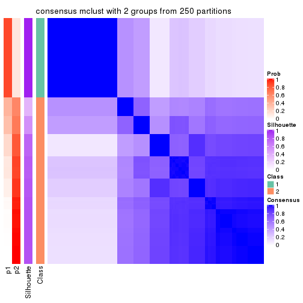</p>

</div>
<div id='tab-MAD-mclust-consensus-heatmap-2'>
<pre><code class="r">consensus_heatmap(res, k = 3)
</code></pre>

<p>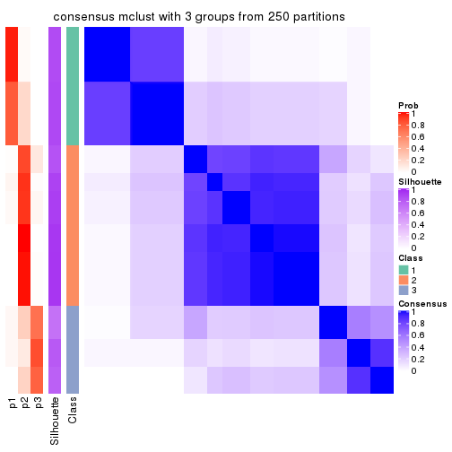</p>

</div>
<div id='tab-MAD-mclust-consensus-heatmap-3'>
<pre><code class="r">consensus_heatmap(res, k = 4)
</code></pre>

<p>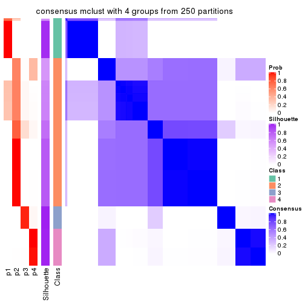</p>

</div>
<div id='tab-MAD-mclust-consensus-heatmap-4'>
<pre><code class="r">consensus_heatmap(res, k = 5)
</code></pre>

<p>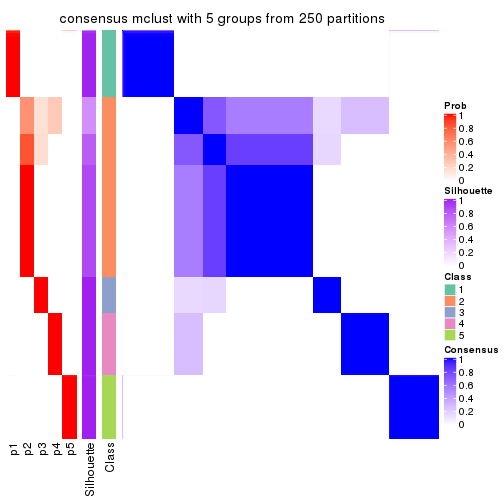</p>

</div>
<div id='tab-MAD-mclust-consensus-heatmap-5'>
<pre><code class="r">consensus_heatmap(res, k = 6)
</code></pre>

<p>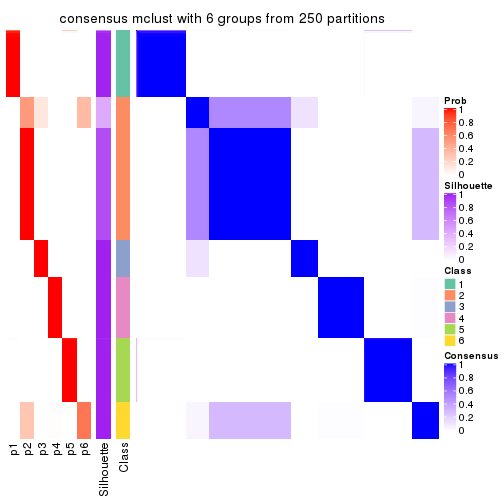</p>

</div>
</div>

Heatmaps for the membership of samples in all partitions to see how consistent they are:


<script>
$( function() {
	$( '#tabs-MAD-mclust-membership-heatmap' ).tabs();
} );
</script>
<div id='tabs-MAD-mclust-membership-heatmap'>
<ul>
<li><a href='#tab-MAD-mclust-membership-heatmap-1'>k = 2</a></li>
<li><a href='#tab-MAD-mclust-membership-heatmap-2'>k = 3</a></li>
<li><a href='#tab-MAD-mclust-membership-heatmap-3'>k = 4</a></li>
<li><a href='#tab-MAD-mclust-membership-heatmap-4'>k = 5</a></li>
<li><a href='#tab-MAD-mclust-membership-heatmap-5'>k = 6</a></li>
</ul>
<div id='tab-MAD-mclust-membership-heatmap-1'>
<pre><code class="r">membership_heatmap(res, k = 2)
</code></pre>

<p>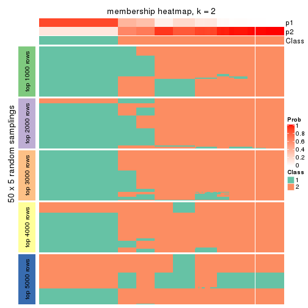</p>

</div>
<div id='tab-MAD-mclust-membership-heatmap-2'>
<pre><code class="r">membership_heatmap(res, k = 3)
</code></pre>

<p>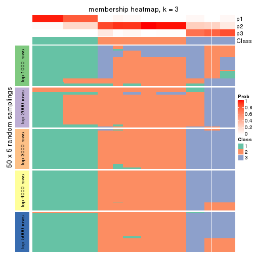</p>

</div>
<div id='tab-MAD-mclust-membership-heatmap-3'>
<pre><code class="r">membership_heatmap(res, k = 4)
</code></pre>

<p>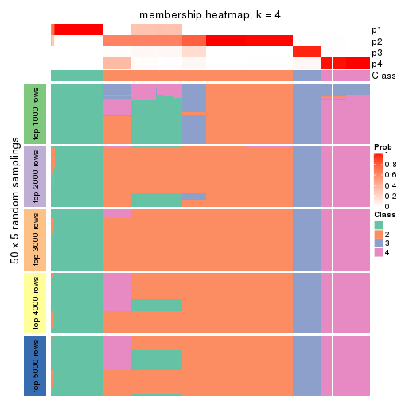</p>

</div>
<div id='tab-MAD-mclust-membership-heatmap-4'>
<pre><code class="r">membership_heatmap(res, k = 5)
</code></pre>

<p>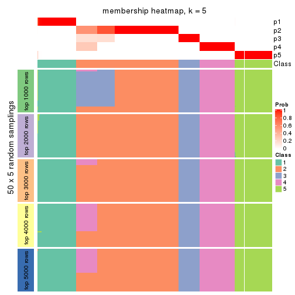</p>

</div>
<div id='tab-MAD-mclust-membership-heatmap-5'>
<pre><code class="r">membership_heatmap(res, k = 6)
</code></pre>

<p>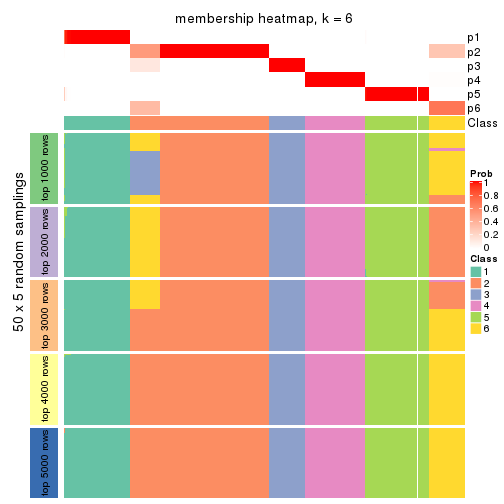</p>

</div>
</div>

As soon as we have had the classes for columns, we can look for signatures
which are significantly different between classes which can be candidate marks
for certain classes. Following are the heatmaps for signatures.


Signature heatmaps where rows are scaled:


<script>
$( function() {
	$( '#tabs-MAD-mclust-get-signatures' ).tabs();
} );
</script>
<div id='tabs-MAD-mclust-get-signatures'>
<ul>
<li><a href='#tab-MAD-mclust-get-signatures-1'>k = 2</a></li>
<li><a href='#tab-MAD-mclust-get-signatures-2'>k = 3</a></li>
<li><a href='#tab-MAD-mclust-get-signatures-3'>k = 4</a></li>
<li><a href='#tab-MAD-mclust-get-signatures-4'>k = 5</a></li>
<li><a href='#tab-MAD-mclust-get-signatures-5'>k = 6</a></li>
</ul>
<div id='tab-MAD-mclust-get-signatures-1'>
<pre><code class="r">get_signatures(res, k = 2)
</code></pre>

<p>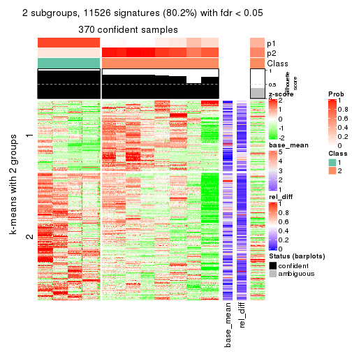</p>

</div>
<div id='tab-MAD-mclust-get-signatures-2'>
<pre><code class="r">get_signatures(res, k = 3)
</code></pre>

<p>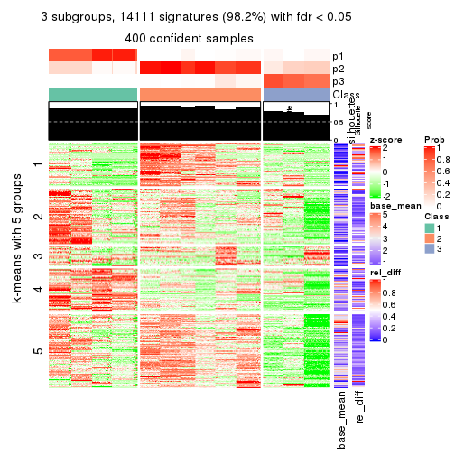</p>

</div>
<div id='tab-MAD-mclust-get-signatures-3'>
<pre><code class="r">get_signatures(res, k = 4)
</code></pre>

<p>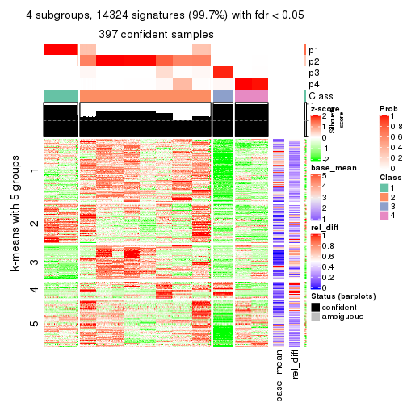</p>

</div>
<div id='tab-MAD-mclust-get-signatures-4'>
<pre><code class="r">get_signatures(res, k = 5)
</code></pre>

<p>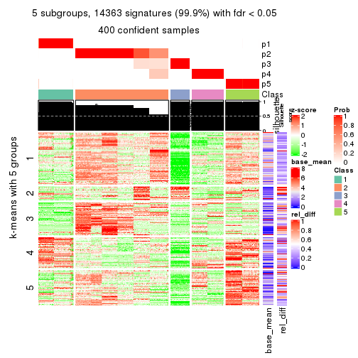</p>

</div>
<div id='tab-MAD-mclust-get-signatures-5'>
<pre><code class="r">get_signatures(res, k = 6)
</code></pre>

<p>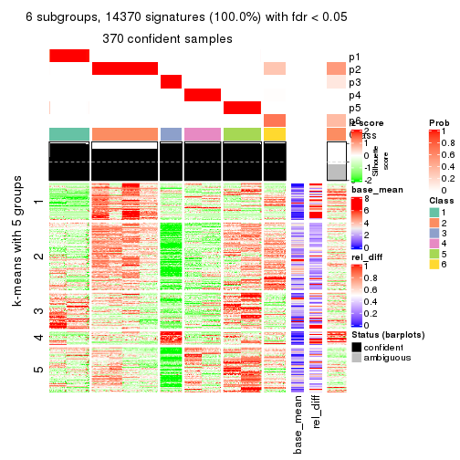</p>

</div>
</div>


Signature heatmaps where rows are not scaled:


<script>
$( function() {
	$( '#tabs-MAD-mclust-get-signatures-no-scale' ).tabs();
} );
</script>
<div id='tabs-MAD-mclust-get-signatures-no-scale'>
<ul>
<li><a href='#tab-MAD-mclust-get-signatures-no-scale-1'>k = 2</a></li>
<li><a href='#tab-MAD-mclust-get-signatures-no-scale-2'>k = 3</a></li>
<li><a href='#tab-MAD-mclust-get-signatures-no-scale-3'>k = 4</a></li>
<li><a href='#tab-MAD-mclust-get-signatures-no-scale-4'>k = 5</a></li>
<li><a href='#tab-MAD-mclust-get-signatures-no-scale-5'>k = 6</a></li>
</ul>
<div id='tab-MAD-mclust-get-signatures-no-scale-1'>
<pre><code class="r">get_signatures(res, k = 2, scale_rows = FALSE)
</code></pre>

<p>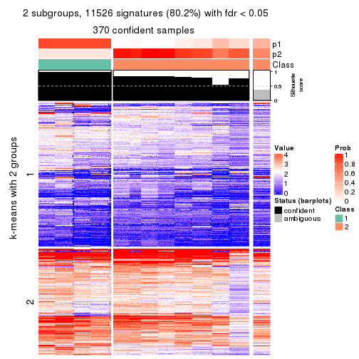</p>

</div>
<div id='tab-MAD-mclust-get-signatures-no-scale-2'>
<pre><code class="r">get_signatures(res, k = 3, scale_rows = FALSE)
</code></pre>

<p>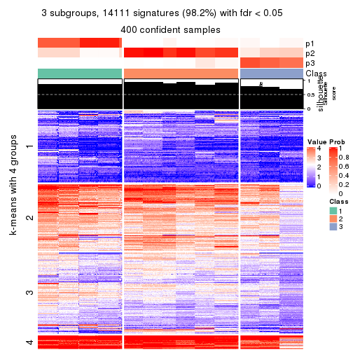</p>

</div>
<div id='tab-MAD-mclust-get-signatures-no-scale-3'>
<pre><code class="r">get_signatures(res, k = 4, scale_rows = FALSE)
</code></pre>

<p>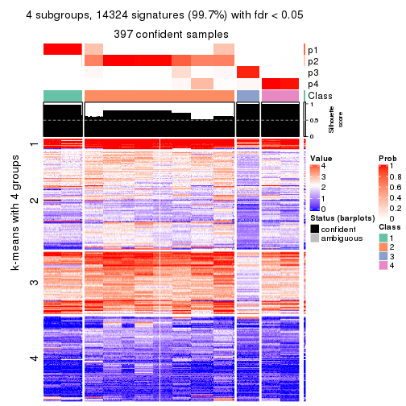</p>

</div>
<div id='tab-MAD-mclust-get-signatures-no-scale-4'>
<pre><code class="r">get_signatures(res, k = 5, scale_rows = FALSE)
</code></pre>

<p>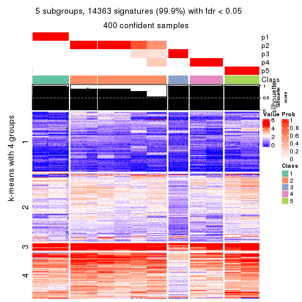</p>

</div>
<div id='tab-MAD-mclust-get-signatures-no-scale-5'>
<pre><code class="r">get_signatures(res, k = 6, scale_rows = FALSE)
</code></pre>

<p>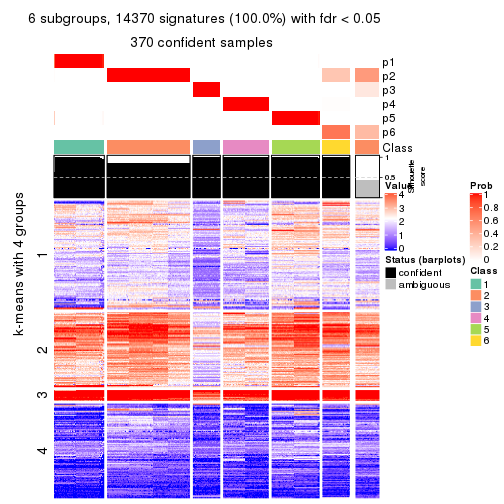</p>

</div>
</div>


Compare the overlap of signatures from different k:

```r
compare_signatures(res)
```

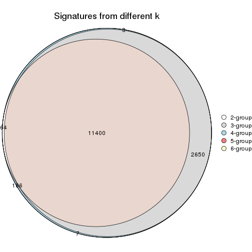

`get_signature()` returns a data frame invisibly. TO get the list of signatures, the function
call should be assigned to a variable explicitly. In following code, if `plot` argument is set
to `FALSE`, no heatmap is plotted while only the differential analysis is performed.

```r
# code only for demonstration
tb = get_signature(res, k = ..., plot = FALSE)
```

An example of the output of `tb` is:

```
#>   which_row         fdr    mean_1    mean_2 scaled_mean_1 scaled_mean_2 km
#> 1        38 0.042760348  8.373488  9.131774    -0.5533452     0.5164555  1
#> 2        40 0.018707592  7.106213  8.469186    -0.6173731     0.5762149  1
#> 3        55 0.019134737 10.221463 11.207825    -0.6159697     0.5749050  1
#> 4        59 0.006059896  5.921854  7.869574    -0.6899429     0.6439467  1
#> 5        60 0.018055526  8.928898 10.211722    -0.6204761     0.5791110  1
#> 6        98 0.009384629 15.714769 14.887706     0.6635654    -0.6193277  2
...
```

The columns in `tb` are:

1. `which_row`: row indices corresponding to the input matrix.
2. `fdr`: FDR for the differential test. 
3. `mean_x`: The mean value in group x.
4. `scaled_mean_x`: The mean value in group x after rows are scaled.
5. `km`: Row groups if k-means clustering is applied to rows.


UMAP plot which shows how samples are separated.


<script>
$( function() {
	$( '#tabs-MAD-mclust-dimension-reduction' ).tabs();
} );
</script>
<div id='tabs-MAD-mclust-dimension-reduction'>
<ul>
<li><a href='#tab-MAD-mclust-dimension-reduction-1'>k = 2</a></li>
<li><a href='#tab-MAD-mclust-dimension-reduction-2'>k = 3</a></li>
<li><a href='#tab-MAD-mclust-dimension-reduction-3'>k = 4</a></li>
<li><a href='#tab-MAD-mclust-dimension-reduction-4'>k = 5</a></li>
<li><a href='#tab-MAD-mclust-dimension-reduction-5'>k = 6</a></li>
</ul>
<div id='tab-MAD-mclust-dimension-reduction-1'>
<pre><code class="r">dimension_reduction(res, k = 2, method = &quot;UMAP&quot;)
</code></pre>

<p>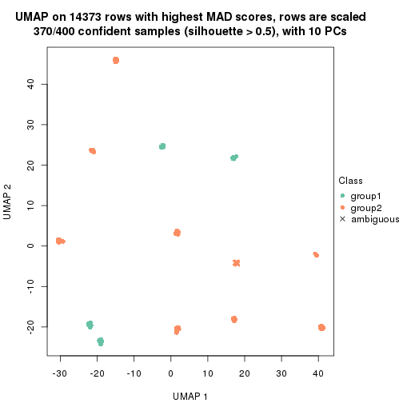</p>

</div>
<div id='tab-MAD-mclust-dimension-reduction-2'>
<pre><code class="r">dimension_reduction(res, k = 3, method = &quot;UMAP&quot;)
</code></pre>

<p>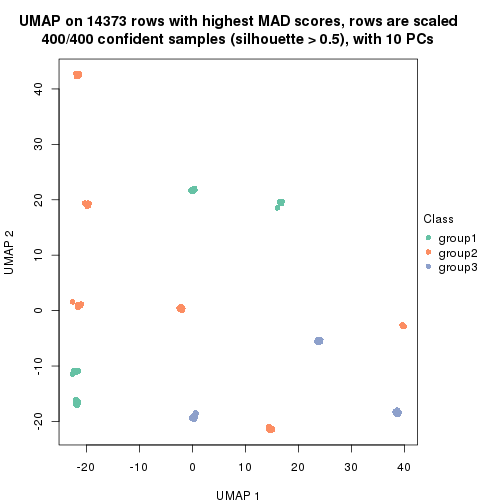</p>

</div>
<div id='tab-MAD-mclust-dimension-reduction-3'>
<pre><code class="r">dimension_reduction(res, k = 4, method = &quot;UMAP&quot;)
</code></pre>

<p>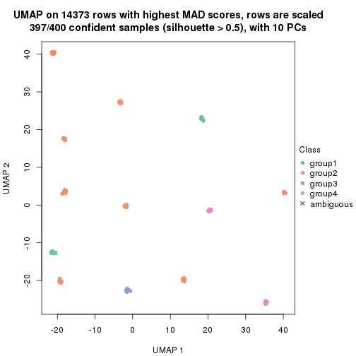</p>

</div>
<div id='tab-MAD-mclust-dimension-reduction-4'>
<pre><code class="r">dimension_reduction(res, k = 5, method = &quot;UMAP&quot;)
</code></pre>

<p>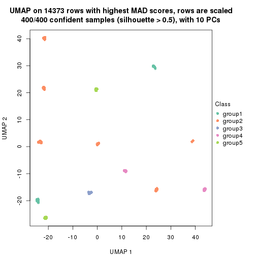</p>

</div>
<div id='tab-MAD-mclust-dimension-reduction-5'>
<pre><code class="r">dimension_reduction(res, k = 6, method = &quot;UMAP&quot;)
</code></pre>

<p>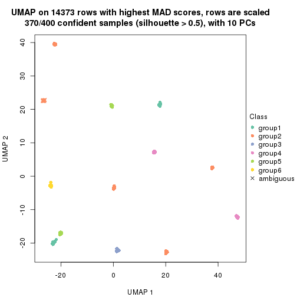</p>

</div>
</div>


Following heatmap shows how subgroups are split when increasing `k`:

```r
collect_classes(res)
```

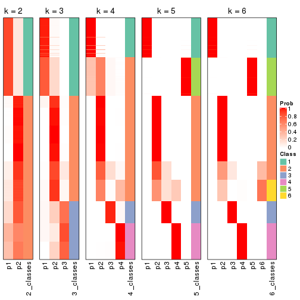


If matrix rows can be associated to genes, consider to use `GO_Enrichment(res,
...)` to perform function enrichment for the signature genes.


 

---------------------------------------------------


### MAD:NMF**


The object with results only for a single top-value method and a single partition method 
can be extracted as:

```r
res = res_list["MAD", "NMF"]
# you can also extract it by
# res = res_list["MAD:NMF"]
```

A summary of `res` and all the functions that can be applied to it:

```r
res
```

```
#> A 'ConsensusPartition' object with k = 2, 3, 4, 5, 6.
#>   On a matrix with 14373 rows and 400 columns.
#>   Top rows (1000, 2000, 3000, 4000, 5000) are extracted by 'MAD' method.
#>   Subgroups are detected by 'NMF' method.
#>   Performed in total 1250 partitions by row resampling.
#>   Best k for subgroups seems to be 6.
#> 
#> Following methods can be applied to this 'ConsensusPartition' object:
#>  [1] "cola_report"             "collect_classes"         "collect_plots"          
#>  [4] "collect_stats"           "colnames"                "compare_signatures"     
#>  [7] "consensus_heatmap"       "dimension_reduction"     "functional_enrichment"  
#> [10] "get_anno_col"            "get_anno"                "get_classes"            
#> [13] "get_consensus"           "get_matrix"              "get_membership"         
#> [16] "get_param"               "get_signatures"          "get_stats"              
#> [19] "is_best_k"               "is_stable_k"             "membership_heatmap"     
#> [22] "ncol"                    "nrow"                    "plot_ecdf"              
#> [25] "rownames"                "select_partition_number" "show"                   
#> [28] "suggest_best_k"          "test_to_known_factors"
```

`collect_plots()` function collects all the plots made from `res` for all `k` (number of partitions)
into one single page to provide an easy and fast comparison between different `k`.

```r
collect_plots(res)
```

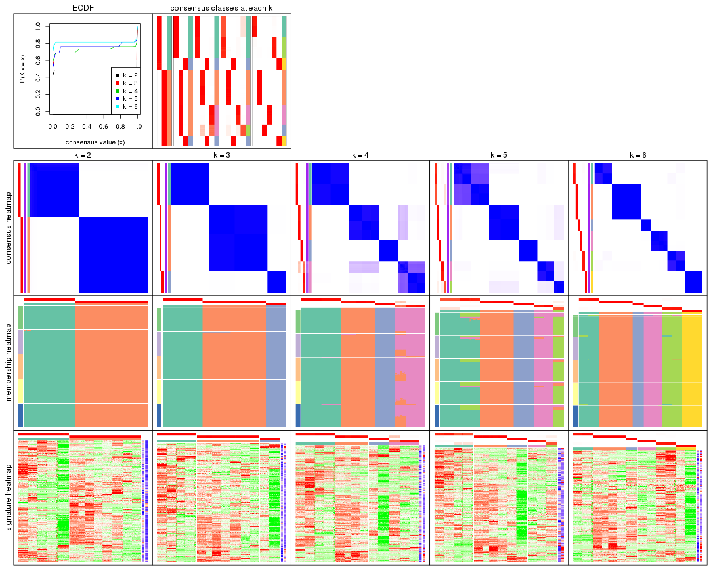

The plots are:

- The first row: a plot of the ECDF (Empirical cumulative distribution
  function) curves of the consensus matrix for each `k` and the heatmap of
  predicted classes for each `k`.
- The second row: heatmaps of the consensus matrix for each `k`.
- The third row: heatmaps of the membership matrix for each `k`.
- The fouth row: heatmaps of the signatures for each `k`.

All the plots in panels can be made by individual functions and they are
plotted later in this section.

`select_partition_number()` produces several plots showing different
statistics for choosing "optimized" `k`. There are following statistics:

- ECDF curves of the consensus matrix for each `k`;
- 1-PAC. [The PAC
  score](https://en.wikipedia.org/wiki/Consensus_clustering#Over-interpretation_potential_of_consensus_clustering)
  measures the proportion of the ambiguous subgrouping.
- Mean silhouette score.
- Concordance. The mean probability of fiting the consensus class ids in all
  partitions.
- Area increased. Denote $A_k$ as the area under the ECDF curve for current
  `k`, the area increased is defined as $A_k - A_{k-1}$.
- Rand index. The percent of pairs of samples that are both in a same cluster
  or both are not in a same cluster in the partition of k and k-1.
- Jaccard index. The ratio of pairs of samples are both in a same cluster in
  the partition of k and k-1 and the pairs of samples are both in a same
  cluster in the partition k or k-1.

The detailed explanations of these statistics can be found in [the cola
vignette](http://bioconductor.org/packages/devel/bioc/vignettes/cola/inst/doc/cola.html#toc_13).

Generally speaking, lower PAC score, higher mean silhouette score or higher
concordance corresponds to better partition. Rand index and Jaccard index
measure how similar the current partition is compared to partition with `k-1`.
If they are too similar, we won't accept `k` is better than `k-1`.

```r
select_partition_number(res)
```

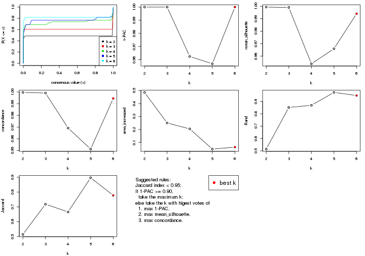

The numeric values for all these statistics can be obtained by `get_stats()`.

```r
get_stats(res)
```

```
#>   k 1-PAC mean_silhouette concordance area_increased  Rand Jaccard
#> 2 2 1.000           0.999       1.000         0.4863 0.514   0.514
#> 3 3 1.000           0.999       0.999         0.2507 0.851   0.718
#> 4 4 0.962           0.954       0.969         0.2047 0.869   0.666
#> 5 5 0.957           0.966       0.951         0.0490 0.973   0.896
#> 6 6 1.000           0.994       0.994         0.0642 0.948   0.777
```

`suggest_best_k()` suggests the best $k$ based on these statistics. The rules are as follows:

- All $k$ with Jaccard index larger than 0.95 are removed because the increase of
  the partition number does not provides enough extra information. If all $k$ are removed,
  the best $k$ is assigned by `NA`.
- For $k$ with 1-PAC larger than 0.9, the maximal $k$ is taken as the "best k". Other $k$ is called "optional k".
- If it does not fit the second rule. The $k$ with the highest vote of highest
  1-PAC, mean silhouette and concordance is taken as the "best k".

```r
suggest_best_k(res)
```

```
#> [1] 6
#> attr(,"optional")
#> [1] 2 3 4 5
```

There is also optional best $k$ = 2 3 4 5 that is worth to check.

Following shows the table of the partitions (You need to click the **show/hide
code output** link to see it). The membership matrix (columns with name `p*`)
is inferred by
[`clue::cl_consensus()`](https://www.rdocumentation.org/link/cl_consensus?package=clue)
function with the `SE` method. Basically the value in the membership matrix
represents the probability to belong to a certain group. The finall class
label for an item is determined with the group with highest probability it
belongs to.

In `get_classes()` function, the entropy is calculated from the membership
matrix and the silhouette score is calculated from the consensus matrix.


<script>
$( function() {
	$( '#tabs-MAD-NMF-get-classes' ).tabs();
} );
</script>
<div id='tabs-MAD-NMF-get-classes'>
<ul>
<li><a href='#tab-MAD-NMF-get-classes-1'>k = 2</a></li>
<li><a href='#tab-MAD-NMF-get-classes-2'>k = 3</a></li>
<li><a href='#tab-MAD-NMF-get-classes-3'>k = 4</a></li>
<li><a href='#tab-MAD-NMF-get-classes-4'>k = 5</a></li>
<li><a href='#tab-MAD-NMF-get-classes-5'>k = 6</a></li>
</ul>

<div id='tab-MAD-NMF-get-classes-1'>
<p><a id='tab-MAD-NMF-get-classes-1-a' style='color:#0366d6' href='#'>show/hide code output</a></p>
<pre><code class="r">cbind(get_classes(res, k = 2), get_membership(res, k = 2))
</code></pre>

<pre><code>#&gt;            class entropy silhouette    p1    p2
#&gt; SRR1661716     2  0.0000      1.000 0.000 1.000
#&gt; SRR1661717     2  0.0000      1.000 0.000 1.000
#&gt; SRR1661718     2  0.0000      1.000 0.000 1.000
#&gt; SRR1661719     2  0.0000      1.000 0.000 1.000
#&gt; SRR1661720     2  0.0000      1.000 0.000 1.000
#&gt; SRR1661721     2  0.0000      1.000 0.000 1.000
#&gt; SRR1661722     2  0.0000      1.000 0.000 1.000
#&gt; SRR1661723     2  0.0000      1.000 0.000 1.000
#&gt; SRR1661724     2  0.0000      1.000 0.000 1.000
#&gt; SRR1661725     2  0.0000      1.000 0.000 1.000
#&gt; SRR1661726     2  0.0000      1.000 0.000 1.000
#&gt; SRR1661727     2  0.0000      1.000 0.000 1.000
#&gt; SRR1661728     2  0.0000      1.000 0.000 1.000
#&gt; SRR1661729     2  0.0000      1.000 0.000 1.000
#&gt; SRR1661730     2  0.0000      1.000 0.000 1.000
#&gt; SRR1661731     2  0.0000      1.000 0.000 1.000
#&gt; SRR1661732     2  0.0000      1.000 0.000 1.000
#&gt; SRR1661733     2  0.0000      1.000 0.000 1.000
#&gt; SRR1661734     2  0.0000      1.000 0.000 1.000
#&gt; SRR1661735     2  0.0000      1.000 0.000 1.000
#&gt; SRR1661736     2  0.0000      1.000 0.000 1.000
#&gt; SRR1661737     2  0.0000      1.000 0.000 1.000
#&gt; SRR1661738     2  0.0000      1.000 0.000 1.000
#&gt; SRR1661739     2  0.0000      1.000 0.000 1.000
#&gt; SRR1661740     2  0.0000      1.000 0.000 1.000
#&gt; SRR1661741     2  0.0000      1.000 0.000 1.000
#&gt; SRR1661742     2  0.0000      1.000 0.000 1.000
#&gt; SRR1661743     2  0.0000      1.000 0.000 1.000
#&gt; SRR1661744     2  0.0000      1.000 0.000 1.000
#&gt; SRR1661745     2  0.0000      1.000 0.000 1.000
#&gt; SRR1661746     2  0.0000      1.000 0.000 1.000
#&gt; SRR1661747     2  0.0000      1.000 0.000 1.000
#&gt; SRR1661748     2  0.0000      1.000 0.000 1.000
#&gt; SRR1661749     2  0.0000      1.000 0.000 1.000
#&gt; SRR1661750     2  0.0000      1.000 0.000 1.000
#&gt; SRR1661751     2  0.0000      1.000 0.000 1.000
#&gt; SRR1661752     2  0.0000      1.000 0.000 1.000
#&gt; SRR1661753     2  0.0000      1.000 0.000 1.000
#&gt; SRR1661754     2  0.0000      1.000 0.000 1.000
#&gt; SRR1661755     2  0.0000      1.000 0.000 1.000
#&gt; SRR1661756     2  0.0000      1.000 0.000 1.000
#&gt; SRR1661757     2  0.0000      1.000 0.000 1.000
#&gt; SRR1661758     2  0.0000      1.000 0.000 1.000
#&gt; SRR1661759     2  0.0000      1.000 0.000 1.000
#&gt; SRR1661760     2  0.0000      1.000 0.000 1.000
#&gt; SRR1661761     2  0.0000      1.000 0.000 1.000
#&gt; SRR1661762     2  0.0000      1.000 0.000 1.000
#&gt; SRR1661763     2  0.0000      1.000 0.000 1.000
#&gt; SRR1661764     2  0.0000      1.000 0.000 1.000
#&gt; SRR1661766     2  0.0000      1.000 0.000 1.000
#&gt; SRR1661767     2  0.0000      1.000 0.000 1.000
#&gt; SRR1661768     2  0.0000      1.000 0.000 1.000
#&gt; SRR1661769     2  0.0000      1.000 0.000 1.000
#&gt; SRR1661770     2  0.0000      1.000 0.000 1.000
#&gt; SRR1661771     2  0.0000      1.000 0.000 1.000
#&gt; SRR1661772     2  0.0000      1.000 0.000 1.000
#&gt; SRR1661773     2  0.0000      1.000 0.000 1.000
#&gt; SRR1661774     2  0.0000      1.000 0.000 1.000
#&gt; SRR1661775     2  0.0000      1.000 0.000 1.000
#&gt; SRR1661776     2  0.0000      1.000 0.000 1.000
#&gt; SRR1661777     2  0.0000      1.000 0.000 1.000
#&gt; SRR1661778     2  0.0000      1.000 0.000 1.000
#&gt; SRR1661779     2  0.0000      1.000 0.000 1.000
#&gt; SRR1661780     2  0.0000      1.000 0.000 1.000
#&gt; SRR1661781     2  0.0000      1.000 0.000 1.000
#&gt; SRR1661782     2  0.0000      1.000 0.000 1.000
#&gt; SRR1661783     2  0.0000      1.000 0.000 1.000
#&gt; SRR1661784     2  0.0000      1.000 0.000 1.000
#&gt; SRR1661785     2  0.0000      1.000 0.000 1.000
#&gt; SRR1661786     2  0.0000      1.000 0.000 1.000
#&gt; SRR1661787     2  0.0000      1.000 0.000 1.000
#&gt; SRR1661788     2  0.0000      1.000 0.000 1.000
#&gt; SRR1661789     2  0.0000      1.000 0.000 1.000
#&gt; SRR1661790     2  0.0000      1.000 0.000 1.000
#&gt; SRR1661791     2  0.0000      1.000 0.000 1.000
#&gt; SRR1661792     2  0.0000      1.000 0.000 1.000
#&gt; SRR1661793     2  0.0000      1.000 0.000 1.000
#&gt; SRR1661794     2  0.0000      1.000 0.000 1.000
#&gt; SRR1661795     2  0.0000      1.000 0.000 1.000
#&gt; SRR1661796     2  0.0000      1.000 0.000 1.000
#&gt; SRR1661797     2  0.0000      1.000 0.000 1.000
#&gt; SRR1661798     2  0.0000      1.000 0.000 1.000
#&gt; SRR1661799     2  0.0000      1.000 0.000 1.000
#&gt; SRR1661800     2  0.0000      1.000 0.000 1.000
#&gt; SRR1661801     2  0.0000      1.000 0.000 1.000
#&gt; SRR1661802     2  0.0000      1.000 0.000 1.000
#&gt; SRR1661803     2  0.0000      1.000 0.000 1.000
#&gt; SRR1661804     2  0.0000      1.000 0.000 1.000
#&gt; SRR1661805     2  0.0000      1.000 0.000 1.000
#&gt; SRR1661806     2  0.0000      1.000 0.000 1.000
#&gt; SRR1661807     2  0.0000      1.000 0.000 1.000
#&gt; SRR1661808     2  0.0000      1.000 0.000 1.000
#&gt; SRR1661809     2  0.0000      1.000 0.000 1.000
#&gt; SRR1661810     2  0.0000      1.000 0.000 1.000
#&gt; SRR1661811     2  0.0000      1.000 0.000 1.000
#&gt; SRR1661812     2  0.0000      1.000 0.000 1.000
#&gt; SRR1661813     2  0.0000      1.000 0.000 1.000
#&gt; SRR1661814     2  0.0000      1.000 0.000 1.000
#&gt; SRR1661815     2  0.0000      1.000 0.000 1.000
#&gt; SRR1661816     2  0.0000      1.000 0.000 1.000
#&gt; SRR1661817     2  0.0000      1.000 0.000 1.000
#&gt; SRR1661818     2  0.0000      1.000 0.000 1.000
#&gt; SRR1661819     2  0.0000      1.000 0.000 1.000
#&gt; SRR1661820     2  0.0000      1.000 0.000 1.000
#&gt; SRR1661821     2  0.0000      1.000 0.000 1.000
#&gt; SRR1661822     2  0.0000      1.000 0.000 1.000
#&gt; SRR1661823     2  0.0000      1.000 0.000 1.000
#&gt; SRR1661824     2  0.0000      1.000 0.000 1.000
#&gt; SRR1661825     2  0.0000      1.000 0.000 1.000
#&gt; SRR1661826     1  0.0000      0.999 1.000 0.000
#&gt; SRR1661827     1  0.0000      0.999 1.000 0.000
#&gt; SRR1661828     1  0.0000      0.999 1.000 0.000
#&gt; SRR1661829     1  0.0000      0.999 1.000 0.000
#&gt; SRR1661830     1  0.0000      0.999 1.000 0.000
#&gt; SRR1661831     1  0.0000      0.999 1.000 0.000
#&gt; SRR1661832     1  0.0000      0.999 1.000 0.000
#&gt; SRR1661833     1  0.0000      0.999 1.000 0.000
#&gt; SRR1661834     1  0.0000      0.999 1.000 0.000
#&gt; SRR1661835     1  0.0000      0.999 1.000 0.000
#&gt; SRR1661836     1  0.0000      0.999 1.000 0.000
#&gt; SRR1661837     1  0.0000      0.999 1.000 0.000
#&gt; SRR1661838     1  0.0000      0.999 1.000 0.000
#&gt; SRR1661839     1  0.0000      0.999 1.000 0.000
#&gt; SRR1661840     1  0.0000      0.999 1.000 0.000
#&gt; SRR1661841     1  0.0000      0.999 1.000 0.000
#&gt; SRR1661843     1  0.0000      0.999 1.000 0.000
#&gt; SRR1661844     1  0.0000      0.999 1.000 0.000
#&gt; SRR1661845     1  0.0000      0.999 1.000 0.000
#&gt; SRR1661846     1  0.0000      0.999 1.000 0.000
#&gt; SRR1661847     1  0.0000      0.999 1.000 0.000
#&gt; SRR1661848     1  0.0000      0.999 1.000 0.000
#&gt; SRR1661849     1  0.0000      0.999 1.000 0.000
#&gt; SRR1661850     1  0.0000      0.999 1.000 0.000
#&gt; SRR1661851     1  0.0000      0.999 1.000 0.000
#&gt; SRR1661852     1  0.0000      0.999 1.000 0.000
#&gt; SRR1661853     1  0.0000      0.999 1.000 0.000
#&gt; SRR1661854     1  0.0000      0.999 1.000 0.000
#&gt; SRR1661855     1  0.0000      0.999 1.000 0.000
#&gt; SRR1661856     1  0.0376      0.996 0.996 0.004
#&gt; SRR1661857     1  0.0000      0.999 1.000 0.000
#&gt; SRR1661858     1  0.0376      0.996 0.996 0.004
#&gt; SRR1661859     1  0.0000      0.999 1.000 0.000
#&gt; SRR1661860     1  0.0000      0.999 1.000 0.000
#&gt; SRR1661861     1  0.0376      0.996 0.996 0.004
#&gt; SRR1661862     1  0.0000      0.999 1.000 0.000
#&gt; SRR1661863     1  0.0000      0.999 1.000 0.000
#&gt; SRR1661864     1  0.0000      0.999 1.000 0.000
#&gt; SRR1661865     1  0.0376      0.996 0.996 0.004
#&gt; SRR1661866     1  0.0376      0.996 0.996 0.004
#&gt; SRR1661867     1  0.0376      0.996 0.996 0.004
#&gt; SRR1661868     1  0.0376      0.996 0.996 0.004
#&gt; SRR1661869     1  0.0000      0.999 1.000 0.000
#&gt; SRR1661870     1  0.0672      0.993 0.992 0.008
#&gt; SRR1661871     1  0.0938      0.989 0.988 0.012
#&gt; SRR1661872     1  0.0672      0.993 0.992 0.008
#&gt; SRR1661873     1  0.1184      0.985 0.984 0.016
#&gt; SRR1661874     1  0.0672      0.993 0.992 0.008
#&gt; SRR1661875     1  0.0938      0.989 0.988 0.012
#&gt; SRR1661876     1  0.0376      0.996 0.996 0.004
#&gt; SRR1661877     1  0.0672      0.993 0.992 0.008
#&gt; SRR1661878     1  0.0672      0.993 0.992 0.008
#&gt; SRR1661879     1  0.1184      0.985 0.984 0.016
#&gt; SRR1661880     1  0.0000      0.999 1.000 0.000
#&gt; SRR1661881     1  0.0672      0.993 0.992 0.008
#&gt; SRR1661882     1  0.0672      0.993 0.992 0.008
#&gt; SRR1661883     1  0.0376      0.996 0.996 0.004
#&gt; SRR1661884     1  0.0376      0.996 0.996 0.004
#&gt; SRR1661885     1  0.0000      0.999 1.000 0.000
#&gt; SRR1661886     1  0.0000      0.999 1.000 0.000
#&gt; SRR1661887     1  0.0000      0.999 1.000 0.000
#&gt; SRR1661888     1  0.0000      0.999 1.000 0.000
#&gt; SRR1661889     1  0.0672      0.993 0.992 0.008
#&gt; SRR1661890     1  0.0376      0.996 0.996 0.004
#&gt; SRR1661891     1  0.0000      0.999 1.000 0.000
#&gt; SRR1661892     1  0.0000      0.999 1.000 0.000
#&gt; SRR1661893     1  0.0000      0.999 1.000 0.000
#&gt; SRR1661894     1  0.0000      0.999 1.000 0.000
#&gt; SRR1661895     1  0.0000      0.999 1.000 0.000
#&gt; SRR1661896     1  0.0000      0.999 1.000 0.000
#&gt; SRR1661897     1  0.0000      0.999 1.000 0.000
#&gt; SRR1661898     1  0.0000      0.999 1.000 0.000
#&gt; SRR1661899     1  0.0000      0.999 1.000 0.000
#&gt; SRR1661900     1  0.0000      0.999 1.000 0.000
#&gt; SRR1661901     1  0.0000      0.999 1.000 0.000
#&gt; SRR1661902     1  0.0000      0.999 1.000 0.000
#&gt; SRR1661903     1  0.0000      0.999 1.000 0.000
#&gt; SRR1661904     1  0.0000      0.999 1.000 0.000
#&gt; SRR1661905     1  0.0000      0.999 1.000 0.000
#&gt; SRR1661906     1  0.0000      0.999 1.000 0.000
#&gt; SRR1661907     1  0.0000      0.999 1.000 0.000
#&gt; SRR1661908     1  0.0000      0.999 1.000 0.000
#&gt; SRR1661909     1  0.0000      0.999 1.000 0.000
#&gt; SRR1661910     1  0.0000      0.999 1.000 0.000
#&gt; SRR1661911     1  0.0000      0.999 1.000 0.000
#&gt; SRR1661912     1  0.0000      0.999 1.000 0.000
#&gt; SRR1661913     1  0.0000      0.999 1.000 0.000
#&gt; SRR1661914     1  0.0000      0.999 1.000 0.000
#&gt; SRR1661915     1  0.0000      0.999 1.000 0.000
#&gt; SRR1661916     1  0.0000      0.999 1.000 0.000
#&gt; SRR1661917     1  0.0000      0.999 1.000 0.000
#&gt; SRR1661918     1  0.0000      0.999 1.000 0.000
#&gt; SRR1661919     1  0.0000      0.999 1.000 0.000
#&gt; SRR1661920     1  0.0000      0.999 1.000 0.000
#&gt; SRR1661921     1  0.0000      0.999 1.000 0.000
#&gt; SRR1661922     1  0.0000      0.999 1.000 0.000
#&gt; SRR1661923     1  0.0000      0.999 1.000 0.000
#&gt; SRR1661924     1  0.0000      0.999 1.000 0.000
#&gt; SRR1661925     1  0.0000      0.999 1.000 0.000
#&gt; SRR1661926     1  0.0000      0.999 1.000 0.000
#&gt; SRR1661927     1  0.0000      0.999 1.000 0.000
#&gt; SRR1661928     2  0.0000      1.000 0.000 1.000
#&gt; SRR1661929     2  0.0000      1.000 0.000 1.000
#&gt; SRR1661930     2  0.0000      1.000 0.000 1.000
#&gt; SRR1661931     2  0.0000      1.000 0.000 1.000
#&gt; SRR1661932     2  0.0000      1.000 0.000 1.000
#&gt; SRR1661933     2  0.0000      1.000 0.000 1.000
#&gt; SRR1661934     2  0.0000      1.000 0.000 1.000
#&gt; SRR1661935     2  0.0000      1.000 0.000 1.000
#&gt; SRR1661936     2  0.0000      1.000 0.000 1.000
#&gt; SRR1661937     2  0.0000      1.000 0.000 1.000
#&gt; SRR1661938     2  0.0000      1.000 0.000 1.000
#&gt; SRR1661939     2  0.0000      1.000 0.000 1.000
#&gt; SRR1661940     2  0.0000      1.000 0.000 1.000
#&gt; SRR1661941     2  0.0000      1.000 0.000 1.000
#&gt; SRR1661942     2  0.0000      1.000 0.000 1.000
#&gt; SRR1661943     2  0.0000      1.000 0.000 1.000
#&gt; SRR1661944     2  0.0000      1.000 0.000 1.000
#&gt; SRR1661945     2  0.0000      1.000 0.000 1.000
#&gt; SRR1661946     2  0.0000      1.000 0.000 1.000
#&gt; SRR1661947     2  0.0000      1.000 0.000 1.000
#&gt; SRR1661948     2  0.0000      1.000 0.000 1.000
#&gt; SRR1661949     2  0.0000      1.000 0.000 1.000
#&gt; SRR1661950     2  0.0000      1.000 0.000 1.000
#&gt; SRR1661951     2  0.0000      1.000 0.000 1.000
#&gt; SRR1661952     2  0.0000      1.000 0.000 1.000
#&gt; SRR1661953     2  0.0000      1.000 0.000 1.000
#&gt; SRR1661954     2  0.0000      1.000 0.000 1.000
#&gt; SRR1661955     2  0.0000      1.000 0.000 1.000
#&gt; SRR1661956     2  0.0000      1.000 0.000 1.000
#&gt; SRR1661957     2  0.0000      1.000 0.000 1.000
#&gt; SRR1661958     2  0.0000      1.000 0.000 1.000
#&gt; SRR1661959     2  0.0000      1.000 0.000 1.000
#&gt; SRR1661960     2  0.0000      1.000 0.000 1.000
#&gt; SRR1661961     2  0.0000      1.000 0.000 1.000
#&gt; SRR1661962     2  0.0000      1.000 0.000 1.000
#&gt; SRR1661963     2  0.0000      1.000 0.000 1.000
#&gt; SRR1661964     2  0.0000      1.000 0.000 1.000
#&gt; SRR1661965     2  0.0000      1.000 0.000 1.000
#&gt; SRR1661966     2  0.0000      1.000 0.000 1.000
#&gt; SRR1661967     2  0.0000      1.000 0.000 1.000
#&gt; SRR1661968     2  0.0000      1.000 0.000 1.000
#&gt; SRR1661969     2  0.0000      1.000 0.000 1.000
#&gt; SRR1661970     2  0.0000      1.000 0.000 1.000
#&gt; SRR1661971     2  0.0000      1.000 0.000 1.000
#&gt; SRR1661972     2  0.0000      1.000 0.000 1.000
#&gt; SRR1661973     2  0.0000      1.000 0.000 1.000
#&gt; SRR1661974     2  0.0000      1.000 0.000 1.000
#&gt; SRR1661975     2  0.0000      1.000 0.000 1.000
#&gt; SRR1661976     2  0.0000      1.000 0.000 1.000
#&gt; SRR1661977     2  0.0000      1.000 0.000 1.000
#&gt; SRR1661978     2  0.0000      1.000 0.000 1.000
#&gt; SRR1661979     2  0.0000      1.000 0.000 1.000
#&gt; SRR1661980     2  0.0000      1.000 0.000 1.000
#&gt; SRR1661981     2  0.0000      1.000 0.000 1.000
#&gt; SRR1661982     2  0.0000      1.000 0.000 1.000
#&gt; SRR1661983     2  0.0000      1.000 0.000 1.000
#&gt; SRR1661984     2  0.0000      1.000 0.000 1.000
#&gt; SRR1661985     2  0.0000      1.000 0.000 1.000
#&gt; SRR1661986     2  0.0000      1.000 0.000 1.000
#&gt; SRR1661987     2  0.0000      1.000 0.000 1.000
#&gt; SRR1661988     1  0.0000      0.999 1.000 0.000
#&gt; SRR1661989     1  0.0000      0.999 1.000 0.000
#&gt; SRR1661990     1  0.0000      0.999 1.000 0.000
#&gt; SRR1661991     1  0.0000      0.999 1.000 0.000
#&gt; SRR1661992     1  0.0000      0.999 1.000 0.000
#&gt; SRR1661993     1  0.0000      0.999 1.000 0.000
#&gt; SRR1661994     1  0.0000      0.999 1.000 0.000
#&gt; SRR1661995     1  0.0000      0.999 1.000 0.000
#&gt; SRR1661996     1  0.0000      0.999 1.000 0.000
#&gt; SRR1661997     1  0.0000      0.999 1.000 0.000
#&gt; SRR1661998     1  0.0000      0.999 1.000 0.000
#&gt; SRR1661999     1  0.0000      0.999 1.000 0.000
#&gt; SRR1662000     1  0.0000      0.999 1.000 0.000
#&gt; SRR1662001     1  0.0000      0.999 1.000 0.000
#&gt; SRR1662002     1  0.0000      0.999 1.000 0.000
#&gt; SRR1662003     1  0.0000      0.999 1.000 0.000
#&gt; SRR1662004     1  0.0000      0.999 1.000 0.000
#&gt; SRR1662005     1  0.0000      0.999 1.000 0.000
#&gt; SRR1662006     1  0.0000      0.999 1.000 0.000
#&gt; SRR1662007     1  0.0000      0.999 1.000 0.000
#&gt; SRR1662008     1  0.0000      0.999 1.000 0.000
#&gt; SRR1662009     1  0.0000      0.999 1.000 0.000
#&gt; SRR1662010     1  0.0000      0.999 1.000 0.000
#&gt; SRR1662011     1  0.0000      0.999 1.000 0.000
#&gt; SRR1662012     1  0.0000      0.999 1.000 0.000
#&gt; SRR1662013     1  0.0000      0.999 1.000 0.000
#&gt; SRR1662014     1  0.0000      0.999 1.000 0.000
#&gt; SRR1662015     1  0.0000      0.999 1.000 0.000
#&gt; SRR1662016     1  0.0000      0.999 1.000 0.000
#&gt; SRR1662017     1  0.0000      0.999 1.000 0.000
#&gt; SRR1662018     2  0.0000      1.000 0.000 1.000
#&gt; SRR1662019     2  0.0000      1.000 0.000 1.000
#&gt; SRR1662020     2  0.0000      1.000 0.000 1.000
#&gt; SRR1662021     2  0.0000      1.000 0.000 1.000
#&gt; SRR1662022     2  0.0000      1.000 0.000 1.000
#&gt; SRR1662023     2  0.0000      1.000 0.000 1.000
#&gt; SRR1662024     2  0.0000      1.000 0.000 1.000
#&gt; SRR1662025     2  0.0000      1.000 0.000 1.000
#&gt; SRR1662026     2  0.0000      1.000 0.000 1.000
#&gt; SRR1662027     2  0.0000      1.000 0.000 1.000
#&gt; SRR1662028     2  0.0000      1.000 0.000 1.000
#&gt; SRR1662029     2  0.0000      1.000 0.000 1.000
#&gt; SRR1662030     2  0.0000      1.000 0.000 1.000
#&gt; SRR1662031     2  0.0000      1.000 0.000 1.000
#&gt; SRR1662032     2  0.0000      1.000 0.000 1.000
#&gt; SRR1662033     2  0.0000      1.000 0.000 1.000
#&gt; SRR1662034     2  0.0000      1.000 0.000 1.000
#&gt; SRR1662035     2  0.0000      1.000 0.000 1.000
#&gt; SRR1662036     2  0.0000      1.000 0.000 1.000
#&gt; SRR1662037     2  0.0000      1.000 0.000 1.000
#&gt; SRR1662038     2  0.0000      1.000 0.000 1.000
#&gt; SRR1662039     2  0.0000      1.000 0.000 1.000
#&gt; SRR1662040     2  0.0000      1.000 0.000 1.000
#&gt; SRR1662041     2  0.0000      1.000 0.000 1.000
#&gt; SRR1662042     2  0.0000      1.000 0.000 1.000
#&gt; SRR1662043     2  0.0000      1.000 0.000 1.000
#&gt; SRR1662044     2  0.0000      1.000 0.000 1.000
#&gt; SRR1662045     2  0.0000      1.000 0.000 1.000
#&gt; SRR1662046     2  0.0000      1.000 0.000 1.000
#&gt; SRR1662047     2  0.0000      1.000 0.000 1.000
#&gt; SRR1662048     2  0.0000      1.000 0.000 1.000
#&gt; SRR1662049     2  0.0000      1.000 0.000 1.000
#&gt; SRR1662050     2  0.0000      1.000 0.000 1.000
#&gt; SRR1662051     2  0.0000      1.000 0.000 1.000
#&gt; SRR1662052     2  0.0000      1.000 0.000 1.000
#&gt; SRR1662053     2  0.0000      1.000 0.000 1.000
#&gt; SRR1662054     2  0.0000      1.000 0.000 1.000
#&gt; SRR1662055     2  0.0000      1.000 0.000 1.000
#&gt; SRR1662056     2  0.0000      1.000 0.000 1.000
#&gt; SRR1662057     2  0.0000      1.000 0.000 1.000
#&gt; SRR1662058     2  0.0000      1.000 0.000 1.000
#&gt; SRR1662059     2  0.0000      1.000 0.000 1.000
#&gt; SRR1662060     2  0.0000      1.000 0.000 1.000
#&gt; SRR1662061     2  0.0000      1.000 0.000 1.000
#&gt; SRR1662062     2  0.0000      1.000 0.000 1.000
#&gt; SRR1662063     2  0.0000      1.000 0.000 1.000
#&gt; SRR1662064     2  0.0000      1.000 0.000 1.000
#&gt; SRR1662065     2  0.0000      1.000 0.000 1.000
#&gt; SRR1662066     2  0.0000      1.000 0.000 1.000
#&gt; SRR1662067     2  0.0000      1.000 0.000 1.000
#&gt; SRR1662068     2  0.0000      1.000 0.000 1.000
#&gt; SRR1662069     2  0.0000      1.000 0.000 1.000
#&gt; SRR1662070     2  0.0000      1.000 0.000 1.000
#&gt; SRR1662071     2  0.0000      1.000 0.000 1.000
#&gt; SRR1662072     2  0.0000      1.000 0.000 1.000
#&gt; SRR1662073     2  0.0000      1.000 0.000 1.000
#&gt; SRR1662074     2  0.0000      1.000 0.000 1.000
#&gt; SRR1662075     2  0.0000      1.000 0.000 1.000
#&gt; SRR1662076     2  0.0000      1.000 0.000 1.000
#&gt; SRR1662077     2  0.0000      1.000 0.000 1.000
#&gt; SRR1662078     2  0.0000      1.000 0.000 1.000
#&gt; SRR1662079     2  0.0000      1.000 0.000 1.000
#&gt; SRR1662080     2  0.0000      1.000 0.000 1.000
#&gt; SRR1662081     2  0.0000      1.000 0.000 1.000
#&gt; SRR1662082     2  0.0000      1.000 0.000 1.000
#&gt; SRR1662083     2  0.0000      1.000 0.000 1.000
#&gt; SRR1662084     1  0.0000      0.999 1.000 0.000
#&gt; SRR1662085     1  0.0000      0.999 1.000 0.000
#&gt; SRR1662086     1  0.0000      0.999 1.000 0.000
#&gt; SRR1662087     1  0.0000      0.999 1.000 0.000
#&gt; SRR1662088     1  0.0000      0.999 1.000 0.000
#&gt; SRR1662089     1  0.0000      0.999 1.000 0.000
#&gt; SRR1662090     1  0.0000      0.999 1.000 0.000
#&gt; SRR1662091     1  0.0000      0.999 1.000 0.000
#&gt; SRR1662092     1  0.0000      0.999 1.000 0.000
#&gt; SRR1662093     1  0.0000      0.999 1.000 0.000
#&gt; SRR1662094     1  0.0000      0.999 1.000 0.000
#&gt; SRR1662095     1  0.0000      0.999 1.000 0.000
#&gt; SRR1662096     1  0.0000      0.999 1.000 0.000
#&gt; SRR1662097     1  0.0000      0.999 1.000 0.000
#&gt; SRR1662098     1  0.0000      0.999 1.000 0.000
#&gt; SRR1662099     1  0.0000      0.999 1.000 0.000
#&gt; SRR1662100     1  0.0000      0.999 1.000 0.000
#&gt; SRR1662101     1  0.0000      0.999 1.000 0.000
#&gt; SRR1662102     1  0.0000      0.999 1.000 0.000
#&gt; SRR1662103     1  0.0000      0.999 1.000 0.000
#&gt; SRR1662104     1  0.0000      0.999 1.000 0.000
#&gt; SRR1662105     1  0.0000      0.999 1.000 0.000
#&gt; SRR1662106     1  0.0000      0.999 1.000 0.000
#&gt; SRR1662107     1  0.0000      0.999 1.000 0.000
#&gt; SRR1662108     1  0.0000      0.999 1.000 0.000
#&gt; SRR1662109     1  0.0000      0.999 1.000 0.000
#&gt; SRR1662110     1  0.0000      0.999 1.000 0.000
#&gt; SRR1662111     1  0.0000      0.999 1.000 0.000
#&gt; SRR1662112     1  0.0000      0.999 1.000 0.000
#&gt; SRR1662113     1  0.0000      0.999 1.000 0.000
#&gt; SRR1662114     1  0.0000      0.999 1.000 0.000
#&gt; SRR1662115     1  0.0000      0.999 1.000 0.000
#&gt; SRR1662116     1  0.0000      0.999 1.000 0.000
#&gt; SRR1662117     1  0.0000      0.999 1.000 0.000
</code></pre>

<script>
$('#tab-MAD-NMF-get-classes-1-a').parent().next().next().hide();
$('#tab-MAD-NMF-get-classes-1-a').click(function(){
  $('#tab-MAD-NMF-get-classes-1-a').parent().next().next().toggle();
  return(false);
});
</script>
</div>

<div id='tab-MAD-NMF-get-classes-2'>
<p><a id='tab-MAD-NMF-get-classes-2-a' style='color:#0366d6' href='#'>show/hide code output</a></p>
<pre><code class="r">cbind(get_classes(res, k = 3), get_membership(res, k = 3))
</code></pre>

<pre><code>#&gt;            class entropy silhouette p1    p2    p3
#&gt; SRR1661716     2  0.0000      0.998  0 1.000 0.000
#&gt; SRR1661717     2  0.0000      0.998  0 1.000 0.000
#&gt; SRR1661718     2  0.0000      0.998  0 1.000 0.000
#&gt; SRR1661719     2  0.0000      0.998  0 1.000 0.000
#&gt; SRR1661720     2  0.0000      0.998  0 1.000 0.000
#&gt; SRR1661721     2  0.0000      0.998  0 1.000 0.000
#&gt; SRR1661722     2  0.0000      0.998  0 1.000 0.000
#&gt; SRR1661723     2  0.0000      0.998  0 1.000 0.000
#&gt; SRR1661724     2  0.0000      0.998  0 1.000 0.000
#&gt; SRR1661725     2  0.0000      0.998  0 1.000 0.000
#&gt; SRR1661726     2  0.0000      0.998  0 1.000 0.000
#&gt; SRR1661727     2  0.0000      0.998  0 1.000 0.000
#&gt; SRR1661728     2  0.0000      0.998  0 1.000 0.000
#&gt; SRR1661729     2  0.0000      0.998  0 1.000 0.000
#&gt; SRR1661730     2  0.0000      0.998  0 1.000 0.000
#&gt; SRR1661731     2  0.0000      0.998  0 1.000 0.000
#&gt; SRR1661732     2  0.0000      0.998  0 1.000 0.000
#&gt; SRR1661733     2  0.0000      0.998  0 1.000 0.000
#&gt; SRR1661734     2  0.0000      0.998  0 1.000 0.000
#&gt; SRR1661735     2  0.0000      0.998  0 1.000 0.000
#&gt; SRR1661736     2  0.0237      0.998  0 0.996 0.004
#&gt; SRR1661737     2  0.0237      0.998  0 0.996 0.004
#&gt; SRR1661738     2  0.0237      0.998  0 0.996 0.004
#&gt; SRR1661739     2  0.0237      0.998  0 0.996 0.004
#&gt; SRR1661740     2  0.0237      0.998  0 0.996 0.004
#&gt; SRR1661741     2  0.0237      0.998  0 0.996 0.004
#&gt; SRR1661742     2  0.0237      0.998  0 0.996 0.004
#&gt; SRR1661743     2  0.0237      0.998  0 0.996 0.004
#&gt; SRR1661744     2  0.0237      0.998  0 0.996 0.004
#&gt; SRR1661745     2  0.0237      0.998  0 0.996 0.004
#&gt; SRR1661746     2  0.0237      0.998  0 0.996 0.004
#&gt; SRR1661747     2  0.0237      0.998  0 0.996 0.004
#&gt; SRR1661748     2  0.0237      0.998  0 0.996 0.004
#&gt; SRR1661749     2  0.0237      0.998  0 0.996 0.004
#&gt; SRR1661750     2  0.0237      0.998  0 0.996 0.004
#&gt; SRR1661751     2  0.0237      0.998  0 0.996 0.004
#&gt; SRR1661752     2  0.0237      0.998  0 0.996 0.004
#&gt; SRR1661753     2  0.0237      0.998  0 0.996 0.004
#&gt; SRR1661754     2  0.0237      0.998  0 0.996 0.004
#&gt; SRR1661755     2  0.0237      0.998  0 0.996 0.004
#&gt; SRR1661756     2  0.0237      0.998  0 0.996 0.004
#&gt; SRR1661757     2  0.0237      0.998  0 0.996 0.004
#&gt; SRR1661758     2  0.0237      0.998  0 0.996 0.004
#&gt; SRR1661759     2  0.0237      0.998  0 0.996 0.004
#&gt; SRR1661760     2  0.0237      0.998  0 0.996 0.004
#&gt; SRR1661761     2  0.0237      0.998  0 0.996 0.004
#&gt; SRR1661762     2  0.0237      0.998  0 0.996 0.004
#&gt; SRR1661763     2  0.0237      0.998  0 0.996 0.004
#&gt; SRR1661764     2  0.0237      0.998  0 0.996 0.004
#&gt; SRR1661766     2  0.0237      0.998  0 0.996 0.004
#&gt; SRR1661767     2  0.0237      0.998  0 0.996 0.004
#&gt; SRR1661768     2  0.0237      0.998  0 0.996 0.004
#&gt; SRR1661769     2  0.0237      0.998  0 0.996 0.004
#&gt; SRR1661770     2  0.0237      0.998  0 0.996 0.004
#&gt; SRR1661771     2  0.0237      0.998  0 0.996 0.004
#&gt; SRR1661772     2  0.0237      0.998  0 0.996 0.004
#&gt; SRR1661773     2  0.0237      0.998  0 0.996 0.004
#&gt; SRR1661774     2  0.0237      0.998  0 0.996 0.004
#&gt; SRR1661775     2  0.0237      0.998  0 0.996 0.004
#&gt; SRR1661776     2  0.0237      0.998  0 0.996 0.004
#&gt; SRR1661777     2  0.0237      0.998  0 0.996 0.004
#&gt; SRR1661778     2  0.0237      0.998  0 0.996 0.004
#&gt; SRR1661779     2  0.0237      0.998  0 0.996 0.004
#&gt; SRR1661780     2  0.0237      0.998  0 0.996 0.004
#&gt; SRR1661781     2  0.0237      0.998  0 0.996 0.004
#&gt; SRR1661782     2  0.0237      0.998  0 0.996 0.004
#&gt; SRR1661783     2  0.0237      0.998  0 0.996 0.004
#&gt; SRR1661784     2  0.0237      0.998  0 0.996 0.004
#&gt; SRR1661785     2  0.0237      0.998  0 0.996 0.004
#&gt; SRR1661786     2  0.0237      0.998  0 0.996 0.004
#&gt; SRR1661787     2  0.0237      0.998  0 0.996 0.004
#&gt; SRR1661788     2  0.0237      0.998  0 0.996 0.004
#&gt; SRR1661789     2  0.0237      0.998  0 0.996 0.004
#&gt; SRR1661790     2  0.0237      0.998  0 0.996 0.004
#&gt; SRR1661791     2  0.0237      0.998  0 0.996 0.004
#&gt; SRR1661792     2  0.0237      0.998  0 0.996 0.004
#&gt; SRR1661793     2  0.0237      0.998  0 0.996 0.004
#&gt; SRR1661794     2  0.0237      0.998  0 0.996 0.004
#&gt; SRR1661795     2  0.0237      0.998  0 0.996 0.004
#&gt; SRR1661796     2  0.0237      0.998  0 0.996 0.004
#&gt; SRR1661797     2  0.0237      0.998  0 0.996 0.004
#&gt; SRR1661798     2  0.0237      0.998  0 0.996 0.004
#&gt; SRR1661799     2  0.0237      0.998  0 0.996 0.004
#&gt; SRR1661800     2  0.0237      0.998  0 0.996 0.004
#&gt; SRR1661801     2  0.0237      0.998  0 0.996 0.004
#&gt; SRR1661802     2  0.0237      0.998  0 0.996 0.004
#&gt; SRR1661803     2  0.0237      0.998  0 0.996 0.004
#&gt; SRR1661804     2  0.0237      0.998  0 0.996 0.004
#&gt; SRR1661805     2  0.0237      0.998  0 0.996 0.004
#&gt; SRR1661806     2  0.0237      0.998  0 0.996 0.004
#&gt; SRR1661807     2  0.0237      0.998  0 0.996 0.004
#&gt; SRR1661808     2  0.0237      0.998  0 0.996 0.004
#&gt; SRR1661809     2  0.0237      0.998  0 0.996 0.004
#&gt; SRR1661810     2  0.0237      0.998  0 0.996 0.004
#&gt; SRR1661811     2  0.0237      0.998  0 0.996 0.004
#&gt; SRR1661812     2  0.0237      0.998  0 0.996 0.004
#&gt; SRR1661813     2  0.0237      0.998  0 0.996 0.004
#&gt; SRR1661814     2  0.0237      0.998  0 0.996 0.004
#&gt; SRR1661815     2  0.0237      0.998  0 0.996 0.004
#&gt; SRR1661816     2  0.0237      0.998  0 0.996 0.004
#&gt; SRR1661817     2  0.0237      0.998  0 0.996 0.004
#&gt; SRR1661818     2  0.0237      0.998  0 0.996 0.004
#&gt; SRR1661819     2  0.0237      0.998  0 0.996 0.004
#&gt; SRR1661820     2  0.0237      0.998  0 0.996 0.004
#&gt; SRR1661821     2  0.0237      0.998  0 0.996 0.004
#&gt; SRR1661822     2  0.0237      0.998  0 0.996 0.004
#&gt; SRR1661823     2  0.0237      0.998  0 0.996 0.004
#&gt; SRR1661824     2  0.0237      0.998  0 0.996 0.004
#&gt; SRR1661825     2  0.0237      0.998  0 0.996 0.004
#&gt; SRR1661826     1  0.0000      1.000  1 0.000 0.000
#&gt; SRR1661827     1  0.0000      1.000  1 0.000 0.000
#&gt; SRR1661828     1  0.0000      1.000  1 0.000 0.000
#&gt; SRR1661829     1  0.0000      1.000  1 0.000 0.000
#&gt; SRR1661830     1  0.0000      1.000  1 0.000 0.000
#&gt; SRR1661831     1  0.0000      1.000  1 0.000 0.000
#&gt; SRR1661832     1  0.0000      1.000  1 0.000 0.000
#&gt; SRR1661833     1  0.0000      1.000  1 0.000 0.000
#&gt; SRR1661834     1  0.0000      1.000  1 0.000 0.000
#&gt; SRR1661835     1  0.0000      1.000  1 0.000 0.000
#&gt; SRR1661836     1  0.0000      1.000  1 0.000 0.000
#&gt; SRR1661837     1  0.0000      1.000  1 0.000 0.000
#&gt; SRR1661838     1  0.0000      1.000  1 0.000 0.000
#&gt; SRR1661839     1  0.0000      1.000  1 0.000 0.000
#&gt; SRR1661840     1  0.0000      1.000  1 0.000 0.000
#&gt; SRR1661841     1  0.0000      1.000  1 0.000 0.000
#&gt; SRR1661843     1  0.0000      1.000  1 0.000 0.000
#&gt; SRR1661844     1  0.0000      1.000  1 0.000 0.000
#&gt; SRR1661845     1  0.0000      1.000  1 0.000 0.000
#&gt; SRR1661846     1  0.0000      1.000  1 0.000 0.000
#&gt; SRR1661847     1  0.0000      1.000  1 0.000 0.000
#&gt; SRR1661848     1  0.0000      1.000  1 0.000 0.000
#&gt; SRR1661849     1  0.0000      1.000  1 0.000 0.000
#&gt; SRR1661850     1  0.0000      1.000  1 0.000 0.000
#&gt; SRR1661851     1  0.0000      1.000  1 0.000 0.000
#&gt; SRR1661852     1  0.0000      1.000  1 0.000 0.000
#&gt; SRR1661853     1  0.0000      1.000  1 0.000 0.000
#&gt; SRR1661854     1  0.0000      1.000  1 0.000 0.000
#&gt; SRR1661855     1  0.0000      1.000  1 0.000 0.000
#&gt; SRR1661856     3  0.0000      1.000  0 0.000 1.000
#&gt; SRR1661857     3  0.0000      1.000  0 0.000 1.000
#&gt; SRR1661858     3  0.0000      1.000  0 0.000 1.000
#&gt; SRR1661859     3  0.0000      1.000  0 0.000 1.000
#&gt; SRR1661860     3  0.0000      1.000  0 0.000 1.000
#&gt; SRR1661861     3  0.0000      1.000  0 0.000 1.000
#&gt; SRR1661862     3  0.0000      1.000  0 0.000 1.000
#&gt; SRR1661863     3  0.0000      1.000  0 0.000 1.000
#&gt; SRR1661864     3  0.0000      1.000  0 0.000 1.000
#&gt; SRR1661865     3  0.0000      1.000  0 0.000 1.000
#&gt; SRR1661866     3  0.0000      1.000  0 0.000 1.000
#&gt; SRR1661867     3  0.0000      1.000  0 0.000 1.000
#&gt; SRR1661868     3  0.0000      1.000  0 0.000 1.000
#&gt; SRR1661869     3  0.0000      1.000  0 0.000 1.000
#&gt; SRR1661870     3  0.0000      1.000  0 0.000 1.000
#&gt; SRR1661871     3  0.0000      1.000  0 0.000 1.000
#&gt; SRR1661872     3  0.0000      1.000  0 0.000 1.000
#&gt; SRR1661873     3  0.0000      1.000  0 0.000 1.000
#&gt; SRR1661874     3  0.0000      1.000  0 0.000 1.000
#&gt; SRR1661875     3  0.0000      1.000  0 0.000 1.000
#&gt; SRR1661876     3  0.0000      1.000  0 0.000 1.000
#&gt; SRR1661877     3  0.0000      1.000  0 0.000 1.000
#&gt; SRR1661878     3  0.0000      1.000  0 0.000 1.000
#&gt; SRR1661879     3  0.0000      1.000  0 0.000 1.000
#&gt; SRR1661880     3  0.0000      1.000  0 0.000 1.000
#&gt; SRR1661881     3  0.0000      1.000  0 0.000 1.000
#&gt; SRR1661882     3  0.0000      1.000  0 0.000 1.000
#&gt; SRR1661883     3  0.0000      1.000  0 0.000 1.000
#&gt; SRR1661884     3  0.0000      1.000  0 0.000 1.000
#&gt; SRR1661885     3  0.0000      1.000  0 0.000 1.000
#&gt; SRR1661886     3  0.0000      1.000  0 0.000 1.000
#&gt; SRR1661887     3  0.0000      1.000  0 0.000 1.000
#&gt; SRR1661888     3  0.0000      1.000  0 0.000 1.000
#&gt; SRR1661889     3  0.0000      1.000  0 0.000 1.000
#&gt; SRR1661890     3  0.0000      1.000  0 0.000 1.000
#&gt; SRR1661891     3  0.0000      1.000  0 0.000 1.000
#&gt; SRR1661892     1  0.0000      1.000  1 0.000 0.000
#&gt; SRR1661893     1  0.0000      1.000  1 0.000 0.000
#&gt; SRR1661894     1  0.0000      1.000  1 0.000 0.000
#&gt; SRR1661895     1  0.0000      1.000  1 0.000 0.000
#&gt; SRR1661896     1  0.0000      1.000  1 0.000 0.000
#&gt; SRR1661897     1  0.0000      1.000  1 0.000 0.000
#&gt; SRR1661898     1  0.0000      1.000  1 0.000 0.000
#&gt; SRR1661899     1  0.0000      1.000  1 0.000 0.000
#&gt; SRR1661900     1  0.0000      1.000  1 0.000 0.000
#&gt; SRR1661901     1  0.0000      1.000  1 0.000 0.000
#&gt; SRR1661902     1  0.0000      1.000  1 0.000 0.000
#&gt; SRR1661903     1  0.0000      1.000  1 0.000 0.000
#&gt; SRR1661904     1  0.0000      1.000  1 0.000 0.000
#&gt; SRR1661905     1  0.0000      1.000  1 0.000 0.000
#&gt; SRR1661906     1  0.0000      1.000  1 0.000 0.000
#&gt; SRR1661907     1  0.0000      1.000  1 0.000 0.000
#&gt; SRR1661908     1  0.0000      1.000  1 0.000 0.000
#&gt; SRR1661909     1  0.0000      1.000  1 0.000 0.000
#&gt; SRR1661910     1  0.0000      1.000  1 0.000 0.000
#&gt; SRR1661911     1  0.0000      1.000  1 0.000 0.000
#&gt; SRR1661912     1  0.0000      1.000  1 0.000 0.000
#&gt; SRR1661913     1  0.0000      1.000  1 0.000 0.000
#&gt; SRR1661914     1  0.0000      1.000  1 0.000 0.000
#&gt; SRR1661915     1  0.0000      1.000  1 0.000 0.000
#&gt; SRR1661916     1  0.0000      1.000  1 0.000 0.000
#&gt; SRR1661917     1  0.0000      1.000  1 0.000 0.000
#&gt; SRR1661918     1  0.0000      1.000  1 0.000 0.000
#&gt; SRR1661919     1  0.0000      1.000  1 0.000 0.000
#&gt; SRR1661920     1  0.0000      1.000  1 0.000 0.000
#&gt; SRR1661921     1  0.0000      1.000  1 0.000 0.000
#&gt; SRR1661922     1  0.0000      1.000  1 0.000 0.000
#&gt; SRR1661923     1  0.0000      1.000  1 0.000 0.000
#&gt; SRR1661924     1  0.0000      1.000  1 0.000 0.000
#&gt; SRR1661925     1  0.0000      1.000  1 0.000 0.000
#&gt; SRR1661926     1  0.0000      1.000  1 0.000 0.000
#&gt; SRR1661927     1  0.0000      1.000  1 0.000 0.000
#&gt; SRR1661928     3  0.0000      1.000  0 0.000 1.000
#&gt; SRR1661929     3  0.0000      1.000  0 0.000 1.000
#&gt; SRR1661930     3  0.0000      1.000  0 0.000 1.000
#&gt; SRR1661931     3  0.0000      1.000  0 0.000 1.000
#&gt; SRR1661932     3  0.0000      1.000  0 0.000 1.000
#&gt; SRR1661933     3  0.0000      1.000  0 0.000 1.000
#&gt; SRR1661934     3  0.0000      1.000  0 0.000 1.000
#&gt; SRR1661935     3  0.0000      1.000  0 0.000 1.000
#&gt; SRR1661936     3  0.0000      1.000  0 0.000 1.000
#&gt; SRR1661937     3  0.0000      1.000  0 0.000 1.000
#&gt; SRR1661938     3  0.0000      1.000  0 0.000 1.000
#&gt; SRR1661939     3  0.0000      1.000  0 0.000 1.000
#&gt; SRR1661940     3  0.0000      1.000  0 0.000 1.000
#&gt; SRR1661941     3  0.0000      1.000  0 0.000 1.000
#&gt; SRR1661942     3  0.0000      1.000  0 0.000 1.000
#&gt; SRR1661943     3  0.0000      1.000  0 0.000 1.000
#&gt; SRR1661944     3  0.0000      1.000  0 0.000 1.000
#&gt; SRR1661945     3  0.0000      1.000  0 0.000 1.000
#&gt; SRR1661946     3  0.0000      1.000  0 0.000 1.000
#&gt; SRR1661947     3  0.0000      1.000  0 0.000 1.000
#&gt; SRR1661948     3  0.0000      1.000  0 0.000 1.000
#&gt; SRR1661949     3  0.0000      1.000  0 0.000 1.000
#&gt; SRR1661950     3  0.0000      1.000  0 0.000 1.000
#&gt; SRR1661951     3  0.0000      1.000  0 0.000 1.000
#&gt; SRR1661952     3  0.0000      1.000  0 0.000 1.000
#&gt; SRR1661953     3  0.0000      1.000  0 0.000 1.000
#&gt; SRR1661954     3  0.0000      1.000  0 0.000 1.000
#&gt; SRR1661955     3  0.0000      1.000  0 0.000 1.000
#&gt; SRR1661956     3  0.0000      1.000  0 0.000 1.000
#&gt; SRR1661957     3  0.0000      1.000  0 0.000 1.000
#&gt; SRR1661958     2  0.0000      0.998  0 1.000 0.000
#&gt; SRR1661959     2  0.0000      0.998  0 1.000 0.000
#&gt; SRR1661960     2  0.0000      0.998  0 1.000 0.000
#&gt; SRR1661961     2  0.0000      0.998  0 1.000 0.000
#&gt; SRR1661962     2  0.0000      0.998  0 1.000 0.000
#&gt; SRR1661963     2  0.0000      0.998  0 1.000 0.000
#&gt; SRR1661964     2  0.0000      0.998  0 1.000 0.000
#&gt; SRR1661965     2  0.0000      0.998  0 1.000 0.000
#&gt; SRR1661966     2  0.0000      0.998  0 1.000 0.000
#&gt; SRR1661967     2  0.0000      0.998  0 1.000 0.000
#&gt; SRR1661968     2  0.0000      0.998  0 1.000 0.000
#&gt; SRR1661969     2  0.0000      0.998  0 1.000 0.000
#&gt; SRR1661970     2  0.0000      0.998  0 1.000 0.000
#&gt; SRR1661971     2  0.0000      0.998  0 1.000 0.000
#&gt; SRR1661972     2  0.0000      0.998  0 1.000 0.000
#&gt; SRR1661973     2  0.0000      0.998  0 1.000 0.000
#&gt; SRR1661974     2  0.0000      0.998  0 1.000 0.000
#&gt; SRR1661975     2  0.0000      0.998  0 1.000 0.000
#&gt; SRR1661976     2  0.0000      0.998  0 1.000 0.000
#&gt; SRR1661977     2  0.0000      0.998  0 1.000 0.000
#&gt; SRR1661978     2  0.0000      0.998  0 1.000 0.000
#&gt; SRR1661979     2  0.0000      0.998  0 1.000 0.000
#&gt; SRR1661980     2  0.0000      0.998  0 1.000 0.000
#&gt; SRR1661981     2  0.0000      0.998  0 1.000 0.000
#&gt; SRR1661982     2  0.0000      0.998  0 1.000 0.000
#&gt; SRR1661983     2  0.0000      0.998  0 1.000 0.000
#&gt; SRR1661984     2  0.0000      0.998  0 1.000 0.000
#&gt; SRR1661985     2  0.0000      0.998  0 1.000 0.000
#&gt; SRR1661986     2  0.0000      0.998  0 1.000 0.000
#&gt; SRR1661987     2  0.0000      0.998  0 1.000 0.000
#&gt; SRR1661988     1  0.0000      1.000  1 0.000 0.000
#&gt; SRR1661989     1  0.0000      1.000  1 0.000 0.000
#&gt; SRR1661990     1  0.0000      1.000  1 0.000 0.000
#&gt; SRR1661991     1  0.0000      1.000  1 0.000 0.000
#&gt; SRR1661992     1  0.0000      1.000  1 0.000 0.000
#&gt; SRR1661993     1  0.0000      1.000  1 0.000 0.000
#&gt; SRR1661994     1  0.0000      1.000  1 0.000 0.000
#&gt; SRR1661995     1  0.0000      1.000  1 0.000 0.000
#&gt; SRR1661996     1  0.0000      1.000  1 0.000 0.000
#&gt; SRR1661997     1  0.0000      1.000  1 0.000 0.000
#&gt; SRR1661998     1  0.0000      1.000  1 0.000 0.000
#&gt; SRR1661999     1  0.0000      1.000  1 0.000 0.000
#&gt; SRR1662000     1  0.0000      1.000  1 0.000 0.000
#&gt; SRR1662001     1  0.0000      1.000  1 0.000 0.000
#&gt; SRR1662002     1  0.0000      1.000  1 0.000 0.000
#&gt; SRR1662003     1  0.0000      1.000  1 0.000 0.000
#&gt; SRR1662004     1  0.0000      1.000  1 0.000 0.000
#&gt; SRR1662005     1  0.0000      1.000  1 0.000 0.000
#&gt; SRR1662006     1  0.0000      1.000  1 0.000 0.000
#&gt; SRR1662007     1  0.0000      1.000  1 0.000 0.000
#&gt; SRR1662008     1  0.0000      1.000  1 0.000 0.000
#&gt; SRR1662009     1  0.0000      1.000  1 0.000 0.000
#&gt; SRR1662010     1  0.0000      1.000  1 0.000 0.000
#&gt; SRR1662011     1  0.0000      1.000  1 0.000 0.000
#&gt; SRR1662012     1  0.0000      1.000  1 0.000 0.000
#&gt; SRR1662013     1  0.0000      1.000  1 0.000 0.000
#&gt; SRR1662014     1  0.0000      1.000  1 0.000 0.000
#&gt; SRR1662015     1  0.0000      1.000  1 0.000 0.000
#&gt; SRR1662016     1  0.0000      1.000  1 0.000 0.000
#&gt; SRR1662017     1  0.0000      1.000  1 0.000 0.000
#&gt; SRR1662018     2  0.0237      0.998  0 0.996 0.004
#&gt; SRR1662019     2  0.0000      0.998  0 1.000 0.000
#&gt; SRR1662020     2  0.0000      0.998  0 1.000 0.000
#&gt; SRR1662021     2  0.0000      0.998  0 1.000 0.000
#&gt; SRR1662022     2  0.0000      0.998  0 1.000 0.000
#&gt; SRR1662023     2  0.0000      0.998  0 1.000 0.000
#&gt; SRR1662024     2  0.0000      0.998  0 1.000 0.000
#&gt; SRR1662025     2  0.0000      0.998  0 1.000 0.000
#&gt; SRR1662026     2  0.0000      0.998  0 1.000 0.000
#&gt; SRR1662027     2  0.0000      0.998  0 1.000 0.000
#&gt; SRR1662028     2  0.0000      0.998  0 1.000 0.000
#&gt; SRR1662029     2  0.0000      0.998  0 1.000 0.000
#&gt; SRR1662030     2  0.0000      0.998  0 1.000 0.000
#&gt; SRR1662031     2  0.0000      0.998  0 1.000 0.000
#&gt; SRR1662032     2  0.0000      0.998  0 1.000 0.000
#&gt; SRR1662033     2  0.0000      0.998  0 1.000 0.000
#&gt; SRR1662034     2  0.0000      0.998  0 1.000 0.000
#&gt; SRR1662035     2  0.0000      0.998  0 1.000 0.000
#&gt; SRR1662036     2  0.0000      0.998  0 1.000 0.000
#&gt; SRR1662037     2  0.0000      0.998  0 1.000 0.000
#&gt; SRR1662038     2  0.0000      0.998  0 1.000 0.000
#&gt; SRR1662039     2  0.0000      0.998  0 1.000 0.000
#&gt; SRR1662040     2  0.0000      0.998  0 1.000 0.000
#&gt; SRR1662041     2  0.0000      0.998  0 1.000 0.000
#&gt; SRR1662042     2  0.0000      0.998  0 1.000 0.000
#&gt; SRR1662043     2  0.0000      0.998  0 1.000 0.000
#&gt; SRR1662044     2  0.0000      0.998  0 1.000 0.000
#&gt; SRR1662045     2  0.0000      0.998  0 1.000 0.000
#&gt; SRR1662046     2  0.0000      0.998  0 1.000 0.000
#&gt; SRR1662047     2  0.0000      0.998  0 1.000 0.000
#&gt; SRR1662048     2  0.0000      0.998  0 1.000 0.000
#&gt; SRR1662049     2  0.0000      0.998  0 1.000 0.000
#&gt; SRR1662050     2  0.0237      0.998  0 0.996 0.004
#&gt; SRR1662051     2  0.0000      0.998  0 1.000 0.000
#&gt; SRR1662052     2  0.0000      0.998  0 1.000 0.000
#&gt; SRR1662053     2  0.0000      0.998  0 1.000 0.000
#&gt; SRR1662054     2  0.0000      0.998  0 1.000 0.000
#&gt; SRR1662055     2  0.0000      0.998  0 1.000 0.000
#&gt; SRR1662056     2  0.0000      0.998  0 1.000 0.000
#&gt; SRR1662057     2  0.0000      0.998  0 1.000 0.000
#&gt; SRR1662058     2  0.0000      0.998  0 1.000 0.000
#&gt; SRR1662059     2  0.0000      0.998  0 1.000 0.000
#&gt; SRR1662060     2  0.0000      0.998  0 1.000 0.000
#&gt; SRR1662061     2  0.0000      0.998  0 1.000 0.000
#&gt; SRR1662062     2  0.0000      0.998  0 1.000 0.000
#&gt; SRR1662063     2  0.0000      0.998  0 1.000 0.000
#&gt; SRR1662064     2  0.0000      0.998  0 1.000 0.000
#&gt; SRR1662065     2  0.0000      0.998  0 1.000 0.000
#&gt; SRR1662066     2  0.0000      0.998  0 1.000 0.000
#&gt; SRR1662067     2  0.0000      0.998  0 1.000 0.000
#&gt; SRR1662068     2  0.0000      0.998  0 1.000 0.000
#&gt; SRR1662069     2  0.0000      0.998  0 1.000 0.000
#&gt; SRR1662070     2  0.0000      0.998  0 1.000 0.000
#&gt; SRR1662071     2  0.0000      0.998  0 1.000 0.000
#&gt; SRR1662072     2  0.0000      0.998  0 1.000 0.000
#&gt; SRR1662073     2  0.0000      0.998  0 1.000 0.000
#&gt; SRR1662074     2  0.0000      0.998  0 1.000 0.000
#&gt; SRR1662075     2  0.0000      0.998  0 1.000 0.000
#&gt; SRR1662076     2  0.0000      0.998  0 1.000 0.000
#&gt; SRR1662077     2  0.0000      0.998  0 1.000 0.000
#&gt; SRR1662078     2  0.0000      0.998  0 1.000 0.000
#&gt; SRR1662079     2  0.0000      0.998  0 1.000 0.000
#&gt; SRR1662080     2  0.0000      0.998  0 1.000 0.000
#&gt; SRR1662081     2  0.0000      0.998  0 1.000 0.000
#&gt; SRR1662082     2  0.0000      0.998  0 1.000 0.000
#&gt; SRR1662083     2  0.0000      0.998  0 1.000 0.000
#&gt; SRR1662084     1  0.0000      1.000  1 0.000 0.000
#&gt; SRR1662085     1  0.0000      1.000  1 0.000 0.000
#&gt; SRR1662086     1  0.0000      1.000  1 0.000 0.000
#&gt; SRR1662087     1  0.0000      1.000  1 0.000 0.000
#&gt; SRR1662088     1  0.0000      1.000  1 0.000 0.000
#&gt; SRR1662089     1  0.0000      1.000  1 0.000 0.000
#&gt; SRR1662090     1  0.0000      1.000  1 0.000 0.000
#&gt; SRR1662091     1  0.0000      1.000  1 0.000 0.000
#&gt; SRR1662092     1  0.0000      1.000  1 0.000 0.000
#&gt; SRR1662093     1  0.0000      1.000  1 0.000 0.000
#&gt; SRR1662094     1  0.0000      1.000  1 0.000 0.000
#&gt; SRR1662095     1  0.0000      1.000  1 0.000 0.000
#&gt; SRR1662096     1  0.0000      1.000  1 0.000 0.000
#&gt; SRR1662097     1  0.0000      1.000  1 0.000 0.000
#&gt; SRR1662098     1  0.0000      1.000  1 0.000 0.000
#&gt; SRR1662099     1  0.0000      1.000  1 0.000 0.000
#&gt; SRR1662100     1  0.0000      1.000  1 0.000 0.000
#&gt; SRR1662101     1  0.0000      1.000  1 0.000 0.000
#&gt; SRR1662102     1  0.0000      1.000  1 0.000 0.000
#&gt; SRR1662103     1  0.0000      1.000  1 0.000 0.000
#&gt; SRR1662104     1  0.0000      1.000  1 0.000 0.000
#&gt; SRR1662105     1  0.0000      1.000  1 0.000 0.000
#&gt; SRR1662106     1  0.0000      1.000  1 0.000 0.000
#&gt; SRR1662107     1  0.0000      1.000  1 0.000 0.000
#&gt; SRR1662108     1  0.0000      1.000  1 0.000 0.000
#&gt; SRR1662109     1  0.0000      1.000  1 0.000 0.000
#&gt; SRR1662110     1  0.0000      1.000  1 0.000 0.000
#&gt; SRR1662111     1  0.0000      1.000  1 0.000 0.000
#&gt; SRR1662112     1  0.0000      1.000  1 0.000 0.000
#&gt; SRR1662113     1  0.0000      1.000  1 0.000 0.000
#&gt; SRR1662114     1  0.0000      1.000  1 0.000 0.000
#&gt; SRR1662115     1  0.0000      1.000  1 0.000 0.000
#&gt; SRR1662116     1  0.0000      1.000  1 0.000 0.000
#&gt; SRR1662117     1  0.0000      1.000  1 0.000 0.000
</code></pre>

<script>
$('#tab-MAD-NMF-get-classes-2-a').parent().next().next().hide();
$('#tab-MAD-NMF-get-classes-2-a').click(function(){
  $('#tab-MAD-NMF-get-classes-2-a').parent().next().next().toggle();
  return(false);
});
</script>
</div>

<div id='tab-MAD-NMF-get-classes-3'>
<p><a id='tab-MAD-NMF-get-classes-3-a' style='color:#0366d6' href='#'>show/hide code output</a></p>
<pre><code class="r">cbind(get_classes(res, k = 4), get_membership(res, k = 4))
</code></pre>

<pre><code>#&gt;            class entropy silhouette    p1    p2 p3    p4
#&gt; SRR1661716     2  0.0469      0.991 0.000 0.988  0 0.012
#&gt; SRR1661717     2  0.0469      0.991 0.000 0.988  0 0.012
#&gt; SRR1661718     2  0.0469      0.991 0.000 0.988  0 0.012
#&gt; SRR1661719     2  0.0469      0.991 0.000 0.988  0 0.012
#&gt; SRR1661720     2  0.0469      0.991 0.000 0.988  0 0.012
#&gt; SRR1661721     2  0.0469      0.991 0.000 0.988  0 0.012
#&gt; SRR1661722     2  0.0469      0.991 0.000 0.988  0 0.012
#&gt; SRR1661723     2  0.0469      0.991 0.000 0.988  0 0.012
#&gt; SRR1661724     2  0.0469      0.991 0.000 0.988  0 0.012
#&gt; SRR1661725     2  0.0469      0.991 0.000 0.988  0 0.012
#&gt; SRR1661726     2  0.0469      0.991 0.000 0.988  0 0.012
#&gt; SRR1661727     2  0.0469      0.991 0.000 0.988  0 0.012
#&gt; SRR1661728     2  0.0469      0.991 0.000 0.988  0 0.012
#&gt; SRR1661729     2  0.0469      0.991 0.000 0.988  0 0.012
#&gt; SRR1661730     2  0.0469      0.991 0.000 0.988  0 0.012
#&gt; SRR1661731     2  0.0469      0.991 0.000 0.988  0 0.012
#&gt; SRR1661732     2  0.0469      0.991 0.000 0.988  0 0.012
#&gt; SRR1661733     2  0.0469      0.991 0.000 0.988  0 0.012
#&gt; SRR1661734     2  0.0469      0.991 0.000 0.988  0 0.012
#&gt; SRR1661735     2  0.0469      0.991 0.000 0.988  0 0.012
#&gt; SRR1661736     2  0.0469      0.991 0.000 0.988  0 0.012
#&gt; SRR1661737     2  0.0469      0.991 0.000 0.988  0 0.012
#&gt; SRR1661738     2  0.0469      0.991 0.000 0.988  0 0.012
#&gt; SRR1661739     2  0.0469      0.991 0.000 0.988  0 0.012
#&gt; SRR1661740     2  0.0469      0.991 0.000 0.988  0 0.012
#&gt; SRR1661741     2  0.0469      0.991 0.000 0.988  0 0.012
#&gt; SRR1661742     2  0.0469      0.991 0.000 0.988  0 0.012
#&gt; SRR1661743     2  0.0469      0.991 0.000 0.988  0 0.012
#&gt; SRR1661744     2  0.0469      0.991 0.000 0.988  0 0.012
#&gt; SRR1661745     2  0.0469      0.991 0.000 0.988  0 0.012
#&gt; SRR1661746     2  0.0469      0.991 0.000 0.988  0 0.012
#&gt; SRR1661747     2  0.0469      0.991 0.000 0.988  0 0.012
#&gt; SRR1661748     2  0.0469      0.991 0.000 0.988  0 0.012
#&gt; SRR1661749     2  0.0469      0.991 0.000 0.988  0 0.012
#&gt; SRR1661750     2  0.0469      0.991 0.000 0.988  0 0.012
#&gt; SRR1661751     2  0.0469      0.991 0.000 0.988  0 0.012
#&gt; SRR1661752     2  0.0469      0.991 0.000 0.988  0 0.012
#&gt; SRR1661753     2  0.0469      0.991 0.000 0.988  0 0.012
#&gt; SRR1661754     2  0.0469      0.991 0.000 0.988  0 0.012
#&gt; SRR1661755     2  0.0469      0.991 0.000 0.988  0 0.012
#&gt; SRR1661756     2  0.0469      0.991 0.000 0.988  0 0.012
#&gt; SRR1661757     2  0.0469      0.991 0.000 0.988  0 0.012
#&gt; SRR1661758     2  0.0469      0.991 0.000 0.988  0 0.012
#&gt; SRR1661759     2  0.0469      0.991 0.000 0.988  0 0.012
#&gt; SRR1661760     2  0.0469      0.991 0.000 0.988  0 0.012
#&gt; SRR1661761     2  0.0469      0.991 0.000 0.988  0 0.012
#&gt; SRR1661762     2  0.0469      0.991 0.000 0.988  0 0.012
#&gt; SRR1661763     2  0.0469      0.991 0.000 0.988  0 0.012
#&gt; SRR1661764     2  0.0469      0.991 0.000 0.988  0 0.012
#&gt; SRR1661766     2  0.0000      0.992 0.000 1.000  0 0.000
#&gt; SRR1661767     2  0.0000      0.992 0.000 1.000  0 0.000
#&gt; SRR1661768     2  0.0000      0.992 0.000 1.000  0 0.000
#&gt; SRR1661769     2  0.0000      0.992 0.000 1.000  0 0.000
#&gt; SRR1661770     2  0.0000      0.992 0.000 1.000  0 0.000
#&gt; SRR1661771     2  0.0000      0.992 0.000 1.000  0 0.000
#&gt; SRR1661772     2  0.0000      0.992 0.000 1.000  0 0.000
#&gt; SRR1661773     2  0.0000      0.992 0.000 1.000  0 0.000
#&gt; SRR1661774     2  0.0000      0.992 0.000 1.000  0 0.000
#&gt; SRR1661775     2  0.0000      0.992 0.000 1.000  0 0.000
#&gt; SRR1661776     2  0.0000      0.992 0.000 1.000  0 0.000
#&gt; SRR1661777     2  0.0000      0.992 0.000 1.000  0 0.000
#&gt; SRR1661778     2  0.0000      0.992 0.000 1.000  0 0.000
#&gt; SRR1661779     2  0.0000      0.992 0.000 1.000  0 0.000
#&gt; SRR1661780     2  0.0000      0.992 0.000 1.000  0 0.000
#&gt; SRR1661781     2  0.0000      0.992 0.000 1.000  0 0.000
#&gt; SRR1661782     2  0.0000      0.992 0.000 1.000  0 0.000
#&gt; SRR1661783     2  0.0000      0.992 0.000 1.000  0 0.000
#&gt; SRR1661784     2  0.0000      0.992 0.000 1.000  0 0.000
#&gt; SRR1661785     2  0.0000      0.992 0.000 1.000  0 0.000
#&gt; SRR1661786     2  0.0000      0.992 0.000 1.000  0 0.000
#&gt; SRR1661787     2  0.0000      0.992 0.000 1.000  0 0.000
#&gt; SRR1661788     2  0.0000      0.992 0.000 1.000  0 0.000
#&gt; SRR1661789     2  0.0000      0.992 0.000 1.000  0 0.000
#&gt; SRR1661790     2  0.0000      0.992 0.000 1.000  0 0.000
#&gt; SRR1661791     2  0.0000      0.992 0.000 1.000  0 0.000
#&gt; SRR1661792     2  0.0000      0.992 0.000 1.000  0 0.000
#&gt; SRR1661793     2  0.0000      0.992 0.000 1.000  0 0.000
#&gt; SRR1661794     2  0.0000      0.992 0.000 1.000  0 0.000
#&gt; SRR1661795     2  0.0000      0.992 0.000 1.000  0 0.000
#&gt; SRR1661796     2  0.0188      0.990 0.000 0.996  0 0.004
#&gt; SRR1661797     2  0.0188      0.990 0.000 0.996  0 0.004
#&gt; SRR1661798     2  0.0188      0.990 0.000 0.996  0 0.004
#&gt; SRR1661799     2  0.0188      0.990 0.000 0.996  0 0.004
#&gt; SRR1661800     2  0.0188      0.990 0.000 0.996  0 0.004
#&gt; SRR1661801     2  0.0188      0.990 0.000 0.996  0 0.004
#&gt; SRR1661802     2  0.0188      0.990 0.000 0.996  0 0.004
#&gt; SRR1661803     2  0.0188      0.990 0.000 0.996  0 0.004
#&gt; SRR1661804     2  0.0188      0.990 0.000 0.996  0 0.004
#&gt; SRR1661805     2  0.0188      0.990 0.000 0.996  0 0.004
#&gt; SRR1661806     2  0.0188      0.990 0.000 0.996  0 0.004
#&gt; SRR1661807     2  0.0188      0.990 0.000 0.996  0 0.004
#&gt; SRR1661808     2  0.0188      0.990 0.000 0.996  0 0.004
#&gt; SRR1661809     2  0.0188      0.990 0.000 0.996  0 0.004
#&gt; SRR1661810     2  0.0188      0.990 0.000 0.996  0 0.004
#&gt; SRR1661811     2  0.0188      0.990 0.000 0.996  0 0.004
#&gt; SRR1661812     2  0.0188      0.990 0.000 0.996  0 0.004
#&gt; SRR1661813     2  0.0188      0.990 0.000 0.996  0 0.004
#&gt; SRR1661814     2  0.0188      0.990 0.000 0.996  0 0.004
#&gt; SRR1661815     2  0.0188      0.990 0.000 0.996  0 0.004
#&gt; SRR1661816     2  0.0188      0.990 0.000 0.996  0 0.004
#&gt; SRR1661817     2  0.0188      0.990 0.000 0.996  0 0.004
#&gt; SRR1661818     2  0.0188      0.990 0.000 0.996  0 0.004
#&gt; SRR1661819     2  0.0188      0.990 0.000 0.996  0 0.004
#&gt; SRR1661820     2  0.0188      0.990 0.000 0.996  0 0.004
#&gt; SRR1661821     2  0.0188      0.990 0.000 0.996  0 0.004
#&gt; SRR1661822     2  0.0188      0.990 0.000 0.996  0 0.004
#&gt; SRR1661823     2  0.0188      0.990 0.000 0.996  0 0.004
#&gt; SRR1661824     2  0.0188      0.990 0.000 0.996  0 0.004
#&gt; SRR1661825     2  0.0188      0.990 0.000 0.996  0 0.004
#&gt; SRR1661826     1  0.0000      0.996 1.000 0.000  0 0.000
#&gt; SRR1661827     1  0.0000      0.996 1.000 0.000  0 0.000
#&gt; SRR1661828     1  0.0000      0.996 1.000 0.000  0 0.000
#&gt; SRR1661829     1  0.0000      0.996 1.000 0.000  0 0.000
#&gt; SRR1661830     1  0.0000      0.996 1.000 0.000  0 0.000
#&gt; SRR1661831     1  0.0000      0.996 1.000 0.000  0 0.000
#&gt; SRR1661832     1  0.0000      0.996 1.000 0.000  0 0.000
#&gt; SRR1661833     1  0.0000      0.996 1.000 0.000  0 0.000
#&gt; SRR1661834     1  0.0000      0.996 1.000 0.000  0 0.000
#&gt; SRR1661835     1  0.0000      0.996 1.000 0.000  0 0.000
#&gt; SRR1661836     1  0.0000      0.996 1.000 0.000  0 0.000
#&gt; SRR1661837     1  0.0000      0.996 1.000 0.000  0 0.000
#&gt; SRR1661838     1  0.0000      0.996 1.000 0.000  0 0.000
#&gt; SRR1661839     1  0.0000      0.996 1.000 0.000  0 0.000
#&gt; SRR1661840     1  0.0000      0.996 1.000 0.000  0 0.000
#&gt; SRR1661841     1  0.0000      0.996 1.000 0.000  0 0.000
#&gt; SRR1661843     1  0.0000      0.996 1.000 0.000  0 0.000
#&gt; SRR1661844     1  0.0000      0.996 1.000 0.000  0 0.000
#&gt; SRR1661845     1  0.0000      0.996 1.000 0.000  0 0.000
#&gt; SRR1661846     1  0.0000      0.996 1.000 0.000  0 0.000
#&gt; SRR1661847     1  0.0000      0.996 1.000 0.000  0 0.000
#&gt; SRR1661848     1  0.0000      0.996 1.000 0.000  0 0.000
#&gt; SRR1661849     1  0.0000      0.996 1.000 0.000  0 0.000
#&gt; SRR1661850     1  0.0000      0.996 1.000 0.000  0 0.000
#&gt; SRR1661851     1  0.0000      0.996 1.000 0.000  0 0.000
#&gt; SRR1661852     1  0.0000      0.996 1.000 0.000  0 0.000
#&gt; SRR1661853     1  0.0000      0.996 1.000 0.000  0 0.000
#&gt; SRR1661854     1  0.0000      0.996 1.000 0.000  0 0.000
#&gt; SRR1661855     1  0.0000      0.996 1.000 0.000  0 0.000
#&gt; SRR1661856     3  0.0000      1.000 0.000 0.000  1 0.000
#&gt; SRR1661857     3  0.0000      1.000 0.000 0.000  1 0.000
#&gt; SRR1661858     3  0.0000      1.000 0.000 0.000  1 0.000
#&gt; SRR1661859     3  0.0000      1.000 0.000 0.000  1 0.000
#&gt; SRR1661860     3  0.0000      1.000 0.000 0.000  1 0.000
#&gt; SRR1661861     3  0.0000      1.000 0.000 0.000  1 0.000
#&gt; SRR1661862     3  0.0000      1.000 0.000 0.000  1 0.000
#&gt; SRR1661863     3  0.0000      1.000 0.000 0.000  1 0.000
#&gt; SRR1661864     3  0.0000      1.000 0.000 0.000  1 0.000
#&gt; SRR1661865     3  0.0000      1.000 0.000 0.000  1 0.000
#&gt; SRR1661866     3  0.0000      1.000 0.000 0.000  1 0.000
#&gt; SRR1661867     3  0.0000      1.000 0.000 0.000  1 0.000
#&gt; SRR1661868     3  0.0000      1.000 0.000 0.000  1 0.000
#&gt; SRR1661869     3  0.0000      1.000 0.000 0.000  1 0.000
#&gt; SRR1661870     3  0.0000      1.000 0.000 0.000  1 0.000
#&gt; SRR1661871     3  0.0000      1.000 0.000 0.000  1 0.000
#&gt; SRR1661872     3  0.0000      1.000 0.000 0.000  1 0.000
#&gt; SRR1661873     3  0.0000      1.000 0.000 0.000  1 0.000
#&gt; SRR1661874     3  0.0000      1.000 0.000 0.000  1 0.000
#&gt; SRR1661875     3  0.0000      1.000 0.000 0.000  1 0.000
#&gt; SRR1661876     3  0.0000      1.000 0.000 0.000  1 0.000
#&gt; SRR1661877     3  0.0000      1.000 0.000 0.000  1 0.000
#&gt; SRR1661878     3  0.0000      1.000 0.000 0.000  1 0.000
#&gt; SRR1661879     3  0.0000      1.000 0.000 0.000  1 0.000
#&gt; SRR1661880     3  0.0000      1.000 0.000 0.000  1 0.000
#&gt; SRR1661881     3  0.0000      1.000 0.000 0.000  1 0.000
#&gt; SRR1661882     3  0.0000      1.000 0.000 0.000  1 0.000
#&gt; SRR1661883     3  0.0000      1.000 0.000 0.000  1 0.000
#&gt; SRR1661884     3  0.0000      1.000 0.000 0.000  1 0.000
#&gt; SRR1661885     3  0.0000      1.000 0.000 0.000  1 0.000
#&gt; SRR1661886     3  0.0000      1.000 0.000 0.000  1 0.000
#&gt; SRR1661887     3  0.0000      1.000 0.000 0.000  1 0.000
#&gt; SRR1661888     3  0.0000      1.000 0.000 0.000  1 0.000
#&gt; SRR1661889     3  0.0000      1.000 0.000 0.000  1 0.000
#&gt; SRR1661890     3  0.0000      1.000 0.000 0.000  1 0.000
#&gt; SRR1661891     3  0.0000      1.000 0.000 0.000  1 0.000
#&gt; SRR1661892     1  0.0000      0.996 1.000 0.000  0 0.000
#&gt; SRR1661893     1  0.0000      0.996 1.000 0.000  0 0.000
#&gt; SRR1661894     1  0.0000      0.996 1.000 0.000  0 0.000
#&gt; SRR1661895     1  0.0000      0.996 1.000 0.000  0 0.000
#&gt; SRR1661896     1  0.0000      0.996 1.000 0.000  0 0.000
#&gt; SRR1661897     1  0.0000      0.996 1.000 0.000  0 0.000
#&gt; SRR1661898     1  0.0000      0.996 1.000 0.000  0 0.000
#&gt; SRR1661899     1  0.0000      0.996 1.000 0.000  0 0.000
#&gt; SRR1661900     1  0.0000      0.996 1.000 0.000  0 0.000
#&gt; SRR1661901     1  0.0000      0.996 1.000 0.000  0 0.000
#&gt; SRR1661902     1  0.0000      0.996 1.000 0.000  0 0.000
#&gt; SRR1661903     1  0.0000      0.996 1.000 0.000  0 0.000
#&gt; SRR1661904     1  0.0000      0.996 1.000 0.000  0 0.000
#&gt; SRR1661905     1  0.0000      0.996 1.000 0.000  0 0.000
#&gt; SRR1661906     1  0.0000      0.996 1.000 0.000  0 0.000
#&gt; SRR1661907     1  0.0000      0.996 1.000 0.000  0 0.000
#&gt; SRR1661908     1  0.0000      0.996 1.000 0.000  0 0.000
#&gt; SRR1661909     1  0.0000      0.996 1.000 0.000  0 0.000
#&gt; SRR1661910     1  0.0000      0.996 1.000 0.000  0 0.000
#&gt; SRR1661911     1  0.0000      0.996 1.000 0.000  0 0.000
#&gt; SRR1661912     1  0.0000      0.996 1.000 0.000  0 0.000
#&gt; SRR1661913     1  0.0000      0.996 1.000 0.000  0 0.000
#&gt; SRR1661914     1  0.0000      0.996 1.000 0.000  0 0.000
#&gt; SRR1661915     1  0.0000      0.996 1.000 0.000  0 0.000
#&gt; SRR1661916     1  0.0000      0.996 1.000 0.000  0 0.000
#&gt; SRR1661917     1  0.0000      0.996 1.000 0.000  0 0.000
#&gt; SRR1661918     1  0.0000      0.996 1.000 0.000  0 0.000
#&gt; SRR1661919     1  0.0000      0.996 1.000 0.000  0 0.000
#&gt; SRR1661920     1  0.0000      0.996 1.000 0.000  0 0.000
#&gt; SRR1661921     1  0.0000      0.996 1.000 0.000  0 0.000
#&gt; SRR1661922     1  0.0000      0.996 1.000 0.000  0 0.000
#&gt; SRR1661923     1  0.0000      0.996 1.000 0.000  0 0.000
#&gt; SRR1661924     1  0.0000      0.996 1.000 0.000  0 0.000
#&gt; SRR1661925     1  0.0000      0.996 1.000 0.000  0 0.000
#&gt; SRR1661926     1  0.0000      0.996 1.000 0.000  0 0.000
#&gt; SRR1661927     1  0.0000      0.996 1.000 0.000  0 0.000
#&gt; SRR1661928     3  0.0000      1.000 0.000 0.000  1 0.000
#&gt; SRR1661929     3  0.0000      1.000 0.000 0.000  1 0.000
#&gt; SRR1661930     3  0.0000      1.000 0.000 0.000  1 0.000
#&gt; SRR1661931     3  0.0000      1.000 0.000 0.000  1 0.000
#&gt; SRR1661932     3  0.0000      1.000 0.000 0.000  1 0.000
#&gt; SRR1661933     3  0.0000      1.000 0.000 0.000  1 0.000
#&gt; SRR1661934     3  0.0000      1.000 0.000 0.000  1 0.000
#&gt; SRR1661935     3  0.0000      1.000 0.000 0.000  1 0.000
#&gt; SRR1661936     3  0.0000      1.000 0.000 0.000  1 0.000
#&gt; SRR1661937     3  0.0000      1.000 0.000 0.000  1 0.000
#&gt; SRR1661938     3  0.0000      1.000 0.000 0.000  1 0.000
#&gt; SRR1661939     3  0.0000      1.000 0.000 0.000  1 0.000
#&gt; SRR1661940     3  0.0000      1.000 0.000 0.000  1 0.000
#&gt; SRR1661941     3  0.0000      1.000 0.000 0.000  1 0.000
#&gt; SRR1661942     3  0.0000      1.000 0.000 0.000  1 0.000
#&gt; SRR1661943     3  0.0000      1.000 0.000 0.000  1 0.000
#&gt; SRR1661944     3  0.0000      1.000 0.000 0.000  1 0.000
#&gt; SRR1661945     3  0.0000      1.000 0.000 0.000  1 0.000
#&gt; SRR1661946     3  0.0000      1.000 0.000 0.000  1 0.000
#&gt; SRR1661947     3  0.0000      1.000 0.000 0.000  1 0.000
#&gt; SRR1661948     3  0.0000      1.000 0.000 0.000  1 0.000
#&gt; SRR1661949     3  0.0000      1.000 0.000 0.000  1 0.000
#&gt; SRR1661950     3  0.0000      1.000 0.000 0.000  1 0.000
#&gt; SRR1661951     3  0.0000      1.000 0.000 0.000  1 0.000
#&gt; SRR1661952     3  0.0000      1.000 0.000 0.000  1 0.000
#&gt; SRR1661953     3  0.0000      1.000 0.000 0.000  1 0.000
#&gt; SRR1661954     3  0.0000      1.000 0.000 0.000  1 0.000
#&gt; SRR1661955     3  0.0000      1.000 0.000 0.000  1 0.000
#&gt; SRR1661956     3  0.0000      1.000 0.000 0.000  1 0.000
#&gt; SRR1661957     3  0.0000      1.000 0.000 0.000  1 0.000
#&gt; SRR1661958     4  0.0336      0.871 0.000 0.008  0 0.992
#&gt; SRR1661959     4  0.0336      0.871 0.000 0.008  0 0.992
#&gt; SRR1661960     4  0.0336      0.871 0.000 0.008  0 0.992
#&gt; SRR1661961     4  0.0336      0.871 0.000 0.008  0 0.992
#&gt; SRR1661962     4  0.0336      0.871 0.000 0.008  0 0.992
#&gt; SRR1661963     4  0.0336      0.871 0.000 0.008  0 0.992
#&gt; SRR1661964     4  0.0336      0.871 0.000 0.008  0 0.992
#&gt; SRR1661965     4  0.0336      0.871 0.000 0.008  0 0.992
#&gt; SRR1661966     4  0.0336      0.871 0.000 0.008  0 0.992
#&gt; SRR1661967     4  0.0336      0.871 0.000 0.008  0 0.992
#&gt; SRR1661968     4  0.0336      0.871 0.000 0.008  0 0.992
#&gt; SRR1661969     4  0.0336      0.871 0.000 0.008  0 0.992
#&gt; SRR1661970     4  0.0336      0.871 0.000 0.008  0 0.992
#&gt; SRR1661971     4  0.0336      0.871 0.000 0.008  0 0.992
#&gt; SRR1661972     4  0.0336      0.871 0.000 0.008  0 0.992
#&gt; SRR1661973     4  0.0336      0.871 0.000 0.008  0 0.992
#&gt; SRR1661974     4  0.0336      0.871 0.000 0.008  0 0.992
#&gt; SRR1661975     4  0.0336      0.871 0.000 0.008  0 0.992
#&gt; SRR1661976     4  0.0336      0.871 0.000 0.008  0 0.992
#&gt; SRR1661977     4  0.0336      0.871 0.000 0.008  0 0.992
#&gt; SRR1661978     4  0.0336      0.871 0.000 0.008  0 0.992
#&gt; SRR1661979     4  0.0336      0.871 0.000 0.008  0 0.992
#&gt; SRR1661980     4  0.0336      0.871 0.000 0.008  0 0.992
#&gt; SRR1661981     4  0.0336      0.871 0.000 0.008  0 0.992
#&gt; SRR1661982     4  0.0336      0.871 0.000 0.008  0 0.992
#&gt; SRR1661983     4  0.0336      0.871 0.000 0.008  0 0.992
#&gt; SRR1661984     4  0.0336      0.871 0.000 0.008  0 0.992
#&gt; SRR1661985     4  0.0336      0.871 0.000 0.008  0 0.992
#&gt; SRR1661986     4  0.0336      0.871 0.000 0.008  0 0.992
#&gt; SRR1661987     4  0.0336      0.871 0.000 0.008  0 0.992
#&gt; SRR1661988     1  0.0336      0.996 0.992 0.000  0 0.008
#&gt; SRR1661989     1  0.0336      0.996 0.992 0.000  0 0.008
#&gt; SRR1661990     1  0.0336      0.996 0.992 0.000  0 0.008
#&gt; SRR1661991     1  0.0336      0.996 0.992 0.000  0 0.008
#&gt; SRR1661992     1  0.0336      0.996 0.992 0.000  0 0.008
#&gt; SRR1661993     1  0.0336      0.996 0.992 0.000  0 0.008
#&gt; SRR1661994     1  0.0336      0.996 0.992 0.000  0 0.008
#&gt; SRR1661995     1  0.0336      0.996 0.992 0.000  0 0.008
#&gt; SRR1661996     1  0.0336      0.996 0.992 0.000  0 0.008
#&gt; SRR1661997     1  0.0336      0.996 0.992 0.000  0 0.008
#&gt; SRR1661998     1  0.0336      0.996 0.992 0.000  0 0.008
#&gt; SRR1661999     1  0.0336      0.996 0.992 0.000  0 0.008
#&gt; SRR1662000     1  0.0336      0.996 0.992 0.000  0 0.008
#&gt; SRR1662001     1  0.0336      0.996 0.992 0.000  0 0.008
#&gt; SRR1662002     1  0.0336      0.996 0.992 0.000  0 0.008
#&gt; SRR1662003     1  0.0336      0.996 0.992 0.000  0 0.008
#&gt; SRR1662004     1  0.0336      0.996 0.992 0.000  0 0.008
#&gt; SRR1662005     1  0.0336      0.996 0.992 0.000  0 0.008
#&gt; SRR1662006     1  0.0336      0.996 0.992 0.000  0 0.008
#&gt; SRR1662007     1  0.0336      0.996 0.992 0.000  0 0.008
#&gt; SRR1662008     1  0.0336      0.996 0.992 0.000  0 0.008
#&gt; SRR1662009     1  0.0336      0.996 0.992 0.000  0 0.008
#&gt; SRR1662010     1  0.0336      0.996 0.992 0.000  0 0.008
#&gt; SRR1662011     1  0.0336      0.996 0.992 0.000  0 0.008
#&gt; SRR1662012     1  0.0336      0.996 0.992 0.000  0 0.008
#&gt; SRR1662013     1  0.0336      0.996 0.992 0.000  0 0.008
#&gt; SRR1662014     1  0.0336      0.996 0.992 0.000  0 0.008
#&gt; SRR1662015     1  0.0336      0.996 0.992 0.000  0 0.008
#&gt; SRR1662016     1  0.0336      0.996 0.992 0.000  0 0.008
#&gt; SRR1662017     1  0.0336      0.996 0.992 0.000  0 0.008
#&gt; SRR1662018     4  0.4543      0.695 0.000 0.324  0 0.676
#&gt; SRR1662019     4  0.4500      0.708 0.000 0.316  0 0.684
#&gt; SRR1662020     4  0.4193      0.762 0.000 0.268  0 0.732
#&gt; SRR1662021     4  0.4477      0.714 0.000 0.312  0 0.688
#&gt; SRR1662022     4  0.4331      0.745 0.000 0.288  0 0.712
#&gt; SRR1662023     4  0.4406      0.730 0.000 0.300  0 0.700
#&gt; SRR1662024     4  0.4500      0.708 0.000 0.316  0 0.684
#&gt; SRR1662025     4  0.4543      0.695 0.000 0.324  0 0.676
#&gt; SRR1662026     4  0.4356      0.740 0.000 0.292  0 0.708
#&gt; SRR1662027     4  0.4382      0.736 0.000 0.296  0 0.704
#&gt; SRR1662028     4  0.4331      0.745 0.000 0.288  0 0.712
#&gt; SRR1662029     4  0.4222      0.759 0.000 0.272  0 0.728
#&gt; SRR1662030     4  0.4222      0.759 0.000 0.272  0 0.728
#&gt; SRR1662031     4  0.4164      0.765 0.000 0.264  0 0.736
#&gt; SRR1662032     4  0.4331      0.745 0.000 0.288  0 0.712
#&gt; SRR1662033     4  0.4477      0.714 0.000 0.312  0 0.688
#&gt; SRR1662034     4  0.4382      0.736 0.000 0.296  0 0.704
#&gt; SRR1662035     4  0.4222      0.759 0.000 0.272  0 0.728
#&gt; SRR1662036     4  0.4304      0.749 0.000 0.284  0 0.716
#&gt; SRR1662037     4  0.4277      0.753 0.000 0.280  0 0.720
#&gt; SRR1662038     4  0.4382      0.735 0.000 0.296  0 0.704
#&gt; SRR1662039     4  0.4304      0.749 0.000 0.284  0 0.716
#&gt; SRR1662040     4  0.4250      0.756 0.000 0.276  0 0.724
#&gt; SRR1662041     4  0.4103      0.770 0.000 0.256  0 0.744
#&gt; SRR1662042     4  0.4331      0.745 0.000 0.288  0 0.712
#&gt; SRR1662043     4  0.4277      0.752 0.000 0.280  0 0.720
#&gt; SRR1662044     4  0.4222      0.759 0.000 0.272  0 0.728
#&gt; SRR1662045     4  0.4222      0.759 0.000 0.272  0 0.728
#&gt; SRR1662046     4  0.4250      0.756 0.000 0.276  0 0.724
#&gt; SRR1662047     4  0.4164      0.765 0.000 0.264  0 0.736
#&gt; SRR1662048     4  0.4193      0.762 0.000 0.268  0 0.732
#&gt; SRR1662049     4  0.4500      0.708 0.000 0.316  0 0.684
#&gt; SRR1662050     4  0.4331      0.745 0.000 0.288  0 0.712
#&gt; SRR1662051     4  0.4356      0.740 0.000 0.292  0 0.708
#&gt; SRR1662052     4  0.4304      0.749 0.000 0.284  0 0.716
#&gt; SRR1662053     4  0.4477      0.714 0.000 0.312  0 0.688
#&gt; SRR1662054     4  0.0592      0.874 0.000 0.016  0 0.984
#&gt; SRR1662055     4  0.0592      0.874 0.000 0.016  0 0.984
#&gt; SRR1662056     4  0.0592      0.874 0.000 0.016  0 0.984
#&gt; SRR1662057     4  0.0592      0.874 0.000 0.016  0 0.984
#&gt; SRR1662058     4  0.0592      0.874 0.000 0.016  0 0.984
#&gt; SRR1662059     4  0.0592      0.874 0.000 0.016  0 0.984
#&gt; SRR1662060     4  0.0592      0.874 0.000 0.016  0 0.984
#&gt; SRR1662061     4  0.0592      0.874 0.000 0.016  0 0.984
#&gt; SRR1662062     4  0.0592      0.874 0.000 0.016  0 0.984
#&gt; SRR1662063     4  0.0592      0.874 0.000 0.016  0 0.984
#&gt; SRR1662064     4  0.0592      0.874 0.000 0.016  0 0.984
#&gt; SRR1662065     4  0.0592      0.874 0.000 0.016  0 0.984
#&gt; SRR1662066     4  0.0592      0.874 0.000 0.016  0 0.984
#&gt; SRR1662067     4  0.0592      0.874 0.000 0.016  0 0.984
#&gt; SRR1662068     4  0.0592      0.874 0.000 0.016  0 0.984
#&gt; SRR1662069     4  0.0592      0.874 0.000 0.016  0 0.984
#&gt; SRR1662070     4  0.0592      0.874 0.000 0.016  0 0.984
#&gt; SRR1662071     4  0.0592      0.874 0.000 0.016  0 0.984
#&gt; SRR1662072     4  0.0592      0.874 0.000 0.016  0 0.984
#&gt; SRR1662073     4  0.0592      0.874 0.000 0.016  0 0.984
#&gt; SRR1662074     4  0.0592      0.874 0.000 0.016  0 0.984
#&gt; SRR1662075     4  0.0592      0.874 0.000 0.016  0 0.984
#&gt; SRR1662076     4  0.0592      0.874 0.000 0.016  0 0.984
#&gt; SRR1662077     4  0.0592      0.874 0.000 0.016  0 0.984
#&gt; SRR1662078     4  0.0592      0.874 0.000 0.016  0 0.984
#&gt; SRR1662079     4  0.0592      0.874 0.000 0.016  0 0.984
#&gt; SRR1662080     4  0.0592      0.874 0.000 0.016  0 0.984
#&gt; SRR1662081     4  0.0592      0.874 0.000 0.016  0 0.984
#&gt; SRR1662082     4  0.0592      0.874 0.000 0.016  0 0.984
#&gt; SRR1662083     4  0.0592      0.874 0.000 0.016  0 0.984
#&gt; SRR1662084     1  0.0336      0.996 0.992 0.000  0 0.008
#&gt; SRR1662085     1  0.0336      0.996 0.992 0.000  0 0.008
#&gt; SRR1662086     1  0.0336      0.996 0.992 0.000  0 0.008
#&gt; SRR1662087     1  0.0336      0.996 0.992 0.000  0 0.008
#&gt; SRR1662088     1  0.0336      0.996 0.992 0.000  0 0.008
#&gt; SRR1662089     1  0.0336      0.996 0.992 0.000  0 0.008
#&gt; SRR1662090     1  0.0336      0.996 0.992 0.000  0 0.008
#&gt; SRR1662091     1  0.0336      0.996 0.992 0.000  0 0.008
#&gt; SRR1662092     1  0.0336      0.996 0.992 0.000  0 0.008
#&gt; SRR1662093     1  0.0336      0.996 0.992 0.000  0 0.008
#&gt; SRR1662094     1  0.0336      0.996 0.992 0.000  0 0.008
#&gt; SRR1662095     1  0.0336      0.996 0.992 0.000  0 0.008
#&gt; SRR1662096     1  0.0336      0.996 0.992 0.000  0 0.008
#&gt; SRR1662097     1  0.0336      0.996 0.992 0.000  0 0.008
#&gt; SRR1662098     1  0.0336      0.996 0.992 0.000  0 0.008
#&gt; SRR1662099     1  0.0336      0.996 0.992 0.000  0 0.008
#&gt; SRR1662100     1  0.0336      0.996 0.992 0.000  0 0.008
#&gt; SRR1662101     1  0.0336      0.996 0.992 0.000  0 0.008
#&gt; SRR1662102     1  0.0336      0.996 0.992 0.000  0 0.008
#&gt; SRR1662103     1  0.0336      0.996 0.992 0.000  0 0.008
#&gt; SRR1662104     1  0.0336      0.996 0.992 0.000  0 0.008
#&gt; SRR1662105     1  0.0336      0.996 0.992 0.000  0 0.008
#&gt; SRR1662106     1  0.0336      0.996 0.992 0.000  0 0.008
#&gt; SRR1662107     1  0.0336      0.996 0.992 0.000  0 0.008
#&gt; SRR1662108     1  0.0336      0.996 0.992 0.000  0 0.008
#&gt; SRR1662109     1  0.0336      0.996 0.992 0.000  0 0.008
#&gt; SRR1662110     1  0.0336      0.996 0.992 0.000  0 0.008
#&gt; SRR1662111     1  0.0336      0.996 0.992 0.000  0 0.008
#&gt; SRR1662112     1  0.0336      0.996 0.992 0.000  0 0.008
#&gt; SRR1662113     1  0.0336      0.996 0.992 0.000  0 0.008
#&gt; SRR1662114     1  0.0336      0.996 0.992 0.000  0 0.008
#&gt; SRR1662115     1  0.0336      0.996 0.992 0.000  0 0.008
#&gt; SRR1662116     1  0.0336      0.996 0.992 0.000  0 0.008
#&gt; SRR1662117     1  0.0336      0.996 0.992 0.000  0 0.008
</code></pre>

<script>
$('#tab-MAD-NMF-get-classes-3-a').parent().next().next().hide();
$('#tab-MAD-NMF-get-classes-3-a').click(function(){
  $('#tab-MAD-NMF-get-classes-3-a').parent().next().next().toggle();
  return(false);
});
</script>
</div>

<div id='tab-MAD-NMF-get-classes-4'>
<p><a id='tab-MAD-NMF-get-classes-4-a' style='color:#0366d6' href='#'>show/hide code output</a></p>
<pre><code class="r">cbind(get_classes(res, k = 5), get_membership(res, k = 5))
</code></pre>

<pre><code>#&gt;            class entropy silhouette    p1    p2 p3    p4    p5
#&gt; SRR1661716     2  0.0000      0.998 0.000 1.000  0 0.000 0.000
#&gt; SRR1661717     2  0.0000      0.998 0.000 1.000  0 0.000 0.000
#&gt; SRR1661718     2  0.0000      0.998 0.000 1.000  0 0.000 0.000
#&gt; SRR1661719     2  0.0000      0.998 0.000 1.000  0 0.000 0.000
#&gt; SRR1661720     2  0.0000      0.998 0.000 1.000  0 0.000 0.000
#&gt; SRR1661721     2  0.0000      0.998 0.000 1.000  0 0.000 0.000
#&gt; SRR1661722     2  0.0000      0.998 0.000 1.000  0 0.000 0.000
#&gt; SRR1661723     2  0.0000      0.998 0.000 1.000  0 0.000 0.000
#&gt; SRR1661724     2  0.0000      0.998 0.000 1.000  0 0.000 0.000
#&gt; SRR1661725     2  0.0000      0.998 0.000 1.000  0 0.000 0.000
#&gt; SRR1661726     2  0.0000      0.998 0.000 1.000  0 0.000 0.000
#&gt; SRR1661727     2  0.0000      0.998 0.000 1.000  0 0.000 0.000
#&gt; SRR1661728     2  0.0000      0.998 0.000 1.000  0 0.000 0.000
#&gt; SRR1661729     2  0.0000      0.998 0.000 1.000  0 0.000 0.000
#&gt; SRR1661730     2  0.0000      0.998 0.000 1.000  0 0.000 0.000
#&gt; SRR1661731     2  0.0000      0.998 0.000 1.000  0 0.000 0.000
#&gt; SRR1661732     2  0.0000      0.998 0.000 1.000  0 0.000 0.000
#&gt; SRR1661733     2  0.0000      0.998 0.000 1.000  0 0.000 0.000
#&gt; SRR1661734     2  0.0000      0.998 0.000 1.000  0 0.000 0.000
#&gt; SRR1661735     2  0.0000      0.998 0.000 1.000  0 0.000 0.000
#&gt; SRR1661736     2  0.0000      0.998 0.000 1.000  0 0.000 0.000
#&gt; SRR1661737     2  0.0000      0.998 0.000 1.000  0 0.000 0.000
#&gt; SRR1661738     2  0.0000      0.998 0.000 1.000  0 0.000 0.000
#&gt; SRR1661739     2  0.0000      0.998 0.000 1.000  0 0.000 0.000
#&gt; SRR1661740     2  0.0000      0.998 0.000 1.000  0 0.000 0.000
#&gt; SRR1661741     2  0.0000      0.998 0.000 1.000  0 0.000 0.000
#&gt; SRR1661742     2  0.0000      0.998 0.000 1.000  0 0.000 0.000
#&gt; SRR1661743     2  0.0000      0.998 0.000 1.000  0 0.000 0.000
#&gt; SRR1661744     2  0.0000      0.998 0.000 1.000  0 0.000 0.000
#&gt; SRR1661745     2  0.0000      0.998 0.000 1.000  0 0.000 0.000
#&gt; SRR1661746     2  0.0000      0.998 0.000 1.000  0 0.000 0.000
#&gt; SRR1661747     2  0.0000      0.998 0.000 1.000  0 0.000 0.000
#&gt; SRR1661748     2  0.0000      0.998 0.000 1.000  0 0.000 0.000
#&gt; SRR1661749     2  0.0000      0.998 0.000 1.000  0 0.000 0.000
#&gt; SRR1661750     2  0.0000      0.998 0.000 1.000  0 0.000 0.000
#&gt; SRR1661751     2  0.0000      0.998 0.000 1.000  0 0.000 0.000
#&gt; SRR1661752     2  0.0000      0.998 0.000 1.000  0 0.000 0.000
#&gt; SRR1661753     2  0.0000      0.998 0.000 1.000  0 0.000 0.000
#&gt; SRR1661754     2  0.0000      0.998 0.000 1.000  0 0.000 0.000
#&gt; SRR1661755     2  0.0000      0.998 0.000 1.000  0 0.000 0.000
#&gt; SRR1661756     2  0.0000      0.998 0.000 1.000  0 0.000 0.000
#&gt; SRR1661757     2  0.0000      0.998 0.000 1.000  0 0.000 0.000
#&gt; SRR1661758     2  0.0000      0.998 0.000 1.000  0 0.000 0.000
#&gt; SRR1661759     2  0.0000      0.998 0.000 1.000  0 0.000 0.000
#&gt; SRR1661760     2  0.0000      0.998 0.000 1.000  0 0.000 0.000
#&gt; SRR1661761     2  0.0000      0.998 0.000 1.000  0 0.000 0.000
#&gt; SRR1661762     2  0.0000      0.998 0.000 1.000  0 0.000 0.000
#&gt; SRR1661763     2  0.0000      0.998 0.000 1.000  0 0.000 0.000
#&gt; SRR1661764     2  0.0000      0.998 0.000 1.000  0 0.000 0.000
#&gt; SRR1661766     2  0.0162      0.997 0.000 0.996  0 0.000 0.004
#&gt; SRR1661767     2  0.0000      0.998 0.000 1.000  0 0.000 0.000
#&gt; SRR1661768     2  0.0000      0.998 0.000 1.000  0 0.000 0.000
#&gt; SRR1661769     2  0.0162      0.997 0.000 0.996  0 0.000 0.004
#&gt; SRR1661770     2  0.0000      0.998 0.000 1.000  0 0.000 0.000
#&gt; SRR1661771     2  0.0162      0.997 0.000 0.996  0 0.000 0.004
#&gt; SRR1661772     2  0.0162      0.997 0.000 0.996  0 0.000 0.004
#&gt; SRR1661773     2  0.0162      0.997 0.000 0.996  0 0.000 0.004
#&gt; SRR1661774     2  0.0162      0.997 0.000 0.996  0 0.000 0.004
#&gt; SRR1661775     2  0.0162      0.997 0.000 0.996  0 0.000 0.004
#&gt; SRR1661776     2  0.0000      0.998 0.000 1.000  0 0.000 0.000
#&gt; SRR1661777     2  0.0162      0.997 0.000 0.996  0 0.000 0.004
#&gt; SRR1661778     2  0.0000      0.998 0.000 1.000  0 0.000 0.000
#&gt; SRR1661779     2  0.0162      0.997 0.000 0.996  0 0.000 0.004
#&gt; SRR1661780     2  0.0000      0.998 0.000 1.000  0 0.000 0.000
#&gt; SRR1661781     2  0.0000      0.998 0.000 1.000  0 0.000 0.000
#&gt; SRR1661782     2  0.0162      0.997 0.000 0.996  0 0.000 0.004
#&gt; SRR1661783     2  0.0162      0.997 0.000 0.996  0 0.000 0.004
#&gt; SRR1661784     2  0.0000      0.998 0.000 1.000  0 0.000 0.000
#&gt; SRR1661785     2  0.0162      0.997 0.000 0.996  0 0.000 0.004
#&gt; SRR1661786     2  0.0000      0.998 0.000 1.000  0 0.000 0.000
#&gt; SRR1661787     2  0.0162      0.997 0.000 0.996  0 0.000 0.004
#&gt; SRR1661788     2  0.0162      0.997 0.000 0.996  0 0.000 0.004
#&gt; SRR1661789     2  0.0162      0.997 0.000 0.996  0 0.000 0.004
#&gt; SRR1661790     2  0.0162      0.997 0.000 0.996  0 0.000 0.004
#&gt; SRR1661791     2  0.0000      0.998 0.000 1.000  0 0.000 0.000
#&gt; SRR1661792     2  0.0000      0.998 0.000 1.000  0 0.000 0.000
#&gt; SRR1661793     2  0.0162      0.997 0.000 0.996  0 0.000 0.004
#&gt; SRR1661794     2  0.0162      0.997 0.000 0.996  0 0.000 0.004
#&gt; SRR1661795     2  0.0000      0.998 0.000 1.000  0 0.000 0.000
#&gt; SRR1661796     2  0.0162      0.997 0.000 0.996  0 0.000 0.004
#&gt; SRR1661797     2  0.0162      0.997 0.000 0.996  0 0.000 0.004
#&gt; SRR1661798     2  0.0162      0.997 0.000 0.996  0 0.000 0.004
#&gt; SRR1661799     2  0.0162      0.997 0.000 0.996  0 0.000 0.004
#&gt; SRR1661800     2  0.0000      0.998 0.000 1.000  0 0.000 0.000
#&gt; SRR1661801     2  0.0000      0.998 0.000 1.000  0 0.000 0.000
#&gt; SRR1661802     2  0.0162      0.997 0.000 0.996  0 0.000 0.004
#&gt; SRR1661803     2  0.0162      0.997 0.000 0.996  0 0.000 0.004
#&gt; SRR1661804     2  0.0162      0.997 0.000 0.996  0 0.000 0.004
#&gt; SRR1661805     2  0.0162      0.997 0.000 0.996  0 0.000 0.004
#&gt; SRR1661806     2  0.0162      0.997 0.000 0.996  0 0.000 0.004
#&gt; SRR1661807     2  0.0162      0.997 0.000 0.996  0 0.000 0.004
#&gt; SRR1661808     2  0.0162      0.997 0.000 0.996  0 0.000 0.004
#&gt; SRR1661809     2  0.0162      0.997 0.000 0.996  0 0.000 0.004
#&gt; SRR1661810     2  0.0000      0.998 0.000 1.000  0 0.000 0.000
#&gt; SRR1661811     2  0.0000      0.998 0.000 1.000  0 0.000 0.000
#&gt; SRR1661812     2  0.0000      0.998 0.000 1.000  0 0.000 0.000
#&gt; SRR1661813     2  0.0162      0.997 0.000 0.996  0 0.000 0.004
#&gt; SRR1661814     2  0.0162      0.997 0.000 0.996  0 0.000 0.004
#&gt; SRR1661815     2  0.0162      0.997 0.000 0.996  0 0.000 0.004
#&gt; SRR1661816     2  0.0162      0.997 0.000 0.996  0 0.000 0.004
#&gt; SRR1661817     2  0.0162      0.997 0.000 0.996  0 0.000 0.004
#&gt; SRR1661818     2  0.0162      0.997 0.000 0.996  0 0.000 0.004
#&gt; SRR1661819     2  0.0000      0.998 0.000 1.000  0 0.000 0.000
#&gt; SRR1661820     2  0.0162      0.997 0.000 0.996  0 0.000 0.004
#&gt; SRR1661821     2  0.0162      0.997 0.000 0.996  0 0.000 0.004
#&gt; SRR1661822     2  0.0162      0.997 0.000 0.996  0 0.000 0.004
#&gt; SRR1661823     2  0.0162      0.997 0.000 0.996  0 0.000 0.004
#&gt; SRR1661824     2  0.0162      0.997 0.000 0.996  0 0.000 0.004
#&gt; SRR1661825     2  0.0162      0.997 0.000 0.996  0 0.000 0.004
#&gt; SRR1661826     1  0.2890      0.909 0.836 0.000  0 0.004 0.160
#&gt; SRR1661827     1  0.2890      0.909 0.836 0.000  0 0.004 0.160
#&gt; SRR1661828     1  0.2890      0.909 0.836 0.000  0 0.004 0.160
#&gt; SRR1661829     1  0.2890      0.909 0.836 0.000  0 0.004 0.160
#&gt; SRR1661830     1  0.2890      0.909 0.836 0.000  0 0.004 0.160
#&gt; SRR1661831     1  0.2890      0.909 0.836 0.000  0 0.004 0.160
#&gt; SRR1661832     1  0.2890      0.909 0.836 0.000  0 0.004 0.160
#&gt; SRR1661833     1  0.2890      0.909 0.836 0.000  0 0.004 0.160
#&gt; SRR1661834     1  0.2890      0.909 0.836 0.000  0 0.004 0.160
#&gt; SRR1661835     1  0.2890      0.909 0.836 0.000  0 0.004 0.160
#&gt; SRR1661836     1  0.2890      0.909 0.836 0.000  0 0.004 0.160
#&gt; SRR1661837     1  0.2890      0.909 0.836 0.000  0 0.004 0.160
#&gt; SRR1661838     1  0.2890      0.909 0.836 0.000  0 0.004 0.160
#&gt; SRR1661839     1  0.2890      0.909 0.836 0.000  0 0.004 0.160
#&gt; SRR1661840     1  0.2890      0.909 0.836 0.000  0 0.004 0.160
#&gt; SRR1661841     1  0.2890      0.909 0.836 0.000  0 0.004 0.160
#&gt; SRR1661843     1  0.2890      0.909 0.836 0.000  0 0.004 0.160
#&gt; SRR1661844     1  0.2890      0.909 0.836 0.000  0 0.004 0.160
#&gt; SRR1661845     1  0.2890      0.909 0.836 0.000  0 0.004 0.160
#&gt; SRR1661846     1  0.2890      0.909 0.836 0.000  0 0.004 0.160
#&gt; SRR1661847     1  0.2890      0.909 0.836 0.000  0 0.004 0.160
#&gt; SRR1661848     1  0.2890      0.909 0.836 0.000  0 0.004 0.160
#&gt; SRR1661849     1  0.2890      0.909 0.836 0.000  0 0.004 0.160
#&gt; SRR1661850     1  0.2890      0.909 0.836 0.000  0 0.004 0.160
#&gt; SRR1661851     1  0.2890      0.909 0.836 0.000  0 0.004 0.160
#&gt; SRR1661852     1  0.2890      0.909 0.836 0.000  0 0.004 0.160
#&gt; SRR1661853     1  0.2890      0.909 0.836 0.000  0 0.004 0.160
#&gt; SRR1661854     1  0.2890      0.909 0.836 0.000  0 0.004 0.160
#&gt; SRR1661855     1  0.2890      0.909 0.836 0.000  0 0.004 0.160
#&gt; SRR1661856     3  0.0000      1.000 0.000 0.000  1 0.000 0.000
#&gt; SRR1661857     3  0.0000      1.000 0.000 0.000  1 0.000 0.000
#&gt; SRR1661858     3  0.0000      1.000 0.000 0.000  1 0.000 0.000
#&gt; SRR1661859     3  0.0000      1.000 0.000 0.000  1 0.000 0.000
#&gt; SRR1661860     3  0.0000      1.000 0.000 0.000  1 0.000 0.000
#&gt; SRR1661861     3  0.0000      1.000 0.000 0.000  1 0.000 0.000
#&gt; SRR1661862     3  0.0000      1.000 0.000 0.000  1 0.000 0.000
#&gt; SRR1661863     3  0.0000      1.000 0.000 0.000  1 0.000 0.000
#&gt; SRR1661864     3  0.0000      1.000 0.000 0.000  1 0.000 0.000
#&gt; SRR1661865     3  0.0000      1.000 0.000 0.000  1 0.000 0.000
#&gt; SRR1661866     3  0.0000      1.000 0.000 0.000  1 0.000 0.000
#&gt; SRR1661867     3  0.0000      1.000 0.000 0.000  1 0.000 0.000
#&gt; SRR1661868     3  0.0000      1.000 0.000 0.000  1 0.000 0.000
#&gt; SRR1661869     3  0.0000      1.000 0.000 0.000  1 0.000 0.000
#&gt; SRR1661870     3  0.0000      1.000 0.000 0.000  1 0.000 0.000
#&gt; SRR1661871     3  0.0000      1.000 0.000 0.000  1 0.000 0.000
#&gt; SRR1661872     3  0.0000      1.000 0.000 0.000  1 0.000 0.000
#&gt; SRR1661873     3  0.0000      1.000 0.000 0.000  1 0.000 0.000
#&gt; SRR1661874     3  0.0000      1.000 0.000 0.000  1 0.000 0.000
#&gt; SRR1661875     3  0.0000      1.000 0.000 0.000  1 0.000 0.000
#&gt; SRR1661876     3  0.0000      1.000 0.000 0.000  1 0.000 0.000
#&gt; SRR1661877     3  0.0000      1.000 0.000 0.000  1 0.000 0.000
#&gt; SRR1661878     3  0.0000      1.000 0.000 0.000  1 0.000 0.000
#&gt; SRR1661879     3  0.0000      1.000 0.000 0.000  1 0.000 0.000
#&gt; SRR1661880     3  0.0000      1.000 0.000 0.000  1 0.000 0.000
#&gt; SRR1661881     3  0.0000      1.000 0.000 0.000  1 0.000 0.000
#&gt; SRR1661882     3  0.0000      1.000 0.000 0.000  1 0.000 0.000
#&gt; SRR1661883     3  0.0000      1.000 0.000 0.000  1 0.000 0.000
#&gt; SRR1661884     3  0.0000      1.000 0.000 0.000  1 0.000 0.000
#&gt; SRR1661885     3  0.0000      1.000 0.000 0.000  1 0.000 0.000
#&gt; SRR1661886     3  0.0000      1.000 0.000 0.000  1 0.000 0.000
#&gt; SRR1661887     3  0.0000      1.000 0.000 0.000  1 0.000 0.000
#&gt; SRR1661888     3  0.0000      1.000 0.000 0.000  1 0.000 0.000
#&gt; SRR1661889     3  0.0000      1.000 0.000 0.000  1 0.000 0.000
#&gt; SRR1661890     3  0.0000      1.000 0.000 0.000  1 0.000 0.000
#&gt; SRR1661891     3  0.0000      1.000 0.000 0.000  1 0.000 0.000
#&gt; SRR1661892     1  0.2848      0.909 0.840 0.000  0 0.004 0.156
#&gt; SRR1661893     1  0.2848      0.909 0.840 0.000  0 0.004 0.156
#&gt; SRR1661894     1  0.2848      0.909 0.840 0.000  0 0.004 0.156
#&gt; SRR1661895     1  0.2848      0.909 0.840 0.000  0 0.004 0.156
#&gt; SRR1661896     1  0.2848      0.909 0.840 0.000  0 0.004 0.156
#&gt; SRR1661897     1  0.2848      0.909 0.840 0.000  0 0.004 0.156
#&gt; SRR1661898     1  0.2848      0.909 0.840 0.000  0 0.004 0.156
#&gt; SRR1661899     1  0.2848      0.909 0.840 0.000  0 0.004 0.156
#&gt; SRR1661900     1  0.2848      0.909 0.840 0.000  0 0.004 0.156
#&gt; SRR1661901     1  0.2848      0.909 0.840 0.000  0 0.004 0.156
#&gt; SRR1661902     1  0.2848      0.909 0.840 0.000  0 0.004 0.156
#&gt; SRR1661903     1  0.2848      0.909 0.840 0.000  0 0.004 0.156
#&gt; SRR1661904     1  0.2848      0.909 0.840 0.000  0 0.004 0.156
#&gt; SRR1661905     1  0.2848      0.909 0.840 0.000  0 0.004 0.156
#&gt; SRR1661906     1  0.2848      0.909 0.840 0.000  0 0.004 0.156
#&gt; SRR1661907     1  0.2848      0.909 0.840 0.000  0 0.004 0.156
#&gt; SRR1661908     1  0.2848      0.909 0.840 0.000  0 0.004 0.156
#&gt; SRR1661909     1  0.2848      0.909 0.840 0.000  0 0.004 0.156
#&gt; SRR1661910     1  0.2848      0.909 0.840 0.000  0 0.004 0.156
#&gt; SRR1661911     1  0.2848      0.909 0.840 0.000  0 0.004 0.156
#&gt; SRR1661912     1  0.2848      0.909 0.840 0.000  0 0.004 0.156
#&gt; SRR1661913     1  0.2848      0.909 0.840 0.000  0 0.004 0.156
#&gt; SRR1661914     1  0.2848      0.909 0.840 0.000  0 0.004 0.156
#&gt; SRR1661915     1  0.2848      0.909 0.840 0.000  0 0.004 0.156
#&gt; SRR1661916     1  0.2848      0.909 0.840 0.000  0 0.004 0.156
#&gt; SRR1661917     1  0.2848      0.909 0.840 0.000  0 0.004 0.156
#&gt; SRR1661918     1  0.2848      0.909 0.840 0.000  0 0.004 0.156
#&gt; SRR1661919     1  0.2848      0.909 0.840 0.000  0 0.004 0.156
#&gt; SRR1661920     1  0.2848      0.909 0.840 0.000  0 0.004 0.156
#&gt; SRR1661921     1  0.2848      0.909 0.840 0.000  0 0.004 0.156
#&gt; SRR1661922     1  0.2848      0.909 0.840 0.000  0 0.004 0.156
#&gt; SRR1661923     1  0.2848      0.909 0.840 0.000  0 0.004 0.156
#&gt; SRR1661924     1  0.2848      0.909 0.840 0.000  0 0.004 0.156
#&gt; SRR1661925     1  0.2848      0.909 0.840 0.000  0 0.004 0.156
#&gt; SRR1661926     1  0.2848      0.909 0.840 0.000  0 0.004 0.156
#&gt; SRR1661927     1  0.2848      0.909 0.840 0.000  0 0.004 0.156
#&gt; SRR1661928     3  0.0000      1.000 0.000 0.000  1 0.000 0.000
#&gt; SRR1661929     3  0.0000      1.000 0.000 0.000  1 0.000 0.000
#&gt; SRR1661930     3  0.0000      1.000 0.000 0.000  1 0.000 0.000
#&gt; SRR1661931     3  0.0000      1.000 0.000 0.000  1 0.000 0.000
#&gt; SRR1661932     3  0.0000      1.000 0.000 0.000  1 0.000 0.000
#&gt; SRR1661933     3  0.0000      1.000 0.000 0.000  1 0.000 0.000
#&gt; SRR1661934     3  0.0000      1.000 0.000 0.000  1 0.000 0.000
#&gt; SRR1661935     3  0.0000      1.000 0.000 0.000  1 0.000 0.000
#&gt; SRR1661936     3  0.0000      1.000 0.000 0.000  1 0.000 0.000
#&gt; SRR1661937     3  0.0000      1.000 0.000 0.000  1 0.000 0.000
#&gt; SRR1661938     3  0.0000      1.000 0.000 0.000  1 0.000 0.000
#&gt; SRR1661939     3  0.0000      1.000 0.000 0.000  1 0.000 0.000
#&gt; SRR1661940     3  0.0000      1.000 0.000 0.000  1 0.000 0.000
#&gt; SRR1661941     3  0.0000      1.000 0.000 0.000  1 0.000 0.000
#&gt; SRR1661942     3  0.0000      1.000 0.000 0.000  1 0.000 0.000
#&gt; SRR1661943     3  0.0000      1.000 0.000 0.000  1 0.000 0.000
#&gt; SRR1661944     3  0.0000      1.000 0.000 0.000  1 0.000 0.000
#&gt; SRR1661945     3  0.0000      1.000 0.000 0.000  1 0.000 0.000
#&gt; SRR1661946     3  0.0000      1.000 0.000 0.000  1 0.000 0.000
#&gt; SRR1661947     3  0.0000      1.000 0.000 0.000  1 0.000 0.000
#&gt; SRR1661948     3  0.0000      1.000 0.000 0.000  1 0.000 0.000
#&gt; SRR1661949     3  0.0000      1.000 0.000 0.000  1 0.000 0.000
#&gt; SRR1661950     3  0.0000      1.000 0.000 0.000  1 0.000 0.000
#&gt; SRR1661951     3  0.0000      1.000 0.000 0.000  1 0.000 0.000
#&gt; SRR1661952     3  0.0000      1.000 0.000 0.000  1 0.000 0.000
#&gt; SRR1661953     3  0.0000      1.000 0.000 0.000  1 0.000 0.000
#&gt; SRR1661954     3  0.0000      1.000 0.000 0.000  1 0.000 0.000
#&gt; SRR1661955     3  0.0000      1.000 0.000 0.000  1 0.000 0.000
#&gt; SRR1661956     3  0.0000      1.000 0.000 0.000  1 0.000 0.000
#&gt; SRR1661957     3  0.0000      1.000 0.000 0.000  1 0.000 0.000
#&gt; SRR1661958     4  0.0162      0.985 0.000 0.004  0 0.996 0.000
#&gt; SRR1661959     4  0.0162      0.985 0.000 0.004  0 0.996 0.000
#&gt; SRR1661960     4  0.0162      0.985 0.000 0.004  0 0.996 0.000
#&gt; SRR1661961     4  0.0162      0.985 0.000 0.004  0 0.996 0.000
#&gt; SRR1661962     4  0.0162      0.985 0.000 0.004  0 0.996 0.000
#&gt; SRR1661963     4  0.0162      0.985 0.000 0.004  0 0.996 0.000
#&gt; SRR1661964     4  0.0162      0.985 0.000 0.004  0 0.996 0.000
#&gt; SRR1661965     4  0.0162      0.985 0.000 0.004  0 0.996 0.000
#&gt; SRR1661966     4  0.0162      0.985 0.000 0.004  0 0.996 0.000
#&gt; SRR1661967     4  0.0162      0.985 0.000 0.004  0 0.996 0.000
#&gt; SRR1661968     4  0.0162      0.985 0.000 0.004  0 0.996 0.000
#&gt; SRR1661969     4  0.0162      0.985 0.000 0.004  0 0.996 0.000
#&gt; SRR1661970     4  0.0162      0.985 0.000 0.004  0 0.996 0.000
#&gt; SRR1661971     4  0.0162      0.985 0.000 0.004  0 0.996 0.000
#&gt; SRR1661972     4  0.0162      0.985 0.000 0.004  0 0.996 0.000
#&gt; SRR1661973     4  0.0162      0.985 0.000 0.004  0 0.996 0.000
#&gt; SRR1661974     4  0.0162      0.985 0.000 0.004  0 0.996 0.000
#&gt; SRR1661975     4  0.0162      0.985 0.000 0.004  0 0.996 0.000
#&gt; SRR1661976     4  0.0162      0.985 0.000 0.004  0 0.996 0.000
#&gt; SRR1661977     4  0.0162      0.985 0.000 0.004  0 0.996 0.000
#&gt; SRR1661978     4  0.0162      0.985 0.000 0.004  0 0.996 0.000
#&gt; SRR1661979     4  0.0162      0.985 0.000 0.004  0 0.996 0.000
#&gt; SRR1661980     4  0.0162      0.985 0.000 0.004  0 0.996 0.000
#&gt; SRR1661981     4  0.0162      0.985 0.000 0.004  0 0.996 0.000
#&gt; SRR1661982     4  0.0162      0.985 0.000 0.004  0 0.996 0.000
#&gt; SRR1661983     4  0.0162      0.985 0.000 0.004  0 0.996 0.000
#&gt; SRR1661984     4  0.0162      0.985 0.000 0.004  0 0.996 0.000
#&gt; SRR1661985     4  0.0162      0.985 0.000 0.004  0 0.996 0.000
#&gt; SRR1661986     4  0.0162      0.985 0.000 0.004  0 0.996 0.000
#&gt; SRR1661987     4  0.0162      0.985 0.000 0.004  0 0.996 0.000
#&gt; SRR1661988     1  0.0703      0.904 0.976 0.000  0 0.024 0.000
#&gt; SRR1661989     1  0.0703      0.904 0.976 0.000  0 0.024 0.000
#&gt; SRR1661990     1  0.0703      0.904 0.976 0.000  0 0.024 0.000
#&gt; SRR1661991     1  0.0703      0.904 0.976 0.000  0 0.024 0.000
#&gt; SRR1661992     1  0.0703      0.904 0.976 0.000  0 0.024 0.000
#&gt; SRR1661993     1  0.0703      0.904 0.976 0.000  0 0.024 0.000
#&gt; SRR1661994     1  0.0703      0.904 0.976 0.000  0 0.024 0.000
#&gt; SRR1661995     1  0.0703      0.904 0.976 0.000  0 0.024 0.000
#&gt; SRR1661996     1  0.0703      0.904 0.976 0.000  0 0.024 0.000
#&gt; SRR1661997     1  0.0703      0.904 0.976 0.000  0 0.024 0.000
#&gt; SRR1661998     1  0.0703      0.904 0.976 0.000  0 0.024 0.000
#&gt; SRR1661999     1  0.0703      0.904 0.976 0.000  0 0.024 0.000
#&gt; SRR1662000     1  0.0703      0.904 0.976 0.000  0 0.024 0.000
#&gt; SRR1662001     1  0.0703      0.904 0.976 0.000  0 0.024 0.000
#&gt; SRR1662002     1  0.0703      0.904 0.976 0.000  0 0.024 0.000
#&gt; SRR1662003     1  0.0703      0.904 0.976 0.000  0 0.024 0.000
#&gt; SRR1662004     1  0.0703      0.904 0.976 0.000  0 0.024 0.000
#&gt; SRR1662005     1  0.0703      0.904 0.976 0.000  0 0.024 0.000
#&gt; SRR1662006     1  0.0703      0.904 0.976 0.000  0 0.024 0.000
#&gt; SRR1662007     1  0.0703      0.904 0.976 0.000  0 0.024 0.000
#&gt; SRR1662008     1  0.0703      0.904 0.976 0.000  0 0.024 0.000
#&gt; SRR1662009     1  0.0703      0.904 0.976 0.000  0 0.024 0.000
#&gt; SRR1662010     1  0.0703      0.904 0.976 0.000  0 0.024 0.000
#&gt; SRR1662011     1  0.0703      0.904 0.976 0.000  0 0.024 0.000
#&gt; SRR1662012     1  0.0703      0.904 0.976 0.000  0 0.024 0.000
#&gt; SRR1662013     1  0.0703      0.904 0.976 0.000  0 0.024 0.000
#&gt; SRR1662014     1  0.0703      0.904 0.976 0.000  0 0.024 0.000
#&gt; SRR1662015     1  0.0703      0.904 0.976 0.000  0 0.024 0.000
#&gt; SRR1662016     1  0.0703      0.904 0.976 0.000  0 0.024 0.000
#&gt; SRR1662017     1  0.0703      0.904 0.976 0.000  0 0.024 0.000
#&gt; SRR1662018     5  0.3420      0.995 0.000 0.084  0 0.076 0.840
#&gt; SRR1662019     5  0.3420      0.995 0.000 0.084  0 0.076 0.840
#&gt; SRR1662020     5  0.3421      0.998 0.000 0.080  0 0.080 0.840
#&gt; SRR1662021     5  0.3421      0.998 0.000 0.080  0 0.080 0.840
#&gt; SRR1662022     5  0.3421      0.998 0.000 0.080  0 0.080 0.840
#&gt; SRR1662023     5  0.3420      0.995 0.000 0.084  0 0.076 0.840
#&gt; SRR1662024     5  0.3420      0.995 0.000 0.084  0 0.076 0.840
#&gt; SRR1662025     5  0.3420      0.995 0.000 0.084  0 0.076 0.840
#&gt; SRR1662026     5  0.3420      0.995 0.000 0.084  0 0.076 0.840
#&gt; SRR1662027     5  0.3420      0.995 0.000 0.084  0 0.076 0.840
#&gt; SRR1662028     5  0.3421      0.998 0.000 0.080  0 0.080 0.840
#&gt; SRR1662029     5  0.3421      0.998 0.000 0.080  0 0.080 0.840
#&gt; SRR1662030     5  0.3421      0.998 0.000 0.080  0 0.080 0.840
#&gt; SRR1662031     5  0.3421      0.998 0.000 0.080  0 0.080 0.840
#&gt; SRR1662032     5  0.3420      0.995 0.000 0.084  0 0.076 0.840
#&gt; SRR1662033     5  0.3421      0.998 0.000 0.080  0 0.080 0.840
#&gt; SRR1662034     5  0.3421      0.998 0.000 0.080  0 0.080 0.840
#&gt; SRR1662035     5  0.3421      0.998 0.000 0.080  0 0.080 0.840
#&gt; SRR1662036     5  0.3421      0.998 0.000 0.080  0 0.080 0.840
#&gt; SRR1662037     5  0.3421      0.998 0.000 0.080  0 0.080 0.840
#&gt; SRR1662038     5  0.3420      0.995 0.000 0.084  0 0.076 0.840
#&gt; SRR1662039     5  0.3421      0.998 0.000 0.080  0 0.080 0.840
#&gt; SRR1662040     5  0.3421      0.998 0.000 0.080  0 0.080 0.840
#&gt; SRR1662041     5  0.3420      0.992 0.000 0.076  0 0.084 0.840
#&gt; SRR1662042     5  0.3421      0.998 0.000 0.080  0 0.080 0.840
#&gt; SRR1662043     5  0.3421      0.998 0.000 0.080  0 0.080 0.840
#&gt; SRR1662044     5  0.3421      0.998 0.000 0.080  0 0.080 0.840
#&gt; SRR1662045     5  0.3421      0.998 0.000 0.080  0 0.080 0.840
#&gt; SRR1662046     5  0.3421      0.998 0.000 0.080  0 0.080 0.840
#&gt; SRR1662047     5  0.3421      0.998 0.000 0.080  0 0.080 0.840
#&gt; SRR1662048     5  0.3421      0.998 0.000 0.080  0 0.080 0.840
#&gt; SRR1662049     5  0.3420      0.995 0.000 0.084  0 0.076 0.840
#&gt; SRR1662050     5  0.3421      0.998 0.000 0.080  0 0.080 0.840
#&gt; SRR1662051     5  0.3421      0.998 0.000 0.080  0 0.080 0.840
#&gt; SRR1662052     5  0.3421      0.998 0.000 0.080  0 0.080 0.840
#&gt; SRR1662053     5  0.3421      0.998 0.000 0.080  0 0.080 0.840
#&gt; SRR1662054     4  0.0798      0.985 0.000 0.016  0 0.976 0.008
#&gt; SRR1662055     4  0.0798      0.985 0.000 0.016  0 0.976 0.008
#&gt; SRR1662056     4  0.0798      0.985 0.000 0.016  0 0.976 0.008
#&gt; SRR1662057     4  0.0798      0.985 0.000 0.016  0 0.976 0.008
#&gt; SRR1662058     4  0.0798      0.985 0.000 0.016  0 0.976 0.008
#&gt; SRR1662059     4  0.0798      0.985 0.000 0.016  0 0.976 0.008
#&gt; SRR1662060     4  0.0798      0.985 0.000 0.016  0 0.976 0.008
#&gt; SRR1662061     4  0.0798      0.985 0.000 0.016  0 0.976 0.008
#&gt; SRR1662062     4  0.0798      0.985 0.000 0.016  0 0.976 0.008
#&gt; SRR1662063     4  0.0798      0.985 0.000 0.016  0 0.976 0.008
#&gt; SRR1662064     4  0.0798      0.985 0.000 0.016  0 0.976 0.008
#&gt; SRR1662065     4  0.0798      0.985 0.000 0.016  0 0.976 0.008
#&gt; SRR1662066     4  0.0798      0.985 0.000 0.016  0 0.976 0.008
#&gt; SRR1662067     4  0.0798      0.985 0.000 0.016  0 0.976 0.008
#&gt; SRR1662068     4  0.0798      0.985 0.000 0.016  0 0.976 0.008
#&gt; SRR1662069     4  0.0798      0.985 0.000 0.016  0 0.976 0.008
#&gt; SRR1662070     4  0.0798      0.985 0.000 0.016  0 0.976 0.008
#&gt; SRR1662071     4  0.0798      0.985 0.000 0.016  0 0.976 0.008
#&gt; SRR1662072     4  0.0798      0.985 0.000 0.016  0 0.976 0.008
#&gt; SRR1662073     4  0.0798      0.985 0.000 0.016  0 0.976 0.008
#&gt; SRR1662074     4  0.0798      0.985 0.000 0.016  0 0.976 0.008
#&gt; SRR1662075     4  0.0798      0.985 0.000 0.016  0 0.976 0.008
#&gt; SRR1662076     4  0.0798      0.985 0.000 0.016  0 0.976 0.008
#&gt; SRR1662077     4  0.0798      0.985 0.000 0.016  0 0.976 0.008
#&gt; SRR1662078     4  0.0798      0.985 0.000 0.016  0 0.976 0.008
#&gt; SRR1662079     4  0.0798      0.985 0.000 0.016  0 0.976 0.008
#&gt; SRR1662080     4  0.0798      0.985 0.000 0.016  0 0.976 0.008
#&gt; SRR1662081     4  0.0798      0.985 0.000 0.016  0 0.976 0.008
#&gt; SRR1662082     4  0.0798      0.985 0.000 0.016  0 0.976 0.008
#&gt; SRR1662083     4  0.0798      0.985 0.000 0.016  0 0.976 0.008
#&gt; SRR1662084     1  0.1471      0.897 0.952 0.020  0 0.024 0.004
#&gt; SRR1662085     1  0.1372      0.898 0.956 0.016  0 0.024 0.004
#&gt; SRR1662086     1  0.1267      0.900 0.960 0.012  0 0.024 0.004
#&gt; SRR1662087     1  0.1026      0.902 0.968 0.004  0 0.024 0.004
#&gt; SRR1662088     1  0.1471      0.897 0.952 0.020  0 0.024 0.004
#&gt; SRR1662089     1  0.1471      0.897 0.952 0.020  0 0.024 0.004
#&gt; SRR1662090     1  0.1564      0.894 0.948 0.024  0 0.024 0.004
#&gt; SRR1662091     1  0.1564      0.894 0.948 0.024  0 0.024 0.004
#&gt; SRR1662092     1  0.1564      0.894 0.948 0.024  0 0.024 0.004
#&gt; SRR1662093     1  0.1978      0.878 0.928 0.044  0 0.024 0.004
#&gt; SRR1662094     1  0.1564      0.894 0.948 0.024  0 0.024 0.004
#&gt; SRR1662095     1  0.1372      0.898 0.956 0.016  0 0.024 0.004
#&gt; SRR1662096     1  0.1267      0.900 0.960 0.012  0 0.024 0.004
#&gt; SRR1662097     1  0.1471      0.897 0.952 0.020  0 0.024 0.004
#&gt; SRR1662098     1  0.1471      0.897 0.952 0.020  0 0.024 0.004
#&gt; SRR1662099     1  0.1372      0.898 0.956 0.016  0 0.024 0.004
#&gt; SRR1662100     1  0.1267      0.900 0.960 0.012  0 0.024 0.004
#&gt; SRR1662101     1  0.1653      0.891 0.944 0.028  0 0.024 0.004
#&gt; SRR1662102     1  0.1564      0.894 0.948 0.024  0 0.024 0.004
#&gt; SRR1662103     1  0.1372      0.898 0.956 0.016  0 0.024 0.004
#&gt; SRR1662104     1  0.1653      0.891 0.944 0.028  0 0.024 0.004
#&gt; SRR1662105     1  0.1564      0.894 0.948 0.024  0 0.024 0.004
#&gt; SRR1662106     1  0.1471      0.897 0.952 0.020  0 0.024 0.004
#&gt; SRR1662107     1  0.1471      0.897 0.952 0.020  0 0.024 0.004
#&gt; SRR1662108     1  0.1471      0.897 0.952 0.020  0 0.024 0.004
#&gt; SRR1662109     1  0.1471      0.897 0.952 0.020  0 0.024 0.004
#&gt; SRR1662110     1  0.1564      0.894 0.948 0.024  0 0.024 0.004
#&gt; SRR1662111     1  0.0771      0.904 0.976 0.000  0 0.020 0.004
#&gt; SRR1662112     1  0.1653      0.892 0.944 0.028  0 0.024 0.004
#&gt; SRR1662113     1  0.1564      0.894 0.948 0.024  0 0.024 0.004
#&gt; SRR1662114     1  0.1901      0.882 0.932 0.040  0 0.024 0.004
#&gt; SRR1662115     1  0.1564      0.894 0.948 0.024  0 0.024 0.004
#&gt; SRR1662116     1  0.1564      0.894 0.948 0.024  0 0.024 0.004
#&gt; SRR1662117     1  0.1471      0.897 0.952 0.020  0 0.024 0.004
</code></pre>

<script>
$('#tab-MAD-NMF-get-classes-4-a').parent().next().next().hide();
$('#tab-MAD-NMF-get-classes-4-a').click(function(){
  $('#tab-MAD-NMF-get-classes-4-a').parent().next().next().toggle();
  return(false);
});
</script>
</div>

<div id='tab-MAD-NMF-get-classes-5'>
<p><a id='tab-MAD-NMF-get-classes-5-a' style='color:#0366d6' href='#'>show/hide code output</a></p>
<pre><code class="r">cbind(get_classes(res, k = 6), get_membership(res, k = 6))
</code></pre>

<pre><code>#&gt;            class entropy silhouette    p1    p2    p3    p4    p5 p6
#&gt; SRR1661716     2  0.0000      1.000 0.000 1.000 0.000 0.000 0.000  0
#&gt; SRR1661717     2  0.0000      1.000 0.000 1.000 0.000 0.000 0.000  0
#&gt; SRR1661718     2  0.0000      1.000 0.000 1.000 0.000 0.000 0.000  0
#&gt; SRR1661719     2  0.0000      1.000 0.000 1.000 0.000 0.000 0.000  0
#&gt; SRR1661720     2  0.0000      1.000 0.000 1.000 0.000 0.000 0.000  0
#&gt; SRR1661721     2  0.0000      1.000 0.000 1.000 0.000 0.000 0.000  0
#&gt; SRR1661722     2  0.0000      1.000 0.000 1.000 0.000 0.000 0.000  0
#&gt; SRR1661723     2  0.0000      1.000 0.000 1.000 0.000 0.000 0.000  0
#&gt; SRR1661724     2  0.0000      1.000 0.000 1.000 0.000 0.000 0.000  0
#&gt; SRR1661725     2  0.0000      1.000 0.000 1.000 0.000 0.000 0.000  0
#&gt; SRR1661726     2  0.0000      1.000 0.000 1.000 0.000 0.000 0.000  0
#&gt; SRR1661727     2  0.0000      1.000 0.000 1.000 0.000 0.000 0.000  0
#&gt; SRR1661728     2  0.0000      1.000 0.000 1.000 0.000 0.000 0.000  0
#&gt; SRR1661729     2  0.0000      1.000 0.000 1.000 0.000 0.000 0.000  0
#&gt; SRR1661730     2  0.0000      1.000 0.000 1.000 0.000 0.000 0.000  0
#&gt; SRR1661731     2  0.0000      1.000 0.000 1.000 0.000 0.000 0.000  0
#&gt; SRR1661732     2  0.0000      1.000 0.000 1.000 0.000 0.000 0.000  0
#&gt; SRR1661733     2  0.0000      1.000 0.000 1.000 0.000 0.000 0.000  0
#&gt; SRR1661734     2  0.0000      1.000 0.000 1.000 0.000 0.000 0.000  0
#&gt; SRR1661735     2  0.0000      1.000 0.000 1.000 0.000 0.000 0.000  0
#&gt; SRR1661736     2  0.0000      1.000 0.000 1.000 0.000 0.000 0.000  0
#&gt; SRR1661737     2  0.0000      1.000 0.000 1.000 0.000 0.000 0.000  0
#&gt; SRR1661738     2  0.0000      1.000 0.000 1.000 0.000 0.000 0.000  0
#&gt; SRR1661739     2  0.0000      1.000 0.000 1.000 0.000 0.000 0.000  0
#&gt; SRR1661740     2  0.0000      1.000 0.000 1.000 0.000 0.000 0.000  0
#&gt; SRR1661741     2  0.0000      1.000 0.000 1.000 0.000 0.000 0.000  0
#&gt; SRR1661742     2  0.0000      1.000 0.000 1.000 0.000 0.000 0.000  0
#&gt; SRR1661743     2  0.0000      1.000 0.000 1.000 0.000 0.000 0.000  0
#&gt; SRR1661744     2  0.0000      1.000 0.000 1.000 0.000 0.000 0.000  0
#&gt; SRR1661745     2  0.0000      1.000 0.000 1.000 0.000 0.000 0.000  0
#&gt; SRR1661746     2  0.0000      1.000 0.000 1.000 0.000 0.000 0.000  0
#&gt; SRR1661747     2  0.0000      1.000 0.000 1.000 0.000 0.000 0.000  0
#&gt; SRR1661748     2  0.0000      1.000 0.000 1.000 0.000 0.000 0.000  0
#&gt; SRR1661749     2  0.0000      1.000 0.000 1.000 0.000 0.000 0.000  0
#&gt; SRR1661750     2  0.0000      1.000 0.000 1.000 0.000 0.000 0.000  0
#&gt; SRR1661751     2  0.0000      1.000 0.000 1.000 0.000 0.000 0.000  0
#&gt; SRR1661752     2  0.0000      1.000 0.000 1.000 0.000 0.000 0.000  0
#&gt; SRR1661753     2  0.0000      1.000 0.000 1.000 0.000 0.000 0.000  0
#&gt; SRR1661754     2  0.0000      1.000 0.000 1.000 0.000 0.000 0.000  0
#&gt; SRR1661755     2  0.0000      1.000 0.000 1.000 0.000 0.000 0.000  0
#&gt; SRR1661756     2  0.0000      1.000 0.000 1.000 0.000 0.000 0.000  0
#&gt; SRR1661757     2  0.0000      1.000 0.000 1.000 0.000 0.000 0.000  0
#&gt; SRR1661758     2  0.0000      1.000 0.000 1.000 0.000 0.000 0.000  0
#&gt; SRR1661759     2  0.0000      1.000 0.000 1.000 0.000 0.000 0.000  0
#&gt; SRR1661760     2  0.0000      1.000 0.000 1.000 0.000 0.000 0.000  0
#&gt; SRR1661761     2  0.0000      1.000 0.000 1.000 0.000 0.000 0.000  0
#&gt; SRR1661762     2  0.0000      1.000 0.000 1.000 0.000 0.000 0.000  0
#&gt; SRR1661763     2  0.0000      1.000 0.000 1.000 0.000 0.000 0.000  0
#&gt; SRR1661764     2  0.0000      1.000 0.000 1.000 0.000 0.000 0.000  0
#&gt; SRR1661766     2  0.0000      1.000 0.000 1.000 0.000 0.000 0.000  0
#&gt; SRR1661767     2  0.0000      1.000 0.000 1.000 0.000 0.000 0.000  0
#&gt; SRR1661768     2  0.0000      1.000 0.000 1.000 0.000 0.000 0.000  0
#&gt; SRR1661769     2  0.0000      1.000 0.000 1.000 0.000 0.000 0.000  0
#&gt; SRR1661770     2  0.0000      1.000 0.000 1.000 0.000 0.000 0.000  0
#&gt; SRR1661771     2  0.0000      1.000 0.000 1.000 0.000 0.000 0.000  0
#&gt; SRR1661772     2  0.0000      1.000 0.000 1.000 0.000 0.000 0.000  0
#&gt; SRR1661773     2  0.0000      1.000 0.000 1.000 0.000 0.000 0.000  0
#&gt; SRR1661774     2  0.0000      1.000 0.000 1.000 0.000 0.000 0.000  0
#&gt; SRR1661775     2  0.0000      1.000 0.000 1.000 0.000 0.000 0.000  0
#&gt; SRR1661776     2  0.0000      1.000 0.000 1.000 0.000 0.000 0.000  0
#&gt; SRR1661777     2  0.0000      1.000 0.000 1.000 0.000 0.000 0.000  0
#&gt; SRR1661778     2  0.0000      1.000 0.000 1.000 0.000 0.000 0.000  0
#&gt; SRR1661779     2  0.0000      1.000 0.000 1.000 0.000 0.000 0.000  0
#&gt; SRR1661780     2  0.0000      1.000 0.000 1.000 0.000 0.000 0.000  0
#&gt; SRR1661781     2  0.0000      1.000 0.000 1.000 0.000 0.000 0.000  0
#&gt; SRR1661782     2  0.0000      1.000 0.000 1.000 0.000 0.000 0.000  0
#&gt; SRR1661783     2  0.0000      1.000 0.000 1.000 0.000 0.000 0.000  0
#&gt; SRR1661784     2  0.0000      1.000 0.000 1.000 0.000 0.000 0.000  0
#&gt; SRR1661785     2  0.0000      1.000 0.000 1.000 0.000 0.000 0.000  0
#&gt; SRR1661786     2  0.0000      1.000 0.000 1.000 0.000 0.000 0.000  0
#&gt; SRR1661787     2  0.0000      1.000 0.000 1.000 0.000 0.000 0.000  0
#&gt; SRR1661788     2  0.0000      1.000 0.000 1.000 0.000 0.000 0.000  0
#&gt; SRR1661789     2  0.0000      1.000 0.000 1.000 0.000 0.000 0.000  0
#&gt; SRR1661790     2  0.0000      1.000 0.000 1.000 0.000 0.000 0.000  0
#&gt; SRR1661791     2  0.0000      1.000 0.000 1.000 0.000 0.000 0.000  0
#&gt; SRR1661792     2  0.0000      1.000 0.000 1.000 0.000 0.000 0.000  0
#&gt; SRR1661793     2  0.0000      1.000 0.000 1.000 0.000 0.000 0.000  0
#&gt; SRR1661794     2  0.0000      1.000 0.000 1.000 0.000 0.000 0.000  0
#&gt; SRR1661795     2  0.0000      1.000 0.000 1.000 0.000 0.000 0.000  0
#&gt; SRR1661796     2  0.0000      1.000 0.000 1.000 0.000 0.000 0.000  0
#&gt; SRR1661797     2  0.0000      1.000 0.000 1.000 0.000 0.000 0.000  0
#&gt; SRR1661798     2  0.0000      1.000 0.000 1.000 0.000 0.000 0.000  0
#&gt; SRR1661799     2  0.0000      1.000 0.000 1.000 0.000 0.000 0.000  0
#&gt; SRR1661800     2  0.0000      1.000 0.000 1.000 0.000 0.000 0.000  0
#&gt; SRR1661801     2  0.0000      1.000 0.000 1.000 0.000 0.000 0.000  0
#&gt; SRR1661802     2  0.0000      1.000 0.000 1.000 0.000 0.000 0.000  0
#&gt; SRR1661803     2  0.0000      1.000 0.000 1.000 0.000 0.000 0.000  0
#&gt; SRR1661804     2  0.0000      1.000 0.000 1.000 0.000 0.000 0.000  0
#&gt; SRR1661805     2  0.0000      1.000 0.000 1.000 0.000 0.000 0.000  0
#&gt; SRR1661806     2  0.0000      1.000 0.000 1.000 0.000 0.000 0.000  0
#&gt; SRR1661807     2  0.0000      1.000 0.000 1.000 0.000 0.000 0.000  0
#&gt; SRR1661808     2  0.0000      1.000 0.000 1.000 0.000 0.000 0.000  0
#&gt; SRR1661809     2  0.0000      1.000 0.000 1.000 0.000 0.000 0.000  0
#&gt; SRR1661810     2  0.0000      1.000 0.000 1.000 0.000 0.000 0.000  0
#&gt; SRR1661811     2  0.0000      1.000 0.000 1.000 0.000 0.000 0.000  0
#&gt; SRR1661812     2  0.0000      1.000 0.000 1.000 0.000 0.000 0.000  0
#&gt; SRR1661813     2  0.0000      1.000 0.000 1.000 0.000 0.000 0.000  0
#&gt; SRR1661814     2  0.0000      1.000 0.000 1.000 0.000 0.000 0.000  0
#&gt; SRR1661815     2  0.0000      1.000 0.000 1.000 0.000 0.000 0.000  0
#&gt; SRR1661816     2  0.0000      1.000 0.000 1.000 0.000 0.000 0.000  0
#&gt; SRR1661817     2  0.0000      1.000 0.000 1.000 0.000 0.000 0.000  0
#&gt; SRR1661818     2  0.0000      1.000 0.000 1.000 0.000 0.000 0.000  0
#&gt; SRR1661819     2  0.0000      1.000 0.000 1.000 0.000 0.000 0.000  0
#&gt; SRR1661820     2  0.0000      1.000 0.000 1.000 0.000 0.000 0.000  0
#&gt; SRR1661821     2  0.0000      1.000 0.000 1.000 0.000 0.000 0.000  0
#&gt; SRR1661822     2  0.0000      1.000 0.000 1.000 0.000 0.000 0.000  0
#&gt; SRR1661823     2  0.0000      1.000 0.000 1.000 0.000 0.000 0.000  0
#&gt; SRR1661824     2  0.0000      1.000 0.000 1.000 0.000 0.000 0.000  0
#&gt; SRR1661825     2  0.0000      1.000 0.000 1.000 0.000 0.000 0.000  0
#&gt; SRR1661826     1  0.0547      0.983 0.980 0.000 0.000 0.000 0.020  0
#&gt; SRR1661827     1  0.0547      0.983 0.980 0.000 0.000 0.000 0.020  0
#&gt; SRR1661828     1  0.0547      0.983 0.980 0.000 0.000 0.000 0.020  0
#&gt; SRR1661829     1  0.0547      0.983 0.980 0.000 0.000 0.000 0.020  0
#&gt; SRR1661830     1  0.0547      0.983 0.980 0.000 0.000 0.000 0.020  0
#&gt; SRR1661831     1  0.0547      0.983 0.980 0.000 0.000 0.000 0.020  0
#&gt; SRR1661832     1  0.0547      0.983 0.980 0.000 0.000 0.000 0.020  0
#&gt; SRR1661833     1  0.0547      0.983 0.980 0.000 0.000 0.000 0.020  0
#&gt; SRR1661834     1  0.0547      0.983 0.980 0.000 0.000 0.000 0.020  0
#&gt; SRR1661835     1  0.0547      0.983 0.980 0.000 0.000 0.000 0.020  0
#&gt; SRR1661836     1  0.0547      0.983 0.980 0.000 0.000 0.000 0.020  0
#&gt; SRR1661837     1  0.0547      0.983 0.980 0.000 0.000 0.000 0.020  0
#&gt; SRR1661838     1  0.0547      0.983 0.980 0.000 0.000 0.000 0.020  0
#&gt; SRR1661839     1  0.0547      0.983 0.980 0.000 0.000 0.000 0.020  0
#&gt; SRR1661840     1  0.0547      0.983 0.980 0.000 0.000 0.000 0.020  0
#&gt; SRR1661841     1  0.0547      0.983 0.980 0.000 0.000 0.000 0.020  0
#&gt; SRR1661843     1  0.0547      0.983 0.980 0.000 0.000 0.000 0.020  0
#&gt; SRR1661844     1  0.0547      0.983 0.980 0.000 0.000 0.000 0.020  0
#&gt; SRR1661845     1  0.0547      0.983 0.980 0.000 0.000 0.000 0.020  0
#&gt; SRR1661846     1  0.0547      0.983 0.980 0.000 0.000 0.000 0.020  0
#&gt; SRR1661847     1  0.0547      0.983 0.980 0.000 0.000 0.000 0.020  0
#&gt; SRR1661848     1  0.0547      0.983 0.980 0.000 0.000 0.000 0.020  0
#&gt; SRR1661849     1  0.0547      0.983 0.980 0.000 0.000 0.000 0.020  0
#&gt; SRR1661850     1  0.0547      0.983 0.980 0.000 0.000 0.000 0.020  0
#&gt; SRR1661851     1  0.0547      0.983 0.980 0.000 0.000 0.000 0.020  0
#&gt; SRR1661852     1  0.0547      0.983 0.980 0.000 0.000 0.000 0.020  0
#&gt; SRR1661853     1  0.0547      0.983 0.980 0.000 0.000 0.000 0.020  0
#&gt; SRR1661854     1  0.0547      0.983 0.980 0.000 0.000 0.000 0.020  0
#&gt; SRR1661855     1  0.0547      0.983 0.980 0.000 0.000 0.000 0.020  0
#&gt; SRR1661856     6  0.0000      1.000 0.000 0.000 0.000 0.000 0.000  1
#&gt; SRR1661857     6  0.0000      1.000 0.000 0.000 0.000 0.000 0.000  1
#&gt; SRR1661858     6  0.0000      1.000 0.000 0.000 0.000 0.000 0.000  1
#&gt; SRR1661859     6  0.0000      1.000 0.000 0.000 0.000 0.000 0.000  1
#&gt; SRR1661860     6  0.0000      1.000 0.000 0.000 0.000 0.000 0.000  1
#&gt; SRR1661861     6  0.0000      1.000 0.000 0.000 0.000 0.000 0.000  1
#&gt; SRR1661862     6  0.0000      1.000 0.000 0.000 0.000 0.000 0.000  1
#&gt; SRR1661863     6  0.0000      1.000 0.000 0.000 0.000 0.000 0.000  1
#&gt; SRR1661864     6  0.0000      1.000 0.000 0.000 0.000 0.000 0.000  1
#&gt; SRR1661865     6  0.0000      1.000 0.000 0.000 0.000 0.000 0.000  1
#&gt; SRR1661866     6  0.0000      1.000 0.000 0.000 0.000 0.000 0.000  1
#&gt; SRR1661867     6  0.0000      1.000 0.000 0.000 0.000 0.000 0.000  1
#&gt; SRR1661868     6  0.0000      1.000 0.000 0.000 0.000 0.000 0.000  1
#&gt; SRR1661869     6  0.0000      1.000 0.000 0.000 0.000 0.000 0.000  1
#&gt; SRR1661870     6  0.0000      1.000 0.000 0.000 0.000 0.000 0.000  1
#&gt; SRR1661871     6  0.0000      1.000 0.000 0.000 0.000 0.000 0.000  1
#&gt; SRR1661872     6  0.0000      1.000 0.000 0.000 0.000 0.000 0.000  1
#&gt; SRR1661873     6  0.0000      1.000 0.000 0.000 0.000 0.000 0.000  1
#&gt; SRR1661874     6  0.0000      1.000 0.000 0.000 0.000 0.000 0.000  1
#&gt; SRR1661875     6  0.0000      1.000 0.000 0.000 0.000 0.000 0.000  1
#&gt; SRR1661876     6  0.0000      1.000 0.000 0.000 0.000 0.000 0.000  1
#&gt; SRR1661877     6  0.0000      1.000 0.000 0.000 0.000 0.000 0.000  1
#&gt; SRR1661878     6  0.0000      1.000 0.000 0.000 0.000 0.000 0.000  1
#&gt; SRR1661879     6  0.0000      1.000 0.000 0.000 0.000 0.000 0.000  1
#&gt; SRR1661880     6  0.0000      1.000 0.000 0.000 0.000 0.000 0.000  1
#&gt; SRR1661881     6  0.0000      1.000 0.000 0.000 0.000 0.000 0.000  1
#&gt; SRR1661882     6  0.0000      1.000 0.000 0.000 0.000 0.000 0.000  1
#&gt; SRR1661883     6  0.0000      1.000 0.000 0.000 0.000 0.000 0.000  1
#&gt; SRR1661884     6  0.0000      1.000 0.000 0.000 0.000 0.000 0.000  1
#&gt; SRR1661885     6  0.0000      1.000 0.000 0.000 0.000 0.000 0.000  1
#&gt; SRR1661886     6  0.0000      1.000 0.000 0.000 0.000 0.000 0.000  1
#&gt; SRR1661887     6  0.0000      1.000 0.000 0.000 0.000 0.000 0.000  1
#&gt; SRR1661888     6  0.0000      1.000 0.000 0.000 0.000 0.000 0.000  1
#&gt; SRR1661889     6  0.0000      1.000 0.000 0.000 0.000 0.000 0.000  1
#&gt; SRR1661890     6  0.0000      1.000 0.000 0.000 0.000 0.000 0.000  1
#&gt; SRR1661891     6  0.0000      1.000 0.000 0.000 0.000 0.000 0.000  1
#&gt; SRR1661892     1  0.0260      0.986 0.992 0.000 0.000 0.000 0.008  0
#&gt; SRR1661893     1  0.0260      0.986 0.992 0.000 0.000 0.000 0.008  0
#&gt; SRR1661894     1  0.0260      0.986 0.992 0.000 0.000 0.000 0.008  0
#&gt; SRR1661895     1  0.0363      0.984 0.988 0.000 0.000 0.000 0.012  0
#&gt; SRR1661896     1  0.0260      0.986 0.992 0.000 0.000 0.000 0.008  0
#&gt; SRR1661897     1  0.0260      0.986 0.992 0.000 0.000 0.000 0.008  0
#&gt; SRR1661898     1  0.0260      0.986 0.992 0.000 0.000 0.000 0.008  0
#&gt; SRR1661899     1  0.0260      0.986 0.992 0.000 0.000 0.000 0.008  0
#&gt; SRR1661900     1  0.0260      0.986 0.992 0.000 0.000 0.000 0.008  0
#&gt; SRR1661901     1  0.0260      0.986 0.992 0.000 0.000 0.000 0.008  0
#&gt; SRR1661902     1  0.0260      0.986 0.992 0.000 0.000 0.000 0.008  0
#&gt; SRR1661903     1  0.0260      0.986 0.992 0.000 0.000 0.000 0.008  0
#&gt; SRR1661904     1  0.0260      0.986 0.992 0.000 0.000 0.000 0.008  0
#&gt; SRR1661905     1  0.0260      0.986 0.992 0.000 0.000 0.000 0.008  0
#&gt; SRR1661906     1  0.0260      0.986 0.992 0.000 0.000 0.000 0.008  0
#&gt; SRR1661907     1  0.0260      0.986 0.992 0.000 0.000 0.000 0.008  0
#&gt; SRR1661908     1  0.0363      0.984 0.988 0.000 0.000 0.000 0.012  0
#&gt; SRR1661909     1  0.0260      0.986 0.992 0.000 0.000 0.000 0.008  0
#&gt; SRR1661910     1  0.0260      0.986 0.992 0.000 0.000 0.000 0.008  0
#&gt; SRR1661911     1  0.0260      0.986 0.992 0.000 0.000 0.000 0.008  0
#&gt; SRR1661912     1  0.0260      0.986 0.992 0.000 0.000 0.000 0.008  0
#&gt; SRR1661913     1  0.0260      0.986 0.992 0.000 0.000 0.000 0.008  0
#&gt; SRR1661914     1  0.0260      0.986 0.992 0.000 0.000 0.000 0.008  0
#&gt; SRR1661915     1  0.0260      0.986 0.992 0.000 0.000 0.000 0.008  0
#&gt; SRR1661916     1  0.0260      0.986 0.992 0.000 0.000 0.000 0.008  0
#&gt; SRR1661917     1  0.0260      0.986 0.992 0.000 0.000 0.000 0.008  0
#&gt; SRR1661918     1  0.0260      0.986 0.992 0.000 0.000 0.000 0.008  0
#&gt; SRR1661919     1  0.0260      0.986 0.992 0.000 0.000 0.000 0.008  0
#&gt; SRR1661920     1  0.0260      0.986 0.992 0.000 0.000 0.000 0.008  0
#&gt; SRR1661921     1  0.0363      0.984 0.988 0.000 0.000 0.000 0.012  0
#&gt; SRR1661922     1  0.0260      0.986 0.992 0.000 0.000 0.000 0.008  0
#&gt; SRR1661923     1  0.0260      0.986 0.992 0.000 0.000 0.000 0.008  0
#&gt; SRR1661924     1  0.0363      0.984 0.988 0.000 0.000 0.000 0.012  0
#&gt; SRR1661925     1  0.0260      0.986 0.992 0.000 0.000 0.000 0.008  0
#&gt; SRR1661926     1  0.0260      0.986 0.992 0.000 0.000 0.000 0.008  0
#&gt; SRR1661927     1  0.0260      0.986 0.992 0.000 0.000 0.000 0.008  0
#&gt; SRR1661928     6  0.0000      1.000 0.000 0.000 0.000 0.000 0.000  1
#&gt; SRR1661929     6  0.0000      1.000 0.000 0.000 0.000 0.000 0.000  1
#&gt; SRR1661930     6  0.0000      1.000 0.000 0.000 0.000 0.000 0.000  1
#&gt; SRR1661931     6  0.0000      1.000 0.000 0.000 0.000 0.000 0.000  1
#&gt; SRR1661932     6  0.0000      1.000 0.000 0.000 0.000 0.000 0.000  1
#&gt; SRR1661933     6  0.0000      1.000 0.000 0.000 0.000 0.000 0.000  1
#&gt; SRR1661934     6  0.0000      1.000 0.000 0.000 0.000 0.000 0.000  1
#&gt; SRR1661935     6  0.0000      1.000 0.000 0.000 0.000 0.000 0.000  1
#&gt; SRR1661936     6  0.0000      1.000 0.000 0.000 0.000 0.000 0.000  1
#&gt; SRR1661937     6  0.0000      1.000 0.000 0.000 0.000 0.000 0.000  1
#&gt; SRR1661938     6  0.0000      1.000 0.000 0.000 0.000 0.000 0.000  1
#&gt; SRR1661939     6  0.0000      1.000 0.000 0.000 0.000 0.000 0.000  1
#&gt; SRR1661940     6  0.0000      1.000 0.000 0.000 0.000 0.000 0.000  1
#&gt; SRR1661941     6  0.0000      1.000 0.000 0.000 0.000 0.000 0.000  1
#&gt; SRR1661942     6  0.0000      1.000 0.000 0.000 0.000 0.000 0.000  1
#&gt; SRR1661943     6  0.0000      1.000 0.000 0.000 0.000 0.000 0.000  1
#&gt; SRR1661944     6  0.0000      1.000 0.000 0.000 0.000 0.000 0.000  1
#&gt; SRR1661945     6  0.0000      1.000 0.000 0.000 0.000 0.000 0.000  1
#&gt; SRR1661946     6  0.0000      1.000 0.000 0.000 0.000 0.000 0.000  1
#&gt; SRR1661947     6  0.0000      1.000 0.000 0.000 0.000 0.000 0.000  1
#&gt; SRR1661948     6  0.0000      1.000 0.000 0.000 0.000 0.000 0.000  1
#&gt; SRR1661949     6  0.0000      1.000 0.000 0.000 0.000 0.000 0.000  1
#&gt; SRR1661950     6  0.0000      1.000 0.000 0.000 0.000 0.000 0.000  1
#&gt; SRR1661951     6  0.0000      1.000 0.000 0.000 0.000 0.000 0.000  1
#&gt; SRR1661952     6  0.0000      1.000 0.000 0.000 0.000 0.000 0.000  1
#&gt; SRR1661953     6  0.0000      1.000 0.000 0.000 0.000 0.000 0.000  1
#&gt; SRR1661954     6  0.0000      1.000 0.000 0.000 0.000 0.000 0.000  1
#&gt; SRR1661955     6  0.0000      1.000 0.000 0.000 0.000 0.000 0.000  1
#&gt; SRR1661956     6  0.0000      1.000 0.000 0.000 0.000 0.000 0.000  1
#&gt; SRR1661957     6  0.0000      1.000 0.000 0.000 0.000 0.000 0.000  1
#&gt; SRR1661958     4  0.0000      0.996 0.000 0.000 0.000 1.000 0.000  0
#&gt; SRR1661959     4  0.0000      0.996 0.000 0.000 0.000 1.000 0.000  0
#&gt; SRR1661960     4  0.0146      0.995 0.000 0.000 0.000 0.996 0.004  0
#&gt; SRR1661961     4  0.0146      0.995 0.000 0.000 0.000 0.996 0.004  0
#&gt; SRR1661962     4  0.0146      0.995 0.000 0.000 0.000 0.996 0.004  0
#&gt; SRR1661963     4  0.0000      0.996 0.000 0.000 0.000 1.000 0.000  0
#&gt; SRR1661964     4  0.0146      0.995 0.000 0.000 0.000 0.996 0.004  0
#&gt; SRR1661965     4  0.0146      0.995 0.000 0.000 0.000 0.996 0.004  0
#&gt; SRR1661966     4  0.0000      0.996 0.000 0.000 0.000 1.000 0.000  0
#&gt; SRR1661967     4  0.0000      0.996 0.000 0.000 0.000 1.000 0.000  0
#&gt; SRR1661968     4  0.0000      0.996 0.000 0.000 0.000 1.000 0.000  0
#&gt; SRR1661969     4  0.0146      0.995 0.000 0.000 0.000 0.996 0.004  0
#&gt; SRR1661970     4  0.0000      0.996 0.000 0.000 0.000 1.000 0.000  0
#&gt; SRR1661971     4  0.0000      0.996 0.000 0.000 0.000 1.000 0.000  0
#&gt; SRR1661972     4  0.0146      0.995 0.000 0.000 0.000 0.996 0.004  0
#&gt; SRR1661973     4  0.0000      0.996 0.000 0.000 0.000 1.000 0.000  0
#&gt; SRR1661974     4  0.0146      0.995 0.000 0.000 0.000 0.996 0.004  0
#&gt; SRR1661975     4  0.0146      0.995 0.000 0.000 0.000 0.996 0.004  0
#&gt; SRR1661976     4  0.0000      0.996 0.000 0.000 0.000 1.000 0.000  0
#&gt; SRR1661977     4  0.0000      0.996 0.000 0.000 0.000 1.000 0.000  0
#&gt; SRR1661978     4  0.0146      0.995 0.000 0.000 0.000 0.996 0.004  0
#&gt; SRR1661979     4  0.0146      0.995 0.000 0.000 0.000 0.996 0.004  0
#&gt; SRR1661980     4  0.0000      0.996 0.000 0.000 0.000 1.000 0.000  0
#&gt; SRR1661981     4  0.0000      0.996 0.000 0.000 0.000 1.000 0.000  0
#&gt; SRR1661982     4  0.0000      0.996 0.000 0.000 0.000 1.000 0.000  0
#&gt; SRR1661983     4  0.0146      0.995 0.000 0.000 0.000 0.996 0.004  0
#&gt; SRR1661984     4  0.0146      0.995 0.000 0.000 0.000 0.996 0.004  0
#&gt; SRR1661985     4  0.0146      0.995 0.000 0.000 0.000 0.996 0.004  0
#&gt; SRR1661986     4  0.0146      0.995 0.000 0.000 0.000 0.996 0.004  0
#&gt; SRR1661987     4  0.0000      0.996 0.000 0.000 0.000 1.000 0.000  0
#&gt; SRR1661988     5  0.0547      0.981 0.020 0.000 0.000 0.000 0.980  0
#&gt; SRR1661989     5  0.0547      0.981 0.020 0.000 0.000 0.000 0.980  0
#&gt; SRR1661990     5  0.0547      0.981 0.020 0.000 0.000 0.000 0.980  0
#&gt; SRR1661991     5  0.0547      0.981 0.020 0.000 0.000 0.000 0.980  0
#&gt; SRR1661992     5  0.0547      0.981 0.020 0.000 0.000 0.000 0.980  0
#&gt; SRR1661993     5  0.0547      0.981 0.020 0.000 0.000 0.000 0.980  0
#&gt; SRR1661994     5  0.0547      0.981 0.020 0.000 0.000 0.000 0.980  0
#&gt; SRR1661995     5  0.0547      0.981 0.020 0.000 0.000 0.000 0.980  0
#&gt; SRR1661996     5  0.0547      0.981 0.020 0.000 0.000 0.000 0.980  0
#&gt; SRR1661997     5  0.0547      0.981 0.020 0.000 0.000 0.000 0.980  0
#&gt; SRR1661998     5  0.0547      0.981 0.020 0.000 0.000 0.000 0.980  0
#&gt; SRR1661999     5  0.0547      0.981 0.020 0.000 0.000 0.000 0.980  0
#&gt; SRR1662000     5  0.0547      0.981 0.020 0.000 0.000 0.000 0.980  0
#&gt; SRR1662001     5  0.0547      0.981 0.020 0.000 0.000 0.000 0.980  0
#&gt; SRR1662002     5  0.0547      0.981 0.020 0.000 0.000 0.000 0.980  0
#&gt; SRR1662003     5  0.0547      0.981 0.020 0.000 0.000 0.000 0.980  0
#&gt; SRR1662004     5  0.0547      0.981 0.020 0.000 0.000 0.000 0.980  0
#&gt; SRR1662005     5  0.0547      0.981 0.020 0.000 0.000 0.000 0.980  0
#&gt; SRR1662006     5  0.0547      0.981 0.020 0.000 0.000 0.000 0.980  0
#&gt; SRR1662007     5  0.0547      0.981 0.020 0.000 0.000 0.000 0.980  0
#&gt; SRR1662008     5  0.0547      0.981 0.020 0.000 0.000 0.000 0.980  0
#&gt; SRR1662009     5  0.0547      0.981 0.020 0.000 0.000 0.000 0.980  0
#&gt; SRR1662010     5  0.0547      0.981 0.020 0.000 0.000 0.000 0.980  0
#&gt; SRR1662011     5  0.0547      0.981 0.020 0.000 0.000 0.000 0.980  0
#&gt; SRR1662012     5  0.0547      0.981 0.020 0.000 0.000 0.000 0.980  0
#&gt; SRR1662013     5  0.0547      0.981 0.020 0.000 0.000 0.000 0.980  0
#&gt; SRR1662014     5  0.0547      0.981 0.020 0.000 0.000 0.000 0.980  0
#&gt; SRR1662015     5  0.0547      0.981 0.020 0.000 0.000 0.000 0.980  0
#&gt; SRR1662016     5  0.0547      0.981 0.020 0.000 0.000 0.000 0.980  0
#&gt; SRR1662017     5  0.0547      0.981 0.020 0.000 0.000 0.000 0.980  0
#&gt; SRR1662018     3  0.0000      1.000 0.000 0.000 1.000 0.000 0.000  0
#&gt; SRR1662019     3  0.0000      1.000 0.000 0.000 1.000 0.000 0.000  0
#&gt; SRR1662020     3  0.0000      1.000 0.000 0.000 1.000 0.000 0.000  0
#&gt; SRR1662021     3  0.0000      1.000 0.000 0.000 1.000 0.000 0.000  0
#&gt; SRR1662022     3  0.0000      1.000 0.000 0.000 1.000 0.000 0.000  0
#&gt; SRR1662023     3  0.0000      1.000 0.000 0.000 1.000 0.000 0.000  0
#&gt; SRR1662024     3  0.0000      1.000 0.000 0.000 1.000 0.000 0.000  0
#&gt; SRR1662025     3  0.0000      1.000 0.000 0.000 1.000 0.000 0.000  0
#&gt; SRR1662026     3  0.0000      1.000 0.000 0.000 1.000 0.000 0.000  0
#&gt; SRR1662027     3  0.0000      1.000 0.000 0.000 1.000 0.000 0.000  0
#&gt; SRR1662028     3  0.0000      1.000 0.000 0.000 1.000 0.000 0.000  0
#&gt; SRR1662029     3  0.0000      1.000 0.000 0.000 1.000 0.000 0.000  0
#&gt; SRR1662030     3  0.0000      1.000 0.000 0.000 1.000 0.000 0.000  0
#&gt; SRR1662031     3  0.0000      1.000 0.000 0.000 1.000 0.000 0.000  0
#&gt; SRR1662032     3  0.0000      1.000 0.000 0.000 1.000 0.000 0.000  0
#&gt; SRR1662033     3  0.0000      1.000 0.000 0.000 1.000 0.000 0.000  0
#&gt; SRR1662034     3  0.0000      1.000 0.000 0.000 1.000 0.000 0.000  0
#&gt; SRR1662035     3  0.0000      1.000 0.000 0.000 1.000 0.000 0.000  0
#&gt; SRR1662036     3  0.0000      1.000 0.000 0.000 1.000 0.000 0.000  0
#&gt; SRR1662037     3  0.0000      1.000 0.000 0.000 1.000 0.000 0.000  0
#&gt; SRR1662038     3  0.0000      1.000 0.000 0.000 1.000 0.000 0.000  0
#&gt; SRR1662039     3  0.0000      1.000 0.000 0.000 1.000 0.000 0.000  0
#&gt; SRR1662040     3  0.0000      1.000 0.000 0.000 1.000 0.000 0.000  0
#&gt; SRR1662041     3  0.0000      1.000 0.000 0.000 1.000 0.000 0.000  0
#&gt; SRR1662042     3  0.0000      1.000 0.000 0.000 1.000 0.000 0.000  0
#&gt; SRR1662043     3  0.0000      1.000 0.000 0.000 1.000 0.000 0.000  0
#&gt; SRR1662044     3  0.0000      1.000 0.000 0.000 1.000 0.000 0.000  0
#&gt; SRR1662045     3  0.0000      1.000 0.000 0.000 1.000 0.000 0.000  0
#&gt; SRR1662046     3  0.0000      1.000 0.000 0.000 1.000 0.000 0.000  0
#&gt; SRR1662047     3  0.0000      1.000 0.000 0.000 1.000 0.000 0.000  0
#&gt; SRR1662048     3  0.0000      1.000 0.000 0.000 1.000 0.000 0.000  0
#&gt; SRR1662049     3  0.0000      1.000 0.000 0.000 1.000 0.000 0.000  0
#&gt; SRR1662050     3  0.0000      1.000 0.000 0.000 1.000 0.000 0.000  0
#&gt; SRR1662051     3  0.0000      1.000 0.000 0.000 1.000 0.000 0.000  0
#&gt; SRR1662052     3  0.0000      1.000 0.000 0.000 1.000 0.000 0.000  0
#&gt; SRR1662053     3  0.0000      1.000 0.000 0.000 1.000 0.000 0.000  0
#&gt; SRR1662054     4  0.0146      0.997 0.000 0.000 0.004 0.996 0.000  0
#&gt; SRR1662055     4  0.0146      0.997 0.000 0.000 0.004 0.996 0.000  0
#&gt; SRR1662056     4  0.0146      0.997 0.000 0.000 0.004 0.996 0.000  0
#&gt; SRR1662057     4  0.0146      0.997 0.000 0.000 0.004 0.996 0.000  0
#&gt; SRR1662058     4  0.0146      0.997 0.000 0.000 0.004 0.996 0.000  0
#&gt; SRR1662059     4  0.0146      0.997 0.000 0.000 0.004 0.996 0.000  0
#&gt; SRR1662060     4  0.0146      0.997 0.000 0.000 0.004 0.996 0.000  0
#&gt; SRR1662061     4  0.0146      0.997 0.000 0.000 0.004 0.996 0.000  0
#&gt; SRR1662062     4  0.0146      0.997 0.000 0.000 0.004 0.996 0.000  0
#&gt; SRR1662063     4  0.0146      0.997 0.000 0.000 0.004 0.996 0.000  0
#&gt; SRR1662064     4  0.0146      0.997 0.000 0.000 0.004 0.996 0.000  0
#&gt; SRR1662065     4  0.0146      0.997 0.000 0.000 0.004 0.996 0.000  0
#&gt; SRR1662066     4  0.0146      0.997 0.000 0.000 0.004 0.996 0.000  0
#&gt; SRR1662067     4  0.0146      0.997 0.000 0.000 0.004 0.996 0.000  0
#&gt; SRR1662068     4  0.0146      0.997 0.000 0.000 0.004 0.996 0.000  0
#&gt; SRR1662069     4  0.0146      0.997 0.000 0.000 0.004 0.996 0.000  0
#&gt; SRR1662070     4  0.0146      0.997 0.000 0.000 0.004 0.996 0.000  0
#&gt; SRR1662071     4  0.0146      0.997 0.000 0.000 0.004 0.996 0.000  0
#&gt; SRR1662072     4  0.0146      0.997 0.000 0.000 0.004 0.996 0.000  0
#&gt; SRR1662073     4  0.0146      0.997 0.000 0.000 0.004 0.996 0.000  0
#&gt; SRR1662074     4  0.0146      0.997 0.000 0.000 0.004 0.996 0.000  0
#&gt; SRR1662075     4  0.0146      0.997 0.000 0.000 0.004 0.996 0.000  0
#&gt; SRR1662076     4  0.0146      0.997 0.000 0.000 0.004 0.996 0.000  0
#&gt; SRR1662077     4  0.0146      0.997 0.000 0.000 0.004 0.996 0.000  0
#&gt; SRR1662078     4  0.0146      0.997 0.000 0.000 0.004 0.996 0.000  0
#&gt; SRR1662079     4  0.0146      0.997 0.000 0.000 0.004 0.996 0.000  0
#&gt; SRR1662080     4  0.0146      0.997 0.000 0.000 0.004 0.996 0.000  0
#&gt; SRR1662081     4  0.0146      0.997 0.000 0.000 0.004 0.996 0.000  0
#&gt; SRR1662082     4  0.0146      0.997 0.000 0.000 0.004 0.996 0.000  0
#&gt; SRR1662083     4  0.0146      0.997 0.000 0.000 0.004 0.996 0.000  0
#&gt; SRR1662084     5  0.0551      0.983 0.004 0.008 0.000 0.004 0.984  0
#&gt; SRR1662085     5  0.0551      0.983 0.004 0.008 0.000 0.004 0.984  0
#&gt; SRR1662086     5  0.0551      0.983 0.004 0.008 0.000 0.004 0.984  0
#&gt; SRR1662087     5  0.0551      0.981 0.008 0.004 0.000 0.004 0.984  0
#&gt; SRR1662088     5  0.0551      0.983 0.004 0.008 0.000 0.004 0.984  0
#&gt; SRR1662089     5  0.0551      0.983 0.004 0.008 0.000 0.004 0.984  0
#&gt; SRR1662090     5  0.0551      0.983 0.004 0.008 0.000 0.004 0.984  0
#&gt; SRR1662091     5  0.0551      0.983 0.004 0.008 0.000 0.004 0.984  0
#&gt; SRR1662092     5  0.0551      0.983 0.004 0.008 0.000 0.004 0.984  0
#&gt; SRR1662093     5  0.0551      0.983 0.004 0.008 0.000 0.004 0.984  0
#&gt; SRR1662094     5  0.0551      0.983 0.004 0.008 0.000 0.004 0.984  0
#&gt; SRR1662095     5  0.0551      0.983 0.004 0.008 0.000 0.004 0.984  0
#&gt; SRR1662096     5  0.0551      0.983 0.004 0.008 0.000 0.004 0.984  0
#&gt; SRR1662097     5  0.0551      0.983 0.004 0.008 0.000 0.004 0.984  0
#&gt; SRR1662098     5  0.0551      0.983 0.004 0.008 0.000 0.004 0.984  0
#&gt; SRR1662099     5  0.0551      0.983 0.004 0.008 0.000 0.004 0.984  0
#&gt; SRR1662100     5  0.0551      0.983 0.004 0.008 0.000 0.004 0.984  0
#&gt; SRR1662101     5  0.0551      0.983 0.004 0.008 0.000 0.004 0.984  0
#&gt; SRR1662102     5  0.0551      0.983 0.004 0.008 0.000 0.004 0.984  0
#&gt; SRR1662103     5  0.0551      0.983 0.004 0.008 0.000 0.004 0.984  0
#&gt; SRR1662104     5  0.0551      0.983 0.004 0.008 0.000 0.004 0.984  0
#&gt; SRR1662105     5  0.0551      0.983 0.004 0.008 0.000 0.004 0.984  0
#&gt; SRR1662106     5  0.0551      0.983 0.004 0.008 0.000 0.004 0.984  0
#&gt; SRR1662107     5  0.0551      0.983 0.004 0.008 0.000 0.004 0.984  0
#&gt; SRR1662108     5  0.0551      0.983 0.004 0.008 0.000 0.004 0.984  0
#&gt; SRR1662109     5  0.0551      0.983 0.004 0.008 0.000 0.004 0.984  0
#&gt; SRR1662110     5  0.0551      0.983 0.004 0.008 0.000 0.004 0.984  0
#&gt; SRR1662111     5  0.0508      0.978 0.012 0.000 0.000 0.004 0.984  0
#&gt; SRR1662112     5  0.0551      0.983 0.004 0.008 0.000 0.004 0.984  0
#&gt; SRR1662113     5  0.0551      0.983 0.004 0.008 0.000 0.004 0.984  0
#&gt; SRR1662114     5  0.0551      0.983 0.004 0.008 0.000 0.004 0.984  0
#&gt; SRR1662115     5  0.0551      0.983 0.004 0.008 0.000 0.004 0.984  0
#&gt; SRR1662116     5  0.0551      0.983 0.004 0.008 0.000 0.004 0.984  0
#&gt; SRR1662117     5  0.0551      0.983 0.004 0.008 0.000 0.004 0.984  0
</code></pre>

<script>
$('#tab-MAD-NMF-get-classes-5-a').parent().next().next().hide();
$('#tab-MAD-NMF-get-classes-5-a').click(function(){
  $('#tab-MAD-NMF-get-classes-5-a').parent().next().next().toggle();
  return(false);
});
</script>
</div>
</div>

Heatmaps for the consensus matrix. It visualizes the probability of two
samples to be in a same group.


<script>
$( function() {
	$( '#tabs-MAD-NMF-consensus-heatmap' ).tabs();
} );
</script>
<div id='tabs-MAD-NMF-consensus-heatmap'>
<ul>
<li><a href='#tab-MAD-NMF-consensus-heatmap-1'>k = 2</a></li>
<li><a href='#tab-MAD-NMF-consensus-heatmap-2'>k = 3</a></li>
<li><a href='#tab-MAD-NMF-consensus-heatmap-3'>k = 4</a></li>
<li><a href='#tab-MAD-NMF-consensus-heatmap-4'>k = 5</a></li>
<li><a href='#tab-MAD-NMF-consensus-heatmap-5'>k = 6</a></li>
</ul>
<div id='tab-MAD-NMF-consensus-heatmap-1'>
<pre><code class="r">consensus_heatmap(res, k = 2)
</code></pre>

<p>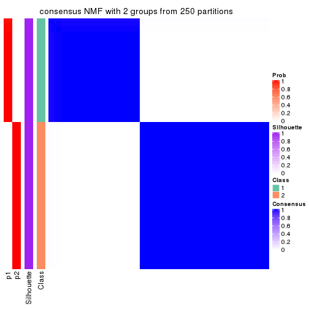</p>

</div>
<div id='tab-MAD-NMF-consensus-heatmap-2'>
<pre><code class="r">consensus_heatmap(res, k = 3)
</code></pre>

<p>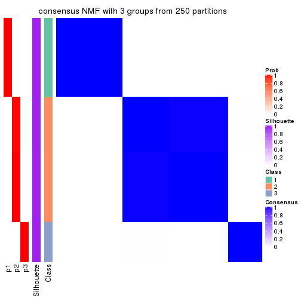</p>

</div>
<div id='tab-MAD-NMF-consensus-heatmap-3'>
<pre><code class="r">consensus_heatmap(res, k = 4)
</code></pre>

<p>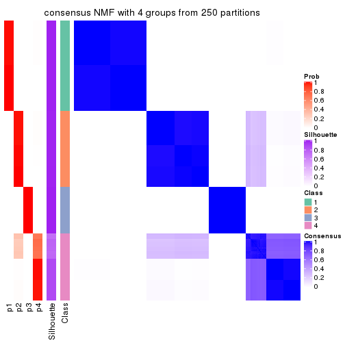</p>

</div>
<div id='tab-MAD-NMF-consensus-heatmap-4'>
<pre><code class="r">consensus_heatmap(res, k = 5)
</code></pre>

<p>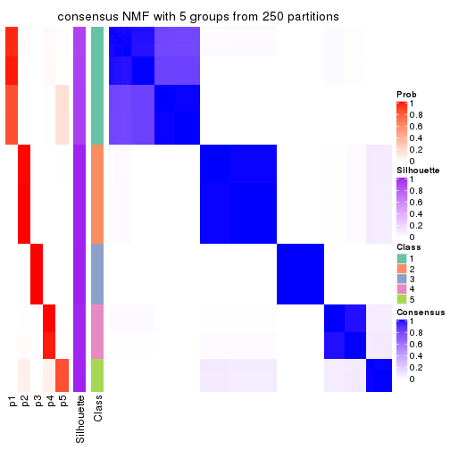</p>

</div>
<div id='tab-MAD-NMF-consensus-heatmap-5'>
<pre><code class="r">consensus_heatmap(res, k = 6)
</code></pre>

<p>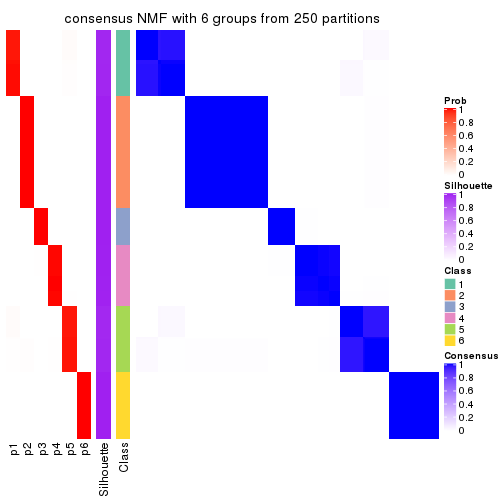</p>

</div>
</div>

Heatmaps for the membership of samples in all partitions to see how consistent they are:


<script>
$( function() {
	$( '#tabs-MAD-NMF-membership-heatmap' ).tabs();
} );
</script>
<div id='tabs-MAD-NMF-membership-heatmap'>
<ul>
<li><a href='#tab-MAD-NMF-membership-heatmap-1'>k = 2</a></li>
<li><a href='#tab-MAD-NMF-membership-heatmap-2'>k = 3</a></li>
<li><a href='#tab-MAD-NMF-membership-heatmap-3'>k = 4</a></li>
<li><a href='#tab-MAD-NMF-membership-heatmap-4'>k = 5</a></li>
<li><a href='#tab-MAD-NMF-membership-heatmap-5'>k = 6</a></li>
</ul>
<div id='tab-MAD-NMF-membership-heatmap-1'>
<pre><code class="r">membership_heatmap(res, k = 2)
</code></pre>

<p>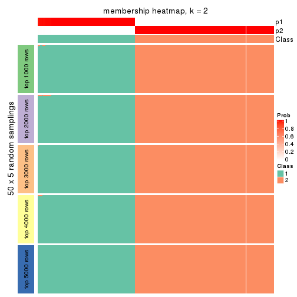</p>

</div>
<div id='tab-MAD-NMF-membership-heatmap-2'>
<pre><code class="r">membership_heatmap(res, k = 3)
</code></pre>

<p>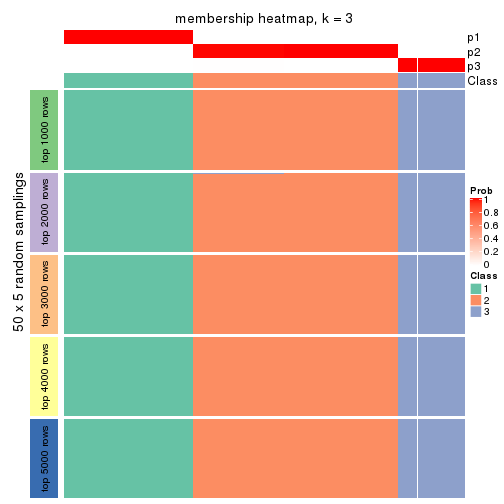</p>

</div>
<div id='tab-MAD-NMF-membership-heatmap-3'>
<pre><code class="r">membership_heatmap(res, k = 4)
</code></pre>

<p>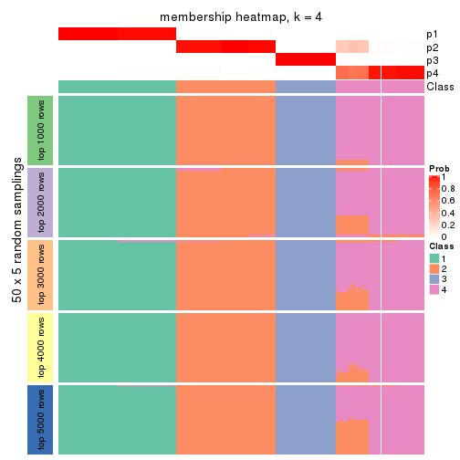</p>

</div>
<div id='tab-MAD-NMF-membership-heatmap-4'>
<pre><code class="r">membership_heatmap(res, k = 5)
</code></pre>

<p>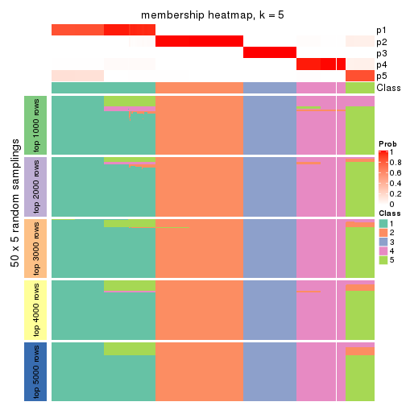</p>

</div>
<div id='tab-MAD-NMF-membership-heatmap-5'>
<pre><code class="r">membership_heatmap(res, k = 6)
</code></pre>

<p>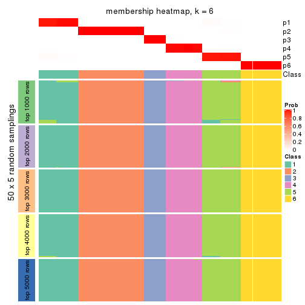</p>

</div>
</div>

As soon as we have had the classes for columns, we can look for signatures
which are significantly different between classes which can be candidate marks
for certain classes. Following are the heatmaps for signatures.


Signature heatmaps where rows are scaled:


<script>
$( function() {
	$( '#tabs-MAD-NMF-get-signatures' ).tabs();
} );
</script>
<div id='tabs-MAD-NMF-get-signatures'>
<ul>
<li><a href='#tab-MAD-NMF-get-signatures-1'>k = 2</a></li>
<li><a href='#tab-MAD-NMF-get-signatures-2'>k = 3</a></li>
<li><a href='#tab-MAD-NMF-get-signatures-3'>k = 4</a></li>
<li><a href='#tab-MAD-NMF-get-signatures-4'>k = 5</a></li>
<li><a href='#tab-MAD-NMF-get-signatures-5'>k = 6</a></li>
</ul>
<div id='tab-MAD-NMF-get-signatures-1'>
<pre><code class="r">get_signatures(res, k = 2)
</code></pre>

<p>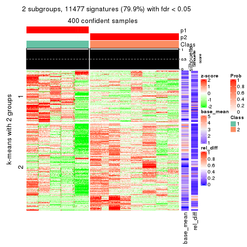</p>

</div>
<div id='tab-MAD-NMF-get-signatures-2'>
<pre><code class="r">get_signatures(res, k = 3)
</code></pre>

<p>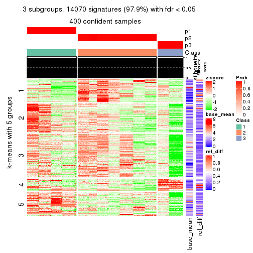</p>

</div>
<div id='tab-MAD-NMF-get-signatures-3'>
<pre><code class="r">get_signatures(res, k = 4)
</code></pre>

<p>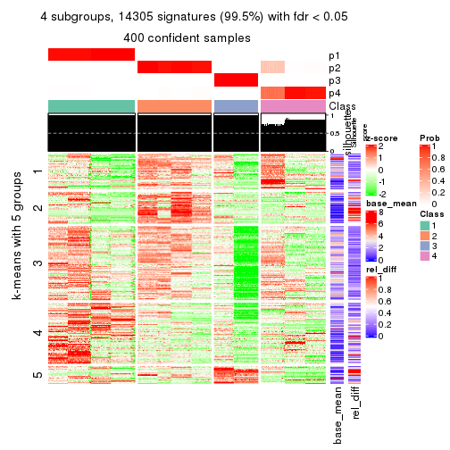</p>

</div>
<div id='tab-MAD-NMF-get-signatures-4'>
<pre><code class="r">get_signatures(res, k = 5)
</code></pre>

<p>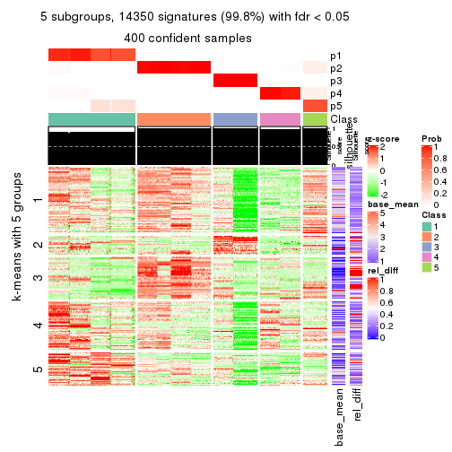</p>

</div>
<div id='tab-MAD-NMF-get-signatures-5'>
<pre><code class="r">get_signatures(res, k = 6)
</code></pre>

<p>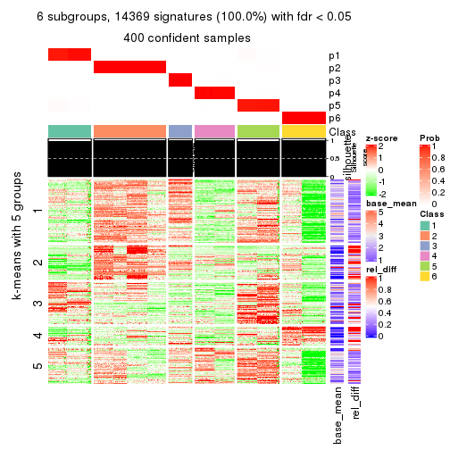</p>

</div>
</div>


Signature heatmaps where rows are not scaled:


<script>
$( function() {
	$( '#tabs-MAD-NMF-get-signatures-no-scale' ).tabs();
} );
</script>
<div id='tabs-MAD-NMF-get-signatures-no-scale'>
<ul>
<li><a href='#tab-MAD-NMF-get-signatures-no-scale-1'>k = 2</a></li>
<li><a href='#tab-MAD-NMF-get-signatures-no-scale-2'>k = 3</a></li>
<li><a href='#tab-MAD-NMF-get-signatures-no-scale-3'>k = 4</a></li>
<li><a href='#tab-MAD-NMF-get-signatures-no-scale-4'>k = 5</a></li>
<li><a href='#tab-MAD-NMF-get-signatures-no-scale-5'>k = 6</a></li>
</ul>
<div id='tab-MAD-NMF-get-signatures-no-scale-1'>
<pre><code class="r">get_signatures(res, k = 2, scale_rows = FALSE)
</code></pre>

<p>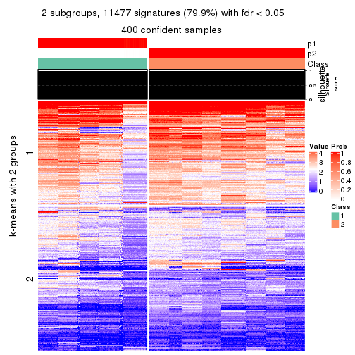</p>

</div>
<div id='tab-MAD-NMF-get-signatures-no-scale-2'>
<pre><code class="r">get_signatures(res, k = 3, scale_rows = FALSE)
</code></pre>

<p>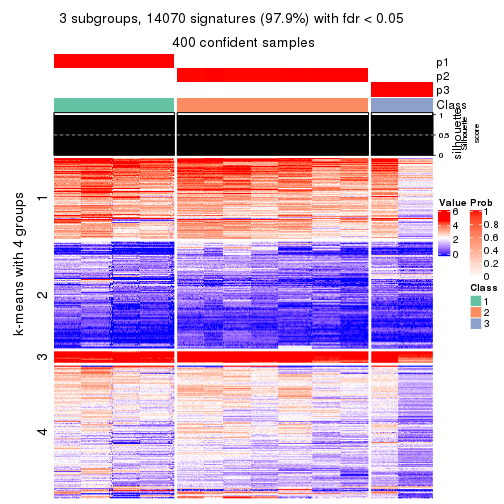</p>

</div>
<div id='tab-MAD-NMF-get-signatures-no-scale-3'>
<pre><code class="r">get_signatures(res, k = 4, scale_rows = FALSE)
</code></pre>

<p>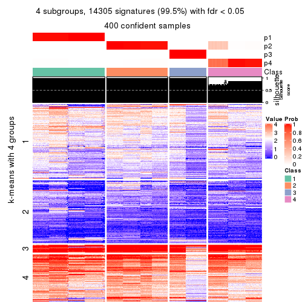</p>

</div>
<div id='tab-MAD-NMF-get-signatures-no-scale-4'>
<pre><code class="r">get_signatures(res, k = 5, scale_rows = FALSE)
</code></pre>

<p>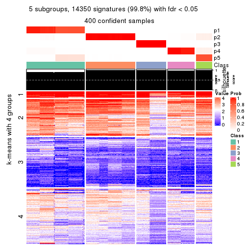</p>

</div>
<div id='tab-MAD-NMF-get-signatures-no-scale-5'>
<pre><code class="r">get_signatures(res, k = 6, scale_rows = FALSE)
</code></pre>

<p>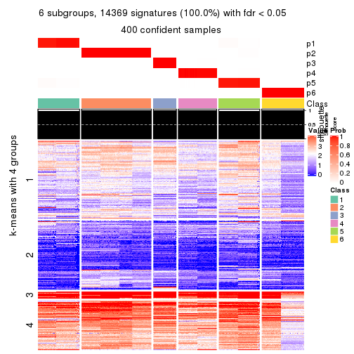</p>

</div>
</div>


Compare the overlap of signatures from different k:

```r
compare_signatures(res)
```

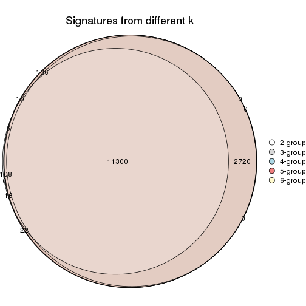

`get_signature()` returns a data frame invisibly. TO get the list of signatures, the function
call should be assigned to a variable explicitly. In following code, if `plot` argument is set
to `FALSE`, no heatmap is plotted while only the differential analysis is performed.

```r
# code only for demonstration
tb = get_signature(res, k = ..., plot = FALSE)
```

An example of the output of `tb` is:

```
#>   which_row         fdr    mean_1    mean_2 scaled_mean_1 scaled_mean_2 km
#> 1        38 0.042760348  8.373488  9.131774    -0.5533452     0.5164555  1
#> 2        40 0.018707592  7.106213  8.469186    -0.6173731     0.5762149  1
#> 3        55 0.019134737 10.221463 11.207825    -0.6159697     0.5749050  1
#> 4        59 0.006059896  5.921854  7.869574    -0.6899429     0.6439467  1
#> 5        60 0.018055526  8.928898 10.211722    -0.6204761     0.5791110  1
#> 6        98 0.009384629 15.714769 14.887706     0.6635654    -0.6193277  2
...
```

The columns in `tb` are:

1. `which_row`: row indices corresponding to the input matrix.
2. `fdr`: FDR for the differential test. 
3. `mean_x`: The mean value in group x.
4. `scaled_mean_x`: The mean value in group x after rows are scaled.
5. `km`: Row groups if k-means clustering is applied to rows.


UMAP plot which shows how samples are separated.


<script>
$( function() {
	$( '#tabs-MAD-NMF-dimension-reduction' ).tabs();
} );
</script>
<div id='tabs-MAD-NMF-dimension-reduction'>
<ul>
<li><a href='#tab-MAD-NMF-dimension-reduction-1'>k = 2</a></li>
<li><a href='#tab-MAD-NMF-dimension-reduction-2'>k = 3</a></li>
<li><a href='#tab-MAD-NMF-dimension-reduction-3'>k = 4</a></li>
<li><a href='#tab-MAD-NMF-dimension-reduction-4'>k = 5</a></li>
<li><a href='#tab-MAD-NMF-dimension-reduction-5'>k = 6</a></li>
</ul>
<div id='tab-MAD-NMF-dimension-reduction-1'>
<pre><code class="r">dimension_reduction(res, k = 2, method = &quot;UMAP&quot;)
</code></pre>

<p>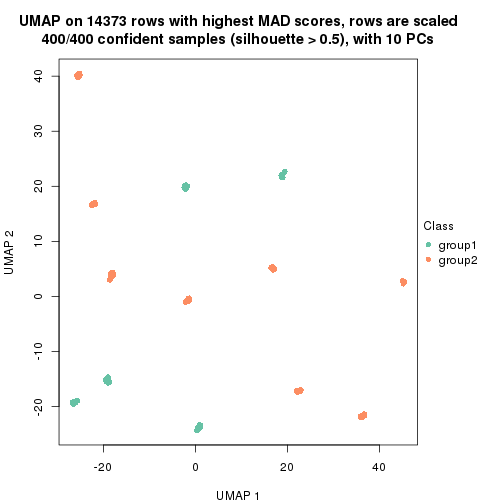</p>

</div>
<div id='tab-MAD-NMF-dimension-reduction-2'>
<pre><code class="r">dimension_reduction(res, k = 3, method = &quot;UMAP&quot;)
</code></pre>

<p>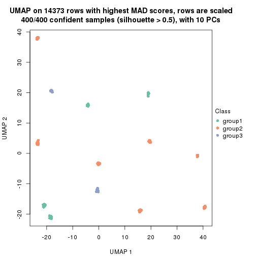</p>

</div>
<div id='tab-MAD-NMF-dimension-reduction-3'>
<pre><code class="r">dimension_reduction(res, k = 4, method = &quot;UMAP&quot;)
</code></pre>

<p>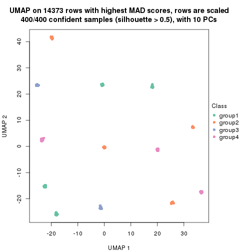</p>

</div>
<div id='tab-MAD-NMF-dimension-reduction-4'>
<pre><code class="r">dimension_reduction(res, k = 5, method = &quot;UMAP&quot;)
</code></pre>

<p>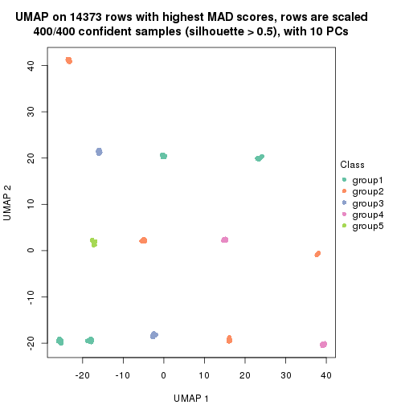</p>

</div>
<div id='tab-MAD-NMF-dimension-reduction-5'>
<pre><code class="r">dimension_reduction(res, k = 6, method = &quot;UMAP&quot;)
</code></pre>

<p>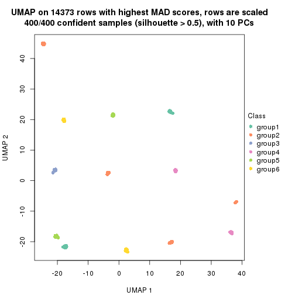</p>

</div>
</div>


Following heatmap shows how subgroups are split when increasing `k`:

```r
collect_classes(res)
```

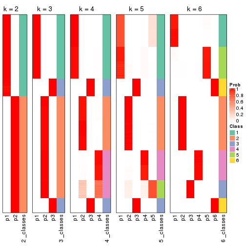


If matrix rows can be associated to genes, consider to use `GO_Enrichment(res,
...)` to perform function enrichment for the signature genes.


 

---------------------------------------------------


### ATC:hclust**


The object with results only for a single top-value method and a single partition method 
can be extracted as:

```r
res = res_list["ATC", "hclust"]
# you can also extract it by
# res = res_list["ATC:hclust"]
```

A summary of `res` and all the functions that can be applied to it:

```r
res
```

```
#> A 'ConsensusPartition' object with k = 2, 3, 4, 5, 6.
#>   On a matrix with 14373 rows and 400 columns.
#>   Top rows (1000, 2000, 3000, 4000, 5000) are extracted by 'ATC' method.
#>   Subgroups are detected by 'hclust' method.
#>   Performed in total 1250 partitions by row resampling.
#>   Best k for subgroups seems to be 2.
#> 
#> Following methods can be applied to this 'ConsensusPartition' object:
#>  [1] "cola_report"             "collect_classes"         "collect_plots"          
#>  [4] "collect_stats"           "colnames"                "compare_signatures"     
#>  [7] "consensus_heatmap"       "dimension_reduction"     "functional_enrichment"  
#> [10] "get_anno_col"            "get_anno"                "get_classes"            
#> [13] "get_consensus"           "get_matrix"              "get_membership"         
#> [16] "get_param"               "get_signatures"          "get_stats"              
#> [19] "is_best_k"               "is_stable_k"             "membership_heatmap"     
#> [22] "ncol"                    "nrow"                    "plot_ecdf"              
#> [25] "rownames"                "select_partition_number" "show"                   
#> [28] "suggest_best_k"          "test_to_known_factors"
```

`collect_plots()` function collects all the plots made from `res` for all `k` (number of partitions)
into one single page to provide an easy and fast comparison between different `k`.

```r
collect_plots(res)
```

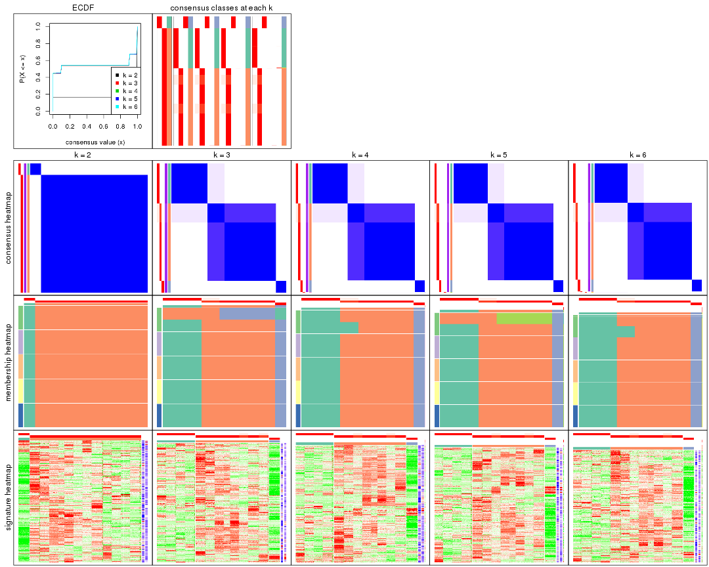

The plots are:

- The first row: a plot of the ECDF (Empirical cumulative distribution
  function) curves of the consensus matrix for each `k` and the heatmap of
  predicted classes for each `k`.
- The second row: heatmaps of the consensus matrix for each `k`.
- The third row: heatmaps of the membership matrix for each `k`.
- The fouth row: heatmaps of the signatures for each `k`.

All the plots in panels can be made by individual functions and they are
plotted later in this section.

`select_partition_number()` produces several plots showing different
statistics for choosing "optimized" `k`. There are following statistics:

- ECDF curves of the consensus matrix for each `k`;
- 1-PAC. [The PAC
  score](https://en.wikipedia.org/wiki/Consensus_clustering#Over-interpretation_potential_of_consensus_clustering)
  measures the proportion of the ambiguous subgrouping.
- Mean silhouette score.
- Concordance. The mean probability of fiting the consensus class ids in all
  partitions.
- Area increased. Denote $A_k$ as the area under the ECDF curve for current
  `k`, the area increased is defined as $A_k - A_{k-1}$.
- Rand index. The percent of pairs of samples that are both in a same cluster
  or both are not in a same cluster in the partition of k and k-1.
- Jaccard index. The ratio of pairs of samples are both in a same cluster in
  the partition of k and k-1 and the pairs of samples are both in a same
  cluster in the partition k or k-1.

The detailed explanations of these statistics can be found in [the cola
vignette](http://bioconductor.org/packages/devel/bioc/vignettes/cola/inst/doc/cola.html#toc_13).

Generally speaking, lower PAC score, higher mean silhouette score or higher
concordance corresponds to better partition. Rand index and Jaccard index
measure how similar the current partition is compared to partition with `k-1`.
If they are too similar, we won't accept `k` is better than `k-1`.

```r
select_partition_number(res)
```

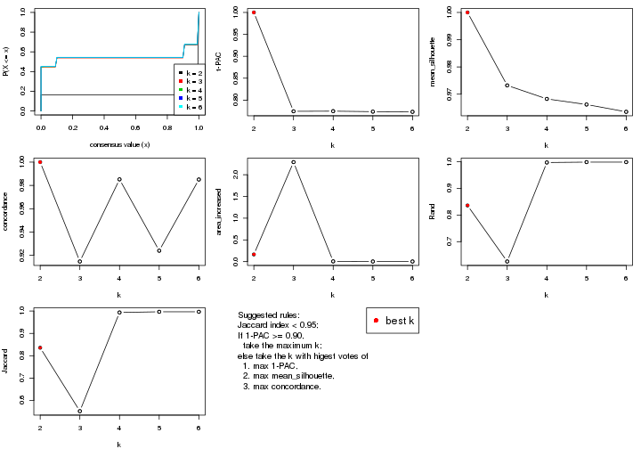

The numeric values for all these statistics can be obtained by `get_stats()`.

```r
get_stats(res)
```

```
#>   k 1-PAC mean_silhouette concordance area_increased  Rand Jaccard
#> 2 2 1.000           1.000       1.000        0.16505 0.836   0.836
#> 3 3 0.774           0.973       0.915        2.29043 0.626   0.552
#> 4 4 0.775           0.968       0.985        0.00533 0.997   0.994
#> 5 5 0.774           0.966       0.924        0.00300 0.998   0.997
#> 6 6 0.773           0.964       0.985        0.00295 0.998   0.997
```

`suggest_best_k()` suggests the best $k$ based on these statistics. The rules are as follows:

- All $k$ with Jaccard index larger than 0.95 are removed because the increase of
  the partition number does not provides enough extra information. If all $k$ are removed,
  the best $k$ is assigned by `NA`.
- For $k$ with 1-PAC larger than 0.9, the maximal $k$ is taken as the "best k". Other $k$ is called "optional k".
- If it does not fit the second rule. The $k$ with the highest vote of highest
  1-PAC, mean silhouette and concordance is taken as the "best k".

```r
suggest_best_k(res)
```

```
#> [1] 2
```


Following shows the table of the partitions (You need to click the **show/hide
code output** link to see it). The membership matrix (columns with name `p*`)
is inferred by
[`clue::cl_consensus()`](https://www.rdocumentation.org/link/cl_consensus?package=clue)
function with the `SE` method. Basically the value in the membership matrix
represents the probability to belong to a certain group. The finall class
label for an item is determined with the group with highest probability it
belongs to.

In `get_classes()` function, the entropy is calculated from the membership
matrix and the silhouette score is calculated from the consensus matrix.


<script>
$( function() {
	$( '#tabs-ATC-hclust-get-classes' ).tabs();
} );
</script>
<div id='tabs-ATC-hclust-get-classes'>
<ul>
<li><a href='#tab-ATC-hclust-get-classes-1'>k = 2</a></li>
<li><a href='#tab-ATC-hclust-get-classes-2'>k = 3</a></li>
<li><a href='#tab-ATC-hclust-get-classes-3'>k = 4</a></li>
<li><a href='#tab-ATC-hclust-get-classes-4'>k = 5</a></li>
<li><a href='#tab-ATC-hclust-get-classes-5'>k = 6</a></li>
</ul>

<div id='tab-ATC-hclust-get-classes-1'>
<p><a id='tab-ATC-hclust-get-classes-1-a' style='color:#0366d6' href='#'>show/hide code output</a></p>
<pre><code class="r">cbind(get_classes(res, k = 2), get_membership(res, k = 2))
</code></pre>

<pre><code>#&gt;            class entropy silhouette p1 p2
#&gt; SRR1661716     2       0          1  0  1
#&gt; SRR1661717     2       0          1  0  1
#&gt; SRR1661718     2       0          1  0  1
#&gt; SRR1661719     2       0          1  0  1
#&gt; SRR1661720     2       0          1  0  1
#&gt; SRR1661721     2       0          1  0  1
#&gt; SRR1661722     2       0          1  0  1
#&gt; SRR1661723     2       0          1  0  1
#&gt; SRR1661724     2       0          1  0  1
#&gt; SRR1661725     2       0          1  0  1
#&gt; SRR1661726     2       0          1  0  1
#&gt; SRR1661727     2       0          1  0  1
#&gt; SRR1661728     2       0          1  0  1
#&gt; SRR1661729     2       0          1  0  1
#&gt; SRR1661730     2       0          1  0  1
#&gt; SRR1661731     2       0          1  0  1
#&gt; SRR1661732     2       0          1  0  1
#&gt; SRR1661733     2       0          1  0  1
#&gt; SRR1661734     2       0          1  0  1
#&gt; SRR1661735     2       0          1  0  1
#&gt; SRR1661736     2       0          1  0  1
#&gt; SRR1661737     2       0          1  0  1
#&gt; SRR1661738     2       0          1  0  1
#&gt; SRR1661739     2       0          1  0  1
#&gt; SRR1661740     2       0          1  0  1
#&gt; SRR1661741     2       0          1  0  1
#&gt; SRR1661742     2       0          1  0  1
#&gt; SRR1661743     2       0          1  0  1
#&gt; SRR1661744     2       0          1  0  1
#&gt; SRR1661745     2       0          1  0  1
#&gt; SRR1661746     2       0          1  0  1
#&gt; SRR1661747     2       0          1  0  1
#&gt; SRR1661748     2       0          1  0  1
#&gt; SRR1661749     2       0          1  0  1
#&gt; SRR1661750     2       0          1  0  1
#&gt; SRR1661751     2       0          1  0  1
#&gt; SRR1661752     2       0          1  0  1
#&gt; SRR1661753     2       0          1  0  1
#&gt; SRR1661754     2       0          1  0  1
#&gt; SRR1661755     2       0          1  0  1
#&gt; SRR1661756     2       0          1  0  1
#&gt; SRR1661757     2       0          1  0  1
#&gt; SRR1661758     2       0          1  0  1
#&gt; SRR1661759     2       0          1  0  1
#&gt; SRR1661760     2       0          1  0  1
#&gt; SRR1661761     2       0          1  0  1
#&gt; SRR1661762     2       0          1  0  1
#&gt; SRR1661763     2       0          1  0  1
#&gt; SRR1661764     2       0          1  0  1
#&gt; SRR1661766     2       0          1  0  1
#&gt; SRR1661767     2       0          1  0  1
#&gt; SRR1661768     2       0          1  0  1
#&gt; SRR1661769     2       0          1  0  1
#&gt; SRR1661770     2       0          1  0  1
#&gt; SRR1661771     2       0          1  0  1
#&gt; SRR1661772     2       0          1  0  1
#&gt; SRR1661773     2       0          1  0  1
#&gt; SRR1661774     2       0          1  0  1
#&gt; SRR1661775     2       0          1  0  1
#&gt; SRR1661776     2       0          1  0  1
#&gt; SRR1661777     2       0          1  0  1
#&gt; SRR1661778     2       0          1  0  1
#&gt; SRR1661779     2       0          1  0  1
#&gt; SRR1661780     2       0          1  0  1
#&gt; SRR1661781     2       0          1  0  1
#&gt; SRR1661782     2       0          1  0  1
#&gt; SRR1661783     2       0          1  0  1
#&gt; SRR1661784     2       0          1  0  1
#&gt; SRR1661785     2       0          1  0  1
#&gt; SRR1661786     2       0          1  0  1
#&gt; SRR1661787     2       0          1  0  1
#&gt; SRR1661788     2       0          1  0  1
#&gt; SRR1661789     2       0          1  0  1
#&gt; SRR1661790     2       0          1  0  1
#&gt; SRR1661791     2       0          1  0  1
#&gt; SRR1661792     2       0          1  0  1
#&gt; SRR1661793     2       0          1  0  1
#&gt; SRR1661794     2       0          1  0  1
#&gt; SRR1661795     2       0          1  0  1
#&gt; SRR1661796     2       0          1  0  1
#&gt; SRR1661797     2       0          1  0  1
#&gt; SRR1661798     2       0          1  0  1
#&gt; SRR1661799     2       0          1  0  1
#&gt; SRR1661800     2       0          1  0  1
#&gt; SRR1661801     2       0          1  0  1
#&gt; SRR1661802     2       0          1  0  1
#&gt; SRR1661803     2       0          1  0  1
#&gt; SRR1661804     2       0          1  0  1
#&gt; SRR1661805     2       0          1  0  1
#&gt; SRR1661806     2       0          1  0  1
#&gt; SRR1661807     2       0          1  0  1
#&gt; SRR1661808     2       0          1  0  1
#&gt; SRR1661809     2       0          1  0  1
#&gt; SRR1661810     2       0          1  0  1
#&gt; SRR1661811     2       0          1  0  1
#&gt; SRR1661812     2       0          1  0  1
#&gt; SRR1661813     2       0          1  0  1
#&gt; SRR1661814     2       0          1  0  1
#&gt; SRR1661815     2       0          1  0  1
#&gt; SRR1661816     2       0          1  0  1
#&gt; SRR1661817     2       0          1  0  1
#&gt; SRR1661818     2       0          1  0  1
#&gt; SRR1661819     2       0          1  0  1
#&gt; SRR1661820     2       0          1  0  1
#&gt; SRR1661821     2       0          1  0  1
#&gt; SRR1661822     2       0          1  0  1
#&gt; SRR1661823     2       0          1  0  1
#&gt; SRR1661824     2       0          1  0  1
#&gt; SRR1661825     2       0          1  0  1
#&gt; SRR1661826     2       0          1  0  1
#&gt; SRR1661827     2       0          1  0  1
#&gt; SRR1661828     2       0          1  0  1
#&gt; SRR1661829     2       0          1  0  1
#&gt; SRR1661830     2       0          1  0  1
#&gt; SRR1661831     2       0          1  0  1
#&gt; SRR1661832     2       0          1  0  1
#&gt; SRR1661833     2       0          1  0  1
#&gt; SRR1661834     2       0          1  0  1
#&gt; SRR1661835     2       0          1  0  1
#&gt; SRR1661836     2       0          1  0  1
#&gt; SRR1661837     2       0          1  0  1
#&gt; SRR1661838     2       0          1  0  1
#&gt; SRR1661839     2       0          1  0  1
#&gt; SRR1661840     2       0          1  0  1
#&gt; SRR1661841     2       0          1  0  1
#&gt; SRR1661843     2       0          1  0  1
#&gt; SRR1661844     2       0          1  0  1
#&gt; SRR1661845     2       0          1  0  1
#&gt; SRR1661846     2       0          1  0  1
#&gt; SRR1661847     2       0          1  0  1
#&gt; SRR1661848     2       0          1  0  1
#&gt; SRR1661849     2       0          1  0  1
#&gt; SRR1661850     2       0          1  0  1
#&gt; SRR1661851     2       0          1  0  1
#&gt; SRR1661852     2       0          1  0  1
#&gt; SRR1661853     2       0          1  0  1
#&gt; SRR1661854     2       0          1  0  1
#&gt; SRR1661855     2       0          1  0  1
#&gt; SRR1661856     1       0          1  1  0
#&gt; SRR1661857     1       0          1  1  0
#&gt; SRR1661858     1       0          1  1  0
#&gt; SRR1661859     1       0          1  1  0
#&gt; SRR1661860     1       0          1  1  0
#&gt; SRR1661861     1       0          1  1  0
#&gt; SRR1661862     1       0          1  1  0
#&gt; SRR1661863     1       0          1  1  0
#&gt; SRR1661864     1       0          1  1  0
#&gt; SRR1661865     1       0          1  1  0
#&gt; SRR1661866     1       0          1  1  0
#&gt; SRR1661867     1       0          1  1  0
#&gt; SRR1661868     1       0          1  1  0
#&gt; SRR1661869     1       0          1  1  0
#&gt; SRR1661870     1       0          1  1  0
#&gt; SRR1661871     1       0          1  1  0
#&gt; SRR1661872     1       0          1  1  0
#&gt; SRR1661873     1       0          1  1  0
#&gt; SRR1661874     1       0          1  1  0
#&gt; SRR1661875     1       0          1  1  0
#&gt; SRR1661876     1       0          1  1  0
#&gt; SRR1661877     1       0          1  1  0
#&gt; SRR1661878     1       0          1  1  0
#&gt; SRR1661879     1       0          1  1  0
#&gt; SRR1661880     1       0          1  1  0
#&gt; SRR1661881     1       0          1  1  0
#&gt; SRR1661882     1       0          1  1  0
#&gt; SRR1661883     1       0          1  1  0
#&gt; SRR1661884     1       0          1  1  0
#&gt; SRR1661885     1       0          1  1  0
#&gt; SRR1661886     1       0          1  1  0
#&gt; SRR1661887     1       0          1  1  0
#&gt; SRR1661888     1       0          1  1  0
#&gt; SRR1661889     1       0          1  1  0
#&gt; SRR1661890     1       0          1  1  0
#&gt; SRR1661891     1       0          1  1  0
#&gt; SRR1661892     2       0          1  0  1
#&gt; SRR1661893     2       0          1  0  1
#&gt; SRR1661894     2       0          1  0  1
#&gt; SRR1661895     2       0          1  0  1
#&gt; SRR1661896     2       0          1  0  1
#&gt; SRR1661897     2       0          1  0  1
#&gt; SRR1661898     2       0          1  0  1
#&gt; SRR1661899     2       0          1  0  1
#&gt; SRR1661900     2       0          1  0  1
#&gt; SRR1661901     2       0          1  0  1
#&gt; SRR1661902     2       0          1  0  1
#&gt; SRR1661903     2       0          1  0  1
#&gt; SRR1661904     2       0          1  0  1
#&gt; SRR1661905     2       0          1  0  1
#&gt; SRR1661906     2       0          1  0  1
#&gt; SRR1661907     2       0          1  0  1
#&gt; SRR1661908     2       0          1  0  1
#&gt; SRR1661909     2       0          1  0  1
#&gt; SRR1661910     2       0          1  0  1
#&gt; SRR1661911     2       0          1  0  1
#&gt; SRR1661912     2       0          1  0  1
#&gt; SRR1661913     2       0          1  0  1
#&gt; SRR1661914     2       0          1  0  1
#&gt; SRR1661915     2       0          1  0  1
#&gt; SRR1661916     2       0          1  0  1
#&gt; SRR1661917     2       0          1  0  1
#&gt; SRR1661918     2       0          1  0  1
#&gt; SRR1661919     2       0          1  0  1
#&gt; SRR1661920     2       0          1  0  1
#&gt; SRR1661921     2       0          1  0  1
#&gt; SRR1661922     2       0          1  0  1
#&gt; SRR1661923     2       0          1  0  1
#&gt; SRR1661924     2       0          1  0  1
#&gt; SRR1661925     2       0          1  0  1
#&gt; SRR1661926     2       0          1  0  1
#&gt; SRR1661927     2       0          1  0  1
#&gt; SRR1661928     2       0          1  0  1
#&gt; SRR1661929     2       0          1  0  1
#&gt; SRR1661930     2       0          1  0  1
#&gt; SRR1661931     2       0          1  0  1
#&gt; SRR1661932     2       0          1  0  1
#&gt; SRR1661933     2       0          1  0  1
#&gt; SRR1661934     2       0          1  0  1
#&gt; SRR1661935     2       0          1  0  1
#&gt; SRR1661936     2       0          1  0  1
#&gt; SRR1661937     2       0          1  0  1
#&gt; SRR1661938     2       0          1  0  1
#&gt; SRR1661939     2       0          1  0  1
#&gt; SRR1661940     2       0          1  0  1
#&gt; SRR1661941     2       0          1  0  1
#&gt; SRR1661942     2       0          1  0  1
#&gt; SRR1661943     2       0          1  0  1
#&gt; SRR1661944     2       0          1  0  1
#&gt; SRR1661945     2       0          1  0  1
#&gt; SRR1661946     2       0          1  0  1
#&gt; SRR1661947     2       0          1  0  1
#&gt; SRR1661948     2       0          1  0  1
#&gt; SRR1661949     2       0          1  0  1
#&gt; SRR1661950     2       0          1  0  1
#&gt; SRR1661951     2       0          1  0  1
#&gt; SRR1661952     2       0          1  0  1
#&gt; SRR1661953     2       0          1  0  1
#&gt; SRR1661954     2       0          1  0  1
#&gt; SRR1661955     2       0          1  0  1
#&gt; SRR1661956     2       0          1  0  1
#&gt; SRR1661957     2       0          1  0  1
#&gt; SRR1661958     2       0          1  0  1
#&gt; SRR1661959     2       0          1  0  1
#&gt; SRR1661960     2       0          1  0  1
#&gt; SRR1661961     2       0          1  0  1
#&gt; SRR1661962     2       0          1  0  1
#&gt; SRR1661963     2       0          1  0  1
#&gt; SRR1661964     2       0          1  0  1
#&gt; SRR1661965     2       0          1  0  1
#&gt; SRR1661966     2       0          1  0  1
#&gt; SRR1661967     2       0          1  0  1
#&gt; SRR1661968     2       0          1  0  1
#&gt; SRR1661969     2       0          1  0  1
#&gt; SRR1661970     2       0          1  0  1
#&gt; SRR1661971     2       0          1  0  1
#&gt; SRR1661972     2       0          1  0  1
#&gt; SRR1661973     2       0          1  0  1
#&gt; SRR1661974     2       0          1  0  1
#&gt; SRR1661975     2       0          1  0  1
#&gt; SRR1661976     2       0          1  0  1
#&gt; SRR1661977     2       0          1  0  1
#&gt; SRR1661978     2       0          1  0  1
#&gt; SRR1661979     2       0          1  0  1
#&gt; SRR1661980     2       0          1  0  1
#&gt; SRR1661981     2       0          1  0  1
#&gt; SRR1661982     2       0          1  0  1
#&gt; SRR1661983     2       0          1  0  1
#&gt; SRR1661984     2       0          1  0  1
#&gt; SRR1661985     2       0          1  0  1
#&gt; SRR1661986     2       0          1  0  1
#&gt; SRR1661987     2       0          1  0  1
#&gt; SRR1661988     2       0          1  0  1
#&gt; SRR1661989     2       0          1  0  1
#&gt; SRR1661990     2       0          1  0  1
#&gt; SRR1661991     2       0          1  0  1
#&gt; SRR1661992     2       0          1  0  1
#&gt; SRR1661993     2       0          1  0  1
#&gt; SRR1661994     2       0          1  0  1
#&gt; SRR1661995     2       0          1  0  1
#&gt; SRR1661996     2       0          1  0  1
#&gt; SRR1661997     2       0          1  0  1
#&gt; SRR1661998     2       0          1  0  1
#&gt; SRR1661999     2       0          1  0  1
#&gt; SRR1662000     2       0          1  0  1
#&gt; SRR1662001     2       0          1  0  1
#&gt; SRR1662002     2       0          1  0  1
#&gt; SRR1662003     2       0          1  0  1
#&gt; SRR1662004     2       0          1  0  1
#&gt; SRR1662005     2       0          1  0  1
#&gt; SRR1662006     2       0          1  0  1
#&gt; SRR1662007     2       0          1  0  1
#&gt; SRR1662008     2       0          1  0  1
#&gt; SRR1662009     2       0          1  0  1
#&gt; SRR1662010     2       0          1  0  1
#&gt; SRR1662011     2       0          1  0  1
#&gt; SRR1662012     2       0          1  0  1
#&gt; SRR1662013     2       0          1  0  1
#&gt; SRR1662014     2       0          1  0  1
#&gt; SRR1662015     2       0          1  0  1
#&gt; SRR1662016     2       0          1  0  1
#&gt; SRR1662017     2       0          1  0  1
#&gt; SRR1662018     2       0          1  0  1
#&gt; SRR1662019     2       0          1  0  1
#&gt; SRR1662020     2       0          1  0  1
#&gt; SRR1662021     2       0          1  0  1
#&gt; SRR1662022     2       0          1  0  1
#&gt; SRR1662023     2       0          1  0  1
#&gt; SRR1662024     2       0          1  0  1
#&gt; SRR1662025     2       0          1  0  1
#&gt; SRR1662026     2       0          1  0  1
#&gt; SRR1662027     2       0          1  0  1
#&gt; SRR1662028     2       0          1  0  1
#&gt; SRR1662029     2       0          1  0  1
#&gt; SRR1662030     2       0          1  0  1
#&gt; SRR1662031     2       0          1  0  1
#&gt; SRR1662032     2       0          1  0  1
#&gt; SRR1662033     2       0          1  0  1
#&gt; SRR1662034     2       0          1  0  1
#&gt; SRR1662035     2       0          1  0  1
#&gt; SRR1662036     2       0          1  0  1
#&gt; SRR1662037     2       0          1  0  1
#&gt; SRR1662038     2       0          1  0  1
#&gt; SRR1662039     2       0          1  0  1
#&gt; SRR1662040     2       0          1  0  1
#&gt; SRR1662041     2       0          1  0  1
#&gt; SRR1662042     2       0          1  0  1
#&gt; SRR1662043     2       0          1  0  1
#&gt; SRR1662044     2       0          1  0  1
#&gt; SRR1662045     2       0          1  0  1
#&gt; SRR1662046     2       0          1  0  1
#&gt; SRR1662047     2       0          1  0  1
#&gt; SRR1662048     2       0          1  0  1
#&gt; SRR1662049     2       0          1  0  1
#&gt; SRR1662050     2       0          1  0  1
#&gt; SRR1662051     2       0          1  0  1
#&gt; SRR1662052     2       0          1  0  1
#&gt; SRR1662053     2       0          1  0  1
#&gt; SRR1662054     2       0          1  0  1
#&gt; SRR1662055     2       0          1  0  1
#&gt; SRR1662056     2       0          1  0  1
#&gt; SRR1662057     2       0          1  0  1
#&gt; SRR1662058     2       0          1  0  1
#&gt; SRR1662059     2       0          1  0  1
#&gt; SRR1662060     2       0          1  0  1
#&gt; SRR1662061     2       0          1  0  1
#&gt; SRR1662062     2       0          1  0  1
#&gt; SRR1662063     2       0          1  0  1
#&gt; SRR1662064     2       0          1  0  1
#&gt; SRR1662065     2       0          1  0  1
#&gt; SRR1662066     2       0          1  0  1
#&gt; SRR1662067     2       0          1  0  1
#&gt; SRR1662068     2       0          1  0  1
#&gt; SRR1662069     2       0          1  0  1
#&gt; SRR1662070     2       0          1  0  1
#&gt; SRR1662071     2       0          1  0  1
#&gt; SRR1662072     2       0          1  0  1
#&gt; SRR1662073     2       0          1  0  1
#&gt; SRR1662074     2       0          1  0  1
#&gt; SRR1662075     2       0          1  0  1
#&gt; SRR1662076     2       0          1  0  1
#&gt; SRR1662077     2       0          1  0  1
#&gt; SRR1662078     2       0          1  0  1
#&gt; SRR1662079     2       0          1  0  1
#&gt; SRR1662080     2       0          1  0  1
#&gt; SRR1662081     2       0          1  0  1
#&gt; SRR1662082     2       0          1  0  1
#&gt; SRR1662083     2       0          1  0  1
#&gt; SRR1662084     2       0          1  0  1
#&gt; SRR1662085     2       0          1  0  1
#&gt; SRR1662086     2       0          1  0  1
#&gt; SRR1662087     2       0          1  0  1
#&gt; SRR1662088     2       0          1  0  1
#&gt; SRR1662089     2       0          1  0  1
#&gt; SRR1662090     2       0          1  0  1
#&gt; SRR1662091     2       0          1  0  1
#&gt; SRR1662092     2       0          1  0  1
#&gt; SRR1662093     2       0          1  0  1
#&gt; SRR1662094     2       0          1  0  1
#&gt; SRR1662095     2       0          1  0  1
#&gt; SRR1662096     2       0          1  0  1
#&gt; SRR1662097     2       0          1  0  1
#&gt; SRR1662098     2       0          1  0  1
#&gt; SRR1662099     2       0          1  0  1
#&gt; SRR1662100     2       0          1  0  1
#&gt; SRR1662101     2       0          1  0  1
#&gt; SRR1662102     2       0          1  0  1
#&gt; SRR1662103     2       0          1  0  1
#&gt; SRR1662104     2       0          1  0  1
#&gt; SRR1662105     2       0          1  0  1
#&gt; SRR1662106     2       0          1  0  1
#&gt; SRR1662107     2       0          1  0  1
#&gt; SRR1662108     2       0          1  0  1
#&gt; SRR1662109     2       0          1  0  1
#&gt; SRR1662110     2       0          1  0  1
#&gt; SRR1662111     2       0          1  0  1
#&gt; SRR1662112     2       0          1  0  1
#&gt; SRR1662113     2       0          1  0  1
#&gt; SRR1662114     2       0          1  0  1
#&gt; SRR1662115     2       0          1  0  1
#&gt; SRR1662116     2       0          1  0  1
#&gt; SRR1662117     2       0          1  0  1
</code></pre>

<script>
$('#tab-ATC-hclust-get-classes-1-a').parent().next().next().hide();
$('#tab-ATC-hclust-get-classes-1-a').click(function(){
  $('#tab-ATC-hclust-get-classes-1-a').parent().next().next().toggle();
  return(false);
});
</script>
</div>

<div id='tab-ATC-hclust-get-classes-2'>
<p><a id='tab-ATC-hclust-get-classes-2-a' style='color:#0366d6' href='#'>show/hide code output</a></p>
<pre><code class="r">cbind(get_classes(res, k = 3), get_membership(res, k = 3))
</code></pre>

<pre><code>#&gt;            class entropy silhouette  p1  p2 p3
#&gt; SRR1661716     2   0.000      0.971 0.0 1.0  0
#&gt; SRR1661717     2   0.000      0.971 0.0 1.0  0
#&gt; SRR1661718     2   0.000      0.971 0.0 1.0  0
#&gt; SRR1661719     2   0.000      0.971 0.0 1.0  0
#&gt; SRR1661720     2   0.000      0.971 0.0 1.0  0
#&gt; SRR1661721     2   0.000      0.971 0.0 1.0  0
#&gt; SRR1661722     2   0.000      0.971 0.0 1.0  0
#&gt; SRR1661723     2   0.000      0.971 0.0 1.0  0
#&gt; SRR1661724     2   0.000      0.971 0.0 1.0  0
#&gt; SRR1661725     2   0.000      0.971 0.0 1.0  0
#&gt; SRR1661726     2   0.000      0.971 0.0 1.0  0
#&gt; SRR1661727     2   0.000      0.971 0.0 1.0  0
#&gt; SRR1661728     2   0.000      0.971 0.0 1.0  0
#&gt; SRR1661729     2   0.000      0.971 0.0 1.0  0
#&gt; SRR1661730     2   0.000      0.971 0.0 1.0  0
#&gt; SRR1661731     2   0.000      0.971 0.0 1.0  0
#&gt; SRR1661732     2   0.000      0.971 0.0 1.0  0
#&gt; SRR1661733     2   0.000      0.971 0.0 1.0  0
#&gt; SRR1661734     2   0.000      0.971 0.0 1.0  0
#&gt; SRR1661735     2   0.000      0.971 0.0 1.0  0
#&gt; SRR1661736     2   0.296      0.907 0.1 0.9  0
#&gt; SRR1661737     2   0.296      0.907 0.1 0.9  0
#&gt; SRR1661738     2   0.296      0.907 0.1 0.9  0
#&gt; SRR1661739     2   0.296      0.907 0.1 0.9  0
#&gt; SRR1661740     2   0.296      0.907 0.1 0.9  0
#&gt; SRR1661741     2   0.296      0.907 0.1 0.9  0
#&gt; SRR1661742     2   0.296      0.907 0.1 0.9  0
#&gt; SRR1661743     2   0.296      0.907 0.1 0.9  0
#&gt; SRR1661744     2   0.296      0.907 0.1 0.9  0
#&gt; SRR1661745     2   0.296      0.907 0.1 0.9  0
#&gt; SRR1661746     2   0.296      0.907 0.1 0.9  0
#&gt; SRR1661747     2   0.296      0.907 0.1 0.9  0
#&gt; SRR1661748     2   0.296      0.907 0.1 0.9  0
#&gt; SRR1661749     2   0.296      0.907 0.1 0.9  0
#&gt; SRR1661750     2   0.296      0.907 0.1 0.9  0
#&gt; SRR1661751     2   0.296      0.907 0.1 0.9  0
#&gt; SRR1661752     2   0.296      0.907 0.1 0.9  0
#&gt; SRR1661753     2   0.296      0.907 0.1 0.9  0
#&gt; SRR1661754     2   0.296      0.907 0.1 0.9  0
#&gt; SRR1661755     2   0.296      0.907 0.1 0.9  0
#&gt; SRR1661756     2   0.296      0.907 0.1 0.9  0
#&gt; SRR1661757     2   0.296      0.907 0.1 0.9  0
#&gt; SRR1661758     2   0.296      0.907 0.1 0.9  0
#&gt; SRR1661759     2   0.296      0.907 0.1 0.9  0
#&gt; SRR1661760     2   0.296      0.907 0.1 0.9  0
#&gt; SRR1661761     2   0.296      0.907 0.1 0.9  0
#&gt; SRR1661762     2   0.296      0.907 0.1 0.9  0
#&gt; SRR1661763     2   0.296      0.907 0.1 0.9  0
#&gt; SRR1661764     2   0.296      0.907 0.1 0.9  0
#&gt; SRR1661766     2   0.000      0.971 0.0 1.0  0
#&gt; SRR1661767     2   0.000      0.971 0.0 1.0  0
#&gt; SRR1661768     2   0.000      0.971 0.0 1.0  0
#&gt; SRR1661769     2   0.000      0.971 0.0 1.0  0
#&gt; SRR1661770     2   0.000      0.971 0.0 1.0  0
#&gt; SRR1661771     2   0.000      0.971 0.0 1.0  0
#&gt; SRR1661772     2   0.000      0.971 0.0 1.0  0
#&gt; SRR1661773     2   0.000      0.971 0.0 1.0  0
#&gt; SRR1661774     2   0.000      0.971 0.0 1.0  0
#&gt; SRR1661775     2   0.000      0.971 0.0 1.0  0
#&gt; SRR1661776     2   0.000      0.971 0.0 1.0  0
#&gt; SRR1661777     2   0.000      0.971 0.0 1.0  0
#&gt; SRR1661778     2   0.000      0.971 0.0 1.0  0
#&gt; SRR1661779     2   0.000      0.971 0.0 1.0  0
#&gt; SRR1661780     2   0.000      0.971 0.0 1.0  0
#&gt; SRR1661781     2   0.000      0.971 0.0 1.0  0
#&gt; SRR1661782     2   0.000      0.971 0.0 1.0  0
#&gt; SRR1661783     2   0.000      0.971 0.0 1.0  0
#&gt; SRR1661784     2   0.000      0.971 0.0 1.0  0
#&gt; SRR1661785     2   0.000      0.971 0.0 1.0  0
#&gt; SRR1661786     2   0.000      0.971 0.0 1.0  0
#&gt; SRR1661787     2   0.000      0.971 0.0 1.0  0
#&gt; SRR1661788     2   0.000      0.971 0.0 1.0  0
#&gt; SRR1661789     2   0.000      0.971 0.0 1.0  0
#&gt; SRR1661790     2   0.000      0.971 0.0 1.0  0
#&gt; SRR1661791     2   0.000      0.971 0.0 1.0  0
#&gt; SRR1661792     2   0.000      0.971 0.0 1.0  0
#&gt; SRR1661793     2   0.000      0.971 0.0 1.0  0
#&gt; SRR1661794     2   0.000      0.971 0.0 1.0  0
#&gt; SRR1661795     2   0.000      0.971 0.0 1.0  0
#&gt; SRR1661796     2   0.000      0.971 0.0 1.0  0
#&gt; SRR1661797     2   0.000      0.971 0.0 1.0  0
#&gt; SRR1661798     2   0.000      0.971 0.0 1.0  0
#&gt; SRR1661799     2   0.000      0.971 0.0 1.0  0
#&gt; SRR1661800     2   0.000      0.971 0.0 1.0  0
#&gt; SRR1661801     2   0.000      0.971 0.0 1.0  0
#&gt; SRR1661802     2   0.000      0.971 0.0 1.0  0
#&gt; SRR1661803     2   0.000      0.971 0.0 1.0  0
#&gt; SRR1661804     2   0.000      0.971 0.0 1.0  0
#&gt; SRR1661805     2   0.000      0.971 0.0 1.0  0
#&gt; SRR1661806     2   0.000      0.971 0.0 1.0  0
#&gt; SRR1661807     2   0.000      0.971 0.0 1.0  0
#&gt; SRR1661808     2   0.000      0.971 0.0 1.0  0
#&gt; SRR1661809     2   0.000      0.971 0.0 1.0  0
#&gt; SRR1661810     2   0.000      0.971 0.0 1.0  0
#&gt; SRR1661811     2   0.000      0.971 0.0 1.0  0
#&gt; SRR1661812     2   0.000      0.971 0.0 1.0  0
#&gt; SRR1661813     2   0.000      0.971 0.0 1.0  0
#&gt; SRR1661814     2   0.000      0.971 0.0 1.0  0
#&gt; SRR1661815     2   0.000      0.971 0.0 1.0  0
#&gt; SRR1661816     2   0.000      0.971 0.0 1.0  0
#&gt; SRR1661817     2   0.000      0.971 0.0 1.0  0
#&gt; SRR1661818     2   0.000      0.971 0.0 1.0  0
#&gt; SRR1661819     2   0.000      0.971 0.0 1.0  0
#&gt; SRR1661820     2   0.000      0.971 0.0 1.0  0
#&gt; SRR1661821     2   0.000      0.971 0.0 1.0  0
#&gt; SRR1661822     2   0.000      0.971 0.0 1.0  0
#&gt; SRR1661823     2   0.000      0.971 0.0 1.0  0
#&gt; SRR1661824     2   0.000      0.971 0.0 1.0  0
#&gt; SRR1661825     2   0.000      0.971 0.0 1.0  0
#&gt; SRR1661826     1   0.000      1.000 1.0 0.0  0
#&gt; SRR1661827     1   0.000      1.000 1.0 0.0  0
#&gt; SRR1661828     1   0.000      1.000 1.0 0.0  0
#&gt; SRR1661829     1   0.000      1.000 1.0 0.0  0
#&gt; SRR1661830     1   0.000      1.000 1.0 0.0  0
#&gt; SRR1661831     1   0.000      1.000 1.0 0.0  0
#&gt; SRR1661832     1   0.000      1.000 1.0 0.0  0
#&gt; SRR1661833     1   0.000      1.000 1.0 0.0  0
#&gt; SRR1661834     1   0.000      1.000 1.0 0.0  0
#&gt; SRR1661835     1   0.000      1.000 1.0 0.0  0
#&gt; SRR1661836     1   0.000      1.000 1.0 0.0  0
#&gt; SRR1661837     1   0.000      1.000 1.0 0.0  0
#&gt; SRR1661838     1   0.000      1.000 1.0 0.0  0
#&gt; SRR1661839     1   0.000      1.000 1.0 0.0  0
#&gt; SRR1661840     1   0.000      1.000 1.0 0.0  0
#&gt; SRR1661841     1   0.000      1.000 1.0 0.0  0
#&gt; SRR1661843     1   0.000      1.000 1.0 0.0  0
#&gt; SRR1661844     1   0.000      1.000 1.0 0.0  0
#&gt; SRR1661845     1   0.000      1.000 1.0 0.0  0
#&gt; SRR1661846     1   0.000      1.000 1.0 0.0  0
#&gt; SRR1661847     1   0.000      1.000 1.0 0.0  0
#&gt; SRR1661848     1   0.000      1.000 1.0 0.0  0
#&gt; SRR1661849     1   0.000      1.000 1.0 0.0  0
#&gt; SRR1661850     1   0.000      1.000 1.0 0.0  0
#&gt; SRR1661851     1   0.000      1.000 1.0 0.0  0
#&gt; SRR1661852     1   0.000      1.000 1.0 0.0  0
#&gt; SRR1661853     1   0.000      1.000 1.0 0.0  0
#&gt; SRR1661854     1   0.000      1.000 1.0 0.0  0
#&gt; SRR1661855     1   0.000      1.000 1.0 0.0  0
#&gt; SRR1661856     3   0.000      1.000 0.0 0.0  1
#&gt; SRR1661857     3   0.000      1.000 0.0 0.0  1
#&gt; SRR1661858     3   0.000      1.000 0.0 0.0  1
#&gt; SRR1661859     3   0.000      1.000 0.0 0.0  1
#&gt; SRR1661860     3   0.000      1.000 0.0 0.0  1
#&gt; SRR1661861     3   0.000      1.000 0.0 0.0  1
#&gt; SRR1661862     3   0.000      1.000 0.0 0.0  1
#&gt; SRR1661863     3   0.000      1.000 0.0 0.0  1
#&gt; SRR1661864     3   0.000      1.000 0.0 0.0  1
#&gt; SRR1661865     3   0.000      1.000 0.0 0.0  1
#&gt; SRR1661866     3   0.000      1.000 0.0 0.0  1
#&gt; SRR1661867     3   0.000      1.000 0.0 0.0  1
#&gt; SRR1661868     3   0.000      1.000 0.0 0.0  1
#&gt; SRR1661869     3   0.000      1.000 0.0 0.0  1
#&gt; SRR1661870     3   0.000      1.000 0.0 0.0  1
#&gt; SRR1661871     3   0.000      1.000 0.0 0.0  1
#&gt; SRR1661872     3   0.000      1.000 0.0 0.0  1
#&gt; SRR1661873     3   0.000      1.000 0.0 0.0  1
#&gt; SRR1661874     3   0.000      1.000 0.0 0.0  1
#&gt; SRR1661875     3   0.000      1.000 0.0 0.0  1
#&gt; SRR1661876     3   0.000      1.000 0.0 0.0  1
#&gt; SRR1661877     3   0.000      1.000 0.0 0.0  1
#&gt; SRR1661878     3   0.000      1.000 0.0 0.0  1
#&gt; SRR1661879     3   0.000      1.000 0.0 0.0  1
#&gt; SRR1661880     3   0.000      1.000 0.0 0.0  1
#&gt; SRR1661881     3   0.000      1.000 0.0 0.0  1
#&gt; SRR1661882     3   0.000      1.000 0.0 0.0  1
#&gt; SRR1661883     3   0.000      1.000 0.0 0.0  1
#&gt; SRR1661884     3   0.000      1.000 0.0 0.0  1
#&gt; SRR1661885     3   0.000      1.000 0.0 0.0  1
#&gt; SRR1661886     3   0.000      1.000 0.0 0.0  1
#&gt; SRR1661887     3   0.000      1.000 0.0 0.0  1
#&gt; SRR1661888     3   0.000      1.000 0.0 0.0  1
#&gt; SRR1661889     3   0.000      1.000 0.0 0.0  1
#&gt; SRR1661890     3   0.000      1.000 0.0 0.0  1
#&gt; SRR1661891     3   0.000      1.000 0.0 0.0  1
#&gt; SRR1661892     1   0.000      1.000 1.0 0.0  0
#&gt; SRR1661893     1   0.000      1.000 1.0 0.0  0
#&gt; SRR1661894     1   0.000      1.000 1.0 0.0  0
#&gt; SRR1661895     1   0.000      1.000 1.0 0.0  0
#&gt; SRR1661896     1   0.000      1.000 1.0 0.0  0
#&gt; SRR1661897     1   0.000      1.000 1.0 0.0  0
#&gt; SRR1661898     1   0.000      1.000 1.0 0.0  0
#&gt; SRR1661899     1   0.000      1.000 1.0 0.0  0
#&gt; SRR1661900     1   0.000      1.000 1.0 0.0  0
#&gt; SRR1661901     1   0.000      1.000 1.0 0.0  0
#&gt; SRR1661902     1   0.000      1.000 1.0 0.0  0
#&gt; SRR1661903     1   0.000      1.000 1.0 0.0  0
#&gt; SRR1661904     1   0.000      1.000 1.0 0.0  0
#&gt; SRR1661905     1   0.000      1.000 1.0 0.0  0
#&gt; SRR1661906     1   0.000      1.000 1.0 0.0  0
#&gt; SRR1661907     1   0.000      1.000 1.0 0.0  0
#&gt; SRR1661908     1   0.000      1.000 1.0 0.0  0
#&gt; SRR1661909     1   0.000      1.000 1.0 0.0  0
#&gt; SRR1661910     1   0.000      1.000 1.0 0.0  0
#&gt; SRR1661911     1   0.000      1.000 1.0 0.0  0
#&gt; SRR1661912     1   0.000      1.000 1.0 0.0  0
#&gt; SRR1661913     1   0.000      1.000 1.0 0.0  0
#&gt; SRR1661914     1   0.000      1.000 1.0 0.0  0
#&gt; SRR1661915     1   0.000      1.000 1.0 0.0  0
#&gt; SRR1661916     1   0.000      1.000 1.0 0.0  0
#&gt; SRR1661917     1   0.000      1.000 1.0 0.0  0
#&gt; SRR1661918     1   0.000      1.000 1.0 0.0  0
#&gt; SRR1661919     1   0.000      1.000 1.0 0.0  0
#&gt; SRR1661920     1   0.000      1.000 1.0 0.0  0
#&gt; SRR1661921     1   0.000      1.000 1.0 0.0  0
#&gt; SRR1661922     1   0.000      1.000 1.0 0.0  0
#&gt; SRR1661923     1   0.000      1.000 1.0 0.0  0
#&gt; SRR1661924     1   0.000      1.000 1.0 0.0  0
#&gt; SRR1661925     1   0.000      1.000 1.0 0.0  0
#&gt; SRR1661926     1   0.000      1.000 1.0 0.0  0
#&gt; SRR1661927     1   0.000      1.000 1.0 0.0  0
#&gt; SRR1661928     2   0.296      0.907 0.1 0.9  0
#&gt; SRR1661929     2   0.296      0.907 0.1 0.9  0
#&gt; SRR1661930     2   0.296      0.907 0.1 0.9  0
#&gt; SRR1661931     2   0.296      0.907 0.1 0.9  0
#&gt; SRR1661932     2   0.296      0.907 0.1 0.9  0
#&gt; SRR1661933     2   0.296      0.907 0.1 0.9  0
#&gt; SRR1661934     2   0.296      0.907 0.1 0.9  0
#&gt; SRR1661935     2   0.296      0.907 0.1 0.9  0
#&gt; SRR1661936     2   0.296      0.907 0.1 0.9  0
#&gt; SRR1661937     2   0.296      0.907 0.1 0.9  0
#&gt; SRR1661938     2   0.296      0.907 0.1 0.9  0
#&gt; SRR1661939     2   0.296      0.907 0.1 0.9  0
#&gt; SRR1661940     2   0.296      0.907 0.1 0.9  0
#&gt; SRR1661941     2   0.296      0.907 0.1 0.9  0
#&gt; SRR1661942     2   0.296      0.907 0.1 0.9  0
#&gt; SRR1661943     2   0.296      0.907 0.1 0.9  0
#&gt; SRR1661944     2   0.296      0.907 0.1 0.9  0
#&gt; SRR1661945     2   0.296      0.907 0.1 0.9  0
#&gt; SRR1661946     2   0.296      0.907 0.1 0.9  0
#&gt; SRR1661947     2   0.296      0.907 0.1 0.9  0
#&gt; SRR1661948     2   0.296      0.907 0.1 0.9  0
#&gt; SRR1661949     2   0.296      0.907 0.1 0.9  0
#&gt; SRR1661950     2   0.296      0.907 0.1 0.9  0
#&gt; SRR1661951     2   0.296      0.907 0.1 0.9  0
#&gt; SRR1661952     2   0.296      0.907 0.1 0.9  0
#&gt; SRR1661953     2   0.296      0.907 0.1 0.9  0
#&gt; SRR1661954     2   0.296      0.907 0.1 0.9  0
#&gt; SRR1661955     2   0.296      0.907 0.1 0.9  0
#&gt; SRR1661956     2   0.296      0.907 0.1 0.9  0
#&gt; SRR1661957     2   0.296      0.907 0.1 0.9  0
#&gt; SRR1661958     1   0.000      1.000 1.0 0.0  0
#&gt; SRR1661959     1   0.000      1.000 1.0 0.0  0
#&gt; SRR1661960     1   0.000      1.000 1.0 0.0  0
#&gt; SRR1661961     1   0.000      1.000 1.0 0.0  0
#&gt; SRR1661962     1   0.000      1.000 1.0 0.0  0
#&gt; SRR1661963     1   0.000      1.000 1.0 0.0  0
#&gt; SRR1661964     1   0.000      1.000 1.0 0.0  0
#&gt; SRR1661965     1   0.000      1.000 1.0 0.0  0
#&gt; SRR1661966     1   0.000      1.000 1.0 0.0  0
#&gt; SRR1661967     1   0.000      1.000 1.0 0.0  0
#&gt; SRR1661968     1   0.000      1.000 1.0 0.0  0
#&gt; SRR1661969     1   0.000      1.000 1.0 0.0  0
#&gt; SRR1661970     1   0.000      1.000 1.0 0.0  0
#&gt; SRR1661971     1   0.000      1.000 1.0 0.0  0
#&gt; SRR1661972     1   0.000      1.000 1.0 0.0  0
#&gt; SRR1661973     1   0.000      1.000 1.0 0.0  0
#&gt; SRR1661974     1   0.000      1.000 1.0 0.0  0
#&gt; SRR1661975     1   0.000      1.000 1.0 0.0  0
#&gt; SRR1661976     1   0.000      1.000 1.0 0.0  0
#&gt; SRR1661977     1   0.000      1.000 1.0 0.0  0
#&gt; SRR1661978     1   0.000      1.000 1.0 0.0  0
#&gt; SRR1661979     1   0.000      1.000 1.0 0.0  0
#&gt; SRR1661980     1   0.000      1.000 1.0 0.0  0
#&gt; SRR1661981     1   0.000      1.000 1.0 0.0  0
#&gt; SRR1661982     1   0.000      1.000 1.0 0.0  0
#&gt; SRR1661983     1   0.000      1.000 1.0 0.0  0
#&gt; SRR1661984     1   0.000      1.000 1.0 0.0  0
#&gt; SRR1661985     1   0.000      1.000 1.0 0.0  0
#&gt; SRR1661986     1   0.000      1.000 1.0 0.0  0
#&gt; SRR1661987     1   0.000      1.000 1.0 0.0  0
#&gt; SRR1661988     2   0.000      0.971 0.0 1.0  0
#&gt; SRR1661989     2   0.000      0.971 0.0 1.0  0
#&gt; SRR1661990     2   0.000      0.971 0.0 1.0  0
#&gt; SRR1661991     2   0.000      0.971 0.0 1.0  0
#&gt; SRR1661992     2   0.000      0.971 0.0 1.0  0
#&gt; SRR1661993     2   0.000      0.971 0.0 1.0  0
#&gt; SRR1661994     2   0.000      0.971 0.0 1.0  0
#&gt; SRR1661995     2   0.000      0.971 0.0 1.0  0
#&gt; SRR1661996     2   0.000      0.971 0.0 1.0  0
#&gt; SRR1661997     2   0.000      0.971 0.0 1.0  0
#&gt; SRR1661998     2   0.000      0.971 0.0 1.0  0
#&gt; SRR1661999     2   0.000      0.971 0.0 1.0  0
#&gt; SRR1662000     2   0.000      0.971 0.0 1.0  0
#&gt; SRR1662001     2   0.000      0.971 0.0 1.0  0
#&gt; SRR1662002     2   0.000      0.971 0.0 1.0  0
#&gt; SRR1662003     2   0.000      0.971 0.0 1.0  0
#&gt; SRR1662004     2   0.000      0.971 0.0 1.0  0
#&gt; SRR1662005     2   0.000      0.971 0.0 1.0  0
#&gt; SRR1662006     2   0.000      0.971 0.0 1.0  0
#&gt; SRR1662007     2   0.000      0.971 0.0 1.0  0
#&gt; SRR1662008     2   0.000      0.971 0.0 1.0  0
#&gt; SRR1662009     2   0.000      0.971 0.0 1.0  0
#&gt; SRR1662010     2   0.000      0.971 0.0 1.0  0
#&gt; SRR1662011     2   0.000      0.971 0.0 1.0  0
#&gt; SRR1662012     2   0.000      0.971 0.0 1.0  0
#&gt; SRR1662013     2   0.000      0.971 0.0 1.0  0
#&gt; SRR1662014     2   0.000      0.971 0.0 1.0  0
#&gt; SRR1662015     2   0.000      0.971 0.0 1.0  0
#&gt; SRR1662016     2   0.000      0.971 0.0 1.0  0
#&gt; SRR1662017     2   0.000      0.971 0.0 1.0  0
#&gt; SRR1662018     2   0.000      0.971 0.0 1.0  0
#&gt; SRR1662019     2   0.000      0.971 0.0 1.0  0
#&gt; SRR1662020     2   0.000      0.971 0.0 1.0  0
#&gt; SRR1662021     2   0.000      0.971 0.0 1.0  0
#&gt; SRR1662022     2   0.000      0.971 0.0 1.0  0
#&gt; SRR1662023     2   0.000      0.971 0.0 1.0  0
#&gt; SRR1662024     2   0.000      0.971 0.0 1.0  0
#&gt; SRR1662025     2   0.000      0.971 0.0 1.0  0
#&gt; SRR1662026     2   0.000      0.971 0.0 1.0  0
#&gt; SRR1662027     2   0.000      0.971 0.0 1.0  0
#&gt; SRR1662028     2   0.000      0.971 0.0 1.0  0
#&gt; SRR1662029     2   0.000      0.971 0.0 1.0  0
#&gt; SRR1662030     2   0.000      0.971 0.0 1.0  0
#&gt; SRR1662031     2   0.000      0.971 0.0 1.0  0
#&gt; SRR1662032     2   0.000      0.971 0.0 1.0  0
#&gt; SRR1662033     2   0.000      0.971 0.0 1.0  0
#&gt; SRR1662034     2   0.000      0.971 0.0 1.0  0
#&gt; SRR1662035     2   0.000      0.971 0.0 1.0  0
#&gt; SRR1662036     2   0.000      0.971 0.0 1.0  0
#&gt; SRR1662037     2   0.000      0.971 0.0 1.0  0
#&gt; SRR1662038     2   0.000      0.971 0.0 1.0  0
#&gt; SRR1662039     2   0.000      0.971 0.0 1.0  0
#&gt; SRR1662040     2   0.000      0.971 0.0 1.0  0
#&gt; SRR1662041     2   0.000      0.971 0.0 1.0  0
#&gt; SRR1662042     2   0.000      0.971 0.0 1.0  0
#&gt; SRR1662043     2   0.000      0.971 0.0 1.0  0
#&gt; SRR1662044     2   0.000      0.971 0.0 1.0  0
#&gt; SRR1662045     2   0.000      0.971 0.0 1.0  0
#&gt; SRR1662046     2   0.000      0.971 0.0 1.0  0
#&gt; SRR1662047     2   0.000      0.971 0.0 1.0  0
#&gt; SRR1662048     2   0.000      0.971 0.0 1.0  0
#&gt; SRR1662049     2   0.000      0.971 0.0 1.0  0
#&gt; SRR1662050     2   0.000      0.971 0.0 1.0  0
#&gt; SRR1662051     2   0.000      0.971 0.0 1.0  0
#&gt; SRR1662052     2   0.000      0.971 0.0 1.0  0
#&gt; SRR1662053     2   0.000      0.971 0.0 1.0  0
#&gt; SRR1662054     1   0.000      1.000 1.0 0.0  0
#&gt; SRR1662055     1   0.000      1.000 1.0 0.0  0
#&gt; SRR1662056     1   0.000      1.000 1.0 0.0  0
#&gt; SRR1662057     1   0.000      1.000 1.0 0.0  0
#&gt; SRR1662058     1   0.000      1.000 1.0 0.0  0
#&gt; SRR1662059     1   0.000      1.000 1.0 0.0  0
#&gt; SRR1662060     1   0.000      1.000 1.0 0.0  0
#&gt; SRR1662061     1   0.000      1.000 1.0 0.0  0
#&gt; SRR1662062     1   0.000      1.000 1.0 0.0  0
#&gt; SRR1662063     1   0.000      1.000 1.0 0.0  0
#&gt; SRR1662064     1   0.000      1.000 1.0 0.0  0
#&gt; SRR1662065     1   0.000      1.000 1.0 0.0  0
#&gt; SRR1662066     1   0.000      1.000 1.0 0.0  0
#&gt; SRR1662067     1   0.000      1.000 1.0 0.0  0
#&gt; SRR1662068     1   0.000      1.000 1.0 0.0  0
#&gt; SRR1662069     1   0.000      1.000 1.0 0.0  0
#&gt; SRR1662070     1   0.000      1.000 1.0 0.0  0
#&gt; SRR1662071     1   0.000      1.000 1.0 0.0  0
#&gt; SRR1662072     1   0.000      1.000 1.0 0.0  0
#&gt; SRR1662073     1   0.000      1.000 1.0 0.0  0
#&gt; SRR1662074     1   0.000      1.000 1.0 0.0  0
#&gt; SRR1662075     1   0.000      1.000 1.0 0.0  0
#&gt; SRR1662076     1   0.000      1.000 1.0 0.0  0
#&gt; SRR1662077     1   0.000      1.000 1.0 0.0  0
#&gt; SRR1662078     1   0.000      1.000 1.0 0.0  0
#&gt; SRR1662079     1   0.000      1.000 1.0 0.0  0
#&gt; SRR1662080     1   0.000      1.000 1.0 0.0  0
#&gt; SRR1662081     1   0.000      1.000 1.0 0.0  0
#&gt; SRR1662082     1   0.000      1.000 1.0 0.0  0
#&gt; SRR1662083     1   0.000      1.000 1.0 0.0  0
#&gt; SRR1662084     2   0.000      0.971 0.0 1.0  0
#&gt; SRR1662085     2   0.000      0.971 0.0 1.0  0
#&gt; SRR1662086     2   0.000      0.971 0.0 1.0  0
#&gt; SRR1662087     2   0.000      0.971 0.0 1.0  0
#&gt; SRR1662088     2   0.000      0.971 0.0 1.0  0
#&gt; SRR1662089     2   0.000      0.971 0.0 1.0  0
#&gt; SRR1662090     2   0.000      0.971 0.0 1.0  0
#&gt; SRR1662091     2   0.000      0.971 0.0 1.0  0
#&gt; SRR1662092     2   0.000      0.971 0.0 1.0  0
#&gt; SRR1662093     2   0.000      0.971 0.0 1.0  0
#&gt; SRR1662094     2   0.000      0.971 0.0 1.0  0
#&gt; SRR1662095     2   0.000      0.971 0.0 1.0  0
#&gt; SRR1662096     2   0.000      0.971 0.0 1.0  0
#&gt; SRR1662097     2   0.000      0.971 0.0 1.0  0
#&gt; SRR1662098     2   0.000      0.971 0.0 1.0  0
#&gt; SRR1662099     2   0.000      0.971 0.0 1.0  0
#&gt; SRR1662100     2   0.000      0.971 0.0 1.0  0
#&gt; SRR1662101     2   0.000      0.971 0.0 1.0  0
#&gt; SRR1662102     2   0.000      0.971 0.0 1.0  0
#&gt; SRR1662103     2   0.000      0.971 0.0 1.0  0
#&gt; SRR1662104     2   0.000      0.971 0.0 1.0  0
#&gt; SRR1662105     2   0.000      0.971 0.0 1.0  0
#&gt; SRR1662106     2   0.000      0.971 0.0 1.0  0
#&gt; SRR1662107     2   0.000      0.971 0.0 1.0  0
#&gt; SRR1662108     2   0.000      0.971 0.0 1.0  0
#&gt; SRR1662109     2   0.000      0.971 0.0 1.0  0
#&gt; SRR1662110     2   0.000      0.971 0.0 1.0  0
#&gt; SRR1662111     2   0.000      0.971 0.0 1.0  0
#&gt; SRR1662112     2   0.000      0.971 0.0 1.0  0
#&gt; SRR1662113     2   0.000      0.971 0.0 1.0  0
#&gt; SRR1662114     2   0.000      0.971 0.0 1.0  0
#&gt; SRR1662115     2   0.000      0.971 0.0 1.0  0
#&gt; SRR1662116     2   0.000      0.971 0.0 1.0  0
#&gt; SRR1662117     2   0.000      0.971 0.0 1.0  0
</code></pre>

<script>
$('#tab-ATC-hclust-get-classes-2-a').parent().next().next().hide();
$('#tab-ATC-hclust-get-classes-2-a').click(function(){
  $('#tab-ATC-hclust-get-classes-2-a').parent().next().next().toggle();
  return(false);
});
</script>
</div>

<div id='tab-ATC-hclust-get-classes-3'>
<p><a id='tab-ATC-hclust-get-classes-3-a' style='color:#0366d6' href='#'>show/hide code output</a></p>
<pre><code class="r">cbind(get_classes(res, k = 4), get_membership(res, k = 4))
</code></pre>

<pre><code>#&gt;            class entropy silhouette    p1    p2 p3    p4
#&gt; SRR1661716     2  0.0000      0.968 0.000 1.000  0 0.000
#&gt; SRR1661717     2  0.0000      0.968 0.000 1.000  0 0.000
#&gt; SRR1661718     2  0.0000      0.968 0.000 1.000  0 0.000
#&gt; SRR1661719     2  0.0000      0.968 0.000 1.000  0 0.000
#&gt; SRR1661720     2  0.0000      0.968 0.000 1.000  0 0.000
#&gt; SRR1661721     2  0.0000      0.968 0.000 1.000  0 0.000
#&gt; SRR1661722     2  0.0000      0.968 0.000 1.000  0 0.000
#&gt; SRR1661723     2  0.0000      0.968 0.000 1.000  0 0.000
#&gt; SRR1661724     2  0.0000      0.968 0.000 1.000  0 0.000
#&gt; SRR1661725     2  0.0000      0.968 0.000 1.000  0 0.000
#&gt; SRR1661726     2  0.0000      0.968 0.000 1.000  0 0.000
#&gt; SRR1661727     2  0.0000      0.968 0.000 1.000  0 0.000
#&gt; SRR1661728     2  0.0000      0.968 0.000 1.000  0 0.000
#&gt; SRR1661729     2  0.0000      0.968 0.000 1.000  0 0.000
#&gt; SRR1661730     2  0.0000      0.968 0.000 1.000  0 0.000
#&gt; SRR1661731     2  0.0000      0.968 0.000 1.000  0 0.000
#&gt; SRR1661732     2  0.0000      0.968 0.000 1.000  0 0.000
#&gt; SRR1661733     2  0.0000      0.968 0.000 1.000  0 0.000
#&gt; SRR1661734     2  0.0000      0.968 0.000 1.000  0 0.000
#&gt; SRR1661735     2  0.0000      0.968 0.000 1.000  0 0.000
#&gt; SRR1661736     2  0.2345      0.899 0.100 0.900  0 0.000
#&gt; SRR1661737     2  0.2345      0.899 0.100 0.900  0 0.000
#&gt; SRR1661738     2  0.2345      0.899 0.100 0.900  0 0.000
#&gt; SRR1661739     2  0.2345      0.899 0.100 0.900  0 0.000
#&gt; SRR1661740     2  0.2345      0.899 0.100 0.900  0 0.000
#&gt; SRR1661741     2  0.2345      0.899 0.100 0.900  0 0.000
#&gt; SRR1661742     2  0.2345      0.899 0.100 0.900  0 0.000
#&gt; SRR1661743     2  0.2345      0.899 0.100 0.900  0 0.000
#&gt; SRR1661744     2  0.2345      0.899 0.100 0.900  0 0.000
#&gt; SRR1661745     2  0.2345      0.899 0.100 0.900  0 0.000
#&gt; SRR1661746     2  0.2345      0.899 0.100 0.900  0 0.000
#&gt; SRR1661747     2  0.2345      0.899 0.100 0.900  0 0.000
#&gt; SRR1661748     2  0.2345      0.899 0.100 0.900  0 0.000
#&gt; SRR1661749     2  0.2345      0.899 0.100 0.900  0 0.000
#&gt; SRR1661750     2  0.2345      0.899 0.100 0.900  0 0.000
#&gt; SRR1661751     2  0.2345      0.899 0.100 0.900  0 0.000
#&gt; SRR1661752     2  0.2345      0.899 0.100 0.900  0 0.000
#&gt; SRR1661753     2  0.2345      0.899 0.100 0.900  0 0.000
#&gt; SRR1661754     2  0.2345      0.899 0.100 0.900  0 0.000
#&gt; SRR1661755     2  0.2345      0.899 0.100 0.900  0 0.000
#&gt; SRR1661756     2  0.2345      0.899 0.100 0.900  0 0.000
#&gt; SRR1661757     2  0.2345      0.899 0.100 0.900  0 0.000
#&gt; SRR1661758     2  0.2345      0.899 0.100 0.900  0 0.000
#&gt; SRR1661759     2  0.2345      0.899 0.100 0.900  0 0.000
#&gt; SRR1661760     2  0.2345      0.899 0.100 0.900  0 0.000
#&gt; SRR1661761     2  0.2345      0.899 0.100 0.900  0 0.000
#&gt; SRR1661762     2  0.2345      0.899 0.100 0.900  0 0.000
#&gt; SRR1661763     2  0.2345      0.899 0.100 0.900  0 0.000
#&gt; SRR1661764     2  0.2345      0.899 0.100 0.900  0 0.000
#&gt; SRR1661766     2  0.0000      0.968 0.000 1.000  0 0.000
#&gt; SRR1661767     2  0.0000      0.968 0.000 1.000  0 0.000
#&gt; SRR1661768     2  0.0000      0.968 0.000 1.000  0 0.000
#&gt; SRR1661769     2  0.0000      0.968 0.000 1.000  0 0.000
#&gt; SRR1661770     2  0.0000      0.968 0.000 1.000  0 0.000
#&gt; SRR1661771     2  0.0000      0.968 0.000 1.000  0 0.000
#&gt; SRR1661772     2  0.0000      0.968 0.000 1.000  0 0.000
#&gt; SRR1661773     2  0.0000      0.968 0.000 1.000  0 0.000
#&gt; SRR1661774     2  0.0000      0.968 0.000 1.000  0 0.000
#&gt; SRR1661775     2  0.0000      0.968 0.000 1.000  0 0.000
#&gt; SRR1661776     2  0.0000      0.968 0.000 1.000  0 0.000
#&gt; SRR1661777     2  0.0000      0.968 0.000 1.000  0 0.000
#&gt; SRR1661778     2  0.0000      0.968 0.000 1.000  0 0.000
#&gt; SRR1661779     2  0.0000      0.968 0.000 1.000  0 0.000
#&gt; SRR1661780     2  0.0000      0.968 0.000 1.000  0 0.000
#&gt; SRR1661781     2  0.0000      0.968 0.000 1.000  0 0.000
#&gt; SRR1661782     2  0.0000      0.968 0.000 1.000  0 0.000
#&gt; SRR1661783     2  0.0000      0.968 0.000 1.000  0 0.000
#&gt; SRR1661784     2  0.0000      0.968 0.000 1.000  0 0.000
#&gt; SRR1661785     2  0.0000      0.968 0.000 1.000  0 0.000
#&gt; SRR1661786     2  0.0000      0.968 0.000 1.000  0 0.000
#&gt; SRR1661787     2  0.0000      0.968 0.000 1.000  0 0.000
#&gt; SRR1661788     2  0.0000      0.968 0.000 1.000  0 0.000
#&gt; SRR1661789     2  0.0000      0.968 0.000 1.000  0 0.000
#&gt; SRR1661790     2  0.0000      0.968 0.000 1.000  0 0.000
#&gt; SRR1661791     2  0.0000      0.968 0.000 1.000  0 0.000
#&gt; SRR1661792     2  0.0000      0.968 0.000 1.000  0 0.000
#&gt; SRR1661793     2  0.0000      0.968 0.000 1.000  0 0.000
#&gt; SRR1661794     2  0.0000      0.968 0.000 1.000  0 0.000
#&gt; SRR1661795     2  0.0000      0.968 0.000 1.000  0 0.000
#&gt; SRR1661796     2  0.0000      0.968 0.000 1.000  0 0.000
#&gt; SRR1661797     2  0.0000      0.968 0.000 1.000  0 0.000
#&gt; SRR1661798     2  0.0000      0.968 0.000 1.000  0 0.000
#&gt; SRR1661799     2  0.0000      0.968 0.000 1.000  0 0.000
#&gt; SRR1661800     2  0.0000      0.968 0.000 1.000  0 0.000
#&gt; SRR1661801     2  0.0000      0.968 0.000 1.000  0 0.000
#&gt; SRR1661802     2  0.0000      0.968 0.000 1.000  0 0.000
#&gt; SRR1661803     2  0.0000      0.968 0.000 1.000  0 0.000
#&gt; SRR1661804     2  0.0000      0.968 0.000 1.000  0 0.000
#&gt; SRR1661805     2  0.0000      0.968 0.000 1.000  0 0.000
#&gt; SRR1661806     2  0.0000      0.968 0.000 1.000  0 0.000
#&gt; SRR1661807     2  0.0000      0.968 0.000 1.000  0 0.000
#&gt; SRR1661808     2  0.0000      0.968 0.000 1.000  0 0.000
#&gt; SRR1661809     2  0.0000      0.968 0.000 1.000  0 0.000
#&gt; SRR1661810     2  0.0000      0.968 0.000 1.000  0 0.000
#&gt; SRR1661811     2  0.0000      0.968 0.000 1.000  0 0.000
#&gt; SRR1661812     2  0.0000      0.968 0.000 1.000  0 0.000
#&gt; SRR1661813     2  0.0000      0.968 0.000 1.000  0 0.000
#&gt; SRR1661814     2  0.0000      0.968 0.000 1.000  0 0.000
#&gt; SRR1661815     2  0.0000      0.968 0.000 1.000  0 0.000
#&gt; SRR1661816     2  0.0000      0.968 0.000 1.000  0 0.000
#&gt; SRR1661817     2  0.0000      0.968 0.000 1.000  0 0.000
#&gt; SRR1661818     2  0.0000      0.968 0.000 1.000  0 0.000
#&gt; SRR1661819     2  0.0000      0.968 0.000 1.000  0 0.000
#&gt; SRR1661820     2  0.0000      0.968 0.000 1.000  0 0.000
#&gt; SRR1661821     2  0.0000      0.968 0.000 1.000  0 0.000
#&gt; SRR1661822     2  0.0000      0.968 0.000 1.000  0 0.000
#&gt; SRR1661823     2  0.0000      0.968 0.000 1.000  0 0.000
#&gt; SRR1661824     2  0.0000      0.968 0.000 1.000  0 0.000
#&gt; SRR1661825     2  0.0000      0.968 0.000 1.000  0 0.000
#&gt; SRR1661826     1  0.0000      1.000 1.000 0.000  0 0.000
#&gt; SRR1661827     1  0.0000      1.000 1.000 0.000  0 0.000
#&gt; SRR1661828     1  0.0000      1.000 1.000 0.000  0 0.000
#&gt; SRR1661829     1  0.0000      1.000 1.000 0.000  0 0.000
#&gt; SRR1661830     1  0.0000      1.000 1.000 0.000  0 0.000
#&gt; SRR1661831     1  0.0000      1.000 1.000 0.000  0 0.000
#&gt; SRR1661832     1  0.0000      1.000 1.000 0.000  0 0.000
#&gt; SRR1661833     1  0.0000      1.000 1.000 0.000  0 0.000
#&gt; SRR1661834     1  0.0000      1.000 1.000 0.000  0 0.000
#&gt; SRR1661835     1  0.0000      1.000 1.000 0.000  0 0.000
#&gt; SRR1661836     1  0.0000      1.000 1.000 0.000  0 0.000
#&gt; SRR1661837     1  0.0000      1.000 1.000 0.000  0 0.000
#&gt; SRR1661838     1  0.0000      1.000 1.000 0.000  0 0.000
#&gt; SRR1661839     1  0.0000      1.000 1.000 0.000  0 0.000
#&gt; SRR1661840     1  0.0000      1.000 1.000 0.000  0 0.000
#&gt; SRR1661841     1  0.0000      1.000 1.000 0.000  0 0.000
#&gt; SRR1661843     1  0.0000      1.000 1.000 0.000  0 0.000
#&gt; SRR1661844     1  0.0000      1.000 1.000 0.000  0 0.000
#&gt; SRR1661845     1  0.0000      1.000 1.000 0.000  0 0.000
#&gt; SRR1661846     1  0.0000      1.000 1.000 0.000  0 0.000
#&gt; SRR1661847     1  0.0000      1.000 1.000 0.000  0 0.000
#&gt; SRR1661848     1  0.0000      1.000 1.000 0.000  0 0.000
#&gt; SRR1661849     1  0.0000      1.000 1.000 0.000  0 0.000
#&gt; SRR1661850     1  0.0000      1.000 1.000 0.000  0 0.000
#&gt; SRR1661851     1  0.0000      1.000 1.000 0.000  0 0.000
#&gt; SRR1661852     1  0.0000      1.000 1.000 0.000  0 0.000
#&gt; SRR1661853     1  0.0000      1.000 1.000 0.000  0 0.000
#&gt; SRR1661854     1  0.0000      1.000 1.000 0.000  0 0.000
#&gt; SRR1661855     1  0.0000      1.000 1.000 0.000  0 0.000
#&gt; SRR1661856     3  0.0000      1.000 0.000 0.000  1 0.000
#&gt; SRR1661857     3  0.0000      1.000 0.000 0.000  1 0.000
#&gt; SRR1661858     3  0.0000      1.000 0.000 0.000  1 0.000
#&gt; SRR1661859     3  0.0000      1.000 0.000 0.000  1 0.000
#&gt; SRR1661860     3  0.0000      1.000 0.000 0.000  1 0.000
#&gt; SRR1661861     3  0.0000      1.000 0.000 0.000  1 0.000
#&gt; SRR1661862     3  0.0000      1.000 0.000 0.000  1 0.000
#&gt; SRR1661863     3  0.0000      1.000 0.000 0.000  1 0.000
#&gt; SRR1661864     3  0.0000      1.000 0.000 0.000  1 0.000
#&gt; SRR1661865     3  0.0000      1.000 0.000 0.000  1 0.000
#&gt; SRR1661866     3  0.0000      1.000 0.000 0.000  1 0.000
#&gt; SRR1661867     3  0.0000      1.000 0.000 0.000  1 0.000
#&gt; SRR1661868     3  0.0000      1.000 0.000 0.000  1 0.000
#&gt; SRR1661869     3  0.0000      1.000 0.000 0.000  1 0.000
#&gt; SRR1661870     3  0.0000      1.000 0.000 0.000  1 0.000
#&gt; SRR1661871     3  0.0000      1.000 0.000 0.000  1 0.000
#&gt; SRR1661872     3  0.0000      1.000 0.000 0.000  1 0.000
#&gt; SRR1661873     3  0.0000      1.000 0.000 0.000  1 0.000
#&gt; SRR1661874     3  0.0000      1.000 0.000 0.000  1 0.000
#&gt; SRR1661875     3  0.0000      1.000 0.000 0.000  1 0.000
#&gt; SRR1661876     3  0.0000      1.000 0.000 0.000  1 0.000
#&gt; SRR1661877     3  0.0000      1.000 0.000 0.000  1 0.000
#&gt; SRR1661878     3  0.0000      1.000 0.000 0.000  1 0.000
#&gt; SRR1661879     3  0.0000      1.000 0.000 0.000  1 0.000
#&gt; SRR1661880     3  0.0000      1.000 0.000 0.000  1 0.000
#&gt; SRR1661881     3  0.0000      1.000 0.000 0.000  1 0.000
#&gt; SRR1661882     3  0.0000      1.000 0.000 0.000  1 0.000
#&gt; SRR1661883     3  0.0000      1.000 0.000 0.000  1 0.000
#&gt; SRR1661884     3  0.0000      1.000 0.000 0.000  1 0.000
#&gt; SRR1661885     3  0.0000      1.000 0.000 0.000  1 0.000
#&gt; SRR1661886     3  0.0000      1.000 0.000 0.000  1 0.000
#&gt; SRR1661887     3  0.0000      1.000 0.000 0.000  1 0.000
#&gt; SRR1661888     3  0.0000      1.000 0.000 0.000  1 0.000
#&gt; SRR1661889     3  0.0000      1.000 0.000 0.000  1 0.000
#&gt; SRR1661890     3  0.0000      1.000 0.000 0.000  1 0.000
#&gt; SRR1661891     3  0.0000      1.000 0.000 0.000  1 0.000
#&gt; SRR1661892     1  0.0000      1.000 1.000 0.000  0 0.000
#&gt; SRR1661893     1  0.0000      1.000 1.000 0.000  0 0.000
#&gt; SRR1661894     1  0.0000      1.000 1.000 0.000  0 0.000
#&gt; SRR1661895     1  0.0000      1.000 1.000 0.000  0 0.000
#&gt; SRR1661896     1  0.0000      1.000 1.000 0.000  0 0.000
#&gt; SRR1661897     1  0.0000      1.000 1.000 0.000  0 0.000
#&gt; SRR1661898     1  0.0000      1.000 1.000 0.000  0 0.000
#&gt; SRR1661899     1  0.0000      1.000 1.000 0.000  0 0.000
#&gt; SRR1661900     1  0.0000      1.000 1.000 0.000  0 0.000
#&gt; SRR1661901     1  0.0000      1.000 1.000 0.000  0 0.000
#&gt; SRR1661902     1  0.0000      1.000 1.000 0.000  0 0.000
#&gt; SRR1661903     1  0.0000      1.000 1.000 0.000  0 0.000
#&gt; SRR1661904     1  0.0000      1.000 1.000 0.000  0 0.000
#&gt; SRR1661905     1  0.0000      1.000 1.000 0.000  0 0.000
#&gt; SRR1661906     1  0.0000      1.000 1.000 0.000  0 0.000
#&gt; SRR1661907     1  0.0000      1.000 1.000 0.000  0 0.000
#&gt; SRR1661908     1  0.0000      1.000 1.000 0.000  0 0.000
#&gt; SRR1661909     1  0.0000      1.000 1.000 0.000  0 0.000
#&gt; SRR1661910     1  0.0000      1.000 1.000 0.000  0 0.000
#&gt; SRR1661911     1  0.0000      1.000 1.000 0.000  0 0.000
#&gt; SRR1661912     1  0.0000      1.000 1.000 0.000  0 0.000
#&gt; SRR1661913     1  0.0000      1.000 1.000 0.000  0 0.000
#&gt; SRR1661914     1  0.0000      1.000 1.000 0.000  0 0.000
#&gt; SRR1661915     1  0.0469      0.988 0.988 0.000  0 0.012
#&gt; SRR1661916     1  0.0000      1.000 1.000 0.000  0 0.000
#&gt; SRR1661917     1  0.0000      1.000 1.000 0.000  0 0.000
#&gt; SRR1661918     1  0.0000      1.000 1.000 0.000  0 0.000
#&gt; SRR1661919     1  0.0000      1.000 1.000 0.000  0 0.000
#&gt; SRR1661920     1  0.0000      1.000 1.000 0.000  0 0.000
#&gt; SRR1661921     1  0.0000      1.000 1.000 0.000  0 0.000
#&gt; SRR1661922     1  0.0000      1.000 1.000 0.000  0 0.000
#&gt; SRR1661923     1  0.0000      1.000 1.000 0.000  0 0.000
#&gt; SRR1661924     1  0.0000      1.000 1.000 0.000  0 0.000
#&gt; SRR1661925     1  0.0000      1.000 1.000 0.000  0 0.000
#&gt; SRR1661926     1  0.0000      1.000 1.000 0.000  0 0.000
#&gt; SRR1661927     1  0.0000      1.000 1.000 0.000  0 0.000
#&gt; SRR1661928     2  0.2345      0.899 0.100 0.900  0 0.000
#&gt; SRR1661929     2  0.2345      0.899 0.100 0.900  0 0.000
#&gt; SRR1661930     2  0.2345      0.899 0.100 0.900  0 0.000
#&gt; SRR1661931     2  0.2345      0.899 0.100 0.900  0 0.000
#&gt; SRR1661932     2  0.2345      0.899 0.100 0.900  0 0.000
#&gt; SRR1661933     2  0.2345      0.899 0.100 0.900  0 0.000
#&gt; SRR1661934     2  0.2345      0.899 0.100 0.900  0 0.000
#&gt; SRR1661935     2  0.2345      0.899 0.100 0.900  0 0.000
#&gt; SRR1661936     2  0.2345      0.899 0.100 0.900  0 0.000
#&gt; SRR1661937     2  0.2345      0.899 0.100 0.900  0 0.000
#&gt; SRR1661938     2  0.2345      0.899 0.100 0.900  0 0.000
#&gt; SRR1661939     2  0.2345      0.899 0.100 0.900  0 0.000
#&gt; SRR1661940     2  0.2345      0.899 0.100 0.900  0 0.000
#&gt; SRR1661941     2  0.2345      0.899 0.100 0.900  0 0.000
#&gt; SRR1661942     2  0.2345      0.899 0.100 0.900  0 0.000
#&gt; SRR1661943     2  0.2345      0.899 0.100 0.900  0 0.000
#&gt; SRR1661944     2  0.2345      0.899 0.100 0.900  0 0.000
#&gt; SRR1661945     2  0.2345      0.899 0.100 0.900  0 0.000
#&gt; SRR1661946     2  0.2345      0.899 0.100 0.900  0 0.000
#&gt; SRR1661947     2  0.2345      0.899 0.100 0.900  0 0.000
#&gt; SRR1661948     2  0.2345      0.899 0.100 0.900  0 0.000
#&gt; SRR1661949     2  0.2345      0.899 0.100 0.900  0 0.000
#&gt; SRR1661950     2  0.2345      0.899 0.100 0.900  0 0.000
#&gt; SRR1661951     2  0.2345      0.899 0.100 0.900  0 0.000
#&gt; SRR1661952     2  0.2345      0.899 0.100 0.900  0 0.000
#&gt; SRR1661953     2  0.2345      0.899 0.100 0.900  0 0.000
#&gt; SRR1661954     2  0.2345      0.899 0.100 0.900  0 0.000
#&gt; SRR1661955     2  0.2345      0.899 0.100 0.900  0 0.000
#&gt; SRR1661956     2  0.2345      0.899 0.100 0.900  0 0.000
#&gt; SRR1661957     2  0.2345      0.899 0.100 0.900  0 0.000
#&gt; SRR1661958     1  0.0000      1.000 1.000 0.000  0 0.000
#&gt; SRR1661959     1  0.0000      1.000 1.000 0.000  0 0.000
#&gt; SRR1661960     1  0.0000      1.000 1.000 0.000  0 0.000
#&gt; SRR1661961     1  0.0000      1.000 1.000 0.000  0 0.000
#&gt; SRR1661962     1  0.0000      1.000 1.000 0.000  0 0.000
#&gt; SRR1661963     1  0.0000      1.000 1.000 0.000  0 0.000
#&gt; SRR1661964     1  0.0000      1.000 1.000 0.000  0 0.000
#&gt; SRR1661965     1  0.0000      1.000 1.000 0.000  0 0.000
#&gt; SRR1661966     1  0.0000      1.000 1.000 0.000  0 0.000
#&gt; SRR1661967     1  0.0000      1.000 1.000 0.000  0 0.000
#&gt; SRR1661968     1  0.0000      1.000 1.000 0.000  0 0.000
#&gt; SRR1661969     1  0.0000      1.000 1.000 0.000  0 0.000
#&gt; SRR1661970     1  0.0000      1.000 1.000 0.000  0 0.000
#&gt; SRR1661971     1  0.0000      1.000 1.000 0.000  0 0.000
#&gt; SRR1661972     1  0.0000      1.000 1.000 0.000  0 0.000
#&gt; SRR1661973     1  0.0000      1.000 1.000 0.000  0 0.000
#&gt; SRR1661974     1  0.0000      1.000 1.000 0.000  0 0.000
#&gt; SRR1661975     1  0.0000      1.000 1.000 0.000  0 0.000
#&gt; SRR1661976     1  0.0000      1.000 1.000 0.000  0 0.000
#&gt; SRR1661977     1  0.0000      1.000 1.000 0.000  0 0.000
#&gt; SRR1661978     1  0.0000      1.000 1.000 0.000  0 0.000
#&gt; SRR1661979     1  0.0000      1.000 1.000 0.000  0 0.000
#&gt; SRR1661980     1  0.0000      1.000 1.000 0.000  0 0.000
#&gt; SRR1661981     1  0.0000      1.000 1.000 0.000  0 0.000
#&gt; SRR1661982     1  0.0000      1.000 1.000 0.000  0 0.000
#&gt; SRR1661983     1  0.0000      1.000 1.000 0.000  0 0.000
#&gt; SRR1661984     1  0.0000      1.000 1.000 0.000  0 0.000
#&gt; SRR1661985     1  0.0000      1.000 1.000 0.000  0 0.000
#&gt; SRR1661986     1  0.0000      1.000 1.000 0.000  0 0.000
#&gt; SRR1661987     1  0.0000      1.000 1.000 0.000  0 0.000
#&gt; SRR1661988     2  0.0000      0.968 0.000 1.000  0 0.000
#&gt; SRR1661989     2  0.0000      0.968 0.000 1.000  0 0.000
#&gt; SRR1661990     2  0.0000      0.968 0.000 1.000  0 0.000
#&gt; SRR1661991     2  0.0000      0.968 0.000 1.000  0 0.000
#&gt; SRR1661992     2  0.0000      0.968 0.000 1.000  0 0.000
#&gt; SRR1661993     2  0.0000      0.968 0.000 1.000  0 0.000
#&gt; SRR1661994     2  0.0000      0.968 0.000 1.000  0 0.000
#&gt; SRR1661995     2  0.0000      0.968 0.000 1.000  0 0.000
#&gt; SRR1661996     2  0.0000      0.968 0.000 1.000  0 0.000
#&gt; SRR1661997     2  0.0000      0.968 0.000 1.000  0 0.000
#&gt; SRR1661998     2  0.0000      0.968 0.000 1.000  0 0.000
#&gt; SRR1661999     2  0.0000      0.968 0.000 1.000  0 0.000
#&gt; SRR1662000     2  0.0000      0.968 0.000 1.000  0 0.000
#&gt; SRR1662001     2  0.0000      0.968 0.000 1.000  0 0.000
#&gt; SRR1662002     2  0.0000      0.968 0.000 1.000  0 0.000
#&gt; SRR1662003     2  0.0000      0.968 0.000 1.000  0 0.000
#&gt; SRR1662004     2  0.0000      0.968 0.000 1.000  0 0.000
#&gt; SRR1662005     2  0.0000      0.968 0.000 1.000  0 0.000
#&gt; SRR1662006     2  0.0000      0.968 0.000 1.000  0 0.000
#&gt; SRR1662007     2  0.0000      0.968 0.000 1.000  0 0.000
#&gt; SRR1662008     2  0.0000      0.968 0.000 1.000  0 0.000
#&gt; SRR1662009     2  0.0000      0.968 0.000 1.000  0 0.000
#&gt; SRR1662010     2  0.0000      0.968 0.000 1.000  0 0.000
#&gt; SRR1662011     2  0.0000      0.968 0.000 1.000  0 0.000
#&gt; SRR1662012     2  0.0000      0.968 0.000 1.000  0 0.000
#&gt; SRR1662013     2  0.0000      0.968 0.000 1.000  0 0.000
#&gt; SRR1662014     2  0.0000      0.968 0.000 1.000  0 0.000
#&gt; SRR1662015     2  0.0000      0.968 0.000 1.000  0 0.000
#&gt; SRR1662016     2  0.0000      0.968 0.000 1.000  0 0.000
#&gt; SRR1662017     2  0.0000      0.968 0.000 1.000  0 0.000
#&gt; SRR1662018     2  0.0000      0.968 0.000 1.000  0 0.000
#&gt; SRR1662019     2  0.0000      0.968 0.000 1.000  0 0.000
#&gt; SRR1662020     2  0.0000      0.968 0.000 1.000  0 0.000
#&gt; SRR1662021     2  0.0000      0.968 0.000 1.000  0 0.000
#&gt; SRR1662022     2  0.0000      0.968 0.000 1.000  0 0.000
#&gt; SRR1662023     2  0.0000      0.968 0.000 1.000  0 0.000
#&gt; SRR1662024     2  0.0000      0.968 0.000 1.000  0 0.000
#&gt; SRR1662025     2  0.0000      0.968 0.000 1.000  0 0.000
#&gt; SRR1662026     2  0.0000      0.968 0.000 1.000  0 0.000
#&gt; SRR1662027     2  0.0000      0.968 0.000 1.000  0 0.000
#&gt; SRR1662028     2  0.0000      0.968 0.000 1.000  0 0.000
#&gt; SRR1662029     2  0.0000      0.968 0.000 1.000  0 0.000
#&gt; SRR1662030     2  0.0000      0.968 0.000 1.000  0 0.000
#&gt; SRR1662031     2  0.0000      0.968 0.000 1.000  0 0.000
#&gt; SRR1662032     2  0.0000      0.968 0.000 1.000  0 0.000
#&gt; SRR1662033     2  0.0000      0.968 0.000 1.000  0 0.000
#&gt; SRR1662034     2  0.0000      0.968 0.000 1.000  0 0.000
#&gt; SRR1662035     2  0.0000      0.968 0.000 1.000  0 0.000
#&gt; SRR1662036     2  0.0000      0.968 0.000 1.000  0 0.000
#&gt; SRR1662037     2  0.0000      0.968 0.000 1.000  0 0.000
#&gt; SRR1662038     2  0.0000      0.968 0.000 1.000  0 0.000
#&gt; SRR1662039     2  0.0000      0.968 0.000 1.000  0 0.000
#&gt; SRR1662040     2  0.0000      0.968 0.000 1.000  0 0.000
#&gt; SRR1662041     2  0.0000      0.968 0.000 1.000  0 0.000
#&gt; SRR1662042     2  0.0000      0.968 0.000 1.000  0 0.000
#&gt; SRR1662043     2  0.0000      0.968 0.000 1.000  0 0.000
#&gt; SRR1662044     2  0.0000      0.968 0.000 1.000  0 0.000
#&gt; SRR1662045     2  0.0000      0.968 0.000 1.000  0 0.000
#&gt; SRR1662046     2  0.0000      0.968 0.000 1.000  0 0.000
#&gt; SRR1662047     2  0.0000      0.968 0.000 1.000  0 0.000
#&gt; SRR1662048     2  0.0000      0.968 0.000 1.000  0 0.000
#&gt; SRR1662049     2  0.0000      0.968 0.000 1.000  0 0.000
#&gt; SRR1662050     2  0.0000      0.968 0.000 1.000  0 0.000
#&gt; SRR1662051     2  0.0000      0.968 0.000 1.000  0 0.000
#&gt; SRR1662052     2  0.0000      0.968 0.000 1.000  0 0.000
#&gt; SRR1662053     2  0.0000      0.968 0.000 1.000  0 0.000
#&gt; SRR1662054     1  0.0000      1.000 1.000 0.000  0 0.000
#&gt; SRR1662055     1  0.0000      1.000 1.000 0.000  0 0.000
#&gt; SRR1662056     1  0.0000      1.000 1.000 0.000  0 0.000
#&gt; SRR1662057     1  0.0000      1.000 1.000 0.000  0 0.000
#&gt; SRR1662058     1  0.0000      1.000 1.000 0.000  0 0.000
#&gt; SRR1662059     1  0.0000      1.000 1.000 0.000  0 0.000
#&gt; SRR1662060     1  0.0000      1.000 1.000 0.000  0 0.000
#&gt; SRR1662061     1  0.0000      1.000 1.000 0.000  0 0.000
#&gt; SRR1662062     1  0.0000      1.000 1.000 0.000  0 0.000
#&gt; SRR1662063     1  0.0000      1.000 1.000 0.000  0 0.000
#&gt; SRR1662064     1  0.0000      1.000 1.000 0.000  0 0.000
#&gt; SRR1662065     1  0.0000      1.000 1.000 0.000  0 0.000
#&gt; SRR1662066     1  0.0000      1.000 1.000 0.000  0 0.000
#&gt; SRR1662067     1  0.0000      1.000 1.000 0.000  0 0.000
#&gt; SRR1662068     1  0.0000      1.000 1.000 0.000  0 0.000
#&gt; SRR1662069     1  0.0000      1.000 1.000 0.000  0 0.000
#&gt; SRR1662070     1  0.0000      1.000 1.000 0.000  0 0.000
#&gt; SRR1662071     1  0.0000      1.000 1.000 0.000  0 0.000
#&gt; SRR1662072     1  0.0000      1.000 1.000 0.000  0 0.000
#&gt; SRR1662073     1  0.0000      1.000 1.000 0.000  0 0.000
#&gt; SRR1662074     1  0.0000      1.000 1.000 0.000  0 0.000
#&gt; SRR1662075     1  0.0000      1.000 1.000 0.000  0 0.000
#&gt; SRR1662076     1  0.0000      1.000 1.000 0.000  0 0.000
#&gt; SRR1662077     1  0.0000      1.000 1.000 0.000  0 0.000
#&gt; SRR1662078     1  0.0000      1.000 1.000 0.000  0 0.000
#&gt; SRR1662079     1  0.0000      1.000 1.000 0.000  0 0.000
#&gt; SRR1662080     1  0.0000      1.000 1.000 0.000  0 0.000
#&gt; SRR1662081     1  0.0000      1.000 1.000 0.000  0 0.000
#&gt; SRR1662082     1  0.0000      1.000 1.000 0.000  0 0.000
#&gt; SRR1662083     1  0.0000      1.000 1.000 0.000  0 0.000
#&gt; SRR1662084     2  0.0000      0.968 0.000 1.000  0 0.000
#&gt; SRR1662085     2  0.0000      0.968 0.000 1.000  0 0.000
#&gt; SRR1662086     2  0.0000      0.968 0.000 1.000  0 0.000
#&gt; SRR1662087     2  0.0000      0.968 0.000 1.000  0 0.000
#&gt; SRR1662088     2  0.0000      0.968 0.000 1.000  0 0.000
#&gt; SRR1662089     2  0.0000      0.968 0.000 1.000  0 0.000
#&gt; SRR1662090     2  0.0000      0.968 0.000 1.000  0 0.000
#&gt; SRR1662091     2  0.0000      0.968 0.000 1.000  0 0.000
#&gt; SRR1662092     2  0.0000      0.968 0.000 1.000  0 0.000
#&gt; SRR1662093     2  0.0000      0.968 0.000 1.000  0 0.000
#&gt; SRR1662094     2  0.0000      0.968 0.000 1.000  0 0.000
#&gt; SRR1662095     2  0.0000      0.968 0.000 1.000  0 0.000
#&gt; SRR1662096     2  0.0000      0.968 0.000 1.000  0 0.000
#&gt; SRR1662097     2  0.0000      0.968 0.000 1.000  0 0.000
#&gt; SRR1662098     2  0.0000      0.968 0.000 1.000  0 0.000
#&gt; SRR1662099     2  0.0000      0.968 0.000 1.000  0 0.000
#&gt; SRR1662100     2  0.0000      0.968 0.000 1.000  0 0.000
#&gt; SRR1662101     2  0.0000      0.968 0.000 1.000  0 0.000
#&gt; SRR1662102     2  0.0000      0.968 0.000 1.000  0 0.000
#&gt; SRR1662103     2  0.0000      0.968 0.000 1.000  0 0.000
#&gt; SRR1662104     2  0.0000      0.968 0.000 1.000  0 0.000
#&gt; SRR1662105     2  0.0000      0.968 0.000 1.000  0 0.000
#&gt; SRR1662106     2  0.0000      0.968 0.000 1.000  0 0.000
#&gt; SRR1662107     2  0.0000      0.968 0.000 1.000  0 0.000
#&gt; SRR1662108     2  0.0000      0.968 0.000 1.000  0 0.000
#&gt; SRR1662109     2  0.0000      0.968 0.000 1.000  0 0.000
#&gt; SRR1662110     2  0.0000      0.968 0.000 1.000  0 0.000
#&gt; SRR1662111     4  0.0469      0.000 0.000 0.012  0 0.988
#&gt; SRR1662112     2  0.0000      0.968 0.000 1.000  0 0.000
#&gt; SRR1662113     2  0.0000      0.968 0.000 1.000  0 0.000
#&gt; SRR1662114     2  0.0000      0.968 0.000 1.000  0 0.000
#&gt; SRR1662115     2  0.0000      0.968 0.000 1.000  0 0.000
#&gt; SRR1662116     2  0.0000      0.968 0.000 1.000  0 0.000
#&gt; SRR1662117     2  0.0000      0.968 0.000 1.000  0 0.000
</code></pre>

<script>
$('#tab-ATC-hclust-get-classes-3-a').parent().next().next().hide();
$('#tab-ATC-hclust-get-classes-3-a').click(function(){
  $('#tab-ATC-hclust-get-classes-3-a').parent().next().next().toggle();
  return(false);
});
</script>
</div>

<div id='tab-ATC-hclust-get-classes-4'>
<p><a id='tab-ATC-hclust-get-classes-4-a' style='color:#0366d6' href='#'>show/hide code output</a></p>
<pre><code class="r">cbind(get_classes(res, k = 5), get_membership(res, k = 5))
</code></pre>

<pre><code>#&gt;            class entropy silhouette  p1  p2 p3 p4 p5
#&gt; SRR1661716     2   0.000      0.969 0.0 1.0  0  0  0
#&gt; SRR1661717     2   0.000      0.969 0.0 1.0  0  0  0
#&gt; SRR1661718     2   0.000      0.969 0.0 1.0  0  0  0
#&gt; SRR1661719     2   0.000      0.969 0.0 1.0  0  0  0
#&gt; SRR1661720     2   0.000      0.969 0.0 1.0  0  0  0
#&gt; SRR1661721     2   0.000      0.969 0.0 1.0  0  0  0
#&gt; SRR1661722     2   0.000      0.969 0.0 1.0  0  0  0
#&gt; SRR1661723     2   0.000      0.969 0.0 1.0  0  0  0
#&gt; SRR1661724     2   0.000      0.969 0.0 1.0  0  0  0
#&gt; SRR1661725     2   0.000      0.969 0.0 1.0  0  0  0
#&gt; SRR1661726     2   0.000      0.969 0.0 1.0  0  0  0
#&gt; SRR1661727     2   0.000      0.969 0.0 1.0  0  0  0
#&gt; SRR1661728     2   0.000      0.969 0.0 1.0  0  0  0
#&gt; SRR1661729     2   0.000      0.969 0.0 1.0  0  0  0
#&gt; SRR1661730     2   0.000      0.969 0.0 1.0  0  0  0
#&gt; SRR1661731     2   0.000      0.969 0.0 1.0  0  0  0
#&gt; SRR1661732     2   0.000      0.969 0.0 1.0  0  0  0
#&gt; SRR1661733     2   0.000      0.969 0.0 1.0  0  0  0
#&gt; SRR1661734     2   0.000      0.969 0.0 1.0  0  0  0
#&gt; SRR1661735     2   0.000      0.969 0.0 1.0  0  0  0
#&gt; SRR1661736     2   0.202      0.900 0.1 0.9  0  0  0
#&gt; SRR1661737     2   0.202      0.900 0.1 0.9  0  0  0
#&gt; SRR1661738     2   0.202      0.900 0.1 0.9  0  0  0
#&gt; SRR1661739     2   0.202      0.900 0.1 0.9  0  0  0
#&gt; SRR1661740     2   0.202      0.900 0.1 0.9  0  0  0
#&gt; SRR1661741     2   0.202      0.900 0.1 0.9  0  0  0
#&gt; SRR1661742     2   0.202      0.900 0.1 0.9  0  0  0
#&gt; SRR1661743     2   0.202      0.900 0.1 0.9  0  0  0
#&gt; SRR1661744     2   0.202      0.900 0.1 0.9  0  0  0
#&gt; SRR1661745     2   0.202      0.900 0.1 0.9  0  0  0
#&gt; SRR1661746     2   0.202      0.900 0.1 0.9  0  0  0
#&gt; SRR1661747     2   0.202      0.900 0.1 0.9  0  0  0
#&gt; SRR1661748     2   0.202      0.900 0.1 0.9  0  0  0
#&gt; SRR1661749     2   0.202      0.900 0.1 0.9  0  0  0
#&gt; SRR1661750     2   0.202      0.900 0.1 0.9  0  0  0
#&gt; SRR1661751     2   0.202      0.900 0.1 0.9  0  0  0
#&gt; SRR1661752     2   0.202      0.900 0.1 0.9  0  0  0
#&gt; SRR1661753     2   0.202      0.900 0.1 0.9  0  0  0
#&gt; SRR1661754     2   0.202      0.900 0.1 0.9  0  0  0
#&gt; SRR1661755     2   0.202      0.900 0.1 0.9  0  0  0
#&gt; SRR1661756     2   0.202      0.900 0.1 0.9  0  0  0
#&gt; SRR1661757     2   0.202      0.900 0.1 0.9  0  0  0
#&gt; SRR1661758     2   0.202      0.900 0.1 0.9  0  0  0
#&gt; SRR1661759     2   0.202      0.900 0.1 0.9  0  0  0
#&gt; SRR1661760     2   0.202      0.900 0.1 0.9  0  0  0
#&gt; SRR1661761     2   0.202      0.900 0.1 0.9  0  0  0
#&gt; SRR1661762     2   0.202      0.900 0.1 0.9  0  0  0
#&gt; SRR1661763     2   0.202      0.900 0.1 0.9  0  0  0
#&gt; SRR1661764     2   0.202      0.900 0.1 0.9  0  0  0
#&gt; SRR1661766     2   0.000      0.969 0.0 1.0  0  0  0
#&gt; SRR1661767     2   0.000      0.969 0.0 1.0  0  0  0
#&gt; SRR1661768     2   0.000      0.969 0.0 1.0  0  0  0
#&gt; SRR1661769     2   0.000      0.969 0.0 1.0  0  0  0
#&gt; SRR1661770     2   0.000      0.969 0.0 1.0  0  0  0
#&gt; SRR1661771     2   0.000      0.969 0.0 1.0  0  0  0
#&gt; SRR1661772     2   0.000      0.969 0.0 1.0  0  0  0
#&gt; SRR1661773     2   0.000      0.969 0.0 1.0  0  0  0
#&gt; SRR1661774     2   0.000      0.969 0.0 1.0  0  0  0
#&gt; SRR1661775     2   0.000      0.969 0.0 1.0  0  0  0
#&gt; SRR1661776     2   0.000      0.969 0.0 1.0  0  0  0
#&gt; SRR1661777     2   0.000      0.969 0.0 1.0  0  0  0
#&gt; SRR1661778     2   0.000      0.969 0.0 1.0  0  0  0
#&gt; SRR1661779     2   0.000      0.969 0.0 1.0  0  0  0
#&gt; SRR1661780     2   0.000      0.969 0.0 1.0  0  0  0
#&gt; SRR1661781     2   0.000      0.969 0.0 1.0  0  0  0
#&gt; SRR1661782     2   0.000      0.969 0.0 1.0  0  0  0
#&gt; SRR1661783     2   0.000      0.969 0.0 1.0  0  0  0
#&gt; SRR1661784     2   0.000      0.969 0.0 1.0  0  0  0
#&gt; SRR1661785     2   0.000      0.969 0.0 1.0  0  0  0
#&gt; SRR1661786     2   0.000      0.969 0.0 1.0  0  0  0
#&gt; SRR1661787     2   0.000      0.969 0.0 1.0  0  0  0
#&gt; SRR1661788     2   0.000      0.969 0.0 1.0  0  0  0
#&gt; SRR1661789     2   0.000      0.969 0.0 1.0  0  0  0
#&gt; SRR1661790     2   0.000      0.969 0.0 1.0  0  0  0
#&gt; SRR1661791     2   0.000      0.969 0.0 1.0  0  0  0
#&gt; SRR1661792     2   0.000      0.969 0.0 1.0  0  0  0
#&gt; SRR1661793     2   0.000      0.969 0.0 1.0  0  0  0
#&gt; SRR1661794     2   0.000      0.969 0.0 1.0  0  0  0
#&gt; SRR1661795     2   0.000      0.969 0.0 1.0  0  0  0
#&gt; SRR1661796     2   0.000      0.969 0.0 1.0  0  0  0
#&gt; SRR1661797     2   0.000      0.969 0.0 1.0  0  0  0
#&gt; SRR1661798     2   0.000      0.969 0.0 1.0  0  0  0
#&gt; SRR1661799     2   0.000      0.969 0.0 1.0  0  0  0
#&gt; SRR1661800     2   0.000      0.969 0.0 1.0  0  0  0
#&gt; SRR1661801     2   0.000      0.969 0.0 1.0  0  0  0
#&gt; SRR1661802     2   0.000      0.969 0.0 1.0  0  0  0
#&gt; SRR1661803     2   0.000      0.969 0.0 1.0  0  0  0
#&gt; SRR1661804     2   0.000      0.969 0.0 1.0  0  0  0
#&gt; SRR1661805     2   0.000      0.969 0.0 1.0  0  0  0
#&gt; SRR1661806     2   0.000      0.969 0.0 1.0  0  0  0
#&gt; SRR1661807     2   0.000      0.969 0.0 1.0  0  0  0
#&gt; SRR1661808     2   0.000      0.969 0.0 1.0  0  0  0
#&gt; SRR1661809     2   0.000      0.969 0.0 1.0  0  0  0
#&gt; SRR1661810     2   0.000      0.969 0.0 1.0  0  0  0
#&gt; SRR1661811     2   0.000      0.969 0.0 1.0  0  0  0
#&gt; SRR1661812     2   0.000      0.969 0.0 1.0  0  0  0
#&gt; SRR1661813     2   0.000      0.969 0.0 1.0  0  0  0
#&gt; SRR1661814     2   0.000      0.969 0.0 1.0  0  0  0
#&gt; SRR1661815     2   0.000      0.969 0.0 1.0  0  0  0
#&gt; SRR1661816     2   0.000      0.969 0.0 1.0  0  0  0
#&gt; SRR1661817     2   0.000      0.969 0.0 1.0  0  0  0
#&gt; SRR1661818     2   0.000      0.969 0.0 1.0  0  0  0
#&gt; SRR1661819     2   0.000      0.969 0.0 1.0  0  0  0
#&gt; SRR1661820     2   0.000      0.969 0.0 1.0  0  0  0
#&gt; SRR1661821     2   0.000      0.969 0.0 1.0  0  0  0
#&gt; SRR1661822     2   0.000      0.969 0.0 1.0  0  0  0
#&gt; SRR1661823     2   0.000      0.969 0.0 1.0  0  0  0
#&gt; SRR1661824     2   0.000      0.969 0.0 1.0  0  0  0
#&gt; SRR1661825     2   0.000      0.969 0.0 1.0  0  0  0
#&gt; SRR1661826     1   0.000      1.000 1.0 0.0  0  0  0
#&gt; SRR1661827     1   0.000      1.000 1.0 0.0  0  0  0
#&gt; SRR1661828     1   0.000      1.000 1.0 0.0  0  0  0
#&gt; SRR1661829     1   0.000      1.000 1.0 0.0  0  0  0
#&gt; SRR1661830     1   0.000      1.000 1.0 0.0  0  0  0
#&gt; SRR1661831     1   0.000      1.000 1.0 0.0  0  0  0
#&gt; SRR1661832     1   0.000      1.000 1.0 0.0  0  0  0
#&gt; SRR1661833     1   0.000      1.000 1.0 0.0  0  0  0
#&gt; SRR1661834     1   0.000      1.000 1.0 0.0  0  0  0
#&gt; SRR1661835     1   0.000      1.000 1.0 0.0  0  0  0
#&gt; SRR1661836     1   0.000      1.000 1.0 0.0  0  0  0
#&gt; SRR1661837     1   0.000      1.000 1.0 0.0  0  0  0
#&gt; SRR1661838     1   0.000      1.000 1.0 0.0  0  0  0
#&gt; SRR1661839     1   0.000      1.000 1.0 0.0  0  0  0
#&gt; SRR1661840     1   0.000      1.000 1.0 0.0  0  0  0
#&gt; SRR1661841     1   0.000      1.000 1.0 0.0  0  0  0
#&gt; SRR1661843     1   0.000      1.000 1.0 0.0  0  0  0
#&gt; SRR1661844     1   0.000      1.000 1.0 0.0  0  0  0
#&gt; SRR1661845     1   0.000      1.000 1.0 0.0  0  0  0
#&gt; SRR1661846     1   0.000      1.000 1.0 0.0  0  0  0
#&gt; SRR1661847     1   0.000      1.000 1.0 0.0  0  0  0
#&gt; SRR1661848     1   0.000      1.000 1.0 0.0  0  0  0
#&gt; SRR1661849     1   0.000      1.000 1.0 0.0  0  0  0
#&gt; SRR1661850     1   0.000      1.000 1.0 0.0  0  0  0
#&gt; SRR1661851     1   0.000      1.000 1.0 0.0  0  0  0
#&gt; SRR1661852     1   0.000      1.000 1.0 0.0  0  0  0
#&gt; SRR1661853     1   0.000      1.000 1.0 0.0  0  0  0
#&gt; SRR1661854     1   0.000      1.000 1.0 0.0  0  0  0
#&gt; SRR1661855     1   0.000      1.000 1.0 0.0  0  0  0
#&gt; SRR1661856     3   0.000      1.000 0.0 0.0  1  0  0
#&gt; SRR1661857     3   0.000      1.000 0.0 0.0  1  0  0
#&gt; SRR1661858     3   0.000      1.000 0.0 0.0  1  0  0
#&gt; SRR1661859     3   0.000      1.000 0.0 0.0  1  0  0
#&gt; SRR1661860     3   0.000      1.000 0.0 0.0  1  0  0
#&gt; SRR1661861     3   0.000      1.000 0.0 0.0  1  0  0
#&gt; SRR1661862     3   0.000      1.000 0.0 0.0  1  0  0
#&gt; SRR1661863     3   0.000      1.000 0.0 0.0  1  0  0
#&gt; SRR1661864     3   0.000      1.000 0.0 0.0  1  0  0
#&gt; SRR1661865     3   0.000      1.000 0.0 0.0  1  0  0
#&gt; SRR1661866     3   0.000      1.000 0.0 0.0  1  0  0
#&gt; SRR1661867     3   0.000      1.000 0.0 0.0  1  0  0
#&gt; SRR1661868     3   0.000      1.000 0.0 0.0  1  0  0
#&gt; SRR1661869     3   0.000      1.000 0.0 0.0  1  0  0
#&gt; SRR1661870     3   0.000      1.000 0.0 0.0  1  0  0
#&gt; SRR1661871     3   0.000      1.000 0.0 0.0  1  0  0
#&gt; SRR1661872     3   0.000      1.000 0.0 0.0  1  0  0
#&gt; SRR1661873     3   0.000      1.000 0.0 0.0  1  0  0
#&gt; SRR1661874     3   0.000      1.000 0.0 0.0  1  0  0
#&gt; SRR1661875     3   0.000      1.000 0.0 0.0  1  0  0
#&gt; SRR1661876     3   0.000      1.000 0.0 0.0  1  0  0
#&gt; SRR1661877     3   0.000      1.000 0.0 0.0  1  0  0
#&gt; SRR1661878     3   0.000      1.000 0.0 0.0  1  0  0
#&gt; SRR1661879     3   0.000      1.000 0.0 0.0  1  0  0
#&gt; SRR1661880     3   0.000      1.000 0.0 0.0  1  0  0
#&gt; SRR1661881     3   0.000      1.000 0.0 0.0  1  0  0
#&gt; SRR1661882     3   0.000      1.000 0.0 0.0  1  0  0
#&gt; SRR1661883     3   0.000      1.000 0.0 0.0  1  0  0
#&gt; SRR1661884     3   0.000      1.000 0.0 0.0  1  0  0
#&gt; SRR1661885     3   0.000      1.000 0.0 0.0  1  0  0
#&gt; SRR1661886     3   0.000      1.000 0.0 0.0  1  0  0
#&gt; SRR1661887     3   0.000      1.000 0.0 0.0  1  0  0
#&gt; SRR1661888     3   0.000      1.000 0.0 0.0  1  0  0
#&gt; SRR1661889     3   0.000      1.000 0.0 0.0  1  0  0
#&gt; SRR1661890     3   0.000      1.000 0.0 0.0  1  0  0
#&gt; SRR1661891     3   0.000      1.000 0.0 0.0  1  0  0
#&gt; SRR1661892     1   0.000      1.000 1.0 0.0  0  0  0
#&gt; SRR1661893     1   0.000      1.000 1.0 0.0  0  0  0
#&gt; SRR1661894     1   0.000      1.000 1.0 0.0  0  0  0
#&gt; SRR1661895     1   0.000      1.000 1.0 0.0  0  0  0
#&gt; SRR1661896     1   0.000      1.000 1.0 0.0  0  0  0
#&gt; SRR1661897     1   0.000      1.000 1.0 0.0  0  0  0
#&gt; SRR1661898     1   0.000      1.000 1.0 0.0  0  0  0
#&gt; SRR1661899     1   0.000      1.000 1.0 0.0  0  0  0
#&gt; SRR1661900     1   0.000      1.000 1.0 0.0  0  0  0
#&gt; SRR1661901     1   0.000      1.000 1.0 0.0  0  0  0
#&gt; SRR1661902     1   0.000      1.000 1.0 0.0  0  0  0
#&gt; SRR1661903     1   0.000      1.000 1.0 0.0  0  0  0
#&gt; SRR1661904     1   0.000      1.000 1.0 0.0  0  0  0
#&gt; SRR1661905     1   0.000      1.000 1.0 0.0  0  0  0
#&gt; SRR1661906     1   0.000      1.000 1.0 0.0  0  0  0
#&gt; SRR1661907     1   0.000      1.000 1.0 0.0  0  0  0
#&gt; SRR1661908     1   0.000      1.000 1.0 0.0  0  0  0
#&gt; SRR1661909     1   0.000      1.000 1.0 0.0  0  0  0
#&gt; SRR1661910     1   0.000      1.000 1.0 0.0  0  0  0
#&gt; SRR1661911     1   0.000      1.000 1.0 0.0  0  0  0
#&gt; SRR1661912     1   0.000      1.000 1.0 0.0  0  0  0
#&gt; SRR1661913     1   0.000      1.000 1.0 0.0  0  0  0
#&gt; SRR1661914     1   0.000      1.000 1.0 0.0  0  0  0
#&gt; SRR1661915     4   0.000      0.000 0.0 0.0  0  1  0
#&gt; SRR1661916     1   0.000      1.000 1.0 0.0  0  0  0
#&gt; SRR1661917     1   0.000      1.000 1.0 0.0  0  0  0
#&gt; SRR1661918     1   0.000      1.000 1.0 0.0  0  0  0
#&gt; SRR1661919     1   0.000      1.000 1.0 0.0  0  0  0
#&gt; SRR1661920     1   0.000      1.000 1.0 0.0  0  0  0
#&gt; SRR1661921     1   0.000      1.000 1.0 0.0  0  0  0
#&gt; SRR1661922     1   0.000      1.000 1.0 0.0  0  0  0
#&gt; SRR1661923     1   0.000      1.000 1.0 0.0  0  0  0
#&gt; SRR1661924     1   0.000      1.000 1.0 0.0  0  0  0
#&gt; SRR1661925     1   0.000      1.000 1.0 0.0  0  0  0
#&gt; SRR1661926     1   0.000      1.000 1.0 0.0  0  0  0
#&gt; SRR1661927     1   0.000      1.000 1.0 0.0  0  0  0
#&gt; SRR1661928     2   0.202      0.900 0.1 0.9  0  0  0
#&gt; SRR1661929     2   0.202      0.900 0.1 0.9  0  0  0
#&gt; SRR1661930     2   0.202      0.900 0.1 0.9  0  0  0
#&gt; SRR1661931     2   0.202      0.900 0.1 0.9  0  0  0
#&gt; SRR1661932     2   0.202      0.900 0.1 0.9  0  0  0
#&gt; SRR1661933     2   0.202      0.900 0.1 0.9  0  0  0
#&gt; SRR1661934     2   0.202      0.900 0.1 0.9  0  0  0
#&gt; SRR1661935     2   0.202      0.900 0.1 0.9  0  0  0
#&gt; SRR1661936     2   0.202      0.900 0.1 0.9  0  0  0
#&gt; SRR1661937     2   0.202      0.900 0.1 0.9  0  0  0
#&gt; SRR1661938     2   0.202      0.900 0.1 0.9  0  0  0
#&gt; SRR1661939     2   0.202      0.900 0.1 0.9  0  0  0
#&gt; SRR1661940     2   0.202      0.900 0.1 0.9  0  0  0
#&gt; SRR1661941     2   0.202      0.900 0.1 0.9  0  0  0
#&gt; SRR1661942     2   0.202      0.900 0.1 0.9  0  0  0
#&gt; SRR1661943     2   0.202      0.900 0.1 0.9  0  0  0
#&gt; SRR1661944     2   0.202      0.900 0.1 0.9  0  0  0
#&gt; SRR1661945     2   0.202      0.900 0.1 0.9  0  0  0
#&gt; SRR1661946     2   0.202      0.900 0.1 0.9  0  0  0
#&gt; SRR1661947     2   0.202      0.900 0.1 0.9  0  0  0
#&gt; SRR1661948     2   0.202      0.900 0.1 0.9  0  0  0
#&gt; SRR1661949     2   0.202      0.900 0.1 0.9  0  0  0
#&gt; SRR1661950     2   0.202      0.900 0.1 0.9  0  0  0
#&gt; SRR1661951     2   0.202      0.900 0.1 0.9  0  0  0
#&gt; SRR1661952     2   0.202      0.900 0.1 0.9  0  0  0
#&gt; SRR1661953     2   0.202      0.900 0.1 0.9  0  0  0
#&gt; SRR1661954     2   0.202      0.900 0.1 0.9  0  0  0
#&gt; SRR1661955     2   0.202      0.900 0.1 0.9  0  0  0
#&gt; SRR1661956     2   0.202      0.900 0.1 0.9  0  0  0
#&gt; SRR1661957     2   0.202      0.900 0.1 0.9  0  0  0
#&gt; SRR1661958     1   0.000      1.000 1.0 0.0  0  0  0
#&gt; SRR1661959     1   0.000      1.000 1.0 0.0  0  0  0
#&gt; SRR1661960     1   0.000      1.000 1.0 0.0  0  0  0
#&gt; SRR1661961     1   0.000      1.000 1.0 0.0  0  0  0
#&gt; SRR1661962     1   0.000      1.000 1.0 0.0  0  0  0
#&gt; SRR1661963     1   0.000      1.000 1.0 0.0  0  0  0
#&gt; SRR1661964     1   0.000      1.000 1.0 0.0  0  0  0
#&gt; SRR1661965     1   0.000      1.000 1.0 0.0  0  0  0
#&gt; SRR1661966     1   0.000      1.000 1.0 0.0  0  0  0
#&gt; SRR1661967     1   0.000      1.000 1.0 0.0  0  0  0
#&gt; SRR1661968     1   0.000      1.000 1.0 0.0  0  0  0
#&gt; SRR1661969     1   0.000      1.000 1.0 0.0  0  0  0
#&gt; SRR1661970     1   0.000      1.000 1.0 0.0  0  0  0
#&gt; SRR1661971     1   0.000      1.000 1.0 0.0  0  0  0
#&gt; SRR1661972     1   0.000      1.000 1.0 0.0  0  0  0
#&gt; SRR1661973     1   0.000      1.000 1.0 0.0  0  0  0
#&gt; SRR1661974     1   0.000      1.000 1.0 0.0  0  0  0
#&gt; SRR1661975     1   0.000      1.000 1.0 0.0  0  0  0
#&gt; SRR1661976     1   0.000      1.000 1.0 0.0  0  0  0
#&gt; SRR1661977     1   0.000      1.000 1.0 0.0  0  0  0
#&gt; SRR1661978     1   0.000      1.000 1.0 0.0  0  0  0
#&gt; SRR1661979     1   0.000      1.000 1.0 0.0  0  0  0
#&gt; SRR1661980     1   0.000      1.000 1.0 0.0  0  0  0
#&gt; SRR1661981     1   0.000      1.000 1.0 0.0  0  0  0
#&gt; SRR1661982     1   0.000      1.000 1.0 0.0  0  0  0
#&gt; SRR1661983     1   0.000      1.000 1.0 0.0  0  0  0
#&gt; SRR1661984     1   0.000      1.000 1.0 0.0  0  0  0
#&gt; SRR1661985     1   0.000      1.000 1.0 0.0  0  0  0
#&gt; SRR1661986     1   0.000      1.000 1.0 0.0  0  0  0
#&gt; SRR1661987     1   0.000      1.000 1.0 0.0  0  0  0
#&gt; SRR1661988     2   0.000      0.969 0.0 1.0  0  0  0
#&gt; SRR1661989     2   0.000      0.969 0.0 1.0  0  0  0
#&gt; SRR1661990     2   0.000      0.969 0.0 1.0  0  0  0
#&gt; SRR1661991     2   0.000      0.969 0.0 1.0  0  0  0
#&gt; SRR1661992     2   0.000      0.969 0.0 1.0  0  0  0
#&gt; SRR1661993     2   0.000      0.969 0.0 1.0  0  0  0
#&gt; SRR1661994     2   0.000      0.969 0.0 1.0  0  0  0
#&gt; SRR1661995     2   0.000      0.969 0.0 1.0  0  0  0
#&gt; SRR1661996     2   0.000      0.969 0.0 1.0  0  0  0
#&gt; SRR1661997     2   0.000      0.969 0.0 1.0  0  0  0
#&gt; SRR1661998     2   0.000      0.969 0.0 1.0  0  0  0
#&gt; SRR1661999     2   0.000      0.969 0.0 1.0  0  0  0
#&gt; SRR1662000     2   0.000      0.969 0.0 1.0  0  0  0
#&gt; SRR1662001     2   0.000      0.969 0.0 1.0  0  0  0
#&gt; SRR1662002     2   0.000      0.969 0.0 1.0  0  0  0
#&gt; SRR1662003     2   0.000      0.969 0.0 1.0  0  0  0
#&gt; SRR1662004     2   0.000      0.969 0.0 1.0  0  0  0
#&gt; SRR1662005     2   0.000      0.969 0.0 1.0  0  0  0
#&gt; SRR1662006     2   0.000      0.969 0.0 1.0  0  0  0
#&gt; SRR1662007     2   0.000      0.969 0.0 1.0  0  0  0
#&gt; SRR1662008     2   0.000      0.969 0.0 1.0  0  0  0
#&gt; SRR1662009     2   0.000      0.969 0.0 1.0  0  0  0
#&gt; SRR1662010     2   0.000      0.969 0.0 1.0  0  0  0
#&gt; SRR1662011     2   0.000      0.969 0.0 1.0  0  0  0
#&gt; SRR1662012     2   0.000      0.969 0.0 1.0  0  0  0
#&gt; SRR1662013     2   0.000      0.969 0.0 1.0  0  0  0
#&gt; SRR1662014     2   0.000      0.969 0.0 1.0  0  0  0
#&gt; SRR1662015     2   0.000      0.969 0.0 1.0  0  0  0
#&gt; SRR1662016     2   0.000      0.969 0.0 1.0  0  0  0
#&gt; SRR1662017     2   0.000      0.969 0.0 1.0  0  0  0
#&gt; SRR1662018     2   0.000      0.969 0.0 1.0  0  0  0
#&gt; SRR1662019     2   0.000      0.969 0.0 1.0  0  0  0
#&gt; SRR1662020     2   0.000      0.969 0.0 1.0  0  0  0
#&gt; SRR1662021     2   0.000      0.969 0.0 1.0  0  0  0
#&gt; SRR1662022     2   0.000      0.969 0.0 1.0  0  0  0
#&gt; SRR1662023     2   0.000      0.969 0.0 1.0  0  0  0
#&gt; SRR1662024     2   0.000      0.969 0.0 1.0  0  0  0
#&gt; SRR1662025     2   0.000      0.969 0.0 1.0  0  0  0
#&gt; SRR1662026     2   0.000      0.969 0.0 1.0  0  0  0
#&gt; SRR1662027     2   0.000      0.969 0.0 1.0  0  0  0
#&gt; SRR1662028     2   0.000      0.969 0.0 1.0  0  0  0
#&gt; SRR1662029     2   0.000      0.969 0.0 1.0  0  0  0
#&gt; SRR1662030     2   0.000      0.969 0.0 1.0  0  0  0
#&gt; SRR1662031     2   0.000      0.969 0.0 1.0  0  0  0
#&gt; SRR1662032     2   0.000      0.969 0.0 1.0  0  0  0
#&gt; SRR1662033     2   0.000      0.969 0.0 1.0  0  0  0
#&gt; SRR1662034     2   0.000      0.969 0.0 1.0  0  0  0
#&gt; SRR1662035     2   0.000      0.969 0.0 1.0  0  0  0
#&gt; SRR1662036     2   0.000      0.969 0.0 1.0  0  0  0
#&gt; SRR1662037     2   0.000      0.969 0.0 1.0  0  0  0
#&gt; SRR1662038     2   0.000      0.969 0.0 1.0  0  0  0
#&gt; SRR1662039     2   0.000      0.969 0.0 1.0  0  0  0
#&gt; SRR1662040     2   0.000      0.969 0.0 1.0  0  0  0
#&gt; SRR1662041     2   0.000      0.969 0.0 1.0  0  0  0
#&gt; SRR1662042     2   0.000      0.969 0.0 1.0  0  0  0
#&gt; SRR1662043     2   0.000      0.969 0.0 1.0  0  0  0
#&gt; SRR1662044     2   0.000      0.969 0.0 1.0  0  0  0
#&gt; SRR1662045     2   0.000      0.969 0.0 1.0  0  0  0
#&gt; SRR1662046     2   0.000      0.969 0.0 1.0  0  0  0
#&gt; SRR1662047     2   0.000      0.969 0.0 1.0  0  0  0
#&gt; SRR1662048     2   0.000      0.969 0.0 1.0  0  0  0
#&gt; SRR1662049     2   0.000      0.969 0.0 1.0  0  0  0
#&gt; SRR1662050     2   0.000      0.969 0.0 1.0  0  0  0
#&gt; SRR1662051     2   0.000      0.969 0.0 1.0  0  0  0
#&gt; SRR1662052     2   0.000      0.969 0.0 1.0  0  0  0
#&gt; SRR1662053     2   0.000      0.969 0.0 1.0  0  0  0
#&gt; SRR1662054     1   0.000      1.000 1.0 0.0  0  0  0
#&gt; SRR1662055     1   0.000      1.000 1.0 0.0  0  0  0
#&gt; SRR1662056     1   0.000      1.000 1.0 0.0  0  0  0
#&gt; SRR1662057     1   0.000      1.000 1.0 0.0  0  0  0
#&gt; SRR1662058     1   0.000      1.000 1.0 0.0  0  0  0
#&gt; SRR1662059     1   0.000      1.000 1.0 0.0  0  0  0
#&gt; SRR1662060     1   0.000      1.000 1.0 0.0  0  0  0
#&gt; SRR1662061     1   0.000      1.000 1.0 0.0  0  0  0
#&gt; SRR1662062     1   0.000      1.000 1.0 0.0  0  0  0
#&gt; SRR1662063     1   0.000      1.000 1.0 0.0  0  0  0
#&gt; SRR1662064     1   0.000      1.000 1.0 0.0  0  0  0
#&gt; SRR1662065     1   0.000      1.000 1.0 0.0  0  0  0
#&gt; SRR1662066     1   0.000      1.000 1.0 0.0  0  0  0
#&gt; SRR1662067     1   0.000      1.000 1.0 0.0  0  0  0
#&gt; SRR1662068     1   0.000      1.000 1.0 0.0  0  0  0
#&gt; SRR1662069     1   0.000      1.000 1.0 0.0  0  0  0
#&gt; SRR1662070     1   0.000      1.000 1.0 0.0  0  0  0
#&gt; SRR1662071     1   0.000      1.000 1.0 0.0  0  0  0
#&gt; SRR1662072     1   0.000      1.000 1.0 0.0  0  0  0
#&gt; SRR1662073     1   0.000      1.000 1.0 0.0  0  0  0
#&gt; SRR1662074     1   0.000      1.000 1.0 0.0  0  0  0
#&gt; SRR1662075     1   0.000      1.000 1.0 0.0  0  0  0
#&gt; SRR1662076     1   0.000      1.000 1.0 0.0  0  0  0
#&gt; SRR1662077     1   0.000      1.000 1.0 0.0  0  0  0
#&gt; SRR1662078     1   0.000      1.000 1.0 0.0  0  0  0
#&gt; SRR1662079     1   0.000      1.000 1.0 0.0  0  0  0
#&gt; SRR1662080     1   0.000      1.000 1.0 0.0  0  0  0
#&gt; SRR1662081     1   0.000      1.000 1.0 0.0  0  0  0
#&gt; SRR1662082     1   0.000      1.000 1.0 0.0  0  0  0
#&gt; SRR1662083     1   0.000      1.000 1.0 0.0  0  0  0
#&gt; SRR1662084     2   0.000      0.969 0.0 1.0  0  0  0
#&gt; SRR1662085     2   0.000      0.969 0.0 1.0  0  0  0
#&gt; SRR1662086     2   0.000      0.969 0.0 1.0  0  0  0
#&gt; SRR1662087     2   0.000      0.969 0.0 1.0  0  0  0
#&gt; SRR1662088     2   0.000      0.969 0.0 1.0  0  0  0
#&gt; SRR1662089     2   0.000      0.969 0.0 1.0  0  0  0
#&gt; SRR1662090     2   0.000      0.969 0.0 1.0  0  0  0
#&gt; SRR1662091     2   0.000      0.969 0.0 1.0  0  0  0
#&gt; SRR1662092     2   0.000      0.969 0.0 1.0  0  0  0
#&gt; SRR1662093     2   0.000      0.969 0.0 1.0  0  0  0
#&gt; SRR1662094     2   0.000      0.969 0.0 1.0  0  0  0
#&gt; SRR1662095     2   0.000      0.969 0.0 1.0  0  0  0
#&gt; SRR1662096     2   0.000      0.969 0.0 1.0  0  0  0
#&gt; SRR1662097     2   0.000      0.969 0.0 1.0  0  0  0
#&gt; SRR1662098     2   0.000      0.969 0.0 1.0  0  0  0
#&gt; SRR1662099     2   0.000      0.969 0.0 1.0  0  0  0
#&gt; SRR1662100     2   0.000      0.969 0.0 1.0  0  0  0
#&gt; SRR1662101     2   0.000      0.969 0.0 1.0  0  0  0
#&gt; SRR1662102     2   0.000      0.969 0.0 1.0  0  0  0
#&gt; SRR1662103     2   0.000      0.969 0.0 1.0  0  0  0
#&gt; SRR1662104     2   0.000      0.969 0.0 1.0  0  0  0
#&gt; SRR1662105     2   0.000      0.969 0.0 1.0  0  0  0
#&gt; SRR1662106     2   0.000      0.969 0.0 1.0  0  0  0
#&gt; SRR1662107     2   0.000      0.969 0.0 1.0  0  0  0
#&gt; SRR1662108     2   0.000      0.969 0.0 1.0  0  0  0
#&gt; SRR1662109     2   0.000      0.969 0.0 1.0  0  0  0
#&gt; SRR1662110     2   0.000      0.969 0.0 1.0  0  0  0
#&gt; SRR1662111     5   0.000      0.000 0.0 0.0  0  0  1
#&gt; SRR1662112     2   0.000      0.969 0.0 1.0  0  0  0
#&gt; SRR1662113     2   0.000      0.969 0.0 1.0  0  0  0
#&gt; SRR1662114     2   0.000      0.969 0.0 1.0  0  0  0
#&gt; SRR1662115     2   0.000      0.969 0.0 1.0  0  0  0
#&gt; SRR1662116     2   0.000      0.969 0.0 1.0  0  0  0
#&gt; SRR1662117     2   0.000      0.969 0.0 1.0  0  0  0
</code></pre>

<script>
$('#tab-ATC-hclust-get-classes-4-a').parent().next().next().hide();
$('#tab-ATC-hclust-get-classes-4-a').click(function(){
  $('#tab-ATC-hclust-get-classes-4-a').parent().next().next().toggle();
  return(false);
});
</script>
</div>

<div id='tab-ATC-hclust-get-classes-5'>
<p><a id='tab-ATC-hclust-get-classes-5-a' style='color:#0366d6' href='#'>show/hide code output</a></p>
<pre><code class="r">cbind(get_classes(res, k = 6), get_membership(res, k = 6))
</code></pre>

<pre><code>#&gt;            class entropy silhouette    p1  p2 p3 p4 p5    p6
#&gt; SRR1661716     2  0.0000      0.969 0.000 1.0  0  0  0 0.000
#&gt; SRR1661717     2  0.0000      0.969 0.000 1.0  0  0  0 0.000
#&gt; SRR1661718     2  0.0000      0.969 0.000 1.0  0  0  0 0.000
#&gt; SRR1661719     2  0.0000      0.969 0.000 1.0  0  0  0 0.000
#&gt; SRR1661720     2  0.0000      0.969 0.000 1.0  0  0  0 0.000
#&gt; SRR1661721     2  0.0000      0.969 0.000 1.0  0  0  0 0.000
#&gt; SRR1661722     2  0.0000      0.969 0.000 1.0  0  0  0 0.000
#&gt; SRR1661723     2  0.0000      0.969 0.000 1.0  0  0  0 0.000
#&gt; SRR1661724     2  0.0000      0.969 0.000 1.0  0  0  0 0.000
#&gt; SRR1661725     2  0.0000      0.969 0.000 1.0  0  0  0 0.000
#&gt; SRR1661726     2  0.0000      0.969 0.000 1.0  0  0  0 0.000
#&gt; SRR1661727     2  0.0000      0.969 0.000 1.0  0  0  0 0.000
#&gt; SRR1661728     2  0.0000      0.969 0.000 1.0  0  0  0 0.000
#&gt; SRR1661729     2  0.0000      0.969 0.000 1.0  0  0  0 0.000
#&gt; SRR1661730     2  0.0000      0.969 0.000 1.0  0  0  0 0.000
#&gt; SRR1661731     2  0.0000      0.969 0.000 1.0  0  0  0 0.000
#&gt; SRR1661732     2  0.0000      0.969 0.000 1.0  0  0  0 0.000
#&gt; SRR1661733     2  0.0000      0.969 0.000 1.0  0  0  0 0.000
#&gt; SRR1661734     2  0.0000      0.969 0.000 1.0  0  0  0 0.000
#&gt; SRR1661735     2  0.0000      0.969 0.000 1.0  0  0  0 0.000
#&gt; SRR1661736     2  0.1814      0.900 0.100 0.9  0  0  0 0.000
#&gt; SRR1661737     2  0.1814      0.900 0.100 0.9  0  0  0 0.000
#&gt; SRR1661738     2  0.1814      0.900 0.100 0.9  0  0  0 0.000
#&gt; SRR1661739     2  0.1814      0.900 0.100 0.9  0  0  0 0.000
#&gt; SRR1661740     2  0.1814      0.900 0.100 0.9  0  0  0 0.000
#&gt; SRR1661741     2  0.1814      0.900 0.100 0.9  0  0  0 0.000
#&gt; SRR1661742     2  0.1814      0.900 0.100 0.9  0  0  0 0.000
#&gt; SRR1661743     2  0.1814      0.900 0.100 0.9  0  0  0 0.000
#&gt; SRR1661744     2  0.1814      0.900 0.100 0.9  0  0  0 0.000
#&gt; SRR1661745     2  0.1814      0.900 0.100 0.9  0  0  0 0.000
#&gt; SRR1661746     2  0.1814      0.900 0.100 0.9  0  0  0 0.000
#&gt; SRR1661747     2  0.1814      0.900 0.100 0.9  0  0  0 0.000
#&gt; SRR1661748     2  0.1814      0.900 0.100 0.9  0  0  0 0.000
#&gt; SRR1661749     2  0.1814      0.900 0.100 0.9  0  0  0 0.000
#&gt; SRR1661750     2  0.1814      0.900 0.100 0.9  0  0  0 0.000
#&gt; SRR1661751     2  0.1814      0.900 0.100 0.9  0  0  0 0.000
#&gt; SRR1661752     2  0.1814      0.900 0.100 0.9  0  0  0 0.000
#&gt; SRR1661753     2  0.1814      0.900 0.100 0.9  0  0  0 0.000
#&gt; SRR1661754     2  0.1814      0.900 0.100 0.9  0  0  0 0.000
#&gt; SRR1661755     2  0.1814      0.900 0.100 0.9  0  0  0 0.000
#&gt; SRR1661756     2  0.1814      0.900 0.100 0.9  0  0  0 0.000
#&gt; SRR1661757     2  0.1814      0.900 0.100 0.9  0  0  0 0.000
#&gt; SRR1661758     2  0.1814      0.900 0.100 0.9  0  0  0 0.000
#&gt; SRR1661759     2  0.1814      0.900 0.100 0.9  0  0  0 0.000
#&gt; SRR1661760     2  0.1814      0.900 0.100 0.9  0  0  0 0.000
#&gt; SRR1661761     2  0.1814      0.900 0.100 0.9  0  0  0 0.000
#&gt; SRR1661762     2  0.1814      0.900 0.100 0.9  0  0  0 0.000
#&gt; SRR1661763     2  0.1814      0.900 0.100 0.9  0  0  0 0.000
#&gt; SRR1661764     2  0.1814      0.900 0.100 0.9  0  0  0 0.000
#&gt; SRR1661766     2  0.0000      0.969 0.000 1.0  0  0  0 0.000
#&gt; SRR1661767     2  0.0000      0.969 0.000 1.0  0  0  0 0.000
#&gt; SRR1661768     2  0.0000      0.969 0.000 1.0  0  0  0 0.000
#&gt; SRR1661769     2  0.0000      0.969 0.000 1.0  0  0  0 0.000
#&gt; SRR1661770     2  0.0000      0.969 0.000 1.0  0  0  0 0.000
#&gt; SRR1661771     2  0.0000      0.969 0.000 1.0  0  0  0 0.000
#&gt; SRR1661772     2  0.0000      0.969 0.000 1.0  0  0  0 0.000
#&gt; SRR1661773     2  0.0000      0.969 0.000 1.0  0  0  0 0.000
#&gt; SRR1661774     2  0.0000      0.969 0.000 1.0  0  0  0 0.000
#&gt; SRR1661775     2  0.0000      0.969 0.000 1.0  0  0  0 0.000
#&gt; SRR1661776     2  0.0000      0.969 0.000 1.0  0  0  0 0.000
#&gt; SRR1661777     2  0.0000      0.969 0.000 1.0  0  0  0 0.000
#&gt; SRR1661778     2  0.0000      0.969 0.000 1.0  0  0  0 0.000
#&gt; SRR1661779     2  0.0000      0.969 0.000 1.0  0  0  0 0.000
#&gt; SRR1661780     2  0.0000      0.969 0.000 1.0  0  0  0 0.000
#&gt; SRR1661781     2  0.0000      0.969 0.000 1.0  0  0  0 0.000
#&gt; SRR1661782     2  0.0000      0.969 0.000 1.0  0  0  0 0.000
#&gt; SRR1661783     2  0.0000      0.969 0.000 1.0  0  0  0 0.000
#&gt; SRR1661784     2  0.0000      0.969 0.000 1.0  0  0  0 0.000
#&gt; SRR1661785     2  0.0000      0.969 0.000 1.0  0  0  0 0.000
#&gt; SRR1661786     2  0.0000      0.969 0.000 1.0  0  0  0 0.000
#&gt; SRR1661787     2  0.0000      0.969 0.000 1.0  0  0  0 0.000
#&gt; SRR1661788     2  0.0000      0.969 0.000 1.0  0  0  0 0.000
#&gt; SRR1661789     2  0.0000      0.969 0.000 1.0  0  0  0 0.000
#&gt; SRR1661790     2  0.0000      0.969 0.000 1.0  0  0  0 0.000
#&gt; SRR1661791     2  0.0000      0.969 0.000 1.0  0  0  0 0.000
#&gt; SRR1661792     2  0.0000      0.969 0.000 1.0  0  0  0 0.000
#&gt; SRR1661793     2  0.0000      0.969 0.000 1.0  0  0  0 0.000
#&gt; SRR1661794     2  0.0000      0.969 0.000 1.0  0  0  0 0.000
#&gt; SRR1661795     2  0.0000      0.969 0.000 1.0  0  0  0 0.000
#&gt; SRR1661796     2  0.0000      0.969 0.000 1.0  0  0  0 0.000
#&gt; SRR1661797     2  0.0000      0.969 0.000 1.0  0  0  0 0.000
#&gt; SRR1661798     2  0.0000      0.969 0.000 1.0  0  0  0 0.000
#&gt; SRR1661799     2  0.0000      0.969 0.000 1.0  0  0  0 0.000
#&gt; SRR1661800     2  0.0000      0.969 0.000 1.0  0  0  0 0.000
#&gt; SRR1661801     2  0.0000      0.969 0.000 1.0  0  0  0 0.000
#&gt; SRR1661802     2  0.0000      0.969 0.000 1.0  0  0  0 0.000
#&gt; SRR1661803     2  0.0000      0.969 0.000 1.0  0  0  0 0.000
#&gt; SRR1661804     2  0.0000      0.969 0.000 1.0  0  0  0 0.000
#&gt; SRR1661805     2  0.0000      0.969 0.000 1.0  0  0  0 0.000
#&gt; SRR1661806     2  0.0000      0.969 0.000 1.0  0  0  0 0.000
#&gt; SRR1661807     2  0.0000      0.969 0.000 1.0  0  0  0 0.000
#&gt; SRR1661808     2  0.0000      0.969 0.000 1.0  0  0  0 0.000
#&gt; SRR1661809     2  0.0000      0.969 0.000 1.0  0  0  0 0.000
#&gt; SRR1661810     2  0.0000      0.969 0.000 1.0  0  0  0 0.000
#&gt; SRR1661811     2  0.0000      0.969 0.000 1.0  0  0  0 0.000
#&gt; SRR1661812     2  0.0000      0.969 0.000 1.0  0  0  0 0.000
#&gt; SRR1661813     2  0.0000      0.969 0.000 1.0  0  0  0 0.000
#&gt; SRR1661814     2  0.0000      0.969 0.000 1.0  0  0  0 0.000
#&gt; SRR1661815     2  0.0000      0.969 0.000 1.0  0  0  0 0.000
#&gt; SRR1661816     2  0.0000      0.969 0.000 1.0  0  0  0 0.000
#&gt; SRR1661817     2  0.0000      0.969 0.000 1.0  0  0  0 0.000
#&gt; SRR1661818     2  0.0000      0.969 0.000 1.0  0  0  0 0.000
#&gt; SRR1661819     2  0.0000      0.969 0.000 1.0  0  0  0 0.000
#&gt; SRR1661820     2  0.0000      0.969 0.000 1.0  0  0  0 0.000
#&gt; SRR1661821     2  0.0000      0.969 0.000 1.0  0  0  0 0.000
#&gt; SRR1661822     2  0.0000      0.969 0.000 1.0  0  0  0 0.000
#&gt; SRR1661823     2  0.0000      0.969 0.000 1.0  0  0  0 0.000
#&gt; SRR1661824     2  0.0000      0.969 0.000 1.0  0  0  0 0.000
#&gt; SRR1661825     2  0.0000      0.969 0.000 1.0  0  0  0 0.000
#&gt; SRR1661826     1  0.0000      1.000 1.000 0.0  0  0  0 0.000
#&gt; SRR1661827     1  0.0000      1.000 1.000 0.0  0  0  0 0.000
#&gt; SRR1661828     1  0.0000      1.000 1.000 0.0  0  0  0 0.000
#&gt; SRR1661829     1  0.0000      1.000 1.000 0.0  0  0  0 0.000
#&gt; SRR1661830     1  0.0000      1.000 1.000 0.0  0  0  0 0.000
#&gt; SRR1661831     1  0.0000      1.000 1.000 0.0  0  0  0 0.000
#&gt; SRR1661832     1  0.0000      1.000 1.000 0.0  0  0  0 0.000
#&gt; SRR1661833     1  0.0000      1.000 1.000 0.0  0  0  0 0.000
#&gt; SRR1661834     1  0.0000      1.000 1.000 0.0  0  0  0 0.000
#&gt; SRR1661835     1  0.0000      1.000 1.000 0.0  0  0  0 0.000
#&gt; SRR1661836     1  0.0000      1.000 1.000 0.0  0  0  0 0.000
#&gt; SRR1661837     1  0.0000      1.000 1.000 0.0  0  0  0 0.000
#&gt; SRR1661838     1  0.0000      1.000 1.000 0.0  0  0  0 0.000
#&gt; SRR1661839     1  0.0000      1.000 1.000 0.0  0  0  0 0.000
#&gt; SRR1661840     1  0.0000      1.000 1.000 0.0  0  0  0 0.000
#&gt; SRR1661841     1  0.0000      1.000 1.000 0.0  0  0  0 0.000
#&gt; SRR1661843     1  0.0000      1.000 1.000 0.0  0  0  0 0.000
#&gt; SRR1661844     1  0.0000      1.000 1.000 0.0  0  0  0 0.000
#&gt; SRR1661845     1  0.0000      1.000 1.000 0.0  0  0  0 0.000
#&gt; SRR1661846     1  0.0000      1.000 1.000 0.0  0  0  0 0.000
#&gt; SRR1661847     1  0.0000      1.000 1.000 0.0  0  0  0 0.000
#&gt; SRR1661848     1  0.0000      1.000 1.000 0.0  0  0  0 0.000
#&gt; SRR1661849     1  0.0000      1.000 1.000 0.0  0  0  0 0.000
#&gt; SRR1661850     1  0.0000      1.000 1.000 0.0  0  0  0 0.000
#&gt; SRR1661851     1  0.0000      1.000 1.000 0.0  0  0  0 0.000
#&gt; SRR1661852     1  0.0000      1.000 1.000 0.0  0  0  0 0.000
#&gt; SRR1661853     1  0.0000      1.000 1.000 0.0  0  0  0 0.000
#&gt; SRR1661854     1  0.0000      1.000 1.000 0.0  0  0  0 0.000
#&gt; SRR1661855     1  0.0000      1.000 1.000 0.0  0  0  0 0.000
#&gt; SRR1661856     3  0.0000      1.000 0.000 0.0  1  0  0 0.000
#&gt; SRR1661857     3  0.0000      1.000 0.000 0.0  1  0  0 0.000
#&gt; SRR1661858     3  0.0000      1.000 0.000 0.0  1  0  0 0.000
#&gt; SRR1661859     3  0.0000      1.000 0.000 0.0  1  0  0 0.000
#&gt; SRR1661860     3  0.0000      1.000 0.000 0.0  1  0  0 0.000
#&gt; SRR1661861     3  0.0000      1.000 0.000 0.0  1  0  0 0.000
#&gt; SRR1661862     3  0.0000      1.000 0.000 0.0  1  0  0 0.000
#&gt; SRR1661863     3  0.0000      1.000 0.000 0.0  1  0  0 0.000
#&gt; SRR1661864     3  0.0000      1.000 0.000 0.0  1  0  0 0.000
#&gt; SRR1661865     3  0.0000      1.000 0.000 0.0  1  0  0 0.000
#&gt; SRR1661866     3  0.0000      1.000 0.000 0.0  1  0  0 0.000
#&gt; SRR1661867     3  0.0000      1.000 0.000 0.0  1  0  0 0.000
#&gt; SRR1661868     3  0.0000      1.000 0.000 0.0  1  0  0 0.000
#&gt; SRR1661869     3  0.0000      1.000 0.000 0.0  1  0  0 0.000
#&gt; SRR1661870     3  0.0000      1.000 0.000 0.0  1  0  0 0.000
#&gt; SRR1661871     3  0.0000      1.000 0.000 0.0  1  0  0 0.000
#&gt; SRR1661872     3  0.0000      1.000 0.000 0.0  1  0  0 0.000
#&gt; SRR1661873     3  0.0000      1.000 0.000 0.0  1  0  0 0.000
#&gt; SRR1661874     3  0.0000      1.000 0.000 0.0  1  0  0 0.000
#&gt; SRR1661875     3  0.0000      1.000 0.000 0.0  1  0  0 0.000
#&gt; SRR1661876     3  0.0000      1.000 0.000 0.0  1  0  0 0.000
#&gt; SRR1661877     3  0.0000      1.000 0.000 0.0  1  0  0 0.000
#&gt; SRR1661878     3  0.0000      1.000 0.000 0.0  1  0  0 0.000
#&gt; SRR1661879     3  0.0000      1.000 0.000 0.0  1  0  0 0.000
#&gt; SRR1661880     3  0.0000      1.000 0.000 0.0  1  0  0 0.000
#&gt; SRR1661881     3  0.0000      1.000 0.000 0.0  1  0  0 0.000
#&gt; SRR1661882     3  0.0000      1.000 0.000 0.0  1  0  0 0.000
#&gt; SRR1661883     3  0.0000      1.000 0.000 0.0  1  0  0 0.000
#&gt; SRR1661884     3  0.0000      1.000 0.000 0.0  1  0  0 0.000
#&gt; SRR1661885     3  0.0000      1.000 0.000 0.0  1  0  0 0.000
#&gt; SRR1661886     3  0.0000      1.000 0.000 0.0  1  0  0 0.000
#&gt; SRR1661887     3  0.0000      1.000 0.000 0.0  1  0  0 0.000
#&gt; SRR1661888     3  0.0000      1.000 0.000 0.0  1  0  0 0.000
#&gt; SRR1661889     3  0.0000      1.000 0.000 0.0  1  0  0 0.000
#&gt; SRR1661890     3  0.0000      1.000 0.000 0.0  1  0  0 0.000
#&gt; SRR1661891     3  0.0000      1.000 0.000 0.0  1  0  0 0.000
#&gt; SRR1661892     1  0.0000      1.000 1.000 0.0  0  0  0 0.000
#&gt; SRR1661893     1  0.0000      1.000 1.000 0.0  0  0  0 0.000
#&gt; SRR1661894     1  0.0000      1.000 1.000 0.0  0  0  0 0.000
#&gt; SRR1661895     1  0.0000      1.000 1.000 0.0  0  0  0 0.000
#&gt; SRR1661896     1  0.0000      1.000 1.000 0.0  0  0  0 0.000
#&gt; SRR1661897     1  0.0000      1.000 1.000 0.0  0  0  0 0.000
#&gt; SRR1661898     1  0.0000      1.000 1.000 0.0  0  0  0 0.000
#&gt; SRR1661899     1  0.0000      1.000 1.000 0.0  0  0  0 0.000
#&gt; SRR1661900     1  0.0000      1.000 1.000 0.0  0  0  0 0.000
#&gt; SRR1661901     1  0.0000      1.000 1.000 0.0  0  0  0 0.000
#&gt; SRR1661902     1  0.0000      1.000 1.000 0.0  0  0  0 0.000
#&gt; SRR1661903     1  0.0000      1.000 1.000 0.0  0  0  0 0.000
#&gt; SRR1661904     1  0.0000      1.000 1.000 0.0  0  0  0 0.000
#&gt; SRR1661905     1  0.0000      1.000 1.000 0.0  0  0  0 0.000
#&gt; SRR1661906     1  0.0000      1.000 1.000 0.0  0  0  0 0.000
#&gt; SRR1661907     1  0.0000      1.000 1.000 0.0  0  0  0 0.000
#&gt; SRR1661908     6  0.0865      0.000 0.036 0.0  0  0  0 0.964
#&gt; SRR1661909     1  0.0000      1.000 1.000 0.0  0  0  0 0.000
#&gt; SRR1661910     1  0.0000      1.000 1.000 0.0  0  0  0 0.000
#&gt; SRR1661911     1  0.0000      1.000 1.000 0.0  0  0  0 0.000
#&gt; SRR1661912     1  0.0000      1.000 1.000 0.0  0  0  0 0.000
#&gt; SRR1661913     1  0.0000      1.000 1.000 0.0  0  0  0 0.000
#&gt; SRR1661914     1  0.0000      1.000 1.000 0.0  0  0  0 0.000
#&gt; SRR1661915     4  0.0000      0.000 0.000 0.0  0  1  0 0.000
#&gt; SRR1661916     1  0.0000      1.000 1.000 0.0  0  0  0 0.000
#&gt; SRR1661917     1  0.0000      1.000 1.000 0.0  0  0  0 0.000
#&gt; SRR1661918     1  0.0000      1.000 1.000 0.0  0  0  0 0.000
#&gt; SRR1661919     1  0.0000      1.000 1.000 0.0  0  0  0 0.000
#&gt; SRR1661920     1  0.0000      1.000 1.000 0.0  0  0  0 0.000
#&gt; SRR1661921     1  0.0865      0.961 0.964 0.0  0  0  0 0.036
#&gt; SRR1661922     1  0.0000      1.000 1.000 0.0  0  0  0 0.000
#&gt; SRR1661923     1  0.0000      1.000 1.000 0.0  0  0  0 0.000
#&gt; SRR1661924     1  0.0000      1.000 1.000 0.0  0  0  0 0.000
#&gt; SRR1661925     1  0.0000      1.000 1.000 0.0  0  0  0 0.000
#&gt; SRR1661926     1  0.0000      1.000 1.000 0.0  0  0  0 0.000
#&gt; SRR1661927     1  0.0000      1.000 1.000 0.0  0  0  0 0.000
#&gt; SRR1661928     2  0.1814      0.900 0.100 0.9  0  0  0 0.000
#&gt; SRR1661929     2  0.1814      0.900 0.100 0.9  0  0  0 0.000
#&gt; SRR1661930     2  0.1814      0.900 0.100 0.9  0  0  0 0.000
#&gt; SRR1661931     2  0.1814      0.900 0.100 0.9  0  0  0 0.000
#&gt; SRR1661932     2  0.1814      0.900 0.100 0.9  0  0  0 0.000
#&gt; SRR1661933     2  0.1814      0.900 0.100 0.9  0  0  0 0.000
#&gt; SRR1661934     2  0.1814      0.900 0.100 0.9  0  0  0 0.000
#&gt; SRR1661935     2  0.1814      0.900 0.100 0.9  0  0  0 0.000
#&gt; SRR1661936     2  0.1814      0.900 0.100 0.9  0  0  0 0.000
#&gt; SRR1661937     2  0.1814      0.900 0.100 0.9  0  0  0 0.000
#&gt; SRR1661938     2  0.1814      0.900 0.100 0.9  0  0  0 0.000
#&gt; SRR1661939     2  0.1814      0.900 0.100 0.9  0  0  0 0.000
#&gt; SRR1661940     2  0.1814      0.900 0.100 0.9  0  0  0 0.000
#&gt; SRR1661941     2  0.1814      0.900 0.100 0.9  0  0  0 0.000
#&gt; SRR1661942     2  0.1814      0.900 0.100 0.9  0  0  0 0.000
#&gt; SRR1661943     2  0.1814      0.900 0.100 0.9  0  0  0 0.000
#&gt; SRR1661944     2  0.1814      0.900 0.100 0.9  0  0  0 0.000
#&gt; SRR1661945     2  0.1814      0.900 0.100 0.9  0  0  0 0.000
#&gt; SRR1661946     2  0.1814      0.900 0.100 0.9  0  0  0 0.000
#&gt; SRR1661947     2  0.1814      0.900 0.100 0.9  0  0  0 0.000
#&gt; SRR1661948     2  0.1814      0.900 0.100 0.9  0  0  0 0.000
#&gt; SRR1661949     2  0.1814      0.900 0.100 0.9  0  0  0 0.000
#&gt; SRR1661950     2  0.1814      0.900 0.100 0.9  0  0  0 0.000
#&gt; SRR1661951     2  0.1814      0.900 0.100 0.9  0  0  0 0.000
#&gt; SRR1661952     2  0.1814      0.900 0.100 0.9  0  0  0 0.000
#&gt; SRR1661953     2  0.1814      0.900 0.100 0.9  0  0  0 0.000
#&gt; SRR1661954     2  0.1814      0.900 0.100 0.9  0  0  0 0.000
#&gt; SRR1661955     2  0.1814      0.900 0.100 0.9  0  0  0 0.000
#&gt; SRR1661956     2  0.1814      0.900 0.100 0.9  0  0  0 0.000
#&gt; SRR1661957     2  0.1814      0.900 0.100 0.9  0  0  0 0.000
#&gt; SRR1661958     1  0.0000      1.000 1.000 0.0  0  0  0 0.000
#&gt; SRR1661959     1  0.0000      1.000 1.000 0.0  0  0  0 0.000
#&gt; SRR1661960     1  0.0000      1.000 1.000 0.0  0  0  0 0.000
#&gt; SRR1661961     1  0.0000      1.000 1.000 0.0  0  0  0 0.000
#&gt; SRR1661962     1  0.0000      1.000 1.000 0.0  0  0  0 0.000
#&gt; SRR1661963     1  0.0000      1.000 1.000 0.0  0  0  0 0.000
#&gt; SRR1661964     1  0.0000      1.000 1.000 0.0  0  0  0 0.000
#&gt; SRR1661965     1  0.0000      1.000 1.000 0.0  0  0  0 0.000
#&gt; SRR1661966     1  0.0000      1.000 1.000 0.0  0  0  0 0.000
#&gt; SRR1661967     1  0.0000      1.000 1.000 0.0  0  0  0 0.000
#&gt; SRR1661968     1  0.0000      1.000 1.000 0.0  0  0  0 0.000
#&gt; SRR1661969     1  0.0000      1.000 1.000 0.0  0  0  0 0.000
#&gt; SRR1661970     1  0.0000      1.000 1.000 0.0  0  0  0 0.000
#&gt; SRR1661971     1  0.0000      1.000 1.000 0.0  0  0  0 0.000
#&gt; SRR1661972     1  0.0000      1.000 1.000 0.0  0  0  0 0.000
#&gt; SRR1661973     1  0.0000      1.000 1.000 0.0  0  0  0 0.000
#&gt; SRR1661974     1  0.0000      1.000 1.000 0.0  0  0  0 0.000
#&gt; SRR1661975     1  0.0000      1.000 1.000 0.0  0  0  0 0.000
#&gt; SRR1661976     1  0.0000      1.000 1.000 0.0  0  0  0 0.000
#&gt; SRR1661977     1  0.0000      1.000 1.000 0.0  0  0  0 0.000
#&gt; SRR1661978     1  0.0000      1.000 1.000 0.0  0  0  0 0.000
#&gt; SRR1661979     1  0.0000      1.000 1.000 0.0  0  0  0 0.000
#&gt; SRR1661980     1  0.0000      1.000 1.000 0.0  0  0  0 0.000
#&gt; SRR1661981     1  0.0000      1.000 1.000 0.0  0  0  0 0.000
#&gt; SRR1661982     1  0.0000      1.000 1.000 0.0  0  0  0 0.000
#&gt; SRR1661983     1  0.0000      1.000 1.000 0.0  0  0  0 0.000
#&gt; SRR1661984     1  0.0000      1.000 1.000 0.0  0  0  0 0.000
#&gt; SRR1661985     1  0.0000      1.000 1.000 0.0  0  0  0 0.000
#&gt; SRR1661986     1  0.0000      1.000 1.000 0.0  0  0  0 0.000
#&gt; SRR1661987     1  0.0000      1.000 1.000 0.0  0  0  0 0.000
#&gt; SRR1661988     2  0.0000      0.969 0.000 1.0  0  0  0 0.000
#&gt; SRR1661989     2  0.0000      0.969 0.000 1.0  0  0  0 0.000
#&gt; SRR1661990     2  0.0000      0.969 0.000 1.0  0  0  0 0.000
#&gt; SRR1661991     2  0.0000      0.969 0.000 1.0  0  0  0 0.000
#&gt; SRR1661992     2  0.0000      0.969 0.000 1.0  0  0  0 0.000
#&gt; SRR1661993     2  0.0000      0.969 0.000 1.0  0  0  0 0.000
#&gt; SRR1661994     2  0.0000      0.969 0.000 1.0  0  0  0 0.000
#&gt; SRR1661995     2  0.0000      0.969 0.000 1.0  0  0  0 0.000
#&gt; SRR1661996     2  0.0000      0.969 0.000 1.0  0  0  0 0.000
#&gt; SRR1661997     2  0.0000      0.969 0.000 1.0  0  0  0 0.000
#&gt; SRR1661998     2  0.0000      0.969 0.000 1.0  0  0  0 0.000
#&gt; SRR1661999     2  0.0000      0.969 0.000 1.0  0  0  0 0.000
#&gt; SRR1662000     2  0.0000      0.969 0.000 1.0  0  0  0 0.000
#&gt; SRR1662001     2  0.0000      0.969 0.000 1.0  0  0  0 0.000
#&gt; SRR1662002     2  0.0000      0.969 0.000 1.0  0  0  0 0.000
#&gt; SRR1662003     2  0.0000      0.969 0.000 1.0  0  0  0 0.000
#&gt; SRR1662004     2  0.0000      0.969 0.000 1.0  0  0  0 0.000
#&gt; SRR1662005     2  0.0000      0.969 0.000 1.0  0  0  0 0.000
#&gt; SRR1662006     2  0.0000      0.969 0.000 1.0  0  0  0 0.000
#&gt; SRR1662007     2  0.0000      0.969 0.000 1.0  0  0  0 0.000
#&gt; SRR1662008     2  0.0000      0.969 0.000 1.0  0  0  0 0.000
#&gt; SRR1662009     2  0.0000      0.969 0.000 1.0  0  0  0 0.000
#&gt; SRR1662010     2  0.0000      0.969 0.000 1.0  0  0  0 0.000
#&gt; SRR1662011     2  0.0000      0.969 0.000 1.0  0  0  0 0.000
#&gt; SRR1662012     2  0.0000      0.969 0.000 1.0  0  0  0 0.000
#&gt; SRR1662013     2  0.0000      0.969 0.000 1.0  0  0  0 0.000
#&gt; SRR1662014     2  0.0000      0.969 0.000 1.0  0  0  0 0.000
#&gt; SRR1662015     2  0.0000      0.969 0.000 1.0  0  0  0 0.000
#&gt; SRR1662016     2  0.0000      0.969 0.000 1.0  0  0  0 0.000
#&gt; SRR1662017     2  0.0000      0.969 0.000 1.0  0  0  0 0.000
#&gt; SRR1662018     2  0.0000      0.969 0.000 1.0  0  0  0 0.000
#&gt; SRR1662019     2  0.0000      0.969 0.000 1.0  0  0  0 0.000
#&gt; SRR1662020     2  0.0000      0.969 0.000 1.0  0  0  0 0.000
#&gt; SRR1662021     2  0.0000      0.969 0.000 1.0  0  0  0 0.000
#&gt; SRR1662022     2  0.0000      0.969 0.000 1.0  0  0  0 0.000
#&gt; SRR1662023     2  0.0000      0.969 0.000 1.0  0  0  0 0.000
#&gt; SRR1662024     2  0.0000      0.969 0.000 1.0  0  0  0 0.000
#&gt; SRR1662025     2  0.0000      0.969 0.000 1.0  0  0  0 0.000
#&gt; SRR1662026     2  0.0000      0.969 0.000 1.0  0  0  0 0.000
#&gt; SRR1662027     2  0.0000      0.969 0.000 1.0  0  0  0 0.000
#&gt; SRR1662028     2  0.0000      0.969 0.000 1.0  0  0  0 0.000
#&gt; SRR1662029     2  0.0000      0.969 0.000 1.0  0  0  0 0.000
#&gt; SRR1662030     2  0.0000      0.969 0.000 1.0  0  0  0 0.000
#&gt; SRR1662031     2  0.0000      0.969 0.000 1.0  0  0  0 0.000
#&gt; SRR1662032     2  0.0000      0.969 0.000 1.0  0  0  0 0.000
#&gt; SRR1662033     2  0.0000      0.969 0.000 1.0  0  0  0 0.000
#&gt; SRR1662034     2  0.0000      0.969 0.000 1.0  0  0  0 0.000
#&gt; SRR1662035     2  0.0000      0.969 0.000 1.0  0  0  0 0.000
#&gt; SRR1662036     2  0.0000      0.969 0.000 1.0  0  0  0 0.000
#&gt; SRR1662037     2  0.0000      0.969 0.000 1.0  0  0  0 0.000
#&gt; SRR1662038     2  0.0000      0.969 0.000 1.0  0  0  0 0.000
#&gt; SRR1662039     2  0.0000      0.969 0.000 1.0  0  0  0 0.000
#&gt; SRR1662040     2  0.0000      0.969 0.000 1.0  0  0  0 0.000
#&gt; SRR1662041     2  0.0000      0.969 0.000 1.0  0  0  0 0.000
#&gt; SRR1662042     2  0.0000      0.969 0.000 1.0  0  0  0 0.000
#&gt; SRR1662043     2  0.0000      0.969 0.000 1.0  0  0  0 0.000
#&gt; SRR1662044     2  0.0000      0.969 0.000 1.0  0  0  0 0.000
#&gt; SRR1662045     2  0.0000      0.969 0.000 1.0  0  0  0 0.000
#&gt; SRR1662046     2  0.0000      0.969 0.000 1.0  0  0  0 0.000
#&gt; SRR1662047     2  0.0000      0.969 0.000 1.0  0  0  0 0.000
#&gt; SRR1662048     2  0.0000      0.969 0.000 1.0  0  0  0 0.000
#&gt; SRR1662049     2  0.0000      0.969 0.000 1.0  0  0  0 0.000
#&gt; SRR1662050     2  0.0000      0.969 0.000 1.0  0  0  0 0.000
#&gt; SRR1662051     2  0.0000      0.969 0.000 1.0  0  0  0 0.000
#&gt; SRR1662052     2  0.0000      0.969 0.000 1.0  0  0  0 0.000
#&gt; SRR1662053     2  0.0000      0.969 0.000 1.0  0  0  0 0.000
#&gt; SRR1662054     1  0.0000      1.000 1.000 0.0  0  0  0 0.000
#&gt; SRR1662055     1  0.0000      1.000 1.000 0.0  0  0  0 0.000
#&gt; SRR1662056     1  0.0000      1.000 1.000 0.0  0  0  0 0.000
#&gt; SRR1662057     1  0.0000      1.000 1.000 0.0  0  0  0 0.000
#&gt; SRR1662058     1  0.0000      1.000 1.000 0.0  0  0  0 0.000
#&gt; SRR1662059     1  0.0000      1.000 1.000 0.0  0  0  0 0.000
#&gt; SRR1662060     1  0.0000      1.000 1.000 0.0  0  0  0 0.000
#&gt; SRR1662061     1  0.0000      1.000 1.000 0.0  0  0  0 0.000
#&gt; SRR1662062     1  0.0000      1.000 1.000 0.0  0  0  0 0.000
#&gt; SRR1662063     1  0.0000      1.000 1.000 0.0  0  0  0 0.000
#&gt; SRR1662064     1  0.0000      1.000 1.000 0.0  0  0  0 0.000
#&gt; SRR1662065     1  0.0000      1.000 1.000 0.0  0  0  0 0.000
#&gt; SRR1662066     1  0.0000      1.000 1.000 0.0  0  0  0 0.000
#&gt; SRR1662067     1  0.0000      1.000 1.000 0.0  0  0  0 0.000
#&gt; SRR1662068     1  0.0000      1.000 1.000 0.0  0  0  0 0.000
#&gt; SRR1662069     1  0.0000      1.000 1.000 0.0  0  0  0 0.000
#&gt; SRR1662070     1  0.0000      1.000 1.000 0.0  0  0  0 0.000
#&gt; SRR1662071     1  0.0000      1.000 1.000 0.0  0  0  0 0.000
#&gt; SRR1662072     1  0.0000      1.000 1.000 0.0  0  0  0 0.000
#&gt; SRR1662073     1  0.0000      1.000 1.000 0.0  0  0  0 0.000
#&gt; SRR1662074     1  0.0000      1.000 1.000 0.0  0  0  0 0.000
#&gt; SRR1662075     1  0.0000      1.000 1.000 0.0  0  0  0 0.000
#&gt; SRR1662076     1  0.0000      1.000 1.000 0.0  0  0  0 0.000
#&gt; SRR1662077     1  0.0000      1.000 1.000 0.0  0  0  0 0.000
#&gt; SRR1662078     1  0.0000      1.000 1.000 0.0  0  0  0 0.000
#&gt; SRR1662079     1  0.0000      1.000 1.000 0.0  0  0  0 0.000
#&gt; SRR1662080     1  0.0000      1.000 1.000 0.0  0  0  0 0.000
#&gt; SRR1662081     1  0.0000      1.000 1.000 0.0  0  0  0 0.000
#&gt; SRR1662082     1  0.0000      1.000 1.000 0.0  0  0  0 0.000
#&gt; SRR1662083     1  0.0000      1.000 1.000 0.0  0  0  0 0.000
#&gt; SRR1662084     2  0.0000      0.969 0.000 1.0  0  0  0 0.000
#&gt; SRR1662085     2  0.0000      0.969 0.000 1.0  0  0  0 0.000
#&gt; SRR1662086     2  0.0000      0.969 0.000 1.0  0  0  0 0.000
#&gt; SRR1662087     2  0.0000      0.969 0.000 1.0  0  0  0 0.000
#&gt; SRR1662088     2  0.0000      0.969 0.000 1.0  0  0  0 0.000
#&gt; SRR1662089     2  0.0000      0.969 0.000 1.0  0  0  0 0.000
#&gt; SRR1662090     2  0.0000      0.969 0.000 1.0  0  0  0 0.000
#&gt; SRR1662091     2  0.0000      0.969 0.000 1.0  0  0  0 0.000
#&gt; SRR1662092     2  0.0000      0.969 0.000 1.0  0  0  0 0.000
#&gt; SRR1662093     2  0.0000      0.969 0.000 1.0  0  0  0 0.000
#&gt; SRR1662094     2  0.0000      0.969 0.000 1.0  0  0  0 0.000
#&gt; SRR1662095     2  0.0000      0.969 0.000 1.0  0  0  0 0.000
#&gt; SRR1662096     2  0.0000      0.969 0.000 1.0  0  0  0 0.000
#&gt; SRR1662097     2  0.0000      0.969 0.000 1.0  0  0  0 0.000
#&gt; SRR1662098     2  0.0000      0.969 0.000 1.0  0  0  0 0.000
#&gt; SRR1662099     2  0.0000      0.969 0.000 1.0  0  0  0 0.000
#&gt; SRR1662100     2  0.0000      0.969 0.000 1.0  0  0  0 0.000
#&gt; SRR1662101     2  0.0000      0.969 0.000 1.0  0  0  0 0.000
#&gt; SRR1662102     2  0.0000      0.969 0.000 1.0  0  0  0 0.000
#&gt; SRR1662103     2  0.0000      0.969 0.000 1.0  0  0  0 0.000
#&gt; SRR1662104     2  0.0000      0.969 0.000 1.0  0  0  0 0.000
#&gt; SRR1662105     2  0.0000      0.969 0.000 1.0  0  0  0 0.000
#&gt; SRR1662106     2  0.0000      0.969 0.000 1.0  0  0  0 0.000
#&gt; SRR1662107     2  0.0000      0.969 0.000 1.0  0  0  0 0.000
#&gt; SRR1662108     2  0.0000      0.969 0.000 1.0  0  0  0 0.000
#&gt; SRR1662109     2  0.0000      0.969 0.000 1.0  0  0  0 0.000
#&gt; SRR1662110     2  0.0000      0.969 0.000 1.0  0  0  0 0.000
#&gt; SRR1662111     5  0.0000      0.000 0.000 0.0  0  0  1 0.000
#&gt; SRR1662112     2  0.0000      0.969 0.000 1.0  0  0  0 0.000
#&gt; SRR1662113     2  0.0000      0.969 0.000 1.0  0  0  0 0.000
#&gt; SRR1662114     2  0.0000      0.969 0.000 1.0  0  0  0 0.000
#&gt; SRR1662115     2  0.0000      0.969 0.000 1.0  0  0  0 0.000
#&gt; SRR1662116     2  0.0000      0.969 0.000 1.0  0  0  0 0.000
#&gt; SRR1662117     2  0.0000      0.969 0.000 1.0  0  0  0 0.000
</code></pre>

<script>
$('#tab-ATC-hclust-get-classes-5-a').parent().next().next().hide();
$('#tab-ATC-hclust-get-classes-5-a').click(function(){
  $('#tab-ATC-hclust-get-classes-5-a').parent().next().next().toggle();
  return(false);
});
</script>
</div>
</div>

Heatmaps for the consensus matrix. It visualizes the probability of two
samples to be in a same group.


<script>
$( function() {
	$( '#tabs-ATC-hclust-consensus-heatmap' ).tabs();
} );
</script>
<div id='tabs-ATC-hclust-consensus-heatmap'>
<ul>
<li><a href='#tab-ATC-hclust-consensus-heatmap-1'>k = 2</a></li>
<li><a href='#tab-ATC-hclust-consensus-heatmap-2'>k = 3</a></li>
<li><a href='#tab-ATC-hclust-consensus-heatmap-3'>k = 4</a></li>
<li><a href='#tab-ATC-hclust-consensus-heatmap-4'>k = 5</a></li>
<li><a href='#tab-ATC-hclust-consensus-heatmap-5'>k = 6</a></li>
</ul>
<div id='tab-ATC-hclust-consensus-heatmap-1'>
<pre><code class="r">consensus_heatmap(res, k = 2)
</code></pre>

<p>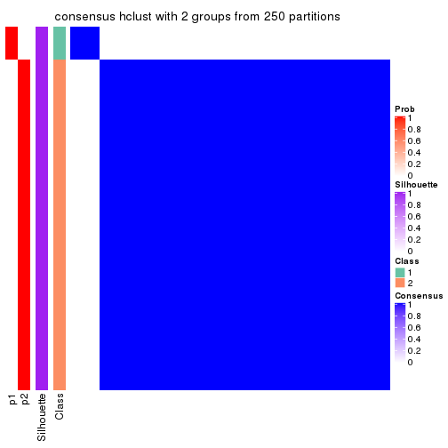</p>

</div>
<div id='tab-ATC-hclust-consensus-heatmap-2'>
<pre><code class="r">consensus_heatmap(res, k = 3)
</code></pre>

<p>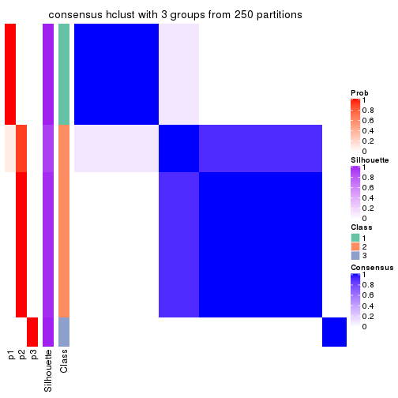</p>

</div>
<div id='tab-ATC-hclust-consensus-heatmap-3'>
<pre><code class="r">consensus_heatmap(res, k = 4)
</code></pre>

<p>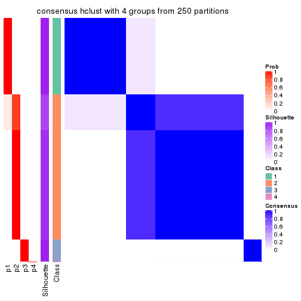</p>

</div>
<div id='tab-ATC-hclust-consensus-heatmap-4'>
<pre><code class="r">consensus_heatmap(res, k = 5)
</code></pre>

<p>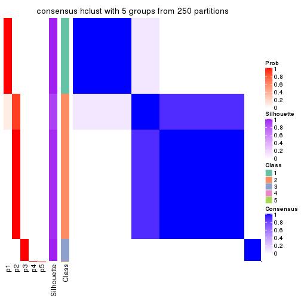</p>

</div>
<div id='tab-ATC-hclust-consensus-heatmap-5'>
<pre><code class="r">consensus_heatmap(res, k = 6)
</code></pre>

<p>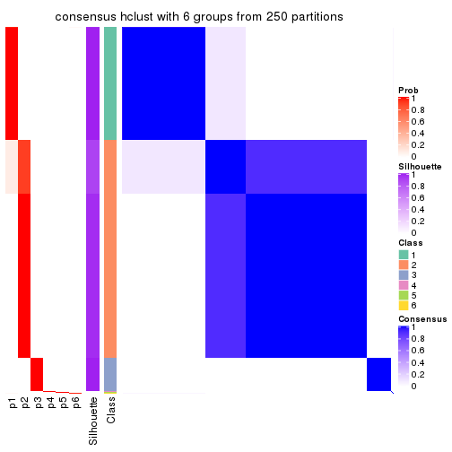</p>

</div>
</div>

Heatmaps for the membership of samples in all partitions to see how consistent they are:


<script>
$( function() {
	$( '#tabs-ATC-hclust-membership-heatmap' ).tabs();
} );
</script>
<div id='tabs-ATC-hclust-membership-heatmap'>
<ul>
<li><a href='#tab-ATC-hclust-membership-heatmap-1'>k = 2</a></li>
<li><a href='#tab-ATC-hclust-membership-heatmap-2'>k = 3</a></li>
<li><a href='#tab-ATC-hclust-membership-heatmap-3'>k = 4</a></li>
<li><a href='#tab-ATC-hclust-membership-heatmap-4'>k = 5</a></li>
<li><a href='#tab-ATC-hclust-membership-heatmap-5'>k = 6</a></li>
</ul>
<div id='tab-ATC-hclust-membership-heatmap-1'>
<pre><code class="r">membership_heatmap(res, k = 2)
</code></pre>

<p>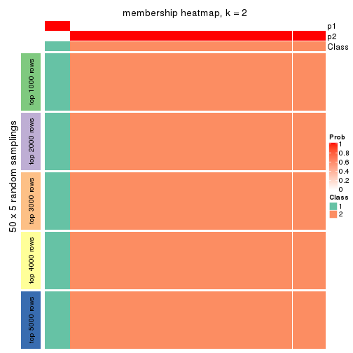</p>

</div>
<div id='tab-ATC-hclust-membership-heatmap-2'>
<pre><code class="r">membership_heatmap(res, k = 3)
</code></pre>

<p>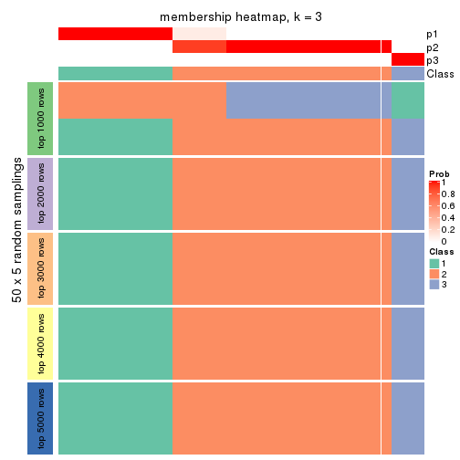</p>

</div>
<div id='tab-ATC-hclust-membership-heatmap-3'>
<pre><code class="r">membership_heatmap(res, k = 4)
</code></pre>

<p>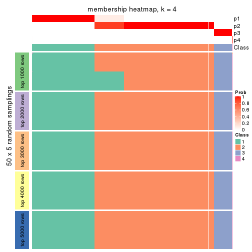</p>

</div>
<div id='tab-ATC-hclust-membership-heatmap-4'>
<pre><code class="r">membership_heatmap(res, k = 5)
</code></pre>

<p>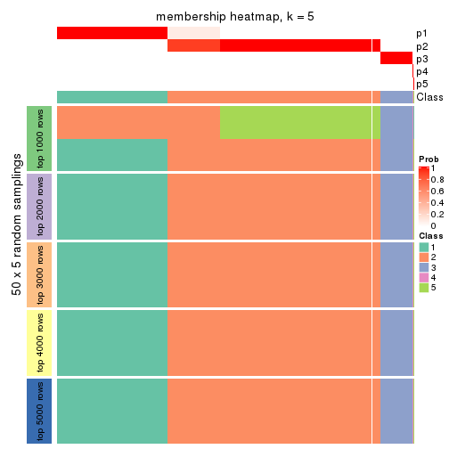</p>

</div>
<div id='tab-ATC-hclust-membership-heatmap-5'>
<pre><code class="r">membership_heatmap(res, k = 6)
</code></pre>

<p>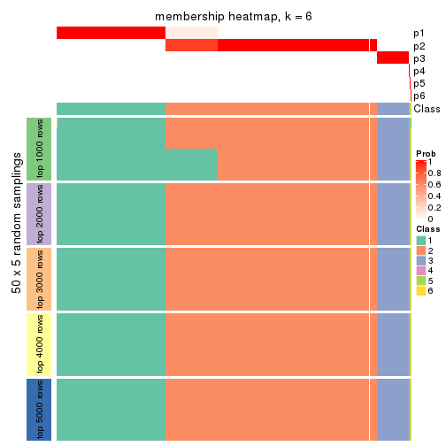</p>

</div>
</div>

As soon as we have had the classes for columns, we can look for signatures
which are significantly different between classes which can be candidate marks
for certain classes. Following are the heatmaps for signatures.


Signature heatmaps where rows are scaled:


<script>
$( function() {
	$( '#tabs-ATC-hclust-get-signatures' ).tabs();
} );
</script>
<div id='tabs-ATC-hclust-get-signatures'>
<ul>
<li><a href='#tab-ATC-hclust-get-signatures-1'>k = 2</a></li>
<li><a href='#tab-ATC-hclust-get-signatures-2'>k = 3</a></li>
<li><a href='#tab-ATC-hclust-get-signatures-3'>k = 4</a></li>
<li><a href='#tab-ATC-hclust-get-signatures-4'>k = 5</a></li>
<li><a href='#tab-ATC-hclust-get-signatures-5'>k = 6</a></li>
</ul>
<div id='tab-ATC-hclust-get-signatures-1'>
<pre><code class="r">get_signatures(res, k = 2)
</code></pre>

<p>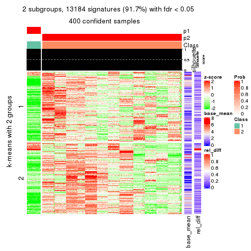</p>

</div>
<div id='tab-ATC-hclust-get-signatures-2'>
<pre><code class="r">get_signatures(res, k = 3)
</code></pre>

<p>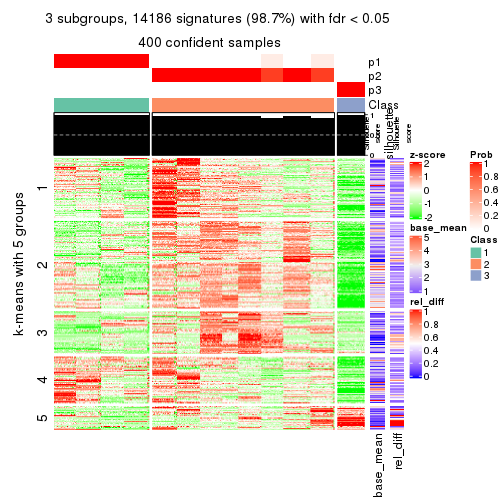</p>

</div>
<div id='tab-ATC-hclust-get-signatures-3'>
<pre><code class="r">get_signatures(res, k = 4)
</code></pre>

<pre><code>#&gt; Error in mat[ceiling(1:nr/h_ratio), ceiling(1:nc/w_ratio), drop = FALSE]: subscript out of bounds
</code></pre>

<p>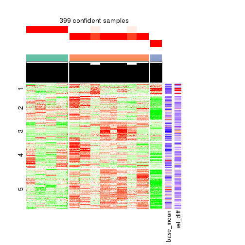</p>

</div>
<div id='tab-ATC-hclust-get-signatures-4'>
<pre><code class="r">get_signatures(res, k = 5)
</code></pre>

<p>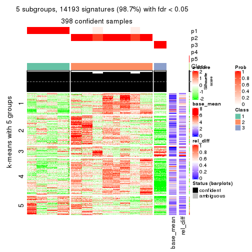</p>

</div>
<div id='tab-ATC-hclust-get-signatures-5'>
<pre><code class="r">get_signatures(res, k = 6)
</code></pre>

<p>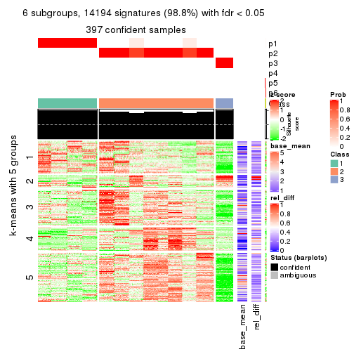</p>

</div>
</div>


Signature heatmaps where rows are not scaled:


<script>
$( function() {
	$( '#tabs-ATC-hclust-get-signatures-no-scale' ).tabs();
} );
</script>
<div id='tabs-ATC-hclust-get-signatures-no-scale'>
<ul>
<li><a href='#tab-ATC-hclust-get-signatures-no-scale-1'>k = 2</a></li>
<li><a href='#tab-ATC-hclust-get-signatures-no-scale-2'>k = 3</a></li>
<li><a href='#tab-ATC-hclust-get-signatures-no-scale-3'>k = 4</a></li>
<li><a href='#tab-ATC-hclust-get-signatures-no-scale-4'>k = 5</a></li>
<li><a href='#tab-ATC-hclust-get-signatures-no-scale-5'>k = 6</a></li>
</ul>
<div id='tab-ATC-hclust-get-signatures-no-scale-1'>
<pre><code class="r">get_signatures(res, k = 2, scale_rows = FALSE)
</code></pre>

<p>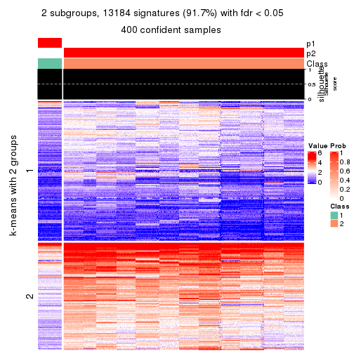</p>

</div>
<div id='tab-ATC-hclust-get-signatures-no-scale-2'>
<pre><code class="r">get_signatures(res, k = 3, scale_rows = FALSE)
</code></pre>

<p>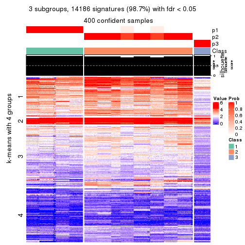</p>

</div>
<div id='tab-ATC-hclust-get-signatures-no-scale-3'>
<pre><code class="r">get_signatures(res, k = 4, scale_rows = FALSE)
</code></pre>

<pre><code>#&gt; Error in mat[ceiling(1:nr/h_ratio), ceiling(1:nc/w_ratio), drop = FALSE]: subscript out of bounds
</code></pre>

<p>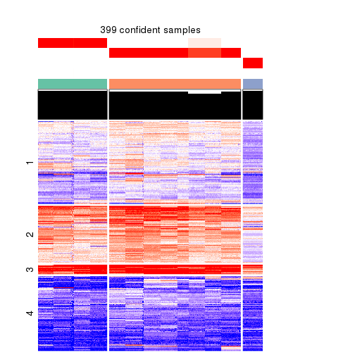</p>

</div>
<div id='tab-ATC-hclust-get-signatures-no-scale-4'>
<pre><code class="r">get_signatures(res, k = 5, scale_rows = FALSE)
</code></pre>

<p>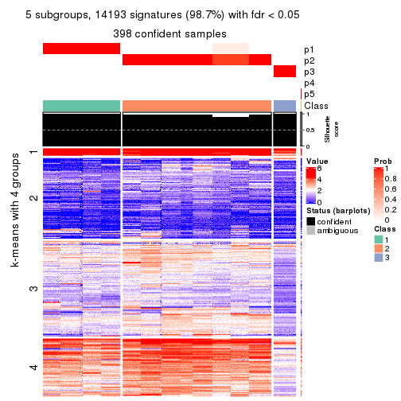</p>

</div>
<div id='tab-ATC-hclust-get-signatures-no-scale-5'>
<pre><code class="r">get_signatures(res, k = 6, scale_rows = FALSE)
</code></pre>

<p>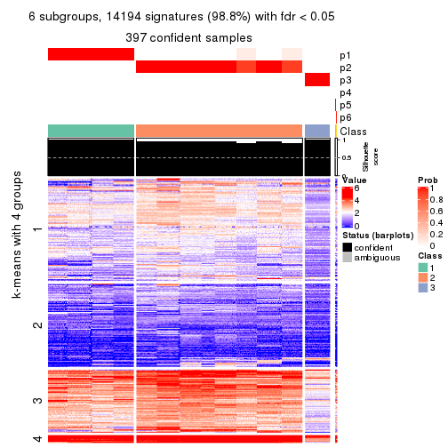</p>

</div>
</div>


Compare the overlap of signatures from different k:

```r
compare_signatures(res)
```

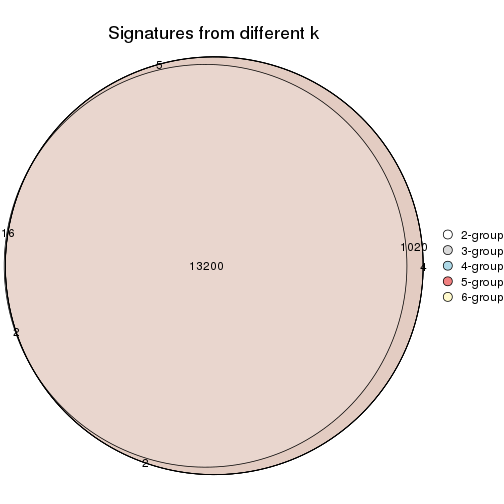

`get_signature()` returns a data frame invisibly. TO get the list of signatures, the function
call should be assigned to a variable explicitly. In following code, if `plot` argument is set
to `FALSE`, no heatmap is plotted while only the differential analysis is performed.

```r
# code only for demonstration
tb = get_signature(res, k = ..., plot = FALSE)
```

An example of the output of `tb` is:

```
#>   which_row         fdr    mean_1    mean_2 scaled_mean_1 scaled_mean_2 km
#> 1        38 0.042760348  8.373488  9.131774    -0.5533452     0.5164555  1
#> 2        40 0.018707592  7.106213  8.469186    -0.6173731     0.5762149  1
#> 3        55 0.019134737 10.221463 11.207825    -0.6159697     0.5749050  1
#> 4        59 0.006059896  5.921854  7.869574    -0.6899429     0.6439467  1
#> 5        60 0.018055526  8.928898 10.211722    -0.6204761     0.5791110  1
#> 6        98 0.009384629 15.714769 14.887706     0.6635654    -0.6193277  2
...
```

The columns in `tb` are:

1. `which_row`: row indices corresponding to the input matrix.
2. `fdr`: FDR for the differential test. 
3. `mean_x`: The mean value in group x.
4. `scaled_mean_x`: The mean value in group x after rows are scaled.
5. `km`: Row groups if k-means clustering is applied to rows.


UMAP plot which shows how samples are separated.


<script>
$( function() {
	$( '#tabs-ATC-hclust-dimension-reduction' ).tabs();
} );
</script>
<div id='tabs-ATC-hclust-dimension-reduction'>
<ul>
<li><a href='#tab-ATC-hclust-dimension-reduction-1'>k = 2</a></li>
<li><a href='#tab-ATC-hclust-dimension-reduction-2'>k = 3</a></li>
<li><a href='#tab-ATC-hclust-dimension-reduction-3'>k = 4</a></li>
<li><a href='#tab-ATC-hclust-dimension-reduction-4'>k = 5</a></li>
<li><a href='#tab-ATC-hclust-dimension-reduction-5'>k = 6</a></li>
</ul>
<div id='tab-ATC-hclust-dimension-reduction-1'>
<pre><code class="r">dimension_reduction(res, k = 2, method = &quot;UMAP&quot;)
</code></pre>

<p>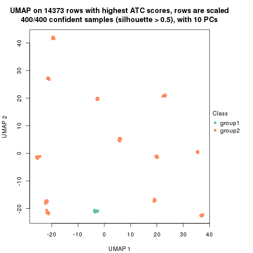</p>

</div>
<div id='tab-ATC-hclust-dimension-reduction-2'>
<pre><code class="r">dimension_reduction(res, k = 3, method = &quot;UMAP&quot;)
</code></pre>

<p>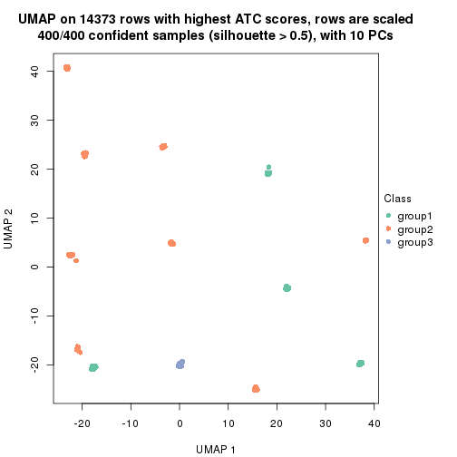</p>

</div>
<div id='tab-ATC-hclust-dimension-reduction-3'>
<pre><code class="r">dimension_reduction(res, k = 4, method = &quot;UMAP&quot;)
</code></pre>

<p>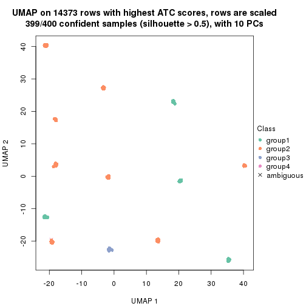</p>

</div>
<div id='tab-ATC-hclust-dimension-reduction-4'>
<pre><code class="r">dimension_reduction(res, k = 5, method = &quot;UMAP&quot;)
</code></pre>

<p>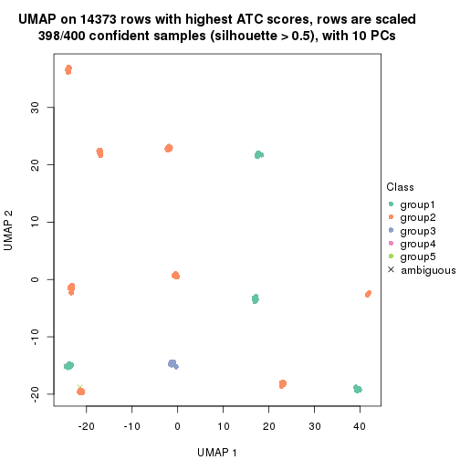</p>

</div>
<div id='tab-ATC-hclust-dimension-reduction-5'>
<pre><code class="r">dimension_reduction(res, k = 6, method = &quot;UMAP&quot;)
</code></pre>

<p>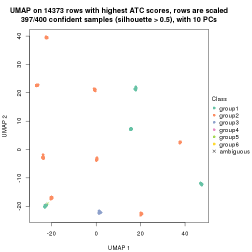</p>

</div>
</div>


Following heatmap shows how subgroups are split when increasing `k`:

```r
collect_classes(res)
```

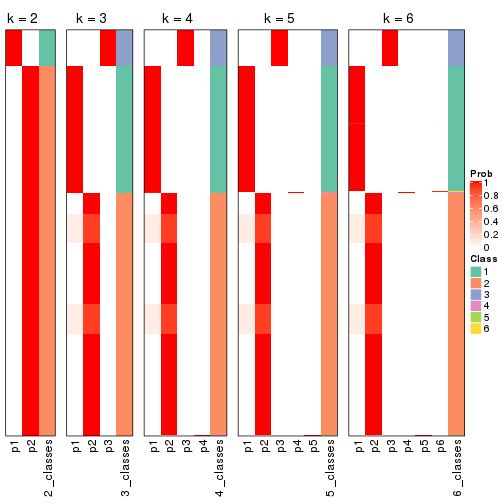


If matrix rows can be associated to genes, consider to use `GO_Enrichment(res,
...)` to perform function enrichment for the signature genes.


 

---------------------------------------------------


### ATC:kmeans


The object with results only for a single top-value method and a single partition method 
can be extracted as:

```r
res = res_list["ATC", "kmeans"]
# you can also extract it by
# res = res_list["ATC:kmeans"]
```

A summary of `res` and all the functions that can be applied to it:

```r
res
```

```
#> A 'ConsensusPartition' object with k = 2, 3, 4, 5, 6.
#>   On a matrix with 14373 rows and 400 columns.
#>   Top rows (1000, 2000, 3000, 4000, 5000) are extracted by 'ATC' method.
#>   Subgroups are detected by 'kmeans' method.
#>   Performed in total 1250 partitions by row resampling.
#>   Best k for subgroups seems to be 2.
#> 
#> Following methods can be applied to this 'ConsensusPartition' object:
#>  [1] "cola_report"             "collect_classes"         "collect_plots"          
#>  [4] "collect_stats"           "colnames"                "compare_signatures"     
#>  [7] "consensus_heatmap"       "dimension_reduction"     "functional_enrichment"  
#> [10] "get_anno_col"            "get_anno"                "get_classes"            
#> [13] "get_consensus"           "get_matrix"              "get_membership"         
#> [16] "get_param"               "get_signatures"          "get_stats"              
#> [19] "is_best_k"               "is_stable_k"             "membership_heatmap"     
#> [22] "ncol"                    "nrow"                    "plot_ecdf"              
#> [25] "rownames"                "select_partition_number" "show"                   
#> [28] "suggest_best_k"          "test_to_known_factors"
```

`collect_plots()` function collects all the plots made from `res` for all `k` (number of partitions)
into one single page to provide an easy and fast comparison between different `k`.

```r
collect_plots(res)
```

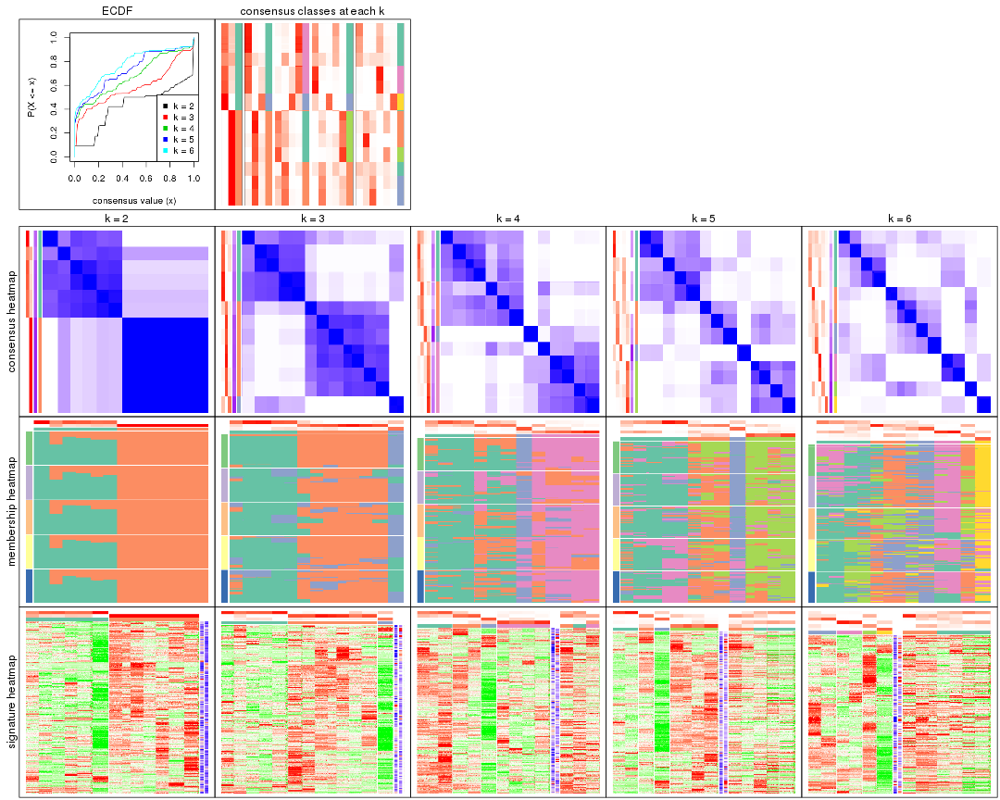

The plots are:

- The first row: a plot of the ECDF (Empirical cumulative distribution
  function) curves of the consensus matrix for each `k` and the heatmap of
  predicted classes for each `k`.
- The second row: heatmaps of the consensus matrix for each `k`.
- The third row: heatmaps of the membership matrix for each `k`.
- The fouth row: heatmaps of the signatures for each `k`.

All the plots in panels can be made by individual functions and they are
plotted later in this section.

`select_partition_number()` produces several plots showing different
statistics for choosing "optimized" `k`. There are following statistics:

- ECDF curves of the consensus matrix for each `k`;
- 1-PAC. [The PAC
  score](https://en.wikipedia.org/wiki/Consensus_clustering#Over-interpretation_potential_of_consensus_clustering)
  measures the proportion of the ambiguous subgrouping.
- Mean silhouette score.
- Concordance. The mean probability of fiting the consensus class ids in all
  partitions.
- Area increased. Denote $A_k$ as the area under the ECDF curve for current
  `k`, the area increased is defined as $A_k - A_{k-1}$.
- Rand index. The percent of pairs of samples that are both in a same cluster
  or both are not in a same cluster in the partition of k and k-1.
- Jaccard index. The ratio of pairs of samples are both in a same cluster in
  the partition of k and k-1 and the pairs of samples are both in a same
  cluster in the partition k or k-1.

The detailed explanations of these statistics can be found in [the cola
vignette](http://bioconductor.org/packages/devel/bioc/vignettes/cola/inst/doc/cola.html#toc_13).

Generally speaking, lower PAC score, higher mean silhouette score or higher
concordance corresponds to better partition. Rand index and Jaccard index
measure how similar the current partition is compared to partition with `k-1`.
If they are too similar, we won't accept `k` is better than `k-1`.

```r
select_partition_number(res)
```

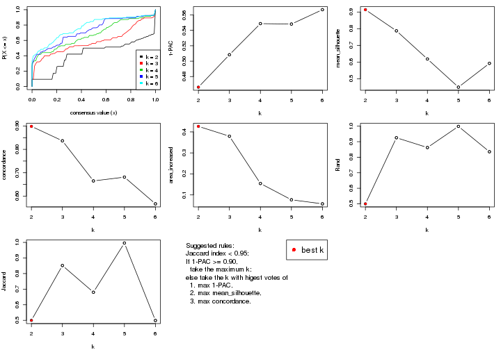

The numeric values for all these statistics can be obtained by `get_stats()`.

```r
get_stats(res)
```

```
#>   k 1-PAC mean_silhouette concordance area_increased  Rand Jaccard
#> 2 2 0.466           0.914       0.898         0.4263 0.500   0.500
#> 3 3 0.508           0.787       0.837         0.3794 0.926   0.852
#> 4 4 0.549           0.618       0.665         0.1544 0.862   0.680
#> 5 5 0.548           0.449       0.681         0.0769 0.999   0.996
#> 6 6 0.567           0.592       0.567         0.0577 0.835   0.499
```

`suggest_best_k()` suggests the best $k$ based on these statistics. The rules are as follows:

- All $k$ with Jaccard index larger than 0.95 are removed because the increase of
  the partition number does not provides enough extra information. If all $k$ are removed,
  the best $k$ is assigned by `NA`.
- For $k$ with 1-PAC larger than 0.9, the maximal $k$ is taken as the "best k". Other $k$ is called "optional k".
- If it does not fit the second rule. The $k$ with the highest vote of highest
  1-PAC, mean silhouette and concordance is taken as the "best k".

```r
suggest_best_k(res)
```

```
#> [1] 2
```


Following shows the table of the partitions (You need to click the **show/hide
code output** link to see it). The membership matrix (columns with name `p*`)
is inferred by
[`clue::cl_consensus()`](https://www.rdocumentation.org/link/cl_consensus?package=clue)
function with the `SE` method. Basically the value in the membership matrix
represents the probability to belong to a certain group. The finall class
label for an item is determined with the group with highest probability it
belongs to.

In `get_classes()` function, the entropy is calculated from the membership
matrix and the silhouette score is calculated from the consensus matrix.


<script>
$( function() {
	$( '#tabs-ATC-kmeans-get-classes' ).tabs();
} );
</script>
<div id='tabs-ATC-kmeans-get-classes'>
<ul>
<li><a href='#tab-ATC-kmeans-get-classes-1'>k = 2</a></li>
<li><a href='#tab-ATC-kmeans-get-classes-2'>k = 3</a></li>
<li><a href='#tab-ATC-kmeans-get-classes-3'>k = 4</a></li>
<li><a href='#tab-ATC-kmeans-get-classes-4'>k = 5</a></li>
<li><a href='#tab-ATC-kmeans-get-classes-5'>k = 6</a></li>
</ul>

<div id='tab-ATC-kmeans-get-classes-1'>
<p><a id='tab-ATC-kmeans-get-classes-1-a' style='color:#0366d6' href='#'>show/hide code output</a></p>
<pre><code class="r">cbind(get_classes(res, k = 2), get_membership(res, k = 2))
</code></pre>

<pre><code>#&gt;            class entropy silhouette    p1    p2
#&gt; SRR1661716     2   0.000      1.000 0.000 1.000
#&gt; SRR1661717     2   0.000      1.000 0.000 1.000
#&gt; SRR1661718     2   0.000      1.000 0.000 1.000
#&gt; SRR1661719     2   0.000      1.000 0.000 1.000
#&gt; SRR1661720     2   0.000      1.000 0.000 1.000
#&gt; SRR1661721     2   0.000      1.000 0.000 1.000
#&gt; SRR1661722     2   0.000      1.000 0.000 1.000
#&gt; SRR1661723     2   0.000      1.000 0.000 1.000
#&gt; SRR1661724     2   0.000      1.000 0.000 1.000
#&gt; SRR1661725     2   0.000      1.000 0.000 1.000
#&gt; SRR1661726     2   0.000      1.000 0.000 1.000
#&gt; SRR1661727     2   0.000      1.000 0.000 1.000
#&gt; SRR1661728     2   0.000      1.000 0.000 1.000
#&gt; SRR1661729     2   0.000      1.000 0.000 1.000
#&gt; SRR1661730     2   0.000      1.000 0.000 1.000
#&gt; SRR1661731     2   0.000      1.000 0.000 1.000
#&gt; SRR1661732     2   0.000      1.000 0.000 1.000
#&gt; SRR1661733     2   0.000      1.000 0.000 1.000
#&gt; SRR1661734     2   0.000      1.000 0.000 1.000
#&gt; SRR1661735     2   0.000      1.000 0.000 1.000
#&gt; SRR1661736     2   0.000      1.000 0.000 1.000
#&gt; SRR1661737     2   0.000      1.000 0.000 1.000
#&gt; SRR1661738     2   0.000      1.000 0.000 1.000
#&gt; SRR1661739     2   0.000      1.000 0.000 1.000
#&gt; SRR1661740     2   0.000      1.000 0.000 1.000
#&gt; SRR1661741     2   0.000      1.000 0.000 1.000
#&gt; SRR1661742     2   0.000      1.000 0.000 1.000
#&gt; SRR1661743     2   0.000      1.000 0.000 1.000
#&gt; SRR1661744     2   0.000      1.000 0.000 1.000
#&gt; SRR1661745     2   0.000      1.000 0.000 1.000
#&gt; SRR1661746     2   0.000      1.000 0.000 1.000
#&gt; SRR1661747     2   0.000      1.000 0.000 1.000
#&gt; SRR1661748     2   0.000      1.000 0.000 1.000
#&gt; SRR1661749     2   0.000      1.000 0.000 1.000
#&gt; SRR1661750     2   0.000      1.000 0.000 1.000
#&gt; SRR1661751     2   0.000      1.000 0.000 1.000
#&gt; SRR1661752     2   0.000      1.000 0.000 1.000
#&gt; SRR1661753     2   0.000      1.000 0.000 1.000
#&gt; SRR1661754     2   0.000      1.000 0.000 1.000
#&gt; SRR1661755     2   0.000      1.000 0.000 1.000
#&gt; SRR1661756     2   0.000      1.000 0.000 1.000
#&gt; SRR1661757     2   0.000      1.000 0.000 1.000
#&gt; SRR1661758     2   0.000      1.000 0.000 1.000
#&gt; SRR1661759     2   0.000      1.000 0.000 1.000
#&gt; SRR1661760     2   0.000      1.000 0.000 1.000
#&gt; SRR1661761     2   0.000      1.000 0.000 1.000
#&gt; SRR1661762     2   0.000      1.000 0.000 1.000
#&gt; SRR1661763     2   0.000      1.000 0.000 1.000
#&gt; SRR1661764     2   0.000      1.000 0.000 1.000
#&gt; SRR1661766     2   0.000      1.000 0.000 1.000
#&gt; SRR1661767     2   0.000      1.000 0.000 1.000
#&gt; SRR1661768     2   0.000      1.000 0.000 1.000
#&gt; SRR1661769     2   0.000      1.000 0.000 1.000
#&gt; SRR1661770     2   0.000      1.000 0.000 1.000
#&gt; SRR1661771     2   0.000      1.000 0.000 1.000
#&gt; SRR1661772     2   0.000      1.000 0.000 1.000
#&gt; SRR1661773     2   0.000      1.000 0.000 1.000
#&gt; SRR1661774     2   0.000      1.000 0.000 1.000
#&gt; SRR1661775     2   0.000      1.000 0.000 1.000
#&gt; SRR1661776     2   0.000      1.000 0.000 1.000
#&gt; SRR1661777     2   0.000      1.000 0.000 1.000
#&gt; SRR1661778     2   0.000      1.000 0.000 1.000
#&gt; SRR1661779     2   0.000      1.000 0.000 1.000
#&gt; SRR1661780     2   0.000      1.000 0.000 1.000
#&gt; SRR1661781     2   0.000      1.000 0.000 1.000
#&gt; SRR1661782     2   0.000      1.000 0.000 1.000
#&gt; SRR1661783     2   0.000      1.000 0.000 1.000
#&gt; SRR1661784     2   0.000      1.000 0.000 1.000
#&gt; SRR1661785     2   0.000      1.000 0.000 1.000
#&gt; SRR1661786     2   0.000      1.000 0.000 1.000
#&gt; SRR1661787     2   0.000      1.000 0.000 1.000
#&gt; SRR1661788     2   0.000      1.000 0.000 1.000
#&gt; SRR1661789     2   0.000      1.000 0.000 1.000
#&gt; SRR1661790     2   0.000      1.000 0.000 1.000
#&gt; SRR1661791     2   0.000      1.000 0.000 1.000
#&gt; SRR1661792     2   0.000      1.000 0.000 1.000
#&gt; SRR1661793     2   0.000      1.000 0.000 1.000
#&gt; SRR1661794     2   0.000      1.000 0.000 1.000
#&gt; SRR1661795     2   0.000      1.000 0.000 1.000
#&gt; SRR1661796     2   0.000      1.000 0.000 1.000
#&gt; SRR1661797     2   0.000      1.000 0.000 1.000
#&gt; SRR1661798     2   0.000      1.000 0.000 1.000
#&gt; SRR1661799     2   0.000      1.000 0.000 1.000
#&gt; SRR1661800     2   0.000      1.000 0.000 1.000
#&gt; SRR1661801     2   0.000      1.000 0.000 1.000
#&gt; SRR1661802     2   0.000      1.000 0.000 1.000
#&gt; SRR1661803     2   0.000      1.000 0.000 1.000
#&gt; SRR1661804     2   0.000      1.000 0.000 1.000
#&gt; SRR1661805     2   0.000      1.000 0.000 1.000
#&gt; SRR1661806     2   0.000      1.000 0.000 1.000
#&gt; SRR1661807     2   0.000      1.000 0.000 1.000
#&gt; SRR1661808     2   0.000      1.000 0.000 1.000
#&gt; SRR1661809     2   0.000      1.000 0.000 1.000
#&gt; SRR1661810     2   0.000      1.000 0.000 1.000
#&gt; SRR1661811     2   0.000      1.000 0.000 1.000
#&gt; SRR1661812     2   0.000      1.000 0.000 1.000
#&gt; SRR1661813     2   0.000      1.000 0.000 1.000
#&gt; SRR1661814     2   0.000      1.000 0.000 1.000
#&gt; SRR1661815     2   0.000      1.000 0.000 1.000
#&gt; SRR1661816     2   0.000      1.000 0.000 1.000
#&gt; SRR1661817     2   0.000      1.000 0.000 1.000
#&gt; SRR1661818     2   0.000      1.000 0.000 1.000
#&gt; SRR1661819     2   0.000      1.000 0.000 1.000
#&gt; SRR1661820     2   0.000      1.000 0.000 1.000
#&gt; SRR1661821     2   0.000      1.000 0.000 1.000
#&gt; SRR1661822     2   0.000      1.000 0.000 1.000
#&gt; SRR1661823     2   0.000      1.000 0.000 1.000
#&gt; SRR1661824     2   0.000      1.000 0.000 1.000
#&gt; SRR1661825     2   0.000      1.000 0.000 1.000
#&gt; SRR1661826     1   0.855      0.853 0.720 0.280
#&gt; SRR1661827     1   0.850      0.856 0.724 0.276
#&gt; SRR1661828     1   0.855      0.853 0.720 0.280
#&gt; SRR1661829     1   0.855      0.853 0.720 0.280
#&gt; SRR1661830     1   0.855      0.853 0.720 0.280
#&gt; SRR1661831     1   0.855      0.853 0.720 0.280
#&gt; SRR1661832     1   0.850      0.856 0.724 0.276
#&gt; SRR1661833     1   0.855      0.853 0.720 0.280
#&gt; SRR1661834     1   0.855      0.853 0.720 0.280
#&gt; SRR1661835     1   0.855      0.853 0.720 0.280
#&gt; SRR1661836     1   0.855      0.853 0.720 0.280
#&gt; SRR1661837     1   0.855      0.853 0.720 0.280
#&gt; SRR1661838     1   0.850      0.856 0.724 0.276
#&gt; SRR1661839     1   0.855      0.853 0.720 0.280
#&gt; SRR1661840     1   0.855      0.853 0.720 0.280
#&gt; SRR1661841     1   0.855      0.853 0.720 0.280
#&gt; SRR1661843     1   0.850      0.856 0.724 0.276
#&gt; SRR1661844     1   0.855      0.853 0.720 0.280
#&gt; SRR1661845     1   0.855      0.853 0.720 0.280
#&gt; SRR1661846     1   0.855      0.853 0.720 0.280
#&gt; SRR1661847     1   0.855      0.853 0.720 0.280
#&gt; SRR1661848     1   0.855      0.853 0.720 0.280
#&gt; SRR1661849     1   0.850      0.856 0.724 0.276
#&gt; SRR1661850     1   0.855      0.853 0.720 0.280
#&gt; SRR1661851     1   0.850      0.856 0.724 0.276
#&gt; SRR1661852     1   0.855      0.853 0.720 0.280
#&gt; SRR1661853     1   0.855      0.853 0.720 0.280
#&gt; SRR1661854     1   0.855      0.853 0.720 0.280
#&gt; SRR1661855     1   0.855      0.853 0.720 0.280
#&gt; SRR1661856     1   0.000      0.767 1.000 0.000
#&gt; SRR1661857     1   0.000      0.767 1.000 0.000
#&gt; SRR1661858     1   0.000      0.767 1.000 0.000
#&gt; SRR1661859     1   0.000      0.767 1.000 0.000
#&gt; SRR1661860     1   0.000      0.767 1.000 0.000
#&gt; SRR1661861     1   0.000      0.767 1.000 0.000
#&gt; SRR1661862     1   0.000      0.767 1.000 0.000
#&gt; SRR1661863     1   0.000      0.767 1.000 0.000
#&gt; SRR1661864     1   0.000      0.767 1.000 0.000
#&gt; SRR1661865     1   0.000      0.767 1.000 0.000
#&gt; SRR1661866     1   0.000      0.767 1.000 0.000
#&gt; SRR1661867     1   0.000      0.767 1.000 0.000
#&gt; SRR1661868     1   0.000      0.767 1.000 0.000
#&gt; SRR1661869     1   0.000      0.767 1.000 0.000
#&gt; SRR1661870     1   0.000      0.767 1.000 0.000
#&gt; SRR1661871     1   0.000      0.767 1.000 0.000
#&gt; SRR1661872     1   0.000      0.767 1.000 0.000
#&gt; SRR1661873     1   0.000      0.767 1.000 0.000
#&gt; SRR1661874     1   0.000      0.767 1.000 0.000
#&gt; SRR1661875     1   0.000      0.767 1.000 0.000
#&gt; SRR1661876     1   0.000      0.767 1.000 0.000
#&gt; SRR1661877     1   0.000      0.767 1.000 0.000
#&gt; SRR1661878     1   0.000      0.767 1.000 0.000
#&gt; SRR1661879     1   0.000      0.767 1.000 0.000
#&gt; SRR1661880     1   0.000      0.767 1.000 0.000
#&gt; SRR1661881     1   0.000      0.767 1.000 0.000
#&gt; SRR1661882     1   0.000      0.767 1.000 0.000
#&gt; SRR1661883     1   0.000      0.767 1.000 0.000
#&gt; SRR1661884     1   0.000      0.767 1.000 0.000
#&gt; SRR1661885     1   0.000      0.767 1.000 0.000
#&gt; SRR1661886     1   0.000      0.767 1.000 0.000
#&gt; SRR1661887     1   0.000      0.767 1.000 0.000
#&gt; SRR1661888     1   0.000      0.767 1.000 0.000
#&gt; SRR1661889     1   0.000      0.767 1.000 0.000
#&gt; SRR1661890     1   0.000      0.767 1.000 0.000
#&gt; SRR1661891     1   0.000      0.767 1.000 0.000
#&gt; SRR1661892     1   0.827      0.865 0.740 0.260
#&gt; SRR1661893     1   0.827      0.865 0.740 0.260
#&gt; SRR1661894     1   0.827      0.865 0.740 0.260
#&gt; SRR1661895     1   0.722      0.874 0.800 0.200
#&gt; SRR1661896     1   0.827      0.865 0.740 0.260
#&gt; SRR1661897     1   0.827      0.865 0.740 0.260
#&gt; SRR1661898     1   0.827      0.865 0.740 0.260
#&gt; SRR1661899     1   0.827      0.865 0.740 0.260
#&gt; SRR1661900     1   0.827      0.865 0.740 0.260
#&gt; SRR1661901     1   0.827      0.865 0.740 0.260
#&gt; SRR1661902     1   0.827      0.865 0.740 0.260
#&gt; SRR1661903     1   0.827      0.865 0.740 0.260
#&gt; SRR1661904     1   0.827      0.865 0.740 0.260
#&gt; SRR1661905     1   0.827      0.865 0.740 0.260
#&gt; SRR1661906     1   0.827      0.865 0.740 0.260
#&gt; SRR1661907     1   0.827      0.865 0.740 0.260
#&gt; SRR1661908     1   0.722      0.874 0.800 0.200
#&gt; SRR1661909     1   0.827      0.865 0.740 0.260
#&gt; SRR1661910     1   0.827      0.865 0.740 0.260
#&gt; SRR1661911     1   0.827      0.865 0.740 0.260
#&gt; SRR1661912     1   0.827      0.865 0.740 0.260
#&gt; SRR1661913     1   0.827      0.865 0.740 0.260
#&gt; SRR1661914     1   0.827      0.865 0.740 0.260
#&gt; SRR1661915     1   0.722      0.874 0.800 0.200
#&gt; SRR1661916     1   0.827      0.865 0.740 0.260
#&gt; SRR1661917     1   0.827      0.865 0.740 0.260
#&gt; SRR1661918     1   0.827      0.865 0.740 0.260
#&gt; SRR1661919     1   0.827      0.865 0.740 0.260
#&gt; SRR1661920     1   0.827      0.865 0.740 0.260
#&gt; SRR1661921     1   0.738      0.873 0.792 0.208
#&gt; SRR1661922     1   0.827      0.865 0.740 0.260
#&gt; SRR1661923     1   0.827      0.865 0.740 0.260
#&gt; SRR1661924     1   0.827      0.865 0.740 0.260
#&gt; SRR1661925     1   0.827      0.865 0.740 0.260
#&gt; SRR1661926     1   0.827      0.865 0.740 0.260
#&gt; SRR1661927     1   0.827      0.865 0.740 0.260
#&gt; SRR1661928     1   0.978      0.692 0.588 0.412
#&gt; SRR1661929     1   0.978      0.692 0.588 0.412
#&gt; SRR1661930     1   0.978      0.692 0.588 0.412
#&gt; SRR1661931     1   0.978      0.692 0.588 0.412
#&gt; SRR1661932     1   0.978      0.692 0.588 0.412
#&gt; SRR1661933     1   0.978      0.692 0.588 0.412
#&gt; SRR1661934     1   0.978      0.692 0.588 0.412
#&gt; SRR1661935     1   0.978      0.692 0.588 0.412
#&gt; SRR1661936     1   0.978      0.692 0.588 0.412
#&gt; SRR1661937     1   0.978      0.692 0.588 0.412
#&gt; SRR1661938     1   0.978      0.692 0.588 0.412
#&gt; SRR1661939     1   0.978      0.692 0.588 0.412
#&gt; SRR1661940     1   0.978      0.692 0.588 0.412
#&gt; SRR1661941     1   0.978      0.692 0.588 0.412
#&gt; SRR1661942     1   0.978      0.692 0.588 0.412
#&gt; SRR1661943     1   0.978      0.692 0.588 0.412
#&gt; SRR1661944     1   0.978      0.692 0.588 0.412
#&gt; SRR1661945     1   0.978      0.692 0.588 0.412
#&gt; SRR1661946     1   0.978      0.692 0.588 0.412
#&gt; SRR1661947     1   0.978      0.692 0.588 0.412
#&gt; SRR1661948     1   0.978      0.692 0.588 0.412
#&gt; SRR1661949     1   0.978      0.692 0.588 0.412
#&gt; SRR1661950     1   0.978      0.692 0.588 0.412
#&gt; SRR1661951     1   0.978      0.692 0.588 0.412
#&gt; SRR1661952     1   0.978      0.692 0.588 0.412
#&gt; SRR1661953     1   0.978      0.692 0.588 0.412
#&gt; SRR1661954     1   0.978      0.692 0.588 0.412
#&gt; SRR1661955     1   0.978      0.692 0.588 0.412
#&gt; SRR1661956     1   0.978      0.692 0.588 0.412
#&gt; SRR1661957     1   0.978      0.692 0.588 0.412
#&gt; SRR1661958     1   0.722      0.874 0.800 0.200
#&gt; SRR1661959     1   0.722      0.874 0.800 0.200
#&gt; SRR1661960     1   0.722      0.874 0.800 0.200
#&gt; SRR1661961     1   0.722      0.874 0.800 0.200
#&gt; SRR1661962     1   0.722      0.874 0.800 0.200
#&gt; SRR1661963     1   0.722      0.874 0.800 0.200
#&gt; SRR1661964     1   0.722      0.874 0.800 0.200
#&gt; SRR1661965     1   0.722      0.874 0.800 0.200
#&gt; SRR1661966     1   0.722      0.874 0.800 0.200
#&gt; SRR1661967     1   0.722      0.874 0.800 0.200
#&gt; SRR1661968     1   0.722      0.874 0.800 0.200
#&gt; SRR1661969     1   0.722      0.874 0.800 0.200
#&gt; SRR1661970     1   0.722      0.874 0.800 0.200
#&gt; SRR1661971     1   0.722      0.874 0.800 0.200
#&gt; SRR1661972     1   0.722      0.874 0.800 0.200
#&gt; SRR1661973     1   0.722      0.874 0.800 0.200
#&gt; SRR1661974     1   0.722      0.874 0.800 0.200
#&gt; SRR1661975     1   0.722      0.874 0.800 0.200
#&gt; SRR1661976     1   0.722      0.874 0.800 0.200
#&gt; SRR1661977     1   0.722      0.874 0.800 0.200
#&gt; SRR1661978     1   0.722      0.874 0.800 0.200
#&gt; SRR1661979     1   0.722      0.874 0.800 0.200
#&gt; SRR1661980     1   0.722      0.874 0.800 0.200
#&gt; SRR1661981     1   0.722      0.874 0.800 0.200
#&gt; SRR1661982     1   0.722      0.874 0.800 0.200
#&gt; SRR1661983     1   0.722      0.874 0.800 0.200
#&gt; SRR1661984     1   0.722      0.874 0.800 0.200
#&gt; SRR1661985     1   0.722      0.874 0.800 0.200
#&gt; SRR1661986     1   0.722      0.874 0.800 0.200
#&gt; SRR1661987     1   0.722      0.874 0.800 0.200
#&gt; SRR1661988     2   0.000      1.000 0.000 1.000
#&gt; SRR1661989     2   0.000      1.000 0.000 1.000
#&gt; SRR1661990     2   0.000      1.000 0.000 1.000
#&gt; SRR1661991     2   0.000      1.000 0.000 1.000
#&gt; SRR1661992     2   0.000      1.000 0.000 1.000
#&gt; SRR1661993     2   0.000      1.000 0.000 1.000
#&gt; SRR1661994     2   0.000      1.000 0.000 1.000
#&gt; SRR1661995     2   0.000      1.000 0.000 1.000
#&gt; SRR1661996     2   0.000      1.000 0.000 1.000
#&gt; SRR1661997     2   0.000      1.000 0.000 1.000
#&gt; SRR1661998     2   0.000      1.000 0.000 1.000
#&gt; SRR1661999     2   0.000      1.000 0.000 1.000
#&gt; SRR1662000     2   0.000      1.000 0.000 1.000
#&gt; SRR1662001     2   0.000      1.000 0.000 1.000
#&gt; SRR1662002     2   0.000      1.000 0.000 1.000
#&gt; SRR1662003     2   0.000      1.000 0.000 1.000
#&gt; SRR1662004     2   0.000      1.000 0.000 1.000
#&gt; SRR1662005     2   0.000      1.000 0.000 1.000
#&gt; SRR1662006     2   0.000      1.000 0.000 1.000
#&gt; SRR1662007     2   0.000      1.000 0.000 1.000
#&gt; SRR1662008     2   0.000      1.000 0.000 1.000
#&gt; SRR1662009     2   0.000      1.000 0.000 1.000
#&gt; SRR1662010     2   0.000      1.000 0.000 1.000
#&gt; SRR1662011     2   0.000      1.000 0.000 1.000
#&gt; SRR1662012     2   0.000      1.000 0.000 1.000
#&gt; SRR1662013     2   0.000      1.000 0.000 1.000
#&gt; SRR1662014     2   0.000      1.000 0.000 1.000
#&gt; SRR1662015     2   0.000      1.000 0.000 1.000
#&gt; SRR1662016     2   0.000      1.000 0.000 1.000
#&gt; SRR1662017     2   0.000      1.000 0.000 1.000
#&gt; SRR1662018     2   0.000      1.000 0.000 1.000
#&gt; SRR1662019     2   0.000      1.000 0.000 1.000
#&gt; SRR1662020     2   0.000      1.000 0.000 1.000
#&gt; SRR1662021     2   0.000      1.000 0.000 1.000
#&gt; SRR1662022     2   0.000      1.000 0.000 1.000
#&gt; SRR1662023     2   0.000      1.000 0.000 1.000
#&gt; SRR1662024     2   0.000      1.000 0.000 1.000
#&gt; SRR1662025     2   0.000      1.000 0.000 1.000
#&gt; SRR1662026     2   0.000      1.000 0.000 1.000
#&gt; SRR1662027     2   0.000      1.000 0.000 1.000
#&gt; SRR1662028     2   0.000      1.000 0.000 1.000
#&gt; SRR1662029     2   0.000      1.000 0.000 1.000
#&gt; SRR1662030     2   0.000      1.000 0.000 1.000
#&gt; SRR1662031     2   0.000      1.000 0.000 1.000
#&gt; SRR1662032     2   0.000      1.000 0.000 1.000
#&gt; SRR1662033     2   0.000      1.000 0.000 1.000
#&gt; SRR1662034     2   0.000      1.000 0.000 1.000
#&gt; SRR1662035     2   0.000      1.000 0.000 1.000
#&gt; SRR1662036     2   0.000      1.000 0.000 1.000
#&gt; SRR1662037     2   0.000      1.000 0.000 1.000
#&gt; SRR1662038     2   0.000      1.000 0.000 1.000
#&gt; SRR1662039     2   0.000      1.000 0.000 1.000
#&gt; SRR1662040     2   0.000      1.000 0.000 1.000
#&gt; SRR1662041     2   0.000      1.000 0.000 1.000
#&gt; SRR1662042     2   0.000      1.000 0.000 1.000
#&gt; SRR1662043     2   0.000      1.000 0.000 1.000
#&gt; SRR1662044     2   0.000      1.000 0.000 1.000
#&gt; SRR1662045     2   0.000      1.000 0.000 1.000
#&gt; SRR1662046     2   0.000      1.000 0.000 1.000
#&gt; SRR1662047     2   0.000      1.000 0.000 1.000
#&gt; SRR1662048     2   0.000      1.000 0.000 1.000
#&gt; SRR1662049     2   0.000      1.000 0.000 1.000
#&gt; SRR1662050     2   0.000      1.000 0.000 1.000
#&gt; SRR1662051     2   0.000      1.000 0.000 1.000
#&gt; SRR1662052     2   0.000      1.000 0.000 1.000
#&gt; SRR1662053     2   0.000      1.000 0.000 1.000
#&gt; SRR1662054     1   0.653      0.866 0.832 0.168
#&gt; SRR1662055     1   0.653      0.866 0.832 0.168
#&gt; SRR1662056     1   0.653      0.866 0.832 0.168
#&gt; SRR1662057     1   0.653      0.866 0.832 0.168
#&gt; SRR1662058     1   0.653      0.866 0.832 0.168
#&gt; SRR1662059     1   0.653      0.866 0.832 0.168
#&gt; SRR1662060     1   0.653      0.866 0.832 0.168
#&gt; SRR1662061     1   0.653      0.866 0.832 0.168
#&gt; SRR1662062     1   0.653      0.866 0.832 0.168
#&gt; SRR1662063     1   0.653      0.866 0.832 0.168
#&gt; SRR1662064     1   0.653      0.866 0.832 0.168
#&gt; SRR1662065     1   0.653      0.866 0.832 0.168
#&gt; SRR1662066     1   0.653      0.866 0.832 0.168
#&gt; SRR1662067     1   0.653      0.866 0.832 0.168
#&gt; SRR1662068     1   0.653      0.866 0.832 0.168
#&gt; SRR1662069     1   0.653      0.866 0.832 0.168
#&gt; SRR1662070     1   0.653      0.866 0.832 0.168
#&gt; SRR1662071     1   0.653      0.866 0.832 0.168
#&gt; SRR1662072     1   0.653      0.866 0.832 0.168
#&gt; SRR1662073     1   0.653      0.866 0.832 0.168
#&gt; SRR1662074     1   0.653      0.866 0.832 0.168
#&gt; SRR1662075     1   0.653      0.866 0.832 0.168
#&gt; SRR1662076     1   0.653      0.866 0.832 0.168
#&gt; SRR1662077     1   0.653      0.866 0.832 0.168
#&gt; SRR1662078     1   0.653      0.866 0.832 0.168
#&gt; SRR1662079     1   0.653      0.866 0.832 0.168
#&gt; SRR1662080     1   0.653      0.866 0.832 0.168
#&gt; SRR1662081     1   0.653      0.866 0.832 0.168
#&gt; SRR1662082     1   0.653      0.866 0.832 0.168
#&gt; SRR1662083     1   0.653      0.866 0.832 0.168
#&gt; SRR1662084     2   0.000      1.000 0.000 1.000
#&gt; SRR1662085     2   0.000      1.000 0.000 1.000
#&gt; SRR1662086     2   0.000      1.000 0.000 1.000
#&gt; SRR1662087     2   0.000      1.000 0.000 1.000
#&gt; SRR1662088     2   0.000      1.000 0.000 1.000
#&gt; SRR1662089     2   0.000      1.000 0.000 1.000
#&gt; SRR1662090     2   0.000      1.000 0.000 1.000
#&gt; SRR1662091     2   0.000      1.000 0.000 1.000
#&gt; SRR1662092     2   0.000      1.000 0.000 1.000
#&gt; SRR1662093     2   0.000      1.000 0.000 1.000
#&gt; SRR1662094     2   0.000      1.000 0.000 1.000
#&gt; SRR1662095     2   0.000      1.000 0.000 1.000
#&gt; SRR1662096     2   0.000      1.000 0.000 1.000
#&gt; SRR1662097     2   0.000      1.000 0.000 1.000
#&gt; SRR1662098     2   0.000      1.000 0.000 1.000
#&gt; SRR1662099     2   0.000      1.000 0.000 1.000
#&gt; SRR1662100     2   0.000      1.000 0.000 1.000
#&gt; SRR1662101     2   0.000      1.000 0.000 1.000
#&gt; SRR1662102     2   0.000      1.000 0.000 1.000
#&gt; SRR1662103     2   0.000      1.000 0.000 1.000
#&gt; SRR1662104     2   0.000      1.000 0.000 1.000
#&gt; SRR1662105     2   0.000      1.000 0.000 1.000
#&gt; SRR1662106     2   0.000      1.000 0.000 1.000
#&gt; SRR1662107     2   0.000      1.000 0.000 1.000
#&gt; SRR1662108     2   0.000      1.000 0.000 1.000
#&gt; SRR1662109     2   0.000      1.000 0.000 1.000
#&gt; SRR1662110     2   0.000      1.000 0.000 1.000
#&gt; SRR1662111     2   0.000      1.000 0.000 1.000
#&gt; SRR1662112     2   0.000      1.000 0.000 1.000
#&gt; SRR1662113     2   0.000      1.000 0.000 1.000
#&gt; SRR1662114     2   0.000      1.000 0.000 1.000
#&gt; SRR1662115     2   0.000      1.000 0.000 1.000
#&gt; SRR1662116     2   0.000      1.000 0.000 1.000
#&gt; SRR1662117     2   0.000      1.000 0.000 1.000
</code></pre>

<script>
$('#tab-ATC-kmeans-get-classes-1-a').parent().next().next().hide();
$('#tab-ATC-kmeans-get-classes-1-a').click(function(){
  $('#tab-ATC-kmeans-get-classes-1-a').parent().next().next().toggle();
  return(false);
});
</script>
</div>

<div id='tab-ATC-kmeans-get-classes-2'>
<p><a id='tab-ATC-kmeans-get-classes-2-a' style='color:#0366d6' href='#'>show/hide code output</a></p>
<pre><code class="r">cbind(get_classes(res, k = 3), get_membership(res, k = 3))
</code></pre>

<pre><code>#&gt;            class entropy silhouette    p1    p2    p3
#&gt; SRR1661716     2  0.1643      0.868 0.000 0.956 0.044
#&gt; SRR1661717     2  0.1643      0.868 0.000 0.956 0.044
#&gt; SRR1661718     2  0.1643      0.868 0.000 0.956 0.044
#&gt; SRR1661719     2  0.1643      0.868 0.000 0.956 0.044
#&gt; SRR1661720     2  0.1643      0.868 0.000 0.956 0.044
#&gt; SRR1661721     2  0.1643      0.868 0.000 0.956 0.044
#&gt; SRR1661722     2  0.1643      0.868 0.000 0.956 0.044
#&gt; SRR1661723     2  0.1643      0.868 0.000 0.956 0.044
#&gt; SRR1661724     2  0.1643      0.868 0.000 0.956 0.044
#&gt; SRR1661725     2  0.1643      0.868 0.000 0.956 0.044
#&gt; SRR1661726     2  0.1643      0.868 0.000 0.956 0.044
#&gt; SRR1661727     2  0.1643      0.868 0.000 0.956 0.044
#&gt; SRR1661728     2  0.1643      0.868 0.000 0.956 0.044
#&gt; SRR1661729     2  0.1643      0.868 0.000 0.956 0.044
#&gt; SRR1661730     2  0.1643      0.868 0.000 0.956 0.044
#&gt; SRR1661731     2  0.1643      0.868 0.000 0.956 0.044
#&gt; SRR1661732     2  0.1643      0.868 0.000 0.956 0.044
#&gt; SRR1661733     2  0.1643      0.868 0.000 0.956 0.044
#&gt; SRR1661734     2  0.1643      0.868 0.000 0.956 0.044
#&gt; SRR1661735     2  0.1643      0.868 0.000 0.956 0.044
#&gt; SRR1661736     2  0.7640      0.678 0.240 0.664 0.096
#&gt; SRR1661737     2  0.7640      0.678 0.240 0.664 0.096
#&gt; SRR1661738     2  0.7640      0.678 0.240 0.664 0.096
#&gt; SRR1661739     2  0.7640      0.678 0.240 0.664 0.096
#&gt; SRR1661740     2  0.7640      0.678 0.240 0.664 0.096
#&gt; SRR1661741     2  0.7640      0.678 0.240 0.664 0.096
#&gt; SRR1661742     2  0.7640      0.678 0.240 0.664 0.096
#&gt; SRR1661743     2  0.7640      0.678 0.240 0.664 0.096
#&gt; SRR1661744     2  0.7640      0.678 0.240 0.664 0.096
#&gt; SRR1661745     2  0.7640      0.678 0.240 0.664 0.096
#&gt; SRR1661746     2  0.7640      0.678 0.240 0.664 0.096
#&gt; SRR1661747     2  0.7640      0.678 0.240 0.664 0.096
#&gt; SRR1661748     2  0.7640      0.678 0.240 0.664 0.096
#&gt; SRR1661749     2  0.7640      0.678 0.240 0.664 0.096
#&gt; SRR1661750     2  0.7640      0.678 0.240 0.664 0.096
#&gt; SRR1661751     2  0.7640      0.678 0.240 0.664 0.096
#&gt; SRR1661752     2  0.7640      0.678 0.240 0.664 0.096
#&gt; SRR1661753     2  0.7640      0.678 0.240 0.664 0.096
#&gt; SRR1661754     2  0.7640      0.678 0.240 0.664 0.096
#&gt; SRR1661755     2  0.7640      0.678 0.240 0.664 0.096
#&gt; SRR1661756     2  0.7640      0.678 0.240 0.664 0.096
#&gt; SRR1661757     2  0.7640      0.678 0.240 0.664 0.096
#&gt; SRR1661758     2  0.7640      0.678 0.240 0.664 0.096
#&gt; SRR1661759     2  0.7640      0.678 0.240 0.664 0.096
#&gt; SRR1661760     2  0.7640      0.678 0.240 0.664 0.096
#&gt; SRR1661761     2  0.7640      0.678 0.240 0.664 0.096
#&gt; SRR1661762     2  0.7640      0.678 0.240 0.664 0.096
#&gt; SRR1661763     2  0.7640      0.678 0.240 0.664 0.096
#&gt; SRR1661764     2  0.7640      0.678 0.240 0.664 0.096
#&gt; SRR1661766     2  0.0747      0.871 0.000 0.984 0.016
#&gt; SRR1661767     2  0.0747      0.871 0.000 0.984 0.016
#&gt; SRR1661768     2  0.0747      0.871 0.000 0.984 0.016
#&gt; SRR1661769     2  0.0747      0.871 0.000 0.984 0.016
#&gt; SRR1661770     2  0.0747      0.871 0.000 0.984 0.016
#&gt; SRR1661771     2  0.0747      0.871 0.000 0.984 0.016
#&gt; SRR1661772     2  0.0747      0.871 0.000 0.984 0.016
#&gt; SRR1661773     2  0.0747      0.871 0.000 0.984 0.016
#&gt; SRR1661774     2  0.0747      0.871 0.000 0.984 0.016
#&gt; SRR1661775     2  0.0747      0.871 0.000 0.984 0.016
#&gt; SRR1661776     2  0.0747      0.871 0.000 0.984 0.016
#&gt; SRR1661777     2  0.0747      0.871 0.000 0.984 0.016
#&gt; SRR1661778     2  0.0747      0.871 0.000 0.984 0.016
#&gt; SRR1661779     2  0.0747      0.871 0.000 0.984 0.016
#&gt; SRR1661780     2  0.0747      0.871 0.000 0.984 0.016
#&gt; SRR1661781     2  0.0747      0.871 0.000 0.984 0.016
#&gt; SRR1661782     2  0.0747      0.871 0.000 0.984 0.016
#&gt; SRR1661783     2  0.0747      0.871 0.000 0.984 0.016
#&gt; SRR1661784     2  0.0747      0.871 0.000 0.984 0.016
#&gt; SRR1661785     2  0.0747      0.871 0.000 0.984 0.016
#&gt; SRR1661786     2  0.0747      0.871 0.000 0.984 0.016
#&gt; SRR1661787     2  0.0747      0.871 0.000 0.984 0.016
#&gt; SRR1661788     2  0.0747      0.871 0.000 0.984 0.016
#&gt; SRR1661789     2  0.0747      0.871 0.000 0.984 0.016
#&gt; SRR1661790     2  0.0747      0.871 0.000 0.984 0.016
#&gt; SRR1661791     2  0.0747      0.871 0.000 0.984 0.016
#&gt; SRR1661792     2  0.0747      0.871 0.000 0.984 0.016
#&gt; SRR1661793     2  0.0747      0.871 0.000 0.984 0.016
#&gt; SRR1661794     2  0.0747      0.871 0.000 0.984 0.016
#&gt; SRR1661795     2  0.0747      0.871 0.000 0.984 0.016
#&gt; SRR1661796     2  0.2749      0.868 0.012 0.924 0.064
#&gt; SRR1661797     2  0.2749      0.868 0.012 0.924 0.064
#&gt; SRR1661798     2  0.2749      0.868 0.012 0.924 0.064
#&gt; SRR1661799     2  0.2749      0.868 0.012 0.924 0.064
#&gt; SRR1661800     2  0.2749      0.868 0.012 0.924 0.064
#&gt; SRR1661801     2  0.2749      0.868 0.012 0.924 0.064
#&gt; SRR1661802     2  0.2749      0.868 0.012 0.924 0.064
#&gt; SRR1661803     2  0.2749      0.868 0.012 0.924 0.064
#&gt; SRR1661804     2  0.2749      0.868 0.012 0.924 0.064
#&gt; SRR1661805     2  0.2749      0.868 0.012 0.924 0.064
#&gt; SRR1661806     2  0.2749      0.868 0.012 0.924 0.064
#&gt; SRR1661807     2  0.2749      0.868 0.012 0.924 0.064
#&gt; SRR1661808     2  0.2749      0.868 0.012 0.924 0.064
#&gt; SRR1661809     2  0.2749      0.868 0.012 0.924 0.064
#&gt; SRR1661810     2  0.2749      0.868 0.012 0.924 0.064
#&gt; SRR1661811     2  0.2749      0.868 0.012 0.924 0.064
#&gt; SRR1661812     2  0.2749      0.868 0.012 0.924 0.064
#&gt; SRR1661813     2  0.2749      0.868 0.012 0.924 0.064
#&gt; SRR1661814     2  0.2749      0.868 0.012 0.924 0.064
#&gt; SRR1661815     2  0.2749      0.868 0.012 0.924 0.064
#&gt; SRR1661816     2  0.2749      0.868 0.012 0.924 0.064
#&gt; SRR1661817     2  0.2749      0.868 0.012 0.924 0.064
#&gt; SRR1661818     2  0.2749      0.868 0.012 0.924 0.064
#&gt; SRR1661819     2  0.2749      0.868 0.012 0.924 0.064
#&gt; SRR1661820     2  0.2749      0.868 0.012 0.924 0.064
#&gt; SRR1661821     2  0.2749      0.868 0.012 0.924 0.064
#&gt; SRR1661822     2  0.2749      0.868 0.012 0.924 0.064
#&gt; SRR1661823     2  0.2749      0.868 0.012 0.924 0.064
#&gt; SRR1661824     2  0.2749      0.868 0.012 0.924 0.064
#&gt; SRR1661825     2  0.2749      0.868 0.012 0.924 0.064
#&gt; SRR1661826     1  0.1267      0.768 0.972 0.024 0.004
#&gt; SRR1661827     1  0.1267      0.768 0.972 0.024 0.004
#&gt; SRR1661828     1  0.1267      0.768 0.972 0.024 0.004
#&gt; SRR1661829     1  0.1267      0.768 0.972 0.024 0.004
#&gt; SRR1661830     1  0.1267      0.768 0.972 0.024 0.004
#&gt; SRR1661831     1  0.1267      0.768 0.972 0.024 0.004
#&gt; SRR1661832     1  0.1267      0.768 0.972 0.024 0.004
#&gt; SRR1661833     1  0.1267      0.768 0.972 0.024 0.004
#&gt; SRR1661834     1  0.1267      0.768 0.972 0.024 0.004
#&gt; SRR1661835     1  0.1267      0.768 0.972 0.024 0.004
#&gt; SRR1661836     1  0.1267      0.768 0.972 0.024 0.004
#&gt; SRR1661837     1  0.1267      0.768 0.972 0.024 0.004
#&gt; SRR1661838     1  0.1267      0.768 0.972 0.024 0.004
#&gt; SRR1661839     1  0.1267      0.768 0.972 0.024 0.004
#&gt; SRR1661840     1  0.1267      0.768 0.972 0.024 0.004
#&gt; SRR1661841     1  0.1267      0.768 0.972 0.024 0.004
#&gt; SRR1661843     1  0.1267      0.768 0.972 0.024 0.004
#&gt; SRR1661844     1  0.1267      0.768 0.972 0.024 0.004
#&gt; SRR1661845     1  0.1267      0.768 0.972 0.024 0.004
#&gt; SRR1661846     1  0.1267      0.768 0.972 0.024 0.004
#&gt; SRR1661847     1  0.1267      0.768 0.972 0.024 0.004
#&gt; SRR1661848     1  0.1267      0.768 0.972 0.024 0.004
#&gt; SRR1661849     1  0.1267      0.768 0.972 0.024 0.004
#&gt; SRR1661850     1  0.1267      0.768 0.972 0.024 0.004
#&gt; SRR1661851     1  0.1267      0.768 0.972 0.024 0.004
#&gt; SRR1661852     1  0.1267      0.768 0.972 0.024 0.004
#&gt; SRR1661853     1  0.1267      0.768 0.972 0.024 0.004
#&gt; SRR1661854     1  0.1267      0.768 0.972 0.024 0.004
#&gt; SRR1661855     1  0.1267      0.768 0.972 0.024 0.004
#&gt; SRR1661856     3  0.5650      0.998 0.312 0.000 0.688
#&gt; SRR1661857     3  0.5621      0.998 0.308 0.000 0.692
#&gt; SRR1661858     3  0.5621      0.998 0.308 0.000 0.692
#&gt; SRR1661859     3  0.5678      0.997 0.316 0.000 0.684
#&gt; SRR1661860     3  0.5650      0.998 0.312 0.000 0.688
#&gt; SRR1661861     3  0.5650      0.998 0.312 0.000 0.688
#&gt; SRR1661862     3  0.5621      0.998 0.308 0.000 0.692
#&gt; SRR1661863     3  0.5650      0.998 0.312 0.000 0.688
#&gt; SRR1661864     3  0.5650      0.998 0.312 0.000 0.688
#&gt; SRR1661865     3  0.5650      0.996 0.312 0.000 0.688
#&gt; SRR1661866     3  0.5650      0.998 0.312 0.000 0.688
#&gt; SRR1661867     3  0.5650      0.998 0.312 0.000 0.688
#&gt; SRR1661868     3  0.5621      0.998 0.308 0.000 0.692
#&gt; SRR1661869     3  0.5621      0.998 0.308 0.000 0.692
#&gt; SRR1661870     3  0.5650      0.998 0.312 0.000 0.688
#&gt; SRR1661871     3  0.5650      0.998 0.312 0.000 0.688
#&gt; SRR1661872     3  0.5650      0.998 0.312 0.000 0.688
#&gt; SRR1661873     3  0.5621      0.998 0.308 0.000 0.692
#&gt; SRR1661874     3  0.5650      0.998 0.312 0.000 0.688
#&gt; SRR1661875     3  0.5621      0.998 0.308 0.000 0.692
#&gt; SRR1661876     3  0.5650      0.998 0.312 0.000 0.688
#&gt; SRR1661877     3  0.5621      0.998 0.308 0.000 0.692
#&gt; SRR1661878     3  0.5621      0.998 0.308 0.000 0.692
#&gt; SRR1661879     3  0.5678      0.994 0.316 0.000 0.684
#&gt; SRR1661880     3  0.5621      0.998 0.308 0.000 0.692
#&gt; SRR1661881     3  0.5621      0.998 0.308 0.000 0.692
#&gt; SRR1661882     3  0.5621      0.998 0.308 0.000 0.692
#&gt; SRR1661883     3  0.5650      0.998 0.312 0.000 0.688
#&gt; SRR1661884     3  0.5650      0.998 0.312 0.000 0.688
#&gt; SRR1661885     3  0.5678      0.997 0.316 0.000 0.684
#&gt; SRR1661886     3  0.5650      0.998 0.312 0.000 0.688
#&gt; SRR1661887     3  0.5621      0.998 0.308 0.000 0.692
#&gt; SRR1661888     3  0.5621      0.998 0.308 0.000 0.692
#&gt; SRR1661889     3  0.5650      0.998 0.312 0.000 0.688
#&gt; SRR1661890     3  0.5621      0.998 0.308 0.000 0.692
#&gt; SRR1661891     3  0.5621      0.998 0.308 0.000 0.692
#&gt; SRR1661892     1  0.0892      0.769 0.980 0.020 0.000
#&gt; SRR1661893     1  0.0892      0.769 0.980 0.020 0.000
#&gt; SRR1661894     1  0.0892      0.769 0.980 0.020 0.000
#&gt; SRR1661895     1  0.0592      0.764 0.988 0.012 0.000
#&gt; SRR1661896     1  0.0892      0.769 0.980 0.020 0.000
#&gt; SRR1661897     1  0.0892      0.769 0.980 0.020 0.000
#&gt; SRR1661898     1  0.0892      0.769 0.980 0.020 0.000
#&gt; SRR1661899     1  0.0892      0.769 0.980 0.020 0.000
#&gt; SRR1661900     1  0.0892      0.769 0.980 0.020 0.000
#&gt; SRR1661901     1  0.0892      0.769 0.980 0.020 0.000
#&gt; SRR1661902     1  0.0892      0.769 0.980 0.020 0.000
#&gt; SRR1661903     1  0.0892      0.769 0.980 0.020 0.000
#&gt; SRR1661904     1  0.0892      0.769 0.980 0.020 0.000
#&gt; SRR1661905     1  0.0892      0.769 0.980 0.020 0.000
#&gt; SRR1661906     1  0.0892      0.769 0.980 0.020 0.000
#&gt; SRR1661907     1  0.0892      0.769 0.980 0.020 0.000
#&gt; SRR1661908     1  0.0592      0.764 0.988 0.012 0.000
#&gt; SRR1661909     1  0.0892      0.769 0.980 0.020 0.000
#&gt; SRR1661910     1  0.0892      0.769 0.980 0.020 0.000
#&gt; SRR1661911     1  0.0892      0.769 0.980 0.020 0.000
#&gt; SRR1661912     1  0.0892      0.769 0.980 0.020 0.000
#&gt; SRR1661913     1  0.0892      0.769 0.980 0.020 0.000
#&gt; SRR1661914     1  0.0892      0.769 0.980 0.020 0.000
#&gt; SRR1661915     1  0.1337      0.756 0.972 0.012 0.016
#&gt; SRR1661916     1  0.0892      0.769 0.980 0.020 0.000
#&gt; SRR1661917     1  0.0892      0.769 0.980 0.020 0.000
#&gt; SRR1661918     1  0.0892      0.769 0.980 0.020 0.000
#&gt; SRR1661919     1  0.0892      0.769 0.980 0.020 0.000
#&gt; SRR1661920     1  0.0892      0.769 0.980 0.020 0.000
#&gt; SRR1661921     1  0.0592      0.764 0.988 0.012 0.000
#&gt; SRR1661922     1  0.0892      0.769 0.980 0.020 0.000
#&gt; SRR1661923     1  0.0892      0.769 0.980 0.020 0.000
#&gt; SRR1661924     1  0.0892      0.769 0.980 0.020 0.000
#&gt; SRR1661925     1  0.0892      0.769 0.980 0.020 0.000
#&gt; SRR1661926     1  0.0892      0.769 0.980 0.020 0.000
#&gt; SRR1661927     1  0.0892      0.769 0.980 0.020 0.000
#&gt; SRR1661928     1  0.7107      0.554 0.712 0.196 0.092
#&gt; SRR1661929     1  0.7107      0.554 0.712 0.196 0.092
#&gt; SRR1661930     1  0.7107      0.554 0.712 0.196 0.092
#&gt; SRR1661931     1  0.7107      0.554 0.712 0.196 0.092
#&gt; SRR1661932     1  0.7107      0.554 0.712 0.196 0.092
#&gt; SRR1661933     1  0.7107      0.554 0.712 0.196 0.092
#&gt; SRR1661934     1  0.7107      0.554 0.712 0.196 0.092
#&gt; SRR1661935     1  0.7107      0.554 0.712 0.196 0.092
#&gt; SRR1661936     1  0.7107      0.554 0.712 0.196 0.092
#&gt; SRR1661937     1  0.7107      0.554 0.712 0.196 0.092
#&gt; SRR1661938     1  0.7107      0.554 0.712 0.196 0.092
#&gt; SRR1661939     1  0.7107      0.554 0.712 0.196 0.092
#&gt; SRR1661940     1  0.7107      0.554 0.712 0.196 0.092
#&gt; SRR1661941     1  0.7107      0.554 0.712 0.196 0.092
#&gt; SRR1661942     1  0.7107      0.554 0.712 0.196 0.092
#&gt; SRR1661943     1  0.7107      0.554 0.712 0.196 0.092
#&gt; SRR1661944     1  0.7107      0.554 0.712 0.196 0.092
#&gt; SRR1661945     1  0.7107      0.554 0.712 0.196 0.092
#&gt; SRR1661946     1  0.7107      0.554 0.712 0.196 0.092
#&gt; SRR1661947     1  0.7107      0.554 0.712 0.196 0.092
#&gt; SRR1661948     1  0.7107      0.554 0.712 0.196 0.092
#&gt; SRR1661949     1  0.7107      0.554 0.712 0.196 0.092
#&gt; SRR1661950     1  0.7107      0.554 0.712 0.196 0.092
#&gt; SRR1661951     1  0.7107      0.554 0.712 0.196 0.092
#&gt; SRR1661952     1  0.7107      0.554 0.712 0.196 0.092
#&gt; SRR1661953     1  0.7107      0.554 0.712 0.196 0.092
#&gt; SRR1661954     1  0.7107      0.554 0.712 0.196 0.092
#&gt; SRR1661955     1  0.7107      0.554 0.712 0.196 0.092
#&gt; SRR1661956     1  0.7107      0.554 0.712 0.196 0.092
#&gt; SRR1661957     1  0.7107      0.554 0.712 0.196 0.092
#&gt; SRR1661958     1  0.5020      0.668 0.796 0.012 0.192
#&gt; SRR1661959     1  0.5020      0.668 0.796 0.012 0.192
#&gt; SRR1661960     1  0.5020      0.668 0.796 0.012 0.192
#&gt; SRR1661961     1  0.5020      0.668 0.796 0.012 0.192
#&gt; SRR1661962     1  0.5020      0.668 0.796 0.012 0.192
#&gt; SRR1661963     1  0.5020      0.668 0.796 0.012 0.192
#&gt; SRR1661964     1  0.5020      0.668 0.796 0.012 0.192
#&gt; SRR1661965     1  0.5020      0.668 0.796 0.012 0.192
#&gt; SRR1661966     1  0.5020      0.668 0.796 0.012 0.192
#&gt; SRR1661967     1  0.5020      0.668 0.796 0.012 0.192
#&gt; SRR1661968     1  0.5020      0.668 0.796 0.012 0.192
#&gt; SRR1661969     1  0.5020      0.668 0.796 0.012 0.192
#&gt; SRR1661970     1  0.5020      0.668 0.796 0.012 0.192
#&gt; SRR1661971     1  0.5020      0.668 0.796 0.012 0.192
#&gt; SRR1661972     1  0.5020      0.668 0.796 0.012 0.192
#&gt; SRR1661973     1  0.5020      0.668 0.796 0.012 0.192
#&gt; SRR1661974     1  0.5020      0.668 0.796 0.012 0.192
#&gt; SRR1661975     1  0.5020      0.668 0.796 0.012 0.192
#&gt; SRR1661976     1  0.5020      0.668 0.796 0.012 0.192
#&gt; SRR1661977     1  0.5020      0.668 0.796 0.012 0.192
#&gt; SRR1661978     1  0.5020      0.668 0.796 0.012 0.192
#&gt; SRR1661979     1  0.5020      0.668 0.796 0.012 0.192
#&gt; SRR1661980     1  0.5020      0.668 0.796 0.012 0.192
#&gt; SRR1661981     1  0.5020      0.668 0.796 0.012 0.192
#&gt; SRR1661982     1  0.5020      0.668 0.796 0.012 0.192
#&gt; SRR1661983     1  0.5020      0.668 0.796 0.012 0.192
#&gt; SRR1661984     1  0.5020      0.668 0.796 0.012 0.192
#&gt; SRR1661985     1  0.5020      0.668 0.796 0.012 0.192
#&gt; SRR1661986     1  0.5020      0.668 0.796 0.012 0.192
#&gt; SRR1661987     1  0.5020      0.668 0.796 0.012 0.192
#&gt; SRR1661988     2  0.5237      0.849 0.056 0.824 0.120
#&gt; SRR1661989     2  0.5237      0.849 0.056 0.824 0.120
#&gt; SRR1661990     2  0.5237      0.849 0.056 0.824 0.120
#&gt; SRR1661991     2  0.5237      0.849 0.056 0.824 0.120
#&gt; SRR1661992     2  0.5237      0.849 0.056 0.824 0.120
#&gt; SRR1661993     2  0.5237      0.849 0.056 0.824 0.120
#&gt; SRR1661994     2  0.5237      0.849 0.056 0.824 0.120
#&gt; SRR1661995     2  0.5237      0.849 0.056 0.824 0.120
#&gt; SRR1661996     2  0.5237      0.849 0.056 0.824 0.120
#&gt; SRR1661997     2  0.5237      0.849 0.056 0.824 0.120
#&gt; SRR1661998     2  0.5237      0.849 0.056 0.824 0.120
#&gt; SRR1661999     2  0.5237      0.849 0.056 0.824 0.120
#&gt; SRR1662000     2  0.5237      0.849 0.056 0.824 0.120
#&gt; SRR1662001     2  0.5237      0.849 0.056 0.824 0.120
#&gt; SRR1662002     2  0.5237      0.849 0.056 0.824 0.120
#&gt; SRR1662003     2  0.5237      0.849 0.056 0.824 0.120
#&gt; SRR1662004     2  0.5237      0.849 0.056 0.824 0.120
#&gt; SRR1662005     2  0.5237      0.849 0.056 0.824 0.120
#&gt; SRR1662006     2  0.5237      0.849 0.056 0.824 0.120
#&gt; SRR1662007     2  0.5237      0.849 0.056 0.824 0.120
#&gt; SRR1662008     2  0.5237      0.849 0.056 0.824 0.120
#&gt; SRR1662009     2  0.5237      0.849 0.056 0.824 0.120
#&gt; SRR1662010     2  0.5237      0.849 0.056 0.824 0.120
#&gt; SRR1662011     2  0.5237      0.849 0.056 0.824 0.120
#&gt; SRR1662012     2  0.5237      0.849 0.056 0.824 0.120
#&gt; SRR1662013     2  0.5237      0.849 0.056 0.824 0.120
#&gt; SRR1662014     2  0.5237      0.849 0.056 0.824 0.120
#&gt; SRR1662015     2  0.5237      0.849 0.056 0.824 0.120
#&gt; SRR1662016     2  0.5237      0.849 0.056 0.824 0.120
#&gt; SRR1662017     2  0.5237      0.849 0.056 0.824 0.120
#&gt; SRR1662018     2  0.4838      0.851 0.076 0.848 0.076
#&gt; SRR1662019     2  0.4838      0.851 0.076 0.848 0.076
#&gt; SRR1662020     2  0.4838      0.851 0.076 0.848 0.076
#&gt; SRR1662021     2  0.4838      0.851 0.076 0.848 0.076
#&gt; SRR1662022     2  0.4838      0.851 0.076 0.848 0.076
#&gt; SRR1662023     2  0.4838      0.851 0.076 0.848 0.076
#&gt; SRR1662024     2  0.4838      0.851 0.076 0.848 0.076
#&gt; SRR1662025     2  0.4838      0.851 0.076 0.848 0.076
#&gt; SRR1662026     2  0.4838      0.851 0.076 0.848 0.076
#&gt; SRR1662027     2  0.4838      0.851 0.076 0.848 0.076
#&gt; SRR1662028     2  0.4838      0.851 0.076 0.848 0.076
#&gt; SRR1662029     2  0.4838      0.851 0.076 0.848 0.076
#&gt; SRR1662030     2  0.4838      0.851 0.076 0.848 0.076
#&gt; SRR1662031     2  0.4838      0.851 0.076 0.848 0.076
#&gt; SRR1662032     2  0.4838      0.851 0.076 0.848 0.076
#&gt; SRR1662033     2  0.4838      0.851 0.076 0.848 0.076
#&gt; SRR1662034     2  0.4838      0.851 0.076 0.848 0.076
#&gt; SRR1662035     2  0.4838      0.851 0.076 0.848 0.076
#&gt; SRR1662036     2  0.4838      0.851 0.076 0.848 0.076
#&gt; SRR1662037     2  0.4838      0.851 0.076 0.848 0.076
#&gt; SRR1662038     2  0.4838      0.851 0.076 0.848 0.076
#&gt; SRR1662039     2  0.4838      0.851 0.076 0.848 0.076
#&gt; SRR1662040     2  0.4838      0.851 0.076 0.848 0.076
#&gt; SRR1662041     2  0.4838      0.851 0.076 0.848 0.076
#&gt; SRR1662042     2  0.4838      0.851 0.076 0.848 0.076
#&gt; SRR1662043     2  0.4838      0.851 0.076 0.848 0.076
#&gt; SRR1662044     2  0.4838      0.851 0.076 0.848 0.076
#&gt; SRR1662045     2  0.4838      0.851 0.076 0.848 0.076
#&gt; SRR1662046     2  0.4838      0.851 0.076 0.848 0.076
#&gt; SRR1662047     2  0.4838      0.851 0.076 0.848 0.076
#&gt; SRR1662048     2  0.4838      0.851 0.076 0.848 0.076
#&gt; SRR1662049     2  0.4838      0.851 0.076 0.848 0.076
#&gt; SRR1662050     2  0.4838      0.851 0.076 0.848 0.076
#&gt; SRR1662051     2  0.4838      0.851 0.076 0.848 0.076
#&gt; SRR1662052     2  0.4838      0.851 0.076 0.848 0.076
#&gt; SRR1662053     2  0.4838      0.851 0.076 0.848 0.076
#&gt; SRR1662054     1  0.4749      0.674 0.816 0.012 0.172
#&gt; SRR1662055     1  0.4749      0.674 0.816 0.012 0.172
#&gt; SRR1662056     1  0.4749      0.674 0.816 0.012 0.172
#&gt; SRR1662057     1  0.4749      0.674 0.816 0.012 0.172
#&gt; SRR1662058     1  0.4749      0.674 0.816 0.012 0.172
#&gt; SRR1662059     1  0.4749      0.674 0.816 0.012 0.172
#&gt; SRR1662060     1  0.4749      0.674 0.816 0.012 0.172
#&gt; SRR1662061     1  0.4749      0.674 0.816 0.012 0.172
#&gt; SRR1662062     1  0.4749      0.674 0.816 0.012 0.172
#&gt; SRR1662063     1  0.4749      0.674 0.816 0.012 0.172
#&gt; SRR1662064     1  0.4749      0.674 0.816 0.012 0.172
#&gt; SRR1662065     1  0.4749      0.674 0.816 0.012 0.172
#&gt; SRR1662066     1  0.4749      0.674 0.816 0.012 0.172
#&gt; SRR1662067     1  0.4749      0.674 0.816 0.012 0.172
#&gt; SRR1662068     1  0.4749      0.674 0.816 0.012 0.172
#&gt; SRR1662069     1  0.4749      0.674 0.816 0.012 0.172
#&gt; SRR1662070     1  0.4749      0.674 0.816 0.012 0.172
#&gt; SRR1662071     1  0.4749      0.674 0.816 0.012 0.172
#&gt; SRR1662072     1  0.4749      0.674 0.816 0.012 0.172
#&gt; SRR1662073     1  0.4749      0.674 0.816 0.012 0.172
#&gt; SRR1662074     1  0.4749      0.674 0.816 0.012 0.172
#&gt; SRR1662075     1  0.4749      0.674 0.816 0.012 0.172
#&gt; SRR1662076     1  0.4749      0.674 0.816 0.012 0.172
#&gt; SRR1662077     1  0.4749      0.674 0.816 0.012 0.172
#&gt; SRR1662078     1  0.4749      0.674 0.816 0.012 0.172
#&gt; SRR1662079     1  0.4749      0.674 0.816 0.012 0.172
#&gt; SRR1662080     1  0.4749      0.674 0.816 0.012 0.172
#&gt; SRR1662081     1  0.4749      0.674 0.816 0.012 0.172
#&gt; SRR1662082     1  0.4749      0.674 0.816 0.012 0.172
#&gt; SRR1662083     1  0.4749      0.674 0.816 0.012 0.172
#&gt; SRR1662084     2  0.4002      0.818 0.000 0.840 0.160
#&gt; SRR1662085     2  0.4002      0.818 0.000 0.840 0.160
#&gt; SRR1662086     2  0.4002      0.818 0.000 0.840 0.160
#&gt; SRR1662087     2  0.4002      0.818 0.000 0.840 0.160
#&gt; SRR1662088     2  0.4002      0.818 0.000 0.840 0.160
#&gt; SRR1662089     2  0.4002      0.818 0.000 0.840 0.160
#&gt; SRR1662090     2  0.4002      0.818 0.000 0.840 0.160
#&gt; SRR1662091     2  0.4002      0.818 0.000 0.840 0.160
#&gt; SRR1662092     2  0.4002      0.818 0.000 0.840 0.160
#&gt; SRR1662093     2  0.4002      0.818 0.000 0.840 0.160
#&gt; SRR1662094     2  0.4002      0.818 0.000 0.840 0.160
#&gt; SRR1662095     2  0.4002      0.818 0.000 0.840 0.160
#&gt; SRR1662096     2  0.4002      0.818 0.000 0.840 0.160
#&gt; SRR1662097     2  0.4002      0.818 0.000 0.840 0.160
#&gt; SRR1662098     2  0.4002      0.818 0.000 0.840 0.160
#&gt; SRR1662099     2  0.4002      0.818 0.000 0.840 0.160
#&gt; SRR1662100     2  0.4002      0.818 0.000 0.840 0.160
#&gt; SRR1662101     2  0.4002      0.818 0.000 0.840 0.160
#&gt; SRR1662102     2  0.4002      0.818 0.000 0.840 0.160
#&gt; SRR1662103     2  0.4002      0.818 0.000 0.840 0.160
#&gt; SRR1662104     2  0.4002      0.818 0.000 0.840 0.160
#&gt; SRR1662105     2  0.4002      0.818 0.000 0.840 0.160
#&gt; SRR1662106     2  0.4002      0.818 0.000 0.840 0.160
#&gt; SRR1662107     2  0.4002      0.818 0.000 0.840 0.160
#&gt; SRR1662108     2  0.4002      0.818 0.000 0.840 0.160
#&gt; SRR1662109     2  0.4002      0.818 0.000 0.840 0.160
#&gt; SRR1662110     2  0.4002      0.818 0.000 0.840 0.160
#&gt; SRR1662111     1  0.9485     -0.196 0.428 0.388 0.184
#&gt; SRR1662112     2  0.4002      0.818 0.000 0.840 0.160
#&gt; SRR1662113     2  0.4002      0.818 0.000 0.840 0.160
#&gt; SRR1662114     2  0.4002      0.818 0.000 0.840 0.160
#&gt; SRR1662115     2  0.4002      0.818 0.000 0.840 0.160
#&gt; SRR1662116     2  0.4002      0.818 0.000 0.840 0.160
#&gt; SRR1662117     2  0.4002      0.818 0.000 0.840 0.160
</code></pre>

<script>
$('#tab-ATC-kmeans-get-classes-2-a').parent().next().next().hide();
$('#tab-ATC-kmeans-get-classes-2-a').click(function(){
  $('#tab-ATC-kmeans-get-classes-2-a').parent().next().next().toggle();
  return(false);
});
</script>
</div>

<div id='tab-ATC-kmeans-get-classes-3'>
<p><a id='tab-ATC-kmeans-get-classes-3-a' style='color:#0366d6' href='#'>show/hide code output</a></p>
<pre><code class="r">cbind(get_classes(res, k = 4), get_membership(res, k = 4))
</code></pre>

<pre><code>#&gt;            class entropy silhouette    p1    p2    p3    p4
#&gt; SRR1661716     1   0.483      0.718 0.716 0.264 0.020 0.000
#&gt; SRR1661717     1   0.483      0.718 0.716 0.264 0.020 0.000
#&gt; SRR1661718     1   0.483      0.718 0.716 0.264 0.020 0.000
#&gt; SRR1661719     1   0.483      0.718 0.716 0.264 0.020 0.000
#&gt; SRR1661720     1   0.483      0.718 0.716 0.264 0.020 0.000
#&gt; SRR1661721     1   0.483      0.718 0.716 0.264 0.020 0.000
#&gt; SRR1661722     1   0.483      0.718 0.716 0.264 0.020 0.000
#&gt; SRR1661723     1   0.483      0.718 0.716 0.264 0.020 0.000
#&gt; SRR1661724     1   0.483      0.718 0.716 0.264 0.020 0.000
#&gt; SRR1661725     1   0.483      0.718 0.716 0.264 0.020 0.000
#&gt; SRR1661726     1   0.483      0.718 0.716 0.264 0.020 0.000
#&gt; SRR1661727     1   0.483      0.718 0.716 0.264 0.020 0.000
#&gt; SRR1661728     1   0.483      0.718 0.716 0.264 0.020 0.000
#&gt; SRR1661729     1   0.483      0.718 0.716 0.264 0.020 0.000
#&gt; SRR1661730     1   0.483      0.718 0.716 0.264 0.020 0.000
#&gt; SRR1661731     1   0.483      0.718 0.716 0.264 0.020 0.000
#&gt; SRR1661732     1   0.483      0.718 0.716 0.264 0.020 0.000
#&gt; SRR1661733     1   0.483      0.718 0.716 0.264 0.020 0.000
#&gt; SRR1661734     1   0.483      0.718 0.716 0.264 0.020 0.000
#&gt; SRR1661735     1   0.483      0.718 0.716 0.264 0.020 0.000
#&gt; SRR1661736     2   0.456      0.546 0.040 0.800 0.008 0.152
#&gt; SRR1661737     2   0.456      0.546 0.040 0.800 0.008 0.152
#&gt; SRR1661738     2   0.456      0.546 0.040 0.800 0.008 0.152
#&gt; SRR1661739     2   0.456      0.546 0.040 0.800 0.008 0.152
#&gt; SRR1661740     2   0.456      0.546 0.040 0.800 0.008 0.152
#&gt; SRR1661741     2   0.456      0.546 0.040 0.800 0.008 0.152
#&gt; SRR1661742     2   0.456      0.546 0.040 0.800 0.008 0.152
#&gt; SRR1661743     2   0.456      0.546 0.040 0.800 0.008 0.152
#&gt; SRR1661744     2   0.456      0.546 0.040 0.800 0.008 0.152
#&gt; SRR1661745     2   0.456      0.546 0.040 0.800 0.008 0.152
#&gt; SRR1661746     2   0.456      0.546 0.040 0.800 0.008 0.152
#&gt; SRR1661747     2   0.456      0.546 0.040 0.800 0.008 0.152
#&gt; SRR1661748     2   0.456      0.546 0.040 0.800 0.008 0.152
#&gt; SRR1661749     2   0.456      0.546 0.040 0.800 0.008 0.152
#&gt; SRR1661750     2   0.456      0.546 0.040 0.800 0.008 0.152
#&gt; SRR1661751     2   0.456      0.546 0.040 0.800 0.008 0.152
#&gt; SRR1661752     2   0.456      0.546 0.040 0.800 0.008 0.152
#&gt; SRR1661753     2   0.456      0.546 0.040 0.800 0.008 0.152
#&gt; SRR1661754     2   0.456      0.546 0.040 0.800 0.008 0.152
#&gt; SRR1661755     2   0.456      0.546 0.040 0.800 0.008 0.152
#&gt; SRR1661756     2   0.456      0.546 0.040 0.800 0.008 0.152
#&gt; SRR1661757     2   0.456      0.546 0.040 0.800 0.008 0.152
#&gt; SRR1661758     2   0.456      0.546 0.040 0.800 0.008 0.152
#&gt; SRR1661759     2   0.456      0.546 0.040 0.800 0.008 0.152
#&gt; SRR1661760     2   0.456      0.546 0.040 0.800 0.008 0.152
#&gt; SRR1661761     2   0.456      0.546 0.040 0.800 0.008 0.152
#&gt; SRR1661762     2   0.456      0.546 0.040 0.800 0.008 0.152
#&gt; SRR1661763     2   0.456      0.546 0.040 0.800 0.008 0.152
#&gt; SRR1661764     2   0.456      0.546 0.040 0.800 0.008 0.152
#&gt; SRR1661766     1   0.546      0.648 0.632 0.340 0.028 0.000
#&gt; SRR1661767     1   0.546      0.648 0.632 0.340 0.028 0.000
#&gt; SRR1661768     1   0.546      0.648 0.632 0.340 0.028 0.000
#&gt; SRR1661769     1   0.546      0.648 0.632 0.340 0.028 0.000
#&gt; SRR1661770     1   0.546      0.648 0.632 0.340 0.028 0.000
#&gt; SRR1661771     1   0.546      0.648 0.632 0.340 0.028 0.000
#&gt; SRR1661772     1   0.546      0.648 0.632 0.340 0.028 0.000
#&gt; SRR1661773     1   0.546      0.648 0.632 0.340 0.028 0.000
#&gt; SRR1661774     1   0.546      0.648 0.632 0.340 0.028 0.000
#&gt; SRR1661775     1   0.546      0.648 0.632 0.340 0.028 0.000
#&gt; SRR1661776     1   0.546      0.648 0.632 0.340 0.028 0.000
#&gt; SRR1661777     1   0.546      0.648 0.632 0.340 0.028 0.000
#&gt; SRR1661778     1   0.546      0.648 0.632 0.340 0.028 0.000
#&gt; SRR1661779     1   0.546      0.648 0.632 0.340 0.028 0.000
#&gt; SRR1661780     1   0.546      0.648 0.632 0.340 0.028 0.000
#&gt; SRR1661781     1   0.546      0.648 0.632 0.340 0.028 0.000
#&gt; SRR1661782     1   0.546      0.648 0.632 0.340 0.028 0.000
#&gt; SRR1661783     1   0.546      0.648 0.632 0.340 0.028 0.000
#&gt; SRR1661784     1   0.546      0.648 0.632 0.340 0.028 0.000
#&gt; SRR1661785     1   0.546      0.648 0.632 0.340 0.028 0.000
#&gt; SRR1661786     1   0.546      0.648 0.632 0.340 0.028 0.000
#&gt; SRR1661787     1   0.546      0.648 0.632 0.340 0.028 0.000
#&gt; SRR1661788     1   0.546      0.648 0.632 0.340 0.028 0.000
#&gt; SRR1661789     1   0.546      0.648 0.632 0.340 0.028 0.000
#&gt; SRR1661790     1   0.546      0.648 0.632 0.340 0.028 0.000
#&gt; SRR1661791     1   0.546      0.648 0.632 0.340 0.028 0.000
#&gt; SRR1661792     1   0.546      0.648 0.632 0.340 0.028 0.000
#&gt; SRR1661793     1   0.546      0.648 0.632 0.340 0.028 0.000
#&gt; SRR1661794     1   0.546      0.648 0.632 0.340 0.028 0.000
#&gt; SRR1661795     1   0.546      0.648 0.632 0.340 0.028 0.000
#&gt; SRR1661796     2   0.490      0.369 0.364 0.632 0.004 0.000
#&gt; SRR1661797     2   0.490      0.369 0.364 0.632 0.004 0.000
#&gt; SRR1661798     2   0.490      0.369 0.364 0.632 0.004 0.000
#&gt; SRR1661799     2   0.490      0.369 0.364 0.632 0.004 0.000
#&gt; SRR1661800     2   0.490      0.369 0.364 0.632 0.004 0.000
#&gt; SRR1661801     2   0.490      0.369 0.364 0.632 0.004 0.000
#&gt; SRR1661802     2   0.490      0.369 0.364 0.632 0.004 0.000
#&gt; SRR1661803     2   0.490      0.369 0.364 0.632 0.004 0.000
#&gt; SRR1661804     2   0.490      0.369 0.364 0.632 0.004 0.000
#&gt; SRR1661805     2   0.490      0.369 0.364 0.632 0.004 0.000
#&gt; SRR1661806     2   0.490      0.369 0.364 0.632 0.004 0.000
#&gt; SRR1661807     2   0.490      0.369 0.364 0.632 0.004 0.000
#&gt; SRR1661808     2   0.490      0.369 0.364 0.632 0.004 0.000
#&gt; SRR1661809     2   0.490      0.369 0.364 0.632 0.004 0.000
#&gt; SRR1661810     2   0.490      0.369 0.364 0.632 0.004 0.000
#&gt; SRR1661811     2   0.490      0.369 0.364 0.632 0.004 0.000
#&gt; SRR1661812     2   0.490      0.369 0.364 0.632 0.004 0.000
#&gt; SRR1661813     2   0.490      0.369 0.364 0.632 0.004 0.000
#&gt; SRR1661814     2   0.490      0.369 0.364 0.632 0.004 0.000
#&gt; SRR1661815     2   0.490      0.369 0.364 0.632 0.004 0.000
#&gt; SRR1661816     2   0.490      0.369 0.364 0.632 0.004 0.000
#&gt; SRR1661817     2   0.490      0.369 0.364 0.632 0.004 0.000
#&gt; SRR1661818     2   0.490      0.369 0.364 0.632 0.004 0.000
#&gt; SRR1661819     2   0.490      0.369 0.364 0.632 0.004 0.000
#&gt; SRR1661820     2   0.490      0.369 0.364 0.632 0.004 0.000
#&gt; SRR1661821     2   0.490      0.369 0.364 0.632 0.004 0.000
#&gt; SRR1661822     2   0.490      0.369 0.364 0.632 0.004 0.000
#&gt; SRR1661823     2   0.490      0.369 0.364 0.632 0.004 0.000
#&gt; SRR1661824     2   0.490      0.369 0.364 0.632 0.004 0.000
#&gt; SRR1661825     2   0.490      0.369 0.364 0.632 0.004 0.000
#&gt; SRR1661826     4   0.327      0.678 0.040 0.084 0.000 0.876
#&gt; SRR1661827     4   0.327      0.678 0.040 0.084 0.000 0.876
#&gt; SRR1661828     4   0.327      0.678 0.040 0.084 0.000 0.876
#&gt; SRR1661829     4   0.327      0.678 0.040 0.084 0.000 0.876
#&gt; SRR1661830     4   0.327      0.678 0.040 0.084 0.000 0.876
#&gt; SRR1661831     4   0.327      0.678 0.040 0.084 0.000 0.876
#&gt; SRR1661832     4   0.327      0.678 0.040 0.084 0.000 0.876
#&gt; SRR1661833     4   0.327      0.678 0.040 0.084 0.000 0.876
#&gt; SRR1661834     4   0.327      0.678 0.040 0.084 0.000 0.876
#&gt; SRR1661835     4   0.327      0.678 0.040 0.084 0.000 0.876
#&gt; SRR1661836     4   0.327      0.678 0.040 0.084 0.000 0.876
#&gt; SRR1661837     4   0.327      0.678 0.040 0.084 0.000 0.876
#&gt; SRR1661838     4   0.327      0.678 0.040 0.084 0.000 0.876
#&gt; SRR1661839     4   0.327      0.678 0.040 0.084 0.000 0.876
#&gt; SRR1661840     4   0.327      0.678 0.040 0.084 0.000 0.876
#&gt; SRR1661841     4   0.327      0.678 0.040 0.084 0.000 0.876
#&gt; SRR1661843     4   0.327      0.678 0.040 0.084 0.000 0.876
#&gt; SRR1661844     4   0.327      0.678 0.040 0.084 0.000 0.876
#&gt; SRR1661845     4   0.327      0.678 0.040 0.084 0.000 0.876
#&gt; SRR1661846     4   0.327      0.678 0.040 0.084 0.000 0.876
#&gt; SRR1661847     4   0.327      0.678 0.040 0.084 0.000 0.876
#&gt; SRR1661848     4   0.327      0.678 0.040 0.084 0.000 0.876
#&gt; SRR1661849     4   0.327      0.678 0.040 0.084 0.000 0.876
#&gt; SRR1661850     4   0.327      0.678 0.040 0.084 0.000 0.876
#&gt; SRR1661851     4   0.327      0.678 0.040 0.084 0.000 0.876
#&gt; SRR1661852     4   0.327      0.678 0.040 0.084 0.000 0.876
#&gt; SRR1661853     4   0.327      0.678 0.040 0.084 0.000 0.876
#&gt; SRR1661854     4   0.327      0.678 0.040 0.084 0.000 0.876
#&gt; SRR1661855     4   0.327      0.678 0.040 0.084 0.000 0.876
#&gt; SRR1661856     3   0.340      0.999 0.000 0.000 0.820 0.180
#&gt; SRR1661857     3   0.340      0.999 0.000 0.000 0.820 0.180
#&gt; SRR1661858     3   0.340      0.999 0.000 0.000 0.820 0.180
#&gt; SRR1661859     3   0.340      0.999 0.000 0.000 0.820 0.180
#&gt; SRR1661860     3   0.340      0.999 0.000 0.000 0.820 0.180
#&gt; SRR1661861     3   0.340      0.999 0.000 0.000 0.820 0.180
#&gt; SRR1661862     3   0.340      0.999 0.000 0.000 0.820 0.180
#&gt; SRR1661863     3   0.340      0.999 0.000 0.000 0.820 0.180
#&gt; SRR1661864     3   0.340      0.999 0.000 0.000 0.820 0.180
#&gt; SRR1661865     3   0.340      0.999 0.000 0.000 0.820 0.180
#&gt; SRR1661866     3   0.340      0.999 0.000 0.000 0.820 0.180
#&gt; SRR1661867     3   0.340      0.999 0.000 0.000 0.820 0.180
#&gt; SRR1661868     3   0.340      0.999 0.000 0.000 0.820 0.180
#&gt; SRR1661869     3   0.340      0.999 0.000 0.000 0.820 0.180
#&gt; SRR1661870     3   0.340      0.999 0.000 0.000 0.820 0.180
#&gt; SRR1661871     3   0.340      0.999 0.000 0.000 0.820 0.180
#&gt; SRR1661872     3   0.340      0.999 0.000 0.000 0.820 0.180
#&gt; SRR1661873     3   0.340      0.999 0.000 0.000 0.820 0.180
#&gt; SRR1661874     3   0.340      0.999 0.000 0.000 0.820 0.180
#&gt; SRR1661875     3   0.340      0.999 0.000 0.000 0.820 0.180
#&gt; SRR1661876     3   0.340      0.999 0.000 0.000 0.820 0.180
#&gt; SRR1661877     3   0.340      0.999 0.000 0.000 0.820 0.180
#&gt; SRR1661878     3   0.340      0.999 0.000 0.000 0.820 0.180
#&gt; SRR1661879     3   0.463      0.974 0.024 0.012 0.784 0.180
#&gt; SRR1661880     3   0.340      0.999 0.000 0.000 0.820 0.180
#&gt; SRR1661881     3   0.340      0.999 0.000 0.000 0.820 0.180
#&gt; SRR1661882     3   0.340      0.999 0.000 0.000 0.820 0.180
#&gt; SRR1661883     3   0.340      0.999 0.000 0.000 0.820 0.180
#&gt; SRR1661884     3   0.340      0.999 0.000 0.000 0.820 0.180
#&gt; SRR1661885     3   0.340      0.999 0.000 0.000 0.820 0.180
#&gt; SRR1661886     3   0.340      0.999 0.000 0.000 0.820 0.180
#&gt; SRR1661887     3   0.340      0.999 0.000 0.000 0.820 0.180
#&gt; SRR1661888     3   0.340      0.999 0.000 0.000 0.820 0.180
#&gt; SRR1661889     3   0.340      0.999 0.000 0.000 0.820 0.180
#&gt; SRR1661890     3   0.340      0.999 0.000 0.000 0.820 0.180
#&gt; SRR1661891     3   0.340      0.999 0.000 0.000 0.820 0.180
#&gt; SRR1661892     4   0.185      0.693 0.012 0.048 0.000 0.940
#&gt; SRR1661893     4   0.185      0.693 0.012 0.048 0.000 0.940
#&gt; SRR1661894     4   0.185      0.693 0.012 0.048 0.000 0.940
#&gt; SRR1661895     4   0.106      0.685 0.012 0.016 0.000 0.972
#&gt; SRR1661896     4   0.185      0.693 0.012 0.048 0.000 0.940
#&gt; SRR1661897     4   0.185      0.693 0.012 0.048 0.000 0.940
#&gt; SRR1661898     4   0.185      0.693 0.012 0.048 0.000 0.940
#&gt; SRR1661899     4   0.185      0.693 0.012 0.048 0.000 0.940
#&gt; SRR1661900     4   0.185      0.693 0.012 0.048 0.000 0.940
#&gt; SRR1661901     4   0.168      0.691 0.012 0.040 0.000 0.948
#&gt; SRR1661902     4   0.185      0.693 0.012 0.048 0.000 0.940
#&gt; SRR1661903     4   0.185      0.693 0.012 0.048 0.000 0.940
#&gt; SRR1661904     4   0.185      0.693 0.012 0.048 0.000 0.940
#&gt; SRR1661905     4   0.185      0.693 0.012 0.048 0.000 0.940
#&gt; SRR1661906     4   0.185      0.693 0.012 0.048 0.000 0.940
#&gt; SRR1661907     4   0.185      0.693 0.012 0.048 0.000 0.940
#&gt; SRR1661908     4   0.106      0.685 0.012 0.016 0.000 0.972
#&gt; SRR1661909     4   0.185      0.693 0.012 0.048 0.000 0.940
#&gt; SRR1661910     4   0.185      0.693 0.012 0.048 0.000 0.940
#&gt; SRR1661911     4   0.185      0.693 0.012 0.048 0.000 0.940
#&gt; SRR1661912     4   0.185      0.693 0.012 0.048 0.000 0.940
#&gt; SRR1661913     4   0.185      0.693 0.012 0.048 0.000 0.940
#&gt; SRR1661914     4   0.185      0.693 0.012 0.048 0.000 0.940
#&gt; SRR1661915     4   0.128      0.683 0.024 0.012 0.000 0.964
#&gt; SRR1661916     4   0.185      0.693 0.012 0.048 0.000 0.940
#&gt; SRR1661917     4   0.185      0.693 0.012 0.048 0.000 0.940
#&gt; SRR1661918     4   0.185      0.693 0.012 0.048 0.000 0.940
#&gt; SRR1661919     4   0.185      0.693 0.012 0.048 0.000 0.940
#&gt; SRR1661920     4   0.185      0.693 0.012 0.048 0.000 0.940
#&gt; SRR1661921     4   0.117      0.686 0.012 0.020 0.000 0.968
#&gt; SRR1661922     4   0.185      0.693 0.012 0.048 0.000 0.940
#&gt; SRR1661923     4   0.185      0.693 0.012 0.048 0.000 0.940
#&gt; SRR1661924     4   0.158      0.690 0.012 0.036 0.000 0.952
#&gt; SRR1661925     4   0.185      0.693 0.012 0.048 0.000 0.940
#&gt; SRR1661926     4   0.185      0.693 0.012 0.048 0.000 0.940
#&gt; SRR1661927     4   0.185      0.693 0.012 0.048 0.000 0.940
#&gt; SRR1661928     4   0.567      0.375 0.000 0.448 0.024 0.528
#&gt; SRR1661929     4   0.567      0.375 0.000 0.448 0.024 0.528
#&gt; SRR1661930     4   0.567      0.375 0.000 0.448 0.024 0.528
#&gt; SRR1661931     4   0.567      0.375 0.000 0.448 0.024 0.528
#&gt; SRR1661932     4   0.567      0.375 0.000 0.448 0.024 0.528
#&gt; SRR1661933     4   0.567      0.375 0.000 0.448 0.024 0.528
#&gt; SRR1661934     4   0.567      0.375 0.000 0.448 0.024 0.528
#&gt; SRR1661935     4   0.567      0.375 0.000 0.448 0.024 0.528
#&gt; SRR1661936     4   0.567      0.375 0.000 0.448 0.024 0.528
#&gt; SRR1661937     4   0.567      0.375 0.000 0.448 0.024 0.528
#&gt; SRR1661938     4   0.567      0.375 0.000 0.448 0.024 0.528
#&gt; SRR1661939     4   0.567      0.375 0.000 0.448 0.024 0.528
#&gt; SRR1661940     4   0.567      0.375 0.000 0.448 0.024 0.528
#&gt; SRR1661941     4   0.567      0.375 0.000 0.448 0.024 0.528
#&gt; SRR1661942     4   0.567      0.375 0.000 0.448 0.024 0.528
#&gt; SRR1661943     4   0.567      0.375 0.000 0.448 0.024 0.528
#&gt; SRR1661944     4   0.567      0.375 0.000 0.448 0.024 0.528
#&gt; SRR1661945     4   0.567      0.375 0.000 0.448 0.024 0.528
#&gt; SRR1661946     4   0.567      0.375 0.000 0.448 0.024 0.528
#&gt; SRR1661947     4   0.567      0.375 0.000 0.448 0.024 0.528
#&gt; SRR1661948     4   0.567      0.375 0.000 0.448 0.024 0.528
#&gt; SRR1661949     4   0.567      0.375 0.000 0.448 0.024 0.528
#&gt; SRR1661950     4   0.567      0.375 0.000 0.448 0.024 0.528
#&gt; SRR1661951     4   0.567      0.375 0.000 0.448 0.024 0.528
#&gt; SRR1661952     4   0.567      0.375 0.000 0.448 0.024 0.528
#&gt; SRR1661953     4   0.567      0.375 0.000 0.448 0.024 0.528
#&gt; SRR1661954     4   0.567      0.375 0.000 0.448 0.024 0.528
#&gt; SRR1661955     4   0.567      0.375 0.000 0.448 0.024 0.528
#&gt; SRR1661956     4   0.567      0.375 0.000 0.448 0.024 0.528
#&gt; SRR1661957     4   0.567      0.375 0.000 0.448 0.024 0.528
#&gt; SRR1661958     4   0.564      0.578 0.072 0.008 0.196 0.724
#&gt; SRR1661959     4   0.564      0.578 0.072 0.008 0.196 0.724
#&gt; SRR1661960     4   0.564      0.578 0.072 0.008 0.196 0.724
#&gt; SRR1661961     4   0.564      0.578 0.072 0.008 0.196 0.724
#&gt; SRR1661962     4   0.564      0.578 0.072 0.008 0.196 0.724
#&gt; SRR1661963     4   0.564      0.578 0.072 0.008 0.196 0.724
#&gt; SRR1661964     4   0.564      0.578 0.072 0.008 0.196 0.724
#&gt; SRR1661965     4   0.564      0.578 0.072 0.008 0.196 0.724
#&gt; SRR1661966     4   0.564      0.578 0.072 0.008 0.196 0.724
#&gt; SRR1661967     4   0.564      0.578 0.072 0.008 0.196 0.724
#&gt; SRR1661968     4   0.564      0.578 0.072 0.008 0.196 0.724
#&gt; SRR1661969     4   0.564      0.578 0.072 0.008 0.196 0.724
#&gt; SRR1661970     4   0.564      0.578 0.072 0.008 0.196 0.724
#&gt; SRR1661971     4   0.564      0.578 0.072 0.008 0.196 0.724
#&gt; SRR1661972     4   0.564      0.578 0.072 0.008 0.196 0.724
#&gt; SRR1661973     4   0.564      0.578 0.072 0.008 0.196 0.724
#&gt; SRR1661974     4   0.564      0.578 0.072 0.008 0.196 0.724
#&gt; SRR1661975     4   0.564      0.578 0.072 0.008 0.196 0.724
#&gt; SRR1661976     4   0.564      0.578 0.072 0.008 0.196 0.724
#&gt; SRR1661977     4   0.564      0.578 0.072 0.008 0.196 0.724
#&gt; SRR1661978     4   0.564      0.578 0.072 0.008 0.196 0.724
#&gt; SRR1661979     4   0.564      0.578 0.072 0.008 0.196 0.724
#&gt; SRR1661980     4   0.564      0.578 0.072 0.008 0.196 0.724
#&gt; SRR1661981     4   0.564      0.578 0.072 0.008 0.196 0.724
#&gt; SRR1661982     4   0.564      0.578 0.072 0.008 0.196 0.724
#&gt; SRR1661983     4   0.564      0.578 0.072 0.008 0.196 0.724
#&gt; SRR1661984     4   0.564      0.578 0.072 0.008 0.196 0.724
#&gt; SRR1661985     4   0.564      0.578 0.072 0.008 0.196 0.724
#&gt; SRR1661986     4   0.564      0.578 0.072 0.008 0.196 0.724
#&gt; SRR1661987     4   0.564      0.578 0.072 0.008 0.196 0.724
#&gt; SRR1661988     1   0.728      0.489 0.512 0.384 0.072 0.032
#&gt; SRR1661989     1   0.728      0.489 0.512 0.384 0.072 0.032
#&gt; SRR1661990     1   0.728      0.489 0.512 0.384 0.072 0.032
#&gt; SRR1661991     1   0.728      0.489 0.512 0.384 0.072 0.032
#&gt; SRR1661992     1   0.728      0.489 0.512 0.384 0.072 0.032
#&gt; SRR1661993     1   0.728      0.489 0.512 0.384 0.072 0.032
#&gt; SRR1661994     1   0.728      0.489 0.512 0.384 0.072 0.032
#&gt; SRR1661995     1   0.728      0.489 0.512 0.384 0.072 0.032
#&gt; SRR1661996     1   0.728      0.489 0.512 0.384 0.072 0.032
#&gt; SRR1661997     1   0.728      0.489 0.512 0.384 0.072 0.032
#&gt; SRR1661998     1   0.728      0.489 0.512 0.384 0.072 0.032
#&gt; SRR1661999     1   0.728      0.489 0.512 0.384 0.072 0.032
#&gt; SRR1662000     1   0.728      0.489 0.512 0.384 0.072 0.032
#&gt; SRR1662001     1   0.728      0.489 0.512 0.384 0.072 0.032
#&gt; SRR1662002     1   0.728      0.489 0.512 0.384 0.072 0.032
#&gt; SRR1662003     1   0.728      0.489 0.512 0.384 0.072 0.032
#&gt; SRR1662004     1   0.728      0.489 0.512 0.384 0.072 0.032
#&gt; SRR1662005     1   0.728      0.489 0.512 0.384 0.072 0.032
#&gt; SRR1662006     1   0.728      0.489 0.512 0.384 0.072 0.032
#&gt; SRR1662007     1   0.728      0.489 0.512 0.384 0.072 0.032
#&gt; SRR1662008     1   0.728      0.489 0.512 0.384 0.072 0.032
#&gt; SRR1662009     1   0.728      0.489 0.512 0.384 0.072 0.032
#&gt; SRR1662010     1   0.728      0.489 0.512 0.384 0.072 0.032
#&gt; SRR1662011     1   0.728      0.489 0.512 0.384 0.072 0.032
#&gt; SRR1662012     1   0.728      0.489 0.512 0.384 0.072 0.032
#&gt; SRR1662013     1   0.728      0.489 0.512 0.384 0.072 0.032
#&gt; SRR1662014     1   0.728      0.489 0.512 0.384 0.072 0.032
#&gt; SRR1662015     1   0.728      0.489 0.512 0.384 0.072 0.032
#&gt; SRR1662016     1   0.728      0.489 0.512 0.384 0.072 0.032
#&gt; SRR1662017     1   0.728      0.489 0.512 0.384 0.072 0.032
#&gt; SRR1662018     2   0.546      0.582 0.240 0.712 0.036 0.012
#&gt; SRR1662019     2   0.546      0.582 0.240 0.712 0.036 0.012
#&gt; SRR1662020     2   0.546      0.582 0.240 0.712 0.036 0.012
#&gt; SRR1662021     2   0.546      0.582 0.240 0.712 0.036 0.012
#&gt; SRR1662022     2   0.546      0.582 0.240 0.712 0.036 0.012
#&gt; SRR1662023     2   0.546      0.582 0.240 0.712 0.036 0.012
#&gt; SRR1662024     2   0.546      0.582 0.240 0.712 0.036 0.012
#&gt; SRR1662025     2   0.546      0.582 0.240 0.712 0.036 0.012
#&gt; SRR1662026     2   0.546      0.582 0.240 0.712 0.036 0.012
#&gt; SRR1662027     2   0.546      0.582 0.240 0.712 0.036 0.012
#&gt; SRR1662028     2   0.546      0.582 0.240 0.712 0.036 0.012
#&gt; SRR1662029     2   0.546      0.582 0.240 0.712 0.036 0.012
#&gt; SRR1662030     2   0.546      0.582 0.240 0.712 0.036 0.012
#&gt; SRR1662031     2   0.546      0.582 0.240 0.712 0.036 0.012
#&gt; SRR1662032     2   0.546      0.582 0.240 0.712 0.036 0.012
#&gt; SRR1662033     2   0.546      0.582 0.240 0.712 0.036 0.012
#&gt; SRR1662034     2   0.546      0.582 0.240 0.712 0.036 0.012
#&gt; SRR1662035     2   0.546      0.582 0.240 0.712 0.036 0.012
#&gt; SRR1662036     2   0.546      0.582 0.240 0.712 0.036 0.012
#&gt; SRR1662037     2   0.546      0.582 0.240 0.712 0.036 0.012
#&gt; SRR1662038     2   0.546      0.582 0.240 0.712 0.036 0.012
#&gt; SRR1662039     2   0.546      0.582 0.240 0.712 0.036 0.012
#&gt; SRR1662040     2   0.546      0.582 0.240 0.712 0.036 0.012
#&gt; SRR1662041     2   0.546      0.582 0.240 0.712 0.036 0.012
#&gt; SRR1662042     2   0.546      0.582 0.240 0.712 0.036 0.012
#&gt; SRR1662043     2   0.546      0.582 0.240 0.712 0.036 0.012
#&gt; SRR1662044     2   0.546      0.582 0.240 0.712 0.036 0.012
#&gt; SRR1662045     2   0.546      0.582 0.240 0.712 0.036 0.012
#&gt; SRR1662046     2   0.546      0.582 0.240 0.712 0.036 0.012
#&gt; SRR1662047     2   0.546      0.582 0.240 0.712 0.036 0.012
#&gt; SRR1662048     2   0.546      0.582 0.240 0.712 0.036 0.012
#&gt; SRR1662049     2   0.546      0.582 0.240 0.712 0.036 0.012
#&gt; SRR1662050     2   0.546      0.582 0.240 0.712 0.036 0.012
#&gt; SRR1662051     2   0.546      0.582 0.240 0.712 0.036 0.012
#&gt; SRR1662052     2   0.546      0.582 0.240 0.712 0.036 0.012
#&gt; SRR1662053     2   0.546      0.582 0.240 0.712 0.036 0.012
#&gt; SRR1662054     4   0.528      0.594 0.056 0.008 0.188 0.748
#&gt; SRR1662055     4   0.528      0.594 0.056 0.008 0.188 0.748
#&gt; SRR1662056     4   0.528      0.594 0.056 0.008 0.188 0.748
#&gt; SRR1662057     4   0.528      0.594 0.056 0.008 0.188 0.748
#&gt; SRR1662058     4   0.528      0.594 0.056 0.008 0.188 0.748
#&gt; SRR1662059     4   0.528      0.594 0.056 0.008 0.188 0.748
#&gt; SRR1662060     4   0.528      0.594 0.056 0.008 0.188 0.748
#&gt; SRR1662061     4   0.528      0.594 0.056 0.008 0.188 0.748
#&gt; SRR1662062     4   0.528      0.594 0.056 0.008 0.188 0.748
#&gt; SRR1662063     4   0.528      0.594 0.056 0.008 0.188 0.748
#&gt; SRR1662064     4   0.528      0.594 0.056 0.008 0.188 0.748
#&gt; SRR1662065     4   0.528      0.594 0.056 0.008 0.188 0.748
#&gt; SRR1662066     4   0.528      0.594 0.056 0.008 0.188 0.748
#&gt; SRR1662067     4   0.528      0.594 0.056 0.008 0.188 0.748
#&gt; SRR1662068     4   0.528      0.594 0.056 0.008 0.188 0.748
#&gt; SRR1662069     4   0.528      0.594 0.056 0.008 0.188 0.748
#&gt; SRR1662070     4   0.528      0.594 0.056 0.008 0.188 0.748
#&gt; SRR1662071     4   0.528      0.594 0.056 0.008 0.188 0.748
#&gt; SRR1662072     4   0.528      0.594 0.056 0.008 0.188 0.748
#&gt; SRR1662073     4   0.528      0.594 0.056 0.008 0.188 0.748
#&gt; SRR1662074     4   0.528      0.594 0.056 0.008 0.188 0.748
#&gt; SRR1662075     4   0.528      0.594 0.056 0.008 0.188 0.748
#&gt; SRR1662076     4   0.528      0.594 0.056 0.008 0.188 0.748
#&gt; SRR1662077     4   0.528      0.594 0.056 0.008 0.188 0.748
#&gt; SRR1662078     4   0.528      0.594 0.056 0.008 0.188 0.748
#&gt; SRR1662079     4   0.528      0.594 0.056 0.008 0.188 0.748
#&gt; SRR1662080     4   0.528      0.594 0.056 0.008 0.188 0.748
#&gt; SRR1662081     4   0.528      0.594 0.056 0.008 0.188 0.748
#&gt; SRR1662082     4   0.528      0.594 0.056 0.008 0.188 0.748
#&gt; SRR1662083     4   0.528      0.594 0.056 0.008 0.188 0.748
#&gt; SRR1662084     1   0.367      0.721 0.824 0.164 0.012 0.000
#&gt; SRR1662085     1   0.367      0.721 0.824 0.164 0.012 0.000
#&gt; SRR1662086     1   0.367      0.721 0.824 0.164 0.012 0.000
#&gt; SRR1662087     1   0.367      0.721 0.824 0.164 0.012 0.000
#&gt; SRR1662088     1   0.367      0.721 0.824 0.164 0.012 0.000
#&gt; SRR1662089     1   0.367      0.721 0.824 0.164 0.012 0.000
#&gt; SRR1662090     1   0.367      0.721 0.824 0.164 0.012 0.000
#&gt; SRR1662091     1   0.367      0.721 0.824 0.164 0.012 0.000
#&gt; SRR1662092     1   0.367      0.721 0.824 0.164 0.012 0.000
#&gt; SRR1662093     1   0.367      0.721 0.824 0.164 0.012 0.000
#&gt; SRR1662094     1   0.367      0.721 0.824 0.164 0.012 0.000
#&gt; SRR1662095     1   0.367      0.721 0.824 0.164 0.012 0.000
#&gt; SRR1662096     1   0.367      0.721 0.824 0.164 0.012 0.000
#&gt; SRR1662097     1   0.367      0.721 0.824 0.164 0.012 0.000
#&gt; SRR1662098     1   0.367      0.721 0.824 0.164 0.012 0.000
#&gt; SRR1662099     1   0.367      0.721 0.824 0.164 0.012 0.000
#&gt; SRR1662100     1   0.367      0.721 0.824 0.164 0.012 0.000
#&gt; SRR1662101     1   0.367      0.721 0.824 0.164 0.012 0.000
#&gt; SRR1662102     1   0.367      0.721 0.824 0.164 0.012 0.000
#&gt; SRR1662103     1   0.367      0.721 0.824 0.164 0.012 0.000
#&gt; SRR1662104     1   0.367      0.721 0.824 0.164 0.012 0.000
#&gt; SRR1662105     1   0.367      0.721 0.824 0.164 0.012 0.000
#&gt; SRR1662106     1   0.367      0.721 0.824 0.164 0.012 0.000
#&gt; SRR1662107     1   0.367      0.721 0.824 0.164 0.012 0.000
#&gt; SRR1662108     1   0.367      0.721 0.824 0.164 0.012 0.000
#&gt; SRR1662109     1   0.367      0.721 0.824 0.164 0.012 0.000
#&gt; SRR1662110     1   0.367      0.721 0.824 0.164 0.012 0.000
#&gt; SRR1662111     2   0.735      0.225 0.076 0.552 0.040 0.332
#&gt; SRR1662112     1   0.367      0.721 0.824 0.164 0.012 0.000
#&gt; SRR1662113     1   0.367      0.721 0.824 0.164 0.012 0.000
#&gt; SRR1662114     1   0.367      0.721 0.824 0.164 0.012 0.000
#&gt; SRR1662115     1   0.367      0.721 0.824 0.164 0.012 0.000
#&gt; SRR1662116     1   0.367      0.721 0.824 0.164 0.012 0.000
#&gt; SRR1662117     1   0.367      0.721 0.824 0.164 0.012 0.000
</code></pre>

<script>
$('#tab-ATC-kmeans-get-classes-3-a').parent().next().next().hide();
$('#tab-ATC-kmeans-get-classes-3-a').click(function(){
  $('#tab-ATC-kmeans-get-classes-3-a').parent().next().next().toggle();
  return(false);
});
</script>
</div>

<div id='tab-ATC-kmeans-get-classes-4'>
<p><a id='tab-ATC-kmeans-get-classes-4-a' style='color:#0366d6' href='#'>show/hide code output</a></p>
<pre><code class="r">cbind(get_classes(res, k = 5), get_membership(res, k = 5))
</code></pre>

<pre><code>#&gt;            class entropy silhouette    p1    p2    p3    p4    p5
#&gt; SRR1661716     5   0.328      0.653 0.000 0.160 0.004 0.012 0.824
#&gt; SRR1661717     5   0.328      0.653 0.000 0.160 0.004 0.012 0.824
#&gt; SRR1661718     5   0.328      0.653 0.000 0.160 0.004 0.012 0.824
#&gt; SRR1661719     5   0.328      0.653 0.000 0.160 0.004 0.012 0.824
#&gt; SRR1661720     5   0.328      0.653 0.000 0.160 0.004 0.012 0.824
#&gt; SRR1661721     5   0.328      0.653 0.000 0.160 0.004 0.012 0.824
#&gt; SRR1661722     5   0.328      0.653 0.000 0.160 0.004 0.012 0.824
#&gt; SRR1661723     5   0.328      0.653 0.000 0.160 0.004 0.012 0.824
#&gt; SRR1661724     5   0.328      0.653 0.000 0.160 0.004 0.012 0.824
#&gt; SRR1661725     5   0.328      0.653 0.000 0.160 0.004 0.012 0.824
#&gt; SRR1661726     5   0.328      0.653 0.000 0.160 0.004 0.012 0.824
#&gt; SRR1661727     5   0.328      0.653 0.000 0.160 0.004 0.012 0.824
#&gt; SRR1661728     5   0.328      0.653 0.000 0.160 0.004 0.012 0.824
#&gt; SRR1661729     5   0.328      0.653 0.000 0.160 0.004 0.012 0.824
#&gt; SRR1661730     5   0.328      0.653 0.000 0.160 0.004 0.012 0.824
#&gt; SRR1661731     5   0.328      0.653 0.000 0.160 0.004 0.012 0.824
#&gt; SRR1661732     5   0.328      0.653 0.000 0.160 0.004 0.012 0.824
#&gt; SRR1661733     5   0.328      0.653 0.000 0.160 0.004 0.012 0.824
#&gt; SRR1661734     5   0.328      0.653 0.000 0.160 0.004 0.012 0.824
#&gt; SRR1661735     5   0.328      0.653 0.000 0.160 0.004 0.012 0.824
#&gt; SRR1661736     2   0.832     -0.167 0.124 0.448 0.044 0.288 0.096
#&gt; SRR1661737     2   0.832     -0.167 0.124 0.448 0.044 0.288 0.096
#&gt; SRR1661738     2   0.832     -0.167 0.124 0.448 0.044 0.288 0.096
#&gt; SRR1661739     2   0.832     -0.167 0.124 0.448 0.044 0.288 0.096
#&gt; SRR1661740     2   0.832     -0.167 0.124 0.448 0.044 0.288 0.096
#&gt; SRR1661741     2   0.832     -0.167 0.124 0.448 0.044 0.288 0.096
#&gt; SRR1661742     2   0.832     -0.167 0.124 0.448 0.044 0.288 0.096
#&gt; SRR1661743     2   0.832     -0.167 0.124 0.448 0.044 0.288 0.096
#&gt; SRR1661744     2   0.832     -0.167 0.124 0.448 0.044 0.288 0.096
#&gt; SRR1661745     2   0.832     -0.167 0.124 0.448 0.044 0.288 0.096
#&gt; SRR1661746     2   0.832     -0.167 0.124 0.448 0.044 0.288 0.096
#&gt; SRR1661747     2   0.832     -0.167 0.124 0.448 0.044 0.288 0.096
#&gt; SRR1661748     2   0.832     -0.167 0.124 0.448 0.044 0.288 0.096
#&gt; SRR1661749     2   0.832     -0.167 0.124 0.448 0.044 0.288 0.096
#&gt; SRR1661750     2   0.832     -0.167 0.124 0.448 0.044 0.288 0.096
#&gt; SRR1661751     2   0.832     -0.167 0.124 0.448 0.044 0.288 0.096
#&gt; SRR1661752     2   0.832     -0.167 0.124 0.448 0.044 0.288 0.096
#&gt; SRR1661753     2   0.832     -0.167 0.124 0.448 0.044 0.288 0.096
#&gt; SRR1661754     2   0.832     -0.167 0.124 0.448 0.044 0.288 0.096
#&gt; SRR1661755     2   0.832     -0.167 0.124 0.448 0.044 0.288 0.096
#&gt; SRR1661756     2   0.832     -0.167 0.124 0.448 0.044 0.288 0.096
#&gt; SRR1661757     2   0.832     -0.167 0.124 0.448 0.044 0.288 0.096
#&gt; SRR1661758     2   0.832     -0.167 0.124 0.448 0.044 0.288 0.096
#&gt; SRR1661759     2   0.832     -0.167 0.124 0.448 0.044 0.288 0.096
#&gt; SRR1661760     2   0.832     -0.167 0.124 0.448 0.044 0.288 0.096
#&gt; SRR1661761     2   0.832     -0.167 0.124 0.448 0.044 0.288 0.096
#&gt; SRR1661762     2   0.832     -0.167 0.124 0.448 0.044 0.288 0.096
#&gt; SRR1661763     2   0.832     -0.167 0.124 0.448 0.044 0.288 0.096
#&gt; SRR1661764     2   0.832     -0.167 0.124 0.448 0.044 0.288 0.096
#&gt; SRR1661766     5   0.458      0.531 0.000 0.308 0.008 0.016 0.668
#&gt; SRR1661767     5   0.458      0.531 0.000 0.308 0.008 0.016 0.668
#&gt; SRR1661768     5   0.458      0.531 0.000 0.308 0.008 0.016 0.668
#&gt; SRR1661769     5   0.458      0.531 0.000 0.308 0.008 0.016 0.668
#&gt; SRR1661770     5   0.458      0.531 0.000 0.308 0.008 0.016 0.668
#&gt; SRR1661771     5   0.458      0.531 0.000 0.308 0.008 0.016 0.668
#&gt; SRR1661772     5   0.458      0.531 0.000 0.308 0.008 0.016 0.668
#&gt; SRR1661773     5   0.458      0.531 0.000 0.308 0.008 0.016 0.668
#&gt; SRR1661774     5   0.458      0.531 0.000 0.308 0.008 0.016 0.668
#&gt; SRR1661775     5   0.458      0.531 0.000 0.308 0.008 0.016 0.668
#&gt; SRR1661776     5   0.458      0.531 0.000 0.308 0.008 0.016 0.668
#&gt; SRR1661777     5   0.458      0.531 0.000 0.308 0.008 0.016 0.668
#&gt; SRR1661778     5   0.458      0.531 0.000 0.308 0.008 0.016 0.668
#&gt; SRR1661779     5   0.458      0.531 0.000 0.308 0.008 0.016 0.668
#&gt; SRR1661780     5   0.458      0.531 0.000 0.308 0.008 0.016 0.668
#&gt; SRR1661781     5   0.458      0.531 0.000 0.308 0.008 0.016 0.668
#&gt; SRR1661782     5   0.458      0.531 0.000 0.308 0.008 0.016 0.668
#&gt; SRR1661783     5   0.458      0.531 0.000 0.308 0.008 0.016 0.668
#&gt; SRR1661784     5   0.458      0.531 0.000 0.308 0.008 0.016 0.668
#&gt; SRR1661785     5   0.458      0.531 0.000 0.308 0.008 0.016 0.668
#&gt; SRR1661786     5   0.458      0.531 0.000 0.308 0.008 0.016 0.668
#&gt; SRR1661787     5   0.458      0.531 0.000 0.308 0.008 0.016 0.668
#&gt; SRR1661788     5   0.458      0.531 0.000 0.308 0.008 0.016 0.668
#&gt; SRR1661789     5   0.458      0.531 0.000 0.308 0.008 0.016 0.668
#&gt; SRR1661790     5   0.458      0.531 0.000 0.308 0.008 0.016 0.668
#&gt; SRR1661791     5   0.458      0.531 0.000 0.308 0.008 0.016 0.668
#&gt; SRR1661792     5   0.458      0.531 0.000 0.308 0.008 0.016 0.668
#&gt; SRR1661793     5   0.458      0.531 0.000 0.308 0.008 0.016 0.668
#&gt; SRR1661794     5   0.458      0.531 0.000 0.308 0.008 0.016 0.668
#&gt; SRR1661795     5   0.458      0.531 0.000 0.308 0.008 0.016 0.668
#&gt; SRR1661796     2   0.621      0.451 0.000 0.580 0.036 0.080 0.304
#&gt; SRR1661797     2   0.621      0.451 0.000 0.580 0.036 0.080 0.304
#&gt; SRR1661798     2   0.621      0.451 0.000 0.580 0.036 0.080 0.304
#&gt; SRR1661799     2   0.621      0.451 0.000 0.580 0.036 0.080 0.304
#&gt; SRR1661800     2   0.621      0.451 0.000 0.580 0.036 0.080 0.304
#&gt; SRR1661801     2   0.621      0.451 0.000 0.580 0.036 0.080 0.304
#&gt; SRR1661802     2   0.621      0.451 0.000 0.580 0.036 0.080 0.304
#&gt; SRR1661803     2   0.621      0.451 0.000 0.580 0.036 0.080 0.304
#&gt; SRR1661804     2   0.621      0.451 0.000 0.580 0.036 0.080 0.304
#&gt; SRR1661805     2   0.621      0.451 0.000 0.580 0.036 0.080 0.304
#&gt; SRR1661806     2   0.621      0.451 0.000 0.580 0.036 0.080 0.304
#&gt; SRR1661807     2   0.621      0.451 0.000 0.580 0.036 0.080 0.304
#&gt; SRR1661808     2   0.621      0.451 0.000 0.580 0.036 0.080 0.304
#&gt; SRR1661809     2   0.621      0.451 0.000 0.580 0.036 0.080 0.304
#&gt; SRR1661810     2   0.621      0.451 0.000 0.580 0.036 0.080 0.304
#&gt; SRR1661811     2   0.621      0.451 0.000 0.580 0.036 0.080 0.304
#&gt; SRR1661812     2   0.621      0.451 0.000 0.580 0.036 0.080 0.304
#&gt; SRR1661813     2   0.621      0.451 0.000 0.580 0.036 0.080 0.304
#&gt; SRR1661814     2   0.621      0.451 0.000 0.580 0.036 0.080 0.304
#&gt; SRR1661815     2   0.621      0.451 0.000 0.580 0.036 0.080 0.304
#&gt; SRR1661816     2   0.621      0.451 0.000 0.580 0.036 0.080 0.304
#&gt; SRR1661817     2   0.621      0.451 0.000 0.580 0.036 0.080 0.304
#&gt; SRR1661818     2   0.621      0.451 0.000 0.580 0.036 0.080 0.304
#&gt; SRR1661819     2   0.621      0.451 0.000 0.580 0.036 0.080 0.304
#&gt; SRR1661820     2   0.621      0.451 0.000 0.580 0.036 0.080 0.304
#&gt; SRR1661821     2   0.621      0.451 0.000 0.580 0.036 0.080 0.304
#&gt; SRR1661822     2   0.621      0.451 0.000 0.580 0.036 0.080 0.304
#&gt; SRR1661823     2   0.621      0.451 0.000 0.580 0.036 0.080 0.304
#&gt; SRR1661824     2   0.621      0.451 0.000 0.580 0.036 0.080 0.304
#&gt; SRR1661825     2   0.621      0.451 0.000 0.580 0.036 0.080 0.304
#&gt; SRR1661826     1   0.471      0.401 0.500 0.008 0.004 0.488 0.000
#&gt; SRR1661827     1   0.471      0.401 0.500 0.008 0.004 0.488 0.000
#&gt; SRR1661828     1   0.471      0.401 0.500 0.008 0.004 0.488 0.000
#&gt; SRR1661829     1   0.471      0.401 0.500 0.008 0.004 0.488 0.000
#&gt; SRR1661830     1   0.471      0.401 0.500 0.008 0.004 0.488 0.000
#&gt; SRR1661831     1   0.471      0.401 0.500 0.008 0.004 0.488 0.000
#&gt; SRR1661832     1   0.471      0.401 0.500 0.008 0.004 0.488 0.000
#&gt; SRR1661833     1   0.471      0.401 0.500 0.008 0.004 0.488 0.000
#&gt; SRR1661834     1   0.471      0.401 0.500 0.008 0.004 0.488 0.000
#&gt; SRR1661835     1   0.471      0.401 0.500 0.008 0.004 0.488 0.000
#&gt; SRR1661836     1   0.471      0.401 0.500 0.008 0.004 0.488 0.000
#&gt; SRR1661837     1   0.471      0.401 0.500 0.008 0.004 0.488 0.000
#&gt; SRR1661838     1   0.471      0.401 0.500 0.008 0.004 0.488 0.000
#&gt; SRR1661839     1   0.471      0.401 0.500 0.008 0.004 0.488 0.000
#&gt; SRR1661840     1   0.471      0.401 0.500 0.008 0.004 0.488 0.000
#&gt; SRR1661841     1   0.471      0.401 0.500 0.008 0.004 0.488 0.000
#&gt; SRR1661843     1   0.471      0.401 0.500 0.008 0.004 0.488 0.000
#&gt; SRR1661844     1   0.471      0.401 0.500 0.008 0.004 0.488 0.000
#&gt; SRR1661845     1   0.471      0.401 0.500 0.008 0.004 0.488 0.000
#&gt; SRR1661846     1   0.471      0.401 0.500 0.008 0.004 0.488 0.000
#&gt; SRR1661847     1   0.471      0.401 0.500 0.008 0.004 0.488 0.000
#&gt; SRR1661848     1   0.471      0.401 0.500 0.008 0.004 0.488 0.000
#&gt; SRR1661849     1   0.471      0.401 0.500 0.008 0.004 0.488 0.000
#&gt; SRR1661850     1   0.471      0.401 0.500 0.008 0.004 0.488 0.000
#&gt; SRR1661851     1   0.471      0.401 0.500 0.008 0.004 0.488 0.000
#&gt; SRR1661852     1   0.471      0.401 0.500 0.008 0.004 0.488 0.000
#&gt; SRR1661853     1   0.471      0.401 0.500 0.008 0.004 0.488 0.000
#&gt; SRR1661854     1   0.471      0.401 0.500 0.008 0.004 0.488 0.000
#&gt; SRR1661855     1   0.471      0.401 0.500 0.008 0.004 0.488 0.000
#&gt; SRR1661856     3   0.351      0.995 0.252 0.000 0.748 0.000 0.000
#&gt; SRR1661857     3   0.351      0.995 0.252 0.000 0.748 0.000 0.000
#&gt; SRR1661858     3   0.351      0.995 0.252 0.000 0.748 0.000 0.000
#&gt; SRR1661859     3   0.456      0.975 0.252 0.020 0.712 0.016 0.000
#&gt; SRR1661860     3   0.351      0.995 0.252 0.000 0.748 0.000 0.000
#&gt; SRR1661861     3   0.351      0.995 0.252 0.000 0.748 0.000 0.000
#&gt; SRR1661862     3   0.351      0.995 0.252 0.000 0.748 0.000 0.000
#&gt; SRR1661863     3   0.351      0.995 0.252 0.000 0.748 0.000 0.000
#&gt; SRR1661864     3   0.351      0.995 0.252 0.000 0.748 0.000 0.000
#&gt; SRR1661865     3   0.437      0.980 0.252 0.016 0.720 0.012 0.000
#&gt; SRR1661866     3   0.351      0.995 0.252 0.000 0.748 0.000 0.000
#&gt; SRR1661867     3   0.351      0.995 0.252 0.000 0.748 0.000 0.000
#&gt; SRR1661868     3   0.351      0.995 0.252 0.000 0.748 0.000 0.000
#&gt; SRR1661869     3   0.351      0.995 0.252 0.000 0.748 0.000 0.000
#&gt; SRR1661870     3   0.351      0.995 0.252 0.000 0.748 0.000 0.000
#&gt; SRR1661871     3   0.351      0.995 0.252 0.000 0.748 0.000 0.000
#&gt; SRR1661872     3   0.456      0.975 0.252 0.020 0.712 0.016 0.000
#&gt; SRR1661873     3   0.351      0.995 0.252 0.000 0.748 0.000 0.000
#&gt; SRR1661874     3   0.351      0.995 0.252 0.000 0.748 0.000 0.000
#&gt; SRR1661875     3   0.351      0.995 0.252 0.000 0.748 0.000 0.000
#&gt; SRR1661876     3   0.351      0.995 0.252 0.000 0.748 0.000 0.000
#&gt; SRR1661877     3   0.351      0.995 0.252 0.000 0.748 0.000 0.000
#&gt; SRR1661878     3   0.351      0.995 0.252 0.000 0.748 0.000 0.000
#&gt; SRR1661879     3   0.557      0.941 0.252 0.040 0.660 0.048 0.000
#&gt; SRR1661880     3   0.351      0.995 0.252 0.000 0.748 0.000 0.000
#&gt; SRR1661881     3   0.351      0.995 0.252 0.000 0.748 0.000 0.000
#&gt; SRR1661882     3   0.351      0.995 0.252 0.000 0.748 0.000 0.000
#&gt; SRR1661883     3   0.351      0.995 0.252 0.000 0.748 0.000 0.000
#&gt; SRR1661884     3   0.351      0.995 0.252 0.000 0.748 0.000 0.000
#&gt; SRR1661885     3   0.482      0.968 0.252 0.024 0.700 0.024 0.000
#&gt; SRR1661886     3   0.351      0.995 0.252 0.000 0.748 0.000 0.000
#&gt; SRR1661887     3   0.351      0.995 0.252 0.000 0.748 0.000 0.000
#&gt; SRR1661888     3   0.351      0.995 0.252 0.000 0.748 0.000 0.000
#&gt; SRR1661889     3   0.351      0.995 0.252 0.000 0.748 0.000 0.000
#&gt; SRR1661890     3   0.351      0.995 0.252 0.000 0.748 0.000 0.000
#&gt; SRR1661891     3   0.351      0.995 0.252 0.000 0.748 0.000 0.000
#&gt; SRR1661892     1   0.487      0.482 0.592 0.012 0.012 0.384 0.000
#&gt; SRR1661893     1   0.487      0.482 0.592 0.012 0.012 0.384 0.000
#&gt; SRR1661894     1   0.487      0.482 0.592 0.012 0.012 0.384 0.000
#&gt; SRR1661895     1   0.478      0.480 0.592 0.008 0.012 0.388 0.000
#&gt; SRR1661896     1   0.487      0.482 0.592 0.012 0.012 0.384 0.000
#&gt; SRR1661897     1   0.487      0.482 0.592 0.012 0.012 0.384 0.000
#&gt; SRR1661898     1   0.487      0.482 0.592 0.012 0.012 0.384 0.000
#&gt; SRR1661899     1   0.487      0.482 0.592 0.012 0.012 0.384 0.000
#&gt; SRR1661900     1   0.487      0.482 0.592 0.012 0.012 0.384 0.000
#&gt; SRR1661901     1   0.478      0.480 0.592 0.008 0.012 0.388 0.000
#&gt; SRR1661902     1   0.487      0.482 0.592 0.012 0.012 0.384 0.000
#&gt; SRR1661903     1   0.487      0.482 0.592 0.012 0.012 0.384 0.000
#&gt; SRR1661904     1   0.487      0.482 0.592 0.012 0.012 0.384 0.000
#&gt; SRR1661905     1   0.487      0.482 0.592 0.012 0.012 0.384 0.000
#&gt; SRR1661906     1   0.487      0.482 0.592 0.012 0.012 0.384 0.000
#&gt; SRR1661907     1   0.487      0.482 0.592 0.012 0.012 0.384 0.000
#&gt; SRR1661908     1   0.478      0.480 0.592 0.008 0.012 0.388 0.000
#&gt; SRR1661909     1   0.487      0.482 0.592 0.012 0.012 0.384 0.000
#&gt; SRR1661910     1   0.487      0.482 0.592 0.012 0.012 0.384 0.000
#&gt; SRR1661911     1   0.487      0.482 0.592 0.012 0.012 0.384 0.000
#&gt; SRR1661912     1   0.487      0.482 0.592 0.012 0.012 0.384 0.000
#&gt; SRR1661913     1   0.487      0.482 0.592 0.012 0.012 0.384 0.000
#&gt; SRR1661914     1   0.487      0.482 0.592 0.012 0.012 0.384 0.000
#&gt; SRR1661915     1   0.467      0.484 0.628 0.008 0.012 0.352 0.000
#&gt; SRR1661916     1   0.487      0.482 0.592 0.012 0.012 0.384 0.000
#&gt; SRR1661917     1   0.487      0.482 0.592 0.012 0.012 0.384 0.000
#&gt; SRR1661918     1   0.487      0.482 0.592 0.012 0.012 0.384 0.000
#&gt; SRR1661919     1   0.487      0.482 0.592 0.012 0.012 0.384 0.000
#&gt; SRR1661920     1   0.487      0.482 0.592 0.012 0.012 0.384 0.000
#&gt; SRR1661921     1   0.478      0.480 0.592 0.008 0.012 0.388 0.000
#&gt; SRR1661922     1   0.487      0.482 0.592 0.012 0.012 0.384 0.000
#&gt; SRR1661923     1   0.487      0.482 0.592 0.012 0.012 0.384 0.000
#&gt; SRR1661924     1   0.478      0.480 0.592 0.008 0.012 0.388 0.000
#&gt; SRR1661925     1   0.487      0.482 0.592 0.012 0.012 0.384 0.000
#&gt; SRR1661926     1   0.487      0.482 0.592 0.012 0.012 0.384 0.000
#&gt; SRR1661927     1   0.487      0.482 0.592 0.012 0.012 0.384 0.000
#&gt; SRR1661928     1   0.776     -0.368 0.368 0.216 0.040 0.364 0.012
#&gt; SRR1661929     1   0.776     -0.368 0.368 0.216 0.040 0.364 0.012
#&gt; SRR1661930     1   0.776     -0.368 0.368 0.216 0.040 0.364 0.012
#&gt; SRR1661931     1   0.776     -0.368 0.368 0.216 0.040 0.364 0.012
#&gt; SRR1661932     1   0.776     -0.368 0.368 0.216 0.040 0.364 0.012
#&gt; SRR1661933     1   0.776     -0.368 0.368 0.216 0.040 0.364 0.012
#&gt; SRR1661934     1   0.776     -0.368 0.368 0.216 0.040 0.364 0.012
#&gt; SRR1661935     1   0.776     -0.368 0.368 0.216 0.040 0.364 0.012
#&gt; SRR1661936     1   0.776     -0.368 0.368 0.216 0.040 0.364 0.012
#&gt; SRR1661937     1   0.776     -0.368 0.368 0.216 0.040 0.364 0.012
#&gt; SRR1661938     1   0.776     -0.368 0.368 0.216 0.040 0.364 0.012
#&gt; SRR1661939     1   0.776     -0.368 0.368 0.216 0.040 0.364 0.012
#&gt; SRR1661940     1   0.776     -0.368 0.368 0.216 0.040 0.364 0.012
#&gt; SRR1661941     1   0.776     -0.368 0.368 0.216 0.040 0.364 0.012
#&gt; SRR1661942     1   0.776     -0.368 0.368 0.216 0.040 0.364 0.012
#&gt; SRR1661943     1   0.776     -0.368 0.368 0.216 0.040 0.364 0.012
#&gt; SRR1661944     1   0.776     -0.368 0.368 0.216 0.040 0.364 0.012
#&gt; SRR1661945     1   0.776     -0.368 0.368 0.216 0.040 0.364 0.012
#&gt; SRR1661946     1   0.776     -0.368 0.368 0.216 0.040 0.364 0.012
#&gt; SRR1661947     1   0.776     -0.368 0.368 0.216 0.040 0.364 0.012
#&gt; SRR1661948     1   0.776     -0.368 0.368 0.216 0.040 0.364 0.012
#&gt; SRR1661949     1   0.776     -0.368 0.368 0.216 0.040 0.364 0.012
#&gt; SRR1661950     1   0.776     -0.368 0.368 0.216 0.040 0.364 0.012
#&gt; SRR1661951     1   0.776     -0.368 0.368 0.216 0.040 0.364 0.012
#&gt; SRR1661952     1   0.776     -0.368 0.368 0.216 0.040 0.364 0.012
#&gt; SRR1661953     1   0.776     -0.368 0.368 0.216 0.040 0.364 0.012
#&gt; SRR1661954     1   0.776     -0.368 0.368 0.216 0.040 0.364 0.012
#&gt; SRR1661955     1   0.776     -0.368 0.368 0.216 0.040 0.364 0.012
#&gt; SRR1661956     1   0.776     -0.368 0.368 0.216 0.040 0.364 0.012
#&gt; SRR1661957     1   0.776     -0.368 0.368 0.216 0.040 0.364 0.012
#&gt; SRR1661958     1   0.208      0.507 0.924 0.032 0.004 0.040 0.000
#&gt; SRR1661959     1   0.208      0.507 0.924 0.032 0.004 0.040 0.000
#&gt; SRR1661960     1   0.208      0.507 0.924 0.032 0.004 0.040 0.000
#&gt; SRR1661961     1   0.208      0.507 0.924 0.032 0.004 0.040 0.000
#&gt; SRR1661962     1   0.208      0.507 0.924 0.032 0.004 0.040 0.000
#&gt; SRR1661963     1   0.208      0.507 0.924 0.032 0.004 0.040 0.000
#&gt; SRR1661964     1   0.208      0.507 0.924 0.032 0.004 0.040 0.000
#&gt; SRR1661965     1   0.208      0.507 0.924 0.032 0.004 0.040 0.000
#&gt; SRR1661966     1   0.208      0.507 0.924 0.032 0.004 0.040 0.000
#&gt; SRR1661967     1   0.208      0.507 0.924 0.032 0.004 0.040 0.000
#&gt; SRR1661968     1   0.208      0.507 0.924 0.032 0.004 0.040 0.000
#&gt; SRR1661969     1   0.208      0.507 0.924 0.032 0.004 0.040 0.000
#&gt; SRR1661970     1   0.208      0.507 0.924 0.032 0.004 0.040 0.000
#&gt; SRR1661971     1   0.208      0.507 0.924 0.032 0.004 0.040 0.000
#&gt; SRR1661972     1   0.208      0.507 0.924 0.032 0.004 0.040 0.000
#&gt; SRR1661973     1   0.208      0.507 0.924 0.032 0.004 0.040 0.000
#&gt; SRR1661974     1   0.208      0.507 0.924 0.032 0.004 0.040 0.000
#&gt; SRR1661975     1   0.208      0.507 0.924 0.032 0.004 0.040 0.000
#&gt; SRR1661976     1   0.208      0.507 0.924 0.032 0.004 0.040 0.000
#&gt; SRR1661977     1   0.208      0.507 0.924 0.032 0.004 0.040 0.000
#&gt; SRR1661978     1   0.208      0.507 0.924 0.032 0.004 0.040 0.000
#&gt; SRR1661979     1   0.208      0.507 0.924 0.032 0.004 0.040 0.000
#&gt; SRR1661980     1   0.208      0.507 0.924 0.032 0.004 0.040 0.000
#&gt; SRR1661981     1   0.208      0.507 0.924 0.032 0.004 0.040 0.000
#&gt; SRR1661982     1   0.208      0.507 0.924 0.032 0.004 0.040 0.000
#&gt; SRR1661983     1   0.208      0.507 0.924 0.032 0.004 0.040 0.000
#&gt; SRR1661984     1   0.208      0.507 0.924 0.032 0.004 0.040 0.000
#&gt; SRR1661985     1   0.208      0.507 0.924 0.032 0.004 0.040 0.000
#&gt; SRR1661986     1   0.208      0.507 0.924 0.032 0.004 0.040 0.000
#&gt; SRR1661987     1   0.208      0.507 0.924 0.032 0.004 0.040 0.000
#&gt; SRR1661988     5   0.622      0.543 0.000 0.136 0.056 0.156 0.652
#&gt; SRR1661989     5   0.622      0.543 0.000 0.136 0.056 0.156 0.652
#&gt; SRR1661990     5   0.622      0.543 0.000 0.136 0.056 0.156 0.652
#&gt; SRR1661991     5   0.622      0.543 0.000 0.136 0.056 0.156 0.652
#&gt; SRR1661992     5   0.622      0.543 0.000 0.136 0.056 0.156 0.652
#&gt; SRR1661993     5   0.622      0.543 0.000 0.136 0.056 0.156 0.652
#&gt; SRR1661994     5   0.622      0.543 0.000 0.136 0.056 0.156 0.652
#&gt; SRR1661995     5   0.622      0.543 0.000 0.136 0.056 0.156 0.652
#&gt; SRR1661996     5   0.622      0.543 0.000 0.136 0.056 0.156 0.652
#&gt; SRR1661997     5   0.622      0.543 0.000 0.136 0.056 0.156 0.652
#&gt; SRR1661998     5   0.622      0.543 0.000 0.136 0.056 0.156 0.652
#&gt; SRR1661999     5   0.622      0.543 0.000 0.136 0.056 0.156 0.652
#&gt; SRR1662000     5   0.622      0.543 0.000 0.136 0.056 0.156 0.652
#&gt; SRR1662001     5   0.622      0.543 0.000 0.136 0.056 0.156 0.652
#&gt; SRR1662002     5   0.622      0.543 0.000 0.136 0.056 0.156 0.652
#&gt; SRR1662003     5   0.622      0.543 0.000 0.136 0.056 0.156 0.652
#&gt; SRR1662004     5   0.622      0.543 0.000 0.136 0.056 0.156 0.652
#&gt; SRR1662005     5   0.622      0.543 0.000 0.136 0.056 0.156 0.652
#&gt; SRR1662006     5   0.622      0.543 0.000 0.136 0.056 0.156 0.652
#&gt; SRR1662007     5   0.622      0.543 0.000 0.136 0.056 0.156 0.652
#&gt; SRR1662008     5   0.622      0.543 0.000 0.136 0.056 0.156 0.652
#&gt; SRR1662009     5   0.622      0.543 0.000 0.136 0.056 0.156 0.652
#&gt; SRR1662010     5   0.622      0.543 0.000 0.136 0.056 0.156 0.652
#&gt; SRR1662011     5   0.622      0.543 0.000 0.136 0.056 0.156 0.652
#&gt; SRR1662012     5   0.622      0.543 0.000 0.136 0.056 0.156 0.652
#&gt; SRR1662013     5   0.622      0.543 0.000 0.136 0.056 0.156 0.652
#&gt; SRR1662014     5   0.622      0.543 0.000 0.136 0.056 0.156 0.652
#&gt; SRR1662015     5   0.622      0.543 0.000 0.136 0.056 0.156 0.652
#&gt; SRR1662016     5   0.622      0.543 0.000 0.136 0.056 0.156 0.652
#&gt; SRR1662017     5   0.622      0.543 0.000 0.136 0.056 0.156 0.652
#&gt; SRR1662018     2   0.563      0.538 0.000 0.660 0.036 0.060 0.244
#&gt; SRR1662019     2   0.563      0.538 0.000 0.660 0.036 0.060 0.244
#&gt; SRR1662020     2   0.563      0.538 0.000 0.660 0.036 0.060 0.244
#&gt; SRR1662021     2   0.563      0.538 0.000 0.660 0.036 0.060 0.244
#&gt; SRR1662022     2   0.563      0.538 0.000 0.660 0.036 0.060 0.244
#&gt; SRR1662023     2   0.563      0.538 0.000 0.660 0.036 0.060 0.244
#&gt; SRR1662024     2   0.563      0.538 0.000 0.660 0.036 0.060 0.244
#&gt; SRR1662025     2   0.563      0.538 0.000 0.660 0.036 0.060 0.244
#&gt; SRR1662026     2   0.563      0.538 0.000 0.660 0.036 0.060 0.244
#&gt; SRR1662027     2   0.563      0.538 0.000 0.660 0.036 0.060 0.244
#&gt; SRR1662028     2   0.563      0.538 0.000 0.660 0.036 0.060 0.244
#&gt; SRR1662029     2   0.563      0.538 0.000 0.660 0.036 0.060 0.244
#&gt; SRR1662030     2   0.563      0.538 0.000 0.660 0.036 0.060 0.244
#&gt; SRR1662031     2   0.563      0.538 0.000 0.660 0.036 0.060 0.244
#&gt; SRR1662032     2   0.563      0.538 0.000 0.660 0.036 0.060 0.244
#&gt; SRR1662033     2   0.563      0.538 0.000 0.660 0.036 0.060 0.244
#&gt; SRR1662034     2   0.563      0.538 0.000 0.660 0.036 0.060 0.244
#&gt; SRR1662035     2   0.563      0.538 0.000 0.660 0.036 0.060 0.244
#&gt; SRR1662036     2   0.563      0.538 0.000 0.660 0.036 0.060 0.244
#&gt; SRR1662037     2   0.563      0.538 0.000 0.660 0.036 0.060 0.244
#&gt; SRR1662038     2   0.563      0.538 0.000 0.660 0.036 0.060 0.244
#&gt; SRR1662039     2   0.563      0.538 0.000 0.660 0.036 0.060 0.244
#&gt; SRR1662040     2   0.563      0.538 0.000 0.660 0.036 0.060 0.244
#&gt; SRR1662041     2   0.563      0.538 0.000 0.660 0.036 0.060 0.244
#&gt; SRR1662042     2   0.563      0.538 0.000 0.660 0.036 0.060 0.244
#&gt; SRR1662043     2   0.563      0.538 0.000 0.660 0.036 0.060 0.244
#&gt; SRR1662044     2   0.563      0.538 0.000 0.660 0.036 0.060 0.244
#&gt; SRR1662045     2   0.563      0.538 0.000 0.660 0.036 0.060 0.244
#&gt; SRR1662046     2   0.563      0.538 0.000 0.660 0.036 0.060 0.244
#&gt; SRR1662047     2   0.563      0.538 0.000 0.660 0.036 0.060 0.244
#&gt; SRR1662048     2   0.563      0.538 0.000 0.660 0.036 0.060 0.244
#&gt; SRR1662049     2   0.563      0.538 0.000 0.660 0.036 0.060 0.244
#&gt; SRR1662050     2   0.563      0.538 0.000 0.660 0.036 0.060 0.244
#&gt; SRR1662051     2   0.563      0.538 0.000 0.660 0.036 0.060 0.244
#&gt; SRR1662052     2   0.563      0.538 0.000 0.660 0.036 0.060 0.244
#&gt; SRR1662053     2   0.563      0.538 0.000 0.660 0.036 0.060 0.244
#&gt; SRR1662054     1   0.051      0.520 0.984 0.000 0.000 0.016 0.000
#&gt; SRR1662055     1   0.051      0.520 0.984 0.000 0.000 0.016 0.000
#&gt; SRR1662056     1   0.051      0.520 0.984 0.000 0.000 0.016 0.000
#&gt; SRR1662057     1   0.051      0.520 0.984 0.000 0.000 0.016 0.000
#&gt; SRR1662058     1   0.051      0.520 0.984 0.000 0.000 0.016 0.000
#&gt; SRR1662059     1   0.051      0.520 0.984 0.000 0.000 0.016 0.000
#&gt; SRR1662060     1   0.051      0.520 0.984 0.000 0.000 0.016 0.000
#&gt; SRR1662061     1   0.051      0.520 0.984 0.000 0.000 0.016 0.000
#&gt; SRR1662062     1   0.051      0.520 0.984 0.000 0.000 0.016 0.000
#&gt; SRR1662063     1   0.051      0.520 0.984 0.000 0.000 0.016 0.000
#&gt; SRR1662064     1   0.051      0.520 0.984 0.000 0.000 0.016 0.000
#&gt; SRR1662065     1   0.051      0.520 0.984 0.000 0.000 0.016 0.000
#&gt; SRR1662066     1   0.051      0.520 0.984 0.000 0.000 0.016 0.000
#&gt; SRR1662067     1   0.051      0.520 0.984 0.000 0.000 0.016 0.000
#&gt; SRR1662068     1   0.051      0.520 0.984 0.000 0.000 0.016 0.000
#&gt; SRR1662069     1   0.051      0.520 0.984 0.000 0.000 0.016 0.000
#&gt; SRR1662070     1   0.051      0.520 0.984 0.000 0.000 0.016 0.000
#&gt; SRR1662071     1   0.051      0.520 0.984 0.000 0.000 0.016 0.000
#&gt; SRR1662072     1   0.051      0.520 0.984 0.000 0.000 0.016 0.000
#&gt; SRR1662073     1   0.051      0.520 0.984 0.000 0.000 0.016 0.000
#&gt; SRR1662074     1   0.051      0.520 0.984 0.000 0.000 0.016 0.000
#&gt; SRR1662075     1   0.051      0.520 0.984 0.000 0.000 0.016 0.000
#&gt; SRR1662076     1   0.051      0.520 0.984 0.000 0.000 0.016 0.000
#&gt; SRR1662077     1   0.051      0.520 0.984 0.000 0.000 0.016 0.000
#&gt; SRR1662078     1   0.051      0.520 0.984 0.000 0.000 0.016 0.000
#&gt; SRR1662079     1   0.051      0.520 0.984 0.000 0.000 0.016 0.000
#&gt; SRR1662080     1   0.051      0.520 0.984 0.000 0.000 0.016 0.000
#&gt; SRR1662081     1   0.051      0.520 0.984 0.000 0.000 0.016 0.000
#&gt; SRR1662082     1   0.051      0.520 0.984 0.000 0.000 0.016 0.000
#&gt; SRR1662083     1   0.051      0.520 0.984 0.000 0.000 0.016 0.000
#&gt; SRR1662084     5   0.248      0.667 0.000 0.008 0.028 0.060 0.904
#&gt; SRR1662085     5   0.248      0.667 0.000 0.008 0.028 0.060 0.904
#&gt; SRR1662086     5   0.248      0.667 0.000 0.008 0.028 0.060 0.904
#&gt; SRR1662087     5   0.256      0.667 0.000 0.008 0.032 0.060 0.900
#&gt; SRR1662088     5   0.248      0.667 0.000 0.008 0.028 0.060 0.904
#&gt; SRR1662089     5   0.248      0.667 0.000 0.008 0.028 0.060 0.904
#&gt; SRR1662090     5   0.248      0.667 0.000 0.008 0.028 0.060 0.904
#&gt; SRR1662091     5   0.248      0.667 0.000 0.008 0.028 0.060 0.904
#&gt; SRR1662092     5   0.248      0.667 0.000 0.008 0.028 0.060 0.904
#&gt; SRR1662093     5   0.248      0.667 0.000 0.008 0.028 0.060 0.904
#&gt; SRR1662094     5   0.248      0.667 0.000 0.008 0.028 0.060 0.904
#&gt; SRR1662095     5   0.248      0.667 0.000 0.008 0.028 0.060 0.904
#&gt; SRR1662096     5   0.248      0.667 0.000 0.008 0.028 0.060 0.904
#&gt; SRR1662097     5   0.248      0.667 0.000 0.008 0.028 0.060 0.904
#&gt; SRR1662098     5   0.248      0.667 0.000 0.008 0.028 0.060 0.904
#&gt; SRR1662099     5   0.248      0.667 0.000 0.008 0.028 0.060 0.904
#&gt; SRR1662100     5   0.248      0.667 0.000 0.008 0.028 0.060 0.904
#&gt; SRR1662101     5   0.248      0.667 0.000 0.008 0.028 0.060 0.904
#&gt; SRR1662102     5   0.248      0.667 0.000 0.008 0.028 0.060 0.904
#&gt; SRR1662103     5   0.248      0.667 0.000 0.008 0.028 0.060 0.904
#&gt; SRR1662104     5   0.248      0.667 0.000 0.008 0.028 0.060 0.904
#&gt; SRR1662105     5   0.248      0.667 0.000 0.008 0.028 0.060 0.904
#&gt; SRR1662106     5   0.248      0.667 0.000 0.008 0.028 0.060 0.904
#&gt; SRR1662107     5   0.248      0.667 0.000 0.008 0.028 0.060 0.904
#&gt; SRR1662108     5   0.248      0.667 0.000 0.008 0.028 0.060 0.904
#&gt; SRR1662109     5   0.248      0.667 0.000 0.008 0.028 0.060 0.904
#&gt; SRR1662110     5   0.248      0.667 0.000 0.008 0.028 0.060 0.904
#&gt; SRR1662111     4   0.875      0.000 0.184 0.200 0.072 0.448 0.096
#&gt; SRR1662112     5   0.248      0.667 0.000 0.008 0.028 0.060 0.904
#&gt; SRR1662113     5   0.248      0.667 0.000 0.008 0.028 0.060 0.904
#&gt; SRR1662114     5   0.248      0.667 0.000 0.008 0.028 0.060 0.904
#&gt; SRR1662115     5   0.248      0.667 0.000 0.008 0.028 0.060 0.904
#&gt; SRR1662116     5   0.248      0.667 0.000 0.008 0.028 0.060 0.904
#&gt; SRR1662117     5   0.248      0.667 0.000 0.008 0.028 0.060 0.904
</code></pre>

<script>
$('#tab-ATC-kmeans-get-classes-4-a').parent().next().next().hide();
$('#tab-ATC-kmeans-get-classes-4-a').click(function(){
  $('#tab-ATC-kmeans-get-classes-4-a').parent().next().next().toggle();
  return(false);
});
</script>
</div>

<div id='tab-ATC-kmeans-get-classes-5'>
<p><a id='tab-ATC-kmeans-get-classes-5-a' style='color:#0366d6' href='#'>show/hide code output</a></p>
<pre><code class="r">cbind(get_classes(res, k = 6), get_membership(res, k = 6))
</code></pre>

<pre><code>#&gt;            class entropy silhouette    p1    p2    p3    p4    p5    p6
#&gt; SRR1661716     2  0.6703      0.267 0.064 0.424 0.136 0.000 0.372 0.004
#&gt; SRR1661717     2  0.6703      0.267 0.064 0.424 0.136 0.000 0.372 0.004
#&gt; SRR1661718     2  0.6703      0.267 0.064 0.424 0.136 0.000 0.372 0.004
#&gt; SRR1661719     2  0.6703      0.267 0.064 0.424 0.136 0.000 0.372 0.004
#&gt; SRR1661720     2  0.6703      0.267 0.064 0.424 0.136 0.000 0.372 0.004
#&gt; SRR1661721     2  0.6703      0.267 0.064 0.424 0.136 0.000 0.372 0.004
#&gt; SRR1661722     2  0.6703      0.267 0.064 0.424 0.136 0.000 0.372 0.004
#&gt; SRR1661723     2  0.6703      0.267 0.064 0.424 0.136 0.000 0.372 0.004
#&gt; SRR1661724     2  0.6703      0.267 0.064 0.424 0.136 0.000 0.372 0.004
#&gt; SRR1661725     2  0.6703      0.267 0.064 0.424 0.136 0.000 0.372 0.004
#&gt; SRR1661726     2  0.6703      0.267 0.064 0.424 0.136 0.000 0.372 0.004
#&gt; SRR1661727     2  0.6703      0.267 0.064 0.424 0.136 0.000 0.372 0.004
#&gt; SRR1661728     2  0.6703      0.267 0.064 0.424 0.136 0.000 0.372 0.004
#&gt; SRR1661729     2  0.6703      0.267 0.064 0.424 0.136 0.000 0.372 0.004
#&gt; SRR1661730     2  0.6703      0.267 0.064 0.424 0.136 0.000 0.372 0.004
#&gt; SRR1661731     2  0.6703      0.267 0.064 0.424 0.136 0.000 0.372 0.004
#&gt; SRR1661732     2  0.6703      0.267 0.064 0.424 0.136 0.000 0.372 0.004
#&gt; SRR1661733     2  0.6703      0.267 0.064 0.424 0.136 0.000 0.372 0.004
#&gt; SRR1661734     2  0.6703      0.267 0.064 0.424 0.136 0.000 0.372 0.004
#&gt; SRR1661735     2  0.6703      0.267 0.064 0.424 0.136 0.000 0.372 0.004
#&gt; SRR1661736     1  0.8973      0.176 0.292 0.196 0.276 0.060 0.132 0.044
#&gt; SRR1661737     1  0.8973      0.176 0.292 0.196 0.276 0.060 0.132 0.044
#&gt; SRR1661738     1  0.8973      0.176 0.292 0.196 0.276 0.060 0.132 0.044
#&gt; SRR1661739     1  0.8973      0.176 0.292 0.196 0.276 0.060 0.132 0.044
#&gt; SRR1661740     1  0.8973      0.176 0.292 0.196 0.276 0.060 0.132 0.044
#&gt; SRR1661741     1  0.8973      0.176 0.292 0.196 0.276 0.060 0.132 0.044
#&gt; SRR1661742     1  0.8973      0.176 0.292 0.196 0.276 0.060 0.132 0.044
#&gt; SRR1661743     1  0.8973      0.176 0.292 0.196 0.276 0.060 0.132 0.044
#&gt; SRR1661744     1  0.8973      0.176 0.292 0.196 0.276 0.060 0.132 0.044
#&gt; SRR1661745     1  0.8973      0.176 0.292 0.196 0.276 0.060 0.132 0.044
#&gt; SRR1661746     1  0.8973      0.176 0.292 0.196 0.276 0.060 0.132 0.044
#&gt; SRR1661747     1  0.8973      0.176 0.292 0.196 0.276 0.060 0.132 0.044
#&gt; SRR1661748     1  0.8973      0.176 0.292 0.196 0.276 0.060 0.132 0.044
#&gt; SRR1661749     1  0.8973      0.176 0.292 0.196 0.276 0.060 0.132 0.044
#&gt; SRR1661750     1  0.8973      0.176 0.292 0.196 0.276 0.060 0.132 0.044
#&gt; SRR1661751     1  0.8973      0.176 0.292 0.196 0.276 0.060 0.132 0.044
#&gt; SRR1661752     1  0.8973      0.176 0.292 0.196 0.276 0.060 0.132 0.044
#&gt; SRR1661753     1  0.8973      0.176 0.292 0.196 0.276 0.060 0.132 0.044
#&gt; SRR1661754     1  0.8973      0.176 0.292 0.196 0.276 0.060 0.132 0.044
#&gt; SRR1661755     1  0.8973      0.176 0.292 0.196 0.276 0.060 0.132 0.044
#&gt; SRR1661756     1  0.8973      0.176 0.292 0.196 0.276 0.060 0.132 0.044
#&gt; SRR1661757     1  0.8973      0.176 0.292 0.196 0.276 0.060 0.132 0.044
#&gt; SRR1661758     1  0.8973      0.176 0.292 0.196 0.276 0.060 0.132 0.044
#&gt; SRR1661759     1  0.8973      0.176 0.292 0.196 0.276 0.060 0.132 0.044
#&gt; SRR1661760     1  0.8973      0.176 0.292 0.196 0.276 0.060 0.132 0.044
#&gt; SRR1661761     1  0.8973      0.176 0.292 0.196 0.276 0.060 0.132 0.044
#&gt; SRR1661762     1  0.8973      0.176 0.292 0.196 0.276 0.060 0.132 0.044
#&gt; SRR1661763     1  0.8973      0.176 0.292 0.196 0.276 0.060 0.132 0.044
#&gt; SRR1661764     1  0.8973      0.176 0.292 0.196 0.276 0.060 0.132 0.044
#&gt; SRR1661766     2  0.7235      0.425 0.068 0.348 0.236 0.000 0.340 0.008
#&gt; SRR1661767     2  0.7235      0.425 0.068 0.348 0.236 0.000 0.340 0.008
#&gt; SRR1661768     2  0.7235      0.425 0.068 0.348 0.236 0.000 0.340 0.008
#&gt; SRR1661769     2  0.7235      0.425 0.068 0.348 0.236 0.000 0.340 0.008
#&gt; SRR1661770     2  0.7235      0.425 0.068 0.348 0.236 0.000 0.340 0.008
#&gt; SRR1661771     2  0.7235      0.425 0.068 0.348 0.236 0.000 0.340 0.008
#&gt; SRR1661772     2  0.7235      0.425 0.068 0.348 0.236 0.000 0.340 0.008
#&gt; SRR1661773     2  0.7235      0.425 0.068 0.348 0.236 0.000 0.340 0.008
#&gt; SRR1661774     2  0.7235      0.425 0.068 0.348 0.236 0.000 0.340 0.008
#&gt; SRR1661775     2  0.7235      0.425 0.068 0.348 0.236 0.000 0.340 0.008
#&gt; SRR1661776     2  0.7235      0.425 0.068 0.348 0.236 0.000 0.340 0.008
#&gt; SRR1661777     2  0.7235      0.425 0.068 0.348 0.236 0.000 0.340 0.008
#&gt; SRR1661778     2  0.7235      0.425 0.068 0.348 0.236 0.000 0.340 0.008
#&gt; SRR1661779     2  0.7235      0.425 0.068 0.348 0.236 0.000 0.340 0.008
#&gt; SRR1661780     2  0.7235      0.425 0.068 0.348 0.236 0.000 0.340 0.008
#&gt; SRR1661781     2  0.7235      0.425 0.068 0.348 0.236 0.000 0.340 0.008
#&gt; SRR1661782     2  0.7235      0.425 0.068 0.348 0.236 0.000 0.340 0.008
#&gt; SRR1661783     2  0.7235      0.425 0.068 0.348 0.236 0.000 0.340 0.008
#&gt; SRR1661784     2  0.7235      0.425 0.068 0.348 0.236 0.000 0.340 0.008
#&gt; SRR1661785     2  0.7235      0.425 0.068 0.348 0.236 0.000 0.340 0.008
#&gt; SRR1661786     2  0.7235      0.425 0.068 0.348 0.236 0.000 0.340 0.008
#&gt; SRR1661787     2  0.7235      0.425 0.068 0.348 0.236 0.000 0.340 0.008
#&gt; SRR1661788     2  0.7235      0.425 0.068 0.348 0.236 0.000 0.340 0.008
#&gt; SRR1661789     2  0.7235      0.425 0.068 0.348 0.236 0.000 0.340 0.008
#&gt; SRR1661790     2  0.7235      0.425 0.068 0.348 0.236 0.000 0.340 0.008
#&gt; SRR1661791     2  0.7235      0.425 0.068 0.348 0.236 0.000 0.340 0.008
#&gt; SRR1661792     2  0.7235      0.425 0.068 0.348 0.236 0.000 0.340 0.008
#&gt; SRR1661793     2  0.7235      0.425 0.068 0.348 0.236 0.000 0.340 0.008
#&gt; SRR1661794     2  0.7235      0.425 0.068 0.348 0.236 0.000 0.340 0.008
#&gt; SRR1661795     2  0.7235      0.425 0.068 0.348 0.236 0.000 0.340 0.008
#&gt; SRR1661796     3  0.7684      0.626 0.132 0.168 0.484 0.000 0.156 0.060
#&gt; SRR1661797     3  0.7684      0.626 0.132 0.168 0.484 0.000 0.156 0.060
#&gt; SRR1661798     3  0.7684      0.626 0.132 0.168 0.484 0.000 0.156 0.060
#&gt; SRR1661799     3  0.7684      0.626 0.132 0.168 0.484 0.000 0.156 0.060
#&gt; SRR1661800     3  0.7684      0.626 0.132 0.168 0.484 0.000 0.156 0.060
#&gt; SRR1661801     3  0.7684      0.626 0.132 0.168 0.484 0.000 0.156 0.060
#&gt; SRR1661802     3  0.7684      0.626 0.132 0.168 0.484 0.000 0.156 0.060
#&gt; SRR1661803     3  0.7684      0.626 0.132 0.168 0.484 0.000 0.156 0.060
#&gt; SRR1661804     3  0.7684      0.626 0.132 0.168 0.484 0.000 0.156 0.060
#&gt; SRR1661805     3  0.7684      0.626 0.132 0.168 0.484 0.000 0.156 0.060
#&gt; SRR1661806     3  0.7684      0.626 0.132 0.168 0.484 0.000 0.156 0.060
#&gt; SRR1661807     3  0.7684      0.626 0.132 0.168 0.484 0.000 0.156 0.060
#&gt; SRR1661808     3  0.7684      0.626 0.132 0.168 0.484 0.000 0.156 0.060
#&gt; SRR1661809     3  0.7684      0.626 0.132 0.168 0.484 0.000 0.156 0.060
#&gt; SRR1661810     3  0.7684      0.626 0.132 0.168 0.484 0.000 0.156 0.060
#&gt; SRR1661811     3  0.7684      0.626 0.132 0.168 0.484 0.000 0.156 0.060
#&gt; SRR1661812     3  0.7684      0.626 0.132 0.168 0.484 0.000 0.156 0.060
#&gt; SRR1661813     3  0.7684      0.626 0.132 0.168 0.484 0.000 0.156 0.060
#&gt; SRR1661814     3  0.7684      0.626 0.132 0.168 0.484 0.000 0.156 0.060
#&gt; SRR1661815     3  0.7684      0.626 0.132 0.168 0.484 0.000 0.156 0.060
#&gt; SRR1661816     3  0.7684      0.626 0.132 0.168 0.484 0.000 0.156 0.060
#&gt; SRR1661817     3  0.7684      0.626 0.132 0.168 0.484 0.000 0.156 0.060
#&gt; SRR1661818     3  0.7684      0.626 0.132 0.168 0.484 0.000 0.156 0.060
#&gt; SRR1661819     3  0.7684      0.626 0.132 0.168 0.484 0.000 0.156 0.060
#&gt; SRR1661820     3  0.7684      0.626 0.132 0.168 0.484 0.000 0.156 0.060
#&gt; SRR1661821     3  0.7684      0.626 0.132 0.168 0.484 0.000 0.156 0.060
#&gt; SRR1661822     3  0.7684      0.626 0.132 0.168 0.484 0.000 0.156 0.060
#&gt; SRR1661823     3  0.7684      0.626 0.132 0.168 0.484 0.000 0.156 0.060
#&gt; SRR1661824     3  0.7684      0.626 0.132 0.168 0.484 0.000 0.156 0.060
#&gt; SRR1661825     3  0.7684      0.626 0.132 0.168 0.484 0.000 0.156 0.060
#&gt; SRR1661826     1  0.4466      0.383 0.640 0.004 0.004 0.328 0.008 0.016
#&gt; SRR1661827     1  0.4466      0.383 0.640 0.004 0.004 0.328 0.008 0.016
#&gt; SRR1661828     1  0.4466      0.383 0.640 0.004 0.004 0.328 0.008 0.016
#&gt; SRR1661829     1  0.4466      0.383 0.640 0.004 0.004 0.328 0.008 0.016
#&gt; SRR1661830     1  0.4466      0.383 0.640 0.004 0.004 0.328 0.008 0.016
#&gt; SRR1661831     1  0.4466      0.383 0.640 0.004 0.004 0.328 0.008 0.016
#&gt; SRR1661832     1  0.4466      0.383 0.640 0.004 0.004 0.328 0.008 0.016
#&gt; SRR1661833     1  0.4466      0.383 0.640 0.004 0.004 0.328 0.008 0.016
#&gt; SRR1661834     1  0.4466      0.383 0.640 0.004 0.004 0.328 0.008 0.016
#&gt; SRR1661835     1  0.4466      0.383 0.640 0.004 0.004 0.328 0.008 0.016
#&gt; SRR1661836     1  0.4466      0.383 0.640 0.004 0.004 0.328 0.008 0.016
#&gt; SRR1661837     1  0.4466      0.383 0.640 0.004 0.004 0.328 0.008 0.016
#&gt; SRR1661838     1  0.4466      0.383 0.640 0.004 0.004 0.328 0.008 0.016
#&gt; SRR1661839     1  0.4466      0.383 0.640 0.004 0.004 0.328 0.008 0.016
#&gt; SRR1661840     1  0.4466      0.383 0.640 0.004 0.004 0.328 0.008 0.016
#&gt; SRR1661841     1  0.4466      0.383 0.640 0.004 0.004 0.328 0.008 0.016
#&gt; SRR1661843     1  0.4466      0.383 0.640 0.004 0.004 0.328 0.008 0.016
#&gt; SRR1661844     1  0.4466      0.383 0.640 0.004 0.004 0.328 0.008 0.016
#&gt; SRR1661845     1  0.4466      0.383 0.640 0.004 0.004 0.328 0.008 0.016
#&gt; SRR1661846     1  0.4466      0.383 0.640 0.004 0.004 0.328 0.008 0.016
#&gt; SRR1661847     1  0.4466      0.383 0.640 0.004 0.004 0.328 0.008 0.016
#&gt; SRR1661848     1  0.4466      0.383 0.640 0.004 0.004 0.328 0.008 0.016
#&gt; SRR1661849     1  0.4466      0.383 0.640 0.004 0.004 0.328 0.008 0.016
#&gt; SRR1661850     1  0.4466      0.383 0.640 0.004 0.004 0.328 0.008 0.016
#&gt; SRR1661851     1  0.4466      0.383 0.640 0.004 0.004 0.328 0.008 0.016
#&gt; SRR1661852     1  0.4466      0.383 0.640 0.004 0.004 0.328 0.008 0.016
#&gt; SRR1661853     1  0.4466      0.383 0.640 0.004 0.004 0.328 0.008 0.016
#&gt; SRR1661854     1  0.4466      0.383 0.640 0.004 0.004 0.328 0.008 0.016
#&gt; SRR1661855     1  0.4466      0.383 0.640 0.004 0.004 0.328 0.008 0.016
#&gt; SRR1661856     6  0.2912      0.997 0.000 0.000 0.000 0.216 0.000 0.784
#&gt; SRR1661857     6  0.2912      0.997 0.000 0.000 0.000 0.216 0.000 0.784
#&gt; SRR1661858     6  0.2912      0.997 0.000 0.000 0.000 0.216 0.000 0.784
#&gt; SRR1661859     6  0.3571      0.983 0.004 0.000 0.000 0.216 0.020 0.760
#&gt; SRR1661860     6  0.2912      0.997 0.000 0.000 0.000 0.216 0.000 0.784
#&gt; SRR1661861     6  0.2912      0.997 0.000 0.000 0.000 0.216 0.000 0.784
#&gt; SRR1661862     6  0.2912      0.997 0.000 0.000 0.000 0.216 0.000 0.784
#&gt; SRR1661863     6  0.2912      0.997 0.000 0.000 0.000 0.216 0.000 0.784
#&gt; SRR1661864     6  0.2912      0.997 0.000 0.000 0.000 0.216 0.000 0.784
#&gt; SRR1661865     6  0.3398      0.988 0.000 0.000 0.004 0.216 0.012 0.768
#&gt; SRR1661866     6  0.2912      0.997 0.000 0.000 0.000 0.216 0.000 0.784
#&gt; SRR1661867     6  0.2912      0.997 0.000 0.000 0.000 0.216 0.000 0.784
#&gt; SRR1661868     6  0.2912      0.997 0.000 0.000 0.000 0.216 0.000 0.784
#&gt; SRR1661869     6  0.2912      0.997 0.000 0.000 0.000 0.216 0.000 0.784
#&gt; SRR1661870     6  0.2912      0.997 0.000 0.000 0.000 0.216 0.000 0.784
#&gt; SRR1661871     6  0.2912      0.997 0.000 0.000 0.000 0.216 0.000 0.784
#&gt; SRR1661872     6  0.3398      0.988 0.000 0.000 0.004 0.216 0.012 0.768
#&gt; SRR1661873     6  0.2912      0.997 0.000 0.000 0.000 0.216 0.000 0.784
#&gt; SRR1661874     6  0.2912      0.997 0.000 0.000 0.000 0.216 0.000 0.784
#&gt; SRR1661875     6  0.2912      0.997 0.000 0.000 0.000 0.216 0.000 0.784
#&gt; SRR1661876     6  0.2912      0.997 0.000 0.000 0.000 0.216 0.000 0.784
#&gt; SRR1661877     6  0.2912      0.997 0.000 0.000 0.000 0.216 0.000 0.784
#&gt; SRR1661878     6  0.2912      0.997 0.000 0.000 0.000 0.216 0.000 0.784
#&gt; SRR1661879     6  0.4387      0.960 0.012 0.008 0.004 0.216 0.032 0.728
#&gt; SRR1661880     6  0.2912      0.997 0.000 0.000 0.000 0.216 0.000 0.784
#&gt; SRR1661881     6  0.2912      0.997 0.000 0.000 0.000 0.216 0.000 0.784
#&gt; SRR1661882     6  0.2912      0.997 0.000 0.000 0.000 0.216 0.000 0.784
#&gt; SRR1661883     6  0.2912      0.997 0.000 0.000 0.000 0.216 0.000 0.784
#&gt; SRR1661884     6  0.2912      0.997 0.000 0.000 0.000 0.216 0.000 0.784
#&gt; SRR1661885     6  0.3790      0.978 0.004 0.004 0.000 0.216 0.024 0.752
#&gt; SRR1661886     6  0.2912      0.997 0.000 0.000 0.000 0.216 0.000 0.784
#&gt; SRR1661887     6  0.2912      0.997 0.000 0.000 0.000 0.216 0.000 0.784
#&gt; SRR1661888     6  0.3052      0.995 0.000 0.000 0.000 0.216 0.004 0.780
#&gt; SRR1661889     6  0.2912      0.997 0.000 0.000 0.000 0.216 0.000 0.784
#&gt; SRR1661890     6  0.2912      0.997 0.000 0.000 0.000 0.216 0.000 0.784
#&gt; SRR1661891     6  0.2912      0.997 0.000 0.000 0.000 0.216 0.000 0.784
#&gt; SRR1661892     1  0.5783      0.297 0.496 0.008 0.008 0.412 0.048 0.028
#&gt; SRR1661893     1  0.5783      0.297 0.496 0.008 0.008 0.412 0.048 0.028
#&gt; SRR1661894     1  0.5783      0.297 0.496 0.008 0.008 0.412 0.048 0.028
#&gt; SRR1661895     1  0.5982      0.270 0.476 0.004 0.020 0.420 0.052 0.028
#&gt; SRR1661896     1  0.5783      0.297 0.496 0.008 0.008 0.412 0.048 0.028
#&gt; SRR1661897     1  0.5783      0.297 0.496 0.008 0.008 0.412 0.048 0.028
#&gt; SRR1661898     1  0.5783      0.297 0.496 0.008 0.008 0.412 0.048 0.028
#&gt; SRR1661899     1  0.5783      0.297 0.496 0.008 0.008 0.412 0.048 0.028
#&gt; SRR1661900     1  0.5783      0.297 0.496 0.008 0.008 0.412 0.048 0.028
#&gt; SRR1661901     1  0.5855      0.289 0.488 0.004 0.016 0.416 0.048 0.028
#&gt; SRR1661902     1  0.5783      0.297 0.496 0.008 0.008 0.412 0.048 0.028
#&gt; SRR1661903     1  0.5783      0.297 0.496 0.008 0.008 0.412 0.048 0.028
#&gt; SRR1661904     1  0.5783      0.297 0.496 0.008 0.008 0.412 0.048 0.028
#&gt; SRR1661905     1  0.5783      0.297 0.496 0.008 0.008 0.412 0.048 0.028
#&gt; SRR1661906     1  0.5783      0.297 0.496 0.008 0.008 0.412 0.048 0.028
#&gt; SRR1661907     1  0.5783      0.297 0.496 0.008 0.008 0.412 0.048 0.028
#&gt; SRR1661908     1  0.5985      0.261 0.472 0.004 0.020 0.424 0.052 0.028
#&gt; SRR1661909     1  0.5783      0.297 0.496 0.008 0.008 0.412 0.048 0.028
#&gt; SRR1661910     1  0.5783      0.297 0.496 0.008 0.008 0.412 0.048 0.028
#&gt; SRR1661911     1  0.5783      0.297 0.496 0.008 0.008 0.412 0.048 0.028
#&gt; SRR1661912     1  0.5783      0.297 0.496 0.008 0.008 0.412 0.048 0.028
#&gt; SRR1661913     1  0.5783      0.297 0.496 0.008 0.008 0.412 0.048 0.028
#&gt; SRR1661914     1  0.5783      0.297 0.496 0.008 0.008 0.412 0.048 0.028
#&gt; SRR1661915     4  0.5982     -0.151 0.420 0.004 0.020 0.476 0.052 0.028
#&gt; SRR1661916     1  0.5783      0.297 0.496 0.008 0.008 0.412 0.048 0.028
#&gt; SRR1661917     1  0.5783      0.297 0.496 0.008 0.008 0.412 0.048 0.028
#&gt; SRR1661918     1  0.5783      0.297 0.496 0.008 0.008 0.412 0.048 0.028
#&gt; SRR1661919     1  0.5783      0.297 0.496 0.008 0.008 0.412 0.048 0.028
#&gt; SRR1661920     1  0.5783      0.297 0.496 0.008 0.008 0.412 0.048 0.028
#&gt; SRR1661921     1  0.5976      0.287 0.484 0.004 0.020 0.412 0.052 0.028
#&gt; SRR1661922     1  0.5783      0.297 0.496 0.008 0.008 0.412 0.048 0.028
#&gt; SRR1661923     1  0.5783      0.297 0.496 0.008 0.008 0.412 0.048 0.028
#&gt; SRR1661924     1  0.5976      0.287 0.484 0.004 0.020 0.412 0.052 0.028
#&gt; SRR1661925     1  0.5783      0.297 0.496 0.008 0.008 0.412 0.048 0.028
#&gt; SRR1661926     1  0.5783      0.297 0.496 0.008 0.008 0.412 0.048 0.028
#&gt; SRR1661927     1  0.5783      0.297 0.496 0.008 0.008 0.412 0.048 0.028
#&gt; SRR1661928     1  0.8775      0.489 0.392 0.116 0.184 0.180 0.096 0.032
#&gt; SRR1661929     1  0.8775      0.489 0.392 0.116 0.184 0.180 0.096 0.032
#&gt; SRR1661930     1  0.8775      0.489 0.392 0.116 0.184 0.180 0.096 0.032
#&gt; SRR1661931     1  0.8775      0.489 0.392 0.116 0.184 0.180 0.096 0.032
#&gt; SRR1661932     1  0.8775      0.489 0.392 0.116 0.184 0.180 0.096 0.032
#&gt; SRR1661933     1  0.8775      0.489 0.392 0.116 0.184 0.180 0.096 0.032
#&gt; SRR1661934     1  0.8775      0.489 0.392 0.116 0.184 0.180 0.096 0.032
#&gt; SRR1661935     1  0.8775      0.489 0.392 0.116 0.184 0.180 0.096 0.032
#&gt; SRR1661936     1  0.8775      0.489 0.392 0.116 0.184 0.180 0.096 0.032
#&gt; SRR1661937     1  0.8775      0.489 0.392 0.116 0.184 0.180 0.096 0.032
#&gt; SRR1661938     1  0.8775      0.489 0.392 0.116 0.184 0.180 0.096 0.032
#&gt; SRR1661939     1  0.8775      0.489 0.392 0.116 0.184 0.180 0.096 0.032
#&gt; SRR1661940     1  0.8775      0.489 0.392 0.116 0.184 0.180 0.096 0.032
#&gt; SRR1661941     1  0.8775      0.489 0.392 0.116 0.184 0.180 0.096 0.032
#&gt; SRR1661942     1  0.8775      0.489 0.392 0.116 0.184 0.180 0.096 0.032
#&gt; SRR1661943     1  0.8775      0.489 0.392 0.116 0.184 0.180 0.096 0.032
#&gt; SRR1661944     1  0.8775      0.489 0.392 0.116 0.184 0.180 0.096 0.032
#&gt; SRR1661945     1  0.8775      0.489 0.392 0.116 0.184 0.180 0.096 0.032
#&gt; SRR1661946     1  0.8775      0.489 0.392 0.116 0.184 0.180 0.096 0.032
#&gt; SRR1661947     1  0.8775      0.489 0.392 0.116 0.184 0.180 0.096 0.032
#&gt; SRR1661948     1  0.8775      0.489 0.392 0.116 0.184 0.180 0.096 0.032
#&gt; SRR1661949     1  0.8775      0.489 0.392 0.116 0.184 0.180 0.096 0.032
#&gt; SRR1661950     1  0.8775      0.489 0.392 0.116 0.184 0.180 0.096 0.032
#&gt; SRR1661951     1  0.8775      0.489 0.392 0.116 0.184 0.180 0.096 0.032
#&gt; SRR1661952     1  0.8775      0.489 0.392 0.116 0.184 0.180 0.096 0.032
#&gt; SRR1661953     1  0.8775      0.489 0.392 0.116 0.184 0.180 0.096 0.032
#&gt; SRR1661954     1  0.8775      0.489 0.392 0.116 0.184 0.180 0.096 0.032
#&gt; SRR1661955     1  0.8775      0.489 0.392 0.116 0.184 0.180 0.096 0.032
#&gt; SRR1661956     1  0.8775      0.489 0.392 0.116 0.184 0.180 0.096 0.032
#&gt; SRR1661957     1  0.8775      0.489 0.392 0.116 0.184 0.180 0.096 0.032
#&gt; SRR1661958     4  0.0748      0.929 0.016 0.000 0.004 0.976 0.004 0.000
#&gt; SRR1661959     4  0.0748      0.929 0.016 0.000 0.004 0.976 0.004 0.000
#&gt; SRR1661960     4  0.0717      0.929 0.016 0.000 0.008 0.976 0.000 0.000
#&gt; SRR1661961     4  0.0717      0.929 0.016 0.000 0.008 0.976 0.000 0.000
#&gt; SRR1661962     4  0.0748      0.929 0.016 0.000 0.004 0.976 0.004 0.000
#&gt; SRR1661963     4  0.0717      0.929 0.016 0.000 0.008 0.976 0.000 0.000
#&gt; SRR1661964     4  0.0748      0.929 0.016 0.000 0.004 0.976 0.004 0.000
#&gt; SRR1661965     4  0.0717      0.929 0.016 0.000 0.008 0.976 0.000 0.000
#&gt; SRR1661966     4  0.0748      0.929 0.016 0.000 0.004 0.976 0.004 0.000
#&gt; SRR1661967     4  0.0748      0.929 0.016 0.000 0.004 0.976 0.004 0.000
#&gt; SRR1661968     4  0.0717      0.929 0.016 0.000 0.008 0.976 0.000 0.000
#&gt; SRR1661969     4  0.0717      0.929 0.016 0.000 0.008 0.976 0.000 0.000
#&gt; SRR1661970     4  0.0717      0.929 0.016 0.000 0.008 0.976 0.000 0.000
#&gt; SRR1661971     4  0.0717      0.929 0.016 0.000 0.008 0.976 0.000 0.000
#&gt; SRR1661972     4  0.0748      0.929 0.016 0.000 0.004 0.976 0.004 0.000
#&gt; SRR1661973     4  0.0717      0.929 0.016 0.000 0.008 0.976 0.000 0.000
#&gt; SRR1661974     4  0.0717      0.929 0.016 0.000 0.008 0.976 0.000 0.000
#&gt; SRR1661975     4  0.0748      0.929 0.016 0.000 0.004 0.976 0.004 0.000
#&gt; SRR1661976     4  0.0717      0.929 0.016 0.000 0.008 0.976 0.000 0.000
#&gt; SRR1661977     4  0.0748      0.929 0.016 0.000 0.004 0.976 0.004 0.000
#&gt; SRR1661978     4  0.0748      0.929 0.016 0.000 0.004 0.976 0.004 0.000
#&gt; SRR1661979     4  0.0748      0.929 0.016 0.000 0.004 0.976 0.004 0.000
#&gt; SRR1661980     4  0.0748      0.929 0.016 0.000 0.004 0.976 0.004 0.000
#&gt; SRR1661981     4  0.0717      0.929 0.016 0.000 0.008 0.976 0.000 0.000
#&gt; SRR1661982     4  0.0717      0.929 0.016 0.000 0.008 0.976 0.000 0.000
#&gt; SRR1661983     4  0.0748      0.929 0.016 0.000 0.004 0.976 0.004 0.000
#&gt; SRR1661984     4  0.0717      0.929 0.016 0.000 0.008 0.976 0.000 0.000
#&gt; SRR1661985     4  0.0748      0.929 0.016 0.000 0.004 0.976 0.004 0.000
#&gt; SRR1661986     4  0.0748      0.929 0.016 0.000 0.004 0.976 0.004 0.000
#&gt; SRR1661987     4  0.0717      0.929 0.016 0.000 0.008 0.976 0.000 0.000
#&gt; SRR1661988     2  0.1088      0.279 0.024 0.960 0.016 0.000 0.000 0.000
#&gt; SRR1661989     2  0.1088      0.279 0.024 0.960 0.016 0.000 0.000 0.000
#&gt; SRR1661990     2  0.1232      0.279 0.024 0.956 0.016 0.000 0.000 0.004
#&gt; SRR1661991     2  0.1088      0.279 0.024 0.960 0.016 0.000 0.000 0.000
#&gt; SRR1661992     2  0.1232      0.279 0.024 0.956 0.016 0.000 0.000 0.004
#&gt; SRR1661993     2  0.1232      0.279 0.024 0.956 0.016 0.000 0.000 0.004
#&gt; SRR1661994     2  0.1232      0.279 0.024 0.956 0.016 0.000 0.000 0.004
#&gt; SRR1661995     2  0.1088      0.279 0.024 0.960 0.016 0.000 0.000 0.000
#&gt; SRR1661996     2  0.1088      0.279 0.024 0.960 0.016 0.000 0.000 0.000
#&gt; SRR1661997     2  0.1088      0.279 0.024 0.960 0.016 0.000 0.000 0.000
#&gt; SRR1661998     2  0.1088      0.279 0.024 0.960 0.016 0.000 0.000 0.000
#&gt; SRR1661999     2  0.1088      0.279 0.024 0.960 0.016 0.000 0.000 0.000
#&gt; SRR1662000     2  0.1232      0.279 0.024 0.956 0.016 0.000 0.000 0.004
#&gt; SRR1662001     2  0.1232      0.279 0.024 0.956 0.016 0.000 0.000 0.004
#&gt; SRR1662002     2  0.1232      0.279 0.024 0.956 0.016 0.000 0.000 0.004
#&gt; SRR1662003     2  0.1232      0.279 0.024 0.956 0.016 0.000 0.000 0.004
#&gt; SRR1662004     2  0.1088      0.279 0.024 0.960 0.016 0.000 0.000 0.000
#&gt; SRR1662005     2  0.1088      0.279 0.024 0.960 0.016 0.000 0.000 0.000
#&gt; SRR1662006     2  0.1232      0.279 0.024 0.956 0.016 0.000 0.000 0.004
#&gt; SRR1662007     2  0.1232      0.279 0.024 0.956 0.016 0.000 0.000 0.004
#&gt; SRR1662008     2  0.1232      0.279 0.024 0.956 0.016 0.000 0.000 0.004
#&gt; SRR1662009     2  0.1088      0.279 0.024 0.960 0.016 0.000 0.000 0.000
#&gt; SRR1662010     2  0.1232      0.279 0.024 0.956 0.016 0.000 0.000 0.004
#&gt; SRR1662011     2  0.1088      0.279 0.024 0.960 0.016 0.000 0.000 0.000
#&gt; SRR1662012     2  0.1088      0.279 0.024 0.960 0.016 0.000 0.000 0.000
#&gt; SRR1662013     2  0.1088      0.279 0.024 0.960 0.016 0.000 0.000 0.000
#&gt; SRR1662014     2  0.1088      0.279 0.024 0.960 0.016 0.000 0.000 0.000
#&gt; SRR1662015     2  0.1088      0.279 0.024 0.960 0.016 0.000 0.000 0.000
#&gt; SRR1662016     2  0.1232      0.279 0.024 0.956 0.016 0.000 0.000 0.004
#&gt; SRR1662017     2  0.1088      0.279 0.024 0.960 0.016 0.000 0.000 0.000
#&gt; SRR1662018     3  0.3460      0.712 0.008 0.168 0.796 0.000 0.028 0.000
#&gt; SRR1662019     3  0.3460      0.712 0.008 0.168 0.796 0.000 0.028 0.000
#&gt; SRR1662020     3  0.3460      0.712 0.008 0.168 0.796 0.000 0.028 0.000
#&gt; SRR1662021     3  0.3460      0.712 0.008 0.168 0.796 0.000 0.028 0.000
#&gt; SRR1662022     3  0.3460      0.712 0.008 0.168 0.796 0.000 0.028 0.000
#&gt; SRR1662023     3  0.3460      0.712 0.008 0.168 0.796 0.000 0.028 0.000
#&gt; SRR1662024     3  0.3460      0.712 0.008 0.168 0.796 0.000 0.028 0.000
#&gt; SRR1662025     3  0.3460      0.712 0.008 0.168 0.796 0.000 0.028 0.000
#&gt; SRR1662026     3  0.3460      0.712 0.008 0.168 0.796 0.000 0.028 0.000
#&gt; SRR1662027     3  0.3460      0.712 0.008 0.168 0.796 0.000 0.028 0.000
#&gt; SRR1662028     3  0.3460      0.712 0.008 0.168 0.796 0.000 0.028 0.000
#&gt; SRR1662029     3  0.3460      0.712 0.008 0.168 0.796 0.000 0.028 0.000
#&gt; SRR1662030     3  0.3460      0.712 0.008 0.168 0.796 0.000 0.028 0.000
#&gt; SRR1662031     3  0.3460      0.712 0.008 0.168 0.796 0.000 0.028 0.000
#&gt; SRR1662032     3  0.3460      0.712 0.008 0.168 0.796 0.000 0.028 0.000
#&gt; SRR1662033     3  0.3460      0.712 0.008 0.168 0.796 0.000 0.028 0.000
#&gt; SRR1662034     3  0.3460      0.712 0.008 0.168 0.796 0.000 0.028 0.000
#&gt; SRR1662035     3  0.3460      0.712 0.008 0.168 0.796 0.000 0.028 0.000
#&gt; SRR1662036     3  0.3460      0.712 0.008 0.168 0.796 0.000 0.028 0.000
#&gt; SRR1662037     3  0.3460      0.712 0.008 0.168 0.796 0.000 0.028 0.000
#&gt; SRR1662038     3  0.3460      0.712 0.008 0.168 0.796 0.000 0.028 0.000
#&gt; SRR1662039     3  0.3460      0.712 0.008 0.168 0.796 0.000 0.028 0.000
#&gt; SRR1662040     3  0.3460      0.712 0.008 0.168 0.796 0.000 0.028 0.000
#&gt; SRR1662041     3  0.3460      0.712 0.008 0.168 0.796 0.000 0.028 0.000
#&gt; SRR1662042     3  0.3460      0.712 0.008 0.168 0.796 0.000 0.028 0.000
#&gt; SRR1662043     3  0.3460      0.712 0.008 0.168 0.796 0.000 0.028 0.000
#&gt; SRR1662044     3  0.3460      0.712 0.008 0.168 0.796 0.000 0.028 0.000
#&gt; SRR1662045     3  0.3460      0.712 0.008 0.168 0.796 0.000 0.028 0.000
#&gt; SRR1662046     3  0.3460      0.712 0.008 0.168 0.796 0.000 0.028 0.000
#&gt; SRR1662047     3  0.3460      0.712 0.008 0.168 0.796 0.000 0.028 0.000
#&gt; SRR1662048     3  0.3460      0.712 0.008 0.168 0.796 0.000 0.028 0.000
#&gt; SRR1662049     3  0.3460      0.712 0.008 0.168 0.796 0.000 0.028 0.000
#&gt; SRR1662050     3  0.3460      0.712 0.008 0.168 0.796 0.000 0.028 0.000
#&gt; SRR1662051     3  0.3460      0.712 0.008 0.168 0.796 0.000 0.028 0.000
#&gt; SRR1662052     3  0.3460      0.712 0.008 0.168 0.796 0.000 0.028 0.000
#&gt; SRR1662053     3  0.3460      0.712 0.008 0.168 0.796 0.000 0.028 0.000
#&gt; SRR1662054     4  0.1950      0.930 0.024 0.000 0.000 0.912 0.064 0.000
#&gt; SRR1662055     4  0.1950      0.930 0.024 0.000 0.000 0.912 0.064 0.000
#&gt; SRR1662056     4  0.1950      0.930 0.024 0.000 0.000 0.912 0.064 0.000
#&gt; SRR1662057     4  0.1950      0.930 0.024 0.000 0.000 0.912 0.064 0.000
#&gt; SRR1662058     4  0.1950      0.930 0.024 0.000 0.000 0.912 0.064 0.000
#&gt; SRR1662059     4  0.1950      0.930 0.024 0.000 0.000 0.912 0.064 0.000
#&gt; SRR1662060     4  0.1950      0.930 0.024 0.000 0.000 0.912 0.064 0.000
#&gt; SRR1662061     4  0.1950      0.930 0.024 0.000 0.000 0.912 0.064 0.000
#&gt; SRR1662062     4  0.1950      0.930 0.024 0.000 0.000 0.912 0.064 0.000
#&gt; SRR1662063     4  0.1950      0.930 0.024 0.000 0.000 0.912 0.064 0.000
#&gt; SRR1662064     4  0.1950      0.930 0.024 0.000 0.000 0.912 0.064 0.000
#&gt; SRR1662065     4  0.1950      0.930 0.024 0.000 0.000 0.912 0.064 0.000
#&gt; SRR1662066     4  0.1950      0.930 0.024 0.000 0.000 0.912 0.064 0.000
#&gt; SRR1662067     4  0.1950      0.930 0.024 0.000 0.000 0.912 0.064 0.000
#&gt; SRR1662068     4  0.1950      0.930 0.024 0.000 0.000 0.912 0.064 0.000
#&gt; SRR1662069     4  0.1950      0.930 0.024 0.000 0.000 0.912 0.064 0.000
#&gt; SRR1662070     4  0.1950      0.930 0.024 0.000 0.000 0.912 0.064 0.000
#&gt; SRR1662071     4  0.1950      0.930 0.024 0.000 0.000 0.912 0.064 0.000
#&gt; SRR1662072     4  0.1950      0.930 0.024 0.000 0.000 0.912 0.064 0.000
#&gt; SRR1662073     4  0.1950      0.930 0.024 0.000 0.000 0.912 0.064 0.000
#&gt; SRR1662074     4  0.1950      0.930 0.024 0.000 0.000 0.912 0.064 0.000
#&gt; SRR1662075     4  0.1950      0.930 0.024 0.000 0.000 0.912 0.064 0.000
#&gt; SRR1662076     4  0.1950      0.930 0.024 0.000 0.000 0.912 0.064 0.000
#&gt; SRR1662077     4  0.1950      0.930 0.024 0.000 0.000 0.912 0.064 0.000
#&gt; SRR1662078     4  0.1950      0.930 0.024 0.000 0.000 0.912 0.064 0.000
#&gt; SRR1662079     4  0.1950      0.930 0.024 0.000 0.000 0.912 0.064 0.000
#&gt; SRR1662080     4  0.1950      0.930 0.024 0.000 0.000 0.912 0.064 0.000
#&gt; SRR1662081     4  0.1950      0.930 0.024 0.000 0.000 0.912 0.064 0.000
#&gt; SRR1662082     4  0.1950      0.930 0.024 0.000 0.000 0.912 0.064 0.000
#&gt; SRR1662083     4  0.1950      0.930 0.024 0.000 0.000 0.912 0.064 0.000
#&gt; SRR1662084     5  0.5005      1.000 0.000 0.404 0.036 0.000 0.540 0.020
#&gt; SRR1662085     5  0.5005      1.000 0.000 0.404 0.036 0.000 0.540 0.020
#&gt; SRR1662086     5  0.5005      1.000 0.000 0.404 0.036 0.000 0.540 0.020
#&gt; SRR1662087     5  0.5005      1.000 0.000 0.404 0.036 0.000 0.540 0.020
#&gt; SRR1662088     5  0.5005      1.000 0.000 0.404 0.036 0.000 0.540 0.020
#&gt; SRR1662089     5  0.5005      1.000 0.000 0.404 0.036 0.000 0.540 0.020
#&gt; SRR1662090     5  0.5005      1.000 0.000 0.404 0.036 0.000 0.540 0.020
#&gt; SRR1662091     5  0.5005      1.000 0.000 0.404 0.036 0.000 0.540 0.020
#&gt; SRR1662092     5  0.5005      1.000 0.000 0.404 0.036 0.000 0.540 0.020
#&gt; SRR1662093     5  0.5005      1.000 0.000 0.404 0.036 0.000 0.540 0.020
#&gt; SRR1662094     5  0.5005      1.000 0.000 0.404 0.036 0.000 0.540 0.020
#&gt; SRR1662095     5  0.5005      1.000 0.000 0.404 0.036 0.000 0.540 0.020
#&gt; SRR1662096     5  0.5005      1.000 0.000 0.404 0.036 0.000 0.540 0.020
#&gt; SRR1662097     5  0.5005      1.000 0.000 0.404 0.036 0.000 0.540 0.020
#&gt; SRR1662098     5  0.5005      1.000 0.000 0.404 0.036 0.000 0.540 0.020
#&gt; SRR1662099     5  0.5005      1.000 0.000 0.404 0.036 0.000 0.540 0.020
#&gt; SRR1662100     5  0.5005      1.000 0.000 0.404 0.036 0.000 0.540 0.020
#&gt; SRR1662101     5  0.5005      1.000 0.000 0.404 0.036 0.000 0.540 0.020
#&gt; SRR1662102     5  0.5005      1.000 0.000 0.404 0.036 0.000 0.540 0.020
#&gt; SRR1662103     5  0.5005      1.000 0.000 0.404 0.036 0.000 0.540 0.020
#&gt; SRR1662104     5  0.5005      1.000 0.000 0.404 0.036 0.000 0.540 0.020
#&gt; SRR1662105     5  0.5005      1.000 0.000 0.404 0.036 0.000 0.540 0.020
#&gt; SRR1662106     5  0.5005      1.000 0.000 0.404 0.036 0.000 0.540 0.020
#&gt; SRR1662107     5  0.5005      1.000 0.000 0.404 0.036 0.000 0.540 0.020
#&gt; SRR1662108     5  0.5005      1.000 0.000 0.404 0.036 0.000 0.540 0.020
#&gt; SRR1662109     5  0.5005      1.000 0.000 0.404 0.036 0.000 0.540 0.020
#&gt; SRR1662110     5  0.5005      1.000 0.000 0.404 0.036 0.000 0.540 0.020
#&gt; SRR1662111     1  0.8867      0.389 0.404 0.180 0.168 0.072 0.104 0.072
#&gt; SRR1662112     5  0.5005      1.000 0.000 0.404 0.036 0.000 0.540 0.020
#&gt; SRR1662113     5  0.5005      1.000 0.000 0.404 0.036 0.000 0.540 0.020
#&gt; SRR1662114     5  0.5005      1.000 0.000 0.404 0.036 0.000 0.540 0.020
#&gt; SRR1662115     5  0.5005      1.000 0.000 0.404 0.036 0.000 0.540 0.020
#&gt; SRR1662116     5  0.5005      1.000 0.000 0.404 0.036 0.000 0.540 0.020
#&gt; SRR1662117     5  0.5005      1.000 0.000 0.404 0.036 0.000 0.540 0.020
</code></pre>

<script>
$('#tab-ATC-kmeans-get-classes-5-a').parent().next().next().hide();
$('#tab-ATC-kmeans-get-classes-5-a').click(function(){
  $('#tab-ATC-kmeans-get-classes-5-a').parent().next().next().toggle();
  return(false);
});
</script>
</div>
</div>

Heatmaps for the consensus matrix. It visualizes the probability of two
samples to be in a same group.


<script>
$( function() {
	$( '#tabs-ATC-kmeans-consensus-heatmap' ).tabs();
} );
</script>
<div id='tabs-ATC-kmeans-consensus-heatmap'>
<ul>
<li><a href='#tab-ATC-kmeans-consensus-heatmap-1'>k = 2</a></li>
<li><a href='#tab-ATC-kmeans-consensus-heatmap-2'>k = 3</a></li>
<li><a href='#tab-ATC-kmeans-consensus-heatmap-3'>k = 4</a></li>
<li><a href='#tab-ATC-kmeans-consensus-heatmap-4'>k = 5</a></li>
<li><a href='#tab-ATC-kmeans-consensus-heatmap-5'>k = 6</a></li>
</ul>
<div id='tab-ATC-kmeans-consensus-heatmap-1'>
<pre><code class="r">consensus_heatmap(res, k = 2)
</code></pre>

<p>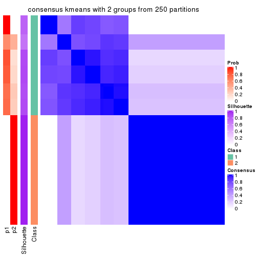</p>

</div>
<div id='tab-ATC-kmeans-consensus-heatmap-2'>
<pre><code class="r">consensus_heatmap(res, k = 3)
</code></pre>

<p>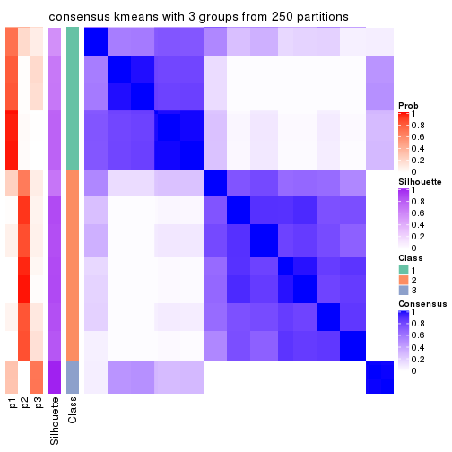</p>

</div>
<div id='tab-ATC-kmeans-consensus-heatmap-3'>
<pre><code class="r">consensus_heatmap(res, k = 4)
</code></pre>

<p>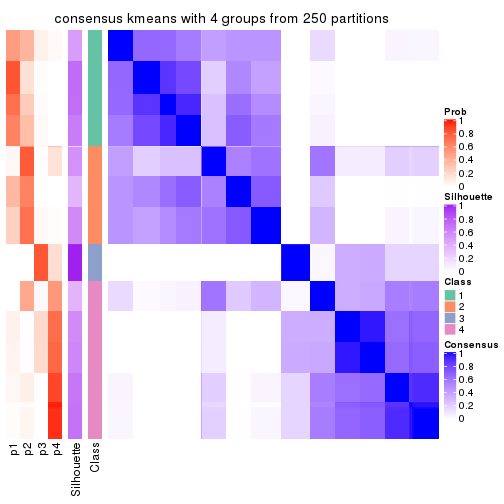</p>

</div>
<div id='tab-ATC-kmeans-consensus-heatmap-4'>
<pre><code class="r">consensus_heatmap(res, k = 5)
</code></pre>

<p>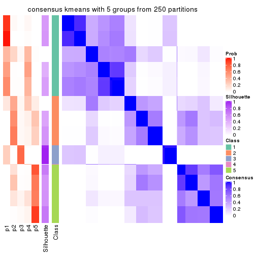</p>

</div>
<div id='tab-ATC-kmeans-consensus-heatmap-5'>
<pre><code class="r">consensus_heatmap(res, k = 6)
</code></pre>

<p>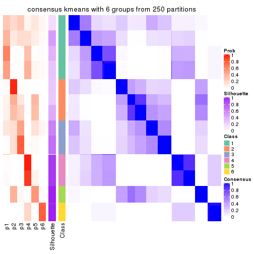</p>

</div>
</div>

Heatmaps for the membership of samples in all partitions to see how consistent they are:


<script>
$( function() {
	$( '#tabs-ATC-kmeans-membership-heatmap' ).tabs();
} );
</script>
<div id='tabs-ATC-kmeans-membership-heatmap'>
<ul>
<li><a href='#tab-ATC-kmeans-membership-heatmap-1'>k = 2</a></li>
<li><a href='#tab-ATC-kmeans-membership-heatmap-2'>k = 3</a></li>
<li><a href='#tab-ATC-kmeans-membership-heatmap-3'>k = 4</a></li>
<li><a href='#tab-ATC-kmeans-membership-heatmap-4'>k = 5</a></li>
<li><a href='#tab-ATC-kmeans-membership-heatmap-5'>k = 6</a></li>
</ul>
<div id='tab-ATC-kmeans-membership-heatmap-1'>
<pre><code class="r">membership_heatmap(res, k = 2)
</code></pre>

<p>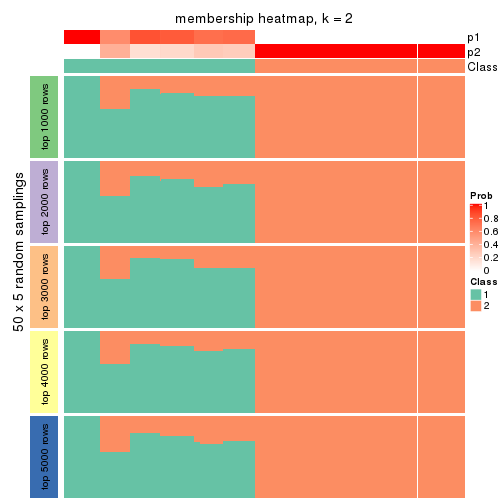</p>

</div>
<div id='tab-ATC-kmeans-membership-heatmap-2'>
<pre><code class="r">membership_heatmap(res, k = 3)
</code></pre>

<p>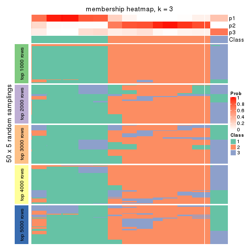</p>

</div>
<div id='tab-ATC-kmeans-membership-heatmap-3'>
<pre><code class="r">membership_heatmap(res, k = 4)
</code></pre>

<p>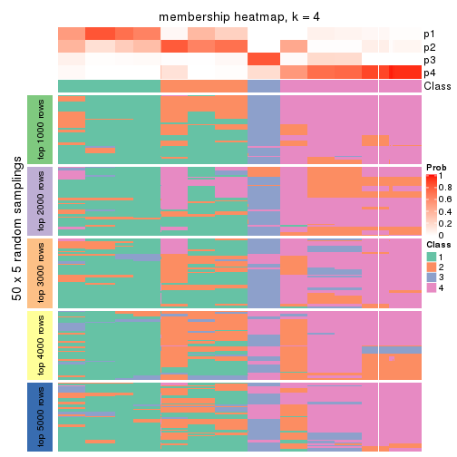</p>

</div>
<div id='tab-ATC-kmeans-membership-heatmap-4'>
<pre><code class="r">membership_heatmap(res, k = 5)
</code></pre>

<p>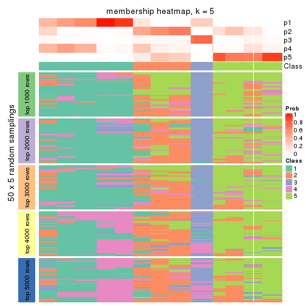</p>

</div>
<div id='tab-ATC-kmeans-membership-heatmap-5'>
<pre><code class="r">membership_heatmap(res, k = 6)
</code></pre>

<p>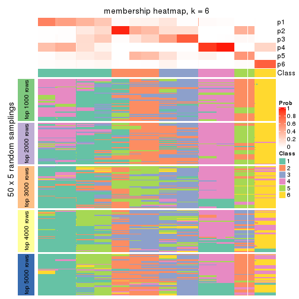</p>

</div>
</div>

As soon as we have had the classes for columns, we can look for signatures
which are significantly different between classes which can be candidate marks
for certain classes. Following are the heatmaps for signatures.


Signature heatmaps where rows are scaled:


<script>
$( function() {
	$( '#tabs-ATC-kmeans-get-signatures' ).tabs();
} );
</script>
<div id='tabs-ATC-kmeans-get-signatures'>
<ul>
<li><a href='#tab-ATC-kmeans-get-signatures-1'>k = 2</a></li>
<li><a href='#tab-ATC-kmeans-get-signatures-2'>k = 3</a></li>
<li><a href='#tab-ATC-kmeans-get-signatures-3'>k = 4</a></li>
<li><a href='#tab-ATC-kmeans-get-signatures-4'>k = 5</a></li>
<li><a href='#tab-ATC-kmeans-get-signatures-5'>k = 6</a></li>
</ul>
<div id='tab-ATC-kmeans-get-signatures-1'>
<pre><code class="r">get_signatures(res, k = 2)
</code></pre>

<p>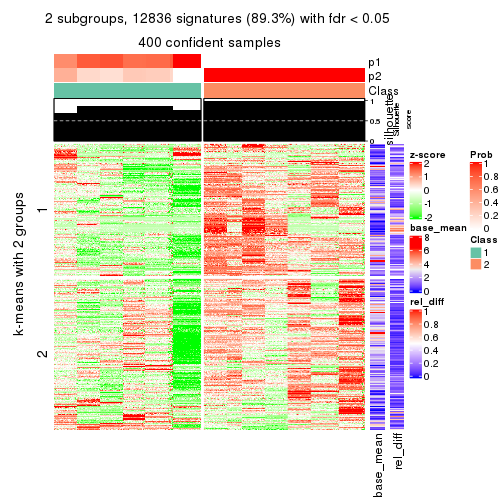</p>

</div>
<div id='tab-ATC-kmeans-get-signatures-2'>
<pre><code class="r">get_signatures(res, k = 3)
</code></pre>

<pre><code>#&gt; Error in mat[ceiling(1:nr/h_ratio), ceiling(1:nc/w_ratio), drop = FALSE]: subscript out of bounds
</code></pre>

<p>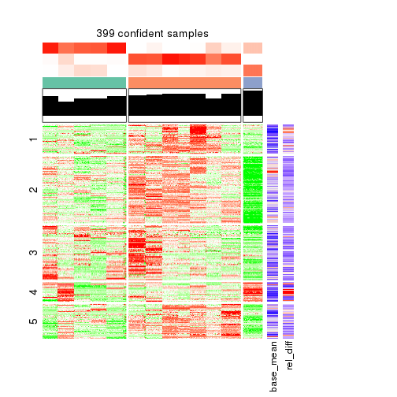</p>

</div>
<div id='tab-ATC-kmeans-get-signatures-3'>
<pre><code class="r">get_signatures(res, k = 4)
</code></pre>

<p>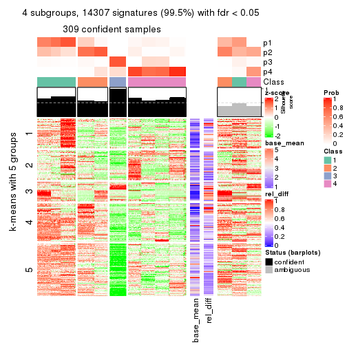</p>

</div>
<div id='tab-ATC-kmeans-get-signatures-4'>
<pre><code class="r">get_signatures(res, k = 5)
</code></pre>

<p>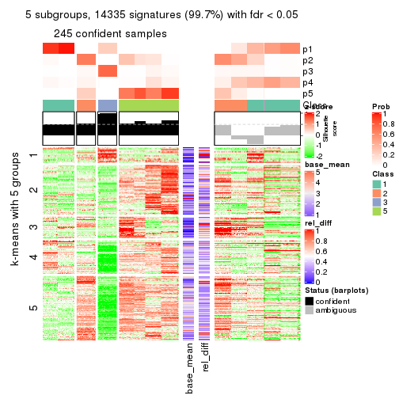</p>

</div>
<div id='tab-ATC-kmeans-get-signatures-5'>
<pre><code class="r">get_signatures(res, k = 6)
</code></pre>

<p>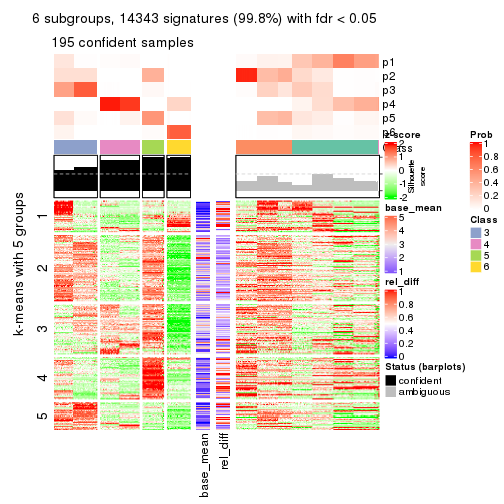</p>

</div>
</div>


Signature heatmaps where rows are not scaled:


<script>
$( function() {
	$( '#tabs-ATC-kmeans-get-signatures-no-scale' ).tabs();
} );
</script>
<div id='tabs-ATC-kmeans-get-signatures-no-scale'>
<ul>
<li><a href='#tab-ATC-kmeans-get-signatures-no-scale-1'>k = 2</a></li>
<li><a href='#tab-ATC-kmeans-get-signatures-no-scale-2'>k = 3</a></li>
<li><a href='#tab-ATC-kmeans-get-signatures-no-scale-3'>k = 4</a></li>
<li><a href='#tab-ATC-kmeans-get-signatures-no-scale-4'>k = 5</a></li>
<li><a href='#tab-ATC-kmeans-get-signatures-no-scale-5'>k = 6</a></li>
</ul>
<div id='tab-ATC-kmeans-get-signatures-no-scale-1'>
<pre><code class="r">get_signatures(res, k = 2, scale_rows = FALSE)
</code></pre>

<p>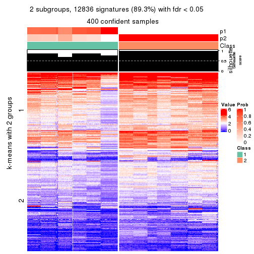</p>

</div>
<div id='tab-ATC-kmeans-get-signatures-no-scale-2'>
<pre><code class="r">get_signatures(res, k = 3, scale_rows = FALSE)
</code></pre>

<pre><code>#&gt; Error in mat[ceiling(1:nr/h_ratio), ceiling(1:nc/w_ratio), drop = FALSE]: subscript out of bounds
</code></pre>

<p>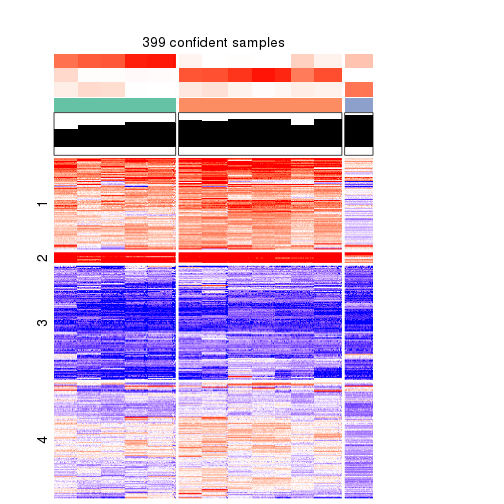</p>

</div>
<div id='tab-ATC-kmeans-get-signatures-no-scale-3'>
<pre><code class="r">get_signatures(res, k = 4, scale_rows = FALSE)
</code></pre>

<p>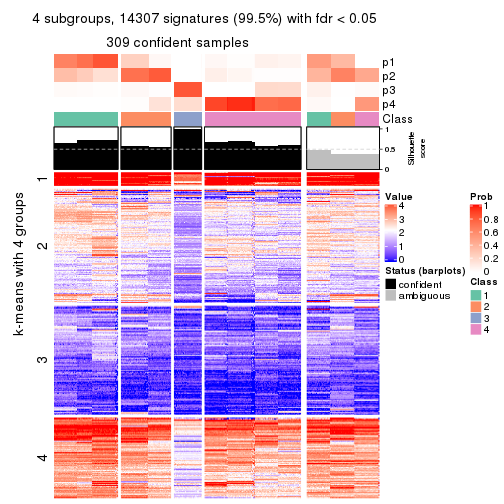</p>

</div>
<div id='tab-ATC-kmeans-get-signatures-no-scale-4'>
<pre><code class="r">get_signatures(res, k = 5, scale_rows = FALSE)
</code></pre>

<p>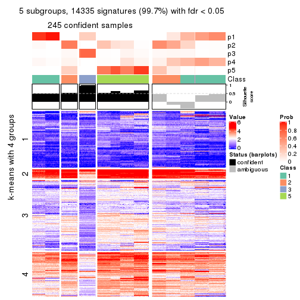</p>

</div>
<div id='tab-ATC-kmeans-get-signatures-no-scale-5'>
<pre><code class="r">get_signatures(res, k = 6, scale_rows = FALSE)
</code></pre>

<p>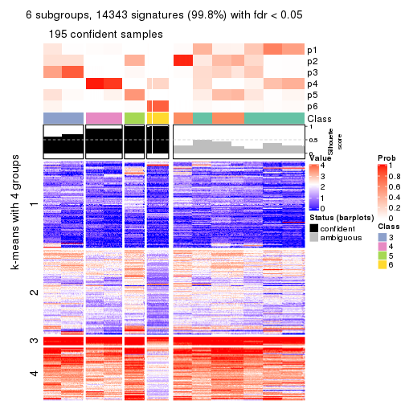</p>

</div>
</div>


Compare the overlap of signatures from different k:

```r
compare_signatures(res)
```

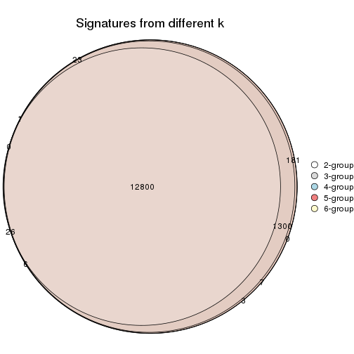

`get_signature()` returns a data frame invisibly. TO get the list of signatures, the function
call should be assigned to a variable explicitly. In following code, if `plot` argument is set
to `FALSE`, no heatmap is plotted while only the differential analysis is performed.

```r
# code only for demonstration
tb = get_signature(res, k = ..., plot = FALSE)
```

An example of the output of `tb` is:

```
#>   which_row         fdr    mean_1    mean_2 scaled_mean_1 scaled_mean_2 km
#> 1        38 0.042760348  8.373488  9.131774    -0.5533452     0.5164555  1
#> 2        40 0.018707592  7.106213  8.469186    -0.6173731     0.5762149  1
#> 3        55 0.019134737 10.221463 11.207825    -0.6159697     0.5749050  1
#> 4        59 0.006059896  5.921854  7.869574    -0.6899429     0.6439467  1
#> 5        60 0.018055526  8.928898 10.211722    -0.6204761     0.5791110  1
#> 6        98 0.009384629 15.714769 14.887706     0.6635654    -0.6193277  2
...
```

The columns in `tb` are:

1. `which_row`: row indices corresponding to the input matrix.
2. `fdr`: FDR for the differential test. 
3. `mean_x`: The mean value in group x.
4. `scaled_mean_x`: The mean value in group x after rows are scaled.
5. `km`: Row groups if k-means clustering is applied to rows.


UMAP plot which shows how samples are separated.


<script>
$( function() {
	$( '#tabs-ATC-kmeans-dimension-reduction' ).tabs();
} );
</script>
<div id='tabs-ATC-kmeans-dimension-reduction'>
<ul>
<li><a href='#tab-ATC-kmeans-dimension-reduction-1'>k = 2</a></li>
<li><a href='#tab-ATC-kmeans-dimension-reduction-2'>k = 3</a></li>
<li><a href='#tab-ATC-kmeans-dimension-reduction-3'>k = 4</a></li>
<li><a href='#tab-ATC-kmeans-dimension-reduction-4'>k = 5</a></li>
<li><a href='#tab-ATC-kmeans-dimension-reduction-5'>k = 6</a></li>
</ul>
<div id='tab-ATC-kmeans-dimension-reduction-1'>
<pre><code class="r">dimension_reduction(res, k = 2, method = &quot;UMAP&quot;)
</code></pre>

<p>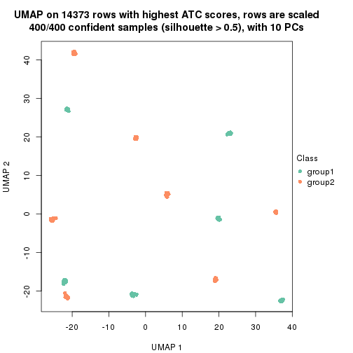</p>

</div>
<div id='tab-ATC-kmeans-dimension-reduction-2'>
<pre><code class="r">dimension_reduction(res, k = 3, method = &quot;UMAP&quot;)
</code></pre>

<p>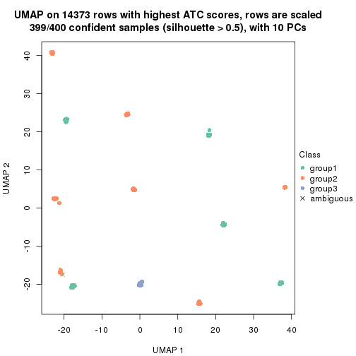</p>

</div>
<div id='tab-ATC-kmeans-dimension-reduction-3'>
<pre><code class="r">dimension_reduction(res, k = 4, method = &quot;UMAP&quot;)
</code></pre>

<p>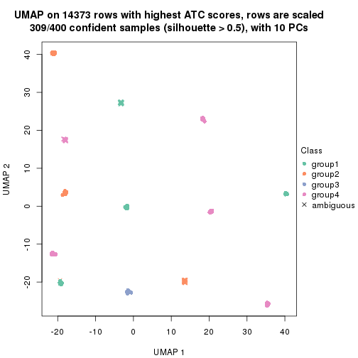</p>

</div>
<div id='tab-ATC-kmeans-dimension-reduction-4'>
<pre><code class="r">dimension_reduction(res, k = 5, method = &quot;UMAP&quot;)
</code></pre>

<p>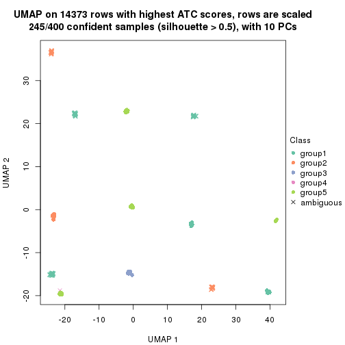</p>

</div>
<div id='tab-ATC-kmeans-dimension-reduction-5'>
<pre><code class="r">dimension_reduction(res, k = 6, method = &quot;UMAP&quot;)
</code></pre>

<p>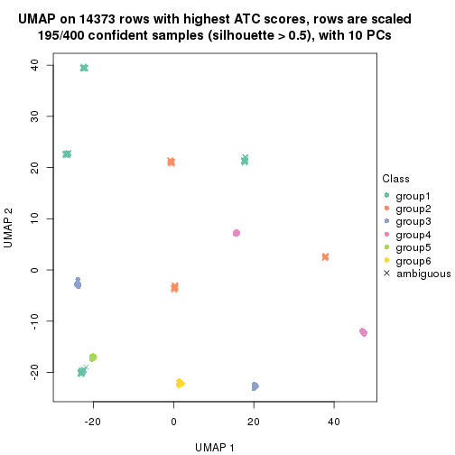</p>

</div>
</div>


Following heatmap shows how subgroups are split when increasing `k`:

```r
collect_classes(res)
```

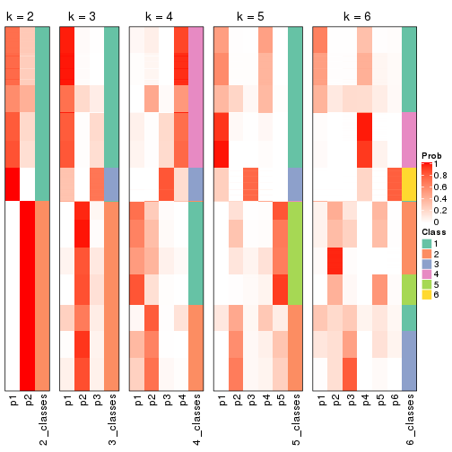


If matrix rows can be associated to genes, consider to use `GO_Enrichment(res,
...)` to perform function enrichment for the signature genes.


 

---------------------------------------------------


### ATC:skmeans**


The object with results only for a single top-value method and a single partition method 
can be extracted as:

```r
res = res_list["ATC", "skmeans"]
# you can also extract it by
# res = res_list["ATC:skmeans"]
```

A summary of `res` and all the functions that can be applied to it:

```r
res
```

```
#> A 'ConsensusPartition' object with k = 2, 3, 4, 5, 6.
#>   On a matrix with 14373 rows and 400 columns.
#>   Top rows (1000, 2000, 3000, 4000, 5000) are extracted by 'ATC' method.
#>   Subgroups are detected by 'skmeans' method.
#>   Performed in total 1250 partitions by row resampling.
#>   Best k for subgroups seems to be 2.
#> 
#> Following methods can be applied to this 'ConsensusPartition' object:
#>  [1] "cola_report"             "collect_classes"         "collect_plots"          
#>  [4] "collect_stats"           "colnames"                "compare_signatures"     
#>  [7] "consensus_heatmap"       "dimension_reduction"     "functional_enrichment"  
#> [10] "get_anno_col"            "get_anno"                "get_classes"            
#> [13] "get_consensus"           "get_matrix"              "get_membership"         
#> [16] "get_param"               "get_signatures"          "get_stats"              
#> [19] "is_best_k"               "is_stable_k"             "membership_heatmap"     
#> [22] "ncol"                    "nrow"                    "plot_ecdf"              
#> [25] "rownames"                "select_partition_number" "show"                   
#> [28] "suggest_best_k"          "test_to_known_factors"
```

`collect_plots()` function collects all the plots made from `res` for all `k` (number of partitions)
into one single page to provide an easy and fast comparison between different `k`.

```r
collect_plots(res)
```

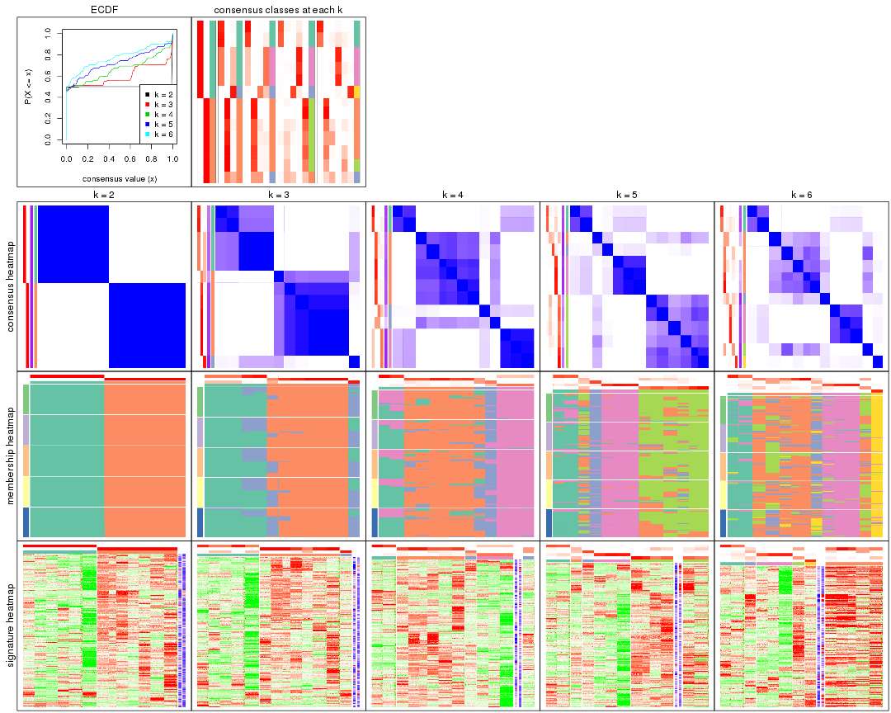

The plots are:

- The first row: a plot of the ECDF (Empirical cumulative distribution
  function) curves of the consensus matrix for each `k` and the heatmap of
  predicted classes for each `k`.
- The second row: heatmaps of the consensus matrix for each `k`.
- The third row: heatmaps of the membership matrix for each `k`.
- The fouth row: heatmaps of the signatures for each `k`.

All the plots in panels can be made by individual functions and they are
plotted later in this section.

`select_partition_number()` produces several plots showing different
statistics for choosing "optimized" `k`. There are following statistics:

- ECDF curves of the consensus matrix for each `k`;
- 1-PAC. [The PAC
  score](https://en.wikipedia.org/wiki/Consensus_clustering#Over-interpretation_potential_of_consensus_clustering)
  measures the proportion of the ambiguous subgrouping.
- Mean silhouette score.
- Concordance. The mean probability of fiting the consensus class ids in all
  partitions.
- Area increased. Denote $A_k$ as the area under the ECDF curve for current
  `k`, the area increased is defined as $A_k - A_{k-1}$.
- Rand index. The percent of pairs of samples that are both in a same cluster
  or both are not in a same cluster in the partition of k and k-1.
- Jaccard index. The ratio of pairs of samples are both in a same cluster in
  the partition of k and k-1 and the pairs of samples are both in a same
  cluster in the partition k or k-1.

The detailed explanations of these statistics can be found in [the cola
vignette](http://bioconductor.org/packages/devel/bioc/vignettes/cola/inst/doc/cola.html#toc_13).

Generally speaking, lower PAC score, higher mean silhouette score or higher
concordance corresponds to better partition. Rand index and Jaccard index
measure how similar the current partition is compared to partition with `k-1`.
If they are too similar, we won't accept `k` is better than `k-1`.

```r
select_partition_number(res)
```

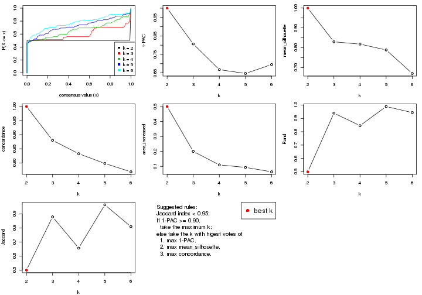

The numeric values for all these statistics can be obtained by `get_stats()`.

```r
get_stats(res)
```

```
#>   k 1-PAC mean_silhouette concordance area_increased  Rand Jaccard
#> 2 2 1.000           0.999       1.000         0.5008 0.500   0.500
#> 3 3 0.806           0.830       0.880         0.2000 0.939   0.879
#> 4 4 0.667           0.818       0.833         0.1095 0.845   0.657
#> 5 5 0.647           0.789       0.798         0.0930 0.989   0.964
#> 6 6 0.695           0.670       0.769         0.0634 0.944   0.809
```

`suggest_best_k()` suggests the best $k$ based on these statistics. The rules are as follows:

- All $k$ with Jaccard index larger than 0.95 are removed because the increase of
  the partition number does not provides enough extra information. If all $k$ are removed,
  the best $k$ is assigned by `NA`.
- For $k$ with 1-PAC larger than 0.9, the maximal $k$ is taken as the "best k". Other $k$ is called "optional k".
- If it does not fit the second rule. The $k$ with the highest vote of highest
  1-PAC, mean silhouette and concordance is taken as the "best k".

```r
suggest_best_k(res)
```

```
#> [1] 2
```


Following shows the table of the partitions (You need to click the **show/hide
code output** link to see it). The membership matrix (columns with name `p*`)
is inferred by
[`clue::cl_consensus()`](https://www.rdocumentation.org/link/cl_consensus?package=clue)
function with the `SE` method. Basically the value in the membership matrix
represents the probability to belong to a certain group. The finall class
label for an item is determined with the group with highest probability it
belongs to.

In `get_classes()` function, the entropy is calculated from the membership
matrix and the silhouette score is calculated from the consensus matrix.


<script>
$( function() {
	$( '#tabs-ATC-skmeans-get-classes' ).tabs();
} );
</script>
<div id='tabs-ATC-skmeans-get-classes'>
<ul>
<li><a href='#tab-ATC-skmeans-get-classes-1'>k = 2</a></li>
<li><a href='#tab-ATC-skmeans-get-classes-2'>k = 3</a></li>
<li><a href='#tab-ATC-skmeans-get-classes-3'>k = 4</a></li>
<li><a href='#tab-ATC-skmeans-get-classes-4'>k = 5</a></li>
<li><a href='#tab-ATC-skmeans-get-classes-5'>k = 6</a></li>
</ul>

<div id='tab-ATC-skmeans-get-classes-1'>
<p><a id='tab-ATC-skmeans-get-classes-1-a' style='color:#0366d6' href='#'>show/hide code output</a></p>
<pre><code class="r">cbind(get_classes(res, k = 2), get_membership(res, k = 2))
</code></pre>

<pre><code>#&gt;            class entropy silhouette    p1    p2
#&gt; SRR1661716     2   0.000      0.999 0.000 1.000
#&gt; SRR1661717     2   0.000      0.999 0.000 1.000
#&gt; SRR1661718     2   0.000      0.999 0.000 1.000
#&gt; SRR1661719     2   0.000      0.999 0.000 1.000
#&gt; SRR1661720     2   0.000      0.999 0.000 1.000
#&gt; SRR1661721     2   0.000      0.999 0.000 1.000
#&gt; SRR1661722     2   0.000      0.999 0.000 1.000
#&gt; SRR1661723     2   0.000      0.999 0.000 1.000
#&gt; SRR1661724     2   0.000      0.999 0.000 1.000
#&gt; SRR1661725     2   0.000      0.999 0.000 1.000
#&gt; SRR1661726     2   0.000      0.999 0.000 1.000
#&gt; SRR1661727     2   0.000      0.999 0.000 1.000
#&gt; SRR1661728     2   0.000      0.999 0.000 1.000
#&gt; SRR1661729     2   0.000      0.999 0.000 1.000
#&gt; SRR1661730     2   0.000      0.999 0.000 1.000
#&gt; SRR1661731     2   0.000      0.999 0.000 1.000
#&gt; SRR1661732     2   0.000      0.999 0.000 1.000
#&gt; SRR1661733     2   0.000      0.999 0.000 1.000
#&gt; SRR1661734     2   0.000      0.999 0.000 1.000
#&gt; SRR1661735     2   0.000      0.999 0.000 1.000
#&gt; SRR1661736     2   0.000      0.999 0.000 1.000
#&gt; SRR1661737     2   0.000      0.999 0.000 1.000
#&gt; SRR1661738     2   0.000      0.999 0.000 1.000
#&gt; SRR1661739     2   0.000      0.999 0.000 1.000
#&gt; SRR1661740     2   0.000      0.999 0.000 1.000
#&gt; SRR1661741     2   0.000      0.999 0.000 1.000
#&gt; SRR1661742     2   0.000      0.999 0.000 1.000
#&gt; SRR1661743     2   0.000      0.999 0.000 1.000
#&gt; SRR1661744     2   0.000      0.999 0.000 1.000
#&gt; SRR1661745     2   0.000      0.999 0.000 1.000
#&gt; SRR1661746     2   0.000      0.999 0.000 1.000
#&gt; SRR1661747     2   0.000      0.999 0.000 1.000
#&gt; SRR1661748     2   0.000      0.999 0.000 1.000
#&gt; SRR1661749     2   0.000      0.999 0.000 1.000
#&gt; SRR1661750     2   0.000      0.999 0.000 1.000
#&gt; SRR1661751     2   0.000      0.999 0.000 1.000
#&gt; SRR1661752     2   0.000      0.999 0.000 1.000
#&gt; SRR1661753     2   0.000      0.999 0.000 1.000
#&gt; SRR1661754     2   0.000      0.999 0.000 1.000
#&gt; SRR1661755     2   0.000      0.999 0.000 1.000
#&gt; SRR1661756     2   0.000      0.999 0.000 1.000
#&gt; SRR1661757     2   0.000      0.999 0.000 1.000
#&gt; SRR1661758     2   0.000      0.999 0.000 1.000
#&gt; SRR1661759     2   0.000      0.999 0.000 1.000
#&gt; SRR1661760     2   0.000      0.999 0.000 1.000
#&gt; SRR1661761     2   0.000      0.999 0.000 1.000
#&gt; SRR1661762     2   0.000      0.999 0.000 1.000
#&gt; SRR1661763     2   0.000      0.999 0.000 1.000
#&gt; SRR1661764     2   0.000      0.999 0.000 1.000
#&gt; SRR1661766     2   0.000      0.999 0.000 1.000
#&gt; SRR1661767     2   0.000      0.999 0.000 1.000
#&gt; SRR1661768     2   0.000      0.999 0.000 1.000
#&gt; SRR1661769     2   0.000      0.999 0.000 1.000
#&gt; SRR1661770     2   0.000      0.999 0.000 1.000
#&gt; SRR1661771     2   0.000      0.999 0.000 1.000
#&gt; SRR1661772     2   0.000      0.999 0.000 1.000
#&gt; SRR1661773     2   0.000      0.999 0.000 1.000
#&gt; SRR1661774     2   0.000      0.999 0.000 1.000
#&gt; SRR1661775     2   0.000      0.999 0.000 1.000
#&gt; SRR1661776     2   0.000      0.999 0.000 1.000
#&gt; SRR1661777     2   0.000      0.999 0.000 1.000
#&gt; SRR1661778     2   0.000      0.999 0.000 1.000
#&gt; SRR1661779     2   0.000      0.999 0.000 1.000
#&gt; SRR1661780     2   0.000      0.999 0.000 1.000
#&gt; SRR1661781     2   0.000      0.999 0.000 1.000
#&gt; SRR1661782     2   0.000      0.999 0.000 1.000
#&gt; SRR1661783     2   0.000      0.999 0.000 1.000
#&gt; SRR1661784     2   0.000      0.999 0.000 1.000
#&gt; SRR1661785     2   0.000      0.999 0.000 1.000
#&gt; SRR1661786     2   0.000      0.999 0.000 1.000
#&gt; SRR1661787     2   0.000      0.999 0.000 1.000
#&gt; SRR1661788     2   0.000      0.999 0.000 1.000
#&gt; SRR1661789     2   0.000      0.999 0.000 1.000
#&gt; SRR1661790     2   0.000      0.999 0.000 1.000
#&gt; SRR1661791     2   0.000      0.999 0.000 1.000
#&gt; SRR1661792     2   0.000      0.999 0.000 1.000
#&gt; SRR1661793     2   0.000      0.999 0.000 1.000
#&gt; SRR1661794     2   0.000      0.999 0.000 1.000
#&gt; SRR1661795     2   0.000      0.999 0.000 1.000
#&gt; SRR1661796     2   0.000      0.999 0.000 1.000
#&gt; SRR1661797     2   0.000      0.999 0.000 1.000
#&gt; SRR1661798     2   0.000      0.999 0.000 1.000
#&gt; SRR1661799     2   0.000      0.999 0.000 1.000
#&gt; SRR1661800     2   0.000      0.999 0.000 1.000
#&gt; SRR1661801     2   0.000      0.999 0.000 1.000
#&gt; SRR1661802     2   0.000      0.999 0.000 1.000
#&gt; SRR1661803     2   0.000      0.999 0.000 1.000
#&gt; SRR1661804     2   0.000      0.999 0.000 1.000
#&gt; SRR1661805     2   0.000      0.999 0.000 1.000
#&gt; SRR1661806     2   0.000      0.999 0.000 1.000
#&gt; SRR1661807     2   0.000      0.999 0.000 1.000
#&gt; SRR1661808     2   0.000      0.999 0.000 1.000
#&gt; SRR1661809     2   0.000      0.999 0.000 1.000
#&gt; SRR1661810     2   0.000      0.999 0.000 1.000
#&gt; SRR1661811     2   0.000      0.999 0.000 1.000
#&gt; SRR1661812     2   0.000      0.999 0.000 1.000
#&gt; SRR1661813     2   0.000      0.999 0.000 1.000
#&gt; SRR1661814     2   0.000      0.999 0.000 1.000
#&gt; SRR1661815     2   0.000      0.999 0.000 1.000
#&gt; SRR1661816     2   0.000      0.999 0.000 1.000
#&gt; SRR1661817     2   0.000      0.999 0.000 1.000
#&gt; SRR1661818     2   0.000      0.999 0.000 1.000
#&gt; SRR1661819     2   0.000      0.999 0.000 1.000
#&gt; SRR1661820     2   0.000      0.999 0.000 1.000
#&gt; SRR1661821     2   0.000      0.999 0.000 1.000
#&gt; SRR1661822     2   0.000      0.999 0.000 1.000
#&gt; SRR1661823     2   0.000      0.999 0.000 1.000
#&gt; SRR1661824     2   0.000      0.999 0.000 1.000
#&gt; SRR1661825     2   0.000      0.999 0.000 1.000
#&gt; SRR1661826     1   0.000      1.000 1.000 0.000
#&gt; SRR1661827     1   0.000      1.000 1.000 0.000
#&gt; SRR1661828     1   0.000      1.000 1.000 0.000
#&gt; SRR1661829     1   0.000      1.000 1.000 0.000
#&gt; SRR1661830     1   0.000      1.000 1.000 0.000
#&gt; SRR1661831     1   0.000      1.000 1.000 0.000
#&gt; SRR1661832     1   0.000      1.000 1.000 0.000
#&gt; SRR1661833     1   0.000      1.000 1.000 0.000
#&gt; SRR1661834     1   0.000      1.000 1.000 0.000
#&gt; SRR1661835     1   0.000      1.000 1.000 0.000
#&gt; SRR1661836     1   0.000      1.000 1.000 0.000
#&gt; SRR1661837     1   0.000      1.000 1.000 0.000
#&gt; SRR1661838     1   0.000      1.000 1.000 0.000
#&gt; SRR1661839     1   0.000      1.000 1.000 0.000
#&gt; SRR1661840     1   0.000      1.000 1.000 0.000
#&gt; SRR1661841     1   0.000      1.000 1.000 0.000
#&gt; SRR1661843     1   0.000      1.000 1.000 0.000
#&gt; SRR1661844     1   0.000      1.000 1.000 0.000
#&gt; SRR1661845     1   0.000      1.000 1.000 0.000
#&gt; SRR1661846     1   0.000      1.000 1.000 0.000
#&gt; SRR1661847     1   0.000      1.000 1.000 0.000
#&gt; SRR1661848     1   0.000      1.000 1.000 0.000
#&gt; SRR1661849     1   0.000      1.000 1.000 0.000
#&gt; SRR1661850     1   0.000      1.000 1.000 0.000
#&gt; SRR1661851     1   0.000      1.000 1.000 0.000
#&gt; SRR1661852     1   0.000      1.000 1.000 0.000
#&gt; SRR1661853     1   0.000      1.000 1.000 0.000
#&gt; SRR1661854     1   0.000      1.000 1.000 0.000
#&gt; SRR1661855     1   0.000      1.000 1.000 0.000
#&gt; SRR1661856     1   0.000      1.000 1.000 0.000
#&gt; SRR1661857     1   0.000      1.000 1.000 0.000
#&gt; SRR1661858     1   0.000      1.000 1.000 0.000
#&gt; SRR1661859     1   0.000      1.000 1.000 0.000
#&gt; SRR1661860     1   0.000      1.000 1.000 0.000
#&gt; SRR1661861     1   0.000      1.000 1.000 0.000
#&gt; SRR1661862     1   0.000      1.000 1.000 0.000
#&gt; SRR1661863     1   0.000      1.000 1.000 0.000
#&gt; SRR1661864     1   0.000      1.000 1.000 0.000
#&gt; SRR1661865     1   0.000      1.000 1.000 0.000
#&gt; SRR1661866     1   0.000      1.000 1.000 0.000
#&gt; SRR1661867     1   0.000      1.000 1.000 0.000
#&gt; SRR1661868     1   0.000      1.000 1.000 0.000
#&gt; SRR1661869     1   0.000      1.000 1.000 0.000
#&gt; SRR1661870     1   0.000      1.000 1.000 0.000
#&gt; SRR1661871     1   0.000      1.000 1.000 0.000
#&gt; SRR1661872     1   0.000      1.000 1.000 0.000
#&gt; SRR1661873     1   0.000      1.000 1.000 0.000
#&gt; SRR1661874     1   0.000      1.000 1.000 0.000
#&gt; SRR1661875     1   0.000      1.000 1.000 0.000
#&gt; SRR1661876     1   0.000      1.000 1.000 0.000
#&gt; SRR1661877     1   0.000      1.000 1.000 0.000
#&gt; SRR1661878     1   0.000      1.000 1.000 0.000
#&gt; SRR1661879     1   0.000      1.000 1.000 0.000
#&gt; SRR1661880     1   0.000      1.000 1.000 0.000
#&gt; SRR1661881     1   0.000      1.000 1.000 0.000
#&gt; SRR1661882     1   0.000      1.000 1.000 0.000
#&gt; SRR1661883     1   0.000      1.000 1.000 0.000
#&gt; SRR1661884     1   0.000      1.000 1.000 0.000
#&gt; SRR1661885     1   0.000      1.000 1.000 0.000
#&gt; SRR1661886     1   0.000      1.000 1.000 0.000
#&gt; SRR1661887     1   0.000      1.000 1.000 0.000
#&gt; SRR1661888     1   0.000      1.000 1.000 0.000
#&gt; SRR1661889     1   0.000      1.000 1.000 0.000
#&gt; SRR1661890     1   0.000      1.000 1.000 0.000
#&gt; SRR1661891     1   0.000      1.000 1.000 0.000
#&gt; SRR1661892     1   0.000      1.000 1.000 0.000
#&gt; SRR1661893     1   0.000      1.000 1.000 0.000
#&gt; SRR1661894     1   0.000      1.000 1.000 0.000
#&gt; SRR1661895     1   0.000      1.000 1.000 0.000
#&gt; SRR1661896     1   0.000      1.000 1.000 0.000
#&gt; SRR1661897     1   0.000      1.000 1.000 0.000
#&gt; SRR1661898     1   0.000      1.000 1.000 0.000
#&gt; SRR1661899     1   0.000      1.000 1.000 0.000
#&gt; SRR1661900     1   0.000      1.000 1.000 0.000
#&gt; SRR1661901     1   0.000      1.000 1.000 0.000
#&gt; SRR1661902     1   0.000      1.000 1.000 0.000
#&gt; SRR1661903     1   0.000      1.000 1.000 0.000
#&gt; SRR1661904     1   0.000      1.000 1.000 0.000
#&gt; SRR1661905     1   0.000      1.000 1.000 0.000
#&gt; SRR1661906     1   0.000      1.000 1.000 0.000
#&gt; SRR1661907     1   0.000      1.000 1.000 0.000
#&gt; SRR1661908     1   0.000      1.000 1.000 0.000
#&gt; SRR1661909     1   0.000      1.000 1.000 0.000
#&gt; SRR1661910     1   0.000      1.000 1.000 0.000
#&gt; SRR1661911     1   0.000      1.000 1.000 0.000
#&gt; SRR1661912     1   0.000      1.000 1.000 0.000
#&gt; SRR1661913     1   0.000      1.000 1.000 0.000
#&gt; SRR1661914     1   0.000      1.000 1.000 0.000
#&gt; SRR1661915     1   0.000      1.000 1.000 0.000
#&gt; SRR1661916     1   0.000      1.000 1.000 0.000
#&gt; SRR1661917     1   0.000      1.000 1.000 0.000
#&gt; SRR1661918     1   0.000      1.000 1.000 0.000
#&gt; SRR1661919     1   0.000      1.000 1.000 0.000
#&gt; SRR1661920     1   0.000      1.000 1.000 0.000
#&gt; SRR1661921     1   0.000      1.000 1.000 0.000
#&gt; SRR1661922     1   0.000      1.000 1.000 0.000
#&gt; SRR1661923     1   0.000      1.000 1.000 0.000
#&gt; SRR1661924     1   0.000      1.000 1.000 0.000
#&gt; SRR1661925     1   0.000      1.000 1.000 0.000
#&gt; SRR1661926     1   0.000      1.000 1.000 0.000
#&gt; SRR1661927     1   0.000      1.000 1.000 0.000
#&gt; SRR1661928     1   0.000      1.000 1.000 0.000
#&gt; SRR1661929     1   0.000      1.000 1.000 0.000
#&gt; SRR1661930     1   0.000      1.000 1.000 0.000
#&gt; SRR1661931     1   0.000      1.000 1.000 0.000
#&gt; SRR1661932     1   0.000      1.000 1.000 0.000
#&gt; SRR1661933     1   0.000      1.000 1.000 0.000
#&gt; SRR1661934     1   0.000      1.000 1.000 0.000
#&gt; SRR1661935     1   0.000      1.000 1.000 0.000
#&gt; SRR1661936     1   0.000      1.000 1.000 0.000
#&gt; SRR1661937     1   0.000      1.000 1.000 0.000
#&gt; SRR1661938     1   0.000      1.000 1.000 0.000
#&gt; SRR1661939     1   0.000      1.000 1.000 0.000
#&gt; SRR1661940     1   0.000      1.000 1.000 0.000
#&gt; SRR1661941     1   0.000      1.000 1.000 0.000
#&gt; SRR1661942     1   0.000      1.000 1.000 0.000
#&gt; SRR1661943     1   0.000      1.000 1.000 0.000
#&gt; SRR1661944     1   0.000      1.000 1.000 0.000
#&gt; SRR1661945     1   0.000      1.000 1.000 0.000
#&gt; SRR1661946     1   0.000      1.000 1.000 0.000
#&gt; SRR1661947     1   0.000      1.000 1.000 0.000
#&gt; SRR1661948     1   0.000      1.000 1.000 0.000
#&gt; SRR1661949     1   0.000      1.000 1.000 0.000
#&gt; SRR1661950     1   0.000      1.000 1.000 0.000
#&gt; SRR1661951     1   0.000      1.000 1.000 0.000
#&gt; SRR1661952     1   0.000      1.000 1.000 0.000
#&gt; SRR1661953     1   0.000      1.000 1.000 0.000
#&gt; SRR1661954     1   0.000      1.000 1.000 0.000
#&gt; SRR1661955     1   0.000      1.000 1.000 0.000
#&gt; SRR1661956     1   0.000      1.000 1.000 0.000
#&gt; SRR1661957     1   0.000      1.000 1.000 0.000
#&gt; SRR1661958     1   0.000      1.000 1.000 0.000
#&gt; SRR1661959     1   0.000      1.000 1.000 0.000
#&gt; SRR1661960     1   0.000      1.000 1.000 0.000
#&gt; SRR1661961     1   0.000      1.000 1.000 0.000
#&gt; SRR1661962     1   0.000      1.000 1.000 0.000
#&gt; SRR1661963     1   0.000      1.000 1.000 0.000
#&gt; SRR1661964     1   0.000      1.000 1.000 0.000
#&gt; SRR1661965     1   0.000      1.000 1.000 0.000
#&gt; SRR1661966     1   0.000      1.000 1.000 0.000
#&gt; SRR1661967     1   0.000      1.000 1.000 0.000
#&gt; SRR1661968     1   0.000      1.000 1.000 0.000
#&gt; SRR1661969     1   0.000      1.000 1.000 0.000
#&gt; SRR1661970     1   0.000      1.000 1.000 0.000
#&gt; SRR1661971     1   0.000      1.000 1.000 0.000
#&gt; SRR1661972     1   0.000      1.000 1.000 0.000
#&gt; SRR1661973     1   0.000      1.000 1.000 0.000
#&gt; SRR1661974     1   0.000      1.000 1.000 0.000
#&gt; SRR1661975     1   0.000      1.000 1.000 0.000
#&gt; SRR1661976     1   0.000      1.000 1.000 0.000
#&gt; SRR1661977     1   0.000      1.000 1.000 0.000
#&gt; SRR1661978     1   0.000      1.000 1.000 0.000
#&gt; SRR1661979     1   0.000      1.000 1.000 0.000
#&gt; SRR1661980     1   0.000      1.000 1.000 0.000
#&gt; SRR1661981     1   0.000      1.000 1.000 0.000
#&gt; SRR1661982     1   0.000      1.000 1.000 0.000
#&gt; SRR1661983     1   0.000      1.000 1.000 0.000
#&gt; SRR1661984     1   0.000      1.000 1.000 0.000
#&gt; SRR1661985     1   0.000      1.000 1.000 0.000
#&gt; SRR1661986     1   0.000      1.000 1.000 0.000
#&gt; SRR1661987     1   0.000      1.000 1.000 0.000
#&gt; SRR1661988     2   0.000      0.999 0.000 1.000
#&gt; SRR1661989     2   0.000      0.999 0.000 1.000
#&gt; SRR1661990     2   0.000      0.999 0.000 1.000
#&gt; SRR1661991     2   0.000      0.999 0.000 1.000
#&gt; SRR1661992     2   0.000      0.999 0.000 1.000
#&gt; SRR1661993     2   0.000      0.999 0.000 1.000
#&gt; SRR1661994     2   0.000      0.999 0.000 1.000
#&gt; SRR1661995     2   0.000      0.999 0.000 1.000
#&gt; SRR1661996     2   0.000      0.999 0.000 1.000
#&gt; SRR1661997     2   0.000      0.999 0.000 1.000
#&gt; SRR1661998     2   0.000      0.999 0.000 1.000
#&gt; SRR1661999     2   0.000      0.999 0.000 1.000
#&gt; SRR1662000     2   0.000      0.999 0.000 1.000
#&gt; SRR1662001     2   0.000      0.999 0.000 1.000
#&gt; SRR1662002     2   0.000      0.999 0.000 1.000
#&gt; SRR1662003     2   0.000      0.999 0.000 1.000
#&gt; SRR1662004     2   0.000      0.999 0.000 1.000
#&gt; SRR1662005     2   0.000      0.999 0.000 1.000
#&gt; SRR1662006     2   0.000      0.999 0.000 1.000
#&gt; SRR1662007     2   0.000      0.999 0.000 1.000
#&gt; SRR1662008     2   0.000      0.999 0.000 1.000
#&gt; SRR1662009     2   0.000      0.999 0.000 1.000
#&gt; SRR1662010     2   0.000      0.999 0.000 1.000
#&gt; SRR1662011     2   0.000      0.999 0.000 1.000
#&gt; SRR1662012     2   0.000      0.999 0.000 1.000
#&gt; SRR1662013     2   0.000      0.999 0.000 1.000
#&gt; SRR1662014     2   0.000      0.999 0.000 1.000
#&gt; SRR1662015     2   0.000      0.999 0.000 1.000
#&gt; SRR1662016     2   0.000      0.999 0.000 1.000
#&gt; SRR1662017     2   0.000      0.999 0.000 1.000
#&gt; SRR1662018     2   0.000      0.999 0.000 1.000
#&gt; SRR1662019     2   0.000      0.999 0.000 1.000
#&gt; SRR1662020     2   0.000      0.999 0.000 1.000
#&gt; SRR1662021     2   0.000      0.999 0.000 1.000
#&gt; SRR1662022     2   0.000      0.999 0.000 1.000
#&gt; SRR1662023     2   0.000      0.999 0.000 1.000
#&gt; SRR1662024     2   0.000      0.999 0.000 1.000
#&gt; SRR1662025     2   0.000      0.999 0.000 1.000
#&gt; SRR1662026     2   0.000      0.999 0.000 1.000
#&gt; SRR1662027     2   0.000      0.999 0.000 1.000
#&gt; SRR1662028     2   0.000      0.999 0.000 1.000
#&gt; SRR1662029     2   0.000      0.999 0.000 1.000
#&gt; SRR1662030     2   0.000      0.999 0.000 1.000
#&gt; SRR1662031     2   0.000      0.999 0.000 1.000
#&gt; SRR1662032     2   0.000      0.999 0.000 1.000
#&gt; SRR1662033     2   0.000      0.999 0.000 1.000
#&gt; SRR1662034     2   0.000      0.999 0.000 1.000
#&gt; SRR1662035     2   0.000      0.999 0.000 1.000
#&gt; SRR1662036     2   0.000      0.999 0.000 1.000
#&gt; SRR1662037     2   0.000      0.999 0.000 1.000
#&gt; SRR1662038     2   0.000      0.999 0.000 1.000
#&gt; SRR1662039     2   0.000      0.999 0.000 1.000
#&gt; SRR1662040     2   0.000      0.999 0.000 1.000
#&gt; SRR1662041     2   0.000      0.999 0.000 1.000
#&gt; SRR1662042     2   0.000      0.999 0.000 1.000
#&gt; SRR1662043     2   0.000      0.999 0.000 1.000
#&gt; SRR1662044     2   0.000      0.999 0.000 1.000
#&gt; SRR1662045     2   0.000      0.999 0.000 1.000
#&gt; SRR1662046     2   0.000      0.999 0.000 1.000
#&gt; SRR1662047     2   0.000      0.999 0.000 1.000
#&gt; SRR1662048     2   0.000      0.999 0.000 1.000
#&gt; SRR1662049     2   0.000      0.999 0.000 1.000
#&gt; SRR1662050     2   0.000      0.999 0.000 1.000
#&gt; SRR1662051     2   0.000      0.999 0.000 1.000
#&gt; SRR1662052     2   0.000      0.999 0.000 1.000
#&gt; SRR1662053     2   0.000      0.999 0.000 1.000
#&gt; SRR1662054     1   0.000      1.000 1.000 0.000
#&gt; SRR1662055     1   0.000      1.000 1.000 0.000
#&gt; SRR1662056     1   0.000      1.000 1.000 0.000
#&gt; SRR1662057     1   0.000      1.000 1.000 0.000
#&gt; SRR1662058     1   0.000      1.000 1.000 0.000
#&gt; SRR1662059     1   0.000      1.000 1.000 0.000
#&gt; SRR1662060     1   0.000      1.000 1.000 0.000
#&gt; SRR1662061     1   0.000      1.000 1.000 0.000
#&gt; SRR1662062     1   0.000      1.000 1.000 0.000
#&gt; SRR1662063     1   0.000      1.000 1.000 0.000
#&gt; SRR1662064     1   0.000      1.000 1.000 0.000
#&gt; SRR1662065     1   0.000      1.000 1.000 0.000
#&gt; SRR1662066     1   0.000      1.000 1.000 0.000
#&gt; SRR1662067     1   0.000      1.000 1.000 0.000
#&gt; SRR1662068     1   0.000      1.000 1.000 0.000
#&gt; SRR1662069     1   0.000      1.000 1.000 0.000
#&gt; SRR1662070     1   0.000      1.000 1.000 0.000
#&gt; SRR1662071     1   0.000      1.000 1.000 0.000
#&gt; SRR1662072     1   0.000      1.000 1.000 0.000
#&gt; SRR1662073     1   0.000      1.000 1.000 0.000
#&gt; SRR1662074     1   0.000      1.000 1.000 0.000
#&gt; SRR1662075     1   0.000      1.000 1.000 0.000
#&gt; SRR1662076     1   0.000      1.000 1.000 0.000
#&gt; SRR1662077     1   0.000      1.000 1.000 0.000
#&gt; SRR1662078     1   0.000      1.000 1.000 0.000
#&gt; SRR1662079     1   0.000      1.000 1.000 0.000
#&gt; SRR1662080     1   0.000      1.000 1.000 0.000
#&gt; SRR1662081     1   0.000      1.000 1.000 0.000
#&gt; SRR1662082     1   0.000      1.000 1.000 0.000
#&gt; SRR1662083     1   0.000      1.000 1.000 0.000
#&gt; SRR1662084     2   0.000      0.999 0.000 1.000
#&gt; SRR1662085     2   0.000      0.999 0.000 1.000
#&gt; SRR1662086     2   0.000      0.999 0.000 1.000
#&gt; SRR1662087     2   0.000      0.999 0.000 1.000
#&gt; SRR1662088     2   0.000      0.999 0.000 1.000
#&gt; SRR1662089     2   0.000      0.999 0.000 1.000
#&gt; SRR1662090     2   0.000      0.999 0.000 1.000
#&gt; SRR1662091     2   0.000      0.999 0.000 1.000
#&gt; SRR1662092     2   0.000      0.999 0.000 1.000
#&gt; SRR1662093     2   0.000      0.999 0.000 1.000
#&gt; SRR1662094     2   0.000      0.999 0.000 1.000
#&gt; SRR1662095     2   0.000      0.999 0.000 1.000
#&gt; SRR1662096     2   0.000      0.999 0.000 1.000
#&gt; SRR1662097     2   0.000      0.999 0.000 1.000
#&gt; SRR1662098     2   0.000      0.999 0.000 1.000
#&gt; SRR1662099     2   0.000      0.999 0.000 1.000
#&gt; SRR1662100     2   0.000      0.999 0.000 1.000
#&gt; SRR1662101     2   0.000      0.999 0.000 1.000
#&gt; SRR1662102     2   0.000      0.999 0.000 1.000
#&gt; SRR1662103     2   0.000      0.999 0.000 1.000
#&gt; SRR1662104     2   0.000      0.999 0.000 1.000
#&gt; SRR1662105     2   0.000      0.999 0.000 1.000
#&gt; SRR1662106     2   0.000      0.999 0.000 1.000
#&gt; SRR1662107     2   0.000      0.999 0.000 1.000
#&gt; SRR1662108     2   0.000      0.999 0.000 1.000
#&gt; SRR1662109     2   0.000      0.999 0.000 1.000
#&gt; SRR1662110     2   0.000      0.999 0.000 1.000
#&gt; SRR1662111     2   0.506      0.874 0.112 0.888
#&gt; SRR1662112     2   0.000      0.999 0.000 1.000
#&gt; SRR1662113     2   0.000      0.999 0.000 1.000
#&gt; SRR1662114     2   0.000      0.999 0.000 1.000
#&gt; SRR1662115     2   0.000      0.999 0.000 1.000
#&gt; SRR1662116     2   0.000      0.999 0.000 1.000
#&gt; SRR1662117     2   0.000      0.999 0.000 1.000
</code></pre>

<script>
$('#tab-ATC-skmeans-get-classes-1-a').parent().next().next().hide();
$('#tab-ATC-skmeans-get-classes-1-a').click(function(){
  $('#tab-ATC-skmeans-get-classes-1-a').parent().next().next().toggle();
  return(false);
});
</script>
</div>

<div id='tab-ATC-skmeans-get-classes-2'>
<p><a id='tab-ATC-skmeans-get-classes-2-a' style='color:#0366d6' href='#'>show/hide code output</a></p>
<pre><code class="r">cbind(get_classes(res, k = 3), get_membership(res, k = 3))
</code></pre>

<pre><code>#&gt;            class entropy silhouette    p1    p2    p3
#&gt; SRR1661716     2  0.0000      0.933 0.000 1.000 0.000
#&gt; SRR1661717     2  0.0000      0.933 0.000 1.000 0.000
#&gt; SRR1661718     2  0.0000      0.933 0.000 1.000 0.000
#&gt; SRR1661719     2  0.0000      0.933 0.000 1.000 0.000
#&gt; SRR1661720     2  0.0000      0.933 0.000 1.000 0.000
#&gt; SRR1661721     2  0.0000      0.933 0.000 1.000 0.000
#&gt; SRR1661722     2  0.0000      0.933 0.000 1.000 0.000
#&gt; SRR1661723     2  0.0000      0.933 0.000 1.000 0.000
#&gt; SRR1661724     2  0.0000      0.933 0.000 1.000 0.000
#&gt; SRR1661725     2  0.0000      0.933 0.000 1.000 0.000
#&gt; SRR1661726     2  0.0000      0.933 0.000 1.000 0.000
#&gt; SRR1661727     2  0.0000      0.933 0.000 1.000 0.000
#&gt; SRR1661728     2  0.0000      0.933 0.000 1.000 0.000
#&gt; SRR1661729     2  0.0000      0.933 0.000 1.000 0.000
#&gt; SRR1661730     2  0.0000      0.933 0.000 1.000 0.000
#&gt; SRR1661731     2  0.0000      0.933 0.000 1.000 0.000
#&gt; SRR1661732     2  0.0000      0.933 0.000 1.000 0.000
#&gt; SRR1661733     2  0.0000      0.933 0.000 1.000 0.000
#&gt; SRR1661734     2  0.0000      0.933 0.000 1.000 0.000
#&gt; SRR1661735     2  0.0000      0.933 0.000 1.000 0.000
#&gt; SRR1661736     2  0.6045      0.526 0.000 0.620 0.380
#&gt; SRR1661737     2  0.6045      0.526 0.000 0.620 0.380
#&gt; SRR1661738     2  0.6045      0.526 0.000 0.620 0.380
#&gt; SRR1661739     2  0.6045      0.526 0.000 0.620 0.380
#&gt; SRR1661740     2  0.6045      0.526 0.000 0.620 0.380
#&gt; SRR1661741     2  0.6045      0.526 0.000 0.620 0.380
#&gt; SRR1661742     2  0.6045      0.526 0.000 0.620 0.380
#&gt; SRR1661743     2  0.6045      0.526 0.000 0.620 0.380
#&gt; SRR1661744     2  0.6045      0.526 0.000 0.620 0.380
#&gt; SRR1661745     2  0.6045      0.526 0.000 0.620 0.380
#&gt; SRR1661746     2  0.6045      0.526 0.000 0.620 0.380
#&gt; SRR1661747     2  0.6045      0.526 0.000 0.620 0.380
#&gt; SRR1661748     2  0.6045      0.526 0.000 0.620 0.380
#&gt; SRR1661749     2  0.6045      0.526 0.000 0.620 0.380
#&gt; SRR1661750     2  0.6045      0.526 0.000 0.620 0.380
#&gt; SRR1661751     2  0.6045      0.526 0.000 0.620 0.380
#&gt; SRR1661752     2  0.6045      0.526 0.000 0.620 0.380
#&gt; SRR1661753     2  0.6045      0.526 0.000 0.620 0.380
#&gt; SRR1661754     2  0.6045      0.526 0.000 0.620 0.380
#&gt; SRR1661755     2  0.6045      0.526 0.000 0.620 0.380
#&gt; SRR1661756     2  0.6045      0.526 0.000 0.620 0.380
#&gt; SRR1661757     2  0.6045      0.526 0.000 0.620 0.380
#&gt; SRR1661758     2  0.6045      0.526 0.000 0.620 0.380
#&gt; SRR1661759     2  0.6045      0.526 0.000 0.620 0.380
#&gt; SRR1661760     2  0.6045      0.526 0.000 0.620 0.380
#&gt; SRR1661761     2  0.6045      0.526 0.000 0.620 0.380
#&gt; SRR1661762     2  0.6045      0.526 0.000 0.620 0.380
#&gt; SRR1661763     2  0.6045      0.526 0.000 0.620 0.380
#&gt; SRR1661764     2  0.6045      0.526 0.000 0.620 0.380
#&gt; SRR1661766     2  0.0000      0.933 0.000 1.000 0.000
#&gt; SRR1661767     2  0.0000      0.933 0.000 1.000 0.000
#&gt; SRR1661768     2  0.0000      0.933 0.000 1.000 0.000
#&gt; SRR1661769     2  0.0000      0.933 0.000 1.000 0.000
#&gt; SRR1661770     2  0.0000      0.933 0.000 1.000 0.000
#&gt; SRR1661771     2  0.0000      0.933 0.000 1.000 0.000
#&gt; SRR1661772     2  0.0000      0.933 0.000 1.000 0.000
#&gt; SRR1661773     2  0.0000      0.933 0.000 1.000 0.000
#&gt; SRR1661774     2  0.0000      0.933 0.000 1.000 0.000
#&gt; SRR1661775     2  0.0000      0.933 0.000 1.000 0.000
#&gt; SRR1661776     2  0.0000      0.933 0.000 1.000 0.000
#&gt; SRR1661777     2  0.0000      0.933 0.000 1.000 0.000
#&gt; SRR1661778     2  0.0000      0.933 0.000 1.000 0.000
#&gt; SRR1661779     2  0.0000      0.933 0.000 1.000 0.000
#&gt; SRR1661780     2  0.0000      0.933 0.000 1.000 0.000
#&gt; SRR1661781     2  0.0000      0.933 0.000 1.000 0.000
#&gt; SRR1661782     2  0.0000      0.933 0.000 1.000 0.000
#&gt; SRR1661783     2  0.0000      0.933 0.000 1.000 0.000
#&gt; SRR1661784     2  0.0000      0.933 0.000 1.000 0.000
#&gt; SRR1661785     2  0.0000      0.933 0.000 1.000 0.000
#&gt; SRR1661786     2  0.0000      0.933 0.000 1.000 0.000
#&gt; SRR1661787     2  0.0000      0.933 0.000 1.000 0.000
#&gt; SRR1661788     2  0.0000      0.933 0.000 1.000 0.000
#&gt; SRR1661789     2  0.0000      0.933 0.000 1.000 0.000
#&gt; SRR1661790     2  0.0000      0.933 0.000 1.000 0.000
#&gt; SRR1661791     2  0.0000      0.933 0.000 1.000 0.000
#&gt; SRR1661792     2  0.0000      0.933 0.000 1.000 0.000
#&gt; SRR1661793     2  0.0000      0.933 0.000 1.000 0.000
#&gt; SRR1661794     2  0.0000      0.933 0.000 1.000 0.000
#&gt; SRR1661795     2  0.0000      0.933 0.000 1.000 0.000
#&gt; SRR1661796     2  0.2066      0.905 0.000 0.940 0.060
#&gt; SRR1661797     2  0.2066      0.905 0.000 0.940 0.060
#&gt; SRR1661798     2  0.2066      0.905 0.000 0.940 0.060
#&gt; SRR1661799     2  0.2066      0.905 0.000 0.940 0.060
#&gt; SRR1661800     2  0.2066      0.905 0.000 0.940 0.060
#&gt; SRR1661801     2  0.2066      0.905 0.000 0.940 0.060
#&gt; SRR1661802     2  0.2066      0.905 0.000 0.940 0.060
#&gt; SRR1661803     2  0.2066      0.905 0.000 0.940 0.060
#&gt; SRR1661804     2  0.2066      0.905 0.000 0.940 0.060
#&gt; SRR1661805     2  0.2066      0.905 0.000 0.940 0.060
#&gt; SRR1661806     2  0.2066      0.905 0.000 0.940 0.060
#&gt; SRR1661807     2  0.2066      0.905 0.000 0.940 0.060
#&gt; SRR1661808     2  0.2066      0.905 0.000 0.940 0.060
#&gt; SRR1661809     2  0.2066      0.905 0.000 0.940 0.060
#&gt; SRR1661810     2  0.2066      0.905 0.000 0.940 0.060
#&gt; SRR1661811     2  0.2066      0.905 0.000 0.940 0.060
#&gt; SRR1661812     2  0.2066      0.905 0.000 0.940 0.060
#&gt; SRR1661813     2  0.2066      0.905 0.000 0.940 0.060
#&gt; SRR1661814     2  0.2066      0.905 0.000 0.940 0.060
#&gt; SRR1661815     2  0.2066      0.905 0.000 0.940 0.060
#&gt; SRR1661816     2  0.2066      0.905 0.000 0.940 0.060
#&gt; SRR1661817     2  0.2066      0.905 0.000 0.940 0.060
#&gt; SRR1661818     2  0.2066      0.905 0.000 0.940 0.060
#&gt; SRR1661819     2  0.2066      0.905 0.000 0.940 0.060
#&gt; SRR1661820     2  0.2066      0.905 0.000 0.940 0.060
#&gt; SRR1661821     2  0.2066      0.905 0.000 0.940 0.060
#&gt; SRR1661822     2  0.2066      0.905 0.000 0.940 0.060
#&gt; SRR1661823     2  0.2066      0.905 0.000 0.940 0.060
#&gt; SRR1661824     2  0.2066      0.905 0.000 0.940 0.060
#&gt; SRR1661825     2  0.2066      0.905 0.000 0.940 0.060
#&gt; SRR1661826     1  0.1643      0.686 0.956 0.000 0.044
#&gt; SRR1661827     1  0.1643      0.686 0.956 0.000 0.044
#&gt; SRR1661828     1  0.1643      0.686 0.956 0.000 0.044
#&gt; SRR1661829     1  0.1643      0.686 0.956 0.000 0.044
#&gt; SRR1661830     1  0.1643      0.686 0.956 0.000 0.044
#&gt; SRR1661831     1  0.1643      0.686 0.956 0.000 0.044
#&gt; SRR1661832     1  0.1643      0.686 0.956 0.000 0.044
#&gt; SRR1661833     1  0.1643      0.686 0.956 0.000 0.044
#&gt; SRR1661834     1  0.1643      0.686 0.956 0.000 0.044
#&gt; SRR1661835     1  0.1643      0.686 0.956 0.000 0.044
#&gt; SRR1661836     1  0.1643      0.686 0.956 0.000 0.044
#&gt; SRR1661837     1  0.1643      0.686 0.956 0.000 0.044
#&gt; SRR1661838     1  0.1643      0.686 0.956 0.000 0.044
#&gt; SRR1661839     1  0.1643      0.686 0.956 0.000 0.044
#&gt; SRR1661840     1  0.1643      0.686 0.956 0.000 0.044
#&gt; SRR1661841     1  0.1643      0.686 0.956 0.000 0.044
#&gt; SRR1661843     1  0.1643      0.686 0.956 0.000 0.044
#&gt; SRR1661844     1  0.1643      0.686 0.956 0.000 0.044
#&gt; SRR1661845     1  0.1643      0.686 0.956 0.000 0.044
#&gt; SRR1661846     1  0.1643      0.686 0.956 0.000 0.044
#&gt; SRR1661847     1  0.1643      0.686 0.956 0.000 0.044
#&gt; SRR1661848     1  0.1643      0.686 0.956 0.000 0.044
#&gt; SRR1661849     1  0.1643      0.686 0.956 0.000 0.044
#&gt; SRR1661850     1  0.1643      0.686 0.956 0.000 0.044
#&gt; SRR1661851     1  0.1643      0.686 0.956 0.000 0.044
#&gt; SRR1661852     1  0.1643      0.686 0.956 0.000 0.044
#&gt; SRR1661853     1  0.1643      0.686 0.956 0.000 0.044
#&gt; SRR1661854     1  0.1643      0.686 0.956 0.000 0.044
#&gt; SRR1661855     1  0.1643      0.686 0.956 0.000 0.044
#&gt; SRR1661856     1  0.5835      0.779 0.660 0.000 0.340
#&gt; SRR1661857     1  0.5835      0.779 0.660 0.000 0.340
#&gt; SRR1661858     1  0.5835      0.779 0.660 0.000 0.340
#&gt; SRR1661859     1  0.5835      0.779 0.660 0.000 0.340
#&gt; SRR1661860     1  0.5835      0.779 0.660 0.000 0.340
#&gt; SRR1661861     1  0.5835      0.779 0.660 0.000 0.340
#&gt; SRR1661862     1  0.5835      0.779 0.660 0.000 0.340
#&gt; SRR1661863     1  0.5835      0.779 0.660 0.000 0.340
#&gt; SRR1661864     1  0.5835      0.779 0.660 0.000 0.340
#&gt; SRR1661865     1  0.5835      0.779 0.660 0.000 0.340
#&gt; SRR1661866     1  0.5835      0.779 0.660 0.000 0.340
#&gt; SRR1661867     1  0.5835      0.779 0.660 0.000 0.340
#&gt; SRR1661868     1  0.5835      0.779 0.660 0.000 0.340
#&gt; SRR1661869     1  0.5835      0.779 0.660 0.000 0.340
#&gt; SRR1661870     1  0.5835      0.779 0.660 0.000 0.340
#&gt; SRR1661871     1  0.5835      0.779 0.660 0.000 0.340
#&gt; SRR1661872     1  0.5835      0.779 0.660 0.000 0.340
#&gt; SRR1661873     1  0.5835      0.779 0.660 0.000 0.340
#&gt; SRR1661874     1  0.5835      0.779 0.660 0.000 0.340
#&gt; SRR1661875     1  0.5835      0.779 0.660 0.000 0.340
#&gt; SRR1661876     1  0.5835      0.779 0.660 0.000 0.340
#&gt; SRR1661877     1  0.5835      0.779 0.660 0.000 0.340
#&gt; SRR1661878     1  0.5835      0.779 0.660 0.000 0.340
#&gt; SRR1661879     1  0.5835      0.779 0.660 0.000 0.340
#&gt; SRR1661880     1  0.5835      0.779 0.660 0.000 0.340
#&gt; SRR1661881     1  0.5835      0.779 0.660 0.000 0.340
#&gt; SRR1661882     1  0.5835      0.779 0.660 0.000 0.340
#&gt; SRR1661883     1  0.5835      0.779 0.660 0.000 0.340
#&gt; SRR1661884     1  0.5835      0.779 0.660 0.000 0.340
#&gt; SRR1661885     1  0.5835      0.779 0.660 0.000 0.340
#&gt; SRR1661886     1  0.5835      0.779 0.660 0.000 0.340
#&gt; SRR1661887     1  0.5835      0.779 0.660 0.000 0.340
#&gt; SRR1661888     1  0.5835      0.779 0.660 0.000 0.340
#&gt; SRR1661889     1  0.5835      0.779 0.660 0.000 0.340
#&gt; SRR1661890     1  0.5835      0.779 0.660 0.000 0.340
#&gt; SRR1661891     1  0.5835      0.779 0.660 0.000 0.340
#&gt; SRR1661892     1  0.0747      0.702 0.984 0.000 0.016
#&gt; SRR1661893     1  0.0747      0.702 0.984 0.000 0.016
#&gt; SRR1661894     1  0.0747      0.702 0.984 0.000 0.016
#&gt; SRR1661895     1  0.0747      0.702 0.984 0.000 0.016
#&gt; SRR1661896     1  0.0747      0.702 0.984 0.000 0.016
#&gt; SRR1661897     1  0.0747      0.702 0.984 0.000 0.016
#&gt; SRR1661898     1  0.0747      0.702 0.984 0.000 0.016
#&gt; SRR1661899     1  0.0747      0.702 0.984 0.000 0.016
#&gt; SRR1661900     1  0.0747      0.702 0.984 0.000 0.016
#&gt; SRR1661901     1  0.0747      0.702 0.984 0.000 0.016
#&gt; SRR1661902     1  0.0747      0.702 0.984 0.000 0.016
#&gt; SRR1661903     1  0.0747      0.702 0.984 0.000 0.016
#&gt; SRR1661904     1  0.0747      0.702 0.984 0.000 0.016
#&gt; SRR1661905     1  0.0747      0.702 0.984 0.000 0.016
#&gt; SRR1661906     1  0.0747      0.702 0.984 0.000 0.016
#&gt; SRR1661907     1  0.0747      0.702 0.984 0.000 0.016
#&gt; SRR1661908     1  0.0000      0.704 1.000 0.000 0.000
#&gt; SRR1661909     1  0.0747      0.702 0.984 0.000 0.016
#&gt; SRR1661910     1  0.0747      0.702 0.984 0.000 0.016
#&gt; SRR1661911     1  0.0747      0.702 0.984 0.000 0.016
#&gt; SRR1661912     1  0.0747      0.702 0.984 0.000 0.016
#&gt; SRR1661913     1  0.0747      0.702 0.984 0.000 0.016
#&gt; SRR1661914     1  0.0747      0.702 0.984 0.000 0.016
#&gt; SRR1661915     1  0.0747      0.708 0.984 0.000 0.016
#&gt; SRR1661916     1  0.0747      0.702 0.984 0.000 0.016
#&gt; SRR1661917     1  0.0747      0.702 0.984 0.000 0.016
#&gt; SRR1661918     1  0.0747      0.702 0.984 0.000 0.016
#&gt; SRR1661919     1  0.0747      0.702 0.984 0.000 0.016
#&gt; SRR1661920     1  0.0747      0.702 0.984 0.000 0.016
#&gt; SRR1661921     1  0.0747      0.702 0.984 0.000 0.016
#&gt; SRR1661922     1  0.0747      0.702 0.984 0.000 0.016
#&gt; SRR1661923     1  0.0747      0.702 0.984 0.000 0.016
#&gt; SRR1661924     1  0.0747      0.702 0.984 0.000 0.016
#&gt; SRR1661925     1  0.0747      0.702 0.984 0.000 0.016
#&gt; SRR1661926     1  0.0747      0.702 0.984 0.000 0.016
#&gt; SRR1661927     1  0.0747      0.702 0.984 0.000 0.016
#&gt; SRR1661928     3  0.0747      1.000 0.016 0.000 0.984
#&gt; SRR1661929     3  0.0747      1.000 0.016 0.000 0.984
#&gt; SRR1661930     3  0.0747      1.000 0.016 0.000 0.984
#&gt; SRR1661931     3  0.0747      1.000 0.016 0.000 0.984
#&gt; SRR1661932     3  0.0747      1.000 0.016 0.000 0.984
#&gt; SRR1661933     3  0.0747      1.000 0.016 0.000 0.984
#&gt; SRR1661934     3  0.0747      1.000 0.016 0.000 0.984
#&gt; SRR1661935     3  0.0747      1.000 0.016 0.000 0.984
#&gt; SRR1661936     3  0.0747      1.000 0.016 0.000 0.984
#&gt; SRR1661937     3  0.0747      1.000 0.016 0.000 0.984
#&gt; SRR1661938     3  0.0747      1.000 0.016 0.000 0.984
#&gt; SRR1661939     3  0.0747      1.000 0.016 0.000 0.984
#&gt; SRR1661940     3  0.0747      1.000 0.016 0.000 0.984
#&gt; SRR1661941     3  0.0747      1.000 0.016 0.000 0.984
#&gt; SRR1661942     3  0.0747      1.000 0.016 0.000 0.984
#&gt; SRR1661943     3  0.0747      1.000 0.016 0.000 0.984
#&gt; SRR1661944     3  0.0747      1.000 0.016 0.000 0.984
#&gt; SRR1661945     3  0.0747      1.000 0.016 0.000 0.984
#&gt; SRR1661946     3  0.0747      1.000 0.016 0.000 0.984
#&gt; SRR1661947     3  0.0747      1.000 0.016 0.000 0.984
#&gt; SRR1661948     3  0.0747      1.000 0.016 0.000 0.984
#&gt; SRR1661949     3  0.0747      1.000 0.016 0.000 0.984
#&gt; SRR1661950     3  0.0747      1.000 0.016 0.000 0.984
#&gt; SRR1661951     3  0.0747      1.000 0.016 0.000 0.984
#&gt; SRR1661952     3  0.0747      1.000 0.016 0.000 0.984
#&gt; SRR1661953     3  0.0747      1.000 0.016 0.000 0.984
#&gt; SRR1661954     3  0.0747      1.000 0.016 0.000 0.984
#&gt; SRR1661955     3  0.0747      1.000 0.016 0.000 0.984
#&gt; SRR1661956     3  0.0747      1.000 0.016 0.000 0.984
#&gt; SRR1661957     3  0.0747      1.000 0.016 0.000 0.984
#&gt; SRR1661958     1  0.5835      0.779 0.660 0.000 0.340
#&gt; SRR1661959     1  0.5835      0.779 0.660 0.000 0.340
#&gt; SRR1661960     1  0.5835      0.779 0.660 0.000 0.340
#&gt; SRR1661961     1  0.5835      0.779 0.660 0.000 0.340
#&gt; SRR1661962     1  0.5835      0.779 0.660 0.000 0.340
#&gt; SRR1661963     1  0.5835      0.779 0.660 0.000 0.340
#&gt; SRR1661964     1  0.5835      0.779 0.660 0.000 0.340
#&gt; SRR1661965     1  0.5835      0.779 0.660 0.000 0.340
#&gt; SRR1661966     1  0.5835      0.779 0.660 0.000 0.340
#&gt; SRR1661967     1  0.5835      0.779 0.660 0.000 0.340
#&gt; SRR1661968     1  0.5835      0.779 0.660 0.000 0.340
#&gt; SRR1661969     1  0.5835      0.779 0.660 0.000 0.340
#&gt; SRR1661970     1  0.5835      0.779 0.660 0.000 0.340
#&gt; SRR1661971     1  0.5835      0.779 0.660 0.000 0.340
#&gt; SRR1661972     1  0.5835      0.779 0.660 0.000 0.340
#&gt; SRR1661973     1  0.5835      0.779 0.660 0.000 0.340
#&gt; SRR1661974     1  0.5835      0.779 0.660 0.000 0.340
#&gt; SRR1661975     1  0.5835      0.779 0.660 0.000 0.340
#&gt; SRR1661976     1  0.5835      0.779 0.660 0.000 0.340
#&gt; SRR1661977     1  0.5835      0.779 0.660 0.000 0.340
#&gt; SRR1661978     1  0.5835      0.779 0.660 0.000 0.340
#&gt; SRR1661979     1  0.5835      0.779 0.660 0.000 0.340
#&gt; SRR1661980     1  0.5835      0.779 0.660 0.000 0.340
#&gt; SRR1661981     1  0.5835      0.779 0.660 0.000 0.340
#&gt; SRR1661982     1  0.5835      0.779 0.660 0.000 0.340
#&gt; SRR1661983     1  0.5835      0.779 0.660 0.000 0.340
#&gt; SRR1661984     1  0.5835      0.779 0.660 0.000 0.340
#&gt; SRR1661985     1  0.5835      0.779 0.660 0.000 0.340
#&gt; SRR1661986     1  0.5835      0.779 0.660 0.000 0.340
#&gt; SRR1661987     1  0.5835      0.779 0.660 0.000 0.340
#&gt; SRR1661988     2  0.0000      0.933 0.000 1.000 0.000
#&gt; SRR1661989     2  0.0000      0.933 0.000 1.000 0.000
#&gt; SRR1661990     2  0.0000      0.933 0.000 1.000 0.000
#&gt; SRR1661991     2  0.0000      0.933 0.000 1.000 0.000
#&gt; SRR1661992     2  0.0000      0.933 0.000 1.000 0.000
#&gt; SRR1661993     2  0.0000      0.933 0.000 1.000 0.000
#&gt; SRR1661994     2  0.0000      0.933 0.000 1.000 0.000
#&gt; SRR1661995     2  0.0000      0.933 0.000 1.000 0.000
#&gt; SRR1661996     2  0.0000      0.933 0.000 1.000 0.000
#&gt; SRR1661997     2  0.0000      0.933 0.000 1.000 0.000
#&gt; SRR1661998     2  0.0000      0.933 0.000 1.000 0.000
#&gt; SRR1661999     2  0.0000      0.933 0.000 1.000 0.000
#&gt; SRR1662000     2  0.0000      0.933 0.000 1.000 0.000
#&gt; SRR1662001     2  0.0000      0.933 0.000 1.000 0.000
#&gt; SRR1662002     2  0.0000      0.933 0.000 1.000 0.000
#&gt; SRR1662003     2  0.0000      0.933 0.000 1.000 0.000
#&gt; SRR1662004     2  0.0000      0.933 0.000 1.000 0.000
#&gt; SRR1662005     2  0.0000      0.933 0.000 1.000 0.000
#&gt; SRR1662006     2  0.0000      0.933 0.000 1.000 0.000
#&gt; SRR1662007     2  0.0000      0.933 0.000 1.000 0.000
#&gt; SRR1662008     2  0.0000      0.933 0.000 1.000 0.000
#&gt; SRR1662009     2  0.0000      0.933 0.000 1.000 0.000
#&gt; SRR1662010     2  0.0000      0.933 0.000 1.000 0.000
#&gt; SRR1662011     2  0.0000      0.933 0.000 1.000 0.000
#&gt; SRR1662012     2  0.0000      0.933 0.000 1.000 0.000
#&gt; SRR1662013     2  0.0000      0.933 0.000 1.000 0.000
#&gt; SRR1662014     2  0.0000      0.933 0.000 1.000 0.000
#&gt; SRR1662015     2  0.0000      0.933 0.000 1.000 0.000
#&gt; SRR1662016     2  0.0000      0.933 0.000 1.000 0.000
#&gt; SRR1662017     2  0.0000      0.933 0.000 1.000 0.000
#&gt; SRR1662018     2  0.0747      0.928 0.000 0.984 0.016
#&gt; SRR1662019     2  0.0747      0.928 0.000 0.984 0.016
#&gt; SRR1662020     2  0.0747      0.928 0.000 0.984 0.016
#&gt; SRR1662021     2  0.0747      0.928 0.000 0.984 0.016
#&gt; SRR1662022     2  0.0747      0.928 0.000 0.984 0.016
#&gt; SRR1662023     2  0.0747      0.928 0.000 0.984 0.016
#&gt; SRR1662024     2  0.0747      0.928 0.000 0.984 0.016
#&gt; SRR1662025     2  0.0747      0.928 0.000 0.984 0.016
#&gt; SRR1662026     2  0.0747      0.928 0.000 0.984 0.016
#&gt; SRR1662027     2  0.0747      0.928 0.000 0.984 0.016
#&gt; SRR1662028     2  0.0747      0.928 0.000 0.984 0.016
#&gt; SRR1662029     2  0.0747      0.928 0.000 0.984 0.016
#&gt; SRR1662030     2  0.0747      0.928 0.000 0.984 0.016
#&gt; SRR1662031     2  0.0747      0.928 0.000 0.984 0.016
#&gt; SRR1662032     2  0.0747      0.928 0.000 0.984 0.016
#&gt; SRR1662033     2  0.0747      0.928 0.000 0.984 0.016
#&gt; SRR1662034     2  0.0747      0.928 0.000 0.984 0.016
#&gt; SRR1662035     2  0.0747      0.928 0.000 0.984 0.016
#&gt; SRR1662036     2  0.0747      0.928 0.000 0.984 0.016
#&gt; SRR1662037     2  0.0747      0.928 0.000 0.984 0.016
#&gt; SRR1662038     2  0.0747      0.928 0.000 0.984 0.016
#&gt; SRR1662039     2  0.0747      0.928 0.000 0.984 0.016
#&gt; SRR1662040     2  0.0747      0.928 0.000 0.984 0.016
#&gt; SRR1662041     2  0.0747      0.928 0.000 0.984 0.016
#&gt; SRR1662042     2  0.0747      0.928 0.000 0.984 0.016
#&gt; SRR1662043     2  0.0747      0.928 0.000 0.984 0.016
#&gt; SRR1662044     2  0.0747      0.928 0.000 0.984 0.016
#&gt; SRR1662045     2  0.0747      0.928 0.000 0.984 0.016
#&gt; SRR1662046     2  0.0747      0.928 0.000 0.984 0.016
#&gt; SRR1662047     2  0.0747      0.928 0.000 0.984 0.016
#&gt; SRR1662048     2  0.0747      0.928 0.000 0.984 0.016
#&gt; SRR1662049     2  0.0747      0.928 0.000 0.984 0.016
#&gt; SRR1662050     2  0.0747      0.928 0.000 0.984 0.016
#&gt; SRR1662051     2  0.0747      0.928 0.000 0.984 0.016
#&gt; SRR1662052     2  0.0747      0.928 0.000 0.984 0.016
#&gt; SRR1662053     2  0.0747      0.928 0.000 0.984 0.016
#&gt; SRR1662054     1  0.5835      0.779 0.660 0.000 0.340
#&gt; SRR1662055     1  0.5835      0.779 0.660 0.000 0.340
#&gt; SRR1662056     1  0.5835      0.779 0.660 0.000 0.340
#&gt; SRR1662057     1  0.5835      0.779 0.660 0.000 0.340
#&gt; SRR1662058     1  0.5835      0.779 0.660 0.000 0.340
#&gt; SRR1662059     1  0.5835      0.779 0.660 0.000 0.340
#&gt; SRR1662060     1  0.5835      0.779 0.660 0.000 0.340
#&gt; SRR1662061     1  0.5835      0.779 0.660 0.000 0.340
#&gt; SRR1662062     1  0.5835      0.779 0.660 0.000 0.340
#&gt; SRR1662063     1  0.5835      0.779 0.660 0.000 0.340
#&gt; SRR1662064     1  0.5835      0.779 0.660 0.000 0.340
#&gt; SRR1662065     1  0.5835      0.779 0.660 0.000 0.340
#&gt; SRR1662066     1  0.5835      0.779 0.660 0.000 0.340
#&gt; SRR1662067     1  0.5835      0.779 0.660 0.000 0.340
#&gt; SRR1662068     1  0.5835      0.779 0.660 0.000 0.340
#&gt; SRR1662069     1  0.5835      0.779 0.660 0.000 0.340
#&gt; SRR1662070     1  0.5835      0.779 0.660 0.000 0.340
#&gt; SRR1662071     1  0.5835      0.779 0.660 0.000 0.340
#&gt; SRR1662072     1  0.5835      0.779 0.660 0.000 0.340
#&gt; SRR1662073     1  0.5835      0.779 0.660 0.000 0.340
#&gt; SRR1662074     1  0.5835      0.779 0.660 0.000 0.340
#&gt; SRR1662075     1  0.5835      0.779 0.660 0.000 0.340
#&gt; SRR1662076     1  0.5835      0.779 0.660 0.000 0.340
#&gt; SRR1662077     1  0.5835      0.779 0.660 0.000 0.340
#&gt; SRR1662078     1  0.5835      0.779 0.660 0.000 0.340
#&gt; SRR1662079     1  0.5835      0.779 0.660 0.000 0.340
#&gt; SRR1662080     1  0.5835      0.779 0.660 0.000 0.340
#&gt; SRR1662081     1  0.5835      0.779 0.660 0.000 0.340
#&gt; SRR1662082     1  0.5835      0.779 0.660 0.000 0.340
#&gt; SRR1662083     1  0.5835      0.779 0.660 0.000 0.340
#&gt; SRR1662084     2  0.0000      0.933 0.000 1.000 0.000
#&gt; SRR1662085     2  0.0000      0.933 0.000 1.000 0.000
#&gt; SRR1662086     2  0.0000      0.933 0.000 1.000 0.000
#&gt; SRR1662087     2  0.0000      0.933 0.000 1.000 0.000
#&gt; SRR1662088     2  0.0000      0.933 0.000 1.000 0.000
#&gt; SRR1662089     2  0.0000      0.933 0.000 1.000 0.000
#&gt; SRR1662090     2  0.0000      0.933 0.000 1.000 0.000
#&gt; SRR1662091     2  0.0000      0.933 0.000 1.000 0.000
#&gt; SRR1662092     2  0.0000      0.933 0.000 1.000 0.000
#&gt; SRR1662093     2  0.0000      0.933 0.000 1.000 0.000
#&gt; SRR1662094     2  0.0000      0.933 0.000 1.000 0.000
#&gt; SRR1662095     2  0.0000      0.933 0.000 1.000 0.000
#&gt; SRR1662096     2  0.0000      0.933 0.000 1.000 0.000
#&gt; SRR1662097     2  0.0000      0.933 0.000 1.000 0.000
#&gt; SRR1662098     2  0.0000      0.933 0.000 1.000 0.000
#&gt; SRR1662099     2  0.0000      0.933 0.000 1.000 0.000
#&gt; SRR1662100     2  0.0000      0.933 0.000 1.000 0.000
#&gt; SRR1662101     2  0.0000      0.933 0.000 1.000 0.000
#&gt; SRR1662102     2  0.0000      0.933 0.000 1.000 0.000
#&gt; SRR1662103     2  0.0000      0.933 0.000 1.000 0.000
#&gt; SRR1662104     2  0.0000      0.933 0.000 1.000 0.000
#&gt; SRR1662105     2  0.0000      0.933 0.000 1.000 0.000
#&gt; SRR1662106     2  0.0000      0.933 0.000 1.000 0.000
#&gt; SRR1662107     2  0.0000      0.933 0.000 1.000 0.000
#&gt; SRR1662108     2  0.0000      0.933 0.000 1.000 0.000
#&gt; SRR1662109     2  0.0000      0.933 0.000 1.000 0.000
#&gt; SRR1662110     2  0.0000      0.933 0.000 1.000 0.000
#&gt; SRR1662111     2  0.4796      0.692 0.220 0.780 0.000
#&gt; SRR1662112     2  0.0000      0.933 0.000 1.000 0.000
#&gt; SRR1662113     2  0.0000      0.933 0.000 1.000 0.000
#&gt; SRR1662114     2  0.0000      0.933 0.000 1.000 0.000
#&gt; SRR1662115     2  0.0000      0.933 0.000 1.000 0.000
#&gt; SRR1662116     2  0.0000      0.933 0.000 1.000 0.000
#&gt; SRR1662117     2  0.0000      0.933 0.000 1.000 0.000
</code></pre>

<script>
$('#tab-ATC-skmeans-get-classes-2-a').parent().next().next().hide();
$('#tab-ATC-skmeans-get-classes-2-a').click(function(){
  $('#tab-ATC-skmeans-get-classes-2-a').parent().next().next().toggle();
  return(false);
});
</script>
</div>

<div id='tab-ATC-skmeans-get-classes-3'>
<p><a id='tab-ATC-skmeans-get-classes-3-a' style='color:#0366d6' href='#'>show/hide code output</a></p>
<pre><code class="r">cbind(get_classes(res, k = 4), get_membership(res, k = 4))
</code></pre>

<pre><code>#&gt;            class entropy silhouette    p1    p2    p3    p4
#&gt; SRR1661716     2  0.0804      0.866 0.000 0.980 0.008 0.012
#&gt; SRR1661717     2  0.0804      0.866 0.000 0.980 0.008 0.012
#&gt; SRR1661718     2  0.0804      0.866 0.000 0.980 0.008 0.012
#&gt; SRR1661719     2  0.0804      0.866 0.000 0.980 0.008 0.012
#&gt; SRR1661720     2  0.0804      0.866 0.000 0.980 0.008 0.012
#&gt; SRR1661721     2  0.0804      0.866 0.000 0.980 0.008 0.012
#&gt; SRR1661722     2  0.0804      0.866 0.000 0.980 0.008 0.012
#&gt; SRR1661723     2  0.0804      0.866 0.000 0.980 0.008 0.012
#&gt; SRR1661724     2  0.0804      0.866 0.000 0.980 0.008 0.012
#&gt; SRR1661725     2  0.0804      0.866 0.000 0.980 0.008 0.012
#&gt; SRR1661726     2  0.0804      0.866 0.000 0.980 0.008 0.012
#&gt; SRR1661727     2  0.0804      0.866 0.000 0.980 0.008 0.012
#&gt; SRR1661728     2  0.0804      0.866 0.000 0.980 0.008 0.012
#&gt; SRR1661729     2  0.0804      0.866 0.000 0.980 0.008 0.012
#&gt; SRR1661730     2  0.0804      0.866 0.000 0.980 0.008 0.012
#&gt; SRR1661731     2  0.0804      0.866 0.000 0.980 0.008 0.012
#&gt; SRR1661732     2  0.0804      0.866 0.000 0.980 0.008 0.012
#&gt; SRR1661733     2  0.0804      0.866 0.000 0.980 0.008 0.012
#&gt; SRR1661734     2  0.0804      0.866 0.000 0.980 0.008 0.012
#&gt; SRR1661735     2  0.0804      0.866 0.000 0.980 0.008 0.012
#&gt; SRR1661736     3  0.5000      0.273 0.000 0.496 0.504 0.000
#&gt; SRR1661737     3  0.5000      0.273 0.000 0.496 0.504 0.000
#&gt; SRR1661738     3  0.5000      0.273 0.000 0.496 0.504 0.000
#&gt; SRR1661739     3  0.5000      0.273 0.000 0.496 0.504 0.000
#&gt; SRR1661740     3  0.5000      0.273 0.000 0.496 0.504 0.000
#&gt; SRR1661741     3  0.5000      0.273 0.000 0.496 0.504 0.000
#&gt; SRR1661742     3  0.5000      0.273 0.000 0.496 0.504 0.000
#&gt; SRR1661743     3  0.5000      0.273 0.000 0.496 0.504 0.000
#&gt; SRR1661744     3  0.5000      0.273 0.000 0.496 0.504 0.000
#&gt; SRR1661745     3  0.5000      0.273 0.000 0.496 0.504 0.000
#&gt; SRR1661746     3  0.5000      0.273 0.000 0.496 0.504 0.000
#&gt; SRR1661747     3  0.5000      0.273 0.000 0.496 0.504 0.000
#&gt; SRR1661748     3  0.5000      0.273 0.000 0.496 0.504 0.000
#&gt; SRR1661749     3  0.5000      0.273 0.000 0.496 0.504 0.000
#&gt; SRR1661750     3  0.5000      0.273 0.000 0.496 0.504 0.000
#&gt; SRR1661751     3  0.5000      0.273 0.000 0.496 0.504 0.000
#&gt; SRR1661752     3  0.5000      0.273 0.000 0.496 0.504 0.000
#&gt; SRR1661753     3  0.5000      0.273 0.000 0.496 0.504 0.000
#&gt; SRR1661754     3  0.5000      0.273 0.000 0.496 0.504 0.000
#&gt; SRR1661755     3  0.5000      0.273 0.000 0.496 0.504 0.000
#&gt; SRR1661756     3  0.5000      0.273 0.000 0.496 0.504 0.000
#&gt; SRR1661757     3  0.5000      0.273 0.000 0.496 0.504 0.000
#&gt; SRR1661758     3  0.5000      0.273 0.000 0.496 0.504 0.000
#&gt; SRR1661759     3  0.5000      0.273 0.000 0.496 0.504 0.000
#&gt; SRR1661760     3  0.5000      0.273 0.000 0.496 0.504 0.000
#&gt; SRR1661761     3  0.5000      0.273 0.000 0.496 0.504 0.000
#&gt; SRR1661762     3  0.5000      0.273 0.000 0.496 0.504 0.000
#&gt; SRR1661763     3  0.5000      0.273 0.000 0.496 0.504 0.000
#&gt; SRR1661764     3  0.5000      0.273 0.000 0.496 0.504 0.000
#&gt; SRR1661766     2  0.0657      0.864 0.000 0.984 0.004 0.012
#&gt; SRR1661767     2  0.0657      0.864 0.000 0.984 0.004 0.012
#&gt; SRR1661768     2  0.0657      0.864 0.000 0.984 0.004 0.012
#&gt; SRR1661769     2  0.0657      0.864 0.000 0.984 0.004 0.012
#&gt; SRR1661770     2  0.0657      0.864 0.000 0.984 0.004 0.012
#&gt; SRR1661771     2  0.0657      0.864 0.000 0.984 0.004 0.012
#&gt; SRR1661772     2  0.0657      0.864 0.000 0.984 0.004 0.012
#&gt; SRR1661773     2  0.0657      0.864 0.000 0.984 0.004 0.012
#&gt; SRR1661774     2  0.0657      0.864 0.000 0.984 0.004 0.012
#&gt; SRR1661775     2  0.0657      0.864 0.000 0.984 0.004 0.012
#&gt; SRR1661776     2  0.0657      0.864 0.000 0.984 0.004 0.012
#&gt; SRR1661777     2  0.0657      0.864 0.000 0.984 0.004 0.012
#&gt; SRR1661778     2  0.0657      0.864 0.000 0.984 0.004 0.012
#&gt; SRR1661779     2  0.0657      0.864 0.000 0.984 0.004 0.012
#&gt; SRR1661780     2  0.0657      0.864 0.000 0.984 0.004 0.012
#&gt; SRR1661781     2  0.0657      0.864 0.000 0.984 0.004 0.012
#&gt; SRR1661782     2  0.0657      0.864 0.000 0.984 0.004 0.012
#&gt; SRR1661783     2  0.0657      0.864 0.000 0.984 0.004 0.012
#&gt; SRR1661784     2  0.0657      0.864 0.000 0.984 0.004 0.012
#&gt; SRR1661785     2  0.0657      0.864 0.000 0.984 0.004 0.012
#&gt; SRR1661786     2  0.0657      0.864 0.000 0.984 0.004 0.012
#&gt; SRR1661787     2  0.0657      0.864 0.000 0.984 0.004 0.012
#&gt; SRR1661788     2  0.0657      0.864 0.000 0.984 0.004 0.012
#&gt; SRR1661789     2  0.0657      0.864 0.000 0.984 0.004 0.012
#&gt; SRR1661790     2  0.0657      0.864 0.000 0.984 0.004 0.012
#&gt; SRR1661791     2  0.0657      0.864 0.000 0.984 0.004 0.012
#&gt; SRR1661792     2  0.0657      0.864 0.000 0.984 0.004 0.012
#&gt; SRR1661793     2  0.0657      0.864 0.000 0.984 0.004 0.012
#&gt; SRR1661794     2  0.0657      0.864 0.000 0.984 0.004 0.012
#&gt; SRR1661795     2  0.0657      0.864 0.000 0.984 0.004 0.012
#&gt; SRR1661796     2  0.3597      0.760 0.000 0.836 0.148 0.016
#&gt; SRR1661797     2  0.3597      0.760 0.000 0.836 0.148 0.016
#&gt; SRR1661798     2  0.3597      0.760 0.000 0.836 0.148 0.016
#&gt; SRR1661799     2  0.3597      0.760 0.000 0.836 0.148 0.016
#&gt; SRR1661800     2  0.3597      0.760 0.000 0.836 0.148 0.016
#&gt; SRR1661801     2  0.3597      0.760 0.000 0.836 0.148 0.016
#&gt; SRR1661802     2  0.3597      0.760 0.000 0.836 0.148 0.016
#&gt; SRR1661803     2  0.3597      0.760 0.000 0.836 0.148 0.016
#&gt; SRR1661804     2  0.3597      0.760 0.000 0.836 0.148 0.016
#&gt; SRR1661805     2  0.3597      0.760 0.000 0.836 0.148 0.016
#&gt; SRR1661806     2  0.3597      0.760 0.000 0.836 0.148 0.016
#&gt; SRR1661807     2  0.3597      0.760 0.000 0.836 0.148 0.016
#&gt; SRR1661808     2  0.3597      0.760 0.000 0.836 0.148 0.016
#&gt; SRR1661809     2  0.3597      0.760 0.000 0.836 0.148 0.016
#&gt; SRR1661810     2  0.3597      0.760 0.000 0.836 0.148 0.016
#&gt; SRR1661811     2  0.3597      0.760 0.000 0.836 0.148 0.016
#&gt; SRR1661812     2  0.3597      0.760 0.000 0.836 0.148 0.016
#&gt; SRR1661813     2  0.3597      0.760 0.000 0.836 0.148 0.016
#&gt; SRR1661814     2  0.3597      0.760 0.000 0.836 0.148 0.016
#&gt; SRR1661815     2  0.3597      0.760 0.000 0.836 0.148 0.016
#&gt; SRR1661816     2  0.3597      0.760 0.000 0.836 0.148 0.016
#&gt; SRR1661817     2  0.3597      0.760 0.000 0.836 0.148 0.016
#&gt; SRR1661818     2  0.3597      0.760 0.000 0.836 0.148 0.016
#&gt; SRR1661819     2  0.3597      0.760 0.000 0.836 0.148 0.016
#&gt; SRR1661820     2  0.3597      0.760 0.000 0.836 0.148 0.016
#&gt; SRR1661821     2  0.3597      0.760 0.000 0.836 0.148 0.016
#&gt; SRR1661822     2  0.3597      0.760 0.000 0.836 0.148 0.016
#&gt; SRR1661823     2  0.3597      0.760 0.000 0.836 0.148 0.016
#&gt; SRR1661824     2  0.3597      0.760 0.000 0.836 0.148 0.016
#&gt; SRR1661825     2  0.3597      0.760 0.000 0.836 0.148 0.016
#&gt; SRR1661826     1  0.0188      0.918 0.996 0.000 0.004 0.000
#&gt; SRR1661827     1  0.0188      0.918 0.996 0.000 0.004 0.000
#&gt; SRR1661828     1  0.0188      0.918 0.996 0.000 0.004 0.000
#&gt; SRR1661829     1  0.0188      0.918 0.996 0.000 0.004 0.000
#&gt; SRR1661830     1  0.0188      0.918 0.996 0.000 0.004 0.000
#&gt; SRR1661831     1  0.0188      0.918 0.996 0.000 0.004 0.000
#&gt; SRR1661832     1  0.0188      0.918 0.996 0.000 0.004 0.000
#&gt; SRR1661833     1  0.0188      0.918 0.996 0.000 0.004 0.000
#&gt; SRR1661834     1  0.0188      0.918 0.996 0.000 0.004 0.000
#&gt; SRR1661835     1  0.0188      0.918 0.996 0.000 0.004 0.000
#&gt; SRR1661836     1  0.0188      0.918 0.996 0.000 0.004 0.000
#&gt; SRR1661837     1  0.0188      0.918 0.996 0.000 0.004 0.000
#&gt; SRR1661838     1  0.0188      0.918 0.996 0.000 0.004 0.000
#&gt; SRR1661839     1  0.0188      0.918 0.996 0.000 0.004 0.000
#&gt; SRR1661840     1  0.0188      0.918 0.996 0.000 0.004 0.000
#&gt; SRR1661841     1  0.0188      0.918 0.996 0.000 0.004 0.000
#&gt; SRR1661843     1  0.0188      0.918 0.996 0.000 0.004 0.000
#&gt; SRR1661844     1  0.0188      0.918 0.996 0.000 0.004 0.000
#&gt; SRR1661845     1  0.0188      0.918 0.996 0.000 0.004 0.000
#&gt; SRR1661846     1  0.0188      0.918 0.996 0.000 0.004 0.000
#&gt; SRR1661847     1  0.0188      0.918 0.996 0.000 0.004 0.000
#&gt; SRR1661848     1  0.0188      0.918 0.996 0.000 0.004 0.000
#&gt; SRR1661849     1  0.0188      0.918 0.996 0.000 0.004 0.000
#&gt; SRR1661850     1  0.0188      0.918 0.996 0.000 0.004 0.000
#&gt; SRR1661851     1  0.0188      0.918 0.996 0.000 0.004 0.000
#&gt; SRR1661852     1  0.0188      0.918 0.996 0.000 0.004 0.000
#&gt; SRR1661853     1  0.0188      0.918 0.996 0.000 0.004 0.000
#&gt; SRR1661854     1  0.0188      0.918 0.996 0.000 0.004 0.000
#&gt; SRR1661855     1  0.0188      0.918 0.996 0.000 0.004 0.000
#&gt; SRR1661856     4  0.4608      0.989 0.304 0.000 0.004 0.692
#&gt; SRR1661857     4  0.4608      0.989 0.304 0.000 0.004 0.692
#&gt; SRR1661858     4  0.4608      0.989 0.304 0.000 0.004 0.692
#&gt; SRR1661859     4  0.4608      0.989 0.304 0.000 0.004 0.692
#&gt; SRR1661860     4  0.4608      0.989 0.304 0.000 0.004 0.692
#&gt; SRR1661861     4  0.4608      0.989 0.304 0.000 0.004 0.692
#&gt; SRR1661862     4  0.4608      0.989 0.304 0.000 0.004 0.692
#&gt; SRR1661863     4  0.4608      0.989 0.304 0.000 0.004 0.692
#&gt; SRR1661864     4  0.4608      0.989 0.304 0.000 0.004 0.692
#&gt; SRR1661865     4  0.4608      0.989 0.304 0.000 0.004 0.692
#&gt; SRR1661866     4  0.4608      0.989 0.304 0.000 0.004 0.692
#&gt; SRR1661867     4  0.4608      0.989 0.304 0.000 0.004 0.692
#&gt; SRR1661868     4  0.4608      0.989 0.304 0.000 0.004 0.692
#&gt; SRR1661869     4  0.4608      0.989 0.304 0.000 0.004 0.692
#&gt; SRR1661870     4  0.4608      0.989 0.304 0.000 0.004 0.692
#&gt; SRR1661871     4  0.4608      0.989 0.304 0.000 0.004 0.692
#&gt; SRR1661872     4  0.4608      0.989 0.304 0.000 0.004 0.692
#&gt; SRR1661873     4  0.4608      0.989 0.304 0.000 0.004 0.692
#&gt; SRR1661874     4  0.4608      0.989 0.304 0.000 0.004 0.692
#&gt; SRR1661875     4  0.4608      0.989 0.304 0.000 0.004 0.692
#&gt; SRR1661876     4  0.4608      0.989 0.304 0.000 0.004 0.692
#&gt; SRR1661877     4  0.4608      0.989 0.304 0.000 0.004 0.692
#&gt; SRR1661878     4  0.4608      0.989 0.304 0.000 0.004 0.692
#&gt; SRR1661879     4  0.4608      0.989 0.304 0.000 0.004 0.692
#&gt; SRR1661880     4  0.4608      0.989 0.304 0.000 0.004 0.692
#&gt; SRR1661881     4  0.4608      0.989 0.304 0.000 0.004 0.692
#&gt; SRR1661882     4  0.4608      0.989 0.304 0.000 0.004 0.692
#&gt; SRR1661883     4  0.4608      0.989 0.304 0.000 0.004 0.692
#&gt; SRR1661884     4  0.4608      0.989 0.304 0.000 0.004 0.692
#&gt; SRR1661885     4  0.4608      0.989 0.304 0.000 0.004 0.692
#&gt; SRR1661886     4  0.4608      0.989 0.304 0.000 0.004 0.692
#&gt; SRR1661887     4  0.4608      0.989 0.304 0.000 0.004 0.692
#&gt; SRR1661888     4  0.4608      0.989 0.304 0.000 0.004 0.692
#&gt; SRR1661889     4  0.4608      0.989 0.304 0.000 0.004 0.692
#&gt; SRR1661890     4  0.4608      0.989 0.304 0.000 0.004 0.692
#&gt; SRR1661891     4  0.4608      0.989 0.304 0.000 0.004 0.692
#&gt; SRR1661892     1  0.2216      0.927 0.908 0.000 0.000 0.092
#&gt; SRR1661893     1  0.2216      0.927 0.908 0.000 0.000 0.092
#&gt; SRR1661894     1  0.2216      0.927 0.908 0.000 0.000 0.092
#&gt; SRR1661895     1  0.2216      0.927 0.908 0.000 0.000 0.092
#&gt; SRR1661896     1  0.2216      0.927 0.908 0.000 0.000 0.092
#&gt; SRR1661897     1  0.2216      0.927 0.908 0.000 0.000 0.092
#&gt; SRR1661898     1  0.2216      0.927 0.908 0.000 0.000 0.092
#&gt; SRR1661899     1  0.2216      0.927 0.908 0.000 0.000 0.092
#&gt; SRR1661900     1  0.2216      0.927 0.908 0.000 0.000 0.092
#&gt; SRR1661901     1  0.2216      0.927 0.908 0.000 0.000 0.092
#&gt; SRR1661902     1  0.2216      0.927 0.908 0.000 0.000 0.092
#&gt; SRR1661903     1  0.2216      0.927 0.908 0.000 0.000 0.092
#&gt; SRR1661904     1  0.2216      0.927 0.908 0.000 0.000 0.092
#&gt; SRR1661905     1  0.2216      0.927 0.908 0.000 0.000 0.092
#&gt; SRR1661906     1  0.2216      0.927 0.908 0.000 0.000 0.092
#&gt; SRR1661907     1  0.2216      0.927 0.908 0.000 0.000 0.092
#&gt; SRR1661908     1  0.2281      0.921 0.904 0.000 0.000 0.096
#&gt; SRR1661909     1  0.2216      0.927 0.908 0.000 0.000 0.092
#&gt; SRR1661910     1  0.2216      0.927 0.908 0.000 0.000 0.092
#&gt; SRR1661911     1  0.2216      0.927 0.908 0.000 0.000 0.092
#&gt; SRR1661912     1  0.2216      0.927 0.908 0.000 0.000 0.092
#&gt; SRR1661913     1  0.2216      0.927 0.908 0.000 0.000 0.092
#&gt; SRR1661914     1  0.2216      0.927 0.908 0.000 0.000 0.092
#&gt; SRR1661915     1  0.3400      0.767 0.820 0.000 0.000 0.180
#&gt; SRR1661916     1  0.2216      0.927 0.908 0.000 0.000 0.092
#&gt; SRR1661917     1  0.2216      0.927 0.908 0.000 0.000 0.092
#&gt; SRR1661918     1  0.2216      0.927 0.908 0.000 0.000 0.092
#&gt; SRR1661919     1  0.2216      0.927 0.908 0.000 0.000 0.092
#&gt; SRR1661920     1  0.2216      0.927 0.908 0.000 0.000 0.092
#&gt; SRR1661921     1  0.2216      0.927 0.908 0.000 0.000 0.092
#&gt; SRR1661922     1  0.2216      0.927 0.908 0.000 0.000 0.092
#&gt; SRR1661923     1  0.2216      0.927 0.908 0.000 0.000 0.092
#&gt; SRR1661924     1  0.2216      0.927 0.908 0.000 0.000 0.092
#&gt; SRR1661925     1  0.2216      0.927 0.908 0.000 0.000 0.092
#&gt; SRR1661926     1  0.2216      0.927 0.908 0.000 0.000 0.092
#&gt; SRR1661927     1  0.2216      0.927 0.908 0.000 0.000 0.092
#&gt; SRR1661928     3  0.5108      0.549 0.020 0.000 0.672 0.308
#&gt; SRR1661929     3  0.5108      0.549 0.020 0.000 0.672 0.308
#&gt; SRR1661930     3  0.5108      0.549 0.020 0.000 0.672 0.308
#&gt; SRR1661931     3  0.5108      0.549 0.020 0.000 0.672 0.308
#&gt; SRR1661932     3  0.5108      0.549 0.020 0.000 0.672 0.308
#&gt; SRR1661933     3  0.5108      0.549 0.020 0.000 0.672 0.308
#&gt; SRR1661934     3  0.5108      0.549 0.020 0.000 0.672 0.308
#&gt; SRR1661935     3  0.5108      0.549 0.020 0.000 0.672 0.308
#&gt; SRR1661936     3  0.5108      0.549 0.020 0.000 0.672 0.308
#&gt; SRR1661937     3  0.5108      0.549 0.020 0.000 0.672 0.308
#&gt; SRR1661938     3  0.5108      0.549 0.020 0.000 0.672 0.308
#&gt; SRR1661939     3  0.5108      0.549 0.020 0.000 0.672 0.308
#&gt; SRR1661940     3  0.5108      0.549 0.020 0.000 0.672 0.308
#&gt; SRR1661941     3  0.5108      0.549 0.020 0.000 0.672 0.308
#&gt; SRR1661942     3  0.5108      0.549 0.020 0.000 0.672 0.308
#&gt; SRR1661943     3  0.5108      0.549 0.020 0.000 0.672 0.308
#&gt; SRR1661944     3  0.5108      0.549 0.020 0.000 0.672 0.308
#&gt; SRR1661945     3  0.5108      0.549 0.020 0.000 0.672 0.308
#&gt; SRR1661946     3  0.5108      0.549 0.020 0.000 0.672 0.308
#&gt; SRR1661947     3  0.5108      0.549 0.020 0.000 0.672 0.308
#&gt; SRR1661948     3  0.5108      0.549 0.020 0.000 0.672 0.308
#&gt; SRR1661949     3  0.5108      0.549 0.020 0.000 0.672 0.308
#&gt; SRR1661950     3  0.5108      0.549 0.020 0.000 0.672 0.308
#&gt; SRR1661951     3  0.5108      0.549 0.020 0.000 0.672 0.308
#&gt; SRR1661952     3  0.5108      0.549 0.020 0.000 0.672 0.308
#&gt; SRR1661953     3  0.5108      0.549 0.020 0.000 0.672 0.308
#&gt; SRR1661954     3  0.5108      0.549 0.020 0.000 0.672 0.308
#&gt; SRR1661955     3  0.5108      0.549 0.020 0.000 0.672 0.308
#&gt; SRR1661956     3  0.5108      0.549 0.020 0.000 0.672 0.308
#&gt; SRR1661957     3  0.5108      0.549 0.020 0.000 0.672 0.308
#&gt; SRR1661958     4  0.4697      0.983 0.296 0.000 0.008 0.696
#&gt; SRR1661959     4  0.4697      0.983 0.296 0.000 0.008 0.696
#&gt; SRR1661960     4  0.4697      0.983 0.296 0.000 0.008 0.696
#&gt; SRR1661961     4  0.4697      0.983 0.296 0.000 0.008 0.696
#&gt; SRR1661962     4  0.4697      0.983 0.296 0.000 0.008 0.696
#&gt; SRR1661963     4  0.4697      0.983 0.296 0.000 0.008 0.696
#&gt; SRR1661964     4  0.4697      0.983 0.296 0.000 0.008 0.696
#&gt; SRR1661965     4  0.4697      0.983 0.296 0.000 0.008 0.696
#&gt; SRR1661966     4  0.4697      0.983 0.296 0.000 0.008 0.696
#&gt; SRR1661967     4  0.4697      0.983 0.296 0.000 0.008 0.696
#&gt; SRR1661968     4  0.4697      0.983 0.296 0.000 0.008 0.696
#&gt; SRR1661969     4  0.4697      0.983 0.296 0.000 0.008 0.696
#&gt; SRR1661970     4  0.4697      0.983 0.296 0.000 0.008 0.696
#&gt; SRR1661971     4  0.4697      0.983 0.296 0.000 0.008 0.696
#&gt; SRR1661972     4  0.4697      0.983 0.296 0.000 0.008 0.696
#&gt; SRR1661973     4  0.4697      0.983 0.296 0.000 0.008 0.696
#&gt; SRR1661974     4  0.4697      0.983 0.296 0.000 0.008 0.696
#&gt; SRR1661975     4  0.4697      0.983 0.296 0.000 0.008 0.696
#&gt; SRR1661976     4  0.4697      0.983 0.296 0.000 0.008 0.696
#&gt; SRR1661977     4  0.4697      0.983 0.296 0.000 0.008 0.696
#&gt; SRR1661978     4  0.4697      0.983 0.296 0.000 0.008 0.696
#&gt; SRR1661979     4  0.4697      0.983 0.296 0.000 0.008 0.696
#&gt; SRR1661980     4  0.4697      0.983 0.296 0.000 0.008 0.696
#&gt; SRR1661981     4  0.4697      0.983 0.296 0.000 0.008 0.696
#&gt; SRR1661982     4  0.4697      0.983 0.296 0.000 0.008 0.696
#&gt; SRR1661983     4  0.4697      0.983 0.296 0.000 0.008 0.696
#&gt; SRR1661984     4  0.4697      0.983 0.296 0.000 0.008 0.696
#&gt; SRR1661985     4  0.4697      0.983 0.296 0.000 0.008 0.696
#&gt; SRR1661986     4  0.4697      0.983 0.296 0.000 0.008 0.696
#&gt; SRR1661987     4  0.4697      0.983 0.296 0.000 0.008 0.696
#&gt; SRR1661988     2  0.3245      0.840 0.000 0.880 0.056 0.064
#&gt; SRR1661989     2  0.3245      0.840 0.000 0.880 0.056 0.064
#&gt; SRR1661990     2  0.3245      0.840 0.000 0.880 0.056 0.064
#&gt; SRR1661991     2  0.3245      0.840 0.000 0.880 0.056 0.064
#&gt; SRR1661992     2  0.3245      0.840 0.000 0.880 0.056 0.064
#&gt; SRR1661993     2  0.3245      0.840 0.000 0.880 0.056 0.064
#&gt; SRR1661994     2  0.3245      0.840 0.000 0.880 0.056 0.064
#&gt; SRR1661995     2  0.3245      0.840 0.000 0.880 0.056 0.064
#&gt; SRR1661996     2  0.3245      0.840 0.000 0.880 0.056 0.064
#&gt; SRR1661997     2  0.3245      0.840 0.000 0.880 0.056 0.064
#&gt; SRR1661998     2  0.3245      0.840 0.000 0.880 0.056 0.064
#&gt; SRR1661999     2  0.3245      0.840 0.000 0.880 0.056 0.064
#&gt; SRR1662000     2  0.3245      0.840 0.000 0.880 0.056 0.064
#&gt; SRR1662001     2  0.3245      0.840 0.000 0.880 0.056 0.064
#&gt; SRR1662002     2  0.3245      0.840 0.000 0.880 0.056 0.064
#&gt; SRR1662003     2  0.3245      0.840 0.000 0.880 0.056 0.064
#&gt; SRR1662004     2  0.3245      0.840 0.000 0.880 0.056 0.064
#&gt; SRR1662005     2  0.3245      0.840 0.000 0.880 0.056 0.064
#&gt; SRR1662006     2  0.3245      0.840 0.000 0.880 0.056 0.064
#&gt; SRR1662007     2  0.3245      0.840 0.000 0.880 0.056 0.064
#&gt; SRR1662008     2  0.3245      0.840 0.000 0.880 0.056 0.064
#&gt; SRR1662009     2  0.3245      0.840 0.000 0.880 0.056 0.064
#&gt; SRR1662010     2  0.3245      0.840 0.000 0.880 0.056 0.064
#&gt; SRR1662011     2  0.3245      0.840 0.000 0.880 0.056 0.064
#&gt; SRR1662012     2  0.3245      0.840 0.000 0.880 0.056 0.064
#&gt; SRR1662013     2  0.3245      0.840 0.000 0.880 0.056 0.064
#&gt; SRR1662014     2  0.3245      0.840 0.000 0.880 0.056 0.064
#&gt; SRR1662015     2  0.3245      0.840 0.000 0.880 0.056 0.064
#&gt; SRR1662016     2  0.3245      0.840 0.000 0.880 0.056 0.064
#&gt; SRR1662017     2  0.3245      0.840 0.000 0.880 0.056 0.064
#&gt; SRR1662018     2  0.4104      0.788 0.000 0.832 0.080 0.088
#&gt; SRR1662019     2  0.4104      0.788 0.000 0.832 0.080 0.088
#&gt; SRR1662020     2  0.4104      0.788 0.000 0.832 0.080 0.088
#&gt; SRR1662021     2  0.4104      0.788 0.000 0.832 0.080 0.088
#&gt; SRR1662022     2  0.4104      0.788 0.000 0.832 0.080 0.088
#&gt; SRR1662023     2  0.4104      0.788 0.000 0.832 0.080 0.088
#&gt; SRR1662024     2  0.4104      0.788 0.000 0.832 0.080 0.088
#&gt; SRR1662025     2  0.4104      0.788 0.000 0.832 0.080 0.088
#&gt; SRR1662026     2  0.4104      0.788 0.000 0.832 0.080 0.088
#&gt; SRR1662027     2  0.4104      0.788 0.000 0.832 0.080 0.088
#&gt; SRR1662028     2  0.4104      0.788 0.000 0.832 0.080 0.088
#&gt; SRR1662029     2  0.4104      0.788 0.000 0.832 0.080 0.088
#&gt; SRR1662030     2  0.4104      0.788 0.000 0.832 0.080 0.088
#&gt; SRR1662031     2  0.4104      0.788 0.000 0.832 0.080 0.088
#&gt; SRR1662032     2  0.4104      0.788 0.000 0.832 0.080 0.088
#&gt; SRR1662033     2  0.4104      0.788 0.000 0.832 0.080 0.088
#&gt; SRR1662034     2  0.4104      0.788 0.000 0.832 0.080 0.088
#&gt; SRR1662035     2  0.4104      0.788 0.000 0.832 0.080 0.088
#&gt; SRR1662036     2  0.4104      0.788 0.000 0.832 0.080 0.088
#&gt; SRR1662037     2  0.4104      0.788 0.000 0.832 0.080 0.088
#&gt; SRR1662038     2  0.4104      0.788 0.000 0.832 0.080 0.088
#&gt; SRR1662039     2  0.4104      0.788 0.000 0.832 0.080 0.088
#&gt; SRR1662040     2  0.4104      0.788 0.000 0.832 0.080 0.088
#&gt; SRR1662041     2  0.4104      0.788 0.000 0.832 0.080 0.088
#&gt; SRR1662042     2  0.4104      0.788 0.000 0.832 0.080 0.088
#&gt; SRR1662043     2  0.4104      0.788 0.000 0.832 0.080 0.088
#&gt; SRR1662044     2  0.4104      0.788 0.000 0.832 0.080 0.088
#&gt; SRR1662045     2  0.4104      0.788 0.000 0.832 0.080 0.088
#&gt; SRR1662046     2  0.4104      0.788 0.000 0.832 0.080 0.088
#&gt; SRR1662047     2  0.4104      0.788 0.000 0.832 0.080 0.088
#&gt; SRR1662048     2  0.4104      0.788 0.000 0.832 0.080 0.088
#&gt; SRR1662049     2  0.4104      0.788 0.000 0.832 0.080 0.088
#&gt; SRR1662050     2  0.4104      0.788 0.000 0.832 0.080 0.088
#&gt; SRR1662051     2  0.4104      0.788 0.000 0.832 0.080 0.088
#&gt; SRR1662052     2  0.4104      0.788 0.000 0.832 0.080 0.088
#&gt; SRR1662053     2  0.4104      0.788 0.000 0.832 0.080 0.088
#&gt; SRR1662054     4  0.4406      0.989 0.300 0.000 0.000 0.700
#&gt; SRR1662055     4  0.4406      0.989 0.300 0.000 0.000 0.700
#&gt; SRR1662056     4  0.4406      0.989 0.300 0.000 0.000 0.700
#&gt; SRR1662057     4  0.4406      0.989 0.300 0.000 0.000 0.700
#&gt; SRR1662058     4  0.4406      0.989 0.300 0.000 0.000 0.700
#&gt; SRR1662059     4  0.4406      0.989 0.300 0.000 0.000 0.700
#&gt; SRR1662060     4  0.4406      0.989 0.300 0.000 0.000 0.700
#&gt; SRR1662061     4  0.4406      0.989 0.300 0.000 0.000 0.700
#&gt; SRR1662062     4  0.4406      0.989 0.300 0.000 0.000 0.700
#&gt; SRR1662063     4  0.4406      0.989 0.300 0.000 0.000 0.700
#&gt; SRR1662064     4  0.4406      0.989 0.300 0.000 0.000 0.700
#&gt; SRR1662065     4  0.4406      0.989 0.300 0.000 0.000 0.700
#&gt; SRR1662066     4  0.4406      0.989 0.300 0.000 0.000 0.700
#&gt; SRR1662067     4  0.4406      0.989 0.300 0.000 0.000 0.700
#&gt; SRR1662068     4  0.4406      0.989 0.300 0.000 0.000 0.700
#&gt; SRR1662069     4  0.4406      0.989 0.300 0.000 0.000 0.700
#&gt; SRR1662070     4  0.4406      0.989 0.300 0.000 0.000 0.700
#&gt; SRR1662071     4  0.4406      0.989 0.300 0.000 0.000 0.700
#&gt; SRR1662072     4  0.4406      0.989 0.300 0.000 0.000 0.700
#&gt; SRR1662073     4  0.4406      0.989 0.300 0.000 0.000 0.700
#&gt; SRR1662074     4  0.4406      0.989 0.300 0.000 0.000 0.700
#&gt; SRR1662075     4  0.4406      0.989 0.300 0.000 0.000 0.700
#&gt; SRR1662076     4  0.4406      0.989 0.300 0.000 0.000 0.700
#&gt; SRR1662077     4  0.4406      0.989 0.300 0.000 0.000 0.700
#&gt; SRR1662078     4  0.4406      0.989 0.300 0.000 0.000 0.700
#&gt; SRR1662079     4  0.4406      0.989 0.300 0.000 0.000 0.700
#&gt; SRR1662080     4  0.4406      0.989 0.300 0.000 0.000 0.700
#&gt; SRR1662081     4  0.4406      0.989 0.300 0.000 0.000 0.700
#&gt; SRR1662082     4  0.4406      0.989 0.300 0.000 0.000 0.700
#&gt; SRR1662083     4  0.4406      0.989 0.300 0.000 0.000 0.700
#&gt; SRR1662084     2  0.2675      0.854 0.000 0.908 0.044 0.048
#&gt; SRR1662085     2  0.2675      0.854 0.000 0.908 0.044 0.048
#&gt; SRR1662086     2  0.2675      0.854 0.000 0.908 0.044 0.048
#&gt; SRR1662087     2  0.2675      0.854 0.000 0.908 0.044 0.048
#&gt; SRR1662088     2  0.2675      0.854 0.000 0.908 0.044 0.048
#&gt; SRR1662089     2  0.2675      0.854 0.000 0.908 0.044 0.048
#&gt; SRR1662090     2  0.2675      0.854 0.000 0.908 0.044 0.048
#&gt; SRR1662091     2  0.2675      0.854 0.000 0.908 0.044 0.048
#&gt; SRR1662092     2  0.2675      0.854 0.000 0.908 0.044 0.048
#&gt; SRR1662093     2  0.2675      0.854 0.000 0.908 0.044 0.048
#&gt; SRR1662094     2  0.2675      0.854 0.000 0.908 0.044 0.048
#&gt; SRR1662095     2  0.2675      0.854 0.000 0.908 0.044 0.048
#&gt; SRR1662096     2  0.2675      0.854 0.000 0.908 0.044 0.048
#&gt; SRR1662097     2  0.2675      0.854 0.000 0.908 0.044 0.048
#&gt; SRR1662098     2  0.2675      0.854 0.000 0.908 0.044 0.048
#&gt; SRR1662099     2  0.2675      0.854 0.000 0.908 0.044 0.048
#&gt; SRR1662100     2  0.2675      0.854 0.000 0.908 0.044 0.048
#&gt; SRR1662101     2  0.2675      0.854 0.000 0.908 0.044 0.048
#&gt; SRR1662102     2  0.2675      0.854 0.000 0.908 0.044 0.048
#&gt; SRR1662103     2  0.2675      0.854 0.000 0.908 0.044 0.048
#&gt; SRR1662104     2  0.2675      0.854 0.000 0.908 0.044 0.048
#&gt; SRR1662105     2  0.2675      0.854 0.000 0.908 0.044 0.048
#&gt; SRR1662106     2  0.2675      0.854 0.000 0.908 0.044 0.048
#&gt; SRR1662107     2  0.2675      0.854 0.000 0.908 0.044 0.048
#&gt; SRR1662108     2  0.2675      0.854 0.000 0.908 0.044 0.048
#&gt; SRR1662109     2  0.2675      0.854 0.000 0.908 0.044 0.048
#&gt; SRR1662110     2  0.2675      0.854 0.000 0.908 0.044 0.048
#&gt; SRR1662111     2  0.7046      0.432 0.252 0.628 0.064 0.056
#&gt; SRR1662112     2  0.2675      0.854 0.000 0.908 0.044 0.048
#&gt; SRR1662113     2  0.2675      0.854 0.000 0.908 0.044 0.048
#&gt; SRR1662114     2  0.2675      0.854 0.000 0.908 0.044 0.048
#&gt; SRR1662115     2  0.2675      0.854 0.000 0.908 0.044 0.048
#&gt; SRR1662116     2  0.2675      0.854 0.000 0.908 0.044 0.048
#&gt; SRR1662117     2  0.2675      0.854 0.000 0.908 0.044 0.048
</code></pre>

<script>
$('#tab-ATC-skmeans-get-classes-3-a').parent().next().next().hide();
$('#tab-ATC-skmeans-get-classes-3-a').click(function(){
  $('#tab-ATC-skmeans-get-classes-3-a').parent().next().next().toggle();
  return(false);
});
</script>
</div>

<div id='tab-ATC-skmeans-get-classes-4'>
<p><a id='tab-ATC-skmeans-get-classes-4-a' style='color:#0366d6' href='#'>show/hide code output</a></p>
<pre><code class="r">cbind(get_classes(res, k = 5), get_membership(res, k = 5))
</code></pre>

<pre><code>#&gt;            class entropy silhouette    p1    p2    p3    p4    p5
#&gt; SRR1661716     5  0.1121      0.691 0.000 0.044 0.000 0.000 0.956
#&gt; SRR1661717     5  0.1121      0.691 0.000 0.044 0.000 0.000 0.956
#&gt; SRR1661718     5  0.1121      0.691 0.000 0.044 0.000 0.000 0.956
#&gt; SRR1661719     5  0.1121      0.691 0.000 0.044 0.000 0.000 0.956
#&gt; SRR1661720     5  0.1121      0.691 0.000 0.044 0.000 0.000 0.956
#&gt; SRR1661721     5  0.1121      0.691 0.000 0.044 0.000 0.000 0.956
#&gt; SRR1661722     5  0.1121      0.691 0.000 0.044 0.000 0.000 0.956
#&gt; SRR1661723     5  0.1121      0.691 0.000 0.044 0.000 0.000 0.956
#&gt; SRR1661724     5  0.1121      0.691 0.000 0.044 0.000 0.000 0.956
#&gt; SRR1661725     5  0.1121      0.691 0.000 0.044 0.000 0.000 0.956
#&gt; SRR1661726     5  0.1121      0.691 0.000 0.044 0.000 0.000 0.956
#&gt; SRR1661727     5  0.1121      0.691 0.000 0.044 0.000 0.000 0.956
#&gt; SRR1661728     5  0.1121      0.691 0.000 0.044 0.000 0.000 0.956
#&gt; SRR1661729     5  0.1121      0.691 0.000 0.044 0.000 0.000 0.956
#&gt; SRR1661730     5  0.1121      0.691 0.000 0.044 0.000 0.000 0.956
#&gt; SRR1661731     5  0.1121      0.691 0.000 0.044 0.000 0.000 0.956
#&gt; SRR1661732     5  0.1121      0.691 0.000 0.044 0.000 0.000 0.956
#&gt; SRR1661733     5  0.1121      0.691 0.000 0.044 0.000 0.000 0.956
#&gt; SRR1661734     5  0.1121      0.691 0.000 0.044 0.000 0.000 0.956
#&gt; SRR1661735     5  0.1121      0.691 0.000 0.044 0.000 0.000 0.956
#&gt; SRR1661736     2  0.7615      1.000 0.044 0.364 0.284 0.000 0.308
#&gt; SRR1661737     2  0.7615      1.000 0.044 0.364 0.284 0.000 0.308
#&gt; SRR1661738     2  0.7615      1.000 0.044 0.364 0.284 0.000 0.308
#&gt; SRR1661739     2  0.7615      1.000 0.044 0.364 0.284 0.000 0.308
#&gt; SRR1661740     2  0.7615      1.000 0.044 0.364 0.284 0.000 0.308
#&gt; SRR1661741     2  0.7615      1.000 0.044 0.364 0.284 0.000 0.308
#&gt; SRR1661742     2  0.7615      1.000 0.044 0.364 0.284 0.000 0.308
#&gt; SRR1661743     2  0.7615      1.000 0.044 0.364 0.284 0.000 0.308
#&gt; SRR1661744     2  0.7615      1.000 0.044 0.364 0.284 0.000 0.308
#&gt; SRR1661745     2  0.7615      1.000 0.044 0.364 0.284 0.000 0.308
#&gt; SRR1661746     2  0.7615      1.000 0.044 0.364 0.284 0.000 0.308
#&gt; SRR1661747     2  0.7615      1.000 0.044 0.364 0.284 0.000 0.308
#&gt; SRR1661748     2  0.7615      1.000 0.044 0.364 0.284 0.000 0.308
#&gt; SRR1661749     2  0.7615      1.000 0.044 0.364 0.284 0.000 0.308
#&gt; SRR1661750     2  0.7615      1.000 0.044 0.364 0.284 0.000 0.308
#&gt; SRR1661751     2  0.7615      1.000 0.044 0.364 0.284 0.000 0.308
#&gt; SRR1661752     2  0.7615      1.000 0.044 0.364 0.284 0.000 0.308
#&gt; SRR1661753     2  0.7615      1.000 0.044 0.364 0.284 0.000 0.308
#&gt; SRR1661754     2  0.7615      1.000 0.044 0.364 0.284 0.000 0.308
#&gt; SRR1661755     2  0.7615      1.000 0.044 0.364 0.284 0.000 0.308
#&gt; SRR1661756     2  0.7615      1.000 0.044 0.364 0.284 0.000 0.308
#&gt; SRR1661757     2  0.7615      1.000 0.044 0.364 0.284 0.000 0.308
#&gt; SRR1661758     2  0.7615      1.000 0.044 0.364 0.284 0.000 0.308
#&gt; SRR1661759     2  0.7615      1.000 0.044 0.364 0.284 0.000 0.308
#&gt; SRR1661760     2  0.7615      1.000 0.044 0.364 0.284 0.000 0.308
#&gt; SRR1661761     2  0.7615      1.000 0.044 0.364 0.284 0.000 0.308
#&gt; SRR1661762     2  0.7615      1.000 0.044 0.364 0.284 0.000 0.308
#&gt; SRR1661763     2  0.7615      1.000 0.044 0.364 0.284 0.000 0.308
#&gt; SRR1661764     2  0.7615      1.000 0.044 0.364 0.284 0.000 0.308
#&gt; SRR1661766     5  0.0162      0.688 0.000 0.000 0.004 0.000 0.996
#&gt; SRR1661767     5  0.0162      0.688 0.000 0.000 0.004 0.000 0.996
#&gt; SRR1661768     5  0.0162      0.688 0.000 0.000 0.004 0.000 0.996
#&gt; SRR1661769     5  0.0162      0.688 0.000 0.000 0.004 0.000 0.996
#&gt; SRR1661770     5  0.0162      0.688 0.000 0.000 0.004 0.000 0.996
#&gt; SRR1661771     5  0.0162      0.688 0.000 0.000 0.004 0.000 0.996
#&gt; SRR1661772     5  0.0162      0.688 0.000 0.000 0.004 0.000 0.996
#&gt; SRR1661773     5  0.0162      0.688 0.000 0.000 0.004 0.000 0.996
#&gt; SRR1661774     5  0.0162      0.688 0.000 0.000 0.004 0.000 0.996
#&gt; SRR1661775     5  0.0162      0.688 0.000 0.000 0.004 0.000 0.996
#&gt; SRR1661776     5  0.0162      0.688 0.000 0.000 0.004 0.000 0.996
#&gt; SRR1661777     5  0.0162      0.688 0.000 0.000 0.004 0.000 0.996
#&gt; SRR1661778     5  0.0162      0.688 0.000 0.000 0.004 0.000 0.996
#&gt; SRR1661779     5  0.0162      0.688 0.000 0.000 0.004 0.000 0.996
#&gt; SRR1661780     5  0.0162      0.688 0.000 0.000 0.004 0.000 0.996
#&gt; SRR1661781     5  0.0162      0.688 0.000 0.000 0.004 0.000 0.996
#&gt; SRR1661782     5  0.0162      0.688 0.000 0.000 0.004 0.000 0.996
#&gt; SRR1661783     5  0.0162      0.688 0.000 0.000 0.004 0.000 0.996
#&gt; SRR1661784     5  0.0162      0.688 0.000 0.000 0.004 0.000 0.996
#&gt; SRR1661785     5  0.0162      0.688 0.000 0.000 0.004 0.000 0.996
#&gt; SRR1661786     5  0.0162      0.688 0.000 0.000 0.004 0.000 0.996
#&gt; SRR1661787     5  0.0162      0.688 0.000 0.000 0.004 0.000 0.996
#&gt; SRR1661788     5  0.0162      0.688 0.000 0.000 0.004 0.000 0.996
#&gt; SRR1661789     5  0.0162      0.688 0.000 0.000 0.004 0.000 0.996
#&gt; SRR1661790     5  0.0162      0.688 0.000 0.000 0.004 0.000 0.996
#&gt; SRR1661791     5  0.0162      0.688 0.000 0.000 0.004 0.000 0.996
#&gt; SRR1661792     5  0.0162      0.688 0.000 0.000 0.004 0.000 0.996
#&gt; SRR1661793     5  0.0162      0.688 0.000 0.000 0.004 0.000 0.996
#&gt; SRR1661794     5  0.0162      0.688 0.000 0.000 0.004 0.000 0.996
#&gt; SRR1661795     5  0.0162      0.688 0.000 0.000 0.004 0.000 0.996
#&gt; SRR1661796     5  0.4359      0.472 0.004 0.128 0.092 0.000 0.776
#&gt; SRR1661797     5  0.4359      0.472 0.004 0.128 0.092 0.000 0.776
#&gt; SRR1661798     5  0.4359      0.472 0.004 0.128 0.092 0.000 0.776
#&gt; SRR1661799     5  0.4359      0.472 0.004 0.128 0.092 0.000 0.776
#&gt; SRR1661800     5  0.4359      0.472 0.004 0.128 0.092 0.000 0.776
#&gt; SRR1661801     5  0.4359      0.472 0.004 0.128 0.092 0.000 0.776
#&gt; SRR1661802     5  0.4359      0.472 0.004 0.128 0.092 0.000 0.776
#&gt; SRR1661803     5  0.4359      0.472 0.004 0.128 0.092 0.000 0.776
#&gt; SRR1661804     5  0.4359      0.472 0.004 0.128 0.092 0.000 0.776
#&gt; SRR1661805     5  0.4359      0.472 0.004 0.128 0.092 0.000 0.776
#&gt; SRR1661806     5  0.4359      0.472 0.004 0.128 0.092 0.000 0.776
#&gt; SRR1661807     5  0.4359      0.472 0.004 0.128 0.092 0.000 0.776
#&gt; SRR1661808     5  0.4359      0.472 0.004 0.128 0.092 0.000 0.776
#&gt; SRR1661809     5  0.4359      0.472 0.004 0.128 0.092 0.000 0.776
#&gt; SRR1661810     5  0.4359      0.472 0.004 0.128 0.092 0.000 0.776
#&gt; SRR1661811     5  0.4359      0.472 0.004 0.128 0.092 0.000 0.776
#&gt; SRR1661812     5  0.4359      0.472 0.004 0.128 0.092 0.000 0.776
#&gt; SRR1661813     5  0.4359      0.472 0.004 0.128 0.092 0.000 0.776
#&gt; SRR1661814     5  0.4359      0.472 0.004 0.128 0.092 0.000 0.776
#&gt; SRR1661815     5  0.4359      0.472 0.004 0.128 0.092 0.000 0.776
#&gt; SRR1661816     5  0.4359      0.472 0.004 0.128 0.092 0.000 0.776
#&gt; SRR1661817     5  0.4359      0.472 0.004 0.128 0.092 0.000 0.776
#&gt; SRR1661818     5  0.4359      0.472 0.004 0.128 0.092 0.000 0.776
#&gt; SRR1661819     5  0.4359      0.472 0.004 0.128 0.092 0.000 0.776
#&gt; SRR1661820     5  0.4359      0.472 0.004 0.128 0.092 0.000 0.776
#&gt; SRR1661821     5  0.4359      0.472 0.004 0.128 0.092 0.000 0.776
#&gt; SRR1661822     5  0.4359      0.472 0.004 0.128 0.092 0.000 0.776
#&gt; SRR1661823     5  0.4359      0.472 0.004 0.128 0.092 0.000 0.776
#&gt; SRR1661824     5  0.4359      0.472 0.004 0.128 0.092 0.000 0.776
#&gt; SRR1661825     5  0.4359      0.472 0.004 0.128 0.092 0.000 0.776
#&gt; SRR1661826     1  0.3695      0.885 0.836 0.052 0.016 0.096 0.000
#&gt; SRR1661827     1  0.3695      0.885 0.836 0.052 0.016 0.096 0.000
#&gt; SRR1661828     1  0.3695      0.885 0.836 0.052 0.016 0.096 0.000
#&gt; SRR1661829     1  0.3695      0.885 0.836 0.052 0.016 0.096 0.000
#&gt; SRR1661830     1  0.3695      0.885 0.836 0.052 0.016 0.096 0.000
#&gt; SRR1661831     1  0.3695      0.885 0.836 0.052 0.016 0.096 0.000
#&gt; SRR1661832     1  0.3695      0.885 0.836 0.052 0.016 0.096 0.000
#&gt; SRR1661833     1  0.3695      0.885 0.836 0.052 0.016 0.096 0.000
#&gt; SRR1661834     1  0.3695      0.885 0.836 0.052 0.016 0.096 0.000
#&gt; SRR1661835     1  0.3695      0.885 0.836 0.052 0.016 0.096 0.000
#&gt; SRR1661836     1  0.3695      0.885 0.836 0.052 0.016 0.096 0.000
#&gt; SRR1661837     1  0.3695      0.885 0.836 0.052 0.016 0.096 0.000
#&gt; SRR1661838     1  0.3695      0.885 0.836 0.052 0.016 0.096 0.000
#&gt; SRR1661839     1  0.3695      0.885 0.836 0.052 0.016 0.096 0.000
#&gt; SRR1661840     1  0.3695      0.885 0.836 0.052 0.016 0.096 0.000
#&gt; SRR1661841     1  0.3695      0.885 0.836 0.052 0.016 0.096 0.000
#&gt; SRR1661843     1  0.3695      0.885 0.836 0.052 0.016 0.096 0.000
#&gt; SRR1661844     1  0.3695      0.885 0.836 0.052 0.016 0.096 0.000
#&gt; SRR1661845     1  0.3695      0.885 0.836 0.052 0.016 0.096 0.000
#&gt; SRR1661846     1  0.3695      0.885 0.836 0.052 0.016 0.096 0.000
#&gt; SRR1661847     1  0.3695      0.885 0.836 0.052 0.016 0.096 0.000
#&gt; SRR1661848     1  0.3695      0.885 0.836 0.052 0.016 0.096 0.000
#&gt; SRR1661849     1  0.3695      0.885 0.836 0.052 0.016 0.096 0.000
#&gt; SRR1661850     1  0.3695      0.885 0.836 0.052 0.016 0.096 0.000
#&gt; SRR1661851     1  0.3695      0.885 0.836 0.052 0.016 0.096 0.000
#&gt; SRR1661852     1  0.3695      0.885 0.836 0.052 0.016 0.096 0.000
#&gt; SRR1661853     1  0.3695      0.885 0.836 0.052 0.016 0.096 0.000
#&gt; SRR1661854     1  0.3695      0.885 0.836 0.052 0.016 0.096 0.000
#&gt; SRR1661855     1  0.3695      0.885 0.836 0.052 0.016 0.096 0.000
#&gt; SRR1661856     4  0.0671      0.974 0.016 0.004 0.000 0.980 0.000
#&gt; SRR1661857     4  0.0671      0.974 0.016 0.004 0.000 0.980 0.000
#&gt; SRR1661858     4  0.0671      0.974 0.016 0.004 0.000 0.980 0.000
#&gt; SRR1661859     4  0.0671      0.974 0.016 0.004 0.000 0.980 0.000
#&gt; SRR1661860     4  0.0671      0.974 0.016 0.004 0.000 0.980 0.000
#&gt; SRR1661861     4  0.0671      0.974 0.016 0.004 0.000 0.980 0.000
#&gt; SRR1661862     4  0.0671      0.974 0.016 0.004 0.000 0.980 0.000
#&gt; SRR1661863     4  0.0671      0.974 0.016 0.004 0.000 0.980 0.000
#&gt; SRR1661864     4  0.0671      0.974 0.016 0.004 0.000 0.980 0.000
#&gt; SRR1661865     4  0.0671      0.974 0.016 0.004 0.000 0.980 0.000
#&gt; SRR1661866     4  0.0671      0.974 0.016 0.004 0.000 0.980 0.000
#&gt; SRR1661867     4  0.0671      0.974 0.016 0.004 0.000 0.980 0.000
#&gt; SRR1661868     4  0.0671      0.974 0.016 0.004 0.000 0.980 0.000
#&gt; SRR1661869     4  0.0671      0.974 0.016 0.004 0.000 0.980 0.000
#&gt; SRR1661870     4  0.0671      0.974 0.016 0.004 0.000 0.980 0.000
#&gt; SRR1661871     4  0.0671      0.974 0.016 0.004 0.000 0.980 0.000
#&gt; SRR1661872     4  0.0671      0.974 0.016 0.004 0.000 0.980 0.000
#&gt; SRR1661873     4  0.0671      0.974 0.016 0.004 0.000 0.980 0.000
#&gt; SRR1661874     4  0.0671      0.974 0.016 0.004 0.000 0.980 0.000
#&gt; SRR1661875     4  0.0671      0.974 0.016 0.004 0.000 0.980 0.000
#&gt; SRR1661876     4  0.0671      0.974 0.016 0.004 0.000 0.980 0.000
#&gt; SRR1661877     4  0.0671      0.974 0.016 0.004 0.000 0.980 0.000
#&gt; SRR1661878     4  0.0671      0.974 0.016 0.004 0.000 0.980 0.000
#&gt; SRR1661879     4  0.0671      0.974 0.016 0.004 0.000 0.980 0.000
#&gt; SRR1661880     4  0.0671      0.974 0.016 0.004 0.000 0.980 0.000
#&gt; SRR1661881     4  0.0671      0.974 0.016 0.004 0.000 0.980 0.000
#&gt; SRR1661882     4  0.0671      0.974 0.016 0.004 0.000 0.980 0.000
#&gt; SRR1661883     4  0.0671      0.974 0.016 0.004 0.000 0.980 0.000
#&gt; SRR1661884     4  0.0671      0.974 0.016 0.004 0.000 0.980 0.000
#&gt; SRR1661885     4  0.0671      0.974 0.016 0.004 0.000 0.980 0.000
#&gt; SRR1661886     4  0.0671      0.974 0.016 0.004 0.000 0.980 0.000
#&gt; SRR1661887     4  0.0671      0.974 0.016 0.004 0.000 0.980 0.000
#&gt; SRR1661888     4  0.0671      0.974 0.016 0.004 0.000 0.980 0.000
#&gt; SRR1661889     4  0.0671      0.974 0.016 0.004 0.000 0.980 0.000
#&gt; SRR1661890     4  0.0671      0.974 0.016 0.004 0.000 0.980 0.000
#&gt; SRR1661891     4  0.0671      0.974 0.016 0.004 0.000 0.980 0.000
#&gt; SRR1661892     1  0.3177      0.909 0.792 0.000 0.000 0.208 0.000
#&gt; SRR1661893     1  0.3177      0.909 0.792 0.000 0.000 0.208 0.000
#&gt; SRR1661894     1  0.3177      0.909 0.792 0.000 0.000 0.208 0.000
#&gt; SRR1661895     1  0.3177      0.909 0.792 0.000 0.000 0.208 0.000
#&gt; SRR1661896     1  0.3177      0.909 0.792 0.000 0.000 0.208 0.000
#&gt; SRR1661897     1  0.3177      0.909 0.792 0.000 0.000 0.208 0.000
#&gt; SRR1661898     1  0.3177      0.909 0.792 0.000 0.000 0.208 0.000
#&gt; SRR1661899     1  0.3177      0.909 0.792 0.000 0.000 0.208 0.000
#&gt; SRR1661900     1  0.3177      0.909 0.792 0.000 0.000 0.208 0.000
#&gt; SRR1661901     1  0.3177      0.909 0.792 0.000 0.000 0.208 0.000
#&gt; SRR1661902     1  0.3177      0.909 0.792 0.000 0.000 0.208 0.000
#&gt; SRR1661903     1  0.3177      0.909 0.792 0.000 0.000 0.208 0.000
#&gt; SRR1661904     1  0.3177      0.909 0.792 0.000 0.000 0.208 0.000
#&gt; SRR1661905     1  0.3177      0.909 0.792 0.000 0.000 0.208 0.000
#&gt; SRR1661906     1  0.3177      0.909 0.792 0.000 0.000 0.208 0.000
#&gt; SRR1661907     1  0.3177      0.909 0.792 0.000 0.000 0.208 0.000
#&gt; SRR1661908     1  0.3210      0.904 0.788 0.000 0.000 0.212 0.000
#&gt; SRR1661909     1  0.3177      0.909 0.792 0.000 0.000 0.208 0.000
#&gt; SRR1661910     1  0.3177      0.909 0.792 0.000 0.000 0.208 0.000
#&gt; SRR1661911     1  0.3177      0.909 0.792 0.000 0.000 0.208 0.000
#&gt; SRR1661912     1  0.3177      0.909 0.792 0.000 0.000 0.208 0.000
#&gt; SRR1661913     1  0.3177      0.909 0.792 0.000 0.000 0.208 0.000
#&gt; SRR1661914     1  0.3177      0.909 0.792 0.000 0.000 0.208 0.000
#&gt; SRR1661915     1  0.3966      0.725 0.664 0.000 0.000 0.336 0.000
#&gt; SRR1661916     1  0.3177      0.909 0.792 0.000 0.000 0.208 0.000
#&gt; SRR1661917     1  0.3177      0.909 0.792 0.000 0.000 0.208 0.000
#&gt; SRR1661918     1  0.3177      0.909 0.792 0.000 0.000 0.208 0.000
#&gt; SRR1661919     1  0.3177      0.909 0.792 0.000 0.000 0.208 0.000
#&gt; SRR1661920     1  0.3177      0.909 0.792 0.000 0.000 0.208 0.000
#&gt; SRR1661921     1  0.3177      0.909 0.792 0.000 0.000 0.208 0.000
#&gt; SRR1661922     1  0.3177      0.909 0.792 0.000 0.000 0.208 0.000
#&gt; SRR1661923     1  0.3177      0.909 0.792 0.000 0.000 0.208 0.000
#&gt; SRR1661924     1  0.3177      0.909 0.792 0.000 0.000 0.208 0.000
#&gt; SRR1661925     1  0.3177      0.909 0.792 0.000 0.000 0.208 0.000
#&gt; SRR1661926     1  0.3177      0.909 0.792 0.000 0.000 0.208 0.000
#&gt; SRR1661927     1  0.3177      0.909 0.792 0.000 0.000 0.208 0.000
#&gt; SRR1661928     3  0.2616      1.000 0.020 0.000 0.880 0.100 0.000
#&gt; SRR1661929     3  0.2616      1.000 0.020 0.000 0.880 0.100 0.000
#&gt; SRR1661930     3  0.2616      1.000 0.020 0.000 0.880 0.100 0.000
#&gt; SRR1661931     3  0.2616      1.000 0.020 0.000 0.880 0.100 0.000
#&gt; SRR1661932     3  0.2616      1.000 0.020 0.000 0.880 0.100 0.000
#&gt; SRR1661933     3  0.2616      1.000 0.020 0.000 0.880 0.100 0.000
#&gt; SRR1661934     3  0.2616      1.000 0.020 0.000 0.880 0.100 0.000
#&gt; SRR1661935     3  0.2616      1.000 0.020 0.000 0.880 0.100 0.000
#&gt; SRR1661936     3  0.2616      1.000 0.020 0.000 0.880 0.100 0.000
#&gt; SRR1661937     3  0.2616      1.000 0.020 0.000 0.880 0.100 0.000
#&gt; SRR1661938     3  0.2616      1.000 0.020 0.000 0.880 0.100 0.000
#&gt; SRR1661939     3  0.2616      1.000 0.020 0.000 0.880 0.100 0.000
#&gt; SRR1661940     3  0.2616      1.000 0.020 0.000 0.880 0.100 0.000
#&gt; SRR1661941     3  0.2616      1.000 0.020 0.000 0.880 0.100 0.000
#&gt; SRR1661942     3  0.2616      1.000 0.020 0.000 0.880 0.100 0.000
#&gt; SRR1661943     3  0.2616      1.000 0.020 0.000 0.880 0.100 0.000
#&gt; SRR1661944     3  0.2616      1.000 0.020 0.000 0.880 0.100 0.000
#&gt; SRR1661945     3  0.2616      1.000 0.020 0.000 0.880 0.100 0.000
#&gt; SRR1661946     3  0.2616      1.000 0.020 0.000 0.880 0.100 0.000
#&gt; SRR1661947     3  0.2616      1.000 0.020 0.000 0.880 0.100 0.000
#&gt; SRR1661948     3  0.2616      1.000 0.020 0.000 0.880 0.100 0.000
#&gt; SRR1661949     3  0.2616      1.000 0.020 0.000 0.880 0.100 0.000
#&gt; SRR1661950     3  0.2616      1.000 0.020 0.000 0.880 0.100 0.000
#&gt; SRR1661951     3  0.2616      1.000 0.020 0.000 0.880 0.100 0.000
#&gt; SRR1661952     3  0.2616      1.000 0.020 0.000 0.880 0.100 0.000
#&gt; SRR1661953     3  0.2616      1.000 0.020 0.000 0.880 0.100 0.000
#&gt; SRR1661954     3  0.2616      1.000 0.020 0.000 0.880 0.100 0.000
#&gt; SRR1661955     3  0.2616      1.000 0.020 0.000 0.880 0.100 0.000
#&gt; SRR1661956     3  0.2616      1.000 0.020 0.000 0.880 0.100 0.000
#&gt; SRR1661957     3  0.2616      1.000 0.020 0.000 0.880 0.100 0.000
#&gt; SRR1661958     4  0.1822      0.947 0.004 0.024 0.036 0.936 0.000
#&gt; SRR1661959     4  0.1822      0.947 0.004 0.024 0.036 0.936 0.000
#&gt; SRR1661960     4  0.1822      0.947 0.004 0.024 0.036 0.936 0.000
#&gt; SRR1661961     4  0.1822      0.947 0.004 0.024 0.036 0.936 0.000
#&gt; SRR1661962     4  0.1822      0.947 0.004 0.024 0.036 0.936 0.000
#&gt; SRR1661963     4  0.1822      0.947 0.004 0.024 0.036 0.936 0.000
#&gt; SRR1661964     4  0.1822      0.947 0.004 0.024 0.036 0.936 0.000
#&gt; SRR1661965     4  0.1822      0.947 0.004 0.024 0.036 0.936 0.000
#&gt; SRR1661966     4  0.1822      0.947 0.004 0.024 0.036 0.936 0.000
#&gt; SRR1661967     4  0.1822      0.947 0.004 0.024 0.036 0.936 0.000
#&gt; SRR1661968     4  0.1822      0.947 0.004 0.024 0.036 0.936 0.000
#&gt; SRR1661969     4  0.1822      0.947 0.004 0.024 0.036 0.936 0.000
#&gt; SRR1661970     4  0.1822      0.947 0.004 0.024 0.036 0.936 0.000
#&gt; SRR1661971     4  0.1822      0.947 0.004 0.024 0.036 0.936 0.000
#&gt; SRR1661972     4  0.1822      0.947 0.004 0.024 0.036 0.936 0.000
#&gt; SRR1661973     4  0.1822      0.947 0.004 0.024 0.036 0.936 0.000
#&gt; SRR1661974     4  0.1822      0.947 0.004 0.024 0.036 0.936 0.000
#&gt; SRR1661975     4  0.1822      0.947 0.004 0.024 0.036 0.936 0.000
#&gt; SRR1661976     4  0.1822      0.947 0.004 0.024 0.036 0.936 0.000
#&gt; SRR1661977     4  0.1822      0.947 0.004 0.024 0.036 0.936 0.000
#&gt; SRR1661978     4  0.1822      0.947 0.004 0.024 0.036 0.936 0.000
#&gt; SRR1661979     4  0.1822      0.947 0.004 0.024 0.036 0.936 0.000
#&gt; SRR1661980     4  0.1822      0.947 0.004 0.024 0.036 0.936 0.000
#&gt; SRR1661981     4  0.1822      0.947 0.004 0.024 0.036 0.936 0.000
#&gt; SRR1661982     4  0.1822      0.947 0.004 0.024 0.036 0.936 0.000
#&gt; SRR1661983     4  0.1822      0.947 0.004 0.024 0.036 0.936 0.000
#&gt; SRR1661984     4  0.1822      0.947 0.004 0.024 0.036 0.936 0.000
#&gt; SRR1661985     4  0.1822      0.947 0.004 0.024 0.036 0.936 0.000
#&gt; SRR1661986     4  0.1822      0.947 0.004 0.024 0.036 0.936 0.000
#&gt; SRR1661987     4  0.1822      0.947 0.004 0.024 0.036 0.936 0.000
#&gt; SRR1661988     5  0.4015      0.569 0.000 0.348 0.000 0.000 0.652
#&gt; SRR1661989     5  0.4015      0.569 0.000 0.348 0.000 0.000 0.652
#&gt; SRR1661990     5  0.4015      0.569 0.000 0.348 0.000 0.000 0.652
#&gt; SRR1661991     5  0.4015      0.569 0.000 0.348 0.000 0.000 0.652
#&gt; SRR1661992     5  0.4015      0.569 0.000 0.348 0.000 0.000 0.652
#&gt; SRR1661993     5  0.4015      0.569 0.000 0.348 0.000 0.000 0.652
#&gt; SRR1661994     5  0.4015      0.569 0.000 0.348 0.000 0.000 0.652
#&gt; SRR1661995     5  0.4015      0.569 0.000 0.348 0.000 0.000 0.652
#&gt; SRR1661996     5  0.4015      0.569 0.000 0.348 0.000 0.000 0.652
#&gt; SRR1661997     5  0.4015      0.569 0.000 0.348 0.000 0.000 0.652
#&gt; SRR1661998     5  0.4015      0.569 0.000 0.348 0.000 0.000 0.652
#&gt; SRR1661999     5  0.4015      0.569 0.000 0.348 0.000 0.000 0.652
#&gt; SRR1662000     5  0.4015      0.569 0.000 0.348 0.000 0.000 0.652
#&gt; SRR1662001     5  0.4015      0.569 0.000 0.348 0.000 0.000 0.652
#&gt; SRR1662002     5  0.4015      0.569 0.000 0.348 0.000 0.000 0.652
#&gt; SRR1662003     5  0.4015      0.569 0.000 0.348 0.000 0.000 0.652
#&gt; SRR1662004     5  0.4015      0.569 0.000 0.348 0.000 0.000 0.652
#&gt; SRR1662005     5  0.4015      0.569 0.000 0.348 0.000 0.000 0.652
#&gt; SRR1662006     5  0.4015      0.569 0.000 0.348 0.000 0.000 0.652
#&gt; SRR1662007     5  0.4015      0.569 0.000 0.348 0.000 0.000 0.652
#&gt; SRR1662008     5  0.4015      0.569 0.000 0.348 0.000 0.000 0.652
#&gt; SRR1662009     5  0.4015      0.569 0.000 0.348 0.000 0.000 0.652
#&gt; SRR1662010     5  0.4015      0.569 0.000 0.348 0.000 0.000 0.652
#&gt; SRR1662011     5  0.4015      0.569 0.000 0.348 0.000 0.000 0.652
#&gt; SRR1662012     5  0.4015      0.569 0.000 0.348 0.000 0.000 0.652
#&gt; SRR1662013     5  0.4015      0.569 0.000 0.348 0.000 0.000 0.652
#&gt; SRR1662014     5  0.4015      0.569 0.000 0.348 0.000 0.000 0.652
#&gt; SRR1662015     5  0.4015      0.569 0.000 0.348 0.000 0.000 0.652
#&gt; SRR1662016     5  0.4015      0.569 0.000 0.348 0.000 0.000 0.652
#&gt; SRR1662017     5  0.4015      0.569 0.000 0.348 0.000 0.000 0.652
#&gt; SRR1662018     5  0.5448      0.492 0.056 0.248 0.028 0.000 0.668
#&gt; SRR1662019     5  0.5448      0.492 0.056 0.248 0.028 0.000 0.668
#&gt; SRR1662020     5  0.5448      0.492 0.056 0.248 0.028 0.000 0.668
#&gt; SRR1662021     5  0.5448      0.492 0.056 0.248 0.028 0.000 0.668
#&gt; SRR1662022     5  0.5448      0.492 0.056 0.248 0.028 0.000 0.668
#&gt; SRR1662023     5  0.5448      0.492 0.056 0.248 0.028 0.000 0.668
#&gt; SRR1662024     5  0.5448      0.492 0.056 0.248 0.028 0.000 0.668
#&gt; SRR1662025     5  0.5448      0.492 0.056 0.248 0.028 0.000 0.668
#&gt; SRR1662026     5  0.5448      0.492 0.056 0.248 0.028 0.000 0.668
#&gt; SRR1662027     5  0.5448      0.492 0.056 0.248 0.028 0.000 0.668
#&gt; SRR1662028     5  0.5448      0.492 0.056 0.248 0.028 0.000 0.668
#&gt; SRR1662029     5  0.5448      0.492 0.056 0.248 0.028 0.000 0.668
#&gt; SRR1662030     5  0.5448      0.492 0.056 0.248 0.028 0.000 0.668
#&gt; SRR1662031     5  0.5448      0.492 0.056 0.248 0.028 0.000 0.668
#&gt; SRR1662032     5  0.5448      0.492 0.056 0.248 0.028 0.000 0.668
#&gt; SRR1662033     5  0.5448      0.492 0.056 0.248 0.028 0.000 0.668
#&gt; SRR1662034     5  0.5448      0.492 0.056 0.248 0.028 0.000 0.668
#&gt; SRR1662035     5  0.5448      0.492 0.056 0.248 0.028 0.000 0.668
#&gt; SRR1662036     5  0.5448      0.492 0.056 0.248 0.028 0.000 0.668
#&gt; SRR1662037     5  0.5448      0.492 0.056 0.248 0.028 0.000 0.668
#&gt; SRR1662038     5  0.5448      0.492 0.056 0.248 0.028 0.000 0.668
#&gt; SRR1662039     5  0.5448      0.492 0.056 0.248 0.028 0.000 0.668
#&gt; SRR1662040     5  0.5448      0.492 0.056 0.248 0.028 0.000 0.668
#&gt; SRR1662041     5  0.5448      0.492 0.056 0.248 0.028 0.000 0.668
#&gt; SRR1662042     5  0.5448      0.492 0.056 0.248 0.028 0.000 0.668
#&gt; SRR1662043     5  0.5448      0.492 0.056 0.248 0.028 0.000 0.668
#&gt; SRR1662044     5  0.5448      0.492 0.056 0.248 0.028 0.000 0.668
#&gt; SRR1662045     5  0.5448      0.492 0.056 0.248 0.028 0.000 0.668
#&gt; SRR1662046     5  0.5448      0.492 0.056 0.248 0.028 0.000 0.668
#&gt; SRR1662047     5  0.5448      0.492 0.056 0.248 0.028 0.000 0.668
#&gt; SRR1662048     5  0.5448      0.492 0.056 0.248 0.028 0.000 0.668
#&gt; SRR1662049     5  0.5448      0.492 0.056 0.248 0.028 0.000 0.668
#&gt; SRR1662050     5  0.5448      0.492 0.056 0.248 0.028 0.000 0.668
#&gt; SRR1662051     5  0.5448      0.492 0.056 0.248 0.028 0.000 0.668
#&gt; SRR1662052     5  0.5448      0.492 0.056 0.248 0.028 0.000 0.668
#&gt; SRR1662053     5  0.5448      0.492 0.056 0.248 0.028 0.000 0.668
#&gt; SRR1662054     4  0.0404      0.973 0.012 0.000 0.000 0.988 0.000
#&gt; SRR1662055     4  0.0404      0.973 0.012 0.000 0.000 0.988 0.000
#&gt; SRR1662056     4  0.0404      0.973 0.012 0.000 0.000 0.988 0.000
#&gt; SRR1662057     4  0.0404      0.973 0.012 0.000 0.000 0.988 0.000
#&gt; SRR1662058     4  0.0404      0.973 0.012 0.000 0.000 0.988 0.000
#&gt; SRR1662059     4  0.0404      0.973 0.012 0.000 0.000 0.988 0.000
#&gt; SRR1662060     4  0.0404      0.973 0.012 0.000 0.000 0.988 0.000
#&gt; SRR1662061     4  0.0404      0.973 0.012 0.000 0.000 0.988 0.000
#&gt; SRR1662062     4  0.0404      0.973 0.012 0.000 0.000 0.988 0.000
#&gt; SRR1662063     4  0.0404      0.973 0.012 0.000 0.000 0.988 0.000
#&gt; SRR1662064     4  0.0404      0.973 0.012 0.000 0.000 0.988 0.000
#&gt; SRR1662065     4  0.0404      0.973 0.012 0.000 0.000 0.988 0.000
#&gt; SRR1662066     4  0.0404      0.973 0.012 0.000 0.000 0.988 0.000
#&gt; SRR1662067     4  0.0404      0.973 0.012 0.000 0.000 0.988 0.000
#&gt; SRR1662068     4  0.0404      0.973 0.012 0.000 0.000 0.988 0.000
#&gt; SRR1662069     4  0.0404      0.973 0.012 0.000 0.000 0.988 0.000
#&gt; SRR1662070     4  0.0404      0.973 0.012 0.000 0.000 0.988 0.000
#&gt; SRR1662071     4  0.0404      0.973 0.012 0.000 0.000 0.988 0.000
#&gt; SRR1662072     4  0.0404      0.973 0.012 0.000 0.000 0.988 0.000
#&gt; SRR1662073     4  0.0404      0.973 0.012 0.000 0.000 0.988 0.000
#&gt; SRR1662074     4  0.0404      0.973 0.012 0.000 0.000 0.988 0.000
#&gt; SRR1662075     4  0.0404      0.973 0.012 0.000 0.000 0.988 0.000
#&gt; SRR1662076     4  0.0404      0.973 0.012 0.000 0.000 0.988 0.000
#&gt; SRR1662077     4  0.0404      0.973 0.012 0.000 0.000 0.988 0.000
#&gt; SRR1662078     4  0.0404      0.973 0.012 0.000 0.000 0.988 0.000
#&gt; SRR1662079     4  0.0404      0.973 0.012 0.000 0.000 0.988 0.000
#&gt; SRR1662080     4  0.0404      0.973 0.012 0.000 0.000 0.988 0.000
#&gt; SRR1662081     4  0.0404      0.973 0.012 0.000 0.000 0.988 0.000
#&gt; SRR1662082     4  0.0404      0.973 0.012 0.000 0.000 0.988 0.000
#&gt; SRR1662083     4  0.0404      0.973 0.012 0.000 0.000 0.988 0.000
#&gt; SRR1662084     5  0.3143      0.662 0.000 0.204 0.000 0.000 0.796
#&gt; SRR1662085     5  0.3143      0.662 0.000 0.204 0.000 0.000 0.796
#&gt; SRR1662086     5  0.3143      0.662 0.000 0.204 0.000 0.000 0.796
#&gt; SRR1662087     5  0.3143      0.662 0.000 0.204 0.000 0.000 0.796
#&gt; SRR1662088     5  0.3143      0.662 0.000 0.204 0.000 0.000 0.796
#&gt; SRR1662089     5  0.3143      0.662 0.000 0.204 0.000 0.000 0.796
#&gt; SRR1662090     5  0.3143      0.662 0.000 0.204 0.000 0.000 0.796
#&gt; SRR1662091     5  0.3143      0.662 0.000 0.204 0.000 0.000 0.796
#&gt; SRR1662092     5  0.3143      0.662 0.000 0.204 0.000 0.000 0.796
#&gt; SRR1662093     5  0.3143      0.662 0.000 0.204 0.000 0.000 0.796
#&gt; SRR1662094     5  0.3143      0.662 0.000 0.204 0.000 0.000 0.796
#&gt; SRR1662095     5  0.3143      0.662 0.000 0.204 0.000 0.000 0.796
#&gt; SRR1662096     5  0.3143      0.662 0.000 0.204 0.000 0.000 0.796
#&gt; SRR1662097     5  0.3143      0.662 0.000 0.204 0.000 0.000 0.796
#&gt; SRR1662098     5  0.3143      0.662 0.000 0.204 0.000 0.000 0.796
#&gt; SRR1662099     5  0.3143      0.662 0.000 0.204 0.000 0.000 0.796
#&gt; SRR1662100     5  0.3143      0.662 0.000 0.204 0.000 0.000 0.796
#&gt; SRR1662101     5  0.3143      0.662 0.000 0.204 0.000 0.000 0.796
#&gt; SRR1662102     5  0.3143      0.662 0.000 0.204 0.000 0.000 0.796
#&gt; SRR1662103     5  0.3143      0.662 0.000 0.204 0.000 0.000 0.796
#&gt; SRR1662104     5  0.3143      0.662 0.000 0.204 0.000 0.000 0.796
#&gt; SRR1662105     5  0.3143      0.662 0.000 0.204 0.000 0.000 0.796
#&gt; SRR1662106     5  0.3143      0.662 0.000 0.204 0.000 0.000 0.796
#&gt; SRR1662107     5  0.3143      0.662 0.000 0.204 0.000 0.000 0.796
#&gt; SRR1662108     5  0.3143      0.662 0.000 0.204 0.000 0.000 0.796
#&gt; SRR1662109     5  0.3143      0.662 0.000 0.204 0.000 0.000 0.796
#&gt; SRR1662110     5  0.3143      0.662 0.000 0.204 0.000 0.000 0.796
#&gt; SRR1662111     5  0.6080      0.381 0.200 0.228 0.000 0.000 0.572
#&gt; SRR1662112     5  0.3143      0.662 0.000 0.204 0.000 0.000 0.796
#&gt; SRR1662113     5  0.3143      0.662 0.000 0.204 0.000 0.000 0.796
#&gt; SRR1662114     5  0.3143      0.662 0.000 0.204 0.000 0.000 0.796
#&gt; SRR1662115     5  0.3143      0.662 0.000 0.204 0.000 0.000 0.796
#&gt; SRR1662116     5  0.3143      0.662 0.000 0.204 0.000 0.000 0.796
#&gt; SRR1662117     5  0.3143      0.662 0.000 0.204 0.000 0.000 0.796
</code></pre>

<script>
$('#tab-ATC-skmeans-get-classes-4-a').parent().next().next().hide();
$('#tab-ATC-skmeans-get-classes-4-a').click(function(){
  $('#tab-ATC-skmeans-get-classes-4-a').parent().next().next().toggle();
  return(false);
});
</script>
</div>

<div id='tab-ATC-skmeans-get-classes-5'>
<p><a id='tab-ATC-skmeans-get-classes-5-a' style='color:#0366d6' href='#'>show/hide code output</a></p>
<pre><code class="r">cbind(get_classes(res, k = 6), get_membership(res, k = 6))
</code></pre>

<pre><code>#&gt;            class entropy silhouette    p1    p2    p3    p4    p5    p6
#&gt; SRR1661716     2  0.1531      0.371 0.000 0.928 0.004 0.000 0.068 0.000
#&gt; SRR1661717     2  0.1531      0.371 0.000 0.928 0.004 0.000 0.068 0.000
#&gt; SRR1661718     2  0.1531      0.371 0.000 0.928 0.004 0.000 0.068 0.000
#&gt; SRR1661719     2  0.1531      0.371 0.000 0.928 0.004 0.000 0.068 0.000
#&gt; SRR1661720     2  0.1531      0.371 0.000 0.928 0.004 0.000 0.068 0.000
#&gt; SRR1661721     2  0.1531      0.371 0.000 0.928 0.004 0.000 0.068 0.000
#&gt; SRR1661722     2  0.1531      0.371 0.000 0.928 0.004 0.000 0.068 0.000
#&gt; SRR1661723     2  0.1531      0.371 0.000 0.928 0.004 0.000 0.068 0.000
#&gt; SRR1661724     2  0.1531      0.371 0.000 0.928 0.004 0.000 0.068 0.000
#&gt; SRR1661725     2  0.1531      0.371 0.000 0.928 0.004 0.000 0.068 0.000
#&gt; SRR1661726     2  0.1531      0.371 0.000 0.928 0.004 0.000 0.068 0.000
#&gt; SRR1661727     2  0.1531      0.371 0.000 0.928 0.004 0.000 0.068 0.000
#&gt; SRR1661728     2  0.1531      0.371 0.000 0.928 0.004 0.000 0.068 0.000
#&gt; SRR1661729     2  0.1531      0.371 0.000 0.928 0.004 0.000 0.068 0.000
#&gt; SRR1661730     2  0.1531      0.371 0.000 0.928 0.004 0.000 0.068 0.000
#&gt; SRR1661731     2  0.1531      0.371 0.000 0.928 0.004 0.000 0.068 0.000
#&gt; SRR1661732     2  0.1531      0.371 0.000 0.928 0.004 0.000 0.068 0.000
#&gt; SRR1661733     2  0.1531      0.371 0.000 0.928 0.004 0.000 0.068 0.000
#&gt; SRR1661734     2  0.1531      0.371 0.000 0.928 0.004 0.000 0.068 0.000
#&gt; SRR1661735     2  0.1531      0.371 0.000 0.928 0.004 0.000 0.068 0.000
#&gt; SRR1661736     3  0.7626      1.000 0.016 0.204 0.396 0.000 0.260 0.124
#&gt; SRR1661737     3  0.7626      1.000 0.016 0.204 0.396 0.000 0.260 0.124
#&gt; SRR1661738     3  0.7626      1.000 0.016 0.204 0.396 0.000 0.260 0.124
#&gt; SRR1661739     3  0.7626      1.000 0.016 0.204 0.396 0.000 0.260 0.124
#&gt; SRR1661740     3  0.7626      1.000 0.016 0.204 0.396 0.000 0.260 0.124
#&gt; SRR1661741     3  0.7626      1.000 0.016 0.204 0.396 0.000 0.260 0.124
#&gt; SRR1661742     3  0.7626      1.000 0.016 0.204 0.396 0.000 0.260 0.124
#&gt; SRR1661743     3  0.7626      1.000 0.016 0.204 0.396 0.000 0.260 0.124
#&gt; SRR1661744     3  0.7626      1.000 0.016 0.204 0.396 0.000 0.260 0.124
#&gt; SRR1661745     3  0.7626      1.000 0.016 0.204 0.396 0.000 0.260 0.124
#&gt; SRR1661746     3  0.7626      1.000 0.016 0.204 0.396 0.000 0.260 0.124
#&gt; SRR1661747     3  0.7626      1.000 0.016 0.204 0.396 0.000 0.260 0.124
#&gt; SRR1661748     3  0.7626      1.000 0.016 0.204 0.396 0.000 0.260 0.124
#&gt; SRR1661749     3  0.7626      1.000 0.016 0.204 0.396 0.000 0.260 0.124
#&gt; SRR1661750     3  0.7626      1.000 0.016 0.204 0.396 0.000 0.260 0.124
#&gt; SRR1661751     3  0.7626      1.000 0.016 0.204 0.396 0.000 0.260 0.124
#&gt; SRR1661752     3  0.7626      1.000 0.016 0.204 0.396 0.000 0.260 0.124
#&gt; SRR1661753     3  0.7626      1.000 0.016 0.204 0.396 0.000 0.260 0.124
#&gt; SRR1661754     3  0.7626      1.000 0.016 0.204 0.396 0.000 0.260 0.124
#&gt; SRR1661755     3  0.7626      1.000 0.016 0.204 0.396 0.000 0.260 0.124
#&gt; SRR1661756     3  0.7626      1.000 0.016 0.204 0.396 0.000 0.260 0.124
#&gt; SRR1661757     3  0.7626      1.000 0.016 0.204 0.396 0.000 0.260 0.124
#&gt; SRR1661758     3  0.7626      1.000 0.016 0.204 0.396 0.000 0.260 0.124
#&gt; SRR1661759     3  0.7626      1.000 0.016 0.204 0.396 0.000 0.260 0.124
#&gt; SRR1661760     3  0.7626      1.000 0.016 0.204 0.396 0.000 0.260 0.124
#&gt; SRR1661761     3  0.7626      1.000 0.016 0.204 0.396 0.000 0.260 0.124
#&gt; SRR1661762     3  0.7626      1.000 0.016 0.204 0.396 0.000 0.260 0.124
#&gt; SRR1661763     3  0.7626      1.000 0.016 0.204 0.396 0.000 0.260 0.124
#&gt; SRR1661764     3  0.7626      1.000 0.016 0.204 0.396 0.000 0.260 0.124
#&gt; SRR1661766     2  0.0146      0.451 0.000 0.996 0.004 0.000 0.000 0.000
#&gt; SRR1661767     2  0.0146      0.451 0.000 0.996 0.004 0.000 0.000 0.000
#&gt; SRR1661768     2  0.0146      0.451 0.000 0.996 0.004 0.000 0.000 0.000
#&gt; SRR1661769     2  0.0146      0.451 0.000 0.996 0.004 0.000 0.000 0.000
#&gt; SRR1661770     2  0.0146      0.451 0.000 0.996 0.004 0.000 0.000 0.000
#&gt; SRR1661771     2  0.0146      0.451 0.000 0.996 0.004 0.000 0.000 0.000
#&gt; SRR1661772     2  0.0146      0.451 0.000 0.996 0.004 0.000 0.000 0.000
#&gt; SRR1661773     2  0.0146      0.451 0.000 0.996 0.004 0.000 0.000 0.000
#&gt; SRR1661774     2  0.0146      0.451 0.000 0.996 0.004 0.000 0.000 0.000
#&gt; SRR1661775     2  0.0146      0.451 0.000 0.996 0.004 0.000 0.000 0.000
#&gt; SRR1661776     2  0.0146      0.451 0.000 0.996 0.004 0.000 0.000 0.000
#&gt; SRR1661777     2  0.0146      0.451 0.000 0.996 0.004 0.000 0.000 0.000
#&gt; SRR1661778     2  0.0146      0.451 0.000 0.996 0.004 0.000 0.000 0.000
#&gt; SRR1661779     2  0.0146      0.451 0.000 0.996 0.004 0.000 0.000 0.000
#&gt; SRR1661780     2  0.0146      0.451 0.000 0.996 0.004 0.000 0.000 0.000
#&gt; SRR1661781     2  0.0146      0.451 0.000 0.996 0.004 0.000 0.000 0.000
#&gt; SRR1661782     2  0.0146      0.451 0.000 0.996 0.004 0.000 0.000 0.000
#&gt; SRR1661783     2  0.0146      0.451 0.000 0.996 0.004 0.000 0.000 0.000
#&gt; SRR1661784     2  0.0146      0.451 0.000 0.996 0.004 0.000 0.000 0.000
#&gt; SRR1661785     2  0.0146      0.451 0.000 0.996 0.004 0.000 0.000 0.000
#&gt; SRR1661786     2  0.0146      0.451 0.000 0.996 0.004 0.000 0.000 0.000
#&gt; SRR1661787     2  0.0146      0.451 0.000 0.996 0.004 0.000 0.000 0.000
#&gt; SRR1661788     2  0.0146      0.451 0.000 0.996 0.004 0.000 0.000 0.000
#&gt; SRR1661789     2  0.0146      0.451 0.000 0.996 0.004 0.000 0.000 0.000
#&gt; SRR1661790     2  0.0146      0.451 0.000 0.996 0.004 0.000 0.000 0.000
#&gt; SRR1661791     2  0.0146      0.451 0.000 0.996 0.004 0.000 0.000 0.000
#&gt; SRR1661792     2  0.0146      0.451 0.000 0.996 0.004 0.000 0.000 0.000
#&gt; SRR1661793     2  0.0146      0.451 0.000 0.996 0.004 0.000 0.000 0.000
#&gt; SRR1661794     2  0.0146      0.451 0.000 0.996 0.004 0.000 0.000 0.000
#&gt; SRR1661795     2  0.0146      0.451 0.000 0.996 0.004 0.000 0.000 0.000
#&gt; SRR1661796     2  0.5146      0.420 0.004 0.692 0.168 0.000 0.104 0.032
#&gt; SRR1661797     2  0.5146      0.420 0.004 0.692 0.168 0.000 0.104 0.032
#&gt; SRR1661798     2  0.5146      0.420 0.004 0.692 0.168 0.000 0.104 0.032
#&gt; SRR1661799     2  0.5146      0.420 0.004 0.692 0.168 0.000 0.104 0.032
#&gt; SRR1661800     2  0.5146      0.420 0.004 0.692 0.168 0.000 0.104 0.032
#&gt; SRR1661801     2  0.5146      0.420 0.004 0.692 0.168 0.000 0.104 0.032
#&gt; SRR1661802     2  0.5146      0.420 0.004 0.692 0.168 0.000 0.104 0.032
#&gt; SRR1661803     2  0.5146      0.420 0.004 0.692 0.168 0.000 0.104 0.032
#&gt; SRR1661804     2  0.5146      0.420 0.004 0.692 0.168 0.000 0.104 0.032
#&gt; SRR1661805     2  0.5146      0.420 0.004 0.692 0.168 0.000 0.104 0.032
#&gt; SRR1661806     2  0.5146      0.420 0.004 0.692 0.168 0.000 0.104 0.032
#&gt; SRR1661807     2  0.5146      0.420 0.004 0.692 0.168 0.000 0.104 0.032
#&gt; SRR1661808     2  0.5146      0.420 0.004 0.692 0.168 0.000 0.104 0.032
#&gt; SRR1661809     2  0.5146      0.420 0.004 0.692 0.168 0.000 0.104 0.032
#&gt; SRR1661810     2  0.5146      0.420 0.004 0.692 0.168 0.000 0.104 0.032
#&gt; SRR1661811     2  0.5146      0.420 0.004 0.692 0.168 0.000 0.104 0.032
#&gt; SRR1661812     2  0.5146      0.420 0.004 0.692 0.168 0.000 0.104 0.032
#&gt; SRR1661813     2  0.5146      0.420 0.004 0.692 0.168 0.000 0.104 0.032
#&gt; SRR1661814     2  0.5146      0.420 0.004 0.692 0.168 0.000 0.104 0.032
#&gt; SRR1661815     2  0.5146      0.420 0.004 0.692 0.168 0.000 0.104 0.032
#&gt; SRR1661816     2  0.5146      0.420 0.004 0.692 0.168 0.000 0.104 0.032
#&gt; SRR1661817     2  0.5146      0.420 0.004 0.692 0.168 0.000 0.104 0.032
#&gt; SRR1661818     2  0.5146      0.420 0.004 0.692 0.168 0.000 0.104 0.032
#&gt; SRR1661819     2  0.5146      0.420 0.004 0.692 0.168 0.000 0.104 0.032
#&gt; SRR1661820     2  0.5146      0.420 0.004 0.692 0.168 0.000 0.104 0.032
#&gt; SRR1661821     2  0.5146      0.420 0.004 0.692 0.168 0.000 0.104 0.032
#&gt; SRR1661822     2  0.5146      0.420 0.004 0.692 0.168 0.000 0.104 0.032
#&gt; SRR1661823     2  0.5146      0.420 0.004 0.692 0.168 0.000 0.104 0.032
#&gt; SRR1661824     2  0.5146      0.420 0.004 0.692 0.168 0.000 0.104 0.032
#&gt; SRR1661825     2  0.5146      0.420 0.004 0.692 0.168 0.000 0.104 0.032
#&gt; SRR1661826     1  0.0777      0.839 0.972 0.000 0.000 0.024 0.000 0.004
#&gt; SRR1661827     1  0.0777      0.839 0.972 0.000 0.000 0.024 0.000 0.004
#&gt; SRR1661828     1  0.0777      0.839 0.972 0.000 0.000 0.024 0.000 0.004
#&gt; SRR1661829     1  0.0777      0.839 0.972 0.000 0.000 0.024 0.000 0.004
#&gt; SRR1661830     1  0.0777      0.839 0.972 0.000 0.000 0.024 0.000 0.004
#&gt; SRR1661831     1  0.0777      0.839 0.972 0.000 0.000 0.024 0.000 0.004
#&gt; SRR1661832     1  0.0777      0.839 0.972 0.000 0.000 0.024 0.000 0.004
#&gt; SRR1661833     1  0.0777      0.839 0.972 0.000 0.000 0.024 0.000 0.004
#&gt; SRR1661834     1  0.0777      0.839 0.972 0.000 0.000 0.024 0.000 0.004
#&gt; SRR1661835     1  0.0777      0.839 0.972 0.000 0.000 0.024 0.000 0.004
#&gt; SRR1661836     1  0.0777      0.839 0.972 0.000 0.000 0.024 0.000 0.004
#&gt; SRR1661837     1  0.0777      0.839 0.972 0.000 0.000 0.024 0.000 0.004
#&gt; SRR1661838     1  0.0777      0.839 0.972 0.000 0.000 0.024 0.000 0.004
#&gt; SRR1661839     1  0.0777      0.839 0.972 0.000 0.000 0.024 0.000 0.004
#&gt; SRR1661840     1  0.0777      0.839 0.972 0.000 0.000 0.024 0.000 0.004
#&gt; SRR1661841     1  0.0777      0.839 0.972 0.000 0.000 0.024 0.000 0.004
#&gt; SRR1661843     1  0.0777      0.839 0.972 0.000 0.000 0.024 0.000 0.004
#&gt; SRR1661844     1  0.0777      0.839 0.972 0.000 0.000 0.024 0.000 0.004
#&gt; SRR1661845     1  0.0777      0.839 0.972 0.000 0.000 0.024 0.000 0.004
#&gt; SRR1661846     1  0.0777      0.839 0.972 0.000 0.000 0.024 0.000 0.004
#&gt; SRR1661847     1  0.0777      0.839 0.972 0.000 0.000 0.024 0.000 0.004
#&gt; SRR1661848     1  0.0777      0.839 0.972 0.000 0.000 0.024 0.000 0.004
#&gt; SRR1661849     1  0.0777      0.839 0.972 0.000 0.000 0.024 0.000 0.004
#&gt; SRR1661850     1  0.0777      0.839 0.972 0.000 0.000 0.024 0.000 0.004
#&gt; SRR1661851     1  0.0777      0.839 0.972 0.000 0.000 0.024 0.000 0.004
#&gt; SRR1661852     1  0.0777      0.839 0.972 0.000 0.000 0.024 0.000 0.004
#&gt; SRR1661853     1  0.0777      0.839 0.972 0.000 0.000 0.024 0.000 0.004
#&gt; SRR1661854     1  0.0777      0.839 0.972 0.000 0.000 0.024 0.000 0.004
#&gt; SRR1661855     1  0.0777      0.839 0.972 0.000 0.000 0.024 0.000 0.004
#&gt; SRR1661856     4  0.0964      0.928 0.012 0.000 0.000 0.968 0.016 0.004
#&gt; SRR1661857     4  0.0964      0.928 0.012 0.000 0.000 0.968 0.016 0.004
#&gt; SRR1661858     4  0.0964      0.928 0.012 0.000 0.000 0.968 0.016 0.004
#&gt; SRR1661859     4  0.0964      0.928 0.012 0.000 0.000 0.968 0.016 0.004
#&gt; SRR1661860     4  0.0964      0.928 0.012 0.000 0.000 0.968 0.016 0.004
#&gt; SRR1661861     4  0.0964      0.928 0.012 0.000 0.000 0.968 0.016 0.004
#&gt; SRR1661862     4  0.0964      0.928 0.012 0.000 0.000 0.968 0.016 0.004
#&gt; SRR1661863     4  0.0964      0.928 0.012 0.000 0.000 0.968 0.016 0.004
#&gt; SRR1661864     4  0.0964      0.928 0.012 0.000 0.000 0.968 0.016 0.004
#&gt; SRR1661865     4  0.0964      0.928 0.012 0.000 0.000 0.968 0.016 0.004
#&gt; SRR1661866     4  0.0964      0.928 0.012 0.000 0.000 0.968 0.016 0.004
#&gt; SRR1661867     4  0.0964      0.928 0.012 0.000 0.000 0.968 0.016 0.004
#&gt; SRR1661868     4  0.0964      0.928 0.012 0.000 0.000 0.968 0.016 0.004
#&gt; SRR1661869     4  0.0964      0.928 0.012 0.000 0.000 0.968 0.016 0.004
#&gt; SRR1661870     4  0.0964      0.928 0.012 0.000 0.000 0.968 0.016 0.004
#&gt; SRR1661871     4  0.0964      0.928 0.012 0.000 0.000 0.968 0.016 0.004
#&gt; SRR1661872     4  0.0964      0.928 0.012 0.000 0.000 0.968 0.016 0.004
#&gt; SRR1661873     4  0.0964      0.928 0.012 0.000 0.000 0.968 0.016 0.004
#&gt; SRR1661874     4  0.0964      0.928 0.012 0.000 0.000 0.968 0.016 0.004
#&gt; SRR1661875     4  0.0964      0.928 0.012 0.000 0.000 0.968 0.016 0.004
#&gt; SRR1661876     4  0.0964      0.928 0.012 0.000 0.000 0.968 0.016 0.004
#&gt; SRR1661877     4  0.0964      0.928 0.012 0.000 0.000 0.968 0.016 0.004
#&gt; SRR1661878     4  0.0964      0.928 0.012 0.000 0.000 0.968 0.016 0.004
#&gt; SRR1661879     4  0.0964      0.928 0.012 0.000 0.000 0.968 0.016 0.004
#&gt; SRR1661880     4  0.0964      0.928 0.012 0.000 0.000 0.968 0.016 0.004
#&gt; SRR1661881     4  0.0964      0.928 0.012 0.000 0.000 0.968 0.016 0.004
#&gt; SRR1661882     4  0.0964      0.928 0.012 0.000 0.000 0.968 0.016 0.004
#&gt; SRR1661883     4  0.0964      0.928 0.012 0.000 0.000 0.968 0.016 0.004
#&gt; SRR1661884     4  0.0964      0.928 0.012 0.000 0.000 0.968 0.016 0.004
#&gt; SRR1661885     4  0.0964      0.928 0.012 0.000 0.000 0.968 0.016 0.004
#&gt; SRR1661886     4  0.0964      0.928 0.012 0.000 0.000 0.968 0.016 0.004
#&gt; SRR1661887     4  0.0964      0.928 0.012 0.000 0.000 0.968 0.016 0.004
#&gt; SRR1661888     4  0.0964      0.928 0.012 0.000 0.000 0.968 0.016 0.004
#&gt; SRR1661889     4  0.0964      0.928 0.012 0.000 0.000 0.968 0.016 0.004
#&gt; SRR1661890     4  0.0964      0.928 0.012 0.000 0.000 0.968 0.016 0.004
#&gt; SRR1661891     4  0.0964      0.928 0.012 0.000 0.000 0.968 0.016 0.004
#&gt; SRR1661892     1  0.5235      0.872 0.712 0.000 0.056 0.144 0.072 0.016
#&gt; SRR1661893     1  0.5235      0.872 0.712 0.000 0.056 0.144 0.072 0.016
#&gt; SRR1661894     1  0.5235      0.872 0.712 0.000 0.056 0.144 0.072 0.016
#&gt; SRR1661895     1  0.5235      0.872 0.712 0.000 0.056 0.144 0.072 0.016
#&gt; SRR1661896     1  0.5235      0.872 0.712 0.000 0.056 0.144 0.072 0.016
#&gt; SRR1661897     1  0.5235      0.872 0.712 0.000 0.056 0.144 0.072 0.016
#&gt; SRR1661898     1  0.5235      0.872 0.712 0.000 0.056 0.144 0.072 0.016
#&gt; SRR1661899     1  0.5235      0.872 0.712 0.000 0.056 0.144 0.072 0.016
#&gt; SRR1661900     1  0.5235      0.872 0.712 0.000 0.056 0.144 0.072 0.016
#&gt; SRR1661901     1  0.5235      0.872 0.712 0.000 0.056 0.144 0.072 0.016
#&gt; SRR1661902     1  0.5235      0.872 0.712 0.000 0.056 0.144 0.072 0.016
#&gt; SRR1661903     1  0.5235      0.872 0.712 0.000 0.056 0.144 0.072 0.016
#&gt; SRR1661904     1  0.5235      0.872 0.712 0.000 0.056 0.144 0.072 0.016
#&gt; SRR1661905     1  0.5235      0.872 0.712 0.000 0.056 0.144 0.072 0.016
#&gt; SRR1661906     1  0.5235      0.872 0.712 0.000 0.056 0.144 0.072 0.016
#&gt; SRR1661907     1  0.5235      0.872 0.712 0.000 0.056 0.144 0.072 0.016
#&gt; SRR1661908     1  0.5182      0.869 0.712 0.000 0.056 0.148 0.072 0.012
#&gt; SRR1661909     1  0.5235      0.872 0.712 0.000 0.056 0.144 0.072 0.016
#&gt; SRR1661910     1  0.5235      0.872 0.712 0.000 0.056 0.144 0.072 0.016
#&gt; SRR1661911     1  0.5235      0.872 0.712 0.000 0.056 0.144 0.072 0.016
#&gt; SRR1661912     1  0.5235      0.872 0.712 0.000 0.056 0.144 0.072 0.016
#&gt; SRR1661913     1  0.5235      0.872 0.712 0.000 0.056 0.144 0.072 0.016
#&gt; SRR1661914     1  0.5235      0.872 0.712 0.000 0.056 0.144 0.072 0.016
#&gt; SRR1661915     1  0.6007      0.694 0.580 0.000 0.056 0.280 0.072 0.012
#&gt; SRR1661916     1  0.5235      0.872 0.712 0.000 0.056 0.144 0.072 0.016
#&gt; SRR1661917     1  0.5235      0.872 0.712 0.000 0.056 0.144 0.072 0.016
#&gt; SRR1661918     1  0.5235      0.872 0.712 0.000 0.056 0.144 0.072 0.016
#&gt; SRR1661919     1  0.5235      0.872 0.712 0.000 0.056 0.144 0.072 0.016
#&gt; SRR1661920     1  0.5235      0.872 0.712 0.000 0.056 0.144 0.072 0.016
#&gt; SRR1661921     1  0.5235      0.872 0.712 0.000 0.056 0.144 0.072 0.016
#&gt; SRR1661922     1  0.5235      0.872 0.712 0.000 0.056 0.144 0.072 0.016
#&gt; SRR1661923     1  0.5235      0.872 0.712 0.000 0.056 0.144 0.072 0.016
#&gt; SRR1661924     1  0.5235      0.872 0.712 0.000 0.056 0.144 0.072 0.016
#&gt; SRR1661925     1  0.5235      0.872 0.712 0.000 0.056 0.144 0.072 0.016
#&gt; SRR1661926     1  0.5235      0.872 0.712 0.000 0.056 0.144 0.072 0.016
#&gt; SRR1661927     1  0.5235      0.872 0.712 0.000 0.056 0.144 0.072 0.016
#&gt; SRR1661928     6  0.1219      1.000 0.000 0.004 0.000 0.048 0.000 0.948
#&gt; SRR1661929     6  0.1219      1.000 0.000 0.004 0.000 0.048 0.000 0.948
#&gt; SRR1661930     6  0.1219      1.000 0.000 0.004 0.000 0.048 0.000 0.948
#&gt; SRR1661931     6  0.1219      1.000 0.000 0.004 0.000 0.048 0.000 0.948
#&gt; SRR1661932     6  0.1219      1.000 0.000 0.004 0.000 0.048 0.000 0.948
#&gt; SRR1661933     6  0.1219      1.000 0.000 0.004 0.000 0.048 0.000 0.948
#&gt; SRR1661934     6  0.1219      1.000 0.000 0.004 0.000 0.048 0.000 0.948
#&gt; SRR1661935     6  0.1219      1.000 0.000 0.004 0.000 0.048 0.000 0.948
#&gt; SRR1661936     6  0.1219      1.000 0.000 0.004 0.000 0.048 0.000 0.948
#&gt; SRR1661937     6  0.1219      1.000 0.000 0.004 0.000 0.048 0.000 0.948
#&gt; SRR1661938     6  0.1219      1.000 0.000 0.004 0.000 0.048 0.000 0.948
#&gt; SRR1661939     6  0.1219      1.000 0.000 0.004 0.000 0.048 0.000 0.948
#&gt; SRR1661940     6  0.1219      1.000 0.000 0.004 0.000 0.048 0.000 0.948
#&gt; SRR1661941     6  0.1219      1.000 0.000 0.004 0.000 0.048 0.000 0.948
#&gt; SRR1661942     6  0.1219      1.000 0.000 0.004 0.000 0.048 0.000 0.948
#&gt; SRR1661943     6  0.1219      1.000 0.000 0.004 0.000 0.048 0.000 0.948
#&gt; SRR1661944     6  0.1219      1.000 0.000 0.004 0.000 0.048 0.000 0.948
#&gt; SRR1661945     6  0.1219      1.000 0.000 0.004 0.000 0.048 0.000 0.948
#&gt; SRR1661946     6  0.1219      1.000 0.000 0.004 0.000 0.048 0.000 0.948
#&gt; SRR1661947     6  0.1219      1.000 0.000 0.004 0.000 0.048 0.000 0.948
#&gt; SRR1661948     6  0.1219      1.000 0.000 0.004 0.000 0.048 0.000 0.948
#&gt; SRR1661949     6  0.1219      1.000 0.000 0.004 0.000 0.048 0.000 0.948
#&gt; SRR1661950     6  0.1219      1.000 0.000 0.004 0.000 0.048 0.000 0.948
#&gt; SRR1661951     6  0.1219      1.000 0.000 0.004 0.000 0.048 0.000 0.948
#&gt; SRR1661952     6  0.1219      1.000 0.000 0.004 0.000 0.048 0.000 0.948
#&gt; SRR1661953     6  0.1219      1.000 0.000 0.004 0.000 0.048 0.000 0.948
#&gt; SRR1661954     6  0.1219      1.000 0.000 0.004 0.000 0.048 0.000 0.948
#&gt; SRR1661955     6  0.1219      1.000 0.000 0.004 0.000 0.048 0.000 0.948
#&gt; SRR1661956     6  0.1219      1.000 0.000 0.004 0.000 0.048 0.000 0.948
#&gt; SRR1661957     6  0.1219      1.000 0.000 0.004 0.000 0.048 0.000 0.948
#&gt; SRR1661958     4  0.3591      0.864 0.008 0.000 0.040 0.828 0.100 0.024
#&gt; SRR1661959     4  0.3591      0.864 0.008 0.000 0.040 0.828 0.100 0.024
#&gt; SRR1661960     4  0.3591      0.864 0.008 0.000 0.040 0.828 0.100 0.024
#&gt; SRR1661961     4  0.3591      0.864 0.008 0.000 0.040 0.828 0.100 0.024
#&gt; SRR1661962     4  0.3591      0.864 0.008 0.000 0.040 0.828 0.100 0.024
#&gt; SRR1661963     4  0.3591      0.864 0.008 0.000 0.040 0.828 0.100 0.024
#&gt; SRR1661964     4  0.3591      0.864 0.008 0.000 0.040 0.828 0.100 0.024
#&gt; SRR1661965     4  0.3591      0.864 0.008 0.000 0.040 0.828 0.100 0.024
#&gt; SRR1661966     4  0.3591      0.864 0.008 0.000 0.040 0.828 0.100 0.024
#&gt; SRR1661967     4  0.3591      0.864 0.008 0.000 0.040 0.828 0.100 0.024
#&gt; SRR1661968     4  0.3591      0.864 0.008 0.000 0.040 0.828 0.100 0.024
#&gt; SRR1661969     4  0.3591      0.864 0.008 0.000 0.040 0.828 0.100 0.024
#&gt; SRR1661970     4  0.3591      0.864 0.008 0.000 0.040 0.828 0.100 0.024
#&gt; SRR1661971     4  0.3591      0.864 0.008 0.000 0.040 0.828 0.100 0.024
#&gt; SRR1661972     4  0.3591      0.864 0.008 0.000 0.040 0.828 0.100 0.024
#&gt; SRR1661973     4  0.3591      0.864 0.008 0.000 0.040 0.828 0.100 0.024
#&gt; SRR1661974     4  0.3591      0.864 0.008 0.000 0.040 0.828 0.100 0.024
#&gt; SRR1661975     4  0.3591      0.864 0.008 0.000 0.040 0.828 0.100 0.024
#&gt; SRR1661976     4  0.3591      0.864 0.008 0.000 0.040 0.828 0.100 0.024
#&gt; SRR1661977     4  0.3591      0.864 0.008 0.000 0.040 0.828 0.100 0.024
#&gt; SRR1661978     4  0.3591      0.864 0.008 0.000 0.040 0.828 0.100 0.024
#&gt; SRR1661979     4  0.3591      0.864 0.008 0.000 0.040 0.828 0.100 0.024
#&gt; SRR1661980     4  0.3591      0.864 0.008 0.000 0.040 0.828 0.100 0.024
#&gt; SRR1661981     4  0.3591      0.864 0.008 0.000 0.040 0.828 0.100 0.024
#&gt; SRR1661982     4  0.3591      0.864 0.008 0.000 0.040 0.828 0.100 0.024
#&gt; SRR1661983     4  0.3591      0.864 0.008 0.000 0.040 0.828 0.100 0.024
#&gt; SRR1661984     4  0.3591      0.864 0.008 0.000 0.040 0.828 0.100 0.024
#&gt; SRR1661985     4  0.3591      0.864 0.008 0.000 0.040 0.828 0.100 0.024
#&gt; SRR1661986     4  0.3591      0.864 0.008 0.000 0.040 0.828 0.100 0.024
#&gt; SRR1661987     4  0.3591      0.864 0.008 0.000 0.040 0.828 0.100 0.024
#&gt; SRR1661988     5  0.3854      1.000 0.000 0.464 0.000 0.000 0.536 0.000
#&gt; SRR1661989     5  0.3854      1.000 0.000 0.464 0.000 0.000 0.536 0.000
#&gt; SRR1661990     5  0.3854      1.000 0.000 0.464 0.000 0.000 0.536 0.000
#&gt; SRR1661991     5  0.3854      1.000 0.000 0.464 0.000 0.000 0.536 0.000
#&gt; SRR1661992     5  0.3854      1.000 0.000 0.464 0.000 0.000 0.536 0.000
#&gt; SRR1661993     5  0.3854      1.000 0.000 0.464 0.000 0.000 0.536 0.000
#&gt; SRR1661994     5  0.3854      1.000 0.000 0.464 0.000 0.000 0.536 0.000
#&gt; SRR1661995     5  0.3854      1.000 0.000 0.464 0.000 0.000 0.536 0.000
#&gt; SRR1661996     5  0.3854      1.000 0.000 0.464 0.000 0.000 0.536 0.000
#&gt; SRR1661997     5  0.3854      1.000 0.000 0.464 0.000 0.000 0.536 0.000
#&gt; SRR1661998     5  0.3854      1.000 0.000 0.464 0.000 0.000 0.536 0.000
#&gt; SRR1661999     5  0.3854      1.000 0.000 0.464 0.000 0.000 0.536 0.000
#&gt; SRR1662000     5  0.3854      1.000 0.000 0.464 0.000 0.000 0.536 0.000
#&gt; SRR1662001     5  0.3854      1.000 0.000 0.464 0.000 0.000 0.536 0.000
#&gt; SRR1662002     5  0.3854      1.000 0.000 0.464 0.000 0.000 0.536 0.000
#&gt; SRR1662003     5  0.3854      1.000 0.000 0.464 0.000 0.000 0.536 0.000
#&gt; SRR1662004     5  0.3854      1.000 0.000 0.464 0.000 0.000 0.536 0.000
#&gt; SRR1662005     5  0.3854      1.000 0.000 0.464 0.000 0.000 0.536 0.000
#&gt; SRR1662006     5  0.3854      1.000 0.000 0.464 0.000 0.000 0.536 0.000
#&gt; SRR1662007     5  0.3854      1.000 0.000 0.464 0.000 0.000 0.536 0.000
#&gt; SRR1662008     5  0.3854      1.000 0.000 0.464 0.000 0.000 0.536 0.000
#&gt; SRR1662009     5  0.3854      1.000 0.000 0.464 0.000 0.000 0.536 0.000
#&gt; SRR1662010     5  0.3854      1.000 0.000 0.464 0.000 0.000 0.536 0.000
#&gt; SRR1662011     5  0.3854      1.000 0.000 0.464 0.000 0.000 0.536 0.000
#&gt; SRR1662012     5  0.3854      1.000 0.000 0.464 0.000 0.000 0.536 0.000
#&gt; SRR1662013     5  0.3854      1.000 0.000 0.464 0.000 0.000 0.536 0.000
#&gt; SRR1662014     5  0.3854      1.000 0.000 0.464 0.000 0.000 0.536 0.000
#&gt; SRR1662015     5  0.3854      1.000 0.000 0.464 0.000 0.000 0.536 0.000
#&gt; SRR1662016     5  0.3854      1.000 0.000 0.464 0.000 0.000 0.536 0.000
#&gt; SRR1662017     5  0.3854      1.000 0.000 0.464 0.000 0.000 0.536 0.000
#&gt; SRR1662018     2  0.4492      0.374 0.000 0.496 0.480 0.000 0.008 0.016
#&gt; SRR1662019     2  0.4492      0.374 0.000 0.496 0.480 0.000 0.008 0.016
#&gt; SRR1662020     2  0.4492      0.374 0.000 0.496 0.480 0.000 0.008 0.016
#&gt; SRR1662021     2  0.4492      0.374 0.000 0.496 0.480 0.000 0.008 0.016
#&gt; SRR1662022     2  0.4492      0.374 0.000 0.496 0.480 0.000 0.008 0.016
#&gt; SRR1662023     2  0.4492      0.374 0.000 0.496 0.480 0.000 0.008 0.016
#&gt; SRR1662024     2  0.4492      0.374 0.000 0.496 0.480 0.000 0.008 0.016
#&gt; SRR1662025     2  0.4492      0.374 0.000 0.496 0.480 0.000 0.008 0.016
#&gt; SRR1662026     2  0.4492      0.374 0.000 0.496 0.480 0.000 0.008 0.016
#&gt; SRR1662027     2  0.4492      0.374 0.000 0.496 0.480 0.000 0.008 0.016
#&gt; SRR1662028     2  0.4492      0.374 0.000 0.496 0.480 0.000 0.008 0.016
#&gt; SRR1662029     2  0.4492      0.374 0.000 0.496 0.480 0.000 0.008 0.016
#&gt; SRR1662030     2  0.4492      0.374 0.000 0.496 0.480 0.000 0.008 0.016
#&gt; SRR1662031     2  0.4492      0.374 0.000 0.496 0.480 0.000 0.008 0.016
#&gt; SRR1662032     2  0.4492      0.374 0.000 0.496 0.480 0.000 0.008 0.016
#&gt; SRR1662033     2  0.4492      0.374 0.000 0.496 0.480 0.000 0.008 0.016
#&gt; SRR1662034     2  0.4492      0.374 0.000 0.496 0.480 0.000 0.008 0.016
#&gt; SRR1662035     2  0.4492      0.374 0.000 0.496 0.480 0.000 0.008 0.016
#&gt; SRR1662036     2  0.4492      0.374 0.000 0.496 0.480 0.000 0.008 0.016
#&gt; SRR1662037     2  0.4492      0.374 0.000 0.496 0.480 0.000 0.008 0.016
#&gt; SRR1662038     2  0.4492      0.374 0.000 0.496 0.480 0.000 0.008 0.016
#&gt; SRR1662039     2  0.4492      0.374 0.000 0.496 0.480 0.000 0.008 0.016
#&gt; SRR1662040     2  0.4492      0.374 0.000 0.496 0.480 0.000 0.008 0.016
#&gt; SRR1662041     2  0.4492      0.374 0.000 0.496 0.480 0.000 0.008 0.016
#&gt; SRR1662042     2  0.4492      0.374 0.000 0.496 0.480 0.000 0.008 0.016
#&gt; SRR1662043     2  0.4492      0.374 0.000 0.496 0.480 0.000 0.008 0.016
#&gt; SRR1662044     2  0.4492      0.374 0.000 0.496 0.480 0.000 0.008 0.016
#&gt; SRR1662045     2  0.4492      0.374 0.000 0.496 0.480 0.000 0.008 0.016
#&gt; SRR1662046     2  0.4492      0.374 0.000 0.496 0.480 0.000 0.008 0.016
#&gt; SRR1662047     2  0.4492      0.374 0.000 0.496 0.480 0.000 0.008 0.016
#&gt; SRR1662048     2  0.4492      0.374 0.000 0.496 0.480 0.000 0.008 0.016
#&gt; SRR1662049     2  0.4492      0.374 0.000 0.496 0.480 0.000 0.008 0.016
#&gt; SRR1662050     2  0.4492      0.374 0.000 0.496 0.480 0.000 0.008 0.016
#&gt; SRR1662051     2  0.4492      0.374 0.000 0.496 0.480 0.000 0.008 0.016
#&gt; SRR1662052     2  0.4492      0.374 0.000 0.496 0.480 0.000 0.008 0.016
#&gt; SRR1662053     2  0.4492      0.374 0.000 0.496 0.480 0.000 0.008 0.016
#&gt; SRR1662054     4  0.1218      0.924 0.012 0.000 0.004 0.956 0.028 0.000
#&gt; SRR1662055     4  0.1218      0.924 0.012 0.000 0.004 0.956 0.028 0.000
#&gt; SRR1662056     4  0.1218      0.924 0.012 0.000 0.004 0.956 0.028 0.000
#&gt; SRR1662057     4  0.1218      0.924 0.012 0.000 0.004 0.956 0.028 0.000
#&gt; SRR1662058     4  0.1218      0.924 0.012 0.000 0.004 0.956 0.028 0.000
#&gt; SRR1662059     4  0.1218      0.924 0.012 0.000 0.004 0.956 0.028 0.000
#&gt; SRR1662060     4  0.1218      0.924 0.012 0.000 0.004 0.956 0.028 0.000
#&gt; SRR1662061     4  0.1218      0.924 0.012 0.000 0.004 0.956 0.028 0.000
#&gt; SRR1662062     4  0.1218      0.924 0.012 0.000 0.004 0.956 0.028 0.000
#&gt; SRR1662063     4  0.1218      0.924 0.012 0.000 0.004 0.956 0.028 0.000
#&gt; SRR1662064     4  0.1218      0.924 0.012 0.000 0.004 0.956 0.028 0.000
#&gt; SRR1662065     4  0.1218      0.924 0.012 0.000 0.004 0.956 0.028 0.000
#&gt; SRR1662066     4  0.1218      0.924 0.012 0.000 0.004 0.956 0.028 0.000
#&gt; SRR1662067     4  0.1218      0.924 0.012 0.000 0.004 0.956 0.028 0.000
#&gt; SRR1662068     4  0.1218      0.924 0.012 0.000 0.004 0.956 0.028 0.000
#&gt; SRR1662069     4  0.1218      0.924 0.012 0.000 0.004 0.956 0.028 0.000
#&gt; SRR1662070     4  0.1218      0.924 0.012 0.000 0.004 0.956 0.028 0.000
#&gt; SRR1662071     4  0.1218      0.924 0.012 0.000 0.004 0.956 0.028 0.000
#&gt; SRR1662072     4  0.1218      0.924 0.012 0.000 0.004 0.956 0.028 0.000
#&gt; SRR1662073     4  0.1218      0.924 0.012 0.000 0.004 0.956 0.028 0.000
#&gt; SRR1662074     4  0.1218      0.924 0.012 0.000 0.004 0.956 0.028 0.000
#&gt; SRR1662075     4  0.1218      0.924 0.012 0.000 0.004 0.956 0.028 0.000
#&gt; SRR1662076     4  0.1218      0.924 0.012 0.000 0.004 0.956 0.028 0.000
#&gt; SRR1662077     4  0.1218      0.924 0.012 0.000 0.004 0.956 0.028 0.000
#&gt; SRR1662078     4  0.1218      0.924 0.012 0.000 0.004 0.956 0.028 0.000
#&gt; SRR1662079     4  0.1218      0.924 0.012 0.000 0.004 0.956 0.028 0.000
#&gt; SRR1662080     4  0.1218      0.924 0.012 0.000 0.004 0.956 0.028 0.000
#&gt; SRR1662081     4  0.1218      0.924 0.012 0.000 0.004 0.956 0.028 0.000
#&gt; SRR1662082     4  0.1218      0.924 0.012 0.000 0.004 0.956 0.028 0.000
#&gt; SRR1662083     4  0.1218      0.924 0.012 0.000 0.004 0.956 0.028 0.000
#&gt; SRR1662084     2  0.4283     -0.305 0.000 0.672 0.036 0.000 0.288 0.004
#&gt; SRR1662085     2  0.4283     -0.305 0.000 0.672 0.036 0.000 0.288 0.004
#&gt; SRR1662086     2  0.4283     -0.305 0.000 0.672 0.036 0.000 0.288 0.004
#&gt; SRR1662087     2  0.4283     -0.305 0.000 0.672 0.036 0.000 0.288 0.004
#&gt; SRR1662088     2  0.4283     -0.305 0.000 0.672 0.036 0.000 0.288 0.004
#&gt; SRR1662089     2  0.4283     -0.305 0.000 0.672 0.036 0.000 0.288 0.004
#&gt; SRR1662090     2  0.4283     -0.305 0.000 0.672 0.036 0.000 0.288 0.004
#&gt; SRR1662091     2  0.4283     -0.305 0.000 0.672 0.036 0.000 0.288 0.004
#&gt; SRR1662092     2  0.4283     -0.305 0.000 0.672 0.036 0.000 0.288 0.004
#&gt; SRR1662093     2  0.4283     -0.305 0.000 0.672 0.036 0.000 0.288 0.004
#&gt; SRR1662094     2  0.4283     -0.305 0.000 0.672 0.036 0.000 0.288 0.004
#&gt; SRR1662095     2  0.4283     -0.305 0.000 0.672 0.036 0.000 0.288 0.004
#&gt; SRR1662096     2  0.4283     -0.305 0.000 0.672 0.036 0.000 0.288 0.004
#&gt; SRR1662097     2  0.4283     -0.305 0.000 0.672 0.036 0.000 0.288 0.004
#&gt; SRR1662098     2  0.4283     -0.305 0.000 0.672 0.036 0.000 0.288 0.004
#&gt; SRR1662099     2  0.4283     -0.305 0.000 0.672 0.036 0.000 0.288 0.004
#&gt; SRR1662100     2  0.4283     -0.305 0.000 0.672 0.036 0.000 0.288 0.004
#&gt; SRR1662101     2  0.4283     -0.305 0.000 0.672 0.036 0.000 0.288 0.004
#&gt; SRR1662102     2  0.4283     -0.305 0.000 0.672 0.036 0.000 0.288 0.004
#&gt; SRR1662103     2  0.4283     -0.305 0.000 0.672 0.036 0.000 0.288 0.004
#&gt; SRR1662104     2  0.4283     -0.305 0.000 0.672 0.036 0.000 0.288 0.004
#&gt; SRR1662105     2  0.4283     -0.305 0.000 0.672 0.036 0.000 0.288 0.004
#&gt; SRR1662106     2  0.4283     -0.305 0.000 0.672 0.036 0.000 0.288 0.004
#&gt; SRR1662107     2  0.4283     -0.305 0.000 0.672 0.036 0.000 0.288 0.004
#&gt; SRR1662108     2  0.4283     -0.305 0.000 0.672 0.036 0.000 0.288 0.004
#&gt; SRR1662109     2  0.4283     -0.305 0.000 0.672 0.036 0.000 0.288 0.004
#&gt; SRR1662110     2  0.4283     -0.305 0.000 0.672 0.036 0.000 0.288 0.004
#&gt; SRR1662111     2  0.6341     -0.475 0.160 0.512 0.036 0.000 0.288 0.004
#&gt; SRR1662112     2  0.4283     -0.305 0.000 0.672 0.036 0.000 0.288 0.004
#&gt; SRR1662113     2  0.4283     -0.305 0.000 0.672 0.036 0.000 0.288 0.004
#&gt; SRR1662114     2  0.4283     -0.305 0.000 0.672 0.036 0.000 0.288 0.004
#&gt; SRR1662115     2  0.4283     -0.305 0.000 0.672 0.036 0.000 0.288 0.004
#&gt; SRR1662116     2  0.4283     -0.305 0.000 0.672 0.036 0.000 0.288 0.004
#&gt; SRR1662117     2  0.4283     -0.305 0.000 0.672 0.036 0.000 0.288 0.004
</code></pre>

<script>
$('#tab-ATC-skmeans-get-classes-5-a').parent().next().next().hide();
$('#tab-ATC-skmeans-get-classes-5-a').click(function(){
  $('#tab-ATC-skmeans-get-classes-5-a').parent().next().next().toggle();
  return(false);
});
</script>
</div>
</div>

Heatmaps for the consensus matrix. It visualizes the probability of two
samples to be in a same group.


<script>
$( function() {
	$( '#tabs-ATC-skmeans-consensus-heatmap' ).tabs();
} );
</script>
<div id='tabs-ATC-skmeans-consensus-heatmap'>
<ul>
<li><a href='#tab-ATC-skmeans-consensus-heatmap-1'>k = 2</a></li>
<li><a href='#tab-ATC-skmeans-consensus-heatmap-2'>k = 3</a></li>
<li><a href='#tab-ATC-skmeans-consensus-heatmap-3'>k = 4</a></li>
<li><a href='#tab-ATC-skmeans-consensus-heatmap-4'>k = 5</a></li>
<li><a href='#tab-ATC-skmeans-consensus-heatmap-5'>k = 6</a></li>
</ul>
<div id='tab-ATC-skmeans-consensus-heatmap-1'>
<pre><code class="r">consensus_heatmap(res, k = 2)
</code></pre>

<p>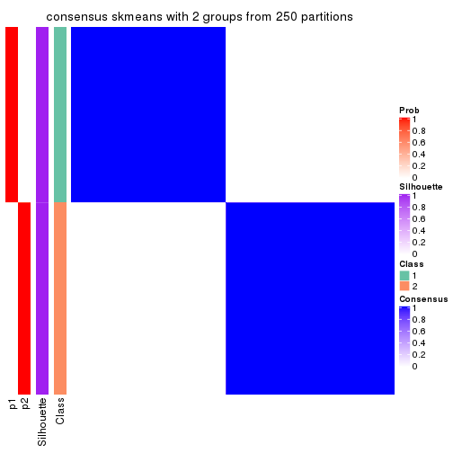</p>

</div>
<div id='tab-ATC-skmeans-consensus-heatmap-2'>
<pre><code class="r">consensus_heatmap(res, k = 3)
</code></pre>

<p>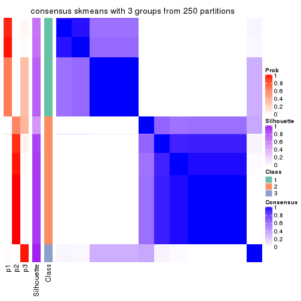</p>

</div>
<div id='tab-ATC-skmeans-consensus-heatmap-3'>
<pre><code class="r">consensus_heatmap(res, k = 4)
</code></pre>

<p>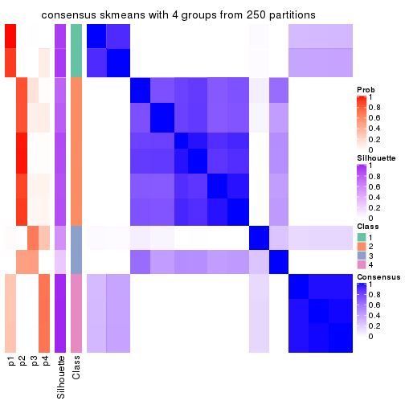</p>

</div>
<div id='tab-ATC-skmeans-consensus-heatmap-4'>
<pre><code class="r">consensus_heatmap(res, k = 5)
</code></pre>

<p>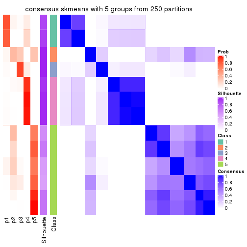</p>

</div>
<div id='tab-ATC-skmeans-consensus-heatmap-5'>
<pre><code class="r">consensus_heatmap(res, k = 6)
</code></pre>

<p>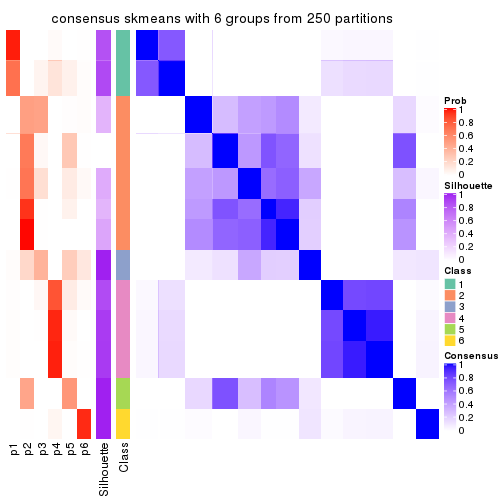</p>

</div>
</div>

Heatmaps for the membership of samples in all partitions to see how consistent they are:


<script>
$( function() {
	$( '#tabs-ATC-skmeans-membership-heatmap' ).tabs();
} );
</script>
<div id='tabs-ATC-skmeans-membership-heatmap'>
<ul>
<li><a href='#tab-ATC-skmeans-membership-heatmap-1'>k = 2</a></li>
<li><a href='#tab-ATC-skmeans-membership-heatmap-2'>k = 3</a></li>
<li><a href='#tab-ATC-skmeans-membership-heatmap-3'>k = 4</a></li>
<li><a href='#tab-ATC-skmeans-membership-heatmap-4'>k = 5</a></li>
<li><a href='#tab-ATC-skmeans-membership-heatmap-5'>k = 6</a></li>
</ul>
<div id='tab-ATC-skmeans-membership-heatmap-1'>
<pre><code class="r">membership_heatmap(res, k = 2)
</code></pre>

<p>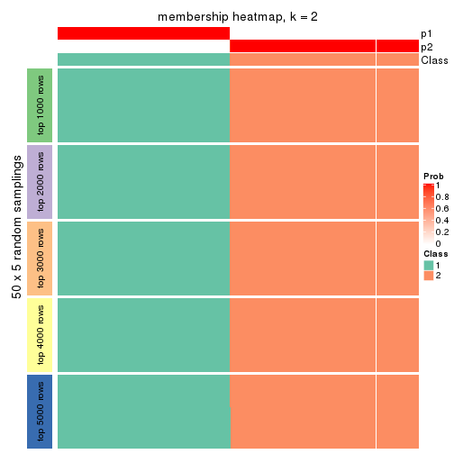</p>

</div>
<div id='tab-ATC-skmeans-membership-heatmap-2'>
<pre><code class="r">membership_heatmap(res, k = 3)
</code></pre>

<p>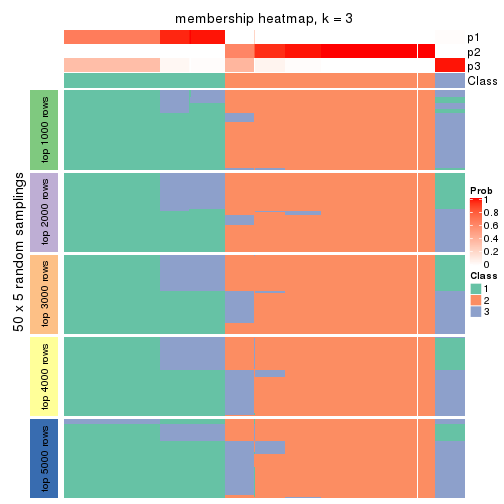</p>

</div>
<div id='tab-ATC-skmeans-membership-heatmap-3'>
<pre><code class="r">membership_heatmap(res, k = 4)
</code></pre>

<p>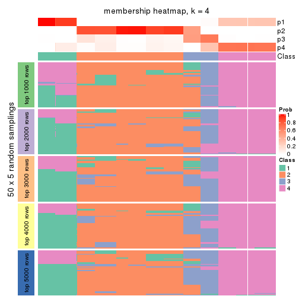</p>

</div>
<div id='tab-ATC-skmeans-membership-heatmap-4'>
<pre><code class="r">membership_heatmap(res, k = 5)
</code></pre>

<p>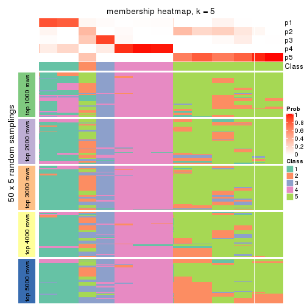</p>

</div>
<div id='tab-ATC-skmeans-membership-heatmap-5'>
<pre><code class="r">membership_heatmap(res, k = 6)
</code></pre>

<p>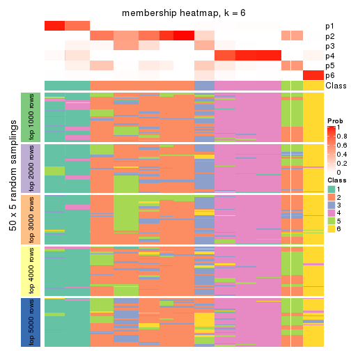</p>

</div>
</div>

As soon as we have had the classes for columns, we can look for signatures
which are significantly different between classes which can be candidate marks
for certain classes. Following are the heatmaps for signatures.


Signature heatmaps where rows are scaled:


<script>
$( function() {
	$( '#tabs-ATC-skmeans-get-signatures' ).tabs();
} );
</script>
<div id='tabs-ATC-skmeans-get-signatures'>
<ul>
<li><a href='#tab-ATC-skmeans-get-signatures-1'>k = 2</a></li>
<li><a href='#tab-ATC-skmeans-get-signatures-2'>k = 3</a></li>
<li><a href='#tab-ATC-skmeans-get-signatures-3'>k = 4</a></li>
<li><a href='#tab-ATC-skmeans-get-signatures-4'>k = 5</a></li>
<li><a href='#tab-ATC-skmeans-get-signatures-5'>k = 6</a></li>
</ul>
<div id='tab-ATC-skmeans-get-signatures-1'>
<pre><code class="r">get_signatures(res, k = 2)
</code></pre>

<p>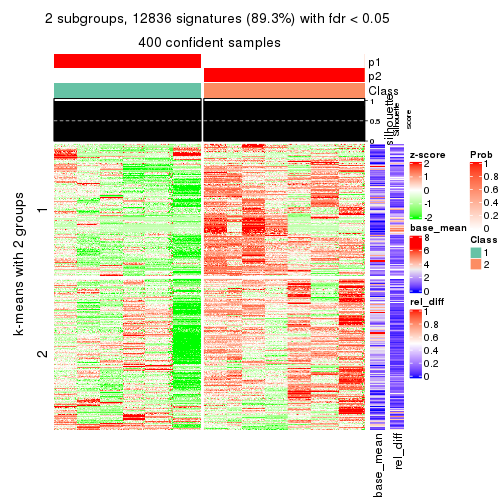</p>

</div>
<div id='tab-ATC-skmeans-get-signatures-2'>
<pre><code class="r">get_signatures(res, k = 3)
</code></pre>

<p>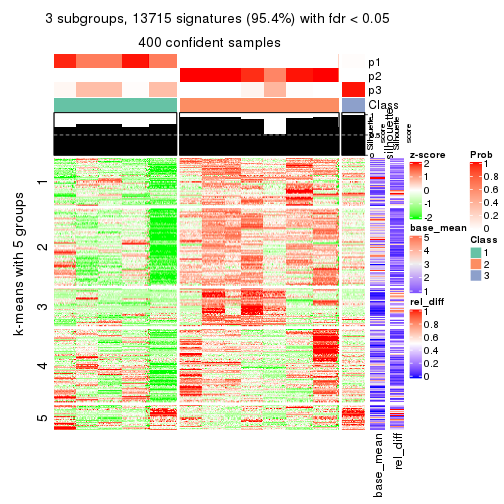</p>

</div>
<div id='tab-ATC-skmeans-get-signatures-3'>
<pre><code class="r">get_signatures(res, k = 4)
</code></pre>

<p>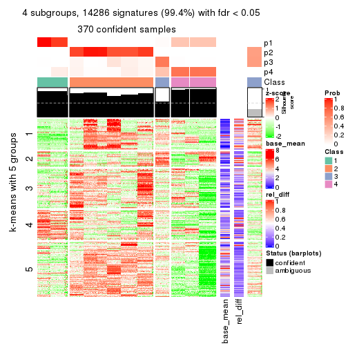</p>

</div>
<div id='tab-ATC-skmeans-get-signatures-4'>
<pre><code class="r">get_signatures(res, k = 5)
</code></pre>

<p>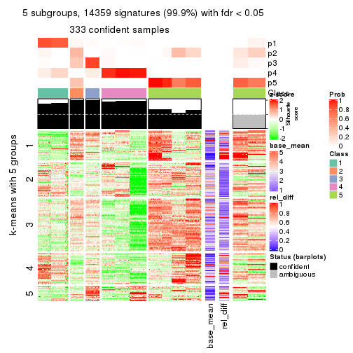</p>

</div>
<div id='tab-ATC-skmeans-get-signatures-5'>
<pre><code class="r">get_signatures(res, k = 6)
</code></pre>

<p>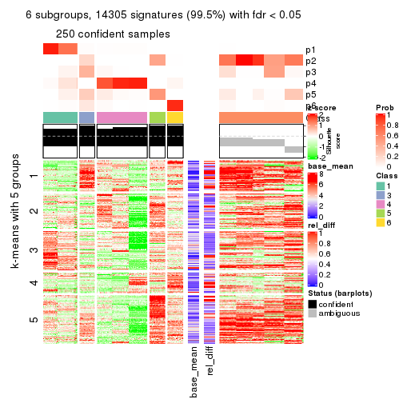</p>

</div>
</div>


Signature heatmaps where rows are not scaled:


<script>
$( function() {
	$( '#tabs-ATC-skmeans-get-signatures-no-scale' ).tabs();
} );
</script>
<div id='tabs-ATC-skmeans-get-signatures-no-scale'>
<ul>
<li><a href='#tab-ATC-skmeans-get-signatures-no-scale-1'>k = 2</a></li>
<li><a href='#tab-ATC-skmeans-get-signatures-no-scale-2'>k = 3</a></li>
<li><a href='#tab-ATC-skmeans-get-signatures-no-scale-3'>k = 4</a></li>
<li><a href='#tab-ATC-skmeans-get-signatures-no-scale-4'>k = 5</a></li>
<li><a href='#tab-ATC-skmeans-get-signatures-no-scale-5'>k = 6</a></li>
</ul>
<div id='tab-ATC-skmeans-get-signatures-no-scale-1'>
<pre><code class="r">get_signatures(res, k = 2, scale_rows = FALSE)
</code></pre>

<p>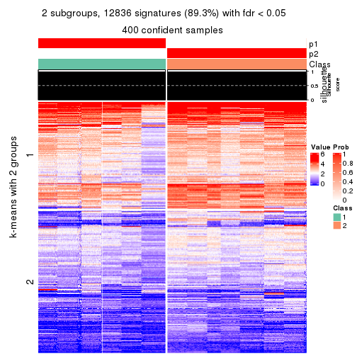</p>

</div>
<div id='tab-ATC-skmeans-get-signatures-no-scale-2'>
<pre><code class="r">get_signatures(res, k = 3, scale_rows = FALSE)
</code></pre>

<p>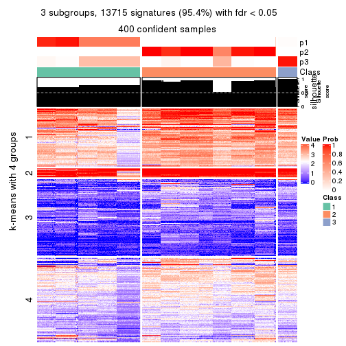</p>

</div>
<div id='tab-ATC-skmeans-get-signatures-no-scale-3'>
<pre><code class="r">get_signatures(res, k = 4, scale_rows = FALSE)
</code></pre>

<p>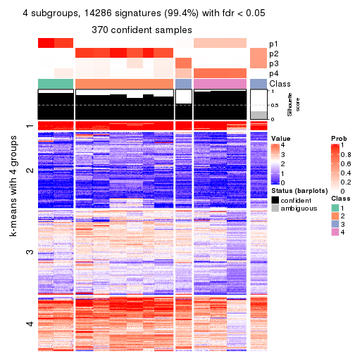</p>

</div>
<div id='tab-ATC-skmeans-get-signatures-no-scale-4'>
<pre><code class="r">get_signatures(res, k = 5, scale_rows = FALSE)
</code></pre>

<p>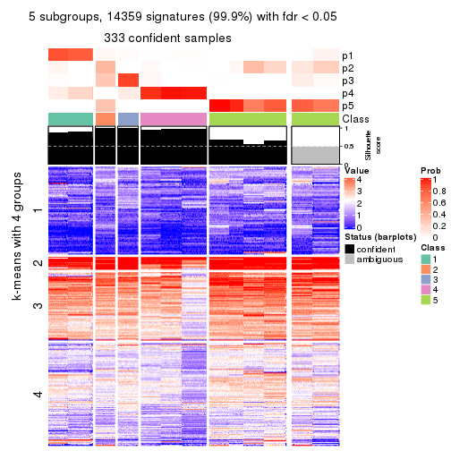</p>

</div>
<div id='tab-ATC-skmeans-get-signatures-no-scale-5'>
<pre><code class="r">get_signatures(res, k = 6, scale_rows = FALSE)
</code></pre>

<p>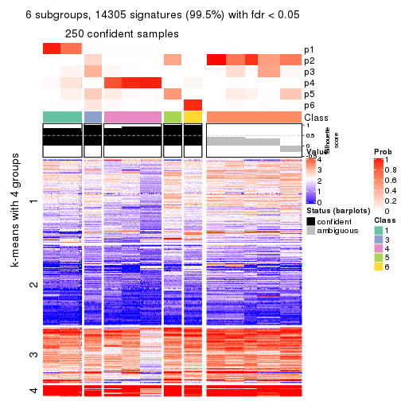</p>

</div>
</div>


Compare the overlap of signatures from different k:

```r
compare_signatures(res)
```

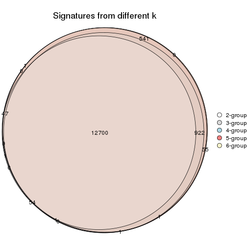

`get_signature()` returns a data frame invisibly. TO get the list of signatures, the function
call should be assigned to a variable explicitly. In following code, if `plot` argument is set
to `FALSE`, no heatmap is plotted while only the differential analysis is performed.

```r
# code only for demonstration
tb = get_signature(res, k = ..., plot = FALSE)
```

An example of the output of `tb` is:

```
#>   which_row         fdr    mean_1    mean_2 scaled_mean_1 scaled_mean_2 km
#> 1        38 0.042760348  8.373488  9.131774    -0.5533452     0.5164555  1
#> 2        40 0.018707592  7.106213  8.469186    -0.6173731     0.5762149  1
#> 3        55 0.019134737 10.221463 11.207825    -0.6159697     0.5749050  1
#> 4        59 0.006059896  5.921854  7.869574    -0.6899429     0.6439467  1
#> 5        60 0.018055526  8.928898 10.211722    -0.6204761     0.5791110  1
#> 6        98 0.009384629 15.714769 14.887706     0.6635654    -0.6193277  2
...
```

The columns in `tb` are:

1. `which_row`: row indices corresponding to the input matrix.
2. `fdr`: FDR for the differential test. 
3. `mean_x`: The mean value in group x.
4. `scaled_mean_x`: The mean value in group x after rows are scaled.
5. `km`: Row groups if k-means clustering is applied to rows.


UMAP plot which shows how samples are separated.


<script>
$( function() {
	$( '#tabs-ATC-skmeans-dimension-reduction' ).tabs();
} );
</script>
<div id='tabs-ATC-skmeans-dimension-reduction'>
<ul>
<li><a href='#tab-ATC-skmeans-dimension-reduction-1'>k = 2</a></li>
<li><a href='#tab-ATC-skmeans-dimension-reduction-2'>k = 3</a></li>
<li><a href='#tab-ATC-skmeans-dimension-reduction-3'>k = 4</a></li>
<li><a href='#tab-ATC-skmeans-dimension-reduction-4'>k = 5</a></li>
<li><a href='#tab-ATC-skmeans-dimension-reduction-5'>k = 6</a></li>
</ul>
<div id='tab-ATC-skmeans-dimension-reduction-1'>
<pre><code class="r">dimension_reduction(res, k = 2, method = &quot;UMAP&quot;)
</code></pre>

<p></p>

</div>
<div id='tab-ATC-skmeans-dimension-reduction-2'>
<pre><code class="r">dimension_reduction(res, k = 3, method = &quot;UMAP&quot;)
</code></pre>

<p>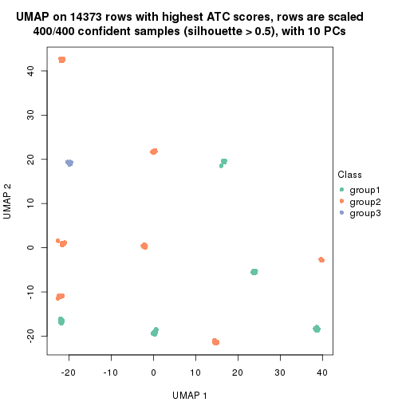</p>

</div>
<div id='tab-ATC-skmeans-dimension-reduction-3'>
<pre><code class="r">dimension_reduction(res, k = 4, method = &quot;UMAP&quot;)
</code></pre>

<p>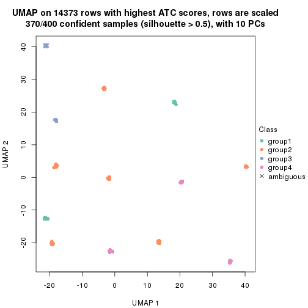</p>

</div>
<div id='tab-ATC-skmeans-dimension-reduction-4'>
<pre><code class="r">dimension_reduction(res, k = 5, method = &quot;UMAP&quot;)
</code></pre>

<p>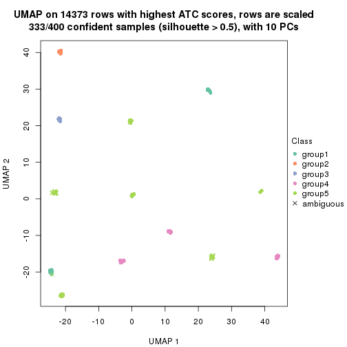</p>

</div>
<div id='tab-ATC-skmeans-dimension-reduction-5'>
<pre><code class="r">dimension_reduction(res, k = 6, method = &quot;UMAP&quot;)
</code></pre>

<p>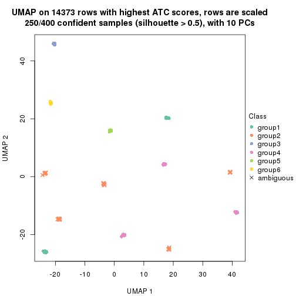</p>

</div>
</div>


Following heatmap shows how subgroups are split when increasing `k`:

```r
collect_classes(res)
```

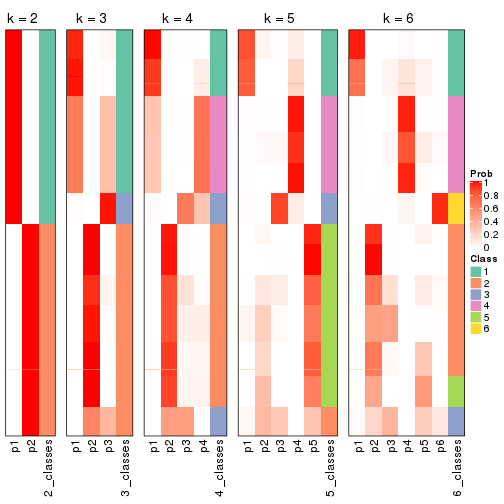


If matrix rows can be associated to genes, consider to use `GO_Enrichment(res,
...)` to perform function enrichment for the signature genes.


 

---------------------------------------------------


### ATC:pam*


The object with results only for a single top-value method and a single partition method 
can be extracted as:

```r
res = res_list["ATC", "pam"]
# you can also extract it by
# res = res_list["ATC:pam"]
```

A summary of `res` and all the functions that can be applied to it:

```r
res
```

```
#> A 'ConsensusPartition' object with k = 2, 3, 4, 5, 6.
#>   On a matrix with 14373 rows and 400 columns.
#>   Top rows (1000, 2000, 3000, 4000, 5000) are extracted by 'ATC' method.
#>   Subgroups are detected by 'pam' method.
#>   Performed in total 1250 partitions by row resampling.
#>   Best k for subgroups seems to be 4.
#> 
#> Following methods can be applied to this 'ConsensusPartition' object:
#>  [1] "cola_report"             "collect_classes"         "collect_plots"          
#>  [4] "collect_stats"           "colnames"                "compare_signatures"     
#>  [7] "consensus_heatmap"       "dimension_reduction"     "functional_enrichment"  
#> [10] "get_anno_col"            "get_anno"                "get_classes"            
#> [13] "get_consensus"           "get_matrix"              "get_membership"         
#> [16] "get_param"               "get_signatures"          "get_stats"              
#> [19] "is_best_k"               "is_stable_k"             "membership_heatmap"     
#> [22] "ncol"                    "nrow"                    "plot_ecdf"              
#> [25] "rownames"                "select_partition_number" "show"                   
#> [28] "suggest_best_k"          "test_to_known_factors"
```

`collect_plots()` function collects all the plots made from `res` for all `k` (number of partitions)
into one single page to provide an easy and fast comparison between different `k`.

```r
collect_plots(res)
```

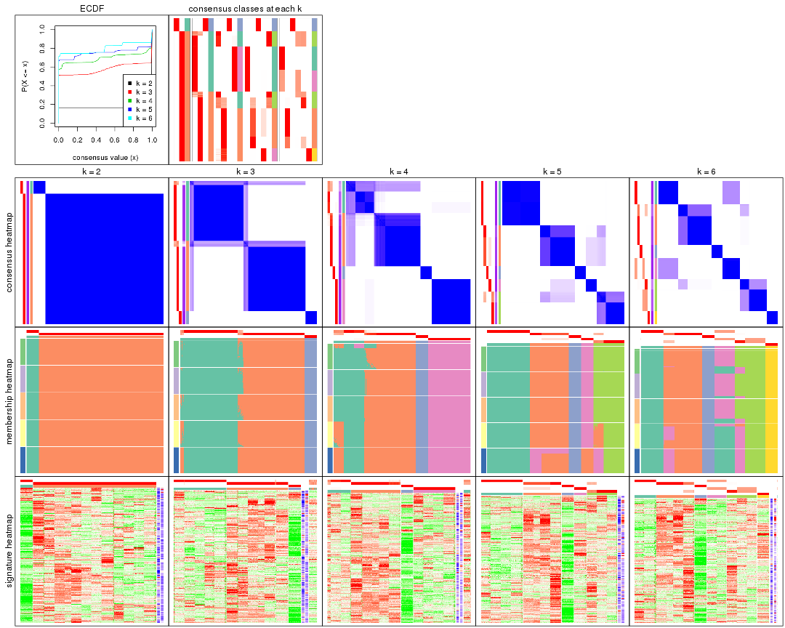

The plots are:

- The first row: a plot of the ECDF (Empirical cumulative distribution
  function) curves of the consensus matrix for each `k` and the heatmap of
  predicted classes for each `k`.
- The second row: heatmaps of the consensus matrix for each `k`.
- The third row: heatmaps of the membership matrix for each `k`.
- The fouth row: heatmaps of the signatures for each `k`.

All the plots in panels can be made by individual functions and they are
plotted later in this section.

`select_partition_number()` produces several plots showing different
statistics for choosing "optimized" `k`. There are following statistics:

- ECDF curves of the consensus matrix for each `k`;
- 1-PAC. [The PAC
  score](https://en.wikipedia.org/wiki/Consensus_clustering#Over-interpretation_potential_of_consensus_clustering)
  measures the proportion of the ambiguous subgrouping.
- Mean silhouette score.
- Concordance. The mean probability of fiting the consensus class ids in all
  partitions.
- Area increased. Denote $A_k$ as the area under the ECDF curve for current
  `k`, the area increased is defined as $A_k - A_{k-1}$.
- Rand index. The percent of pairs of samples that are both in a same cluster
  or both are not in a same cluster in the partition of k and k-1.
- Jaccard index. The ratio of pairs of samples are both in a same cluster in
  the partition of k and k-1 and the pairs of samples are both in a same
  cluster in the partition k or k-1.

The detailed explanations of these statistics can be found in [the cola
vignette](http://bioconductor.org/packages/devel/bioc/vignettes/cola/inst/doc/cola.html#toc_13).

Generally speaking, lower PAC score, higher mean silhouette score or higher
concordance corresponds to better partition. Rand index and Jaccard index
measure how similar the current partition is compared to partition with `k-1`.
If they are too similar, we won't accept `k` is better than `k-1`.

```r
select_partition_number(res)
```

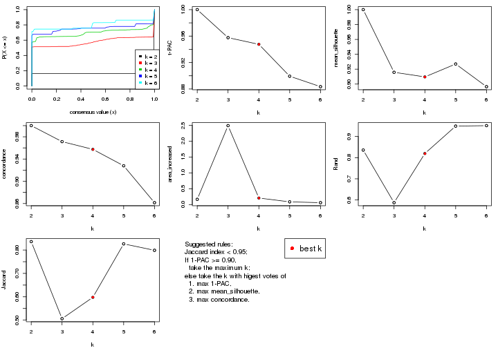

The numeric values for all these statistics can be obtained by `get_stats()`.

```r
get_stats(res)
```

```
#>   k 1-PAC mean_silhouette concordance area_increased  Rand Jaccard
#> 2 2 1.000           1.000       1.000         0.1650 0.836   0.836
#> 3 3 0.958           0.916       0.971         2.4908 0.587   0.506
#> 4 4 0.948           0.910       0.957         0.2063 0.820   0.598
#> 5 5 0.899           0.927       0.928         0.0858 0.949   0.826
#> 6 6 0.884           0.896       0.862         0.0601 0.951   0.799
```

`suggest_best_k()` suggests the best $k$ based on these statistics. The rules are as follows:

- All $k$ with Jaccard index larger than 0.95 are removed because the increase of
  the partition number does not provides enough extra information. If all $k$ are removed,
  the best $k$ is assigned by `NA`.
- For $k$ with 1-PAC larger than 0.9, the maximal $k$ is taken as the "best k". Other $k$ is called "optional k".
- If it does not fit the second rule. The $k$ with the highest vote of highest
  1-PAC, mean silhouette and concordance is taken as the "best k".

```r
suggest_best_k(res)
```

```
#> [1] 4
#> attr(,"optional")
#> [1] 2 3
```

There is also optional best $k$ = 2 3 that is worth to check.

Following shows the table of the partitions (You need to click the **show/hide
code output** link to see it). The membership matrix (columns with name `p*`)
is inferred by
[`clue::cl_consensus()`](https://www.rdocumentation.org/link/cl_consensus?package=clue)
function with the `SE` method. Basically the value in the membership matrix
represents the probability to belong to a certain group. The finall class
label for an item is determined with the group with highest probability it
belongs to.

In `get_classes()` function, the entropy is calculated from the membership
matrix and the silhouette score is calculated from the consensus matrix.


<script>
$( function() {
	$( '#tabs-ATC-pam-get-classes' ).tabs();
} );
</script>
<div id='tabs-ATC-pam-get-classes'>
<ul>
<li><a href='#tab-ATC-pam-get-classes-1'>k = 2</a></li>
<li><a href='#tab-ATC-pam-get-classes-2'>k = 3</a></li>
<li><a href='#tab-ATC-pam-get-classes-3'>k = 4</a></li>
<li><a href='#tab-ATC-pam-get-classes-4'>k = 5</a></li>
<li><a href='#tab-ATC-pam-get-classes-5'>k = 6</a></li>
</ul>

<div id='tab-ATC-pam-get-classes-1'>
<p><a id='tab-ATC-pam-get-classes-1-a' style='color:#0366d6' href='#'>show/hide code output</a></p>
<pre><code class="r">cbind(get_classes(res, k = 2), get_membership(res, k = 2))
</code></pre>

<pre><code>#&gt;            class entropy silhouette p1 p2
#&gt; SRR1661716     2       0          1  0  1
#&gt; SRR1661717     2       0          1  0  1
#&gt; SRR1661718     2       0          1  0  1
#&gt; SRR1661719     2       0          1  0  1
#&gt; SRR1661720     2       0          1  0  1
#&gt; SRR1661721     2       0          1  0  1
#&gt; SRR1661722     2       0          1  0  1
#&gt; SRR1661723     2       0          1  0  1
#&gt; SRR1661724     2       0          1  0  1
#&gt; SRR1661725     2       0          1  0  1
#&gt; SRR1661726     2       0          1  0  1
#&gt; SRR1661727     2       0          1  0  1
#&gt; SRR1661728     2       0          1  0  1
#&gt; SRR1661729     2       0          1  0  1
#&gt; SRR1661730     2       0          1  0  1
#&gt; SRR1661731     2       0          1  0  1
#&gt; SRR1661732     2       0          1  0  1
#&gt; SRR1661733     2       0          1  0  1
#&gt; SRR1661734     2       0          1  0  1
#&gt; SRR1661735     2       0          1  0  1
#&gt; SRR1661736     2       0          1  0  1
#&gt; SRR1661737     2       0          1  0  1
#&gt; SRR1661738     2       0          1  0  1
#&gt; SRR1661739     2       0          1  0  1
#&gt; SRR1661740     2       0          1  0  1
#&gt; SRR1661741     2       0          1  0  1
#&gt; SRR1661742     2       0          1  0  1
#&gt; SRR1661743     2       0          1  0  1
#&gt; SRR1661744     2       0          1  0  1
#&gt; SRR1661745     2       0          1  0  1
#&gt; SRR1661746     2       0          1  0  1
#&gt; SRR1661747     2       0          1  0  1
#&gt; SRR1661748     2       0          1  0  1
#&gt; SRR1661749     2       0          1  0  1
#&gt; SRR1661750     2       0          1  0  1
#&gt; SRR1661751     2       0          1  0  1
#&gt; SRR1661752     2       0          1  0  1
#&gt; SRR1661753     2       0          1  0  1
#&gt; SRR1661754     2       0          1  0  1
#&gt; SRR1661755     2       0          1  0  1
#&gt; SRR1661756     2       0          1  0  1
#&gt; SRR1661757     2       0          1  0  1
#&gt; SRR1661758     2       0          1  0  1
#&gt; SRR1661759     2       0          1  0  1
#&gt; SRR1661760     2       0          1  0  1
#&gt; SRR1661761     2       0          1  0  1
#&gt; SRR1661762     2       0          1  0  1
#&gt; SRR1661763     2       0          1  0  1
#&gt; SRR1661764     2       0          1  0  1
#&gt; SRR1661766     2       0          1  0  1
#&gt; SRR1661767     2       0          1  0  1
#&gt; SRR1661768     2       0          1  0  1
#&gt; SRR1661769     2       0          1  0  1
#&gt; SRR1661770     2       0          1  0  1
#&gt; SRR1661771     2       0          1  0  1
#&gt; SRR1661772     2       0          1  0  1
#&gt; SRR1661773     2       0          1  0  1
#&gt; SRR1661774     2       0          1  0  1
#&gt; SRR1661775     2       0          1  0  1
#&gt; SRR1661776     2       0          1  0  1
#&gt; SRR1661777     2       0          1  0  1
#&gt; SRR1661778     2       0          1  0  1
#&gt; SRR1661779     2       0          1  0  1
#&gt; SRR1661780     2       0          1  0  1
#&gt; SRR1661781     2       0          1  0  1
#&gt; SRR1661782     2       0          1  0  1
#&gt; SRR1661783     2       0          1  0  1
#&gt; SRR1661784     2       0          1  0  1
#&gt; SRR1661785     2       0          1  0  1
#&gt; SRR1661786     2       0          1  0  1
#&gt; SRR1661787     2       0          1  0  1
#&gt; SRR1661788     2       0          1  0  1
#&gt; SRR1661789     2       0          1  0  1
#&gt; SRR1661790     2       0          1  0  1
#&gt; SRR1661791     2       0          1  0  1
#&gt; SRR1661792     2       0          1  0  1
#&gt; SRR1661793     2       0          1  0  1
#&gt; SRR1661794     2       0          1  0  1
#&gt; SRR1661795     2       0          1  0  1
#&gt; SRR1661796     2       0          1  0  1
#&gt; SRR1661797     2       0          1  0  1
#&gt; SRR1661798     2       0          1  0  1
#&gt; SRR1661799     2       0          1  0  1
#&gt; SRR1661800     2       0          1  0  1
#&gt; SRR1661801     2       0          1  0  1
#&gt; SRR1661802     2       0          1  0  1
#&gt; SRR1661803     2       0          1  0  1
#&gt; SRR1661804     2       0          1  0  1
#&gt; SRR1661805     2       0          1  0  1
#&gt; SRR1661806     2       0          1  0  1
#&gt; SRR1661807     2       0          1  0  1
#&gt; SRR1661808     2       0          1  0  1
#&gt; SRR1661809     2       0          1  0  1
#&gt; SRR1661810     2       0          1  0  1
#&gt; SRR1661811     2       0          1  0  1
#&gt; SRR1661812     2       0          1  0  1
#&gt; SRR1661813     2       0          1  0  1
#&gt; SRR1661814     2       0          1  0  1
#&gt; SRR1661815     2       0          1  0  1
#&gt; SRR1661816     2       0          1  0  1
#&gt; SRR1661817     2       0          1  0  1
#&gt; SRR1661818     2       0          1  0  1
#&gt; SRR1661819     2       0          1  0  1
#&gt; SRR1661820     2       0          1  0  1
#&gt; SRR1661821     2       0          1  0  1
#&gt; SRR1661822     2       0          1  0  1
#&gt; SRR1661823     2       0          1  0  1
#&gt; SRR1661824     2       0          1  0  1
#&gt; SRR1661825     2       0          1  0  1
#&gt; SRR1661826     2       0          1  0  1
#&gt; SRR1661827     2       0          1  0  1
#&gt; SRR1661828     2       0          1  0  1
#&gt; SRR1661829     2       0          1  0  1
#&gt; SRR1661830     2       0          1  0  1
#&gt; SRR1661831     2       0          1  0  1
#&gt; SRR1661832     2       0          1  0  1
#&gt; SRR1661833     2       0          1  0  1
#&gt; SRR1661834     2       0          1  0  1
#&gt; SRR1661835     2       0          1  0  1
#&gt; SRR1661836     2       0          1  0  1
#&gt; SRR1661837     2       0          1  0  1
#&gt; SRR1661838     2       0          1  0  1
#&gt; SRR1661839     2       0          1  0  1
#&gt; SRR1661840     2       0          1  0  1
#&gt; SRR1661841     2       0          1  0  1
#&gt; SRR1661843     2       0          1  0  1
#&gt; SRR1661844     2       0          1  0  1
#&gt; SRR1661845     2       0          1  0  1
#&gt; SRR1661846     2       0          1  0  1
#&gt; SRR1661847     2       0          1  0  1
#&gt; SRR1661848     2       0          1  0  1
#&gt; SRR1661849     2       0          1  0  1
#&gt; SRR1661850     2       0          1  0  1
#&gt; SRR1661851     2       0          1  0  1
#&gt; SRR1661852     2       0          1  0  1
#&gt; SRR1661853     2       0          1  0  1
#&gt; SRR1661854     2       0          1  0  1
#&gt; SRR1661855     2       0          1  0  1
#&gt; SRR1661856     1       0          1  1  0
#&gt; SRR1661857     1       0          1  1  0
#&gt; SRR1661858     1       0          1  1  0
#&gt; SRR1661859     1       0          1  1  0
#&gt; SRR1661860     1       0          1  1  0
#&gt; SRR1661861     1       0          1  1  0
#&gt; SRR1661862     1       0          1  1  0
#&gt; SRR1661863     1       0          1  1  0
#&gt; SRR1661864     1       0          1  1  0
#&gt; SRR1661865     1       0          1  1  0
#&gt; SRR1661866     1       0          1  1  0
#&gt; SRR1661867     1       0          1  1  0
#&gt; SRR1661868     1       0          1  1  0
#&gt; SRR1661869     1       0          1  1  0
#&gt; SRR1661870     1       0          1  1  0
#&gt; SRR1661871     1       0          1  1  0
#&gt; SRR1661872     1       0          1  1  0
#&gt; SRR1661873     1       0          1  1  0
#&gt; SRR1661874     1       0          1  1  0
#&gt; SRR1661875     1       0          1  1  0
#&gt; SRR1661876     1       0          1  1  0
#&gt; SRR1661877     1       0          1  1  0
#&gt; SRR1661878     1       0          1  1  0
#&gt; SRR1661879     1       0          1  1  0
#&gt; SRR1661880     1       0          1  1  0
#&gt; SRR1661881     1       0          1  1  0
#&gt; SRR1661882     1       0          1  1  0
#&gt; SRR1661883     1       0          1  1  0
#&gt; SRR1661884     1       0          1  1  0
#&gt; SRR1661885     1       0          1  1  0
#&gt; SRR1661886     1       0          1  1  0
#&gt; SRR1661887     1       0          1  1  0
#&gt; SRR1661888     1       0          1  1  0
#&gt; SRR1661889     1       0          1  1  0
#&gt; SRR1661890     1       0          1  1  0
#&gt; SRR1661891     1       0          1  1  0
#&gt; SRR1661892     2       0          1  0  1
#&gt; SRR1661893     2       0          1  0  1
#&gt; SRR1661894     2       0          1  0  1
#&gt; SRR1661895     2       0          1  0  1
#&gt; SRR1661896     2       0          1  0  1
#&gt; SRR1661897     2       0          1  0  1
#&gt; SRR1661898     2       0          1  0  1
#&gt; SRR1661899     2       0          1  0  1
#&gt; SRR1661900     2       0          1  0  1
#&gt; SRR1661901     2       0          1  0  1
#&gt; SRR1661902     2       0          1  0  1
#&gt; SRR1661903     2       0          1  0  1
#&gt; SRR1661904     2       0          1  0  1
#&gt; SRR1661905     2       0          1  0  1
#&gt; SRR1661906     2       0          1  0  1
#&gt; SRR1661907     2       0          1  0  1
#&gt; SRR1661908     2       0          1  0  1
#&gt; SRR1661909     2       0          1  0  1
#&gt; SRR1661910     2       0          1  0  1
#&gt; SRR1661911     2       0          1  0  1
#&gt; SRR1661912     2       0          1  0  1
#&gt; SRR1661913     2       0          1  0  1
#&gt; SRR1661914     2       0          1  0  1
#&gt; SRR1661915     2       0          1  0  1
#&gt; SRR1661916     2       0          1  0  1
#&gt; SRR1661917     2       0          1  0  1
#&gt; SRR1661918     2       0          1  0  1
#&gt; SRR1661919     2       0          1  0  1
#&gt; SRR1661920     2       0          1  0  1
#&gt; SRR1661921     2       0          1  0  1
#&gt; SRR1661922     2       0          1  0  1
#&gt; SRR1661923     2       0          1  0  1
#&gt; SRR1661924     2       0          1  0  1
#&gt; SRR1661925     2       0          1  0  1
#&gt; SRR1661926     2       0          1  0  1
#&gt; SRR1661927     2       0          1  0  1
#&gt; SRR1661928     2       0          1  0  1
#&gt; SRR1661929     2       0          1  0  1
#&gt; SRR1661930     2       0          1  0  1
#&gt; SRR1661931     2       0          1  0  1
#&gt; SRR1661932     2       0          1  0  1
#&gt; SRR1661933     2       0          1  0  1
#&gt; SRR1661934     2       0          1  0  1
#&gt; SRR1661935     2       0          1  0  1
#&gt; SRR1661936     2       0          1  0  1
#&gt; SRR1661937     2       0          1  0  1
#&gt; SRR1661938     2       0          1  0  1
#&gt; SRR1661939     2       0          1  0  1
#&gt; SRR1661940     2       0          1  0  1
#&gt; SRR1661941     2       0          1  0  1
#&gt; SRR1661942     2       0          1  0  1
#&gt; SRR1661943     2       0          1  0  1
#&gt; SRR1661944     2       0          1  0  1
#&gt; SRR1661945     2       0          1  0  1
#&gt; SRR1661946     2       0          1  0  1
#&gt; SRR1661947     2       0          1  0  1
#&gt; SRR1661948     2       0          1  0  1
#&gt; SRR1661949     2       0          1  0  1
#&gt; SRR1661950     2       0          1  0  1
#&gt; SRR1661951     2       0          1  0  1
#&gt; SRR1661952     2       0          1  0  1
#&gt; SRR1661953     2       0          1  0  1
#&gt; SRR1661954     2       0          1  0  1
#&gt; SRR1661955     2       0          1  0  1
#&gt; SRR1661956     2       0          1  0  1
#&gt; SRR1661957     2       0          1  0  1
#&gt; SRR1661958     2       0          1  0  1
#&gt; SRR1661959     2       0          1  0  1
#&gt; SRR1661960     2       0          1  0  1
#&gt; SRR1661961     2       0          1  0  1
#&gt; SRR1661962     2       0          1  0  1
#&gt; SRR1661963     2       0          1  0  1
#&gt; SRR1661964     2       0          1  0  1
#&gt; SRR1661965     2       0          1  0  1
#&gt; SRR1661966     2       0          1  0  1
#&gt; SRR1661967     2       0          1  0  1
#&gt; SRR1661968     2       0          1  0  1
#&gt; SRR1661969     2       0          1  0  1
#&gt; SRR1661970     2       0          1  0  1
#&gt; SRR1661971     2       0          1  0  1
#&gt; SRR1661972     2       0          1  0  1
#&gt; SRR1661973     2       0          1  0  1
#&gt; SRR1661974     2       0          1  0  1
#&gt; SRR1661975     2       0          1  0  1
#&gt; SRR1661976     2       0          1  0  1
#&gt; SRR1661977     2       0          1  0  1
#&gt; SRR1661978     2       0          1  0  1
#&gt; SRR1661979     2       0          1  0  1
#&gt; SRR1661980     2       0          1  0  1
#&gt; SRR1661981     2       0          1  0  1
#&gt; SRR1661982     2       0          1  0  1
#&gt; SRR1661983     2       0          1  0  1
#&gt; SRR1661984     2       0          1  0  1
#&gt; SRR1661985     2       0          1  0  1
#&gt; SRR1661986     2       0          1  0  1
#&gt; SRR1661987     2       0          1  0  1
#&gt; SRR1661988     2       0          1  0  1
#&gt; SRR1661989     2       0          1  0  1
#&gt; SRR1661990     2       0          1  0  1
#&gt; SRR1661991     2       0          1  0  1
#&gt; SRR1661992     2       0          1  0  1
#&gt; SRR1661993     2       0          1  0  1
#&gt; SRR1661994     2       0          1  0  1
#&gt; SRR1661995     2       0          1  0  1
#&gt; SRR1661996     2       0          1  0  1
#&gt; SRR1661997     2       0          1  0  1
#&gt; SRR1661998     2       0          1  0  1
#&gt; SRR1661999     2       0          1  0  1
#&gt; SRR1662000     2       0          1  0  1
#&gt; SRR1662001     2       0          1  0  1
#&gt; SRR1662002     2       0          1  0  1
#&gt; SRR1662003     2       0          1  0  1
#&gt; SRR1662004     2       0          1  0  1
#&gt; SRR1662005     2       0          1  0  1
#&gt; SRR1662006     2       0          1  0  1
#&gt; SRR1662007     2       0          1  0  1
#&gt; SRR1662008     2       0          1  0  1
#&gt; SRR1662009     2       0          1  0  1
#&gt; SRR1662010     2       0          1  0  1
#&gt; SRR1662011     2       0          1  0  1
#&gt; SRR1662012     2       0          1  0  1
#&gt; SRR1662013     2       0          1  0  1
#&gt; SRR1662014     2       0          1  0  1
#&gt; SRR1662015     2       0          1  0  1
#&gt; SRR1662016     2       0          1  0  1
#&gt; SRR1662017     2       0          1  0  1
#&gt; SRR1662018     2       0          1  0  1
#&gt; SRR1662019     2       0          1  0  1
#&gt; SRR1662020     2       0          1  0  1
#&gt; SRR1662021     2       0          1  0  1
#&gt; SRR1662022     2       0          1  0  1
#&gt; SRR1662023     2       0          1  0  1
#&gt; SRR1662024     2       0          1  0  1
#&gt; SRR1662025     2       0          1  0  1
#&gt; SRR1662026     2       0          1  0  1
#&gt; SRR1662027     2       0          1  0  1
#&gt; SRR1662028     2       0          1  0  1
#&gt; SRR1662029     2       0          1  0  1
#&gt; SRR1662030     2       0          1  0  1
#&gt; SRR1662031     2       0          1  0  1
#&gt; SRR1662032     2       0          1  0  1
#&gt; SRR1662033     2       0          1  0  1
#&gt; SRR1662034     2       0          1  0  1
#&gt; SRR1662035     2       0          1  0  1
#&gt; SRR1662036     2       0          1  0  1
#&gt; SRR1662037     2       0          1  0  1
#&gt; SRR1662038     2       0          1  0  1
#&gt; SRR1662039     2       0          1  0  1
#&gt; SRR1662040     2       0          1  0  1
#&gt; SRR1662041     2       0          1  0  1
#&gt; SRR1662042     2       0          1  0  1
#&gt; SRR1662043     2       0          1  0  1
#&gt; SRR1662044     2       0          1  0  1
#&gt; SRR1662045     2       0          1  0  1
#&gt; SRR1662046     2       0          1  0  1
#&gt; SRR1662047     2       0          1  0  1
#&gt; SRR1662048     2       0          1  0  1
#&gt; SRR1662049     2       0          1  0  1
#&gt; SRR1662050     2       0          1  0  1
#&gt; SRR1662051     2       0          1  0  1
#&gt; SRR1662052     2       0          1  0  1
#&gt; SRR1662053     2       0          1  0  1
#&gt; SRR1662054     2       0          1  0  1
#&gt; SRR1662055     2       0          1  0  1
#&gt; SRR1662056     2       0          1  0  1
#&gt; SRR1662057     2       0          1  0  1
#&gt; SRR1662058     2       0          1  0  1
#&gt; SRR1662059     2       0          1  0  1
#&gt; SRR1662060     2       0          1  0  1
#&gt; SRR1662061     2       0          1  0  1
#&gt; SRR1662062     2       0          1  0  1
#&gt; SRR1662063     2       0          1  0  1
#&gt; SRR1662064     2       0          1  0  1
#&gt; SRR1662065     2       0          1  0  1
#&gt; SRR1662066     2       0          1  0  1
#&gt; SRR1662067     2       0          1  0  1
#&gt; SRR1662068     2       0          1  0  1
#&gt; SRR1662069     2       0          1  0  1
#&gt; SRR1662070     2       0          1  0  1
#&gt; SRR1662071     2       0          1  0  1
#&gt; SRR1662072     2       0          1  0  1
#&gt; SRR1662073     2       0          1  0  1
#&gt; SRR1662074     2       0          1  0  1
#&gt; SRR1662075     2       0          1  0  1
#&gt; SRR1662076     2       0          1  0  1
#&gt; SRR1662077     2       0          1  0  1
#&gt; SRR1662078     2       0          1  0  1
#&gt; SRR1662079     2       0          1  0  1
#&gt; SRR1662080     2       0          1  0  1
#&gt; SRR1662081     2       0          1  0  1
#&gt; SRR1662082     2       0          1  0  1
#&gt; SRR1662083     2       0          1  0  1
#&gt; SRR1662084     2       0          1  0  1
#&gt; SRR1662085     2       0          1  0  1
#&gt; SRR1662086     2       0          1  0  1
#&gt; SRR1662087     2       0          1  0  1
#&gt; SRR1662088     2       0          1  0  1
#&gt; SRR1662089     2       0          1  0  1
#&gt; SRR1662090     2       0          1  0  1
#&gt; SRR1662091     2       0          1  0  1
#&gt; SRR1662092     2       0          1  0  1
#&gt; SRR1662093     2       0          1  0  1
#&gt; SRR1662094     2       0          1  0  1
#&gt; SRR1662095     2       0          1  0  1
#&gt; SRR1662096     2       0          1  0  1
#&gt; SRR1662097     2       0          1  0  1
#&gt; SRR1662098     2       0          1  0  1
#&gt; SRR1662099     2       0          1  0  1
#&gt; SRR1662100     2       0          1  0  1
#&gt; SRR1662101     2       0          1  0  1
#&gt; SRR1662102     2       0          1  0  1
#&gt; SRR1662103     2       0          1  0  1
#&gt; SRR1662104     2       0          1  0  1
#&gt; SRR1662105     2       0          1  0  1
#&gt; SRR1662106     2       0          1  0  1
#&gt; SRR1662107     2       0          1  0  1
#&gt; SRR1662108     2       0          1  0  1
#&gt; SRR1662109     2       0          1  0  1
#&gt; SRR1662110     2       0          1  0  1
#&gt; SRR1662111     2       0          1  0  1
#&gt; SRR1662112     2       0          1  0  1
#&gt; SRR1662113     2       0          1  0  1
#&gt; SRR1662114     2       0          1  0  1
#&gt; SRR1662115     2       0          1  0  1
#&gt; SRR1662116     2       0          1  0  1
#&gt; SRR1662117     2       0          1  0  1
</code></pre>

<script>
$('#tab-ATC-pam-get-classes-1-a').parent().next().next().hide();
$('#tab-ATC-pam-get-classes-1-a').click(function(){
  $('#tab-ATC-pam-get-classes-1-a').parent().next().next().toggle();
  return(false);
});
</script>
</div>

<div id='tab-ATC-pam-get-classes-2'>
<p><a id='tab-ATC-pam-get-classes-2-a' style='color:#0366d6' href='#'>show/hide code output</a></p>
<pre><code class="r">cbind(get_classes(res, k = 3), get_membership(res, k = 3))
</code></pre>

<pre><code>#&gt;            class entropy silhouette    p1    p2 p3
#&gt; SRR1661716     2  0.0000     0.9574 0.000 1.000  0
#&gt; SRR1661717     2  0.0000     0.9574 0.000 1.000  0
#&gt; SRR1661718     2  0.0000     0.9574 0.000 1.000  0
#&gt; SRR1661719     2  0.0000     0.9574 0.000 1.000  0
#&gt; SRR1661720     2  0.0000     0.9574 0.000 1.000  0
#&gt; SRR1661721     2  0.0000     0.9574 0.000 1.000  0
#&gt; SRR1661722     2  0.0000     0.9574 0.000 1.000  0
#&gt; SRR1661723     2  0.0000     0.9574 0.000 1.000  0
#&gt; SRR1661724     2  0.0000     0.9574 0.000 1.000  0
#&gt; SRR1661725     2  0.0000     0.9574 0.000 1.000  0
#&gt; SRR1661726     2  0.0000     0.9574 0.000 1.000  0
#&gt; SRR1661727     2  0.0000     0.9574 0.000 1.000  0
#&gt; SRR1661728     2  0.0000     0.9574 0.000 1.000  0
#&gt; SRR1661729     2  0.0000     0.9574 0.000 1.000  0
#&gt; SRR1661730     2  0.0000     0.9574 0.000 1.000  0
#&gt; SRR1661731     2  0.0000     0.9574 0.000 1.000  0
#&gt; SRR1661732     2  0.0000     0.9574 0.000 1.000  0
#&gt; SRR1661733     2  0.0000     0.9574 0.000 1.000  0
#&gt; SRR1661734     2  0.0000     0.9574 0.000 1.000  0
#&gt; SRR1661735     2  0.0000     0.9574 0.000 1.000  0
#&gt; SRR1661736     2  0.6008     0.4103 0.372 0.628  0
#&gt; SRR1661737     1  0.5733     0.5067 0.676 0.324  0
#&gt; SRR1661738     2  0.6309     0.0240 0.496 0.504  0
#&gt; SRR1661739     2  0.6280     0.1578 0.460 0.540  0
#&gt; SRR1661740     2  0.6140     0.3284 0.404 0.596  0
#&gt; SRR1661741     2  0.6140     0.3285 0.404 0.596  0
#&gt; SRR1661742     1  0.5835     0.4750 0.660 0.340  0
#&gt; SRR1661743     2  0.5621     0.5499 0.308 0.692  0
#&gt; SRR1661744     2  0.5650     0.5418 0.312 0.688  0
#&gt; SRR1661745     2  0.6260     0.1974 0.448 0.552  0
#&gt; SRR1661746     2  0.6309     0.0253 0.496 0.504  0
#&gt; SRR1661747     2  0.6299     0.1006 0.476 0.524  0
#&gt; SRR1661748     1  0.6215     0.2442 0.572 0.428  0
#&gt; SRR1661749     2  0.6126     0.3395 0.400 0.600  0
#&gt; SRR1661750     2  0.3879     0.7748 0.152 0.848  0
#&gt; SRR1661751     1  0.6235     0.2135 0.564 0.436  0
#&gt; SRR1661752     1  0.6062     0.3647 0.616 0.384  0
#&gt; SRR1661753     1  0.5760     0.4984 0.672 0.328  0
#&gt; SRR1661754     1  0.5988     0.4057 0.632 0.368  0
#&gt; SRR1661755     2  0.6180     0.2955 0.416 0.584  0
#&gt; SRR1661756     1  0.6299     0.0772 0.524 0.476  0
#&gt; SRR1661757     1  0.6307     0.0287 0.512 0.488  0
#&gt; SRR1661758     1  0.6286     0.1192 0.536 0.464  0
#&gt; SRR1661759     1  0.6008     0.3956 0.628 0.372  0
#&gt; SRR1661760     2  0.6204     0.2720 0.424 0.576  0
#&gt; SRR1661761     2  0.5948     0.4395 0.360 0.640  0
#&gt; SRR1661762     2  0.6286     0.1439 0.464 0.536  0
#&gt; SRR1661763     2  0.4654     0.6989 0.208 0.792  0
#&gt; SRR1661764     1  0.6286     0.1197 0.536 0.464  0
#&gt; SRR1661766     2  0.0000     0.9574 0.000 1.000  0
#&gt; SRR1661767     2  0.0000     0.9574 0.000 1.000  0
#&gt; SRR1661768     2  0.0000     0.9574 0.000 1.000  0
#&gt; SRR1661769     2  0.0000     0.9574 0.000 1.000  0
#&gt; SRR1661770     2  0.0000     0.9574 0.000 1.000  0
#&gt; SRR1661771     2  0.0000     0.9574 0.000 1.000  0
#&gt; SRR1661772     2  0.0000     0.9574 0.000 1.000  0
#&gt; SRR1661773     2  0.0000     0.9574 0.000 1.000  0
#&gt; SRR1661774     2  0.0000     0.9574 0.000 1.000  0
#&gt; SRR1661775     2  0.0000     0.9574 0.000 1.000  0
#&gt; SRR1661776     2  0.0000     0.9574 0.000 1.000  0
#&gt; SRR1661777     2  0.0000     0.9574 0.000 1.000  0
#&gt; SRR1661778     2  0.0000     0.9574 0.000 1.000  0
#&gt; SRR1661779     2  0.0000     0.9574 0.000 1.000  0
#&gt; SRR1661780     2  0.0000     0.9574 0.000 1.000  0
#&gt; SRR1661781     2  0.0000     0.9574 0.000 1.000  0
#&gt; SRR1661782     2  0.0000     0.9574 0.000 1.000  0
#&gt; SRR1661783     2  0.0000     0.9574 0.000 1.000  0
#&gt; SRR1661784     2  0.0000     0.9574 0.000 1.000  0
#&gt; SRR1661785     2  0.0000     0.9574 0.000 1.000  0
#&gt; SRR1661786     2  0.0000     0.9574 0.000 1.000  0
#&gt; SRR1661787     2  0.0000     0.9574 0.000 1.000  0
#&gt; SRR1661788     2  0.0000     0.9574 0.000 1.000  0
#&gt; SRR1661789     2  0.0000     0.9574 0.000 1.000  0
#&gt; SRR1661790     2  0.0000     0.9574 0.000 1.000  0
#&gt; SRR1661791     2  0.0000     0.9574 0.000 1.000  0
#&gt; SRR1661792     2  0.0000     0.9574 0.000 1.000  0
#&gt; SRR1661793     2  0.0000     0.9574 0.000 1.000  0
#&gt; SRR1661794     2  0.0000     0.9574 0.000 1.000  0
#&gt; SRR1661795     2  0.0000     0.9574 0.000 1.000  0
#&gt; SRR1661796     2  0.0000     0.9574 0.000 1.000  0
#&gt; SRR1661797     2  0.0000     0.9574 0.000 1.000  0
#&gt; SRR1661798     2  0.0000     0.9574 0.000 1.000  0
#&gt; SRR1661799     2  0.0000     0.9574 0.000 1.000  0
#&gt; SRR1661800     2  0.0000     0.9574 0.000 1.000  0
#&gt; SRR1661801     2  0.0000     0.9574 0.000 1.000  0
#&gt; SRR1661802     2  0.0000     0.9574 0.000 1.000  0
#&gt; SRR1661803     2  0.0000     0.9574 0.000 1.000  0
#&gt; SRR1661804     2  0.0000     0.9574 0.000 1.000  0
#&gt; SRR1661805     2  0.0000     0.9574 0.000 1.000  0
#&gt; SRR1661806     2  0.0000     0.9574 0.000 1.000  0
#&gt; SRR1661807     2  0.0000     0.9574 0.000 1.000  0
#&gt; SRR1661808     2  0.0000     0.9574 0.000 1.000  0
#&gt; SRR1661809     2  0.0000     0.9574 0.000 1.000  0
#&gt; SRR1661810     2  0.0000     0.9574 0.000 1.000  0
#&gt; SRR1661811     2  0.0000     0.9574 0.000 1.000  0
#&gt; SRR1661812     2  0.0000     0.9574 0.000 1.000  0
#&gt; SRR1661813     2  0.0000     0.9574 0.000 1.000  0
#&gt; SRR1661814     2  0.0000     0.9574 0.000 1.000  0
#&gt; SRR1661815     2  0.0000     0.9574 0.000 1.000  0
#&gt; SRR1661816     2  0.0000     0.9574 0.000 1.000  0
#&gt; SRR1661817     2  0.0000     0.9574 0.000 1.000  0
#&gt; SRR1661818     2  0.0000     0.9574 0.000 1.000  0
#&gt; SRR1661819     2  0.0000     0.9574 0.000 1.000  0
#&gt; SRR1661820     2  0.0000     0.9574 0.000 1.000  0
#&gt; SRR1661821     2  0.0000     0.9574 0.000 1.000  0
#&gt; SRR1661822     2  0.0000     0.9574 0.000 1.000  0
#&gt; SRR1661823     2  0.0000     0.9574 0.000 1.000  0
#&gt; SRR1661824     2  0.0000     0.9574 0.000 1.000  0
#&gt; SRR1661825     2  0.0000     0.9574 0.000 1.000  0
#&gt; SRR1661826     1  0.0000     0.9608 1.000 0.000  0
#&gt; SRR1661827     1  0.0000     0.9608 1.000 0.000  0
#&gt; SRR1661828     1  0.0000     0.9608 1.000 0.000  0
#&gt; SRR1661829     1  0.0000     0.9608 1.000 0.000  0
#&gt; SRR1661830     1  0.0000     0.9608 1.000 0.000  0
#&gt; SRR1661831     1  0.0000     0.9608 1.000 0.000  0
#&gt; SRR1661832     1  0.0000     0.9608 1.000 0.000  0
#&gt; SRR1661833     1  0.0000     0.9608 1.000 0.000  0
#&gt; SRR1661834     1  0.0000     0.9608 1.000 0.000  0
#&gt; SRR1661835     1  0.0000     0.9608 1.000 0.000  0
#&gt; SRR1661836     1  0.0000     0.9608 1.000 0.000  0
#&gt; SRR1661837     1  0.0000     0.9608 1.000 0.000  0
#&gt; SRR1661838     1  0.0000     0.9608 1.000 0.000  0
#&gt; SRR1661839     1  0.0000     0.9608 1.000 0.000  0
#&gt; SRR1661840     1  0.0000     0.9608 1.000 0.000  0
#&gt; SRR1661841     1  0.0000     0.9608 1.000 0.000  0
#&gt; SRR1661843     1  0.0000     0.9608 1.000 0.000  0
#&gt; SRR1661844     1  0.0000     0.9608 1.000 0.000  0
#&gt; SRR1661845     1  0.0000     0.9608 1.000 0.000  0
#&gt; SRR1661846     1  0.0000     0.9608 1.000 0.000  0
#&gt; SRR1661847     1  0.0000     0.9608 1.000 0.000  0
#&gt; SRR1661848     1  0.0000     0.9608 1.000 0.000  0
#&gt; SRR1661849     1  0.0000     0.9608 1.000 0.000  0
#&gt; SRR1661850     1  0.0000     0.9608 1.000 0.000  0
#&gt; SRR1661851     1  0.0000     0.9608 1.000 0.000  0
#&gt; SRR1661852     1  0.0000     0.9608 1.000 0.000  0
#&gt; SRR1661853     1  0.0000     0.9608 1.000 0.000  0
#&gt; SRR1661854     1  0.0000     0.9608 1.000 0.000  0
#&gt; SRR1661855     1  0.0000     0.9608 1.000 0.000  0
#&gt; SRR1661856     3  0.0000     1.0000 0.000 0.000  1
#&gt; SRR1661857     3  0.0000     1.0000 0.000 0.000  1
#&gt; SRR1661858     3  0.0000     1.0000 0.000 0.000  1
#&gt; SRR1661859     3  0.0000     1.0000 0.000 0.000  1
#&gt; SRR1661860     3  0.0000     1.0000 0.000 0.000  1
#&gt; SRR1661861     3  0.0000     1.0000 0.000 0.000  1
#&gt; SRR1661862     3  0.0000     1.0000 0.000 0.000  1
#&gt; SRR1661863     3  0.0000     1.0000 0.000 0.000  1
#&gt; SRR1661864     3  0.0000     1.0000 0.000 0.000  1
#&gt; SRR1661865     3  0.0000     1.0000 0.000 0.000  1
#&gt; SRR1661866     3  0.0000     1.0000 0.000 0.000  1
#&gt; SRR1661867     3  0.0000     1.0000 0.000 0.000  1
#&gt; SRR1661868     3  0.0000     1.0000 0.000 0.000  1
#&gt; SRR1661869     3  0.0000     1.0000 0.000 0.000  1
#&gt; SRR1661870     3  0.0000     1.0000 0.000 0.000  1
#&gt; SRR1661871     3  0.0000     1.0000 0.000 0.000  1
#&gt; SRR1661872     3  0.0000     1.0000 0.000 0.000  1
#&gt; SRR1661873     3  0.0000     1.0000 0.000 0.000  1
#&gt; SRR1661874     3  0.0000     1.0000 0.000 0.000  1
#&gt; SRR1661875     3  0.0000     1.0000 0.000 0.000  1
#&gt; SRR1661876     3  0.0000     1.0000 0.000 0.000  1
#&gt; SRR1661877     3  0.0000     1.0000 0.000 0.000  1
#&gt; SRR1661878     3  0.0000     1.0000 0.000 0.000  1
#&gt; SRR1661879     3  0.0000     1.0000 0.000 0.000  1
#&gt; SRR1661880     3  0.0000     1.0000 0.000 0.000  1
#&gt; SRR1661881     3  0.0000     1.0000 0.000 0.000  1
#&gt; SRR1661882     3  0.0000     1.0000 0.000 0.000  1
#&gt; SRR1661883     3  0.0000     1.0000 0.000 0.000  1
#&gt; SRR1661884     3  0.0000     1.0000 0.000 0.000  1
#&gt; SRR1661885     3  0.0000     1.0000 0.000 0.000  1
#&gt; SRR1661886     3  0.0000     1.0000 0.000 0.000  1
#&gt; SRR1661887     3  0.0000     1.0000 0.000 0.000  1
#&gt; SRR1661888     3  0.0000     1.0000 0.000 0.000  1
#&gt; SRR1661889     3  0.0000     1.0000 0.000 0.000  1
#&gt; SRR1661890     3  0.0000     1.0000 0.000 0.000  1
#&gt; SRR1661891     3  0.0000     1.0000 0.000 0.000  1
#&gt; SRR1661892     1  0.0000     0.9608 1.000 0.000  0
#&gt; SRR1661893     1  0.0000     0.9608 1.000 0.000  0
#&gt; SRR1661894     1  0.0000     0.9608 1.000 0.000  0
#&gt; SRR1661895     1  0.0000     0.9608 1.000 0.000  0
#&gt; SRR1661896     1  0.0000     0.9608 1.000 0.000  0
#&gt; SRR1661897     1  0.0000     0.9608 1.000 0.000  0
#&gt; SRR1661898     1  0.0000     0.9608 1.000 0.000  0
#&gt; SRR1661899     1  0.0000     0.9608 1.000 0.000  0
#&gt; SRR1661900     1  0.0000     0.9608 1.000 0.000  0
#&gt; SRR1661901     1  0.0000     0.9608 1.000 0.000  0
#&gt; SRR1661902     1  0.0000     0.9608 1.000 0.000  0
#&gt; SRR1661903     1  0.0000     0.9608 1.000 0.000  0
#&gt; SRR1661904     1  0.0000     0.9608 1.000 0.000  0
#&gt; SRR1661905     1  0.0000     0.9608 1.000 0.000  0
#&gt; SRR1661906     1  0.0000     0.9608 1.000 0.000  0
#&gt; SRR1661907     1  0.0000     0.9608 1.000 0.000  0
#&gt; SRR1661908     1  0.0000     0.9608 1.000 0.000  0
#&gt; SRR1661909     1  0.0000     0.9608 1.000 0.000  0
#&gt; SRR1661910     1  0.0000     0.9608 1.000 0.000  0
#&gt; SRR1661911     1  0.0000     0.9608 1.000 0.000  0
#&gt; SRR1661912     1  0.0000     0.9608 1.000 0.000  0
#&gt; SRR1661913     1  0.0000     0.9608 1.000 0.000  0
#&gt; SRR1661914     1  0.0000     0.9608 1.000 0.000  0
#&gt; SRR1661915     1  0.0000     0.9608 1.000 0.000  0
#&gt; SRR1661916     1  0.0000     0.9608 1.000 0.000  0
#&gt; SRR1661917     1  0.0000     0.9608 1.000 0.000  0
#&gt; SRR1661918     1  0.0000     0.9608 1.000 0.000  0
#&gt; SRR1661919     1  0.0000     0.9608 1.000 0.000  0
#&gt; SRR1661920     1  0.0000     0.9608 1.000 0.000  0
#&gt; SRR1661921     1  0.0000     0.9608 1.000 0.000  0
#&gt; SRR1661922     1  0.0000     0.9608 1.000 0.000  0
#&gt; SRR1661923     1  0.0000     0.9608 1.000 0.000  0
#&gt; SRR1661924     1  0.0000     0.9608 1.000 0.000  0
#&gt; SRR1661925     1  0.0000     0.9608 1.000 0.000  0
#&gt; SRR1661926     1  0.0000     0.9608 1.000 0.000  0
#&gt; SRR1661927     1  0.0000     0.9608 1.000 0.000  0
#&gt; SRR1661928     1  0.0000     0.9608 1.000 0.000  0
#&gt; SRR1661929     1  0.0000     0.9608 1.000 0.000  0
#&gt; SRR1661930     1  0.0000     0.9608 1.000 0.000  0
#&gt; SRR1661931     1  0.0000     0.9608 1.000 0.000  0
#&gt; SRR1661932     1  0.0000     0.9608 1.000 0.000  0
#&gt; SRR1661933     1  0.0000     0.9608 1.000 0.000  0
#&gt; SRR1661934     1  0.0000     0.9608 1.000 0.000  0
#&gt; SRR1661935     1  0.0000     0.9608 1.000 0.000  0
#&gt; SRR1661936     1  0.0000     0.9608 1.000 0.000  0
#&gt; SRR1661937     1  0.0000     0.9608 1.000 0.000  0
#&gt; SRR1661938     1  0.0000     0.9608 1.000 0.000  0
#&gt; SRR1661939     1  0.0000     0.9608 1.000 0.000  0
#&gt; SRR1661940     1  0.0000     0.9608 1.000 0.000  0
#&gt; SRR1661941     1  0.0000     0.9608 1.000 0.000  0
#&gt; SRR1661942     1  0.0000     0.9608 1.000 0.000  0
#&gt; SRR1661943     1  0.0000     0.9608 1.000 0.000  0
#&gt; SRR1661944     1  0.0000     0.9608 1.000 0.000  0
#&gt; SRR1661945     1  0.0000     0.9608 1.000 0.000  0
#&gt; SRR1661946     1  0.0000     0.9608 1.000 0.000  0
#&gt; SRR1661947     1  0.0000     0.9608 1.000 0.000  0
#&gt; SRR1661948     1  0.0000     0.9608 1.000 0.000  0
#&gt; SRR1661949     1  0.0000     0.9608 1.000 0.000  0
#&gt; SRR1661950     1  0.0000     0.9608 1.000 0.000  0
#&gt; SRR1661951     1  0.0000     0.9608 1.000 0.000  0
#&gt; SRR1661952     1  0.0000     0.9608 1.000 0.000  0
#&gt; SRR1661953     1  0.0000     0.9608 1.000 0.000  0
#&gt; SRR1661954     1  0.0000     0.9608 1.000 0.000  0
#&gt; SRR1661955     1  0.0000     0.9608 1.000 0.000  0
#&gt; SRR1661956     1  0.0000     0.9608 1.000 0.000  0
#&gt; SRR1661957     1  0.0000     0.9608 1.000 0.000  0
#&gt; SRR1661958     1  0.0000     0.9608 1.000 0.000  0
#&gt; SRR1661959     1  0.0000     0.9608 1.000 0.000  0
#&gt; SRR1661960     1  0.0000     0.9608 1.000 0.000  0
#&gt; SRR1661961     1  0.0000     0.9608 1.000 0.000  0
#&gt; SRR1661962     1  0.0000     0.9608 1.000 0.000  0
#&gt; SRR1661963     1  0.0000     0.9608 1.000 0.000  0
#&gt; SRR1661964     1  0.0000     0.9608 1.000 0.000  0
#&gt; SRR1661965     1  0.0000     0.9608 1.000 0.000  0
#&gt; SRR1661966     1  0.0000     0.9608 1.000 0.000  0
#&gt; SRR1661967     1  0.0000     0.9608 1.000 0.000  0
#&gt; SRR1661968     1  0.0000     0.9608 1.000 0.000  0
#&gt; SRR1661969     1  0.0000     0.9608 1.000 0.000  0
#&gt; SRR1661970     1  0.0000     0.9608 1.000 0.000  0
#&gt; SRR1661971     1  0.0000     0.9608 1.000 0.000  0
#&gt; SRR1661972     1  0.0000     0.9608 1.000 0.000  0
#&gt; SRR1661973     1  0.0000     0.9608 1.000 0.000  0
#&gt; SRR1661974     1  0.0000     0.9608 1.000 0.000  0
#&gt; SRR1661975     1  0.0000     0.9608 1.000 0.000  0
#&gt; SRR1661976     1  0.0000     0.9608 1.000 0.000  0
#&gt; SRR1661977     1  0.0000     0.9608 1.000 0.000  0
#&gt; SRR1661978     1  0.0000     0.9608 1.000 0.000  0
#&gt; SRR1661979     1  0.0000     0.9608 1.000 0.000  0
#&gt; SRR1661980     1  0.0000     0.9608 1.000 0.000  0
#&gt; SRR1661981     1  0.0000     0.9608 1.000 0.000  0
#&gt; SRR1661982     1  0.0000     0.9608 1.000 0.000  0
#&gt; SRR1661983     1  0.0000     0.9608 1.000 0.000  0
#&gt; SRR1661984     1  0.0000     0.9608 1.000 0.000  0
#&gt; SRR1661985     1  0.0000     0.9608 1.000 0.000  0
#&gt; SRR1661986     1  0.0000     0.9608 1.000 0.000  0
#&gt; SRR1661987     1  0.0000     0.9608 1.000 0.000  0
#&gt; SRR1661988     2  0.0000     0.9574 0.000 1.000  0
#&gt; SRR1661989     2  0.0000     0.9574 0.000 1.000  0
#&gt; SRR1661990     2  0.0000     0.9574 0.000 1.000  0
#&gt; SRR1661991     2  0.0000     0.9574 0.000 1.000  0
#&gt; SRR1661992     2  0.0000     0.9574 0.000 1.000  0
#&gt; SRR1661993     2  0.0000     0.9574 0.000 1.000  0
#&gt; SRR1661994     2  0.0000     0.9574 0.000 1.000  0
#&gt; SRR1661995     2  0.0000     0.9574 0.000 1.000  0
#&gt; SRR1661996     2  0.0000     0.9574 0.000 1.000  0
#&gt; SRR1661997     2  0.0000     0.9574 0.000 1.000  0
#&gt; SRR1661998     2  0.0000     0.9574 0.000 1.000  0
#&gt; SRR1661999     2  0.0000     0.9574 0.000 1.000  0
#&gt; SRR1662000     2  0.0000     0.9574 0.000 1.000  0
#&gt; SRR1662001     2  0.0000     0.9574 0.000 1.000  0
#&gt; SRR1662002     2  0.0000     0.9574 0.000 1.000  0
#&gt; SRR1662003     2  0.0000     0.9574 0.000 1.000  0
#&gt; SRR1662004     2  0.0000     0.9574 0.000 1.000  0
#&gt; SRR1662005     2  0.0000     0.9574 0.000 1.000  0
#&gt; SRR1662006     2  0.0000     0.9574 0.000 1.000  0
#&gt; SRR1662007     2  0.0000     0.9574 0.000 1.000  0
#&gt; SRR1662008     2  0.0000     0.9574 0.000 1.000  0
#&gt; SRR1662009     2  0.0000     0.9574 0.000 1.000  0
#&gt; SRR1662010     2  0.0000     0.9574 0.000 1.000  0
#&gt; SRR1662011     2  0.0000     0.9574 0.000 1.000  0
#&gt; SRR1662012     2  0.0000     0.9574 0.000 1.000  0
#&gt; SRR1662013     2  0.0000     0.9574 0.000 1.000  0
#&gt; SRR1662014     2  0.0000     0.9574 0.000 1.000  0
#&gt; SRR1662015     2  0.0000     0.9574 0.000 1.000  0
#&gt; SRR1662016     2  0.0000     0.9574 0.000 1.000  0
#&gt; SRR1662017     2  0.0000     0.9574 0.000 1.000  0
#&gt; SRR1662018     2  0.0000     0.9574 0.000 1.000  0
#&gt; SRR1662019     2  0.0000     0.9574 0.000 1.000  0
#&gt; SRR1662020     2  0.0000     0.9574 0.000 1.000  0
#&gt; SRR1662021     2  0.0000     0.9574 0.000 1.000  0
#&gt; SRR1662022     2  0.0000     0.9574 0.000 1.000  0
#&gt; SRR1662023     2  0.0000     0.9574 0.000 1.000  0
#&gt; SRR1662024     2  0.0000     0.9574 0.000 1.000  0
#&gt; SRR1662025     2  0.0000     0.9574 0.000 1.000  0
#&gt; SRR1662026     2  0.0000     0.9574 0.000 1.000  0
#&gt; SRR1662027     2  0.0000     0.9574 0.000 1.000  0
#&gt; SRR1662028     2  0.0000     0.9574 0.000 1.000  0
#&gt; SRR1662029     2  0.0000     0.9574 0.000 1.000  0
#&gt; SRR1662030     2  0.0000     0.9574 0.000 1.000  0
#&gt; SRR1662031     2  0.0000     0.9574 0.000 1.000  0
#&gt; SRR1662032     2  0.0000     0.9574 0.000 1.000  0
#&gt; SRR1662033     2  0.0000     0.9574 0.000 1.000  0
#&gt; SRR1662034     2  0.0000     0.9574 0.000 1.000  0
#&gt; SRR1662035     2  0.0000     0.9574 0.000 1.000  0
#&gt; SRR1662036     2  0.0000     0.9574 0.000 1.000  0
#&gt; SRR1662037     2  0.0000     0.9574 0.000 1.000  0
#&gt; SRR1662038     2  0.0000     0.9574 0.000 1.000  0
#&gt; SRR1662039     2  0.0000     0.9574 0.000 1.000  0
#&gt; SRR1662040     2  0.0000     0.9574 0.000 1.000  0
#&gt; SRR1662041     2  0.0000     0.9574 0.000 1.000  0
#&gt; SRR1662042     2  0.0000     0.9574 0.000 1.000  0
#&gt; SRR1662043     2  0.0000     0.9574 0.000 1.000  0
#&gt; SRR1662044     2  0.0000     0.9574 0.000 1.000  0
#&gt; SRR1662045     2  0.0000     0.9574 0.000 1.000  0
#&gt; SRR1662046     2  0.0000     0.9574 0.000 1.000  0
#&gt; SRR1662047     2  0.0000     0.9574 0.000 1.000  0
#&gt; SRR1662048     2  0.0000     0.9574 0.000 1.000  0
#&gt; SRR1662049     2  0.0000     0.9574 0.000 1.000  0
#&gt; SRR1662050     2  0.0000     0.9574 0.000 1.000  0
#&gt; SRR1662051     2  0.0000     0.9574 0.000 1.000  0
#&gt; SRR1662052     2  0.0000     0.9574 0.000 1.000  0
#&gt; SRR1662053     2  0.0000     0.9574 0.000 1.000  0
#&gt; SRR1662054     1  0.0000     0.9608 1.000 0.000  0
#&gt; SRR1662055     1  0.0000     0.9608 1.000 0.000  0
#&gt; SRR1662056     1  0.0000     0.9608 1.000 0.000  0
#&gt; SRR1662057     1  0.0000     0.9608 1.000 0.000  0
#&gt; SRR1662058     1  0.0000     0.9608 1.000 0.000  0
#&gt; SRR1662059     1  0.0000     0.9608 1.000 0.000  0
#&gt; SRR1662060     1  0.0000     0.9608 1.000 0.000  0
#&gt; SRR1662061     1  0.0000     0.9608 1.000 0.000  0
#&gt; SRR1662062     1  0.0000     0.9608 1.000 0.000  0
#&gt; SRR1662063     1  0.0000     0.9608 1.000 0.000  0
#&gt; SRR1662064     1  0.0000     0.9608 1.000 0.000  0
#&gt; SRR1662065     1  0.0000     0.9608 1.000 0.000  0
#&gt; SRR1662066     1  0.0000     0.9608 1.000 0.000  0
#&gt; SRR1662067     1  0.0000     0.9608 1.000 0.000  0
#&gt; SRR1662068     1  0.0000     0.9608 1.000 0.000  0
#&gt; SRR1662069     1  0.0000     0.9608 1.000 0.000  0
#&gt; SRR1662070     1  0.0000     0.9608 1.000 0.000  0
#&gt; SRR1662071     1  0.0000     0.9608 1.000 0.000  0
#&gt; SRR1662072     1  0.0000     0.9608 1.000 0.000  0
#&gt; SRR1662073     1  0.0000     0.9608 1.000 0.000  0
#&gt; SRR1662074     1  0.0000     0.9608 1.000 0.000  0
#&gt; SRR1662075     1  0.0000     0.9608 1.000 0.000  0
#&gt; SRR1662076     1  0.0000     0.9608 1.000 0.000  0
#&gt; SRR1662077     1  0.0000     0.9608 1.000 0.000  0
#&gt; SRR1662078     1  0.0000     0.9608 1.000 0.000  0
#&gt; SRR1662079     1  0.0000     0.9608 1.000 0.000  0
#&gt; SRR1662080     1  0.0000     0.9608 1.000 0.000  0
#&gt; SRR1662081     1  0.0000     0.9608 1.000 0.000  0
#&gt; SRR1662082     1  0.0000     0.9608 1.000 0.000  0
#&gt; SRR1662083     1  0.0000     0.9608 1.000 0.000  0
#&gt; SRR1662084     2  0.0000     0.9574 0.000 1.000  0
#&gt; SRR1662085     2  0.0000     0.9574 0.000 1.000  0
#&gt; SRR1662086     2  0.0000     0.9574 0.000 1.000  0
#&gt; SRR1662087     2  0.0000     0.9574 0.000 1.000  0
#&gt; SRR1662088     2  0.0000     0.9574 0.000 1.000  0
#&gt; SRR1662089     2  0.0000     0.9574 0.000 1.000  0
#&gt; SRR1662090     2  0.0000     0.9574 0.000 1.000  0
#&gt; SRR1662091     2  0.0000     0.9574 0.000 1.000  0
#&gt; SRR1662092     2  0.0000     0.9574 0.000 1.000  0
#&gt; SRR1662093     2  0.0000     0.9574 0.000 1.000  0
#&gt; SRR1662094     2  0.0000     0.9574 0.000 1.000  0
#&gt; SRR1662095     2  0.0000     0.9574 0.000 1.000  0
#&gt; SRR1662096     2  0.0000     0.9574 0.000 1.000  0
#&gt; SRR1662097     2  0.0000     0.9574 0.000 1.000  0
#&gt; SRR1662098     2  0.0000     0.9574 0.000 1.000  0
#&gt; SRR1662099     2  0.0000     0.9574 0.000 1.000  0
#&gt; SRR1662100     2  0.0000     0.9574 0.000 1.000  0
#&gt; SRR1662101     2  0.0000     0.9574 0.000 1.000  0
#&gt; SRR1662102     2  0.0000     0.9574 0.000 1.000  0
#&gt; SRR1662103     2  0.0000     0.9574 0.000 1.000  0
#&gt; SRR1662104     2  0.0000     0.9574 0.000 1.000  0
#&gt; SRR1662105     2  0.0000     0.9574 0.000 1.000  0
#&gt; SRR1662106     2  0.0000     0.9574 0.000 1.000  0
#&gt; SRR1662107     2  0.0000     0.9574 0.000 1.000  0
#&gt; SRR1662108     2  0.0000     0.9574 0.000 1.000  0
#&gt; SRR1662109     2  0.0000     0.9574 0.000 1.000  0
#&gt; SRR1662110     2  0.0000     0.9574 0.000 1.000  0
#&gt; SRR1662111     1  0.0592     0.9466 0.988 0.012  0
#&gt; SRR1662112     2  0.0000     0.9574 0.000 1.000  0
#&gt; SRR1662113     2  0.0000     0.9574 0.000 1.000  0
#&gt; SRR1662114     2  0.0000     0.9574 0.000 1.000  0
#&gt; SRR1662115     2  0.0000     0.9574 0.000 1.000  0
#&gt; SRR1662116     2  0.0000     0.9574 0.000 1.000  0
#&gt; SRR1662117     2  0.0000     0.9574 0.000 1.000  0
</code></pre>

<script>
$('#tab-ATC-pam-get-classes-2-a').parent().next().next().hide();
$('#tab-ATC-pam-get-classes-2-a').click(function(){
  $('#tab-ATC-pam-get-classes-2-a').parent().next().next().toggle();
  return(false);
});
</script>
</div>

<div id='tab-ATC-pam-get-classes-3'>
<p><a id='tab-ATC-pam-get-classes-3-a' style='color:#0366d6' href='#'>show/hide code output</a></p>
<pre><code class="r">cbind(get_classes(res, k = 4), get_membership(res, k = 4))
</code></pre>

<pre><code>#&gt;            class entropy silhouette    p1    p2 p3    p4
#&gt; SRR1661716     2  0.0000      0.973 0.000 1.000  0 0.000
#&gt; SRR1661717     2  0.0000      0.973 0.000 1.000  0 0.000
#&gt; SRR1661718     2  0.0000      0.973 0.000 1.000  0 0.000
#&gt; SRR1661719     2  0.0000      0.973 0.000 1.000  0 0.000
#&gt; SRR1661720     2  0.0000      0.973 0.000 1.000  0 0.000
#&gt; SRR1661721     2  0.0000      0.973 0.000 1.000  0 0.000
#&gt; SRR1661722     2  0.0000      0.973 0.000 1.000  0 0.000
#&gt; SRR1661723     2  0.0000      0.973 0.000 1.000  0 0.000
#&gt; SRR1661724     2  0.0000      0.973 0.000 1.000  0 0.000
#&gt; SRR1661725     2  0.0000      0.973 0.000 1.000  0 0.000
#&gt; SRR1661726     2  0.0000      0.973 0.000 1.000  0 0.000
#&gt; SRR1661727     2  0.0000      0.973 0.000 1.000  0 0.000
#&gt; SRR1661728     2  0.0000      0.973 0.000 1.000  0 0.000
#&gt; SRR1661729     2  0.0000      0.973 0.000 1.000  0 0.000
#&gt; SRR1661730     2  0.0000      0.973 0.000 1.000  0 0.000
#&gt; SRR1661731     2  0.0000      0.973 0.000 1.000  0 0.000
#&gt; SRR1661732     2  0.0000      0.973 0.000 1.000  0 0.000
#&gt; SRR1661733     2  0.0000      0.973 0.000 1.000  0 0.000
#&gt; SRR1661734     2  0.0000      0.973 0.000 1.000  0 0.000
#&gt; SRR1661735     2  0.0000      0.973 0.000 1.000  0 0.000
#&gt; SRR1661736     1  0.0000      0.780 1.000 0.000  0 0.000
#&gt; SRR1661737     1  0.0000      0.780 1.000 0.000  0 0.000
#&gt; SRR1661738     1  0.0000      0.780 1.000 0.000  0 0.000
#&gt; SRR1661739     1  0.0000      0.780 1.000 0.000  0 0.000
#&gt; SRR1661740     1  0.0000      0.780 1.000 0.000  0 0.000
#&gt; SRR1661741     1  0.0000      0.780 1.000 0.000  0 0.000
#&gt; SRR1661742     1  0.0000      0.780 1.000 0.000  0 0.000
#&gt; SRR1661743     1  0.0000      0.780 1.000 0.000  0 0.000
#&gt; SRR1661744     1  0.0000      0.780 1.000 0.000  0 0.000
#&gt; SRR1661745     1  0.0000      0.780 1.000 0.000  0 0.000
#&gt; SRR1661746     1  0.0000      0.780 1.000 0.000  0 0.000
#&gt; SRR1661747     1  0.0000      0.780 1.000 0.000  0 0.000
#&gt; SRR1661748     1  0.0000      0.780 1.000 0.000  0 0.000
#&gt; SRR1661749     1  0.0000      0.780 1.000 0.000  0 0.000
#&gt; SRR1661750     1  0.0000      0.780 1.000 0.000  0 0.000
#&gt; SRR1661751     1  0.0000      0.780 1.000 0.000  0 0.000
#&gt; SRR1661752     1  0.0000      0.780 1.000 0.000  0 0.000
#&gt; SRR1661753     1  0.0000      0.780 1.000 0.000  0 0.000
#&gt; SRR1661754     1  0.0000      0.780 1.000 0.000  0 0.000
#&gt; SRR1661755     1  0.0000      0.780 1.000 0.000  0 0.000
#&gt; SRR1661756     1  0.0000      0.780 1.000 0.000  0 0.000
#&gt; SRR1661757     1  0.0000      0.780 1.000 0.000  0 0.000
#&gt; SRR1661758     1  0.0000      0.780 1.000 0.000  0 0.000
#&gt; SRR1661759     1  0.0000      0.780 1.000 0.000  0 0.000
#&gt; SRR1661760     1  0.0000      0.780 1.000 0.000  0 0.000
#&gt; SRR1661761     1  0.0000      0.780 1.000 0.000  0 0.000
#&gt; SRR1661762     1  0.0000      0.780 1.000 0.000  0 0.000
#&gt; SRR1661763     1  0.0000      0.780 1.000 0.000  0 0.000
#&gt; SRR1661764     1  0.0000      0.780 1.000 0.000  0 0.000
#&gt; SRR1661766     2  0.0000      0.973 0.000 1.000  0 0.000
#&gt; SRR1661767     2  0.0000      0.973 0.000 1.000  0 0.000
#&gt; SRR1661768     2  0.0000      0.973 0.000 1.000  0 0.000
#&gt; SRR1661769     2  0.0000      0.973 0.000 1.000  0 0.000
#&gt; SRR1661770     2  0.0000      0.973 0.000 1.000  0 0.000
#&gt; SRR1661771     2  0.0000      0.973 0.000 1.000  0 0.000
#&gt; SRR1661772     2  0.0000      0.973 0.000 1.000  0 0.000
#&gt; SRR1661773     2  0.0000      0.973 0.000 1.000  0 0.000
#&gt; SRR1661774     2  0.0000      0.973 0.000 1.000  0 0.000
#&gt; SRR1661775     2  0.0000      0.973 0.000 1.000  0 0.000
#&gt; SRR1661776     2  0.0000      0.973 0.000 1.000  0 0.000
#&gt; SRR1661777     2  0.0000      0.973 0.000 1.000  0 0.000
#&gt; SRR1661778     2  0.0000      0.973 0.000 1.000  0 0.000
#&gt; SRR1661779     2  0.0000      0.973 0.000 1.000  0 0.000
#&gt; SRR1661780     2  0.0000      0.973 0.000 1.000  0 0.000
#&gt; SRR1661781     2  0.0000      0.973 0.000 1.000  0 0.000
#&gt; SRR1661782     2  0.0000      0.973 0.000 1.000  0 0.000
#&gt; SRR1661783     2  0.0000      0.973 0.000 1.000  0 0.000
#&gt; SRR1661784     2  0.0000      0.973 0.000 1.000  0 0.000
#&gt; SRR1661785     2  0.0000      0.973 0.000 1.000  0 0.000
#&gt; SRR1661786     2  0.0000      0.973 0.000 1.000  0 0.000
#&gt; SRR1661787     2  0.0000      0.973 0.000 1.000  0 0.000
#&gt; SRR1661788     2  0.0000      0.973 0.000 1.000  0 0.000
#&gt; SRR1661789     2  0.0000      0.973 0.000 1.000  0 0.000
#&gt; SRR1661790     2  0.0000      0.973 0.000 1.000  0 0.000
#&gt; SRR1661791     2  0.0000      0.973 0.000 1.000  0 0.000
#&gt; SRR1661792     2  0.0000      0.973 0.000 1.000  0 0.000
#&gt; SRR1661793     2  0.0000      0.973 0.000 1.000  0 0.000
#&gt; SRR1661794     2  0.0000      0.973 0.000 1.000  0 0.000
#&gt; SRR1661795     2  0.0000      0.973 0.000 1.000  0 0.000
#&gt; SRR1661796     2  0.0000      0.973 0.000 1.000  0 0.000
#&gt; SRR1661797     2  0.0000      0.973 0.000 1.000  0 0.000
#&gt; SRR1661798     2  0.0000      0.973 0.000 1.000  0 0.000
#&gt; SRR1661799     2  0.0000      0.973 0.000 1.000  0 0.000
#&gt; SRR1661800     2  0.0000      0.973 0.000 1.000  0 0.000
#&gt; SRR1661801     2  0.0000      0.973 0.000 1.000  0 0.000
#&gt; SRR1661802     2  0.0000      0.973 0.000 1.000  0 0.000
#&gt; SRR1661803     2  0.0000      0.973 0.000 1.000  0 0.000
#&gt; SRR1661804     2  0.0000      0.973 0.000 1.000  0 0.000
#&gt; SRR1661805     2  0.0000      0.973 0.000 1.000  0 0.000
#&gt; SRR1661806     2  0.0000      0.973 0.000 1.000  0 0.000
#&gt; SRR1661807     2  0.0000      0.973 0.000 1.000  0 0.000
#&gt; SRR1661808     2  0.0000      0.973 0.000 1.000  0 0.000
#&gt; SRR1661809     2  0.0000      0.973 0.000 1.000  0 0.000
#&gt; SRR1661810     2  0.0000      0.973 0.000 1.000  0 0.000
#&gt; SRR1661811     2  0.0000      0.973 0.000 1.000  0 0.000
#&gt; SRR1661812     2  0.0000      0.973 0.000 1.000  0 0.000
#&gt; SRR1661813     2  0.0000      0.973 0.000 1.000  0 0.000
#&gt; SRR1661814     2  0.0000      0.973 0.000 1.000  0 0.000
#&gt; SRR1661815     2  0.0000      0.973 0.000 1.000  0 0.000
#&gt; SRR1661816     2  0.0000      0.973 0.000 1.000  0 0.000
#&gt; SRR1661817     2  0.0000      0.973 0.000 1.000  0 0.000
#&gt; SRR1661818     2  0.0000      0.973 0.000 1.000  0 0.000
#&gt; SRR1661819     2  0.0000      0.973 0.000 1.000  0 0.000
#&gt; SRR1661820     2  0.0000      0.973 0.000 1.000  0 0.000
#&gt; SRR1661821     2  0.0000      0.973 0.000 1.000  0 0.000
#&gt; SRR1661822     2  0.0000      0.973 0.000 1.000  0 0.000
#&gt; SRR1661823     2  0.0000      0.973 0.000 1.000  0 0.000
#&gt; SRR1661824     2  0.0000      0.973 0.000 1.000  0 0.000
#&gt; SRR1661825     2  0.0000      0.973 0.000 1.000  0 0.000
#&gt; SRR1661826     4  0.0000      1.000 0.000 0.000  0 1.000
#&gt; SRR1661827     4  0.0000      1.000 0.000 0.000  0 1.000
#&gt; SRR1661828     4  0.0000      1.000 0.000 0.000  0 1.000
#&gt; SRR1661829     4  0.0000      1.000 0.000 0.000  0 1.000
#&gt; SRR1661830     4  0.0000      1.000 0.000 0.000  0 1.000
#&gt; SRR1661831     4  0.0000      1.000 0.000 0.000  0 1.000
#&gt; SRR1661832     4  0.0000      1.000 0.000 0.000  0 1.000
#&gt; SRR1661833     4  0.0000      1.000 0.000 0.000  0 1.000
#&gt; SRR1661834     4  0.0000      1.000 0.000 0.000  0 1.000
#&gt; SRR1661835     4  0.0000      1.000 0.000 0.000  0 1.000
#&gt; SRR1661836     4  0.0000      1.000 0.000 0.000  0 1.000
#&gt; SRR1661837     4  0.0000      1.000 0.000 0.000  0 1.000
#&gt; SRR1661838     4  0.0000      1.000 0.000 0.000  0 1.000
#&gt; SRR1661839     4  0.0000      1.000 0.000 0.000  0 1.000
#&gt; SRR1661840     4  0.0000      1.000 0.000 0.000  0 1.000
#&gt; SRR1661841     4  0.0000      1.000 0.000 0.000  0 1.000
#&gt; SRR1661843     4  0.0000      1.000 0.000 0.000  0 1.000
#&gt; SRR1661844     4  0.0000      1.000 0.000 0.000  0 1.000
#&gt; SRR1661845     4  0.0000      1.000 0.000 0.000  0 1.000
#&gt; SRR1661846     4  0.0000      1.000 0.000 0.000  0 1.000
#&gt; SRR1661847     4  0.0000      1.000 0.000 0.000  0 1.000
#&gt; SRR1661848     4  0.0000      1.000 0.000 0.000  0 1.000
#&gt; SRR1661849     4  0.0000      1.000 0.000 0.000  0 1.000
#&gt; SRR1661850     4  0.0000      1.000 0.000 0.000  0 1.000
#&gt; SRR1661851     4  0.0000      1.000 0.000 0.000  0 1.000
#&gt; SRR1661852     4  0.0000      1.000 0.000 0.000  0 1.000
#&gt; SRR1661853     4  0.0000      1.000 0.000 0.000  0 1.000
#&gt; SRR1661854     4  0.0000      1.000 0.000 0.000  0 1.000
#&gt; SRR1661855     4  0.0000      1.000 0.000 0.000  0 1.000
#&gt; SRR1661856     3  0.0000      1.000 0.000 0.000  1 0.000
#&gt; SRR1661857     3  0.0000      1.000 0.000 0.000  1 0.000
#&gt; SRR1661858     3  0.0000      1.000 0.000 0.000  1 0.000
#&gt; SRR1661859     3  0.0000      1.000 0.000 0.000  1 0.000
#&gt; SRR1661860     3  0.0000      1.000 0.000 0.000  1 0.000
#&gt; SRR1661861     3  0.0000      1.000 0.000 0.000  1 0.000
#&gt; SRR1661862     3  0.0000      1.000 0.000 0.000  1 0.000
#&gt; SRR1661863     3  0.0000      1.000 0.000 0.000  1 0.000
#&gt; SRR1661864     3  0.0000      1.000 0.000 0.000  1 0.000
#&gt; SRR1661865     3  0.0000      1.000 0.000 0.000  1 0.000
#&gt; SRR1661866     3  0.0000      1.000 0.000 0.000  1 0.000
#&gt; SRR1661867     3  0.0000      1.000 0.000 0.000  1 0.000
#&gt; SRR1661868     3  0.0000      1.000 0.000 0.000  1 0.000
#&gt; SRR1661869     3  0.0000      1.000 0.000 0.000  1 0.000
#&gt; SRR1661870     3  0.0000      1.000 0.000 0.000  1 0.000
#&gt; SRR1661871     3  0.0000      1.000 0.000 0.000  1 0.000
#&gt; SRR1661872     3  0.0000      1.000 0.000 0.000  1 0.000
#&gt; SRR1661873     3  0.0000      1.000 0.000 0.000  1 0.000
#&gt; SRR1661874     3  0.0000      1.000 0.000 0.000  1 0.000
#&gt; SRR1661875     3  0.0000      1.000 0.000 0.000  1 0.000
#&gt; SRR1661876     3  0.0000      1.000 0.000 0.000  1 0.000
#&gt; SRR1661877     3  0.0000      1.000 0.000 0.000  1 0.000
#&gt; SRR1661878     3  0.0000      1.000 0.000 0.000  1 0.000
#&gt; SRR1661879     3  0.0000      1.000 0.000 0.000  1 0.000
#&gt; SRR1661880     3  0.0000      1.000 0.000 0.000  1 0.000
#&gt; SRR1661881     3  0.0000      1.000 0.000 0.000  1 0.000
#&gt; SRR1661882     3  0.0000      1.000 0.000 0.000  1 0.000
#&gt; SRR1661883     3  0.0000      1.000 0.000 0.000  1 0.000
#&gt; SRR1661884     3  0.0000      1.000 0.000 0.000  1 0.000
#&gt; SRR1661885     3  0.0000      1.000 0.000 0.000  1 0.000
#&gt; SRR1661886     3  0.0000      1.000 0.000 0.000  1 0.000
#&gt; SRR1661887     3  0.0000      1.000 0.000 0.000  1 0.000
#&gt; SRR1661888     3  0.0000      1.000 0.000 0.000  1 0.000
#&gt; SRR1661889     3  0.0000      1.000 0.000 0.000  1 0.000
#&gt; SRR1661890     3  0.0000      1.000 0.000 0.000  1 0.000
#&gt; SRR1661891     3  0.0000      1.000 0.000 0.000  1 0.000
#&gt; SRR1661892     4  0.0000      1.000 0.000 0.000  0 1.000
#&gt; SRR1661893     4  0.0000      1.000 0.000 0.000  0 1.000
#&gt; SRR1661894     4  0.0000      1.000 0.000 0.000  0 1.000
#&gt; SRR1661895     4  0.0000      1.000 0.000 0.000  0 1.000
#&gt; SRR1661896     4  0.0000      1.000 0.000 0.000  0 1.000
#&gt; SRR1661897     4  0.0000      1.000 0.000 0.000  0 1.000
#&gt; SRR1661898     4  0.0000      1.000 0.000 0.000  0 1.000
#&gt; SRR1661899     4  0.0000      1.000 0.000 0.000  0 1.000
#&gt; SRR1661900     4  0.0000      1.000 0.000 0.000  0 1.000
#&gt; SRR1661901     4  0.0000      1.000 0.000 0.000  0 1.000
#&gt; SRR1661902     4  0.0000      1.000 0.000 0.000  0 1.000
#&gt; SRR1661903     4  0.0000      1.000 0.000 0.000  0 1.000
#&gt; SRR1661904     4  0.0000      1.000 0.000 0.000  0 1.000
#&gt; SRR1661905     4  0.0000      1.000 0.000 0.000  0 1.000
#&gt; SRR1661906     4  0.0000      1.000 0.000 0.000  0 1.000
#&gt; SRR1661907     4  0.0000      1.000 0.000 0.000  0 1.000
#&gt; SRR1661908     4  0.0000      1.000 0.000 0.000  0 1.000
#&gt; SRR1661909     4  0.0000      1.000 0.000 0.000  0 1.000
#&gt; SRR1661910     4  0.0000      1.000 0.000 0.000  0 1.000
#&gt; SRR1661911     4  0.0000      1.000 0.000 0.000  0 1.000
#&gt; SRR1661912     4  0.0000      1.000 0.000 0.000  0 1.000
#&gt; SRR1661913     4  0.0000      1.000 0.000 0.000  0 1.000
#&gt; SRR1661914     4  0.0000      1.000 0.000 0.000  0 1.000
#&gt; SRR1661915     4  0.0000      1.000 0.000 0.000  0 1.000
#&gt; SRR1661916     4  0.0000      1.000 0.000 0.000  0 1.000
#&gt; SRR1661917     4  0.0000      1.000 0.000 0.000  0 1.000
#&gt; SRR1661918     4  0.0000      1.000 0.000 0.000  0 1.000
#&gt; SRR1661919     4  0.0000      1.000 0.000 0.000  0 1.000
#&gt; SRR1661920     4  0.0000      1.000 0.000 0.000  0 1.000
#&gt; SRR1661921     4  0.0000      1.000 0.000 0.000  0 1.000
#&gt; SRR1661922     4  0.0000      1.000 0.000 0.000  0 1.000
#&gt; SRR1661923     4  0.0000      1.000 0.000 0.000  0 1.000
#&gt; SRR1661924     4  0.0000      1.000 0.000 0.000  0 1.000
#&gt; SRR1661925     4  0.0000      1.000 0.000 0.000  0 1.000
#&gt; SRR1661926     4  0.0000      1.000 0.000 0.000  0 1.000
#&gt; SRR1661927     4  0.0000      1.000 0.000 0.000  0 1.000
#&gt; SRR1661928     1  0.1118      0.777 0.964 0.000  0 0.036
#&gt; SRR1661929     1  0.1118      0.777 0.964 0.000  0 0.036
#&gt; SRR1661930     1  0.1118      0.777 0.964 0.000  0 0.036
#&gt; SRR1661931     1  0.1118      0.777 0.964 0.000  0 0.036
#&gt; SRR1661932     1  0.1118      0.777 0.964 0.000  0 0.036
#&gt; SRR1661933     1  0.1118      0.777 0.964 0.000  0 0.036
#&gt; SRR1661934     1  0.1118      0.777 0.964 0.000  0 0.036
#&gt; SRR1661935     1  0.1118      0.777 0.964 0.000  0 0.036
#&gt; SRR1661936     1  0.1118      0.777 0.964 0.000  0 0.036
#&gt; SRR1661937     1  0.1118      0.777 0.964 0.000  0 0.036
#&gt; SRR1661938     1  0.1118      0.777 0.964 0.000  0 0.036
#&gt; SRR1661939     1  0.1118      0.777 0.964 0.000  0 0.036
#&gt; SRR1661940     1  0.1118      0.777 0.964 0.000  0 0.036
#&gt; SRR1661941     1  0.1118      0.777 0.964 0.000  0 0.036
#&gt; SRR1661942     1  0.1118      0.777 0.964 0.000  0 0.036
#&gt; SRR1661943     1  0.1118      0.777 0.964 0.000  0 0.036
#&gt; SRR1661944     1  0.1118      0.777 0.964 0.000  0 0.036
#&gt; SRR1661945     1  0.1118      0.777 0.964 0.000  0 0.036
#&gt; SRR1661946     1  0.1118      0.777 0.964 0.000  0 0.036
#&gt; SRR1661947     1  0.1118      0.777 0.964 0.000  0 0.036
#&gt; SRR1661948     1  0.1118      0.777 0.964 0.000  0 0.036
#&gt; SRR1661949     1  0.1118      0.777 0.964 0.000  0 0.036
#&gt; SRR1661950     1  0.1118      0.777 0.964 0.000  0 0.036
#&gt; SRR1661951     1  0.1118      0.777 0.964 0.000  0 0.036
#&gt; SRR1661952     1  0.1118      0.777 0.964 0.000  0 0.036
#&gt; SRR1661953     1  0.1118      0.777 0.964 0.000  0 0.036
#&gt; SRR1661954     1  0.1118      0.777 0.964 0.000  0 0.036
#&gt; SRR1661955     1  0.1118      0.777 0.964 0.000  0 0.036
#&gt; SRR1661956     1  0.1118      0.777 0.964 0.000  0 0.036
#&gt; SRR1661957     1  0.1118      0.777 0.964 0.000  0 0.036
#&gt; SRR1661958     4  0.0000      1.000 0.000 0.000  0 1.000
#&gt; SRR1661959     4  0.0000      1.000 0.000 0.000  0 1.000
#&gt; SRR1661960     4  0.0000      1.000 0.000 0.000  0 1.000
#&gt; SRR1661961     4  0.0000      1.000 0.000 0.000  0 1.000
#&gt; SRR1661962     4  0.0000      1.000 0.000 0.000  0 1.000
#&gt; SRR1661963     4  0.0000      1.000 0.000 0.000  0 1.000
#&gt; SRR1661964     4  0.0000      1.000 0.000 0.000  0 1.000
#&gt; SRR1661965     4  0.0000      1.000 0.000 0.000  0 1.000
#&gt; SRR1661966     4  0.0000      1.000 0.000 0.000  0 1.000
#&gt; SRR1661967     4  0.0000      1.000 0.000 0.000  0 1.000
#&gt; SRR1661968     4  0.0000      1.000 0.000 0.000  0 1.000
#&gt; SRR1661969     4  0.0000      1.000 0.000 0.000  0 1.000
#&gt; SRR1661970     4  0.0000      1.000 0.000 0.000  0 1.000
#&gt; SRR1661971     4  0.0000      1.000 0.000 0.000  0 1.000
#&gt; SRR1661972     4  0.0000      1.000 0.000 0.000  0 1.000
#&gt; SRR1661973     4  0.0000      1.000 0.000 0.000  0 1.000
#&gt; SRR1661974     4  0.0000      1.000 0.000 0.000  0 1.000
#&gt; SRR1661975     4  0.0000      1.000 0.000 0.000  0 1.000
#&gt; SRR1661976     4  0.0000      1.000 0.000 0.000  0 1.000
#&gt; SRR1661977     4  0.0000      1.000 0.000 0.000  0 1.000
#&gt; SRR1661978     4  0.0000      1.000 0.000 0.000  0 1.000
#&gt; SRR1661979     4  0.0000      1.000 0.000 0.000  0 1.000
#&gt; SRR1661980     4  0.0000      1.000 0.000 0.000  0 1.000
#&gt; SRR1661981     4  0.0000      1.000 0.000 0.000  0 1.000
#&gt; SRR1661982     4  0.0000      1.000 0.000 0.000  0 1.000
#&gt; SRR1661983     4  0.0000      1.000 0.000 0.000  0 1.000
#&gt; SRR1661984     4  0.0000      1.000 0.000 0.000  0 1.000
#&gt; SRR1661985     4  0.0000      1.000 0.000 0.000  0 1.000
#&gt; SRR1661986     4  0.0000      1.000 0.000 0.000  0 1.000
#&gt; SRR1661987     4  0.0000      1.000 0.000 0.000  0 1.000
#&gt; SRR1661988     1  0.4948      0.447 0.560 0.440  0 0.000
#&gt; SRR1661989     1  0.4830      0.533 0.608 0.392  0 0.000
#&gt; SRR1661990     1  0.4933      0.467 0.568 0.432  0 0.000
#&gt; SRR1661991     1  0.4925      0.471 0.572 0.428  0 0.000
#&gt; SRR1661992     1  0.4916      0.483 0.576 0.424  0 0.000
#&gt; SRR1661993     1  0.4898      0.498 0.584 0.416  0 0.000
#&gt; SRR1661994     1  0.4843      0.530 0.604 0.396  0 0.000
#&gt; SRR1661995     1  0.4941      0.457 0.564 0.436  0 0.000
#&gt; SRR1661996     1  0.4933      0.467 0.568 0.432  0 0.000
#&gt; SRR1661997     1  0.4907      0.483 0.580 0.420  0 0.000
#&gt; SRR1661998     1  0.4933      0.467 0.568 0.432  0 0.000
#&gt; SRR1661999     1  0.4933      0.467 0.568 0.432  0 0.000
#&gt; SRR1662000     1  0.4713      0.559 0.640 0.360  0 0.000
#&gt; SRR1662001     1  0.4933      0.467 0.568 0.432  0 0.000
#&gt; SRR1662002     1  0.4941      0.457 0.564 0.436  0 0.000
#&gt; SRR1662003     1  0.4843      0.527 0.604 0.396  0 0.000
#&gt; SRR1662004     1  0.4855      0.524 0.600 0.400  0 0.000
#&gt; SRR1662005     1  0.4804      0.536 0.616 0.384  0 0.000
#&gt; SRR1662006     1  0.4877      0.489 0.592 0.408  0 0.000
#&gt; SRR1662007     1  0.4925      0.475 0.572 0.428  0 0.000
#&gt; SRR1662008     1  0.4933      0.467 0.568 0.432  0 0.000
#&gt; SRR1662009     1  0.4925      0.475 0.572 0.428  0 0.000
#&gt; SRR1662010     1  0.4907      0.487 0.580 0.420  0 0.000
#&gt; SRR1662011     1  0.4790      0.551 0.620 0.380  0 0.000
#&gt; SRR1662012     1  0.4877      0.511 0.592 0.408  0 0.000
#&gt; SRR1662013     1  0.4713      0.569 0.640 0.360  0 0.000
#&gt; SRR1662014     1  0.4898      0.498 0.584 0.416  0 0.000
#&gt; SRR1662015     1  0.4907      0.490 0.580 0.420  0 0.000
#&gt; SRR1662016     1  0.4761      0.546 0.628 0.372  0 0.000
#&gt; SRR1662017     1  0.4933      0.467 0.568 0.432  0 0.000
#&gt; SRR1662018     2  0.1557      0.937 0.056 0.944  0 0.000
#&gt; SRR1662019     2  0.1302      0.944 0.044 0.956  0 0.000
#&gt; SRR1662020     2  0.2149      0.906 0.088 0.912  0 0.000
#&gt; SRR1662021     2  0.3873      0.687 0.228 0.772  0 0.000
#&gt; SRR1662022     2  0.2216      0.902 0.092 0.908  0 0.000
#&gt; SRR1662023     2  0.1474      0.940 0.052 0.948  0 0.000
#&gt; SRR1662024     2  0.1389      0.942 0.048 0.952  0 0.000
#&gt; SRR1662025     2  0.1637      0.934 0.060 0.940  0 0.000
#&gt; SRR1662026     2  0.1474      0.940 0.052 0.948  0 0.000
#&gt; SRR1662027     2  0.3569      0.747 0.196 0.804  0 0.000
#&gt; SRR1662028     2  0.2469      0.882 0.108 0.892  0 0.000
#&gt; SRR1662029     2  0.1716      0.930 0.064 0.936  0 0.000
#&gt; SRR1662030     2  0.1557      0.937 0.056 0.944  0 0.000
#&gt; SRR1662031     2  0.2216      0.902 0.092 0.908  0 0.000
#&gt; SRR1662032     2  0.1474      0.940 0.052 0.948  0 0.000
#&gt; SRR1662033     2  0.1637      0.934 0.060 0.940  0 0.000
#&gt; SRR1662034     2  0.3528      0.755 0.192 0.808  0 0.000
#&gt; SRR1662035     2  0.1474      0.940 0.052 0.948  0 0.000
#&gt; SRR1662036     2  0.1474      0.940 0.052 0.948  0 0.000
#&gt; SRR1662037     2  0.1940      0.919 0.076 0.924  0 0.000
#&gt; SRR1662038     2  0.1389      0.942 0.048 0.952  0 0.000
#&gt; SRR1662039     2  0.1637      0.934 0.060 0.940  0 0.000
#&gt; SRR1662040     2  0.1867      0.923 0.072 0.928  0 0.000
#&gt; SRR1662041     2  0.4855      0.208 0.400 0.600  0 0.000
#&gt; SRR1662042     2  0.1474      0.940 0.052 0.948  0 0.000
#&gt; SRR1662043     2  0.2589      0.872 0.116 0.884  0 0.000
#&gt; SRR1662044     2  0.1302      0.944 0.044 0.956  0 0.000
#&gt; SRR1662045     2  0.2281      0.897 0.096 0.904  0 0.000
#&gt; SRR1662046     2  0.2149      0.906 0.088 0.912  0 0.000
#&gt; SRR1662047     2  0.4356      0.543 0.292 0.708  0 0.000
#&gt; SRR1662048     2  0.1474      0.940 0.052 0.948  0 0.000
#&gt; SRR1662049     2  0.1211      0.947 0.040 0.960  0 0.000
#&gt; SRR1662050     2  0.4331      0.553 0.288 0.712  0 0.000
#&gt; SRR1662051     2  0.1474      0.940 0.052 0.948  0 0.000
#&gt; SRR1662052     2  0.1792      0.926 0.068 0.932  0 0.000
#&gt; SRR1662053     2  0.2011      0.914 0.080 0.920  0 0.000
#&gt; SRR1662054     4  0.0000      1.000 0.000 0.000  0 1.000
#&gt; SRR1662055     4  0.0000      1.000 0.000 0.000  0 1.000
#&gt; SRR1662056     4  0.0000      1.000 0.000 0.000  0 1.000
#&gt; SRR1662057     4  0.0000      1.000 0.000 0.000  0 1.000
#&gt; SRR1662058     4  0.0000      1.000 0.000 0.000  0 1.000
#&gt; SRR1662059     4  0.0000      1.000 0.000 0.000  0 1.000
#&gt; SRR1662060     4  0.0000      1.000 0.000 0.000  0 1.000
#&gt; SRR1662061     4  0.0000      1.000 0.000 0.000  0 1.000
#&gt; SRR1662062     4  0.0000      1.000 0.000 0.000  0 1.000
#&gt; SRR1662063     4  0.0000      1.000 0.000 0.000  0 1.000
#&gt; SRR1662064     4  0.0000      1.000 0.000 0.000  0 1.000
#&gt; SRR1662065     4  0.0000      1.000 0.000 0.000  0 1.000
#&gt; SRR1662066     4  0.0000      1.000 0.000 0.000  0 1.000
#&gt; SRR1662067     4  0.0000      1.000 0.000 0.000  0 1.000
#&gt; SRR1662068     4  0.0000      1.000 0.000 0.000  0 1.000
#&gt; SRR1662069     4  0.0000      1.000 0.000 0.000  0 1.000
#&gt; SRR1662070     4  0.0000      1.000 0.000 0.000  0 1.000
#&gt; SRR1662071     4  0.0000      1.000 0.000 0.000  0 1.000
#&gt; SRR1662072     4  0.0000      1.000 0.000 0.000  0 1.000
#&gt; SRR1662073     4  0.0000      1.000 0.000 0.000  0 1.000
#&gt; SRR1662074     4  0.0000      1.000 0.000 0.000  0 1.000
#&gt; SRR1662075     4  0.0000      1.000 0.000 0.000  0 1.000
#&gt; SRR1662076     4  0.0000      1.000 0.000 0.000  0 1.000
#&gt; SRR1662077     4  0.0000      1.000 0.000 0.000  0 1.000
#&gt; SRR1662078     4  0.0000      1.000 0.000 0.000  0 1.000
#&gt; SRR1662079     4  0.0000      1.000 0.000 0.000  0 1.000
#&gt; SRR1662080     4  0.0000      1.000 0.000 0.000  0 1.000
#&gt; SRR1662081     4  0.0000      1.000 0.000 0.000  0 1.000
#&gt; SRR1662082     4  0.0000      1.000 0.000 0.000  0 1.000
#&gt; SRR1662083     4  0.0000      1.000 0.000 0.000  0 1.000
#&gt; SRR1662084     2  0.0000      0.973 0.000 1.000  0 0.000
#&gt; SRR1662085     2  0.0000      0.973 0.000 1.000  0 0.000
#&gt; SRR1662086     2  0.0000      0.973 0.000 1.000  0 0.000
#&gt; SRR1662087     2  0.0000      0.973 0.000 1.000  0 0.000
#&gt; SRR1662088     2  0.0000      0.973 0.000 1.000  0 0.000
#&gt; SRR1662089     2  0.0000      0.973 0.000 1.000  0 0.000
#&gt; SRR1662090     2  0.0000      0.973 0.000 1.000  0 0.000
#&gt; SRR1662091     2  0.0000      0.973 0.000 1.000  0 0.000
#&gt; SRR1662092     2  0.0000      0.973 0.000 1.000  0 0.000
#&gt; SRR1662093     2  0.0000      0.973 0.000 1.000  0 0.000
#&gt; SRR1662094     2  0.0000      0.973 0.000 1.000  0 0.000
#&gt; SRR1662095     2  0.0000      0.973 0.000 1.000  0 0.000
#&gt; SRR1662096     2  0.0000      0.973 0.000 1.000  0 0.000
#&gt; SRR1662097     2  0.0000      0.973 0.000 1.000  0 0.000
#&gt; SRR1662098     2  0.0000      0.973 0.000 1.000  0 0.000
#&gt; SRR1662099     2  0.0000      0.973 0.000 1.000  0 0.000
#&gt; SRR1662100     2  0.0000      0.973 0.000 1.000  0 0.000
#&gt; SRR1662101     2  0.0000      0.973 0.000 1.000  0 0.000
#&gt; SRR1662102     2  0.0000      0.973 0.000 1.000  0 0.000
#&gt; SRR1662103     2  0.0000      0.973 0.000 1.000  0 0.000
#&gt; SRR1662104     2  0.0000      0.973 0.000 1.000  0 0.000
#&gt; SRR1662105     2  0.0000      0.973 0.000 1.000  0 0.000
#&gt; SRR1662106     2  0.0000      0.973 0.000 1.000  0 0.000
#&gt; SRR1662107     2  0.0000      0.973 0.000 1.000  0 0.000
#&gt; SRR1662108     2  0.0000      0.973 0.000 1.000  0 0.000
#&gt; SRR1662109     2  0.0000      0.973 0.000 1.000  0 0.000
#&gt; SRR1662110     2  0.0000      0.973 0.000 1.000  0 0.000
#&gt; SRR1662111     1  0.0469      0.779 0.988 0.000  0 0.012
#&gt; SRR1662112     2  0.0000      0.973 0.000 1.000  0 0.000
#&gt; SRR1662113     2  0.0000      0.973 0.000 1.000  0 0.000
#&gt; SRR1662114     2  0.0000      0.973 0.000 1.000  0 0.000
#&gt; SRR1662115     2  0.0000      0.973 0.000 1.000  0 0.000
#&gt; SRR1662116     2  0.0000      0.973 0.000 1.000  0 0.000
#&gt; SRR1662117     2  0.0000      0.973 0.000 1.000  0 0.000
</code></pre>

<script>
$('#tab-ATC-pam-get-classes-3-a').parent().next().next().hide();
$('#tab-ATC-pam-get-classes-3-a').click(function(){
  $('#tab-ATC-pam-get-classes-3-a').parent().next().next().toggle();
  return(false);
});
</script>
</div>

<div id='tab-ATC-pam-get-classes-4'>
<p><a id='tab-ATC-pam-get-classes-4-a' style='color:#0366d6' href='#'>show/hide code output</a></p>
<pre><code class="r">cbind(get_classes(res, k = 5), get_membership(res, k = 5))
</code></pre>

<pre><code>#&gt;            class entropy silhouette    p1    p2 p3    p4    p5
#&gt; SRR1661716     2  0.2732      0.939 0.000 0.840  0 0.160 0.000
#&gt; SRR1661717     2  0.2732      0.939 0.000 0.840  0 0.160 0.000
#&gt; SRR1661718     2  0.2732      0.939 0.000 0.840  0 0.160 0.000
#&gt; SRR1661719     2  0.2732      0.939 0.000 0.840  0 0.160 0.000
#&gt; SRR1661720     2  0.2732      0.939 0.000 0.840  0 0.160 0.000
#&gt; SRR1661721     2  0.2732      0.939 0.000 0.840  0 0.160 0.000
#&gt; SRR1661722     2  0.2732      0.939 0.000 0.840  0 0.160 0.000
#&gt; SRR1661723     2  0.2732      0.939 0.000 0.840  0 0.160 0.000
#&gt; SRR1661724     2  0.2732      0.939 0.000 0.840  0 0.160 0.000
#&gt; SRR1661725     2  0.2732      0.939 0.000 0.840  0 0.160 0.000
#&gt; SRR1661726     2  0.2732      0.939 0.000 0.840  0 0.160 0.000
#&gt; SRR1661727     2  0.2732      0.939 0.000 0.840  0 0.160 0.000
#&gt; SRR1661728     2  0.2732      0.939 0.000 0.840  0 0.160 0.000
#&gt; SRR1661729     2  0.2732      0.939 0.000 0.840  0 0.160 0.000
#&gt; SRR1661730     2  0.2732      0.939 0.000 0.840  0 0.160 0.000
#&gt; SRR1661731     2  0.2732      0.939 0.000 0.840  0 0.160 0.000
#&gt; SRR1661732     2  0.2732      0.939 0.000 0.840  0 0.160 0.000
#&gt; SRR1661733     2  0.2732      0.939 0.000 0.840  0 0.160 0.000
#&gt; SRR1661734     2  0.2732      0.939 0.000 0.840  0 0.160 0.000
#&gt; SRR1661735     2  0.2732      0.939 0.000 0.840  0 0.160 0.000
#&gt; SRR1661736     5  0.0000      0.849 0.000 0.000  0 0.000 1.000
#&gt; SRR1661737     5  0.0000      0.849 0.000 0.000  0 0.000 1.000
#&gt; SRR1661738     5  0.0000      0.849 0.000 0.000  0 0.000 1.000
#&gt; SRR1661739     5  0.0000      0.849 0.000 0.000  0 0.000 1.000
#&gt; SRR1661740     5  0.0000      0.849 0.000 0.000  0 0.000 1.000
#&gt; SRR1661741     5  0.0000      0.849 0.000 0.000  0 0.000 1.000
#&gt; SRR1661742     5  0.0000      0.849 0.000 0.000  0 0.000 1.000
#&gt; SRR1661743     5  0.0000      0.849 0.000 0.000  0 0.000 1.000
#&gt; SRR1661744     5  0.0000      0.849 0.000 0.000  0 0.000 1.000
#&gt; SRR1661745     5  0.0000      0.849 0.000 0.000  0 0.000 1.000
#&gt; SRR1661746     5  0.0000      0.849 0.000 0.000  0 0.000 1.000
#&gt; SRR1661747     5  0.0000      0.849 0.000 0.000  0 0.000 1.000
#&gt; SRR1661748     5  0.0000      0.849 0.000 0.000  0 0.000 1.000
#&gt; SRR1661749     5  0.0000      0.849 0.000 0.000  0 0.000 1.000
#&gt; SRR1661750     5  0.0000      0.849 0.000 0.000  0 0.000 1.000
#&gt; SRR1661751     5  0.0000      0.849 0.000 0.000  0 0.000 1.000
#&gt; SRR1661752     5  0.0000      0.849 0.000 0.000  0 0.000 1.000
#&gt; SRR1661753     5  0.0000      0.849 0.000 0.000  0 0.000 1.000
#&gt; SRR1661754     5  0.0000      0.849 0.000 0.000  0 0.000 1.000
#&gt; SRR1661755     5  0.0000      0.849 0.000 0.000  0 0.000 1.000
#&gt; SRR1661756     5  0.0000      0.849 0.000 0.000  0 0.000 1.000
#&gt; SRR1661757     5  0.0000      0.849 0.000 0.000  0 0.000 1.000
#&gt; SRR1661758     5  0.0000      0.849 0.000 0.000  0 0.000 1.000
#&gt; SRR1661759     5  0.0000      0.849 0.000 0.000  0 0.000 1.000
#&gt; SRR1661760     5  0.0000      0.849 0.000 0.000  0 0.000 1.000
#&gt; SRR1661761     5  0.0000      0.849 0.000 0.000  0 0.000 1.000
#&gt; SRR1661762     5  0.0000      0.849 0.000 0.000  0 0.000 1.000
#&gt; SRR1661763     5  0.0000      0.849 0.000 0.000  0 0.000 1.000
#&gt; SRR1661764     5  0.0000      0.849 0.000 0.000  0 0.000 1.000
#&gt; SRR1661766     2  0.2732      0.939 0.000 0.840  0 0.160 0.000
#&gt; SRR1661767     2  0.2732      0.939 0.000 0.840  0 0.160 0.000
#&gt; SRR1661768     2  0.2732      0.939 0.000 0.840  0 0.160 0.000
#&gt; SRR1661769     2  0.2732      0.939 0.000 0.840  0 0.160 0.000
#&gt; SRR1661770     2  0.2732      0.939 0.000 0.840  0 0.160 0.000
#&gt; SRR1661771     2  0.2732      0.939 0.000 0.840  0 0.160 0.000
#&gt; SRR1661772     2  0.2732      0.939 0.000 0.840  0 0.160 0.000
#&gt; SRR1661773     2  0.2732      0.939 0.000 0.840  0 0.160 0.000
#&gt; SRR1661774     2  0.2732      0.939 0.000 0.840  0 0.160 0.000
#&gt; SRR1661775     2  0.2732      0.939 0.000 0.840  0 0.160 0.000
#&gt; SRR1661776     2  0.2732      0.939 0.000 0.840  0 0.160 0.000
#&gt; SRR1661777     2  0.2732      0.939 0.000 0.840  0 0.160 0.000
#&gt; SRR1661778     2  0.2732      0.939 0.000 0.840  0 0.160 0.000
#&gt; SRR1661779     2  0.2732      0.939 0.000 0.840  0 0.160 0.000
#&gt; SRR1661780     2  0.2732      0.939 0.000 0.840  0 0.160 0.000
#&gt; SRR1661781     2  0.2732      0.939 0.000 0.840  0 0.160 0.000
#&gt; SRR1661782     2  0.2732      0.939 0.000 0.840  0 0.160 0.000
#&gt; SRR1661783     2  0.2732      0.939 0.000 0.840  0 0.160 0.000
#&gt; SRR1661784     2  0.2732      0.939 0.000 0.840  0 0.160 0.000
#&gt; SRR1661785     2  0.2732      0.939 0.000 0.840  0 0.160 0.000
#&gt; SRR1661786     2  0.2732      0.939 0.000 0.840  0 0.160 0.000
#&gt; SRR1661787     2  0.2732      0.939 0.000 0.840  0 0.160 0.000
#&gt; SRR1661788     2  0.2732      0.939 0.000 0.840  0 0.160 0.000
#&gt; SRR1661789     2  0.2732      0.939 0.000 0.840  0 0.160 0.000
#&gt; SRR1661790     2  0.2732      0.939 0.000 0.840  0 0.160 0.000
#&gt; SRR1661791     2  0.2732      0.939 0.000 0.840  0 0.160 0.000
#&gt; SRR1661792     2  0.2732      0.939 0.000 0.840  0 0.160 0.000
#&gt; SRR1661793     2  0.2732      0.939 0.000 0.840  0 0.160 0.000
#&gt; SRR1661794     2  0.2732      0.939 0.000 0.840  0 0.160 0.000
#&gt; SRR1661795     2  0.2732      0.939 0.000 0.840  0 0.160 0.000
#&gt; SRR1661796     2  0.2732      0.939 0.000 0.840  0 0.160 0.000
#&gt; SRR1661797     2  0.2732      0.939 0.000 0.840  0 0.160 0.000
#&gt; SRR1661798     2  0.2732      0.939 0.000 0.840  0 0.160 0.000
#&gt; SRR1661799     2  0.2732      0.939 0.000 0.840  0 0.160 0.000
#&gt; SRR1661800     2  0.2732      0.939 0.000 0.840  0 0.160 0.000
#&gt; SRR1661801     2  0.2732      0.939 0.000 0.840  0 0.160 0.000
#&gt; SRR1661802     2  0.2732      0.939 0.000 0.840  0 0.160 0.000
#&gt; SRR1661803     2  0.2732      0.939 0.000 0.840  0 0.160 0.000
#&gt; SRR1661804     2  0.2732      0.939 0.000 0.840  0 0.160 0.000
#&gt; SRR1661805     2  0.2732      0.939 0.000 0.840  0 0.160 0.000
#&gt; SRR1661806     2  0.2732      0.939 0.000 0.840  0 0.160 0.000
#&gt; SRR1661807     2  0.2732      0.939 0.000 0.840  0 0.160 0.000
#&gt; SRR1661808     2  0.2732      0.939 0.000 0.840  0 0.160 0.000
#&gt; SRR1661809     2  0.2732      0.939 0.000 0.840  0 0.160 0.000
#&gt; SRR1661810     2  0.2732      0.939 0.000 0.840  0 0.160 0.000
#&gt; SRR1661811     2  0.2732      0.939 0.000 0.840  0 0.160 0.000
#&gt; SRR1661812     2  0.2732      0.939 0.000 0.840  0 0.160 0.000
#&gt; SRR1661813     2  0.2732      0.939 0.000 0.840  0 0.160 0.000
#&gt; SRR1661814     2  0.2732      0.939 0.000 0.840  0 0.160 0.000
#&gt; SRR1661815     2  0.2732      0.939 0.000 0.840  0 0.160 0.000
#&gt; SRR1661816     2  0.2732      0.939 0.000 0.840  0 0.160 0.000
#&gt; SRR1661817     2  0.2732      0.939 0.000 0.840  0 0.160 0.000
#&gt; SRR1661818     2  0.2732      0.939 0.000 0.840  0 0.160 0.000
#&gt; SRR1661819     2  0.2732      0.939 0.000 0.840  0 0.160 0.000
#&gt; SRR1661820     2  0.2732      0.939 0.000 0.840  0 0.160 0.000
#&gt; SRR1661821     2  0.2732      0.939 0.000 0.840  0 0.160 0.000
#&gt; SRR1661822     2  0.2732      0.939 0.000 0.840  0 0.160 0.000
#&gt; SRR1661823     2  0.2732      0.939 0.000 0.840  0 0.160 0.000
#&gt; SRR1661824     2  0.2732      0.939 0.000 0.840  0 0.160 0.000
#&gt; SRR1661825     2  0.2732      0.939 0.000 0.840  0 0.160 0.000
#&gt; SRR1661826     1  0.0000      0.998 1.000 0.000  0 0.000 0.000
#&gt; SRR1661827     1  0.0000      0.998 1.000 0.000  0 0.000 0.000
#&gt; SRR1661828     1  0.0000      0.998 1.000 0.000  0 0.000 0.000
#&gt; SRR1661829     1  0.0000      0.998 1.000 0.000  0 0.000 0.000
#&gt; SRR1661830     1  0.0000      0.998 1.000 0.000  0 0.000 0.000
#&gt; SRR1661831     1  0.0000      0.998 1.000 0.000  0 0.000 0.000
#&gt; SRR1661832     1  0.0000      0.998 1.000 0.000  0 0.000 0.000
#&gt; SRR1661833     1  0.0000      0.998 1.000 0.000  0 0.000 0.000
#&gt; SRR1661834     1  0.0000      0.998 1.000 0.000  0 0.000 0.000
#&gt; SRR1661835     1  0.0000      0.998 1.000 0.000  0 0.000 0.000
#&gt; SRR1661836     1  0.0000      0.998 1.000 0.000  0 0.000 0.000
#&gt; SRR1661837     1  0.0000      0.998 1.000 0.000  0 0.000 0.000
#&gt; SRR1661838     1  0.0000      0.998 1.000 0.000  0 0.000 0.000
#&gt; SRR1661839     1  0.0000      0.998 1.000 0.000  0 0.000 0.000
#&gt; SRR1661840     1  0.0000      0.998 1.000 0.000  0 0.000 0.000
#&gt; SRR1661841     1  0.0000      0.998 1.000 0.000  0 0.000 0.000
#&gt; SRR1661843     1  0.0000      0.998 1.000 0.000  0 0.000 0.000
#&gt; SRR1661844     1  0.0000      0.998 1.000 0.000  0 0.000 0.000
#&gt; SRR1661845     1  0.0000      0.998 1.000 0.000  0 0.000 0.000
#&gt; SRR1661846     1  0.0000      0.998 1.000 0.000  0 0.000 0.000
#&gt; SRR1661847     1  0.0000      0.998 1.000 0.000  0 0.000 0.000
#&gt; SRR1661848     1  0.0000      0.998 1.000 0.000  0 0.000 0.000
#&gt; SRR1661849     1  0.0000      0.998 1.000 0.000  0 0.000 0.000
#&gt; SRR1661850     1  0.0000      0.998 1.000 0.000  0 0.000 0.000
#&gt; SRR1661851     1  0.0000      0.998 1.000 0.000  0 0.000 0.000
#&gt; SRR1661852     1  0.0000      0.998 1.000 0.000  0 0.000 0.000
#&gt; SRR1661853     1  0.0000      0.998 1.000 0.000  0 0.000 0.000
#&gt; SRR1661854     1  0.0000      0.998 1.000 0.000  0 0.000 0.000
#&gt; SRR1661855     1  0.0000      0.998 1.000 0.000  0 0.000 0.000
#&gt; SRR1661856     3  0.0000      1.000 0.000 0.000  1 0.000 0.000
#&gt; SRR1661857     3  0.0000      1.000 0.000 0.000  1 0.000 0.000
#&gt; SRR1661858     3  0.0000      1.000 0.000 0.000  1 0.000 0.000
#&gt; SRR1661859     3  0.0000      1.000 0.000 0.000  1 0.000 0.000
#&gt; SRR1661860     3  0.0000      1.000 0.000 0.000  1 0.000 0.000
#&gt; SRR1661861     3  0.0000      1.000 0.000 0.000  1 0.000 0.000
#&gt; SRR1661862     3  0.0000      1.000 0.000 0.000  1 0.000 0.000
#&gt; SRR1661863     3  0.0000      1.000 0.000 0.000  1 0.000 0.000
#&gt; SRR1661864     3  0.0000      1.000 0.000 0.000  1 0.000 0.000
#&gt; SRR1661865     3  0.0000      1.000 0.000 0.000  1 0.000 0.000
#&gt; SRR1661866     3  0.0000      1.000 0.000 0.000  1 0.000 0.000
#&gt; SRR1661867     3  0.0000      1.000 0.000 0.000  1 0.000 0.000
#&gt; SRR1661868     3  0.0000      1.000 0.000 0.000  1 0.000 0.000
#&gt; SRR1661869     3  0.0000      1.000 0.000 0.000  1 0.000 0.000
#&gt; SRR1661870     3  0.0000      1.000 0.000 0.000  1 0.000 0.000
#&gt; SRR1661871     3  0.0000      1.000 0.000 0.000  1 0.000 0.000
#&gt; SRR1661872     3  0.0000      1.000 0.000 0.000  1 0.000 0.000
#&gt; SRR1661873     3  0.0000      1.000 0.000 0.000  1 0.000 0.000
#&gt; SRR1661874     3  0.0000      1.000 0.000 0.000  1 0.000 0.000
#&gt; SRR1661875     3  0.0000      1.000 0.000 0.000  1 0.000 0.000
#&gt; SRR1661876     3  0.0000      1.000 0.000 0.000  1 0.000 0.000
#&gt; SRR1661877     3  0.0000      1.000 0.000 0.000  1 0.000 0.000
#&gt; SRR1661878     3  0.0000      1.000 0.000 0.000  1 0.000 0.000
#&gt; SRR1661879     3  0.0000      1.000 0.000 0.000  1 0.000 0.000
#&gt; SRR1661880     3  0.0000      1.000 0.000 0.000  1 0.000 0.000
#&gt; SRR1661881     3  0.0000      1.000 0.000 0.000  1 0.000 0.000
#&gt; SRR1661882     3  0.0000      1.000 0.000 0.000  1 0.000 0.000
#&gt; SRR1661883     3  0.0000      1.000 0.000 0.000  1 0.000 0.000
#&gt; SRR1661884     3  0.0000      1.000 0.000 0.000  1 0.000 0.000
#&gt; SRR1661885     3  0.0000      1.000 0.000 0.000  1 0.000 0.000
#&gt; SRR1661886     3  0.0000      1.000 0.000 0.000  1 0.000 0.000
#&gt; SRR1661887     3  0.0000      1.000 0.000 0.000  1 0.000 0.000
#&gt; SRR1661888     3  0.0000      1.000 0.000 0.000  1 0.000 0.000
#&gt; SRR1661889     3  0.0000      1.000 0.000 0.000  1 0.000 0.000
#&gt; SRR1661890     3  0.0000      1.000 0.000 0.000  1 0.000 0.000
#&gt; SRR1661891     3  0.0000      1.000 0.000 0.000  1 0.000 0.000
#&gt; SRR1661892     1  0.0000      0.998 1.000 0.000  0 0.000 0.000
#&gt; SRR1661893     1  0.0000      0.998 1.000 0.000  0 0.000 0.000
#&gt; SRR1661894     1  0.0000      0.998 1.000 0.000  0 0.000 0.000
#&gt; SRR1661895     1  0.0000      0.998 1.000 0.000  0 0.000 0.000
#&gt; SRR1661896     1  0.0000      0.998 1.000 0.000  0 0.000 0.000
#&gt; SRR1661897     1  0.0000      0.998 1.000 0.000  0 0.000 0.000
#&gt; SRR1661898     1  0.0000      0.998 1.000 0.000  0 0.000 0.000
#&gt; SRR1661899     1  0.0000      0.998 1.000 0.000  0 0.000 0.000
#&gt; SRR1661900     1  0.0000      0.998 1.000 0.000  0 0.000 0.000
#&gt; SRR1661901     1  0.0000      0.998 1.000 0.000  0 0.000 0.000
#&gt; SRR1661902     1  0.0000      0.998 1.000 0.000  0 0.000 0.000
#&gt; SRR1661903     1  0.0000      0.998 1.000 0.000  0 0.000 0.000
#&gt; SRR1661904     1  0.0000      0.998 1.000 0.000  0 0.000 0.000
#&gt; SRR1661905     1  0.0000      0.998 1.000 0.000  0 0.000 0.000
#&gt; SRR1661906     1  0.0000      0.998 1.000 0.000  0 0.000 0.000
#&gt; SRR1661907     1  0.0000      0.998 1.000 0.000  0 0.000 0.000
#&gt; SRR1661908     1  0.0000      0.998 1.000 0.000  0 0.000 0.000
#&gt; SRR1661909     1  0.0000      0.998 1.000 0.000  0 0.000 0.000
#&gt; SRR1661910     1  0.0000      0.998 1.000 0.000  0 0.000 0.000
#&gt; SRR1661911     1  0.0000      0.998 1.000 0.000  0 0.000 0.000
#&gt; SRR1661912     1  0.0000      0.998 1.000 0.000  0 0.000 0.000
#&gt; SRR1661913     1  0.0000      0.998 1.000 0.000  0 0.000 0.000
#&gt; SRR1661914     1  0.0000      0.998 1.000 0.000  0 0.000 0.000
#&gt; SRR1661915     1  0.0000      0.998 1.000 0.000  0 0.000 0.000
#&gt; SRR1661916     1  0.0000      0.998 1.000 0.000  0 0.000 0.000
#&gt; SRR1661917     1  0.0000      0.998 1.000 0.000  0 0.000 0.000
#&gt; SRR1661918     1  0.0000      0.998 1.000 0.000  0 0.000 0.000
#&gt; SRR1661919     1  0.0000      0.998 1.000 0.000  0 0.000 0.000
#&gt; SRR1661920     1  0.0000      0.998 1.000 0.000  0 0.000 0.000
#&gt; SRR1661921     1  0.0000      0.998 1.000 0.000  0 0.000 0.000
#&gt; SRR1661922     1  0.0000      0.998 1.000 0.000  0 0.000 0.000
#&gt; SRR1661923     1  0.0000      0.998 1.000 0.000  0 0.000 0.000
#&gt; SRR1661924     1  0.0000      0.998 1.000 0.000  0 0.000 0.000
#&gt; SRR1661925     1  0.0000      0.998 1.000 0.000  0 0.000 0.000
#&gt; SRR1661926     1  0.0000      0.998 1.000 0.000  0 0.000 0.000
#&gt; SRR1661927     1  0.0000      0.998 1.000 0.000  0 0.000 0.000
#&gt; SRR1661928     5  0.0000      0.849 0.000 0.000  0 0.000 1.000
#&gt; SRR1661929     5  0.0000      0.849 0.000 0.000  0 0.000 1.000
#&gt; SRR1661930     5  0.0000      0.849 0.000 0.000  0 0.000 1.000
#&gt; SRR1661931     5  0.0000      0.849 0.000 0.000  0 0.000 1.000
#&gt; SRR1661932     5  0.0000      0.849 0.000 0.000  0 0.000 1.000
#&gt; SRR1661933     5  0.0000      0.849 0.000 0.000  0 0.000 1.000
#&gt; SRR1661934     5  0.0000      0.849 0.000 0.000  0 0.000 1.000
#&gt; SRR1661935     5  0.0000      0.849 0.000 0.000  0 0.000 1.000
#&gt; SRR1661936     5  0.0000      0.849 0.000 0.000  0 0.000 1.000
#&gt; SRR1661937     5  0.0000      0.849 0.000 0.000  0 0.000 1.000
#&gt; SRR1661938     5  0.0000      0.849 0.000 0.000  0 0.000 1.000
#&gt; SRR1661939     5  0.0000      0.849 0.000 0.000  0 0.000 1.000
#&gt; SRR1661940     5  0.0000      0.849 0.000 0.000  0 0.000 1.000
#&gt; SRR1661941     5  0.0000      0.849 0.000 0.000  0 0.000 1.000
#&gt; SRR1661942     5  0.0000      0.849 0.000 0.000  0 0.000 1.000
#&gt; SRR1661943     5  0.0000      0.849 0.000 0.000  0 0.000 1.000
#&gt; SRR1661944     5  0.0000      0.849 0.000 0.000  0 0.000 1.000
#&gt; SRR1661945     5  0.0000      0.849 0.000 0.000  0 0.000 1.000
#&gt; SRR1661946     5  0.0000      0.849 0.000 0.000  0 0.000 1.000
#&gt; SRR1661947     5  0.0000      0.849 0.000 0.000  0 0.000 1.000
#&gt; SRR1661948     5  0.0000      0.849 0.000 0.000  0 0.000 1.000
#&gt; SRR1661949     5  0.0290      0.841 0.008 0.000  0 0.000 0.992
#&gt; SRR1661950     5  0.0000      0.849 0.000 0.000  0 0.000 1.000
#&gt; SRR1661951     5  0.0000      0.849 0.000 0.000  0 0.000 1.000
#&gt; SRR1661952     5  0.0000      0.849 0.000 0.000  0 0.000 1.000
#&gt; SRR1661953     5  0.0000      0.849 0.000 0.000  0 0.000 1.000
#&gt; SRR1661954     5  0.0000      0.849 0.000 0.000  0 0.000 1.000
#&gt; SRR1661955     5  0.0000      0.849 0.000 0.000  0 0.000 1.000
#&gt; SRR1661956     5  0.0000      0.849 0.000 0.000  0 0.000 1.000
#&gt; SRR1661957     5  0.0000      0.849 0.000 0.000  0 0.000 1.000
#&gt; SRR1661958     1  0.0162      0.998 0.996 0.000  0 0.004 0.000
#&gt; SRR1661959     1  0.0162      0.998 0.996 0.000  0 0.004 0.000
#&gt; SRR1661960     1  0.0162      0.998 0.996 0.000  0 0.004 0.000
#&gt; SRR1661961     1  0.0162      0.998 0.996 0.000  0 0.004 0.000
#&gt; SRR1661962     1  0.0162      0.998 0.996 0.000  0 0.004 0.000
#&gt; SRR1661963     1  0.0162      0.998 0.996 0.000  0 0.004 0.000
#&gt; SRR1661964     1  0.0162      0.998 0.996 0.000  0 0.004 0.000
#&gt; SRR1661965     1  0.0162      0.998 0.996 0.000  0 0.004 0.000
#&gt; SRR1661966     1  0.0162      0.998 0.996 0.000  0 0.004 0.000
#&gt; SRR1661967     1  0.0162      0.998 0.996 0.000  0 0.004 0.000
#&gt; SRR1661968     1  0.0162      0.998 0.996 0.000  0 0.004 0.000
#&gt; SRR1661969     1  0.0162      0.998 0.996 0.000  0 0.004 0.000
#&gt; SRR1661970     1  0.0162      0.998 0.996 0.000  0 0.004 0.000
#&gt; SRR1661971     1  0.0162      0.998 0.996 0.000  0 0.004 0.000
#&gt; SRR1661972     1  0.0162      0.998 0.996 0.000  0 0.004 0.000
#&gt; SRR1661973     1  0.0162      0.998 0.996 0.000  0 0.004 0.000
#&gt; SRR1661974     1  0.0162      0.998 0.996 0.000  0 0.004 0.000
#&gt; SRR1661975     1  0.0162      0.998 0.996 0.000  0 0.004 0.000
#&gt; SRR1661976     1  0.0162      0.998 0.996 0.000  0 0.004 0.000
#&gt; SRR1661977     1  0.0162      0.998 0.996 0.000  0 0.004 0.000
#&gt; SRR1661978     1  0.0162      0.998 0.996 0.000  0 0.004 0.000
#&gt; SRR1661979     1  0.0162      0.998 0.996 0.000  0 0.004 0.000
#&gt; SRR1661980     1  0.0162      0.998 0.996 0.000  0 0.004 0.000
#&gt; SRR1661981     1  0.0162      0.998 0.996 0.000  0 0.004 0.000
#&gt; SRR1661982     1  0.0162      0.998 0.996 0.000  0 0.004 0.000
#&gt; SRR1661983     1  0.0162      0.998 0.996 0.000  0 0.004 0.000
#&gt; SRR1661984     1  0.0162      0.998 0.996 0.000  0 0.004 0.000
#&gt; SRR1661985     1  0.0162      0.998 0.996 0.000  0 0.004 0.000
#&gt; SRR1661986     1  0.0162      0.998 0.996 0.000  0 0.004 0.000
#&gt; SRR1661987     1  0.0162      0.998 0.996 0.000  0 0.004 0.000
#&gt; SRR1661988     5  0.4182      0.640 0.000 0.400  0 0.000 0.600
#&gt; SRR1661989     5  0.4045      0.685 0.000 0.356  0 0.000 0.644
#&gt; SRR1661990     5  0.4171      0.646 0.000 0.396  0 0.000 0.604
#&gt; SRR1661991     5  0.4171      0.646 0.000 0.396  0 0.000 0.604
#&gt; SRR1661992     5  0.4161      0.652 0.000 0.392  0 0.000 0.608
#&gt; SRR1661993     5  0.4126      0.666 0.000 0.380  0 0.000 0.620
#&gt; SRR1661994     5  0.4074      0.681 0.000 0.364  0 0.000 0.636
#&gt; SRR1661995     5  0.4182      0.640 0.000 0.400  0 0.000 0.600
#&gt; SRR1661996     5  0.4171      0.646 0.000 0.396  0 0.000 0.604
#&gt; SRR1661997     5  0.4161      0.652 0.000 0.392  0 0.000 0.608
#&gt; SRR1661998     5  0.4171      0.646 0.000 0.396  0 0.000 0.604
#&gt; SRR1661999     5  0.4171      0.646 0.000 0.396  0 0.000 0.604
#&gt; SRR1662000     5  0.4030      0.687 0.000 0.352  0 0.000 0.648
#&gt; SRR1662001     5  0.4171      0.646 0.000 0.396  0 0.000 0.604
#&gt; SRR1662002     5  0.4182      0.640 0.000 0.400  0 0.000 0.600
#&gt; SRR1662003     5  0.4088      0.678 0.000 0.368  0 0.000 0.632
#&gt; SRR1662004     5  0.4101      0.675 0.000 0.372  0 0.000 0.628
#&gt; SRR1662005     5  0.4088      0.678 0.000 0.368  0 0.000 0.632
#&gt; SRR1662006     5  0.4171      0.646 0.000 0.396  0 0.000 0.604
#&gt; SRR1662007     5  0.4171      0.646 0.000 0.396  0 0.000 0.604
#&gt; SRR1662008     5  0.4171      0.646 0.000 0.396  0 0.000 0.604
#&gt; SRR1662009     5  0.4161      0.652 0.000 0.392  0 0.000 0.608
#&gt; SRR1662010     5  0.4138      0.662 0.000 0.384  0 0.000 0.616
#&gt; SRR1662011     5  0.3983      0.694 0.000 0.340  0 0.000 0.660
#&gt; SRR1662012     5  0.4114      0.670 0.000 0.376  0 0.000 0.624
#&gt; SRR1662013     5  0.3966      0.696 0.000 0.336  0 0.000 0.664
#&gt; SRR1662014     5  0.4138      0.662 0.000 0.384  0 0.000 0.616
#&gt; SRR1662015     5  0.4150      0.657 0.000 0.388  0 0.000 0.612
#&gt; SRR1662016     5  0.4074      0.681 0.000 0.364  0 0.000 0.636
#&gt; SRR1662017     5  0.4171      0.646 0.000 0.396  0 0.000 0.604
#&gt; SRR1662018     4  0.0162      1.000 0.000 0.004  0 0.996 0.000
#&gt; SRR1662019     4  0.0162      1.000 0.000 0.004  0 0.996 0.000
#&gt; SRR1662020     4  0.0162      1.000 0.000 0.004  0 0.996 0.000
#&gt; SRR1662021     4  0.0162      1.000 0.000 0.004  0 0.996 0.000
#&gt; SRR1662022     4  0.0162      1.000 0.000 0.004  0 0.996 0.000
#&gt; SRR1662023     4  0.0162      1.000 0.000 0.004  0 0.996 0.000
#&gt; SRR1662024     4  0.0162      1.000 0.000 0.004  0 0.996 0.000
#&gt; SRR1662025     4  0.0162      1.000 0.000 0.004  0 0.996 0.000
#&gt; SRR1662026     4  0.0162      1.000 0.000 0.004  0 0.996 0.000
#&gt; SRR1662027     4  0.0162      1.000 0.000 0.004  0 0.996 0.000
#&gt; SRR1662028     4  0.0162      1.000 0.000 0.004  0 0.996 0.000
#&gt; SRR1662029     4  0.0162      1.000 0.000 0.004  0 0.996 0.000
#&gt; SRR1662030     4  0.0162      1.000 0.000 0.004  0 0.996 0.000
#&gt; SRR1662031     4  0.0162      1.000 0.000 0.004  0 0.996 0.000
#&gt; SRR1662032     4  0.0162      1.000 0.000 0.004  0 0.996 0.000
#&gt; SRR1662033     4  0.0162      1.000 0.000 0.004  0 0.996 0.000
#&gt; SRR1662034     4  0.0162      1.000 0.000 0.004  0 0.996 0.000
#&gt; SRR1662035     4  0.0162      1.000 0.000 0.004  0 0.996 0.000
#&gt; SRR1662036     4  0.0162      1.000 0.000 0.004  0 0.996 0.000
#&gt; SRR1662037     4  0.0162      1.000 0.000 0.004  0 0.996 0.000
#&gt; SRR1662038     4  0.0162      1.000 0.000 0.004  0 0.996 0.000
#&gt; SRR1662039     4  0.0162      1.000 0.000 0.004  0 0.996 0.000
#&gt; SRR1662040     4  0.0162      1.000 0.000 0.004  0 0.996 0.000
#&gt; SRR1662041     4  0.0162      1.000 0.000 0.004  0 0.996 0.000
#&gt; SRR1662042     4  0.0162      1.000 0.000 0.004  0 0.996 0.000
#&gt; SRR1662043     4  0.0162      1.000 0.000 0.004  0 0.996 0.000
#&gt; SRR1662044     4  0.0162      1.000 0.000 0.004  0 0.996 0.000
#&gt; SRR1662045     4  0.0162      1.000 0.000 0.004  0 0.996 0.000
#&gt; SRR1662046     4  0.0162      1.000 0.000 0.004  0 0.996 0.000
#&gt; SRR1662047     4  0.0162      1.000 0.000 0.004  0 0.996 0.000
#&gt; SRR1662048     4  0.0162      1.000 0.000 0.004  0 0.996 0.000
#&gt; SRR1662049     4  0.0162      1.000 0.000 0.004  0 0.996 0.000
#&gt; SRR1662050     4  0.0162      1.000 0.000 0.004  0 0.996 0.000
#&gt; SRR1662051     4  0.0162      1.000 0.000 0.004  0 0.996 0.000
#&gt; SRR1662052     4  0.0162      1.000 0.000 0.004  0 0.996 0.000
#&gt; SRR1662053     4  0.0162      1.000 0.000 0.004  0 0.996 0.000
#&gt; SRR1662054     1  0.0162      0.998 0.996 0.000  0 0.004 0.000
#&gt; SRR1662055     1  0.0162      0.998 0.996 0.000  0 0.004 0.000
#&gt; SRR1662056     1  0.0162      0.998 0.996 0.000  0 0.004 0.000
#&gt; SRR1662057     1  0.0162      0.998 0.996 0.000  0 0.004 0.000
#&gt; SRR1662058     1  0.0162      0.998 0.996 0.000  0 0.004 0.000
#&gt; SRR1662059     1  0.0162      0.998 0.996 0.000  0 0.004 0.000
#&gt; SRR1662060     1  0.0162      0.998 0.996 0.000  0 0.004 0.000
#&gt; SRR1662061     1  0.0162      0.998 0.996 0.000  0 0.004 0.000
#&gt; SRR1662062     1  0.0162      0.998 0.996 0.000  0 0.004 0.000
#&gt; SRR1662063     1  0.0162      0.998 0.996 0.000  0 0.004 0.000
#&gt; SRR1662064     1  0.0162      0.998 0.996 0.000  0 0.004 0.000
#&gt; SRR1662065     1  0.0162      0.998 0.996 0.000  0 0.004 0.000
#&gt; SRR1662066     1  0.0162      0.998 0.996 0.000  0 0.004 0.000
#&gt; SRR1662067     1  0.0162      0.998 0.996 0.000  0 0.004 0.000
#&gt; SRR1662068     1  0.0162      0.998 0.996 0.000  0 0.004 0.000
#&gt; SRR1662069     1  0.0162      0.998 0.996 0.000  0 0.004 0.000
#&gt; SRR1662070     1  0.0162      0.998 0.996 0.000  0 0.004 0.000
#&gt; SRR1662071     1  0.0162      0.998 0.996 0.000  0 0.004 0.000
#&gt; SRR1662072     1  0.0162      0.998 0.996 0.000  0 0.004 0.000
#&gt; SRR1662073     1  0.0162      0.998 0.996 0.000  0 0.004 0.000
#&gt; SRR1662074     1  0.0162      0.998 0.996 0.000  0 0.004 0.000
#&gt; SRR1662075     1  0.0162      0.998 0.996 0.000  0 0.004 0.000
#&gt; SRR1662076     1  0.0162      0.998 0.996 0.000  0 0.004 0.000
#&gt; SRR1662077     1  0.0162      0.998 0.996 0.000  0 0.004 0.000
#&gt; SRR1662078     1  0.0162      0.998 0.996 0.000  0 0.004 0.000
#&gt; SRR1662079     1  0.0162      0.998 0.996 0.000  0 0.004 0.000
#&gt; SRR1662080     1  0.0162      0.998 0.996 0.000  0 0.004 0.000
#&gt; SRR1662081     1  0.0162      0.998 0.996 0.000  0 0.004 0.000
#&gt; SRR1662082     1  0.0162      0.998 0.996 0.000  0 0.004 0.000
#&gt; SRR1662083     1  0.0162      0.998 0.996 0.000  0 0.004 0.000
#&gt; SRR1662084     2  0.0000      0.854 0.000 1.000  0 0.000 0.000
#&gt; SRR1662085     2  0.0000      0.854 0.000 1.000  0 0.000 0.000
#&gt; SRR1662086     2  0.0000      0.854 0.000 1.000  0 0.000 0.000
#&gt; SRR1662087     2  0.0000      0.854 0.000 1.000  0 0.000 0.000
#&gt; SRR1662088     2  0.0000      0.854 0.000 1.000  0 0.000 0.000
#&gt; SRR1662089     2  0.0000      0.854 0.000 1.000  0 0.000 0.000
#&gt; SRR1662090     2  0.0000      0.854 0.000 1.000  0 0.000 0.000
#&gt; SRR1662091     2  0.0000      0.854 0.000 1.000  0 0.000 0.000
#&gt; SRR1662092     2  0.0000      0.854 0.000 1.000  0 0.000 0.000
#&gt; SRR1662093     2  0.0000      0.854 0.000 1.000  0 0.000 0.000
#&gt; SRR1662094     2  0.0000      0.854 0.000 1.000  0 0.000 0.000
#&gt; SRR1662095     2  0.0000      0.854 0.000 1.000  0 0.000 0.000
#&gt; SRR1662096     2  0.0000      0.854 0.000 1.000  0 0.000 0.000
#&gt; SRR1662097     2  0.0000      0.854 0.000 1.000  0 0.000 0.000
#&gt; SRR1662098     2  0.0000      0.854 0.000 1.000  0 0.000 0.000
#&gt; SRR1662099     2  0.0000      0.854 0.000 1.000  0 0.000 0.000
#&gt; SRR1662100     2  0.0000      0.854 0.000 1.000  0 0.000 0.000
#&gt; SRR1662101     2  0.0000      0.854 0.000 1.000  0 0.000 0.000
#&gt; SRR1662102     2  0.0000      0.854 0.000 1.000  0 0.000 0.000
#&gt; SRR1662103     2  0.0000      0.854 0.000 1.000  0 0.000 0.000
#&gt; SRR1662104     2  0.0000      0.854 0.000 1.000  0 0.000 0.000
#&gt; SRR1662105     2  0.0000      0.854 0.000 1.000  0 0.000 0.000
#&gt; SRR1662106     2  0.0000      0.854 0.000 1.000  0 0.000 0.000
#&gt; SRR1662107     2  0.0000      0.854 0.000 1.000  0 0.000 0.000
#&gt; SRR1662108     2  0.0000      0.854 0.000 1.000  0 0.000 0.000
#&gt; SRR1662109     2  0.0000      0.854 0.000 1.000  0 0.000 0.000
#&gt; SRR1662110     2  0.0000      0.854 0.000 1.000  0 0.000 0.000
#&gt; SRR1662111     5  0.0162      0.846 0.004 0.000  0 0.000 0.996
#&gt; SRR1662112     2  0.0000      0.854 0.000 1.000  0 0.000 0.000
#&gt; SRR1662113     2  0.0000      0.854 0.000 1.000  0 0.000 0.000
#&gt; SRR1662114     2  0.0000      0.854 0.000 1.000  0 0.000 0.000
#&gt; SRR1662115     2  0.0000      0.854 0.000 1.000  0 0.000 0.000
#&gt; SRR1662116     2  0.0000      0.854 0.000 1.000  0 0.000 0.000
#&gt; SRR1662117     2  0.0000      0.854 0.000 1.000  0 0.000 0.000
</code></pre>

<script>
$('#tab-ATC-pam-get-classes-4-a').parent().next().next().hide();
$('#tab-ATC-pam-get-classes-4-a').click(function(){
  $('#tab-ATC-pam-get-classes-4-a').parent().next().next().toggle();
  return(false);
});
</script>
</div>

<div id='tab-ATC-pam-get-classes-5'>
<p><a id='tab-ATC-pam-get-classes-5-a' style='color:#0366d6' href='#'>show/hide code output</a></p>
<pre><code class="r">cbind(get_classes(res, k = 6), get_membership(res, k = 6))
</code></pre>

<pre><code>#&gt;            class entropy silhouette    p1    p2 p3    p4    p5 p6
#&gt; SRR1661716     2  0.0000      0.902 0.000 1.000  0 0.000 0.000  0
#&gt; SRR1661717     2  0.0000      0.902 0.000 1.000  0 0.000 0.000  0
#&gt; SRR1661718     2  0.0000      0.902 0.000 1.000  0 0.000 0.000  0
#&gt; SRR1661719     2  0.0000      0.902 0.000 1.000  0 0.000 0.000  0
#&gt; SRR1661720     2  0.0000      0.902 0.000 1.000  0 0.000 0.000  0
#&gt; SRR1661721     2  0.0000      0.902 0.000 1.000  0 0.000 0.000  0
#&gt; SRR1661722     2  0.0000      0.902 0.000 1.000  0 0.000 0.000  0
#&gt; SRR1661723     2  0.0000      0.902 0.000 1.000  0 0.000 0.000  0
#&gt; SRR1661724     2  0.0000      0.902 0.000 1.000  0 0.000 0.000  0
#&gt; SRR1661725     2  0.0000      0.902 0.000 1.000  0 0.000 0.000  0
#&gt; SRR1661726     2  0.0000      0.902 0.000 1.000  0 0.000 0.000  0
#&gt; SRR1661727     2  0.0000      0.902 0.000 1.000  0 0.000 0.000  0
#&gt; SRR1661728     2  0.0000      0.902 0.000 1.000  0 0.000 0.000  0
#&gt; SRR1661729     2  0.0000      0.902 0.000 1.000  0 0.000 0.000  0
#&gt; SRR1661730     2  0.0000      0.902 0.000 1.000  0 0.000 0.000  0
#&gt; SRR1661731     2  0.0000      0.902 0.000 1.000  0 0.000 0.000  0
#&gt; SRR1661732     2  0.0000      0.902 0.000 1.000  0 0.000 0.000  0
#&gt; SRR1661733     2  0.0000      0.902 0.000 1.000  0 0.000 0.000  0
#&gt; SRR1661734     2  0.0000      0.902 0.000 1.000  0 0.000 0.000  0
#&gt; SRR1661735     2  0.0000      0.902 0.000 1.000  0 0.000 0.000  0
#&gt; SRR1661736     5  0.3867      0.828 0.000 0.000  0 0.488 0.512  0
#&gt; SRR1661737     5  0.3867      0.828 0.000 0.000  0 0.488 0.512  0
#&gt; SRR1661738     5  0.3867      0.828 0.000 0.000  0 0.488 0.512  0
#&gt; SRR1661739     5  0.3867      0.828 0.000 0.000  0 0.488 0.512  0
#&gt; SRR1661740     5  0.3867      0.828 0.000 0.000  0 0.488 0.512  0
#&gt; SRR1661741     5  0.3867      0.828 0.000 0.000  0 0.488 0.512  0
#&gt; SRR1661742     5  0.3867      0.828 0.000 0.000  0 0.488 0.512  0
#&gt; SRR1661743     5  0.3867      0.828 0.000 0.000  0 0.488 0.512  0
#&gt; SRR1661744     5  0.3867      0.828 0.000 0.000  0 0.488 0.512  0
#&gt; SRR1661745     5  0.3867      0.828 0.000 0.000  0 0.488 0.512  0
#&gt; SRR1661746     5  0.3867      0.828 0.000 0.000  0 0.488 0.512  0
#&gt; SRR1661747     5  0.3867      0.828 0.000 0.000  0 0.488 0.512  0
#&gt; SRR1661748     5  0.3867      0.828 0.000 0.000  0 0.488 0.512  0
#&gt; SRR1661749     5  0.3867      0.828 0.000 0.000  0 0.488 0.512  0
#&gt; SRR1661750     5  0.3867      0.828 0.000 0.000  0 0.488 0.512  0
#&gt; SRR1661751     5  0.3867      0.828 0.000 0.000  0 0.488 0.512  0
#&gt; SRR1661752     5  0.3867      0.828 0.000 0.000  0 0.488 0.512  0
#&gt; SRR1661753     5  0.3867      0.828 0.000 0.000  0 0.488 0.512  0
#&gt; SRR1661754     5  0.3867      0.828 0.000 0.000  0 0.488 0.512  0
#&gt; SRR1661755     5  0.3867      0.828 0.000 0.000  0 0.488 0.512  0
#&gt; SRR1661756     5  0.3867      0.828 0.000 0.000  0 0.488 0.512  0
#&gt; SRR1661757     5  0.3867      0.828 0.000 0.000  0 0.488 0.512  0
#&gt; SRR1661758     5  0.3867      0.828 0.000 0.000  0 0.488 0.512  0
#&gt; SRR1661759     5  0.3867      0.828 0.000 0.000  0 0.488 0.512  0
#&gt; SRR1661760     5  0.3867      0.828 0.000 0.000  0 0.488 0.512  0
#&gt; SRR1661761     5  0.3867      0.828 0.000 0.000  0 0.488 0.512  0
#&gt; SRR1661762     5  0.3867      0.828 0.000 0.000  0 0.488 0.512  0
#&gt; SRR1661763     5  0.3867      0.828 0.000 0.000  0 0.488 0.512  0
#&gt; SRR1661764     5  0.3867      0.828 0.000 0.000  0 0.488 0.512  0
#&gt; SRR1661766     2  0.0000      0.902 0.000 1.000  0 0.000 0.000  0
#&gt; SRR1661767     2  0.0000      0.902 0.000 1.000  0 0.000 0.000  0
#&gt; SRR1661768     2  0.0000      0.902 0.000 1.000  0 0.000 0.000  0
#&gt; SRR1661769     2  0.0000      0.902 0.000 1.000  0 0.000 0.000  0
#&gt; SRR1661770     2  0.0000      0.902 0.000 1.000  0 0.000 0.000  0
#&gt; SRR1661771     2  0.0000      0.902 0.000 1.000  0 0.000 0.000  0
#&gt; SRR1661772     2  0.0000      0.902 0.000 1.000  0 0.000 0.000  0
#&gt; SRR1661773     2  0.0000      0.902 0.000 1.000  0 0.000 0.000  0
#&gt; SRR1661774     2  0.0000      0.902 0.000 1.000  0 0.000 0.000  0
#&gt; SRR1661775     2  0.0000      0.902 0.000 1.000  0 0.000 0.000  0
#&gt; SRR1661776     2  0.0000      0.902 0.000 1.000  0 0.000 0.000  0
#&gt; SRR1661777     2  0.0000      0.902 0.000 1.000  0 0.000 0.000  0
#&gt; SRR1661778     2  0.0000      0.902 0.000 1.000  0 0.000 0.000  0
#&gt; SRR1661779     2  0.0000      0.902 0.000 1.000  0 0.000 0.000  0
#&gt; SRR1661780     2  0.0000      0.902 0.000 1.000  0 0.000 0.000  0
#&gt; SRR1661781     2  0.0000      0.902 0.000 1.000  0 0.000 0.000  0
#&gt; SRR1661782     2  0.0000      0.902 0.000 1.000  0 0.000 0.000  0
#&gt; SRR1661783     2  0.0000      0.902 0.000 1.000  0 0.000 0.000  0
#&gt; SRR1661784     2  0.0000      0.902 0.000 1.000  0 0.000 0.000  0
#&gt; SRR1661785     2  0.0000      0.902 0.000 1.000  0 0.000 0.000  0
#&gt; SRR1661786     2  0.0000      0.902 0.000 1.000  0 0.000 0.000  0
#&gt; SRR1661787     2  0.0000      0.902 0.000 1.000  0 0.000 0.000  0
#&gt; SRR1661788     2  0.0000      0.902 0.000 1.000  0 0.000 0.000  0
#&gt; SRR1661789     2  0.0000      0.902 0.000 1.000  0 0.000 0.000  0
#&gt; SRR1661790     2  0.0000      0.902 0.000 1.000  0 0.000 0.000  0
#&gt; SRR1661791     2  0.0000      0.902 0.000 1.000  0 0.000 0.000  0
#&gt; SRR1661792     2  0.0000      0.902 0.000 1.000  0 0.000 0.000  0
#&gt; SRR1661793     2  0.0000      0.902 0.000 1.000  0 0.000 0.000  0
#&gt; SRR1661794     2  0.0000      0.902 0.000 1.000  0 0.000 0.000  0
#&gt; SRR1661795     2  0.0000      0.902 0.000 1.000  0 0.000 0.000  0
#&gt; SRR1661796     2  0.0000      0.902 0.000 1.000  0 0.000 0.000  0
#&gt; SRR1661797     2  0.0000      0.902 0.000 1.000  0 0.000 0.000  0
#&gt; SRR1661798     2  0.0000      0.902 0.000 1.000  0 0.000 0.000  0
#&gt; SRR1661799     2  0.0000      0.902 0.000 1.000  0 0.000 0.000  0
#&gt; SRR1661800     2  0.0000      0.902 0.000 1.000  0 0.000 0.000  0
#&gt; SRR1661801     2  0.0000      0.902 0.000 1.000  0 0.000 0.000  0
#&gt; SRR1661802     2  0.0000      0.902 0.000 1.000  0 0.000 0.000  0
#&gt; SRR1661803     2  0.0000      0.902 0.000 1.000  0 0.000 0.000  0
#&gt; SRR1661804     2  0.0000      0.902 0.000 1.000  0 0.000 0.000  0
#&gt; SRR1661805     2  0.0000      0.902 0.000 1.000  0 0.000 0.000  0
#&gt; SRR1661806     2  0.0000      0.902 0.000 1.000  0 0.000 0.000  0
#&gt; SRR1661807     2  0.0000      0.902 0.000 1.000  0 0.000 0.000  0
#&gt; SRR1661808     2  0.0000      0.902 0.000 1.000  0 0.000 0.000  0
#&gt; SRR1661809     2  0.0000      0.902 0.000 1.000  0 0.000 0.000  0
#&gt; SRR1661810     2  0.0000      0.902 0.000 1.000  0 0.000 0.000  0
#&gt; SRR1661811     2  0.0000      0.902 0.000 1.000  0 0.000 0.000  0
#&gt; SRR1661812     2  0.0000      0.902 0.000 1.000  0 0.000 0.000  0
#&gt; SRR1661813     2  0.0000      0.902 0.000 1.000  0 0.000 0.000  0
#&gt; SRR1661814     2  0.0000      0.902 0.000 1.000  0 0.000 0.000  0
#&gt; SRR1661815     2  0.0000      0.902 0.000 1.000  0 0.000 0.000  0
#&gt; SRR1661816     2  0.0000      0.902 0.000 1.000  0 0.000 0.000  0
#&gt; SRR1661817     2  0.0000      0.902 0.000 1.000  0 0.000 0.000  0
#&gt; SRR1661818     2  0.0000      0.902 0.000 1.000  0 0.000 0.000  0
#&gt; SRR1661819     2  0.0000      0.902 0.000 1.000  0 0.000 0.000  0
#&gt; SRR1661820     2  0.0000      0.902 0.000 1.000  0 0.000 0.000  0
#&gt; SRR1661821     2  0.0000      0.902 0.000 1.000  0 0.000 0.000  0
#&gt; SRR1661822     2  0.0000      0.902 0.000 1.000  0 0.000 0.000  0
#&gt; SRR1661823     2  0.0000      0.902 0.000 1.000  0 0.000 0.000  0
#&gt; SRR1661824     2  0.0000      0.902 0.000 1.000  0 0.000 0.000  0
#&gt; SRR1661825     2  0.0000      0.902 0.000 1.000  0 0.000 0.000  0
#&gt; SRR1661826     1  0.0000      0.985 1.000 0.000  0 0.000 0.000  0
#&gt; SRR1661827     1  0.0000      0.985 1.000 0.000  0 0.000 0.000  0
#&gt; SRR1661828     1  0.0000      0.985 1.000 0.000  0 0.000 0.000  0
#&gt; SRR1661829     1  0.0000      0.985 1.000 0.000  0 0.000 0.000  0
#&gt; SRR1661830     1  0.0000      0.985 1.000 0.000  0 0.000 0.000  0
#&gt; SRR1661831     1  0.0000      0.985 1.000 0.000  0 0.000 0.000  0
#&gt; SRR1661832     1  0.0000      0.985 1.000 0.000  0 0.000 0.000  0
#&gt; SRR1661833     1  0.0000      0.985 1.000 0.000  0 0.000 0.000  0
#&gt; SRR1661834     1  0.0000      0.985 1.000 0.000  0 0.000 0.000  0
#&gt; SRR1661835     1  0.0000      0.985 1.000 0.000  0 0.000 0.000  0
#&gt; SRR1661836     1  0.0000      0.985 1.000 0.000  0 0.000 0.000  0
#&gt; SRR1661837     1  0.0000      0.985 1.000 0.000  0 0.000 0.000  0
#&gt; SRR1661838     1  0.0000      0.985 1.000 0.000  0 0.000 0.000  0
#&gt; SRR1661839     1  0.0000      0.985 1.000 0.000  0 0.000 0.000  0
#&gt; SRR1661840     1  0.0000      0.985 1.000 0.000  0 0.000 0.000  0
#&gt; SRR1661841     1  0.0000      0.985 1.000 0.000  0 0.000 0.000  0
#&gt; SRR1661843     1  0.0000      0.985 1.000 0.000  0 0.000 0.000  0
#&gt; SRR1661844     1  0.0000      0.985 1.000 0.000  0 0.000 0.000  0
#&gt; SRR1661845     1  0.0000      0.985 1.000 0.000  0 0.000 0.000  0
#&gt; SRR1661846     1  0.0000      0.985 1.000 0.000  0 0.000 0.000  0
#&gt; SRR1661847     1  0.0000      0.985 1.000 0.000  0 0.000 0.000  0
#&gt; SRR1661848     1  0.0000      0.985 1.000 0.000  0 0.000 0.000  0
#&gt; SRR1661849     1  0.0000      0.985 1.000 0.000  0 0.000 0.000  0
#&gt; SRR1661850     1  0.0000      0.985 1.000 0.000  0 0.000 0.000  0
#&gt; SRR1661851     1  0.0000      0.985 1.000 0.000  0 0.000 0.000  0
#&gt; SRR1661852     1  0.0000      0.985 1.000 0.000  0 0.000 0.000  0
#&gt; SRR1661853     1  0.0000      0.985 1.000 0.000  0 0.000 0.000  0
#&gt; SRR1661854     1  0.0000      0.985 1.000 0.000  0 0.000 0.000  0
#&gt; SRR1661855     1  0.0000      0.985 1.000 0.000  0 0.000 0.000  0
#&gt; SRR1661856     3  0.0000      1.000 0.000 0.000  1 0.000 0.000  0
#&gt; SRR1661857     3  0.0000      1.000 0.000 0.000  1 0.000 0.000  0
#&gt; SRR1661858     3  0.0000      1.000 0.000 0.000  1 0.000 0.000  0
#&gt; SRR1661859     3  0.0000      1.000 0.000 0.000  1 0.000 0.000  0
#&gt; SRR1661860     3  0.0000      1.000 0.000 0.000  1 0.000 0.000  0
#&gt; SRR1661861     3  0.0000      1.000 0.000 0.000  1 0.000 0.000  0
#&gt; SRR1661862     3  0.0000      1.000 0.000 0.000  1 0.000 0.000  0
#&gt; SRR1661863     3  0.0000      1.000 0.000 0.000  1 0.000 0.000  0
#&gt; SRR1661864     3  0.0000      1.000 0.000 0.000  1 0.000 0.000  0
#&gt; SRR1661865     3  0.0000      1.000 0.000 0.000  1 0.000 0.000  0
#&gt; SRR1661866     3  0.0000      1.000 0.000 0.000  1 0.000 0.000  0
#&gt; SRR1661867     3  0.0000      1.000 0.000 0.000  1 0.000 0.000  0
#&gt; SRR1661868     3  0.0000      1.000 0.000 0.000  1 0.000 0.000  0
#&gt; SRR1661869     3  0.0000      1.000 0.000 0.000  1 0.000 0.000  0
#&gt; SRR1661870     3  0.0000      1.000 0.000 0.000  1 0.000 0.000  0
#&gt; SRR1661871     3  0.0000      1.000 0.000 0.000  1 0.000 0.000  0
#&gt; SRR1661872     3  0.0000      1.000 0.000 0.000  1 0.000 0.000  0
#&gt; SRR1661873     3  0.0000      1.000 0.000 0.000  1 0.000 0.000  0
#&gt; SRR1661874     3  0.0000      1.000 0.000 0.000  1 0.000 0.000  0
#&gt; SRR1661875     3  0.0000      1.000 0.000 0.000  1 0.000 0.000  0
#&gt; SRR1661876     3  0.0000      1.000 0.000 0.000  1 0.000 0.000  0
#&gt; SRR1661877     3  0.0000      1.000 0.000 0.000  1 0.000 0.000  0
#&gt; SRR1661878     3  0.0000      1.000 0.000 0.000  1 0.000 0.000  0
#&gt; SRR1661879     3  0.0000      1.000 0.000 0.000  1 0.000 0.000  0
#&gt; SRR1661880     3  0.0000      1.000 0.000 0.000  1 0.000 0.000  0
#&gt; SRR1661881     3  0.0000      1.000 0.000 0.000  1 0.000 0.000  0
#&gt; SRR1661882     3  0.0000      1.000 0.000 0.000  1 0.000 0.000  0
#&gt; SRR1661883     3  0.0000      1.000 0.000 0.000  1 0.000 0.000  0
#&gt; SRR1661884     3  0.0000      1.000 0.000 0.000  1 0.000 0.000  0
#&gt; SRR1661885     3  0.0000      1.000 0.000 0.000  1 0.000 0.000  0
#&gt; SRR1661886     3  0.0000      1.000 0.000 0.000  1 0.000 0.000  0
#&gt; SRR1661887     3  0.0000      1.000 0.000 0.000  1 0.000 0.000  0
#&gt; SRR1661888     3  0.0000      1.000 0.000 0.000  1 0.000 0.000  0
#&gt; SRR1661889     3  0.0000      1.000 0.000 0.000  1 0.000 0.000  0
#&gt; SRR1661890     3  0.0000      1.000 0.000 0.000  1 0.000 0.000  0
#&gt; SRR1661891     3  0.0000      1.000 0.000 0.000  1 0.000 0.000  0
#&gt; SRR1661892     1  0.0000      0.985 1.000 0.000  0 0.000 0.000  0
#&gt; SRR1661893     1  0.0000      0.985 1.000 0.000  0 0.000 0.000  0
#&gt; SRR1661894     1  0.0000      0.985 1.000 0.000  0 0.000 0.000  0
#&gt; SRR1661895     1  0.0000      0.985 1.000 0.000  0 0.000 0.000  0
#&gt; SRR1661896     1  0.0000      0.985 1.000 0.000  0 0.000 0.000  0
#&gt; SRR1661897     1  0.0000      0.985 1.000 0.000  0 0.000 0.000  0
#&gt; SRR1661898     1  0.0000      0.985 1.000 0.000  0 0.000 0.000  0
#&gt; SRR1661899     1  0.0000      0.985 1.000 0.000  0 0.000 0.000  0
#&gt; SRR1661900     1  0.0000      0.985 1.000 0.000  0 0.000 0.000  0
#&gt; SRR1661901     1  0.0000      0.985 1.000 0.000  0 0.000 0.000  0
#&gt; SRR1661902     1  0.0000      0.985 1.000 0.000  0 0.000 0.000  0
#&gt; SRR1661903     1  0.0000      0.985 1.000 0.000  0 0.000 0.000  0
#&gt; SRR1661904     1  0.0000      0.985 1.000 0.000  0 0.000 0.000  0
#&gt; SRR1661905     1  0.0000      0.985 1.000 0.000  0 0.000 0.000  0
#&gt; SRR1661906     1  0.0000      0.985 1.000 0.000  0 0.000 0.000  0
#&gt; SRR1661907     1  0.0000      0.985 1.000 0.000  0 0.000 0.000  0
#&gt; SRR1661908     1  0.0000      0.985 1.000 0.000  0 0.000 0.000  0
#&gt; SRR1661909     1  0.0000      0.985 1.000 0.000  0 0.000 0.000  0
#&gt; SRR1661910     1  0.0000      0.985 1.000 0.000  0 0.000 0.000  0
#&gt; SRR1661911     1  0.0000      0.985 1.000 0.000  0 0.000 0.000  0
#&gt; SRR1661912     1  0.0000      0.985 1.000 0.000  0 0.000 0.000  0
#&gt; SRR1661913     1  0.0000      0.985 1.000 0.000  0 0.000 0.000  0
#&gt; SRR1661914     1  0.0000      0.985 1.000 0.000  0 0.000 0.000  0
#&gt; SRR1661915     1  0.0000      0.985 1.000 0.000  0 0.000 0.000  0
#&gt; SRR1661916     1  0.0000      0.985 1.000 0.000  0 0.000 0.000  0
#&gt; SRR1661917     1  0.0000      0.985 1.000 0.000  0 0.000 0.000  0
#&gt; SRR1661918     1  0.0000      0.985 1.000 0.000  0 0.000 0.000  0
#&gt; SRR1661919     1  0.0000      0.985 1.000 0.000  0 0.000 0.000  0
#&gt; SRR1661920     1  0.0000      0.985 1.000 0.000  0 0.000 0.000  0
#&gt; SRR1661921     1  0.0000      0.985 1.000 0.000  0 0.000 0.000  0
#&gt; SRR1661922     1  0.0000      0.985 1.000 0.000  0 0.000 0.000  0
#&gt; SRR1661923     1  0.0000      0.985 1.000 0.000  0 0.000 0.000  0
#&gt; SRR1661924     1  0.0000      0.985 1.000 0.000  0 0.000 0.000  0
#&gt; SRR1661925     1  0.0000      0.985 1.000 0.000  0 0.000 0.000  0
#&gt; SRR1661926     1  0.0000      0.985 1.000 0.000  0 0.000 0.000  0
#&gt; SRR1661927     1  0.0000      0.985 1.000 0.000  0 0.000 0.000  0
#&gt; SRR1661928     5  0.3867      0.828 0.000 0.000  0 0.488 0.512  0
#&gt; SRR1661929     5  0.3867      0.828 0.000 0.000  0 0.488 0.512  0
#&gt; SRR1661930     5  0.3867      0.828 0.000 0.000  0 0.488 0.512  0
#&gt; SRR1661931     5  0.3867      0.828 0.000 0.000  0 0.488 0.512  0
#&gt; SRR1661932     5  0.3867      0.828 0.000 0.000  0 0.488 0.512  0
#&gt; SRR1661933     5  0.3867      0.828 0.000 0.000  0 0.488 0.512  0
#&gt; SRR1661934     5  0.3867      0.828 0.000 0.000  0 0.488 0.512  0
#&gt; SRR1661935     5  0.3867      0.828 0.000 0.000  0 0.488 0.512  0
#&gt; SRR1661936     5  0.3867      0.828 0.000 0.000  0 0.488 0.512  0
#&gt; SRR1661937     5  0.3867      0.828 0.000 0.000  0 0.488 0.512  0
#&gt; SRR1661938     5  0.3867      0.828 0.000 0.000  0 0.488 0.512  0
#&gt; SRR1661939     5  0.3867      0.828 0.000 0.000  0 0.488 0.512  0
#&gt; SRR1661940     5  0.3867      0.828 0.000 0.000  0 0.488 0.512  0
#&gt; SRR1661941     5  0.3867      0.828 0.000 0.000  0 0.488 0.512  0
#&gt; SRR1661942     5  0.3867      0.828 0.000 0.000  0 0.488 0.512  0
#&gt; SRR1661943     5  0.3867      0.828 0.000 0.000  0 0.488 0.512  0
#&gt; SRR1661944     5  0.3867      0.828 0.000 0.000  0 0.488 0.512  0
#&gt; SRR1661945     5  0.3867      0.828 0.000 0.000  0 0.488 0.512  0
#&gt; SRR1661946     5  0.3867      0.828 0.000 0.000  0 0.488 0.512  0
#&gt; SRR1661947     5  0.3867      0.828 0.000 0.000  0 0.488 0.512  0
#&gt; SRR1661948     5  0.3867      0.828 0.000 0.000  0 0.488 0.512  0
#&gt; SRR1661949     5  0.4097      0.821 0.008 0.000  0 0.488 0.504  0
#&gt; SRR1661950     5  0.3867      0.828 0.000 0.000  0 0.488 0.512  0
#&gt; SRR1661951     5  0.3867      0.828 0.000 0.000  0 0.488 0.512  0
#&gt; SRR1661952     5  0.3867      0.828 0.000 0.000  0 0.488 0.512  0
#&gt; SRR1661953     5  0.3867      0.828 0.000 0.000  0 0.488 0.512  0
#&gt; SRR1661954     5  0.3867      0.828 0.000 0.000  0 0.488 0.512  0
#&gt; SRR1661955     5  0.3867      0.828 0.000 0.000  0 0.488 0.512  0
#&gt; SRR1661956     5  0.3867      0.828 0.000 0.000  0 0.488 0.512  0
#&gt; SRR1661957     5  0.3867      0.828 0.000 0.000  0 0.488 0.512  0
#&gt; SRR1661958     4  0.3868      0.999 0.492 0.000  0 0.508 0.000  0
#&gt; SRR1661959     4  0.3868      0.999 0.492 0.000  0 0.508 0.000  0
#&gt; SRR1661960     4  0.3868      0.999 0.492 0.000  0 0.508 0.000  0
#&gt; SRR1661961     4  0.3868      0.993 0.496 0.000  0 0.504 0.000  0
#&gt; SRR1661962     4  0.3868      0.993 0.496 0.000  0 0.504 0.000  0
#&gt; SRR1661963     4  0.3868      0.993 0.496 0.000  0 0.504 0.000  0
#&gt; SRR1661964     4  0.3868      0.999 0.492 0.000  0 0.508 0.000  0
#&gt; SRR1661965     4  0.3868      0.999 0.492 0.000  0 0.508 0.000  0
#&gt; SRR1661966     4  0.3868      0.999 0.492 0.000  0 0.508 0.000  0
#&gt; SRR1661967     4  0.3868      0.999 0.492 0.000  0 0.508 0.000  0
#&gt; SRR1661968     4  0.3868      0.993 0.496 0.000  0 0.504 0.000  0
#&gt; SRR1661969     4  0.3868      0.999 0.492 0.000  0 0.508 0.000  0
#&gt; SRR1661970     4  0.3868      0.999 0.492 0.000  0 0.508 0.000  0
#&gt; SRR1661971     4  0.3868      0.993 0.496 0.000  0 0.504 0.000  0
#&gt; SRR1661972     4  0.3868      0.999 0.492 0.000  0 0.508 0.000  0
#&gt; SRR1661973     4  0.3868      0.999 0.492 0.000  0 0.508 0.000  0
#&gt; SRR1661974     4  0.3868      0.999 0.492 0.000  0 0.508 0.000  0
#&gt; SRR1661975     4  0.3868      0.999 0.492 0.000  0 0.508 0.000  0
#&gt; SRR1661976     4  0.3868      0.993 0.496 0.000  0 0.504 0.000  0
#&gt; SRR1661977     4  0.3868      0.993 0.496 0.000  0 0.504 0.000  0
#&gt; SRR1661978     4  0.3868      0.999 0.492 0.000  0 0.508 0.000  0
#&gt; SRR1661979     4  0.3868      0.999 0.492 0.000  0 0.508 0.000  0
#&gt; SRR1661980     4  0.3868      0.999 0.492 0.000  0 0.508 0.000  0
#&gt; SRR1661981     1  0.3868     -0.978 0.504 0.000  0 0.496 0.000  0
#&gt; SRR1661982     4  0.3868      0.999 0.492 0.000  0 0.508 0.000  0
#&gt; SRR1661983     4  0.3868      0.999 0.492 0.000  0 0.508 0.000  0
#&gt; SRR1661984     4  0.3868      0.999 0.492 0.000  0 0.508 0.000  0
#&gt; SRR1661985     4  0.3868      0.999 0.492 0.000  0 0.508 0.000  0
#&gt; SRR1661986     4  0.3868      0.999 0.492 0.000  0 0.508 0.000  0
#&gt; SRR1661987     4  0.3868      0.993 0.496 0.000  0 0.504 0.000  0
#&gt; SRR1661988     5  0.0547      0.618 0.000 0.020  0 0.000 0.980  0
#&gt; SRR1661989     5  0.0547      0.618 0.000 0.020  0 0.000 0.980  0
#&gt; SRR1661990     5  0.0547      0.618 0.000 0.020  0 0.000 0.980  0
#&gt; SRR1661991     5  0.0547      0.618 0.000 0.020  0 0.000 0.980  0
#&gt; SRR1661992     5  0.0547      0.618 0.000 0.020  0 0.000 0.980  0
#&gt; SRR1661993     5  0.0547      0.618 0.000 0.020  0 0.000 0.980  0
#&gt; SRR1661994     5  0.0458      0.620 0.000 0.016  0 0.000 0.984  0
#&gt; SRR1661995     5  0.0547      0.618 0.000 0.020  0 0.000 0.980  0
#&gt; SRR1661996     5  0.0547      0.618 0.000 0.020  0 0.000 0.980  0
#&gt; SRR1661997     5  0.0547      0.618 0.000 0.020  0 0.000 0.980  0
#&gt; SRR1661998     5  0.0547      0.618 0.000 0.020  0 0.000 0.980  0
#&gt; SRR1661999     5  0.0547      0.618 0.000 0.020  0 0.000 0.980  0
#&gt; SRR1662000     5  0.0547      0.618 0.000 0.020  0 0.000 0.980  0
#&gt; SRR1662001     5  0.0547      0.618 0.000 0.020  0 0.000 0.980  0
#&gt; SRR1662002     5  0.0547      0.618 0.000 0.020  0 0.000 0.980  0
#&gt; SRR1662003     5  0.0547      0.618 0.000 0.020  0 0.000 0.980  0
#&gt; SRR1662004     5  0.0547      0.618 0.000 0.020  0 0.000 0.980  0
#&gt; SRR1662005     5  0.0547      0.618 0.000 0.020  0 0.000 0.980  0
#&gt; SRR1662006     5  0.0547      0.618 0.000 0.020  0 0.000 0.980  0
#&gt; SRR1662007     5  0.0547      0.618 0.000 0.020  0 0.000 0.980  0
#&gt; SRR1662008     5  0.0547      0.618 0.000 0.020  0 0.000 0.980  0
#&gt; SRR1662009     5  0.0547      0.618 0.000 0.020  0 0.000 0.980  0
#&gt; SRR1662010     5  0.0547      0.618 0.000 0.020  0 0.000 0.980  0
#&gt; SRR1662011     5  0.0547      0.618 0.000 0.020  0 0.000 0.980  0
#&gt; SRR1662012     5  0.0547      0.618 0.000 0.020  0 0.000 0.980  0
#&gt; SRR1662013     5  0.0363      0.621 0.000 0.012  0 0.000 0.988  0
#&gt; SRR1662014     5  0.0632      0.614 0.000 0.024  0 0.000 0.976  0
#&gt; SRR1662015     5  0.0547      0.618 0.000 0.020  0 0.000 0.980  0
#&gt; SRR1662016     5  0.0547      0.618 0.000 0.020  0 0.000 0.980  0
#&gt; SRR1662017     5  0.0547      0.618 0.000 0.020  0 0.000 0.980  0
#&gt; SRR1662018     6  0.0000      1.000 0.000 0.000  0 0.000 0.000  1
#&gt; SRR1662019     6  0.0000      1.000 0.000 0.000  0 0.000 0.000  1
#&gt; SRR1662020     6  0.0000      1.000 0.000 0.000  0 0.000 0.000  1
#&gt; SRR1662021     6  0.0000      1.000 0.000 0.000  0 0.000 0.000  1
#&gt; SRR1662022     6  0.0000      1.000 0.000 0.000  0 0.000 0.000  1
#&gt; SRR1662023     6  0.0000      1.000 0.000 0.000  0 0.000 0.000  1
#&gt; SRR1662024     6  0.0000      1.000 0.000 0.000  0 0.000 0.000  1
#&gt; SRR1662025     6  0.0000      1.000 0.000 0.000  0 0.000 0.000  1
#&gt; SRR1662026     6  0.0000      1.000 0.000 0.000  0 0.000 0.000  1
#&gt; SRR1662027     6  0.0000      1.000 0.000 0.000  0 0.000 0.000  1
#&gt; SRR1662028     6  0.0000      1.000 0.000 0.000  0 0.000 0.000  1
#&gt; SRR1662029     6  0.0000      1.000 0.000 0.000  0 0.000 0.000  1
#&gt; SRR1662030     6  0.0000      1.000 0.000 0.000  0 0.000 0.000  1
#&gt; SRR1662031     6  0.0000      1.000 0.000 0.000  0 0.000 0.000  1
#&gt; SRR1662032     6  0.0000      1.000 0.000 0.000  0 0.000 0.000  1
#&gt; SRR1662033     6  0.0000      1.000 0.000 0.000  0 0.000 0.000  1
#&gt; SRR1662034     6  0.0000      1.000 0.000 0.000  0 0.000 0.000  1
#&gt; SRR1662035     6  0.0000      1.000 0.000 0.000  0 0.000 0.000  1
#&gt; SRR1662036     6  0.0000      1.000 0.000 0.000  0 0.000 0.000  1
#&gt; SRR1662037     6  0.0000      1.000 0.000 0.000  0 0.000 0.000  1
#&gt; SRR1662038     6  0.0000      1.000 0.000 0.000  0 0.000 0.000  1
#&gt; SRR1662039     6  0.0000      1.000 0.000 0.000  0 0.000 0.000  1
#&gt; SRR1662040     6  0.0000      1.000 0.000 0.000  0 0.000 0.000  1
#&gt; SRR1662041     6  0.0000      1.000 0.000 0.000  0 0.000 0.000  1
#&gt; SRR1662042     6  0.0000      1.000 0.000 0.000  0 0.000 0.000  1
#&gt; SRR1662043     6  0.0000      1.000 0.000 0.000  0 0.000 0.000  1
#&gt; SRR1662044     6  0.0000      1.000 0.000 0.000  0 0.000 0.000  1
#&gt; SRR1662045     6  0.0000      1.000 0.000 0.000  0 0.000 0.000  1
#&gt; SRR1662046     6  0.0000      1.000 0.000 0.000  0 0.000 0.000  1
#&gt; SRR1662047     6  0.0000      1.000 0.000 0.000  0 0.000 0.000  1
#&gt; SRR1662048     6  0.0000      1.000 0.000 0.000  0 0.000 0.000  1
#&gt; SRR1662049     6  0.0000      1.000 0.000 0.000  0 0.000 0.000  1
#&gt; SRR1662050     6  0.0000      1.000 0.000 0.000  0 0.000 0.000  1
#&gt; SRR1662051     6  0.0000      1.000 0.000 0.000  0 0.000 0.000  1
#&gt; SRR1662052     6  0.0000      1.000 0.000 0.000  0 0.000 0.000  1
#&gt; SRR1662053     6  0.0000      1.000 0.000 0.000  0 0.000 0.000  1
#&gt; SRR1662054     4  0.3868      0.999 0.492 0.000  0 0.508 0.000  0
#&gt; SRR1662055     4  0.3868      0.999 0.492 0.000  0 0.508 0.000  0
#&gt; SRR1662056     4  0.3868      0.999 0.492 0.000  0 0.508 0.000  0
#&gt; SRR1662057     4  0.3868      0.999 0.492 0.000  0 0.508 0.000  0
#&gt; SRR1662058     4  0.3868      0.999 0.492 0.000  0 0.508 0.000  0
#&gt; SRR1662059     4  0.3868      0.999 0.492 0.000  0 0.508 0.000  0
#&gt; SRR1662060     4  0.3868      0.999 0.492 0.000  0 0.508 0.000  0
#&gt; SRR1662061     4  0.3868      0.999 0.492 0.000  0 0.508 0.000  0
#&gt; SRR1662062     4  0.3868      0.992 0.496 0.000  0 0.504 0.000  0
#&gt; SRR1662063     4  0.3868      0.999 0.492 0.000  0 0.508 0.000  0
#&gt; SRR1662064     4  0.3868      0.999 0.492 0.000  0 0.508 0.000  0
#&gt; SRR1662065     4  0.3868      0.999 0.492 0.000  0 0.508 0.000  0
#&gt; SRR1662066     4  0.3868      0.999 0.492 0.000  0 0.508 0.000  0
#&gt; SRR1662067     4  0.3868      0.999 0.492 0.000  0 0.508 0.000  0
#&gt; SRR1662068     4  0.3868      0.999 0.492 0.000  0 0.508 0.000  0
#&gt; SRR1662069     4  0.3868      0.999 0.492 0.000  0 0.508 0.000  0
#&gt; SRR1662070     4  0.3868      0.999 0.492 0.000  0 0.508 0.000  0
#&gt; SRR1662071     4  0.3868      0.999 0.492 0.000  0 0.508 0.000  0
#&gt; SRR1662072     4  0.3868      0.999 0.492 0.000  0 0.508 0.000  0
#&gt; SRR1662073     4  0.3868      0.999 0.492 0.000  0 0.508 0.000  0
#&gt; SRR1662074     4  0.3868      0.999 0.492 0.000  0 0.508 0.000  0
#&gt; SRR1662075     4  0.3868      0.999 0.492 0.000  0 0.508 0.000  0
#&gt; SRR1662076     4  0.3868      0.999 0.492 0.000  0 0.508 0.000  0
#&gt; SRR1662077     4  0.3868      0.999 0.492 0.000  0 0.508 0.000  0
#&gt; SRR1662078     4  0.3868      0.999 0.492 0.000  0 0.508 0.000  0
#&gt; SRR1662079     4  0.3868      0.999 0.492 0.000  0 0.508 0.000  0
#&gt; SRR1662080     4  0.3868      0.999 0.492 0.000  0 0.508 0.000  0
#&gt; SRR1662081     4  0.3868      0.999 0.492 0.000  0 0.508 0.000  0
#&gt; SRR1662082     4  0.3868      0.999 0.492 0.000  0 0.508 0.000  0
#&gt; SRR1662083     4  0.3868      0.999 0.492 0.000  0 0.508 0.000  0
#&gt; SRR1662084     2  0.3601      0.741 0.000 0.684  0 0.004 0.312  0
#&gt; SRR1662085     2  0.3601      0.741 0.000 0.684  0 0.004 0.312  0
#&gt; SRR1662086     2  0.3601      0.741 0.000 0.684  0 0.004 0.312  0
#&gt; SRR1662087     2  0.3930      0.621 0.000 0.576  0 0.004 0.420  0
#&gt; SRR1662088     2  0.3601      0.741 0.000 0.684  0 0.004 0.312  0
#&gt; SRR1662089     2  0.3601      0.741 0.000 0.684  0 0.004 0.312  0
#&gt; SRR1662090     2  0.3601      0.741 0.000 0.684  0 0.004 0.312  0
#&gt; SRR1662091     2  0.3601      0.741 0.000 0.684  0 0.004 0.312  0
#&gt; SRR1662092     2  0.3601      0.741 0.000 0.684  0 0.004 0.312  0
#&gt; SRR1662093     2  0.3728      0.710 0.000 0.652  0 0.004 0.344  0
#&gt; SRR1662094     2  0.3601      0.741 0.000 0.684  0 0.004 0.312  0
#&gt; SRR1662095     2  0.3601      0.741 0.000 0.684  0 0.004 0.312  0
#&gt; SRR1662096     2  0.3601      0.741 0.000 0.684  0 0.004 0.312  0
#&gt; SRR1662097     2  0.3601      0.741 0.000 0.684  0 0.004 0.312  0
#&gt; SRR1662098     2  0.3601      0.741 0.000 0.684  0 0.004 0.312  0
#&gt; SRR1662099     2  0.3601      0.741 0.000 0.684  0 0.004 0.312  0
#&gt; SRR1662100     2  0.3601      0.741 0.000 0.684  0 0.004 0.312  0
#&gt; SRR1662101     2  0.3601      0.741 0.000 0.684  0 0.004 0.312  0
#&gt; SRR1662102     2  0.3601      0.741 0.000 0.684  0 0.004 0.312  0
#&gt; SRR1662103     2  0.3601      0.741 0.000 0.684  0 0.004 0.312  0
#&gt; SRR1662104     2  0.3601      0.741 0.000 0.684  0 0.004 0.312  0
#&gt; SRR1662105     2  0.3601      0.741 0.000 0.684  0 0.004 0.312  0
#&gt; SRR1662106     2  0.3601      0.741 0.000 0.684  0 0.004 0.312  0
#&gt; SRR1662107     2  0.3601      0.741 0.000 0.684  0 0.004 0.312  0
#&gt; SRR1662108     2  0.3601      0.741 0.000 0.684  0 0.004 0.312  0
#&gt; SRR1662109     2  0.3601      0.741 0.000 0.684  0 0.004 0.312  0
#&gt; SRR1662110     2  0.3601      0.741 0.000 0.684  0 0.004 0.312  0
#&gt; SRR1662111     5  0.3996      0.825 0.004 0.000  0 0.484 0.512  0
#&gt; SRR1662112     2  0.3601      0.741 0.000 0.684  0 0.004 0.312  0
#&gt; SRR1662113     2  0.3601      0.741 0.000 0.684  0 0.004 0.312  0
#&gt; SRR1662114     2  0.3619      0.738 0.000 0.680  0 0.004 0.316  0
#&gt; SRR1662115     2  0.3601      0.741 0.000 0.684  0 0.004 0.312  0
#&gt; SRR1662116     2  0.3601      0.741 0.000 0.684  0 0.004 0.312  0
#&gt; SRR1662117     2  0.3601      0.741 0.000 0.684  0 0.004 0.312  0
</code></pre>

<script>
$('#tab-ATC-pam-get-classes-5-a').parent().next().next().hide();
$('#tab-ATC-pam-get-classes-5-a').click(function(){
  $('#tab-ATC-pam-get-classes-5-a').parent().next().next().toggle();
  return(false);
});
</script>
</div>
</div>

Heatmaps for the consensus matrix. It visualizes the probability of two
samples to be in a same group.


<script>
$( function() {
	$( '#tabs-ATC-pam-consensus-heatmap' ).tabs();
} );
</script>
<div id='tabs-ATC-pam-consensus-heatmap'>
<ul>
<li><a href='#tab-ATC-pam-consensus-heatmap-1'>k = 2</a></li>
<li><a href='#tab-ATC-pam-consensus-heatmap-2'>k = 3</a></li>
<li><a href='#tab-ATC-pam-consensus-heatmap-3'>k = 4</a></li>
<li><a href='#tab-ATC-pam-consensus-heatmap-4'>k = 5</a></li>
<li><a href='#tab-ATC-pam-consensus-heatmap-5'>k = 6</a></li>
</ul>
<div id='tab-ATC-pam-consensus-heatmap-1'>
<pre><code class="r">consensus_heatmap(res, k = 2)
</code></pre>

<p>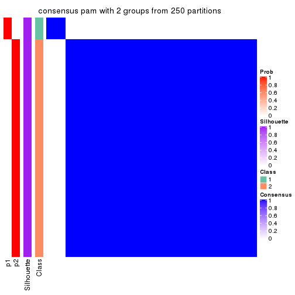</p>

</div>
<div id='tab-ATC-pam-consensus-heatmap-2'>
<pre><code class="r">consensus_heatmap(res, k = 3)
</code></pre>

<p>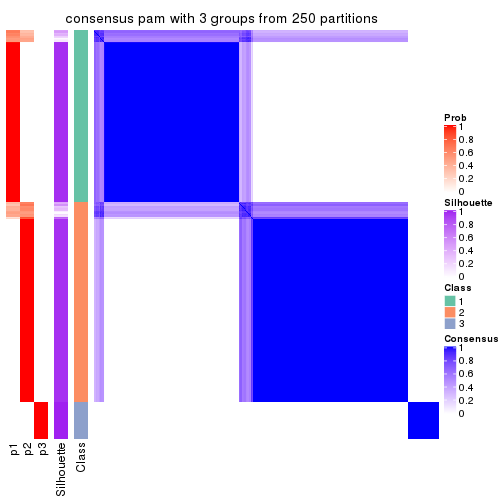</p>

</div>
<div id='tab-ATC-pam-consensus-heatmap-3'>
<pre><code class="r">consensus_heatmap(res, k = 4)
</code></pre>

<p>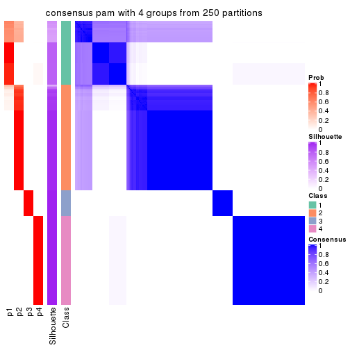</p>

</div>
<div id='tab-ATC-pam-consensus-heatmap-4'>
<pre><code class="r">consensus_heatmap(res, k = 5)
</code></pre>

<p>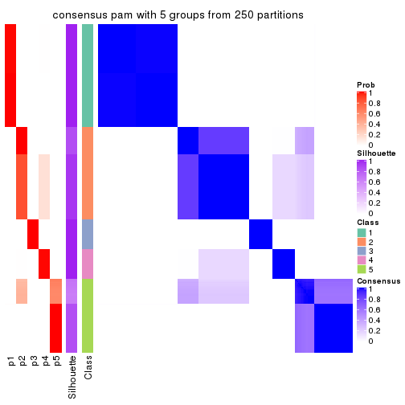</p>

</div>
<div id='tab-ATC-pam-consensus-heatmap-5'>
<pre><code class="r">consensus_heatmap(res, k = 6)
</code></pre>

<p>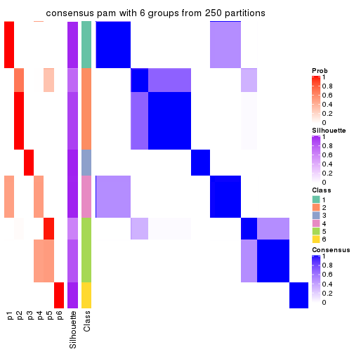</p>

</div>
</div>

Heatmaps for the membership of samples in all partitions to see how consistent they are:


<script>
$( function() {
	$( '#tabs-ATC-pam-membership-heatmap' ).tabs();
} );
</script>
<div id='tabs-ATC-pam-membership-heatmap'>
<ul>
<li><a href='#tab-ATC-pam-membership-heatmap-1'>k = 2</a></li>
<li><a href='#tab-ATC-pam-membership-heatmap-2'>k = 3</a></li>
<li><a href='#tab-ATC-pam-membership-heatmap-3'>k = 4</a></li>
<li><a href='#tab-ATC-pam-membership-heatmap-4'>k = 5</a></li>
<li><a href='#tab-ATC-pam-membership-heatmap-5'>k = 6</a></li>
</ul>
<div id='tab-ATC-pam-membership-heatmap-1'>
<pre><code class="r">membership_heatmap(res, k = 2)
</code></pre>

<p></p>

</div>
<div id='tab-ATC-pam-membership-heatmap-2'>
<pre><code class="r">membership_heatmap(res, k = 3)
</code></pre>

<p>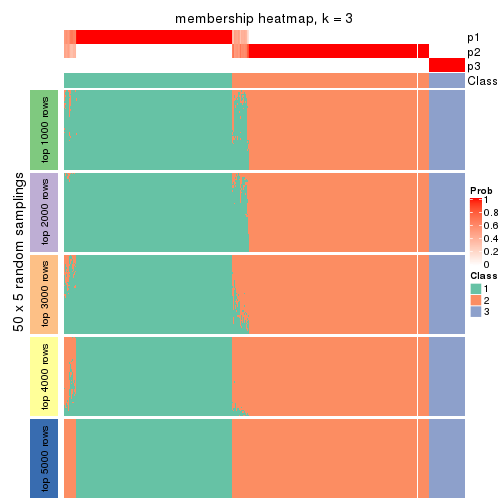</p>

</div>
<div id='tab-ATC-pam-membership-heatmap-3'>
<pre><code class="r">membership_heatmap(res, k = 4)
</code></pre>

<p>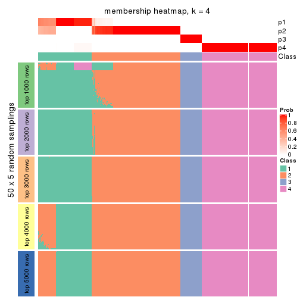</p>

</div>
<div id='tab-ATC-pam-membership-heatmap-4'>
<pre><code class="r">membership_heatmap(res, k = 5)
</code></pre>

<p>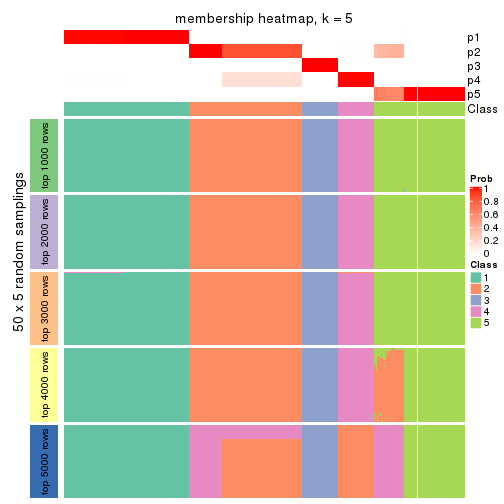</p>

</div>
<div id='tab-ATC-pam-membership-heatmap-5'>
<pre><code class="r">membership_heatmap(res, k = 6)
</code></pre>

<p>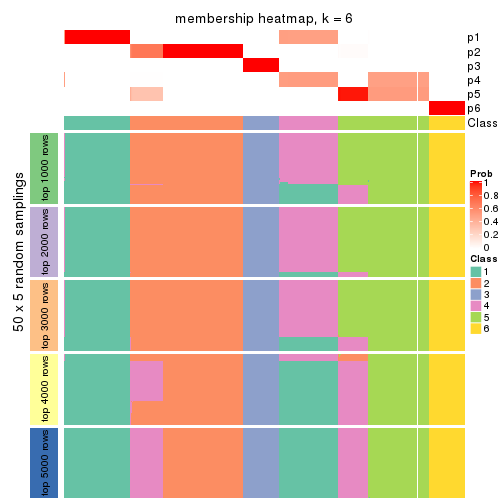</p>

</div>
</div>

As soon as we have had the classes for columns, we can look for signatures
which are significantly different between classes which can be candidate marks
for certain classes. Following are the heatmaps for signatures.


Signature heatmaps where rows are scaled:


<script>
$( function() {
	$( '#tabs-ATC-pam-get-signatures' ).tabs();
} );
</script>
<div id='tabs-ATC-pam-get-signatures'>
<ul>
<li><a href='#tab-ATC-pam-get-signatures-1'>k = 2</a></li>
<li><a href='#tab-ATC-pam-get-signatures-2'>k = 3</a></li>
<li><a href='#tab-ATC-pam-get-signatures-3'>k = 4</a></li>
<li><a href='#tab-ATC-pam-get-signatures-4'>k = 5</a></li>
<li><a href='#tab-ATC-pam-get-signatures-5'>k = 6</a></li>
</ul>
<div id='tab-ATC-pam-get-signatures-1'>
<pre><code class="r">get_signatures(res, k = 2)
</code></pre>

<p></p>

</div>
<div id='tab-ATC-pam-get-signatures-2'>
<pre><code class="r">get_signatures(res, k = 3)
</code></pre>

<p>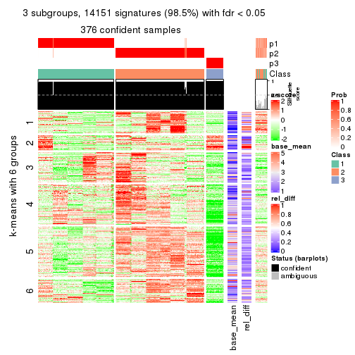</p>

</div>
<div id='tab-ATC-pam-get-signatures-3'>
<pre><code class="r">get_signatures(res, k = 4)
</code></pre>

<p>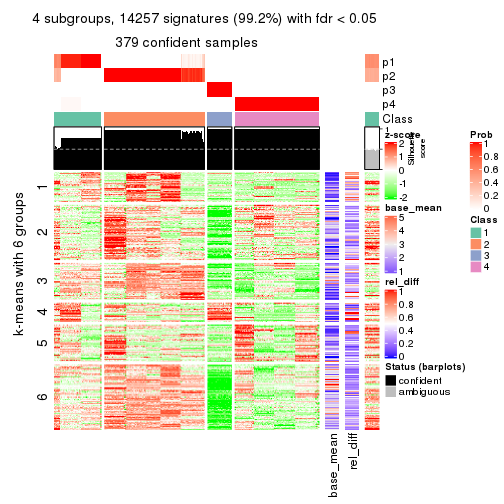</p>

</div>
<div id='tab-ATC-pam-get-signatures-4'>
<pre><code class="r">get_signatures(res, k = 5)
</code></pre>

<p>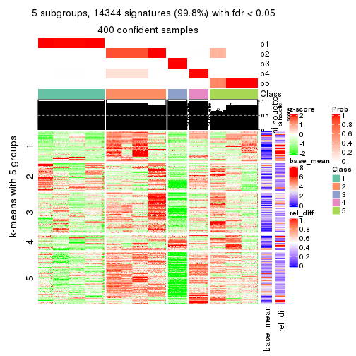</p>

</div>
<div id='tab-ATC-pam-get-signatures-5'>
<pre><code class="r">get_signatures(res, k = 6)
</code></pre>

<pre><code>#&gt; Error in mat[ceiling(1:nr/h_ratio), ceiling(1:nc/w_ratio), drop = FALSE]: subscript out of bounds
</code></pre>

<p>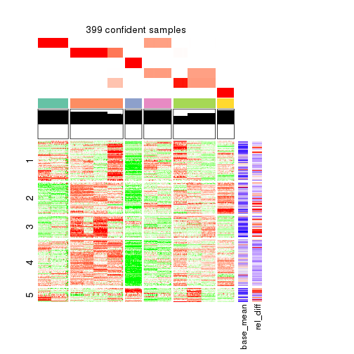</p>

</div>
</div>


Signature heatmaps where rows are not scaled:


<script>
$( function() {
	$( '#tabs-ATC-pam-get-signatures-no-scale' ).tabs();
} );
</script>
<div id='tabs-ATC-pam-get-signatures-no-scale'>
<ul>
<li><a href='#tab-ATC-pam-get-signatures-no-scale-1'>k = 2</a></li>
<li><a href='#tab-ATC-pam-get-signatures-no-scale-2'>k = 3</a></li>
<li><a href='#tab-ATC-pam-get-signatures-no-scale-3'>k = 4</a></li>
<li><a href='#tab-ATC-pam-get-signatures-no-scale-4'>k = 5</a></li>
<li><a href='#tab-ATC-pam-get-signatures-no-scale-5'>k = 6</a></li>
</ul>
<div id='tab-ATC-pam-get-signatures-no-scale-1'>
<pre><code class="r">get_signatures(res, k = 2, scale_rows = FALSE)
</code></pre>

<p></p>

</div>
<div id='tab-ATC-pam-get-signatures-no-scale-2'>
<pre><code class="r">get_signatures(res, k = 3, scale_rows = FALSE)
</code></pre>

<p>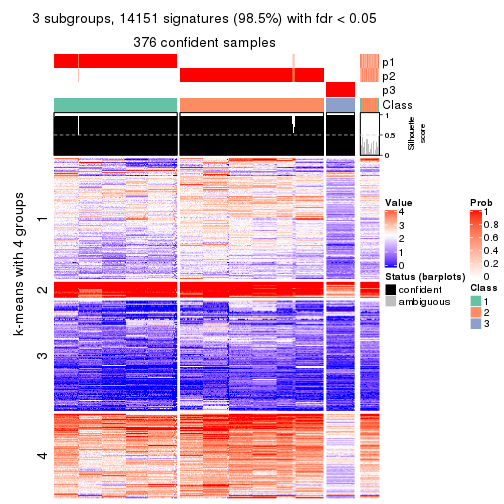</p>

</div>
<div id='tab-ATC-pam-get-signatures-no-scale-3'>
<pre><code class="r">get_signatures(res, k = 4, scale_rows = FALSE)
</code></pre>

<p>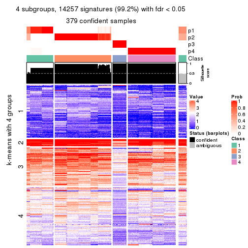</p>

</div>
<div id='tab-ATC-pam-get-signatures-no-scale-4'>
<pre><code class="r">get_signatures(res, k = 5, scale_rows = FALSE)
</code></pre>

<p>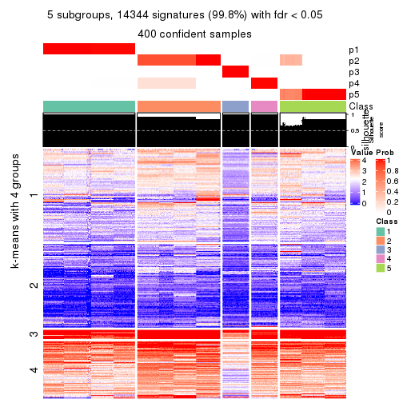</p>

</div>
<div id='tab-ATC-pam-get-signatures-no-scale-5'>
<pre><code class="r">get_signatures(res, k = 6, scale_rows = FALSE)
</code></pre>

<pre><code>#&gt; Error in mat[ceiling(1:nr/h_ratio), ceiling(1:nc/w_ratio), drop = FALSE]: subscript out of bounds
</code></pre>

<p>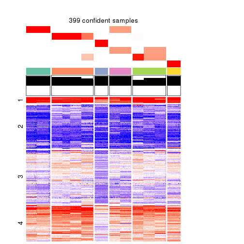</p>

</div>
</div>


Compare the overlap of signatures from different k:

```r
compare_signatures(res)
```

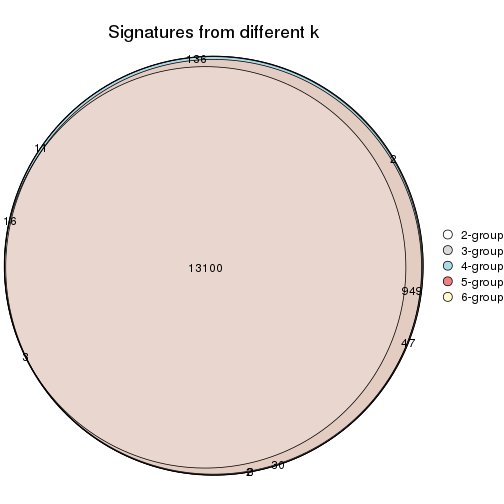

`get_signature()` returns a data frame invisibly. TO get the list of signatures, the function
call should be assigned to a variable explicitly. In following code, if `plot` argument is set
to `FALSE`, no heatmap is plotted while only the differential analysis is performed.

```r
# code only for demonstration
tb = get_signature(res, k = ..., plot = FALSE)
```

An example of the output of `tb` is:

```
#>   which_row         fdr    mean_1    mean_2 scaled_mean_1 scaled_mean_2 km
#> 1        38 0.042760348  8.373488  9.131774    -0.5533452     0.5164555  1
#> 2        40 0.018707592  7.106213  8.469186    -0.6173731     0.5762149  1
#> 3        55 0.019134737 10.221463 11.207825    -0.6159697     0.5749050  1
#> 4        59 0.006059896  5.921854  7.869574    -0.6899429     0.6439467  1
#> 5        60 0.018055526  8.928898 10.211722    -0.6204761     0.5791110  1
#> 6        98 0.009384629 15.714769 14.887706     0.6635654    -0.6193277  2
...
```

The columns in `tb` are:

1. `which_row`: row indices corresponding to the input matrix.
2. `fdr`: FDR for the differential test. 
3. `mean_x`: The mean value in group x.
4. `scaled_mean_x`: The mean value in group x after rows are scaled.
5. `km`: Row groups if k-means clustering is applied to rows.


UMAP plot which shows how samples are separated.


<script>
$( function() {
	$( '#tabs-ATC-pam-dimension-reduction' ).tabs();
} );
</script>
<div id='tabs-ATC-pam-dimension-reduction'>
<ul>
<li><a href='#tab-ATC-pam-dimension-reduction-1'>k = 2</a></li>
<li><a href='#tab-ATC-pam-dimension-reduction-2'>k = 3</a></li>
<li><a href='#tab-ATC-pam-dimension-reduction-3'>k = 4</a></li>
<li><a href='#tab-ATC-pam-dimension-reduction-4'>k = 5</a></li>
<li><a href='#tab-ATC-pam-dimension-reduction-5'>k = 6</a></li>
</ul>
<div id='tab-ATC-pam-dimension-reduction-1'>
<pre><code class="r">dimension_reduction(res, k = 2, method = &quot;UMAP&quot;)
</code></pre>

<p></p>

</div>
<div id='tab-ATC-pam-dimension-reduction-2'>
<pre><code class="r">dimension_reduction(res, k = 3, method = &quot;UMAP&quot;)
</code></pre>

<p>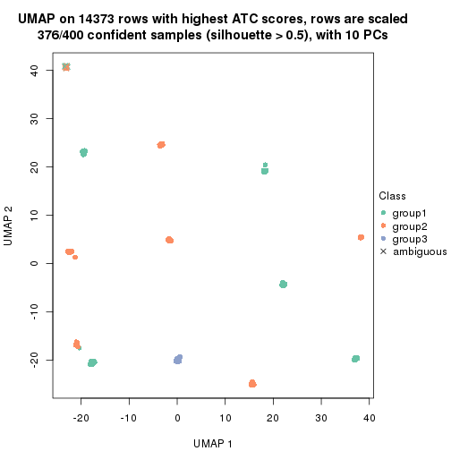</p>

</div>
<div id='tab-ATC-pam-dimension-reduction-3'>
<pre><code class="r">dimension_reduction(res, k = 4, method = &quot;UMAP&quot;)
</code></pre>

<p></p>

</div>
<div id='tab-ATC-pam-dimension-reduction-4'>
<pre><code class="r">dimension_reduction(res, k = 5, method = &quot;UMAP&quot;)
</code></pre>

<p>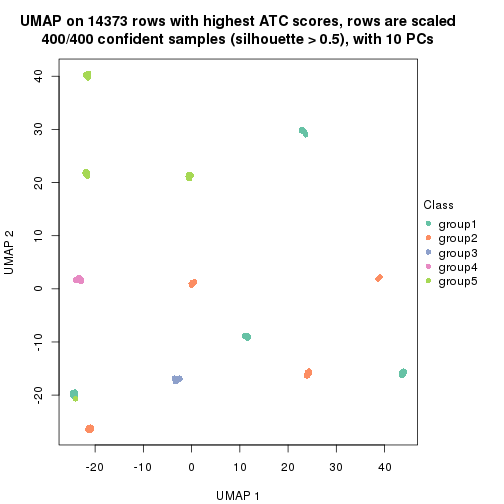</p>

</div>
<div id='tab-ATC-pam-dimension-reduction-5'>
<pre><code class="r">dimension_reduction(res, k = 6, method = &quot;UMAP&quot;)
</code></pre>

<p>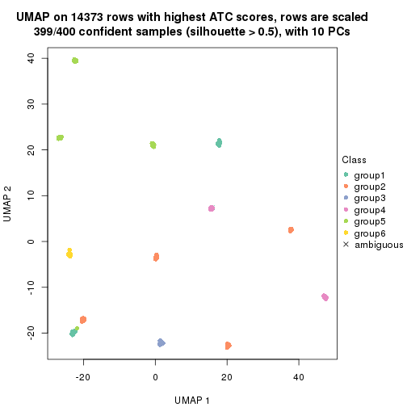</p>

</div>
</div>


Following heatmap shows how subgroups are split when increasing `k`:

```r
collect_classes(res)
```

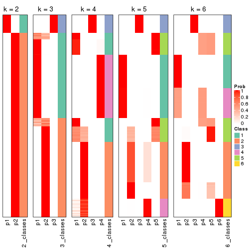


If matrix rows can be associated to genes, consider to use `GO_Enrichment(res,
...)` to perform function enrichment for the signature genes.


 

---------------------------------------------------


### ATC:mclust


The object with results only for a single top-value method and a single partition method 
can be extracted as:

```r
res = res_list["ATC", "mclust"]
# you can also extract it by
# res = res_list["ATC:mclust"]
```

A summary of `res` and all the functions that can be applied to it:

```r
res
```

```
#> A 'ConsensusPartition' object with k = 2, 3, 4, 5, 6.
#>   On a matrix with 14373 rows and 400 columns.
#>   Top rows (1000, 2000, 3000, 4000, 5000) are extracted by 'ATC' method.
#>   Subgroups are detected by 'mclust' method.
#>   Performed in total 1250 partitions by row resampling.
#>   Best k for subgroups seems to be 5.
#> 
#> Following methods can be applied to this 'ConsensusPartition' object:
#>  [1] "cola_report"             "collect_classes"         "collect_plots"          
#>  [4] "collect_stats"           "colnames"                "compare_signatures"     
#>  [7] "consensus_heatmap"       "dimension_reduction"     "functional_enrichment"  
#> [10] "get_anno_col"            "get_anno"                "get_classes"            
#> [13] "get_consensus"           "get_matrix"              "get_membership"         
#> [16] "get_param"               "get_signatures"          "get_stats"              
#> [19] "is_best_k"               "is_stable_k"             "membership_heatmap"     
#> [22] "ncol"                    "nrow"                    "plot_ecdf"              
#> [25] "rownames"                "select_partition_number" "show"                   
#> [28] "suggest_best_k"          "test_to_known_factors"
```

`collect_plots()` function collects all the plots made from `res` for all `k` (number of partitions)
into one single page to provide an easy and fast comparison between different `k`.

```r
collect_plots(res)
```

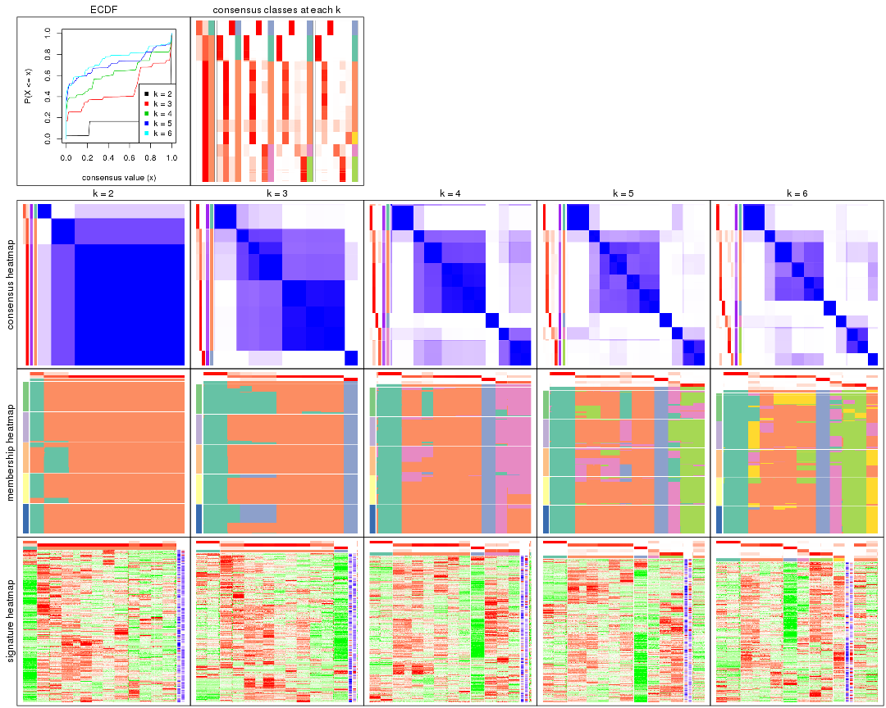

The plots are:

- The first row: a plot of the ECDF (Empirical cumulative distribution
  function) curves of the consensus matrix for each `k` and the heatmap of
  predicted classes for each `k`.
- The second row: heatmaps of the consensus matrix for each `k`.
- The third row: heatmaps of the membership matrix for each `k`.
- The fouth row: heatmaps of the signatures for each `k`.

All the plots in panels can be made by individual functions and they are
plotted later in this section.

`select_partition_number()` produces several plots showing different
statistics for choosing "optimized" `k`. There are following statistics:

- ECDF curves of the consensus matrix for each `k`;
- 1-PAC. [The PAC
  score](https://en.wikipedia.org/wiki/Consensus_clustering#Over-interpretation_potential_of_consensus_clustering)
  measures the proportion of the ambiguous subgrouping.
- Mean silhouette score.
- Concordance. The mean probability of fiting the consensus class ids in all
  partitions.
- Area increased. Denote $A_k$ as the area under the ECDF curve for current
  `k`, the area increased is defined as $A_k - A_{k-1}$.
- Rand index. The percent of pairs of samples that are both in a same cluster
  or both are not in a same cluster in the partition of k and k-1.
- Jaccard index. The ratio of pairs of samples are both in a same cluster in
  the partition of k and k-1 and the pairs of samples are both in a same
  cluster in the partition k or k-1.

The detailed explanations of these statistics can be found in [the cola
vignette](http://bioconductor.org/packages/devel/bioc/vignettes/cola/inst/doc/cola.html#toc_13).

Generally speaking, lower PAC score, higher mean silhouette score or higher
concordance corresponds to better partition. Rand index and Jaccard index
measure how similar the current partition is compared to partition with `k-1`.
If they are too similar, we won't accept `k` is better than `k-1`.

```r
select_partition_number(res)
```

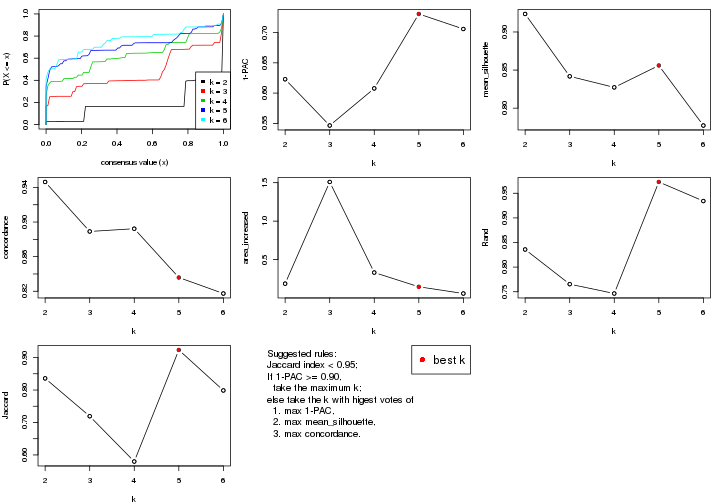

The numeric values for all these statistics can be obtained by `get_stats()`.

```r
get_stats(res)
```

```
#>   k 1-PAC mean_silhouette concordance area_increased  Rand Jaccard
#> 2 2 0.623           0.924       0.946         0.1873 0.836   0.836
#> 3 3 0.547           0.842       0.889         1.5092 0.765   0.719
#> 4 4 0.608           0.827       0.892         0.3316 0.746   0.580
#> 5 5 0.731           0.856       0.836         0.1463 0.973   0.923
#> 6 6 0.706           0.777       0.817         0.0589 0.934   0.799
```

`suggest_best_k()` suggests the best $k$ based on these statistics. The rules are as follows:

- All $k$ with Jaccard index larger than 0.95 are removed because the increase of
  the partition number does not provides enough extra information. If all $k$ are removed,
  the best $k$ is assigned by `NA`.
- For $k$ with 1-PAC larger than 0.9, the maximal $k$ is taken as the "best k". Other $k$ is called "optional k".
- If it does not fit the second rule. The $k$ with the highest vote of highest
  1-PAC, mean silhouette and concordance is taken as the "best k".

```r
suggest_best_k(res)
```

```
#> [1] 5
```


Following shows the table of the partitions (You need to click the **show/hide
code output** link to see it). The membership matrix (columns with name `p*`)
is inferred by
[`clue::cl_consensus()`](https://www.rdocumentation.org/link/cl_consensus?package=clue)
function with the `SE` method. Basically the value in the membership matrix
represents the probability to belong to a certain group. The finall class
label for an item is determined with the group with highest probability it
belongs to.

In `get_classes()` function, the entropy is calculated from the membership
matrix and the silhouette score is calculated from the consensus matrix.


<script>
$( function() {
	$( '#tabs-ATC-mclust-get-classes' ).tabs();
} );
</script>
<div id='tabs-ATC-mclust-get-classes'>
<ul>
<li><a href='#tab-ATC-mclust-get-classes-1'>k = 2</a></li>
<li><a href='#tab-ATC-mclust-get-classes-2'>k = 3</a></li>
<li><a href='#tab-ATC-mclust-get-classes-3'>k = 4</a></li>
<li><a href='#tab-ATC-mclust-get-classes-4'>k = 5</a></li>
<li><a href='#tab-ATC-mclust-get-classes-5'>k = 6</a></li>
</ul>

<div id='tab-ATC-mclust-get-classes-1'>
<p><a id='tab-ATC-mclust-get-classes-1-a' style='color:#0366d6' href='#'>show/hide code output</a></p>
<pre><code class="r">cbind(get_classes(res, k = 2), get_membership(res, k = 2))
</code></pre>

<pre><code>#&gt;            class entropy silhouette    p1    p2
#&gt; SRR1661716     2   0.000      0.952 0.000 1.000
#&gt; SRR1661717     2   0.000      0.952 0.000 1.000
#&gt; SRR1661718     2   0.000      0.952 0.000 1.000
#&gt; SRR1661719     2   0.000      0.952 0.000 1.000
#&gt; SRR1661720     2   0.000      0.952 0.000 1.000
#&gt; SRR1661721     2   0.000      0.952 0.000 1.000
#&gt; SRR1661722     2   0.000      0.952 0.000 1.000
#&gt; SRR1661723     2   0.000      0.952 0.000 1.000
#&gt; SRR1661724     2   0.000      0.952 0.000 1.000
#&gt; SRR1661725     2   0.000      0.952 0.000 1.000
#&gt; SRR1661726     2   0.000      0.952 0.000 1.000
#&gt; SRR1661727     2   0.000      0.952 0.000 1.000
#&gt; SRR1661728     2   0.000      0.952 0.000 1.000
#&gt; SRR1661729     2   0.000      0.952 0.000 1.000
#&gt; SRR1661730     2   0.000      0.952 0.000 1.000
#&gt; SRR1661731     2   0.000      0.952 0.000 1.000
#&gt; SRR1661732     2   0.000      0.952 0.000 1.000
#&gt; SRR1661733     2   0.000      0.952 0.000 1.000
#&gt; SRR1661734     2   0.000      0.952 0.000 1.000
#&gt; SRR1661735     2   0.000      0.952 0.000 1.000
#&gt; SRR1661736     2   0.000      0.952 0.000 1.000
#&gt; SRR1661737     2   0.000      0.952 0.000 1.000
#&gt; SRR1661738     2   0.000      0.952 0.000 1.000
#&gt; SRR1661739     2   0.000      0.952 0.000 1.000
#&gt; SRR1661740     2   0.000      0.952 0.000 1.000
#&gt; SRR1661741     2   0.000      0.952 0.000 1.000
#&gt; SRR1661742     2   0.000      0.952 0.000 1.000
#&gt; SRR1661743     2   0.000      0.952 0.000 1.000
#&gt; SRR1661744     2   0.000      0.952 0.000 1.000
#&gt; SRR1661745     2   0.000      0.952 0.000 1.000
#&gt; SRR1661746     2   0.000      0.952 0.000 1.000
#&gt; SRR1661747     2   0.000      0.952 0.000 1.000
#&gt; SRR1661748     2   0.000      0.952 0.000 1.000
#&gt; SRR1661749     2   0.000      0.952 0.000 1.000
#&gt; SRR1661750     2   0.000      0.952 0.000 1.000
#&gt; SRR1661751     2   0.000      0.952 0.000 1.000
#&gt; SRR1661752     2   0.000      0.952 0.000 1.000
#&gt; SRR1661753     2   0.000      0.952 0.000 1.000
#&gt; SRR1661754     2   0.000      0.952 0.000 1.000
#&gt; SRR1661755     2   0.000      0.952 0.000 1.000
#&gt; SRR1661756     2   0.000      0.952 0.000 1.000
#&gt; SRR1661757     2   0.000      0.952 0.000 1.000
#&gt; SRR1661758     2   0.000      0.952 0.000 1.000
#&gt; SRR1661759     2   0.000      0.952 0.000 1.000
#&gt; SRR1661760     2   0.000      0.952 0.000 1.000
#&gt; SRR1661761     2   0.000      0.952 0.000 1.000
#&gt; SRR1661762     2   0.000      0.952 0.000 1.000
#&gt; SRR1661763     2   0.000      0.952 0.000 1.000
#&gt; SRR1661764     2   0.000      0.952 0.000 1.000
#&gt; SRR1661766     2   0.000      0.952 0.000 1.000
#&gt; SRR1661767     2   0.000      0.952 0.000 1.000
#&gt; SRR1661768     2   0.000      0.952 0.000 1.000
#&gt; SRR1661769     2   0.000      0.952 0.000 1.000
#&gt; SRR1661770     2   0.000      0.952 0.000 1.000
#&gt; SRR1661771     2   0.000      0.952 0.000 1.000
#&gt; SRR1661772     2   0.000      0.952 0.000 1.000
#&gt; SRR1661773     2   0.000      0.952 0.000 1.000
#&gt; SRR1661774     2   0.000      0.952 0.000 1.000
#&gt; SRR1661775     2   0.000      0.952 0.000 1.000
#&gt; SRR1661776     2   0.000      0.952 0.000 1.000
#&gt; SRR1661777     2   0.000      0.952 0.000 1.000
#&gt; SRR1661778     2   0.000      0.952 0.000 1.000
#&gt; SRR1661779     2   0.000      0.952 0.000 1.000
#&gt; SRR1661780     2   0.000      0.952 0.000 1.000
#&gt; SRR1661781     2   0.000      0.952 0.000 1.000
#&gt; SRR1661782     2   0.000      0.952 0.000 1.000
#&gt; SRR1661783     2   0.000      0.952 0.000 1.000
#&gt; SRR1661784     2   0.000      0.952 0.000 1.000
#&gt; SRR1661785     2   0.000      0.952 0.000 1.000
#&gt; SRR1661786     2   0.000      0.952 0.000 1.000
#&gt; SRR1661787     2   0.000      0.952 0.000 1.000
#&gt; SRR1661788     2   0.000      0.952 0.000 1.000
#&gt; SRR1661789     2   0.000      0.952 0.000 1.000
#&gt; SRR1661790     2   0.000      0.952 0.000 1.000
#&gt; SRR1661791     2   0.000      0.952 0.000 1.000
#&gt; SRR1661792     2   0.000      0.952 0.000 1.000
#&gt; SRR1661793     2   0.000      0.952 0.000 1.000
#&gt; SRR1661794     2   0.000      0.952 0.000 1.000
#&gt; SRR1661795     2   0.000      0.952 0.000 1.000
#&gt; SRR1661796     2   0.000      0.952 0.000 1.000
#&gt; SRR1661797     2   0.000      0.952 0.000 1.000
#&gt; SRR1661798     2   0.000      0.952 0.000 1.000
#&gt; SRR1661799     2   0.000      0.952 0.000 1.000
#&gt; SRR1661800     2   0.000      0.952 0.000 1.000
#&gt; SRR1661801     2   0.000      0.952 0.000 1.000
#&gt; SRR1661802     2   0.000      0.952 0.000 1.000
#&gt; SRR1661803     2   0.000      0.952 0.000 1.000
#&gt; SRR1661804     2   0.000      0.952 0.000 1.000
#&gt; SRR1661805     2   0.000      0.952 0.000 1.000
#&gt; SRR1661806     2   0.000      0.952 0.000 1.000
#&gt; SRR1661807     2   0.000      0.952 0.000 1.000
#&gt; SRR1661808     2   0.000      0.952 0.000 1.000
#&gt; SRR1661809     2   0.000      0.952 0.000 1.000
#&gt; SRR1661810     2   0.000      0.952 0.000 1.000
#&gt; SRR1661811     2   0.000      0.952 0.000 1.000
#&gt; SRR1661812     2   0.000      0.952 0.000 1.000
#&gt; SRR1661813     2   0.000      0.952 0.000 1.000
#&gt; SRR1661814     2   0.000      0.952 0.000 1.000
#&gt; SRR1661815     2   0.000      0.952 0.000 1.000
#&gt; SRR1661816     2   0.000      0.952 0.000 1.000
#&gt; SRR1661817     2   0.000      0.952 0.000 1.000
#&gt; SRR1661818     2   0.000      0.952 0.000 1.000
#&gt; SRR1661819     2   0.000      0.952 0.000 1.000
#&gt; SRR1661820     2   0.000      0.952 0.000 1.000
#&gt; SRR1661821     2   0.000      0.952 0.000 1.000
#&gt; SRR1661822     2   0.000      0.952 0.000 1.000
#&gt; SRR1661823     2   0.000      0.952 0.000 1.000
#&gt; SRR1661824     2   0.000      0.952 0.000 1.000
#&gt; SRR1661825     2   0.000      0.952 0.000 1.000
#&gt; SRR1661826     2   0.753      0.745 0.216 0.784
#&gt; SRR1661827     2   0.753      0.745 0.216 0.784
#&gt; SRR1661828     2   0.753      0.745 0.216 0.784
#&gt; SRR1661829     2   0.753      0.745 0.216 0.784
#&gt; SRR1661830     2   0.753      0.745 0.216 0.784
#&gt; SRR1661831     2   0.753      0.745 0.216 0.784
#&gt; SRR1661832     2   0.753      0.745 0.216 0.784
#&gt; SRR1661833     2   0.753      0.745 0.216 0.784
#&gt; SRR1661834     2   0.753      0.745 0.216 0.784
#&gt; SRR1661835     2   0.753      0.745 0.216 0.784
#&gt; SRR1661836     2   0.753      0.745 0.216 0.784
#&gt; SRR1661837     2   0.753      0.745 0.216 0.784
#&gt; SRR1661838     2   0.753      0.745 0.216 0.784
#&gt; SRR1661839     2   0.753      0.745 0.216 0.784
#&gt; SRR1661840     2   0.753      0.745 0.216 0.784
#&gt; SRR1661841     2   0.753      0.745 0.216 0.784
#&gt; SRR1661843     2   0.753      0.745 0.216 0.784
#&gt; SRR1661844     2   0.753      0.745 0.216 0.784
#&gt; SRR1661845     2   0.753      0.745 0.216 0.784
#&gt; SRR1661846     2   0.753      0.745 0.216 0.784
#&gt; SRR1661847     2   0.753      0.745 0.216 0.784
#&gt; SRR1661848     2   0.753      0.745 0.216 0.784
#&gt; SRR1661849     2   0.753      0.745 0.216 0.784
#&gt; SRR1661850     2   0.753      0.745 0.216 0.784
#&gt; SRR1661851     2   0.753      0.745 0.216 0.784
#&gt; SRR1661852     2   0.753      0.745 0.216 0.784
#&gt; SRR1661853     2   0.753      0.745 0.216 0.784
#&gt; SRR1661854     2   0.753      0.745 0.216 0.784
#&gt; SRR1661855     2   0.753      0.745 0.216 0.784
#&gt; SRR1661856     1   0.753      1.000 0.784 0.216
#&gt; SRR1661857     1   0.753      1.000 0.784 0.216
#&gt; SRR1661858     1   0.753      1.000 0.784 0.216
#&gt; SRR1661859     1   0.753      1.000 0.784 0.216
#&gt; SRR1661860     1   0.753      1.000 0.784 0.216
#&gt; SRR1661861     1   0.753      1.000 0.784 0.216
#&gt; SRR1661862     1   0.753      1.000 0.784 0.216
#&gt; SRR1661863     1   0.753      1.000 0.784 0.216
#&gt; SRR1661864     1   0.753      1.000 0.784 0.216
#&gt; SRR1661865     1   0.753      1.000 0.784 0.216
#&gt; SRR1661866     1   0.753      1.000 0.784 0.216
#&gt; SRR1661867     1   0.753      1.000 0.784 0.216
#&gt; SRR1661868     1   0.753      1.000 0.784 0.216
#&gt; SRR1661869     1   0.753      1.000 0.784 0.216
#&gt; SRR1661870     1   0.753      1.000 0.784 0.216
#&gt; SRR1661871     1   0.753      1.000 0.784 0.216
#&gt; SRR1661872     1   0.753      1.000 0.784 0.216
#&gt; SRR1661873     1   0.753      1.000 0.784 0.216
#&gt; SRR1661874     1   0.753      1.000 0.784 0.216
#&gt; SRR1661875     1   0.753      1.000 0.784 0.216
#&gt; SRR1661876     1   0.753      1.000 0.784 0.216
#&gt; SRR1661877     1   0.753      1.000 0.784 0.216
#&gt; SRR1661878     1   0.753      1.000 0.784 0.216
#&gt; SRR1661879     1   0.753      1.000 0.784 0.216
#&gt; SRR1661880     1   0.753      1.000 0.784 0.216
#&gt; SRR1661881     1   0.753      1.000 0.784 0.216
#&gt; SRR1661882     1   0.753      1.000 0.784 0.216
#&gt; SRR1661883     1   0.753      1.000 0.784 0.216
#&gt; SRR1661884     1   0.753      1.000 0.784 0.216
#&gt; SRR1661885     1   0.753      1.000 0.784 0.216
#&gt; SRR1661886     1   0.753      1.000 0.784 0.216
#&gt; SRR1661887     1   0.753      1.000 0.784 0.216
#&gt; SRR1661888     1   0.753      1.000 0.784 0.216
#&gt; SRR1661889     1   0.753      1.000 0.784 0.216
#&gt; SRR1661890     1   0.753      1.000 0.784 0.216
#&gt; SRR1661891     1   0.753      1.000 0.784 0.216
#&gt; SRR1661892     2   0.753      0.745 0.216 0.784
#&gt; SRR1661893     2   0.753      0.745 0.216 0.784
#&gt; SRR1661894     2   0.753      0.745 0.216 0.784
#&gt; SRR1661895     2   0.644      0.799 0.164 0.836
#&gt; SRR1661896     2   0.753      0.745 0.216 0.784
#&gt; SRR1661897     2   0.753      0.745 0.216 0.784
#&gt; SRR1661898     2   0.753      0.745 0.216 0.784
#&gt; SRR1661899     2   0.753      0.745 0.216 0.784
#&gt; SRR1661900     2   0.753      0.745 0.216 0.784
#&gt; SRR1661901     2   0.753      0.745 0.216 0.784
#&gt; SRR1661902     2   0.753      0.745 0.216 0.784
#&gt; SRR1661903     2   0.753      0.745 0.216 0.784
#&gt; SRR1661904     2   0.753      0.745 0.216 0.784
#&gt; SRR1661905     2   0.753      0.745 0.216 0.784
#&gt; SRR1661906     2   0.753      0.745 0.216 0.784
#&gt; SRR1661907     2   0.753      0.745 0.216 0.784
#&gt; SRR1661908     2   0.506      0.850 0.112 0.888
#&gt; SRR1661909     2   0.753      0.745 0.216 0.784
#&gt; SRR1661910     2   0.753      0.745 0.216 0.784
#&gt; SRR1661911     2   0.753      0.745 0.216 0.784
#&gt; SRR1661912     2   0.753      0.745 0.216 0.784
#&gt; SRR1661913     2   0.753      0.745 0.216 0.784
#&gt; SRR1661914     2   0.753      0.745 0.216 0.784
#&gt; SRR1661915     2   0.242      0.917 0.040 0.960
#&gt; SRR1661916     2   0.753      0.745 0.216 0.784
#&gt; SRR1661917     2   0.753      0.745 0.216 0.784
#&gt; SRR1661918     2   0.753      0.745 0.216 0.784
#&gt; SRR1661919     2   0.753      0.745 0.216 0.784
#&gt; SRR1661920     2   0.753      0.745 0.216 0.784
#&gt; SRR1661921     2   0.730      0.758 0.204 0.796
#&gt; SRR1661922     2   0.753      0.745 0.216 0.784
#&gt; SRR1661923     2   0.753      0.745 0.216 0.784
#&gt; SRR1661924     2   0.753      0.745 0.216 0.784
#&gt; SRR1661925     2   0.753      0.745 0.216 0.784
#&gt; SRR1661926     2   0.753      0.745 0.216 0.784
#&gt; SRR1661927     2   0.753      0.745 0.216 0.784
#&gt; SRR1661928     2   0.000      0.952 0.000 1.000
#&gt; SRR1661929     2   0.000      0.952 0.000 1.000
#&gt; SRR1661930     2   0.000      0.952 0.000 1.000
#&gt; SRR1661931     2   0.000      0.952 0.000 1.000
#&gt; SRR1661932     2   0.000      0.952 0.000 1.000
#&gt; SRR1661933     2   0.000      0.952 0.000 1.000
#&gt; SRR1661934     2   0.000      0.952 0.000 1.000
#&gt; SRR1661935     2   0.000      0.952 0.000 1.000
#&gt; SRR1661936     2   0.000      0.952 0.000 1.000
#&gt; SRR1661937     2   0.000      0.952 0.000 1.000
#&gt; SRR1661938     2   0.000      0.952 0.000 1.000
#&gt; SRR1661939     2   0.000      0.952 0.000 1.000
#&gt; SRR1661940     2   0.000      0.952 0.000 1.000
#&gt; SRR1661941     2   0.000      0.952 0.000 1.000
#&gt; SRR1661942     2   0.000      0.952 0.000 1.000
#&gt; SRR1661943     2   0.000      0.952 0.000 1.000
#&gt; SRR1661944     2   0.000      0.952 0.000 1.000
#&gt; SRR1661945     2   0.000      0.952 0.000 1.000
#&gt; SRR1661946     2   0.000      0.952 0.000 1.000
#&gt; SRR1661947     2   0.000      0.952 0.000 1.000
#&gt; SRR1661948     2   0.000      0.952 0.000 1.000
#&gt; SRR1661949     2   0.000      0.952 0.000 1.000
#&gt; SRR1661950     2   0.000      0.952 0.000 1.000
#&gt; SRR1661951     2   0.000      0.952 0.000 1.000
#&gt; SRR1661952     2   0.000      0.952 0.000 1.000
#&gt; SRR1661953     2   0.000      0.952 0.000 1.000
#&gt; SRR1661954     2   0.000      0.952 0.000 1.000
#&gt; SRR1661955     2   0.000      0.952 0.000 1.000
#&gt; SRR1661956     2   0.000      0.952 0.000 1.000
#&gt; SRR1661957     2   0.000      0.952 0.000 1.000
#&gt; SRR1661958     2   0.000      0.952 0.000 1.000
#&gt; SRR1661959     2   0.000      0.952 0.000 1.000
#&gt; SRR1661960     2   0.000      0.952 0.000 1.000
#&gt; SRR1661961     2   0.000      0.952 0.000 1.000
#&gt; SRR1661962     2   0.000      0.952 0.000 1.000
#&gt; SRR1661963     2   0.000      0.952 0.000 1.000
#&gt; SRR1661964     2   0.000      0.952 0.000 1.000
#&gt; SRR1661965     2   0.000      0.952 0.000 1.000
#&gt; SRR1661966     2   0.000      0.952 0.000 1.000
#&gt; SRR1661967     2   0.000      0.952 0.000 1.000
#&gt; SRR1661968     2   0.000      0.952 0.000 1.000
#&gt; SRR1661969     2   0.000      0.952 0.000 1.000
#&gt; SRR1661970     2   0.000      0.952 0.000 1.000
#&gt; SRR1661971     2   0.000      0.952 0.000 1.000
#&gt; SRR1661972     2   0.000      0.952 0.000 1.000
#&gt; SRR1661973     2   0.000      0.952 0.000 1.000
#&gt; SRR1661974     2   0.000      0.952 0.000 1.000
#&gt; SRR1661975     2   0.000      0.952 0.000 1.000
#&gt; SRR1661976     2   0.000      0.952 0.000 1.000
#&gt; SRR1661977     2   0.000      0.952 0.000 1.000
#&gt; SRR1661978     2   0.000      0.952 0.000 1.000
#&gt; SRR1661979     2   0.000      0.952 0.000 1.000
#&gt; SRR1661980     2   0.000      0.952 0.000 1.000
#&gt; SRR1661981     2   0.000      0.952 0.000 1.000
#&gt; SRR1661982     2   0.000      0.952 0.000 1.000
#&gt; SRR1661983     2   0.000      0.952 0.000 1.000
#&gt; SRR1661984     2   0.000      0.952 0.000 1.000
#&gt; SRR1661985     2   0.000      0.952 0.000 1.000
#&gt; SRR1661986     2   0.000      0.952 0.000 1.000
#&gt; SRR1661987     2   0.000      0.952 0.000 1.000
#&gt; SRR1661988     2   0.000      0.952 0.000 1.000
#&gt; SRR1661989     2   0.000      0.952 0.000 1.000
#&gt; SRR1661990     2   0.000      0.952 0.000 1.000
#&gt; SRR1661991     2   0.000      0.952 0.000 1.000
#&gt; SRR1661992     2   0.000      0.952 0.000 1.000
#&gt; SRR1661993     2   0.000      0.952 0.000 1.000
#&gt; SRR1661994     2   0.000      0.952 0.000 1.000
#&gt; SRR1661995     2   0.000      0.952 0.000 1.000
#&gt; SRR1661996     2   0.000      0.952 0.000 1.000
#&gt; SRR1661997     2   0.000      0.952 0.000 1.000
#&gt; SRR1661998     2   0.000      0.952 0.000 1.000
#&gt; SRR1661999     2   0.000      0.952 0.000 1.000
#&gt; SRR1662000     2   0.000      0.952 0.000 1.000
#&gt; SRR1662001     2   0.000      0.952 0.000 1.000
#&gt; SRR1662002     2   0.000      0.952 0.000 1.000
#&gt; SRR1662003     2   0.000      0.952 0.000 1.000
#&gt; SRR1662004     2   0.000      0.952 0.000 1.000
#&gt; SRR1662005     2   0.000      0.952 0.000 1.000
#&gt; SRR1662006     2   0.000      0.952 0.000 1.000
#&gt; SRR1662007     2   0.000      0.952 0.000 1.000
#&gt; SRR1662008     2   0.000      0.952 0.000 1.000
#&gt; SRR1662009     2   0.000      0.952 0.000 1.000
#&gt; SRR1662010     2   0.000      0.952 0.000 1.000
#&gt; SRR1662011     2   0.000      0.952 0.000 1.000
#&gt; SRR1662012     2   0.000      0.952 0.000 1.000
#&gt; SRR1662013     2   0.000      0.952 0.000 1.000
#&gt; SRR1662014     2   0.000      0.952 0.000 1.000
#&gt; SRR1662015     2   0.000      0.952 0.000 1.000
#&gt; SRR1662016     2   0.000      0.952 0.000 1.000
#&gt; SRR1662017     2   0.000      0.952 0.000 1.000
#&gt; SRR1662018     2   0.000      0.952 0.000 1.000
#&gt; SRR1662019     2   0.000      0.952 0.000 1.000
#&gt; SRR1662020     2   0.000      0.952 0.000 1.000
#&gt; SRR1662021     2   0.000      0.952 0.000 1.000
#&gt; SRR1662022     2   0.000      0.952 0.000 1.000
#&gt; SRR1662023     2   0.000      0.952 0.000 1.000
#&gt; SRR1662024     2   0.000      0.952 0.000 1.000
#&gt; SRR1662025     2   0.000      0.952 0.000 1.000
#&gt; SRR1662026     2   0.000      0.952 0.000 1.000
#&gt; SRR1662027     2   0.000      0.952 0.000 1.000
#&gt; SRR1662028     2   0.000      0.952 0.000 1.000
#&gt; SRR1662029     2   0.000      0.952 0.000 1.000
#&gt; SRR1662030     2   0.000      0.952 0.000 1.000
#&gt; SRR1662031     2   0.000      0.952 0.000 1.000
#&gt; SRR1662032     2   0.000      0.952 0.000 1.000
#&gt; SRR1662033     2   0.000      0.952 0.000 1.000
#&gt; SRR1662034     2   0.000      0.952 0.000 1.000
#&gt; SRR1662035     2   0.000      0.952 0.000 1.000
#&gt; SRR1662036     2   0.000      0.952 0.000 1.000
#&gt; SRR1662037     2   0.000      0.952 0.000 1.000
#&gt; SRR1662038     2   0.000      0.952 0.000 1.000
#&gt; SRR1662039     2   0.000      0.952 0.000 1.000
#&gt; SRR1662040     2   0.000      0.952 0.000 1.000
#&gt; SRR1662041     2   0.000      0.952 0.000 1.000
#&gt; SRR1662042     2   0.000      0.952 0.000 1.000
#&gt; SRR1662043     2   0.000      0.952 0.000 1.000
#&gt; SRR1662044     2   0.000      0.952 0.000 1.000
#&gt; SRR1662045     2   0.000      0.952 0.000 1.000
#&gt; SRR1662046     2   0.000      0.952 0.000 1.000
#&gt; SRR1662047     2   0.000      0.952 0.000 1.000
#&gt; SRR1662048     2   0.000      0.952 0.000 1.000
#&gt; SRR1662049     2   0.000      0.952 0.000 1.000
#&gt; SRR1662050     2   0.000      0.952 0.000 1.000
#&gt; SRR1662051     2   0.000      0.952 0.000 1.000
#&gt; SRR1662052     2   0.000      0.952 0.000 1.000
#&gt; SRR1662053     2   0.000      0.952 0.000 1.000
#&gt; SRR1662054     2   0.000      0.952 0.000 1.000
#&gt; SRR1662055     2   0.000      0.952 0.000 1.000
#&gt; SRR1662056     2   0.000      0.952 0.000 1.000
#&gt; SRR1662057     2   0.000      0.952 0.000 1.000
#&gt; SRR1662058     2   0.000      0.952 0.000 1.000
#&gt; SRR1662059     2   0.000      0.952 0.000 1.000
#&gt; SRR1662060     2   0.000      0.952 0.000 1.000
#&gt; SRR1662061     2   0.000      0.952 0.000 1.000
#&gt; SRR1662062     2   0.000      0.952 0.000 1.000
#&gt; SRR1662063     2   0.000      0.952 0.000 1.000
#&gt; SRR1662064     2   0.000      0.952 0.000 1.000
#&gt; SRR1662065     2   0.000      0.952 0.000 1.000
#&gt; SRR1662066     2   0.000      0.952 0.000 1.000
#&gt; SRR1662067     2   0.000      0.952 0.000 1.000
#&gt; SRR1662068     2   0.000      0.952 0.000 1.000
#&gt; SRR1662069     2   0.000      0.952 0.000 1.000
#&gt; SRR1662070     2   0.000      0.952 0.000 1.000
#&gt; SRR1662071     2   0.000      0.952 0.000 1.000
#&gt; SRR1662072     2   0.000      0.952 0.000 1.000
#&gt; SRR1662073     2   0.000      0.952 0.000 1.000
#&gt; SRR1662074     2   0.000      0.952 0.000 1.000
#&gt; SRR1662075     2   0.000      0.952 0.000 1.000
#&gt; SRR1662076     2   0.000      0.952 0.000 1.000
#&gt; SRR1662077     2   0.000      0.952 0.000 1.000
#&gt; SRR1662078     2   0.000      0.952 0.000 1.000
#&gt; SRR1662079     2   0.000      0.952 0.000 1.000
#&gt; SRR1662080     2   0.000      0.952 0.000 1.000
#&gt; SRR1662081     2   0.000      0.952 0.000 1.000
#&gt; SRR1662082     2   0.000      0.952 0.000 1.000
#&gt; SRR1662083     2   0.000      0.952 0.000 1.000
#&gt; SRR1662084     2   0.000      0.952 0.000 1.000
#&gt; SRR1662085     2   0.000      0.952 0.000 1.000
#&gt; SRR1662086     2   0.000      0.952 0.000 1.000
#&gt; SRR1662087     2   0.000      0.952 0.000 1.000
#&gt; SRR1662088     2   0.000      0.952 0.000 1.000
#&gt; SRR1662089     2   0.000      0.952 0.000 1.000
#&gt; SRR1662090     2   0.000      0.952 0.000 1.000
#&gt; SRR1662091     2   0.000      0.952 0.000 1.000
#&gt; SRR1662092     2   0.000      0.952 0.000 1.000
#&gt; SRR1662093     2   0.000      0.952 0.000 1.000
#&gt; SRR1662094     2   0.000      0.952 0.000 1.000
#&gt; SRR1662095     2   0.000      0.952 0.000 1.000
#&gt; SRR1662096     2   0.000      0.952 0.000 1.000
#&gt; SRR1662097     2   0.000      0.952 0.000 1.000
#&gt; SRR1662098     2   0.000      0.952 0.000 1.000
#&gt; SRR1662099     2   0.000      0.952 0.000 1.000
#&gt; SRR1662100     2   0.000      0.952 0.000 1.000
#&gt; SRR1662101     2   0.000      0.952 0.000 1.000
#&gt; SRR1662102     2   0.000      0.952 0.000 1.000
#&gt; SRR1662103     2   0.000      0.952 0.000 1.000
#&gt; SRR1662104     2   0.000      0.952 0.000 1.000
#&gt; SRR1662105     2   0.000      0.952 0.000 1.000
#&gt; SRR1662106     2   0.000      0.952 0.000 1.000
#&gt; SRR1662107     2   0.000      0.952 0.000 1.000
#&gt; SRR1662108     2   0.000      0.952 0.000 1.000
#&gt; SRR1662109     2   0.000      0.952 0.000 1.000
#&gt; SRR1662110     2   0.000      0.952 0.000 1.000
#&gt; SRR1662111     2   0.000      0.952 0.000 1.000
#&gt; SRR1662112     2   0.000      0.952 0.000 1.000
#&gt; SRR1662113     2   0.000      0.952 0.000 1.000
#&gt; SRR1662114     2   0.000      0.952 0.000 1.000
#&gt; SRR1662115     2   0.000      0.952 0.000 1.000
#&gt; SRR1662116     2   0.000      0.952 0.000 1.000
#&gt; SRR1662117     2   0.000      0.952 0.000 1.000
</code></pre>

<script>
$('#tab-ATC-mclust-get-classes-1-a').parent().next().next().hide();
$('#tab-ATC-mclust-get-classes-1-a').click(function(){
  $('#tab-ATC-mclust-get-classes-1-a').parent().next().next().toggle();
  return(false);
});
</script>
</div>

<div id='tab-ATC-mclust-get-classes-2'>
<p><a id='tab-ATC-mclust-get-classes-2-a' style='color:#0366d6' href='#'>show/hide code output</a></p>
<pre><code class="r">cbind(get_classes(res, k = 3), get_membership(res, k = 3))
</code></pre>

<pre><code>#&gt;            class entropy silhouette    p1    p2    p3
#&gt; SRR1661716     2  0.0237      0.851 0.004 0.996 0.000
#&gt; SRR1661717     2  0.0237      0.851 0.004 0.996 0.000
#&gt; SRR1661718     2  0.0237      0.851 0.004 0.996 0.000
#&gt; SRR1661719     2  0.0237      0.851 0.004 0.996 0.000
#&gt; SRR1661720     2  0.0237      0.851 0.004 0.996 0.000
#&gt; SRR1661721     2  0.0237      0.851 0.004 0.996 0.000
#&gt; SRR1661722     2  0.0237      0.851 0.004 0.996 0.000
#&gt; SRR1661723     2  0.0237      0.851 0.004 0.996 0.000
#&gt; SRR1661724     2  0.0237      0.851 0.004 0.996 0.000
#&gt; SRR1661725     2  0.0237      0.851 0.004 0.996 0.000
#&gt; SRR1661726     2  0.0237      0.851 0.004 0.996 0.000
#&gt; SRR1661727     2  0.0237      0.851 0.004 0.996 0.000
#&gt; SRR1661728     2  0.0237      0.851 0.004 0.996 0.000
#&gt; SRR1661729     2  0.0237      0.851 0.004 0.996 0.000
#&gt; SRR1661730     2  0.0237      0.851 0.004 0.996 0.000
#&gt; SRR1661731     2  0.0237      0.851 0.004 0.996 0.000
#&gt; SRR1661732     2  0.0237      0.851 0.004 0.996 0.000
#&gt; SRR1661733     2  0.0237      0.851 0.004 0.996 0.000
#&gt; SRR1661734     2  0.0237      0.851 0.004 0.996 0.000
#&gt; SRR1661735     2  0.0237      0.851 0.004 0.996 0.000
#&gt; SRR1661736     2  0.0000      0.851 0.000 1.000 0.000
#&gt; SRR1661737     2  0.0000      0.851 0.000 1.000 0.000
#&gt; SRR1661738     2  0.0000      0.851 0.000 1.000 0.000
#&gt; SRR1661739     2  0.0000      0.851 0.000 1.000 0.000
#&gt; SRR1661740     2  0.0000      0.851 0.000 1.000 0.000
#&gt; SRR1661741     2  0.0000      0.851 0.000 1.000 0.000
#&gt; SRR1661742     2  0.0000      0.851 0.000 1.000 0.000
#&gt; SRR1661743     2  0.0000      0.851 0.000 1.000 0.000
#&gt; SRR1661744     2  0.0000      0.851 0.000 1.000 0.000
#&gt; SRR1661745     2  0.0000      0.851 0.000 1.000 0.000
#&gt; SRR1661746     2  0.0000      0.851 0.000 1.000 0.000
#&gt; SRR1661747     2  0.0000      0.851 0.000 1.000 0.000
#&gt; SRR1661748     2  0.0000      0.851 0.000 1.000 0.000
#&gt; SRR1661749     2  0.0000      0.851 0.000 1.000 0.000
#&gt; SRR1661750     2  0.0000      0.851 0.000 1.000 0.000
#&gt; SRR1661751     2  0.0000      0.851 0.000 1.000 0.000
#&gt; SRR1661752     2  0.0000      0.851 0.000 1.000 0.000
#&gt; SRR1661753     2  0.0000      0.851 0.000 1.000 0.000
#&gt; SRR1661754     2  0.0000      0.851 0.000 1.000 0.000
#&gt; SRR1661755     2  0.0000      0.851 0.000 1.000 0.000
#&gt; SRR1661756     2  0.0000      0.851 0.000 1.000 0.000
#&gt; SRR1661757     2  0.0000      0.851 0.000 1.000 0.000
#&gt; SRR1661758     2  0.0000      0.851 0.000 1.000 0.000
#&gt; SRR1661759     2  0.0000      0.851 0.000 1.000 0.000
#&gt; SRR1661760     2  0.0000      0.851 0.000 1.000 0.000
#&gt; SRR1661761     2  0.0000      0.851 0.000 1.000 0.000
#&gt; SRR1661762     2  0.0000      0.851 0.000 1.000 0.000
#&gt; SRR1661763     2  0.0000      0.851 0.000 1.000 0.000
#&gt; SRR1661764     2  0.0000      0.851 0.000 1.000 0.000
#&gt; SRR1661766     2  0.0237      0.851 0.004 0.996 0.000
#&gt; SRR1661767     2  0.0237      0.851 0.004 0.996 0.000
#&gt; SRR1661768     2  0.0237      0.851 0.004 0.996 0.000
#&gt; SRR1661769     2  0.0237      0.851 0.004 0.996 0.000
#&gt; SRR1661770     2  0.0237      0.851 0.004 0.996 0.000
#&gt; SRR1661771     2  0.0237      0.851 0.004 0.996 0.000
#&gt; SRR1661772     2  0.0237      0.851 0.004 0.996 0.000
#&gt; SRR1661773     2  0.0237      0.851 0.004 0.996 0.000
#&gt; SRR1661774     2  0.0237      0.851 0.004 0.996 0.000
#&gt; SRR1661775     2  0.0237      0.851 0.004 0.996 0.000
#&gt; SRR1661776     2  0.0237      0.851 0.004 0.996 0.000
#&gt; SRR1661777     2  0.0237      0.851 0.004 0.996 0.000
#&gt; SRR1661778     2  0.0237      0.851 0.004 0.996 0.000
#&gt; SRR1661779     2  0.0237      0.851 0.004 0.996 0.000
#&gt; SRR1661780     2  0.0237      0.851 0.004 0.996 0.000
#&gt; SRR1661781     2  0.0237      0.851 0.004 0.996 0.000
#&gt; SRR1661782     2  0.0237      0.851 0.004 0.996 0.000
#&gt; SRR1661783     2  0.0237      0.851 0.004 0.996 0.000
#&gt; SRR1661784     2  0.0237      0.851 0.004 0.996 0.000
#&gt; SRR1661785     2  0.0237      0.851 0.004 0.996 0.000
#&gt; SRR1661786     2  0.0237      0.851 0.004 0.996 0.000
#&gt; SRR1661787     2  0.0237      0.851 0.004 0.996 0.000
#&gt; SRR1661788     2  0.0237      0.851 0.004 0.996 0.000
#&gt; SRR1661789     2  0.0237      0.851 0.004 0.996 0.000
#&gt; SRR1661790     2  0.0237      0.851 0.004 0.996 0.000
#&gt; SRR1661791     2  0.0237      0.851 0.004 0.996 0.000
#&gt; SRR1661792     2  0.0237      0.851 0.004 0.996 0.000
#&gt; SRR1661793     2  0.0237      0.851 0.004 0.996 0.000
#&gt; SRR1661794     2  0.0237      0.851 0.004 0.996 0.000
#&gt; SRR1661795     2  0.0237      0.851 0.004 0.996 0.000
#&gt; SRR1661796     2  0.0592      0.846 0.012 0.988 0.000
#&gt; SRR1661797     2  0.0592      0.846 0.012 0.988 0.000
#&gt; SRR1661798     2  0.0592      0.846 0.012 0.988 0.000
#&gt; SRR1661799     2  0.0592      0.846 0.012 0.988 0.000
#&gt; SRR1661800     2  0.0592      0.846 0.012 0.988 0.000
#&gt; SRR1661801     2  0.0592      0.846 0.012 0.988 0.000
#&gt; SRR1661802     2  0.0592      0.846 0.012 0.988 0.000
#&gt; SRR1661803     2  0.0592      0.846 0.012 0.988 0.000
#&gt; SRR1661804     2  0.0592      0.846 0.012 0.988 0.000
#&gt; SRR1661805     2  0.0592      0.846 0.012 0.988 0.000
#&gt; SRR1661806     2  0.0592      0.846 0.012 0.988 0.000
#&gt; SRR1661807     2  0.0592      0.846 0.012 0.988 0.000
#&gt; SRR1661808     2  0.0592      0.846 0.012 0.988 0.000
#&gt; SRR1661809     2  0.0592      0.846 0.012 0.988 0.000
#&gt; SRR1661810     2  0.0592      0.846 0.012 0.988 0.000
#&gt; SRR1661811     2  0.0592      0.846 0.012 0.988 0.000
#&gt; SRR1661812     2  0.0592      0.846 0.012 0.988 0.000
#&gt; SRR1661813     2  0.0592      0.846 0.012 0.988 0.000
#&gt; SRR1661814     2  0.0592      0.846 0.012 0.988 0.000
#&gt; SRR1661815     2  0.0592      0.846 0.012 0.988 0.000
#&gt; SRR1661816     2  0.0592      0.846 0.012 0.988 0.000
#&gt; SRR1661817     2  0.0592      0.846 0.012 0.988 0.000
#&gt; SRR1661818     2  0.0592      0.846 0.012 0.988 0.000
#&gt; SRR1661819     2  0.0592      0.846 0.012 0.988 0.000
#&gt; SRR1661820     2  0.0592      0.846 0.012 0.988 0.000
#&gt; SRR1661821     2  0.0592      0.846 0.012 0.988 0.000
#&gt; SRR1661822     2  0.0592      0.846 0.012 0.988 0.000
#&gt; SRR1661823     2  0.0592      0.846 0.012 0.988 0.000
#&gt; SRR1661824     2  0.0592      0.846 0.012 0.988 0.000
#&gt; SRR1661825     2  0.0592      0.846 0.012 0.988 0.000
#&gt; SRR1661826     1  0.0592      0.991 0.988 0.012 0.000
#&gt; SRR1661827     1  0.0592      0.991 0.988 0.012 0.000
#&gt; SRR1661828     1  0.0592      0.991 0.988 0.012 0.000
#&gt; SRR1661829     1  0.0592      0.991 0.988 0.012 0.000
#&gt; SRR1661830     1  0.0592      0.991 0.988 0.012 0.000
#&gt; SRR1661831     1  0.0592      0.991 0.988 0.012 0.000
#&gt; SRR1661832     1  0.0592      0.991 0.988 0.012 0.000
#&gt; SRR1661833     1  0.0592      0.991 0.988 0.012 0.000
#&gt; SRR1661834     1  0.0592      0.991 0.988 0.012 0.000
#&gt; SRR1661835     1  0.0592      0.991 0.988 0.012 0.000
#&gt; SRR1661836     1  0.0592      0.991 0.988 0.012 0.000
#&gt; SRR1661837     1  0.0592      0.991 0.988 0.012 0.000
#&gt; SRR1661838     1  0.0892      0.978 0.980 0.020 0.000
#&gt; SRR1661839     1  0.0592      0.991 0.988 0.012 0.000
#&gt; SRR1661840     1  0.0592      0.991 0.988 0.012 0.000
#&gt; SRR1661841     1  0.0592      0.991 0.988 0.012 0.000
#&gt; SRR1661843     1  0.0747      0.984 0.984 0.016 0.000
#&gt; SRR1661844     1  0.0592      0.991 0.988 0.012 0.000
#&gt; SRR1661845     1  0.0592      0.991 0.988 0.012 0.000
#&gt; SRR1661846     1  0.0592      0.991 0.988 0.012 0.000
#&gt; SRR1661847     1  0.0592      0.991 0.988 0.012 0.000
#&gt; SRR1661848     1  0.0592      0.991 0.988 0.012 0.000
#&gt; SRR1661849     1  0.0592      0.991 0.988 0.012 0.000
#&gt; SRR1661850     1  0.0592      0.991 0.988 0.012 0.000
#&gt; SRR1661851     1  0.0592      0.991 0.988 0.012 0.000
#&gt; SRR1661852     1  0.0592      0.991 0.988 0.012 0.000
#&gt; SRR1661853     1  0.0592      0.991 0.988 0.012 0.000
#&gt; SRR1661854     1  0.0592      0.991 0.988 0.012 0.000
#&gt; SRR1661855     1  0.0592      0.991 0.988 0.012 0.000
#&gt; SRR1661856     3  0.0000      1.000 0.000 0.000 1.000
#&gt; SRR1661857     3  0.0000      1.000 0.000 0.000 1.000
#&gt; SRR1661858     3  0.0000      1.000 0.000 0.000 1.000
#&gt; SRR1661859     3  0.0000      1.000 0.000 0.000 1.000
#&gt; SRR1661860     3  0.0000      1.000 0.000 0.000 1.000
#&gt; SRR1661861     3  0.0000      1.000 0.000 0.000 1.000
#&gt; SRR1661862     3  0.0000      1.000 0.000 0.000 1.000
#&gt; SRR1661863     3  0.0000      1.000 0.000 0.000 1.000
#&gt; SRR1661864     3  0.0000      1.000 0.000 0.000 1.000
#&gt; SRR1661865     3  0.0000      1.000 0.000 0.000 1.000
#&gt; SRR1661866     3  0.0000      1.000 0.000 0.000 1.000
#&gt; SRR1661867     3  0.0000      1.000 0.000 0.000 1.000
#&gt; SRR1661868     3  0.0000      1.000 0.000 0.000 1.000
#&gt; SRR1661869     3  0.0000      1.000 0.000 0.000 1.000
#&gt; SRR1661870     3  0.0000      1.000 0.000 0.000 1.000
#&gt; SRR1661871     3  0.0000      1.000 0.000 0.000 1.000
#&gt; SRR1661872     3  0.0000      1.000 0.000 0.000 1.000
#&gt; SRR1661873     3  0.0000      1.000 0.000 0.000 1.000
#&gt; SRR1661874     3  0.0000      1.000 0.000 0.000 1.000
#&gt; SRR1661875     3  0.0000      1.000 0.000 0.000 1.000
#&gt; SRR1661876     3  0.0000      1.000 0.000 0.000 1.000
#&gt; SRR1661877     3  0.0000      1.000 0.000 0.000 1.000
#&gt; SRR1661878     3  0.0000      1.000 0.000 0.000 1.000
#&gt; SRR1661879     3  0.0000      1.000 0.000 0.000 1.000
#&gt; SRR1661880     3  0.0000      1.000 0.000 0.000 1.000
#&gt; SRR1661881     3  0.0000      1.000 0.000 0.000 1.000
#&gt; SRR1661882     3  0.0000      1.000 0.000 0.000 1.000
#&gt; SRR1661883     3  0.0000      1.000 0.000 0.000 1.000
#&gt; SRR1661884     3  0.0000      1.000 0.000 0.000 1.000
#&gt; SRR1661885     3  0.0000      1.000 0.000 0.000 1.000
#&gt; SRR1661886     3  0.0000      1.000 0.000 0.000 1.000
#&gt; SRR1661887     3  0.0000      1.000 0.000 0.000 1.000
#&gt; SRR1661888     3  0.0000      1.000 0.000 0.000 1.000
#&gt; SRR1661889     3  0.0000      1.000 0.000 0.000 1.000
#&gt; SRR1661890     3  0.0000      1.000 0.000 0.000 1.000
#&gt; SRR1661891     3  0.0000      1.000 0.000 0.000 1.000
#&gt; SRR1661892     1  0.0592      0.991 0.988 0.012 0.000
#&gt; SRR1661893     1  0.0592      0.991 0.988 0.012 0.000
#&gt; SRR1661894     1  0.0592      0.991 0.988 0.012 0.000
#&gt; SRR1661895     2  0.6309      0.315 0.496 0.504 0.000
#&gt; SRR1661896     1  0.0592      0.991 0.988 0.012 0.000
#&gt; SRR1661897     1  0.0592      0.991 0.988 0.012 0.000
#&gt; SRR1661898     1  0.0592      0.991 0.988 0.012 0.000
#&gt; SRR1661899     1  0.0592      0.991 0.988 0.012 0.000
#&gt; SRR1661900     1  0.0592      0.991 0.988 0.012 0.000
#&gt; SRR1661901     1  0.1031      0.971 0.976 0.024 0.000
#&gt; SRR1661902     1  0.0592      0.991 0.988 0.012 0.000
#&gt; SRR1661903     1  0.0592      0.991 0.988 0.012 0.000
#&gt; SRR1661904     1  0.0592      0.991 0.988 0.012 0.000
#&gt; SRR1661905     1  0.0592      0.991 0.988 0.012 0.000
#&gt; SRR1661906     1  0.0592      0.991 0.988 0.012 0.000
#&gt; SRR1661907     1  0.0592      0.991 0.988 0.012 0.000
#&gt; SRR1661908     2  0.6225      0.490 0.432 0.568 0.000
#&gt; SRR1661909     1  0.0592      0.991 0.988 0.012 0.000
#&gt; SRR1661910     1  0.0592      0.991 0.988 0.012 0.000
#&gt; SRR1661911     1  0.0592      0.991 0.988 0.012 0.000
#&gt; SRR1661912     1  0.0592      0.991 0.988 0.012 0.000
#&gt; SRR1661913     1  0.0592      0.991 0.988 0.012 0.000
#&gt; SRR1661914     1  0.0592      0.991 0.988 0.012 0.000
#&gt; SRR1661915     2  0.5948      0.631 0.360 0.640 0.000
#&gt; SRR1661916     1  0.0592      0.991 0.988 0.012 0.000
#&gt; SRR1661917     1  0.0592      0.991 0.988 0.012 0.000
#&gt; SRR1661918     1  0.0592      0.991 0.988 0.012 0.000
#&gt; SRR1661919     1  0.0592      0.991 0.988 0.012 0.000
#&gt; SRR1661920     1  0.0592      0.991 0.988 0.012 0.000
#&gt; SRR1661921     1  0.5016      0.570 0.760 0.240 0.000
#&gt; SRR1661922     1  0.0592      0.991 0.988 0.012 0.000
#&gt; SRR1661923     1  0.0592      0.991 0.988 0.012 0.000
#&gt; SRR1661924     1  0.1964      0.913 0.944 0.056 0.000
#&gt; SRR1661925     1  0.0592      0.991 0.988 0.012 0.000
#&gt; SRR1661926     1  0.0592      0.991 0.988 0.012 0.000
#&gt; SRR1661927     1  0.0592      0.991 0.988 0.012 0.000
#&gt; SRR1661928     2  0.0000      0.851 0.000 1.000 0.000
#&gt; SRR1661929     2  0.0000      0.851 0.000 1.000 0.000
#&gt; SRR1661930     2  0.0000      0.851 0.000 1.000 0.000
#&gt; SRR1661931     2  0.0000      0.851 0.000 1.000 0.000
#&gt; SRR1661932     2  0.0000      0.851 0.000 1.000 0.000
#&gt; SRR1661933     2  0.0000      0.851 0.000 1.000 0.000
#&gt; SRR1661934     2  0.0000      0.851 0.000 1.000 0.000
#&gt; SRR1661935     2  0.0000      0.851 0.000 1.000 0.000
#&gt; SRR1661936     2  0.0000      0.851 0.000 1.000 0.000
#&gt; SRR1661937     2  0.0000      0.851 0.000 1.000 0.000
#&gt; SRR1661938     2  0.0000      0.851 0.000 1.000 0.000
#&gt; SRR1661939     2  0.0000      0.851 0.000 1.000 0.000
#&gt; SRR1661940     2  0.0000      0.851 0.000 1.000 0.000
#&gt; SRR1661941     2  0.0000      0.851 0.000 1.000 0.000
#&gt; SRR1661942     2  0.0000      0.851 0.000 1.000 0.000
#&gt; SRR1661943     2  0.0000      0.851 0.000 1.000 0.000
#&gt; SRR1661944     2  0.0000      0.851 0.000 1.000 0.000
#&gt; SRR1661945     2  0.0000      0.851 0.000 1.000 0.000
#&gt; SRR1661946     2  0.0000      0.851 0.000 1.000 0.000
#&gt; SRR1661947     2  0.0000      0.851 0.000 1.000 0.000
#&gt; SRR1661948     2  0.0000      0.851 0.000 1.000 0.000
#&gt; SRR1661949     2  0.0000      0.851 0.000 1.000 0.000
#&gt; SRR1661950     2  0.0000      0.851 0.000 1.000 0.000
#&gt; SRR1661951     2  0.0000      0.851 0.000 1.000 0.000
#&gt; SRR1661952     2  0.0000      0.851 0.000 1.000 0.000
#&gt; SRR1661953     2  0.0000      0.851 0.000 1.000 0.000
#&gt; SRR1661954     2  0.0000      0.851 0.000 1.000 0.000
#&gt; SRR1661955     2  0.0000      0.851 0.000 1.000 0.000
#&gt; SRR1661956     2  0.0000      0.851 0.000 1.000 0.000
#&gt; SRR1661957     2  0.0000      0.851 0.000 1.000 0.000
#&gt; SRR1661958     2  0.5785      0.671 0.332 0.668 0.000
#&gt; SRR1661959     2  0.5785      0.671 0.332 0.668 0.000
#&gt; SRR1661960     2  0.5785      0.671 0.332 0.668 0.000
#&gt; SRR1661961     2  0.5785      0.671 0.332 0.668 0.000
#&gt; SRR1661962     2  0.5785      0.671 0.332 0.668 0.000
#&gt; SRR1661963     2  0.5785      0.671 0.332 0.668 0.000
#&gt; SRR1661964     2  0.5785      0.671 0.332 0.668 0.000
#&gt; SRR1661965     2  0.5785      0.671 0.332 0.668 0.000
#&gt; SRR1661966     2  0.5785      0.671 0.332 0.668 0.000
#&gt; SRR1661967     2  0.5785      0.671 0.332 0.668 0.000
#&gt; SRR1661968     2  0.5785      0.671 0.332 0.668 0.000
#&gt; SRR1661969     2  0.5785      0.671 0.332 0.668 0.000
#&gt; SRR1661970     2  0.5785      0.671 0.332 0.668 0.000
#&gt; SRR1661971     2  0.5785      0.671 0.332 0.668 0.000
#&gt; SRR1661972     2  0.5785      0.671 0.332 0.668 0.000
#&gt; SRR1661973     2  0.5785      0.671 0.332 0.668 0.000
#&gt; SRR1661974     2  0.5785      0.671 0.332 0.668 0.000
#&gt; SRR1661975     2  0.5785      0.671 0.332 0.668 0.000
#&gt; SRR1661976     2  0.5785      0.671 0.332 0.668 0.000
#&gt; SRR1661977     2  0.5785      0.671 0.332 0.668 0.000
#&gt; SRR1661978     2  0.5785      0.671 0.332 0.668 0.000
#&gt; SRR1661979     2  0.5785      0.671 0.332 0.668 0.000
#&gt; SRR1661980     2  0.5785      0.671 0.332 0.668 0.000
#&gt; SRR1661981     2  0.5785      0.671 0.332 0.668 0.000
#&gt; SRR1661982     2  0.5785      0.671 0.332 0.668 0.000
#&gt; SRR1661983     2  0.5785      0.671 0.332 0.668 0.000
#&gt; SRR1661984     2  0.5785      0.671 0.332 0.668 0.000
#&gt; SRR1661985     2  0.5785      0.671 0.332 0.668 0.000
#&gt; SRR1661986     2  0.5785      0.671 0.332 0.668 0.000
#&gt; SRR1661987     2  0.5785      0.671 0.332 0.668 0.000
#&gt; SRR1661988     2  0.7508      0.751 0.156 0.696 0.148
#&gt; SRR1661989     2  0.7508      0.751 0.156 0.696 0.148
#&gt; SRR1661990     2  0.7508      0.751 0.156 0.696 0.148
#&gt; SRR1661991     2  0.7508      0.751 0.156 0.696 0.148
#&gt; SRR1661992     2  0.7508      0.751 0.156 0.696 0.148
#&gt; SRR1661993     2  0.7508      0.751 0.156 0.696 0.148
#&gt; SRR1661994     2  0.7508      0.751 0.156 0.696 0.148
#&gt; SRR1661995     2  0.7508      0.751 0.156 0.696 0.148
#&gt; SRR1661996     2  0.7508      0.751 0.156 0.696 0.148
#&gt; SRR1661997     2  0.7508      0.751 0.156 0.696 0.148
#&gt; SRR1661998     2  0.7508      0.751 0.156 0.696 0.148
#&gt; SRR1661999     2  0.7508      0.751 0.156 0.696 0.148
#&gt; SRR1662000     2  0.7508      0.751 0.156 0.696 0.148
#&gt; SRR1662001     2  0.7508      0.751 0.156 0.696 0.148
#&gt; SRR1662002     2  0.7508      0.751 0.156 0.696 0.148
#&gt; SRR1662003     2  0.7508      0.751 0.156 0.696 0.148
#&gt; SRR1662004     2  0.7508      0.751 0.156 0.696 0.148
#&gt; SRR1662005     2  0.7508      0.751 0.156 0.696 0.148
#&gt; SRR1662006     2  0.7508      0.751 0.156 0.696 0.148
#&gt; SRR1662007     2  0.7508      0.751 0.156 0.696 0.148
#&gt; SRR1662008     2  0.7508      0.751 0.156 0.696 0.148
#&gt; SRR1662009     2  0.7508      0.751 0.156 0.696 0.148
#&gt; SRR1662010     2  0.7508      0.751 0.156 0.696 0.148
#&gt; SRR1662011     2  0.7508      0.751 0.156 0.696 0.148
#&gt; SRR1662012     2  0.7508      0.751 0.156 0.696 0.148
#&gt; SRR1662013     2  0.7508      0.751 0.156 0.696 0.148
#&gt; SRR1662014     2  0.7508      0.751 0.156 0.696 0.148
#&gt; SRR1662015     2  0.7508      0.751 0.156 0.696 0.148
#&gt; SRR1662016     2  0.7508      0.751 0.156 0.696 0.148
#&gt; SRR1662017     2  0.7508      0.751 0.156 0.696 0.148
#&gt; SRR1662018     2  0.0592      0.846 0.012 0.988 0.000
#&gt; SRR1662019     2  0.0592      0.846 0.012 0.988 0.000
#&gt; SRR1662020     2  0.0592      0.846 0.012 0.988 0.000
#&gt; SRR1662021     2  0.0424      0.848 0.008 0.992 0.000
#&gt; SRR1662022     2  0.0592      0.846 0.012 0.988 0.000
#&gt; SRR1662023     2  0.0592      0.846 0.012 0.988 0.000
#&gt; SRR1662024     2  0.0592      0.846 0.012 0.988 0.000
#&gt; SRR1662025     2  0.0592      0.846 0.012 0.988 0.000
#&gt; SRR1662026     2  0.0592      0.846 0.012 0.988 0.000
#&gt; SRR1662027     2  0.0592      0.846 0.012 0.988 0.000
#&gt; SRR1662028     2  0.0592      0.846 0.012 0.988 0.000
#&gt; SRR1662029     2  0.0592      0.846 0.012 0.988 0.000
#&gt; SRR1662030     2  0.0592      0.846 0.012 0.988 0.000
#&gt; SRR1662031     2  0.0592      0.846 0.012 0.988 0.000
#&gt; SRR1662032     2  0.0592      0.846 0.012 0.988 0.000
#&gt; SRR1662033     2  0.0592      0.846 0.012 0.988 0.000
#&gt; SRR1662034     2  0.0592      0.846 0.012 0.988 0.000
#&gt; SRR1662035     2  0.0592      0.846 0.012 0.988 0.000
#&gt; SRR1662036     2  0.0592      0.846 0.012 0.988 0.000
#&gt; SRR1662037     2  0.0592      0.846 0.012 0.988 0.000
#&gt; SRR1662038     2  0.0592      0.846 0.012 0.988 0.000
#&gt; SRR1662039     2  0.0592      0.846 0.012 0.988 0.000
#&gt; SRR1662040     2  0.0592      0.846 0.012 0.988 0.000
#&gt; SRR1662041     2  0.0592      0.846 0.012 0.988 0.000
#&gt; SRR1662042     2  0.0592      0.846 0.012 0.988 0.000
#&gt; SRR1662043     2  0.0592      0.846 0.012 0.988 0.000
#&gt; SRR1662044     2  0.0592      0.846 0.012 0.988 0.000
#&gt; SRR1662045     2  0.0592      0.846 0.012 0.988 0.000
#&gt; SRR1662046     2  0.0592      0.846 0.012 0.988 0.000
#&gt; SRR1662047     2  0.0592      0.846 0.012 0.988 0.000
#&gt; SRR1662048     2  0.0592      0.846 0.012 0.988 0.000
#&gt; SRR1662049     2  0.0592      0.846 0.012 0.988 0.000
#&gt; SRR1662050     2  0.0592      0.846 0.012 0.988 0.000
#&gt; SRR1662051     2  0.0592      0.846 0.012 0.988 0.000
#&gt; SRR1662052     2  0.0592      0.846 0.012 0.988 0.000
#&gt; SRR1662053     2  0.0592      0.846 0.012 0.988 0.000
#&gt; SRR1662054     2  0.7999      0.718 0.196 0.656 0.148
#&gt; SRR1662055     2  0.7999      0.718 0.196 0.656 0.148
#&gt; SRR1662056     2  0.7999      0.718 0.196 0.656 0.148
#&gt; SRR1662057     2  0.7999      0.718 0.196 0.656 0.148
#&gt; SRR1662058     2  0.7999      0.718 0.196 0.656 0.148
#&gt; SRR1662059     2  0.7999      0.718 0.196 0.656 0.148
#&gt; SRR1662060     2  0.7999      0.718 0.196 0.656 0.148
#&gt; SRR1662061     2  0.7999      0.718 0.196 0.656 0.148
#&gt; SRR1662062     2  0.7999      0.718 0.196 0.656 0.148
#&gt; SRR1662063     2  0.7999      0.718 0.196 0.656 0.148
#&gt; SRR1662064     2  0.7999      0.718 0.196 0.656 0.148
#&gt; SRR1662065     2  0.7999      0.718 0.196 0.656 0.148
#&gt; SRR1662066     2  0.7999      0.718 0.196 0.656 0.148
#&gt; SRR1662067     2  0.7999      0.718 0.196 0.656 0.148
#&gt; SRR1662068     2  0.7999      0.718 0.196 0.656 0.148
#&gt; SRR1662069     2  0.7999      0.718 0.196 0.656 0.148
#&gt; SRR1662070     2  0.7999      0.718 0.196 0.656 0.148
#&gt; SRR1662071     2  0.7999      0.718 0.196 0.656 0.148
#&gt; SRR1662072     2  0.7999      0.718 0.196 0.656 0.148
#&gt; SRR1662073     2  0.7999      0.718 0.196 0.656 0.148
#&gt; SRR1662074     2  0.7999      0.718 0.196 0.656 0.148
#&gt; SRR1662075     2  0.7999      0.718 0.196 0.656 0.148
#&gt; SRR1662076     2  0.7999      0.718 0.196 0.656 0.148
#&gt; SRR1662077     2  0.7999      0.718 0.196 0.656 0.148
#&gt; SRR1662078     2  0.7999      0.718 0.196 0.656 0.148
#&gt; SRR1662079     2  0.7999      0.718 0.196 0.656 0.148
#&gt; SRR1662080     2  0.7999      0.718 0.196 0.656 0.148
#&gt; SRR1662081     2  0.7999      0.718 0.196 0.656 0.148
#&gt; SRR1662082     2  0.7999      0.718 0.196 0.656 0.148
#&gt; SRR1662083     2  0.7999      0.718 0.196 0.656 0.148
#&gt; SRR1662084     2  0.7508      0.751 0.156 0.696 0.148
#&gt; SRR1662085     2  0.7508      0.751 0.156 0.696 0.148
#&gt; SRR1662086     2  0.7508      0.751 0.156 0.696 0.148
#&gt; SRR1662087     2  0.7508      0.751 0.156 0.696 0.148
#&gt; SRR1662088     2  0.7508      0.751 0.156 0.696 0.148
#&gt; SRR1662089     2  0.7508      0.751 0.156 0.696 0.148
#&gt; SRR1662090     2  0.7508      0.751 0.156 0.696 0.148
#&gt; SRR1662091     2  0.7508      0.751 0.156 0.696 0.148
#&gt; SRR1662092     2  0.7508      0.751 0.156 0.696 0.148
#&gt; SRR1662093     2  0.7508      0.751 0.156 0.696 0.148
#&gt; SRR1662094     2  0.7508      0.751 0.156 0.696 0.148
#&gt; SRR1662095     2  0.7508      0.751 0.156 0.696 0.148
#&gt; SRR1662096     2  0.7508      0.751 0.156 0.696 0.148
#&gt; SRR1662097     2  0.7508      0.751 0.156 0.696 0.148
#&gt; SRR1662098     2  0.7508      0.751 0.156 0.696 0.148
#&gt; SRR1662099     2  0.7508      0.751 0.156 0.696 0.148
#&gt; SRR1662100     2  0.7508      0.751 0.156 0.696 0.148
#&gt; SRR1662101     2  0.7508      0.751 0.156 0.696 0.148
#&gt; SRR1662102     2  0.7508      0.751 0.156 0.696 0.148
#&gt; SRR1662103     2  0.7508      0.751 0.156 0.696 0.148
#&gt; SRR1662104     2  0.7508      0.751 0.156 0.696 0.148
#&gt; SRR1662105     2  0.7508      0.751 0.156 0.696 0.148
#&gt; SRR1662106     2  0.7508      0.751 0.156 0.696 0.148
#&gt; SRR1662107     2  0.7508      0.751 0.156 0.696 0.148
#&gt; SRR1662108     2  0.7508      0.751 0.156 0.696 0.148
#&gt; SRR1662109     2  0.7508      0.751 0.156 0.696 0.148
#&gt; SRR1662110     2  0.7508      0.751 0.156 0.696 0.148
#&gt; SRR1662111     2  0.7500      0.751 0.164 0.696 0.140
#&gt; SRR1662112     2  0.7508      0.751 0.156 0.696 0.148
#&gt; SRR1662113     2  0.7508      0.751 0.156 0.696 0.148
#&gt; SRR1662114     2  0.7508      0.751 0.156 0.696 0.148
#&gt; SRR1662115     2  0.7508      0.751 0.156 0.696 0.148
#&gt; SRR1662116     2  0.7508      0.751 0.156 0.696 0.148
#&gt; SRR1662117     2  0.7508      0.751 0.156 0.696 0.148
</code></pre>

<script>
$('#tab-ATC-mclust-get-classes-2-a').parent().next().next().hide();
$('#tab-ATC-mclust-get-classes-2-a').click(function(){
  $('#tab-ATC-mclust-get-classes-2-a').parent().next().next().toggle();
  return(false);
});
</script>
</div>

<div id='tab-ATC-mclust-get-classes-3'>
<p><a id='tab-ATC-mclust-get-classes-3-a' style='color:#0366d6' href='#'>show/hide code output</a></p>
<pre><code class="r">cbind(get_classes(res, k = 4), get_membership(res, k = 4))
</code></pre>

<pre><code>#&gt;            class entropy silhouette    p1    p2    p3    p4
#&gt; SRR1661716     2  0.3688     0.7493 0.000 0.792 0.000 0.208
#&gt; SRR1661717     2  0.3688     0.7493 0.000 0.792 0.000 0.208
#&gt; SRR1661718     2  0.3688     0.7493 0.000 0.792 0.000 0.208
#&gt; SRR1661719     2  0.3688     0.7493 0.000 0.792 0.000 0.208
#&gt; SRR1661720     2  0.3688     0.7493 0.000 0.792 0.000 0.208
#&gt; SRR1661721     2  0.3688     0.7493 0.000 0.792 0.000 0.208
#&gt; SRR1661722     2  0.3688     0.7493 0.000 0.792 0.000 0.208
#&gt; SRR1661723     2  0.3688     0.7493 0.000 0.792 0.000 0.208
#&gt; SRR1661724     2  0.3688     0.7493 0.000 0.792 0.000 0.208
#&gt; SRR1661725     2  0.3688     0.7493 0.000 0.792 0.000 0.208
#&gt; SRR1661726     2  0.3688     0.7493 0.000 0.792 0.000 0.208
#&gt; SRR1661727     2  0.3688     0.7493 0.000 0.792 0.000 0.208
#&gt; SRR1661728     2  0.3688     0.7493 0.000 0.792 0.000 0.208
#&gt; SRR1661729     2  0.3688     0.7493 0.000 0.792 0.000 0.208
#&gt; SRR1661730     2  0.3688     0.7493 0.000 0.792 0.000 0.208
#&gt; SRR1661731     2  0.3688     0.7493 0.000 0.792 0.000 0.208
#&gt; SRR1661732     2  0.3688     0.7493 0.000 0.792 0.000 0.208
#&gt; SRR1661733     2  0.3688     0.7493 0.000 0.792 0.000 0.208
#&gt; SRR1661734     2  0.3688     0.7493 0.000 0.792 0.000 0.208
#&gt; SRR1661735     2  0.3688     0.7493 0.000 0.792 0.000 0.208
#&gt; SRR1661736     2  0.0592     0.8705 0.000 0.984 0.000 0.016
#&gt; SRR1661737     2  0.0592     0.8705 0.000 0.984 0.000 0.016
#&gt; SRR1661738     2  0.0592     0.8705 0.000 0.984 0.000 0.016
#&gt; SRR1661739     2  0.0592     0.8705 0.000 0.984 0.000 0.016
#&gt; SRR1661740     2  0.0592     0.8705 0.000 0.984 0.000 0.016
#&gt; SRR1661741     2  0.0592     0.8705 0.000 0.984 0.000 0.016
#&gt; SRR1661742     2  0.0592     0.8705 0.000 0.984 0.000 0.016
#&gt; SRR1661743     2  0.0592     0.8705 0.000 0.984 0.000 0.016
#&gt; SRR1661744     2  0.0592     0.8705 0.000 0.984 0.000 0.016
#&gt; SRR1661745     2  0.0592     0.8705 0.000 0.984 0.000 0.016
#&gt; SRR1661746     2  0.0592     0.8705 0.000 0.984 0.000 0.016
#&gt; SRR1661747     2  0.0592     0.8705 0.000 0.984 0.000 0.016
#&gt; SRR1661748     2  0.0592     0.8705 0.000 0.984 0.000 0.016
#&gt; SRR1661749     2  0.0592     0.8705 0.000 0.984 0.000 0.016
#&gt; SRR1661750     2  0.0592     0.8705 0.000 0.984 0.000 0.016
#&gt; SRR1661751     2  0.0592     0.8705 0.000 0.984 0.000 0.016
#&gt; SRR1661752     2  0.0592     0.8705 0.000 0.984 0.000 0.016
#&gt; SRR1661753     2  0.0592     0.8705 0.000 0.984 0.000 0.016
#&gt; SRR1661754     2  0.0592     0.8705 0.000 0.984 0.000 0.016
#&gt; SRR1661755     2  0.0592     0.8705 0.000 0.984 0.000 0.016
#&gt; SRR1661756     2  0.0592     0.8705 0.000 0.984 0.000 0.016
#&gt; SRR1661757     2  0.0592     0.8705 0.000 0.984 0.000 0.016
#&gt; SRR1661758     2  0.0592     0.8705 0.000 0.984 0.000 0.016
#&gt; SRR1661759     2  0.0592     0.8705 0.000 0.984 0.000 0.016
#&gt; SRR1661760     2  0.0592     0.8705 0.000 0.984 0.000 0.016
#&gt; SRR1661761     2  0.0592     0.8705 0.000 0.984 0.000 0.016
#&gt; SRR1661762     2  0.0592     0.8705 0.000 0.984 0.000 0.016
#&gt; SRR1661763     2  0.0592     0.8705 0.000 0.984 0.000 0.016
#&gt; SRR1661764     2  0.0592     0.8705 0.000 0.984 0.000 0.016
#&gt; SRR1661766     2  0.3688     0.7493 0.000 0.792 0.000 0.208
#&gt; SRR1661767     2  0.3688     0.7493 0.000 0.792 0.000 0.208
#&gt; SRR1661768     2  0.3688     0.7493 0.000 0.792 0.000 0.208
#&gt; SRR1661769     2  0.3688     0.7493 0.000 0.792 0.000 0.208
#&gt; SRR1661770     2  0.3688     0.7493 0.000 0.792 0.000 0.208
#&gt; SRR1661771     2  0.3688     0.7493 0.000 0.792 0.000 0.208
#&gt; SRR1661772     2  0.3688     0.7493 0.000 0.792 0.000 0.208
#&gt; SRR1661773     2  0.3688     0.7493 0.000 0.792 0.000 0.208
#&gt; SRR1661774     2  0.3688     0.7493 0.000 0.792 0.000 0.208
#&gt; SRR1661775     2  0.3688     0.7493 0.000 0.792 0.000 0.208
#&gt; SRR1661776     2  0.3688     0.7493 0.000 0.792 0.000 0.208
#&gt; SRR1661777     2  0.3688     0.7493 0.000 0.792 0.000 0.208
#&gt; SRR1661778     2  0.3688     0.7493 0.000 0.792 0.000 0.208
#&gt; SRR1661779     2  0.3688     0.7493 0.000 0.792 0.000 0.208
#&gt; SRR1661780     2  0.3688     0.7493 0.000 0.792 0.000 0.208
#&gt; SRR1661781     2  0.3688     0.7493 0.000 0.792 0.000 0.208
#&gt; SRR1661782     2  0.3688     0.7493 0.000 0.792 0.000 0.208
#&gt; SRR1661783     2  0.3688     0.7493 0.000 0.792 0.000 0.208
#&gt; SRR1661784     2  0.3688     0.7493 0.000 0.792 0.000 0.208
#&gt; SRR1661785     2  0.3688     0.7493 0.000 0.792 0.000 0.208
#&gt; SRR1661786     2  0.3688     0.7493 0.000 0.792 0.000 0.208
#&gt; SRR1661787     2  0.3688     0.7493 0.000 0.792 0.000 0.208
#&gt; SRR1661788     2  0.3688     0.7493 0.000 0.792 0.000 0.208
#&gt; SRR1661789     2  0.3688     0.7493 0.000 0.792 0.000 0.208
#&gt; SRR1661790     2  0.3688     0.7493 0.000 0.792 0.000 0.208
#&gt; SRR1661791     2  0.3688     0.7493 0.000 0.792 0.000 0.208
#&gt; SRR1661792     2  0.3688     0.7493 0.000 0.792 0.000 0.208
#&gt; SRR1661793     2  0.3688     0.7493 0.000 0.792 0.000 0.208
#&gt; SRR1661794     2  0.3688     0.7493 0.000 0.792 0.000 0.208
#&gt; SRR1661795     2  0.3688     0.7493 0.000 0.792 0.000 0.208
#&gt; SRR1661796     2  0.0376     0.8696 0.004 0.992 0.000 0.004
#&gt; SRR1661797     2  0.0376     0.8696 0.004 0.992 0.000 0.004
#&gt; SRR1661798     2  0.0376     0.8696 0.004 0.992 0.000 0.004
#&gt; SRR1661799     2  0.0376     0.8696 0.004 0.992 0.000 0.004
#&gt; SRR1661800     2  0.0376     0.8696 0.004 0.992 0.000 0.004
#&gt; SRR1661801     2  0.0376     0.8696 0.004 0.992 0.000 0.004
#&gt; SRR1661802     2  0.0376     0.8696 0.004 0.992 0.000 0.004
#&gt; SRR1661803     2  0.0376     0.8696 0.004 0.992 0.000 0.004
#&gt; SRR1661804     2  0.0376     0.8696 0.004 0.992 0.000 0.004
#&gt; SRR1661805     2  0.0376     0.8696 0.004 0.992 0.000 0.004
#&gt; SRR1661806     2  0.0376     0.8696 0.004 0.992 0.000 0.004
#&gt; SRR1661807     2  0.0376     0.8696 0.004 0.992 0.000 0.004
#&gt; SRR1661808     2  0.0376     0.8696 0.004 0.992 0.000 0.004
#&gt; SRR1661809     2  0.0376     0.8696 0.004 0.992 0.000 0.004
#&gt; SRR1661810     2  0.0376     0.8696 0.004 0.992 0.000 0.004
#&gt; SRR1661811     2  0.0376     0.8696 0.004 0.992 0.000 0.004
#&gt; SRR1661812     2  0.0376     0.8696 0.004 0.992 0.000 0.004
#&gt; SRR1661813     2  0.0376     0.8696 0.004 0.992 0.000 0.004
#&gt; SRR1661814     2  0.0376     0.8696 0.004 0.992 0.000 0.004
#&gt; SRR1661815     2  0.0376     0.8696 0.004 0.992 0.000 0.004
#&gt; SRR1661816     2  0.0376     0.8696 0.004 0.992 0.000 0.004
#&gt; SRR1661817     2  0.0376     0.8696 0.004 0.992 0.000 0.004
#&gt; SRR1661818     2  0.0376     0.8696 0.004 0.992 0.000 0.004
#&gt; SRR1661819     2  0.0376     0.8696 0.004 0.992 0.000 0.004
#&gt; SRR1661820     2  0.0376     0.8696 0.004 0.992 0.000 0.004
#&gt; SRR1661821     2  0.0376     0.8696 0.004 0.992 0.000 0.004
#&gt; SRR1661822     2  0.0376     0.8696 0.004 0.992 0.000 0.004
#&gt; SRR1661823     2  0.0376     0.8696 0.004 0.992 0.000 0.004
#&gt; SRR1661824     2  0.0376     0.8696 0.004 0.992 0.000 0.004
#&gt; SRR1661825     2  0.0376     0.8696 0.004 0.992 0.000 0.004
#&gt; SRR1661826     1  0.0188     0.9536 0.996 0.000 0.000 0.004
#&gt; SRR1661827     1  0.0188     0.9536 0.996 0.000 0.000 0.004
#&gt; SRR1661828     1  0.0188     0.9536 0.996 0.000 0.000 0.004
#&gt; SRR1661829     1  0.0188     0.9536 0.996 0.000 0.000 0.004
#&gt; SRR1661830     1  0.0188     0.9536 0.996 0.000 0.000 0.004
#&gt; SRR1661831     1  0.0188     0.9536 0.996 0.000 0.000 0.004
#&gt; SRR1661832     1  0.0188     0.9536 0.996 0.000 0.000 0.004
#&gt; SRR1661833     1  0.0188     0.9536 0.996 0.000 0.000 0.004
#&gt; SRR1661834     1  0.0188     0.9536 0.996 0.000 0.000 0.004
#&gt; SRR1661835     1  0.0188     0.9536 0.996 0.000 0.000 0.004
#&gt; SRR1661836     1  0.0188     0.9536 0.996 0.000 0.000 0.004
#&gt; SRR1661837     1  0.0188     0.9536 0.996 0.000 0.000 0.004
#&gt; SRR1661838     1  0.0524     0.9453 0.988 0.004 0.000 0.008
#&gt; SRR1661839     1  0.0188     0.9536 0.996 0.000 0.000 0.004
#&gt; SRR1661840     1  0.0188     0.9536 0.996 0.000 0.000 0.004
#&gt; SRR1661841     1  0.0188     0.9536 0.996 0.000 0.000 0.004
#&gt; SRR1661843     1  0.0188     0.9536 0.996 0.000 0.000 0.004
#&gt; SRR1661844     1  0.0188     0.9536 0.996 0.000 0.000 0.004
#&gt; SRR1661845     1  0.0188     0.9536 0.996 0.000 0.000 0.004
#&gt; SRR1661846     1  0.0188     0.9536 0.996 0.000 0.000 0.004
#&gt; SRR1661847     1  0.0188     0.9536 0.996 0.000 0.000 0.004
#&gt; SRR1661848     1  0.0188     0.9536 0.996 0.000 0.000 0.004
#&gt; SRR1661849     1  0.0188     0.9536 0.996 0.000 0.000 0.004
#&gt; SRR1661850     1  0.0188     0.9536 0.996 0.000 0.000 0.004
#&gt; SRR1661851     1  0.0188     0.9536 0.996 0.000 0.000 0.004
#&gt; SRR1661852     1  0.0188     0.9536 0.996 0.000 0.000 0.004
#&gt; SRR1661853     1  0.0188     0.9536 0.996 0.000 0.000 0.004
#&gt; SRR1661854     1  0.0188     0.9536 0.996 0.000 0.000 0.004
#&gt; SRR1661855     1  0.0188     0.9536 0.996 0.000 0.000 0.004
#&gt; SRR1661856     3  0.0000     1.0000 0.000 0.000 1.000 0.000
#&gt; SRR1661857     3  0.0000     1.0000 0.000 0.000 1.000 0.000
#&gt; SRR1661858     3  0.0000     1.0000 0.000 0.000 1.000 0.000
#&gt; SRR1661859     3  0.0000     1.0000 0.000 0.000 1.000 0.000
#&gt; SRR1661860     3  0.0000     1.0000 0.000 0.000 1.000 0.000
#&gt; SRR1661861     3  0.0000     1.0000 0.000 0.000 1.000 0.000
#&gt; SRR1661862     3  0.0000     1.0000 0.000 0.000 1.000 0.000
#&gt; SRR1661863     3  0.0000     1.0000 0.000 0.000 1.000 0.000
#&gt; SRR1661864     3  0.0000     1.0000 0.000 0.000 1.000 0.000
#&gt; SRR1661865     3  0.0000     1.0000 0.000 0.000 1.000 0.000
#&gt; SRR1661866     3  0.0000     1.0000 0.000 0.000 1.000 0.000
#&gt; SRR1661867     3  0.0000     1.0000 0.000 0.000 1.000 0.000
#&gt; SRR1661868     3  0.0000     1.0000 0.000 0.000 1.000 0.000
#&gt; SRR1661869     3  0.0000     1.0000 0.000 0.000 1.000 0.000
#&gt; SRR1661870     3  0.0000     1.0000 0.000 0.000 1.000 0.000
#&gt; SRR1661871     3  0.0000     1.0000 0.000 0.000 1.000 0.000
#&gt; SRR1661872     3  0.0000     1.0000 0.000 0.000 1.000 0.000
#&gt; SRR1661873     3  0.0000     1.0000 0.000 0.000 1.000 0.000
#&gt; SRR1661874     3  0.0000     1.0000 0.000 0.000 1.000 0.000
#&gt; SRR1661875     3  0.0000     1.0000 0.000 0.000 1.000 0.000
#&gt; SRR1661876     3  0.0000     1.0000 0.000 0.000 1.000 0.000
#&gt; SRR1661877     3  0.0000     1.0000 0.000 0.000 1.000 0.000
#&gt; SRR1661878     3  0.0000     1.0000 0.000 0.000 1.000 0.000
#&gt; SRR1661879     3  0.0000     1.0000 0.000 0.000 1.000 0.000
#&gt; SRR1661880     3  0.0000     1.0000 0.000 0.000 1.000 0.000
#&gt; SRR1661881     3  0.0000     1.0000 0.000 0.000 1.000 0.000
#&gt; SRR1661882     3  0.0000     1.0000 0.000 0.000 1.000 0.000
#&gt; SRR1661883     3  0.0000     1.0000 0.000 0.000 1.000 0.000
#&gt; SRR1661884     3  0.0000     1.0000 0.000 0.000 1.000 0.000
#&gt; SRR1661885     3  0.0000     1.0000 0.000 0.000 1.000 0.000
#&gt; SRR1661886     3  0.0000     1.0000 0.000 0.000 1.000 0.000
#&gt; SRR1661887     3  0.0000     1.0000 0.000 0.000 1.000 0.000
#&gt; SRR1661888     3  0.0000     1.0000 0.000 0.000 1.000 0.000
#&gt; SRR1661889     3  0.0000     1.0000 0.000 0.000 1.000 0.000
#&gt; SRR1661890     3  0.0000     1.0000 0.000 0.000 1.000 0.000
#&gt; SRR1661891     3  0.0000     1.0000 0.000 0.000 1.000 0.000
#&gt; SRR1661892     1  0.0188     0.9536 0.996 0.000 0.000 0.004
#&gt; SRR1661893     1  0.0188     0.9536 0.996 0.000 0.000 0.004
#&gt; SRR1661894     1  0.0188     0.9536 0.996 0.000 0.000 0.004
#&gt; SRR1661895     1  0.6894     0.0998 0.552 0.320 0.000 0.128
#&gt; SRR1661896     1  0.0188     0.9536 0.996 0.000 0.000 0.004
#&gt; SRR1661897     1  0.0188     0.9536 0.996 0.000 0.000 0.004
#&gt; SRR1661898     1  0.0188     0.9536 0.996 0.000 0.000 0.004
#&gt; SRR1661899     1  0.0188     0.9536 0.996 0.000 0.000 0.004
#&gt; SRR1661900     1  0.0188     0.9536 0.996 0.000 0.000 0.004
#&gt; SRR1661901     1  0.0927     0.9260 0.976 0.016 0.000 0.008
#&gt; SRR1661902     1  0.0188     0.9536 0.996 0.000 0.000 0.004
#&gt; SRR1661903     1  0.0188     0.9536 0.996 0.000 0.000 0.004
#&gt; SRR1661904     1  0.0188     0.9536 0.996 0.000 0.000 0.004
#&gt; SRR1661905     1  0.0188     0.9536 0.996 0.000 0.000 0.004
#&gt; SRR1661906     1  0.0188     0.9536 0.996 0.000 0.000 0.004
#&gt; SRR1661907     1  0.0188     0.9536 0.996 0.000 0.000 0.004
#&gt; SRR1661908     1  0.6961     0.0343 0.512 0.368 0.000 0.120
#&gt; SRR1661909     1  0.0188     0.9536 0.996 0.000 0.000 0.004
#&gt; SRR1661910     1  0.0188     0.9536 0.996 0.000 0.000 0.004
#&gt; SRR1661911     1  0.0188     0.9536 0.996 0.000 0.000 0.004
#&gt; SRR1661912     1  0.0188     0.9536 0.996 0.000 0.000 0.004
#&gt; SRR1661913     1  0.0188     0.9536 0.996 0.000 0.000 0.004
#&gt; SRR1661914     1  0.0188     0.9536 0.996 0.000 0.000 0.004
#&gt; SRR1661915     1  0.7423    -0.1295 0.428 0.404 0.000 0.168
#&gt; SRR1661916     1  0.0188     0.9536 0.996 0.000 0.000 0.004
#&gt; SRR1661917     1  0.0188     0.9536 0.996 0.000 0.000 0.004
#&gt; SRR1661918     1  0.0188     0.9536 0.996 0.000 0.000 0.004
#&gt; SRR1661919     1  0.0188     0.9536 0.996 0.000 0.000 0.004
#&gt; SRR1661920     1  0.0188     0.9536 0.996 0.000 0.000 0.004
#&gt; SRR1661921     1  0.5705     0.4363 0.704 0.204 0.000 0.092
#&gt; SRR1661922     1  0.0188     0.9536 0.996 0.000 0.000 0.004
#&gt; SRR1661923     1  0.0188     0.9536 0.996 0.000 0.000 0.004
#&gt; SRR1661924     1  0.2882     0.7977 0.892 0.084 0.000 0.024
#&gt; SRR1661925     1  0.0188     0.9536 0.996 0.000 0.000 0.004
#&gt; SRR1661926     1  0.0188     0.9536 0.996 0.000 0.000 0.004
#&gt; SRR1661927     1  0.0188     0.9536 0.996 0.000 0.000 0.004
#&gt; SRR1661928     2  0.0469     0.8708 0.000 0.988 0.000 0.012
#&gt; SRR1661929     2  0.0469     0.8708 0.000 0.988 0.000 0.012
#&gt; SRR1661930     2  0.0469     0.8708 0.000 0.988 0.000 0.012
#&gt; SRR1661931     2  0.0469     0.8708 0.000 0.988 0.000 0.012
#&gt; SRR1661932     2  0.0469     0.8708 0.000 0.988 0.000 0.012
#&gt; SRR1661933     2  0.0469     0.8708 0.000 0.988 0.000 0.012
#&gt; SRR1661934     2  0.0469     0.8708 0.000 0.988 0.000 0.012
#&gt; SRR1661935     2  0.0469     0.8708 0.000 0.988 0.000 0.012
#&gt; SRR1661936     2  0.0469     0.8708 0.000 0.988 0.000 0.012
#&gt; SRR1661937     2  0.0469     0.8708 0.000 0.988 0.000 0.012
#&gt; SRR1661938     2  0.0469     0.8708 0.000 0.988 0.000 0.012
#&gt; SRR1661939     2  0.0469     0.8708 0.000 0.988 0.000 0.012
#&gt; SRR1661940     2  0.0469     0.8708 0.000 0.988 0.000 0.012
#&gt; SRR1661941     2  0.0469     0.8708 0.000 0.988 0.000 0.012
#&gt; SRR1661942     2  0.0469     0.8708 0.000 0.988 0.000 0.012
#&gt; SRR1661943     2  0.0469     0.8708 0.000 0.988 0.000 0.012
#&gt; SRR1661944     2  0.0469     0.8708 0.000 0.988 0.000 0.012
#&gt; SRR1661945     2  0.0469     0.8708 0.000 0.988 0.000 0.012
#&gt; SRR1661946     2  0.0469     0.8708 0.000 0.988 0.000 0.012
#&gt; SRR1661947     2  0.0469     0.8708 0.000 0.988 0.000 0.012
#&gt; SRR1661948     2  0.0469     0.8708 0.000 0.988 0.000 0.012
#&gt; SRR1661949     2  0.0469     0.8708 0.000 0.988 0.000 0.012
#&gt; SRR1661950     2  0.0469     0.8708 0.000 0.988 0.000 0.012
#&gt; SRR1661951     2  0.0469     0.8708 0.000 0.988 0.000 0.012
#&gt; SRR1661952     2  0.0469     0.8708 0.000 0.988 0.000 0.012
#&gt; SRR1661953     2  0.0469     0.8708 0.000 0.988 0.000 0.012
#&gt; SRR1661954     2  0.0469     0.8708 0.000 0.988 0.000 0.012
#&gt; SRR1661955     2  0.0469     0.8708 0.000 0.988 0.000 0.012
#&gt; SRR1661956     2  0.0469     0.8708 0.000 0.988 0.000 0.012
#&gt; SRR1661957     2  0.0469     0.8708 0.000 0.988 0.000 0.012
#&gt; SRR1661958     4  0.2334     0.6590 0.088 0.004 0.000 0.908
#&gt; SRR1661959     4  0.2334     0.6590 0.088 0.004 0.000 0.908
#&gt; SRR1661960     4  0.2334     0.6590 0.088 0.004 0.000 0.908
#&gt; SRR1661961     4  0.2334     0.6590 0.088 0.004 0.000 0.908
#&gt; SRR1661962     4  0.2334     0.6590 0.088 0.004 0.000 0.908
#&gt; SRR1661963     4  0.2334     0.6590 0.088 0.004 0.000 0.908
#&gt; SRR1661964     4  0.2334     0.6590 0.088 0.004 0.000 0.908
#&gt; SRR1661965     4  0.2334     0.6590 0.088 0.004 0.000 0.908
#&gt; SRR1661966     4  0.2334     0.6590 0.088 0.004 0.000 0.908
#&gt; SRR1661967     4  0.2334     0.6590 0.088 0.004 0.000 0.908
#&gt; SRR1661968     4  0.2334     0.6590 0.088 0.004 0.000 0.908
#&gt; SRR1661969     4  0.2334     0.6590 0.088 0.004 0.000 0.908
#&gt; SRR1661970     4  0.2334     0.6590 0.088 0.004 0.000 0.908
#&gt; SRR1661971     4  0.2334     0.6590 0.088 0.004 0.000 0.908
#&gt; SRR1661972     4  0.2334     0.6590 0.088 0.004 0.000 0.908
#&gt; SRR1661973     4  0.2334     0.6590 0.088 0.004 0.000 0.908
#&gt; SRR1661974     4  0.2334     0.6590 0.088 0.004 0.000 0.908
#&gt; SRR1661975     4  0.2334     0.6590 0.088 0.004 0.000 0.908
#&gt; SRR1661976     4  0.2334     0.6590 0.088 0.004 0.000 0.908
#&gt; SRR1661977     4  0.2334     0.6590 0.088 0.004 0.000 0.908
#&gt; SRR1661978     4  0.2334     0.6590 0.088 0.004 0.000 0.908
#&gt; SRR1661979     4  0.2334     0.6590 0.088 0.004 0.000 0.908
#&gt; SRR1661980     4  0.2334     0.6590 0.088 0.004 0.000 0.908
#&gt; SRR1661981     4  0.2334     0.6590 0.088 0.004 0.000 0.908
#&gt; SRR1661982     4  0.2334     0.6590 0.088 0.004 0.000 0.908
#&gt; SRR1661983     4  0.2334     0.6590 0.088 0.004 0.000 0.908
#&gt; SRR1661984     4  0.2334     0.6590 0.088 0.004 0.000 0.908
#&gt; SRR1661985     4  0.2334     0.6590 0.088 0.004 0.000 0.908
#&gt; SRR1661986     4  0.2334     0.6590 0.088 0.004 0.000 0.908
#&gt; SRR1661987     4  0.2334     0.6590 0.088 0.004 0.000 0.908
#&gt; SRR1661988     4  0.4188     0.8373 0.004 0.244 0.000 0.752
#&gt; SRR1661989     4  0.4188     0.8373 0.004 0.244 0.000 0.752
#&gt; SRR1661990     4  0.4188     0.8373 0.004 0.244 0.000 0.752
#&gt; SRR1661991     4  0.4188     0.8373 0.004 0.244 0.000 0.752
#&gt; SRR1661992     4  0.4188     0.8373 0.004 0.244 0.000 0.752
#&gt; SRR1661993     4  0.4188     0.8373 0.004 0.244 0.000 0.752
#&gt; SRR1661994     4  0.4188     0.8373 0.004 0.244 0.000 0.752
#&gt; SRR1661995     4  0.4188     0.8373 0.004 0.244 0.000 0.752
#&gt; SRR1661996     4  0.4188     0.8373 0.004 0.244 0.000 0.752
#&gt; SRR1661997     4  0.4188     0.8373 0.004 0.244 0.000 0.752
#&gt; SRR1661998     4  0.4188     0.8373 0.004 0.244 0.000 0.752
#&gt; SRR1661999     4  0.4188     0.8373 0.004 0.244 0.000 0.752
#&gt; SRR1662000     4  0.4188     0.8373 0.004 0.244 0.000 0.752
#&gt; SRR1662001     4  0.4188     0.8373 0.004 0.244 0.000 0.752
#&gt; SRR1662002     4  0.4188     0.8373 0.004 0.244 0.000 0.752
#&gt; SRR1662003     4  0.4188     0.8373 0.004 0.244 0.000 0.752
#&gt; SRR1662004     4  0.4188     0.8373 0.004 0.244 0.000 0.752
#&gt; SRR1662005     4  0.4188     0.8373 0.004 0.244 0.000 0.752
#&gt; SRR1662006     4  0.4188     0.8373 0.004 0.244 0.000 0.752
#&gt; SRR1662007     4  0.4188     0.8373 0.004 0.244 0.000 0.752
#&gt; SRR1662008     4  0.4188     0.8373 0.004 0.244 0.000 0.752
#&gt; SRR1662009     4  0.4188     0.8373 0.004 0.244 0.000 0.752
#&gt; SRR1662010     4  0.4188     0.8373 0.004 0.244 0.000 0.752
#&gt; SRR1662011     4  0.4188     0.8373 0.004 0.244 0.000 0.752
#&gt; SRR1662012     4  0.4188     0.8373 0.004 0.244 0.000 0.752
#&gt; SRR1662013     4  0.4188     0.8373 0.004 0.244 0.000 0.752
#&gt; SRR1662014     4  0.4188     0.8373 0.004 0.244 0.000 0.752
#&gt; SRR1662015     4  0.4188     0.8373 0.004 0.244 0.000 0.752
#&gt; SRR1662016     4  0.4188     0.8373 0.004 0.244 0.000 0.752
#&gt; SRR1662017     4  0.4188     0.8373 0.004 0.244 0.000 0.752
#&gt; SRR1662018     2  0.0188     0.8683 0.004 0.996 0.000 0.000
#&gt; SRR1662019     2  0.0188     0.8683 0.004 0.996 0.000 0.000
#&gt; SRR1662020     2  0.0188     0.8683 0.004 0.996 0.000 0.000
#&gt; SRR1662021     2  0.0376     0.8696 0.004 0.992 0.000 0.004
#&gt; SRR1662022     2  0.0188     0.8683 0.004 0.996 0.000 0.000
#&gt; SRR1662023     2  0.0188     0.8683 0.004 0.996 0.000 0.000
#&gt; SRR1662024     2  0.0188     0.8683 0.004 0.996 0.000 0.000
#&gt; SRR1662025     2  0.0188     0.8683 0.004 0.996 0.000 0.000
#&gt; SRR1662026     2  0.0188     0.8683 0.004 0.996 0.000 0.000
#&gt; SRR1662027     2  0.0188     0.8683 0.004 0.996 0.000 0.000
#&gt; SRR1662028     2  0.0188     0.8683 0.004 0.996 0.000 0.000
#&gt; SRR1662029     2  0.0188     0.8683 0.004 0.996 0.000 0.000
#&gt; SRR1662030     2  0.0188     0.8683 0.004 0.996 0.000 0.000
#&gt; SRR1662031     2  0.0188     0.8683 0.004 0.996 0.000 0.000
#&gt; SRR1662032     2  0.0188     0.8683 0.004 0.996 0.000 0.000
#&gt; SRR1662033     2  0.0188     0.8683 0.004 0.996 0.000 0.000
#&gt; SRR1662034     2  0.0376     0.8696 0.004 0.992 0.000 0.004
#&gt; SRR1662035     2  0.0188     0.8683 0.004 0.996 0.000 0.000
#&gt; SRR1662036     2  0.0188     0.8683 0.004 0.996 0.000 0.000
#&gt; SRR1662037     2  0.0188     0.8683 0.004 0.996 0.000 0.000
#&gt; SRR1662038     2  0.0188     0.8683 0.004 0.996 0.000 0.000
#&gt; SRR1662039     2  0.0188     0.8683 0.004 0.996 0.000 0.000
#&gt; SRR1662040     2  0.0188     0.8683 0.004 0.996 0.000 0.000
#&gt; SRR1662041     2  0.0376     0.8696 0.004 0.992 0.000 0.004
#&gt; SRR1662042     2  0.0188     0.8683 0.004 0.996 0.000 0.000
#&gt; SRR1662043     2  0.0188     0.8683 0.004 0.996 0.000 0.000
#&gt; SRR1662044     2  0.0188     0.8683 0.004 0.996 0.000 0.000
#&gt; SRR1662045     2  0.0188     0.8683 0.004 0.996 0.000 0.000
#&gt; SRR1662046     2  0.0188     0.8683 0.004 0.996 0.000 0.000
#&gt; SRR1662047     2  0.0188     0.8683 0.004 0.996 0.000 0.000
#&gt; SRR1662048     2  0.0188     0.8683 0.004 0.996 0.000 0.000
#&gt; SRR1662049     2  0.0188     0.8683 0.004 0.996 0.000 0.000
#&gt; SRR1662050     2  0.0188     0.8683 0.004 0.996 0.000 0.000
#&gt; SRR1662051     2  0.0188     0.8683 0.004 0.996 0.000 0.000
#&gt; SRR1662052     2  0.0188     0.8683 0.004 0.996 0.000 0.000
#&gt; SRR1662053     2  0.0188     0.8683 0.004 0.996 0.000 0.000
#&gt; SRR1662054     2  0.6551     0.6071 0.208 0.672 0.024 0.096
#&gt; SRR1662055     2  0.6551     0.6071 0.208 0.672 0.024 0.096
#&gt; SRR1662056     2  0.6551     0.6071 0.208 0.672 0.024 0.096
#&gt; SRR1662057     2  0.6551     0.6071 0.208 0.672 0.024 0.096
#&gt; SRR1662058     2  0.6551     0.6071 0.208 0.672 0.024 0.096
#&gt; SRR1662059     2  0.6551     0.6071 0.208 0.672 0.024 0.096
#&gt; SRR1662060     2  0.6551     0.6071 0.208 0.672 0.024 0.096
#&gt; SRR1662061     2  0.6551     0.6071 0.208 0.672 0.024 0.096
#&gt; SRR1662062     2  0.6551     0.6071 0.208 0.672 0.024 0.096
#&gt; SRR1662063     2  0.6551     0.6071 0.208 0.672 0.024 0.096
#&gt; SRR1662064     2  0.6551     0.6071 0.208 0.672 0.024 0.096
#&gt; SRR1662065     2  0.6551     0.6071 0.208 0.672 0.024 0.096
#&gt; SRR1662066     2  0.6551     0.6071 0.208 0.672 0.024 0.096
#&gt; SRR1662067     2  0.6551     0.6071 0.208 0.672 0.024 0.096
#&gt; SRR1662068     2  0.6551     0.6071 0.208 0.672 0.024 0.096
#&gt; SRR1662069     2  0.6551     0.6071 0.208 0.672 0.024 0.096
#&gt; SRR1662070     2  0.6551     0.6071 0.208 0.672 0.024 0.096
#&gt; SRR1662071     2  0.6551     0.6071 0.208 0.672 0.024 0.096
#&gt; SRR1662072     2  0.6551     0.6071 0.208 0.672 0.024 0.096
#&gt; SRR1662073     2  0.6551     0.6071 0.208 0.672 0.024 0.096
#&gt; SRR1662074     2  0.6551     0.6071 0.208 0.672 0.024 0.096
#&gt; SRR1662075     2  0.6551     0.6071 0.208 0.672 0.024 0.096
#&gt; SRR1662076     2  0.6551     0.6071 0.208 0.672 0.024 0.096
#&gt; SRR1662077     2  0.6551     0.6071 0.208 0.672 0.024 0.096
#&gt; SRR1662078     2  0.6551     0.6071 0.208 0.672 0.024 0.096
#&gt; SRR1662079     2  0.6551     0.6071 0.208 0.672 0.024 0.096
#&gt; SRR1662080     2  0.6551     0.6071 0.208 0.672 0.024 0.096
#&gt; SRR1662081     2  0.6551     0.6071 0.208 0.672 0.024 0.096
#&gt; SRR1662082     2  0.6551     0.6071 0.208 0.672 0.024 0.096
#&gt; SRR1662083     2  0.6551     0.6071 0.208 0.672 0.024 0.096
#&gt; SRR1662084     4  0.4368     0.8378 0.004 0.244 0.004 0.748
#&gt; SRR1662085     4  0.4368     0.8378 0.004 0.244 0.004 0.748
#&gt; SRR1662086     4  0.4368     0.8378 0.004 0.244 0.004 0.748
#&gt; SRR1662087     4  0.5233     0.4975 0.004 0.412 0.004 0.580
#&gt; SRR1662088     4  0.4368     0.8378 0.004 0.244 0.004 0.748
#&gt; SRR1662089     4  0.4368     0.8378 0.004 0.244 0.004 0.748
#&gt; SRR1662090     4  0.4368     0.8378 0.004 0.244 0.004 0.748
#&gt; SRR1662091     4  0.4368     0.8378 0.004 0.244 0.004 0.748
#&gt; SRR1662092     4  0.4368     0.8378 0.004 0.244 0.004 0.748
#&gt; SRR1662093     4  0.5139     0.5840 0.004 0.380 0.004 0.612
#&gt; SRR1662094     4  0.4368     0.8378 0.004 0.244 0.004 0.748
#&gt; SRR1662095     4  0.4368     0.8378 0.004 0.244 0.004 0.748
#&gt; SRR1662096     4  0.4368     0.8378 0.004 0.244 0.004 0.748
#&gt; SRR1662097     4  0.4368     0.8378 0.004 0.244 0.004 0.748
#&gt; SRR1662098     4  0.4368     0.8378 0.004 0.244 0.004 0.748
#&gt; SRR1662099     4  0.4368     0.8378 0.004 0.244 0.004 0.748
#&gt; SRR1662100     4  0.4368     0.8378 0.004 0.244 0.004 0.748
#&gt; SRR1662101     4  0.4368     0.8378 0.004 0.244 0.004 0.748
#&gt; SRR1662102     4  0.4368     0.8378 0.004 0.244 0.004 0.748
#&gt; SRR1662103     4  0.4368     0.8378 0.004 0.244 0.004 0.748
#&gt; SRR1662104     4  0.4368     0.8378 0.004 0.244 0.004 0.748
#&gt; SRR1662105     4  0.4368     0.8378 0.004 0.244 0.004 0.748
#&gt; SRR1662106     4  0.4368     0.8378 0.004 0.244 0.004 0.748
#&gt; SRR1662107     4  0.4368     0.8378 0.004 0.244 0.004 0.748
#&gt; SRR1662108     4  0.4368     0.8378 0.004 0.244 0.004 0.748
#&gt; SRR1662109     4  0.4368     0.8378 0.004 0.244 0.004 0.748
#&gt; SRR1662110     4  0.4368     0.8378 0.004 0.244 0.004 0.748
#&gt; SRR1662111     2  0.5441     0.4451 0.016 0.644 0.008 0.332
#&gt; SRR1662112     4  0.4368     0.8378 0.004 0.244 0.004 0.748
#&gt; SRR1662113     4  0.4368     0.8378 0.004 0.244 0.004 0.748
#&gt; SRR1662114     4  0.5201     0.5348 0.004 0.400 0.004 0.592
#&gt; SRR1662115     4  0.4368     0.8378 0.004 0.244 0.004 0.748
#&gt; SRR1662116     4  0.4368     0.8378 0.004 0.244 0.004 0.748
#&gt; SRR1662117     4  0.4368     0.8378 0.004 0.244 0.004 0.748
</code></pre>

<script>
$('#tab-ATC-mclust-get-classes-3-a').parent().next().next().hide();
$('#tab-ATC-mclust-get-classes-3-a').click(function(){
  $('#tab-ATC-mclust-get-classes-3-a').parent().next().next().toggle();
  return(false);
});
</script>
</div>

<div id='tab-ATC-mclust-get-classes-4'>
<p><a id='tab-ATC-mclust-get-classes-4-a' style='color:#0366d6' href='#'>show/hide code output</a></p>
<pre><code class="r">cbind(get_classes(res, k = 5), get_membership(res, k = 5))
</code></pre>

<pre><code>#&gt;            class entropy silhouette    p1    p2    p3    p4    p5
#&gt; SRR1661716     2  0.3862      0.796 0.000 0.808 0.000 0.104 0.088
#&gt; SRR1661717     2  0.3857      0.796 0.000 0.808 0.000 0.108 0.084
#&gt; SRR1661718     2  0.3862      0.796 0.000 0.808 0.000 0.104 0.088
#&gt; SRR1661719     2  0.3862      0.796 0.000 0.808 0.000 0.104 0.088
#&gt; SRR1661720     2  0.3862      0.796 0.000 0.808 0.000 0.104 0.088
#&gt; SRR1661721     2  0.3862      0.796 0.000 0.808 0.000 0.104 0.088
#&gt; SRR1661722     2  0.3862      0.796 0.000 0.808 0.000 0.104 0.088
#&gt; SRR1661723     2  0.3862      0.796 0.000 0.808 0.000 0.104 0.088
#&gt; SRR1661724     2  0.3857      0.796 0.000 0.808 0.000 0.108 0.084
#&gt; SRR1661725     2  0.3862      0.796 0.000 0.808 0.000 0.104 0.088
#&gt; SRR1661726     2  0.3862      0.796 0.000 0.808 0.000 0.104 0.088
#&gt; SRR1661727     2  0.3862      0.796 0.000 0.808 0.000 0.104 0.088
#&gt; SRR1661728     2  0.3862      0.796 0.000 0.808 0.000 0.104 0.088
#&gt; SRR1661729     2  0.3857      0.796 0.000 0.808 0.000 0.108 0.084
#&gt; SRR1661730     2  0.3862      0.796 0.000 0.808 0.000 0.104 0.088
#&gt; SRR1661731     2  0.3862      0.796 0.000 0.808 0.000 0.104 0.088
#&gt; SRR1661732     2  0.3862      0.796 0.000 0.808 0.000 0.104 0.088
#&gt; SRR1661733     2  0.3862      0.796 0.000 0.808 0.000 0.104 0.088
#&gt; SRR1661734     2  0.3862      0.796 0.000 0.808 0.000 0.104 0.088
#&gt; SRR1661735     2  0.3862      0.796 0.000 0.808 0.000 0.104 0.088
#&gt; SRR1661736     2  0.1830      0.817 0.000 0.924 0.000 0.068 0.008
#&gt; SRR1661737     2  0.1830      0.817 0.000 0.924 0.000 0.068 0.008
#&gt; SRR1661738     2  0.1830      0.817 0.000 0.924 0.000 0.068 0.008
#&gt; SRR1661739     2  0.1830      0.817 0.000 0.924 0.000 0.068 0.008
#&gt; SRR1661740     2  0.1830      0.817 0.000 0.924 0.000 0.068 0.008
#&gt; SRR1661741     2  0.1830      0.817 0.000 0.924 0.000 0.068 0.008
#&gt; SRR1661742     2  0.1830      0.817 0.000 0.924 0.000 0.068 0.008
#&gt; SRR1661743     2  0.1830      0.817 0.000 0.924 0.000 0.068 0.008
#&gt; SRR1661744     2  0.1830      0.817 0.000 0.924 0.000 0.068 0.008
#&gt; SRR1661745     2  0.1830      0.817 0.000 0.924 0.000 0.068 0.008
#&gt; SRR1661746     2  0.1830      0.817 0.000 0.924 0.000 0.068 0.008
#&gt; SRR1661747     2  0.1830      0.817 0.000 0.924 0.000 0.068 0.008
#&gt; SRR1661748     2  0.1830      0.817 0.000 0.924 0.000 0.068 0.008
#&gt; SRR1661749     2  0.1830      0.817 0.000 0.924 0.000 0.068 0.008
#&gt; SRR1661750     2  0.1830      0.817 0.000 0.924 0.000 0.068 0.008
#&gt; SRR1661751     2  0.1830      0.817 0.000 0.924 0.000 0.068 0.008
#&gt; SRR1661752     2  0.1830      0.817 0.000 0.924 0.000 0.068 0.008
#&gt; SRR1661753     2  0.1830      0.817 0.000 0.924 0.000 0.068 0.008
#&gt; SRR1661754     2  0.1830      0.817 0.000 0.924 0.000 0.068 0.008
#&gt; SRR1661755     2  0.1830      0.817 0.000 0.924 0.000 0.068 0.008
#&gt; SRR1661756     2  0.1830      0.817 0.000 0.924 0.000 0.068 0.008
#&gt; SRR1661757     2  0.1830      0.817 0.000 0.924 0.000 0.068 0.008
#&gt; SRR1661758     2  0.1830      0.817 0.000 0.924 0.000 0.068 0.008
#&gt; SRR1661759     2  0.1830      0.817 0.000 0.924 0.000 0.068 0.008
#&gt; SRR1661760     2  0.1830      0.817 0.000 0.924 0.000 0.068 0.008
#&gt; SRR1661761     2  0.1830      0.817 0.000 0.924 0.000 0.068 0.008
#&gt; SRR1661762     2  0.1830      0.817 0.000 0.924 0.000 0.068 0.008
#&gt; SRR1661763     2  0.1830      0.817 0.000 0.924 0.000 0.068 0.008
#&gt; SRR1661764     2  0.1830      0.817 0.000 0.924 0.000 0.068 0.008
#&gt; SRR1661766     2  0.3731      0.798 0.000 0.816 0.000 0.112 0.072
#&gt; SRR1661767     2  0.3731      0.798 0.000 0.816 0.000 0.112 0.072
#&gt; SRR1661768     2  0.3731      0.798 0.000 0.816 0.000 0.112 0.072
#&gt; SRR1661769     2  0.3731      0.798 0.000 0.816 0.000 0.112 0.072
#&gt; SRR1661770     2  0.3731      0.798 0.000 0.816 0.000 0.112 0.072
#&gt; SRR1661771     2  0.3731      0.798 0.000 0.816 0.000 0.112 0.072
#&gt; SRR1661772     2  0.3731      0.798 0.000 0.816 0.000 0.112 0.072
#&gt; SRR1661773     2  0.3731      0.798 0.000 0.816 0.000 0.112 0.072
#&gt; SRR1661774     2  0.3731      0.798 0.000 0.816 0.000 0.112 0.072
#&gt; SRR1661775     2  0.3731      0.798 0.000 0.816 0.000 0.112 0.072
#&gt; SRR1661776     2  0.3731      0.798 0.000 0.816 0.000 0.112 0.072
#&gt; SRR1661777     2  0.3731      0.798 0.000 0.816 0.000 0.112 0.072
#&gt; SRR1661778     2  0.3731      0.798 0.000 0.816 0.000 0.112 0.072
#&gt; SRR1661779     2  0.3731      0.798 0.000 0.816 0.000 0.112 0.072
#&gt; SRR1661780     2  0.3731      0.798 0.000 0.816 0.000 0.112 0.072
#&gt; SRR1661781     2  0.3731      0.798 0.000 0.816 0.000 0.112 0.072
#&gt; SRR1661782     2  0.3731      0.798 0.000 0.816 0.000 0.112 0.072
#&gt; SRR1661783     2  0.3731      0.798 0.000 0.816 0.000 0.112 0.072
#&gt; SRR1661784     2  0.3731      0.798 0.000 0.816 0.000 0.112 0.072
#&gt; SRR1661785     2  0.3731      0.798 0.000 0.816 0.000 0.112 0.072
#&gt; SRR1661786     2  0.3731      0.798 0.000 0.816 0.000 0.112 0.072
#&gt; SRR1661787     2  0.3731      0.798 0.000 0.816 0.000 0.112 0.072
#&gt; SRR1661788     2  0.3731      0.798 0.000 0.816 0.000 0.112 0.072
#&gt; SRR1661789     2  0.3731      0.798 0.000 0.816 0.000 0.112 0.072
#&gt; SRR1661790     2  0.3731      0.798 0.000 0.816 0.000 0.112 0.072
#&gt; SRR1661791     2  0.3731      0.798 0.000 0.816 0.000 0.112 0.072
#&gt; SRR1661792     2  0.3731      0.798 0.000 0.816 0.000 0.112 0.072
#&gt; SRR1661793     2  0.3731      0.798 0.000 0.816 0.000 0.112 0.072
#&gt; SRR1661794     2  0.3731      0.798 0.000 0.816 0.000 0.112 0.072
#&gt; SRR1661795     2  0.3731      0.798 0.000 0.816 0.000 0.112 0.072
#&gt; SRR1661796     2  0.3318      0.807 0.000 0.800 0.000 0.192 0.008
#&gt; SRR1661797     2  0.3318      0.807 0.000 0.800 0.000 0.192 0.008
#&gt; SRR1661798     2  0.3318      0.807 0.000 0.800 0.000 0.192 0.008
#&gt; SRR1661799     2  0.3318      0.807 0.000 0.800 0.000 0.192 0.008
#&gt; SRR1661800     2  0.3318      0.807 0.000 0.800 0.000 0.192 0.008
#&gt; SRR1661801     2  0.3318      0.807 0.000 0.800 0.000 0.192 0.008
#&gt; SRR1661802     2  0.3318      0.807 0.000 0.800 0.000 0.192 0.008
#&gt; SRR1661803     2  0.3318      0.807 0.000 0.800 0.000 0.192 0.008
#&gt; SRR1661804     2  0.3318      0.807 0.000 0.800 0.000 0.192 0.008
#&gt; SRR1661805     2  0.3318      0.807 0.000 0.800 0.000 0.192 0.008
#&gt; SRR1661806     2  0.3318      0.807 0.000 0.800 0.000 0.192 0.008
#&gt; SRR1661807     2  0.3318      0.807 0.000 0.800 0.000 0.192 0.008
#&gt; SRR1661808     2  0.3318      0.807 0.000 0.800 0.000 0.192 0.008
#&gt; SRR1661809     2  0.3318      0.807 0.000 0.800 0.000 0.192 0.008
#&gt; SRR1661810     2  0.3318      0.807 0.000 0.800 0.000 0.192 0.008
#&gt; SRR1661811     2  0.3318      0.807 0.000 0.800 0.000 0.192 0.008
#&gt; SRR1661812     2  0.3318      0.807 0.000 0.800 0.000 0.192 0.008
#&gt; SRR1661813     2  0.3318      0.807 0.000 0.800 0.000 0.192 0.008
#&gt; SRR1661814     2  0.3318      0.807 0.000 0.800 0.000 0.192 0.008
#&gt; SRR1661815     2  0.3318      0.807 0.000 0.800 0.000 0.192 0.008
#&gt; SRR1661816     2  0.3318      0.807 0.000 0.800 0.000 0.192 0.008
#&gt; SRR1661817     2  0.3318      0.807 0.000 0.800 0.000 0.192 0.008
#&gt; SRR1661818     2  0.3318      0.807 0.000 0.800 0.000 0.192 0.008
#&gt; SRR1661819     2  0.3318      0.807 0.000 0.800 0.000 0.192 0.008
#&gt; SRR1661820     2  0.3318      0.807 0.000 0.800 0.000 0.192 0.008
#&gt; SRR1661821     2  0.3318      0.807 0.000 0.800 0.000 0.192 0.008
#&gt; SRR1661822     2  0.3318      0.807 0.000 0.800 0.000 0.192 0.008
#&gt; SRR1661823     2  0.3318      0.807 0.000 0.800 0.000 0.192 0.008
#&gt; SRR1661824     2  0.3318      0.807 0.000 0.800 0.000 0.192 0.008
#&gt; SRR1661825     2  0.3318      0.807 0.000 0.800 0.000 0.192 0.008
#&gt; SRR1661826     1  0.0000      0.994 1.000 0.000 0.000 0.000 0.000
#&gt; SRR1661827     1  0.0000      0.994 1.000 0.000 0.000 0.000 0.000
#&gt; SRR1661828     1  0.0000      0.994 1.000 0.000 0.000 0.000 0.000
#&gt; SRR1661829     1  0.0000      0.994 1.000 0.000 0.000 0.000 0.000
#&gt; SRR1661830     1  0.0000      0.994 1.000 0.000 0.000 0.000 0.000
#&gt; SRR1661831     1  0.0000      0.994 1.000 0.000 0.000 0.000 0.000
#&gt; SRR1661832     1  0.0000      0.994 1.000 0.000 0.000 0.000 0.000
#&gt; SRR1661833     1  0.0000      0.994 1.000 0.000 0.000 0.000 0.000
#&gt; SRR1661834     1  0.0000      0.994 1.000 0.000 0.000 0.000 0.000
#&gt; SRR1661835     1  0.0000      0.994 1.000 0.000 0.000 0.000 0.000
#&gt; SRR1661836     1  0.0000      0.994 1.000 0.000 0.000 0.000 0.000
#&gt; SRR1661837     1  0.0000      0.994 1.000 0.000 0.000 0.000 0.000
#&gt; SRR1661838     1  0.0290      0.981 0.992 0.000 0.000 0.000 0.008
#&gt; SRR1661839     1  0.0000      0.994 1.000 0.000 0.000 0.000 0.000
#&gt; SRR1661840     1  0.0000      0.994 1.000 0.000 0.000 0.000 0.000
#&gt; SRR1661841     1  0.0000      0.994 1.000 0.000 0.000 0.000 0.000
#&gt; SRR1661843     1  0.0000      0.994 1.000 0.000 0.000 0.000 0.000
#&gt; SRR1661844     1  0.0000      0.994 1.000 0.000 0.000 0.000 0.000
#&gt; SRR1661845     1  0.0000      0.994 1.000 0.000 0.000 0.000 0.000
#&gt; SRR1661846     1  0.0000      0.994 1.000 0.000 0.000 0.000 0.000
#&gt; SRR1661847     1  0.0000      0.994 1.000 0.000 0.000 0.000 0.000
#&gt; SRR1661848     1  0.0000      0.994 1.000 0.000 0.000 0.000 0.000
#&gt; SRR1661849     1  0.0000      0.994 1.000 0.000 0.000 0.000 0.000
#&gt; SRR1661850     1  0.0000      0.994 1.000 0.000 0.000 0.000 0.000
#&gt; SRR1661851     1  0.0000      0.994 1.000 0.000 0.000 0.000 0.000
#&gt; SRR1661852     1  0.0000      0.994 1.000 0.000 0.000 0.000 0.000
#&gt; SRR1661853     1  0.0000      0.994 1.000 0.000 0.000 0.000 0.000
#&gt; SRR1661854     1  0.0000      0.994 1.000 0.000 0.000 0.000 0.000
#&gt; SRR1661855     1  0.0000      0.994 1.000 0.000 0.000 0.000 0.000
#&gt; SRR1661856     3  0.0000      1.000 0.000 0.000 1.000 0.000 0.000
#&gt; SRR1661857     3  0.0000      1.000 0.000 0.000 1.000 0.000 0.000
#&gt; SRR1661858     3  0.0000      1.000 0.000 0.000 1.000 0.000 0.000
#&gt; SRR1661859     3  0.0000      1.000 0.000 0.000 1.000 0.000 0.000
#&gt; SRR1661860     3  0.0000      1.000 0.000 0.000 1.000 0.000 0.000
#&gt; SRR1661861     3  0.0000      1.000 0.000 0.000 1.000 0.000 0.000
#&gt; SRR1661862     3  0.0000      1.000 0.000 0.000 1.000 0.000 0.000
#&gt; SRR1661863     3  0.0000      1.000 0.000 0.000 1.000 0.000 0.000
#&gt; SRR1661864     3  0.0000      1.000 0.000 0.000 1.000 0.000 0.000
#&gt; SRR1661865     3  0.0000      1.000 0.000 0.000 1.000 0.000 0.000
#&gt; SRR1661866     3  0.0000      1.000 0.000 0.000 1.000 0.000 0.000
#&gt; SRR1661867     3  0.0000      1.000 0.000 0.000 1.000 0.000 0.000
#&gt; SRR1661868     3  0.0000      1.000 0.000 0.000 1.000 0.000 0.000
#&gt; SRR1661869     3  0.0000      1.000 0.000 0.000 1.000 0.000 0.000
#&gt; SRR1661870     3  0.0000      1.000 0.000 0.000 1.000 0.000 0.000
#&gt; SRR1661871     3  0.0000      1.000 0.000 0.000 1.000 0.000 0.000
#&gt; SRR1661872     3  0.0000      1.000 0.000 0.000 1.000 0.000 0.000
#&gt; SRR1661873     3  0.0000      1.000 0.000 0.000 1.000 0.000 0.000
#&gt; SRR1661874     3  0.0000      1.000 0.000 0.000 1.000 0.000 0.000
#&gt; SRR1661875     3  0.0000      1.000 0.000 0.000 1.000 0.000 0.000
#&gt; SRR1661876     3  0.0000      1.000 0.000 0.000 1.000 0.000 0.000
#&gt; SRR1661877     3  0.0000      1.000 0.000 0.000 1.000 0.000 0.000
#&gt; SRR1661878     3  0.0000      1.000 0.000 0.000 1.000 0.000 0.000
#&gt; SRR1661879     3  0.0000      1.000 0.000 0.000 1.000 0.000 0.000
#&gt; SRR1661880     3  0.0000      1.000 0.000 0.000 1.000 0.000 0.000
#&gt; SRR1661881     3  0.0000      1.000 0.000 0.000 1.000 0.000 0.000
#&gt; SRR1661882     3  0.0000      1.000 0.000 0.000 1.000 0.000 0.000
#&gt; SRR1661883     3  0.0000      1.000 0.000 0.000 1.000 0.000 0.000
#&gt; SRR1661884     3  0.0000      1.000 0.000 0.000 1.000 0.000 0.000
#&gt; SRR1661885     3  0.0000      1.000 0.000 0.000 1.000 0.000 0.000
#&gt; SRR1661886     3  0.0000      1.000 0.000 0.000 1.000 0.000 0.000
#&gt; SRR1661887     3  0.0000      1.000 0.000 0.000 1.000 0.000 0.000
#&gt; SRR1661888     3  0.0000      1.000 0.000 0.000 1.000 0.000 0.000
#&gt; SRR1661889     3  0.0000      1.000 0.000 0.000 1.000 0.000 0.000
#&gt; SRR1661890     3  0.0000      1.000 0.000 0.000 1.000 0.000 0.000
#&gt; SRR1661891     3  0.0000      1.000 0.000 0.000 1.000 0.000 0.000
#&gt; SRR1661892     1  0.0000      0.994 1.000 0.000 0.000 0.000 0.000
#&gt; SRR1661893     1  0.0000      0.994 1.000 0.000 0.000 0.000 0.000
#&gt; SRR1661894     1  0.0000      0.994 1.000 0.000 0.000 0.000 0.000
#&gt; SRR1661895     1  0.1386      0.921 0.952 0.016 0.000 0.000 0.032
#&gt; SRR1661896     1  0.0000      0.994 1.000 0.000 0.000 0.000 0.000
#&gt; SRR1661897     1  0.0000      0.994 1.000 0.000 0.000 0.000 0.000
#&gt; SRR1661898     1  0.0000      0.994 1.000 0.000 0.000 0.000 0.000
#&gt; SRR1661899     1  0.0000      0.994 1.000 0.000 0.000 0.000 0.000
#&gt; SRR1661900     1  0.0000      0.994 1.000 0.000 0.000 0.000 0.000
#&gt; SRR1661901     1  0.0162      0.987 0.996 0.004 0.000 0.000 0.000
#&gt; SRR1661902     1  0.0000      0.994 1.000 0.000 0.000 0.000 0.000
#&gt; SRR1661903     1  0.0000      0.994 1.000 0.000 0.000 0.000 0.000
#&gt; SRR1661904     1  0.0000      0.994 1.000 0.000 0.000 0.000 0.000
#&gt; SRR1661905     1  0.0000      0.994 1.000 0.000 0.000 0.000 0.000
#&gt; SRR1661906     1  0.0000      0.994 1.000 0.000 0.000 0.000 0.000
#&gt; SRR1661907     1  0.0000      0.994 1.000 0.000 0.000 0.000 0.000
#&gt; SRR1661908     1  0.1493      0.912 0.948 0.028 0.000 0.000 0.024
#&gt; SRR1661909     1  0.0000      0.994 1.000 0.000 0.000 0.000 0.000
#&gt; SRR1661910     1  0.0000      0.994 1.000 0.000 0.000 0.000 0.000
#&gt; SRR1661911     1  0.0000      0.994 1.000 0.000 0.000 0.000 0.000
#&gt; SRR1661912     1  0.0000      0.994 1.000 0.000 0.000 0.000 0.000
#&gt; SRR1661913     1  0.0000      0.994 1.000 0.000 0.000 0.000 0.000
#&gt; SRR1661914     1  0.0000      0.994 1.000 0.000 0.000 0.000 0.000
#&gt; SRR1661915     1  0.2529      0.830 0.900 0.040 0.000 0.004 0.056
#&gt; SRR1661916     1  0.0000      0.994 1.000 0.000 0.000 0.000 0.000
#&gt; SRR1661917     1  0.0000      0.994 1.000 0.000 0.000 0.000 0.000
#&gt; SRR1661918     1  0.0000      0.994 1.000 0.000 0.000 0.000 0.000
#&gt; SRR1661919     1  0.0000      0.994 1.000 0.000 0.000 0.000 0.000
#&gt; SRR1661920     1  0.0000      0.994 1.000 0.000 0.000 0.000 0.000
#&gt; SRR1661921     1  0.0693      0.959 0.980 0.012 0.000 0.000 0.008
#&gt; SRR1661922     1  0.0000      0.994 1.000 0.000 0.000 0.000 0.000
#&gt; SRR1661923     1  0.0000      0.994 1.000 0.000 0.000 0.000 0.000
#&gt; SRR1661924     1  0.0162      0.987 0.996 0.004 0.000 0.000 0.000
#&gt; SRR1661925     1  0.0000      0.994 1.000 0.000 0.000 0.000 0.000
#&gt; SRR1661926     1  0.0000      0.994 1.000 0.000 0.000 0.000 0.000
#&gt; SRR1661927     1  0.0000      0.994 1.000 0.000 0.000 0.000 0.000
#&gt; SRR1661928     2  0.1894      0.817 0.000 0.920 0.000 0.072 0.008
#&gt; SRR1661929     2  0.1894      0.817 0.000 0.920 0.000 0.072 0.008
#&gt; SRR1661930     2  0.1894      0.817 0.000 0.920 0.000 0.072 0.008
#&gt; SRR1661931     2  0.1894      0.817 0.000 0.920 0.000 0.072 0.008
#&gt; SRR1661932     2  0.1894      0.817 0.000 0.920 0.000 0.072 0.008
#&gt; SRR1661933     2  0.1894      0.817 0.000 0.920 0.000 0.072 0.008
#&gt; SRR1661934     2  0.1894      0.817 0.000 0.920 0.000 0.072 0.008
#&gt; SRR1661935     2  0.1894      0.817 0.000 0.920 0.000 0.072 0.008
#&gt; SRR1661936     2  0.1894      0.817 0.000 0.920 0.000 0.072 0.008
#&gt; SRR1661937     2  0.1894      0.817 0.000 0.920 0.000 0.072 0.008
#&gt; SRR1661938     2  0.1894      0.817 0.000 0.920 0.000 0.072 0.008
#&gt; SRR1661939     2  0.1894      0.817 0.000 0.920 0.000 0.072 0.008
#&gt; SRR1661940     2  0.1894      0.817 0.000 0.920 0.000 0.072 0.008
#&gt; SRR1661941     2  0.1894      0.817 0.000 0.920 0.000 0.072 0.008
#&gt; SRR1661942     2  0.1894      0.817 0.000 0.920 0.000 0.072 0.008
#&gt; SRR1661943     2  0.1894      0.817 0.000 0.920 0.000 0.072 0.008
#&gt; SRR1661944     2  0.1894      0.817 0.000 0.920 0.000 0.072 0.008
#&gt; SRR1661945     2  0.1894      0.817 0.000 0.920 0.000 0.072 0.008
#&gt; SRR1661946     2  0.1894      0.817 0.000 0.920 0.000 0.072 0.008
#&gt; SRR1661947     2  0.1894      0.817 0.000 0.920 0.000 0.072 0.008
#&gt; SRR1661948     2  0.1894      0.817 0.000 0.920 0.000 0.072 0.008
#&gt; SRR1661949     2  0.1894      0.817 0.000 0.920 0.000 0.072 0.008
#&gt; SRR1661950     2  0.1894      0.817 0.000 0.920 0.000 0.072 0.008
#&gt; SRR1661951     2  0.1894      0.817 0.000 0.920 0.000 0.072 0.008
#&gt; SRR1661952     2  0.1894      0.817 0.000 0.920 0.000 0.072 0.008
#&gt; SRR1661953     2  0.1894      0.817 0.000 0.920 0.000 0.072 0.008
#&gt; SRR1661954     2  0.1894      0.817 0.000 0.920 0.000 0.072 0.008
#&gt; SRR1661955     2  0.1894      0.817 0.000 0.920 0.000 0.072 0.008
#&gt; SRR1661956     2  0.1894      0.817 0.000 0.920 0.000 0.072 0.008
#&gt; SRR1661957     2  0.1894      0.817 0.000 0.920 0.000 0.072 0.008
#&gt; SRR1661958     4  0.6388      1.000 0.244 0.000 0.000 0.516 0.240
#&gt; SRR1661959     4  0.6388      1.000 0.244 0.000 0.000 0.516 0.240
#&gt; SRR1661960     4  0.6388      1.000 0.244 0.000 0.000 0.516 0.240
#&gt; SRR1661961     4  0.6388      1.000 0.244 0.000 0.000 0.516 0.240
#&gt; SRR1661962     4  0.6388      1.000 0.244 0.000 0.000 0.516 0.240
#&gt; SRR1661963     4  0.6388      1.000 0.244 0.000 0.000 0.516 0.240
#&gt; SRR1661964     4  0.6388      1.000 0.244 0.000 0.000 0.516 0.240
#&gt; SRR1661965     4  0.6388      1.000 0.244 0.000 0.000 0.516 0.240
#&gt; SRR1661966     4  0.6388      1.000 0.244 0.000 0.000 0.516 0.240
#&gt; SRR1661967     4  0.6388      1.000 0.244 0.000 0.000 0.516 0.240
#&gt; SRR1661968     4  0.6388      1.000 0.244 0.000 0.000 0.516 0.240
#&gt; SRR1661969     4  0.6388      1.000 0.244 0.000 0.000 0.516 0.240
#&gt; SRR1661970     4  0.6388      1.000 0.244 0.000 0.000 0.516 0.240
#&gt; SRR1661971     4  0.6388      1.000 0.244 0.000 0.000 0.516 0.240
#&gt; SRR1661972     4  0.6388      1.000 0.244 0.000 0.000 0.516 0.240
#&gt; SRR1661973     4  0.6388      1.000 0.244 0.000 0.000 0.516 0.240
#&gt; SRR1661974     4  0.6388      1.000 0.244 0.000 0.000 0.516 0.240
#&gt; SRR1661975     4  0.6388      1.000 0.244 0.000 0.000 0.516 0.240
#&gt; SRR1661976     4  0.6388      1.000 0.244 0.000 0.000 0.516 0.240
#&gt; SRR1661977     4  0.6388      1.000 0.244 0.000 0.000 0.516 0.240
#&gt; SRR1661978     4  0.6388      1.000 0.244 0.000 0.000 0.516 0.240
#&gt; SRR1661979     4  0.6388      1.000 0.244 0.000 0.000 0.516 0.240
#&gt; SRR1661980     4  0.6388      1.000 0.244 0.000 0.000 0.516 0.240
#&gt; SRR1661981     4  0.6388      1.000 0.244 0.000 0.000 0.516 0.240
#&gt; SRR1661982     4  0.6388      1.000 0.244 0.000 0.000 0.516 0.240
#&gt; SRR1661983     4  0.6388      1.000 0.244 0.000 0.000 0.516 0.240
#&gt; SRR1661984     4  0.6388      1.000 0.244 0.000 0.000 0.516 0.240
#&gt; SRR1661985     4  0.6388      1.000 0.244 0.000 0.000 0.516 0.240
#&gt; SRR1661986     4  0.6388      1.000 0.244 0.000 0.000 0.516 0.240
#&gt; SRR1661987     4  0.6388      1.000 0.244 0.000 0.000 0.516 0.240
#&gt; SRR1661988     5  0.1492      0.942 0.000 0.008 0.004 0.040 0.948
#&gt; SRR1661989     5  0.1492      0.942 0.000 0.008 0.004 0.040 0.948
#&gt; SRR1661990     5  0.1492      0.942 0.000 0.008 0.004 0.040 0.948
#&gt; SRR1661991     5  0.1492      0.942 0.000 0.008 0.004 0.040 0.948
#&gt; SRR1661992     5  0.1492      0.942 0.000 0.008 0.004 0.040 0.948
#&gt; SRR1661993     5  0.1492      0.942 0.000 0.008 0.004 0.040 0.948
#&gt; SRR1661994     5  0.1492      0.942 0.000 0.008 0.004 0.040 0.948
#&gt; SRR1661995     5  0.1492      0.942 0.000 0.008 0.004 0.040 0.948
#&gt; SRR1661996     5  0.1492      0.942 0.000 0.008 0.004 0.040 0.948
#&gt; SRR1661997     5  0.1492      0.942 0.000 0.008 0.004 0.040 0.948
#&gt; SRR1661998     5  0.1492      0.942 0.000 0.008 0.004 0.040 0.948
#&gt; SRR1661999     5  0.1492      0.942 0.000 0.008 0.004 0.040 0.948
#&gt; SRR1662000     5  0.1492      0.942 0.000 0.008 0.004 0.040 0.948
#&gt; SRR1662001     5  0.1492      0.942 0.000 0.008 0.004 0.040 0.948
#&gt; SRR1662002     5  0.1492      0.942 0.000 0.008 0.004 0.040 0.948
#&gt; SRR1662003     5  0.1492      0.942 0.000 0.008 0.004 0.040 0.948
#&gt; SRR1662004     5  0.1492      0.942 0.000 0.008 0.004 0.040 0.948
#&gt; SRR1662005     5  0.1492      0.942 0.000 0.008 0.004 0.040 0.948
#&gt; SRR1662006     5  0.1492      0.942 0.000 0.008 0.004 0.040 0.948
#&gt; SRR1662007     5  0.1492      0.942 0.000 0.008 0.004 0.040 0.948
#&gt; SRR1662008     5  0.1492      0.942 0.000 0.008 0.004 0.040 0.948
#&gt; SRR1662009     5  0.1492      0.942 0.000 0.008 0.004 0.040 0.948
#&gt; SRR1662010     5  0.1492      0.942 0.000 0.008 0.004 0.040 0.948
#&gt; SRR1662011     5  0.1492      0.942 0.000 0.008 0.004 0.040 0.948
#&gt; SRR1662012     5  0.1492      0.942 0.000 0.008 0.004 0.040 0.948
#&gt; SRR1662013     5  0.1492      0.942 0.000 0.008 0.004 0.040 0.948
#&gt; SRR1662014     5  0.1492      0.942 0.000 0.008 0.004 0.040 0.948
#&gt; SRR1662015     5  0.1492      0.942 0.000 0.008 0.004 0.040 0.948
#&gt; SRR1662016     5  0.1492      0.942 0.000 0.008 0.004 0.040 0.948
#&gt; SRR1662017     5  0.1492      0.942 0.000 0.008 0.004 0.040 0.948
#&gt; SRR1662018     2  0.2020      0.808 0.000 0.900 0.000 0.100 0.000
#&gt; SRR1662019     2  0.2020      0.808 0.000 0.900 0.000 0.100 0.000
#&gt; SRR1662020     2  0.2020      0.808 0.000 0.900 0.000 0.100 0.000
#&gt; SRR1662021     2  0.2358      0.809 0.000 0.888 0.000 0.104 0.008
#&gt; SRR1662022     2  0.2074      0.808 0.000 0.896 0.000 0.104 0.000
#&gt; SRR1662023     2  0.2074      0.808 0.000 0.896 0.000 0.104 0.000
#&gt; SRR1662024     2  0.2020      0.808 0.000 0.900 0.000 0.100 0.000
#&gt; SRR1662025     2  0.2020      0.808 0.000 0.900 0.000 0.100 0.000
#&gt; SRR1662026     2  0.2074      0.808 0.000 0.896 0.000 0.104 0.000
#&gt; SRR1662027     2  0.2074      0.808 0.000 0.896 0.000 0.104 0.000
#&gt; SRR1662028     2  0.2074      0.808 0.000 0.896 0.000 0.104 0.000
#&gt; SRR1662029     2  0.2020      0.808 0.000 0.900 0.000 0.100 0.000
#&gt; SRR1662030     2  0.2020      0.808 0.000 0.900 0.000 0.100 0.000
#&gt; SRR1662031     2  0.2074      0.808 0.000 0.896 0.000 0.104 0.000
#&gt; SRR1662032     2  0.2020      0.808 0.000 0.900 0.000 0.100 0.000
#&gt; SRR1662033     2  0.2074      0.808 0.000 0.896 0.000 0.104 0.000
#&gt; SRR1662034     2  0.2233      0.809 0.000 0.892 0.000 0.104 0.004
#&gt; SRR1662035     2  0.2020      0.808 0.000 0.900 0.000 0.100 0.000
#&gt; SRR1662036     2  0.2074      0.808 0.000 0.896 0.000 0.104 0.000
#&gt; SRR1662037     2  0.2020      0.808 0.000 0.900 0.000 0.100 0.000
#&gt; SRR1662038     2  0.2074      0.808 0.000 0.896 0.000 0.104 0.000
#&gt; SRR1662039     2  0.2020      0.808 0.000 0.900 0.000 0.100 0.000
#&gt; SRR1662040     2  0.2020      0.808 0.000 0.900 0.000 0.100 0.000
#&gt; SRR1662041     2  0.2249      0.811 0.000 0.896 0.000 0.096 0.008
#&gt; SRR1662042     2  0.2020      0.808 0.000 0.900 0.000 0.100 0.000
#&gt; SRR1662043     2  0.2074      0.808 0.000 0.896 0.000 0.104 0.000
#&gt; SRR1662044     2  0.2020      0.808 0.000 0.900 0.000 0.100 0.000
#&gt; SRR1662045     2  0.2074      0.808 0.000 0.896 0.000 0.104 0.000
#&gt; SRR1662046     2  0.2074      0.808 0.000 0.896 0.000 0.104 0.000
#&gt; SRR1662047     2  0.2074      0.808 0.000 0.896 0.000 0.104 0.000
#&gt; SRR1662048     2  0.2074      0.808 0.000 0.896 0.000 0.104 0.000
#&gt; SRR1662049     2  0.2020      0.808 0.000 0.900 0.000 0.100 0.000
#&gt; SRR1662050     2  0.2074      0.808 0.000 0.896 0.000 0.104 0.000
#&gt; SRR1662051     2  0.2074      0.808 0.000 0.896 0.000 0.104 0.000
#&gt; SRR1662052     2  0.2020      0.808 0.000 0.900 0.000 0.100 0.000
#&gt; SRR1662053     2  0.2074      0.808 0.000 0.896 0.000 0.104 0.000
#&gt; SRR1662054     2  0.8381      0.407 0.200 0.424 0.120 0.240 0.016
#&gt; SRR1662055     2  0.8381      0.407 0.200 0.424 0.120 0.240 0.016
#&gt; SRR1662056     2  0.8310      0.405 0.200 0.424 0.120 0.244 0.012
#&gt; SRR1662057     2  0.8310      0.405 0.200 0.424 0.120 0.244 0.012
#&gt; SRR1662058     2  0.8381      0.407 0.200 0.424 0.120 0.240 0.016
#&gt; SRR1662059     2  0.8381      0.407 0.200 0.424 0.120 0.240 0.016
#&gt; SRR1662060     2  0.8310      0.405 0.200 0.424 0.120 0.244 0.012
#&gt; SRR1662061     2  0.8310      0.405 0.200 0.424 0.120 0.244 0.012
#&gt; SRR1662062     2  0.8381      0.407 0.200 0.424 0.120 0.240 0.016
#&gt; SRR1662063     2  0.8310      0.405 0.200 0.424 0.120 0.244 0.012
#&gt; SRR1662064     2  0.8381      0.407 0.200 0.424 0.120 0.240 0.016
#&gt; SRR1662065     2  0.8381      0.407 0.200 0.424 0.120 0.240 0.016
#&gt; SRR1662066     2  0.8310      0.405 0.200 0.424 0.120 0.244 0.012
#&gt; SRR1662067     2  0.8310      0.405 0.200 0.424 0.120 0.244 0.012
#&gt; SRR1662068     2  0.8310      0.405 0.200 0.424 0.120 0.244 0.012
#&gt; SRR1662069     2  0.8310      0.405 0.200 0.424 0.120 0.244 0.012
#&gt; SRR1662070     2  0.8381      0.407 0.200 0.424 0.120 0.240 0.016
#&gt; SRR1662071     2  0.8310      0.405 0.200 0.424 0.120 0.244 0.012
#&gt; SRR1662072     2  0.8381      0.407 0.200 0.424 0.120 0.240 0.016
#&gt; SRR1662073     2  0.8327      0.403 0.200 0.424 0.124 0.240 0.012
#&gt; SRR1662074     2  0.8310      0.405 0.200 0.424 0.120 0.244 0.012
#&gt; SRR1662075     2  0.8381      0.407 0.200 0.424 0.120 0.240 0.016
#&gt; SRR1662076     2  0.8310      0.405 0.200 0.424 0.120 0.244 0.012
#&gt; SRR1662077     2  0.8381      0.407 0.200 0.424 0.120 0.240 0.016
#&gt; SRR1662078     2  0.8381      0.407 0.200 0.424 0.120 0.240 0.016
#&gt; SRR1662079     2  0.8381      0.407 0.200 0.424 0.120 0.240 0.016
#&gt; SRR1662080     2  0.8310      0.405 0.200 0.424 0.120 0.244 0.012
#&gt; SRR1662081     2  0.8381      0.407 0.200 0.424 0.120 0.240 0.016
#&gt; SRR1662082     2  0.8327      0.403 0.200 0.424 0.124 0.240 0.012
#&gt; SRR1662083     2  0.8310      0.405 0.200 0.424 0.120 0.244 0.012
#&gt; SRR1662084     5  0.0566      0.941 0.012 0.004 0.000 0.000 0.984
#&gt; SRR1662085     5  0.0566      0.941 0.012 0.004 0.000 0.000 0.984
#&gt; SRR1662086     5  0.0566      0.941 0.012 0.004 0.000 0.000 0.984
#&gt; SRR1662087     5  0.4899      0.547 0.096 0.164 0.008 0.000 0.732
#&gt; SRR1662088     5  0.0566      0.941 0.012 0.004 0.000 0.000 0.984
#&gt; SRR1662089     5  0.0566      0.941 0.012 0.004 0.000 0.000 0.984
#&gt; SRR1662090     5  0.0566      0.941 0.012 0.004 0.000 0.000 0.984
#&gt; SRR1662091     5  0.0566      0.941 0.012 0.004 0.000 0.000 0.984
#&gt; SRR1662092     5  0.0566      0.941 0.012 0.004 0.000 0.000 0.984
#&gt; SRR1662093     5  0.3477      0.691 0.024 0.140 0.008 0.000 0.828
#&gt; SRR1662094     5  0.0566      0.941 0.012 0.004 0.000 0.000 0.984
#&gt; SRR1662095     5  0.0566      0.941 0.012 0.004 0.000 0.000 0.984
#&gt; SRR1662096     5  0.0566      0.941 0.012 0.004 0.000 0.000 0.984
#&gt; SRR1662097     5  0.0566      0.941 0.012 0.004 0.000 0.000 0.984
#&gt; SRR1662098     5  0.0566      0.941 0.012 0.004 0.000 0.000 0.984
#&gt; SRR1662099     5  0.0566      0.941 0.012 0.004 0.000 0.000 0.984
#&gt; SRR1662100     5  0.0566      0.941 0.012 0.004 0.000 0.000 0.984
#&gt; SRR1662101     5  0.0566      0.941 0.012 0.004 0.000 0.000 0.984
#&gt; SRR1662102     5  0.0566      0.941 0.012 0.004 0.000 0.000 0.984
#&gt; SRR1662103     5  0.0566      0.941 0.012 0.004 0.000 0.000 0.984
#&gt; SRR1662104     5  0.0566      0.941 0.012 0.004 0.000 0.000 0.984
#&gt; SRR1662105     5  0.0566      0.941 0.012 0.004 0.000 0.000 0.984
#&gt; SRR1662106     5  0.0566      0.941 0.012 0.004 0.000 0.000 0.984
#&gt; SRR1662107     5  0.0566      0.941 0.012 0.004 0.000 0.000 0.984
#&gt; SRR1662108     5  0.0566      0.941 0.012 0.004 0.000 0.000 0.984
#&gt; SRR1662109     5  0.0566      0.941 0.012 0.004 0.000 0.000 0.984
#&gt; SRR1662110     5  0.0566      0.941 0.012 0.004 0.000 0.000 0.984
#&gt; SRR1662111     5  0.6302      0.210 0.120 0.316 0.016 0.000 0.548
#&gt; SRR1662112     5  0.0566      0.941 0.012 0.004 0.000 0.000 0.984
#&gt; SRR1662113     5  0.0566      0.941 0.012 0.004 0.000 0.000 0.984
#&gt; SRR1662114     5  0.3190      0.704 0.012 0.140 0.008 0.000 0.840
#&gt; SRR1662115     5  0.0566      0.941 0.012 0.004 0.000 0.000 0.984
#&gt; SRR1662116     5  0.0566      0.941 0.012 0.004 0.000 0.000 0.984
#&gt; SRR1662117     5  0.0566      0.941 0.012 0.004 0.000 0.000 0.984
</code></pre>

<script>
$('#tab-ATC-mclust-get-classes-4-a').parent().next().next().hide();
$('#tab-ATC-mclust-get-classes-4-a').click(function(){
  $('#tab-ATC-mclust-get-classes-4-a').parent().next().next().toggle();
  return(false);
});
</script>
</div>

<div id='tab-ATC-mclust-get-classes-5'>
<p><a id='tab-ATC-mclust-get-classes-5-a' style='color:#0366d6' href='#'>show/hide code output</a></p>
<pre><code class="r">cbind(get_classes(res, k = 6), get_membership(res, k = 6))
</code></pre>

<pre><code>#&gt;            class entropy silhouette    p1    p2    p3    p4    p5    p6
#&gt; SRR1661716     2  0.3178      0.617 0.000 0.804 0.000 0.004 0.176 0.016
#&gt; SRR1661717     2  0.3178      0.617 0.000 0.804 0.000 0.004 0.176 0.016
#&gt; SRR1661718     2  0.3178      0.617 0.000 0.804 0.000 0.004 0.176 0.016
#&gt; SRR1661719     2  0.3178      0.617 0.000 0.804 0.000 0.004 0.176 0.016
#&gt; SRR1661720     2  0.3178      0.617 0.000 0.804 0.000 0.004 0.176 0.016
#&gt; SRR1661721     2  0.3178      0.617 0.000 0.804 0.000 0.004 0.176 0.016
#&gt; SRR1661722     2  0.3178      0.617 0.000 0.804 0.000 0.004 0.176 0.016
#&gt; SRR1661723     2  0.3178      0.617 0.000 0.804 0.000 0.004 0.176 0.016
#&gt; SRR1661724     2  0.3178      0.617 0.000 0.804 0.000 0.004 0.176 0.016
#&gt; SRR1661725     2  0.3178      0.617 0.000 0.804 0.000 0.004 0.176 0.016
#&gt; SRR1661726     2  0.3178      0.617 0.000 0.804 0.000 0.004 0.176 0.016
#&gt; SRR1661727     2  0.3178      0.617 0.000 0.804 0.000 0.004 0.176 0.016
#&gt; SRR1661728     2  0.3178      0.617 0.000 0.804 0.000 0.004 0.176 0.016
#&gt; SRR1661729     2  0.3178      0.617 0.000 0.804 0.000 0.004 0.176 0.016
#&gt; SRR1661730     2  0.3178      0.617 0.000 0.804 0.000 0.004 0.176 0.016
#&gt; SRR1661731     2  0.3178      0.617 0.000 0.804 0.000 0.004 0.176 0.016
#&gt; SRR1661732     2  0.3178      0.617 0.000 0.804 0.000 0.004 0.176 0.016
#&gt; SRR1661733     2  0.3178      0.617 0.000 0.804 0.000 0.004 0.176 0.016
#&gt; SRR1661734     2  0.3178      0.617 0.000 0.804 0.000 0.004 0.176 0.016
#&gt; SRR1661735     2  0.3178      0.617 0.000 0.804 0.000 0.004 0.176 0.016
#&gt; SRR1661736     2  0.1155      0.643 0.000 0.956 0.000 0.004 0.004 0.036
#&gt; SRR1661737     2  0.1155      0.643 0.000 0.956 0.000 0.004 0.004 0.036
#&gt; SRR1661738     2  0.1155      0.643 0.000 0.956 0.000 0.004 0.004 0.036
#&gt; SRR1661739     2  0.1155      0.643 0.000 0.956 0.000 0.004 0.004 0.036
#&gt; SRR1661740     2  0.1155      0.643 0.000 0.956 0.000 0.004 0.004 0.036
#&gt; SRR1661741     2  0.1155      0.643 0.000 0.956 0.000 0.004 0.004 0.036
#&gt; SRR1661742     2  0.1155      0.643 0.000 0.956 0.000 0.004 0.004 0.036
#&gt; SRR1661743     2  0.1155      0.643 0.000 0.956 0.000 0.004 0.004 0.036
#&gt; SRR1661744     2  0.1155      0.643 0.000 0.956 0.000 0.004 0.004 0.036
#&gt; SRR1661745     2  0.1155      0.643 0.000 0.956 0.000 0.004 0.004 0.036
#&gt; SRR1661746     2  0.1155      0.643 0.000 0.956 0.000 0.004 0.004 0.036
#&gt; SRR1661747     2  0.1155      0.643 0.000 0.956 0.000 0.004 0.004 0.036
#&gt; SRR1661748     2  0.1155      0.643 0.000 0.956 0.000 0.004 0.004 0.036
#&gt; SRR1661749     2  0.1464      0.645 0.000 0.944 0.000 0.004 0.016 0.036
#&gt; SRR1661750     2  0.1155      0.643 0.000 0.956 0.000 0.004 0.004 0.036
#&gt; SRR1661751     2  0.1155      0.643 0.000 0.956 0.000 0.004 0.004 0.036
#&gt; SRR1661752     2  0.1155      0.643 0.000 0.956 0.000 0.004 0.004 0.036
#&gt; SRR1661753     2  0.1155      0.643 0.000 0.956 0.000 0.004 0.004 0.036
#&gt; SRR1661754     2  0.1155      0.643 0.000 0.956 0.000 0.004 0.004 0.036
#&gt; SRR1661755     2  0.1155      0.643 0.000 0.956 0.000 0.004 0.004 0.036
#&gt; SRR1661756     2  0.1155      0.643 0.000 0.956 0.000 0.004 0.004 0.036
#&gt; SRR1661757     2  0.1155      0.643 0.000 0.956 0.000 0.004 0.004 0.036
#&gt; SRR1661758     2  0.1155      0.643 0.000 0.956 0.000 0.004 0.004 0.036
#&gt; SRR1661759     2  0.1155      0.643 0.000 0.956 0.000 0.004 0.004 0.036
#&gt; SRR1661760     2  0.1155      0.643 0.000 0.956 0.000 0.004 0.004 0.036
#&gt; SRR1661761     2  0.1155      0.643 0.000 0.956 0.000 0.004 0.004 0.036
#&gt; SRR1661762     2  0.1155      0.643 0.000 0.956 0.000 0.004 0.004 0.036
#&gt; SRR1661763     2  0.1155      0.643 0.000 0.956 0.000 0.004 0.004 0.036
#&gt; SRR1661764     2  0.1155      0.643 0.000 0.956 0.000 0.004 0.004 0.036
#&gt; SRR1661766     2  0.3178      0.617 0.000 0.804 0.000 0.004 0.176 0.016
#&gt; SRR1661767     2  0.3178      0.617 0.000 0.804 0.000 0.004 0.176 0.016
#&gt; SRR1661768     2  0.3178      0.617 0.000 0.804 0.000 0.004 0.176 0.016
#&gt; SRR1661769     2  0.3178      0.617 0.000 0.804 0.000 0.004 0.176 0.016
#&gt; SRR1661770     2  0.3178      0.617 0.000 0.804 0.000 0.004 0.176 0.016
#&gt; SRR1661771     2  0.3178      0.617 0.000 0.804 0.000 0.004 0.176 0.016
#&gt; SRR1661772     2  0.3178      0.617 0.000 0.804 0.000 0.004 0.176 0.016
#&gt; SRR1661773     2  0.3178      0.617 0.000 0.804 0.000 0.004 0.176 0.016
#&gt; SRR1661774     2  0.3178      0.617 0.000 0.804 0.000 0.004 0.176 0.016
#&gt; SRR1661775     2  0.3178      0.617 0.000 0.804 0.000 0.004 0.176 0.016
#&gt; SRR1661776     2  0.3178      0.617 0.000 0.804 0.000 0.004 0.176 0.016
#&gt; SRR1661777     2  0.3178      0.617 0.000 0.804 0.000 0.004 0.176 0.016
#&gt; SRR1661778     2  0.3178      0.617 0.000 0.804 0.000 0.004 0.176 0.016
#&gt; SRR1661779     2  0.3178      0.617 0.000 0.804 0.000 0.004 0.176 0.016
#&gt; SRR1661780     2  0.3178      0.617 0.000 0.804 0.000 0.004 0.176 0.016
#&gt; SRR1661781     2  0.3178      0.617 0.000 0.804 0.000 0.004 0.176 0.016
#&gt; SRR1661782     2  0.3178      0.617 0.000 0.804 0.000 0.004 0.176 0.016
#&gt; SRR1661783     2  0.3178      0.617 0.000 0.804 0.000 0.004 0.176 0.016
#&gt; SRR1661784     2  0.3178      0.617 0.000 0.804 0.000 0.004 0.176 0.016
#&gt; SRR1661785     2  0.3178      0.617 0.000 0.804 0.000 0.004 0.176 0.016
#&gt; SRR1661786     2  0.3178      0.617 0.000 0.804 0.000 0.004 0.176 0.016
#&gt; SRR1661787     2  0.3178      0.617 0.000 0.804 0.000 0.004 0.176 0.016
#&gt; SRR1661788     2  0.3178      0.617 0.000 0.804 0.000 0.004 0.176 0.016
#&gt; SRR1661789     2  0.3178      0.617 0.000 0.804 0.000 0.004 0.176 0.016
#&gt; SRR1661790     2  0.3178      0.617 0.000 0.804 0.000 0.004 0.176 0.016
#&gt; SRR1661791     2  0.3178      0.617 0.000 0.804 0.000 0.004 0.176 0.016
#&gt; SRR1661792     2  0.3178      0.617 0.000 0.804 0.000 0.004 0.176 0.016
#&gt; SRR1661793     2  0.3178      0.617 0.000 0.804 0.000 0.004 0.176 0.016
#&gt; SRR1661794     2  0.3178      0.617 0.000 0.804 0.000 0.004 0.176 0.016
#&gt; SRR1661795     2  0.3178      0.617 0.000 0.804 0.000 0.004 0.176 0.016
#&gt; SRR1661796     6  0.3409      1.000 0.000 0.300 0.000 0.000 0.000 0.700
#&gt; SRR1661797     6  0.3409      1.000 0.000 0.300 0.000 0.000 0.000 0.700
#&gt; SRR1661798     6  0.3409      1.000 0.000 0.300 0.000 0.000 0.000 0.700
#&gt; SRR1661799     6  0.3409      1.000 0.000 0.300 0.000 0.000 0.000 0.700
#&gt; SRR1661800     6  0.3409      1.000 0.000 0.300 0.000 0.000 0.000 0.700
#&gt; SRR1661801     6  0.3409      1.000 0.000 0.300 0.000 0.000 0.000 0.700
#&gt; SRR1661802     6  0.3409      1.000 0.000 0.300 0.000 0.000 0.000 0.700
#&gt; SRR1661803     6  0.3409      1.000 0.000 0.300 0.000 0.000 0.000 0.700
#&gt; SRR1661804     6  0.3409      1.000 0.000 0.300 0.000 0.000 0.000 0.700
#&gt; SRR1661805     6  0.3409      1.000 0.000 0.300 0.000 0.000 0.000 0.700
#&gt; SRR1661806     6  0.3409      1.000 0.000 0.300 0.000 0.000 0.000 0.700
#&gt; SRR1661807     6  0.3409      1.000 0.000 0.300 0.000 0.000 0.000 0.700
#&gt; SRR1661808     6  0.3409      1.000 0.000 0.300 0.000 0.000 0.000 0.700
#&gt; SRR1661809     6  0.3409      1.000 0.000 0.300 0.000 0.000 0.000 0.700
#&gt; SRR1661810     6  0.3409      1.000 0.000 0.300 0.000 0.000 0.000 0.700
#&gt; SRR1661811     6  0.3409      1.000 0.000 0.300 0.000 0.000 0.000 0.700
#&gt; SRR1661812     6  0.3409      1.000 0.000 0.300 0.000 0.000 0.000 0.700
#&gt; SRR1661813     6  0.3409      1.000 0.000 0.300 0.000 0.000 0.000 0.700
#&gt; SRR1661814     6  0.3409      1.000 0.000 0.300 0.000 0.000 0.000 0.700
#&gt; SRR1661815     6  0.3409      1.000 0.000 0.300 0.000 0.000 0.000 0.700
#&gt; SRR1661816     6  0.3409      1.000 0.000 0.300 0.000 0.000 0.000 0.700
#&gt; SRR1661817     6  0.3409      1.000 0.000 0.300 0.000 0.000 0.000 0.700
#&gt; SRR1661818     6  0.3409      1.000 0.000 0.300 0.000 0.000 0.000 0.700
#&gt; SRR1661819     6  0.3409      1.000 0.000 0.300 0.000 0.000 0.000 0.700
#&gt; SRR1661820     6  0.3409      1.000 0.000 0.300 0.000 0.000 0.000 0.700
#&gt; SRR1661821     6  0.3409      1.000 0.000 0.300 0.000 0.000 0.000 0.700
#&gt; SRR1661822     6  0.3409      1.000 0.000 0.300 0.000 0.000 0.000 0.700
#&gt; SRR1661823     6  0.3409      1.000 0.000 0.300 0.000 0.000 0.000 0.700
#&gt; SRR1661824     6  0.3409      1.000 0.000 0.300 0.000 0.000 0.000 0.700
#&gt; SRR1661825     6  0.3409      1.000 0.000 0.300 0.000 0.000 0.000 0.700
#&gt; SRR1661826     1  0.0000      0.994 1.000 0.000 0.000 0.000 0.000 0.000
#&gt; SRR1661827     1  0.0000      0.994 1.000 0.000 0.000 0.000 0.000 0.000
#&gt; SRR1661828     1  0.0000      0.994 1.000 0.000 0.000 0.000 0.000 0.000
#&gt; SRR1661829     1  0.0000      0.994 1.000 0.000 0.000 0.000 0.000 0.000
#&gt; SRR1661830     1  0.0000      0.994 1.000 0.000 0.000 0.000 0.000 0.000
#&gt; SRR1661831     1  0.0000      0.994 1.000 0.000 0.000 0.000 0.000 0.000
#&gt; SRR1661832     1  0.0000      0.994 1.000 0.000 0.000 0.000 0.000 0.000
#&gt; SRR1661833     1  0.0000      0.994 1.000 0.000 0.000 0.000 0.000 0.000
#&gt; SRR1661834     1  0.0000      0.994 1.000 0.000 0.000 0.000 0.000 0.000
#&gt; SRR1661835     1  0.0000      0.994 1.000 0.000 0.000 0.000 0.000 0.000
#&gt; SRR1661836     1  0.0000      0.994 1.000 0.000 0.000 0.000 0.000 0.000
#&gt; SRR1661837     1  0.0000      0.994 1.000 0.000 0.000 0.000 0.000 0.000
#&gt; SRR1661838     1  0.0146      0.989 0.996 0.000 0.000 0.000 0.004 0.000
#&gt; SRR1661839     1  0.0000      0.994 1.000 0.000 0.000 0.000 0.000 0.000
#&gt; SRR1661840     1  0.0000      0.994 1.000 0.000 0.000 0.000 0.000 0.000
#&gt; SRR1661841     1  0.0000      0.994 1.000 0.000 0.000 0.000 0.000 0.000
#&gt; SRR1661843     1  0.0000      0.994 1.000 0.000 0.000 0.000 0.000 0.000
#&gt; SRR1661844     1  0.0000      0.994 1.000 0.000 0.000 0.000 0.000 0.000
#&gt; SRR1661845     1  0.0000      0.994 1.000 0.000 0.000 0.000 0.000 0.000
#&gt; SRR1661846     1  0.0000      0.994 1.000 0.000 0.000 0.000 0.000 0.000
#&gt; SRR1661847     1  0.0000      0.994 1.000 0.000 0.000 0.000 0.000 0.000
#&gt; SRR1661848     1  0.0000      0.994 1.000 0.000 0.000 0.000 0.000 0.000
#&gt; SRR1661849     1  0.0000      0.994 1.000 0.000 0.000 0.000 0.000 0.000
#&gt; SRR1661850     1  0.0000      0.994 1.000 0.000 0.000 0.000 0.000 0.000
#&gt; SRR1661851     1  0.0000      0.994 1.000 0.000 0.000 0.000 0.000 0.000
#&gt; SRR1661852     1  0.0000      0.994 1.000 0.000 0.000 0.000 0.000 0.000
#&gt; SRR1661853     1  0.0000      0.994 1.000 0.000 0.000 0.000 0.000 0.000
#&gt; SRR1661854     1  0.0000      0.994 1.000 0.000 0.000 0.000 0.000 0.000
#&gt; SRR1661855     1  0.0000      0.994 1.000 0.000 0.000 0.000 0.000 0.000
#&gt; SRR1661856     3  0.0000      1.000 0.000 0.000 1.000 0.000 0.000 0.000
#&gt; SRR1661857     3  0.0000      1.000 0.000 0.000 1.000 0.000 0.000 0.000
#&gt; SRR1661858     3  0.0000      1.000 0.000 0.000 1.000 0.000 0.000 0.000
#&gt; SRR1661859     3  0.0000      1.000 0.000 0.000 1.000 0.000 0.000 0.000
#&gt; SRR1661860     3  0.0000      1.000 0.000 0.000 1.000 0.000 0.000 0.000
#&gt; SRR1661861     3  0.0000      1.000 0.000 0.000 1.000 0.000 0.000 0.000
#&gt; SRR1661862     3  0.0000      1.000 0.000 0.000 1.000 0.000 0.000 0.000
#&gt; SRR1661863     3  0.0000      1.000 0.000 0.000 1.000 0.000 0.000 0.000
#&gt; SRR1661864     3  0.0000      1.000 0.000 0.000 1.000 0.000 0.000 0.000
#&gt; SRR1661865     3  0.0000      1.000 0.000 0.000 1.000 0.000 0.000 0.000
#&gt; SRR1661866     3  0.0000      1.000 0.000 0.000 1.000 0.000 0.000 0.000
#&gt; SRR1661867     3  0.0000      1.000 0.000 0.000 1.000 0.000 0.000 0.000
#&gt; SRR1661868     3  0.0000      1.000 0.000 0.000 1.000 0.000 0.000 0.000
#&gt; SRR1661869     3  0.0000      1.000 0.000 0.000 1.000 0.000 0.000 0.000
#&gt; SRR1661870     3  0.0000      1.000 0.000 0.000 1.000 0.000 0.000 0.000
#&gt; SRR1661871     3  0.0000      1.000 0.000 0.000 1.000 0.000 0.000 0.000
#&gt; SRR1661872     3  0.0000      1.000 0.000 0.000 1.000 0.000 0.000 0.000
#&gt; SRR1661873     3  0.0000      1.000 0.000 0.000 1.000 0.000 0.000 0.000
#&gt; SRR1661874     3  0.0000      1.000 0.000 0.000 1.000 0.000 0.000 0.000
#&gt; SRR1661875     3  0.0000      1.000 0.000 0.000 1.000 0.000 0.000 0.000
#&gt; SRR1661876     3  0.0000      1.000 0.000 0.000 1.000 0.000 0.000 0.000
#&gt; SRR1661877     3  0.0000      1.000 0.000 0.000 1.000 0.000 0.000 0.000
#&gt; SRR1661878     3  0.0000      1.000 0.000 0.000 1.000 0.000 0.000 0.000
#&gt; SRR1661879     3  0.0000      1.000 0.000 0.000 1.000 0.000 0.000 0.000
#&gt; SRR1661880     3  0.0000      1.000 0.000 0.000 1.000 0.000 0.000 0.000
#&gt; SRR1661881     3  0.0000      1.000 0.000 0.000 1.000 0.000 0.000 0.000
#&gt; SRR1661882     3  0.0000      1.000 0.000 0.000 1.000 0.000 0.000 0.000
#&gt; SRR1661883     3  0.0000      1.000 0.000 0.000 1.000 0.000 0.000 0.000
#&gt; SRR1661884     3  0.0000      1.000 0.000 0.000 1.000 0.000 0.000 0.000
#&gt; SRR1661885     3  0.0000      1.000 0.000 0.000 1.000 0.000 0.000 0.000
#&gt; SRR1661886     3  0.0000      1.000 0.000 0.000 1.000 0.000 0.000 0.000
#&gt; SRR1661887     3  0.0000      1.000 0.000 0.000 1.000 0.000 0.000 0.000
#&gt; SRR1661888     3  0.0000      1.000 0.000 0.000 1.000 0.000 0.000 0.000
#&gt; SRR1661889     3  0.0000      1.000 0.000 0.000 1.000 0.000 0.000 0.000
#&gt; SRR1661890     3  0.0000      1.000 0.000 0.000 1.000 0.000 0.000 0.000
#&gt; SRR1661891     3  0.0000      1.000 0.000 0.000 1.000 0.000 0.000 0.000
#&gt; SRR1661892     1  0.0000      0.994 1.000 0.000 0.000 0.000 0.000 0.000
#&gt; SRR1661893     1  0.0000      0.994 1.000 0.000 0.000 0.000 0.000 0.000
#&gt; SRR1661894     1  0.0000      0.994 1.000 0.000 0.000 0.000 0.000 0.000
#&gt; SRR1661895     1  0.1349      0.912 0.940 0.000 0.000 0.004 0.056 0.000
#&gt; SRR1661896     1  0.0000      0.994 1.000 0.000 0.000 0.000 0.000 0.000
#&gt; SRR1661897     1  0.0000      0.994 1.000 0.000 0.000 0.000 0.000 0.000
#&gt; SRR1661898     1  0.0000      0.994 1.000 0.000 0.000 0.000 0.000 0.000
#&gt; SRR1661899     1  0.0000      0.994 1.000 0.000 0.000 0.000 0.000 0.000
#&gt; SRR1661900     1  0.0000      0.994 1.000 0.000 0.000 0.000 0.000 0.000
#&gt; SRR1661901     1  0.0000      0.994 1.000 0.000 0.000 0.000 0.000 0.000
#&gt; SRR1661902     1  0.0000      0.994 1.000 0.000 0.000 0.000 0.000 0.000
#&gt; SRR1661903     1  0.0000      0.994 1.000 0.000 0.000 0.000 0.000 0.000
#&gt; SRR1661904     1  0.0000      0.994 1.000 0.000 0.000 0.000 0.000 0.000
#&gt; SRR1661905     1  0.0000      0.994 1.000 0.000 0.000 0.000 0.000 0.000
#&gt; SRR1661906     1  0.0000      0.994 1.000 0.000 0.000 0.000 0.000 0.000
#&gt; SRR1661907     1  0.0000      0.994 1.000 0.000 0.000 0.000 0.000 0.000
#&gt; SRR1661908     1  0.1493      0.907 0.936 0.004 0.000 0.004 0.056 0.000
#&gt; SRR1661909     1  0.0000      0.994 1.000 0.000 0.000 0.000 0.000 0.000
#&gt; SRR1661910     1  0.0000      0.994 1.000 0.000 0.000 0.000 0.000 0.000
#&gt; SRR1661911     1  0.0000      0.994 1.000 0.000 0.000 0.000 0.000 0.000
#&gt; SRR1661912     1  0.0000      0.994 1.000 0.000 0.000 0.000 0.000 0.000
#&gt; SRR1661913     1  0.0000      0.994 1.000 0.000 0.000 0.000 0.000 0.000
#&gt; SRR1661914     1  0.0000      0.994 1.000 0.000 0.000 0.000 0.000 0.000
#&gt; SRR1661915     1  0.2169      0.865 0.900 0.012 0.000 0.008 0.080 0.000
#&gt; SRR1661916     1  0.0000      0.994 1.000 0.000 0.000 0.000 0.000 0.000
#&gt; SRR1661917     1  0.0000      0.994 1.000 0.000 0.000 0.000 0.000 0.000
#&gt; SRR1661918     1  0.0000      0.994 1.000 0.000 0.000 0.000 0.000 0.000
#&gt; SRR1661919     1  0.0000      0.994 1.000 0.000 0.000 0.000 0.000 0.000
#&gt; SRR1661920     1  0.0000      0.994 1.000 0.000 0.000 0.000 0.000 0.000
#&gt; SRR1661921     1  0.1082      0.934 0.956 0.000 0.000 0.004 0.040 0.000
#&gt; SRR1661922     1  0.0000      0.994 1.000 0.000 0.000 0.000 0.000 0.000
#&gt; SRR1661923     1  0.0000      0.994 1.000 0.000 0.000 0.000 0.000 0.000
#&gt; SRR1661924     1  0.0508      0.975 0.984 0.000 0.000 0.004 0.012 0.000
#&gt; SRR1661925     1  0.0000      0.994 1.000 0.000 0.000 0.000 0.000 0.000
#&gt; SRR1661926     1  0.0000      0.994 1.000 0.000 0.000 0.000 0.000 0.000
#&gt; SRR1661927     1  0.0000      0.994 1.000 0.000 0.000 0.000 0.000 0.000
#&gt; SRR1661928     2  0.0717      0.650 0.000 0.976 0.000 0.008 0.000 0.016
#&gt; SRR1661929     2  0.0717      0.650 0.000 0.976 0.000 0.008 0.000 0.016
#&gt; SRR1661930     2  0.0717      0.650 0.000 0.976 0.000 0.008 0.000 0.016
#&gt; SRR1661931     2  0.0717      0.650 0.000 0.976 0.000 0.008 0.000 0.016
#&gt; SRR1661932     2  0.0717      0.650 0.000 0.976 0.000 0.008 0.000 0.016
#&gt; SRR1661933     2  0.0717      0.650 0.000 0.976 0.000 0.008 0.000 0.016
#&gt; SRR1661934     2  0.0717      0.650 0.000 0.976 0.000 0.008 0.000 0.016
#&gt; SRR1661935     2  0.0717      0.650 0.000 0.976 0.000 0.008 0.000 0.016
#&gt; SRR1661936     2  0.0717      0.650 0.000 0.976 0.000 0.008 0.000 0.016
#&gt; SRR1661937     2  0.0717      0.650 0.000 0.976 0.000 0.008 0.000 0.016
#&gt; SRR1661938     2  0.0717      0.650 0.000 0.976 0.000 0.008 0.000 0.016
#&gt; SRR1661939     2  0.0717      0.650 0.000 0.976 0.000 0.008 0.000 0.016
#&gt; SRR1661940     2  0.0976      0.652 0.000 0.968 0.000 0.008 0.008 0.016
#&gt; SRR1661941     2  0.0717      0.650 0.000 0.976 0.000 0.008 0.000 0.016
#&gt; SRR1661942     2  0.0717      0.650 0.000 0.976 0.000 0.008 0.000 0.016
#&gt; SRR1661943     2  0.0717      0.650 0.000 0.976 0.000 0.008 0.000 0.016
#&gt; SRR1661944     2  0.0717      0.650 0.000 0.976 0.000 0.008 0.000 0.016
#&gt; SRR1661945     2  0.0717      0.650 0.000 0.976 0.000 0.008 0.000 0.016
#&gt; SRR1661946     2  0.0717      0.650 0.000 0.976 0.000 0.008 0.000 0.016
#&gt; SRR1661947     2  0.0717      0.650 0.000 0.976 0.000 0.008 0.000 0.016
#&gt; SRR1661948     2  0.0717      0.650 0.000 0.976 0.000 0.008 0.000 0.016
#&gt; SRR1661949     2  0.0717      0.650 0.000 0.976 0.000 0.008 0.000 0.016
#&gt; SRR1661950     2  0.0717      0.650 0.000 0.976 0.000 0.008 0.000 0.016
#&gt; SRR1661951     2  0.0717      0.650 0.000 0.976 0.000 0.008 0.000 0.016
#&gt; SRR1661952     2  0.0717      0.650 0.000 0.976 0.000 0.008 0.000 0.016
#&gt; SRR1661953     2  0.0717      0.650 0.000 0.976 0.000 0.008 0.000 0.016
#&gt; SRR1661954     2  0.0717      0.650 0.000 0.976 0.000 0.008 0.000 0.016
#&gt; SRR1661955     2  0.0717      0.650 0.000 0.976 0.000 0.008 0.000 0.016
#&gt; SRR1661956     2  0.0717      0.650 0.000 0.976 0.000 0.008 0.000 0.016
#&gt; SRR1661957     2  0.0717      0.650 0.000 0.976 0.000 0.008 0.000 0.016
#&gt; SRR1661958     4  0.4176      1.000 0.068 0.000 0.000 0.720 0.212 0.000
#&gt; SRR1661959     4  0.4176      1.000 0.068 0.000 0.000 0.720 0.212 0.000
#&gt; SRR1661960     4  0.4176      1.000 0.068 0.000 0.000 0.720 0.212 0.000
#&gt; SRR1661961     4  0.4176      1.000 0.068 0.000 0.000 0.720 0.212 0.000
#&gt; SRR1661962     4  0.4176      1.000 0.068 0.000 0.000 0.720 0.212 0.000
#&gt; SRR1661963     4  0.4176      1.000 0.068 0.000 0.000 0.720 0.212 0.000
#&gt; SRR1661964     4  0.4176      1.000 0.068 0.000 0.000 0.720 0.212 0.000
#&gt; SRR1661965     4  0.4176      1.000 0.068 0.000 0.000 0.720 0.212 0.000
#&gt; SRR1661966     4  0.4176      1.000 0.068 0.000 0.000 0.720 0.212 0.000
#&gt; SRR1661967     4  0.4176      1.000 0.068 0.000 0.000 0.720 0.212 0.000
#&gt; SRR1661968     4  0.4176      1.000 0.068 0.000 0.000 0.720 0.212 0.000
#&gt; SRR1661969     4  0.4176      1.000 0.068 0.000 0.000 0.720 0.212 0.000
#&gt; SRR1661970     4  0.4176      1.000 0.068 0.000 0.000 0.720 0.212 0.000
#&gt; SRR1661971     4  0.4176      1.000 0.068 0.000 0.000 0.720 0.212 0.000
#&gt; SRR1661972     4  0.4176      1.000 0.068 0.000 0.000 0.720 0.212 0.000
#&gt; SRR1661973     4  0.4176      1.000 0.068 0.000 0.000 0.720 0.212 0.000
#&gt; SRR1661974     4  0.4176      1.000 0.068 0.000 0.000 0.720 0.212 0.000
#&gt; SRR1661975     4  0.4176      1.000 0.068 0.000 0.000 0.720 0.212 0.000
#&gt; SRR1661976     4  0.4176      1.000 0.068 0.000 0.000 0.720 0.212 0.000
#&gt; SRR1661977     4  0.4176      1.000 0.068 0.000 0.000 0.720 0.212 0.000
#&gt; SRR1661978     4  0.4176      1.000 0.068 0.000 0.000 0.720 0.212 0.000
#&gt; SRR1661979     4  0.4176      1.000 0.068 0.000 0.000 0.720 0.212 0.000
#&gt; SRR1661980     4  0.4176      1.000 0.068 0.000 0.000 0.720 0.212 0.000
#&gt; SRR1661981     4  0.4176      1.000 0.068 0.000 0.000 0.720 0.212 0.000
#&gt; SRR1661982     4  0.4176      1.000 0.068 0.000 0.000 0.720 0.212 0.000
#&gt; SRR1661983     4  0.4176      1.000 0.068 0.000 0.000 0.720 0.212 0.000
#&gt; SRR1661984     4  0.4176      1.000 0.068 0.000 0.000 0.720 0.212 0.000
#&gt; SRR1661985     4  0.4176      1.000 0.068 0.000 0.000 0.720 0.212 0.000
#&gt; SRR1661986     4  0.4176      1.000 0.068 0.000 0.000 0.720 0.212 0.000
#&gt; SRR1661987     4  0.4176      1.000 0.068 0.000 0.000 0.720 0.212 0.000
#&gt; SRR1661988     5  0.2380      0.917 0.000 0.004 0.000 0.036 0.892 0.068
#&gt; SRR1661989     5  0.2380      0.917 0.000 0.004 0.000 0.036 0.892 0.068
#&gt; SRR1661990     5  0.2380      0.917 0.000 0.004 0.000 0.036 0.892 0.068
#&gt; SRR1661991     5  0.2380      0.917 0.000 0.004 0.000 0.036 0.892 0.068
#&gt; SRR1661992     5  0.2380      0.917 0.000 0.004 0.000 0.036 0.892 0.068
#&gt; SRR1661993     5  0.2380      0.917 0.000 0.004 0.000 0.036 0.892 0.068
#&gt; SRR1661994     5  0.2380      0.917 0.000 0.004 0.000 0.036 0.892 0.068
#&gt; SRR1661995     5  0.2380      0.917 0.000 0.004 0.000 0.036 0.892 0.068
#&gt; SRR1661996     5  0.2380      0.917 0.000 0.004 0.000 0.036 0.892 0.068
#&gt; SRR1661997     5  0.2380      0.917 0.000 0.004 0.000 0.036 0.892 0.068
#&gt; SRR1661998     5  0.2380      0.917 0.000 0.004 0.000 0.036 0.892 0.068
#&gt; SRR1661999     5  0.2380      0.917 0.000 0.004 0.000 0.036 0.892 0.068
#&gt; SRR1662000     5  0.2380      0.917 0.000 0.004 0.000 0.036 0.892 0.068
#&gt; SRR1662001     5  0.2380      0.917 0.000 0.004 0.000 0.036 0.892 0.068
#&gt; SRR1662002     5  0.2380      0.917 0.000 0.004 0.000 0.036 0.892 0.068
#&gt; SRR1662003     5  0.2380      0.917 0.000 0.004 0.000 0.036 0.892 0.068
#&gt; SRR1662004     5  0.2380      0.917 0.000 0.004 0.000 0.036 0.892 0.068
#&gt; SRR1662005     5  0.2380      0.917 0.000 0.004 0.000 0.036 0.892 0.068
#&gt; SRR1662006     5  0.2380      0.917 0.000 0.004 0.000 0.036 0.892 0.068
#&gt; SRR1662007     5  0.2380      0.917 0.000 0.004 0.000 0.036 0.892 0.068
#&gt; SRR1662008     5  0.2380      0.917 0.000 0.004 0.000 0.036 0.892 0.068
#&gt; SRR1662009     5  0.2380      0.917 0.000 0.004 0.000 0.036 0.892 0.068
#&gt; SRR1662010     5  0.2380      0.917 0.000 0.004 0.000 0.036 0.892 0.068
#&gt; SRR1662011     5  0.2380      0.917 0.000 0.004 0.000 0.036 0.892 0.068
#&gt; SRR1662012     5  0.2380      0.917 0.000 0.004 0.000 0.036 0.892 0.068
#&gt; SRR1662013     5  0.2380      0.917 0.000 0.004 0.000 0.036 0.892 0.068
#&gt; SRR1662014     5  0.2380      0.917 0.000 0.004 0.000 0.036 0.892 0.068
#&gt; SRR1662015     5  0.2380      0.917 0.000 0.004 0.000 0.036 0.892 0.068
#&gt; SRR1662016     5  0.2380      0.917 0.000 0.004 0.000 0.036 0.892 0.068
#&gt; SRR1662017     5  0.2380      0.917 0.000 0.004 0.000 0.036 0.892 0.068
#&gt; SRR1662018     2  0.3187      0.497 0.000 0.796 0.000 0.012 0.004 0.188
#&gt; SRR1662019     2  0.3187      0.497 0.000 0.796 0.000 0.012 0.004 0.188
#&gt; SRR1662020     2  0.3187      0.497 0.000 0.796 0.000 0.012 0.004 0.188
#&gt; SRR1662021     2  0.3394      0.504 0.000 0.788 0.000 0.012 0.012 0.188
#&gt; SRR1662022     2  0.3187      0.497 0.000 0.796 0.000 0.012 0.004 0.188
#&gt; SRR1662023     2  0.3187      0.497 0.000 0.796 0.000 0.012 0.004 0.188
#&gt; SRR1662024     2  0.3187      0.497 0.000 0.796 0.000 0.012 0.004 0.188
#&gt; SRR1662025     2  0.3187      0.497 0.000 0.796 0.000 0.012 0.004 0.188
#&gt; SRR1662026     2  0.3187      0.497 0.000 0.796 0.000 0.012 0.004 0.188
#&gt; SRR1662027     2  0.3187      0.497 0.000 0.796 0.000 0.012 0.004 0.188
#&gt; SRR1662028     2  0.3187      0.497 0.000 0.796 0.000 0.012 0.004 0.188
#&gt; SRR1662029     2  0.3187      0.497 0.000 0.796 0.000 0.012 0.004 0.188
#&gt; SRR1662030     2  0.3187      0.497 0.000 0.796 0.000 0.012 0.004 0.188
#&gt; SRR1662031     2  0.3187      0.497 0.000 0.796 0.000 0.012 0.004 0.188
#&gt; SRR1662032     2  0.3187      0.497 0.000 0.796 0.000 0.012 0.004 0.188
#&gt; SRR1662033     2  0.3187      0.497 0.000 0.796 0.000 0.012 0.004 0.188
#&gt; SRR1662034     2  0.3648      0.499 0.000 0.776 0.000 0.012 0.024 0.188
#&gt; SRR1662035     2  0.3187      0.497 0.000 0.796 0.000 0.012 0.004 0.188
#&gt; SRR1662036     2  0.3187      0.497 0.000 0.796 0.000 0.012 0.004 0.188
#&gt; SRR1662037     2  0.3187      0.497 0.000 0.796 0.000 0.012 0.004 0.188
#&gt; SRR1662038     2  0.3187      0.497 0.000 0.796 0.000 0.012 0.004 0.188
#&gt; SRR1662039     2  0.3187      0.497 0.000 0.796 0.000 0.012 0.004 0.188
#&gt; SRR1662040     2  0.3187      0.497 0.000 0.796 0.000 0.012 0.004 0.188
#&gt; SRR1662041     2  0.3924      0.533 0.000 0.772 0.000 0.012 0.052 0.164
#&gt; SRR1662042     2  0.3187      0.497 0.000 0.796 0.000 0.012 0.004 0.188
#&gt; SRR1662043     2  0.3187      0.497 0.000 0.796 0.000 0.012 0.004 0.188
#&gt; SRR1662044     2  0.3187      0.497 0.000 0.796 0.000 0.012 0.004 0.188
#&gt; SRR1662045     2  0.3187      0.497 0.000 0.796 0.000 0.012 0.004 0.188
#&gt; SRR1662046     2  0.3187      0.497 0.000 0.796 0.000 0.012 0.004 0.188
#&gt; SRR1662047     2  0.3087      0.511 0.000 0.808 0.000 0.012 0.004 0.176
#&gt; SRR1662048     2  0.3187      0.497 0.000 0.796 0.000 0.012 0.004 0.188
#&gt; SRR1662049     2  0.3187      0.497 0.000 0.796 0.000 0.012 0.004 0.188
#&gt; SRR1662050     2  0.3121      0.506 0.000 0.804 0.000 0.012 0.004 0.180
#&gt; SRR1662051     2  0.3187      0.497 0.000 0.796 0.000 0.012 0.004 0.188
#&gt; SRR1662052     2  0.3187      0.497 0.000 0.796 0.000 0.012 0.004 0.188
#&gt; SRR1662053     2  0.3187      0.497 0.000 0.796 0.000 0.012 0.004 0.188
#&gt; SRR1662054     2  0.8664      0.217 0.172 0.320 0.016 0.236 0.052 0.204
#&gt; SRR1662055     2  0.8721      0.216 0.172 0.320 0.020 0.232 0.052 0.204
#&gt; SRR1662056     2  0.8664      0.217 0.172 0.320 0.016 0.236 0.052 0.204
#&gt; SRR1662057     2  0.8664      0.217 0.172 0.320 0.016 0.236 0.052 0.204
#&gt; SRR1662058     2  0.8664      0.217 0.172 0.320 0.016 0.236 0.052 0.204
#&gt; SRR1662059     2  0.8664      0.217 0.172 0.320 0.016 0.236 0.052 0.204
#&gt; SRR1662060     2  0.8721      0.216 0.172 0.320 0.020 0.232 0.052 0.204
#&gt; SRR1662061     2  0.8664      0.217 0.172 0.320 0.016 0.236 0.052 0.204
#&gt; SRR1662062     2  0.8721      0.216 0.172 0.320 0.020 0.232 0.052 0.204
#&gt; SRR1662063     2  0.8664      0.217 0.172 0.320 0.016 0.236 0.052 0.204
#&gt; SRR1662064     2  0.8721      0.216 0.172 0.320 0.020 0.232 0.052 0.204
#&gt; SRR1662065     2  0.8664      0.217 0.172 0.320 0.016 0.236 0.052 0.204
#&gt; SRR1662066     2  0.8664      0.217 0.172 0.320 0.016 0.236 0.052 0.204
#&gt; SRR1662067     2  0.8721      0.216 0.172 0.320 0.020 0.232 0.052 0.204
#&gt; SRR1662068     2  0.8664      0.217 0.172 0.320 0.016 0.236 0.052 0.204
#&gt; SRR1662069     2  0.8664      0.217 0.172 0.320 0.016 0.236 0.052 0.204
#&gt; SRR1662070     2  0.8664      0.217 0.172 0.320 0.016 0.236 0.052 0.204
#&gt; SRR1662071     2  0.8721      0.216 0.172 0.320 0.020 0.232 0.052 0.204
#&gt; SRR1662072     2  0.8664      0.217 0.172 0.320 0.016 0.236 0.052 0.204
#&gt; SRR1662073     2  0.8664      0.217 0.172 0.320 0.016 0.236 0.052 0.204
#&gt; SRR1662074     2  0.8664      0.217 0.172 0.320 0.016 0.236 0.052 0.204
#&gt; SRR1662075     2  0.8664      0.217 0.172 0.320 0.016 0.236 0.052 0.204
#&gt; SRR1662076     2  0.8664      0.217 0.172 0.320 0.016 0.236 0.052 0.204
#&gt; SRR1662077     2  0.8721      0.216 0.172 0.320 0.020 0.232 0.052 0.204
#&gt; SRR1662078     2  0.8664      0.217 0.172 0.320 0.016 0.236 0.052 0.204
#&gt; SRR1662079     2  0.8721      0.216 0.172 0.320 0.020 0.232 0.052 0.204
#&gt; SRR1662080     2  0.8664      0.217 0.172 0.320 0.016 0.236 0.052 0.204
#&gt; SRR1662081     2  0.8664      0.217 0.172 0.320 0.016 0.236 0.052 0.204
#&gt; SRR1662082     2  0.8664      0.217 0.172 0.320 0.016 0.236 0.052 0.204
#&gt; SRR1662083     2  0.8664      0.217 0.172 0.320 0.016 0.236 0.052 0.204
#&gt; SRR1662084     5  0.0291      0.918 0.000 0.004 0.000 0.004 0.992 0.000
#&gt; SRR1662085     5  0.0291      0.918 0.000 0.004 0.000 0.004 0.992 0.000
#&gt; SRR1662086     5  0.0291      0.918 0.000 0.004 0.000 0.004 0.992 0.000
#&gt; SRR1662087     5  0.4201      0.567 0.080 0.176 0.000 0.004 0.740 0.000
#&gt; SRR1662088     5  0.0291      0.918 0.000 0.004 0.000 0.004 0.992 0.000
#&gt; SRR1662089     5  0.0291      0.918 0.000 0.004 0.000 0.004 0.992 0.000
#&gt; SRR1662090     5  0.0291      0.918 0.000 0.004 0.000 0.004 0.992 0.000
#&gt; SRR1662091     5  0.0291      0.918 0.000 0.004 0.000 0.004 0.992 0.000
#&gt; SRR1662092     5  0.0291      0.918 0.000 0.004 0.000 0.004 0.992 0.000
#&gt; SRR1662093     5  0.2734      0.695 0.008 0.148 0.000 0.004 0.840 0.000
#&gt; SRR1662094     5  0.0291      0.918 0.000 0.004 0.000 0.004 0.992 0.000
#&gt; SRR1662095     5  0.0291      0.918 0.000 0.004 0.000 0.004 0.992 0.000
#&gt; SRR1662096     5  0.0291      0.918 0.000 0.004 0.000 0.004 0.992 0.000
#&gt; SRR1662097     5  0.0291      0.918 0.000 0.004 0.000 0.004 0.992 0.000
#&gt; SRR1662098     5  0.0291      0.918 0.000 0.004 0.000 0.004 0.992 0.000
#&gt; SRR1662099     5  0.0291      0.918 0.000 0.004 0.000 0.004 0.992 0.000
#&gt; SRR1662100     5  0.0291      0.918 0.000 0.004 0.000 0.004 0.992 0.000
#&gt; SRR1662101     5  0.0291      0.918 0.000 0.004 0.000 0.004 0.992 0.000
#&gt; SRR1662102     5  0.0291      0.918 0.000 0.004 0.000 0.004 0.992 0.000
#&gt; SRR1662103     5  0.0291      0.918 0.000 0.004 0.000 0.004 0.992 0.000
#&gt; SRR1662104     5  0.0291      0.918 0.000 0.004 0.000 0.004 0.992 0.000
#&gt; SRR1662105     5  0.0291      0.918 0.000 0.004 0.000 0.004 0.992 0.000
#&gt; SRR1662106     5  0.0291      0.918 0.000 0.004 0.000 0.004 0.992 0.000
#&gt; SRR1662107     5  0.0291      0.918 0.000 0.004 0.000 0.004 0.992 0.000
#&gt; SRR1662108     5  0.0291      0.918 0.000 0.004 0.000 0.004 0.992 0.000
#&gt; SRR1662109     5  0.0291      0.918 0.000 0.004 0.000 0.004 0.992 0.000
#&gt; SRR1662110     5  0.0291      0.918 0.000 0.004 0.000 0.004 0.992 0.000
#&gt; SRR1662111     5  0.5673      0.199 0.136 0.336 0.000 0.008 0.520 0.000
#&gt; SRR1662112     5  0.0291      0.918 0.000 0.004 0.000 0.004 0.992 0.000
#&gt; SRR1662113     5  0.0291      0.918 0.000 0.004 0.000 0.004 0.992 0.000
#&gt; SRR1662114     5  0.2482      0.699 0.000 0.148 0.000 0.004 0.848 0.000
#&gt; SRR1662115     5  0.0291      0.918 0.000 0.004 0.000 0.004 0.992 0.000
#&gt; SRR1662116     5  0.0291      0.918 0.000 0.004 0.000 0.004 0.992 0.000
#&gt; SRR1662117     5  0.0291      0.918 0.000 0.004 0.000 0.004 0.992 0.000
</code></pre>

<script>
$('#tab-ATC-mclust-get-classes-5-a').parent().next().next().hide();
$('#tab-ATC-mclust-get-classes-5-a').click(function(){
  $('#tab-ATC-mclust-get-classes-5-a').parent().next().next().toggle();
  return(false);
});
</script>
</div>
</div>

Heatmaps for the consensus matrix. It visualizes the probability of two
samples to be in a same group.


<script>
$( function() {
	$( '#tabs-ATC-mclust-consensus-heatmap' ).tabs();
} );
</script>
<div id='tabs-ATC-mclust-consensus-heatmap'>
<ul>
<li><a href='#tab-ATC-mclust-consensus-heatmap-1'>k = 2</a></li>
<li><a href='#tab-ATC-mclust-consensus-heatmap-2'>k = 3</a></li>
<li><a href='#tab-ATC-mclust-consensus-heatmap-3'>k = 4</a></li>
<li><a href='#tab-ATC-mclust-consensus-heatmap-4'>k = 5</a></li>
<li><a href='#tab-ATC-mclust-consensus-heatmap-5'>k = 6</a></li>
</ul>
<div id='tab-ATC-mclust-consensus-heatmap-1'>
<pre><code class="r">consensus_heatmap(res, k = 2)
</code></pre>

<p>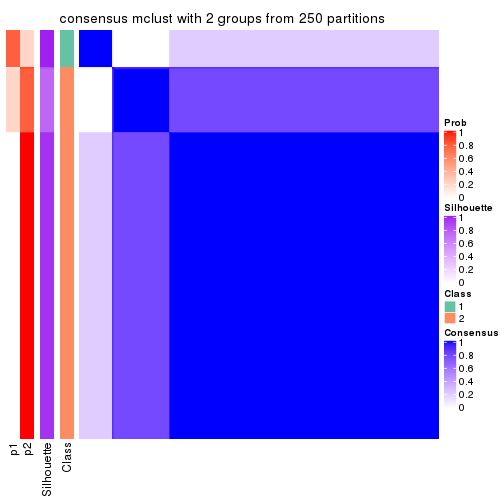</p>

</div>
<div id='tab-ATC-mclust-consensus-heatmap-2'>
<pre><code class="r">consensus_heatmap(res, k = 3)
</code></pre>

<p>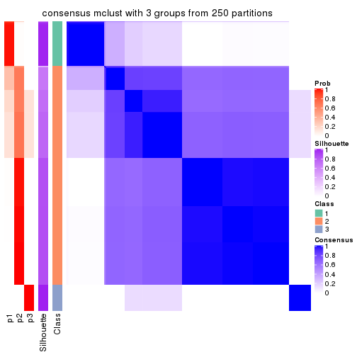</p>

</div>
<div id='tab-ATC-mclust-consensus-heatmap-3'>
<pre><code class="r">consensus_heatmap(res, k = 4)
</code></pre>

<p>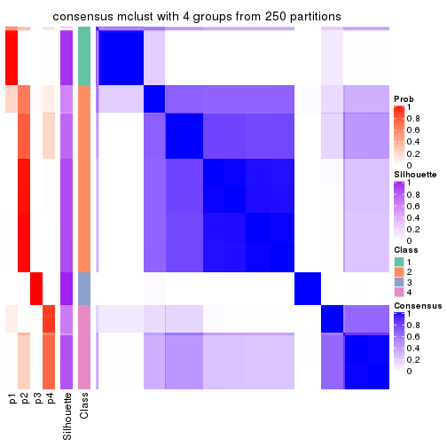</p>

</div>
<div id='tab-ATC-mclust-consensus-heatmap-4'>
<pre><code class="r">consensus_heatmap(res, k = 5)
</code></pre>

<p>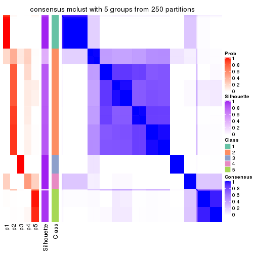</p>

</div>
<div id='tab-ATC-mclust-consensus-heatmap-5'>
<pre><code class="r">consensus_heatmap(res, k = 6)
</code></pre>

<p>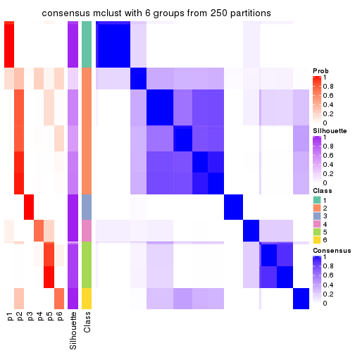</p>

</div>
</div>

Heatmaps for the membership of samples in all partitions to see how consistent they are:


<script>
$( function() {
	$( '#tabs-ATC-mclust-membership-heatmap' ).tabs();
} );
</script>
<div id='tabs-ATC-mclust-membership-heatmap'>
<ul>
<li><a href='#tab-ATC-mclust-membership-heatmap-1'>k = 2</a></li>
<li><a href='#tab-ATC-mclust-membership-heatmap-2'>k = 3</a></li>
<li><a href='#tab-ATC-mclust-membership-heatmap-3'>k = 4</a></li>
<li><a href='#tab-ATC-mclust-membership-heatmap-4'>k = 5</a></li>
<li><a href='#tab-ATC-mclust-membership-heatmap-5'>k = 6</a></li>
</ul>
<div id='tab-ATC-mclust-membership-heatmap-1'>
<pre><code class="r">membership_heatmap(res, k = 2)
</code></pre>

<p>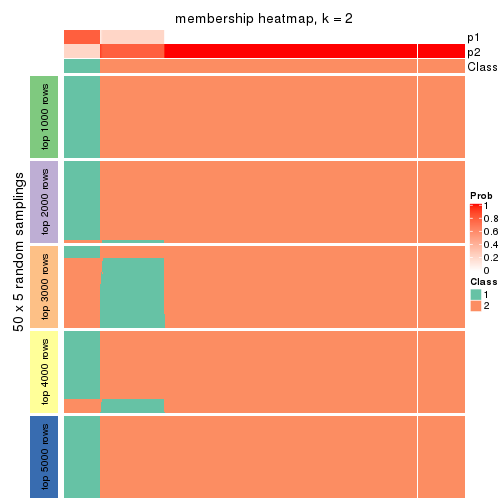</p>

</div>
<div id='tab-ATC-mclust-membership-heatmap-2'>
<pre><code class="r">membership_heatmap(res, k = 3)
</code></pre>

<p>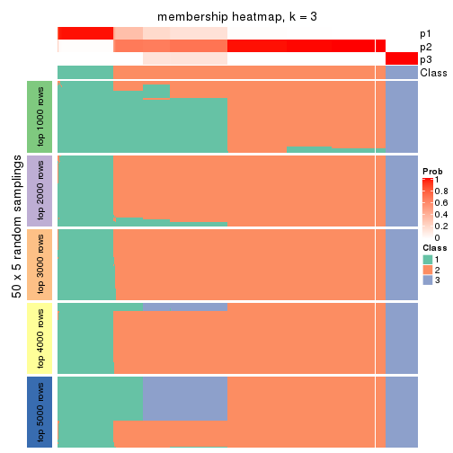</p>

</div>
<div id='tab-ATC-mclust-membership-heatmap-3'>
<pre><code class="r">membership_heatmap(res, k = 4)
</code></pre>

<p>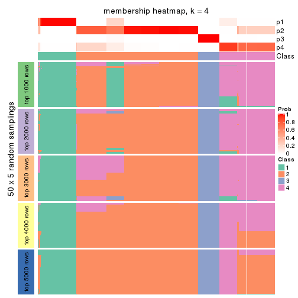</p>

</div>
<div id='tab-ATC-mclust-membership-heatmap-4'>
<pre><code class="r">membership_heatmap(res, k = 5)
</code></pre>

<p>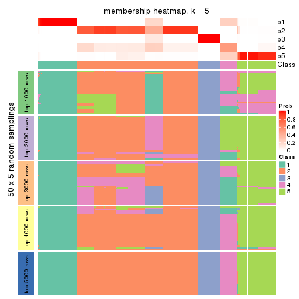</p>

</div>
<div id='tab-ATC-mclust-membership-heatmap-5'>
<pre><code class="r">membership_heatmap(res, k = 6)
</code></pre>

<p>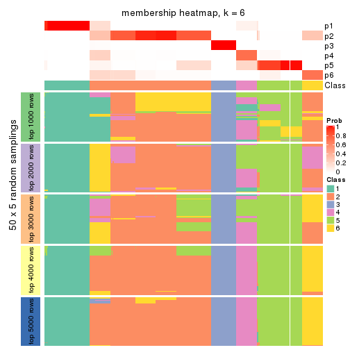</p>

</div>
</div>

As soon as we have had the classes for columns, we can look for signatures
which are significantly different between classes which can be candidate marks
for certain classes. Following are the heatmaps for signatures.


Signature heatmaps where rows are scaled:


<script>
$( function() {
	$( '#tabs-ATC-mclust-get-signatures' ).tabs();
} );
</script>
<div id='tabs-ATC-mclust-get-signatures'>
<ul>
<li><a href='#tab-ATC-mclust-get-signatures-1'>k = 2</a></li>
<li><a href='#tab-ATC-mclust-get-signatures-2'>k = 3</a></li>
<li><a href='#tab-ATC-mclust-get-signatures-3'>k = 4</a></li>
<li><a href='#tab-ATC-mclust-get-signatures-4'>k = 5</a></li>
<li><a href='#tab-ATC-mclust-get-signatures-5'>k = 6</a></li>
</ul>
<div id='tab-ATC-mclust-get-signatures-1'>
<pre><code class="r">get_signatures(res, k = 2)
</code></pre>

<p>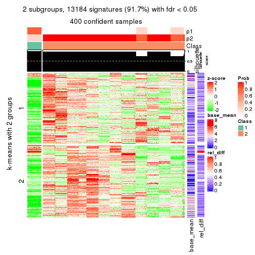</p>

</div>
<div id='tab-ATC-mclust-get-signatures-2'>
<pre><code class="r">get_signatures(res, k = 3)
</code></pre>

<p>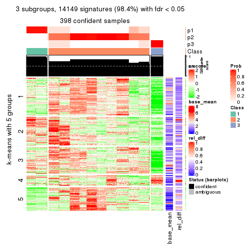</p>

</div>
<div id='tab-ATC-mclust-get-signatures-3'>
<pre><code class="r">get_signatures(res, k = 4)
</code></pre>

<p>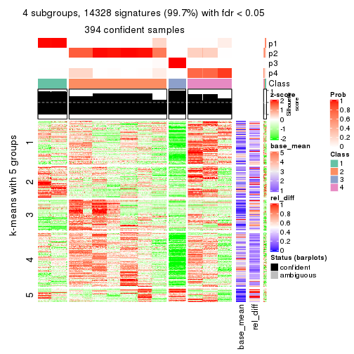</p>

</div>
<div id='tab-ATC-mclust-get-signatures-4'>
<pre><code class="r">get_signatures(res, k = 5)
</code></pre>

<p>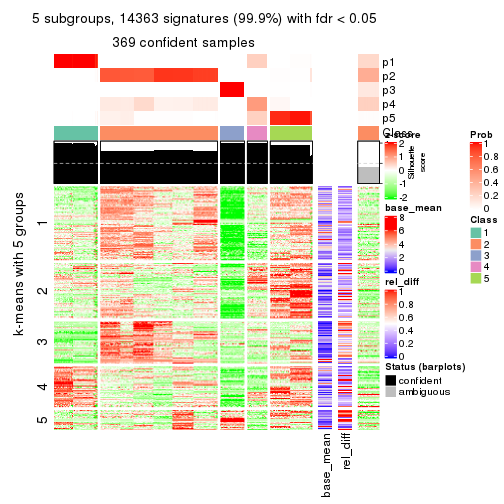</p>

</div>
<div id='tab-ATC-mclust-get-signatures-5'>
<pre><code class="r">get_signatures(res, k = 6)
</code></pre>

<p>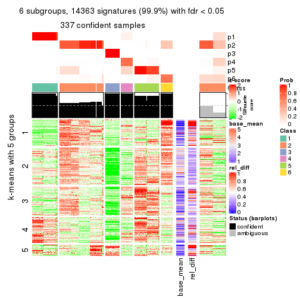</p>

</div>
</div>


Signature heatmaps where rows are not scaled:


<script>
$( function() {
	$( '#tabs-ATC-mclust-get-signatures-no-scale' ).tabs();
} );
</script>
<div id='tabs-ATC-mclust-get-signatures-no-scale'>
<ul>
<li><a href='#tab-ATC-mclust-get-signatures-no-scale-1'>k = 2</a></li>
<li><a href='#tab-ATC-mclust-get-signatures-no-scale-2'>k = 3</a></li>
<li><a href='#tab-ATC-mclust-get-signatures-no-scale-3'>k = 4</a></li>
<li><a href='#tab-ATC-mclust-get-signatures-no-scale-4'>k = 5</a></li>
<li><a href='#tab-ATC-mclust-get-signatures-no-scale-5'>k = 6</a></li>
</ul>
<div id='tab-ATC-mclust-get-signatures-no-scale-1'>
<pre><code class="r">get_signatures(res, k = 2, scale_rows = FALSE)
</code></pre>

<p>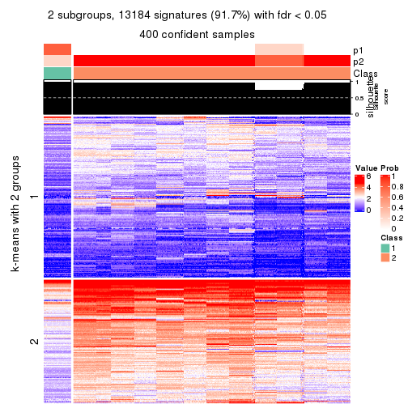</p>

</div>
<div id='tab-ATC-mclust-get-signatures-no-scale-2'>
<pre><code class="r">get_signatures(res, k = 3, scale_rows = FALSE)
</code></pre>

<p>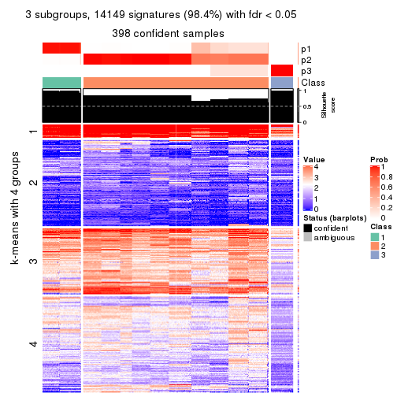</p>

</div>
<div id='tab-ATC-mclust-get-signatures-no-scale-3'>
<pre><code class="r">get_signatures(res, k = 4, scale_rows = FALSE)
</code></pre>

<p>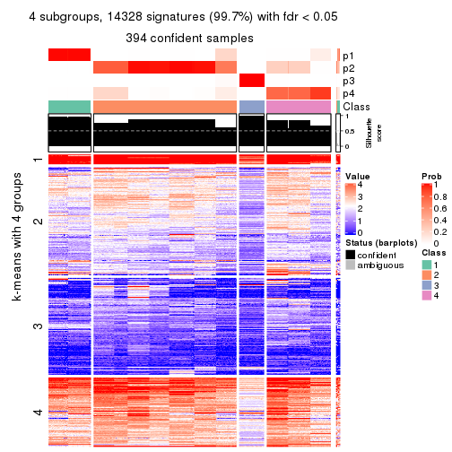</p>

</div>
<div id='tab-ATC-mclust-get-signatures-no-scale-4'>
<pre><code class="r">get_signatures(res, k = 5, scale_rows = FALSE)
</code></pre>

<p>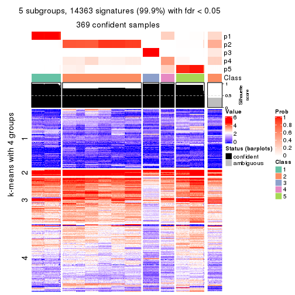</p>

</div>
<div id='tab-ATC-mclust-get-signatures-no-scale-5'>
<pre><code class="r">get_signatures(res, k = 6, scale_rows = FALSE)
</code></pre>

<p>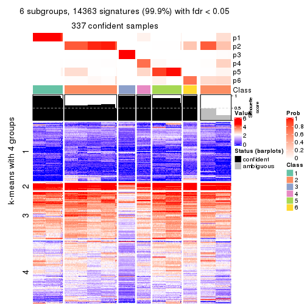</p>

</div>
</div>


Compare the overlap of signatures from different k:

```r
compare_signatures(res)
```

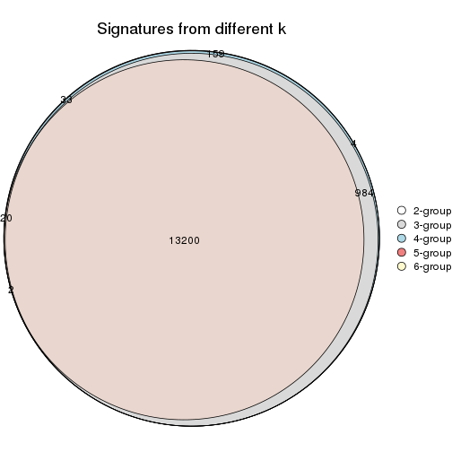

`get_signature()` returns a data frame invisibly. TO get the list of signatures, the function
call should be assigned to a variable explicitly. In following code, if `plot` argument is set
to `FALSE`, no heatmap is plotted while only the differential analysis is performed.

```r
# code only for demonstration
tb = get_signature(res, k = ..., plot = FALSE)
```

An example of the output of `tb` is:

```
#>   which_row         fdr    mean_1    mean_2 scaled_mean_1 scaled_mean_2 km
#> 1        38 0.042760348  8.373488  9.131774    -0.5533452     0.5164555  1
#> 2        40 0.018707592  7.106213  8.469186    -0.6173731     0.5762149  1
#> 3        55 0.019134737 10.221463 11.207825    -0.6159697     0.5749050  1
#> 4        59 0.006059896  5.921854  7.869574    -0.6899429     0.6439467  1
#> 5        60 0.018055526  8.928898 10.211722    -0.6204761     0.5791110  1
#> 6        98 0.009384629 15.714769 14.887706     0.6635654    -0.6193277  2
...
```

The columns in `tb` are:

1. `which_row`: row indices corresponding to the input matrix.
2. `fdr`: FDR for the differential test. 
3. `mean_x`: The mean value in group x.
4. `scaled_mean_x`: The mean value in group x after rows are scaled.
5. `km`: Row groups if k-means clustering is applied to rows.


UMAP plot which shows how samples are separated.


<script>
$( function() {
	$( '#tabs-ATC-mclust-dimension-reduction' ).tabs();
} );
</script>
<div id='tabs-ATC-mclust-dimension-reduction'>
<ul>
<li><a href='#tab-ATC-mclust-dimension-reduction-1'>k = 2</a></li>
<li><a href='#tab-ATC-mclust-dimension-reduction-2'>k = 3</a></li>
<li><a href='#tab-ATC-mclust-dimension-reduction-3'>k = 4</a></li>
<li><a href='#tab-ATC-mclust-dimension-reduction-4'>k = 5</a></li>
<li><a href='#tab-ATC-mclust-dimension-reduction-5'>k = 6</a></li>
</ul>
<div id='tab-ATC-mclust-dimension-reduction-1'>
<pre><code class="r">dimension_reduction(res, k = 2, method = &quot;UMAP&quot;)
</code></pre>

<p>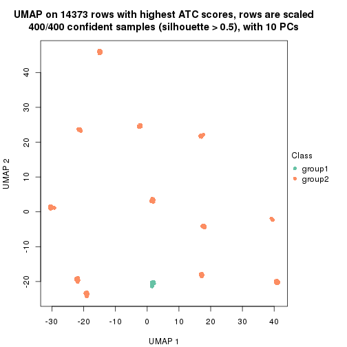</p>

</div>
<div id='tab-ATC-mclust-dimension-reduction-2'>
<pre><code class="r">dimension_reduction(res, k = 3, method = &quot;UMAP&quot;)
</code></pre>

<p>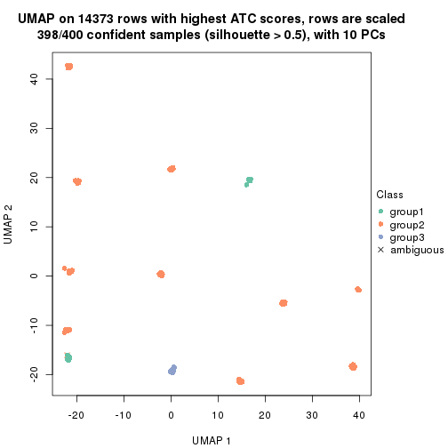</p>

</div>
<div id='tab-ATC-mclust-dimension-reduction-3'>
<pre><code class="r">dimension_reduction(res, k = 4, method = &quot;UMAP&quot;)
</code></pre>

<p>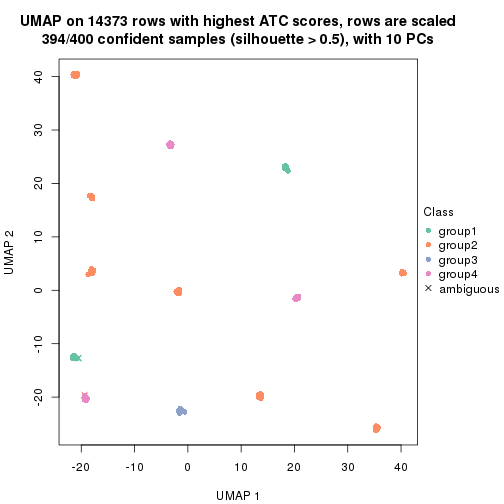</p>

</div>
<div id='tab-ATC-mclust-dimension-reduction-4'>
<pre><code class="r">dimension_reduction(res, k = 5, method = &quot;UMAP&quot;)
</code></pre>

<p>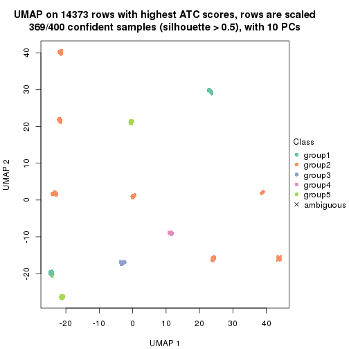</p>

</div>
<div id='tab-ATC-mclust-dimension-reduction-5'>
<pre><code class="r">dimension_reduction(res, k = 6, method = &quot;UMAP&quot;)
</code></pre>

<p>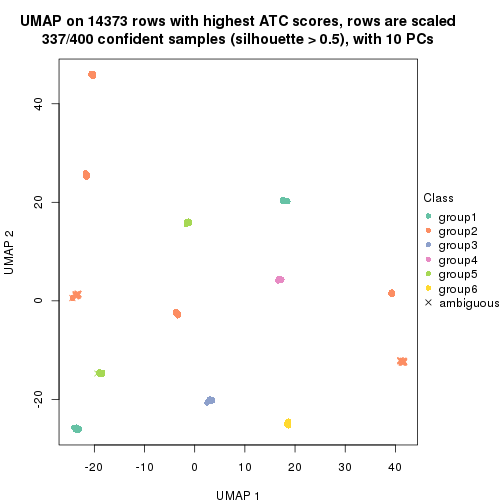</p>

</div>
</div>


Following heatmap shows how subgroups are split when increasing `k`:

```r
collect_classes(res)
```

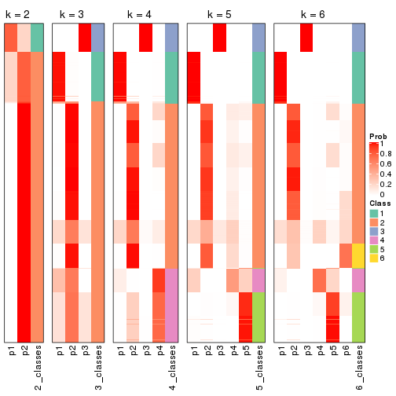


If matrix rows can be associated to genes, consider to use `GO_Enrichment(res,
...)` to perform function enrichment for the signature genes.


 

---------------------------------------------------


### ATC:NMF


The object with results only for a single top-value method and a single partition method 
can be extracted as:

```r
res = res_list["ATC", "NMF"]
# you can also extract it by
# res = res_list["ATC:NMF"]
```

A summary of `res` and all the functions that can be applied to it:

```r
res
```

```
#> A 'ConsensusPartition' object with k = 2, 3, 4, 5, 6.
#>   On a matrix with 14373 rows and 400 columns.
#>   Top rows (1000, 2000, 3000, 4000, 5000) are extracted by 'ATC' method.
#>   Subgroups are detected by 'NMF' method.
#>   Performed in total 1250 partitions by row resampling.
#>   Best k for subgroups seems to be 2.
#> 
#> Following methods can be applied to this 'ConsensusPartition' object:
#>  [1] "cola_report"             "collect_classes"         "collect_plots"          
#>  [4] "collect_stats"           "colnames"                "compare_signatures"     
#>  [7] "consensus_heatmap"       "dimension_reduction"     "functional_enrichment"  
#> [10] "get_anno_col"            "get_anno"                "get_classes"            
#> [13] "get_consensus"           "get_matrix"              "get_membership"         
#> [16] "get_param"               "get_signatures"          "get_stats"              
#> [19] "is_best_k"               "is_stable_k"             "membership_heatmap"     
#> [22] "ncol"                    "nrow"                    "plot_ecdf"              
#> [25] "rownames"                "select_partition_number" "show"                   
#> [28] "suggest_best_k"          "test_to_known_factors"
```

`collect_plots()` function collects all the plots made from `res` for all `k` (number of partitions)
into one single page to provide an easy and fast comparison between different `k`.

```r
collect_plots(res)
```

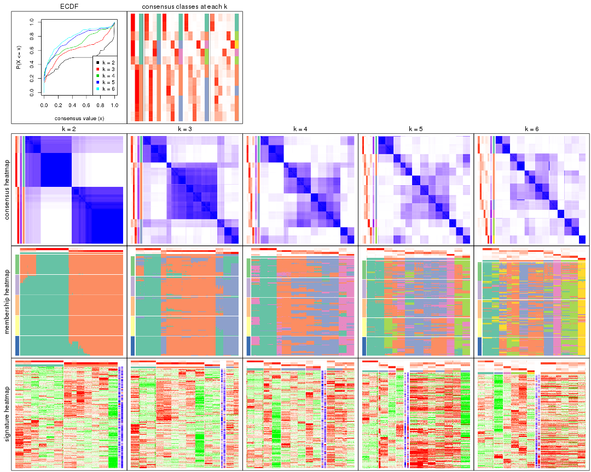

The plots are:

- The first row: a plot of the ECDF (Empirical cumulative distribution
  function) curves of the consensus matrix for each `k` and the heatmap of
  predicted classes for each `k`.
- The second row: heatmaps of the consensus matrix for each `k`.
- The third row: heatmaps of the membership matrix for each `k`.
- The fouth row: heatmaps of the signatures for each `k`.

All the plots in panels can be made by individual functions and they are
plotted later in this section.

`select_partition_number()` produces several plots showing different
statistics for choosing "optimized" `k`. There are following statistics:

- ECDF curves of the consensus matrix for each `k`;
- 1-PAC. [The PAC
  score](https://en.wikipedia.org/wiki/Consensus_clustering#Over-interpretation_potential_of_consensus_clustering)
  measures the proportion of the ambiguous subgrouping.
- Mean silhouette score.
- Concordance. The mean probability of fiting the consensus class ids in all
  partitions.
- Area increased. Denote $A_k$ as the area under the ECDF curve for current
  `k`, the area increased is defined as $A_k - A_{k-1}$.
- Rand index. The percent of pairs of samples that are both in a same cluster
  or both are not in a same cluster in the partition of k and k-1.
- Jaccard index. The ratio of pairs of samples are both in a same cluster in
  the partition of k and k-1 and the pairs of samples are both in a same
  cluster in the partition k or k-1.

The detailed explanations of these statistics can be found in [the cola
vignette](http://bioconductor.org/packages/devel/bioc/vignettes/cola/inst/doc/cola.html#toc_13).

Generally speaking, lower PAC score, higher mean silhouette score or higher
concordance corresponds to better partition. Rand index and Jaccard index
measure how similar the current partition is compared to partition with `k-1`.
If they are too similar, we won't accept `k` is better than `k-1`.

```r
select_partition_number(res)
```

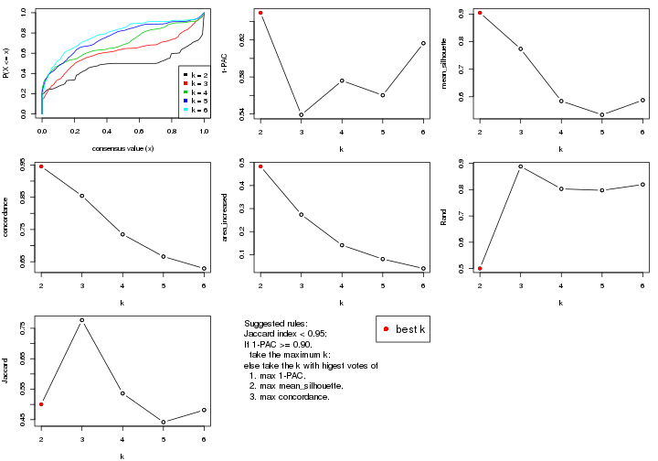

The numeric values for all these statistics can be obtained by `get_stats()`.

```r
get_stats(res)
```

```
#>   k 1-PAC mean_silhouette concordance area_increased  Rand Jaccard
#> 2 2 0.649           0.905       0.945         0.4830 0.500   0.500
#> 3 3 0.539           0.774       0.854         0.2739 0.888   0.777
#> 4 4 0.576           0.584       0.735         0.1410 0.803   0.536
#> 5 5 0.560           0.534       0.666         0.0807 0.797   0.442
#> 6 6 0.616           0.588       0.629         0.0400 0.820   0.482
```

`suggest_best_k()` suggests the best $k$ based on these statistics. The rules are as follows:

- All $k$ with Jaccard index larger than 0.95 are removed because the increase of
  the partition number does not provides enough extra information. If all $k$ are removed,
  the best $k$ is assigned by `NA`.
- For $k$ with 1-PAC larger than 0.9, the maximal $k$ is taken as the "best k". Other $k$ is called "optional k".
- If it does not fit the second rule. The $k$ with the highest vote of highest
  1-PAC, mean silhouette and concordance is taken as the "best k".

```r
suggest_best_k(res)
```

```
#> [1] 2
```


Following shows the table of the partitions (You need to click the **show/hide
code output** link to see it). The membership matrix (columns with name `p*`)
is inferred by
[`clue::cl_consensus()`](https://www.rdocumentation.org/link/cl_consensus?package=clue)
function with the `SE` method. Basically the value in the membership matrix
represents the probability to belong to a certain group. The finall class
label for an item is determined with the group with highest probability it
belongs to.

In `get_classes()` function, the entropy is calculated from the membership
matrix and the silhouette score is calculated from the consensus matrix.


<script>
$( function() {
	$( '#tabs-ATC-NMF-get-classes' ).tabs();
} );
</script>
<div id='tabs-ATC-NMF-get-classes'>
<ul>
<li><a href='#tab-ATC-NMF-get-classes-1'>k = 2</a></li>
<li><a href='#tab-ATC-NMF-get-classes-2'>k = 3</a></li>
<li><a href='#tab-ATC-NMF-get-classes-3'>k = 4</a></li>
<li><a href='#tab-ATC-NMF-get-classes-4'>k = 5</a></li>
<li><a href='#tab-ATC-NMF-get-classes-5'>k = 6</a></li>
</ul>

<div id='tab-ATC-NMF-get-classes-1'>
<p><a id='tab-ATC-NMF-get-classes-1-a' style='color:#0366d6' href='#'>show/hide code output</a></p>
<pre><code class="r">cbind(get_classes(res, k = 2), get_membership(res, k = 2))
</code></pre>

<pre><code>#&gt;            class entropy silhouette    p1    p2
#&gt; SRR1661716     2  0.5946      0.857 0.144 0.856
#&gt; SRR1661717     2  0.5946      0.857 0.144 0.856
#&gt; SRR1661718     2  0.5946      0.857 0.144 0.856
#&gt; SRR1661719     2  0.5946      0.857 0.144 0.856
#&gt; SRR1661720     2  0.5842      0.862 0.140 0.860
#&gt; SRR1661721     2  0.5946      0.857 0.144 0.856
#&gt; SRR1661722     2  0.5946      0.857 0.144 0.856
#&gt; SRR1661723     2  0.5946      0.857 0.144 0.856
#&gt; SRR1661724     2  0.5842      0.862 0.140 0.860
#&gt; SRR1661725     2  0.5946      0.857 0.144 0.856
#&gt; SRR1661726     2  0.5946      0.857 0.144 0.856
#&gt; SRR1661727     2  0.5946      0.857 0.144 0.856
#&gt; SRR1661728     2  0.5737      0.866 0.136 0.864
#&gt; SRR1661729     2  0.5946      0.857 0.144 0.856
#&gt; SRR1661730     2  0.5946      0.857 0.144 0.856
#&gt; SRR1661731     2  0.5946      0.857 0.144 0.856
#&gt; SRR1661732     2  0.5946      0.857 0.144 0.856
#&gt; SRR1661733     2  0.5946      0.857 0.144 0.856
#&gt; SRR1661734     2  0.5946      0.857 0.144 0.856
#&gt; SRR1661735     2  0.5946      0.857 0.144 0.856
#&gt; SRR1661736     2  0.0000      0.961 0.000 1.000
#&gt; SRR1661737     2  0.0000      0.961 0.000 1.000
#&gt; SRR1661738     2  0.0000      0.961 0.000 1.000
#&gt; SRR1661739     2  0.0000      0.961 0.000 1.000
#&gt; SRR1661740     2  0.0000      0.961 0.000 1.000
#&gt; SRR1661741     2  0.0000      0.961 0.000 1.000
#&gt; SRR1661742     2  0.0000      0.961 0.000 1.000
#&gt; SRR1661743     2  0.0000      0.961 0.000 1.000
#&gt; SRR1661744     2  0.0000      0.961 0.000 1.000
#&gt; SRR1661745     2  0.0000      0.961 0.000 1.000
#&gt; SRR1661746     2  0.0000      0.961 0.000 1.000
#&gt; SRR1661747     2  0.0000      0.961 0.000 1.000
#&gt; SRR1661748     2  0.0000      0.961 0.000 1.000
#&gt; SRR1661749     2  0.0000      0.961 0.000 1.000
#&gt; SRR1661750     2  0.0000      0.961 0.000 1.000
#&gt; SRR1661751     2  0.0000      0.961 0.000 1.000
#&gt; SRR1661752     2  0.0000      0.961 0.000 1.000
#&gt; SRR1661753     2  0.0000      0.961 0.000 1.000
#&gt; SRR1661754     2  0.0000      0.961 0.000 1.000
#&gt; SRR1661755     2  0.0000      0.961 0.000 1.000
#&gt; SRR1661756     2  0.0000      0.961 0.000 1.000
#&gt; SRR1661757     2  0.0000      0.961 0.000 1.000
#&gt; SRR1661758     2  0.0000      0.961 0.000 1.000
#&gt; SRR1661759     2  0.0000      0.961 0.000 1.000
#&gt; SRR1661760     2  0.0000      0.961 0.000 1.000
#&gt; SRR1661761     2  0.0000      0.961 0.000 1.000
#&gt; SRR1661762     2  0.0000      0.961 0.000 1.000
#&gt; SRR1661763     2  0.0000      0.961 0.000 1.000
#&gt; SRR1661764     2  0.0000      0.961 0.000 1.000
#&gt; SRR1661766     2  0.0000      0.961 0.000 1.000
#&gt; SRR1661767     2  0.0000      0.961 0.000 1.000
#&gt; SRR1661768     2  0.0000      0.961 0.000 1.000
#&gt; SRR1661769     2  0.0000      0.961 0.000 1.000
#&gt; SRR1661770     2  0.0000      0.961 0.000 1.000
#&gt; SRR1661771     2  0.0000      0.961 0.000 1.000
#&gt; SRR1661772     2  0.0000      0.961 0.000 1.000
#&gt; SRR1661773     2  0.0000      0.961 0.000 1.000
#&gt; SRR1661774     2  0.0000      0.961 0.000 1.000
#&gt; SRR1661775     2  0.0000      0.961 0.000 1.000
#&gt; SRR1661776     2  0.0000      0.961 0.000 1.000
#&gt; SRR1661777     2  0.0000      0.961 0.000 1.000
#&gt; SRR1661778     2  0.0000      0.961 0.000 1.000
#&gt; SRR1661779     2  0.0000      0.961 0.000 1.000
#&gt; SRR1661780     2  0.0000      0.961 0.000 1.000
#&gt; SRR1661781     2  0.0000      0.961 0.000 1.000
#&gt; SRR1661782     2  0.0000      0.961 0.000 1.000
#&gt; SRR1661783     2  0.0000      0.961 0.000 1.000
#&gt; SRR1661784     2  0.0000      0.961 0.000 1.000
#&gt; SRR1661785     2  0.0000      0.961 0.000 1.000
#&gt; SRR1661786     2  0.0000      0.961 0.000 1.000
#&gt; SRR1661787     2  0.0000      0.961 0.000 1.000
#&gt; SRR1661788     2  0.0000      0.961 0.000 1.000
#&gt; SRR1661789     2  0.0000      0.961 0.000 1.000
#&gt; SRR1661790     2  0.0000      0.961 0.000 1.000
#&gt; SRR1661791     2  0.0000      0.961 0.000 1.000
#&gt; SRR1661792     2  0.0000      0.961 0.000 1.000
#&gt; SRR1661793     2  0.0000      0.961 0.000 1.000
#&gt; SRR1661794     2  0.0000      0.961 0.000 1.000
#&gt; SRR1661795     2  0.0000      0.961 0.000 1.000
#&gt; SRR1661796     2  0.0000      0.961 0.000 1.000
#&gt; SRR1661797     2  0.0000      0.961 0.000 1.000
#&gt; SRR1661798     2  0.0000      0.961 0.000 1.000
#&gt; SRR1661799     2  0.0000      0.961 0.000 1.000
#&gt; SRR1661800     2  0.0000      0.961 0.000 1.000
#&gt; SRR1661801     2  0.0000      0.961 0.000 1.000
#&gt; SRR1661802     2  0.0000      0.961 0.000 1.000
#&gt; SRR1661803     2  0.0000      0.961 0.000 1.000
#&gt; SRR1661804     2  0.0000      0.961 0.000 1.000
#&gt; SRR1661805     2  0.0000      0.961 0.000 1.000
#&gt; SRR1661806     2  0.0000      0.961 0.000 1.000
#&gt; SRR1661807     2  0.0000      0.961 0.000 1.000
#&gt; SRR1661808     2  0.0000      0.961 0.000 1.000
#&gt; SRR1661809     2  0.0000      0.961 0.000 1.000
#&gt; SRR1661810     2  0.0000      0.961 0.000 1.000
#&gt; SRR1661811     2  0.0000      0.961 0.000 1.000
#&gt; SRR1661812     2  0.0000      0.961 0.000 1.000
#&gt; SRR1661813     2  0.0000      0.961 0.000 1.000
#&gt; SRR1661814     2  0.0000      0.961 0.000 1.000
#&gt; SRR1661815     2  0.0000      0.961 0.000 1.000
#&gt; SRR1661816     2  0.0000      0.961 0.000 1.000
#&gt; SRR1661817     2  0.0000      0.961 0.000 1.000
#&gt; SRR1661818     2  0.0000      0.961 0.000 1.000
#&gt; SRR1661819     2  0.0000      0.961 0.000 1.000
#&gt; SRR1661820     2  0.0000      0.961 0.000 1.000
#&gt; SRR1661821     2  0.0000      0.961 0.000 1.000
#&gt; SRR1661822     2  0.0000      0.961 0.000 1.000
#&gt; SRR1661823     2  0.0000      0.961 0.000 1.000
#&gt; SRR1661824     2  0.0000      0.961 0.000 1.000
#&gt; SRR1661825     2  0.0000      0.961 0.000 1.000
#&gt; SRR1661826     1  0.0000      0.915 1.000 0.000
#&gt; SRR1661827     1  0.0000      0.915 1.000 0.000
#&gt; SRR1661828     1  0.0000      0.915 1.000 0.000
#&gt; SRR1661829     1  0.0000      0.915 1.000 0.000
#&gt; SRR1661830     1  0.0000      0.915 1.000 0.000
#&gt; SRR1661831     1  0.0000      0.915 1.000 0.000
#&gt; SRR1661832     1  0.0000      0.915 1.000 0.000
#&gt; SRR1661833     1  0.0000      0.915 1.000 0.000
#&gt; SRR1661834     1  0.0000      0.915 1.000 0.000
#&gt; SRR1661835     1  0.0000      0.915 1.000 0.000
#&gt; SRR1661836     1  0.0000      0.915 1.000 0.000
#&gt; SRR1661837     1  0.0000      0.915 1.000 0.000
#&gt; SRR1661838     1  0.0000      0.915 1.000 0.000
#&gt; SRR1661839     1  0.0000      0.915 1.000 0.000
#&gt; SRR1661840     1  0.0000      0.915 1.000 0.000
#&gt; SRR1661841     1  0.0000      0.915 1.000 0.000
#&gt; SRR1661843     1  0.0000      0.915 1.000 0.000
#&gt; SRR1661844     1  0.0000      0.915 1.000 0.000
#&gt; SRR1661845     1  0.0000      0.915 1.000 0.000
#&gt; SRR1661846     1  0.0000      0.915 1.000 0.000
#&gt; SRR1661847     1  0.0000      0.915 1.000 0.000
#&gt; SRR1661848     1  0.0000      0.915 1.000 0.000
#&gt; SRR1661849     1  0.0000      0.915 1.000 0.000
#&gt; SRR1661850     1  0.0000      0.915 1.000 0.000
#&gt; SRR1661851     1  0.0000      0.915 1.000 0.000
#&gt; SRR1661852     1  0.0000      0.915 1.000 0.000
#&gt; SRR1661853     1  0.0000      0.915 1.000 0.000
#&gt; SRR1661854     1  0.0000      0.915 1.000 0.000
#&gt; SRR1661855     1  0.0000      0.915 1.000 0.000
#&gt; SRR1661856     2  0.0000      0.961 0.000 1.000
#&gt; SRR1661857     2  0.0000      0.961 0.000 1.000
#&gt; SRR1661858     2  0.0000      0.961 0.000 1.000
#&gt; SRR1661859     2  0.0000      0.961 0.000 1.000
#&gt; SRR1661860     2  0.0000      0.961 0.000 1.000
#&gt; SRR1661861     2  0.0000      0.961 0.000 1.000
#&gt; SRR1661862     2  0.0000      0.961 0.000 1.000
#&gt; SRR1661863     2  0.0000      0.961 0.000 1.000
#&gt; SRR1661864     2  0.0000      0.961 0.000 1.000
#&gt; SRR1661865     2  0.0000      0.961 0.000 1.000
#&gt; SRR1661866     2  0.0000      0.961 0.000 1.000
#&gt; SRR1661867     2  0.0000      0.961 0.000 1.000
#&gt; SRR1661868     2  0.0000      0.961 0.000 1.000
#&gt; SRR1661869     2  0.0000      0.961 0.000 1.000
#&gt; SRR1661870     2  0.0000      0.961 0.000 1.000
#&gt; SRR1661871     2  0.0000      0.961 0.000 1.000
#&gt; SRR1661872     2  0.0000      0.961 0.000 1.000
#&gt; SRR1661873     2  0.0000      0.961 0.000 1.000
#&gt; SRR1661874     2  0.0000      0.961 0.000 1.000
#&gt; SRR1661875     2  0.0000      0.961 0.000 1.000
#&gt; SRR1661876     2  0.0000      0.961 0.000 1.000
#&gt; SRR1661877     2  0.0000      0.961 0.000 1.000
#&gt; SRR1661878     2  0.0000      0.961 0.000 1.000
#&gt; SRR1661879     2  0.0000      0.961 0.000 1.000
#&gt; SRR1661880     2  0.0000      0.961 0.000 1.000
#&gt; SRR1661881     2  0.0000      0.961 0.000 1.000
#&gt; SRR1661882     2  0.0000      0.961 0.000 1.000
#&gt; SRR1661883     2  0.0000      0.961 0.000 1.000
#&gt; SRR1661884     2  0.0000      0.961 0.000 1.000
#&gt; SRR1661885     2  0.0000      0.961 0.000 1.000
#&gt; SRR1661886     2  0.0000      0.961 0.000 1.000
#&gt; SRR1661887     2  0.0000      0.961 0.000 1.000
#&gt; SRR1661888     2  0.0000      0.961 0.000 1.000
#&gt; SRR1661889     2  0.0000      0.961 0.000 1.000
#&gt; SRR1661890     2  0.0000      0.961 0.000 1.000
#&gt; SRR1661891     2  0.0000      0.961 0.000 1.000
#&gt; SRR1661892     1  0.0000      0.915 1.000 0.000
#&gt; SRR1661893     1  0.0000      0.915 1.000 0.000
#&gt; SRR1661894     1  0.0000      0.915 1.000 0.000
#&gt; SRR1661895     1  0.0000      0.915 1.000 0.000
#&gt; SRR1661896     1  0.0000      0.915 1.000 0.000
#&gt; SRR1661897     1  0.0000      0.915 1.000 0.000
#&gt; SRR1661898     1  0.0000      0.915 1.000 0.000
#&gt; SRR1661899     1  0.0000      0.915 1.000 0.000
#&gt; SRR1661900     1  0.0000      0.915 1.000 0.000
#&gt; SRR1661901     1  0.0000      0.915 1.000 0.000
#&gt; SRR1661902     1  0.0000      0.915 1.000 0.000
#&gt; SRR1661903     1  0.0000      0.915 1.000 0.000
#&gt; SRR1661904     1  0.0000      0.915 1.000 0.000
#&gt; SRR1661905     1  0.0000      0.915 1.000 0.000
#&gt; SRR1661906     1  0.0000      0.915 1.000 0.000
#&gt; SRR1661907     1  0.0000      0.915 1.000 0.000
#&gt; SRR1661908     1  0.0000      0.915 1.000 0.000
#&gt; SRR1661909     1  0.0000      0.915 1.000 0.000
#&gt; SRR1661910     1  0.0000      0.915 1.000 0.000
#&gt; SRR1661911     1  0.0000      0.915 1.000 0.000
#&gt; SRR1661912     1  0.0000      0.915 1.000 0.000
#&gt; SRR1661913     1  0.0000      0.915 1.000 0.000
#&gt; SRR1661914     1  0.0000      0.915 1.000 0.000
#&gt; SRR1661915     1  0.0000      0.915 1.000 0.000
#&gt; SRR1661916     1  0.0000      0.915 1.000 0.000
#&gt; SRR1661917     1  0.0000      0.915 1.000 0.000
#&gt; SRR1661918     1  0.0000      0.915 1.000 0.000
#&gt; SRR1661919     1  0.0000      0.915 1.000 0.000
#&gt; SRR1661920     1  0.0000      0.915 1.000 0.000
#&gt; SRR1661921     1  0.0000      0.915 1.000 0.000
#&gt; SRR1661922     1  0.0000      0.915 1.000 0.000
#&gt; SRR1661923     1  0.0000      0.915 1.000 0.000
#&gt; SRR1661924     1  0.0000      0.915 1.000 0.000
#&gt; SRR1661925     1  0.0000      0.915 1.000 0.000
#&gt; SRR1661926     1  0.0000      0.915 1.000 0.000
#&gt; SRR1661927     1  0.0000      0.915 1.000 0.000
#&gt; SRR1661928     2  0.1184      0.956 0.016 0.984
#&gt; SRR1661929     2  0.2603      0.941 0.044 0.956
#&gt; SRR1661930     2  0.1184      0.956 0.016 0.984
#&gt; SRR1661931     2  0.1843      0.950 0.028 0.972
#&gt; SRR1661932     2  0.1184      0.956 0.016 0.984
#&gt; SRR1661933     2  0.1184      0.956 0.016 0.984
#&gt; SRR1661934     2  0.1633      0.952 0.024 0.976
#&gt; SRR1661935     2  0.2043      0.948 0.032 0.968
#&gt; SRR1661936     2  0.1633      0.952 0.024 0.976
#&gt; SRR1661937     2  0.2043      0.948 0.032 0.968
#&gt; SRR1661938     2  0.0376      0.960 0.004 0.996
#&gt; SRR1661939     2  0.1633      0.952 0.024 0.976
#&gt; SRR1661940     2  0.2043      0.948 0.032 0.968
#&gt; SRR1661941     2  0.0672      0.959 0.008 0.992
#&gt; SRR1661942     2  0.0938      0.957 0.012 0.988
#&gt; SRR1661943     2  0.1633      0.952 0.024 0.976
#&gt; SRR1661944     2  0.1184      0.956 0.016 0.984
#&gt; SRR1661945     2  0.1843      0.951 0.028 0.972
#&gt; SRR1661946     2  0.0000      0.961 0.000 1.000
#&gt; SRR1661947     2  0.0938      0.957 0.012 0.988
#&gt; SRR1661948     2  0.1633      0.952 0.024 0.976
#&gt; SRR1661949     2  0.2236      0.946 0.036 0.964
#&gt; SRR1661950     2  0.1633      0.952 0.024 0.976
#&gt; SRR1661951     2  0.1633      0.952 0.024 0.976
#&gt; SRR1661952     2  0.1414      0.954 0.020 0.980
#&gt; SRR1661953     2  0.1633      0.952 0.024 0.976
#&gt; SRR1661954     2  0.1414      0.954 0.020 0.980
#&gt; SRR1661955     2  0.0938      0.957 0.012 0.988
#&gt; SRR1661956     2  0.1414      0.954 0.020 0.980
#&gt; SRR1661957     2  0.0000      0.961 0.000 1.000
#&gt; SRR1661958     1  0.0000      0.915 1.000 0.000
#&gt; SRR1661959     1  0.0000      0.915 1.000 0.000
#&gt; SRR1661960     1  0.0000      0.915 1.000 0.000
#&gt; SRR1661961     1  0.0000      0.915 1.000 0.000
#&gt; SRR1661962     1  0.0000      0.915 1.000 0.000
#&gt; SRR1661963     1  0.0000      0.915 1.000 0.000
#&gt; SRR1661964     1  0.0000      0.915 1.000 0.000
#&gt; SRR1661965     1  0.0000      0.915 1.000 0.000
#&gt; SRR1661966     1  0.0000      0.915 1.000 0.000
#&gt; SRR1661967     1  0.0000      0.915 1.000 0.000
#&gt; SRR1661968     1  0.0000      0.915 1.000 0.000
#&gt; SRR1661969     1  0.0000      0.915 1.000 0.000
#&gt; SRR1661970     1  0.0000      0.915 1.000 0.000
#&gt; SRR1661971     1  0.0000      0.915 1.000 0.000
#&gt; SRR1661972     1  0.0000      0.915 1.000 0.000
#&gt; SRR1661973     1  0.0000      0.915 1.000 0.000
#&gt; SRR1661974     1  0.0000      0.915 1.000 0.000
#&gt; SRR1661975     1  0.0000      0.915 1.000 0.000
#&gt; SRR1661976     1  0.0000      0.915 1.000 0.000
#&gt; SRR1661977     1  0.0000      0.915 1.000 0.000
#&gt; SRR1661978     1  0.0000      0.915 1.000 0.000
#&gt; SRR1661979     1  0.0000      0.915 1.000 0.000
#&gt; SRR1661980     1  0.0000      0.915 1.000 0.000
#&gt; SRR1661981     1  0.0000      0.915 1.000 0.000
#&gt; SRR1661982     1  0.0000      0.915 1.000 0.000
#&gt; SRR1661983     1  0.0000      0.915 1.000 0.000
#&gt; SRR1661984     1  0.0000      0.915 1.000 0.000
#&gt; SRR1661985     1  0.0000      0.915 1.000 0.000
#&gt; SRR1661986     1  0.0000      0.915 1.000 0.000
#&gt; SRR1661987     1  0.0000      0.915 1.000 0.000
#&gt; SRR1661988     1  0.8443      0.718 0.728 0.272
#&gt; SRR1661989     1  0.8661      0.692 0.712 0.288
#&gt; SRR1661990     1  0.7745      0.777 0.772 0.228
#&gt; SRR1661991     1  0.8081      0.753 0.752 0.248
#&gt; SRR1661992     1  0.8207      0.742 0.744 0.256
#&gt; SRR1661993     1  0.8081      0.753 0.752 0.248
#&gt; SRR1661994     1  0.8016      0.758 0.756 0.244
#&gt; SRR1661995     1  0.7745      0.777 0.772 0.228
#&gt; SRR1661996     1  0.8081      0.753 0.752 0.248
#&gt; SRR1661997     1  0.8555      0.705 0.720 0.280
#&gt; SRR1661998     1  0.7950      0.763 0.760 0.240
#&gt; SRR1661999     1  0.8016      0.758 0.756 0.244
#&gt; SRR1662000     1  0.7745      0.777 0.772 0.228
#&gt; SRR1662001     1  0.8207      0.742 0.744 0.256
#&gt; SRR1662002     1  0.8555      0.705 0.720 0.280
#&gt; SRR1662003     1  0.7883      0.768 0.764 0.236
#&gt; SRR1662004     1  0.8267      0.736 0.740 0.260
#&gt; SRR1662005     1  0.7883      0.768 0.764 0.236
#&gt; SRR1662006     1  0.8555      0.705 0.720 0.280
#&gt; SRR1662007     1  0.8813      0.670 0.700 0.300
#&gt; SRR1662008     1  0.8608      0.699 0.716 0.284
#&gt; SRR1662009     1  0.8499      0.712 0.724 0.276
#&gt; SRR1662010     1  0.7745      0.777 0.772 0.228
#&gt; SRR1662011     1  0.7745      0.777 0.772 0.228
#&gt; SRR1662012     1  0.7883      0.768 0.764 0.236
#&gt; SRR1662013     1  0.8327      0.730 0.736 0.264
#&gt; SRR1662014     1  0.8327      0.730 0.736 0.264
#&gt; SRR1662015     1  0.8555      0.705 0.720 0.280
#&gt; SRR1662016     1  0.8386      0.724 0.732 0.268
#&gt; SRR1662017     1  0.8555      0.705 0.720 0.280
#&gt; SRR1662018     2  0.4022      0.920 0.080 0.920
#&gt; SRR1662019     2  0.5178      0.887 0.116 0.884
#&gt; SRR1662020     2  0.4939      0.894 0.108 0.892
#&gt; SRR1662021     2  0.7815      0.747 0.232 0.768
#&gt; SRR1662022     2  0.5737      0.869 0.136 0.864
#&gt; SRR1662023     2  0.3879      0.920 0.076 0.924
#&gt; SRR1662024     2  0.3879      0.922 0.076 0.924
#&gt; SRR1662025     2  0.4815      0.898 0.104 0.896
#&gt; SRR1662026     2  0.4562      0.905 0.096 0.904
#&gt; SRR1662027     2  0.5737      0.869 0.136 0.864
#&gt; SRR1662028     2  0.5059      0.894 0.112 0.888
#&gt; SRR1662029     2  0.5519      0.875 0.128 0.872
#&gt; SRR1662030     2  0.4562      0.908 0.096 0.904
#&gt; SRR1662031     2  0.4431      0.911 0.092 0.908
#&gt; SRR1662032     2  0.4562      0.906 0.096 0.904
#&gt; SRR1662033     2  0.3733      0.923 0.072 0.928
#&gt; SRR1662034     2  0.6048      0.852 0.148 0.852
#&gt; SRR1662035     2  0.3431      0.930 0.064 0.936
#&gt; SRR1662036     2  0.4298      0.913 0.088 0.912
#&gt; SRR1662037     2  0.4939      0.897 0.108 0.892
#&gt; SRR1662038     2  0.4815      0.898 0.104 0.896
#&gt; SRR1662039     2  0.3114      0.934 0.056 0.944
#&gt; SRR1662040     2  0.4161      0.917 0.084 0.916
#&gt; SRR1662041     2  0.6531      0.825 0.168 0.832
#&gt; SRR1662042     2  0.4690      0.904 0.100 0.900
#&gt; SRR1662043     2  0.4562      0.908 0.096 0.904
#&gt; SRR1662044     2  0.4298      0.913 0.088 0.912
#&gt; SRR1662045     2  0.4298      0.914 0.088 0.912
#&gt; SRR1662046     2  0.5519      0.876 0.128 0.872
#&gt; SRR1662047     2  0.5629      0.870 0.132 0.868
#&gt; SRR1662048     2  0.4022      0.918 0.080 0.920
#&gt; SRR1662049     2  0.5294      0.885 0.120 0.880
#&gt; SRR1662050     2  0.6343      0.841 0.160 0.840
#&gt; SRR1662051     2  0.5408      0.879 0.124 0.876
#&gt; SRR1662052     2  0.5294      0.884 0.120 0.880
#&gt; SRR1662053     2  0.3584      0.928 0.068 0.932
#&gt; SRR1662054     1  0.0000      0.915 1.000 0.000
#&gt; SRR1662055     1  0.0000      0.915 1.000 0.000
#&gt; SRR1662056     1  0.0000      0.915 1.000 0.000
#&gt; SRR1662057     1  0.0000      0.915 1.000 0.000
#&gt; SRR1662058     1  0.0000      0.915 1.000 0.000
#&gt; SRR1662059     1  0.0000      0.915 1.000 0.000
#&gt; SRR1662060     1  0.0000      0.915 1.000 0.000
#&gt; SRR1662061     1  0.0000      0.915 1.000 0.000
#&gt; SRR1662062     1  0.0000      0.915 1.000 0.000
#&gt; SRR1662063     1  0.0000      0.915 1.000 0.000
#&gt; SRR1662064     1  0.0000      0.915 1.000 0.000
#&gt; SRR1662065     1  0.0000      0.915 1.000 0.000
#&gt; SRR1662066     1  0.0000      0.915 1.000 0.000
#&gt; SRR1662067     1  0.0000      0.915 1.000 0.000
#&gt; SRR1662068     1  0.0000      0.915 1.000 0.000
#&gt; SRR1662069     1  0.0000      0.915 1.000 0.000
#&gt; SRR1662070     1  0.0000      0.915 1.000 0.000
#&gt; SRR1662071     1  0.0000      0.915 1.000 0.000
#&gt; SRR1662072     1  0.0000      0.915 1.000 0.000
#&gt; SRR1662073     1  0.0000      0.915 1.000 0.000
#&gt; SRR1662074     1  0.0000      0.915 1.000 0.000
#&gt; SRR1662075     1  0.0000      0.915 1.000 0.000
#&gt; SRR1662076     1  0.0000      0.915 1.000 0.000
#&gt; SRR1662077     1  0.0000      0.915 1.000 0.000
#&gt; SRR1662078     1  0.0000      0.915 1.000 0.000
#&gt; SRR1662079     1  0.0000      0.915 1.000 0.000
#&gt; SRR1662080     1  0.0000      0.915 1.000 0.000
#&gt; SRR1662081     1  0.0000      0.915 1.000 0.000
#&gt; SRR1662082     1  0.0000      0.915 1.000 0.000
#&gt; SRR1662083     1  0.0000      0.915 1.000 0.000
#&gt; SRR1662084     1  0.7376      0.798 0.792 0.208
#&gt; SRR1662085     1  0.7376      0.798 0.792 0.208
#&gt; SRR1662086     1  0.7453      0.795 0.788 0.212
#&gt; SRR1662087     1  0.5946      0.840 0.856 0.144
#&gt; SRR1662088     1  0.7376      0.798 0.792 0.208
#&gt; SRR1662089     1  0.7376      0.798 0.792 0.208
#&gt; SRR1662090     1  0.7376      0.798 0.792 0.208
#&gt; SRR1662091     1  0.7376      0.798 0.792 0.208
#&gt; SRR1662092     1  0.7376      0.798 0.792 0.208
#&gt; SRR1662093     1  0.6887      0.814 0.816 0.184
#&gt; SRR1662094     1  0.7376      0.798 0.792 0.208
#&gt; SRR1662095     1  0.7376      0.798 0.792 0.208
#&gt; SRR1662096     1  0.7376      0.798 0.792 0.208
#&gt; SRR1662097     1  0.7376      0.798 0.792 0.208
#&gt; SRR1662098     1  0.7376      0.798 0.792 0.208
#&gt; SRR1662099     1  0.7376      0.798 0.792 0.208
#&gt; SRR1662100     1  0.7376      0.798 0.792 0.208
#&gt; SRR1662101     1  0.7376      0.798 0.792 0.208
#&gt; SRR1662102     1  0.7376      0.798 0.792 0.208
#&gt; SRR1662103     1  0.7376      0.798 0.792 0.208
#&gt; SRR1662104     1  0.7376      0.798 0.792 0.208
#&gt; SRR1662105     1  0.7376      0.798 0.792 0.208
#&gt; SRR1662106     1  0.7376      0.798 0.792 0.208
#&gt; SRR1662107     1  0.7376      0.798 0.792 0.208
#&gt; SRR1662108     1  0.7376      0.798 0.792 0.208
#&gt; SRR1662109     1  0.7376      0.798 0.792 0.208
#&gt; SRR1662110     1  0.7376      0.798 0.792 0.208
#&gt; SRR1662111     1  0.0938      0.909 0.988 0.012
#&gt; SRR1662112     1  0.7376      0.798 0.792 0.208
#&gt; SRR1662113     1  0.7376      0.798 0.792 0.208
#&gt; SRR1662114     1  0.7219      0.804 0.800 0.200
#&gt; SRR1662115     1  0.7376      0.798 0.792 0.208
#&gt; SRR1662116     1  0.7376      0.798 0.792 0.208
#&gt; SRR1662117     1  0.7376      0.798 0.792 0.208
</code></pre>

<script>
$('#tab-ATC-NMF-get-classes-1-a').parent().next().next().hide();
$('#tab-ATC-NMF-get-classes-1-a').click(function(){
  $('#tab-ATC-NMF-get-classes-1-a').parent().next().next().toggle();
  return(false);
});
</script>
</div>

<div id='tab-ATC-NMF-get-classes-2'>
<p><a id='tab-ATC-NMF-get-classes-2-a' style='color:#0366d6' href='#'>show/hide code output</a></p>
<pre><code class="r">cbind(get_classes(res, k = 3), get_membership(res, k = 3))
</code></pre>

<pre><code>#&gt;            class entropy silhouette    p1    p2    p3
#&gt; SRR1661716     2  0.7607      0.402 0.052 0.584 0.364
#&gt; SRR1661717     2  0.7492      0.456 0.052 0.608 0.340
#&gt; SRR1661718     2  0.7513      0.448 0.052 0.604 0.344
#&gt; SRR1661719     2  0.7607      0.401 0.052 0.584 0.364
#&gt; SRR1661720     2  0.7492      0.459 0.052 0.608 0.340
#&gt; SRR1661721     2  0.7685      0.350 0.052 0.564 0.384
#&gt; SRR1661722     2  0.7640      0.381 0.052 0.576 0.372
#&gt; SRR1661723     2  0.7712      0.327 0.052 0.556 0.392
#&gt; SRR1661724     2  0.7470      0.466 0.052 0.612 0.336
#&gt; SRR1661725     2  0.7513      0.450 0.052 0.604 0.344
#&gt; SRR1661726     2  0.7640      0.382 0.052 0.576 0.372
#&gt; SRR1661727     2  0.7533      0.439 0.052 0.600 0.348
#&gt; SRR1661728     2  0.7571      0.420 0.052 0.592 0.356
#&gt; SRR1661729     2  0.7552      0.430 0.052 0.596 0.352
#&gt; SRR1661730     2  0.7552      0.430 0.052 0.596 0.352
#&gt; SRR1661731     2  0.7736      0.302 0.052 0.548 0.400
#&gt; SRR1661732     2  0.7624      0.392 0.052 0.580 0.368
#&gt; SRR1661733     2  0.7656      0.372 0.052 0.572 0.376
#&gt; SRR1661734     2  0.7552      0.430 0.052 0.596 0.352
#&gt; SRR1661735     2  0.7571      0.422 0.052 0.592 0.356
#&gt; SRR1661736     2  0.0592      0.890 0.012 0.988 0.000
#&gt; SRR1661737     2  0.0592      0.890 0.012 0.988 0.000
#&gt; SRR1661738     2  0.0747      0.890 0.016 0.984 0.000
#&gt; SRR1661739     2  0.0747      0.890 0.016 0.984 0.000
#&gt; SRR1661740     2  0.0592      0.890 0.012 0.988 0.000
#&gt; SRR1661741     2  0.0592      0.890 0.012 0.988 0.000
#&gt; SRR1661742     2  0.0592      0.890 0.012 0.988 0.000
#&gt; SRR1661743     2  0.0592      0.890 0.012 0.988 0.000
#&gt; SRR1661744     2  0.0592      0.890 0.012 0.988 0.000
#&gt; SRR1661745     2  0.0592      0.890 0.012 0.988 0.000
#&gt; SRR1661746     2  0.0424      0.888 0.008 0.992 0.000
#&gt; SRR1661747     2  0.0592      0.889 0.012 0.988 0.000
#&gt; SRR1661748     2  0.0747      0.890 0.016 0.984 0.000
#&gt; SRR1661749     2  0.0747      0.890 0.016 0.984 0.000
#&gt; SRR1661750     2  0.0892      0.890 0.020 0.980 0.000
#&gt; SRR1661751     2  0.0592      0.890 0.012 0.988 0.000
#&gt; SRR1661752     2  0.0592      0.889 0.012 0.988 0.000
#&gt; SRR1661753     2  0.0592      0.889 0.012 0.988 0.000
#&gt; SRR1661754     2  0.0592      0.890 0.012 0.988 0.000
#&gt; SRR1661755     2  0.0424      0.890 0.008 0.992 0.000
#&gt; SRR1661756     2  0.0592      0.890 0.012 0.988 0.000
#&gt; SRR1661757     2  0.0592      0.890 0.012 0.988 0.000
#&gt; SRR1661758     2  0.0592      0.890 0.012 0.988 0.000
#&gt; SRR1661759     2  0.0592      0.889 0.012 0.988 0.000
#&gt; SRR1661760     2  0.0592      0.889 0.012 0.988 0.000
#&gt; SRR1661761     2  0.0592      0.890 0.012 0.988 0.000
#&gt; SRR1661762     2  0.0747      0.890 0.016 0.984 0.000
#&gt; SRR1661763     2  0.0592      0.890 0.012 0.988 0.000
#&gt; SRR1661764     2  0.0592      0.890 0.012 0.988 0.000
#&gt; SRR1661766     2  0.2297      0.885 0.036 0.944 0.020
#&gt; SRR1661767     2  0.2564      0.883 0.036 0.936 0.028
#&gt; SRR1661768     2  0.2434      0.884 0.036 0.940 0.024
#&gt; SRR1661769     2  0.2550      0.882 0.040 0.936 0.024
#&gt; SRR1661770     2  0.2434      0.884 0.036 0.940 0.024
#&gt; SRR1661771     2  0.2152      0.886 0.036 0.948 0.016
#&gt; SRR1661772     2  0.2918      0.878 0.044 0.924 0.032
#&gt; SRR1661773     2  0.2550      0.882 0.040 0.936 0.024
#&gt; SRR1661774     2  0.1999      0.886 0.036 0.952 0.012
#&gt; SRR1661775     2  0.2550      0.882 0.040 0.936 0.024
#&gt; SRR1661776     2  0.2297      0.885 0.036 0.944 0.020
#&gt; SRR1661777     2  0.2434      0.884 0.036 0.940 0.024
#&gt; SRR1661778     2  0.2434      0.884 0.036 0.940 0.024
#&gt; SRR1661779     2  0.2152      0.886 0.036 0.948 0.016
#&gt; SRR1661780     2  0.2434      0.884 0.036 0.940 0.024
#&gt; SRR1661781     2  0.2434      0.884 0.036 0.940 0.024
#&gt; SRR1661782     2  0.2152      0.886 0.036 0.948 0.016
#&gt; SRR1661783     2  0.2689      0.881 0.036 0.932 0.032
#&gt; SRR1661784     2  0.2681      0.881 0.040 0.932 0.028
#&gt; SRR1661785     2  0.2434      0.884 0.036 0.940 0.024
#&gt; SRR1661786     2  0.2152      0.886 0.036 0.948 0.016
#&gt; SRR1661787     2  0.2297      0.885 0.036 0.944 0.020
#&gt; SRR1661788     2  0.2564      0.883 0.036 0.936 0.028
#&gt; SRR1661789     2  0.2681      0.881 0.040 0.932 0.028
#&gt; SRR1661790     2  0.2297      0.885 0.036 0.944 0.020
#&gt; SRR1661791     2  0.2297      0.885 0.036 0.944 0.020
#&gt; SRR1661792     2  0.2152      0.886 0.036 0.948 0.016
#&gt; SRR1661793     2  0.2550      0.882 0.040 0.936 0.024
#&gt; SRR1661794     2  0.2297      0.885 0.036 0.944 0.020
#&gt; SRR1661795     2  0.2152      0.886 0.036 0.948 0.016
#&gt; SRR1661796     2  0.3030      0.869 0.092 0.904 0.004
#&gt; SRR1661797     2  0.3030      0.869 0.092 0.904 0.004
#&gt; SRR1661798     2  0.3030      0.869 0.092 0.904 0.004
#&gt; SRR1661799     2  0.3112      0.867 0.096 0.900 0.004
#&gt; SRR1661800     2  0.3030      0.869 0.092 0.904 0.004
#&gt; SRR1661801     2  0.3030      0.869 0.092 0.904 0.004
#&gt; SRR1661802     2  0.3112      0.867 0.096 0.900 0.004
#&gt; SRR1661803     2  0.3030      0.869 0.092 0.904 0.004
#&gt; SRR1661804     2  0.3030      0.869 0.092 0.904 0.004
#&gt; SRR1661805     2  0.3193      0.865 0.100 0.896 0.004
#&gt; SRR1661806     2  0.3030      0.869 0.092 0.904 0.004
#&gt; SRR1661807     2  0.3272      0.863 0.104 0.892 0.004
#&gt; SRR1661808     2  0.3030      0.869 0.092 0.904 0.004
#&gt; SRR1661809     2  0.3030      0.869 0.092 0.904 0.004
#&gt; SRR1661810     2  0.3030      0.869 0.092 0.904 0.004
#&gt; SRR1661811     2  0.3030      0.869 0.092 0.904 0.004
#&gt; SRR1661812     2  0.3030      0.869 0.092 0.904 0.004
#&gt; SRR1661813     2  0.3030      0.869 0.092 0.904 0.004
#&gt; SRR1661814     2  0.3030      0.869 0.092 0.904 0.004
#&gt; SRR1661815     2  0.3030      0.869 0.092 0.904 0.004
#&gt; SRR1661816     2  0.3030      0.869 0.092 0.904 0.004
#&gt; SRR1661817     2  0.3030      0.869 0.092 0.904 0.004
#&gt; SRR1661818     2  0.3030      0.869 0.092 0.904 0.004
#&gt; SRR1661819     2  0.3193      0.866 0.100 0.896 0.004
#&gt; SRR1661820     2  0.3193      0.865 0.100 0.896 0.004
#&gt; SRR1661821     2  0.3030      0.869 0.092 0.904 0.004
#&gt; SRR1661822     2  0.3030      0.869 0.092 0.904 0.004
#&gt; SRR1661823     2  0.2945      0.871 0.088 0.908 0.004
#&gt; SRR1661824     2  0.3193      0.865 0.100 0.896 0.004
#&gt; SRR1661825     2  0.3030      0.869 0.092 0.904 0.004
#&gt; SRR1661826     1  0.2496      0.851 0.928 0.004 0.068
#&gt; SRR1661827     1  0.2590      0.850 0.924 0.004 0.072
#&gt; SRR1661828     1  0.2496      0.851 0.928 0.004 0.068
#&gt; SRR1661829     1  0.2496      0.851 0.928 0.004 0.068
#&gt; SRR1661830     1  0.2400      0.849 0.932 0.004 0.064
#&gt; SRR1661831     1  0.2496      0.851 0.928 0.004 0.068
#&gt; SRR1661832     1  0.2496      0.851 0.928 0.004 0.068
#&gt; SRR1661833     1  0.2496      0.851 0.928 0.004 0.068
#&gt; SRR1661834     1  0.2496      0.851 0.928 0.004 0.068
#&gt; SRR1661835     1  0.2356      0.851 0.928 0.000 0.072
#&gt; SRR1661836     1  0.2486      0.847 0.932 0.008 0.060
#&gt; SRR1661837     1  0.2400      0.849 0.932 0.004 0.064
#&gt; SRR1661838     1  0.2448      0.850 0.924 0.000 0.076
#&gt; SRR1661839     1  0.2496      0.851 0.928 0.004 0.068
#&gt; SRR1661840     1  0.2496      0.851 0.928 0.004 0.068
#&gt; SRR1661841     1  0.2496      0.851 0.928 0.004 0.068
#&gt; SRR1661843     1  0.2590      0.850 0.924 0.004 0.072
#&gt; SRR1661844     1  0.2496      0.851 0.928 0.004 0.068
#&gt; SRR1661845     1  0.2496      0.851 0.928 0.004 0.068
#&gt; SRR1661846     1  0.2496      0.851 0.928 0.004 0.068
#&gt; SRR1661847     1  0.2496      0.851 0.928 0.004 0.068
#&gt; SRR1661848     1  0.2356      0.851 0.928 0.000 0.072
#&gt; SRR1661849     1  0.2680      0.849 0.924 0.008 0.068
#&gt; SRR1661850     1  0.2496      0.851 0.928 0.004 0.068
#&gt; SRR1661851     1  0.2590      0.850 0.924 0.004 0.072
#&gt; SRR1661852     1  0.2356      0.851 0.928 0.000 0.072
#&gt; SRR1661853     1  0.2496      0.851 0.928 0.004 0.068
#&gt; SRR1661854     1  0.2400      0.849 0.932 0.004 0.064
#&gt; SRR1661855     1  0.2496      0.851 0.928 0.004 0.068
#&gt; SRR1661856     2  0.2743      0.879 0.052 0.928 0.020
#&gt; SRR1661857     2  0.2414      0.887 0.040 0.940 0.020
#&gt; SRR1661858     2  0.2846      0.879 0.056 0.924 0.020
#&gt; SRR1661859     2  0.2527      0.887 0.044 0.936 0.020
#&gt; SRR1661860     2  0.2846      0.877 0.056 0.924 0.020
#&gt; SRR1661861     2  0.2414      0.885 0.040 0.940 0.020
#&gt; SRR1661862     2  0.2414      0.885 0.040 0.940 0.020
#&gt; SRR1661863     2  0.3112      0.874 0.056 0.916 0.028
#&gt; SRR1661864     2  0.2743      0.879 0.052 0.928 0.020
#&gt; SRR1661865     2  0.2846      0.877 0.056 0.924 0.020
#&gt; SRR1661866     2  0.3213      0.872 0.060 0.912 0.028
#&gt; SRR1661867     2  0.2636      0.880 0.048 0.932 0.020
#&gt; SRR1661868     2  0.2846      0.877 0.056 0.924 0.020
#&gt; SRR1661869     2  0.2527      0.884 0.044 0.936 0.020
#&gt; SRR1661870     2  0.1919      0.888 0.024 0.956 0.020
#&gt; SRR1661871     2  0.2414      0.883 0.040 0.940 0.020
#&gt; SRR1661872     2  0.2879      0.877 0.052 0.924 0.024
#&gt; SRR1661873     2  0.2846      0.877 0.056 0.924 0.020
#&gt; SRR1661874     2  0.2846      0.877 0.056 0.924 0.020
#&gt; SRR1661875     2  0.2743      0.879 0.052 0.928 0.020
#&gt; SRR1661876     2  0.2846      0.877 0.056 0.924 0.020
#&gt; SRR1661877     2  0.2846      0.879 0.056 0.924 0.020
#&gt; SRR1661878     2  0.2846      0.877 0.056 0.924 0.020
#&gt; SRR1661879     2  0.3472      0.869 0.056 0.904 0.040
#&gt; SRR1661880     2  0.2879      0.877 0.052 0.924 0.024
#&gt; SRR1661881     2  0.3337      0.870 0.060 0.908 0.032
#&gt; SRR1661882     2  0.2846      0.879 0.056 0.924 0.020
#&gt; SRR1661883     2  0.2743      0.879 0.052 0.928 0.020
#&gt; SRR1661884     2  0.2743      0.879 0.052 0.928 0.020
#&gt; SRR1661885     2  0.2982      0.875 0.056 0.920 0.024
#&gt; SRR1661886     2  0.3337      0.870 0.060 0.908 0.032
#&gt; SRR1661887     2  0.3692      0.864 0.056 0.896 0.048
#&gt; SRR1661888     2  0.2743      0.879 0.052 0.928 0.020
#&gt; SRR1661889     2  0.2636      0.880 0.048 0.932 0.020
#&gt; SRR1661890     2  0.3472      0.868 0.056 0.904 0.040
#&gt; SRR1661891     2  0.2636      0.882 0.048 0.932 0.020
#&gt; SRR1661892     1  0.2959      0.846 0.900 0.000 0.100
#&gt; SRR1661893     1  0.3192      0.841 0.888 0.000 0.112
#&gt; SRR1661894     1  0.2959      0.846 0.900 0.000 0.100
#&gt; SRR1661895     1  0.3551      0.826 0.868 0.000 0.132
#&gt; SRR1661896     1  0.3267      0.838 0.884 0.000 0.116
#&gt; SRR1661897     1  0.3038      0.847 0.896 0.000 0.104
#&gt; SRR1661898     1  0.2959      0.848 0.900 0.000 0.100
#&gt; SRR1661899     1  0.2878      0.847 0.904 0.000 0.096
#&gt; SRR1661900     1  0.2878      0.847 0.904 0.000 0.096
#&gt; SRR1661901     1  0.3038      0.844 0.896 0.000 0.104
#&gt; SRR1661902     1  0.3038      0.847 0.896 0.000 0.104
#&gt; SRR1661903     1  0.3116      0.845 0.892 0.000 0.108
#&gt; SRR1661904     1  0.2959      0.846 0.900 0.000 0.100
#&gt; SRR1661905     1  0.3038      0.847 0.896 0.000 0.104
#&gt; SRR1661906     1  0.2959      0.846 0.900 0.000 0.100
#&gt; SRR1661907     1  0.3038      0.847 0.896 0.000 0.104
#&gt; SRR1661908     1  0.3192      0.841 0.888 0.000 0.112
#&gt; SRR1661909     1  0.3116      0.845 0.892 0.000 0.108
#&gt; SRR1661910     1  0.3267      0.838 0.884 0.000 0.116
#&gt; SRR1661911     1  0.3038      0.847 0.896 0.000 0.104
#&gt; SRR1661912     1  0.3116      0.845 0.892 0.000 0.108
#&gt; SRR1661913     1  0.3116      0.845 0.892 0.000 0.108
#&gt; SRR1661914     1  0.3038      0.847 0.896 0.000 0.104
#&gt; SRR1661915     1  0.3941      0.812 0.844 0.000 0.156
#&gt; SRR1661916     1  0.3116      0.845 0.892 0.000 0.108
#&gt; SRR1661917     1  0.2878      0.847 0.904 0.000 0.096
#&gt; SRR1661918     1  0.3116      0.845 0.892 0.000 0.108
#&gt; SRR1661919     1  0.3038      0.847 0.896 0.000 0.104
#&gt; SRR1661920     1  0.3038      0.847 0.896 0.000 0.104
#&gt; SRR1661921     1  0.3192      0.841 0.888 0.000 0.112
#&gt; SRR1661922     1  0.3116      0.845 0.892 0.000 0.108
#&gt; SRR1661923     1  0.3038      0.847 0.896 0.000 0.104
#&gt; SRR1661924     1  0.3340      0.835 0.880 0.000 0.120
#&gt; SRR1661925     1  0.2959      0.846 0.900 0.000 0.100
#&gt; SRR1661926     1  0.2959      0.846 0.900 0.000 0.100
#&gt; SRR1661927     1  0.3038      0.847 0.896 0.000 0.104
#&gt; SRR1661928     2  0.4233      0.821 0.160 0.836 0.004
#&gt; SRR1661929     2  0.4409      0.808 0.172 0.824 0.004
#&gt; SRR1661930     2  0.4047      0.832 0.148 0.848 0.004
#&gt; SRR1661931     2  0.4047      0.830 0.148 0.848 0.004
#&gt; SRR1661932     2  0.4521      0.801 0.180 0.816 0.004
#&gt; SRR1661933     2  0.3983      0.834 0.144 0.852 0.004
#&gt; SRR1661934     2  0.4047      0.832 0.148 0.848 0.004
#&gt; SRR1661935     2  0.4883      0.770 0.208 0.788 0.004
#&gt; SRR1661936     2  0.5024      0.759 0.220 0.776 0.004
#&gt; SRR1661937     2  0.4110      0.827 0.152 0.844 0.004
#&gt; SRR1661938     2  0.4047      0.833 0.148 0.848 0.004
#&gt; SRR1661939     2  0.4351      0.811 0.168 0.828 0.004
#&gt; SRR1661940     2  0.4784      0.779 0.200 0.796 0.004
#&gt; SRR1661941     2  0.4172      0.823 0.156 0.840 0.004
#&gt; SRR1661942     2  0.3272      0.862 0.104 0.892 0.004
#&gt; SRR1661943     2  0.3918      0.837 0.140 0.856 0.004
#&gt; SRR1661944     2  0.3573      0.854 0.120 0.876 0.004
#&gt; SRR1661945     2  0.4883      0.774 0.208 0.788 0.004
#&gt; SRR1661946     2  0.3193      0.864 0.100 0.896 0.004
#&gt; SRR1661947     2  0.3715      0.845 0.128 0.868 0.004
#&gt; SRR1661948     2  0.4172      0.824 0.156 0.840 0.004
#&gt; SRR1661949     2  0.4575      0.795 0.184 0.812 0.004
#&gt; SRR1661950     2  0.4682      0.791 0.192 0.804 0.004
#&gt; SRR1661951     2  0.3918      0.840 0.140 0.856 0.004
#&gt; SRR1661952     2  0.3573      0.851 0.120 0.876 0.004
#&gt; SRR1661953     2  0.4233      0.820 0.160 0.836 0.004
#&gt; SRR1661954     2  0.4351      0.813 0.168 0.828 0.004
#&gt; SRR1661955     2  0.3500      0.854 0.116 0.880 0.004
#&gt; SRR1661956     2  0.3112      0.867 0.096 0.900 0.004
#&gt; SRR1661957     2  0.4172      0.823 0.156 0.840 0.004
#&gt; SRR1661958     3  0.1031      0.745 0.024 0.000 0.976
#&gt; SRR1661959     3  0.0892      0.745 0.020 0.000 0.980
#&gt; SRR1661960     3  0.0892      0.745 0.020 0.000 0.980
#&gt; SRR1661961     3  0.0892      0.745 0.020 0.000 0.980
#&gt; SRR1661962     3  0.0892      0.745 0.020 0.000 0.980
#&gt; SRR1661963     3  0.0892      0.745 0.020 0.000 0.980
#&gt; SRR1661964     3  0.0892      0.745 0.020 0.000 0.980
#&gt; SRR1661965     3  0.0892      0.745 0.020 0.000 0.980
#&gt; SRR1661966     3  0.0892      0.745 0.020 0.000 0.980
#&gt; SRR1661967     3  0.1031      0.745 0.024 0.000 0.976
#&gt; SRR1661968     3  0.0892      0.745 0.020 0.000 0.980
#&gt; SRR1661969     3  0.0892      0.745 0.020 0.000 0.980
#&gt; SRR1661970     3  0.0892      0.745 0.020 0.000 0.980
#&gt; SRR1661971     3  0.0892      0.745 0.020 0.000 0.980
#&gt; SRR1661972     3  0.0892      0.745 0.020 0.000 0.980
#&gt; SRR1661973     3  0.0892      0.745 0.020 0.000 0.980
#&gt; SRR1661974     3  0.1163      0.744 0.028 0.000 0.972
#&gt; SRR1661975     3  0.0892      0.745 0.020 0.000 0.980
#&gt; SRR1661976     3  0.0892      0.745 0.020 0.000 0.980
#&gt; SRR1661977     3  0.0892      0.745 0.020 0.000 0.980
#&gt; SRR1661978     3  0.0892      0.745 0.020 0.000 0.980
#&gt; SRR1661979     3  0.0892      0.745 0.020 0.000 0.980
#&gt; SRR1661980     3  0.0892      0.745 0.020 0.000 0.980
#&gt; SRR1661981     3  0.0892      0.745 0.020 0.000 0.980
#&gt; SRR1661982     3  0.0892      0.745 0.020 0.000 0.980
#&gt; SRR1661983     3  0.0892      0.745 0.020 0.000 0.980
#&gt; SRR1661984     3  0.0892      0.745 0.020 0.000 0.980
#&gt; SRR1661985     3  0.0892      0.745 0.020 0.000 0.980
#&gt; SRR1661986     3  0.0892      0.745 0.020 0.000 0.980
#&gt; SRR1661987     3  0.0892      0.745 0.020 0.000 0.980
#&gt; SRR1661988     3  0.9256      0.433 0.344 0.168 0.488
#&gt; SRR1661989     3  0.9633      0.378 0.352 0.212 0.436
#&gt; SRR1661990     3  0.8663      0.429 0.364 0.112 0.524
#&gt; SRR1661991     3  0.9293      0.332 0.400 0.160 0.440
#&gt; SRR1661992     3  0.9599      0.309 0.388 0.200 0.412
#&gt; SRR1661993     3  0.8468      0.503 0.308 0.116 0.576
#&gt; SRR1661994     3  0.9171      0.397 0.372 0.152 0.476
#&gt; SRR1661995     3  0.8756      0.471 0.332 0.128 0.540
#&gt; SRR1661996     3  0.9291      0.416 0.356 0.168 0.476
#&gt; SRR1661997     3  0.9405      0.440 0.324 0.192 0.484
#&gt; SRR1661998     3  0.9311      0.363 0.384 0.164 0.452
#&gt; SRR1661999     3  0.9335      0.381 0.376 0.168 0.456
#&gt; SRR1662000     3  0.8620      0.448 0.352 0.112 0.536
#&gt; SRR1662001     3  0.9213      0.412 0.356 0.160 0.484
#&gt; SRR1662002     3  0.9371      0.441 0.324 0.188 0.488
#&gt; SRR1662003     3  0.9118      0.431 0.352 0.152 0.496
#&gt; SRR1662004     3  0.9475      0.393 0.360 0.188 0.452
#&gt; SRR1662005     3  0.9154      0.380 0.384 0.148 0.468
#&gt; SRR1662006     3  0.9674      0.376 0.336 0.224 0.440
#&gt; SRR1662007     3  0.9596      0.403 0.336 0.212 0.452
#&gt; SRR1662008     3  0.9556      0.407 0.332 0.208 0.460
#&gt; SRR1662009     3  0.9496      0.368 0.372 0.188 0.440
#&gt; SRR1662010     3  0.9259      0.326 0.404 0.156 0.440
#&gt; SRR1662011     3  0.8772      0.425 0.364 0.120 0.516
#&gt; SRR1662012     3  0.9008      0.423 0.360 0.140 0.500
#&gt; SRR1662013     3  0.9594      0.372 0.360 0.204 0.436
#&gt; SRR1662014     3  0.9520      0.398 0.352 0.196 0.452
#&gt; SRR1662015     3  0.9544      0.377 0.364 0.196 0.440
#&gt; SRR1662016     3  0.9489      0.400 0.352 0.192 0.456
#&gt; SRR1662017     3  0.9539      0.414 0.336 0.204 0.460
#&gt; SRR1662018     2  0.2550      0.883 0.024 0.936 0.040
#&gt; SRR1662019     2  0.2414      0.884 0.020 0.940 0.040
#&gt; SRR1662020     2  0.2434      0.885 0.024 0.940 0.036
#&gt; SRR1662021     2  0.5346      0.795 0.040 0.808 0.152
#&gt; SRR1662022     2  0.2681      0.883 0.028 0.932 0.040
#&gt; SRR1662023     2  0.2434      0.885 0.024 0.940 0.036
#&gt; SRR1662024     2  0.2297      0.885 0.020 0.944 0.036
#&gt; SRR1662025     2  0.2297      0.885 0.020 0.944 0.036
#&gt; SRR1662026     2  0.2313      0.886 0.024 0.944 0.032
#&gt; SRR1662027     2  0.2879      0.881 0.024 0.924 0.052
#&gt; SRR1662028     2  0.3155      0.879 0.044 0.916 0.040
#&gt; SRR1662029     2  0.2550      0.884 0.024 0.936 0.040
#&gt; SRR1662030     2  0.3181      0.875 0.024 0.912 0.064
#&gt; SRR1662031     2  0.2879      0.881 0.024 0.924 0.052
#&gt; SRR1662032     2  0.2793      0.882 0.028 0.928 0.044
#&gt; SRR1662033     2  0.2689      0.883 0.032 0.932 0.036
#&gt; SRR1662034     2  0.2947      0.878 0.020 0.920 0.060
#&gt; SRR1662035     2  0.2636      0.883 0.020 0.932 0.048
#&gt; SRR1662036     2  0.2636      0.882 0.020 0.932 0.048
#&gt; SRR1662037     2  0.3042      0.880 0.040 0.920 0.040
#&gt; SRR1662038     2  0.2926      0.881 0.036 0.924 0.040
#&gt; SRR1662039     2  0.2681      0.883 0.028 0.932 0.040
#&gt; SRR1662040     2  0.3042      0.880 0.040 0.920 0.040
#&gt; SRR1662041     2  0.4059      0.828 0.012 0.860 0.128
#&gt; SRR1662042     2  0.2681      0.883 0.028 0.932 0.040
#&gt; SRR1662043     2  0.2926      0.881 0.036 0.924 0.040
#&gt; SRR1662044     2  0.2383      0.884 0.016 0.940 0.044
#&gt; SRR1662045     2  0.2806      0.882 0.032 0.928 0.040
#&gt; SRR1662046     2  0.2926      0.881 0.040 0.924 0.036
#&gt; SRR1662047     2  0.2773      0.883 0.024 0.928 0.048
#&gt; SRR1662048     2  0.2116      0.885 0.012 0.948 0.040
#&gt; SRR1662049     2  0.2663      0.884 0.024 0.932 0.044
#&gt; SRR1662050     2  0.3434      0.873 0.032 0.904 0.064
#&gt; SRR1662051     2  0.2651      0.880 0.012 0.928 0.060
#&gt; SRR1662052     2  0.2793      0.882 0.028 0.928 0.044
#&gt; SRR1662053     2  0.2926      0.881 0.036 0.924 0.040
#&gt; SRR1662054     3  0.4453      0.717 0.152 0.012 0.836
#&gt; SRR1662055     3  0.4514      0.714 0.156 0.012 0.832
#&gt; SRR1662056     3  0.4326      0.719 0.144 0.012 0.844
#&gt; SRR1662057     3  0.4575      0.712 0.160 0.012 0.828
#&gt; SRR1662058     3  0.4453      0.717 0.152 0.012 0.836
#&gt; SRR1662059     3  0.4514      0.714 0.156 0.012 0.832
#&gt; SRR1662060     3  0.4326      0.718 0.144 0.012 0.844
#&gt; SRR1662061     3  0.4453      0.716 0.152 0.012 0.836
#&gt; SRR1662062     3  0.4692      0.707 0.168 0.012 0.820
#&gt; SRR1662063     3  0.4453      0.717 0.152 0.012 0.836
#&gt; SRR1662064     3  0.4390      0.717 0.148 0.012 0.840
#&gt; SRR1662065     3  0.4514      0.714 0.156 0.012 0.832
#&gt; SRR1662066     3  0.4634      0.710 0.164 0.012 0.824
#&gt; SRR1662067     3  0.4390      0.718 0.148 0.012 0.840
#&gt; SRR1662068     3  0.4514      0.714 0.156 0.012 0.832
#&gt; SRR1662069     3  0.4634      0.710 0.164 0.012 0.824
#&gt; SRR1662070     3  0.4575      0.712 0.160 0.012 0.828
#&gt; SRR1662071     3  0.4634      0.709 0.164 0.012 0.824
#&gt; SRR1662072     3  0.4575      0.712 0.160 0.012 0.828
#&gt; SRR1662073     3  0.4575      0.712 0.160 0.012 0.828
#&gt; SRR1662074     3  0.4575      0.712 0.160 0.012 0.828
#&gt; SRR1662075     3  0.4453      0.717 0.152 0.012 0.836
#&gt; SRR1662076     3  0.4195      0.720 0.136 0.012 0.852
#&gt; SRR1662077     3  0.4575      0.712 0.160 0.012 0.828
#&gt; SRR1662078     3  0.4575      0.712 0.160 0.012 0.828
#&gt; SRR1662079     3  0.4261      0.718 0.140 0.012 0.848
#&gt; SRR1662080     3  0.4195      0.721 0.136 0.012 0.852
#&gt; SRR1662081     3  0.4514      0.715 0.156 0.012 0.832
#&gt; SRR1662082     3  0.4390      0.718 0.148 0.012 0.840
#&gt; SRR1662083     3  0.4514      0.715 0.156 0.012 0.832
#&gt; SRR1662084     1  0.5913      0.702 0.788 0.144 0.068
#&gt; SRR1662085     1  0.5851      0.707 0.792 0.140 0.068
#&gt; SRR1662086     1  0.6283      0.652 0.760 0.176 0.064
#&gt; SRR1662087     1  0.5357      0.749 0.820 0.064 0.116
#&gt; SRR1662088     1  0.5897      0.713 0.792 0.132 0.076
#&gt; SRR1662089     1  0.5760      0.716 0.796 0.140 0.064
#&gt; SRR1662090     1  0.5939      0.703 0.788 0.140 0.072
#&gt; SRR1662091     1  0.5791      0.710 0.792 0.148 0.060
#&gt; SRR1662092     1  0.5470      0.703 0.796 0.168 0.036
#&gt; SRR1662093     1  0.5449      0.741 0.816 0.116 0.068
#&gt; SRR1662094     1  0.6109      0.703 0.780 0.140 0.080
#&gt; SRR1662095     1  0.5939      0.703 0.788 0.140 0.072
#&gt; SRR1662096     1  0.5730      0.713 0.796 0.144 0.060
#&gt; SRR1662097     1  0.5852      0.697 0.788 0.152 0.060
#&gt; SRR1662098     1  0.5787      0.710 0.796 0.136 0.068
#&gt; SRR1662099     1  0.5852      0.700 0.788 0.152 0.060
#&gt; SRR1662100     1  0.5667      0.712 0.800 0.140 0.060
#&gt; SRR1662101     1  0.5757      0.708 0.792 0.152 0.056
#&gt; SRR1662102     1  0.5760      0.709 0.796 0.140 0.064
#&gt; SRR1662103     1  0.5696      0.707 0.796 0.148 0.056
#&gt; SRR1662104     1  0.5851      0.713 0.792 0.140 0.068
#&gt; SRR1662105     1  0.5974      0.696 0.784 0.148 0.068
#&gt; SRR1662106     1  0.5851      0.713 0.792 0.140 0.068
#&gt; SRR1662107     1  0.5696      0.713 0.796 0.148 0.056
#&gt; SRR1662108     1  0.5524      0.697 0.796 0.164 0.040
#&gt; SRR1662109     1  0.5571      0.720 0.804 0.140 0.056
#&gt; SRR1662110     1  0.5875      0.706 0.792 0.136 0.072
#&gt; SRR1662111     1  0.4692      0.777 0.820 0.012 0.168
#&gt; SRR1662112     1  0.6208      0.680 0.772 0.152 0.076
#&gt; SRR1662113     1  0.6025      0.707 0.784 0.140 0.076
#&gt; SRR1662114     1  0.5889      0.719 0.796 0.096 0.108
#&gt; SRR1662115     1  0.5631      0.721 0.804 0.132 0.064
#&gt; SRR1662116     1  0.5598      0.710 0.800 0.148 0.052
#&gt; SRR1662117     1  0.5730      0.719 0.796 0.144 0.060
</code></pre>

<script>
$('#tab-ATC-NMF-get-classes-2-a').parent().next().next().hide();
$('#tab-ATC-NMF-get-classes-2-a').click(function(){
  $('#tab-ATC-NMF-get-classes-2-a').parent().next().next().toggle();
  return(false);
});
</script>
</div>

<div id='tab-ATC-NMF-get-classes-3'>
<p><a id='tab-ATC-NMF-get-classes-3-a' style='color:#0366d6' href='#'>show/hide code output</a></p>
<pre><code class="r">cbind(get_classes(res, k = 4), get_membership(res, k = 4))
</code></pre>

<pre><code>#&gt;            class entropy silhouette    p1    p2    p3    p4
#&gt; SRR1661716     2  0.5574      0.469 0.000 0.668 0.048 0.284
#&gt; SRR1661717     2  0.5500      0.549 0.000 0.708 0.068 0.224
#&gt; SRR1661718     2  0.5528      0.546 0.000 0.700 0.064 0.236
#&gt; SRR1661719     2  0.5546      0.499 0.000 0.680 0.052 0.268
#&gt; SRR1661720     2  0.5354      0.546 0.000 0.712 0.056 0.232
#&gt; SRR1661721     2  0.5668      0.443 0.000 0.652 0.048 0.300
#&gt; SRR1661722     2  0.5668      0.443 0.000 0.652 0.048 0.300
#&gt; SRR1661723     2  0.5668      0.448 0.000 0.652 0.048 0.300
#&gt; SRR1661724     2  0.5312      0.542 0.000 0.712 0.052 0.236
#&gt; SRR1661725     2  0.5387      0.504 0.000 0.696 0.048 0.256
#&gt; SRR1661726     2  0.5471      0.498 0.000 0.684 0.048 0.268
#&gt; SRR1661727     2  0.5573      0.487 0.000 0.676 0.052 0.272
#&gt; SRR1661728     2  0.5550      0.533 0.000 0.692 0.060 0.248
#&gt; SRR1661729     2  0.5489      0.540 0.000 0.700 0.060 0.240
#&gt; SRR1661730     2  0.5434      0.521 0.000 0.696 0.052 0.252
#&gt; SRR1661731     2  0.5994      0.455 0.000 0.636 0.068 0.296
#&gt; SRR1661732     2  0.5528      0.542 0.000 0.700 0.064 0.236
#&gt; SRR1661733     2  0.5691      0.438 0.000 0.648 0.048 0.304
#&gt; SRR1661734     2  0.5508      0.522 0.000 0.692 0.056 0.252
#&gt; SRR1661735     2  0.5590      0.537 0.000 0.692 0.064 0.244
#&gt; SRR1661736     2  0.5050      0.430 0.000 0.588 0.408 0.004
#&gt; SRR1661737     2  0.5105      0.373 0.000 0.564 0.432 0.004
#&gt; SRR1661738     2  0.5050      0.397 0.000 0.588 0.408 0.004
#&gt; SRR1661739     2  0.5080      0.419 0.000 0.576 0.420 0.004
#&gt; SRR1661740     2  0.5070      0.421 0.000 0.580 0.416 0.004
#&gt; SRR1661741     2  0.5097      0.397 0.000 0.568 0.428 0.004
#&gt; SRR1661742     2  0.5112      0.376 0.000 0.560 0.436 0.004
#&gt; SRR1661743     2  0.5088      0.406 0.000 0.572 0.424 0.004
#&gt; SRR1661744     2  0.5039      0.442 0.000 0.592 0.404 0.004
#&gt; SRR1661745     2  0.5070      0.422 0.000 0.580 0.416 0.004
#&gt; SRR1661746     2  0.5080      0.392 0.000 0.576 0.420 0.004
#&gt; SRR1661747     2  0.5126      0.351 0.000 0.552 0.444 0.004
#&gt; SRR1661748     2  0.5028      0.446 0.000 0.596 0.400 0.004
#&gt; SRR1661749     2  0.5060      0.429 0.000 0.584 0.412 0.004
#&gt; SRR1661750     2  0.4936      0.487 0.000 0.624 0.372 0.004
#&gt; SRR1661751     2  0.5126      0.347 0.000 0.552 0.444 0.004
#&gt; SRR1661752     2  0.5132      0.331 0.000 0.548 0.448 0.004
#&gt; SRR1661753     2  0.5137      0.325 0.000 0.544 0.452 0.004
#&gt; SRR1661754     2  0.5016      0.454 0.000 0.600 0.396 0.004
#&gt; SRR1661755     2  0.5097      0.390 0.000 0.568 0.428 0.004
#&gt; SRR1661756     2  0.5088      0.402 0.000 0.572 0.424 0.004
#&gt; SRR1661757     2  0.5070      0.415 0.000 0.580 0.416 0.004
#&gt; SRR1661758     2  0.5080      0.405 0.000 0.576 0.420 0.004
#&gt; SRR1661759     2  0.5137      0.322 0.000 0.544 0.452 0.004
#&gt; SRR1661760     2  0.5016      0.455 0.000 0.600 0.396 0.004
#&gt; SRR1661761     2  0.5088      0.410 0.000 0.572 0.424 0.004
#&gt; SRR1661762     2  0.5039      0.438 0.000 0.592 0.404 0.004
#&gt; SRR1661763     2  0.5088      0.398 0.000 0.572 0.424 0.004
#&gt; SRR1661764     2  0.5060      0.429 0.000 0.584 0.412 0.004
#&gt; SRR1661766     2  0.4730      0.519 0.000 0.636 0.364 0.000
#&gt; SRR1661767     2  0.4830      0.481 0.000 0.608 0.392 0.000
#&gt; SRR1661768     2  0.4697      0.527 0.000 0.644 0.356 0.000
#&gt; SRR1661769     2  0.4624      0.540 0.000 0.660 0.340 0.000
#&gt; SRR1661770     2  0.4776      0.503 0.000 0.624 0.376 0.000
#&gt; SRR1661771     2  0.4830      0.483 0.000 0.608 0.392 0.000
#&gt; SRR1661772     2  0.4730      0.520 0.000 0.636 0.364 0.000
#&gt; SRR1661773     2  0.4643      0.537 0.000 0.656 0.344 0.000
#&gt; SRR1661774     2  0.4746      0.516 0.000 0.632 0.368 0.000
#&gt; SRR1661775     2  0.4679      0.531 0.000 0.648 0.352 0.000
#&gt; SRR1661776     2  0.4817      0.489 0.000 0.612 0.388 0.000
#&gt; SRR1661777     2  0.4776      0.504 0.000 0.624 0.376 0.000
#&gt; SRR1661778     2  0.4877      0.450 0.000 0.592 0.408 0.000
#&gt; SRR1661779     2  0.4761      0.509 0.000 0.628 0.372 0.000
#&gt; SRR1661780     2  0.4746      0.514 0.000 0.632 0.368 0.000
#&gt; SRR1661781     2  0.4804      0.494 0.000 0.616 0.384 0.000
#&gt; SRR1661782     2  0.4746      0.513 0.000 0.632 0.368 0.000
#&gt; SRR1661783     2  0.4761      0.510 0.000 0.628 0.372 0.000
#&gt; SRR1661784     2  0.4761      0.511 0.000 0.628 0.372 0.000
#&gt; SRR1661785     2  0.4790      0.499 0.000 0.620 0.380 0.000
#&gt; SRR1661786     2  0.4697      0.528 0.000 0.644 0.356 0.000
#&gt; SRR1661787     2  0.4697      0.527 0.000 0.644 0.356 0.000
#&gt; SRR1661788     2  0.4679      0.531 0.000 0.648 0.352 0.000
#&gt; SRR1661789     2  0.4843      0.475 0.000 0.604 0.396 0.000
#&gt; SRR1661790     2  0.4817      0.488 0.000 0.612 0.388 0.000
#&gt; SRR1661791     2  0.4730      0.519 0.000 0.636 0.364 0.000
#&gt; SRR1661792     2  0.4830      0.478 0.000 0.608 0.392 0.000
#&gt; SRR1661793     2  0.4697      0.528 0.000 0.644 0.356 0.000
#&gt; SRR1661794     2  0.4697      0.527 0.000 0.644 0.356 0.000
#&gt; SRR1661795     2  0.4697      0.528 0.000 0.644 0.356 0.000
#&gt; SRR1661796     3  0.5155      0.138 0.004 0.468 0.528 0.000
#&gt; SRR1661797     3  0.5143      0.175 0.004 0.456 0.540 0.000
#&gt; SRR1661798     3  0.5147      0.169 0.004 0.460 0.536 0.000
#&gt; SRR1661799     3  0.5273      0.171 0.008 0.456 0.536 0.000
#&gt; SRR1661800     3  0.5147      0.161 0.004 0.460 0.536 0.000
#&gt; SRR1661801     3  0.5151      0.146 0.004 0.464 0.532 0.000
#&gt; SRR1661802     3  0.5151      0.146 0.004 0.464 0.532 0.000
#&gt; SRR1661803     3  0.5112      0.239 0.004 0.436 0.560 0.000
#&gt; SRR1661804     3  0.5220      0.270 0.008 0.424 0.568 0.000
#&gt; SRR1661805     3  0.5281      0.149 0.008 0.464 0.528 0.000
#&gt; SRR1661806     3  0.5143      0.178 0.004 0.456 0.540 0.000
#&gt; SRR1661807     3  0.5212      0.279 0.008 0.420 0.572 0.000
#&gt; SRR1661808     3  0.5119      0.227 0.004 0.440 0.556 0.000
#&gt; SRR1661809     3  0.5147      0.161 0.004 0.460 0.536 0.000
#&gt; SRR1661810     3  0.5151      0.146 0.004 0.464 0.532 0.000
#&gt; SRR1661811     3  0.5158      0.128 0.004 0.472 0.524 0.000
#&gt; SRR1661812     3  0.5143      0.175 0.004 0.456 0.540 0.000
#&gt; SRR1661813     3  0.5143      0.175 0.004 0.456 0.540 0.000
#&gt; SRR1661814     3  0.5161      0.117 0.004 0.476 0.520 0.000
#&gt; SRR1661815     3  0.5143      0.177 0.004 0.456 0.540 0.000
#&gt; SRR1661816     3  0.5151      0.146 0.004 0.464 0.532 0.000
#&gt; SRR1661817     3  0.5151      0.146 0.004 0.464 0.532 0.000
#&gt; SRR1661818     3  0.5151      0.146 0.004 0.464 0.532 0.000
#&gt; SRR1661819     3  0.5229      0.259 0.008 0.428 0.564 0.000
#&gt; SRR1661820     3  0.5268      0.187 0.008 0.452 0.540 0.000
#&gt; SRR1661821     3  0.5126      0.215 0.004 0.444 0.552 0.000
#&gt; SRR1661822     3  0.5161      0.117 0.004 0.476 0.520 0.000
#&gt; SRR1661823     3  0.5143      0.176 0.004 0.456 0.540 0.000
#&gt; SRR1661824     3  0.5268      0.183 0.008 0.452 0.540 0.000
#&gt; SRR1661825     3  0.5147      0.163 0.004 0.460 0.536 0.000
#&gt; SRR1661826     1  0.0469      0.805 0.988 0.000 0.012 0.000
#&gt; SRR1661827     1  0.0657      0.803 0.984 0.000 0.012 0.004
#&gt; SRR1661828     1  0.0469      0.805 0.988 0.000 0.012 0.000
#&gt; SRR1661829     1  0.0469      0.805 0.988 0.000 0.012 0.000
#&gt; SRR1661830     1  0.0469      0.805 0.988 0.000 0.012 0.000
#&gt; SRR1661831     1  0.0469      0.805 0.988 0.000 0.012 0.000
#&gt; SRR1661832     1  0.0469      0.805 0.988 0.000 0.012 0.000
#&gt; SRR1661833     1  0.0469      0.805 0.988 0.000 0.012 0.000
#&gt; SRR1661834     1  0.0469      0.805 0.988 0.000 0.012 0.000
#&gt; SRR1661835     1  0.0469      0.805 0.988 0.000 0.012 0.000
#&gt; SRR1661836     1  0.0469      0.805 0.988 0.000 0.012 0.000
#&gt; SRR1661837     1  0.0336      0.804 0.992 0.000 0.008 0.000
#&gt; SRR1661838     1  0.0188      0.804 0.996 0.000 0.004 0.000
#&gt; SRR1661839     1  0.0469      0.805 0.988 0.000 0.012 0.000
#&gt; SRR1661840     1  0.0592      0.804 0.984 0.000 0.016 0.000
#&gt; SRR1661841     1  0.0469      0.805 0.988 0.000 0.012 0.000
#&gt; SRR1661843     1  0.0779      0.804 0.980 0.000 0.016 0.004
#&gt; SRR1661844     1  0.0469      0.805 0.988 0.000 0.012 0.000
#&gt; SRR1661845     1  0.0469      0.805 0.988 0.000 0.012 0.000
#&gt; SRR1661846     1  0.0469      0.805 0.988 0.000 0.012 0.000
#&gt; SRR1661847     1  0.0469      0.805 0.988 0.000 0.012 0.000
#&gt; SRR1661848     1  0.0336      0.805 0.992 0.000 0.008 0.000
#&gt; SRR1661849     1  0.0469      0.805 0.988 0.000 0.012 0.000
#&gt; SRR1661850     1  0.0469      0.805 0.988 0.000 0.012 0.000
#&gt; SRR1661851     1  0.0469      0.805 0.988 0.000 0.012 0.000
#&gt; SRR1661852     1  0.0469      0.805 0.988 0.000 0.012 0.000
#&gt; SRR1661853     1  0.0469      0.805 0.988 0.000 0.012 0.000
#&gt; SRR1661854     1  0.0469      0.805 0.988 0.000 0.012 0.000
#&gt; SRR1661855     1  0.0469      0.805 0.988 0.000 0.012 0.000
#&gt; SRR1661856     2  0.1635      0.626 0.000 0.948 0.044 0.008
#&gt; SRR1661857     2  0.1677      0.625 0.000 0.948 0.040 0.012
#&gt; SRR1661858     2  0.1151      0.624 0.000 0.968 0.024 0.008
#&gt; SRR1661859     2  0.1909      0.625 0.004 0.940 0.048 0.008
#&gt; SRR1661860     2  0.1151      0.623 0.000 0.968 0.024 0.008
#&gt; SRR1661861     2  0.1545      0.626 0.000 0.952 0.040 0.008
#&gt; SRR1661862     2  0.1640      0.613 0.012 0.956 0.020 0.012
#&gt; SRR1661863     2  0.1284      0.625 0.000 0.964 0.024 0.012
#&gt; SRR1661864     2  0.1182      0.618 0.000 0.968 0.016 0.016
#&gt; SRR1661865     2  0.0895      0.623 0.000 0.976 0.020 0.004
#&gt; SRR1661866     2  0.0927      0.618 0.000 0.976 0.016 0.008
#&gt; SRR1661867     2  0.1356      0.626 0.000 0.960 0.032 0.008
#&gt; SRR1661868     2  0.1545      0.627 0.000 0.952 0.040 0.008
#&gt; SRR1661869     2  0.1305      0.627 0.000 0.960 0.036 0.004
#&gt; SRR1661870     2  0.1640      0.613 0.012 0.956 0.020 0.012
#&gt; SRR1661871     2  0.1488      0.623 0.000 0.956 0.032 0.012
#&gt; SRR1661872     2  0.1151      0.623 0.000 0.968 0.024 0.008
#&gt; SRR1661873     2  0.1151      0.622 0.000 0.968 0.024 0.008
#&gt; SRR1661874     2  0.1042      0.622 0.000 0.972 0.020 0.008
#&gt; SRR1661875     2  0.1209      0.626 0.000 0.964 0.032 0.004
#&gt; SRR1661876     2  0.1042      0.621 0.000 0.972 0.020 0.008
#&gt; SRR1661877     2  0.1004      0.625 0.000 0.972 0.024 0.004
#&gt; SRR1661878     2  0.1389      0.627 0.000 0.952 0.048 0.000
#&gt; SRR1661879     2  0.1452      0.626 0.000 0.956 0.036 0.008
#&gt; SRR1661880     2  0.0927      0.616 0.000 0.976 0.016 0.008
#&gt; SRR1661881     2  0.1042      0.621 0.000 0.972 0.020 0.008
#&gt; SRR1661882     2  0.1209      0.626 0.000 0.964 0.032 0.004
#&gt; SRR1661883     2  0.1305      0.627 0.000 0.960 0.036 0.004
#&gt; SRR1661884     2  0.1151      0.624 0.000 0.968 0.024 0.008
#&gt; SRR1661885     2  0.1489      0.627 0.000 0.952 0.044 0.004
#&gt; SRR1661886     2  0.1297      0.620 0.000 0.964 0.020 0.016
#&gt; SRR1661887     2  0.1256      0.625 0.000 0.964 0.028 0.008
#&gt; SRR1661888     2  0.1545      0.628 0.000 0.952 0.040 0.008
#&gt; SRR1661889     2  0.1305      0.627 0.000 0.960 0.036 0.004
#&gt; SRR1661890     2  0.1042      0.622 0.000 0.972 0.020 0.008
#&gt; SRR1661891     2  0.1394      0.614 0.008 0.964 0.016 0.012
#&gt; SRR1661892     1  0.1256      0.803 0.964 0.000 0.008 0.028
#&gt; SRR1661893     1  0.1584      0.802 0.952 0.000 0.012 0.036
#&gt; SRR1661894     1  0.1284      0.803 0.964 0.000 0.012 0.024
#&gt; SRR1661895     1  0.2021      0.793 0.932 0.000 0.012 0.056
#&gt; SRR1661896     1  0.1677      0.801 0.948 0.000 0.012 0.040
#&gt; SRR1661897     1  0.1488      0.803 0.956 0.000 0.012 0.032
#&gt; SRR1661898     1  0.1488      0.802 0.956 0.000 0.012 0.032
#&gt; SRR1661899     1  0.1284      0.803 0.964 0.000 0.012 0.024
#&gt; SRR1661900     1  0.1284      0.803 0.964 0.000 0.012 0.024
#&gt; SRR1661901     1  0.1406      0.801 0.960 0.000 0.016 0.024
#&gt; SRR1661902     1  0.1635      0.798 0.948 0.000 0.008 0.044
#&gt; SRR1661903     1  0.1635      0.800 0.948 0.000 0.008 0.044
#&gt; SRR1661904     1  0.1388      0.804 0.960 0.000 0.012 0.028
#&gt; SRR1661905     1  0.1488      0.804 0.956 0.000 0.012 0.032
#&gt; SRR1661906     1  0.1284      0.803 0.964 0.000 0.012 0.024
#&gt; SRR1661907     1  0.1284      0.803 0.964 0.000 0.012 0.024
#&gt; SRR1661908     1  0.1488      0.804 0.956 0.000 0.012 0.032
#&gt; SRR1661909     1  0.1388      0.804 0.960 0.000 0.012 0.028
#&gt; SRR1661910     1  0.1388      0.804 0.960 0.000 0.012 0.028
#&gt; SRR1661911     1  0.1284      0.803 0.964 0.000 0.012 0.024
#&gt; SRR1661912     1  0.1488      0.803 0.956 0.000 0.012 0.032
#&gt; SRR1661913     1  0.1388      0.803 0.960 0.000 0.012 0.028
#&gt; SRR1661914     1  0.1488      0.803 0.956 0.000 0.012 0.032
#&gt; SRR1661915     1  0.3464      0.743 0.860 0.000 0.032 0.108
#&gt; SRR1661916     1  0.1388      0.804 0.960 0.000 0.012 0.028
#&gt; SRR1661917     1  0.1284      0.803 0.964 0.000 0.012 0.024
#&gt; SRR1661918     1  0.1584      0.803 0.952 0.000 0.012 0.036
#&gt; SRR1661919     1  0.1488      0.804 0.956 0.000 0.012 0.032
#&gt; SRR1661920     1  0.1488      0.804 0.956 0.000 0.012 0.032
#&gt; SRR1661921     1  0.1356      0.803 0.960 0.000 0.008 0.032
#&gt; SRR1661922     1  0.1284      0.803 0.964 0.000 0.012 0.024
#&gt; SRR1661923     1  0.1488      0.804 0.956 0.000 0.012 0.032
#&gt; SRR1661924     1  0.1635      0.799 0.948 0.000 0.008 0.044
#&gt; SRR1661925     1  0.1284      0.803 0.964 0.000 0.012 0.024
#&gt; SRR1661926     1  0.1284      0.803 0.964 0.000 0.012 0.024
#&gt; SRR1661927     1  0.1284      0.803 0.964 0.000 0.012 0.024
#&gt; SRR1661928     3  0.5321      0.583 0.056 0.228 0.716 0.000
#&gt; SRR1661929     3  0.5219      0.596 0.056 0.216 0.728 0.000
#&gt; SRR1661930     3  0.5249      0.566 0.044 0.248 0.708 0.000
#&gt; SRR1661931     3  0.5090      0.589 0.044 0.228 0.728 0.000
#&gt; SRR1661932     3  0.5235      0.580 0.048 0.236 0.716 0.000
#&gt; SRR1661933     3  0.5203      0.585 0.048 0.232 0.720 0.000
#&gt; SRR1661934     3  0.5213      0.591 0.052 0.224 0.724 0.000
#&gt; SRR1661935     3  0.5250      0.610 0.060 0.192 0.744 0.004
#&gt; SRR1661936     3  0.5471      0.597 0.064 0.208 0.724 0.004
#&gt; SRR1661937     3  0.5056      0.593 0.044 0.224 0.732 0.000
#&gt; SRR1661938     3  0.5393      0.538 0.044 0.268 0.688 0.000
#&gt; SRR1661939     3  0.5279      0.584 0.052 0.232 0.716 0.000
#&gt; SRR1661940     3  0.5321      0.607 0.064 0.192 0.740 0.004
#&gt; SRR1661941     3  0.5213      0.592 0.052 0.224 0.724 0.000
#&gt; SRR1661942     3  0.5143      0.560 0.036 0.256 0.708 0.000
#&gt; SRR1661943     3  0.5235      0.580 0.048 0.236 0.716 0.000
#&gt; SRR1661944     3  0.5249      0.565 0.044 0.248 0.708 0.000
#&gt; SRR1661945     3  0.5508      0.559 0.056 0.252 0.692 0.000
#&gt; SRR1661946     3  0.5207      0.506 0.028 0.292 0.680 0.000
#&gt; SRR1661947     3  0.5137      0.574 0.040 0.244 0.716 0.000
#&gt; SRR1661948     3  0.5343      0.572 0.052 0.240 0.708 0.000
#&gt; SRR1661949     3  0.5148      0.602 0.056 0.208 0.736 0.000
#&gt; SRR1661950     3  0.5327      0.600 0.056 0.208 0.732 0.004
#&gt; SRR1661951     3  0.5203      0.584 0.048 0.232 0.720 0.000
#&gt; SRR1661952     3  0.5256      0.555 0.040 0.260 0.700 0.000
#&gt; SRR1661953     3  0.5269      0.589 0.044 0.228 0.724 0.004
#&gt; SRR1661954     3  0.5413      0.578 0.048 0.236 0.712 0.004
#&gt; SRR1661955     3  0.5249      0.568 0.044 0.248 0.708 0.000
#&gt; SRR1661956     3  0.5137      0.575 0.040 0.244 0.716 0.000
#&gt; SRR1661957     3  0.5090      0.589 0.044 0.228 0.728 0.000
#&gt; SRR1661958     4  0.2586      0.747 0.012 0.008 0.068 0.912
#&gt; SRR1661959     4  0.2732      0.745 0.012 0.008 0.076 0.904
#&gt; SRR1661960     4  0.2732      0.744 0.012 0.008 0.076 0.904
#&gt; SRR1661961     4  0.2660      0.746 0.012 0.008 0.072 0.908
#&gt; SRR1661962     4  0.2586      0.747 0.012 0.008 0.068 0.912
#&gt; SRR1661963     4  0.2586      0.747 0.012 0.008 0.068 0.912
#&gt; SRR1661964     4  0.2586      0.747 0.012 0.008 0.068 0.912
#&gt; SRR1661965     4  0.2732      0.745 0.012 0.008 0.076 0.904
#&gt; SRR1661966     4  0.2732      0.745 0.012 0.008 0.076 0.904
#&gt; SRR1661967     4  0.2586      0.747 0.012 0.008 0.068 0.912
#&gt; SRR1661968     4  0.2586      0.747 0.012 0.008 0.068 0.912
#&gt; SRR1661969     4  0.2586      0.747 0.012 0.008 0.068 0.912
#&gt; SRR1661970     4  0.2586      0.747 0.012 0.008 0.068 0.912
#&gt; SRR1661971     4  0.2732      0.745 0.012 0.008 0.076 0.904
#&gt; SRR1661972     4  0.2872      0.739 0.012 0.008 0.084 0.896
#&gt; SRR1661973     4  0.2660      0.746 0.012 0.008 0.072 0.908
#&gt; SRR1661974     4  0.2732      0.745 0.012 0.008 0.076 0.904
#&gt; SRR1661975     4  0.2586      0.747 0.012 0.008 0.068 0.912
#&gt; SRR1661976     4  0.2732      0.744 0.012 0.008 0.076 0.904
#&gt; SRR1661977     4  0.2660      0.746 0.012 0.008 0.072 0.908
#&gt; SRR1661978     4  0.2732      0.744 0.012 0.008 0.076 0.904
#&gt; SRR1661979     4  0.2660      0.746 0.012 0.008 0.072 0.908
#&gt; SRR1661980     4  0.2586      0.747 0.012 0.008 0.068 0.912
#&gt; SRR1661981     4  0.2660      0.746 0.012 0.008 0.072 0.908
#&gt; SRR1661982     4  0.2732      0.745 0.012 0.008 0.076 0.904
#&gt; SRR1661983     4  0.2660      0.746 0.012 0.008 0.072 0.908
#&gt; SRR1661984     4  0.2732      0.744 0.012 0.008 0.076 0.904
#&gt; SRR1661985     4  0.2940      0.735 0.012 0.008 0.088 0.892
#&gt; SRR1661986     4  0.2803      0.742 0.012 0.008 0.080 0.900
#&gt; SRR1661987     4  0.2732      0.745 0.012 0.008 0.076 0.904
#&gt; SRR1661988     4  0.6606      0.663 0.224 0.152 0.000 0.624
#&gt; SRR1661989     4  0.6606      0.661 0.224 0.152 0.000 0.624
#&gt; SRR1661990     4  0.6566      0.652 0.236 0.140 0.000 0.624
#&gt; SRR1661991     4  0.6581      0.654 0.232 0.144 0.000 0.624
#&gt; SRR1661992     4  0.6594      0.642 0.240 0.140 0.000 0.620
#&gt; SRR1661993     4  0.6542      0.673 0.196 0.168 0.000 0.636
#&gt; SRR1661994     4  0.6621      0.637 0.244 0.140 0.000 0.616
#&gt; SRR1661995     4  0.6602      0.668 0.208 0.164 0.000 0.628
#&gt; SRR1661996     4  0.6552      0.658 0.228 0.144 0.000 0.628
#&gt; SRR1661997     4  0.6583      0.670 0.192 0.176 0.000 0.632
#&gt; SRR1661998     4  0.6609      0.649 0.236 0.144 0.000 0.620
#&gt; SRR1661999     4  0.6594      0.646 0.240 0.140 0.000 0.620
#&gt; SRR1662000     4  0.6509      0.660 0.228 0.140 0.000 0.632
#&gt; SRR1662001     4  0.6586      0.666 0.216 0.156 0.000 0.628
#&gt; SRR1662002     4  0.6613      0.669 0.200 0.172 0.000 0.628
#&gt; SRR1662003     4  0.6646      0.659 0.224 0.156 0.000 0.620
#&gt; SRR1662004     4  0.6552      0.658 0.228 0.144 0.000 0.628
#&gt; SRR1662005     4  0.6609      0.653 0.236 0.144 0.000 0.620
#&gt; SRR1662006     4  0.6586      0.665 0.216 0.156 0.000 0.628
#&gt; SRR1662007     4  0.6620      0.668 0.192 0.180 0.000 0.628
#&gt; SRR1662008     4  0.6646      0.667 0.204 0.172 0.000 0.624
#&gt; SRR1662009     4  0.6606      0.661 0.224 0.152 0.000 0.624
#&gt; SRR1662010     4  0.6630      0.624 0.252 0.136 0.000 0.612
#&gt; SRR1662011     4  0.6581      0.656 0.232 0.144 0.000 0.624
#&gt; SRR1662012     4  0.6594      0.660 0.228 0.148 0.000 0.624
#&gt; SRR1662013     4  0.6552      0.658 0.228 0.144 0.000 0.628
#&gt; SRR1662014     4  0.6576      0.665 0.220 0.152 0.000 0.628
#&gt; SRR1662015     4  0.6606      0.659 0.224 0.152 0.000 0.624
#&gt; SRR1662016     4  0.6581      0.656 0.232 0.144 0.000 0.624
#&gt; SRR1662017     4  0.6613      0.669 0.200 0.172 0.000 0.628
#&gt; SRR1662018     3  0.2924      0.672 0.000 0.100 0.884 0.016
#&gt; SRR1662019     3  0.3099      0.671 0.000 0.104 0.876 0.020
#&gt; SRR1662020     3  0.2867      0.672 0.000 0.104 0.884 0.012
#&gt; SRR1662021     3  0.3198      0.659 0.000 0.080 0.880 0.040
#&gt; SRR1662022     3  0.2610      0.671 0.000 0.088 0.900 0.012
#&gt; SRR1662023     3  0.2987      0.672 0.000 0.104 0.880 0.016
#&gt; SRR1662024     3  0.2867      0.672 0.000 0.104 0.884 0.012
#&gt; SRR1662025     3  0.2805      0.673 0.000 0.100 0.888 0.012
#&gt; SRR1662026     3  0.2805      0.673 0.000 0.100 0.888 0.012
#&gt; SRR1662027     3  0.2796      0.672 0.000 0.092 0.892 0.016
#&gt; SRR1662028     3  0.2741      0.673 0.000 0.096 0.892 0.012
#&gt; SRR1662029     3  0.2796      0.671 0.000 0.092 0.892 0.016
#&gt; SRR1662030     3  0.2924      0.672 0.000 0.100 0.884 0.016
#&gt; SRR1662031     3  0.2924      0.672 0.000 0.100 0.884 0.016
#&gt; SRR1662032     3  0.2805      0.673 0.000 0.100 0.888 0.012
#&gt; SRR1662033     3  0.2924      0.672 0.000 0.100 0.884 0.016
#&gt; SRR1662034     3  0.2730      0.671 0.000 0.088 0.896 0.016
#&gt; SRR1662035     3  0.2924      0.672 0.000 0.100 0.884 0.016
#&gt; SRR1662036     3  0.2924      0.672 0.000 0.100 0.884 0.016
#&gt; SRR1662037     3  0.2741      0.673 0.000 0.096 0.892 0.012
#&gt; SRR1662038     3  0.2861      0.672 0.000 0.096 0.888 0.016
#&gt; SRR1662039     3  0.2867      0.672 0.000 0.104 0.884 0.012
#&gt; SRR1662040     3  0.2861      0.672 0.000 0.096 0.888 0.016
#&gt; SRR1662041     3  0.2742      0.665 0.000 0.076 0.900 0.024
#&gt; SRR1662042     3  0.2987      0.672 0.000 0.104 0.880 0.016
#&gt; SRR1662043     3  0.2861      0.672 0.000 0.096 0.888 0.016
#&gt; SRR1662044     3  0.2796      0.671 0.000 0.092 0.892 0.016
#&gt; SRR1662045     3  0.2924      0.672 0.000 0.100 0.884 0.016
#&gt; SRR1662046     3  0.2805      0.673 0.000 0.100 0.888 0.012
#&gt; SRR1662047     3  0.2796      0.672 0.000 0.092 0.892 0.016
#&gt; SRR1662048     3  0.3048      0.670 0.000 0.108 0.876 0.016
#&gt; SRR1662049     3  0.2924      0.672 0.000 0.100 0.884 0.016
#&gt; SRR1662050     3  0.2542      0.670 0.000 0.084 0.904 0.012
#&gt; SRR1662051     3  0.3080      0.670 0.000 0.096 0.880 0.024
#&gt; SRR1662052     3  0.2741      0.673 0.000 0.096 0.892 0.012
#&gt; SRR1662053     3  0.2987      0.672 0.000 0.104 0.880 0.016
#&gt; SRR1662054     3  0.4077      0.587 0.068 0.004 0.840 0.088
#&gt; SRR1662055     3  0.4142      0.584 0.068 0.004 0.836 0.092
#&gt; SRR1662056     3  0.4142      0.585 0.068 0.004 0.836 0.092
#&gt; SRR1662057     3  0.4142      0.585 0.068 0.004 0.836 0.092
#&gt; SRR1662058     3  0.4142      0.585 0.068 0.004 0.836 0.092
#&gt; SRR1662059     3  0.4142      0.585 0.068 0.004 0.836 0.092
#&gt; SRR1662060     3  0.4266      0.577 0.068 0.004 0.828 0.100
#&gt; SRR1662061     3  0.4142      0.585 0.068 0.004 0.836 0.092
#&gt; SRR1662062     3  0.4142      0.585 0.068 0.004 0.836 0.092
#&gt; SRR1662063     3  0.4077      0.587 0.068 0.004 0.840 0.088
#&gt; SRR1662064     3  0.4142      0.585 0.068 0.004 0.836 0.092
#&gt; SRR1662065     3  0.4142      0.585 0.068 0.004 0.836 0.092
#&gt; SRR1662066     3  0.4213      0.581 0.072 0.004 0.832 0.092
#&gt; SRR1662067     3  0.4142      0.585 0.068 0.004 0.836 0.092
#&gt; SRR1662068     3  0.4142      0.585 0.068 0.004 0.836 0.092
#&gt; SRR1662069     3  0.4142      0.585 0.068 0.004 0.836 0.092
#&gt; SRR1662070     3  0.4142      0.585 0.068 0.004 0.836 0.092
#&gt; SRR1662071     3  0.4213      0.581 0.072 0.004 0.832 0.092
#&gt; SRR1662072     3  0.4213      0.581 0.072 0.004 0.832 0.092
#&gt; SRR1662073     3  0.4068      0.586 0.064 0.004 0.840 0.092
#&gt; SRR1662074     3  0.4077      0.587 0.068 0.004 0.840 0.088
#&gt; SRR1662075     3  0.4142      0.585 0.068 0.004 0.836 0.092
#&gt; SRR1662076     3  0.4205      0.581 0.068 0.004 0.832 0.096
#&gt; SRR1662077     3  0.4142      0.585 0.068 0.004 0.836 0.092
#&gt; SRR1662078     3  0.4077      0.587 0.068 0.004 0.840 0.088
#&gt; SRR1662079     3  0.4142      0.585 0.068 0.004 0.836 0.092
#&gt; SRR1662080     3  0.4142      0.585 0.068 0.004 0.836 0.092
#&gt; SRR1662081     3  0.4142      0.585 0.068 0.004 0.836 0.092
#&gt; SRR1662082     3  0.4077      0.587 0.068 0.004 0.840 0.088
#&gt; SRR1662083     3  0.4142      0.585 0.068 0.004 0.836 0.092
#&gt; SRR1662084     1  0.6872      0.431 0.564 0.096 0.008 0.332
#&gt; SRR1662085     1  0.6922      0.413 0.560 0.100 0.008 0.332
#&gt; SRR1662086     1  0.7066      0.393 0.548 0.112 0.008 0.332
#&gt; SRR1662087     1  0.5325      0.638 0.744 0.048 0.012 0.196
#&gt; SRR1662088     1  0.6804      0.440 0.572 0.092 0.008 0.328
#&gt; SRR1662089     1  0.6824      0.447 0.576 0.096 0.008 0.320
#&gt; SRR1662090     1  0.7126      0.399 0.548 0.120 0.008 0.324
#&gt; SRR1662091     1  0.6875      0.442 0.572 0.100 0.008 0.320
#&gt; SRR1662092     1  0.6784      0.480 0.592 0.100 0.008 0.300
#&gt; SRR1662093     1  0.6407      0.511 0.624 0.076 0.008 0.292
#&gt; SRR1662094     1  0.6743      0.423 0.568 0.084 0.008 0.340
#&gt; SRR1662095     1  0.6751      0.445 0.576 0.088 0.008 0.328
#&gt; SRR1662096     1  0.6663      0.482 0.596 0.088 0.008 0.308
#&gt; SRR1662097     1  0.6875      0.442 0.572 0.100 0.008 0.320
#&gt; SRR1662098     1  0.6804      0.438 0.572 0.092 0.008 0.328
#&gt; SRR1662099     1  0.6989      0.423 0.560 0.108 0.008 0.324
#&gt; SRR1662100     1  0.6875      0.449 0.572 0.100 0.008 0.320
#&gt; SRR1662101     1  0.6732      0.485 0.596 0.096 0.008 0.300
#&gt; SRR1662102     1  0.6788      0.448 0.576 0.092 0.008 0.324
#&gt; SRR1662103     1  0.6858      0.456 0.576 0.100 0.008 0.316
#&gt; SRR1662104     1  0.6907      0.426 0.564 0.100 0.008 0.328
#&gt; SRR1662105     1  0.6907      0.425 0.564 0.100 0.008 0.328
#&gt; SRR1662106     1  0.6941      0.426 0.564 0.104 0.008 0.324
#&gt; SRR1662107     1  0.6717      0.465 0.584 0.088 0.008 0.320
#&gt; SRR1662108     1  0.6840      0.456 0.580 0.100 0.008 0.312
#&gt; SRR1662109     1  0.6670      0.498 0.608 0.096 0.008 0.288
#&gt; SRR1662110     1  0.6771      0.455 0.580 0.092 0.008 0.320
#&gt; SRR1662111     1  0.3978      0.677 0.796 0.012 0.000 0.192
#&gt; SRR1662112     1  0.6782      0.428 0.568 0.088 0.008 0.336
#&gt; SRR1662113     1  0.6907      0.428 0.564 0.100 0.008 0.328
#&gt; SRR1662114     1  0.6640      0.404 0.564 0.084 0.004 0.348
#&gt; SRR1662115     1  0.6682      0.476 0.592 0.088 0.008 0.312
#&gt; SRR1662116     1  0.6717      0.478 0.592 0.092 0.008 0.308
#&gt; SRR1662117     1  0.6637      0.497 0.608 0.092 0.008 0.292
</code></pre>

<script>
$('#tab-ATC-NMF-get-classes-3-a').parent().next().next().hide();
$('#tab-ATC-NMF-get-classes-3-a').click(function(){
  $('#tab-ATC-NMF-get-classes-3-a').parent().next().next().toggle();
  return(false);
});
</script>
</div>

<div id='tab-ATC-NMF-get-classes-4'>
<p><a id='tab-ATC-NMF-get-classes-4-a' style='color:#0366d6' href='#'>show/hide code output</a></p>
<pre><code class="r">cbind(get_classes(res, k = 5), get_membership(res, k = 5))
</code></pre>

<pre><code>#&gt;            class entropy silhouette    p1    p2    p3    p4    p5
#&gt; SRR1661716     2  0.5455     0.4155 0.000 0.700 0.092 0.028 0.180
#&gt; SRR1661717     2  0.5356     0.4292 0.000 0.728 0.100 0.044 0.128
#&gt; SRR1661718     2  0.5529     0.4169 0.000 0.704 0.116 0.032 0.148
#&gt; SRR1661719     2  0.5331     0.4357 0.000 0.720 0.096 0.032 0.152
#&gt; SRR1661720     2  0.5342     0.4364 0.000 0.720 0.100 0.032 0.148
#&gt; SRR1661721     2  0.5488     0.4145 0.000 0.696 0.092 0.028 0.184
#&gt; SRR1661722     2  0.5583     0.4179 0.000 0.692 0.096 0.032 0.180
#&gt; SRR1661723     2  0.5611     0.4240 0.000 0.692 0.104 0.032 0.172
#&gt; SRR1661724     2  0.5426     0.4341 0.000 0.716 0.104 0.036 0.144
#&gt; SRR1661725     2  0.5450     0.4220 0.000 0.704 0.100 0.028 0.168
#&gt; SRR1661726     2  0.5302     0.4374 0.000 0.724 0.100 0.032 0.144
#&gt; SRR1661727     2  0.5414     0.4255 0.000 0.708 0.100 0.028 0.164
#&gt; SRR1661728     2  0.5378     0.4391 0.000 0.720 0.100 0.036 0.144
#&gt; SRR1661729     2  0.5480     0.4355 0.000 0.712 0.096 0.040 0.152
#&gt; SRR1661730     2  0.5376     0.4227 0.000 0.724 0.104 0.040 0.132
#&gt; SRR1661731     2  0.5651     0.4288 0.000 0.692 0.104 0.036 0.168
#&gt; SRR1661732     2  0.5328     0.4371 0.000 0.724 0.096 0.036 0.144
#&gt; SRR1661733     2  0.5645     0.4204 0.000 0.688 0.104 0.032 0.176
#&gt; SRR1661734     2  0.5296     0.4300 0.000 0.728 0.100 0.036 0.136
#&gt; SRR1661735     2  0.5378     0.4364 0.000 0.720 0.100 0.036 0.144
#&gt; SRR1661736     2  0.5727     0.3355 0.000 0.560 0.100 0.340 0.000
#&gt; SRR1661737     2  0.5606     0.2827 0.000 0.548 0.068 0.380 0.004
#&gt; SRR1661738     2  0.5630     0.3291 0.000 0.560 0.088 0.352 0.000
#&gt; SRR1661739     2  0.5593     0.3473 0.000 0.572 0.088 0.340 0.000
#&gt; SRR1661740     2  0.5618     0.3370 0.000 0.564 0.088 0.348 0.000
#&gt; SRR1661741     2  0.5730     0.3140 0.000 0.548 0.096 0.356 0.000
#&gt; SRR1661742     2  0.5593     0.3443 0.000 0.572 0.088 0.340 0.000
#&gt; SRR1661743     2  0.5684     0.3401 0.000 0.564 0.096 0.340 0.000
#&gt; SRR1661744     2  0.5715     0.3354 0.000 0.564 0.100 0.336 0.000
#&gt; SRR1661745     2  0.5641     0.3256 0.000 0.556 0.088 0.356 0.000
#&gt; SRR1661746     2  0.5739     0.3323 0.000 0.556 0.100 0.344 0.000
#&gt; SRR1661747     2  0.5616     0.3177 0.000 0.552 0.084 0.364 0.000
#&gt; SRR1661748     2  0.5484     0.3496 0.000 0.584 0.080 0.336 0.000
#&gt; SRR1661749     2  0.5652     0.3419 0.000 0.564 0.092 0.344 0.000
#&gt; SRR1661750     2  0.5584     0.3400 0.000 0.592 0.096 0.312 0.000
#&gt; SRR1661751     2  0.5617     0.3073 0.000 0.560 0.072 0.364 0.004
#&gt; SRR1661752     2  0.5770     0.2590 0.000 0.528 0.080 0.388 0.004
#&gt; SRR1661753     2  0.5628     0.3050 0.000 0.556 0.072 0.368 0.004
#&gt; SRR1661754     2  0.5484     0.3500 0.000 0.584 0.080 0.336 0.000
#&gt; SRR1661755     2  0.5618     0.3334 0.000 0.564 0.088 0.348 0.000
#&gt; SRR1661756     2  0.5639     0.3426 0.000 0.568 0.092 0.340 0.000
#&gt; SRR1661757     2  0.5652     0.3403 0.000 0.564 0.092 0.344 0.000
#&gt; SRR1661758     2  0.5558     0.3220 0.000 0.560 0.080 0.360 0.000
#&gt; SRR1661759     2  0.5719     0.3235 0.000 0.552 0.096 0.352 0.000
#&gt; SRR1661760     2  0.5434     0.3514 0.000 0.588 0.076 0.336 0.000
#&gt; SRR1661761     2  0.5675     0.3300 0.000 0.556 0.092 0.352 0.000
#&gt; SRR1661762     2  0.5546     0.3458 0.000 0.576 0.084 0.340 0.000
#&gt; SRR1661763     2  0.5652     0.3369 0.000 0.564 0.092 0.344 0.000
#&gt; SRR1661764     2  0.5639     0.3442 0.000 0.568 0.092 0.340 0.000
#&gt; SRR1661766     3  0.5707     0.4984 0.000 0.364 0.544 0.092 0.000
#&gt; SRR1661767     3  0.5803     0.4940 0.000 0.368 0.532 0.100 0.000
#&gt; SRR1661768     3  0.5568     0.4887 0.000 0.384 0.540 0.076 0.000
#&gt; SRR1661769     3  0.5598     0.4934 0.000 0.376 0.544 0.080 0.000
#&gt; SRR1661770     3  0.5766     0.4765 0.000 0.392 0.516 0.092 0.000
#&gt; SRR1661771     3  0.5834     0.5055 0.000 0.348 0.544 0.108 0.000
#&gt; SRR1661772     3  0.5607     0.4906 0.000 0.380 0.540 0.080 0.000
#&gt; SRR1661773     3  0.5670     0.4808 0.000 0.388 0.528 0.084 0.000
#&gt; SRR1661774     3  0.5783     0.5004 0.000 0.360 0.540 0.100 0.000
#&gt; SRR1661775     3  0.5492     0.4803 0.000 0.396 0.536 0.068 0.000
#&gt; SRR1661776     3  0.5912     0.4991 0.000 0.348 0.536 0.116 0.000
#&gt; SRR1661777     3  0.5741     0.5011 0.000 0.360 0.544 0.096 0.000
#&gt; SRR1661778     3  0.6066     0.4727 0.000 0.368 0.504 0.128 0.000
#&gt; SRR1661779     3  0.5607     0.4903 0.000 0.380 0.540 0.080 0.000
#&gt; SRR1661780     3  0.5616     0.5043 0.000 0.364 0.552 0.084 0.000
#&gt; SRR1661781     3  0.5783     0.5009 0.000 0.360 0.540 0.100 0.000
#&gt; SRR1661782     3  0.5598     0.4765 0.000 0.400 0.524 0.076 0.000
#&gt; SRR1661783     3  0.5759     0.4788 0.000 0.388 0.520 0.092 0.000
#&gt; SRR1661784     3  0.5752     0.4875 0.000 0.384 0.524 0.092 0.000
#&gt; SRR1661785     3  0.5769     0.5127 0.000 0.340 0.556 0.104 0.000
#&gt; SRR1661786     3  0.5636     0.4954 0.000 0.372 0.544 0.084 0.000
#&gt; SRR1661787     3  0.5778     0.4883 0.000 0.376 0.528 0.096 0.000
#&gt; SRR1661788     3  0.5624     0.4885 0.000 0.388 0.532 0.080 0.000
#&gt; SRR1661789     3  0.5884     0.5012 0.000 0.352 0.536 0.112 0.000
#&gt; SRR1661790     3  0.5865     0.4963 0.000 0.360 0.532 0.108 0.000
#&gt; SRR1661791     3  0.5654     0.4899 0.000 0.380 0.536 0.084 0.000
#&gt; SRR1661792     3  0.5862     0.5050 0.000 0.344 0.544 0.112 0.000
#&gt; SRR1661793     3  0.5458     0.4937 0.000 0.380 0.552 0.068 0.000
#&gt; SRR1661794     3  0.5636     0.4969 0.000 0.372 0.544 0.084 0.000
#&gt; SRR1661795     3  0.5632     0.4825 0.000 0.392 0.528 0.080 0.000
#&gt; SRR1661796     3  0.6851     0.4720 0.004 0.304 0.476 0.208 0.008
#&gt; SRR1661797     3  0.6806     0.4820 0.004 0.296 0.488 0.204 0.008
#&gt; SRR1661798     3  0.6802     0.4817 0.004 0.288 0.492 0.208 0.008
#&gt; SRR1661799     3  0.6806     0.4836 0.004 0.296 0.488 0.204 0.008
#&gt; SRR1661800     3  0.6705     0.4840 0.004 0.292 0.492 0.208 0.004
#&gt; SRR1661801     3  0.6871     0.4683 0.004 0.304 0.472 0.212 0.008
#&gt; SRR1661802     3  0.6917     0.4609 0.004 0.300 0.464 0.224 0.008
#&gt; SRR1661803     3  0.6754     0.4760 0.004 0.288 0.484 0.220 0.004
#&gt; SRR1661804     3  0.6741     0.4742 0.004 0.284 0.488 0.220 0.004
#&gt; SRR1661805     3  0.6794     0.4831 0.004 0.292 0.492 0.204 0.008
#&gt; SRR1661806     3  0.6848     0.4757 0.004 0.296 0.480 0.212 0.008
#&gt; SRR1661807     3  0.6664     0.4879 0.004 0.280 0.504 0.208 0.004
#&gt; SRR1661808     3  0.6754     0.4741 0.004 0.288 0.484 0.220 0.004
#&gt; SRR1661809     3  0.6830     0.4759 0.004 0.304 0.480 0.204 0.008
#&gt; SRR1661810     3  0.6726     0.4788 0.004 0.292 0.488 0.212 0.004
#&gt; SRR1661811     3  0.6684     0.4854 0.004 0.292 0.496 0.204 0.004
#&gt; SRR1661812     3  0.6917     0.4617 0.004 0.300 0.464 0.224 0.008
#&gt; SRR1661813     3  0.6730     0.4788 0.004 0.300 0.484 0.208 0.004
#&gt; SRR1661814     3  0.6806     0.4836 0.004 0.296 0.488 0.204 0.008
#&gt; SRR1661815     3  0.6678     0.4846 0.004 0.284 0.500 0.208 0.004
#&gt; SRR1661816     3  0.6819     0.4798 0.004 0.300 0.484 0.204 0.008
#&gt; SRR1661817     3  0.6661     0.4886 0.004 0.292 0.500 0.200 0.004
#&gt; SRR1661818     3  0.6809     0.4788 0.004 0.304 0.484 0.200 0.008
#&gt; SRR1661819     3  0.6911     0.4555 0.004 0.280 0.472 0.236 0.008
#&gt; SRR1661820     3  0.6836     0.4779 0.004 0.292 0.484 0.212 0.008
#&gt; SRR1661821     3  0.6721     0.4806 0.004 0.284 0.492 0.216 0.004
#&gt; SRR1661822     3  0.6840     0.4767 0.004 0.300 0.480 0.208 0.008
#&gt; SRR1661823     3  0.6798     0.4655 0.004 0.296 0.472 0.224 0.004
#&gt; SRR1661824     3  0.6794     0.4831 0.004 0.292 0.492 0.204 0.008
#&gt; SRR1661825     3  0.6815     0.4828 0.004 0.292 0.488 0.208 0.008
#&gt; SRR1661826     1  0.1756     0.9318 0.940 0.008 0.036 0.000 0.016
#&gt; SRR1661827     1  0.1756     0.9318 0.940 0.008 0.036 0.000 0.016
#&gt; SRR1661828     1  0.1756     0.9318 0.940 0.008 0.036 0.000 0.016
#&gt; SRR1661829     1  0.1673     0.9342 0.944 0.008 0.032 0.000 0.016
#&gt; SRR1661830     1  0.1673     0.9342 0.944 0.008 0.032 0.000 0.016
#&gt; SRR1661831     1  0.1673     0.9342 0.944 0.008 0.032 0.000 0.016
#&gt; SRR1661832     1  0.1756     0.9318 0.940 0.008 0.036 0.000 0.016
#&gt; SRR1661833     1  0.1673     0.9342 0.944 0.008 0.032 0.000 0.016
#&gt; SRR1661834     1  0.1756     0.9318 0.940 0.008 0.036 0.000 0.016
#&gt; SRR1661835     1  0.1673     0.9342 0.944 0.008 0.032 0.000 0.016
#&gt; SRR1661836     1  0.1756     0.9318 0.940 0.008 0.036 0.000 0.016
#&gt; SRR1661837     1  0.1673     0.9342 0.944 0.008 0.032 0.000 0.016
#&gt; SRR1661838     1  0.1772     0.9344 0.940 0.008 0.032 0.000 0.020
#&gt; SRR1661839     1  0.1673     0.9342 0.944 0.008 0.032 0.000 0.016
#&gt; SRR1661840     1  0.1756     0.9318 0.940 0.008 0.036 0.000 0.016
#&gt; SRR1661841     1  0.1756     0.9318 0.940 0.008 0.036 0.000 0.016
#&gt; SRR1661843     1  0.1834     0.9327 0.940 0.008 0.032 0.004 0.016
#&gt; SRR1661844     1  0.1673     0.9342 0.944 0.008 0.032 0.000 0.016
#&gt; SRR1661845     1  0.1673     0.9342 0.944 0.008 0.032 0.000 0.016
#&gt; SRR1661846     1  0.1673     0.9342 0.944 0.008 0.032 0.000 0.016
#&gt; SRR1661847     1  0.1673     0.9342 0.944 0.008 0.032 0.000 0.016
#&gt; SRR1661848     1  0.1756     0.9318 0.940 0.008 0.036 0.000 0.016
#&gt; SRR1661849     1  0.1673     0.9342 0.944 0.008 0.032 0.000 0.016
#&gt; SRR1661850     1  0.1772     0.9332 0.940 0.008 0.032 0.000 0.020
#&gt; SRR1661851     1  0.1772     0.9344 0.940 0.008 0.032 0.000 0.020
#&gt; SRR1661852     1  0.1673     0.9342 0.944 0.008 0.032 0.000 0.016
#&gt; SRR1661853     1  0.1673     0.9342 0.944 0.008 0.032 0.000 0.016
#&gt; SRR1661854     1  0.1673     0.9342 0.944 0.008 0.032 0.000 0.016
#&gt; SRR1661855     1  0.1673     0.9342 0.944 0.008 0.032 0.000 0.016
#&gt; SRR1661856     3  0.4449     0.4584 0.000 0.352 0.636 0.004 0.008
#&gt; SRR1661857     3  0.4769     0.4299 0.000 0.392 0.588 0.004 0.016
#&gt; SRR1661858     3  0.4696     0.4178 0.000 0.400 0.584 0.004 0.012
#&gt; SRR1661859     3  0.4666     0.4260 0.000 0.388 0.596 0.004 0.012
#&gt; SRR1661860     3  0.4814     0.3964 0.000 0.412 0.568 0.004 0.016
#&gt; SRR1661861     3  0.4843     0.4724 0.004 0.320 0.648 0.004 0.024
#&gt; SRR1661862     3  0.4856     0.4169 0.000 0.392 0.584 0.004 0.020
#&gt; SRR1661863     3  0.4764     0.3651 0.000 0.436 0.548 0.004 0.012
#&gt; SRR1661864     3  0.4806     0.4040 0.000 0.408 0.572 0.004 0.016
#&gt; SRR1661865     3  0.4705     0.4048 0.000 0.404 0.580 0.004 0.012
#&gt; SRR1661866     3  0.4875     0.3950 0.000 0.400 0.576 0.004 0.020
#&gt; SRR1661867     3  0.4714     0.4396 0.000 0.372 0.608 0.004 0.016
#&gt; SRR1661868     3  0.4613     0.4008 0.000 0.408 0.580 0.004 0.008
#&gt; SRR1661869     3  0.4676     0.4298 0.000 0.392 0.592 0.004 0.012
#&gt; SRR1661870     3  0.4686     0.4232 0.000 0.396 0.588 0.004 0.012
#&gt; SRR1661871     3  0.4737     0.4642 0.004 0.336 0.640 0.004 0.016
#&gt; SRR1661872     3  0.4585     0.4191 0.000 0.396 0.592 0.004 0.008
#&gt; SRR1661873     3  0.4594     0.4434 0.000 0.364 0.620 0.004 0.012
#&gt; SRR1661874     3  0.4705     0.4009 0.000 0.404 0.580 0.004 0.012
#&gt; SRR1661875     3  0.4637     0.3922 0.000 0.420 0.568 0.004 0.008
#&gt; SRR1661876     3  0.4752     0.3728 0.000 0.428 0.556 0.004 0.012
#&gt; SRR1661877     3  0.4696     0.4100 0.000 0.400 0.584 0.004 0.012
#&gt; SRR1661878     3  0.4541     0.4376 0.000 0.380 0.608 0.004 0.008
#&gt; SRR1661879     3  0.4743     0.4622 0.000 0.332 0.640 0.004 0.024
#&gt; SRR1661880     3  0.4701     0.4316 0.000 0.368 0.612 0.004 0.016
#&gt; SRR1661881     3  0.4696     0.4010 0.000 0.400 0.584 0.004 0.012
#&gt; SRR1661882     3  0.4594     0.4482 0.000 0.364 0.620 0.004 0.012
#&gt; SRR1661883     3  0.4696     0.4106 0.000 0.400 0.584 0.004 0.012
#&gt; SRR1661884     3  0.4825     0.4474 0.004 0.360 0.616 0.004 0.016
#&gt; SRR1661885     3  0.4553     0.4283 0.000 0.384 0.604 0.004 0.008
#&gt; SRR1661886     3  0.4964     0.3180 0.000 0.460 0.516 0.004 0.020
#&gt; SRR1661887     3  0.4897     0.4438 0.000 0.352 0.616 0.004 0.028
#&gt; SRR1661888     3  0.4745     0.3800 0.000 0.424 0.560 0.004 0.012
#&gt; SRR1661889     3  0.4620     0.4459 0.000 0.372 0.612 0.004 0.012
#&gt; SRR1661890     3  0.4937     0.4301 0.000 0.364 0.604 0.004 0.028
#&gt; SRR1661891     3  0.4822     0.3966 0.000 0.416 0.564 0.004 0.016
#&gt; SRR1661892     1  0.1059     0.9384 0.968 0.004 0.000 0.020 0.008
#&gt; SRR1661893     1  0.1314     0.9356 0.960 0.012 0.000 0.016 0.012
#&gt; SRR1661894     1  0.1299     0.9364 0.960 0.012 0.000 0.020 0.008
#&gt; SRR1661895     1  0.2217     0.9170 0.920 0.012 0.000 0.044 0.024
#&gt; SRR1661896     1  0.1612     0.9311 0.948 0.012 0.000 0.024 0.016
#&gt; SRR1661897     1  0.1095     0.9372 0.968 0.012 0.000 0.012 0.008
#&gt; SRR1661898     1  0.0960     0.9388 0.972 0.004 0.000 0.016 0.008
#&gt; SRR1661899     1  0.1186     0.9373 0.964 0.008 0.000 0.020 0.008
#&gt; SRR1661900     1  0.1059     0.9381 0.968 0.004 0.000 0.020 0.008
#&gt; SRR1661901     1  0.1830     0.9222 0.932 0.004 0.000 0.052 0.012
#&gt; SRR1661902     1  0.1299     0.9364 0.960 0.012 0.000 0.020 0.008
#&gt; SRR1661903     1  0.1200     0.9370 0.964 0.012 0.000 0.016 0.008
#&gt; SRR1661904     1  0.0854     0.9385 0.976 0.004 0.000 0.012 0.008
#&gt; SRR1661905     1  0.1200     0.9370 0.964 0.012 0.000 0.016 0.008
#&gt; SRR1661906     1  0.0960     0.9388 0.972 0.004 0.000 0.016 0.008
#&gt; SRR1661907     1  0.1393     0.9349 0.956 0.012 0.000 0.024 0.008
#&gt; SRR1661908     1  0.1893     0.9198 0.928 0.000 0.000 0.048 0.024
#&gt; SRR1661909     1  0.1095     0.9372 0.968 0.012 0.000 0.012 0.008
#&gt; SRR1661910     1  0.1612     0.9317 0.948 0.012 0.000 0.024 0.016
#&gt; SRR1661911     1  0.1393     0.9349 0.956 0.012 0.000 0.024 0.008
#&gt; SRR1661912     1  0.1299     0.9362 0.960 0.012 0.000 0.020 0.008
#&gt; SRR1661913     1  0.1095     0.9372 0.968 0.012 0.000 0.012 0.008
#&gt; SRR1661914     1  0.1095     0.9372 0.968 0.012 0.000 0.012 0.008
#&gt; SRR1661915     1  0.3012     0.8843 0.876 0.000 0.008 0.056 0.060
#&gt; SRR1661916     1  0.1095     0.9372 0.968 0.012 0.000 0.012 0.008
#&gt; SRR1661917     1  0.0798     0.9388 0.976 0.000 0.000 0.016 0.008
#&gt; SRR1661918     1  0.1095     0.9372 0.968 0.012 0.000 0.012 0.008
#&gt; SRR1661919     1  0.1393     0.9349 0.956 0.012 0.000 0.024 0.008
#&gt; SRR1661920     1  0.1314     0.9356 0.960 0.012 0.000 0.016 0.012
#&gt; SRR1661921     1  0.2542     0.9037 0.904 0.020 0.000 0.056 0.020
#&gt; SRR1661922     1  0.1682     0.9301 0.944 0.012 0.000 0.032 0.012
#&gt; SRR1661923     1  0.1209     0.9356 0.964 0.012 0.000 0.012 0.012
#&gt; SRR1661924     1  0.1483     0.9343 0.952 0.008 0.000 0.028 0.012
#&gt; SRR1661925     1  0.1299     0.9364 0.960 0.012 0.000 0.020 0.008
#&gt; SRR1661926     1  0.0960     0.9390 0.972 0.004 0.000 0.016 0.008
#&gt; SRR1661927     1  0.1299     0.9365 0.960 0.012 0.000 0.020 0.008
#&gt; SRR1661928     3  0.4316     0.5993 0.020 0.056 0.800 0.120 0.004
#&gt; SRR1661929     3  0.4729     0.5981 0.020 0.068 0.768 0.140 0.004
#&gt; SRR1661930     3  0.4454     0.6001 0.020 0.056 0.788 0.132 0.004
#&gt; SRR1661931     3  0.4531     0.5991 0.016 0.064 0.780 0.136 0.004
#&gt; SRR1661932     3  0.4000     0.6034 0.020 0.052 0.824 0.100 0.004
#&gt; SRR1661933     3  0.5006     0.5909 0.020 0.068 0.740 0.168 0.004
#&gt; SRR1661934     3  0.4141     0.6057 0.016 0.060 0.812 0.108 0.004
#&gt; SRR1661935     3  0.4789     0.5792 0.028 0.044 0.756 0.168 0.004
#&gt; SRR1661936     3  0.5891     0.5420 0.028 0.084 0.652 0.232 0.004
#&gt; SRR1661937     3  0.4536     0.5931 0.012 0.060 0.772 0.152 0.004
#&gt; SRR1661938     3  0.5246     0.5814 0.016 0.096 0.708 0.180 0.000
#&gt; SRR1661939     3  0.4859     0.5969 0.024 0.068 0.760 0.144 0.004
#&gt; SRR1661940     3  0.5099     0.5782 0.028 0.056 0.732 0.180 0.004
#&gt; SRR1661941     3  0.4658     0.5953 0.016 0.064 0.768 0.148 0.004
#&gt; SRR1661942     3  0.4029     0.6047 0.008 0.060 0.812 0.116 0.004
#&gt; SRR1661943     3  0.4315     0.6070 0.020 0.072 0.796 0.112 0.000
#&gt; SRR1661944     3  0.4443     0.6024 0.016 0.064 0.788 0.128 0.004
#&gt; SRR1661945     3  0.5423     0.5838 0.024 0.096 0.700 0.180 0.000
#&gt; SRR1661946     3  0.4470     0.6003 0.008 0.068 0.776 0.144 0.004
#&gt; SRR1661947     3  0.4696     0.5881 0.012 0.068 0.748 0.172 0.000
#&gt; SRR1661948     3  0.4534     0.6015 0.024 0.064 0.788 0.120 0.004
#&gt; SRR1661949     3  0.4583     0.5972 0.028 0.056 0.784 0.128 0.004
#&gt; SRR1661950     3  0.5170     0.5687 0.028 0.064 0.716 0.192 0.000
#&gt; SRR1661951     3  0.4192     0.5986 0.012 0.052 0.800 0.132 0.004
#&gt; SRR1661952     3  0.4509     0.6040 0.012 0.072 0.780 0.132 0.004
#&gt; SRR1661953     3  0.4339     0.5990 0.024 0.052 0.800 0.120 0.004
#&gt; SRR1661954     3  0.4735     0.5944 0.028 0.060 0.772 0.136 0.004
#&gt; SRR1661955     3  0.4387     0.6010 0.012 0.064 0.788 0.132 0.004
#&gt; SRR1661956     3  0.4560     0.6034 0.008 0.080 0.772 0.136 0.004
#&gt; SRR1661957     3  0.4920     0.5848 0.020 0.060 0.744 0.172 0.004
#&gt; SRR1661958     5  0.3169     0.5642 0.016 0.000 0.004 0.140 0.840
#&gt; SRR1661959     5  0.3055     0.5623 0.016 0.000 0.000 0.144 0.840
#&gt; SRR1661960     5  0.3098     0.5594 0.016 0.000 0.000 0.148 0.836
#&gt; SRR1661961     5  0.3308     0.5563 0.020 0.000 0.004 0.144 0.832
#&gt; SRR1661962     5  0.3213     0.5640 0.016 0.004 0.000 0.144 0.836
#&gt; SRR1661963     5  0.3342     0.5602 0.020 0.000 0.008 0.136 0.836
#&gt; SRR1661964     5  0.3213     0.5636 0.016 0.004 0.000 0.144 0.836
#&gt; SRR1661965     5  0.3055     0.5627 0.016 0.000 0.000 0.144 0.840
#&gt; SRR1661966     5  0.3256     0.5581 0.016 0.000 0.004 0.148 0.832
#&gt; SRR1661967     5  0.3370     0.5632 0.016 0.004 0.004 0.144 0.832
#&gt; SRR1661968     5  0.3169     0.5653 0.016 0.004 0.000 0.140 0.840
#&gt; SRR1661969     5  0.3011     0.5646 0.016 0.000 0.000 0.140 0.844
#&gt; SRR1661970     5  0.3431     0.5560 0.020 0.000 0.008 0.144 0.828
#&gt; SRR1661971     5  0.3379     0.5548 0.016 0.000 0.008 0.148 0.828
#&gt; SRR1661972     5  0.3435     0.5439 0.020 0.000 0.004 0.156 0.820
#&gt; SRR1661973     5  0.3213     0.5636 0.016 0.004 0.000 0.144 0.836
#&gt; SRR1661974     5  0.3474     0.5514 0.020 0.000 0.008 0.148 0.824
#&gt; SRR1661975     5  0.3610     0.5569 0.020 0.004 0.012 0.136 0.828
#&gt; SRR1661976     5  0.3292     0.5594 0.016 0.000 0.008 0.140 0.836
#&gt; SRR1661977     5  0.3308     0.5594 0.020 0.000 0.004 0.144 0.832
#&gt; SRR1661978     5  0.3379     0.5548 0.016 0.000 0.008 0.148 0.828
#&gt; SRR1661979     5  0.3256     0.5581 0.016 0.000 0.004 0.148 0.832
#&gt; SRR1661980     5  0.3326     0.5646 0.016 0.004 0.004 0.140 0.836
#&gt; SRR1661981     5  0.3387     0.5565 0.020 0.000 0.008 0.140 0.832
#&gt; SRR1661982     5  0.3098     0.5594 0.016 0.000 0.000 0.148 0.836
#&gt; SRR1661983     5  0.3169     0.5635 0.016 0.000 0.004 0.140 0.840
#&gt; SRR1661984     5  0.3213     0.5606 0.016 0.000 0.004 0.144 0.836
#&gt; SRR1661985     5  0.3141     0.5550 0.016 0.000 0.000 0.152 0.832
#&gt; SRR1661986     5  0.3213     0.5606 0.016 0.000 0.004 0.144 0.836
#&gt; SRR1661987     5  0.3431     0.5565 0.020 0.000 0.008 0.144 0.828
#&gt; SRR1661988     5  0.6127     0.3841 0.128 0.416 0.000 0.000 0.456
#&gt; SRR1661989     5  0.6129     0.3778 0.128 0.420 0.000 0.000 0.452
#&gt; SRR1661990     5  0.6375     0.3767 0.144 0.396 0.000 0.004 0.456
#&gt; SRR1661991     5  0.6160     0.3728 0.132 0.420 0.000 0.000 0.448
#&gt; SRR1661992     5  0.6328     0.3741 0.136 0.412 0.000 0.004 0.448
#&gt; SRR1661993     5  0.5847     0.3752 0.096 0.424 0.000 0.000 0.480
#&gt; SRR1661994     5  0.6326     0.3791 0.136 0.408 0.000 0.004 0.452
#&gt; SRR1661995     5  0.6102     0.3813 0.108 0.420 0.000 0.004 0.468
#&gt; SRR1661996     5  0.6328     0.3742 0.136 0.412 0.000 0.004 0.448
#&gt; SRR1661997     5  0.5893     0.3659 0.100 0.436 0.000 0.000 0.464
#&gt; SRR1661998     5  0.6303     0.3679 0.132 0.424 0.000 0.004 0.440
#&gt; SRR1661999     5  0.6355     0.3743 0.140 0.408 0.000 0.004 0.448
#&gt; SRR1662000     5  0.6150     0.3870 0.132 0.404 0.000 0.000 0.464
#&gt; SRR1662001     5  0.6160     0.3743 0.132 0.420 0.000 0.000 0.448
#&gt; SRR1662002     5  0.5959     0.3818 0.108 0.420 0.000 0.000 0.472
#&gt; SRR1662003     5  0.5962     0.3800 0.108 0.424 0.000 0.000 0.468
#&gt; SRR1662004     5  0.6300     0.3755 0.132 0.416 0.000 0.004 0.448
#&gt; SRR1662005     5  0.6062     0.3845 0.120 0.416 0.000 0.000 0.464
#&gt; SRR1662006     5  0.6001     0.3647 0.112 0.432 0.000 0.000 0.456
#&gt; SRR1662007     5  0.6178     0.3672 0.116 0.432 0.000 0.004 0.448
#&gt; SRR1662008     5  0.6239     0.3721 0.124 0.420 0.000 0.004 0.452
#&gt; SRR1662009     5  0.6001     0.3699 0.112 0.432 0.000 0.000 0.456
#&gt; SRR1662010     5  0.6355     0.3735 0.140 0.408 0.000 0.004 0.448
#&gt; SRR1662011     5  0.6097     0.3794 0.124 0.420 0.000 0.000 0.456
#&gt; SRR1662012     5  0.6153     0.3833 0.132 0.408 0.000 0.000 0.460
#&gt; SRR1662013     5  0.6330     0.3704 0.136 0.416 0.000 0.004 0.444
#&gt; SRR1662014     5  0.6173     0.3739 0.116 0.420 0.000 0.004 0.460
#&gt; SRR1662015     5  0.6272     0.3728 0.128 0.424 0.000 0.004 0.444
#&gt; SRR1662016     5  0.6062     0.3834 0.120 0.416 0.000 0.000 0.464
#&gt; SRR1662017     5  0.5927     0.3716 0.104 0.428 0.000 0.000 0.468
#&gt; SRR1662018     3  0.4699     0.4724 0.060 0.000 0.784 0.068 0.088
#&gt; SRR1662019     3  0.4762     0.4720 0.064 0.000 0.780 0.068 0.088
#&gt; SRR1662020     3  0.4646     0.4757 0.064 0.000 0.788 0.064 0.084
#&gt; SRR1662021     3  0.5179     0.4402 0.056 0.000 0.748 0.092 0.104
#&gt; SRR1662022     3  0.4769     0.4680 0.068 0.000 0.780 0.068 0.084
#&gt; SRR1662023     3  0.4517     0.4818 0.052 0.000 0.796 0.076 0.076
#&gt; SRR1662024     3  0.4648     0.4779 0.060 0.000 0.788 0.072 0.080
#&gt; SRR1662025     3  0.4651     0.4750 0.064 0.000 0.788 0.068 0.080
#&gt; SRR1662026     3  0.4769     0.4719 0.068 0.000 0.780 0.068 0.084
#&gt; SRR1662027     3  0.4642     0.4770 0.056 0.000 0.788 0.076 0.080
#&gt; SRR1662028     3  0.4644     0.4757 0.060 0.000 0.788 0.068 0.084
#&gt; SRR1662029     3  0.4704     0.4711 0.060 0.000 0.784 0.072 0.084
#&gt; SRR1662030     3  0.4871     0.4638 0.060 0.000 0.772 0.076 0.092
#&gt; SRR1662031     3  0.4763     0.4706 0.060 0.000 0.780 0.076 0.084
#&gt; SRR1662032     3  0.4707     0.4721 0.064 0.000 0.784 0.068 0.084
#&gt; SRR1662033     3  0.4642     0.4770 0.056 0.000 0.788 0.076 0.080
#&gt; SRR1662034     3  0.4810     0.4694 0.056 0.000 0.776 0.080 0.088
#&gt; SRR1662035     3  0.4631     0.4773 0.052 0.000 0.788 0.076 0.084
#&gt; SRR1662036     3  0.4573     0.4802 0.052 0.000 0.792 0.072 0.084
#&gt; SRR1662037     3  0.4642     0.4770 0.056 0.000 0.788 0.076 0.080
#&gt; SRR1662038     3  0.4822     0.4634 0.064 0.000 0.776 0.072 0.088
#&gt; SRR1662039     3  0.4698     0.4740 0.056 0.000 0.784 0.076 0.084
#&gt; SRR1662040     3  0.4822     0.4634 0.064 0.000 0.776 0.072 0.088
#&gt; SRR1662041     3  0.5141     0.4456 0.052 0.000 0.748 0.080 0.120
#&gt; SRR1662042     3  0.4651     0.4751 0.064 0.000 0.788 0.068 0.080
#&gt; SRR1662043     3  0.4583     0.4775 0.056 0.000 0.792 0.072 0.080
#&gt; SRR1662044     3  0.4631     0.4773 0.052 0.000 0.788 0.076 0.084
#&gt; SRR1662045     3  0.4700     0.4726 0.064 0.000 0.784 0.064 0.088
#&gt; SRR1662046     3  0.4712     0.4713 0.068 0.000 0.784 0.068 0.080
#&gt; SRR1662047     3  0.4822     0.4634 0.064 0.000 0.776 0.072 0.088
#&gt; SRR1662048     3  0.4631     0.4771 0.052 0.000 0.788 0.076 0.084
#&gt; SRR1662049     3  0.4639     0.4746 0.056 0.000 0.788 0.072 0.084
#&gt; SRR1662050     3  0.4762     0.4692 0.064 0.000 0.780 0.068 0.088
#&gt; SRR1662051     3  0.4916     0.4598 0.060 0.000 0.768 0.072 0.100
#&gt; SRR1662052     3  0.4648     0.4744 0.060 0.000 0.788 0.072 0.080
#&gt; SRR1662053     3  0.4631     0.4771 0.052 0.000 0.788 0.076 0.084
#&gt; SRR1662054     4  0.1095     0.9907 0.012 0.000 0.012 0.968 0.008
#&gt; SRR1662055     4  0.1209     0.9936 0.012 0.000 0.012 0.964 0.012
#&gt; SRR1662056     4  0.1314     0.9930 0.012 0.000 0.012 0.960 0.016
#&gt; SRR1662057     4  0.1413     0.9904 0.012 0.000 0.012 0.956 0.020
#&gt; SRR1662058     4  0.1413     0.9904 0.012 0.000 0.012 0.956 0.020
#&gt; SRR1662059     4  0.1413     0.9904 0.012 0.000 0.012 0.956 0.020
#&gt; SRR1662060     4  0.1314     0.9922 0.012 0.000 0.012 0.960 0.016
#&gt; SRR1662061     4  0.1314     0.9930 0.012 0.000 0.012 0.960 0.016
#&gt; SRR1662062     4  0.1314     0.9910 0.016 0.000 0.012 0.960 0.012
#&gt; SRR1662063     4  0.1370     0.9899 0.012 0.004 0.012 0.960 0.012
#&gt; SRR1662064     4  0.1209     0.9936 0.012 0.000 0.012 0.964 0.012
#&gt; SRR1662065     4  0.1314     0.9909 0.012 0.000 0.012 0.960 0.016
#&gt; SRR1662066     4  0.1209     0.9936 0.012 0.000 0.012 0.964 0.012
#&gt; SRR1662067     4  0.1209     0.9936 0.012 0.000 0.012 0.964 0.012
#&gt; SRR1662068     4  0.1209     0.9936 0.012 0.000 0.012 0.964 0.012
#&gt; SRR1662069     4  0.1413     0.9904 0.012 0.000 0.012 0.956 0.020
#&gt; SRR1662070     4  0.1314     0.9930 0.012 0.000 0.012 0.960 0.016
#&gt; SRR1662071     4  0.1370     0.9899 0.012 0.004 0.012 0.960 0.012
#&gt; SRR1662072     4  0.1209     0.9936 0.012 0.000 0.012 0.964 0.012
#&gt; SRR1662073     4  0.1095     0.9907 0.012 0.000 0.012 0.968 0.008
#&gt; SRR1662074     4  0.1209     0.9925 0.012 0.000 0.012 0.964 0.012
#&gt; SRR1662075     4  0.1314     0.9926 0.012 0.000 0.012 0.960 0.016
#&gt; SRR1662076     4  0.1200     0.9892 0.012 0.000 0.008 0.964 0.016
#&gt; SRR1662077     4  0.1419     0.9914 0.016 0.000 0.012 0.956 0.016
#&gt; SRR1662078     4  0.1209     0.9925 0.012 0.000 0.012 0.964 0.012
#&gt; SRR1662079     4  0.1299     0.9876 0.012 0.000 0.008 0.960 0.020
#&gt; SRR1662080     4  0.1413     0.9906 0.012 0.000 0.012 0.956 0.020
#&gt; SRR1662081     4  0.1209     0.9936 0.012 0.000 0.012 0.964 0.012
#&gt; SRR1662082     4  0.1256     0.9859 0.012 0.004 0.012 0.964 0.008
#&gt; SRR1662083     4  0.1314     0.9926 0.012 0.000 0.012 0.960 0.016
#&gt; SRR1662084     2  0.6650    -0.0464 0.188 0.480 0.000 0.008 0.324
#&gt; SRR1662085     2  0.6571    -0.0671 0.172 0.488 0.000 0.008 0.332
#&gt; SRR1662086     2  0.6602    -0.0514 0.160 0.508 0.004 0.008 0.320
#&gt; SRR1662087     1  0.6791    -0.0219 0.472 0.248 0.000 0.008 0.272
#&gt; SRR1662088     2  0.6662    -0.0853 0.184 0.468 0.000 0.008 0.340
#&gt; SRR1662089     2  0.6636    -0.0552 0.184 0.480 0.000 0.008 0.328
#&gt; SRR1662090     2  0.6616    -0.0439 0.184 0.488 0.000 0.008 0.320
#&gt; SRR1662091     2  0.6653    -0.0457 0.192 0.484 0.000 0.008 0.316
#&gt; SRR1662092     2  0.6830    -0.0365 0.204 0.480 0.004 0.008 0.304
#&gt; SRR1662093     2  0.6965    -0.0944 0.236 0.432 0.000 0.012 0.320
#&gt; SRR1662094     2  0.6527    -0.0802 0.164 0.492 0.000 0.008 0.336
#&gt; SRR1662095     2  0.6695    -0.0553 0.196 0.472 0.000 0.008 0.324
#&gt; SRR1662096     2  0.6739    -0.0489 0.212 0.472 0.000 0.008 0.308
#&gt; SRR1662097     2  0.6592    -0.0444 0.180 0.492 0.000 0.008 0.320
#&gt; SRR1662098     2  0.6691    -0.0753 0.192 0.468 0.000 0.008 0.332
#&gt; SRR1662099     2  0.6658    -0.0522 0.168 0.500 0.004 0.008 0.320
#&gt; SRR1662100     2  0.6581    -0.0409 0.180 0.496 0.000 0.008 0.316
#&gt; SRR1662101     2  0.6777    -0.0523 0.220 0.464 0.000 0.008 0.308
#&gt; SRR1662102     2  0.6602    -0.0467 0.180 0.488 0.000 0.008 0.324
#&gt; SRR1662103     2  0.6569    -0.0334 0.180 0.500 0.000 0.008 0.312
#&gt; SRR1662104     2  0.6654    -0.0740 0.184 0.472 0.000 0.008 0.336
#&gt; SRR1662105     2  0.6739    -0.0408 0.184 0.492 0.004 0.008 0.312
#&gt; SRR1662106     2  0.6636    -0.0748 0.184 0.480 0.000 0.008 0.328
#&gt; SRR1662107     2  0.6817    -0.0588 0.192 0.472 0.004 0.008 0.324
#&gt; SRR1662108     2  0.6819    -0.0474 0.196 0.476 0.004 0.008 0.316
#&gt; SRR1662109     2  0.6728    -0.0605 0.204 0.468 0.000 0.008 0.320
#&gt; SRR1662110     2  0.6566    -0.0484 0.176 0.496 0.000 0.008 0.320
#&gt; SRR1662111     1  0.6745     0.2276 0.540 0.232 0.000 0.024 0.204
#&gt; SRR1662112     2  0.6592    -0.0563 0.180 0.492 0.000 0.008 0.320
#&gt; SRR1662113     2  0.6612    -0.0539 0.180 0.484 0.000 0.008 0.328
#&gt; SRR1662114     2  0.7041    -0.1877 0.220 0.404 0.000 0.016 0.360
#&gt; SRR1662115     2  0.6815    -0.0469 0.208 0.472 0.000 0.012 0.308
#&gt; SRR1662116     2  0.6695    -0.0515 0.196 0.472 0.000 0.008 0.324
#&gt; SRR1662117     2  0.6778    -0.0638 0.216 0.460 0.000 0.008 0.316
</code></pre>

<script>
$('#tab-ATC-NMF-get-classes-4-a').parent().next().next().hide();
$('#tab-ATC-NMF-get-classes-4-a').click(function(){
  $('#tab-ATC-NMF-get-classes-4-a').parent().next().next().toggle();
  return(false);
});
</script>
</div>

<div id='tab-ATC-NMF-get-classes-5'>
<p><a id='tab-ATC-NMF-get-classes-5-a' style='color:#0366d6' href='#'>show/hide code output</a></p>
<pre><code class="r">cbind(get_classes(res, k = 6), get_membership(res, k = 6))
</code></pre>

<pre><code>#&gt;            class entropy silhouette    p1    p2    p3    p4    p5    p6
#&gt; SRR1661716     2   0.711     0.0130 0.008 0.400 0.072 0.112 0.392 0.016
#&gt; SRR1661717     2   0.700     0.0531 0.012 0.416 0.084 0.076 0.396 0.016
#&gt; SRR1661718     2   0.692     0.0869 0.012 0.436 0.072 0.080 0.384 0.016
#&gt; SRR1661719     2   0.698     0.0444 0.008 0.416 0.068 0.100 0.392 0.016
#&gt; SRR1661720     2   0.697     0.0367 0.012 0.412 0.080 0.076 0.404 0.016
#&gt; SRR1661721     5   0.716     0.0225 0.012 0.380 0.076 0.104 0.412 0.016
#&gt; SRR1661722     2   0.717     0.0251 0.012 0.404 0.076 0.104 0.388 0.016
#&gt; SRR1661723     2   0.711     0.0275 0.008 0.408 0.076 0.108 0.384 0.016
#&gt; SRR1661724     2   0.697     0.0622 0.012 0.424 0.080 0.076 0.392 0.016
#&gt; SRR1661725     2   0.697     0.0321 0.012 0.412 0.080 0.076 0.404 0.016
#&gt; SRR1661726     2   0.704     0.0324 0.012 0.408 0.080 0.084 0.400 0.016
#&gt; SRR1661727     2   0.707     0.0146 0.012 0.404 0.076 0.092 0.400 0.016
#&gt; SRR1661728     2   0.691     0.0573 0.008 0.424 0.068 0.084 0.396 0.020
#&gt; SRR1661729     2   0.696     0.0345 0.012 0.412 0.072 0.076 0.408 0.020
#&gt; SRR1661730     2   0.697     0.0507 0.012 0.420 0.076 0.080 0.396 0.016
#&gt; SRR1661731     2   0.712     0.0168 0.008 0.400 0.068 0.132 0.380 0.012
#&gt; SRR1661732     2   0.707     0.0248 0.012 0.408 0.072 0.088 0.400 0.020
#&gt; SRR1661733     2   0.720     0.0212 0.008 0.396 0.076 0.120 0.384 0.016
#&gt; SRR1661734     2   0.693     0.0435 0.012 0.420 0.068 0.084 0.400 0.016
#&gt; SRR1661735     2   0.696     0.0479 0.012 0.420 0.072 0.084 0.396 0.016
#&gt; SRR1661736     2   0.781     0.2899 0.048 0.512 0.092 0.040 0.200 0.108
#&gt; SRR1661737     2   0.784     0.2877 0.048 0.504 0.088 0.040 0.208 0.112
#&gt; SRR1661738     2   0.788     0.2817 0.040 0.488 0.088 0.036 0.212 0.136
#&gt; SRR1661739     2   0.783     0.2867 0.048 0.504 0.088 0.040 0.212 0.108
#&gt; SRR1661740     2   0.788     0.2849 0.052 0.500 0.088 0.036 0.204 0.120
#&gt; SRR1661741     2   0.775     0.2914 0.044 0.516 0.092 0.040 0.200 0.108
#&gt; SRR1661742     2   0.774     0.2901 0.044 0.516 0.088 0.040 0.204 0.108
#&gt; SRR1661743     2   0.786     0.2848 0.052 0.504 0.088 0.040 0.208 0.108
#&gt; SRR1661744     2   0.768     0.2866 0.044 0.520 0.084 0.040 0.208 0.104
#&gt; SRR1661745     2   0.784     0.2859 0.048 0.504 0.084 0.040 0.208 0.116
#&gt; SRR1661746     2   0.797     0.2913 0.056 0.496 0.092 0.036 0.192 0.128
#&gt; SRR1661747     2   0.792     0.2880 0.052 0.500 0.088 0.040 0.200 0.120
#&gt; SRR1661748     2   0.763     0.2854 0.040 0.520 0.088 0.036 0.212 0.104
#&gt; SRR1661749     2   0.768     0.2896 0.040 0.520 0.088 0.040 0.204 0.108
#&gt; SRR1661750     2   0.781     0.2818 0.048 0.504 0.088 0.040 0.216 0.104
#&gt; SRR1661751     2   0.787     0.2853 0.048 0.500 0.092 0.040 0.212 0.108
#&gt; SRR1661752     2   0.790     0.2908 0.048 0.496 0.092 0.036 0.204 0.124
#&gt; SRR1661753     2   0.780     0.2893 0.044 0.508 0.084 0.040 0.204 0.120
#&gt; SRR1661754     2   0.787     0.2779 0.052 0.500 0.088 0.040 0.216 0.104
#&gt; SRR1661755     2   0.783     0.2860 0.044 0.500 0.092 0.040 0.216 0.108
#&gt; SRR1661756     2   0.788     0.2809 0.052 0.500 0.088 0.040 0.212 0.108
#&gt; SRR1661757     2   0.776     0.2882 0.044 0.512 0.088 0.040 0.208 0.108
#&gt; SRR1661758     2   0.778     0.2875 0.044 0.508 0.088 0.040 0.212 0.108
#&gt; SRR1661759     2   0.778     0.2914 0.044 0.512 0.092 0.040 0.204 0.108
#&gt; SRR1661760     2   0.787     0.2828 0.048 0.500 0.092 0.040 0.212 0.108
#&gt; SRR1661761     2   0.771     0.2837 0.040 0.508 0.084 0.036 0.216 0.116
#&gt; SRR1661762     2   0.779     0.2845 0.048 0.508 0.084 0.040 0.212 0.108
#&gt; SRR1661763     2   0.780     0.2896 0.048 0.508 0.088 0.036 0.204 0.116
#&gt; SRR1661764     2   0.778     0.2914 0.044 0.512 0.092 0.040 0.204 0.108
#&gt; SRR1661766     2   0.250     0.4213 0.000 0.896 0.056 0.004 0.028 0.016
#&gt; SRR1661767     2   0.274     0.4162 0.004 0.888 0.060 0.008 0.024 0.016
#&gt; SRR1661768     2   0.281     0.4160 0.000 0.876 0.072 0.004 0.032 0.016
#&gt; SRR1661769     2   0.279     0.4164 0.000 0.876 0.072 0.004 0.036 0.012
#&gt; SRR1661770     2   0.274     0.4187 0.000 0.884 0.056 0.008 0.040 0.012
#&gt; SRR1661771     2   0.254     0.4201 0.000 0.888 0.068 0.000 0.028 0.016
#&gt; SRR1661772     2   0.290     0.4156 0.000 0.872 0.072 0.008 0.036 0.012
#&gt; SRR1661773     2   0.260     0.4175 0.000 0.888 0.064 0.004 0.032 0.012
#&gt; SRR1661774     2   0.256     0.4193 0.000 0.892 0.060 0.004 0.028 0.016
#&gt; SRR1661775     2   0.268     0.4164 0.000 0.884 0.064 0.004 0.036 0.012
#&gt; SRR1661776     2   0.264     0.4189 0.000 0.888 0.060 0.004 0.032 0.016
#&gt; SRR1661777     2   0.268     0.4177 0.000 0.884 0.068 0.004 0.028 0.016
#&gt; SRR1661778     2   0.266     0.4232 0.000 0.888 0.056 0.004 0.032 0.020
#&gt; SRR1661779     2   0.259     0.4187 0.000 0.888 0.068 0.004 0.028 0.012
#&gt; SRR1661780     2   0.280     0.4168 0.000 0.876 0.076 0.004 0.024 0.020
#&gt; SRR1661781     2   0.275     0.4180 0.000 0.884 0.060 0.008 0.032 0.016
#&gt; SRR1661782     2   0.274     0.4202 0.000 0.884 0.056 0.004 0.036 0.020
#&gt; SRR1661783     2   0.271     0.4179 0.000 0.884 0.068 0.008 0.024 0.016
#&gt; SRR1661784     2   0.271     0.4176 0.000 0.884 0.060 0.004 0.036 0.016
#&gt; SRR1661785     2   0.282     0.4225 0.000 0.876 0.072 0.004 0.028 0.020
#&gt; SRR1661786     2   0.246     0.4179 0.000 0.892 0.064 0.000 0.032 0.012
#&gt; SRR1661787     2   0.278     0.4189 0.000 0.880 0.064 0.004 0.032 0.020
#&gt; SRR1661788     2   0.262     0.4196 0.000 0.888 0.060 0.004 0.036 0.012
#&gt; SRR1661789     2   0.263     0.4212 0.000 0.892 0.052 0.008 0.032 0.016
#&gt; SRR1661790     2   0.261     0.4171 0.000 0.884 0.068 0.000 0.032 0.016
#&gt; SRR1661791     2   0.275     0.4196 0.000 0.880 0.064 0.004 0.040 0.012
#&gt; SRR1661792     2   0.260     0.4216 0.000 0.888 0.068 0.004 0.024 0.016
#&gt; SRR1661793     2   0.271     0.4198 0.000 0.884 0.060 0.004 0.036 0.016
#&gt; SRR1661794     2   0.253     0.4189 0.000 0.892 0.064 0.004 0.028 0.012
#&gt; SRR1661795     2   0.256     0.4186 0.000 0.892 0.056 0.004 0.036 0.012
#&gt; SRR1661796     2   0.270     0.4501 0.016 0.892 0.004 0.012 0.020 0.056
#&gt; SRR1661797     2   0.226     0.4510 0.012 0.912 0.004 0.008 0.012 0.052
#&gt; SRR1661798     2   0.261     0.4501 0.016 0.896 0.004 0.012 0.016 0.056
#&gt; SRR1661799     2   0.243     0.4483 0.016 0.908 0.012 0.008 0.012 0.044
#&gt; SRR1661800     2   0.241     0.4506 0.016 0.904 0.004 0.008 0.012 0.056
#&gt; SRR1661801     2   0.283     0.4476 0.016 0.888 0.008 0.012 0.024 0.052
#&gt; SRR1661802     2   0.295     0.4474 0.016 0.880 0.004 0.016 0.028 0.056
#&gt; SRR1661803     2   0.259     0.4501 0.016 0.900 0.008 0.016 0.012 0.048
#&gt; SRR1661804     2   0.269     0.4509 0.016 0.892 0.012 0.008 0.012 0.060
#&gt; SRR1661805     2   0.241     0.4479 0.020 0.908 0.012 0.004 0.012 0.044
#&gt; SRR1661806     2   0.259     0.4500 0.016 0.900 0.008 0.012 0.016 0.048
#&gt; SRR1661807     2   0.287     0.4487 0.020 0.888 0.020 0.012 0.012 0.048
#&gt; SRR1661808     2   0.285     0.4507 0.016 0.888 0.012 0.016 0.016 0.052
#&gt; SRR1661809     2   0.258     0.4474 0.016 0.900 0.008 0.008 0.020 0.048
#&gt; SRR1661810     2   0.274     0.4498 0.016 0.892 0.008 0.012 0.020 0.052
#&gt; SRR1661811     2   0.279     0.4492 0.016 0.892 0.012 0.016 0.016 0.048
#&gt; SRR1661812     2   0.286     0.4469 0.016 0.888 0.008 0.016 0.024 0.048
#&gt; SRR1661813     2   0.245     0.4507 0.016 0.904 0.004 0.012 0.012 0.052
#&gt; SRR1661814     2   0.279     0.4467 0.016 0.892 0.008 0.016 0.024 0.044
#&gt; SRR1661815     2   0.238     0.4500 0.016 0.908 0.004 0.008 0.016 0.048
#&gt; SRR1661816     2   0.250     0.4491 0.016 0.904 0.012 0.008 0.012 0.048
#&gt; SRR1661817     2   0.251     0.4484 0.016 0.904 0.008 0.008 0.020 0.044
#&gt; SRR1661818     2   0.256     0.4462 0.016 0.904 0.012 0.012 0.016 0.040
#&gt; SRR1661819     2   0.285     0.4506 0.024 0.884 0.008 0.008 0.016 0.060
#&gt; SRR1661820     2   0.262     0.4500 0.016 0.900 0.008 0.016 0.016 0.044
#&gt; SRR1661821     2   0.275     0.4512 0.016 0.888 0.012 0.008 0.012 0.064
#&gt; SRR1661822     2   0.278     0.4474 0.016 0.892 0.012 0.012 0.020 0.048
#&gt; SRR1661823     2   0.259     0.4494 0.016 0.900 0.008 0.012 0.016 0.048
#&gt; SRR1661824     2   0.255     0.4504 0.016 0.900 0.004 0.012 0.016 0.052
#&gt; SRR1661825     2   0.261     0.4479 0.020 0.900 0.012 0.008 0.016 0.044
#&gt; SRR1661826     1   0.651     0.7371 0.612 0.004 0.164 0.036 0.124 0.060
#&gt; SRR1661827     1   0.645     0.7374 0.616 0.004 0.168 0.032 0.116 0.064
#&gt; SRR1661828     1   0.648     0.7362 0.612 0.004 0.172 0.036 0.120 0.056
#&gt; SRR1661829     1   0.646     0.7391 0.616 0.004 0.164 0.036 0.124 0.056
#&gt; SRR1661830     1   0.646     0.7357 0.616 0.004 0.164 0.036 0.124 0.056
#&gt; SRR1661831     1   0.646     0.7391 0.616 0.004 0.164 0.036 0.124 0.056
#&gt; SRR1661832     1   0.647     0.7352 0.616 0.004 0.164 0.036 0.120 0.060
#&gt; SRR1661833     1   0.646     0.7391 0.616 0.004 0.164 0.036 0.124 0.056
#&gt; SRR1661834     1   0.649     0.7378 0.612 0.004 0.168 0.036 0.124 0.056
#&gt; SRR1661835     1   0.646     0.7391 0.616 0.004 0.164 0.036 0.124 0.056
#&gt; SRR1661836     1   0.655     0.7380 0.608 0.004 0.164 0.036 0.128 0.060
#&gt; SRR1661837     1   0.640     0.7393 0.620 0.004 0.164 0.036 0.124 0.052
#&gt; SRR1661838     1   0.651     0.7397 0.612 0.004 0.164 0.036 0.124 0.060
#&gt; SRR1661839     1   0.646     0.7391 0.616 0.004 0.164 0.036 0.124 0.056
#&gt; SRR1661840     1   0.647     0.7385 0.616 0.004 0.164 0.036 0.120 0.060
#&gt; SRR1661841     1   0.645     0.7389 0.616 0.004 0.168 0.036 0.120 0.056
#&gt; SRR1661843     1   0.656     0.7317 0.600 0.004 0.176 0.028 0.124 0.068
#&gt; SRR1661844     1   0.644     0.7360 0.620 0.004 0.164 0.036 0.116 0.060
#&gt; SRR1661845     1   0.647     0.7400 0.616 0.004 0.164 0.036 0.120 0.060
#&gt; SRR1661846     1   0.646     0.7391 0.616 0.004 0.164 0.036 0.124 0.056
#&gt; SRR1661847     1   0.649     0.7371 0.612 0.004 0.164 0.036 0.128 0.056
#&gt; SRR1661848     1   0.640     0.7389 0.620 0.004 0.168 0.040 0.120 0.048
#&gt; SRR1661849     1   0.644     0.7388 0.616 0.004 0.168 0.032 0.120 0.060
#&gt; SRR1661850     1   0.640     0.7393 0.620 0.004 0.164 0.036 0.124 0.052
#&gt; SRR1661851     1   0.655     0.7382 0.608 0.004 0.168 0.036 0.120 0.064
#&gt; SRR1661852     1   0.640     0.7393 0.620 0.004 0.164 0.036 0.124 0.052
#&gt; SRR1661853     1   0.655     0.7380 0.608 0.004 0.164 0.036 0.128 0.060
#&gt; SRR1661854     1   0.652     0.7390 0.612 0.004 0.164 0.036 0.120 0.064
#&gt; SRR1661855     1   0.646     0.7404 0.616 0.004 0.164 0.036 0.124 0.056
#&gt; SRR1661856     3   0.559     0.8957 0.000 0.256 0.544 0.000 0.200 0.000
#&gt; SRR1661857     3   0.562     0.8915 0.000 0.264 0.536 0.000 0.200 0.000
#&gt; SRR1661858     3   0.568     0.8924 0.000 0.248 0.528 0.000 0.224 0.000
#&gt; SRR1661859     3   0.590     0.8827 0.012 0.252 0.536 0.000 0.200 0.000
#&gt; SRR1661860     3   0.574     0.8715 0.000 0.248 0.516 0.000 0.236 0.000
#&gt; SRR1661861     3   0.557     0.8217 0.004 0.256 0.580 0.004 0.156 0.000
#&gt; SRR1661862     3   0.566     0.8964 0.000 0.252 0.532 0.000 0.216 0.000
#&gt; SRR1661863     3   0.571     0.8554 0.000 0.216 0.520 0.000 0.264 0.000
#&gt; SRR1661864     3   0.572     0.8971 0.004 0.244 0.544 0.000 0.208 0.000
#&gt; SRR1661865     3   0.561     0.8961 0.000 0.236 0.544 0.000 0.220 0.000
#&gt; SRR1661866     3   0.580     0.8916 0.000 0.240 0.528 0.004 0.228 0.000
#&gt; SRR1661867     3   0.555     0.8907 0.000 0.256 0.552 0.000 0.192 0.000
#&gt; SRR1661868     3   0.568     0.8922 0.000 0.248 0.528 0.000 0.224 0.000
#&gt; SRR1661869     3   0.575     0.8980 0.004 0.248 0.536 0.000 0.212 0.000
#&gt; SRR1661870     3   0.580     0.8871 0.000 0.244 0.528 0.004 0.224 0.000
#&gt; SRR1661871     3   0.563     0.8255 0.008 0.224 0.592 0.004 0.172 0.000
#&gt; SRR1661872     3   0.567     0.8920 0.000 0.240 0.532 0.000 0.228 0.000
#&gt; SRR1661873     3   0.570     0.8734 0.000 0.244 0.560 0.008 0.188 0.000
#&gt; SRR1661874     3   0.567     0.8951 0.000 0.244 0.532 0.000 0.224 0.000
#&gt; SRR1661875     3   0.567     0.8937 0.000 0.244 0.532 0.000 0.224 0.000
#&gt; SRR1661876     3   0.569     0.8797 0.000 0.232 0.528 0.000 0.240 0.000
#&gt; SRR1661877     3   0.566     0.8955 0.000 0.248 0.532 0.000 0.220 0.000
#&gt; SRR1661878     3   0.561     0.8732 0.000 0.284 0.532 0.000 0.184 0.000
#&gt; SRR1661879     3   0.572     0.8469 0.000 0.256 0.564 0.012 0.168 0.000
#&gt; SRR1661880     3   0.566     0.8898 0.000 0.236 0.556 0.004 0.204 0.000
#&gt; SRR1661881     3   0.571     0.8959 0.004 0.248 0.544 0.000 0.204 0.000
#&gt; SRR1661882     3   0.564     0.8648 0.004 0.276 0.548 0.000 0.172 0.000
#&gt; SRR1661883     3   0.566     0.8896 0.000 0.248 0.532 0.000 0.220 0.000
#&gt; SRR1661884     3   0.571     0.8950 0.004 0.248 0.544 0.000 0.204 0.000
#&gt; SRR1661885     3   0.559     0.8838 0.000 0.272 0.540 0.000 0.188 0.000
#&gt; SRR1661886     3   0.579     0.8301 0.000 0.196 0.520 0.004 0.280 0.000
#&gt; SRR1661887     3   0.592     0.8721 0.004 0.248 0.552 0.012 0.184 0.000
#&gt; SRR1661888     3   0.583     0.8844 0.000 0.236 0.520 0.004 0.240 0.000
#&gt; SRR1661889     3   0.559     0.8864 0.000 0.268 0.540 0.000 0.192 0.000
#&gt; SRR1661890     3   0.584     0.8881 0.004 0.224 0.544 0.004 0.224 0.000
#&gt; SRR1661891     3   0.568     0.8664 0.000 0.216 0.528 0.000 0.256 0.000
#&gt; SRR1661892     1   0.268     0.7884 0.888 0.012 0.000 0.008 0.048 0.044
#&gt; SRR1661893     1   0.251     0.7903 0.896 0.008 0.000 0.008 0.048 0.040
#&gt; SRR1661894     1   0.261     0.7891 0.892 0.012 0.000 0.008 0.044 0.044
#&gt; SRR1661895     1   0.329     0.7763 0.860 0.012 0.012 0.008 0.056 0.052
#&gt; SRR1661896     1   0.275     0.7882 0.884 0.012 0.000 0.008 0.052 0.044
#&gt; SRR1661897     1   0.261     0.7897 0.892 0.012 0.000 0.008 0.048 0.040
#&gt; SRR1661898     1   0.254     0.7897 0.896 0.012 0.000 0.008 0.048 0.036
#&gt; SRR1661899     1   0.261     0.7891 0.892 0.012 0.000 0.008 0.044 0.044
#&gt; SRR1661900     1   0.268     0.7896 0.888 0.012 0.000 0.008 0.052 0.040
#&gt; SRR1661901     1   0.319     0.7794 0.868 0.016 0.008 0.012 0.048 0.048
#&gt; SRR1661902     1   0.282     0.7897 0.884 0.012 0.004 0.008 0.052 0.040
#&gt; SRR1661903     1   0.258     0.7902 0.892 0.008 0.000 0.008 0.052 0.040
#&gt; SRR1661904     1   0.261     0.7891 0.892 0.012 0.000 0.008 0.044 0.044
#&gt; SRR1661905     1   0.261     0.7897 0.892 0.012 0.000 0.008 0.048 0.040
#&gt; SRR1661906     1   0.261     0.7897 0.892 0.012 0.000 0.008 0.048 0.040
#&gt; SRR1661907     1   0.261     0.7897 0.892 0.012 0.000 0.008 0.048 0.040
#&gt; SRR1661908     1   0.351     0.7770 0.852 0.012 0.012 0.020 0.048 0.056
#&gt; SRR1661909     1   0.261     0.7897 0.892 0.012 0.000 0.008 0.048 0.040
#&gt; SRR1661910     1   0.271     0.7876 0.884 0.008 0.000 0.008 0.056 0.044
#&gt; SRR1661911     1   0.258     0.7894 0.892 0.008 0.000 0.008 0.048 0.044
#&gt; SRR1661912     1   0.261     0.7897 0.892 0.012 0.000 0.008 0.048 0.040
#&gt; SRR1661913     1   0.268     0.7896 0.888 0.012 0.000 0.008 0.052 0.040
#&gt; SRR1661914     1   0.258     0.7902 0.892 0.008 0.000 0.008 0.052 0.040
#&gt; SRR1661915     1   0.413     0.7629 0.820 0.008 0.032 0.044 0.044 0.052
#&gt; SRR1661916     1   0.261     0.7893 0.892 0.012 0.000 0.008 0.052 0.036
#&gt; SRR1661917     1   0.251     0.7903 0.896 0.008 0.000 0.008 0.048 0.040
#&gt; SRR1661918     1   0.261     0.7891 0.892 0.012 0.000 0.008 0.044 0.044
#&gt; SRR1661919     1   0.268     0.7896 0.888 0.012 0.000 0.008 0.052 0.040
#&gt; SRR1661920     1   0.251     0.7903 0.896 0.008 0.000 0.008 0.048 0.040
#&gt; SRR1661921     1   0.348     0.7704 0.852 0.016 0.012 0.012 0.060 0.048
#&gt; SRR1661922     1   0.282     0.7885 0.884 0.012 0.004 0.008 0.048 0.044
#&gt; SRR1661923     1   0.271     0.7887 0.888 0.012 0.000 0.012 0.048 0.040
#&gt; SRR1661924     1   0.358     0.7675 0.848 0.016 0.008 0.024 0.056 0.048
#&gt; SRR1661925     1   0.261     0.7892 0.892 0.008 0.000 0.012 0.044 0.044
#&gt; SRR1661926     1   0.261     0.7897 0.892 0.012 0.000 0.008 0.048 0.040
#&gt; SRR1661927     1   0.261     0.7897 0.892 0.012 0.000 0.008 0.048 0.040
#&gt; SRR1661928     2   0.614     0.2100 0.008 0.528 0.236 0.012 0.000 0.216
#&gt; SRR1661929     2   0.655     0.1898 0.016 0.492 0.236 0.012 0.004 0.240
#&gt; SRR1661930     2   0.620     0.2125 0.004 0.536 0.232 0.016 0.004 0.208
#&gt; SRR1661931     2   0.606     0.1964 0.000 0.512 0.224 0.008 0.004 0.252
#&gt; SRR1661932     2   0.610     0.1772 0.004 0.536 0.260 0.012 0.004 0.184
#&gt; SRR1661933     2   0.628     0.2210 0.004 0.512 0.196 0.016 0.004 0.268
#&gt; SRR1661934     2   0.626     0.1868 0.004 0.508 0.256 0.012 0.004 0.216
#&gt; SRR1661935     2   0.616     0.2163 0.008 0.504 0.212 0.008 0.000 0.268
#&gt; SRR1661936     2   0.626     0.2167 0.004 0.500 0.172 0.016 0.004 0.304
#&gt; SRR1661937     2   0.627     0.1968 0.008 0.508 0.220 0.008 0.004 0.252
#&gt; SRR1661938     2   0.612     0.2357 0.004 0.536 0.192 0.012 0.004 0.252
#&gt; SRR1661939     2   0.628     0.2183 0.008 0.524 0.220 0.012 0.004 0.232
#&gt; SRR1661940     2   0.619     0.2163 0.004 0.496 0.224 0.012 0.000 0.264
#&gt; SRR1661941     2   0.618     0.2077 0.000 0.512 0.208 0.016 0.004 0.260
#&gt; SRR1661942     2   0.625     0.2038 0.008 0.540 0.240 0.016 0.004 0.192
#&gt; SRR1661943     2   0.629     0.2023 0.016 0.544 0.240 0.012 0.004 0.184
#&gt; SRR1661944     2   0.614     0.1983 0.004 0.536 0.228 0.012 0.004 0.216
#&gt; SRR1661945     2   0.634     0.2298 0.008 0.544 0.192 0.024 0.004 0.228
#&gt; SRR1661946     2   0.603     0.2144 0.000 0.536 0.220 0.012 0.004 0.228
#&gt; SRR1661947     2   0.605     0.2025 0.000 0.512 0.216 0.008 0.004 0.260
#&gt; SRR1661948     2   0.618     0.2149 0.004 0.528 0.224 0.012 0.004 0.228
#&gt; SRR1661949     2   0.646     0.1836 0.008 0.496 0.248 0.016 0.004 0.228
#&gt; SRR1661950     2   0.657     0.2105 0.012 0.492 0.196 0.020 0.004 0.276
#&gt; SRR1661951     2   0.628     0.2013 0.004 0.520 0.228 0.016 0.004 0.228
#&gt; SRR1661952     2   0.614     0.2056 0.004 0.516 0.204 0.008 0.004 0.264
#&gt; SRR1661953     2   0.610     0.1894 0.000 0.520 0.240 0.012 0.004 0.224
#&gt; SRR1661954     2   0.632     0.2168 0.008 0.528 0.220 0.016 0.004 0.224
#&gt; SRR1661955     2   0.607     0.2079 0.004 0.536 0.232 0.008 0.004 0.216
#&gt; SRR1661956     2   0.597     0.2222 0.000 0.532 0.212 0.008 0.004 0.244
#&gt; SRR1661957     2   0.628     0.2063 0.004 0.496 0.200 0.012 0.004 0.284
#&gt; SRR1661958     4   0.332     0.9921 0.004 0.000 0.000 0.828 0.084 0.084
#&gt; SRR1661959     4   0.327     0.9955 0.004 0.000 0.000 0.832 0.084 0.080
#&gt; SRR1661960     4   0.327     0.9955 0.004 0.000 0.000 0.832 0.084 0.080
#&gt; SRR1661961     4   0.327     0.9928 0.004 0.000 0.000 0.832 0.084 0.080
#&gt; SRR1661962     4   0.327     0.9955 0.004 0.000 0.000 0.832 0.084 0.080
#&gt; SRR1661963     4   0.321     0.9943 0.004 0.000 0.000 0.836 0.084 0.076
#&gt; SRR1661964     4   0.326     0.9937 0.004 0.000 0.000 0.832 0.088 0.076
#&gt; SRR1661965     4   0.332     0.9931 0.004 0.000 0.000 0.828 0.084 0.084
#&gt; SRR1661966     4   0.321     0.9943 0.004 0.000 0.000 0.836 0.084 0.076
#&gt; SRR1661967     4   0.332     0.9949 0.004 0.000 0.000 0.828 0.088 0.080
#&gt; SRR1661968     4   0.321     0.9943 0.004 0.000 0.000 0.836 0.084 0.076
#&gt; SRR1661969     4   0.326     0.9937 0.004 0.000 0.000 0.832 0.088 0.076
#&gt; SRR1661970     4   0.327     0.9955 0.004 0.000 0.000 0.832 0.084 0.080
#&gt; SRR1661971     4   0.336     0.9932 0.004 0.000 0.004 0.832 0.080 0.080
#&gt; SRR1661972     4   0.327     0.9923 0.004 0.000 0.000 0.832 0.080 0.084
#&gt; SRR1661973     4   0.332     0.9949 0.004 0.000 0.000 0.828 0.088 0.080
#&gt; SRR1661974     4   0.332     0.9921 0.004 0.000 0.000 0.828 0.084 0.084
#&gt; SRR1661975     4   0.321     0.9885 0.004 0.000 0.000 0.836 0.088 0.072
#&gt; SRR1661976     4   0.332     0.9921 0.004 0.000 0.000 0.828 0.084 0.084
#&gt; SRR1661977     4   0.316     0.9909 0.004 0.000 0.000 0.840 0.080 0.076
#&gt; SRR1661978     4   0.327     0.9955 0.004 0.000 0.000 0.832 0.084 0.080
#&gt; SRR1661979     4   0.321     0.9943 0.004 0.000 0.000 0.836 0.084 0.076
#&gt; SRR1661980     4   0.332     0.9949 0.004 0.000 0.000 0.828 0.088 0.080
#&gt; SRR1661981     4   0.327     0.9955 0.004 0.000 0.000 0.832 0.084 0.080
#&gt; SRR1661982     4   0.327     0.9955 0.004 0.000 0.000 0.832 0.084 0.080
#&gt; SRR1661983     4   0.327     0.9955 0.004 0.000 0.000 0.832 0.084 0.080
#&gt; SRR1661984     4   0.327     0.9955 0.004 0.000 0.000 0.832 0.084 0.080
#&gt; SRR1661985     4   0.332     0.9935 0.004 0.000 0.000 0.828 0.084 0.084
#&gt; SRR1661986     4   0.332     0.9949 0.004 0.000 0.000 0.828 0.088 0.080
#&gt; SRR1661987     4   0.321     0.9943 0.004 0.000 0.000 0.836 0.084 0.076
#&gt; SRR1661988     5   0.584     0.7689 0.092 0.016 0.068 0.120 0.688 0.016
#&gt; SRR1661989     5   0.590     0.7687 0.096 0.016 0.072 0.116 0.684 0.016
#&gt; SRR1661990     5   0.591     0.7585 0.096 0.012 0.068 0.132 0.676 0.016
#&gt; SRR1661991     5   0.589     0.7720 0.092 0.016 0.072 0.120 0.684 0.016
#&gt; SRR1661992     5   0.586     0.7727 0.096 0.016 0.072 0.112 0.688 0.016
#&gt; SRR1661993     5   0.591     0.7615 0.084 0.016 0.072 0.132 0.680 0.016
#&gt; SRR1661994     5   0.590     0.7687 0.096 0.016 0.072 0.116 0.684 0.016
#&gt; SRR1661995     5   0.588     0.7704 0.088 0.016 0.072 0.124 0.684 0.016
#&gt; SRR1661996     5   0.575     0.7621 0.096 0.008 0.072 0.120 0.688 0.016
#&gt; SRR1661997     5   0.594     0.7682 0.088 0.020 0.076 0.116 0.684 0.016
#&gt; SRR1661998     5   0.590     0.7715 0.096 0.016 0.072 0.116 0.684 0.016
#&gt; SRR1661999     5   0.598     0.7673 0.100 0.016 0.072 0.120 0.676 0.016
#&gt; SRR1662000     5   0.595     0.7560 0.100 0.012 0.068 0.132 0.672 0.016
#&gt; SRR1662001     5   0.578     0.7622 0.080 0.012 0.072 0.132 0.688 0.016
#&gt; SRR1662002     5   0.596     0.7688 0.080 0.020 0.076 0.128 0.680 0.016
#&gt; SRR1662003     5   0.584     0.7689 0.092 0.016 0.068 0.120 0.688 0.016
#&gt; SRR1662004     5   0.588     0.7694 0.096 0.016 0.068 0.120 0.684 0.016
#&gt; SRR1662005     5   0.583     0.7616 0.092 0.012 0.068 0.128 0.684 0.016
#&gt; SRR1662006     5   0.574     0.7591 0.084 0.008 0.076 0.128 0.688 0.016
#&gt; SRR1662007     5   0.589     0.7702 0.088 0.020 0.072 0.116 0.688 0.016
#&gt; SRR1662008     5   0.586     0.7669 0.088 0.016 0.076 0.116 0.688 0.016
#&gt; SRR1662009     5   0.580     0.7696 0.092 0.012 0.072 0.120 0.688 0.016
#&gt; SRR1662010     5   0.581     0.7739 0.096 0.016 0.072 0.108 0.692 0.016
#&gt; SRR1662011     5   0.592     0.7652 0.096 0.012 0.072 0.128 0.676 0.016
#&gt; SRR1662012     5   0.586     0.7548 0.104 0.008 0.068 0.128 0.676 0.016
#&gt; SRR1662013     5   0.585     0.7686 0.096 0.012 0.072 0.120 0.684 0.016
#&gt; SRR1662014     5   0.585     0.7698 0.088 0.016 0.072 0.120 0.688 0.016
#&gt; SRR1662015     5   0.590     0.7746 0.096 0.020 0.072 0.108 0.688 0.016
#&gt; SRR1662016     5   0.584     0.7632 0.096 0.012 0.068 0.124 0.684 0.016
#&gt; SRR1662017     5   0.597     0.7705 0.088 0.020 0.072 0.124 0.680 0.016
#&gt; SRR1662018     2   0.714     0.1186 0.064 0.388 0.380 0.144 0.000 0.024
#&gt; SRR1662019     2   0.714     0.1186 0.064 0.388 0.380 0.144 0.000 0.024
#&gt; SRR1662020     2   0.714     0.1186 0.064 0.388 0.380 0.144 0.000 0.024
#&gt; SRR1662021     2   0.750     0.1113 0.064 0.376 0.364 0.156 0.004 0.036
#&gt; SRR1662022     2   0.724     0.1172 0.068 0.384 0.376 0.144 0.000 0.028
#&gt; SRR1662023     2   0.714     0.1186 0.064 0.388 0.380 0.144 0.000 0.024
#&gt; SRR1662024     2   0.714     0.1186 0.064 0.388 0.380 0.144 0.000 0.024
#&gt; SRR1662025     2   0.714     0.1186 0.064 0.388 0.380 0.144 0.000 0.024
#&gt; SRR1662026     2   0.714     0.1186 0.064 0.388 0.380 0.144 0.000 0.024
#&gt; SRR1662027     2   0.726     0.1206 0.064 0.388 0.372 0.144 0.000 0.032
#&gt; SRR1662028     2   0.712     0.1201 0.064 0.392 0.380 0.140 0.000 0.024
#&gt; SRR1662029     2   0.720     0.1181 0.064 0.388 0.376 0.144 0.000 0.028
#&gt; SRR1662030     3   0.722    -0.1369 0.068 0.376 0.380 0.152 0.000 0.024
#&gt; SRR1662031     2   0.714     0.1186 0.064 0.388 0.380 0.144 0.000 0.024
#&gt; SRR1662032     2   0.714     0.1186 0.064 0.388 0.380 0.144 0.000 0.024
#&gt; SRR1662033     2   0.714     0.1186 0.064 0.388 0.380 0.144 0.000 0.024
#&gt; SRR1662034     2   0.742     0.1179 0.068 0.384 0.368 0.144 0.004 0.032
#&gt; SRR1662035     2   0.714     0.1186 0.064 0.388 0.380 0.144 0.000 0.024
#&gt; SRR1662036     2   0.714     0.1186 0.064 0.388 0.380 0.144 0.000 0.024
#&gt; SRR1662037     2   0.726     0.1211 0.064 0.388 0.372 0.144 0.000 0.032
#&gt; SRR1662038     2   0.714     0.1186 0.064 0.388 0.380 0.144 0.000 0.024
#&gt; SRR1662039     2   0.714     0.1186 0.064 0.388 0.380 0.144 0.000 0.024
#&gt; SRR1662040     2   0.714     0.1186 0.064 0.388 0.380 0.144 0.000 0.024
#&gt; SRR1662041     2   0.728     0.1137 0.060 0.380 0.372 0.156 0.000 0.032
#&gt; SRR1662042     2   0.714     0.1186 0.064 0.388 0.380 0.144 0.000 0.024
#&gt; SRR1662043     2   0.714     0.1186 0.064 0.388 0.380 0.144 0.000 0.024
#&gt; SRR1662044     2   0.714     0.1186 0.064 0.388 0.380 0.144 0.000 0.024
#&gt; SRR1662045     2   0.714     0.1186 0.064 0.388 0.380 0.144 0.000 0.024
#&gt; SRR1662046     2   0.714     0.1186 0.064 0.388 0.380 0.144 0.000 0.024
#&gt; SRR1662047     2   0.726     0.1206 0.064 0.388 0.372 0.144 0.000 0.032
#&gt; SRR1662048     2   0.714     0.1186 0.064 0.388 0.380 0.144 0.000 0.024
#&gt; SRR1662049     2   0.714     0.1186 0.064 0.388 0.380 0.144 0.000 0.024
#&gt; SRR1662050     2   0.724     0.1172 0.068 0.384 0.376 0.144 0.000 0.028
#&gt; SRR1662051     3   0.720    -0.1360 0.064 0.376 0.380 0.156 0.000 0.024
#&gt; SRR1662052     2   0.720     0.1207 0.064 0.388 0.376 0.144 0.000 0.028
#&gt; SRR1662053     2   0.714     0.1186 0.064 0.388 0.380 0.144 0.000 0.024
#&gt; SRR1662054     6   0.134     0.9929 0.008 0.040 0.000 0.004 0.000 0.948
#&gt; SRR1662055     6   0.138     0.9926 0.008 0.036 0.000 0.008 0.000 0.948
#&gt; SRR1662056     6   0.134     0.9932 0.008 0.040 0.000 0.004 0.000 0.948
#&gt; SRR1662057     6   0.127     0.9940 0.008 0.036 0.000 0.004 0.000 0.952
#&gt; SRR1662058     6   0.144     0.9929 0.012 0.040 0.000 0.004 0.000 0.944
#&gt; SRR1662059     6   0.151     0.9902 0.012 0.044 0.000 0.004 0.000 0.940
#&gt; SRR1662060     6   0.134     0.9925 0.008 0.040 0.000 0.004 0.000 0.948
#&gt; SRR1662061     6   0.127     0.9940 0.008 0.036 0.000 0.004 0.000 0.952
#&gt; SRR1662062     6   0.144     0.9922 0.012 0.040 0.000 0.004 0.000 0.944
#&gt; SRR1662063     6   0.148     0.9869 0.008 0.048 0.000 0.004 0.000 0.940
#&gt; SRR1662064     6   0.151     0.9908 0.012 0.036 0.004 0.004 0.000 0.944
#&gt; SRR1662065     6   0.159     0.9908 0.012 0.040 0.004 0.004 0.000 0.940
#&gt; SRR1662066     6   0.145     0.9918 0.008 0.040 0.000 0.008 0.000 0.944
#&gt; SRR1662067     6   0.134     0.9929 0.008 0.040 0.000 0.004 0.000 0.948
#&gt; SRR1662068     6   0.127     0.9940 0.008 0.036 0.000 0.004 0.000 0.952
#&gt; SRR1662069     6   0.127     0.9940 0.008 0.036 0.000 0.004 0.000 0.952
#&gt; SRR1662070     6   0.144     0.9922 0.012 0.040 0.000 0.004 0.000 0.944
#&gt; SRR1662071     6   0.141     0.9927 0.008 0.036 0.004 0.004 0.000 0.948
#&gt; SRR1662072     6   0.134     0.9932 0.008 0.040 0.000 0.004 0.000 0.948
#&gt; SRR1662073     6   0.134     0.9929 0.008 0.040 0.000 0.004 0.000 0.948
#&gt; SRR1662074     6   0.134     0.9929 0.008 0.040 0.000 0.004 0.000 0.948
#&gt; SRR1662075     6   0.134     0.9929 0.008 0.040 0.000 0.004 0.000 0.948
#&gt; SRR1662076     6   0.137     0.9925 0.012 0.036 0.000 0.004 0.000 0.948
#&gt; SRR1662077     6   0.127     0.9940 0.008 0.036 0.000 0.004 0.000 0.952
#&gt; SRR1662078     6   0.127     0.9940 0.008 0.036 0.000 0.004 0.000 0.952
#&gt; SRR1662079     6   0.151     0.9908 0.012 0.036 0.004 0.004 0.000 0.944
#&gt; SRR1662080     6   0.134     0.9929 0.008 0.040 0.000 0.004 0.000 0.948
#&gt; SRR1662081     6   0.137     0.9925 0.012 0.036 0.000 0.004 0.000 0.948
#&gt; SRR1662082     6   0.134     0.9929 0.008 0.040 0.000 0.004 0.000 0.948
#&gt; SRR1662083     6   0.137     0.9925 0.012 0.036 0.000 0.004 0.000 0.948
#&gt; SRR1662084     5   0.253     0.7814 0.028 0.056 0.000 0.024 0.892 0.000
#&gt; SRR1662085     5   0.289     0.7805 0.028 0.060 0.004 0.032 0.876 0.000
#&gt; SRR1662086     5   0.267     0.7822 0.028 0.056 0.004 0.024 0.888 0.000
#&gt; SRR1662087     5   0.555     0.5659 0.204 0.020 0.040 0.048 0.676 0.012
#&gt; SRR1662088     5   0.284     0.7893 0.040 0.052 0.000 0.032 0.876 0.000
#&gt; SRR1662089     5   0.304     0.7813 0.028 0.056 0.012 0.032 0.872 0.000
#&gt; SRR1662090     5   0.275     0.7822 0.028 0.056 0.004 0.028 0.884 0.000
#&gt; SRR1662091     5   0.291     0.7887 0.040 0.052 0.004 0.028 0.876 0.000
#&gt; SRR1662092     5   0.263     0.7814 0.032 0.052 0.012 0.012 0.892 0.000
#&gt; SRR1662093     5   0.376     0.7649 0.064 0.048 0.024 0.032 0.832 0.000
#&gt; SRR1662094     5   0.276     0.7856 0.032 0.056 0.000 0.032 0.880 0.000
#&gt; SRR1662095     5   0.283     0.7894 0.036 0.056 0.000 0.032 0.876 0.000
#&gt; SRR1662096     5   0.291     0.7791 0.036 0.048 0.012 0.024 0.880 0.000
#&gt; SRR1662097     5   0.269     0.7893 0.036 0.052 0.000 0.028 0.884 0.000
#&gt; SRR1662098     5   0.276     0.7866 0.028 0.052 0.004 0.032 0.884 0.000
#&gt; SRR1662099     5   0.287     0.7856 0.032 0.052 0.008 0.028 0.880 0.000
#&gt; SRR1662100     5   0.270     0.7814 0.028 0.056 0.008 0.020 0.888 0.000
#&gt; SRR1662101     5   0.291     0.7811 0.036 0.048 0.012 0.024 0.880 0.000
#&gt; SRR1662102     5   0.267     0.7780 0.028 0.056 0.004 0.024 0.888 0.000
#&gt; SRR1662103     5   0.267     0.7796 0.028 0.056 0.004 0.024 0.888 0.000
#&gt; SRR1662104     5   0.308     0.7857 0.032 0.056 0.008 0.036 0.868 0.000
#&gt; SRR1662105     5   0.276     0.7856 0.032 0.056 0.000 0.032 0.880 0.000
#&gt; SRR1662106     5   0.268     0.7832 0.028 0.056 0.000 0.032 0.884 0.000
#&gt; SRR1662107     5   0.279     0.7798 0.036 0.052 0.008 0.020 0.884 0.000
#&gt; SRR1662108     5   0.316     0.7865 0.044 0.052 0.008 0.032 0.864 0.000
#&gt; SRR1662109     5   0.315     0.7844 0.048 0.052 0.008 0.028 0.864 0.000
#&gt; SRR1662110     5   0.274     0.7823 0.028 0.052 0.012 0.020 0.888 0.000
#&gt; SRR1662111     5   0.717     0.3675 0.204 0.016 0.100 0.096 0.552 0.032
#&gt; SRR1662112     5   0.253     0.7794 0.028 0.056 0.000 0.024 0.892 0.000
#&gt; SRR1662113     5   0.261     0.7839 0.028 0.056 0.000 0.028 0.888 0.000
#&gt; SRR1662114     5   0.424     0.7658 0.068 0.056 0.008 0.064 0.800 0.004
#&gt; SRR1662115     5   0.295     0.7845 0.036 0.048 0.008 0.024 0.880 0.004
#&gt; SRR1662116     5   0.280     0.7839 0.032 0.052 0.008 0.024 0.884 0.000
#&gt; SRR1662117     5   0.321     0.7765 0.040 0.052 0.016 0.028 0.864 0.000
</code></pre>

<script>
$('#tab-ATC-NMF-get-classes-5-a').parent().next().next().hide();
$('#tab-ATC-NMF-get-classes-5-a').click(function(){
  $('#tab-ATC-NMF-get-classes-5-a').parent().next().next().toggle();
  return(false);
});
</script>
</div>
</div>

Heatmaps for the consensus matrix. It visualizes the probability of two
samples to be in a same group.


<script>
$( function() {
	$( '#tabs-ATC-NMF-consensus-heatmap' ).tabs();
} );
</script>
<div id='tabs-ATC-NMF-consensus-heatmap'>
<ul>
<li><a href='#tab-ATC-NMF-consensus-heatmap-1'>k = 2</a></li>
<li><a href='#tab-ATC-NMF-consensus-heatmap-2'>k = 3</a></li>
<li><a href='#tab-ATC-NMF-consensus-heatmap-3'>k = 4</a></li>
<li><a href='#tab-ATC-NMF-consensus-heatmap-4'>k = 5</a></li>
<li><a href='#tab-ATC-NMF-consensus-heatmap-5'>k = 6</a></li>
</ul>
<div id='tab-ATC-NMF-consensus-heatmap-1'>
<pre><code class="r">consensus_heatmap(res, k = 2)
</code></pre>

<p>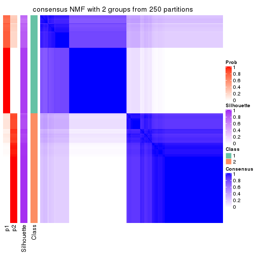</p>

</div>
<div id='tab-ATC-NMF-consensus-heatmap-2'>
<pre><code class="r">consensus_heatmap(res, k = 3)
</code></pre>

<p>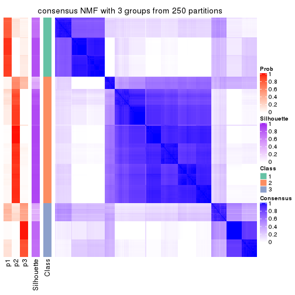</p>

</div>
<div id='tab-ATC-NMF-consensus-heatmap-3'>
<pre><code class="r">consensus_heatmap(res, k = 4)
</code></pre>

<p>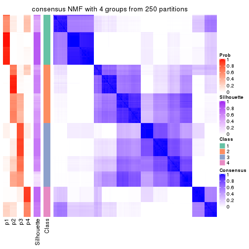</p>

</div>
<div id='tab-ATC-NMF-consensus-heatmap-4'>
<pre><code class="r">consensus_heatmap(res, k = 5)
</code></pre>

<p>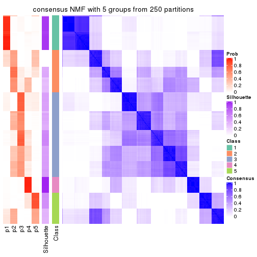</p>

</div>
<div id='tab-ATC-NMF-consensus-heatmap-5'>
<pre><code class="r">consensus_heatmap(res, k = 6)
</code></pre>

<p>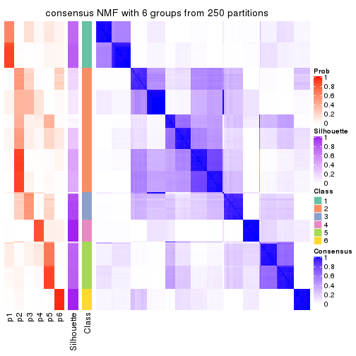</p>

</div>
</div>

Heatmaps for the membership of samples in all partitions to see how consistent they are:


<script>
$( function() {
	$( '#tabs-ATC-NMF-membership-heatmap' ).tabs();
} );
</script>
<div id='tabs-ATC-NMF-membership-heatmap'>
<ul>
<li><a href='#tab-ATC-NMF-membership-heatmap-1'>k = 2</a></li>
<li><a href='#tab-ATC-NMF-membership-heatmap-2'>k = 3</a></li>
<li><a href='#tab-ATC-NMF-membership-heatmap-3'>k = 4</a></li>
<li><a href='#tab-ATC-NMF-membership-heatmap-4'>k = 5</a></li>
<li><a href='#tab-ATC-NMF-membership-heatmap-5'>k = 6</a></li>
</ul>
<div id='tab-ATC-NMF-membership-heatmap-1'>
<pre><code class="r">membership_heatmap(res, k = 2)
</code></pre>

<p>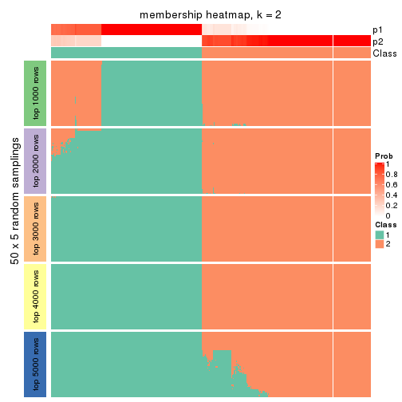</p>

</div>
<div id='tab-ATC-NMF-membership-heatmap-2'>
<pre><code class="r">membership_heatmap(res, k = 3)
</code></pre>

<p>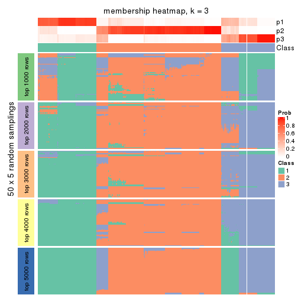</p>

</div>
<div id='tab-ATC-NMF-membership-heatmap-3'>
<pre><code class="r">membership_heatmap(res, k = 4)
</code></pre>

<p>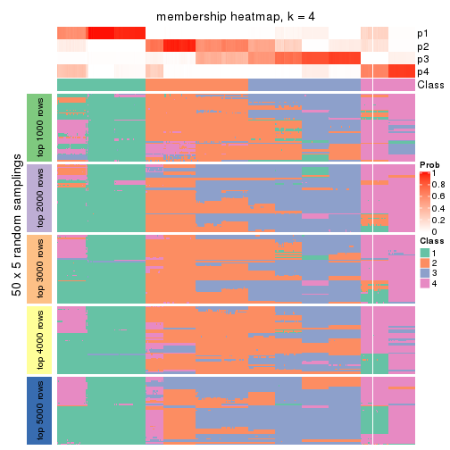</p>

</div>
<div id='tab-ATC-NMF-membership-heatmap-4'>
<pre><code class="r">membership_heatmap(res, k = 5)
</code></pre>

<p>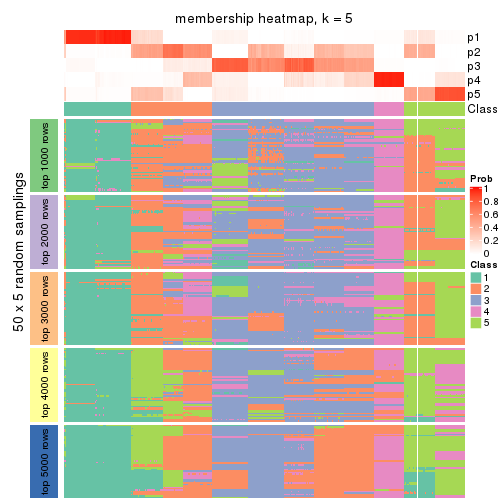</p>

</div>
<div id='tab-ATC-NMF-membership-heatmap-5'>
<pre><code class="r">membership_heatmap(res, k = 6)
</code></pre>

<p>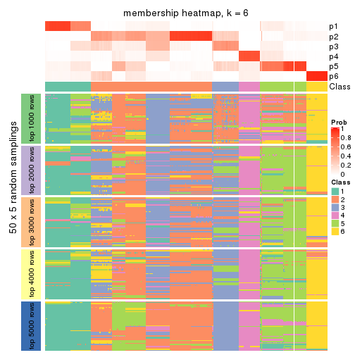</p>

</div>
</div>

As soon as we have had the classes for columns, we can look for signatures
which are significantly different between classes which can be candidate marks
for certain classes. Following are the heatmaps for signatures.


Signature heatmaps where rows are scaled:


<script>
$( function() {
	$( '#tabs-ATC-NMF-get-signatures' ).tabs();
} );
</script>
<div id='tabs-ATC-NMF-get-signatures'>
<ul>
<li><a href='#tab-ATC-NMF-get-signatures-1'>k = 2</a></li>
<li><a href='#tab-ATC-NMF-get-signatures-2'>k = 3</a></li>
<li><a href='#tab-ATC-NMF-get-signatures-3'>k = 4</a></li>
<li><a href='#tab-ATC-NMF-get-signatures-4'>k = 5</a></li>
<li><a href='#tab-ATC-NMF-get-signatures-5'>k = 6</a></li>
</ul>
<div id='tab-ATC-NMF-get-signatures-1'>
<pre><code class="r">get_signatures(res, k = 2)
</code></pre>

<p>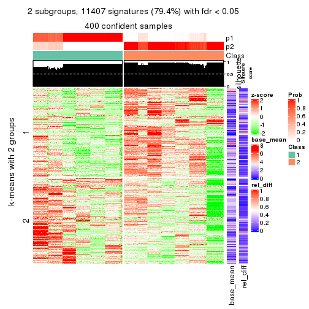</p>

</div>
<div id='tab-ATC-NMF-get-signatures-2'>
<pre><code class="r">get_signatures(res, k = 3)
</code></pre>

<p>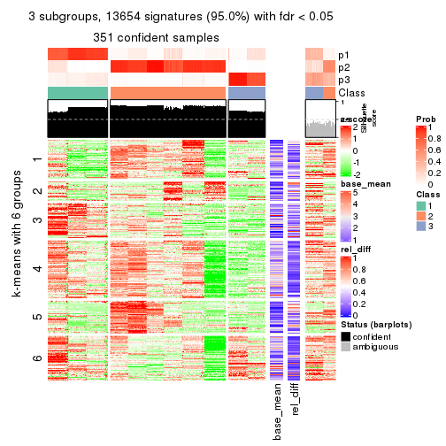</p>

</div>
<div id='tab-ATC-NMF-get-signatures-3'>
<pre><code class="r">get_signatures(res, k = 4)
</code></pre>

<p>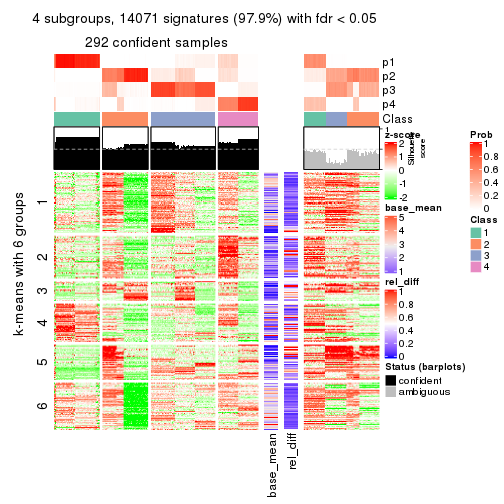</p>

</div>
<div id='tab-ATC-NMF-get-signatures-4'>
<pre><code class="r">get_signatures(res, k = 5)
</code></pre>

<p>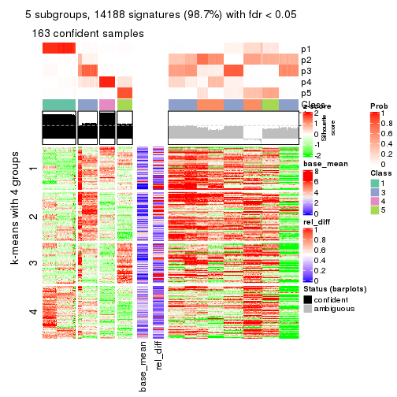</p>

</div>
<div id='tab-ATC-NMF-get-signatures-5'>
<pre><code class="r">get_signatures(res, k = 6)
</code></pre>

<p>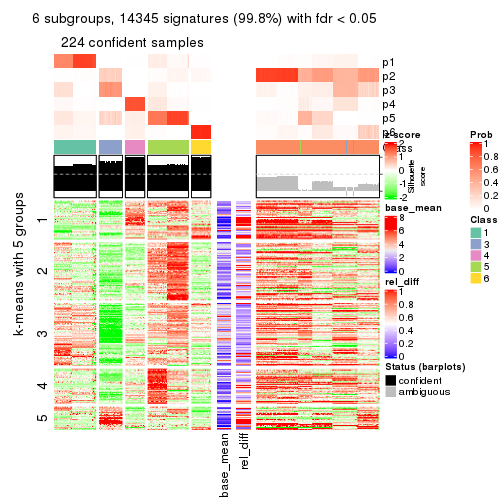</p>

</div>
</div>


Signature heatmaps where rows are not scaled:


<script>
$( function() {
	$( '#tabs-ATC-NMF-get-signatures-no-scale' ).tabs();
} );
</script>
<div id='tabs-ATC-NMF-get-signatures-no-scale'>
<ul>
<li><a href='#tab-ATC-NMF-get-signatures-no-scale-1'>k = 2</a></li>
<li><a href='#tab-ATC-NMF-get-signatures-no-scale-2'>k = 3</a></li>
<li><a href='#tab-ATC-NMF-get-signatures-no-scale-3'>k = 4</a></li>
<li><a href='#tab-ATC-NMF-get-signatures-no-scale-4'>k = 5</a></li>
<li><a href='#tab-ATC-NMF-get-signatures-no-scale-5'>k = 6</a></li>
</ul>
<div id='tab-ATC-NMF-get-signatures-no-scale-1'>
<pre><code class="r">get_signatures(res, k = 2, scale_rows = FALSE)
</code></pre>

<p>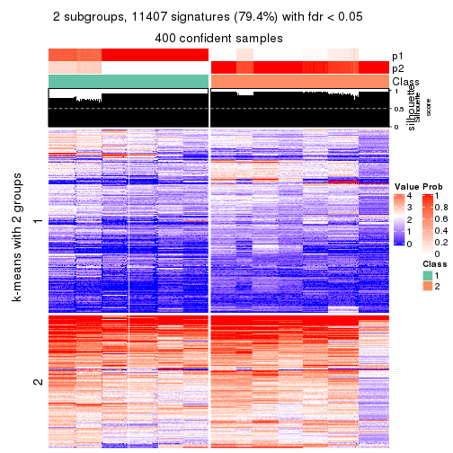</p>

</div>
<div id='tab-ATC-NMF-get-signatures-no-scale-2'>
<pre><code class="r">get_signatures(res, k = 3, scale_rows = FALSE)
</code></pre>

<p>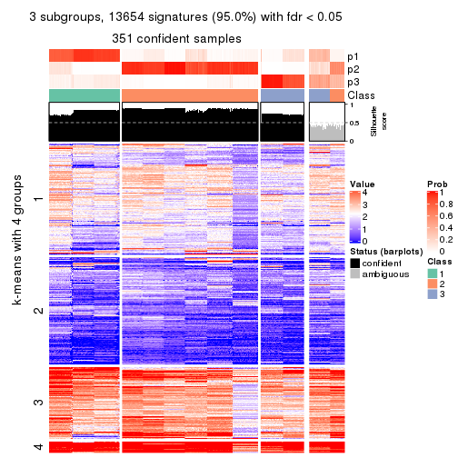</p>

</div>
<div id='tab-ATC-NMF-get-signatures-no-scale-3'>
<pre><code class="r">get_signatures(res, k = 4, scale_rows = FALSE)
</code></pre>

<p>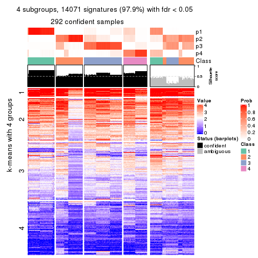</p>

</div>
<div id='tab-ATC-NMF-get-signatures-no-scale-4'>
<pre><code class="r">get_signatures(res, k = 5, scale_rows = FALSE)
</code></pre>

<p>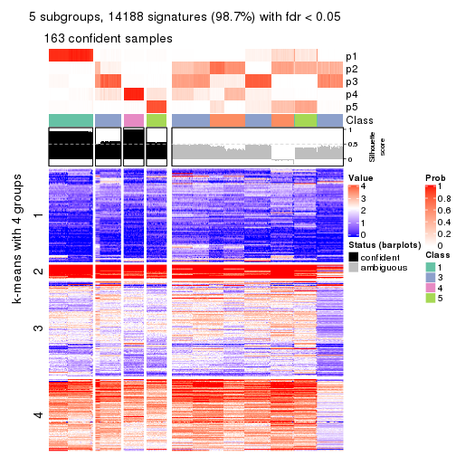</p>

</div>
<div id='tab-ATC-NMF-get-signatures-no-scale-5'>
<pre><code class="r">get_signatures(res, k = 6, scale_rows = FALSE)
</code></pre>

<p>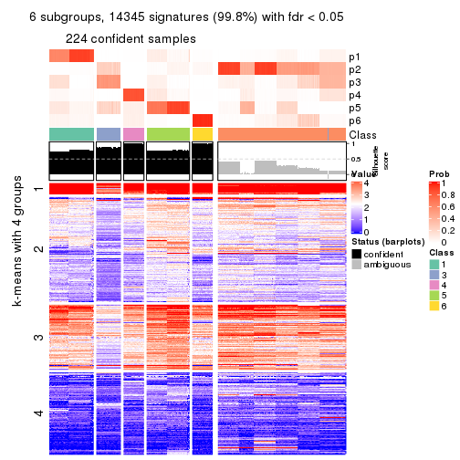</p>

</div>
</div>


Compare the overlap of signatures from different k:

```r
compare_signatures(res)
```

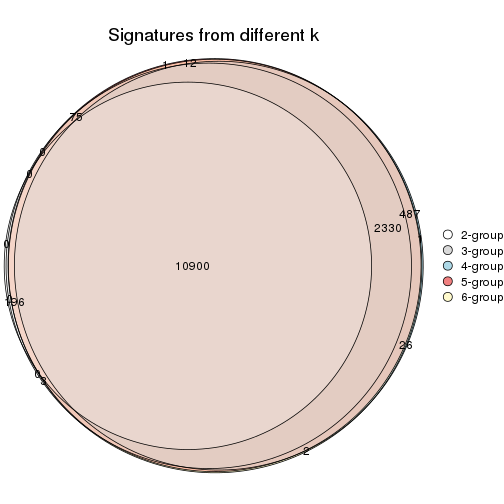

`get_signature()` returns a data frame invisibly. TO get the list of signatures, the function
call should be assigned to a variable explicitly. In following code, if `plot` argument is set
to `FALSE`, no heatmap is plotted while only the differential analysis is performed.

```r
# code only for demonstration
tb = get_signature(res, k = ..., plot = FALSE)
```

An example of the output of `tb` is:

```
#>   which_row         fdr    mean_1    mean_2 scaled_mean_1 scaled_mean_2 km
#> 1        38 0.042760348  8.373488  9.131774    -0.5533452     0.5164555  1
#> 2        40 0.018707592  7.106213  8.469186    -0.6173731     0.5762149  1
#> 3        55 0.019134737 10.221463 11.207825    -0.6159697     0.5749050  1
#> 4        59 0.006059896  5.921854  7.869574    -0.6899429     0.6439467  1
#> 5        60 0.018055526  8.928898 10.211722    -0.6204761     0.5791110  1
#> 6        98 0.009384629 15.714769 14.887706     0.6635654    -0.6193277  2
...
```

The columns in `tb` are:

1. `which_row`: row indices corresponding to the input matrix.
2. `fdr`: FDR for the differential test. 
3. `mean_x`: The mean value in group x.
4. `scaled_mean_x`: The mean value in group x after rows are scaled.
5. `km`: Row groups if k-means clustering is applied to rows.


UMAP plot which shows how samples are separated.


<script>
$( function() {
	$( '#tabs-ATC-NMF-dimension-reduction' ).tabs();
} );
</script>
<div id='tabs-ATC-NMF-dimension-reduction'>
<ul>
<li><a href='#tab-ATC-NMF-dimension-reduction-1'>k = 2</a></li>
<li><a href='#tab-ATC-NMF-dimension-reduction-2'>k = 3</a></li>
<li><a href='#tab-ATC-NMF-dimension-reduction-3'>k = 4</a></li>
<li><a href='#tab-ATC-NMF-dimension-reduction-4'>k = 5</a></li>
<li><a href='#tab-ATC-NMF-dimension-reduction-5'>k = 6</a></li>
</ul>
<div id='tab-ATC-NMF-dimension-reduction-1'>
<pre><code class="r">dimension_reduction(res, k = 2, method = &quot;UMAP&quot;)
</code></pre>

<p>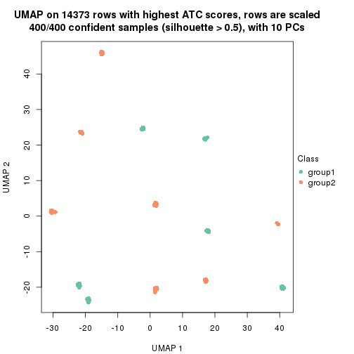</p>

</div>
<div id='tab-ATC-NMF-dimension-reduction-2'>
<pre><code class="r">dimension_reduction(res, k = 3, method = &quot;UMAP&quot;)
</code></pre>

<p>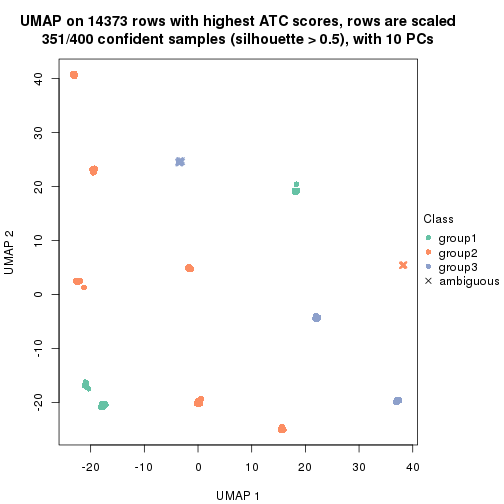</p>

</div>
<div id='tab-ATC-NMF-dimension-reduction-3'>
<pre><code class="r">dimension_reduction(res, k = 4, method = &quot;UMAP&quot;)
</code></pre>

<p>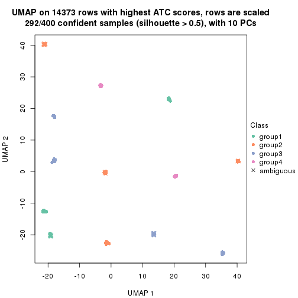</p>

</div>
<div id='tab-ATC-NMF-dimension-reduction-4'>
<pre><code class="r">dimension_reduction(res, k = 5, method = &quot;UMAP&quot;)
</code></pre>

<p>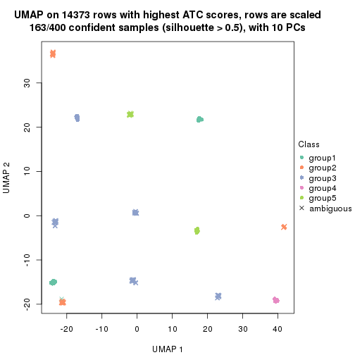</p>

</div>
<div id='tab-ATC-NMF-dimension-reduction-5'>
<pre><code class="r">dimension_reduction(res, k = 6, method = &quot;UMAP&quot;)
</code></pre>

<p>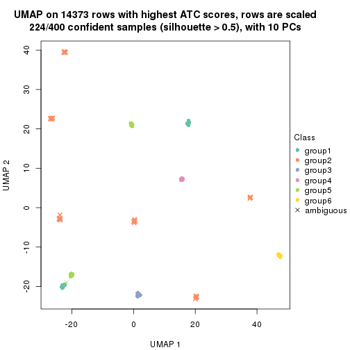</p>

</div>
</div>


Following heatmap shows how subgroups are split when increasing `k`:

```r
collect_classes(res)
```

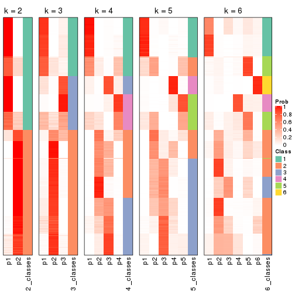


If matrix rows can be associated to genes, consider to use `GO_Enrichment(res,
...)` to perform function enrichment for the signature genes.


 

## Session info


```r
sessionInfo()
```

```
#> R version 3.6.0 (2019-04-26)
#> Platform: x86_64-pc-linux-gnu (64-bit)
#> Running under: CentOS Linux 7 (Core)
#> 
#> Matrix products: default
#> BLAS:   /usr/lib64/libblas.so.3.4.2
#> LAPACK: /usr/lib64/liblapack.so.3.4.2
#> 
#> locale:
#>  [1] LC_CTYPE=en_US.UTF-8       LC_NUMERIC=C               LC_TIME=en_US.UTF-8       
#>  [4] LC_COLLATE=en_US.UTF-8     LC_MONETARY=en_US.UTF-8    LC_MESSAGES=en_US.UTF-8   
#>  [7] LC_PAPER=en_US.UTF-8       LC_NAME=C                  LC_ADDRESS=C              
#> [10] LC_TELEPHONE=C             LC_MEASUREMENT=en_US.UTF-8 LC_IDENTIFICATION=C       
#> 
#> attached base packages:
#>  [1] grid      parallel  stats4    stats     graphics  grDevices utils     datasets  methods  
#> [10] base     
#> 
#> other attached packages:
#>  [1] genefilter_1.66.0           ComplexHeatmap_2.1.1        markdown_1.1               
#>  [4] knitr_1.26                  cola_1.3.2                  SummarizedExperiment_1.14.1
#>  [7] DelayedArray_0.10.0         BiocParallel_1.18.1         matrixStats_0.55.0         
#> [10] Biobase_2.44.0              GenomicRanges_1.36.1        GenomeInfoDb_1.20.0        
#> [13] IRanges_2.18.3              S4Vectors_0.22.1            BiocGenerics_0.30.0        
#> [16] GetoptLong_0.1.7           
#> 
#> loaded via a namespace (and not attached):
#>  [1] bitops_1.0-6           bit64_0.9-7            doParallel_1.0.15      RColorBrewer_1.1-2    
#>  [5] httr_1.4.1             backports_1.1.5        tools_3.6.0            R6_2.4.1              
#>  [9] DBI_1.0.0              lazyeval_0.2.2         colorspace_1.4-1       withr_2.1.2           
#> [13] tidyselect_0.2.5       gridExtra_2.3          bit_1.1-14             compiler_3.6.0        
#> [17] xml2_1.2.2             microbenchmark_1.4-7   pkgmaker_0.28          slam_0.1-46           
#> [21] scales_1.1.0           NMF_0.23.6             stringr_1.4.0          digest_0.6.23         
#> [25] XVector_0.24.0         pkgconfig_2.0.3        bibtex_0.4.2           highr_0.8             
#> [29] rlang_0.4.2            GlobalOptions_0.1.1    RSQLite_2.1.2          impute_1.58.0         
#> [33] shape_1.4.4            mclust_5.4.5           dendextend_1.12.0      dplyr_0.8.3           
#> [37] RCurl_1.95-4.12        magrittr_1.5           GenomeInfoDbData_1.2.1 Matrix_1.2-17         
#> [41] Rcpp_1.0.3             munsell_0.5.0          viridis_0.5.1          lifecycle_0.1.0       
#> [45] stringi_1.4.3          zlibbioc_1.30.0        plyr_1.8.4             blob_1.2.0            
#> [49] crayon_1.3.4           lattice_0.20-38        splines_3.6.0          annotate_1.62.0       
#> [53] circlize_0.4.9         zeallot_0.1.0          pillar_1.4.2           rjson_0.2.20          
#> [57] rngtools_1.4           reshape2_1.4.3         codetools_0.2-16       XML_3.98-1.20         
#> [61] glue_1.3.1             evaluate_0.14          vctrs_0.2.0            png_0.1-7             
#> [65] foreach_1.4.7          polyclip_1.10-0        gtable_0.3.0           purrr_0.3.3           
#> [69] clue_0.3-57            assertthat_0.2.1       ggplot2_3.2.1          xfun_0.11             
#> [73] gridBase_0.4-7         eulerr_6.0.0           xtable_1.8-4           skmeans_0.2-11        
#> [77] survival_2.44-1.1      viridisLite_0.3.0      tibble_2.1.3           iterators_1.0.12      
#> [81] memoise_1.1.0          AnnotationDbi_1.46.1   registry_0.5-1         GTF_0.0.1             
#> [85] cluster_2.1.0          brew_1.0-6
```


